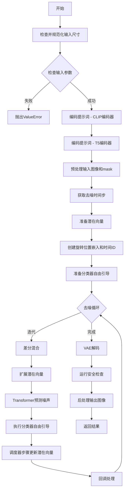
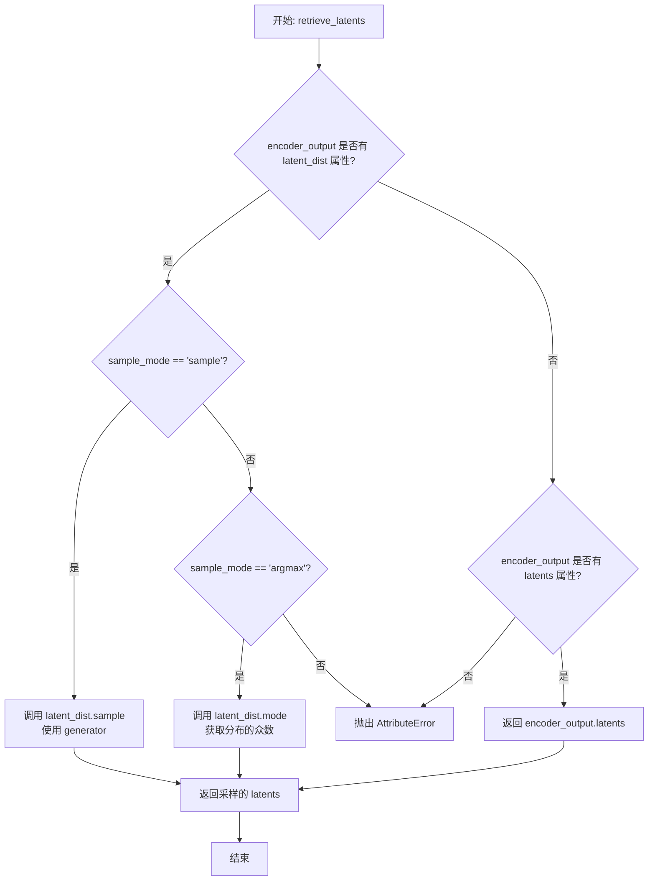
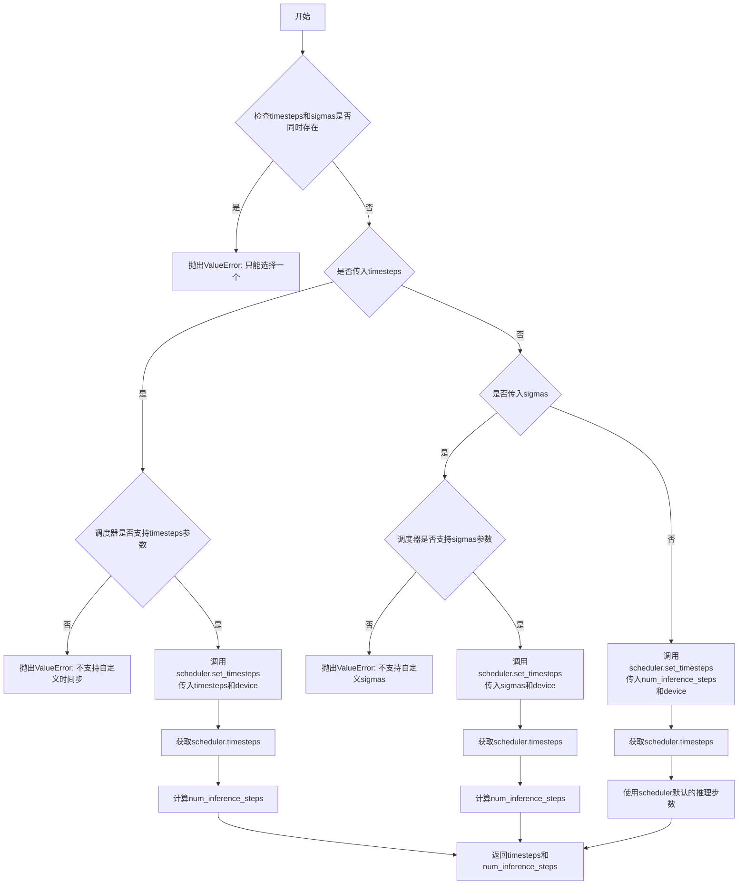
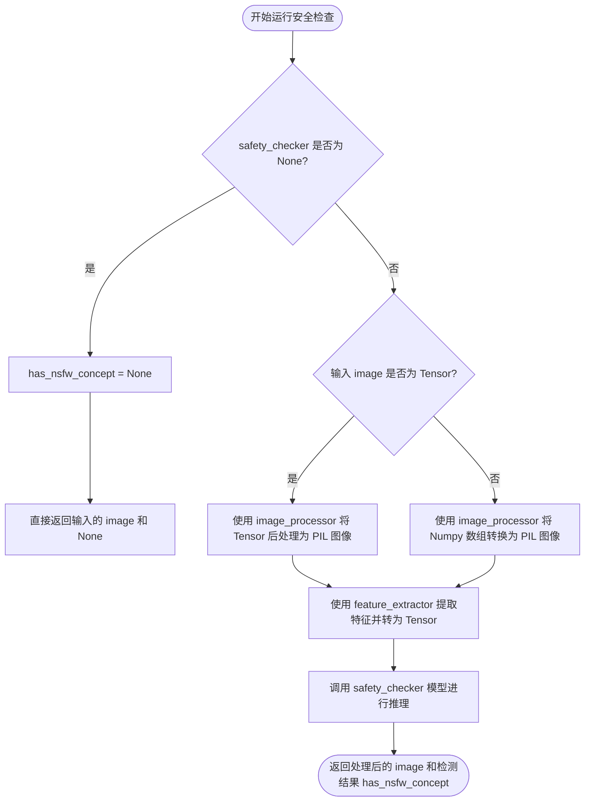
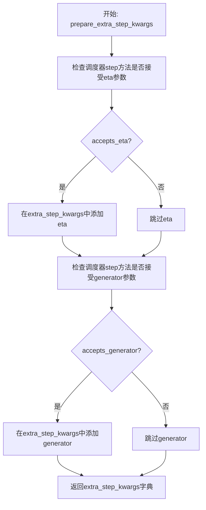
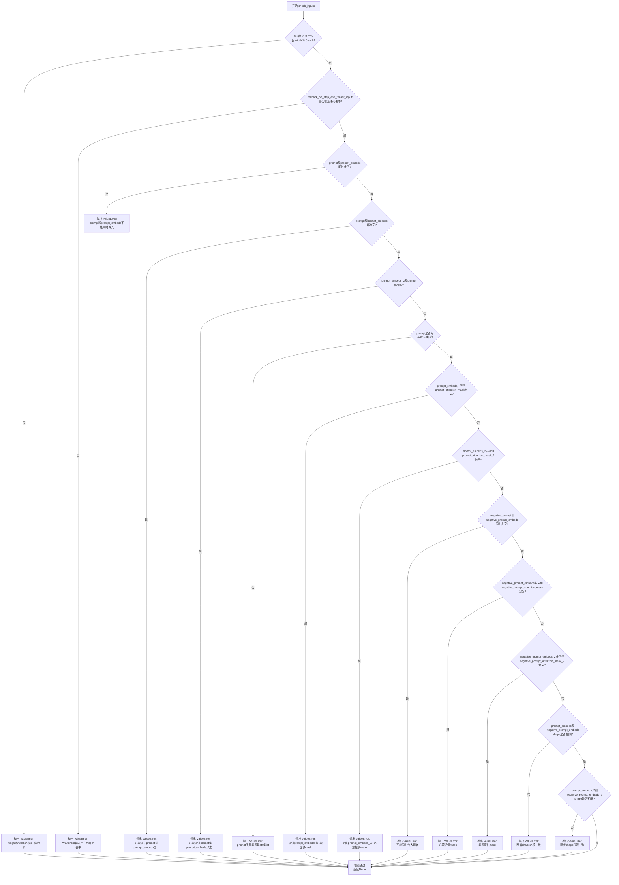
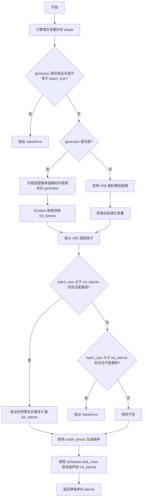
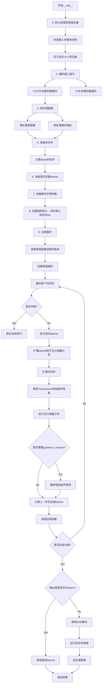

# `diffusers\examples\community\pipeline_hunyuandit_differential_img2img.py` 详细设计文档

腾讯HunyuanDiT差分图像到图像生成管道，使用双文本编码器(CLIP+T5)进行文本编码，通过差分去噪过程结合mask实现图像局部重生成，支持多种分辨率和分辨率分箱。

## 整体流程



## 类结构

```
DiffusionPipeline (抽象基类)
└── HunyuanDiTDifferentialImg2ImgPipeline
    ├── 文本编码模块 (text_encoder, tokenizer)
    ├── T5编码模块 (text_encoder_2, tokenizer_2)
    ├── 图像处理模块 (vae, image_processor, mask_processor)
    ├── 变换器模块 (transformer)
    ├── 调度器 (scheduler)
    └── 安全检查 (safety_checker, feature_extractor)
```

## 全局变量及字段


### `STANDARD_RATIO`
    
标准宽高比数组，包含1:1、4:3、3:4、16:9、9:16等比例

类型：`numpy.ndarray`
    


### `STANDARD_SHAPE`
    
标准图像尺寸列表，按宽高比分组存储

类型：`list`
    


### `STANDARD_AREA`
    
标准面积数组，用于计算最接近的目标尺寸

类型：`list`
    


### `SUPPORTED_SHAPE`
    
支持的图像尺寸元组列表，用于分辨率分箱

类型：`list[tuple]`
    


### `XLA_AVAILABLE`
    
标记torch_xla是否可用，用于TPU加速

类型：`bool`
    


### `logger`
    
模块级日志记录器实例

类型：`logging.Logger`
    


### `EXAMPLE_DOC_STRING`
    
示例文档字符串，包含pipeline使用示例代码

类型：`str`
    


### `HunyuanDiTDifferentialImg2ImgPipeline.vae`
    
变分自编码器模型，用于图像与潜在表示的编码和解码

类型：`AutoencoderKL`
    


### `HunyuanDiTDifferentialImg2ImgPipeline.text_encoder`
    
双语CLIP文本编码器，用于生成文本嵌入

类型：`BertModel`
    


### `HunyuanDiTDifferentialImg2ImgPipeline.tokenizer`
    
BERT分词器，用于对文本进行分词

类型：`BertTokenizer`
    


### `HunyuanDiTDifferentialImg2ImgPipeline.transformer`
    
腾讯HunyuanDiT扩散变换器模型

类型：`HunyuanDiT2DModel`
    


### `HunyuanDiTDifferentialImg2ImgPipeline.scheduler`
    
DDPM调度器，用于去噪过程的噪声调度

类型：`DDPMScheduler`
    


### `HunyuanDiTDifferentialImg2ImgPipeline.text_encoder_2`
    
mT5文本编码器，用于生成文本嵌入

类型：`T5EncoderModel`
    


### `HunyuanDiTDifferentialImg2ImgPipeline.tokenizer_2`
    
T5分词器，用于对文本进行分词

类型：`T5Tokenizer`
    


### `HunyuanDiTDifferentialImg2ImgPipeline.safety_checker`
    
安全检查器，用于检测NSFW内容

类型：`StableDiffusionSafetyChecker`
    


### `HunyuanDiTDifferentialImg2ImgPipeline.feature_extractor`
    
CLIP图像处理器，用于安全检查

类型：`CLIPImageProcessor`
    


### `HunyuanDiTDifferentialImg2ImgPipeline.vae_scale_factor`
    
VAE缩放因子，用于调整潜在空间维度

类型：`int`
    


### `HunyuanDiTDifferentialImg2ImgPipeline.image_processor`
    
图像预处理和后处理器

类型：`VaeImageProcessor`
    


### `HunyuanDiTDifferentialImg2ImgPipeline.mask_processor`
    
掩码图像处理器，用于差分图像处理

类型：`VaeImageProcessor`
    


### `HunyuanDiTDifferentialImg2ImgPipeline.default_sample_size`
    
默认采样尺寸，用于确定输出图像大小

类型：`int`
    
    

## 全局函数及方法


### `map_to_standard_shapes`

该函数用于将任意尺寸的图像映射到预定义的标准尺寸。通过计算目标图像的宽高比，在预定义的标准宽高比列表中找到最接近的选项，然后在对应的标准形状列表中根据面积差异选择最匹配的尺寸。

参数：

- `target_width`：`int`，目标图像的宽度
- `target_height`：`int`，目标图像的高度

返回值：`Tuple[int, int]`，返回最接近的标准形状的宽度和高度

#### 流程图

```mermaid
flowchart TD
    A[开始] --> B[计算目标宽高比 target_ratio = target_width / target_height]
    B --> C[在STANDARD_RATIO中找最接近的索引 closest_ratio_idx]
    C --> D[计算目标面积 target_area = target_width * target_height]
    D --> E[在对应比例的标准面积列表中找最接近的索引 closest_area_idx]
    E --> F[获取标准形状 STANDARD_SHAPE[closest_ratio_idx][closest_area_idx]]
    F --> G[返回宽度 width, 高度 height]
    G --> H[结束]
```

#### 带注释源码

```python
def map_to_standard_shapes(target_width, target_height):
    """
    将任意尺寸映射到预定义的标准尺寸
    
    该函数通过以下步骤找到最匹配的标准形状：
    1. 计算目标宽高比
    2. 在预定义的标准宽高比列表中找到最接近的选项
    3. 在对应比例的标准形状中根据面积差异选择最匹配的尺寸
    
    Args:
        target_width: 目标图像的宽度
        target_height: 目标图像的高度
        
    Returns:
        Tuple[int, int]: 最接近的标准形状的宽度和高度
    """
    # 计算目标图像的宽高比
    target_ratio = target_width / target_height
    
    # 在标准宽高比列表中找到与目标宽高比最接近的索引
    # 使用绝对差值来衡量接近程度
    closest_ratio_idx = np.argmin(np.abs(STANDARD_RATIO - target_ratio))
    
    # 计算目标图像的面积
    target_area = target_width * target_height
    
    # 在对应比例的标准面积列表中找到与目标面积最接近的索引
    closest_area_idx = np.argmin(np.abs(STANDARD_AREA[closest_ratio_idx] - target_area))
    
    # 从预定义的标准形状中获取最匹配的宽度和高度
    width, height = STANDARD_SHAPE[closest_ratio_idx][closest_area_idx]
    
    return width, height
```


### `get_resize_crop_region_for_grid`

该函数用于在图像处理流程中，根据源图像的宽高比调整图像尺寸并计算居中裁剪区域。它首先将图像调整到目标尺寸，然后返回使图像居中的裁剪坐标（左上角和右下角），常用于将非标准尺寸的图像适配到模型所需的固定尺寸网格。

参数：

- `src`：`Tuple[int, int]`，源图像尺寸，格式为 (高度, 宽度)
- `tgt_size`：`int`，目标尺寸（正方形边长）

返回值：`Tuple[Tuple[int, int], Tuple[int, int]]`，裁剪区域坐标，格式为 ((裁剪顶部, 裁剪左侧), (裁剪底部, 裁剪右侧))

#### 流程图

```mermaid
flowchart TD
    A[输入: src=(h,w), tgt_size] --> B{计算宽高比 r = h/w}
    B --> C{r > 1?}
    C -->|是| D[resize_height = tgt_size<br/>resize_width = round(tgt_size / h * w)]
    C -->|否| E[resize_width = tgt_size<br/>resize_height = round(tgt_size / w * h)]
    D --> F[计算裁剪偏移量:<br/>crop_top = round((tgt_size - resize_height) / 2)<br/>crop_left = round((tgt_size - resize_width) / 2)]
    E --> F
    F --> G[返回裁剪区域:<br/>((crop_top, crop_left),<br/>(crop_top + resize_height,<br/>crop_left + resize_width))]
```

#### 带注释源码

```python
def get_resize_crop_region_for_grid(src, tgt_size):
    """
    根据源图像尺寸和目标尺寸，计算居中裁剪的区域坐标。
    
    该函数用于图像预处理流程，将任意尺寸的图像调整为目标尺寸，
    并返回使图像居中的裁剪区域坐标。
    
    Args:
        src: 源图像尺寸，格式为 (高度, 宽度) 的元组
        tgt_size: 目标尺寸（正方形边长）
    
    Returns:
        裁剪区域坐标元组：
        - 第一个元素为裁剪区域左上角坐标 (crop_top, crop_left)
        - 第二个元素为裁剪区域右下角坐标 (crop_top + resize_height, crop_left + resize_width)
    """
    # 目标尺寸赋值给高度和宽度变量
    th = tw = tgt_size
    # 解包源图像尺寸
    h, w = src

    # 计算源图像的宽高比
    r = h / w

    # 根据宽高比决定调整大小的策略
    # 如果图像高度大于宽度（竖向图像）
    if r > 1:
        # 高度设为目标尺寸，宽度按比例缩放
        resize_height = th
        resize_width = int(round(th / h * w))
    else:
        # 宽度设为目标尺寸，高度按比例缩放
        # 如果图像宽度大于高度（横向图像）或正方形
        resize_width = tw
        resize_height = int(round(tw / w * h))

    # 计算居中裁剪的偏移量
    # 确保裁剪区域在目标尺寸内居中
    crop_top = int(round((th - resize_height) / 2.0))
    crop_left = int(round((tw - resize_width) / 2.0))

    # 返回裁剪区域的左上角和右下角坐标
    # 左上角: (crop_top, crop_left)
    # 右下角: (crop_top + resize_height, crop_left + resize_width)
    return (crop_top, crop_left), (crop_top + resize_height, crop_left + resize_width)
```


### `rescale_noise_cfg`

该函数用于根据 `guidance_rescale` 参数对噪声预测配置进行重新缩放，基于论文 "Common Diffusion Noise Schedules and Sample Steps are Flawed" 的研究发现，通过调整噪声的标准差来避免过度曝光的图像，并与原始结果混合以防止图像看起来过于平淡。

参数：

- `noise_cfg`：`torch.Tensor`，噪声预测配置（Classifier-Free Guidance 下的噪声预测）
- `noise_pred_text`：`torch.Tensor`，文本条件的噪声预测（用于计算标准差）
- `guidance_rescale`：`float`，重缩放因子，默认为 0.0，用于混合原始噪声预测和重缩放后的噪声预测

返回值：`torch.Tensor`，重缩放后的噪声预测配置

#### 流程图

```mermaid
flowchart TD
    A[开始] --> B[计算 noise_pred_text 的标准差 std_text]
    B --> C[计算 noise_cfg 的标准差 std_cfg]
    C --> D[计算重缩放后的噪声预测: noise_pred_rescaled = noise_cfg * std_text / std_cfg]
    D --> E[计算混合系数: guidance_rescale * noise_pred_rescaled + (1 - guidance_rescale) * noise_cfg]
    E --> F[返回重缩放后的 noise_cfg]
```

#### 带注释源码

```python
# Copied from diffusers.pipelines.stable_diffusion.pipeline_stable_diffusion.rescale_noise_cfg
def rescale_noise_cfg(noise_cfg, noise_pred_text, guidance_rescale=0.0):
    """
    Rescale `noise_cfg` according to `guidance_rescale`. Based on findings of [Common Diffusion Noise Schedules and
    Sample Steps are Flawed](https://huggingface.co/papers/2305.08891). See Section 3.4
    """
    # 计算文本条件噪声预测在所有空间维度上的标准差（保留批次维度）
    std_text = noise_pred_text.std(dim=list(range(1, noise_pred_text.ndim)), keepdim=True)
    # 计算噪声配置在所有空间维度上的标准差（保留批次维度）
    std_cfg = noise_cfg.std(dim=list(range(1, noise_cfg.ndim)), keepdim=True)
    
    # 根据文本条件噪声的标准差对噪声配置进行重缩放（修复过度曝光问题）
    noise_pred_rescaled = noise_cfg * (std_text / std_cfg)
    
    # 通过 guidance_rescale 因子将重缩放后的结果与原始结果混合，以避免图像看起来"平淡"
    # 当 guidance_rescale=0 时，保持原始 noise_cfg 不变
    # 当 guidance_rescale=1 时，完全使用重缩放后的结果
    noise_cfg = guidance_rescale * noise_pred_rescaled + (1 - guidance_rescale) * noise_cfg
    return noise_cfg
```


### `retrieve_latents`

该函数用于从 VAE 编码器输出中提取潜在表示（latents），支持多种采样模式（sample/argmax）或直接返回预存的 latents 属性。

参数：

- `encoder_output`：`torch.Tensor`，VAE 编码器的输出对象，通常包含 `latent_dist` 或 `latents` 属性
- `generator`：`torch.Generator | None`，可选的随机数生成器，用于确保采样过程的可重复性
- `sample_mode`：`str`，采样模式，默认为 "sample"；支持 "sample"（从分布中采样）或 "argmax"（取分布的均值/众数）

返回值：`torch.Tensor`，提取出的潜在表示张量

#### 流程图



#### 带注释源码

```python
# Copied from diffusers.pipelines.stable_diffusion.pipeline_stable_diffusion_img2img.retrieve_latents
def retrieve_latents(
    encoder_output: torch.Tensor,
    generator: torch.Generator | None = None,
    sample_mode: str = "sample",
):
    """
    从 VAE 编码器输出中提取潜在表示。
    
    参数:
        encoder_output: 编码器输出对象，通常来自 VAE.encode()
        generator: 可选的随机数生成器，用于采样时的确定性生成
        sample_mode: 采样模式，"sample" 从分布采样，"argmax" 取分布模式
    
    返回:
        潜在表示张量
    
    异常:
        AttributeError: 当无法从 encoder_output 中访问 latents 时抛出
    """
    # 检查是否存在 latent_dist 属性（VAE 的概率潜在分布）
    if hasattr(encoder_output, "latent_dist") and sample_mode == "sample":
        # 使用随机采样模式，从潜在分布中采样
        return encoder_output.latent_dist.sample(generator)
    elif hasattr(encoder_output, "latent_dist") and sample_mode == "argmax":
        # 使用确定性模式，取潜在分布的众数（均值）
        return encoder_output.latent_dist.mode()
    elif hasattr(encoder_output, "latents"):
        # 直接返回预存的 latents 属性
        return encoder_output.latents
    else:
        # 无法识别有效的潜在表示格式
        raise AttributeError("Could not access latents of provided encoder_output")
```


### `retrieve_timesteps`

该函数是扩散模型 pipelines 中的通用时间步获取工具函数，负责调用调度器的 `set_timesteps` 方法并从中获取时间步序列。它支持三种模式：使用 `num_inference_steps` 自动计算时间步、使用自定义 `timesteps` 列表、或使用自定义 `sigmas` 列表。该函数还负责验证调度器是否支持相应的参数，并处理设备迁移。

参数：

- `scheduler`：`SchedulerMixin`，调度器对象，用于获取时间步
- `num_inference_steps`：`Optional[int]`，生成样本时使用的扩散步数，如果使用此参数，`timesteps` 必须为 `None`
- `device`：`Optional[Union[str, torch.device]]`，时间步要移动到的设备，如果为 `None`，则不移动
- `timesteps`：`Optional[List[int]]`，用于覆盖调度器时间步间隔策略的自定义时间步，如果传递 `timesteps`，则 `num_inference_steps` 和 `sigmas` 必须为 `None`
- `sigmas`：`Optional[List[float]]`，用于覆盖调度器时间步间隔策略的自定义 sigmas，如果传递 `sigmas`，则 `num_inference_steps` 和 `timesteps` 必须为 `None`
- `**kwargs`：其他关键字参数，将传递给 `scheduler.set_timesteps`

返回值：`Tuple[torch.Tensor, int]`，元组包含调度器的时间步序列和推理步数

#### 流程图



#### 带注释源码

```
def retrieve_timesteps(
    scheduler,                              # 调度器对象
    num_inference_steps: Optional[int] = None,  # 推理步数
    device: Optional[Union[str, torch.device]] = None,  # 目标设备
    timesteps: Optional[List[int]] = None,    # 自定义时间步列表
    sigmas: Optional[List[float]] = None,    # 自定义sigmas列表
    **kwargs,                                # 其他关键字参数
):
    """
    调用调度器的 set_timesteps 方法并在调用后从调度器获取时间步。
    处理自定义时间步。任何 kwargs 将被传递给 scheduler.set_timesteps。

    参数:
        scheduler: 调度器对象
        num_inference_steps: 扩散推理步数，若使用则 timesteps 必须为 None
        device: 时间步要移动到的设备，None 表示不移动
        timesteps: 自定义时间步列表，用于覆盖调度器的默认策略
        sigmas: 自定义 sigmas 列表，用于覆盖调度器的默认策略

    返回:
        Tuple[torch.Tensor, int]: 时间步序列和推理步数
    """
    # 检查是否同时传入了 timesteps 和 sigmas，只能二选一
    if timesteps is not None and sigmas is not None:
        raise ValueError("Only one of `timesteps` or `sigmas` can be passed. Please choose one to set custom values")
    
    # 模式1: 使用自定义 timesteps
    if timesteps is not None:
        # 检查调度器的 set_timesteps 方法是否支持 timesteps 参数
        accepts_timesteps = "timesteps" in set(inspect.signature(scheduler.set_timesteps).parameters.keys())
        if not accepts_timesteps:
            raise ValueError(
                f"The current scheduler class {scheduler.__class__}'s `set_timesteps` does not support custom"
                f" timestep schedules. Please check whether you are using the correct scheduler."
            )
        # 调用调度器的 set_timesteps 方法设置自定义时间步
        scheduler.set_timesteps(timesteps=timesteps, device=device, **kwargs)
        # 从调度器获取设置后的时间步
        timesteps = scheduler.timesteps
        # 计算推理步数
        num_inference_steps = len(timesteps)
    
    # 模式2: 使用自定义 sigmas
    elif sigmas is not None:
        # 检查调度器的 set_timesteps 方法是否支持 sigmas 参数
        accept_sigmas = "sigmas" in set(inspect.signature(scheduler.set_timesteps).parameters.keys())
        if not accept_sigmas:
            raise ValueError(
                f"The current scheduler class {scheduler.__class__}'s `set_timesteps` does not support custom"
                f" sigmas schedules. Please check whether you are using the correct scheduler."
            )
        # 调用调度器的 set_timesteps 方法设置自定义 sigmas
        scheduler.set_timesteps(sigmas=sigmas, device=device, **kwargs)
        # 从调度器获取设置后的时间步
        timesteps = scheduler.timesteps
        # 计算推理步数
        num_inference_steps = len(timesteps)
    
    # 模式3: 使用 num_inference_steps 自动计算时间步
    else:
        scheduler.set_timesteps(num_inference_steps, device=device, **kwargs)
        timesteps = scheduler.timesteps
    
    # 返回时间步序列和推理步数
    return timesteps, num_inference_steps
```


### HunyuanDiTDifferentialImg2ImgPipeline.encode_prompt

该方法负责将文本提示（prompt）编码为文本编码器的隐藏状态（embedding），支持双文本编码器（CLIP和T5）架构，并处理分类器自由引导（Classifier-Free Guidance）所需的正向和负向嵌入。

参数：

- `prompt`：`str` 或 `List[str]`，要编码的文本提示
- `device`：`torch.device`，torch设备，用于将计算结果移到指定设备
- `dtype`：`torch.dtype`，torch数据类型，用于指定嵌入的精度
- `num_images_per_prompt`：`int`，每个提示需要生成的图像数量，用于复制嵌入
- `do_classifier_free_guidance`：`bool`，是否启用分类器自由引导
- `negative_prompt`：`str | None`，负面提示，用于指导不生成的内容
- `prompt_embeds`：`Optional[torch.Tensor]`，预生成的文本嵌入，如果提供则直接使用
- `negative_prompt_embeds`：`Optional[torch.Tensor]`，预生成的负面文本嵌入
- `prompt_attention_mask`：`Optional[torch.Tensor]`，提示的注意力掩码
- `negative_prompt_attention_mask`：`Optional[torch.Tensor]`，负面提示的注意力掩码
- `max_sequence_length`：`Optional[int]`，提示的最大序列长度
- `text_encoder_index`：`int`，文本编码器索引，0表示CLIP，1表示T5

返回值：`Tuple[torch.Tensor, torch.Tensor, torch.Tensor, torch.Tensor]`，返回包含提示嵌入、负向提示嵌入、提示注意力掩码和负向注意力掩码的四元组

#### 流程图

```mermaid
flowchart TD
    A[开始 encode_prompt] --> B{检查 dtype}
    B -->|dtype is None| C[根据 text_encoder_2 或 transformer 确定 dtype]
    B -->|dtype exists| D[继续]
    C --> D
    D --> E{检查 device}
    E -->|device is None| F[使用 _execution_device]
    E -->|device exists| G[继续]
    F --> G
    G --> H[根据 text_encoder_index 选择 tokenizer 和 text_encoder]
    H --> I{确定 max_length}
    I -->|max_sequence_length is None| J[text_encoder_index==0时 max_length=77 否则256]
    I -->|max_sequence_length 存在| K[使用 max_sequence_length]
    J --> L
    K --> L
    L --> M{确定 batch_size}
    M -->|prompt 是 string| N[batch_size = 1]
    M -->|prompt 是 list| O[batch_size = len(prompt)]
    M -->|prompt_embeds 已提供| P[batch_size = prompt_embeds.shape[0]]
    N --> Q
    O --> Q
    P --> Q
    Q --> R{prompt_embeds 是否为 None}
    R -->|是| S[使用 tokenizer 编码 prompt]
    R -->|否| T[直接使用 prompt_embeds]
    S --> U[检查截断并警告]
    U --> V[使用 text_encoder 获取嵌入]
    V --> W[重复嵌入 num_images_per_prompt 次]
    W --> X
    T --> X
    X --> Y{do_classifier_free_guidance 且 negative_prompt_embeds is None}
    Y -->|是| Z[处理负向提示]
    Y -->|否| AA[直接返回结果]
    Z --> AB{处理 negative_prompt}
    AB -->|None| AC[使用空字符串]
    AB -->|string| AD[转换为列表]
    AB -->|list| AE[直接使用]
    AC --> AF
    AD --> AF
    AE --> AF
    AF --> AG[tokenizer 编码负向提示]
    AG --> AH[text_encoder 获取负向嵌入]
    AH --> AI[重复负向嵌入]
    AI --> AJ
    AA --> AJ[返回 tuple]
    AJ --> AK[结束]
```

#### 带注释源码

```python
def encode_prompt(
    self,
    prompt: str,
    device: torch.device = None,
    dtype: torch.dtype = None,
    num_images_per_prompt: int = 1,
    do_classifier_free_guidance: bool = True,
    negative_prompt: str | None = None,
    prompt_embeds: Optional[torch.Tensor] = None,
    negative_prompt_embeds: Optional[torch.Tensor] = None,
    prompt_attention_mask: Optional[torch.Tensor] = None,
    negative_prompt_attention_mask: Optional[torch.Tensor] = None,
    max_sequence_length: Optional[int] = None,
    text_encoder_index: int = 0,
):
    r"""
    Encodes the prompt into text encoder hidden states.

    Args:
        prompt (`str` or `List[str]`, *optional*):
            prompt to be encoded
        device: (`torch.device`):
            torch device
        dtype (`torch.dtype`):
            torch dtype
        num_images_per_prompt (`int`):
            number of images that should be generated per prompt
        do_classifier_free_guidance (`bool`):
            whether to use classifier free guidance or not
        negative_prompt (`str` or `List[str]`, *optional*):
            The prompt or prompts not to guide the image generation. If not defined, one has to pass
            `negative_prompt_embeds` instead. Ignored when not using guidance (i.e., ignored if `guidance_scale` is
            less than `1`).
        prompt_embeds (`torch.Tensor`, *optional*):
            Pre-generated text embeddings. Can be used to easily tweak text inputs, *e.g.* prompt weighting. If not
            provided, text embeddings will be generated from `prompt` input argument.
        negative_prompt_embeds (`torch.Tensor`, *optional*):
            Pre-generated negative text embeddings. Can be used to easily tweak text inputs, *e.g.* prompt
            weighting. If not provided, negative_prompt_embeds will be generated from `negative_prompt` input
            argument.
        prompt_attention_mask (`torch.Tensor`, *optional*):
            Attention mask for the prompt. Required when `prompt_embeds` is passed directly.
        negative_prompt_attention_mask (`torch.Tensor`, *optional*):
            Attention mask for the negative prompt. Required when `negative_prompt_embeds` is passed directly.
        max_sequence_length (`int`, *optional*): maximum sequence length to use for the prompt.
        text_encoder_index (`int`, *optional*):
            Index of the text encoder to use. `0` for clip and `1` for T5.
    """
    # 如果未指定 dtype，则根据 text_encoder_2 或 transformer 的数据类型确定
    if dtype is None:
        if self.text_encoder_2 is not None:
            dtype = self.text_encoder_2.dtype
        elif self.transformer is not None:
            dtype = self.transformer.dtype
        else:
            dtype = None

    # 如果未指定 device，则使用执行设备
    if device is None:
        device = self._execution_device

    # 获取所有 tokenizer 和 text_encoder
    tokenizers = [self.tokenizer, self.tokenizer_2]
    text_encoders = [self.text_encoder, self.text_encoder_2]

    # 根据索引选择对应的 tokenizer 和 text_encoder
    tokenizer = tokenizers[text_encoder_index]
    text_encoder = text_encoders[text_encoder_index]

    # 确定最大序列长度
    if max_sequence_length is None:
        if text_encoder_index == 0:
            max_length = 77  # CLIP 的默认最大长度
        if text_encoder_index == 1:
            max_length = 256  # T5 的默认最大长度
    else:
        max_length = max_sequence_length

    # 确定批次大小
    if prompt is not None and isinstance(prompt, str):
        batch_size = 1
    elif prompt is not None and isinstance(prompt, list):
        batch_size = len(prompt)
    else:
        batch_size = prompt_embeds.shape[0]

    # 如果未提供 prompt_embeds，则从 prompt 生成
    if prompt_embeds is None:
        # 使用 tokenizer 编码 prompt
        text_inputs = tokenizer(
            prompt,
            padding="max_length",
            max_length=max_length,
            truncation=True,
            return_attention_mask=True,
            return_tensors="pt",
        )
        text_input_ids = text_inputs.input_ids
        # 获取未截断的 IDs 以检查是否发生了截断
        untruncated_ids = tokenizer(prompt, padding="longest", return_tensors="pt").input_ids

        # 检查并警告截断
        if untruncated_ids.shape[-1] >= text_input_ids.shape[-1] and not torch.equal(
            text_input_ids, untruncated_ids
        ):
            removed_text = tokenizer.batch_decode(untruncated_ids[:, tokenizer.model_max_length - 1 : -1])
            logger.warning(
                "The following part of your input was truncated because CLIP can only handle sequences up to"
                f" {tokenizer.model_max_length} tokens: {removed_text}"
            )

        # 获取注意力掩码并移至 device
        prompt_attention_mask = text_inputs.attention_mask.to(device)
        # 使用 text_encoder 获取嵌入
        prompt_embeds = text_encoder(
            text_input_ids.to(device),
            attention_mask=prompt_attention_mask,
        )
        prompt_embeds = prompt_embeds[0]
        # 为每个提示生成的图像数量重复注意力掩码
        prompt_attention_mask = prompt_attention_mask.repeat(num_images_per_prompt, 1)

    # 将 prompt_embeds 移至指定设备和数据类型
    prompt_embeds = prompt_embeds.to(dtype=dtype, device=device)

    bs_embed, seq_len, _ = prompt_embeds.shape
    # 为每个提示的每个生成复制文本嵌入
    prompt_embeds = prompt_embeds.repeat(1, num_images_per_prompt, 1)
    prompt_embeds = prompt_embeds.view(bs_embed * num_images_per_prompt, seq_len, -1)

    # 如果启用分类器自由引导且未提供负向嵌入，则生成负向嵌入
    if do_classifier_free_guidance and negative_prompt_embeds is None:
        uncond_tokens: List[str]
        if negative_prompt is None:
            uncond_tokens = [""] * batch_size
        elif prompt is not None and type(prompt) is not type(negative_prompt):
            raise TypeError(
                f"`negative_prompt` should be the same type to `prompt`, but got {type(negative_prompt)} !="
                f" {type(prompt)}."
            )
        elif isinstance(negative_prompt, str):
            uncond_tokens = [negative_prompt]
        elif batch_size != len(negative_prompt):
            raise ValueError(
                f"`negative_prompt`: {negative_prompt} has batch size {len(negative_prompt)}, but `prompt`:"
                f" {prompt} has batch size {batch_size}. Please make sure that passed `negative_prompt` matches"
                " the batch size of `prompt`."
            )
        else:
            uncond_tokens = negative_prompt

        max_length = prompt_embeds.shape[1]
        # 使用 tokenizer 编码负向提示
        uncond_input = tokenizer(
            uncond_tokens,
            padding="max_length",
            max_length=max_length,
            truncation=True,
            return_tensors="pt",
        )

        # 获取负向提示的注意力掩码
        negative_prompt_attention_mask = uncond_input.attention_mask.to(device)
        # 使用 text_encoder 获取负向嵌入
        negative_prompt_embeds = text_encoder(
            uncond_input.input_ids.to(device),
            attention_mask=negative_prompt_attention_mask,
        )
        negative_prompt_embeds = negative_prompt_embeds[0]
        # 重复注意力掩码
        negative_prompt_attention_mask = negative_prompt_attention_mask.repeat(num_images_per_prompt, 1)

    # 如果启用分类器自由引导
    if do_classifier_free_guidance:
        # 复制无条件嵌入以匹配每个提示的生成数量
        seq_len = negative_prompt_embeds.shape[1]

        negative_prompt_embeds = negative_prompt_embeds.to(dtype=dtype, device=device)

        negative_prompt_embeds = negative_prompt_embeds.repeat(1, num_images_per_prompt, 1)
        negative_prompt_embeds = negative_prompt_embeds.view(batch_size * num_images_per_prompt, seq_len, -1)

    # 返回提示嵌入、负向嵌入和注意力掩码
    return (
        prompt_embeds,
        negative_prompt_embeds,
        prompt_attention_mask,
        negative_prompt_attention_mask,
    )
```


### `HunyuanDiTDifferentialImg2ImgPipeline.run_safety_checker`

该方法用于在图像生成流程结束后，对输出图像进行安全审查（NSFW Check）。它首先检查管线是否配置了 `safety_checker`；如果已配置，它会将图像预处理为特征提取器所需的格式，调用安全检查器模型来预测图像是否包含“不适合工作”（Not Safe For Work）的内容，并返回经过安全处理（如覆盖敏感区域）后的图像以及对应的检测标志。

参数：

- `self`：隐含参数，指向管道实例本身。
- `image`：需要进行检查的图像数据，支持 `torch.Tensor` 或 `numpy.ndarray` 格式。
- `device`：`torch.device`，指定运行安全检查和特征提取的计算设备（如 CPU 或 CUDA 设备）。
- `dtype`：`torch.dtype`，指定张量的数据类型（如 `torch.float16`），用于特征提取器的输入。

返回值：`Tuple[Union[torch.Tensor, numpy.ndarray], Optional[Union[torch.Tensor, List[bool]]]]`，返回一个元组。
- `image`：经过安全检查器处理后的图像。如果检测到不当内容，部分实现可能会对图像进行模糊或黑色覆盖处理。
- `has_nsfw_concept`：检测结果标志。如果 `safety_checker` 存在，返回表示每个图像是否存在 NSFW 概念的布尔列表或张量；否则返回 `None`。

#### 流程图



#### 带注释源码

```python
def run_safety_checker(self, image, device, dtype):
    # 如果管道未配置安全检查器
    if self.safety_checker is None:
        # 设置检测结果为 None，表示未进行检测
        has_nsfw_concept = None
    else:
        # 如果图像是 PyTorch 张量
        if torch.is_tensor(image):
            # 将张量图像后处理为 PIL 图像列表 (用于特征提取)
            feature_extractor_input = self.image_processor.postprocess(image, output_type="pil")
        else:
            # 如果是 numpy 数组，直接转换为 PIL 图像列表
            feature_extractor_input = self.image_processor.numpy_to_pil(image)
        
        # 使用特征提取器 (CLIP) 提取图像特征，并移动到指定设备和类型
        safety_checker_input = self.feature_extractor(feature_extractor_input, return_tensors="pt").to(device)
        
        # 调用安全检查器模型
        # 参数: images=原始图像, clip_input=提取的特征
        # 返回: 处理后的图像(通常NSFW部分会被覆盖)和NSFW概念标志
        image, has_nsfw_concept = self.safety_checker(
            images=image, clip_input=safety_checker_input.pixel_values.to(dtype)
        )
    
    # 返回图像和检测标志
    return image, has_nsfw_concept
```


### `HunyuanDiTDifferentialImg2ImgPipeline.prepare_extra_step_kwargs`

该方法用于为调度器（scheduler）的 step 方法准备额外的关键字参数。由于不同的调度器可能有不同的签名（例如 DDIMScheduler 使用 `eta` 参数，而其他调度器可能不使用），该方法通过检查调度器 step 方法的函数签名来动态决定需要传递哪些参数。

参数：

- `generator`：`torch.Generator` 或 `List[torch.Generator]` 或 `None`，用于使生成过程具有确定性，控制随机数生成
- `eta`：`float`，对应 DDIM 论文中的 η 参数，用于控制噪声调度的随机性，仅在 DDIMScheduler 中使用，取值范围应为 [0, 1]

返回值：`Dict[str, Any]`，返回一个字典，包含调度器 step 方法所需的其他关键字参数（如 `eta` 和/或 `generator`）

#### 流程图



#### 带注释源码

```python
def prepare_extra_step_kwargs(self, generator, eta):
    # 准备调度器步骤的额外参数，因为并非所有调度器都具有相同的签名
    # eta (η) 仅与 DDIMScheduler 一起使用，对于其他调度器将被忽略
    # eta 对应 DDIM 论文中的 η：https://huggingface.co/papers/2010.02502
    # 取值应在 [0, 1] 之间

    # 检查调度器的 step 方法是否接受 'eta' 参数
    accepts_eta = "eta" in set(inspect.signature(self.scheduler.step).parameters.keys())
    # 初始化空字典用于存储额外参数
    extra_step_kwargs = {}
    # 如果调度器接受 eta 参数，则将其添加到 extra_step_kwargs
    if accepts_eta:
        extra_step_kwargs["eta"] = eta

    # 检查调度器的 step 方法是否接受 'generator' 参数
    accepts_generator = "generator" in set(inspect.signature(self.scheduler.step).parameters.keys())
    # 如果调度器接受 generator 参数，则将其添加到 extra_step_kwargs
    if accepts_generator:
        extra_step_kwargs["generator"] = generator
    
    # 返回包含调度器所需额外参数的字典
    return extra_step_kwargs
```


### `HunyuanDiTDifferentialImg2ImgPipeline.check_inputs`

该方法用于验证图像生成管道的输入参数是否符合要求，包括检查图像尺寸是否能被8整除、prompt和prompt_embeds的互斥关系、attention mask的必要性等关键校验逻辑。

参数：

- `prompt`：`Union[str, List[str]]`，用户输入的文本提示，用于指导图像生成
- `height`：`int`，生成图像的高度（像素），必须能被8整除
- `width`：`int`，生成图像的宽度（像素），必须能被8整除
- `negative_prompt`：`Union[str, List[str]] | None`，可选的负向提示词，用于指导不希望出现的内容
- `prompt_embeds`：`torch.Tensor | None`，可选的预生成文本嵌入向量，与prompt互斥
- `negative_prompt_embeds`：`torch.Tensor | None`，可选的预生成负向文本嵌入
- `prompt_attention_mask`：`torch.Tensor | None`，prompt_embeds对应的注意力掩码
- `negative_prompt_attention_mask`：`torch.Tensor | None`，negative_prompt_embeds对应的注意力掩码
- `prompt_embeds_2`：`torch.Tensor | None`，第二个文本编码器（T5）的预生成文本嵌入
- `negative_prompt_embeds_2`：`torch.Tensor | None`，第二个文本编码器的预生成负向文本嵌入
- `prompt_attention_mask_2`：`torch.Tensor | None`，prompt_embeds_2对应的注意力掩码
- `negative_prompt_attention_mask_2`：`torch.Tensor | None`，negative_prompt_embeds_2对应的注意力掩码
- `callback_on_step_end_tensor_inputs`：`List[str] | None`，每步结束回调时传递的tensor输入列表

返回值：`None`，该方法仅进行参数校验，不返回任何值，若校验失败则抛出 `ValueError`

#### 流程图



#### 带注释源码

```
def check_inputs(
    self,
    prompt,
    height,
    width,
    negative_prompt=None,
    prompt_embeds=None,
    negative_prompt_embeds=None,
    prompt_attention_mask=None,
    negative_prompt_attention_mask=None,
    prompt_embeds_2=None,
    negative_prompt_embeds_2=None,
    prompt_attention_mask_2=None,
    negative_prompt_attention_mask_2=None,
    callback_on_step_end_tensor_inputs=None,
):
    # 校验1: 检查图像尺寸是否为8的倍数（VAE的压缩因子要求）
    if height % 8 != 0 or width % 8 != 0:
        raise ValueError(f"`height` and `width` have to be divisible by 8 but are {height} and {width}.")
    
    # 校验2: 检查回调tensor输入是否在允许列表中
    if callback_on_step_end_tensor_inputs is not None and not all(
        k in self._callback_tensor_inputs for k in callback_on_step_end_tensor_inputs
    ):
        raise ValueError(
            f"`callback_on_step_end_tensor_inputs` has to be in {self._callback_tensor_inputs}, but found {[k for k in callback_on_step_end_tensor_inputs if k not in self._callback_tensor_inputs]}"
        )

    # 校验3: prompt和prompt_embeds互斥，不能同时提供
    if prompt is not None and prompt_embeds is not None:
        raise ValueError(
            f"Cannot forward both `prompt`: {prompt} and `prompt_embeds`: {prompt_embeds}. Please make sure to"
            " only forward one of the two."
        )
    # 校验4: 必须至少提供prompt或prompt_embeds之一（第一个文本编码器）
    elif prompt is None and prompt_embeds is None:
        raise ValueError(
            "Provide either `prompt` or `prompt_embeds`. Cannot leave both `prompt` and `prompt_embeds` undefined."
        )
    # 校验5: 必须至少提供prompt或prompt_embeds_2之一（第二个文本编码器T5）
    elif prompt is None and prompt_embeds_2 is None:
        raise ValueError(
            "Provide either `prompt` or `prompt_embeds_2`. Cannot leave both `prompt` and `prompt_embeds_2` undefined."
        )
    # 校验6: prompt类型检查
    elif prompt is not None and (not isinstance(prompt, str) and not isinstance(prompt, list)):
        raise ValueError(f"`prompt` has to be of type `str` or `list` but is {type(prompt)}")

    # 校验7: 如果提供prompt_embeds，必须同时提供对应的attention mask
    if prompt_embeds is not None and prompt_attention_mask is None:
        raise ValueError("Must provide `prompt_attention_mask` when specifying `prompt_embeds`.")

    # 校验8: 如果提供prompt_embeds_2，必须同时提供对应的attention mask
    if prompt_embeds_2 is not None and prompt_attention_mask_2 is None:
        raise ValueError("Must provide `prompt_attention_mask_2` when specifying `prompt_embeds_2`.")

    # 校验9: negative_prompt和negative_prompt_embeds互斥
    if negative_prompt is not None and negative_prompt_embeds is not None:
        raise ValueError(
            f"Cannot forward both `negative_prompt`: {negative_prompt} and `negative_prompt_embeds`:"
            f" {negative_prompt_embeds}. Please make sure to only forward one of the two."
        )

    # 校验10: negative_prompt_embeds必须配套提供attention mask
    if negative_prompt_embeds is not None and negative_prompt_attention_mask is None:
        raise ValueError("Must provide `negative_prompt_attention_mask` when specifying `negative_prompt_embeds`.")

    # 校验11: negative_prompt_embeds_2必须配套提供attention mask
    if negative_prompt_embeds_2 is not None and negative_prompt_attention_mask_2 is None:
        raise ValueError(
            "Must provide `negative_prompt_attention_mask_2` when specifying `negative_prompt_embeds_2`."
        )
    
    # 校验12: prompt_embeds和negative_prompt_embeds的shape必须一致（用于classifier-free guidance）
    if prompt_embeds is not None and negative_prompt_embeds is not None:
        if prompt_embeds.shape != negative_prompt_embeds.shape:
            raise ValueError(
                "`prompt_embeds` and `negative_prompt_embeds` must have the same shape when passed directly, but"
                f" got: `prompt_embeds` {prompt_embeds.shape} != `negative_prompt_embeds`"
                f" {negative_prompt_embeds.shape}."
            )
    # 校验13: prompt_embeds_2和negative_prompt_embeds_2的shape必须一致
    if prompt_embeds_2 is not None and negative_prompt_embeds_2 is not None:
        if prompt_embeds_2.shape != negative_prompt_embeds_2.shape:
            raise ValueError(
                "`prompt_embeds_2` and `negative_prompt_embeds_2` must have the same shape when passed directly, but"
                f" got: `prompt_embeds_2` {prompt_embeds_2.shape} != `negative_prompt_embeds_2`"
                f" {negative_prompt_embeds_2.shape}."
            )
```


### `HunyuanDiTDifferentialImg2ImgPipeline.get_timesteps`

该方法用于根据推理步数和强度（strength）参数计算差分图像生成过程中的时间步（Timesteps）。它根据强度值确定从原始时间步序列中截取哪一部分作为实际推理的时间步，从而实现对图像去噪过程的控制，决定从哪个时间点开始进行去噪。

参数：

- `num_inference_steps`：`int`，推理步数，表示去噪过程中总共需要的步数
- `strength`：`float`，强度值，范围在0到1之间，决定对原始图像的保留程度，值越大表示保留越少原始信息
- `device`：`torch.device`，计算设备，用于指定张量存放的设备

返回值：`Tuple[torch.Tensor, int]`，第一个元素是截取后的时间步序列（Tensor），第二个元素是实际用于推理的步数

#### 流程图

```mermaid
flowchart TD
    A[开始 get_timesteps] --> B[计算 init_timestep = min(num_inference_steps * strength, num_inference_steps)]
    --> C[计算 t_start = max(num_inference_steps - init_timestep, 0)]
    --> D[从 scheduler.timesteps 截取子序列: timesteps = timesteps[t_start * order:]
    --> E{检查 scheduler 是否有 set_begin_index 方法}
    -->|是| F[调用 scheduler.set_begin_index(t_start * order)]
    --> G[返回 timesteps 和 num_inference_steps - t_start]
    -->|否| G
```

#### 带注释源码

```python
# Copied from diffusers.pipelines.stable_diffusion.pipeline_stable_diffusion_img2img.StableDiffusionImg2ImgPipeline.get_timesteps
def get_timesteps(self, num_inference_steps, strength, device):
    # 计算初始时间步数，根据强度值和推理步数确定
    # strength 越大，init_timestep 越大，意味着从更晚的时间步开始（保留更多原始图像信息）
    init_timestep = min(int(num_inference_steps * strength), num_inference_steps)

    # 计算起始索引，决定从时间步序列的哪个位置开始
    # num_inference_steps - init_timestep 表示需要跳过的步数
    t_start = max(num_inference_steps - init_timestep, 0)
    
    # 从调度器的时间步序列中截取需要使用的子序列
    # self.scheduler.order 表示调度器的阶数，用于正确索引
    timesteps = self.scheduler.timesteps[t_start * self.scheduler.order :]
    
    # 如果调度器支持 set_begin_index 方法，设置起始索引
    # 这是为了确保调度器从正确的位置开始计算
    if hasattr(self.scheduler, "set_begin_index"):
        self.scheduler.set_begin_index(t_start * self.scheduler.order)

    # 返回截取后的时间步序列和实际推理步数
    return timesteps, num_inference_steps - t_start
```


### `HunyuanDiTDifferentialImg2ImgPipeline.prepare_latents`

该方法负责为图像到图像（Img2Img）扩散管道准备潜在变量（latents）。它首先使用 VAE 编码输入图像以获取初始潜在表示，然后根据给定的时间步添加噪声，最后返回带有噪声的潜在变量作为去噪过程的起点。

参数：

- `batch_size`：`int`，批处理大小，指定要生成的图像数量
- `num_channels_latents`：`int`，潜在变量的通道数，通常由 transformer 配置的 `in_channels` 决定
- `height`：`int`，目标图像的高度（像素）
- `width`：`int`，目标图像的宽度（像素）
- `image`：`torch.Tensor`，输入图像张量，用于编码为潜在表示
- `timestep`：`torch.Tensor`，当前的时间步，用于向潜在变量添加噪声
- `dtype`：`torch.dtype`，张量的数据类型（如 float16、float32 等）
- `device`：`torch.device`，计算设备（CPU 或 CUDA）
- `generator`：`torch.Generator` 或 `List[torch.Generator]`，可选的随机数生成器，用于确保可重复性

返回值：`torch.Tensor`，包含噪声的潜在变量张量，形状为 `(batch_size, num_channels_latents, height // vae_scale_factor, width // vae_scale_factor)`

#### 流程图



#### 带注释源码

```python
def prepare_latents(
    self,
    batch_size: int,
    num_channels_latents: int,
    height: int,
    width: int,
    image: torch.Tensor,
    timestep: torch.Tensor,
    dtype: torch.dtype,
    device: torch.device,
    generator: Optional[Union[torch.Generator, List[torch.Generator]]] = None,
) -> torch.Tensor:
    """
    准备用于去噪过程的潜在变量。

    Args:
        batch_size: 批处理大小
        num_channels_latents: 潜在变量的通道数
        height: 目标高度
        width: 目标宽度
        image: 输入图像张量
        timestep: 当前时间步
        dtype: 数据类型
        device: 计算设备
        generator: 可选的随机生成器

    Returns:
        带噪声的潜在变量张量
    """
    # 1. 计算潜在变量的形状，考虑 VAE 的缩放因子
    # VAE 通常会将图像缩小 2^(num_layers-1) 倍，所以需要除以 vae_scale_factor
    shape = (
        batch_size,
        num_channels_latents,
        int(height) // self.vae_scale_factor,
        int(width) // self.vae_scale_factor,
    )

    # 2. 将图像移动到目标设备和数据类型
    image = image.to(device=device, dtype=dtype)

    # 3. 检查 generator 列表长度是否与 batch_size 匹配
    if isinstance(generator, list) and len(generator) != batch_size:
        raise ValueError(
            f"You have passed a list of generators of length {len(generator)}, but requested an effective batch"
            f" size of {batch_size}. Make sure the batch size matches the length of the generators."
        )
    # 4. 使用 VAE 编码图像获取初始潜在变量
    elif isinstance(generator, list):
        # 如果有多个 generator，需要逐个处理每张图像
        init_latents = [
            retrieve_latents(self.vae.encode(image[i : i + 1]), generator=generator[i]) 
            for i in range(batch_size)
        ]
        init_latents = torch.cat(init_latents, dim=0)
    else:
        # 单一 generator 或无 generator，一次性编码整批图像
        init_latents = retrieve_latents(self.vae.encode(image), generator=generator)

    # 5. 应用 VAE 缩放因子
    # VAE 的潜在空间通常需要缩放以匹配后续模型的预期范围
    init_latents = init_latents * self.vae.config.scaling_factor

    # 6. 处理 batch_size 与图像数量不匹配的情况（扩展或验证）
    if batch_size > init_latents.shape[0] and batch_size % init_latents.shape[0] == 0:
        # 扩展 init_latents 以匹配 batch_size（例如多提示单图像的情况）
        deprecation_message = (
            f"You have passed {batch_size} text prompts (`prompt`), but only {init_latents.shape[0]} initial"
            " images (`image`). Initial images are now duplicating to match the number of text prompts. Note"
            " that this behavior is deprecated and will be removed in a version 1.0.0. Please make sure to update"
            " your script to pass as many initial images as text prompts to suppress this warning."
        )
        deprecate(
            "len(prompt) != len(image)",
            "1.0.0",
            deprecation_message,
            standard_warn=False,
        )
        additional_image_per_prompt = batch_size // init_latents.shape[0]
        init_latents = torch.cat([init_latents] * additional_image_per_prompt, dim=0)
    elif batch_size > init_latents.shape[0] and batch_size % init_latents.shape[0] != 0:
        # 无法均匀扩展的情况
        raise ValueError(
            f"Cannot duplicate `image` of batch size {init_latents.shape[0]} to {batch_size} text prompts."
        )
    else:
        init_latents = torch.cat([init_latents], dim=0)

    # 7. 生成与潜在变量形状相同的随机噪声
    shape = init_latents.shape
    noise = randn_tensor(shape, generator=generator, device=device, dtype=dtype)

    # 8. 使用调度器在给定时间步将噪声添加到初始潜在变量
    # 这是前向扩散过程，用于创建带噪声的潜在变量作为去噪起点
    init_latents = self.scheduler.add_noise(init_latents, noise, timestep)
    latents = init_latents

    return latents
```


### HunyuanDiTDifferentialImg2ImgPipeline.__call__

这是HunyuanDiT差分图像到图像流水线的主生成方法，通过文本提示、源图像和掩码映射来引导图像生成过程。该方法实现差分图像到图像的Diffusion过程，允许用户通过指定掩码映射来控制图像中哪些区域应该保留原始信息，哪些区域需要进行去噪生成。

参数：

- `prompt`：`Union[str, List[str]]`，可选，用于引导图像生成的文本提示。如果未定义，则需要传递`prompt_embeds`
- `image`：`PipelineImageInput`，可选，用作起点的图像批次，可以是张量、PIL图像、numpy数组或其列表。期望值范围在[0,1]之间
- `strength`：`float`，可选，默认值0.8，指示变换参考图像的程度。必须在0到1之间，值越高添加的噪声越多
- `height`：`Optional[int]`，生成图像的高度（像素）
- `width`：`Optional[int]`，生成图像的宽度（像素）
- `num_inference_steps`：`Optional[int]`，默认值50，去噪步数。更多去噪步数通常会导致更高质量的图像，但推理速度较慢
- `timesteps`：`List[int]`，可选，自定义时间步，用于支持timesteps参数的调度器
- `sigmas`：`List[float]`，可选，自定义sigma值，用于支持sigmas参数的调度器
- `guidance_scale`：`Optional[float]`，默认值5.0，guidance scale值，鼓励模型生成与文本提示更紧密相关的图像
- `negative_prompt`：`Optional[Union[str, List[str]]]`，可选，用于引导不包含内容的文本提示
- `num_images_per_prompt`：`Optional[int]`，默认值1，每个提示生成的图像数量
- `eta`：`Optional[float]`，默认值0.0，DDIM论文中的eta参数
- `generator`：`Optional[Union[torch.Generator, List[torch.Generator]]]`，可选，用于使生成确定性的随机数生成器
- `latents`：`Optional[torch.Tensor]`，可选，预先生成的latents，用于跳过扩散过程
- `prompt_embeds`：`Optional[torch.Tensor]`，可选，预生成的文本嵌入，用于文本提示加权
- `prompt_embeds_2`：`Optional[torch.Tensor]`，可选，第二个文本编码器（T5）生成的文本嵌入
- `negative_prompt_embeds`：`Optional[torch.Tensor]`，可选，预生成的负面文本嵌入
- `negative_prompt_embeds_2`：`Optional[torch.Tensor]`，可选，第二个文本编码器生成的负面文本嵌入
- `prompt_attention_mask`：`Optional[torch.Tensor]`，可选，提示的注意力掩码
- `prompt_attention_mask_2`：`Optional[torch.Tensor]`，可选，第二个提示的注意力掩码
- `negative_prompt_attention_mask`：`Optional[torch.Tensor]`，可选，负面提示的注意力掩码
- `negative_prompt_attention_mask_2`：`Optional[torch.Tensor]`，可选，第二个负面提示的注意力掩码
- `output_type`：`str | None`，默认值"pil"，输出格式，可选择PIL.Image或np.array
- `return_dict`：`bool`，默认值True，是否返回StableDiffusionPipelineOutput而不是元组
- `callback_on_step_end`：`Optional[Union[Callable, PipelineCallback, MultiPipelineCallbacks]]`，可选，每个去噪步骤结束时调用的回调函数
- `callback_on_step_end_tensor_inputs`：`List[str]`，默认值["latents"]，传递给回调函数的张量输入列表
- `guidance_rescale`：`float`，默认值0.0，根据guidance_rescale重新缩放noise_cfg
- `original_size`：`Optional[Tuple[int, int]]`，默认值(1024, 1024)，图像的原始尺寸，用于计算时间ids
- `target_size`：`Optional[Tuple[int, int]]`，可选，图像的目标尺寸，用于计算时间ids
- `crops_coords_top_left`：`Tuple[int, int]`，默认值(0, 0)，裁剪的左上角坐标
- `use_resolution_binning`：`bool`，默认值True，是否使用分辨率分箱，将输入分辨率映射到最接近的标准分辨率
- `map`：`PipelineImageInput`，可选，差分图像到图像的掩码映射
- `denoising_start`：`Optional[float]`，可选，指定跳过总去噪过程的比例（介于0.0和1.0之间）

返回值：`Union[StableDiffusionPipelineOutput, Tuple[List[PIL.Image], List[bool]]]`，如果return_dict为True，返回StableDiffusionPipelineOutput（包含生成的图像和NSFW内容检测标志），否则返回元组

#### 流程图



#### 带注释源码

```python
@torch.no_grad()
@replace_example_docstring(EXAMPLE_DOC_STRING)
def __call__(
    self,
    prompt: Union[str, List[str]] = None,
    image: PipelineImageInput = None,
    strength: float = 0.8,
    height: Optional[int] = None,
    width: Optional[int] = None,
    num_inference_steps: Optional[int] = 50,
    timesteps: List[int] = None,
    sigmas: List[float] = None,
    guidance_scale: Optional[float] = 5.0,
    negative_prompt: Optional[Union[str, List[str]]] = None,
    num_images_per_prompt: Optional[int] = 1,
    eta: Optional[float] = 0.0,
    generator: Optional[Union[torch.Generator, List[torch.Generator]]] = None,
    latents: Optional[torch.Tensor] = None,
    prompt_embeds: Optional[torch.Tensor] = None,
    prompt_embeds_2: Optional[torch.Tensor] = None,
    negative_prompt_embeds: Optional[torch.Tensor] = None,
    negative_prompt_embeds_2: Optional[torch.Tensor] = None,
    prompt_attention_mask: Optional[torch.Tensor] = None,
    prompt_attention_mask_2: Optional[torch.Tensor] = None,
    negative_prompt_attention_mask: Optional[torch.Tensor] = None,
    negative_prompt_attention_mask_2: Optional[torch.Tensor] = None,
    output_type: str | None = "pil",
    return_dict: bool = True,
    callback_on_step_end: Optional[
        Union[
            Callable[[int, int, Dict], None],
            PipelineCallback,
            MultiPipelineCallbacks,
        ]
    ] = None,
    callback_on_step_end_tensor_inputs: List[str] = ["latents"],
    guidance_rescale: float = 0.0,
    original_size: Optional[Tuple[int, int]] = (1024, 1024),
    target_size: Optional[Tuple[int, int]] = None,
    crops_coords_top_left: Tuple[int, int] = (0, 0),
    use_resolution_binning: bool = True,
    map: PipelineImageInput = None,
    denoising_start: Optional[float] = None,
):
    # 0. 默认高度和宽度设置
    # 如果未指定height和width，则使用默认样本大小乘以VAE缩放因子
    height = height or self.default_sample_size * self.vae_scale_factor
    width = width or self.default_sample_size * self.vae_scale_factor
    # 确保高度和宽度是16的倍数（Diffusion模型要求）
    height = int((height // 16) * 16)
    width = int((width // 16) * 16)

    # 如果启用分辨率分箱且当前分辨率不在支持列表中，则映射到最接近的标准分辨率
    if use_resolution_binning and (height, width) not in SUPPORTED_SHAPE:
        width, height = map_to_standard_shapes(width, height)
        height = int(height)
        width = int(width)
        logger.warning(f"Reshaped to (height, width)=({height}, {width}), Supported shapes are {SUPPORTED_SHAPE}")

    # 1. 检查输入参数有效性
    self.check_inputs(
        prompt,
        height,
        width,
        negative_prompt,
        prompt_embeds,
        negative_prompt_embeds,
        prompt_attention_mask,
        negative_prompt_attention_mask,
        prompt_embeds_2,
        negative_prompt_embeds_2,
        prompt_attention_mask_2,
        negative_prompt_attention_mask_2,
        callback_on_step_end_tensor_inputs,
    )
    # 设置引导参数
    self._guidance_scale = guidance_scale
    self._guidance_rescale = guidance_rescale
    self._interrupt = False

    # 2. 定义批次大小和执行设备
    if prompt is not None and isinstance(prompt, str):
        batch_size = 1
    elif prompt is not None and isinstance(prompt, list):
        batch_size = len(prompt)
    else:
        batch_size = prompt_embeds.shape[0]

    device = self._execution_device

    # 3. 编码输入提示（使用CLIP和T5两个文本编码器）
    # 3.1 CLIP文本编码器编码
    (
        prompt_embeds,
        negative_prompt_embeds,
        prompt_attention_mask,
        negative_prompt_attention_mask,
    ) = self.encode_prompt(
        prompt=prompt,
        device=device,
        dtype=self.transformer.dtype,
        num_images_per_prompt=num_images_per_prompt,
        do_classifier_free_guidance=self.do_classifier_free_guidance,
        negative_prompt=negative_prompt,
        prompt_embeds=prompt_embeds,
        negative_prompt_embeds=negative_prompt_embeds,
        prompt_attention_mask=prompt_attention_mask,
        negative_prompt_attention_mask=negative_prompt_attention_mask,
        max_sequence_length=77,  # CLIP最大序列长度
        text_encoder_index=0,  # 0表示CLIP编码器
    )
    # 3.2 T5文本编码器编码
    (
        prompt_embeds_2,
        negative_prompt_embeds_2,
        prompt_attention_mask_2,
        negative_prompt_attention_mask_2,
    ) = self.encode_prompt(
        prompt=prompt,
        device=device,
        dtype=self.transformer.dtype,
        num_images_per_prompt=num_images_per_prompt,
        do_classifier_free_guidance=self.do_classifier_free_guidance,
        negative_prompt=negative_prompt,
        prompt_embeds=prompt_embeds_2,
        negative_prompt_embeds=negative_prompt_embeds_2,
        prompt_attention_mask=prompt_attention_mask_2,
        negative_prompt_attention_mask=negative_prompt_attention_mask_2,
        max_sequence_length=256,  # T5最大序列长度
        text_encoder_index=1,  # 1表示T5编码器
    )

    # 4. 预处理图像
    # 4.1 预处理源图像到float32
    init_image = self.image_processor.preprocess(image, height=height, width=width).to(dtype=torch.float32)
    # 4.2 预处理掩码映射（差分功能核心）
    map = self.mask_processor.preprocess(
        map,
        height=height // self.vae_scale_factor,
        width=width // self.vae_scale_factor,
    ).to(device)

    # 5. 准备时间步
    timesteps, num_inference_steps = retrieve_timesteps(
        self.scheduler, num_inference_steps, device, timesteps, sigmas
    )

    # 记录总时间步数（用于差分计算）
    total_time_steps = num_inference_steps

    # 根据strength调整时间步
    timesteps, num_inference_steps = self.get_timesteps(num_inference_steps, strength, device)
    # 为每个生成的图像创建latent时间步
    latent_timestep = timesteps[:1].repeat(batch_size * num_images_per_prompt)

    # 6. 准备潜在变量latents
    num_channels_latents = self.transformer.config.in_channels
    latents = self.prepare_latents(
        batch_size * num_images_per_prompt,
        num_channels_latents,
        height,
        width,
        init_image,
        latent_timestep,
        prompt_embeds.dtype,
        device,
        generator,
    )

    # 7. 准备额外步骤参数（如eta和generator）
    extra_step_kwargs = self.prepare_extra_step_kwargs(generator, eta)

    # 8. 创建旋转嵌入、样式嵌入和时间ids
    grid_height = height // 8 // self.transformer.config.patch_size
    grid_width = width // 8 // self.transformer.config.patch_size
    base_size = 512 // 8 // self.transformer.config.patch_size
    grid_crops_coords = get_resize_crop_region_for_grid((grid_height, grid_width), base_size)
    # 获取2D旋转位置嵌入
    image_rotary_emb = get_2d_rotary_pos_embed(
        self.transformer.inner_dim // self.transformer.num_heads,
        grid_crops_coords,
        (grid_height, grid_width),
        device=device,
        output_type="pt",
    )

    # 样式嵌入（差分功能中使用）
    style = torch.tensor([0], device=device)

    # 计算时间ids（包含原始尺寸、目标尺寸和裁剪坐标）
    target_size = target_size or (height, width)
    add_time_ids = list(original_size + target_size + crops_coords_top_left)
    add_time_ids = torch.tensor([add_time_ids], dtype=prompt_embeds.dtype)

    # 如果使用无分类器引导，连接负面和正面embeddings
    if self.do_classifier_free_guidance:
        prompt_embeds = torch.cat([negative_prompt_embeds, prompt_embeds])
        prompt_attention_mask = torch.cat([negative_prompt_attention_mask, prompt_attention_mask])
        prompt_embeds_2 = torch.cat([negative_prompt_embeds_2, prompt_embeds_2])
        prompt_attention_mask_2 = torch.cat([negative_prompt_attention_mask_2, prompt_attention_mask_2])
        add_time_ids = torch.cat([add_time_ids] * 2, dim=0)
        style = torch.cat([style] * 2, dim=0)

    # 将所有张量移到设备上
    prompt_embeds = prompt_embeds.to(device=device)
    prompt_attention_mask = prompt_attention_mask.to(device=device)
    prompt_embeds_2 = prompt_embeds_2.to(device=device)
    prompt_attention_mask_2 = prompt_attention_mask_2.to(device=device)
    add_time_ids = add_time_ids.to(dtype=prompt_embeds.dtype, device=device).repeat(
        batch_size * num_images_per_prompt, 1
    )
    style = style.to(device=device).repeat(batch_size * num_images_per_prompt)

    # 9. 去噪循环
    num_warmup_steps = len(timesteps) - num_inference_steps * self.scheduler.order
    
    # 差分图像到图像的准备工作：准备原始图像加噪声版本
    original_with_noise = self.prepare_latents(
        batch_size * num_images_per_prompt,
        num_channels_latents,
        height,
        width,
        init_image,
        timesteps,  # 使用完整的时间步列表
        prompt_embeds.dtype,
        device,
        generator,
    )
    
    # 创建阈值掩码（差分功能核心）
    thresholds = torch.arange(total_time_steps, dtype=map.dtype) / total_time_steps
    thresholds = thresholds.unsqueeze(1).unsqueeze(1).to(device)
    masks = map.squeeze() > (thresholds + (denoising_start or 0))
    
    self._num_timesteps = len(timesteps)
    
    # 进度条
    with self.progress_bar(total=num_inference_steps) as progress_bar:
        for i, t in enumerate(timesteps):
            # 检查是否中断
            if self.interrupt:
                continue
            
            # 差分混合：第一次迭代使用原始加噪声版本，后续使用掩码混合
            if i == 0 and denoising_start is None:
                latents = original_with_noise[:1]
            else:
                mask = masks[i].unsqueeze(0).to(latents.dtype)
                mask = mask.unsqueeze(1)  # 调整形状以匹配latents
                # 混合：原始图像的加噪声版本 * 掩码 + 当前latents * (1 - 掩码)
                latents = original_with_noise[i] * mask + latents * (1 - mask)

            # 如果使用无分类器引导，扩展latents
            latent_model_input = torch.cat([latents] * 2) if self.do_classifier_free_guidance else latents
            latent_model_input = self.scheduler.scale_model_input(latent_model_input, t)

            # 扩展时间步以匹配latent_model_input的第一维
            t_expand = torch.tensor([t] * latent_model_input.shape[0], device=device).to(
                dtype=latent_model_input.dtype
            )

            # 使用Transformer预测噪声残差
            noise_pred = self.transformer(
                latent_model_input,
                t_expand,
                encoder_hidden_states=prompt_embeds,
                text_embedding_mask=prompt_attention_mask,
                encoder_hidden_states_t5=prompt_embeds_2,
                text_embedding_mask_t5=prompt_attention_mask_2,
                image_meta_size=add_time_ids,
                style=style,
                image_rotary_emb=image_rotary_emb,
                return_dict=False,
            )[0]

            # 分离噪声预测（无分类器引导）
            noise_pred, _ = noise_pred.chunk(2, dim=1)

            # 执行无分类器引导
            if self.do_classifier_free_guidance:
                noise_pred_uncond, noise_pred_text = noise_pred.chunk(2)
                noise_pred = noise_pred_uncond + guidance_scale * (noise_pred_text - noise_pred_uncond)

            # 如果需要guidance_rescale，重新缩放噪声预测
            if self.do_classifier_free_guidance and guidance_rescale > 0.0:
                noise_pred = rescale_noise_cfg(noise_pred, noise_pred_text, guidance_rescale=guidance_rescale)

            # 计算上一步的去噪latents
            latents = self.scheduler.step(noise_pred, t, latents, **extra_step_kwargs, return_dict=False)[0]

            # 步骤结束时的回调处理
            if callback_on_step_end is not None:
                callback_kwargs = {}
                for k in callback_on_step_end_tensor_inputs:
                    callback_kwargs[k] = locals()[k]
                callback_outputs = callback_on_step_end(self, i, t, callback_kwargs)

                latents = callback_outputs.pop("latents", latents)
                prompt_embeds = callback_outputs.pop("prompt_embeds", prompt_embeds)
                negative_prompt_embeds = callback_outputs.pop("negative_prompt_embeds", negative_prompt_embeds)
                prompt_embeds_2 = callback_outputs.pop("prompt_embeds_2", prompt_embeds_2)
                negative_prompt_embeds_2 = callback_outputs.pop(
                    "negative_prompt_embeds_2", negative_prompt_embeds_2
                )

            # 更新进度条
            if i == len(timesteps) - 1 or ((i + 1) > num_warmup_steps and (i + 1) % self.scheduler.order == 0):
                progress_bar.update()

            # XLA支持
            if XLA_AVAILABLE:
                xm.mark_step()

    # 10. 后处理
    if not output_type == "latent":
        # 使用VAE解码latents到图像
        image = self.vae.decode(latents / self.vae.config.scaling_factor, return_dict=False)[0]
        # 运行安全检查器
        image, has_nsfw_concept = self.run_safety_checker(image, device, prompt_embeds.dtype)
    else:
        image = latents
        has_nsfw_concept = None

    # 决定是否去归一化
    if has_nsfw_concept is None:
        do_denormalize = [True] * image.shape[0]
    else:
        do_denormalize = [not has_nsfw for has_nsfw in has_nsfw_concept]

    # 后处理图像
    image = self.image_processor.postprocess(image, output_type=output_type, do_denormalize=do_denormalize)

    # 释放所有模型
    self.maybe_free_model_hooks()

    # 返回结果
    if not return_dict:
        return (image, has_nsfw_concept)

    return StableDiffusionPipelineOutput(images=image, nsfw_content_detected=has_nsfw_concept)
```

## 关键组件


### 张量索引与惰性加载

在差分去噪循环中，代码使用张量索引实现惰性加载和条件计算。在第i=0次迭代时，如果denoising_start为None，直接使用original_with_noise的前一个样本；否则通过动态生成的mask（masks[i]）对latents进行选择性混合，实现基于梯度map的差分处理。这种索引方式避免了对所有时间步的预计算，实现按需加载。

### 反量化支持

VAE解码阶段使用scaling_factor进行反量化。代码在第`image = self.vae.decode(latents / self.vae.config.scaling_factor, return_dict=False)[0]`处对latents进行缩放还原，同时在编码阶段`init_latents = init_latents * self.vae.config.scaling_factor`进行量化。该设计确保潜在空间与图像空间之间的正确映射。

### 量化策略

潜在变量准备阶段通过`retrieve_latents`函数支持多种量化策略：可从encoder_output的latent_dist中sample或argmax获取离散表示，也可直接访问预计算的latents属性。这种灵活的接口设计支持不同的VAE量化配置和采样策略。

### 多编码器融合架构

该Pipeline同时集成两个文本编码器（CLIP和T5），通过`encode_prompt`方法的text_encoder_index参数切换。CLIP编码器处理77 tokens的短序列，T5编码器处理256 tokens的长序列，两者分别在`__call__`方法中独立编码后融合到transformer的dual encoder_hidden_states输入中。

### 动态分辨率映射

`map_to_standard_shapes`函数实现目标分辨率到标准分辨率的映射，基于宽高比和面积的最近邻匹配。支持的分辨率包括1:1、4:3、3:4、16:9、9:16等常见比例，通过`SUPPORTED_SHAPE`列表和`STANDARD_AREA`数组进行快速查找。

### 时间步调度与噪声注入

`retrieve_timesteps`函数提供灵活的时间步调度，支持自定义timesteps或sigmas序列。`get_timesteps`方法结合strength参数实现基于噪声强度的条件去噪，根据transform系数动态调整初始时间步和去噪步数，实现图像变换强度的精细控制。

### 安全检查器集成

`run_safety_checker`方法在VAE解码后执行NSFW内容检测，支持PIL和Tensor两种输入格式。该组件通过feature_extractor提取视觉特征，使用safety_checker进行推理，并将检测结果标记到输出中。


## 问题及建议


### 已知问题

- **变量名与内置函数冲突**：`map` 作为参数名与 Python 内置函数 `map` 冲突，可能导致意外行为或代码可读性问题。
- **`denoising_start` 参数逻辑错误**：代码中 `thresholds + (denoising_start or 0)` 当 `denoising_start=0` 时会返回 0 而不是 False，导致掩码计算错误。
- **`__call__` 方法过长**：主生成方法超过 500 行，包含过多职责，违反单一职责原则，难以维护和调试。
- **重复代码模式**：`encode_prompt` 被调用两次处理两个不同的文本编码器（CLIP 和 T5），代码结构几乎相同但未提取公共逻辑。
- **硬编码值过多**：如 `max_length=77`、`max_length=256`、`default_sample_size=128` 等，缺乏配置灵活性。
- **潜在的内存问题**：在循环中多次创建张量（如 `mask.unsqueeze(0).to(latents.dtype)`），未进行中间张量清理。
- **缺失的边界检查**：未检查 `image` 和 `map` 输入的形状兼容性。
- **未使用的变量**：`total_time_steps` 在定义后仅用于阈值计算，但其计算逻辑可以被简化。

### 优化建议

- **重命名变量**：将 `map` 参数改为 `mask_map` 或 `guidance_map`，避免与内置函数冲突。
- **修复 `denoising_start` 逻辑**：使用 `denoising_start if denoising_start is not None else 0` 替代 `denoising_start or 0`。
- **拆分 `__call__` 方法**：将主方法拆分为多个子方法，如 `_prepare_latents`、`_prepare_embeddings`、`_denoise` 等。
- **提取公共编码逻辑**：创建 `_encode_prompt_common` 辅助方法处理两个文本编码器的共享逻辑。
- **添加配置类**：将硬编码值提取到配置类或使用配置文件管理。
- **优化张量操作**：在循环外预计算常量，使用 inplace 操作减少内存分配。
- **增强输入验证**：添加 `image` 和 `map` 形状兼容性检查，提供更有意义的错误信息。
- **添加类型提示**：为部分缺少类型提示的方法和变量添加类型注解。
- **考虑使用 `@torch.jit.script` 或编译**：对性能关键的代码路径进行 JIT 编译优化。


## 其它


### 设计目标与约束

**设计目标：**
- 实现基于 HunyuanDiT 模型的中英文双语图像生成管道
- 支持差分图像到图像转换（differential img2img）功能，允许用户通过遮罩（map）控制图像的不同区域进行不同程度的变换
- 提供高质量的文本到图像生成能力，支持多种宽高比的标准分辨率
- 遵循 Hugging Face Diffusers 库的 Pipeline 设计规范，实现与其他 Diffusers 组件的兼容性

**设计约束：**
- 高度和宽度必须能被 8 整除，否则抛出 ValueError
- 当使用 resolution binning 时，仅支持预定义的标准分辨率列表
- 文本编码器索引只能为 0（CLIP）或 1（T5）
- 当提供 prompt_embeds 时必须同时提供对应的 attention_mask
- 支持的文本最大序列长度：CLIP 为 77，T5 为 256
- strength 参数必须介于 0 和 1 之间

### 错误处理与异常设计

**参数验证异常：**
- `height` 或 `width` 不能被 8 整除时抛出 `ValueError`，错误信息格式：`"height and width have to be divisible by 8 but are {height} and {width}."`
- 同时提供 `prompt` 和 `prompt_embeds` 时抛出 `ValueError`
- `prompt` 和 `prompt_embeds` 都未提供时抛出 `ValueError`
- `prompt_embeds` 存在但 `prompt_attention_mask` 为 None 时抛出 `ValueError`
- `negative_prompt_embeds` 存在但 `negative_prompt_attention_mask` 为 None 时抛出 `ValueError`
- `prompt_embeds` 和 `negative_prompt_embeds` 形状不匹配时抛出 `ValueError`
- `callback_on_step_end_tensor_inputs` 包含不在允许列表中的键时抛出 `ValueError`

**运行时异常：**
- 访问 `encoder_output` 的 latents 属性失败时抛出 `AttributeError`
- 当 `safety_checker` 不为 None 但 `feature_extractor` 为 None 时抛出 `ValueError`

**警告处理：**
- 当 `safety_checker` 为 None 但 `requires_safety_checker` 为 True 时发出警告，建议启用安全检查器
- 当输入文本被截断时发出警告，提示 CLIP 模型的处理令牌限制
- 当使用非标准分辨率时发出警告，提示已映射到的标准分辨率

### 数据流与状态机

**主数据流：**
1. **输入阶段**：接收 prompt、image、map（差分遮罩）等输入参数
2. **预处理阶段**：
   - 对输入图像进行预处理（resize、normalize）
   - 对差分遮罩进行预处理
   - 对文本提示进行编码（调用 encode_prompt 两次，分别使用 CLIP 和 T5 编码器）
3. **潜在向量准备**：通过 VAE 编码图像获取初始潜在向量，添加噪声
4. **时间步计算**：根据 strength 参数计算实际使用的时间步
5. **去噪循环**：
   - 遍历每个时间步
   - 根据差分遮罩和当前步骤混合原始带噪声图像与当前潜在向量
   - 使用 transformer 模型预测噪声
   - 应用分类器自由指导（CFG）
   - 调度器执行去噪步骤
6. **后处理阶段**：
   - VAE 解码潜在向量到图像
   - 安全检查（如启用）
   - 图像后处理（转换格式、去归一化）

**状态机转换：**
- `IDLE` → `ENCODING_PROMPT`：开始编码提示词
- `ENCODING_PROMPT` → `PREPARING_LATENTS`：完成提示编码，开始准备潜在向量
- `PREPARING_LATENTS` → `DENOISING`：开始去噪循环
- `DENOISING` → `DECODING`：完成所有去噪步骤，开始解码
- `DECODING` → `FINISHED`：完成图像生成，返回结果

### 外部依赖与接口契约

**外部依赖库：**
- `torch`：深度学习框架
- `numpy`：数值计算
- `transformers`：Hugging Face Transformers 库，提供 BertModel、BertTokenizer、T5EncoderModel、T5Tokenizer、CLIPImageProcessor 等模型和工具
- `diffusers`：Hugging Face Diffusers 库，提供 DiffusionPipeline、调度器、VAE、图像处理工具等核心组件

**模型依赖：**
- `AutoencoderKL`：VAE 模型，用于图像编码和解码
- `HunyuanDiT2DModel`：核心 transformer 模型
- `BertModel` / `CLIPTextModel`：CLIP 文本编码器
- `T5EncoderModel`：T5 文本编码器
- `StableDiffusionSafetyChecker`：安全检查器
- `DDPMScheduler`：默认噪声调度器

**接口契约：**
- `__call__` 方法接受多个可选参数，返回 `StableDiffusionPipelineOutput` 或元组
- `encode_prompt` 方法返回四个元素的元组：`(prompt_embeds, negative_prompt_embeds, prompt_attention_mask, negative_prompt_attention_mask)`
- `check_inputs` 方法执行参数验证，不返回任何内容
- `prepare_latents` 方法返回噪声潜在向量
- `run_safety_checker` 方法返回处理后的图像和 NSFW 检测结果

### 性能优化策略

**已实现的优化：**
- 模型 CPU 卸载序列：`text_encoder->text_encoder_2->transformer->vae`
- 支持 XLA 设备加速（当 torch_xla 可用时）
- 使用 `torch.no_grad()` 装饰器禁用梯度计算
- 支持预计算的 prompt_embeds 传入，避免重复编码

**潜在优化方向：**
- 可考虑实现 ONNX 导出支持以提高推理性能
- 可添加批处理优化以支持更大的批量生成
- 可实现潜在向量缓存机制以加速相同输入的重复生成
- 可添加混合精度训练的进一步优化

### 安全与合规

**安全特性：**
- 内置 `StableDiffusionSafetyChecker` 用于检测和过滤 NSFW 内容
- 支持通过 `safety_checker` 参数禁用安全检查（需自行承担风险）
- 支持通过 `requires_safety_checker` 参数控制安全检查器加载

**合规考虑：**
- 遵循 Apache License 2.0 开源协议
- 使用预训练模型需遵守模型许可证
- 生成的图像可能受版权保护，使用时需注意合规性

### 配置与扩展性

**可配置组件：**
- `vae`：变分自编码器模型
- `text_encoder` / `text_encoder_2`：双文本编码器
- `tokenizer` / `tokenizer_2`：对应的分词器
- `transformer`：HunyuanDiT 主模型
- `scheduler`：噪声调度器
- `safety_checker`：安全检查器
- `feature_extractor`：特征提取器

**可选组件：**
- `safety_checker`
- `feature_extractor`
- `text_encoder_2` / `tokenizer_2`
- `text_encoder` / `tokenizer`

**扩展接口：**
- 支持自定义回调函数 `callback_on_step_end`
- 支持自定义张量输入回调 `callback_on_step_end_tensor_inputs`
- 支持自定义时间步和噪声调度参数

### 版本兼容性

**依赖版本要求：**
- Python 3.8+
- PyTorch 1.9+
- Transformers 库版本需支持 T5EncoderModel 和相关组件
- Diffusers 库版本需支持最新版本的 Pipeline 基类和调度器

**已知兼容性问题：**
- 不同版本的 diffusers 库可能存在 API 差异
- XLA 加速功能需要单独安装 torch_xla 包
- 不同版本的 transformers 库可能导致分词器行为差异

### 测试考虑

**关键测试场景：**
- 各种输入分辨率下的图像生成测试
- 中英文混合 prompt 测试
- 多图像批量生成测试
- CFG 不同引导尺度测试
- 安全检查器启用/禁用测试
- 差分遮罩功能测试
- 参数验证边界条件测试

### 部署建议

**资源需求：**
- 建议使用 GPU 进行推理（至少 16GB VRAM）
- 模型加载需要约 10-15GB 磁盘空间
- 建议使用 fp16 精度以减少内存占用

**部署配置：**
- 建议启用模型 CPU 卸载以平衡内存使用
- 建议保持安全检查器启用状态
- 建议使用推荐的默认参数以获得最佳效果


    