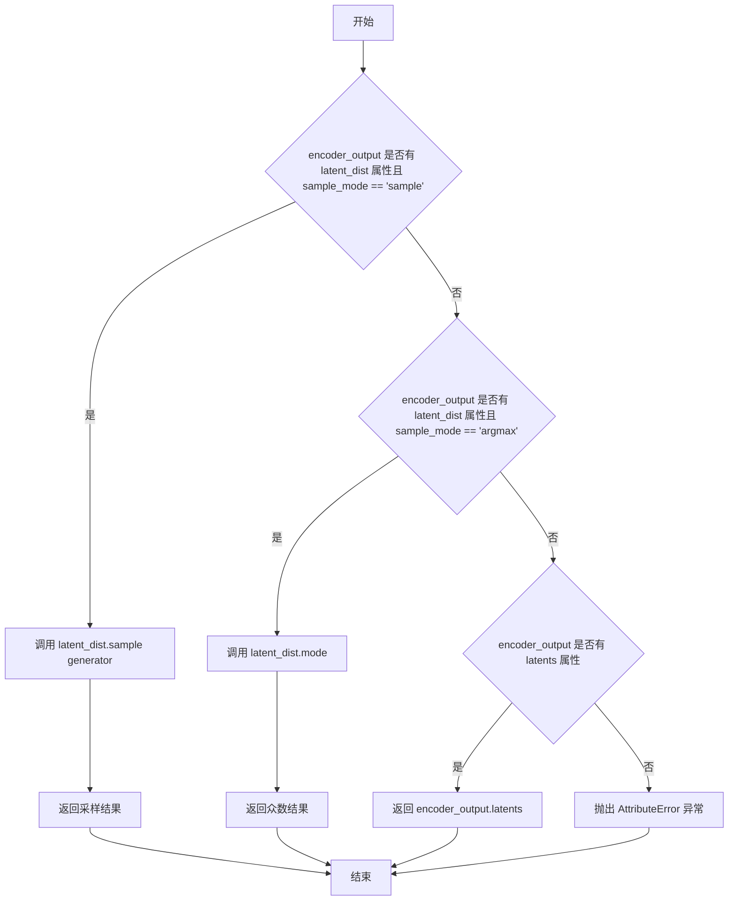
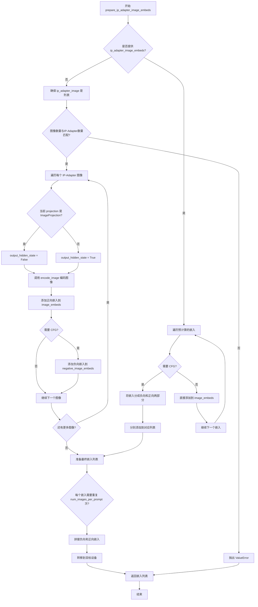
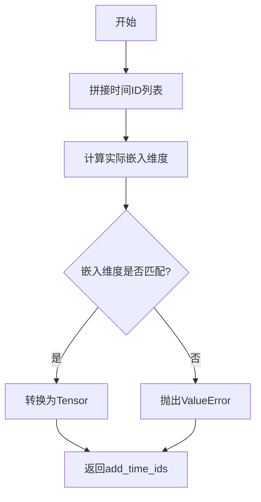
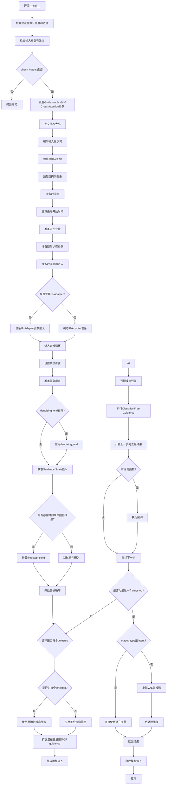

# `diffusers\examples\community\pipeline_kolors_differential_img2img.py` 详细设计文档

这是 Kolors 模型的差分图像到图像生成 Pipeline 实现（KolorsDifferentialImg2ImgPipeline）。它基于扩散模型（Diffusion Pipeline），结合了 VAE、文本编码器（ChatGLM）和条件 UNet，通过接收文本提示（prompt）和输入图像（image），利用差分混合技术（differential blending）在去噪过程中根据掩码（map）动态融合原始带噪图像与生成图像，从而实现图像的风格迁移或内容替换。

## 整体流程

```mermaid
graph TD
    A[Start: __call__] --> B[check_inputs: 验证输入参数]
B --> C[encode_prompt: 编码文本提示为 Embeddings]
C --> D[Preprocess: 预处理输入图像和掩码 Map]
D --> E[prepare_latents: 准备初始潜在向量 Latents]
E --> F[retrieve_timesteps & get_timesteps: 计算去噪时间步]
F --> G[prepare_extra_step_kwargs: 准备调度器额外参数]
G --> H[prepare_ip_adapter_image_embeds: 准备 IP-Adapter 图像嵌入（可选）]
H --> I[Prepare Diff Data: 计算原始带噪图像 original_with_noise 和阈值掩码 masks]
I --> J{Denoising Loop} 
J --> K[Mix Latents: 根据掩码混合 original_with_noise[i] 和当前 latents]
K --> L[UNet Predict: 预测噪声残差]
L --> M[Scheduler Step: 更新 latents]
M --> N{Is Last Step?} 
N -- No --> J
N -- Yes --> O[VAE Decode: 将 latents 解码为图像]
O --> P[Postprocess: 后处理图像格式]
P --> Q[End: 返回 KolorsPipelineOutput]
```

## 类结构

```
KolorsDifferentialImg2ImgPipeline
├── DiffusionPipeline (基类)
├── StableDiffusionMixin (Mixins)
├── StableDiffusionXLLoraLoaderMixin
└── IPAdapterMixin
```

## 全局变量及字段


### `logger`
    
日志记录器，用于记录pipeline运行过程中的信息

类型：`logging.Logger`
    


### `EXAMPLE_DOC_STRING`
    
示例文档字符串，包含pipeline使用示例代码

类型：`str`
    


### `XLA_AVAILABLE`
    
标记PyTorch XLA是否可用的布尔值，用于条件导入和设备优化

类型：`bool`
    


### `KolorsDifferentialImg2ImgPipeline.vae`
    
变分自编码器，用于图像编码和解码，将图像转换为潜在表示并从潜在表示重建图像

类型：`AutoencoderKL`
    


### `KolorsDifferentialImg2ImgPipeline.text_encoder`
    
文本编码器，用于将文本提示转换为嵌入向量，为扩散模型提供条件信息

类型：`ChatGLMModel`
    


### `KolorsDifferentialImg2ImgPipeline.tokenizer`
    
分词器，用于将文本提示 token 化为模型可处理的 token 序列

类型：`ChatGLMTokenizer`
    


### `KolorsDifferentialImg2ImgPipeline.unet`
    
条件U-Net模型，用于在扩散过程中预测噪声，实现图像去噪生成

类型：`UNet2DConditionModel`
    


### `KolorsDifferentialImg2ImgPipeline.scheduler`
    
扩散调度器，管理去噪过程中的时间步和噪声调度策略

类型：`KarrasDiffusionSchedulers`
    


### `KolorsDifferentialImg2ImgPipeline.image_encoder`
    
可选的图像编码器，用于IP-Adapter特征提取，实现图像提示功能

类型：`CLIPVisionModelWithProjection`
    


### `KolorsDifferentialImg2ImgPipeline.feature_extractor`
    
可选的图像特征提取器，用于预处理图像输入以供image_encoder使用

类型：`CLIPImageProcessor`
    


### `KolorsDifferentialImg2ImgPipeline.vae_scale_factor`
    
VAE缩放因子，用于计算潜在空间与像素空间之间的转换比例

类型：`int`
    


### `KolorsDifferentialImg2ImgPipeline.image_processor`
    
图像处理器，用于预处理输入图像和后处理生成图像

类型：`VaeImageProcessor`
    


### `KolorsDifferentialImg2ImgPipeline.mask_processor`
    
掩码处理器，用于预处理掩码图像，支持差异化图像编辑功能

类型：`VaeImageProcessor`
    


### `KolorsDifferentialImg2ImgPipeline.default_sample_size`
    
默认采样尺寸，用于确定生成图像的默认高度和宽度

类型：`int`
    


### `KolorsDifferentialImg2ImgPipeline._callback_tensor_inputs`
    
回调支持的张量输入列表，定义了在去噪步骤中可传递给回调函数的张量参数

类型：`List[str]`
    
    

## 全局函数及方法


### `retrieve_latents`

该函数用于从编码器输出中提取潜在向量（latents），支持三种提取方式：通过采样模式从潜在分布中采样、通过取模模式获取潜在分布的中心点，或直接获取编码器输出中预设的 latents 属性。

参数：

- `encoder_output`：`torch.Tensor`，编码器输出对象，通常为 VAE 编码后的输出，可能包含 `latent_dist` 或 `latents` 属性
- `generator`：`torch.Generator | None`，可选的随机数生成器，用于控制采样过程中的随机性
- `sample_mode`：`str`，采样模式，默认为 `"sample"`，可选值为 `"sample"`（从分布采样）或 `"argmax"`（取分布的众数）

返回值：`torch.Tensor`，提取出的潜在向量

#### 流程图



#### 带注释源码

```python
def retrieve_latents(
    encoder_output: torch.Tensor, generator: torch.Generator | None = None, sample_mode: str = "sample"
):
    """
    从编码器输出中提取潜在向量。
    
    该函数支持三种提取方式：
    1. 当 encoder_output 包含 latent_dist 属性且 sample_mode 为 'sample' 时，
       从潜在分布中进行随机采样
    2. 当 encoder_output 包含 latent_dist 属性且 sample_mode 为 'argmax' 时，
       返回潜在分布的众数（最可能的状态）
    3. 当 encoder_output 包含 latents 属性时，直接返回该属性值
    
    Args:
        encoder_output: 编码器输出，通常是 VAE 编码后的输出对象
        generator: 可选的随机数生成器，用于控制采样随机性
        sample_mode: 采样模式，'sample' 或 'argmax'
    
    Returns:
        提取出的潜在向量张量
    
    Raises:
        AttributeError: 当无法从 encoder_output 中获取潜在向量时抛出
    """
    # 情况1：从 latent_dist 进行采样
    if hasattr(encoder_output, "latent_dist") and sample_mode == "sample":
        return encoder_output.latent_dist.sample(generator)
    # 情况2：从 latent_dist 获取众数
    elif hasattr(encoder_output, "latent_dist") and sample_mode == "argmax":
        return encoder_output.latent_dist.mode()
    # 情况3：直接获取 latents 属性
    elif hasattr(encoder_output, "latents"):
        return encoder_output.latents
    # 无法获取潜在向量时抛出异常
    else:
        raise AttributeError("Could not access latents of provided encoder_output")
```


### `retrieve_timesteps`

从调度器中提取时间步，支持自定义时间步（timesteps）或自定义sigma值，并返回时间步调度和推理步数。

参数：

-  `scheduler`：`SchedulerMixin`，用于获取时间步的调度器对象。
-  `num_inference_steps`：`Optional[int]`，生成样本时使用的扩散步数。如果使用此参数，`timesteps` 必须为 `None`。
-  `device`：`Optional[Union[str, torch.device]]`，时间步要移动到的设备。如果为 `None`，时间步不会移动。
-  `timesteps`：`Optional[List[int]]`，用于覆盖调度器时间步间隔策略的自定义时间步。如果传递 `timesteps`，则 `num_inference_steps` 和 `sigmas` 必须为 `None`。
-  `sigmas`：`Optional[List[float]]`，用于覆盖调度器时间步间隔策略的自定义sigma。如果传递 `sigmas`，则 `num_inference_steps` 和 `timesteps` 必须为 `None`。
-  `**kwargs`：任意关键字参数，将提供给 `scheduler.set_timesteps`。

返回值：`Tuple[torch.Tensor, int]`，元组包含调度器的时间步计划和推理步数。

#### 流程图

```mermaid
flowchart TD
    A[开始] --> B{同时提供timesteps和sigmas?}
    B -->|是| C[抛出ValueError]
    B -->|否| D{提供timesteps?}
    D -->|是| E{scheduler支持timesteps?}
    D -->|否| F{提供sigmas?}
    E -->|是| G[调用scheduler.set_timesteps with timesteps]
    E -->|否| H[抛出ValueError]
    F -->|是| I{scheduler支持sigmas?}
    F -->|否| J[调用scheduler.set_timesteps with num_inference_steps]
    I -->|是| K[调用scheduler.set_timesteps with sigmas]
    I -->|否| L[抛出ValueError]
    G --> M[获取scheduler.timesteps]
    K --> M
    J --> M
    M --> N[获取len(timesteps)作为num_inference_steps]
    N --> O[返回timesteps, num_inference_steps]
```

#### 带注释源码

```python
# Copied from diffusers.pipelines.stable_diffusion.pipeline_stable_diffusion.retrieve_timesteps
def retrieve_timesteps(
    scheduler,  # 调度器对象，用于获取时间步
    num_inference_steps: Optional[int] = None,  # 推理步数
    device: Optional[Union[str, torch.device]] = None,  # 目标设备
    timesteps: Optional[List[int]] = None,  # 自定义时间步
    sigmas: Optional[List[float]] = None,  # 自定义sigma值
    **kwargs,  # 传递给scheduler.set_timesteps的其他参数
):
    """
    Calls the scheduler's `set_timesteps` method and retrieves timesteps from the scheduler after the call. Handles
    custom timesteps. Any kwargs will be supplied to `scheduler.set_timesteps`.

    Args:
        scheduler (`SchedulerMixin`):
            The scheduler to get timesteps from.
        num_inference_steps (`int`):
            The number of diffusion steps used when generating samples with a pre-trained model. If used, `timesteps`
            must be `None`.
        device (`str` or `torch.device`, *optional*):
            The device to which the timesteps should be moved to. If `None`, the timesteps are not moved.
        timesteps (`List[int]`, *optional*):
            Custom timesteps used to override the timestep spacing strategy of the scheduler. If `timesteps` is passed,
            `num_inference_steps` and `sigmas` must be `None`.
        sigmas (`List[float]`, *optional*):
            Custom sigmas used to override the timestep spacing strategy of the scheduler. If `sigmas` is passed,
            `num_inference_steps` and `timesteps` must be `None`.

    Returns:
        `Tuple[torch.Tensor, int]`: A tuple where the first element is the timestep schedule from the scheduler and the
        second element is the number of inference steps.
    """
    # 检查是否同时提供了timesteps和sigmas，这是不允许的
    if timesteps is not None and sigmas is not None:
        raise ValueError("Only one of `timesteps` or `sigmas` can be passed. Please choose one to set custom values")
    
    # 处理自定义timesteps的情况
    if timesteps is not None:
        # 检查scheduler的set_timesteps方法是否支持timesteps参数
        accepts_timesteps = "timesteps" in set(inspect.signature(scheduler.set_timesteps).parameters.keys())
        if not accepts_timesteps:
            raise ValueError(
                f"The current scheduler class {scheduler.__class__}'s `set_timesteps` does not support custom"
                f" timestep schedules. Please check whether you are using the correct scheduler."
            )
        # 调用scheduler的set_timesteps方法
        scheduler.set_timesteps(timesteps=timesteps, device=device, **kwargs)
        # 获取调度后的timesteps
        timesteps = scheduler.timesteps
        # 计算推理步数
        num_inference_steps = len(timesteps)
    # 处理自定义sigmas的情况
    elif sigmas is not None:
        # 检查scheduler的set_timesteps方法是否支持sigmas参数
        accept_sigmas = "sigmas" in set(inspect.signature(scheduler.set_timesteps).parameters.keys())
        if not accept_sigmas:
            raise ValueError(
                f"The current scheduler class {scheduler.__class__}'s `set_timesteps` does not support custom"
                f" sigmas schedules. Please check whether you are using the correct scheduler."
            )
        # 调用scheduler的set_timesteps方法
        scheduler.set_timesteps(sigmas=sigmas, device=device, **kwargs)
        # 获取调度后的timesteps
        timesteps = scheduler.timesteps
        # 计算推理步数
        num_inference_steps = len(timesteps)
    # 默认情况：使用num_inference_steps设置timesteps
    else:
        scheduler.set_timesteps(num_inference_steps, device=device, **kwargs)
        timesteps = scheduler.timesteps
    
    # 返回timesteps和num_inference_steps
    return timesteps, num_inference_steps
```


### `KolorsDifferentialImg2ImgPipeline.__init__`

初始化 Kolors 差分图像到图像管道，设置所有必要的组件（VAE、文本编码器、分词器、UNet、调度器等），并配置图像处理器和掩码处理器。

参数：

- `vae`：`AutoencoderKL`，变分自编码器模型，用于编码和解码图像与潜在表示之间的转换
- `text_encoder`：`ChatGLMModel`，冻结的文本编码器，Kolors 使用 ChatGLM3-6B
- `tokenizer`：`ChatGLMTokenizer`，用于将文本转换为 token 的分词器
- `unet`：`UNet2DConditionModel`，条件 U-Net 架构，用于对编码后的图像潜在表示进行去噪
- `scheduler`：`KarrasDiffusionSchedulers`，与 unet 结合使用以去噪编码图像潜在表示的调度器
- `image_encoder`：`CLIPVisionModelWithProjection`（可选），用于处理 IP Adapter 的图像编码器
- `feature_extractor`：`CLIPImageProcessor`（可选），用于从图像中提取特征的处理器
- `force_zeros_for_empty_prompt`：`bool`（可选，默认为 False），是否将空提示的嵌入向量强制设为零

返回值：无（`None`），构造函数初始化实例属性，不返回任何值

#### 流程图

```mermaid
flowchart TD
    A[开始 __init__] --> B[调用 super().__init__]
    B --> C[register_modules: 注册 vae, text_encoder, tokenizer, unet, scheduler, image_encoder, feature_extractor]
    C --> D[register_to_config: 注册 force_zeros_for_empty_prompt 配置]
    D --> E{检查 vae 是否存在}
    E -->|是| F[计算 vae_scale_factor = 2^(len(vae.config.block_out_channels) - 1)]
    E -->|否| G[vae_scale_factor = 8]
    F --> H[创建 VaeImageProcessor 作为 image_processor]
    H --> I[创建 VaeImageProcessor 作为 mask_processor (do_normalize=False, do_convert_grayscale=True)]
    I --> J{检查 unet 是否存在且有 sample_size 属性}
    J -->|是| K[default_sample_size = unet.config.sample_size]
    J -->|否| L[default_sample_size = 128]
    K --> M[结束 __init__]
    L --> M
```

#### 带注释源码

```python
def __init__(
    self,
    vae: AutoencoderKL,
    text_encoder: ChatGLMModel,
    tokenizer: ChatGLMTokenizer,
    unet: UNet2DConditionModel,
    scheduler: KarrasDiffusionSchedulers,
    image_encoder: CLIPVisionModelWithProjection = None,
    feature_extractor: CLIPImageProcessor = None,
    force_zeros_for_empty_prompt: bool = False,
):
    """
    初始化 KolorsDifferentialImg2ImgPipeline 管道实例。
    
    参数:
        vae: Variational Auto-Encoder (VAE) 模型，用于编码和解码图像与潜在表示
        text_encoder: 冻结的文本编码器，Kolors 使用 ChatGLM3-6B
        tokenizer: ChatGLMTokenizer 分词器
        unet: 条件 U-Net 架构，用于去噪图像潜在表示
        scheduler: 调度器，与 unet 结合用于去噪
        image_encoder: 可选的 CLIP 图像编码器，用于 IP Adapter
        feature_extractor: 可选的 CLIP 特征提取器
        force_zeros_for_empty_prompt: 是否强制将空提示嵌入设为零
    """
    # 调用父类 DiffusionPipeline 的初始化方法
    super().__init__()

    # 注册所有模块，使管道能够识别和管理这些组件
    self.register_modules(
        vae=vae,
        text_encoder=text_encoder,
        tokenizer=tokenizer,
        unet=unet,
        scheduler=scheduler,
        image_processor=image_encoder,
        feature_extractor=feature_extractor,
    )
    
    # 将 force_zeros_for_empty_prompt 注册到配置中
    self.register_to_config(force_zeros_for_empty_prompt=force_zeros_for_empty_prompt)
    
    # 计算 VAE 缩放因子，用于调整潜在空间的维度
    # 基于 VAE 块输出通道数的深度计算
    self.vae_scale_factor = 2 ** (len(self.vae.config.block_out_channels) - 1) if getattr(self, "vae", None) else 8
    
    # 创建图像处理器，用于预处理和后处理图像
    self.image_processor = VaeImageProcessor(vae_scale_factor=self.vae_scale_factor)

    # 创建掩码处理器，专门用于处理掩码图像
    # do_normalize=False: 不对掩码进行归一化
    # do_convert_grayscale=True: 转换为灰度图
    self.mask_processor = VaeImageProcessor(
        vae_scale_factor=self.vae_scale_factor, do_normalize=False, do_convert_grayscale=True
    )

    # 确定默认采样大小，用于生成图像的默认高度和宽度
    self.default_sample_size = (
        self.unet.config.sample_size
        if hasattr(self, "unet") and self.unet is not None and hasattr(self.unet.config, "sample_size")
        else 128
    )
```


### `KolorsDifferentialImg2ImgPipeline.encode_prompt`

该方法负责将文本提示词（prompt）和负面提示词（negative_prompt）编码为文本编码器的隐藏状态向量，生成用于图像生成的正向和负向文本嵌入，同时支持分类器自由引导（Classifier-Free Guidance）所需的嵌入处理。

参数：

- `prompt`：`str` 或 `List[str]`，要编码的文本提示词
- `device`：`Optional[torch.device]`，执行编码的 torch 设备，若为 None 则使用 `self._execution_device`
- `num_images_per_prompt`：`int`，每个提示词需要生成的图像数量，用于嵌入的重复扩展
- `do_classifier_free_guidance`：`bool`，是否启用分类器自由引导
- `negative_prompt`：`str` 或 `List[str]`，用于引导图像生成的负面提示词，若不定义则使用 `negative_prompt_embeds`
- `prompt_embeds`：`Optional[torch.FloatTensor]`，预生成的文本嵌入，若不提供则从 `prompt` 输入生成
- `pooled_prompt_embeds`：`Optional[torch.Tensor]`，预生成的池化文本嵌入，用于微调文本输入
- `negative_prompt_embeds`：`Optional[torch.FloatTensor]`，预生成的负面文本嵌入
- `negative_pooled_prompt_embeds`：`Optional[torch.Tensor]`，预生成的负面池化文本嵌入
- `max_sequence_length`：`int`，最大序列长度，默认为 256

返回值：`Tuple[torch.FloatTensor, torch.FloatTensor, torch.Tensor, torch.Tensor]`，包含四个元素的元组——`prompt_embeds`（正向文本嵌入）、`negative_prompt_embeds`（负向文本嵌入）、`pooled_prompt_embeds`（正向池化嵌入）、`negative_pooled_prompt_embeds`（负向池化嵌入），这些嵌入直接用于 UNet 的条件生成

#### 流程图

```mermaid
flowchart TD
    A[开始 encode_prompt] --> B{检查 prompt 类型}
    B -->|str| C[batch_size = 1]
    B -->|list| D[batch_size = len&#40;prompt&#41;]
    B -->|else| E[batch_size = prompt_embeds.shape[0]]
    C --> F[定义 tokenizers 和 text_encoders]
    D --> F
    E --> F
    F --> G{prompt_embeds is None?}
    G -->|Yes| H[遍历 tokenizer 和 text_encoder]
    H --> I[tokenizer 处理 prompt]
    J[text_encoder 生成隐藏状态]
    I --> J
    J --> K[提取倒数第二层隐藏状态]
    K --> L[permute 并 clone 为 [batch, seq, hidden]]
    M[提取最后一层最后一个 token]
    L --> M
    M --> N[repeat 扩展 batch 维度]
    N --> O[保存到 prompt_embeds_list]
    O --> P[取 prompt_embeds_list[0]]
    G -->|No| Q[使用传入的 prompt_embeds]
    P --> R{do_classifier_free_guidance?}
    Q --> R
    R -->|Yes 且 negative_prompt_embeds is None| S{zero_out_negative_prompt?}
    R -->|No| T[返回四个嵌入]
    S -->|Yes| U[negative_prompt_embeds = torch.zeros_like&#40;prompt_embeds&#41;]
    S -->|No| V[处理 negative_prompt]
    U --> W[构建 uncond_tokens]
    V --> W
    W --> X[遍历生成负向嵌入]
    X --> Y[tokenizer 处理 uncond_tokens]
    Z[text_encoder 生成负向隐藏状态]
    Y --> Z
    Z --> AA[提取负向嵌入并 repeat 扩展]
    AA --> AB[保存到 negative_prompt_embeds_list]
    AB --> AC[取 negative_prompt_embeds_list[0]]
    AC --> AD[repeat pooled_prompt_embeds]
    AD --> AE[repeat negative_pooled_prompt_embeds]
    AE --> T
    T --> AF[返回 prompt_embeds, negative_prompt_embeds, pooled_prompt_embeds, negative_pooled_prompt_embeds]
```

#### 带注释源码

```python
def encode_prompt(
    self,
    prompt,
    device: Optional[torch.device] = None,
    num_images_per_prompt: int = 1,
    do_classifier_free_guidance: bool = True,
    negative_prompt=None,
    prompt_embeds: Optional[torch.FloatTensor] = None,
    pooled_prompt_embeds: Optional[torch.Tensor] = None,
    negative_prompt_embeds: Optional[torch.FloatTensor] = None,
    negative_pooled_prompt_embeds: Optional[torch.Tensor] = None,
    max_sequence_length: int = 256,
):
    r"""
    Encodes the prompt into text encoder hidden states.

    Args:
        prompt (`str` or `List[str]`, *optional*):
            prompt to be encoded
        device: (`torch.device`):
            torch device
        num_images_per_prompt (`int`):
            number of images that should be generated per prompt
        do_classifier_free_guidance (`bool`):
            whether to use classifier free guidance or not
        negative_prompt (`str` or `List[str]`, *optional*):
            The prompt or prompts not to guide the image generation. If not defined, one has to pass
            `negative_prompt_embeds` instead. Ignored when not using guidance (i.e., ignored if `guidance_scale` is
            less than `1`).
        prompt_embeds (`torch.FloatTensor`, *optional*):
            Pre-generated text embeddings. Can be used to easily tweak text inputs, *e.g.* prompt weighting. If not
            provided, text embeddings will be generated from `prompt` input argument.
        pooled_prompt_embeds (`torch.Tensor`, *optional*):
            Pre-generated pooled text embeddings. Can be used to easily tweak text inputs, *e.g.* prompt weighting.
            If not provided, pooled text embeddings will be generated from `prompt` input argument.
        negative_prompt_embeds (`torch.FloatTensor`, *optional*):
            Pre-generated negative text embeddings. Can be used to easily tweak text inputs, *e.g.* prompt
            weighting. If not provided, negative_prompt_embeds will be generated from `negative_prompt` input
            argument.
        negative_pooled_prompt_embeds (`torch.Tensor`, *optional*):
            Pre-generated negative pooled text embeddings. Can be used to easily tweak text inputs, *e.g.* prompt
            weighting. If not provided, pooled negative_prompt_embeds will be generated from `negative_prompt`
            input argument.
        max_sequence_length (`int` defaults to 256): Maximum sequence length to use with the `prompt`.
    """
    # 确定执行设备，若未指定则使用管道默认设备
    device = device or self._execution_device

    # 根据 prompt 类型确定 batch_size
    if prompt is not None and isinstance(prompt, str):
        batch_size = 1
    elif prompt is not None and isinstance(prompt, list):
        batch_size = len(prompt)
    else:
        # 当 prompt 为 None 时，从已提供的 prompt_embeds 获取 batch_size
        batch_size = prompt_embeds.shape[0]

    # 定义 tokenizers 和 text_encoders 列表（支持多模态扩展）
    tokenizers = [self.tokenizer]
    text_encoders = [self.text_encoder]

    # 若未提供 prompt_embeds，则从 prompt 文本生成
    if prompt_embeds is None:
        prompt_embeds_list = []
        for tokenizer, text_encoder in zip(tokenizers, text_encoders):
            # 使用 tokenizer 将文本转换为 token id、attention mask 和 position id
            text_inputs = tokenizer(
                prompt,
                padding="max_length",
                max_length=max_sequence_length,
                truncation=True,
                return_tensors="pt",
            ).to(device)
            
            # 调用 text_encoder 获取隐藏状态
            output = text_encoder(
                input_ids=text_inputs["input_ids"],
                attention_mask=text_inputs["attention_mask"],
                position_ids=text_inputs["position_ids"],
                output_hidden_states=True,
            )

            # 从倒数第二层提取隐藏状态作为 prompt_embeds
            # shape 转换: [max_sequence_length, batch, hidden_size] -> [batch, max_sequence_length, hidden_size]
            # clone 确保tensor连续，便于后续操作
            prompt_embeds = output.hidden_states[-2].permute(1, 0, 2).clone()
            
            # 从最后一层提取池化嵌入（取最后一个 token 的隐藏状态）
            # shape: [max_sequence_length, batch, hidden_size] -> [batch, hidden_size]
            pooled_prompt_embeds = output.hidden_states[-1][-1, :, :].clone()
            
            # 扩展 batch 维度以支持每个 prompt 生成多张图像
            bs_embed, seq_len, _ = prompt_embeds.shape
            prompt_embeds = prompt_embeds.repeat(1, num_images_per_prompt, 1)
            prompt_embeds = prompt_embeds.view(bs_embed * num_images_per_prompt, seq_len, -1)

            prompt_embeds_list.append(prompt_embeds)

        # 取第一个（通常也是唯一一个）text_encoder 的结果
        prompt_embeds = prompt_embeds_list[0]

    # 判断是否需要将 negative_prompt 置零（当 negative_prompt 为 None 且配置要求强制置零时）
    zero_out_negative_prompt = negative_prompt is None and self.config.force_zeros_for_empty_prompt

    # 处理分类器自由引导的负向嵌入
    if do_classifier_free_guidance and negative_prompt_embeds is None and zero_out_negative_prompt:
        # 当配置要求强制零嵌入时，直接创建与 prompt_embeds 同形状的零张量
        negative_prompt_embeds = torch.zeros_like(prompt_embeds)
    elif do_classifier_free_guidance and negative_prompt_embeds is None:
        # 需要从 negative_prompt 生成负向嵌入
        uncond_tokens: List[str]
        
        # 处理各种 negative_prompt 输入情况
        if negative_prompt is None:
            uncond_tokens = [""] * batch_size  # 空字符串作为默认负向提示
        elif prompt is not None and type(prompt) is not type(negative_prompt):
            raise TypeError(
                f"`negative_prompt` should be the same type to `prompt`, but got {type(negative_prompt)} !="
                f" {type(prompt)}."
            )
        elif isinstance(negative_prompt, str):
            uncond_tokens = [negative_prompt]
        elif batch_size != len(negative_prompt):
            raise ValueError(
                f"`negative_prompt`: {negative_prompt} has batch size {len(negative_prompt)}, but `prompt`:"
                f" {prompt} has batch size {batch_size}. Please make sure that passed `negative_prompt` matches"
                " the batch size of `prompt`."
            )
        else:
            uncond_tokens = negative_prompt

        negative_prompt_embeds_list = []

        # 为每个 text_encoder 生成负向嵌入
        for tokenizer, text_encoder in zip(tokenizers, text_encoders):
            # Tokenize 负向提示词
            uncond_input = tokenizer(
                uncond_tokens,
                padding="max_length",
                max_length=max_sequence_length,
                truncation=True,
                return_tensors="pt",
            ).to(device)
            
            # 编码获取隐藏状态
            output = text_encoder(
                input_ids=uncond_input["input_ids"],
                attention_mask=uncond_input["attention_mask"],
                position_ids=uncond_input["position_ids"],
                output_hidden_states=True,
            )

            # 提取负向嵌入
            negative_prompt_embeds = output.hidden_states[-2].permute(1, 0, 2).clone()
            negative_pooled_prompt_embeds = output.hidden_states[-1][-1, :, :].clone()

            # 如果启用分类器自由引导，扩展负向嵌入
            if do_classifier_free_guidance:
                seq_len = negative_prompt_embeds.shape[1]
                
                # 转换为与 text_encoder 兼容的数据类型和设备
                negative_prompt_embeds = negative_prompt_embeds.to(dtype=text_encoder.dtype, device=device)

                # repeat 扩展以匹配每提示词生成的图像数量
                negative_prompt_embeds = negative_prompt_embeds.repeat(1, num_images_per_prompt, 1)
                negative_prompt_embeds = negative_prompt_embeds.view(
                    batch_size * num_images_per_prompt, seq_len, -1
                )

            negative_prompt_embeds_list.append(negative_prompt_embeds)

        negative_prompt_embeds = negative_prompt_embeds_list[0]

    # 扩展 pooled_prompt_embeds 的 batch 维度
    bs_embed = pooled_prompt_embeds.shape[0]
    pooled_prompt_embeds = pooled_prompt_embeds.repeat(1, num_images_per_prompt).view(
        bs_embed * num_images_per_prompt, -1
    )

    # 扩展负向池化嵌入（如有必要）
    if do_classifier_free_guidance:
        negative_pooled_prompt_embeds = negative_pooled_prompt_embeds.repeat(1, num_images_per_prompt).view(
            bs_embed * num_images_per_prompt, -1
        )

    # 返回四个嵌入张量供后续去噪过程使用
    return prompt_embeds, negative_prompt_embeds, pooled_prompt_embeds, negative_pooled_prompt_embeds
```


### `KolorsDifferentialImg2ImgPipeline.encode_image`

该方法用于将输入图像编码为特征向量，支持返回完整的隐藏状态或仅返回图像嵌入，并自动处理无分类器自由引导所需的无条件图像嵌入。

参数：

- `image`：`Union[torch.Tensor, PIL.Image.Image, np.ndarray, List[torch.Tensor], List[PIL.Image.Image], List[np.ndarray]]`，待编码的输入图像，可以是PyTorch张量、PIL图像、NumPy数组或它们的列表
- `device`：`torch.device`，指定将图像张量移动到的目标设备（如CPU或CUDA）
- `num_images_per_prompt`：`int`，每个提示词生成的图像数量，用于对图像嵌入进行重复以匹配批量大小
- `output_hidden_states`：`Optional[bool]`，是否返回图像编码器的完整隐藏状态，默认为None（仅返回图像嵌入）

返回值：`Tuple[torch.Tensor, torch.Tensor]`，返回两个张量组成的元组——第一个是条件图像嵌入（或隐藏状态），第二个是无条件图像嵌入（或隐藏状态），两者形状已根据num_images_per_prompt进行扩展

#### 流程图

```mermaid
flowchart TD
    A[开始 encode_image] --> B{image是否为torch.Tensor}
    B -- 否 --> C[使用feature_extractor提取pixel_values]
    B -- 是 --> D[直接使用image]
    C --> E[将image转换为指定dtype并移动到device]
    D --> E
    E --> F{output_hidden_states是否为True}
    F -- 是 --> G[调用image_encoder获取完整隐藏状态]
    G --> H[提取倒数第二层隐藏状态 hidden_states[-2]]
    H --> I[对hidden_states进行repeat_interleave扩展]
    J[创建与image形状相同的零张量]
    J --> K[调用image_encoder获取零张量的隐藏状态]
    K --> L[提取零张量的hidden_states[-2]]
    L --> M[对零张量hidden_states进行repeat_interleave扩展]
    M --> N[返回条件和无条件hidden_states元组]
    F -- 否 --> O[调用image_encoder获取image_embeds]
    O --> P[提取image_embeds]
    P --> Q[对image_embeds进行repeat_interleave扩展]
    Q --> R[创建零张量作为uncond_image_embeds]
    R --> S[返回条件和无条件image_embeds元组]
    N --> T[结束]
    S --> T
```

#### 带注释源码

```python
def encode_image(self, image, device, num_images_per_prompt, output_hidden_states=None):
    # 获取图像编码器的参数数据类型，用于后续张量转换
    dtype = next(self.image_encoder.parameters()).dtype

    # 如果输入不是PyTorch张量，则使用特征提取器进行处理
    # 将PIL图像、NumPy数组等转换为模型所需的pixel_values张量
    if not isinstance(image, torch.Tensor):
        image = self.feature_extractor(image, return_tensors="pt").pixel_values

    # 将图像张量移动到指定设备，并转换为与图像编码器参数相同的数据类型
    # 这确保了计算的一致性和兼容性
    image = image.to(device=device, dtype=dtype)
    
    # 根据output_hidden_states参数决定返回完整隐藏状态还是仅图像嵌入
    if output_hidden_states:
        # 路径1：返回完整的隐藏状态序列
        # 调用图像编码器，output_hidden_states=True会返回所有层的隐藏状态
        image_enc_hidden_states = self.image_encoder(image, output_hidden_states=True).hidden_states[-2]
        # hidden_states[-2]通常包含倒数第二层的输出，用于保留更多细粒度特征
        # repeat_interleave用于扩展批量维度，以匹配num_images_per_prompt
        image_enc_hidden_states = image_enc_hidden_states.repeat_interleave(num_images_per_prompt, dim=0)
        
        # 创建与输入图像形状相同的零张量，用于生成无条件的图像嵌入
        # 这是无分类器自由引导（CFG）所需要的无条件输入
        uncond_image_enc_hidden_states = self.image_encoder(
            torch.zeros_like(image), output_hidden_states=True
        ).hidden_states[-2]
        # 对无条件隐藏状态进行相同的扩展处理
        uncond_image_enc_hidden_states = uncond_image_enc_hidden_states.repeat_interleave(
            num_images_per_prompt, dim=0
        )
        # 返回条件和无条件隐藏状态的元组
        return image_enc_hidden_states, uncond_image_enc_hidden_states
    else:
        # 路径2：仅返回图像嵌入向量（默认行为）
        # 调用图像编码器获取图像嵌入，这是编码后的紧凑特征表示
        image_embeds = self.image_encoder(image).image_embeds
        # 扩展图像嵌入以匹配每个提示的图像数量
        image_embeds = image_embeds.repeat_interleave(num_images_per_prompt, dim=0)
        
        # 创建与图像嵌入形状相同的零张量作为无条件嵌入
        # 在CFG中，无条件嵌入用于与条件嵌入进行对比，引导生成过程
        uncond_image_embeds = torch.zeros_like(image_embeds)

        # 返回条件和无条件图像嵌入的元组
        return image_embeds, uncond_image_embeds
```


### `KolorsDifferentialImg2ImgPipeline.prepare_ip_adapter_image_embeds`

准备 IP-Adapter 图像嵌入，将输入图像编码为适合 IP-Adapter 模型的嵌入向量，并根据是否启用无分类器引导（CFG）生成对应的负向嵌入。

参数：

- `self`：`KolorsDifferentialImg2ImgPipeline` 实例，Pipeline 对象本身
- `ip_adapter_image`：`PipelineImageInput`（可选），IP-Adapter 图像输入，可以是单张图像或图像列表
- `ip_adapter_image_embeds`：`List[torch.Tensor]`（可选），预计算的 IP-Adapter 图像嵌入列表
- `device`：`torch.device`，计算设备（CPU 或 CUDA）
- `num_images_per_prompt`：`int`，每个提示词生成的图像数量
- `do_classifier_free_guidance`：`bool`，是否启用无分类器引导

返回值：`List[torch.Tensor]`，处理后的 IP-Adapter 图像嵌入列表，每个元素是对应 IP-Adapter 的嵌入向量

#### 流程图



#### 带注释源码

```python
def prepare_ip_adapter_image_embeds(
    self, 
    ip_adapter_image,  # IP-Adapter 图像输入
    ip_adapter_image_embeds,  # 预计算的嵌入（可选）
    device,  # 计算设备
    num_images_per_prompt,  # 每个提示生成的图像数
    do_classifier_free_guidance  # 是否启用 CFG
):
    """
    准备 IP-Adapter 图像嵌入。
    
    该方法处理两种输入情况：
    1. 提供原始图像：需要通过 encode_image 编码为嵌入
    2. 提供预计算嵌入：直接处理并返回
    
    当启用 CFG 时，会为每个图像生成正向和负向两种嵌入。
    """
    image_embeds = []  # 存储正向图像嵌入
    if do_classifier_free_guidance:
        negative_image_embeds = []  # 存储负向图像嵌入（仅在 CFG 时使用）
    
    # 情况一：没有预计算嵌入，需要从图像编码
    if ip_adapter_image_embeds is None:
        # 确保图像是列表格式
        if not isinstance(ip_adapter_image, list):
            ip_adapter_image = [ip_adapter_image]
        
        # 验证图像数量与 IP-Adapter 数量是否匹配
        # IP-Adapter 数量由 UNet 的 image_projection_layers 数量决定
        if len(ip_adapter_image) != len(self.unet.encoder_hid_proj.image_projection_layers):
            raise ValueError(
                f"`ip_adapter_image` must have same length as the number of IP Adapters. "
                f"Got {len(ip_adapter_image)} images and "
                f"{len(self.unet.encoder_hid_proj.image_projection_layers)} IP Adapters."
            )
        
        # 遍历每个 IP-Adapter 图像和对应的投影层
        for single_ip_adapter_image, image_proj_layer in zip(
            ip_adapter_image, 
            self.unet.encoder_hid_proj.image_projection_layers
        ):
            # 判断是否需要输出隐藏状态
            # ImageProjection 类型不需要，其他类型需要
            output_hidden_state = not isinstance(image_proj_layer, ImageProjection)
            
            # 调用 encode_image 进行图像编码
            # 返回正向和负向（如果启用 CFG）嵌入
            single_image_embeds, single_negative_image_embeds = self.encode_image(
                single_ip_adapter_image, 
                device, 
                1,  # 每个图像生成 1 个嵌入
                output_hidden_state
            )
            
            # 添加批次维度 [batch, emb_dim] -> [1, batch, emb_dim]
            image_embeds.append(single_image_embeds[None, :])
            
            if do_classifier_free_guidance:
                negative_image_embeds.append(single_negative_image_embeds[None, :])
    
    # 情况二：已有预计算嵌入
    else:
        for single_image_embeds in ip_adapter_image_embeds:
            if do_classifier_free_guidance:
                # 将嵌入按维度 chunk 成两部分：负向和正向
                single_negative_image_embeds, single_image_embeds = single_image_embeds.chunk(2)
                negative_image_embeds.append(single_negative_image_embeds)
            image_embeds.append(single_image_embeds)
    
    # 处理每个嵌入：根据 num_images_per_prompt 重复，并拼接正负向嵌入
    ip_adapter_image_embeds = []
    for i, single_image_embeds in enumerate(image_embeds):
        # 重复正向嵌入 num_images_per_prompt 次
        single_image_embeds = torch.cat([single_image_embeds] * num_images_per_prompt, dim=0)
        
        if do_classifier_free_guidance:
            # 重复负向嵌入相同次数
            single_negative_image_embeds = torch.cat(
                [negative_image_embeds[i]] * num_images_per_prompt, 
                dim=0
            )
            # 拼接： [负向嵌入, 正向嵌入]
            single_image_embeds = torch.cat(
                [single_negative_image_embeds, single_image_embeds], 
                dim=0
            )
        
        # 转移到指定设备
        single_image_embeds = single_image_embeds.to(device=device)
        ip_adapter_image_embeds.append(single_image_embeds)
    
    return ip_adapter_image_embeds
```


### `KolorsDifferentialImg2ImgPipeline.prepare_extra_step_kwargs`

该方法用于为调度器（scheduler）的 `step` 方法准备额外的关键字参数。由于不同的调度器具有不同的签名，该方法通过检查调度器的 `step` 方法是否接受 `eta` 和 `generator` 参数来动态构建参数字典，确保与各种类型的调度器兼容。

参数：

- `self`：`KolorsDifferentialImg2ImgPipeline` 实例，隐式参数，方法的调用者
- `generator`：`torch.Generator` 或 `List[torch.Generator]` 或 `None`，用于生成随机数的生成器，用于确保扩散过程的可重复性
- `eta`：`float`，DDIM 调度器专用的噪声参数（η），取值范围为 [0, 1]，其他调度器会忽略此参数

返回值：`Dict[str, Any]`，包含调度器 `step` 方法所需额外参数（`eta` 和/或 `generator`）的字典

#### 流程图

```mermaid
flowchart TD
    A[开始] --> B[获取scheduler.step方法签名]
    B --> C{step方法是否接受eta参数?}
    C -->|是| D[extra_step_kwargs['eta'] = eta]
    C -->|否| E[跳过eta参数]
    D --> F{step方法是否接受generator参数?}
    E --> F
    F -->|是| G[extra_step_kwargs['generator'] = generator]
    F -->|否| H[跳过generator参数]
    G --> I[返回extra_step_kwargs字典]
    H --> I
```

#### 带注释源码

```python
def prepare_extra_step_kwargs(self, generator, eta):
    """
    准备调度器额外的关键字参数。由于并非所有调度器都具有相同的签名，
    该方法检查调度器是否支持 eta 和 generator 参数。
    
    Args:
        generator: torch.Generator 或 None，用于生成确定性随机数
        eta: float，DDIM调度器使用的噪声参数η，范围[0,1]
    
    Returns:
        Dict: 包含调度器step方法所需额外参数的字典
    """
    # 使用inspect模块获取scheduler.step方法的签名参数
    accepts_eta = "eta" in set(inspect.signature(self.scheduler.step).parameters.keys())
    
    # 初始化空字典用于存储额外参数
    extra_step_kwargs = {}
    
    # 如果调度器接受eta参数，则将其添加到参数字典
    if accepts_eta:
        extra_step_kwargs["eta"] = eta

    # 检查调度器是否接受generator参数
    accepts_generator = "generator" in set(inspect.signature(self.scheduler.step).parameters.keys())
    
    # 如果调度器接受generator参数，则将其添加到参数字典
    if accepts_generator:
        extra_step_kwargs["generator"] = generator
    
    # 返回构建好的参数字典
    return extra_step_kwargs
```


### `KolorsDifferentialImg2ImgPipeline.check_inputs`

该方法用于验证 Kolors 差分图像到图像管道的输入参数合法性，确保所有必填参数已正确提供，且参数类型和值符合管道要求，从而在执行前捕获潜在的配置错误。

参数：

- `prompt`：`Union[str, List[str], None]`，文本提示，用于指导图像生成
- `strength`：`float`，图像变换强度，值必须在 [0.0, 1.0] 范围内
- `num_inference_steps`：`int`，去噪步数，必须为正整数
- `height`：`int`，生成图像的高度（像素），必须能被 8 整除
- `width`：`int`，生成图像的宽度（像素），必须能被 8 整除
- `negative_prompt`：`Union[str, List[str], None]`，可选的负面文本提示
- `prompt_embeds`：`Optional[torch.FloatTensor]`，可选的预生成文本嵌入
- `pooled_prompt_embeds`：`Optional[torch.Tensor]`，可选的池化文本嵌入
- `negative_prompt_embeds`：`Optional[torch.FloatTensor]`，可选的预生成负面文本嵌入
- `negative_pooled_prompt_embeds`：`Optional[torch.Tensor]`，可选的负面池化文本嵌入
- `ip_adapter_image`：`Optional[PipelineImageInput]`，可选的 IP 适配器图像输入
- `ip_adapter_image_embeds`：`Optional[List[torch.Tensor]]`，可选的 IP 适配器图像嵌入列表
- `callback_on_step_end_tensor_inputs`：`Optional[List[str]]`，可选的每步结束回调张量输入列表
- `max_sequence_length`：`Optional[int]`，可选的最大序列长度，不能超过 256

返回值：`None`，该方法不返回任何值，仅通过抛出 ValueError 来指示参数验证失败

#### 流程图

```mermaid
flowchart TD
    A[开始 check_inputs 验证] --> B{strength 在 [0, 1] 范围内?}
    B -->|否| B1[抛出 ValueError: strength 超出范围]
    B -->|是| C{num_inference_steps 是正整数?}
    C -->|否| C1[抛出 ValueError: num_inference_steps 无效]
    C -->|是| D{height 和 width 可被 8 整除?}
    D -->|否| D1[抛出 ValueError: height 或 width 无法被 8 整除]
    D -->|是| E{callback_on_step_end_tensor_inputs 有效?}
    E -->|否| E1[抛出 ValueError: 无效的回调张量输入]
    E -->|是| F{prompt 和 prompt_embeds 不同时提供?}
    F -->|否| F1[抛出 ValueError: 不能同时提供 prompt 和 prompt_embeds]
    F -->|是| G{prompt 和 prompt_embeds 至少提供一个?}
    G -->|否| G1[抛出 ValueError: 必须提供 prompt 或 prompt_embeds]
    G -->|是| H{prompt 是 str 或 list?}
    H -->|否| H1[抛出 ValueError: prompt 类型无效]
    H -->|是| I{negative_prompt 和 negative_prompt_embeds 不同时提供?}
    I -->|否| I1[抛出 ValueError: 不能同时提供两者]
    I -->|是| J{prompt_embeds 和 negative_prompt_embeds 形状匹配?}
    J -->|否| J1[抛出 ValueError: 形状不匹配]
    J -->|是| K{prompt_embeds 提供时 pooled_prompt_embeds 也提供?}
    K -->|否| K1[抛出 ValueError: 缺少 pooled_prompt_embeds]
    K -->|是| L{negative_prompt_embeds 提供时 negative_pooled_prompt_embeds 也提供?}
    L -->|否| L1[抛出 ValueError: 缺少 negative_pooled_prompt_embeds]
    L -->|是| M{ip_adapter_image 和 ip_adapter_image_embeds 不同时提供?}
    M -->|否| M1[抛出 ValueError: 不能同时提供两者]
    M -->|是| N{ip_adapter_image_embeds 是有效的列表?}
    N -->|否| N1[抛出 ValueError: ip_adapter_image_embeds 类型无效]
    N -->|是| O{max_sequence_length <= 256?}
    O -->|否| O1[抛出 ValueError: max_sequence_length 超出范围]
    O -->|是| P[验证通过，方法结束]
    
    B1 --> P
    C1 --> P
    D1 --> P
    E1 --> P
    F1 --> P
    G1 --> P
    H1 --> P
    I1 --> P
    J1 --> P
    K1 --> P
    L1 --> P
    M1 --> P
    N1 --> P
    O1 --> P
```

#### 带注释源码

```python
def check_inputs(
    self,
    prompt,
    strength,
    num_inference_steps,
    height,
    width,
    negative_prompt=None,
    prompt_embeds=None,
    pooled_prompt_embeds=None,
    negative_prompt_embeds=None,
    negative_pooled_prompt_embeds=None,
    ip_adapter_image=None,
    ip_adapter_image_embeds=None,
    callback_on_step_end_tensor_inputs=None,
    max_sequence_length=None,
):
    """
    验证 KolorsDifferentialImg2ImgPipeline 的输入参数合法性。
    该方法在管道执行前被调用，确保所有必填参数已正确提供且值有效。
    
    参数检查包括：
    - strength 必须在 [0.0, 1.0] 范围内
    - num_inference_steps 必须为正整数
    - height 和 width 必须能被 8 整除
    - prompt 和 prompt_embeds 互斥，但至少提供一个
    - negative_prompt 和 negative_prompt_embeds 互斥
    - prompt_embeds 和 negative_prompt_embeds 形状必须匹配
    - 如果提供 prompt_embeds，必须也提供 pooled_prompt_embeds
    - 如果提供 negative_prompt_embeds，必须也提供 negative_pooled_prompt_embeds
    - ip_adapter_image 和 ip_adapter_image_embeds 互斥
    - ip_adapter_image_embeds 必须是 3D 或 4D 张量列表
    - max_sequence_length 不能超过 256
    
    抛出:
        ValueError: 当任何参数不符合要求时
    """
    
    # 验证 strength 参数：确保在有效范围内 [0.0, 1.0]
    if strength < 0 or strength > 1:
        raise ValueError(f"The value of strength should in [0.0, 1.0] but is {strength}")

    # 验证 num_inference_steps：必须为正整数
    if not isinstance(num_inference_steps, int) or num_inference_steps <= 0:
        raise ValueError(
            f"`num_inference_steps` has to be a positive integer but is {num_inference_steps} of type"
            f" {type(num_inference_steps)}."
        )

    # 验证图像尺寸：高度和宽度必须能被 8 整除（VAE 的下采样因子）
    if height % 8 != 0 or width % 8 != 0:
        raise ValueError(f"`height` and `width` have to be divisible by 8 but are {height} and {width}.")

    # 验证回调张量输入：必须在允许的回调张量输入列表中
    if callback_on_step_end_tensor_inputs is not None and not all(
        k in self._callback_tensor_inputs for k in callback_on_step_end_tensor_inputs
    ):
        raise ValueError(
            f"`callback_on_step_end_tensor_inputs` has to be in {self._callback_tensor_inputs}, but found {[k for k in callback_on_step_end_tensor_inputs if k not in self._callback_tensor_inputs]}"
        )

    # 验证 prompt 和 prompt_embeds 互斥：不能同时提供
    if prompt is not None and prompt_embeds is not None:
        raise ValueError(
            f"Cannot forward both `prompt`: {prompt} and `prompt_embeds`: {prompt_embeds}. Please make sure to"
            " only forward one of the two."
        )
    # 验证至少提供一个：prompt 或 prompt_embeds 必须提供一个
    elif prompt is None and prompt_embeds is None:
        raise ValueError(
            "Provide either `prompt` or `prompt_embeds`. Cannot leave both `prompt` and `prompt_embeds` undefined."
        )
    # 验证 prompt 类型：必须是 str 或 list
    elif prompt is not None and (not isinstance(prompt, str) and not isinstance(prompt, list)):
        raise ValueError(f"`prompt` has to be of type `str` or `list` but is {type(prompt)}")

    # 验证 negative_prompt 和 negative_prompt_embeds 互斥
    if negative_prompt is not None and negative_prompt_embeds is not None:
        raise ValueError(
            f"Cannot forward both `negative_prompt`: {negative_prompt} and `negative_prompt_embeds`:"
            f" {negative_prompt_embeds}. Please make sure to only forward one of the two."
        )

    # 验证 prompt_embeds 和 negative_prompt_embeds 形状一致性
    if prompt_embeds is not None and negative_prompt_embeds is not None:
        if prompt_embeds.shape != negative_prompt_embeds.shape:
            raise ValueError(
                "`prompt_embeds` and `negative_prompt_embeds` must have the same shape when passed directly, but"
                f" got: `prompt_embeds` {prompt_embeds.shape} != `negative_prompt_embeds`"
                f" {negative_prompt_embeds.shape}."
            )

    # 验证如果提供 prompt_embeds，必须同时提供 pooled_prompt_embeds
    if prompt_embeds is not None and pooled_prompt_embeds is None:
        raise ValueError(
            "If `prompt_embeds` are provided, `pooled_prompt_embeds` also have to be passed. Make sure to generate `pooled_prompt_embeds` from the same text encoder that was used to generate `prompt_embeds`."
        )

    # 验证如果提供 negative_prompt_embeds，必须同时提供 negative_pooled_prompt_embeds
    if negative_prompt_embeds is not None and negative_pooled_prompt_embeds is None:
        raise ValueError(
            "If `negative_prompt_embeds` are provided, `negative_pooled_prompt_embeds` also have to be passed. Make sure to generate `negative_pooled_prompt_embeds` from the same text encoder that was used to generate `negative_prompt_embeds`."
        )

    # 验证 ip_adapter_image 和 ip_adapter_image_embeds 互斥
    if ip_adapter_image is not None and ip_adapter_image_embeds is not None:
        raise ValueError(
            "Provide either `ip_adapter_image` or `ip_adapter_image_embeds`. Cannot leave both `ip_adapter_image` and `ip_adapter_image_embeds` defined."
        )

    # 验证 ip_adapter_image_embeds 格式：必须是列表，且元素为 3D 或 4D 张量
    if ip_adapter_image_embeds is not None:
        if not isinstance(ip_adapter_image_embeds, list):
            raise ValueError(
                f"`ip_adapter_image_embeds` has to be of type `list` but is {type(ip_adapter_image_embeds)}"
            )
        elif ip_adapter_image_embeds[0].ndim not in [3, 4]:
            raise ValueError(
                f"`ip_adapter_image_embeds` has to be a list of 3D or 4D tensors but is {ip_adapter_image_embeds[0].ndim}D"
            )

    # 验证 max_sequence_length 不超过 256
    if max_sequence_length is not None and max_sequence_length > 256:
        raise ValueError(f"`max_sequence_length` cannot be greater than 256 but is {max_sequence_length}")
```


### `KolorsDifferentialImg2ImgPipeline.get_timesteps`

获取去噪时间步，根据推理步数、强度和设备计算去噪过程的时间步序列，支持指定去噪起始点

参数：

- `num_inference_steps`：`int`，推理步数，即去噪过程中迭代的步数
- `strength`：`float`，去噪强度，范围 0-1，决定从原始图像中添加多少噪声以及跳过多少推理步
- `device`：`torch.device`，指定计算设备
- `denoising_start`：`float | None`，可选的去噪起始点，指定从去噪过程的哪个阶段开始（0.0-1.0 之间的分数）

返回值：`Tuple[torch.Tensor, int]`，返回时间步张量（调度器的 timesteps 子集）和调整后的推理步数

#### 流程图

```mermaid
flowchart TD
    A[开始 get_timesteps] --> B{denoising_start 是否为 None}
    B -->|是| C[计算 init_timestep = min(num_inference_steps * strength, num_inference_steps)]
    B -->|否| D[t_start = 0]
    C --> E[t_start = max(num_inference_steps - init_timestep, 0)]
    E --> F[获取 timesteps = scheduler.timesteps[t_start * scheduler.order:]]
    D --> F
    F --> G{denoising_start 是否不为 None}
    G -->|否| H[返回 timesteps, num_inference_steps - t_start]
    G -->|是| I[计算 discrete_timestep_cutoff]
    I --> J[计算调整后的 num_inference_steps]
    J --> K{scheduler.order == 2 且 num_inference_steps 为偶数}
    K -->|是| L[num_inference_steps += 1]
    K -->|否| M[跳过]
    L --> M
    M --> N[timesteps = timesteps[-num_inference_steps:]]
    N --> O[返回 timesteps, num_inference_steps]
```

#### 带注释源码

```python
def get_timesteps(self, num_inference_steps, strength, device, denoising_start=None):
    # 获取原始时间步，使用 init_timestep 计算
    # 当 denoising_start 为 None 时，根据 strength 计算初始时间步
    if denoising_start is None:
        # 根据强度计算初始时间步数，strength 越大，跳过的步数越少，保留更多原始图像特征
        init_timestep = min(int(num_inference_steps * strength), num_inference_steps)
        # 计算起始索引，从时间步序列的后面开始
        t_start = max(num_inference_steps - init_timestep, 0)
    else:
        # 如果指定了 denoising_start，则从 0 开始
        t_start = 0

    # 从调度器的时间步序列中切片获取本次推理使用的时间步
    # scheduler.order 表示调度器的阶数（1 阶或 2 阶）
    timesteps = self.scheduler.timesteps[t_start * self.scheduler.order :]

    # 如果直接指定了去噪起始点，则 strength 参数会被忽略
    # 也就是说，去噪起始点由 denoising_start 决定而非 strength
    if denoising_start is not None:
        # 计算离散时间步截止点
        # 将 denoising_start (0-1 的分数) 转换为对应的时间步索引
        discrete_timestep_cutoff = int(
            round(
                self.scheduler.config.num_train_timesteps
                - (denoising_start * self.scheduler.config.num_train_timesteps)
            )
        )

        # 统计小于截止点的时间步数量作为新的推理步数
        num_inference_steps = (timesteps < discrete_timestep_cutoff).sum().item()
        
        # 如果调度器是 2 阶调度器且推理步数为偶数，需要加 1
        # 因为 2 阶调度器除了最高时间步外，每个时间步都会重复
        # 如果推理步数为偶数，意味着我们在去噪步的中间（1 阶和 2 阶导数之间）截断
        # 这会导致错误结果。通过加 1 确保去噪过程总是在调度器的 2 阶导数步之后结束
        if self.scheduler.order == 2 and num_inference_steps % 2 == 0:
            num_inference_steps = num_inference_steps + 1

        # 因为 t_n+1 >= t_n，我们从末尾开始切片时间步
        timesteps = timesteps[-num_inference_steps:]
        return timesteps, num_inference_steps

    # 返回时间步和剩余的推理步数
    return timesteps, num_inference_steps - t_start
```


### `KolorsDifferentialImg2ImgPipeline.prepare_latents`

该方法用于在Kolors差分图像到图像（Differential Image-to-Image）扩散管道中准备初始潜在向量（latents）。它负责将输入图像编码为潜在表示，处理批次大小匹配，并根据需要对潜在向量添加噪声以支持图像到图像的转换任务。

参数：

- `self`：类的实例方法，包含`vae`（变分自编码器）、`scheduler`等管道组件
- `image`：`Union[torch.Tensor, PIL.Image.Image, list]`，输入的原始图像或潜在表示，用于初始化潜在向量
- `timestep`：`torch.Tensor`，当前扩散时间步，用于确定添加噪声的强度
- `batch_size`：`int`，每个提示词处理的批次大小
- `num_images_per_prompt`：`int`，每个提示词要生成的图像数量
- `dtype`：`torch.dtype`，潜在向量的目标数据类型（如float16、float32）
- `device`：`torch.device`，计算设备（cuda或cpu）
- `generator`：`Optional[torch.Generator]`，可选的随机数生成器，用于确保可重复性
- `add_noise`：`bool`，是否向初始潜在向量添加噪声，默认为True

返回值：`torch.Tensor`，处理后的潜在向量，用于后续去噪过程

#### 流程图

```mermaid
flowchart TD
    A[开始 prepare_latents] --> B{验证 image 类型}
    B -->|类型错误| C[抛出 ValueError]
    B -->|类型正确| D[获取 VAE latents_mean 和 latents_std]
    D --> E{检查 final_offload_hook}
    E -->|存在| F[卸载 text_encoder_2 到 CPU]
    E -->|不存在| G[跳过卸载]
    F --> G
    G --> H[将 image 移动到 device 和 dtype]
    H --> I[计算有效批次大小: batch_size * num_images_per_prompt]
    I --> J{image 通道数是否为 4}
    J -->|是| K[直接作为 init_latents]
    J -->|否| L{VAE 是否强制升采样}
    L -->|是| M[将 image 转为 float32]
    L -->|否| N[验证 generator 列表长度]
    M --> O[VAE 转为 float32]
    O --> N
    N --> P{generator 是否为列表}
    P -->|是| Q[逐个编码图像获取 latents]
    P -->|否| R[批量编码图像获取 latents]
    Q --> S[合并 init_latents]
    R --> S
    S --> T{latents_mean 和 latents_std 存在}
    T -->|是| U[标准化: (latents - mean) * scaling / std]
    T -->|否| V[仅缩放: latents * scaling_factor]
    U --> W
    V --> W
    W --> X{批次大小需要扩展}
    X -->|是且可整除| Y[复制 init_latents 扩展批次]
    X -->|是且不可整除| Z[抛出 ValueError]
    X -->|否| AA[保持原样]
    Y --> AB
    Z --> AB
    AA --> AB
    AB --> AC{add_noise 为 True}
    AC -->|是| AD[生成随机噪声]
    AD --> AE[scheduler.add_noise 添加噪声]
    AC -->|否| AF[跳过噪声添加]
    AE --> AG
    AF --> AG
    AG --> AH[返回 latents]
```

#### 带注释源码

```python
def prepare_latents(
    self, image, timestep, batch_size, num_images_per_prompt, dtype, device, generator=None, add_noise=True
):
    """
    准备用于图像生成流程的潜在向量。
    
    参数:
        image: 输入图像或潜在表示
        timestep: 当前扩散时间步
        batch_size: 基础批次大小
        num_images_per_prompt: 每个提示词生成的图像数
        dtype: 目标数据类型
        device: 计算设备
        generator: 随机数生成器（可选）
        add_noise: 是否添加噪声（可选，默认为True）
    """
    # 1. 验证输入图像类型
    if not isinstance(image, (torch.Tensor, PIL.Image.Image, list)):
        raise ValueError(
            f"`image` has to be of type `torch.Tensor`, `PIL.Image.Image` or list but is {type(image)}"
        )

    # 2. 获取VAE配置的latents统计参数（用于标准化）
    latents_mean = latents_std = None
    if hasattr(self.vae.config, "latents_mean") and self.vae.config.latents_mean is not None:
        # 将配置中的均值转换为张量并reshape为(1,4,1,1)以匹配latent形状
        latents_mean = torch.tensor(self.vae.config.latents_mean).view(1, 4, 1, 1)
    if hasattr(self.vae.config, "latents_std") and self.vae.config.latents_std is not None:
        # 将配置中的标准差转换为张量并reshape为(1,4,1,1)
        latents_std = torch.tensor(self.vae.config.latents_std).view(1, 4, 1, 1)

    # 3. 如果启用了模型卸载钩子，将text_encoder_2卸载到CPU以节省显存
    if hasattr(self, "final_offload_hook") and self.final_offload_hook is not None:
        self.text_encoder_2.to("cpu")
        torch.cuda.empty_cache()

    # 4. 将图像移动到指定设备和数据类型
    image = image.to(device=device, dtype=dtype)

    # 5. 计算有效批次大小（基础批次 × 每提示词图像数）
    batch_size = batch_size * num_images_per_prompt

    # 6. 判断输入是否为潜在表示（4通道）
    if image.shape[1] == 4:
        # 图像已经是VAE编码后的潜在表示，直接使用
        init_latents = image
    else:
        # 7. 原始图像需要通过VAE编码为潜在表示
        
        # 7.1 检查是否需要强制升采样（某些VAE在float16下会溢出）
        if self.vae.config.force_upcast:
            image = image.float()
            self.vae.to(dtype=torch.float32)

        # 7.2 验证generator列表长度与批次大小匹配
        if isinstance(generator, list) and len(generator) != batch_size:
            raise ValueError(
                f"You have passed a list of generators of length {len(generator)}, but requested an effective batch"
                f" size of {batch_size}. Make sure the batch size matches the length of the generators."
            )

        # 7.3 根据generator类型分别编码图像
        elif isinstance(generator, list):
            # 多generator情况：逐个处理每张图像
            if image.shape[0] < batch_size and batch_size % image.shape[0] == 0:
                # 图像数量不足但可整除，复制图像以填充批次
                image = torch.cat([image] * (batch_size // image.shape[0]), dim=0)
            elif image.shape[0] < batch_size and batch_size % image.shape[0] != 0:
                raise ValueError(
                    f"Cannot duplicate `image` of batch size {image.shape[0]} to effective batch_size {batch_size} "
                )

            # 使用对应的generator编码每张图像
            init_latents = [
                retrieve_latents(self.vae.encode(image[i : i + 1]), generator=generator[i])
                for i in range(batch_size)
            ]
            init_latents = torch.cat(init_latents, dim=0)
        else:
            # 单generator情况：批量编码
            init_latents = retrieve_latents(self.vae.encode(image), generator=generator)

        # 7.4 恢复VAE的原始数据类型
        if self.vae.config.force_upcast:
            self.vae.to(dtype)

        # 7.5 转换数据类型并应用标准化/缩放
        init_latents = init_latents.to(dtype)
        if latents_mean is not None and latents_std is not None:
            # 使用配置的均值和标准差进行标准化
            latents_mean = latents_mean.to(device=device, dtype=dtype)
            latents_std = latents_std.to(device=device, dtype=dtype)
            # 标准化公式：(latents - mean) * scaling_factor / std
            init_latents = (init_latents - latents_mean) * self.vae.config.scaling_factor / latents_std
        else:
            # 仅使用scaling_factor进行缩放（经典方式）
            init_latents = self.vae.config.scaling_factor * init_latents

    # 8. 扩展latents以匹配目标批次大小
    if batch_size > init_latents.shape[0] and batch_size % init_latents.shape[0] == 0:
        # 可以整除：复制以扩展
        additional_image_per_prompt = batch_size // init_latents.shape[0]
        init_latents = torch.cat([init_latents] * additional_image_per_prompt, dim=0)
    elif batch_size > init_latents.shape[0] and batch_size % init_latents.shape[0] != 0:
        # 不可整除：抛出错误
        raise ValueError(
            f"Cannot duplicate `image` of batch size {init_latents.shape[0]} to {batch_size} text prompts."
        )
    else:
        # 批次大小匹配：直接使用
        init_latents = torch.cat([init_latents], dim=0)

    # 9. 根据时间步添加噪声（图像到图像转换的核心）
    if add_noise:
        shape = init_latents.shape
        # 生成与latents形状相同的随机噪声
        noise = randn_tensor(shape, generator=generator, device=device, dtype=dtype)
        # 使用scheduler在指定时间步将噪声添加到初始latents
        init_latents = self.scheduler.add_noise(init_latents, noise, timestep)

    # 10. 返回最终处理后的latents
    latents = init_latents
    return latents
```


### `KolorsDifferentialImg2ImgPipeline._get_add_time_ids`

该方法用于生成额外的时间ID（additional time IDs），这些时间ID是SDXL（Stable Diffusion XL）微条件（micro-conditioning）的一部分，包含原始图像尺寸、裁剪坐标和目标尺寸等信息，用于增强模型对图像尺寸和裁剪条件的感知能力。

参数：

- `original_size`：`Tuple[int, int]`，原始图像尺寸，格式为 (height, width)
- `crops_coords_top_left`：`Tuple[int, int]`，裁剪坐标起点，格式为 (top, left)
- `target_size`：`Tuple[int, int]`，目标图像尺寸，格式为 (height, width)
- `dtype`：`torch.dtype`，输出张量的数据类型
- `text_encoder_projection_dim`：`int`，可选，文本编码器投影维度，用于计算嵌入维度

返回值：`torch.Tensor`，形状为 (1, 6) 的张量，包含6个时间ID值（original_height, original_width, crop_top, crop_left, target_height, target_width）

#### 流程图



#### 带注释源码

```python
def _get_add_time_ids(
    self, original_size, crops_coords_top_left, target_size, dtype, text_encoder_projection_dim=None
):
    """
    生成额外的时间ID，用于SDXL微条件
    
    参数:
        original_size: 原始图像尺寸 (height, width)
        crops_coords_top_left: 裁剪坐标起点 (top, left)  
        target_size: 目标图像尺寸 (height, width)
        dtype: 输出张量的数据类型
        text_encoder_projection_dim: 文本编码器投影维度
    """
    # 将三个元组拼接成一个列表 [orig_h, orig_w, crop_top, crop_left, tgt_h, tgt_w]
    add_time_ids = list(original_size + crops_coords_top_left + target_size)

    # 计算实际传入的嵌入维度 = addition_time_embed_dim * 数量 + text_encoder_projection_dim
    passed_add_embed_dim = (
        self.unet.config.addition_time_embed_dim * len(add_time_ids) + text_encoder_projection_dim
    )
    
    # 获取模型期望的嵌入维度
    expected_add_embed_dim = self.unet.add_embedding.linear_1.in_features

    # 验证维度是否匹配，确保UNet配置正确
    if expected_add_embed_dim != passed_add_embed_dim:
        raise ValueError(
            f"Model expects an added time embedding vector of length {expected_add_embed_dim}, but a vector of {passed_add_embed_dim} was created. The model has an incorrect config. Please check `unet.config.time_embedding_type` and `text_encoder_2.config.projection_dim`."
        )

    # 转换为PyTorch张量，形状为 (1, 6)
    add_time_ids = torch.tensor([add_time_ids], dtype=dtype)
    return add_time_ids
```


### `KolorsDifferentialImg2ImgPipeline.get_guidance_scale_embedding`

该方法用于根据引导尺度（guidance scale）生成对应的嵌入向量，通过正弦和余弦函数将标量引导值映射到高维空间，供UNet的时间条件投影层使用，以实现Classifier-Free Guidance机制。

参数：

- `w`：`torch.Tensor`，输入的引导尺度值向量，用于生成嵌入向量
- `embedding_dim`：`int`，可选，默认值为 `512`，生成嵌入向量的维度
- `dtype`：`torch.dtype`，可选，默认值为 `torch.float32`，生成嵌入向量的数据类型

返回值：`torch.Tensor`，形状为 `(len(w), embedding_dim)` 的嵌入向量矩阵

#### 流程图

```mermaid
flowchart TD
    A[开始] --> B{验证输入}
    B -->|assert len w.shape == 1| C[将w乘以1000.0]
    C --> D[计算half_dim = embedding_dim // 2]
    D --> E[计算基础频率: emb = log10000 / (half_dim - 1)]
    E --> F[生成频率序列: exp arange half_dim * -emb]
    F --> G[叉乘: w与频率序列外积]
    G --> H[拼接sin和cos: torch.cat sin/cos dim=1]
    I{embedding_dim为奇数?}
    H --> I
    I -->|是| J[pad补零: torch.nn.functional.pad emb 1]
    I -->|否| K[验证输出形状]
    J --> K
    K --> L[返回嵌入向量]
```

#### 带注释源码

```python
def get_guidance_scale_embedding(
    self, w: torch.Tensor, embedding_dim: int = 512, dtype: torch.dtype = torch.float32
) -> torch.Tensor:
    """
    See https://github.com/google-research/vdm/blob/dc27b98a554f65cdc654b800da5aa1846545d41b/model_vdm.py#L298

    Args:
        w (`torch.Tensor`):
            Generate embedding vectors with a specified guidance scale to subsequently enrich timestep embeddings.
        embedding_dim (`int`, *optional*, defaults to 512):
            Dimension of the embeddings to generate.
        dtype (`torch.dtype`, *optional*, defaults to `torch.float32`):
            Data type of the generated embeddings.

    Returns:
        `torch.Tensor`: Embedding vectors with shape `(len(w), embedding_dim)`.
    """
    # 确保输入是一维向量
    assert len(w.shape) == 1
    # 将引导尺度缩放1000倍，以匹配训练时的数值范围
    w = w * 1000.0

    # 计算嵌入维度的一半（用于正弦和余弦各占一半）
    half_dim = embedding_dim // 2
    # 计算对数空间中的频率基础值，使用10000.0的自然对数
    emb = torch.log(torch.tensor(10000.0)) / (half_dim - 1)
    # 生成从0到half_dim-1的指数衰减频率序列
    emb = torch.exp(torch.arange(half_dim, dtype=dtype) * -emb)
    # 将引导尺度w与频率序列进行外积运算，得到每个w值的频率调制
    emb = w.to(dtype)[:, None] * emb[None, :]
    # 拼接正弦和余弦变换结果，形成完整的嵌入向量
    emb = torch.cat([torch.sin(emb), torch.cos(emb)], dim=1)
    # 如果嵌入维度为奇数，则在最后补零一位
    if embedding_dim % 2 == 1:  # zero pad
        emb = torch.nn.functional.pad(emb, (0, 1))
    # 验证输出形状是否符合预期
    assert emb.shape == (w.shape[0], embedding_dim)
    return emb
```


### `KolorsDifferentialImg2ImgPipeline.__call__`

执行Kolors差分图像到图像生成的主方法。该方法接收文本提示和输入图像，通过去噪过程将图像从噪声状态逐步重建为目标图像，支持Classifier-Free Guidance、IP-Adapter、条件控制等高级功能，最终返回生成的图像或包含图像的管道输出对象。

参数：

- `prompt`：`Union[str, List[str]]`，用于指导图像生成的文本提示。如果未定义，则必须传递`prompt_embeds`
- `image`：`PipelineImageInput`，要通过管道修改的图像，支持torch.Tensor、PIL.Image.Image、np.ndarray或它们的列表形式
- `strength`：`float`，概念上表示对参考图像的变换程度，值必须在0到1之间。值越大，添加的噪声越多，生成的图像与原图差异越大
- `height`：`Optional[int]`，生成图像的高度（像素），默认使用self.unet.config.sample_size * self.vae_scale_factor
- `width`：`Optional[int]`，生成图像的宽度（像素），默认使用self.unet.config.sample_size * self.vae_scale_factor
- `num_inference_steps`：`int`，去噪步数，默认值为50。更多的去噪步数通常能获得更高质量的图像，但推理速度会降低
- `timesteps`：`List[int]`，可选参数，用于指定自定义时间步，以覆盖调度器的默认时间步间隔策略
- `sigmas`：`List[float]`，可选参数，用于指定自定义Sigma值，覆盖调度器的默认时间步间隔策略
- `denoising_start`：`Optional[float]`，当指定时，表示总去噪过程中要跳过的比例（0.0到1.0之间）
- `denoising_end`：`Optional[float]`，当指定时，表示总去噪过程要提前终止的比例（0.0到1.0之间）
- `guidance_scale`：`float`，Classifier-Free Diffusion Guidance中的引导比例，默认5.0。值大于1时启用引导，值越高生成的图像与文本提示越相关
- `negative_prompt`：`Optional[Union[str, List[str]]]`，不参与图像生成的提示，当guidance_scale小于1时被忽略
- `num_images_per_prompt`：`Optional[int]`，每个提示生成的图像数量，默认1
- `eta`：`float`，DDIM论文中的eta参数（η），仅适用于DDIMScheduler，其他调度器会忽略此参数
- `generator`：`Optional[Union[torch.Generator, List[torch.Generator]]]`，用于生成确定性结果的随机数生成器
- `latents`：`Optional[torch.Tensor]`，预生成的噪声潜在向量，可用于通过不同提示微调相同生成
- `prompt_embeds`：`Optional[torch.Tensor]`，预生成的文本嵌入，可用于轻松调整文本输入
- `pooled_prompt_embeds`：`Optional[torch.Tensor]`，预生成的池化文本嵌入
- `negative_prompt_embeds`：`Optional[torch.Tensor]`，预生成的负面文本嵌入
- `negative_pooled_prompt_embeds`：`Optional[torch.Tensor]`，预生成的负面池化文本嵌入
- `ip_adapter_image`：`Optional[PipelineImageInput]`，用于IP-Adapter的可选图像输入
- `ip_adapter_image_embeds`：`Optional[List[torch.Tensor]]`，IP-Adapter的预生成图像嵌入列表
- `output_type`：`str | None`，生成图像的输出格式，可选"pil"或"latent"，默认"pil"
- `return_dict`：`bool`，是否返回KolorsPipelineOutput而不是普通元组，默认True
- `cross_attention_kwargs`：`Optional[Dict[str, Any]]`，传递给AttentionProcessor的kwargs字典
- `original_size`：`Optional[Tuple[int, int]]`，原始图像尺寸，默认(1024, 1024)
- `crops_coords_top_left`：`Tuple[int, int]`，裁剪坐标的左上角位置，默认(0, 0)
- `target_size`：`Optional[Tuple[int, int]]`，目标图像尺寸，默认(height, width)
- `negative_original_size`：`Optional[Tuple[int, int]]`，用于负面条件的原始尺寸
- `negative_crops_coords_top_left`：`Tuple[int, int]`，用于负面条件的裁剪坐标，默认(0, 0)
- `negative_target_size`：`Optional[Tuple[int, int]]`，用于负面条件的目标尺寸
- `callback_on_step_end`：`Optional[Union[Callable, PipelineCallback, MultiPipelineCallbacks]]`，每个去噪步骤结束时调用的回调函数
- `callback_on_step_end_tensor_inputs`：`List[str]`，传递给回调函数的张量输入列表，默认["latents"]
- `max_sequence_length`：`int`，与prompt一起使用的最大序列长度，默认256
- `map`：`PipelineImageInput`，差分图像到图像的掩码图像输入

返回值：`KolorsPipelineOutput`或`tuple`，返回生成的图像列表或KolorsPipelineOutput对象

#### 流程图



#### 带注释源码

```python
@torch.no_grad()
@replace_example_docstring(EXAMPLE_DOC_STRING)
def __call__(
    self,
    prompt: Union[str, List[str]] = None,
    image: PipelineImageInput = None,
    strength: float = 0.3,
    height: Optional[int] = None,
    width: Optional[int] = None,
    num_inference_steps: int = 50,
    timesteps: List[int] = None,
    sigmas: List[float] = None,
    denoising_start: Optional[float] = None,
    denoising_end: Optional[float] = None,
    guidance_scale: float = 5.0,
    negative_prompt: Optional[Union[str, List[str]]] = None,
    num_images_per_prompt: Optional[int] = 1,
    eta: float = 0.0,
    generator: Optional[Union[torch.Generator, List[torch.Generator]]] = None,
    latents: Optional[torch.Tensor] = None,
    prompt_embeds: Optional[torch.Tensor] = None,
    pooled_prompt_embeds: Optional[torch.Tensor] = None,
    negative_prompt_embeds: Optional[torch.Tensor] = None,
    negative_pooled_prompt_embeds: Optional[torch.Tensor] = None,
    ip_adapter_image: Optional[PipelineImageInput] = None,
    ip_adapter_image_embeds: Optional[List[torch.Tensor]] = None,
    output_type: str | None = "pil",
    return_dict: bool = True,
    cross_attention_kwargs: Optional[Dict[str, Any]] = None,
    original_size: Optional[Tuple[int, int]] = None,
    crops_coords_top_left: Tuple[int, int] = (0, 0),
    target_size: Optional[Tuple[int, int]] = None,
    negative_original_size: Optional[Tuple[int, int]] = None,
    negative_crops_coords_top_left: Tuple[int, int] = (0, 0),
    negative_target_size: Optional[Tuple[int, int]] = None,
    callback_on_step_end: Optional[
        Union[Callable[[int, int, Dict], None], PipelineCallback, MultiPipelineCallbacks]
    ] = None,
    callback_on_step_end_tensor_inputs: List[str] = ["latents"],
    max_sequence_length: int = 256,
    map: PipelineImageInput = None,
):
    r"""
    执行管道生成时调用的函数。

    参数详解:
        prompt: 指导图像生成的文本提示
        image: 要修改的输入图像
        strength: 图像变换强度 (0-1)
        height/width: 输出图像尺寸
        num_inference_steps: 去噪迭代次数
        timesteps/sigmas: 自定义调度参数
        denoising_start/end: 控制去噪起止点
        guidance_scale: Classifier-Free引导强度
        negative_prompt: 负面提示词
        num_images_per_prompt: 每次提示生成的图像数
        eta: DDIM调度器参数
        generator: 随机数生成器
        latents: 预生成噪声潜在向量
        *_embeds: 预计算的文本嵌入
        ip_adapter_*: IP-Adapter相关参数
        output_type: 输出格式 (pil/np/latent)
        return_dict: 是否返回结构化输出
        cross_attention_kwargs: 交叉注意力额外参数
        *_size/*_coords: 图像尺寸和裁剪坐标
        callback_*: 步骤结束回调函数
        map: 差分图像掩码
    """
    # 检查回调类型并获取张量输入列表
    if isinstance(callback_on_step_end, (PipelineCallback, MultiPipelineCallbacks)):
        callback_on_step_end_tensor_inputs = callback_on_step_end.tensor_inputs

    # 0. 默认高度和宽度使用unet配置
    height = height or self.default_sample_size * self.vae_scale_factor
    width = width or self.default_sample_size * self.vae_scale_factor

    # 设置默认原始尺寸和目标尺寸
    original_size = original_size or (height, width)
    target_size = target_size or (height, width)

    # 1. 检查输入参数有效性
    self.check_inputs(
        prompt,
        strength,
        num_inference_steps,
        height,
        width,
        negative_prompt,
        prompt_embeds,
        pooled_prompt_embeds,
        negative_prompt_embeds,
        negative_pooled_prompt_embeds,
        ip_adapter_image,
        ip_adapter_image_embeds,
        callback_on_step_end_tensor_inputs,
        max_sequence_length=max_sequence_length,
    )

    # 保存引导比例和交叉注意力参数
    self._guidance_scale = guidance_scale
    self._cross_attention_kwargs = cross_attention_kwargs
    self._denoising_end = denoising_end
    self._denoising_start = denoising_start
    self._interrupt = False

    # 2. 定义调用参数并确定批次大小
    if prompt is not None and isinstance(prompt, str):
        batch_size = 1
    elif prompt is not None and isinstance(prompt, list):
        batch_size = len(prompt)
    else:
        batch_size = prompt_embeds.shape[0]

    device = self._execution_device

    # 3. 编码输入提示词
    (
        prompt_embeds,
        negative_prompt_embeds,
        pooled_prompt_embeds,
        negative_pooled_prompt_embeds,
    ) = self.encode_prompt(
        prompt=prompt,
        device=device,
        num_images_per_prompt=num_images_per_prompt,
        do_classifier_free_guidance=self.do_classifier_free_guidance,
        negative_prompt=negative_prompt,
        prompt_embeds=prompt_embeds,
        negative_prompt_embeds=negative_prompt_embeds,
    )

    # 4. 预处理输入图像
    init_image = self.image_processor.preprocess(image, height=height, width=width).to(dtype=torch.float32)

    # 预处理差分掩码图像
    map = self.mask_processor.preprocess(
        map, height=height // self.vae_scale_factor, width=width // self.vae_scale_factor
    ).to(device)

    # 5. 准备时间步
    def denoising_value_valid(dnv):
        return isinstance(dnv, float) and 0 < dnv < 1

    timesteps, num_inference_steps = retrieve_timesteps(
        self.scheduler, num_inference_steps, device, timesteps, sigmas
    )

    # 记录总时间步数
    total_time_steps = num_inference_steps

    # 根据强度获取时间步
    timesteps, num_inference_steps = self.get_timesteps(
        num_inference_steps,
        strength,
        device,
        denoising_start=self.denoising_start if denoising_value_valid(self.denoising_start) else None,
    )
    latent_timestep = timesteps[:1].repeat(batch_size * num_images_per_prompt)

    # 确定是否添加噪声
    add_noise = True if self.denoising_start is None else False

    # 6. 准备潜在变量
    if latents is None:
        latents = self.prepare_latents(
            init_image,
            latent_timestep,
            batch_size,
            num_images_per_prompt,
            prompt_embeds.dtype,
            device,
            generator,
            add_noise,
        )

    # 7. 准备额外步骤参数
    extra_step_kwargs = self.prepare_extra_step_kwargs(generator, eta)

    # 调整高度和宽度
    height, width = latents.shape[-2:]
    height = height * self.vae_scale_factor
    width = width * self.vae_scale_factor

    original_size = original_size or (height, width)
    target_size = target_size or (height, width)

    # 8. 准备添加的时间ID和嵌入
    add_text_embeds = pooled_prompt_embeds
    text_encoder_projection_dim = int(pooled_prompt_embeds.shape[-1])

    add_time_ids = self._get_add_time_ids(
        original_size,
        crops_coords_top_left,
        target_size,
        dtype=prompt_embeds.dtype,
        text_encoder_projection_dim=text_encoder_projection_dim,
    )
    if negative_original_size is not None and negative_target_size is not None:
        negative_add_time_ids = self._get_add_time_ids(
            negative_original_size,
            negative_crops_coords_top_left,
            negative_target_size,
            dtype=prompt_embeds.dtype,
            text_encoder_projection_dim=text_encoder_projection_dim,
        )
    else:
        negative_add_time_ids = add_time_ids

    # 应用Classifier-Free Guidance时连接负面和正面嵌入
    if self.do_classifier_free_guidance:
        prompt_embeds = torch.cat([negative_prompt_embeds, prompt_embeds], dim=0)
        add_text_embeds = torch.cat([negative_pooled_prompt_embeds, add_text_embeds], dim=0)
        add_time_ids = torch.cat([negative_add_time_ids, add_time_ids], dim=0)

    # 移动到设备
    prompt_embeds = prompt_embeds.to(device)
    add_text_embeds = add_text_embeds.to(device)
    add_time_ids = add_time_ids.to(device).repeat(batch_size * num_images_per_prompt, 1)

    # 准备IP-Adapter图像嵌入
    if ip_adapter_image is not None or ip_adapter_image_embeds is not None:
        image_embeds = self.prepare_ip_adapter_image_embeds(
            ip_adapter_image,
            ip_adapter_image_embeds,
            device,
            batch_size * num_images_per_prompt,
            self.do_classifier_free_guidance,
        )

    # 9. 去噪循环
    num_warmup_steps = max(len(timesteps) - num_inference_steps * self.scheduler.order, 0)

    # 准备差分噪声
    original_with_noise = self.prepare_latents(
        init_image, timesteps, batch_size, num_images_per_prompt, prompt_embeds.dtype, device, generator
    )
    # 创建阈值掩码
    thresholds = torch.arange(total_time_steps, dtype=map.dtype) / total_time_steps
    thresholds = thresholds.unsqueeze(1).unsqueeze(1).to(device)
    masks = map.squeeze() > thresholds

    # 9.1 应用denoising_end
    if (
        self.denoising_end is not None
        and self.denoising_start is not None
        and denoising_value_valid(self.denoising_end)
        and denoising_value_valid(self.denoising_start)
        and self.denoising_start >= self.denoising_end
    ):
        raise ValueError(
            f"`denoising_start`: {self.denoising_start} cannot be larger than or equal to `denoising_end`: "
            + f" {self.denoising_end} when using type float."
        )
    elif self.denoising_end is not None and denoising_value_valid(self.denoising_end):
        discrete_timestep_cutoff = int(
            round(
                self.scheduler.config.num_train_timesteps
                - (self.denoising_end * self.scheduler.config.num_train_timesteps)
            )
        )
        num_inference_steps = len(list(filter(lambda ts: ts >= discrete_timestep_cutoff, timesteps)))
        timesteps = timesteps[:num_inference_steps]

    # 9.2 可选获取Guidance Scale嵌入
    timestep_cond = None
    if self.unet.config.time_cond_proj_dim is not None:
        guidance_scale_tensor = torch.tensor(self.guidance_scale - 1).repeat(batch_size * num_images_per_prompt)
        timestep_cond = self.get_guidance_scale_embedding(
            guidance_scale_tensor, embedding_dim=self.unet.config.time_cond_proj_dim
        ).to(device=device, dtype=latents.dtype)

    self._num_timesteps = len(timesteps)
    with self.progress_bar(total=num_inference_steps) as progress_bar:
        for i, t in enumerate(timesteps):
            if self.interrupt:
                continue

            # 差分处理：第一个时间步使用原始带噪声图像
            if i == 0:
                latents = original_with_noise[:1]
            else:
                # 应用掩码混合
                mask = masks[i].unsqueeze(0).to(latents.dtype)
                mask = mask.unsqueeze(1)  # 适配形状
                latents = original_with_noise[i] * mask + latents * (1 - mask)

            # 扩展潜在变量用于Classifier-Free Guidance
            latent_model_input = torch.cat([latents] * 2) if self.do_classifier_free_guidance else latents

            latent_model_input = self.scheduler.scale_model_input(latent_model_input, t)

            # 预测噪声残差
            added_cond_kwargs = {"text_embeds": add_text_embeds, "time_ids": add_time_ids}

            if ip_adapter_image is not None or ip_adapter_image_embeds is not None:
                added_cond_kwargs["image_embeds"] = image_embeds

            noise_pred = self.unet(
                latent_model_input,
                t,
                encoder_hidden_states=prompt_embeds,
                timestep_cond=timestep_cond,
                cross_attention_kwargs=self.cross_attention_kwargs,
                added_cond_kwargs=added_cond_kwargs,
                return_dict=False,
            )[0]

            # 执行引导
            if self.do_classifier_free_guidance:
                noise_pred_uncond, noise_pred_text = noise_pred.chunk(2)
                noise_pred = noise_pred_uncond + self.guidance_scale * (noise_pred_text - noise_pred_uncond)

            # 计算上一步的去噪结果 x_t -> x_t-1
            latents_dtype = latents.dtype
            latents = self.scheduler.step(noise_pred, t, latents, **extra_step_kwargs, return_dict=False)[0]
            if latents.dtype != latents_dtype:
                if torch.backends.mps.is_available():
                    # 处理Apple MPS平台的pytorch bug
                    latents = latents.to(latents_dtype)

            # 执行回调函数
            if callback_on_step_end is not None:
                callback_kwargs = {}
                for k in callback_on_step_end_tensor_inputs:
                    callback_kwargs[k] = locals()[k]
                callback_outputs = callback_on_step_end(self, i, t, callback_kwargs)

                latents = callback_outputs.pop("latents", latents)
                prompt_embeds = callback_outputs.pop("prompt_embeds", prompt_embeds)
                negative_prompt_embeds = callback_outputs.pop("negative_prompt_embeds", negative_prompt_embeds)
                add_text_embeds = callback_outputs.pop("add_text_embeds", add_text_embeds)
                negative_pooled_prompt_embeds = callback_outputs.pop(
                    "negative_pooled_prompt_embeds", negative_pooled_prompt_embeds
                )
                add_time_ids = callback_outputs.pop("add_time_ids", add_time_ids)
                negative_add_time_ids = callback_outputs.pop("negative_add_time_ids", negative_add_time_ids)

            # 更新进度条
            if i == len(timesteps) - 1 or ((i + 1) > num_warmup_steps and (i + 1) % self.scheduler.order == 0):
                progress_bar.update()

            if XLA_AVAILABLE:
                xm.mark_step()

    # 10. 解码潜在变量到图像
    if not output_type == "latent":
        # 确保VAE在float32模式
        needs_upcasting = self.vae.dtype == torch.float16 and self.vae.config.force_upcast

        if needs_upcasting:
            self.upcast_vae()
            latents = latents.to(next(iter(self.vae.post_quant_conv.parameters())).dtype)
        elif latents.dtype != self.vae.dtype:
            if torch.backends.mps.is_available():
                self.vae = self.vae.to(latents.dtype)

        # 反归一化潜在变量
        latents = latents / self.vae.config.scaling_factor

        # 解码图像
        image = self.vae.decode(latents, return_dict=False)[0]

        # 如果需要上浮则转回fp16
        if needs_upcasting:
            self.vae.to(dtype=torch.float16)
    else:
        image = latents

    # 后处理图像
    if not output_type == "latent":
        image = self.image_processor.postprocess(image, output_type=output_type)

    # 释放所有模型
    self.maybe_free_model_hooks()

    if not return_dict:
        return (image,)

    return KolorsPipelineOutput(images=image)
```

## 关键组件


### 张量索引与惰性加载

Pipeline通过`@torch.no_grad()`装饰器禁用梯度计算以节省显存，采用模型CPU卸载序列`text_encoder->image_encoder-unet->vae`实现组件的惰性加载与释放。

### 反量化支持

`upcast_vae`方法提供float16到float32的反量化能力，在`prepare_latents`中通过`force_upcast`配置强制VAE使用float32以避免溢出，`__call__`方法结束时进行类型恢复。

### 差异化图像到图像转换核心逻辑

Pipeline基于mask实现差异化图像融合：在去噪循环中通过`original_with_noise`保留原始带噪声图像，结合`masks`动态混合原始信号与去噪结果，实现局部重绘效果。

### IP Adapter图像提示适配器

`prepare_ip_adapter_image_embeds`方法处理图像提示嵌入，支持无分类器自由引导下的正向负向embedding分离与批量扩展。

### 时间步与调度器管理

`retrieve_timesteps`函数支持自定义时间步与sigma参数，`get_timesteps`根据strength计算起始时间步，实现去噪起始点控制。

### 潜在变量预处理与噪声注入

`prepare_latents`方法处理图像编码、潜在变量标准化、批量扩展与噪声添加，支持latents_mean/std配置的标准差缩放。

### Guidance Scale Embedding生成

`get_guidance_scale_embedding`方法为UNet提供时间条件embedding，支持分类器自由引导下的条件生成。

### 微条件时间标识处理

`_get_add_time_ids`方法构造SDXL风格的时间标识，包含原始尺寸、裁剪坐标与目标尺寸，用于细粒度生成控制。

### 多阶段输入验证与错误处理

`check_inputs`方法全面验证prompt、negative_prompt、图像尺寸、回调张量等参数的一致性与合法性。

### LoRA权重加载混合

通过`StableDiffusionXLLoraLoaderMixin`支持LoRA权重动态加载，用于模型风格与质量的微调控制。


## 问题及建议


### 已知问题

- **map参数未进行空值检查**：在`__call__`方法中直接调用`self.mask_processor.preprocess(map, ...)`，如果`map`为`None`会导致运行时错误，而`check_inputs`方法未对`map`参数进行任何验证
- **注释掉的调试代码未清理**：`encode_prompt`方法中保留有`# from IPython import embed; embed(); exit()`调试代码
- **未使用的变量**：`total_time_steps`变量在计算后未被实际使用（第596-597行），表明存在死代码或实现不完整
- **代码大量复制粘贴**：多个方法（`encode_prompt`、`encode_image`、`prepare_ip_adapter_image_embeds`、`prepare_extra_step_kwargs`、`get_timesteps`、`prepare_latents`、`_get_add_time_ids`、`get_guidance_scale_embedding`等）直接从其他管道类复制过来，增加了维护成本
- **参数命名与内置函数冲突**：`map`参数名称与Python内置函数`map`冲突，可能导致代码可读性问题
- **缺少可选组件的空值检查**：虽然`image_encoder`和`feature_extractor`在`_optional_components`中声明，但在`encode_image`等方法中直接使用前未检查是否为`None`
- **重复的latents处理逻辑**：在去噪循环前调用`prepare_latents`生成`original_with_noise`，但`prepare_latents`本身在循环内又被调用，造成重复计算

### 优化建议

- 在`check_inputs`方法中添加`map`参数验证逻辑，并在`__call__`方法中添加`map is None`的条件判断或提供默认值
- 移除调试用的注释代码
- 删除未使用的`total_time_steps`变量或完善其功能
- 将重复的代码提取到基类或工具模块中，通过组合而非继承来共享功能
- 考虑将`map`参数重命名为`mask_image`以避免与内置函数冲突
- 在使用`image_encoder`前添加空值检查：`if self.image_encoder is None: raise ValueError(...)`
- 重构`__call__`方法中的latents准备逻辑，避免重复调用`prepare_latents`

## 其它


### 设计目标与约束

本流水线旨在实现基于Kolors模型的差分图像到图像生成功能，支持文本提示引导的图像转换。核心设计目标包括：(1) 提供灵活的文本到图像和图像到图像生成能力；(2) 支持Classifier-Free Guidance (CFG) 以提升生成质量；(3) 集成IP-Adapter实现图像提示功能；(4) 支持LoRA权重加载实现风格迁移；(5) 兼容多种调度器实现不同的采样策略。主要约束包括：输入图像尺寸需被8整除，最大序列长度为256，强度参数需在[0,1]范围内。

### 错误处理与异常设计

代码中实现了多层次的错误检查机制。在`check_inputs`方法中进行了全面的参数验证，包括：强度值范围检查(0-1)、推理步数正整数验证、图像尺寸可被8整除检查、回调张量输入合法性检查、提示词与提示嵌入互斥检查、负提示词与负提示嵌入互斥检查、提示嵌入形状一致性检查、池化嵌入依赖检查、IP-Adapter参数互斥检查以及序列长度限制检查(≤256)。自定义异常主要通过`ValueError`抛出，弃用功能通过`deprecate`函数警告。

### 数据流与状态机

流水线执行流程分为以下主要阶段：
1. **初始化阶段**：加载VAE、文本编码器、分词器、UNet、调度器等核心组件
2. **输入验证阶段**：通过`check_inputs`验证所有输入参数合法性
3. **提示编码阶段**：调用`encode_prompt`将文本提示转换为文本嵌入向量
4. **图像预处理阶段**：使用`image_processor.preprocess`处理输入图像
5. **潜在变量准备阶段**：通过`prepare_latents`准备初始噪声或编码图像
6. **去噪迭代阶段**：在多个时间步上循环执行UNet预测和调度器更新
7. **潜在解码阶段**：VAE解码潜在表示生成最终图像
8. **后处理阶段**：图像格式转换和输出

关键状态转换包括：`guidance_scale > 1`时启用CFG模式，`denoising_start`非空时跳过初始去噪步骤，`denoising_end`非空时提前终止去噪过程。

### 外部依赖与接口契约

核心依赖包括：
- `transformers`: CLIPImageProcessor, CLIPVisionModelWithProjection, ChatGLMModel, ChatGLMTokenizer
- `diffusers`: AutoencoderKL, UNet2DConditionModel, KarrasDiffusionSchedulers, ImageProjection, VaeImageProcessor, PipelineImageInput, MultiPipelineCallbacks
- `torch`: 张量运算和随机数生成
- `PIL`: 图像处理
- `inspect`: 动态签名检查

接口契约方面，`__call__`方法接受Union[str, List[str]]类型的prompt和多种图像输入格式(PIL.Image/torch.Tensor/np.ndarray及其列表)，返回KolorsPipelineOutput或元组。文本嵌入通过`(prompt_embeds, negative_prompt_embeds, pooled_prompt_embeds, negative_pooled_prompt_embeds)`四元组传递。

### 性能考量与优化空间

当前实现存在以下性能优化机会：
1. **模型卸载**：支持CPU offload和模型并行，但可在非推理阶段进一步优化显存使用
2. **批处理**：文本编码和图像编码均支持批量处理，但部分逻辑可优化以减少中间张量复制
3. **调度器兼容性**：`prepare_extra_step_kwargs`动态检查调度器签名，可缓存以减少重复检查开销
4. **XLA支持**：已集成torch_xla但使用有限，可进一步优化TPU性能
5. **混合精度**：依赖fp16变体但未实现完整的自动混合精度训练/推理优化
6. **缓存机制**：提示嵌入可在同一次调用中缓存复用，当前实现已部分考虑但可扩展

### 配置管理与默认值

关键配置参数包括：
- `force_zeros_for_empty_prompt`: 默认为False，控制空提示时的负嵌入行为
- `vae_scale_factor`: 根据VAE block_out_channels自动计算，默认8
- `default_sample_size`: 从UNet配置读取，默认128
- `model_cpu_offload_seq`: 定义模型卸载顺序 "text_encoder->image_encoder-unet->vae"
- `_optional_components`: 支持image_encoder和feature_extractor可选加载

### 版本兼容性与迁移指南

代码从多个现有流水线复制方法以保持API兼容性：
- `retrieve_latents` 来自 StableDiffusionImg2ImgPipeline
- `retrieve_timesteps` 来自 StableDiffusionPipeline
- `encode_prompt` 来自 KolorsPipeline
- `encode_image` 来自 StableDiffusionPipeline
- `prepare_ip_adapter_image_embeds` 来自 StableDiffusionPipeline
- `get_timesteps` 和 `prepare_latents` 来自 StableDiffusionXLImg2ImgPipeline
- `_get_add_time_ids` 来自 StableDiffusionXLPipeline

弃用警告：`upcast_vae`方法已标记为deprecated，建议直接使用`pipe.vae.to(torch.float32)`。

    