# `diffusers\examples\community\pipeline_kolors_inpainting.py` 详细设计文档

KolorsInpaintPipeline 是一个基于 Kolors 模型的图像修复（Inpainting）扩散管道，继承自 Diffusers 库的 DiffusionPipeline，支持文本到图像生成、图像修复、IP-Adapter、LoRA 等功能，可根据文本提示和掩码对图像进行智能修复。

## 整体流程

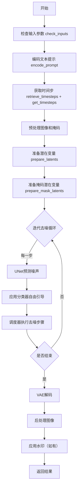

## 类结构

```
DiffusionPipeline (基类)
├── StableDiffusionMixin
├── StableDiffusionXLLoraLoaderMixin
├── FromSingleFileMixin
├── IPAdapterMixin
└── KolorsInpaintPipeline
```

## 全局变量及字段


### `EXAMPLE_DOC_STRING`
    
包含KolorsInpaintPipeline使用示例的文档字符串

类型：`str`
    


### `XLA_AVAILABLE`
    
标识PyTorch XLA是否可用的布尔值

类型：`bool`
    


### `logger`
    
用于记录KolorsInpaintPipeline运行日志的日志记录器

类型：`logging.Logger`
    


### `model_cpu_offload_seq`
    
指定模型CPU卸载顺序的字符串（text_encoder->image_encoder->unet->vae）

类型：`str`
    


### `_optional_components`
    
KolorsInpaintPipeline的可选组件列表

类型：`List[str]`
    


### `_callback_tensor_inputs`
    
回调函数中使用的张量输入名称列表

类型：`List[str]`
    


### `KolorsInpaintPipeline.vae`
    
Variational Auto-Encoder模型，用于图像与潜在表示之间的编解码

类型：`AutoencoderKL`
    


### `KolorsInpaintPipeline.text_encoder`
    
冻结的文本编码器，Kolors使用ChatGLM3-6B进行文本嵌入

类型：`ChatGLMModel`
    


### `KolorsInpaintPipeline.tokenizer`
    
ChatGLM分词器，用于将文本转换为token序列

类型：`ChatGLMTokenizer`
    


### `KolorsInpaintPipeline.unet`
    
条件U-Net架构，用于对编码后的图像潜在表示进行去噪

类型：`UNet2DConditionModel`
    


### `KolorsInpaintPipeline.scheduler`
    
扩散调度器，与unet配合使用对图像潜在表示进行去噪

类型：`KarrasDiffusionSchedulers`
    


### `KolorsInpaintPipeline.image_encoder`
    
CLIP视觉模型，用于提取图像特征和嵌入

类型：`CLIPVisionModelWithProjection`
    


### `KolorsInpaintPipeline.feature_extractor`
    
CLIP图像预处理器，用于将图像转换为模型输入格式

类型：`CLIPImageProcessor`
    


### `KolorsInpaintPipeline.vae_scale_factor`
    
VAE缩放因子，用于计算潜在空间的尺寸（2^(len(vae.config.block_out_channels)-1)）

类型：`int`
    


### `KolorsInpaintPipeline.image_processor`
    
VAE图像处理器，用于图像的预处理和后处理

类型：`VaeImageProcessor`
    


### `KolorsInpaintPipeline.mask_processor`
    
掩码图像处理器，用于掩码的预处理（包括归一化和二值化）

类型：`VaeImageProcessor`
    


### `KolorsInpaintPipeline.watermark`
    
用于给输出图像添加不可见水印的水印器

类型：`StableDiffusionXLWatermarker`
    


### `KolorsInpaintPipeline._guidance_scale`
    
分类器自由引导比例，控制文本提示对生成图像的影响程度

类型：`float`
    


### `KolorsInpaintPipeline._guidance_rescale`
    
引导重缩放因子，用于减少过度曝光的引导噪声配置

类型：`float`
    


### `KolorsInpaintPipeline._cross_attention_kwargs`
    
交叉注意力关键字参数，用于传递给注意力处理器

类型：`Dict[str, Any]`
    


### `KolorsInpaintPipeline._denoising_end`
    
去噪结束阈值，指定去噪过程完成的比例

类型：`float`
    


### `KolorsInpaintPipeline._denoising_start`
    
去噪开始阈值，指定从哪个比例开始进行去噪

类型：`float`
    


### `KolorsInpaintPipeline._num_timesteps`
    
去噪迭代的总时间步数

类型：`int`
    


### `KolorsInpaintPipeline._interrupt`
    
中断标志，用于在去噪循环中提前终止生成过程

类型：`bool`
    
    

## 全局函数及方法


### `rescale_noise_cfg`

该函数用于根据`guidance_rescale`参数重新缩放噪声预测配置（noise_cfg），基于论文《Common Diffusion Noise Schedules and Sample Steps are Flawed》的研究发现，通过调整噪声预测的标准差来修复过度曝光问题，并通过混合原始CFG结果避免生成图像看起来过于平淡。

参数：

- `noise_cfg`：`torch.Tensor`，经过分类器自由引导（Classifier-Free Guidance）后的噪声预测张量
- `noise_pred_text`：`torch.Tensor`，文本条件下的噪声预测张量（不含无分类器引导的成分）
- `guidance_rescale`：`float`，引导重缩放因子，默认为0.0，用于控制重新缩放后的噪声预测与原始噪声预测的混合比例

返回值：`torch.Tensor`，重新缩放后的噪声预测张量

#### 流程图

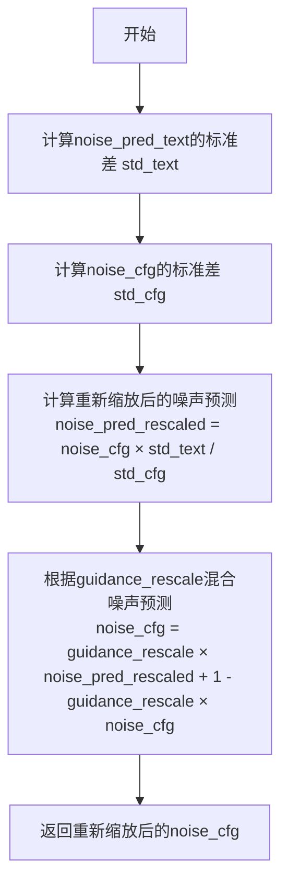

#### 带注释源码

```python
def rescale_noise_cfg(noise_cfg, noise_pred_text, guidance_rescale=0.0):
    """
    Rescale `noise_cfg` according to `guidance_rescale`. Based on findings of [Common Diffusion Noise Schedules and
    Sample Steps are Flawed](https://huggingface.co/papers/2305.08891). See Section 3.4
    
    该函数实现了论文中描述的噪声预测重缩放技术，用于解决CFG在高guidance_scale下
    导致的过度曝光和图像过饱和问题。
    """
    # 计算文本条件噪声预测的标准差
    # dim参数使用range(1, ndim)排除batch维度，只对空间维度计算标准差
    # keepdim=True保持维度以便后续广播运算
    std_text = noise_pred_text.std(dim=list(range(1, noise_pred_text.ndim)), keepdim=True)
    
    # 计算CFG噪声预测的标准差
    std_cfg = noise_cfg.std(dim=list(range(1, noise_cfg.ndim)), keepdim=True)
    
    # 使用文本预测的标准差对CFG噪声预测进行重缩放
    # 这一步修正了过度曝光问题
    noise_pred_rescaled = noise_cfg * (std_text / std_cfg)
    
    # 将重缩放后的预测与原始CFG预测按guidance_rescale因子混合
    # guidance_rescale=0时保留原始CFG预测，guidance_rescale=1时完全使用重缩放预测
    # 这种混合可以避免生成看起来过于平淡/Plain的图像
    noise_cfg = guidance_rescale * noise_pred_rescaled + (1 - guidance_rescale) * noise_cfg
    
    return noise_cfg
```


### `mask_pil_to_torch`

该函数是一个工具函数，用于将 PIL Image 或 numpy 数组格式的掩码（mask）转换为 PyTorch 张量（torch.Tensor）。它支持单个掩码或掩码列表的处理，会自动将 PIL Image 调整为指定尺寸、转换为灰度图，并进行像素值归一化（0-1 范围），最终返回适合深度学习模型输入的 4D 张量格式。

参数：

- `mask`：`Union[PIL.Image.Image, np.ndarray, List[PIL.Image.Image], List[np.ndarray]]`，输入的掩码数据，可以是单个 PIL Image、numpy 数组，或者是它们的列表
- `height`：`int`，目标图像的高度，用于调整掩码尺寸
- `width`：`int`，目标图像的宽度，用于调整掩码尺寸

返回值：`torch.Tensor`，返回转换后的 PyTorch 张量，形状为 (batch, 1, height, width)，像素值范围在 [0, 1]

#### 流程图

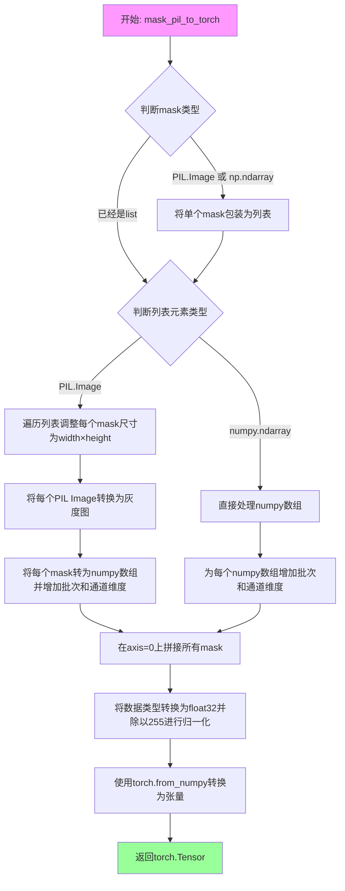

#### 带注释源码

```python
def mask_pil_to_torch(mask, height, width):
    """
    将PIL Image或numpy数组格式的掩码转换为PyTorch张量
    
    参数:
        mask: 输入的掩码，支持PIL.Image、numpy数组或它们的列表
        height: 目标高度
        width: 目标宽度
    
    返回:
        torch.Tensor: 转换后的掩码张量，形状为 (batch, 1, height, width)
    """
    # 预处理掩码：如果掩码是单个PIL.Image或np.ndarray，则转换为列表
    # 这样可以统一处理单个和多个掩码的情况
    if isinstance(mask, (PIL.Image.Image, np.ndarray)):
        mask = [mask]

    # 判断列表中的元素类型
    if isinstance(mask, list) and isinstance(mask[0], PIL.Image.Image):
        # 如果列表元素是PIL.Image，需要进行以下处理：
        
        # 1. 调整每个mask到指定的width和height尺寸
        # 使用LANCZOS重采样方法（高质量的图像缩放算法）
        mask = [i.resize((width, height), resample=PIL.Image.LANCZOS) for i in mask]
        
        # 2. 将每个PIL Image转换为灰度图（L模式），然后转为numpy数组
        # [None, None, :] 用于在数组开头增加批次维度和通道维度
        # 这样可以将 (H, W) 转换为 (1, 1, H, W) 的形状
        mask = np.concatenate([np.array(m.convert("L"))[None, None, :] for m in mask], axis=0)
        
        # 3. 转换为float32类型并归一化到[0, 1]范围
        # 像素值原本是0-255，归一化后方便深度学习模型处理
        mask = mask.astype(np.float32) / 255.0
        
    elif isinstance(mask, list) and isinstance(mask[0], np.ndarray):
        # 如果列表元素已经是numpy数组，同样增加批次和通道维度后拼接
        mask = np.concatenate([m[None, None, :] for m in mask], axis=0)

    # 将numpy数组转换为PyTorch张量
    # 得到的张量形状为 (batch, 1, height, width)
    mask = torch.from_numpy(mask)
    return mask
```


### `prepare_mask_and_masked_image`

该函数用于将图像和掩码准备为 Stable Diffusion pipeline 可消费的格式，将输入转换为 batch x channels x height x width 形状的 torch.Tensor，其中图像通道为 3，掩码通道为 1。图像被转换为 float32 并归一化到 [-1, 1] 范围，掩码被二值化（mask > 0.5）并转换为 float32。

**参数：**

- `image`：`Union[np.array, PIL.Image, torch.Tensor]`，待修复的图像，可以是 PIL.Image、height x width x 3 的 np.array、channels x height x width 的 torch.Tensor 或 batch x channels x height x width 的 torch.Tensor
- `mask`：待应用的掩码，即要修复的区域，类型与 image 相同
- `height`：`int`，目标高度
- `width`：`int`，目标宽度
- `return_image`：`bool`，是否返回原始图像，默认为 False

**返回值：** `tuple[torch.Tensor]`，返回 (mask, masked_image) 的元组，均为 4 维 torch.Tensor，形状为 batch x channels x height x width。如果 return_image 为 True，则返回 (mask, masked_image, image)。

#### 流程图

```mermaid
flowchart TD
    A[开始] --> B[发出弃用警告]
    B --> C{image是否为None?}
    C -->|是| D[抛出ValueError: image不能为undefined]
    C --> E{mask是否为None?}
    E -->|是| F[抛出ValueError: mask不能为undefined]
    E --> G{image是否为torch.Tensor?}
    G -->|是| H{mask是否为torch.Tensor?}
    H -->|否| I[将mask转换为torch.Tensor]
    I --> J[调整image维度<br/>添加batch维度]
    J --> K{处理mask维度<br/>添加batch/channel维度}
    K --> L[验证image和mask为4D张量]
    L --> M[验证batch_size相同]
    M --> N{检查mask范围[0,1]?}
    N -->|否| O[抛出ValueError: mask应在[0,1]范围]
    N -->|是| P[二值化mask<br/>mask<0.5设为0<br/>mask>=0.5设为1]
    P --> Q[将image转换为float32]
    G -->|否| R{mask是否为torch.Tensor?}
    R -->|是| S[抛出TypeError: 类型不匹配]
    R -->|否| T[预处理PIL/NumPy图像]
    T --> U{image是PIL/NumPy?}
    U -->|是| V[调整图像大小<br/>转换为numpy数组<br/>转换为torch.Tensor<br/>归一化到[-1,1]]
    U -->|否| W[跳过resize]
    V --> X[将mask转换为torch]
    W --> X
    X --> P
    Q --> Y{image.shape[1]==4?}
    Y -->|是| Z[图像在latent空间<br/>masked_image设为None]
    Y -->|否| AA[创建masked_image<br/>image * (mask < 0.5)]
    Z --> AB{return_image为True?}
    AA --> AB
    AB -->|是| AC[返回mask, masked_image, image]
    AB -->|否| AD[返回mask, masked_image]
    O --> AD
```

#### 带注释源码

```python
def prepare_mask_and_masked_image(image, mask, height, width, return_image: bool = False):
    """
    Prepares a pair (image, mask) to be consumed by the Stable Diffusion pipeline. This means that those inputs will be
    converted to ``torch.Tensor`` with shapes ``batch x channels x height x width`` where ``channels`` is ``3`` for the
    ``image`` and ``1`` for the ``mask``.

    The ``image`` will be converted to ``torch.float32`` and normalized to be in ``[-1, 1]``. The ``mask`` will be
    binarized (``mask > 0.5``) and cast to ``torch.float32`` too.

    Args:
        image (Union[np.array, PIL.Image, torch.Tensor]): The image to inpaint.
            It can be a ``PIL.Image``, or a ``height x width x 3`` ``np.array`` or a ``channels x height x width``
            ``torch.Tensor`` or a ``batch x channels x height x width`` ``torch.Tensor``.
        mask (_type_): The mask to apply to the image, i.e. regions to inpaint.
            It can be a ``PIL.Image``, or a ``height x width`` ``np.array`` or a ``1 x height x width``
            ``torch.Tensor`` or a ``batch x 1 x height x width`` ``torch.Tensor``.


    Raises:
        ValueError: ``torch.Tensor`` images should be in the ``[-1, 1]`` range. ValueError: ``torch.Tensor`` mask
        should be in the ``[0, 1]`` range. ValueError: ``mask`` and ``image`` should have the same spatial dimensions.
        TypeError: ``mask`` is a ``torch.Tensor`` but ``image`` is not
            (ot the other way around).

    Returns:
        tuple[torch.Tensor]: The pair (mask, masked_image) as ``torch.Tensor`` with 4
            dimensions: ``batch x channels x height x width``.
    """

    # checkpoint. TOD(Yiyi) - need to clean this up later
    # 发出弃用警告，提示该方法将在0.30.0版本移除
    deprecation_message = "The prepare_mask_and_masked_image method is deprecated and will be removed in a future version. Please use VaeImageProcessor.preprocess instead"
    deprecate(
        "prepare_mask_and_masked_image",
        "0.30.0",
        deprecation_message,
    )
    
    # 验证image输入不能为空
    if image is None:
        raise ValueError("`image` input cannot be undefined.")

    # 验证mask输入不能为空
    if mask is None:
        raise ValueError("`mask_image` input cannot be undefined.")

    # 分支1：image已经是torch.Tensor
    if isinstance(image, torch.Tensor):
        # 如果mask不是tensor，转换为torch tensor
        if not isinstance(mask, torch.Tensor):
            mask = mask_pil_to_torch(mask, height, width)

        # 如果image是3D (C,H,W)，添加batch维度变为4D (B,C,H,W)
        if image.ndim == 3:
            image = image.unsqueeze(0)

        # Batch and add channel dim for single mask
        # 处理单个mask的情况，2D mask需要添加batch和channel维度
        if mask.ndim == 2:
            mask = mask.unsqueeze(0).unsqueeze(0)

        # Batch single mask or add channel dim
        # 处理3D mask的各种情况
        if mask.ndim == 3:
            # Single batched mask, no channel dim or single mask not batched but channel dim
            if mask.shape[0] == 1:
                mask = mask.unsqueeze(0)

            # Batched masks no channel dim
            else:
                mask = mask.unsqueeze(1)

        # 验证image和mask都是4D张量
        assert image.ndim == 4 and mask.ndim == 4, "Image and Mask must have 4 dimensions"
        # assert image.shape[-2:] == mask.shape[-2:], "Image and Mask must have the same spatial dimensions"
        
        # 验证batch size相同
        assert image.shape[0] == mask.shape[0], "Image and Mask must have the same batch size"

        # Check image is in [-1, 1]
        # if image.min() < -1 or image.max() > 1:
        #    raise ValueError("Image should be in [-1, 1] range")

        # 检查mask在[0,1]范围内
        if mask.min() < 0 or mask.max() > 1:
            raise ValueError("Mask should be in [0, 1] range")

        # 二值化mask：小于0.5设为0，大于等于0.5设为1
        mask[mask < 0.5] = 0
        mask[mask >= 0.5] = 1

        # Image as float32
        # 将image转换为float32类型
        image = image.to(dtype=torch.float32)
    
    # 分支2：mask是torch.Tensor但image不是
    elif isinstance(mask, torch.Tensor):
        raise TypeError(f"`mask` is a torch.Tensor but `image` (type: {type(image)} is not")
    
    # 分支3：image和mask都是PIL.Image或np.ndarray
    else:
        # preprocess image
        # 如果是单个PIL Image或np array，转换为列表
        if isinstance(image, (PIL.Image.Image, np.ndarray)):
            image = [image]
        
        # 处理PIL图像列表：resize到目标尺寸，转换为RGB，转为numpy数组
        if isinstance(image, list) and isinstance(image[0], PIL.Image.Image):
            # resize all images w.r.t passed height an width
            image = [i.resize((width, height), resample=PIL.Image.LANCZOS) for i in image]
            image = [np.array(i.convert("RGB"))[None, :] for i in image]
            image = np.concatenate(image, axis=0)
        # 处理numpy数组列表
        elif isinstance(image, list) and isinstance(image[0], np.ndarray):
            image = np.concatenate([i[None, :] for i in image], axis=0)

        # 转换维度从 (B, H, W, C) 到 (B, C, H, W)
        image = image.transpose(0, 3, 1, 2)
        # 转换为torch tensor并归一化到[-1,1]范围 (127.5 - 1.0)
        image = torch.from_numpy(image).to(dtype=torch.float32) / 127.5 - 1.0

        # 将mask转换为torch tensor
        mask = mask_pil_to_torch(mask, height, width)
        # 二值化mask
        mask[mask < 0.5] = 0
        mask[mask >= 0.5] = 1

    # 判断是否为latent空间的图像（通道数为4）
    if image.shape[1] == 4:
        # images are in latent space and thus can't
        # be masked set masked_image to None
        # we assume that the checkpoint is not an inpainting
        # checkpoint. TOD(Yiyi) - need to clean this up later
        # latent空间的图像无法直接mask，设为None
        masked_image = None
    else:
        # 创建masked_image：保留mask为0的区域，mask为1的区域被遮挡
        # mask < 0.5 为True的位置保留原图，为False的位置设为0
        masked_image = image * (mask < 0.5)

    # n.b. ensure backwards compatibility as old function does not return image
    # 保持向后兼容，如果return_image为True则返回三个值
    if return_image:
        return mask, masked_image, image

    return mask, masked_image
```


### `retrieve_latents`

该函数是Stable Diffusion pipeline中用于从VAE编码器输出中提取潜在表示（latents）的工具函数。它根据不同的采样模式（sample或argmax）从encoder_output中获取潜在向量，支持从`latent_dist`分布中采样或获取其模式值，或直接返回预存的`latents`属性。

参数：

- `encoder_output`：`torch.Tensor`，VAE编码器的输出对象，可能包含`latent_dist`属性（DiagonalGaussianDistribution类型）或`latents`属性
- `generator`：`torch.Generator | None`，可选的随机数生成器，用于确保采样过程的可重复性
- `sample_mode`：`str`，采样模式，默认为"sample"，可选值为"sample"（从分布中采样）或"argmax"（获取分布的模式值）

返回值：`torch.Tensor`，从编码器输出中提取的潜在表示张量

#### 流程图

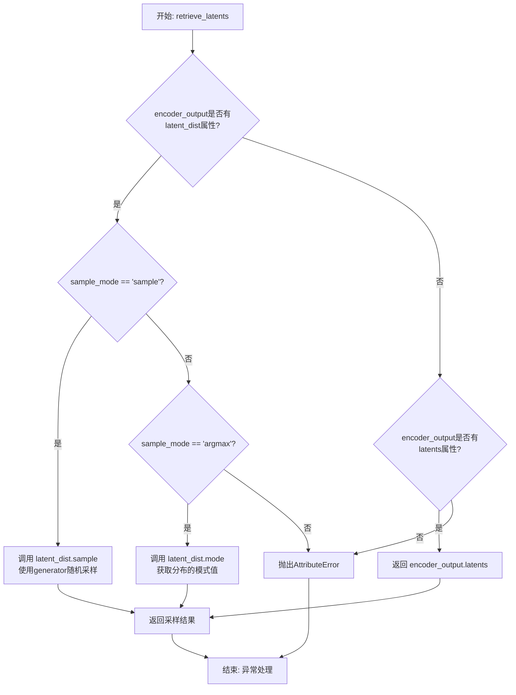

#### 带注释源码

```python
def retrieve_latents(
    encoder_output: torch.Tensor, generator: torch.Generator | None = None, sample_mode: str = "sample"
):
    """
    从VAE编码器输出中提取潜在表示。
    
    该函数处理不同的encoder_output格式：
    1. 当encoder_output包含latent_dist属性（DiagonalGaussianDistribution对象）时，
       根据sample_mode参数从分布中采样或获取模式值
    2. 当encoder_output包含latents属性时，直接返回该属性值
    
    Args:
        encoder_output: VAE编码器的输出，通常是EncoderOutput类型
        generator: 可选的PyTorch随机数生成器，用于控制采样随机性
        sample_mode: 采样模式，'sample'从分布采样，'argmax'获取分布模式
    
    Returns:
        torch.Tensor: 潜在表示张量
    
    Raises:
        AttributeError: 当encoder_output既没有latent_dist也没有latents属性时抛出
    """
    # 检查encoder_output是否有latent_dist属性且请求的采样模式为sample
    if hasattr(encoder_output, "latent_dist") and sample_mode == "sample":
        # 从潜在空间分布中采样，支持通过generator控制随机性
        return encoder_output.latent_dist.sample(generator)
    # 检查encoder_output是否有latent_dist属性且请求的采样模式为argmax
    elif hasattr(encoder_output, "latent_dist") and sample_mode == "argmax":
        # 获取潜在空间分布的模式（即均值或最大概率位置）
        return encoder_output.latent_dist.mode()
    # 检查encoder_output是否直接包含latents属性
    elif hasattr(encoder_output, "latents"):
        # 直接返回预计算的潜在表示
        return encoder_output.latents
    # 如果无法访问所需的潜在表示属性，抛出异常
    else:
        raise AttributeError("Could not access latents of provided encoder_output")
```


### `retrieve_timesteps`

该函数是全局工具函数，负责调用调度器的`set_timesteps`方法并从中获取时间步调度。它支持自定义时间步或sigmas，并能处理不同的调度器配置，返回时间步张量和推理步数。

参数：

- `scheduler`：`SchedulerMixin`，调度器对象，用于获取时间步
- `num_inference_steps`：`Optional[int]`，生成样本时使用的扩散步数，如果使用则`timesteps`必须为None
- `device`：`Optional[Union[str, torch.device]]`，时间步要移动到的设备，如果为None则不移动
- `timesteps`：`Optional[List[int]]`，用于覆盖调度器时间步间隔策略的自定义时间步，如果传入则`num_inference_steps`和`sigmas`必须为None
- `sigmas`：`Optional[List[float]]`，用于覆盖调度器时间步间隔策略的自定义sigmas，如果传入则`num_inference_steps`和`timesteps`必须为None

返回值：`Tuple[torch.Tensor, int]`，元组第一个元素是调度器的时间步调度，第二个元素是推理步数

#### 流程图

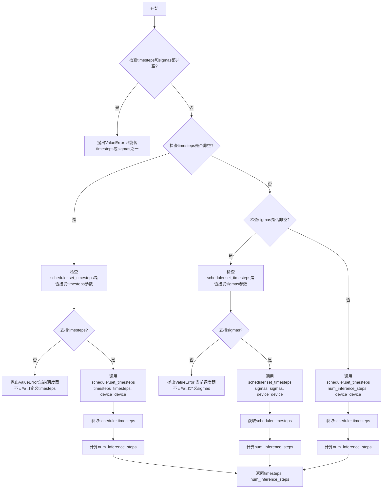

#### 带注释源码

```python
def retrieve_timesteps(
    scheduler,
    num_inference_steps: Optional[int] = None,
    device: Optional[Union[str, torch.device]] = None,
    timesteps: Optional[List[int]] = None,
    sigmas: Optional[List[float]] = None,
    **kwargs,
):
    """
    Calls the scheduler's `set_timesteps` method and retrieves timesteps from the scheduler after the call. Handles
    custom timesteps. Any kwargs will be supplied to `scheduler.set_timesteps`.

    Args:
        scheduler (`SchedulerMixin`):
            The scheduler to get timesteps from.
        num_inference_steps (`int`):
            The number of diffusion steps used when generating samples with a pre-trained model. If used, `timesteps`
            must be `None`.
        device (`str` or `torch.device`, *optional*):
            The device to which the timesteps should be moved to. If `None`, the timesteps are not moved.
        timesteps (`List[int]`, *optional*):
            Custom timesteps used to override the timestep spacing strategy of the scheduler. If `timesteps` is passed,
            `num_inference_steps` and `sigmas` must be `None`.
        sigmas (`List[float]`, *optional*):
            Custom sigmas used to override the timestep spacing strategy of the scheduler. If `sigmas` is passed,
            `num_inference_steps` and `timesteps` must be `None`.

    Returns:
        `Tuple[torch.Tensor, int]`: A tuple where the first element is the timestep schedule from the scheduler and the
        second element is the number of inference steps.
    """
    # 检查是否同时传入了timesteps和sigmas，只能二选一
    if timesteps is not None and sigmas is not None:
        raise ValueError("Only one of `timesteps` or `sigmas` can be passed. Please choose one to set custom values")
    
    # 处理自定义timesteps的情况
    if timesteps is not None:
        # 检查调度器的set_timesteps方法是否接受timesteps参数
        accepts_timesteps = "timesteps" in set(inspect.signature(scheduler.set_timesteps).parameters.keys())
        if not accepts_timesteps:
            raise ValueError(
                f"The current scheduler class {scheduler.__class__}'s `set_timesteps` does not support custom"
                f" timestep schedules. Please check whether you are using the correct scheduler."
            )
        # 调用调度器的set_timesteps方法，传入自定义timesteps
        scheduler.set_timesteps(timesteps=timesteps, device=device, **kwargs)
        # 从调度器获取设置后的timesteps
        timesteps = scheduler.timesteps
        # 计算推理步数
        num_inference_steps = len(timesteps)
    # 处理自定义sigmas的情况
    elif sigmas is not None:
        # 检查调度器的set_timesteps方法是否接受sigmas参数
        accept_sigmas = "sigmas" in set(inspect.signature(scheduler.set_timesteps).parameters.keys())
        if not accept_sigmas:
            raise ValueError(
                f"The current scheduler class {scheduler.__class__}'s `set_timesteps` does not support custom"
                f" sigmas schedules. Please check whether you are using the correct scheduler."
            )
        # 调用调度器的set_timesteps方法，传入自定义sigmas
        scheduler.set_timesteps(sigmas=sigmas, device=device, **kwargs)
        # 从调度器获取设置后的timesteps
        timesteps = scheduler.timesteps
        # 计算推理步数
        num_inference_steps = len(timesteps)
    # 默认情况：使用num_inference_steps设置timesteps
    else:
        scheduler.set_timesteps(num_inference_steps, device=device, **kwargs)
        timesteps = scheduler.timesteps
    
    # 返回timesteps张量和推理步数
    return timesteps, num_inference_steps
```


### `KolorsInpaintPipeline.__init__`

初始化 Kolors 图像修复管道，整合 VAE、文本编码器、UNet、调度器等核心组件，并配置图像处理器和水印处理器。

参数：

-  `vae`：`AutoencoderKL`，变分自编码器模型，用于编码和解码图像与潜在表示
-  `text_encoder`：`ChatGLMModel`，冻结的文本编码器，Kolors 使用 ChatGLM3-6B
-  `tokenizer`：`ChatGLMTokenizer`，ChatGLMTokenizer 类的分词器
-  `unet`：`UNet2DConditionModel`，条件 U-Net 架构，用于对编码后的图像潜在表示进行去噪
-  `scheduler`：`KarrasDiffusionSchedulers`，与 `unet` 结合使用以对编码图像潜在表示进行去噪的调度器
-  `image_encoder`：`CLIPVisionModelWithProjection`，可选的 CLIP 视觉模型，用于 IP-Adapter
-  `feature_extractor`：`CLIPImageProcessor`，可选的 CLIP 图像预处理器
-  `requires_aesthetics_score`：`bool`，可选，默认为 `False`，表示 `unet` 是否需要在推理时传入美学评分条件
-  `force_zeros_for_empty_prompt`：`bool`，可选，默认为 `True`，是否将负提示嵌入强制设为 0
-  `add_watermarker`：`Optional[bool]`，可选，是否使用 invisible_watermark 库对输出图像加水印

返回值：`None`，构造函数无返回值

#### 流程图

```mermaid
flowchart TD
    A[开始 __init__] --> B[调用 super().__init__]
    B --> C[register_modules: 注册 vae, text_encoder, tokenizer, unet, image_encoder, feature_extractor, scheduler]
    C --> D[register_to_config: 注册 force_zeros_for_empty_prompt 和 requires_aesthetics_score]
    D --> E[计算 vae_scale_factor: 2 ** (len(vae.config.block_out_channels) - 1)]
    E --> F[创建 VaeImageProcessor: 用于图像预处理]
    F --> G[创建 VaeImageProcessor: 用于掩码预处理, 包含二值化和灰度转换]
    G --> H{add_watermarker 是否为 None?}
    H -->|是| I[检查 is_invisible_watermark_available]
    H -->|否| J{add_watermarker 为 True?}
    I --> J
    J -->|是| K[创建 StableDiffusionXLWatermarker 实例]
    J -->|否| L[设置 self.watermark = None]
    K --> M[结束]
    L --> M
```

#### 带注释源码

```python
def __init__(
    self,
    vae: AutoencoderKL,                              # 变分自编码器，用于图像编解码
    text_encoder: ChatGLMModel,                      # 文本编码器 (ChatGLM3-6B)
    tokenizer: ChatGLMTokenizer,                     # 分词器
    unet: UNet2DConditionModel,                      # 条件U-Net去噪模型
    scheduler: KarrasDiffusionSchedulers,            # 扩散调度器
    image_encoder: CLIPVisionModelWithProjection = None,  # CLIP视觉编码器(可选)
    feature_extractor: CLIPImageProcessor = None,    # 图像特征提取器(可选)
    requires_aesthetics_score: bool = False,         # 是否需要美学评分
    force_zeros_for_empty_prompt: bool = True,        # 空提示时是否强制零嵌入
    add_watermarker: Optional[bool] = None,          # 是否添加水印
):
    # 调用父类 DiffusionPipeline 的初始化方法
    super().__init__()

    # 注册所有模块到管道，使管道能够管理这些组件
    self.register_modules(
        vae=vae,
        text_encoder=text_encoder,
        tokenizer=tokenizer,
        unet=unet,
        image_encoder=image_encoder,
        feature_extractor=feature_extractor,
        scheduler=scheduler,
    )

    # 将配置参数注册到管道配置中
    self.register_to_config(force_zeros_for_empty_prompt=force_zeros_for_empty_prompt)
    self.register_to_config(requires_aesthetics_score=requires_aesthetics_score)

    # 计算 VAE 缩放因子，用于调整潜在空间维度
    # 基于 VAE 的 block_out_channels 数量 (通常是 [128, 256, 512, 512])
    self.vae_scale_factor = 2 ** (len(self.vae.config.block_out_channels) - 1)

    # 创建图像处理器，用于预处理输入图像
    self.image_processor = VaeImageProcessor(vae_scale_factor=self.vae_scale_factor)

    # 创建掩码处理器，用于预处理掩码图像
    # do_normalize=False: 不归一化
    # do_binarize=True: 进行二值化处理
    # do_convert_grayscale=True: 转换为灰度图
    self.mask_processor = VaeImageProcessor(
        vae_scale_factor=self.vae_scale_factor,
        do_normalize=False,
        do_binarize=True,
        do_convert_grayscale=True
    )

    # 如果未指定 add_watermarker，则默认根据水印库是否可用决定
    add_watermarker = add_watermarker if add_watermarker is not None else is_invisible_watermark_available()

    # 根据 add_watermarker 配置水印处理器
    if add_watermarker:
        self.watermark = StableDiffusionXLWatermarker()  # 创建水印器实例
    else:
        self.watermark = None  # 不使用水印
```


### `KolorsInpaintPipeline.encode_image`

该方法用于将输入图像编码为图像嵌入向量，支持两种模式：当 `output_hidden_states=True` 时返回图像Encoder的隐藏状态；当 `output_hidden_states=False`（默认）时返回图像embeddings。该方法同时生成对应的无条件（unconditional）图像嵌入，用于分类器自由引导（Classifier-Free Guidance）。

参数：

- `image`：`Union[PIL.Image.Image, np.ndarray, torch.Tensor]`，输入图像，可以是PIL图像、numpy数组或PyTorch张量
- `device`：`torch.device`，目标设备，用于将图像移动到指定设备
- `num_images_per_prompt`：`int`，每个prompt生成的图像数量，用于扩展embeddings维度
- `output_hidden_states`：`Optional[bool]`，是否输出图像Encoder的隐藏状态，默认为None（即False）

返回值：`Tuple[torch.Tensor, torch.Tensor]`，返回一个元组，包含：
- 第一个元素：条件图像嵌入（image_embeds 或 image_enc_hidden_states）
- 第二个元素：无条件图像嵌入（uncond_image_embeds 或 uncond_image_enc_hidden_states）

#### 流程图

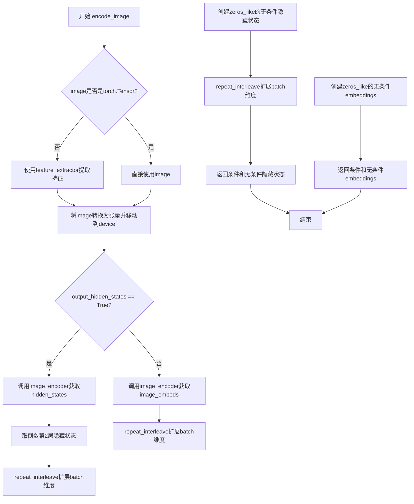

#### 带注释源码

```python
def encode_image(self, image, device, num_images_per_prompt, output_hidden_states=None):
    """
    将输入图像编码为图像嵌入向量，用于后续的扩散模型生成。
    支持两种模式：embeddings模式和hidden_states模式。
    
    参数:
        image: 输入图像，支持PIL.Image、np.ndarray或torch.Tensor格式
        device: 目标设备
        num_images_per_prompt: 每个prompt生成的图像数量
        output_hidden_states: 是否输出隐藏状态而非image_embeds
    
    返回:
        元组 (条件嵌入, 无条件嵌入)
    """
    # 获取image_encoder的参数dtype，确保输入数据类型一致
    dtype = next(self.image_encoder.parameters()).dtype

    # 如果输入不是torch.Tensor，使用feature_extractor进行预处理
    if not isinstance(image, torch.Tensor):
        # 使用CLIP图像处理器提取特征，返回pixel_values
        image = self.feature_extractor(image, return_tensors="pt").pixel_values

    # 将图像移动到指定设备，并转换为正确的dtype
    image = image.to(device=device, dtype=dtype)
    
    # 根据output_hidden_states决定输出模式
    if output_hidden_states:
        # 模式1: 输出隐藏状态（用于IP-Adapter等需要细粒度特征的场景）
        
        # 编码图像，获取所有隐藏状态，取倒数第2层（通常是倒数第二好的特征层）
        image_enc_hidden_states = self.image_encoder(image, output_hidden_states=True).hidden_states[-2]
        
        # 扩展batch维度：每个prompt生成多张图像
        image_enc_hidden_states = image_enc_hidden_states.repeat_interleave(num_images_per_prompt, dim=0)
        
        # 创建零张量作为无条件图像嵌入（对应negative prompt）
        uncond_image_enc_hidden_states = self.image_encoder(
            torch.zeros_like(image), output_hidden_states=True
        ).hidden_states[-2]
        
        # 同样扩展无条件embeddings的batch维度
        uncond_image_enc_hidden_states = uncond_image_enc_hidden_states.repeat_interleave(
            num_images_per_prompt, dim=0
        )
        
        # 返回隐藏状态元组
        return image_enc_hidden_states, uncond_image_enc_hidden_states
    else:
        # 模式2: 输出图像embeddings（默认模式，用于常规图像条件）
        
        # 编码图像，获取image_embeds（CLIP投影后的特征）
        image_embeds = self.image_encoder(image).image_embeds
        
        # 扩展batch维度
        image_embeds = image_embeds.repeat_interleave(num_images_per_prompt, dim=0)
        
        # 创建零张量作为无条件图像embeddings
        uncond_image_embeds = torch.zeros_like(image_embeds)
        
        # 返回embeddings元组
        return image_embeds, uncond_image_embeds
```


### `KolorsInpaintPipeline.prepare_ip_adapter_image_embeds`

该方法用于准备 IP-Adapter 的图像嵌入向量。它接受原始 IP 适配器图像或预计算的图像嵌入，处理后返回适合扩散模型使用的图像嵌入列表，支持分类器自由引导（classifier-free guidance）模式。

参数：

- `self`：`KolorsInpaintPipeline` 实例本身
- `ip_adapter_image`：`PipelineImageInput` 类型，输入的 IP 适配器图像，可以是 PIL.Image、numpy 数组、torch.Tensor 或它们的列表；当 `ip_adapter_image_embeds` 为 None 时使用
- `ip_adapter_image_embeds`：`Optional[List[torch.Tensor]]` 类型，预计算的 IP 适配器图像嵌入列表；如果为 None，则从 `ip_adapter_image` 编码生成
- `device`：`torch.device` 类型，计算设备（CPU/CUDA）
- `num_images_per_prompt`：`int` 类型，每个 prompt 生成的图像数量
- `do_classifier_free_guidance`：`bool` 类型，是否启用分类器自由引导

返回值：`List[torch.Tensor]`，处理后的图像嵌入列表，每个元素对应一个 IP 适配器

#### 流程图

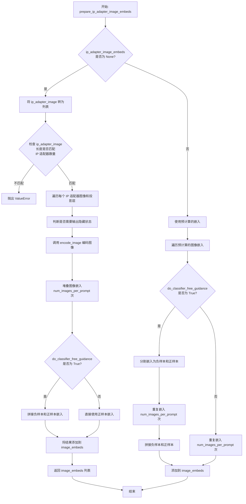

#### 带注释源码

```python
def prepare_ip_adapter_image_embeds(
    self, 
    ip_adapter_image,  # 输入的 IP 适配器图像
    ip_adapter_image_embeds,  # 预计算的图像嵌入（可选）
    device,  # 计算设备
    num_images_per_prompt,  # 每个 prompt 生成的图像数量
    do_classifier_free_guidance  # 是否启用分类器自由引导
):
    """
    准备 IP-Adapter 的图像嵌入向量
    
    该方法处理两种情况：
    1. 提供原始图像：从图像编码生成嵌入
    2. 提供预计算嵌入：直接处理传入的嵌入向量
    """
    
    # 情况一：需要从原始图像编码生成嵌入
    if ip_adapter_image_embeds is None:
        # 确保图像是列表格式
        if not isinstance(ip_adapter_image, list):
            ip_adapter_image = [ip_adapter_image]

        # 验证图像数量与 IP 适配器数量匹配
        if len(ip_adapter_image) != len(self.unet.encoder_hid_proj.image_projection_layers):
            raise ValueError(
                f"`ip_adapter_image` must have same length as the number of IP Adapters. "
                f"Got {len(ip_adapter_image)} images and "
                f"{len(self.unet.encoder_hid_proj.image_projection_layers)} IP Adapters."
            )

        image_embeds = []
        
        # 遍历每个 IP 适配器的图像和对应的投影层
        for single_ip_adapter_image, image_proj_layer in zip(
            ip_adapter_image, 
            self.unet.encoder_hid_proj.image_projection_layers
        ):
            # 判断是否需要输出隐藏状态（ImageProjection 类型不需要）
            output_hidden_state = not isinstance(image_proj_layer, ImageProjection)
            
            # 编码单个图像得到嵌入（包含正向和负向嵌入）
            single_image_embeds, single_negative_image_embeds = self.encode_image(
                single_ip_adapter_image, 
                device, 
                1,  # 每次编码一张图
                output_hidden_state
            )
            
            # 为每个 prompt 复制图像嵌入
            single_image_embeds = torch.stack([single_image_embeds] * num_images_per_prompt, dim=0)
            single_negative_image_embeds = torch.stack(
                [single_negative_image_embeds] * num_images_per_prompt, 
                dim=0
            )

            # 如果启用分类器自由引导，需要拼接负样本和正样本
            if do_classifier_free_guidance:
                # 格式：[负样本, 正样本]
                single_image_embeds = torch.cat(
                    [single_negative_image_embeds, single_image_embeds]
                )
                single_image_embeds = single_image_embeds.to(device)

            image_embeds.append(single_image_embeds)
    
    # 情况二：使用预计算的嵌入
    else:
        repeat_dims = [1]  # 用于重复嵌入的维度
        image_embeds = []
        
        # 遍历预计算的嵌入
        for single_image_embeds in ip_adapter_image_embeds:
            if do_classifier_free_guidance:
                # 分割为负样本和正样本（假设已经拼接在一起）
                single_negative_image_embeds, single_image_embeds = single_image_embeds.chunk(2)
                
                # 重复嵌入以匹配 num_images_per_prompt
                single_image_embeds = single_image_embeds.repeat(
                    num_images_per_prompt, 
                    *(repeat_dims * len(single_image_embeds.shape[1:]))
                )
                single_negative_image_embeds = single_negative_image_embeds.repeat(
                    num_images_per_prompt, 
                    *(repeat_dims * len(single_negative_image_embeds.shape[1:]))
                )
                
                # 拼接负样本和正样本
                single_image_embeds = torch.cat(
                    [single_negative_image_embeds, single_image_embeds]
                )
            else:
                # 不启用分类器自由引导时只重复正样本
                single_image_embeds = single_image_embeds.repeat(
                    num_images_per_prompt, 
                    *(repeat_dims * len(single_image_embeds.shape[1:]))
                )
            
            image_embeds.append(single_image_embeds)

    return image_embeds
```


### `KolorsInpaintPipeline.encode_prompt`

该方法负责将文本提示（prompt）编码为文本编码器的隐藏状态（hidden states），支持无分类器引导（Classifier-Free Guidance），并处理正负提示的嵌入生成以及LoRA权重的应用。

参数：

- `self`：`KolorsInpaintPipeline` 类的实例，隐式参数
- `prompt`：`str` 或 `List[str]`，要编码的文本提示，可以是单个字符串或字符串列表
- `device`：`Optional[torch.device]`，目标计算设备，如果为None则使用执行设备
- `num_images_per_prompt`：`int`，每个提示词要生成的图像数量，默认为1
- `do_classifier_free_guidance`：`bool`，是否启用无分类器引导，默认为True
- `negative_prompt`：`str` 或 `List[str]` 或 `None`，负面提示词，用于引导图像生成远离特定内容
- `prompt_embeds`：`Optional[torch.FloatTensor]`，预生成的文本嵌入，如果提供则直接使用
- `negative_prompt_embeds`：`Optional[torch.FloatTensor]`，预生成的负面文本嵌入
- `pooled_prompt_embeds`：`Optional[torch.FloatTensor]`，预生成的池化文本嵌入
- `negative_pooled_prompt_embeds`：`Optional[torch.FloatTensor]`，预生成的负面池化文本嵌入
- `lora_scale`：`Optional[float]`，LoRA权重缩放因子，用于调整LoRA层的影响

返回值：`Tuple[torch.FloatTensor, torch.FloatTensor, torch.FloatTensor, torch.FloatTensor]`，返回四个张量：prompt_embeds（编码后的提示嵌入）、negative_prompt_embeds（编码后的负面提示嵌入）、pooled_prompt_embeds（池化后的提示嵌入）、negative_pooled_prompt_embeds（池化后的负面提示嵌入）

#### 流程图

```mermaid
flowchart TD
    A[开始 encode_prompt] --> B{device 是否为 None?}
    B -- 是 --> C[使用 self._execution_device]
    B -- 否 --> D[使用传入的 device]
    C --> E{设置 LoRA scale}
    E --> F{prompt 是否为 str?}
    F -- 是 --> G[batch_size = 1]
    F -- 否 --> H{prompt 是否为 list?}
    H -- 是 --> I[batch_size = len(prompt)]
    H -- 否 --> J[batch_size = prompt_embeds.shape[0]]
    G --> K[定义 tokenizers 和 text_encoders]
    I --> K
    J --> K
    K --> L{prompt_embeds 是否为 None?}
    L -- 是 --> M[遍历 tokenizers 和 text_encoders]
    L -- 否 --> N[跳过文本编码步骤]
    M --> O{是否为 TextualInversionLoaderMixin?}
    O -- 是 --> P[调用 maybe_convert_prompt]
    O -- 否 --> Q[直接使用原始 prompt]
    P --> Q
    Q --> R[tokenizer 处理 prompt]
    R --> S[text_encoder 编码获取 hidden_states]
    S --> T[提取倒数第二层 hidden_states 作为 prompt_embeds]
    T --> U[提取最后一层 hidden_states 的最后一个 token 作为 pooled_prompt_embeds]
    U --> V[重复 prompt_embeds num_images_per_prompt 次]
    V --> W[返回 prompt_embeds_list]
    N --> X{do_classifier_free_guidance 为真且 negative_prompt_embeds 为 None?}
    X -- 是 --> Y{force_zeros_for_empty_prompt 为真?}
    Y -- 是 --> Z[创建全零 negative_prompt_embeds]
    Y -- 否 --> AA[处理 negative_prompt]
    Z --> AB[重复 negative_prompt_embeds]
    AA --> AB
    X -- 否 --> AC[使用已提供的 negative_prompt_embeds]
    AB --> AD{遍历 tokenizers 和 text_encoders}
    AD --> AE[tokenizer 处理 uncond_tokens]
    AE --> AF[text_encoder 编码获取 negative_hidden_states]
    AF --> AG[提取倒数第二层作为 negative_prompt_embeds]
    AG --> AH[提取最后一层的最后一个 token 作为 negative_pooled_prompt_embeds]
    AH --> AI{do_classifier_free_guidance 为真?}
    AI -- 是 --> AJ[重复 negative_prompt_embeds]
    AI -- 否 --> AK[保持不变]
    AJ --> AL[重复 pooled_prompt_embeds]
    AK --> AL
    AL --> AM[返回所有四个嵌入]
```

#### 带注释源码

```python
def encode_prompt(
    self,
    prompt,
    device: Optional[torch.device] = None,
    num_images_per_prompt: int = 1,
    do_classifier_free_guidance: bool = True,
    negative_prompt=None,
    prompt_embeds: Optional[torch.FloatTensor] = None,
    negative_prompt_embeds: Optional[torch.FloatTensor] = None,
    pooled_prompt_embeds: Optional[torch.FloatTensor] = None,
    negative_pooled_prompt_embeds: Optional[torch.FloatTensor] = None,
    lora_scale: Optional[float] = None,
):
    r"""
    Encodes the prompt into text encoder hidden states.

    Args:
         prompt (`str` or `List[str]`, *optional*):
            prompt to be encoded
        device: (`torch.device`):
            torch device
        num_images_per_prompt (`int`):
            number of images that should be generated per prompt
        do_classifier_free_guidance (`bool`):
            whether to use classifier free guidance or not
        negative_prompt (`str` or `List[str]`, *optional*):
            The prompt or prompts not to guide the image generation. If not defined, one has to pass
            `negative_prompt_embeds` instead. Ignored when not using guidance (i.e., ignored if `guidance_scale` is
            less than `1`).
        prompt_embeds (`torch.FloatTensor`, *optional*):
            Pre-generated text embeddings. Can be used to easily tweak text inputs, *e.g.* prompt weighting. If not
            provided, text embeddings will be generated from `prompt` input argument.
        negative_prompt_embeds (`torch.FloatTensor`, *optional*):
            Pre-generated negative text embeddings. Can be used to easily tweak text inputs, *e.g.* prompt
            weighting. If not provided, negative_prompt_embeds will be generated from `negative_prompt` input
            argument.
        pooled_prompt_embeds (`torch.FloatTensor`, *optional*):
            Pre-generated pooled text embeddings. Can be used to easily tweak text inputs, *e.g.* prompt weighting.
            If not provided, pooled text embeddings will be generated from `prompt` input argument.
        negative_pooled_prompt_embeds (`torch.FloatTensor`, *optional*):
            Pre-generated negative pooled text embeddings. Can be used to easily tweak text inputs, *e.g.* prompt
            weighting. If not provided, pooled negative_prompt_embeds will be generated from `negative_prompt`
            input argument.
        lora_scale (`float`, *optional*):
            A lora scale that will be applied to all LoRA layers of the text encoder if LoRA layers are loaded.
    """
    # 确定执行设备，如果未指定则使用管道的默认执行设备
    device = device or self._execution_device

    # 设置 LoRA 缩放因子，以便文本编码器的 LoRA 函数可以正确访问
    # 只有当类包含 StableDiffusionXLLoraLoaderMixin 时才设置
    if lora_scale is not None and isinstance(self, StableDiffusionXLLoraLoaderMixin):
        self._lora_scale = lora_scale

    # 根据 prompt 的类型确定批量大小
    if prompt is not None and isinstance(prompt, str):
        batch_size = 1
    elif prompt is not None and isinstance(prompt, list):
        batch_size = len(prompt)
    else:
        # 如果 prompt 为 None，则使用预提供的 prompt_embeds 的批量大小
        batch_size = prompt_embeds.shape[0]

    # 定义文本编码器列表（这里只使用一个 tokenizer 和 text_encoder）
    tokenizers = [self.tokenizer]
    text_encoders = [self.text_encoder]

    # 如果没有提供 prompt_embeds，则从 prompt 生成
    if prompt_embeds is None:
        # textual inversion：如果需要，处理多向量 token
        prompt_embeds_list = []
        for tokenizer, text_encoder in zip(tokenizers, text_encoders):
            # 如果是 TextualInversionLoaderMixin，转换 prompt
            if isinstance(self, TextualInversionLoaderMixin):
                prompt = self.maybe_convert_prompt(prompt, tokenizer)

            # 使用 tokenizer 将 prompt 转换为模型输入格式
            text_inputs = tokenizer(
                prompt,
                padding="max_length",
                max_length=256,
                truncation=True,
                return_tensors="pt",
            ).to(self._execution_device)
            
            # 使用 text_encoder 编码，获取隐藏状态
            output = text_encoder(
                input_ids=text_inputs["input_ids"],
                attention_mask=text_inputs["attention_mask"],
                position_ids=text_inputs["position_ids"],
                output_hidden_states=True,
            )
            
            # 获取倒数第二层的隐藏状态作为 prompt_embeds
            # permute(1, 0, 2) 将形状从 [batch, seq_len, hidden] 转换为 [seq_len, batch, hidden]
            prompt_embeds = output.hidden_states[-2].permute(1, 0, 2).clone()
            
            # 获取最后一层的最后一个 token 的隐藏状态作为 pooled_prompt_embeds
            pooled_prompt_embeds = output.hidden_states[-1][-1, :, :].clone()  # [batch_size, 4096]
            
            bs_embed, seq_len, _ = prompt_embeds.shape
            
            # 扩展 prompt_embeds 以匹配生成的图像数量
            prompt_embeds = prompt_embeds.repeat(1, num_images_per_prompt, 1)
            prompt_embeds = prompt_embeds.view(bs_embed * num_images_per_prompt, seq_len, -1)
            prompt_embeds_list.append(prompt_embeds)

        # prompt_embeds = torch.concat(prompt_embeds_list, dim=-1)
        # 这里只使用第一个（也是唯一的）text_encoder 的结果
        prompt_embeds = prompt_embeds_list[0]

    # 获取无分类器引导的 unconditional embeddings
    # 判断是否需要将 negative_prompt 设为零
    zero_out_negative_prompt = negative_prompt is None and self.config.force_zeros_for_empty_prompt
    
    # 如果启用引导且没有提供 negative_prompt_embeds
    if do_classifier_free_guidance and negative_prompt_embeds is None and zero_out_negative_prompt:
        # 创建与 prompt_embeds 形状相同的零张量
        negative_prompt_embeds = torch.zeros_like(prompt_embeds)
        negative_pooled_prompt_embeds = torch.zeros_like(pooled_prompt_embeds)
    elif do_classifier_free_guidance and negative_prompt_embeds is None:
        # 需要从 negative_prompt 生成 embeddings
        uncond_tokens: List[str]
        
        if negative_prompt is None:
            # 如果没有提供 negative_prompt，使用空字符串
            uncond_tokens = [""] * batch_size
        elif prompt is not None and type(prompt) is not type(negative_prompt):
            # 类型检查：negative_prompt 和 prompt 类型必须一致
            raise TypeError(
                f"`negative_prompt` should be the same type to `prompt`, but got {type(negative_prompt)} !="
                f" {type(prompt)}."
            )
        elif isinstance(negative_prompt, str):
            # 如果是字符串，转换为列表
            uncond_tokens = [negative_prompt]
        elif batch_size != len(negative_prompt):
            # 批量大小检查
            raise ValueError(
                f"`negative_prompt`: {negative_prompt} has batch size {len(negative_prompt)}, but `prompt`:"
                f" {prompt} has batch size {batch_size}. Please make sure that passed `negative_prompt` matches"
                " the batch size of `prompt`."
            )
        else:
            # negative_prompt 已经是列表
            uncond_tokens = negative_prompt

        # 生成 negative_prompt_embeds
        negative_prompt_embeds_list = []
        for tokenizer, text_encoder in zip(tokenizers, text_encoders):
            # textual inversion：处理多向量 token
            if isinstance(self, TextualInversionLoaderMixin):
                uncond_tokens = self.maybe_convert_prompt(uncond_tokens, tokenizer)

            # 使用与 prompt_embeds 相同的长度
            max_length = prompt_embeds.shape[1]
            
            # tokenize negative prompt
            uncond_input = tokenizer(
                uncond_tokens,
                padding="max_length",
                max_length=max_length,
                truncation=True,
                return_tensors="pt",
            ).to(self._execution_device)
            
            # 编码获取 hidden states
            output = text_encoder(
                input_ids=uncond_input["input_ids"],
                attention_mask=uncond_input["attention_mask"],
                position_ids=uncond_input["position_ids"],
                output_hidden_states=True,
            )
            
            # 提取倒数第二层作为 negative_prompt_embeds
            negative_prompt_embeds = output.hidden_states[-2].permute(1, 0, 2).clone()
            # 提取最后一层的最后一个 token 作为 negative_pooled_prompt_embeds
            negative_pooled_prompt_embeds = output.hidden_states[-1][-1, :, :].clone()  # [batch_size, 4096]

            if do_classifier_free_guidance:
                # 获取序列长度
                seq_len = negative_prompt_embeds.shape[1]

                # 将 embeddings 转换为正确的 dtype 和 device
                negative_prompt_embeds = negative_prompt_embeds.to(dtype=text_encoder.dtype, device=device)

                # 重复 embeddings 以匹配每个 prompt 生成的图像数量
                negative_prompt_embeds = negative_prompt_embeds.repeat(1, num_images_per_prompt, 1)
                negative_prompt_embeds = negative_prompt_embeds.view(
                    batch_size * num_images_per_prompt, seq_len, -1
                )

                # 对于无分类器引导，需要将 unconditional 和 text embeddings 拼接成单个 batch
                # 以避免执行两次前向传播

            negative_prompt_embeds_list.append(negative_prompt_embeds)

        # negative_prompt_embeds = torch.concat(negative_prompt_embeds_list, dim=-1)
        negative_prompt_embeds = negative_prompt_embeds_list[0]

    # 扩展 pooled_prompt_embeds 以匹配生成的图像数量
    bs_embed = pooled_prompt_embeds.shape[0]
    pooled_prompt_embeds = pooled_prompt_embeds.repeat(1, num_images_per_prompt).view(
        bs_embed * num_images_per_prompt, -1
    )
    
    # 如果启用无分类器引导，也扩展 negative_pooled_prompt_embeds
    if do_classifier_free_guidance:
        negative_pooled_prompt_embeds = negative_pooled_prompt_embeds.repeat(1, num_images_per_prompt).view(
            bs_embed * num_images_per_prompt, -1
        )

    # 返回四个 embeddings
    return prompt_embeds, negative_prompt_embeds, pooled_prompt_embeds, negative_pooled_prompt_embeds
```


### `KolorsInpaintPipeline.prepare_extra_step_kwargs`

该方法用于为调度器的 `step` 方法准备额外的关键字参数。由于不同调度器（如 DDIMScheduler、LMSDiscreteScheduler 等）的 `step` 方法签名不同，该方法通过检查调度器实际接受的参数来动态构建需要传递的额外参数字典。

参数：

- `generator`：`torch.Generator` 或 `Optional[torch.Generator]`，随机数生成器，用于确保扩散过程的可重复性。如果调度器支持 generator 参数，则将其传递给调度器的 step 方法。
- `eta`：`float`，DDIM 调度器特有的 eta 参数（η），对应 DDIM 论文中的 eta 参数，取值范围为 [0, 1]。其他调度器会忽略此参数。

返回值：`Dict`，包含调度器 step 方法所需额外参数（eta 和/或 generator）的字典。

#### 流程图

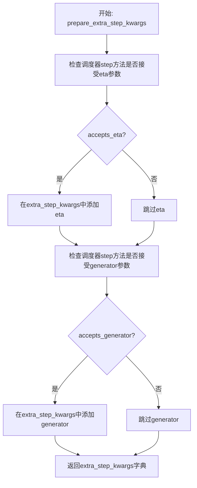

#### 带注释源码

```python
def prepare_extra_step_kwargs(self, generator, eta):
    """
    为调度器步骤准备额外的关键字参数，因为并非所有调度器都具有相同的签名。
    eta (η) 仅与 DDIMScheduler 一起使用，其他调度器将忽略它。
    eta 对应 DDIM 论文中的 η: https://huggingface.co/papers/2010.02502
    取值应在 [0, 1] 范围内。
    """
    # 使用 inspect 模块检查调度器的 step 方法签名，判断是否接受 eta 参数
    accepts_eta = "eta" in set(inspect.signature(self.scheduler.step).parameters.keys())
    
    # 初始化额外的参数字典
    extra_step_kwargs = {}
    
    # 如果调度器接受 eta 参数，则将其添加到 extra_step_kwargs 中
    if accepts_eta:
        extra_step_kwargs["eta"] = eta

    # 检查调度器是否接受 generator 参数
    accepts_generator = "generator" in set(inspect.signature(self.scheduler.step).parameters.keys())
    
    # 如果调度器接受 generator 参数，则将其添加到 extra_step_kwargs 中
    if accepts_generator:
        extra_step_kwargs["generator"] = generator
    
    # 返回包含调度器所需额外参数的字典
    return extra_step_kwargs
```


### `KolorsInpaintPipeline.check_inputs`

该方法用于验证 KolorsInpaintPipeline 在进行图像修复（inpainting）时的输入参数是否合法，通过一系列断言检查确保用户提供的参数符合模型要求，包括 strength、图像尺寸、提示词、遮罩图像、回调参数等，如果不合法则抛出相应的 ValueError 异常。

参数：

- `self`：`KolorsInpaintPipeline` 实例本身
- `prompt`：`Union[str, List[str]]`，用于引导图像生成的提示词，不能与 `prompt_embeds` 同时提供
- `image`：`PipelineImageInput`，待修复的输入图像
- `mask_image`：`PipelineImageInput`，用于指定修复区域的遮罩图像，白色像素表示需要修复的区域
- `height`：`int`，生成图像的高度，必须能被 8 整除
- `width`：`int`，生成图像的宽度，必须能被 8 整除
- `strength`：`float`，概念上表示对参考图像的变换程度，必须在 [0.0, 1.0] 范围内
- `callback_steps`：`int`，可选的正整数，用于指定每多少步调用一次回调函数
- `output_type`：`str`，生成图像的输出格式，如 "pil"
- `negative_prompt`：`Union[str, List[str]]`，可选的负面提示词，用于引导图像生成
- `prompt_embeds`：`torch.FloatTensor`，可选的预生成文本嵌入，不能与 `prompt` 同时提供
- `negative_prompt_embeds`：`torch.FloatTensor`，可选的预生成负面文本嵌入
- `ip_adapter_image`：`PipelineImageInput`，可选的 IP-Adapter 图像输入
- `ip_adapter_image_embeds`：`List[torch.Tensor]`，可选的 IP-Adapter 图像嵌入列表
- `callback_on_step_end_tensor_inputs`：`List[str]`，可选的回调函数接收的张量输入列表
- `padding_mask_crop`：`Optional[int]`，可选的裁剪边距大小

返回值：`None`，该方法不返回任何值，仅通过抛出 ValueError 异常来处理无效输入

#### 流程图

```mermaid
flowchart TD
    A[开始 check_inputs 验证] --> B{strength 在 [0, 1] 范围?}
    B -->|否| B1[抛出 ValueError]
    B -->|是| C{height 和 width 可被 8 整除?}
    C -->|否| C1[抛出 ValueError]
    C -->|是| D{callback_steps 是正整数?}
    D -->|否| D1[抛出 ValueError]
    D -->|是| E{callback_on_step_end_tensor_inputs 有效?}
    E -->|否| E1[抛出 ValueError]
    E -->|是| F{prompt 和 prompt_embeds 不同时提供?}
    F -->|否| F1[抛出 ValueError]
    F -->|是| G{prompt 或 prompt_embeds 至少提供一个?}
    G -->|否| G1[抛出 ValueError]
    G -->|是| H{prompt 是 str 或 list?}
    H -->|否| H1[抛出 ValueError]
    H -->|是| I{negative_prompt 和 negative_prompt_embeds 不同时提供?}
    I -->|否| I1[抛出 ValueError]
    I -->|是| J{prompt_embeds 和 negative_prompt_embeds 形状一致?}
    J -->|否| J1[抛出 ValueError]
    J -->|是| K{padding_mask_crop 不为 None?}
    K -->|是| L{image 是 PIL.Image?}
    L -->|否| L1[抛出 ValueError]
    L -->|是| M{mask_image 是 PIL.Image?}
    M -->|否| M1[抛出 ValueError]
    M -->|是| N{output_type 是 'pil'?}
    N -->|否| N1[抛出 ValueError]
    K -->|否| O
    N -->|是| O
    O{ip_adapter_image 和 ip_adapter_image_embeds 不同时提供?}
    O -->|否| O1[抛出 ValueError]
    O -->|是| P{ip_adapter_image_embeds 有效?}
    P -->|否| P1[抛出 ValueError]
    P -->|是| Q[验证通过]
```

#### 带注释源码

```python
def check_inputs(
    self,
    prompt,
    image,
    mask_image,
    height,
    width,
    strength,
    callback_steps,
    output_type,
    negative_prompt=None,
    prompt_embeds=None,
    negative_prompt_embeds=None,
    ip_adapter_image=None,
    ip_adapter_image_embeds=None,
    callback_on_step_end_tensor_inputs=None,
    padding_mask_crop=None,
):
    """
    验证 KolorsInpaintPipeline 的输入参数是否合法。
    """
    # 验证 strength 参数必须在 [0.0, 1.0] 范围内
    if strength < 0 or strength > 1:
        raise ValueError(f"The value of strength should in [0.0, 1.0] but is {strength}")

    # 验证图像高度和宽度必须能被 8 整除（VAE 的下采样因子要求）
    if height % 8 != 0 or width % 8 != 0:
        raise ValueError(f"`height` and `width` have to be divisible by 8 but are {height} and {width}.")

    # 验证 callback_steps 必须是正整数
    if callback_steps is not None and (not isinstance(callback_steps, int) or callback_steps <= 0):
        raise ValueError(
            f"`callback_steps` has to be a positive integer but is {callback_steps} of type"
            f" {type(callback_steps)}."
        )

    # 验证 callback_on_step_end_tensor_inputs 中的所有键都在允许的列表中
    if callback_on_step_end_tensor_inputs is not None and not all(
        k in self._callback_tensor_inputs for k in callback_on_step_end_tensor_inputs
    ):
        raise ValueError(
            f"`callback_on_step_end_tensor_inputs` has to be in {self._callback_tensor_inputs}, but found {[k for k in callback_on_step_end_tensor_inputs if k not in self._callback_tensor_inputs]}"
        )

    # 验证 prompt 和 prompt_embeds 不能同时提供
    if prompt is not None and prompt_embeds is not None:
        raise ValueError(
            f"Cannot forward both `prompt`: {prompt} and `prompt_embeds`: {prompt_embeds}. Please make sure to"
            " only forward one of the two."
        )
    # 验证 prompt 和 prompt_embeds 至少提供一个
    elif prompt is None and prompt_embeds is None:
        raise ValueError(
            "Provide either `prompt` or `prompt_embeds`. Cannot leave both `prompt` and `prompt_embeds` undefined."
        )
    # 验证 prompt 的类型必须是 str 或 list
    elif prompt is not None and (not isinstance(prompt, str) and not isinstance(prompt, list)):
        raise ValueError(f"`prompt` has to be of type `str` or `list` but is {type(prompt)}")

    # 验证 negative_prompt 和 negative_prompt_embeds 不能同时提供
    if negative_prompt is not None and negative_prompt_embeds is not None:
        raise ValueError(
            f"Cannot forward both `negative_prompt`: {negative_prompt} and `negative_prompt_embeds`:"
            f" {negative_prompt_embeds}. Please make sure to only forward one of the two."
        )

    # 验证 prompt_embeds 和 negative_prompt_embeds 形状必须一致
    if prompt_embeds is not None and negative_prompt_embeds is not None:
        if prompt_embeds.shape != negative_prompt_embeds.shape:
            raise ValueError(
                "`prompt_embeds` and `negative_prompt_embeds` must have the same shape when passed directly, but"
                f" got: `prompt_embeds` {prompt_embeds.shape} != `negative_prompt_embeds`"
                f" {negative_prompt_embeds.shape}."
            )
    
    # 如果使用 padding_mask_crop，验证相关参数
    if padding_mask_crop is not None:
        # 验证 image 必须是 PIL.Image 类型
        if not isinstance(image, PIL.Image.Image):
            raise ValueError(
                f"The image should be a PIL image when inpainting mask crop, but is of type {type(image)}."
            )
        # 验证 mask_image 必须是 PIL.Image 类型
        if not isinstance(mask_image, PIL.Image.Image):
            raise ValueError(
                f"The mask image should be a PIL image when inpainting mask crop, but is of type"
                f" {type(mask_image)}."
            )
        # 验证 output_type 必须是 "pil"
        if output_type != "pil":
            raise ValueError(f"The output type should be PIL when inpainting mask crop, but is {output_type}.")

    # 验证 ip_adapter_image 和 ip_adapter_image_embeds 不能同时提供
    if ip_adapter_image is not None and ip_adapter_image_embeds is not None:
        raise ValueError(
            "Provide either `ip_adapter_image` or `ip_adapter_image_embeds`. Cannot leave both `ip_adapter_image` and `ip_adapter_image_embeds` defined."
        )

    # 验证 ip_adapter_image_embeds 的有效性
    if ip_adapter_image_embeds is not None:
        # 必须是 list 类型
        if not isinstance(ip_adapter_image_embeds, list):
            raise ValueError(
                f"`ip_adapter_image_embeds` has to be of type `list` but is {type(ip_adapter_image_embeds)}"
            )
        # 每个元素必须是 3D 或 4D 张量
        elif ip_adapter_image_embeds[0].ndim not in [3, 4]:
            raise ValueError(
                f"`ip_adapter_image_embeds` has to be a list of 3D or 4D tensors but is {ip_adapter_image_embeds[0].ndim}D"
            )
```


### `KolorsInpaintPipeline.prepare_latents`

该方法负责为 Kolors 图像修复管道准备潜在变量（latents）。它根据输入参数（图像、时间步、强度等）初始化或处理潜在变量，支持纯噪声初始化、图像与噪声混合、以及潜在空间图像等多种模式，是扩散模型去噪过程的起始点。

参数：

- `batch_size`：`int`，批次大小，指定一次生成多少个样本
- `num_channels_latents`：`int`，潜在变量的通道数，通常与 VAE 的潜在通道数一致
- `height`：`int`，目标图像的高度（像素）
- `width`：`int`，目标图像的宽度（像素）
- `dtype`：`torch.dtype`，潜在变量的数据类型（如 float16、float32）
- `device`：`torch.device`，计算设备（CPU 或 CUDA）
- `generator`：`torch.Generator` 或 `List[torch.Generator]`，随机数生成器，用于确保可复现性
- `latents`：`torch.Tensor`，可选，预生成的潜在变量，如果为 None 则生成新的
- `image`：`torch.Tensor`，可选，输入图像，用于图像修复模式
- `timestep`：`torch.Tensor`，可选，当前的时间步，用于混合噪声和图像
- `is_strength_max`：`bool`，默认为 True，表示是否使用最大强度（即完全使用噪声）
- `add_noise`：`bool`，默认为 True，是否向潜在变量添加噪声
- `return_noise`：`bool`，默认为 False，是否在返回值中包含噪声
- `return_image_latents`：`bool`，默认为 False，是否在返回值中包含图像潜在变量

返回值：`Tuple[torch.Tensor, ...]`，返回由潜在变量组成的元组。如果 `return_noise` 为 True，元组包含噪声；如果 `return_image_latents` 为 True，元组包含图像潜在变量。

#### 流程图

```mermaid
flowchart TD
    A[开始 prepare_latents] --> B[计算潜在变量形状 shape]
    B --> C{检查 generator 列表长度}
    C -->|长度不匹配| D[抛出 ValueError]
    C -->|长度匹配| E{image 和 timestep 是否为空且 is_strength_max 为 False}
    E -->|是| F[抛出 ValueError: 需要提供 image 和 timestep]
    E -->|否| G{image.shape[1] == 4}
    G -->|是| H[将 image 转换为设备和数据类型<br/>重复 batch_size 次]
    G -->|否| I{return_image_latents 或<br/>latents 为空且非最大强度}
    I -->|是| J[将 image 转换为设备和 dtype<br/>使用 VAE 编码图像为潜在变量]
    J --> H
    I -->|否| K{latents 为空且 add_noise}
    K -->|是| L[生成随机噪声<br/>根据 is_strength_max 混合噪声和图像<br/>乘以初始噪声sigma]
    K -->|否| M{add_noise 为 True}
    M -->|是| N[将 latents 作为噪声处理<br/>乘以初始噪声sigma]
    M -->|否| O[使用随机噪声或 image_latents]
    L --> P[构建输出元组 latents]
    N --> P
    O --> P
    H --> P
    P --> Q{return_noise}
    Q -->|是| R[添加噪声到输出元组]
    Q -->|否| S{return_image_latents}
    R --> S
    S -->|是| T[添加 image_latents 到输出元组]
    S -->|否| U[返回输出元组]
    T --> U
```

#### 带注释源码

```python
def prepare_latents(
    self,
    batch_size,
    num_channels_latents,
    height,
    width,
    dtype,
    device,
    generator,
    latents=None,
    image=None,
    timestep=None,
    is_strength_max=True,
    add_noise=True,
    return_noise=False,
    return_image_latents=False,
):
    # 计算潜在变量的形状：batch_size x channels x (height // vae_scale_factor) x (width // vae_scale_factor)
    shape = (
        batch_size,
        num_channels_latents,
        int(height) // self.vae_scale_factor,
        int(width) // self.vae_scale_factor,
    )
    
    # 检查 generator 列表长度是否与 batch_size 匹配
    if isinstance(generator, list) and len(generator) != batch_size:
        raise ValueError(
            f"You have passed a list of generators of length {len(generator)}, but requested an effective batch"
            f" size of {batch_size}. Make sure the batch size matches the length of the generators."
        )

    # 如果强度小于最大值但未提供 image 或 timestep，抛出错误
    if (image is None or timestep is None) and not is_strength_max:
        raise ValueError(
            "Since strength < 1. initial latents are to be initialised as a combination of Image + Noise."
            "However, either the image or the noise timestep has not been provided."
        )

    # 处理图像潜在变量
    # 如果图像已经在潜在空间中（通道数==4），直接使用
    if image.shape[1] == 4:
        image_latents = image.to(device=device, dtype=dtype)
        image_latents = image_latents.repeat(batch_size // image_latents.shape[0], 1, 1, 1)
    # 否则需要编码图像为潜在变量
    elif return_image_latents or (latents is None and not is_strength_max):
        image = image.to(device=device, dtype=dtype)
        image_latents = self._encode_vae_image(image=image, generator=generator)
        image_latents = image_latents.repeat(batch_size // image_latents.shape[0], 1, 1, 1)

    # 处理潜在变量的初始化
    if latents is None and add_noise:
        # 生成随机噪声
        noise = randn_tensor(shape, generator=generator, device=device, dtype=dtype)
        # 如果强度最大则纯噪声，否则混合图像和噪声
        latents = noise if is_strength_max else self.scheduler.add_noise(image_latents, noise, timestep)
        # 如果是纯噪声，乘以调度器的初始噪声sigma
        latents = latents * self.scheduler.init_noise_sigma if is_strength_max else latents
    elif add_noise:
        # 已有 latents，添加噪声
        noise = latents.to(device)
        latents = noise * self.scheduler.init_noise_sigma
    else:
        # 不添加噪声，使用随机噪声或图像潜在变量
        noise = randn_tensor(shape, generator=generator, device=device, dtype=dtype)
        latents = image_latents.to(device)

    # 构建输出元组
    outputs = (latents,)

    # 根据参数添加可选输出
    if return_noise:
        outputs += (noise,)

    if return_image_latents:
        outputs += (image_latents,)

    return outputs
```


### `KolorsInpaintPipeline._encode_vae_image`

该方法用于将输入图像编码为 VAE 潜在空间表示（latent representation）。它处理图像的类型转换、VAE 的精度切换（当 force_upcast 为 True 时），并使用提供的随机生成器或批量编码方式将图像转换为潜在向量，最后乘以缩放因子返回潜在表示。

参数：

- `self`：`KolorsInpaintPipeline`，Pipeline 实例本身
- `image`：`torch.Tensor`，待编码的输入图像张量，形状为 (batch, channels, height, width)
- `generator`：`torch.Generator`，用于生成随机数的 PyTorch 生成器，支持单个或生成器列表

返回值：`torch.Tensor`，编码后的图像潜在向量，形状为 (batch, latent_channels, latent_height, latent_width)

#### 流程图

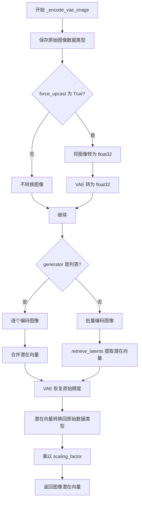

#### 带注释源码

```python
def _encode_vae_image(self, image: torch.Tensor, generator: torch.Generator):
    """
    使用 VAE 将图像编码为潜在空间表示
    
    Args:
        image: 输入图像张量，形状为 (batch, channels, height, width)
        generator: PyTorch 随机生成器，用于确保生成的可重复性
    
    Returns:
        编码后的图像潜在向量
    """
    # 1. 保存原始图像数据类型，用于后续恢复
    dtype = image.dtype
    
    # 2. 如果 VAE 配置了 force_upcast，则将图像转为 float32
    #    并将 VAE 转为 float32 以避免精度问题
    if self.vae.config.force_upcast:
        image = image.float()
        self.vae.to(dtype=torch.float32)

    # 3. 根据 generator 类型选择编码策略
    if isinstance(generator, list):
        # 如果有多个生成器（每个样本一个），逐个编码图像
        image_latents = [
            # 对每个图像单独编码，使用对应的生成器
            retrieve_latents(self.vae.encode(image[i : i + 1]), generator=generator[i])
            for i in range(image.shape[0])
        ]
        # 将编码结果在 batch 维度拼接
        image_latents = torch.cat(image_latents, dim=0)
    else:
        # 单一生成器，直接批量编码整个图像张量
        image_latents = retrieve_latents(self.vae.encode(image), generator=generator)

    # 4. 如果之前进行了 upcast，现在恢复 VAE 的原始精度
    if self.vae.config.force_upcast:
        self.vae.to(dtype)

    # 5. 将潜在向量转换回原始数据类型
    image_latents = image_latents.to(dtype)
    
    # 6. 应用 VAE 的缩放因子（通常用于归一化潜在空间）
    image_latents = self.vae.config.scaling_factor * image_latents

    return image_latents
```


### `KolorsInpaintPipeline.prepare_mask_latents`

该方法用于准备掩码（mask）和被掩码图像（masked image）的潜在表示（latents），包括调整掩码尺寸、处理批处理大小、以及在需要时对掩码和被掩码图像进行分类器自由引导（classifier-free guidance）处理。

参数：

- `self`：`KolorsInpaintPipeline` 实例本身
- `mask`：`torch.Tensor`，输入的掩码张量，用于指示图像中需要修复的区域
- `masked_image`：`torch.Tensor`，被掩码覆盖的图像张量，即原始图像中被mask覆盖的部分
- `batch_size`：`int`，批处理大小，指定要生成的图像数量
- `height`：`int`，目标图像的高度（像素）
- `width`：`int`，目标图像的宽度（像素）
- `dtype`：`torch.dtype`，指定张量的数据类型（如 float16、float32 等）
- `device`：`torch.device`，指定计算设备（如 cuda、cpu）
- `generator`：`torch.Generator` 或 `None`，用于生成随机数的生成器，以确保可重复性
- `do_classifier_free_guidance`：`bool`，是否启用分类器自由引导，如果为 True，则会复制掩码和被掩码图像以同时处理有条件和无条件情况

返回值：`Tuple[torch.Tensor, torch.Tensor]`，返回处理后的掩码潜在表示和被掩码图像潜在表示组成的元组

#### 流程图

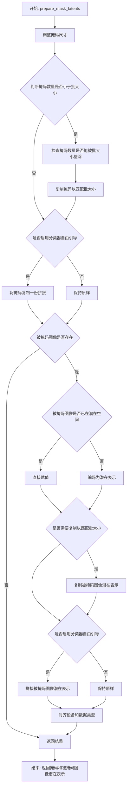

#### 带注释源码

```python
def prepare_mask_latents(
    self, mask, masked_image, batch_size, height, width, dtype, device, generator, do_classifier_free_guidance
):
    # 调整掩码尺寸以匹配潜在空间形状
    # 在转换为dtype之前执行此操作，以避免在使用cpu_offload和半精度时出现问题
    mask = torch.nn.functional.interpolate(
        mask, size=(height // self.vae_scale_factor, width // self.vae_scale_factor)
    )
    mask = mask.to(device=device, dtype=dtype)

    # 为每个prompt复制掩码和被掩码图像潜在表示，使用MPS友好的方法
    if mask.shape[0] < batch_size:
        if not batch_size % mask.shape[0] == 0:
            raise ValueError(
                "The passed mask and the required batch size don't match. Masks are supposed to be duplicated to"
                f" a total batch size of {batch_size}, but {mask.shape[0]} masks were passed. Make sure the number"
                " of masks that you pass is divisible by the total requested batch size."
            )
        mask = mask.repeat(batch_size // mask.shape[0], 1, 1, 1)

    # 如果启用分类器自由引导，则将掩码复制并拼接
    mask = torch.cat([mask] * 2) if do_classifier_free_guidance else mask

    # 检查被掩码图像是否已经在潜在空间（通道数为4）
    if masked_image is not None and masked_image.shape[1] == 4:
        masked_image_latents = masked_image
    else:
        masked_image_latents = None

    if masked_image is not None:
        # 如果被掩码图像潜在表示为空，则需要编码
        if masked_image_latents is None:
            masked_image = masked_image.to(device=device, dtype=dtype)
            masked_image_latents = self._encode_vae_image(masked_image, generator=generator)

        # 复制以匹配批大小
        if masked_image_latents.shape[0] < batch_size:
            if not batch_size % masked_image_latents.shape[0] == 0:
                raise ValueError(
                    "The passed images and the required batch size don't match. Images are supposed to be duplicated"
                    f" to a total batch size of {batch_size}, but {masked_image_latents.shape[0]} images were passed."
                    " Make sure the number of images that you pass is divisible by the total requested batch size."
                )
            masked_image_latents = masked_image_latents.repeat(
                batch_size // masked_image_latents.shape[0], 1, 1, 1
            )

        # 如果启用分类器自由引导，则拼接
        masked_image_latents = (
            torch.cat([masked_image_latents] * 2) if do_classifier_free_guidance else masked_image_latents
        )

        # 对齐设备以防止连接时出现设备错误
        masked_image_latents = masked_image_latents.to(device=device, dtype=dtype)

    return mask, masked_image_latents
```


### `KolorsInpaintPipeline.get_timesteps`

该方法用于根据推理步数、噪声强度（strength）以及可选的去噪起始点（denoising_start）计算扩散模型的时间步序列。主要处理两种场景：当直接指定 strength 时，根据 strength 计算有效推理步数；当指定 denoising_start 时，根据去噪起始比例确定采样范围，并处理二阶调度器的边界情况。

参数：

- `num_inference_steps`：`int`，推理步数，即扩散模型进行去噪的总步数
- `strength`：`float`，噪声强度，值在 0 到 1 之间，用于控制添加到初始图像的噪声量，值越大添加的噪声越多
- `device`：`torch.device`，计算设备，用于指定张量存放的设备（该参数在方法内未直接使用，但作为调用参数传递）
- `denoising_start`：`Optional[float]`，去噪起始点，取值范围 0 到 1，表示从整个去噪过程的哪个比例开始，当指定此参数时 strength 参数会被忽略

返回值：`Tuple[torch.Tensor, int]`，返回包含两个元素的元组，第一个元素是调整后的时间步序列（torch.Tensor），第二个元素是调整后的推理步数（int）

#### 流程图

```mermaid
flowchart TD
    A[开始 get_timesteps] --> B{denoising_start is None?}
    B -->|Yes| C[init_timestep = min(int(num_inference_steps * strength), num_inference_steps)]
    B -->|No| D[t_start = 0]
    C --> E[t_start = max(num_inference_steps - init_timestep, 0)]
    D --> F[timesteps = scheduler.timesteps[t_start * scheduler.order:]]
    E --> F
    F --> G{denoising_start is not None?}
    G -->|Yes| H[计算 discrete_timestep_cutoff]
    G -->|No| I[返回 timesteps, num_inference_steps - t_start]
    H --> J[num_inference_steps = (timesteps < discrete_timestep_cutoff).sum()]
    J --> K{scheduler.order == 2 && num_inference_steps % 2 == 0?}
    K -->|Yes| L[num_inference_steps += 1]
    K -->|No| M[timesteps = timesteps[-num_inference_steps:]]
    L --> M
    M --> N[返回 timesteps, num_inference_steps]
```

#### 带注释源码

```python
def get_timesteps(self, num_inference_steps, strength, device, denoising_start=None):
    """
    获取调整后的时间步序列，用于扩散模型的推理过程。
    
    该方法根据 num_inference_steps、strength 和 denoising_start 参数
    计算实际使用的时间步。当 denoising_start 为 None 时，使用 strength 
    参数控制噪声强度；当 denoising_start 指定时，直接从指定的比例开始去噪。
    """
    # 获取原始时间步，使用 init_timestep 计算初始时间步
    if denoising_start is None:
        # 根据 strength 计算初始时间步数量，确保不超过总推理步数
        init_timestep = min(int(num_inference_steps * strength), num_inference_steps)
        # 计算起始索引，确保不为负数
        t_start = max(num_inference_steps - init_timestep, 0)
    else:
        # 如果指定了 denoising_start，则从 0 开始
        t_start = 0

    # 从调度器获取时间步序列，根据 t_start 和调度器阶数进行切片
    timesteps = self.scheduler.timesteps[t_start * self.scheduler.order :]

    # 如果直接指定了去噪起始点，strength 参数将被忽略
    # 即 strength 由 denoising_start 决定
    if denoising_start is not None:
        # 计算离散时间步截止点，将去噪起始比例转换为具体的时间步值
        discrete_timestep_cutoff = int(
            round(
                self.scheduler.config.num_train_timesteps
                - (denoising_start * self.scheduler.config.num_train_timesteps)
            )
        )

        # 计算小于截止点的时间步数量作为推理步数
        num_inference_steps = (timesteps < discrete_timestep_cutoff).sum().item()
        
        # 如果调度器是二阶调度器且推理步数为偶数
        # 需要加 1 因为每个时间步（除最高者外）会被复制
        # 如果 num_inference_steps 为偶数，意味着我们在去噪步骤中间切片
        # （在一阶和二阶导数之间），这会导致错误结果
        # 加 1 确保去噪过程总是在调度器的二阶导数步骤之后结束
        if self.scheduler.order == 2 and num_inference_steps % 2 == 0:
            num_inference_steps = num_inference_steps + 1

        # 因为 t_n+1 >= t_n，我们从末尾开始切片时间步
        timesteps = timesteps[-num_inference_steps:]
        return timesteps, num_inference_steps

    # 返回时间步和调整后的推理步数
    return timesteps, num_inference_steps - t_start
```


### `KolorsInpaintPipeline._get_add_time_ids`

该方法用于生成图像修复_pipeline_所需的额外时间标识（time_ids），包括原始尺寸、裁剪坐标、目标尺寸以及美学评分等信息。这些时间标识将作为条件输入传递给UNet模型，以实现对生成图像尺寸和美学的精细控制。

参数：

- `original_size`：`Tuple[int, int]`，原始图像的尺寸（高度，宽度）
- `crops_coords_top_left`：`Tuple[int, int]`，裁剪坐标的左上角位置
- `target_size`：`Tuple[int, int]`，目标图像的尺寸（高度，宽度）
- `aesthetic_score`：`float`，正向条件下的美学评分，用于影响生成图像的美学质量
- `negative_aesthetic_score`：`float`，负向条件下的美学评分，用于引导负向提示的美学方向
- `negative_original_size`：`Tuple[int, int]`，负向条件下的原始图像尺寸
- `negative_crops_coords_top_left`：`Tuple[int, int]`，负向条件下的裁剪坐标左上角位置
- `negative_target_size`：`Tuple[int, int]`，负向条件下的目标图像尺寸
- `dtype`：`torch.dtype`，返回张量的数据类型
- `text_encoder_projection_dim`：`int`，文本编码器的投影维度，默认为None

返回值：`Tuple[torch.Tensor, torch.Tensor]`，返回两个张量——`add_time_ids`（正向时间标识）和`add_neg_time_ids`（负向时间标识），形状均为`(1, N)`，其中N为时间标识的数量

#### 流程图

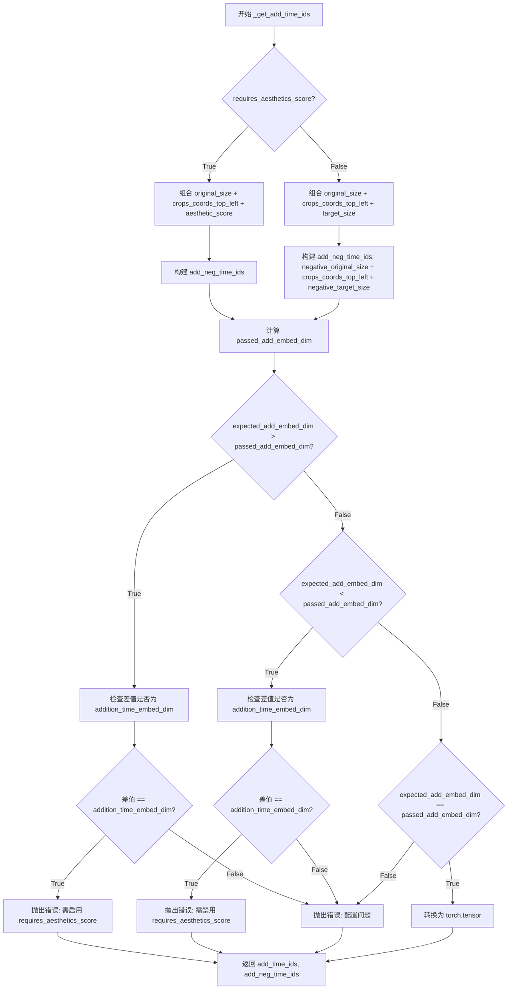

#### 带注释源码

```python
def _get_add_time_ids(
    self,
    original_size,
    crops_coords_top_left,
    target_size,
    aesthetic_score,
    negative_aesthetic_score,
    negative_original_size,
    negative_crops_coords_top_left,
    negative_target_size,
    dtype,
    text_encoder_projection_dim=None,
):
    """
    生成用于UNet的额外时间标识。
    
    该方法根据pipeline配置（requires_aesthetics_score）构建不同的time_ids向量。
    这些向量包含了图像的尺寸信息和美学评分，用于SDXL风格的条件生成。
    
    参数:
        original_size: 原始图像尺寸 (height, width)
        crops_coords_top_left: 裁剪左上角坐标 (y, x)
        target_size: 目标输出尺寸 (height, width)
        aesthetic_score: 正向美学评分
        negative_aesthetic_score: 负向美学评分
        negative_original_size: 负向条件的原始尺寸
        negative_crops_coords_top_left: 负向条件的裁剪坐标
        negative_target_size: 负向条件的目标尺寸
        dtype: 输出张量的数据类型
        text_encoder_projection_dim: 文本编码器投影维度（可选）
    
    返回:
        (add_time_ids, add_neg_time_ids): 正向和负向的时间标识张量
    """
    
    # 根据配置决定是否包含美学评分
    if self.config.requires_aesthetics_score:
        # 当需要美学评分时: original_size + crops_coords_top_left + aesthetic_score
        add_time_ids = list(original_size + crops_coords_top_left + (aesthetic_score,))
        add_neg_time_ids = list(
            negative_original_size + negative_crops_coords_top_left + (negative_aesthetic_score,)
        )
    else:
        # 当不需要美学评分时: original_size + crops_coords_top_left + target_size
        add_time_ids = list(original_size + crops_coords_top_left + target_size)
        add_neg_time_ids = list(negative_original_size + crops_coords_top_left + negative_target_size)

    # 计算实际传入的embedding维度
    # 公式: addition_time_embed_dim * time_ids数量 + 4096 (文本投影维度)
    passed_add_embed_dim = self.unet.config.addition_time_embed_dim * len(add_time_ids) + 4096
    
    # 获取UNet期望的embedding维度
    expected_add_embed_dim = self.unet.add_embedding.linear_1.in_features

    # 维度验证逻辑 - 确保模型配置与输入参数匹配
    if (
        expected_add_embed_dim > passed_add_embed_dim
        and (expected_add_embed_dim - passed_add_embed_dim) == self.unet.config.addition_time_embed_dim
    ):
        raise ValueError(
            f"Model expects an added time embedding vector of length {expected_add_embed_dim}, but a vector of {passed_add_embed_dim} was created. Please make sure to enable `requires_aesthetics_score` with `pipe.register_to_config(requires_aesthetics_score=True)` to make sure `aesthetic_score` {aesthetic_score} and `negative_aesthetic_score` {negative_aesthetic_score} is correctly used by the model."
        )
    elif (
        expected_add_embed_dim < passed_add_embed_dim
        and (passed_add_embed_dim - expected_add_embed_dim) == self.unet.config.addition_time_embed_dim
    ):
        raise ValueError(
            f"Model expects an added time embedding vector of length {expected_add_embed_dim}, but a vector of {passed_add_embed_dim} was created. Please make sure to disable `requires_aesthetics_score` with `pipe.register_to_config(requires_aesthetics_score=False)` to make sure `target_size` {target_size} is correctly used by the model."
        )
    elif expected_add_embed_dim != passed_add_embed_dim:
        raise ValueError(
            f"Model expects an added time embedding vector of length {expected_add_embed_dim}, but a vector of {passed_add_embed_dim} was created. The model has an incorrect config. Please check `unet.config.time_embedding_type` and `text_encoder.config.projection_dim`."
        )

    # 转换为PyTorch张量
    add_time_ids = torch.tensor([add_time_ids], dtype=dtype)
    add_neg_time_ids = torch.tensor([add_neg_time_ids], dtype=dtype)

    return add_time_ids, add_neg_time_ids
```


### `KolorsInpaintPipeline.upcast_vae`

该方法是一个已弃用的工具方法，用于将VAE（变分自编码器）模型的数据类型强制转换为float32，以避免在推理过程中出现数值溢出问题。该方法已被标记为废弃，建议用户直接使用 `pipe.vae.to(torch.float32)` 替代。

参数：暂无参数（仅包含 `self`）

返回值：`None`，无返回值

#### 流程图

```mermaid
flowchart TD
    A[开始 upcast_vae] --> B{检查是否需要弃用警告}
    B --> C[调用 deprecate 输出弃用警告]
    C --> D[执行 self.vae.to(dtype=torch.float32)]
    D --> E[VAE模型转换为float32类型]
    E --> F[结束]
```

#### 带注释源码

```python
# Copied from diffusers.pipelines.stable_diffusion.pipeline_stable_diffusion_upscale.StableDiffusionUpscalePipeline.upcast_vae
def upcast_vae(self):
    """
    将VAE模型的数据类型上转换为float32。
    
    注意：此方法已被弃用，请在代码中直接使用 pipe.vae.to(torch.float32) 替代。
    该方法的存在是为了保持向后兼容性。
    """
    # 输出弃用警告，提醒用户该方法将在1.0.0版本被移除
    deprecate("upcast_vae", "1.0.0", "`upcast_vae` is deprecated. Please use `pipe.vae.to(torch.float32)`")
    
    # 将VAE模型转换为float32数据类型
    # 这样做是为了避免在float16推理时出现数值溢出问题
    self.vae.to(dtype=torch.float32)
```


### `KolorsInpaintPipeline.get_guidance_scale_embedding`

该方法用于生成指导比例（guidance scale）的嵌入向量，基于正弦和余弦函数的周期性特征，将标量指导比例值映射到高维向量空间中，以便于后续丰富时间步嵌入（timestep embeddings）。该实现源自 Google Research 的 VDM（Variational Diffusion Models）论文。

参数：

- `w`：`torch.Tensor`，用于生成嵌入向量的指导比例标量值
- `embedding_dim`：`int`，可选，默认为 512，生成嵌入向量的维度
- `dtype`：`torch.dtype`，可选，默认为 `torch.float32`，生成嵌入向量的数据类型

返回值：`torch.Tensor`，形状为 `(len(w), embedding_dim)` 的嵌入向量

#### 流程图

```mermaid
flowchart TD
    A[开始] --> B{检查输入有效性}
    B -->|断言 len(w.shape == 1)| C[将 w 乘以 1000.0]
    C --> D[计算半维度: half_dim = embedding_dim // 2]
    D --> E[计算对数基础: log_base = log(10000.0) / (half_dim - 1)]
    E --> F[生成指数衰减序列: emb = exp(-arange(half_dim) * log_base)]
    F --> G[计算外积: emb = w[:, None] * emb[None, :]]
    G --> H[拼接正弦和余弦: torch.cat([sin(emb), cos(emb)], dim=1)]
    H --> I{embedding_dim 是否为奇数?}
    I -->|是| J[零填充最后维度]
    I -->|否| K[返回嵌入向量]
    J --> K
```

#### 带注释源码

```python
# Copied from diffusers.pipelines.latent_consistency_models.pipeline_latent_consistency_text2img.LatentConsistencyModelPipeline.get_guidance_scale_embedding
def get_guidance_scale_embedding(
    self, w: torch.Tensor, embedding_dim: int = 512, dtype: torch.dtype = torch.float32
) -> torch.Tensor:
    """
    See https://github.com/google-research/vdm/blob/dc27b98a554f65cdc654b800da5aa1846545d41b/model_vdm.py#L298

    Args:
        w (`torch.Tensor`):
            Generate embedding vectors with a specified guidance scale to subsequently enrich timestep embeddings.
        embedding_dim (`int`, *optional*, defaults to 512):
            Dimension of the embeddings to generate.
        dtype (`torch.dtype`, *optional*, defaults to `torch.float32`):
            Data type of the generated embeddings.

    Returns:
        `torch.Tensor`: Embedding vectors with shape `(len(w), embedding_dim)`.
    """
    # 断言确保输入 w 是一维张量（标量序列）
    assert len(w.shape) == 1
    # 将指导比例缩放 1000 倍，使其落在合适的数值范围内
    w = w * 1000.0

    # 计算嵌入维度的一半（用于正弦和余弦两部分）
    half_dim = embedding_dim // 2
    # 计算对数基础值，用于生成指数衰减的频率序列
    # 等价于: log(10000) / (half_dim - 1)
    emb = torch.log(torch.tensor(10000.0)) / (half_dim - 1)
    # 生成从 0 到 half_dim-1 的指数衰减序列
    # 这创建了从高频到低频的正弦波频率
    emb = torch.exp(torch.arange(half_dim, dtype=dtype) * -emb)
    # 将缩放后的指导比例 w 与频率序列进行外积运算
    # w: [n] -> [n, 1], emb: [half_dim] -> [1, half_dim]
    # 结果: [n, half_dim]，每个指导比例值乘以所有频率
    emb = w.to(dtype)[:, None] * emb[None, :]
    # 拼接正弦和余弦变换，生成完整的周期特性嵌入
    # 结果形状: [n, half_dim * 2] = [n, embedding_dim]
    emb = torch.cat([torch.sin(emb), torch.cos(emb)], dim=1)
    # 如果目标维度为奇数，需要在最后填充一个零以满足维度要求
    if embedding_dim % 2 == 1:  # zero pad
        emb = torch.nn.functional.pad(emb, (0, 1))
    # 最终断言确保输出形状正确
    assert emb.shape == (w.shape[0], embedding_dim)
    return emb
```


### `KolorsInpaintPipeline.__call__`

该方法是Kolors图像修复Pipeline的核心调用接口，接收文本提示词、待修复的原图像以及掩码图像，通过扩散模型的去噪过程在掩码区域生成新内容，最终返回修复后的图像。

参数：

- `prompt`：`Union[str, List[str]]`，要引导图像生成的提示词，若未定义则必须传入`prompt_embeds`
- `image`：`PipelineImageInput`，要修复的图像或图像批次，白色像素区域将被重新绘制
- `mask_image`：`PipelineImageInput`，掩码图像，白色像素表示需要重绘的区域，黑色像素表示保留区域
- `masked_image_latents`：`torch.Tensor`，可选，预生成的掩码图像潜在表示
- `height`：`Optional[int]`，生成图像的高度像素，默认为`self.unet.config.sample_size * self.vae_scale_factor`
- `width`：`Optional[int]`，生成图像的宽度像素，默认为`self.unet.config.sample_size * self.vae_scale_factor`
- `padding_mask_crop`：`Optional[int]`，裁剪边距大小，若为`None`则不裁剪
- `strength`：`float`，概念上表示对掩码区域的变换程度，值在0到1之间
- `num_inference_steps`：`int`，去噪步数，默认为50
- `timesteps`：`List[int]`，可选，自定义时间步列表
- `sigmas`：`List[float]`，可选，自定义sigma值列表
- `denoising_start`：`Optional[float]`，可选，跳过去噪过程的比例（0.0到1.0之间）
- `denoising_end`：`Optional[float]`，可选，提前终止去噪过程的比例
- `guidance_scale`：`float`，分类器自由引导（CFG）比例，默认为7.5
- `negative_prompt`：`Optional[Union[str, List[str]]]`，不引导图像生成的提示词
- `num_images_per_prompt`：`Optional[int]`，每个提示词生成的图像数量，默认为1
- `eta`：`float`，DDIM论文中的eta参数，仅DDIMScheduler使用
- `generator`：`Optional[Union[torch.Generator, List[torch.Generator]]]`，随机数生成器，用于确定性生成
- `latents`：`Optional[torch.Tensor]`，预生成的噪声潜在表示
- `prompt_embeds`：`Optional[torch.Tensor]`，预生成的文本嵌入
- `negative_prompt_embeds`：`Optional[torch.Tensor]`，预生成的负面文本嵌入
- `pooled_prompt_embeds`：`Optional[torch.Tensor]`，预生成的池化文本嵌入
- `negative_pooled_prompt_embeds`：`Optional[torch.Tensor]`，预生成的负面池化文本嵌入
- `ip_adapter_image`：`Optional[PipelineImageInput]`，IP适配器图像输入
- `ip_adapter_image_embeds`：`Optional[List[torch.Tensor]]`，IP适配器图像嵌入列表
- `output_type`：`str | None`，输出格式，默认为"pil"
- `return_dict`：`bool`，是否返回字典格式，默认为True
- `cross_attention_kwargs`：`Optional[Dict[str, Any]]`，传递给注意力处理器的额外参数
- `guidance_rescale`：`float`，引导重缩放因子，用于避免过度平滑
- `original_size`：`Tuple[int, int]`，原始图像尺寸
- `crops_coords_top_left`：`Tuple[int, int]`，裁剪坐标左上角，默认为(0, 0)
- `target_size`：`Tuple[int, int]`，目标图像尺寸
- `negative_original_size`：`Optional[Tuple[int, int]]`，负面条件原始尺寸
- `negative_crops_coords_top_left`：`Tuple[int, int]`，负面条件裁剪坐标
- `negative_target_size`：`Optional[Tuple[int, int]]`，负面条件目标尺寸
- `aesthetic_score`：`float`，[美学习惯评分]( 美学评分，用于正向文本条件
- `negative_aesthetic_score`：`float`，负面美学评分
- `callback_on_step_end`：可选的回调函数，在每个去噪步骤结束时调用
- `callback_on_step_end_tensor_inputs`：`List[str]`，回调函数张量输入列表，默认为["latents"]
- `**kwargs`：其他关键字参数

返回值：`StableDiffusionXLPipelineOutput`或`tuple`，当`return_dict`为True时返回`StableDiffusionXLPipelineOutput`，否则返回包含生成图像列表的元组

#### 流程图

```mermaid
flowchart TD
    A[开始 __call__] --> B[解析callback参数]
    B --> C[设置默认height和width]
    C --> D[检查输入参数 check_inputs]
    D --> E[设置内部属性 _guidance_scale, _guidance_rescale等]
    E --> F[确定batch_size]
    F --> G[编码提示词 encode_prompt]
    G --> H[获取时间步 retrieve_timesteps]
    H --> I[调整时间步 get_timesteps]
    I --> J[预处理图像和掩码 image_processor.preprocess]
    J --> K[准备潜在变量 prepare_latents]
    K --> L[准备掩码潜在变量 prepare_mask_latents]
    L --> M{num_channels_unet == 9?}
    M -->|Yes| N[检查配置匹配]
    M -->|No| O{num_channels_unet == 4?}
    O -->|Yes| P[继续]
    O -->|No| Q[抛出异常]
    N --> P
    P --> R[准备额外步骤参数 prepare_extra_step_kwargs]
    R --> S[准备时间ID和嵌入 _get_add_time_ids]
    S --> T[处理IP适配器图像嵌入]
    T --> U[去噪循环开始]
    U --> V{是否中断?}
    V -->|Yes| W[continue]
    V -->|No| X[扩展latents用于CFG]
    X --> Y[缩放模型输入]
    Y --> Z{num_channels_unet == 9?}
    Z -->|Yes| AA[拼接mask和masked_image_latents]
    Z -->|No| AB[预测噪声]
    AA --> AB
    AB --> AC[执行分类器自由引导]
    AC --> AD{guidance_rescale > 0?}
    AD -->|Yes| AE[重缩放噪声预测]
    AD -->|No| AF[计算上一步]
    AE --> AF
    AF --> AG{num_channels_unet == 4?}
    AG -->|Yes| AH[混合latents]
    AG -->|No| AI[执行回调]
    AH --> AI
    AI --> AJ[更新进度条]
    AJ --> AK{是否最后一步或需要回调?}
    AK -->|Yes| AL[调用callback]
    AL --> AM[时间步循环]
    AK -->|No| AM
    AM --> AN{还有更多时间步?}
    AN -->|Yes| V
    AN -->|No| AO{output_type == 'latent'?}
    AO -->|Yes| AP[返回latents]
    AO -->|No| AQ[VAE解码]
    AQ --> AR[应用水印]
    AR --> AS[后处理图像]
    AT --> AU{maybe_free_model_hooks}
    AS --> AU
    AU --> AV[返回结果]
```

#### 带注释源码

```python
@torch.no_grad()
@replace_example_docstring(EXAMPLE_DOC_STRING)
def __call__(
    self,
    prompt: Union[str, List[str]] = None,
    image: PipelineImageInput = None,
    mask_image: PipelineImageInput = None,
    masked_image_latents: torch.Tensor = None,
    height: Optional[int] = None,
    width: Optional[int] = None,
    padding_mask_crop: Optional[int] = None,
    strength: float = 0.9999,
    num_inference_steps: int = 50,
    timesteps: List[int] = None,
    sigmas: List[float] = None,
    denoising_start: Optional[float] = None,
    denoising_end: Optional[float] = None,
    guidance_scale: float = 7.5,
    negative_prompt: Optional[Union[str, List[str]]] = None,
    num_images_per_prompt: Optional[int] = 1,
    eta: float = 0.0,
    generator: Optional[Union[torch.Generator, List[torch.Generator]]] = None,
    latents: Optional[torch.Tensor] = None,
    prompt_embeds: Optional[torch.Tensor] = None,
    negative_prompt_embeds: Optional[torch.Tensor] = None,
    pooled_prompt_embeds: Optional[torch.Tensor] = None,
    negative_pooled_prompt_embeds: Optional[torch.Tensor] = None,
    ip_adapter_image: Optional[PipelineImageInput] = None,
    ip_adapter_image_embeds: Optional[List[torch.Tensor]] = None,
    output_type: str | None = "pil",
    return_dict: bool = True,
    cross_attention_kwargs: Optional[Dict[str, Any]] = None,
    guidance_rescale: float = 0.0,
    original_size: Tuple[int, int] = None,
    crops_coords_top_left: Tuple[int, int] = (0, 0),
    target_size: Tuple[int, int] = None,
    negative_original_size: Optional[Tuple[int, int]] = None,
    negative_crops_coords_top_left: Tuple[int, int] = (0, 0),
    negative_target_size: Optional[Tuple[int, int]] = None,
    aesthetic_score: float = 6.0,
    negative_aesthetic_score: float = 2.5,
    callback_on_step_end: Optional[
        Union[Callable[[int, int, Dict], None], PipelineCallback, MultiPipelineCallbacks]
    ] = None,
    callback_on_step_end_tensor_inputs: List[str] = ["latents"],
    **kwargs,
):
    r"""
    执行图像修复生成的主方法。

    Args:
        prompt: 文本提示词
        image: 要修复的输入图像
        mask_image: 掩码图像，指定要修复的区域
        masked_image_latents: 可选的预生成掩码图像潜在表示
        height: 输出图像高度
        width: 输出图像宽度
        padding_mask_crop: 裁剪边距
        strength: 修复强度，值越大对原图改变越多
        num_inference_steps: 去噪迭代次数
        timesteps: 自定义时间步
        sigmas: 自定义sigma值
        denoising_start: 跳过去噪开始阶段的比例
        denoising_end: 提前终止去噪的比例
        guidance_scale: 引导比例
        negative_prompt: 负面提示词
        num_images_per_prompt: 每个提示词生成的数量
        eta: DDIM eta参数
        generator: 随机生成器
        latents: 预生成的噪声潜在表示
        prompt_embeds: 预计算的提示词嵌入
        negative_prompt_embeds: 预计算的负面提示词嵌入
        pooled_prompt_embeds: 池化后的提示词嵌入
        negative_pooled_prompt_embeds: 池化后的负面提示词嵌入
        ip_adapter_image: IP适配器图像
        ip_adapter_image_embeds: IP适配器图像嵌入
        output_type: 输出类型
        return_dict: 是否返回字典格式
        cross_attention_kwargs: 交叉注意力额外参数
        guidance_rescale: 引导重缩放
        original_size: 原始尺寸
        crops_coords_top_left: 裁剪坐标
        target_size: 目标尺寸
        negative_original_size: 负面原始尺寸
        negative_crops_coords_top_left: 负面裁剪坐标
        negative_target_size: 负面目标尺寸
        aesthetic_score: 美学评分
        negative_aesthetic_score: 负面美学评分
        callback_on_step_end: 步骤结束回调
        callback_on_step_end_tensor_inputs: 回调张量输入

    Returns:
        StableDiffusionXLPipelineOutput或tuple
    """
    # 解析旧版callback参数
    callback = kwargs.pop("callback", None)
    callback_steps = kwargs.pop("callback_steps", None)

    # 检查callback参数是否已弃用
    if callback is not None:
        deprecate("callback", "1.0.0", "Passing `callback` as an input argument to `__call__` is deprecated, consider use `callback_on_step_end`")
    if callback_steps is not None:
        deprecate("callback_steps", "1.0.0", "Passing `callback_steps` as an input argument to `__call__` is deprecated, consider use `callback_on_step_end`")

    # 处理PipelineCallback类型
    if isinstance(callback_on_step_end, (PipelineCallback, MultiPipelineCallbacks)):
        callback_on_step_end_tensor_inputs = callback_on_step_end.tensor_inputs

    # 0. 默认高度和宽度来自unet配置
    height = height or self.unet.config.sample_size * self.vae_scale_factor
    width = width or self.unet.config.sample_size * self.vae_scale_factor

    # 1. 检查输入参数有效性
    self.check_inputs(
        prompt, image, mask_image, height, width, strength, callback_steps,
        output_type, negative_prompt, prompt_embeds, negative_prompt_embeds,
        ip_adapter_image, ip_adapter_image_embeds, callback_on_step_end_tensor_inputs,
        padding_mask_crop
    )

    # 设置内部状态变量
    self._guidance_scale = guidance_scale
    self._guidance_rescale = guidance_rescale
    self._cross_attention_kwargs = cross_attention_kwargs
    self._denoising_end = denoising_end
    self._denoising_start = denoising_start
    self._interrupt = False

    # 2. 确定批次大小
    if prompt is not None and isinstance(prompt, str):
        batch_size = 1
    elif prompt is not None and isinstance(prompt, list):
        batch_size = len(prompt)
    else:
        batch_size = prompt_embeds.shape[0]

    device = self._execution_device

    # 3. 编码输入提示词
    text_encoder_lora_scale = (
        self.cross_attention_kwargs.get("scale", None) if self.cross_attention_kwargs is not None else None
    )

    # 调用encode_prompt获取文本嵌入
    (
        prompt_embeds, negative_prompt_embeds, pooled_prompt_embeds, negative_pooled_prompt_embeds,
    ) = self.encode_prompt(
        prompt=prompt, device=device, num_images_per_prompt=num_images_per_prompt,
        do_classifier_free_guidance=self.do_classifier_free_guidance,
        negative_prompt=negative_prompt, prompt_embeds=prompt_embeds,
        negative_prompt_embeds=negative_prompt_embeds,
        pooled_prompt_embeds=pooled_prompt_embeds,
        negative_pooled_prompt_embeds=negative_pooled_prompt_embeds,
        lora_scale=text_encoder_lora_scale,
    )

    # 4. 设置时间步
    def denoising_value_valid(dnv):
        return isinstance(dnv, float) and 0 < dnv < 1

    # 获取调度器的时间步
    timesteps, num_inference_steps = retrieve_timesteps(
        self.scheduler, num_inference_steps, device, timesteps, sigmas
    )
    # 根据strength调整时间步
    timesteps, num_inference_steps = self.get_timesteps(
        num_inference_steps, strength, device,
        denoising_start=self.denoising_start if denoising_value_valid(self.denoising_start) else None,
    )
    # 验证推理步数
    if num_inference_steps < 1:
        raise ValueError(f"After adjusting the num_inference_steps by strength parameter: {strength}, the number of pipeline steps is {num_inference_steps} which is < 1")
    
    # 确定初始噪声时间步
    latent_timestep = timesteps[:1].repeat(batch_size * num_images_per_prompt)
    # 判断是否为最大强度
    is_strength_max = strength == 1.0

    # 5. 预处理掩码和图像
    if padding_mask_crop is not None:
        crops_coords = self.mask_processor.get_crop_region(mask_image, width, height, pad=padding_mask_crop)
        resize_mode = "fill"
    else:
        crops_coords = None
        resize_mode = "default"

    original_image = image
    # 预处理输入图像
    init_image = self.image_processor.preprocess(
        image, height=height, width=width, crops_coords=crops_coords, resize_mode=resize_mode
    )
    init_image = init_image.to(dtype=torch.float32)

    # 预处理掩码
    mask = self.mask_processor.preprocess(
        mask_image, height=height, width=width, resize_mode=resize_mode, crops_coords=crops_coords
    )

    # 处理被掩码的图像
    if masked_image_latents is not None:
        masked_image = masked_image_latents
    elif init_image.shape[1] == 4:
        # 图像在潜在空间，无法掩码
        masked_image = None
    else:
        masked_image = init_image * (mask < 0.5)

    # 6. 准备潜在变量
    num_channels_latents = self.vae.config.latent_channels
    num_channels_unet = self.unet.config.in_channels
    return_image_latents = num_channels_unet == 4

    add_noise = True if self.denoising_start is None else False
    # 准备初始潜在变量
    latents_outputs = self.prepare_latents(
        batch_size * num_images_per_prompt, num_channels_latents, height, width,
        prompt_embeds.dtype, device, generator, latents, image=init_image,
        timestep=latent_timestep, is_strength_max=is_strength_max, add_noise=add_noise,
        return_noise=True, return_image_latents=return_image_latents,
    )

    if return_image_latents:
        latents, noise, image_latents = latents_outputs
    else:
        latents, noise = latents_outputs

    # 7. 准备掩码潜在变量
    mask, masked_image_latents = self.prepare_mask_latents(
        mask, masked_image, batch_size * num_images_per_prompt, height, width,
        prompt_embeds.dtype, device, generator, self.do_classifier_free_guidance,
    )

    # 8. 检查掩码、被掩码图像和潜在变量的尺寸是否匹配
    if num_channels_unet == 9:
        num_channels_mask = mask.shape[1]
        num_channels_masked_image = masked_image_latents.shape[1]
        if num_channels_latents + num_channels_mask + num_channels_masked_image != self.unet.config.in_channels:
            raise ValueError(f"Incorrect configuration settings!")
    elif num_channels_unet != 4:
        raise ValueError(f"The unet should have either 4 or 9 input channels")
    
    # 8.1 准备额外步骤参数
    extra_step_kwargs = self.prepare_extra_step_kwargs(generator, eta)

    # 9. 准备额外步骤参数
    height, width = latents.shape[-2:]
    height = height * self.vae_scale_factor
    width = width * self.vae_scale_factor

    original_size = original_size or (height, width)
    target_size = target_size or (height, width)

    # 10. 准备添加的时间ID和嵌入
    if negative_original_size is None:
        negative_original_size = original_size
    if negative_target_size is None:
        negative_target_size = target_size

    add_text_embeds = pooled_prompt_embeds
    text_encoder_projection_dim = int(pooled_prompt_embeds.shape[-1])

    # 获取时间嵌入
    add_time_ids, add_neg_time_ids = self._get_add_time_ids(
        original_size, crops_coords_top_left, target_size, aesthetic_score,
        negative_aesthetic_score, negative_original_size, negative_crops_coords_top_left,
        negative_target_size, dtype=prompt_embeds.dtype,
        text_encoder_projection_dim=text_encoder_projection_dim,
    )
    add_time_ids = add_time_ids.repeat(batch_size * num_images_per_prompt, 1)

    # 如果使用分类器自由引导，拼接负面和正面嵌入
    if self.do_classifier_free_guidance:
        prompt_embeds = torch.cat([negative_prompt_embeds, prompt_embeds], dim=0)
        add_text_embeds = torch.cat([negative_pooled_prompt_embeds, add_text_embeds], dim=0)
        add_neg_time_ids = add_neg_time_ids.repeat(batch_size * num_images_per_prompt, 1)
        add_time_ids = torch.cat([add_neg_time_ids, add_time_ids], dim=0)

    prompt_embeds = prompt_embeds.to(device)
    add_text_embeds = add_text_embeds.to(device)
    add_time_ids = add_time_ids.to(device)

    # 准备IP适配器图像嵌入
    if ip_adapter_image is not None or ip_adapter_image_embeds is not None:
        image_embeds = self.prepare_ip_adapter_image_embeds(
            ip_adapter_image, ip_adapter_image_embeds, device,
            batch_size * num_images_per_prompt, self.do_classifier_free_guidance,
        )

    # 11. 去噪循环
    num_warmup_steps = max(len(timesteps) - num_inference_steps * self.scheduler.order, 0)

    # 验证denoising_start和denoising_end
    if (self.denoising_end is not None and self.denoising_start is not None
        and denoising_value_valid(self.denoising_end) and denoising_value_valid(self.denoising_start)
        and self.denoising_start >= self.denoising_end):
        raise ValueError(f"`denoising_start` cannot be larger than or equal to `denoising_end`")
    elif self.denoising_end is not None and denoising_value_valid(self.denoising_end):
        discrete_timestep_cutoff = int(round(self.scheduler.config.num_train_timesteps - (self.denoising_end * self.scheduler.config.num_train_timesteps)))
        num_inference_steps = len(list(filter(lambda ts: ts >= discrete_timestep_cutoff, timesteps)))
        timesteps = timesteps[:num_inference_steps]

    # 11.1 可选获取引导比例嵌入
    timestep_cond = None
    if self.unet.config.time_cond_proj_dim is not None:
        guidance_scale_tensor = torch.tensor(self.guidance_scale - 1).repeat(batch_size * num_images_per_prompt)
        timestep_cond = self.get_guidance_scale_embedding(
            guidance_scale_tensor, embedding_dim=self.unet.config.time_cond_proj_dim
        ).to(device=device, dtype=latents.dtype)

    self._num_timesteps = len(timesteps)
    
    # 进度条循环
    with self.progress_bar(total=num_inference_steps) as progress_bar:
        for i, t in enumerate(timesteps):
            if self.interrupt:
                continue
            
            # 扩展latents用于分类器自由引导
            latent_model_input = torch.cat([latents] * 2) if self.do_classifier_free_guidance else latents

            # 在通道维度拼接latents、mask和masked_image_latents
            latent_model_input = self.scheduler.scale_model_input(latent_model_input, t)

            if num_channels_unet == 9:
                latent_model_input = torch.cat([latent_model_input, mask, masked_image_latents], dim=1)

            # 预测噪声残差
            added_cond_kwargs = {"text_embeds": add_text_embeds, "time_ids": add_time_ids}
            if ip_adapter_image is not None or ip_adapter_image_embeds is not None:
                added_cond_kwargs["image_embeds"] = image_embeds
            
            noise_pred = self.unet(
                latent_model_input, t, encoder_hidden_states=prompt_embeds,
                timestep_cond=timestep_cond, cross_attention_kwargs=self.cross_attention_kwargs,
                added_cond_kwargs=added_cond_kwargs, return_dict=False,
            )[0]

            # 执行引导
            if self.do_classifier_free_guidance:
                noise_pred_uncond, noise_pred_text = noise_pred.chunk(2)
                noise_pred = noise_pred_uncond + self.guidance_scale * (noise_pred_text - noise_pred_uncond)

            # 重缩放噪声预测
            if self.do_classifier_free_guidance and self.guidance_rescale > 0.0:
                noise_pred = rescale_noise_cfg(noise_pred, noise_pred_text, guidance_rescale=self.guidance_rescale)

            # 计算上一步的噪声样本 x_t -> x_t-1
            latents_dtype = latents.dtype
            latents = self.scheduler.step(noise_pred, t, latents, **extra_step_kwargs, return_dict=False)[0]
            
            # 处理数据类型不匹配
            if latents.dtype != latents_dtype:
                if torch.backends.mps.is_available():
                    latents = latents.to(latents_dtype)

            # 对于4通道unet，混合latents
            if num_channels_unet == 4:
                init_latents_proper = image_latents
                if self.do_classifier_free_guidance:
                    init_mask, _ = mask.chunk(2)
                else:
                    init_mask = mask

                if i < len(timesteps) - 1:
                    noise_timestep = timesteps[i + 1]
                    init_latents_proper = self.scheduler.add_noise(
                        init_latents_proper, noise, torch.tensor([noise_timestep])
                    )

                latents = (1 - init_mask) * init_latents_proper + init_mask * latents

            # 步骤结束回调
            if callback_on_step_end is not None:
                callback_kwargs = {}
                for k in callback_on_step_end_tensor_inputs:
                    callback_kwargs[k] = locals()[k]
                callback_outputs = callback_on_step_end(self, i, t, callback_kwargs)

                # 更新变量
                latents = callback_outputs.pop("latents", latents)
                prompt_embeds = callback_outputs.pop("prompt_embeds", prompt_embeds)
                negative_prompt_embeds = callback_outputs.pop("negative_prompt_embeds", negative_prompt_embeds)
                add_text_embeds = callback_outputs.pop("add_text_embeds", add_text_embeds)
                negative_pooled_prompt_embeds = callback_outputs.pop("negative_pooled_prompt_embeds", negative_pooled_prompt_embeds)
                add_time_ids = callback_outputs.pop("add_time_ids", add_time_ids)
                add_neg_time_ids = callback_outputs.pop("add_neg_time_ids", add_neg_time_ids)
                mask = callback_outputs.pop("mask", mask)
                masked_image_latents = callback_outputs.pop("masked_image_latents", masked_image_latents)

            # 调用旧版回调
            if i == len(timesteps) - 1 or ((i + 1) > num_warmup_steps and (i + 1) % self.scheduler.order == 0):
                progress_bar.update()
                if callback is not None and i % callback_steps == 0:
                    step_idx = i // getattr(self.scheduler, "order", 1)
                    callback(step_idx, t, latents)

            if XLA_AVAILABLE:
                xm.mark_step()

    # 12. 解码潜在变量为图像
    if not output_type == "latent":
        # 确保VAE使用float32模式
        needs_upcasting = self.vae.dtype == torch.float16 and self.vae.config.force_upcast

        if needs_upcasting:
            self.upcast_vae()
            latents = latents.to(next(iter(self.vae.post_quant_conv.parameters())).dtype)
        elif latents.dtype != self.vae.dtype:
            if torch.backends.mps.is_available():
                self.vae = self.vae.to(latents.dtype)

        # 反归一化latents
        has_latents_mean = hasattr(self.vae.config, "latents_mean") and self.vae.config.latents_mean is not None
        has_latents_std = hasattr(self.vae.config, "latents_std") and self.vae.config.latents_std is not None
        if has_latents_mean and has_latents_std:
            latents_mean = torch.tensor(self.vae.config.latents_mean).view(1, 4, 1, 1).to(latents.device, latents.dtype)
            latents_std = torch.tensor(self.vae.config.latents_std).view(1, 4, 1, 1).to(latents.device, latents.dtype)
            latents = latents * latents_std / self.vae.config.scaling_factor + latents_mean
        else:
            latents = latents / self.vae.config.scaling_factor

        # 使用VAE解码
        image = self.vae.decode(latents, return_dict=False)[0]

        # 转换回fp16
        if needs_upcasting:
            self.vae.to(dtype=torch.float16)
    else:
        return StableDiffusionXLPipelineOutput(images=latents)

    # 13. 应用水印
    if self.watermark is not None:
        image = self.watermark.apply_watermark(image)

    # 14. 后处理图像
    image = self.image_processor.postprocess(image, output_type=output_type)

    # 应用覆盖层（如果需要）
    if padding_mask_crop is not None:
        image = [self.image_processor.apply_overlay(mask_image, original_image, i, crops_coords) for i in image]

    # 释放模型内存
    self.maybe_free_model_hooks()

    if not return_dict:
        return (image,)

    return StableDiffusionXLPipelineOutput(images=image)
```

## 关键组件


### 张量索引与惰性加载

使用 `randn_tensor` 生成随机潜在向量，并在 `prepare_latents` 方法中根据 `is_strength_max` 参数决定是使用纯噪声还是图像加噪声的组合，实现延迟加载。

### 反量化支持

`upcast_vae` 方法将 VAE 从 float16 转换为 float32 以避免溢出，同时在 `__call__` 方法中通过 `needs_upcasting` 变量检测并处理数据类型转换。

### 量化策略

支持通过 `torch.float16` 和 `variant="fp16"` 加载模型，使用 `do_classifier_free_guidance` 控制分类器自由引导，并在推理中使用半精度计算。

### 图像预处理

`mask_pil_to_torch` 函数将 PIL 图像或 numpy 数组转换为 torch 张量，并进行归一化处理。

### 掩码处理

`prepare_mask_and_masked_image` 函数将图像和掩码转换为统一的张量格式，支持多种输入类型，并进行二值化处理。

### 潜在变量管理

`retrieve_latents` 函数从编码器输出中提取潜在向量，支持多种采样模式（sample 或 argmax）。

### 时间步调度

`retrieve_timesteps` 函数调用调度器的 `set_timesteps` 方法，并支持自定义时间步和 sigmas。

### 文本编码

`encode_prompt` 方法将文本提示转换为文本嵌入，支持 LoRA 权重、负面提示和池化嵌入。

### IP 适配器支持

`prepare_ip_adapter_image_embeds` 方法处理 IP 适配器的图像嵌入，支持批量生成和分类器自由引导。

### 潜在变量准备

`prepare_latents` 方法准备批量潜在变量，支持图像潜在变量的编码和噪声添加。

### 掩码潜在变量

`prepare_mask_latents` 方法调整掩码大小并复制以匹配批处理大小，同时处理被掩码的图像潜在变量。

### 时间步获取

`get_timesteps` 方法根据强度参数计算推理时间步，支持去噪起始点的自定义。

### 额外时间标识

`_get_add_time_ids` 方法生成额外的时间标识用于 SDXL 微条件，包括原始尺寸、裁剪坐标和美学评分。

### 主推理流程

`__call__` 方法是管道的主入口，整合所有组件执行文本到图像的修复生成，包括去噪循环、噪声预测和最终图像解码。


## 问题及建议


### 已知问题

- **废弃代码未清理**：`prepare_mask_and_masked_image` 函数已标记为废弃（`deprecate` 调用），但代码仍保留且被使用；`upcast_vae` 方法也已废弃；代码中存在多处 "TOD(Yiyi) - need to clean this up later" 注释，表明有遗留的技术债务
- **类型比较使用 `is not`**：在 `encode_prompt` 方法中使用 `type(prompt) is not type(negative_prompt)`，这是不正确的类型比较方式，应该使用 `!=`
- **被注释掉的验证代码**：多处关键验证代码被注释掉，如图像范围检查 `image.min() < -1 or image.max() > 1`、图像和掩码尺寸一致性检查 `assert image.shape[-2:] == mask.shape[-2:]`
- **硬编码值**：多处硬编码值缺乏可配置性，如 `max_length=256`、`aesthetic_score=6.0`、`negative_aesthetic_score=2.5`、`strength` 默认值 `0.9999`
- **类型注解不一致**：`__call__` 方法参数使用 Python 3.10+ 的联合类型注解 `str | None`，但代码库可能需要兼容旧版本 Python
- **重复代码模式**：大量方法从其他管道复制（如 `encode_image`、`retrieve_timesteps`、`prepare_extra_step_kwargs`），未充分使用继承或 mixin 机制
- **不完整的条件分支**：在 `prepare_mask_and_masked_image` 中存在被注释的代码分支和不完整的逻辑处理
- **mask 处理逻辑复杂**：`mask_pil_to_torch` 函数对不同输入类型（`PIL.Image.Image`、`np.ndarray`）的处理逻辑嵌套较深，可读性较差
- **IP Adapter 相关代码冗余**：大量重复的 `ip_adapter_image` 和 `ip_adapter_image_embeds` 处理逻辑分散在多个方法中
- **变量命名不一致**：部分变量命名风格不统一，如 `denoising_value_valid` 函数名与项目风格不一致

### 优化建议

- **清理废弃代码**：移除 `prepare_mask_and_masked_image` 函数，强制使用 `VaeImageProcessor.preprocess`；移除废弃的 `upcast_vae` 方法；清理所有 TODO 注释
- **修复类型比较**：将 `type(prompt) is not type(negative_prompt)` 改为 `type(prompt) != type(negative_prompt)` 或使用 `isinstance`
- **启用验证代码**：恢复被注释的断言和验证逻辑，确保输入数据的有效性
- **提取配置参数**：将硬编码值提取为可配置的类属性或构造函数参数，提供更大的灵活性
- **使用继承重构**：将复制的方法提取到基类 `DiffusionPipeline` 或专门的 mixin 中，通过继承减少代码重复
- **简化 mask 处理逻辑**：重构 `mask_pil_to_torch` 和 `prepare_mask_and_masked_image` 函数，使用更清晰的流程控制和类型检查
- **统一类型注解**：考虑使用 `Optional[str]` 替代 `str | None` 以保持与旧版本 Python 的兼容性，或明确最低 Python 版本要求
- **优化 IP Adapter 处理**：提取公共的 IP Adapter 处理逻辑到独立方法，减少代码重复
- **添加输入验证**：在关键方法（如 `encode_prompt`、`prepare_latents`）中添加更完善的输入验证和错误处理

## 其它


### 设计目标与约束

**设计目标**：实现基于 Kolors 模型的图像修复（Inpainting）扩散管道，支持通过文本提示对图像中指定区域进行智能重绘。管道继承自 Stable Diffusion XL 系列，需兼容 Kolors 特有的 ChatGLM3-6B 文本编码器，并支持 IP-Adapter、LoRA、Textual Inversion 等多种扩展功能。

**核心约束**：
- 输入图像尺寸必须为 8 的倍数（height % 8 == 0 && width % 8 == 0）
- mask 图像为单通道亮度图，取值范围 [0, 1]，需通过二值化处理（threshold=0.5）
- strength 参数控制在 [0, 1] 范围内，1.0 表示完全忽略原始图像区域
- 仅支持 4 通道或 9 通道的 UNet 输入配置（4=标准潜空间，9=带mask通道）
- 文本编码器使用 ChatGLMTokenizer，最大序列长度 256
- 默认输出图像尺寸为 1024x1024

### 错误处理与异常设计

**输入验证（check_inputs 方法）**：
- strength 参数范围检查：0.0 <= strength <= 1.0
- 图像尺寸检查：height % 8 == 0 && width % 8 == 0
- callback_steps 正整数检查
- prompt 与 prompt_embeds 互斥检查
- negative_prompt 与 negative_prompt_embeds 互斥检查
- prompt_embeds 与 negative_prompt_embeds 形状一致性检查
- padding_mask_crop 使用时的类型检查（需为 PIL.Image）
- ip_adapter_image 与 ip_adapter_image_embeds 互斥检查
- ip_adapter_image_embeds 维度检查（3D 或 4D）

**废弃警告（deprecation）**：
- prepare_mask_and_masked_image 方法已废弃（0.30.0 版本移除），提示使用 VaeImageProcessor.preprocess
- callback 和 callback_steps 参数已废弃，提示使用 callback_on_step_end

**数值稳定性处理**：
- VAE 强制上浮点转换（force_upcast）以防止溢出
- MPS 设备特定 dtype 转换处理
- latents 与 scheduler 输出 dtype 不一致时的显式转换

**调度器兼容性检查**：
- retrieve_timesteps 验证调度器是否支持自定义 timesteps 或 sigmas
- prepare_extra_step_kwargs 动态检查调度器签名以适配不同调度器

### 数据流与状态机

**主处理流程状态机**：

```
[初始化] -> [输入验证] -> [编码提示词] -> [设置时间步] -> [预处理图像] 
    -> [准备潜变量] -> [准备Mask潜变量] -> [准备时间嵌入] -> [去噪循环] 
    -> [VAE解码] -> [后处理] -> [输出]
```

**关键状态变量**：
- `_guidance_scale`: 控制无分类器引导强度（默认 7.5）
- `_guidance_rescale`: 噪声配置重缩放因子（默认 0.0）
- `_denoising_start`: 去噪起始点（fraction，0-1）
- `_denoising_end`: 去噪终止点（fraction，0-1）
- `_num_timesteps`: 总去噪步数
- `_interrupt`: 中断标志

**数据转换管道**：
1. **图像预处理**：PIL.Image/np.ndarray -> torch.Tensor [B, C, H, W] -> normalize to [-1, 1]
2. **Mask 预处理**：PIL.Image/np.ndarray -> torch.Tensor [B, 1, H, W] -> binarize (threshold=0.5)
3. **VAE 编码**：image -> image_latents (latent space)
4. **UNet 去噪**：latents + mask + masked_image_latents -> noise_pred
5. **VAE 解码**：latents -> image (pixel space)

### 外部依赖与接口契约

**核心依赖模块**：
- `diffusers.pipelines.pipeline_utils.DiffusionPipeline`: 基类
- `diffusers.loaders.FromSingleFileMixin`: 单文件加载
- `diffusers.loaders.IPAdapterMixin`: IP-Adapter 支持
- `diffusers.loaders.StableDiffusionXLLoraLoaderMixin`: LoRA 支持
- `diffusers.loaders.TextualInversionLoaderMixin`: Textual Inversion 支持
- `transformers.CLIPVisionModelWithProjection`: 图像编码器
- `transformers.CLIPImageProcessor`: 图像特征提取
- `diffusers.models.AutoencoderKL`: VAE 模型
- `diffusers.models.UNet2DConditionModel`: 条件 UNet
- `diffusers.schedulers.KarrasDiffusionSchedulers`: 调度器

**公共接口**：
- `__call__`: 主推理方法，支持 30+ 参数
- `encode_prompt`: 提示词编码
- `encode_image`: 图像编码（IP-Adapter）
- `prepare_latents`: 潜变量准备
- `prepare_mask_latents`: Mask 潜变量准备

**输出格式**：
- `StableDiffusionXLPipelineOutput`: 包含 images 列表
- 或返回元组 (image,) 当 return_dict=False

### 性能优化与资源管理

**内存优化**：
- 模型 CPU 卸载序列：`text_encoder->image_encoder->unet->vae`
- VAE 延迟解码（仅在需要时上转换）
- 梯度禁用（@torch.no_grad()）

**批处理支持**：
- num_images_per_prompt: 每次提示生成多张图像
- generator: 支持列表形式以实现确定性生成

**硬件加速**：
- XLA 支持（torch_xla）
- MPS 后端特殊处理（dtype 转换）
- FP16/FP32 混合精度

### 安全与合规

**水印处理**：
- 可选 invisible_watermark 库集成
- 默认启用（如已安装）
- 使用 StableDiffusionXLWatermarker

**许可证**：
- Apache License 2.0
- 基于 Hugging Face Diffusers 框架

    