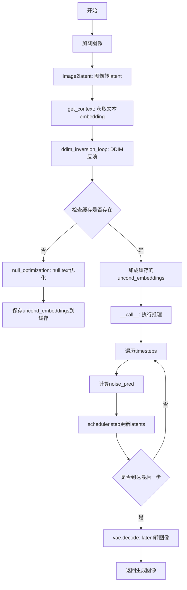
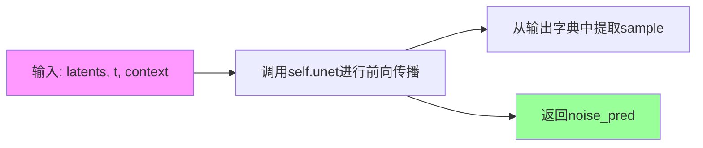
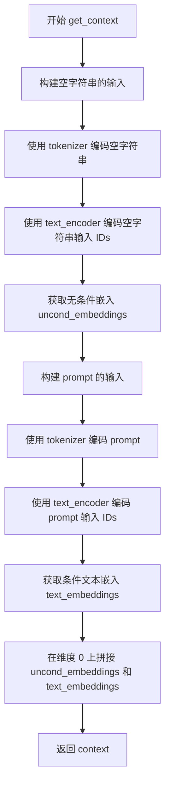
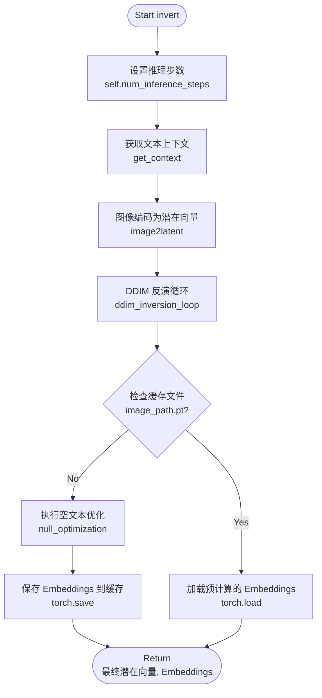

# `diffusers\examples\community\pipeline_null_text_inversion.py` 详细设计文档

这是一个基于Stable Diffusion的Null Text反演Pipeline，实现了图像到潜在空间的DDIM反演和文本提示的null text优化，用于实现高质量的文本引导图像编辑和生成任务。

## 整体流程



## 类结构

```
StableDiffusionPipeline (基类, 来自diffusers)
└── NullTextPipeline (自定义实现)
```

## 全局变量及字段


### `NullTextPipeline.num_inference_steps`
    
推理步数，控制扩散模型生成图像时的迭代次数

类型：`int`
    


### `NullTextPipeline._guidance_scale`
    
引导尺度，控制文本提示对生成图像的影响程度

类型：`float`
    
    

## 全局函数及方法


### `retrieve_timesteps`

这是一个全局函数，用于调用调度器的 `set_timesteps` 方法并从中获取时间步序列，同时处理自定义时间步和标准推理步数两种模式，支持任意关键字参数传递给调度器。

参数：

- `scheduler`：`SchedulerMixin`，调度器对象，用于获取时间步
- `num_inference_steps`：`int`，生成样本时使用的扩散步数，当使用此参数时，`timesteps` 必须为 `None`
- `device`：`str` 或 `torch.device`，时间步要移动到的设备，如果为 `None` 则不移动
- `timesteps`：`List[int]`，用于支持任意时间步间隔的自定义时间步，如果为 `None` 则使用调度器的默认时间步间隔策略
- `**kwargs`：任意关键字参数，将传递给 `scheduler.set_timesteps`

返回值：`Tuple[torch.Tensor, int]`，第一个元素是调度器的时间步调度，第二个元素是推理步数

#### 流程图

```mermaid
flowchart TD
    A[开始: retrieve_timesteps] --> B{检查 timesteps 是否为 None}
    B -->|否| C[检查调度器是否支持自定义 timesteps]
    B -->|是| D[调用 scheduler.set_timesteps num_inference_steps]
    C -->|支持| E[调用 scheduler.set_timesteps timesteps]
    C -->|不支持| F[抛出 ValueError 异常]
    E --> G[获取 scheduler.timesteps]
    G --> H[计算 num_inference_steps = len(timesteps)]
    D --> I[获取 scheduler.timesteps]
    I --> J[返回 timesteps, num_inference_steps]
    H --> J
    F --> K[结束: 异常处理]
```

#### 带注释源码

```
def retrieve_timesteps(
    scheduler,                  # 调度器对象（SchedulerMixin类型）
    num_inference_steps=None,   # 推理步数（int类型）
    device=None,                # 设备（str或torch.device，可选）
    timesteps=None,             # 自定义时间步列表（List[int]，可选）
    **kwargs,                   # 传递给scheduler.set_timesteps的其他参数
):
    """
    Calls the scheduler's `set_timesteps` method and retrieves timesteps from the scheduler after the call. Handles
    custom timesteps. Any kwargs will be supplied to `scheduler.set_timesteps`.
    Args:
        scheduler (`SchedulerMixin`):
            The scheduler to get timesteps from.
        num_inference_steps (`int`):
            The number of diffusion steps used when generating samples with a pre-trained model. If used,
            `timesteps` must be `None`.
        device (`str` or `torch.device`, *optional*):
            The device to which the timesteps should be moved to. If `None`, the timesteps are not moved.
        timesteps (`List[int]`, *optional*):
                Custom timesteps used to support arbitrary spacing between timesteps. If `None`, then the default
                timestep spacing strategy of the scheduler is used. If `timesteps` is passed, `num_inference_steps`
                must be `None`.

    Returns:
        `Tuple[torch.Tensor, int]`: A tuple where the first element is the timestep schedule from the scheduler and the
        second element is the number of inference steps.
    """
    # 检查是否传入了自定义时间步
    if timesteps is not None:
        # 使用inspect检查调度器的set_timesteps方法是否支持timesteps参数
        accepts_timesteps = "timesteps" in set(inspect.signature(scheduler.set_timesteps).parameters.keys())
        # 如果调度器不支持自定义时间步，抛出ValueError异常
        if not accepts_timesteps:
            raise ValueError(
                f"The current scheduler class {scheduler.__class__}'s `set_timesteps` does not support custom"
                f" timestep schedules. Please check whether you are using the correct scheduler."
            )
        # 调用调度器的set_timesteps方法，传入自定义时间步和设备
        scheduler.set_timesteps(timesteps=timesteps, device=device, **kwargs)
        # 从调度器获取时间步张量
        timesteps = scheduler.timesteps
        # 根据时间步长度计算推理步数
        num_inference_steps = len(timesteps)
    else:
        # 如果没有传入自定义时间步，则使用num_inference_steps设置时间步
        scheduler.set_timesteps(num_inference_steps, device=device, **kwargs)
        # 从调度器获取时间步张量
        timesteps = scheduler.timesteps
    # 返回时间步张量和推理步数
    return timesteps, num_inference_steps
```


### `NullTextPipeline.get_noise_pred`

该方法执行噪声预测并完成单步去噪操作。首先将当前 latents 复制两份以同时处理无条件（unconditional）和条件（conditional）预测，然后通过 UNet 模型获取噪声预测结果。接着分离无条件与条件噪声预测值，应用 classifier-free guidance（分类器自由引导）技术进行噪声预测的调整，最后调用 `prev_step` 方法执行单步去噪并返回去噪后的 latents。

参数：

- `latents`：`torch.Tensor`，当前的去噪潜在表示（latent representations）
- `t`：`torch.Tensor` 或 `int`，扩散过程中的当前时间步（timestep）
- `context`：`torch.Tensor`，文本编码器产生的上下文嵌入，包含了无条件嵌入和条件文本嵌入的拼接结果

返回值：`torch.Tensor`，经过单步去噪处理后的潜在表示

#### 流程图

```mermaid
flowchart TD
    A[开始: get_noise_pred] --> B[复制latents: torch.cat([latents] * 2)]
    B --> C[设置guidance_scale = 7.5]
    C --> D[调用UNet预测噪声: self.unet<br/>latents_input, t, context]
    D --> E[获取noise_pred结果]
    E --> F[拆分预测结果: chunk(2)<br/>noise_pred_uncond和noise_prediction_text]
    F --> G[应用Classifier-Free Guidance:<br/>noise_pred_uncond + 7.5 * (noise_prediction_text - noise_pred_uncond)]
    G --> H[执行单步去噪: self.prev_step<br/>noise_pred, t, latents]
    H --> I[返回去噪后的latents]
```

#### 带注释源码

```python
def get_noise_pred(self, latents, t, context):
    """
    执行噪声预测并进行单步去噪
    
    参数:
        latents: 当前的去噪潜在表示
        t: 扩散过程中的时间步
        context: 包含条件和无条件文本嵌入的上下文
    返回:
        去噪后的潜在表示
    """
    # 将latents复制两份，第一份用于无条件预测，第二份用于条件预测
    # 这样可以一次前向传播同时获取两种预测结果，提高效率
    latents_input = torch.cat([latents] * 2)
    
    # 分类器自由引导的权重系数
    # 7.5是一个常用的默认值，用于平衡无条件预测和条件预测
    guidance_scale = 7.5
    
    # 通过UNet模型进行噪声预测
    # context包含了两部分：[unconditional_embedding, conditional_embedding]
    # UNet会分别对这两部分进行预测
    noise_pred = self.unet(latents_input, t, encoder_hidden_states=context)["sample"]
    
    # 将预测结果拆分为无条件预测和条件预测
    # chunk(2)将结果分成两部分，每部分与原始latents形状相同
    noise_pred_uncond, noise_prediction_text = noise_pred.chunk(2)
    
    # 应用Classifier-Free Guidance (CFG)
    # 公式: noise_pred = noise_pred_uncond + guidance_scale * (noise_pred_cond - noise_pred_uncond)
    # 这种技术可以在没有分类器的情况下实现条件生成引导
    noise_pred = noise_pred_uncond + guidance_scale * (noise_prediction_text - noise_pred_uncond)
    
    # 根据噪声预测执行单步去噪，返回去噪后的latents
    # prev_step方法根据DDIM或DDPM采样器的公式计算x_{t-1}
    latents = self.prev_step(noise_pred, t, latents)
    
    return latents
```


### `NullTextPipeline.get_noise_pred_single`

该函数是NullTextPipeline类中的一个核心方法，用于在扩散模型的单步推理过程中获取不带分类器自由引导（classifier-free guidance）的噪声预测值。它直接调用UNet模型对潜在表示进行去噪预测，返回原始的噪声预测结果，供后续的null text优化过程使用。

参数：

- `latents`：`torch.Tensor`，输入的潜在向量，表示扩散过程中的当前潜在表示
- `t`：`int` 或 `torch.Tensor`，时间步，当前扩散过程的时间步长
- `context`：`torch.Tensor`，上下文嵌入，文本编码器生成的文本条件嵌入向量

返回值：`torch.Tensor`，UNet模型预测的噪声张量

#### 流程图



#### 带注释源码

```python
def get_noise_pred_single(self, latents, t, context):
    """
    获取单个时间步的噪声预测（不带分类器自由引导）
    
    参数:
        latents: 当前扩散步骤的潜在表示
        t: 当前时间步
        context: 文本条件嵌入
    
    返回:
        noise_pred: UNet预测的噪声
    """
    # 调用UNet模型进行前向传播，传入潜在表示、时间步和上下文嵌入
    # self.unet返回字典，取["sample"]获取预测的噪声张量
    noise_pred = self.unet(latents, t, encoder_hidden_states=context)["sample"]
    
    # 返回预测的噪声，不进行分类器自由引导处理
    return noise_pred
```

#### 技术债务与优化空间

1. **缺少错误处理**：函数未对输入参数进行有效性检查，如latents维度、t的值范围等
2. **硬编码的UNet调用**：UNet的调用方式较为直接，可考虑封装以提高复用性
3. **返回值未做类型标注**：可添加类型提示提高代码可读性

#### 外部依赖与接口契约

- **依赖组件**：
  - `self.unet`：Stable Diffusion的UNet模型实例
  - `context`：需要通过`get_context`方法预先编码的文本嵌入
- **调用场景**：
  - 在`null_optimization`方法中被调用用于null text优化
  - 在无分类器引导的噪声预测计算中作为基础预测


### `NullTextPipeline.image2latent`

该方法接收一个图像文件路径作为输入，将其加载为 RGB 格式并转换为 PyTorch 张量，经过归一化和维度调整后，通过 VAE 编码器编码为潜在向量（latent），最后乘以缩放因子返回。这是 NullTextPipeline 中图像到潜在空间的转换核心方法，用于将输入图像编码为 Stable Diffusion 模型可处理的潜在表示。

参数：

- `image_path`：`str`，要转换的图像文件路径

返回值：`torch.Tensor`，编码后的潜在向量张量，形状为 (1, 4, H/8, W/8)，其中 H 和 W 分别是输入图像的高度和宽度

#### 流程图

```mermaid
flowchart TD
    A[开始: image2latent] --> B[PIL打开图像并转换为RGB模式]
    B --> C[将PIL图像转换为numpy数组]
    C --> D[将numpy数组转换为PyTorch Float张量并归一化到[-1, 1]]
    D --> E[调整张量维度: permute2,0,1并unsqueeze0以适应VAE输入]
    E --> F[将图像张量移动到模型设备]
    F --> G[VAE编码器编码图像得到潜在分布]
    G --> H[取潜在分布的均值]
    H --> I[潜在向量乘以缩放因子0.18215]
    I --> J[返回潜在向量]
```

#### 带注释源码

```python
@torch.no_grad()  # 禁用梯度计算，减少显存占用
def image2latent(self, image_path):
    """
    将输入图像文件转换为潜在向量（latent representation）
    
    参数:
        image_path: str - 输入图像的文件路径
        
    返回:
        torch.Tensor - 编码后的潜在向量，用于后续的扩散模型处理
    """
    # Step 1: 使用PIL库打开图像并转换为RGB模式（确保3通道）
    image = Image.open(image_path).convert("RGB")
    
    # Step 2: 将PIL图像转换为numpy数组（Height, Width, Channel格式）
    image = np.array(image)
    
    # Step 3: 转换为PyTorch Float张量，并归一化到[-1, 1]范围
    # 原图素值范围[0, 255] -> 除以127.5后[0, 2] -> 减1后[-1, 1]
    image = torch.from_numpy(image).float() / 127.5 - 1
    
    # Step 4: 调整张量维度以适应VAE编码器的输入要求
    # 从 (H, W, C) 转换为 (C, H, W)，然后添加batch维度变为 (1, C, H, W)
    image = image.permute(2, 0, 1).unsqueeze(0).to(self.device)
    
    # Step 5: 使用VAE编码器将图像编码为潜在空间表示
    # 返回的latent_dist是潜在分布，需要取均值作为确定性表示
    latents = self.vae.encode(image)["latent_dist"].mean
    
    # Step 6: 应用Stable Diffusion VAE的缩放因子
    # 这个因子是SD VAE训练时使用的缩放系数，用于将潜在向量调整到正确范围
    latents = latents * 0.18215
    
    return latents  # 返回编码后的潜在向量
```


### `NullTextPipeline.latent2image`

将 Latent 空间的数据转换回 PIL 图像格式。该方法接收来自 VAE 编码的 latent 向量，经过解码和后处理后输出可显示的图像。

参数：

- `self`：`NullTextPipeline`，Pipeline 实例本身
- `latents`：`torch.Tensor`，需要转换的 latent 向量，通常来自 VAE encode 的输出

返回值：`PIL.Image.Image`，转换后的 PIL 格式图像

#### 流程图

```mermaid
flowchart TD
    A[输入 latents] --> B[缩放 latents: latents = 1/0.18215 × latents.detach]
    B --> C[VAE 解码: vae.decode]
    C --> D[后处理: processor.postprocess output_type=pil]
    D --> E[取第一张图像 [0]]
    E --> F[返回 PIL Image]
```

#### 带注释源码

```python
@torch.no_grad()
def latent2image(self, latents):
    """
    将 latent 空间的数据转换回图像
    
    参数:
        latents: torch.Tensor, VAE 编码后的 latent 向量
    
    返回:
        PIL.Image.Image: 处理后的图像
    """
    # 第一步：缩放 latents
    # 0.18215 是 Stable Diffusion VAE 常用的缩放因子
    # 这里进行逆向缩放以还原原始 latent 空间
    latents = 1 / 0.18215 * latents.detach()
    
    # 第二步：使用 VAE 解码器将 latent 向量解码为图像
    # vae.decode 接收 latent 并输出原始图像空间的数据
    image = self.vae.decode(latents)["sample"].detach()
    
    # 第三步：使用 processor 进行后处理
    # 将张量格式转换为 PIL 图像格式
    image = self.processor.postprocess(image, output_type="pil")[0]
    
    # 返回第一张图像（索引 0）
    return image
```


### `NullTextPipeline.prev_step`

该方法是DDIM（Denoising Diffusion Implicit Models）采样过程中的单步反向处理函数，根据模型预测的噪声计算前一个时间步的样本（latent）。这是扩散模型逆向去噪过程的核心计算逻辑，通过scheduler的累积alpha值和噪声预测来推导更清晰的样本。

参数：

- `model_output`：`torch.Tensor`，模型（UNet）预测的噪声向量，表示在当前时间步t预测的噪声
- `timestep`：`int`，当前扩散时间步，范围从0到num_train_timesteps，用于索引scheduler中的alpha累积值
- `sample`：`torch.Tensor`，当前时间步的样本（latent representation），即x_t，需要据此推导x_{t-1}

返回值：`torch.Tensor`，返回前一个时间步的样本x_{t-1}，即预测的更清晰的潜在表示

#### 流程图

```mermaid
flowchart TD
    A[prev_step开始] --> B[计算前一时间步prev_timestep<br/>timestep - num_train_timesteps // num_inference_steps]
    B --> C[获取alpha_prod_t<br/>scheduler.alphas_cumprod[timestep]]
    C --> D{prev_timestep >= 0?}
    D -->|是| E[获取alpha_prod_t_prev<br/>scheduler.alphas_cumprod[prev_timestep]]
    D -->|否| F[获取alpha_prod_t_prev<br/>scheduler.final_alpha_cumprod]
    E --> G[计算beta_prod_t<br/>1 - alpha_prod_t]
    F --> G
    G --> H[计算pred_original_sample<br/>原始样本预测<br/>(sample - β^0.5 * model_output) / α^0.5]
    H --> I[计算pred_sample_direction<br/>样本移动方向<br/>(1 - α_prod_t_prev)^0.5 * model_output]
    I --> J[计算prev_sample<br/>前一样本<br/>α_prod_t_prev^0.5 * pred_original_sample + pred_sample_direction]
    J --> K[返回prev_sample]
```

#### 带注释源码

```python
def prev_step(self, model_output, timestep, sample):
    """
    执行DDIM采样的一步反向过程（从x_t推导x_{t-1}）
    
    参数:
        model_output: 模型预测的噪声
        timestep: 当前时间步
        sample: 当前样本x_t
    返回:
        前一个时间步的样本x_{t-1}
    """
    # 计算前一个时间步的索引
    # 通过减去每步跳跃的时间步数来得到前一个时间步
    prev_timestep = timestep - self.scheduler.config.num_train_timesteps // self.scheduler.num_inference_steps
    
    # 获取当前时间步的累积alpha值（α_t）
    # alphas_cumprod是alpha的累积乘积，用于DDIM采样
    alpha_prod_t = self.scheduler.alphas_cumprod[timestep]
    
    # 获取前一个时间步的累积alpha值（α_{t-1}）
    # 如果prev_timestep小于0（到达起始时间步），则使用final_alpha_cumprod
    alpha_prod_t_prev = (
        self.scheduler.alphas_cumprod[prev_timestep] if prev_timestep >= 0 else self.scheduler.final_alpha_cumprod
    )
    
    # 计算beta值（β_t = 1 - α_t）
    # beta_prod_t表示1-α_t，用于计算原始样本
    beta_prod_t = 1 - alpha_prod_t
    
    # 计算预测的原始样本x_0
    # 根据DDIM逆向公式：x_0 = (x_t - √β_t * ε_t) / √α_t
    # 其中ε_t是预测的噪声（model_output）
    pred_original_sample = (sample - beta_prod_t**0.5 * model_output) / alpha_prod_t**0.5
    
    # 计算样本移动方向
    # 这决定了从x_0到x_{t-1}的移动方向和幅度
    # 公式：√(1-α_{t-1}) * ε_t
    pred_sample_direction = (1 - alpha_prod_t_prev) ** 0.5 * model_output
    
    # 计算前一个时间步的样本x_{t-1}
    # DDIM核心公式：x_{t-1} = √α_{t-1} * x_0 + √(1-α_{t-1}) * ε_t
    prev_sample = alpha_prod_t_prev**0.5 * pred_original_sample + pred_sample_direction
    
    return prev_sample
```


### `NullTextPipeline.next_step`

该方法是NullTextPipeline类中的核心采样方法，用于在DDIM（Denoising Diffusion Implicit Models）反演过程中根据当前噪声预测、当前时间步和潜在表示计算下一个时间步的去噪样本。该方法通过调度器的累积Alpha值执行反向扩散过程的一步计算。

参数：

- `model_output`：`torch.Tensor`，模型预测的噪声输出，通常是由UNet对潜在表示和时间步进行推理得到的噪声预测
- `timestep`：`int`，当前扩散过程中的时间步，用于索引调度器的时间步数组和累积Alpha值
- `sample`：`torch.Tensor`，当前的去噪潜在表示（latent），即扩散过程中当前状态的样本

返回值：`torch.Tensor`，返回计算得到的下一个时间步的去噪样本（next_sample）

#### 流程图

```mermaid
flowchart TD
    A[Start: next_step] --> B[计算timestep和next_timestep]
    B --> C{检查timestep >= 0}
    C -->|是| D[alpha_prod_t = scheduler.alphas_cumprod[timestep]]
    C -->|否| E[alpha_prod_t = scheduler.final_alpha_cumprod]
    D --> F[alpha_prod_t_next = scheduler.alphas_cumprod[next_timestep]]
    E --> F
    F --> G[beta_prod_t = 1 - alpha_prod_t]
    G --> H[next_original_sample = (sample - sqrt(beta_prod_t) * model_output) / sqrt(alpha_prod_t)]
    H --> I[next_sample_direction = sqrt(1 - alpha_prod_t_next) * model_output]
    I --> J[next_sample = sqrt(alpha_prod_t_next) * next_original_sample + next_sample_direction]
    J --> K[Return next_sample]
```

#### 带注释源码

```python
def next_step(self, model_output, timestep, sample):
    """
    执行DDIM采样的一步，计算下一个时间步的去噪样本
    
    参数:
        model_output: 模型预测的噪声张量
        timestep: 当前时间步
        sample: 当前的去噪潜在表示
    
    返回:
        下一个时间步的去噪样本
    """
    # 计算当前时间步和下一个时间步
    # 通过从当前timestep减去(总训练时间步数/推理步数)来得到前一个时间步
    # 使用min确保不超过999（DDIM调度器的默认最大值）
    timestep, next_timestep = (
        min(timestep - self.scheduler.config.num_train_timesteps // self.num_inference_steps, 999),
        timestep,
    )
    
    # 获取当前时间步的累积Alpha值
    # 如果timestep >= 0，从调度器的alphas_cumprod数组中获取
    # 否则使用最终累积Alpha值（final_alpha_cumprod）
    alpha_prod_t = self.scheduler.alphas_cumprod[timestep] if timestep >= 0 else self.scheduler.final_alpha_cumprod
    
    # 获取下一个时间步的累积Alpha值
    alpha_prod_t_next = self.scheduler.alphas_cumprod[next_timestep]
    
    # 计算1 - alpha_prod_t，即beta_prod_t
    beta_prod_t = 1 - alpha_prod_t
    
    # 根据DDIM采样公式计算原始样本估计值
    # 公式: (sample - sqrt(beta_prod_t) * noise_pred) / sqrt(alpha_prod_t)
    next_original_sample = (sample - beta_prod_t**0.5 * model_output) / alpha_prod_t**0.5
    
    # 计算样本移动方向
    # 公式: sqrt(1 - alpha_prod_t_next) * noise_pred
    next_sample_direction = (1 - alpha_prod_t_next) ** 0.5 * model_output
    
    # 计算最终的下一个样本
    # 公式: sqrt(alpha_prod_t_next) * original_sample + direction
    next_sample = alpha_prod_t_next**0.5 * next_original_sample + next_sample_direction
    
    return next_sample
```


### `NullTextPipeline.null_optimization`

该方法是 Null Text Inversion 方法的核心优化模块，通过梯度下降迭代优化无条件文本嵌入（unconditional embeddings），以最小化重构潜在变量与目标潜在变量之间的均方误差，从而在图像生成过程中实现更精确的语义控制。

**参数：**

- `latents`：`List[torch.Tensor]`，DDIM 逆向过程产生的潜在变量列表，索引 0 为初始潜在变量，末尾为最终潜在变量
- `context`：`torch.Tensor`，拼接后的文本嵌入向量，前半部分为无条件嵌入，后半部分为条件嵌入
- `num_inner_steps`：`int`，每个推理步骤中的内部优化迭代次数，即对无条件嵌入进行梯度下降的次数
- `epsilon`：`float`，早期停止阈值，当重构损失低于该阈值时提前终止内部优化循环

**返回值：** `List[torch.Tensor]`，优化后的无条件嵌入列表，长度等于推理步骤数，每个元素为形状 `(1, seq_len, embed_dim)` 的张量

#### 流程图

```mermaid
flowchart TD
    A[开始 null_optimization] --> B[分离 context: uncond_embeddings 和 cond_embeddings]
    B --> C[初始化空列表 uncond_embeddings_list 和当前潜在变量 latent_cur]
    C --> D[创建进度条, 总步数 = num_inner_steps * num_inference_steps]
    D --> E{遍历 i 从 0 到 num_inference_steps-1}
    E --> F[克隆并设置 uncond_embeddings 需梯度]
    F --> G[创建 Adam 优化器, 学习率随 i 衰减]
    G --> H[获取前一潜在变量 latent_prev = latents[len-1-i-1]]
    H --> I[获取当前时间步 t = scheduler.timesteps[i]]
    I --> J[无梯度计算: 获取条件噪声预测 noise_pred_cond]
    J --> K{内部循环 j 从 0 到 num_inner_steps-1}
    K --> L[获取无条件噪声预测 noise_pred_uncond]
    L --> M[计算带 CFG 的总噪声预测]
    M --> N[使用 prev_step 计算重构的上一潜在变量]
    N --> O[计算 MSE 损失: loss = mse(latents_prev_rec, latent_prev)]
    O --> P[反向传播并更新 uncond_embeddings]
    P --> Q{判断损失是否小于阈值}
    Q -->|是| R[提前跳出内部循环]
    Q -->|否| K
    R --> S[填充剩余步骤的进度条]
    S --> T[保存优化后的 uncond_embeddings[:1] 到列表]
    T --> U[无梯度计算: 更新 context 和 latent_cur]
    U --> E
    E --> V{循环结束}
    V --> W[关闭进度条]
    W --> X[返回 uncond_embeddings_list]
```

#### 带注释源码

```python
def null_optimization(self, latents, context, num_inner_steps, epsilon):
    """
    通过梯度下降优化无条件文本嵌入，使重构的潜在变量接近目标潜在变量
    
    参数:
        latents: DDIM逆向过程产生的潜在变量列表
        context: 文本嵌入上下文 [uncond_emb, cond_emb]
        num_inner_steps: 每个推理步骤的内部优化迭代次数
        epsilon: 早期停止的损失阈值
    返回:
        优化后的无条件嵌入列表
    """
    # 1. 从上下文中分离无条件嵌入和有条件嵌入
    # context 形状: [2, seq_len, embed_dim]
    uncond_embeddings, cond_embeddings = context.chunk(2)
    
    # 2. 初始化结果列表和当前潜在变量
    # latent_cur 初始化为逆向过程最后一个潜在变量（最接近噪声的起点）
    uncond_embeddings_list = []
    latent_cur = latents[-1]
    
    # 3. 创建进度条用于可视化优化过程
    bar = tqdm(total=num_inner_steps * self.num_inference_steps)
    
    # 4. 遍历每个推理步骤（共 num_inference_steps 步）
    for i in range(self.num_inference_steps):
        # 5. 克隆当前无条件嵌入并开启梯度计算
        # 每次迭代独立优化，避免梯度累积
        uncond_embeddings = uncond_embeddings.clone().detach()
        uncond_embeddings.requires_grad = True
        
        # 6. 创建 Adam 优化器，学习率随迭代衰减
        # 早期步骤学习率高有助于快速收敛，后期微调
        optimizer = Adam([uncond_embeddings], lr=1e-2 * (1.0 - i / 100.0))
        
        # 7. 获取对应的目标潜在变量（逆向过程中的前一步）
        # 从 latents 列表中倒序获取: latents[0] 是原始图像的潜在表示
        latent_prev = latents[len(latents) - i - 2]
        
        # 8. 获取当前时间步
        t = self.scheduler.timesteps[i]
        
        # 9. 预先计算条件噪声预测（无需梯度，节省显存）
        with torch.no_grad():
            noise_pred_cond = self.get_noise_pred_single(latent_cur, t, cond_embeddings)
        
        # 10. 内部优化循环：迭代优化无条件嵌入
        for j in range(num_inner_steps):
            # 10.1 获取当前无条件嵌入对应的噪声预测
            noise_pred_uncond = self.get_noise_pred_single(latent_cur, t, uncond_embeddings)
            
            # 10.2 应用 Classifier-Free Guidance (CFG)
            # 结合条件和无条件预测，平衡保真度和多样性
            noise_pred = noise_pred_uncond + 7.5 * (noise_pred_cond - noise_pred_uncond)
            
            # 10.3 使用 DDIM 单步逆向函数计算重构的上一潜在变量
            # 这一步模拟从 x_t 反向推导 x_{t-1} 的过程
            latents_prev_rec = self.prev_step(noise_pred, t, latent_cur)
            
            # 10.4 计算重构损失：预测的 x_{t-1} 与目标 x_{t-1} 的差异
            loss = nnf.mse_loss(latents_prev_rec, latent_prev)
            
            # 10.5 反向传播并更新无条件嵌入
            optimizer.zero_grad()
            loss.backward()
            optimizer.step()
            
            # 10.6 记录当前损失值并更新进度条
            loss_item = loss.item()
            bar.update()
            
            # 10.7 早期停止策略：损失足够小时提前结束
            # 阈值随 i 增大而略微提高，适应不同阶段的收敛特性
            if loss_item < epsilon + i * 2e-5:
                break
        
        # 11. 填充提前跳过的步骤的进度条
        for j in range(j + 1, num_inner_steps):
            bar.update()
        
        # 12. 保存优化后的无条件嵌入（取第一个样本，形状 [1, seq_len, embed_dim]）
        uncond_embeddings_list.append(uncond_embeddings[:1].detach())
        
        # 13. 使用优化后的嵌入更新上下文和当前潜在变量
        with torch.no_grad():
            # 拼接新的无条件嵌入和有条件嵌入
            context = torch.cat([uncond_embeddings, cond_embeddings])
            # 执行一步 DDIM 逆向，更新当前潜在变量
            latent_cur = self.get_noise_pred(latent_cur, t, context)
    
    # 14. 关闭进度条并返回优化结果
    bar.close()
    return uncond_embeddings_list
```


### `NullTextPipeline.ddim_inversion_loop`

该方法执行DDIM（DDIM Inversion）反演过程，通过反向遍历扩散模型的噪声调度器 timesteps，从给定的潜在表示开始，逐步预测噪声并计算前一个时间步的潜在表示，最终返回整个反演过程中所有潜在表示的列表。

参数：

- `latent`：`torch.Tensor`，输入的潜在表示张量，通常是从图像编码得到的潜在空间表示
- `context`：`torch.Tensor`，文本上下文嵌入，包含了无条件嵌入和条件嵌入的拼接结果

返回值：`List[torch.Tensor]`，返回所有时间步的潜在表示列表，第一个元素是原始输入 latent，最后一个元素是反演完成后的 latent

#### 流程图

```mermaid
flowchart TD
    A[开始 ddim_inversion_loop] --> B[设置调度器的 timesteps]
    B --> C[从 context 中提取条件嵌入 cond_embeddings]
    C --> D[初始化 all_latent 列表, 存入原始 latent]
    D --> E[克隆并分离 latent]
    E --> F{遍历 i 从 0 到 num_inference_steps-1}
    F --> G[计算当前 timestep: t = timesteps[len - i - 1]
    G --> H[使用 UNet 预测噪声: noise_pred = unet(latent, t, cond_embeddings)]
    H --> I[调用 next_step 计算前一时刻的 latent]
    I --> J[将新 latent 添加到 all_latent 列表]
    J --> K{是否还有剩余 timesteps?}
    K -->|是| F
    K -->|否| L[返回 all_latent 列表]
```

#### 带注释源码

```python
@torch.no_grad()
def ddim_inversion_loop(self, latent, context):
    """
    执行 DDIM 反演循环，从给定的 latent 开始反向遍历 timesteps
    
    参数:
        latent: 输入的潜在表示张量
        context: 文本上下文嵌入 (包含无条件嵌入和条件嵌入)
    
    返回:
        all_latent: 所有时间步的潜在表示列表
    """
    # 1. 设置调度器的推理步骤数
    self.scheduler.set_timesteps(self.num_inference_steps)
    
    # 2. 从上下文嵌入中分离出条件嵌入 (chunk(2) 返回 [uncond_embeddings, cond_embeddings])
    _, cond_embeddings = context.chunk(2)
    
    # 3. 初始化存储所有 latent 的列表，第一个元素是原始输入 latent
    all_latent = [latent]
    
    # 4. 克隆并分离 latent，避免梯度计算和修改原始数据
    latent = latent.clone().detach()
    
    # 5. 使用 no_grad 上下文管理器进行推理
    with torch.no_grad():
        # 6. 遍历所有推理步骤 (倒序遍历，从最后一个 timestep 到第一个)
        for i in range(0, self.num_inference_steps):
            # 获取当前 timestep (倒序: 最后一个, 倒数第二个, ..., 第一个)
            t = self.scheduler.timesteps[len(self.scheduler.timesteps) - i - 1]
            
            # 7. 使用 UNet 模型预测噪声
            # 输入: 当前 latent, 当前 timestep, 条件文本嵌入
            # 输出: 预测的噪声
            noise_pred = self.unet(latent, t, encoder_hidden_states=cond_embeddings)["sample"]
            
            # 8. 调用 next_step 计算前一个时间步的 latent (DDIM 采样步骤)
            latent = self.next_step(noise_pred, t, latent)
            
            # 9. 将计算出的新 latent 添加到列表中
            all_latent.append(latent)
    
    # 10. 返回所有 latent 的列表
    return all_latent
```


### `NullTextPipeline.get_context`

该方法用于将文本提示（prompt）转换为可供扩散模型使用的上下文向量（context）。它通过分词器分别对空字符串和输入提示进行编码，分别得到无条件嵌入（uncond_embeddings）和条件文本嵌入（text_embeddings），然后将两者在维度0上拼接，形成最终的上下文向量。这种设计主要用于实现无分类器引导（Classifier-Free Guidance）推理。

参数：

- `prompt`：`str`，需要编码的文本提示，用于生成条件文本嵌入

返回值：`torch.Tensor`，拼接后的上下文向量，包含无条件嵌入和条件文本嵌入，形状为 `(2, seq_len, hidden_dim)`

#### 流程图



#### 带注释源码

```python
def get_context(self, prompt):
    """
    将文本提示转换为上下文向量，用于扩散模型的推理过程。
    该方法生成两种嵌入：无条件嵌入（用于无分类器引导）和条件文本嵌入。
    
    参数:
        prompt (str): 输入的文本提示，用于生成图像的描述
        
    返回:
        torch.Tensor: 拼接后的上下文向量，形状为 (2, seq_len, hidden_dim)
                     第一个元素是无条件嵌入，第二个是条件文本嵌入
    """
    # Step 1: 准备空字符串的输入，用于生成无条件嵌入
    # 空字符串代表"无内容"，用于引导模型在生成时不受特定内容约束
    uncond_input = self.tokenizer(
        [""],                              # 空字符串列表
        padding="max_length",              # 填充到最大长度
        max_length=self.tokenizer.model_max_length,  # 使用模型的最大长度限制
        return_tensors="pt"               # 返回 PyTorch 张量
    )
    
    # Step 2: 使用文本编码器将空字符串的 token IDs 转换为嵌入向量
    # [0] 表示只取第一个元素（因为batch size为1）
    uncond_embeddings = self.text_encoder(uncond_input.input_ids.to(self.device))[0]
    
    # Step 3: 准备输入 prompt 的分词输入
    text_input = self.tokenizer(
        [prompt],                          # 输入的文本提示
        padding="max_length",              # 填充到最大长度
        max_length=self.tokenizer.model_max_length,  # 使用模型的最大长度限制
        truncation=True,                   # 如果超过最大长度则截断
        return_tensors="pt"               # 返回 PyTorch 张量
    )
    
    # Step 4: 使用文本编码器将 prompt 的 token IDs 转换为嵌入向量
    text_embeddings = self.text_encoder(text_input.input_ids.to(self.device))[0]
    
    # Step 5: 在序列维度（dim=0）上拼接无条件嵌入和条件文本嵌入
    # 拼接后的形状: (2, seq_len, hidden_dim)
    # 第一个是无条件嵌入，第二个是条件文本嵌入
    # 这种格式便于后续在推理时使用无分类器引导
    context = torch.cat([uncond_embeddings, text_embeddings])
    
    return context
```


### `NullTextPipeline.invert`

该方法是 Null Text Inversion（Null文本反演）流程的核心入口。它接收一张图片和一个文本提示，首先将图片编码到潜在空间（Latent Space），然后通过 DDIM 反演（Inversion）追踪从噪声到原图的路径，最后优化“空文本”嵌入（Null Embeddings）以确保在后续生成（Reconstruction）过程中能精确还原原图像内容或进行语义编辑。

参数：

-  `self`：`NullTextPipeline` 实例本身。
-  `image_path`：`str`，输入图像的文件路径。
-  `prompt`：`str`，描述输入图像内容的文本提示。
-  `num_inner_steps`：`int`（默认值 10），在每次反演步骤中优化空文本嵌入的迭代次数。
-  `early_stop_epsilon`：`float`（默认值 1e-6），优化过程中的早期停止阈值，用于判断收敛。
-  `num_inference_steps`：`int`（默认值 50），DDIM 采样器的推理步数，决定反演的精细程度。

返回值：`Tuple[torch.Tensor, torch.Tensor]`，返回一个元组。
-  第一个元素：`ddim_latents[-1]` (`torch.Tensor`)，反演结束后的最终潜在向量（通常是纯噪声状态下的潜在表示），作为后续生成过程的起点。
-  第二个元素：`uncond_embeddings` (`torch.Tensor`)，优化后的无条件文本嵌入向量，用于指导生成过程遵循原图结构。

#### 流程图



#### 带注释源码

```python
def invert(
    self, image_path: str, prompt: str, num_inner_steps=10, early_stop_epsilon=1e-6, num_inference_steps=50
):
    # 1. 设置推理步数到实例变量，供其他方法（如调度器、UNet）使用
    self.num_inference_steps = num_inference_steps
    
    # 2. 获取文本上下文：包括无条件嵌入（空文本）和条件嵌入（Prompt）
    context = self.get_context(prompt)
    
    # 3. 将输入图像转换为潜在向量表示 (Image -> Latent)
    latent = self.image2latent(image_path)
    
    # 4. 执行 DDIM 反演循环：从原图潜向量出发，逆向推导出一系列潜向量
    #    返回的列表通常是从 纯噪声 -> 清晰图像 的逆过程
    ddim_latents = self.ddim_inversion_loop(latent, context)
    
    # 5. 检查是否存在预计算的空文本嵌入缓存文件
    if os.path.exists(image_path + ".pt"):
        # 如果存在，则直接加载，避免重复耗时的优化过程
        uncond_embeddings = torch.load(image_path + ".pt")
    else:
        # 如果不存在，执行核心优化逻辑：Null Text Optimization
        # 目标是找到一组无条件嵌入，使得在给定 Prompt 的条件下，
        # 从 ddim_latents 反向推演时能最大程度还原 latent
        uncond_embeddings = self.null_optimization(ddim_latents, context, num_inner_steps, early_stop_epsilon)
        
        # 将优化后的嵌入堆叠成张量并保存到本地，以便下次使用
        uncond_embeddings = torch.stack(uncond_embeddings, 0)
        torch.save(uncond_embeddings, image_path + ".pt")
        
    # 6. 返回：最终的逆潜在向量（用于生成起点）和 优化后的无条件嵌入（用于 Classifier-Free Guidance）
    return ddim_latents[-1], uncond_embeddings
```


### `NullTextPipeline.__call__`

该方法是 `NullTextPipeline` 的核心调用函数，用于基于文本提示（prompt）和已经反转（inverted）的潜在表示（latent）执行图像生成推理。它结合了优化后的无条件嵌入（uncond_embeddings）和文本提示嵌入，在推理过程中逐步去除噪声并生成最终图像。

参数：

- `prompt`：`str`，文本提示，描述期望生成的图像内容
- `uncond_embeddings`：`List[torch.Tensor]` 或 `torch.Tensor`，通过 Null Text 优化得到的无条件文本嵌入列表，用于 classifier-free guidance
- `inverted_latent`：`torch.Tensor`，从目标图像经过 DDIM 反演得到的初始潜在表示，作为推理的起点
- `num_inference_steps`：`int`，默认值为 50，扩散推理的总步数
- `timesteps`：`List[int]`，可选，自定义的时间步序列，如果为 None 则使用调度器默认策略
- `guidance_scale`：`float`，默认值为 7.5，classifier-free guidance 的引导强度系数
- `negative_prompt`：`str`，可选，用于指定不希望出现的图像特征
- `num_images_per_prompt`：`int`，默认值为 1，每个 prompt 生成的图像数量
- `generator`：`torch.Generator`，可选，用于控制随机数生成以实现可复现的图像生成
- `latents`：`torch.Tensor`，可选，用于覆盖默认潜在变量的输入潜在变量
- `prompt_embeds`：`torch.Tensor`，可选，用于直接传入预计算的提示嵌入
- `negative_prompt_embeds`：`torch.Tensor`，可选，用于直接传入预计算的负面提示嵌入
- `output_type`：`str`，默认值为 "pil"，输出图像的类型，可选 "pil"、"numpy" 或 "latent"

返回值：`StableDiffusionPipelineOutput`，包含生成的图像列表（`images`）和 NSFW 内容检测标志（`nsfw_content_detected`）的数据类对象

#### 流程图

```mermaid
flowchart TD
    A[开始 __call__] --> B[设置 guidance_scale]
    --> C[获取 UNet 的默认高度和宽度]
    --> D[检查输入参数合法性]
    --> E[获取执行设备 device]
    --> F[编码输入 prompt 得到 prompt_embeds]
    --> G[retrieve_timesteps 获取时间步序列]
    --> H[latents = inverted_latent 初始化潜在变量]
    --> I[创建进度条]
    --> J{遍历每个时间步 t}
    --> K[使用 uncond_embeddings[i] 预测无条件噪声]
    --> L[使用 prompt_embeds 预测条件噪声]
    --> M[计算 classifier-free guidance 后的噪声]
    --> N[scheduler.step 计算前一个时间步的 latents]
    --> O[更新进度条]
    --> P{是否还有下一个时间步}
    -->|是| J
    -->|否| Q{output_type == 'latent'?}
    -->|否| R[vae.decode 将 latents 解码为图像]
    -->|是| S[image = latents]
    --> T[postprocess 后处理图像]
    --> U[maybe_free_model_hooks 释放模型资源]
    --> V[返回 StableDiffusionPipelineOutput]
```

#### 带注释源码

```python
@torch.no_grad()
def __call__(
    self,
    prompt,                       # str: 文本提示，描述生成内容
    uncond_embeddings,            # List[Tensor]: Null Text 优化的无条件嵌入
    inverted_latent,              # Tensor: DDIM 反演后的潜在表示
    num_inference_steps: int = 50,   # int: 推理步数
    timesteps=None,               # List[int]: 可选自定义时间步
    guidance_scale=7.5,           # float: CFG 引导强度
    negative_prompt=None,         # str: 负面提示
    num_images_per_prompt=1,      # int: 每个提示生成的图像数
    generator=None,               # Generator: 随机数生成器
    latents=None,                 # Tensor: 可选覆盖的潜在变量
    prompt_embeds=None,          # Tensor: 预计算的提示嵌入
    negative_prompt_embeds=None, # Tensor: 预计算的负面提示嵌入
    output_type="pil",           # str: 输出类型
):
    # 1. 保存引导系数到实例变量
    self._guidance_scale = guidance_scale
    
    # 2. 从 UNet 配置获取默认图像尺寸
    height = self.unet.config.sample_size * self.vae_scale_factor
    width = self.unet.config.sample_size * self.vae_scale_factor
    
    # 3. 设置回调步数（用于可能的 forward hook）
    callback_steps = None
    
    # 4. 检查输入参数的合法性
    self.check_inputs(
        prompt,
        height,
        width,
        callback_steps,
        negative_prompt,
        prompt_embeds,
        negative_prompt_embeds,
    )
    
    # 5. 获取执行设备（CPU/CUDA）
    device = self._execution_device
    
    # 6. 编码输入的文本提示
    # 如果未提供 prompt_embeds，则使用 tokenizer 和 text_encoder 编码
    prompt_embeds, _ = self.encode_prompt(
        prompt,
        device,
        num_images_per_prompt,
        self.do_classifier_free_guidance,
        negative_prompt,
        prompt_embeds=prompt_embeds,
        negative_prompt_embeds=negative_prompt_embeds,
    )
    
    # 7. 准备时间步序列
    # 调用调度器的 set_timesteps 并获取时间步
    timesteps, num_inference_steps = retrieve_timesteps(
        self.scheduler, num_inference_steps, device, timesteps
    )
    
    # 8. 使用反演得到的潜在表示作为初始 latents
    latents = inverted_latent
    
    # 9. 创建进度条并开始迭代去噪
    with self.progress_bar(total=num_inference_steps) as progress_bar:
        for i, t in enumerate(timesteps):
            # 9.1 使用优化后的无条件嵌入预测噪声
            # uncond_embeddings[i] 对应第 i 个时间步的无条件嵌入
            noise_pred_uncond = self.unet(
                latents, t, 
                encoder_hidden_states=uncond_embeddings[i]
            )["sample"]
            
            # 9.2 使用条件文本嵌入预测噪声
            noise_pred = self.unet(
                latents, t, 
                encoder_hidden_states=prompt_embeds
            )["sample"]
            
            # 9.3 执行 Classifier-Free Guidance
            # noise_pred = noise_pred_uncond + guidance_scale * (noise_pred - noise_pred_uncond)
            noise_pred = noise_pred_uncond + guidance_scale * (noise_pred - noise_pred_uncond)
            
            # 9.4 使用调度器执行单步去噪：x_t -> x_t-1
            latents = self.scheduler.step(
                noise_pred, t, latents, return_dict=False
            )[0]
            
            # 9.5 更新进度条
            progress_bar.update()
    
    # 10. 将潜在表示解码为图像
    if not output_type == "latent":
        # 使用 VAE 解码 latents 到图像空间
        # 需要除以 scaling_factor 进行缩放
        image = self.vae.decode(
            latents / self.vae.config.scaling_factor, 
            return_dict=False, 
            generator=generator
        )[0]
    else:
        # 如果 output_type 为 latent，直接返回 latents
        image = latents
    
    # 11. 后处理图像
    # 将图像转换为指定的输出格式（pil/numpy）
    image = self.image_processor.postprocess(
        image, output_type=output_type, do_denormalize=[True] * image.shape[0]
    )
    
    # 12. 释放所有模型的内存钩子
    self.maybe_free_model_hooks()
    
    # 13. 返回包含图像和 NSFW 检测结果的输出对象
    return StableDiffusionPipelineOutput(
        images=image, 
        nsfw_content_detected=False
    )
```

## 关键组件


### 张量索引与惰性加载

代码通过 `image2latent` 方法将 PIL 图像转换为 PyTorch 张量，使用 `np.array` 和 `torch.from_numpy` 实现数据转换，并通过 VAE encoder 获取潜在分布的均值。潜在表示在生成过程中按需加载，例如在 `ddim_inversion_loop` 中使用 `latent.clone().detach()` 避免梯度追踪，通过 `latents.append()` 逐步构建反演序列。

### 反量化支持

代码中多处存在硬编码的缩放因子 `0.18215` 和 `1 / 0.18215`，分别用于 VAE 潜在空间的缩放和解码。在 `image2latent` 中将图像像素值从 [0, 255] 归一化到 [-1, 1] 范围（除以 127.5），在 `latent2image` 中通过 `postprocess` 方法将输出转换回 PIL 图像，实现了完整的量化与反量化流程。

### 量化策略

使用 `torch.no_grad()` 装饰器禁用梯度计算以减少显存占用，在 `null_optimization` 中通过 `clone().detach()` 分离张量依赖，在 `ddim_inversion_loop` 中使用 `torch.no_grad()` 上下文管理器包裹推理过程。文本嵌入通过 `get_context` 方法分别计算无条件嵌入和条件嵌入，并在后续步骤中通过 `torch.cat` 组合。

### 关键组件信息

#### retrieve_timesteps
辅助函数，用于配置调度器的时间步并返回时间步序列，支持自定义时间步或自动生成。

#### NullTextPipeline
继承自 StableDiffusionPipeline 的主类，实现图像反演和 Null Text 优化功能。

#### get_noise_pred
执行噪声预测计算，支持分类器自由引导（CFG）通过组合条件和无条件预测。

#### get_noise_pred_single
单次 UNet 前向传播，返回噪声预测结果。

#### image2latent
将输入图像文件路径转换为 VAE 潜在表示，包含图像加载、归一化和编码流程。

#### latent2image
将潜在表示解码为可见图像，包含缩放因子应用和后处理步骤。

#### prev_step
根据噪声预测计算前一个时间步的样本，实现 DDIM 采样的一步反向过程。

#### next_step
根据噪声预测计算下一个时间步的样本，实现 DDIM 反演的正向过程。

#### null_optimization
通过 Adam 优化器迭代优化无条件文本嵌入，最小化重建潜在表示与目标潜在表示的 MSE 损失。

#### ddim_inversion_loop
执行完整的 DDIM 反演过程，将图像潜在表示逐步转换为噪声潜在表示。

#### get_context
生成文本条件嵌入，分别计算空字符串的无条件嵌入和提示词的条件嵌入。

#### invert
主反演入口函数，协调图像到潜在表示的转换、DDIM 反演和 Null Text 优化过程。

#### __call__
重写的调用方法，执行基于反演潜在表示的图像生成，支持标准 Stable Diffusion 参数。

### 潜在技术债务与优化空间

1. **硬编码参数**：guidance_scale=7.5 和缩放因子 0.18215 硬编码在多处，应提取为配置参数
2. **缓存机制**：uncond_embeddings 缓存到 .pt 文件但未设置过期时间或版本管理
3. **错误处理**：缺少对图像加载失败、模型设备不匹配等情况的异常处理
4. **内存优化**：null_optimization 中 optimizer 每步重建，可考虑梯度累积或参数复用
5. **类型注解**：部分方法缺少完整的类型注解，影响代码可维护性

### 其它项目

#### 设计目标
实现图像驱动的文本到图像生成，通过 DDIM 反演将图像转换为潜在空间，并利用 Null Text 优化提升条件生成质量。

#### 约束条件
依赖 diffusers 库的 StableDiffusionPipeline 实现，遵循其接口契约；需要 GPU 显存支持大规模张量运算。

#### 错误处理
通过 inspect 模块验证调度器支持自定义时间步，抛出 ValueError 提示 scheduler 兼容性；文件路径操作使用 os.path.exists 检查缓存存在性。

#### 数据流
图像 → image2latent → VAE编码 → 潜在表示 → ddim_inversion_loop → 反演潜在序列 → null_optimization → 优化嵌入 → __call__ → 潜在表示 → latent2image → 最终图像

#### 外部依赖
PIL (Pillow)、numpy、torch、diffusers 库、Adam 优化器


## 问题及建议


### 已知问题

- **硬编码常量散落多处**：guidance_scale=7.5 在 get_noise_pred、null_optimization、__call__ 中重复出现；VAE缩放因子 0.18215 在 image2latent 和 latent2image 中重复；学习率 1e-2 在 null_optimization 中硬编码，缺乏统一配置管理。
- **重复计算逻辑**：get_noise_pred 和 get_noise_pred_single 存在重复的 UNet 调用逻辑；prev_step 和 next_step 方法中 alpha_prod_t、beta_prod_t 等变量的计算公式高度相似，可提取公共方法。
- **资源未妥善释放**：tqdm 进度条 bar.close() 在正常流程中调用，但如果发生异常则无法确保关闭；应使用上下文管理器或 try/finally 保护。
- **平台兼容性问题**：文件路径拼接使用 `image_path + ".pt"`，在 Windows 等系统上可能因路径分隔符导致问题，应使用 os.path.join。
- **优化器重复创建**：null_optimization 方法内每个推理步骤都创建新的 Adam 优化器，应在循环外创建或使用梯度累积策略。
- **模型加载缺乏错误处理**：torch.load 加载 .pt 文件时没有异常捕获，若文件损坏或格式错误会导致程序崩溃。
- **未使用的参数**：__call__ 方法中的 generator 参数未被使用；latents 参数虽然接收但实际使用的是 inverted_latent。
- **类型注解不完整**：多数方法缺少参数类型和返回值类型注解，影响代码可读性和 IDE 智能提示。
- **梯度计算策略不一致**：null_optimization 中使用 clone().detach() 和 requires_grad 手动管理梯度，而其他地方使用 torch.no_grad()，风格不统一。
- **显存潜在泄漏风险**：uncond_embeddings 每次循环都重新赋值，但梯度计算图可能未及时释放；应及时清理中间变量。

### 优化建议

- 将 guidance_scale、vae_scale_factor (0.18215) 等常量提取为类属性或配置文件，使用 self._guidance_scale 或 self.vae_scale_factor 统一访问。
- 封装公共的 alpha/beta 计算逻辑为辅助方法，如 _compute_alpha_prod_t(prev_timestep)，减少 prev_step 和 next_step 的代码重复。
- 将 tqdm 进度条改为上下文管理器写法：`with tqdm(total=...) as bar:` 确保资源自动释放。
- 使用 `os.path.join(os.path.splitext(image_path)[0], ".pt")` 或 pathlib 处理文件路径，提升跨平台兼容性。
- 将 Adam 优化器创建移至循环外，或预先创建优化器实例后在循环内清零梯度复用。
- 为 torch.load 添加 try/except 异常处理，捕获 FileNotFoundError、RuntimeError 等异常并给出友好提示。
- 移除 __call__ 中未使用的 generator 参数，或实现其功能；统一参数命名风格。
- 为所有公开方法添加完整的类型注解，包括 List、Optional、Tuple 等类型。
- 在 null_optimization 的梯度计算块结束后，显式调用 `del` 删除不需要的中间张量，或使用 `torch.cuda.empty_cache()` 清理显存。
- 考虑将 invert 方法中的缓存逻辑抽象为独立的缓存管理器，统一处理 .pt 文件的加载和保存。


## 其它


### 设计目标与约束

**设计目标**：实现Stable Diffusion的Null Text Inversion（无分类器引导文本反演），通过DDIM反演将图像映射到潜在空间，并通过优化无条件嵌入（unconditional embeddings）实现高质量的图像重建。该技术允许用户使用文本提示对已反演的图像进行修改，同时保持原始图像的结构特征。

**主要约束**：
- 依赖HuggingFace Diffusers库中的StableDiffusionPipeline
- 仅支持DDIM调度器
- 需要GPU显存至少8GB（处理512x512图像）
- 推理时需要预先进行图像反演和嵌入优化

### 错误处理与异常设计

**异常类型**：
- `ValueError`：当scheduler不支持自定义timesteps时抛出
- `FileNotFoundError`：当图像路径不存在时由PIL抛出
- `RuntimeError`：当CUDA内存不足时由PyTorch抛出
- `OSError`：当.pt文件读写失败时抛出

**错误处理策略**：
- 图像加载使用try-except捕获文件读取异常
- 模型推理检查设备可用性
- 优化过程设置early stop阈值防止过拟合
- 文件缓存使用os.path.exists检查，失败时重新计算

### 数据流与状态机

**主流程状态机**：
1. **初始化状态**：加载模型、tokenizer、vae、unet、scheduler
2. **编码状态**：将prompt编码为text embeddings，将图像编码为latents
3. **反演状态**：执行DDIM inversion loop获取反向过程的latents序列
4. **优化状态**：执行null_optimization优化unconditional embeddings
5. **推理状态**：使用优化后的embeddings和inverted latent进行图像生成

**数据流向**：
- 图像 → image2latent() → latent → ddim_inversion_loop() → ddim_latents
- prompt → get_context() → context (uncond + cond embeddings)
- ddim_latents + context → null_optimization() → uncond_embeddings_list
- uncond_embeddings + inverted_latent → __call__() → 生成图像

### 外部依赖与接口契约

**核心依赖**：
- `diffusers` (>=0.10.0)：StableDiffusionPipeline基类
- `torch` (>=1.9.0)：张量计算与神经网络
- `numpy`：数组操作
- `PIL`：图像加载与处理
- `tqdm`：进度条显示
- `inspect`：动态参数检查

**公共接口**：
- `invert(image_path, prompt, num_inner_steps, early_stop_epsilon, num_inference_steps)`：返回(inverted_latent, uncond_embeddings)
- `__call__(prompt, uncond_embeddings, inverted_latent, ...)`：返回StableDiffusionPipelineOutput

### 性能考量与资源消耗

**显存优化**：
- 使用torch.no_grad()禁用推理时的梯度计算
- 使用.detach()分离张量避免不必要的梯度追踪
- latent和image在不使用时及时释放

**计算优化**：
- guidance_scale硬编码为7.5避免重复传递
- 优化器使用Adam，学习率随步数衰减
- 中间结果缓存避免重复计算

**瓶颈分析**：
- null_optimization中的内层循环是主要计算瓶颈
- DDIM inversion需要num_inference_steps次unet前向传播

### 安全性考虑

**潜在风险**：
- 图像处理未进行恶意文件检查
- 模型加载无完整性校验
- 无用户输入长度限制（tokenizer有max_length但未显式验证）

**安全建议**：
- 添加图像文件魔数检查
- 对大图像进行尺寸限制
- 添加prompt长度和内容过滤

### 测试策略

**单元测试**：
- image2latent/latent2image的往返一致性测试
- get_context输出的embedding维度验证
- prev_step/next_step的数学正确性验证

**集成测试**：
- 完整invert流程的端到端测试
- 生成图像质量的主观评估
- 不同prompt的兼容性测试

**性能测试**：
- 不同图像尺寸的推理时间
- 显存峰值监控
- 多GPU扩展性测试

    