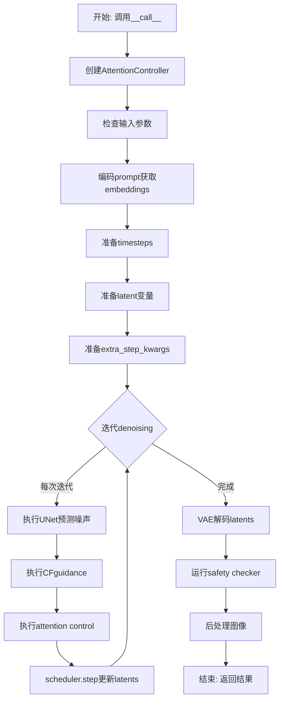
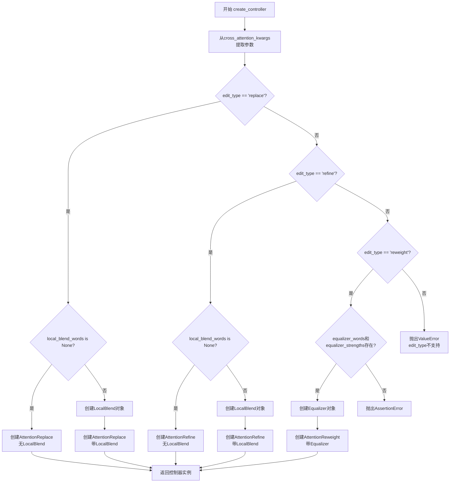
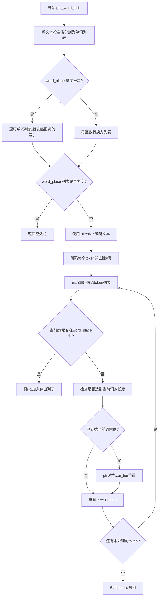
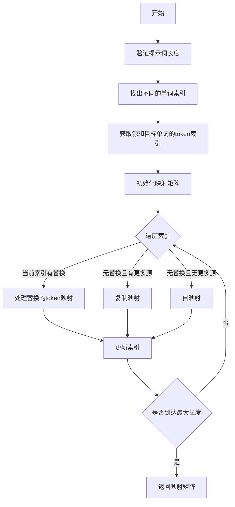
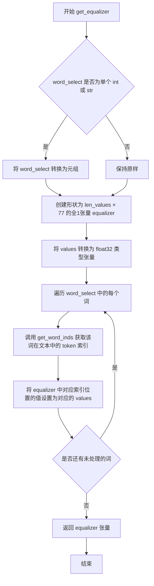
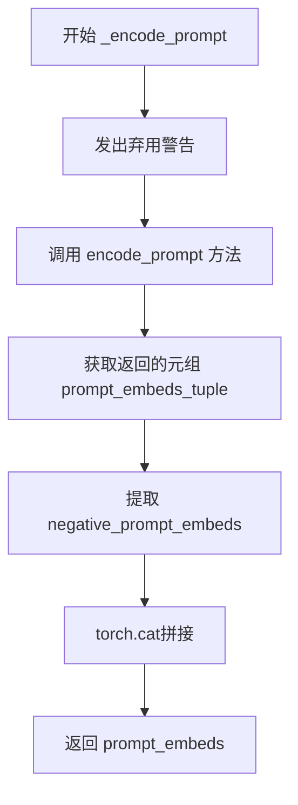
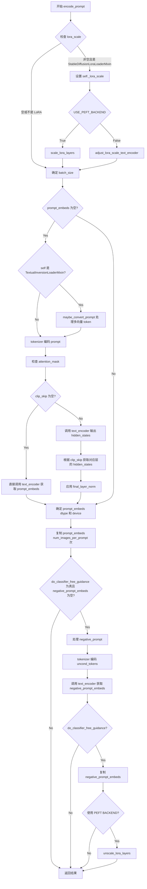
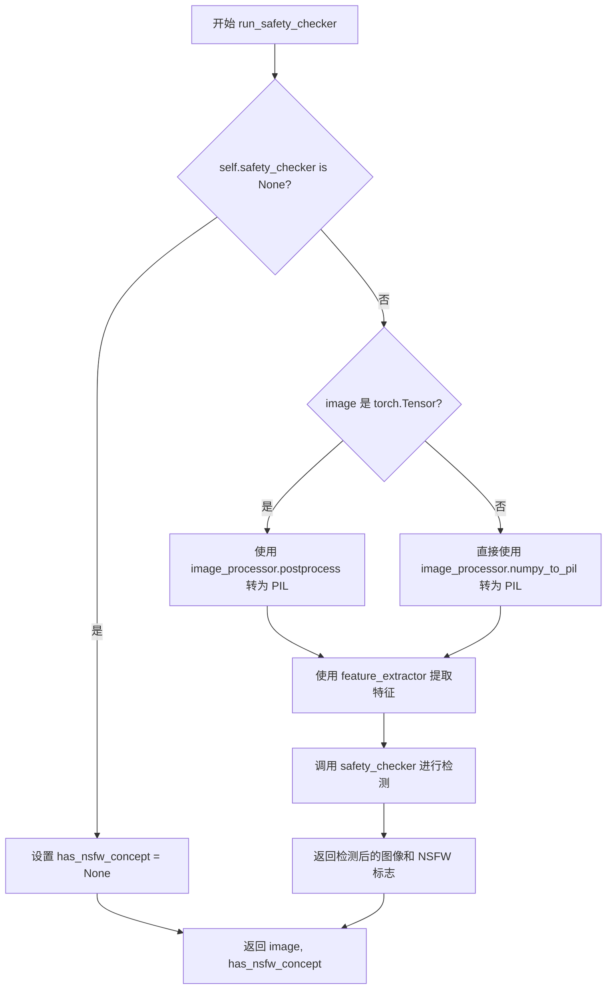
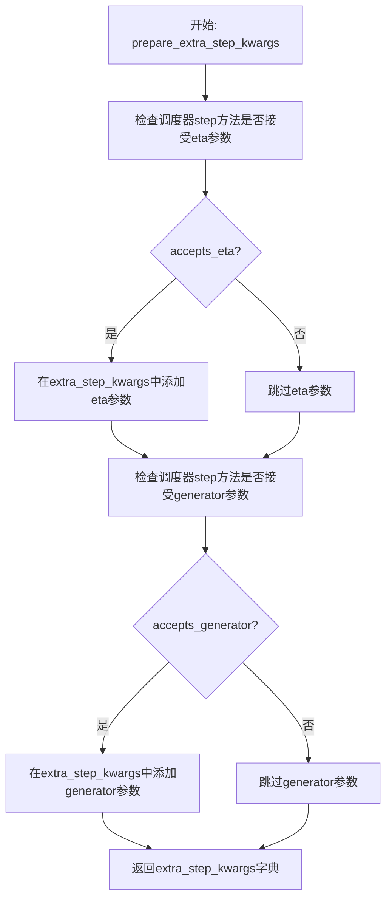

# `diffusers\examples\community\pipeline_prompt2prompt.py` 详细设计文档

这是一个基于Stable Diffusion的Prompt-to-Prompt实现，提供了细粒度的文本引导图像生成控制。通过注入跨注意力控制和多种编辑模式（替换、精炼、重权重），用户可以在保持原始图像结构的同时精确修改特定区域的生成内容。

## 整体流程



## 类结构

```
Prompt2PromptPipeline (主Pipeline类)
├── 继承自: DiffusionPipeline, TextualInversionLoaderMixin, StableDiffusionLoraLoaderMixin, IPAdapterMixin, FromSingleFileMixin
├── P2PCrossAttnProcessor (注意力处理器)
├── AttentionControl (抽象基类)
│   ├── EmptyControl
│   ├── AttentionStore
│   └── AttentionControlEdit (抽象类)
│       ├── AttentionReplace
│       ├── AttentionRefine
│       └── AttentionReweight
├── LocalBlend
└── ScoreParams (工具类)
```

## 全局变量及字段


### `logger`
    
模块级日志记录器，用于记录警告和信息消息

类型：`logging.Logger`
    


### `model_cpu_offload_seq`
    
定义模型组件CPU卸载顺序的字符串，指定text_encoder->image_encoder->unet->vae

类型：`str`
    


### `_exclude_from_cpu_offload`
    
从CPU卸载中排除的组件列表，包含safety_checker

类型：`List[str]`
    


### `_callback_tensor_inputs`
    
回调中使用的张量输入名称列表，包含latents、prompt_embeds、negative_prompt_embeds

类型：`List[str]`
    


### `_optional_components`
    
可选组件列表，包含safety_checker和feature_extractor

类型：`List[str]`
    


### `Prompt2PromptPipeline.vae`
    
变分自编码器模型，用于将图像编码到潜在空间并从潜在空间解码图像

类型：`AutoencoderKL`
    


### `Prompt2PromptPipeline.text_encoder`
    
冻结的CLIP文本编码器，用于将文本提示转换为嵌入向量

类型：`CLIPTextModel`
    


### `Prompt2PromptPipeline.tokenizer`
    
CLIP分词器，用于将文本分割成token

类型：`CLIPTokenizer`
    


### `Prompt2PromptPipeline.unet`
    
条件UNet2D模型，用于去噪图像潜在表示

类型：`UNet2DConditionModel`
    


### `Prompt2PromptPipeline.scheduler`
    
扩散调度器，用于控制去噪过程的噪声调度

类型：`KarrasDiffusionSchedulers`
    


### `Prompt2PromptPipeline.safety_checker`
    
安全检查器，用于检测生成的图像是否包含不当内容

类型：`StableDiffusionSafetyChecker`
    


### `Prompt2PromptPipeline.feature_extractor`
    
CLIP图像处理器，用于从生成的图像中提取特征供安全检查器使用

类型：`CLIPImageProcessor`
    


### `Prompt2PromptPipeline.image_encoder`
    
CLIP视觉编码器，用于IP-Adapter图像条件注入

类型：`CLIPVisionModelWithProjection`
    


### `Prompt2PromptPipeline.vae_scale_factor`
    
VAE缩放因子，基于VAE块输出通道数计算用于潜在空间缩放

类型：`int`
    


### `Prompt2PromptPipeline.image_processor`
    
VAE图像处理器，用于图像的后处理和归一化

类型：`VaeImageProcessor`
    


### `P2PCrossAttnProcessor.controller`
    
注意力控制器，用于在去噪过程中修改注意力图

类型：`AttentionControl`
    


### `P2PCrossAttnProcessor.place_in_unet`
    
指定注意力处理器在UNet中的位置（mid、up、down）

类型：`str`
    


### `AttentionControl.cur_step`
    
当前扩散步骤序号

类型：`int`
    


### `AttentionControl.num_att_layers`
    
UNet中交叉注意力层的总数

类型：`int`
    


### `AttentionControl.cur_att_layer`
    
当前处理的注意力层索引

类型：`int`
    


### `AttentionStore.step_store`
    
存储单个去噪步骤中的注意力图

类型：`Dict[str, List[Tensor]]`
    


### `AttentionStore.attention_store`
    
累积存储所有去噪步骤中的注意力图

类型：`Dict[str, List[Tensor]]`
    


### `LocalBlend.alpha_layers`
    
用于标记需要修改的单词区域的alpha值张量

类型：`Tensor`
    


### `LocalBlend.threshold`
    
LocalBlend的阈值，用于决定哪些区域应该被修改

类型：`float`
    


### `LocalBlend.max_num_words`
    
最大词数，通常为77对应CLIP最大序列长度

类型：`int`
    


### `AttentionControlEdit.tokenizer`
    
分词器引用，用于处理提示词

类型：`CLIPTokenizer`
    


### `AttentionControlEdit.device`
    
计算设备引用

类型：`torch.device`
    


### `AttentionControlEdit.batch_size`
    
批处理大小

类型：`int`
    


### `AttentionControlEdit.cross_replace_alpha`
    
交叉注意力替换的alpha权重矩阵

类型：`Tensor`
    


### `AttentionControlEdit.num_self_replace`
    
自注意力替换的步骤范围

类型：`Tuple[int, int]`
    


### `AttentionControlEdit.local_blend`
    
可选的局部混合控制器

类型：`Optional[LocalBlend]`
    


### `AttentionReplace.mapper`
    
单词映射器，用于将原提示词中的词映射到目标提示词

类型：`Tensor`
    


### `AttentionRefine.mapper`
    
细化的单词映射器

类型：`Tensor`
    


### `AttentionRefine.alphas`
    
细化过程中的混合权重

类型：`Tensor`
    


### `AttentionReweight.equalizer`
    
注意力再权重张量，用于调整不同词的注意力权重

类型：`Tensor`
    


### `AttentionReweight.prev_controller`
    
前一个控制器，用于链式调用

类型：`Optional[AttentionControlEdit]`
    


### `ScoreParams.gap`
    
全局对齐算法中的空位惩罚值

类型：`int`
    


### `ScoreParams.match`
    
全局对齐算法中的匹配得分

类型：`int`
    


### `ScoreParams.mismatch`
    
全局对齐算法中的不匹配惩罚值

类型：`int`
    
    

## 全局函数及方法


### `rescale_noise_cfg`

该函数根据 guidance_rescale 参数对噪声预测配置进行重缩放，基于论文 "Common Diffusion Noise Schedules and Sample Steps are Flawed" 的研究发现，用于修复过度曝光问题并避免图像看起来过于平淡。

参数：

- `noise_cfg`：`torch.Tensor`，带有 Classifier-Free Guidance 的噪声预测结果
- `noise_pred_text`：`torch.Tensor`，文本条件的噪声预测（即有条件下的噪声预测）
- `guidance_rescale`：`float`，重缩放因子，默认为 0.0，用于混合原始结果以避免图像过于平淡

返回值：`torch.Tensor`，重缩放后的噪声预测配置

#### 流程图

```mermaid
flowchart TD
    A[开始: rescale_noise_cfg] --> B[计算 noise_pred_text 的标准差 std_text]
    B --> C[计算 noise_cfg 的标准差 std_cfg]
    C --> D[计算重缩放后的噪声预测: noise_pred_rescaled = noise_cfg * std_text / std_cfg]
    D --> E[计算混合结果: noise_cfg = guidance_rescale * noise_pred_rescaled + (1 - guidance_rescale) * noise_cfg]
    E --> F[返回重缩放后的 noise_cfg]
```

#### 带注释源码

```python
def rescale_noise_cfg(noise_cfg, noise_pred_text, guidance_rescale=0.0):
    """
    Rescale `noise_cfg` according to `guidance_rescale`. Based on findings of [Common Diffusion Noise Schedules and
    Sample Steps are Flawed](https://huggingface.co/papers/2305.08891). See Section 3.4
    
    该函数实现了论文中提出的噪声重缩放技术，用于解决：
    1. 过度曝光问题（通过std比例缩放）
    2. 图像过于平淡的问题（通过guidance_rescale混合）
    """
    # 计算文本条件噪声预测的标准差
    # dim参数排除了batch维度，keepdim保持维度以便后续广播运算
    std_text = noise_pred_text.std(dim=list(range(1, noise_pred_text.ndim)), keepdim=True)
    
    # 计算CFG噪声预测的标准差
    std_cfg = noise_cfg.std(dim=list(range(1, noise_cfg.ndim)), keepdim=True)
    
    # rescale the results from guidance (fixes overexposure)
    # 通过标准差比例对噪声预测进行重缩放，修复过度曝光问题
    # 这一步将noise_cfg的方差调整到与noise_pred_text相同的水平
    noise_pred_rescaled = noise_cfg * (std_text / std_cfg)
    
    # mix with the original results from guidance by factor guidance_rescale to avoid "plain looking" images
    # 通过guidance_rescale因子混合重缩放后的结果和原始结果
    # 当guidance_rescale=0时返回原始noise_cfg
    # 当guidance_rescale=1时完全使用重缩放后的结果
    noise_cfg = guidance_rescale * noise_pred_rescaled + (1 - guidance_rescale) * noise_cfg
    
    return noise_cfg
```


### `create_controller`

该函数是Prompt-to-Prompt（P2P）图像编辑流程的核心工厂方法，负责根据编辑类型（replace/refine/reweight）和配置参数创建相应的注意力控制器（AttentionReplace/AttentionRefine/AttentionReweight），以实现对Stable Diffusion生成过程中交叉注意力（cross-attention）和自注意力（self-attention）的精确控制，从而实现基于文本提示的图像编辑。

参数：

- `prompts`：`List[str]`，包含源提示词和目标提示词的列表，用于定义编辑前后的语义
- `cross_attention_kwargs`：`Dict`，包含编辑类型（edit_type）、局部混合词（local_blend_words）、等化器词（equalizer_words）、等化器强度（equalizer_strengths）、交叉注意力替换步数（n_cross_replace）和自注意力替换步数（n_self_replace）等配置
- `num_inference_steps`：`int`，去噪推理的总步数，用于确定注意力替换的时间窗口
- `tokenizer`：分词器对象，用于将文本提示转换为token ID序列
- `device`：计算设备（CPU/CUDA），用于张量运算

返回值：`AttentionControl`，根据配置返回的具体注意力控制器实例（AttentionReplace/AttentionRefine/AttentionReweight）

#### 流程图



#### 带注释源码

```python
def create_controller(
    prompts: List[str],
    cross_attention_kwargs: Dict,
    num_inference_steps: int,
    tokenizer,
    device,
) -> AttentionControl:
    """
    工厂函数：根据编辑配置参数创建相应的注意力控制器
    
    Args:
        prompts: 提示词列表，prompts[0]为源提示词，prompts[1]为目标提示词
        cross_attention_kwargs: 包含编辑类型和参数的字典
        num_inference_steps: 扩散模型推理步数
        tokenizer: CLIP分词器
        device: 计算设备
    
    Returns:
        AttentionControl子类的实例
    """
    # 从配置字典中提取编辑参数
    edit_type = cross_attention_kwargs.get("edit_type", None)
    local_blend_words = cross_attention_kwargs.get("local_blend_words", None)
    equalizer_words = cross_attention_kwargs.get("equalizer_words", None)
    equalizer_strengths = cross_attention_kwargs.get("equalizer_strengths", None)
    # 默认替换比例为0.4（40%的推理步数）
    n_cross_replace = cross_attention_kwargs.get("n_cross_replace", 0.4)
    n_self_replace = cross_attention_kwargs.get("n_self_replace", 0.4)

    # 场景1：仅替换编辑（无局部混合）
    if edit_type == "replace" and local_blend_words is None:
        return AttentionReplace(
            prompts,
            num_inference_steps,
            n_cross_replace,
            n_self_replace,
            tokenizer=tokenizer,
            device=device,
        )

    # 场景2：替换编辑 + 局部混合
    if edit_type == "replace" and local_blend_words is not None:
        # 创建局部混合器，用于限制编辑区域
        lb = LocalBlend(prompts, local_blend_words, tokenizer=tokenizer, device=device)
        return AttentionReplace(
            prompts,
            num_inference_steps,
            n_cross_replace,
            n_self_replace,
            lb,  # 传入LocalBlend实例
            tokenizer=tokenizer,
            device=device,
        )

    # 场景3：仅细化编辑（无局部混合）
    if edit_type == "refine" and local_blend_words is None:
        return AttentionRefine(
            prompts,
            num_inference_steps,
            n_cross_replace,
            n_self_replace,
            tokenizer=tokenizer,
            device=device,
        )

    # 场景4：细化编辑 + 局部混合
    if edit_type == "refine" and local_blend_words is not None:
        lb = LocalBlend(prompts, local_blend_words, tokenizer=tokenizer, device=device)
        return AttentionRefine(
            prompts,
            num_inference_steps,
            n_cross_replace,
            n_self_replace,
            lb,
            tokenizer=tokenizer,
            device=device,
        )

    # 场景5：重加权编辑
    if edit_type == "reweight":
        # 参数校验：equalizer_words和equalizer_strengths必须同时提供
        assert equalizer_words is not None and equalizer_strengths is not None, (
            "To use reweight edit, please specify equalizer_words and equalizer_strengths."
        )
        assert len(equalizer_words) == len(equalizer_strengths), (
            "equalizer_words and equalizer_strengths must be of same length."
        )
        # 创建等化器，用于调整特定词的注意力权重
        equalizer = get_equalizer(prompts[1], equalizer_words, equalizer_strengths, tokenizer=tokenizer)
        return AttentionReweight(
            prompts,
            num_inference_steps,
            n_cross_replace,
            n_self_replace,
            tokenizer=tokenizer,
            device=device,
            equalizer=equalizer,
        )

    # 未支持的编辑类型
    raise ValueError(f"Edit type {edit_type} not recognized. Use one of: replace, refine, reweight.")
```


### `update_alpha_time_word`

该函数用于在文本到图像生成过程中，根据指定的时间步范围（bounds）和词索引（word_inds），更新注意力权重矩阵 alpha 的值，实现对特定词语在特定时间步的注意力控制。

参数：

- `alpha`：`torch.Tensor`，三维注意力权重张量，形状为 (时间步数, prompt数量, 词索引数)，表示不同时刻各prompt各词语的注意力权重
- `bounds`：`Union[float, Tuple[float, float]]`，时间步范围，可以是单个浮点数（表示结束时间步，起点默认为0）或包含起点和终点的元组，值范围在[0, 1]之间
- `prompt_ind`：`int`，prompt的索引，用于指定要更新的目标prompt
- `word_inds`：`Optional[torch.Tensor]`，可选的词索引张量，指定要更新的词语，默认为None表示更新所有词语

返回值：`torch.Tensor`，更新后的注意力权重张量

#### 流程图

```mermaid
flowchart TD
    A[开始: update_alpha_time_word] --> B{判断 bounds 类型}
    B -->|float| C[将 bounds 转换为元组 (0, bounds)]
    B -->|Tuple| D[保持原样]
    C --> E[计算 start 和 end 索引]
    D --> E
    E --> F{判断 word_inds 是否为 None}
    F -->|None| G[使用 torch.arange 生成所有词索引]
    F -->|Tensor| H[使用传入的 word_inds]
    G --> I[设置 alpha[:start, prompt_ind, word_inds] = 0]
    H --> I
    I --> J[设置 alpha[start:end, prompt_ind, word_inds] = 1]
    J --> K[设置 alpha[end:, prompt_ind, word_inds] = 0]
    K --> L[返回更新后的 alpha]
```

#### 带注释源码

```python
def update_alpha_time_word(
    alpha,  # 注意力权重张量，形状: (时间步数, prompt数量, 词数)
    bounds: Union[float, Tuple[float, float]],  # 时间步范围，0-1之间的浮点数或元组
    prompt_ind: int,  # prompt索引，指定要更新的prompt
    word_inds: Optional[torch.Tensor] = None,  # 可选的词索引，None表示所有词
):
    """
    根据给定的时间步范围和词索引更新注意力权重矩阵
    
    该函数用于实现Prompt-to-Prompt编辑的核心逻辑：
    - 在指定的起始时间步之前，注意力权重设为0（不关注）
    - 在指定的时间步范围内，注意力权重设为1（完全关注）
    - 在指定的结束时间步之后，注意力权重设为0（不关注）
    """
    # 如果bounds是单个浮点数，转换为(0, bounds)元组
    if isinstance(bounds, float):
        bounds = 0, bounds
    
    # 计算实际的时间步索引：将相对值(0-1)转换为绝对索引
    start, end = int(bounds[0] * alpha.shape[0]), int(bounds[1] * alpha.shape[0])
    
    # 如果未指定词索引，则默认处理所有词语
    if word_inds is None:
        word_inds = torch.arange(alpha.shape[2])
    
    # 在起始时间步之前，注意力权重设为0（不关注该词语）
    alpha[:start, prompt_ind, word_inds] = 0
    
    # 在指定时间步范围内，注意力权重设为1（完全关注该词语）
    alpha[start:end, prompt_ind, word_inds] = 1
    
    # 在结束时间步之后，注意力权重设为0（不关注该词语）
    alpha[end:, prompt_ind, word_inds] = 0
    
    # 返回更新后的注意力权重矩阵
    return alpha
```


### `get_time_words_attention_alpha`

该函数用于生成基于时间步和词汇的注意力权重矩阵（alpha），控制文本提示中特定词汇在扩散模型去噪过程中的替换或增强时机。它根据 `cross_replace_steps` 参数为每个时间步和词汇计算权重分布，支持全局默认设置和针对特定词汇的自定义设置。

参数：

- `prompts`：`List[str]`，原始提示词列表，用于确定需要处理的提示词数量
- `num_steps`：`int`，扩散模型的总去噪步数，决定 alpha 矩阵的时间维度
- `cross_replace_steps`：`Union[float, Dict[str, Tuple[float, float]]]`，词汇替换的时间步范围，可以是单一浮点数（表示替换比例）或字典（键为词汇，值为起止时间步比例）
- `tokenizer`：`CLIPTokenizer`，用于将文本 token 化的分词器，用于获取词汇在提示中的位置索引
- `max_num_words`：`int`，最大词汇数量，默认为 77（CLIP tokenizer 的最大长度）

返回值：`torch.Tensor`，形状为 `(num_steps + 1, len(prompts) - 1, 1, 1, max_num_words)` 的注意力权重矩阵，表示每个时间步对每个提示词中每个 token 的替换权重

#### 流程图

```mermaid
flowchart TD
    A[开始: get_time_words_attention_alpha] --> B{检查 cross_replace_steps 类型}
    B -->|非字典| C[转换为默认字典: {"default_": cross_replace_steps}]
    B -->|已是字典| D{检查是否包含 default_}
    C --> D
    D -->|不包含| E[添加默认配置: "default_": (0.0, 1.0)]
    D -->|包含| F[初始化零张量: alpha_time_words]
    E --> F
    F --> G[创建形状为 (num_steps+1, len(prompts)-1, max_num_words) 的零张量]
    G --> H[循环遍历 prompts[1:]]
    H -->|遍历每个提示词| I[调用 update_alpha_time_word 更新默认权重]
    H --> J{遍历 cross_replace_steps 中的自定义词汇}
    J -->|每个自定义词汇| K[获取该词汇在每个提示中的索引]
    K --> L{检查索引是否有效}
    L -->|有效| M[调用 update_alpha_time_word 更新权重]
    L -->|无效| N[跳过]
    M --> J
    J --> O[重塑张量为 (num_steps+1, len(prompts)-1, 1, 1, max_num_words)]
    O --> P[返回 alpha_time_words]
```

#### 带注释源码

```python
def get_time_words_attention_alpha(
    prompts,
    num_steps,
    cross_replace_steps: Union[float, Dict[str, Tuple[float, float]]],
    tokenizer,
    max_num_words=77,
):
    """
    生成基于时间步和词汇的注意力权重矩阵，用于控制提示词替换的时机。

    参数:
        prompts: 提示词列表，第一个为原始提示，后续为编辑后的提示
        num_steps: 扩散模型的去噪步数
        cross_replace_steps: 替换时间步范围，可以是浮点数或字典
        tokenizer: CLIP分词器
        max_num_words: 最大token数量，默认为77
    """
    # 如果cross_replace_steps不是字典，将其转换为默认字典格式
    # 这样可以统一处理逻辑
    if not isinstance(cross_replace_steps, dict):
        cross_replace_steps = {"default_": cross_replace_steps}
    
    # 确保存在默认配置，用于未明确指定词汇的默认行为
    if "default_" not in cross_replace_steps:
        cross_replace_steps["default_"] = (0.0, 1.0)
    
    # 初始化alpha时间词汇矩阵，形状为(时间步数, 提示词数-1, 最大词数)
    # 提示词数-1是因为第一个提示词是原始提示，不需要替换
    alpha_time_words = torch.zeros(num_steps + 1, len(prompts) - 1, max_num_words)
    
    # 首先处理默认替换规则，应用于所有非原始提示词
    for i in range(len(prompts) - 1):
        alpha_time_words = update_alpha_time_word(
            alpha_time_words, 
            cross_replace_steps["default_"], 
            i
        )
    
    # 然后处理针对特定词汇的自定义替换规则
    for key, item in cross_replace_steps.items():
        # 跳过默认配置，因为它已经在上面处理过了
        if key != "default_":
            # 获取当前词汇在每个编辑后提示中的位置索引
            inds = [get_word_inds(prompts[i], key, tokenizer) for i in range(1, len(prompts))]
            
            # 为每个包含该词汇的提示更新权重
            for i, ind in enumerate(inds):
                if len(ind) > 0:  # 确保词汇存在于提示中
                    alpha_time_words = update_alpha_time_word(
                        alpha_time_words, 
                        item, 
                        i, 
                        ind
                    )
    
    # 重塑张量以适配后续注意力操作
    # 最终形状: (时间步数, 提示数-1, 1, 1, 最大词数)
    alpha_time_words = alpha_time_words.reshape(
        num_steps + 1, 
        len(prompts) - 1, 
        1, 
        1, 
        max_num_words
    )
    
    return alpha_time_words
```


### `get_word_inds`

该函数用于根据文本和词位置（可以是整数索引或字符串词）获取对应的token索引。它通过将文本分词后映射原始词位置到tokenizer编码后的token位置，处理tokenizer可能产生的多token词（如子词分割）。

参数：

- `text`：`str`，输入的文本字符串
- `word_place`：`int`，词的位置，可以是整数索引或字符串（要匹配的词）
- `tokenizer`：`tokenizer对象`，CLIPTokenizer，用于对文本进行编码和解码

返回值：`np.ndarray`，返回token索引的numpy数组

#### 流程图



#### 带注释源码

```python
def get_word_inds(text: str, word_place: int, tokenizer):
    # 将输入文本按空格分割成单词列表
    split_text = text.split(" ")
    
    # 如果word_place是字符串，查找所有匹配的词索引
    if isinstance(word_place, str):
        word_place = [i for i, word in enumerate(split_text) if word_place == word]
    # 如果word_place是整数，转换为列表
    elif isinstance(word_place, int):
        word_place = [word_place]
    
    out = []
    # 只有当有有效的词位置时才继续处理
    if len(word_place) > 0:
        # 使用tokenizer编码文本，然后解码每个token（去掉##前缀）
        # [1:-1]去掉CLIP tokenizer特有的起始和结束标记
        words_encode = [tokenizer.decode([item]).strip("#") for item in tokenizer.encode(text)][1:-1]
        
        # cur_len记录当前处理的字符长度,ptr指向当前处理的词
        cur_len, ptr = 0, 0

        # 遍历编码后的token列表
        for i in range(len(words_encode)):
            # 累加当前token的字符长度
            cur_len += len(words_encode[i])
            
            # 如果当前词索引在目标word_place中，记录token位置（+1是因为有起始token）
            if ptr in word_place:
                out.append(i + 1)
            
            # 如果已处理的字符长度达到当前词的长度，移动到下一个词
            if cur_len >= len(split_text[ptr]):
                ptr += 1
                cur_len = 0
    
    # 返回token索引的numpy数组
    return np.array(out)
```


### `get_replacement_mapper_`

该函数用于生成两个等长提示词之间的单词替换映射矩阵，通过比较源提示词和目标提示词的单词差异，计算出token级别的映射关系，以便在注意力替换编辑中正确地将源提示词的注意力映射到目标提示词。

参数：

- `x`：`str`，源提示词（原始提示词）
- `y`：`str`，目标提示词（编辑后的提示词）
- `tokenizer`：`CLIPTokenizer`，用于将单词转换为token索引的分词器
- `max_len`：`int`，最大序列长度，默认为77

返回值：`torch.Tensor`，形状为(max_len, max_len)的浮点型映射矩阵，表示源token到目标token的映射关系

#### 流程图



#### 带注释源码

```python
def get_replacement_mapper_(x: str, y: str, tokenizer, max_len=77):
    """
    生成两个等长提示词之间的单词替换映射矩阵。
    
    该函数用于Prompt-to-Prompt编辑中的替换编辑，通过比较源提示词和目标提示词，
    找出不同的单词，并生成token级别的映射矩阵。
    
    Args:
        x: 源提示词（原始提示词）
        y: 目标提示词（编辑后的提示词）
        tokenizer: 用于分词的CLIPTokenizer
        max_len: 最大序列长度，默认77
    
    Returns:
        torch.Tensor: 形状为(max_len, max_len)的映射矩阵
    
    Raises:
        ValueError: 当源和目标提示词长度不同时
    """
    # 将提示词按空格分割成单词列表
    words_x = x.split(" ")
    words_y = y.split(" ")
    
    # 验证：替换编辑只能应用于等长的提示词
    if len(words_x) != len(words_y):
        raise ValueError(
            f"attention replacement edit can only be applied on prompts with the same length"
            f" but prompt A has {len(words_x)} words and prompt B has {len(words_y)} words."
        )
    
    # 找出目标提示词中与源提示词不同的单词索引
    inds_replace = [i for i in range(len(words_y)) if words_y[i] != words_x[i]]
    
    # 获取这些不同单词在tokenizer中的token索引
    # inds_source: 源提示词中替换词的token位置
    # inds_target: 目标提示词中替换词的token位置
    inds_source = [get_word_inds(x, i, tokenizer) for i in inds_replace]
    inds_target = [get_word_inds(y, i, tokenizer) for i in inds_replace]
    
    # 初始化全零映射矩阵
    mapper = np.zeros((max_len, max_len))
    
    # 双指针遍历构建映射关系
    i = j = 0  # i: 源索引, j: 目标索引
    cur_inds = 0  # 当前处理的替换词索引
    
    while i < max_len and j < max_len:
        # 情况1：当前索引正好是一个需要替换的词
        if cur_inds < len(inds_source) and inds_source[cur_inds][0] == i:
            inds_source_, inds_target_ = inds_source[cur_inds], inds_target[cur_inds]
            
            # 如果源token数和目标token数相同，直接建立1对1映射
            if len(inds_source_) == len(inds_target_):
                mapper[inds_source_, inds_target_] = 1
            else:
                # 如果token数量不同，按比例分配（如单词到子词的情况）
                ratio = 1 / len(inds_target_)
                for i_t in inds_target_:
                    mapper[inds_source_, i_t] = ratio
            
            # 移动到下一个替换词
            cur_inds += 1
            i += len(inds_source_)
            j += len(inds_target_)
        
        # 情况2：当前索引不是替换词，但仍有替换词待处理
        elif cur_inds < len(inds_source):
            mapper[i, j] = 1  # 保持一一对应映射
            i += 1
            j += 1
        
        # 情况3：所有替换词都已处理完毕，剩余部分自映射
        else:
            mapper[j, j] = 1
            i += 1
            j += 1
    
    # 将numpy数组转换为PyTorch浮点张量
    return torch.from_numpy(mapper).float()
```


### `get_replacement_mapper`

该函数是一个全局工具函数，用于在提示词替换编辑（Replacement Edit）中计算多个提示词之间的token映射关系。它接收一个提示词列表（第一个为源提示词，其余为目标提示词），通过调用内部函数`get_replacement_mapper_`逐个计算映射器，并将其堆叠返回。

参数：

- `prompts`：`List[str]`，提示词列表，其中第一个元素是源提示词，后续元素是需要映射的目标提示词
- `tokenizer`：`CLIPTokenizer`，用于将文本分词为token序列
- `max_len`：`int`，最大token长度，默认为77

返回值：`torch.Tensor`，返回堆叠后的映射器张量，形状为`(len(prompts)-1, max_len, max_len)`

#### 流程图

```mermaid
flowchart TD
    A[开始 get_replacement_mapper] --> B[提取源提示词: x_seq = prompts[0]]
    B --> C[初始化空列表 mappers]
    C --> D{遍历 i from 1 to len(prompts)-1}
    D -->|是| E[调用 get_replacement_mapper_]
    E --> F[计算映射器: mapper = get_replacement_mapper_]
    F --> G[将mapper添加到mappers列表]
    G --> D
    D -->|遍历完成| H[torch.stack(mappers)]
    H --> I[返回堆叠后的张量]
```

#### 带注释源码

```python
def get_replacement_mapper(prompts, tokenizer, max_len=77):
    """
    获取提示词之间的替换映射器。
    
    该函数用于在Prompt-to-Prompt的替换编辑模式中，计算源提示词与目标提示词
    之间的token映射关系。映射器用于在去噪过程中将源提示词的注意力替换为
    目标提示词的注意力。
    
    Args:
        prompts (List[str]): 提示词列表，第一个元素为源提示词，其余为需要映射的目标提示词
        tokenizer (CLIPTokenizer): CLIP分词器，用于将文本转换为token IDs
        max_len (int, optional): 最大序列长度，默认为77（CLIP默认最大长度）
    
    Returns:
        torch.Tensor: 形状为 (len(prompts)-1, max_len, max_len) 的映射器张量
    """
    # 获取源提示词（第一个提示词作为基准）
    x_seq = prompts[0]
    
    # 初始化映射器列表
    mappers = []
    
    # 遍历除第一个之外的所有提示词（目标提示词）
    for i in range(1, len(prompts)):
        # 调用内部函数计算当前目标提示词与源提示词之间的映射器
        mapper = get_replacement_mapper_(x_seq, prompts[i], tokenizer, max_len)
        
        # 将计算得到的映射器添加到列表中
        mappers.append(mapper)
    
    # 将所有映射器堆叠成一个张量并返回
    return torch.stack(mappers)
```


### `get_equalizer`

该函数是用于 ReweightEdit（重加权编辑）的工具函数，它根据给定的文本、词语选择和权重值创建一个等化器（equalizer）张量，用于调整特定词语在扩散模型生成过程中的注意力权重。

参数：

- `text`：`str`，原始文本提示（prompt）
- `word_select`：`Union[int, Tuple[int, ...]]`，要调整权重的词语索引或索引元组，可以是单个整数或整数元组
- `values`：`Union[List[float], Tuple[float, ...]]`，对应的权重值列表或元组，用于指定每个词语的增强或减弱程度
- `tokenizer`：分词器对象，用于将文本转换为 token 索引

返回值：`torch.Tensor`，形状为 `(len(values), 77)` 的张量，其中 77 是 CLIP tokenizer 的最大序列长度，该张量用于在注意力层中重加权特定词语的影响

#### 流程图



#### 带注释源码

```python
### util functions for ReweightEdit
def get_equalizer(
    text: str,  # 原始文本提示
    word_select: Union[int, Tuple[int, ...]],  # 要调整权重的词语索引
    values: Union[List[float], Tuple[float, ...]],  # 权重值列表
    tokenizer,  # 分词器对象
):
    """
    创建一个等化器张量，用于在扩散模型的注意力机制中重加权特定词语的影响。
    
    Args:
        text: 原始文本提示
        word_select: 要调整权重的词语索引（可以是单个整数或多个整数的元组）
        values: 对应的权重值，用于增强或减弱相应词语的影响
        tokenizer: 分词器，用于将文本转换为 token 索引
    
    Returns:
        torch.Tensor: 形状为 (len(values), 77) 的张量，77 是 CLIP 的最大序列长度
    """
    # 如果 word_select 是单个整数或字符串，转换为元组以便统一处理
    if isinstance(word_select, (int, str)):
        word_select = (word_select,)
    
    # 初始化形状为 (len(values), 77) 的全1张量
    # 77 是 CLIP tokenizer 的标准最大序列长度
    equalizer = torch.ones(len(values), 77)
    
    # 将权重值列表转换为 float32 类型的 PyTorch 张量
    values = torch.tensor(values, dtype=torch.float32)
    
    # 遍历每个要调整的词语
    for word in word_select:
        # 获取该词语在文本中对应的 token 索引
        inds = get_word_inds(text, word, tokenizer)
        # 将 equalizer 中对应索引位置的值设置为对应的权重值
        equalizer[:, inds] = values
    
    # 返回创建好的等化器张量
    return equalizer
```


### `get_matrix`

该函数用于生成全局对齐算法中的动态规划矩阵，初始化矩阵的第一行和第一列，为后续的序列比对计算做准备。

参数：

- `size_x`：`int`，序列x的长度，决定矩阵的行数（+1包含起始行）
- `size_y`：`int`，序列y的长度，决定矩阵的列数（+1包含起始列）
- `gap`：`int`，空位惩罚值（gap penalty），用于初始化矩阵边界

返回值：`np.ndarray`，返回一个形状为 `(size_x + 1, size_y + 1)` 的二维整数矩阵，用于全局对齐算法的动态规划计算。

#### 流程图

```mermaid
flowchart TD
    A[开始 get_matrix] --> B[创建零矩阵]
    B --> C[设置第一行边界值]
    C --> D[设置第一列边界值]
    D --> E[返回矩阵]
    
    B -->|shape: (size_x+1, size_y+1)| B
    C -->|matrix[0, 1:] = (np.arange(size_y) + 1) * gap| C
    D -->|matrix[1:, 0] = (np.arange(size_x) + 1) * gap| D
```

#### 带注释源码

```python
def get_matrix(size_x, size_y, gap):
    """
    生成全局对齐算法中的动态规划矩阵。
    
    用于初始化 Needleman-Wunsch 算法的得分矩阵，
    矩阵的第一行和第一列分别表示从空位开始的对齐得分。
    
    参数:
        size_x: 序列x的长度
        size_y: 序列y的长度  
        gap: 空位惩罚值（gap penalty）
    
    返回:
        初始化后的得分矩阵
    """
    # 创建一个 (size_x + 1) x (size_y + 1) 的零矩阵
    # +1 是为了包含从空位开始的起始位置
    matrix = np.zeros((size_x + 1, size_y + 1), dtype=np.int32)
    
    # 初始化第一行：表示从x的空位到y的每个位置的开销
    # 即在x中插入i个空位的惩罚: (i+1) * gap
    matrix[0, 1:] = (np.arange(size_y) + 1) * gap
    
    # 初始化第一列：表示从y的空位到x的每个位置的开销
    # 即在y中插入i个空位的惩罚: (i+1) * gap
    matrix[1:, 0] = (np.arange(size_x) + 1) * gap
    
    # 返回初始化完成的矩阵，用于后续的全局对齐动态规划计算
    return matrix
```


### `get_traceback_matrix`

该函数用于生成分子生物学序列全局比对中的回溯矩阵（traceback matrix），该矩阵记录了全局比对过程中每个位置的回溯方向，用于后续从比对结果矩阵中恢复对齐的序列。

参数：

- `size_x`：`int`，第一个序列的长度
- `size_y`：`int`，第二个序列的长度

返回值：`np.ndarray`，形状为 `(size_x + 1, size_y + 1)` 的回溯矩阵，其中 1 表示从左边来，2 表示从上边来，3 表示从对角线来，4 表示起始/终止位置

#### 流程图

```mermaid
flowchart TD
    A[开始] --> B[创建零矩阵 shape=(size_x+1, size_y+1)]
    B --> C[matrix[0, 1:] = 1]
    C --> D[matrix[1:, 0] = 2]
    D --> E[matrix[0, 0] = 4]
    E --> F[返回 matrix]
```

#### 带注释源码

```python
def get_traceback_matrix(size_x, size_y):
    """
    生成用于全局序列比对的回溯矩阵。
    
    该矩阵记录了在动态规划比对过程中，每个单元格的最优路径来源：
    - 1: 从左侧单元格移动（插入）
    - 2: 从上方单元格移动（删除）
    - 3: 从对角线单元格移动（匹配/不匹配）
    - 4: 起始/终止位置
    
    Args:
        size_x: 第一个序列的长度
        size_y: 第二个序列的长度
    
    Returns:
        numpy.ndarray: 回溯矩阵，形状为 (size_x+1, size_y+1)
    """
    # 初始化零矩阵，维度为 (size_x+1) x (size_y+1)
    # 加1是为了容纳空序列的起始位置
    matrix = np.zeros((size_x + 1, size_y + 1), dtype=np.int32)
    
    # 第一行（索引0）除了第一个元素外设为1，表示从左边开始
    matrix[0, 1:] = 1
    
    # 第一列（索引0）除了第一个元素外设为2，表示从上边开始
    matrix[1:, 0] = 2
    
    # [0,0] 位置设为4，表示回溯的起点/终点
    matrix[0, 0] = 4
    
    return matrix
```


### `global_align`

该函数实现 Needleman-Wunsch 全局序列对齐算法，通过动态规划计算两个序列（通常是 token 序列）的最优对齐，并返回得分矩阵和回溯矩阵，用于后续生成对齐结果。

参数：

- `x`：`List[int]`，第一个序列（通常是 tokenizer 编码后的 token ID 列表）
- `y`：`List[int]`，第二个序列（通常是 tokenizer 编码后的 token ID 列表）
- `score`：`ScoreParams`，包含 gap（空位惩罚）、match（匹配得分）、mismatch（错配得分）的评分参数对象

返回值：

- `matrix`：`np.ndarray`，形状为 `(len(x)+1, len(y)+1)` 的二维整型数组，存储动态规划计算的得分矩阵
- `trace_back`：`np.ndarray`，形状为 `(len(x)+1, len(y)+1)` 的二维整型数组，存储回溯方向标记矩阵（1=左，2=上，3=对角线，4=起始点）

#### 流程图

```mermaid
flowchart TD
    A[开始 global_align] --> B[调用 get_matrix 创建得分矩阵]
    B --> C[调用 get_traceback_matrix 创建回溯矩阵]
    C --> D[外层循环 i 从 1 到 len x]
    D --> E[内层循环 j 从 1 到 len y]
    E --> F[计算 left: matrix[i, j-1] + gap]
    F --> G[计算 up: matrix[i-1, j] + gap]
    G --> H[计算 diag: matrix[i-1, j-1] + mis_match_char]
    H --> I[matrix[i][j] = maxleft, up, diag]
    I --> J{判断最大值来源}
    J -->|left| K[trace_back[i][j] = 1]
    J -->|up| L[trace_back[i][j] = 2]
    J -->|diag| M[trace_back[i][j] = 3]
    K --> N[i, j 遍历完成?]
    L --> N
    M --> N
    N -->|否| E
    N -->|是| O[返回 matrix 和 trace_back]
```

#### 带注释源码

```python
def global_align(x, y, score):
    """
    实现 Needleman-Wunsch 全局序列对齐算法（动态规划法）
    
    Args:
        x: 第一个序列（tokenizer编码后的整数列表）
        y: 第二个序列（tokenizer编码后的整数列表）  
        score: ScoreParams对象，包含gap、match、mismatch评分参数
    
    Returns:
        matrix: 动态规划得分矩阵
        trace_back: 回溯方向矩阵（1=从左来，2=从上，3=从左上）
    """
    # 步骤1: 初始化得分矩阵，边缘为累积的空位惩罚
    matrix = get_matrix(len(x), len(y), score.gap)
    
    # 步骤2: 初始化回溯矩阵，标记起始点
    trace_back = get_traceback_matrix(len(x), len(y))
    
    # 步骤3: 动态规划填表过程
    for i in range(1, len(x) + 1):
        for j in range(1, len(y) + 1):
            # 计算三个方向的得分：
            # left: 在x序列中插入空位（从左侧来）
            left = matrix[i, j - 1] + score.gap
            
            # up: 在y序列中插入空位（从上方来）
            up = matrix[i - 1, j] + score.gap
            
            # diag: 比较当前字符是否匹配（从左上对角线来）
            # 使用mis_match_char方法计算匹配/错配得分
            diag = matrix[i - 1, j - 1] + score.mis_match_char(x[i - 1], y[j - 1])
            
            # 取三者最大值为当前单元格的得分
            matrix[i, j] = max(left, up, diag)
            
            # 记录回溯方向，用于后续重建对齐结果
            if matrix[i, j] == left:
                trace_back[i, j] = 1  # 来自左侧
            elif matrix[i, j] == up:
                trace_back[i, j] = 2  # 来自上方
            else:
                trace_back[i, j] = 3  # 来自对角线（左上）
    
    # 步骤4: 返回得分矩阵和回溯矩阵
    return matrix, trace_back
```


### `get_aligned_sequences`

该函数通过回溯矩阵（trace_back matrix）重建全局对齐后的两条序列，并生成从Y序列到X序列的映射索引。用于序列对齐操作，将两个序列对齐后返回对齐后的序列以及映射关系。

参数：

- `x`：`List` 或 `Sequence`，原始X序列（通常是较短或参考序列）
- `y`：`List` 或 `Sequence`，原始Y序列（通常是要对齐的序列）
- `trace_back`：`numpy.ndarray`，回溯矩阵，通过`global_align`函数计算得到，包含0-4的值用于表示对齐路径（4=起点，3=对角线匹配，1=左边插入，2=上边删除）

返回值：`Tuple[List, List, torch.Tensor]`，返回一个包含三个元素的元组：
- `x_seq`：对齐后的X序列（包含"-"表示删除/间隙）
- `y_seq`：对齐后的Y序列（包含"-"表示插入/间隙）
- `mapper_y_to_x`：Y到X的映射张量，形状为`(len(y_seq), 2)`，每行表示`[y_index, x_index]`，其中`x_index`为-1表示该位置无对应

#### 流程图

```mermaid
flowchart TD
    A[开始: get_aligned_sequences] --> B[初始化空列表 x_seq, y_seq, mapper_y_to_x]
    B --> C[设置 i = len(x), j = len(y)]
    C --> D{检查条件: i > 0 或 j > 0?}
    D -->|是| E{trace_back[i, j] == 3?}
    D -->|否| H[反转 mapper_y_to_x]
    E -->|是| F[匹配: x_seq.append x[i-1], y_seq.append y[j-1], i--, j--]
    E -->|否| G{trace_back[i][j] == 1?}
    F --> C
    G -->|是| I[插入: x_seq.append '-', y_seq.append y[j-1], j--]
    G -->|否| J{trace_back[i][j] == 2?}
    I --> C
    J -->|是| K[删除: x_seq.append x[i-1], y_seq.append '-', i--]
    J -->|否| L{trace_back[i][j] == 4?}
    K --> C
    L -->|是| H
    L -->|否| M[继续循环]
    H --> N[将 mapper_y_to_x 转为 torch.Tensor]
    N --> O[返回 x_seq, y_seq, mapper_y_to_x]
```

#### 带注释源码

```python
def get_aligned_sequences(x, y, trace_back):
    """
    通过回溯矩阵重建全局对齐后的序列，并生成Y到X的映射索引。
    
    回溯矩阵中的值含义:
    - 4: 起点/终止条件
    - 3: 对角线移动 - 表示匹配 (x[i-1] 对应 y[j-1])
    - 1: 向左移动 - 表示在Y中插入 (Y中有但X中没有的字符)
    - 2: 向上移动 - 表示在X中删除 (X中有但Y中没有的字符)
    
    Args:
        x: 原始X序列（参考序列）
        y: 原始Y序列（要对齐的序列）
        trace_back: 回溯矩阵，由global_align函数生成
    
    Returns:
        Tuple containing:
            - x_seq: 对齐后的X序列
            - y_seq: 对齐后的Y序列
            - mapper_y_to_x: Y到X的映射张量
    """
    # 初始化结果列表
    x_seq = []  # 存储对齐后的X序列
    y_seq = []  # 存储对齐后的Y序列
    mapper_y_to_x = []  # 存储Y到X的映射关系
    
    # 从序列末尾开始回溯
    i = len(x)  # X序列的当前索引位置
    j = len(y)  # Y序列的当前索引位置
    
    # 从回溯矩阵的右下角开始重建对齐路径
    while i > 0 or j > 0:
        # 情况1：对角线移动 - 匹配/替换
        # 表示x[i-1]和y[j-1]对齐
        if trace_back[i, j] == 3:
            x_seq.append(x[i - 1])  # 添加X序列中的当前字符
            y_seq.append(y[j - 1])  # 添加Y序列中的当前字符
            i = i - 1  # 向左上移动
            j = j - 1
            mapper_y_to_x.append((j, i))  # 记录映射: (y_index, x_index)
        
        # 情况2：向左移动 - 在Y中插入
        # 表示Y中有额外字符，X中用"-"表示间隙
        elif trace_back[i][j] == 1:
            x_seq.append("-")  # X序列用"-"表示间隙
            y_seq.append(y[j - 1])  # 添加Y序列中的字符
            j = j - 1  # 向左移动
            mapper_y_to_x.append((j, -1))  # 映射到-1表示无对应
            
        # 情况3：向上移动 - 在X中删除
        # 表示X中有额外字符，Y中用"-"表示间隙
        elif trace_back[i][j] == 2:
            x_seq.append(x[i - 1])  # 添加X序列中的字符
            y_seq.append("-")  # Y序列用"-"表示间隙
            i = i - 1  # 向上移动
            
        # 情况4：到达起点/终止位置
        elif trace_back[i][j] == 4:
            break  # 停止回溯
            
    # 反转映射列表以获得正确的顺序（从Y序列开头到结尾）
    mapper_y_to_x.reverse()
    
    # 将映射转换为PyTorch张量，类型为int64
    return x_seq, y_seq, torch.tensor(mapper_y_to_x, dtype=torch.int64)
```


### `get_mapper`

该函数用于计算两个文本序列之间的映射关系（mapper）和对应的注意力权重（alphas），基于全局对齐算法实现，常用于 Prompt-to-Prompt 文本到图像生成中的注意力控制。

参数：

- `x`：`str`，源文本序列（通常是原始 prompt）
- `y`：`str`，目标文本序列（通常是编辑后的 prompt）
- `tokenizer`：用于对文本进行编码的 tokenizer 对象
- `max_len`：`int`，最大序列长度，默认为 77

返回值：`Tuple[torch.Tensor, torch.Tensor]`，返回一个包含 mapper 映射张量和 alphas 权重张量的元组

#### 流程图

```mermaid
flowchart TD
    A[开始: get_mapper] --> B[编码源文本 x_seq = tokenizer.encode(x)]
    B --> C[编码目标文本 y_seq = tokenizer.encode(y)]
    C --> D[创建评分参数 ScoreParams gap=0, match=1, mismatch=-1]
    D --> E[全局对齐: global_align 计算得分矩阵和回溯矩阵]
    E --> F[从回溯矩阵获取对齐序列 get_aligned_sequences]
    F --> G[初始化 alphas 全1张量]
    G --> H[计算 alphas: mapper_base[:, 1].ne(-1).float]
    H --> I[初始化 mapper 全零张量]
    I --> J[填充 mapper[:mapper_base.shape[0]] = mapper_base[:, 1]]
    J --> K[处理超出部分: mapper[mapper_base.shape[0]:] = len(y_seq) + arange]
    K --> L[返回 mapper 和 alphas]
```

#### 带注释源码

```python
def get_mapper(x: str, y: str, tokenizer, max_len=77):
    """
    计算两个文本序列之间的映射关系和注意力权重。
    
    参数:
        x: str - 源文本序列（通常是原始 prompt）
        y: str - 目标文本序列（通常是编辑后的 prompt）
        tokenizer: 用于对文本进行编码的 tokenizer 对象
        max_len: int - 最大序列长度，默认为 77（CLIP tokenizer 的最大长度）
    
    返回:
        Tuple[torch.Tensor, torch.Tensor] - (mapper, alphas)
            mapper: 映射张量，表示源序列中每个 token 到目标序列的映射
            alphas: 权重张量，用于控制注意力替换的强度
    """
    # 1. 使用 tokenizer 对源文本和目标文本进行编码
    x_seq = tokenizer.encode(x)
    y_seq = tokenizer.encode(y)
    
    # 2. 创建评分参数，用于全局对齐算法
    # gap: 空位惩罚, match: 匹配奖励, mismatch: 不匹配惩罚
    score = ScoreParams(0, 1, -1)
    
    # 3. 执行全局对齐算法，计算得分矩阵和回溯矩阵
    matrix, trace_back = global_align(x_seq, y_seq, score)
    
    # 4. 从回溯矩阵获取对齐后的序列和映射关系
    # 返回的 mapper_base 包含 (目标索引, 源索引) 对
    mapper_base = get_aligned_sequences(x_seq, y_seq, trace_back)[-1]
    
    # 5. 初始化 alphas 张量（全1），表示初始注意力权重
    alphas = torch.ones(max_len)
    # 根据 mapper_base 计算实际权重：ne(-1) 表示不等于 -1 的位置为 True
    # 这样可以对齐的 token 位置设为 1，未对齐的设为 0
    alphas[: mapper_base.shape[0]] = mapper_base[:, 1].ne(-1).float()
    
    # 6. 初始化 mapper 张量
    mapper = torch.zeros(max_len, dtype=torch.int64)
    # 填充映射值
    mapper[: mapper_base.shape[0]] = mapper_base[:, 1]
    # 处理超出对齐部分的内容：使用目标序列的后续索引
    mapper[mapper_base.shape[0] :] = len(y_seq) + torch.arange(max_len - len(y_seq))
    
    return mapper, alphas
```


### `get_refinement_mapper`

该函数是用于文本到图像生成过程中的注意力重定向（Refinement）操作的全局函数。它接收一组提示词（prompts）和分词器，计算第一个提示词与后续提示词之间的映射关系，返回映射器（mapper）和注意力权重（alphas），用于在扩散模型的跨注意力层中实现文本驱动的图像编辑。

参数：

- `prompts`：`List[str]`，提示词列表，第一个元素作为源提示词，其余作为目标提示词进行映射
- `tokenizer`：`CLIPTokenizer`，用于将文本提示词转换为token序列的分词器
- `max_len`：`int`，可选，默认值为77，提示词的最大token长度限制

返回值：`Tuple[torch.Tensor, torch.Tensor]`，返回两个张量的元组：
- 第一个是映射器张量，形状为 (num_prompts-1, max_len)，表示源提示词到目标提示词的token映射关系
- 第二个是注意力权重张量，形状为 (num_prompts-1, max_len)，表示每个映射位置的注意力强度

#### 流程图

```mermaid
flowchart TD
    A[开始: get_refinement_mapper] --> B[提取源提示词 x_seq = prompts[0]]
    B --> C[初始化空列表 mappers 和 alphas]
    C --> D{遍历 i 从 1 到 len(prompts)-1}
    D -->|每次迭代| E[调用 get_mapper 函数]
    E --> F[计算源提示词与目标提示词的全局对齐]
    F --> G[生成映射器 mapper 和权重 alphas]
    G --> H[将 mapper 加入 mappers 列表]
    H --> I[将 alpha 加入 alphas 列表]
    I --> D
    D -->|遍历结束| J[将 mappers 和 alphas 堆叠成张量]
    J --> K[返回映射器张量和权重张量]
```

#### 带注释源码

```python
def get_refinement_mapper(prompts, tokenizer, max_len=77):
    """
    计算提示词序列之间的映射关系，用于注意力重定向编辑。
    
    该函数是Prompt-to-Prompt技术的核心组成部分，通过计算源提示词
    与目标提示词之间的token映射关系，实现对生成图像的精细控制。
    
    Args:
        prompts: 提示词列表，第一个元素作为源提示词
        tokenizer: CLIP分词器，用于编码文本
        max_len: 最大token长度，默认77
    
    Returns:
        Tuple[torch.Tensor, torch.Tensor]: 
            - mappers: 映射器张量，形状为 (len(prompts)-1, max_len)
            - alphas: 注意力权重张量，形状为 (len(prompts)-1, max_len)
    """
    # 取出第一个提示词作为源序列
    x_seq = prompts[0]
    
    # 初始化用于存储映射器和权重的列表
    mappers, alphas = [], []
    
    # 遍历除第一个以外的所有提示词
    for i in range(1, len(prompts)):
        # 调用get_mapper计算当前提示词对的映射关系
        # 使用全局对齐算法计算源序列到目标序列的映射
        mapper, alpha = get_mapper(x_seq, prompts[i], tokenizer, max_len)
        
        # 将计算得到的映射器添加到列表中
        mappers.append(mapper)
        
        # 将对应的注意力权重添加到列表中
        alphas.append(alpha)
    
    # 将列表中的所有映射器堆叠成张量
    # 结果形状: (num_prompts-1, max_len)
    # 将列表中的所有权重堆叠成张量
    # 结果形状: (num_prompts-1, max_len)
    return torch.stack(mappers), torch.stack(alphas)
```


### `Prompt2PromptPipeline.__init__`

这是 `Prompt2PromptPipeline` 类的构造函数，用于初始化整个文本到图像生成管道。该方法接收多个核心组件（VAE、文本编码器、UNet、调度器等），并进行一系列配置检查和初始化，包括调度器参数兼容性检查、安全检查器验证、UNet版本检查等，最后注册所有模块并设置图像处理器。

参数：

- `self`：隐式参数，类实例本身
- `vae`：`AutoencoderKL`，Variational Auto-Encoder (VAE) 模型，用于将图像编码和解码到潜在表示
- `text_encoder`：`CLIPTextModel`，冻结的文本编码器（clip-vit-large-patch14）
- `tokenizer`：`CLIPTokenizer`，用于对文本进行分词的 CLIPTokenizer
- `unet`：`UNet2DConditionModel`，用于对编码后的图像潜在表示进行去噪的 UNet2DConditionModel
- `scheduler`：`KarrasDiffusionSchedulers`，与 unet 结合使用以对编码图像潜在表示进行去噪的调度器
- `safety_checker`：`StableDiffusionSafetyChecker`，用于估计生成图像是否可能被视为冒犯性或有害的分类模块
- `feature_extractor`：`CLIPImageProcessor`，用于从生成图像中提取特征的 CLIPImageProcessor
- `image_encoder`：`CLIPVisionModelWithProjection = None`，可选的图像编码器，用于 IP Adapter
- `requires_safety_checker`：`bool = True`，是否需要安全检查器

返回值：无显式返回值（构造函数返回 `None`）

#### 流程图

```mermaid
flowchart TD
    A[开始 __init__] --> B[调用 super().__init__]
    B --> C{scheduler.config.steps_offset != 1?}
    C -->|是| D[发出弃用警告并更新 steps_offset 为 1]
    C -->|否| E{scheduler.config.clip_sample == True?}
    D --> E
    E -->|是| F[发出弃用警告并设置 clip_sample 为 False]
    E -->|否| G{safety_checker is None<br/>且 requires_safety_checker?}
    F --> G
    G -->|是| H[发出安全检查器禁用警告]
    G -->|否| I{safety_checker is not None<br/>且 feature_extractor is None?}
    H --> J
    I -->|是| K[抛出 ValueError]
    I -->|否| J
    K --> L[错误处理]
    J --> M{unet version < 0.9.0<br/>且 sample_size < 64?}
    M -->|是| N[发出弃用警告并设置 sample_size 为 64]
    M -->|否| O
    N --> O
    O --> P[register_modules 注册所有模块]
    P --> Q[计算 vae_scale_factor]
    Q --> R[创建 VaeImageProcessor]
    R --> S[register_to_config 保存配置]
    S --> T[结束 __init__]
```

#### 带注释源码

```python
def __init__(
    self,
    vae: AutoencoderKL,
    text_encoder: CLIPTextModel,
    tokenizer: CLIPTokenizer,
    unet: UNet2DConditionModel,
    scheduler: KarrasDiffusionSchedulers,
    safety_checker: StableDiffusionSafetyChecker,
    feature_extractor: CLIPImageProcessor,
    image_encoder: CLIPVisionModelWithProjection = None,
    requires_safety_checker: bool = True,
):
    # 调用父类 DiffusionPipeline 的初始化方法
    super().__init__()

    # =====================================================
    # 检查调度器配置：steps_offset
    # 如果 steps_offset 不为 1，发出弃用警告并修正配置
    # =====================================================
    if scheduler is not None and getattr(scheduler.config, "steps_offset", 1) != 1:
        deprecation_message = (
            f"The configuration file of this scheduler: {scheduler} is outdated. `steps_offset`"
            f" should be set to 1 instead of {scheduler.config.steps_offset}. Please make sure "
            "to update the config accordingly as leaving `steps_offset` might led to incorrect results"
            " in future versions. If you have downloaded this checkpoint from the Hugging Face Hub,"
            " it would be very nice if you could open a Pull request for the `scheduler/scheduler_config.json`"
            " file"
        )
        deprecate("steps_offset!=1", "1.0.0", deprecation_message, standard_warn=False)
        new_config = dict(scheduler.config)
        new_config["steps_offset"] = 1
        scheduler._internal_dict = FrozenDict(new_config)

    # =====================================================
    # 检查调度器配置：clip_sample
    # 如果 clip_sample 为 True，发出弃用警告并设置为 False
    # =====================================================
    if scheduler is not None and getattr(scheduler.config, "clip_sample", False) is True:
        deprecation_message = (
            f"The configuration file of this scheduler: {scheduler} has not set the configuration `clip_sample`."
            " `clip_sample` should be set to False in the configuration file. Please make sure to update the"
            " config accordingly as not setting `clip_sample` in the config might lead to incorrect results in"
            " future versions. If you have downloaded this checkpoint from the Hugging Face Hub, it would be very"
            " nice if you could open a Pull request for the `scheduler/scheduler_config.json` file"
        )
        deprecate("clip_sample not set", "1.0.0", deprecation_message, standard_warn=False)
        new_config = dict(scheduler.config)
        new_config["clip_sample"] = False
        scheduler._internal_dict = FrozenDict(new_config)

    # =====================================================
    # 安全检查器验证
    # 如果未启用安全检查器，发出警告提醒用户遵守许可协议
    # =====================================================
    if safety_checker is None and requires_safety_checker:
        logger.warning(
            f"You have disabled the safety checker for {self.__class__} by passing `safety_checker=None`. Ensure"
            " that you abide to the conditions of the Stable Diffusion license and do not expose unfiltered"
            " results in services or applications open to the public. Both the diffusers team and Hugging Face"
            " strongly recommend to keep the safety filter enabled in all public facing circumstances, disabling"
            " it only for use-cases that involve analyzing network behavior or auditing its results. For more"
            " information, please have a look at https://github.com/huggingface/diffusers/pull/254 ."
        )

    # =====================================================
    # 验证安全检查器和特征提取器的一致性
    # 如果有安全检查器但没有特征提取器，抛出错误
    # =====================================================
    if safety_checker is not None and feature_extractor is None:
        raise ValueError(
            "Make sure to define a feature extractor when loading {self.__class__} if you want to use the safety"
            " checker. If you do not want to use the safety checker, you can pass `'safety_checker=None'` instead."
        )

    # =====================================================
    # 检查 UNet 配置兼容性
    # 对于旧版本 UNet (version < 0.9.0 且 sample_size < 64) 进行修正
    # =====================================================
    is_unet_version_less_0_9_0 = (
        unet is not None
        and hasattr(unet.config, "_diffusers_version")
        and version.parse(version.parse(unet.config._diffusers_version).base_version) < version.parse("0.9.0.dev0")
    )
    is_unet_sample_size_less_64 = (
        unet is not None and hasattr(unet.config, "sample_size") and unet.config.sample_size < 64
    )
    if is_unet_version_less_0_9_0 and is_unet_sample_size_less_64:
        deprecation_message = (
            "The configuration file of the unet has set the default `sample_size` to smaller than"
            " 64 which seems highly unlikely. If your checkpoint is a fine-tuned version of any of the"
            " following: \n- CompVis/stable-diffusion-v1-4 \n- CompVis/stable-diffusion-v1-3 \n-"
            " CompVis/stable-diffusion-v1-2 \n- CompVis/stable-diffusion-v1-1 \n- stable-diffusion-v1-5/stable-diffusion-v1-5"
            " \n- stable-diffusion-v1-5/stable-diffusion-inpainting \n you should change 'sample_size' to 64 in the"
            " configuration file. Please make sure to update the config accordingly as leaving `sample_size=32`"
            " in the config might lead to incorrect results in future versions. If you have downloaded this"
            " checkpoint from the Hugging Face Hub, it would be very nice if you could open a Pull request for"
            " the `unet/config.json` file"
        )
        deprecate("sample_size<64", "1.0.0", deprecation_message, standard_warn=False)
        new_config = dict(unet.config)
        new_config["sample_size"] = 64
        unet._internal_dict = FrozenDict(new_config)

    # =====================================================
    # 注册所有模块到管道
    # 使得每个组件可以通过管道对象直接访问
    # =====================================================
    self.register_modules(
        vae=vae,
        text_encoder=text_encoder,
        tokenizer=tokenizer,
        unet=unet,
        scheduler=scheduler,
        safety_checker=safety_checker,
        feature_extractor=feature_extractor,
        image_encoder=image_encoder,
    )

    # =====================================================
    # 计算 VAE 缩放因子
    # 基于 VAE 块输出通道数计算，用于后续图像处理
    # =====================================================
    self.vae_scale_factor = 2 ** (len(self.vae.config.block_out_channels) - 1) if getattr(self, "vae", None) else 8

    # =====================================================
    # 创建图像处理器
    # 用于 VAE 编解码后的图像后处理
    # =====================================================
    self.image_processor = VaeImageProcessor(vae_scale_factor=self.vae_scale_factor)

    # =====================================================
    # 注册配置参数
    # 将 requires_safety_checker 保存到配置中
    # =====================================================
    self.register_to_config(requires_safety_checker=requires_safety_checker)
```


### `Prompt2PromptPipeline._encode_prompt`

该方法是 `Prompt2PromptPipeline` 类中的一个已弃用的方法，用于将提示词（prompt）编码为文本编码器的隐藏状态。它通过调用 `encode_prompt` 方法来实现编码功能，并为了向后兼容性，将返回的元组重新拼接为单个张量。该方法已被标记为将在未来版本中移除，建议使用 `encode_prompt` 方法替代。

参数：

- `prompt`：`Union[str, List[str]]`，要编码的提示词，可以是单个字符串或字符串列表
- `device`：`torch.device`，torch 设备，用于执行编码操作
- `num_images_per_prompt`：`int`，每个提示词要生成的图像数量
- `do_classifier_free_guidance`：`bool`，是否使用无分类器自由引导（classifier-free guidance）
- `negative_prompt`：`Optional[Union[str, List[str]]]，可选，不引导图像生成的提示词或提示词列表
- `prompt_embeds`：`Optional[torch.Tensor]，可选，预生成的文本嵌入，如果未提供，则从 prompt 输入生成
- `negative_prompt_embeds`：`Optional[torch.Tensor]，可选，预生成的负面文本嵌入
- `lora_scale`：`Optional[float]，可选，将应用于文本编码器所有 LoRA 层的 LoRA 比例
- `**kwargs`：其他关键字参数，会传递给 `encode_prompt` 方法

返回值：`torch.Tensor`，连接后的提示词嵌入张量

#### 流程图



#### 带注释源码

```python
# Copied from diffusers.pipelines.stable_diffusion.pipeline_stable_diffusion.StableDiffusionPipeline._encode_prompt
def _encode_prompt(
    self,
    prompt,                      # Union[str, List[str]]: 要编码的提示词
    device,                      # torch.device: torch 设备
    num_images_per_prompt,       # int: 每个提示词生成的图像数量
    do_classifier_free_guidance, # bool: 是否使用无分类器自由引导
    negative_prompt=None,         # Optional[Union[str, List[str]]]: 负面提示词
    prompt_embeds: Optional[torch.Tensor] = None,  # Optional[torch.Tensor]: 预生成的提示词嵌入
    negative_prompt_embeds: Optional[torch.Tensor] = None,  # Optional[torch.Tensor]: 预生成的负面提示词嵌入
    lora_scale: Optional[float] = None,  # Optional[float]: LoRA 比例因子
    **kwargs,                    # 其他关键字参数
):
    # 发出弃用警告，提示用户使用 encode_prompt 方法
    # 同时警告输出格式已从连接的张量变为元组
    deprecation_message = "`_encode_prompt()` is deprecated and it will be removed in a future version. Use `encode_prompt()` instead. Also, be aware that the output format changed from a concatenated tensor to a tuple."
    deprecate("_encode_prompt()", "1.0.0", deprecation_message, standard_warn=False)

    # 调用 encode_prompt 方法获取编码结果（返回元组格式）
    prompt_embeds_tuple = self.encode_prompt(
        prompt=prompt,
        device=device,
        num_images_per_prompt=num_images_per_prompt,
        do_classifier_free_guidance=do_classifier_free_guidance,
        negative_prompt=negative_prompt,
        prompt_embeds=prompt_embeds,
        negative_prompt_embeds=negative_prompt_embeds,
        lora_scale=lora_scale,
        **kwargs,
    )

    # 为了向后兼容性，将元组中的两个张量连接起来
    # encode_prompt 返回 (negative_prompt_embeds, prompt_embeds) 格式
    # 这里将其连接为 [negative_prompt_embeds, prompt_embeds]
    # concatenate for backwards comp
    prompt_embeds = torch.cat([prompt_embeds_tuple[1], prompt_embeds_tuple[0]])

    return prompt_embeds
```


### `Prompt2PromptPipeline.encode_prompt`

该方法将文本提示（prompt）编码为文本编码器的隐藏状态（hidden states），支持 LoRA 权重调整、clip_skip 跳过层设置，以及用于 classifier-free guidance 的无条件嵌入（unconditional embeddings）生成。

参数：

- `prompt`：`Union[str, List[str]]`，要编码的文本提示，可以是单个字符串或字符串列表
- `device`：`torch.device`，torch 设备，用于将计算放置到指定设备上
- `num_images_per_prompt`：`int`，每个提示要生成的图像数量，用于对 prompt embeddings 进行相应复制
- `do_classifier_free_guidance`：`bool`，是否使用 classifier-free guidance
- `negative_prompt`：`Optional[Union[str, List[str]]]`，不用于引导图像生成的提示，当不使用 guidance 时忽略
- `prompt_embeds`：`Optional[torch.Tensor]`，预生成的文本嵌入，可用于方便地调整文本输入，如果未提供则从 `prompt` 生成
- `negative_prompt_embeds`：`Optional[torch.Tensor]`，预生成的负面文本嵌入，如果未提供则从 `negative_prompt` 生成
- `lora_scale`：`Optional[float]`，要应用于文本编码器所有 LoRA 层的 LoRA 缩放因子
- `clip_skip`：`Optional[int]`，计算 prompt 嵌入时从 CLIP 跳过的层数，值为 1 表示使用预最终层的输出

返回值：`Tuple[torch.Tensor, torch.Tensor]`，返回一个元组，包含 `prompt_embeds`（正向提示嵌入）和 `negative_prompt_embeds`（负向提示嵌入）

#### 流程图



#### 带注释源码

```python
def encode_prompt(
    self,
    prompt,
    device,
    num_images_per_prompt,
    do_classifier_free_guidance,
    negative_prompt=None,
    prompt_embeds: Optional[torch.Tensor] = None,
    negative_prompt_embeds: Optional[torch.Tensor] = None,
    lora_scale: Optional[float] = None,
    clip_skip: Optional[int] = None,
):
    r"""
    Encodes the prompt into text encoder hidden states.

    Args:
        prompt (`str` or `List[str]`, *optional*):
            prompt to be encoded
        device: (`torch.device`):
            torch device
        num_images_per_prompt (`int`):
            number of images that should be generated per prompt
        do_classifier_free_guidance (`bool`):
            whether to use classifier free guidance or not
        negative_prompt (`str` or `List[str]`, *optional*):
            The prompt or prompts not to guide the image generation. If not defined, one has to pass
            `negative_prompt_embeds` instead. Ignored when not using guidance (i.e., ignored if `guidance_scale` is
            less than `1`).
        prompt_embeds (`torch.Tensor`, *optional*):
            Pre-generated text embeddings. Can be used to easily tweak text inputs, *e.g.* prompt weighting. If not
            provided, text embeddings will be generated from `prompt` input argument.
        negative_prompt_embeds (`torch.Tensor`, *optional*):
            Pre-generated negative text embeddings. Can be used to easily tweak text inputs, *e.g.* prompt
            weighting. If not provided, negative_prompt_embeds will be generated from `negative_prompt` input
            argument.
        lora_scale (`float`, *optional*):
            A LoRA scale that will be applied to all LoRA layers of the text encoder if LoRA layers are loaded.
        clip_skip (`int`, *optional*):
            Number of layers to be skipped from CLIP while computing the prompt embeddings. A value of 1 means that
            the output of the pre-final layer will be used for computing the prompt embeddings.
    """
    # 设置 lora scale，以便 text encoder 的 monkey patched LoRA 函数可以正确访问
    if lora_scale is not None and isinstance(self, StableDiffusionLoraLoaderMixin):
        self._lora_scale = lora_scale

        # 动态调整 LoRA scale
        if not USE_PEFT_BACKEND:
            adjust_lora_scale_text_encoder(self.text_encoder, lora_scale)
        else:
            scale_lora_layers(self.text_encoder, lora_scale)

    # 确定 batch_size
    if prompt is not None and isinstance(prompt, str):
        batch_size = 1
    elif prompt is not None and isinstance(prompt, list):
        batch_size = len(prompt)
    else:
        batch_size = prompt_embeds.shape[0]

    # 如果没有提供 prompt_embeds，则从 prompt 生成
    if prompt_embeds is None:
        # textual inversion: 如果需要，处理多向量 token
        if isinstance(self, TextualInversionLoaderMixin):
            prompt = self.maybe_convert_prompt(prompt, self.tokenizer)

        # 使用 tokenizer 将 prompt 转换为 token IDs
        text_inputs = self.tokenizer(
            prompt,
            padding="max_length",
            max_length=self.tokenizer.model_max_length,
            truncation=True,
            return_tensors="pt",
        )
        text_input_ids = text_inputs.input_ids
        # 获取未截断的 token IDs 用于检测截断
        untruncated_ids = self.tokenizer(prompt, padding="longest", return_tensors="pt").input_ids

        # 检查是否发生了截断，并记录警告
        if untruncated_ids.shape[-1] >= text_input_ids.shape[-1] and not torch.equal(
            text_input_ids, untruncated_ids
        ):
            removed_text = self.tokenizer.batch_decode(
                untruncated_ids[:, self.tokenizer.model_max_length - 1 : -1]
            )
            logger.warning(
                "The following part of your input was truncated because CLIP can only handle sequences up to"
                f" {self.tokenizer.model_max_length} tokens: {removed_text}"
            )

        # 获取 attention mask
        if hasattr(self.text_encoder.config, "use_attention_mask") and self.text_encoder.config.use_attention_mask:
            attention_mask = text_inputs.attention_mask.to(device)
        else:
            attention_mask = None

        # 根据是否设置 clip_skip 来决定如何获取 prompt embeddings
        if clip_skip is None:
            # 直接获取 text encoder 输出
            prompt_embeds = self.text_encoder(text_input_ids.to(device), attention_mask=attention_mask)
            prompt_embeds = prompt_embeds[0]
        else:
            # 获取所有 hidden states 并跳过指定层
            prompt_embeds = self.text_encoder(
                text_input_ids.to(device),
                attention_mask=attention_mask,
                output_hidden_states=True,
            )
            # hidden_states 是一个元组，包含所有 encoder 层的输出
            # 根据 clip_skip 索引到对应层的输出
            prompt_embeds = prompt_embeds[-1][-(clip_skip + 1)]
            # 应用 final_layer_norm 以获得正确的表示
            prompt_embeds = self.text_encoder.text_model.final_layer_norm(prompt_embeds)

    # 确定 prompt_embeds 的 dtype
    if self.text_encoder is not None:
        prompt_embeds_dtype = self.text_encoder.dtype
    elif self.unet is not None:
        prompt_embeds_dtype = self.unet.dtype
    else:
        prompt_embeds_dtype = prompt_embeds.dtype

    # 将 prompt_embeds 转换到正确的 dtype 和 device
    prompt_embeds = prompt_embeds.to(dtype=prompt_embeds_dtype, device=device)

    # 为每个 prompt 复制多次 embeddings（对应多个生成的图像）
    bs_embed, seq_len, _ = prompt_embeds.shape
    # 使用 mps 友好的方法复制
    prompt_embeds = prompt_embeds.repeat(1, num_images_per_prompt, 1)
    prompt_embeds = prompt_embeds.view(bs_embed * num_images_per_prompt, seq_len, -1)

    # 为 classifier-free guidance 获取无条件 embeddings
    if do_classifier_free_guidance and negative_prompt_embeds is None:
        uncond_tokens: List[str]
        if negative_prompt is None:
            uncond_tokens = [""] * batch_size
        elif prompt is not None and type(prompt) is not type(negative_prompt):
            raise TypeError(
                f"`negative_prompt` should be the same type to `prompt`, but got {type(negative_prompt)} !="
                f" {type(prompt)}."
            )
        elif isinstance(negative_prompt, str):
            uncond_tokens = [negative_prompt]
        elif batch_size != len(negative_prompt):
            raise ValueError(
                f"`negative_prompt`: {negative_prompt} has batch size {len(negative_prompt)}, but `prompt`:"
                f" {prompt} has batch size {batch_size}. Please make sure that passed `negative_prompt` matches"
                " the batch size of `prompt`."
            )
        else:
            uncond_tokens = negative_prompt

        # textual inversion: 如果需要，处理多向量 token
        if isinstance(self, TextualInversionLoaderMixin):
            uncond_tokens = self.maybe_convert_prompt(uncond_tokens, self.tokenizer)

        # 使用与 prompt_embeds 相同的长度
        max_length = prompt_embeds.shape[1]
        uncond_input = self.tokenizer(
            uncond_tokens,
            padding="max_length",
            max_length=max_length,
            truncation=True,
            return_tensors="pt",
        )

        # 获取 attention mask
        if hasattr(self.text_encoder.config, "use_attention_mask") and self.text_encoder.config.use_attention_mask:
            attention_mask = uncond_input.attention_mask.to(device)
        else:
            attention_mask = None

        # 获取无条件 embeddings
        negative_prompt_embeds = self.text_encoder(
            uncond_input.input_ids.to(device),
            attention_mask=attention_mask,
        )
        negative_prompt_embeds = negative_prompt_embeds[0]

    # 如果使用 classifier-free guidance，复制无条件 embeddings
    if do_classifier_free_guidance:
        seq_len = negative_prompt_embeds.shape[1]

        negative_prompt_embeds = negative_prompt_embeds.to(dtype=prompt_embeds_dtype, device=device)

        # 使用 mps 友好的方法复制
        negative_prompt_embeds = negative_prompt_embeds.repeat(1, num_images_per_prompt, 1)
        negative_prompt_embeds = negative_prompt_embeds.view(batch_size * num_images_per_prompt, seq_len, -1)

    # 如果使用 PEFT BACKEND，恢复原始 LoRA scale
    if isinstance(self, StableDiffusionLoraLoaderMixin) and USE_PEFT_BACKEND:
        unscale_lora_layers(self.text_encoder, lora_scale)

    return prompt_embeds, negative_prompt_embeds
```


### `Prompt2PromptPipeline.run_safety_checker`

该方法用于对生成的图像进行安全检查，通过安全检查器（Safety Checker）检测图像是否包含不适当的内容（NSFW），并返回处理后的图像以及检测结果。

参数：

- `self`：`Prompt2PromptPipeline` 实例，管道对象本身
- `image`：`Union[torch.Tensor, numpy.ndarray]`，待检查的图像，可以是 PyTorch 张量或 NumPy 数组
- `device`：`torch.device`，用于计算的目标设备（如 CPU 或 CUDA 设备）
- `dtype`：`torch.dtype`，图像数据的目标数据类型（通常为 float32）

返回值：`Tuple[Union[torch.Tensor, numpy.ndarray], Optional[torch.Tensor]]`，返回一个元组，包含：

- `image`：处理后的图像（与输入类型相同）
- `has_nsfw_concept`：`Optional[torch.Tensor]`，NSFW 检测结果，如果安全检查器为 None 则返回 None，否则返回布尔张量

#### 流程图



#### 带注释源码

```python
def run_safety_checker(self, image, device, dtype):
    """
    对生成的图像运行安全检查器，检测是否包含 NSFW 内容。
    
    参数:
        image: 待检查的图像，torch.Tensor 或 numpy.ndarray
        device: torch.device，目标设备
        dtype: torch.dtype，数据类型
    
    返回:
        tuple: (处理后的图像, NSFW检测结果)
    """
    # 如果安全检查器未启用，直接返回空结果
    if self.safety_checker is None:
        has_nsfw_concept = None
    else:
        # 根据图像类型进行预处理
        if torch.is_tensor(image):
            # 将 PyTorch 张量转换为 PIL 图像列表
            feature_extractor_input = self.image_processor.postprocess(image, output_type="pil")
        else:
            # 将 NumPy 数组转换为 PIL 图像列表
            feature_extractor_input = self.image_processor.numpy_to_pil(image)
        
        # 使用特征提取器提取图像特征，转换为 PyTorch 张量并移动到目标设备
        safety_checker_input = self.feature_extractor(feature_extractor_input, return_tensors="pt").to(device)
        
        # 调用安全检查器进行 NSFW 检测
        # 输入：原始图像 + 特征提取器的像素值（转换为指定 dtype）
        image, has_nsfw_concept = self.safety_checker(
            images=image, 
            clip_input=safety_checker_input.pixel_values.to(dtype)
        )
    
    # 返回处理后的图像和 NSFW 检测标志
    return image, has_nsfw_concept
```


### `Prompt2PromptPipeline.prepare_extra_step_kwargs`

该方法用于为调度器（scheduler）的步进（step）准备额外的关键字参数。由于不同的调度器具有不同的签名，该方法通过检查调度器的 `step` 函数是否接受特定参数（如 `eta` 和 `generator`）来动态构建参数字典。

参数：

- `self`：`Prompt2PromptPipeline` 实例，Pipeline 对象本身
- `generator`：`Optional[Union[torch.Generator, List[torch.Generator]]]`，随机数生成器，用于确保生成过程的可重复性
- `eta`：`float`，DDIM 调度器的 eta 参数（η），取值范围 [0,1]，仅 DDIMScheduler 使用，其他调度器会忽略

返回值：`Dict[str, Any]`，包含调度器 step 方法所需额外参数（如 `eta` 和/或 `generator`）的字典

#### 流程图



#### 带注释源码

```python
def prepare_extra_step_kwargs(self, generator, eta):
    # 准备调度器步进的额外参数，因为并非所有调度器都具有相同的签名
    # eta (η) 仅在 DDIMScheduler 中使用，其他调度器将忽略它
    # eta 对应 DDIM 论文中的 η: https://huggingface.co/papers/2010.02502
    # 取值应在 [0, 1] 范围内

    # 通过检查调度器 step 方法的签名参数，判断是否接受 eta 参数
    accepts_eta = "eta" in set(inspect.signature(self.scheduler.step).parameters.keys())
    # 初始化空字典用于存储额外参数
    extra_step_kwargs = {}
    # 如果调度器接受 eta 参数，则将其添加到参数字典中
    if accepts_eta:
        extra_step_kwargs["eta"] = eta

    # 检查调度器是否接受 generator 参数
    accepts_generator = "generator" in set(inspect.signature(self.scheduler.step).parameters.keys())
    # 如果调度器接受 generator 参数，则将其添加到参数字典中
    if accepts_generator:
        extra_step_kwargs["generator"] = generator
    
    # 返回包含调度器所需额外参数的字典
    return extra_step_kwargs
```


### `Prompt2PromptPipeline.check_inputs`

该方法用于验证文本到图像生成管道的输入参数有效性，检查高度/宽度是否为8的倍数、回调步骤是否为正整数、提示词与提示嵌入是否冲突、负向提示与负向提示嵌入是否冲突、提示嵌入与负向提示嵌入的形状是否一致，以及IP适配器图像参数是否同时提供。

参数：

- `self`：`Prompt2PromptPipeline`，当前管道实例的隐式参数
- `prompt`：`Union[str, List[str], None]`，要引导图像生成的提示词，可以是单个字符串或字符串列表，为空时必须提供 `prompt_embeds`
- `height`：`int`，生成图像的高度（像素），必须能被8整除
- `width`：`int`，生成图像的宽度（像素），必须能被8整除
- `callback_steps`：`int`，回调函数被调用的频率，必须为正整数
- `negative_prompt`：`Union[str, List[str], None]`，可选的负向提示词，用于引导图像生成
- `prompt_embeds`：`Optional[torch.Tensor]`，预生成的文本嵌入，可选提供
- `negative_prompt_embeds`：`Optional[torch.Tensor]`，预生成的负向文本嵌入，可选提供
- `ip_adapter_image`：`Optional[torch.Tensor]`，可选的IP适配器图像输入
- `ip_adapter_image_embeds`：`Optional[List[torch.Tensor]]`，可选的IP适配器图像嵌入列表
- `callback_on_step_end_tensor_inputs`：`Optional[List[str]]`，可选的回调张量输入列表

返回值：`None`，该方法不返回任何值，仅通过抛出 `ValueError` 来指示输入错误

#### 流程图

```mermaid
flowchart TD
    A[开始 check_inputs] --> B{height % 8 != 0 或 width % 8 != 0?}
    B -->|是| C[抛出 ValueError: 高度和宽度必须被8整除]
    B -->|否| D{callback_steps 不是正整数?}
    D -->|是| D1[抛出 ValueError: callback_steps 必须为正整数]
    D -->|否| E{callback_on_step_end_tensor_inputs 包含非法键?}
    E -->|是| E1[抛出 ValueError: 包含非法张量输入]
    E -->|否| F{prompt 和 prompt_embeds 同时提供?}
    F -->|是| F1[抛出 ValueError: 不能同时提供]
    F -->|否| G{prompt 和 prompt_embeds 都未提供?}
    G -->|是| G1[抛出 ValueError: 至少提供一个]
    G -->|否| H{prompt 类型不合法?}
    H -->|是| H1[抛出 ValueError: prompt 类型错误]
    H -->|否| I{negative_prompt 和 negative_prompt_embeds 同时提供?}
    I -->|是| I1[抛出 ValueError: 不能同时提供]
    I -->|否| J{prompt_embeds 和 negative_prompt_embeds 形状不一致?}
    J -->|是| J1[抛出 ValueError: 形状必须一致]
    J -->|否| K{ip_adapter_image 和 ip_adapter_image_embeds 同时提供?}
    K -->|是| K1[抛出 ValueError: 不能同时提供]
    K -->|否| L[验证通过，方法结束]
    
    C --> L
    D1 --> L
    E1 --> L
    F1 --> L
    G1 --> L
    H1 --> L
    I1 --> L
    J1 --> L
    K1 --> L
```

#### 带注释源码

```python
# Copied from diffusers.pipelines.stable_diffusion.pipeline_stable_diffusion.StableDiffusionPipeline.check_inputs
def check_inputs(
    self,
    prompt,  # 提示词，字符串或字符串列表
    height,  # 生成图像的高度
    width,   # 生成图像的宽度
    callback_steps,  # 回调函数调用频率
    negative_prompt=None,      # 可选的负向提示词
    prompt_embeds=None,        # 可选的预生成文本嵌入
    negative_prompt_embeds=None,  # 可选的预生成负向文本嵌入
    ip_adapter_image=None,     # 可选的IP适配器图像
    ip_adapter_image_embeds=None,  # 可选的IP适配器图像嵌入列表
    callback_on_step_end_tensor_inputs=None,  # 回调时张量输入列表
):
    """
    验证管道输入参数的有效性。
    
    检查规则：
    1. height 和 width 必须能被8整除
    2. callback_steps 必须为正整数
    3. callback_on_step_end_tensor_inputs 必须只包含允许的张量输入
    4. prompt 和 prompt_embeds 不能同时提供
    5. prompt 和 prompt_embeds 不能同时为空
    6. prompt 必须是 str 或 list 类型
    7. negative_prompt 和 negative_prompt_embeds 不能同时提供
    8. prompt_embeds 和 negative_prompt_embeds 形状必须一致
    9. ip_adapter_image 和 ip_adapter_image_embeds 不能同时提供
    """
    
    # 检查高度和宽度是否可以被8整除（VAE的下采样因子要求）
    if height % 8 != 0 or width % 8 != 0:
        raise ValueError(f"`height` and `width` have to be divisible by 8 but are {height} and {width}.")

    # 检查 callback_steps 是否为正整数
    if callback_steps is not None and (not isinstance(callback_steps, int) or callback_steps <= 0):
        raise ValueError(
            f"`callback_steps` has to be a positive integer but is {callback_steps} of type"
            f" {type(callback_steps)}."
        )
    
    # 检查回调张量输入是否在允许列表中
    if callback_on_step_end_tensor_inputs is not None and not all(
        k in self._callback_tensor_inputs for k in callback_on_step_end_tensor_inputs
    ):
        raise ValueError(
            f"`callback_on_step_end_tensor_inputs` has to be in {self._callback_tensor_inputs}, but found {[k for k in callback_on_step_end_tensor_inputs if k not in self._callback_tensor_inputs]}"
        )

    # 检查 prompt 和 prompt_embeds 不能同时提供（互斥）
    if prompt is not None and prompt_embeds is not None:
        raise ValueError(
            f"Cannot forward both `prompt`: {prompt} and `prompt_embeds`: {prompt_embeds}. Please make sure to"
            " only forward one of the two."
        )
    
    # 检查至少提供一个提示输入
    elif prompt is None and prompt_embeds is None:
        raise ValueError(
            "Provide either `prompt` or `prompt_embeds`. Cannot leave both `prompt` and `prompt_embeds` undefined."
        )
    
    # 检查 prompt 的类型是否合法
    elif prompt is not None and (not isinstance(prompt, str) and not isinstance(prompt, list)):
        raise ValueError(f"`prompt` has to be of type `str` or `list` but is {type(prompt)}")

    # 检查 negative_prompt 和 negative_prompt_embeds 不能同时提供
    if negative_prompt is not None and negative_prompt_embeds is not None:
        raise ValueError(
            f"Cannot forward both `negative_prompt`: {negative_prompt} and `negative_prompt_embeds`:"
            f" {negative_prompt_embeds}. Please make sure to only forward one of the two."
        )

    # 检查 prompt_embeds 和 negative_prompt_embeds 形状一致性（用于分类器自由引导）
    if prompt_embeds is not None and negative_prompt_embeds is not None:
        if prompt_embeds.shape != negative_prompt_embeds.shape:
            raise ValueError(
                "`prompt_embeds` and `negative_prompt_embeds` must have the same shape when passed directly, but"
                f" got: `prompt_embeds` {prompt_embeds.shape} != `negative_prompt_embeds`"
                f" {negative_prompt_embeds.shape}."
            )

    # 检查 IP 适配器图像参数不能同时提供
    if ip_adapter_image is not None and ip_adapter_image_embeds is not None:
        raise ValueError(
            "Provide either `ip_adapter_image` or `ip_adapter_image_embeds`. Cannot leave both `ip_adapter_image` and `ip_adapter_image_embeds` defined."
        )
```


### `Prompt2PromptPipeline.prepare_latents`

该方法用于准备扩散模型的潜在变量（latents）。它根据批处理大小、图像尺寸和潜在通道数生成随机噪声张量，或将传入的潜在张量移动到指定设备，并根据调度器的初始噪声标准差对潜在张量进行缩放。

参数：

- `batch_size`：`int`，批处理大小，指定要生成的图像数量
- `num_channels_latents`：`int`，潜在通道数，对应于UNet的输入通道数
- `height`：`int`，生成图像的高度（像素）
- `width`：`int`，生成图像的宽度（像素）
- `dtype`：`torch.dtype`，潜在张量的数据类型
- `device`：`torch.device`，潜在张量所在的设备（CPU或GPU）
- `generator`：`torch.Generator`，可选的随机数生成器，用于确保可重现性
- `latents`：`Optional[torch.Tensor]`，可选的预生成潜在张量，如果为None则随机生成

返回值：`torch.Tensor`，准备好的潜在张量，已根据调度器的初始噪声标准差进行缩放

#### 流程图

```mermaid
flowchart TD
    A[开始 prepare_latents] --> B[计算潜在张量形状 shape]
    B --> C{generator 是列表且长度不匹配 batch_size?}
    C -->|是| D[抛出 ValueError]
    C -->|否| E{latents 是否为 None?}
    E -->|是| F[使用 randn_tensor 生成随机潜在张量]
    E -->|否| G[将 latents 移动到指定设备]
    F --> H[使用 scheduler.init_noise_sigma 缩放潜在张量]
    G --> H
    H --> I[返回准备好的 latents]
```

#### 带注释源码

```python
def prepare_latents(
    self,
    batch_size,
    num_channels_latents,
    height,
    width,
    dtype,
    device,
    generator,
    latents=None,
):
    """
    准备扩散模型的去噪潜在变量。

    参数:
        batch_size: 批处理大小
        num_channels_latents: 潜在通道数
        height: 图像高度
        width: 图像宽度
        dtype: 数据类型
        device: 设备
        generator: 随机生成器
        latents: 可选的预生成潜在张量
    """
    # 计算潜在张量的形状，考虑VAE的缩放因子
    # 形状为 (batch_size, num_channels_latents, height//vae_scale_factor, width//vae_scale_factor)
    shape = (
        batch_size,
        num_channels_latents,
        height // self.vae_scale_factor,
        width // self.vae_scale_factor,
    )
    
    # 检查generator列表长度是否与batch_size匹配
    if isinstance(generator, list) and len(generator) != batch_size:
        raise ValueError(
            f"You have passed a list of generators of length {len(generator)}, but requested an effective batch"
            f" size of {batch_size}. Make sure the batch size matches the length of the generators."
        )

    # 如果没有提供latents，则随机生成
    if latents is None:
        # 使用randn_tensor生成标准正态分布的随机潜在张量
        latents = randn_tensor(shape, generator=generator, device=device, dtype=dtype)
    else:
        # 将提供的latents移动到指定设备
        latents = latents.to(device)

    # 使用调度器的初始噪声标准差缩放初始噪声
    # 这确保了潜在变量与调度器的噪声计划兼容
    latents = latents * self.scheduler.init_noise_sigma
    
    return latents
```


### `Prompt2PromptPipeline.__call__`

该方法是 `Prompt2PromptPipeline` 的核心推理入口，通过结合 Stable Diffusion 模型与自定义注意力控制机制，实现基于 Prompt 的文本到图像生成，并支持交叉注意力编辑（replace、refine、reweight）来控制图像生成过程。

参数：

- `prompt`：`Union[str, List[str]]`，要引导图像生成的提示或提示列表
- `height`：`Optional[int]`，生成图像的高度（像素），默认从 unet 配置获取
- `width`：`Optional[int]`，生成图像的宽度（像素），默认从 unet 配置获取
- `num_inference_steps`：`int`，去噪步数，默认为 50，步数越多图像质量越高但推理越慢
- `guidance_scale`：`float`，分类器自由引导（CFG）比例，默认为 7.5，值越大越贴近文本提示
- `negative_prompt`：`Optional[Union[str, List[str]]]`，不引导图像生成的负面提示
- `num_images_per_prompt`：`int`，每个提示生成的图像数量，默认为 1
- `eta`：`float`，DDIM 调度器的 eta 参数，默认为 0.0，仅 DDIM 调度器有效
- `generator`：`Optional[Union[torch.Generator, List[torch.Generator]]]`，随机生成器，用于确保可复现性
- `latents`：`Optional[torch.Tensor]`，预生成的噪声潜在变量，可用于控制相同生成
- `prompt_embeds`：`Optional[torch.Tensor]`，预生成的文本嵌入，直接提供则忽略 prompt
- `negative_prompt_embeds`：`Optional[torch.Tensor]`，预生成的负面文本嵌入
- `output_type`：`str | None`，输出格式，默认为 "pil"（PIL 图像），可设为 "latent"
- `return_dict`：`bool`，是否返回字典格式结果，默认为 True
- `callback`：`Optional[Callable[[int, int, torch.Tensor], None]]`，推理过程中的回调函数
- `callback_steps`：`int`，回调函数调用频率，默认为每步调用
- `cross_attention_kwargs`：`Optional[Dict[str, Any]]`，交叉注意力控制参数，包含 edit_type、n_cross_replace、n_self_replace 等用于控制注意力编辑
- `guidance_rescale`：`float`，噪声配置重缩放因子，用于修复过曝问题，默认为 0.0

返回值：`StableDiffusionPipelineOutput` 或 `Tuple`，返回生成的图像列表及对应的 NSFW 检测标志

#### 流程图

```mermaid
flowchart TD
    A[开始 __call__] --> B[创建 AttentionController]
    B --> C[注册注意力控制器到 UNet]
    C --> D[获取默认高度和宽度]
    D --> E[验证输入参数 check_inputs]
    E --> F[确定批处理大小和设备]
    F --> G[判断是否启用 CFG]
    G --> H[编码输入提示 _encode_prompt]
    H --> I[设置去噪调度器时间步]
    I --> J[准备潜在变量 prepare_latents]
    J --> K[准备额外调度器参数]
    K --> L[进入去噪循环]
    L --> M[扩展潜在变量用于 CFG]
    M --> N[缩放模型输入]
    N --> O[UNet 预测噪声]
    O --> P[应用 CFG 引导]
    P --> Q[重缩放噪声配置?]
    Q --> R[调度器执行去噪步]
    R --> S[控制器步进回调]
    S --> T[调用用户回调函数]
    T --> U{是否完成所有步?}
    U -->|否| L
    U -->|是| V{output_type != latent?}
    V -->|是| W[VAE 解码潜在变量]
    W --> X[运行安全检查器]
    V -->|否| Y[使用潜在变量作为图像]
    X --> Z[后处理图像]
    Y --> Z
    Z --> AA[模型卸载?]
    AA -->|是| AB[执行 CPU 卸载]
    AA -->|否| AC
    AB --> AC{return_dict?}
    AC -->|是| AD[返回 StableDiffusionPipelineOutput]
    AC -->|否| AE[返回元组]
```

#### 带注释源码

```python
@torch.no_grad()
def __call__(
    self,
    prompt: Union[str, List[str]],
    height: Optional[int] = None,
    width: Optional[int] = None,
    num_inference_steps: int = 50,
    guidance_scale: float = 7.5,
    negative_prompt: Optional[Union[str, List[str]]] = None,
    num_images_per_prompt: Optional[int] = 1,
    eta: float = 0.0,
    generator: Optional[Union[torch.Generator, List[torch.Generator]]] = None,
    latents: Optional[torch.Tensor] = None,
    prompt_embeds: Optional[torch.Tensor] = None,
    negative_prompt_embeds: Optional[torch.Tensor] = None,
    output_type: str | None = "pil",
    return_dict: bool = True,
    callback: Optional[Callable[[int, int, torch.Tensor], None]] = None,
    callback_steps: Optional[int] = 1,
    cross_attention_kwargs: Optional[Dict[str, Any]] = None,
    guidance_rescale: float = 0.0,
):
    # 步骤 0: 创建注意力控制器，用于 Prompt-to-Prompt 编辑
    # 根据 cross_attention_kwargs 中的 edit_type 创建不同类型的控制器
    # 支持 replace、refine、reweight 三种编辑类型
    self.controller = create_controller(
        prompt,
        cross_attention_kwargs,
        num_inference_steps,
        tokenizer=self.tokenizer,
        device=self.device,
    )
    # 将控制器注册到 UNet 的注意力处理器中
    self.register_attention_control(self.controller)

    # 步骤 1: 默认高度和宽度，使用 UNet 配置的 sample_size * VAE 缩放因子
    height = height or self.unet.config.sample_size * self.vae_scale_factor
    width = width or self.unet.config.sample_size * self.vae_scale_factor

    # 步骤 2: 检查输入参数有效性
    self.check_inputs(prompt, height, width, callback_steps)

    # 步骤 3: 定义调用参数
    # 根据 prompt 类型确定批处理大小
    if prompt is not None and isinstance(prompt, str):
        batch_size = 1
    elif prompt is not None and isinstance(prompt, list):
        batch_size = len(prompt)
    else:
        batch_size = prompt_embeds.shape[0]

    # 获取执行设备
    device = self._execution_device
    
    # 判断是否启用分类器自由引导（CFG）
    # guidance_scale > 1.0 时启用 CFG
    do_classifier_free_guidance = guidance_scale > 1.0

    # 步骤 4: 编码输入提示
    # 获取 LoRA 缩放因子
    text_encoder_lora_scale = (
        cross_attention_kwargs.get("scale", None) if cross_attention_kwargs is not None else None
    )
    # 编码提示为文本嵌入
    prompt_embeds = self._encode_prompt(
        prompt,
        device,
        num_images_per_prompt,
        do_classifier_free_guidance,
        negative_prompt,
        prompt_embeds=prompt_embeds,
        negative_prompt_embeds=negative_prompt_embeds,
        lora_scale=text_encoder_lora_scale,
    )

    # 步骤 5: 准备时间步
    # 设置调度器的时间步
    self.scheduler.set_timesteps(num_inference_steps, device=device)
    timesteps = self.scheduler.timesteps

    # 步骤 6: 准备潜在变量
    # 获取 UNet 输入通道数
    num_channels_latents = self.unet.config.in_channels
    # 准备初始噪声潜在变量
    latents = self.prepare_latents(
        batch_size * num_images_per_prompt,
        num_channels_latents,
        height,
        width,
        prompt_embeds.dtype,
        device,
        generator,
        latents,
    )

    # 步骤 7: 准备额外调度器参数
    # 处理不同调度器签名差异
    extra_step_kwargs = self.prepare_extra_step_kwargs(generator, eta)

    # 步骤 8: 去噪循环
    # 计算预热步数
    num_warmup_steps = len(timesteps) - num_inference_steps * self.scheduler.order
    with self.progress_bar(total=num_inference_steps) as progress_bar:
        for i, t in enumerate(timesteps):
            # 如果启用 CFG，扩展潜在变量（一份条件，一份无条件）
            latent_model_input = torch.cat([latents] * 2) if do_classifier_free_guidance else latents
            # 根据当前时间步缩放输入
            latent_model_input = self.scheduler.scale_model_input(latent_model_input, t)

            # 预测噪声残差
            noise_pred = self.unet(latent_model_input, t, encoder_hidden_states=prompt_embeds).sample

            # 执行分类器自由引导
            if do_classifier_free_guidance:
                # 分离无条件预测和条件预测
                noise_pred_uncond, noise_pred_text = noise_pred.chunk(2)
                # 应用引导权重
                noise_pred = noise_pred_uncond + guidance_scale * (noise_pred_text - noise_pred_uncond)

            # 如果设置了 guidance_rescale，应用噪声配置重缩放
            if do_classifier_free_guidance and guidance_rescale > 0.0:
                noise_pred = rescale_noise_cfg(noise_pred, noise_pred_text, guidance_rescale=guidance_rescale)

            # 计算上一步的噪声样本 x_t -> x_t-1
            latents = self.scheduler.step(noise_pred, t, latents, **extra_step_kwargs).prev_sample

            # 控制器步进回调，用于修改潜在变量
            latents = self.controller.step_callback(latents)

            # 调用用户提供的回调函数
            if i == len(timesteps) - 1 or ((i + 1) > num_warmup_steps and (i + 1) % self.scheduler.order == 0):
                progress_bar.update()
                if callback is not None and i % callback_steps == 0:
                    step_idx = i // getattr(self.scheduler, "order", 1)
                    callback(step_idx, t, latents)

    # 步骤 9: 后处理
    if not output_type == "latent":
        # 使用 VAE 解码潜在变量到图像空间
        image = self.vae.decode(latents / self.vae.config.scaling_factor, return_dict=False)[0]
        # 运行安全检查器检测不当内容
        image, has_nsfw_concept = self.run_safety_checker(image, device, prompt_embeds.dtype)
    else:
        # 直接返回潜在变量
        image = latents
        has_nsfw_concept = None

    # 步骤 10: 处理 NSFW 检测结果，确定是否需要去归一化
    if has_nsfw_concept is None:
        do_denormalize = [True] * image.shape[0]
    else:
        do_denormalize = [not has_nsfw for has_nsfw in has_nsfw_concept]

    # 后处理图像到指定输出格式
    image = self.image_processor.postprocess(image, output_type=output_type, do_denormalize=do_denormalize)

    # 步骤 11: 卸载最后一个模型到 CPU
    if hasattr(self, "final_offload_hook") and self.final_offload_hook is not None:
        self.final_offload_hook.offload()

    # 步骤 12: 返回结果
    if not return_dict:
        return (image, has_nsfw_concept)

    return StableDiffusionPipelineOutput(images=image, nsfw_content_detected=has_nsfw_concept)
```


### `Prompt2PromptPipeline.register_attention_control`

该方法用于将自定义的注意力控制器（controller）注册到 UNet 的所有注意力处理器中，以便在扩散模型的推理过程中实现对注意力图的实时修改（如单词替换、局部混合等编辑操作）。

参数：

- `controller`：`AttentionControl`（具体为 `AttentionReplace`、`AttentionRefine`、`AttentionReweight` 等子类的实例），用于控制注意力图的编辑逻辑

返回值：`None`，该方法直接修改 `self.unet.attn_processors` 并设置 `controller.num_att_layers`

#### 流程图

```mermaid
flowchart TD
    A[开始 register_attention_control] --> B[初始化空字典 attn_procs 和计数器 cross_att_count]
    B --> C{遍历 self.unet.attn_processors.keys}
    C --> D{当前处理器名称是否以 attn1.processor 结尾}
    D -->|是| E[跳过本次循环，继续下一个]
    D -->|否| F{检查名称前缀}
    F --> G{以 mid_block 开头}
    G -->|是| H[place_in_unet = mid]
    G -->|否| I{以 up_blocks 开头}
    I -->|是| J[计算 block_id, place_in_unet = up]
    I -->|否| K{以 down_blocks 开头}
    K -->|是| L[计算 block_id, place_in_unet = down]
    K -->|否| M[continue 跳过]
    H --> N[cross_att_count += 1]
    J --> N
    L --> N
    N --> O[创建 P2PCrossAttnProcessor 实例]
    O --> P[添加到 attn_procs 字典]
    P --> C
    C --> Q{遍历结束}
    Q --> R[调用 self.unet.set_attn_processor 设置新的处理器]
    R --> S[设置 controller.num_att_layers = cross_att_count]
    S --> T[结束]
```

#### 带注释源码

```python
def register_attention_control(self, controller):
    """
    将自定义的注意力控制器注册到 UNet 的所有注意力处理器中。
    
    该方法遍历 UNet 的所有注意力处理器，根据其名称确定在网络中的位置
    (mid/up/down)，然后为每个处理器创建一个 P2PCrossAttnProcessor 实例，
    该实例会在前向传播时调用 controller 的逻辑来修改注意力图。
    
    Args:
        controller (AttentionControl): 注意力控制器，负责在推理过程中
            修改注意力图以实现文本驱动的图像编辑（如替换、细化、重加权）。
            通常是 AttentionReplace、AttentionRefine 或 AttentionReweight 的实例。
    
    Returns:
        None: 直接修改 self.unet.attn_processors 和 controller.num_att_layers。
    """
    # 用于存储所有注意力处理器的字典，键为处理器名称，值为自定义的处理器实例
    attn_procs = {}
    # 统计交叉注意力层的数量，用于后续控制器中
    cross_att_count = 0
    
    # 遍历 UNet 中所有的注意力处理器名称
    for name in self.unet.attn_processors.keys():
        # 跳过自注意力处理器（attn1），只处理交叉注意力处理器（attn2）
        # 这里的表达式结果未被使用，可能是遗留代码
        (None if name.endswith("attn1.processor") else self.unet.config.cross_attention_dim)
        
        # 根据处理器名称确定其在 UNet 中的位置
        if name.startswith("mid_block"):
            # 中间块
            self.unet.config.block_out_channels[-1]  # 未使用
            place_in_unet = "mid"
        elif name.startswith("up_blocks"):
            # 上采样块，需要从块 ID 计算通道数
            block_id = int(name[len("up_blocks.")])
            list(reversed(self.unet.config.block_out_channels))[block_id]  # 未使用
            place_in_unet = "up"
        elif name.startswith("down_blocks"):
            # 下采样块
            block_id = int(name[len("down_blocks.")])
            self.unet.config.block_out_channels[block_id]  # 未使用
            place_in_unet = "down"
        else:
            # 其他不相关的处理器直接跳过
            continue
        
        # 交叉注意力层计数加一
        cross_att_count += 1
        
        # 为当前注意力处理器创建自定义的交叉注意力处理器
        # 该处理器会在前向传播时将注意力图传递给 controller 进行处理
        attn_procs[name] = P2PCrossAttnProcessor(
            controller=controller,
            place_in_unet=place_in_unet
        )
    
    # 使用自定义的注意力处理器替换 UNet 中默认的处理器
    # 这样在后续的去噪过程中，每次计算注意力图时都会调用 P2PCrossAttnProcessor
    self.unet.set_attn_processor(attn_procs)
    
    # 更新控制器中记录的交叉注意力层总数
    # 控制器会利用这个信息来判断当前处于哪个去噪步骤
    controller.num_att_layers = cross_att_count
```


### `P2PCrossAttnProcessor.__init__`

这是 `P2PCrossAttnProcessor` 类的构造函数，用于初始化 P2P（Prompt-to-Prompt）交叉注意力处理器，接收注意力控制器和 UNet 中的位置信息作为参数。

参数：

- `controller`：`AttentionControl`，控制注意力编辑的控制器对象，用于在推理过程中修改注意力图
- `place_in_unet`：`str`，表示该处理器在 UNet 中的位置（"mid"、"up" 或 "down"）

返回值：`None`，构造函数不返回任何值

#### 流程图

```mermaid
flowchart TD
    A[开始 __init__] --> B[调用父类构造函数 super().__init__]
    B --> C[设置 self.controller = controller]
    C --> D[设置 self.place_in_unet = place_in_unet]
    D --> E[结束]
```

#### 带注释源码

```python
def __init__(self, controller, place_in_unet):
    """
    初始化 P2PCrossAttnProcessor 注意力处理器
    
    Args:
        controller: AttentionControl 实例，用于控制注意力图的编辑
        place_in_unet: str，表示处理器在 UNet 中的位置 ('mid', 'up', 'down')
    """
    # 调用父类 Object 的初始化方法
    super().__init__()
    
    # 保存控制器引用，用于后续在 __call__ 中修改注意力图
    self.controller = controller
    
    # 保存 UNet 中的位置标识，用于区分不同层级的注意力处理
    self.place_in_unet = place_in_unet
```


### `P2PCrossAttnProcessor.__call__`

该方法是 P2P（Prompt-to-Prompt）跨注意力处理器的核心调用方法，负责在 Stable Diffusion 模型的去噪过程中拦截并修改注意力图，以实现基于文本提示的图像编辑与控制。该方法继承自 `AttentionProcessor` 接口，通过自定义注意力机制实现对生成过程的细粒度控制。

参数：

- `self`：`P2PCrossAttnProcessor` 实例本身
- `attn`：`Attention`，来自 UNet 的注意力层实例，提供查询、键、值的线性变换方法
- `hidden_states`：`torch.Tensor`，隐藏状态张量，形状为 `(batch_size, sequence_length, hidden_dim)`，表示当前去噪步骤的潜在表示
- `encoder_hidden_states`：`Optional[torch.Tensor]`，编码器隐藏状态（即文本嵌入），当为 `None` 时表示自注意力，否则表示交叉注意力
- `attention_mask`：`Optional[torch.Tensor]`，注意力掩码，用于屏蔽无效位置，可为 `None`

返回值：`torch.Tensor`，经过注意力计算和线性投影后的隐藏状态，形状与输入 `hidden_states` 相同

#### 流程图

```mermaid
flowchart TD
    A[开始: __call__] --> B[获取 batch_size 和 sequence_length]
    B --> C[调用 attn.prepare_attention_mask 准备注意力掩码]
    C --> D[使用 attn.to_q 对 hidden_states 进行线性变换得到 query]
    D --> E{判断 is_cross}
    E -->|是| F[使用 encoder_hidden_states]
    E -->|否| G[使用 hidden_states 作为键值]
    F --> H[使用 attn.to_k 和 attn.to_v 分别得到 key 和 value]
    G --> H
    H --> I[将 query, key, value 转换为批次维度]
    I --> J[调用 attn.get_attention_scores 计算注意力分数]
    J --> K[调用 self.controller 回调修改注意力图]
    K --> L[使用 torch.bmm 计算加权值: attention_probs @ value]
    L --> M[将结果转换回原始维度]
    M --> N[依次通过 attn.to_out[0] 线性投影和 attn.to_out[1] Dropout]
    N --> O[返回 hidden_states]
```

#### 带注释源码

```python
def __call__(
    self,
    attn: Attention,
    hidden_states,
    encoder_hidden_states=None,
    attention_mask=None,
):
    # 1. 获取隐藏状态的批次大小和序列长度维度
    batch_size, sequence_length, _ = hidden_states.shape
    
    # 2. 准备注意力掩码，处理不同形状和设备兼容性问题
    attention_mask = attn.prepare_attention_mask(attention_mask, sequence_length, batch_size)

    # 3. 对隐藏状态进行线性变换生成查询向量 (Query)
    query = attn.to_q(hidden_states)

    # 4. 判断是否为交叉注意力模式（是否有文本条件输入）
    is_cross = encoder_hidden_states is not None
    
    # 5. 如果没有提供 encoder_hidden_states，则使用 hidden_states 本身（自注意力模式）
    encoder_hidden_states = encoder_hidden_states if encoder_hidden_states is not None else hidden_states
    
    # 6. 对条件隐藏状态进行线性变换生成键向量 (Key) 和值向量 (Value)
    key = attn.to_k(encoder_hidden_states)
    value = attn.to_v(encoder_hidden_states)

    # 7. 将查询、键、值从 (batch, seq, dim) 转换为 (batch, heads, seq, head_dim) 格式
    query = attn.head_to_batch_dim(query)
    key = attn.head_to_batch_dim(key)
    value = attn.head_to_batch_dim(value)

    # 8. 计算注意力分数（概率分布）
    attention_probs = attn.get_attention_scores(query, key, attention_mask)

    # 9. 【核心修改点】调用控制器回调，允许外部逻辑修改注意力图
    # 这是实现 P2P 编辑的关键：可以在此处替换、细化或重新加权注意力
    self.controller(attention_probs, is_cross, self.place_in_unet)

    # 10. 使用注意力概率对值进行加权求和
    hidden_states = torch.bmm(attention_probs, value)
    
    # 11. 将结果从批次维度转换回原始维度顺序
    hidden_states = attn.batch_to_head_dim(hidden_states)

    # 12. 通过输出投影层（包括线性变换和 Dropout）
    hidden_states = attn.to_out[0](hidden_states)
    hidden_states = attn.to_out[1](hidden_states)

    # 13. 返回经过注意力处理后的隐藏状态
    return hidden_states
```


### `AttentionControl.step_callback`

该方法是一个回调函数，在扩散模型的每个去噪步骤后被调用，用于对生成的潜在表示（latents）进行可选的修改或处理。基类实现为直接返回输入不变，设计为可被子类重写以实现特定的编辑效果（如局部混合）。

参数：

- `x_t`：`torch.Tensor`，当前去噪步骤后的潜在表示（latents），通常为四维张量 [batch_size, channels, height, width]

返回值：`torch.Tensor`，处理后的潜在表示，可经过修改或直接返回原值

#### 流程图

```mermaid
flowchart TD
    A[开始 step_callback] --> B{检查 local_blend 是否存在}
    B -->|是| C[调用 local_blend 处理 x_t]
    B -->|否| D[保持 x_t 不变]
    C --> E[返回处理后的 x_t]
    D --> E
```

#### 带注释源码

```python
def step_callback(self, x_t):
    """
    在每个去噪步骤后调用的回调函数。
    
    基类实现中直接返回输入的潜在表示，不做任何修改。
    子类可以重写此方法以实现特定的编辑效果，例如局部混合（LocalBlend）。
    
    参数:
        x_t: torch.Tensor
            当前去噪步骤后的潜在表示（latents）
            
    返回:
        torch.Tensor
            处理后的潜在表示
    """
    return x_t
```


### `AttentionControl.between_steps`

该方法是 `AttentionControl` 类中的一个钩子方法，用于在扩散模型去噪过程中的每个推理步骤之间执行自定义操作。在默认实现中，它是一个空操作，不执行任何逻辑，但可以被子类重写以实现特定的注意力控制功能。

参数： 无

返回值：`None`，无返回值。该方法不返回任何值，仅作为钩子用于在步骤之间执行额外的处理逻辑。

#### 流程图

```mermaid
flowchart TD
    A[去噪循环中] --> B{当前注意力层是否等于总注意力层数?}
    B -->|是| C[重置当前层计数器]
    B -->|否| D[继续下一层]
    C --> E[当前步骤计数器 +1]
    E --> F[调用 between_steps 钩子方法]
    F --> G[返回注意力张量]
    D --> G
```

#### 带注释源码

```python
def between_steps(self):
    """
    钩子方法，在每个去噪推理步骤之间调用。
    
    该方法在 AttentionControl 类的 __call__ 方法中被调用，
    当完成了所有注意力层的处理后（即 cur_att_layer 达到 num_att_layers + num_uncond_att_layers），
    会先重置层计数器，然后增加步骤计数器，最后调用 between_steps 方法。
    
    在基类中这是一个空实现（pass），旨在为子类提供一个扩展点，
    允许在每个去噪步骤完成后执行自定义逻辑，例如：
    - 更新控制器状态
    - 记录中间结果
    - 执行注意力混合或替换操作
    
    子类如 AttentionStore 已经实现该方法用于聚合注意力图：
    - 将当前步骤的 step_store 累加到 attention_store 中
    - 重置 step_store 为空，准备接收下一个步骤的注意力数据
    
    Args:
        无参数
        
    Returns:
        None: 该方法不返回任何值
    """
    return
```


### `AttentionControl.num_uncond_att_layers`

该属性定义了在无分类器自由引导（Classifier-Free Guidance）过程中，需要保持不变的无条件（unconditional）注意力层数量。在扩散模型的推理过程中，为了实现CFG，通常会将带条件（conditional）和不带条件（unconditional）的注意力表示分别计算，然后进行加权组合。该属性用于控制在应用注意力修改时，应该跳过多少层无条件注意力层，以便只对条件注意力层进行替换或细化操作。

参数：

- （无参数）

返回值：`int`，返回无条件注意力层的数量，默认值为 `0`。

#### 流程图

```mermaid
flowchart TD
    A[开始] --> B{访问 num_uncond_att_layers 属性}
    B --> C[返回默认值 0]
    C --> D[在 __call__ 中使用该值判断是否修改注意力]
    D --> E{cur_att_layer >= num_uncond_att_layers?}
    E -->|是| F[修改后半部分注意力]
    E -->|否| G[跳过修改]
    F --> H[cur_att_layer += 1]
    G --> H
    H --> I[判断是否重置计数器]
    I --> J[返回修改后的注意力张量]
```

#### 带注释源码

```python
class AttentionControl(abc.ABC):
    """
    注意力控制器基类，用于在扩散模型的推理过程中动态修改注意力机制。
    该类定义了控制注意力修改行为的基本接口和属性。
    """

    def step_callback(self, x_t):
        """
        在每个去噪步骤之后的回调函数，可用于进一步处理潜在表示。
        
        参数：
            x_t: 当前的潜在表示张量
            
        返回值：
            处理后的潜在表示张量
        """
        return x_t

    def between_steps(self):
        """
        在每个去噪步骤之间调用的函数，可用于状态更新或重置。
        """
        return

    @property
    def num_uncond_att_layers(self):
        """
        无条件注意力层的数量。
        
        在无分类器自由引导（CFG）中，需要同时计算带条件和不带条件的噪声预测。
        为了实现注意力编辑（如Prompt-to-Prompt），需要在某些层上修改条件注意力，
        而保持无条件注意力不变。该属性指定了在每次前向传播中需要跳过修改的无条件层数。
        
        默认值为0，表示对所有层都应用注意力修改。
        在更复杂的编辑场景中，可能需要设置更高的值以保留部分无条件注意力。
        
        返回值：
            int: 无条件注意力层的数量
        """
        return 0

    @abc.abstractmethod
    def forward(self, attn, is_cross: bool, place_in_unet: str):
        """
        抽象方法，用于实现具体的注意力修改逻辑。
        
        参数：
            attn: 注意力概率张量
            is_cross: 布尔值，表示是否为跨注意力（否则为自注意力）
            place_in_unet: 表示注意力层在UNet中位置的字符串（'down', 'mid', 'up'）
            
        返回值：
            修改后的注意力张量
        """
        raise NotImplementedError

    def __call__(self, attn, is_cross: bool, place_in_unet: str):
        """
        主调用方法，在每个注意力层被处理时触发。
        
        该方法实现了CFG下的条件/无条件注意力分离修改逻辑：
        - 如果当前层索引大于等于num_uncond_att_layers，则修改后半部分（条件部分）的注意力
        - 前半部分（无条件部分）保持不变
        
        参数：
            attn: 注意力张量，形状为 [batch_size * head, seq_len, seq_len]
            is_cross: 是否为跨注意力
            place_in_unet: 注意力层在UNet中的位置
            
        返回值：
            修改后的注意力张量
        """
        # 只有当当前层索引大于等于无条件层数量时才进行修改
        if self.cur_att_layer >= self.num_uncond_att_layers:
            h = attn.shape[0]  # 获取注意力张量的第一维（batch * head）
            # 只修改后半部分注意力（对应条件输入部分）
            # 前半部分对应无条件输入，保持不变
            attn[h // 2:] = self.forward(attn[h // 2:], is_cross, place_in_unet)
        
        # 更新当前处理的注意力层计数
        self.cur_att_layer += 1
        
        # 当处理完所有层后，重置层计数器并增加步数计数器
        if self.cur_att_layer == self.num_att_layers + self.num_uncond_att_layers:
            self.cur_att_layer = 0
            self.cur_step += 1
            self.between_steps()
            
        return attn

    def reset(self):
        """
        重置控制器的内部状态。
        将当前步数和当前层索引重置为0。
        """
        self.cur_step = 0
        self.cur_att_layer = 0

    def __init__(self):
        """
        初始化控制器的基本状态。
        
        状态变量：
            cur_step: 当前去噪步数
            num_att_layers: UNet中的总注意力层数（由外部设置）
            cur_att_layer: 当前正在处理的注意力层索引
        """
        self.cur_step = 0
        self.num_att_layers = -1  # 初始值为-1，等待外部设置
        self.cur_att_layer = 0
```


### `AttentionControl.forward`

该方法是 `AttentionControl` 抽象类的抽象方法，定义了注意力控制的正向传播逻辑，用于在扩散模型的推理过程中对注意力图进行修改，以实现 Prompt-to-Prompt 图像编辑。

参数：

- `attn`：`torch.Tensor`，注意力张量，形状为 `[batch_size, seq_len, seq_len]`，表示注意力概率矩阵
- `is_cross`：`bool`，标志位，指示当前处理的注意力是跨注意力（True）还是自注意力（False）
- `place_in_unet`：`str`，字符串，表示注意力层在 UNet 中的位置，可选值为 "down"、"mid"、"up"

返回值：`torch.Tensor`，返回处理后的注意力张量，形状与输入 `attn` 相同

#### 流程图

```mermaid
flowchart TD
    A[开始 forward 方法] --> B{检查 is_cross 或是否在自注意力替换步骤范围内}
    B -->|是| C[获取批次大小 h]
    B -->|否| I[直接返回原始 attn]
    
    C --> D[重塑 attn 为 [batch_size, h, ...]]
    D --> E[分离 attn_base 和 att_replace]
    E --> F{判断 is_cross}
    
    F -->|True 跨注意力| G[执行 replace_cross_attention]
    F -->|False 自注意力| H[执行 replace_self_attention]
    
    G --> J[重塑回原始形状]
    H --> J
    J --> K[返回处理后的 attn]
    I --> K
```

#### 带注释源码

```python
@abc.abstractmethod
def forward(self, attn, is_cross: bool, place_in_unet: str):
    """
    抽象方法：定义注意力控制的正向传播逻辑
    
    参数:
        attn: 注意力张量，形状为 [batch_size, seq_len, seq_len]
        is_cross: 是否为跨注意力（True=跨注意力，False=自注意力）
        place_in_unet: 注意力层在UNet中的位置 ("down", "mid", "up")
    
    返回:
        处理后的注意力张量
    """
    raise NotImplementedError
```

> **注意**：该方法为抽象方法，具体实现由子类（如 `AttentionReplace`、`AttentionRefine`、`AttentionReweight`）提供。基类中通过 `__call__` 方法调用此 forward 方法，实现了完整的注意力控制流程。


### `AttentionControl.__call__`

这是 AttentionControl 类的核心方法，用于在扩散模型的每个去噪步骤中拦截并修改注意力权重，以实现文本引导的图像编辑。

参数：

- `attn`：`torch.Tensor`，注意力权重张量，形状为 `[batch_size, seq_len, seq_len]`
- `is_cross`：`bool`，标识是否为交叉注意力（True 表示交叉注意力，False 表示自注意力）
- `place_in_unet`：`str`，标识注意力层在 UNet 中的位置（如 "down"、"mid"、"up"）

返回值：`torch.Tensor`，处理后的注意力权重张量

#### 流程图

```mermaid
flowchart TD
    A[__call__ 入口] --> B{cur_att_layer >= num_uncond_att_layers?}
    B -->|Yes| C[获取注意力张量高度 h]
    C --> D[调用 forward 方法处理条件部分]
    D --> E[attn[h//2:] = forward(attn[h//2:], is_cross, place_in_unet)]
    B -->|No| F[不修改注意力]
    E --> G[cur_att_layer += 1]
    F --> G
    G --> H{cur_att_layer == num_att_layers + num_uncond_att_layers?}
    H -->|Yes| I[重置 cur_att_layer = 0]
    I --> J[cur_step += 1]
    J --> K[调用 between_steps]
    H -->|No| L[返回 attn]
    K --> L
```

#### 带注释源码

```python
def __call__(self, attn, is_cross: bool, place_in_unet: str):
    """
    在每个注意力层调用时拦截并处理注意力权重。
    
    该方法是扩散模型去噪过程中的回调函数，用于：
    1. 判断是否需要修改注意力权重（只在条件层修改）
    2. 调用子类的 forward 方法进行实际的注意力修改
    3. 管理注意力层的遍历和去噪步骤的切换
    
    参数:
        attn: 注意力权重张量，形状为 [batch_size, seq_len, seq_len]
              batch_size 通常为 2（无条件 + 条件）
        is_cross: 布尔值，True 表示交叉注意力（文本-图像），False 表示自注意力
        place_in_unet: 字符串，表示注意力层在 UNet 中的位置
    
    返回:
        处理后的注意力权重张量
    """
    # 检查当前层是否应该被处理（跳过无条件层）
    if self.cur_att_layer >= self.num_uncond_att_layers:
        # 获取批次大小（高度维度）
        h = attn.shape[0]
        # 只处理条件部分的注意力（第二半），保留无条件部分不变
        # 这是实现 classifier-free guidance 注意力控制的关键
        attn[h // 2:] = self.forward(attn[h // 2 :], is_cross, place_in_unet)
    
    # 更新当前注意力层的计数
    self.cur_att_layer += 1
    
    # 检查是否完成了所有注意力层的处理
    if self.cur_att_layer == self.num_att_layers + self.num_uncond_att_layers:
        # 重置注意力层计数器，准备处理下一个去噪步骤
        self.cur_att_layer = 0
        # 更新去噪步骤计数
        self.cur_step += 1
        # 调用步骤间的回调，允许子类执行跨步骤的清理或聚合操作
        self.between_steps()
    
    # 返回处理后的注意力权重
    return attn
```


### `AttentionControl.reset`

该方法用于重置注意力控制器的内部状态，将当前步骤计数和当前注意力层计数归零，以便在新的推理过程中重新开始追踪注意力操作。

参数：

- 无

返回值：`None`，无返回值（Python 中默认返回 None）

#### 流程图

```mermaid
flowchart TD
    A[开始 reset] --> B[设置 self.cur_step = 0]
    B --> C[设置 self.cur_att_layer = 0]
    C --> D[结束方法]
```

#### 带注释源码

```python
def reset(self):
    """
    重置注意力控制器的内部状态计数器
    
    该方法将 cur_step 和 cur_att_layer 重置为初始值，
    以便在新的扩散推理步骤中重新开始追踪注意力层。
    通常在每轮图像生成开始时被调用。
    """
    self.cur_step = 0       # 重置当前扩散步骤计数器为0
    self.cur_att_layer = 0  # 重置当前处理的注意力层索引为0
```


### `AttentionControl.__init__`

该方法是注意力控制器的初始化方法，用于初始化注意力控制器的状态变量，包括当前步骤计数器、注意力层总数和当前注意力层索引。

参数：暂无显式参数（使用隐式 self 参数）

返回值：无返回值（`None`），仅初始化实例属性

#### 流程图

```mermaid
graph TD
    A[开始 __init__] --> B[设置 self.cur_step = 0]
    B --> C[设置 self.num_att_layers = -1]
    C --> D[设置 self.cur_att_layer = 0]
    D --> E[结束 __init__]
```

#### 带注释源码

```python
def __init__(self):
    """
    初始化 AttentionControl 的基类状态。
    
    该初始化方法设置三个核心状态变量，用于跟踪扩散模型在推理过程中的注意力控制状态：
    - cur_step: 当前所处的扩散步骤索引
    - num_att_layers: UNet 中注意力层的总数（初始化为-1，在后续赋值）
    - cur_att_layer: 当前正在处理的注意力层索引
    """
    self.cur_step = 0  # 当前扩散步骤，从0开始计数
    self.num_att_layers = -1  # 注意力层总数，-1表示尚未确定，在register_attention_control中赋值
    self.cur_att_layer = 0  # 当前处理的注意力层索引，从0开始
```


### `EmptyControl.forward`

该方法是一个空操作（no-op）控制器，用于在不修改注意力权重的情况下传递注意力张量。它继承自 `AttentionControl` 抽象类，在扩散模型的推理过程中，当不需要对注意力进行任何编辑或修改时使用。

参数：

- `attn`：`torch.Tensor`，输入的注意力张量，包含注意力权重
- `is_cross`：`bool`，布尔值，指示当前处理的是交叉注意力（cross-attention）还是自注意力（self-attention）
- `place_in_unet`：`str`，字符串，表示注意力层在 UNet 中的位置（"up"、"down" 或 "mid"）

返回值：`torch.Tensor`，返回未经修改的输入注意力张量本身

#### 流程图

```mermaid
flowchart TD
    A[开始 forward] --> B[接收 attn, is_cross, place_in_unet 参数]
    B --> C[直接返回输入的 attn 张量]
    C --> D[结束]
    
    style A fill:#f9f,stroke:#333
    style D fill:#9f9,stroke:#333
```

#### 带注释源码

```python
class EmptyControl(AttentionControl):
    """
    EmptyControl 是一个什么都不做的注意力控制器。
    它继承自 AttentionControl 抽象类，用于在不需要修改注意力的场景下作为默认控制器。
    在 Prompt2Prompt 流程中，当某个扩散步骤不需要应用注意力编辑时，会使用此控制器。
    """
    
    def forward(self, attn, is_cross: bool, place_in_unet: str):
        """
        执行空操作，直接返回原始注意力张量。
        
        该方法接受注意力张量后，不对其进行任何修改，直接返回。
        这在以下场景中很有用：
        1. 扩散步骤不需要进行注意力编辑时
        2. 作为注意力控制的默认值/回退选项
        3. 在某些条件下跳过注意力修改的占位符
        
        参数:
            attn (torch.Tensor): 输入的注意力张量，形状为 [batch_size, seq_len, seq_len]
                               包含注意力概率分布
            is_cross (bool): 布尔标志，指示注意力类型
                           - True: 交叉注意力（cross-attention），query 来自一种模态，key/value 来自另一种模态
                           - False: 自注意力（self-attention），query、key、value 都来自同一种模态
            place_in_unet (str): 字符串，标识注意力层在 UNet 中的位置
                               - "up": 上采样块（up_blocks）中的注意力层
                               - "down": 下采样块（down_blocks）中的注意力层
                               - "mid": 中间块（mid_block）中的注意力层
        
        返回:
            torch.Tensor: 返回与输入完全相同的注意力张量 attn，未进行任何修改
        
        示例:
            >>> controller = EmptyControl()
            >>> attn_tensor = torch.randn(2, 77, 77)
            >>> output = controller.forward(attn_tensor, is_cross=True, place_in_unet="mid")
            >>> assert output is attn_tensor  # 验证返回的是同一个对象
        """
        return attn
```


### `AttentionStore.get_empty_store`

该方法是一个静态工厂方法，用于创建一个空的注意力存储结构，初始化6个不同位置（down、mid、up）和不同类型（cross、self）的注意力权重列表。

参数：

- 无参数

返回值：`Dict[str, List[torch.Tensor]]`，返回一个字典，包含6个键（"down_cross"、"mid_cross"、"up_cross"、"down_self"、"mid_self"、"up_self"），每个键对应一个空列表，用于在推理过程中存储不同位置和类型的注意力权重。

#### 流程图

```mermaid
flowchart TD
    A[开始] --> B[创建空字典]
    B --> C["添加键 'down_cross': []"]
    C --> D["添加键 'mid_cross': []"]
    D --> E["添加键 'up_cross': []"]
    E --> F["添加键 'down_self': []"]
    F --> G["添加键 'mid_self': []"]
    G --> H["添加键 'up_self': []"]
    H --> I[返回字典]
```

#### 带注释源码

```python
@staticmethod
def get_empty_store():
    """
    创建一个空的注意力存储结构，用于初始化 AttentionStore 的注意力权重存储。
    
    该方法返回一个字典，包含6个键，分别对应：
    - down_cross: 下采样层的跨注意力权重
    - mid_cross: 中间层的跨注意力权重
    - up_cross: 上采样层的跨注意力权重
    - down_self: 下采样层的自注意力权重
    - mid_self: 中间层的自注意力权重
    - up_self: 上采样层的自注意力权重
    
    Returns:
        Dict[str, List[torch.Tensor]]: 初始化好的空注意力存储字典
    """
    return {
        "down_cross": [],  # 存储下采样层的跨注意力权重
        "mid_cross": [],   # 存储中间层的跨注意力权重
        "up_cross": [],    # 存储上采样层的跨注意力权重
        "down_self": [],   # 存储下采样层的自注意力权重
        "mid_self": [],    # 存储中间层的自注意力权重
        "up_self": [],     # 存储上采样层的自注意力权重
    }
```


### `AttentionStore.forward`

该方法用于在扩散模型的推理过程中存储注意力权重（attention maps），以便后续进行注意力可视化或分析。它根据注意力类型（cross-attention或self-attention）以及在UNet中的位置（down/mid/up）将注意力张量保存到对应的存储器中。

参数：

- `attn`：`torch.Tensor`，输入的注意力权重张量，形状为 `[batch_size, seq_len, seq_len]` 或类似结构
- `is_cross`：`bool`，标识当前处理的是 cross-attention（True）还是 self-attention（False）
- `place_in_unet`：`str`，表示注意力层在 UNet 中的位置，可选值为 `"down"`、`"mid"` 或 `"up"`

返回值：`torch.Tensor`，直接返回输入的注意力张量 `attn`，保持原值不变，以便在注意力处理器链中继续传递

#### 流程图

```mermaid
flowchart TD
    A[开始 forward] --> B{计算存储键 key}
    B --> C[key = f"{place_in_unet}_{'cross' if is_cross else 'self'}"]
    C --> D{检查注意力张量大小}
    D --> E{attn.shape[1] <= 32**2?}
    E -->|Yes| F[将 attn 添加到 step_store[key]]
    E -->|No| G[跳过存储以避免内存开销]
    F --> H[返回原始 attn 张量]
    G --> H
```

#### 带注释源码

```python
def forward(self, attn, is_cross: bool, place_in_unet: str):
    """
    存储注意力权重到内部存储器中
    
    参数:
        attn: 注意力权重张量
        is_cross: 是否为cross-attention
        place_in_unet: 在UNet中的位置 (down/mid/up)
    """
    # 根据位置和类型构建存储键
    # 例如: "down_cross", "mid_self", "up_cross" 等
    key = f"{place_in_unet}_{'cross' if is_cross else 'self'}"
    
    # 避免内存开销，只存储较小的注意力图
    # 32**2 = 1024，这是防止存储过大的注意力矩阵
    if attn.shape[1] <= 32**2:  # avoid memory overhead
        # 将当前注意力张量追加到对应键的列表中
        self.step_store[key].append(attn)
    
    # 直接返回原始注意力张量，保持在处理器链中继续传递
    return attn
```


### `AttentionStore.between_steps`

该方法用于在扩散模型的推理步骤之间合并注意力存储。它将当前步骤的 `step_store` 累加到 `attention_store` 中，并重置 `step_store` 为空，以便记录下一个推理步骤的注意力分布。

参数：

- 该方法没有显式参数

返回值：`None`，无返回值，仅更新实例的内部状态

#### 流程图

```mermaid
flowchart TD
    A[开始 between_steps] --> B{len(self.attention_store) == 0?}
    B -- 是 --> C[直接赋值: self.attention_store = self.step_store]
    B -- 否 --> D[遍历 self.attention_store 的每个 key]
    D --> E[遍历每个 key 下的注意力列表]
    E --> F[累加: self.attention_store[key][i] += self.step_store[key][i]]
    F --> G[重置 step_store: self.step_store = self.get_empty_store]
    C --> G
    G --> H[结束]
```

#### 带注释源码

```
def between_steps(self):
    # 如果注意力存储为空（第一次调用），直接将当前步骤的存储赋值给它
    if len(self.attention_store) == 0:
        self.attention_store = self.step_store
    else:
        # 累加后续步骤的注意力到总存储中
        for key in self.attention_store:
            for i in range(len(self.attention_store[key])):
                # 将当前步骤的注意力值累加到总存储中
                self.attention_store[key][i] += self.step_store[key][i]
    # 重置步骤存储，为下一个推理步骤做准备
    self.step_store = self.get_empty_store()
```


### `AttentionStore.get_average_attention`

该方法用于计算整个扩散过程中累积的平均注意力图。它通过将每个注意力存储键下的所有注意力张量累加后除以当前步骤数，得到每个注意力层的平均注意力分布，用于后续的注意力可视化或分析。

参数：此方法没有显式参数（使用类的实例属性 `self.attention_store` 和 `self.cur_step`）

返回值：`Dict[str, List[torch.Tensor]]`，返回一个字典，键为注意力存储的位置标识（如 "down_cross"、"mid_self" 等），值为对应的平均注意力张量列表。

#### 流程图

```mermaid
flowchart TD
    A[开始 get_average_attention] --> B{检查 attention_store 是否存在}
    B -->|存在| C[遍历 attention_store 的每个 key]
    B -->|不存在| D[返回空字典或保持原样]
    C --> E[对每个 key 下的注意力列表]
    E --> F[将每个注意力项 item 除以 cur_step]
    F --> G[构建平均注意力字典 average_attention]
    G --> H[返回 average_attention]
```

#### 带注释源码

```python
def get_average_attention(self):
    """
    计算整个扩散过程中的平均注意力图。
    
    该方法通过将每个注意力存储键下的所有注意力张量
    累加后除以当前步骤数，得到每个注意力层的平均注意力分布。
    """
    # 使用字典推导式计算平均注意力
    # 对每个 key (如 "down_cross", "mid_self" 等)，将存储的注意力张量列表
    # 中的每个 item 除以当前步骤数 cur_step，得到平均后的注意力张量列表
    average_attention = {
        key: [item / self.cur_step for item in self.attention_store[key]] 
        for key in self.attention_store
    }
    # 返回包含平均注意力值的字典
    return average_attention
```


### `AttentionStore.reset`

重置注意力存储的状态，清空当前步骤的注意力存储和累积的注意力数据，将训练轮次和注意力层计数器归零。

参数：

- 该方法无参数（除隐含的 `self`）

返回值：`None`，无返回值描述

#### 流程图

```mermaid
flowchart TD
    A[开始 reset] --> B[调用父类 reset 方法]
    B --> C[重置 self.step_store 为空字典]
    C --> D[重置 self.attention_store 为空字典]
    D --> E[结束]
```

#### 带注释源码

```python
def reset(self):
    """
    重置 AttentionStore 的内部状态。
    
    该方法执行以下操作：
    1. 调用父类 AttentionControl 的 reset 方法，重置 cur_step 和 cur_att_layer
    2. 将 step_store 重置为空存储（各注意力类型对应的空列表字典）
    3. 将 attention_store 重置为空字典，清除所有累积的注意力数据
    """
    # 调用父类的 reset 方法，重置基础计数器
    # 父类 AttentionControl.reset() 会设置:
    # - self.cur_step = 0
    # - self.cur_att_layer = 0
    super(AttentionStore, self).reset()
    
    # 重置当前步骤的注意力存储为空结构
    # step_store 用于存储单个推理步骤中的注意力权重
    # 包含 'down_cross', 'mid_cross', 'up_cross', 
    #      'down_self', 'mid_self', 'up_self' 六种类型的注意力
    self.step_store = self.get_empty_store()
    
    # 清空累积的注意力存储
    # attention_store 用于累积多个步骤的注意力权重
    # 在 between_steps() 方法中会累加 step_store 到 attention_store
    self.attention_store = {}
```


### `AttentionStore.__init__`

该方法是 `AttentionStore` 类的构造函数，用于初始化注意力存储机制。它调用父类 `AttentionControl` 的初始化方法，并初始化两个关键的存储字典：`step_store`（存储当前推理步骤的注意力权重）和 `attention_store`（存储累积的注意力权重），以支持注意力分析和控制功能。

参数：无参数。

返回值：无返回值（`None`）。

#### 流程图

```mermaid
flowchart TD
    A[开始 __init__] --> B[调用父类 AttentionControl.__init__]
    B --> C[调用 get_empty_store 初始化 step_store]
    C --> D[初始化空字典 attention_store]
    D --> E[结束]
```

#### 带注释源码

```python
def __init__(self):
    """
    初始化 AttentionStore 实例。
    
    该方法继承自 AttentionControl，用于管理扩散模型中的注意力权重存储。
    通过维护 step_store 和 attention_store 两个字典，可以收集和聚合不同层级
    (down/mid/up) 和不同类型 (cross/self) 的注意力权重。
    """
    # 调用父类 AttentionControl 的初始化方法
    # 设置基础状态：cur_step=0, num_att_layers=-1, cur_att_layer=0
    super(AttentionStore, self).__init__()
    
    # 初始化 step_store，用于存储当前推理步骤的注意力权重
    # 结构：{"down_cross": [], "mid_cross": [], "up_cross": [], 
    #        "down_self": [], "mid_self": [], "up_self": []}
    self.step_store = self.get_empty_store()
    
    # 初始化 attention_store，用于累积所有步骤的注意力权重
    # 格式与 step_store 相同，但会随着推理过程不断累加
    self.attention_store = {}
```


### `LocalBlend.__call__`

该方法是 `LocalBlend` 类的核心调用方法，用于在扩散模型的去噪过程中实现局部混合（Local Blend）功能。它通过分析注意力图谱来识别需要修改的图像区域，并创建一个掩码来局部编辑生成的图像。

参数：

-  `x_t`：`torch.Tensor`，当前去噪步骤的潜在变量（latents），形状为 `[batch_size, channels, height, width]`
-  `attention_store`：`dict`，包含注意力图的字典，键包括 `"down_cross"`、`"mid_cross"`、`"up_cross"` 等，值为注意力张量列表

返回值：`torch.Tensor`，经过局部混合处理后的潜在变量，形状与输入 `x_t` 相同

#### 流程图

```mermaid
flowchart TD
    A[开始: 接收 x_t 和 attention_store] --> B[提取交叉注意力图]
    B --> C[重塑注意力图形状]
    C --> D[与 alpha_layers 加权求和]
    D --> E[应用最大池化创建平滑掩码]
    E --> F[插值到 x_t 尺寸]
    F --> G[归一化掩码]
    G --> H[应用阈值二值化]
    H --> I[合并正向和负向掩码]
    I --> J[使用掩码混合原始和修改后的潜在变量]
    J --> K[返回混合后的 x_t]
```

#### 带注释源码

```
def __call__(self, x_t, attention_store):
    # k: 池化核大小参数，用于控制掩码的平滑程度
    k = 1
    
    # 从 attention_store 中提取交叉注意力图
    # down_cross: 下采样块的交叉注意力
    # up_cross: 上采样块的交叉注意力
    # 选取中间层级的注意力图以获得更好的平衡
    maps = attention_store["down_cross"][2:4] + attention_store["up_cross"][:3]
    
    # 将每个注意力图重塑为特定形状
    # 形状: [batch_size, spatial_dims, 1, 16, 16, max_num_words]
    # 16x16 对应于注意力图的分辨率
    maps = [item.reshape(self.alpha_layers.shape[0], -1, 1, 16, 16, self.max_num_words) for item in maps]
    
    # 在维度1上拼接所有注意力图
    maps = torch.cat(maps, dim=1)
    
    # 与 alpha_layers 加权求和，alpha_layers 标识哪些词需要关注
    # 然后在最后一个维度求和，并在批次维度求平均
    maps = (maps * self.alpha_layers).sum(-1).mean(1)
    
    # 应用最大池化来平滑掩码，使关注区域更加连续
    # 核大小为 (k*2+1, k*2+1) = (3, 3)
    mask = F.max_pool2d(maps, (k * 2 + 1, k * 2 + 1), (1, 1), padding=(k, k))
    
    # 将掩码插值到与 x_t 相同的空间尺寸
    mask = F.interpolate(mask, size=(x_t.shape[2:]))
    
    # 归一化掩码，使其值在 [0, 1] 范围内
    # 通过除以每通道的最大值进行归一化
    mask = mask / mask.max(2, keepdims=True)[0].max(3, keepdims=True)[0]
    
    # 应用阈值进行二值化
    # 大于 threshold 的位置为 True，否则为 False
    mask = mask.gt(self.threshold)
    
    # 合并正向和负向提示的掩码
    # 取平均并转换为浮点数
    mask = (mask[:1] + mask[1:]).float()
    
    # 使用掩码进行局部混合
    # x_t[:1]: 使用第一个提示的潜在变量作为基础
    # mask * (x_t - x_t[:1]): 在掩码覆盖区域添加差异
    # 这样可以在保持其他区域不变的同时修改指定区域
    x_t = x_t[:1] + mask * (x_t - x_t[:1])
    
    return x_t
```


### `LocalBlend.__init__`

该方法是 `LocalBlend` 类的构造函数，用于初始化一个本地混合（Local Blend）对象，该对象通过指定关键词来确定在图像生成过程中需要修改或保留的区域。

参数：

- `prompts`：`List[str]`，提示词列表，包含原始提示词和目标提示词
- `words`：`[List[List[str]]]`，需要应用局部混合的关键词列表
- `tokenizer`：`CLIPTokenizer` 或类似分词器，用于将文本转换为 token
- `device`：`torch.device`，计算设备（CPU 或 CUDA）
- `threshold`：`float`，可选，阈值参数，用于确定注意力掩码的阈值，默认值为 0.3
- `max_num_words`：`int`，可选，最大词数，默认值为 77

返回值：`None`，无返回值（构造函数）

#### 流程图

```mermaid
flowchart TD
    A[开始 __init__] --> B[设置 max_num_words = 77]
    B --> C[创建零张量 alpha_layers]
    C --> D[遍历 prompts 和 words]
    D --> E{words_ 是字符串?}
    E -->|是| F[转换为列表]
    E -->|否| G[继续]
    F --> G
    G --> H[遍历每个 word]
    H --> I[调用 get_word_inds 获取词索引]
    I --> J[在 alpha_layers 中对应位置设为 1]
    J --> K{还有更多 word?}
    K -->|是| H
    K -->|否| L{还有更多 prompts?}
    L -->|是| D
    L -->|否| M[将 alpha_layers 移到 device]
    M --> N[保存 threshold]
    N --> O[结束 __init__]
```

#### 带注释源码

```python
def __init__(
    self,
    prompts: List[str],
    words: [List[List[str]]],
    tokenizer,
    device,
    threshold=0.3,
    max_num_words=77,
):
    """
    初始化 LocalBlend 对象。

    Args:
        prompts: 提示词列表（如原始提示词和编辑后的提示词）
        words: 需要进行局部混合的关键词列表
        tokenizer: 分词器对象，用于将文本转换为 token
        device: 计算设备
        threshold: 注意力掩码阈值，默认 0.3
        max_num_words: 最大词数，默认 77（CLIP 模型限制）
    """
    # 设置最大词数（CLIP tokenizer 通常限制为 77 个 token）
    self.max_num_words = 77

    # 创建一个形状为 (len(prompts), 1, 1, 1, 1, max_num_words) 的零张量
    # 用于存储每个提示词中每个关键词的注意力权重
    alpha_layers = torch.zeros(len(prompts), 1, 1, 1, 1, self.max_num_words)
    
    # 遍历每个提示词及其对应的关键词列表
    for i, (prompt, words_) in enumerate(zip(prompts, words)):
        # 如果关键词是字符串而不是列表，转换为单元素列表
        if isinstance(words_, str):
            words_ = [words_]
        
        # 遍历当前提示词中的每个关键词
        for word in words_:
            # 获取该关键词在提示词中的 token 索引位置
            ind = get_word_inds(prompt, word, tokenizer)
            # 将对应位置的 alpha 值设为 1，表示需要关注这个词
            alpha_layers[i, :, :, :, :, ind] = 1
    
    # 将 alpha_layers 移到指定的计算设备上（CPU 或 GPU）
    self.alpha_layers = alpha_layers.to(device)
    # 保存阈值参数，用于后续注意力掩码的计算
    self.threshold = threshold
```


### `AttentionControlEdit.step_callback`

该方法是 `AttentionControlEdit` 类的核心回调函数之一，用于在扩散模型的去噪步骤之间对潜在表示（Latents）进行后处理。它检查是否配置了 `LocalBlend`（局部混合）对象，如果配置了该对象，则利用当前累积的注意力图（Attention Maps）来修改 `x_t`，以实现对图像特定区域的保留或替换。

参数：

-  `x_t`：`torch.Tensor`，当前去噪步骤 `t` 的潜在变量张量（Latents）。

返回值：`torch.Tensor`，处理后的潜在变量张量。如果未配置局部混合，则直接返回原始输入。

#### 流程图

```mermaid
flowchart TD
    A([开始 step_callback]) --> B{self.local_blend 是否为 None?}
    B -- 是 --> C[直接返回 x_t]
    B -- 否 --> D[调用 self.local_blend(x_t, self.attention_store)]
    D --> E[获取修改后的 x_t]
    E --> C
    C --> F([结束])
```

#### 带注释源码

```python
def step_callback(self, x_t):
    """
    在去噪循环的每一步之后调用的回调函数。
    用于在将潜变量传递给调度器之前，应用可选的局部混合（Local Blend）来修改图像生成区域。

    参数:
        x_t (torch.Tensor): 当前扩散步骤的潜变量张量。

    返回:
        torch.Tensor: 经过局部混合处理（如果有）的潜变量张量。
    """
    # 检查是否定义了 local_blend 对象
    if self.local_blend is not None:
        # 如果定义了局部混合，则使用当前累积的注意力图来修改 x_t
        # 这通常用于实现 'cross-edit'，即在改变prompt主体时保留原图的部分区域
        x_t = self.local_blend(x_t, self.attention_store)
    
    # 返回处理后的潜变量
    return x_t
```


### `AttentionControlEdit.replace_self_attention`

该方法用于在文本到图像生成过程中替换自注意力（self-attention）矩阵。当替换的注意力矩阵维度不超过 16x16 时，方法会扩展基础注意力矩阵以匹配目标形状；否则直接返回替换的注意力矩阵。

参数：

- `attn_base`：`torch.Tensor`，基础注意力矩阵（来自原始prompt的自注意力）
- `att_replace`：`torch.Tensor`，替换的注意力矩阵（来自编辑后prompt的自注意力）

返回值：`torch.Tensor`，处理后的注意力矩阵

#### 流程图

```mermaid
flowchart TD
    A[开始: replace_self_attention] --> B{检查 att_replace.shape[2] <= 16²?}
    B -->|是| C[对 attn_base 进行unsqueeze和expand操作]
    C --> D[返回扩展后的 attn_base]
    B -->|否| E[直接返回 att_replace]
    D --> F[结束]
    E --> F
```

#### 带注释源码

```python
def replace_self_attention(self, attn_base, att_replace):
    """
    替换自注意力矩阵的方法
    
    参数:
        attn_base: 基础注意力矩阵，来自原始prompt
        att_replace: 替换的注意力矩阵，来自编辑后的prompt
    
    返回:
        处理后的注意力矩阵
    """
    # 如果替换的注意力矩阵的序列长度不大于256（即16x16）
    if att_replace.shape[2] <= 16**2:
        # 将基础注意力矩阵在第0维扩展，以匹配替换矩阵的batch大小
        # attn_base.shape: (batch_size, seq_len, seq_len)
        # att_replace.shape: (batch_size', seq_len, seq_len)
        # expand操作创建了一个新的视图，共享相同的底层数据
        return attn_base.unsqueeze(0).expand(att_replace.shape[0], *attn_base.shape)
    else:
        # 如果序列长度较大，直接返回替换的注意力矩阵
        # 这可能是为了避免内存开销或保持编辑效果
        return att_replace
```


### `AttentionControlEdit.replace_cross_attention`

该方法是 `AttentionControlEdit` 类中的抽象方法，用于在文本到图像生成过程中替换交叉注意力（cross-attention）映射，实现对生成图像的精细控制（如替换、细化或重新加权）。

参数：

- `attn_base`：`torch.Tensor`，基础注意力矩阵，来源于原始提示词的注意力计算结果
- `att_replace`：`torch.Tensor`，替换用注意力矩阵，来源于编辑后提示词的注意力计算结果

返回值：`torch.Tensor`，替换或混合后的交叉注意力矩阵

#### 流程图

```mermaid
flowchart TD
    A[接收 attn_base 和 att_replace] --> B{子类实现?}
    B -->|AttentionReplace| C[使用 einsum 和 mapper 进行替换]
    B -->|AttentionRefine| D[使用 mapper 映射后与 alphas 混合]
    B -->|AttentionReweight| E[可选调用 prev_controller 后与 equalizer 加权]
    C --> F[返回替换后的注意力矩阵]
    D --> F
    E --> F
```

#### 带注释源码

```python
@abc.abstractmethod
def replace_cross_attention(self, attn_base, att_replace):
    """
    抽象方法：替换交叉注意力矩阵
    
    该方法由子类具体实现，用于在不同的编辑类型中
    对交叉注意力进行替换、细化或重新加权操作。
    
    Args:
        attn_base: 基础注意力张量，来自原始提示词
        att_replace: 替换用注意力张量，来自编辑后的提示词
    
    Returns:
        torch.Tensor: 处理后的注意力矩阵
    """
    raise NotImplementedError
```

### 子类实现详解

#### `AttentionReplace.replace_cross_attention`

```python
def replace_cross_attention(self, attn_base, att_replace):
    return torch.einsum("hpw,bwn->bhpn", attn_base, self.mapper)
```

- **参数**：`attn_base`（基础注意力），`att_replace`（替换注意力）
- **返回值**：`torch.Tensor`，通过 `self.mapper` 将 `attn_base` 映射到与 `att_replace` 相同空间的结果
- **说明**：使用爱因斯坦求和将基础注意力按 mapper 进行重新映射，实现提示词间的对应关系替换

#### `AttentionRefine.replace_cross_attention`

```python
def replace_cross_attention(self, attn_base, att_replace):
    attn_base_replace = attn_base[:, :, self.mapper].permute(2, 0, 1, 3)
    attn_replace = attn_base_replace * self.alphas + att_replace * (1 - self.alphas)
    return attn_replace
```

- **参数**：`attn_base`（基础注意力），`att_replace`（替换注意力）
- **返回值**：`torch.Tensor`，混合了基础注意力和替换注意力的结果
- **说明**：将基础注意力按 mapper 映射后，使用 `alphas` 权重与替换注意力进行线性混合，实现渐进式细化

#### `AttentionReweight.replace_cross_attention`

```python
def replace_cross_attention(self, attn_base, att_replace):
    if self.prev_controller is not None:
        attn_base = self.prev_controller.replace_cross_attention(attn_base, att_replace)
    attn_replace = attn_base[None, :, :, :] * self.equalizer[:, None, None, :]
    return attn_replace
```

- **参数**：`attn_base`（基础注意力），`att_replace`（替换注意力）
- **返回值**：`torch.Tensor`，经过等化器权重调整后的注意力矩阵
- **说明**：可选地调用前一个控制器的处理，然后通过 `self.equalizer` 对特定词汇的注意力进行增强或减弱


### `AttentionControlEdit.forward`

该方法是注意力编辑控制器的核心 forward 方法，继承自 `AttentionStore`，用于在 Stable Diffusion 的去噪过程中替换或修改注意力图，以实现文本驱动的图像编辑（如替换、细化或重加权）。

参数：

- `attn`：`torch.Tensor`，输入的注意力张量，形状为 `[batch_size * height * width, heads, seq_len]` 或类似维度
- `is_cross`：`bool`，标识是否为交叉注意力（True 表示文本-图像交叉注意力，False 表示自注意力）
- `place_in_unet`：`str`，标识注意力层在 UNet 中的位置（如 "down"、"mid"、"up"）

返回值：`torch.Tensor`，处理后的注意力张量，形状与输入相同

#### 流程图

```mermaid
flowchart TD
    A[开始 forward] --> B{调用父类 forward}
    B --> C{检查条件: is_cross 或<br/>当前步骤在自替换范围内}
    C -->|否| D[直接返回原始 attn]
    C -->|是| E[计算 h = attn.shape[0] // batch_size]
    E --> F[重塑 attn 为 [batch_size, h, ...]]
    F --> G{判断 is_cross}
    G -->|是| H[获取 cross_replace_alpha]
    G -->|否| I[调用 replace_self_attention]
    H --> J[调用 replace_cross_attention]
    J --> K[混合 alpha_words 加权]
    K --> L[更新 attn[1:]]
    I --> L
    L --> M[重塑回原始维度]
    M --> D
    D --> N[结束]
```

#### 带注释源码

```python
def forward(self, attn, is_cross: bool, place_in_unet: str):
    """
    执行注意力编辑的前向传播，用于在扩散过程中替换或调整注意力图。
    
    Args:
        attn: 注意力张量，形状 [batch_size*seq, heads, seq_len]
        is_cross: 是否为交叉注意力（文本引导的注意力）
        place_in_unet: 在UNet中的位置标识符 ("down", "mid", "up")
    
    Returns:
        编辑后的注意力张量
    """
    # 调用父类 AttentionStore 的 forward 方法
    # 用于存储注意力图到 attention_store 供后续处理使用
    super(AttentionControlEdit, self).forward(attn, is_cross, place_in_unet)
    
    # FIXME: 注释指出当前替换逻辑可能存在问题，需要修复
    
    # 判断是否需要进行注意力替换
    # 条件：is_cross 为 True（交叉注意力），
    # 或者当前步骤在自注意力替换的时间步范围内
    if is_cross or (self.num_self_replace[0] <= self.cur_step < self.num_self_replace[1]):
        
        # 计算每个样本的注意力头数量
        # attn.shape[0] 是总维度，包含 batch_size 个样本
        h = attn.shape[0] // (self.batch_size)
        
        # 重塑注意力张量以分离不同样本
        # 从 [batch_size*h, ...] 变为 [batch_size, h, ...]
        attn = attn.reshape(self.batch_size, h, *attn.shape[1:])
        
        # 分离基础注意力（第一个样本）和替换注意力（其余样本）
        # attn_base: 参考/原始注意力，用于替换的依据
        # attn_repalce: 待替换的注意力（注意：变量名有拼写错误 "repalce"）
        attn_base, attn_repalce = attn[0], attn[1:]
        
        if is_cross:
            # ========== 交叉注意力替换逻辑 ==========
            
            # 获取当前时间步的交叉注意力替换alpha权重
            # 控制替换的强度和进程
            alpha_words = self.cross_replace_alpha[self.cur_step]
            
            # 调用子类实现的交叉注意力替换方法
            # 并根据 alpha_words 进行线性混合
            # 公式: new = replace * alpha + original * (1 - alpha)
            attn_repalce_new = (
                self.replace_cross_attention(attn_base, attn_repalce) * alpha_words
                + (1 - alpha_words) * attn_repalce
            )
            
            # 将替换后的注意力写回（跳过第一个样本）
            attn[1:] = attn_repalce_new
        else:
            # ========== 自注意力替换逻辑 ==========
            
            # 调用自注意力替换方法
            attn[1:] = self.replace_self_attention(attn_base, attn_repalce)
        
        # 将张量重塑回原始形状
        # 从 [batch_size, h, ...] 变回 [batch_size*h, ...]
        attn = attn.reshape(self.batch_size * h, *attn.shape[2:])
    
    # 返回编辑后的注意力张量
    return attn
```


### `AttentionControlEdit.__init__`

该方法是 `AttentionControlEdit` 类的构造函数，负责初始化注意力控制编辑器的核心属性，包括提示词处理、替换步骤调度、局部混合功能以及跨步注意力替换的时间权重计算。

参数：

- `prompts`：`List[str]`，原始提示词列表，用于控制注意力编辑
- `num_steps`：`int`，扩散模型的总推理步数
- `cross_replace_steps`：`Union[float, Tuple[float, float], Dict[str, Tuple[float, float]]]`，交叉注意力替换的时间步范围，可为单一浮点数、元组或字典（指定特定词的替换时间）
- `self_replace_steps`：`Union[float, Tuple[float, float]]`，自注意力替换的时间步范围
- `local_blend`：`Optional[LocalBlend]`，局部混合器实例，用于控制图像局部区域的修改范围
- `tokenizer`：`CLIPTokenizer`，用于将文本提示词转换为token id
- `device`：`torch.device`，计算设备（CPU/CUDA）

返回值：无（`None`），构造函数不返回任何值，仅初始化实例属性

#### 流程图

```mermaid
flowchart TD
    A[__init__ 开始] --> B[调用父类 AttentionStore 初始化]
    B --> C[保存 tokenizer 和 device]
    C --> D[计算 batch_size = len(prompts)]
    D --> E[计算 cross_replace_alpha 注意力权重]
    E --> F{self_replace_steps 类型检查}
    F -->|float| G[转换为元组 0, self_replace_steps]
    F -->|tuple| H[保持原样]
    G --> I[计算 num_self_replace 范围]
    H --> I
    I --> J[保存 local_blend 引用]
    J --> K[__init__ 结束]
```

#### 带注释源码

```python
def __init__(
    self,
    prompts,
    num_steps: int,
    cross_replace_steps: Union[float, Tuple[float, float], Dict[str, Tuple[float, float]]],
    self_replace_steps: Union[float, Tuple[float, float]],
    local_blend: Optional[LocalBlend],
    tokenizer,
    device,
):
    # 调用父类 AttentionStore 的初始化方法
    # 继承 AttentionStore 的注意力存储功能
    super(AttentionControlEdit, self).__init__()
    # END: 调用父类初始化

    # 添加 tokenizer 和 device 用于后续token处理和设备分配
    self.tokenizer = tokenizer
    self.device = device

    # 计算批处理大小，基于提示词数量
    # 第一个提示词为源提示词，其余为编辑提示词
    self.batch_size = len(prompts)
    
    # 计算交叉注意力替换的注意力权重矩阵
    # 形状: [num_steps+1, batch_size-1, 1, 1, max_num_words]
    # 用于控制不同时间步下哪些词的交叉注意力需要替换
    self.cross_replace_alpha = get_time_words_attention_alpha(
        prompts, num_steps, cross_replace_steps, self.tokenizer
    ).to(self.device)
    
    # 处理自注意力替换步骤
    # 如果是浮点数，转换为 (0, steps) 元组形式
    if isinstance(self_replace_steps, float):
        self_replace_steps = 0, self_replace_steps
    
    # 计算自注意力替换的时间步范围
    # 格式: (start_step, end_step)，基于总步数百分比
    self.num_self_replace = int(num_steps * self_replace_steps[0]), int(num_steps * self_replace_steps[1])
    
    # 保存局部混合器引用
    # 用于在去噪过程中对图像局部区域进行混合处理
    self.local_blend = local_blend  # 在外面定义后传进来
```


### `AttentionReplace.replace_cross_attention`

该函数是 AttentionReplace 类的核心方法，用于在 Prompt-to-Prompt 图像生成过程中替换交叉注意力权重。它通过爱因斯坦求和运算（einsum）将基础注意力权重与映射器（mapper）进行矩阵乘法，从而实现从原提示词到目标提示词的注意力迁移。

参数：

- `self`：`AttentionReplace`，AttentionReplace 类实例，包含 `self.mapper` 属性用于提示词映射
- `attn_base`：`torch.Tensor`，形状为 `[h, p, w]` 的基础注意力权重矩阵，其中 h 表示注意力头数，p 表示目标位置数，w 表示源位置数
- `att_replace`：`torch.Tensor`，形状为 `[b, w, n]` 的待替换注意力权重矩阵，其中 b 表示批次大小，w 表示源位置数，n 表示目标位置数

返回值：`torch.Tensor`，形状为 `[b, h, p, n]` 的替换后注意力权重张量

#### 流程图

```mermaid
flowchart TD
    A[输入: attn_base, att_replace] --> B[获取 self.mapper 映射器]
    B --> C[执行 torch.einsum 运算: hpw,bwn->bhpn]
    C --> D[矩阵乘法: attn_base × self.mapper]
    D --> E[输出: 重新映射的注意力权重]
    
    F[批次维度 b] --> C
    G[注意力头维度 h] --> C
    H[目标位置维度 p] --> C
    I[源位置维度 w] --> C
```

#### 带注释源码

```python
def replace_cross_attention(self, attn_base, att_replace):
    """
    替换交叉注意力权重，实现提示词间的注意力迁移。
    
    该方法是 Prompt-to-Prompt 技术的核心，通过爱因斯坦求和运算将
    原提示词的注意力模式映射到目标提示词上。
    
    参数:
        attn_base: 基础注意力权重，形状 [h, p, w]
                  - h: 注意力头数量
                  - p: 目标位置数量（目标提示词长度）
                  - w: 源位置数量（源提示词长度）
        att_replace: 待替换的注意力权重，形状 [b, w, n]
                    - b: 批次大小
                    - w: 源位置数量
                    - n: 目标位置数量
                    
    返回值:
        重新映射后的注意力权重，形状 [b, h, p, n]
        
    工作原理:
        使用 torch.einsum 进行矩阵乘法:
        - attn_base [h, p, w] 与 self.mapper [b, w, n] 进行运算
        - 结果形状变为 [b, h, p, n]
        - 其中 self.mapper 存储了源提示词到目标提示词的词级别映射关系
    """
    return torch.einsum("hpw,bwn->bhpn", attn_base, self.mapper)
```


### `AttentionReplace.__init__`

这是 `AttentionReplace` 类的构造函数，用于初始化注意力替换控制器。该类继承自 `AttentionControlEdit`，用于在文本到图像生成过程中替换交叉注意力映射，实现基于提示词的图像编辑功能。

参数：

- `prompts`：`List[str]`，原始提示词列表，用于确定需要替换的词语对应关系
- `num_steps`：`int`，扩散模型的推理步数
- `cross_replace_steps`：`float`，交叉注意力替换的时间步范围（0到1之间的浮点数或元组）
- `self_replace_steps`：`float`，自注意力替换的时间步范围
- `local_blend`：`Optional[LocalBlend]`，可选的局部混合控制器，用于限制修改区域
- `tokenizer`：`Optional[CLIPTokenizer]`，分词器，用于将文本提示转换为token
- `device`：`Optional[torch.device]`，计算设备（CPU或GPU）

返回值：`None`，该方法为构造函数，不返回任何值

#### 流程图

```mermaid
flowchart TD
    A[开始 __init__] --> B[调用父类 AttentionControlEdit.__init__]
    B --> C[传入 prompts, num_steps, cross_replace_steps, self_replace_steps, local_blend, tokenizer, device]
    C --> D[调用 get_replacement_mapper 函数]
    D --> E[根据 prompts 生成词语映射关系]
    E --> F[将 mapper 移到指定 device]
    F --> G[赋值给 self.mapper]
    G --> H[结束]
```

#### 带注释源码

```python
def __init__(
    self,
    prompts,
    num_steps: int,
    cross_replace_steps: float,
    self_replace_steps: float,
    local_blend: Optional[LocalBlend] = None,
    tokenizer=None,
    device=None,
):
    """
    初始化 AttentionReplace 控制器
    
    Args:
        prompts: 提示词列表，第一个元素为源提示词，后续元素为目标提示词
        num_steps: 扩散推理的总步数
        cross_replace_steps: 交叉注意力替换的时间步比例
        self_replace_steps: 自注意力替换的时间步比例
        local_blend: 可选的局部混合控制器
        tokenizer: 分词器用于处理文本
        device: 计算设备
    """
    # 调用父类构造函数，完成基础初始化
    # 父类会设置 batch_size, cross_replace_alpha, num_self_replace 等属性
    super(AttentionReplace, self).__init__(
        prompts,
        num_steps,
        cross_replace_steps,
        self_replace_steps,
        local_blend,
        tokenizer,
        device,
    )
    
    # 使用工具函数生成替换映射器
    # 该映射器记录了源提示词中每个词到目标提示词中对应词的注意力映射关系
    # 例如：'A cat' -> 'A dog' 的映射
    self.mapper = get_replacement_mapper(prompts, self.tokenizer).to(self.device)
```


### `AttentionRefine.replace_cross_attention`

该方法用于在注意力精炼（refine）过程中替换交叉注意力权重。它通过映射器（mapper）将基础注意力权重重新索引，并使用alphas系数对基础注意力权重和替换注意力权重进行线性混合，以实现从原始注意力到目标注意力的平滑过渡。

参数：

- `attn_base`：`torch.Tensor`，基础注意力权重矩阵，来源于原始提示词的注意力分布
- `att_replace`：`torch.Tensor`，替换注意力权重矩阵，来源于目标提示词的注意力分布

返回值：`torch.Tensor`，混合后的注意力权重矩阵

#### 流程图

```mermaid
flowchart TD
    A[输入 attn_base 和 att_replace] --> B[使用 self.mapper 重索引 attn_base]
    B --> C[调整维度顺序 permute]
    C --> D[计算加权混合: attn_base_replace * self.alphas]
    E[计算替换部分: att_replace * (1 - self.alphas)] --> D
    D --> F[返回混合后的注意力权重]
```

#### 带注释源码

```python
def replace_cross_attention(self, attn_base, att_replace):
    # 使用 mapper 将基础注意力权重 attn_base 重新索引
    # mapper 包含了从原始提示词到目标提示词的映射关系
    # attn_base: [batch, seq_len, seq_len] -> [batch, seq_len, new_seq_len]
    attn_base_replace = attn_base[:, :, self.mapper].permute(2, 0, 1, 3)
    
    # 使用 alphas 系数对基础注意力替换和目标注意力进行线性混合
    # alphas 反映了当前扩散步骤的替换强度
    # alphas 形状: [num_prompts-1, 1, 1, seq_len]
    attn_replace = attn_base_replace * self.alphas + att_replace * (1 - self.alphas)
    
    # 返回混合后的注意力权重，用于后续的注意力计算
    return attn_replace
```


### `AttentionRefine.__init__`

该方法是 `AttentionRefine` 类的构造函数，用于初始化注意力精炼控制器。它继承自 `AttentionControlEdit` 类，设置提示词、扩散步数、注意力替换策略，并调用 `get_refinement_mapper` 函数计算提示词之间的映射器和alpha权重，用于在图像生成过程中精细调整交叉注意力。

参数：

- `prompts`：`List[str]`，包含用于注意力控制的提示词列表
- `num_steps`：`int`，扩散模型的总推理步数
- `cross_replace_steps`：`float`，交叉注意力替换的时间步长比例
- `self_replace_steps`：`float`，自注意力替换的时间步长比例
- `local_blend`：`Optional[LocalBlend]`（默认值：None），可选的局部混合控制器，用于限制注意力修改的区域
- `tokenizer`：`CLIPTokenizer` 或 None，用于对提示词进行分词
- `device`：`torch.device` 或 None，计算设备

返回值：无（`None`），构造函数不返回任何值

#### 流程图

```mermaid
flowchart TD
    A[开始 __init__] --> B[调用父类 AttentionControlEdit.__init__]
    B --> C[传入 prompts, num_steps, cross_replace_steps, self_replace_steps, local_blend, tokenizer, device]
    C --> D[调用 get_refinement_mapper 函数]
    D --> E[获取 mapper 和 alphas]
    E --> F[将 mapper 移到指定设备 device]
    F --> G[将 alphas 移到指定设备 device]
    G --> H[重塑 alphas 为 [alphas.shape0, 1, 1, alphas.shape1] 形状]
    H --> I[保存 self.mapper 和 self.alphas]
    I --> J[结束 __init__]
```

#### 带注释源码

```python
def __init__(
    self,
    prompts,
    num_steps: int,
    cross_replace_steps: float,
    self_replace_steps: float,
    local_blend: Optional[LocalBlend] = None,
    tokenizer=None,
    device=None,
):
    """
    初始化 AttentionRefine 控制器。
    
    Args:
        prompts: 用于编辑的提示词列表
        num_steps: 扩散步数
        cross_replace_steps: 交叉注意力替换步长
        self_replace_steps: 自注意力替换步长
        local_blend: 可选的局部混合对象
        tokenizer: 分词器
        device: 计算设备
    """
    # 调用父类 AttentionControlEdit 的初始化方法
    # 父类会初始化以下属性:
    # - self.tokenizer, self.device
    # - self.batch_size = len(prompts)
    # - self.cross_replace_alpha: 基于时间和词语的注意力alpha值
    # - self.num_self_replace: 自注意力替换的步数范围
    # - self.local_blend: 局部混合控制器
    # - 从 AttentionControl 继承: cur_step, num_att_layers, cur_att_layer
    # - 从 AttentionStore 继承: step_store, attention_store
    super(AttentionRefine, self).__init__(
        prompts,
        num_steps,
        cross_replace_steps,
        self_replace_steps,
        local_blend,
        tokenizer,
        device,
    )
    
    # 调用 get_refinement_mapper 函数获取提示词之间的映射关系
    # mapper: 用于将源提示词的token映射到目标提示词的token
    # alphas: 映射的权重系数，用于控制替换程度
    self.mapper, alphas = get_refinement_mapper(prompts, self.tokenizer)
    
    # 将映射器和权重系数移动到指定的计算设备(CPU/GPU)
    self.mapper, alphas = self.mapper.to(self.device), alphas.to(self.device)
    
    # 重塑 alphas 以便后续广播操作
    # 从 [num_prompts-1, max_len] 形状变为 [num_prompts-1, 1, 1, max_len]
    self.alphas = alphas.reshape(alphas.shape[0], 1, 1, alphas.shape[1])
```


### `AttentionReweight.replace_cross_attention`

该方法是 Prompt2Prompt 管道中 AttentionReweight 类的核心方法，用于在文本到图像生成过程中重新加权交叉注意力权重。通过将原始注意力权重与等化器（equalizer）相乘，实现对特定词语的注意力强度调整，从而控制生成图像中特定概念的强调程度。

参数：

- `attn_base`：`torch.Tensor`，基础注意力权重矩阵，来自原始提示词的注意力输出
- `att_replace`：`torch.Tensor`，用于替换的注意力权重矩阵，来自目标提示词的注意力输出

返回值：`torch.Tensor`，重新加权后的注意力权重矩阵

#### 流程图

```mermaid
flowchart TD
    A[开始 replace_cross_attention] --> B{self.prev_controller is not None?}
    B -->|是| C[调用 prev_controller.replace_cross_attention<br/>处理 attn_base]
    B -->|否| D[保留原始 attn_base]
    C --> E[扩展 attn_base 维度: attn_base[None, :, :, :]]
    D --> E
    E --> F[获取 equalizer 并扩展维度<br/>equalizer[:, None, None, :]]
    G[逐元素相乘<br/>attn_base[None, :, :, :] * equalizer[:, None, None, :]]
    G --> H[返回重新加权后的 attn_replace]
```

#### 带注释源码

```python
def replace_cross_attention(self, attn_base, att_replace):
    """
    重新加权交叉注意力权重
    
    该方法实现了注意力权重的重新加权功能，通过等化器（equalizer）
    来调整不同词语的注意力强度。如果存在前一个控制器（prev_controller），
    还会先调用它来处理基础注意力权重。
    
    Args:
        attn_base: 原始提示词的注意力权重，形状为 [batch_size, height, width, seq_len]
        att_replace: 目标提示词的注意力权重，形状与 attn_base 相同
    
    Returns:
        重新加权后的注意力权重，形状与输入相同
    """
    # 检查是否存在前一个控制器（如 AttentionRefine 或 AttentionReplace）
    # 如果存在，先用前一个控制器处理基础注意力权重
    if self.prev_controller is not None:
        attn_base = self.prev_controller.replace_cross_attention(attn_base, att_replace)
    
    # 使用爱因斯坦求和约定扩展维度并重新排列
    # attn_base: [h, w, b, n] -> [1, h, w, b, n] 用于广播
    # equalizer: [b, n] -> [b, 1, 1, 1, n] 用于广播
    # 最终结果形状: [b, h, w, n]
    attn_replace = attn_base[None, :, :, :] * self.equalizer[:, None, None, :]
    
    return attn_replace
```


### `AttentionReweight.__init__`

初始化 AttentionReweight 类，用于通过重新加权交叉注意力来控制图像生成过程中的注意力分布。

参数：

- `prompts`：`List[str]`，用于引导图像生成的文本提示列表
- `num_steps`：`int`，扩散模型的总推理步数
- `cross_replace_steps`：`float`，交叉注意力替换的步数比例或范围
- `self_replace_steps`：`float`，自注意力替换的步数比例或范围
- `equalizer`：`torch.Tensor`，用于重新加权注意力分数的等化器张量
- `local_blend`：`Optional[LocalBlend]`，可选的局部混合器，用于控制图像局部区域的修改
- `controller`：`Optional[AttentionControlEdit]`，可选的前一个注意力控制器，用于链式调用
- `tokenizer`：`Optional[Any]`，用于处理文本的 tokenizer
- `device`：`Optional[Any]`，计算设备（CPU 或 CUDA）

返回值：`None`，该方法为构造函数，不返回任何值

#### 流程图

```mermaid
flowchart TD
    A[开始 __init__] --> B[调用父类 AttentionControlEdit.__init__]
    B --> C[将 equalizer 移动到指定设备]
    D[设置 self.prev_controller]
    C --> E[结束初始化]
    D --> E
    
    style A fill:#f9f,color:#000
    style E fill:#9f9,color:#000
```

#### 带注释源码

```python
def __init__(
    self,
    prompts,
    num_steps: int,
    cross_replace_steps: float,
    self_replace_steps: float,
    equalizer,
    local_blend: Optional[LocalBlend] = None,
    controller: Optional[AttentionControlEdit] = None,
    tokenizer=None,
    device=None,
):
    """
    初始化 AttentionReweight 控制器。
    
    参数:
        prompts: 文本提示列表，用于控制注意力重加权
        num_steps: 扩散模型推理的总步数
        cross_replace_steps: 交叉注意力替换的时间步范围
        self_replace_steps: 自注意力替换的时间步范围
        equalizer: 用于重新加权注意力分数的张量
        local_blend: 可选的局部混合器
        controller: 可选的前一个控制器，用于链式处理
        tokenizer: 文本 tokenizer
        device: 计算设备
    """
    # 调用父类 AttentionControlEdit 的初始化方法
    # 设置基类的属性：tokenizer, device, batch_size, cross_replace_alpha, 
    # num_self_replace, local_blend 等
    super(AttentionReweight, self).__init__(
        prompts,
        num_steps,
        cross_replace_steps,
        self_replace_steps,
        local_blend,
        tokenizer,
        device,
    )
    
    # 将 equalizer 张量移动到指定的计算设备（CPU/CUDA）
    # equalizer 包含每个词对应的注意力权重调整系数
    self.equalizer = equalizer.to(self.device)
    
    # 保存前一个控制器的引用，用于在链式调用中传递注意力修改
    # 例如在多个控制器串联使用时，前一个控制器的输出作为当前控制器的输入
    self.prev_controller = controller
```


### `ScoreParams.mis_match_char`

该方法用于计算两个字符（或token）在进行全局序列对齐时的匹配分数。如果两个字符相同，返回匹配分数（match）；如果不同，返回错配分数（mismatch）。该方法是 Needleman-Wunsch 全局对齐算法中计算相似度的核心组件。

参数：

- `x`：`任意类型`，第一个要比较的字符（或token ID）
- `y`：`任意类型`，第二个要比较的字符（或token ID）

返回值：`int`，返回匹配分数（当 x == y 时返回 self.match）或者错配分数（当 x != y 时返回 self.mismatch）

#### 流程图

```mermaid
flowchart TD
    A[开始 mis_match_char] --> B{x != y?}
    B -- 是 --> C[返回 self.mismatch]
    B -- 否 --> D[返回 self.match]
    C --> E[结束]
    D --> E
```

#### 带注释源码

```python
def mis_match_char(self, x, y):
    """
    计算两个字符匹配与否的得分。

    参数:
        x: 第一个字符（或token ID），通常为整数类型（来自tokenizer编码）
        y: 第二个字符（或token ID），通常为整数类型（来自tokenizer编码）

    返回值:
        int: 如果 x == y，返回 match 分数（通常为正数，如1）；
             如果 x != y，返回 mismatch 分数（通常为负数，如-1）
    """
    # 如果两个字符不相同，返回错配分数（负分）
    if x != y:
        return self.mismatch
    # 如果两个字符相同，返回匹配分数（正分）
    else:
        return self.match
```

**使用场景说明：**

该方法在 `global_align` 函数中被调用，用于构建序列对齐的得分矩阵：

```python
# 在 global_align 函数中
diag = matrix[i - 1, j - 1] + score.mis_match_char(x[i - 1], y[j - 1])
```

这里 `x` 和 `y` 是经过 tokenizer 编码后的整数序列，`score` 是 `ScoreParams` 类的实例（初始化为 `ScoreParams(0, 1, -1)`，即 gap=0, match=1, mismatch=-1）。通过累计匹配/错配得分，最终使用回溯矩阵（traceback matrix）找到最优的对齐路径。

## 关键组件


### Prompt2PromptPipeline

主扩散管道类，继承自DiffusionPipeline及多个加载器Mixin，支持文本到图像生成及基于注意力编辑的Prompt-to-Prompt控制。

### P2PCrossAttnProcessor

跨注意力处理器，用于拦截并修改UNet中的注意力计算，实现对生成过程中注意力权重的细粒度控制。

### AttentionControl

注意力控制基类，定义注意力编辑的接口规范，管理当前步骤和层数状态。

### AttentionStore

注意力存储类，收集并聚合去噪过程中的注意力图，用于后续分析和可视化。

### LocalBlend

本地混合类，通过计算注意力图的空间分布，实现对生成图像特定区域的局部修改控制。

### AttentionControlEdit

编辑用注意力控制基类，继承自AttentionStore，实现交叉注意力和自注意力的替换、精炼或重加权逻辑。

### AttentionReplace

注意力替换编辑类，在指定扩散步骤用目标prompt的注意力替换原prompt的注意力，实现主体替换。

### AttentionRefine

注意力精炼编辑类，通过插值方式逐步融合原prompt和目标prompt的注意力，实现平滑过渡。

### AttentionReweight

注意力重加权编辑类，通过equalizer对特定词token的注意力权重进行增强或减弱，实现语义强调控制。

### create_controller

控制器工厂函数，根据cross_attention_kwargs参数（edit_type、local_blend_words等）创建对应的注意力控制器实例。

### rescale_noise_cfg

噪声配置重缩放函数，根据guidance_rescale参数调整噪声预测，解决过度曝光问题。


## 问题及建议


### 已知问题

-   `register_attention_control` 方法中存在未使用的变量赋值：`(None if name.endswith("attn1.processor") else self.unet.config.cross_attention_dim)` 以及后续多处 `self.unet.config.block_out_channels[...]` 直接使用但未赋值给变量
-   拼写错误：`attn_repalce` 应为 `attn_replace`，这会影响代码可读性和维护性
-   弃用方法仍在使用：`_encode_prompt` 已标记为弃用并重定向到 `encode_prompt`，但主流程中仍调用弃用版本
-   `AttentionControl` 抽象类的 `forward` 方法使用 `@abc.abstractmethod` 装饰器，但在子类 `EmptyControl` 中直接实现而非继承层次中正确处理
-   `get_replacement_mapper_` 函数中变量名 `i` 在嵌套循环中被重复使用，可能导致意外的副作用
-   类型提示混用风格：部分使用 `Optional[X]` 而部分使用 `X | None`（Python 3.10+ 联合类型语法）

### 优化建议

-   清理 `register_attention_control` 方法，移除未使用的变量赋值或补充完整的变量使用逻辑
-   修正拼写错误 `attn_repalce` -> `attn_replace`，保持代码一致性
-   将 `_encode_prompt` 的调用替换为 `encode_prompt`，或添加废弃警告阻止调用
-   提取 `self.tokenizer.model_max_length` 为类属性缓存，避免重复属性访问
-   重构 `get_replacement_mapper_` 中的循环变量使用，避免 `i` 的重复声明导致的潜在混淆
-   统一类型提示风格，建议统一使用 `Optional[X]` 或根据 Python 版本选择 `X | None`
-   为 `AttentionControl` 抽象类添加更完整的文档和类型提示，提高代码可维护性

## 其它


### 设计目标与约束

本Pipeline的设计目标是在Stable Diffusion文本到图像生成框架基础上，实现Prompt-to-Prompt（注意力编辑）技术，允许用户通过控制跨注意力层和自注意力层来精确编辑生成图像的特定区域，同时保持图像其他部分不变。核心约束包括：仅支持768x768及以上分辨率；要求输入prompt必须可分词且长度不超过77个token；LoRA和Textual Inversion权重必须在CPU加载后通过`load_lora_weights`和`load_textual_inversion`方法加载；不支持无分类器引导（CFG）之外的引导方法；IP-Adapter必须与attention control同时使用。

### 错误处理与异常设计

代码采用分层异常处理机制。在`__init__`方法中，通过`deprecate`函数对已废弃的配置参数（如`steps_offset`和`clip_sample`）进行警告并自动修正；对`safety_checker`和`feature_extractor`的缺失进行条件判断并警告。在`check_inputs`方法中，对输入参数进行严格校验：高度和宽度必须能被8整除；`callback_steps`必须为正整数；`prompt`和`prompt_embeds`不能同时提供；`negative_prompt`和`negative_prompt_embeds`不能同时提供；`prompt_embeds`和`negative_prompt_embeds`的shape必须一致；`ip_adapter_image`和`ip_adapter_image_embeds`互斥。在`create_controller`函数中，对未支持的`edit_type`抛出`ValueError`。全局函数如`get_replacement_mapper_`在检测到prompt长度不一致时抛出`ValueError`。所有异常均携带描述性错误信息，便于定位问题。

### 数据流与状态机

Pipeline的执行遵循严格的状态转换流程，状态机包含以下主要状态：**初始化态**（创建controller和注册attention processor）→**输入验证态**（检查参数合法性）→**Prompt编码态**（将文本转换为embedding）→**时间步准备态**（设置去噪调度器的时间步）→**潜空间初始化态**（生成或加载初始噪声）→**去噪循环态**（迭代执行UNet预测和噪声调度）→**图像解码态**（VAE解码潜空间到像素空间）→**安全检查态**（NSFW内容检测）→**后处理态**（格式转换和归一化）。在去噪循环中，每次迭代都会调用`controller.step_callback`进行注意力图干预，并通过`callback`函数支持外部进度监控。

### 外部依赖与接口契约

本模块依赖以下外部包和模型：`transformers`提供CLIPTextModel、CLIPTokenizer、CLIPImageProcessor和CLIPVisionModelWithProjection；`diffusers`提供AutoencoderKL、UNet2DConditionModel、各类Scheduler和工具函数；`torch`和`numpy`用于张量计算；`packaging`用于版本解析。对外暴露的核心接口包括：`Prompt2Pipeline.__call__`为主生成入口，接受prompt、height、width、num_inference_steps、guidance_scale等参数；`encode_prompt`用于预计算prompt embedding；`register_attention_control`用于注册自定义注意力控制器；`run_safety_checker`用于执行NSFW检测。所有mixin方法（如`load_textual_inversion`、`load_lora_weights`）遵循diffusers统一的加载接口规范。

### 配置与参数说明

关键配置参数包括：`vae_scale_factor`由VAE的block_out_channels计算得出，用于潜空间到像素空间的坐标转换；`image_processor`负责潜空间图像与像素图像的双向转换；`_callback_tensor_inputs`定义了支持回调的张量类型（latents、prompt_embeds、negative_prompt_embeds）；`_optional_components`标记可选组件（safety_checker、feature_extractor）；`model_cpu_offload_seq`定义了模型卸载顺序（text_encoder→image_encoder→unet→vae）。cross_attention_kwargs中的编辑参数包括：edit_type（replace/refine/reweight）、n_cross_replace（跨注意力替换步数比例）、n_self_replace（自注意力替换步数比例）、local_blend_words（局部混合词列表）、equalizer_words和equalizer_strengths（权重调整参数）。

### 性能考虑与优化空间

当前实现存在以下性能瓶颈和优化机会：attention processor在每次前向传播时都会创建新的张量切片，可通过in-place操作优化；`LocalBlend`中的`F.max_pool2d`和`F.interpolate`操作可预先计算mask以减少重复计算；`AttentionStore`在每个去噪步骤都存储完整attention map，内存占用随步数线性增长，建议实现稀疏存储或分层聚合；`get_word_inds`和`get_refinement_mapper`中的tokenizer编码操作可缓存结果；当前仅支持单prompt的批量生成，可通过分组编码优化多prompt场景的GPU利用率。此外，`register_attention_control`中未使用的变量赋值（block_id相关）应清理。

### 安全与合规设计

本模块集成了StableDiffusionSafetyChecker用于检测NSFW内容，检测结果通过`has_nsfw_concept`标记返回。当`requires_safety_checker=True`且`safety_checker=None`时，系统会发出警告并建议保持安全过滤器启用。图像后处理阶段会根据检测结果决定是否对输出图像进行去归一化。开发者可通过设置`safety_checker=None`完全禁用安全检查，但需自行承担合规风险。根据Apache 2.0许可证要求，代码中已包含完整的版权和许可证声明。

### 测试策略建议

建议针对以下场景编写单元测试：输入验证测试（边界尺寸、非正数callback_steps、互斥参数等）；attention control功能测试（验证replace/refine/reweight三种编辑模式的输出差异）；LoRA和Textual Inversion加载测试；多prompt批量生成测试；CPU offload和memory efficient attention兼容性测试；安全检查器启用/禁用场景测试。集成测试应覆盖完整的端到端生成流程，并验证生成图像的基本属性（尺寸、格式、通道数）。

### 版本兼容性与迁移指南

代码从diffusers 0.0.1版本开始支持，对torch版本无显式约束但建议使用CUDA 11.8+。部分方法标记为deprecated（如`_encode_prompt`），新代码应使用`encode_prompt`。LoRA加载已从旧版monkey patch迁移至PEFT backend，通过`USE_PEFT_BACKEND`标志自动检测。对于从单文件（.ckpt）迁移的场景，需使用`FromSingleFileMixin.from_single_file`方法。scheduler配置中的`steps_offset`和`clip_sample`会在初始化时自动修正为推荐值，但旧版本保存的config文件可能包含过时参数。


    