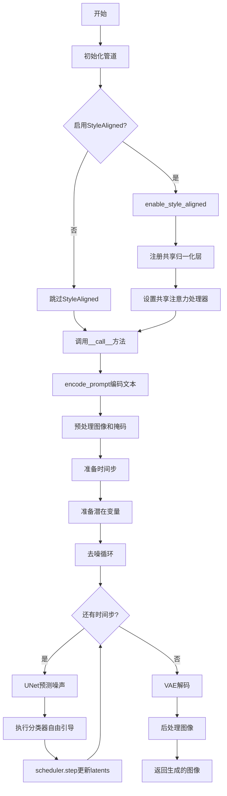
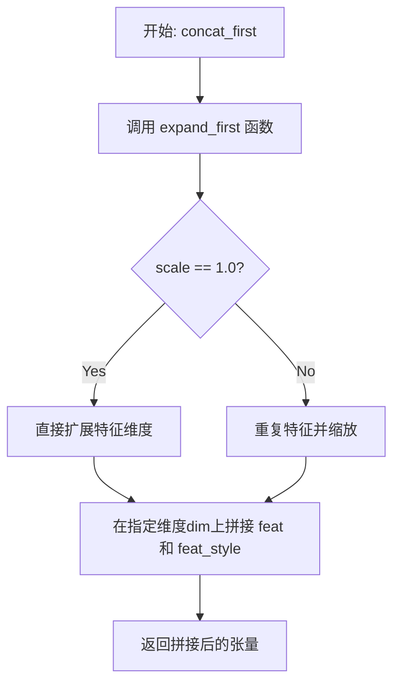
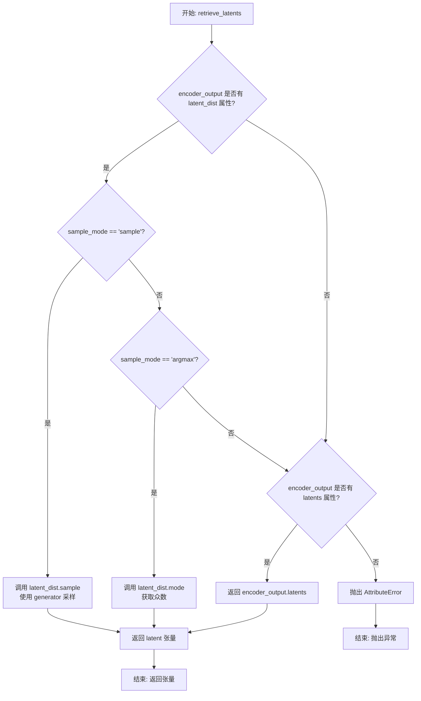
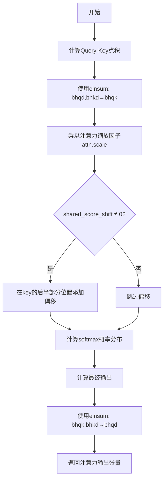
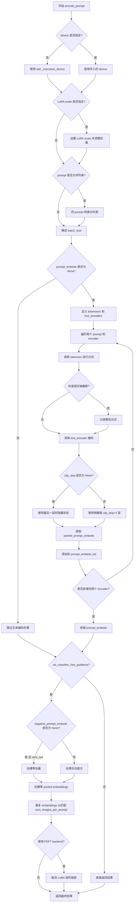
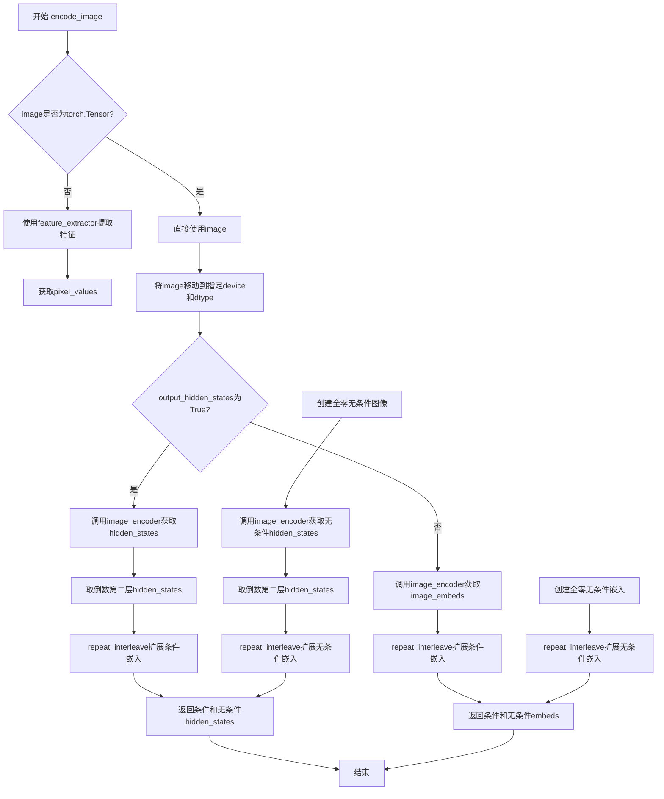
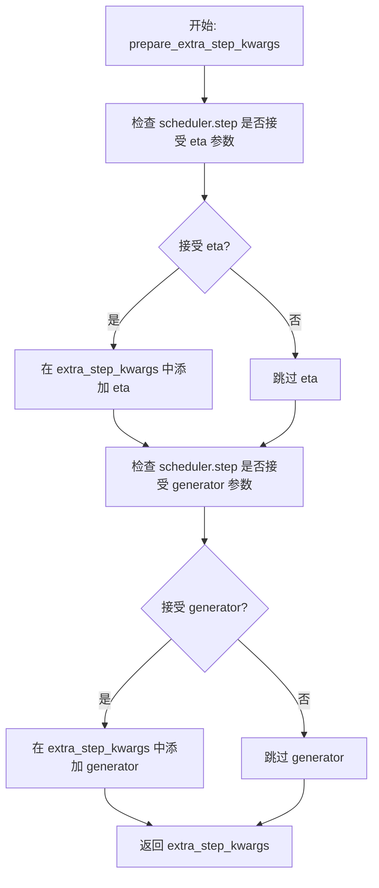
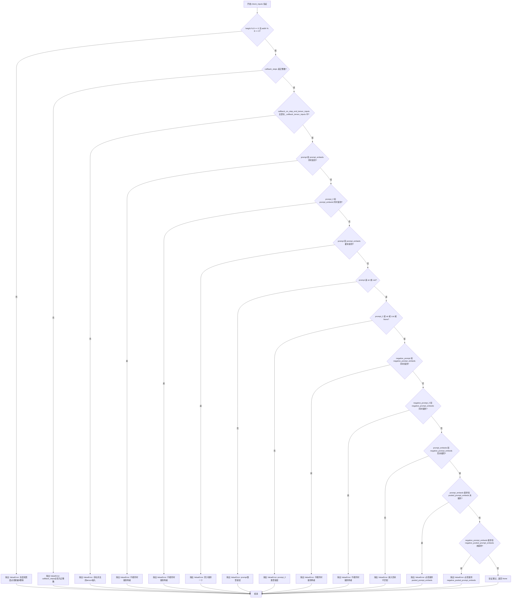

# `diffusers\examples\community\pipeline_sdxl_style_aligned.py` 详细设计文档

这是一个基于 Stable Diffusion XL 的文本到图像生成管道，同时支持 StyleAligned 方法（用于在批量生成图像时保持风格一致性）。该管道继承自 Diffusers 库，支持多种加载方式和高级功能，如 LoRA、Textual Inversion、IP-Adapter 等，并通过自定义注意力处理器实现风格对齐。

## 整体流程



## 类结构

```
Object
├── SharedAttentionProcessor (AttnProcessor2_0子类)
│   └── 实现风格对齐的注意力处理器
└── StyleAlignedSDXLPipeline (多重继承)
    ├── DiffusionPipeline
    ├── StableDiffusionMixin
    ├── FromSingleFileMixin
    ├── StableDiffusionXLLoraLoaderMixin
    ├── TextualInversionLoaderMixin
    └── IPAdapterMixin
```

## 全局变量及字段


### `logger`
    
用于记录日志的Logger对象

类型：`logging.Logger`
    


### `EXAMPLE_DOC_STRING`
    
包含pipeline使用示例的文档字符串

类型：`str`
    


### `XLA_AVAILABLE`
    
标记PyTorch XLA是否可用的布尔值

类型：`bool`
    


### `SharedAttentionProcessor.share_attention`
    
是否共享注意力

类型：`bool`
    


### `SharedAttentionProcessor.adain_queries`
    
是否对查询应用AdaIN

类型：`bool`
    


### `SharedAttentionProcessor.adain_keys`
    
是否对键应用AdaIN

类型：`bool`
    


### `SharedAttentionProcessor.adain_values`
    
是否对值应用AdaIN

类型：`bool`
    


### `SharedAttentionProcessor.full_attention_share`
    
是否完全共享注意力

类型：`bool`
    


### `SharedAttentionProcessor.shared_score_scale`
    
共享分数缩放

类型：`float`
    


### `SharedAttentionProcessor.shared_score_shift`
    
共享分数偏移

类型：`float`
    


### `StyleAlignedSDXLPipeline.vae`
    
VAE模型

类型：`AutoencoderKL`
    


### `StyleAlignedSDXLPipeline.text_encoder`
    
文本编码器

类型：`CLIPTextModel`
    


### `StyleAlignedSDXLPipeline.text_encoder_2`
    
第二文本编码器

类型：`CLIPTextModelWithProjection`
    


### `StyleAlignedSDXLPipeline.tokenizer`
    
分词器

类型：`CLIPTokenizer`
    


### `StyleAlignedSDXLPipeline.tokenizer_2`
    
第二分词器

类型：`CLIPTokenizer`
    


### `StyleAlignedSDXLPipeline.unet`
    
条件U-Net

类型：`UNet2DConditionModel`
    


### `StyleAlignedSDXLPipeline.scheduler`
    
调度器

类型：`KarrasDiffusionSchedulers`
    


### `StyleAlignedSDXLPipeline.image_encoder`
    
图像编码器

类型：`CLIPVisionModelWithProjection`
    


### `StyleAlignedSDXLPipeline.feature_extractor`
    
特征提取器

类型：`CLIPImageProcessor`
    


### `StyleAlignedSDXLPipeline.vae_scale_factor`
    
VAE缩放因子

类型：`int`
    


### `StyleAlignedSDXLPipeline.image_processor`
    
图像处理器

类型：`VaeImageProcessor`
    


### `StyleAlignedSDXLPipeline.mask_processor`
    
掩码处理器

类型：`VaeImageProcessor`
    


### `StyleAlignedSDXLPipeline.default_sample_size`
    
默认采样尺寸

类型：`int`
    


### `StyleAlignedSDXLPipeline.watermark`
    
水印处理器

类型：`StableDiffusionXLWatermarker`
    


### `StyleAlignedSDXLPipeline._style_aligned_norm_layers`
    
风格对齐归一化层

类型：`list`
    
    

## 全局函数及方法


### `expand_first`

该函数是 StyleAligned 图像生成方法的核心辅助函数，用于在批量生成图像时提取并扩展风格特征。它通过从输入特征张量中选取特定位置的特征（如第一帧和中间帧），进行堆叠和缩放处理，以实现跨图像的风格对齐。

参数：

- `feat`：`torch.Tensor`，输入的特征张量，通常是 Transformer 的 Query/Key/Value 特征
- `scale`：`float`，可选参数，默认为 1.0，用于缩放扩展后特征的权重

返回值：`torch.Tensor`，返回形状与输入特征相同但经过风格扩展处理后的特征张量

#### 流程图

```mermaid
flowchart TD
    A[输入特征 feat] --> B[获取批次大小 b = feat.shape[0]]
    B --> C[堆叠特定特征: torch.stack&#40;feat[0], feat[b//2]&#41;.unsqueeze&#40;1&#41;]
    C --> D{scale == 1?}
    D -->|是| E[直接扩展: expand&#40;2, b//2, *feat.shape[1:]&#41;]
    D -->|否| F[重复特征: repeat&#40;1, b//2, 1, 1, 1&#41;]
    F --> G[缩放处理: torch.cat&#40;[:1], scale * [:]&#41;]
    E --> H[Reshape: reshape&#40;*feat.shape&#41;]
    G --> H
    H --> I[返回扩展后的特征]
```

#### 带注释源码

```python
def expand_first(feat: torch.Tensor, scale: float = 1.0) -> torch.Tensor:
    """
    扩展特征张量以实现风格对齐。
    
    在 StyleAligned 方法中，需要将多个图像的注意力特征进行对齐。
    该函数从输入特征中提取两个关键位置的特征（首帧和中间帧），
    并将其扩展以匹配批量大小，实现跨图像的风格共享。
    
    参数:
        feat: 输入特征张量，形状为 [batch, ...]
        scale: 缩放因子，用于调整扩展特征的权重
    
    返回:
        扩展后的特征张量，形状与输入相同
    """
    # 获取批次大小
    b = feat.shape[0]
    
    # 提取风格特征：选取第一帧和中间帧的特征
    # 这两个特征将用于后续的 AdaIN 归一化和注意力共享
    # 结果形状: [2, 1, ...]
    feat_style = torch.stack((feat[0], feat[b // 2])).unsqueeze(1)
    
    # 根据 scale 值选择不同的处理策略
    if scale == 1:
        # scale=1 时直接扩展，无需额外缩放
        # 扩展为 [2, b//2, ...] 形状
        feat_style = feat_style.expand(2, b // 2, *feat.shape[1:])
    else:
        # scale≠1 时需要重复特征并应用缩放
        # 先重复特征到目标形状
        feat_style = feat_style.repeat(1, b // 2, 1, 1, 1)
        # 对中间帧特征应用缩放（通常是对参考图像的权重调整）
        feat_style = torch.cat([feat_style[:, :1], scale * feat_style[:, 1:]], dim=1)
    
    # 将扩展后的特征 reshape 回原始输入形状
    return feat_style.reshape(*feat.shape)
```


### `concat_first`

该函数用于将扩展后的风格特征与原始特征在指定维度上进行拼接，是 StyleAligned 论文中实现风格对齐的核心操作之一。它通过 `expand_first` 函数生成风格化特征，然后与原始特征沿指定维度连接，以实现跨样本的风格共享。

参数：

- `feat`：`torch.Tensor`，输入的特征张量，通常是注意力机制中的 query、key 或 value
- `dim`：`int`，拼接的维度，默认为 2（即在序列维度上拼接）
- `scale`：`float`，缩放因子，用于控制风格特征的缩放程度，默认为 1.0

返回值：`torch.Tensor`，拼接后的张量，包含原始特征和风格化特征

#### 流程图



#### 带注释源码

```python
def concat_first(feat: torch.Tensor, dim: int = 2, scale: float = 1.0) -> torch.Tensor:
    """
    将风格化特征与原始特征拼接。
    
    该函数是 StyleAligned 实现风格对齐的关键组件。它首先生成扩展后的风格特征
    （通过 expand_first 函数），然后将其与原始特征在指定维度上拼接。这使得
    在批量生成多张图像时，可以共享风格信息。
    
    参数:
        feat: 输入特征张量，形状为 [batch, seq, dim] 或类似结构
        dim: 拼接的维度，默认在序列维度 (dim=2) 进行拼接
        scale: 缩放因子，控制风格特征的权重，默认为 1.0
    
    返回:
        拼接后的特征张量，形状在指定维度上变为原来的 2 倍
    """
    # 调用 expand_first 生成风格化特征
    # expand_first 会根据 batch 中的第一个和中间位置的样本创建风格特征
    feat_style = expand_first(feat, scale=scale)
    
    # 在指定维度上拼接原始特征和风格化特征
    # 这允许在注意力计算时同时考虑原始特征和风格化特征
    return torch.cat((feat, feat_style), dim=dim)
```


### `calc_mean_std`

该函数用于计算输入张量在指定维度上的均值和标准差，主要用于StyleAligned实现中的AdaIN（自适应实例归一化）操作，通过对特征进行归一化处理来实现风格迁移。

参数：

- `feat`：`torch.Tensor`，输入的特征张量，通常是注意力机制的查询、键或值
- `eps`：`float`，默认值为`1e-5`，用于保证数值稳定性，防止标准差计算时出现除零错误

返回值：`Tuple[torch.Tensor, torch.Tensor]`，返回计算得到的均值张量和标准差张量，两者形状与输入张量相同（仅在计算维度上保持维度）

#### 流程图

```mermaid
flowchart TD
    A[开始: calc_mean_std] --> B[输入特征张量 feat 和 eps]
    B --> C[计算标准差: feat.var dim=-2, keepdims=True]
    C --> D[加上eps并开方: feat_std = (feat.var + eps).sqrt]
    E[计算均值: feat_mean = feat.mean dim=-2, keepdims=True]
    D --> F[返回 feat_mean, feat_std]
    E --> F
```

#### 带注释源码

```python
def calc_mean_std(feat: torch.Tensor, eps: float = 1e-5) -> Tuple[torch.Tensor, torch.Tensor]:
    """
    计算输入张量在倒数第二个维度上的均值和标准差。
    
    此函数是StyleAligned中实现AdaIN（自适应实例归一化）的核心组件，
    通过对特征的均值和标准差进行统计，用于后续的风格对齐操作。
    
    参数:
        feat: 输入特征张量，通常为注意力机制中的query、key或value
        eps: 数值稳定性参数，防止标准差为0时出现除零错误
    
    返回:
        包含均值和标准差的元组，两者形状与输入张量在计算维度上保持一致
    """
    # 计算标准差：先计算方差，加上eps防止除零，再开方
    # dim=-2 表示在倒数第二个维度上计算方差（通常是batch中的第一个样本和第二个样本）
    # keepdims=True 保持维度以便后续广播操作
    feat_std = (feat.var(dim=-2, keepdims=True) + eps).sqrt()
    
    # 计算均值：在同样的维度上计算均值
    feat_mean = feat.mean(dim=-2, keepdims=True)
    
    # 返回均值和标准差
    return feat_mean, feat_std
```


### `adain`

对输入特征进行自适应实例归一化（AdaIN），通过将内容特征的均值和标准差替换为样式特征的均值和标准差来实现样式迁移。这是 StyleAligned 论文中的核心操作，用于在注意力机制中实现跨图像的风格对齐。

参数：

- `feat`：`torch.Tensor`，需要进行 AdaIN 变换的特征张量，通常是注意力机制的 query、key 或 value

返回值：`torch.Tensor`，经过 AdaIN 变换后的特征张量

#### 流程图

```mermaid
flowchart TD
    A[输入特征 feat] --> B[调用 calc_mean_std 计算均值和标准差]
    B --> C[feat_mean, feat_std]
    C --> D[expand_first 扩展 feat_mean]
    C --> E[expand_first 扩展 feat_std]
    D --> F[feat_style_mean]
    E --> G[feat_style_std]
    F --> H[标准化: feat = (feat - feat_mean) / feat_std]
    G --> I[重缩放: feat = feat * feat_style_std + feat_style_mean]
    H --> I
    I --> J[返回变换后的特征]
```

#### 带注释源码

```python
def adain(feat: torch.Tensor) -> torch.Tensor:
    """
    自适应实例归一化 (Adaptive Instance Normalization)
    
    该函数实现了 StyleAligned 论文中的 AdaIN 操作，通过将内容特征的
    统计信息（均值和标准差）替换为样式特征的统计信息来实现风格迁移。
    在 StyleAligned 中，样式特征来自同一批次的另一个图像（通常是第一张图像）。
    
    Args:
        feat: 输入特征张量，形状为 (batch_size, num_heads, seq_len, head_dim)
              或其他类似的注意力特征形状
    
    Returns:
        经过 AdaIN 变换后的特征张量，形状与输入相同
    """
    # 步骤1: 计算输入特征的均值和标准差
    # calc_mean_std 函数在 dim=-2 (序列维度) 上计算统计量
    feat_mean, feat_std = calc_mean_std(feat)
    
    # 步骤2: 扩展样式统计量
    # expand_first 函数将第一张图像的统计量扩展到整批图像
    # 这样可以将第一张图像的风格应用到所有图像上
    feat_style_mean = expand_first(feat_mean)
    feat_style_std = expand_first(feat_std)
    
    # 步骤3: 标准化输入特征
    # 将特征转换到标准正态分布 (均值为0, 标准差为1)
    feat = (feat - feat_mean) / feat_std
    
    # 步骤4: 应用样式统计量
    # 使用样式特征的均值和标准差对标准化后的特征进行重缩放
    # 这会将样式特征的风格信息注入到内容特征中
    feat = feat * feat_style_std + feat_style_mean
    
    return feat
```


### `get_switch_vec`

该函数用于生成一个布尔向量，以控制在StyleAligned机制中哪些层使用共享注意力处理器。根据传入的`level`参数（0到1之间的浮点数），它计算并返回一个与总层数长度相同的布尔张量，其中`True`表示该层启用共享注意力，`False`表示该层使用标准注意力。

参数：

- `total_num_layers`：`int`，总层数，指定需要生成开关向量的层总数
- `level`：`float`，开关比例，范围在0到1之间，决定启用共享注意力的层占比；当`level=0`时全部禁用，`level=1`时全部启用，中间值按比例选择性地启用

返回值：`torch.Tensor`，布尔类型的张量，长度为`total_num_layers`，其中`True`表示对应层启用共享注意力处理器，`False`表示使用标准注意力处理器

#### 流程图

```mermaid
flowchart TD
    A[开始 get_switch_vec] --> B{level == 0?}
    B -->|Yes| C[返回全False向量]
    B -->|No| D{level == 1?}
    D -->|Yes| E[返回全True向量]
    D -->|No| F{level > 0.5?}
    F -->|Yes| G[设置 to_flip=True, level = 1 - level]
    F -->|No| H[设置 to_flip=False]
    G --> I[计算 num_switch = int(level * total_num_layers)]
    H --> I
    I --> J[创建 0 到 total_num_layers-1 的整数向量]
    J --> K[vec = vec % (total_num_layers // num_switch)]
    K --> L[vec = vec == 0]
    L --> M{to_flip?}
    M -->|Yes| N[vec = ~vec 取反]
    M -->|No| O[返回 vec]
    N --> O
```

#### 带注释源码

```python
def get_switch_vec(total_num_layers, level):
    """
    生成一个布尔向量，用于控制哪些层启用共享注意力处理器。
    
    该函数是StyleAligned机制的核心组件之一，根据level参数决定
    在UNet的多少比例的层上启用共享注意力处理器。
    
    Args:
        total_num_layers: int, 总层数
        level: float, 0-1之间的浮点数，表示启用共享注意力的比例
    
    Returns:
        torch.Tensor: 布尔类型张量，True表示启用共享注意力
    """
    # 特殊情况：level为0时，全部禁用共享注意力
    if level == 0:
        return torch.zeros(total_num_layers, dtype=torch.bool)
    
    # 特殊情况：level为1时，全部启用共享注意力
    if level == 1:
        return torch.ones(total_num_layers, dtype=torch.bool)
    
    # 判断是否需要翻转结果（当level > 0.5时翻转）
    to_flip = level > 0.5
    
    # 如果需要翻转，先将level转换为对称值
    # 例如：level=0.8 转换为 level=0.2
    if to_flip:
        level = 1 - level
    
    # 计算需要启用共享注意力的层数
    num_switch = int(level * total_num_layers)
    
    # 创建0到total_num_layers-1的整数向量
    vec = torch.arange(total_num_layers)
    
    # 使用模运算创建周期性的开关模式
    # 例如：如果total_num_layers=10, num_switch=2
    # 则 total_num_layers // num_switch = 5
    # vec % 5 会产生 [0,1,2,3,4,0,1,2,3,4]
    vec = vec % (total_num_layers // num_switch)
    
    # 将等于0的位置设为True，其余为False
    # 这样每num_switch个位置会有一个True
    vec = vec == 0
    
    # 如果需要翻转，则取反结果
    # 这样选中的层正好相反
    if to_flip:
        vec = ~vec
    
    return vec
```


### `rescale_noise_cfg`

该函数根据 `guidance_rescale` 参数对噪声预测配置进行重新缩放，基于 Common Diffusion Noise Schedules and Sample Steps are Flawed 论文（第 3.4 节）的研究发现，用于解决图像过度曝光和"平淡无奇"的问题。

参数：

- `noise_cfg`：`torch.Tensor`，噪声预测配置张量，通常是 CFG（Classifier-Free Guidance）产生的噪声预测
- `noise_pred_text`：`torch.Tensor`，文本引导的噪声预测张量
- `guidance_rescale`：`float`，引导重缩放因子，用于混合原始结果和重缩放后的结果，默认为 0.0

返回值：`torch.Tensor`，重缩放后的噪声预测配置

#### 流程图

```mermaid
flowchart TD
    A[开始] --> B[计算 noise_pred_text 的标准差 std_text]
    B --> C[计算 noise_cfg 的标准差 std_cfg]
    C --> D[计算重缩放后的噪声预测 noise_pred_rescaled<br/>noise_cfg × (std_text / std_cfg)]
    D --> E[混合重缩放结果和原始结果<br/>guidance_rescale × noise_pred_rescaled + (1 - guidance_rescale) × noise_cfg]
    E --> F[返回重缩放后的 noise_cfg]
```

#### 带注释源码

```python
# Copied from diffusers.pipelines.stable_diffusion.pipeline_stable_diffusion.rescale_noise_cfg
def rescale_noise_cfg(noise_cfg, noise_pred_text, guidance_rescale=0.0):
    """
    Rescale `noise_cfg` according to `guidance_rescale`. Based on findings of [Common Diffusion Noise Schedules and
    Sample Steps are Flawed](https://huggingface.co/papers/2305.08891). See Section 3.4
    """
    # 计算文本引导噪声预测的标准差（沿除批次维度外的所有维度）
    std_text = noise_pred_text.std(dim=list(range(1, noise_pred_text.ndim)), keepdim=True)
    # 计算噪声配置的标准差（沿除批次维度外的所有维度）
    std_cfg = noise_cfg.std(dim=list(range(1, noise_cfg.ndim)), keepdim=True)
    
    # 使用文本引导的标准差对噪声配置进行重缩放（修复过度曝光问题）
    noise_pred_rescaled = noise_cfg * (std_text / std_cfg)
    
    # 通过 guidance_rescale 因子将重缩放后的结果与原始结果混合
    # 以避免生成"平淡无奇"的图像
    noise_cfg = guidance_rescale * noise_pred_rescaled + (1 - guidance_rescale) * noise_cfg
    
    return noise_cfg
```


### `retrieve_timesteps`

该函数是 Stable Diffusion XL pipeline 的辅助函数，用于调用调度器的 `set_timesteps` 方法并从中获取时间步调度。它支持自定义时间步列表或通过推理步数自动生成时间步，并将任何额外的关键字参数传递给调度器。

参数：

- `scheduler`：`SchedulerMixin`，调度器对象，用于获取时间步
- `num_inference_steps`：`Optional[int]`，生成样本时使用的扩散步数，如果使用则 `timesteps` 必须为 `None`
- `device`：`Optional[Union[str, torch.device]]`，时间步要移动到的设备，如果为 `None` 则不移动
- `timesteps`：`Optional[List[int]]`，用于支持任意时间步间距的自定义时间步，如果为 `None` 则使用调度器的默认时间步间距策略
- `**kwargs`：任意关键字参数，将传递给 `scheduler.set_timesteps`

返回值：`Tuple[torch.Tensor, int]`，元组包含调度器的时间步调度和推理步数

#### 流程图

```mermaid
flowchart TD
    A[开始: retrieve_timesteps] --> B{检查 timesteps 是否为 None}
    B -->|否| C[验证调度器是否支持自定义 timesteps]
    C --> D[调用 scheduler.set_timesteps 并传入 timesteps 和 device]
    D --> E[获取 scheduler.timesteps]
    E --> F[计算 num_inference_steps = len(timesteps)]
    B -->|是| G[调用 scheduler.set_timesteps 并传入 num_inference_steps 和 device]
    G --> H[获取 scheduler.timesteps]
    H --> I[num_inference_steps 保持原值]
    F --> J[返回 timesteps 和 num_inference_steps]
    I --> J
```

#### 带注释源码

```python
# Copied from diffusers.pipelines.stable_diffusion.pipeline_stable_diffusion.retrieve_timesteps
def retrieve_timesteps(
    scheduler,
    num_inference_steps: Optional[int] = None,
    device: Optional[Union[str, torch.device]] = None,
    timesteps: Optional[List[int]] = None,
    **kwargs,
):
    """
    Calls the scheduler's `set_timesteps` method and retrieves timesteps from the scheduler after the call. Handles
    custom timesteps. Any kwargs will be supplied to `scheduler.set_timesteps`.

    Args:
        scheduler (`SchedulerMixin`):
            The scheduler to get timesteps from.
        num_inference_steps (`int`):
            The number of diffusion steps used when generating samples with a pre-trained model. If used,
            `timesteps` must be `None`.
        device (`str` or `torch.device`, *optional*):
            The device to which the timesteps should be moved to. If `None`, the timesteps are not moved.
        timesteps (`List[int]`, *optional*):
                Custom timesteps used to support arbitrary spacing between timesteps. If `None`, then the default
                timestep spacing strategy of the scheduler is used. If `timesteps` is passed, `num_inference_steps`
                must be `None`.

    Returns:
        `Tuple[torch.Tensor, int]`: A tuple where the first element is the timestep schedule from the scheduler and the
        second element is the number of inference steps.
    """
    # 如果传入了自定义 timesteps
    if timesteps is not None:
        # 检查调度器的 set_timesteps 方法是否支持 timesteps 参数
        accepts_timesteps = "timesteps" in set(inspect.signature(scheduler.set_timesteps).parameters.keys())
        if not accepts_timesteps:
            raise ValueError(
                f"The current scheduler class {scheduler.__class__}'s `set_timesteps` does not support custom"
                f" timestep schedules. Please check whether you are using the correct scheduler."
            )
        # 使用自定义 timesteps 设置调度器
        scheduler.set_timesteps(timesteps=timesteps, device=device, **kwargs)
        timesteps = scheduler.timesteps
        # 计算推理步数
        num_inference_steps = len(timesteps)
    else:
        # 使用 num_inference_steps 设置调度器
        scheduler.set_timesteps(num_inference_steps, device=device, **kwargs)
        timesteps = scheduler.timesteps
    # 返回时间步调度和推理步数
    return timesteps, num_inference_steps
```


### `retrieve_latents`

从编码器输出中提取潜在表示（latents），支持多种提取模式（采样、argmax或直接访问）。

参数：

- `encoder_output`：`torch.Tensor`，编码器的输出，通常包含 `latent_dist` 或 `latents` 属性
- `generator`：`torch.Generator | None`，可选的随机数生成器，用于采样时的确定性生成
- `sample_mode`：`str`，采样模式，默认为 `"sample"`，可选值为 `"sample"` 或 `"argmax"`

返回值：`torch.Tensor`，从编码器输出中提取的潜在表示张量

#### 流程图



#### 带注释源码

```
# 从编码器输出中检索潜在表示的函数
# 源自: diffusers.pipelines.stable_diffusion.pipeline_stable_diffusion_img2img.retrieve_latents
def retrieve_latents(
    encoder_output: torch.Tensor,  # 编码器输出，包含 latent_dist 或 latents 属性
    generator: torch.Generator | None = None,  # 可选的随机数生成器，用于确定性采样
    sample_mode: str = "sample"  # 采样模式: "sample" 从分布采样, "argmax" 取众数
):
    # 情况1: encoder_output 包含 latent_dist 且使用 sample 模式
    # 从潜在分布中采样得到潜在表示
    if hasattr(encoder_output, "latent_dist") and sample_mode == "sample":
        return encoder_output.latent_dist.sample(generator)
    
    # 情况2: encoder_output 包含 latent_dist 且使用 argmax 模式
    # 返回潜在分布的众数（最大概率对应的值）
    elif hasattr(encoder_output, "latent_dist") and sample_mode == "argmax":
        return encoder_output.latent_dist.mode()
    
    # 情况3: encoder_output 直接包含 latents 属性
    # 直接返回预计算的潜在表示
    elif hasattr(encoder_output, "latents"):
        return encoder_output.latents
    
    # 错误情况: 无法从 encoder_output 中提取潜在表示
    else:
        raise AttributeError("Could not access latents of provided encoder_output")
```


### `SharedAttentionProcessor.shifted_scaled_dot_product_attention`

该方法是 `SharedAttentionProcessor` 类的核心计算方法，实现了一种改进的缩放点积注意力机制。该方法在标准的注意力计算基础上，引入了共享分数偏移（shared_score_shift）来调整批次中不同样本之间的注意力分布，从而实现 StyleAligned 论文中描述的样式对齐效果。

参数：

- `self`：`SharedAttentionProcessor` 实例本身，包含共享注意力配置参数
- `attn`：`Attention`，注意力模块实例，提供注意力缩放因子 `attn.scale`
- `query`：`torch.Tensor`，形状为 `(batch, heads, query_length, head_dim)` 的查询张量
- `key`：`torch.Tensor`，形状为 `(batch, heads, key_length, head_dim)` 的键张量
- `value`：`torch.Tensor`，形状为 `(batch, heads, key_length, head_dim)` 的值张量

返回值：`torch.Tensor`，经过注意力计算后的输出张量，形状为 `(batch, heads, query_length, head_dim)`

#### 流程图



#### 带注释源码

```python
def shifted_scaled_dot_product_attention(
    self, attn: Attention, query: torch.Tensor, key: torch.Tensor, value: torch.Tensor
) -> torch.Tensor:
    """
    执行带偏移的缩放点积注意力计算。
    
    该方法实现了 StyleAligned 论文中提出的共享注意力机制，通过在
    标准注意力分数上添加偏移量来增强批次内样本之间的样式一致性。
    
    参数:
        attn: Attention模块，提供注意力缩放因子(scale)
        query: 查询张量，形状 [batch, heads, query_len, head_dim]
        key: 键张量，形状 [batch, heads, key_len, head_dim]
        value: 值张量，形状 [batch, heads, key_len, head_dim]
    
    返回:
        注意力输出张量，形状 [batch, heads, query_len, head_dim]
    """
    # 第一步：计算Query和Key之间的点积得到原始注意力分数logits
    # einsum表达式解释:
    # b=batch, h=heads, q=query_length, k=key_length, d=head_dim
    # "bhqd,bhkd->bhqk" 表示: query[..., i, j] * key[..., i, k] -> logits[..., j, k]
    logits = torch.einsum("bhqd,bhkd->bhqk", query, key) * attn.scale
    
    # 第二步：对键张量的后半部分（对应批次中的第二个样本）添加共享分数偏移
    # 这会使第二个样本的注意力分布向第一个样本对齐，从而实现样式共享
    # query.shape[2] 是查询序列长度，用于定位需要偏移的位置
    logits[:, :, :, query.shape[2] :] += self.shared_score_shift
    
    # 第三步：对注意力分数在最后一个维度（key维度）上应用softmax
    # 得到归一化的注意力概率分布
    probs = logits.softmax(-1)
    
    # 第四步：将注意力概率与Value相乘得到最终输出
    # einsum表达式解释:
    # "bhqk,bhkd->bhqd" 表示: probs[..., j, k] * value[..., k, d] -> output[..., j, d]
    return torch.einsum("bhqk,bhkd->bhqd", probs, value)
```


### `SharedAttentionProcessor.shared_call`

实现StyleAligned论文中的共享注意力机制，通过AdaIN操作和注意力共享来对齐多个生成图像的风格。

参数：

- `self`：`SharedAttentionProcessor`，共享注意力处理器实例，包含配置参数如`share_attention`、`adain_queries`、`adain_keys`、`adain_values`、`shared_score_scale`、`shared_score_shift`
- `attn`：`Attention`，注意力模块对象，用于访问`group_norm`、`to_q`、`to_k`、`to_v`、`to_out`、`heads`、`scale`、`residual_connection`、`rescale_output_factor`等属性
- `hidden_states`：`torch.Tensor`，输入的隐藏状态张量，形状为`(batch_size, channel, height, width)`或`(batch_size, sequence_length, hidden_dim)`
- `encoder_hidden_states`：`Optional[torch.Tensor]`，编码器的隐藏状态，默认为`None`；当为`None`时使用`hidden_states`的形状
- `attention_mask`：`Optional[torch.Tensor]`，注意力掩码张量，用于遮盖特定位置，默认为`None`
- `**kwargs`：其他关键字参数，用于兼容性

返回值：`torch.Tensor`，经过注意力处理后的隐藏状态，形状与输入`hidden_states`相同

#### 流程图

```mermaid
flowchart TD
    A[开始 shared_call] --> B[保存 residual = hidden_states]
    B --> C{hidden_states ndim == 4?}
    C -->|Yes| D[reshape: (B, C, H*W).transpose(1,2)]
    C -->|No| E[保持原形状]
    D --> F
    E --> F[获取 batch_size 和 sequence_length]
    F --> G{attention_mask is not None?}
    G -->|Yes| H[prepare_attention_mask]
    G -->|No| I[跳过掩码准备]
    H --> J[reshape attention_mask]
    I --> K
    J --> K{attn.group_norm is not None?}
    K -->|Yes| L[group_norm hidden_states]
    K -->|No| M
    L --> M[计算 query = attn.to_q]
    M --> N[计算 key = attn.to_k]
    N --> O[计算 value = attn.to_v]
    O --> P[reshape query/key/value to (B, N, heads, head_dim)]
    P --> Q{adain_queries enabled?}
    Q -->|Yes| R[query = adain(query)]
    Q --> No --> S
    R --> S{adain_keys enabled?}
    S -->|Yes| T[key = adain(key)]
    S --> No --> U
    T --> U{adain_values enabled?}
    U -->|Yes| V[value = adain(value)]
    U --> No --> W
    V --> W{share_attention enabled?}
    W -->|Yes| X[key = concat_first key]
    W -->|Yes| Y[value = concat_first value]
    X --> Z{shared_score_shift != 0?}
    Y --> Z
    W -->|No| AA[使用标准 scaled_dot_product_attention]
    Z -->|Yes| AB[使用 shifted_scaled_dot_product_attention]
    Z -->|No| AC[使用标准 scaled_dot_product_attention]
    AA --> AD
    AB --> AD
    AC --> AD
    AD[reshape hidden_states] --> AE[linear proj: attn.to_out[0]]
    AE --> AF[dropout: attn.to_out[1]]
    AF --> AG{input_ndim == 4?}
    AG -->|Yes| AH[transpose + reshape to 4D]
    AG -->|No| AI
    AH --> AJ{residual_connection?}
    AI --> AJ
    AJ -->|Yes| AK[hidden_states + residual]
    AJ -->|No| AL
    AK --> AL
    AL[hidden_states / rescale_output_factor] --> AM[返回 hidden_states]
```

#### 带注释源码

```python
def shared_call(
    self,
    attn: Attention,
    hidden_states: torch.Tensor,
    encoder_hidden_states: Optional[torch.Tensor] = None,
    attention_mask: Optional[torch.Tensor] = None,
    **kwargs,
):
    # 保存原始输入，用于后续的残差连接
    residual = hidden_states
    
    # 获取输入张量的维度数量
    input_ndim = hidden_states.ndim
    
    # 如果是4D张量 (B, C, H, W)，转换为3D (B, H*W, C)
    if input_ndim == 4:
        batch_size, channel, height, width = hidden_states.shape
        hidden_states = hidden_states.view(batch_size, channel, height * width).transpose(1, 2)
    
    # 获取批次大小和序列长度
    # 如果encoder_hidden_states为None，则使用hidden_states的形状
    batch_size, sequence_length, _ = (
        hidden_states.shape if encoder_hidden_states is None else encoder_hidden_states.shape
    )

    # 准备注意力掩码（如果提供）
    if attention_mask is not None:
        # 使用attn.prepare_attention_mask处理掩码
        attention_mask = attn.prepare_attention_mask(attention_mask, sequence_length, batch_size)
        # scaled_dot_product_attention期望的掩码形状为 (batch, heads, source_length, target_length)
        attention_mask = attention_mask.view(batch_size, attn.heads, -1, attention_mask.shape[-1])

    # 应用Group Normalization（如果存在）
    if attn.group_norm is not None:
        hidden_states = attn.group_norm(hidden_states.transpose(1, 2)).transpose(1, 2)

    # 计算Query、Key、Value
    query = attn.to_q(hidden_states)
    key = attn.to_k(hidden_states)
    value = attn.to_v(hidden_states)
    
    # 获取内部维度和头维度
    inner_dim = key.shape[-1]
    head_dim = inner_dim // attn.heads

    # 将Q、K、V reshape为多头注意力的格式 (batch, seq, heads, head_dim) -> (batch, heads, seq, head_dim)
    query = query.view(batch_size, -1, attn.heads, head_dim).transpose(1, 2)
    key = key.view(batch_size, -1, attn.heads, head_dim).transpose(1, 2)
    value = value.view(batch_size, -1, attn.heads, head_dim).transpose(1, 2)

    # 对Query应用AdaIN归一化（如果启用）
    if self.adain_queries:
        query = adain(query)
    # 对Key应用AdaIN归一化（如果启用）
    if self.adain_keys:
        key = adain(key)
    # 对Value应用AdaIN归一化（如果启用）
    if self.adain_values:
        value = adain(value)
    
    # 如果启用共享注意力，则将Key和Value与第一半部分连接
    if self.share_attention:
        # 将key和value与对应样式部分连接，实现跨图像的注意力共享
        key = concat_first(key, -2, scale=self.shared_score_scale)
        value = concat_first(value, -2)
        
        # 根据shared_score_shift选择不同的注意力计算方式
        if self.shared_score_shift != 0:
            # 使用移位缩放点积注意力（带有分数偏移）
            hidden_states = self.shifted_scaled_dot_product_attention(attn, query, key, value)
        else:
            # 使用标准PyTorch的缩放点积注意力
            hidden_states = F.scaled_dot_product_attention(
                query, key, value, attn_mask=attention_mask, dropout_p=0.0, is_causal=False
            )
    else:
        # 不启用共享注意力，使用标准注意力计算
        hidden_states = F.scaled_dot_product_attention(
            query, key, value, attn_mask=attention_mask, dropout_p=0.0, is_causal=False
        )

    # 恢复形状：从多头格式转回 (batch, seq, hidden_dim)
    hidden_states = hidden_states.transpose(1, 2).reshape(batch_size, -1, attn.heads * head_dim)
    # 转换数据类型以匹配query的数据类型
    hidden_states = hidden_states.to(query.dtype)

    # 线性投影
    hidden_states = attn.to_out[0](hidden_states)
    # Dropout
    hidden_states = attn.to_out[1](hidden_states)

    # 如果原始输入是4D，则恢复为4D形状
    if input_ndim == 4:
        hidden_states = hidden_states.transpose(-1, -2).reshape(batch_size, channel, height, width)

    # 如果需要残差连接，则加上原始输入
    if attn.residual_connection:
        hidden_states = hidden_states + residual

    # 应用输出重缩放因子
    hidden_states = hidden_states / attn.rescale_output_factor
    
    return hidden_states
```


### `SharedAttentionProcessor.__call__`

该方法是 `SharedAttentionProcessor` 类的核心调用入口，负责在 StyleAligned 图像生成中处理注意力机制。它根据 `full_attention_share` 配置选择完全共享注意力或使用自定义的 `shared_call` 方法来实现跨图像的风格对齐注意力计算。

参数：

- `attn`：`Attention`，注意力机制对象，包含查询、键、值的线性变换层（to_q, to_k, to_v）和输出层（to_out）
- `hidden_states`：`torch.Tensor`，输入的隐藏状态张量，形状为 (batch, channel, height, width) 或 (batch, sequence, dim)
- `encoder_hidden_states`：`Optional[torch.Tensor]`，编码器的隐藏状态，此处实际未使用（传入的是 hidden_states 本身）
- `attention_mask`：`Optional[torch.Tensor]`，注意力掩码，用于屏蔽某些位置的注意力计算
- `**kwargs`：可变关键字参数传递给父类或 shared_call 方法

返回值：`torch.Tensor`，经过注意力处理后的隐藏状态张量，形状与输入 hidden_states 相同

#### 流程图

```mermaid
flowchart TD
    A[开始 __call__] --> B{full_attention_share?}
    B -->|True| C[保存 hidden_states 形状]
    B -->|False| H[调用 shared_call 方法]
    
    C --> D[reshape: (b, n, d) -> (k=2, b, n, d)]
    D --> E[permute 维度变换]
    E --> F[调用父类 AttnProcessor2_0.__call__]
    F --> G[恢复原始形状并返回]
    H --> I[返回处理后的 hidden_states]
    
    G --> I
    I --> J[结束]
    
    subgraph "full_attention_share=True 分支"
        C1[view(k, b, n, d)]
        C2[permute(0,1,3,2)]
        C3[contiguous view]
        C4[super().__call__]
        C5[view恢复]
        C6[permute恢复]
        C7[contiguous view恢复]
    end
```

#### 带注释源码

```python
def __call__(
    self,
    attn: Attention,
    hidden_states: torch.Tensor,
    encoder_hidden_states: Optional[torch.Tensor] = None,
    attention_mask: Optional[torch.Tensor] = None,
    **kwargs,
):
    """
    处理注意力计算的主入口方法。
    
    根据 full_attention_share 配置选择两种处理模式：
    1. full_attention_share=True: 将 batch 中的图像完全共享注意力
    2. full_attention_share=False: 使用 shared_call 进行风格对齐的注意力共享
    """
    # 检查是否启用完全注意力共享模式
    if self.full_attention_share:
        # 获取隐藏状态的形状: b=batch, n=sequence, d=dimension
        b, n, d = hidden_states.shape
        k = 2  # 假设 batch 中包含成对的图像（风格参考 + 生成目标）
        
        # 重新整形：将 (b, n, d) -> (k, b, n, d) 然后展平为 (k*b, n, d)
        # 这允许对 batch 中的所有图像应用统一的注意力计算
        hidden_states = hidden_states.view(k, b, n, d).permute(0, 1, 3, 2).contiguous().view(-1, n, d)
        
        # 调用父类的标准注意力处理方法（AttnProcessor2_0）
        hidden_states = super().__call__(
            attn,
            hidden_states,
            encoder_hidden_states=encoder_hidden_states,
            attention_mask=attention_mask,
            **kwargs,
        )
        
        # 恢复原始形状：将 (k*b, n, d) -> (k, b, n, d) -> (b, n, d)
        hidden_states = hidden_states.view(k, b, n, d).permute(0, 1, 3, 2).contiguous().view(-1, n, d)
    else:
        # 使用自定义的 shared_call 方法
        # 注意：这里 encoder_hidden_states 参数实际传入的是 hidden_states 本身
        # 这是 StyleAligned 论文中的设计，让自注意力在图像对之间共享
        hidden_states = self.shared_call(attn, hidden_states, hidden_states, attention_mask, **kwargs)

    return hidden_states
```


### `StyleAlignedSDXLPipeline.__init__`

该方法是 `StyleAlignedSDXLPipeline` 类的构造函数，负责初始化 Stable Diffusion XL pipeline 的各个核心组件，包括 VAE、文本编码器、UNet、调度器等，并配置图像处理器和可选的水印功能。

参数：

- `vae`：`AutoencoderKL`，用于将图像编码和解码到潜在表示
- `text_encoder`：`CLIPTextModel`，冻结的文本编码器，用于将文本提示转换为嵌入
- `text_encoder_2`：`CLIPTextModelWithProjection`，第二个冻结的文本编码器（SDXL 使用两个文本编码器）
- `tokenizer`：`CLIPTokenizer`，第一个分词器
- `tokenizer_2`：`CLIPTokenizer`，第二个分词器
- `unet`：`UNet2DConditionModel`，条件 U-Net 架构，用于对编码的图像潜在表示进行去噪
- `scheduler`：`KarrasDiffusionSchedulers`，调度器，与 unet 结合使用来去噪图像潜在表示
- `image_encoder`：`CLIPVisionModelWithProjection`，可选的图像编码器，用于 IP Adapter
- `feature_extractor`：`CLIPImageProcessor`，可选的特征提取器
- `force_zeros_for_empty_prompt`：`bool`，是否将空提示的负提示嵌入强制设为零
- `add_watermarker`：`Optional[bool]`，是否添加不可见水印

返回值：无（`None`），构造函数不返回值，仅初始化实例属性

#### 流程图

```mermaid
flowchart TD
    A[开始 __init__] --> B[调用 super().__init__]
    B --> C[register_modules: 注册所有模块]
    C --> D[register_to_config: 注册配置参数]
    D --> E[计算 vae_scale_factor]
    E --> F[创建 VaeImageProcessor]
    F --> G[创建 mask_processor]
    G --> H[设置 default_sample_size]
    H --> I{add_watermarker 为空?}
    I -->|是| J[检查 is_invisible_watermark_available]
    I -->|否| K[直接使用传入值]
    J --> L{水印可用?}
    K --> M[结束]
    L -->|是| N[创建 StableDiffusionXLWatermarker]
    L -->|否| O[设置 watermark=None]
    N --> M
    O --> M
```

#### 带注释源码

```python
def __init__(
    self,
    vae: AutoencoderKL,
    text_encoder: CLIPTextModel,
    text_encoder_2: CLIPTextModelWithProjection,
    tokenizer: CLIPTokenizer,
    tokenizer_2: CLIPTokenizer,
    unet: UNet2DConditionModel,
    scheduler: KarrasDiffusionSchedulers,
    image_encoder: CLIPVisionModelWithProjection = None,
    feature_extractor: CLIPImageProcessor = None,
    force_zeros_for_empty_prompt: bool = True,
    add_watermarker: Optional[bool] = None,
):
    # 调用父类 DiffusionPipeline 的初始化方法
    super().__init__()

    # 注册所有模块，使pipeline能够访问和管理这些组件
    self.register_modules(
        vae=vae,
        text_encoder=text_encoder,
        text_encoder_2=text_encoder_2,
        tokenizer=tokenizer,
        tokenizer_2=tokenizer_2,
        unet=unet,
        scheduler=scheduler,
        image_encoder=image_encoder,
        feature_extractor=feature_extractor,
    )
    
    # 将 force_zeros_for_empty_prompt 配置注册到 pipeline config 中
    self.register_to_config(force_zeros_for_empty_prompt=force_zeros_for_empty_prompt)
    
    # 计算 VAE 缩放因子，基于 VAE 的块输出通道数
    # 2^(len(block_out_channels) - 1) 是常见的计算方式
    self.vae_scale_factor = 2 ** (len(self.vae.config.block_out_channels) - 1) if getattr(self, "vae", None) else 8
    
    # 创建图像处理器，用于预处理和后处理图像
    self.image_processor = VaeImageProcessor(vae_scale_factor=self.vae_scale_factor)
    
    # 创建掩码处理器，用于处理 inpainting 任务的掩码
    # do_normalize=False: 不进行归一化
    # do_binarize=True: 二值化掩码
    # do_convert_grayscale=True: 转换为灰度图
    self.mask_processor = VaeImageProcessor(
        vae_scale_factor=self.vae_scale_factor, do_normalize=False, do_binarize=True, do_convert_grayscale=True
    )

    # 设置默认采样尺寸，从 UNet 配置中获取
    self.default_sample_size = (
        self.unet.config.sample_size
        if hasattr(self, "unet") and self.unet is not None and hasattr(self.unet.config, "sample_size")
        else 128
    )

    # 确定是否添加水印：如果未指定，则检查水印库是否可用
    add_watermarker = add_watermarker if add_watermarker is not None else is_invisible_watermark_available()

    if add_watermarker:
        # 如果需要水印，创建水印器实例
        self.watermark = StableDiffusionXLWatermarker()
    else:
        # 不使用水印
        self.watermark = None
```


### `StyleAlignedSDXLPipeline.encode_prompt`

该方法负责将文本提示（prompt）编码为文本编码器的隐藏状态向量（embeddings）。它支持 Stable Diffusion XL 的双文本编码器架构，能够处理正向提示和负向提示，并支持 LoRA 权重调整、分类器自由引导（CFG）以及批量生成等功能。

参数：

- `self`：隐式参数，StyleAlignedSDXLPipeline 实例本身
- `prompt`：`str` 或 `List[str]`，要编码的主提示，可以是单个字符串或字符串列表
- `prompt_2`：`str | List[str] | None`，发送给第二个 tokenizer 和 text_encoder_2 的提示，若不指定则使用 prompt
- `device`：`Optional[torch.device]`，torch 设备，若不指定则使用执行设备
- `num_images_per_prompt`：`int`，每个提示生成的图像数量，默认为 1
- `do_classifier_free_guidance`：`bool`，是否使用分类器自由引导，默认为 True
- `negative_prompt`：`str | List[str] | None`，不引导图像生成的负向提示
- `negative_prompt_2`：`str | List[str] | None`，发送给第二个文本编码器的负向提示
- `prompt_embeds`：`Optional[torch.Tensor]`，预生成的文本嵌入，可用于轻松调整文本输入
- `negative_prompt_embeds`：`Optional[torch.Tensor]`，预生成的负向文本嵌入
- `pooled_prompt_embeds`：`Optional[torch.Tensor]`，预生成的池化文本嵌入
- `negative_pooled_prompt_embeds`：`Optional[torch.Tensor]`，预生成的负向池化文本嵌入
- `lora_scale`：`Optional[float]`，要应用于所有 LoRA 层的缩放因子
- `clip_skip`：`Optional[int]`，计算提示嵌入时从 CLIP 跳过的层数

返回值：`Tuple[torch.Tensor, torch.Tensor, torch.Tensor, torch.Tensor]`，返回一个包含四个张量的元组：
- `prompt_embeds`：编码后的提示嵌入
- `negative_prompt_embeds`：编码后的负向提示嵌入
- `pooled_prompt_embeds`：来自最终文本编码器的池化提示嵌入
- `negative_pooled_prompt_embeds`：池化的负向提示嵌入

#### 流程图



#### 带注释源码

```python
def encode_prompt(
    self,
    prompt: str,
    prompt_2: str | None = None,
    device: Optional[torch.device] = None,
    num_images_per_prompt: int = 1,
    do_classifier_free_guidance: bool = True,
    negative_prompt: str | None = None,
    negative_prompt_2: str | None = None,
    prompt_embeds: Optional[torch.Tensor] = None,
    negative_prompt_embeds: Optional[torch.Tensor] = None,
    pooled_prompt_embeds: Optional[torch.Tensor] = None,
    negative_pooled_prompt_embeds: Optional[torch.Tensor] = None,
    lora_scale: Optional[float] = None,
    clip_skip: Optional[int] = None,
):
    r"""
    Encodes the prompt into text encoder hidden states.

    Args:
        prompt (`str` or `List[str]`, *optional*):
            prompt to be encoded
        prompt_2 (`str` or `List[str]`, *optional*):
            The prompt or prompts to be sent to the `tokenizer_2` and `text_encoder_2`. If not defined, `prompt` is
            used in both text-encoders
        device: (`torch.device`):
            torch device
        num_images_per_prompt (`int`):
            number of images that should be generated per prompt
        do_classifier_free_guidance (`bool`):
            whether to use classifier free guidance or not
        negative_prompt (`str` or `List[str]`, *optional*):
            The prompt or prompts not to guide the image generation. If not defined, one has to pass
            `negative_prompt_embeds` instead. Ignored when not using guidance (i.e., ignored if `guidance_scale` is
            less than `1`).
        negative_prompt_2 (`str` or `List[str]`, *optional*):
            The prompt or prompts not to guide the image generation to be sent to `tokenizer_2` and
            `text_encoder_2`. If not defined, `negative_prompt` is used in both text-encoders
        prompt_embeds (`torch.Tensor`, *optional*):
            Pre-generated text embeddings. Can be used to easily tweak text inputs, *e.g.* prompt weighting. If not
            provided, text embeddings will be generated from `prompt` input argument.
        negative_prompt_embeds (`torch.Tensor`, *optional*):
            Pre-generated negative text embeddings. Can be used to easily tweak text inputs, *e.g.* prompt
            weighting. If not provided, negative_prompt_embeds will be generated from `negative_prompt` input
            argument.
        pooled_prompt_embeds (`torch.Tensor`, *optional*):
            Pre-generated pooled text embeddings. Can be used to easily tweak text inputs, *e.g.* prompt weighting.
            If not provided, pooled text embeddings will be generated from `prompt` input argument.
        negative_pooled_prompt_embeds (`torch.Tensor`, *optional*):
            Pre-generated negative pooled text embeddings. Can be used to easily tweak text inputs, *e.g.* prompt
            weighting. If not provided, pooled negative_prompt_embeds will be generated from `negative_prompt`
            input argument.
        lora_scale (`float`, *optional*):
            A lora scale that will be applied to all LoRA layers of the text encoder if LoRA layers are loaded.
        clip_skip (`int`, *optional*):
            Number of layers to be skipped from CLIP while computing the prompt embeddings. A value of 1 means that
            the output of the pre-final layer will be used for computing the prompt embeddings.
    """
    # 确定执行设备，未指定时使用默认设备
    device = device or self._execution_device

    # 设置 LoRA 缩放因子，以便文本编码器的 LoRA 函数可以正确访问
    # 如果传入了 lora_scale 参数且当前 pipeline 支持 LoRA
    if lora_scale is not None and isinstance(self, StableDiffusionXLLoraLoaderMixin):
        self._lora_scale = lora_scale

        # 动态调整 LoRA 缩放因子
        if self.text_encoder is not None:
            if not USE_PEFT_BACKEND:
                # 非 PEFT 后端：直接调整 LoRA 缩放
                adjust_lora_scale_text_encoder(self.text_encoder, lora_scale)
            else:
                # PEFT 后端：使用 scale_lora_layers
                scale_lora_layers(self.text_encoder, lora_scale)

        if self.text_encoder_2 is not None:
            if not USE_PEFT_BACKEND:
                adjust_lora_scale_text_encoder(self.text_encoder_2, lora_scale)
            else:
                scale_lora_layers(self.text_encoder_2, lora_scale)

    # 标准化 prompt 为列表格式
    prompt = [prompt] if isinstance(prompt, str) else prompt

    # 确定批次大小
    if prompt is not None:
        batch_size = len(prompt)
    else:
        batch_size = prompt_embeds.shape[0]

    # 定义 tokenizers 和 text encoders 列表
    # 支持一个或两个 encoder 的配置
    tokenizers = [self.tokenizer, self.tokenizer_2] if self.tokenizer is not None else [self.tokenizer_2]
    text_encoders = (
        [self.text_encoder, self.text_encoder_2] if self.text_encoder is not None else [self.text_encoder_2]
    )

    # 如果没有预生成的 prompt_embeds，则从 prompt 文本生成
    if prompt_embeds is None:
        # prompt_2 默认为 prompt
        prompt_2 = prompt_2 or prompt
        prompt_2 = [prompt_2] if isinstance(prompt_2, str) else prompt_2

        # 用于存储所有文本嵌入的列表
        prompt_embeds_list = []
        prompts = [prompt, prompt_2]
        
        # 遍历两个 prompt（主 prompt 和 prompt_2）
        for prompt, tokenizer, text_encoder in zip(prompts, tokenizers, text_encoders):
            # 处理 textual inversion：如有需要，转换多向量 token
            if isinstance(self, TextualInversionLoaderMixin):
                prompt = self.maybe_convert_prompt(prompt, tokenizer)

            # 使用 tokenizer 将文本转换为 token IDs
            text_inputs = tokenizer(
                prompt,
                padding="max_length",
                max_length=tokenizer.model_max_length,
                truncation=True,
                return_tensors="pt",
            )

            text_input_ids = text_inputs.input_ids
            
            # 获取未截断的 token IDs 用于检测截断
            untruncated_ids = tokenizer(prompt, padding="longest", return_tensors="pt").input_ids

            # 检测并警告截断问题
            if untruncated_ids.shape[-1] >= text_input_ids.shape[-1] and not torch.equal(
                text_input_ids, untruncated_ids
            ):
                removed_text = tokenizer.batch_decode(untruncated_ids[:, tokenizer.model_max_length - 1 : -1])
                logger.warning(
                    "The following part of your input was truncated because CLIP can only handle sequences up to"
                    f" {tokenizer.model_max_length} tokens: {removed_text}"
                )

            # 调用 text_encoder 获取隐藏状态
            prompt_embeds = text_encoder(text_input_ids.to(device), output_hidden_states=True)

            # 获取池化输出（来自最终文本编码器）
            # 我们总是对最终文本编码器的池化输出感兴趣
            if pooled_prompt_embeds is None and prompt_embeds[0].ndim == 2:
                pooled_prompt_embeds = prompt_embeds[0]

            # 根据 clip_skip 决定使用哪一层的隐藏状态
            if clip_skip is None:
                # 默认使用倒数第二层
                prompt_embeds = prompt_embeds.hidden_states[-2]
            else:
                # SDXL 总是从倒数第 clip_skip + 2 层索引（因为最后一层是池化输出）
                prompt_embeds = prompt_embeds.hidden_states[-(clip_skip + 2)]

            prompt_embeds_list.append(prompt_embeds)

        # 沿最后一个维度拼接两个 encoder 的嵌入
        prompt_embeds = torch.concat(prompt_embeds_list, dim=-1)

    # 获取分类器自由引导的无条件嵌入
    zero_out_negative_prompt = negative_prompt is None and self.config.force_zeros_for_empty_prompt
    
    # 处理负向嵌入
    if do_classifier_free_guidance and negative_prompt_embeds is None and zero_out_negative_prompt:
        # 强制为零嵌入
        negative_prompt_embeds = torch.zeros_like(prompt_embeds)
        negative_pooled_prompt_embeds = torch.zeros_like(pooled_prompt_embeds)
    elif do_classifier_free_guidance and negative_prompt_embeds is None:
        # 需要生成负向嵌入
        negative_prompt = negative_prompt or ""
        negative_prompt_2 = negative_prompt_2 or negative_prompt

        # 标准化为列表
        negative_prompt = batch_size * [negative_prompt] if isinstance(negative_prompt, str) else negative_prompt
        negative_prompt_2 = (
            batch_size * [negative_prompt_2] if isinstance(negative_prompt_2, str) else negative_prompt_2
        )

        uncond_tokens: List[str]
        
        # 类型检查
        if prompt is not None and type(prompt) is not type(negative_prompt):
            raise TypeError(
                f"`negative_prompt` should be the same type to `prompt`, but got {type(negative_prompt)} !="
                f" {type(prompt)}."
            )
        elif batch_size != len(negative_prompt):
            raise ValueError(
                f"`negative_prompt`: {negative_prompt} has batch size {len(negative_prompt)}, but `prompt`:"
                f" {prompt} has batch size {batch_size}. Please make sure that passed `negative_prompt` matches"
                " the batch size of `prompt`."
            )
        else:
            uncond_tokens = [negative_prompt, negative_prompt_2]

        # 编码负向提示
        negative_prompt_embeds_list = []
        for negative_prompt, tokenizer, text_encoder in zip(uncond_tokens, tokenizers, text_encoders):
            if isinstance(self, TextualInversionLoaderMixin):
                negative_prompt = self.maybe_convert_prompt(negative_prompt, tokenizer)

            max_length = prompt_embeds.shape[1]
            uncond_input = tokenizer(
                negative_prompt,
                padding="max_length",
                max_length=max_length,
                truncation=True,
                return_tensors="pt",
            )

            negative_prompt_embeds = text_encoder(
                uncond_input.input_ids.to(device),
                output_hidden_states=True,
            )
            
            # 获取池化输出
            if negative_pooled_prompt_embeds is None and negative_prompt_embeds[0].ndim == 2:
                negative_pooled_prompt_embeds = negative_prompt_embeds[0]
            
            # 使用倒数第二层
            negative_prompt_embeds = negative_prompt_embeds.hidden_states[-2]

            negative_prompt_embeds_list.append(negative_prompt_embeds)

        # 拼接负向嵌入
        negative_prompt_embeds = torch.concat(negative_prompt_embeds_list, dim=-1)

    # 确保 prompt_embeds 的 dtype 与 text_encoder_2 或 unet 匹配
    if self.text_encoder_2 is not None:
        prompt_embeds = prompt_embeds.to(dtype=self.text_encoder_2.dtype, device=device)
    else:
        prompt_embeds = prompt_embeds.to(dtype=self.unet.dtype, device=device)

    # 重复 embeddings 以匹配每个 prompt 生成的图像数量
    bs_embed, seq_len, _ = prompt_embeds.shape
    # 使用 MPS 友好的方法重复
    prompt_embeds = prompt_embeds.repeat(1, num_images_per_prompt, 1)
    prompt_embeds = prompt_embeds.view(bs_embed * num_images_per_prompt, seq_len, -1)

    # 处理分类器自由引导
    if do_classifier_free_guidance:
        # 重复无条件 embeddings
        seq_len = negative_prompt_embeds.shape[1]

        if self.text_encoder_2 is not None:
            negative_prompt_embeds = negative_prompt_embeds.to(dtype=self.text_encoder_2.dtype, device=device)
        else:
            negative_prompt_embeds = negative_prompt_embeds.to(dtype=self.unet.dtype, device=device)

        negative_prompt_embeds = negative_prompt_embeds.repeat(1, num_images_per_prompt, 1)
        negative_prompt_embeds = negative_prompt_embeds.view(batch_size * num_images_per_prompt, seq_len, -1)

    # 重复池化 embeddings
    pooled_prompt_embeds = pooled_prompt_embeds.repeat(1, num_images_per_prompt).view(
        bs_embed * num_images_per_prompt, -1
    )
    
    if do_classifier_free_guidance:
        negative_pooled_prompt_embeds = negative_pooled_prompt_embeds.repeat(1, num_images_per_prompt).view(
            bs_embed * num_images_per_prompt, -1
        )

    # 如果使用 PEFT 后端，需要恢复 LoRA 层的原始缩放
    if self.text_encoder is not None:
        if isinstance(self, StableDiffusionXLLoraLoaderMixin) and USE_PEFT_BACKEND:
            # 通过 unscale 恢复原始缩放
            unscale_lora_layers(self.text_encoder, lora_scale)

    if self.text_encoder_2 is not None:
        if isinstance(self, StableDiffusionXLLoraLoaderMixin) and USE_PEFT_BACKEND:
            unscale_lora_layers(self.text_encoder_2, lora_scale)

    # 返回四个嵌入：张量形式的 prompt 和 negative prompt，以及池化的版本
    return prompt_embeds, negative_prompt_embeds, pooled_prompt_embeds, negative_pooled_prompt_embeds
```


### `StyleAlignedSDXLPipeline.encode_image`

该方法用于将输入图像编码为图像嵌入向量（image embeddings）或隐藏状态，供后续的图像到图像生成或IP-Adapter等操作使用。它支持条件（带文本引导）和无条件的图像嵌入，并可根据参数选择返回隐藏状态或直接的图像嵌入。

参数：

- `image`：`Union[PIL.Image, torch.Tensor, np.ndarray, List[Union[PIL.Image, torch.Tensor, np.ndarray]]]`，待编码的输入图像，支持PIL图像、PyTorch张量、numpy数组或它们的列表
- `device`：`torch.device`，指定将图像张量移动到的目标设备（如CPU或CUDA）
- `num_images_per_prompt`：`int`，每个提示词生成的图像数量，用于对嵌入进行重复以匹配批量大小
- `output_hidden_states`：`Optional[bool]`，是否返回文本编码器的隐藏状态而非池化后的图像嵌入

返回值：`Tuple[torch.Tensor, torch.Tensor]`，返回两个张量组成的元组：第一个是条件图像嵌入（或隐藏状态），第二个是无条件图像嵌入（或隐藏状态）

#### 流程图



#### 带注释源码

```python
def encode_image(self, image, device, num_images_per_prompt, output_hidden_states=None):
    """
    将输入图像编码为图像嵌入向量或隐藏状态。

    参数:
        image: 输入图像 (PIL Image, Tensor, np.ndarray 或列表)
        device: 目标设备
        num_images_per_prompt: 每个提示生成的图像数量
        output_hidden_states: 是否返回隐藏状态而非池化嵌入

    返回:
        (条件嵌入, 无条件嵌入) 元组
    """
    # 获取image_encoder的参数dtype，确保输入数据类型一致
    dtype = next(self.image_encoder.parameters()).dtype

    # 如果输入不是PyTorch张量，则使用feature_extractor进行预处理
    # 将PIL图像或numpy数组转换为模型所需的tensor格式
    if not isinstance(image, torch.Tensor):
        image = self.feature_extractor(image, return_tensors="pt").pixel_values

    # 将图像数据移动到指定设备，并转换为正确的dtype
    image = image.to(device=device, dtype=dtype)

    # 根据output_hidden_states参数决定返回哪种形式的图像表示
    if output_hidden_states:
        # 返回倒数第二层的隐藏状态（通常包含更丰富的细粒度特征）
        image_enc_hidden_states = self.image_encoder(image, output_hidden_states=True).hidden_states[-2]
        # repeat_interleave: 将嵌入按num_images_per_prompt扩展，以匹配批量生成需求
        # 这里的维度是 [batch_size, seq_len, hidden_dim]
        image_enc_hidden_states = image_enc_hidden_states.repeat_interleave(num_images_per_prompt, dim=0)
        
        # 创建全零的无条件图像嵌入（用于classifier-free guidance）
        # 形状与条件嵌入相同
        uncond_image_enc_hidden_states = self.image_encoder(
            torch.zeros_like(image), output_hidden_states=True
        ).hidden_states[-2]
        uncond_image_enc_hidden_states = uncond_image_enc_hidden_states.repeat_interleave(
            num_images_per_prompt, dim=0
        )
        # 返回隐藏状态形式的条件和无条件嵌入
        return image_enc_hidden_states, uncond_image_enc_hidden_states
    else:
        # 直接获取池化后的图像嵌入（image_embeds是CLIP模型的pooled output）
        image_embeds = self.image_encoder(image).image_embeds
        # 扩展条件嵌入以匹配num_images_per_prompt
        image_embeds = image_embeds.repeat_interleave(num_images_per_prompt, dim=0)
        
        # 创建全零的无条件图像嵌入（形状与条件嵌入相同）
        uncond_image_embeds = torch.zeros_like(image_embeds)

        # 返回池化嵌入形式的条件和无条件嵌入
        return image_embeds, uncond_image_embeds
```


### `StyleAlignedSDXLPipeline.prepare_extra_step_kwargs`

该方法用于准备调度器（scheduler）的额外参数。由于不同的调度器具有不同的签名，该方法通过检查调度器的 `step` 方法是否接受特定参数（eta 和 generator），动态构建需要传递给调度器的额外关键字参数字典。

参数：

- `self`：`StyleAlignedSDXLPipeline` 实例，隐式的 Python 类方法参数
- `generator`：`torch.Generator` 或 `List[torch.Generator]` 或 `None`，可选，用于生成随机数的生成器，以确保生成结果的可重复性
- `eta`：`float`，DDIM scheduler 的参数 η，对应 DDIM 论文中的 η 值，取值范围应在 [0, 1] 之间；对于其他调度器此参数会被忽略

返回值：`Dict[str, Any]`，包含需要传递给调度器 `step` 方法的额外关键字参数字典，可能包含 `eta` 和/或 `generator` 键

#### 流程图



#### 带注释源码

```python
def prepare_extra_step_kwargs(self, generator, eta):
    # 准备调度器步骤的额外参数，因为并非所有调度器都具有相同的函数签名
    # eta (η) 仅在 DDIMScheduler 中使用，对于其他调度器将被忽略
    # eta 对应 DDIM 论文 (https://huggingface.co/papers/2010.02502) 中的 η
    # 取值应在 [0, 1] 之间

    # 使用 inspect 模块检查调度器的 step 方法是否接受 eta 参数
    accepts_eta = "eta" in set(inspect.signature(self.scheduler.step).parameters.keys())
    
    # 初始化额外的关键字参数字典
    extra_step_kwargs = {}
    
    # 如果调度器接受 eta 参数，则将其添加到 extra_step_kwargs 中
    if accepts_eta:
        extra_step_kwargs["eta"] = eta

    # 检查调度器是否接受 generator 参数
    accepts_generator = "generator" in set(inspect.signature(self.scheduler.step).parameters.keys())
    
    # 如果调度器接受 generator 参数，则将其添加到 extra_step_kwargs 中
    if accepts_generator:
        extra_step_kwargs["generator"] = generator
    
    # 返回包含所有额外参数的字典
    return extra_step_kwargs
```


### `StyleAlignedSDXLPipeline.check_inputs`

该方法用于验证管道输入参数的有效性，确保用户提供的提示词、图像尺寸、嵌入向量等参数符合要求，并在不符合时抛出明确的错误信息。

参数：

- `prompt`：`str` 或 `List[str]`，主要的文本提示词，用于指导图像生成
- `prompt_2`：`str` 或 `List[str]` 或 `None`，发送给第二个文本编码器的提示词，若不指定则使用 `prompt`
- `height`：`int`，生成图像的高度（像素），必须能被 8 整除
- `width`：`int`，生成图像的宽度（像素），必须能被 8 整除
- `callback_steps`：`int` 或 `None`，执行回调函数的步数间隔，必须为正整数
- `negative_prompt`：`str` 或 `List[str]` 或 `None`，负面提示词，用于指导图像生成时避免的内容
- `negative_prompt_2`：`str` 或 `List[str]` 或 `None`，发送给第二个文本编码器的负面提示词
- `prompt_embeds`：`torch.Tensor` 或 `None`，预生成的文本嵌入向量，不可与 `prompt` 同时使用
- `negative_prompt_embeds`：`torch.Tensor` 或 `None`，预生成的负面文本嵌入向量
- `pooled_prompt_embeds`：`torch.Tensor` 或 `None`，预生成的池化文本嵌入向量，当提供 `prompt_embeds` 时必须同时提供
- `negative_pooled_prompt_embeds`：`torch.Tensor` 或 `None`，预生成的负面池化文本嵌入向量
- `callback_on_step_end_tensor_inputs`：`List[str]` 或 `None`，在步骤结束时需要传递给回调函数的张量输入列表

返回值：`None`，该方法通过抛出 `ValueError` 来表示验证失败，不返回任何值

#### 流程图



#### 带注释源码

```python
def check_inputs(
    self,
    prompt,
    prompt_2,
    height,
    width,
    callback_steps,
    negative_prompt=None,
    negative_prompt_2=None,
    prompt_embeds=None,
    negative_prompt_embeds=None,
    pooled_prompt_embeds=None,
    negative_pooled_prompt_embeds=None,
    callback_on_step_end_tensor_inputs=None,
):
    # 验证图像高度和宽度是否为8的倍数，这是UNet和VAE的架构要求
    if height % 8 != 0 or width % 8 != 0:
        raise ValueError(f"`height` and `width` have to be divisible by 8 but are {height} and {width}.")

    # 验证callback_steps是否为正整数，用于控制回调频率
    if callback_steps is not None and (not isinstance(callback_steps, int) or callback_steps <= 0):
        raise ValueError(
            f"`callback_steps` has to be a positive integer but is {callback_steps} of type"
            f" {type(callback_steps)}."
        )

    # 验证回调函数张量输入是否在允许的列表中，防止传递非法参数
    if callback_on_step_end_tensor_inputs is not None and not all(
        k in self._callback_tensor_inputs for k in callback_on_step_end_tensor_inputs
    ):
        raise ValueError(
            f"`callback_on_step_end_tensor_inputs` has to be in {self._callback_tensor_inputs}, but found {[k for k in callback_on_step_end_tensor_inputs if k not in self._callback_tensor_inputs]}"
        )

    # 检查prompt和prompt_embeds不能同时提供，避免重复输入
    if prompt is not None and prompt_embeds is not None:
        raise ValueError(
            f"Cannot forward both `prompt`: {prompt} and `prompt_embeds`: {prompt_embeds}. Please make sure to"
            " only forward one of the two."
        )
    # 检查prompt_2和prompt_embeds不能同时提供
    elif prompt_2 is not None and prompt_embeds is not None:
        raise ValueError(
            f"Cannot forward both `prompt_2`: {prompt_2} and `prompt_embeds`: {prompt_embeds}. Please make sure to"
            " only forward one of the two."
        )
    # 确保至少提供prompt或prompt_embeds之一
    elif prompt is None and prompt_embeds is None:
        raise ValueError(
            "Provide either `prompt` or `prompt_embeds`. Cannot leave both `prompt` and `prompt_embeds` undefined."
        )
    # 验证prompt的类型必须为str或list
    elif prompt is not None and (not isinstance(prompt, str) and not isinstance(prompt, list)):
        raise ValueError(f"`prompt` has to be of type `str` or `list` but is {type(prompt)}")
    # 验证prompt_2的类型必须为str或list或None
    elif prompt_2 is not None and (not isinstance(prompt_2, str) and not isinstance(prompt_2, list)):
        raise ValueError(f"`prompt_2` has to be of type `str` or `list` but is {type(prompt_2)}")

    # 检查negative_prompt和negative_prompt_embeds不能同时提供
    if negative_prompt is not None and negative_prompt_embeds is not None:
        raise ValueError(
            f"Cannot forward both `negative_prompt`: {negative_prompt} and `negative_prompt_embeds`:"
            f" {negative_prompt_embeds}. Please make sure to only forward one of the two."
        )
    # 检查negative_prompt_2和negative_prompt_embeds不能同时提供
    elif negative_prompt_2 is not None and negative_prompt_embeds is not None:
        raise ValueError(
            f"Cannot forward both `negative_prompt_2`: {negative_prompt_2} and `negative_prompt_embeds`:"
            f" {negative_prompt_embeds}. Please make sure to only forward one of the two."
        )

    # 当同时提供prompt_embeds和negative_prompt_embeds时，验证它们的形状必须一致
    if prompt_embeds is not None and negative_prompt_embeds is not None:
        if prompt_embeds.shape != negative_prompt_embeds.shape:
            raise ValueError(
                "`prompt_embeds` and `negative_prompt_embeds` must have the same shape when passed directly, but"
                f" got: `prompt_embeds` {prompt_embeds.shape} != `negative_prompt_embeds`"
                f" {negative_prompt_embeds.shape}."
            )

    # 如果提供了prompt_embeds，则必须同时提供pooled_prompt_embeds（SDXL需要）
    if prompt_embeds is not None and pooled_prompt_embeds is None:
        raise ValueError(
            "If `prompt_embeds` are provided, `pooled_prompt_embeds` also have to be passed. Make sure to generate `pooled_prompt_embeds` from the same text encoder that was used to generate `prompt_embeds`."
        )

    # 如果提供了negative_prompt_embeds，则必须同时提供negative_pooled_prompt_embeds
    if negative_prompt_embeds is not None and negative_pooled_prompt_embeds is None:
        raise ValueError(
            "If `negative_prompt_embeds` are provided, `negative_pooled_prompt_embeds` also have to be passed. Make sure to generate `negative_pooled_prompt_embeds` from the same text encoder that was used to generate `negative_prompt_embeds`."
        )
```


### `StyleAlignedSDXLPipeline.get_timesteps`

该方法用于根据推理步数、噪声强度和可选的去噪起始点计算扩散模型的时间步序列。它是标准 Stable Diffusion XL pipeline 中 `get_timesteps` 方法的变体，支持基于图像强度的去噪和自定义去噪起始点。

参数：

- `num_inference_steps`：`int`，推理过程中使用的去噪步数
- `strength`：`float`，噪声强度（通常在 0.0 到 1.0 之间），用于确定从噪声图像到原始图像的混合比例
- `device`：`Union[str, torch.device]`，时间步要移动到的设备
- `denoising_start`：`Optional[float]`，可选的去噪起始点，值在 0.0 到 1.0 之间，表示从训练时间步的哪个位置开始去噪

返回值：`Tuple[torch.Tensor, int]`，元组包含从调度器获取的时间步序列和调整后的推理步数

#### 流程图

```mermaid
flowchart TD
    A[开始 get_timesteps] --> B{denoising_start 是否为 None}
    B -->|是| C[计算 init_timestep = min(num_inference_steps * strength, num_inference_steps)]
    B -->|否| D[t_start = 0]
    C --> E[t_start = max(num_inference_steps - init_timestep, 0)]
    E --> F[从调度器获取 timesteps[t_start * order:]]
    D --> F
    F --> G{denoising_start 不为 None}
    G -->|是| H[计算 discrete_timestep_cutoff]
    G -->|否| L[返回 timesteps, num_inference_steps - t_start]
    H --> I{调度器是二阶且步数为偶数}
    I -->|是| J[num_inference_steps += 1]
    I -->|否| K[跳过]
    J --> K
    K --> M[从末尾切片获取 num_inference_steps 个时间步]
    M --> N[返回 timesteps, num_inference_steps]
    L --> O[结束]
    N --> O
```

#### 带注释源码

```python
def get_timesteps(self, num_inference_steps, strength, device, denoising_start=None):
    """
    根据推理步数和噪声强度获取时间步序列。
    
    参数:
        num_inference_steps: 推理步数
        strength: 噪声强度 (0-1)，控制从噪声到图像的混合程度
        device: 计算设备
        denoising_start: 可选的去噪起始点 (0-1)
    
    返回:
        (timesteps, adjusted_num_steps): 时间步张量和调整后的步数
    """
    # 获取原始时间步
    if denoising_start is None:
        # 根据强度计算初始时间步数
        # 强度越高，init_timestep 越大，从越接近噪声的状态开始
        init_timestep = min(int(num_inference_steps * strength), num_inference_steps)
        # 计算起始索引，从后往前数
        t_start = max(num_inference_steps - init_timestep, 0)
    else:
        # 如果指定了去噪起始点，从 0 开始
        t_start = 0

    # 从调度器获取时间步序列，考虑调度器的阶数 (order)
    timesteps = self.scheduler.timesteps[t_start * self.scheduler.order :]

    # 如果直接指定了去噪起始点，强度由 denoising_start 决定
    if denoising_start is not None:
        # 将去噪起始点转换为离散的时间步阈值
        # denoising_start=0 表示从最大噪声开始，denoising_start=1 表示从无噪声开始
        discrete_timestep_cutoff = int(
            round(
                self.scheduler.config.num_train_timesteps
                - (denoising_start * self.scheduler.config.num_train_timesteps)
            )
        )

        # 统计小于阈值的时间步数量
        num_inference_steps = (timesteps < discrete_timestep_cutoff).sum().item()
        
        # 如果调度器是二阶的，且步数为偶数，需要加 1
        # 因为二阶调度器会复制每个时间步（除最高外），偶数会导致在 1 阶和 2 阶导数之间截断
        # 添加 1 确保去噪过程总是在 2 阶导数步骤之后结束
        if self.scheduler.order == 2 and num_inference_steps % 2 == 0:
            num_inference_steps = num_inference_steps + 1

        # 因为 t_n+1 >= t_n，从末尾切片获取所需数量的时间步
        timesteps = timesteps[-num_inference_steps:]
        return timesteps, num_inference_steps

    # 返回时间步和调整后的推理步数
    return timesteps, num_inference_steps - t_start
```


### StyleAlignedSDXLPipeline.prepare_latents

该方法是Stable Diffusion XL Pipeline的核心组成部分，负责准备去噪过程的初始潜在变量（latents）。它根据输入条件（纯文本生成、图像到图像转换或修复）处理图像数据，生成或转换潜在表示，并支持添加噪声以实现随机性和控制去噪强度。

参数：

- `self`：StyleAlignedSDXLPipeline 实例，Pipeline对象本身
- `image`：`torch.Tensor | PIL.Image.Image | List | None`，输入图像，用于img2img或inpainting，可为None表示纯噪声生成
- `mask`：`torch.Tensor | PIL.Image.Image | List | None`，修复任务的mask，None表示img2img或txt2img
- `width`：`int`，生成图像的宽度（像素）
- `height`：`int`，生成图像的高度（像素）
- `num_channels_latents`：`int`，潜在变量的通道数，通常等于UNet的输入通道数
- `timestep`：`torch.Tensor`，当前去噪的时间步
- `batch_size`：`int`，有效批次大小（考虑num_images_per_prompt）
- `num_images_per_prompt`：`int`，每个prompt生成的图像数量
- `dtype`：`torch.dtype`，潜在变量的数据类型
- `device`：`torch.device`，计算设备
- `generator`：`torch.Generator | List[torch.Generator] | None`，随机数生成器，用于可确定性生成
- `add_noise`：`bool`，是否向初始潜在变量添加噪声
- `latents`：`torch.Tensor | None`，预提供的潜在变量，若提供则直接使用
- `is_strength_max`：`bool`，强度是否为最大值（1.0），决定初始化的方式
- `return_noise`：`bool`，是否返回添加的噪声
- `return_image_latents`：`bool`，是否返回图像编码后的潜在变量

返回值：`torch.Tensor | Tuple[torch.Tensor, ...]`，返回准备好的潜在变量，可选包含噪声和图像潜在变量

#### 流程图

```mermaid
flowchart TD
    A[开始 prepare_latents] --> B{image is None?}
    B -->|Yes| C[构建shape: batch_size, num_channels_latents, height//vae_scale, width//vae_scale]
    B -->|No| D{mask is None?}
    
    C --> E{latents is None?}
    E -->|Yes| F[randn_tensor生成随机噪声]
    E -->|No| G[latents移到device]
    F --> H[latents乘以scheduler.init_noise_sigma]
    G --> H
    H --> I[返回 latents]
    
    D -->|Yes| J{检查image类型}
    J --> K[image移到device和dtype]
    K --> L{image.shape[1] == 4?}
    L -->|Yes| M[init_latents = image]
    L -->|No| N{force_upcast?}
    N -->|Yes| O[VAE转为float32]
    N -->|No| P[VAE.encode获取latents]
    O --> P
    P --> Q[init_latents乘以scaling_factor]
    M --> Q
    Q --> R{批量大小扩展?}
    R -->|可整除| S[复制init_latents]
    R -->|不可整除| T[抛出错误]
    S --> U{add_noise?}
    U -->|Yes| V[randn生成噪声]
    U -->|No| W[latents = init_latents]
    V --> X[scheduler.add_noise添加噪声]
    X --> W
    W --> Y[返回 latents]
    
    D -->|No| Z[构建shape]
    Z --> AA{is_strength_max?}
    AA -->|Yes| AB[latents = noise * init_sigma]
    AA -->|No| AC[latents = scheduler.add_noise]
    AB --> AD[返回outputs元组]
    AC --> AD
```

#### 带注释源码

```python
def prepare_latents(
    self,
    image,                      # 输入图像 (img2img/inpainting用)
    mask,                       # 修复mask (inpainting用)
    width,                      # 输出宽度
    height,                     # 输出高度
    num_channels_latents,       # 潜在变量通道数
    timestep,                   # 时间步
    batch_size,                 # 批次大小
    num_images_per_prompt,      # 每提示图像数
    dtype,                      # 数据类型
    device,                     # 计算设备
    generator=None,             # 随机生成器
    add_noise=True,             # 是否添加噪声
    latents=None,               # 预提供潜在变量
    is_strength_max=True,       # 强度是否最大
    return_noise=False,         # 是否返回噪声
    return_image_latents=False, # 是否返回图像潜在变量
):
    # 1. 计算有效批次大小 = 基础批次 * 每提示图像数
    batch_size *= num_images_per_prompt

    # ============================================================
    # 场景1: 纯文本生成 (image is None)
    # ============================================================
    if image is None:
        # 构建潜在变量的shape
        shape = (
            batch_size,
            num_channels_latents,
            int(height) // self.vae_scale_factor,  # VAE下采样因子
            int(width) // self.vae_scale_factor,
        )
        
        # 检查生成器列表长度是否匹配
        if isinstance(generator, list) and len(generator) != batch_size:
            raise ValueError(
                f"You have passed a list of generators of length {len(generator)}, but requested an effective batch"
                f" size of {batch_size}. Make sure the batch size matches the length of the generators."
            )

        # 生成或使用提供的潜在变量
        if latents is None:
            # 使用randn_tensor生成随机高斯噪声作为初始潜在变量
            latents = randn_tensor(shape, generator=generator, device=device, dtype=dtype)
        else:
            # 将提供的潜在变量移到目标设备
            latents = latents.to(device)

        # 根据调度器的初始化噪声标准差缩放初始噪声
        latents = latents * self.scheduler.init_noise_sigma
        return latents

    # ============================================================
    # 场景2: 图像到图像转换 (mask is None)
    # ============================================================
    elif mask is None:
        # 验证image类型
        if not isinstance(image, (torch.Tensor, Image.Image, list)):
            raise ValueError(
                f"`image` has to be of type `torch.Tensor`, `PIL.Image.Image` or list but is {type(image)}"
            )

        # 如果启用了最终模型卸载，移出text_encoder_2
        if hasattr(self, "final_offload_hook") and self.final_offload_hook is not None:
            self.text_encoder_2.to("cpu")
            torch.cuda.empty_cache()

        # 将图像移到指定设备和数据类型
        image = image.to(device=device, dtype=dtype)

        # 如果图像已经在latent空间(4通道)
        if image.shape[1] == 4:
            init_latents = image
        else:
            # 确保VAE在float32模式(避免float16溢出)
            if self.vae.config.force_upcast:
                image = image.float()
                self.vae.to(dtype=torch.float32)

            # 检查生成器列表
            if isinstance(generator, list) and len(generator) != batch_size:
                raise ValueError(...)
            elif isinstance(generator, list):
                # 对每个图像分别编码
                init_latents = [
                    retrieve_latents(self.vae.encode(image[i : i + 1]), generator=generator[i])
                    for i in range(batch_size)
                ]
                init_latents = torch.cat(init_latents, dim=0)
            else:
                # 使用VAE编码图像到latent空间
                init_latents = retrieve_latents(self.vae.encode(image), generator=generator)

            # 恢复VAEdtype并缩放
            if self.vae.config.force_upcast:
                self.vae.to(dtype)

            init_latents = init_latents.to(dtype)
            # SDXL的VAE缩放因子
            init_latents = self.vae.config.scaling_factor * init_latents

        # 扩展init_latents以匹配batch_size
        if batch_size > init_latents.shape[0] and batch_size % init_latents.shape[0] == 0:
            additional_image_per_prompt = batch_size // init_latents.shape[0]
            init_latents = torch.cat([init_latents] * additional_image_per_prompt, dim=0)
        elif batch_size > init_latents.shape[0] and batch_size % init_latents.shape[0] != 0:
            raise ValueError(...)
        else:
            init_latents = torch.cat([init_latents], dim=0)

        # 如果需要添加噪声
        if add_noise:
            shape = init_latents.shape
            noise = randn_tensor(shape, generator=generator, device=device, dtype=dtype)
            # 使用调度器添加噪声
            init_latents = self.scheduler.add_noise(init_latents, noise, timestep)

        latents = init_latents
        return latents

    # ============================================================
    # 场景3: 图像修复 (image and mask 都存在)
    # ============================================================
    else:
        shape = (
            batch_size,
            num_channels_latents,
            int(height) // self.vae_scale_factor,
            int(width) // self.vae_scale_factor,
        )
        
        # 验证参数完整性
        if (image is None or timestep is None) and not is_strength_max:
            raise ValueError(
                "Since strength < 1. initial latents are to be initialised as a combination of Image + Noise."
                "However, either the image or the noise timestep has not been provided."
            )

        # 处理图像latent
        if image.shape[1] == 4:
            # 图像已在latent空间
            image_latents = image.to(device=device, dtype=dtype)
            image_latents = image_latents.repeat(batch_size // image_latents.shape[0], 1, 1, 1)
        elif return_image_latents or (latents is None and not is_strength_max):
            # 需要编码图像
            image = image.to(device=device, dtype=dtype)
            image_latents = self._encode_vae_image(image=image, generator=generator)
            image_latents = image_latents.repeat(batch_size // image_latents.shape[0], 1, 1, 1)

        # 生成或处理latents
        if latents is None and add_noise:
            # 生成噪声
            noise = randn_tensor(shape, generator=generator, device=device, dtype=dtype)
            # 根据强度决定初始化方式
            # is_strength_max=True: 纯噪声
            # is_strength_max=False: 图像+噪声混合
            latents = noise if is_strength_max else self.scheduler.add_noise(image_latents, noise, timestep)
            # 纯噪声时需要缩放
            latents = latents * self.scheduler.init_noise_sigma if is_strength_max else latents
        elif add_noise:
            # 已有latents但还要添加噪声
            noise = latents.to(device)
            latents = noise * self.scheduler.init_noise_sigma
        else:
            # 不添加噪声，直接使用图像latents
            noise = randn_tensor(shape, generator=generator, device=device, dtype=dtype)
            latents = image_latents.to(device)

        # 构建返回元组
        outputs = (latents,)
        if return_noise:
            outputs += (noise,)
        if return_image_latents:
            outputs += (image_latents,)

        return outputs
```


### `StyleAlignedSDXLPipeline.prepare_mask_latents`

该方法用于准备掩码（mask）和被掩码覆盖的图像（masked image）的潜在表示，以便在 Stable Diffusion XL 模型的图像生成过程中使用。它负责调整掩码大小以匹配潜在空间的尺寸，并对被掩码覆盖的图像进行 VAE 编码，同时处理批处理大小扩展和分类器自由引导（Classifier-Free Guidance）的准备工作。

参数：

- `mask`：`torch.Tensor`，输入的掩码张量，通常是二值掩码，用于指示图像中被覆盖的区域
- `masked_image`：`torch.Tensor`，被掩码覆盖的图像张量，即原始图像与掩码相乘后的结果
- `batch_size`：`int`，批处理大小，指示需要生成多少个图像
- `height`：`int`，目标图像的高度（像素单位）
- `width`：`int`，目标图像的宽度（像素单位）
- `dtype`：`torch.dtype`，期望的数据类型，通常为 torch.float16 或 torch.float32
- `device`：`torch.device`，计算设备（CPU 或 CUDA）
- `generator`：`torch.Generator`，用于随机数生成的生成器，确保可重复性
- `do_classifier_free_guidance`：`bool`，是否启用分类器自由引导，如果为 True，则会复制掩码和被掩码图像以同时处理条件和非条件输入

返回值：`Tuple[torch.Tensor, torch.Tensor]`，返回两个张量——处理后的掩码和被掩码图像的潜在表示，均为 `torch.Tensor` 类型

#### 流程图

```mermaid
flowchart TD
    A[开始: prepare_mask_latents] --> B[调整掩码大小]
    B --> C{检查掩码批大小是否小于目标批大小}
    C -->|是| D{掩码数量能否整除批大小}
    C -->|否| E[复制掩码以匹配批大小]
    D -->|是| E
    D -->|否| F[抛出 ValueError]
    E --> G{do_classifier_free_guidance 为真?}
    G -->|是| H[将掩码复制一份并拼接]
    G -->|否| I[保持掩码不变]
    H --> J{masked_image 是否存在且为4通道?}
    I --> J
    J -->|是| K[直接使用 masked_image 作为 masked_image_latents]
    J -->|否| L[将 masked_image 移到设备并编码为潜在空间]
    K --> M{masked_image 存在?}
    L --> M
    M -->|是| N{检查 masked_image_latents 批大小]
    M -->|否| P[返回结果]
    N --> O[复制 masked_image_latents 以匹配批大小]
    O --> Q{do_classifier_free_guidance 为真?}
    Q -->|是| R[将 masked_image_latents 复制并拼接]
    Q -->|否| S[保持不变]
    R --> T[对齐设备数据类型]
    S --> T
    T --> P
    F --> P
```

#### 带注释源码

```python
def prepare_mask_latents(
    self, mask, masked_image, batch_size, height, width, dtype, device, generator, do_classifier_free_guidance
):
    # 将掩码调整到与潜在空间相同的形状，因为在将掩码与潜在表示拼接之前需要这样做
    # 在转换为 dtype 之前执行此操作，以避免在使用 cpu_offload 和半精度时出现问题
    mask = torch.nn.functional.interpolate(
        mask, size=(height // self.vae_scale_factor, width // self.vae_scale_factor)
    )
    mask = mask.to(device=device, dtype=dtype)

    # 使用 MPS 友好的方法为每个生成提示复制掩码和被掩码图像的潜在表示
    if mask.shape[0] < batch_size:
        # 验证掩码数量能否整除批大小
        if not batch_size % mask.shape[0] == 0:
            raise ValueError(
                "The passed mask and the required batch size don't match. Masks are supposed to be duplicated to"
                f" a total batch size of {batch_size}, but {mask.shape[0]} masks were passed. Make sure the number"
                " of masks that you pass is divisible by the total requested batch size."
            )
        # 重复掩码以匹配目标批大小
        mask = mask.repeat(batch_size // mask.shape[0], 1, 1, 1)

    # 如果启用分类器自由引导，将掩码复制一份并拼接（用于同时处理条件和非条件输入）
    mask = torch.cat([mask] * 2) if do_classifier_free_guidance else mask

    # 检查被掩码的图像是否已经是潜在空间表示（4通道）
    if masked_image is not None and masked_image.shape[1] == 4:
        masked_image_latents = masked_image
    else:
        masked_image_latents = None

    # 如果存在被掩码的图像
    if masked_image is not None:
        # 如果图像不在潜在空间，则使用 VAE 将其编码为潜在表示
        if masked_image_latents is None:
            masked_image = masked_image.to(device=device, dtype=dtype)
            masked_image_latents = self._encode_vae_image(masked_image, generator=generator)

        # 复制以匹配批大小
        if masked_image_latents.shape[0] < batch_size:
            if not batch_size % masked_image_latents.shape[0] == 0:
                raise ValueError(
                    "The passed images and the required batch size don't match. Images are supposed to be duplicated"
                    f" to a total batch size of {batch_size}, but {masked_image_latents.shape[0]} images were passed."
                    " Make sure the number of images that you pass is divisible by the total requested batch size."
                )
            masked_image_latents = masked_image_latents.repeat(
                batch_size // masked_image_latents.shape[0], 1, 1, 1
            )

        # 如果启用分类器自由引导，复制并拼接被掩码图像的潜在表示
        masked_image_latents = (
            torch.cat([masked_image_latents] * 2) if do_classifier_free_guidance else masked_image_latents
        )

        # 对齐设备以防止与潜在模型输入拼接时出现设备错误
        masked_image_latents = masked_image_latents.to(device=device, dtype=dtype)

    return mask, masked_image_latents
```


### StyleAlignedSDXLPipeline._encode_vae_image

该方法负责将输入的图像张量编码为 VAE 潜在空间表示，是图像到潜在空间的转换核心函数，支持批量处理和可选的随机生成器，用于在图像编码过程中保持随机性的一致性。

参数：

- `self`：StyleAlignedSDXLPipeline 实例本身
- `image`：`torch.Tensor`，输入的要编码的图像张量，通常是经过预处理的图像数据
- `generator`：`torch.Generator`，可选的随机生成器，用于确保编码过程的可重复性

返回值：`torch.Tensor`，编码后的图像潜在表示，经过 VAE 缩放因子处理

#### 流程图

```mermaid
flowchart TD
    A[开始 _encode_vae_image] --> B[保存原始 dtype]
    B --> C{force_upcast 为真?}
    C -->|是| D[将 image 转换为 float 类型]
    C -->|否| E[不转换]
    D --> F[将 VAE 转换为 float32]
    E --> G[跳过转换]
    F --> H{generator 是列表?}
    G --> H
    H -->|是| I[遍历图像批次使用对应 generator 编码]
    H -->|否| J[使用单一 generator 编码]
    I --> K[拼接所有 latent 结果]
    J --> L[获取单个 latent 结果]
    K --> M{force_upcast 为真?}
    L --> M
    M -->|是| N[恢复 VAE 原始 dtype]
    M -->|否| O[跳过恢复]
    N --> P[转换 latent 到原始 dtype]
    O --> P
    P --> Q[应用 VAE scaling_factor]
    Q --> R[返回 image_latents]
```

#### 带注释源码

```python
def _encode_vae_image(self, image: torch.Tensor, generator: torch.Generator):
    """
    将图像编码为 VAE 潜在表示。
    
    参数:
        image: 要编码的图像张量
        generator: 可选的随机生成器，用于可重复的编码
    返回:
        编码后的图像潜在表示
    """
    # 保存输入图像的原始数据类型
    dtype = image.dtype
    
    # 如果 VAE 配置要求强制向上转换（防止 float16 溢出）
    if self.vae.config.force_upcast:
        # 将图像转换为 float32
        image = image.float()
        # 将 VAE 转换为 float32 模式
        self.vae.to(dtype=torch.float32)

    # 检查是否提供了多个生成器（批量处理）
    if isinstance(generator, list):
        # 遍历每个图像，使用对应的生成器单独编码
        image_latents = [
            retrieve_latents(self.vae.encode(image[i : i + 1]), generator=generator[i])
            for i in range(image.shape[0])
        ]
        # 将所有单独的 latent 结果沿批次维度拼接
        image_latents = torch.cat(image_latents, dim=0)
    else:
        # 使用单个生成器编码整个图像批次
        image_latents = retrieve_latents(self.vae.encode(image), generator=generator)

    # 如果之前进行了向上转换，恢复 VAE 的原始数据类型
    if self.vae.config.force_upcast:
        self.vae.to(dtype)

    # 将编码后的 latent 转换回原始数据类型
    image_latents = image_latents.to(dtype)
    
    # 应用 VAE 的缩放因子（这是 SDXL VAE 的标准操作）
    image_latents = self.vae.config.scaling_factor * image_latents

    return image_latents
```


### `StyleAlignedSDXLPipeline._get_add_time_ids`

该方法用于生成 Stable Diffusion XL 管道所需的附加时间标识（Additional Time IDs），这些标识包含了原始图像尺寸、裁剪坐标和目标尺寸等信息，用于微条件（micro-conditioning）。

参数：

- `original_size`：`Tuple[int, int]`，原始图像的尺寸 (height, width)
- `crops_coords_top_left`：`Tuple[int, int]`，裁剪区域的左上角坐标
- `target_size`：`Tuple[int, int]`，目标图像的尺寸 (height, width)
- `dtype`：`torch.dtype`，返回张量的数据类型

返回值：`torch.Tensor`，形状为 (1, n) 的张量，其中 n 取决于 unet 和 text_encoder_2 的嵌入维度配置

#### 流程图

```mermaid
flowchart TD
    A[开始] --> B[拼接参数: add_time_ids = original_size + crops_coords_top_left + target_size]
    B --> C[计算传入的嵌入维度: passed_add_embed_dim]
    C --> D{passed_add_embed_dim == expected_add_embed_dim?}
    D -->|否| E[抛出 ValueError 异常]
    D -->|是| F[转换为 torch.Tensor]
    F --> G[返回 add_time_ids 张量]
```

#### 带注释源码

```python
def _get_add_time_ids(self, original_size, crops_coords_top_left, target_size, dtype):
    """
    生成 Stable Diffusion XL 的附加时间标识。
    
    这些时间标识包含了原始尺寸、裁剪坐标和目标尺寸等信息，
    用于在生成过程中对图像进行微条件控制。
    """
    # 将三个尺寸元组拼接为一个列表
    # original_size: 原始图像尺寸 (height, width)
    # crops_coords_top_left: 裁剪左上角坐标 (y, x)
    # target_size: 目标尺寸 (height, width)
    add_time_ids = list(original_size + crops_coords_top_left + target_size)

    # 计算传入的时间嵌入维度
    # addition_time_embed_dim: UNet 配置的时间嵌入维度
    # projection_dim: text_encoder_2 的投影维度
    passed_add_embed_dim = (
        self.unet.config.addition_time_embed_dim * len(add_time_ids) + self.text_encoder_2.config.projection_dim
    )
    # 获取 UNet 期望的嵌入维度
    expected_add_embed_dim = self.unet.add_embedding.linear_1.in_features

    # 验证嵌入维度是否匹配
    if expected_add_embed_dim != passed_add_embed_dim:
        raise ValueError(
            f"Model expects an added time embedding vector of length {expected_add_embed_dim}, but a vector of {passed_add_embed_dim} was created. The model has an incorrect config. Please check `unet.config.time_embedding_type` and `text_encoder_2.config.projection_dim`."
        )

    # 将列表转换为 PyTorch 张量
    add_time_ids = torch.tensor([add_time_ids], dtype=dtype)
    return add_time_ids
```


### `StyleAlignedSDXLPipeline._enable_shared_attention_processors`

该方法是一个辅助方法，用于在 Stable Diffusion XL Pipeline 中启用 Shared Attention Processor（共享注意力处理器），以实现 StyleAligned 图像生成技术。它会遍历 UNet 的所有注意力处理器，根据配置将特定的注意力层替换为 SharedAttentionProcessor，从而在批量图像生成过程中共享注意力信息。

参数：

- `self`：隐式参数，StyleAlignedSDXLPipeline 实例本身
- `share_attention`：`bool`，是否在批量图像之间共享注意力
- `adain_queries`：`bool`，是否对注意力查询（queries）应用自适应实例归一化（AdaIN）
- `adain_keys`：`bool`，是否对注意力键（keys）应用 AdaIN
- `adain_values`：`bool`，是否对注意力值（values）应用 AdaIN
- `full_attention_share`：`bool`，是否在所有批量图像间完全共享注意力，可能导致内容泄露
- `shared_score_scale`：`float`，共享注意力的缩放因子
- `shared_score_shift`：`float`，共享注意力的偏移量
- `only_self_level`：`float`，控制有多少层仅使用自注意力（0.0 到 1.0 之间的浮点数）

返回值：`None`，该方法直接修改 Pipeline 内部的注意力处理器，不返回任何值

#### 流程图

```mermaid
flowchart TD
    A[开始] --> B[初始化空字典 attn_procs]
    B --> C[计算自注意力层数量 num_self_layers]
    C --> D[调用 get_switch_vec 生成 only_self_vec 向量]
    D --> E{遍历 unet.attn_processors.keys}
    E -->|当前层是自注意力 attn1| F{检查 only_self_vec[i // 2]}
    F -->|为真| G[使用 AttnProcessor2_0]
    F -->|为假| H[使用 SharedAttentionProcessor]
    E -->|当前层不是自注意力| I[使用 AttnProcessor2_0]
    G --> J[添加到 attn_procs]
    H --> J
    I --> J
    J --> E
    E -->|遍历完成| K[调用 self.unet.set_attn_processor 应用新处理器]
    K --> L[结束]
```

#### 带注释源码

```python
def _enable_shared_attention_processors(
    self,
    share_attention: bool,
    adain_queries: bool,
    adain_keys: bool,
    adain_values: bool,
    full_attention_share: bool,
    shared_score_scale: float,
    shared_score_shift: float,
    only_self_level: float,
):
    r"""Helper method to enable usage of Shared Attention Processor."""
    # 初始化一个空字典，用于存储新的注意力处理器
    attn_procs = {}
    
    # 计算 UNet 中自注意力层（attn1）的数量
    # 通过筛选名称中包含 "attn1" 的处理器来确定
    num_self_layers = len([name for name in self.unet.attn_processors.keys() if "attn1" in name])

    # 根据 only_self_level 参数生成布尔向量
    # 用于决定哪些层应该使用纯自注意力而非共享注意力
    only_self_vec = get_switch_vec(num_self_layers, only_self_level)

    # 遍历 UNet 中所有的注意力处理器
    for i, name in enumerate(self.unet.attn_processors.keys()):
        # 判断当前层是否为自注意力层（名称包含 "attn1"）
        is_self_attention = "attn1" in name
        
        if is_self_attention:
            # 如果当前层是自注意力层
            # 根据 only_self_vec 决定使用哪种处理器
            if only_self_vec[i // 2]:
                # 如果该位置需要纯自注意力，使用默认的 AttnProcessor2_0
                attn_procs[name] = AttnProcessor2_0()
            else:
                # 否则使用 SharedAttentionProcessor 来启用共享注意力
                # 传入所有相关的配置参数
                attn_procs[name] = SharedAttentionProcessor(
                    share_attention=share_attention,
                    adain_queries=adain_queries,
                    adain_keys=adain_keys,
                    adain_values=adain_values,
                    full_attention_share=full_attention_share,
                    shared_score_scale=shared_score_scale,
                    shared_score_shift=shared_score_shift,
                )
        else:
            # 对于非自注意力层（如交叉注意力层），使用默认处理器
            attn_procs[name] = AttnProcessor2_0()

    # 完成遍历后，将新的注意力处理器集合应用到 UNet
    self.unet.set_attn_processor(attn_procs)
```


### `StyleAlignedSDXLPipeline._disable_shared_attention_processors`

该方法是一个辅助方法，用于禁用之前通过 StyleAligned 机制注入的共享注意力处理器（Shared Attention Processor），将所有注意力处理器重置为 PyTorch 2.0+ 的默认 `AttnProcessor2_0`。

参数：

- 该方法无显式参数（仅隐式接收 `self` 作为实例引用）

返回值：`None`，该方法通过直接修改 `self.unet` 的注意力处理器状态来实现功能，不返回任何值。

#### 流程图

```mermaid
flowchart TD
    A[开始 _disable_shared_attention_processors] --> B[初始化空字典 attn_procs]
    B --> C{遍历 unet.attn_processors.keys}
    C -->|每次迭代| D[将当前处理器名称映射到 AttnProcessor2_0]
    D --> C
    C -->|遍历完成| E[调用 unet.set_attn_processor 批量设置所有处理器]
    E --> F[结束方法, 返回 None]
```

#### 带注释源码

```python
def _disable_shared_attention_processors(self):
    r"""
    Helper method to disable usage of the Shared Attention Processor. All processors
    are reset to the default Attention Processor for pytorch versions above 2.0.
    """
    # 创建一个空字典用于存储重置后的注意力处理器
    attn_procs = {}

    # 遍历 UNet 模型中所有的注意力处理器名称（如 'down_blocks.0.attentions.0.transformer_blocks.0.attn1.processor' 等）
    for i, name in enumerate(self.unet.attn_processors.keys()):
        # 将每个注意力处理器都替换为默认的 AttnProcessor2_0
        # 这会移除之前通过 SharedAttentionProcessor 实现的所有共享注意力机制
        attn_procs[name] = AttnProcessor2_0()

    # 批量将所有注意力处理器设置回默认的 AttnProcessor2_0
    # 这一步会替换掉之前通过 enable_style_aligned() 设置的 SharedAttentionProcessor
    self.unet.set_attn_processor(attn_procs)
```


### `StyleAlignedSDXLPipeline._register_shared_norm`

该方法是一个辅助方法，用于注册共享的 Group Normalization 和 Layer Normalization 层，以实现 StyleAligned 论文中的风格对齐机制。它通过遍历 UNet 模型的所有子模块，收集符合条件的归一化层，并修改它们的前向传播函数，使其能够同时处理多个输入图像的特征。

参数：

- `self`：StyleAlignedSDXLPipeline 实例，隐式参数
- `share_group_norm`：`bool`，可选参数，默认为 `True`，表示是否共享 Group Normalization 层
- `share_layer_norm`：`bool`，可选参数，默认为 `True`，表示是否共享 Layer Normalization 层

返回值：`List[Union[nn.GroupNorm, nn.LayerNorm]]`，返回修改后的归一化层列表

#### 流程图

```mermaid
flowchart TD
    A[开始 _register_shared_norm] --> B[定义 register_norm_forward 函数]
    B --> C[定义 get_norm_layers 递归函数]
    C --> D[初始化 norm_layers 字典]
    D --> E[调用 get_norm_layers 遍历 self.unet]
    E --> F[遍历 group 和 layer 归一化层列表]
    F --> G[调用 register_norm_forward 包装层]
    G --> H[将处理后的层添加到 norm_layers_list]
    H --> I[返回 norm_layers_list]
    
    subgraph register_norm_forward
        J[检查是否有 orig_forward 属性] --> K[保存原始 forward 函数]
        K --> L[定义新的 forward_ 函数]
        L --> M[使用 concat_first 扩展 hidden_states]
        M --> N[调用原始 forward]
        N --> O[裁剪回原始序列长度]
    end
    
    subgraph get_norm_layers
        P{检查 LayerNorm} --> |share_layer_norm| Q[添加到 layer 列表]
        P --> R{检查 GroupNorm} --> |share_group_norm| S[添加到 group 列表]
        R --> |否则| T[递归遍历子模块]
    end
```

#### 带注释源码

```python
def _register_shared_norm(self, share_group_norm: bool = True, share_layer_norm: bool = True):
    r"""Helper method to register shared group/layer normalization layers."""
    
    # 内部函数：注册规范化层的前向传播
    def register_norm_forward(norm_layer: Union[nn.GroupNorm, nn.LayerNorm]) -> Union[nn.GroupNorm, nn.LayerNorm]:
        # 如果归一化层还没有 orig_forward 属性，则保存原始的 forward 方法
        if not hasattr(norm_layer, "orig_forward"):
            setattr(norm_layer, "orig_forward", norm_layer.forward)
        # 获取原始前向传播函数
        orig_forward = norm_layer.orig_forward

        # 定义新的前向传播函数，用于处理风格对齐
        def forward_(hidden_states: torch.Tensor) -> torch.Tensor:
            # 保存原始序列长度
            n = hidden_states.shape[-2]
            # 使用 concat_first 函数扩展 hidden_states（将第一批次的特征与参考批次特征拼接）
            hidden_states = concat_first(hidden_states, dim=-2)
            # 调用原始的归一化前向传播
            hidden_states = orig_forward(hidden_states)
            # 裁剪回原始序列长度，只保留原始部分
            return hidden_states[..., :n, :]

        # 替换归一化层的前向传播为新的函数
        norm_layer.forward = forward_
        return norm_layer

    # 内部递归函数：遍历模块获取所有归一化层
    def get_norm_layers(pipeline_, norm_layers_: Dict[str, List[Union[nn.GroupNorm, nn.LayerNorm]]]):
        # 如果是 LayerNorm 且允许共享，则添加到 layer 列表
        if isinstance(pipeline_, nn.LayerNorm) and share_layer_norm:
            norm_layers_["layer"].append(pipeline_)
        # 如果是 GroupNorm 且允许共享，则添加到 group 列表
        if isinstance(pipeline_, nn.GroupNorm) and share_group_norm:
            norm_layers_["group"].append(pipeline_)
        else:
            # 否则递归遍历子模块
            for layer in pipeline_.children():
                get_norm_layers(layer, norm_layers_)

    # 初始化归一化层字典
    norm_layers = {"group": [], "layer": []}
    # 遍历 UNet 获取所有归一化层
    get_norm_layers(self.unet, norm_layers)

    # 收集处理后的归一化层
    norm_layers_list = []
    for key in ["group", "layer"]:
        for layer in norm_layers[key]:
            # 为每个层注册新的前向传播函数
            norm_layers_list.append(register_norm_forward(layer))

    # 返回处理后的归一化层列表
    return norm_layers_list
```


### `StyleAlignedSDXLPipeline.enable_style_aligned`

该方法用于启用 StyleAligned 机制，通过注册共享的归一化层和配置共享的注意力处理器，使批量生成的图像在风格上保持对齐。这是基于 StyleAligned 论文 (2312.02133) 实现的实验性功能。

参数：

- `share_group_norm`：`bool`，默认值 `True`，是否使用共享的 Group Normalization 层
- `share_layer_norm`：`bool`，默认值 `True`，是否使用共享的 Layer Normalization 层
- `share_attention`：`bool`，默认值 `True`，是否在批量图像之间共享注意力
- `adain_queries`：`bool`，默认值 `True`，是否对注意力查询 (queries) 应用 AdaIN 操作
- `adain_keys`：`bool`，默认值 `True`，是否对注意力键 (keys) 应用 AdaIN 操作
- `adain_values`：`bool`，默认值 `False`，是否对注意力值 (values) 应用 AdaIN 操作
- `full_attention_share`：`bool`，默认值 `False`，是否在批量中所有图像之间使用完整注意力共享（可能导致内容泄露）
- `shared_score_scale`：`float`，默认值 `1.0`，共享注意力的缩放因子
- `shared_score_shift`：`float`，默认值 `0.0`，共享注意力的偏移量
- `only_self_level`：`float`，默认值 `0.0`，控制自注意力层的比例（0-1 之间）

返回值：`None`，该方法直接修改管道状态，不返回任何值

#### 流程图

```mermaid
flowchart TD
    A[开始 enable_style_aligned] --> B[调用 _register_shared_norm]
    B --> C[传入 share_group_norm 和 share_layer_norm 参数]
    C --> D[遍历 UNet 中的所有层]
    D --> E{判断是否为 LayerNorm 或 GroupNorm}
    E -->|是 LayerNorm 且 share_layer_norm=True| F[注册共享 LayerNorm]
    E -->|是 GroupNorm 且 share_group_norm=True| G[注册共享 GroupNorm]
    E -->|否| H[跳过该层]
    F --> I[返回规范化层列表]
    G --> I
    H --> I
    I --> J[保存到 self._style_aligned_norm_layers]
    J --> K[调用 _enable_shared_attention_processors]
    K --> L[传入注意力共享参数]
    L --> M[遍历 UNet 的注意力处理器]
    M --> N{判断是否为自注意力层}
    N -->|是| O{根据 only_self_level 决定}
    O -->|使用 SharedAttentionProcessor| P[创建 SharedAttentionProcessor]
    O -->|使用标准 AttnProcessor2_0| Q[创建 AttnProcessor2_0]
    N -->|否| Q
    P --> R[添加到处理器字典]
    Q --> R
    R --> S[调用 set_attn_processor 应用所有处理器]
    S --> T[结束]
```

#### 带注释源码

```python
def enable_style_aligned(
    self,
    share_group_norm: bool = True,
    share_layer_norm: bool = True,
    share_attention: bool = True,
    adain_queries: bool = True,
    adain_keys: bool = True,
    adain_values: bool = False,
    full_attention_share: bool = False,
    shared_score_scale: float = 1.0,
    shared_score_shift: float = 0.0,
    only_self_level: float = 0.0,
):
    r"""
    Enables the StyleAligned mechanism as in https://huggingface.co/papers/2312.02133.

    StyleAligned 通过以下方式实现风格对齐：
    1. 共享 Group/Layer Normalization 层
    2. 在注意力机制中共享键值对
    3. 对 queries/keys/values 应用 AdaIN 操作进行风格迁移

    Args:
        share_group_norm: 是否共享 Group Normalization 层
        share_layer_norm: 是否共享 Layer Normalization 层
        share_attention: 是否共享注意力机制
        adain_queries: 是否对 queries 应用 AdaIN
        adain_keys: 是否对 keys 应用 AdaIN
        adain_values: 是否对 values 应用 AdaIN
        full_attention_share: 是否完全共享注意力（可能导致内容泄露）
        shared_score_scale: 注意力分数缩放因子
        shared_score_shift: 注意力分数偏移量
        only_self_level: 自注意力层的比例（0-1）
    """
    # 第一步：注册共享的归一化层
    # 这些层会被修改为同时处理风格参考图像和生成图像
    self._style_aligned_norm_layers = self._register_shared_norm(
        share_group_norm, 
        share_layer_norm
    )
    
    # 第二步：启用共享注意力处理器
    # 将 UNet 中的注意力层替换为 SharedAttentionProcessor
    # 该处理器实现了跨图像的风格对齐注意力机制
    self._enable_shared_attention_processors(
        share_attention=share_attention,
        adain_queries=adain_queries,
        adain_keys=adain_keys,
        adain_values=adain_values,
        full_attention_share=full_attention_share,
        shared_score_scale=shared_score_scale,
        shared_score_shift=shared_score_shift,
        only_self_level=only_self_level,
    )
```


### StyleAlignedSDXLPipeline.disable_style_aligned

该方法用于禁用之前通过 `enable_style_aligned()` 启用的 StyleAligned 机制，恢复 UNet 的注意力处理器为默认的 `AttnProcessor2_0`，并将共享归一化层的 `forward` 方法恢复为原始实现。

参数：

- `self`：`StyleAlignedSDXLPipeline` 实例，隐式参数，无需显式传递

返回值：`None`，无返回值描述（该方法直接修改实例状态）

#### 流程图

```mermaid
flowchart TD
    A[开始 disable_style_aligned] --> B{style_aligned_enabled?}
    B -->|否| C[直接返回, 不执行任何操作]
    B -->|是| D[遍历 _style_aligned_norm_layers]
    D --> E[将每个层的 forward 恢复为 orig_forward]
    E --> F[将 _style_aligned_norm_layers 设为 None]
    F --> G[调用 _disable_shared_attention_processors]
    G --> H[将所有注意力处理器重置为 AttnProcessor2_0]
    H --> I[结束]
```

#### 带注释源码

```python
def disable_style_aligned(self):
    r"""
    Disables the StyleAligned mechanism if it had been previously enabled.
    
    该方法执行以下操作：
    1. 检查 StyleAligned 是否已启用（通过 style_aligned_enabled 属性）
    2. 如果已启用，则恢复所有共享归一化层的原始 forward 方法
    3. 清空 _style_aligned_norm_layers 引用
    4. 调用 _disable_shared_attention_processors 将所有注意力处理器重置为默认
    """
    # 检查 StyleAligned 是否已启用
    if self.style_aligned_enabled:
        # 遍历所有共享归一化层，恢复其原始 forward 方法
        # 这些层在 enable_style_aligned 时被修改为执行 concat_first 操作
        for layer in self._style_aligned_norm_layers:
            layer.forward = layer.orig_forward

        # 清空共享归一平层的引用
        self._style_aligned_norm_layers = None
        
        # 禁用共享注意力处理器，将所有注意力处理器重置为默认的 AttnProcessor2_0
        # 这会移除 SharedAttentionProcessor 带来的样式对齐功能
        self._disable_shared_attention_processors()
```


### `StyleAlignedSDXLPipeline.get_guidance_scale_embedding`

该方法用于生成Guidance Scale的嵌入向量，将标量的guidance_scale值映射到高维空间中，以便在UNet的时间条件投影层中使用。这是实现Classifier-Free Guidance的关键组件，通过正弦和余弦函数将标量值编码为512维（或指定维度）的向量表示。

参数：

-  `self`：隐式参数，StyleAlignedSDXLPipeline实例本身
-  `w`：`torch.Tensor`，一维张量，包含需要编码的guidance_scale值（通常为guidance_scale - 1）
-  `embedding_dim`：`int`，可选，默认为512，表示生成的嵌入向量的维度
-  `dtype`：`torch.dtype`，可选，默认为torch.float32，生成嵌入向量的数据类型

返回值：`torch.Tensor`，形状为`(len(w), embedding_dim)`的嵌入向量矩阵

#### 流程图

```mermaid
flowchart TD
    A[输入 w, embedding_dim, dtype] --> B{检查 w 是否为一维}
    B -->|是| C[将 w 乘以 1000.0]
    B -->|否| Z[抛出断言错误]
    C --> D[计算半维: half_dim = embedding_dim // 2]
    D --> E[计算基础频率: emb = log(10000.0) / (half_dim - 1)]
    E --> F[生成频率向量: exp(-arange(half_dim) * emb)]
    F --> G[叉乘: emb = w[:, None] * emb[None, :]]
    G --> H[拼接 sin 和 cos: torch.cat([sin, cos], dim=1)]
    H --> I{embedding_dim 为奇数?}
    I -->|是| J[填充零列: F.pad(emb, (0, 1))]
    I -->|否| K[直接返回]
    J --> K
    K --> L[验证输出形状: (len(w), embedding_dim)]
    L --> M[返回嵌入向量]
```

#### 带注释源码

```python
def get_guidance_scale_embedding(self, w, embedding_dim=512, dtype=torch.float32):
    """
    根据 VDM 论文生成 guidance scale 的嵌入向量。
    源代码参考: https://github.com/google-research/vdm/blob/dc27b98a554f65cdc654b800da5aa1846545d41b/model_vdm.py#L298

    Args:
        w (torch.Tensor): 
            输入的 guidance scale 值张量，通常为 guidance_scale - 1
        embedding_dim (int, optional): 
            嵌入向量的维度，默认为 512
        dtype (torch.dtype, optional): 
            生成嵌入的数据类型，默认为 torch.float32

    Returns:
        torch.Tensor: 形状为 (len(w), embedding_dim) 的嵌入向量
    """
    # 断言确保输入 w 是一维张量
    assert len(w.shape) == 1
    
    # 将 guidance scale 缩放到适当的范围
    # 原始值通常在 [0, 10] 范围，缩放到 [0, 10000] 以获得更好的频率分辨率
    w = w * 1000.0

    # 计算嵌入维度的一半（用于正弦和余弦部分）
    half_dim = embedding_dim // 2
    
    # 计算对数空间中的频率基础
    # 使用 log(10000.0) 作为基础频率，这在许多论文中是标准做法
    emb = torch.log(torch.tensor(10000.0)) / (half_dim - 1)
    
    # 生成指数衰减的频率向量
    # 这创建了一个从高频到低频的频率谱
    emb = torch.exp(torch.arange(half_dim, dtype=dtype) * -emb)
    
    # 将输入 w 与频率向量进行叉乘
    # 这将为每个输入值创建一组唯一的频率调制
    emb = w.to(dtype)[:, None] * emb[None, :]
    
    # 使用正弦和余弦函数编码频率
    # 这种编码方式能够捕获不同尺度的周期性特征
    emb = torch.cat([torch.sin(emb), torch.cos(emb)], dim=1)
    
    # 如果嵌入维度为奇数，需要填充一个零列
    # 这是因为 sin 和 cos 总是生成偶数维度的输出
    if embedding_dim % 2 == 1:  # zero pad
        emb = torch.nn.functional.pad(emb, (0, 1))
    
    # 验证输出形状是否正确
    assert emb.shape == (w.shape[0], embedding_dim)
    
    return emb
```


### `StyleAlignedSDXLPipeline.__call__`

该方法是 StyleAlignedSDXLPipeline 的核心调用函数，用于基于文本提示生成图像。它集成了 Stable Diffusion XL 的推理流程与 StyleAligned 风格对齐技术，支持文本到图像生成、图像修复、图像到图像转换等多种任务，并通过共享注意力机制实现批量图像的风格一致性。

参数：

- `prompt`：`Union[str, List[str]]`，要引导图像生成的提示词，如果不定义则必须传入 prompt_embeds
- `prompt_2`：`Optional[Union[str, List[str]]]` ，发送给 tokenizer_2 和 text_encoder_2 的提示词，未定义时使用 prompt
- `image`：`Optional[PipelineImageInput]` ，输入图像，用于图像修复或图像到图像任务
- `mask_image`：`Optional[PipelineImageInput]` ，修复任务的掩码图像
- `masked_image_latents`：`Optional[torch.Tensor]` ，预生成的修复掩码 latent
- `strength`：`float`，噪声强度，控制在图像到图像任务中加入多少噪声
- `height`：`Optional[int]`，生成图像的高度像素，默认 1024
- `width`：`Optional[int]`，生成图像的宽度像素，默认 1024
- `num_inference_steps`：`int`，去噪步数，默认 50
- `timesteps`：`List[int]`，自定义去噪时间步
- `denoising_start`：`Optional[float]`，去噪开始时刻
- `denoising_end`：`Optional[float]`，去噪结束时刻
- `guidance_scale`：`float`，分类器自由引导比例，默认 5.0
- `negative_prompt`：`Optional[Union[str, List[str]]]`，负面提示词
- `negative_prompt_2`：`Optional[Union[str, List[str]]]`，第二负面提示词
- `num_images_per_prompt`：`Optional[int]`，每个提示词生成的图像数量
- `eta`：`float`，DDIM 调度器的 eta 参数
- `generator`：`Optional[Union[torch.Generator, List[torch.Generator]]]`，随机生成器
- `latents`：`Optional[torch.Tensor]`，预生成的噪声 latent
- `prompt_embeds`：`Optional[torch.Tensor]`，预生成的文本嵌入
- `negative_prompt_embeds`：`Optional[torch.Tensor]`，预生成的负面文本嵌入
- `pooled_prompt_embeds`：`Optional[torch.Tensor]`，预生成的池化文本嵌入
- `negative_pooled_prompt_embeds`：`Optional[torch.Tensor]`，预生成的负面池化文本嵌入
- `ip_adapter_image`：`Optional[PipelineImageInput]`，IP Adapter 图像输入
- `output_type`：`str | None`，输出类型，"pil"、"latent" 或 "np"
- `return_dict`：`bool`，是否返回字典格式结果
- `cross_attention_kwargs`：`Optional[Dict[str, Any]]`，交叉注意力参数
- `guidance_rescale`：`float`，引导重缩放因子
- `original_size`：`Optional[Tuple[int, int]]`，原始尺寸
- `crops_coords_top_left`：`Tuple[int, int]`，裁剪坐标起始点
- `target_size`：`Optional[Tuple[int, int]]`，目标尺寸
- `clip_skip`：`Optional[int]`，CLIP 跳过的层数
- `callback_on_step_end`：`Optional[Callable[[int, int, Dict], None]]`，每步结束回调函数
- `callback_on_step_end_tensor_inputs`：`List[str]`，回调函数张量输入列表
- `**kwargs`：其他关键字参数

返回值：`Union[StableDiffusionXLPipelineOutput, Tuple]` ，返回图像列表或 PipelineOutput 对象

#### 流程图

```mermaid
flowchart TD
    A[开始 __call__] --> B[设置默认高度宽度]
    B --> C[检查输入参数]
    C --> D[编码提示词 encode_prompt]
    D --> E{image是否存在?}
    E -->|是| F[预处理图像和掩码]
    E -->|否| G[准备时间步 retrieve_timesteps]
    F --> G
    G --> H[准备潜在变量 prepare_latents]
    H --> I{是否有mask?}
    I -->|是| J[准备掩码latents prepare_mask_latents]
    I -->|否| K[准备额外步骤参数 prepare_extra_step_kwargs]
    J --> K
    K --> L[准备时间ID和嵌入 _get_add_time_ids]
    L --> M[分类器自由引导准备]
    M --> N[设置引导比例嵌入]
    N --> O[去噪循环开始]
    O --> P[扩展latents用于分类器引导]
    P --> Q[缩放模型输入]
    Q --> R[UNet预测噪声]
    R --> S[执行分类器引导]
    S --> T{guidance_rescale > 0?}
    T -->|是| U[重缩放噪声配置]
    T -->|否| V[调度器步进]
    U --> V
    V --> W[掩码混合]
    W --> X{是否有callback?}
    X -->|是| Y[执行回调]
    X -->|否| Z[更新进度条]
    Y --> Z
    Z --> AA{是否还有时间步?}
    AA -->|是| P
    AA -->|否| AB{output_type != latent?}
    AB -->|是| AC[VAE解码]
    AB -->|否| AD[直接返回latents]
    AC --> AE[添加水印后处理]
    AE --> AF[返回结果]
    AD --> AF
```

#### 带注释源码

```python
@torch.no_grad()
@replace_example_docstring(EXAMPLE_DOC_STRING)
def __call__(
    self,
    prompt: Union[str, List[str]] = None,
    prompt_2: Optional[Union[str, List[str]]] = None,
    image: Optional[PipelineImageInput] = None,
    mask_image: Optional[PipelineImageInput] = None,
    masked_image_latents: Optional[torch.Tensor] = None,
    strength: float = 0.3,
    height: Optional[int] = None,
    width: Optional[int] = None,
    num_inference_steps: int = 50,
    timesteps: List[int] = None,
    denoising_start: Optional[float] = None,
    denoising_end: Optional[float] = None,
    guidance_scale: float = 5.0,
    negative_prompt: Optional[Union[str, List[str]]] = None,
    negative_prompt_2: Optional[Union[str, List[str]]] = None,
    num_images_per_prompt: Optional[int] = 1,
    eta: float = 0.0,
    generator: Optional[Union[torch.Generator, List[torch.Generator]]] = None,
    latents: Optional[torch.Tensor] = None,
    prompt_embeds: Optional[torch.Tensor] = None,
    negative_prompt_embeds: Optional[torch.Tensor] = None,
    pooled_prompt_embeds: Optional[torch.Tensor] = None,
    negative_pooled_prompt_embeds: Optional[torch.Tensor] = None,
    ip_adapter_image: Optional[PipelineImageInput] = None,
    output_type: str | None = "pil",
    return_dict: bool = True,
    cross_attention_kwargs: Optional[Dict[str, Any]] = None,
    guidance_rescale: float = 0.0,
    original_size: Optional[Tuple[int, int]] = None,
    crops_coords_top_left: Tuple[int, int] = (0, 0),
    target_size: Optional[Tuple[int, int]] = None,
    clip_skip: Optional[int] = None,
    callback_on_step_end: Optional[Callable[[int, int, Dict], None]] = None,
    callback_on_step_end_tensor_inputs: List[str] = ["latents"],
    **kwargs,
):
    r"""
    调用管道进行生成时执行的函数。
    
    Args:
        prompt: 引导图像生成的提示词
        prompt_2: 第二文本编码器的提示词
        height: 生成图像的高度
        width: 生成图像的宽度
        num_inference_steps: 去噪步数
        timesteps: 自定义时间步
        denoising_end: 去噪结束点
        guidance_scale: 引导比例
        negative_prompt: 负面提示词
        negative_prompt_2: 第二负面提示词
        num_images_per_prompt: 每个提示词生成的图像数
        eta: DDIM调度器参数
        generator: 随机生成器
        latents: 预生成的latent
        prompt_embeds: 预生成的文本嵌入
        negative_prompt_embeds: 预生成的负面文本嵌入
        pooled_prompt_embeds: 预生成的池化文本嵌入
        negative_pooled_prompt_embeds: 预生成的负面池化文本嵌入
        ip_adapter_image: IP Adapter图像
        output_type: 输出格式
        return_dict: 是否返回字典
        cross_attention_kwargs: 交叉注意力参数
        guidance_rescale: 引导重缩放
        original_size: 原始尺寸
        crops_coords_top_left: 裁剪坐标
        target_size: 目标尺寸
        clip_skip: CLIP跳过层数
        callback_on_step_end: 步骤结束回调
        callback_on_step_end_tensor_inputs: 回调张量输入
        
    Returns:
        StableDiffusionXLPipelineOutput或tuple: 生成的图像
    """
    # 处理已废弃的callback参数
    callback = kwargs.pop("callback", None)
    callback_steps = kwargs.pop("callback_steps", None)

    if callback is not None:
        deprecate("callback", "1.0.0", "使用callback_on_step_end代替")
    if callback_steps is not None:
        deprecate("callback_steps", "1.0.0", "使用callback_on_step_end代替")

    # 0. 默认高度和宽度
    height = height or self.default_sample_size * self.vae_scale_factor
    width = width or self.default_sample_size * self.vae_scale_factor

    original_size = original_size or (height, width)
    target_size = target_size or (height, width)

    # 1. 检查输入参数
    self.check_inputs(
        prompt=prompt,
        prompt_2=prompt_2,
        height=height,
        width=width,
        callback_steps=callback_steps,
        negative_prompt=negative_prompt,
        negative_prompt_2=negative_prompt_2,
        prompt_embeds=prompt_embeds,
        negative_prompt_embeds=negative_prompt_embeds,
        pooled_prompt_embeds=pooled_prompt_embeds,
        negative_pooled_prompt_embeds=negative_pooled_prompt_embeds,
        callback_on_step_end_tensor_inputs=callback_on_step_end_tensor_inputs,
    )

    # 设置内部状态
    self._guidance_scale = guidance_scale
    self._guidance_rescale = guidance_rescale
    self._clip_skip = clip_skip
    self._cross_attention_kwargs = cross_attention_kwargs
    self._denoising_end = denoising_end
    self._denoising_start = denoising_start
    self._interrupt = False

    # 2. 定义调用参数
    if prompt is not None and isinstance(prompt, str):
        batch_size = 1
    elif prompt is not None and isinstance(prompt, list):
        batch_size = len(prompt)
    else:
        batch_size = prompt_embeds.shape[0]

    device = self._execution_device

    # 3. 编码输入提示词
    lora_scale = self.cross_attention_kwargs.get("scale", None) if self.cross_attention_kwargs is not None else None

    (
        prompt_embeds,
        negative_prompt_embeds,
        pooled_prompt_embeds,
        negative_pooled_prompt_embeds,
    ) = self.encode_prompt(
        prompt=prompt,
        prompt_2=prompt_2,
        device=device,
        num_images_per_prompt=num_images_per_prompt,
        do_classifier_free_guidance=self.do_classifier_free_guidance,
        negative_prompt=negative_prompt,
        negative_prompt_2=negative_prompt_2,
        prompt_embeds=prompt_embeds,
        negative_prompt_embeds=negative_prompt_embeds,
        pooled_prompt_embeds=pooled_prompt_embeds,
        negative_pooled_prompt_embeds=negative_pooled_prompt_embeds,
        lora_scale=lora_scale,
        clip_skip=self.clip_skip,
    )

    # 4. 预处理图像和mask_image
    if image is not None:
        image = self.image_processor.preprocess(image, height=height, width=width)
        image = image.to(device=self.device, dtype=prompt_embeds.dtype)

    if mask_image is not None:
        mask = self.mask_processor.preprocess(mask_image, height=height, width=width)
        mask = mask.to(device=self.device, dtype=prompt_embeds.dtype)

        if masked_image_latents is not None:
            masked_image = masked_image_latents
        elif image.shape[1] == 4:
            masked_image = None
        else:
            masked_image = image * (mask < 0.5)
    else:
        mask = None

    # 4. 准备时间步
    def denoising_value_valid(dnv):
        return isinstance(dnv, float) and 0 < dnv < 1

    timesteps, num_inference_steps = retrieve_timesteps(self.scheduler, num_inference_steps, device, timesteps)

    if image is not None:
        timesteps, num_inference_steps = self.get_timesteps(
            num_inference_steps,
            strength,
            device,
            denoising_start=self.denoising_start if denoising_value_valid(self.denoising_start) else None,
        )

        if num_inference_steps < 1:
            raise ValueError(f"调整后的推理步数 {num_inference_steps} 小于1")

    latent_timestep = timesteps[:1].repeat(batch_size * num_images_per_prompt)
    is_strength_max = strength == 1.0
    add_noise = True if self.denoising_start is None else False

    # 5. 准备潜在变量
    num_channels_latents = self.unet.config.in_channels
    num_channels_unet = self.unet.config.in_channels
    return_image_latents = num_channels_unet == 4

    latents = self.prepare_latents(
        image=image,
        mask=mask,
        width=width,
        height=height,
        num_channels_latents=num_channels_latents,
        timestep=latent_timestep,
        batch_size=batch_size * num_images_per_prompt,
        num_images_per_prompt=num_images_per_prompt,
        dtype=prompt_embeds.dtype,
        device=device,
        generator=generator,
        add_noise=add_noise,
        latents=latents,
        is_strength_max=is_strength_max,
        return_noise=True,
        return_image_latents=return_image_latents,
    )

    if mask is not None:
        if return_image_latents:
            latents, noise, image_latents = latents
        else:
            latents, noise = latents

        mask, masked_image_latents = self.prepare_mask_latents(
            mask=mask,
            masked_image=masked_image,
            batch_size=batch_size * num_images_per_prompt,
            height=height,
            width=width,
            dtype=prompt_embeds.dtype,
            device=device,
            generator=generator,
            do_classifier_free_guidance=self.do_classifier_free_guidance,
        )

        # 检查掩码配置
        if num_channels_unet == 9:
            num_channels_mask = mask.shape[1]
            num_channels_masked_image = masked_image_latents.shape[1]
            if num_channels_latents + num_channels_mask + num_channels_masked_image != num_channels_unet:
                raise ValueError("配置错误")
        elif num_channels_unet != 4:
            raise ValueError("UNet输入通道数应为4或9")

    # 6. 准备额外步骤参数
    extra_step_kwargs = self.prepare_extra_step_kwargs(generator, eta)

    height, width = latents.shape[-2:]
    height = height * self.vae_scale_factor
    width = width * self.vae_scale_factor

    original_size = original_size or (height, width)
    target_size = target_size or (height, width)

    # 7. 准备添加的时间ID和嵌入
    add_text_embeds = pooled_prompt_embeds
    add_time_ids = self._get_add_time_ids(
        original_size, crops_coords_top_left, target_size, dtype=prompt_embeds.dtype
    )

    if self.do_classifier_free_guidance:
        prompt_embeds = torch.cat([negative_prompt_embeds, prompt_embeds], dim=0)
        add_text_embeds = torch.cat([negative_pooled_prompt_embeds, add_text_embeds], dim=0)
        add_time_ids = torch.cat([add_time_ids, add_time_ids], dim=0)

    prompt_embeds = prompt_embeds.to(device)
    add_text_embeds = add_text_embeds.to(device)
    add_time_ids = add_time_ids.to(device).repeat(batch_size * num_images_per_prompt, 1)

    # IP Adapter处理
    if ip_adapter_image is not None:
        output_hidden_state = False if isinstance(self.unet.encoder_hid_proj, ImageProjection) else True
        image_embeds, negative_image_embeds = self.encode_image(
            ip_adapter_image, device, num_images_per_prompt, output_hidden_state
        )
        if self.do_classifier_free_guidance:
            image_embeds = torch.cat([negative_image_embeds, image_embeds])
            image_embeds = image_embeds.to(device)

    # 8. 去噪循环
    num_warmup_steps = max(len(timesteps) - num_inference_steps * self.scheduler.order, 0)

    # 8.1 应用denoising_end
    if (
        self.denoising_end is not None
        and isinstance(self.denoising_end, float)
        and self.denoising_end > 0
        and self.denoising_end < 1
    ):
        discrete_timestep_cutoff = int(
            round(
                self.scheduler.config.num_train_timesteps
                - (self.denoising_end * self.scheduler.config.num_train_timesteps)
            )
        )
        num_inference_steps = len(list(filter(lambda ts: ts >= discrete_timestep_cutoff, timesteps)))
        timesteps = timesteps[:num_inference_steps]

    # 9. 获取引导比例嵌入
    timestep_cond = None
    if self.unet.config.time_cond_proj_dim is not None:
        guidance_scale_tensor = torch.tensor(self.guidance_scale - 1).repeat(batch_size * num_images_per_prompt)
        timestep_cond = self.get_guidance_scale_embedding(
            guidance_scale_tensor, embedding_dim=self.unet.config.time_cond_proj_dim
        ).to(device=device, dtype=latents.dtype)

    self._num_timesteps = len(timesteps)

    with self.progress_bar(total=num_inference_steps) as progress_bar:
        for i, t in enumerate(timesteps):
            if self.interrupt:
                continue

            # 扩展latents用于分类器自由引导
            latent_model_input = torch.cat([latents] * 2) if self.do_classifier_free_guidance else latents

            latent_model_input = self.scheduler.scale_model_input(latent_model_input, t)

            # 预测噪声残差
            added_cond_kwargs = {"text_embeds": add_text_embeds, "time_ids": add_time_ids}
            if ip_adapter_image is not None:
                added_cond_kwargs["image_embeds"] = image_embeds

            noise_pred = self.unet(
                latent_model_input,
                t,
                encoder_hidden_states=prompt_embeds,
                timestep_cond=timestep_cond,
                cross_attention_kwargs=self.cross_attention_kwargs,
                added_cond_kwargs=added_cond_kwargs,
                return_dict=False,
            )[0]

            # 执行引导
            if self.do_classifier_free_guidance:
                noise_pred_uncond, noise_pred_text = noise_pred.chunk(2)
                noise_pred = noise_pred_uncond + self.guidance_scale * (noise_pred_text - noise_pred_uncond)

            # 引导重缩放
            if self.do_classifier_free_guidance and self.guidance_rescale > 0.0:
                noise_pred = rescale_noise_cfg(noise_pred, noise_pred_text, guidance_rescale=self.guidance_rescale)

            # 计算前一个噪声样本 x_t -> x_t-1
            latents = self.scheduler.step(noise_pred, t, latents, **extra_step_kwargs, return_dict=False)[0]

            # 掩码混合
            if mask is not None and num_channels_unet == 4:
                init_latents_proper = image_latents

                if self.do_classifier_free_guidance:
                    init_mask, _ = mask.chunk(2)
                else:
                    init_mask = mask

                if i < len(timesteps) - 1:
                    noise_timestep = timesteps[i + 1]
                    init_latents_proper = self.scheduler.add_noise(
                        init_latents_proper, noise, torch.tensor([noise_timestep])
                    )

                latents = (1 - init_mask) * init_latents_proper + init_mask * latents

            # 步骤结束回调
            if callback_on_step_end is not None:
                callback_kwargs = {}
                for k in callback_on_step_end_tensor_inputs:
                    callback_kwargs[k] = locals()[k]
                callback_outputs = callback_on_step_end(self, i, t, callback_kwargs)

                latents = callback_outputs.pop("latents", latents)
                prompt_embeds = callback_outputs.pop("prompt_embeds", prompt_embeds)
                negative_prompt_embeds = callback_outputs.pop("negative_prompt_embeds", negative_prompt_embeds)
                add_text_embeds = callback_outputs.pop("add_text_embeds", add_text_embeds)
                negative_pooled_prompt_embeds = callback_outputs.pop(
                    "negative_pooled_prompt_embeds", negative_pooled_prompt_embeds
                )
                add_time_ids = callback_outputs.pop("add_time_ids", add_time_ids)

            # 进度更新
            if i == len(timesteps) - 1 or ((i + 1) > num_warmup_steps and (i + 1) % self.scheduler.order == 0):
                progress_bar.update()
                if callback is not None and i % callback_steps == 0:
                    step_idx = i // getattr(self.scheduler, "order", 1)
                    callback(step_idx, t, latents)

            if XLA_AVAILABLE:
                xm.mark_step()

    # 后处理
    if not output_type == "latent":
        # VAE需要float32模式
        needs_upcasting = self.vae.dtype == torch.float16 and self.vae.config.force_upcast

        if needs_upcasting:
            self.upcast_vae()
            latents = latents.to(next(iter(self.vae.post_quant_conv.parameters())).dtype)

        image = self.vae.decode(latents / self.vae.config.scaling_factor, return_dict=False)[0]

        if needs_upcasting:
            self.vae.to(dtype=torch.float16)
    else:
        image = latents

    if not output_type == "latent":
        # 应用水印
        if self.watermark is not None:
            image = self.watermark.apply_watermark(image)

        image = self.image_processor.postprocess(image, output_type=output_type)

    # 释放模型
    self.maybe_free_model_hooks()

    if not return_dict:
        return (image,)

    return StableDiffusionXLPipelineOutput(images=image)
```

## 关键组件


### SharedAttentionProcessor

实现StyleAligned论文中的共享注意力机制，通过修改注意力计算过程来实现批量图像间的风格对齐。支持AdaIN操作在queries、keys、values上的应用，以及注意力分数的缩放和偏移。

### StyleAlignedSDXLPipeline

基于Stable Diffusion XL的文本到图像生成Pipeline，扩展支持StyleAligned机制。提供enable_style_aligned和disable_style_aligned方法用于动态启用/禁用风格对齐功能。

### expand_first

张量索引与扩展函数，将批量特征按索引分为两组并扩展，实现风格特征的分组处理。支持可选的缩放因子来调整第二组特征的权重。

### concat_first

特征拼接函数，结合原始特征和扩展后的风格特征，用于在特定维度上合并两组特征表示。

### calc_mean_std

统计计算函数，计算特征张量在空间维度上的均值和标准差，返回的统计量用于后续的AdaIN归一化操作。

### adain

自适应实例归一化(AdaIN)实现，将内容特征的统计特性替换为风格特征的统计特性，实现风格迁移的核心操作。

### get_switch_vec

层级开关向量生成函数，根据总层数生成布尔向量，用于控制哪些层启用共享注意力，哪些层保持独立计算。

### SharedAttentionProcessor.shifted_scaled_dot_product_attention

带偏移和缩放的点积注意力计算，在标准注意力基础上添加共享分数偏移，用于调整批量图像间的注意力分布。

### SharedAttentionProcessor.shared_call

共享注意力调用的核心实现，处理注意力计算的完整流程，包括query/key/value的投影、AdaIN变换、特征拼接和注意力输出。

### _register_shared_norm

规范化层注册函数，遍历UNet模型找到所有GroupNorm和LayerNorm层并包装其前向传播，实现批量图像间的规范化统计共享。

### _enable_shared_attention_processors

注意力处理器启用函数，为UNet的每个自注意力层安装SharedAttentionProcessor，支持细粒度控制哪些层参与风格对齐。

### _disable_shared_attention_processors

注意力处理器禁用函数，将所有注意力层恢复为默认的AttnProcessor2_0，关闭风格对齐机制。


## 问题及建议


### 已知问题

-   **代码重复**：多个函数（如`rescale_noise_cfg`、`retrieve_timesteps`、`retrieve_latents`、`encode_prompt`、`encode_image`、`prepare_extra_step_kwargs`等）是从其他pipeline直接复制而来，未通过继承或mixin复用，增加了维护成本
-   **Monkey Patching方式不够优雅**：在`_register_shared_norm`中使用`setattr`动态保存和替换`forward`方法，这种方式较为脆弱，容易与调试工具冲突，且不易于追踪
-   **类型注解不一致**：混合使用`Optional[str]`和Python 3.10+的`str | None`写法，以及`Union[str, List[str]]`和`str | List[str]`，降低了代码可读性
-   **魔法数字和硬编码**：`num_self_layers`的计算使用`i // 2`假设每个block有两个attention层，缺乏明确解释；`only_self_vec`的索引计算逻辑较为隐晦
-   **注释掉的代码未清理**：存在两处被注释的`einops.rearrange`代码，既未删除也未说明原因
-   **状态管理不规范**：`style_aligned_enabled`属性通过`hasattr`和`None`检查来判断状态，应使用明确的标志位管理
-   **边界条件处理不完善**：`get_switch_vec`函数在`level`接近0.5时的行为可能产生意外结果（如`num_switch=0`导致除零）
-   **资源泄漏风险**：`enable_style_aligned`多次调用会重复注册norm layers，应在启用前检查是否已启用
-   **冗余计算**：在`shared_call`中`attention_mask`被处理但可能未实际使用；`concat_first`和`expand_first`函数存在重复逻辑

### 优化建议

-   将复制的函数抽取到基类或util模块中，通过mixin或继承复用
-   使用`functools.wraps`或更规范的装饰器模式替代直接的`forward`替换
-   统一类型注解风格，采用Python 3.10+的联合类型写法
-   为魔法数字添加常量定义或详细的注释说明
-   删除注释掉的代码或添加TODO说明其用途
-   添加显式的`_style_aligned_enabled`布尔标志位管理状态
-   在`enable_style_aligned`中先检查是否已启用，避免重复注册
-   优化`get_switch_vec`函数增加对边界值的处理和验证
-   对`attention_mask`的使用进行条件判断，避免不必要的计算
-   考虑将`expand_first`和`concat_first`合并以减少重复逻辑

## 其它


### 设计目标与约束

本Pipeline的设计目标是实现基于Stable Diffusion XL的文本到图像生成能力，并集成StyleAligned机制，使批量生成的图像在风格上保持一致性。核心约束包括：1) 必须与Diffusers库兼容，继承标准DiffusionPipeline接口；2) 支持文本提示、负向提示、图像条件（inpainting）等多样化生成模式；3) 通过LoRA、Textual Inversion、IP-Adapter等技术实现灵活的可扩展性；4) 遵循SDXL的微条件（micro-conditioning）机制处理图像尺寸、裁剪坐标等元信息；5) 支持float16推理以优化显存占用。

### 错误处理与异常设计

代码采用多层错误处理机制：1) **输入验证**：check_inputs方法对高度/宽度可被8整除、callback_steps正整数、prompt与prompt_embeds互斥等进行检查，抛出ValueError；2) **调度器兼容性**：retrieve_timesteps函数检测调度器是否支持自定义timesteps，不支持则报错；3) **批量大小一致性**：prepare_latents等方法验证generator列表长度与请求的batch_size匹配；4) **类型检查**：多处使用isinstance验证输入类型（str/list/tensor/Image）；5) **弃用警告**：使用deprecate函数提示已废弃参数（如callback、callback_steps）；6) **设备迁移安全**：在CPU offload场景下使用torch.cuda.empty_cache()释放显存。

### 数据流与状态机

Pipeline的执行流程遵循确定性状态机：1) **初始化态**：加载模型组件（VAE、TextEncoder×2、UNet、Scheduler）；2) **编码态**：encode_prompt将文本转换为embedding，与negative_prompt_embeds配对；3) **预处理态**：image_processor处理输入图像和mask，prepare_latents初始化潜在变量；4) **去噪态**：在每个timestep执行 UNet前向预测 → CFGguidance → noise_pred处理 → scheduler.step更新latents；5) **后处理态**：VAE decode latents → watermark应用 → postprocess输出PIL/numpy；6) **StyleAligned开关态**：enable_style_aligned注册共享归一化和注意力处理器，disable_style_aligned恢复原始层。

### 外部依赖与接口契约

本模块依赖以下外部组件：1) **Transformers库**：CLIPTextModel、CLIPTextModelWithProjection、CLIPTokenizer、CLIPVisionModelWithProjection、CLIPImageProcessor；2) **Diffusers核心**：DiffusionPipeline、StableDiffusionMixin、UNet2DConditionModel、AutoencoderKL、KarrasDiffusionSchedulers、各类LoaderMixin；3) **PyTorch生态**：torch、torch.nn、torch.nn.functional；4) **辅助库**：PIL.Image、numpy；5) **可选库**：invisible_watermark（水印）、torch_xla（XLA加速）。接口契约遵循Diffusers标准：所有Pipeline必须实现__call__方法返回StableDiffusionXLPipelineOutput或tuple；模型组件通过register_modules注册；支持from_pretrained、save_pretrained、enable_model_cpu_offload等标准方法。

### 性能优化与资源管理

代码包含多种性能优化策略：1) **模型卸载**：model_cpu_offload_seq定义组件卸载顺序，enable_model_cpu_offload实现自动管理；2) **VAE切片与平铺**：enable_vae_slicing()和enable_vae_tiling()减少大图像显存占用；3) **LoRA动态缩放**：scale_lora_layers/unscale_lora_layers在推理时调整LoRA权重；4) **float16推理**：variant="fp16"加载，vae在需要时upcast到float32以防溢出；5) **XLA支持**：检测torch_xla可用性并使用xm.mark_step()优化TPU执行；6) **Attention优化**：使用F.scaled_dot_product_attention替代手动einsum，利用PyTorch 2.0 Flash Attention。

### 配置参数详解

关键配置参数包括：1) **force_zeros_for_empty_prompt**：控制空负向提示时是否强制零embedding；2) **vae_scale_factor**：基于VAE block_out_channels计算的潜在空间缩放因子（通常为8）；3) **default_sample_size**：UNet配置的sample_size，用于计算默认输出分辨率；4) **style_aligned参数群**：share_group_norm（共享GroupNorm）、share_layer_norm（共享LayerNorm）、share_attention（注意力共享）、adain_queries/keys/values（AdaIN归一化）、full_attention_share（完全注意力共享）、shared_score_scale/shift（注意力分数调整）、only_self_level（自注意力层占比）。

### 安全考虑与潜在风险

1) **水印保护**：可选invisible_watermark用于图像来源标识，但默认启用需确认包可用性；2) **Prompt注入风险**：encode_prompt未对用户输入进行过滤，恶意Prompt可能导致模型行为异常；3) **显存耗尽**：高分辨率生成（>1024×1024）配合大batch可能触发OOM，建议启用VAE tiling；4) **模型权重安全**：from_single_file加载外部.ckpt需验证来源可信性；5) **XLA设备错误**：is_torch_xla_available检测失败时回退CPU，XLA环境下需确保正确初始化。

### 测试策略建议

1) **单元测试**：针对SharedAttentionProcessor的adain、concat_first等工具函数编写独立测试用例；2) **集成测试**：使用dreamShaper-XL等轻量模型验证enable_style_aligned前后的输出差异；3) **回归测试**：确保disable_style_aligned后AttentionProcessor完全恢复原始行为；4) **性能基准**：测量启用/禁用StyleAligned的推理时间和显存峰值；5) **边界条件**：测试极端batch_size、num_inference_steps=1、guidance_scale=0等corner case。

### 版本兼容性与迁移指南

1) **PyTorch版本**：要求≥2.0以支持F.scaled_dot_product_attention；2) **Diffusers版本**：API基于最新main分支，某些方法（如prepare_attention_mask）可能有版本差异；3) ** Transformers版本**：需兼容CLIPTextModelWithProjection的projection_dim配置；4) **迁移注意**：若从旧版SDXL Pipeline迁移，需检查prepare_latents签名变化和callback_on_step_end替代callback机制。

    