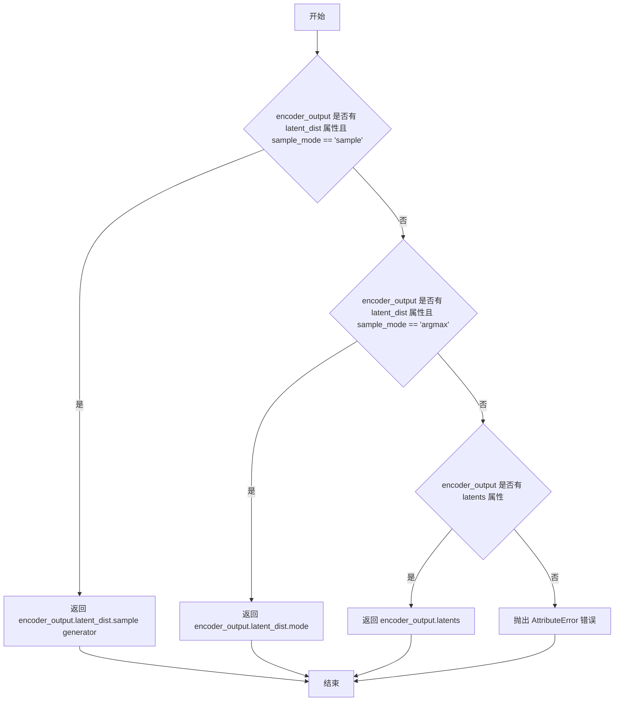
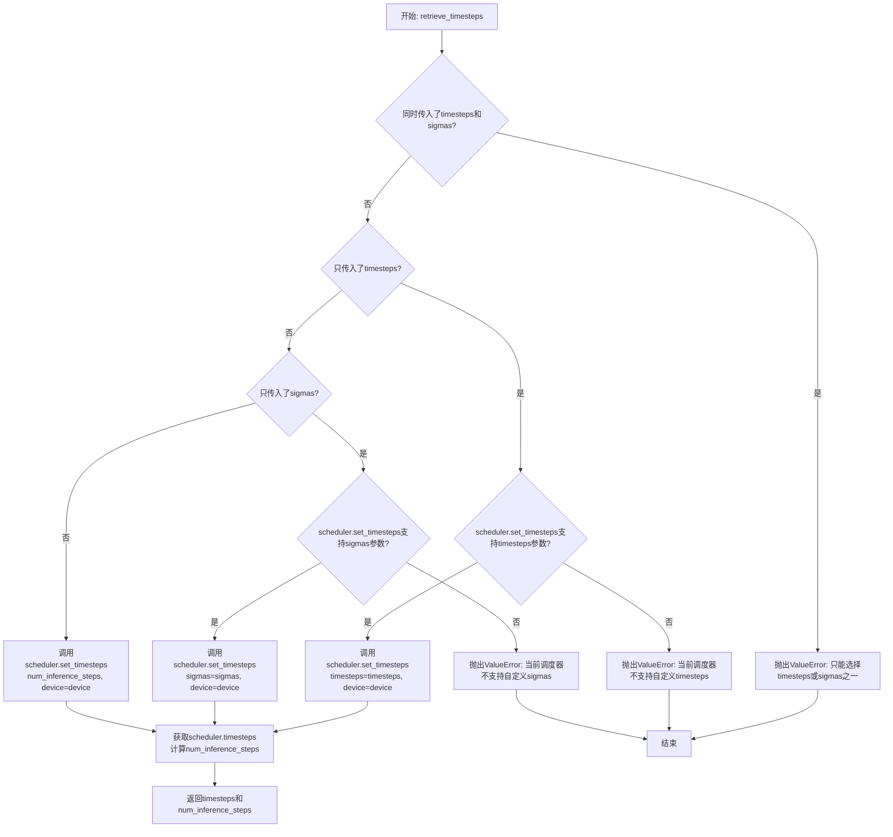
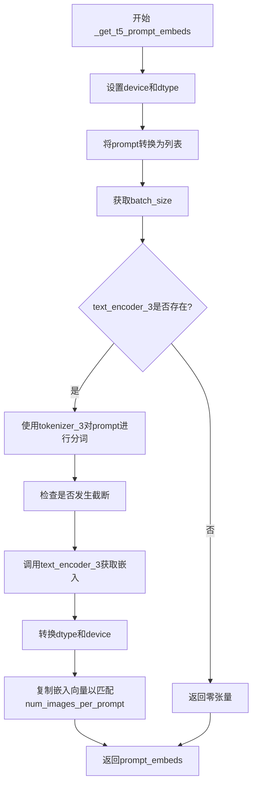
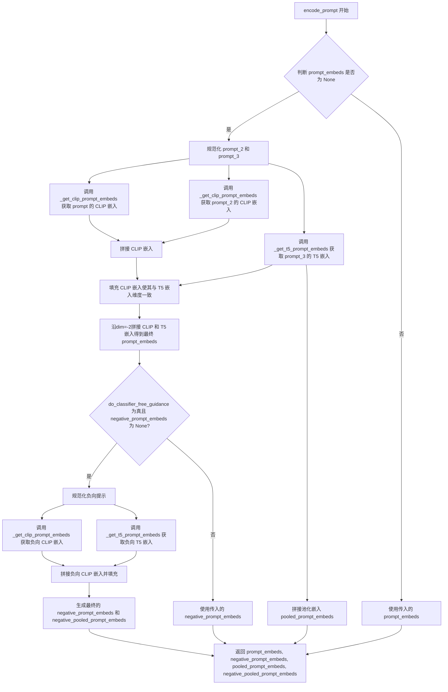
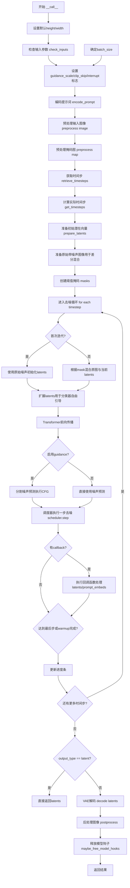
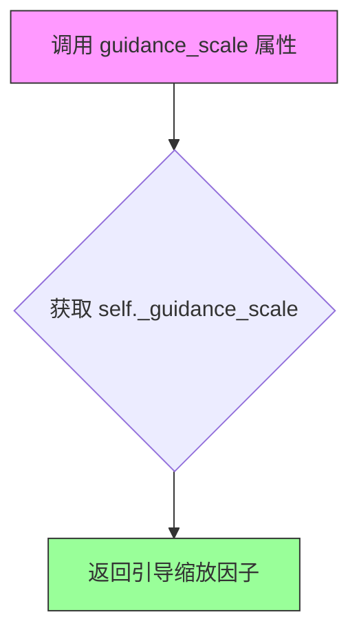
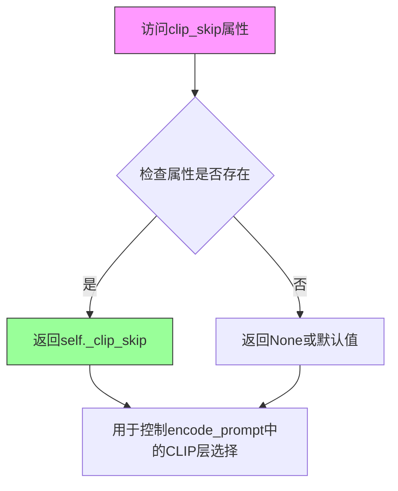
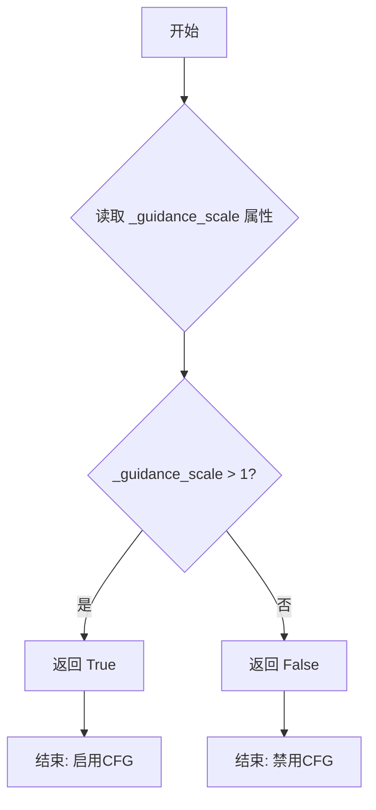
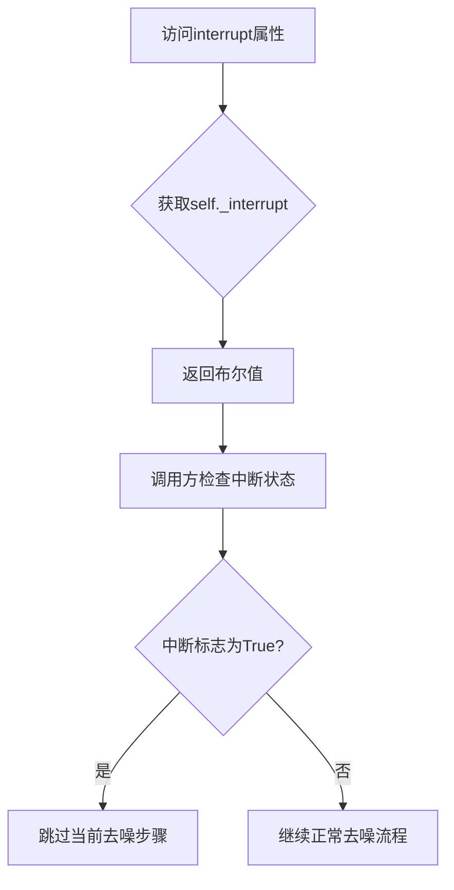

# `diffusers\examples\community\pipeline_stable_diffusion_3_differential_img2img.py` 详细设计文档

Stable Diffusion 3 Differential Image-to-Image Pipeline - 实现了一种基于 Stable Diffusion 3 的图像到图像转换 pipeline，支持通过阈值掩码进行差异混合，允许在去噪过程中动态控制原始图像与生成图像的混合比例，实现受控的图像转换和风格迁移。

## 整体流程

```mermaid
graph TD
A[开始: __call__] --> B[检查输入参数 check_inputs]
B --> C[编码提示词 encode_prompt]
C --> D[预处理图像 image_processor.preprocess]
D --> E[预处理掩码 map_processor.preprocess]
E --> F[获取时间步 retrieve_timesteps + get_timesteps]
F --> G[准备初始潜变量 prepare_latents]
G --> H{循环: for i, t in enumerate(timesteps)}
H --> I{首次迭代 i==0?}
I -- 是 --> J[使用原始噪声潜变量]
I -- 否 --> K[根据阈值混合: latents = original_with_noise[i] * mask + latents * (1 - mask)]
J --> L[潜在变量扩展用于CFG]
K --> L
L --> M[调用Transformer去噪: transformer()]
M --> N{启用CFG?}
N -- 是 --> O[计算无条件+有条件噪声预测]
N -- 否 --> P[直接使用噪声预测]
O --> Q[scheduler.step更新潜变量]
P --> Q
Q --> R{执行回调?]
R -- 是 --> S[callback_on_step_end] --> T
R -- 否 --> T[更新进度条]
T --> U{循环结束?}]
U -- 否 --> H
U -- 是 --> V{output_type == 'latent'?}
V -- 是 --> W[直接返回latents]
V -- 否 --> X[VAE解码: vae.decode]
X --> Y[后处理图像 image_processor.postprocess]
Y --> Z[释放模型资源 maybe_free_model_hooks]
Z --> AA[返回 StableDiffusion3PipelineOutput]
```

## 类结构

```
DiffusionPipeline (基类)
└── StableDiffusion3DifferentialImg2ImgPipeline
    ├── 文本编码模块 (text_encoder, text_encoder_2, text_encoder_3)
    ├── 分词器模块 (tokenizer, tokenizer_2, tokenizer_3)
    ├── Transformer模块 (transformer)
    ├── VAE模块 (vae)
    └── 调度器 (scheduler)
```

## 全局变量及字段


### `logger`
    
模块级日志记录器，用于输出调试和警告信息

类型：`logging.Logger`
    


### `EXAMPLE_DOC_STRING`
    
包含pipeline使用示例的文档字符串

类型：`str`
    


### `XLA_AVAILABLE`
    
标志位，指示PyTorch XLA是否可用

类型：`bool`
    


### `StableDiffusion3DifferentialImg2ImgPipeline.transformer`
    
Transformer去噪模型，用于对编码后的图像潜在表示进行去噪

类型：`SD3Transformer2DModel`
    


### `StableDiffusion3DifferentialImg2ImgPipeline.scheduler`
    
去噪调度器，与transformer配合使用来对图像潜在表示进行去噪

类型：`FlowMatchEulerDiscreteScheduler`
    


### `StableDiffusion3DifferentialImg2ImgPipeline.vae`
    
变分自编码器模型，用于图像与潜在表示之间的编码和解码

类型：`AutoencoderKL`
    


### `StableDiffusion3DifferentialImg2ImgPipeline.text_encoder`
    
CLIP文本编码器1，用于将文本提示转换为嵌入向量

类型：`CLIPTextModelWithProjection`
    


### `StableDiffusion3DifferentialImg2ImgPipeline.text_encoder_2`
    
CLIP文本编码器2，用于将文本提示转换为嵌入向量

类型：`CLIPTextModelWithProjection`
    


### `StableDiffusion3DifferentialImg2ImgPipeline.text_encoder_3`
    
T5文本编码器，用于将文本提示转换为嵌入向量

类型：`T5EncoderModel`
    


### `StableDiffusion3DifferentialImg2ImgPipeline.tokenizer`
    
CLIP分词器1，用于将文本分割为token序列

类型：`CLIPTokenizer`
    


### `StableDiffusion3DifferentialImg2ImgPipeline.tokenizer_2`
    
CLIP分词器2，用于将文本分割为token序列

类型：`CLIPTokenizer`
    


### `StableDiffusion3DifferentialImg2ImgPipeline.tokenizer_3`
    
T5快速分词器，用于将文本分割为token序列

类型：`T5TokenizerFast`
    


### `StableDiffusion3DifferentialImg2ImgPipeline.vae_scale_factor`
    
VAE缩放因子，用于计算潜在空间的尺寸

类型：`int`
    


### `StableDiffusion3DifferentialImg2ImgPipeline.image_processor`
    
图像预处理器，用于对输入图像进行预处理

类型：`VaeImageProcessor`
    


### `StableDiffusion3DifferentialImg2ImgPipeline.mask_processor`
    
掩码预处理器，用于对输入掩码进行预处理

类型：`VaeImageProcessor`
    


### `StableDiffusion3DifferentialImg2ImgPipeline.tokenizer_max_length`
    
分词器的最大序列长度

类型：`int`
    


### `StableDiffusion3DifferentialImg2ImgPipeline.default_sample_size`
    
默认的采样尺寸，用于确定生成图像的分辨率

类型：`int`
    


### `StableDiffusion3DifferentialImg2ImgPipeline.model_cpu_offload_seq`
    
CPU卸载顺序，定义模型组件卸载到CPU的顺序

类型：`str`
    


### `StableDiffusion3DifferentialImg2ImgPipeline._callback_tensor_inputs`
    
回调函数可用的张量输入列表

类型：`List[str]`
    


### `StableDiffusion3DifferentialImg2ImgPipeline._guidance_scale`
    
分类器自由引导强度，用于控制文本引导对生成图像的影响程度

类型：`float`
    


### `StableDiffusion3DifferentialImg2ImgPipeline._clip_skip`
    
CLIP跳过的层数，用于控制使用CLIP的哪一层输出

类型：`int`
    


### `StableDiffusion3DifferentialImg2ImgPipeline._interrupt`
    
中断标志，用于在生成过程中中断pipeline执行

类型：`bool`
    


### `StableDiffusion3DifferentialImg2ImgPipeline._num_timesteps`
    
去噪过程的时间步总数

类型：`int`
    
    

## 全局函数及方法


### `retrieve_latents`

从 encoder 输出中提取 latents，根据采样模式从 latent 分布中采样或获取最可能的值，或直接从输出中获取预计算的 latents。

参数：

- `encoder_output`：`torch.Tensor`，encoder 的输出对象，通常包含 `latent_dist` 或 `latents` 属性
- `generator`：`torch.Generator | None`，可选的随机生成器，用于确定性采样
- `sample_mode`：`str`，采样模式，"sample" 表示从分布中采样，"argmax" 表示取分布的众数

返回值：`torch.Tensor`，提取出的 latent 张量

#### 流程图



#### 带注释源码

```python
# 从 encoder 输出中提取 latents 的函数
# Copied from diffusers.pipelines.stable_diffusion.pipeline_stable_diffusion_img2img.retrieve_latents
def retrieve_latents(
    encoder_output: torch.Tensor,  # encoder 的输出，包含 latent_dist 或 latents 属性
    generator: torch.Generator | None = None,  # 可选随机生成器，用于确定性采样
    sample_mode: str = "sample"  # 采样模式：'sample' 从分布采样，'argmax' 取众数
):
    # 情况1：如果 encoder_output 有 latent_dist 属性且采样模式为 'sample'
    if hasattr(encoder_output, "latent_dist") and sample_mode == "sample":
        # 从潜在分布中采样，返回采样后的 latent
        return encoder_output.latent_dist.sample(generator)
    
    # 情况2：如果 encoder_output 有 latent_dist 属性且采样模式为 'argmax'
    elif hasattr(encoder_output, "latent_dist") and sample_mode == "argmax":
        # 返回潜在分布的众数（最可能的值）
        return encoder_output.latent_dist.mode()
    
    # 情况3：如果 encoder_output 直接有 latents 属性
    elif hasattr(encoder_output, "latents"):
        # 直接返回预计算的 latents
        return encoder_output.latents
    
    # 错误情况：无法从 encoder_output 中获取 latents
    else:
        raise AttributeError("Could not access latents of provided encoder_output")
```


### `retrieve_timesteps`

该函数是Stable Diffusion 3 Differential Img2Img Pipeline中的工具函数，用于调用调度器的`set_timesteps`方法并获取调度器中的时间步序列。它处理自定义时间步（timesteps）或自定义sigmas，并返回时间步张量和推理步数。

参数：

- `scheduler`：`SchedulerMixin`，调度器对象，用于获取时间步
- `num_inference_steps`：`Optional[int]`，生成样本时使用的扩散步数，如果使用此参数，则`timesteps`必须为`None`
- `device`：`Optional[Union[str, torch.device]]`，时间步要移动到的设备，如果为`None`则不移动
- `timesteps`：`Optional[List[int]]`，用于覆盖调度器时间步间隔策略的自定义时间步，如果传递此参数，则`num_inference_steps`和`sigmas`必须为`None`
- `sigmas`：`Optional[List[float]]`，用于覆盖调度器时间步间隔策略的自定义sigmas，如果传递此参数，则`num_inference_steps`和`timesteps`必须为`None`
- `**kwargs`：任意关键字参数，将传递给`scheduler.set_timesteps`

返回值：`Tuple[torch.Tensor, int]`，元组第一个元素是调度器的时间步调度，第二个元素是推理步数

#### 流程图



#### 带注释源码

```python
def retrieve_timesteps(
    scheduler,
    num_inference_steps: Optional[int] = None,
    device: Optional[Union[str, torch.device]] = None,
    timesteps: Optional[List[int]] = None,
    sigmas: Optional[List[float]] = None,
    **kwargs,
):
    """
    调用调度器的 `set_timesteps` 方法并在调用后从调度器获取时间步。处理自定义时间步。
    任何 kwargs 将被传递给 `scheduler.set_timesteps`。

    参数:
        scheduler (`SchedulerMixin`):
            用于获取时间步的调度器。
        num_inference_steps (`int`):
            使用预训练模型生成样本时使用的扩散步数。如果使用此参数，`timesteps` 必须为 `None`。
        device (`str` 或 `torch.device`, *可选*):
            时间步应移动到的设备。如果为 `None`，则不移动时间步。
        timesteps (`List[int]`, *可选*):
            用于覆盖调度器时间步间隔策略的自定义时间步。如果传入 `timesteps`，
            则 `num_inference_steps` 和 `sigmas` 必须为 `None`。
        sigmas (`List[float]`, *可选*):
            用于覆盖调度器时间步间隔策略的自定义 sigmas。如果传入 `sigmas`，
            则 `num_inference_steps` 和 `timesteps` 必须为 `None`。

    返回值:
        `Tuple[torch.Tensor, int]`: 元组，第一个元素是调度器的时间步调度，第二个元素是推理步数。
    """
    # 检查是否同时传入了 timesteps 和 sigmas，只能二选一
    if timesteps is not None and sigmas is not None:
        raise ValueError("Only one of `timesteps` or `sigmas` can be passed. Please choose one to set custom values")
    
    # 处理自定义 timesteps 的情况
    if timesteps is not None:
        # 检查调度器是否支持 timesteps 参数
        accepts_timesteps = "timesteps" in set(inspect.signature(scheduler.set_timesteps).parameters.keys())
        if not accepts_timesteps:
            raise ValueError(
                f"The current scheduler class {scheduler.__class__}'s `set_timesteps` does not support custom"
                f" timestep schedules. Please check whether you are using the correct scheduler."
            )
        # 调用调度器的 set_timesteps 方法设置自定义时间步
        scheduler.set_timesteps(timesteps=timesteps, device=device, **kwargs)
        # 从调度器获取更新后的时间步
        timesteps = scheduler.timesteps
        # 计算推理步数
        num_inference_steps = len(timesteps)
    # 处理自定义 sigmas 的情况
    elif sigmas is not None:
        # 检查调度器是否支持 sigmas 参数
        accept_sigmas = "sigmas" in set(inspect.signature(scheduler.set_timesteps).parameters.keys())
        if not accept_sigmas:
            raise ValueError(
                f"The current scheduler class {scheduler.__class__}'s `set_timesteps` does not support custom"
                f" sigmas schedules. Please check whether you are using the correct scheduler."
            )
        # 调用调度器的 set_timesteps 方法设置自定义 sigmas
        scheduler.set_timesteps(sigmas=sigmas, device=device, **kwargs)
        # 从调度器获取更新后的时间步
        timesteps = scheduler.timesteps
        # 计算推理步数
        num_inference_steps = len(timesteps)
    # 默认情况：使用 num_inference_steps 设置时间步
    else:
        scheduler.set_timesteps(num_inference_steps, device=device, **kwargs)
        timesteps = scheduler.timesteps
    
    # 返回时间步张量和推理步数
    return timesteps, num_inference_steps
```


### `StableDiffusion3DifferentialImg2ImgPipeline.__init__`

该方法是 `StableDiffusion3DifferentialImg2ImgPipeline` 类的构造函数，负责初始化整个差分图像到图像生成管道。它接收多个核心模型组件（Transformer、VAE、文本编码器等）作为参数，注册这些模块，并配置图像处理器、掩码处理器以及相关的配置参数，为后续的图像生成任务做好准备。

参数：

- `transformer`：`SD3Transformer2DModel`，条件 Transformer（MMDiT）架构，用于对编码的图像潜在表示进行去噪
- `scheduler`：`FlowMatchEulerDiscreteScheduler`，与 `transformer` 结合使用以对编码的图像潜在表示进行去噪的调度器
- `vae`：`AutoencoderKL`，变分自编码器模型，用于对图像进行编码和解码到潜在表示
- `text_encoder`：`CLIPTextModelWithProjection`，第一个 CLIP 文本编码器模型
- `tokenizer`：`CLIPTokenizer`，第一个分词器
- `text_encoder_2`：`CLIPTextModelWithProjection`，第二个 CLIP 文本编码器模型
- `tokenizer_2`：`CLIPTokenizer`，第二个分词器
- `text_encoder_3`：`T5EncoderModel`，T5 文本编码器模型
- `tokenizer_3`：`T5TokenizerFast`，T5 分词器

返回值：`None`，构造函数不返回值

#### 流程图

```mermaid
flowchart TD
    A[开始 __init__] --> B[调用 super().__init__]
    B --> C[register_modules 注册所有模块]
    C --> D[计算 vae_scale_factor]
    D --> E[创建 VaeImageProcessor 作为 image_processor]
    E --> F[创建 VaeImageProcessor 作为 mask_processor]
    F --> G[设置 tokenizer_max_length]
    G --> H[设置 default_sample_size]
    H --> I[结束 __init__]
```

#### 带注释源码

```
def __init__(
    self,
    transformer: SD3Transformer2DModel,              # 条件 Transformer (MMDiT) 架构，用于去噪潜在表示
    scheduler: FlowMatchEulerDiscreteScheduler,      # 去噪调度器
    vae: AutoencoderKL,                               # 变分自编码器，用于编解码图像
    text_encoder: CLIPTextModelWithProjection,       # 第一个 CLIP 文本编码器
    tokenizer: CLIPTokenizer,                         # 第一个分词器
    text_encoder_2: CLIPTextModelWithProjection,      # 第二个 CLIP 文本编码器
    tokenizer_2: CLIPTokenizer,                      # 第二个分词器
    text_encoder_3: T5EncoderModel,                  # T5 文本编码器
    tokenizer_3: T5TokenizerFast,                     # T5 分词器
):
    # 调用父类 DiffusionPipeline 的初始化方法
    super().__init__()

    # 注册所有模型模块，使其可通过 pipeline 的属性访问
    self.register_modules(
        vae=vae,
        text_encoder=text_encoder,
        text_encoder_2=text_encoder_2,
        text_encoder_3=text_encoder_3,
        tokenizer=tokenizer,
        tokenizer_2=tokenizer_2,
        tokenizer_3=tokenizer_3,
        transformer=transformer,
        scheduler=scheduler,
    )
    
    # 计算 VAE 缩放因子，基于 VAE 块输出通道数
    # 默认为 2^(len(block_out_channels) - 1)，如果 VAE 不可用则为 8
    self.vae_scale_factor = 2 ** (len(self.vae.config.block_out_channels) - 1) if getattr(self, "vae", None) else 8
    
    # 创建图像处理器，用于预处理和后处理图像
    self.image_processor = VaeImageProcessor(
        vae_scale_factor=self.vae_scale_factor, 
        vae_latent_channels=self.vae.config.latent_channels
    )
    
    # 创建掩码处理器，用于处理差分图像的掩码
    # 设置 do_normalize=False 和 do_convert_grayscale=True
    self.mask_processor = VaeImageProcessor(
        vae_scale_factor=self.vae_scale_factor, 
        do_normalize=False, 
        do_convert_grayscale=True
    )

    # 设置分词器的最大长度
    self.tokenizer_max_length = self.tokenizer.model_max_length
    
    # 设置默认样本大小，基于 Transformer 配置
    self.default_sample_size = self.transformer.config.sample_size
```


### `StableDiffusion3DifferentialImg2ImgPipeline._get_t5_prompt_embeds`

该方法用于从输入的文本提示（prompt）中提取T5编码器的文本嵌入向量（prompt embeddings），作为Stable Diffusion 3模型的文本条件输入。如果T5文本编码器（text_encoder_3）不存在，则返回零向量。

参数：

- `prompt`：`Union[str, List[str]] = None`，要编码的文本提示，可以是单个字符串或字符串列表
- `num_images_per_prompt`：`int = 1`，每个提示要生成的图像数量，用于复制嵌入向量
- `max_sequence_length`：`int = 256`，T5编码器的最大序列长度
- `device`：`Optional[torch.device] = None`，计算设备，默认为执行设备
- `dtype`：`Optional[torch.dtype] = None`，输出张量的数据类型，默认为text_encoder的数据类型

返回值：`torch.Tensor`，形状为`(batch_size * num_images_per_prompt, seq_len, joint_attention_dim)`的T5文本嵌入向量

#### 流程图



#### 带注释源码

```python
def _get_t5_prompt_embeds(
    self,
    prompt: Union[str, List[str]] = None,
    num_images_per_prompt: int = 1,
    max_sequence_length: int = 256,
    device: Optional[torch.device] = None,
    dtype: Optional[torch.dtype] = None,
):
    """
    从输入的文本提示中提取T5编码器的文本嵌入向量
    
    参数:
        prompt: 要编码的文本提示，字符串或字符串列表
        num_images_per_prompt: 每个提示生成的图像数量
        max_sequence_length: T5编码器的最大序列长度
        device: 计算设备
        dtype: 输出数据类型
    
    返回:
        T5文本嵌入向量，形状为(batch_size * num_images_per_prompt, seq_len, joint_attention_dim)
    """
    
    # 确定设备：如果未指定则使用执行设备
    device = device or self._execution_device
    
    # 确定数据类型：如果未指定则使用text_encoder的数据类型
    dtype = dtype or self.text_encoder.dtype

    # 将单个字符串转换为列表，便于批量处理
    prompt = [prompt] if isinstance(prompt, str) else prompt
    
    # 计算批量大小
    batch_size = len(prompt)

    # 如果text_encoder_3不存在，返回零张量作为占位符
    if self.text_encoder_3 is None:
        return torch.zeros(
            (
                batch_size * num_images_per_prompt,
                self.tokenizer_max_length,
                self.transformer.config.joint_attention_dim,
            ),
            device=device,
            dtype=dtype,
        )

    # 使用T5 tokenizer对prompt进行分词
    # padding="max_length": 填充到最大长度
    # truncation=True: 截断超过max_sequence_length的序列
    # add_special_tokens=True: 添加特殊token（如bos/eos）
    # return_tensors="pt": 返回PyTorch张量
    text_inputs = self.tokenizer_3(
        prompt,
        padding="max_length",
        max_length=max_sequence_length,
        truncation=True,
        add_special_tokens=True,
        return_tensors="pt",
    )
    text_input_ids = text_inputs.input_ids
    
    # 使用最长padding进行额外编码，用于检测是否发生了截断
    untruncated_ids = self.tokenizer_3(prompt, padding="longest", return_tensors="pt").input_ids

    # 如果未截断的序列更长且与截断后的序列不同，则发出警告
    if untruncated_ids.shape[-1] >= text_input_ids.shape[-1] and not torch.equal(text_input_ids, untruncated_ids):
        # 解码被截断的部分并记录警告
        removed_text = self.tokenizer_3.batch_decode(untruncated_ids[:, self.tokenizer_max_length - 1 : -1])
        logger.warning(
            "The following part of your input was truncated because `max_sequence_length` is set to "
            f" {max_sequence_length} tokens: {removed_text}"
        )

    # 将input_ids移动到指定设备并获取文本嵌入
    # 返回形状为 (batch_size, seq_len, hidden_size) 的嵌入
    prompt_embeds = self.text_encoder_3(text_input_ids.to(device))[0]

    # 确保嵌入的数据类型和设备正确
    dtype = self.text_encoder_3.dtype
    prompt_embeds = prompt_embeds.to(dtype=dtype, device=device)

    # 获取嵌入的序列长度
    _, seq_len, _ = prompt_embeds.shape

    # 复制文本嵌入和注意力掩码以匹配每个提示生成的图像数量
    # 使用MPS友好的方法进行复制
    prompt_embeds = prompt_embeds.repeat(1, num_images_per_prompt, 1)
    # 重塑为 (batch_size * num_images_per_prompt, seq_len, hidden_size)
    prompt_embeds = prompt_embeds.view(batch_size * num_images_per_prompt, seq_len, -1)

    return prompt_embeds
```


### `StableDiffusion3DifferentialImg2ImgPipeline._get_clip_prompt_embeds`

该方法用于将文本提示（prompt）编码为CLIP文本嵌入向量。支持使用两个CLIP文本编码器（text_encoder和text_encoder_2）进行编码，并根据clip_skip参数选择隐藏层，以及将嵌入向量复制以支持每个提示生成多个图像。

参数：

- `prompt`：`Union[str, List[str]]`，要编码的文本提示，可以是单个字符串或字符串列表
- `num_images_per_prompt`：`int = 1`，每个提示生成的图像数量
- `device`：`Optional[torch.device] = None`，执行设备，默认为执行设备
- `clip_skip`：`Optional[int] = None`，从CLIP模型最后层开始跳过的层数，用于获取不同层次的嵌入
- `clip_model_index`：`int = 0`，选择使用哪个CLIP模型（0表示text_encoder/tokenizer，1表示text_encoder_2/tokenizer_2）

返回值：`Tuple[torch.Tensor, torch.Tensor]`，返回元组包含prompt_embeds（文本嵌入向量）和pooled_prompt_embeds（池化后的文本嵌入）

#### 流程图

```mermaid
flowchart TD
    A[开始 _get_clip_prompt_embeds] --> B{device 是否为 None}
    B -->|是| C[device = self._execution_device]
    B -->|否| D[使用传入的 device]
    C --> E[获取 clip_tokenizers 和 clip_text_encoders 列表]
    D --> E
    E --> F[根据 clip_model_index 选择 tokenizer 和 text_encoder]
    F --> G{判断 prompt 是否为字符串}
    G -->|是| H[将 prompt 转为列表]
    G -->|否| I[直接使用 prompt 列表]
    H --> J[获取 batch_size = len(prompt)]
    I --> J
    J --> K[使用 tokenizer 对 prompt 进行 tokenize]
    K --> L[获取 untruncated_ids 用于检测截断]
    L --> M{untruncated_ids 长度 >= text_input_ids 长度 且 不相等}
    M -->|是| N[记录被截断的文本并发出警告]
    M -->|否| O[使用 text_encoder 编码 text_input_ids]
    N --> O
    O --> P[获取 pooled_prompt_embeds = prompt_embeds[0]]
    P --> Q{clip_skip 是否为 None}
    Q -->|是| R[prompt_embeds = hidden_states[-2]]
    Q -->|否| S[prompt_embeds = hidden_states[-(clip_skip + 2)]]
    R --> T[转换 dtype 和 device]
    S --> T
    T --> U[重复 prompt_embeds num_images_per_prompt 次]
    U --> V[重塑为 batch_size * num_images_per_prompt, seq_len, -1]
    V --> W[重复 pooled_prompt_embeds num_images_per_prompt 次]
    W --> X[重塑为 batch_size * num_images_per_prompt, -1]
    X --> Y[返回 prompt_embeds 和 pooled_prompt_embeds]
```

#### 带注释源码

```python
def _get_clip_prompt_embeds(
    self,
    prompt: Union[str, List[str]],
    num_images_per_prompt: int = 1,
    device: Optional[torch.device] = None,
    clip_skip: Optional[int] = None,
    clip_model_index: int = 0,
):
    """
    编码文本提示为CLIP嵌入向量
    
    参数:
        prompt: 要编码的文本提示，字符串或字符串列表
        num_images_per_prompt: 每个提示生成的图像数量
        device: 执行的设备
        clip_skip: 跳过的CLIP层数，用于获取不同层次的特征
        clip_model_index: 使用的CLIP模型索引（0或1）
    
    返回:
        (prompt_embeds, pooled_prompt_embeds): 文本嵌入和池化嵌入的元组
    """
    # 如果未指定device，则使用执行设备
    device = device or self._execution_device

    # 定义两个CLIP tokenizer和text_encoder的列表，用于支持多个文本编码器
    clip_tokenizers = [self.tokenizer, self.tokenizer_2]
    clip_text_encoders = [self.text_encoder, self.text_encoder_2]

    # 根据索引选择对应的tokenizer和text_encoder
    tokenizer = clip_tokenizers[clip_model_index]
    text_encoder = clip_text_encoders[clip_model_index]

    # 将prompt规范化为列表形式，以便统一处理
    prompt = [prompt] if isinstance(prompt, str) else prompt
    batch_size = len(prompt)

    # 使用tokenizer对prompt进行tokenize，padding到最大长度
    text_inputs = tokenizer(
        prompt,
        padding="max_length",
        max_length=self.tokenizer_max_length,
        truncation=True,
        return_tensors="pt",
    )

    text_input_ids = text_inputs.input_ids
    # 获取未截断的token ids，用于检测是否发生了截断
    untruncated_ids = tokenizer(prompt, padding="longest", return_tensors="pt").input_ids
    
    # 检查是否发生了截断，如果是则记录警告信息
    if untruncated_ids.shape[-1] >= text_input_ids.shape[-1] and not torch.equal(text_input_ids, untruncated_ids):
        removed_text = tokenizer.batch_decode(untruncated_ids[:, self.tokenizer_max_length - 1 : -1])
        logger.warning(
            "The following part of your input was truncated because CLIP can only handle sequences up to"
            f" {self.tokenizer_max_length} tokens: {removed_text}"
        )
    
    # 使用text_encoder获取文本嵌入，output_hidden_states=True以获取所有隐藏层
    prompt_embeds = text_encoder(text_input_ids.to(device), output_hidden_states=True)
    # pooled_prompt_embeds 是最后一层的[0]位置，通常用于表示整个序列的池化特征
    pooled_prompt_embeds = prompt_embeds[0]

    # 根据clip_skip参数选择隐藏层：
    # 如果clip_skip为None，使用倒数第二层（-2）
    # 否则使用倒数第(clip_skip + 2)层
    if clip_skip is None:
        prompt_embeds = prompt_embeds.hidden_states[-2]
    else:
        prompt_embeds = prompt_embeds.hidden_states[-(clip_skip + 2)]

    # 确保嵌入向量的dtype和device正确
    prompt_embeds = prompt_embeds.to(dtype=self.text_encoder.dtype, device=device)

    # 获取序列长度
    _, seq_len, _ = prompt_embeds.shape
    
    # 复制文本嵌入以匹配每个提示生成的图像数量
    # 使用repeat和view的方式来兼容mps设备
    prompt_embeds = prompt_embeds.repeat(1, num_images_per_prompt, 1)
    prompt_embeds = prompt_embeds.view(batch_size * num_images_per_prompt, seq_len, -1)

    # 对pooled_prompt_embeds进行相同的复制操作
    pooled_prompt_embeds = pooled_prompt_embeds.repeat(1, num_images_per_prompt, 1)
    pooled_prompt_embeds = pooled_prompt_embeds.view(batch_size * num_images_per_prompt, -1)

    # 返回编码后的prompt嵌入和池化嵌入
    return prompt_embeds, pooled_prompt_embeds
```


### `StableDiffusion3DifferentialImg2ImgPipeline.encode_prompt`

该方法负责将文本提示（prompt）编码为向量嵌入（embeddings），供Stable Diffusion 3图像到图像pipeline使用。它支持多文本编码器（CLIP T5和两个CLIP变体），并处理分类器自由引导（Classifier-Free Guidance）的正向和负向提示嵌入。

参数：

- `prompt`：`Union[str, List[str]]`，可选，要编码的提示文本
- `prompt_2`：`Union[str, List[str]]`，可选，发送给`tokenizer_2`和`text_encoder_2`的提示，若未定义则使用`prompt`
- `prompt_3`：`Union[str, List[str]]`，可选，发送给`tokenizer_3`和`text_encoder_3`的提示，若未定义则使用`prompt`
- `device`：`Optional[torch.device]`，torch设备，若未指定则使用执行设备
- `num_images_per_prompt`：`int`，每个提示生成的图像数量，默认为1
- `do_classifier_free_guidance`：`bool`，是否使用分类器自由引导
- `negative_prompt`：`Optional[Union[str, List[str]]]`，不引导图像生成的提示
- `negative_prompt_2`：`Optional[Union[str, List[str]]]`，发送给`tokenizer_2`和`text_encoder_2`的负向提示
- `negative_prompt_3`：`Optional[Union[str, List[str]]]`，发送给`tokenizer_3`和`text_encoder_3`的负向提示
- `prompt_embeds`：`Optional[torch.FloatTensor]`，预生成的文本嵌入，用于轻松调整文本输入
- `negative_prompt_embeds`：`Optional[torch.FloatTensor]`，预生成的负向文本嵌入
- `pooled_prompt_embeds`：`Optional[torch.FloatTensor]`，预生成的池化文本嵌入
- `negative_pooled_prompt_embeds`：`Optional[torch.FloatTensor]`，预生成的负向池化文本嵌入
- `clip_skip`：`Optional[int]`，计算提示嵌入时从CLIP跳过的层数
- `max_sequence_length`：`int`，最大序列长度，默认为256

返回值：`Tuple[torch.FloatTensor, torch.FloatTensor, torch.FloatTensor, torch.FloatTensor]`，返回四个张量：提示嵌入、负向提示嵌入、池化提示嵌入、负向池化提示嵌入

#### 流程图



#### 带注释源码

```python
def encode_prompt(
    self,
    prompt: Union[str, List[str]],
    prompt_2: Union[str, List[str]],
    prompt_3: Union[str, List[str]],
    device: Optional[torch.device] = None,
    num_images_per_prompt: int = 1,
    do_classifier_free_guidance: bool = True,
    negative_prompt: Optional[Union[str, List[str]]] = None,
    negative_prompt_2: Optional[Union[str, List[str]]] = None,
    negative_prompt_3: Optional[Union[str, List[str]]] = None,
    prompt_embeds: Optional[torch.FloatTensor] = None,
    negative_prompt_embeds: Optional[torch.FloatTensor] = None,
    pooled_prompt_embeds: Optional[torch.FloatTensor] = None,
    negative_pooled_prompt_embeds: Optional[torch.FloatTensor] = None,
    clip_skip: Optional[int] = None,
    max_sequence_length: int = 256,
):
    """
    Encodes text prompts into embeddings for Stable Diffusion 3 generation.
    Supports multiple text encoders (CLIP and T5) and handles classifier-free guidance.
    """
    # 确定执行设备，优先使用传入的device，否则使用pipeline的默认执行设备
    device = device or self._execution_device

    # 规范化prompt为列表格式，便于批量处理
    prompt = [prompt] if isinstance(prompt, str) else prompt
    
    # 计算batch_size：如果传入了prompt则使用其长度，否则使用prompt_embeds的batch维度
    if prompt is not None:
        batch_size = len(prompt)
    else:
        batch_size = prompt_embeds.shape[0]

    # =====================================================
    # 处理正向提示嵌入 (Positive Prompt Embeddings)
    # =====================================================
    if prompt_embeds is None:
        # 若未提供prompt_2和prompt_3，则默认使用与prompt相同的值
        prompt_2 = prompt_2 or prompt
        prompt_2 = [prompt_2] if isinstance(prompt_2, str) else prompt_2

        prompt_3 = prompt_3 or prompt
        prompt_3 = [prompt_3] if isinstance(prompt_3, str) else prompt_3

        # 获取第一个CLIP文本编码器(text_encoder)的嵌入
        # clip_model_index=0 对应 tokenizer 和 text_encoder
        prompt_embed, pooled_prompt_embed = self._get_clip_prompt_embeds(
            prompt=prompt,
            device=device,
            num_images_per_prompt=num_images_per_prompt,
            clip_skip=clip_skip,
            clip_model_index=0,
        )
        
        # 获取第二个CLIP文本编码器(text_encoder_2)的嵌入
        # clip_model_index=1 对应 tokenizer_2 和 text_encoder_2
        prompt_2_embed, pooled_prompt_2_embed = self._get_clip_prompt_embeds(
            prompt=prompt_2,
            device=device,
            num_images_per_prompt=num_images_per_prompt,
            clip_skip=clip_skip,
            clip_model_index=1,
        )
        
        # 将两个CLIP编码器的输出在最后一维拼接
        # 两个CLIP编码器输出维度相加以获得联合注意力维度
        clip_prompt_embeds = torch.cat([prompt_embed, prompt_2_embed], dim=-1)

        # 获取T5文本编码器(text_encoder_3)的嵌入
        t5_prompt_embed = self._get_t5_prompt_embeds(
            prompt=prompt_3,
            num_images_per_prompt=num_images_per_prompt,
            max_sequence_length=max_sequence_length,
            device=device,
        )

        # 对CLIP嵌入进行填充，使其与T5嵌入的最后一维维度对齐
        # 因为T5的嵌入维度通常比CLIP大，需要填充CLIP部分以匹配
        clip_prompt_embeds = torch.nn.functional.pad(
            clip_prompt_embeds, (0, t5_prompt_embed.shape[-1] - clip_prompt_embeds.shape[-1])
        )

        # 沿dim=-2(序列长度维度)拼接CLIP和T5嵌入，得到最终的prompt_embeds
        # 最终形状: (batch_size * num_images_per_prompt, seq_len, joint_attention_dim)
        prompt_embeds = torch.cat([clip_prompt_embeds, t5_prompt_embed], dim=-2)
        
        # 拼接两个CLIP编码器的池化嵌入
        pooled_prompt_embeds = torch.cat([pooled_prompt_embed, pooled_prompt_2_embed], dim=-1)

    # =====================================================
    # 处理负向提示嵌入 (Negative Prompt Embeddings)
    # 仅在启用分类器自由引导时需要
    # =====================================================
    if do_classifier_free_guidance and negative_prompt_embeds is None:
        # 默认负向提示为空字符串
        negative_prompt = negative_prompt or ""
        # 若未指定负向提示2和3，则使用与负向提示相同的值
        negative_prompt_2 = negative_prompt_2 or negative_prompt
        negative_prompt_3 = negative_prompt_3 or negative_prompt

        # 确保负向提示也被规范化为列表格式，以匹配batch_size
        negative_prompt = batch_size * [negative_prompt] if isinstance(negative_prompt, str) else negative_prompt
        negative_prompt_2 = (
            batch_size * [negative_prompt_2] if isinstance(negative_prompt_2, str) else negative_prompt_2
        )
        negative_prompt_3 = (
            batch_size * [negative_prompt_3] if isinstance(negative_prompt_3, str) else negative_prompt_3
        )

        # 类型检查：确保negative_prompt与prompt类型一致
        if prompt is not None and type(prompt) is not type(negative_prompt):
            raise TypeError(
                f"`negative_prompt` should be the same type to `prompt`, but got {type(negative_prompt)} !="
                f" {type(prompt)}."
            )
        
        # batch_size匹配检查
        elif batch_size != len(negative_prompt):
            raise ValueError(
                f"`negative_prompt`: {negative_prompt} has batch size {len(negative_prompt)}, but `prompt`:"
                f" {prompt} has batch size {batch_size}. Please make sure that passed `negative_prompt` matches"
                " the batch size of `prompt`."
            )

        # 获取负向提示的CLIP嵌入（使用clip_model_index=0）
        negative_prompt_embed, negative_pooled_prompt_embed = self._get_clip_prompt_embeds(
            negative_prompt,
            device=device,
            num_images_per_prompt=num_images_per_prompt,
            clip_skip=None,  # 负向提示不使用clip_skip
            clip_model_index=0,
        )
        
        # 获取负向提示的第二个CLIP嵌入（使用clip_model_index=1）
        negative_prompt_2_embed, negative_pooled_prompt_2_embed = self._get_clip_prompt_embeds(
            negative_prompt_2,
            device=device,
            num_images_per_prompt=num_images_per_prompt,
            clip_skip=None,
            clip_model_index=1,
        )
        
        # 拼接两个负向CLIP嵌入
        negative_clip_prompt_embeds = torch.cat([negative_prompt_embed, negative_prompt_2_embed], dim=-1)

        # 获取T5编码器的负向嵌入
        t5_negative_prompt_embed = self._get_t5_prompt_embeds(
            prompt=negative_prompt_3,
            num_images_per_prompt=num_images_per_prompt,
            max_sequence_length=max_sequence_length,
            device=device,
        )

        # 填充负向CLIP嵌入以匹配T5嵌入的维度
        negative_clip_prompt_embeds = torch.nn.functional.pad(
            negative_clip_prompt_embeds,
            (0, t5_negative_prompt_embed.shape[-1] - negative_clip_prompt_embeds.shape[-1]),
        )

        # 沿dim=-2拼接得到最终的负向prompt_embeds
        negative_prompt_embeds = torch.cat([negative_clip_prompt_embeds, t5_negative_prompt_embed], dim=-2)
        
        # 拼接两个负向池化嵌入
        negative_pooled_prompt_embeds = torch.cat(
            [negative_pooled_prompt_embed, negative_pooled_prompt_2_embed], dim=-1
        )

    # 返回四个嵌入张量：正向提示、负向提示、正向池化、负向池化
    return prompt_embeds, negative_prompt_embeds, pooled_prompt_embeds, negative_pooled_prompt_embeds
```


### `StableDiffusion3DifferentialImg2ImgPipeline.check_inputs`

该方法用于在pipeline执行前验证所有输入参数的有效性，确保用户提供的prompt、negative_prompt、embeddings等参数符合要求，防止在后续处理过程中因参数错误导致程序异常。

参数：

- `self`：隐藏参数，指向pipeline实例本身
- `prompt`：Union[str, List[str]]，用户提供的正向提示词，用于指导图像生成
- `prompt_2`：Union[str, List[str]]，发送给第二个tokenizer和text_encoder的提示词，若未定义则使用prompt
- `prompt_3`：Union[str, List[str]]，发送给第三个tokenizer（T5）和text_encoder的提示词，若未定义则使用prompt
- `strength`：float，图像到图像转换的强度值，决定保留原图像多少特征
- `negative_prompt`：Union[str, List[str]]，可选的反向提示词，用于指导图像生成方向
- `negative_prompt_2`：Union[str, List[str]]，可选的第二个反向提示词
- `negative_prompt_3`：Union[str, List[str]]，可选的第三个反向提示词（T5）
- `prompt_embeds`：torch.FloatTensor，可选的预生成文本嵌入，若提供则不再从prompt生成
- `negative_prompt_embeds`：torch.FloatTensor，可选的预生成反向文本嵌入
- `pooled_prompt_embeds`：torch.FloatTensor，可选的预生成池化文本嵌入，需与prompt_embeds配对使用
- `negative_pooled_prompt_embeds`：torch.FloatTensor，可选的预生成反向池化文本嵌入
- `callback_on_step_end_tensor_inputs`：List[str]，可选的回调函数可访问的tensor输入列表
- `max_sequence_length`：int，可选的最大序列长度，默认256，最大512

返回值：`None`，若验证通过则不返回任何值；若验证失败则抛出ValueError异常

#### 流程图

```mermaid
flowchart TD
    A[开始 check_inputs] --> B{strength in [0.0, 1.0]?}
    B -->|否| C[raise ValueError: strength 超出范围]
    B -->|是| D{callback_on_step_end_tensor_inputs 有效?}
    D -->|否| E[raise ValueError: 无效的 tensor inputs]
    D -->|是| F{prompt 和 prompt_embeds 同时提供?}
    F -->|是| G[raise ValueError: 只能提供其中一个]
    F -->|否| H{prompt_2 和 prompt_embeds 同时提供?}
    H -->|是| I[raise ValueError: 只能提供其中一个]
    H -->|否| J{prompt_3 和 prompt_embeds 同时提供?]
    J -->|是| K[raise ValueError: 只能提供其中一个]
    J -->|否| L{prompt 和 prompt_embeds 都为空?]
    L -->|是| M[raise ValueError: 至少提供一个]
    L -->|否| N{prompt 类型有效?]
    N -->|否| O[raise ValueError: 类型错误]
    N -->|是| P{negative_prompt 和 negative_prompt_embeds 同时提供?}
    P -->|是| Q[raise ValueError: 只能提供其中一个]
    P -->|否| R{negative_prompt_2/3 和 negative_prompt_embeds 同时提供?]
    R -->|是| S[raise ValueError: 类型错误]
    R -->|否| T{prompt_embeds 和 negative_prompt_embeds shape 相同?]
    T -->|否| U[raise ValueError: shape 不匹配]
    T -->|是| V{prompt_embeds 提供但 pooled_prompt_embeds 未提供?}
    V -->|是| W[raise ValueError: 需要提供 pooled_prompt_embeds]
    V -->|否| X{negative_prompt_embeds 提供但 negative_pooled_prompt_embeds 未提供?}
    X -->|是| Y[raise ValueError: 需要提供 negative_pooled_prompt_embeds]
    X -->|否| Z{max_sequence_length > 512?}
    Z -->|是| AA[raise ValueError: 超过最大长度]
    Z -->|否| AB[验证通过，返回 None]
    
    C --> AB
    E --> AB
    G --> AB
    I --> AB
    K --> AB
    M --> AB
    O --> AB
    Q --> AB
    S --> AB
    U --> AB
    W --> AB
    Y --> AB
```

#### 带注释源码

```python
def check_inputs(
    self,
    prompt,
    prompt_2,
    prompt_3,
    strength,
    negative_prompt=None,
    negative_prompt_2=None,
    negative_prompt_3=None,
    prompt_embeds=None,
    negative_prompt_embeds=None,
    pooled_prompt_embeds=None,
    negative_pooled_prompt_embeds=None,
    callback_on_step_end_tensor_inputs=None,
    max_sequence_length=None,
):
    # 验证 strength 参数必须在 [0.0, 1.0] 范围内
    if strength < 0 or strength > 1:
        raise ValueError(f"The value of strength should in [0.0, 1.0] but is {strength}")

    # 验证回调函数可选的tensor输入必须在允许列表中
    if callback_on_step_end_tensor_inputs is not None and not all(
        k in self._callback_tensor_inputs for k in callback_on_step_end_tensor_inputs
    ):
        raise ValueError(
            f"`callback_on_step_end_tensor_inputs` has to be in {self._callback_tensor_inputs}, but found {[k for k in callback_on_step_end_tensor_inputs if k not in self._callback_tensor_inputs]}"
        )

    # 验证 prompt 和 prompt_embeds 不能同时提供（互斥）
    if prompt is not None and prompt_embeds is not None:
        raise ValueError(
            f"Cannot forward both `prompt`: {prompt} and `prompt_embeds`: {prompt_embeds}. Please make sure to"
            " only forward one of the two."
        )
    # 验证 prompt_2 和 prompt_embeds 不能同时提供
    elif prompt_2 is not None and prompt_embeds is not None:
        raise ValueError(
            f"Cannot forward both `prompt_2`: {prompt_2} and `prompt_embeds`: {prompt_embeds}. Please make sure to"
            " only forward one of the two."
        )
    # 验证 prompt_3 和 prompt_embeds 不能同时提供
    elif prompt_3 is not None and prompt_embeds is not None:
        raise ValueError(
            f"Cannot forward both `prompt_3`: {prompt_2} and `prompt_embeds`: {prompt_embeds}. Please make sure to"
            " only forward one of the two."
        )
    # 验证 prompt 和 prompt_embeds 至少提供一个
    elif prompt is None and prompt_embeds is None:
        raise ValueError(
            "Provide either `prompt` or `prompt_embeds`. Cannot leave both `prompt` and `prompt_embeds` undefined."
        )
    # 验证 prompt 类型必须是 str 或 list
    elif prompt is not None and (not isinstance(prompt, str) and not isinstance(prompt, list)):
        raise ValueError(f"`prompt` has to be of type `str` or `list` but is {type(prompt)}")
    # 验证 prompt_2 类型
    elif prompt_2 is not None and (not isinstance(prompt_2, str) and not isinstance(prompt_2, list)):
        raise ValueError(f"`prompt_2` has to be of type `str` or `list` but is {type(prompt_2)}")
    # 验证 prompt_3 类型
    elif prompt_3 is not None and (not isinstance(prompt_3, str) and not isinstance(prompt_3, list)):
        raise ValueError(f"`prompt_3` has to be of type `str` or `list` but is {type(prompt_3)}")

    # 验证 negative_prompt 和 negative_prompt_embeds 不能同时提供
    if negative_prompt is not None and negative_prompt_embeds is not None:
        raise ValueError(
            f"Cannot forward both `negative_prompt`: {negative_prompt} and `negative_prompt_embeds`:"
            f" {negative_prompt_embeds}. Please make sure to only forward one of the two."
        )
    # 验证 negative_prompt_2 和 negative_prompt_embeds 不能同时提供
    elif negative_prompt_2 is not None and negative_prompt_embeds is not None:
        raise ValueError(
            f"Cannot forward both `negative_prompt_2`: {negative_prompt_2} and `negative_prompt_embeds`:"
            f" {negative_prompt_embeds}. Please make sure to only forward one of the two."
        )
    # 验证 negative_prompt_3 和 negative_prompt_embeds 不能同时提供
    elif negative_prompt_3 is not None and negative_prompt_embeds is not None:
        raise ValueError(
            f"Cannot forward both `negative_prompt_3`: {negative_prompt_3} and `negative_prompt_embeds`:"
            f" {negative_prompt_embeds}. Please make sure to only forward one of the two."
        )

    # 验证 prompt_embeds 和 negative_prompt_embeds 的形状必须匹配
    if prompt_embeds is not None and negative_prompt_embeds is not None:
        if prompt_embeds.shape != negative_prompt_embeds.shape:
            raise ValueError(
                "`prompt_embeds` and `negative_prompt_embeds` must have the same shape when passed directly, but"
                f" got: `prompt_embeds` {prompt_embeds.shape} != `negative_prompt_embeds`"
                f" {negative_prompt_embeds.shape}."
            )

    # 验证如果提供了 prompt_embeds，则必须同时提供 pooled_prompt_embeds
    if prompt_embeds is not None and pooled_prompt_embeds is None:
        raise ValueError(
            "If `prompt_embeds` are provided, `pooled_prompt_embeds` also have to be passed. Make sure to generate `pooled_prompt_embeds` from the same text encoder that was used to generate `prompt_embeds`."
        )

    # 验证如果提供了 negative_prompt_embeds，则必须同时提供 negative_pooled_prompt_embeds
    if negative_prompt_embeds is not None and negative_pooled_prompt_embeds is None:
        raise ValueError(
            "If `negative_prompt_embeds` are provided, `negative_pooled_prompt_embeds` also have to be passed. Make sure to generate `negative_pooled_prompt_embeds` from the same text encoder that was used to generate `negative_prompt_embeds`."
        )

    # 验证 max_sequence_length 不能超过 512
    if max_sequence_length is not None and max_sequence_length > 512:
        raise ValueError(f"`max_sequence_length` cannot be greater than 512 but is {max_sequence_length}")
```


### `StableDiffusion3DifferentialImg2ImgPipeline.get_timesteps`

该方法用于根据图像到图像转换任务中的 `strength` 参数调整去噪时间步调度表。通过计算初始时间步长，决定从原始调度表中从哪个位置开始采样，以实现对输入图像不同程度的修改。

参数：

- `num_inference_steps`：`int`，扩散模型生成图像时使用的去噪步数
- `strength`：`float`，控制向输入图像添加的噪声量，决定了图像变化的剧烈程度（值越大变化越大）
- `device`：`torch.device`，用于将时间步张量移动到的目标设备

返回值：`Tuple[torch.Tensor, int]`，返回调整后的时间步调度表（第一元素）和调整后的推理步数（第二元素）

#### 流程图

```mermaid
flowchart TD
    A[开始 get_timesteps] --> B[计算 init_timestep = min(num_inference_steps * strength, num_inference_steps)]
    B --> C[计算 t_start = max(num_inference_steps - init_timestep, 0)]
    C --> D[从 scheduler.timesteps 中切片获取调整后的时间步: timesteps[t_start * scheduler.order:]
    ]
    D --> E[计算实际推理步数: num_inference_steps - t_start]
    E --> F[返回 timesteps 和 实际推理步数]
```

#### 带注释源码

```python
def get_timesteps(self, num_inference_steps, strength, device):
    """
    根据 strength 参数调整时间步调度表，用于图像到图像的差异融合。
    
    参数:
        num_inference_steps: 总的去噪步数
        strength: 图像变化强度 (0-1)，值越大变化越大
        device: 计算设备
    
    返回:
        调整后的时间步张量和实际推理步数
    """
    # 根据 strength 计算初始时间步数量
    # strength 表示图像被修改的程度，值越大意味着保留原图像信息越少
    init_timestep = min(num_inference_steps * strength, num_inference_steps)

    # 计算起始索引：从调度表末尾往前数，跳过 init_timestep 数量的步数
    # 这样可以实现从中间开始去噪，保留更多原始图像特征
    t_start = int(max(num_inference_steps - init_timestep, 0))
    
    # 从调度表中获取调整后的时间步序列
    # 乘以 scheduler.order 是为了支持多步调度器（如 DDIM、DPMSolver 等）
    timesteps = self.scheduler.timesteps[t_start * self.scheduler.order :]

    # 返回调整后的时间步和实际需要执行的推理步数
    return timesteps, num_inference_steps - t_start
```


### `StableDiffusion3DifferentialImg2ImgPipeline.prepare_latents`

该方法负责将输入图像编码为潜在表示，并添加噪声以准备去噪过程的初始潜在变量。它处理VAE编码、潜在变量缩放、批量大小调整以及噪声添加。

参数：

- `batch_size`：`int`，批量大小，用于生成潜在变量的数量
- `num_channels_latents`：`int`，潜在变量的通道数，由Transformer模型的输入通道决定
- `height`：`int`，生成图像的高度（像素）
- `width`：`int`，生成图像的宽度（像素）
- `image`：`PipelineImageInput`，输入图像，用于编码为潜在表示
- `timestep`：`torch.Tensor`，当前时间步，用于噪声缩放
- `dtype`：`torch.dtype`，潜在变量的数据类型
- `device`：`torch.device`，计算设备
- `generator`：`torch.Generator` 或 `List[torch.Generator]` 或 `None`，随机数生成器，用于确保可重复性

返回值：`torch.FloatTensor`，处理后的潜在变量，用于去噪过程

#### 流程图

```mermaid
flowchart TD
    A[开始: prepare_latents] --> B[计算潜在变量形状 shape]
    B --> C[将图像移到指定设备和数据类型]
    C --> D{generator是否为列表且长度与batch_size不匹配?}
    D -->|是| E[抛出ValueError: 生成器列表长度与批量大小不匹配]
    D -->|否| F{generator是列表吗?}
    F -->|是| G[遍历图像列表分别编码]
    G --> H[拼接所有init_latents]
    F -->|否| I[直接编码图像获取init_latents]
    H --> J[应用VAE配置中的shift_factor和scaling_factor缩放]
    I --> J
    J --> K{batch_size大于init_latents.shape[0]且能被整除?}
    K -->|是| L[扩展init_latents以匹配batch_size]
    K -->|否| M{batch_size大于init_latents.shape[0]但不能被整除?}
    M -->|是| N[抛出ValueError: 无法复制图像到指定batch_size]
    M -->|否| O[直接使用init_latents]
    L --> P[生成随机噪声 noise]
    O --> P
    P --> Q[使用scheduler的scale_noise方法缩放init_latents]
    Q --> R[将latents移到指定设备和数据类型]
    R --> S[返回处理后的latents]
```

#### 带注释源码

```python
def prepare_latents(
    self, batch_size, num_channels_latents, height, width, image, timestep, dtype, device, generator=None
):
    """
    准备用于去噪过程的潜在变量。
    
    参数:
        batch_size: 批量大小
        num_channels_latents: 潜在变量通道数
        height: 图像高度
        width: 图像宽度
        image: 输入图像
        timestep: 时间步
        dtype: 数据类型
        device: 计算设备
        generator: 随机生成器
    
    返回:
        处理后的潜在变量
    """
    # 计算潜在变量的形状，考虑VAE缩放因子
    shape = (
        batch_size,
        num_channels_latents,
        int(height) // self.vae_scale_factor,
        int(width) // self.vae_scale_factor,
    )

    # 将输入图像移到指定设备和数据类型
    image = image.to(device=device, dtype=dtype)

    # 验证生成器列表长度
    if isinstance(generator, list) and len(generator) != batch_size:
        raise ValueError(
            f"You have passed a list of generators of length {len(generator)}, but requested an effective batch"
            f" size of {batch_size}. Make sure the batch size matches the length of the generators."
        )
    # 处理多个生成器的情况（每个图像对应一个生成器）
    elif isinstance(generator, list):
        init_latents = [
            retrieve_latents(self.vae.encode(image[i : i + 1]), generator=generator[i]) for i in range(batch_size)
        ]
        init_latents = torch.cat(init_latents, dim=0)
    # 处理单个生成器或无生成器的情况
    else:
        init_latents = retrieve_latents(self.vae.encode(image), generator=generator)

    # 应用VAE的移位因子和缩放因子对潜在变量进行后处理
    init_latents = (init_latents - self.vae.config.shift_factor) * self.vae.config.scaling_factor

    # 处理批量大小扩展（当需要生成的图像数大于编码的图像数时）
    if batch_size > init_latents.shape[0] and batch_size % init_latents.shape[0] == 0:
        # expand init_latents for batch_size
        additional_image_per_prompt = batch_size // init_latents.shape[0]
        init_latents = torch.cat([init_latents] * additional_image_per_prompt, dim=0)
    elif batch_size > init_latents.shape[0] and batch_size % init_latents.shape[0] != 0:
        raise ValueError(
            f"Cannot duplicate `image` of batch size {init_latents.shape[0]} to {batch_size} text prompts."
        )
    else:
        init_latents = torch.cat([init_latents], dim=0)

    # 使用与潜在变量相同的形状生成噪声
    shape = init_latents.shape
    noise = randn_tensor(shape, generator=generator, device=device, dtype=dtype)

    # 使用调度器的scale_noise方法对潜在变量进行噪声调度
    init_latents = self.scheduler.scale_noise(init_latents, timestep, noise)
    # 将最终的潜在变量移到指定设备和数据类型
    latents = init_latents.to(device=device, dtype=dtype)

    return latents
```


### `StableDiffusion3DifferentialImg2ImgPipeline.__call__`

该方法是Stable Diffusion 3差分图像到图像生成管线的核心入口，接收文本提示和输入图像，通过差分技术（在去噪过程中使用掩码混合原图与生成结果）将输入图像转换为符合文本描述的目标图像，支持分类器自由引导、多文本编码器融合和自定义时间步等高级功能。

参数：

- `prompt`：`Union[str, List[str]] = None`，主导文本提示，指导图像生成内容，若未定义则需提供prompt_embeds
- `prompt_2`：`Optional[Union[str, List[str]]] = None`，发送给tokenizer_2和text_encoder_2的第二提示词，默认使用prompt
- `prompt_3`：`Optional[Union[str, List[str]]] = None`，发送给tokenizer_3和text_encoder_3的第三提示词（T5编码器），默认使用prompt
- `height`：`Optional[int] = None`，生成图像的高度（像素），默认基于transformer配置和VAE缩放因子计算
- `width`：`Optional[int] = None`，生成图像的宽度（像素），默认基于transformer配置和VAE缩放因子计算
- `image`：`PipelineImageInput = None`，输入图像，作为图像到图像转换的原始输入
- `strength`：`float = 0.6`，变换强度，控制原图与生成结果之间的混合比例，值越大变化越大，取值范围[0,1]
- `num_inference_steps`：`int = 50`，去噪迭代步数，步数越多通常图像质量越高但推理速度越慢
- `timesteps`：`List[int] = None`，自定义时间步序列，用于覆盖调度器的默认时间步策略，必须降序排列
- `guidance_scale`：`float = 7.0`，分类器自由引导权重，值为1时禁用引导，大于1时增强文本-图像对齐
- `negative_prompt`：`Optional[Union[str, List[str]]] = None`，负面提示词，引导模型避免生成指定内容
- `negative_prompt_2`：`Optional[Union[str, List[str]]] = None`，第二负面提示词，用于text_encoder_2
- `negative_prompt_3`：`Optional[Union[str, List[str]]] = None`，第三负面提示词，用于text_encoder_3（T5）
- `num_images_per_prompt`：`Optional[int] = 1`，每个提示词生成的图像数量
- `generator`：`Optional[Union[torch.Generator, List[torch.Generator]]] = None`，PyTorch随机数生成器，用于确保可重复生成
- `latents`：`Optional[torch.FloatTensor] = None`，预生成的噪声潜在向量，可用于微调同一生成过程
- `prompt_embeds`：`Optional[torch.FloatTensor] = None`，预生成的文本嵌入向量，可用于提示词权重调整
- `negative_prompt_embeds`：`Optional[torch.FloatTensor] = None`，预生成的负面文本嵌入
- `pooled_prompt_embeds`：`Optional[torch.FloatTensor] = None`，预生成的池化文本嵌入
- `negative_pooled_prompt_embeds`：`Optional[torch.FloatTensor] = None`，预生成的负面池化文本嵌入
- `output_type`：`str | None = "pil"`，输出格式，可选"pil"返回PIL.Image或"np"返回numpy数组，"latent"返回潜在向量
- `return_dict`：`bool = True`，是否返回字典格式的PipelineOutput而非元组
- `clip_skip`：`Optional[int] = None`，CLIP编码时跳过的层数，用于调整嵌入质量
- `callback_on_step_end`：`Optional[Callable[[int, int, Dict], None]] = None`，每步结束后的回调函数
- `callback_on_step_end_tensor_inputs`：`List[str] = ["latents"]`，回调函数可访问的张量列表
- `max_sequence_length`：`int = 256`，T5编码器的最大序列长度
- `map`：`PipelineImageInput = None`，差分方法的掩码图，用于控制图像各区域的保留与生成

返回值：`StableDiffusion3PipelineOutput`或`tuple`，返回包含生成图像列表的管道输出对象，若return_dict为False则返回(image,)元组

#### 流程图



#### 带注释源码

```python
@torch.no_grad()
@replace_example_doc_string(EXAMPLE_DOC_STRING)
def __call__(
    self,
    prompt: Union[str, List[str]] = None,
    prompt_2: Optional[Union[str, List[str]]] = None,
    prompt_3: Optional[Union[str, List[str]]] = None,
    height: Optional[int] = None,
    width: Optional[int] = None,
    image: PipelineImageInput = None,
    strength: float = 0.6,
    num_inference_steps: int = 50,
    timesteps: List[int] = None,
    guidance_scale: float = 7.0,
    negative_prompt: Optional[Union[str, List[str]]] = None,
    negative_prompt_2: Optional[Union[str, List[str]]] = None,
    negative_prompt_3: Optional[Union[str, List[str]]] = None,
    num_images_per_prompt: Optional[int] = 1,
    generator: Optional[Union[torch.Generator, List[torch.Generator]]] = None,
    latents: Optional[torch.FloatTensor] = None,
    prompt_embeds: Optional[torch.FloatTensor] = None,
    negative_prompt_embeds: Optional[torch.FloatTensor] = None,
    pooled_prompt_embeds: Optional[torch.FloatTensor] = None,
    negative_pooled_prompt_embeds: Optional[torch.FloatTensor] = None,
    output_type: str | None = "pil",
    return_dict: bool = True,
    clip_skip: Optional[int] = None,
    callback_on_step_end: Optional[Callable[[int, int, Dict], None]] = None,
    callback_on_step_end_tensor_inputs: List[str] = ["latents"],
    max_sequence_length: int = 256,
    map: PipelineImageInput = None,
):
    # 0. Default height and width - 根据transformer和VAE配置设置默认图像尺寸
    height = height or self.default_sample_size * self.vae_scale_factor
    width = width or self.default_sample_size * self.vae_scale_factor

    # 1. Check inputs. Raise error if not correct - 验证所有输入参数的合法性
    self.check_inputs(
        prompt, prompt_2, prompt_3, strength,
        negative_prompt=negative_prompt,
        negative_prompt_2=negative_prompt_2,
        negative_prompt_3=negative_prompt_3,
        prompt_embeds=prompt_embeds,
        negative_prompt_embeds=negative_prompt_embeds,
        pooled_prompt_embeds=pooled_prompt_embeds,
        negative_pooled_prompt_embeds=negative_pooled_prompt_embeds,
        callback_on_step_end_tensor_inputs=callback_on_step_end_tensor_inputs,
        max_sequence_length=max_sequence_length,
    )

    # 2. 保存引导参数供后续使用
    self._guidance_scale = guidance_scale
    self._clip_skip = clip_skip
    self._interrupt = False  # 中断标志

    # 3. Define call parameters - 确定批次大小
    if prompt is not None and isinstance(prompt, str):
        batch_size = 1
    elif prompt is not None and isinstance(prompt, list):
        batch_size = len(prompt)
    else:
        batch_size = prompt_embeds.shape[0]

    device = self._execution_device

    # 4. 编码提示词 - 调用多个文本编码器获取文本嵌入
    (
        prompt_embeds,
        negative_prompt_embeds,
        pooled_prompt_embeds,
        negative_pooled_prompt_embeds,
    ) = self.encode_prompt(
        prompt=prompt,
        prompt_2=prompt_2,
        prompt_3=prompt_3,
        negative_prompt=negative_prompt,
        negative_prompt_2=negative_prompt_2,
        negative_prompt_3=negative_prompt_3,
        do_classifier_free_guidance=self.do_classifier_free_guidance,
        prompt_embeds=prompt_embeds,
        negative_prompt_embeds=negative_prompt_embeds,
        pooled_prompt_embeds=pooled_prompt_embeds,
        negative_pooled_prompt_embeds=negative_pooled_prompt_embeds,
        device=device,
        clip_skip=self.clip_skip,
        num_images_per_prompt=num_images_per_prompt,
        max_sequence_length=max_sequence_length,
    )

    # 5. 分类器自由引导：将负面和正面提示嵌入拼接
    if self.do_classifier_free_guidance:
        prompt_embeds = torch.cat([negative_prompt_embeds, prompt_embeds], dim=0)
        pooled_prompt_embeds = torch.cat([negative_pooled_prompt_embeds, pooled_prompt_embeds], dim=0)

    # 6. 预处理输入图像 - 转换为模型所需的潜在表示
    init_image = self.image_processor.preprocess(image, height=height, width=width).to(dtype=torch.float32)

    # 7. 预处理差分掩码图 - 控制图像各区域的变换
    map = self.mask_processor.preprocess(
        map, height=height // self.vae_scale_factor, width=width // self.vae_scale_factor
    ).to(device)

    # 8. 获取时间步 - 使用调度器设置去噪步骤
    timesteps, num_inference_steps = retrieve_timesteps(self.scheduler, num_inference_steps, device, timesteps)

    # diff diff change: 保存总步数用于差分计算
    total_time_steps = num_inference_steps

    # 9. 根据strength调整时间步 - 确定实际使用的去噪步数
    timesteps, num_inference_steps = self.get_timesteps(num_inference_steps, strength, device)
    latent_timestep = timesteps[:1].repeat(batch_size * num_images_per_prompt)

    # 10. 准备潜在变量 - 编码图像或生成随机噪声
    num_channels_latents = self.transformer.config.in_channels
    if latents is None:
        latents = self.prepare_latents(
            batch_size * num_images_per_prompt,
            num_channels_latents,
            height, width,
            init_image,
            latent_timestep,
            prompt_embeds.dtype,
            device,
            generator,
        )

    # 11. Denoising loop准备 - 计算预热步数和创建进度条
    num_warmup_steps = max(len(timesteps) - num_inference_steps * self.scheduler.order, 0)
    self._num_timesteps = len(timesteps)

    # diff diff: 准备用于差分混合的原始带噪声图像
    original_with_noise = self.prepare_latents(
        batch_size * num_images_per_prompt,
        num_channels_latents,
        height, width,
        init_image,
        timesteps,  # 使用完整时间步序列
        prompt_embeds.dtype,
        device,
        generator,
    )
    # 创建阈值掩码：用于在每个时间步确定哪些像素应该保留原图
    thresholds = torch.arange(total_time_steps, dtype=map.dtype) / total_time_steps
    thresholds = thresholds.unsqueeze(1).unsqueeze(1).to(device)
    masks = map.squeeze() > thresholds  # 布尔掩码

    # 12. 降噪循环 - 迭代执行去噪过程
    with self.progress_bar(total=num_inference_steps) as progress_bar:
        for i, t in enumerate(timesteps):
            if self.interrupt:  # 检查是否需要中断
                continue

            # diff diff: 差分混合逻辑
            if i == 0:
                # 首次迭代使用原始带噪声图像
                latents = original_with_noise[:1]
            else:
                # 根据mask混合原图与当前latents
                mask = masks[i].unsqueeze(0).to(latents.dtype)
                mask = mask.unsqueeze(1)  # 调整维度以匹配latents形状
                latents = original_with_noise[i] * mask + latents * (1 - mask)
            # end diff diff

            # 扩展latents以适应分类器自由引导（双倍批次）
            latent_model_input = torch.cat([latents] * 2) if self.do_classifier_free_guidance else latents
            timestep = t.expand(latent_model_input.shape[0])  # 广播到批次维度

            # Transformer前向传播 - 预测噪声
            noise_pred = self.transformer(
                hidden_states=latent_model_input,
                timestep=timestep,
                encoder_hidden_states=prompt_embeds,
                pooled_projections=pooled_prompt_embeds,
                return_dict=False,
            )[0]

            # 执行分类器自由引导
            if self.do_classifier_free_guidance:
                noise_pred_uncond, noise_pred_text = noise_pred.chunk(2)
                noise_pred = noise_pred_uncond + self.guidance_scale * (noise_pred_text - noise_pred_uncond)

            # 调度器执行一步去噪：x_t -> x_{t-1}
            latents_dtype = latents.dtype
            latents = self.scheduler.step(noise_pred, t, latents, return_dict=False)[0]

            # 处理MPS设备的类型转换bug
            if latents.dtype != latents_dtype:
                if torch.backends.mps.is_available():
                    latents = latents.to(latents_dtype)

            # 步骤结束回调
            if callback_on_step_end is not None:
                callback_kwargs = {}
                for k in callback_on_step_end_tensor_inputs:
                    callback_kwargs[k] = locals()[k]
                callback_outputs = callback_on_step_end(self, i, t, callback_kwargs)

                # 允许回调修改潜在变量和嵌入
                latents = callback_outputs.pop("latents", latents)
                prompt_embeds = callback_outputs.pop("prompt_embeds", prompt_embeds)
                negative_prompt_embeds = callback_outputs.pop("negative_prompt_embeds", negative_prompt_embeds)
                negative_pooled_prompt_embeds = callback_outputs.pop(
                    "negative_pooled_prompt_embeds", negative_pooled_prompt_embeds
                )

            # 更新进度条
            if i == len(timesteps) - 1 or ((i + 1) > num_warmup_steps and (i + 1) % self.scheduler.order == 0):
                progress_bar.update()

            # XLA设备优化
            if XLA_AVAILABLE:
                xm.mark_step()

    # 13. 后处理 - 根据输出类型处理结果
    if output_type == "latent":
        image = latents
    else:
        # 反缩放latents到真实潜在空间
        latents = (latents / self.vae.config.scaling_factor) + self.vae.config.shift_factor

        # VAE解码潜在向量到图像
        image = self.vae.decode(latents, return_dict=False)[0]
        # 后处理为指定输出格式
        image = self.image_processor.postprocess(image, output_type=output_type)

    # 14. 释放模型资源
    self.maybe_free_model_hooks()

    # 15. 返回结果
    if not return_dict:
        return (image,)

    return StableDiffusion3PipelineOutput(images=image)
```


### `StableDiffusion3DifferentialImg2ImgPipeline.guidance_scale`

这是一个属性getter方法，用于获取分类器自由引导（Classifier-Free Guidance）的缩放因子。该属性对应于Imagen论文中的权重`w`（方程2），用于控制文本提示对图像生成的影响程度。当`guidance_scale > 1`时启用分类器自由引导，较高的值会促使生成的图像更紧密地关联文本提示，但可能导致图像质量下降。

参数：
- 无显式参数（隐式参数 `self` 表示实例本身）

返回值：`Any`，返回存储在实例变量 `_guidance_scale` 中的值，通常为 `float` 类型，表示引导缩放因子。

#### 流程图



#### 带注释源码

```python
@property
def guidance_scale(self):
    """
    属性 getter: 获取分类器自由引导的缩放因子
    
    该属性对应于Imagen论文中的guidance weight w (方程2)。
    guidance_scale = 1 表示不使用分类器自由引导。
    较高的 guidance_scale 值会使生成的图像更紧密地跟随文本提示。
    
    返回:
        Any: 存储的 _guidance_scale 值，通常为 float 类型
    """
    return self._guidance_scale
```

#### 关联信息

| 字段/方法 | 类型 | 描述 |
|-----------|------|------|
| `_guidance_scale` | `float` | 内部存储的引导缩放因子，通过 `__call__` 方法的 `guidance_scale` 参数设置 |
| `do_classifier_free_guidance` | `property` | 关联属性，根据 `guidance_scale > 1` 判断是否启用分类器自由引导 |
| `__call__` | `method` | 主生成方法，其中设置 `self._guidance_scale = guidance_scale` |

#### 使用上下文

该属性在去噪循环中被使用：

```python
# 在 __call__ 方法的去噪循环中
if self.do_classifier_free_guidance:
    noise_pred_uncond, noise_pred_text = noise_pred.chunk(2)
    noise_pred = noise_pred_uncond + self.guidance_scale * (noise_pred_text - noise_pred_uncond)
```

这里 `guidance_scale` 决定了无条件预测和条件预测之间的插值权重，从而控制文本提示的影响力。


### `StableDiffusion3DifferentialImg2ImgPipeline.clip_skip`

这是一个只读属性（property），用于获取CLIP文本编码器跳过层数的配置值。该属性返回在调用pipeline时设置的`_clip_skip`实例变量，用于控制文本嵌入计算时从CLIP模型的第几层获取隐藏状态。

参数：无（property getter不接受参数）

返回值：`Optional[int]`，返回CLIP编码器跳过的层数。`None`表示使用默认行为（使用最后一层），整数表示跳过相应数量的层数。

#### 流程图



#### 带注释源码

```python
@property
def clip_skip(self):
    """
    获取CLIP文本编码器跳过的层数配置。
    
    该属性是一个只读属性，返回在pipeline调用时设置的_clip_skip值。
    当在encode_prompt中使用时，可以控制从CLIP模型的哪个隐藏层获取文本嵌入。
    
    返回值:
        Optional[int]: 
            - None: 使用默认行为，从CLIP的最后一层获取嵌入
            - 整数n: 跳过CLIP的n层，从倒数第n+2层获取嵌入
            
    示例:
        如果clip_skip=1，则使用倒数第3层（penultimate layer）的隐藏状态作为文本嵌入。
        这在某些情况下可以提高生成质量或调整特征表达。
    """
    return self._clip_skip
```


### `StableDiffusion3DifferentialImg2ImgPipeline.do_classifier_free_guidance`

该属性用于判断当前管道是否启用无分类器引导（Classifier-Free Guidance，CFG）策略。通过比较 `guidance_scale` 与阈值 1 的大小关系，返回布尔值决定是否在推理过程中同时处理条件（带文本提示）和非条件（不带文本提示）的噪声预测，从而提升生成图像与文本提示的一致性。

参数： 无（该方法为属性，不接受任何参数）

返回值：`bool`，返回 `True` 表示启用无分类器引导（`guidance_scale > 1`），返回 `False` 表示禁用（`guidance_scale <= 1`）

#### 流程图



#### 带注释源码

```python
@property
def do_classifier_free_guidance(self):
    """
    属性：do_classifier_free_guidance
    
    描述：
        判断是否启用无分类器引导（Classifier-Free Guidance）。
        
        参考：
            - guidance_scale 在 Imagen 论文中对应方程 (2) 的权重 w
            - guidance_scale = 1 表示不进行无分类器引导
            - 更多信息请参考：https://huggingface.co/papers/2205.11487
    
    返回值：
        bool: 
            - True:  当前 guidance_scale > 1，管道将在推理时执行 CFG
            - False: 当前 guidance_scale <= 1，管道将跳过 CFG 步骤
    """
    return self._guidance_scale > 1
```


### `StableDiffusion3DifferentialImg2ImgPipeline.num_timesteps`

这是一个只读属性，用于返回扩散模型推理过程中的时间步数量。该属性返回内部变量 `_num_timesteps` 的值，该值在 `__call__` 方法执行时被设置为时间步列表的长度。

参数： 无

返回值：`int`，返回推理过程中使用的时间步数量（即去噪循环的迭代次数）

#### 流程图

```mermaid
graph TD
    A[访问 num_timesteps 属性] --> B{检查 _num_timesteps 是否已设置}
    B -->|已设置| C[返回 self._num_timesteps]
    B -->|未设置| D[返回默认值或 None]
    
    subgraph 初始化流程
    E[__call__ 方法] --> F[retrieve_timesteps 获取 timesteps]
    F --> G[计算 num_inference_steps]
    G --> H[设置 self._num_timesteps = len(timesteps)]
    end
```

#### 带注释源码

```python
@property
def num_timesteps(self):
    """
    只读属性，返回扩散模型推理过程中的时间步数量。
    
    该属性在 __call__ 方法中被设置：
    self._num_timesteps = len(timesteps)
    
    Returns:
        int: 推理过程中使用的时间步数量
    """
    return self._num_timesteps
```

#### 关联代码片段

```python
# 在 __call__ 方法中设置 _num_timesteps
# 位置：__call__ 方法的去噪循环准备阶段
num_warmup_steps = max(len(timesteps) - num_inference_steps * self.scheduler.order, 0)
self._num_timesteps = len(timesteps)  # 设置时间步数量
```

#### 使用场景

此属性通常用于：
1. 监控推理进度
2. 获取管道执行的迭代次数
3. 在回调函数中获取当前进度信息


### `StableDiffusion3DifferentialImg2ImgPipeline.interrupt`

该属性是Stable Diffusion 3差分图像到图像生成管道的中断标志属性，用于控制生成过程的暂停和恢复。

参数：

- 无参数（property访问器仅接收self）

返回值：`bool`，返回当前的中断状态标志，True表示已触发中断，False表示正常运行

#### 流程图



#### 带注释源码

```python
@property
def interrupt(self):
    """
    属性：interrupt
    
    返回管道的中断标志状态。该属性用于在去噪循环中检查是否需要暂停生成过程。
    当interrupt为True时，生成循环会跳过当前步骤的实现逻辑（见__call__方法中的
    `if self.interrupt: continue`），允许外部调用者动态中断长时间运行的生成任务。
    
    返回值:
        bool: 中断标志。True表示已请求中断，False表示正常运行。
    
    示例用法:
        # 在外部设置中断
        pipeline._interrupt = True
        
        # 或者通过属性读取当前状态
        is_interrupted = pipeline.interrupt
    """
    return self._interrupt
```

## 关键组件


### 张量索引与阈值掩码生成

在差分图像到图像转换中，使用阈值比较生成二进制掩码：`thresholds = torch.arange(total_time_steps, dtype=map.dtype) / total_time_steps` 然后 `masks = map.squeeze() > thresholds`，这会为每个时间步创建动态掩码，用于控制原始图像与生成图像的混合比例。

### 潜在空间混合与索引

在去噪循环中使用索引访问潜在变量：`latents = original_with_noise[i] * mask + latents * (1 - mask)`，其中 `original_with_noise[i]` 通过张量索引获取特定时间步的噪声潜在表示，实现差分混合逻辑。

### 潜在空间检索与编码

使用 `retrieve_latents` 函数从 VAE 编码器输出中提取潜在分布样本，支持 sample 和 argmax 两种模式，并处理潜在的 latents 属性，适配不同的编码器输出格式。

### 多文本编码器融合

通过 `_get_clip_prompt_embeds` 和 `_get_t5_prompt_embeds` 分别获取 CLIP 和 T5 文本嵌入，然后使用 `torch.cat` 沿不同维度拼接：`prompt_embeds = torch.cat([clip_prompt_embeds, t5_prompt_embed], dim=-2)`，实现多模态文本条件的融合。

### 分类器自由引导的潜在变量处理

在推理循环中使用潜在变量拼接实现 CFG：`latent_model_input = torch.cat([latents] * 2) if self.do_classifier_free_guidance else latents`，然后对预测结果进行分块处理：`noise_pred_uncond, noise_pred_text = noise_pred.chunk(2)`。

### 差分强度与时间步调度

通过 `get_timesteps` 方法根据 strength 参数调整时间步：`init_timestep = min(num_inference_steps * strength, num_inference_steps)` 和 `t_start = int(max(num_inference_steps - init_timestep, 0))`，实现基于强度的条件去噪。

### VAE 潜在空间缩放与偏移

在潜在变量准备和最终解码时应用 VAE 配置的缩放因子：`init_latents = (init_latents - self.vae.config.shift_factor) * self.vae.config.scaling_factor` 和 `latents = (latents / self.vae.config.scaling_factor) + self.vae.config.shift_factor`。

### 模型 CPU 卸载序列

定义 `model_cpu_offload_seq = "text_encoder->text_encoder_2->text_encoder_3->transformer->vae"` 用于自动模型内存管理，按顺序在不同组件间转移模型权重以优化显存使用。


## 问题及建议


### 已知问题

-   **参数命名遮蔽内置函数**：在`__call__`方法中，参数`map`使用了Python内置函数名，这会遮蔽内置的`map`函数，可能导致后续代码中出现意外行为
-   **缺少空值检查**：`map`参数在`__call__`方法中直接传递给`self.mask_processor.preprocess(map, ...)`，但如果传入`None`会导致运行时错误，缺少对`map`参数的显式验证
-   **重复代码过多**：`retrieve_latents`、`retrieve_timesteps`、`_get_t5_prompt_embeds`、`_get_clip_prompt_embeds`、`encode_prompt`等方法都是从其他管道类复制的，违反了DRY原则
-   **变量覆盖问题**：在`__call__`方法中，`total_time_steps`在"begin diff diff change"注释后被赋值，但在后续代码中可能被覆盖，逻辑不够清晰
-   **循环内重复计算**：在去噪循环中，`thresholds`计算在循环外，但`masks`的处理在循环内，每次迭代都进行张量操作，可以预先计算
-   **类型注解不完整**：部分参数如`image`、`map`使用`PipelineImageInput`类型注解，但未在方法签名中明确所有参数的类型；`latents`返回类型注解缺失

### 优化建议

-   **重构参数名称**：将`map`参数重命名为`mask_image`或`control_map`，避免遮蔽内置函数
-   **添加空值验证**：在`__call__`方法开头添加对`map`参数的验证，如果为`None`则使用默认值或抛出更友好的错误信息
-   **提取公共模块**：将复用的方法提取到基类或混入类（mixin）中，减少代码重复，提高可维护性
-   **优化循环逻辑**：将`masks`的预处理移到循环外部，使用向量化操作一次性计算所有掩码
-   **完善类型注解**：为所有公共方法的参数和返回值添加完整的类型注解，提高代码的可读性和静态分析能力
-   **减少中间变量**：清理`total_time_steps`等未使用或重复赋值的变量，使代码逻辑更清晰
-   **添加文档注释**：对diff differential img2img特有的逻辑（如`map`参数的作用）添加更详细的文档说明

## 其它


### 设计目标与约束

本pipeline的设计目标是实现基于Stable Diffusion 3架构的差分图像到图像（Image-to-Image）生成功能，允许用户通过文本提示和参考图像生成新图像，并通过mask（map参数）控制图像变化的区域。核心约束包括：1）支持3个文本编码器（CLIP Text Encoder 1、CLIP Text Encoder 2、T5 Encoder）的联合嵌入；2）使用FlowMatchEulerDiscreteScheduler进行去噪；3）支持classifier-free guidance提升生成质量；4）差分模式通过mask阈值控制变化的强度和区域。

### 错误处理与异常设计

代码中的错误处理主要通过以下方式实现：1）`check_inputs`方法验证所有输入参数的合法性，包括strength范围（0-1）、prompt类型、embeds形状匹配、callback_tensor_inputs有效性等；2）scheduler的timesteps/sigmas参数互斥校验；3）文本编码器输出形状不匹配时抛出ValueError；4）VAE编码器输出缺少latent属性时抛出AttributeError；5）XLA设备支持检测与fallback处理。异常设计遵循快速失败原则，在流程早期进行参数校验，避免不必要的计算资源浪费。

### 数据流与状态机

Pipeline的执行流程遵循以下状态机：1）初始化状态（__init__）：注册所有模块组件，配置图像处理器和tokenizer参数；2）输入校验状态（check_inputs）：验证所有输入参数合法性；3）Prompt编码状态（encode_prompt）：将文本提示转换为多模态嵌入向量；4）图像预处理状态：对待生成图像进行resize和格式转换；5）时间步准备状态（get_timesteps/retrieve_timesteps）：根据strength计算实际使用的时间步；6）Latent准备状态（prepare_latents）：编码图像并添加噪声；7）去噪循环状态（__call__主循环）：迭代执行差分混合、Transformer推理、guidance计算、scheduler步进；8）解码状态：VAE解码latent到最终图像；9）资源释放状态（maybe_free_model_hooks）：卸载模型以释放显存。

### 外部依赖与接口契约

本pipeline依赖以下外部组件：1）transformers库：提供CLIPTextModelWithProjection、CLIPTokenizer、T5EncoderModel、T5TokenizerFast；2）diffusers库：提供DiffusionPipeline基类、PipelineImageInput、AutoencoderKL、SD3Transformer2DModel、FlowMatchEulerDiscreteScheduler、VaeImageProcessor等；3）torch/torch_xla：用于张量计算和XLA设备支持。接口契约包括：输入图像需为PipelineImageInput格式；prompt支持字符串或字符串列表；返回值为StableDiffusion3PipelineOutput或tuple；所有张量操作遵循PyTorch设备迁移规则。

### 性能优化建议

当前实现存在以下优化空间：1）差分混合逻辑在每个时间步都执行`original_with_noise[i]`的索引和mask计算，可预先计算所有时间步的mask；2）batch处理时未充分利用GPU并行能力，特别是多个generator场景下的latent编码；3）callback_on_step_end中频繁的locals()调用和字典操作带来额外开销；4）可考虑使用torch.compile或XLA编译加速推理过程；5）图像预处理和latent准备阶段可与主去噪循环流水线并行执行。

### 安全性考虑

本代码主要涉及AI模型推理，不直接处理用户敏感数据，但需注意：1）文本提示可能包含恶意指令，需在上游实现内容过滤；2）模型权重下载自HuggingFace Hub，需验证完整性防止供应链攻击；3）CUDA/MPS设备上的显存管理需确保及时释放，避免内存泄漏；4）XLA设备使用时需正确调用xm.mark_step()保持计算图完整。

### 配置与参数说明

关键配置参数包括：1）vae_scale_factor：基于VAE block_out_channels计算的下采样因子，默认8；2）tokenizer_max_length：文本tokenizer的最大长度；3）default_sample_size：Transformer配置的样本尺寸；4）model_cpu_offload_seq：模型卸载顺序（text_encoder->text_encoder_2->text_encoder_3->transformer->vae）；5）guidance_scale：分类器自由引导权重，默认7.0；6）strength：图像变化强度，控制实际去噪步数；7）max_sequence_length：T5编码器的最大序列长度，默认256。

### 使用示例与测试用例

代码已包含EXAMPLE_DOC_STRING演示基础用法：加载stabilityai/stable-diffusion-3-medium-diffusers模型，对URL图像进行img2img转换。测试用例应覆盖：1）单prompt单图像生成；2）多prompt批量生成；3）negative prompt引导生成；4）自定义timesteps/sigmas调度；5）差分map控制变化区域；6）latents预填充实现图像到图像的确定性生成；7）callback_on_step_end自定义后处理；8）CPU/MPS/CUDA多设备兼容性。

### 版本兼容性

本pipeline依赖以下版本要求：1）Python 3.8+；2）PyTorch 2.0+；3）transformers 4.21.0+（支持CLIPTextModelWithProjection和T5TokenizerFast）；4）diffusers 0.20+（支持SD3Transformer2DModel和FlowMatchEulerDiscreteScheduler）。T5 Encoder的max_sequence_length受限于tokenizer配置，最大不超过512。XLA支持需要torch_xla包。

    