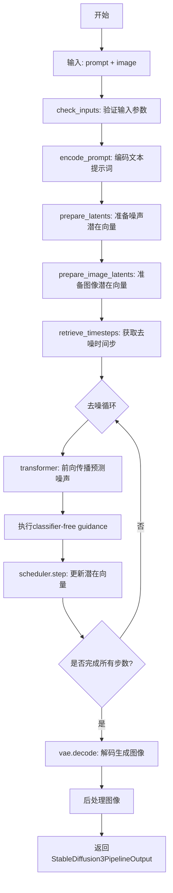
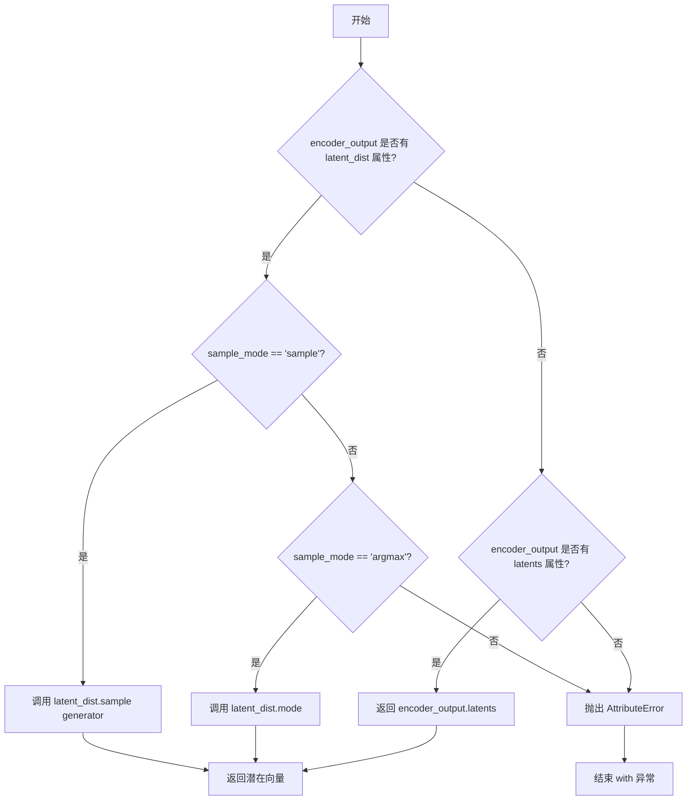
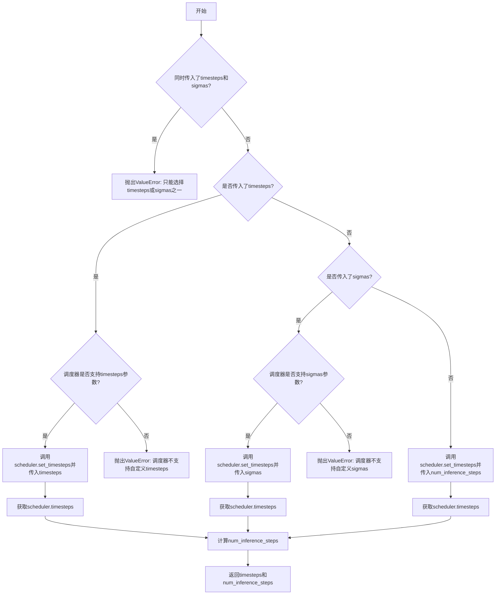
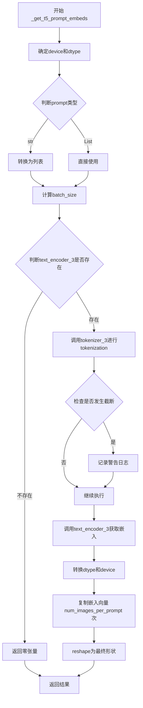
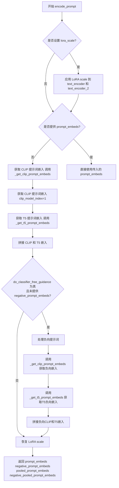
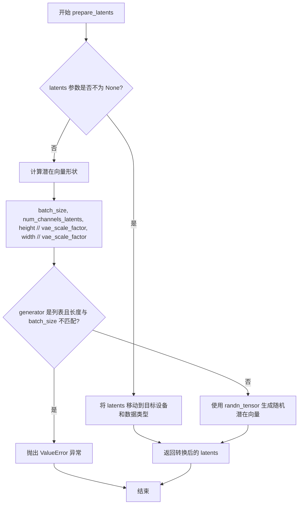
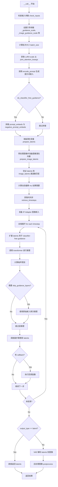

# `diffusers\examples\community\pipeline_stable_diffusion_3_instruct_pix2pix.py` 详细设计文档

Stable Diffusion 3 InstructPix2Pix pipeline实现，基于Transformer架构的扩散模型结合VAE和多个文本编码器(CLIP和T5)，通过文本指令实现图像编辑功能。

## 整体流程



## 类结构

```
DiffusionPipeline (基类)
├── StableDiffusion3InstructPix2PixPipeline
│   ├── 继承: SD3LoraLoaderMixin
│   ├── 继承: FromSingleFileMixin
│   └── 继承: SD3IPAdapterMixin
```

## 全局变量及字段


### `logger`
    
日志记录器，用于记录管道运行时的信息

类型：`logging.Logger`
    


### `XLA_AVAILABLE`
    
XLA可用性标志，指示是否可以使用PyTorch XLA加速

类型：`bool`
    


### `EXAMPLE_DOC_STRING`
    
示例文档字符串，包含管道使用示例

类型：`str`
    


### `model_cpu_offload_seq`
    
CPU卸载顺序字符串，定义模型组件卸载到CPU的顺序

类型：`str`
    


### `_optional_components`
    
可选组件列表，包含image_encoder和feature_extractor

类型：`List[str]`
    


### `_callback_tensor_inputs`
    
回调张量输入列表，定义哪些张量可用于回调函数

类型：`List[str]`
    


### `StableDiffusion3InstructPix2PixPipeline.transformer`
    
Transformer去噪模型，用于图像去噪处理

类型：`SD3Transformer2DModel`
    


### `StableDiffusion3InstructPix2PixPipeline.scheduler`
    
调度器，控制去噪过程的时间步调度

类型：`FlowMatchEulerDiscreteScheduler`
    


### `StableDiffusion3InstructPix2PixPipeline.vae`
    
VAE编解码器，用于图像与潜在表示之间的转换

类型：`AutoencoderKL`
    


### `StableDiffusion3InstructPix2PixPipeline.text_encoder`
    
CLIP文本编码器1，用于将文本编码为向量表示

类型：`CLIPTextModelWithProjection`
    


### `StableDiffusion3InstructPix2PixPipeline.text_encoder_2`
    
CLIP文本编码器2，用于第二路文本编码

类型：`CLIPTextModelWithProjection`
    


### `StableDiffusion3InstructPix2PixPipeline.text_encoder_3`
    
T5文本编码器，用于第三路文本编码

类型：`T5EncoderModel`
    


### `StableDiffusion3InstructPix2PixPipeline.tokenizer`
    
分词器1，用于将文本转换为token ids

类型：`CLIPTokenizer`
    


### `StableDiffusion3InstructPix2PixPipeline.tokenizer_2`
    
分词器2，用于第二路文本分词

类型：`CLIPTokenizer`
    


### `StableDiffusion3InstructPix2PixPipeline.tokenizer_3`
    
T5分词器，用于第三路文本分词

类型：`T5TokenizerFast`
    


### `StableDiffusion3InstructPix2PixPipeline.image_encoder`
    
图像编码器(IP-Adapter)，用于提取图像特征

类型：`SiglipVisionModel`
    


### `StableDiffusion3InstructPix2PixPipeline.feature_extractor`
    
图像处理器，用于预处理图像输入

类型：`SiglipImageProcessor`
    


### `StableDiffusion3InstructPix2PixPipeline.image_processor`
    
VAE图像处理器，用于预处理和后处理图像

类型：`VaeImageProcessor`
    


### `StableDiffusion3InstructPix2PixPipeline.vae_scale_factor`
    
VAE缩放因子，用于计算潜在空间的尺寸

类型：`int`
    


### `StableDiffusion3InstructPix2PixPipeline.tokenizer_max_length`
    
分词器最大长度，限制输入序列的最大长度

类型：`int`
    


### `StableDiffusion3InstructPix2PixPipeline.default_sample_size`
    
默认采样尺寸，用于确定生成图像的默认分辨率

类型：`int`
    


### `StableDiffusion3InstructPix2PixPipeline.patch_size`
    
补丁大小，用于Transformer的图像分块处理

类型：`int`
    


### `StableDiffusion3InstructPix2PixPipeline._guidance_scale`
    
引导强度，控制文本提示对生成图像的影响程度

类型：`float`
    


### `StableDiffusion3InstructPix2PixPipeline._image_guidance_scale`
    
图像引导强度，控制原始图像对生成图像的影响程度

类型：`float`
    


### `StableDiffusion3InstructPix2PixPipeline._clip_skip`
    
CLIP跳过的层数，用于控制CLIP隐藏层的选择

类型：`int`
    


### `StableDiffusion3InstructPix2PixPipeline._joint_attention_kwargs`
    
联合注意力参数，用于传递给注意力处理器

类型：`Dict[str, Any]`
    


### `StableDiffusion3InstructPix2PixPipeline._num_timesteps`
    
时间步数，记录去噪过程的总步数

类型：`int`
    


### `StableDiffusion3InstructPix2PixPipeline._interrupt`
    
中断标志，用于控制管道执行过程中的中断操作

类型：`bool`
    
    

## 全局函数及方法


### `calculate_shift`

该函数用于根据图像序列长度动态计算偏移值（mu），通过线性插值在基准序列长度和最大序列长度之间计算对应的偏移量，常用于Stable Diffusion 3的动态时间步偏移（dynamic shifting）调度。

参数：

- `image_seq_len`：`int`，图像序列长度，即图像在latent空间中的token数量
- `base_seq_len`：`int`，基准序列长度，默认为256
- `max_seq_len`：`int`，最大序列长度，默认为4096
- `base_shift`：`float`，基准偏移值，默认为0.5
- `max_shift`：`float`，最大偏移值，默认为1.15

返回值：`float`，计算得到的动态偏移值mu，用于调度器的动态时间步偏移

#### 流程图

```mermaid
flowchart TD
    A[开始] --> B[计算斜率 m = (max_shift - base_shift) / (max_seq_len - base_seq_len)]
    B --> C[计算截距 b = base_shift - m * base_seq_len]
    C --> D[计算偏移值 mu = image_seq_len * m + b]
    D --> E[返回 mu]
```

#### 带注释源码

```python
# Copied from diffusers.pipelines.flux.pipeline_flux.calculate_shift
def calculate_shift(
    image_seq_len,           # 图像序列长度（输入）
    base_seq_len: int = 256,        # 基准序列长度，默认256
    max_seq_len: int = 4096,        # 最大序列长度，默认4096
    base_shift: float = 0.5,        # 基准偏移值，默认0.5
    max_shift: float = 1.15,        # 最大偏移值，默认1.15
):
    # 计算线性斜率 m：表示偏移值随序列长度变化的速率
    m = (max_shift - base_shift) / (max_seq_len - base_seq_len)
    # 计算截距 b：线性方程的常数项，确保当序列长度为base_seq_len时，偏移值为base_shift
    b = base_shift - m * base_seq_len
    # 计算最终的动态偏移值 mu：通过线性方程 mu = m * image_seq_len + b 计算得到
    mu = image_seq_len * m + b
    # 返回计算得到的动态偏移值
    return mu
```


### `retrieve_latents`

从编码器输出中提取潜在向量（latents），支持从潜在分布中采样或取众数，也可以直接返回预存的潜在向量。

参数：

- `encoder_output`：`torch.Tensor`，编码器的输出对象，通常包含 `latent_dist` 或 `latents` 属性
- `generator`：`torch.Generator | None`，可选的随机数生成器，用于控制采样过程的随机性
- `sample_mode`：`str`，采样模式，可选值为 `"sample"`（从分布中采样）或 `"argmax"`（取分布的众数），默认为 `"sample"`

返回值：`torch.Tensor`，提取出的潜在向量

#### 流程图



#### 带注释源码

```python
# Copied from diffusers.pipelines.stable_diffusion.pipeline_stable_diffusion_img2img.retrieve_latents
def retrieve_latents(
    encoder_output: torch.Tensor, generator: torch.Generator | None = None, sample_mode: str = "sample"
):
    """
    从编码器输出中提取潜在向量。
    
    Args:
        encoder_output: 编码器的输出对象，通常是 VAE 编码后的输出
        generator: 可选的随机数生成器，用于控制采样过程的随机性
        sample_mode: 采样模式，"sample" 表示从分布中采样，"argmax" 表示取分布的众数
    
    Returns:
        提取出的潜在向量 tensor
    """
    # 检查 encoder_output 是否有 latent_dist 属性（即是否有潜在分布）
    if hasattr(encoder_output, "latent_dist") and sample_mode == "sample":
        # 如果存在潜在分布且采样模式为 "sample"，从分布中采样
        return encoder_output.latent_dist.sample(generator)
    # 如果存在潜在分布且采样模式为 "argmax"，取分布的众数（最大值对应的类别）
    elif hasattr(encoder_output, "latent_dist") and sample_mode == "argmax":
        return encoder_output.latent_dist.mode()
    # 如果没有 latent_dist 但有 latents 属性，直接返回预存的 latents
    elif hasattr(encoder_output, "latents"):
        return encoder_output.latents
    # 如果无法访问潜在的潜在向量，抛出异常
    else:
        raise AttributeError("Could not access latents of provided encoder_output")
```


### `retrieve_timesteps`

该函数用于从调度器获取时间步。它调用调度器的 `set_timesteps` 方法并在调用后从调度器检索时间步，支持自定义时间步。任何额外的关键字参数都会传递给 `scheduler.set_timesteps`。

参数：

- `scheduler`：`SchedulerMixin`，要获取时间步的调度器
- `num_inference_steps`：`Optional[int]`，使用预训练模型生成样本时的扩散步数。如果使用此参数，`timesteps` 必须为 `None`
- `device`：`Optional[Union[str, torch.device]]`，时间步要移动到的设备。如果为 `None`，时间步不会移动
- `timesteps`：`Optional[List[int]]`，用于覆盖调度器时间步间隔策略的自定义时间步。如果传递了 `timesteps`，则 `num_inference_steps` 和 `sigmas` 必须为 `None`
- `sigmas`：`Optional[List[float]]`，用于覆盖调度器时间步间隔策略的自定义sigmas。如果传递了 `sigmas`，则 `num_inference_steps` 和 `timesteps` 必须为 `None`
- `**kwargs`：其他关键字参数，将传递给调度器的 `set_timesteps` 方法

返回值：`Tuple[torch.Tensor, int]`，第一个元素是调度器的时间步调度，第二个元素是推理步数

#### 流程图



#### 带注释源码

```python
# Copied from diffusers.pipelines.stable_diffusion.pipeline_stable_diffusion.retrieve_timesteps
def retrieve_timesteps(
    scheduler,
    num_inference_steps: Optional[int] = None,
    device: Optional[Union[str, torch.device]] = None,
    timesteps: Optional[List[int]] = None,
    sigmas: Optional[List[float]] = None,
    **kwargs,
):
    r"""
    Calls the scheduler's `set_timesteps` method and retrieves timesteps from the scheduler after the call. Handles
    custom timesteps. Any kwargs will be supplied to `scheduler.set_timesteps`.

    Args:
        scheduler (`SchedulerMixin`):
            The scheduler to get timesteps from.
        num_inference_steps (`int`):
            The number of diffusion steps used when generating samples with a pre-trained model. If used, `timesteps`
            must be `None`.
        device (`str` or `torch.device`, *optional*):
            The device to which the timesteps should be moved to. If `None`, the timesteps are not moved.
        timesteps (`List[int]`, *optional*):
            Custom timesteps used to override the timestep spacing strategy of the scheduler. If `timesteps` is passed,
            `num_inference_steps` and `sigmas` must be `None`.
        sigmas (`List[float]`, *optional*):
            Custom sigmas used to override the timestep spacing strategy of the scheduler. If `sigmas` is passed,
            `num_inference_steps` and `timesteps` must be `None`.

    Returns:
        `Tuple[torch.Tensor, int]`: A tuple where the first element is the timestep schedule from the scheduler and the
        second element is the number of inference steps.
    """
    # 检查是否同时传入了timesteps和sigmas，这是不允许的
    if timesteps is not None and sigmas is not None:
        raise ValueError("Only one of `timesteps` or `sigmas` can be passed. Please choose one to set custom values")
    
    # 处理自定义timesteps的情况
    if timesteps is not None:
        # 检查调度器的set_timesteps方法是否支持timesteps参数
        accepts_timesteps = "timesteps" in set(inspect.signature(scheduler.set_timesteps).parameters.keys())
        if not accepts_timesteps:
            raise ValueError(
                f"The current scheduler class {scheduler.__class__}'s `set_timesteps` does not support custom"
                f" timestep schedules. Please check whether you are using the correct scheduler."
            )
        # 调用调度器的set_timesteps方法设置自定义timesteps
        scheduler.set_timesteps(timesteps=timesteps, device=device, **kwargs)
        # 从调度器获取更新后的timesteps
        timesteps = scheduler.timesteps
        # 计算推理步数
        num_inference_steps = len(timesteps)
    # 处理自定义sigmas的情况
    elif sigmas is not None:
        # 检查调度器的set_timesteps方法是否支持sigmas参数
        accept_sigmas = "sigmas" in set(inspect.signature(scheduler.set_timesteps).parameters.keys())
        if not accept_sigmas:
            raise ValueError(
                f"The current scheduler class {scheduler.__class__}'s `set_timesteps` does not support custom"
                f" sigmas schedules. Please check whether you are using the correct scheduler."
            )
        # 调用调度器的set_timesteps方法设置自定义sigmas
        scheduler.set_timesteps(sigmas=sigmas, device=device, **kwargs)
        # 从调度器获取更新后的timesteps
        timesteps = scheduler.timesteps
        # 计算推理步数
        num_inference_steps = len(timesteps)
    # 默认情况：使用num_inference_steps设置timesteps
    else:
        scheduler.set_timesteps(num_inference_steps, device=device, **kwargs)
        timesteps = scheduler.timesteps
    
    # 返回timesteps和num_inference_steps元组
    return timesteps, num_inference_steps
```


### `StableDiffusion3InstructPix2PixPipeline.__init__`

初始化 Stable Diffusion 3 图像编辑管道，设置并注册所有必要的模型组件（Transformer、VAE、文本编码器、图像编码器等），并配置图像处理和采样参数。

参数：

- `transformer`：`SD3Transformer2DModel`，条件 Transformer（MMDiT）架构，用于对编码的图像潜在表示进行去噪
- `scheduler`：`FlowMatchEulerDiscreteScheduler`，与 Transformer 配合使用的调度器，用于对编码的图像潜在表示进行去噪
- `vae`：`AutoencoderKL`，变分自编码器模型，用于在潜在表示之间编码和解码图像
- `text_encoder`：`CLIPTextModelWithProjection`，第一个 CLIP 文本编码器，带有额外的投影层
- `tokenizer`：`CLIPTokenizer`，第一个分词器，用于 CLIP 文本编码器
- `text_encoder_2`：`CLIPTextModelWithProjection`，第二个 CLIP 文本编码器
- `tokenizer_2`：`CLIPTokenizer`，第二个分词器
- `text_encoder_3`：`T5EncoderModel`，T5 文本编码器（冻结）
- `tokenizer_3`：`T5TokenizerFast`，T5 分词器
- `image_encoder`：`SiglipVisionModel`，可选，IP Adapter 的预训练视觉模型
- `feature_extractor`：`SiglipImageProcessor`，可选，IP Adapter 的图像处理器

返回值：`None`，构造函数无返回值，仅初始化实例属性

#### 流程图

```mermaid
flowchart TD
    A[开始 __init__] --> B[调用 super().__init__]
    B --> C[register_modules 注册所有模块]
    C --> D[计算 vae_scale_factor]
    D --> E[初始化 VaeImageProcessor]
    E --> F[设置 tokenizer_max_length]
    F --> G[设置 default_sample_size]
    G --> H[设置 patch_size]
    H --> I[结束 __init__]
```

#### 带注释源码

```python
def __init__(
    self,
    transformer: SD3Transformer2DModel,  # 条件 Transformer (MMDiT) 架构
    scheduler: FlowMatchEulerDiscreteScheduler,  # 去噪调度器
    vae: AutoencoderKL,  # VAE 编码器/解码器
    text_encoder: CLIPTextModelWithProjection,  # CLIP 文本编码器 1
    tokenizer: CLIPTokenizer,  # CLIP 分词器 1
    text_encoder_2: CLIPTextModelWithProjection,  # CLIP 文本编码器 2
    tokenizer_2: CLIPTokenizer,  # CLIP 分词器 2
    text_encoder_3: T5EncoderModel,  # T5 文本编码器
    tokenizer_3: T5TokenizerFast,  # T5 分词器
    image_encoder: SiglipVisionModel = None,  # IP Adapter 视觉编码器（可选）
    feature_extractor: SiglipImageProcessor = None,  # IP Adapter 特征提取器（可选）
):
    # 调用父类 DiffusionPipeline 的初始化方法
    super().__init__()

    # 注册所有模块到管道中，使其可以通过 self.xxx 访问
    self.register_modules(
        vae=vae,
        text_encoder=text_encoder,
        text_encoder_2=text_encoder_2,
        text_encoder_3=text_encoder_3,
        tokenizer=tokenizer,
        tokenizer_2=tokenizer_2,
        tokenizer_3=tokenizer_3,
        transformer=transformer,
        scheduler=scheduler,
        image_encoder=image_encoder,
        feature_extractor=feature_extractor,
    )
    
    # 计算 VAE 缩放因子，基于 VAE 块输出通道数的深度
    # 公式: 2^(len(block_out_channels) - 1)，默认为 8
    self.vae_scale_factor = 2 ** (len(self.vae.config.block_out_channels) - 1) if getattr(self, "vae", None) else 8
    
    # 初始化图像处理器，用于图像的预处理和后处理
    self.image_processor = VaeImageProcessor(vae_scale_factor=self.vae_scale_factor)
    
    # 设置分词器的最大长度，默认值为 77（CLIP 标准）
    self.tokenizer_max_length = (
        self.tokenizer.model_max_length if hasattr(self, "tokenizer") and self.tokenizer is not None else 77
    )
    
    # 获取 Transformer 的默认样本大小，用于确定生成图像的分辨率
    self.default_sample_size = (
        self.transformer.config.sample_size
        if hasattr(self, "transformer") and self.transformer is not None
        else 128
    )
    
    # 获取 Transformer 的补丁大小，用于潜在空间的划分
    self.patch_size = (
        self.transformer.config.patch_size if hasattr(self, "transformer") and self.transformer is not None else 2
    )
```


### `StableDiffusion3InstructPix2PixPipeline._get_t5_prompt_embeds`

该方法用于获取T5文本编码器生成的文本嵌入向量（prompt embeddings），支持单个字符串或字符串列表输入，处理批量生成场景下的嵌入复制，并包含对输入文本超出最大序列长度时的截断警告逻辑。

参数：

- `self`：内部参数，管道实例本身
- `prompt`：`Union[str, List[str]]`，要编码的文本提示，可以是单个字符串或字符串列表，默认为None
- `num_images_per_prompt`：`int`，每个提示生成的图像数量，用于复制嵌入向量，默认为1
- `max_sequence_length`：`int`，T5编码器的最大序列长度，控制tokenization的截断阈值，默认为256
- `device`：`Optional[torch.device]`，指定计算设备，若为None则使用执行设备
- `dtype`：`Optional[torch.dtype]`，指定数据类型，若为None则使用text_encoder的数据类型

返回值：`torch.FloatTensor`，形状为 `(batch_size * num_images_per_prompt, seq_len, hidden_dim)` 的文本嵌入张量

#### 流程图



#### 带注释源码

```python
def _get_t5_prompt_embeds(
    self,
    prompt: Union[str, List[str]] = None,
    num_images_per_prompt: int = 1,
    max_sequence_length: int = 256,
    device: Optional[torch.device] = None,
    dtype: Optional[torch.dtype] = None,
):
    """
    获取T5文本编码器生成的prompt embeddings
    
    参数:
        prompt: 输入文本提示，支持单个字符串或字符串列表
        num_images_per_prompt: 每个提示生成的图像数量，用于复制embeddings
        max_sequence_length: T5编码器的最大序列长度
        device: 计算设备
        dtype: 数据类型
    """
    # 确定设备：如果未指定则使用管道的执行设备
    device = device or self._execution_device
    # 确定数据类型：如果未指定则使用text_encoder的数据类型
    dtype = dtype or self.text_encoder.dtype

    # 将单个字符串转换为列表，统一处理流程
    prompt = [prompt] if isinstance(prompt, str) else prompt
    # 计算批处理大小
    batch_size = len(prompt)

    # 如果text_encoder_3不存在（T5编码器未加载），返回零张量
    # 形状：(batch_size * num_images_per_prompt, tokenizer_max_length, joint_attention_dim)
    if self.text_encoder_3 is None:
        return torch.zeros(
            (
                batch_size * num_images_per_prompt,
                self.tokenizer_max_length,
                self.transformer.config.joint_attention_dim,
            ),
            device=device,
            dtype=dtype,
        )

    # 使用T5 tokenizer对prompt进行tokenization
    # 参数说明：
    #   padding="max_length": 填充到最大长度
    #   max_length: 最大序列长度
    #   truncation: 超过最大长度时截断
    #   add_special_tokens: 添加特殊token（如bos/eos）
    #   return_tensors="pt": 返回PyTorch张量
    text_inputs = self.tokenizer_3(
        prompt,
        padding="max_length",
        max_length=max_sequence_length,
        truncation=True,
        add_special_tokens=True,
        return_tensors="pt",
    )
    # 获取tokenized后的input_ids
    text_input_ids = text_inputs.input_ids
    
    # 使用最长填充方式获取未截断的input_ids，用于检测截断
    untruncated_ids = self.tokenizer_3(prompt, padding="longest", return_tensors="pt").input_ids

    # 检测输入是否被截断，如果是则记录警告
    if untruncated_ids.shape[-1] >= text_input_ids.shape[-1] and not torch.equal(text_input_ids, untruncated_ids):
        # 解码被截断的部分用于警告信息
        removed_text = self.tokenizer_3.batch_decode(untruncated_ids[:, self.tokenizer_max_length - 1 : -1])
        logger.warning(
            "The following part of your input was truncated because `max_sequence_length` is set to "
            f" {max_sequence_length} tokens: {removed_text}"
        )

    # 调用T5文本编码器生成embeddings
    # text_input_ids需要移动到指定设备
    prompt_embeds = self.text_encoder_3(text_input_ids.to(device))[0]

    # 再次确认dtype（使用text_encoder_3的dtype）
    dtype = self.text_encoder_3.dtype
    # 将embeddings转换到指定的dtype和device
    prompt_embeds = prompt_embeds.to(dtype=dtype, device=device)

    # 获取序列长度
    _, seq_len, _ = prompt_embeds.shape

    # 为每个prompt复制num_images_per_prompt次
    # 例如：如果batch_size=2, num_images_per_prompt=3，则最终batch_size=6
    # 使用repeat和view实现MPS友好的复制方式
    prompt_embeds = prompt_embeds.repeat(1, num_images_per_prompt, 1)
    prompt_embeds = prompt_embeds.view(batch_size * num_images_per_prompt, seq_len, -1)

    # 返回最终的prompt embeddings
    return prompt_embeds
```


### StableDiffusion3InstructPix2PixPipeline._get_clip_prompt_embeds

获取CLIP文本嵌入，该方法通过CLIP文本编码器将文本提示转换为向量表示，支持多 CLIP 模型（clip_tokenizer 和 clip_tokenizer_2）以及跳过中间层的能力。

参数：

- `prompt`：`Union[str, List[str]]`，要编码的文本提示，可以是单个字符串或字符串列表
- `num_images_per_prompt`：`int = 1`，每个提示生成的图像数量，用于复制嵌入
- `device`：`Optional[torch.device] = None`，计算设备，若为 None 则使用执行设备
- `clip_skip`：`Optional[int] = None`，可选参数，指定跳过 CLIP 的最后几层，使用倒数第 (clip_skip + 2) 层的隐藏状态
- `clip_model_index`：`int = 0`，CLIP 模型索引，0 表示使用第一个 CLIP 模型（tokenizer/tokenizer_2 和 text_encoder/text_encoder_2），1 表示使用第二个

返回值：`Tuple[torch.Tensor, torch.Tensor]`，包含两个张量的元组：
- 第一个是 `prompt_embeds`：`torch.Tensor`，形状为 (batch_size * num_images_per_prompt, seq_len, hidden_dim)，文本提示的嵌入向量
- 第二个是 `pooled_prompt_embeds`：`torch.Tensor`，形状为 (batch_size * num_images_per_prompt, pooled_dim)，池化后的提示嵌入

#### 流程图

```mermaid
flowchart TD
    A[开始 _get_clip_prompt_embeds] --> B{device 是否为 None?}
    B -->|是| C[使用 self._execution_device]
    B -->|否| D[使用传入的 device]
    C --> E[获取 CLIP tokenizer 和 text_encoder 列表]
    D --> E
    E --> F[根据 clip_model_index 选择对应的 tokenizer 和 text_encoder]
    F --> G{判断 prompt 类型]
    G -->|str| H[将 prompt 包装为列表]
    G -->|List[str]| I[直接使用 prompt]
    H --> J[计算 batch_size]
    I --> J
    J --> K[调用 tokenizer 对 prompt 进行编码]
    K --> L[获取 text_input_ids]
    L --> M[检查是否发生截断]
    M -->|发生截断| N[记录警告日志]
    M -->|未截断| O[调用 text_encoder 获取隐藏状态]
    N --> O
    O --> P{clip_skip 是否为 None?}
    P -->|是| Q[使用倒数第二层 hidden_states]
    P -->|否| R[使用倒数第 clip_skip+2 层]
    Q --> S[转换为指定 dtype 和 device]
    R --> S
    S --> T[重复 prompt_embeds 以匹配 num_images_per_prompt]
    T --> U[重塑 prompt_embeds 形状]
    U --> V[重复 pooled_prompt_embeds 以匹配 num_images_per_prompt]
    V --> W[重塑 pooled_prompt_embeds 形状]
    W --> X[返回 prompt_embeds 和 pooled_prompt_embeds 元组]
```

#### 带注释源码

```python
def _get_clip_prompt_embeds(
    self,
    prompt: Union[str, List[str]],          # 输入文本提示
    num_images_per_prompt: int = 1,         # 每个提示生成的图像数量
    device: Optional[torch.device] = None,  # 计算设备
    clip_skip: Optional[int] = None,         # 跳过的 CLIP 层数
    clip_model_index: int = 0,              # 使用的 CLIP 模型索引 (0 或 1)
):
    """获取 CLIP 文本嵌入
    
    该方法将文本提示通过 CLIP 文本编码器转换为向量表示，支持:
    - 双 CLIP 模型 (CLIP1 和 CLIP2)
    - 可选的层跳过 (clip_skip)
    - 多图像生成 (num_images_per_prompt)
    
    Args:
        prompt: 要编码的文本提示，字符串或字符串列表
        num_images_per_prompt: 每个提示生成的图像数量
        device: 计算设备，若为 None 则使用默认执行设备
        clip_skip: 跳过 CLIP 模型的最后 N 层，使用第 N-2 层作为输出
        clip_model_index: 选择使用的 CLIP 模型 (0=clip_model_1, 1=clip_model_2)
    
    Returns:
        Tuple[torch.Tensor, torch.Tensor]: 
            - prompt_embeds: 文本嵌入张量 (batch_size*num_images, seq_len, hidden_dim)
            - pooled_prompt_embeds: 池化后的文本嵌入 (batch_size*num_images, pooled_dim)
    """
    
    # 确定计算设备，优先使用传入的 device，否则使用 pipeline 的执行设备
    device = device or self._execution_device

    # 定义 CLIP tokenizers 和 text encoders 列表，支持双文本编码器架构
    clip_tokenizers = [self.tokenizer, self.tokenizer_2]
    clip_text_encoders = [self.text_encoder, self.text_encoder_2]

    # 根据 clip_model_index 选择对应的 tokenizer 和 text_encoder
    tokenizer = clip_tokenizers[clip_model_index]
    text_encoder = clip_text_encoders[clip_model_index]

    # 确保 prompt 为列表形式，统一处理逻辑
    prompt = [prompt] if isinstance(prompt, str) else prompt
    batch_size = len(prompt)  # 计算批大小

    # 使用 tokenizer 将文本转换为 token IDs，设置最大长度并截断超长部分
    text_inputs = tokenizer(
        prompt,
        padding="max_length",                 # 填充到最大长度
        max_length=self.tokenizer_max_length, # 使用 pipeline 的最大 token 长度
        truncation=True,                      # 启用截断
        return_tensors="pt",                  # 返回 PyTorch 张量
    )

    # 获取编码后的 token IDs
    text_input_ids = text_inputs.input_ids
    
    # 执行额外的非截断编码检查，用于检测和警告信息丢失
    untruncated_ids = tokenizer(prompt, padding="longest", return_tensors="pt").input_ids
    
    # 检查是否发生了截断，如果发生则记录警告日志
    if untruncated_ids.shape[-1] >= text_input_ids.shape[-1] and not torch.equal(text_input_ids, untruncated_ids):
        # 解码被截断的部分用于警告信息
        removed_text = tokenizer.batch_decode(untruncated_ids[:, self.tokenizer_max_length - 1 : -1])
        logger.warning(
            "The following part of your input was truncated because CLIP can only handle sequences up to"
            f" {self.tokenizer_max_length} tokens: {removed_text}"
        )
    
    # 调用 text_encoder 获取文本嵌入，output_hidden_states=True 以获取所有层的隐藏状态
    prompt_embeds = text_encoder(text_input_ids.to(device), output_hidden_states=True)
    
    # 获取池化后的嵌入 (通常是第一层的 [CLS] token 或最后一层的平均值)
    pooled_prompt_embeds = prompt_embeds[0]

    # 根据 clip_skip 参数选择使用哪一层的隐藏状态
    if clip_skip is None:
        # 默认使用倒数第二层 (这是 CLIP 常见的做法)
        prompt_embeds = prompt_embeds.hidden_states[-2]
    else:
        # 使用倒数第 (clip_skip + 2) 层，允许更深的层选择
        prompt_embeds = prompt_embeds.hidden_states[-(clip_skip + 2)]

    # 确保嵌入的数据类型和设备与 text_encoder 一致
    prompt_embeds = prompt_embeds.to(dtype=self.text_encoder.dtype, device=device)

    # 获取嵌入的序列长度
    _, seq_len, _ = prompt_embeds.shape
    
    # 复制文本嵌入以匹配每个提示生成的图像数量 (batch 维度扩展)
    # 这种方式对 MPS (Apple Silicon) 友好
    prompt_embeds = prompt_embeds.repeat(1, num_images_per_prompt, 1)
    # 重塑为 (batch_size * num_images_per_prompt, seq_len, hidden_dim)
    prompt_embeds = prompt_embeds.view(batch_size * num_images_per_prompt, seq_len, -1)

    # 对池化嵌入进行相同的批处理
    pooled_prompt_embeds = pooled_prompt_embeds.repeat(1, num_images_per_prompt, 1)
    pooled_prompt_embeds = pooled_prompt_embeds.view(batch_size * num_images_per_prompt, -1)

    # 返回提示嵌入和池化提示嵌入的元组
    return prompt_embeds, pooled_prompt_embeds
```


### `StableDiffusion3InstructPix2PixPipeline.encode_prompt`

该方法是将文本提示词编码为向量表示的核心方法，使用三个文本编码器（两个CLIP模型和一个T5模型）将文本转换为高维向量，用于后续的图像生成过程。同时支持分类器自由引导（Classifier-Free Guidance），生成正向和负向提示词嵌入。

参数：

- `prompt`：`Union[str, List[str]]`，要编码的主提示词
- `prompt_2`：`Union[str, List[str]]`，发送给第二个CLIP分词器和编码器的提示词，默认使用`prompt`
- `prompt_3`：`Union[str, List[str]]`，发送给T5分词器和编码器的提示词，默认使用`prompt`
- `device`：`Optional[torch.device]`，计算设备，默认为执行设备
- `num_images_per_prompt`：`int`，每个提示词生成的图像数量
- `do_classifier_free_guidance`：`bool`，是否使用分类器自由引导
- `negative_prompt`：`Optional[Union[str, List[str]]]`，不引导图像生成的负向提示词
- `negative_prompt_2`：`Optional[Union[str, List[str]]]`，第二编码器的负向提示词
- `negative_prompt_3`：`Optional[Union[str, List[str]]]`，T5编码器的负向提示词
- `prompt_embeds`：`Optional[torch.FloatTensor]`，预生成的文本嵌入
- `negative_prompt_embeds`：`Optional[torch.FloatTensor]`，预生成的负向文本嵌入
- `pooled_prompt_embeds`：`Optional[torch.FloatTensor]`，预生成的池化文本嵌入
- `negative_pooled_prompt_embeds`：`Optional[torch.FloatTensor]`，预生成的负向池化文本嵌入
- `clip_skip`：`Optional[int]`，CLIP编码时跳过的层数
- `max_sequence_length`：`int`，最大序列长度，默认256
- `lora_scale`：`Optional[float]`，LoRA层的缩放因子

返回值：`Tuple[torch.FloatTensor, torch.FloatTensor, torch.FloatTensor, torch.FloatTensor]`，返回正向提示词嵌入、负向提示词嵌入、池化正向嵌入和池化负向嵌入的元组

#### 流程图



#### 带注释源码

```python
def encode_prompt(
    self,
    prompt: Union[str, List[str]],
    prompt_2: Union[str, List[str]],
    prompt_3: Union[str, List[str]],
    device: Optional[torch.device] = None,
    num_images_per_prompt: int = 1,
    do_classifier_free_guidance: bool = True,
    negative_prompt: Optional[Union[str, List[str]]] = None,
    negative_prompt_2: Optional[Union[str, List[str]]] = None,
    negative_prompt_3: Optional[Union[str, List[str]]] = None,
    prompt_embeds: Optional[torch.FloatTensor] = None,
    negative_prompt_embeds: Optional[torch.FloatTensor] = None,
    pooled_prompt_embeds: Optional[torch.FloatTensor] = None,
    negative_pooled_prompt_embeds: Optional[torch.FloatTensor] = None,
    clip_skip: Optional[int] = None,
    max_sequence_length: int = 256,
    lora_scale: Optional[float] = None,
):
    """
    编码提示词的核心方法，将文本转换为模型可用的嵌入向量。
    
    该方法支持三种文本编码器：
    - CLIP (text_encoder + tokenizer): 处理短文本提示
    - CLIP (text_encoder_2 + tokenizer_2): 处理第二组文本提示  
    - T5 (text_encoder_3 + tokenizer_3): 处理长文本提示
    """
    # 获取设备，默认为执行设备
    device = device or self._execution_device

    # 如果传入了 lora_scale，则应用 LoRA 缩放
    if lora_scale is not None and isinstance(self, SD3LoraLoaderMixin):
        self._lora_scale = lora_scale

        # 动态调整 LoRA 缩放
        if self.text_encoder is not None and USE_PEFT_BACKEND:
            scale_lora_layers(self.text_encoder, lora_scale)
        if self.text_encoder_2 is not None and USE_PEFT_BACKEND:
            scale_lora_layers(self.text_encoder_2, lora_scale)

    # 标准化 prompt 为列表格式
    prompt = [prompt] if isinstance(prompt, str) else prompt
    if prompt is not None:
        batch_size = len(prompt)
    else:
        # 如果没有 prompt，则从 prompt_embeds 获取 batch_size
        batch_size = prompt_embeds.shape[0]

    # 如果没有传入预计算的嵌入，则从 prompt 生成
    if prompt_embeds is None:
        # 处理 prompt_2 和 prompt_3，默认使用 prompt
        prompt_2 = prompt_2 or prompt
        prompt_2 = [prompt_2] if isinstance(prompt_2, str) else prompt_2

        prompt_3 = prompt_3 or prompt
        prompt_3 = [prompt_3] if isinstance(prompt_3, str) else prompt_3

        # 获取第一个 CLIP 模型的提示词嵌入
        prompt_embed, pooled_prompt_embed = self._get_clip_prompt_embeds(
            prompt=prompt,
            device=device,
            num_images_per_prompt=num_images_per_prompt,
            clip_skip=clip_skip,
            clip_model_index=0,
        )
        
        # 获取第二个 CLIP 模型的提示词嵌入
        prompt_2_embed, pooled_prompt_2_embed = self._get_clip_prompt_embeds(
            prompt=prompt_2,
            device=device,
            num_images_per_prompt=num_images_per_prompt,
            clip_skip=clip_skip,
            clip_model_index=1,
        )
        
        # 拼接两个 CLIP 模型的嵌入（在最后一个维度）
        clip_prompt_embeds = torch.cat([prompt_embed, prompt_2_embed], dim=-1)

        # 获取 T5 模型的提示词嵌入
        t5_prompt_embed = self._get_t5_prompt_embeds(
            prompt=prompt_3,
            num_images_per_prompt=num_images_per_prompt,
            max_sequence_length=max_sequence_length,
            device=device,
        )

        # 使用 padding 确保 CLIP 和 T5 嵌入维度兼容
        clip_prompt_embeds = torch.nn.functional.pad(
            clip_prompt_embeds, (0, t5_prompt_embed.shape[-1] - clip_prompt_embeds.shape[-1])
        )

        # 拼接 CLIP 和 T5 嵌入（在第二个维度）
        prompt_embeds = torch.cat([clip_prompt_embeds, t5_prompt_embed], dim=-2)
        
        # 拼接池化嵌入
        pooled_prompt_embeds = torch.cat([pooled_prompt_embed, pooled_prompt_2_embed], dim=-1)

    # 处理分类器自由引导的负向提示词
    if do_classifier_free_guidance and negative_prompt_embeds is None:
        # 默认负向提示词为空字符串
        negative_prompt = negative_prompt or ""
        negative_prompt_2 = negative_prompt_2 or negative_prompt
        negative_prompt_3 = negative_prompt_3 or negative_prompt

        # 标准化为列表
        negative_prompt = batch_size * [negative_prompt] if isinstance(negative_prompt, str) else negative_prompt
        negative_prompt_2 = (
            batch_size * [negative_prompt_2] if isinstance(negative_prompt_2, str) else negative_prompt_2
        )
        negative_prompt_3 = (
            batch_size * [negative_prompt_3] if isinstance(negative_prompt_3, str) else negative_prompt_3
        )

        # 类型检查
        if prompt is not None and type(prompt) is not type(negative_prompt):
            raise TypeError(
                f"`negative_prompt` should be the same type to `prompt`, but got {type(negative_prompt)} !="
                f" {type(prompt)}."
            )
        # batch_size 一致性检查
        elif batch_size != len(negative_prompt):
            raise ValueError(
                f"`negative_prompt`: {negative_prompt} has batch size {len(negative_prompt)}, but `prompt`:"
                f" {prompt} has batch size {batch_size}. Please make sure that passed `negative_prompt` matches"
                " the batch size of `prompt`."
            )

        # 获取 CLIP 负向嵌入
        negative_prompt_embed, negative_pooled_prompt_embed = self._get_clip_prompt_embeds(
            negative_prompt,
            device=device,
            num_images_per_prompt=num_images_per_prompt,
            clip_skip=None,
            clip_model_index=0,
        )
        negative_prompt_2_embed, negative_pooled_prompt_2_embed = self._get_clip_prompt_embeds(
            negative_prompt_2,
            device=device,
            num_images_per_prompt=num_images_per_prompt,
            clip_skip=None,
            clip_model_index=1,
        )
        
        # 拼接 CLIP 负向嵌入
        negative_clip_prompt_embeds = torch.cat([negative_prompt_embed, negative_prompt_2_embed], dim=-1)

        # 获取 T5 负向嵌入
        t5_negative_prompt_embed = self._get_t5_prompt_embeds(
            prompt=negative_prompt_3,
            num_images_per_prompt=num_images_per_prompt,
            max_sequence_length=max_sequence_length,
            device=device,
        )

        # Padding 确保维度兼容
        negative_clip_prompt_embeds = torch.nn.functional.pad(
            negative_clip_prompt_embeds,
            (0, t5_negative_prompt_embed.shape[-1] - negative_clip_prompt_embeds.shape[-1]),
        )

        # 拼接所有负向嵌入
        negative_prompt_embeds = torch.cat([negative_clip_prompt_embeds, t5_negative_prompt_embed], dim=-2)
        negative_pooled_prompt_embeds = torch.cat(
            [negative_pooled_prompt_embed, negative_pooled_prompt_2_embed], dim=-1
        )

    # 处理完成后恢复 LoRA 缩放
    if self.text_encoder is not None:
        if isinstance(self, SD3LoraLoaderMixin) and USE_PEFT_BACKEND:
            # 通过反向缩放 LoRA 层恢复原始权重
            unscale_lora_layers(self.text_encoder, lora_scale)

    if self.text_encoder_2 is not None:
        if isinstance(self, SD3LoraLoaderMixin) and USE_PEFT_BACKEND:
            unscale_lora_layers(self.text_encoder_2, lora_scale)

    # 返回四个嵌入向量元组
    return prompt_embeds, negative_prompt_embeds, pooled_prompt_embeds, negative_pooled_prompt_embeds
```


### `StableDiffusion3InstructPix2PixPipeline.check_inputs`

该方法用于验证 Stable Diffusion 3 InstructPix2Pix .pipeline 的输入参数有效性，确保传入的 prompt、图像尺寸、embeddings 等符合模型要求，如果不合法则抛出详细的 ValueError 异常。

参数：

- `prompt`：`Union[str, List[str], None]`，主提示词，用于指导图像生成
- `prompt_2`：`Union[str, List[str], None]`，发送给第二个文本编码器的提示词
- `prompt_3`：`Union[str, List[str], None]`，发送给第三个文本编码器的提示词
- `height`：`int`，生成图像的高度（像素）
- `width`：`int`，生成图像的宽度（像素）
- `negative_prompt`：`Optional[Union[str, List[str]]]`，不参与引导的负向提示词
- `negative_prompt_2`：`Optional[Union[str, List[str]]]`，第二个编码器的负向提示词
- `negative_prompt_3`：`Optional[Union[str, List[str]]]`，第三个编码器的负向提示词
- `prompt_embeds`：`Optional[torch.FloatTensor]`，预生成的文本 embeddings
- `negative_prompt_embeds`：`Optional[torch.FloatTensor]`，预生成的负向文本 embeddings
- `pooled_prompt_embeds`：`Optional[torch.FloatTensor]`，预生成的池化文本 embeddings
- `negative_pooled_prompt_embeds`：`Optional[torch.FloatTensor]`，预生成的负向池化文本 embeddings
- `callback_on_step_end_tensor_inputs`：`Optional[List[str]]`，在每个推理步骤结束时的回调张量输入列表
- `max_sequence_length`：`Optional[int]`，最大序列长度

返回值：`None`，该方法通过抛出 `ValueError` 来表示验证失败，无正常返回值

#### 流程图

```mermaid
flowchart TD
    A[开始 check_inputs] --> B{height 和 width 是否可被<br>vae_scale_factor × patch_size 整除}
    B -->|否| B1[抛出 ValueError:<br>height/width 必须能被整除]
    B -->|是| C{callback_on_step_end_tensor_inputs<br>是否在允许列表中}
    C -->|否| C1[抛出 ValueError:<br>包含非法的回调张量输入]
    C -->|是| D{prompt 和 prompt_embeds<br>同时传入}
    D -->|是| D1[抛出 ValueError:<br>不能同时传入]
    D -->|否| E{prompt_2 和 prompt_embeds<br>同时传入}
    E -->|是| E1[抛出 ValueError:<br>不能同时传入]
    E -->|否| F{prompt_3 和 prompt_embeds<br>同时传入]
    F -->|是| F1[抛出 ValueError:<br>不能同时传入]
    F -->|否| G{prompt 和 prompt_embeds<br>都为 None}
    G -->|是| G1[抛出 ValueError:<br>必须至少提供一个]
    G -->|否| H{prompt 类型检查<br>str 或 list]
    H -->|否| H1[抛出 ValueError:<br>类型必须是 str 或 list]
    H -->|是| I{prompt_2 类型检查<br>str 或 list]
    I -->|否| I1[抛出 ValueError:<br>类型必须是 str 或 list]
    I -->|是| J{prompt_3 类型检查<br>str 或 list]
    J -->|否| J1[抛出 ValueError:<br>类型必须是 str 或 list]
    J -->|是| K{negative_prompt 和<br>negative_prompt_embeds<br>同时传入}
    K -->|是| K1[抛出 ValueError:<br>不能同时传入]
    K -->|否| L{negative_prompt_2 和<br>negative_prompt_embeds<br>同时传入]
    L -->|是| L1[抛出 ValueError:<br>不能同时传入]
    L -->|否| M{negative_prompt_3 和<br>negative_prompt_embeds<br>同时传入]
    M -->|是| M1[抛出 ValueError:<br>不能同时传入]
    M -->|否| N{prompt_embeds 和<br>negative_prompt_embeds 形状检查}
    N -->|形状不同| N1[抛出 ValueError:<br>形状必须相同]
    N -->|形状相同| O{prompt_embeds 有但<br>pooled_prompt_embeds 没有}
    O -->|是| O1[抛出 ValueError:<br>必须同时提供]
    O -->|否| P{negative_prompt_embeds 有但<br>negative_pooled_prompt_embeds 没有}
    P -->|是| P1[抛出 ValueError:<br>必须同时提供]
    P -->|否| Q{max_sequence_length > 512}
    Q -->|是| Q1[抛出 ValueError:<br>最大512]
    Q -->|否| R[验证通过，方法结束]
    
    B1 --> R
    C1 --> R
    D1 --> R
    E1 --> R
    F1 --> R
    G1 --> R
    H1 --> R
    I1 --> R
    J1 --> R
    K1 --> R
    L1 --> R
    M1 --> R
    N1 --> R
    O1 --> R
    P1 --> R
    Q1 --> R
```

#### 带注释源码

```python
def check_inputs(
    self,
    prompt,
    prompt_2,
    prompt_3,
    height,
    width,
    negative_prompt=None,
    negative_prompt_2=None,
    negative_prompt_3=None,
    prompt_embeds=None,
    negative_prompt_embeds=None,
    pooled_prompt_embeds=None,
    negative_pooled_prompt_embeds=None,
    callback_on_step_end_tensor_inputs=None,
    max_sequence_length=None,
):
    # 检查图像尺寸是否与 VAE 和 patch size 匹配
    # Stable Diffusion 3 使用 patch-based transformer，需要尺寸能被 patch 大小整除
    if (
        height % (self.vae_scale_factor * self.patch_size) != 0
        or width % (self.vae_scale_factor * self.patch_size) != 0
    ):
        raise ValueError(
            f"`height` and `width` have to be divisible by {self.vae_scale_factor * self.patch_size} but are {height} and {width}."
            f"You can use height {height - height % (self.vae_scale_factor * self.patch_size)} and width {width - width % (self.vae_scale_factor * self.patch_size)}."
        )

    # 验证回调函数张量输入是否在允许的列表中
    # 只能传递 pipeline 定义的回调张量，防止不兼容的回调
    if callback_on_step_end_tensor_inputs is not None and not all(
        k in self._callback_tensor_inputs for k in callback_on_step_end_tensor_inputs
    ):
        raise ValueError(
            f"`callback_on_step_end_tensor_inputs` has to be in {self._callback_tensor_inputs}, but found {[k for k in callback_on_step_end_tensor_inputs if k not in self._callback_tensor_inputs]}"
        )

    # 检查 prompt 和 prompt_embeds 不能同时提供（互斥）
    if prompt is not None and prompt_embeds is not None:
        raise ValueError(
            f"Cannot forward both `prompt`: {prompt} and `prompt_embeds`: {prompt_embeds}. Please make sure to"
            " only forward one of the two."
        )
    elif prompt_2 is not None and prompt_embeds is not None:
        raise ValueError(
            f"Cannot forward both `prompt_2`: {prompt_2} and `prompt_embeds`: {prompt_embeds}. Please make sure to"
            " only forward one of the two."
        )
    elif prompt_3 is not None and prompt_embeds is not None:
        raise ValueError(
            f"Cannot forward both `prompt_3`: {prompt_2} and `prompt_embeds`: {prompt_embeds}. Please make sure to"
            " only forward one of the two."
        )
    # 必须提供至少一种提示输入方式
    elif prompt is None and prompt_embeds is None:
        raise ValueError(
            "Provide either `prompt` or `prompt_embeds`. Cannot leave both `prompt` and `prompt_embeds` undefined."
        )
    # 验证 prompt 类型必须是字符串或列表
    elif prompt is not None and (not isinstance(prompt, str) and not isinstance(prompt, list)):
        raise ValueError(f"`prompt` has to be of type `str` or `list` but is {type(prompt)}")
    elif prompt_2 is not None and (not isinstance(prompt_2, str) and not isinstance(prompt_2, list)):
        raise ValueError(f"`prompt_2` has to be of type `str` or `list` but is {type(prompt_2)}")
    elif prompt_3 is not None and (not isinstance(prompt_3, str) and not isinstance(prompt_3, list)):
        raise ValueError(f"`prompt_3` has to be of type `str` or `list` but is {type(prompt_3)}")

    # 检查 negative_prompt 和 negative_prompt_embeds 也不能同时提供
    if negative_prompt is not None and negative_prompt_embeds is not None:
        raise ValueError(
            f"Cannot forward both `negative_prompt`: {negative_prompt} and `negative_prompt_embeds`:"
            f" {negative_prompt_embeds}. Please make sure to only forward one of the two."
        )
    elif negative_prompt_2 is not None and negative_prompt_embeds is not None:
        raise ValueError(
            f"Cannot forward both `negative_prompt_2`: {negative_prompt_2} and `negative_prompt_embeds`:"
            f" {negative_prompt_embeds}. Please make sure to only forward one of the two."
        )
    elif negative_prompt_3 is not None and negative_prompt_embeds is not None:
        raise ValueError(
            f"Cannot forward both `negative_prompt_3`: {negative_prompt_3} and `negative_prompt_embeds`:"
            f" {negative_prompt_embeds}. Please make sure to only forward one of the two."
        )

    # prompt_embeds 和 negative_prompt_embeds 形状必须匹配
    if prompt_embeds is not None and negative_prompt_embeds is not None:
        if prompt_embeds.shape != negative_prompt_embeds.shape:
            raise ValueError(
                "`prompt_embeds` and `negative_prompt_embeds` must have the same shape when passed directly, but"
                f" got: `prompt_embeds` {prompt_embeds.shape} != `negative_prompt_embeds`"
                f" {negative_prompt_embeds.shape}."
            )

    # 如果提供了 prompt_embeds，也必须提供 pooled_prompt_embeds
    if prompt_embeds is not None and pooled_prompt_embeds is None:
        raise ValueError(
            "If `prompt_embeds` are provided, `pooled_prompt_embeds` also have to be passed. Make sure to generate `pooled_prompt_embeds` from the same text encoder that was used to generate `prompt_embeds`."
        )

    # 如果提供了 negative_prompt_embeds，也必须提供 negative_pooled_prompt_embeds
    if negative_prompt_embeds is not None and negative_pooled_prompt_embeds is None:
        raise ValueError(
            "If `negative_prompt_embeds` are provided, `negative_pooled_prompt_embeds` also have to be passed. Make sure to generate `negative_pooled_prompt_embeds` from the same text encoder that was used to generate `negative_prompt_embeds`."
        )

    # T5 编码器的最大序列长度限制为 512
    if max_sequence_length is not None and max_sequence_length > 512:
        raise ValueError(f"`max_sequence_length` cannot be greater than 512 but is {max_sequence_length}")
```


### `StableDiffusion3InstructPix2PixPipeline.prepare_latents`

准备潜在向量，用于图像生成的去噪过程。该方法负责初始化或转换潜在向量，确保其具有正确的形状、设备和数据类型，以供后续的扩散模型去噪使用。

参数：

- `self`：类实例本身，包含 `vae_scale_factor` 等配置属性
- `batch_size`：`int`，生成的图像批次大小
- `num_channels_latents`：`int`，潜在向量的通道数，通常对应 VAE 的潜在通道配置
- `height`：`int`，目标图像的高度（像素）
- `width`：`int`，目标图像的宽度（像素）
- `dtype`：`torch.dtype`，潜在向量的目标数据类型（如 `torch.float32`）
- `device`：`torch.device`，潜在向量应放置到的设备（如 CPU 或 CUDA）
- `generator`：`torch.Generator` 或 `List[torch.Generator]` 或 `None`，用于确保可复现性的随机数生成器
- `latents`：`torch.FloatTensor` 或 `None`，可选的预生成潜在向量，如果提供则直接返回转换后的版本

返回值：`torch.FloatTensor`，准备好的潜在向量张量，形状为 `(batch_size, num_channels_latents, height // vae_scale_factor, width // vae_scale_factor)`

#### 流程图



#### 带注释源码

```python
def prepare_latents(
    self,
    batch_size,                  # int: 批次大小，控制生成图像的数量
    num_channels_latents,       # int: 潜在通道数，通常来自 VAE 配置
    height,                     # int: 图像高度（像素）
    width,                      # int: 图像宽度（像素）
    dtype,                      # torch.dtype: 潜在向量目标数据类型
    device,                     # torch.device: 目标设备（cpu/cuda）
    generator,                  # torch.Generator | List[torch.Generator] | None: 随机生成器
    latents=None,               # torch.FloatTensor | None: 可选的预生成潜在向量
):
    # 如果已提供了潜在向量，直接转换到目标设备和数据类型后返回
    if latents is not None:
        return latents.to(device=device, dtype=dtype)

    # 计算潜在向量的形状
    # 潜在向量空间下采样：height 和 width 需要除以 vae_scale_factor
    # vae_scale_factor 通常为 2^(len(vae.config.block_out_channels) - 1)，一般为 8
    shape = (
        batch_size,
        num_channels_latents,
        int(height) // self.vae_scale_factor,
        int(width) // self.vae_scale_factor,
    )

    # 验证：如果传入生成器列表，其长度必须与批次大小匹配
    if isinstance(generator, list) and len(generator) != batch_size:
        raise ValueError(
            f"You have passed a list of generators of length {len(generator)}, but requested an effective batch"
            f" size of {batch_size}. Make sure the batch size matches the length of the generators."
        )

    # 使用随机张量生成器创建初始噪声潜在向量
    # 这代表了扩散过程中的随机初始状态
    latents = randn_tensor(shape, generator=generator, device=device, dtype=dtype)

    # 返回准备好的潜在向量，供后续去噪过程使用
    return latents
```


### `StableDiffusion3InstructPix2PixPipeline.prepare_image_latents`

该方法负责将输入图像转换为图像潜在向量（image latents），以便在Stable Diffusion 3 InstructPix2Pix管道中与去噪过程结合使用。该方法处理图像类型验证、设备转移、VAE编码、潜在向量缩放以及针对无分类器引导（Classifier-Free Guidance）的条件/无条件潜在向量准备。

参数：

- `image`：`Union[torch.Tensor, PIL.Image.Image, List]`，输入图像，可以是PyTorch张量、PIL图像或图像列表
- `batch_size`：`int`，原始批次大小
- `num_images_per_prompt`：`int`，每个提示词生成的图像数量
- `dtype`：`torch.dtype`，目标数据类型
- `device`：`torch.device`，目标设备
- `generator`：`torch.Generator | None`，用于随机数生成的生成器，用于确保可重现性
- `do_classifier_free_guidance`：`bool`，是否启用无分类器引导

返回值：`torch.Tensor`，处理后的图像潜在向量张量，形状根据是否启用CFG而变化

#### 流程图

```mermaid
flowchart TD
    A[开始 prepare_image_latents] --> B{验证 image 类型}
    B -->|类型无效| C[抛出 ValueError]
    B -->|类型有效| D[将 image 转移到 device 和 dtype]
    E[计算新 batch_size] --> F{batch_size = batch_size * num_images_per_prompt}
    F --> G{判断 image 是否为潜在向量}
    G -->|是 latent channels| H[直接使用 image 作为 image_latents]
    G -->|不是 latent channels| I[调用 VAE.encode 获取 latent 分布]
    I --> J[使用 argmax 模式采样获取 latents]
    H --> K[应用 VAE 缩放: (latents - shift_factor) * scaling_factor]
    J --> K
    K --> L{检查 batch_size 扩展需求}
    L -->|batch_size > image_latents.shape[0] 且可整除| M[复制 image_latents 扩展到 batch_size]
    L -->|batch_size > image_latents.shape[0] 且不可整除| N[抛出 ValueError]
    L -->|batch_size <= image_latents.shape[0]| O[直接使用 image_latents]
    M --> P{do_classifier_free_guidance?}
    O --> P
    N --> Q[结束]
    P -->|是| R[创建零张量 uncond_image_latents]
    P -->|否| S[直接返回 image_latents]
    R --> T[拼接: [image_latents, image_latents, uncond_image_latents]]
    T --> U[返回最终 image_latents]
    S --> U
    U --> Q
```

#### 带注释源码

```python
def prepare_image_latents(
    self,
    image,  # 输入图像
    batch_size,  # 原始批次大小
    num_images_per_prompt,  # 每个提示的图像数量
    dtype,  # 目标数据类型
    device,  # 目标设备
    generator,  # 随机生成器
    do_classifier_free_guidance,  # 是否启用CFG
):
    # 1. 验证输入图像类型：必须是 torch.Tensor、PIL.Image.Image 或 list 之一
    if not isinstance(image, (torch.Tensor, PIL.Image.Image, list)):
        raise ValueError(
            f"`image` has to be of type `torch.Tensor`, `PIL.Image.Image` or list but is {type(image)}"
        )

    # 2. 将图像转移到目标设备和数据类型
    image = image.to(device=device, dtype=dtype)

    # 3. 计算扩展后的批次大小：原始batch_size * 每个提示生成的图像数量
    batch_size = batch_size * num_images_per_prompt

    # 4. 判断图像是否已经是潜在向量格式
    if image.shape[1] == self.vae.config.latent_channels:
        # 图像已经是潜在向量格式，直接使用
        image_latents = image
    else:
        # 图像是普通图像，使用 VAE 编码器转换为潜在向量
        # 使用 argmax 模式从 VAE 的潜在分布中采样
        image_latents = retrieve_latents(self.vae.encode(image), sample_mode="argmax", generator=generator)

    # 5. 应用 VAE 的缩放因子进行归一化
    # 这是 VAE 编码的标准后处理步骤
    image_latents = (image_latents - self.vae.config.shift_factor) * self.vae.config.scaling_factor

    # 6. 处理批次大小不匹配的情况
    if batch_size > image_latents.shape[0] and batch_size % image_latents.shape[0] == 0:
        # 需要扩展图像潜在向量以匹配批次大小
        # 例如：当提示词数量大于初始图像数量时
        deprecation_message = (
            f"You have passed {batch_size} text prompts (`prompt`), but only {image_latents.shape[0]} initial"
            " images (`image`). Initial images are now duplicating to match the number of text prompts. Note"
            " that this behavior is deprecated and will be removed in a version 1.0.0. Please make sure to update"
            " your script to pass as many initial images as text prompts to suppress this warning."
        )
        deprecate("len(prompt) != len(image)", "1.0.0", deprecation_message, standard_warn=False)
        additional_image_per_prompt = batch_size // image_latents.shape[0]
        # 通过复制扩展潜在向量
        image_latents = torch.cat([image_latents] * additional_image_per_prompt, dim=0)
    elif batch_size > image_latents.shape[0] and batch_size % image_latents.shape[0] != 0:
        # 批次大小无法整除，抛出错误
        raise ValueError(
            f"Cannot duplicate `image` of batch size {image_latents.shape[0]} to {batch_size} text prompts."
        )
    else:
        # 批次大小匹配或小于图像潜在向量数量，直接使用
        image_latents = torch.cat([image_latents], dim=0)

    # 7. 如果启用无分类器引导，准备条件和无条件潜在向量
    # CFG 在 InstructPix2Pix 中需要三个版本的潜在向量：
    # - 条件图像潜在向量（受编辑指令引导）
    # - 另一个条件图像潜在向量（用于图像引导）
    # - 无条件图像潜在向量（全零）
    if do_classifier_free_guidance:
        # 创建零张量作为无条件图像潜在向量
        uncond_image_latents = torch.zeros_like(image_latents)
        # 拼接：条件1 + 条件2 + 无条件
        image_latents = torch.cat([image_latents, image_latents, uncond_image_latents], dim=0)

    # 8. 返回处理后的图像潜在向量
    return image_latents
```


### `StableDiffusion3InstructPix2PixPipeline.encode_image`

将输入图像编码为特征表示，使用预训练的图像编码器（SiglipVisionModel）提取图像特征。

参数：

- `image`：`PipelineImageInput`，输入图像，可以是PIL.Image、torch.Tensor或列表
- `device`：`torch.device`，Torch设备，用于指定计算设备

返回值：`torch.Tensor`，编码后的图像特征表示（来自图像编码器的倒数第二层隐藏状态）

#### 流程图

```mermaid
flowchart TD
    A[输入图像 image] --> B{image是否为torch.Tensor?}
    B -- 是 --> C[直接将image移动到device]
    B -- 否 --> D[使用feature_extractor提取像素值]
    D --> E[返回pixel_values张量]
    E --> C
    C --> F[将图像数据传输到指定设备]
    F --> G[调用image_encoder编码图像]
    G --> H[设置output_hidden_states=True]
    H --> I[获取hidden_states列表]
    I --> J[取倒数第二层hidden_states[-2]]
    J --> K[返回图像特征张量]
```

#### 带注释源码

```python
def encode_image(self, image: PipelineImageInput, device: torch.device) -> torch.Tensor:
    """Encodes the given image into a feature representation using a pre-trained image encoder.

    Args:
        image (`PipelineImageInput`):
            Input image to be encoded.
        device: (`torch.device`):
            Torch device.

    Returns:
        `torch.Tensor`: The encoded image feature representation.
    """
    # 如果输入不是torch.Tensor，则使用feature_extractor将其转换为张量
    # feature_extractor通常将PIL.Image转换为模型所需的像素值格式
    if not isinstance(image, torch.Tensor):
        image = self.feature_extractor(image, return_tensors="pt").pixel_values

    # 将图像数据移动到指定设备（CPU/GPU）并转换为模型所需的数据类型
    image = image.to(device=device, dtype=self.dtype)

    # 调用图像编码器（SiglipVisionModel）进行编码
    # output_hidden_states=True表示返回所有层的隐藏状态
    # hidden_states[-2]表示取倒数第二层，通常用于获取更丰富的特征表示
    return self.image_encoder(image, output_hidden_states=True).hidden_states[-2]
```


### `StableDiffusion3InstructPix2PixPipeline.prepare_ip_adapter_image_embeds`

该方法用于准备IP-Adapter的图像嵌入，处理图像输入或预计算的图像嵌入，支持分类器自由引导（Classifier-Free Guidance），返回处理后的图像嵌入张量。

参数：

- `self`：实例本身，StableDiffusion3InstructPix2PixPipeline 类的实例
- `ip_adapter_image`：`Optional[PipelineImageInput]`，要提取IP-Adapter特征的输入图像
- `ip_adapter_image_embeds`：`Optional[torch.Tensor]`，预计算的图像嵌入
- `device`：`Optional[torch.device]`，Torch设备，默认为执行设备
- `num_images_per_prompt`：`int = 1`，每个提示词生成的图像数量
- `do_classifier_free_guidance`：`bool = True`，是否使用分类器自由引导

返回值：`torch.Tensor`，处理后的图像嵌入张量

#### 流程图

```mermaid
flowchart TD
    A[开始] --> B{ip_adapter_image_embeds<br/>是否不为空?}
    B -->|是| C{do_classifier_free_guidance<br/>是否为True?}
    B -->|否| D{ip_adapter_image<br/>是否不为空?}
    C -->|是| E[将嵌入按chunk(2)分割<br/>得到negative和positive]
    C -->|否| F[直接使用嵌入<br/>作为single_image_embeds]
    D -->|是| G[调用encode_image<br/>编码图像得到嵌入]
    D -->|否| H[抛出ValueError<br/>缺少必要参数]
    E --> I[重复positive嵌入<br/>num_images_per_prompt次]
    F --> I
    G --> J{do_classifier_free_guidance<br/>是否为True?}
    J -->|是| K[创建zero嵌入<br/>作为negative]
    J -->|否| I
    K --> I
    I --> L{do_classifier_free_guidance<br/>是否为True?}
    L -->|是| M[重复negative嵌入<br/>num_images_per_prompt次<br/>并拼接negative和positive]
    L -->|否| N[直接返回positive嵌入]
    M --> O[移动到指定device]
    N --> O
    H --> P[结束]
    O --> P
```

#### 带注释源码

```python
def prepare_ip_adapter_image_embeds(
    self,
    ip_adapter_image: Optional[PipelineImageInput] = None,
    ip_adapter_image_embeds: Optional[torch.Tensor] = None,
    device: Optional[torch.device] = None,
    num_images_per_prompt: int = 1,
    do_classifier_free_guidance: bool = True,
) -> torch.Tensor:
    """Prepares image embeddings for use in the IP-Adapter.

    Either `ip_adapter_image` or `ip_adapter_image_embeds` must be passed.

    Args:
        ip_adapter_image (`PipelineImageInput`, *optional*):
            The input image to extract features from for IP-Adapter.
        ip_adapter_image_embeds (`torch.Tensor`, *optional*):
            Precomputed image embeddings.
        device: (`torch.device`, *optional*):
            Torch device.
        num_images_per_prompt (`int`, defaults to 1):
            Number of images that should be generated per prompt.
        do_classifier_free_guidance (`bool`, defaults to True):
            Whether to use classifier free guidance or not.
    """
    # 确定设备，优先使用传入的device，否则使用执行设备
    device = device or self._execution_device

    # 情况1：如果已提供预计算的图像嵌入
    if ip_adapter_image_embeds is not None:
        # 如果启用分类器自由引导，需要将嵌入分成两部分
        if do_classifier_free_guidance:
            # 假设嵌入的形状为 [2*batch, ...]，前半部分是negative，后半部分是positive
            single_negative_image_embeds, single_image_embeds = ip_adapter_image_embeds.chunk(2)
        else:
            # 整个嵌入都是positive
            single_image_embeds = ip_adapter_image_embeds
    # 情况2：如果提供了输入图像，需要先编码
    elif ip_adapter_image is not None:
        # 调用encode_image方法将图像编码为特征
        single_image_embeds = self.encode_image(ip_adapter_image, device)
        # 如果启用分类器自由引导，创建全零的negative嵌入
        if do_classifier_free_guidance:
            single_negative_image_embeds = torch.zeros_like(single_image_embeds)
    # 情况3：既没有图像也没有预计算嵌入，抛出错误
    else:
        raise ValueError("Neither `ip_adapter_image_embeds` or `ip_adapter_image_embeds` were provided.")

    # 根据num_images_per_prompt复制positive嵌入
    image_embeds = torch.cat([single_image_embeds] * num_images_per_prompt, dim=0)

    # 如果启用分类器自由引导，拼接negative和positive嵌入
    if do_classifier_free_guidance:
        # 复制negative嵌入num_images_per_prompt次
        negative_image_embeds = torch.cat([single_negative_image_embeds] * num_images_per_prompt, dim=0)
        # 拼接: [negative_embeds, positive_embeds]
        image_embeds = torch.cat([negative_image_embeds, image_embeds], dim=0)

    # 将结果移动到指定设备并返回
    return image_embeds.to(device=device)
```


### `StableDiffusion3InstructPix2PixPipeline.enable_sequential_cpu_offload`

启用顺序CPU卸载功能，允许将模型的各个组件顺序卸载到CPU以节省显存。该方法首先检查image_encoder是否存在兼容性问题，如果存在则发出警告，最后调用父类的方法执行实际的卸载操作。

参数：

- `self`：隐式参数，StableDiffusion3InstructPix2PixPipeline实例本身
- `*args`：可变位置参数，将传递给父类的enable_sequential_cpu_offload方法
- `**kwargs`：可变关键字参数，将传递给父类的enable_sequential_cpu_offload方法

返回值：`None`，无返回值，该方法通过副作用完成CPU卸载配置

#### 流程图

```mermaid
flowchart TD
    A[开始 enable_sequential_cpu_offload] --> B{self.image_encoder is not None<br/>且不在排除列表中?}
    B -->|是| C[记录警告日志<br/>提示image_encoder可能因MultiheadAttention导致失败]
    B -->|否| D[跳过警告]
    C --> E[调用父类方法<br/>super().enable_sequential_cpu_offload<br/>传递*args和**kwargs]
    D --> E
    E --> F[结束]
```

#### 带注释源码

```python
def enable_sequential_cpu_offload(self, *args, **kwargs):
    """
    启用顺序CPU卸载功能
    
    该方法允许将Pipeline中的模型组件按顺序卸载到CPU以节省显存。
    由于image_encoder可能使用torch.nn.MultiheadAttention，在某些情况下
    可能导致顺序卸载失败，因此添加了警告提示。
    
    Args:
        *args: 可变位置参数，传递给父类的enable_sequential_cpu_offload方法
        **kwargs: 可变关键字参数，传递给父类的enable_sequential_cpu_offload方法
    """
    # 检查image_encoder是否存在且未被排除在CPU卸载之外
    # 如果image_encoder存在且不在排除列表中，则记录警告信息
    if self.image_encoder is not None and "image_encoder" not in self._exclude_from_cpu_offload:
        logger.warning(
            "`pipe.enable_sequential_cpu_offload()` might fail for `image_encoder` if it uses "
            "`torch.nn.MultiheadAttention`. You can exclude `image_encoder` from CPU offloading by calling "
            "`pipe._exclude_from_cpu_offload.append('image_encoder')` before `pipe.enable_sequential_cpu_offload()`."
        )

    # 调用父类(DiffusionPipeline)的enable_sequential_cpu_offload方法
    # 执行实际的顺序CPU卸载配置
    super().enable_sequential_cpu_offload(*args, **kwargs)
```


### `StableDiffusion3InstructPix2PixPipeline.__call__`

主生成方法，用于根据文本指令编辑图像。该方法整合了Stable Diffusion 3的Transformer架构、VAE解码器、多个文本编码器（CLIP和T5）以及图像编码器，实现基于指令的图像编辑功能（InstructPix2Pix）。

参数：

- `prompt`：`Union[str, List[str]]`，主提示词，引导图像生成的方向
- `prompt_2`：`Optional[Union[str, List[str]]]`，发送给第二个CLIP文本编码器的提示词
- `prompt_3`：`Optional[Union[str, List[str]]]`，发送给T5文本编码器的提示词
- `image`：`PipelineImageInput`，输入的待编辑图像
- `height`：`Optional[int]`，生成图像的高度像素值
- `width`：`Optional[int]`，生成图像的宽度像素值
- `num_inference_steps`：`int`，去噪迭代步数，默认28步
- `sigmas`：`Optional[List[float]]`，自定义sigmas用于调度器
- `guidance_scale`：`float`，文本引导强度，默认7.0
- `image_guidance_scale`：`float`，图像引导强度，默认1.5
- `negative_prompt`：`Optional[Union[str, List[str]]]`，负面提示词
- `negative_prompt_2`：`Optional[Union[str, List[str]]]`，第二文本编码器的负面提示词
- `negative_prompt_3`：`Optional[Union[str, List[str]]]`，T5编码器的负面提示词
- `num_images_per_prompt`：`Optional[int]`，每个提示词生成的图像数量
- `generator`：`Optional[Union[torch.Generator, List[torch.Generator]]]`，随机数生成器用于确定性生成
- `latents`：`Optional[torch.FloatTensor]`，预生成的噪声潜在向量
- `prompt_embeds`：`Optional[torch.FloatTensor]`，预生成的文本嵌入
- `negative_prompt_embeds`：`Optional[torch.FloatTensor]`，预生成的负面文本嵌入
- `pooled_prompt_embeds`：`Optional[torch.FloatTensor]`，池化后的文本嵌入
- `negative_pooled_prompt_embeds`：`Optional[torch.FloatTensor]`，池化后的负面文本嵌入
- `ip_adapter_image`：`Optional[PipelineImageInput]`，IP适配器输入图像
- `ip_adapter_image_embeds`：`Optional[torch.Tensor]`，IP适配器预计算图像嵌入
- `output_type`：`str | None`，输出格式，默认"pil"
- `return_dict`：`bool`，是否返回字典格式，默认True
- `joint_attention_kwargs`：`Optional[Dict[str, Any]]`，联合注意力额外参数
- `clip_skip`：`Optional[int]`，CLIP跳过层数
- `callback_on_step_end`：`Optional[Callable[[int, int, Dict], None]]`，每步结束回调函数
- `callback_on_step_end_tensor_inputs`：`List[str]`，回调函数张量输入列表
- `max_sequence_length`：`int`，最大序列长度，默认256
- `skip_guidance_layers`：`List[int]`，推理时跳过的层列表
- `skip_layer_guidance_scale`：`float`，跳过层引导强度，默认2.8
- `skip_layer_guidance_stop`：`float`，跳过层引导停止阈值，默认0.2
- `skip_layer_guidance_start`：`float`，跳过层引导起始阈值，默认0.01
- `mu`：`Optional[float]`，动态偏移参数mu值

返回值：`Union[StableDiffusion3PipelineOutput, Tuple]`，生成的图像输出或元组

#### 流程图



#### 带注释源码

```python
@torch.no_grad()
@replace_example_docstring(EXAMPLE_DOC_STRING)
def __call__(
    self,
    prompt: Union[str, List[str]] = None,
    prompt_2: Optional[Union[str, List[str]]] = None,
    prompt_3: Optional[Union[str, List[str]]] = None,
    image: PipelineImageInput = None,
    height: Optional[int] = None,
    width: Optional[int] = None,
    num_inference_steps: int = 28,
    sigmas: Optional[List[float]] = None,
    guidance_scale: float = 7.0,
    image_guidance_scale: float = 1.5,
    negative_prompt: Optional[Union[str, List[str]]] = None,
    negative_prompt_2: Optional[Union[str, List[str]]] = None,
    negative_prompt_3: Optional[Union[str, List[str]]] = None,
    num_images_per_prompt: Optional[int] = 1,
    generator: Optional[Union[torch.Generator, List[torch.Generator]]] = None,
    latents: Optional[torch.FloatTensor] = None,
    prompt_embeds: Optional[torch.FloatTensor] = None,
    negative_prompt_embeds: Optional[torch.FloatTensor] = None,
    pooled_prompt_embeds: Optional[torch.FloatTensor] = None,
    negative_pooled_prompt_embeds: Optional[torch.FloatTensor] = None,
    ip_adapter_image: Optional[PipelineImageInput] = None,
    ip_adapter_image_embeds: Optional[torch.Tensor] = None,
    output_type: str | None = "pil",
    return_dict: bool = True,
    joint_attention_kwargs: Optional[Dict[str, Any]] = None,
    clip_skip: Optional[int] = None,
    callback_on_step_end: Optional[Callable[[int, int, Dict], None]] = None,
    callback_on_step_end_tensor_inputs: List[str] = ["latents"],
    max_sequence_length: int = 256,
    skip_guidance_layers: List[int] = None,
    skip_layer_guidance_scale: float = 2.8,
    skip_layer_guidance_stop: float = 0.2,
    skip_layer_guidance_start: float = 0.01,
    mu: Optional[float] = None,
):
    # ===== 1. 参数预处理 =====
    # 设置默认高度和宽度（如果未提供）
    height = height or self.default_sample_size * self.vae_scale_factor
    width = width or self.default_sample_size * self.vae_scale_factor

    # ===== 2. 输入验证 =====
    # 检查所有输入参数的有效性
    self.check_inputs(
        prompt, prompt_2, prompt_3, height, width,
        negative_prompt, negative_prompt_2, negative_prompt_3,
        prompt_embeds, negative_prompt_embeds,
        pooled_prompt_embeds, negative_pooled_prompt_embeds,
        callback_on_step_end_tensor_inputs, max_sequence_length,
    )

    # ===== 3. 设置内部状态 =====
    self._guidance_scale = guidance_scale
    self._image_guidance_scale = image_guidance_scale
    self._skip_layer_guidance_scale = skip_layer_guidance_scale
    self._clip_skip = clip_skip
    self._joint_attention_kwargs = joint_attention_kwargs
    self._interrupt = False

    # ===== 4. 确定批次大小 =====
    if prompt is not None and isinstance(prompt, str):
        batch_size = 1
    elif prompt is not None and isinstance(prompt, list):
        batch_size = len(prompt)
    else:
        batch_size = prompt_embeds.shape[0]

    device = self._execution_device

    # ===== 5. 获取 LoRA 缩放因子 =====
    lora_scale = (
        self.joint_attention_kwargs.get("scale", None) 
        if self.joint_attention_kwargs is not None else None
    )

    # ===== 6. 编码提示词 =====
    # 调用 encode_prompt 生成文本嵌入（包含CLIP和T5编码器）
    (
        prompt_embeds,
        negative_prompt_embeds,
        pooled_prompt_embeds,
        negative_pooled_prompt_embeds,
    ) = self.encode_prompt(
        prompt=prompt,
        prompt_2=prompt_2,
        prompt_3=prompt_3,
        negative_prompt=negative_prompt,
        negative_prompt_2=negative_prompt_2,
        negative_prompt_3=negative_prompt_3,
        do_classifier_free_guidance=self.do_classifier_free_guidance,
        prompt_embeds=prompt_embeds,
        negative_prompt_embeds=negative_prompt_embeds,
        pooled_prompt_embeds=pooled_prompt_embeds,
        negative_pooled_prompt_embeds=negative_pooled_prompt_embeds,
        device=device,
        clip_skip=self.clip_skip,
        num_images_per_prompt=num_images_per_prompt,
        max_sequence_length=max_sequence_length,
        lora_scale=lora_scale,
    )

    # ===== 7. Classifier-Free Guidance 处理 =====
    if self.do_classifier_free_guidance:
        if skip_guidance_layers is not None:
            # 保存原始嵌入用于跳过层引导
            original_prompt_embeds = prompt_embeds
            original_pooled_prompt_embeds = pooled_prompt_embeds
        # 连接三个部分的嵌入：文本引导、图像引导、无引导
        prompt_embeds = torch.cat([prompt_embeds, negative_prompt_embeds, negative_prompt_embeds], dim=0)
        pooled_prompt_embeds = torch.cat(
            [pooled_prompt_embeds, negative_pooled_prompt_embeds, negative_pooled_prompt_embeds], dim=0
        )

    # ===== 8. 准备潜在变量 =====
    num_channels_latents = self.vae.config.latent_channels
    latents = self.prepare_latents(
        batch_size * num_images_per_prompt,
        num_channels_latents,
        height,
        width,
        prompt_embeds.dtype,
        device,
        generator,
        latents,
    )

    # ===== 9. 准备图像潜在变量 =====
    image = self.image_processor.preprocess(image)  # 预处理输入图像
    image_latents = self.prepare_image_latents(
        image,
        batch_size,
        num_images_per_prompt,
        prompt_embeds.dtype,
        device,
        generator,
        self.do_classifier_free_guidance,
    )

    # ===== 10. 验证通道配置 =====
    num_channels_image = image_latents.shape[1]
    if num_channels_latents + num_channels_image != self.transformer.config.in_channels:
        raise ValueError(
            f"Incorrect configuration settings! The config of `pipeline.transformer`: "
            f"{self.transformer.config} expects {self.transformer.config.in_channels} "
            f"but received `num_channels_latents`: {num_channels_latents} + "
            f"`num_channels_image`: {num_channels_image} "
            f"= {num_channels_latents + num_channels_image}. "
            f"Please verify the config of `pipeline.transformer` or your `image` input."
        )

    # ===== 11. 准备时间步 =====
    scheduler_kwargs = {}
    # 动态偏移计算（如果调度器支持且未提供mu）
    if self.scheduler.config.get("use_dynamic_shifting", None) and mu is None:
        _, _, height, width = latents.shape
        image_seq_len = (height // self.transformer.config.patch_size) * (
            width // self.transformer.config.patch_size
        )
        mu = calculate_shift(
            image_seq_len,
            self.scheduler.config.get("base_image_seq_len", 256),
            self.scheduler.config.get("max_image_seq_len", 4096),
            self.scheduler.config.get("base_shift", 0.5),
            self.scheduler.config.get("max_shift", 1.16),
        )
        scheduler_kwargs["mu"] = mu
    elif mu is not None:
        scheduler_kwargs["mu"] = mu

    # 获取调度器的时间步
    timesteps, num_inference_steps = retrieve_timesteps(
        self.scheduler,
        num_inference_steps,
        device,
        sigmas=sigmas,
        **scheduler_kwargs,
    )

    # 计算预热步数
    num_warmup_steps = max(len(timesteps) - num_inference_steps * self.scheduler.order, 0)
    self._num_timesteps = len(timesteps)

    # ===== 12. 准备 IP-Adapter 图像嵌入 =====
    if (ip_adapter_image is not None and self.is_ip_adapter_active) or ip_adapter_image_embeds is not None:
        ip_adapter_image_embeds = self.prepare_ip_adapter_image_embeds(
            ip_adapter_image,
            ip_adapter_image_embeds,
            device,
            batch_size * num_images_per_prompt,
            self.do_classifier_free_guidance,
        )

        if self.joint_attention_kwargs is None:
            self._joint_attention_kwargs = {"ip_adapter_image_embeds": ip_adapter_image_embeds}
        else:
            self._joint_attention_kwargs.update(ip_adapter_image_embeds=ip_adapter_image_embeds)

    # ===== 13. 去噪循环 =====
    with self.progress_bar(total=num_inference_steps) as progress_bar:
        for i, t in enumerate(timesteps):
            # 检查是否中断
            if self.interrupt:
                continue

            # 扩展latents用于classifier-free guidance
            # latents扩展3次因为pix2pix需要对文本和输入图像都应用引导
            latent_model_input = torch.cat([latents] * 3) if self.do_classifier_free_guidance else latents
            # 扩展到批次维度
            timestep = t.expand(latent_model_input.shape[0])
            # 连接latent和图像latent
            scaled_latent_model_input = torch.cat([latent_model_input, image_latents], dim=1)

            # ===== 14. Transformer 推理 =====
            noise_pred = self.transformer(
                hidden_states=scaled_latent_model_input,
                timestep=timestep,
                encoder_hidden_states=prompt_embeds,
                pooled_projections=pooled_prompt_embeds,
                joint_attention_kwargs=self.joint_attention_kwargs,
                return_dict=False,
            )[0]

            # ===== 15. 执行引导 =====
            if self.do_classifier_free_guidance:
                # 分离三个部分的预测
                noise_pred_text, noise_pred_image, noise_pred_uncond = noise_pred.chunk(3)
                # 计算组合引导
                noise_pred = (
                    noise_pred_uncond
                    + self.guidance_scale * (noise_pred_text - noise_pred_image)
                    + self.image_guidance_scale * (noise_pred_image - noise_pred_uncond)
                )

                # ===== 16. 跳过层引导（可选）=====
                should_skip_layers = (
                    True
                    if i > num_inference_steps * skip_layer_guidance_start
                    and i < num_inference_steps * skip_layer_guidance_stop
                    else False
                )
                if skip_guidance_layers is not None and should_skip_layers:
                    timestep = t.expand(latents.shape[0])
                    latent_model_input = latents
                    # 使用原始嵌入和跳过层进行额外推理
                    noise_pred_skip_layers = self.transformer(
                        hidden_states=latent_model_input,
                        timestep=timestep,
                        encoder_hidden_states=original_prompt_embeds,
                        pooled_projections=original_pooled_prompt_embeds,
                        joint_attention_kwargs=self.joint_attention_kwargs,
                        return_dict=False,
                        skip_layers=skip_guidance_layers,
                    )[0]
                    # 组合预测
                    noise_pred = (
                        noise_pred + (noise_pred_text - noise_pred_skip_layers) * self._skip_layer_guidance_scale
                    )

            # ===== 17. 调度器步骤 =====
            latents_dtype = latents.dtype
            latents = self.scheduler.step(noise_pred, t, latents, return_dict=False)[0]

            # 处理MPS后端数据类型问题
            if latents.dtype != latents_dtype:
                if torch.backends.mps.is_available():
                    latents = latents.to(latents_dtype)

            # ===== 18. 回调处理 =====
            if callback_on_step_end is not None:
                callback_kwargs = {}
                for k in callback_on_step_end_tensor_inputs:
                    callback_kwargs[k] = locals()[k]
                callback_outputs = callback_on_step_end(self, i, t, callback_kwargs)

                # 更新可能被回调修改的张量
                latents = callback_outputs.pop("latents", latents)
                prompt_embeds = callback_outputs.pop("prompt_embeds", prompt_embeds)
                negative_prompt_embeds = callback_outputs.pop("negative_prompt_embeds", negative_prompt_embeds)
                negative_pooled_prompt_embeds = callback_outputs.pop(
                    "negative_pooled_prompt_embeds", negative_pooled_prompt_embeds
                )
                image_latents = callback_outputs.pop("image_latents", image_latents)

            # ===== 19. 进度更新 =====
            if i == len(timesteps) - 1 or ((i + 1) > num_warmup_steps and (i + 1) % self.scheduler.order == 0):
                progress_bar.update()

            # XLA设备支持
            if XLA_AVAILABLE:
                xm.mark_step()

    # ===== 20. 输出处理 =====
    if output_type == "latent":
        image = latents
    else:
        # 反量化latents
        latents = (latents / self.vae.config.scaling_factor) + self.vae.config.shift_factor
        latents = latents.to(dtype=self.vae.dtype)

        # VAE解码
        image = self.vae.decode(latents, return_dict=False)[0]
        # 后处理
        image = self.image_processor.postprocess(image, output_type=output_type)

    # 释放模型钩子
    self.maybe_free_model_hooks()

    # ===== 21. 返回结果 =====
    if not return_dict:
        return (image,)

    return StableDiffusion3PipelineOutput(images=image)
```

## 关键组件


### 张量索引与惰性加载

在 `prepare_latents` 方法中，通过 `randn_tensor` 动态生成潜在变量，支持传入预计算的 latents 实现惰性加载。`prepare_image_latents` 方法使用 VAE 编码图像并应用 shift_factor 和 scaling_factor 进行处理，支持批量图像的自动复制和分类器自由引导的潜在变量拼接。

### 反量化支持

在 `__call__` 方法的最终解码阶段，代码执行反量化操作：`latents = (latents / self.vae.config.scaling_factor) + self.vae.config.shift_factor`，将潜在变量从潜在空间转换回像素空间，然后通过 VAE 解码器生成最终图像。

### 量化策略

代码通过 `scale_lora_layers` 和 `unscale_lora_layers` 函数动态调整 LoRA 层的缩放因子，支持 PEFT 后端的 LoRA 量化策略。在 `encode_prompt` 方法中处理文本编码器的嵌入向量时，使用 `dtype` 参数确保与模型精度一致。

### 多模态提示编码

集成三个文本编码器（CLIP、CLIP2、T5）生成联合注意力嵌入，`_get_clip_prompt_embeds` 和 `_get_t5_prompt_embeds` 方法分别处理 CLIP 和 T5 的文本编码，并通过 `torch.cat` 合并不同编码器的输出。

### 图像引导与条件控制

`prepare_image_latents` 方法将输入图像编码为潜在表示，支持分类器自由引导（CFG）将潜在变量扩展为三份（条件、无条件、图像条件）。`image_guidance_scale` 参数控制生成图像与原始图像的相似度。

### Skip Guidance Layers

在去噪循环中实现分层引导跳过机制，通过 `skip_guidance_layers` 参数指定要跳过的层，`skip_layer_guidance_scale` 控制跳过层的引导强度，`skip_layer_guidance_start` 和 `skip_layer_guidance_stop` 定义应用该策略的时间步范围。

### IP Adapter 集成

`encode_image` 和 `prepare_ip_adapter_image_embeds` 方法支持 IP Adapter 功能，允许通过预计算的图像嵌入或输入图像来条件化生成过程。

### 动态调度与时间步

`retrieve_timesteps` 函数从调度器获取时间步，支持自定义 sigmas 和时间步序列。在 `__call__` 中根据 VAE 缩放因子和 patch size 动态调整图像分辨率。


## 问题及建议


### 已知问题

-   **文档字符串错误**: `check_inputs` 方法中存在类型错误 - `prompt_2` 被错误地引用为 `prompt_2`，应为 `prompt_3`（第503行）
-   **错误消息拼写错误**: `prepare_ip_adapter_image_embeds` 方法中的错误消息 "Neither `ip_adapter_image_embeds` or `ip_adapter_image_embeds`" 应为 "Neither `ip_adapter_image` or `ip_adapter_image_embeds`"（第638行）
-   **过时弃用消息**: `prepare_image_latents` 中使用的弃用消息包含 "version 1.0.0"，这是一个非常古老的版本号标记，应该更新为更具体的版本号
-   **魔法数值**: `__call__` 方法中存在多个硬编码的默认值（如 `num_inference_steps=28`、`skip_layer_guidance_scale=2.8`、`skip_layer_guidance_stop=0.2`、`skip_layer_guidance_start=0.01`），这些数值缺乏文档说明其来源和调优依据
-   **类型提示不一致**: 代码混合使用了旧的 `Union[...]` 语法和现代的 `|` 语法，应该统一使用更现代的类型提示
-   **属性与内部状态混合**: 多个属性（如 `_guidance_scale`、`_image_guidance_scale`、`_clip_skip`）直接映射到内部状态，这种模式可能导致意外的副作用和状态不一致
-   **冗余的图像预处理**: 在 `prepare_image_latents` 中已经调用了 `image.to(device=device, dtype=dtype)`，但在 `__call__` 方法中先调用了 `image_processor.preprocess`，这可能导致重复的类型转换

### 优化建议

-   **代码重构**: 将 `encode_prompt` 方法中重复的 CLIP 嵌入提取逻辑提取为可重用的辅助函数，减少代码冗余
-   **参数验证增强**: 在 `prepare_latents` 和 `prepare_image_latents` 方法中添加更严格的输入验证，包括对 generator 列表长度与 batch_size 的精确匹配检查
-   **张量操作优化**: 将 `encode_prompt` 中多个连续的 `torch.cat` 操作合并，减少中间张量的创建，提高内存效率
-   **配置常量提取**: 将硬编码的默认值（如调度器参数、引导比例等）提取为类常量或配置对象，便于后续调优和维护
-   **文档完善**: 为所有公共方法和关键参数添加完整的文档字符串，特别是解释魔法数值的来源和适用场景
-   **错误处理统一**: 建立统一的错误处理模式，确保所有验证失败时都提供一致的错误消息格式和错误类型

## 其它


### 设计目标与约束

本Pipeline的设计目标是实现Stable Diffusion 3 InstructPix2Pix功能，即根据文本指令对图像进行编辑修改。核心约束包括：1) 支持多文本编码器融合（CLIP T5和SigLIP）；2) 支持IP-Adapter图像提示；3) 支持LoRA微调；4) 支持模型CPU/GPU内存管理；5) 支持XLA加速（可选）；6) 输入图像尺寸必须能被vae_scale_factor * patch_size整除。

### 错误处理与异常设计

代码采用多层验证机制：1) `check_inputs`方法在推理前进行全面的参数校验，包括尺寸整除性检查、prompt与embeddings互斥检查、batch size一致性检查、tensor shape匹配检查等；2) 数值计算异常通过try-except捕获处理（如MPS后端的dtype转换bug）；3) 缺失依赖通过条件导入处理（如torch_xla）；4) 废弃API通过`deprecate`函数警告；5) 调度器不支持的参数通过签名检查抛出明确ValueError。

### 数据流与状态机

Pipeline执行分为9个主要阶段：1) 输入校验；2) 文本编码（CLIP+T5融合）；3) 潜在变量初始化；4) 图像潜在表示准备；5) 配置验证；6) 时间步计算；7) IP-Adapter嵌入准备；8) 去噪循环（核心推理）；9) VAE解码与后处理。状态转换由`self._interrupt`标志控制，可中断去噪过程。

### 外部依赖与接口契约

主要依赖包括：transformers库（CLIPTextModelWithProjection、CLIPTokenizer、SiglipImageProcessor、SiglipVisionModel、T5EncoderModel、T5TokenizerFast）；diffusers内部模块（PipelineImageInput、VaeImageProcessor、AutoencoderKL、SD3Transformer2DModel、FlowMatchEulerDiscreteScheduler）；PIL.Image；torch。接口契约：输入prompt/图像，输出PIL.Image或np.array；支持from_pretrained加载；支持单文件加载（FromSingleFileMixin）和LoRA加载（SD3LoraLoaderMixin）。

### 性能考虑与优化空间

性能优化点包括：1) 模型CPU offload序列管理；2) LoRA动态缩放；3) 梯度禁用（@torch.no_grad()）；4) XLA标记步骤（xm.mark_step()）；5) 潜在的张量dtype管理；6) 图像批量处理优化。优化空间：1) 可添加KV缓存支持；2) 可实现torch.compile加速；3) 可添加ONNX导出支持；4) 可优化内存复用策略。

### 安全性考虑

安全机制包括：1) 文本编码长度限制（max_sequence_length≤512）；2) 引导参数合理性检查（guidance_scale>1时启用CFD）；3) 图像输入类型校验；4) 生成器随机种子控制；5) 模型卸载钩子防止内存泄漏。潜在风险：长文本可能触发内存问题；大尺寸图像可能超出显存；恶意prompt可能生成不当内容。

### 配置参数详解

关键配置参数：vae_scale_factor（VAE缩放因子，默认8）；patch_size（Transformer patch大小，默认2）；tokenizer_max_length（tokenizer最大长度，默认77）；default_sample_size（默认采样尺寸，默认128）；model_cpu_offload_seq（CPU卸载顺序）；_optional_components（可选组件：image_encoder、feature_extractor）。

### 使用示例与最佳实践

最佳实践：1) 推荐分辨率为1024x1024；2) guidance_scale推荐7.0，image_guidance_scale推荐1.5；3) num_inference_steps推荐28-50；4) skip_guidance_layers推荐[7,8,9]用于SD3.5 Medium；5) 使用GPU进行推理；6) 大批量生成时启用model offload；7) IP-Adapter需要单独加载image_encoder和feature_extractor。

    