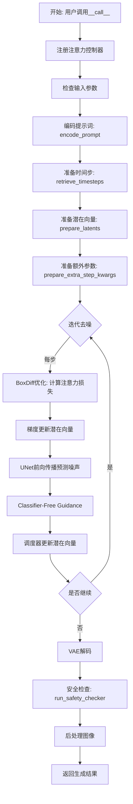
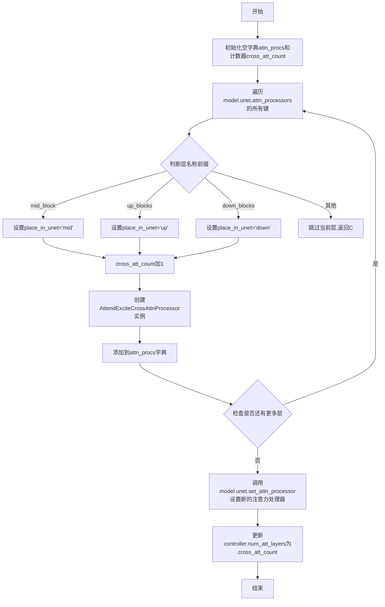
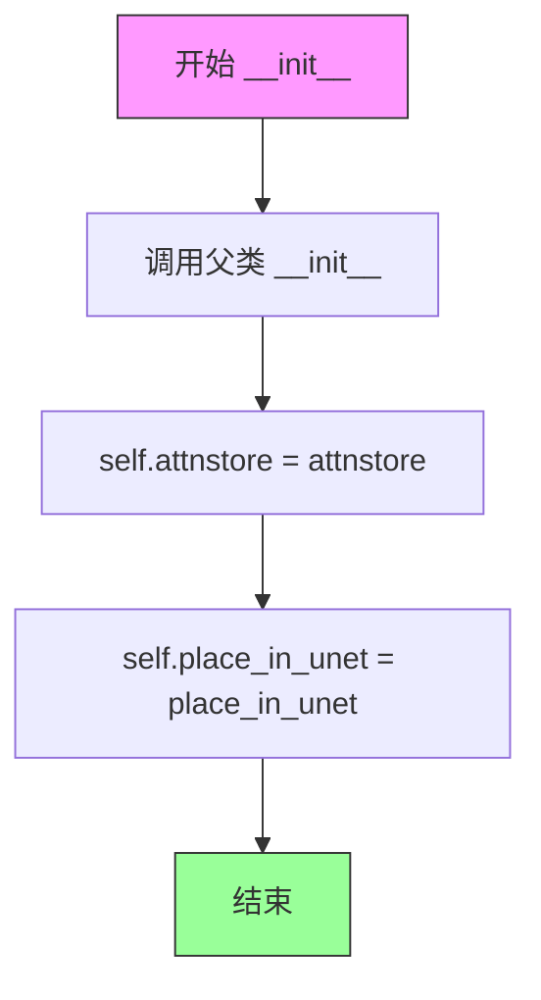
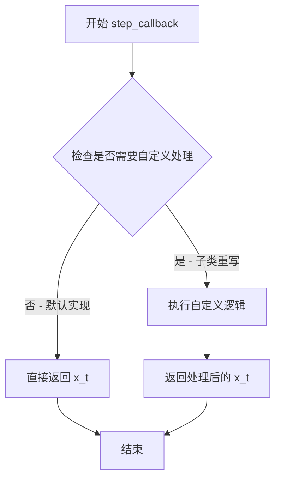
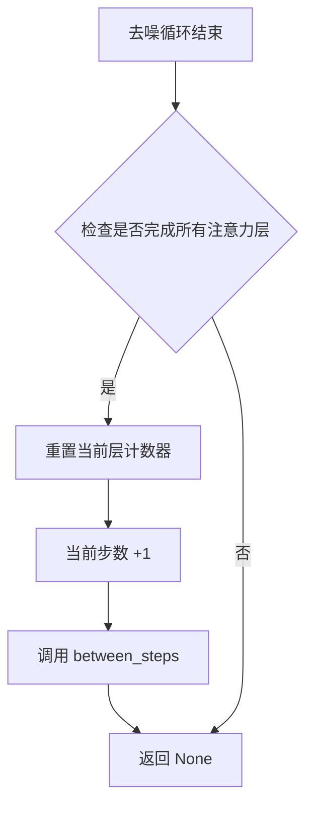
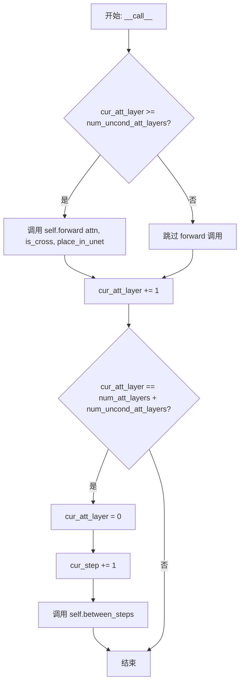
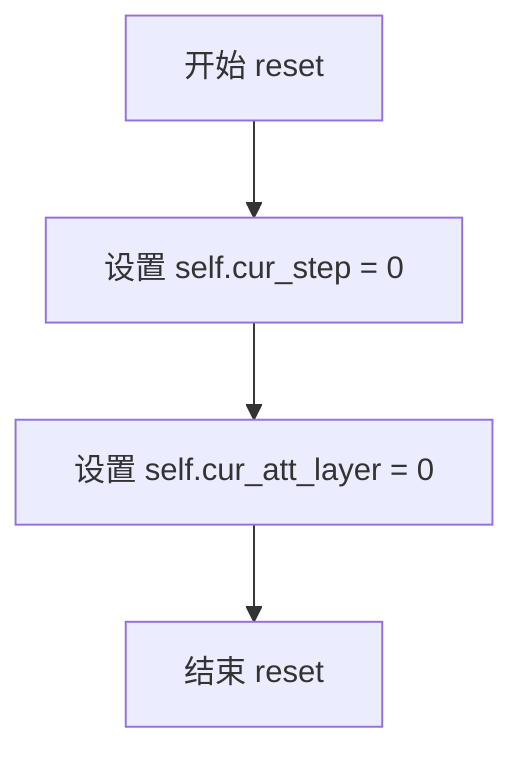
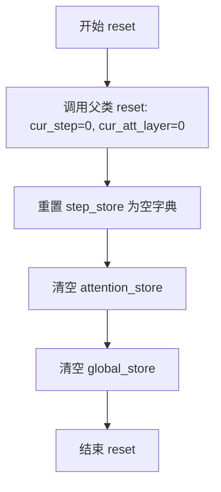
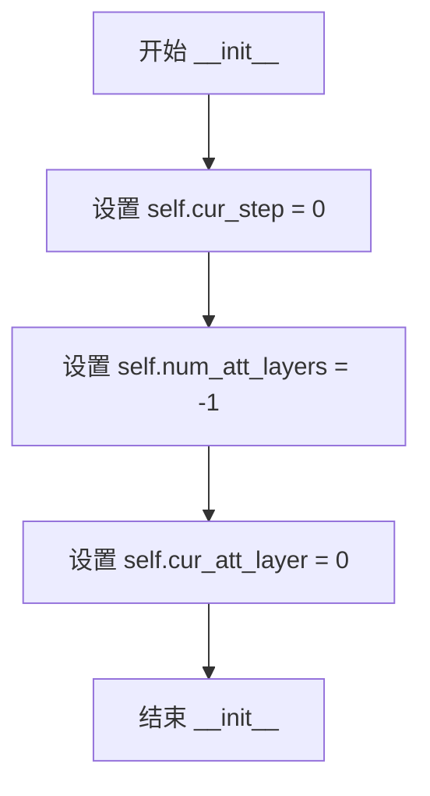
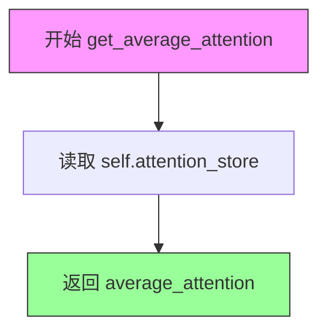

# `diffusers\examples\community\pipeline_stable_diffusion_boxdiff.py` 详细设计文档

这是一个基于Stable Diffusion的文本到图像生成pipeline，集成了BoxDiff方法。该pipeline通过控制注意力机制来实现对生成图像中特定区域（由bounding box指定）的精确控制，允许用户指定特定短语（phrases）及其对应的边界框，从而引导生成图像时让这些指定区域获得更高的注意力聚焦。

## 整体流程



## 类结构

```
GaussianSmoothing (nn.Module)
AttendExciteCrossAttnProcessor
AttentionControl (abc.ABC)
└── AttentionStore (AttentionControl)
aggregate_attention (全局函数)
register_attention_control (全局函数)
rescale_noise_cfg (全局函数)
retrieve_timesteps (全局函数)
StableDiffusionBoxDiffPipeline (DiffusionPipeline)
├── _encode_prompt
├── encode_prompt
├── encode_image
├── run_safety_checker
├── decode_latents
├── prepare_extra_step_kwargs
├── check_inputs
├── prepare_latents
├── enable_freeu / disable_freeu
├── fuse_qkv_projections / unfuse_qkv_projections
├── get_guidance_scale_embedding
├── _compute_max_attention_per_index
├── _aggregate_and_get_max_attention_per_token
├── _compute_loss
├── _update_latent
├── _perform_iterative_refinement_step
└── __call__
```

## 全局变量及字段


### `logger`
    
模块级日志记录器，用于输出运行时信息

类型：`logging.Logger`
    


### `EXAMPLE_DOC_STRING`
    
示例文档字符串，包含pipeline使用示例

类型：`str`
    


### `GaussianSmoothing.weight`
    
高斯核权重，用于卷积操作的卷积核

类型：`torch.Tensor`
    


### `GaussianSmoothing.groups`
    
分组卷积的组数，等于输入通道数

类型：`int`
    


### `GaussianSmoothing.conv`
    
卷积函数，根据维度选择F.conv1d/2d/3d

类型：`Callable`
    


### `AttendExciteCrossAttnProcessor.attnstore`
    
注意力存储器，用于存储中间注意力结果

类型：`AttentionStore`
    


### `AttendExciteCrossAttnProcessor.place_in_unet`
    
在UNet中的位置标识(up/down/mid)

类型：`str`
    


### `AttentionControl.cur_step`
    
当前扩散步数

类型：`int`
    


### `AttentionControl.num_att_layers`
    
注意力层总数

类型：`int`
    


### `AttentionControl.cur_att_layer`
    
当前处理的注意力层索引

类型：`int`
    


### `AttentionControl.num_uncond_att_layers`
    
无条件推理时的注意力层数

类型：`int`
    


### `AttentionStore.save_global_store`
    
是否保存全局注意力存储

类型：`bool`
    


### `AttentionStore.step_store`
    
当前扩散步的注意力存储

类型：`Dict[str, List[torch.Tensor]]`
    


### `AttentionStore.attention_store`
    
平均注意力存储

类型：`Dict[str, List[torch.Tensor]]`
    


### `AttentionStore.global_store`
    
全局累积的注意力存储

类型：`Dict[str, List[torch.Tensor]]`
    


### `AttentionStore.curr_step_index`
    
当前扩散步索引

类型：`int`
    


### `AttentionStore.num_uncond_att_layers`
    
无条件注意力层数

类型：`int`
    


### `StableDiffusionBoxDiffPipeline.vae`
    
变分自编码器，用于图像编码和解码

类型：`AutoencoderKL`
    


### `StableDiffusionBoxDiffPipeline.text_encoder`
    
CLIP文本编码器，将文本转换为embedding

类型：`CLIPTextModel`
    


### `StableDiffusionBoxDiffPipeline.tokenizer`
    
CLIP分词器，将文本token化

类型：`CLIPTokenizer`
    


### `StableDiffusionBoxDiffPipeline.unet`
    
UNet条件去噪模型

类型：`UNet2DConditionModel`
    


### `StableDiffusionBoxDiffPipeline.scheduler`
    
Karras扩散调度器

类型：`KarrasDiffusionSchedulers`
    


### `StableDiffusionBoxDiffPipeline.safety_checker`
    
安全检查器，过滤不安全内容

类型：`StableDiffusionSafetyChecker`
    


### `StableDiffusionBoxDiffPipeline.feature_extractor`
    
CLIP图像特征提取器

类型：`CLIPImageProcessor`
    


### `StableDiffusionBoxDiffPipeline.image_encoder`
    
CLIP图像编码器，用于IP-Adapter

类型：`CLIPVisionModelWithProjection`
    


### `StableDiffusionBoxDiffPipeline.vae_scale_factor`
    
VAE下采样缩放因子

类型：`int`
    


### `StableDiffusionBoxDiffPipeline.image_processor`
    
VAE图像处理器

类型：`VaeImageProcessor`
    


### `StableDiffusionBoxDiffPipeline.model_cpu_offload_seq`
    
模型CPU卸载顺序

类型：`str`
    


### `StableDiffusionBoxDiffPipeline._optional_components`
    
可选组件列表

类型：`List[str]`
    


### `StableDiffusionBoxDiffPipeline._callback_tensor_inputs`
    
回调函数可使用的张量输入列表

类型：`List[str]`
    
    

## 全局函数及方法


### `aggregate_attention`

该函数用于聚合存储在AttentionStore中的注意力图，根据指定的位置、注意力类型和选择索引进行筛选和聚合，返回指定分辨率下的聚合注意力张量。

参数：

- `attention_store`：`AttentionStore`，存储注意力图的容器对象，包含不同层和头的注意力信息
- `res`：`int`，目标分辨率，用于计算像素数量（res^2）
- `from_where`：`List[str]`，位置列表，指定要从哪些位置聚合注意力（如"up"、"down"、"mid"）
- `is_cross`：`bool`，布尔值，True表示跨注意力（cross-attention），False表示自注意力（self-attention）
- `select`：`int`，选择索引，用于从注意力图中选择特定的样本

返回值：`torch.Tensor`，聚合后的注意力张量，形状为[res, res, num_heads]，通过对多个位置和层的注意力图进行求和平均得到

#### 流程图

```mermaid
flowchart TD
    A[开始聚合注意力] --> B[获取平均注意力图 attention_store.get_average_attention]
    B --> C[计算目标像素数: num_pixels = res²]
    C --> D{遍历 from_where 中的每个位置}
    D --> E[构建键名: location_cross 或 location_self]
    E --> F{遍历该位置的所有注意力图项}
    F --> G{检查 item.shape[1] == num_pixels}
    G -->|是| H[重塑注意力图并选择指定样本]
    H --> I[将结果添加到输出列表]
    I --> F
    G -->|否| F
    F --> J{是否还有更多位置}
    J -->|是| E
    J -->|否| K[拼接所有输出张量]
    K --> L[沿第0维求和并平均]
    L --> M[返回聚合后的注意力张量]
```

#### 带注释源码

```python
def aggregate_attention(
    attention_store: AttentionStore, res: int, from_where: List[str], is_cross: bool, select: int
) -> torch.Tensor:
    """Aggregates the attention across the different layers and heads at the specified resolution."""
    # 初始化输出列表
    out = []
    
    # 从注意力存储中获取平均注意力图
    # 返回的attention_maps是一个字典，键如"down_cross", "mid_self"等
    attention_maps = attention_store.get_average_attention()

    # 计算目标分辨率下的像素数量
    # 例如res=16时，num_pixels=256
    num_pixels = res**2
    
    # 遍历指定的位置列表（如["up", "down", "mid"]）
    for location in from_where:
        # 根据is_cross构建完整的键名
        # 如果is_cross=True，键名为"location_cross"，否则为"location_self"
        key = f"{location}_{'cross' if is_cross else 'self'}"
        
        # 遍历该位置对应的所有注意力图
        for item in attention_maps[key]:
            # 检查注意力图的序列长度是否与目标分辨率匹配
            # 只处理匹配分辨率的注意力图，避免内存开销
            if item.shape[1] == num_pixels:
                # 重塑注意力图: (batch, seq_len, heads) -> (1, res, res, res, heads)
                # 然后根据select索引选择特定的样本
                cross_maps = item.reshape(1, -1, res, res, item.shape[-1])[select]
                out.append(cross_maps)
    
    # 沿第0维拼接所有收集的注意力图
    out = torch.cat(out, dim=0)
    
    # 对所有注意力图求和并平均，得到最终的聚合注意力
    # 结果形状: (res, res, num_heads)
    out = out.sum(0) / out.shape[0]
    
    return out
```


### `register_attention_control`

该函数用于在Stable Diffusion模型的UNet中注册自定义的注意力控制处理器。它遍历UNet的所有注意力层，根据层的位置（mid、up、down）分配相应的标识符，然后为每个交叉注意力层创建并注册`AttendExciteCrossAttnProcessor`实例，以实现对注意力图的监控和干预。

参数：

- `model`：`DiffusionPipeline`或包含`unet`属性的模型对象，要注册注意力控制的模型
- `controller`：`AttentionStore`对象，用于存储和管理注意力分数的控制器

返回值：`None`，该函数直接修改传入的controller对象的属性

#### 流程图



#### 带注释源码

```python
def register_attention_control(model, controller):
    """
    在UNet中注册自定义的注意力控制处理器，以便监控和干预注意力图。
    
    该函数遍历UNet的所有注意力层，根据层的位置类型（mid/up/down）创建
    相应的注意力处理器，并将其注册到UNet中。
    
    Args:
        model: 包含unet属性的扩散模型对象
        controller: AttentionStore实例，用于存储注意力分数
    
    Returns:
        None: 直接修改controller对象的num_att_layers属性
    """
    # 用于存储新的注意力处理器
    attn_procs = {}
    # 统计交叉注意力层的数量
    cross_att_count = 0
    
    # 遍历UNet中所有的注意力处理器名称
    for name in model.unet.attn_processors.keys():
        # 判断该注意力层在UNet中的位置
        if name.startswith("mid_block"):
            # 位于UNet中间块
            place_in_unet = "mid"
        elif name.startswith("up_blocks"):
            # 位于UNet的上采样块
            place_in_unet = "up"
        elif name.startswith("down_blocks"):
            # 位于UNet的下采样块
            place_in_unet = "down"
        else:
            # 跳过其他类型的注意力层（如self-attention）
            continue

        # 交叉注意力层计数加1
        cross_att_count += 1
        
        # 创建自定义的注意力处理器实例
        # 该处理器会将注意力分数保存到controller中
        attn_procs[name] = AttendExciteCrossAttnProcessor(
            attnstore=controller, 
            place_in_unet=place_in_unet
        )
    
    # 使用新的注意力处理器替换UNet中默认的处理器
    model.unet.set_attn_processor(attn_procs)
    
    # 更新controller中注意力层的总数
    controller.num_att_layers = cross_att_count
```


### `rescale_noise_cfg`

该函数用于根据 `guidance_rescale` 参数重新缩放噪声预测配置（noise_cfg），基于论文 "Common Diffusion Noise Schedules and Sample Steps are Flawed" (Section 3.4) 的研究发现，旨在修复图像过度曝光问题并避免生成"平淡无奇"的图像。

参数：

- `noise_cfg`：`torch.FloatTensor`，包含分类器自由引导（Classifier-Free Guidance）的噪声预测结果
- `noise_pred_text`：`torch.FloatTensor`，文本条件的噪声预测结果
- `guidance_rescale`：`float`，引导重缩放因子，默认为 0.0，用于控制重新缩放后噪声预测与原始噪声预测的混合比例

返回值：`torch.FloatTensor`，返回重缩放并混合后的噪声预测配置

#### 流程图

```mermaid
flowchart TD
    A[开始: rescale_noise_cfg] --> B[计算 noise_pred_text 的标准差 std_text]
    B --> C[计算 noise_cfg 的标准差 std_cfg]
    C --> D[计算缩放因子 std_text / std_cfg]
    D --> E[重缩放噪声预测: noise_pred_rescaled = noise_cfg × 缩放因子]
    E --> F[计算混合权重: guidance_rescale 和 (1 - guidance_rescale)]
    F --> G[混合噪声预测: noise_cfg = guidance_rescale × noise_pred_rescaled + (1 - guidance_rescale) × noise_cfg]
    G --> H[返回重缩放后的 noise_cfg]
```

#### 带注释源码

```python
def rescale_noise_cfg(noise_cfg, noise_pred_text, guidance_rescale=0.0):
    """
    Rescale `noise_cfg` according to `guidance_rescale`. Based on findings of [Common Diffusion Noise Schedules and
    Sample Steps are Flawed](https://huggingface.co/papers/2305.08891). See Section 3.4
    
    该函数实现了一种噪声预测重缩放技术，源自对扩散模型噪声调度器缺陷的研究。
    核心思想是通过调整噪声预测的标准差来解决图像过度曝光问题。
    """
    
    # 计算文本条件噪声预测的标准差
    # dim 参数指定了要计算标准差的维度（保留除批次维度外的所有维度）
    # keepdim=True 保持维度以便后续广播操作
    std_text = noise_pred_text.std(dim=list(range(1, noise_pred_text.ndim)), keepdim=True)
    
    # 计算CFG噪声预测的标准差
    std_cfg = noise_cfg.std(dim=list(range(1, noise_cfg.ndim)), keepdim=True)
    
    # 重新缩放引导结果（修复过度曝光）
    # 通过将 noise_cfg 与 std_text/std_cfg 相乘来调整其标准差
    # 使其与文本条件噪声预测的标准差相匹配
    noise_pred_rescaled = noise_cfg * (std_text / std_cfg)
    
    # 通过 guidance_rescale 因子混合原始引导结果，避免生成"平淡无奇"的图像
    # 当 guidance_rescale=0 时，完全使用原始 noise_cfg
    # 当 guidance_rescale=1 时，完全使用重缩放后的 noise_pred_rescaled
    noise_cfg = guidance_rescale * noise_pred_rescaled + (1 - guidance_rescale) * noise_cfg
    
    # 返回重缩放并混合后的噪声预测配置
    return noise_cfg
```


### `retrieve_timesteps`

该函数负责调用调度器的 `set_timesteps` 方法并从中获取时间步。它处理自定义时间步，并将任何额外的关键字参数传递给调度器。

参数：

- `scheduler`：`SchedulerMixin`，要获取时间步的调度器
- `num_inference_steps`：`Optional[int]`，生成样本时使用的扩散步数。如果使用此参数，`timesteps` 必须为 `None`
- `device`：`Optional[Union[str, torch.device]]`，时间步要移动到的设备。如果为 `None`，则不移动时间步
- `timesteps`：`Optional[List[int]]`，用于支持任意时间步间隔的自定义时间步。如果为 `None`，则使用调度器的默认时间步间隔策略
- `**kwargs`：任意关键字参数，将传递给 `scheduler.set_timesteps`

返回值：`Tuple[torch.Tensor, int]`，元组包含调度器的时间步调度和推理步数

#### 流程图

```mermaid
flowchart TD
    A[开始] --> B{检查 timesteps 是否为 None}
    B -->|是| C[检查调度器是否接受 timesteps 参数]
    C --> D{接受 timesteps?}
    D -->|否| E[抛出 ValueError: 调度器不支持自定义时间步]
    D -->|是| F[调用 scheduler.set_timesteps 并传入 timesteps 和 device]
    F --> G[获取 scheduler.timesteps]
    G --> H[设置 num_inference_steps = len(timesteps)]
    H --> I[返回 timesteps 和 num_inference_steps]
    B -->|否| J[调用 scheduler.set_timesteps 并传入 num_inference_steps 和 device]
    J --> K[获取 scheduler.timesteps]
    K --> I
```

#### 带注释源码

```python
def retrieve_timesteps(
    scheduler,
    num_inference_steps: Optional[int] = None,
    device: Optional[Union[str, torch.device]] = None,
    timesteps: Optional[List[int]] = None,
    **kwargs,
):
    """
    Calls the scheduler's `set_timesteps` method and retrieves timesteps from the scheduler after the call. Handles
    custom timesteps. Any kwargs will be supplied to `scheduler.set_timesteps`.

    Args:
        scheduler (`SchedulerMixin`):
            The scheduler to get timesteps from.
        num_inference_steps (`int`):
            The number of diffusion steps used when generating samples with a pre-trained model. If used,
            `timesteps` must be `None`.
        device (`str` or `torch.device`, *optional*):
            The device to which the timesteps should be moved to. If `None`, the timesteps are not moved.
        timesteps (`List[int]`, *optional*):
                Custom timesteps used to support arbitrary spacing between timesteps. If `None`, then the default
                timestep spacing strategy of the scheduler is used. If `timesteps` is passed, `num_inference_steps`
                must be `None`.

    Returns:
        `Tuple[torch.Tensor, int]`: A tuple where the first element is the timestep schedule from the scheduler and the
        second element is the number of inference steps.
    """
    # 如果提供了自定义 timesteps
    if timesteps is not None:
        # 检查调度器的 set_timesteps 方法是否支持 timesteps 参数
        accepts_timesteps = "timesteps" in set(inspect.signature(scheduler.set_timesteps).parameters.keys())
        if not accepts_timesteps:
            raise ValueError(
                f"The current scheduler class {scheduler.__class__}'s `set_timesteps` does not support custom"
                f" timestep schedules. Please check whether you are using the correct scheduler."
            )
        # 使用自定义 timesteps 调用调度器
        scheduler.set_timesteps(timesteps=timesteps, device=device, **kwargs)
        # 获取调度后的时间步
        timesteps = scheduler.timesteps
        # 计算推理步数
        num_inference_steps = len(timesteps)
    else:
        # 使用 num_inference_steps 调用调度器
        scheduler.set_timesteps(num_inference_steps, device=device, **kwargs)
        # 获取调度后的时间步
        timesteps = scheduler.timesteps
    # 返回时间步和推理步数
    return timesteps, num_inference_steps
```


### GaussianSmoothing.__init__

该方法是 `GaussianSmoothing` 类的构造函数，用于初始化高斯平滑卷积层。它根据输入的通道数、核大小、标准差和维度生成高斯核权重，并将其注册为缓冲区，同时设置深度卷积函数以支持 1D、2D 或 3D 高斯平滑操作。

参数：

- `channels`：`int` 或 `sequence`，输入和输出数据的通道数
- `kernel_size`：`int` 或 `sequence`，高斯核的大小
- `sigma`：`float` 或 `sequence`，高斯核的标准差
- `dim`：`int`，数据的维度，默认为 2（支持 1、2、3 维）

返回值：`None`，该方法为构造函数，不返回任何值

#### 流程图

```mermaid
flowchart TD
    A[开始 __init__] --> B{判断 kernel_size 是否为数值类型}
    B -->|是| C[将 kernel_size 转换为列表: [kernel_size] * dim]
    B -->|否| D[保持原样]
    C --> E{判断 sigma 是否为数值类型}
    D --> E
    E -->|是| F[将 sigma 转换为列表: [sigma] * dim]
    E -->|否| G[保持原样]
    F --> H[初始化 kernel = 1]
    G --> H
    H --> I[使用 torch.meshgrid 生成网格坐标]
    I --> J[遍历 kernel_size, sigma, meshgrids]
    J --> K[计算每个维度的高斯核值]
    K --> L[kernel *= 高斯函数值]
    J --> M{是否还有未处理的维度}
    M -->|是| J
    M -->|否| N[归一化 kernel: kernel / torch.sum(kernel)]
    N --> O[reshape 和 repeat 生成深度卷积权重]
    O --> P[register_buffer 注册权重]
    P --> Q[设置 self.groups = channels]
    Q --> R{判断 dim 的值}
    R -->|dim==1| S[设置 self.conv = F.conv1d]
    R -->|dim==2| T[设置 self.conv = F.conv2d]
    R -->|dim==3| U[设置 self.conv = F.conv3d]
    R -->|其他| V[抛出 RuntimeError]
    S --> W[结束]
    T --> W
    U --> W
    V --> W
```

#### 带注释源码

```python
def __init__(self, channels, kernel_size, sigma, dim=2):
    # 调用父类 nn.Module 的构造函数
    super(GaussianSmoothing, self).__init__()
    
    # 如果 kernel_size 是单个数值，则扩展为列表
    # 例如: kernel_size=3, dim=2 -> [3, 3]
    if isinstance(kernel_size, numbers.Number):
        kernel_size = [kernel_size] * dim
    
    # 如果 sigma 是单个数值，则扩展为列表
    # 例如: sigma=1.0, dim=2 -> [1.0, 1.0]
    if isinstance(sigma, numbers.Number):
        sigma = [sigma] * dim

    # 高斯核是各维度高斯函数的乘积
    # 初始化 kernel 为 1（乘法单位元）
    kernel = 1
    
    # 使用 torch.meshgrid 生成网格坐标
    # 例如: kernel_size=[3, 3] -> 生成两个 3x3 的网格
    meshgrids = torch.meshgrid([torch.arange(size, dtype=torch.float32) for size in kernel_size])
    
    # 遍历每个维度，计算该维度的高斯核
    for size, std, mgrid in zip(kernel_size, sigma, meshgrids):
        # 计算该维度的中心点
        mean = (size - 1) / 2
        
        # 高斯函数: 1 / (std * sqrt(2*pi)) * exp(-((x-mean)/(2*std))^2)
        # 计算高斯核在该维度的值
        kernel *= 1 / (std * math.sqrt(2 * math.pi)) * torch.exp(-(((mgrid - mean) / (2 * std)) ** 2))

    # 确保高斯核的和为 1（归一化）
    kernel = kernel / torch.sum(kernel)

    # 将高斯核 reshape 为卷积权重格式
    # view(1, 1, *kernel.size()) -> (1, 1, H, W) for 2D
    kernel = kernel.view(1, 1, *kernel.size())
    
    # 重复权重以匹配输入通道数（深度卷积）
    # repeat(channels, 1, 1, ...) 为每个通道创建独立的滤波器
    kernel = kernel.repeat(channels, *[1] * (kernel.dim() - 1))

    # 将高斯核权重注册为 buffer（不参与梯度更新，但会保存到模型）
    self.register_buffer("weight", kernel)
    
    # 设置深度卷积的组数（每个通道独立卷积）
    self.groups = channels

    # 根据维度选择对应的卷积函数
    if dim == 1:
        self.conv = F.conv1d
    elif dim == 2:
        self.conv = F.conv2d
    elif dim == 3:
        self.conv = F.conv3d
    else:
        # 只支持 1、2、3 维数据
        raise RuntimeError("Only 1, 2 and 3 dimensions are supported. Received {}.".format(dim))
```


### `GaussianSmoothing.forward`

该方法实现高斯平滑滤波器的前向传播，通过深度可分离卷积对输入张量应用高斯模糊。

参数：

- `input`：`torch.Tensor`，要应用高斯滤波器的输入张量

返回值：`torch.Tensor`，滤波后的输出张量

#### 流程图

```mermaid
flowchart TD
    A[输入张量 input] --> B[调用深度可分离卷积<br/>self.conv]
    B --> C[传入权重 self.weight.to(input.dtype)]
    B --> D[设置分组数 self.groups]
    C --> E[返回滤波后的张量]
    D --> E
```

#### 带注释源码

```python
def forward(self, input):
    """
    Apply gaussian filter to input.
    Arguments:
        input (torch.Tensor): Input to apply gaussian filter on.
    Returns:
        filtered (torch.Tensor): Filtered output.
    """
    # 使用初始化时创建的卷积函数（conv1d/conv2d/conv3d）
    # 对输入进行深度可分离卷积
    # weight: 注册的高斯核缓冲区，转换为与输入相同的 dtype
    # groups: 分组数等于通道数，实现逐通道卷积
    return self.conv(input, weight=self.weight.to(input.dtype), groups=self.groups)
```


### `AttendExciteCrossAttnProcessor.__init__`

这是`AttendExciteCrossAttnProcessor`类的构造函数，用于初始化自定义交叉注意力处理器。该处理器是Attend-Excite方法的核心组件，负责在Stable Diffusion的UNet去噪过程中拦截、存储注意力分数，以便后续进行注意力导向的图像生成优化。

参数：

- `attnstore`：`AttentionStore`类型，一个注意力存储对象，用于在去噪过程中收集和保存注意力概率分布
- `place_in_unet`：`str`类型，表示该处理器在UNet中的位置（"up"、"down"或"mid"），用于标识注意力来自UNet的哪个模块

返回值：`None`，无返回值（构造函数）

#### 流程图



#### 带注释源码

```python
class AttendExciteCrossAttnProcessor:
    def __init__(self, attnstore, place_in_unet):
        """
        初始化自定义交叉注意力处理器
        
        参数:
            attnstore: AttentionStore实例，用于存储注意力分数
            place_in_unet: str，表示在UNet中的位置（up/down/mid）
        """
        # 调用父类nn.Module的初始化方法
        super().__init__()
        
        # 保存注意力存储对象的引用，用于后续调用其__call__方法存储注意力
        self.attnstore = attnstore
        
        # 保存UNet中的位置标识，用于标识注意力来自哪个模块
        # 这对于后续聚合不同层级的注意力特征很重要
        self.place_in_unet = place_in_unet
```

#### 详细说明

| 属性 | 类型 | 描述 |
|------|------|------|
| `self.attnstore` | `AttentionStore` | 引用外部传入的注意力存储控制器，用于在每次前向传播时保存注意力概率 |
| `self.place_in_unet` | `str` | 标识符，表示该处理器挂载在UNet的哪个部分（up/down/mid块），用于按位置分类存储注意力 |

#### 使用场景

该初始化方法通常与`register_attention_control`函数配合使用，将该处理器注册到UNet的各个注意力模块中：

```python
# 在register_attention_control中的典型用法
attn_procs[name] = AttendExciteCrossAttnProcessor(
    attnstore=controller,      # 传入注意力存储控制器
    place_in_unet=place_in_unet # 传入UNet位置标识
)
```

#### 潜在优化空间

1. **类型提示缺失**：建议添加类型提示（`attnstore: AttentionStore`, `place_in_unet: str`）以提高代码可读性和IDE支持
2. **参数验证**：可以添加对`place_in_unet`参数的有效性验证，确保其为合法值（"up"、"down"、"mid"）
3. **文档完善**：可添加更详细的文档说明该处理器在整体pipeline中的角色和生命周期


### `AttendExciteCrossAttnProcessor.__call__`

该方法是自定义的交叉注意力处理器，用于在Stable Diffusion模型的UNet中执行注意力计算，同时将注意力权重存储到AttentionStore中以供后续的BoxDiff和Attend-and-Excite优化使用。

参数：

- `self`：隐式参数，表示类的实例本身
- `attn`：`Attention`类型，Diffusers库中的Attention模块，提供查询、键、值的线性变换方法以及注意力分数计算方法
- `hidden_states`：`torch.FloatTensor`类型，形状为`(batch_size, sequence_length, hidden_dim)`，表示当前的隐藏状态序列
- `encoder_hidden_states`：`Optional[torch.FloatTensor]`类型，形状为`(batch_size, encoder_sequence_length, hidden_dim)`，表示编码器的隐藏状态（用于cross-attention），如果为None则使用hidden_states
- `attention_mask`：`Optional[torch.FloatTensor]`类型，用于指定哪些位置需要被掩码的注意力掩码

返回值：`torch.Tensor`，形状为`(batch_size, sequence_length, hidden_dim)`，经过注意力计算和输出投影后的隐藏状态

#### 流程图

```mermaid
flowchart TD
    A[开始: __call__] --> B[获取batch_size和sequence_length]
    B --> C[调用attn.prepare_attention_mask准备注意力掩码]
    C --> D[使用attn.to_q对hidden_states进行线性变换得到query]
    D --> E{encoder_hidden_states是否为None?}
    E -->|是| F[使用hidden_states作为encoder_hidden_states]
    E -->|否| G[保持encoder_hidden_states不变]
    F --> H[使用attn.to_k和attn.to_v分别计算key和value]
    G --> H
    H --> I[使用attn.head_to_batch_dim将query/key/value从head维度转换到batch维度]
    I --> J[调用attn.get_attention_scores计算注意力分数]
    J --> K[调用self.attnstore存储注意力权重]
    K --> L[使用torch.bmm计算注意力加权值: attention_probs @ value]
    L --> M[使用attn.batch_to_head_dim从batch维度转回head维度]
    M --> N[通过attn.to_out[0]进行线性投影]
    N --> O[通过attn.to_out[1]进行dropout]
    O --> P[返回处理后的hidden_states]
```

#### 带注释源码

```python
def __call__(
    self,
    attn: Attention,
    hidden_states: torch.FloatTensor,
    encoder_hidden_states: Optional[torch.FloatTensor] = None,
    attention_mask: Optional[torch.FloatTensor] = None,
) -> torch.Tensor:
    """
    自定义注意力处理器，执行交叉注意力计算并存储注意力权重
    
    参数:
        attn: Diffusers库中的Attention模块
        hidden_states: 输入的隐藏状态张量
        encoder_hidden_states: 编码器隐藏状态（用于cross-attention），可选
        attention_mask: 注意力掩码，可选
    
    返回:
        经过注意力计算和输出投影后的隐藏状态张量
    """
    # 1. 获取批次大小和序列长度
    batch_size, sequence_length, _ = hidden_states.shape
    
    # 2. 准备注意力掩码，处理不同形状和批处理情况
    attention_mask = attn.prepare_attention_mask(attention_mask, sequence_length, batch_size=1)
    
    # 3. 对hidden_states进行线性变换得到查询向量query
    query = attn.to_q(hidden_states)
    
    # 4. 判断是否为交叉注意力（encoder_hidden_states不为None）
    is_cross = encoder_hidden_states is not None
    
    # 5. 如果没有提供encoder_hidden_states，则使用hidden_states（self-attention情况）
    encoder_hidden_states = encoder_hidden_states if encoder_hidden_states is not None else hidden_states
    
    # 6. 对encoder_hidden_states进行线性变换得到键key和值value
    key = attn.to_k(encoder_hidden_states)
    value = attn.to_v(encoder_hidden_states)
    
    # 7. 将query/key/value从多头注意力格式转换为批次格式
    # 原始格式: (batch, num_heads, seq_len, head_dim) -> (batch*num_heads, seq_len, head_dim)
    query = attn.head_to_batch_dim(query)
    key = attn.head_to_batch_dim(key)
    value = attn.head_to_batch_dim(value)
    
    # 8. 计算注意力分数（softmax(Q*K^T / sqrt(d_k))）
    attention_probs = attn.get_attention_scores(query, key, attention_mask)
    
    # 9. 将注意力权重存储到AttentionStore中，供BoxDiff优化使用
    # 存储时标记是cross-attention还是self-attention，以及在UNet中的位置
    self.attnstore(attention_probs, is_cross, self.place_in_unet)
    
    # 10. 使用注意力权重对值进行加权求和: attention_probs @ value
    hidden_states = torch.bmm(attention_probs, value)
    
    # 11. 将结果从批次格式转换回多头注意力格式
    hidden_states = attn.batch_to_head_dim(hidden_states)
    
    # 12. 线性投影层（将隐藏维度映射回原始维度）
    hidden_states = attn.to_out[0](hidden_states)
    
    # 13. Dropout层（训练时随机丢弃部分神经元以防止过拟合）
    hidden_states = attn.to_out[1](hidden_states)
    
    # 14. 返回处理后的隐藏状态
    return hidden_states
```


### `AttentionControl.step_callback`

该方法是 `AttentionControl` 类的回调方法，在扩散模型的每个去噪步骤之后被调用。默认实现直接返回输入的潜在变量 `x_t`，子类可以通过重写此方法来实现对潜在变量的自定义修改（例如应用 BoxDiff 优化）。

参数：

- `x_t`：`torch.FloatTensor`，扩散模型在当前去噪步骤结束时产生的潜在变量（latents），需要在该回调中进行可选的修改。

返回值：`torch.FloatTensor`，返回经过处理（若被重写）后的潜在变量，用于下一步的去噪计算。

#### 流程图



#### 带注释源码

```python
def step_callback(self, x_t):
    """
    在每个去噪步骤结束后调用的回调方法。
    
    该方法是一个钩子（hook），允许子类在每个扩散步骤结束后
    对潜在变量 x_t 进行自定义处理。默认实现仅仅返回输入的潜在变量，
    不做任何修改。
    
    在 BoxDiff 等扩展中，开发者可以重写此方法来实现
    对生成过程的干预，例如应用注意力引导的梯度更新。
    
    参数:
        x_t (torch.FloatTensor): 
            当前去噪步骤输出的潜在变量张量。
            
    返回:
        torch.FloatTensor: 
            经过处理（若有）后的潜在变量，将被用于下一步去噪。
    """
    return x_t
```


### `AttentionControl.between_steps`

该方法是一个在每个去噪步骤之间调用的钩子函数（Hook），用于在扩散模型完成一个完整的去噪步骤后执行必要的状态更新操作。当前基类实现为空操作（pass），具体功能由子类（如 `AttentionStore`）重写实现，以完成注意力存储的更新和重置。

参数：

- （无参数）

返回值：`None`，无返回值。

#### 流程图



#### 带注释源码

```python
def between_steps(self):
    """
    在每个去噪步骤之间调用的钩子方法。
    
    该方法在 AttentionControl 的 __call__ 方法中被调用，当完成了
    当前去噪步骤的所有注意力层处理后触发。
    
    默认实现为空操作（pass），子类可以重写此方法以执行自定义逻辑，
    例如保存中间结果、更新全局状态等。
    
    Returns:
        None: 此方法不返回任何值
    """
    return
```


### `AttentionControl.forward`

该方法是抽象方法，定义了注意力控制的接口。具体实现由子类 `AttentionStore` 提供。`forward` 方法是整个注意力控制机制的核心，用于在扩散模型的每个去噪步骤中拦截和处理注意力映射，以便实现基于注意力的语义控制（如 BoxDiff、Attend-and-Excite 等）。

参数：

- `attn`：`torch.Tensor`，注意力映射张量，形状为 (batch_size, sequence_length, sequence_length) 或类似形状，表示注意力权重
- `is_cross`：`bool`，布尔值，指示是否为交叉注意力（True 表示文本-图像交叉注意力，False 表示自注意力）
- `place_in_unet`：`str`，字符串，表示注意力层在 UNet 中的位置（如 "down"、"mid"、"up"）

返回值：`torch.Tensor`，处理后的注意力映射（通常与输入相同，但会被存储到内部数据结构中）

#### 流程图

```mermaid
flowchart TD
    A[开始 forward 方法] --> B[构建 key: place_in_unet + cross/self]
    B --> C{检查 attn.shape[1] <= 32**2?}
    C -->|是| D[将 attn 添加到 step_store[key] 列表]
    C -->|否| E[跳过以避免内存开销]
    D --> F[返回原始 attn]
    E --> F
```

#### 带注释源码

```python
def forward(self, attn, is_cross: bool, place_in_unet: str):
    """
    存储注意力映射到内部存储中。
    
    参数:
        attn: 注意力张量，形状为 (batch, seq_len, seq_len)
        is_cross: 是否为交叉注意力
        place_in_unet: 在 UNet 中的位置 ('down', 'mid', 'up')
    
    返回:
        原始注意力张量（未经修改）
    """
    # 根据位置和注意力类型构建存储键
    # 格式: "{位置}_{cross/self}"，例如 "down_cross", "mid_self"
    key = f"{place_in_unet}_{'cross' if is_cross else 'self'}"
    
    # 避免内存开销，只存储较小的注意力图
    # 32*32 = 1024，这是常见的低分辨率注意力图大小
    if attn.shape[1] <= 32**2:
        # 将注意力张量添加到对应键的列表中
        self.step_store[key].append(attn)
    
    # 返回原始注意力（该方法不修改注意力值）
    return attn
```


### AttentionControl.__call__

该方法是 `AttentionControl` 类的核心调用接口，负责在扩散模型的每个去噪步骤中控制注意力层的执行。它根据当前层的索引决定是否调用 `forward` 方法，并在完成一轮所有注意力层后触发 `between_steps` 方法来保存和聚合注意力信息。

参数：

- `attn`：`Attention`，注意力处理器对象，包含注意力机制的核心逻辑（如 query、key、value 投影及注意力计算）
- `is_cross`：`bool`，布尔标志，指示当前注意力层是跨注意力（cross-attention，值为 True）还是自注意力（self-attention，值为 False）
- `place_in_unet`：`str`，字符串，表示当前注意力层在 UNet 中的位置（"down"、"mid"、"up"）

返回值：`None`，该方法不返回任何值，仅通过修改对象内部状态（如 `cur_att_layer`、`cur_step`）来控制流程

#### 流程图



#### 带注释源码

```python
def __call__(self, attn, is_cross: bool, place_in_unet: str):
    """
    控制注意力层的调用逻辑
    
    参数:
        attn: Attention 处理器对象，包含 to_q, to_k, to_v 等方法
        is_cross: bool, True 表示跨注意力, False 表示自注意力
        place_in_unet: str, 注意力层在 UNet 中的位置 ("down"/"mid"/"up")
    """
    # 检查是否需要进行注意力控制（非无条件层才执行）
    if self.cur_att_layer >= self.num_uncond_att_layers:
        # 调用子类实现的 forward 方法进行实际的注意力处理
        self.forward(attn, is_cross, place_in_unet)
    
    # 层索引递增
    self.cur_att_layer += 1
    
    # 判断是否完成一轮所有注意力层
    if self.cur_att_layer == self.num_att_layers + self.num_uncond_att_layers:
        # 重置层计数器，准备下一轮
        self.cur_att_layer = 0
        # 去噪步骤递增
        self.cur_step += 1
        # 调用钩子方法，通常用于保存和聚合注意力
        self.between_steps()
```


### `AttentionControl.reset()`

该方法用于重置注意力控制器的内部状态，将当前步骤计数器和注意力层计数器归零，以便在新的扩散过程开始时重新开始收集注意力数据。

参数： 无

返回值：`None`，该方法直接修改实例的内部状态，不返回任何值。

#### 流程图



#### 带注释源码

```python
def reset(self):
    """
    重置注意力控制器的内部状态计数器。
    将当前扩散步骤和注意力层计数器归零，准备开始新的扩散过程。
    """
    self.cur_step = 0          # 当前扩散步骤计数器归零
    self.cur_att_layer = 0     # 当前注意力层计数器归零
```

---

### `AttentionStore.reset()`

该方法继承自`AttentionControl.reset()`，在重置基类状态的基础上，还额外清空了注意力存储库（`step_store`、`attention_store`和`global_store`），确保每次运行新的推理时存储的数据是干净的。

参数： 无

返回值：`None`，该方法直接修改实例的内部状态，不返回任何值。

#### 流程图



#### 带注释源码

```python
def reset(self):
    """
    重置注意力存储的内部状态。
    包括重置父类的计数器，以及清空所有注意力存储结构。
    """
    # 调用父类的 reset 方法，重置 cur_step 和 cur_att_layer
    super(AttentionStore, self).reset()
    
    # 重置当前步骤的注意力存储为空结构
    self.step_store = self.get_empty_store()
    
    # 清空累积的注意力存储
    self.attention_store = {}
    
    # 清空全局存储（如果启用了全局存储功能）
    self.global_store = {}
```

---

### 关键组件信息

| 名称 | 一句话描述 |
|------|-----------|
| `AttentionControl` | 抽象基类，用于控制扩散模型中的注意力机制，追踪当前处理步骤和层 |
| `AttentionStore` | 继承自`AttentionControl`，用于存储和聚合推理过程中的注意力图 |

---

### 技术债务与优化空间

1. **重复代码**：`AttentionStore.reset()`中连续调用了两次`self.get_empty_store()`（第270-271行），这是一个冗余操作第二次调用会覆盖第一次的结果。

2. **内存管理**：全局存储（`global_store`）在整个推理过程中持续累积注意力张量，可能导致显存压力。建议在适当时候显式释放不再需要的存储。

3. **抽象类约束**：`num_uncond_att_layers`属性被注释掉，但父类`__call__`方法中仍引用该属性，可能导致潜在的`AttributeError`风险。

---

### 其它项目

**设计目标与约束**：
- 该类设计用于在Stable Diffusion推理过程中拦截并存储注意力图，以便后续用于BoxDiff算法的损失计算
- `AttentionControl`采用抽象基类模式，允许不同的控制策略（如`AttentionStore`）

**错误处理与异常设计**：
- 未在`reset()`方法中添加任何异常处理，假设调用时上下文是合法的

**数据流与状态机**：
- `cur_step`和`cur_att_layer`构成一个简单的状态机，用于追踪推理进度
- `reset()`将状态机恢复初始状态，为下一轮推理做准备


### `AttentionControl.__init__`

该方法是 `AttentionControl` 类的构造函数，用于初始化注意力控制器的核心状态变量，包括当前步骤计数器、注意力层总数和当前层索引。

参数：

- 该方法无显式参数（隐式参数 `self` 为实例本身）

返回值：无（`None`），仅用于初始化实例状态

#### 流程图



#### 带注释源码

```python
def __init__(self):
    """
    初始化 AttentionControl 的核心状态变量。
    这些变量用于跟踪扩散模型在去噪过程中的注意力层执行情况。
    """
    # 当前扩散步骤的计数器，从0开始
    # 用于记录已经执行了多少个去噪步骤
    self.cur_step = 0
    
    # 注意力层的总数，初始化为-1表示尚未确定
    # 实际数量会在 register_attention_control 函数中根据UNet的注意力处理器数量确定
    self.num_att_layers = -1
    
    # 当前正在执行的注意力层索引，从0开始
    # 每次调用 __call__ 方法时递增
    self.cur_att_layer = 0
```


### `AttentionStore.get_empty_store`

该方法是一个静态方法，用于初始化并返回一个空的注意力存储字典。该字典包含六个键，分别对应 UNet 中不同位置（down、mid、up）和不同类型（cross-attention、self-attention）的注意力图，用于在扩散模型的推理过程中累积和存储注意力权重。

参数：无需参数

返回值：`Dict[str, List]`，返回一个包含六个键的字典，每个键映射到一个空列表，用于后续存储对应位置和类型的注意力图。键包括：`down_cross`、`mid_cross`、`up_cross`、`down_self`、`mid_self`、`up_self`。

#### 流程图

```mermaid
flowchart TD
    A[开始] --> B[创建字典]
    B --> C[设置键值对: down_cross = []]
    C --> D[设置键值对: mid_cross = []]
    D --> E[设置键值对: up_cross = []]
    E --> F[设置键值对: down_self = []]
    F --> G[设置键值对: mid_self = []]
    G --> H[设置键值对: up_self = []]
    H --> I[返回字典]
    I --> J[结束]
```

#### 带注释源码

```python
@staticmethod
def get_empty_store():
    """
    创建一个空的注意力存储结构，用于在扩散模型推理过程中
    累积不同UNet位置和不同类型的注意力图。
    
    Returns:
        dict: 包含六个键的字典，每个键对应一个空列表。
              - down_cross: 下采样块的交叉注意力
              - mid_cross: 中间块的交叉注意力
              - up_cross: 上采样块的交叉注意力
              - down_self: 下采样块的自我注意力
              - mid_self: 中间块的自我注意力
              - up_self: 上采样块的自我注意力
    """
    return {
        "down_cross": [],    # 存储下采样层的交叉注意力图
        "mid_cross": [],     # 存储中间层的交叉注意力图
        "up_cross": [],      # 存储上采样层的交叉注意力图
        "down_self": [],     # 存储下采样层的自我注意力图
        "mid_self": [],      # 存储中间层的自我注意力图
        "up_self": []        # 存储上采样层的自我注意力图
    }
```


### AttentionStore.forward

该方法用于在Stable Diffusion的UNet去噪过程中存储注意力图，以便后续进行注意力聚合和计算BoxDiff损失。它根据注意力类型（cross或self）和UNet中的位置（down/mid/up）将注意力张量存储到对应的键下，同时通过内存阈值避免存储过大的注意力图。

参数：

- `attn`：`torch.FloatTensor`，输入的注意力张量，形状为 (batch_size, sequence_length, seq_len)，通常是从 Attention 模块的 `get_attention_scores` 返回的注意力概率分布
- `is_cross`：`bool`，布尔标志，指示当前注意力是跨注意力（cross-attention，值为 True）还是自注意力（self-attention，值为 False）
- `place_in_unet`：`str`，字符串，表示当前注意力模块在 UNet 中的位置，取值为 "down"、"mid" 或 "up" 之一

返回值：`torch.FloatTensor`，直接返回输入的 `attn` 张量，不做任何修改。这样设计使得该方法可以无缝插入到 UNet 的注意力计算流程中，而不会影响正常的推理过程。

#### 流程图

```mermaid
flowchart TD
    A[开始 forward 方法] --> B[构建 key 字符串]
    B --> C{is_cross?}
    C -->|True| D[key = place_in_unet + '_cross'] 
    C -->|False| E[key = place_in_unet + '_self']
    D --> F{attn.shape[1] <= 32**2?}
    E --> F
    F -->|Yes| G[将 attn 添加到 self.step_store[key]]
    F -->|No| H[跳过存储 避免内存开销]
    G --> I[返回原始 attn 张量]
    H --> I
```

#### 带注释源码

```python
def forward(self, attn, is_cross: bool, place_in_unet: str):
    """
    存储注意力图到 step_store 字典中
    
    参数:
        attn: 注意力张量,形状为 (batch, seq_len, seq_len)
        is_cross: 是否为跨注意力
        place_in_unet: UNet中的位置 down/mid/up
    """
    # 根据位置和注意力类型构建存储键
    # 例如: 'down_cross', 'mid_self', 'up_cross' 等
    key = f"{place_in_unet}_{'cross' if is_cross else 'self'}"
    
    # 只有当注意力图尺寸小于等于 32x32 时才存储
    # 这是为了避免内存开销过大，因为高分辨率的注意力图会消耗大量内存
    if attn.shape[1] <= 32**2:  # avoid memory overhead
        self.step_store[key].append(attn)
    
    # 原样返回注意力张量，不影响正常的UNet推理流程
    return attn
```


### `AttentionStore.between_steps()`

该方法是 `AttentionStore` 类的成员方法，用于在扩散模型的每个去噪步骤之间调用，负责将当前步骤存储的注意力图转移到主存储中，并可选地累积到全局存储中，最后重置步骤存储以准备下一个去噪步骤。

参数： 无

返回值：`None`，该方法不返回任何值，仅执行存储转移和重置操作

#### 流程图

```mermaid
flowchart TD
    A[开始: between_steps] --> B{self.save_global_store?}
    B -->|是| C{len(self.global_store) == 0?}
    B -->|否| F[重置 step_store]
    C -->|是| D[self.global_store = self.step_store]
    C -->|否| E[累积 global_store]
    D --> F
    E --> F
    F --> G[self.step_store = get_empty_store]
    G --> H[重复重置 step_store 两次]
    H --> I[结束]
```

#### 带注释源码

```python
def between_steps(self):
    """
    在每个去噪步骤之间调用的方法，负责：
    1. 将当前步骤的注意力存储转移为主 attention_store
    2. 可选地累积到全局 global_store 中
    3. 重置步骤存储为下一个去噪步骤做准备
    """
    # 将当前步骤的注意力图存储到主存储中
    self.attention_store = self.step_store
    
    # 如果启用全局存储，则累积注意力图
    if self.save_global_store:
        with torch.no_grad():  # 禁用梯度计算以节省内存
            if len(self.global_store) == 0:
                # 首次初始化全局存储
                self.global_store = self.step_store
            else:
                # 累加后续步骤的注意力图（使用 detach 断开梯度连接）
                for key in self.global_store:
                    for i in range(len(self.global_store[key])):
                        self.global_store[key][i] += self.step_store[key][i].detach()
    
    # 重置步骤存储为空的字典结构
    self.step_store = self.get_empty_store()
    
    # 重复重置操作（代码中存在冗余操作，可能是笔误）
    self.step_store = self.get_empty_store()
```


### AttentionStore.get_average_attention

该方法用于获取当前存储的平均注意力映射，是 AttentionStore 类的核心方法之一，用于在扩散模型的每个去噪步骤结束后检索累积的注意力权重。

参数： 无（仅包含隐含的 self 参数）

返回值：`Dict[str, List[torch.Tensor]]`，返回一个字典，包含不同位置（down/mid/up）和类型（cross/self）的注意力张量列表，用于后续的注意力可视化和损失计算。

#### 流程图



#### 带注释源码

```python
def get_average_attention(self):
    """
    获取当前累积的平均注意力映射。
    
    该方法在每个去噪步骤结束后被调用，用于获取本步骤累积的所有注意力权重。
    attention_store 是通过 between_steps() 方法从 step_store 更新而来的。
    
    Returns:
        average_attention: 包含各层注意力映射的字典，键名格式为 "{位置}_{类型}"，
                         例如 "down_cross", "mid_self", "up_cross" 等
    """
    # 直接返回当前存储的注意力映射字典
    # 字典结构: {"down_cross": [], "mid_cross": [], "up_cross": [], 
    #           "down_self": [], "mid_self": [], "up_self": []}
    average_attention = self.attention_store
    return average_attention
```


### `AttentionStore.get_average_global_attention`

该方法用于计算整个扩散过程（多个步骤）的全局平均注意力图。它遍历所有存储的注意力键，将每个注意力张量除以当前步骤数，从而得到每个步骤的平均注意力权重。

参数：

- （无显式参数，仅包含隐式参数 `self`）

返回值：`Dict[str, List[torch.Tensor]]`，返回一个字典，键为注意力存储的类别（如 "down_cross"、"up_self" 等），值为经过全局平均处理后的注意力张量列表。

#### 流程图

```mermaid
flowchart TD
    A[开始: get_average_global_attention] --> B{遍历 self.attention_store 中的所有键}
    B --> C[对于每个键 key]
    C --> D[获取 self.global_store[key] 中的所有注意力项]
    E[对每个 item 执行: item / self.cur_step] --> F[将计算结果存入对应的列表]
    F --> B
    B --> G{所有键处理完成?}
    G -->|是| H[返回 average_attention 字典]
    G -->|否| C
```

#### 带注释源码

```python
def get_average_global_attention(self):
    """
    计算全局平均注意力。
    
    该方法通过将全局存储中的每个注意力张量除以当前累积的步骤数（cur_step），
    来计算整个扩散过程的平均注意力分布。
    
    Returns:
        Dict[str, List[torch.Tensor]]: 
            一个字典，其中键对应于注意力存储的类型（如 'down_cross', 'mid_self', 'up_cross' 等），
            值是经过全局平均处理后的注意力张量列表。每个张量代表在该步骤的注意力权重，
            已除以总步骤数以获得平均值。
    """
    # 使用字典推导式计算平均注意力
    # 遍历 attention_store 中的所有键（通常是 'down_cross', 'mid_cross', 'up_cross', 
    # 'down_self', 'mid_self', 'up_self'）
    average_attention = {
        key: [item / self.cur_step for item in self.global_store[key]] 
        for key in self.attention_store
    }
    return average_attention
```


### `AttentionStore.reset()`

该方法用于重置注意力存储器的内部状态，清空所有累积的注意力图，准备进行新一轮的推理或处理。

参数： 无

返回值：`None`，该方法直接修改对象内部状态，不返回任何值。

#### 流程图

```mermaid
flowchart TD
    A[开始 reset] --> B[调用父类 reset 方法]
    B --> C[重置 self.cur_step = 0]
    C --> D[重置 self.cur_att_layer = 0]
    D --> E[将 step_store 重置为空存储]
    E --> F[清空 attention_store 字典]
    F --> G[清空 global_store 字典]
    G --> H[结束 reset]
```

#### 带注释源码

```python
def reset(self):
    """
    重置 AttentionStore 的所有内部状态，包括：
    1. 调用父类的 reset 方法重置步骤计数
    2. 清空当前步骤的注意力存储
    3. 清空平均注意力存储
    4. 清空全局注意力存储
    """
    # 调用父类 AttentionControl 的 reset 方法
    # 父类方法负责重置 cur_step 和 cur_att_layer
    super(AttentionStore, self).reset()
    
    # 重置当前步骤的注意力存储为空字典
    # 使用 get_empty_store() 获取初始化的空存储结构
    # 包含 'down_cross', 'mid_cross', 'up_cross', 'down_self', 'mid_self', 'up_self' 等键
    self.step_store = self.get_empty_store()
    
    # 清空累积的平均注意力存储
    # 该存储在每个推理步骤之间通过 between_steps() 方法更新
    self.attention_store = {}
    
    # 清空全局注意力存储
    # 该存储用于保存所有步骤的注意力累积值（如果 save_global_store 为 True）
    self.global_store = {}
```


### `AttentionStore.__init__`

初始化一个空的 AttentionStore 实例，用于在扩散模型的去噪过程中存储注意力图。

参数：

- `save_global_store`：`bool`，可选参数，默认为 `False`。是否在每个步骤之间保存全局的注意力存储。如果为 `True`，则会累积所有步骤的注意力图；如果为 `False`，则只保存当前步骤的注意力图。

返回值：`None`，构造函数没有返回值，用于初始化对象状态。

#### 流程图

```mermaid
flowchart TD
    A[开始 __init__] --> B[调用父类 AttentionControl 的 __init__]
    B --> C[设置 self.save_global_store = save_global_store]
    C --> D[初始化 self.step_store = get_empty_store]
    D --> E[初始化 self.attention_store = {}]
    E --> F[初始化 self.global_store = {}]
    F --> G[设置 self.curr_step_index = 0]
    G --> H[设置 self.num_uncond_att_layers = 0]
    H --> I[结束 __init__]
```

#### 带注释源码

```python
def __init__(self, save_global_store=False):
    """
    Initialize an empty AttentionStore
    :param step_index: used to visualize only a specific step in the diffusion process
    """
    # 调用父类 AttentionControl 的初始化方法
    # 设置基础状态：cur_step=0, num_att_layers=-1, cur_att_layer=0
    super(AttentionStore, self).__init__()
    
    # 保存传入的参数，决定是否在步骤间保存全局存储
    # 当为 True 时，会累积所有去噪步骤的注意力图用于全局分析
    self.save_global_store = save_global_store
    
    # 初始化当前步骤的注意力存储字典
    # 包含 'down_cross', 'mid_cross', 'up_cross', 'down_self', 'mid_self', 'up_self' 六个键
    # 每个键对应一个空列表，用于存储该位置的注意力图
    self.step_store = self.get_empty_store()
    
    # 初始化聚合后的注意力存储字典（跨步骤聚合）
    # 在每个去噪步骤结束后更新
    self.attention_store = {}
    
    # 初始化全局注意力存储（仅在 save_global_store=True 时使用）
    # 用于累积所有步骤的注意力图
    self.global_store = {}
    
    # 当前步骤索引，用于可视化特定步骤的注意力
    self.curr_step_index = 0
    
    # 无条件注意力层数量（用于 classifier-free guidance）
    # 设为 0 表示不跳过任何注意力层
    self.num_uncond_att_layers = 0
```


### StableDiffusionBoxDiffPipeline.__init__

这是 Stable Diffusion BoxDiff Pipeline 的初始化方法，负责配置和初始化整个图像生成管道所需的各个组件，包括 VAE、文本编码器、UNet、调度器等，并进行版本兼容性检查和配置更新。

参数：

- `vae`：`AutoencoderKL`，Variational Auto-Encoder (VAE) 模型，用于编码和解码图像与潜在表示
- `text_encoder`：`CLIPTextModel`，冻结的文本编码器 (clip-vit-large-patch14)，用于将文本转换为嵌入向量
- `tokenizer`：`CLIPTokenizer`，CLIP 分词器，用于对文本进行分词
- `unet`：`UNet2DConditionModel`，条件 UNet 模型，用于对编码后的图像潜在表示进行去噪
- `scheduler`：`KarrasDiffusionSchedulers`，调度器，与 UNet 结合使用以对编码后的图像潜在表示进行去噪
- `safety_checker`：`StableDiffusionSafetyChecker`，分类模块，用于评估生成的图像是否被认为具有攻击性或有害
- `feature_extractor`：`CLIPImageProcessor`，CLIP 图像处理器，用于从生成的图像中提取特征，作为 safety_checker 的输入
- `image_encoder`：`CLIPVisionModelWithProjection`（可选），视觉编码器，用于 IP-Adapter 功能
- `requires_safety_checker`：`bool`（默认为 True），是否需要安全检查器

返回值：无（`None`），该方法为构造函数，不返回任何值

#### 流程图

```mermaid
flowchart TD
    A[开始 __init__] --> B[调用 super().__init__]
    B --> C{scheduler.config.steps_offset != 1?}
    C -->|是| D[警告并更新 steps_offset 为 1]
    C -->|否| E{scheduler.config.clip_sample == True?}
    D --> E
    E -->|是| F[警告并更新 clip_sample 为 False]
    E -->|否| G{safety_checker is None<br/>且 requires_safety_checker?}
    F --> G
    G -->|是| H[发出安全检查器禁用警告]
    G -->|否| I{safety_checker is not None<br/>且 feature_extractor is None?}
    H --> J[检查 UNet 版本和 sample_size]
    I -->|是| K[抛出 ValueError 错误]
    I -->|否| J
    J -->|version < 0.9.0<br/>且 sample_size < 64| L[更新 sample_size 为 64]
    J -->|否则| M[注册所有模块]
    L --> M
    M --> N[计算 vae_scale_factor]
    N --> O[创建 VaeImageProcessor]
    O --> P[注册配置参数 requires_safety_checker]
    P --> Q[结束 __init__]
    K --> Q
```

#### 带注释源码

```python
def __init__(
    self,
    vae: AutoencoderKL,
    text_encoder: CLIPTextModel,
    tokenizer: CLIPTokenizer,
    unet: UNet2DConditionModel,
    scheduler: KarrasDiffusionSchedulers,
    safety_checker: StableDiffusionSafetyChecker,
    feature_extractor: CLIPImageProcessor,
    image_encoder: CLIPVisionModelWithProjection = None,
    requires_safety_checker: bool = True,
):
    """
    初始化 StableDiffusionBoxDiffPipeline 管道
    
    参数:
        vae: VAE 模型，用于编码和解码图像
        text_encoder: CLIP 文本编码器
        tokenizer: CLIP 分词器
        unet: 条件 UNet 去噪模型
        scheduler: 扩散调度器
        safety_checker: 安全检查器（可选）
        feature_extractor: 图像特征提取器
        image_encoder: 视觉编码器（可选，用于 IP-Adapter）
        requires_safety_checker: 是否需要安全检查器
    """
    # 调用父类 DiffusionPipeline 的初始化方法
    super().__init__()

    # 检查调度器的 steps_offset 配置是否为默认值 1
    if scheduler is not None and getattr(scheduler.config, "steps_offset", 1) != 1:
        # 发出过时的配置警告并更新配置
        deprecation_message = (
            f"The configuration file of this scheduler: {scheduler} is outdated. `steps_offset`"
            f" should be set to 1 instead of {scheduler.config.steps_offset}. Please make sure "
            "to update the config accordingly as leaving `steps_offset` might led to incorrect results"
            " in future versions. If you have downloaded this checkpoint from the Hugging Face Hub,"
            " it would be very nice if you could open a Pull request for the `scheduler/scheduler_config.json`"
            " file"
        )
        deprecate("steps_offset!=1", "1.0.0", deprecation_message, standard_warn=False)
        new_config = dict(scheduler.config)
        new_config["steps_offset"] = 1
        scheduler._internal_dict = FrozenDict(new_config)

    # 检查调度器的 clip_sample 配置
    if scheduler is not None and getattr(scheduler.config, "clip_sample", False) is True:
        deprecation_message = (
            f"The configuration file of this scheduler: {scheduler} has not set the configuration `clip_sample`."
            " `clip_sample` should be set to False in the configuration file. Please make sure to update the"
            " config accordingly as not setting `clip_sample` in the config might lead to incorrect results in"
            " future versions. If you have downloaded this checkpoint from the Hugging Face Hub, it would be very"
            " nice if you could open a Pull request for the `scheduler/scheduler_config.json` file"
        )
        deprecate("clip_sample not set", "1.0.0", deprecation_message, standard_warn=False)
        new_config = dict(scheduler.config)
        new_config["clip_sample"] = False
        scheduler._internal_dict = FrozenDict(new_config)

    # 如果 safety_checker 为 None 但 requires_safety_checker 为 True，发出警告
    if safety_checker is None and requires_safety_checker:
        logger.warning(
            f"You have disabled the safety checker for {self.__class__} by passing `safety_checker=None`. Ensure"
            " that you abide to the conditions of the Stable Diffusion license and do not expose unfiltered"
            " results in services or applications open to the public. Both the diffusers team and Hugging Face"
            " strongly recommend to keep the safety filter enabled in all public facing circumstances, disabling"
            " it only for use-cases that involve analyzing network behavior or auditing its results. For more"
            " information, please have a look at https://github.com/huggingface/diffusers/pull/254 ."
        )

    # 确保 safety_checker 和 feature_extractor 同时存在或同时为 None
    if safety_checker is not None and feature_extractor is None:
        raise ValueError(
            "Make sure to define a feature extractor when loading {self.__class__} if you want to use the safety"
            " checker. If you do not want to use the safety checker, you can pass `'safety_checker=None'` instead."
        )

    # 检查 UNet 版本是否小于 0.9.0
    is_unet_version_less_0_9_0 = (
        unet is not None
        and hasattr(unet.config, "_diffusers_version")
        and version.parse(version.parse(unet.config._diffusers_version).base_version) < version.parse("0.9.0.dev0")
    )
    # 检查 UNet 的 sample_size 是否小于 64
    is_unet_sample_size_less_64 = (
        unet is not None and hasattr(unet.config, "sample_size") and unet.config.sample_size < 64
    )
    # 如果 UNet 版本较旧且 sample_size 小于 64，发出警告并更新配置
    if is_unet_version_less_0_9_0 and is_unet_sample_size_less_64:
        deprecation_message = (
            "The configuration file of the unet has set the default `sample_size` to smaller than"
            " 64 which seems highly unlikely. If your checkpoint is a fine-tuned version of any of the"
            " following: \n- CompVis/stable-diffusion-v1-4 \n- CompVis/stable-diffusion-v1-3 \n-"
            " CompVis/stable-diffusion-v1-2 \n- CompVis/stable-diffusion-v1-1 \n- stable-diffusion-v1-5/stable-diffusion-v1-5"
            " \n- stable-diffusion-v1-5/stable-diffusion-inpainting \n you should change 'sample_size' to 64 in the"
            " configuration file. Please make sure to update the config accordingly as leaving `sample_size=32`"
            " in the config might lead to incorrect results in future versions. If you have downloaded this"
            " checkpoint from the Hugging Face Hub, it would be very nice if you could open a Pull request for"
            " the `unet/config.json` file"
        )
        deprecate("sample_size<64", "1.0.0", deprecation_message, standard_warn=False)
        new_config = dict(unet.config)
        new_config["sample_size"] = 64
        unet._internal_dict = FrozenDict(new_config)

    # 注册所有模块到管道中
    self.register_modules(
        vae=vae,
        text_encoder=text_encoder,
        tokenizer=tokenizer,
        unet=unet,
        scheduler=scheduler,
        safety_checker=safety_checker,
        feature_extractor=feature_extractor,
        image_encoder=image_encoder,
    )
    
    # 计算 VAE 缩放因子，基于 VAE 的 block_out_channels 数量
    self.vae_scale_factor = 2 ** (len(self.vae.config.block_out_channels) - 1) if getattr(self, "vae", None) else 8
    
    # 创建图像处理器，用于 VAE 的图像预处理和后处理
    self.image_processor = VaeImageProcessor(vae_scale_factor=self.vae_scale_factor)
    
    # 注册配置参数 requires_safety_checker
    self.register_to_config(requires_safety_checker=requires_safety_checker)
```


### `StableDiffusionBoxDiffPipeline.enable_vae_slicing`

该方法用于启用VAE切片解码功能。当启用此选项时，VAE会将输入张量切片分割为多个步骤进行解码计算。这种方式可以节省内存并允许更大的批处理大小。注意该方法已被弃用，未来版本将移除，建议使用 `pipe.vae.enable_slicing()` 替代。

参数：

- 无显式参数（仅包含隐式参数 `self`）

返回值：`None`，无返回值

#### 流程图

```mermaid
flowchart TD
    A[调用 enable_vae_slicing] --> B{检查是否已弃用}
    B -->|是| C[记录弃用警告信息]
    C --> D[提示使用 pipe.vae.enable_slicing]
    D --> E[调用 self.vae.enable_slicing]
    E --> F[结束]
    
    style B fill:#ffcccc
    style C fill:#ffffcc
    style D fill:#ffffcc
```

#### 带注释源码

```python
def enable_vae_slicing(self):
    r"""
    Enable sliced VAE decoding. When this option is enabled, the VAE will split the input tensor in slices to
    compute decoding in several steps. This is useful to save some memory and allow larger batch sizes.
    """
    # 构建弃用警告消息，包含类名信息
    depr_message = f"Calling `enable_vae_slicing()` on a `{self.__class__.__name__}` is deprecated and this method will be removed in a future version. Please use `pipe.vae.enable_slicing()`."
    
    # 调用 deprecate 函数记录弃用信息
    # 参数：方法名, 弃用版本号, 警告消息
    deprecate(
        "enable_vae_slicing",
        "0.40.0",
        depr_message,
    )
    
    # 实际执行：调用 VAE 模型的 enable_slicing 方法启用切片功能
    # 这会将 VAE 解码过程分块处理以节省显存
    self.vae.enable_slicing()
```


### `StableDiffusionBoxDiffPipeline.disable_vae_slicing`

该方法用于禁用VAE（变分自编码器）的切片解码功能。当之前通过`enable_vae_slicing()`启用切片解码后，调用此方法将恢复为单步解码模式。注意：此方法已被弃用，将在0.40.0版本移除，建议直接使用`pipe.vae.disable_slicing()`。

参数：
- 该方法无显式参数（除隐含的`self`）

返回值：`None`，无返回值

#### 流程图

```mermaid
graph TD
    A[开始 disable_vae_slicing] --> B[构建弃用警告消息]
    B --> C[调用 deprecate 函数记录弃用信息]
    C --> D{检查 self.vae 是否存在}
    D -->|是| E[调用 self.vae.disable_slicing 禁用VAE切片]
    D -->|否| F[静默处理或记录警告]
    E --> G[结束方法]
    F --> G
```

#### 带注释源码

```python
def disable_vae_slicing(self):
    r"""
    Disable sliced VAE decoding. If `enable_vae_slicing` was previously enabled, this method will go back to
    computing decoding in one step.
    """
    # 构建弃用警告消息，提示用户使用新的API
    depr_message = f"Calling `disable_vae_slicing()` on a `{self.__class__.__name__}` is deprecated and this method will be removed in a future version. Please use `pipe.vae.disable_slicing()`."
    
    # 调用deprecate函数记录弃用信息，用于向后兼容和版本追踪
    deprecate(
        "disable_vae_slicing",      # 被弃用的功能名称
        "0.40.0",                   # 计划移除的版本号
        depr_message,               # 弃用说明消息
    )
    
    # 实际执行禁用VAE切片解码的底层操作
    # 这会调用VAE模型的disable_slicing方法
    self.vae.disable_slicing()
```


### `StableDiffusionBoxDiffPipeline.enable_vae_tiling`

启用瓦片式 VAE 解码。当启用此选项时，VAE 会将输入张量分割成多个瓦片来分步计算解码和编码过程，从而节省大量内存并支持处理更大的图像。

参数：

- 该方法无显式参数（仅包含 `self`）

返回值：`None`，无返回值

#### 流程图

```mermaid
flowchart TD
    A[开始 enable_vae_tiling] --> B[生成弃用警告信息]
    B --> C[调用 deprecate 记录弃用警告]
    C --> D[调用 self.vae.enable_tiling 启用VAE瓦片功能]
    D --> E[结束]
    
    style A fill:#f9f,color:#000
    style E fill:#9f9,color:#000
```

#### 带注释源码

```python
def enable_vae_tiling(self):
    r"""
    Enable tiled VAE decoding. When this option is enabled, the VAE will split the input tensor into tiles to
    compute decoding and encoding in several steps. This is useful for saving a large amount of memory and to allow
    processing larger images.
    """
    # 构建弃用警告消息，提示用户该方法将在未来版本中移除
    depr_message = f"Calling `enable_vae_tiling()` on a `{self.__class__.__name__}` is deprecated and this method will be removed in a future version. Please use `pipe.vae.enable_tiling()`."
    
    # 调用 deprecate 函数记录弃用警告，指定在 0.40.0 版本移除
    deprecate(
        "enable_vae_tiling",
        "0.40.0",
        depr_message,
    )
    
    # 实际启用 VAE 的瓦片功能，委托给 VAE 模型自身的 enable_tiling 方法
    self.vae.enable_tiling()
```


### `StableDiffusionBoxDiffPipeline.disable_vae_tiling()`

该方法用于禁用瓦片式VAE解码。如果之前启用了瓦片VAE解码，此方法将把解码模式恢复为单步计算。该方法已被标记为弃用，建议直接使用 `pipe.vae.disable_tiling()`。

参数： 无

返回值：`None`，无返回值

#### 流程图

```mermaid
flowchart TD
    A[开始 disable_vae_tiling] --> B[生成弃用警告消息]
    B --> C{调用 deprecate 函数}
    C --> D[记录弃用警告: 方法将在 0.40.0 版本移除]
    D --> E[调用 self.vae.disable_tiling]
    E --> F[结束方法]
```

#### 带注释源码

```python
def disable_vae_tiling(self):
    r"""
    Disable tiled VAE decoding. If `enable_vae_tiling` was previously enabled, this method will go back to
    computing decoding in one step.
    """
    # 构建弃用警告消息，提示用户使用新的API
    depr_message = f"Calling `disable_vae_tiling()` on a `{self.__class__.__name__}` is deprecated and this method will be removed in a future version. Please use `pipe.vae.disable_tiling()`."
    
    # 调用 deprecate 函数记录弃用警告
    deprecate(
        "disable_vae_tiling",          # 被弃用的方法名
        "0.40.0",                       # 弃用版本号
        depr_message,                  # 警告消息内容
    )
    
    # 委托给 VAE 模型的 disable_tiling 方法执行实际的禁用操作
    self.vae.disable_tiling()
```


### `StableDiffusionBoxDiffPipeline._encode_prompt`

该方法是 `StableDiffusionBoxDiffPipeline` 类的内部方法，已被标记为弃用。它主要用于将文本提示编码为文本嵌入向量，支持分类器自由引导（Classifier-Free Guidance）。该方法是对 `encode_prompt` 方法的包装，为了保持向后兼容性，它将负面和正面提示嵌入进行连接后返回。

参数：

- `self`：隐式参数，指向 `StableDiffusionBoxDiffPipeline` 实例本身
- `prompt`：提示文本，可以是字符串或字符串列表，待编码的输入提示
- `device`：`torch.device`，用于指定计算设备（如 CPU 或 CUDA）
- `num_images_per_prompt`：`int`，每个提示生成的图像数量，用于批量生成时的嵌入复制
- `do_classifier_free_guidance`：`bool`，是否启用分类器自由引导，决定是否需要生成无条件嵌入
- `negative_prompt`：`Optional[str]` 或 `Optional[List[str]]`，负面提示文本，用于引导图像生成排除某些内容
- `prompt_embeds`：`Optional[torch.FloatTensor]`，预生成的文本嵌入，如果提供则直接使用而不再从 prompt 生成
- `negative_prompt_embeds`：`Optional[torch.FloatTensor]`，预生成的负面文本嵌入
- `lora_scale`：`Optional[float]`，LoRA 权重缩放因子，用于调整 LoRA 层的影响
- `**kwargs`：可变关键字参数，用于传递其他可选参数给 `encode_prompt` 方法

返回值：`torch.FloatTensor`，返回连接后的提示嵌入向量，包含负面嵌入和正面嵌入的拼接结果，用于支持分类器自由引导的图像生成过程。

#### 流程图

```mermaid
flowchart TD
    A[开始 _encode_prompt] --> B[发出弃用警告]
    B --> C[调用 self.encode_prompt 方法]
    C --> D[获取元组形式的嵌入结果]
    D --> E{检查 do_classifier_free_guidance}
    E -->|True| F[拼接: torch.cat[negative_prompt_embeds, prompt_embeds]]
    E -->|False| G[直接返回 prompt_embeds]
    F --> H[返回连接后的嵌入张量]
    G --> H
```

#### 带注释源码

```python
def _encode_prompt(
    self,
    prompt,                              # 输入的文本提示，字符串或列表
    device,                              # 计算设备
    num_images_per_prompt,               # 每个提示生成的图像数量
    do_classifier_free_guidance,         # 是否使用无分类器引导
    negative_prompt=None,                # 可选的负面提示
    prompt_embeds: Optional[torch.FloatTensor] = None,   # 可选的预计算提示嵌入
    negative_prompt_embeds: Optional[torch.FloatTensor] = None,  # 可选的预计算负面嵌入
    lora_scale: Optional[float] = None, # LoRA 缩放因子
    **kwargs,                            # 其他可选参数
):
    """
    已弃用的方法，用于将提示编码为文本嵌入。
    建议使用 encode_prompt() 方法代替。
    
    该方法为了保持向后兼容性，将负面和正面嵌入连接后返回。
    """
    
    # 发出弃用警告，提示用户使用新的 encode_prompt 方法
    deprecation_message = "`_encode_prompt()` is deprecated and it will be removed in a future version. Use `encode_prompt()` instead. Also, be aware that the output format changed from a concatenated tensor to a tuple."
    deprecate("_encode_prompt()", "1.0.0", deprecation_message, standard_warn=False)

    # 调用新的 encode_prompt 方法获取嵌入结果（返回元组格式）
    prompt_embeds_tuple = self.encode_prompt(
        prompt=prompt,
        device=device,
        num_images_per_prompt=num_images_per_prompt,
        do_classifier_free_guidance=do_classifier_free_guidance,
        negative_prompt=negative_prompt,
        prompt_embeds=prompt_embeds,
        negative_prompt_embeds=negative_prompt_embeds,
        lora_scale=lora_scale,
        **kwargs,
    )

    # 为了向后兼容性，将元组中的元素进行反向连接
    # prompt_embeds_tuple[1] 是负面嵌入，prompt_embeds_tuple[0] 是正面嵌入
    # 连接顺序为 [负面嵌入, 正面嵌入]，以保持旧版本的输出格式
    prompt_embeds = torch.cat([prompt_embeds_tuple[1], prompt_embeds_tuple[0]])

    return prompt_embeds
```


### `StableDiffusionBoxDiffPipeline.encode_prompt`

该方法负责将文本提示（prompt）编码为文本编码器的隐藏状态（embedding），支持LoRA权重调节、classifier-free guidance（无分类器引导）以及CLIP层跳过功能，是整个pipeline中文本理解与条件控制的核心预处理步骤。

参数：

- `prompt`：`str` 或 `List[str]`，可选，要编码的提示词
- `device`：`torch.device`，torch 设备
- `num_images_per_prompt`：`int`，每个提示词生成的图像数量
- `do_classifier_free_guidance`：`bool`，是否使用 classifier-free guidance
- `negative_prompt`：`str` 或 `List[str]`，可选，用于引导图像生成的反向提示词
- `prompt_embeds`：`torch.FloatTensor`，可选，预生成的文本嵌入，可用于轻松调整文本输入
- `negative_prompt_embeds`：`torch.FloatTensor`，可选，预生成的负面文本嵌入
- `lora_scale`：`float`，可选，如果加载了 LoRA 层，将应用于文本编码器所有 LoRA 层的 LoRA 缩放因子
- `clip_skip`：`int`，可选，计算提示嵌入时需要跳过的 CLIP 层数

返回值：`Tuple[Dict, torch.FloatTensor, torch.FloatTensor]`，返回元组包含分词器输出（text_inputs）、编码后的提示词嵌入（prompt_embeds）和负面提示词嵌入（negative_prompt_embeds）

#### 流程图

```mermaid
flowchart TD
    A[开始 encode_prompt] --> B{检查 lora_scale 是否存在}
    B -->|是| C[设置 LoRA 缩放因子]
    B -->|否| D{判断 prompt 类型}
    
    C --> D
    D -->|str| E[batch_size = 1]
    D -->|list| F[batch_size = len(prompt)]
    D -->|其他| G[batch_size = prompt_embeds.shape[0]]
    
    E --> H{prompt_embeds 为空?}
    F --> H
    G --> H
    
    H -->|是| I{检查 TextualInversionLoaderMixin}
    I -->|是| J[maybe_convert_prompt 处理多向量 token]
    I -->|否| K[直接分词]
    
    J --> K
    K --> L[tokenizer 处理: padding, max_length, truncation]
    L --> M{检查 use_attention_mask}
    M -->|是| N[获取 attention_mask]
    M -->|否| O[attention_mask = None]
    
    N --> P{clip_skip 为空?}
    O --> P
    
    P -->|是| Q[text_encoder 前向传播获取 hidden_states]
    P -->|否| R[text_encoder 输出所有 hidden_states]
    R --> S[根据 clip_skip 选择对应层的 hidden_states]
    S --> T[应用 final_layer_norm]
    
    Q --> T
    T --> U[获取 prompt_embeds_dtype]
    U --> V[转换 prompt_embeds 到正确 dtype 和 device]
    
    V --> W[重复 prompt_embeds num_images_per_prompt 次]
    W --> X{do_classifier_free_guidance 为真且 negative_prompt_embeds 为空?}
    
    X -->|是| Y[处理 negative_prompt]
    X -->|否| Z{negative_prompt_embeds 存在?]
    
    Y --> AA[生成 uncond_tokens]
    AA --> AB[tokenizer 处理 uncond_tokens]
    AB --> AC[text_encoder 编码获取 negative_prompt_embeds]
    
    AC --> AD{do_classifier_free_guidance 为真?}
    Z --> AD
    
    AD -->|是| AE[重复 negative_prompt_embeds num_images_per_prompt 次]
    AD -->|否| AF[跳过复制]
    
    AE --> AG{使用 PEFT Backend?}
    AF --> AG
    
    AG -->|是| AH[unscale_lora_layers 恢复原始缩放]
    AG -->|否| AI[结束]
    
    AH --> AI
    
    X -->|否| Z
    Z -->|是| AD
    Z -->|否| AI
    
    H -->|否| V
    
    AI --> AJ[返回 text_inputs, prompt_embeds, negative_prompt_embeds]
```

#### 带注释源码

```python
def encode_prompt(
    self,
    prompt,
    device,
    num_images_per_prompt,
    do_classifier_free_guidance,
    negative_prompt=None,
    prompt_embeds: Optional[torch.FloatTensor] = None,
    negative_prompt_embeds: Optional[torch.FloatTensor] = None,
    lora_scale: Optional[float] = None,
    clip_skip: Optional[int] = None,
):
    r"""
    Encodes the prompt into text encoder hidden states.

    Args:
        prompt (`str` or `List[str]`, *optional*):
            prompt to be encoded
        device: (`torch.device`):
            torch device
        num_images_per_prompt (`int`):
            number of images that should be generated per prompt
        do_classifier_free_guidance (`bool`):
            whether to use classifier free guidance or not
        negative_prompt (`str` or `List[str]`, *optional*):
            The prompt or prompts not to guide the image generation. If not defined, one has to pass
            `negative_prompt_embeds` instead. Ignored when not using guidance (i.e., ignored if `guidance_scale` is
            less than `1`).
        prompt_embeds (`torch.FloatTensor`, *optional*):
            Pre-generated text embeddings. Can be used to easily tweak text inputs, *e.g.* prompt weighting. If not
            provided, text embeddings will be generated from `prompt` input argument.
        negative_prompt_embeds (`torch.FloatTensor`, *optional*):
            Pre-generated negative text embeddings. Can be used to easily tweak text inputs, *e.g.* prompt
            weighting. If not provided, negative_prompt_embeds will be generated from `negative_prompt` input
            argument.
        lora_scale (`float`, *optional*):
            A LoRA scale that will be applied to all LoRA layers of the text encoder if LoRA layers are loaded.
        clip_skip (`int`, *optional*):
            Number of layers to be skipped from CLIP while computing the prompt embeddings. A value of 1 means that
            the output of the pre-final layer will be used for computing the prompt embeddings.
    """
    # 设置 lora scale，以便 text encoder 的 LoRA 函数可以正确访问
    # 用于动态调整 LoRA 权重
    if lora_scale is not None and isinstance(self, StableDiffusionLoraLoaderMixin):
        self._lora_scale = lora_scale

        # 动态调整 LoRA 缩放
        if not USE_PEFT_BACKEND:
            adjust_lora_scale_text_encoder(self.text_encoder, lora_scale)
        else:
            scale_lora_layers(self.text_encoder, lora_scale)

    # 确定 batch_size：根据 prompt 类型或已提供的 prompt_embeds
    if prompt is not None and isinstance(prompt, str):
        batch_size = 1
    elif prompt is not None and isinstance(prompt, list):
        batch_size = len(prompt)
    else:
        batch_size = prompt_embeds.shape[0]

    # 如果没有提供 prompt_embeds，则从 prompt 生成
    if prompt_embeds is None:
        # textual inversion: 处理多向量 token（如果需要）
        if isinstance(self, TextualInversionLoaderMixin):
            prompt = self.maybe_convert_prompt(prompt, self.tokenizer)

        # 使用分词器将 prompt 转换为 token IDs
        text_inputs = self.tokenizer(
            prompt,
            padding="max_length",           # 填充到最大长度
            max_length=self.tokenizer.model_max_length,  # 最大长度限制
            truncation=True,                  # 截断超长序列
            return_tensors="pt",              # 返回 PyTorch 张量
        )
        text_input_ids = text_inputs.input_ids
        
        # 获取未截断的 token IDs 用于检测截断
        untruncated_ids = self.tokenizer(prompt, padding="longest", return_tensors="pt").input_ids

        # 检查是否发生了截断，并记录警告
        if untruncated_ids.shape[-1] >= text_input_ids.shape[-1] and not torch.equal(
            text_input_ids, untruncated_ids
        ):
            removed_text = self.tokenizer.batch_decode(
                untruncated_ids[:, self.tokenizer.model_max_length - 1 : -1]
            )
            logger.warning(
                "The following part of your input was truncated because CLIP can only handle sequences up to"
                f" {self.tokenizer.model_max_length} tokens: {removed_text}"
            )

        # 获取 attention mask（如果文本编码器支持）
        if hasattr(self.text_encoder.config, "use_attention_mask") and self.text_encoder.config.use_attention_mask:
            attention_mask = text_inputs.attention_mask.to(device)
        else:
            attention_mask = None

        # 根据 clip_skip 参数决定使用哪一层 hidden states
        if clip_skip is None:
            # 直接获取最后一层的 hidden states
            prompt_embeds = self.text_encoder(text_input_ids.to(device), attention_mask=attention_mask)
            prompt_embeds = prompt_embeds[0]
        else:
            # 获取所有层的 hidden states
            prompt_embeds = self.text_encoder(
                text_input_ids.to(device), attention_mask=attention_mask, output_hidden_states=True
            )
            # hidden_states 是一个元组，包含所有编码器层的输出
            # 通过 clip_skip 选择对应层的输出（-1 是最后一层，所以 -(clip_skip+1) 是目标层）
            prompt_embeds = prompt_embeds[-1][-(clip_skip + 1)]
            # 应用 final_layer_norm 以获得正确的表示
            prompt_embeds = self.text_encoder.text_model.final_layer_norm(prompt_embeds)

    # 确定 prompt_embeds 的数据类型
    if self.text_encoder is not None:
        prompt_embeds_dtype = self.text_encoder.dtype
    elif self.unet is not None:
        prompt_embeds_dtype = self.unet.dtype
    else:
        prompt_embeds_dtype = prompt_embeds.dtype

    # 将 prompt_embeds 转换到正确的 dtype 和 device
    prompt_embeds = prompt_embeds.to(dtype=prompt_embeds_dtype, device=device)

    # 获取当前维度信息
    bs_embed, seq_len, _ = prompt_embeds.shape
    
    # 为每个 prompt 复制多个 embeddings（用于生成多张图像）
    # 使用 MPS 友好的方法
    prompt_embeds = prompt_embeds.repeat(1, num_images_per_prompt, 1)
    prompt_embeds = prompt_embeds.view(bs_embed * num_images_per_prompt, seq_len, -1)

    # 获取 classifier-free guidance 所需的无条件 embeddings
    if do_classifier_free_guidance and negative_prompt_embeds is None:
        # 处理 negative_prompt
        uncond_tokens: List[str]
        if negative_prompt is None:
            # 如果没有提供 negative_prompt，使用空字符串
            uncond_tokens = [""] * batch_size
        elif prompt is not None and type(prompt) is not type(negative_prompt):
            raise TypeError(
                f"`negative_prompt` should be the same type to `prompt`, but got {type(negative_prompt)} !="
                f" {type(prompt)}."
            )
        elif isinstance(negative_prompt, str):
            uncond_tokens = [negative_prompt]
        elif batch_size != len(negative_prompt):
            raise ValueError(
                f"`negative_prompt`: {negative_prompt} has batch size {len(negative_prompt)}, but `prompt`:"
                f" {prompt} has batch size {batch_size}. Please make sure that passed `negative_prompt` matches"
                " the batch size of `prompt`."
            )
        else:
            uncond_tokens = negative_prompt

        # textual inversion: 处理多向量 token（如果需要）
        if isinstance(self, TextualInversionLoaderMixin):
            uncond_tokens = self.maybe_convert_prompt(uncond_tokens, self.tokenizer)

        # 获取最大长度（与 prompt_embeds 相同）
        max_length = prompt_embeds.shape[1]
        
        # 对 negative_prompt 进行分词
        uncond_input = self.tokenizer(
            uncond_tokens,
            padding="max_length",
            max_length=max_length,
            truncation=True,
            return_tensors="pt",
        )

        # 获取 attention_mask
        if hasattr(self.text_encoder.config, "use_attention_mask") and self.text_encoder.config.use_attention_mask:
            attention_mask = uncond_input.attention_mask.to(device)
        else:
            attention_mask = None

        # 编码 negative_prompt
        negative_prompt_embeds = self.text_encoder(
            uncond_input.input_ids.to(device),
            attention_mask=attention_mask,
        )
        negative_prompt_embeds = negative_prompt_embeds[0]

    # 如果使用 classifier-free guidance，复制 negative_prompt_embeds
    if do_classifier_free_guidance:
        seq_len = negative_prompt_embeds.shape[1]

        negative_prompt_embeds = negative_prompt_embeds.to(dtype=prompt_embeds_dtype, device=device)

        negative_prompt_embeds = negative_prompt_embeds.repeat(1, num_images_per_prompt, 1)
        negative_prompt_embeds = negative_prompt_embeds.view(batch_size * num_images_per_prompt, seq_len, -1)

    # 如果使用 PEFT backend，恢复 LoRA 层的原始缩放
    if isinstance(self, StableDiffusionLoraLoaderMixin) and USE_PEFT_BACKEND:
        # Retrieve the original scale by scaling back the LoRA layers
        unscale_lora_layers(self.text_encoder, lora_scale)

    # 返回分词器输出和编码后的 embeddings
    return text_inputs, prompt_embeds, negative_prompt_embeds
```


### `StableDiffusionBoxDiffPipeline.encode_image`

该方法用于将输入图像编码为图像嵌入向量，支持条件和无条件（zero-shot）两种模式的图像编码。当启用 `output_hidden_states` 时，返回图像 encoder 的中间隐藏状态；否则返回图像的嵌入向量（image_embeds）。该方法通常与 IP-Adapter 结合使用，为 Stable Diffusion 提供额外的图像条件信息。

参数：

- `image`：`Union[PipelineImageInput, torch.Tensor]`要进行编码的输入图像，可以是 PIL Image、numpy 数组、torch.Tensor 或 PipelineImageInput 类型
- `device`：`torch.device`，图像编码后要移动到的目标设备
- `num_images_per_prompt`：`int`，每个文本提示要生成的图像数量，用于对图像嵌入进行重复扩展以匹配批量大小
- `output_hidden_states`：`Optional[bool]`，可选参数，指定是否返回图像 encoder 的隐藏状态。默认为 None（返回 False）

返回值：`Tuple[torch.Tensor, torch.Tensor]`，返回条件图像嵌入（cond）和无条件图像嵌入（uncond）的元组。当 `output_hidden_states=True` 时，返回 `image_enc_hidden_states, uncond_image_enc_hidden_states`；否则返回 `image_embeds, uncond_image_embeds`。

#### 流程图

```mermaid
flowchart TD
    A[encode_image 开始] --> B{image 是否为 Tensor?}
    B -->|否| C[使用 feature_extractor 提取特征]
    B -->|是| D[直接使用 image]
    C --> E[转换为指定 dtype 和 device]
    D --> E
    E --> F{output_hidden_states?}
    F -->|是| G[调用 image_encoder 获取隐藏状态]
    G --> H[取倒数第二层隐藏状态]
    H --> I[repeat_interleave 扩展 batch]
    I --> J[生成零图像获取无条件隐藏状态]
    J --> K[返回条件与无条件隐藏状态]
    F -->|否| L[调用 image_encoder 获取 image_embeds]
    L --> M[repeat_interleave 扩展 batch]
    M --> N[生成零张量作为无条件嵌入]
    N --> O[返回条件与无条件嵌入]
    K --> P[结束]
    O --> P
```

#### 带注释源码

```python
def encode_image(self, image, device, num_images_per_prompt, output_hidden_states=None):
    """
    将输入图像编码为图像嵌入向量，用于图像条件生成。
    
    Args:
        image: 输入图像，支持 PIL Image、numpy 数组或 torch.Tensor
        device: 目标设备
        num_images_per_prompt: 每个提示生成的图像数量
        output_hidden_states: 是否返回隐藏状态
        
    Returns:
        Tuple[torch.Tensor, torch.Tensor]: (条件嵌入, 无条件嵌入)
    """
    # 获取 image_encoder 的数据类型，用于保持精度一致
    dtype = next(self.image_encoder.parameters()).dtype

    # 如果输入不是 Tensor，使用 feature_extractor 转换为模型所需格式
    if not isinstance(image, torch.Tensor):
        image = self.feature_extractor(image, return_tensors="pt").pixel_values

    # 将图像移动到指定设备并转换数据类型
    image = image.to(device=device, dtype=dtype)
    
    # 根据 output_hidden_states 参数选择不同的编码路径
    if output_hidden_states:
        # 路径1：返回图像 encoder 的隐藏状态（用于 IP-Adapter）
        
        # 获取条件图像的隐藏状态（倒数第二层，通常包含更丰富的特征）
        image_enc_hidden_states = self.image_encoder(image, output_hidden_states=True).hidden_states[-2]
        # 扩展batch维度以匹配 num_images_per_prompt
        image_enc_hidden_states = image_enc_hidden_states.repeat_interleave(num_images_per_prompt, dim=0)
        
        # 生成零图像以获取无条件（即空白/无图像条件）的隐藏状态
        uncond_image_enc_hidden_states = self.image_encoder(
            torch.zeros_like(image), output_hidden_states=True
        ).hidden_states[-2]
        # 同样扩展batch维度
        uncond_image_enc_hidden_states = uncond_image_enc_hidden_states.repeat_interleave(
            num_images_per_prompt, dim=0
        )
        
        # 返回隐藏状态元组
        return image_enc_hidden_states, uncond_image_enc_hidden_states
    else:
        # 路径2：返回图像的嵌入向量（image_embeds）
        
        # 通过 image_encoder 获取图像嵌入
        image_embeds = self.image_encoder(image).image_embeds
        # 扩展batch维度
        image_embeds = image_embeds.repeat_interleave(num_images_per_prompt, dim=0)
        
        # 创建零张量作为无条件图像嵌入（用于 classifier-free guidance）
        uncond_image_embeds = torch.zeros_like(image_embeds)

        # 返回嵌入向量元组
        return image_embeds, uncond_image_embeds
```


### `StableDiffusionBoxDiffPipeline.run_safety_checker`

该方法用于对生成的图像进行安全检查（NSFW检测），通过安全检查器模块识别图像中是否包含不当内容，并返回检测结果和经过过滤的图像。

参数：

- `image`：`torch.Tensor` 或 `numpy.ndarray`，待检查的图像
- `device`：`torch.device`，用于运行安全检查器的设备
- `dtype`：`torch.dtype`，安全检查器输入的数据类型

返回值：`Tuple[Union[torch.Tensor, numpy.ndarray], Optional[List[bool]]]`，返回检查后的图像和NSFW概念检测结果列表，若未配置安全检查器则返回(None, None)

#### 流程图

```mermaid
flowchart TD
    A[开始 run_safety_checker] --> B{self.safety_checker 是否为 None?}
    B -->|是| C[设置 has_nsfw_concept = None]
    C --> D[返回 image, has_nsfw_concept]
    B -->|否| E{image 是否为 Tensor?}
    E -->|是| F[使用 image_processor.postprocess 转换为 PIL]
    E -->|否| G[直接使用 numpy_to_pil 转换]
    F --> H[使用 feature_extractor 提取特征]
    G --> H
    H --> I[调用 safety_checker 进行检测]
    I --> J[返回 image, has_nsfw_concept]
```

#### 带注释源码

```python
def run_safety_checker(self, image, device, dtype):
    """
    运行安全检查器，对生成的图像进行NSFW检测。
    
    该方法检查图像是否包含不当内容，如果安全检查器被禁用或未配置，
    则直接返回原始图像和None。
    
    参数:
        image: 待检查的图像，可以是torch.Tensor或numpy.ndarray格式
        device: 运行安全检查器的目标设备（CPU/CUDA）
        dtype: 安全检查器输入的数据类型
    
    返回:
        tuple: (处理后的图像, NSFW检测结果列表)
               - 如果未配置安全检查器，返回(None, None)
               - 如果检测到NSFW内容，has_nsfw_concept为包含布尔值的列表
    """
    # 如果没有配置安全检查器，直接返回原始图像和None
    if self.safety_checker is None:
        has_nsfw_concept = None
    else:
        # 将图像转换为PIL格式以供特征提取器使用
        if torch.is_tensor(image):
            # 如果是Tensor，使用image_processor后处理转换为PIL
            feature_extractor_input = self.image_processor.postprocess(image, output_type="pil")
        else:
            # 如果是numpy数组，直接转换为PIL
            feature_extractor_input = self.image_processor.numpy_to_pil(image)
        
        # 使用特征提取器处理图像，提取用于安全检查的特征
        safety_checker_input = self.feature_extractor(feature_extractor_input, return_tensors="pt").to(device)
        
        # 调用安全检查器进行NSFW检测
        # 输入：图像和CLIP特征的像素值
        image, has_nsfw_concept = self.safety_checker(
            images=image, 
            clip_input=safety_checker_input.pixel_values.to(dtype)
        )
    
    # 返回处理后的图像和NSFW检测结果
    return image, has_nsfw_concept
```


### `StableDiffusionBoxDiffPipeline.decode_latents`

该方法用于将 VAE 潜在向量解码为图像。它首先根据 VAE 的缩放因子对潜在向量进行逆缩放，然后通过 VAE 解码器将潜在向量转换为图像，最后将图像像素值归一化到 [0, 1] 范围并转换为 NumPy 数组格式。

参数：

- `latents`：`torch.FloatTensor`，需要解码的 VAE 潜在向量张量，通常来自扩散模型的输出

返回值：`numpy.ndarray`，解码后的图像，形状为 (batch_size, height, width, channels)，像素值范围 [0, 1]

#### 流程图

```mermaid
flowchart TD
    A[开始 decode_latents] --> B[记录废弃警告]
    B --> C[latents = 1 / scaling_factor * latents]
    C --> D[调用 self.vae.decode 解码潜在向量]
    D --> E[image = (image / 2 + 0.5).clamp(0, 1)]
    E --> F[将图像移到CPU并转换为NumPy数组]
    F --> G[返回图像]
```

#### 带注释源码

```python
def decode_latents(self, latents):
    """
    将潜在向量解码为图像。
    
    注意：此方法已被废弃，建议使用 VaeImageProcessor.postprocess 代替。
    """
    # 记录废弃警告，提示用户在未来版本中此方法将被移除
    deprecation_message = "The decode_latents method is deprecated and will be removed in 1.0.0. Please use VaeImageProcessor.postprocess(...) instead"
    deprecate("decode_latents", "1.0.0", deprecation_message, standard_warn=False)

    # 第一步：根据 VAE 配置的缩放因子对潜在向量进行逆缩放
    # VAE 在编码时会将潜在向量乘以 scaling_factor，解码时需要除以它
    latents = 1 / self.vae.config.scaling_factor * latents
    
    # 第二步：使用 VAE 解码器将潜在向量解码为图像
    # self.vae.decode 返回一个元组 (image, ...)，我们取第一个元素
    image = self.vae.decode(latents, return_dict=False)[0]
    
    # 第三步：将图像像素值从 [-1, 1] 范围归一化到 [0, 1] 范围
    # VAE 输出的图像通常在 [-1, 1] 区间，需要转换到 [0, 1] 区间
    image = (image / 2 + 0.5).clamp(0, 1)
    
    # 第四步：将图像从 PyTorch 张量转换为 NumPy 数组
    # 1.移到 CPU：确保在非 GPU 环境下也能正常工作
    # 2.permute(0, 2, 3, 1)：将通道维度从 [B, C, H, W] 改为 [B, H, W, C]
    # 3.float()：转换为 float32，因为这种方法开销不大且与 bfloat16 兼容
    # 4.numpy()：转换为 NumPy 数组以便后续处理
    image = image.cpu().permute(0, 2, 3, 1).float().numpy()
    
    # 返回解码后的图像
    return image
```


### `StableDiffusionBoxDiffPipeline.prepare_extra_step_kwargs`

该方法用于为调度器（scheduler）的 `step` 方法准备额外的关键字参数。由于不同的调度器具有不同的签名，该方法动态检查调度器是否接受 `eta` 和 `generator` 参数，并返回相应的参数字典。

参数：

- `self`：`StableDiffusionBoxDiffPipeline`，Pipeline 实例本身，包含 `scheduler` 属性用于检查调度器签名
- `generator`：`Optional[Union[torch.Generator, List[torch.Generator]]]`，PyTorch 随机数生成器，用于确保噪声生成的可重复性
- `eta`：`float`，DDIM 调度器的 η 参数（对应 DDIM 论文中的 η），取值范围 [0, 1]；其他调度器会忽略此参数

返回值：`Dict[str, Any]`，包含调度器 `step` 方法所需的额外关键字参数字典，可能包含 `eta` 和/或 `generator`

#### 流程图

```mermaid
flowchart TD
    A[开始: prepare_extra_step_kwargs] --> B[检查调度器签名]
    B --> C{调度器是否接受 eta 参数?}
    C -->|是| D[将 eta 添加到 extra_step_kwargs]
    C -->|否| E[跳过 eta 参数]
    D --> F{调度器是否接受 generator 参数?}
    E --> F
    F -->|是| G[将 generator 添加到 extra_step_kwargs]
    F -->|否| H[跳过 generator 参数]
    G --> I[返回 extra_step_kwargs 字典]
    H --> I
```

#### 带注释源码

```python
def prepare_extra_step_kwargs(self, generator, eta):
    """
    为调度器 step 方法准备额外的关键字参数。
    
    不同的调度器（如 DDIMScheduler、LMSDiscreteScheduler 等）具有不同的签名，
    该方法通过检查调度器的 step 方法签名来动态确定需要传递哪些参数。
    
    参数:
        generator: 可选的 PyTorch 随机数生成器，用于确保生成的可重复性
        eta: DDIM 调度器的 η 参数，仅 DDIM 调度器使用，其他调度器会忽略
    
    返回:
        包含调度器所需额外参数的字典
    """
    
    # 准备额外参数用于调度器 step，因为并非所有调度器都有相同的签名
    # eta (η) 仅用于 DDIMScheduler，其他调度器会忽略
    # eta 对应 DDIM 论文中的 η: https://huggingface.co/papers/2010.02502
    # 取值范围应为 [0, 1]
    
    # 检查调度器的 step 方法是否接受 eta 参数
    accepts_eta = "eta" in set(inspect.signature(self.scheduler.step).parameters.keys())
    
    # 初始化空字典
    extra_step_kwargs = {}
    
    # 如果调度器接受 eta，则添加到参数字典
    if accepts_eta:
        extra_step_kwargs["eta"] = eta
    
    # 检查调度器是否接受 generator 参数
    accepts_generator = "generator" in set(inspect.signature(self.scheduler.step).parameters.keys())
    
    # 如果调度器接受 generator，则添加到参数字典
    if accepts_generator:
        extra_step_kwargs["generator"] = generator
    
    # 返回完整的额外参数字典
    return extra_step_kwargs
```


### `StableDiffusionBoxDiffPipeline.check_inputs`

该方法用于验证 Stable Diffusion BoxDiff Pipeline 的输入参数合法性，确保生成图像的尺寸、提示词、嵌入向量以及 BoxDiff 相关参数符合要求，若参数不符合规范则抛出 ValueError 异常。

参数：

- `prompt`：`Union[str, List[str], None]`，用户输入的文本提示词，用于指导图像生成
- `height`：`int`，生成图像的高度（像素），必须能被 8 整除
- `width`：`int`，生成图像的宽度（像素），必须能被 8 整除
- `boxdiff_phrases`：`Optional[List[str]]`，BoxDiff 机制中需要关注的目标短语列表，用于空间约束
- `boxdiff_boxes`：`Optional[List[List[float]]]`，BoxDiff 机制中对应的边界框坐标列表，格式为 [x1, y1, x2, y2]
- `callback_steps`：`Optional[int]`，回调函数被调用的步数间隔，必须为正整数
- `negative_prompt`：`Optional[Union[str, List[str]]]`，负面提示词，用于指导不希望出现的内容
- `prompt_embeds`：`Optional[torch.FloatTensor]`，预计算的文本提示词嵌入向量
- `negative_prompt_embeds`：`Optional[torch.FloatTensor]`，预计算的负面提示词嵌入向量
- `callback_on_step_end_tensor_inputs`：`Optional[List[str]]`，在每个推理步骤结束时回调的张量输入列表

返回值：`None`，该方法不返回任何值，仅通过抛出异常来处理验证失败的情况

#### 流程图

```mermaid
flowchart TD
    A[开始 check_inputs 验证] --> B{height 和 width 是否被 8 整除}
    B -->|否| B1[抛出 ValueError: height 和 width 必须能被 8 整除]
    B -->|是| C{callback_steps 是否为正整数}
    C -->|否| C1[抛出 ValueError: callback_steps 必须为正整数]
    C -->|是| D{callback_on_step_end_tensor_inputs 是否合法}
    D -->|否| D1[抛出 ValueError: 包含非法的 tensor 输入]
    D -->|是| E{prompt 和 prompt_embeds 是否同时存在}
    E -->|是| E1[抛出 ValueError: 不能同时提供 prompt 和 prompt_embeds]
    E -->|否| F{prompt 和 prompt_embeds 是否都未提供}
    F -->|是| F1[抛出 ValueError: 必须提供 prompt 或 prompt_embeds 之一]
    F -->|否| G{prompt 类型是否合法}
    G -->|否| G1[抛出 ValueError: prompt 类型必须是 str 或 list]
    G -->|是| H{negative_prompt 和 negative_prompt_embeds 是否同时存在}
    H -->|是| H1[抛出 ValueError: 不能同时提供 negative_prompt 和 negative_prompt_embeds]
    H -->|否| I{prompt_embeds 和 negative_prompt_embeds 是否形状一致}
    I -->|否| I1[抛出 ValueError: prompt_embeds 和 negative_prompt_embeds 形状必须一致]
    I -->|是| J{boxdiff_phrases 和 boxdiff_boxes 是否配对提供}
    J -->|否| J1[抛出 ValueError: boxdiff_phrases 和 boxdiff_boxes 必须同时提供或都不提供]
    J -->|是| K{boxdiff_phrases 和 boxdiff_boxes 是否为列表类型}
    K -->|否| K1[抛出 ValueError: boxdiff_phrases 和 boxdiff_boxes 必须为列表]
    K -->|是| L{boxdiff_phrases 和 boxdiff_boxes 长度是否一致}
    L -->|否| L1[抛出 ValueError: boxdiff_phrases 和 boxdiff_boxes 长度必须一致]
    L -->|是| M[验证通过，方法结束]
    
    B1 --> M
    C1 --> M
    D1 --> M
    E1 --> M
    F1 --> M
    G1 --> M
    H1 --> M
    I1 --> M
    J1 --> M
    K1 --> M
    L1 --> M
```

#### 带注释源码

```python
def check_inputs(
    self,
    prompt,                     # Union[str, List[str], None]: 文本提示词
    height,                     # int: 生成图像高度
    width,                      # int: 生成图像宽度
    boxdiff_phrases,           # Optional[List[str]]: BoxDiff 目标短语
    boxdiff_boxes,             # Optional[List[List[float]]]: BoxDiff 边界框
    callback_steps,            # Optional[int]: 回调步数
    negative_prompt=None,      # Optional[Union[str, List[str]]]: 负面提示词
    prompt_embeds=None,        # Optional[torch.FloatTensor]: 预计算提示词嵌入
    negative_prompt_embeds=None, # Optional[torch.FloatTensor]: 预计算负面提示词嵌入
    callback_on_step_end_tensor_inputs=None, # Optional[List[str]]: 回调张量输入
):
    """
    验证 Pipeline 输入参数的有效性。
    
    该方法执行全面的参数检查，包括：
    - 图像尺寸必须能被 8 整除（适配 VAE 的下采样率）
    - 回调步数必须为正整数
    - prompt 和 prompt_embeds 只能二选一
    - negative_prompt 和 negative_prompt_embeds 只能二选一
    - prompt_embeds 和 negative_prompt_embeds 形状必须一致
    - boxdiff_phrases 和 boxdiff_boxes 必须成对提供且长度一致
    """
    
    # 检查图像尺寸是否符合 VAE 下采样要求（8 的倍数）
    if height % 8 != 0 or width % 8 != 0:
        raise ValueError(f"`height` and `width` have to be divisible by 8 but are {height} and {width}.")

    # 验证回调步数为正整数
    if callback_steps is not None and (not isinstance(callback_steps, int) or callback_steps <= 0):
        raise ValueError(
            f"`callback_steps` has to be a positive integer but is {callback_steps} of type"
            f" {type(callback_steps)}."
        )
    
    # 验证回调张量输入是否在允许列表中
    if callback_on_step_end_tensor_inputs is not None and not all(
        k in self._callback_tensor_inputs for k in callback_on_step_end_tensor_inputs
    ):
        raise ValueError(
            f"`callback_on_step_end_tensor_inputs` has to be in {self._callback_tensor_inputs}, but found {[k for k in callback_on_step_end_tensor_inputs if k not in self._callback_tensor_inputs]}"
        )

    # prompt 和 prompt_embeds 不能同时提供
    if prompt is not None and prompt_embeds is not None:
        raise ValueError(
            f"Cannot forward both `prompt`: {prompt} and `prompt_embeds`: {prompt_embeds}. Please make sure to"
            " only forward one of the two."
        )
    # 至少需要提供 prompt 或 prompt_embeds 之一
    elif prompt is None and prompt_embeds is None:
        raise ValueError(
            "Provide either `prompt` or `prompt_embeds`. Cannot leave both `prompt` and `prompt_embeds` undefined."
        )
    # prompt 类型必须是 str 或 list
    elif prompt is not None and (not isinstance(prompt, str) and not isinstance(prompt, list)):
        raise ValueError(f"`prompt` has to be of type `str` or `list` but is {type(prompt)}")

    # negative_prompt 和 negative_prompt_embeds 不能同时提供
    if negative_prompt is not None and negative_prompt_embeds is not None:
        raise ValueError(
            f"Cannot forward both `negative_prompt`: {negative_prompt} and `negative_prompt_embeds`:"
            f" {negative_prompt_embeds}. Please make sure to only forward one of the two."
        )

    # 如果同时提供了两种 embeds，验证形状一致性
    if prompt_embeds is not None and negative_prompt_embeds is not None:
        if prompt_embeds.shape != negative_prompt_embeds.shape:
            raise ValueError(
                "`prompt_embeds` and `negative_prompt_embeds` must have the same shape when passed directly, but"
                f" got: `prompt_embeds` {prompt_embeds.shape} != `negative_prompt_embeds`"
                f" {negative_prompt_embeds.shape}."
            )

    # BoxDiff 参数验证：必须成对提供或都不提供
    if boxdiff_phrases is not None or boxdiff_boxes is not None:
        if not (boxdiff_phrases is not None and boxdiff_boxes is not None):
            raise ValueError("Either both `boxdiff_phrases` and `boxdiff_boxes` must be passed or none of them.")

        # 验证类型为列表
        if not isinstance(boxdiff_phrases, list) or not isinstance(boxdiff_boxes, list):
            raise ValueError("`boxdiff_phrases` and `boxdiff_boxes` must be lists.")

        # 验证长度一致
        if len(boxdiff_phrases) != len(boxdiff_boxes):
            raise ValueError(
                "`boxdiff_phrases` and `boxdiff_boxes` must have the same length,"
                f" got: `boxdiff_phrases` {len(boxdiff_phrases)} != `boxdiff_boxes`"
                f" {len(boxdiff_boxes)}."
            )
```


### `StableDiffusionBoxDiffPipeline.prepare_latents`

该方法用于准备Stable Diffusion生成过程中的初始潜在变量（latents），包括根据批量大小和图像尺寸计算潜在空间形状，生成随机噪声或使用提供的潜在变量，并应用调度器的初始噪声标准差进行缩放。

参数：

- `batch_size`：`int`，生成的批次大小
- `num_channels_latents`：`int`，UNet输入的潜在通道数
- `height`：`int`，目标图像高度（像素）
- `width`：`int`，目标图像宽度（像素）
- `dtype`：`torch.dtype`，潜在变量的数据类型
- `device`：`torch.device`，潜在变量存放的设备
- `generator`：`torch.Generator` 或 `List[torch.Generator]`，可选的随机数生成器，用于确保生成的可重复性
- `latents`：`Optional[torch.FloatTensor]`，可选的预生成潜在变量，如果为None则生成随机噪声

返回值：`torch.FloatTensor`，处理并缩放后的潜在变量

#### 流程图

```mermaid
flowchart TD
    A[开始 prepare_latents] --> B[计算潜在变量形状]
    B --> C{generator是列表且长度不匹配batch_size?}
    C -->|是| D[抛出ValueError]
    C -->|否| E{latents是否为None?}
    E -->|是| F[使用randn_tensor生成随机潜在变量]
    E -->|否| G[将提供的latents移动到指定device]
    F --> H[应用调度器初始噪声标准差缩放]
    G --> H
    H --> I[返回处理后的latents]
```

#### 带注释源码

```python
def prepare_latents(self, batch_size, num_channels_latents, height, width, dtype, device, generator, latents=None):
    """
    准备用于去噪过程的初始潜在变量。
    
    参数:
        batch_size: 批处理大小
        num_channels_latents: 潜在通道数
        height: 图像高度
        width: 图像宽度
        dtype: 数据类型
        device: 设备
        generator: 随机生成器
        latents: 可选的预生成潜在变量
    
    返回:
        处理后的潜在变量张量
    """
    # 计算潜在变量的形状，除以VAE缩放因子得到潜在空间中的尺寸
    shape = (batch_size, num_channels_latents, height // self.vae_scale_factor, width // self.vae_scale_factor)
    
    # 验证生成器列表长度与批次大小是否匹配
    if isinstance(generator, list) and len(generator) != batch_size:
        raise ValueError(
            f"You have passed a list of generators of length {len(generator)}, but requested an effective batch"
            f" size of {batch_size}. Make sure the batch size matches the length of the generators."
        )

    # 如果未提供潜在变量，则使用随机张量生成器创建初始噪声
    if latents is None:
        latents = randn_tensor(shape, generator=generator, device=device, dtype=dtype)
    else:
        # 否则将提供的潜在变量移动到目标设备
        latents = latents.to(device)

    # 根据调度器要求的初始噪声标准差缩放初始噪声
    # 这确保了噪声与调度器的噪声计划相匹配
    latents = latents * self.scheduler.init_noise_sigma
    
    return latents
```


### `StableDiffusionBoxDiffPipeline.enable_freeu`

该方法用于启用 FreeU 机制，该机制通过调整 UNet 的跳跃特征和骨干特征的贡献来缓解去噪过程中的"过度平滑效应"，从而增强图像生成质量。

参数：

- `s1`：`float`，第一阶段的缩放因子，用于衰减跳跃特征的贡献，以减轻增强去噪过程中的"过度平滑效应"
- `s2`：`float`，第二阶段的缩放因子，用于衰减跳跃特征的贡献，以减轻增强去噪过程中的"过度平滑效应"
- `b1`：`float`，第一阶段的缩放因子，用于放大骨干特征的贡献
- `b2`：`float`，第二阶段的缩放因子，用于放大骨干特征

返回值：`None`，无返回值

#### 流程图

```mermaid
flowchart TD
    A[开始 enable_freeu] --> B{检查 self.unet 是否存在}
    B -->|不存在| C[抛出 ValueError: The pipeline must have unet for using FreeU.]
    B -->|存在| D[调用 self.unet.enable_freeu s1=s1, s2=s2, b1=b1, b2=b2]
    D --> E[结束]
    C --> E
```

#### 带注释源码

```python
def enable_freeu(self, s1: float, s2: float, b1: float, b2: float):
    r"""Enables the FreeU mechanism as in https://huggingface.co/papers/2309.11497.

    The suffixes after the scaling factors represent the stages where they are being applied.

    Please refer to the [official repository](https://github.com/ChenyangSi/FreeU) for combinations of the values
    that are known to work well for different pipelines such as Stable Diffusion v1, v2, and Stable Diffusion XL.

    Args:
        s1 (`float`):
            Scaling factor for stage 1 to attenuate the contributions of the skip features. This is done to
            mitigate "oversmoothing effect" in the enhanced denoising process.
        s2 (`float`):
            Scaling factor for stage 2 to attenuate the contributions of the skip features. This is done to
            mitigate "oversmoothing effect" in the enhanced denoising process.
        b1 (`float`): Scaling factor for stage 1 to amplify the contributions of backbone features.
        b2 (`float`): Scaling factor for stage 2 to amplify the contributions of backbone features.
    """
    # 检查 pipeline 是否包含 unet 属性，如果不存在则抛出异常
    if not hasattr(self, "unet"):
        raise ValueError("The pipeline must have `unet` for using FreeU.")
    # 委托给 UNet 模型的 enable_freeu 方法来启用 FreeU 机制
    self.unet.enable_freeu(s1=s1, s2=s2, b1=b1, b2=b2)
```


### `StableDiffusionBoxDiffPipeline.disable_freeu`

该方法用于禁用Pipeline中UNet模型之前通过`enable_freeu`方法启用的FreeU机制，通过调用UNet的`disable_freeu`方法来实现FreeU功能的关闭。

参数： 无

返回值：`None`，该方法不返回任何值，仅执行副作用（禁用FreeU机制）

#### 流程图

```mermaid
flowchart TD
    A[开始 disable_freeu] --> B{检查self.unet是否存在}
    B -->|是| C[调用 self.unet.disable_freeu]
    B -->|否| D[方法正常返回,不做任何操作]
    C --> E[结束]
    D --> E
    
    style C fill:#f9f,stroke:#333,stroke-width:2px
```

#### 带注释源码

```python
def disable_freeu(self):
    """Disables the FreeU mechanism if enabled."""
    # 该方法是一个简单的代理方法
    # 负责调用内部UNet对象的disable_freeu方法来禁用FreeU机制
    # FreeU机制是一种用于改善去噪过程的技术,通过衰减跳跃特征来减轻"过度平滑效应"
    # 当调用disable_freeu时,将关闭这种机制,恢复UNet的标准行为
    
    self.unet.disable_freeu()
```


### `StableDiffusionBoxDiffPipeline.fuse_qkv_projections`

该方法用于启用融合的QKV投影（fused QKV projections）。对于自注意力模块，所有投影矩阵（即query、key、value）会被融合；对于交叉注意力模块，key和value投影矩阵会被融合。该方法是实验性API。

参数：

- `unet`：`bool`，默认为 `True`，是否在UNet上应用融合
- `vae`：`bool`，默认为 `True`，是否在VAE上应用融合

返回值：`None`，无返回值（该方法直接修改内部状态）

#### 流程图

```mermaid
flowchart TD
    A[开始: fuse_qkv_projections] --> B[初始化 fusing_unet = False]
    B --> C[初始化 fusing_vae = False]
    C --> D{unet == True?}
    D -->|Yes| E[设置 fusing_unet = True]
    E --> F[调用 unet.fuse_qkv_projections]
    F --> G[调用 unet.set_attn_processor<FusedAttnProcessor2_0>]
    D -->|No| H{vae == True?}
    G --> H
    H -->|Yes| I{self.vae 是 AutoencoderKL 类型?}
    I -->|Yes| J[设置 fusing_vae = True]
    J --> K[调用 vae.fuse_qkv_projections]
    K --> L[调用 vae.set_attn_processor<FusedAttnProcessor2_0>]
    I -->|No| M[抛出 ValueError]
    M --> N[结束]
    L --> N
    H -->|No| N
```

#### 带注释源码

```python
def fuse_qkv_projections(self, unet: bool = True, vae: bool = True):
    """
    Enables fused QKV projections. For self-attention modules, all projection matrices 
    (i.e., query, key, value) are fused. For cross-attention modules, key and value 
    projection matrices are fused.

    > [!WARNING]
    > This API is 🧪 experimental.

    Args:
        unet (`bool`, defaults to `True`): To apply fusion on the UNet.
        vae (`bool`, defaults to `True`): To apply fusion on the VAE.
    """
    # 初始化融合状态标志为False
    self.fusing_unet = False
    self.fusing_vae = False

    # 处理UNet的QKV融合
    if unet:
        # 设置UNet正在融合的标志
        self.fusing_unet = True
        # 调用UNet的fuse_qkv_projections方法，将QKV投影矩阵融合
        self.unet.fuse_qkv_projections()
        # 设置UNet使用融合的注意力处理器FusedAttnProcessor2_0
        self.unet.set_attn_processor(FusedAttnProcessor2_0())

    # 处理VAE的QKV融合
    if vae:
        # 检查VAE是否为AutoencoderKL类型，只有AutoencoderKL支持QKV融合
        if not isinstance(self.vae, AutoencoderKL):
            raise ValueError(
                "`fuse_qkv_projections()` is only supported for the VAE of type `AutoencoderKL`."
            )

        # 设置VAE正在融合的标志
        self.fusing_vae = True
        # 调用VAE的fuse_qkv_projections方法，将QKV投影矩阵融合
        self.vae.fuse_qkv_projections()
        # 设置VAE使用融合的注意力处理器FusedAttnProcessor2_0
        self.vae.set_attn_processor(FusedAttnProcessor2_0())
```


### `StableDiffusionBoxDiffPipeline.unfuse_qkv_projections`

禁用 QKV 投影融合（如果已启用）。该方法用于撤销之前通过 `fuse_qkv_projections` 方法进行的 QKV 投影融合操作，将 UNet 和 VAE 的注意力处理器恢复为非融合状态。

参数：

- `unet`：`bool`，默认为 `True`，是否在 UNet 上禁用 QKV 投影融合
- `vae`：`bool`，默认为 `True`，是否在 VAE 上禁用 QKV 投影融合

返回值：`None`，无返回值

#### 流程图

```mermaid
flowchart TD
    A[开始: unfuse_qkv_projections] --> B{unet == True?}
    B -->|Yes| C{self.fusing_unet == True?}
    B -->|No| D{vae == True?}
    C -->|Yes| E[调用 self.unet.unfuse_qkv_projections]
    E --> F[设置 self.fusing_unet = False]
    F --> D
    C -->|No| G[记录警告: UNet未融合QKV投影]
    G --> D
    D -->|Yes| H{self.fusing_vae == True?}
    D -->|No| I[结束]
    H -->|Yes| J[调用 self.vae.unfuse_qkv_projections]
    J --> K[设置 self.fusing_vae = False]
    K --> I
    H -->|No| L[记录警告: VAE未融合QKV投影]
    L --> I
```

#### 带注释源码

```python
def unfuse_qkv_projections(self, unet: bool = True, vae: bool = True):
    """Disable QKV projection fusion if enabled.

    > [!WARNING]
    > This API is 🧪 experimental.

    Args:
        unet (`bool`, defaults to `True`): To apply fusion on the UNet.
        vae (`bool`, defaults to `True`): To apply fusion on the VAE.

    """
    # 处理 UNet 的 QKV 投影解融合
    if unet:
        # 检查 UNet 是否之前融合了 QKV 投影
        if not self.fusing_unet:
            # 如果未融合，记录警告信息并跳过
            logger.warning("The UNet was not initially fused for QKV projections. Doing nothing.")
        else:
            # 执行 UNet 的 QKV 投影解融合操作
            self.unet.unfuse_qkv_projections()
            # 更新内部状态标志，表示 UNet 不再处于融合状态
            self.fusing_unet = False

    # 处理 VAE 的 QKV 投影解融合
    if vae:
        # 检查 VAE 是否之前融合了 QKV 投影
        if not self.fusing_vae:
            # 如果未融合，记录警告信息并跳过
            logger.warning("The VAE was not initially fused for QKV projections. Doing nothing.")
        else:
            # 执行 VAE 的 QKV 投影解融合操作
            self.vae.unfuse_qkv_projections()
            # 更新内部状态标志，表示 VAE 不再处于融合状态
            self.fusing_vae = False
```


### `StableDiffusionBoxDiffPipeline.get_guidance_scale_embedding`

该函数用于生成引导比例（guidance scale）的嵌入向量，将标量的引导比例值映射到高维空间，以便在扩散模型的UNet时间条件投影中使用。这是实现classifier-free guidance的关键技术之一，灵感来自VDM论文。

参数：

-  `self`：类实例本身，包含pipeline的配置信息
-  `w`：`torch.Tensor`，一维张量，表示引导比例值（guidance scale）
-  `embedding_dim`：`int`（可选，默认512），生成的嵌入向量的维度
-  `dtype`：`torch.dtype`（可选，默认torch.float32），生成嵌入向量的数据类型

返回值：`torch.FloatTensor`，形状为`(len(w), embedding_dim)`的嵌入向量

#### 流程图

```mermaid
flowchart TD
    A[开始: 输入w] --> B{检查w是否为一维}
    B -->|是| C[将w乘以1000.0]
    B -->|否| Z[断言失败]
    C --> D[计算half_dim = embedding_dim // 2]
    D --> E[计算基础频率: emb = log(10000.0) / (half_dim - 1)]
    E --> F[生成指数衰减序列: exp(-arange(half_dim) * emb)]
    F --> G[将w与频率相乘: emb = w[:, None] * emb[None, :]]
    G --> H[拼接sin和cos: torch.cat([sin, cos], dim=1)]
    H --> I{embedding_dim是否为奇数?}
    I -->|是| J[填充一个零: pad emb with 0]
    I -->|否| K[跳过填充]
    J --> L[验证输出形状]
    K --> L
    L --> M[返回嵌入向量]
    Z --> N[结束]
```

#### 带注释源码

```python
def get_guidance_scale_embedding(self, w, embedding_dim=512, dtype=torch.float32):
    """
    生成引导比例嵌入向量，基于VDM论文中的实现。
    参见: https://github.com/google-research/vdm/blob/dc27b98a554f65cdc654b800da5aa1846545d41b/model_vdm.py#L298
    
    参数:
        w (torch.Tensor): 输入的引导比例值张量，应为一维
        embedding_dim (int, optional): 嵌入向量的维度，默认512
        dtype: 生成的嵌入向量的数据类型，默认torch.float32
        
    返回:
        torch.FloatTensor: 形状为(len(w), embedding_dim)的嵌入向量
    """
    # 断言确保输入是一维张量
    assert len(w.shape) == 1
    
    # 将引导比例值缩放1000倍，以获得更好的数值范围
    w = w * 1000.0
    
    # 计算嵌入向量的一半维度（因为sin和cos各占一半）
    half_dim = embedding_dim // 2
    
    # 计算对数空间的频率基础
    # 使用log(10000.0)确保频率跨越合适的数值范围
    emb = torch.log(torch.tensor(10000.0)) / (half_dim - 1)
    
    # 生成指数衰减的频率序列
    # 从0到half_dim-1的索引，乘以负的emb值
    emb = torch.exp(torch.arange(half_dim, dtype=dtype) * -emb)
    
    # 将引导比例值与频率相乘
    # w[:, None]将w变成列向量，emb[None, :]将emb变成行向量
    # 结果是一个矩阵，每一行对应一个w值的频率加权
    emb = w.to(dtype)[:, None] * emb[None, :]
    
    # 拼接sin和cos变换以形成完整的嵌入
    # 这创建了位置编码风格的嵌入
    emb = torch.cat([torch.sin(emb), torch.cos(emb)], dim=1)
    
    # 如果embedding_dim是奇数，需要填充一个零
    # 这是因为sin和cos的维度之和可能是奇数
    if embedding_dim % 2 == 1:
        emb = torch.nn.functional.pad(emb, (0, 1))
    
    # 最终验证嵌入向量的形状是否正确
    assert emb.shape == (w.shape[0], embedding_dim)
    
    return emb
```


### `StableDiffusionBoxDiffPipeline._compute_max_attention_per_index`

该方法计算需要修改的每个 token 的最大注意力值，并通过内 box 约束、外 box 约束和角点约束三种损失来引导生成过程，使注意力集中在指定的边界框区域内。

参数：

- `self`：`StableDiffusionBoxDiffPipeline` 实例，Pipeline 对象本身
- `attention_maps`：`torch.Tensor`，注意力图张量，通常形状为 `[batch, seq_len, seq_len]`
- `indices_to_alter`：`List[int]`，需要修改/引导的 token 索引列表
- `smooth_attentions`：`bool`，是否对注意力图进行高斯平滑，默认为 `False`
- `sigma`：`float`，高斯平滑的 sigma 参数，默认为 `0.5`
- `kernel_size`：`int`，高斯平滑的核大小，默认为 `3`
- `normalize_eot`：`bool`，是否对 EOT token 进行归一化处理，默认为 `False`
- `bboxes`：`List[int]`，边界框列表，每个边界框为 `[x1, y1, x2, y2]` 格式（归一化坐标）
- `L`：`int`，角点约束的像素数量，默认为 `1`
- `P`：`float`，box 约束的比例参数，用于选择最高注意力值的比例，默认为 `0.2`

返回值：`List[torch.Tensor]`，返回四个列表：
- `max_indices_list_fg`：内 Box 约束的最大注意力值列表
- `max_indices_list_bg`：外 Box 约束的最大注意力值列表
- `dist_x`：x 方向角点约束的距离损失列表
- `dist_y`：y 方向角点约束的距离损失列表

#### 流程图

```mermaid
flowchart TD
    A[开始 _compute_max_attention_per_index] --> B{normalize_eot?}
    B -->|Yes| C[获取prompt最后一个token索引last_idx]
    B -->|No| D[last_idx = -1]
    C --> E[切片注意力图: attention_for_text = attention_maps[:, :, 1:last_idx]]
    D --> E
    E --> F[attention_for_text *= 100 并 softmax]
    F --> G[indices_to_alter 索引减1以对齐]
    G --> H[初始化空列表: max_indices_list_fg, max_indices_list_bg, dist_x, dist_y]
    H --> I[遍历 indices_to_alter 中的每个索引 i]
    I --> J[提取当前token的注意力图 image = attention_for_text[:, :, i]]
    J --> K[根据bboxes计算归一化box坐标 x1,y1,x2,y2]
    K --> L[创建obj_mask和bg_mask]
    L --> M{smooth_attentions?}
    M -->|Yes| N[应用高斯平滑]
    M -->|No| O[跳过平滑]
    N --> O
    O --> P[内Box约束: k = obj_mask.sum * P, 计算topk均值]
    P --> Q[外Box约束: k = bg_mask.sum * P, 计算topk均值]
    Q --> R[角点约束: 计算corner_mask_x和corner_mask_y]
    R --> S[计算dist_x和dist_y损失]
    S --> T[将结果追加到对应列表]
    T --> U{还有更多索引?}
    U -->|Yes| I
    U -->|No| V[返回四个列表]
```

#### 带注释源码

```python
def _compute_max_attention_per_index(
    self,
    attention_maps: torch.Tensor,
    indices_to_alter: List[int],
    smooth_attentions: bool = False,
    sigma: float = 0.5,
    kernel_size: int = 3,
    normalize_eot: bool = False,
    bboxes: List[int] = None,
    L: int = 1,
    P: float = 0.2,
) -> List[torch.Tensor]:
    """Computes the maximum attention value for each of the tokens we wish to alter."""
    # 初始化：用于存储 EOT token 的索引位置
    last_idx = -1
    
    # 如果需要归一化 EOT，找到 prompt 中最后一个 token 的索引
    # 这用于排除 padding token 的干扰
    if normalize_eot:
        prompt = self.prompt
        if isinstance(self.prompt, list):
            prompt = self.prompt[0]
        # 获取 tokenizer 处理的 input_ids，取最后一个位置作为 last_idx
        last_idx = len(self.tokenizer(prompt)["input_ids"]) - 1
    
    # 提取文本部分的注意力图（排除起始符 [1:]），并移除了最后一个 token
    attention_for_text = attention_maps[:, :, 1:last_idx]
    
    # 放大注意力差异，然后应用 softmax
    # 乘以 100 是一个经验值，用于使注意力分布更加锐利
    attention_for_text *= 100
    attention_for_text = torch.nn.functional.softmax(attention_for_text, dim=-1)

    # 由于去掉了第一个 token (start token)，所以索引需要相应偏移
    indices_to_alter = [index - 1 for index in indices_to_alter]

    # 初始化结果列表
    # fg = foreground (内 Box 区域), bg = background (外 Box 区域)
    max_indices_list_fg = []
    max_indices_list_bg = []
    dist_x = []
    dist_y = []

    cnt = 0
    # 遍历每个需要修改的 token 索引
    for i in indices_to_alter:
        # 提取当前 token 的注意力图，形状为 [H, W]
        image = attention_for_text[:, :, i]

        # TODO: 原始代码中有注释掉的 box 计算方式
        # 新的实现：根据 bboxes 列表中的值计算归一化的 box 坐标
        # 将归一化坐标 [0,1] 映射到注意力图的像素坐标 [0, H/W]
        H, W = image.shape
        x1 = min(max(round(bboxes[cnt][0] * W), 0), W)
        y1 = min(max(round(bboxes[cnt][1] * H), 0), H)
        x2 = min(max(round(bboxes[cnt][2] * W), 0), W)
        y2 = min(max(round(bboxes[cnt][3] * H), 0), H)
        box = [x1, y1, x2, y2]
        cnt += 1

        # 创建注意力掩码
        # obj_mask: 盒内区域为 1，盒外为 0
        # bg_mask: 盒外区域为 1，盒内为 0
        obj_mask = torch.zeros_like(image)
        ones_mask = torch.ones([y2 - y1, x2 - x1], dtype=obj_mask.dtype).to(obj_mask.device)
        obj_mask[y1:y2, x1:x2] = ones_mask
        bg_mask = 1 - obj_mask

        # 可选：高斯平滑处理，减少注意力图的噪声
        if smooth_attentions:
            smoothing = GaussianSmoothing(channels=1, kernel_size=kernel_size, sigma=sigma, dim=2).to(image.device)
            # 使用 padding 保持图像尺寸
            input = F.pad(image.unsqueeze(0).unsqueeze(0), (1, 1, 1, 1), mode="reflect")
            image = smoothing(input).squeeze(0).squeeze(0)

        # Inner-Box constraint (内 Box 约束)
        # 计算盒内区域注意力值的 top-k 平均值
        # k = 内 Box 像素数 * P，P 默认为 0.2，即取前 20% 的注意力值
        k = (obj_mask.sum() * P).long()
        max_indices_list_fg.append((image * obj_mask).reshape(-1).topk(k)[0].mean())

        # Outer-Box constraint (外 Box 约束)
        # 计算盒外区域注意力值的 top-k 平均值
        k = (bg_mask.sum() * P).long()
        max_indices_list_bg.append((image * bg_mask).reshape(-1).topk(k)[0].mean())

        # Corner Constraint (角点约束)
        # 计算注意力图在 x 和 y 方向的投影最大值
        gt_proj_x = torch.max(obj_mask, dim=0)[0]  # 沿 y 轴最大，得到 x 方向的掩码
        gt_proj_y = torch.max(obj_mask, dim=1)[0]  # 沿 x 轴最大，得到 y 方向的掩码
        corner_mask_x = torch.zeros_like(gt_proj_x)
        corner_mask_y = torch.zeros_like(gt_proj_y)

        # 创建角点掩码：盒角周围 L 个像素置为 1
        N = gt_proj_x.shape[0]
        # x1 左侧和 x2 右侧的角点区域
        corner_mask_x[max(box[0] - L, 0) : min(box[0] + L + 1, N)] = 1.0
        corner_mask_x[max(box[2] - L, 0) : min(box[2] + L + 1, N)] = 1.0
        # y1 上侧和 y2 下侧的角点区域
        corner_mask_y[max(box[1] - L, 0) : min(box[1] + L + 1, N)] = 1.0
        corner_mask_y[max(box[3] - L, 0) : min(box[3] + L + 1, N)] = 1.0
        
        # 计算角点处的 L1 损失：注意力图边缘与角点掩码的距离
        # image.max(dim=0)[0] 是沿 y 轴取最大，得到 x 方向的投影
        # image.max(dim=1)[0] 是沿 x 轴取最大，得到 y 方向的投影
        dist_x.append((F.l1_loss(image.max(dim=0)[0], gt_proj_x, reduction="none") * corner_mask_x).mean())
        dist_y.append((F.l1_loss(image.max(dim=1)[0], gt_proj_y, reduction="none") * corner_mask_y).mean())

    # 返回四个列表，分别用于计算最终的损失函数
    return max_indices_list_fg, max_indices_list_bg, dist_x, dist_y
```


### `StableDiffusionBoxDiffPipeline._aggregate_and_get_max_attention_per_token`

该方法聚合跨注意力图，并针对需要修改的令牌计算最大激活值，用于 BoxDiff 损失计算和潜在变量更新。

参数：

-   `self`：实例本身，包含 Pipeline 的所有配置和组件
-   `attention_store`：`AttentionStore`，存储 UNet 推理过程中收集的注意力图
-   `indices_to_alter`：`List[int]`，需要修改的令牌索引列表
-   `attention_res`：`int = 16`，注意力图的分辨率
-   `smooth_attentions`：`bool = False`，是否对注意力图进行高斯平滑
-   `sigma`：`float = 0.5`，高斯平滑的标准差
-   `kernel_size`：`int = 3`，高斯平滑的核大小
-   `normalize_eot`：`bool = False`，是否对 EOT 令牌进行归一化处理
-   `bboxes`：`List[int] = None`，用于 BoxDiff 约束的边界框列表
-   `L`：`int = 1`，角点约束的像素数
-   `P`：`float = 0.2`，BoxDiff 损失中内部/外部框采样的百分比

返回值：`Tuple[List[torch.Tensor], List[torch.Tensor], List[torch.Tensor], List[torch.Tensor]]`，返回一个包含四个列表的元组：
-   `max_attention_per_index_fg`：每个令牌的前景最大注意力值
-   `max_attention_per_index_bg`：每个令牌的背景最大注意力值
-   `dist_x`：每个令牌的 x 轴角点距离损失
-   `dist_y`：每个令牌的 y 轴角点距离损失

#### 流程图

```mermaid
flowchart TD
    A[开始 _aggregate_and_get_max_attention_per_token] --> B[调用 aggregate_attention 聚合注意力图]
    B --> C[从 up, down, mid 层聚合 is_cross=True 的注意力]
    C --> D[调用 _compute_max_attention_per_index 计算最大注意力值]
    D --> E[应用 smooth_attentions 高斯平滑]
    E --> F[计算 Inner-Box 约束损失]
    F --> G[计算 Outer-Box 约束损失]
    G --> H[计算 Corner 约束损失]
    H --> I[返回 fg/bg 最大注意力值和 x/y 距离损失]
```

#### 带注释源码

```python
def _aggregate_and_get_max_attention_per_token(
    self,
    attention_store: AttentionStore,
    indices_to_alter: List[int],
    attention_res: int = 16,
    smooth_attentions: bool = False,
    sigma: float = 0.5,
    kernel_size: int = 3,
    normalize_eot: bool = False,
    bboxes: List[int] = None,
    L: int = 1,
    P: float = 0.2,
):
    """Aggregates the attention for each token and computes the max activation value for each token to alter."""
    # Step 1: 聚合来自 UNet 不同层级的注意力图
    # 从 up, down, mid 块收集 cross-attention 注意力
    attention_maps = aggregate_attention(
        attention_store=attention_store,
        res=attention_res,
        from_where=("up", "down", "mid"),
        is_cross=True,
        select=0,
    )
    
    # Step 2: 计算每个需要修改令牌的最大注意力值
    # 返回四个列表：前景注意力、背景注意力、x距离、y距离
    max_attention_per_index_fg, max_attention_per_index_bg, dist_x, dist_y = self._compute_max_attention_per_index(
        attention_maps=attention_maps,
        indices_to_alter=indices_to_alter,
        smooth_attentions=smooth_attentions,
        sigma=sigma,
        kernel_size=kernel_size,
        normalize_eot=normalize_eot,
        bboxes=bboxes,
        L=L,
        P=P,
    )
    
    # Step 3: 返回用于损失计算的所有注意力统计量
    return max_attention_per_index_fg, max_attention_per_index_bg, dist_x, dist_y
```


### `StableDiffusionBoxDiffPipeline._compute_loss`

该方法是一个静态方法，用于计算 Attend-and-Excite 损失（也称为 BoxDiff 损失）。它结合了前景区域、背景区域的注意力损失以及边界框角点的距离损失，以引导生成图像中特定区域的注意力聚焦。

参数：

- `max_attention_per_index_fg`：`List[torch.Tensor]`，前景目标区域的注意力最大值列表
- `max_attention_per_index_bg`：`List[torch.Tensor]`，背景区域的注意力最大值列表
- `dist_x`：`List[torch.Tensor]`，边界框角点在 x 方向的损失列表
- `dist_y`：`List[torch.Tensor]`，边界框角点在 y 方向的损失列表
- `return_losses`：`bool`，是否返回所有前景损失列表，默认为 False

返回值：`torch.Tensor`，返回计算得到的总损失值（标量张量）。当 `return_losses=True` 时，返回元组 `(max(losses_fg), losses_fg)`。

#### 流程图

```mermaid
flowchart TD
    A[开始计算损失] --> B[计算前景损失 losses_fg]
    B --> C[计算背景损失 losses_bg]
    C --> D[计算总损失: loss = sum(losses_fg) + sum(losses_bg) + sum(dist_x) + sum(dist_y)]
    D --> E{return_losses?}
    E -->|True| F[返回 max(losses_fg) 和 losses_fg 列表]
    E -->|False| G[返回 max(losses_fg) 和总损失 loss]
    F --> H[结束]
    G --> H
```

#### 带注释源码

```python
@staticmethod
def _compute_loss(
    max_attention_per_index_fg: List[torch.Tensor],
    max_attention_per_index_bg: List[torch.Tensor],
    dist_x: List[torch.Tensor],
    dist_y: List[torch.Tensor],
    return_losses: bool = False,
) -> torch.Tensor:
    """Computes the attend-and-excite loss using the maximum attention value for each token."""
    # 前景损失：对于每个目标区域，希望注意力值接近1.0，损失为 max(0, 1.0 - attention)
    losses_fg = [max(0, 1.0 - curr_max) for curr_max in max_attention_per_index_fg]
    
    # 背景损失：对于背景区域，希望注意力值接近0，损失为 max(0, attention)
    losses_bg = [max(0, curr_max) for curr_max in max_attention_per_index_bg]
    
    # 总损失 = 前景损失 + 背景损失 + x方向距离损失 + y方向距离损失
    loss = sum(losses_fg) + sum(losses_bg) + sum(dist_x) + sum(dist_y)
    
    if return_losses:
        # 返回最大前景损失和所有前景损失列表（用于调试或迭代细化）
        return max(losses_fg), losses_fg
    else:
        # 返回最大前景损失和总损失
        return max(losses_fg), loss
```


### `StableDiffusionBoxDiffPipeline._update_latent`

该函数是一个静态方法，用于根据计算的损失值对潜在变量（latents）进行梯度更新。它通过计算损失相对于潜在变量的梯度，并按照指定的步长沿梯度相反方向更新潜在变量，从而实现对生成过程的优化控制。

参数：

- `latents`：`torch.Tensor`，需要更新的潜在变量张量
- `loss`：`torch.Tensor`，计算得到的损失值，用于反向传播
- `step_size`：`float`，梯度更新的步长系数，控制每次更新的幅度

返回值：`torch.Tensor`，更新后的潜在变量张量

#### 流程图

```mermaid
flowchart TD
    A[开始 _update_latent] --> B[启用 loss 的梯度计算]
    B --> C[计算 loss 相对于 latents 的梯度]
    C --> D[grad_cond = torch.autograd.grad]
    D --> E[计算更新量: step_size * grad_cond]
    E --> F[更新 latents: latents - step_size * grad_cond]
    F --> G[返回更新后的 latents]
```

#### 带注释源码

```python
@staticmethod
def _update_latent(latents: torch.Tensor, loss: torch.Tensor, step_size: float) -> torch.Tensor:
    """
    根据计算的损失更新潜在变量。
    
    这是一个静态方法，实现了基于梯度的潜在变量更新机制。
    它通过反向传播计算损失相对于潜在变量的梯度，
    然后沿梯度相反方向进行更新，以优化生成过程。
    
    Args:
        latents (torch.Tensor): 当前的去噪潜在变量，需要被更新
        loss (torch.Tensor): 来自 BoxDiff 损失函数的标量损失值
        step_size (float): 梯度下降的学习率，控制更新的步长
    
    Returns:
        torch.Tensor: 更新后的潜在变量，可直接用于下一步去噪
    """
    # 启用损失张量的梯度计算，确保可以进行反向传播
    # requires_grad_(True) 是临时设置，不影响原始计算图
    grad_cond = torch.autograd.grad(
        loss.requires_grad_(True),  # 临时启用梯度计算
        [latents],                  # 计算梯度目标
        retain_graph=True           # 保留计算图供后续使用
    )[0]                            # 取第一个返回值（梯度张量）
    
    # 执行梯度下降更新：沿损失函数梯度的负方向更新
    # 步长 step_size 决定了每次更新的幅度
    latents = latents - step_size * grad_cond
    
    # 返回更新后的潜在变量
    return latents
```


### `StableDiffusionBoxDiffPipeline._perform_iterative_refinement_step`

该方法执行迭代式潜在变量细化（Iterative Latent Refinement），源自 Attend-and-Excite 论文。它通过持续更新潜在变量来优化文本-图像对齐，直到所有目标令牌的注意力损失达到预设阈值为止。

参数：

- `latents`：`torch.Tensor`，当前的去噪潜在变量，需要进行细化优化
- `indices_to_alter`：`List[int]`，需要调整/优化的令牌索引列表
- `loss_fg`：`torch.Tensor`，当前的前景损失值，用于判断是否需要继续细化
- `threshold`：`float`，损失阈值，当损失低于此值时停止细化
- `text_embeddings`：`torch.Tensor`，文本嵌入，包含条件和无条件嵌入
- `text_input`：文本输入对象，用于解码令牌
- `attention_store`：`AttentionStore`，注意力存储对象，用于聚合注意力图
- `step_size`：`float`，梯度更新的步长/学习率
- `t`：`int`，当前的时间步
- `attention_res`：`int`，注意力图的分辨率，默认为16
- `smooth_attentions`：`bool`，是否对注意力进行平滑处理，默认为True
- `sigma`：`float`，高斯平滑的标准差，默认为0.5
- `kernel_size`：`int`，高斯平滑的核大小，默认为3
- `max_refinement_steps`：`int`，最大细化迭代次数，默认为20
- `normalize_eot`：`bool`，是否归一化EOT令牌，默认为False
- `bboxes`：`List[int]`，边界框列表，用于BoxDiff约束
- `L`：`int`，角点约束的像素数，默认为1
- `P`：`float`，BoxDiff中使用的百分比参数，默认为0.2

返回值：`Tuple[torch.Tensor, torch.Tensor, List[torch.Tensor]]`，返回(最终损失值, 更新后的潜在变量, 每个令牌的最大注意力值列表)

#### 流程图

```mermaid
flowchart TD
    A[开始细化流程] --> B[初始化迭代计数器 iteration = 0]
    B --> C[计算目标损失 target_loss = max(0, 1.0 - threshold)]
    C --> D{损失 loss_fg > target_loss?}
    D -->|是| E[iteration += 1]
    E --> F[克隆并分离latents<br/>latents.clone.detach.requires_grad_]
    F --> G[清空UNet梯度缓存]
    G --> H[调用_aggregate_and_get_max_attention_per_token<br/>获取注意力图和最大注意力值]
    H --> I[调用_compute_loss<br/>计算前景损失、背景损失和距离损失]
    I --> J{损失 != 0?}
    J -->|是| K[调用_update_latent<br/>根据损失更新latents]
    J -->|否| L[跳过更新]
    K --> M{iteration >= max_refinement_steps?}
    M -->|是| N[跳出循环]
    M -->|否| D
    L --> M
    D -->|否| O[跳出循环]
    O --> P[最后一次前向传播<br/>计算最终损失和注意力值]
    P --> Q[返回 loss_fg, latents, max_attention_per_index_fg]
    N --> Q
```

#### 带注释源码

```python
def _perform_iterative_refinement_step(
    self,
    latents: torch.Tensor,                      # 当前去噪的潜在变量
    indices_to_alter: List[int],               # 需要优化的令牌索引列表
    loss_fg: torch.Tensor,                     # 当前前景损失值
    threshold: float,                          # 损失阈值，达标后停止
    text_embeddings: torch.Tensor,            # 文本嵌入（条件+无条件）
    text_input,                                # 文本输入对象
    attention_store: AttentionStore,           # 注意力存储对象
    step_size: float,                          # 梯度更新步长
    t: int,                                     # 当前去噪时间步
    attention_res: int = 16,                   # 注意力图分辨率
    smooth_attentions: bool = True,            # 是否平滑注意力
    sigma: float = 0.5,                        # 高斯平滑sigma
    kernel_size: int = 3,                      # 高斯平滑核大小
    max_refinement_steps: int = 20,            # 最大迭代次数
    normalize_eot: bool = False,               # 是否归一化EOT
    bboxes: List[int] = None,                  # 边界框列表
    L: int = 1,                                # 角点约束参数
    P: float = 0.2,                            # BoxDiff百分比参数
):
    """
    执行论文中介绍的迭代潜在变量细化。
    在此持续更新潜在变量直到所有令牌的损失达到给定阈值。
    """
    iteration = 0                               # 迭代计数器
    # 目标损失：阈值越高，要求的注意力越高
    target_loss = max(0, 1.0 - threshold)      # 计算目标损失值

    # 迭代细化循环：当损失超过目标阈值时持续优化
    while loss_fg > target_loss:
        iteration += 1                         # 增加迭代计数

        # 克隆并detach以创建新的计算图节点，设置requires_grad以支持梯度计算
        latents = latents.clone().detach().requires_grad_(True)
        
        # 清空UNet的梯度缓存，避免梯度累积
        self.unet.zero_grad()

        # 获取每个目标令牌的最大注意力值（前景/背景）
        (
            max_attention_per_index_fg,         # 前景区域最大注意力
            max_attention_per_index_bg,        # 背景区域最大注意力
            dist_x,                            # X方向角点距离
            dist_y,                            # Y方向角点距离
        ) = self._aggregate_and_get_max_attention_per_token(
            attention_store=attention_store,
            indices_to_alter=indices_to_alter,
            attention_res=attention_res,
            smooth_attentions=smooth_attentions,
            sigma=sigma,
            kernel_size=kernel_size,
            normalize_eot=normalize_eot,
            bboxes=bboxes,
            L=L,
            P=P,
        )

        # 计算总体损失（前景损失+背景损失+角点距离损失）
        loss_fg, losses_fg = self._compute_loss(
            max_attention_per_index_fg, 
            max_attention_per_index_bg, 
            dist_x, 
            dist_y, 
            return_losses=True
        )

        # 如果损失不为0，则根据损失更新latents
        if loss_fg != 0:
            latents = self._update_latent(latents, loss_fg, step_size)

        # 检查是否达到最大迭代次数
        if iteration >= max_refinement_steps:
            # 达到最大迭代次数，退出循环
            break

    # 运行最后一次前向传播但不计算梯度和更新latents
    # 只需计算新损失 - 梯度更新将在下方进行
    latents = latents.clone().detach().requires_grad_(True)
    self.unet.zero_grad()

    # 再次获取最大注意力值
    (
        max_attention_per_index_fg,
        max_attention_per_index_bg,
        dist_x,
        dist_y,
    ) = self._aggregate_and_get_max_attention_per_token(
        attention_store=attention_store,
        indices_to_alter=indices_to_alter,
        attention_res=attention_res,
        smooth_attentions=smooth_attentions,
        sigma=sigma,
        kernel_size=kernel_size,
        normalize_eot=normalize_eot,
        bboxes=bboxes,
        L=L,
        P=P,
    )
    
    # 计算最终损失
    loss_fg, losses_fg = self._compute_loss(
        max_attention_per_index_fg, 
        max_attention_per_index_bg, 
        dist_x, 
        dist_y, 
        return_losses=True
    )
    
    # 返回最终损失、更新后的latents和每个令牌的最大注意力
    return loss_fg, latents, max_attention_per_index_fg
```


### `StableDiffusionBoxDiffPipeline.__call__`

该方法是 StableDiffusionBoxDiffPipeline 的核心调用函数，用于通过 BoxDiff 技术实现基于文本提示的图像生成。该方法在去噪循环中集成了 BoxDiff 优化，通过注意力操纵来精确控制生成图像中指定对象的位置和区域。

参数：

- `prompt`：`Union[str, List[str]]`，可选，用于引导图像生成的文本提示。如果未定义，则需要传递 `prompt_embeds`
- `boxdiff_phrases`：`List[str]`，可选，需要通过 BoxDiff 控制的短语列表
- `boxdiff_boxes`：`List[List[float]]`，可选，与短语对应的边界框坐标列表，格式为 [x1, y1, x2, y2]
- `boxdiff_kwargs`：`Optional[Dict[str, Any]]`，可选，包含 BoxDiff 超参数的字典，如 attention_res、P、L、max_iter_to_alter、loss_thresholds、scale_factor 等
- `height`：`Optional[int]`，可选，生成图像的高度（像素），默认值为 unet.config.sample_size * self.vae_scale_factor
- `width`：`Optional[int]`，可选，生成图像的宽度（像素），默认值为 unet.config.sample_size * self.vae_scale_factor
- `num_inference_steps`：`int`，可选，去噪步数，默认值为 50
- `timesteps`：`List[int]`，可选，自定义时间步，用于支持任意时间步间隔
- `guidance_scale`：`float`，可选，引导比例值，默认值为 7.5
- `negative_prompt`：`Optional[Union[str, List[str]]]`，可选，不包含在图像生成中的提示词
- `num_images_per_prompt`：`Optional[int]`，可选，每个提示词生成的图像数量，默认值为 1
- `eta`：`float`，
- `generator`：`Optional[Union[torch.Generator, List[torch.Generator]]]`，可选，用于生成确定性结果的随机数生成器
- `latents`：`Optional[torch.FloatTensor]`，可选，预生成的噪声潜在向量
- `prompt_embeds`：`Optional[torch.FloatTensor]`，可选，预生成的文本嵌入
- `negative_prompt_embeds`：`Optional[torch.FloatTensor]`，可选，预生成的负面文本嵌入
- `ip_adapter_image`：`Optional[PipelineImageInput]`，可选，用于 IP-Adapter 的图像输入
- `output_type`：`str | None`，可选，输出格式，默认值为 "pil"
- `return_dict`：`bool`，可选，是否返回字典格式的结果，默认值为 True
- `cross_attention_kwargs`：`Optional[Dict[str, Any]]`，可选，传递给注意力处理器的关键字参数
- `guidance_rescale`：`float`，
- `clip_skip`：`Optional[int]`，可选，从 CLIP 计算提示嵌入时跳过的层数
- `callback_on_step_end`：`Optional[Callable[[int, int, Dict], None]]`，可选，每步结束时调用的回调函数
- `callback_on_step_end_tensor_inputs`：`List[str]`，可选，回调函数需要的张量输入列表

返回值：`Union[StableDiffusionPipelineOutput, Tuple[List[PIL.Image], List[bool]]]`，如果 return_dict 为 True，返回 StableDiffusionPipelineOutput 对象，包含生成的图像和 NSFW 检测结果；否则返回元组

#### 流程图

```mermaid
flowchart TD
    A[开始 __call__] --> B[注册注意力控制 AttentionStore]
    B --> C[检查输入参数]
    C --> D[设置默认高度和宽度]
    D --> E[编码输入提示词]
    E --> F{是否使用分类器自由引导?}
    F -->|是| G[连接无条件嵌入和文本嵌入]
    F -->|否| H[跳过连接]
    G --> I[准备时间步]
    H --> I
    I --> J[准备潜在变量]
    J --> K[准备额外步骤参数]
    K --> L[准备 BoxDiff 输入]
    L --> M[去噪循环开始]
    M --> N{是否中断?}
    N -->|是| O[继续下一迭代]
    N -->|否| P[BoxDiff 优化]
    P --> Q[前向传播去噪]
    Q --> R[获取注意力最大激活值]
    R --> S[计算损失]
    S --> T{是否需要细化?}
    T -->|是| U[执行迭代细化步骤]
    T -->|否| V[执行梯度更新]
    U --> V
    V --> W[扩展潜在变量]
    W --> X[缩放模型输入]
    X --> Y[预测噪声残差]
    Y --> Z{是否使用引导?}
    Z -->|是| AA[执行分类器自由引导]
    Z -->|否| AB[跳过引导]
    AA --> AC[重新缩放噪声配置]
    AB --> AC
    AC --> AD[计算上一步的噪声样本]
    AD --> AE[调用回调函数]
    AE --> AF{是否为最后一步?}
    AF -->|否| O
    AF -->|是| AG[解码潜在变量]
    AG --> AH[运行安全检查器]
    AH --> AI[后处理图像]
    AI --> AJ[卸载模型]
    AJ --> AK[返回结果]
    O --> M
```

#### 带注释源码

```python
@torch.no_grad()
@replace_example_docstring(EXAMPLE_DOC_STRING)
def __call__(
    self,
    prompt: Union[str, List[str]] = None,
    boxdiff_phrases: List[str] = None,
    boxdiff_boxes: List[List[float]] = None,  # BoxDiff 边界框坐标
    boxdiff_kwargs: Optional[Dict[str, Any]] = {  # BoxDiff 超参数字典
        "attention_res": 16,  # 注意力图分辨率
        "P": 0.2,  # 注意力百分比阈值
        "L": 1,  # 角点像素数
        "max_iter_to_alter": 25,  # 最大迭代次数
        "loss_thresholds": {0: 0.05, 10: 0.5, 20: 0.8},  # 损失阈值
        "scale_factor": 20,  # 梯度更新缩放因子
        "scale_range": (1.0, 0.5),  # 缩放范围
        "smooth_attentions": True,  # 是否平滑注意力
        "sigma": 0.5,  # 高斯平滑 sigma
        "kernel_size": 3,  # 高斯平滑核大小
        "refine": False,  # 是否执行细化
        "normalize_eot": True,  # 是否规范化 EOT
    },
    height: Optional[int] = None,  # 输出图像高度
    width: Optional[int] = None,  # 输出图像宽度
    num_inference_steps: int = 50,  # 推理步数
    timesteps: List[int] = None,  # 自定义时间步
    guidance_scale: float = 7.5,  # 引导比例
    negative_prompt: Optional[Union[str, List[str]]] = None,  # 负面提示词
    num_images_per_prompt: Optional[int] = 1,  # 每个提示生成的图像数
    eta: float = 0.0,  # DDIM eta 参数
    generator: Optional[Union[torch.Generator, List[torch.Generator]]] = None,  # 随机生成器
    latents: Optional[torch.FloatTensor] = None,  # 预生成潜在变量
    prompt_embeds: Optional[torch.FloatTensor] = None,  # 文本嵌入
    negative_prompt_embeds: Optional[torch.FloatTensor] = None,  # 负面文本嵌入
    ip_adapter_image: Optional[PipelineImageInput] = None,  # IP-Adapter 图像
    output_type: str | None = "pil",  # 输出类型
    return_dict: bool = True,  # 是否返回字典
    cross_attention_kwargs: Optional[Dict[str, Any]] = None,  # 交叉注意力参数
    guidance_rescale: float = 0.0,  # 引导重新缩放
    clip_skip: Optional[int] = None,  # CLIP 跳过层数
    callback_on_step_end: Optional[Callable[[int, int, Dict], None]] = None,  # 步骤结束回调
    callback_on_step_end_tensor_inputs: List[str] = ["latents"],  # 回调张量输入
    **kwargs,
):
    # 1. 处理废弃的回调参数
    callback = kwargs.pop("callback", None)
    callback_steps = kwargs.pop("callback_steps", None)
    
    # 2. 注册注意力控制机制（用于 BoxDiff）
    attention_store = AttentionStore()
    register_attention_control(self, attention_store)
    
    # 3. 设置默认高度和宽度
    height = height or self.unet.config.sample_size * self.vae_scale_factor
    width = width or self.unet.config.sample_size * self.vae_scale_factor
    
    # 4. 检查输入参数
    self.check_inputs(...)
    self.prompt = prompt
    
    # 5. 设置引导参数
    self._guidance_scale = guidance_scale
    self._guidance_rescale = guidance_rescale
    self._clip_skip = clip_skip
    self._cross_attention_kwargs = cross_attention_kwargs
    self._interrupt = False
    
    # 6. 确定批处理大小
    if prompt is not None and isinstance(prompt, str):
        batch_size = 1
    elif prompt is not None and isinstance(prompt, list):
        batch_size = len(prompt)
    else:
        batch_size = prompt_embeds.shape[0]
    
    device = self._execution_device
    
    # 7. 编码输入提示词
    lora_scale = self.cross_attention_kwargs.get("scale", None) if self.cross_attention_kwargs is not None else None
    text_inputs, prompt_embeds, negative_prompt_embeds = self.encode_prompt(...)
    
    # 8. 分类器自由引导处理
    if self.do_classifier_free_guidance:
        prompt_embeds = torch.cat([negative_prompt_embeds, prompt_embeds])
    
    # 9. IP-Adapter 图像编码
    if ip_adapter_image is not None:
        image_embeds, negative_image_embeds = self.encode_image(...)
        if self.do_classifier_free_guidance:
            image_embeds = torch.cat([negative_image_embeds, image_embeds])
    
    # 10. 准备时间步
    timesteps, num_inference_steps = retrieve_timesteps(self.scheduler, num_inference_steps, device, timesteps)
    
    # 11. 准备潜在变量
    num_channels_latents = self.unet.config.in_channels
    latents = self.prepare_latents(...)
    
    # 12. 准备额外步骤参数
    extra_step_kwargs = self.prepare_extra_step_kwargs(generator, eta)
    
    # 13. 添加图像嵌入（IP-Adapter）
    added_cond_kwargs = {"image_embeds": image_embeds} if ip_adapter_image is not None else None
    
    # 14. 准备引导比例嵌入
    timestep_cond = None
    if self.unet.config.time_cond_proj_dim is not None:
        guidance_scale_tensor = torch.tensor(self.guidance_scale - 1).repeat(batch_size * num_images_per_prompt)
        timestep_cond = self.get_guidance_scale_embedding(...).to(device=device, dtype=latents.dtype)
    
    # 15. 准备 BoxDiff 输入
    # 提取需要修改的短语索引和边界框
    input_ids = self.tokenizer(prompt)["input_ids"]
    decoded = [self.tokenizer.decode([t]) for t in input_ids]
    indices_to_alter = []
    bboxes = []
    for phrase, box in zip(boxdiff_phrases, boxdiff_boxes):
        if phrase not in decoded:
            continue
        indices_to_alter.append(decoded.index(phrase))
        bboxes.append(box)
    
    # 提取 BoxDiff 超参数
    attention_res = boxdiff_kwargs.get("attention_res", 16)
    smooth_attentions = boxdiff_kwargs.get("smooth_attentions", True)
    sigma = boxdiff_kwargs.get("sigma", 0.5)
    kernel_size = boxdiff_kwargs.get("kernel_size", 3)
    L = boxdiff_kwargs.get("L", 1)
    P = boxdiff_kwargs.get("P", 0.2)
    thresholds = boxdiff_kwargs.get("loss_thresholds", {0: 0.05, 10: 0.5, 20: 0.8})
    max_iter_to_alter = boxdiff_kwargs.get("max_iter_to_alter", len(self.scheduler.timesteps) + 1)
    scale_factor = boxdiff_kwargs.get("scale_factor", 20)
    refine = boxdiff_kwargs.get("refine", False)
    normalize_eot = boxdiff_kwargs.get("normalize_eot", True)
    scale_range = boxdiff_kwargs.get("scale_range", (1.0, 0.5))
    scale_range = np.linspace(scale_range[0], scale_range[1], len(self.scheduler.timesteps))
    
    # 16. 去噪循环
    num_warmup_steps = len(timesteps) - num_inference_steps * self.scheduler.order
    self._num_timesteps = len(timesteps)
    
    with self.progress_bar(total=num_inference_steps) as progress_bar:
        for i, t in enumerate(timesteps):
            if self.interrupt:
                continue
            
            # BoxDiff 优化：计算注意力损失并更新潜在变量
            with torch.enable_grad():
                latents = latents.clone().detach().requires_grad_(True)
                
                # 前向传播获取文本条件下的噪声预测
                noise_pred_text = self.unet(
                    latents, t,
                    encoder_hidden_states=prompt_embeds[1].unsqueeze(0),
                    cross_attention_kwargs=cross_attention_kwargs,
                ).sample
                self.unet.zero_grad()
                
                # 获取每个主题词的最大注意力激活值
                max_attention_per_index_fg, max_attention_per_index_bg, dist_x, dist_y = \
                    self._aggregate_and_get_max_attention_per_token(...)
                
                # 计算损失
                loss_fg, loss = self._compute_loss(...)
                
                # 迭代细化（可选）
                if refine and i in thresholds.keys() and loss_fg > 1.0 - thresholds[i]:
                    loss_fg, latents, max_attention_per_index_fg = \
                        self._perform_iterative_refinement_step(...)
                
                # 执行梯度更新
                if i < max_iter_to_alter:
                    _, loss = self._compute_loss(...)
                    if loss != 0:
                        latents = self._update_latent(latents, loss, scale_factor * np.sqrt(scale_range[i]))
            
            # 扩展潜在变量（分类器自由引导）
            latent_model_input = torch.cat([latents] * 2) if self.do_classifier_free_guidance else latents
            latent_model_input = self.scheduler.scale_model_input(latent_model_input, t)
            
            # 预测噪声残差
            noise_pred = self.unet(
                latent_model_input, t,
                encoder_hidden_states=prompt_embeds,
                timestep_cond=timestep_cond,
                cross_attention_kwargs=self.cross_attention_kwargs,
                added_cond_kwargs=added_cond_kwargs,
                return_dict=False,
            )[0]
            
            # 执行引导
            if self.do_classifier_free_guidance:
                noise_pred_uncond, noise_pred_text = noise_pred.chunk(2)
                noise_pred = noise_pred_uncond + self.guidance_scale * (noise_pred_text - noise_pred_uncond)
            
            # 重新缩放噪声配置
            if self.do_classifier_free_guidance and self.guidance_rescale > 0.0:
                noise_pred = rescale_noise_cfg(noise_pred, noise_pred_text, guidance_rescale=self.guidance_rescale)
            
            # 计算上一步的噪声样本
            latents = self.scheduler.step(noise_pred, t, latents, **extra_step_kwargs, return_dict=False)[0]
            
            # 步骤结束回调
            if callback_on_step_end is not None:
                callback_kwargs = {}
                for k in callback_on_step_end_tensor_inputs:
                    callback_kwargs[k] = locals()[k]
                callback_outputs = callback_on_step_end(self, i, t, callback_kwargs)
                latents = callback_outputs.pop("latents", latents)
                prompt_embeds = callback_outputs.pop("prompt_embeds", prompt_embeds)
                negative_prompt_embeds = callback_outputs.pop("negative_prompt_embeds", negative_prompt_embeds)
            
            # 进度条更新和旧式回调
            if i == len(timesteps) - 1 or ((i + 1) > num_warmup_steps and (i + 1) % self.scheduler.order == 0):
                progress_bar.update()
                if callback is not None and i % callback_steps == 0:
                    step_idx = i // getattr(self.scheduler, "order", 1)
                    callback(step_idx, t, latents)
    
    # 17. 解码潜在变量为图像
    if not output_type == "latent":
        image = self.vae.decode(latents / self.vae.config.scaling_factor, return_dict=False, generator=generator)[0]
        image, has_nsfw_concept = self.run_safety_checker(image, device, prompt_embeds.dtype)
    else:
        image = latents
        has_nsfw_concept = None
    
    # 18. 后处理图像
    if has_nsfw_concept is None:
        do_denormalize = [True] * image.shape[0]
    else:
        do_denormalize = [not has_nsfw for has_nsfw in has_nsfw_concept]
    
    image = self.image_processor.postprocess(image, output_type=output_type, do_denormalize=do_denormalize)
    
    # 19. 卸载模型
    self.maybe_free_model_hooks()
    
    # 20. 返回结果
    if not return_dict:
        return (image, has_nsfw_concept)
    
    return StableDiffusionPipelineOutput(images=image, nsfw_content_detected=has_nsfw_concept)
```

## 关键组件


### GaussianSmoothing

对输入张量应用高斯平滑滤波的神经网络模块，通过深度可分离卷积实现，支持1D、2D和3D数据。

### AttendExciteCrossAttnProcessor

自定义注意力处理器，在前向传播中捕获注意力分数并存储到AttentionStore，用于后续的BoxDiff损失计算。

### AttentionControl

注意力控制的抽象基类，定义了注意力控制器的接口和状态管理，包括当前步数和注意力层的跟踪。

### AttentionStore

继承自AttentionControl，用于存储和管理去噪过程中的注意力图，支持局部存储和全局存储两种模式，可选保存全局注意力统计。

### aggregate_attention

聚合函数，从AttentionStore中提取指定分辨率和位置的注意力图，将多个注意力图求和并平均，用于计算BoxDiff损失。

### register_attention_control

将自定义注意力处理器注册到UNet的所有注意力模块，根据模块名称确定其在UNet中的位置（up/down/mid）。

### rescale_noise_cfg

根据guidance_rescale参数重新调整噪声预测配置，基于论文Common Diffusion Noise Schedules and Sample Steps are Flawed的发现来修复过度曝光问题。

### retrieve_timesteps

调用调度器的set_timesteps方法并返回生成的时间步序列，支持自定义时间步和任意调度器。

### StableDiffusionBoxDiffPipeline

Stable Diffusion文本到图像生成管道，支持BoxDiff技术，通过结合边界框约束和注意力控制实现精确的文本引导图像生成。

### _compute_max_attention_per_index

计算每个目标token的最大注意力值，同时应用内Box约束、外Box约束和角点约束，支持平滑注意力处理。

### _aggregate_and_get_max_attention_per_token

聚合注意力图并计算每个待修改token的最大激活值，返回前景/背景注意力值及空间距离损失。

### _compute_loss

计算Attend-and-Excite损失，结合前景注意力损失、背景注意力损失和角点距离损失，用于优化latent。

### _perform_iterative_refinement_step

执行迭代细化过程，根据损失阈值持续更新latent直到达到目标损失或最大迭代次数。

### _update_latent

根据计算出的损失和步长对latent进行梯度更新，实现基于注意力的latent优化。

### _encode_prompt

将文本提示编码为文本嵌入，已弃用，现调用encode_prompt方法。

### encode_prompt

将文本提示编码为文本encoder的隐藏状态，支持LoRA缩放、文本反转、CLIP跳过层等功能。

### encode_image

将输入图像编码为图像嵌入，支持IP-Adapter，可输出隐藏状态或图像嵌入。

### run_safety_checker

运行安全检查器检测生成图像是否包含NSFW内容，返回处理后的图像和NSFW标志。

### check_inputs

验证输入参数的有效性，包括提示词、尺寸、boxdiff参数等，确保管道正确执行。

### prepare_latents

准备初始latent变量，根据批大小、通道数、高度和宽度生成或使用提供的latent。

### __call__

管道的主调用方法，执行完整的文本到图像生成流程，包含BoxDiff优化的去噪循环。


## 问题及建议


### 已知问题

-   **重复代码**：`AttentionStore.between_steps()` 方法中存在两行完全相同的代码 `self.step_store = self.get_empty_store()`，造成冗余。
-   **TODO未完成**：代码中包含多个TODO标记，如 `_compute_max_attention_per_index` 方法中的 `# TODO` 注释和 `boxdiff_boxes: List[List[float]] = None, # TODO`，表明功能未完善。
-   **大量注释代码**：代码中保留了大量被注释掉的代码块（如打印语句、调试代码、未使用的变量引用等），影响可读性且未及时清理。
-   **弃用API仍保留**：如 `_encode_prompt()` 和 `decode_latents()` 方法已标记为 `deprecated` 但仍保留在代码库中，造成维护负担。
-   **内存泄漏风险**：在迭代优化过程中频繁使用 `.clone().detach().requires_grad_(True)`，且在 `_perform_iterative_refinement_step` 中未及时释放中间张量，可能导致显存占用过高。
-   **逻辑冗余**：`_compute_loss` 方法中当 `return_losses=False` 时仍计算 `losses_fg` 变量但未使用，属于无效计算。
-   **类型注解不完整**：部分参数如 `boxdiff_boxes` 使用了模糊的 `List[List[float]]` 类型注解，缺乏精确性。
-   **魔法数字**：多处使用硬编码数值（如 `32**2`、`0.9.0.dev0`、`512` 等）缺乏常量定义，降低代码可维护性。

### 优化建议

-   移除 `AttentionStore.between_steps()` 中的重复代码行。
-   完成或移除所有 TODO 标记的功能，补充缺失的实现或删除未完成代码。
-   清理所有注释掉的调试代码和打印语句，减少代码库体积。
-   逐步弃用并移除已标记为 deprecated 的方法，或提供迁移指南。
-   优化内存管理：在循环中使用 `torch.no_grad()` 上下文管理器管理非梯度计算，对不再使用的大张量显式调用 `del` 并配合 `torch.cuda.empty_cache()`。
-   补充完整的类型注解，使用 `Tuple` 或更精确的类型定义替代模糊的 `List`。
-   提取魔法数字为类常量或配置文件，提升代码可读性和可维护性。
-   将 BoxDiff 相关逻辑重构为独立模块或策略类，降低 `__call__` 方法的复杂度。

## 其它


### 设计目标与约束

本Pipeline的设计目标是实现基于BoxDiff的文本到图像生成功能，通过边界框约束来控制生成图像中特定对象的定位和注意力分布。核心约束包括：1) 输入图像尺寸必须能被8整除；2) 支持的调度器需实现set_timesteps方法；3) boxdiff_phrases和boxdiff_boxes必须成对提供且长度一致；4) 批量生成时所有prompts必须具有相同长度。

### 错误处理与异常设计

代码中实现了多层次错误检查：1) check_inputs方法验证height/width可被8整除、callback_steps为正整数、prompt类型合法、boxdiff参数一致性；2) retrieve_timesteps检查调度器是否支持自定义timesteps；3) encode_prompt中验证negative_prompt与prompt类型匹配及batch_size一致；4) 安全检查器不可用但requires_safety_checker为True时抛出警告而非异常；5) feature_extractor缺失时对safety_checker报错。

### 数据流与状态机

Pipeline执行流程为：1) 初始化阶段注册AttentionStore和AttentionControl；2) encode_prompt将文本转换为embeddings；3) prepare_latents生成初始噪声；4) 主循环中每个timestep执行BoxDiff优化（计算注意力→计算损失→梯度更新）；5) scheduler.step执行去噪；6) VAE解码生成最终图像。状态机包含：cur_step（当前步）、cur_att_layer（当前注意力层）、num_att_layers（总注意力层数）。

### 外部依赖与接口契约

主要依赖：1) diffusers库（DiffusionPipeline, AutoencoderKL, UNet2DConditionModel等）；2) transformers库（CLIPTextModel, CLIPTokenizer, CLIPImageProcessor）；3) PyTorch和NumPy；4) packaging库用于版本检查。接口契约：encode_prompt返回(text_inputs, prompt_embeds, negative_prompt_embeds)三元组；run_safety_checker返回(image, has_nsfw_concept)；prepare_extra_step_kwargs返回包含eta和generator的字典。

### 配置参数说明

关键配置参数包括：1) attention_res（默认16）- 注意力图分辨率；2) P（默认0.2）- 内外框采样百分比；3) L（默认1）- 角点约束像素数；4) max_iter_to_alter（默认25）- 最大优化迭代次数；5) loss_thresholds - 按timestep设置损失阈值；6) scale_factor（默认20）- 梯度更新步长因子；7) scale_range（默认(1.0, 0.5)）- 步长衰减范围；8) smooth_attentions（默认True）- 是否平滑注意力图。

### 性能考虑

性能优化点：1) enable_vae_slicing和enable_vae_tiling支持大图像处理；2) GaussianSmoothing使用depthwise卷积实现高效平滑；3) AttentionStore在注意力图尺寸超过32^2时跳过存储以避免内存开销；4) 使用model_cpu_offload_seq实现模型卸载；5) 可选fuse_qkv_projections融合QKV投影加速推理。潜在瓶颈：BoxDiff优化循环中的多次UNet前向传播和梯度计算。

### 安全性考虑

代码包含NSFW内容检测机制（StableDiffusionSafetyChecker），但可通过safety_checker=None禁用。警告明确提示禁用安全检查器的法律和道德风险。IP-Adapter支持可能引入额外隐私考虑。生成的图像应遵守Stable Diffusion许可条款。

### 版本兼容性

代码检查多个版本相关配置：1) unet.config._diffusers_version < 0.9.0时警告sample_size设置；2) scheduler.config.steps_offset != 1时自动修正；3) scheduler.config.clip_sample为True时警告并修正；4) 使用USE_PEFT_BACKEND标志适配PEFT后端。支持的调度器类型包括KarrasDiffusionSchedulers及其子类。

### 使用示例

```python
import torch
from diffusers import StableDiffusionBoxDiffPipeline

pipe = StableDiffusionBoxDiffPipeline.from_pretrained(
    "stable-diffusion-v1-5/stable-diffusion-v1-5",
    torch_dtype=torch.float16
)
pipe = pipe.to("cuda")

prompt = "a photo of a cat sitting on a sofa"
phrases = ["cat"]
boxes = [[0.1, 0.2, 0.5, 0.8]]  # [x1, y1, x2, y2] 归一化坐标

image = pipe(prompt, boxdiff_phrases=phrases, boxdiff_boxes=boxes).images[0]
```

    