# `diffusers\examples\community\pipeline_stable_diffusion_pag.py` 详细设计文档

这是一个实现了Perturbed Attention Guidance (PAG)技术的Stable Diffusion Pipeline，用于文本到图像的生成任务。PAG通过在去噪过程中引入扰动注意力机制来改进图像生成质量，支持CFG（Classifier-Free Guidance）和IP-Adapter等多种功能。

## 整体流程

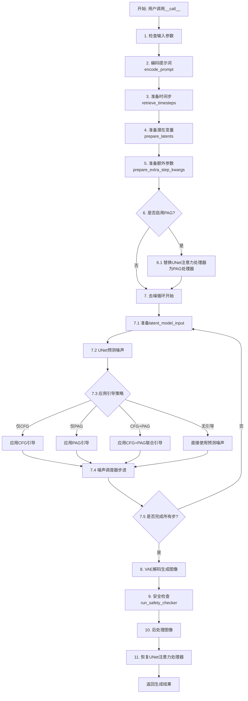

## 类结构

```
Object
├── PAGIdentitySelfAttnProcessor (注意力处理器)
├── PAGCFGIdentitySelfAttnProcessor (注意力处理器)
├── rescale_noise_cfg (全局函数)
├── retrieve_timesteps (全局函数)
└── StableDiffusionPAGPipeline (主管道类)
    ├── DiffusionPipeline (基类)
    ├── TextualInversionLoaderMixin (Mixin)
    ├── StableDiffusionLoraLoaderMixin (Mixin)
    ├── IPAdapterMixin (Mixin)
    └── FromSingleFileMixin (Mixin)
```

## 全局变量及字段


### `logger`
    
模块级日志记录器，用于输出运行时的日志信息

类型：`logging.Logger`
    


### `EXAMPLE_DOC_STRING`
    
包含Stable Diffusion pipeline使用示例的文档字符串

类型：`str`
    


### `StableDiffusionPAGPipeline.model_cpu_offload_seq`
    
定义模型组件CPU卸载顺序的字符串，指示text_encoder->image_encoder->unet->vae的卸载流程

类型：`str`
    


### `StableDiffusionPAGPipeline._optional_components`
    
可选组件列表，包含safety_checker、feature_extractor和image_encoder等可选模块

类型：`List[str]`
    


### `StableDiffusionPAGPipeline._exclude_from_cpu_offload`
    
从CPU卸载中排除的组件列表，用于指定不参与模型卸载的特定模块

类型：`List[str]`
    


### `StableDiffusionPAGPipeline._callback_tensor_inputs`
    
回调函数可用的张量输入名称列表，包含latents、prompt_embeds等可回调的张量

类型：`List[str]`
    


### `StableDiffusionPAGPipeline.vae_scale_factor`
    
VAE缩放因子，基于VAE块输出通道数计算，用于将潜在表示缩放到正确尺寸

类型：`int`
    


### `StableDiffusionPAGPipeline.image_processor`
    
VAE图像处理器，用于对图像进行预处理和后处理操作

类型：`VaeImageProcessor`
    
    

## 全局函数及方法


### `rescale_noise_cfg`

该函数用于根据`guidance_rescale`参数对噪声预测配置进行重缩放，基于论文[Common Diffusion Noise Schedules and Sample Steps are Flawed](https://huggingface.co/papers/2305.08891)第3.4节的发现，通过调整噪声预测的标准差来解决过度曝光问题，并避免生成过于平淡的图像。

参数：

- `noise_cfg`：`torch.Tensor`，经过CFG（Classifier-Free Guidance）处理后的噪声预测张量
- `noise_pred_text`：`torch.Tensor`，文本条件的噪声预测张量，用于计算参考标准差
- `guidance_rescale`：`float`，重缩放因子，默认值为0.0，用于控制重缩放强度，值为0时返回原始结果

返回值：`torch.Tensor`，返回重缩放后的噪声预测配置

#### 流程图

```mermaid
flowchart TD
    A[开始] --> B[计算noise_pred_text的标准差 std_text]
    B --> C[计算noise_cfg的标准差 std_cfg]
    C --> D[计算缩放因子: std_text / std_cfg]
    D --> E[计算重缩放后的噪声预测: noise_cfg × 缩放因子]
    E --> F[计算混合权重: guidance_rescale]
    F --> G[混合原始和重缩放结果:<br/>guidance_rescale × noise_pred_rescaled +<br/>(1 - guidance_rescale) × noise_cfg]
    G --> H[返回重缩放后的noise_cfg]
```

#### 带注释源码

```python
def rescale_noise_cfg(noise_cfg, noise_pred_text, guidance_rescale=0.0):
    """
    Rescale `noise_cfg` according to `guidance_rescale`. Based on findings of [Common Diffusion Noise Schedules and
    Sample Steps are Flawed](https://huggingface.co/papers/2305.08891). See Section 3.4
    
    该函数实现了论文中提出的CFG重缩放技术，用于解决以下问题：
    1. 过度曝光（overexposure）：当CFG强度过高时，生成的图像可能出现过度曝光
    2. 图像过于平淡（plain looking）：CFG可能导致生成的图像缺乏细节和对比度
    """
    # 计算文本条件噪声预测在所有空间维度上的标准差
    # dim参数指定要计算标准差的维度，从第1维开始（保留batch维度）
    # keepdim=True保持维度以便后续广播运算
    std_text = noise_pred_text.std(dim=list(range(1, noise_pred_text.ndim)), keepdim=True)
    
    # 计算CFG噪声预测在所有空间维度上的标准差
    std_cfg = noise_cfg.std(dim=list(range(1, noise_cfg.ndim)), keepdim=True)
    
    # rescale the results from guidance (fixes overexposure)
    # 通过将noise_cfg缩放为与noise_pred_text相同的标准差来修复过度曝光问题
    noise_pred_rescaled = noise_cfg * (std_text / std_cfg)
    
    # mix with the original results from guidance by factor guidance_rescale to avoid "plain looking" images
    # 通过guidance_rescale因子混合重缩放和原始结果，避免图像过于平淡
    # 当guidance_rescale=0时，完全使用原始noise_cfg（不做重缩放）
    # 当guidance_rescale=1时，完全使用重缩放后的结果
    noise_cfg = guidance_rescale * noise_pred_rescaled + (1 - guidance_rescale) * noise_cfg
    
    return noise_cfg
```


### `retrieve_timesteps`

该函数是 Stable Diffusion Pipeline 中的时间步检索工具函数，负责调用调度器的 `set_timesteps` 方法并从中获取时间步序列，支持自定义时间步或根据推理步数自动生成时间步。

参数：

- `scheduler`：`SchedulerMixin`，调度器对象，用于获取时间步
- `num_inference_steps`：`Optional[int]`，生成样本时使用的扩散步数，如果使用则 `timesteps` 必须为 `None`
- `device`：`Optional[Union[str, torch.device]]`，时间步要移动到的设备，如果为 `None` 则不移动
- `timesteps`：`Optional[List[int]]`，用于支持任意时间步间距的自定义时间步，如果为 `None` 则使用调度器的默认时间步间距策略
- `**kwargs`：任意其他关键字参数，将传递给 `scheduler.set_timesteps`

返回值：`Tuple[torch.Tensor, int]`，第一个元素是调度器的时间步调度，第二个元素是推理步数

#### 流程图

```mermaid
flowchart TD
    A[开始] --> B{检查 timesteps 是否为 None}
    B -->|否| C[检查调度器是否支持自定义 timesteps]
    C -->|支持| D[调用 scheduler.set_timesteps&#40;timesteps=timesteps, device=device, &#42;&#42;kwargs&#41;]
    C -->|不支持| E[抛出 ValueError 异常]
    D --> F[获取 scheduler.timesteps]
    F --> G[计算 num_inference_steps = len&#40;timesteps&#41;]
    B -->|是| H[调用 scheduler.set_timesteps&#40;num_inference_steps, device=device, &#42;&#42;kwargs&#41;]
    H --> I[获取 scheduler.timesteps]
    I --> G
    G --> J[返回 timesteps 和 num_inference_steps]
```

#### 带注释源码

```python
def retrieve_timesteps(
    scheduler,
    num_inference_steps: Optional[int] = None,
    device: Optional[Union[str, torch.device]] = None,
    timesteps: Optional[List[int]] = None,
    **kwargs,
):
    """
    Calls the scheduler's `set_timesteps` method and retrieves timesteps from the scheduler after the call. Handles
    custom timesteps. Any kwargs will be supplied to `scheduler.set_timesteps`.
    Args:
        scheduler (`SchedulerMixin`):
            The scheduler to get timesteps from.
        num_inference_steps (`int`):
            The number of diffusion steps used when generating samples with a pre-trained model. If used,
            `timesteps` must be `None`.
        device (`str` or `torch.device`, *optional*):
            The device to which the timesteps should be moved to. If `None`, the timesteps are not moved.
        timesteps (`List[int]`, *optional*):
                Custom timesteps used to support arbitrary spacing between timesteps. If `None`, then the default
                timestep spacing strategy of the scheduler is used. If `timesteps` is passed, `num_inference_steps`
                must be `None`.
    Returns:
        `Tuple[torch.Tensor, int]`: A tuple where the first element is the timestep schedule from the scheduler and the
        second element is the number of inference steps.
    """
    # 如果传入了自定义 timesteps，则使用自定义时间步
    if timesteps is not None:
        # 检查调度器的 set_timesteps 方法是否支持 timesteps 参数
        accepts_timesteps = "timesteps" in set(inspect.signature(scheduler.set_timesteps).parameters.keys())
        if not accepts_timesteps:
            raise ValueError(
                f"The current scheduler class {scheduler.__class__}'s `set_timesteps` does not support custom"
                f" timestep schedules. Please check whether you are using the correct scheduler."
            )
        # 调用调度器的 set_timesteps 方法，传入自定义时间步和设备
        scheduler.set_timesteps(timesteps=timesteps, device=device, **kwargs)
        # 从调度器获取时间步
        timesteps = scheduler.timesteps
        # 计算推理步数
        num_inference_steps = len(timesteps)
    else:
        # 否则使用 num_inference_steps 自动生成时间步
        scheduler.set_timesteps(num_inference_steps, device=device, **kwargs)
        # 从调度器获取时间步
        timesteps = scheduler.timesteps
    # 返回时间步和推理步数
    return timesteps, num_inference_steps
```


### `PAGIdentitySelfAttnProcessor.__init__`

该方法为 `PAGIdentitySelfAttnProcessor` 类的构造函数，用于初始化处理器实例。方法内部会检查当前 PyTorch 版本是否支持 `F.scaled_dot_product_attention` 函数，若不支持则抛出 `ImportError` 异常。这是使用 `AttnProcessor2_0` 的前提条件，确保在调用注意力机制时能够使用 PyTorch 2.0 的优化实现。

参数： 无

返回值： `None`，构造函数不返回任何值

#### 流程图

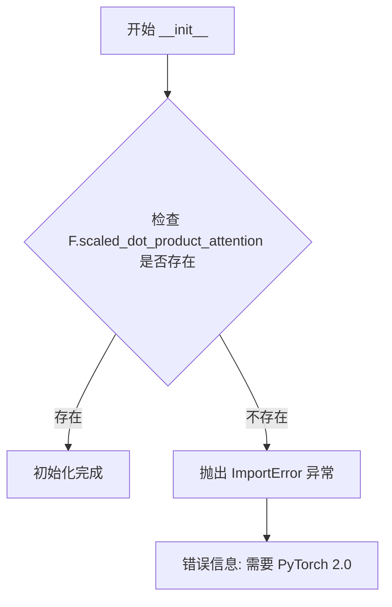

#### 带注释源码

```python
def __init__(self):
    # 检查当前 PyTorch 版本是否支持 scaled_dot_product_attention 函数
    # scaled_dot_product_attention 是 PyTorch 2.0 引入的优化注意力计算函数
    # 如果不支持，则抛出 ImportError 提示用户升级 PyTorch
    if not hasattr(F, "scaled_dot_product_attention"):
        raise ImportError("AttnProcessor2_0 requires PyTorch 2.0, to use it, please upgrade PyTorch to 2.0.")
```


### `PAGIdentitySelfAttnProcessor.__call__`

实现PAG（Perturbed Attention Guidance）机制的注意力处理器，将隐藏状态分chunk为原始路径和扰动路径，分别进行处理后concatenate。原始路径执行标准的自注意力计算，扰动路径使用恒等注意力（直接传递value），最终将两个路径的结果拼接返回。

参数：

- `self`：`PAGIdentitySelfAttnProcessor`实例，当前注意力处理器对象
- `attn`：`Attention`，UNet中的注意力模块，用于获取QKV投影矩阵和输出层
- `hidden_states`：`torch.Tensor`，输入的隐藏状态张量，形状为(batch_size, channel, height, width)或(batch_size, sequence_length, channel)
- `encoder_hidden_states`：`Optional[torch.Tensor] = None`，编码器隐藏状态，用于cross-attention，当前实现未使用
- `attention_mask`：`Optional[torch.Tensor] = None`，注意力掩码，用于遮蔽特定位置
- `temb`：`Optional[torch.Tensor] = None`，时间嵌入，用于spatial normalization
- `*args`：可变位置参数，用于兼容性
- `**kwargs`：可变关键字参数，包含已弃用的`scale`参数

返回值：`torch.Tensor`，处理后的隐藏状态张量，形状与输入相同

#### 流程图

```mermaid
flowchart TD
    A[开始: __call__] --> B{检查kwargs中是否有scale?}
    B -->|是| C[发出弃用警告]
    B -->|否| D[保存residual]
    D --> E{attn.spatial_norm是否存在?}
    E -->|是| F[应用spatial_norm]
    E -->|否| G[继续]
    F --> G
    G --> H{hidden_states.ndim == 4?}
    H -->|是| I[reshape为(batch, channel, H*W).transpose(1,2)]
    H -->|否| J[继续]
    I --> J
    J --> K[chunk分成两半: hidden_states_org, hidden_states_ptb]
    
    K --> L[原始路径处理]
    L --> L1[获取batch_size和sequence_length]
    L2{attention_mask存在?}
    L1 --> L2
    L2 -->|是| L3[prepare_attention_mask并reshape]
    L2 -->|否| L4[继续]
    L3 --> L4
    L4 --> L5{attn.group_norm存在?}
    L5 -->|是| L6[应用group_norm]
    L5 -->|否| L7[继续]
    L6 --> L7
    L7 --> L8[计算Q K V]
    L8 --> L9[reshape为多头格式]
    L10[执行F.scaled_dot_product_attention]
    L9 --> L10
    L10 --> L11[reshape回原始形状]
    L11 --> L12[应用to_out[0]线性投影]
    L12 --> L13[应用to_out[1]dropout]
    L13 --> L14{input_ndim == 4?}
    L14 -->|是| L15[还原回4D形状]
    L14 -->|否| L16[继续]
    L15 --> L16
    L16 --> M[扰动路径处理]
    
    M --> M1[获取batch_size和sequence_length]
    M2{attention_mask存在?}
    M1 --> M2
    M2 -->|是| M3[prepare_attention_mask并reshape]
    M2 -->|否| M4[继续]
    M3 --> M4
    M4 --> M5{attn.group_norm存在?}
    M5 -->|是| M6[应用group_norm]
    M5 -->|否| M7[继续]
    M6 --> M7
    M7 --> M8[仅计算V: hidden_states_ptb = attn.to_v]
    M8 --> M9[转换为query.dtype]
    M9 --> M10[应用to_out[0]线性投影]
    M10 --> M11[应用to_out[1]dropout]
    M11 --> M12{input_ndim == 4?}
    M12 -->|是| M13[还原回4D形状]
    M12 -->|否| N[拼接结果]
    M13 --> N
    
    N --> O[torch.cat: hidden_states_org + hidden_states_ptb]
    O --> P{attn.residual_connection?}
    P -->|是| Q[hidden_states + residual]
    P -->|否| R[继续]
    Q --> R
    R --> S[hidden_states / attn.rescale_output_factor]
    S --> T[返回hidden_states]
```

#### 带注释源码

```python
def __call__(
    self,
    attn: Attention,
    hidden_states: torch.Tensor,
    encoder_hidden_states: Optional[torch.Tensor] = None,
    attention_mask: Optional[torch.Tensor] = None,
    temb: Optional[torch.Tensor] = None,
    *args,
    **kwargs,
) -> torch.Tensor:
    # 检查是否传入了已弃用的scale参数，若是则发出警告
    if len(args) > 0 or kwargs.get("scale", None) is not None:
        deprecation_message = "The `scale` argument is deprecated and will be ignored. Please remove it, as passing it will raise an error in the future. `scale` should directly be passed while calling the underlying pipeline component i.e., via `cross_attention_kwargs`."
        deprecate("scale", "1.0.0", deprecation_message)

    # 保存残差连接所需的原始hidden_states
    residual = hidden_states
    
    # 若存在spatial_norm，则应用空间归一化（通常用于spatial transformer）
    if attn.spatial_norm is not None:
        hidden_states = attn.spatial_norm(hidden_states, temb)

    # 判断输入维度：4D tensor需要特殊处理（2D图像空间）
    input_ndim = hidden_states.ndim
    if input_ndim == 4:
        batch_size, channel, height, width = hidden_states.shape
        # 将2D图像展开为序列：(B, C, H, W) -> (B, H*W, C)
        hidden_states = hidden_states.view(batch_size, channel, height * width).transpose(1, 2)

    # ========== 核心：PAG将hidden_states分成两半 ==========
    # chunk: 将序列长度分成两部分
    #   - 前半部分：走原始注意力路径 (hidden_states_org)
    #   - 后半部分：走扰动/恒等注意力路径 (hidden_states_ptb)
    hidden_states_org, hidden_states_ptb = hidden_states.chunk(2)

    # ========== 原始路径：标准自注意力 ==========
    batch_size, sequence_length, _ = hidden_states_org.shape

    # 准备attention_mask
    if attention_mask is not None:
        # 准备适配的attention_mask形状
        attention_mask = attn.prepare_attention_mask(attention_mask, sequence_length, batch_size)
        # scaled_dot_product_attention expects attention_mask shape to be
        # (batch, heads, source_length, target_length)
        attention_mask = attention_mask.view(batch_size, attn.heads, -1, attention_mask.shape[-1])

    # 应用group normalization（若存在）
    if attn.group_norm is not None:
        hidden_states_org = attn.group_norm(hidden_states_org.transpose(1, 2)).transpose(1, 2)

    # 计算Q、K、V投影
    query = attn.to_q(hidden_states_org)
    key = attn.to_k(hidden_states_org)
    value = attn.to_v(hidden_states_org)

    # 分解inner dimension为多个head
    inner_dim = key.shape[-1]
    head_dim = inner_dim // attn.heads

    # reshape为多头注意力格式：(batch, seq, heads, head_dim) -> (batch, heads, seq, head_dim)
    query = query.view(batch_size, -1, attn.heads, head_dim).transpose(1, 2)
    key = key.view(batch_size, -1, attn.heads, head_dim).transpose(1, 2)
    value = value.view(batch_size, -1, attn.heads, head_dim).transpose(1, 2)

    # 执行scaled dot-product attention
    # the output of sdp = (batch, num_heads, seq_len, head_dim)
    # TODO: add support for attn.scale when we move to Torch 2.1
    hidden_states_org = F.scaled_dot_product_attention(
        query, key, value, attn_mask=attention_mask, dropout_p=0.0, is_causal=False
    )

    # 恢复形状：(batch, heads, seq, head_dim) -> (batch, seq, heads*head_dim)
    hidden_states_org = hidden_states_org.transpose(1, 2).reshape(batch_size, -1, attn.heads * head_dim)
    hidden_states_org = hidden_states_org.to(query.dtype)

    # 线性投影 + dropout输出层
    hidden_states_org = attn.to_out[0](hidden_states_org)
    hidden_states_org = attn.to_out[1](hidden_states_org)

    # 若输入为4D，还原回4D形状
    if input_ndim == 4:
        hidden_states_org = hidden_states_org.transpose(-1, -2).reshape(batch_size, channel, height, width)

    # ========== 扰动路径：恒等注意力 (Identity Attention) ==========
    # PAG的核心：不计算Q、K，直接使用V作为输出
    # 这相当于注意力机制退化为恒等映射，引入扰动
    batch_size, sequence_length, _ = hidden_states_ptb.shape

    if attention_mask is not None:
        attention_mask = attn.prepare_attention_mask(attention_mask, sequence_length, batch_size)
        attention_mask = attention_mask.view(batch_size, attn.heads, -1, attention_mask.shape[-1])

    if attn.group_norm is not None:
        hidden_states_ptb = attn.group_norm(hidden_states_ptb.transpose(1, 2)).transpose(1, 2)

    # 关键：只使用value，忽略query和key
    # hidden_states_ptb = torch.zeros(value.shape).to(value.get_device())  # 可选：全零扰动
    hidden_states_ptb = value  # 恒等注意力：直接传递value

    hidden_states_ptb = hidden_states_ptb.to(query.dtype)

    # 线性投影 + dropout（与原始路径相同的输出层）
    hidden_states_ptb = attn.to_out[0](hidden_states_ptb)
    hidden_states_ptb = attn.to_out[1](hidden_states_ptb)

    if input_ndim == 4:
        hidden_states_ptb = hidden_states_ptb.transpose(-1, -2).reshape(batch_size, channel, height, width)

    # ========== 合并两个路径 ==========
    # 将原始注意力结果和扰动注意力结果拼接
    # 拼接后序列长度恢复为chunk前的长度
    hidden_states = torch.cat([hidden_states_org, hidden_states_ptb])

    # 残差连接
    if attn.residual_connection:
        hidden_states = hidden_states + residual

    # 输出缩放因子（用于控制输出幅度）
    hidden_states = hidden_states / attn.rescale_output_factor

    return hidden_states
```


### `PAGCFGIdentitySelfAttnProcessor.__init__`

该方法是 `PAGCFGIdentitySelfAttnProcessor` 类的构造函数，用于初始化注意力处理器实例，并在初始化时检查 PyTorch 版本是否支持 `scaled_dot_product_attention` 函数，若不支持则抛出 ImportError 异常。

参数：

- 该方法无显式参数（隐式参数 `self` 为类实例自身）

返回值：`None`，构造函数不返回任何值

#### 流程图

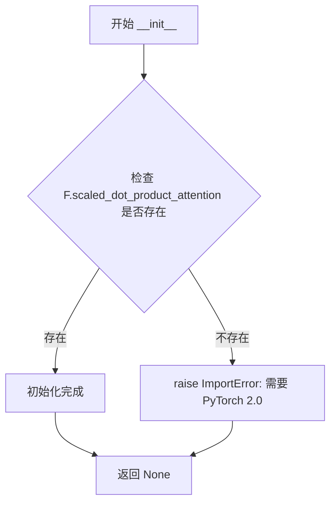

#### 带注释源码

```python
def __init__(self):
    # 检查 PyTorch 的 functools 模块是否具有 scaled_dot_product_attention 函数
    # scaled_dot_product_attention 是 PyTorch 2.0 引入的高效注意力计算实现
    if not hasattr(F, "scaled_dot_product_attention"):
        # 如果不支持，抛出 ImportError 提示用户升级 PyTorch 版本
        raise ImportError("AttnProcessor2_0 requires PyTorch 2.0, to use it, please upgrade PyTorch to 2.0.")
```


### `PAGCFGIdentitySelfAttnProcessor.__call__`

该方法是 PAG（Perturbed Attention Guidance）实现中的核心注意力处理器，专门用于处理 CFG（Classifier-Free Guidance）与 PAG 同时启用的场景。它通过将隐藏状态分割为三部分（unconditional、original、perturbed），分别对 original path 执行标准自注意力，对 perturbed path 执行恒等注意力（Identity Attention），最终拼接两部分结果以实现对生成过程的双重引导。

参数：

- `self`：PAGCFGIdentitySelfAttnProcessor 实例本身
- `attn`：`Attention`，注意力模块实例，包含 `to_q`、`to_k`、`to_v`、`to_out` 等线性层以及 `group_norm`、`spatial_norm`、`residual_connection`、`rescale_output_factor` 等属性
- `hidden_states`：`torch.Tensor`，输入的隐藏状态张量，形状为 (batch, channel, height, width) 或 (batch, sequence, channel)
- `encoder_hidden_states`：`Optional[torch.Tensor]`，编码器隐藏状态，用于跨注意力，在此自注意力处理器中未使用
- `attention_mask`：`Optional[torch.Tensor]`，注意力掩码，用于控制注意力权重
- `temb`：`Optional[torch.Tensor]`，时间嵌入，用于空间归一化
- `*args`：可变位置参数，用于向后兼容
- `**kwargs`：可变关键字参数，支持 `scale` 参数（已废弃）

返回值：`torch.Tensor`，处理后的隐藏状态，形状与输入相同

#### 流程图

```mermaid
flowchart TD
    A[开始 __call__] --> B{检查废弃参数 scale}
    B -->|是| C[发出 deprecation 警告]
    B -->|否| D[保存残差 hidden_states]
    D --> E{存在 spatial_norm}
    E -->|是| F[应用 spatial_norm]
    E -->|否| G[input_ndim = hidden_states.ndim]
    F --> G
    G --> H{input_ndim == 4}
    H -->|是| I[reshape: (B,C,H*W) transpose to (B, HW, C)]
    H -->|否| J[chunk hidden_states into 3 parts]
    I --> J
    J --> K[chunk: uncond, org, ptb]
    K --> L[拼接: torch.cat([uncond, org])]
    L --> M[Original Path 处理]
    M --> N[准备 attention_mask]
    N --> O{存在 group_norm}
    O -->|是| P[应用 group_norm]
    O -->|否| Q[计算 query, key, value]
    P --> Q
    Q --> R[reshape query, key, value]
    R --> S[F.scaled_dot_product_attention]
    S --> T[reshape 输出并转置]
    T --> U[线性投影 to_out[0]]
    U --> V[dropout to_out[1]]
    V --> W{input_ndim == 4}
    W -->|是| X[reshape 回 (B, C, H, W)]
    W -->|否| Y[Perturbed Path 处理]
    X --> Y
    Y --> Z[准备 attention_mask]
    Z --> AA{存在 group_norm}
    AA -->|是| AB[应用 group_norm]
    AA -->|否| AC[计算 value only]
    AB --> AC
    AC --> AD[hidden_states_ptb = value]
    AD --> AE[转换为 query dtype]
    AE --> AF[线性投影 to_out[0]]
    AF --> AG[dropout to_out[1]]
    AG --> AH{input_ndim == 4}
    AH -->|是| AI[reshape 回 (B, C, H, W)]
    AH -->|否| AJ[拼接: torch.cat([org, ptb])]
    AI --> AJ
    AJ --> AK{residual_connection}
    AK -->|是| AL[hidden_states + residual]
    AK -->|否| AM[hidden_states / rescale_output_factor]
    AL --> AM
    AM --> AN[返回 hidden_states]
```

#### 带注释源码

```python
def __call__(
    self,
    attn: Attention,
    hidden_states: torch.Tensor,
    encoder_hidden_states: Optional[torch.Tensor] = None,
    attention_mask: Optional[torch.Tensor] = None,
    temb: Optional[torch.Tensor] = None,
    *args,
    **kwargs,
) -> torch.Tensor:
    # 检查是否传入了废弃的 scale 参数，如果是则发出警告
    if len(args) > 0 or kwargs.get("scale", None) is not None:
        deprecation_message = "The `scale` argument is deprecated and will be ignored. Please remove it, as passing it will raise an error in the future. `scale` should directly be passed while calling the underlying pipeline component i.e., via `cross_attention_kwargs`."
        deprecate("scale", "1.0.0", deprecation_message)

    # 保存残差连接所需的原始输入，用于后续的残差连接
    residual = hidden_states
    
    # 如果存在空间归一化层，则应用它
    if attn.spatial_norm is not None:
        hidden_states = attn.spatial_norm(hidden_states, temb)

    # 获取输入张量的维度
    input_ndim = hidden_states.ndim
    
    # 如果是 4D 张量 (B, C, H, W)，转换为 3D (B, H*W, C)
    if input_ndim == 4:
        batch_size, channel, height, width = hidden_states.shape
        hidden_states = hidden_states.view(batch_size, channel, height * width).transpose(1, 2)

    # 将 hidden_states 分割为三部分：unconditional、original、perturbed
    # 用于同时处理 CFG 的无条件/条件部分和 PAG 的扰动部分
    hidden_states_uncond, hidden_states_org, hidden_states_ptb = hidden_states.chunk(3)
    
    # 将 unconditional 和 original 拼接在一起，形成标准 CFG 处理的输入
    # 顺序：先无条件（用于计算 CFG 的 delta），后条件
    hidden_states_org = torch.cat([hidden_states_uncond, hidden_states_org])

    # ========== Original Path: 标准自注意力处理 ==========
    batch_size, sequence_length, _ = hidden_states_org.shape

    # 准备注意力掩码
    if attention_mask is not None:
        attention_mask = attn.prepare_attention_mask(attention_mask, sequence_length, batch_size)
        # scaled_dot_product_attention expects attention_mask shape to be
        # (batch, heads, source_length, target_length)
        attention_mask = attention_mask.view(batch_size, attn.heads, -1, attention_mask.shape[-1])

    # 应用组归一化（如果存在）
    if attn.group_norm is not None:
        hidden_states_org = attn.group_norm(hidden_states_org.transpose(1, 2)).transpose(1, 2)

    # 计算 Q、K、V 投影
    query = attn.to_q(hidden_states_org)
    key = attn.to_k(hidden_states_org)
    value = attn.to_v(hidden_states_org)

    # 计算内部维度和头维度
    inner_dim = key.shape[-1]
    head_dim = inner_dim // attn.heads

    # 重塑 query、key、value 以适应多头注意力格式
    # 形状: (batch, seq_len, heads, head_dim) -> (batch, heads, seq_len, head_dim)
    query = query.view(batch_size, -1, attn.heads, head_dim).transpose(1, 2)
    key = key.view(batch_size, -1, attn.heads, head_dim).transpose(1, 2)
    value = value.view(batch_size, -1, attn.heads, head_dim).transpose(1, 2)

    # 执行缩放点积注意力计算
    # TODO: add support for attn.scale when we move to Torch 2.1
    hidden_states_org = F.scaled_dot_product_attention(
        query, key, value, attn_mask=attention_mask, dropout_p=0.0, is_causal=False
    )

    # 恢复原始形状并转换数据类型
    hidden_states_org = hidden_states_org.transpose(1, 2).reshape(batch_size, -1, attn.heads * head_dim)
    hidden_states_org = hidden_states_org.to(query.dtype)

    # 线性投影和 dropout
    hidden_states_org = attn.to_out[0](hidden_states_org)
    hidden_states_org = attn.to_out[1](hidden_states_org)

    # 如果是 4D 输入，则恢复原始形状
    if input_ndim == 4:
        hidden_states_org = hidden_states_org.transpose(-1, -2).reshape(batch_size, channel, height, width)

    # ========== Perturbed Path: 恒等注意力（Identity Attention）==========
    # 扰动路径的核心：不计算注意力，直接将 value 作为输出
    # 这相当于让模型看到"不加注意力的原始信息"，与加注意力的信息形成对比
    batch_size, sequence_length, _ = hidden_states_ptb.shape

    if attention_mask is not None:
        attention_mask = attn.prepare_attention_mask(attention_mask, sequence_length, batch_size)
        attention_mask = attention_mask.view(batch_size, attn.heads, -1, attention_mask.shape[-1])

    if attn.group_norm is not None:
        hidden_states_ptb = attn.group_norm(hidden_states_ptb.transpose(1, 2)).transpose(1, 2)

    # 仅计算 value，忽略 query 和 key（恒等注意力的核心）
    value = attn.to_v(hidden_states_ptb)
    
    # 扰动路径：直接使用 value 作为 hidden_states，等同于跳过注意力机制
    # 注释掉的代码显示原本可能是零张量，后来改为直接使用 value
    # hidden_states_ptb = torch.zeros(value.shape).to(value.get_device())
    hidden_states_ptb = value

    hidden_states_ptb = hidden_states_ptb.to(query.dtype)

    # 线性投影和 dropout（与 original path 相同的输出变换）
    hidden_states_ptb = attn.to_out[0](hidden_states_ptb)
    hidden_states_ptb = attn.to_out[1](hidden_states_ptb)

    if input_ndim == 4:
        hidden_states_ptb = hidden_states_ptb.transpose(-1, -2).reshape(batch_size, channel, height, width)

    # 拼接 original 和 perturbed 的结果
    # 顺序：先 original（包含 uncond+cond），后 perturbed
    hidden_states = torch.cat([hidden_states_org, hidden_states_ptb])

    # 应用残差连接（如果启用）
    if attn.residual_connection:
        hidden_states = hidden_states + residual

    # 缩放输出以稳定训练
    hidden_states = hidden_states / attn.rescale_output_factor

    return hidden_states
```


# StableDiffusionPAGPipeline.__init__ 详细设计文档

### StableDiffusionPAGPipeline.__init__

`__init__` 是 StableDiffusionPAGPipeline 类的构造函数，负责初始化整个 PAG（Perturbed Attention Guidance）扩散管道。该方法接收多个神经网络组件（VAE、文本编码器、UNet等），进行配置验证和模块注册，设置图像处理器和VAE缩放因子，并处理一些向后兼容的配置更新。

参数：

- `vae`：`AutoencoderKL`，Variational Auto-Encoder (VAE) 模型，用于将图像编码和解码到潜在表示
- `text_encoder`：`CLIPTextModel`，冻结的文本编码器（clip-vit-large-patch14）
- `tokenizer`：`CLIPTokenizer`，用于对文本进行分词的 CLIPTokenizer
- `unet`：`UNet2DConditionModel`，用于对编码后的图像潜在表示进行去噪的 UNet2DConditionModel
- `scheduler`：`KarrasDiffusionSchedulers`，与 unet 结合使用以对图像潜在表示进行去噪的调度器
- `safety_checker`：`StableDiffusionSafetyChecker`，分类模块，用于评估生成的图像是否可能被认为是冒犯性或有害的
- `feature_extractor`：`CLIPImageProcessor`，用于从生成的图像中提取特征的 CLIPImageProcessor
- `image_encoder`：`CLIPVisionModelWithProjection`（可选，默认为 None），用于 IP Adapter 的图像编码器
- `requires_safety_checker`：`bool`（可选，默认为 True），是否需要安全检查器

返回值：`None`，构造函数不返回值，仅初始化对象状态

#### 流程图

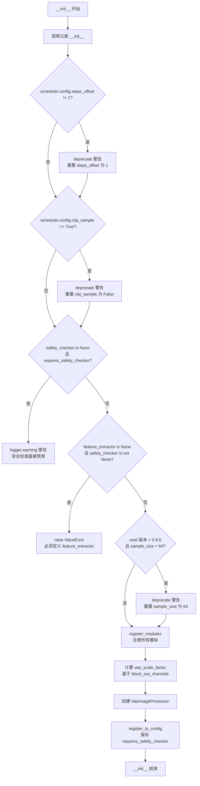

#### 带注释源码

```python
def __init__(
    self,
    vae: AutoencoderKL,
    text_encoder: CLIPTextModel,
    tokenizer: CLIPTokenizer,
    unet: UNet2DConditionModel,
    scheduler: KarrasDiffusionSchedulers,
    safety_checker: StableDiffusionSafetyChecker,
    feature_extractor: CLIPImageProcessor,
    image_encoder: CLIPVisionModelWithProjection = None,
    requires_safety_checker: bool = True,
):
    """
    初始化 StableDiffusionPAGPipeline
    
    参数:
        vae: VAE 模型，用于图像编码/解码
        text_encoder: CLIP 文本编码器
        tokenizer: CLIP 分词器
        unet: UNet2DConditionModel 去噪模型
        scheduler: 扩散调度器
        safety_checker: 安全检查器
        feature_extractor: 图像特征提取器
        image_encoder: IP Adapter 图像编码器（可选）
        requires_safety_checker: 是否需要安全检查器
    """
    # 调用父类 DiffusionPipeline 的 __init__ 进行基础初始化
    super().__init__()

    # ==================== 调度器配置兼容性处理 ====================
    # 检查 scheduler 的 steps_offset 配置是否为 1（旧版本可能不为 1）
    if scheduler is not None and getattr(scheduler.config, "steps_offset", 1) != 1:
        deprecation_message = (
            f"The configuration file of this scheduler: {scheduler} is outdated. `steps_offset`"
            f" should be set to 1 instead of {scheduler.config.steps_offset}. Please make sure "
            "to update the config accordingly as leaving `steps_offset` might led to incorrect results"
            " in future versions. If you have downloaded this checkpoint from the Hugging Face Hub,"
            " it would be very nice if you could open a Pull request for the `scheduler/scheduler_config.json`"
            " file"
        )
        deprecate("steps_offset!=1", "1.0.0", deprecation_message, standard_warn=False)
        # 更新调度器配置，重置 steps_offset 为 1
        new_config = dict(scheduler.config)
        new_config["steps_offset"] = 1
        scheduler._internal_dict = FrozenDict(new_config)

    # 检查 scheduler 的 clip_sample 配置（旧版本可能设为 True）
    if scheduler is not None and getattr(scheduler.config, "clip_sample", False) is True:
        deprecation_message = (
            f"The configuration file of this scheduler: {scheduler} has not set the configuration `clip_sample`."
            " `clip_sample` should be set to False in the configuration file. Please make sure to update the"
            " config accordingly as not setting `clip_sample` in the config might lead to incorrect results in"
            " future versions. If you have downloaded this checkpoint from the Hugging Face Hub, it would be very"
            " nice if you could open a Pull request for the `scheduler/scheduler_config.json` file"
        )
        deprecate("clip_sample not set", "1.0.0", deprecation_message, standard_warn=False)
        # 更新调度器配置，禁用 clip_sample
        new_config = dict(scheduler.config)
        new_config["clip_sample"] = False
        scheduler._internal_dict = FrozenDict(new_config)

    # ==================== 安全检查器验证 ====================
    # 如果 safety_checker 为 None 但 requires_safety_checker 为 True，发出警告
    if safety_checker is None and requires_safety_checker:
        logger.warning(
            f"You have disabled the safety checker for {self.__class__} by passing `safety_checker=None`. Ensure"
            " that you abide to the conditions of the Stable Diffusion license and do not expose unfiltered"
            " results in services or applications open to the public. Both the diffusers team and Hugging Face"
            " strongly recommend to keep the safety filter enabled in all public facing circumstances, disabling"
            " it only for use-cases that involve analyzing network behavior or auditing its results. For more"
            " information, please have a look at https://github.com/huggingface/diffusers/pull/254 ."
        )

    # 如果有 safety_checker 但没有 feature_extractor，抛出错误
    if safety_checker is not None and feature_extractor is None:
        raise ValueError(
            "Make sure to define a feature extractor when loading {self.__class__} if you want to use the safety"
            " checker. If you do not want to use the safety checker, you can pass `'safety_checker=None'` instead."
        )

    # ==================== UNet 配置兼容性处理 ====================
    # 检查 UNet 版本和 sample_size 配置
    is_unet_version_less_0_9_0 = (
        unet is not None
        and hasattr(unet.config, "_diffusers_version")
        and version.parse(version.parse(unet.config._diffusers_version).base_version) < version.parse("0.9.0.dev0")
    )
    is_unet_sample_size_less_64 = (
        unet is not None and hasattr(unet.config, "sample_size") and unet.config.sample_size < 64
    )
    # 如果是旧版本 UNet 且 sample_size < 64，发出警告并修复
    if is_unet_version_less_0_9_0 and is_unet_sample_size_less_64:
        deprecation_message = (
            "The configuration file of the unet has set the default `sample_size` to smaller than"
            " 64 which seems highly unlikely. If your checkpoint is a fine-tuned version of any of the"
            " following: \n- CompVis/stable-diffusion-v1-4 \n- CompVis/stable-diffusion-v1-3 \n-"
            " CompVis/stable-diffusion-v1-2 \n- CompVis/stable-diffusion-v1-1 \n- stable-diffusion-v1-5/stable-diffusion-v1-5"
            " \n- stable-diffusion-v1-5/stable-diffusion-inpainting \n you should change 'sample_size' to 64 in the"
            " configuration file. Please make sure to update the config accordingly as leaving `sample_size=32`"
            " in the config might lead to incorrect results in future versions. If you have downloaded this"
            " checkpoint from the Hugging Face Hub, it would be very nice if you could open a Pull request for"
            " the `unet/config.json` file"
        )
        deprecate("sample_size<64", "1.0.0", deprecation_message, standard_warn=False)
        new_config = dict(unet.config)
        new_config["sample_size"] = 64
        unet._internal_dict = FrozenDict(new_config)

    # ==================== 模块注册 ====================
    # 将所有模块注册到 pipeline 中，使其可以通过 self.xxx 访问
    self.register_modules(
        vae=vae,
        text_encoder=text_encoder,
        tokenizer=tokenizer,
        unet=unet,
        scheduler=scheduler,
        safety_checker=safety_checker,
        feature_extractor=feature_extractor,
        image_encoder=image_encoder,
    )

    # ==================== VAE 缩放因子计算 ====================
    # VAE 缩放因子 = 2^(block_out_channels数量 - 1)
    # 例如: [128, 256, 512, 512] -> 2^3 = 8
    self.vae_scale_factor = 2 ** (len(self.vae.config.block_out_channels) - 1) if getattr(self, "vae", None) else 8
    
    # 创建 VAE 图像处理器
    self.image_processor = VaeImageProcessor(vae_scale_factor=self.vae_scale_factor)

    # 将 requires_safety_checker 保存到配置中
    self.register_to_config(requires_safety_checker=requires_safety_checker)
```

---

## 补充信息

### 关键组件信息

| 组件名称 | 一句话描述 |
|---------|-----------|
| `PAGIdentitySelfAttnProcessor` | 实现无分类器指导的 PAG 扰动注意力处理器，将隐藏状态分块后分别处理原始路径和扰动路径 |
| `PAGCFGIdentitySelfAttnProcessor` | 实现带分类器指导的 PAG 扰动注意力处理器，处理三块隐藏状态（uncond、org、ptb） |
| `rescale_noise_cfg` | 根据 guidance_rescale 参数重新缩放噪声预测，防止图像过度曝光 |
| `retrieve_timesteps` | 从调度器获取时间步，支持自定义时间步和任意间隔 |

### 潜在技术债务与优化空间

1. **重复代码**：`PAGIdentitySelfAttnProcessor` 和 `PAGCFGIdentitySelfAttnProcessor` 中存在大量重复的注意力计算逻辑，可以提取为基类或公共方法
2. **硬编码索引**：`pag_applied_layers_index` 使用字符串索引（如 "d4"），缺乏类型安全性和IDE支持
3. **弃用警告处理**：多处使用 `deprecate` 但仍执行配置修改，这种"静默修复"模式可能导致未来维护困难
4. **模块注册方式**：通过 `register_modules` 批量注册，虽然方便但降低了代码可读性和类型检查

### 设计约束

1. **PyTorch 版本要求**：需要 PyTorch 2.0+ 以使用 `F.scaled_dot_product_attention`
2. **设备兼容性**：代码支持 CPU offload 和模型并行
3. **LoRA 兼容性**：支持通过 PEFT backend 或传统方式加载 LoRA 权重
4. **IP Adapter**：可选功能，需要 `image_encoder` 参数


### `StableDiffusionPAGPipeline.enable_vae_slicing`

该方法用于启用VAE分片解码功能，通过将输入张量分片处理来减少内存占用并支持更大的批处理大小。该方法已被弃用，建议直接调用 `pipe.vae.enable_slicing()`。

参数： 无

返回值：`None`，无返回值

#### 流程图

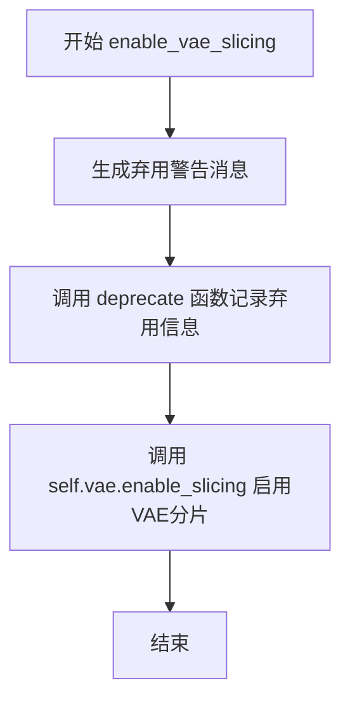

#### 带注释源码

```python
def enable_vae_slicing(self):
    r"""
    Enable sliced VAE decoding. When this option is enabled, the VAE will split the input tensor in slices to
    compute decoding in several steps. This is useful to save some memory and allow larger batch sizes.
    """
    # 构建弃用警告消息，包含类名以提示用户该方法将在未来版本中移除
    depr_message = f"Calling `enable_vae_slicing()` on a `{self.__class__.__name__}` is deprecated and this method will be removed in a future version. Please use `pipe.vae.enable_slicing()`."
    
    # 调用 deprecate 函数记录弃用信息，版本号为 0.40.0
    deprecate(
        "enable_vae_slicing",
        "0.40.0",
        depr_message,
    )
    
    # 委托给 VAE 模型的 enable_slicing 方法执行实际的启用分片操作
    self.vae.enable_slicing()
```


### `StableDiffusionPAGPipeline.disable_vae_slicing`

该方法用于禁用VAE的分片解码功能。如果之前启用了`enable_vae_slicing`，调用此方法后将恢复为单步解码。此方法已被弃用，推荐直接使用`pipe.vae.disable_slicing()`。

参数： 无

返回值：`None`，无返回值（该方法直接操作VAE模型对象）

#### 流程图

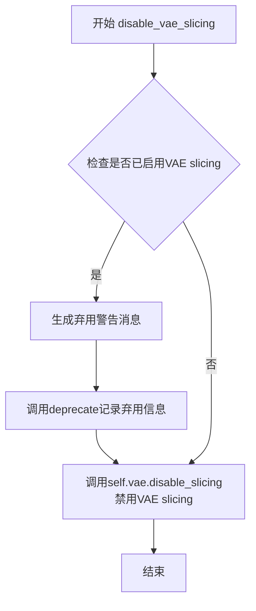

#### 带注释源码

```python
def disable_vae_slicing(self):
    r"""
    Disable sliced VAE decoding. If `enable_vae_slicing` was previously enabled, this method will go back to
    computing decoding in one step.
    """
    # 构建弃用警告消息，告知用户该方法将在未来版本中移除
    # 并推荐使用新的API: pipe.vae.disable_slicing()
    depr_message = f"Calling `disable_vae_slicing()` on a `{self.__class__.__name__}` is deprecated and this method will be removed in a future version. Please use `pipe.vae.disable_slicing()`."
    
    # 调用deprecate函数记录弃用信息
    # 参数: 方法名, 弃用版本号, 警告消息
    deprecate(
        "disable_vae_slicing",
        "0.40.0",
        depr_message,
    )
    
    # 调用VAE模型的disable_slicing方法
    # 实际上是将VAE的分片解码模式关闭，恢复到单步解码
    self.vae.disable_slicing()
```


### `StableDiffusionPAGPipeline.enable_vae_tiling`

启用VAE分块解码。当启用此选项时，VAE会将输入张量分割成块，以多个步骤计算解码和编码。这对于节省大量内存并允许处理更大的图像非常有用。

参数： 无

返回值：`None`，无返回值（该方法直接调用 `self.vae.enable_tiling()` 并通过 `deprecate` 函数发出警告）

#### 流程图

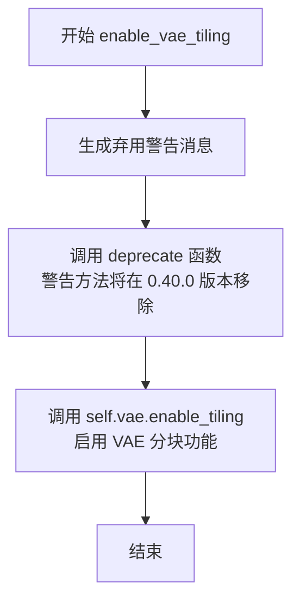

#### 带注释源码

```
def enable_vae_tiling(self):
    r"""
    Enable tiled VAE decoding. When this option is enabled, the VAE will split the input tensor into tiles to
    compute decoding and encoding in several steps. This is useful for saving a large amount of memory and to allow
    processing larger images.
    """
    # 构建弃用警告消息，告知用户该方法已被弃用
    # 建议用户直接使用 pipe.vae.enable_tiling()
    depr_message = f"Calling `enable_vae_tiling()` on a `{self.__class__.__name__}` is deprecated and this method will be removed in a future version. Please use `pipe.vae.enable_tiling()`."
    
    # 调用 deprecate 函数记录弃用信息
    # 参数: 方法名, 弃用版本号, 警告消息
    deprecate(
        "enable_vae_tiling",
        "0.40.0",
        depr_message,
    )
    
    # 实际调用 VAE 模型的 enable_tiling 方法
    # 这是真正执行启用分块功能的调用
    self.vae.enable_tiling()
```


### `StableDiffusionPAGPipeline.disable_vae_tiling`

该方法用于禁用VAE的瓦片解码模式。如果之前启用了`enable_vae_tiling`，调用此方法将恢复为单步解码。此方法已被弃用，建议直接调用`pipe.vae.disable_tiling()`。

参数：

- 该方法无显式参数（`self`为隐式参数）

返回值：`None`，无返回值

#### 流程图

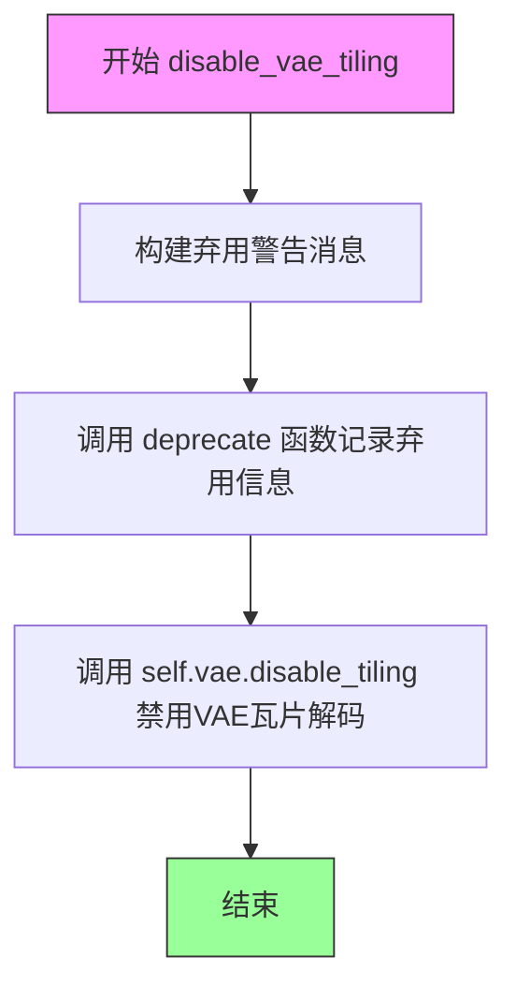

#### 带注释源码

```python
def disable_vae_tiling(self):
    r"""
    Disable tiled VAE decoding. If `enable_vae_tiling` was previously enabled, this method will go back to
    computing decoding in one step.
    """
    # 构建弃用警告消息，提示用户该方法将在未来版本中移除
    # 应使用 pipe.vae.disable_tiling() 代替
    depr_message = f"Calling `disable_vae_tiling()` on a `{self.__class__.__name__}` is deprecated and this method will be removed in a future version. Please use `pipe.vae.disable_tiling()`."
    
    # 调用 deprecate 函数记录弃用信息
    # 参数: 方法名, 版本号, 警告消息
    deprecate(
        "disable_vae_tiling",
        "0.40.0",
        depr_message,
    )
    
    # 实际调用 VAE 模型的 disable_tiling 方法
    # 禁用 VAE 的瓦片解码功能
    self.vae.disable_tiling()
```


### StableDiffusionPAGPipeline._encode_prompt

该方法是 `_encode_prompt` 函数的包装器，用于编码文本提示为文本编码器的隐藏状态。由于已弃用，它实际上调用了新的 `encode_prompt` 方法，但为了向后兼容性，将返回的元组重新拼接为单个张量（负面提示嵌入在前，正面提示嵌入在后）。

参数：

- `self`：`StableDiffusionPAGPipeline` 实例，隐式参数
- `prompt`：`str` 或 `List[str]`，要编码的提示词
- `device`：`torch.device`，torch 设备
- `num_images_per_prompt`：`int`，每个提示词生成的图像数量
- `do_classifier_free_guidance`：`bool`，是否使用无分类器自由引导
- `negative_prompt`：`str` 或 `List[str]`，可选，不用于指导图像生成的提示词
- `prompt_embeds`：`Optional[torch.Tensor]`，预生成的文本嵌入，可用于轻松调整文本输入
- `negative_prompt_embeds`：`Optional[torch.Tensor]`，预生成的负面文本嵌入
- `lora_scale`：`Optional[float]`，如果加载了 LoRA 层，将应用于文本编码器的所有 LoRA 层的 LoRA 比例
- `**kwargs`：其他关键字参数

返回值：`torch.Tensor`，拼接后的提示嵌入张量（负面提示嵌入在前，正面提示嵌入在后）

#### 流程图

```mermaid
flowchart TD
    A[开始 _encode_prompt] --> B[发出弃用警告]
    B --> C[调用 encode_prompt 方法]
    C --> D[获取返回的元组 prompt_embeds_tuple]
    E[拼接结果: torch.cat<br/>[prompt_embeds_tuple[1],<br/>prompt_embeds_tuple[0]]]
    D --> E
    E --> F[返回拼接后的 prompt_embeds]
    
    subgraph encode_prompt 内部流程
    G[检查 prompt 类型] --> H{是否为字符串?}
    H -->|是| I[batch_size = 1]
    H -->|否| J[检查是否为列表]
    J -->|是| K[batch_size = len(prompt)]
    J -->|否| L[使用 prompt_embeds.shape[0]]
    I --> M[生成或使用 prompt_embeds]
    K --> M
    L --> M
    M --> N{do_classifier_free_guidance?}
    N -->|是| O[生成 negative_prompt_embeds]
    N -->|否| P[negative_prompt_embeds = None]
    O --> Q[重复 embeddings]
    P --> Q
    Q --> R[返回 tuple: (prompt_embeds, negative_prompt_embeds)]
    end
```

#### 带注释源码

```python
def _encode_prompt(
    self,
    prompt,                          # str 或 List[str]: 要编码的提示词
    device,                         # torch.device: torch 设备
    num_images_per_prompt,          # int: 每个提示词生成的图像数量
    do_classifier_free_guidance,    # bool: 是否使用无分类器自由引导
    negative_prompt=None,            # str 或 List[str], optional: 负面提示词
    prompt_embeds: Optional[torch.Tensor] = None,  # 预生成的文本嵌入
    negative_prompt_embeds: Optional[torch.Tensor] = None,  # 预生成的负面文本嵌入
    lora_scale: Optional[float] = None,  # LoRA 缩放因子
    **kwargs,                       # 其他关键字参数
):
    """
    编码提示词为文本编码器隐藏状态。
    注意：此方法已弃用，请使用 encode_prompt() 替代。
    为保持向后兼容性，返回结果从元组转换为拼接的张量。
    """
    
    # 发出弃用警告，提示用户使用新方法
    deprecation_message = "`_encode_prompt()` is deprecated and it will be removed in a future version. "
                         "Use `encode_prompt()` instead. Also, be aware that the output format changed from "
                         "a concatenated tensor to a tuple."
    deprecate("_encode_prompt()", "1.0.0", deprecation_message, standard_warn=False)

    # 调用新的 encode_prompt 方法获取编码结果
    # 返回值为元组 (prompt_embeds, negative_prompt_embeds)
    prompt_embeds_tuple = self.encode_prompt(
        prompt=prompt,
        device=device,
        num_images_per_prompt=num_images_per_prompt,
        do_classifier_free_guidance=do_classifier_free_guidance,
        negative_prompt=negative_prompt,
        prompt_embeds=prompt_embeds,
        negative_prompt_embeds=negative_prompt_embeds,
        lora_scale=lora_scale,
        **kwargs,
    )

    # 为保持向后兼容性，将元组重新拼接为单个张量
    # 旧版本返回顺序是 [negative_prompt_embeds, prompt_embeds]
    # 元组返回顺序是 (prompt_embeds, negative_prompt_embeds)
    # 所以需要 [1] 是 prompt_embeds, [0] 是 negative_prompt_embeds
    prompt_embeds = torch.cat([prompt_embeds_tuple[1], prompt_embeds_tuple[0]])

    # 返回拼接后的张量
    return prompt_embeds
```


### `StableDiffusionPAGPipeline.encode_prompt`

该函数是 Stable Diffusion PAG Pipeline 的提示词编码核心方法，负责将文本提示词（prompt）转换为文本编码器隐藏状态（text encoder hidden states），支持 LoRA 权重调整、CLIP 跳层（clip_skip）以及无分类器引导（classifier-free guidance），并返回正向提示词嵌入和负向提示词嵌入。

参数：

- `self`：`StableDiffusionPAGPipeline` 实例本身
- `prompt`：`Union[str, List[str], None]`，要编码的文本提示词，可以是单个字符串或字符串列表
- `device`：`torch.device`，PyTorch 设备对象，指定计算设备（如 CPU 或 CUDA）
- `num_images_per_prompt`：`int`，每个提示词要生成的图像数量，用于复制文本嵌入
- `do_classifier_free_guidance`：`bool`，是否启用无分类器引导（CFG），影响负向嵌入的生成逻辑
- `negative_prompt`：`Union[str, List[str], None]`，负向提示词，用于引导模型避免生成指定内容
- `prompt_embeds`：`Optional[torch.Tensor]`，预生成的正向文本嵌入，如果提供则直接使用，跳过文本编码流程
- `negative_prompt_embeds`：`Optional[torch.Tensor]`，预生成的负向文本嵌入，如果提供则直接使用
- `lora_scale`：`Optional[float]`，LoRA 缩放因子，用于调整文本编码器中 LoRA 层的权重
- `clip_skip`：`Optional[int]`，CLIP 跳层数，表示从 CLIP 编码器的倒数第几层获取隐藏状态（1 表示使用预最终层）

返回值：`Tuple[torch.Tensor, torch.Tensor]`，返回一个元组，包含两个张量：
- 第一个元素：正向提示词嵌入（`prompt_embeds`），形状为 `(batch_size * num_images_per_prompt, seq_len, hidden_dim)`
- 第二个元素：负向提示词嵌入（`negative_prompt_embeds`），形状与正向嵌入相同（当 `do_classifier_free_guidance` 为 True 时）

#### 流程图

```mermaid
flowchart TD
    A[开始 encode_prompt] --> B{检查 lora_scale}
    B -->|非 None| C[应用 LoRA 缩放因子]
    B -->|None| D{检查 prompt 类型}
    
    C --> D
    
    D -->|str| E[batch_size = 1]
    D -->|list| F[batch_size = len&#40;prompt&#41;]
    D -->|None| G[batch_size = prompt_embeds.shape[0]]
    
    E --> H{prompt_embeds 为空?}
    F --> H
    G --> H
    
    H -->|是| I[调用 maybe_convert_prompt 处理 textual inversion]
    H -->|否| J[使用提供的 prompt_embeds]
    
    I --> K[tokenizer 编码提示词]
    K --> L[提取 input_ids 和 attention_mask]
    L --> M{检查 clip_skip}
    
    M -->|None| N[直接调用 text_encoder 获取隐藏状态]
    M -->|非 None| O[设置 output_hidden_states=True 获取所有层]
    O --> P[根据 clip_skip 选择对应层的隐藏状态]
    P --> Q[应用 final_layer_norm]
    
    N --> R[获取 text_encoder 或 unet 的 dtype]
    J --> R
    Q --> R
    
    R --> S[转换 prompt_embeds 为目标 dtype 和 device]
    S --> T[重复嵌入 num_images_per_prompt 次]
    T --> U{do_classifier_free_guidance 为真<br/>且 negative_prompt_embeds 为空?}
    
    U -->|是| V[构建 uncond_tokens]
    U -->|否| W[直接使用 negative_prompt_embeds]
    
    V --> X[tokenizer 编码负向提示词]
    X --> Y[调用 text_encoder 获取负向嵌入]
    Y --> Z[重复负向嵌入 num_images_per_prompt 次]
    
    W --> AA[返回 prompt_embeds 和 negative_prompt_embeds]
    Z --> AA
```

#### 带注释源码

```python
def encode_prompt(
    self,
    prompt,
    device,
    num_images_per_prompt,
    do_classifier_free_guidance,
    negative_prompt=None,
    prompt_embeds: Optional[torch.Tensor] = None,
    negative_prompt_embeds: Optional[torch.Tensor] = None,
    lora_scale: Optional[float] = None,
    clip_skip: Optional[int] = None,
):
    r"""
    Encodes the prompt into text encoder hidden states.
    
    该方法将文本提示词编码为文本编码器的隐藏状态向量。
    支持 LoRA 权重调整、CLIP 跳层提取、以及无分类器引导的负向嵌入生成。
    
    Args:
        prompt (`str` or `List[str]`, *optional*):
            要编码的提示词，可以是单个字符串或字符串列表
        device: (`torch.device`):
            PyTorch 设备
        num_images_per_prompt (`int`):
            每个提示词需要生成的图像数量
        do_classifier_free_guidance (`bool`):
            是否使用无分类器引导
        negative_prompt (`str` or `List[str]`, *optional*):
            负向提示词，用于引导模型避免生成指定内容
        prompt_embeds (`torch.Tensor`, *optional*):
            预生成的正向文本嵌入，可用于微调文本输入
        negative_prompt_embeds (`torch.Tensor`, *optional*):
            预生成的负向文本嵌入
        lora_scale (`float`, *optional*):
            LoRA 缩放因子，用于调整文本编码器的 LoRA 层
        clip_skip (`int`, *optional*):
            CLIP 跳层数，决定使用编码器的哪一层输出作为提示词嵌入
    """
    # 如果启用了 LoRA 并且传入了 lora_scale，则设置 LoRA 缩放因子
    # 这允许后续的 LoRA 权重调整正确访问缩放值
    if lora_scale is not None and isinstance(self, StableDiffusionLoraLoaderMixin):
        self._lora_scale = lora_scale

        # 动态调整 LoRA 缩放因子
        if not USE_PEFT_BACKEND:
            adjust_lora_scale_text_encoder(self.text_encoder, lora_scale)
        else:
            scale_lora_layers(self.text_encoder, lora_scale)

    # 确定批次大小：根据 prompt 类型或已提供的 prompt_embeds
    if prompt is not None and isinstance(prompt, str):
        batch_size = 1
    elif prompt is not None and isinstance(prompt, list):
        batch_size = len(prompt)
    else:
        # 如果 prompt 为 None，则依赖 prompt_embeds 的批次大小
        batch_size = prompt_embeds.shape[0]

    # 如果未提供 prompt_embeds，则需要从 prompt 编码生成
    if prompt_embeds is None:
        # 处理 textual inversion（文本反转）的多向量标记
        if isinstance(self, TextualInversionLoaderMixin):
            prompt = self.maybe_convert_prompt(prompt, self.tokenizer)

        # 使用 tokenizer 将文本转换为 token ID
        text_inputs = self.tokenizer(
            prompt,
            padding="max_length",  # 填充到最大长度
            max_length=self.tokenizer.model_max_length,
            truncation=True,  # 截断超长序列
            return_tensors="pt",  # 返回 PyTorch 张量
        )
        text_input_ids = text_inputs.input_ids
        
        # 获取未截断的 token ID，用于检测截断情况
        untruncated_ids = self.tokenizer(prompt, padding="longest", return_tensors="pt").input_ids

        # 检查是否有内容被截断，并记录警告
        if untruncated_ids.shape[-1] >= text_input_ids.shape[-1] and not torch.equal(
            text_input_ids, untruncated_ids
        ):
            removed_text = self.tokenizer.batch_decode(
                untruncated_ids[:, self.tokenizer.model_max_length - 1 : -1]
            )
            logger.warning(
                "The following part of your input was truncated because CLIP can only handle sequences up to"
                f" {self.tokenizer.model_max_length} tokens: {removed_text}"
            )

        # 检查 text_encoder 是否配置了 attention_mask
        if hasattr(self.text_encoder.config, "use_attention_mask") and self.text_encoder.config.use_attention_mask:
            attention_mask = text_inputs.attention_mask.to(device)
        else:
            attention_mask = None

        # 根据 clip_skip 决定如何获取文本嵌入
        if clip_skip is None:
            # 直接获取文本编码器的输出（最后一层隐藏状态）
            prompt_embeds = self.text_encoder(text_input_ids.to(device), attention_mask=attention_mask)
            prompt_embeds = prompt_embeds[0]  # 提取隐藏状态张量
        else:
            # 获取所有层的隐藏状态，根据 clip_skip 选择对应层
            prompt_embeds = self.text_encoder(
                text_input_ids.to(device), attention_mask=attention_mask, output_hidden_states=True
            )
            # prompt_embeds 是一个元组，包含所有编码器层的隐藏状态
            # 通过 clip_skip 选择倒数第 (clip_skip + 1) 层（-1 是最后一层，-2 是倒数第二层，以此类推）
            prompt_embeds = prompt_embeds[-1][-(clip_skip + 1)]
            # 应用 final_layer_norm 以确保表示的正确性
            prompt_embeds = self.text_encoder.text_model.final_layer_norm(prompt_embeds)

    # 确定文本嵌入的数据类型（优先使用 text_encoder 的 dtype）
    if self.text_encoder is not None:
        prompt_embeds_dtype = self.text_encoder.dtype
    elif self.unet is not None:
        prompt_embeds_dtype = self.unet.dtype
    else:
        prompt_embeds_dtype = prompt_embeds.dtype

    # 将 prompt_embeds 转换为目标 dtype 和设备
    prompt_embeds = prompt_embeds.to(dtype=prompt_embeds_dtype, device=device)

    # 获取当前嵌入的形状信息
    bs_embed, seq_len, _ = prompt_embeds.shape
    
    # 为每个提示词复制 num_images_per_prompt 次，实现批量生成
    # 使用 PyTorch MPS 友好的方法
    prompt_embeds = prompt_embeds.repeat(1, num_images_per_prompt, 1)
    prompt_embeds = prompt_embeds.view(bs_embed * num_images_per_prompt, seq_len, -1)

    # 如果启用无分类器引导且未提供负向嵌入，则生成负向嵌入
    if do_classifier_free_guidance and negative_prompt_embeds is None:
        uncond_tokens: List[str]
        
        # 处理负向提示词为空的情况
        if negative_prompt is None:
            uncond_tokens = [""] * batch_size  # 使用空字符串
        elif prompt is not None and type(prompt) is not type(negative_prompt):
            raise TypeError(
                f"`negative_prompt` should be the same type to `prompt`, but got {type(negative_prompt)} !="
                f" {type(prompt)}."
            )
        elif isinstance(negative_prompt, str):
            uncond_tokens = [negative_prompt]
        elif batch_size != len(negative_prompt):
            raise ValueError(
                f"`negative_prompt`: {negative_prompt} has batch size {len(negative_prompt)}, but `prompt`:"
                f" {prompt} has batch size {batch_size}. Please make sure that passed `negative_prompt` matches"
                " the batch size of `prompt`."
            )
        else:
            uncond_tokens = negative_prompt

        # 处理 textual inversion 的多向量标记
        if isinstance(self, TextualInversionLoaderMixin):
            uncond_tokens = self.maybe_convert_prompt(uncond_tokens, self.tokenizer)

        # 获取正向嵌入的长度作为负向嵌入的最大长度
        max_length = prompt_embeds.shape[1]
        
        # 使用 tokenizer 编码负向提示词
        uncond_input = self.tokenizer(
            uncond_tokens,
            padding="max_length",
            max_length=max_length,
            truncation=True,
            return_tensors="pt",
        )

        # 处理 attention_mask
        if hasattr(self.text_encoder.config, "use_attention_mask") and self.text_encoder.config.use_attention_mask:
            attention_mask = uncond_input.attention_mask.to(device)
        else:
            attention_mask = None

        # 编码负向提示词
        negative_prompt_embeds = self.text_encoder(
            uncond_input.input_ids.to(device),
            attention_mask=attention_mask,
        )
        negative_prompt_embeds = negative_prompt_embeds[0]

    # 如果使用无分类器引导，复制负向嵌入
    if do_classifier_free_guidance:
        # 获取序列长度
        seq_len = negative_prompt_embeds.shape[1]

        # 转换数据类型和设备
        negative_prompt_embeds = negative_prompt_embeds.to(dtype=prompt_embeds_dtype, device=device)

        # 复制嵌入以匹配每个提示词生成的图像数量
        negative_prompt_embeds = negative_prompt_embeds.repeat(1, num_images_per_prompt, 1)
        negative_prompt_embeds = negative_prompt_embeds.view(batch_size * num_images_per_prompt, seq_len, -1)

    # 如果启用了 PEFT backend 的 LoRA，则恢复原始缩放因子
    if isinstance(self, StableDiffusionLoraLoaderMixin) and USE_PEFT_BACKEND:
        # 通过取消缩放 LoRA 层来恢复原始权重
        unscale_lora_layers(self.text_encoder, lora_scale)

    # 返回正向和负向提示词嵌入的元组
    return prompt_embeds, negative_prompt_embeds
```


### `StableDiffusionPAGPipeline.encode_image`

该方法负责将输入图像编码为图像嵌入向量，用于IP-Adapter图像提示功能。它支持两种输出模式：当`output_hidden_states`为True时返回图像编码器的中间隐藏状态，否则返回图像embeddings。同时会生成对应的无条件(unconditional)图像embeddings用于分类器-free guidance。

参数：

- `image`：`Union[PipelineImageInput, torch.Tensor]`，待编码的输入图像，可以是PIL图像、numpy数组或torch张量
- `device`：`torch.device`，目标计算设备
- `num_images_per_prompt`：`int`，每个prompt生成的图像数量，用于复制embeddings以匹配批量大小
- `output_hidden_states`：`Optional[bool]`，是否返回图像编码器的隐藏状态，默认为None(False)

返回值：`Tuple[torch.Tensor, torch.Tensor]`，返回两个张量元组——第一个是条件图像embeddings/hidden states，第二个是无条件图像embeddings/hidden states，用于分类器-free guidance

#### 流程图

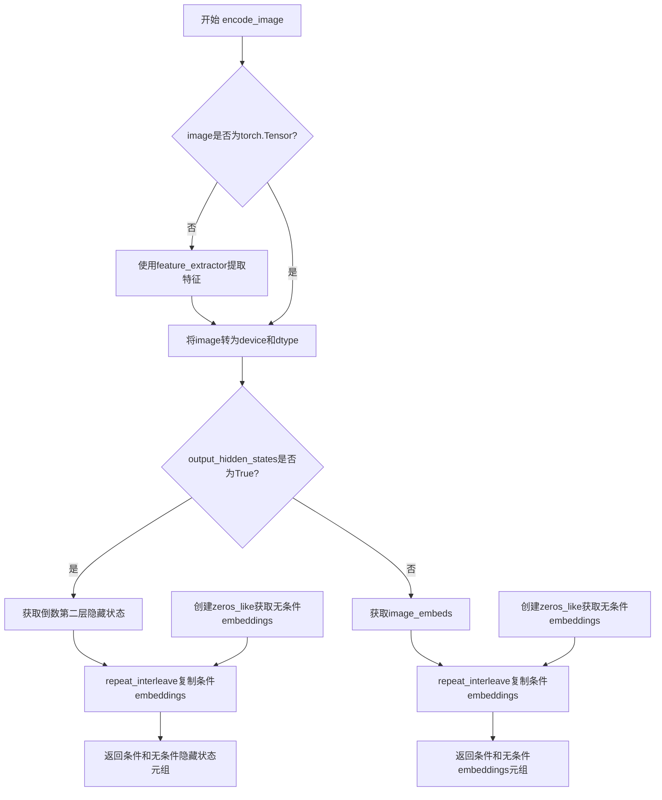

#### 带注释源码

```python
def encode_image(self, image, device, num_images_per_prompt, output_hidden_states=None):
    """
    将输入图像编码为图像embeddings或隐藏状态，用于IP-Adapter图像提示。
    
    参数:
        image: 输入图像，支持PIL Image、numpy array或torch.Tensor
        device: 目标设备
        num_images_per_prompt: 每个prompt生成的图像数量
        output_hidden_states: 是否返回隐藏状态而非image_embeds
    
    返回:
        (条件embeddings, 无条件embeddings)元组
    """
    # 获取图像编码器的参数dtype，确保一致性
    dtype = next(self.image_encoder.parameters()).dtype

    # 如果输入不是torch.Tensor，使用feature_extractor进行预处理
    # 将图像转换为tensor格式
    if not isinstance(image, torch.Tensor):
        image = self.feature_extractor(image, return_tensors="pt").pixel_values

    # 将图像移动到目标设备并转换dtype
    image = image.to(device=device, dtype=dtype)
    
    # 根据output_hidden_states决定输出模式
    if output_hidden_states:
        # 模式1：返回图像编码器的隐藏状态
        # 获取倒数第二层的隐藏状态（通常效果更好）
        image_enc_hidden_states = self.image_encoder(image, output_hidden_states=True).hidden_states[-2]
        # 复制embeddings以匹配num_images_per_prompt
        image_enc_hidden_states = image_enc_hidden_states.repeat_interleave(num_images_per_prompt, dim=0)
        
        # 创建零张量作为无条件图像隐藏状态（用于CFG）
        uncond_image_enc_hidden_states = self.image_encoder(
            torch.zeros_like(image), output_hidden_states=True
        ).hidden_states[-2]
        uncond_image_enc_hidden_states = uncond_image_enc_hidden_states.repeat_interleave(
            num_images_per_prompt, dim=0
        )
        return image_enc_hidden_states, uncond_image_enc_hidden_states
    else:
        # 模式2：返回图像embededs（默认模式）
        image_embeds = self.image_encoder(image).image_embeds
        # 复制embeddings以匹配批量大小
        image_embeds = image_embeds.repeat_interleave(num_images_per_prompt, dim=0)
        
        # 创建零张量作为无条件图像embeddings
        uncond_image_embeds = torch.zeros_like(image_embeds)

        return image_embeds, uncond_image_embeds
```


### `StableDiffusionPAGPipeline.prepare_ip_adapter_image_embeds`

该方法用于准备IP-Adapter的图像嵌入。它处理输入的图像或预计算的图像嵌入，将其转换为适合UNet模型使用的格式，支持分类器-free guidance（CFG）模式下的图像嵌入处理。

参数：

- `self`：`StableDiffusionPAGPipeline` 实例本身，表示当前管道对象
- `ip_adapter_image`：`PipelineImageInput`（可选），待处理的IP-Adapter输入图像，支持单个图像或图像列表
- `ip_adapter_image_embeds`：`List[torch.Tensor]`（可选），预计算的图像嵌入列表，如果提供则直接使用而不进行编码
- `device`：`torch.device`，计算设备（CPU或GPU）
- `num_images_per_prompt`：`int`，每个prompt生成的图像数量，用于复制图像嵌入

返回值：`List[torch.Tensor]`，处理后的图像嵌入列表，每个元素对应一个IP-Adapter的嵌入张量

#### 流程图

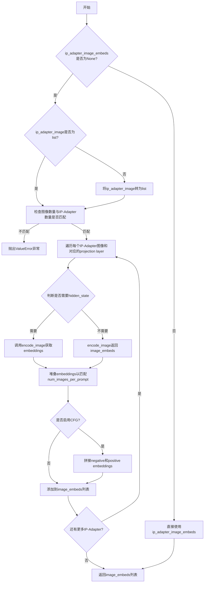

#### 带注释源码

```python
def prepare_ip_adapter_image_embeds(
    self, ip_adapter_image, ip_adapter_image_embeds, device, num_images_per_prompt
):
    """
    准备IP-Adapter图像嵌入，处理输入图像或使用预计算的嵌入
    
    参数:
        ip_adapter_image: IP-Adapter输入图像（PIL Image, tensor, list等）
        ip_adapter_image_embeds: 预计算的图像嵌入（可选）
        device: torch设备
        num_images_per_prompt: 每个prompt生成的图像数量
    返回:
        处理后的图像嵌入列表
    """
    
    # 如果没有提供预计算的嵌入，则从图像编码
    if ip_adapter_image_embeds is None:
        # 统一转换为list格式，便于批量处理
        if not isinstance(ip_adapter_image, list):
            ip_adapter_image = [ip_adapter_image]

        # 验证：IP-Adapter图像数量必须与projection layers数量一致
        if len(ip_adapter_image) != len(self.unet.encoder_hid_proj.image_projection_layers):
            raise ValueError(
                f"`ip_adapter_image` must have same length as the number of IP Adapters. "
                f"Got {len(ip_adapter_image)} images and "
                f"{len(self.unet.encoder_hid_proj.image_projection_layers)} IP Adapters."
            )

        # 存储处理后的嵌入
        image_embeds = []
        
        # 遍历每个IP-Adapter的图像和对应的projection layer
        for single_ip_adapter_image, image_proj_layer in zip(
            ip_adapter_image, self.unet.encoder_hid_proj.image_projection_layers
        ):
            # 判断是否需要输出hidden states（根据projection layer类型决定）
            # ImageProjection类型直接输出image_embeds，其他类型输出hidden_states
            output_hidden_state = not isinstance(image_proj_layer, ImageProjection)
            
            # 调用encode_image方法编码单个图像
            # 返回positive和negative图像嵌入
            single_image_embeds, single_negative_image_embeds = self.encode_image(
                single_ip_adapter_image, device, 1, output_hidden_state
            )
            
            # 堆叠embeddings以匹配num_images_per_prompt
            # 将单个图像嵌入复制num_images_per_prompt次
            single_image_embeds = torch.stack([single_image_embeds] * num_images_per_prompt, dim=0)
            single_negative_image_embeds = torch.stack(
                [single_negative_image_embeds] * num_images_per_prompt, dim=0
            )

            # 如果启用分类器-free guidance，需要拼接negative和positive embeddings
            # 顺序：[negative_embed, positive_embed]
            if self.do_classifier_free_guidance:
                single_image_embeds = torch.cat([single_negative_image_embeds, single_image_embeds])
                single_image_embeds = single_image_embeds.to(device)

            # 将处理后的嵌入添加到列表
            image_embeds.append(single_image_embeds)
    else:
        # 如果已提供预计算的嵌入，直接使用
        image_embeds = ip_adapter_image_embeds
    
    return image_embeds
```


### `StableDiffusionPAGPipeline.run_safety_checker`

该方法用于对生成的图像进行安全检查，通过安全检查器（Safety Checker）识别图像中是否包含不当内容（如NSFW），并返回检查后的图像以及是否检测到不安全内容。

参数：

- `self`：隐含的实例参数，表示当前 StableDiffusionPAGPipeline 对象
- `image`：`Union[torch.Tensor, np.ndarray]`，待检查的图像，可以是 PyTorch 张量或 NumPy 数组
- `device`：`torch.device`，用于将特征提取器输入移动到指定设备（如 CPU 或 CUDA 设备）
- `dtype`：`torch.dtype`，用于将像素值转换为指定数据类型（通常为 float16 或 float32）

返回值：`Tuple[Union[torch.Tensor, np.ndarray], Optional[List[bool]]]`，返回两个元素：第一个是处理后的图像（类型与输入一致），第二个是可选的布尔列表，指示每个图像是否包含不安全内容（若安全检查器为 None 则返回 None）

#### 流程图

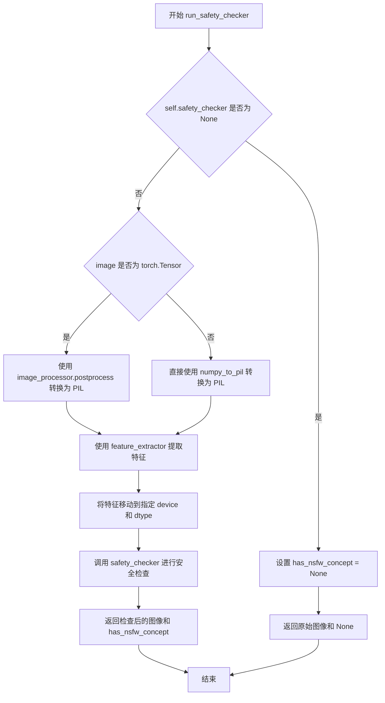

#### 带注释源码

```python
def run_safety_checker(self, image, device, dtype):
    """
    运行安全检查器对生成的图像进行内容安全审查。
    
    Args:
        image: 输入图像，可以是 torch.Tensor 或 numpy.ndarray 格式
        device: 计算设备，用于张量运算
        dtype: 数据类型，用于类型转换
    
    Returns:
        Tuple: (处理后的图像, NSFW检测结果列表或None)
    """
    # 如果没有配置安全检查器，直接返回空结果
    if self.safety_checker is None:
        has_nsfw_concept = None
    else:
        # 根据输入类型进行预处理，转换为PIL图像供特征提取器使用
        if torch.is_tensor(image):
            # 将张量格式的图像转换为PIL图像
            feature_extractor_input = self.image_processor.postprocess(image, output_type="pil")
        else:
            # 直接将numpy数组转换为PIL图像
            feature_extractor_input = self.image_processor.numpy_to_pil(image)
        
        # 使用特征提取器提取图像特征，并移动到指定设备
        safety_checker_input = self.feature_extractor(feature_extractor_input, return_tensors="pt").to(device)
        
        # 调用安全检查器模型进行NSFW内容检测
        # clip_input 参数接收处理后的像素值
        image, has_nsfw_concept = self.safety_checker(
            images=image, 
            clip_input=safety_checker_input.pixel_values.to(dtype)
        )
    
    # 返回处理后的图像和NSFW检测结果
    return image, has_nsfw_concept
```


### `StableDiffusionPAGPipeline.decode_latents`

该方法用于将VAE编码后的潜在表示(latents)解码为实际的图像数据。由于VAE的潜在空间通常需要进行缩放处理，因此需要先将latents除以缩放因子后再进行解码。解码后的输出是[-1,1]范围的图像张量，需要通过归一化转换到[0,1]范围，最后转换为NumPy数组以便后续处理。需要注意的是，此方法已被标记为弃用，推荐使用`VaeImageProcessor.postprocess`替代。

参数：

- `latents`：`torch.Tensor`，VAE编码后的潜在表示张量，形状为(batch_size, channels, height, width)，通常取值范围在[-1, 1]之间

返回值：`numpy.ndarray`，解码后的图像数组，形状为(batch_size, height, width, channels)，值范围在[0, 1]

#### 流程图

```mermaid
flowchart TD
    A[开始: decode_latents] --> B[记录弃用警告]
    B --> C[计算缩放因子: 1 / vae.config.scaling_factor]
    C --> D[对latents进行缩放]
    D --> E[调用VAE.decode解码latents]
    E --> F[图像归一化: (image / 2 + 0.5).clamp(0, 1)]
    F --> G[转移到CPU]
    G --> H[维度转换: permute(0, 2, 3, 1)]
    H --> I[转换为float32类型]
    I --> J[转换为NumPy数组]
    J --> K[返回图像数组]
```

#### 带注释源码

```
def decode_latents(self, latents):
    """
    将VAE的潜在表示解码为图像。
    
    Args:
        latents (torch.Tensor): VAE编码后的潜在表示，形状为 (batch, channels, height, width)
    
    Returns:
        numpy.ndarray: 解码后的图像，形状为 (batch, height, width, channels)，值范围 [0, 1]
    """
    # 记录弃用警告，提示用户使用VaeImageProcessor.postprocess替代
    deprecation_message = "The decode_latents method is deprecated and will be removed in 1.0.0. Please use VaeImageProcessor.postprocess(...) instead"
    deprecate("decode_latents", "1.0.0", deprecation_message, standard_warn=False)

    # VAE的潜在空间通常经过缩放，需要逆缩放还原到原始空间
    # scaling_factor通常为0.18215，这是VAE配置中的标准值
    latents = 1 / self.vae.config.scaling_factor * latents
    
    # 使用VAE解码器将潜在表示解码为图像
    # 返回值为元组(self.vae.decode返回False时)，取第一个元素[0]获取图像张量
    image = self.vae.decode(latents, return_dict=False)[0]
    
    # VAE输出范围为[-1, 1]，需要归一化到[0, 1]
    # 公式: (x + 1) / 2 = x/2 + 0.5，然后clamp限制在[0, 1]范围
    image = (image / 2 + 0.5).clamp(0, 1)
    
    # 将图像转移到CPU（如果当前在GPU上）
    # 转换为float32以保证兼容性（bfloat16可能会导致问题）
    # permute将通道维度移到最后: (batch, channels, height, width) -> (batch, height, width, channels)
    image = image.cpu().permute(0, 2, 3, 1).float().numpy()
    
    return image
```


### `StableDiffusionPAGPipeline.prepare_extra_step_kwargs`

该方法用于为调度器（scheduler）的 `step` 方法准备额外的关键字参数。由于不同的调度器具有不同的签名（例如 DDIMScheduler 使用 `eta` 参数，而其他调度器可能不支持），该方法通过检查调度器的签名来动态决定传递哪些参数。

参数：

- `generator`：`Optional[Union[torch.Generator, List[torch.Generator]]]`，用于控制随机数生成以确保可重复性
- `eta`：`float`，对应 DDIM 论文中的参数 η，仅在 DDIMScheduler 时生效，其他调度器会忽略该参数，取值范围为 [0, 1]

返回值：`Dict[str, Any]`，返回包含调度器 `step` 方法所需额外参数（如 `eta` 和/或 `generator`）的字典

#### 流程图

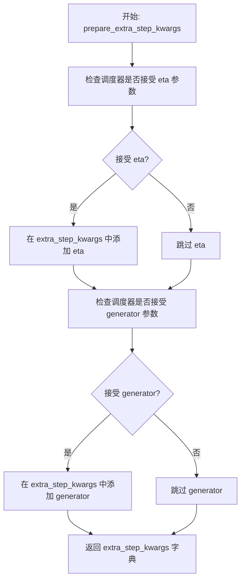

#### 带注释源码

```python
def prepare_extra_step_kwargs(self, generator, eta):
    # 准备调度器步骤所需的额外参数，因为并非所有调度器都具有相同的函数签名
    # eta (η) 仅在 DDIMScheduler 中使用，其他调度器将忽略它
    # eta 对应 DDIM 论文中的参数：https://huggingface.co/papers/2010.02502
    # 取值应在 [0, 1] 范围内

    # 使用 inspect 模块检查调度器的 step 方法是否接受 eta 参数
    accepts_eta = "eta" in set(inspect.signature(self.scheduler.step).parameters.keys())
    # 初始化空字典用于存储额外参数
    extra_step_kwargs = {}
    # 如果调度器接受 eta 参数，则将其添加到 extra_step_kwargs 中
    if accepts_eta:
        extra_step_kwargs["eta"] = eta

    # 检查调度器是否接受 generator 参数
    accepts_generator = "generator" in set(inspect.signature(self.scheduler.step).parameters.keys())
    # 如果调度器接受 generator 参数，则将其添加到 extra_step_kwargs 中
    if accepts_generator:
        extra_step_kwargs["generator"] = generator
    
    # 返回包含调度器所需额外参数的字典
    return extra_step_kwargs
```


### `StableDiffusionPAGPipeline.check_inputs`

该方法用于验证 Stable Diffusion PAG Pipeline 的输入参数有效性，包括图像尺寸（高度和宽度必须是8的倍数）、回调步数必须为正整数、提示词与提示词嵌入的互斥性、负面提示词与嵌入的互斥性、以及 IP Adapter 相关参数的互斥性检查，确保用户不会同时传递冲突的输入参数。

参数：

- `self`：`StableDiffusionPAGPipeline`，Pipeline 实例本身（隐含参数）
- `prompt`：`Union[str, List[str]]`，用于引导图像生成的文本提示词，可以是单个字符串或字符串列表
- `height`：`int`，生成图像的高度（像素），必须能被 8 整除
- `width`：`int`，生成图像的宽度（像素），必须能被 8 整除
- `callback_steps`：`int`，在推理过程中调用回调函数的步数间隔，必须为正整数
- `negative_prompt`：`Optional[Union[str, List[str]]]`，用于引导不包含内容的负面提示词，与 prompt_embeds 互斥
- `prompt_embeds`：`Optional[torch.Tensor]`，预生成的文本嵌入，用于方便地调整文本输入，与 prompt 互斥
- `negative_prompt_embeds`：`Optional[torch.Tensor]`，预生成的负面文本嵌入，用于调整负面提示词输入
- `ip_adapter_image`：`Optional[PipelineImageInput]`，用于 IP Adapter 的可选图像输入，与 ip_adapter_image_embeds 互斥
- `ip_adapter_image_embeds`：`Optional[List[torch.Tensor]]`，预生成的 IP Adapter 图像嵌入，与 ip_adapter_image 互斥
- `callback_on_step_end_tensor_inputs`：`Optional[List[str]]`，在每个去噪步骤结束时调用的回调函数所允许接收的张量输入名称列表

返回值：`None`，该方法不返回任何值，仅通过抛出 ValueError 来表示验证失败

#### 流程图

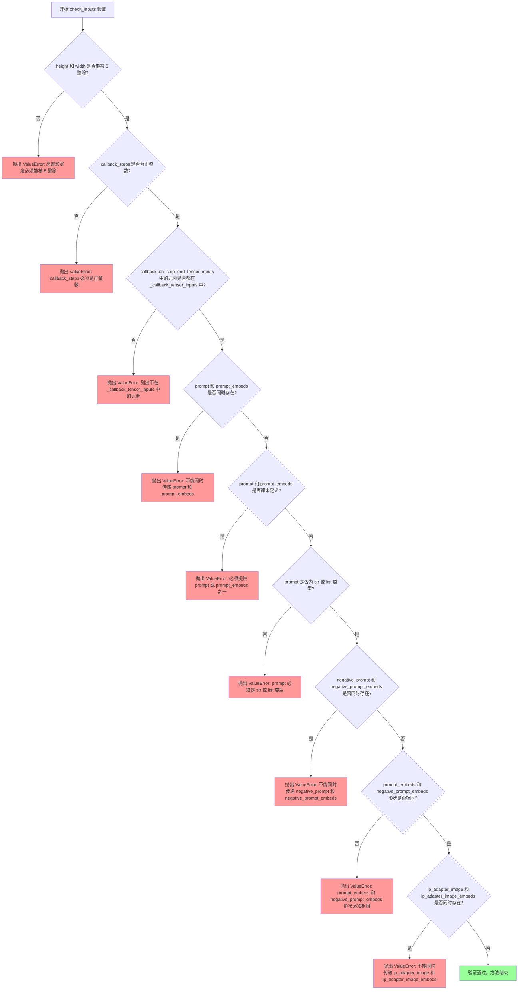

#### 带注释源码

```python
def check_inputs(
    self,
    prompt,
    height,
    width,
    callback_steps,
    negative_prompt=None,
    prompt_embeds=None,
    negative_prompt_embeds=None,
    ip_adapter_image=None,
    ip_adapter_image_embeds=None,
    callback_on_step_end_tensor_inputs=None,
):
    """
    验证输入参数的有效性，确保用户不会传递冲突或无效的参数组合。
    在 pipeline 执行前进行严格的参数检查，提前捕获潜在的错误配置。
    """
    # 检查高度和宽度是否都能被 8 整除，这是 Stable Diffusion 模型的要求
    # 因为 VAE 使用 8 倍下采样，生成的图像尺寸必须适配
    if height % 8 != 0 or width % 8 != 0:
        raise ValueError(f"`height` and `width` have to be divisible by 8 but are {height} and {width}.")

    # 验证 callback_steps 是正整数，用于控制回调函数的调用频率
    # 如果不是整数或小于等于 0，则抛出错误
    if callback_steps is not None and (not isinstance(callback_steps, int) or callback_steps <= 0):
        raise ValueError(
            f"`callback_steps` has to be a positive integer but is {callback_steps} of type"
            f" {type(callback_steps)}."
        )
    
    # 确保回调函数接收的张量参数是 pipeline 支持的类型
    # callback_on_step_end_tensor_inputs 必须是 _callback_tensor_inputs 的子集
    if callback_on_step_end_tensor_inputs is not None and not all(
        k in self._callback_tensor_inputs for k in callback_on_step_end_tensor_inputs
    ):
        raise ValueError(
            f"`callback_on_step_end_tensor_inputs` has to be in {self._callback_tensor_inputs}, but found {[k for k in callback_on_step_end_tensor_inputs if k not in self._callback_tensor_inputs]}"
        )

    # prompt 和 prompt_embeds 是互斥的，只能选择其中一种方式提供文本条件
    # 同时提供两者会导致混淆，不清楚应该使用哪个
    if prompt is not None and prompt_embeds is not None:
        raise ValueError(
            f"Cannot forward both `prompt`: {prompt} and `prompt_embeds`: {prompt_embeds}. Please make sure to"
            " only forward one of the two."
        )
    # 必须至少提供一种文本条件输入，不能两者都为空
    elif prompt is None and prompt_embeds is None:
        raise ValueError(
            "Provide either `prompt` or `prompt_embeds`. Cannot leave both `prompt` and `prompt_embeds` undefined."
        )
    # 验证 prompt 的类型必须是字符串或字符串列表
    elif prompt is not None and (not isinstance(prompt, str) and not isinstance(prompt, list)):
        raise ValueError(f"`prompt` has to be of type `str` or `list` but is {type(prompt)}")

    # 负面提示词和其嵌入向量同样是互斥的
    if negative_prompt is not None and negative_prompt_embeds is not None:
        raise ValueError(
            f"Cannot forward both `negative_prompt`: {negative_prompt} and `negative_prompt_embeds`:"
            f" {negative_prompt_embeds}. Please make sure to only forward one of the two."
        )

    # 当直接传递 prompt_embeds 和 negative_prompt_embeds 时，它们必须形状一致
    # 以确保在 classifier-free guidance 过程中能够正确配对
    if prompt_embeds is not None and negative_prompt_embeds is not None:
        if prompt_embeds.shape != negative_prompt_embeds.shape:
            raise ValueError(
                "`prompt_embeds` and `negative_prompt_embeds` must have the same shape when passed directly, but"
                f" got: `prompt_embeds` {prompt_embeds.shape} != `negative_prompt_embeds`"
                f" {negative_prompt_embeds.shape}."
            )

    # IP Adapter 图像输入和预计算嵌入也是互斥的
    # 只能选择直接提供图像或提供预计算的嵌入
    if ip_adapter_image is not None and ip_adapter_image_embeds is not None:
        raise ValueError(
            "Provide either `ip_adapter_image` or `ip_adapter_image_embeds`. Cannot leave both `ip_adapter_image` and `ip_adapter_image_embeds` defined."
        )
```


### StableDiffusionPAGPipeline.prepare_latents

该方法用于初始化和准备扩散模型的潜在变量（latents），根据指定的批次大小、通道数、高度和宽度生成初始噪声张量，或使用提供的潜在变量，并通过调度器的初始噪声标准差进行缩放。

参数：

- `batch_size`：`int`，生成的图像批次大小
- `num_channels_latents`：`int`，潜在变量的通道数，通常对应于UNet的输入通道数
- `height`：`int`，生成图像的高度（像素单位）
- `width`：`int`，生成图像的宽度（像素单位）
- `dtype`：`torch.dtype`，潜在变量的数据类型
- `device`：`torch.device`，潜在变量存放的设备
- `generator`：`torch.Generator` 或 `List[torch.Generator]`，可选的随机数生成器，用于确保生成的可重复性
- `latents`：`torch.Tensor`，可选的预生成潜在变量，如果为None则随机生成

返回值：`torch.Tensor`，准备好的潜在变量张量，已根据调度器的初始噪声标准差进行缩放

#### 流程图

```mermaid
flowchart TD
    A[开始 prepare_latents] --> B[计算shape: batch_size, num_channels_latents, height//vae_scale_factor, width//vae_scale_factor]
    B --> C{generator是list且长度 != batch_size?}
    C -->|是| D[抛出ValueError: generator列表长度与batch_size不匹配]
    C -->|否| E{latents是否为None?}
    E -->|是| F[使用randn_tensor生成随机潜在变量]
    E -->|否| G[将latents移动到指定设备]
    F --> H[latents = latents * scheduler.init_noise_sigma]
    G --> H
    H --> I[返回准备好的latents]
```

#### 带注释源码

```python
def prepare_latents(
    self,
    batch_size: int,
    num_channels_latents: int,
    height: int,
    width: int,
    dtype: torch.dtype,
    device: torch.device,
    generator: Optional[Union[torch.Generator, List[torch.Generator]]],
    latents: Optional[torch.Tensor] = None
) -> torch.Tensor:
    """
    准备扩散模型的潜在变量张量。
    
    参数:
        batch_size: 批处理大小
        num_channels_latents: 潜在变量的通道数
        height: 生成图像的高度
        width: 生成图像的宽度
        dtype: 张量的数据类型
        device: 张量存放的设备
        generator: 随机数生成器，用于可重复生成
        latents: 可选的预生成潜在变量，如果为None则随机生成
    
    返回:
        准备好的潜在变量张量
    """
    # 计算潜在变量的形状，根据VAE的缩放因子调整空间维度
    # VAE scale factor通常为8，因此潜在变量的高宽为图像高宽的1/8
    shape = (
        batch_size,
        num_channels_latents,
        int(height) // self.vae_scale_factor,
        int(width) // self.vae_scale_factor,
    )
    
    # 检查generator列表长度是否与batch_size匹配
    if isinstance(generator, list) and len(generator) != batch_size:
        raise ValueError(
            f"You have passed a list of generators of length {len(generator)}, but requested an effective batch"
            f" size of {batch_size}. Make sure the batch size matches the length of the generators."
        )

    # 根据是否有预提供的潜在变量选择生成方式
    if latents is None:
        # 使用randn_tensor生成符合标准正态分布的随机噪声作为初始潜在变量
        latents = randn_tensor(shape, generator=generator, device=device, dtype=dtype)
    else:
        # 如果提供了潜在变量，只需将其移动到目标设备
        latents = latents.to(device)

    # 根据调度器的初始噪声标准差对潜在变量进行缩放
    # 这是扩散模型采样的关键步骤，确保噪声水平与调度器预期一致
    latents = latents * self.scheduler.init_noise_sigma
    
    return latents
```


### `StableDiffusionPAGPipeline.enable_freeu`

该方法用于启用 FreeU（FreeU是一种用于改进扩散模型去噪过程的机制，通过对跳跃特征进行衰减并对骨干特征进行放大来减轻过平滑效应）的功能，通过调用 UNet 模型的 enable_freeu 方法来激活该机制。

参数：

- `s1`：`float`，第一阶段的缩放因子，用于衰减跳跃特征的贡献，以减轻增强去噪过程中的过平滑效应
- `s2`：`float`，第二阶段的缩放因子，用于衰减跳跃特征的贡献，以减轻增强去噪过程中的过平滑效应
- `b1`：`float`，第一阶段的缩放因子，用于放大骨干特征的贡献
- `b2`：`float`，第二阶段的缩放因子，用于放大骨干特征的贡献

返回值：`None`，无返回值，该方法直接修改 pipeline 内部状态

#### 流程图

```mermaid
flowchart TD
    A[开始 enable_freeu] --> B{检查 unet 属性是否存在}
    B -->|不存在| C[抛出 ValueError: 管道必须有 unet 才能使用 FreeU]
    B -->|存在| D[调用 self.unet.enable_freeu]
    D --> E[传入参数 s1, s2, b1, b2]
    E --> F[结束]
```

#### 带注释源码

```python
def enable_freeu(self, s1: float, s2: float, b1: float, b2: float):
    r"""Enables the FreeU mechanism as in https://huggingface.co/papers/2309.11497.
    The suffixes after the scaling factors represent the stages where they are being applied.
    Please refer to the [official repository](https://github.com/ChenyangSi/FreeU) for combinations of the values
    that are known to work well for different pipelines such as Stable Diffusion v1, v2, and Stable Diffusion XL.
    Args:
        s1 (`float`):
            Scaling factor for stage 1 to attenuate the contributions of the skip features. This is done to
            mitigate "oversmoothing effect" in the enhanced denoising process.
        s2 (`float`):
            Scaling factor for stage 2 to attenuate the contributions of the skip features. This is done to
            mitigate "oversmoothing effect" in the enhanced denoising process.
        b1 (`float`): Scaling factor for stage 1 to amplify the contributions of backbone features.
        b2 (`float`): Scaling factor for stage 2 to amplify the contributions of backbone features.
    """
    # 检查 pipeline 是否具有 unet 属性，FreeU 机制依赖于 UNet 模型
    if not hasattr(self, "unet"):
        raise ValueError("The pipeline must have `unet` for using FreeU.")
    # 委托给 UNet 模型的 enable_freeu 方法来应用 FreeU 机制
    self.unet.enable_freeu(s1=s1, s2=s2, b1=b1, b2=b2)
```


### `StableDiffusionPAGPipeline.disable_freeu`

该方法用于禁用 FreeU 机制。FreeU 是一种用于改善扩散模型生成质量的机制，通过调整跳跃特征（skip features）和骨干特征（backbone features）的贡献来减轻过度平滑效应。当不再需要此功能时，可调用此方法将其关闭。

参数：无

返回值：`None`，无返回值

#### 流程图

```mermaid
graph TD
    A[开始 disable_freeu] --> B{检查 self.unet 是否存在}
    B -->|是| C[调用 self.unet.disable_freeu]
    B -->|否| D[方法直接返回,因 unet.disable_freeu 内部处理]
    C --> E[结束]
    D --> E
```

#### 带注释源码

```python
def disable_freeu(self):
    """Disables the FreeU mechanism if enabled."""
    # 调用 UNet 模型的 disable_freeu 方法来禁用 FreeU 机制
    # FreeU 机制通过 enable_freeu 方法启用,用于调整跳跃特征和骨干特征的权重
    # 以减轻生成图像的过度平滑效应
    self.unet.disable_freeu()
```


### `StableDiffusionPAGPipeline.fuse_qkv_projections`

融合 QKV 投影矩阵，通过将注意力机制中的 Query、Key、Value 投影合并为单一的线性操作，以提升推理性能。对于自注意力模块，融合所有投影矩阵（query、key、value）；对于交叉注意力模块，融合 key 和 value 投影矩阵。

参数：

- `unet`：`bool`，默认为 `True`，是否在 UNet 上应用融合
- `vae`：`bool`，默认为 `True`，是否在 VAE 上应用融合

返回值：`None`，无返回值（执行状态修改操作）

#### 流程图

```mermaid
flowchart TD
    A[开始: fuse_qkv_projections] --> B[初始化标志位: fusing_unet=False, fusing_vae=False]
    B --> C{unet=True?}
    C -->|是| D[设置 fusing_unet=True]
    D --> E[调用 self.unet.fuse_qkv_projections]
    E --> F[设置 UNet 注意力处理器为 FusedAttnProcessor2_0]
    C -->|否| G{vae=True?}
    F --> G
    G -->|是| H{VAE 类型是否为 AutoencoderKL?}
    H -->|否| I[抛出 ValueError: 仅支持 AutoencoderKL 类型的 VAE]
    H -->|是| J[设置 fusing_vae=True]
    J --> K[调用 self.vae.fuse_qkv_projections]
    K --> L[设置 VAE 注意力处理器为 FusedAttnProcessor2_0]
    I --> M[结束]
    L --> M
    G -->|否| M
```

#### 带注释源码

```python
# Copied from diffusers.pipelines.stable_diffusion_xl.pipeline_stable_diffusion_xl.StableDiffusionXLPipeline.fuse_qkv_projections
def fuse_qkv_projections(self, unet: bool = True, vae: bool = True):
    """
    Enables fused QKV projections. For self-attention modules, all projection matrices (i.e., query,
    key, value) are fused. For cross-attention modules, key and value projection matrices are fused.
    > [!WARNING]
    > This API is 🧪 experimental.
    Args:
        unet (`bool`, defaults to `True`): To apply fusion on the UNet.
        vae (`bool`, defaults to `True`): To apply fusion on the VAE.
    """
    # 初始化融合状态标志位，用于后续跟踪哪些组件已融合
    self.fusing_unet = False
    self.fusing_vae = False

    # 处理 UNet 的 QKV 融合
    if unet:
        # 标记 UNet 正在融合
        self.fusing_unet = True
        # 调用 UNet 模型的融合方法，将 QKV 投影矩阵合并
        self.unet.fuse_qkv_projections()
        # 将 UNet 的注意力处理器替换为融合版本的 FusedAttnProcessor2_0
        self.unet.set_attn_processor(FusedAttnProcessor2_0())

    # 处理 VAE 的 QKV 融合
    if vae:
        # 类型检查：仅支持 AutoencoderKL 类型的 VAE
        if not isinstance(self.vae, AutoencoderKL):
            raise ValueError("`fuse_qkv_projections()` is only supported for the VAE of type `AutoencoderKL`.")

        # 标记 VAE 正在融合
        self.fusing_vae = True
        # 调用 VAE 模型的融合方法，将 QKV 投影矩阵合并
        self.vae.fuse_qkv_projections()
        # 将 VAE 的注意力处理器替换为融合版本的 FusedAttnProcessor2_0
        self.vae.set_attn_processor(FusedAttnProcessor2_0())
```


### StableDiffusionPAGPipeline.unfuse_qkv_projections

禁用 QKV 投影融合（如果之前已启用）。该方法用于还原 `fuse_qkv_projections` 操作，将 UNet 和 VAE 中的融合 QKV 投影分离回原始的独立投影矩阵。

参数：

- `unet`：`bool`，默认值 `True`，是否在 UNet 上禁用 QKV 投影融合
- `vae`：`bool`，默认值 `True`，是否在 VAE 上禁用 QKV 投影融合

返回值：`None`，无返回值

#### 流程图

```mermaid
flowchart TD
    A[开始 unfuse_qkv_projections] --> B{unet == True?}
    B -->|Yes| C{self.fusing_unet == True?}
    B -->|No| D{vae == True?}
    C -->|Yes| E[调用 self.unet.unfuse_qkv_projections<br/>还原 UNet 的 QKV 投影]
    E --> F[设置 self.fusing_unet = False]
    C -->|No| G[记录警告日志<br/>UNet 原本未融合 QKV 投影<br/>不执行任何操作]
    D -->|Yes| H{self.fusing_vae == True?}
    D -->|No| I[结束]
    H -->|Yes| J[调用 self.vae.unfuse_qkv_projections<br/>还原 VAE 的 QKV 投影]
    J --> K[设置 self.fusing_vae = False]
    H -->|No| L[记录警告日志<br/>VAE 原本未融合 QKV 投影<br/>不执行任何操作]
    F --> D
    G --> D
    K --> I
    L --> I
```

#### 带注释源码

```python
def unfuse_qkv_projections(self, unet: bool = True, vae: bool = True):
    """Disable QKV projection fusion if enabled.
    > [!WARNING]
    > This API is 🧪 experimental.
    Args:
        unet (`bool`, defaults to `True`): To apply fusion on the UNet.
        vae (`bool`, defaults to `True`): To apply fusion on the VAE.
    """
    # 处理 UNet 的 QKV 投影融合
    if unet:
        # 检查 UNet 之前是否已融合 QKV 投影
        if not self.fusing_unet:
            # 如果未融合，记录警告信息，不执行任何操作
            logger.warning("The UNet was not initially fused for QKV projections. Doing nothing.")
        else:
            # 如果已融合，调用 UNet 的 unfuse_qkv_projections 方法
            # 将融合的 QKV 投影分离回独立的 query、key、value 投影矩阵
            self.unet.unfuse_qkv_projections()
            # 重置融合状态标志
            self.fusing_unet = False

    # 处理 VAE 的 QKV 投影融合
    if vae:
        # 检查 VAE 之前是否已融合 QKV 投影
        if not self.fusing_vae:
            # 如果未融合，记录警告信息，不执行任何操作
            logger.warning("The VAE was not initially fused for QKV projections. Doing nothing.")
        else:
            # 如果已融合，调用 VAE 的 unfuse_qkv_projections 方法
            # 将融合的 QKV 投影分离回独立的 query、key、value 投影矩阵
            self.vae.unfuse_qkv_projections()
            # 重置融合状态标志
            self.fusing_vae = False
```


### `StableDiffusionPAGPipeline.get_guidance_scale_embedding`

该方法用于生成指导比例嵌入（Guidance Scale Embedding），将引导比例值转换为高维嵌入向量，以便在UNet的时间条件投影中使用。这是实现分类器自由引导（Classifier-Free Guidance）的关键技术之一，通过正弦和余弦函数将连续的引导值编码到高维空间中。

参数：

- `w`：`torch.Tensor`，输入的引导比例值张量，维度为一维
- `embedding_dim`：`int`，嵌入向量的维度，默认为512
- `dtype`：`torch.dtype`，生成嵌入的数据类型，默认为torch.float32

返回值：`torch.Tensor`，形状为`(len(w), embedding_dim)`的嵌入向量

#### 流程图

```mermaid
flowchart TD
    A[开始: 输入w] --> B{检查w维度}
    B -->|assert len(w.shape) == 1| C[将w乘以1000]
    C --> D[计算half_dim = embedding_dim // 2]
    D --> E[计算对数基础: log10000 / (half_dim - 1)]
    E --> F[生成指数序列: exp(-arange(half_dim) * 对数值)]
    F --> G[计算w与emb的外积]
    G --> H[拼接sin和cos: torch.cat]
    H --> I{embedding_dim是否为奇数?}
    I -->|是| J[零填充最后维度]
    I -->|否| K[验证输出形状]
    J --> K
    K --> L[返回嵌入向量]
```

#### 带注释源码

```python
def get_guidance_scale_embedding(self, w, embedding_dim=512, dtype=torch.float32):
    """
    See https://github.com/google-research/vdm/blob/dc27b98a554f65cdc654b800da5aa1846545d41b/model_vdm.py#L298
    Args:
        timesteps (`torch.Tensor`):
            generate embedding vectors at these timesteps
        embedding_dim (`int`, *optional*, defaults to 512):
            dimension of the embeddings to generate
        dtype:
            data type of the generated embeddings
    Returns:
        `torch.Tensor`: Embedding vectors with shape `(len(timesteps), embedding_dim)`
    """
    # 断言确保输入w是一维张量
    assert len(w.shape) == 1
    # 将引导比例值缩放1000倍，这与VDM论文中的实现一致
    w = w * 1000.0

    # 计算嵌入维度的一半，用于生成正弦和余弦编码
    half_dim = embedding_dim // 2
    # 计算对数基础值，用于生成指数衰减的频率
    emb = torch.log(torch.tensor(10000.0)) / (half_dim - 1)
    # 生成从0到half_dim-1的指数序列，作为频率
    emb = torch.exp(torch.arange(half_dim, dtype=dtype) * -emb)
    # 计算外积：将w与频率相乘，得到每个时间步的频率调制
    emb = w.to(dtype)[:, None] * emb[None, :]
    # 拼接正弦和余弦编码，形成完整的嵌入
    emb = torch.cat([torch.sin(emb), torch.cos(emb)], dim=1)
    # 如果嵌入维度为奇数，进行零填充以匹配所需维度
    if embedding_dim % 2 == 1:  # zero pad
        emb = torch.nn.functional.pad(emb, (0, 1))
    # 验证输出形状是否正确
    assert emb.shape == (w.shape[0], embedding_dim)
    return emb
```


### `StableDiffusionPAGPipeline.pred_z0`

该函数是Stable Diffusion PAGPipeline中的核心方法，用于根据噪声预测原始样本（x0）。它接收带噪声的样本、模型预测输出和时间步，利用调度器的累积Alpha值和预测类型（epsilon/sample/v_prediction）进行逆向计算，恢复出噪声去除后的原始样本。

参数：

- `sample`：`torch.Tensor`，带噪声的潜在表示（latents），即扩散过程中的当前状态
- `model_output`：`torch.Tensor`，UNet模型预测的噪声或相关输出，取决于prediction_type
- `timestep`：`int` 或 `torch.Tensor`，当前扩散时间步，用于查找对应的调度器参数

返回值：`torch.Tensor`，预测的原始样本（pred_original_sample），即去噪后的潜在表示

#### 流程图

```mermaid
flowchart TD
    A[开始: pred_z0] --> B[获取alpha_prod_t和beta_prod_t]
    B --> C{判断prediction_type}
    C -->|epsilon| D[使用epsilon公式计算pred_original_sample]
    C -->|sample| E[直接使用model_output作为pred_original_sample]
    C -->|v_prediction| F[使用v_prediction公式计算pred_original_sample]
    D --> G[返回pred_original_sample]
    E --> G
    F --> G
    C -->|其他| H[抛出ValueError异常]
    H --> G
```

#### 带注释源码

```python
def pred_z0(self, sample, model_output, timestep):
    """
    根据模型输出预测原始样本（x0）
    
    参数:
        sample: 当前带噪声的样本（latents）
        model_output: UNet预测的噪声/速度等
        timestep: 当前时间步
    """
    # 获取累积Alpha值并移动到sample设备
    alpha_prod_t = self.scheduler.alphas_cumprod[timestep].to(sample.device)

    # 计算Beta值
    beta_prod_t = 1 - alpha_prod_t
    
    # 根据预测类型进行不同计算
    if self.scheduler.config.prediction_type == "epsilon":
        # 预测类型为epsilon时，使用标准去噪公式
        # x0 = (x_t - sqrt(beta_t) * epsilon) / sqrt(alpha_t)
        pred_original_sample = (sample - beta_prod_t ** (0.5) * model_output) / alpha_prod_t ** (0.5)
    elif self.scheduler.config.prediction_type == "sample":
        # 预测类型为sample时，直接使用模型输出作为原始样本
        pred_original_sample = model_output
    elif self.scheduler.config.prediction_type == "v_prediction":
        # 预测类型为v_prediction时，使用速度预测公式
        # x0 = sqrt(alpha_t) * x_t - sqrt(beta_t) * v
        pred_original_sample = (alpha_prod_t**0.5) * sample - (beta_prod_t**0.5) * model_output
        # 同时更新model_output用于后续计算
        # v = sqrt(alpha_t) * epsilon + sqrt(beta_t) * x_t
        model_output = (alpha_prod_t**0.5) * model_output + (beta_prod_t**0.5) * sample
    else:
        # 不支持的预测类型，抛出异常
        raise ValueError(
            f"prediction_type given as {self.scheduler.config.prediction_type} must be one of `epsilon`, `sample`,"
            " or `v_prediction`"
        )

    return pred_original_sample
```


### `StableDiffusionPAGPipeline.pred_x0`

该方法用于从噪声预测中恢复原始图像样本（x0），并通过VAE解码器将其转换为最终图像，同时执行安全检查和后处理。

参数：

- `latents`：`torch.Tensor`，去噪过程中的潜在表示（噪声潜在向量）
- `noise_pred`：`torch.Tensor`，UNet模型预测的噪声
- `t`：`int`，当前扩散时间步
- `generator`：`torch.Generator`，用于VAE解码的随机数生成器，确保可重复性
- `device`：`torch.device`，执行计算的设备（CPU/CUDA）
- `prompt_embeds`：`torch.Tensor`，文本嵌入，用于安全检查器的dtype匹配
- `output_type`：`str`，期望的输出类型（如"pil"、"np"等）

返回值：`torch.Tensor` 或 `PIL.Image` 或 `numpy.ndarray`，后处理后的图像

#### 流程图

```mermaid
flowchart TD
    A[输入: latents, noise_pred, t] --> B[调用pred_z0方法]
    B --> C[计算预测原始样本 z0]
    C --> D[VAE解码: pred_z0 / scaling_factor]
    D --> E[获取解码后的图像 pred_x0]
    E --> F[运行安全检查器]
    F --> G[后处理: 图像去归一化]
    G --> H[图像格式转换: 按output_type]
    H --> I[返回最终图像]
```

#### 带注释源码

```python
def pred_x0(self, latents, noise_pred, t, generator, device, prompt_embeds, output_type):
    """
    从噪声预测中恢复并解码得到最终图像
    
    参数:
        latents: 当前的噪声潜在向量
        noise_pred: UNet预测的噪声
        t: 当前时间步
        generator: 随机生成器
        device: 计算设备
        prompt_embeds: 文本嵌入，用于安全检查器的类型匹配
        output_type: 输出格式类型
    
    返回:
        pred_x0: 后处理后的图像
    """
    
    # 步骤1: 调用pred_z0方法，根据预测的噪声和时间步计算原始样本z0
    # 这是一个逆向扩散过程，根据噪声预测恢复干净样本
    pred_z0 = self.pred_z0(latents, noise_pred, t)
    
    # 步骤2: 使用VAE解码器将z0潜在向量解码为图像
    # 需要除以scaling_factor进行缩放还原
    pred_x0 = self.vae.decode(
        pred_z0 / self.vae.config.scaling_factor, 
        return_dict=False, 
        generator=generator
    )[0]
    
    # 步骤3: 运行安全检查器，检查生成的图像是否包含不适内容
    # pred_x0是潜在向量，____是安全检查结果（has_nsfw_concept）
    pred_x0, ____ = self.run_safety_checker(pred_x0, device, prompt_embeds.dtype)
    
    # 步骤4: 准备去归一化标志
    # 默认为所有图像进行去归一化处理
    do_denormalize = [True] * pred_x0.shape[0]
    
    # 步骤5: 图像后处理
    # 包括去归一化（将[-1,1]范围转换到[0,1]）和格式转换
    pred_x0 = self.image_processor.postprocess(
        pred_x0, 
        output_type=output_type, 
        do_denormalize=do_denormalize
    )
    
    # 返回最终处理后的图像
    return pred_x0
```


### StableDiffusionPAGPipeline.__call__

这是Stable Diffusion PAG管道的主生成方法，实现了文本到图像的生成功能。该方法支持标准的Classifier-Free Guidance（CFG）和PAG（Perturbed Attention Guidance）两种引导技术，可以在推理过程中对UNet的注意力层进行扰动以改善生成质量。

参数：

- `prompt`：`Union[str, List[str]]`，要引导图像生成的提示词。如果未定义，则需要传递 `prompt_embeds`
- `height`：`Optional[int]`，生成图像的高度（像素），默认为 `self.unet.config.sample_size * self.vae_scale_factor`
- `width`：`Optional[int]`，生成图像的宽度（像素），默认为 `self.unet.config.sample_size * self.vae_scale_factor`
- `num_inference_steps`：`int`，去噪步数，更多步数通常能生成更高质量的图像，但推理速度更慢，默认为50
- `timesteps`：`List[int]`，自定义去噪时间步，当调度器支持 `timesteps` 参数时使用
- `guidance_scale`：`float`，引导比例，值越高生成的图像与文本提示相关性越高但质量可能降低，默认为7.5
- `pag_scale`：`float`，PAG引导比例，控制扰动注意力的强度，默认为0.0（不启用PAG）
- `pag_adaptive_scaling`：`float`，PAG自适应缩放因子，用于动态调整PAG强度，默认为0.0
- `pag_applied_layers_index`：`List[str]`，PAG应用到的UNet层索引，默认为["d4"]
- `negative_prompt`：`Optional[Union[str, List[str]]]，负向提示词，用于引导不包含某些内容
- `num_images_per_prompt`：`Optional[int]`，每个提示词生成的图像数量，默认为1
- `eta`：`float`，DDIM调度器的eta参数，默认为0.0
- `generator`：`Optional[Union[torch.Generator, List[torch.Generator]]]，用于生成确定性结果的随机数生成器
- `latents`：`Optional[torch.Tensor]，预生成的噪声潜在变量，可用于相同提示词的不同生成
- `prompt_embeds`：`Optional[torch.Tensor]，预生成的文本嵌入，用于提示词加权
- `negative_prompt_embeds`：`Optional[torch.Tensor]，预生成的负向文本嵌入
- `ip_adapter_image`：`Optional[PipelineImageInput]，IP-Adapter的图像输入
- `ip_adapter_image_embeds`：`Optional[List[torch.Tensor]]，IP-Adapter的预生成图像嵌入
- `output_type`：`str | None`，输出格式，默认为"pil"
- `return_dict`：`bool`，是否返回字典格式结果，默认为True
- `cross_attention_kwargs`：`Optional[Dict[str, Any]]，传递给注意力处理器的额外参数
- `guidance_rescale`：`float`，引导重缩放因子，用于修复过曝问题，默认为0.0
- `clip_skip`：`Optional[int]，CLIP跳过的层数
- `callback_on_step_end`：`Optional[Callable[[int, int, Dict], None]]，每步结束时调用的回调函数
- `callback_on_step_end_tensor_inputs`：`List[str]`，回调函数需要的张量输入列表，默认为["latents"]
- `**kwargs`：其他关键字参数

返回值：`Union[StableDiffusionPipelineOutput, tuple]`，返回生成的图像列表和NSFW内容检测标志的元组，或返回 `StableDiffusionPipelineOutput` 对象

#### 流程图

```mermaid
flowchart TD
    A[开始 __call__] --> B[检查并处理回调参数]
    B --> C[设置默认高度和宽度]
    C --> D[验证输入参数 check_inputs]
    D --> E[设置引导比例和其他参数]
    E --> F[编码提示词 encode_prompt]
    F --> G{是否启用CFG?}
    G -->|是| H[拼接负向和正向嵌入]
    G -->|否| I{是否启用PAG?}
    I -->|是| J[复制提示词嵌入]
    I -->|否| K[直接使用提示词嵌入]
    H --> J
    J --> L[准备IP-Adapter图像嵌入]
    L --> M[准备时间步 retrieve_timesteps]
    M --> N[准备潜在变量 prepare_latents]
    N --> O[准备额外步骤参数 prepare_extra_step_kwargs]
    O --> P[获取时间步条件嵌入]
    P --> Q{是否启用PAG?}
    Q -->|是| R[收集UNet各层注意力模块]
    Q -->|否| S[进入去噪循环]
    R --> T[替换为PAG注意力处理器]
    T --> S
    S --> U[去噪循环开始]
    U --> V{循环是否结束?}
    V -->|否| W[准备latent_model_input]
    W --> X[UNet预测噪声]
    X --> Y{启用CFG和PAG?}
    Y -->|仅CFG| Z[CFG引导计算]
    Y -->|仅PAG| AA[PAG引导计算]
    Y -->|同时启用| BB[CFG+PAG引导计算]
    Y -->|都不启用| CC[直接使用预测噪声]
    Z --> DD[重缩放噪声预测]
    AA --> DD
    BB --> DD
    CC --> DD
    DD --> EE[调度器步骤计算]
    EE --> FF[执行回调函数]
    FF --> U
    V -->|是| GG[解码潜在变量到图像]
    GG --> HH[运行安全检查器]
    HH --> II[后处理图像]
    II --> JJ[恢复UNet注意力处理器]
    JJ --> KK{return_dict?}
    KK -->|是| LL[返回StableDiffusionPipelineOutput]
    KK -->|否| MM[返回元组]
    LL --> NN[结束]
    MM --> NN
```

#### 带注释源码

```python
@torch.no_grad()
@replace_example_docstring(EXAMPLE_DOC_STRING)
def __call__(
    self,
    prompt: Union[str, List[str]] = None,
    height: Optional[int] = None,
    width: Optional[int] = None,
    num_inference_steps: int = 50,
    timesteps: List[int] = None,
    guidance_scale: float = 7.5,
    pag_scale: float = 0.0,
    pag_adaptive_scaling: float = 0.0,
    pag_applied_layers_index: List[str] = ["d4"],  # ['d4', 'd5', 'm0']
    negative_prompt: Optional[Union[str, List[str]]] = None,
    num_images_per_prompt: Optional[int] = 1,
    eta: float = 0.0,
    generator: Optional[Union[torch.Generator, List[torch.Generator]]] = None,
    latents: Optional[torch.Tensor] = None,
    prompt_embeds: Optional[torch.Tensor] = None,
    negative_prompt_embeds: Optional[torch.Tensor] = None,
    ip_adapter_image: Optional[PipelineImageInput] = None,
    ip_adapter_image_embeds: Optional[List[torch.Tensor]] = None,
    output_type: str | None = "pil",
    return_dict: bool = True,
    cross_attention_kwargs: Optional[Dict[str, Any]] = None,
    guidance_rescale: float = 0.0,
    clip_skip: Optional[int] = None,
    callback_on_step_end: Optional[Callable[[int, int, Dict], None]] = None,
    callback_on_step_end_tensor_inputs: List[str] = ["latents"],
    **kwargs,
):
    r"""
    The call function to the pipeline for generation.
    ... [详细文档字符串见原代码]
    """
    # 处理已弃用的回调参数
    callback = kwargs.pop("callback", None)
    callback_steps = kwargs.pop("callback_steps", None)

    if callback is not None:
        deprecate(
            "callback",
            "1.0.0",
            "Passing `callback` as an input argument to `__call__` is deprecated, consider using `callback_on_step_end`",
        )
    if callback_steps is not None:
        deprecate(
            "callback_steps",
            "1.0.0",
            "Passing `callback_steps` as an input argument to `__call__` is deprecated, consider using `callback_on_step_end`",
        )

    # 0. 设置默认高度和宽度
    height = height or self.unet.config.sample_size * self.vae_scale_factor
    width = width or self.unet.config.sample_size * self.vae_scale_factor

    # 1. 检查输入参数
    self.check_inputs(
        prompt,
        height,
        width,
        callback_steps,
        negative_prompt,
        prompt_embeds,
        negative_prompt_embeds,
        ip_adapter_image,
        ip_adapter_image_embeds,
        callback_on_step_end_tensor_inputs,
    )

    # 设置引导相关参数
    self._guidance_scale = guidance_scale
    self._guidance_rescale = guidance_rescale
    self._clip_skip = clip_skip
    self._cross_attention_kwargs = cross_attention_kwargs
    self._interrupt = False

    # 设置PAG相关参数
    self._pag_scale = pag_scale
    self._pag_adaptive_scaling = pag_adaptive_scaling
    self._pag_applied_layers_index = pag_applied_layers_index

    # 2. 定义批次大小
    if prompt is not None and isinstance(prompt, str):
        batch_size = 1
    elif prompt is not None and isinstance(prompt, list):
        batch_size = len(prompt)
    else:
        batch_size = prompt_embeds.shape[0]

    device = self._execution_device

    # 3. 编码输入提示词
    lora_scale = (
        self.cross_attention_kwargs.get("scale", None) if self.cross_attention_kwargs is not None else None
    )

    prompt_embeds, negative_prompt_embeds = self.encode_prompt(
        prompt,
        device,
        num_images_per_prompt,
        self.do_classifier_free_guidance,
        negative_prompt,
        prompt_embeds=prompt_embeds,
        negative_prompt_embeds=negative_prompt_embeds,
        lora_scale=lora_scale,
        clip_skip=self.clip_skip,
    )

    # 根据是否启用CFG和PAG来拼接提示词嵌入
    # cfg
    if self.do_classifier_free_guidance and not self.do_perturbed_attention_guidance:
        prompt_embeds = torch.cat([negative_prompt_embeds, prompt_embeds])
    # pag
    elif not self.do_classifier_free_guidance and self.do_perturbed_attention_guidance:
        prompt_embeds = torch.cat([prompt_embeds, prompt_embeds])
    # both
    elif self.do_classifier_free_guidance and self.do_perturbed_attention_guidance:
        prompt_embeds = torch.cat([negative_prompt_embeds, prompt_embeds, prompt_embeds])

    # 准备IP-Adapter图像嵌入
    if ip_adapter_image is not None or ip_adapter_image_embeds is not None:
        image_embeds = self.prepare_ip_adapter_image_embeds(
            ip_adapter_image, ip_adapter_image_embeds, device, batch_size * num_images_per_prompt
        )

    # 4. 准备时间步
    timesteps, num_inference_steps = retrieve_timesteps(self.scheduler, num_inference_steps, device, timesteps)

    # 5. 准备潜在变量
    num_channels_latents = self.unet.config.in_channels
    latents = self.prepare_latents(
        batch_size * num_images_per_prompt,
        num_channels_latents,
        height,
        width,
        prompt_embeds.dtype,
        device,
        generator,
        latents,
    )

    # 6. 准备额外步骤参数
    extra_step_kwargs = self.prepare_extra_step_kwargs(generator, eta)

    # 6.1 添加IP-Adapter图像嵌入
    added_cond_kwargs = (
        {"image_embeds": image_embeds}
        if (ip_adapter_image is not None or ip_adapter_image_embeds is not None)
        else None
    )

    # 6.2 获取引导比例嵌入
    timestep_cond = None
    if self.unet.config.time_cond_proj_dim is not None:
        guidance_scale_tensor = torch.tensor(self.guidance_scale - 1).repeat(batch_size * num_images_per_prompt)
        timestep_cond = self.get_guidance_scale_embedding(
            guidance_scale_tensor, embedding_dim=self.unet.config.time_cond_proj_dim
        ).to(device=device, dtype=latents.dtype)

    # 7. 去噪循环
    # 收集UNet各层注意力模块（如果启用PAG）
    if self.do_perturbed_attention_guidance:
        down_layers = []
        mid_layers = []
        up_layers = []
        for name, module in self.unet.named_modules():
            if "attn1" in name and "to" not in name:
                layer_type = name.split(".")[0].split("_")[0]
                if layer_type == "down":
                    down_layers.append(module)
                elif layer_type == "mid":
                    mid_layers.append(module)
                elif layer_type == "up":
                    up_layers.append(module)
                else:
                    raise ValueError(f"Invalid layer type: {layer_type}")

    # 替换UNet注意力层为PAG处理器
    if self.do_perturbed_attention_guidance:
        if self.do_classifier_free_guidance:
            replace_processor = PAGCFGIdentitySelfAttnProcessor()
        else:
            replace_processor = PAGIdentitySelfAttnProcessor()

        drop_layers = self.pag_applied_layers_index
        for drop_layer in drop_layers:
            try:
                if drop_layer[0] == "d":
                    down_layers[int(drop_layer[1])].processor = replace_processor
                elif drop_layer[0] == "m":
                    mid_layers[int(drop_layer[1])].processor = replace_processor
                elif drop_layer[0] == "u":
                    up_layers[int(drop_layer[1])].processor = replace_processor
                else:
                    raise ValueError(f"Invalid layer type: {drop_layer[0]}")
            except IndexError:
                raise ValueError(
                    f"Invalid layer index: {drop_layer}. Available layers: {len(down_layers)} down layers, {len(mid_layers)} mid layers, {len(up_layers)} up layers."
                )

    num_warmup_steps = len(timesteps) - num_inference_steps * self.scheduler.order
    self._num_timesteps = len(timesteps)
    with self.progress_bar(total=num_inference_steps) as progress_bar:
        for i, t in enumerate(timesteps):
            if self.interrupt:
                continue

            # 根据CFG和PAG的启用情况准备latent_model_input
            # cfg
            if self.do_classifier_free_guidance and not self.do_perturbed_attention_guidance:
                latent_model_input = torch.cat([latents] * 2)
            # pag
            elif not self.do_classifier_free_guidance and self.do_perturbed_attention_guidance:
                latent_model_input = torch.cat([latents] * 2)
            # both
            elif self.do_classifier_free_guidance and self.do_perturbed_attention_guidance:
                latent_model_input = torch.cat([latents] * 3)
            # no
            else:
                latent_model_input = latents

            latent_model_input = self.scheduler.scale_model_input(latent_model_input, t)

            # 使用UNet预测噪声残差
            noise_pred = self.unet(
                latent_model_input,
                t,
                encoder_hidden_states=prompt_embeds,
                timestep_cond=timestep_cond,
                cross_attention_kwargs=self.cross_attention_kwargs,
                added_cond_kwargs=added_cond_kwargs,
                return_dict=False,
            )[0]

            # 执行引导

            # 仅CFG引导
            if self.do_classifier_free_guidance and not self.do_perturbed_attention_guidance:
                noise_pred_uncond, noise_pred_text = noise_pred.chunk(2)

                delta = noise_pred_text - noise_pred_uncond
                noise_pred = noise_pred_uncond + self.guidance_scale * delta

            # 仅PAG引导
            elif not self.do_classifier_free_guidance and self.do_perturbed_attention_guidance:
                noise_pred_original, noise_pred_perturb = noise_pred.chunk(2)

                signal_scale = self.pag_scale
                if self.do_pag_adaptive_scaling:
                    signal_scale = self.pag_scale - self.pag_adaptive_scaling * (1000 - t)
                    if signal_scale < 0:
                        signal_scale = 0

                noise_pred = noise_pred_original + signal_scale * (noise_pred_original - noise_pred_perturb)

            # 同时启用CFG和PAG引导
            elif self.do_classifier_free_guidance and self.do_perturbed_attention_guidance:
                noise_pred_uncond, noise_pred_text, noise_pred_text_perturb = noise_pred.chunk(3)

                signal_scale = self.pag_scale
                if self.do_pag_adaptive_scaling:
                    signal_scale = self.pag_scale - self.pag_adaptive_scaling * (1000 - t)
                    if signal_scale < 0:
                        signal_scale = 0

                noise_pred = (
                    noise_pred_text
                    + (self.guidance_scale - 1.0) * (noise_pred_text - noise_pred_uncond)
                    + signal_scale * (noise_pred_text - noise_pred_text_perturb)
                )

            # 引导重缩放
            if self.do_classifier_free_guidance and self.guidance_rescale > 0.0:
                noise_pred = rescale_noise_cfg(noise_pred, noise_pred_text, guidance_rescale=self.guidance_rescale)

            # 计算上一步的噪声样本 x_t -> x_t-1
            latents = self.scheduler.step(noise_pred, t, latents, **extra_step_kwargs, return_dict=False)[0]

            # 步骤结束回调
            if callback_on_step_end is not None:
                callback_kwargs = {}
                for k in callback_on_step_end_tensor_inputs:
                    callback_kwargs[k] = locals()[k]
                callback_outputs = callback_on_step_end(self, i, t, callback_kwargs)

                latents = callback_outputs.pop("latents", latents)
                prompt_embeds = callback_outputs.pop("prompt_embeds", prompt_embeds)
                negative_prompt_embeds = callback_outputs.pop("negative_prompt_embeds", negative_prompt_embeds)

            # 旧版回调
            if i == len(timesteps) - 1 or ((i + 1) > num_warmup_steps and (i + 1) % self.scheduler.order == 0):
                progress_bar.update()
                if callback is not None and i % callback_steps == 0:
                    step_idx = i // getattr(self.scheduler, "order", 1)
                    callback(step_idx, t, latents)

    # 解码潜在变量为图像
    if not output_type == "latent":
        image = self.vae.decode(latents / self.vae.config.scaling_factor, return_dict=False, generator=generator)[0]
        image, has_nsfw_concept = self.run_safety_checker(image, device, prompt_embeds.dtype)
    else:
        image = latents
        has_nsfw_concept = None

    # 图像后处理
    if has_nsfw_concept is None:
        do_denormalize = [True] * image.shape[0]
    else:
        do_denormalize = [not has_nsfw for has_nsfw in has_nsfw_concept]

    image = self.image_processor.postprocess(image, output_type=output_type, do_denormalize=do_denormalize)

    # 释放模型
    self.maybe_free_model_hooks()

    # 恢复UNet注意力处理器
    if self.do_perturbed_attention_guidance:
        drop_layers = self.pag_applied_layers_index
        for drop_layer in drop_layers:
            try:
                if drop_layer[0] == "d":
                    down_layers[int(drop_layer[1])].processor = AttnProcessor2_0()
                elif drop_layer[0] == "m":
                    mid_layers[int(drop_layer[1])].processor = AttnProcessor2_0()
                elif drop_layer[0] == "u":
                    up_layers[int(drop_layer[1])].processor = AttnProcessor2_0()
                else:
                    raise ValueError(f"Invalid layer type: {drop_layer[0]}")
            except IndexError:
                raise ValueError(
                    f"Invalid layer index: {drop_layer}. Available layers: {len(down_layers)} down layers, {len(mid_layers)} mid layers, {len(up_layers)} up layers."
                )

    if not return_dict:
        return (image, has_nsfw_concept)

    return StableDiffusionPipelineOutput(images=image, nsfw_content_detected=has_nsfw_concept)
```


### `StableDiffusionPAGPipeline.guidance_scale`

该属性返回当前管线使用的引导比例（guidance scale），该值用于控制分类器-free引导（Classifier-Free Guidance）的强度，值越大生成的图像与文本提示越相关但质量可能降低。

参数：

- 该属性无显式参数（隐式参数 `self` 表示管线实例）

返回值：`float`，返回当前设置的引导比例值，用于控制图像生成与文本提示的相关度。

#### 流程图

```mermaid
flowchart TD
    A[获取 guidance_scale 属性] --> B{检查 _guidance_scale 值}
    B --> C[返回 _guidance_scale]
    C --> D[结束]
```

#### 带注释源码

```python
@property
def guidance_scale(self):
    """
    返回当前管线使用的引导比例（guidance scale）。
    
    该属性对应于 Imagen 论文中公式 (2) 的权重 w，用于控制分类器-free引导的强度。
    guidance_scale = 1 表示不使用分类器-free引导。
    
    返回:
        float: 当前设置的引导比例值。
    """
    return self._guidance_scale
```


### `StableDiffusionPAGPipeline.guidance_rescale`

该属性用于获取当前的 guidance_rescale 参数值，该参数用于根据 Common Diffusion Noise Schedules and Sample Steps are Flawed 论文中的发现来重新缩放噪声预测，以解决过度曝光问题。

参数： 无

返回值：`float`，返回 guidance_rescale 参数的值，用于在推理时重新缩放噪声预测配置。

#### 流程图

```mermaid
graph TD
    A[获取 guidance_rescale 属性] --> B{返回 _guidance_rescale 值}
    B --> C[返回类型: float]
```

#### 带注释源码

```python
@property
def guidance_rescale(self):
    """
    属性 getter: 获取 guidance_rescale 值
    
    guidance_rescale 是从 Common Diffusion Noise Schedules and Sample Steps are Flawed 
    (https://huggingface.co/papers/2305.08891) 论文中引入的参数，用于解决过度曝光问题。
    当使用零终端 SNR 时，guidance rescale 因子应该修复过度曝光。
    
    该属性返回在 __call__ 方法中设置的 self._guidance_rescale 值。
    """
    return self._guidance_rescale
```


### `StableDiffusionPAGPipeline.clip_skip`

该属性是 `StableDiffusionPAGPipeline` 类的一个只读属性，用于返回在 CLIP 文本编码器计算提示词嵌入时要跳过的层数。该值在调用 `__call__` 方法时通过 `clip_skip` 参数设置，并在 `encode_prompt` 方法中用于决定从 CLIP 模型的哪个隐藏层获取文本嵌入表示。

参数： 无（属性访问器不接受参数）

返回值： `Optional[int]`，返回 CLIP 文本编码器要跳过的层数。如果未设置，则返回 `None`。

#### 流程图

```mermaid
flowchart TD
    A[访问 clip_skip 属性] --> B{self._clip_skip 是否已设置?}
    B -->|是| C[返回 self._clip_skip 值]
    B -->|否| D[返回 None]
    C --> E[在 encode_prompt 中使用]
    D --> E
    E --> F{clip_skip 是否为 None?}
    F -->|否| G[从 CLIP 倒数第 clip_skip+1 层获取 hidden_states]
    G --> H[应用 final_layer_norm]
    F -->|是| I[使用 CLIP 最后一层输出]
```

#### 带注释源码

```python
@property
def clip_skip(self):
    """
    返回 CLIP 文本编码器在计算提示词嵌入时要跳过的层数。
    
    该属性对应于 Stable Diffusion pipeline 中的 CLIP skip 机制:
    - clip_skip=None (默认): 使用 CLIP 最后一层的输出作为文本嵌入
    - clip_skip=1: 使用 CLIP 倒数第二层的输出 (跳过最后一层)
    - clip_skip=n: 使用 CLIP 倒数第 n+1 层的输出
    
    这个机制允许用户控制文本条件的粒度，较早层的特征通常
    包含更多的语义信息但可能细节较少。
    
    返回:
        Optional[int]: 要跳过的层数,None 表示使用默认行为
    """
    return self._clip_skip
```

#### 相关使用上下文

该属性在 `encode_prompt` 方法中的使用方式:

```python
# 从代码中提取的相关逻辑
if clip_skip is None:
    # 默认行为: 使用最后一层
    prompt_embeds = self.text_encoder(text_input_ids.to(device), attention_mask=attention_mask)
    prompt_embeds = prompt_embeds[0]
else:
    # clip_skip > 0: 跳过指定层数
    prompt_embeds = self.text_encoder(
        text_input_ids.to(device), attention_mask=attention_mask, output_hidden_states=True
    )
    # 获取倒数第 clip_skip+1 层的隐藏状态
    prompt_embeds = prompt_embeds[-1][-(clip_skip + 1)]
    # 应用 LayerNorm 归一化
    prompt_embeds = self.text_encoder.text_model.final_layer_norm(prompt_embeds)
```


### `StableDiffusionPAGPipeline.do_classifier_free_guidance`

该属性用于判断当前配置是否需要执行 Classifier-Free Guidance（CFG）扩散，根据 guidance_scale 是否大于 1 且 UNet 的时间条件投影维度是否为 None 来决定。

参数： 无

返回值：`bool`，返回是否启用 classifier-free guidance（当 guidance_scale > 1 且 unet.config.time_cond_proj_dim 为 None 时返回 True）

#### 流程图

```mermaid
flowchart TD
    A[获取 guidance_scale] --> B{guidance_scale > 1?}
    B -->|Yes| C{unet.config.time_cond_proj_dim is None?}
    B -->|No| D[Return False]
    C -->|Yes| E[Return True]
    C -->|No| D
```

#### 带注释源码

```python
@property
def do_classifier_free_guidance(self):
    """
    判断是否启用 Classifier-Free Guidance (CFG)。
    
    只有当 guidance_scale 大于 1（即用户启用了 guidance），
    并且 UNet 没有使用时间条件投影（time_cond_proj_dim 为 None）时，
    才执行 CFG。这是扩散模型中常用的无条件引导技术，
    用于提高生成图像与文本提示的一致性。
    
    Returns:
        bool: 如果需要执行 classifier-free guidance 则返回 True，否则返回 False。
    """
    return self._guidance_scale > 1 and self.unet.config.time_cond_proj_dim is None
```


### `StableDiffusionPAGPipeline.cross_attention_kwargs`

这是一个属性 getter 方法，用于获取在管线执行过程中传递给 UNet 的交叉注意力关键字参数（cross-attention kwargs）。该属性允许用户自定义注意力处理器的行为，例如控制注意力缩放、启用特定的注意力机制等。

参数：
- （无显式参数，属性方法隐式接收 `self`）

返回值：`Optional[Dict[str, Any]]`，返回交叉注意力 kwargs 字典。如果未设置，则返回 `None`。

#### 流程图

```mermaid
graph TD
    A[调用 cross_attention_kwargs 属性] --> B{self._cross_attention_kwargs 是否已设置?}
    B -->|已设置| C[返回 self._cross_attention_kwargs]
    B -->|未设置/为None| D[返回 None]
    
    C --> E[传递给 UNet 的 forward 方法]
    E --> F[在 AttentionProcessor 中使用]
```

#### 带注释源码

```python
@property
def cross_attention_kwargs(self):
    """
    属性 getter: 获取交叉注意力关键字参数
    
    该属性返回在管线调用时设置的交叉注意力 kwargs。
    这些参数会被传递给 UNet，进而传递给注意力处理器（AttentionProcessor），
    用于控制自注意力和交叉注意力的行为。
    
    常见用途:
    - 设置 LoRA 权重缩放 (scale)
    - 传递给自定义的 AttentionProcessor
    - 控制注意力机制的特定行为
    
    返回:
        Optional[Dict[str, Any]]: 交叉注意力参数字典，如果未设置则返回 None
    """
    return self._cross_attention_kwargs
```


### `StableDiffusionPAGPipeline.num_timesteps`

该属性是一个只读的属性，用于返回扩散模型在推理过程中使用的时间步数量。它通过返回内部变量 `_num_timesteps` 来获取时间步的总数，该值在管道调用 `__call__` 方法时根据生成的时间步列表长度进行设置。

参数：

- `self`：隐式参数，类型为 `StableDiffusionPAGPipeline`，表示管道实例本身，无需显式传递

返回值：`int`，返回扩散过程的时间步总数，即推理过程中执行的去噪步数

#### 流程图

```mermaid
graph TD
    A[访问 num_timesteps 属性] --> B{获取 self._num_timesteps}
    B --> C[返回时间步总数]
    style C fill:#90EE90
```

#### 带注释源码

```python
@property
def num_timesteps(self):
    """
    属性：获取扩散推理过程中的时间步数量
    
    这是一个只读属性，返回在生成图像时使用的时间步总数。
    该值在 __call__ 方法中被设置为 len(timesteps)，即推理时
    采用的去噪步数。通常与 num_inference_steps 参数相关联，
    但在某些调度器支持自定义时间步的情况下，可能会有所不同。
    
    返回:
        int: 扩散过程的时间步总数
    """
    return self._num_timesteps
```


### `StableDiffusionPAGPipeline.interrupt`

该属性是StableDiffusionPAGPipeline的中断控制标志，用于在去噪循环中检查并控制管道是否应该中断执行。通过返回内部的`_interrupt`布尔标志，外部调用者可以在运行时动态设置中断状态。

参数：
- （无参数，这是一个属性getter）

返回值：`bool`，返回管道当前的中断状态标志。当值为`True`时，表示请求中断管道执行；`False`表示正常运行。

#### 流程图

```mermaid
flowchart TD
    A[外部代码访问 interrupt 属性] --> B{返回 self._interrupt}
    B -->|True| C[去噪循环检测到中断请求]
    B -->|False| D[继续正常执行]
    C --> E[跳过当前迭代继续下一轮]
    D --> F[完成当前步骤]
    
    style A fill:#e1f5fe
    style C fill:#ffebee
    style E fill:#ffebee
```

#### 带注释源码

```python
@property
def interrupt(self):
    """
    属性：管道中断标志
    
    该属性提供对内部中断标志 _interrupt 的访问。
    在管道的 __call__ 方法的去噪循环中会检查此标志：
    - 当设置为 True 时，循环会跳过当前迭代，实现中断效果
    - 默认为 False，表示管道正常运行
    
    使用场景：
    - 允许外部代码在生成过程中动态中断长时间运行的图像生成任务
    - 常用于实现用户取消操作或超时处理机制
    
    返回值：
        bool: 当前的中断状态标志
    """
    return self._interrupt
```

**补充说明**：

该属性在代码中的实际使用示例：

```python
# 在 __call__ 方法中初始化
self._interrupt = False

# 在去噪循环中检查中断标志
for i, t in enumerate(timesteps):
    if self.interrupt:  # 检查中断属性
        continue  # 跳过当前迭代，实现平滑中断
```

外部调用者可以通过设置 `pipe._interrupt = True` 来请求中断管道执行，这为长时间运行的图像生成任务提供了优雅的取消机制。


### `StableDiffusionPAGPipeline.pag_scale`

该属性是一个用于获取PAG（Perturbed Attention Guidance，扰动注意力引导）尺度参数值的只读属性。它返回在pipeline调用时设置的`_pag_scale`值，该值用于控制PAG技术的强度。

参数：

- 无（property 方法，self 为隐式参数）

返回值：`float`，返回 PAG 尺度的值，用于控制扰动注意力引导的强度。当值大于 0 时，表示启用了扰动注意力引导。

#### 流程图

```mermaid
graph TD
    A[访问 pag_scale 属性] --> B{检查 _pag_scale 是否存在}
    B -->|是| C[返回 _pag_scale 值]
    B -->|否| D[返回默认值或错误]
    
    C --> E[调用点获取 PAG 强度值]
    E --> F{用于引导生成}
    
    F -->|PAG 强度 > 0| G[启用扰动注意力]
    F -->|PAG 强度 = 0| H[禁用扰动注意力]
```

#### 带注释源码

```python
@property
def pag_scale(self):
    """
    PAG (Perturbed Attention Guidance) 尺度属性。
    
    该属性返回在 pipeline __call__ 方法中设置的 _pag_scale 值。
    pag_scale 用于控制扰动注意力引导技术的强度。
    
    - 当 pag_scale > 0 时: 启用扰动注意力引导
    - 当 pag_scale = 0 时: 禁用扰动注意力引导
    
    在 __call__ 方法中的赋值:
        self._pag_scale = pag_scale  # 默认值为 0.0
    
    返回值:
        float: PAG 尺度值，数值越大表示扰动引导强度越高
    """
    return self._pag_scale
```

---

**补充信息**：

- **类字段**: `_pag_scale` (float) - 存储 PAG 尺度值，在 `__call__` 方法中通过参数 `pag_scale` 初始化
- **相关属性**: 
  - `do_perturbed_attention_guidance` - 基于 `pag_scale > 0` 判断是否启用 PAG
  - `pag_adaptive_scaling` - PAG 自适应缩放参数
  - `pag_applied_layers_index` - 应用 PAG 的层索引


### `StableDiffusionPAGPipeline.do_perturbed_attention_guidance`

该属性用于判断是否启用了扰动注意力引导（PAG）功能。通过检查内部参数 `_pag_scale` 是否大于 0 来确定是否应用扰动注意力指导。

参数：

- `self`：`StableDiffusionPAGPipeline`，Pipeline 实例本身

返回值：`bool`，返回 True 表示启用了扰动注意力引导，返回 False 表示未启用

#### 流程图

```mermaid
flowchart TD
    A[开始] --> B{检查 self._pag_scale > 0}
    B -->|True| C[返回 True]
    B -->|False| D[返回 False]
    C --> E[结束]
    D --> E
```

#### 带注释源码

```python
@property
def do_perturbed_attention_guidance(self):
    """
    属性 getter: 判断是否启用扰动注意力引导
    
    该属性检查内部变量 _pag_scale 是否大于 0 来确定是否启用了
    Perturbed Attention Guidance (PAG) 技术。
    
    PAG 是一种用于改进图像生成质量的技术，通过在去噪过程中
    引入扰动的注意力机制来增强生成效果。
    
    Returns:
        bool: 如果 _pag_scale > 0 则返回 True，表示启用 PAG；
             否则返回 False，表示不启用 PAG
    """
    return self._pag_scale > 0
```


### `StableDiffusionPAGPipeline.pag_adaptive_scaling`

获取 Perturbed Attention Guidance (PAG) 的自适应缩放因子。该属性返回在推理时配置的自适应缩放系数，用于在去噪过程中动态调整扰动注意力引导的强度。

参数：
- 无

返回值：`float`，返回 PAG 自适应缩放因子的值，值越大表示在推理早期阶段应用的引导强度越强。

#### 流程图

```mermaid
flowchart TD
    A[访问 pag_adaptive_scaling 属性] --> B{检查 _pag_adaptive_scaling 是否存在}
    B -->|是| C[返回 self._pag_adaptive_scaling]
    B -->|否| D[返回默认值或 None]
```

#### 带注释源码

```python
@property
def pag_adaptive_scaling(self):
    """
    获取 PAG (Perturbed Attention Guidance) 的自适应缩放因子。
    
    该属性返回一个浮点数，表示在去噪过程中用于自适应调整 PAG 强度的系数。
    在 __call__ 方法中，该值由用户通过 pag_adaptive_scaling 参数传入，
    并在推理循环中根据当前的时间步进行动态调整：
    
        signal_scale = self.pag_scale - self.pag_adaptive_scaling * (1000 - t)
    
    其中 t 是当前的时间步。这种设计使得引导强度可以随时间步递减，
    早期 timestep 受更多引导，后期逐渐减少。
    
    Returns:
        float: PAG 自适应缩放因子的值，默认为 0.0（表示不使用自适应缩放）
    """
    return self._pag_adaptive_scaling
```


### `StableDiffusionPAGPipeline.do_pag_adaptive_scaling`

该属性用于判断是否启用了PAG（Perturbed Attention Guidance）自适应缩放功能，通过检查内部变量 `_pag_adaptive_scaling` 是否大于零来返回布尔值。

参数：无

返回值：`bool`，如果启用了PAG自适应缩放则返回 `True`，否则返回 `False`

#### 流程图

```mermaid
flowchart TD
    A[开始] --> B{检查 self._pag_adaptive_scaling > 0}
    B -->|True| C[返回 True]
    B -->|False| D[返回 False]
    C --> E[结束]
    D --> E
```

#### 带注释源码

```python
@property
def do_pag_adaptive_scaling(self):
    """
    属性：判断是否启用PAG自适应缩放
    
    该属性检查内部变量 _pag_adaptive_scaling 是否大于零，
    以确定在去噪过程中是否应用PAG自适应缩放策略。
    自适应缩放允许PAG的信号强度随时间步（timestep）动态调整。
    
    返回值:
        bool: 如果 _pag_adaptive_scaling > 0 则返回 True，否则返回 False
    """
    return self._pag_adaptive_scaling > 0
```


### `StableDiffusionPAGPipeline.pag_applied_layers_index`

该属性返回在UNet中应用PAG（Perturbed Attention Guidance）的层索引列表。该属性用于指定哪些注意力层将被替换为PAG处理器，以实现扰动注意力引导功能。

参数：
- 该属性为只读属性，无显式参数（隐式参数为 `self`）

返回值：`List[str]`，返回PAG应用的层索引列表，例如 `["d4"]` 或 `["d4", "d5", "m0"]`。其中 "d" 代表下采样层(down)，"m" 代表中间层(mid)，"u" 代表上采样层(up)，数字表示层的索引。

#### 流程图

```mermaid
graph TD
    A[开始] --> B[返回 self._pag_applied_layers_index]
    B --> C[结束]
```

#### 带注释源码

```python
@property
def pag_applied_layers_index(self):
    """
    属性 getter: 返回PAG应用的层索引列表
    
    该属性用于获取在去噪过程中应用扰动注意力引导（PAG）的UNet层索引。
    索引格式为字符串列表，其中:
    - 'd' + 数字: 表示下采样(down)层的索引，如 'd4' 表示第4个下采样层
    - 'm' + 数字: 表示中间(mid)层的索引，如 'm0' 表示第一个中间层
    - 'u' + 数字: 表示上采样(up)层的索引，如 'u0' 表示第一个上采样层
    
    默认值为 ['d4']，即仅在UNet的第四个下采样层应用PAG。
    
    Returns:
        List[str]: PAG应用的层索引列表
        
    Example:
        >>> pipe = StableDiffusionPAGPipeline.from_pretrained(...)
        >>> pipe.pag_applied_layers_index
        ['d4']  # 默认只在d4层应用PAG
        
        >>> # 在多个层应用PAG
        >>> image = pipe(prompt, pag_applied_layers_index=['d4', 'd5', 'm0'])
    """
    return self._pag_applied_layers_index
```

## 关键组件


### PAGIdentitySelfAttnProcessor

实现无分类器自由引导（CFG）的扰动注意力指导（PAG）的自定义注意力处理器，通过将隐藏状态分块为原始路径和扰动路径来增强去噪过程。

### PAGCFGIdentitySelfAttnProcessor

实现带分类器自由引导（CFG）的扰动注意力指导（PAG）的自定义注意力处理器，处理三分块（无条件、原始、扰动）的隐藏状态以支持CFG和PAG的组合。

### StableDiffusionPAGPipeline

继承自DiffusionPipeline的文本到图像生成管道，集成了PAG（扰动注意力指导）功能，支持IP-Adapter、LoRA、Textual Inversion等多种加载器和扩展功能。

### 张量分块与双路径处理

在注意力处理器中实现的核心机制，将隐藏状态按2（三分块）或2（二分块）进行分块，分别处理原始注意力路径和扰动（恒等）注意力路径，最后拼接结果。

### PAG尺度与自适应缩放

通过`pag_scale`和`pag_adaptive_scaling`参数控制扰动注意力指导的强度，支持自适应缩放模式根据去噪进度动态调整指导强度。

### IP-Adapter图像编码支持

管道中的`encode_image`和`prepare_ip_adapter_image_embeds`方法实现了IP-Adapter的图像编码功能，支持基于图像提示的条件生成。

### VAE切片与平铺解码

通过`enable_vae_slicing`、`disable_vae_slicing`、`enable_vae_tiling`和`disable_vae_tiling`方法提供VAE的高效解码选项，用于节省内存并支持更大分辨率图像生成。

### FreeU机制集成

`enable_freeu`和`disable_freeu`方法实现了FreeU机制，通过衰减跳跃特征贡献和增强骨干特征贡献来缓解过度平滑效应。

### QKV投影融合

`fuse_qkv_projections`和`unfuse_qkv_projections`方法提供 fused QKV 投影功能，可将注意力模块的查询、键、值投影矩阵融合以提升推理效率。

### 引导尺度嵌入

`get_guidance_scale_embedding`方法实现基于时间步的引导尺度嵌入，用于条件扩散模型的增强指导。

## 问题及建议


### 已知问题

-   `PAGIdentitySelfAttnProcessor` 和 `PAGCFGIdentitySelfAttnProcessor` 类之间存在大量重复代码，仅在chunk数量（2 vs 3）和部分处理逻辑上有所不同，应提取公共逻辑以提高代码可维护性。
-   `pag_applied_layers_index` 默认值为 `["d4"]`，但在代码中没有对该参数的有效性进行运行时验证，仅在出错时通过try-except捕获IndexError。
-   在 `PAGIdentitySelfAttnProcessor.__call__` 和 `PAGCFGIdentitySelfAttnProcessor.__call__` 中，`hidden_states_ptb = value` 直接复制value而非执行真正的attention计算，这是一种简化实现但可能导致与原始PAG论文预期行为的偏差。
-   `encode_prompt` 方法在处理 `clip_skip` 参数时，对 `self.text_encoder.text_model.final_layer_norm` 的调用缺少空值检查。
-   `_encode_prompt` 方法已被标记为deprecated但仍保留在代码中，造成API冗余。

### 优化建议

-   将两个attention processor类中重复的chunk处理逻辑提取为私有方法，减少约60%的代码重复。
-   在 `__call__` 方法开始时添加 `pag_applied_layers_index` 参数的验证逻辑，提前检查索引有效性而非在循环中捕获异常。
-   考虑使用 `torch.clone()` 明确复制tensor或使用 `detach()` 以避免不必要的历史追踪开销，提升内存效率。
-   补充 `encode_prompt` 中 `clip_skip` 分支的空值检查，防止在 `text_model` 或 `final_layer_norm` 属性缺失时抛出AttributeError。
-   移除已deprecated的 `_encode_prompt` 方法，或将其指向新方法的别名以保持向后兼容性。
-   在 `rescale_noise_cfg` 函数中添加输入tensor维度检查，避免在高维tensor场景下产生意外的计算结果。

## 其它


### 1. 概述

StableDiffusionPAGPipeline是一个基于Stable Diffusion的文本到图像生成Pipeline，实现了PAG（Perturbed Attention Guidance，扰动注意力引导）技术。该Pipeline通过在去噪过程中引入扰动注意力机制来提高图像生成质量，支持无分类器引导（CFG）、IP-Adapter、LoRA、FreeU等高级功能。

### 2. 整体运行流程

整体运行流程主要分为以下几个阶段：
1. **初始化阶段**：加载预训练模型（VAE、文本编码器、UNet、调度器等），配置各种可选组件
2. **输入处理阶段**：对提示词进行编码，处理负面提示词，准备IP-Adapter图像嵌入
3. **噪声初始化**：准备初始潜在变量，设置噪声调度器的时间步
4. **去噪循环**（核心阶段）：
   - 对潜在变量进行条件处理
   - 通过UNet预测噪声残差
   - 根据是否启用CFG和PAG进行不同的噪声预测组合
   - 执行PAG扰动注意力引导（如果启用）
   - 通过调度器更新潜在变量
5. **解码阶段**：将最终潜在变量解码为图像
6. **安全检查**：运行安全检查器过滤不当内容
7. **后处理**：对图像进行后处理并返回结果

### 3. 类结构

#### 3.1 PAGIdentitySelfAttnProcessor类

**类说明**：用于实现PAG（扰动注意力引导）的自注意力处理器，适用于非CFG（无分类器引导）模式。该处理器通过将隐藏状态分块为原始路径和扰动路径两部分，分别进行处理后拼接，以实现扰动注意力机制。

**类字段**：

| 字段名称 | 类型 | 描述 |
|---------|------|------|
| 无公共字段 | - | 继承自PyTorch模块，无显式定义字段 |

**类方法**：

| 方法名称 | 参数 | 返回值 | 描述 |
|---------|------|--------|------|
| __init__ | 无 | None | 初始化处理器，检查PyTorch版本是否支持scaled_dot_product_attention |
| __call__ | attn: Attention, hidden_states: torch.Tensor, encoder_hidden_states: Optional[torch.Tensor], attention_mask: Optional[torch.Tensor], temb: Optional[torch.Tensor], *args, **kwargs | torch.Tensor | 执行自注意力计算，包含原始路径和扰动路径的处理 |

**mermaid流程图**：
```mermaid
flowchart TD
    A[输入hidden_states] --> B{检查维度}
    B -->|4维| C[reshape为batch_size, seq_len, channel]
    B -->|3维| D[直接使用]
    C --> E[chunk分为原始和扰动两部分]
    E --> F[原始路径处理]
    E --> G[扰动路径处理]
    F --> H[计算QKV]
    G --> I[仅计算V]
    H --> J[scaled_dot_product_attention]
    J --> K[线性投影+dropout]
    I --> L[线性投影+dropout]
    K --> M[reshape回原始维度]
    L --> N[reshape回原始维度]
    M --> O[cat原始和扰动]
    N --> O
    O --> P[残差连接]
    P --> Q[输出hidden_states]
```

**源码**：
```python
def __call__(
    self,
    attn: Attention,
    hidden_states: torch.Tensor,
    encoder_hidden_states: Optional[torch.Tensor] = None,
    attention_mask: Optional[torch.Tensor] = None,
    temb: Optional[torch.Tensor] = None,
    *args,
    **kwargs,
) -> torch.Tensor:
    # 1. 处理残差和归一化
    residual = hidden_states
    if attn.spatial_norm is not None:
        hidden_states = attn.spatial_norm(hidden_states, temb)

    # 2. 维度处理：4D -> 3D
    input_ndim = hidden_states.ndim
    if input_ndim == 4:
        batch_size, channel, height, width = hidden_states.shape
        hidden_states = hidden_states.view(batch_size, channel, height * width).transpose(1, 2)

    # 3. 分块：原始路径 + 扰动路径
    hidden_states_org, hidden_states_ptb = hidden_states.chunk(2)

    # ========== 原始路径 ==========
    batch_size, sequence_length, _ = hidden_states_org.shape
    
    # 准备attention mask
    if attention_mask is not None:
        attention_mask = attn.prepare_attention_mask(attention_mask, sequence_length, batch_size)
        attention_mask = attention_mask.view(batch_size, attn.heads, -1, attention_mask.shape[-1])

    # 组归一化
    if attn.group_norm is not None:
        hidden_states_org = attn.group_norm(hidden_states_org.transpose(1, 2)).transpose(1, 2)

    # QKV投影
    query = attn.to_q(hidden_states_org)
    key = attn.to_k(hidden_states_org)
    value = attn.to_v(hidden_states_org)

    # 维度调整
    inner_dim = key.shape[-1]
    head_dim = inner_dim // attn.heads
    query = query.view(batch_size, -1, attn.heads, head_dim).transpose(1, 2)
    key = key.view(batch_size, -1, attn.heads, head_dim).transpose(1, 2)
    value = value.view(batch_size, -1, attn.heads, head_dim).transpose(1, 2)

    # 自注意力计算
    hidden_states_org = F.scaled_dot_product_attention(
        query, key, value, attn_mask=attention_mask, dropout_p=0.0, is_causal=False
    )

    # 恢复形状
    hidden_states_org = hidden_states_org.transpose(1, 2).reshape(batch_size, -1, attn.heads * head_dim)
    hidden_states_org = hidden_states_org.to(query.dtype)

    # 输出投影
    hidden_states_org = attn.to_out[0](hidden_states_org)
    hidden_states_org = attn.to_out[1](hidden_states_org)

    if input_ndim == 4:
        hidden_states_org = hidden_states_org.transpose(-1, -2).reshape(batch_size, channel, height, width)

    # ========== 扰动路径（恒等注意力） ==========
    batch_size, sequence_length, _ = hidden_states_ptb.shape
    
    if attention_mask is not None:
        attention_mask = attn.prepare_attention_mask(attention_mask, sequence_length, batch_size)
        attention_mask = attention_mask.view(batch_size, attn.heads, -1, attention_mask.shape[-1])

    if attn.group_norm is not None:
        hidden_states_ptb = attn.group_norm(hidden_states_ptb.transpose(1, 2)).transpose(1, 2)

    # 仅使用值，Q和K设为0或直接使用值作为输出
    value = attn.to_v(hidden_states_ptb)
    hidden_states_ptb = value  # 恒等映射
    hidden_states_ptb = hidden_states_ptb.to(query.dtype)

    # 输出投影
    hidden_states_ptb = attn.to_out[0](hidden_states_ptb)
    hidden_states_ptb = attn.to_out[1](hidden_states_ptb)

    if input_ndim == 4:
        hidden_states_ptb = hidden_states_ptb.transpose(-1, -2).reshape(batch_size, channel, height, width)

    # 拼接原始和扰动路径
    hidden_states = torch.cat([hidden_states_org, hidden_states_ptb])

    # 残差连接
    if attn.residual_connection:
        hidden_states = hidden_states + residual

    hidden_states = hidden_states / attn.rescale_output_factor

    return hidden_states
```

#### 3.2 PAGCFGIdentitySelfAttnProcessor类

**类说明**：用于实现PAG（扰动注意力引导）的自注意力处理器，适用于CFG（无分类器引导）模式。该处理器处理三种隐藏状态：无条件部分、条件部分和扰动部分，在CFG框架下实现扰动注意力机制。

**类字段**：

| 字段名称 | 类型 | 描述 |
|---------|------|------|
| 无公共字段 | - | 继承自PyTorch模块，无显式定义字段 |

**类方法**：

| 方法名称 | 参数 | 返回值 | 描述 |
|---------|------|--------|------|
| __init__ | 无 | None | 初始化处理器，检查PyTorch版本 |
| __call__ | attn: Attention, hidden_states: torch.Tensor, encoder_hidden_states: Optional[torch.Tensor], attention_mask: Optional[torch.Tensor], temb: Optional[torch.Tensor], *args, **kwargs | torch.Tensor | 执行CFG模式下的PAG自注意力计算 |

**mermaid流程图**：
```mermaid
flowchart TD
    A[输入hidden_states] --> B{检查维度}
    B -->|4维| C[reshape]
    B -->|3维| D[直接使用]
    C --> E[chunk分为三部分: uncond, org, ptb]
    E --> F[拼接uncond和org]
    F --> G[原始路径处理]
    E --> H[扰动路径处理]
    G --> I[计算QKV和attention]
    H --> J[仅计算V]
    I --> K[输出投影]
    J --> L[输出投影]
    K --> M[cat原始和扰动]
    L --> M
    M --> N[残差连接]
    N --> O[输出hidden_states]
```

**源码**：
```python
def __call__(
    self,
    attn: Attention,
    hidden_states: torch.Tensor,
    encoder_hidden_states: Optional[torch.Tensor] = None,
    attention_mask: Optional[torch.Tensor] = None,
    temb: Optional[torch.Tensor] = None,
    *args,
    **kwargs,
) -> torch.Tensor:
    # 1. 处理残差和归一化
    residual = hidden_states
    if attn.spatial_norm is not None:
        hidden_states = attn.spatial_norm(hidden_states, temb)

    # 2. 维度处理
    input_ndim = hidden_states.ndim
    if input_ndim == 4:
        batch_size, channel, height, width = hidden_states.shape
        hidden_states = hidden_states.view(batch_size, channel, height * width).transpose(1, 2)

    # 3. 分块：uncond + org + ptb (3部分)
    hidden_states_uncond, hidden_states_org, hidden_states_ptb = hidden_states.chunk(3)
    hidden_states_org = torch.cat([hidden_states_uncond, hidden_states_org])

    # ========== 原始路径（包含uncond和org） ==========
    batch_size, sequence_length, _ = hidden_states_org.shape
    
    if attention_mask is not None:
        attention_mask = attn.prepare_attention_mask(attention_mask, sequence_length, batch_size)
        attention_mask = attention_mask.view(batch_size, attn.heads, -1, attention_mask.shape[-1])

    if attn.group_norm is not None:
        hidden_states_org = attn.group_norm(hidden_states_org.transpose(1, 2)).transpose(1, 2)

    query = attn.to_q(hidden_states_org)
    key = attn.to_k(hidden_states_org)
    value = attn.to_v(hidden_states_org)

    inner_dim = key.shape[-1]
    head_dim = inner_dim // attn.heads
    query = query.view(batch_size, -1, attn.heads, head_dim).transpose(1, 2)
    key = key.view(batch_size, -1, attn.heads, head_dim).transpose(1, 2)
    value = value.view(batch_size, -1, attn.heads, head_dim).transpose(1, 2)

    hidden_states_org = F.scaled_dot_product_attention(
        query, key, value, attn_mask=attention_mask, dropout_p=0.0, is_causal=False
    )

    hidden_states_org = hidden_states_org.transpose(1, 2).reshape(batch_size, -1, attn.heads * head_dim)
    hidden_states_org = hidden_states_org.to(query.dtype)

    hidden_states_org = attn.to_out[0](hidden_states_org)
    hidden_states_org = attn.to_out[1](hidden_states_org)

    if input_ndim == 4:
        hidden_states_org = hidden_states_org.transpose(-1, -2).reshape(batch_size, channel, height, width)

    # ========== 扰动路径（恒等注意力） ==========
    batch_size, sequence_length, _ = hidden_states_ptb.shape

    if attention_mask is not None:
        attention_mask = attn.prepare_attention_mask(attention_mask, sequence_length, batch_size)
        attention_mask = attention_mask.view(batch_size, attn.heads, -1, attention_mask.shape[-1])

    if attn.group_norm is not None:
        hidden_states_ptb = attn.group_norm(hidden_states_ptb.transpose(1, 2)).transpose(1, 2)

    value = attn.to_v(hidden_states_ptb)
    hidden_states_ptb = value
    hidden_states_ptb = hidden_states_ptb.to(query.dtype)

    hidden_states_ptb = attn.to_out[0](hidden_states_ptb)
    hidden_states_ptb = attn.to_out[1](hidden_states_ptb)

    if input_ndim == 4:
        hidden_states_ptb = hidden_states_ptb.transpose(-1, -2).reshape(batch_size, channel, height, width)

    # 拼接
    hidden_states = torch.cat([hidden_states_org, hidden_states_ptb])

    if attn.residual_connection:
        hidden_states = hidden_states + residual

    hidden_states = hidden_states / attn.rescale_output_factor

    return hidden_states
```

#### 3.3 StableDiffusionPAGPipeline类

**类说明**：实现PAG（Perturbed Attention Guidance）的Stable Diffusion Pipeline，用于文本到图像生成。该类继承自多个Mixin类，支持文本反转、LoRA、IP-Adapter、单文件加载等功能。

**类字段**：

| 字段名称 | 类型 | 描述 |
|---------|------|------|
| vae | AutoencoderKL | 变分自编码器，用于编码和解码图像 |
| text_encoder | CLIPTextModel | 冻结的文本编码器 |
| tokenizer | CLIPTokenizer | CLIP分词器 |
| unet | UNet2DConditionModel | UNet条件模型，用于去噪 |
| scheduler | KarrasDiffusionSchedulers | 扩散调度器 |
| safety_checker | StableDiffusionSafetyChecker | 安全检查器 |
| feature_extractor | CLIPImageProcessor | 特征提取器 |
| image_encoder | CLIPVisionModelWithProjection | 图像编码器（可选，用于IP-Adapter） |
| vae_scale_factor | int | VAE缩放因子 |
| image_processor | VaeImageProcessor | 图像处理器 |
| model_cpu_offload_seq | str | CPU卸载顺序 |
| _optional_components | List[str] | 可选组件列表 |
| _callback_tensor_inputs | List[str] | 回调张量输入列表 |

**类方法**（主要方法）：

| 方法名称 | 参数 | 返回值 | 描述 |
|---------|------|--------|------|
| __init__ | vae, text_encoder, tokenizer, unet, scheduler, safety_checker, feature_extractor, image_encoder, requires_safety_checker | None | 初始化Pipeline，注册模块，检查配置 |
| enable_vae_slicing | 无 | None | 启用VAE切片解码 |
| disable_vae_slicing | 无 | None | 禁用VAE切片解码 |
| enable_vae_tiling | 无 | None | 启用VAE平铺解码 |
| disable_vae_tiling | 无 | None | 禁用VAE平铺解码 |
| encode_prompt | prompt, device, num_images_per_prompt, do_classifier_free_guidance, negative_prompt, prompt_embeds, negative_prompt_embeds, lora_scale, clip_skip | Tuple[torch.Tensor, torch.Tensor] | 编码提示词为文本嵌入 |
| encode_image | image, device, num_images_per_prompt, output_hidden_states | Tuple[torch.Tensor, torch.Tensor] | 编码图像为图像嵌入（用于IP-Adapter） |
| prepare_ip_adapter_image_embeds | ip_adapter_image, ip_adapter_image_embeds, device, num_images_per_prompt | List[torch.Tensor] | 准备IP-Adapter图像嵌入 |
| run_safety_checker | image, device, dtype | Tuple[torch.Tensor, List[bool]] | 运行安全检查 |
| decode_latents | latents | np.ndarray | 解码潜在变量（已弃用） |
| prepare_extra_step_kwargs | generator, eta | Dict[str, Any] | 准备调度器额外参数 |
| check_inputs | prompt, height, width, callback_steps, negative_prompt, prompt_embeds, negative_prompt_embeds, ip_adapter_image, ip_adapter_image_embeds, callback_on_step_end_tensor_inputs | None | 检查输入参数有效性 |
| prepare_latents | batch_size, num_channels_latents, height, width, dtype, device, generator, latents | torch.Tensor | 准备初始潜在变量 |
| enable_freeu | s1, s2, b1, b2 | None | 启用FreeU机制 |
| disable_freeu | 无 | None | 禁用FreeU机制 |
| fuse_qkv_projections | unet, vae | None | 融合QKV投影 |
| unfuse_qkv_projections | unet, vae | None | 取消QKV投影融合 |
| get_guidance_scale_embedding | w, embedding_dim, dtype | torch.Tensor | 生成引导尺度嵌入 |
| pred_z0 | sample, model_output, timestep | torch.Tensor | 预测原始样本z0 |
| pred_x0 | latents, noise_pred, t, generator, device, prompt_embeds, output_type | torch.Tensor | 预测图像x0 |
| __call__ | prompt, height, width, num_inference_steps, timesteps, guidance_scale, pag_scale, pag_adaptive_scaling, pag_applied_layers_index, negative_prompt, num_images_per_prompt, eta, generator, latents, prompt_embeds, negative_prompt_embeds, ip_adapter_image, ip_adapter_image_embeds, output_type, return_dict, cross_attention_kwargs, guidance_rescale, clip_skip, callback_on_step_end, callback_on_step_end_tensor_inputs | StableDiffusionPipelineOutput或tuple | 执行文本到图像生成的主方法 |

**mermaid流程图**（主流程）：
```mermaid
flowchart TD
    A[调用__call__] --> B[检查输入参数]
    B --> C[编码提示词]
    C --> D[准备IP-Adapter图像嵌入]
    D --> E[准备时间步]
    E --> F[准备初始潜在变量]
    F --> G[准备额外参数]
    G --> H{启用PAG?}
    H -->|是| I[获取UNet各层注意力模块]
    H -->|否| J[跳过PAG设置]
    I --> K{启用CFG?}
    J --> L[拼接prompt_embeds]
    K -->|是| M[替换对应层的注意力处理器为PAG处理器]
    K -->|否| N[使用PAGIdentity处理器]
    M --> L
    N --> L
    L --> O[开始去噪循环]
    O --> P[准备latent_model_input]
    P --> Q[UNet预测噪声]
    Q --> R{PAG启用?}
    R -->|是| S[chunk分离噪声预测]
    R -->|否| T[仅CFG处理]
    S --> U{同时启用CFG?}
    U -->|是| V[组合CFG和PAG噪声]
    U -->|否| W[仅PAG处理]
    V --> X[应用guidance_rescale]
    W --> X
    T --> X
    X --> Y[调度器步进]
    Y --> Z{是否为最后一步?}
    Z -->|否| O
    Z -->|是| AA[VAE解码]
    AA --> AB[安全检查]
    AB --> AC[后处理图像]
    AC --> AD[恢复注意力处理器]
    AD --> AE[返回结果]
```

### 4. 全局函数

#### 4.1 rescale_noise_cfg函数

| 函数名称 | 参数 | 返回值 | 描述 |
|---------|------|--------|------|
| rescale_noise_cfg | noise_cfg: torch.Tensor, noise_pred_text: torch.Tensor, guidance_rescale: float | torch.Tensor | 根据guidance_rescale重新缩放噪声预测，解决过度曝光问题 |

**源码**：
```python
def rescale_noise_cfg(noise_cfg, noise_pred_text, guidance_rescale=0.0):
    """
    Rescale `noise_cfg` according to `guidance_rescale`. Based on findings of [Common Diffusion Noise Schedules and
    Sample Steps are Flawed](https://huggingface.co/papers/2305.08891). See Section 3.4
    """
    std_text = noise_pred_text.std(dim=list(range(1, noise_pred_text.ndim)), keepdim=True)
    std_cfg = noise_cfg.std(dim=list(range(1, noise_cfg.ndim)), keepdim=True)
    # rescale the results from guidance (fixes overexposure)
    noise_pred_rescaled = noise_cfg * (std_text / std_cfg)
    # mix with the original results from guidance by factor guidance_rescale to avoid "plain looking" images
    noise_cfg = guidance_rescale * noise_pred_rescaled + (1 - guidance_rescale) * noise_cfg
    return noise_cfg
```

#### 4.2 retrieve_timesteps函数

| 函数名称 | 参数 | 返回值 | 描述 |
|---------|------|--------|------|
| retrieve_timesteps | scheduler, num_inference_steps, device, timesteps, **kwargs | Tuple[torch.Tensor, int] | 获取调度器的时间步，支持自定义时间步 |

**源码**：
```python
def retrieve_timesteps(
    scheduler,
    num_inference_steps: Optional[int] = None,
    device: Optional[Union[str, torch.device]] = None,
    timesteps: Optional[List[int]] = None,
    **kwargs,
):
    """
    Calls the scheduler's `set_timesteps` method and retrieves timesteps from the scheduler after the call. Handles
    custom timesteps. Any kwargs will be supplied to `scheduler.set_timesteps`.
    """
    if timesteps is not None:
        accepts_timesteps = "timesteps" in set(inspect.signature(scheduler.set_timesteps).parameters.keys())
        if not accepts_timesteps:
            raise ValueError(
                f"The current scheduler class {scheduler.__class__}'s `set_timesteps` does not support custom"
                f" timestep schedules. Please check whether you are using the correct scheduler."
            )
        scheduler.set_timesteps(timesteps=timesteps, device=device, **kwargs)
        timesteps = scheduler.timesteps
        num_inference_steps = len(timesteps)
    else:
        scheduler.set_timesteps(num_inference_steps, device=device, **kwargs)
        timesteps = scheduler.timesteps
    return timesteps, num_inference_steps
```

### 5. 关键组件信息

| 组件名称 | 描述 |
|---------|------|
| PAGIdentitySelfAttnProcessor | 非CFG模式下的PAG注意力处理器，通过chunk将hidden_states分为原始和扰动两部分进行处理 |
| PAGCFGIdentitySelfAttnProcessor | CFG模式下的PAG注意力处理器，处理uncond、org、ptb三部分，实现更复杂的注意力组合 |
| rescale_noise_cfg | 噪声配置重缩放工具，基于论文2305.08891的方法解决过度曝光问题 |
| retrieve_timesteps | 灵活的时间步获取函数，支持自定义时间步序列 |
| StableDiffusionPAGPipeline | 主Pipeline类，整合所有功能，提供统一的文本到图像生成接口 |
| VAE | 变分自编码器，负责潜在空间与图像空间的相互转换 |
| UNet2DConditionModel | 条件UNet，在去噪过程中接收文本嵌入作为条件 |
| CLIPTextModel | 文本编码器，将文本提示转换为语义嵌入 |
| IP-Adapter | 图像提示适配器，支持通过图像增强文本生成 |
| LoRA | 低秩适应，支持轻量级模型微调 |

### 6. 技术债务与优化空间

1. **硬编码的chunk逻辑**：PAG处理器中使用`chunk(2)`和`chunk(3)`硬编码，不够灵活，应该通过配置参数控制分块数量

2. **重复代码**：PAGIdentitySelfAttnProcessor和PAGCFGIdentitySelfAttnProcessor中有大量重复的注意力计算逻辑，可以抽取公共方法

3. **deprecated方法**：代码中仍保留了enable_vae_slicing/disable_vae_slicing等已弃用的方法，这些方法会在未来版本中移除

4. **解码方法弃用**：decode_latents方法已标记为deprecated但仍保留，应统一使用image_processor.postprocess

5. **缺乏缓存机制**：在多次调用中，prompt_embeds等可以缓存的结果没有被缓存，每次都会重新计算

6. **错误处理不够友好**：一些错误信息中的占位符未正确格式化（如`{self.__class__}`）

7. **类型注解不完整**：部分方法的参数和返回值缺少类型注解

8. **内存优化空间**：可以去噪循环中及时释放不再需要的大张量，如prompt_embeds的某些部分

### 7. 其他项目

#### 7.1 设计目标与约束

**设计目标**：
- 实现PAG（Perturbed Attention Guidance）技术以提升图像生成质量
- 保持与标准Stable Diffusion Pipeline的兼容性
- 支持多种高级功能（IP-Adapter、LoRA、FreeU等）
- 提供灵活的PAG参数配置（scale、adaptive_scaling、applied_layers）

**设计约束**：
- PyTorch版本必须>=2.0以支持scaled_dot_product_attention
- 依赖diffusers库的核心组件
- 图像尺寸必须能被8整除
- 回调张量输入必须在_callback_tensor_inputs列表中

#### 7.2 错误处理与异常设计

**主要异常处理场景**：
1. **输入验证**：check_inputs方法验证所有输入参数，抛出ValueError
2. **版本检查**：__init__中检查PyTorch版本和UNet配置版本
3. **调度器兼容性**：retrieve_timesteps检查调度器是否支持自定义时间步
4. **维度不匹配**：prompt_embeds和negative_prompt_embeds形状检查
5. **IP-Adapter数量匹配**：验证IP-Adapter图像数量与projection层数量一致

**警告机制**：
- 使用deprecation_message提醒即将废弃的API
- safety_checker为None时发出警告
- 使用logger.warning记录非致命问题

#### 7.3 数据流与状态机

**数据流**：
```
文本prompt → tokenizer → CLIPTextModel → prompt_embeds
                                ↓
                            negative_prompt → negative_prompt_embeds
                                ↓
随机噪声 → prepare_latents → latents
                                ↓
                    UNet (多步去噪循环)
                                ↓
                    VAE.decode → 图像
                                ↓
                    SafetyChecker → 安全过滤
                                ↓
                    VaeImageProcessor → 最终输出
```

**PAG数据流**：
```
hidden_states → chunk(n) → 多条路径独立处理 → 拼接 → 残差连接
                        ↓
         原始路径: 完整QKV attention
         扰动路径: 仅V (identity attention)
```

**状态管理**：
- _guidance_scale: 引导尺度
- _pag_scale: PAG尺度
- _pag_adaptive_scaling: PAG自适应缩放
- _pag_applied_layers_index: PAG应用的层索引
- _num_timesteps: 总时间步数
- _interrupt: 中断标志

#### 7.4 外部依赖与接口契约

**核心依赖**：
- torch >= 2.0
- diffusers
- transformers
- packaging

**主要接口契约**：
1. **encode_prompt**: 返回(prompt_embeds, negative_prompt_embeds)元组
2. **prepare_latents**: 返回初始化后的潜在变量张量
3. **__call__**: 遵循DiffusionPipeline标准接口
4. **输出格式**: return_dict=True时返回StableDiffusionPipelineOutput

**模型加载契约**：
- 支持from_pretrained加载预训练权重
- 支持from_single_file加载单个checkpoint
- 支持load_lora_weights加载LoRA
- 支持load_textual_inversion加载文本反转嵌入
- 支持load_ip_adapter加载IP-Adapter


    