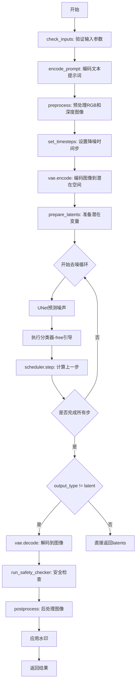
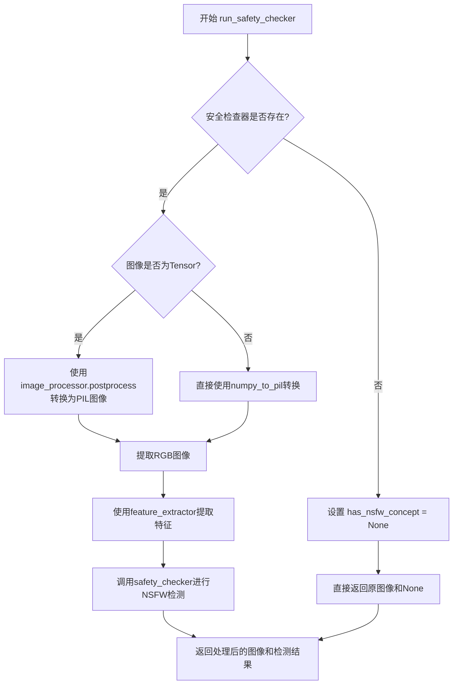
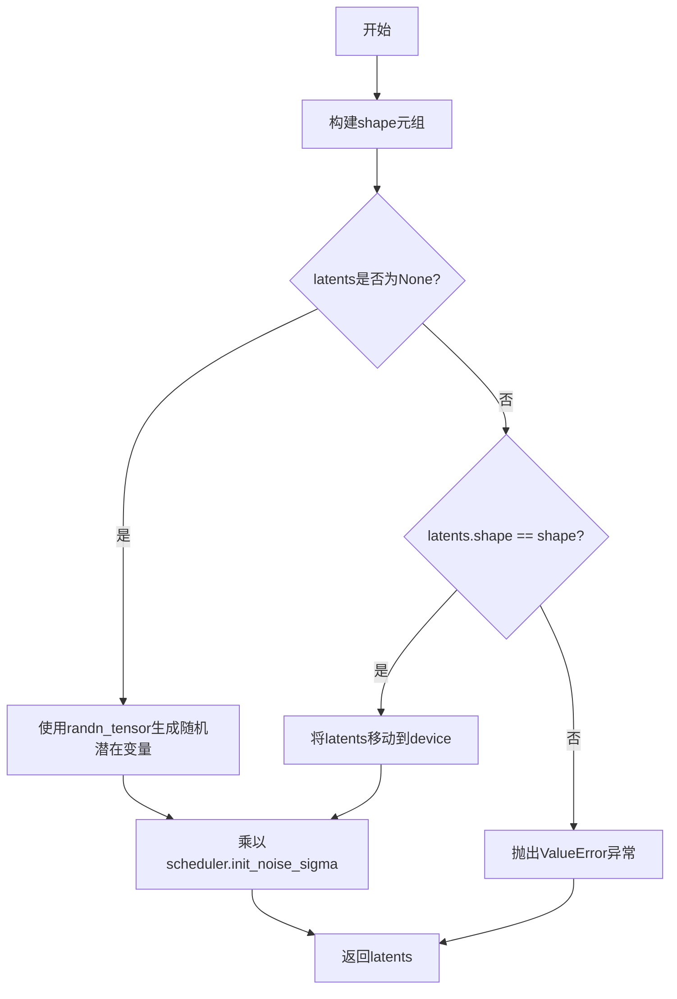
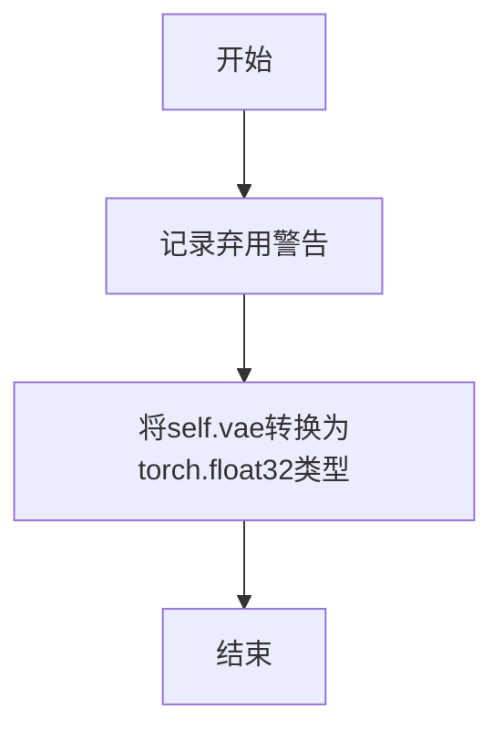
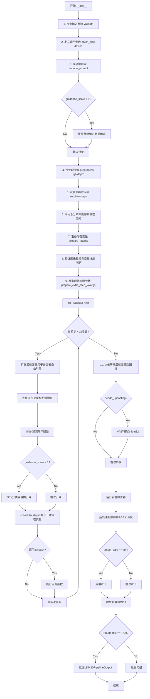

# `diffusers\examples\community\pipeline_stable_diffusion_upscale_ldm3d.py` 详细设计文档

A Diffusers pipeline for upscaling low-resolution RGB and depth images using Stable Diffusion LDM3D (Latent Diffusion Model for 3D), generating high-quality images with corresponding depth maps through a text-guided diffusion process.

## 整体流程



## 类结构

```
DiffusionPipeline (基类)
├── TextualInversionLoaderMixin
├── StableDiffusionLoraLoaderMixin
└── FromSingleFileMixin
    └── StableDiffusionUpscaleLDM3DPipeline
```

## 全局变量及字段


### `logger`
    
日志记录器，用于记录程序运行中的日志信息

类型：`logging.Logger`
    


### `EXAMPLE_DOC_STRING`
    
示例文档字符串，包含使用该pipeline的示例代码

类型：`str`
    


### `StableDiffusionUpscaleLDM3DPipeline.vae`
    
VAE模型，用于编解码图像与潜在表示

类型：`AutoencoderKL`
    


### `StableDiffusionUpscaleLDM3DPipeline.text_encoder`
    
冻结的文本编码器

类型：`CLIPTextModel`
    


### `StableDiffusionUpscaleLDM3DPipeline.tokenizer`
    
CLIP分词器

类型：`CLIPTokenizer`
    


### `StableDiffusionUpscaleLDM3DPipeline.unet`
    
去噪UNet模型

类型：`UNet2DConditionModel`
    


### `StableDiffusionUpscaleLDM3DPipeline.low_res_scheduler`
    
低分辨率噪声调度器

类型：`DDPMScheduler`
    


### `StableDiffusionUpscaleLDM3DPipeline.scheduler`
    
主噪声调度器

类型：`KarrasDiffusionSchedulers`
    


### `StableDiffusionUpscaleLDM3DPipeline.safety_checker`
    
安全检查模块

类型：`StableDiffusionSafetyChecker`
    


### `StableDiffusionUpscaleLDM3DPipeline.feature_extractor`
    
特征提取器

类型：`CLIPImageProcessor`
    


### `StableDiffusionUpscaleLDM3DPipeline.watermarker`
    
水印处理器

类型：`Optional[Any]`
    


### `StableDiffusionUpscaleLDM3DPipeline.vae_scale_factor`
    
VAE缩放因子

类型：`int`
    


### `StableDiffusionUpscaleLDM3DPipeline.image_processor`
    
图像处理器

类型：`VaeImageProcessorLDM3D`
    


### `StableDiffusionUpscaleLDM3DPipeline._optional_components`
    
可选组件列表

类型：`List[str]`
    
    

## 全局函数及方法


### `StableDiffusionUpscaleLDM3DPipeline.__init__`

该方法是 `StableDiffusionUpscaleLDM3DPipeline` 类的构造函数，用于初始化一个用于文本到图像和3D生成的LDM3D超分辨率扩散管道。它接收多个神经网络组件（VAE、文本编码器、UNet等）以及配置参数，进行安全检查、模块注册、图像处理器初始化等关键设置。

参数：

-  `vae`：`AutoencoderKL`，用于将图像编码和解码到潜在表示的变分自编码器模型
-  `text_encoder`：`CLIPTextModel`，冻结的文本编码器（clip-vit-large-patch14）
-  `tokenizer`：`CLIPTokenizer`，用于对文本进行分词的CLIP分词器
-  `unet`：`UNet2DConditionModel`，用于对编码的图像潜在表示进行去噪的条件UNet模型
-  `low_res_scheduler`：`DDPMScheduler`，用于向低分辨率 conditioning 图像添加初始噪声的调度器
-  `scheduler`：`KarrasDiffusionSchedulers`，与unet结合使用以去噪编码图像潜在表示的调度器
-  `safety_checker`：`StableDiffusionSafetyChecker`，用于估计生成的图像是否可能被认为是冒犯性或有害的分类模块
-  `feature_extractor`：`CLIPImageProcessor`，用于从生成的图像中提取特征的CLIP图像处理器
-  `requires_safety_checker`：`bool`（可选，默认值为`True`），是否需要安全检查器
-  `watermarker`：`Optional[Any]`（可选，默认值为`None`），用于添加水印的可选组件
-  `max_noise_level`：`int`（可选，默认值为`350`），最大噪声级别

返回值：`None`，构造函数不返回任何值，仅初始化对象状态

#### 流程图

```mermaid
flowchart TD
    A[__init__ 开始] --> B{检查 safety_checker 和 requires_safety_checker}
    B -->|safety_checker is None and requires_safety_checker is True| C[发出安全检查器禁用警告]
    B -->|safety_checker is not None and feature_extractor is None| D[抛出 ValueError]
    B -->|条件不满足| E[调用 super().__init__]
    C --> E
    D --> H[结束]
    E --> F[调用 self.register_modules 注册所有模块]
    F --> G[计算 vae_scale_factor 并创建 VaeImageProcessorLDM3D]
    G --> I[调用 self.register_to_config 注册 max_noise_level]
    I --> H[__init__ 结束]
```

#### 带注释源码

```python
def __init__(
    self,
    vae: AutoencoderKL,
    text_encoder: CLIPTextModel,
    tokenizer: CLIPTokenizer,
    unet: UNet2DConditionModel,
    low_res_scheduler: DDPMScheduler,
    scheduler: KarrasDiffusionSchedulers,
    safety_checker: StableDiffusionSafetyChecker,
    feature_extractor: CLIPImageProcessor,
    requires_safety_checker: bool = True,
    watermarker: Optional[Any] = None,
    max_noise_level: int = 350,
):
    # 调用父类 DiffusionPipeline 的初始化方法
    super().__init__()

    # 如果 safety_checker 为 None 但 requires_safety_checker 为 True，则发出警告
    if safety_checker is None and requires_safety_checker:
        logger.warning(
            f"You have disabled the safety checker for {self.__class__} by passing `safety_checker=None`. Ensure"
            " that you abide to the conditions of the Stable Diffusion license and do not expose unfiltered"
            " results in services or applications open to the public. Both the diffusers team and Hugging Face"
            " strongly recommend to keep the safety filter enabled in all public facing circumstances, disabling"
            " it only for use-cases that involve analyzing network behavior or auditing its results. For more"
            " information, please have a look at https://github.com/huggingface/diffusers/pull/254 ."
        )

    # 如果提供了 safety_checker 但没有提供 feature_extractor，则抛出错误
    if safety_checker is not None and feature_extractor is None:
        raise ValueError(
            "Make sure to define a feature extractor when loading {self.__class__} if you want to use the safety"
            " checker. If you do not want to use the safety checker, you can pass `'safety_checker=None'` instead."
        )

    # 注册所有模块到管道中，使其可通过管道对象访问
    self.register_modules(
        vae=vae,
        text_encoder=text_encoder,
        tokenizer=tokenizer,
        unet=unet,
        low_res_scheduler=low_res_scheduler,
        scheduler=scheduler,
        safety_checker=safety_checker,
        watermarker=watermarker,
        feature_extractor=feature_extractor,
    )
    
    # 计算 VAE 缩放因子，基于 VAE 配置中的 block_out_channels 数量
    # 默认值为 8（2^(3)），当 VAE 可用时根据通道数计算
    self.vae_scale_factor = 2 ** (len(self.vae.config.block_out_channels) - 1) if getattr(self, "vae", None) else 8
    
    # 创建 LDM3D 专用的 VAE 图像处理器，用于预处理和后处理 RGB 和深度图像
    self.image_processor = VaeImageProcessorLDM3D(vae_scale_factor=self.vae_scale_factor, resample="bilinear")
    
    # 将 max_noise_level 注册到配置中，用于限制噪声级别
    # self.register_to_config(requires_safety_checker=requires_safety_checker)  # 注释掉的代码
    self.register_to_config(max_noise_level=max_noise_level)
```


### `StableDiffusionUpscaleLDM3DPipeline._encode_prompt`

该方法是 `StableDiffusionUpscaleLDM3DPipeline` 管道类的已弃用方法，用于将文本提示（prompt）编码为文本编码器的隐藏状态。它是早期版本的API，已被新的 `encode_prompt` 方法取代，并会发出弃用警告。该方法还处理了向后兼容性，将新格式的元组结果重新连接为旧的单一张量格式返回。

参数：

- `self`：隐式参数，`StableDiffusionUpscaleLDM3DPipeline` 实例，管道对象本身
- `prompt`：`Union[str, List[str], None]`，要编码的文本提示，可以是单个字符串或字符串列表，若为 `None` 则必须提供 `prompt_embeds`
- `device`：`torch.device`， torch 设备，用于将张量移动到指定设备（如 CPU 或 GPU）
- `num_images_per_prompt`：`int`，每个提示需要生成的图像数量，用于对提示嵌入进行重复以匹配批量大小
- `do_classifier_free_guidance`：`bool`，是否执行无分类器自由引导（Classifier-Free Guidance），为 `True` 时会生成负面提示嵌入
- `negative_prompt`：`Union[str, List[str], None]`，负面提示，用于指导模型避免生成的内容，若为 `None` 且需要 CFG，则使用空字符串
- `prompt_embeds`：`Optional[torch.Tensor]`，预生成的提示嵌入，如果未提供，则根据 `prompt` 自动生成
- `negative_prompt_embeds`：`Optional[torch.Tensor]`，预生成的负面提示嵌入，如果未提供，则根据 `negative_prompt` 自动生成
- `lora_scale`：`Optional[float]`，LoRA 缩放因子，用于调整 LoRA 层的权重
- `**kwargs`：`Dict[str, Any]`，其他可选关键字参数，会传递给底层的 `encode_prompt` 方法

返回值：`torch.Tensor`，返回连接后的提示嵌入张量。具体是将 `encode_prompt` 返回的元组中的负向嵌入（第二位）和正向嵌入（第一位）按 `[负向, 正向]` 的顺序拼接在一起，以保持与旧版 API 的向后兼容性。

#### 流程图

```mermaid
flowchart TD
    A[开始 _encode_prompt] --> B[发出弃用警告]
    B --> C{检查 lora_scale 和 StableDiffusionLoraLoaderMixin}
    C -->|是| D[设置 self._lora_scale]
    C -->|否| E[调用 encode_prompt 方法]
    D --> E
    E --> F[获取返回的元组 prompt_embeds_tuple]
    F --> G[拼接张量: torch.cat<br/>[负向嵌入, 正向嵌入]]
    G --> H[返回拼接后的 prompt_embeds]
    H --> I[结束]
    
    style A fill:#f9f,stroke:#333
    style I fill:#9f9,stroke:#333
    style B fill:#ff9,stroke:#333
```

#### 带注释源码

```python
# Copied from diffusers.pipelines.stable_diffusion.pipeline_stable_diffusion_ldm3d.StableDiffusionLDM3DPipeline._encode_prompt
def _encode_prompt(
    self,
    prompt,                         # 输入的文本提示，字符串或字符串列表
    device,                        # torch 设备 (cpu/cuda)
    num_images_per_prompt,         # 每个提示生成的图像数量
    do_classifier_free_guidance,   # 是否使用无分类器自由引导
    negative_prompt=None,          # 负面提示，用于引导不生成的内容
    prompt_embeds: Optional[torch.Tensor] = None,    # 可选的预生成提示嵌入
    negative_prompt_embeds: Optional[torch.Tensor] = None,  # 可选的预生成负面提示嵌入
    lora_scale: Optional[float] = None,  # LoRA 权重缩放因子
    **kwargs,                      # 其他关键字参数
):
    """
    编码提示到文本编码器隐藏状态。
    
    注意：此方法已弃用，将在未来的版本中移除。请使用 encode_prompt() 代替。
    同时请注意输出格式已从拼接的张量更改为元组。
    """
    # 发出弃用警告，提示用户使用新方法
    deprecation_message = "`_encode_prompt()` is deprecated and it will be removed in a future version. Use `encode_prompt()` instead. Also, be aware that the output format changed from a concatenated tensor to a tuple."
    deprecate("_encode_prompt()", "1.0.0", deprecation_message, standard_warn=False)

    # 调用新的 encode_prompt 方法获取编码结果（返回元组格式）
    prompt_embeds_tuple = self.encode_prompt(
        prompt=prompt,
        device=device,
        num_images_per_prompt=num_images_per_prompt,
        do_classifier_free_guidance=do_classifier_free_guidance,
        negative_prompt=negative_prompt,
        prompt_embeds=prompt_embeds,
        negative_prompt_embeds=negative_prompt_embeds,
        lora_scale=lora_scale,
        **kwargs,
    )

    # 为了向后兼容性，将元组重新拼接为旧格式的张量
    # 元组格式: (negative_prompt_embeds, prompt_embeds)
    # 拼接顺序: [负向嵌入, 正向嵌入]，这是旧版 API 的预期格式
    prompt_embeds = torch.cat([prompt_embeds_tuple[1], prompt_embeds_tuple[0]])

    # 返回拼接后的张量以保持向后兼容
    return prompt_embeds
```


### `StableDiffusionUpscaleLDM3DPipeline.encode_prompt`

该方法负责将文本提示（prompt）编码为文本编码器的隐藏状态（hidden states），支持 classifier-free guidance、LoRA 权重调整、clip skip 等功能，并返回正向提示嵌入和负向提示嵌入。

参数：

- `prompt`：`str` 或 `List[str]`，可选，要编码的提示词
- `device`：`torch.device`，torch 设备
- `num_images_per_prompt`：`int`，每个提示词生成的图像数量
- `do_classifier_free_guidance`：`bool`，是否使用 classifier-free guidance
- `negative_prompt`：`str` 或 `List[str]`，可选，不用于引导图像生成的提示词
- `prompt_embeds`：`torch.Tensor`，可选，预生成的文本嵌入
- `negative_prompt_embeds`：`torch.Tensor`，可选，预生成的负向文本嵌入
- `lora_scale`：`float`，可选，要应用于文本编码器所有 LoRA 层的 LoRA 缩放因子
- `clip_skip`：`int`，可选，计算提示嵌入时从 CLIP 跳过的层数

返回值：`Tuple[torch.Tensor, torch.Tensor]`，返回 (prompt_embeds, negative_prompt_embeds) 元组，分别表示正向和负向的文本嵌入张量

#### 流程图

```mermaid
flowchart TD
    A[开始 encode_prompt] --> B{检查 lora_scale 是否存在}
    B -->|是| C[设置 self._lora_scale]
    B -->|否| D[跳过 LoRA 调整]
    C --> E{是否使用 PEFT 后端}
    E -->|否| F[adjust_lora_scale_text_encoder]
    E -->|是| G[scale_lora_layers]
    D --> H{检查 prompt 类型}
    H -->|str| I[batch_size = 1]
    H -->|list| J[batch_size = len(prompt)]
    H -->|其他| K[batch_size = prompt_embeds.shape[0]]
    I --> L{prompt_embeds 为空?}
    J --> L
    K --> L
    L -->|是| M[进行文本标记化]
    L -->|否| N[使用传入的 prompt_embeds]
    M --> O[处理 textual inversion]
    O --> P[调用 tokenizer]
    P --> Q[检查 attention_mask]
    Q -->|有 config.use_attention_mask| R[使用 text_inputs.attention_mask]
    Q -->|无| S[attention_mask = None]
    R --> T{clip_skip 为空?}
    S --> T
    T -->|是| U[直接调用 text_encoder]
    T -->|否| V[获取隐藏状态并应用 final_layer_norm]
    U --> W[获取 prompt_embeds]
    V --> W
    N --> X[转换 prompt_embeds 类型和设备]
    W --> X
    X --> Y[重复 prompt_embeds num_images_per_prompt 次]
    Y --> Z{do_classifier_free_guidance 且 negative_prompt_embeds 为空?}
    Z -->|是| AA[处理 negative_prompt]
    Z -->|否| AB{do_classifier_free_guidance?}
    AA --> AC[tokenizer negative_prompt]
    AC --> AD[获取 negative_prompt_embeds]
    AD --> AE[重复 negative_prompt_embeds]
    AB -->|否| AF[跳过 negative 处理]
    AE --> AG[返回 prompt_embeds 和 negative_prompt_embeds]
    AF --> AG
```

#### 带注释源码

```python
def encode_prompt(
    self,
    prompt,  # str 或 List[str]，要编码的提示词
    device,  # torch.device，torch 设备
    num_images_per_prompt,  # int，每个提示词生成的图像数量
    do_classifier_free_guidance,  # bool，是否使用 classifier-free guidance
    negative_prompt=None,  # str 或 List[str]，可选，负向提示词
    prompt_embeds: Optional[torch.Tensor] = None,  # torch.Tensor，可选，预生成的文本嵌入
    negative_prompt_embeds: Optional[torch.Tensor] = None,  # torch.Tensor，可选，预生成的负向文本嵌入
    lora_scale: Optional[float] = None,  # float，可选，LoRA 缩放因子
    clip_skip: Optional[int] = None,  # int，可选，跳过的 CLIP 层数
):
    r"""
    Encodes the prompt into text encoder hidden states.

    Args:
        prompt (`str` or `List[str]`, *optional*):
            prompt to be encoded
        device: (`torch.device`):
            torch device
        num_images_per_prompt (`int`):
            number of images that should be generated per prompt
        do_classifier_free_guidance (`bool`):
            whether to use classifier free guidance or not
        negative_prompt (`str` or `List[str]`, *optional*):
            The prompt or prompts not to guide the image generation. If not defined, one has to pass
            `negative_prompt_embeds` instead. Ignored when not using guidance (i.e., ignored if `guidance_scale` is
            less than `1`).
        prompt_embeds (`torch.Tensor`, *optional*):
            Pre-generated text embeddings. Can be used to easily tweak text inputs, *e.g.* prompt weighting. If not
            provided, text embeddings will be generated from `prompt` input argument.
        negative_prompt_embeds (`torch.Tensor`, *optional*):
            Pre-generated negative text embeddings. Can be used to easily tweak text inputs, *e.g.* prompt
            weighting. If not provided, negative_prompt_embeds will be generated from `negative_prompt` input
            argument.
        lora_scale (`float`, *optional*):
            A LoRA scale that will be applied to all LoRA layers of the text encoder if LoRA layers are loaded.
        clip_skip (`int`, *optional*):
            Number of layers to be skipped from CLIP while computing the prompt embeddings. A value of 1 means that
            the output of the pre-final layer will be used for computing the prompt embeddings.
    """
    # 如果提供了 lora_scale，则设置 LoRA 缩放因子，以便 text encoder 的 monkey patched LoRA 函数可以正确访问
    if lora_scale is not None and isinstance(self, StableDiffusionLoraLoaderMixin):
        self._lora_scale = lora_scale

        # 动态调整 LoRA 缩放因子
        if not USE_PEFT_BACKEND:
            adjust_lora_scale_text_encoder(self.text_encoder, lora_scale)
        else:
            scale_lora_layers(self.text_encoder, lora_scale)

    # 确定 batch_size
    if prompt is not None and isinstance(prompt, str):
        batch_size = 1
    elif prompt is not None and isinstance(prompt, list):
        batch_size = len(prompt)
    else:
        batch_size = prompt_embeds.shape[0]

    # 如果未提供 prompt_embeds，则从 prompt 生成
    if prompt_embeds is None:
        # textual inversion: process multi-vector tokens if necessary
        if isinstance(self, TextualInversionLoaderMixin):
            prompt = self.maybe_convert_prompt(prompt, self.tokenizer)

        # 使用 tokenizer 将 prompt 转换为 token IDs
        text_inputs = self.tokenizer(
            prompt,
            padding="max_length",
            max_length=self.tokenizer.model_max_length,
            truncation=True,
            return_tensors="pt",
        )
        text_input_ids = text_inputs.input_ids
        # 获取未截断的 token IDs 用于检查截断情况
        untruncated_ids = self.tokenizer(prompt, padding="longest", return_tensors="pt").input_ids

        # 检查是否发生了截断，并记录警告
        if untruncated_ids.shape[-1] >= text_input_ids.shape[-1] and not torch.equal(
            text_input_ids, untruncated_ids
        ):
            removed_text = self.tokenizer.batch_decode(
                untruncated_ids[:, self.tokenizer.model_max_length - 1 : -1]
            )
            logger.warning(
                "The following part of your input was truncated because CLIP can only handle sequences up to"
                f" {self.tokenizer.model_max_length} tokens: {removed_text}"
            )

        # 处理 attention_mask
        if hasattr(self.text_encoder.config, "use_attention_mask") and self.text_encoder.config.use_attention_mask:
            attention_mask = text_inputs.attention_mask.to(device)
        else:
            attention_mask = None

        # 根据 clip_skip 参数决定如何获取 prompt embeddings
        if clip_skip is None:
            prompt_embeds = self.text_encoder(text_input_ids.to(device), attention_mask=attention_mask)
            prompt_embeds = prompt_embeds[0]
        else:
            # 获取所有隐藏状态
            prompt_embeds = self.text_encoder(
                text_input_ids.to(device), attention_mask=attention_mask, output_hidden_states=True
            )
            # 访问最后一层的隐藏状态（包含所有编码器层的元组），然后索引到所需的层
            prompt_embeds = prompt_embeds[-1][-(clip_skip + 1)]
            # 还需要应用最终的 LayerNorm 以保持表示的正确性
            prompt_embeds = self.text_encoder.text_model.final_layer_norm(prompt_embeds)

    # 确定 prompt_embeds 的数据类型
    if self.text_encoder is not None:
        prompt_embeds_dtype = self.text_encoder.dtype
    elif self.unet is not None:
        prompt_embeds_dtype = self.unet.dtype
    else:
        prompt_embeds_dtype = prompt_embeds.dtype

    # 将 prompt_embeds 转换为适当的 dtype 和 device
    prompt_embeds = prompt_embeds.to(dtype=prompt_embeds_dtype, device=device)

    # 为每个 prompt 复制 text embeddings（使用 mps 友好的方法）
    bs_embed, seq_len, _ = prompt_embeds.shape
    prompt_embeds = prompt_embeds.repeat(1, num_images_per_prompt, 1)
    prompt_embeds = prompt_embeds.view(bs_embed * num_images_per_prompt, seq_len, -1)

    # 获取 classifier-free guidance 所需的无条件 embeddings
    if do_classifier_free_guidance and negative_prompt_embeds is None:
        uncond_tokens: List[str]
        if negative_prompt is None:
            uncond_tokens = [""] * batch_size
        elif prompt is not None and type(prompt) is not type(negative_prompt):
            raise TypeError(
                f"`negative_prompt` should be the same type to `prompt`, but got {type(negative_prompt)} !="
                f" {type(prompt)}."
            )
        elif isinstance(negative_prompt, str):
            uncond_tokens = [negative_prompt]
        elif batch_size != len(negative_prompt):
            raise ValueError(
                f"`negative_prompt`: {negative_prompt} has batch size {len(negative_prompt)}, but `prompt`:"
                f" {prompt} has batch size {batch_size}. Please make sure that passed `negative_prompt` matches"
                " the batch size of `prompt`."
            )
        else:
            uncond_tokens = negative_prompt

        # textual inversion: process multi-vector tokens if necessary
        if isinstance(self, TextualInversionLoaderMixin):
            uncond_tokens = self.maybe_convert_prompt(uncond_tokens, self.tokenizer)

        max_length = prompt_embeds.shape[1]
        uncond_input = self.tokenizer(
            uncond_tokens,
            padding="max_length",
            max_length=max_length,
            truncation=True,
            return_tensors="pt",
        )

        # 处理 negative prompt 的 attention_mask
        if hasattr(self.text_encoder.config, "use_attention_mask") and self.text_encoder.config.use_attention_mask:
            attention_mask = uncond_input.attention_mask.to(device)
        else:
            attention_mask = None

        # 获取 negative prompt embeddings
        negative_prompt_embeds = self.text_encoder(
            uncond_input.input_ids.to(device),
            attention_mask=attention_mask,
        )
        negative_prompt_embeds = negative_prompt_embeds[0]

    # 处理 classifier-free guidance 的 negative embeddings
    if do_classifier_free_guidance:
        # 为每个 prompt 复制 unconditional embeddings
        seq_len = negative_prompt_embeds.shape[1]

        negative_prompt_embeds = negative_prompt_embeds.to(dtype=prompt_embeds_dtype, device=device)

        negative_prompt_embeds = negative_prompt_embeds.repeat(1, num_images_per_prompt, 1)
        negative_prompt_embeds = negative_prompt_embeds.view(batch_size * num_images_per_prompt, seq_len, -1)

    # 如果使用 PEFT 后端，恢复 LoRA 层的原始缩放因子
    if isinstance(self, StableDiffusionLoraLoaderMixin) and USE_PEFT_BACKEND:
        unscale_lora_layers(self.text_encoder, lora_scale)

    # 返回 prompt_embeds 和 negative_prompt_embeds
    return prompt_embeds, negative_prompt_embeds
```


### `StableDiffusionUpscaleLDM3DPipeline.run_safety_checker`

该方法用于对生成的图像进行安全检查（NSFW检测），通过安全检查器判断图像是否包含不当内容，并返回处理后的图像及检测结果。

参数：

-  `image`：`Union[torch.Tensor, np.ndarray, PIL.Image.Image, List]` - 输入图像，可以是张量、NumPy数组、PIL图像或图像列表
-  `device`：`torch.device` - 运行安全检查的设备（CPU/CUDA）
-  `dtype`：`torch.dtype` - 输入数据的精度类型（如float16、float32）

返回值：`Tuple[Union[torch.Tensor, np.ndarray, PIL.Image.Image, List], Optional[List[bool]]]` - 返回处理后的图像和NSFW检测结果元组。图像类型与输入类型一致，检测结果为布尔值列表（True表示检测到不当内容）或None（当安全检查器禁用时）

#### 流程图



#### 带注释源码

```python
def run_safety_checker(self, image, device, dtype):
    """
    对生成的图像运行安全检查器（NSFW检测）
    
    参数:
        image: 输入图像，支持torch.Tensor、np.ndarray、PIL.Image.Image或列表
        device: torch设备，用于运行安全检查器
        dtype: 数据类型，用于转换输入张量
    
    返回:
        tuple: (处理后的图像, NSFW检测结果)
            - 图像类型与输入类型一致
            - 检测结果为Optional[List[bool]]，None表示未检测
    """
    # 检查安全检查器是否已配置
    if self.safety_checker is None:
        # 如果未配置安全检查器，直接返回None
        has_nsfw_concept = None
    else:
        # 将图像转换为PIL格式以供特征提取器使用
        if torch.is_tensor(image):
            # 如果是PyTorch张量，使用后处理器转换为PIL图像
            feature_extractor_input = self.image_processor.postprocess(image, output_type="pil")
        else:
            # 如果是numpy数组或其他格式，直接转换为PIL
            feature_extractor_input = self.image_processor.numpy_to_pil(image)
        
        # 提取RGB图像用于特征提取（取第一张图像）
        rgb_feature_extractor_input = feature_extractor_input[0]
        
        # 使用特征提取器提取图像特征并转移到指定设备
        safety_checker_input = self.feature_extractor(rgb_feature_extractor_input, return_tensors="pt").to(device)
        
        # 调用安全检查器进行NSFW检测
        # 传入图像和CLIP特征向量
        image, has_nsfw_concept = self.safety_checker(
            images=image, 
            clip_input=safety_checker_input.pixel_values.to(dtype)
        )
    
    # 返回处理后的图像和NSFW检测结果
    return image, has_nsfw_concept
```


### `StableDiffusionUpscaleLDM3DPipeline.prepare_extra_step_kwargs`

该方法用于为调度器（scheduler）的 step 函数准备额外的关键字参数。由于不同的调度器具有不同的签名，该方法通过检查调度器的参数签名来确定是否需要传递 `eta` 和 `generator` 参数。

参数：

- `self`：隐式参数，类的实例
- `generator`：`Optional[Union[torch.Generator, List[torch.Generator]]]`，用于使生成具有确定性的 PyTorch 生成器
- `eta`：`float`，对应 DDIM 论文中的参数 eta (η)，取值范围为 [0, 1]

返回值：`Dict[str, Any]`，包含调度器 step 函数所需的关键字参数字典

#### 流程图

```mermaid
flowchart TD
    A[开始准备额外参数] --> B[获取scheduler.step的签名]
    B --> C{eta参数是否被接受?}
    C -->|是| D[设置extra_step_kwargs['eta'] = eta]
    C -->|否| E{generator参数是否被接受?}
    D --> E
    E -->|是| F[设置extra_step_kwargs['generator'] = generator]
    E -->|否| G[返回extra_step_kwargs字典]
    F --> G
```

#### 带注释源码

```python
def prepare_extra_step_kwargs(self, generator, eta):
    # 准备调度器的额外参数，因为并非所有调度器都具有相同的签名
    # eta (η) 仅在 DDIMScheduler 中使用，对于其他调度器将被忽略
    # eta 对应 DDIM 论文中的 η: https://huggingface.co/papers/2010.02502
    # 取值应在 [0, 1] 范围内

    # 检查调度器的 step 方法是否接受 eta 参数
    accepts_eta = "eta" in set(inspect.signature(self.scheduler.step).parameters.keys())
    
    # 初始化额外的参数字典
    extra_step_kwargs = {}
    
    # 如果调度器接受 eta 参数，则将其添加到 extra_step_kwargs
    if accepts_eta:
        extra_step_kwargs["eta"] = eta

    # 检查调度器是否接受 generator 参数
    accepts_generator = "generator" in set(inspect.signature(self.scheduler.step).parameters.keys())
    
    # 如果调度器接受 generator 参数，则将其添加到 extra_step_kwargs
    if accepts_generator:
        extra_step_kwargs["generator"] = generator
    
    # 返回包含额外参数的字典
    return extra_step_kwargs
```


### `StableDiffusionUpscaleLDM3DPipeline.check_inputs`

该方法用于验证输入参数的有效性，确保在执行推理之前所有参数都符合管道的要求。它检查回调步骤、提示词、嵌入向量、图像类型以及噪声级别等关键参数，并在发现任何无效输入时抛出相应的 ValueError 异常。

参数：

- `self`：`StableDiffusionUpscaleLDM3DPipeline` 类的实例隐式参数，表示对管道对象的引用
- `prompt`：`Union[str, List[str], None]`，需要验证的文本提示词，可以是单个字符串、字符串列表或 None
- `image`：`Union[torch.Tensor, PIL.Image.Image, np.ndarray, List, None]`，需要放大的图像，支持 PyTorch 张量、PIL 图像、NumPy 数组或列表
- `noise_level`：`int`，噪声级别，用于控制添加到图像的噪声量，必须小于等于配置中的最大噪声级别
- `callback_steps`：`int`，回调函数被调用的频率步数，必须为正整数
- `negative_prompt`：`Union[str, List[str], None]`，可选的负面提示词，用于指导不希望出现的图像特征
- `prompt_embeds`：`Optional[torch.Tensor]`，可选的预生成文本嵌入向量，用于文本提示词的替代输入
- `negative_prompt_embeds`：`Optional[torch.Tensor]`，可选的预生成负面文本嵌入向量
- `target_res`：`Optional[List[int]]`，可选的目标分辨率参数

返回值：`None`，该方法不返回任何值，仅通过抛出异常来处理无效输入

#### 流程图

```mermaid
flowchart TD
    A[开始 check_inputs 验证] --> B{验证 callback_steps}
    B -->|无效| C[抛出 ValueError]
    B -->|有效| D{验证 prompt 和 prompt_embeds}
    D -->|同时提供| C
    D -->|都未提供| C
    D -->|有效| E{验证 prompt 类型}
    E -->|无效类型| C
    E -->|有效| F{验证 negative_prompt 和 negative_prompt_embeds}
    F -->|同时提供| C
    F -->|有效| G{验证 prompt_embeds 和 negative_prompt_embeds 形状}
    G -->|形状不匹配| C
    G -->|有效| H{验证 image 类型}
    H -->|无效类型| C
    H -->|有效| I{验证 batch size 一致性}
    I -->|不一致| C
    I -->|有效| J{验证 noise_level 范围]
    J -->|超出范围| C
    J -->|有效| K[验证通过]
    C --> L[结束 - 抛出异常]
    K --> L
```

#### 带注释源码

```python
def check_inputs(
    self,
    prompt,
    image,
    noise_level,
    callback_steps,
    negative_prompt=None,
    prompt_embeds=None,
    negative_prompt_embeds=None,
    target_res=None,
):
    # 验证 callback_steps 参数
    # 必须为正整数，如果为 None 或非正整数则抛出异常
    if (callback_steps is None) or (
        callback_steps is not None and (not isinstance(callback_steps, int) or callback_steps <= 0)
    ):
        raise ValueError(
            f"`callback_steps` has to be a positive integer but is {callback_steps} of type"
            f" {type(callback_steps)}."
        )

    # 验证 prompt 和 prompt_embeds 不能同时提供
    # 两者是互斥的输入方式，只能选择其中一种
    if prompt is not None and prompt_embeds is not None:
        raise ValueError(
            f"Cannot forward both `prompt`: {prompt} and `prompt_embeds`: {prompt_embeds}. Please make sure to"
            " only forward one of the two."
        )
    # 验证至少需要提供 prompt 或 prompt_embeds 其中之一
    elif prompt is None and prompt_embeds is None:
        raise ValueError(
            "Provide either `prompt` or `prompt_embeds`. Cannot leave both `prompt` and `prompt_embeds` undefined."
        )
    # 验证 prompt 的类型必须是字符串或字符串列表
    elif prompt is not None and (not isinstance(prompt, str) and not isinstance(prompt, list)):
        raise ValueError(f"`prompt` has to be of type `str` or `list` but is {type(prompt)}")

    # 验证 negative_prompt 和 negative_prompt_embeds 不能同时提供
    if negative_prompt is not None and negative_prompt_embeds is not None:
        raise ValueError(
            f"Cannot forward both `negative_prompt`: {negative_prompt} and `negative_prompt_embeds`:"
            f" {negative_prompt_embeds}. Please make sure to only forward one of the two."
        )

    # 验证 prompt_embeds 和 negative_prompt_embeds 形状必须一致
    if prompt_embeds is not None and negative_prompt_embeds is not None:
        if prompt_embeds.shape != negative_prompt_embeds.shape:
            raise ValueError(
                "`prompt_embeds` and `negative_prompt_embeds` must have the same shape when passed directly, but"
                f" got: `prompt_embeds` {prompt_embeds.shape} != `negative_prompt_embeds`"
                f" {negative_prompt_embeds.shape}."
            )

    # 验证 image 参数的类型
    # 必须为 torch.Tensor, PIL.Image.Image, np.ndarray, list 或 None 之一
    if (
        not isinstance(image, torch.Tensor)
        and not isinstance(image, PIL.Image.Image)
        and not isinstance(image, np.ndarray)
        and not isinstance(image, list)
    ):
        raise ValueError(
            f"`image` has to be of type `torch.Tensor`, `np.ndarray`, `PIL.Image.Image` or `list` but is {type(image)}"
        )

    # 验证 prompt 和 image 的 batch size 是否一致
    # 如果 image 是 list、numpy array 或 torch tensor，需要检查 batch 维度
    if isinstance(image, (list, np.ndarray, torch.Tensor)):
        # 根据 prompt 类型确定 batch size
        if prompt is not None and isinstance(prompt, str):
            batch_size = 1
        elif prompt is not None and isinstance(prompt, list):
            batch_size = len(prompt)
        else:
            batch_size = prompt_embeds.shape[0]

        # 根据 image 类型确定 image batch size
        if isinstance(image, list):
            image_batch_size = len(image)
        else:
            image_batch_size = image.shape[0]
        
        # 验证 batch size 必须匹配
        if batch_size != image_batch_size:
            raise ValueError(
                f"`prompt` has batch size {batch_size} and `image` has batch size {image_batch_size}."
                " Please make sure that passed `prompt` matches the batch size of `image`."
            )

    # 验证 noise_level 不能超过配置的最大噪声级别
    if noise_level > self.config.max_noise_level:
        raise ValueError(f"`noise_level` has to be <= {self.config.max_noise_level} but is {noise_level}")

    # 重复验证 callback_steps（可能是冗余的检查）
    if (callback_steps is None) or (
        callback_steps is not None and (not isinstance(callback_steps, int) or callback_steps <= 0)
    ):
        raise ValueError(
            f"`callback_steps` has to be a positive integer but is {callback_steps} of type"
            f" {type(callback_steps)}."
        )
```


### `StableDiffusionUpscaleLDM3DPipeline.prepare_latents`

该方法负责准备图像生成过程中的潜在变量（latents），包括初始化随机潜在变量或验证并迁移用户提供的潜在变量到目标设备，同时根据调度器的要求对初始噪声进行缩放。

参数：

- `batch_size`：`int`，要生成的图像批次大小
- `num_channels_latents`：`int`，潜在变量通道数，定义了潜在空间的维度
- `height`：`int`，潜在变量张量的高度维度
- `width`：`int`，潜在变量张量的宽度维度
- `dtype`：`torch.dtype`，生成潜在变量的数据类型
- `device`：`torch.device`，潜在变量要放置的目标设备（CPU/CUDA）
- `generator`：`Optional[torch.Generator]`，用于确保可复现性的随机数生成器
- `latents`：`Optional[torch.Tensor]`，可选的预生成潜在变量，如为None则随机生成

返回值：`torch.Tensor`，处理并缩放后的潜在变量张量，准备用于去噪过程

#### 流程图



#### 带注释源码

```python
def prepare_latents(
    self,
    batch_size: int,
    num_channels_latents: int,
    height: int,
    width: int,
    dtype: torch.dtype,
    device: torch.device,
    generator: Optional[torch.Generator],
    latents: Optional[torch.Tensor] = None
) -> torch.Tensor:
    """
    准备图像生成所需的潜在变量张量。
    
    参数:
        batch_size: 批次大小
        num_channels_latents: 潜在变量的通道数
        height: 潜在变量的高度
        width: 潜在变量的宽度
        dtype: 张量的数据类型
        device: 张量要放置的设备
        generator: 可选的随机生成器，用于可复现性
        latents: 可选的预生成潜在变量
        
    返回:
        处理后的潜在变量张量
    """
    # 构建预期的潜在变量形状元组
    shape = (batch_size, num_channels_latents, height, width)
    
    # 如果没有提供预生成的潜在变量，则随机生成
    if latents is None:
        latents = randn_tensor(shape, generator=generator, device=device, dtype=dtype)
    else:
        # 验证提供的潜在变量形状是否与预期匹配
        if latents.shape != shape:
            raise ValueError(f"Unexpected latents shape, got {latents.shape}, expected {shape}")
        # 将潜在变量移动到指定的设备上
        latents = latents.to(device)

    # 根据调度器的初始噪声标准差对潜在变量进行缩放
    # 这确保了噪声的尺度与调度器的去噪过程相匹配
    latents = latents * self.scheduler.init_noise_sigma
    
    return latents
```


### `StableDiffusionUpscaleLDM3DPipeline.upcast_vae`

该方法用于将VAE模型强制转换为float32数据类型，以避免在float16推理时出现溢出问题。该方法已弃用，建议直接使用`pipe.vae.to(torch.float32)`替代。

参数： 无

返回值：`None`，无返回值，该方法直接修改VAE模型的dtype属性

#### 流程图



#### 带注释源码

```python
def upcast_vae(self):
    """
    将VAE模型转换为float32类型以避免在float16推理时溢出。
    
    该方法已被弃用，建议直接使用 pipe.vae.to(torch.float32) 代替。
    """
    # 记录弃用警告，提示用户该方法将在1.0.0版本中移除
    deprecate("upcast_vae", "1.0.0", "`upcast_vae` is deprecated. Please use `pipe.vae.to(torch.float32)`")
    
    # 将VAE模型的参数和缓冲区转换为float32类型
    # 这样做是为了在解码过程中避免float16溢出问题
    self.vae.to(dtype=torch.float32)
```


### `StableDiffusionUpscaleLDM3DPipeline.__call__`

这是 Stable Diffusion 上采样 LDM3D 管道的主调用方法，用于将低分辨率的 RGB 图像和深度图上采样到高分辨率，同时生成对应的深度信息。该方法实现了典型的扩散模型推理流程：输入验证、提示编码、图像预处理、潜在空间编码、去噪循环、VAE 解码和后处理，最终返回上采样后的 RGB 图像和深度图。

参数：

- `prompt`：`Union[str, List[str]]`，可选，用于指导图像生成的文本提示。如果未定义，则需要传递 `prompt_embeds`
- `rgb`：`PipelineImageInput`，可选，要上采样的 RGB 图像批次（支持 torch.Tensor、PIL.Image.Image、np.ndarray 或列表）
- `depth`：`PipelineDepthInput`，可选，要上采样的深度图批次
- `num_inference_steps`：`int`，可选，默认 75，去噪步骤数，更多步骤通常带来更高质量的图像
- `guidance_scale`：`float`，可选，默认 9.0，引导比例，控制图像与文本提示的相关性
- `noise_level`：`int`，可选，默认 20，添加到低分辨率图像的噪声级别
- `negative_prompt`：`Optional[Union[str, List[str]]]`，可选，指导不包含内容的文本提示
- `num_images_per_prompt`：`Optional[int]`，可选，默认 1，每个提示生成的图像数量
- `eta`：`float`，可选，默认 0.0，DDIM 论文中的 eta 参数
- `generator`：`Optional[Union[torch.Generator, List[torch.Generator]]]`，可选，用于确定性生成的随机生成器
- `latents`：`Optional[torch.Tensor]`，可选，预生成的噪声潜在向量
- `prompt_embeds`：`Optional[torch.Tensor]`，可选，预生成的文本嵌入
- `negative_prompt_embeds`：`Optional[torch.Tensor]`，可选，预生成的负面文本嵌入
- `output_type`：`str | None`，可选，默认 "pil"，输出格式（PIL.Image 或 np.array）
- `return_dict`：`bool`，可选，默认 True，是否返回字典格式结果
- `callback`：`Optional[Callable[[int, int, torch.Tensor], None]]`，可选，每隔 callback_steps 调用的回调函数
- `callback_steps`：`int`，可选，默认 1，回调函数调用频率
- `cross_attention_kwargs`：`Optional[Dict[str, Any]]`，可选，传递给注意力处理器的参数字典
- `target_res`：`Optional[List[int]]`，可选，默认 [1024, 1024]，目标分辨率

返回值：`LDM3DPipelineOutput` 或 `tuple`，包含上采样后的 RGB 图像、深度图和 NSFW 检测结果

#### 流程图



#### 带注释源码

```python
@torch.no_grad()
def __call__(
    self,
    prompt: Union[str, List[str]] = None,
    rgb: PipelineImageInput = None,
    depth: PipelineDepthInput = None,
    num_inference_steps: int = 75,
    guidance_scale: float = 9.0,
    noise_level: int = 20,
    negative_prompt: Optional[Union[str, List[str]]] = None,
    num_images_per_prompt: Optional[int] = 1,
    eta: float = 0.0,
    generator: Optional[Union[torch.Generator, List[torch.Generator]]] = None,
    latents: Optional[torch.Tensor] = None,
    prompt_embeds: Optional[torch.Tensor] = None,
    negative_prompt_embeds: Optional[torch.Tensor] = None,
    output_type: str | None = "pil",
    return_dict: bool = True,
    callback: Optional[Callable[[int, int, torch.Tensor], None]] = None,
    callback_steps: int = 1,
    cross_attention_kwargs: Optional[Dict[str, Any]] = None,
    target_res: Optional[List[int]] = [1024, 1024],
):
    r"""
    管道的主调用函数，用于生成上采样后的图像和深度图。

    参数:
        prompt: 文本提示或提示列表，用于指导图像生成
        rgb: 要上采样的RGB图像输入
        depth: 要上采样的深度图输入
        num_inference_steps: 去噪步骤数，默认75
        guidance_scale: 引导比例，默认9.0
        noise_level: 噪声级别，默认20
        negative_prompt: 负面提示
        num_images_per_prompt: 每个提示生成的图像数
        eta: DDIM调度器参数
        generator: 随机生成器
        latents: 预生成的潜在变量
        prompt_embeds: 预生成的文本嵌入
        negative_prompt_embeds: 预生成的负面文本嵌入
        output_type: 输出格式，'pil'或'np'
        return_dict: 是否返回字典格式
        callback: 推理过程中的回调函数
        callback_steps: 回调调用频率
        cross_attention_kwargs: 跨注意力参数
        target_res: 目标分辨率，默认[1024, 1024]
    """
    # 1. 检查输入参数，如果不合规则则抛出错误
    self.check_inputs(
        prompt,
        rgb,
        noise_level,
        callback_steps,
        negative_prompt,
        prompt_embeds,
        negative_prompt_embeds,
    )
    
    # 2. 定义调用参数
    # 根据prompt类型确定批次大小
    if prompt is not None and isinstance(prompt, str):
        batch_size = 1
    elif prompt is not None and isinstance(prompt, list):
        batch_size = len(prompt)
    else:
        batch_size = prompt_embeds.shape[0]

    # 获取执行设备
    device = self._execution_device
    
    # 判断是否使用分类器自由引导（CFG）
    # guidance_scale > 1 时启用，类似于Imagen论文中的权重w
    do_classifier_free_guidance = guidance_scale > 1.0

    # 3. 编码输入提示词
    # 生成prompt_embeds和negative_prompt_embeds
    prompt_embeds, negative_prompt_embeds = self.encode_prompt(
        prompt,
        device,
        num_images_per_prompt,
        do_classifier_free_guidance,
        negative_prompt,
        prompt_embeds=prompt_embeds,
        negative_prompt_embeds=negative_prompt_embeds,
    )
    
    # 对于CFG，需要将无条件嵌入和文本嵌入拼接
    # 这样可以避免两次前向传播
    if do_classifier_free_guidance:
        prompt_embeds = torch.cat([negative_prompt_embeds, prompt_embeds])

    # 4. 预处理图像
    # 将RGB和深度图预处理到目标分辨率
    rgb, depth = self.image_processor.preprocess(rgb, depth, target_res=target_res)
    rgb = rgb.to(dtype=prompt_embeds.dtype, device=device)
    depth = depth.to(dtype=prompt_embeds.dtype, device=device)

    # 5. 设置去噪时间步
    self.scheduler.set_timesteps(num_inference_steps, device=device)
    timesteps = self.scheduler.timesteps

    # 6. 将低分辨率图像编码到潜在空间
    # 沿通道维度拼接RGB和深度图
    image = torch.cat([rgb, depth], axis=1)
    # VAE编码得到潜在分布的样本
    latent_space_image = self.vae.encode(image).latent_dist.sample(generator)
    # 应用VAE缩放因子
    latent_space_image *= self.vae.scaling_factor
    
    # 将噪声级别转换为张量
    noise_level = torch.tensor([noise_level], dtype=torch.long, device=device)
    
    # 根据是否使用CFG和每提示图像数量复制潜在图像
    batch_multiplier = 2 if do_classifier_free_guidance else 1
    latent_space_image = torch.cat([latent_space_image] * batch_multiplier * num_images_per_prompt)
    noise_level = torch.cat([noise_level] * latent_space_image.shape[0])

    # 7. 准备潜在变量
    height, width = latent_space_image.shape[2:]
    num_channels_latents = self.vae.config.latent_channels

    latents = self.prepare_latents(
        batch_size * num_images_per_prompt,
        num_channels_latents,
        height,
        width,
        prompt_embeds.dtype,
        device,
        generator,
        latents,
    )

    # 8. 检查图像和潜在变量的维度是否匹配
    num_channels_image = latent_space_image.shape[1]
    if num_channels_latents + num_channels_image != self.unet.config.in_channels:
        raise ValueError(
            f"Incorrect configuration settings! The config of `pipeline.unet`: {self.unet.config} expects"
            f" {self.unet.config.in_channels} but received `num_channels_latents`: {num_channels_latents} +"
            f" `num_channels_image`: {num_channels_image} "
            f" = {num_channels_latents + num_channels_image}. Please verify the config of"
            " `pipeline.unet` or your `image` input."
        )

    # 9. 准备额外步骤参数
    extra_step_kwargs = self.prepare_extra_step_kwargs(generator, eta)

    # 10. 去噪循环
    num_warmup_steps = len(timesteps) - num_inference_steps * self.scheduler.order
    with self.progress_bar(total=num_inference_steps) as progress_bar:
        for i, t in enumerate(timesteps):
            # 如果使用CFG，扩展潜在变量
            latent_model_input = torch.cat([latents] * 2) if do_classifier_free_guidance else latents

            # 在通道维度连接潜在变量、掩码和掩码图像潜在
            latent_model_input = self.scheduler.scale_model_input(latent_model_input, t)
            latent_model_input = torch.cat([latent_model_input, latent_space_image], dim=1)

            # 预测噪声残差
            noise_pred = self.unet(
                latent_model_input,
                t,
                encoder_hidden_states=prompt_embeds,
                cross_attention_kwargs=cross_attention_kwargs,
                class_labels=noise_level,
                return_dict=False,
            )[0]

            # 执行分类器自由引导
            if do_classifier_free_guidance:
                noise_pred_uncond, noise_pred_text = noise_pred.chunk(2)
                noise_pred = noise_pred_uncond + guidance_scale * (noise_pred_text - noise_pred_uncond)

            # 计算前一个噪声样本 x_t -> x_t-1
            latents = self.scheduler.step(noise_pred, t, latents, **extra_step_kwargs, return_dict=False)[0]

            # 调用回调函数
            if i == len(timesteps) - 1 or ((i + 1) > num_warmup_steps and (i + 1) % self.scheduler.order == 0):
                progress_bar.update()
                if callback is not None and i % callback_steps == 0:
                    callback(i, t, latents)

    # 11. 如果不需要潜在输出，则解码潜在变量到图像
    if not output_type == "latent":
        # 确保VAE在float32模式，避免float16溢出
        needs_upcasting = self.vae.dtype == torch.float16 and self.vae.config.force_upcast

        if needs_upcasting:
            self.upcast_vae()
            latents = latents.to(next(iter(self.vae.post_quant_conv.parameters())).dtype)

        # VAE解码
        image = self.vae.decode(latents / self.vae.scaling_factor, return_dict=False)[0]

        # 如果需要上casting，则转回fp16
        if needs_upcasting:
            self.vae.to(dtype=torch.float16)

        # 运行安全检查器
        image, has_nsfw_concept = self.run_safety_checker(image, device, prompt_embeds.dtype)
    else:
        # 直接输出潜在变量
        image = latents
        has_nsfw_concept = None

    # 反规范化处理
    if has_nsfw_concept is None:
        do_denormalize = [True] * image.shape[0]
    else:
        do_denormalize = [not has_nsfw for has_nsfw in has_nsfw_concept]

    # 后处理图像，分离RGB和深度
    rgb, depth = self.image_processor.postprocess(image, output_type=output_type, do_denormalize=do_denormalize)

    # 12. 应用水印（如果输出为pil格式且水印器存在）
    if output_type == "pil" and self.watermarker is not None:
        rgb = self.watermarker.apply_watermark(rgb)

    # 13. 最后一个模型卸载到CPU
    if hasattr(self, "final_offload_hook") and self.final_offload_hook is not None:
        self.final_offload_hook.offload()

    # 14. 返回结果
    if not return_dict:
        return ((rgb, depth), has_nsfw_concept)

    return LDM3DPipelineOutput(rgb=rgb, depth=depth, nsfw_content_detected=has_nsfw_concept)
```

## 关键组件


### StableDiffusionUpscaleLDM3DPipeline

主管道类，继承自DiffusionPipeline，用于实现LDM3D图像超分辨率功能。该管道接收低分辨率的RGB图像和深度图作为输入，结合文本提示引导，生成高分辨率的RGB和深度图像。

### VAE (AutoencoderKL)

变分自编码器模型，用于将RGB和深度图像编码到潜在空间，以及将去噪后的潜在表示解码回图像空间。管道通过`vae.encode()`编码低分辨率图像，通过`vae.decode()`解码生成的高分辨率图像。

### UNet2DConditionModel

条件去噪U-Net模型，在扩散过程中预测噪声残差。接收潜在表示、时间步长、文本嵌入和噪声级别作为输入，执行去噪操作生成高质量的图像潜在表示。

### CLIPTextModel 与 CLIPTokenizer

文本编码组件，将文本提示转换为模型可理解的嵌入向量。`encode_prompt`方法处理单字符串或列表形式的提示，支持classifier-free guidance所需的negative prompt嵌入。

### VaeImageProcessorLDM3D

专门用于LDM3D的图像处理器，负责RGB和深度图的预处理与后处理。预处理阶段将输入图像转换为目标分辨率，后处理阶段将潜在表示转换回PIL图像或numpy数组格式。

### 噪声级别控制 (noise_level)

通过`noise_level`参数控制添加到低分辨率图像的噪声程度，该参数作为class_labels传递给UNet，实现对生成图像细节层次的精细控制。

### Classifier-Free Guidance

在`__call__`方法中实现，通过将unconditional embeddings和text embeddings拼接，在推理时增强生成图像与文本提示的一致性。guidance_scale参数控制guidance强度。

### Safety Checker

安全检查模块，用于检测生成的图像是否包含不当内容。通过`run_safety_checker`方法对输出图像进行审查，返回nsfw_content_detected标志。

### 低分辨率图像编码

将RGB和深度图在通道维度拼接后送入VAE编码器，生成潜在空间表示。该潜在表示在去噪循环中作为条件信息与latents拼接后输入UNet。

### 调度器 (Scheduler)

使用KarrasDiffusionSchedulers家族调度器控制扩散过程的时间步，通过`set_timesteps`和`step`方法实现噪声的逐步去除。`prepare_extra_step_kwargs`方法确保调度器接收正确的参数。

### LoRA支持

通过StableDiffusionLoraLoaderMixin和TextualInversionLoaderMixin提供LoRA权重加载和文本反转嵌入支持，允许用户微调模型生成特定风格或概念的图像。


## 问题及建议


### 已知问题

-   **废弃代码未清理**：第 230-232 行有注释掉的低分辨率调度器噪声添加代码（`noise_rgb` 和 `noise_depth`），这些代码可能是调试遗留物，影响代码可读性
-   **参数命名不一致**：`__call__` 方法参数使用 `rgb` 和 `depth`，但文档字符串（第 287 行）中错误地使用了 `image` 参数名
-   **缺失参数验证**：`target_res` 参数在 `check_inputs` 方法中未被验证，而它是一个重要的配置参数，应该检查其类型和合法性
- **硬编码默认值与文档不符**：`num_inference_steps` 实际默认值为 75，但文档字符串中描述为 50；`guidance_scale` 实际默认值为 9.0，但文档中描述为 5.0
- **LoRA 类型检查方式不当**：第 260 行使用 `type(prompt) is not type(negative_prompt)` 进行类型比较，这种方式不够健壮，应该使用 `isinstance()` 或更可靠的方式
- **未使用的组件**：`low_res_scheduler` 被注册到模块中，但在 `__call__` 方法的实际推理流程中完全没有被使用，造成代码冗余
- **注释掉的注册代码**：第 166 行 `# self.register_to_config(requires_safety_checker=requires_safety_checker)` 被注释掉，导致 `requires_safety_checker` 配置丢失

### 优化建议

-   删除第 230-232 行注释掉的低分辨率噪声添加代码块，保持代码整洁
-   修正文档字符串中的参数名 `image` 为 `rgb` 和 `depth`，确保文档与实际接口一致
-   在 `check_inputs` 方法中添加 `target_res` 参数的验证逻辑，确保其为合法的分辨率列表
-   将 `num_inference_steps` 默认值改为 50，或将文档字符串更新为 75；将 `guidance_scale` 默认值改为 5.0，或将文档更新为 9.0，确保文档与实现一致
-   将 `type(prompt) is not type(negative_prompt)` 改为更可靠的类型检查方式
-   如果 `low_res_scheduler` 不再使用，考虑从类定义和注册模块中移除；如果需要使用，应在 pipeline 中实现相应逻辑
-   恢复第 166 行被注释的 `register_to_config` 调用，或明确文档说明为何不保存该配置
-   考虑将 `run_safety_checker` 方法扩展为同时支持 RGB 和深度图的安全检查（如果适用）
-   检查并移除已废弃的 `upcast_vae` 方法的调用，或在后续版本中移除该方法本身

## 其它


### 设计目标与约束

该管道旨在实现基于LDM3D的低分辨率图像到高分辨率图像的超分辨率生成，同时生成对应的高分辨率深度图。设计目标包括：支持文本提示引导的图像生成，结合RGB和深度双通道信息，通过分类器自由引导（Classifier-Free Guidance）提升生成质量，支持LoRA权重加载和文本反转（Textual Inversion）嵌入，遵循扩散模型的典型推理流程。约束条件包括：输入噪声等级需不超过max_noise_level（默认350），图像批处理大小需匹配提示词批处理大小，目标分辨率默认1024x1024。

### 错误处理与异常设计

代码中实现了多层次的错误检查机制。在check_inputs方法中验证：callback_steps必须为正整数；prompt和prompt_embeds不能同时提供；negative_prompt和negative_prompt_embeds不能同时提供；prompt必须为字符串或列表类型；prompt_embeds和negative_prompt_embeds形状必须一致；image类型必须为Tensor、numpy数组、PIL图像或列表；prompt和image的批处理大小必须匹配；noise_level不能超过配置的最大值。在prepare_latents方法中检查latents形状是否符合预期。在__call__方法的主循环中检查unet输入通道配置是否正确。异常处理采用ValueError抛出，并附带详细的错误信息和建议。

### 数据流与状态机

管道的数据流遵循以下状态转换：初始化状态（模型组件加载完成）→输入验证状态（check_inputs通过）→编码提示词状态（encode_prompt生成文本嵌入）→图像预处理状态（preprocess处理RGB和深度图）→潜在空间编码状态（VAE编码到latent空间）→去噪迭代状态（UNet多次推理）→潜在空间解码状态（VAE解码生成图像）→后处理状态（图像类型转换）→安全检查状态（可选）→输出状态（返回LDM3DPipelineOutput）。状态转换由调度器（scheduler）的timesteps控制，每个去噪步骤都会更新潜在变量。

### 外部依赖与接口契约

该管道依赖以下核心外部组件：transformers库提供CLIPTextModel和CLIPTokenizer用于文本编码，CLIPImageProcessor用于图像特征提取；diffusers库提供DiffusionPipeline基类、各种调度器（DDPM、KarrasDiffusionSchedulers）、VAE模型（AutoencoderKL）、UNet模型（UNet2DConditionModel）和相关工具函数；PIL库用于图像处理；numpy用于数值计算；torch用于深度学习计算。接口契约方面：输入prompt支持字符串或字符串列表；rgb和depth支持多种图像格式；输出返回LDM3DPipelineOutput对象包含rgb和depth字段及nsfw_content_detected标志。

### 配置参数详解

管道的主要配置参数包括：vae_scale_factor由VAE的block_out_channels计算得出，用于潜在空间缩放；max_noise_level控制噪声等级上限（默认350）；requires_safety_checker控制是否需要安全检查器；可选组件包括safety_checker和feature_extractor。__call__方法的关键参数包括：num_inference_steps控制去噪步骤数（默认75）；guidance_scale控制分类器自由引导权重（默认9.0）；noise_level控制注入噪声等级（默认20）；num_images_per_prompt控制每个提示词生成的图像数量；target_res控制目标分辨率（默认[1024, 1024]）；output_type控制输出格式（默认"pil"）；return_dict控制是否返回字典格式结果。

### 性能考虑与优化建议

性能优化方向包括：使用float32精度进行VAE解码以避免溢出；通过gradient checkpointing减少内存占用；支持PEFT后端进行LoRA权重调整以提升效率；模型卸载机制（final_offload_hook）可节省推理后显存。潜在优化空间包括：当前批处理大小受限于CUDA内存，可考虑分块处理大分辨率图像；去噪步骤数默认75较高，可根据实际需求调整为更小值以提升速度；可添加TensorRT或ONNX导出支持以提升推理速度；可实现xFormers等高效注意力机制替代方案。

### 安全考虑

管道集成了StableDiffusionSafetyChecker用于检测NSFW内容，feature_extractor提取图像特征供安全检查器使用。安全检查结果通过has_nsfw_concept标志返回。当safety_checker为None时（需设置requires_safety_checker=False），安全检查被禁用。代码中包含警告提示，建议在公开服务中保持安全检查启用以遵守Stable Diffusion许可协议。输出图像经过归一化处理后进行安全检查，检查结果用于决定是否对输出进行去归一化。

### 版本兼容性

该管道继承自DiffusionPipeline基类，兼容diffusers库的标准接口设计。encode_prompt方法支持lora_scale参数以适应不同版本的LoRA加载机制，区分PEFT后端和非PEFT后端的处理方式。clip_skip参数支持跳过CLIP的若干层以调整文本嵌入质量。调度器接口通过inspect.signature动态检查以支持不同类型的调度器。文本反转功能通过TextualInversionLoaderMixin提供，LoRA支持通过StableDiffusionLoraLoaderMixin提供，单文件加载通过FromSingleFileMixin提供。

### 扩展性设计

管道设计遵循模块化原则，支持多方面的扩展。可通过替换不同的VAE模型实现其他变体；可通过调整调度器实现不同的采样策略；可通过修改image_processor实现不同的图像预处理逻辑；支持自定义水印器（watermarker）集成；支持自定义注意力处理器（cross_attention_kwargs）；通过_optional_components机制支持可选组件的动态配置。管道的call方法返回LDM3DPipelineOutput结构，可方便地扩展返回字段。代码中的deprecation_message机制为未来接口变更提供了平滑迁移路径。

### 关键技术实现细节

管道采用了多种关键技术实现。RGB和深度图在预处理后沿通道维度拼接（torch.cat([rgb, depth], axis=1)）一起送入VAE编码器。潜在空间图像与噪声潜在变量在UNet输入前进行通道维度拼接。噪声等级通过class_labels参数传入UNet用于条件生成。分类器自由引导通过分割噪声预测为无条件部分和文本条件部分进行加权组合实现。去噪完成后，若非潜在空间输出模式，VAE将潜在变量解码为图像，最后通过image_processor后处理转换为PIL图像或numpy数组格式。

### 调度器与噪声管理

管道使用两个调度器：low_res_scheduler（DDPM类型）用于对低分辨率条件图像添加初始噪声（代码中已注释但保留接口），主scheduler（KarrasDiffusionSchedulers）用于主去噪循环。噪声等级通过noise_level张量传递并在批次维度复制以匹配潜在空间图像。prepare_latents方法中，初始噪声通过randn_tensor生成并乘以调度器的init_noise_sigma进行缩放。调度器的set_timesteps方法设置推理的时间步序列，scale_model_input方法根据当前时间步调整输入分布。

    