# `diffusers\examples\community\pipeline_stable_diffusion_xl_attentive_eraser.py` 详细设计文档

这是一个基于 Stable Diffusion XL 的对象移除 pipeline，通过自定义的 Attentive Attention feature Smashing (AAS) 技术实现对图像中特定对象的移除。该 pipeline 继承自 diffusers 库的 DiffusionPipeline，并实现了图像修复、注意力编辑和 DDIM 反演等功能。

## 整体流程

```mermaid
graph TD
    A[开始] --> B[输入验证与预处理]
    B --> C[编码提示词文本]
    C --> D[预处理图像和掩码]
    D --> E[准备潜在变量]
    E --> F{是否启用AAS}
    F -- 是 --> G[注册注意力编辑器]
    F -- 否 --> H[跳过注意力编辑]
    G --> I[去噪循环]
    H --> I
    I --> J{执行SARG]
    J -- 是 --> K[自注意力重定向引导]
    J -- 否 --> L[标准CFG引导]
    K --> M[执行去噪步骤]
    L --> M
    M --> N{是否完成所有步数}
    N -- 否 --> I
    N -- 是 --> O[解码潜在变量为图像]
    O --> P[后处理和输出]
    P --> Q[结束]
```

## 类结构

```
AttentionBase (基础注意力类)
└── AAS_XL (SDXL注意力编辑实现类)
StableDiffusionXL_AE_Pipeline (主Pipeline类)
    ├── DiffusionPipeline (基类)
    ├── StableDiffusionMixin (混入)
    ├── TextualInversionLoaderMixin (混入)
    ├── StableDiffusionXLLoraLoaderMixin (混入)
    ├── FromSingleFileMixin (混入)
    └── IPAdapterMixin (混入)
```

## 全局变量及字段


### `logger`
    
日志记录器

类型：`logging.Logger`
    


### `EXAMPLE_DOC_STRING`
    
示例文档字符串

类型：`str`
    


### `XLA_AVAILABLE`
    
XLA是否可用

类型：`bool`
    


### `AttentionBase.cur_step`
    
当前去噪步骤

类型：`int`
    


### `AttentionBase.num_att_layers`
    
注意力层总数

类型：`int`
    


### `AttentionBase.cur_att_layer`
    
当前注意力层索引

类型：`int`
    


### `AAS_XL.MODEL_TYPE`
    
模型类型映射

类型：`Dict`
    


### `AAS_XL.total_steps`
    
总去噪步数

类型：`int`
    


### `AAS_XL.total_layers`
    
总层数

类型：`int`
    


### `AAS_XL.start_step`
    
AAS起始步骤

类型：`int`
    


### `AAS_XL.end_step`
    
AAS结束步骤

类型：`int`
    


### `AAS_XL.start_layer`
    
AAS起始层

类型：`int`
    


### `AAS_XL.end_layer`
    
AAS结束层

类型：`int`
    


### `AAS_XL.layer_idx`
    
应用的层索引列表

类型：`List`
    


### `AAS_XL.step_idx`
    
应用的步骤索引列表

类型：`List`
    


### `AAS_XL.mask`
    
源掩码

类型：`Tensor`
    


### `AAS_XL.ss_steps`
    
相似性抑制步数

类型：`int`
    


### `AAS_XL.ss_scale`
    
相似性抑制尺度

类型：`float`
    


### `AAS_XL.mask_16`
    
16倍下采样掩码

类型：`Tensor`
    


### `AAS_XL.mask_32`
    
32倍下采样掩码

类型：`Tensor`
    


### `AAS_XL.mask_64`
    
64倍下采样掩码

类型：`Tensor`
    


### `AAS_XL.mask_128`
    
128倍下采样掩码

类型：`Tensor`
    


### `StableDiffusionXL_AE_Pipeline.vae`
    
VAE编码器/解码器

类型：`AutoencoderKL`
    


### `StableDiffusionXL_AE_Pipeline.text_encoder`
    
文本编码器

类型：`CLIPTextModel`
    


### `StableDiffusionXL_AE_Pipeline.text_encoder_2`
    
第二文本编码器

类型：`CLIPTextModelWithProjection`
    


### `StableDiffusionXL_AE_Pipeline.tokenizer`
    
分词器

类型：`CLIPTokenizer`
    


### `StableDiffusionXL_AE_Pipeline.tokenizer_2`
    
第二分词器

类型：`CLIPTokenizer`
    


### `StableDiffusionXL_AE_Pipeline.unet`
    
条件UNet

类型：`UNet2DConditionModel`
    


### `StableDiffusionXL_AE_Pipeline.scheduler`
    
调度器

类型：`KarrasDiffusionSchedulers`
    


### `StableDiffusionXL_AE_Pipeline.image_encoder`
    
图像编码器

类型：`CLIPVisionModelWithProjection`
    


### `StableDiffusionXL_AE_Pipeline.feature_extractor`
    
特征提取器

类型：`CLIPImageProcessor`
    


### `StableDiffusionXL_AE_Pipeline.vae_scale_factor`
    
VAE缩放因子

类型：`int`
    


### `StableDiffusionXL_AE_Pipeline.image_processor`
    
图像处理器

类型：`VaeImageProcessor`
    


### `StableDiffusionXL_AE_Pipeline.mask_processor`
    
掩码处理器

类型：`VaeImageProcessor`
    


### `StableDiffusionXL_AE_Pipeline.watermark`
    
水印处理器

类型：`StableDiffusionXLWatermarker`
    
    

## 全局函数及方法


### `rescale_noise_cfg`

该函数根据 `guidance_rescale` 参数对噪声配置进行重新缩放，基于论文 "Common Diffusion Noise Schedules and Sample Steps are Flawed" 的研究发现（第 3.4 节），用于修复过度曝光问题并避免图像看起来过于平淡。

参数：

- `noise_cfg`：`torch.Tensor`，噪声配置张量，由模型预测的噪声经过分类器自由引导（Classifier-Free Guidance）计算得出
- `noise_pred_text`：`torch.Tensor`，文本条件下的噪声预测张量，用于计算标准差进行归一化
- `guidance_rescale`：`float`，引导重缩放因子，默认为 0.0，值为 0 时返回原始 noise_cfg，值越大则重新缩放后的结果权重越高

返回值：`torch.Tensor`，重新缩放后的噪声配置张量

#### 流程图

```mermaid
flowchart TD
    A[开始: rescale_noise_cfg] --> B[计算 noise_pred_text 的标准差 std_text]
    B --> C[计算 noise_cfg 的标准差 std_cfg]
    C --> D[计算缩放因子: std_text / std_cfg]
    D --> E[重新缩放噪声: noise_cfg × 缩放因子]
    E --> F[混合原始与重新缩放结果:<br/>guidance_rescale × noise_pred_rescaled +<br/>(1 - guidance_rescale) × noise_cfg]
    F --> G[返回最终的 noise_cfg]
```

#### 带注释源码

```python
# Copied from diffusers.pipelines.stable_diffusion.pipeline_stable_diffusion.rescale_noise_cfg
def rescale_noise_cfg(noise_cfg, noise_pred_text, guidance_rescale=0.0):
    """
    Rescale `noise_cfg` according to `guidance_rescale`. Based on findings of [Common Diffusion Noise Schedules and
    Sample Steps are Flawed](https://huggingface.co/papers/2305.08891). See Section 3.4
    
    该函数实现了论文中提出的噪声配置重缩放技术，旨在解决：
    1. 过度曝光问题（通过标准差归一化）
    2. 图像过于平淡的问题（通过 guidance_rescale 混合因子）
    """
    # 计算文本预测噪声在所有空间维度上的标准差
    # keepdim=True 保持维度以便后续广播操作
    std_text = noise_pred_text.std(dim=list(range(1, noise_pred_text.ndim)), keepdim=True)
    
    # 计算噪声配置在所有空间维度上的标准差
    std_cfg = noise_cfg.std(dim=list(range(1, noise_cfg.ndim)), keepdim=True)
    
    # rescale the results from guidance (fixes overexposure)
    # 通过将 noise_cfg 乘以 std_text/std_cfg 来归一化噪声的标准差
    # 这有助于修复由于引导强度过大导致的过度曝光问题
    noise_pred_rescaled = noise_cfg * (std_text / std_cfg)
    
    # mix with the original results from guidance by factor guidance_rescale to avoid "plain looking" images
    # 使用 guidance_rescale 因子混合重新缩放后的结果和原始结果
    # 当 guidance_rescale=0 时，完全使用原始 noise_cfg
    # 当 guidance_rescale=1 时，完全使用重新缩放后的 noise_pred_rescaled
    noise_cfg = guidance_rescale * noise_pred_rescaled + (1 - guidance_rescale) * noise_cfg
    
    return noise_cfg
```


### `mask_pil_to_torch`

该函数用于将PIL图像或numpy数组格式的掩码（mask）转换为PyTorch张量格式，支持单个掩码或掩码列表的处理，并自动将掩码值归一化到[0, 1]范围。

参数：

- `mask`：`Union[PIL.Image.Image, np.ndarray, List]`，输入的掩码，可以是单个PIL图像、numpy数组或它们的列表
- `height`：`int`，目标输出高度（像素）
- `width`：`int`，目标输出宽度（像素）

返回值：`torch.Tensor`，返回形状为`(batch, 1, height, width)`的4D张量，值域为[0, 1]

#### 流程图

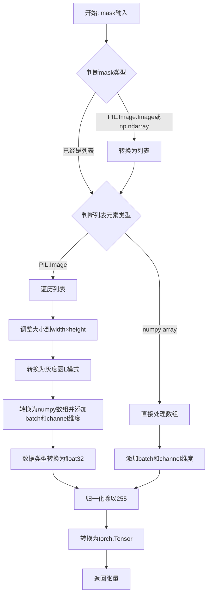

#### 带注释源码

```python
def mask_pil_to_torch(mask, height, width):
    """
    将PIL掩码或numpy掩码转换为PyTorch张量
    
    参数:
        mask: PIL.Image.Image, np.ndarray, 或它们的列表
        height: 目标高度
        width: 目标宽度
    
    返回:
        torch.Tensor: 形状为 (batch, 1, height, width) 的张量
    """
    # 预处理掩码：如果输入是单个PIL图像或numpy数组，转换为列表以便统一处理
    if isinstance(mask, (PIL.Image.Image, np.ndarray)):
        mask = [mask]

    # 判断列表中的元素类型并进行相应处理
    if isinstance(mask, list) and isinstance(mask[0], PIL.Image.Image):
        # ========== 处理PIL图像列表 ==========
        # 1. 将每个PIL图像调整到目标尺寸
        mask = [i.resize((width, height), resample=PIL.Image.LANCZOS) for i in mask]
        
        # 2. 转换为灰度图（L模式），然后转为numpy数组
        # 添加[None, None, :]维度，从(H,W)变为(1,1,H,W)
        mask = np.concatenate([np.array(m.convert("L"))[None, None, :] for m in mask], axis=0)
        
        # 3. 转换为float32并归一化到[0, 1]
        mask = mask.astype(np.float32) / 255.0
        
    elif isinstance(mask, list) and isinstance(mask[0], np.ndarray):
        # ========== 处理numpy数组列表 ==========
        # 为每个数组添加batch和channel维度
        mask = np.concatenate([m[None, None, :] for m in mask], axis=0)

    # 将numpy数组转换为PyTorch张量
    mask = torch.from_numpy(mask)
    return mask
```


### `prepare_mask_and_masked_image`

该函数用于准备掩码和被掩码图像，将其转换为 Stable Diffusion pipeline 所需的格式。函数接受图像和掩码输入，将其转换为 4 维张量（batch × channels × height × width），其中图像被标准化到 [-1, 1] 范围，掩码被二值化到 [0, 1] 范围。

参数：

- `image`：`Union[np.array, PIL.Image, torch.Tensor]`，要进行 inpainting 的图像，可以是 PIL.Image、height×width×3 的 np.array、channels×height×width 的 torch.Tensor 或 batch×channels×height×width 的 torch.Tensor
- `mask`：`Union[PIL.Image.Image, np.ndarray, torch.Tensor]`，要应用到图像的掩码，即要 inpainting 的区域，可以是 PIL.Image、height×width 的 np.array、1×height×width 的 torch.Tensor 或 batch×1×height×width 的 torch.Tensor
- `height`：`int`，目标高度
- `width`：`int`，目标宽度
- `return_image`：`bool = False`，是否返回原始图像

返回值：`tuple[torch.Tensor]`，返回 (mask, masked_image) 或 (mask, masked_image, image) 如果 return_image 为 True

#### 流程图

```mermaid
flowchart TD
    A[开始: prepare_mask_and_masked_image] --> B{image is None?}
    B -->|Yes| C[抛出 ValueError: image 不能为空]
    B -->|No| D{mask is None?}
    D -->|Yes| D1[抛出 ValueError: mask 不能为空]
    D -->|No| E{image 是 torch.Tensor?}
    
    E -->|Yes| F{mask 是 torch.Tensor?}
    F -->|No| G[调用 mask_pil_to_torch 转换 mask]
    F -->|Yes| H[继续处理]
    
    E -->|No| I{mask 是 torch.Tensor?}
    I -->|Yes| J[抛出 TypeError: image 和 mask 类型不匹配]
    I -->|No| K[预处理 image 和 mask]
    
    G --> L[处理 image 维度]
    H --> L
    K --> L
    
    L --> M[检查维度: image.ndim == 4 and mask.ndim == 4]
    M --> N[检查 batch 大小相同]
    N --> O{检查 mask 范围 [0, 1]}
    O -->|No| P[抛出 ValueError: mask 范围错误]
    O -->|Yes| Q[二值化 mask: mask < 0.5 = 0, mask >= 0.5 = 1]
    Q --> R[转换 image 为 float32]
    
    R --> S{image.shape[1] == 4?}
    S -->|Yes| T[设置 masked_image = None<br/>图像在潜在空间]
    S -->|No| U[计算 masked_image = image * (mask < 0.5)]
    
    T --> V{return_image?}
    U --> V
    
    V -->|Yes| W[返回 mask, masked_image, image]
    V -->|No| X[返回 mask, masked_image]
    
    W --> Y[结束]
    X --> Y
```

#### 带注释源码

```python
def prepare_mask_and_masked_image(image, mask, height, width, return_image: bool = False):
    """
    Prepares a pair (image, mask) to be consumed by the Stable Diffusion pipeline. This means that those inputs will be
    converted to ``torch.Tensor`` with shapes ``batch x channels x height x width`` where ``channels`` is ``3`` for the
    ``image`` and ``1`` for the ``mask``.

    The ``image`` will be converted to ``torch.float32`` and normalized to be in ``[-1, 1]``. The ``mask`` will be
    binarized (``mask > 0.5``) and cast to ``torch.float32`` too.

    Args:
        image (Union[np.array, PIL.Image, torch.Tensor]): The image to inpaint.
            It can be a ``PIL.Image``, or a ``height x width x 3`` ``np.array`` or a ``channels x height x width``
            ``torch.Tensor`` or a ``batch x channels x height x width`` ``torch.Tensor``.
        mask (_type_): The mask to apply to the image, i.e. regions to inpaint.
            It can be a ``PIL.Image``, or a ``height x width`` ``np.array`` or a ``1 x height x width``
            ``torch.Tensor`` or a ``batch x 1 x height x width`` ``torch.Tensor``.
        height (int): Height to resize to.
        width (int): Width to resize to.
        return_image (bool): Whether to return the original image as well.

    Raises:
        ValueError: ``torch.Tensor`` images should be in the ``[-1, 1]`` range. ValueError: ``torch.Tensor`` mask
        should be in the ``[0, 1]`` range. ValueError: ``mask`` and ``image`` should have the same spatial dimensions.
        TypeError: ``mask`` is a ``torch.Tensor`` but ``image`` is not
            (ot the other way around).

    Returns:
        tuple[torch.Tensor]: The pair (mask, masked_image) as ``torch.Tensor`` with 4
            dimensions: ``batch x channels x height x width``.
    """

    # 检查 image 输入是否为空，抛出 ValueError
    if image is None:
        raise ValueError("`image` input cannot be undefined.")

    # 检查 mask 输入是否为空，抛出 ValueError
    if mask is None:
        raise ValueError("`mask_image` input cannot be undefined.")

    # 分支1: 如果 image 已经是 torch.Tensor
    if isinstance(image, torch.Tensor):
        # 如果 mask 不是 torch.Tensor，使用 mask_pil_to_torch 转换
        if not isinstance(mask, torch.Tensor):
            mask = mask_pil_to_torch(mask, height, width)

        # 如果 image 是 3 维 (C,H,W)，添加 batch 维度变成 (1,C,H,W)
        if image.ndim == 3:
            image = image.unsqueeze(0)

        # 如果 mask 是 2 维 (H,W)，添加 batch 和 channel 维度变成 (1,1,H,W)
        if mask.ndim == 2:
            mask = mask.unsqueeze(0).unsqueeze(0)

        # 处理 mask 是 3 维的情况
        if mask.ndim == 3:
            # 单个带 batch 的 mask，没有 channel 维，或单个 mask 没有 batch 但有 channel 维
            if mask.shape[0] == 1:
                mask = mask.unsqueeze(0)
            # 多个 batch 的 mask，没有 channel 维
            else:
                mask = mask.unsqueeze(1)

        # 断言：image 和 mask 必须都是 4 维
        assert image.ndim == 4 and mask.ndim == 4, "Image and Mask must have 4 dimensions"
        # 断言：image 和 mask 必须 batch 大小相同
        assert image.shape[0] == mask.shape[0], "Image and Mask must have the same batch size"

        # 检查 mask 是否在 [0, 1] 范围内
        if mask.min() < 0 or mask.max() > 1:
            raise ValueError("Mask should be in [0, 1] range")

        # 二值化掩码：小于 0.5 的设为 0，大于等于 0.5 的设为 1
        mask[mask < 0.5] = 0
        mask[mask >= 0.5] = 1

        # 将图像转换为 float32 类型
        image = image.to(dtype=torch.float32)
    
    # 分支2: 如果 mask 是 torch.Tensor 但 image 不是，抛出类型错误
    elif isinstance(mask, torch.Tensor):
        raise TypeError(f"`mask` is a torch.Tensor but `image` (type: {type(image)} is not")
    
    # 分支3: image 和 mask 都是 PIL.Image 或 np.ndarray
    else:
        # 预处理 image
        if isinstance(image, (PIL.Image.Image, np.ndarray)):
            image = [image]
        
        # 如果是 PIL.Image 列表，resize 到目标尺寸，转换为 RGB，转为 numpy 数组
        if isinstance(image, list) and isinstance(image[0], PIL.Image.Image):
            image = [i.resize((width, height), resample=PIL.Image.LANCZOS) for i in image]
            image = [np.array(i.convert("RGB"))[None, :] for i in image]
            image = np.concatenate(image, axis=0)
        # 如果是 numpy 数组列表，concatenate
        elif isinstance(image, list) and isinstance(image[0], np.ndarray):
            image = np.concatenate([i[None, :] for i in image], axis=0)

        # 转换维度顺序从 (B,H,W,C) 到 (B,C,H,W)，然后转换为 tensor 并归一化到 [-1, 1]
        image = image.transpose(0, 3, 1, 2)
        image = torch.from_numpy(image).to(dtype=torch.float32) / 127.5 - 1.0

        # 使用 mask_pil_to_torch 转换 mask
        mask = mask_pil_to_torch(mask, height, width)
        # 二值化掩码
        mask[mask < 0.5] = 0
        mask[mask >= 0.5] = 1

    # 如果 image 的通道数是 4，说明在潜在空间 (latent space)，不能直接掩码
    if image.shape[1] == 4:
        # 假设这不是 inpainting checkpoint，设置 masked_image 为 None
        masked_image = None
    else:
        # 计算 masked_image：用原始图像乘以 (mask < 0.5)，即保留非掩码区域
        masked_image = image * (mask < 0.5)

    # 如果需要返回原始图像，返回 (mask, masked_image, image)
    # 否则只返回 (mask, masked_image)，保持向后兼容性
    if return_image:
        return mask, masked_image, image

    return mask, masked_image
```


### `retrieve_latents`

从编码器输出（encoder_output）中检索潜在变量（latents）。该函数支持多种采样模式（sample 或 argmax），并能够从不同的潜在表示结构中提取数据。

参数：

- `encoder_output`：`torch.Tensor`，编码器输出对象，可能包含 `latent_dist` 属性（潜在分布）或 `latents` 属性（直接潜在变量）
- `generator`：`torch.Generator | None`，可选的随机数生成器，用于采样时的随机性控制
- `sample_mode`：`str`，采样模式，默认为 `"sample"`；支持 `"sample"`（从分布中采样）或 `"argmax"`（取分布的众数）

返回值：`torch.Tensor`，检索到的潜在变量张量

#### 流程图

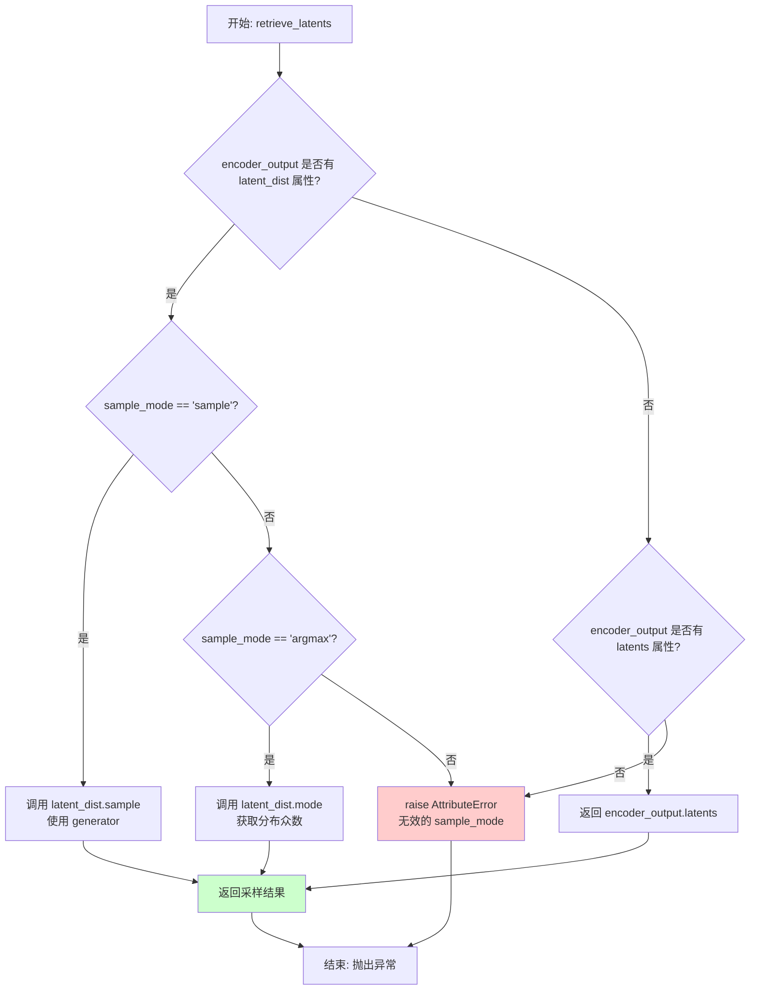

#### 带注释源码

```python
# Copied from diffusers.pipelines.stable_diffusion.pipeline_stable_diffusion_img2img.retrieve_latents
def retrieve_latents(
    encoder_output: torch.Tensor, generator: torch.Generator | None = None, sample_mode: str = "sample"
):
    """
    从编码器输出中检索潜在变量。
    
    Args:
        encoder_output: 编码器输出，通常包含 latent_dist（潜在分布）或 latents（潜在变量）
        generator: 可选的随机生成器，用于采样控制
        sample_mode: 采样模式，'sample' 从分布采样，'argmax' 取众数
    
    Returns:
        torch.Tensor: 检索到的潜在变量
    
    Raises:
        AttributeError: 当无法从 encoder_output 访问潜在变量时
    """
    # 情况1: 有 latent_dist 属性且模式为 sample（从分布采样）
    if hasattr(encoder_output, "latent_dist") and sample_mode == "sample":
        return encoder_output.latent_dist.sample(generator)
    
    # 情况2: 有 latent_dist 属性且模式为 argmax（取分布众数/最大值）
    elif hasattr(encoder_output, "latent_dist") and sample_mode == "argmax":
        return encoder_output.latent_dist.mode()
    
    # 情况3: 直接有 latents 属性（预计算的潜在变量）
    elif hasattr(encoder_output, "latents"):
        return encoder_output.latents
    
    # 错误情况: 无法识别潜在变量格式
    else:
        raise AttributeError("Could not access latents of provided encoder_output")
```


### `retrieve_timesteps`

检索时间步函数，用于调用调度器的 `set_timesteps` 方法并从调度器中检索时间步，支持自定义时间步和标准时间步两种模式。

参数：

- `scheduler`：`SchedulerMixin`，要获取时间步的调度器
- `num_inference_steps`：`Optional[int]`，生成样本时使用的扩散步数，如果使用此参数，则 `timesteps` 必须为 `None`
- `device`：`Optional[Union[str, torch.device]]`，时间步要移动到的设备，如果为 `None`，则不移动时间步
- `timesteps`：`Optional[List[int]]`，用于支持任意时间步间隔的自定义时间步，如果为 `None`，则使用调度器的默认时间步间隔策略
- `**kwargs`：任意关键字参数，将传递给 `scheduler.set_timesteps`

返回值：`Tuple[torch.Tensor, int]`，元组包含调度器的时间步 schedule 和推理步数

#### 流程图

```mermaid
flowchart TD
    A[开始] --> B{检查 timesteps 是否为 None}
    B -->|否| C[检查调度器是否支持自定义 timesteps]
    B -->|是| D[调用 scheduler.set_timesteps with num_inference_steps]
    C --> E{支持?}
    E -->|否| F[抛出 ValueError 异常]
    E -->|是| G[调用 scheduler.set_timesteps with timesteps]
    D --> H[获取 scheduler.timesteps]
    G --> H
    H --> I[设置 num_inference_steps = len(timesteps)]
    I --> J[返回 timesteps, num_inference_steps]
```

#### 带注释源码

```
def retrieve_timesteps(
    scheduler,  # 调度器对象
    num_inference_steps: Optional[int] = None,  # 推理步数
    device: Optional[Union[str, torch.device]] = None,  # 目标设备
    timesteps: Optional[List[int]] = None,  # 自定义时间步列表
    **kwargs,  # 额外参数
):
    """
    Calls the scheduler's `set_timesteps` method and retrieves timesteps from the scheduler after the call. Handles
    custom timesteps. Any kwargs will be supplied to `scheduler.set_timesteps`.

    Args:
        scheduler (`SchedulerMixin`): 调度器对象
        num_inference_steps (`int`): 推理步数
        device (`str` or `torch.device`): 设备
        timesteps (`List[int]): 自定义时间步
    """
    # 如果传入了自定义时间步
    if timesteps is not None:
        # 检查调度器的 set_timesteps 方法是否支持 timesteps 参数
        accepts_timesteps = "timesteps" in set(inspect.signature(scheduler.set_timesteps).parameters.keys())
        
        # 如果不支持，抛出 ValueError 异常
        if not accepts_timesteps:
            raise ValueError(
                f"The current scheduler class {scheduler.__class__}'s `set_timesteps` does not support custom"
                f" timestep schedules. Please check whether you are using the correct scheduler."
            )
        
        # 调用调度器的 set_timesteps 方法设置自定义时间步
        scheduler.set_timesteps(timesteps=timesteps, device=device, **kwargs)
        
        # 从调度器获取时间步
        timesteps = scheduler.timesteps
        
        # 设置推理步数为时间步的长度
        num_inference_steps = len(timesteps)
    else:
        # 否则使用 num_inference_steps 设置标准时间步
        scheduler.set_timesteps(num_inference_steps, device=device, **kwargs)
        
        # 从调度器获取时间步
        timesteps = scheduler.timesteps
    
    # 返回时间步和推理步数
    return timesteps, num_inference_steps
```


### AttentionBase.__init__

这是 `AttentionBase` 类的构造函数，用于初始化注意力机制的基础状态变量。

参数：
- 无（除了隐含的 `self` 参数）

返回值：`None`，该方法为构造函数，不返回任何值

#### 流程图

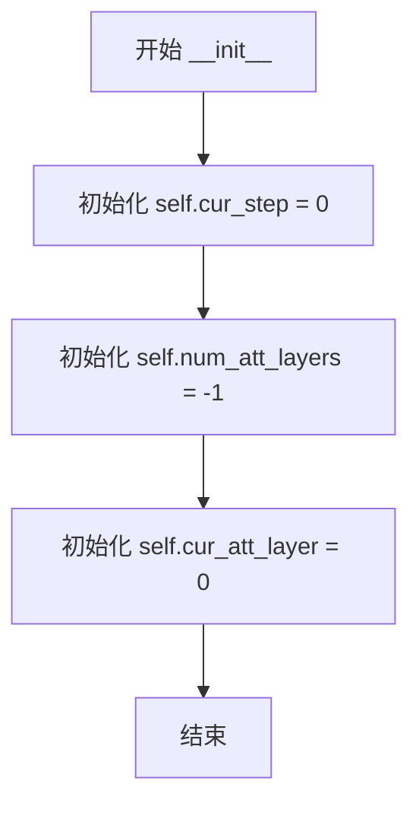

#### 带注释源码

```python
class AttentionBase:
    def __init__(self):
        """
        初始化 AttentionBase 类的实例。
        设置注意力机制的基础状态变量，用于跟踪注意力层的执行状态。
        
        该类作为注意力编辑器的基类，提供基本的注意力处理框架，
        后续的 AAS_XL 等类会继承并扩展其功能。
        """
        # 当前处理的扩散步骤序号
        # 用于跟踪当前处于扩散过程的第几步
        self.cur_step = 0
        
        # 注意力层的总数
        # 初始化为 -1，表示尚未确定具体的层数
        # 后续会在 register_attention_editor_diffusers 中被设置为实际值
        self.num_att_layers = -1
        
        # 当前正在处理的注意力层索引
        # 从 0 开始，每处理完一层后递增
        # 当达到总层数时，会重置为 0 并增加 cur_step
        self.cur_att_layer = 0
```


### `AttentionBase.after_step`

该方法是一个空实现（pass）的回调方法，设计用于在扩散模型推理过程中每个去噪步骤完成后执行自定义逻辑。子类可以通过重写此方法来实现特定的注意力后处理操作，例如特征缓存、梯度记录或中间状态保存等。

参数：无（仅含隐式参数 `self`）

返回值：`None`，无返回值

#### 流程图

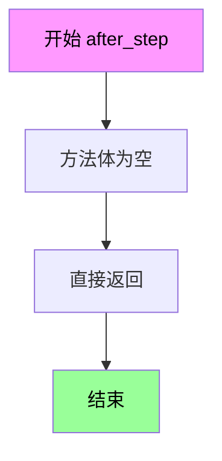

#### 带注释源码

```python
def after_step(self):
    """
    在每个去噪步骤完成后调用的回调方法。
    
    该方法为基类中的空实现（pass），设计为一个扩展点（hook）。
    子类（如 AAS_XL）可以重写此方法以执行自定义的后处理逻辑。
    
    调用时机：
        - 在 AttentionBase.__call__ 方法中被调用
        - 当 cur_att_layer 等于 num_att_layers 时（即一个完整的去噪步骤结束）
    
    注意：
        - 当前实现不做任何操作
        - 需要在子类中重写以实现具体功能
    """
    pass  # 空实现，供子类重写
```


### `AttentionBase.__call__`

该方法是 `AttentionBase` 类的可调用接口，作为注意力机制的前向传播包装器。它调用 `forward` 方法执行实际的注意力计算，同时维护当前注意力层和推理步骤的计数状态，并在每层处理完毕后进行状态更新。

参数：

- `q`：`torch.Tensor`，Query 张量，形状为 `(batch * num_heads, seq_len, head_dim)`
- `k`：`torch.Tensor`，Key 张量，形状为 `(batch * num_heads, seq_len, head_dim)`
- `v`：`torch.Tensor`，Value 张量，形状为 `(batch * num_heads, seq_len, head_dim)`
- `sim`：`torch.Tensor`，Query 和 Key 的相似度分数，形状为 `(batch * num_heads, seq_len, seq_len)`
- `attn`：`torch.Tensor`，注意力权重，形状为 `(batch * num_heads, seq_len, seq_len)`
- `is_cross`：`bool`，标记是否为交叉注意力（True 表示跨模态注意力，False 表示自注意力）
- `place_in_unet`：`str`，标识注意力层在 UNet 中的位置（"down"、"mid" 或 "up"）
- `num_heads`：`int`，注意力头的数量
- `**kwargs`：可变关键字参数，用于传递额外的参数（如 scale 等）

返回值：`torch.Tensor`，经过注意力机制处理后的输出张量，形状为 `(batch, seq_len, num_heads * head_dim)`

#### 流程图

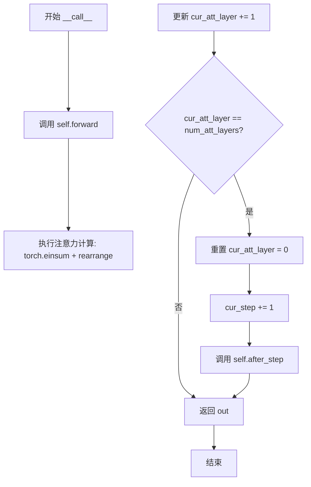

#### 带注释源码

```python
class AttentionBase:
    def __init__(self):
        self.cur_step = 0          # 当前推理步骤计数器
        self.num_att_layers = -1   # UNet 中的总注意力层数（需注册后设置）
        self.cur_att_layer = 0     # 当前处理的注意力层索引

    def after_step(self):
        """在每个推理步骤结束后执行的钩子方法，可由子类重写"""
        pass

    def __call__(self, q, k, v, sim, attn, is_cross, place_in_unet, num_heads, **kwargs):
        """
        注意力机制的可调用接口
        
        参数:
            q: Query 张量
            k: Key 张量
            v: Value 张量
            sim: 相似度矩阵
            attn: 注意力权重
            is_cross: 是否为交叉注意力
            place_in_unet: 在 UNet 中的位置标识
            num_heads: 注意力头数量
            **kwargs: 其他可选参数（如 scale 等）
        """
        # 调用 forward 方法执行实际的注意力计算
        out = self.forward(q, k, v, sim, attn, is_cross, place_in_unet, num_heads, **kwargs)
        
        # 更新当前注意力层计数
        self.cur_att_layer += 1
        
        # 检查是否完成当前步骤的所有注意力层
        if self.cur_att_layer == self.num_att_layers:
            # 重置层计数器
            self.cur_att_layer = 0
            # 步骤计数器加一
            self.cur_step += 1
            # 执行步骤结束后的钩子
            self.after_step()
        
        return out

    def forward(self, q, k, v, sim, attn, is_cross, place_in_unet, num_heads, **kwargs):
        """
        基础注意力前向传播
        
        使用 einsum 计算注意力输出，然后重新排列维度
        """
        # 计算注意力输出: (b i j, b j d) -> (b i d)
        out = torch.einsum("b i j, b j d -> b i d", attn, v)
        # 重新排列维度: (b h) n d -> b n (h d)
        out = rearrange(out, "(b h) n d -> b n (h d)", h=num_heads)
        return out

    def reset(self):
        """重置内部状态计数器"""
        self.cur_step = 0
        self.cur_att_layer = 0
```


### AttentionBase.forward

这是`AttentionBase`类的前向传播方法，继承自`AAS_XL`类的基类。当不满足特定条件时，该方法执行标准的注意力计算：使用注意力权重对值（value）进行加权求和，然后重新排列输出维度以适配多头注意力机制。

参数：

- `q`：`torch.Tensor`，查询（Query）张量，形状为`(b h) n d`，其中b是批量大小，h是注意力头数，n是序列长度，d是每个头的维度
- `k`：`torch.Tensor`，键（Key）张量，形状为`(b h) m d`，在当前方法中未直接使用
- `v`：`torch.Tensor`，值（Value）张量，形状为`(b h) m d`，用于注意力加权求和
- `sim`：`torch.Tensor`，查询和键的相似度矩阵，形状为`(b h) n m`，在当前方法中未直接使用
- `attn`：`torch.Tensor`，注意力权重矩阵，形状为`(b h) n m`，通过对sim进行softmax得到
- `is_cross`：`bool`，布尔标志，指示是否为交叉注意力，在当前方法中未直接使用
- `place_in_unet`：`str`，指示在UNet中的位置（"down"、"mid"、"up"），在当前方法中未直接使用
- `num_heads`：`int`，注意力头数，用于重新排列输出维度
- `**kwargs`：可变关键字参数，用于传递额外参数

返回值：`torch.Tensor`，经过注意力加权计算并重新排列后的输出张量，形状为`b n (h d)`，即`batch_size × seq_len × hidden_dim`

#### 流程图

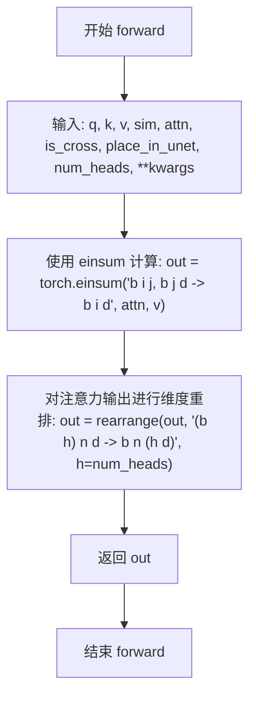

#### 带注释源码

```python
def forward(self, q, k, v, sim, attn, is_cross, place_in_unet, num_heads, **kwargs):
    """
    AttentionBase 类的前向传播方法，执行标准的注意力计算
    
    参数:
        q: 查询张量，形状为 (b h) n d
        k: 键张量，形状为 (b h) m d
        v: 值张量，形状为 (b h) m d
        sim: 相似度矩阵，形状为 (b h) n m
        attn: 注意力权重，形状为 (b h) n m
        is_cross: 是否为交叉注意力标志
        place_in_unet: 在UNet中的位置
        num_heads: 注意力头数
        **kwargs: 额外参数
        
    返回:
        out: 加权求和后的输出，形状为 b n (h d)
    """
    # 第一步：使用 einsum 进行注意力加权求和
    # 计算公式: out[b, i, d] = sum_j(attn[b, i, j] * v[b, j, d])
    # 即每个位置i的输出是所有位置j的值按注意力权重的加权平均
    out = torch.einsum("b i j, b j d -> b i d", attn, v)
    
    # 第二步：重新排列输出维度
    # 从 (b h) n d 转换为 b n (h d)
    # 其中 b=batch_size, h=num_heads, n=seq_len, d=head_dim
    out = rearrange(out, "(b h) n d -> b n (h d)", h=num_heads)
    
    return out
```


### `AttentionBase.reset`

该方法用于重置注意力机制的状态，将当前步数和当前注意力层计数器归零，为新一轮的推理或处理做准备。

参数： 无

返回值：`None`，无返回值，仅重置实例的内部状态变量

#### 流程图

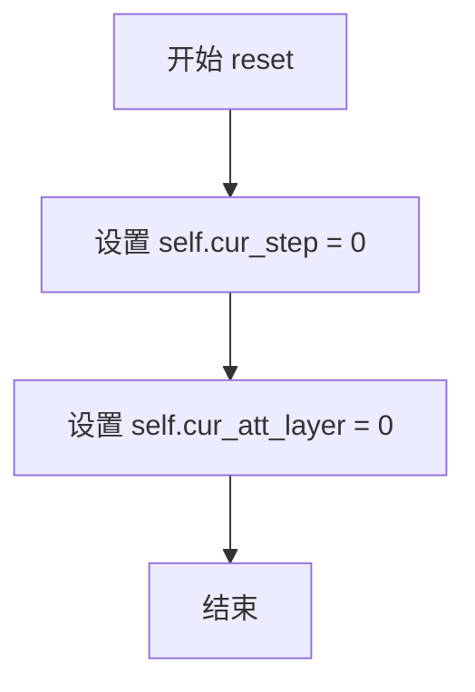

#### 带注释源码

```python
def reset(self):
    """
    重置注意力基类的内部状态
    
    将当前推理步数(cur_step)和当前注意力层索引(cur_att_layer)
    重新置为0，以便在新的推理循环开始时使用。
    该方法通常在pipeline开始新的图像生成前被调用，
    确保注意力编辑器的状态与新的生成任务同步。
    """
    self.cur_step = 0       # 重置当前推理步数计数器
    self.cur_att_layer = 0  # 重置当前注意力层索引
```


### AAS_XL.__init__

该方法是 `AAS_XL` 类的构造函数，用于初始化注意力编辑器的参数，包括步骤范围、层索引、掩码处理和相似性抑制配置。

参数：

- `start_step`：`int`，AAS 开始应用的扩散步骤，默认为 4
- `end_step`：`int`，AAS 结束应用的扩散步骤，默认为 50
- `start_layer`：`int`，AAS 开始应用的 UNet 层，默认为 10
- `end_layer`：`int`，AAS 结束应用的 UNet 层，默认为 16
- `layer_idx`：`Optional[List[int]]`，要应用 AAS 的层索引列表，默认为 None
- `step_idx`：`Optional[List[int]]`，要应用 AAS 的步骤索引列表，默认为 None
- `total_steps`：`int`，扩散过程的总步骤数，默认为 50
- `mask`：`Optional[torch.Tensor]`，源图像掩码，形状为 (1, 1, h, w)，默认为 None
- `model_type`：`str`，模型类型，可选 "SD" 或 "SDXL"，默认为 "SD"
- `ss_steps`：`int`，相似性抑制的步骤数，默认为 9
- `ss_scale`：`float`，相似性抑制的缩放因子，默认为 1.0

返回值：`None`，该方法无返回值

#### 流程图

```mermaid
flowchart TD
    A[开始 __init__] --> B[调用父类 AttentionBase.__init__]
    B --> C[设置 self.total_steps = total_steps]
    C --> D[根据 model_type 获取 total_layers]
    D --> E[设置 start_step, end_step, start_layer, end_layer]
    E --> F{layer_idx 是否为 None?}
    F -->|是| G[生成 range(start_layer, end_layer) 列表]
    F -->|否| H[使用传入的 layer_idx]
    G --> I{step_idx 是否为 None?}
    H --> I
    I -->|是| J[生成 range(start_step, end_step) 列表]
    I -->|否| K[使用传入的 step_idx]
    J --> L[保存 mask 到 self.mask]
    K --> L
    L --> M[设置 ss_steps 和 ss_scale]
    M --> N[生成多尺度掩码: mask_16, mask_32, mask_64, mask_128]
    N --> O[结束 __init__]
```

#### 带注释源码

```python
def __init__(
    self,
    start_step=4,
    end_step=50,
    start_layer=10,
    end_layer=16,
    layer_idx=None,
    step_idx=None,
    total_steps=50,
    mask=None,
    model_type="SD",
    ss_steps=9,
    ss_scale=1.0,
):
    """
    Args:
        start_step: the step to start AAS
        start_layer: the layer to start AAS
        layer_idx: list of the layers to apply AAS
        step_idx: list the steps to apply AAS
        total_steps: the total number of steps
        mask: source mask with shape (h, w)
        model_type: the model type, SD or SDXL
    """
    # 调用父类 AttentionBase 的初始化方法
    # 初始化 cur_step=0, num_att_layers=-1, cur_att_layer=0
    super().__init__()
    
    # 保存总扩散步骤数
    self.total_steps = total_steps
    
    # 根据模型类型获取总层数
    # SD: 16层, SDXL: 70层, 默认: 16
    self.total_layers = self.MODEL_TYPE.get(model_type, 16)
    
    # 保存 AAS 应用的步骤范围
    self.start_step = start_step
    self.end_step = end_step
    
    # 保存 AAS 应用的层范围
    self.start_layer = start_layer
    self.end_layer = end_layer
    
    # 确定要应用 AAS 的层索引列表
    # 如果未指定，则使用 start_layer 到 end_layer 的范围
    self.layer_idx = layer_idx if layer_idx is not None else list(range(start_layer, end_layer))
    
    # 确定要应用 AAS 的步骤索引列表
    # 如果未指定，则使用 start_step 到 end_step 的范围
    self.step_idx = step_idx if step_idx is not None else list(range(start_step, end_step))
    
    # 保存原始掩码，形状为 (1, 1, h, w)
    self.mask = mask  # mask with shape (1, 1 ,h, w)
    
    # 保存相似性抑制参数
    self.ss_steps = ss_steps    # 相似性抑制的步骤数
    self.ss_scale = ss_scale    # 相似性抑制的缩放因子
    
    # 生成多尺度掩码，用于不同分辨率的注意力层
    # 使用最大池化将掩码下采样到不同尺寸
    # mask_16: 16x16 分辨率
    self.mask_16 = F.max_pool2d(mask, (1024 // 16, 1024 // 16)).round().squeeze().squeeze()
    
    # mask_32: 32x32 分辨率
    self.mask_32 = F.max_pool2d(mask, (1024 // 32, 1024 // 32)).round().squeeze().squeeze()
    
    # mask_64: 64x64 分辨率
    self.mask_64 = F.max_pool2d(mask, (1024 // 64, 1024 // 64)).round().squeeze().squeeze()
    
    # mask_128: 128x128 分辨率
    self.mask_128 = F.max_pool2d(mask, (1024 // 128, 1024 // 128)).round().squeeze().squeeze()
```


### AAS_XL.attn_batch

该方法实现了针对目标对象和背景分离的注意力机制处理，根据当前推理步骤是否在相似性抑制步骤内，分别对前景（对象）和背景采用不同的注意力掩码策略，最终输出经过注意力加权的特征。

参数：

- `self`：`AAS_XL`，AAS_XL 类的实例，包含相似性抑制参数和掩码信息
- `q`：`torch.Tensor`，查询张量，形状为 `(b h) n d`，其中 b 为批次大小，h 为注意力头数，n 为序列长度，d 为特征维度
- `k`：`torch.Tensor`，键张量，形状与 q 相同
- `v`：`torch.Tensor`，值张量，形状与 q 相同
- `sim`：`torch.Tensor`，查询和键的相似度矩阵，形状为 `(b h) n n`
- `attn`：`torch.Tensor`，注意力权重矩阵，形状与 sim 相同
- `is_cross`：`bool`，标识是否为跨注意力（文本到图像）
- `place_in_unet`：`str`，标识在 UNet 中的位置（down/mid/up）
- `num_heads`：`int`，注意力头数
- `is_mask_attn`：`bool`，是否启用掩码注意力处理
- `mask`：`torch.Tensor`，对象掩码，形状为 `(h, w)` 或 `(1, h, w)`
- `**kwargs`：其他可选参数

返回值：`torch.Tensor`，经过注意力加权后的输出张量，形状为 `(b h) n d`

#### 流程图

```mermaid
flowchart TD
    A[开始 attn_batch] --> B[计算批次大小 B = q.shape[0] // num_heads]
    B --> C{is_mask_attn?}
    C -->|True| D[展平掩码 mask_flatten = mask.flatten(0)]
    C -->|False| H[跳转到注意力计算]
    D --> E{cur_step <= ss_steps?}
    E -->|True| F[前景对象注意力处理<br/>sim_fg = ss_scale × sim<br/>sim_fg += 掩码填充<br/>sim_bg = sim + 背景掩码<br/>sim = concat[sim_fg, sim_bg]]
    E -->|False| G[直接应用掩码<br/>sim += masked_fill]
    F --> H
    G --> H[计算注意力权重 attn = sim.softmax(-1)]
    H --> I{len(attn) == 2 × len(v)?]
    I -->|True| J[复制值张量 v = concat[v, v]]
    I -->|False| K[跳过复制]
    J --> L[注意力加权 out = einsum attn × v]
    K --> L
    L --> M[重排输出形状<br/>rearrange to (b n h d)]
    M --> N[返回 out]
```

#### 带注释源码

```python
def attn_batch(self, q, k, v, sim, attn, is_cross, place_in_unet, num_heads, is_mask_attn, mask, **kwargs):
    """
    处理带掩码的注意力计算，用于前景对象和背景的分离注意力
    
    参数:
        q: 查询张量 (batch_heads, seq_len, dim)
        k: 键张量
        v: 值张量
        sim: 相似度矩阵
        attn: 注意力权重
        is_cross: 是否为跨注意力
        place_in_unet: 在UNet中的位置
        num_heads: 注意力头数
        is_mask_attn: 是否启用掩码注意力
        mask: 对象掩码
    返回:
        加权后的输出张量
    """
    # 计算批次大小（考虑多头注意力）
    B = q.shape[0] // num_heads
    
    # 如果启用掩码注意力处理
    if is_mask_attn:
        # 将掩码展平为一维
        mask_flatten = mask.flatten(0)
        
        # 判断当前步骤是否在相似性抑制步骤内
        if self.cur_step <= self.ss_steps:
            # ========== 前景对象注意力处理 ==========
            # 背景部分：将掩码为1的位置设为极小值（屏蔽）
            sim_bg = sim + mask_flatten.masked_fill(mask_flatten == 1, torch.finfo(sim.dtype).min)
            
            # 前景对象：应用相似性抑制缩放
            sim_fg = self.ss_scale * sim
            sim_fg += mask_flatten.masked_fill(mask_flatten == 1, torch.finfo(sim.dtype).min)
            
            # 拼接前景和背景的相似度矩阵（用于双分支处理）
            sim = torch.cat([sim_fg, sim_bg], dim=0)
        else:
            # ========== 直接掩码处理 ==========
            # 在抑制步骤结束后，只应用掩码不过滤
            sim += mask_flatten.masked_fill(mask_flatten == 1, torch.finfo(sim.dtype).min)
    
    # 计算注意力权重
    attn = sim.softmax(-1)
    
    # 如果注意力长度是值的两倍（双分支情况），复制值张量
    if len(attn) == 2 * len(v):
        v = torch.cat([v] * 2)
    
    # 注意力加权计算：使用 einsum 进行矩阵乘法
    out = torch.einsum("h i j, h j d -> h i d", attn, v)
    
    # 重排输出形状：从 (heads_batch, seq, dim) 转换为 (batch, seq, heads_dim)
    out = rearrange(out, "(h1 h) (b n) d -> (h1 b) n (h d)", b=B, h=num_heads)
    
    return out
```


### AAS_XL.forward

该方法是 AAS_XL 类的核心成员，实现了基于注意力机制的图像修复功能。它在去噪过程的特定步骤和层上，对 UNet 的交叉注意力进行修改，将前景（待修复区域）和背景（保留区域）分离处理，并通过掩码引导的注意力机制实现对象移除。

参数：

- `q`：`torch.Tensor`，查询张量，形状为 `(b n (h d))`，包含用于计算注意力分数的查询向量
- `k`：`torch.Tensor`，键张量，形状为 `(b n (h d))`，包含用于计算注意力分数的键向量
- `v`：`torch.Tensor`，值张量，形状为 `(b n (h d))`，包含待聚合的值向量
- `sim`：`torch.Tensor`，相似度矩阵，形状为 `(b i j)`，由 q 和 k 计算得到的原始注意力分数
- `attn`：`torch.Tensor`，注意力权重矩阵，经过 softmax 归一化后的注意力分布
- `is_cross`：`bool`，布尔标志，指示是否为交叉注意力（True）或自注意力（False）
- `place_in_unet`：`str`，字符串，表示注意力层在 UNet 中的位置（"down"、"mid"、"up"）
- `num_heads`：`int`，注意力头数，用于将特征维度分割为多个头
- `**kwargs`：可变关键字参数，包含额外的配置参数如 `scale`

返回值：`torch.Tensor`，处理后的注意力输出，形状为 `(b n (h d))`，经过前景和背景分离处理并融合的结果

#### 流程图

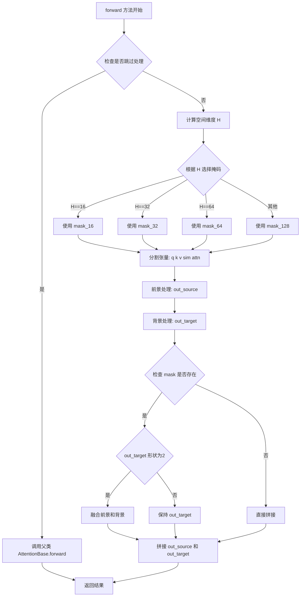

#### 带注释源码

```python
def forward(self, q, k, v, sim, attn, is_cross, place_in_unet, num_heads, **kwargs):
    """
    Attention forward function
    
    该方法实现了 AAS_XL 的核心注意力转发逻辑，用于在去噪过程的特定步骤和层上
    对图像进行对象移除。通过分离前景（待修复区域）和背景（保留区域）的注意力处理，
    并使用掩码引导的注意力机制，实现对指定对象的移除。
    
    参数:
        q: 查询张量, 形状为 (b n (h d))，b为batch大小，n为序列长度，h为头数，d为每头维度
        k: 键张量, 形状为 (b n (h d))，用于与q计算相似度
        v: 值张量, 形状为 (b n (h d))，包含待聚合的语义信息
        sim: 相似度矩阵, 形状为 (b i j)，由q和k的點積得到
        attn: 注意力权重, 经过softmax归一化后的注意力分布
        is_cross: 布尔值，区分交叉注意力（文本条件）和自注意力
        place_in_unet: 字符串，标识在UNet中的位置（down/mid/up）
        num_heads: 整数，注意力头数
        **kwargs: 额外参数，如scale（注意力缩放因子）
    
    返回:
        torch.Tensor: 处理后的注意力输出，形状为 (b n (h d))
    """
    # 条件检查：如果是交叉注意力、或者当前步骤不在AAS处理范围内、或者当前层不在指定层索引中
    # 则跳过AAS处理，使用标准的注意力计算
    if is_cross or self.cur_step not in self.step_idx or self.cur_att_layer // 2 not in self.layer_idx:
        return super().forward(q, k, v, sim, attn, is_cross, place_in_unet, num_heads, **kwargs)
    
    # 根据查询的空间维度确定使用的掩码分辨率
    # UNet不同层级的特征图尺寸不同：16x16, 32x32, 64x64, 128x128
    H = int(np.sqrt(q.shape[1]))
    if H == 16:
        mask = self.mask_16.to(sim.device)
    elif H == 32:
        mask = self.mask_32.to(sim.device)
    elif H == 64:
        mask = self.mask_64.to(sim.device)
    else:
        mask = self.mask_128.to(sim.device)

    # 将张量按通道分成两半：一半用于不带对象的背景区域(without object, wo)
    # 另一半用于带对象的前景区域(with object, w)
    # 这种设计允许分别处理保留和修复的区域
    q_wo, q_w = q.chunk(2)
    k_wo, k_w = k.chunk(2)
    v_wo, v_w = v.chunk(2)
    sim_wo, sim_w = sim.chunk(2)
    attn_wo, attn_w = attn.chunk(2)

    # 处理背景区域（不带掩码的标准注意力）
    out_source = self.attn_batch(
        q_wo,
        k_wo,
        v_wo,
        sim_wo,
        attn_wo,
        is_cross,
        place_in_unet,
        num_heads,
        is_mask_attn=False,  # 背景区域不使用掩码注意力
        mask=None,
        **kwargs,
    )
    
    # 处理前景区域（带掩码的注意力，引导修复方向）
    out_target = self.attn_batch(
        q_w, k_w, v_w, sim_w, attn_w, is_cross, place_in_unet, num_heads, 
        is_mask_attn=True,  # 前景区域使用掩码引导
        mask=mask, 
        **kwargs
    )

    # 如果提供了掩码，则将前景和背景结果按掩码进行加权融合
    # 这种融合确保修复区域与周围背景自然过渡
    if self.mask is not None:
        if out_target.shape[0] == 2:
            # 将out_target分成前景和背景两部分
            out_target_fg, out_target_bg = out_target.chunk(2, 0)
            mask = mask.reshape(-1, 1)  # (hw, 1)
            # 根据掩码值混合：前景特征*掩码 + 背景特征*(1-掩码)
            out_target = out_target_fg * mask + out_target_bg * (1 - mask)
        else:
            out_target = out_target

    # 拼接前景和背景的处理结果
    out = torch.cat([out_source, out_target], dim=0)
    return out
```


### `StableDiffusionXL_AE_Pipeline.__init__`

该方法是 StableDiffusionXL_AE_Pipeline 类的构造函数，负责初始化整个对象去除 pipeline 的各个核心组件，包括 VAE、文本编码器、UNet、调度器等，并通过注册模块和配置参数来完成 pipeline 的构建，同时初始化图像和掩码处理器以及可选的水印功能。

参数：

- `vae`：`AutoencoderKL`，Variational Auto-Encoder (VAE) 模型，用于将图像编码和解码到潜在表示空间
- `text_encoder`：`CLIPTextModel`，冻结的文本编码器，Stable Diffusion XL 使用 CLIP 的文本部分
- `text_encoder_2`：`CLIPTextModelWithProjection`，第二个冻结的文本编码器，包含文本和池化部分
- `tokenizer`：`CLIPTokenizer`，第一个分词器，用于将文本转换为 token
- `tokenizer_2`：`CLIPTokenizer`，第二个分词器
- `unet`：`UNet2DConditionModel`，条件 U-Net 架构，用于对编码后的图像潜在表示进行去噪
- `scheduler`：`KarrasDiffusionSchedulers`，调度器，与 unet 结合使用对图像潜在表示进行去噪
- `image_encoder`：`CLIPVisionModelWithProjection`（可选），图像编码器，用于 IP-Adapter
- `feature_extractor`：`CLIPImageProcessor`（可选），图像特征提取器
- `requires_aesthetics_score`：`bool`，是否需要在推理时传入 aesthetic_score 条件，默认 False
- `force_zeros_for_empty_prompt`：`bool`，是否将负提示词嵌入强制设置为 0，默认 True
- `add_watermarker`：`Optional[bool]`，是否使用 invisible_watermark 库对输出图像加水印，默认根据包是否安装决定

返回值：无（`None`），构造函数不返回值，仅初始化对象状态

#### 流程图

```mermaid
flowchart TD
    A[开始 __init__] --> B[调用 super().__init__]
    B --> C[register_modules: 注册 vae, text_encoder, text_encoder_2, tokenizer, tokenizer_2, unet, image_encoder, feature_extractor, scheduler]
    C --> D[register_to_config: 注册 force_zeros_for_empty_prompt]
    C --> E[register_to_config: 注册 requires_aesthetics_score]
    D --> F[计算 vae_scale_factor = 2^(len(vae.config.block_out_channels) - 1)]
    E --> F
    F --> G[初始化 image_processor: VaeImageProcessor]
    G --> H[初始化 mask_processor: VaeImageProcessor with binarize and grayscale]
    H --> I{add_watermarker 是否为 None?}
    I -->|是| J[检查 is_invisible_watermark_available]
    I -->|否| K[使用传入的 add_watermarker 值]
    J --> L{watermark available?}
    K --> L
    L -->|是| M[初始化 watermark: StableDiffusionXLWatermarker]
    L -->|否| N[设置 watermark = None]
    M --> O[结束 __init__]
    N --> O
```

#### 带注释源码

```python
def __init__(
    self,
    vae: AutoencoderKL,
    text_encoder: CLIPTextModel,
    text_encoder_2: CLIPTextModelWithProjection,
    tokenizer: CLIPTokenizer,
    tokenizer_2: CLIPTokenizer,
    unet: UNet2DConditionModel,
    scheduler: KarrasDiffusionSchedulers,
    image_encoder: CLIPVisionModelWithProjection = None,
    feature_extractor: CLIPImageProcessor = None,
    requires_aesthetics_score: bool = False,
    force_zeros_for_empty_prompt: bool = True,
    add_watermarker: Optional[bool] = None,
):
    """
    初始化 StableDiffusionXL_AE_Pipeline
    
    参数:
        vae: Variational Auto-Encoder (VAE) Model，用于图像与潜在表示的编码解码
        text_encoder: 第一个冻结的文本编码器 (CLIP)
        text_encoder_2: 第二个冻结的文本编码器 (CLIP with projection)
        tokenizer: 第一个分词器
        tokenizer_2: 第二个分词器
        unet: 条件 U-Net 架构，用于去噪
        scheduler: 扩散调度器
        image_encoder: 可选的图像编码器，用于 IP-Adapter
        feature_extractor: 可选的图像特征提取器
        requires_aesthetics_score: 是否需要美学评分条件
        force_zeros_for_empty_prompt: 空提示词时是否强制为零嵌入
        add_watermarker: 是否添加水印，None 时自动检测
    """
    # 调用父类 DiffusionPipeline 的初始化方法
    # 建立基本的 pipeline 框架和设备管理机制
    super().__init__()

    # 注册所有模块到 pipeline，使它们可以被 pipeline 管理
    # 包括：VAE、文本编码器、分词器、UNet、图像编码器、特征提取器、调度器
    self.register_modules(
        vae=vae,
        text_encoder=text_encoder,
        text_encoder_2=text_encoder_2,
        tokenizer=tokenizer,
        tokenizer_2=tokenizer_2,
        unet=unet,
        image_encoder=image_encoder,
        feature_extractor=feature_extractor,
        scheduler=scheduler,
    )

    # 将配置参数注册到 pipeline 的 config 中
    # force_zeros_for_empty_prompt: 控制空提示词时的负向嵌入行为
    self.register_to_config(force_zeros_for_empty_prompt=force_zeros_for_empty_prompt)
    # requires_aesthetics_score: 控制是否需要美学评分条件
    self.register_to_config(requires_aesthetics_score=requires_aesthetics_score)

    # 计算 VAE 的缩放因子
    # VAE 通常有多个下采样层，缩放因子为 2^(层数-1)
    # 例如：block_out_channels = [128, 256, 512, 512]，则 scale_factor = 2^3 = 8
    self.vae_scale_factor = 2 ** (len(self.vae.config.block_out_channels) - 1)

    # 初始化图像处理器，用于预处理和后处理图像
    # VAE 图像处理器，处理常规图像输入
    self.image_processor = VaeImageProcessor(vae_scale_factor=self.vae_scale_factor)

    # 初始化掩码处理器，用于处理掩码图像
    # 设置 do_normalize=False: 不需要归一化
    # 设置 do_binarize=True: 进行二值化处理
    # 设置 do_convert_grayscale=True: 转换为灰度图
    self.mask_processor = VaeImageProcessor(
        vae_scale_factor=self.vae_scale_factor, 
        do_normalize=False, 
        do_binarize=True, 
        do_convert_grayscale=True
    )

    # 处理水印功能
    # 如果 add_watermarker 为 None，则根据包是否安装自动决定
    add_watermarker = add_watermarker if add_watermarker is not None else is_invisible_watermark_available()

    # 如果需要添加水印，初始化水印器
    if add_watermarker:
        self.watermark = StableDiffusionXLWatermarker()
    else:
        self.watermark = None
```


### `StableDiffusionXL_AE_Pipeline.encode_image`

该方法用于将输入图像编码为图像嵌入向量（image embeddings）或隐藏状态（hidden states），支持分类器自由引导（Classifier-Free Guidance）。它首先将图像转换为张量格式，然后使用 CLIP 视觉编码器提取特征，最后根据是否需要隐藏状态返回条件嵌入和无条件（zero）嵌入。

参数：

- `image`：`Union[PIL.Image.Image, np.ndarray, torch.Tensor]`，待编码的输入图像
- `device`：`torch.device`，图像编码器所在的计算设备
- `num_images_per_prompt`：`int`，每个提示词生成的图像数量，用于复制嵌入向量
- `output_hidden_states`：`Optional[bool]`，是否返回编码器的隐藏状态而非图像嵌入

返回值：`Tuple[torch.Tensor, torch.Tensor]`，返回一个元组，包含（条件图像嵌入/隐藏状态，无条件图像嵌入/隐藏状态）

#### 流程图

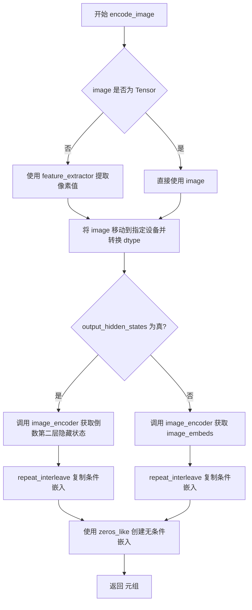

#### 带注释源码

```python
def encode_image(self, image, device, num_images_per_prompt, output_hidden_states=None):
    """
    将输入图像编码为嵌入向量或隐藏状态，用于图像条件引导。

    参数:
        image: 输入图像，支持 PIL.Image、np.ndarray 或 torch.Tensor 格式
        device: 目标计算设备
        num_images_per_prompt: 每个 prompt 生成的图像数量，用于复制嵌入
        output_hidden_states: 是否输出隐藏状态而非 pooled embeddings

    返回:
        Tuple[torch.Tensor, torch.Tensor]: (条件嵌入, 无条件嵌入)
    """
    # 获取图像编码器的参数 dtype，确保输入数据类型一致
    dtype = next(self.image_encoder.parameters()).dtype

    # 如果输入不是 PyTorch 张量，使用特征提取器转换为张量
    if not isinstance(image, torch.Tensor):
        image = self.feature_extractor(image, return_tensors="pt").pixel_values

    # 将图像移动到指定设备并转换数据类型
    image = image.to(device=device, dtype=dtype)

    # 根据 output_hidden_states 标志选择不同的编码路径
    if output_hidden_states:
        # 路径1: 返回倒数第二层隐藏状态（通常用于更细粒度的控制）
        image_enc_hidden_states = self.image_encoder(image, output_hidden_states=True).hidden_states[-2]
        # 复制嵌入向量以匹配 num_images_per_prompt
        image_enc_hidden_states = image_enc_hidden_states.repeat_interleave(num_images_per_prompt, dim=0)

        # 对零张量进行编码，获取无条件引导的隐藏状态
        uncond_image_enc_hidden_states = self.image_encoder(
            torch.zeros_like(image), output_hidden_states=True
        ).hidden_states[-2]
        uncond_image_enc_hidden_states = uncond_image_enc_hidden_states.repeat_interleave(
            num_images_per_prompt, dim=0
        )
        return image_enc_hidden_states, uncond_image_enc_hidden_states
    else:
        # 路径2: 返回 pooled 图像嵌入（image_embeds）
        image_embeds = self.image_encoder(image).image_embeds
        # 复制嵌入向量以匹配 num_images_per_prompt
        image_embeds = image_embeds.repeat_interleave(num_images_per_prompt, dim=0)
        # 创建全零的无条件嵌入（用于 CFG）
        uncond_image_embeds = torch.zeros_like(image_embeds)

        return image_embeds, uncond_image_embeds
```


### `StableDiffusionXL_AE_Pipeline.prepare_ip_adapter_image_embeds`

该方法用于为IP Adapter准备图像嵌入(embeddings)。它接受原始图像或预计算的图像嵌入，处理后返回适合UNet使用的图像嵌入列表，支持分类器无指导(classifier-free guidance)模式。

参数：

- `ip_adapter_image`：`PipelineImageInput`，要处理的IP Adapter输入图像
- `ip_adapter_image_embeds`：`Optional[List[torch.FloatTensor]]`，预计算的图像嵌入，如果为None则从ip_adapter_image编码生成
- `device`：`torch.device`，执行设备
- `num_images_per_prompt`：`int`，每个提示词生成的图像数量
- `do_classifier_free_guidance`：`bool`，是否启用分类器无指导

返回值：`List[torch.Tensor]`，处理后的图像嵌入列表，每个元素对应一个IP Adapter

#### 流程图

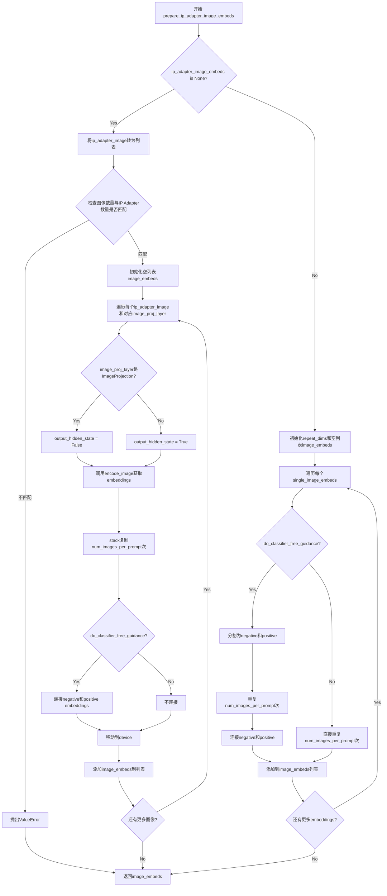

#### 带注释源码

```python
def prepare_ip_adapter_image_embeds(
    self,
    ip_adapter_image,  # PipelineImageInput: IP Adapter输入图像
    ip_adapter_image_embeds,  # Optional[List[torch.FloatTensor]]: 预计算的图像嵌入
    device,  # torch.device: 计算设备
    num_images_per_prompt: int,  # int: 每个prompt生成的图像数量
    do_classifier_free_guidance: bool  # bool: 是否启用分类器无指导
):
    # 如果没有提供预计算的嵌入，则从图像编码生成
    if ip_adapter_image_embeds is None:
        # 确保ip_adapter_image是列表格式
        if not isinstance(ip_adapter_image, list):
            ip_adapter_image = [ip_adapter_image]
        
        # 验证图像数量与IP Adapter数量匹配
        if len(ip_adapter_image) != len(self.unet.encoder_hid_proj.image_projection_layers):
            raise ValueError(
                f"`ip_adapter_image` must have same length as the number of IP Adapters. "
                f"Got {len(ip_adapter_image)} images and "
                f"{len(self.unet.encoder_hid_proj.image_projection_layers)} IP Adapters."
            )
        
        # 存储处理后的图像嵌入
        image_embeds = []
        
        # 遍历每个IP Adapter的图像和对应的投影层
        for single_ip_adapter_image, image_proj_layer in zip(
            ip_adapter_image, self.unet.encoder_hid_proj.image_projection_layers
        ):
            # 判断是否需要输出隐藏状态（ImageProjection类型不需要）
            output_hidden_state = not isinstance(image_proj_layer, ImageProjection)
            
            # 编码图像获取嵌入
            single_image_embeds, single_negative_image_embeds = self.encode_image(
                single_ip_adapter_image, device, 1, output_hidden_state
            )
            
            # 复制embeddings以匹配num_images_per_prompt
            single_image_embeds = torch.stack(
                [single_image_embeds] * num_images_per_prompt, dim=0
            )
            single_negative_image_embeds = torch.stack(
                [single_negative_image_embeds] * num_images_per_prompt, dim=0
            )
            
            # 如果启用分类器无指导，连接negative和positive embeddings
            if do_classifier_free_guidance:
                single_image_embeds = torch.cat(
                    [single_negative_image_embeds, single_image_embeds]
                )
                single_image_embeds = single_image_embeds.to(device)
            
            image_embeds.append(single_image_embeds)
    else:
        # 使用预计算的嵌入
        repeat_dims = [1]  # 用于重复嵌入的维度
        image_embeds = []
        
        for single_image_embeds in ip_adapter_image_embeds:
            if do_classifier_free_guidance:
                # 分割为negative和positive embeddings
                single_negative_image_embeds, single_image_embeds = single_image_embeds.chunk(2)
                
                # 重复embeddings以匹配num_images_per_prompt
                single_image_embeds = single_image_embeds.repeat(
                    num_images_per_prompt, *(repeat_dims * len(single_image_embeds.shape[1:]))
                )
                single_negative_image_embeds = single_negative_image_embeds.repeat(
                    num_images_per_prompt, *(repeat_dims * len(single_negative_image_embeds.shape[1:]))
                )
                
                # 连接negative和positive embeddings
                single_image_embeds = torch.cat(
                    [single_negative_image_embeds, single_image_embeds]
                )
            else:
                # 不使用分类器无指导时直接重复
                single_image_embeds = single_image_embeds.repeat(
                    num_images_per_prompt, *(repeat_dims * len(single_image_embeds.shape[1:]))
                )
            
            image_embeds.append(single_image_embeds)
    
    return image_embeds
```


### `StableDiffusionXL_AE_Pipeline.encode_prompt`

该方法负责将文本提示（prompt）编码为文本编码器的隐藏状态向量（embeddings），支持 Stable Diffusion XL 的双文本编码器架构（CLIP Text Encoder 和 CLIP Text Encoder 2），同时处理 LoRA 缩放、分类器自由引导（CFG）的无条件嵌入生成、以及文本反转（Textual Inversion）技术。

参数：

- `prompt`：`str | List[str]`，需要编码的主提示词
- `prompt_2`：`str | List[str] | None`，发送给第二个文本编码器的提示词，若为 None 则使用 prompt
- `device`：`Optional[torch.device]`，计算设备，若为 None 则使用执行设备
- `num_images_per_prompt`：`int`，每个提示生成的图像数量，默认为 1
- `do_classifier_free_guidance`：`bool`，是否启用分类器自由引导，默认为 True
- `negative_prompt`：`str | List[str] | None`，用于指导图像生成的反向提示词
- `negative_prompt_2`：`str | List[str] | None`，第二个文本编码器的反向提示词
- `prompt_embeds`：`Optional[torch.FloatTensor]`，预生成的文本嵌入，可用于轻松调整文本输入
- `negative_prompt_embeds`：`Optional[torch.FloatTensor]`，预生成的负面文本嵌入
- `pooled_prompt_embeds`：`Optional[torch.FloatTensor]`，预生成的池化文本嵌入
- `negative_pooled_prompt_embeds`：`Optional[torch.FloatTensor]`，预生成的负面池化文本嵌入
- `lora_scale`：`Optional[float]`，LoRA 缩放因子，将应用于文本编码器的所有 LoRA 层
- `clip_skip`：`Optional[int]`，计算提示嵌入时从 CLIP 跳过的层数

返回值：`Tuple[torch.FloatTensor, torch.FloatTensor, torch.FloatTensor, torch.FloatTensor]`，返回一个包含四个元素的元组：
- `prompt_embeds`：编码后的正向提示嵌入
- `negative_prompt_embeds`：编码后的负向提示嵌入
- `pooled_prompt_embeds`：池化后的正向提示嵌入
- `negative_pooled_prompt_embeds`：池化后的负向提示嵌入

#### 流程图

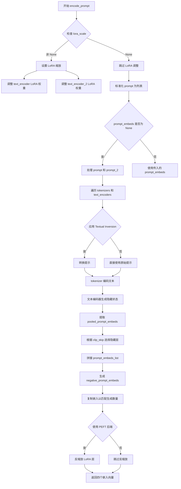

#### 带注释源码

```python
def encode_prompt(
    self,
    prompt: str,
    prompt_2: str | None = None,
    device: Optional[torch.device] = None,
    num_images_per_prompt: int = 1,
    do_classifier_free_guidance: bool = True,
    negative_prompt: str | None = None,
    negative_prompt_2: str | None = None,
    prompt_embeds: Optional[torch.FloatTensor] = None,
    negative_prompt_embeds: Optional[torch.FloatTensor] = None,
    pooled_prompt_embeds: Optional[torch.FloatTensor] = None,
    negative_pooled_prompt_embeds: Optional[torch.FloatTensor] = None,
    lora_scale: Optional[float] = None,
    clip_skip: Optional[int] = None,
):
    r"""
    Encodes the prompt into text encoder hidden states.

    Args:
        prompt (`str` or `List[str]`, *optional*):
            prompt to be encoded
        prompt_2 (`str` or `List[str]`, *optional*):
            The prompt or prompts to be sent to the `tokenizer_2` and `text_encoder_2`. If not defined, `prompt` is
            used in both text-encoders
        device: (`torch.device`):
            torch device
        num_images_per_prompt (`int`):
            number of images that should be generated per prompt
        do_classifier_free_guidance (`bool`):
            whether to use classifier free guidance or not
        negative_prompt (`str` or `List[str]`, *optional*):
            The prompt or prompts not to guide the image generation. If not defined, one has to pass
            `negative_prompt_embeds` instead. Ignored when not using guidance (i.e., ignored if `guidance_scale` is
            less than `1`).
        negative_prompt_2 (`str` or `List[str]`, *optional*):
            The prompt or prompts not to guide the image generation to be sent to `tokenizer_2` and
            `text_encoder_2`. If not defined, `negative_prompt` is used in both text-encoders
        prompt_embeds (`torch.FloatTensor`, *optional*):
            Pre-generated text embeddings. Can be used to easily tweak text inputs, *e.g.* prompt weighting. If not
            provided, text embeddings will be generated from `prompt` input argument.
        negative_prompt_embeds (`torch.FloatTensor`, *optional*):
            Pre-generated negative text embeddings. Can be used to easily tweak text inputs, *e.g.* prompt
            weighting. If not provided, negative_prompt_embeds will be generated from `negative_prompt` input
            argument.
        pooled_prompt_embeds (`torch.FloatTensor`, *optional*):
            Pre-generated pooled text embeddings. Can be used to easily tweak text inputs, *e.g.* prompt weighting.
            If not provided, pooled text embeddings will be generated from `prompt` input argument.
        negative_pooled_prompt_embeds (`torch.FloatTensor`, *optional*):
            Pre-generated negative pooled text embeddings. Can be used to easily tweak text inputs, *e.g.* prompt
            weighting. If not provided, pooled negative_prompt_embeds will be generated from `negative_prompt`
            input argument.
        lora_scale (`float`, *optional*):
            A lora scale that will be applied to all LoRA layers of the text encoder if LoRA layers are loaded.
        clip_skip (`int`, *optional*):
            Number of layers to be skipped from CLIP while computing the prompt embeddings. A value of 1 means that
            the output of the pre-final layer will be used for computing the prompt embeddings.
    """
    # 确定执行设备，默认为当前执行设备
    device = device or self._execution_device

    # 设置 LoRA 缩放因子，以便文本编码器的 LoRA 函数可以正确访问
    if lora_scale is not None and isinstance(self, StableDiffusionXLLoraLoaderMixin):
        self._lora_scale = lora_scale

        # 动态调整 LoRA 缩放
        if self.text_encoder is not None:
            if not USE_PEFT_BACKEND:
                adjust_lora_scale_text_encoder(self.text_encoder, lora_scale)
            else:
                scale_lora_layers(self.text_encoder, lora_scale)

        if self.text_encoder_2 is not None:
            if not USE_PEFT_BACKEND:
                adjust_lora_scale_text_encoder(self.text_encoder_2, lora_scale)
            else:
                scale_lora_layers(self.text_encoder_2, lora_scale)

    # 将单个字符串提示转换为列表，以支持批量处理
    prompt = [prompt] if isinstance(prompt, str) else prompt

    # 确定批次大小
    if prompt is not None:
        batch_size = len(prompt)
    else:
        batch_size = prompt_embeds.shape[0]

    # 定义分词器和文本编码器列表
    # 支持一个或两个文本编码器的配置
    tokenizers = [self.tokenizer, self.tokenizer_2] if self.tokenizer is not None else [self.tokenizer_2]
    text_encoders = (
        [self.text_encoder, self.text_encoder_2] if self.text_encoder is not None else [self.text_encoder_2]
    )

    # 如果未提供预生成的 prompt_embeds，则从原始提示生成
    if prompt_embeds is None:
        # 默认使用第一个提示作为第二个提示
        prompt_2 = prompt_2 or prompt
        prompt_2 = [prompt_2] if isinstance(prompt_2, str) else prompt_2

        # 文本反转：必要时处理多向量 token
        prompt_embeds_list = []
        prompts = [prompt, prompt_2]
        
        # 遍历两个提示（prompt 和 prompt_2），分别使用对应的分词器和编码器处理
        for prompt, tokenizer, text_encoder in zip(prompts, tokenizers, text_encoders):
            # 如果支持 Textual Inversion，转换提示格式
            if isinstance(self, TextualInversionLoaderMixin):
                prompt = self.maybe_convert_prompt(prompt, tokenizer)

            # 使用分词器将文本转换为 token ID
            text_inputs = tokenizer(
                prompt,
                padding="max_length",
                max_length=tokenizer.model_max_length,
                truncation=True,
                return_tensors="pt",
            )

            text_input_ids = text_inputs.input_ids
            
            # 检查是否有被截断的 token，并发出警告
            untruncated_ids = tokenizer(prompt, padding="longest", return_tensors="pt").input_ids

            if untruncated_ids.shape[-1] >= text_input_ids.shape[-1] and not torch.equal(
                text_input_ids, untruncated_ids
            ):
                removed_text = tokenizer.batch_decode(untruncated_ids[:, tokenizer.model_max_length - 1 : -1])
                logger.warning(
                    "The following part of your input was truncated because CLIP can only handle sequences up to"
                    f" {tokenizer.model_max_length} tokens: {removed_text}"
                )

            # 使用文本编码器生成隐藏状态
            prompt_embeds = text_encoder(text_input_ids.to(device), output_hidden_states=True)

            # 获取池化输出（始终使用最后一个文本编码器的池化输出）
            pooled_prompt_embeds = prompt_embeds[0]
            
            # 根据 clip_skip 参数选择隐藏层
            if clip_skip is None:
                # 默认使用倒数第二个隐藏层
                prompt_embeds = prompt_embeds.hidden_states[-2]
            else:
                # SDXL 始终从倒数第二层索引
                prompt_embeds = prompt_embeds.hidden_states[-(clip_skip + 2)]

            prompt_embeds_list.append(prompt_embeds)

        # 在最后一个维度拼接两个文本编码器的嵌入
        prompt_embeds = torch.concat(prompt_embeds_list, dim=-1)

    # 获取分类器自由引导的无条件嵌入
    zero_out_negative_prompt = negative_prompt is None and self.config.force_zeros_for_empty_prompt
    
    # 如果启用 CFG 且未提供负向嵌入且配置为零输出
    if do_classifier_free_guidance and negative_prompt_embeds is None and zero_out_negative_prompt:
        negative_prompt_embeds = torch.zeros_like(prompt_embeds)
        negative_pooled_prompt_embeds = torch.zeros_like(pooled_prompt_embeds)
    elif do_classifier_free_guidance and negative_prompt_embeds is None:
        # 处理负向提示
        negative_prompt = negative_prompt or ""
        negative_prompt_2 = negative_prompt_2 or negative_prompt

        # 标准化为列表
        negative_prompt = batch_size * [negative_prompt] if isinstance(negative_prompt, str) else negative_prompt
        negative_prompt_2 = (
            batch_size * [negative_prompt_2] if isinstance(negative_prompt_2, str) else negative_prompt_2
        )

        # 类型和批次大小验证
        uncond_tokens: List[str]
        if prompt is not None and type(prompt) is not type(negative_prompt):
            raise TypeError(
                f"`negative_prompt` should be the same type to `prompt`, but got {type(negative_prompt)} !="
                f" {type(prompt)}."
            )
        elif batch_size != len(negative_prompt):
            raise ValueError(
                f"`negative_prompt`: {negative_prompt} has batch size {len(negative_prompt)}, but `prompt`:"
                f" {prompt} has batch size {batch_size}. Please make sure that passed `negative_prompt` matches"
                " the batch size of `prompt`."
            )
        else:
            uncond_tokens = [negative_prompt, negative_prompt_2]

        # 生成负向提示嵌入
        negative_prompt_embeds_list = []
        for negative_prompt, tokenizer, text_encoder in zip(uncond_tokens, tokenizers, text_encoders):
            if isinstance(self, TextualInversionLoaderMixin):
                negative_prompt = self.maybe_convert_prompt(negative_prompt, tokenizer)

            max_length = prompt_embeds.shape[1]
            uncond_input = tokenizer(
                negative_prompt,
                padding="max_length",
                max_length=max_length,
                truncation=True,
                return_tensors="pt",
            )

            negative_prompt_embeds = text_encoder(
                uncond_input.input_ids.to(device),
                output_hidden_states=True,
            )
            # 获取池化输出
            negative_pooled_prompt_embeds = negative_prompt_embeds[0]
            # 使用倒数第二个隐藏层
            negative_prompt_embeds = negative_prompt_embeds.hidden_states[-2]

            negative_prompt_embeds_list.append(negative_prompt_embeds)

        # 拼接负向嵌入
        negative_prompt_embeds = torch.concat(negative_prompt_embeds_list, dim=-1)

    # 确保嵌入类型与目标设备兼容
    if self.text_encoder_2 is not None:
        prompt_embeds = prompt_embeds.to(dtype=self.text_encoder_2.dtype, device=device)
    else:
        prompt_embeds = prompt_embeds.to(dtype=self.unet.dtype, device=device)

    # 复制文本嵌入以匹配每个提示生成的图像数量
    bs_embed, seq_len, _ = prompt_embeds.shape
    prompt_embeds = prompt_embeds.repeat(1, num_images_per_prompt, 1)
    prompt_embeds = prompt_embeds.view(bs_embed * num_images_per_prompt, seq_len, -1)

    # 如果启用分类器自由引导，处理负向嵌入
    if do_classifier_free_guidance:
        seq_len = negative_prompt_embeds.shape[1]

        if self.text_encoder_2 is not None:
            negative_prompt_embeds = negative_prompt_embeds.to(dtype=self.text_encoder_2.dtype, device=device)
        else:
            negative_prompt_embeds = negative_prompt_embeds.to(dtype=self.unet.dtype, device=device)

        negative_prompt_embeds = negative_prompt_embeds.repeat(1, num_images_per_prompt, 1)
        negative_prompt_embeds = negative_prompt_embeds.view(batch_size * num_images_per_prompt, seq_len, -1)

    # 处理池化嵌入
    pooled_prompt_embeds = pooled_prompt_embeds.repeat(1, num_images_per_prompt).view(
        bs_embed * num_images_per_prompt, -1
    )
    if do_classifier_free_guidance:
        negative_pooled_prompt_embeds = negative_pooled_prompt_embeds.repeat(1, num_images_per_prompt).view(
            bs_embed * num_images_per_prompt, -1
        )

    # 如果使用 PEFT 后端，恢复 LoRA 层的原始缩放
    if self.text_encoder is not None:
        if isinstance(self, StableDiffusionXLLoraLoaderMixin) and USE_PEFT_BACKEND:
            unscale_lora_layers(self.text_encoder, lora_scale)

    if self.text_encoder_2 is not None:
        if isinstance(self, StableDiffusionXLLoraLoaderMixin) and USE_PEFT_BACKEND:
            unscale_lora_layers(self.text_encoder_2, lora_scale)

    # 返回四个嵌入向量
    return prompt_embeds, negative_prompt_embeds, pooled_prompt_embeds, negative_pooled_prompt_embeds
```


### `StableDiffusionXL_AE_Pipeline.prepare_extra_step_kwargs`

该方法用于为调度器（scheduler）的`step`方法准备额外的关键字参数。由于不同的调度器具有不同的签名，该方法通过检查调度器是否接受`eta`和`generator`参数来动态构建传递给`scheduler.step`的参数字典，确保与各种调度器（如DDIMScheduler、LMSDiscreteScheduler等）的兼容性。

参数：

- `self`：`StableDiffusionXL_AE_Pipeline`，Pipeline实例本身
- `generator`：`Optional[torch.Generator]`，随机数生成器，用于使生成过程具有确定性
- `eta`：`float`，DDIM调度器使用的eta参数（η），取值范围[0,1]，其他调度器会忽略此参数

返回值：`Dict[str, Any]`，包含调度器step方法所需额外参数（如`eta`和`generator`）的字典

#### 流程图

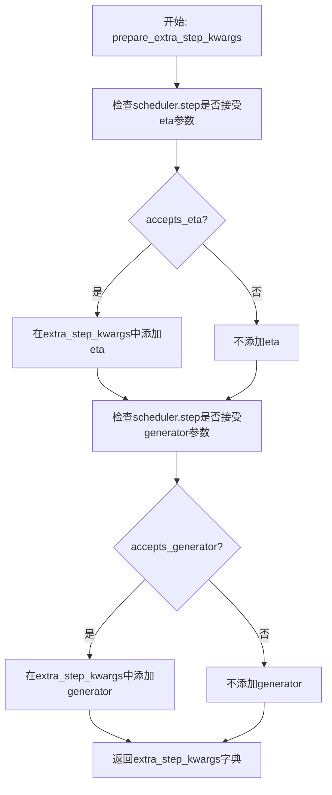

#### 带注释源码

```python
def prepare_extra_step_kwargs(self, generator, eta):
    # 准备调度器步骤的额外参数，因为并非所有调度器都具有相同的签名
    # eta (η) 仅在 DDIMScheduler 中使用，其他调度器将忽略它
    # eta 对应 DDIM 论文中的 η：https://huggingface.co/papers/2010.02502
    # 取值应在 [0, 1] 范围内

    # 检查调度器的step方法是否接受eta参数
    accepts_eta = "eta" in set(inspect.signature(self.scheduler.step).parameters.keys())
    extra_step_kwargs = {}
    
    # 如果调度器接受eta，则将其添加到额外参数中
    if accepts_eta:
        extra_step_kwargs["eta"] = eta

    # 检查调度器是否接受generator参数
    accepts_generator = "generator" in set(inspect.signature(self.scheduler.step).parameters.keys())
    
    # 如果调度器接受generator，则将其添加到额外参数中
    if accepts_generator:
        extra_step_kwargs["generator"] = generator
    
    # 返回构建好的参数字典
    return extra_step_kwargs
```


### `StableDiffusionXL_AE_Pipeline.check_inputs`

该方法用于验证 Stable Diffusion XL 图像修复流水线的输入参数是否合法，确保所有必填参数已正确提供，且参数类型和取值范围符合要求，若参数不合规则抛出相应的 ValueError 异常。

参数：

- `prompt`：`str | List[str] | None`，主提示词，用于指导图像生成
- `prompt_2`：`str | List[str] | None`，第二提示词，用于第二文本编码器
- `image`：`PipelineImageInput`，待修复的输入图像
- `mask_image`：`PipelineImageInput`，修复用的掩码图像，白色像素区域将被重绘
- `height`：`int`，生成图像的高度（像素）
- `width`：`int`，生成图像的宽度（像素）
- `strength`：`float`，图像修复强度，值在 [0, 1] 范围内，指示对原始图像的变换程度
- `callback_steps`：`int | None`，回调函数调用间隔步数，必须为正整数
- `output_type`：`str`，输出图像类型，可选 "pil"、"np" 或 "latent"
- `negative_prompt`：`str | List[str] | None`，负面提示词，用于引导图像向相反方向发展
- `negative_prompt_2`：`str | List[str] | None`，第二负面提示词
- `prompt_embeds`：`torch.FloatTensor | None`，预生成的文本嵌入向量
- `negative_prompt_embeds`：`torch.FloatTensor | None`，预生成的负面文本嵌入向量
- `ip_adapter_image`：`PipelineImageInput | None`，IP-Adapter 图像输入
- `ip_adapter_image_embeds`：`List[torch.FloatTensor] | None`，预生成的 IP-Adapter 图像嵌入
- `callback_on_step_end_tensor_inputs`：`List[str] | None`，每步结束后回调的张量输入列表
- `padding_mask_crop`：`int | None`，掩码裁剪的边距大小

返回值：`None`，该方法不返回值，仅通过抛出 ValueError 异常来处理无效输入

#### 流程图

```mermaid
flowchart TD
    A[开始验证] --> B{strength 在 [0, 1] 范围内?}
    B -->|否| B1[抛出 ValueError]
    B -->|是| C{height 和 width 可被 8 整除?}
    C -->|否| C1[抛出 ValueError]
    C -->|是| D{callback_steps 是正整数?}
    D -->|否| D1[抛出 ValueError]
    D -->|是| E{callback_on_step_end_tensor_inputs 合法?}
    E -->|否| E1[抛出 ValueError]
    E -->|是| F{prompt 和 prompt_embeds 不同时提供?}
    F -->|否| F1[抛出 ValueError]
    F -->|是| G{prompt_2 和 prompt_embeds 不同时提供?}
    G -->|否| G1[抛出 ValueError]
    G -->|是| H{prompt 或 prompt_embeds 至少提供一个?}
    H -->|否| H1[抛出 ValueError]
    H -->|是| I{prompt 类型正确?}
    I -->|否| I1[抛出 ValueError]
    I -->|是| J{prompt_2 类型正确?]
    J -->|否| J1[抛出 ValueError]
    J -->|是| K{negative_prompt 和 negative_prompt_embeds 不同时提供?}
    K -->|否| K1[抛出 ValueError]
    K -->|是| L{negative_prompt_2 和 negative_prompt_embeds 不同时提供?]
    L -->|否| L1[抛出 ValueError]
    L -->|是| M{prompt_embeds 和 negative_prompt_embeds 形状一致?}
    M -->|否| M1[抛出 ValueError]
    M -->|是| N{padding_mask_crop 不为空时图像类型检查?}
    N -->|否| N1[抛出 ValueError]
    N -->|是| O{ip_adapter_image 和 ip_adapter_image_embeds 不同时提供?}
    O -->|否| O1[抛出 ValueError]
    O -->|是| P{ip_adapter_image_embeds 格式正确?}
    P -->|否| P1[抛出 ValueError]
    P -->|是| Q[验证通过]
```

#### 带注释源码

```python
def check_inputs(
    self,
    prompt,
    prompt_2,
    image,
    mask_image,
    height,
    width,
    strength,
    callback_steps,
    output_type,
    negative_prompt=None,
    negative_prompt_2=None,
    prompt_embeds=None,
    negative_prompt_embeds=None,
    ip_adapter_image=None,
    ip_adapter_image_embeds=None,
    callback_on_step_end_tensor_inputs=None,
    padding_mask_crop=None,
):
    """
    检查流水线输入参数的有效性
    
    该方法执行多项验证以确保所有输入参数符合要求：
    1. strength 必须在 [0, 1] 范围内
    2. height 和 width 必须能被 8 整除（VAE 要求）
    3. callback_steps 必须为正整数
    4. callback_on_step_end_tensor_inputs 必须是合法的张量输入名称
    5. prompt 和 prompt_embeds 不能同时提供
    6. prompt_2 和 prompt_embeds 不能同时提供
    7. 必须提供 prompt 或 prompt_embeds 之一
    8. prompt 和 prompt_2 必须是 str 或 list 类型
    9. negative_prompt 和 negative_prompt_embeds 不能同时提供
    10. negative_prompt_2 和 negative_prompt_embeds 不能同时提供
    11. prompt_embeds 和 negative_prompt_embeds 形状必须一致
    12. padding_mask_crop 不为空时，image 和 mask_image 必须是 PIL.Image
    13. ip_adapter_image 和 ip_adapter_image_embeds 不能同时提供
    14. ip_adapter_image_embeds 必须是 3D 或 4D 张量列表
    """
    
    # 验证 strength 参数范围
    if strength < 0 or strength > 1:
        raise ValueError(f"The value of strength should in [0.0, 1.0] but is {strength}")

    # 验证图像尺寸是否为 8 的倍数（VAE 下采样要求）
    if height % 8 != 0 or width % 8 != 0:
        raise ValueError(f"`height` and `width` have to be divisible by 8 but are {height} and {width}.")

    # 验证 callback_steps 为正整数
    if callback_steps is not None and (not isinstance(callback_steps, int) or callback_steps <= 0):
        raise ValueError(
            f"`callback_steps` has to be a positive integer but is {callback_steps} of type"
            f" {type(callback_steps)}."
        )

    # 验证回调张量输入名称是否合法
    if callback_on_step_end_tensor_inputs is not None and not all(
        k in self._callback_tensor_inputs for k in callback_on_step_end_tensor_inputs
    ):
        raise ValueError(
            f"`callback_on_step_end_tensor_inputs` has to be in {self._callback_tensor_inputs}, but found {[k for k in callback_on_step_end_tensor_inputs if k not in self._callback_tensor_inputs]}"
        )

    # 验证 prompt 和 prompt_embeds 互斥
    if prompt is not None and prompt_embeds is not None:
        raise ValueError(
            f"Cannot forward both `prompt`: {prompt} and `prompt_embeds`: {prompt_embeds}. Please make sure to"
            " only forward one of the two."
        )
    # 验证 prompt_2 和 prompt_embeds 互斥
    elif prompt_2 is not None and prompt_embeds is not None:
        raise ValueError(
            f"Cannot forward both `prompt_2`: {prompt_2} and `prompt_embeds`: {prompt_embeds}. Please make sure to"
            " only forward one of the two."
        )
    # 验证至少提供一个提示词
    elif prompt is None and prompt_embeds is None:
        raise ValueError(
            "Provide either `prompt` or `prompt_embeds`. Cannot leave both `prompt` and `prompt_embeds` undefined."
        )
    # 验证 prompt 类型
    elif prompt is not None and (not isinstance(prompt, str) and not isinstance(prompt, list)):
        raise ValueError(f"`prompt` has to be of type `str` or `list` but is {type(prompt)}")
    # 验证 prompt_2 类型
    elif prompt_2 is not None and (not isinstance(prompt_2, str) and not isinstance(prompt_2, list)):
        raise ValueError(f"`prompt_2` has to be of type `str` or `list` but is {type(prompt_2)}")

    # 验证 negative_prompt 和 negative_prompt_embeds 互斥
    if negative_prompt is not None and negative_prompt_embeds is not None:
        raise ValueError(
            f"Cannot forward both `negative_prompt`: {negative_prompt} and `negative_prompt_embeds`:"
            f" {negative_prompt_embeds}. Please make sure to only forward one of the two."
        )
    # 验证 negative_prompt_2 和 negative_prompt_embeds 互斥
    elif negative_prompt_2 is not None and negative_prompt_embeds is not None:
        raise ValueError(
            f"Cannot forward both `negative_prompt_2`: {negative_prompt_2} and `negative_prompt_embeds`:"
            f" {negative_prompt_embeds}. Please make sure to only forward one of the two."
        )

    # 验证提示词嵌入形状一致性
    if prompt_embeds is not None and negative_prompt_embeds is not None:
        if prompt_embeds.shape != negative_prompt_embeds.shape:
            raise ValueError(
                "`prompt_embeds` and `negative_prompt_embeds` must have the same shape when passed directly, but"
                f" got: `prompt_embeds` {prompt_embeds.shape} != `negative_prompt_embeds`"
                f" {negative_prompt_embeds.shape}."
            )
    
    # 验证 padding_mask_crop 相关参数
    if padding_mask_crop is not None:
        if not isinstance(image, PIL.Image.Image):
            raise ValueError(
                f"The image should be a PIL image when inpainting mask crop, but is of type {type(image)}."
            )
        if not isinstance(mask_image, PIL.Image.Image):
            raise ValueError(
                f"The mask image should be a PIL image when inpainting mask crop, but is of type"
                f" {type(mask_image)}."
            )
        if output_type != "pil":
            raise ValueError(f"The output type should be PIL when inpainting mask crop, but is {output_type}.")

    # 验证 IP-Adapter 图像输入互斥
    if ip_adapter_image is not None and ip_adapter_image_embeds is not None:
        raise ValueError(
            "Provide either `ip_adapter_image` or `ip_adapter_image_embeds`. Cannot leave both `ip_adapter_image` and `ip_adapter_image_embeds` defined."
        )

    # 验证 IP-Adapter 嵌入格式
    if ip_adapter_image_embeds is not None:
        if not isinstance(ip_adapter_image_embeds, list):
            raise ValueError(
                f"`ip_adapter_image_embeds` has to be of type `list` but is {type(ip_adapter_image_embeds)}"
            )
        elif ip_adapter_image_embeds[0].ndim not in [3, 4]:
            raise ValueError(
                f"`ip_adapter_image_embeds` has to be a list of 3D or 4D tensors but is {ip_adapter_image_embeds[0].ndim}D"
            )
```


### `StableDiffusionXL_AE_Pipeline.prepare_latents`

该方法负责为 Stable Diffusion XL 管道准备潜在变量（latents），包括初始化噪声、编码图像到潜在空间、以及根据强度参数混合图像和噪声。

参数：

- `batch_size`：`int`，批次大小，指定生成图像的数量
- `num_channels_latents`：`int`，潜在变量的通道数，通常为 VAE 的潜在通道数（4）
- `height`：`int`，生成图像的高度（像素）
- `width`：`int`，生成图像的宽度（像素）
- `dtype`：`torch.dtype`，数据类型，用于潜在变量的张量类型
- `device`：`torch.device`，设备，将潜在变量放置到的计算设备
- `generator`：`torch.Generator` 或 `List[torch.Generator]`，可选的随机生成器，用于确保可重现性
- `latents`：`torch.FloatTensor`，可选的预生成潜在变量，如果为 None 则生成新的
- `image`：`torch.Tensor`，可选的输入图像，用于图像到图像的生成
- `timestep`：`torch.Tensor`，可选的时间步，用于图像到图像的生成
- `is_strength_max`：`bool`，是否为最大强度（1.0），决定是否使用纯噪声初始化
- `add_noise`：`bool`，是否添加噪声，为 False 时直接使用图像潜在变量
- `return_noise`：`bool`，是否返回生成的噪声
- `return_image_latents`：`bool`，是否返回编码后的图像潜在变量

返回值：`Tuple[torch.Tensor, ...]`，返回包含潜在变量的元组，第一个元素始终是 `latents`，可选地包含 `noise` 和 `image_latents`

#### 流程图

```mermaid
flowchart TD
    A[开始 prepare_latents] --> B[计算 shape]
    B --> C{generator 列表长度与 batch_size 匹配?}
    C -->|否| D[抛出 ValueError]
    C -->|是| E{image 和 timestep 不为 None 且非 is_strength_max?}
    E -->|否| F{image.shape[1] == 4?}
    E -->|是| G[抛出 ValueError]
    F -->|是| H[将 image 重复扩展为 batch_size]
    F -->|否| I{return_image_latents 或 latents 为 None 且非 is_strength_max?}
    I -->|是| J[将 image 编码为 image_latents]
    J --> K[扩展 image_latents]
    I -->|否| K
    H --> K
    K --> L{latents 为 None 且 add_noise?}
    L -->|是| M[生成随机噪声]
    L -->|否| N{add_noise 为 True?]
    N -->|是| O[使用 scheduler.add_noise 混合]
    N -->|否| P[使用 image_latents]
    M --> Q{is_strength_max?}
    Q -->|是| R[latents = noise]
    Q -->|否| S[latents = scheduler.add_noise]
    R --> T[latents *= scheduler.init_noise_sigma]
    S --> T
    O --> T
    P --> T
    T --> U[构建输出元组]
    U --> V[返回输出]
```

#### 带注释源码

```python
def prepare_latents(
    self,
    batch_size,
    num_channels_latents,
    height,
    width,
    dtype,
    device,
    generator,
    latents=None,
    image=None,
    timestep=None,
    is_strength_max=True,
    add_noise=True,
    return_noise=False,
    return_image_latents=False,
):
    # 计算潜在变量的形状，基于 VAE 缩放因子
    # VAE 将图像下采样 2^(num_layers-1) 倍
    shape = (
        batch_size,
        num_channels_latents,
        height // self.vae_scale_factor,
        width // self.vae_scale_factor
    )
    
    # 验证 generator 列表长度是否与 batch_size 匹配
    if isinstance(generator, list) and len(generator) != batch_size:
        raise ValueError(
            f"You have passed a list of generators of length {len(generator)}, but requested an effective batch"
            f" size of {batch_size}. Make sure the batch size matches the length of the generators."
        )

    # 检查图像到图像生成所需的参数
    if (image is None or timestep is None) and not is_strength_max:
        raise ValueError(
            "Since strength < 1. initial latents are to be initialised as a combination of Image + Noise."
            "However, either the image or the noise timestep has not been provided."
        )

    # 处理已编码的图像潜在变量（图像已在潜在空间）
    if image.shape[1] == 4:
        image_latents = image.to(device=device, dtype=dtype)
        # 重复图像潜在变量以匹配批次大小
        image_latents = image_latents.repeat(batch_size // image_latents.shape[0], 1, 1, 1)
    # 编码图像到潜在空间
    elif return_image_latents or (latents is None and not is_strength_max):
        image = image.to(device=device, dtype=dtype)
        # 使用 VAE 编码图像
        image_latents = self._encode_vae_image(image=image, generator=generator)
        image_latents = image_latents.repeat(batch_size // image_latents.shape[0], 1, 1, 1)

    # 生成或处理潜在变量
    if latents is None and add_noise:
        # 生成随机噪声
        noise = randn_tensor(shape, generator=generator, device=device, dtype=dtype)
        # 根据强度初始化潜在变量：纯噪声或图像+噪声混合
        latents = noise if is_strength_max else self.scheduler.add_noise(image_latents, noise, timestep)
        # 如果是纯噪声，根据调度器的初始 sigma 缩放
        latents = latents * self.scheduler.init_noise_sigma if is_strength_max else latents
    elif add_noise:
        # 使用提供的潜在变量并添加噪声
        noise = latents.to(device)
        latents = noise * self.scheduler.init_noise_sigma
    else:
        # 不添加噪声，直接使用图像潜在变量
        noise = randn_tensor(shape, generator=generator, device=device, dtype=dtype)
        latents = image_latents.to(device)

    # 构建输出元组
    outputs = (latents,)

    # 可选：返回噪声
    if return_noise:
        outputs += (noise,)

    # 可选：返回图像潜在变量
    if return_image_latents:
        outputs += (image_latents,)

    return outputs
```


### `StableDiffusionXL_AE_Pipeline._encode_vae_image`

该方法用于将输入图像编码为VAE潜在空间表示，是Stable Diffusion XL pipeline中图像编码的核心方法，支持批量处理和条件上转换，确保在不同精度下正确编码图像。

参数：

- `self`：`StableDiffusionXL_AE_Pipeline` 类实例，隐含参数
- `image`：`torch.Tensor`，输入图像张量，形状为 (batch_size, channels, height, width)，值为 [-1, 1] 范围的图像数据
- `generator`：`torch.Generator` 或 `List[torch.Generator]`，可选的随机数生成器，用于确保VAE编码的可重现性

返回值：`torch.Tensor`，编码后的图像潜在表示，形状为 (batch_size, latent_channels, latent_height, latent_width)，已乘以VAE的scaling_factor

#### 流程图

```mermaid
flowchart TD
    A[开始 _encode_vae_image] --> B[保存原始dtype]
    B --> C{检查 force_upcast?}
    C -->|是| D[将image转为float32]
    C -->|否| E[不转换image]
    D --> F[VAE转为float32]
    E --> G[VAE保持原dtype]
    F --> H{检查generator是否为list?}
    G --> H
    H -->|是| I[逐个编码图像]
    I --> J[拼接所有latents]
    H -->|否| K[直接编码整个batch]
    J --> L{检查 force_upcast?}
    K --> L
    L -->|是| M[VAE恢复原始dtype]
    L -->|否| N[VAE保持原dtype]
    M --> O[latents转为原始dtype]
    N --> O
    O --> P[乘以scaling_factor]
    P --> Q[返回 image_latents]
```

#### 带注释源码

```python
def _encode_vae_image(self, image: torch.Tensor, generator: torch.Generator):
    """
    Encode image to latent space using VAE.
    
    Args:
        image: Input image tensor with shape (batch_size, channels, height, width)
        generator: Random generator for reproducibility, can be a single generator or list
    
    Returns:
        Encoded image latents scaled by VAE's scaling_factor
    """
    # 保存输入图像的原始数据类型，用于后续恢复
    dtype = image.dtype
    
    # 如果VAE配置要求强制上转换，则将图像和VAE都转为float32
    # 这是为了避免在半精度(FP16)下编码时可能出现的溢出问题
    if self.vae.config.force_upcast:
        image = image.float()  # 将图像转为float32
        self.vae.to(dtype=torch.float32)  # 将VAE模型转为float32
    
    # 根据generator类型决定编码方式
    if isinstance(generator, list):
        # 如果generator是列表，说明每个样本需要独立的随机生成器
        # 逐个编码图像并使用对应的generator
        image_latents = [
            retrieve_latents(self.vae.encode(image[i : i + 1]), generator=generator[i])
            for i in range(image.shape[0])
        ]
        # 将所有latents沿batch维度拼接
        image_latents = torch.cat(image_latents, dim=0)
    else:
        # 单一generator，直接编码整个batch
        image_latents = retrieve_latents(self.vae.encode(image), generator=generator)
    
    # 如果之前进行了上转换，现在将VAE恢复为原始dtype
    if self.vae.config.force_upcast:
        self.vae.to(dtype)  # 恢复VAE的原始数据类型
    
    # 确保latents的数据类型与原始输入图像一致
    image_latents = image_latents.to(dtype)
    
    # 根据VAE配置中的scaling_factor进行缩放
    # 这是VAE将图像映射到潜在空间的标准缩放因子
    image_latents = self.vae.config.scaling_factor * image_latents
    
    return image_latents
```


### `StableDiffusionXL_AE_Pipeline.prepare_mask_latents`

该方法负责为 Stable Diffusion XL Inpainting 管道准备掩码（mask）和被掩码覆盖的图像（masked image）的潜在表示（latents）。它将输入的掩码调整到与潜在空间匹配的尺寸，对被掩码覆盖的图像进行 VAE 编码，并处理批量大小和分类器自由引导的兼容性。

参数：

- `mask`：`torch.Tensor`，输入的二值掩码，用于指示需要修复的区域
- `masked_image`：`torch.Tensor`，被掩码覆盖的原始图像，如果为 None 则表示图像已在潜在空间
- `batch_size`：`int`，生成的批次大小
- `height`：`int`，目标图像高度
- `width`：`int`，目标图像宽度
- `dtype`：`torch.dtype`，目标数据类型（如 torch.float16）
- `device`：`torch.device`，目标设备（cpu 或 cuda）
- `generator`：`torch.Generator`，随机数生成器，用于确保可重复性
- `do_classifier_free_guidance`：`bool`，是否启用分类器自由引导

返回值：`Tuple[torch.Tensor, Optional[torch.Tensor]]`，返回处理后的掩码和被掩码覆盖的图像潜在表示组成的元组

#### 流程图

```mermaid
flowchart TD
    A[开始 prepare_mask_latents] --> B[使用 max_pool2d 调整掩码大小<br/>kernel=(8, 8) 并 round]
    B --> C[将掩码移动到指定设备和数据类型]
    C --> D{掩码数量 < batch_size?}
    D -->|是| E[重复掩码以匹配批次大小]
    D -->|否| F[跳过重复]
    E --> G
    F --> G{do_classifier_free_guidance?}
    G -->|是| H[将掩码复制一份并拼接: torch.cat([mask]*2)]
    G -->|否| I[保持原掩码]
    H --> J
    I --> J
    J --> K{masked_image 不为 None<br/>且 shape[1] == 4?}
    K -->|是| L[直接使用 masked_image 作为 latent]
    K -->|否| M[设为 None]
    L --> N
    M --> O{masked_image 不为 None?}
    O -->|是| P[将 masked_image 移动到指定设备和数据类型]
    P --> Q[使用 VAE 编码图像获取 latents]
    Q --> R{latents 数量 < batch_size?}
    R -->|是| S[重复 latents 以匹配批次大小]
    R -->|否| T[跳过重复]
    S --> U
    T --> U
    O -->|否| V[masked_image_latents = None]
    V --> W
    U --> W{do_classifier_free_guidance?}
    W -->|是| X[复制并拼接 latents]
    W -->|否| Y[保持原 latents]
    X --> Z
    Y --> Z
    Z --> AA[确保设备和数据类型一致]
    AA --> AB[返回 mask 和 masked_image_latents]
    N --> AB
```

#### 带注释源码

```python
def prepare_mask_latents(
    self, mask, masked_image, batch_size, height, width, dtype, device, generator, do_classifier_free_guidance
):
    # 调整掩码大小以匹配潜在空间形状
    # 使用 max_pool2d 进行下采样，核大小为 (8, 8)，这与 VAE 的下采样比例 (2^3 = 8) 一致
    # 四舍五入以保持二值化特性
    mask = torch.nn.functional.max_pool2d(mask, (8, 8)).round()
    
    # 将掩码移动到指定的设备和数据类型
    # 在转换 dtype 之前完成，以避免在 CPU offload 和半精度情况下出现问题
    mask = mask.to(device=device, dtype=dtype)

    # 复制掩码以匹配每个提示词生成的批次大小
    # 使用对 MPS 友好的方法进行复制
    if mask.shape[0] < batch_size:
        # 验证掩码数量是否可被批次大小整除
        if not batch_size % mask.shape[0] == 0:
            raise ValueError(
                "The passed mask and the required batch size don't match. Masks are supposed to be duplicated to"
                f" a total batch size of {batch_size}, but {mask.shape[0]} masks were passed. Make sure the number"
                " of masks that you pass is divisible by the total requested batch size."
            )
        # 重复掩码以达到所需的批次大小
        mask = mask.repeat(batch_size // mask.shape[0], 1, 1, 1)

    # 如果启用分类器自由引导，将掩码复制一份并拼接
    # 这样可以在一次前向传播中同时处理条件和无条件预测
    mask = torch.cat([mask] * 2) if do_classifier_free_guidance else mask

    # 检查 masked_image 是否已经在潜在空间中
    # 如果通道数为 4，说明已经是潜在表示
    if masked_image is not None and masked_image.shape[1] == 4:
        masked_image_latents = masked_image
    else:
        masked_image_latents = None

    # 处理被掩码覆盖的图像
    if masked_image is not None:
        # 如果没有现成的潜在表示，则进行编码
        if masked_image_latents is None:
            masked_image = masked_image.to(device=device, dtype=dtype)
            # 使用 VAE 编码器将图像转换为潜在空间
            masked_image_latents = self._encode_vae_image(masked_image, generator=generator)

        # 复制以匹配批次大小
        if masked_image_latents.shape[0] < batch_size:
            if not batch_size % masked_image_latents.shape[0] == 0:
                raise ValueError(
                    "The passed images and the required batch size don't match. Images are supposed to be duplicated"
                    f" to a total batch size of {batch_size}, but {masked_image_latents.shape[0]} images were passed."
                    " Make sure the number of images that you pass is divisible by the total requested batch size."
                )
            masked_image_latents = masked_image_latents.repeat(
                batch_size // masked_image_latents.shape[0], 1, 1, 1
            )

        # 分类器自由引导：复制并拼接
        masked_image_latents = (
            torch.cat([masked_image_latents] * 2) if do_classifier_free_guidance else masked_image_latents
        )

        # 确保设备一致，以防止与潜在模型输入拼接时出现设备错误
        masked_image_latents = masked_image_latents.to(device=device, dtype=dtype)

    # 返回处理后的掩码和被掩码覆盖的图像潜在表示
    return mask, masked_image_latents
```


### `StableDiffusionXL_AE_Pipeline.get_timesteps`

该方法用于根据去噪强度（strength）和推理步数（num_inference_steps）计算并返回Stable Diffusion XL管道的时间步（timesteps），支持直接指定去噪起始点（denoising_start）的场景，同时处理多阶调度器（2阶）的时间步对齐问题。

参数：

- `num_inference_steps`：`int`，推理过程中使用的去噪步数
- `strength`：`float`，去噪强度，取值范围[0, 1]，决定从原始图像添加多少噪声
- `device`：`torch.device`，时间步要移动到的设备
- `denoising_start`：`Optional[float]`，可选参数，指定去噪过程的起始点（0.0-1.0之间的浮点数），当指定时strength参数将被忽略

返回值：`Tuple[torch.Tensor, int]`，返回时间步张量（timesteps）和实际推理步数

#### 流程图

```mermaid
flowchart TD
    A[开始 get_timesteps] --> B{denoising_start is None?}
    B -->|Yes| C[计算 init_timestep = min(num_inference_steps × strength, num_inference_steps)]
    C --> D[计算 t_start = max(num_inference_steps - init_timestep, 0)]
    D --> E[获取 timesteps = scheduler.timesteps[t_start × scheduler.order:]]
    E --> F{denoising_start is not None?}
    F -->|No| G[返回 timesteps, num_inference_steps - t_start]
    
    B -->|No| H[t_start = 0]
    H --> E
    
    F -->|Yes| I[计算 discrete_timestep_cutoff]
    I --> J[计算 num_inference_steps = timesteps中小于cutoff的数量]
    J --> K{scheduler.order == 2 且 num_inference_steps % 2 == 0?}
    K -->|Yes| L[num_inference_steps += 1]
    K -->|No| M[返回 timesteps[-num_inference_steps:], num_inference_steps]
    L --> M
```

#### 带注释源码

```python
def get_timesteps(self, num_inference_steps, strength, device, denoising_start=None):
    # 获取使用 init_timestep 的原始时间步
    # 如果没有指定 denoising_start，则根据 strength 计算初始时间步
    if denoising_start is None:
        # 根据强度计算初始时间步数，强度越高，添加的噪声越多，需要的去噪步数越少
        init_timestep = min(int(num_inference_steps * strength), num_inference_steps)
        # 计算起始索引，确保不为负数
        t_start = max(num_inference_steps - init_timestep, 0)
    else:
        # 如果指定了 denoising_start，则从 0 开始
        t_start = 0

    # 从调度器获取时间步序列，根据 t_start 和 scheduler.order 进行切片
    # scheduler.order 表示调度器的阶数（如 1 阶 DDIM, 2 阶 DPM-Solver 等）
    timesteps = self.scheduler.timesteps[t_start * self.scheduler.order :]

    # 如果直接请求了时间步起始点，strength 参数无效
    # 即 strength 由 denoising_start 决定
    if denoising_start is not None:
        # 计算离散时间步截止点
        # 将 0-1 范围的 denoising_start 映射到训练时间步范围
        discrete_timestep_cutoff = int(
            round(
                self.scheduler.config.num_train_timesteps
                - (denoising_start * self.scheduler.config.num_train_train_timesteps)
            )
        )

        # 计算满足条件的时间步数量（小于截止点的）
        num_inference_steps = (timesteps < discrete_timestep_cutoff).sum().item()
        
        # 如果调度器是 2 阶调度器且推理步数为偶数，需要加 1
        # 因为 2 阶调度器除了最高时间步外，每个时间步都会复制一次
        # 如果 num_inference_steps 是偶数，意味着我们在去噪步骤中间切片
        #（在 1 阶和 2 阶导数之间），会导致错误结果
        # 加 1 确保去噪过程总是在调度器的 2 阶导数步骤之后结束
        if self.scheduler.order == 2 and num_inference_steps % 2 == 0:
            num_inference_steps = num_inference_steps + 1

        # 因为 t_n+1 >= t_n，我们从末尾开始切片时间步
        timesteps = timesteps[-num_inference_steps:]
        return timesteps, num_inference_steps

    # 返回时间步和实际推理步数
    return timesteps, num_inference_steps - t_start
```


### `StableDiffusionXL_AE_Pipeline._get_add_time_ids`

该方法用于生成Stable Diffusion XL pipeline中的附加时间嵌入向量（additional time embeddings），这些向量包含了图像的原始尺寸、裁剪坐标、目标尺寸以及美学评分等信息，用于微调模型对图像尺寸和美学的条件控制。

参数：

- `self`：实例本身，隐式参数
- `original_size`：`Tuple[int, int]`，原始图像尺寸，格式为(height, width)
- `crops_coords_top_left`：`Tuple[int, int]`，裁剪坐标起始点，格式为(y, x)
- `target_size`：`Tuple[int, int]`，目标图像尺寸，格式为(height, width)
- `aesthetic_score`：`float`，正向美学评分，用于影响生成图像的美学质量
- `negative_aesthetic_score`：`float`，负向美学评分，用于反向条件引导
- `negative_original_size`：`Tuple[int, int]`，负向条件的原始图像尺寸
- `negative_crops_coords_top_left`：`Tuple[int, int]`，负向条件的裁剪坐标起始点
- `negative_target_size`：`Tuple[int, int]`，负向条件的目标图像尺寸
- `dtype`：`torch.dtype`，输出张量的数据类型
- `text_encoder_projection_dim`：`Optional[int]`，文本编码器投影维度，默认为None

返回值：`Tuple[torch.Tensor, torch.Tensor]`，返回两个张量——add_time_ids（正向时间嵌入）和add_neg_time_ids（负向时间嵌入），形状均为(1, embedding_dim)

#### 流程图

```mermaid
flowchart TD
    A[开始 _get_add_time_ids] --> B{self.config.requires_aesthetics_score?}
    B -->|True| C[构建 add_time_ids<br/>original_size + crops_coords_top_left + aesthetic_score]
    B -->|False| D[构建 add_time_ids<br/>original_size + crops_coords_top_left + target_size]
    C --> E[构建 add_neg_time_ids<br/>negative_original_size + negative_crops_coords_top_left + negative_aesthetic_score]
    D --> F[构建 add_neg_time_ids<br/>negative_original_size + crops_coords_top_left + negative_target_size]
    E --> G[计算 passed_add_embed_dim]
    F --> G
    G --> H[获取 expected_add_embed_dim]
    H --> I{expected > passed<br/>且差值 == addition_time_embed_dim?}
    I -->|True| J[抛出ValueError<br/>建议启用requires_aesthetics_score]
    I -->|False| K{expected < passed<br/>且差值 == addition_time_embed_dim?}
    K -->|True| L[抛出ValueError<br/>建议禁用requires_aesthetics_score]
    K -->|False| M{expected != passed?}
    M -->|True| N[抛出ValueError<br/>检查模型配置]
    M -->|False| O[转换为torch.tensor<br/>dtype=dtype]
    J --> P[返回 add_time_ids, add_neg_time_ids]
    L --> P
    N --> P
    O --> P
```

#### 带注释源码

```python
def _get_add_time_ids(
    self,
    original_size,
    crops_coords_top_left,
    target_size,
    aesthetic_score,
    negative_aesthetic_score,
    negative_original_size,
    negative_crops_coords_top_left,
    negative_target_size,
    dtype,
    text_encoder_projection_dim=None,
):
    """
    构建附加时间嵌入向量，用于SDXL模型的条件生成。
    根据requires_aesthetics_score配置决定是否包含美学评分。
    
    Args:
        original_size: 原始图像尺寸 (height, width)
        crops_coords_top_left: 裁剪坐标起始点 (y, x)
        target_size: 目标图像尺寸 (height, width)
        aesthetic_score: 正向美学评分
        negative_aesthetic_score: 负向美学评分
        negative_original_size: 负向原始尺寸
        negative_crops_coords_top_left: 负向裁剪坐标
        negative_target_size: 负向目标尺寸
        dtype: 输出张量数据类型
        text_encoder_projection_dim: 文本编码器投影维度
    
    Returns:
        Tuple[torch.Tensor, torch.Tensor]: (add_time_ids, add_neg_time_ids)
    """
    
    # 根据配置决定是否包含美学评分
    if self.config.requires_aesthetics_score:
        # 包含美学评分的 embeddings: [orig_h, orig_w, crop_y, crop_x, aesthetic_score]
        add_time_ids = list(original_size + crops_coords_top_left + (aesthetic_score,))
        add_neg_time_ids = list(
            negative_original_size + negative_crops_coords_top_left + (negative_aesthetic_score,)
        )
    else:
        # 不包含美学评分的 embeddings: [orig_h, orig_w, crop_y, crop_x, target_h, target_w]
        add_time_ids = list(original_size + crops_coords_top_left + target_size)
        add_neg_time_ids = list(negative_original_size + crops_coords_top_left + negative_target_size)

    # 计算实际传入的embedding维度
    passed_add_embed_dim = (
        self.unet.config.addition_time_embed_dim * len(add_time_ids) + text_encoder_projection_dim
    )
    # 获取模型期望的embedding维度
    expected_add_embed_dim = self.unet.add_embedding.linear_1.in_features

    # 维度验证逻辑
    if (
        expected_add_embed_dim > passed_add_embed_dim
        and (expected_add_embed_dim - passed_add_embed_dim) == self.unet.config.addition_time_embed_dim
    ):
        raise ValueError(
            f"Model expects an added time embedding vector of length {expected_add_embed_dim}, but a vector of {passed_add_embed_dim} was created. Please make sure to enable `requires_aesthetics_score` with `pipe.register_to_config(requires_aesthetics_score=True)` to make sure `aesthetic_score` {aesthetic_score} and `negative_aesthetic_score` {negative_aesthetic_score} is correctly used by the model."
        )
    elif (
        expected_add_embed_dim < passed_add_embed_dim
        and (passed_add_embed_dim - expected_add_embed_dim) == self.unet.config.addition_time_embed_dim
    ):
        raise ValueError(
            f"Model expects an added time embedding vector of length {expected_add_embed_dim}, but a vector of {passed_add_embed_dim} was created. Please make sure to disable `requires_aesthetics_score` with `pipe.register_to_config(requires_aesthetics_score=False)` to make sure `target_size` {target_size} is correctly used by the model."
        )
    elif expected_add_embed_dim != passed_add_embed_dim:
        raise ValueError(
            f"Model expects an added time embedding vector of length {expected_add_embed_dim}, but a vector of {passed_add_embed_dim} was created. The model has an incorrect config. Please check `unet.config.time_embedding_type` and `text_encoder_2.config.projection_dim`."
        )

    # 转换为PyTorch张量
    add_time_ids = torch.tensor([add_time_ids], dtype=dtype)
    add_neg_time_ids = torch.tensor([add_neg_time_ids], dtype=dtype)

    return add_time_ids, add_neg_time_ids
```


### `StableDiffusionXL_AE_Pipeline.upcast_vae`

该方法用于将 VAE（变分自编码器）的数据类型强制转换为 `torch.float32`。该函数已被弃用（deprecated），现在推荐直接使用 `pipe.vae.to(torch.float32)` 来完成相同的功能。

参数：

- （无显式参数，仅包含 `self`）

返回值：`None`，该方法无返回值，执行副作用（修改 VAE 数据类型）。

#### 流程图

```mermaid
flowchart TD
    A[开始 upcast_vae] --> B[记录弃用警告]
    B --> C{检查VAE当前数据类型}
    C -->|不需要转换| D[直接返回]
    C -->|需要转换| E[执行 VAE.to(dtype=torch.float32)]
    E --> F[结束]
    
    style A fill:#f9f,stroke:#333
    style B fill:#ff9,stroke:#333
    style E fill:#9f9,stroke:#333
    style F fill:#9ff,stroke:#333
```

#### 带注释源码

```python
def upcast_vae(self):
    """
    将 VAE 的数据类型上转换为 float32。
    
    该方法已被弃用（deprecated），原功能是确保 VAE 在 float32 模式下运行，
    以避免在 float16 模式下解码时出现数值溢出问题。
    
    推荐使用: pipe.vae.to(torch.float32) 直接替代。
    """
    # 触发弃用警告，提示用户该方法将在未来版本中移除
    # 参数说明:
    #   - "upcast_vae": 弃用的函数名
    #   - "1.0.0": 弃用版本号
    #   - 弃用原因说明
    deprecate("upcast_vae", "1.0.0", "`upcast_vae` is deprecated. Please use `pipe.vae.to(torch.float32)`")
    
    # 执行核心操作：将 VAE 模型参数转换为 float32 数据类型
    # 这是因为 VAE 在 float16 (半精度) 模式下可能发生数值溢出
    # 导致生成图像出现伪影或质量下降
    self.vae.to(dtype=torch.float32)
```


### StableDiffusionXL_AE_Pipeline.get_guidance_scale_embedding

该方法用于生成引导尺度（Guidance Scale）的嵌入向量，基于正弦和余弦函数的位置编码方式，将引导尺度值映射到高维向量空间，以供UNet的时间条件投影层使用，实现对生成图像引导强度的条件化控制。

参数：

- `w`：`torch.Tensor`，一维张量，表示引导尺度值（guidance scale）
- `embedding_dim`：`int`，可选，默认为512，表示生成的嵌入向量的维度
- `dtype`：`torch.dtype`，可选，默认为torch.float32，表示生成的嵌入向量的数据类型

返回值：`torch.FloatTensor`，形状为`(len(w), embedding_dim)`的嵌入向量

#### 流程图

```mermaid
flowchart TD
    A[输入引导尺度 w] --> B[断言 w 为一维张量]
    B --> C[w = w * 1000.0]
    C --> D[计算半维度 half_dim = embedding_dim // 2]
    D --> E[计算对数底数 emb = log(10000.0) / (half_dim - 1)]
    E --> F[生成指数衰减序列 emb = exp(arange(half_dim) * -emb)]
    F --> G[广播乘法 emb = w[:, None] * emb[None, :]]
    G --> H[拼接正弦余弦 emb = [sin(emb), cos(emb)]]
    H --> I{embedding_dim 为奇数?}
    I -->|是| J[零填充 emb = pad emb]
    I -->|否| K[断言输出形状]
    J --> K
    K --> L[返回嵌入向量]
```

#### 带注释源码

```python
def get_guidance_scale_embedding(self, w, embedding_dim=512, dtype=torch.float32):
    """
    基于正弦和余弦函数生成引导尺度嵌入向量。
    参考: https://github.com/google-research/vdm/blob/dc27b98a554f65cdc654b800da5aa1846545d41b/model_vdm.py#L298
    
    Args:
        w (torch.Tensor): 一维张量，表示引导尺度值
        embedding_dim (int, optional): 嵌入向量维度，默认512
        dtype: 嵌入向量的数据类型，默认float32
    
    Returns:
        torch.FloatTensor: 形状为(len(w), embedding_dim)的嵌入向量
    """
    # 断言确保输入是一维张量
    assert len(w.shape) == 1
    
    # 将引导尺度放大1000倍以匹配训练时的尺度
    w = w * 1000.0
    
    # 计算嵌入维度的一半（因为使用sin和cos各占一半）
    half_dim = embedding_dim // 2
    
    # 计算对数底数，用于生成指数衰减的频率序列
    # log(10000) / (half_dim - 1) 产生从大到小的频率值
    emb = torch.log(torch.tensor(10000.0)) / (half_dim - 1)
    
    # 生成从0到half_dim-1的指数衰减序列
    # 这创建了不同频率的正弦/余弦基函数
    emb = torch.exp(torch.arange(half_dim, dtype=dtype) * -emb)
    
    # 广播乘法：将w与每个频率相乘
    # w[:, None] shape: (n, 1), emb[None, :] shape: (1, half_dim)
    # 结果 shape: (n, half_dim)
    emb = w.to(dtype)[:, None] * emb[None, :]
    
    # 拼接正弦和余弦编码，形成完整的嵌入向量
    # 结果 shape: (n, half_dim * 2) = (n, embedding_dim)
    emb = torch.cat([torch.sin(emb), torch.cos(emb)], dim=1)
    
    # 如果embedding_dim为奇数，需要填充一个零以满足维度要求
    if embedding_dim % 2 == 1:  # zero pad
        emb = torch.nn.functional.pad(emb, (0, 1))
    
    # 断言输出形状正确
    assert emb.shape == (w.shape[0], embedding_dim)
    
    return emb
```


### `StableDiffusionXL_AE_Pipeline.image2latent`

该方法用于将输入图像编码为潜在空间表示（latent representation），是 Stable Diffusion XL 图像到图像处理流程中的关键步骤。它接受图像张量和随机生成器，通过 VAE 编码器将图像转换为潜在向量。

参数：

- `image`：`torch.Tensor`，输入图像张量，可以是 PIL.Image 或 numpy 数组转换后的张量
- `generator`：`torch.Generator`，可选的随机数生成器，用于确保生成的可重复性

返回值：`torch.Tensor`，编码后的图像潜在表示，用于后续的去噪过程

#### 流程图

```mermaid
flowchart TD
    A[开始 image2latent] --> B{检查 CUDA 可用性}
    B --> C[确定设备: CUDA 或 CPU]
    D{判断 image 类型} -->|PIL.Image| E[转换为 numpy 数组]
    D -->|已是 Tensor| F[跳过转换]
    E --> G[归一化到 [-1, 1] 范围]
    F --> G
    G --> H[调整维度顺序并添加 batch 维度]
    H --> I[移动到目标设备]
    I --> J[调用 _encode_vae_image 编码]
    J --> K[返回 latents 张量]
```

#### 带注释源码

```python
@torch.no_grad()
def image2latent(self, image: torch.Tensor, generator: torch.Generator):
    """
    将输入图像编码为潜在空间表示
    
    参数:
        image: 输入图像张量，支持 PIL.Image 或 torch.Tensor 格式
        generator: 随机数生成器，用于确保生成的可重复性
    返回:
        编码后的潜在表示张量
    """
    # 确定设备，优先使用 CUDA，否则使用 CPU
    DEVICE = torch.device("cuda") if torch.cuda.is_available() else torch.device("cpu")
    
    # 如果输入是 PIL.Image，转换为 torch.Tensor 并归一化
    if type(image) is Image:
        # 将 PIL.Image 转换为 numpy 数组
        image = np.array(image)
        # 转换为 float 张量并归一化到 [-1, 1] 范围
        image = torch.from_numpy(image).float() / 127.5 - 1
        # 调整维度顺序: HWC -> CHW，并添加 batch 维度
        image = image.permute(2, 0, 1).unsqueeze(0).to(DEVICE)
    
    # 输入图像密度范围应为 [-1, 1]
    # 使用 VAE 编码器将图像编码为潜在表示
    # 注释掉的其他实现方式:
    # latents = self.vae.encode(image)['latent_dist'].mean
    latents = self._encode_vae_image(image, generator)
    # 注释掉的其他实现方式:
    # latents = retrieve_latents(self.vae.encode(image))
    # latents = latents * self.vae.config.scaling_factor
    
    return latents
```


### StableDiffusionXL_AE_Pipeline.next_step

执行DDIM（Diffusion Denoising Implicit Models）反转采样的核心方法，用于在图像反转过程中根据模型输出计算前一个时间步的潜在表示。

参数：

- `self`：StableDiffusionXL_AE_Pipeline实例本身
- `model_output`：`torch.FloatTensor`，模型预测的噪声张量
- `timestep`：`int`，当前扩散时间步
- `x`：`torch.FloatTensor`，当前潜在表示（latent）
- `eta`：`float`，DDIM采样参数（默认0.0）
- `verbose`：`bool`，是否打印调试信息（默认False）

返回值：`Tuple[torch.FloatTensor, torch.FloatTensor]`，返回下一个时间步的潜在表示x_next和预测的原始图像pred_x0

#### 流程图

```mermaid
flowchart TD
    A[开始 next_step] --> B{verbose是否为真}
    B -->|是| C[打印timestep]
    B -->|否| D[跳过打印]
    C --> D
    D --> E[保存next_step = timestep]
    E --> F[计算新的timestep<br/>timestep = min(timestep - num_train_timesteps // num_inference_steps, 999)]
    F --> G{检查timestep >= 0}
    G -->|是| H[alpha_prod_t = scheduler.alphas_cumprod[timestep]]
    G -->|否| I[alpha_prod_t = scheduler.final_alpha_cumprod]
    H --> J[alpha_prod_t_next = scheduler.alphas_cumprod[next_step]]
    I --> J
    J --> K[beta_prod_t = 1 - alpha_prod_t]
    K --> L[pred_x0 = (x - β^0.5 * model_output) / α^0.5]
    L --> M[pred_dir = (1 - α_prod_t_next)^0.5 * model_output]
    M --> N[x_next = α_prod_t_next^0.5 * pred_x0 + pred_dir]
    N --> O[返回 x_next, pred_x0]
```

#### 带注释源码

```python
def next_step(self, model_output: torch.FloatTensor, timestep: int, x: torch.FloatTensor, eta=0.0, verbose=False):
    """
    Inverse sampling for DDIM Inversion
    
    此方法实现DDIM反转采样（DDIM Inversion），用于将真实图像逐步转换为噪声。
    通过反向遍历扩散过程，计算每个时间步对应的潜在表示。
    
    参数:
        model_output: UNet模型预测的噪声向量
        timestep: 当前扩散时间步
        x: 当前潜在表示（latent representation）
        eta: DDIM采样参数，控制随机性（0为确定性采样）
        verbose: 是否输出调试信息
    
    返回:
        x_next: 逆向扩散一步后的潜在表示
        pred_x0: 预测的原始图像（去噪后的结果）
    """
    # 如果verbose为True，打印当前时间步信息
    if verbose:
        print("timestep: ", timestep)
    
    # 保存原始时间步用于索引下一个alpha值
    next_step = timestep
    
    # 计算当前时间步在scheduler中的索引
    # 通过减去每步对应的训练时间步数来计算
    timestep = min(timestep - self.scheduler.config.num_train_timesteps // self.scheduler.num_inference_steps, 999)
    
    # 获取当前时间步的累积alpha值
    # 如果timestep >= 0，使用alphas_cumprod数组中的值
    # 否则使用最终的累积alpha值（final_alpha_cumprod）
    alpha_prod_t = self.scheduler.alphas_cumprod[timestep] if timestep >= 0 else self.scheduler.final_alpha_cumprod
    
    # 获取下一个时间步的累积alpha值
    alpha_prod_t_next = self.scheduler.alphas_cumprod[next_step]
    
    # 计算beta值（1 - alpha）
    beta_prod_t = 1 - alpha_prod_t
    
    # 根据DDIM采样公式预测原始图像x0
    # x0 = (xt - sqrt(beta_t) * epsilon) / sqrt(alpha_t)
    pred_x0 = (x - beta_prod_t**0.5 * model_output) / alpha_prod_t**0.5
    
    # 计算预测的方向向量
    # 用于从x_t推导x_{t-1}
    pred_dir = (1 - alpha_prod_t_next) ** 0.5 * model_output
    
    # 计算下一个时间步的潜在表示
    # x_{t-1} = sqrt(alpha_{t-1}) * x0 + sqrt(1 - alpha_{t-1}) * direction
    x_next = alpha_prod_t_next**0.5 * pred_x0 + pred_dir
    
    # 返回下一个潜在表示和预测的原始图像
    return x_next, pred_x0
```


### `StableDiffusionXL_AE_Pipeline.invert`

该方法实现了基于DDIM（Denoising Diffusion Implicit Models）的确定性反转过程，将真实图像逆向转换为噪声map，用于图像编辑和重建任务。

参数：

- `self`：`StableDiffusionXL_AE_Pipeline`实例本身
- `image`：`torch.Tensor`，输入图像张量，形状为(batch_size, channels, height, width)
- `prompt`：提示词，字符串或字符串列表，用于引导图像生成
- `num_inference_steps`：`int`，推理步数，默认50
- `eta`：`float`，DDIM采样参数，默认0.0
- `original_size`：`Tuple[int, int]`，原始图像尺寸
- `target_size`：`Tuple[int, int]`，目标图像尺寸
- `crops_coords_top_left`：`Tuple[int, int]`，裁剪坐标左上角，默认(0, 0)
- `negative_crops_coords_top_left`：`Tuple[int, int]`，负向裁剪坐标，默认(0, 0)
- `aesthetic_score`：`float`，美学评分，默认6.0
- `negative_aesthetic_score`：`float`，负向美学评分，默认2.5
- `return_intermediates`：`bool`，是否返回中间结果，默认False
- `**kwds`：其他关键字参数

返回值：`Tuple[torch.Tensor, ...]`，返回反转后的latents和起始latents（若return_intermediates为True则返回latents列表和pred_x0列表）

#### 流程图

```mermaid
flowchart TD
    A[开始DDIM反转] --> B[获取设备信息]
    B --> C[处理batch_size和prompt]
    C --> D[初始化tokenizers和text_encoders]
    D --> E[编码prompt生成prompt_embeds]
    E --> F[使用VAE将图像编码为latents]
    F --> G[计算original_size和target_size]
    G --> H[生成add_time_ids和add_neg_time_ids]
    H --> I[设置scheduler的timesteps]
    I --> J[初始化latents_list和pred_x0_list]
    J --> K[遍历reversed timesteps]
    K --> L[使用UNet预测噪声]
    L --> M[调用next_step计算前一时刻latent]
    M --> N[保存latents和pred_x0到列表]
    N --> O{还有更多timesteps?}
    O -->|是| K
    O -->|否| P{return_intermediates?}
    P -->|是| Q[返回latents, latents_list, pred_x0_list]
    P -->|否| R[返回latents, start_latents]
```

#### 带注释源码

```python
@torch.no_grad()
def invert(
    self,
    image: torch.Tensor,
    prompt,
    num_inference_steps=50,
    eta=0.0,
    original_size: Tuple[int, int] = None,
    target_size: Tuple[int, int] = None,
    crops_coords_top_left: Tuple[int, int] = (0, 0),
    negative_crops_coords_top_left: Tuple[int, int] = (0, 0),
    aesthetic_score: float = 6.0,
    negative_aesthetic_score: float = 2.5,
    return_intermediates=False,
    **kwds,
):
    """
    invert a real image into noise map with determinisc DDIM inversion
    """
    # 获取计算设备（优先使用CUDA）
    DEVICE = torch.device("cuda") if torch.cuda.is_available() else torch.device("cpu")
    batch_size = image.shape[0]
    
    # 处理prompt和batch_size的匹配
    if isinstance(prompt, list):
        if batch_size == 1:
            image = image.expand(len(prompt), -1, -1, -1)
    elif isinstance(prompt, str):
        if batch_size > 1:
            prompt = [prompt] * batch_size

    # 定义tokenizers和text_encoders
    tokenizers = [self.tokenizer, self.tokenizer_2] if self.tokenizer is not None else [self.tokenizer_2]
    text_encoders = (
        [self.text_encoder, self.text_encoder_2] if self.text_encoder is not None else [self.text_encoder_2]
    )

    prompt_2 = prompt
    prompt_2 = [prompt_2] if isinstance(prompt_2, str) else prompt_2

    # textual inversion: 处理多向量tokens
    prompt_embeds_list = []
    prompts = [prompt, prompt_2]
    for prompt, tokenizer, text_encoder in zip(prompts, tokenizers, text_encoders):
        if isinstance(self, TextualInversionLoaderMixin):
            prompt = self.maybe_convert_prompt(prompt, tokenizer)

        # Tokenize prompt
        text_inputs = tokenizer(
            prompt,
            padding="max_length",
            max_length=tokenizer.model_max_length,
            truncation=True,
            return_tensors="pt",
        )

        text_input_ids = text_inputs.input_ids
        untruncated_ids = tokenizer(prompt, padding="longest", return_tensors="pt").input_ids

        # 截断警告
        if untruncated_ids.shape[-1] >= text_input_ids.shape[-1] and not torch.equal(
            text_input_ids, untruncated_ids
        ):
            removed_text = tokenizer.batch_decode(untruncated_ids[:, tokenizer.model_max_length - 1 : -1])
            logger.warning(
                "The following part of your input was truncated because CLIP can only handle sequences up to"
                f" {tokenizer.model_max_length} tokens: {removed_text}"
            )

        # 编码prompt
        prompt_embeds = text_encoder(text_input_ids.to(DEVICE), output_hidden_states=True)

        # 获取pooled prompt embeddings
        pooled_prompt_embeds = prompt_embeds[0]
        prompt_embeds = prompt_embeds.hidden_states[-2]
        prompt_embeds_list.append(prompt_embeds)
    
    # 合并两个text encoder的embeddings
    prompt_embeds = torch.concat(prompt_embeds_list, dim=-1)
    prompt_embeds = prompt_embeds.to(dtype=self.unet.dtype, device=DEVICE)

    # 定义初始latents（使用VAE编码图像）
    latents = self.image2latent(image, generator=None)

    start_latents = latents
    height, width = latents.shape[-2:]
    height = height * self.vae_scale_factor
    width = width * self.vae_scale_factor

    original_size = (height, width)
    target_size = (height, width)
    negative_original_size = original_size
    negative_target_size = target_size

    add_text_embeds = pooled_prompt_embeds
    text_encoder_projection_dim = int(pooled_prompt_embeds.shape[-1])
    add_time_ids, add_neg_time_ids = self._get_add_time_ids(
        original_size,
        crops_coords_top_left,
        target_size,
        aesthetic_score,
        negative_aesthetic_score,
        negative_original_size,
        negative_crops_coords_top_left,
        negative_target_size,
        dtype=prompt_embeds.dtype,
        text_encoder_projection_dim=text_encoder_projection_dim,
    )

    # 扩展batch维度
    add_time_ids = add_time_ids.repeat(batch_size, 1).to(DEVICE)

    # 设置推理timesteps
    self.scheduler.set_timesteps(num_inference_steps)
    latents_list = [latents]
    pred_x0_list = []
    
    # 逆序遍历timesteps进行DDIM反转
    for i, t in enumerate(reversed(self.scheduler.timesteps)):
        model_inputs = latents

        # 准备条件输入
        added_cond_kwargs = {"text_embeds": add_text_embeds, "time_ids": add_time_ids}
        
        # 使用UNet预测噪声
        noise_pred = self.unet(
            model_inputs, t, encoder_hidden_states=prompt_embeds, added_cond_kwargs=added_cond_kwargs
        ).sample

        # 计算前一个时刻的latent
        latents, pred_x0 = self.next_step(noise_pred, t, latents)

        # 保存中间结果
        latents_list.append(latents)
        pred_x0_list.append(pred_x0)

    # 根据return_intermediates决定返回值
    if return_intermediates:
        return latents, latents_list, pred_x0_list
    return latents, start_latents
```


### `StableDiffusionXL_AE_Pipeline.opt`

该方法是 StableDiffusionXL_AE_Pipeline 类中的一个核心方法，用于在去噪过程中预测下一个样本。它基于模型输出（噪声预测）、当前时间步和潜在表示，计算优化后的潜在表示和预测的原始图像（x0）。该方法实现了类似 DDIM 采样的一步逆序推演，通过参考噪声和噪声预测来重建中间潜在变量。

参数：

- `self`：`StableDiffusionXL_AE_Pipeline`，Pipeline 实例本身
- `model_output`：`torch.FloatTensor`，U-Net 模型输出的噪声预测张量，形状为 `(batch_size, channels, height, width)`
- `timestep`：`int`，当前扩散过程的时间步索引，用于获取对应的调度器参数
- `x`：`torch.FloatTensor`，当前的潜在表示（latents），形状为 `(batch_size, channels, height, width)`

返回值：`Tuple[torch.FloatTensor, torch.FloatTensor]`，包含两个张量：
- `x_opt`：`torch.FloatTensor`，优化后的潜在表示，基于噪声预测和参考噪声计算得出
- `pred_x0`：`torch.FloatTensor`，预测的原始图像潜在表示（denoised result）

#### 流程图

```mermaid
flowchart TD
    A[开始 opt 方法] --> B[获取参考噪声 ref_noise<br/>model_output[:1].expand]
    B --> C[获取调度器参数<br/>alpha_prod_t, beta_prod_t]
    C --> D[计算预测原始图像<br/>pred_x0 = (x - β^0.5 * model_output) / α^0.5]
    D --> E[计算优化潜在表示<br/>x_opt = α^0.5 * pred_x0 + (1-α)^0.5 * ref_noise]
    E --> F[返回 Tuple[x_opt, pred_x0]]
```

#### 带注释源码

```python
def opt(
    self,
    model_output: torch.FloatTensor,
    timestep: int,
    x: torch.FloatTensor,
):
    """
    predict the sample the next step in the denoise process.
    """
    # 从模型输出中提取第一个样本作为参考噪声，并扩展到与模型输出相同的形状
    # ref_noise 用于在重建过程中保持与原始噪声的某种一致性
    ref_noise = model_output[:1, :, :, :].expand(model_output.shape)
    
    # 获取当前时间步对应的累积 alpha 值（α_prod_t）
    # 这是扩散调度器中的关键参数，用于控制噪声和图像之间的混合比例
    alpha_prod_t = self.scheduler.alphas_cumprod[timestep]
    
    # 计算 beta_prod_t = 1 - alpha_prod_t
    # 这表示在当前时间步中保留的噪声比例
    beta_prod_t = 1 - alpha_prod_t
    
    # 逆推原始图像（x0）的潜在表示
    # 公式来源：x_t = sqrt(alpha_prod_t) * x_0 + sqrt(beta_prod_t) * noise
    # 反推：x_0 = (x_t - sqrt(beta_prod_t) * noise) / sqrt(alpha_prod_t)
    pred_x0 = (x - beta_prod_t**0.5 * model_output) / alpha_prod_t**0.5
    
    # 使用 DDIM 采样策略计算优化后的潜在表示
    # x_opt = sqrt(alpha_prod_t) * pred_x0 + sqrt(1 - alpha_prod_t) * ref_noise
    # 结合预测的原始图像和参考噪声，生成下一步的潜在表示
    x_opt = alpha_prod_t**0.5 * pred_x0 + (1 - alpha_prod_t) ** 0.5 * ref_noise
    
    # 返回优化后的潜在表示和预测的原始图像
    return x_opt, pred_x0
```


### `StableDiffusionXL_AE_Pipeline.regiter_attention_editor_diffusers`

该方法用于将自定义的注意力编辑器（AttentionBase）注册到Stable Diffusion XL Pipeline的UNet模型中，通过替换UNet中交叉注意力层的forward函数来实现对注意力机制的自定义修改，灵感来源于Prompt-to-Prompt项目。

参数：
- `unet`：`UNet2DConditionModel`，传入的UNet模型实例，用于遍历并注册注意力编辑功能。
- `editor`：`AttentionBase`，注意力编辑器对象，负责实现自定义的注意力计算逻辑。

返回值：`None`，该方法无返回值，直接修改UNet模型的注意力层。

#### 流程图

```mermaid
graph TD
A[开始] --> B[定义闭包函数 ca_forward]
B --> C[定义递归函数 register_editor]
C --> D[初始化 cross_att_count = 0]
D --> E{遍历 unet 子模块: down, mid, up}
E --> F[对每个子模块调用 register_editor]
F --> G[更新 cross_att_count]
G --> H[设置 editor.num_att_layers = cross_att_count]
H --> I[结束]
```

#### 带注释源码

```python
def regiter_attention_editor_diffusers(self, unet, editor: AttentionBase):
    """
    Register a attention editor to Diffuser Pipeline, refer from [Prompt-to-Prompt]
    """

    # 定义闭包函数 ca_forward，用于替换原始的交叉注意力 forward 方法
    def ca_forward(self, place_in_unet):
        def forward(x, encoder_hidden_states=None, attention_mask=None, context=None, mask=None):
            """
            The attention is similar to the original implementation of LDM CrossAttention class
            except adding some modifications on the attention
            """
            # 如果提供了 encoder_hidden_states，则将其作为 context（用于交叉注意力）
            if encoder_hidden_states is not None:
                context = encoder_hidden_states
            # 如果提供了 attention_mask，则将其作为 mask
            if attention_mask is not None:
                mask = attention_mask

            # 获取输出层
            to_out = self.to_out
            if isinstance(to_out, nn.modules.container.ModuleList):
                to_out = self.to_out[0]
            else:
                to_out = self.to_out

            # 获取注意力头数
            h = self.heads
            # 计算 Query
            q = self.to_q(x)
            # 判断是否为交叉注意力（context 不为 None 时为交叉注意力）
            is_cross = context is not None
            # 如果是交叉注意力，context 为编码后的文本隐藏状态；否则为输入 x
            context = context if is_cross x
            # 计算 Key 和 Value
            k = self.to_k(context)
            v = self.to_v(context)
            
            # 重新排列 q, k, v 的维度以便进行多头注意力计算
            # q, k, v = map(lambda t: rearrange(t, 'b n (h d) -> (b h) n d', h=h), (q, k, v))
            q, k, v = (rearrange(t, "b n (h d) -> (b h) n d", h=h) for t in (q, k, v))

            # 计算相似度矩阵
            sim = torch.einsum("b i d, b j d -> b i j", q, k) * self.scale

            # 如果有 mask，则应用 mask
            if mask is not None:
                mask = rearrange(mask, "b ... -> b (...)")
                max_neg_value = -torch.finfo(sim.dtype).max
                mask = repeat(mask, "b j -> (b h) () j", h=h)
                mask = mask[:, None, :].repeat(h, 1, 1)
                sim.masked_fill_(~mask, max_neg_value)

            # 计算注意力权重
            attn = sim.softmax(dim=-1)
            
            # 调用注意力编辑器的 forward 方法（这是与原始实现的唯一区别）
            out = editor(q, k, v, sim, attn, is_cross, place_in_unet, self.heads, scale=self.scale)

            # 返回输出
            return to_out(out)

        return forward

    # 定义递归函数 register_editor，用于遍历 UNet 的子模块并注册注意力编辑器
    def register_editor(net, count, place_in_unet):
        for name, subnet in net.named_children():
            # 如果遇到 Attention 层（空间 Transformer 层），则替换其 forward 方法
            if net.__class__.__name__ == "Attention":  # spatial Transformer layer
                net.forward = ca_forward(net, place_in_unet)
                return count + 1
            # 递归遍历子模块
            elif hasattr(net, "children"):
                count = register_editor(subnet, count, place_in_unet)
        return count

    # 初始化交叉注意力层计数
    cross_att_count = 0
    # 遍历 UNet 的主要部分：down, mid, up
    for net_name, net in unet.named_children():
        if "down" in net_name:
            cross_att_count += register_editor(net, 0, "down")
        elif "mid" in net_name:
            cross_att_count += register_editor(net, 0, "mid")
        elif "up" in net_name:
            cross_att_count += register_editor(net, 0, "up")
    
    # 设置编辑器对象的注意力层总数
    editor.num_att_layers = cross_att_count
```


### StableDiffusionXL_AE_Pipeline.__call__

这是Stable Diffusion XL对象移除Pipeline的主推理方法，负责接收文本提示、图像和掩码，通过去噪过程生成修复后的图像。该Pipeline集成了AAS（注意力抑制）机制用于对象移除，支持SDXL模型的所有高级功能，包括IP-Adapter、LoRA和文本反演。

参数：

- `prompt`：`Union[str, List[str]]`，要引导图像生成的文本提示，如果未定义则必须传递prompt_embeds
- `prompt_2`：`Optional[Union[str, List[str]]]`，要发送给tokenizer_2和text_encoder_2的提示，未定义时使用prompt
- `image`：`PipelineImageInput`，要修复的图像批次，将使用mask_image进行掩码处理
- `mask_image`：`PipelineImageInput`，掩码图像，白色像素将被重绘，黑色像素将被保留
- `masked_image_latents`：`torch.FloatTensor`，预生成的掩码图像潜在表示
- `height`：`Optional[int]`，生成图像的高度（像素），默认1024
- `width`：`Optional[int]`，生成图像的宽度（像素），默认1024
- `padding_mask_crop`：`Optional[int]`，裁剪应用的边距大小，用于精确修复
- `strength`：`float`，概念上表示对参考图像掩码部分的转换程度，0-1之间
- `AAS`：`bool`，是否启用AAS（注意力抑制）用于对象移除
- `rm_guidance_scale`：`float`，移除引导比例，控制对象移除强度
- `ss_steps`：`int`，相似性抑制步数
- `ss_scale`：`float`，相似性抑制比例
- `AAS_start_step`：`int`，AAS开始步数
- `AAS_start_layer`：`int`，AAS开始层索引
- `AAS_end_layer`：`int`，AAS结束层索引
- `num_inference_steps`：`int`，去噪步数，默认50
- `timesteps`：`List[int]`，自定义去噪时间步
- `denoising_start`：`Optional[float]`，开始去噪的分数（0.0-1.0）
- `denoising_end`：`Optional[float]`，结束去噪的分数
- `guidance_scale`：`float`，分类器自由引导比例，默认7.5
- `negative_prompt`：`Optional[Union[str, List[str]]]`，不引导图像生成的负面提示
- `negative_prompt_2`：`Optional[Union[str, List[str]]]`，第二负面提示
- `num_images_per_prompt`：`Optional[int]`，每个提示生成的图像数量
- `eta`：`float`，DDIM调度器的eta参数
- `generator`：`Optional[Union[torch.Generator, List[torch.Generator]]]`，随机生成器
- `latents`：`Optional[torch.FloatTensor]`，预生成的噪声潜在表示
- `prompt_embeds`：`Optional[torch.FloatTensor]`，预生成的文本嵌入
- `negative_prompt_embeds`：`Optional[torch.FloatTensor]`，预生成的负面文本嵌入
- `pooled_prompt_embeds`：`Optional[torch.FloatTensor]`，预生成的池化文本嵌入
- `negative_pooled_prompt_embeds`：`Optional[torch.FloatTensor]`，预生成的负面池化文本嵌入
- `ip_adapter_image`：`Optional[PipelineImageInput]`，IP-Adapter的图像输入
- `ip_adapter_image_embeds`：`Optional[List[torch.FloatTensor]]`，IP-Adapter的预生成图像嵌入
- `output_type`：`str`，输出格式，默认"pil"
- `return_dict`：`bool`，是否返回字典格式，默认True
- `cross_attention_kwargs`：`Optional[Dict[str, Any]]`，交叉注意力关键字参数
- `guidance_rescale`：`float`，引导重缩放因子
- `original_size`：`Tuple[int, int]`，原始图像尺寸
- `crops_coords_top_left`：`Tuple[int, int]`，裁剪坐标
- `target_size`：`Tuple[int, int]`，目标图像尺寸
- `negative_original_size`：`Optional[Tuple[int, int]]`，负面原始尺寸
- `negative_crops_coords_top_left`：`Tuple[int, int]`，负面裁剪坐标
- `negative_target_size`：`Optional[Tuple[int, int]]`，负面目标尺寸
- `aesthetic_score`：`float`，美学评分，默认6.0
- `negative_aesthetic_score`：`float`，负面美学评分，默认2.5
- `clip_skip`：`Optional[int]`，CLIP跳过的层数
- `callback_on_step_end`：`Optional[Callable[[int, int, Dict], None]]`，每步结束时的回调函数
- `callback_on_step_end_tensor_inputs`：`List[str]`，回调函数使用的张量输入列表

返回值：`StableDiffusionXLPipelineOutput`或`tuple`，生成的图像列表或元组

#### 流程图

```mermaid
flowchart TD
    A[开始__call__] --> B[检查输入参数]
    B --> C[设置默认高度和宽度]
    C --> D[编码输入提示文本]
    D --> E[设置时间步]
    E --> F[预处理图像和掩码]
    F --> G[准备潜在变量]
    G --> H[准备掩码潜在变量]
    H --> I{UNet输入通道数==9?}
    I -->|是| J[验证配置]
    I -->|否| K[验证通道数]
    J --> L[准备额外步骤参数]
    K --> L
    L --> M[准备时间ID和嵌入]
    M --> N{启用IP-Adapter?}
    N -->|是| O[准备IP-Adapter图像嵌入]
    N -->|否| P{启用AAS/SARG?}
    O --> P
    P -->|是| Q[注册注意力编辑器]
    P -->|否| R[进入去噪循环]
    Q --> R
    
    R --> S[获取时间步t]
    S --> T[扩展潜在变量]
    T --> U[拼接潜在变量、掩码、掩码图像潜在变量]
    U --> V[预测噪声残差]
    V --> W{启用SARG?}
    W -->|是| X[执行自注意力重定向引导]
    W -->|否| Y{启用CFG?}
    X --> Y
    Y -->|是| Z[执行分类器自由引导]
    Y -->|否| AA[执行调度器步骤]
    Z --> AA
    AA --> AB[更新潜在变量]
    AB --> AC{是否为最后一步?}
    AC -->|否| S
    AC -->|是| AD{output_type=='latent'?}
    AD -->|是| AE[返回潜在变量]
    AD -->|否| AF[解码潜在变量]
    AF --> AG[应用水印]
    AG --> AH[后处理图像]
    AH --> AI[返回结果]
    
    style Q fill:#f9f,stroke:#333
    style X fill:#f9f,stroke:#333
    style Z fill:#f9f,stroke:#333
```

#### 带注释源码

```python
@torch.no_grad()
@replace_example_docstring(EXAMPLE_DOC_STRING)
def __call__(
    self,
    prompt: Union[str, List[str]] = None,
    prompt_2: Optional[Union[str, List[str]]] = None,
    image: PipelineImageInput = None,
    mask_image: PipelineImageInput = None,
    masked_image_latents: torch.FloatTensor = None,
    height: Optional[int] = None,
    width: Optional[int] = None,
    padding_mask_crop: Optional[int] = None,
    strength: float = 0.9999,
    AAS: bool = True,  # AE参数：启用注意力抑制
    rm_guidance_scale: float = 7.0,  # AE参数：移除引导比例
    ss_steps: int = 9,  # AE参数：相似性抑制步数
    ss_scale: float = 0.3,  # AE参数：相似性抑制比例
    AAS_start_step: int = 0,  # AE参数：AAS开始步数
    AAS_start_layer: int = 34,  # AE参数：AAS开始层
    AAS_end_layer: int = 70,  # AE参数：AAS结束层
    num_inference_steps: int = 50,
    timesteps: List[int] = None,
    denoising_start: Optional[float] = None,
    denoising_end: Optional[float] = None,
    guidance_scale: float = 7.5,
    negative_prompt: Optional[Union[str, List[str]]] = None,
    negative_prompt_2: Optional[Union[str, List[str]]] = None,
    num_images_per_prompt: Optional[int] = 1,
    eta: float = 0.0,
    generator: Optional[Union[torch.Generator, List[torch.Generator]]] = None,
    latents: Optional[torch.FloatTensor] = None,
    prompt_embeds: Optional[torch.FloatTensor] = None,
    negative_prompt_embeds: Optional[torch.FloatTensor] = None,
    pooled_prompt_embeds: Optional[torch.FloatTensor] = None,
    negative_pooled_prompt_embeds: Optional[torch.FloatTensor] = None,
    ip_adapter_image: Optional[PipelineImageInput] = None,
    ip_adapter_image_embeds: Optional[List[torch.FloatTensor]] = None,
    output_type: str | None = "pil",
    return_dict: bool = True,
    cross_attention_kwargs: Optional[Dict[str, Any]] = None,
    guidance_rescale: float = 0.0,
    original_size: Tuple[int, int] = None,
    crops_coords_top_left: Tuple[int, int] = (0, 0),
    target_size: Tuple[int, int] = None,
    negative_original_size: Optional[Tuple[int, int]] = None,
    negative_crops_coords_top_left: Tuple[int, int] = (0, 0),
    negative_target_size: Optional[Tuple[int, int]] = None,
    aesthetic_score: float = 6.0,
    negative_aesthetic_score: float = 2.5,
    clip_skip: Optional[int] = None,
    callback_on_step_end: Optional[Callable[[int, int, Dict], None]] = None,
    callback_on_step_end_tensor_inputs: List[str] = ["latents"],
    **kwargs,
):
    r"""
    调用Pipeline进行生成的函数。
    """
    # 处理已弃用的回调参数
    callback = kwargs.pop("callback", None)
    callback_steps = kwargs.pop("callback_steps", None)

    if callback is not None:
        deprecate("callback", "1.0.0", "使用callback_on_step_end替代")
    if callback_steps is not None:
        deprecate("callback_steps", "1.0.0", "使用callback_on_step_end替代")

    # 0. 默认高度和宽度
    height = height or self.unet.config.sample_size * self.vae_scale_factor
    width = width or self.unet.config.sample_size * self.vae_scale_factor

    # 1. 检查输入参数
    self.check_inputs(...)

    # 设置内部状态
    self._guidance_scale = guidance_scale
    self._guidance_rescale = guidance_rescale
    self._clip_skip = clip_skip
    self._cross_attention_kwargs = cross_attention_kwargs
    self._denoising_end = denoising_end
    self._denoising_start = denoising_start
    self._interrupt = False

    # AE参数初始化
    self._num_timesteps = num_inference_steps
    self._rm_guidance_scale = rm_guidance_scale
    self._AAS = AAS
    self._ss_steps = ss_steps
    self._ss_scale = ss_scale
    self._AAS_start_step = AAS_start_step
    self._AAS_start_layer = AAS_start_layer
    self._AAS_end_layer = AAS_end_layer

    # 2. 定义批次大小
    if prompt is not None and isinstance(prompt, str):
        batch_size = 1
    elif prompt is not None and isinstance(prompt, list):
        batch_size = len(prompt)
    else:
        batch_size = prompt_embeds.shape[0]

    device = self._execution_device

    # 3. 编码输入提示
    (
        prompt_embeds,
        negative_prompt_embeds,
        pooled_prompt_embeds,
        negative_pooled_prompt_embeds,
    ) = self.encode_prompt(...)

    # 4. 设置时间步
    timesteps, num_inference_steps = retrieve_timesteps(self.scheduler, num_inference_steps, device, timesteps)
    timesteps, num_inference_steps = self.get_timesteps(num_inference_steps, strength, device, ...)
    
    # 初始潜在变量时间步
    latent_timestep = timesteps[:1].repeat(batch_size * num_images_per_prompt)
    is_strength_max = strength == 1.0

    # 5. 预处理掩码和图像
    original_image = image
    init_image = self.image_processor.preprocess(image, height=height, width=width, ...)
    init_image = init_image.to(dtype=torch.float32)

    mask = self.mask_processor.preprocess(mask_image, height=height, width=width, ...)

    # 准备被掩码的图像
    if masked_image_latents is not None:
        masked_image = masked_image_latents
    elif init_image.shape[1] == 4:
        masked_image = None
    else:
        masked_image = init_image * (mask < 0.5)

    # 6. 准备潜在变量
    num_channels_latents = self.vae.config.latent_channels
    num_channels_unet = self.unet.config.in_channels
    return_image_latents = num_channels_unet == 4

    latents_outputs = self.prepare_latents(...)
    
    if return_image_latents:
        latents, noise, image_latents = latents_outputs
    else:
        latents, noise = latents_outputs

    # 7. 准备掩码潜在变量
    mask, masked_image_latents = self.prepare_mask_latents(...)

    # 8. 检查尺寸匹配
    if num_channels_unet == 9:
        # stable-diffusion-inpainting配置
        num_channels_mask = mask.shape[1]
        num_channels_masked_image = masked_image_latents.shape[1]
        if num_channels_latents + num_channels_mask + num_channels_masked_image != self.unet.config.in_channels:
            raise ValueError(...)
    elif num_channels_unet != 4:
        raise ValueError(...)

    # 8.1 准备额外步骤参数
    extra_step_kwargs = self.prepare_extra_step_kwargs(generator, eta)

    # 9. 准备时间ID和嵌入
    add_text_embeds = pooled_prompt_embeds
    
    add_time_ids, add_neg_time_ids = self._get_add_time_ids(...)
    add_time_ids = add_time_ids.repeat(batch_size * num_images_per_prompt, 1)

    # 应用分类器自由引导
    if self.do_classifier_free_guidance:
        prompt_embeds = torch.cat([negative_prompt_embeds, prompt_embeds], dim=0)
        add_text_embeds = torch.cat([negative_pooled_prompt_embeds, add_text_embeds], dim=0)
        add_time_ids = torch.cat([add_neg_time_ids, add_time_ids], dim=0)

    # 自注意力重定向引导
    if self.do_self_attention_redirection_guidance:
        prompt_embeds = torch.cat([prompt_embeds, prompt_embeds], dim=0)
        add_text_embeds = torch.cat([add_text_embeds, add_text_embeds], dim=0)

    # 准备IP-Adapter图像嵌入
    if ip_adapter_image is not None or ip_adapter_image_embeds is not None:
        image_embeds = self.prepare_ip_adapter_image_embeds(...)

    # 应用AAS修改注意力模块
    if self.do_self_attention_redirection_guidance:
        self._AAS_end_step = int(strength * self._num_timesteps)
        layer_idx = list(range(self._AAS_start_layer, self._AAS_end_layer))
        editor = AAS_XL(
            self._AAS_start_step, self._AAS_end_step,
            self._AAS_start_layer, self._AAS_end_layer,
            layer_idx=layer_idx, mask=mask_image,
            model_type="SDXL", ss_steps=self._ss_steps, ss_scale=self._ss_scale,
        )
        self.regiter_attention_editor_diffusers(self.unet, editor)

    # 11. 去噪循环
    num_warmup_steps = max(len(timesteps) - num_inference_steps * self.scheduler.order, 0)
    self._num_timesteps = len(timesteps)

    with self.progress_bar(total=num_inference_steps) as progress_bar:
        for i, t in enumerate(timesteps):
            if self.interrupt:
                continue

            # 扩展潜在变量（分类器自由引导）
            latent_model_input = torch.cat([latents] * 2) if self.do_classifier_free_guidance else latents
            
            # 移除引导
            latent_model_input = torch.cat([latents] * 2) if self.do_self_attention_redirection_guidance else latents

            # 拼接潜在变量、掩码、被掩码图像潜在变量
            latent_model_input = self.scheduler.scale_model_input(latent_model_input, t)

            if num_channels_unet == 9:
                latent_model_input = torch.cat([latent_model_input, mask, masked_image_latents], dim=1)

            # 预测噪声残差
            added_cond_kwargs = {"text_embeds": add_text_embeds, "time_ids": add_time_ids}
            if ip_adapter_image is not None or ip_adapter_image_embeds is not None:
                added_cond_kwargs["image_embeds"] = image_embeds
                
            noise_pred = self.unet(
                latent_model_input, t,
                encoder_hidden_states=prompt_embeds,
                timestep_cond=timestep_cond,
                cross_attention_kwargs=self.cross_attention_kwargs,
                added_cond_kwargs=added_cond_kwargs,
                return_dict=False,
            )[0]

            # 执行SARG（自注意力重定向引导）
            if self.do_self_attention_redirection_guidance:
                noise_pred_wo, noise_pred_w = noise_pred.chunk(2)
                delta = noise_pred_w - noise_pred_wo
                noise_pred = noise_pred_wo + self._rm_guidance_scale * delta

            # 执行分类器自由引导
            if self.do_classifier_free_guidance:
                noise_pred_uncond, noise_pred_text = noise_pred.chunk(2)
                noise_pred = noise_pred_uncond + self.guidance_scale * (noise_pred_text - noise_pred_uncond)

            # 引导重缩放
            if self.do_classifier_free_guidance and self.guidance_rescale > 0.0:
                noise_pred = rescale_noise_cfg(noise_pred, noise_pred_text, guidance_rescale=self.guidance_rescale)

            # 计算上一步的潜在变量
            latents = self.scheduler.step(noise_pred, t, latents, **extra_step_kwargs, return_dict=False)[0]

            # 对于图像到图像的pipeline，保持原始图像潜在变量混合
            if num_channels_unet == 4:
                init_latents_proper = image_latents
                init_mask, _ = mask.chunk(2) if self.do_classifier_free_guidance else (mask, None)

                if i < len(timesteps) - 1:
                    noise_timestep = timesteps[i + 1]
                    init_latents_proper = self.scheduler.add_noise(init_latents_proper, noise, torch.tensor([noise_timestep]))

                latents = (1 - init_mask) * init_latents_proper + init_mask * latents

            # 步骤结束回调
            if callback_on_step_end is not None:
                callback_kwargs = {k: locals()[k] for k in callback_on_step_end_tensor_inputs}
                callback_outputs = callback_on_step_end(self, i, t, callback_kwargs)
                # 更新变量...

            # 进度更新
            if i == len(timesteps) - 1 or ((i + 1) > num_warmup_steps and (i + 1) % self.scheduler.order == 0):
                progress_bar.update()
                if callback is not None and i % callback_steps == 0:
                    callback(step_idx, t, latents)

    # 12. 后处理
    if not output_type == "latent":
        needs_upcasting = self.vae.dtype == torch.float16 and self.vae.config.force_upcast
        latents = latents[-1:]

        if needs_upcasting:
            self.upcast_vae()
            latents = latents.to(next(iter(self.vae.post_quant_conv.parameters())).dtype)

        # 反归一化潜在变量
        latents = latents / self.vae.config.scaling_factor

        # 解码潜在变量
        image = self.vae.decode(latents, return_dict=False)[0]

        if needs_upcasting:
            self.vae.to(dtype=torch.float16)
    else:
        return StableDiffusionXLPipelineOutput(images=latents)

    # 应用水印
    if self.watermark is not None:
        image = self.watermark.apply_watermark(image)

    # 后处理图像
    image = self.image_processor.postprocess(image, output_type=output_type)

    # 释放模型
    self.maybe_free_model_hooks()

    if not return_dict:
        return (image,)

    return StableDiffusionXLPipelineOutput(images=image)
```

## 关键组件


### AAS_XL

AAS (Attentive Attention Suppression) 注意力编辑实现类，用于Stable Diffusion XL的对象移除任务。通过在特定层和步骤对注意力图进行抑制，实现源对象特征的移除。包含相似性抑制(ss_steps, ss_scale)参数控制抑制强度，支持16/32/64/128不同分辨率的掩码处理。

### AttentionBase

注意力编辑基类，提供注意力机制的前向传播框架。维护当前步骤和注意力层索引，通过__call__方法封装forward逻辑并自动更新状态。子类可重写forward方法实现自定义注意力修改。

### StableDiffusionXL_AE_Pipeline

Stable Diffusion XL图像修复(Inpainting)主管道类，继承自DiffusionPipeline和多个Mixin类。实现对象移除功能，集成AAS注意力编辑和DDIM反演。支持文本编码器双卡口设计、IP-Adapter、LoRA加载等SDXL特性。核心方法包括encode_prompt、prepare_latents、__call__等。

### mask_pil_to_torch

掩码预处理函数，将PIL图像或numpy数组转换为PyTorch张量。处理多尺度掩码输入，执行resize到指定尺寸、通道转换、归一化到[0,1]范围。

### prepare_mask_and_masked_image

图像与掩码准备函数，将不同格式的输入转换为管道所需的标准格式。验证输入合法性，执行图像归一化到[-1,1]、掩码二值化、维度对齐等操作。返回掩码和掩码处理后的图像张量。

### retrieve_latents

从VAE编码器输出中提取潜在向量的工具函数。支持sample和argmax两种采样模式，处理latent_dist或latents属性访问。

### retrieve_timesteps

时间步获取函数，调用调度器的set_timesteps方法并返回生成的时间步序列。支持自定义timesteps列表或通过num_inference_steps自动计算。

### rescale_noise_cfg

噪声预测重缩放函数，根据guidance_rescale参数混合原始和重缩放的噪声预测。参考Common Diffusion Noise Schedules论文3.4节，用于解决图像过曝问题。

### StableDiffusionXL_AE_Pipeline.encode_image

图像编码函数，将输入图像编码为图像embedding。支持IP-Adapter所需的隐藏状态输出，可生成条件和无条件embedding用于classifier-free guidance。

### StableDiffusionXL_AE_Pipeline.prepare_ip_adapter_image_embeds

IP-Adapter图像embedding准备函数，处理单张或多张输入图像。为每个IP-Adapter生成对应的图像embedding，处理classifier-free guidance下的embedding复制和拼接。

### StableDiffusionXL_AE_Pipeline.encode_prompt

提示词编码函数，调用双文本编码器(tokenizer和text_encoder组合)生成文本embedding。处理LoRA权重缩放、文本反转、clip_skip等特性，返回pooled和hidden状态的embedding。

### StableDiffusionXL_AE_Pipeline.prepare_extra_step_kwargs

调度器额外参数准备函数，检查调度器支持的eta和generator参数并封装为字典返回。

### StableDiffusionXL_AE_Pipeline.check_inputs

输入验证函数，检查管道输入参数合法性。包括strength范围、尺寸整除性、callback_steps类型、提示词与embedding互斥性、IP-Adapter参数等。

### StableDiffusionXL_AE_Pipeline.prepare_latents

潜在变量准备函数，生成或处理噪声latent。根据strength参数决定初始latent为纯噪声或图像加噪声，处理VAE图像编码、批量大小匹配等。

### StableDiffusionXL_AE_Pipeline.prepare_mask_latents

掩码潜在变量准备函数，将输入掩码调整为latent空间尺寸。通过max_pool2d下采样，执行设备转换和dtype转换，处理classifier-free guidance下的掩码复制。

### StableDiffusionXL_AE_Pipeline.get_timesteps

时间步获取函数，根据denoising_start参数调整时间步序列。处理2阶调度器的特殊逻辑，返回调整后的timesteps和有效推理步数。

### StableDiffusionXL_AE_Pipeline._get_add_time_ids

额外时间ID生成函数，根据配置生成SDXL所需的original_size、crops_coords、target_size等时间嵌入。处理requires_aesthetics_score配置选项。

### StableDiffusionXL_AE_Pipeline.image2latent

图像到潜在空间转换函数，将RGB图像编码为VAE latent。处理PIL/numpy/tensor多种输入格式，执行归一化和维度变换。

### StableDiffusionXL_AE_Pipeline.next_step

DDIM反演单步函数，根据噪声预测和当前时间步计算前一时间步的latent。实现DDIM采样逆过程。

### StableDiffusionXL_AE_Pipeline.invert

DDIM图像反演函数，将真实图像转换为噪声map。遍历调度器时间步执行反演过程，支持返回中间latent列表。

### StableDiffusionXL_AE_Pipeline.opt

优化步骤函数，基于参考噪声预测优化当前latent。计算pred_x0和优化后的latent。

### StableDiffusionXL_AE_Pipeline.regiter_attention_editor_diffusers

注意力编辑器注册函数，将自定义注意力编辑逻辑注入UNet各层。遍历down/mid/up模块替换CrossAttention的forward方法，实现AAS注意力修改。


## 问题及建议


### 已知问题

- **硬编码问题**：多处使用硬编码的尺寸值（1024），如 `mask_16 = F.max_pool2d(mask, (1024 // 16, 1024 // 16))` 和 `DEVICE = torch.device("cuda")` 等，应将这些值提取为配置参数
- **代码重复**：`encode_prompt` 和 `invert` 方法中存在大量重复的提示编码逻辑，`invert` 方法几乎复制了 `encode_prompt` 的完整实现
- **大量注释代码**：代码中包含大量被注释掉的代码（如 `latents = self.vae.encode(image)['latent_dist'].mean` 等），这些应该被清理以提高可维护性
- **拼写错误**：`regiter_attention_editor_diffusers` 方法名中的 "regiter" 应为 "register"
- **魔法数字**：多处使用未命名的常量如 `0.9999`、`70`、`34`、`1024` 等，缺乏有意义的命名
- **设备检测方式**：使用 `torch.cuda.is_available()` 而非 `self._execution_device` 或传入的 device 参数，导致设备处理不一致
- **冗余的 chunk 操作**：在去噪循环中多次对 `latents` 和 `prompt_embeds` 进行 `chunk(2)` 和 `repeat` 操作
- **类型注解不完整**：部分方法参数缺少类型注解，如 `invert` 方法中的 `**kwds`

### 优化建议

- 将所有硬编码的数值提取为类常量或配置参数，提高代码的可配置性
- 提取重复的提示编码逻辑为独立的私有方法，减少代码冗余
- 清理所有被注释掉的代码，或使用版本控制系统管理历史代码
- 修复拼写错误，统一方法命名规范
- 使用 `functools.lru_cache` 或在初始化时预处理 mask，避免每次前向传播都进行 `F.max_pool2d` 操作
- 统一设备处理方式，使用传入的 device 参数而非重复检测 CUDA 可用性
- 优化去噪循环中的张量操作，减少不必要的内存复制
- 补充缺失的类型注解，增强代码的可读性和可维护性

## 其它


### 设计目标与约束

本pipeline的设计目标是在Stable Diffusion XL模型基础上实现高质量的对象移除功能。核心约束包括：1）仅支持Stable Diffusion XL架构，不兼容SD 1.x或SD 2.x；2）输入图像尺寸必须为8的倍数（因VAE的下采样因子）；3）mask图像必须为单通道灰度图；4）推理过程中AAS（Attentive Attention Suppression）模块仅在指定层和步骤范围内生效；5）去噪强度（strength）必须在[0,1]范围内；6）SS（Similarity Suppression）参数ss_steps和ss_scale用于控制相似性抑制程度。

### 错误处理与异常设计

主要错误处理场景包括：1）输入验证错误：图像尺寸不合规、mask类型不匹配、strength越界等会在check_inputs方法中抛出ValueError；2）模型加载错误：缺少必要的组件（如text_encoder、vae等）会导致pipeline初始化失败；3）推理过程中的数值异常：NaN或Inf出现在latents中时，scheduler.step会返回原始latents而非异常；4）设备兼容性错误：当CUDA不可用且尝试使用GPU特定操作时会降级到CPU；5）第三方库依赖错误：is_invisible_watermark_available()和is_torch_xla_available()的检查确保了可选依赖的优雅降级。

### 数据流与状态机

Pipeline的数据流分为以下几个阶段：1）初始化阶段：加载模型、配置参数、注册模块；2）预处理阶段：对输入图像和mask进行resize、归一化、转换为tensor；3）编码阶段：将prompt编码为text_embeds，将图像编码为latents；4）去噪循环阶段：多次迭代执行UNet预测噪声→应用AAS编辑→执行CFG引导→scheduler步骤更新latents；5）后处理阶段：VAE解码、图像后处理、添加水印（可选）。状态机主要体现在cur_step和cur_att_layer的递增，以及AAS模块中step_idx和layer_idx的匹配判断。

### 外部依赖与接口契约

核心外部依赖包括：1）transformers库：提供CLIPTextModel、CLIPTextModelWithProjection、CLIPTokenizer、CLIPVisionModelWithProjection；2）diffusers库：提供DiffusionPipeline、UNet2DConditionModel、AutoencoderKL、各类Scheduler；3）PIL/numpy：图像预处理；4）torch/torch.nn：核心计算；5）einops：张量重排。接口契约方面：encode_prompt返回4个tensor元组（prompt_embeds, negative_prompt_embeds, pooled_prompt_embeds, negative_pooled_prompt_embeds）；prepare_latents返回latents及可选的noise和image_latents；__call__返回StableDiffusionXLPipelineOutput或(image,)元组。

### 性能优化策略

当前代码中已实现的优化包括：1）CPU offload：通过model_cpu_offload_seq配置实现模型分阶段卸载；2）梯度禁用：@torch.no_grad()装饰器确保推理时不计算梯度；3）XLA支持：检测并使用torch_xla加速；4）LoRA动态调整：scale_lora_layers和unscale_lora_layers在encoder前动态调整LoRA权重；5）VAE upcast：针对float16溢出的upcast处理。进一步优化方向：1）启用torch.compile加速UNet推理；2）使用xformers的memory_efficient_attention；3）对重复调用的模块进行缓存；4）考虑使用DeepCache等缓存策略。

### 安全性与合规性

安全考量包括：1）水印功能：可选的invisible_watermark用于标识AI生成图像；2）模型偏移攻击防护：force_zeros_for_empty_prompt参数确保无prompt时的安全默认；3）CLIP token截断警告：当prompt超过tokenizer最大长度时发出警告；4）内存安全：mask和latents的形状检查防止越界访问；5）输入净化：mask被二值化处理防止恶意输入。合规性方面需注意：使用该模型生成的内容需遵守Apache 2.0许可证及Stable Diffusion XL的使用条款。

### 版本兼容性矩阵

该pipeline与以下版本兼容：1）diffusers>=0.19.0（支持Stable Diffusion XL）；2）transformers>=4.30.0（支持CLIPTextModelWithProjection）；3）Python>=3.8；4）PyTorch>=2.0（推荐）。不兼容项：1）不支持SD 1.x的inpainting模型（需要9通道输入）；2）不兼容旧版scheduler（如DDPMScheduler的step签名不同）；3）IP-Adapter需要对应的image_projection_layers。已知兼容性问题：部分自定义scheduler可能不兼容retrieve_timesteps函数的timesteps参数传递。

### 测试与验证策略

建议的测试场景包括：1）单元测试：mask_pil_to_torch、prepare_mask_and_masked_image、rescale_noise_cfg等工具函数；2）集成测试：完整pipeline推理，验证输出图像尺寸和类型；3）回归测试：对比不同版本的PSNR/SSIM指标；4）边界测试：空prompt、单像素图像、最大尺寸图像；5）性能基准测试：不同硬件上的推理时间和内存占用；6）A/B测试：对比开启/关闭AAS、SS模块的效果差异。关键验证点：mask与image尺寸一致性、latents的数值稳定性、输出的语义一致性。

### 配置与可扩展性

可配置项分为三类：1）模型配置：通过register_modules注入不同的VAE、UNet、TextEncoder；2）推理配置：num_inference_steps、guidance_scale、strength等参数；3）AAS配置：start_step、end_step、start_layer、end_layer、ss_steps、ss_scale。AAS_XL类支持MODEL_TYPE切换（SD/SXL），未来可扩展支持SD3、FLUX等新架构。TextualInversionLoaderMixin、IPAdapterMixin等mixin提供了 Embedding扩展能力。通过cross_attention_kwargs可注入自定义AttentionProcessor。


    