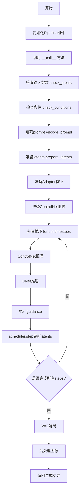
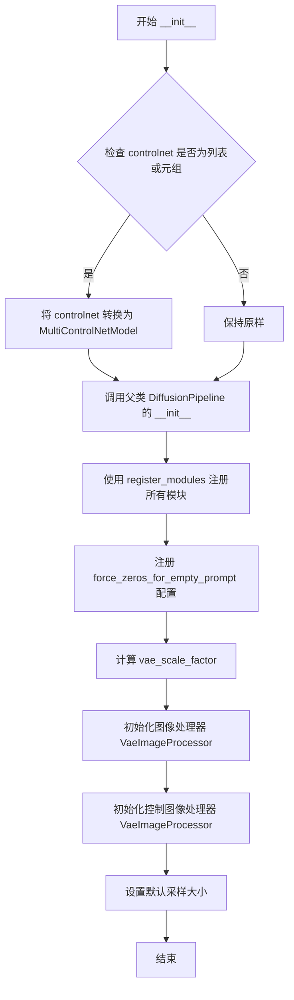
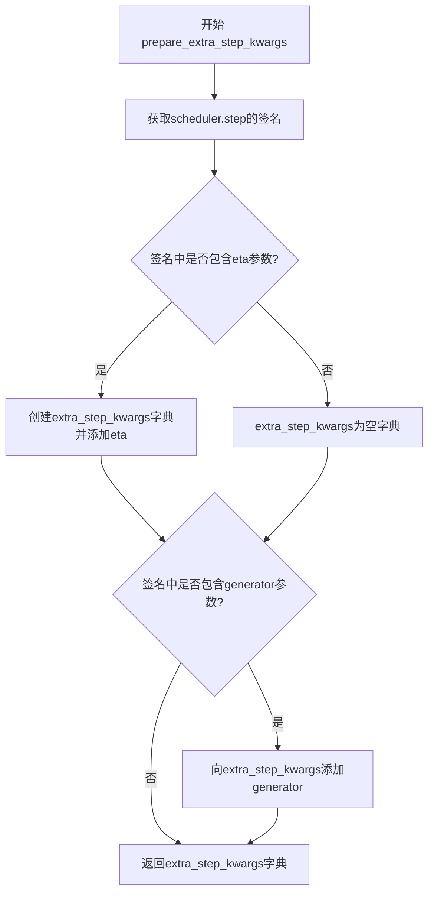
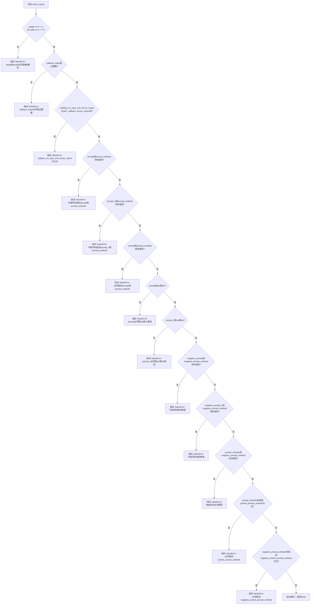
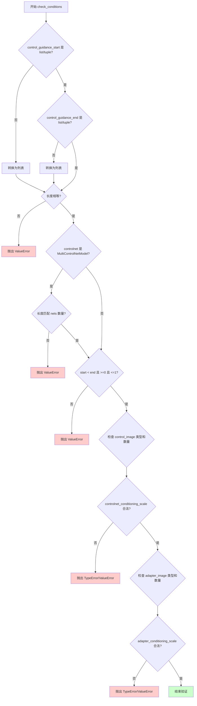
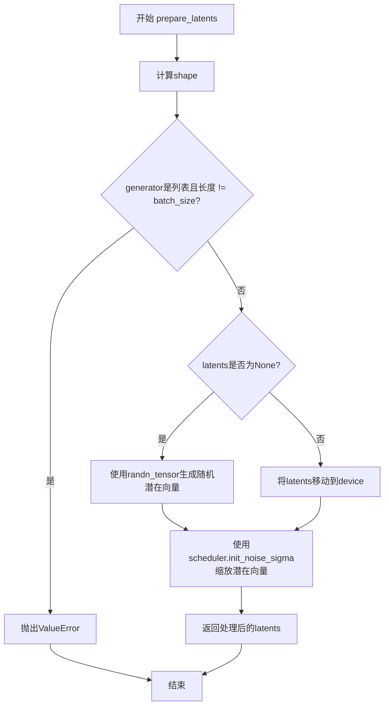
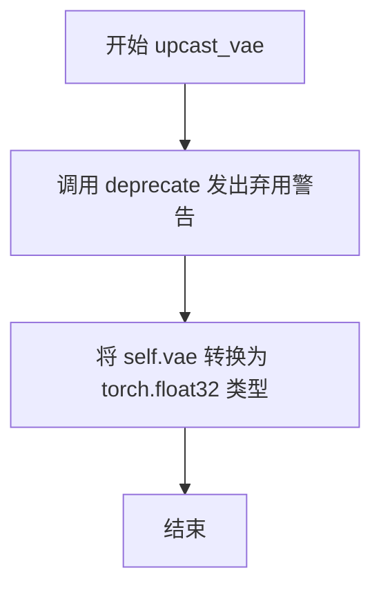
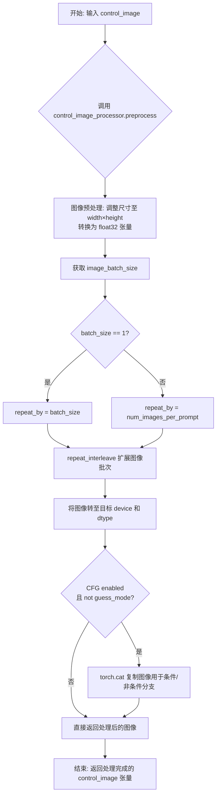
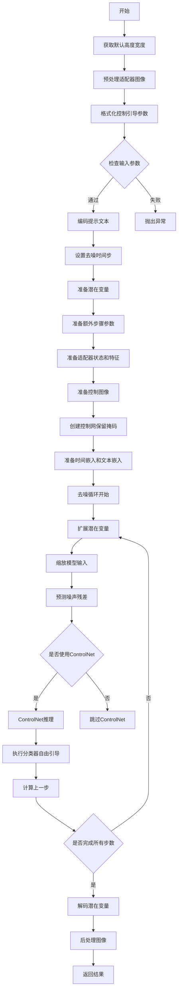

# `diffusers\examples\community\pipeline_stable_diffusion_xl_controlnet_adapter.py` 详细设计文档

这是一个结合了Stable Diffusion XL、ControlNet和T2I-Adapter的图像生成pipeline，支持文本到图像生成，并可通过adapter图像和controlnet图像进行条件控制，实现高质量的文本引导图像合成。

## 整体流程



## 类结构

```
DiffusionPipeline (抽象基类)
├── StableDiffusionMixin
├── FromSingleFileMixin
├── StableDiffusionXLLoraLoaderMixin
├── TextualInversionLoaderMixin
└── StableDiffusionXLControlNetAdapterPipeline (主类)
```

## 全局变量及字段


### `logger`
    
Logger instance for the module, used for logging warnings and info messages

类型：`logging.Logger`
    


### `EXAMPLE_DOC_STRING`
    
Documentation string containing example usage code for the pipeline

类型：`str`
    


### `StableDiffusionXLControlNetAdapterPipeline.vae`
    
Variational Auto-Encoder (VAE) model to encode and decode images to and from latent representations

类型：`AutoencoderKL`
    


### `StableDiffusionXLControlNetAdapterPipeline.text_encoder`
    
Frozen text-encoder for converting text prompts to embeddings

类型：`CLIPTextModel`
    


### `StableDiffusionXLControlNetAdapterPipeline.text_encoder_2`
    
Second frozen text-encoder with projection for SDXL model

类型：`CLIPTextModelWithProjection`
    


### `StableDiffusionXLControlNetAdapterPipeline.tokenizer`
    
Tokenizer for encoding text prompts into token IDs

类型：`CLIPTokenizer`
    


### `StableDiffusionXLControlNetAdapterPipeline.tokenizer_2`
    
Second tokenizer for SDXL model

类型：`CLIPTokenizer`
    


### `StableDiffusionXLControlNetAdapterPipeline.unet`
    
Conditional U-Net architecture to denoise the encoded image latents

类型：`UNet2DConditionModel`
    


### `StableDiffusionXLControlNetAdapterPipeline.adapter`
    
T2I-Adapter providing additional conditioning to the unet during the denoising process

类型：`Union[T2IAdapter, MultiAdapter, List[T2IAdapter]]`
    


### `StableDiffusionXLControlNetAdapterPipeline.controlnet`
    
ControlNet model providing additional guidance for image generation

类型：`Union[ControlNetModel, MultiControlNetModel]`
    


### `StableDiffusionXLControlNetAdapterPipeline.scheduler`
    
Scheduler to be used in combination with unet to denoise the encoded image latents

类型：`KarrasDiffusionSchedulers`
    


### `StableDiffusionXLControlNetAdapterPipeline.vae_scale_factor`
    
Scale factor for VAE encoding/decoding, computed from VAE block out channels

类型：`int`
    


### `StableDiffusionXLControlNetAdapterPipeline.image_processor`
    
Image processor for VAE encoding and decoding operations

类型：`VaeImageProcessor`
    


### `StableDiffusionXLControlNetAdapterPipeline.control_image_processor`
    
Image processor for control images with RGB conversion and normalization disabled

类型：`VaeImageProcessor`
    


### `StableDiffusionXLControlNetAdapterPipeline.default_sample_size`
    
Default sample size for UNet, typically 128 for SDXL

类型：`int`
    


### `StableDiffusionXLControlNetAdapterPipeline.model_cpu_offload_seq`
    
Sequence string defining the order of CPU offloading for models

类型：`str`
    


### `StableDiffusionXLControlNetAdapterPipeline._optional_components`
    
List of optional pipeline components that may not always be loaded

类型：`List[str]`
    
    

## 全局函数及方法


### `_preprocess_adapter_image`

该函数用于预处理适配器（Adapter）图像输入，支持多种输入格式（PIL图像、NumPy数组、PyTorch张量），并将其统一转换为标准化后的PyTorch张量格式，以便后续在 Stable Diffusion XL 管道中处理。

参数：

- `image`：`Union[torch.Tensor, PIL.Image.Image, List[PIL.Image.Image]]`，待预处理的图像输入，可以是单张PIL图像、图像列表或已经是PyTorch张量
- `height`：`int`，目标图像高度
- `width`：`int`，目标图像宽度

返回值：`torch.Tensor`，预处理后的图像张量，形状为 [B, C, H, W]，值域为 [0, 1]

#### 流程图

```mermaid
flowchart TD
    A[开始: _preprocess_adapter_image] --> B{image是否是Tensor?}
    B -->|是| C[直接返回Tensor]
    B -->|否| D{image是否是PIL.Image?}
    D -->|是| E[转换为列表]
    D -->|否| F{PIL图像列表?}
    E --> G[遍历图像列表]
    F -->|是| G
    F -->|否| H{张量列表?}
    H -->|是| I[处理张量列表]
    H -->|否| J[抛出异常]
    
    G --> K[Resize到目标尺寸]
    K --> L[转换为NumPy数组]
    L --> M[扩展维度]
    M --> N[拼接成批次]
    N --> O[归一化到[0,1]]
    O --> P[转换为CHW格式]
    P --> Q[转为PyTorch张量]
    Q --> R[返回处理后的图像]
    
    I --> S{张量维度?}
    S -->|3维| T[Stack成批次]
    S -->|4维| U[Cat拼接]
    T --> R
    U --> R
    
    C --> R
    J --> V[结束: 抛出ValueError]
```

#### 带注释源码

```
def _preprocess_adapter_image(image, height, width):
    """
    预处理适配器图像输入，将其转换为标准化的PyTorch张量格式。
    
    支持的输入格式:
    - torch.Tensor: 直接返回
    - PIL.Image.Image: 转换为张量并归一化
    - List[PIL.Image.Image]: 批量处理
    - List[torch.Tensor]: 堆叠或拼接
    
    参数:
        image: 输入图像，支持多种格式
        height: 目标高度
        width: 目标宽度
    
    返回:
        torch.Tensor: 预处理后的图像张量，形状为 [B, C, H, W]
    """
    
    # 如果已经是PyTorch张量，直接返回（最简单的情况）
    if isinstance(image, torch.Tensor):
        return image
    # 如果是单张PIL图像，转换为列表以便统一处理
    elif isinstance(image, PIL.Image.Image):
        image = [image]

    # 处理PIL图像列表
    if isinstance(image[0], PIL.Image.Image):
        # 1. 调整每张图像到目标尺寸，使用Lanczos重采样
        image = [np.array(i.resize((width, height), resample=PIL_INTERPOLATION["lanczos"])) for i in image]
        
        # 2. 扩展维度: 将 [H, W] 或 [H, W, C] 扩展为 [B, H, W, C]
        # 注意: 如果是灰度图(H,W)，添加通道维度变成(1,H,W,1)
        # 如果是RGB图(H,W,C)，添加批次维度变成(1,H,W,C)
        image = [
            i[None, ..., None] if i.ndim == 2 else i[None, ...] for i in image
        ]
        
        # 3. 沿批次维度拼接所有图像
        image = np.concatenate(image, axis=0)
        
        # 4. 归一化: 将像素值从 [0, 255] 转换到 [0, 1]
        image = np.array(image).astype(np.float32) / 255.0
        
        # 5. 转换维度顺序: 从 [B, H, W, C] 转换为 [B, C, H, W]
        # 这是PyTorch的标准图像格式 (Channel, Height, Width)
        image = image.transpose(0, 3, 1, 2)
        
        # 6. 转换为PyTorch张量
        image = torch.from_numpy(image)
    
    # 处理已有的PyTorch张量列表
    elif isinstance(image[0], torch.Tensor):
        # 3维张量 [H, W, C]: 堆叠成批次 [B, H, W, C]
        if image[0].ndim == 3:
            image = torch.stack(image, dim=0)
        # 4维张量 [B, H, W, C]: 拼接成单个批次
        elif image[0].ndim == 4:
            image = torch.cat(image, dim=0)
        # 其他维度: 抛出错误
        else:
            raise ValueError(
                f"Invalid image tensor! Expecting image tensor with 3 or 4 dimension, but receive: {image[0].ndim}"
            )
    
    return image
```


### `rescale_noise_cfg`

该函数用于根据`guidance_rescale`参数对噪声预测配置进行重新缩放，基于论文"Common Diffusion Noise Schedules and Sample Steps are Flawed"的研究成果，旨在修复过度曝光问题并避免图像看起来过于平淡。

参数：

- `noise_cfg`：`torch.Tensor`，噪声预测配置，表示经过分类器自由引导后的噪声预测结果
- `noise_pred_text`：`torch.Tensor`，文本引导的噪声预测结果，用于计算标准差参考
- `guidance_rescale`：`float`，引导重缩放因子，默认为0.0，用于控制原始预测结果与重缩放后结果的混合比例

返回值：`torch.Tensor`，重缩放后的噪声预测配置

#### 流程图

```mermaid
flowchart TD
    A[开始] --> B[计算noise_pred_text的标准差std_text]
    B --> C[计算noise_cfg的标准差std_cfg]
    C --> D[计算重缩放后的噪声预测<br/>noise_pred_rescaled = noise_cfg × std_text/std_cfg]
    D --> E[计算最终混合结果<br/>noise_cfg = guidance_rescale × noise_pred_rescaled + (1-guidance_rescale) × noise_cfg]
    E --> F[返回重缩放后的noise_cfg]
```

#### 带注释源码

```python
# Copied from diffusers.pipelines.stable_diffusion.pipeline_stable_diffusion.rescale_noise_cfg
def rescale_noise_cfg(noise_cfg, noise_pred_text, guidance_rescale=0.0):
    """
    Rescale `noise_cfg` according to `guidance_rescale`. Based on findings of [Common Diffusion Noise Schedules and
    Sample Steps are Flawed](https://huggingface.co/papers/2305.08891). See Section 3.4
    
    该函数根据guidance_rescale参数对noise_cfg进行重缩放，基于论文
    'Common Diffusion Noise Schedules and Sample Steps are Flawed'的研究发现，旨在解决
    过度曝光问题(第3.4节)
    """
    # 计算文本噪声预测在除批处理维度外的所有维度的标准差
    # 使用keepdim=True保持原始张量维度以便后续广播运算
    std_text = noise_pred_text.std(dim=list(range(1, noise_pred_text.ndim)), keepdim=True)
    
    # 计算噪声配置在除批处理维度外的所有维度的标准差
    std_cfg = noise_cfg.std(dim=list(range(1, noise_cfg.ndim)), keepdim=True)
    
    # 使用文本噪声的标准差对噪声配置进行重缩放
    # 这可以修复过度曝光问题，使生成图像的亮度更加合理
    noise_pred_rescaled = noise_cfg * (std_text / std_cfg)
    
    # 将重缩放后的结果与原始结果按guidance_rescale因子进行混合
    # guidance_rescale为0时使用原始noise_cfg，为1时使用完全重缩放的结果
    # 这种混合可以避免生成看起来过于平淡的图像
    noise_cfg = guidance_rescale * noise_pred_rescaled + (1 - guidance_rescale) * noise_cfg
    
    return noise_cfg
```


### `StableDiffusionXLControlNetAdapterPipeline.__init__`

该方法是`StableDiffusionXLControlNetAdapterPipeline`管道的初始化函数，负责接收并注册所有必需的模型组件（如VAE、文本编码器、UNet、适配器和ControlNet），并初始化图像处理器和配置参数，为后续的图像生成流程做好准备。

参数：

- `vae`：`AutoencoderKL`，Variational Auto-Encoder (VAE) 模型，用于在潜在表示之间对图像进行编码和解码
- `text_encoder`：`CLIPTextModel`，冻结的文本编码器，Stable Diffusion 使用 CLIP 的文本部分
- `text_encoder_2`：`CLIPTextModelWithProjection`，带有投影的第二个文本编码器
- `tokenizer`：`CLIPTokenizer`，CLIPTokenizer 类的分词器
- `tokenizer_2`：`CLIPTokenizer`，第二个分词器
- `unet`：`UNet2DConditionModel`，条件 U-Net 架构，用于对编码后的图像潜在表示进行去噪
- `adapter`：`Union[T2IAdapter, MultiAdapter, List[T2IAdapter]]`，提供额外的条件信息给 UNet，支持单个或多个适配器
- `controlnet`：`Union[ControlNetModel, MultiControlNetModel]`，ControlNet 模型，用于在去噪过程中提供指导
- `scheduler`：`KarrasDiffusionSchedulers`，与 UNet 结合使用以对图像潜在表示进行去噪的调度器
- `force_zeros_for_empty_prompt`：`bool = True`，是否对空提示强制使用零嵌入

返回值：无（`None`），该方法为构造函数，不返回任何值

#### 流程图



#### 带注释源码

```python
def __init__(
    self,
    vae: AutoencoderKL,
    text_encoder: CLIPTextModel,
    text_encoder_2: CLIPTextModelWithProjection,
    tokenizer: CLIPTokenizer,
    tokenizer_2: CLIPTokenizer,
    unet: UNet2DConditionModel,
    adapter: Union[T2IAdapter, MultiAdapter, List[T2IAdapter]],
    controlnet: Union[ControlNetModel, MultiControlNetModel],
    scheduler: KarrasDiffusionSchedulers,
    force_zeros_for_empty_prompt: bool = True,
):
    # 调用父类 DiffusionPipeline 的初始化方法
    super().__init__()

    # 如果 controlnet 是列表或元组，则转换为 MultiControlNetModel
    if isinstance(controlnet, (list, tuple)):
        controlnet = MultiControlNetModel(controlnet)

    # 注册所有模块，使它们可以通过管道访问
    self.register_modules(
        vae=vae,
        text_encoder=text_encoder,
        text_encoder_2=text_encoder_2,
        tokenizer=tokenizer,
        tokenizer_2=tokenizer_2,
        unet=unet,
        adapter=adapter,
        controlnet=controlnet,
        scheduler=scheduler,
    )
    
    # 注册 force_zeros_for_empty_prompt 配置到 self.config
    self.register_to_config(force_zeros_for_empty_prompt=force_zeros_for_empty_prompt)
    
    # 计算 VAE 缩放因子，用于调整潜在表示的尺寸
    # 基于 VAE 块输出通道数的幂次方
    self.vae_scale_factor = 2 ** (len(self.vae.config.block_out_channels) - 1) if getattr(self, "vae", None) else 8
    
    # 初始化图像处理器，用于 VAE 的图像预处理和后处理
    self.image_processor = VaeImageProcessor(vae_scale_factor=self.vae_scale_factor)
    
    # 初始化控制图像处理器，启用 RGB 转换但不禁用归一化
    self.control_image_processor = VaeImageProcessor(
        vae_scale_factor=self.vae_scale_factor, do_convert_rgb=True, do_normalize=False
    )
    
    # 设置默认采样大小，基于 UNet 配置
    self.default_sample_size = (
        self.unet.config.sample_size
        if hasattr(self, "unet") and self.unet is not None and hasattr(self.unet.config, "sample_size")
        else 128
    )
```


### `StableDiffusionXLControlNetAdapterPipeline.encode_prompt`

该方法负责将文本提示（prompt）编码为文本编码器的隐藏状态（hidden states），支持双文本编码器（CLIP Text Encoder 和 CLIP Text Encoder with Projection）以及 LoRA 微调、CLIP skip 等高级功能，返回正向提示嵌入、负向提示嵌入、池化正向提示嵌入和池化负向提示嵌入。

参数：

- `prompt`：`str` 或 `List[str]`，要编码的文本提示
- `prompt_2`：`str | None`，发送给第二个 tokenizer 和 text_encoder_2 的提示，若不定义则使用 prompt
- `device`：`torch.device | None`，torch 设备，默认为执行设备
- `num_images_per_prompt`：`int`，每个提示生成的图像数量，默认为 1
- `do_classifier_free_guidance`：`bool`，是否使用无分类器自由引导，默认为 True
- `negative_prompt`：`str | None`，不引导图像生成的负向提示
- `negative_prompt_2`：`str | None`，发送给第二个编码器的负向提示
- `prompt_embeds`：`torch.Tensor | None`，预生成的文本嵌入，可用于轻松调整文本输入
- `negative_prompt_embeds`：`torch.Tensor | None`，预生成的负向文本嵌入
- `pooled_prompt_embeds`：`torch.Tensor | None`，预生成的池化文本嵌入
- `negative_pooled_prompt_embeds`：`torch.Tensor | None`，预生成的负向池化文本嵌入
- `lora_scale`：`float | None`，应用于文本编码器所有 LoRA 层的 LoRA 缩放因子
- `clip_skip`：`int | None`，计算提示嵌入时从 CLIP 跳过的层数

返回值：`Tuple[torch.Tensor, torch.Tensor, torch.Tensor, torch.Tensor]`，返回 (prompt_embeds, negative_prompt_embeds, pooled_prompt_embeds, negative_pooled_prompt_embeds) 四元组

#### 流程图

```mermaid
flowchart TD
    A[开始 encode_prompt] --> B{检查 lora_scale}
    B -->|非 None 且为 StableDiffusionXLLoraLoaderMixin| C[设置 self._lora_scale]
    C --> D{动态调整 LoRA scale}
    D --> E[adjust_lora_scale_text_encoder / scale_lora_layers]
    B -->|其他| F[处理 prompt 列表]
    
    F --> G{判断 batch_size}
    G -->|prompt 非 None| H[batch_size = len(prompt)]
    G -->|prompt 为 None| I[batch_size = prompt_embeds.shape[0]]
    
    H --> J[定义 tokenizers 和 text_encoders]
    J --> K{prompt_embeds 为 None?}
    K -->|是| L[设置 prompt_2 = prompt_2 or prompt]
    L --> M[遍历 prompts, tokenizers, text_encoders]
    
    M --> N[Textual Inversion 处理]
    N --> O[tokenizer 调用]
    O --> P[检查截断并警告]
    P --> Q[text_encoder 前向传播]
    Q --> R[获取 pooled_prompt_embeds]
    R --> S{clip_skip 为 None?}
    S -->|是| T[使用 hidden_states倒数第二层]
    S -->|否| U[使用 hidden_states -clip_skip + 2]
    T --> V[添加到 prompt_embeds_list]
    U --> V
    
    K -->|否| W[直接使用传入的 prompt_embeds]
    V --> X[torch.concat prompt_embeds_list]
    W --> X
    
    X --> Y{处理 negative_prompt}
    Y --> Z{zero_out_negative_prompt?}
    Z -->|是| AA[negative_prompt_embeds = torch.zeros_like]
    AA --> AB[negative_pooled_prompt_embeds = torch.zeros_like]
    
    Z -->|否| AC{negative_prompt_embeds 为 None?}
    AC -->|是| AD[处理 negative_prompt 列表]
    AD --> AE[遍历 negative_prompt, tokenizer, text_encoder]
    AE --> AF[tokenizer 处理]
    AF --> AG[text_encoder 前向]
    AG --> AH[获取 negative_pooled_prompt_embeds]
    AH --> AI[hidden_states 倒数第二层]
    AI --> AJ[添加到 negative_prompt_embeds_list]
    AC -->|否| AK[直接使用传入的 negative_prompt_embeds]
    
    AJ --> AK --> AL[torch.concat negative_prompt_embeds_list]
    
    AB --> AL
    
    AL --> AM[转换 dtype 和 device]
    AM --> AN{num_images_per_prompt > 1?}
    AN -->|是| AO[重复 prompt_embeds]
    AN -->|否| AP[保持不变]
    AO --> AQ[view 为 batch_size * num_images_per_prompt]
    AP --> AQ
    
    AQ --> AR{do_classifier_free_guidance?}
    AR -->|是| AS[重复 negative_prompt_embeds]
    AR -->|否| AT[跳过]
    AS --> AT
    
    AT --> AU[重复 pooled_prompt_embeds]
    AU --> AV{do_classifier_free_guidance?}
    AV -->|是| AW[重复 negative_pooled_prompt_embeds]
    AV -->|否| AX[跳过]
    
    AW --> AY[unscale_lora_layers 恢复原始 scale]
    AX --> AY
    
    AY --> AZ[返回四个嵌入张量]
```

#### 带注释源码

```python
def encode_prompt(
    self,
    prompt: str,
    prompt_2: str | None = None,
    device: Optional[torch.device] = None,
    num_images_per_prompt: int = 1,
    do_classifier_free_guidance: bool = True,
    negative_prompt: str | None = None,
    negative_prompt_2: str | None = None,
    prompt_embeds: Optional[torch.Tensor] = None,
    negative_prompt_embeds: Optional[torch.Tensor] = None,
    pooled_prompt_embeds: Optional[torch.Tensor] = None,
    negative_pooled_prompt_embeds: Optional[torch.Tensor] = None,
    lora_scale: Optional[float] = None,
    clip_skip: Optional[int] = None,
):
    r"""
    Encodes the prompt into text encoder hidden states.

    Args:
        prompt (`str` or `List[str]`, *optional*):
            prompt to be encoded
        prompt_2 (`str` or `List[str]`, *optional*):
            The prompt or prompts to be sent to the `tokenizer_2` and `text_encoder_2`. If not defined, `prompt` is
            used in both text-encoders
        device: (`torch.device`):
            torch device
        num_images_per_prompt (`int`):
            number of images that should be generated per prompt
        do_classifier_free_guidance (`bool`):
            whether to use classifier free guidance or not
        negative_prompt (`str` or `List[str]`, *optional*):
            The prompt or prompts not to guide the image generation. If not defined, one has to pass
            `negative_prompt_embeds` instead. Ignored when not using guidance (i.e., ignored if `guidance_scale` is
            less than `1`).
        negative_prompt_2 (`str` or `List[str]`, *optional*):
            The prompt or prompts not to guide the image generation to be sent to `tokenizer_2` and
            `text_encoder_2`. If not defined, `negative_prompt` is used in both text-encoders
        prompt_embeds (`torch.Tensor`, *optional*):
            Pre-generated text embeddings. Can be used to easily tweak text inputs, *e.g.* prompt weighting. If not
            provided, text embeddings will be generated from `prompt` input argument.
        negative_prompt_embeds (`torch.Tensor`, *optional*):
            Pre-generated negative text embeddings. Can be used to easily tweak text inputs, *e.g.* prompt
            weighting. If not provided, negative_prompt_embeds will be generated from `negative_prompt` input
            argument.
        pooled_prompt_embeds (`torch.Tensor`, *optional*):
            Pre-generated pooled text embeddings. Can be used to easily tweak text inputs, *e.g.* prompt weighting.
            If not provided, pooled text embeddings will be generated from `prompt` input argument.
        negative_pooled_prompt_embeds (`torch.Tensor`, *optional*):
            Pre-generated negative pooled text embeddings. Can be used to easily tweak text inputs, *e.g.* prompt
            weighting. If not provided, pooled negative_prompt_embeds will be generated from `negative_prompt`
            input argument.
        lora_scale (`float`, *optional*):
            A lora scale that will be applied to all LoRA layers of the text encoder if LoRA layers are loaded.
        clip_skip (`int`, *optional*):
            Number of layers to be skipped from CLIP while computing the prompt embeddings. A value of 1 means that
            the output of the pre-final layer will be used for computing the prompt embeddings.
    """
    # 确定执行设备，优先使用传入的 device，否则使用 pipeline 的执行设备
    device = device or self._execution_device

    # set lora scale so that monkey patched LoRA
    # function of text encoder can correctly access it
    # 如果传入了 lora_scale 且 pipeline 支持 LoRA，则设置并动态调整 LoRA scale
    if lora_scale is not None and isinstance(self, StableDiffusionXLLoraLoaderMixin):
        self._lora_scale = lora_scale

        # dynamically adjust the LoRA scale
        if self.text_encoder is not None:
            if not USE_PEFT_BACKEND:
                adjust_lora_scale_text_encoder(self.text_encoder, lora_scale)
            else:
                scale_lora_layers(self.text_encoder, lora_scale)

        if self.text_encoder_2 is not None:
            if not USE_PEFT_BACKEND:
                adjust_lora_scale_text_encoder(self.text_encoder_2, lora_scale)
            else:
                scale_lora_layers(self.text_encoder_2, lora_scale)

    # 将 prompt 统一转换为列表格式，方便批处理
    prompt = [prompt] if isinstance(prompt, str) else prompt

    # 确定批处理大小
    if prompt is not None:
        batch_size = len(prompt)
    else:
        batch_size = prompt_embeds.shape[0]

    # Define tokenizers and text encoders
    # 根据 pipeline 配置确定使用的 tokenizers 和 text encoders
    # 支持双文本编码器配置（SDXL 特有）
    tokenizers = [self.tokenizer, self.tokenizer_2] if self.tokenizer is not None else [self.tokenizer_2]
    text_encoders = (
        [self.text_encoder, self.text_encoder_2] if self.text_encoder is not None else [self.text_encoder_2]
    )

    # 如果没有传入预生成的 prompt_embeds，则需要从 prompt 生成
    if prompt_embeds is None:
        # 如果 prompt_2 未定义，则使用 prompt
        prompt_2 = prompt_2 or prompt
        prompt_2 = [prompt_2] if isinstance(prompt_2, str) else prompt_2

        # textual inversion: process multi-vector tokens if necessary
        # 初始化 embedding 列表
        prompt_embeds_list = []
        # 同时处理 prompt 和 prompt_2
        prompts = [prompt, prompt_2]
        # 遍历每个 prompt、tokenizer 和 text_encoder
        for prompt, tokenizer, text_encoder in zip(prompts, tokenizers, text_encoders):
            # 如果支持 Textual Inversion，进行提示转换
            if isinstance(self, TextualInversionLoaderMixin):
                prompt = self.maybe_convert_prompt(prompt, tokenizer)

            # 使用 tokenizer 将文本转换为 token IDs
            text_inputs = tokenizer(
                prompt,
                padding="max_length",
                max_length=tokenizer.model_max_length,
                truncation=True,
                return_tensors="pt",
            )

            text_input_ids = text_inputs.input_ids
            # 获取未截断的 token IDs 用于检测截断
            untruncated_ids = tokenizer(prompt, padding="longest", return_tensors="pt").input_ids

            # 检查是否发生截断，如果是则发出警告
            if untruncated_ids.shape[-1] >= text_input_ids.shape[-1] and not torch.equal(
                text_input_ids, untruncated_ids
            ):
                removed_text = tokenizer.batch_decode(untruncated_ids[:, tokenizer.model_max_length - 1 : -1])
                logger.warning(
                    "The following part of your input was truncated because CLIP can only handle sequences up to"
                    f" {tokenizer.model_max_length} tokens: {removed_text}"
                )

            # 将 token IDs 传入 text_encoder 获取隐藏状态
            prompt_embeds = text_encoder(text_input_ids.to(device), output_hidden_states=True)

            # We are only ALWAYS interested in the pooled output of the final text encoder
            # 获取池化的输出（用于 SDXL 的条件嵌入）
            if pooled_prompt_embeds is None and prompt_embeds[0].ndim == 2:
                pooled_prompt_embeds = prompt_embeds[0]

            # 根据 clip_skip 参数选择隐藏层
            if clip_skip is None:
                # 默认使用倒数第二层隐藏状态
                prompt_embeds = prompt_embeds.hidden_states[-2]
            else:
                # "2" because SDXL always indexes from the penultimate layer.
                prompt_embeds = prompt_embeds.hidden_states[-(clip_skip + 2)]

            prompt_embeds_list.append(prompt_embeds)

        # 沿最后一个维度拼接两个文本编码器的输出
        prompt_embeds = torch.concat(prompt_embeds_list, dim=-1)

    # get unconditional embeddings for classifier free guidance
    # 获取无分类器自由引导的嵌入
    # 判断是否需要将负向提示置零
    zero_out_negative_prompt = negative_prompt is None and self.config.force_zeros_for_empty_prompt
    # 如果启用 CFG 且没有传入负向嵌入且配置要求置零
    if do_classifier_free_guidance and negative_prompt_embeds is None and zero_out_negative_prompt:
        # 创建与 prompt_embeds 形状相同的零张量
        negative_prompt_embeds = torch.zeros_like(prompt_embeds)
        negative_pooled_prompt_embeds = torch.zeros_like(pooled_prompt_embeds)
    # 如果启用 CFG 但没有负向嵌入，则从负向提示生成
    elif do_classifier_free_guidance and negative_prompt_embeds is None:
        # 空字符串作为默认负向提示
        negative_prompt = negative_prompt or ""
        negative_prompt_2 = negative_prompt_2 or negative_prompt

        # normalize str to list
        # 将负向提示转换为列表
        negative_prompt = batch_size * [negative_prompt] if isinstance(negative_prompt, str) else negative_prompt
        negative_prompt_2 = (
            batch_size * [negative_prompt_2] if isinstance(negative_prompt_2, str) else negative_prompt_2
        )

        uncond_tokens: List[str]
        # 类型检查
        if prompt is not None and type(prompt) is not type(negative_prompt):
            raise TypeError(
                f"`negative_prompt` should be the same type to `prompt`, but got {type(negative_prompt)} !="
                f" {type(prompt)}."
            )
        elif batch_size != len(negative_prompt):
            raise ValueError(
                f"`negative_prompt`: {negative_prompt} has batch size {len(negative_prompt)}, but `prompt`:"
                f" {prompt} has batch size {batch_size}. Please make sure that passed `negative_prompt` matches"
                " the batch size of `prompt`."
            )
        else:
            uncond_tokens = [negative_prompt, negative_prompt_2]

        # 处理负向提示的嵌入
        negative_prompt_embeds_list = []
        for negative_prompt, tokenizer, text_encoder in zip(uncond_tokens, tokenizers, text_encoders):
            # Textual Inversion 处理
            if isinstance(self, TextualInversionLoaderMixin):
                negative_prompt = self.maybe_convert_prompt(negative_prompt, tokenizer)

            # 使用与 prompt_embeds 相同的长度
            max_length = prompt_embeds.shape[1]
            uncond_input = tokenizer(
                negative_prompt,
                padding="max_length",
                max_length=max_length,
                truncation=True,
                return_tensors="pt",
            )

            # 获取负向提示嵌入
            negative_prompt_embeds = text_encoder(
                uncond_input.input_ids.to(device),
                output_hidden_states=True,
            )
            # We are only ALWAYS interested in the pooled output of the final text encoder
            if negative_pooled_prompt_embeds is None and negative_prompt_embeds[0].ndim == 2:
                negative_pooled_prompt_embeds = negative_prompt_embeds[0]
            negative_prompt_embeds = negative_prompt_embeds.hidden_states[-2]

            negative_prompt_embeds_list.append(negative_prompt_embeds)

        # 拼接负向嵌入
        negative_prompt_embeds = torch.concat(negative_prompt_embeds_list, dim=-1)

    # 确保 prompt_embeds 的 dtype 和 device 正确
    if self.text_encoder_2 is not None:
        prompt_embeds = prompt_embeds.to(dtype=self.text_encoder_2.dtype, device=device)
    else:
        prompt_embeds = prompt_embeds.to(dtype=self.unet.dtype, device=device)

    # 获取当前嵌入的形状
    bs_embed, seq_len, _ = prompt_embeds.shape
    # duplicate text embeddings for each generation per prompt, using mps friendly method
    # 为每个提示生成多个图像复制嵌入
    prompt_embeds = prompt_embeds.repeat(1, num_images_per_prompt, 1)
    prompt_embeds = prompt_embeds.view(bs_embed * num_images_per_prompt, seq_len, -1)

    # 如果启用 CFG，复制无条件嵌入
    if do_classifier_free_guidance:
        # duplicate unconditional embeddings for each generation per prompt, using mps friendly method
        seq_len = negative_prompt_embeds.shape[1]

        if self.text_encoder_2 is not None:
            negative_prompt_embeds = negative_prompt_embeds.to(dtype=self.text_encoder_2.dtype, device=device)
        else:
            negative_prompt_embeds = negative_prompt_embeds.to(dtype=self.unet.dtype, device=device)

        negative_prompt_embeds = negative_prompt_embeds.repeat(1, num_images_per_prompt, 1)
        negative_prompt_embeds = negative_prompt_embeds.view(batch_size * num_images_per_prompt, seq_len, -1)

    # 处理池化嵌入
    pooled_prompt_embeds = pooled_prompt_embeds.repeat(1, num_images_per_prompt).view(
        bs_embed * num_images_per_prompt, -1
    )
    if do_classifier_free_guidance:
        negative_pooled_prompt_embeds = negative_pooled_prompt_embeds.repeat(1, num_images_per_prompt).view(
            bs_embed * num_images_per_prompt, -1
        )

    # 如果使用了 LoRA，在返回前恢复原始 scale
    if self.text_encoder is not None:
        if isinstance(self, StableDiffusionXLLoraLoaderMixin) and USE_PEFT_BACKEND:
            # Retrieve the original scale by scaling back the LoRA layers
            unscale_lora_layers(self.text_encoder, lora_scale)

    if self.text_encoder_2 is not None:
        if isinstance(self, StableDiffusionXLLoraLoaderMixin) and USE_PEFT_BACKEND:
            # Retrieve the original scale by scaling back the LoRA layers
            unscale_lora_layers(self.text_encoder_2, lora_scale)

    # 返回四个嵌入张量
    return prompt_embeds, negative_prompt_embeds, pooled_prompt_embeds, negative_pooled_prompt_embeds
```


### StableDiffusionXLControlNetAdapterPipeline.prepare_extra_step_kwargs

该方法用于为调度器（scheduler）的step函数准备额外的关键字参数。由于不同的调度器具有不同的签名（如DDIMScheduler支持eta参数，而其他调度器可能不支持），该方法通过检查调度器step函数的参数签名来动态构建需要传递的额外参数。

参数：

- `self`：`StableDiffusionXLControlNetAdapterPipeline` 实例，隐式参数，表示当前管道对象
- `generator`：`Optional[Union[torch.Generator, List[torch.Generator]]]`，用于控制生成过程的随机数生成器，可为单个生成器或生成器列表，用于确保生成的可重复性
- `eta`：`float`，DDIM论文中的η参数，仅在DDIMScheduler中使用，其他调度器会忽略该参数。取值范围应在[0, 1]之间

返回值：`Dict[str, Any]`，包含调度器step函数所需额外参数 的字典，可能包含 `eta` 和/或 `generator` 键值对

#### 流程图



#### 带注释源码

```python
def prepare_extra_step_kwargs(self, generator, eta):
    """
    准备调度器step函数的额外参数。
    由于并非所有调度器都具有相同的签名，因此需要动态检查并传递相应的参数。
    eta (η) 仅在DDIMScheduler中使用，其他调度器会忽略该参数。
    eta 对应DDIM论文中的η参数：https://huggingface.co/papers/2010.02502
    取值范围应在[0, 1]之间。
    """
    
    # 使用inspect模块获取scheduler.step函数的参数签名
    # 检查调度器是否支持eta参数
    accepts_eta = "eta" in set(inspect.signature(self.scheduler.step).parameters.keys())
    
    # 初始化额外的关键字参数字典
    extra_step_kwargs = {}
    
    # 如果调度器接受eta参数，则将其添加到extra_step_kwargs中
    if accepts_eta:
        extra_step_kwargs["eta"] = eta

    # 检查调度器是否接受generator参数
    accepts_generator = "generator" in set(inspect.signature(self.scheduler.step).parameters.keys())
    
    # 如果调度器接受generator参数，则将其添加到extra_step_kwargs中
    if accepts_generator:
        extra_step_kwargs["generator"] = generator
    
    # 返回包含调度器所需额外参数的字典
    return extra_step_kwargs
```


### `StableDiffusionXLControlNetAdapterPipeline.check_image`

该方法用于验证输入图像和提示（prompt）的类型及批次大小是否合法，确保图像是支持的格式（PIL图像、PyTorch张量、NumPy数组或它们的列表），并且当批次大小大于1时，必须与提示的批次大小保持一致。

参数：

- `self`：隐式参数，指向 Pipeline 实例本身
- `image`：`Union[PIL.Image.Image, torch.Tensor, np.ndarray, List[PIL.Image.Image], List[torch.Tensor], List[np.ndarray]]`，待验证的输入图像，支持多种格式
- `prompt`：`Optional[Union[str, List[str]]]`，（可选）文本提示，用于确定批次大小
- `prompt_embeds`：`Optional[torch.Tensor]`，（可选）预计算的文本嵌入，用于确定批次大小

返回值：`None`，该方法不返回任何值，仅进行参数验证并可能在不合规时抛出异常

#### 流程图

```mermaid
graph TD
    A([开始 check_image]) --> B{检查 image 类型}
    
    B --> C{image 是 PIL.Image.Image?}
    C -->|是| D[设置 image_batch_size = 1]
    C -->|否| E{image 是 torch.Tensor?}
    E -->|是| F[设置 image_batch_size = 1]
    E -->|否| G{image 是 np.ndarray?}
    G -->|是| H[设置 image_batch_size = 1]
    G -->|否| I{image 是 List?}
    
    I --> J{List[0] 是 PIL.Image?}
    J -->|是| K[设置 image_batch_size = len(image)]
    J -->|否| L{List[0] 是 torch.Tensor?}
    L -->|是| M[设置 image_batch_size = len(image)]
    L -->|否| N{List[0] 是 np.ndarray?}
    N -->|是| O[设置 image_batch_size = len(image)]
    N -->|否| P[抛出 TypeError]
    
    P --> Z([结束])
    
    D --> Q{确定 prompt_batch_size}
    F --> Q
    H --> Q
    K --> Q
    M --> Q
    O --> Q
    
    Q --> R{prompt 是 str?}
    R -->|是| S[prompt_batch_size = 1]
    R -->|否| T{prompt 是 list?}
    T -->|是| U[prompt_batch_size = len(prompt)]
    T -->|否| V{prompt_embeds 不为 None?}
    V -->|是| W[prompt_batch_size = prompt_embeds.shape[0]]
    V -->|否| X[不设置 prompt_batch_size]
    
    S --> Y{验证批次大小}
    U --> Y
    W --> Y
    X --> Y
    
    Y --> Z{image_batch_size != 1 且 != prompt_batch_size?}
    Z -->|是| AA[抛出 ValueError]
    Z -->|否| AB([正常返回])
    AA --> AB
```

#### 带注释源码

```python
# 复制自 diffusers.pipelines.controlnet.pipeline_controlnet.StableDiffusionControlNetPipeline.check_image
def check_image(self, image, prompt, prompt_embeds):
    # 检查图像是否为 PIL.Image.Image 类型
    image_is_pil = isinstance(image, PIL.Image.Image)
    # 检查图像是否为 torch.Tensor 类型
    image_is_tensor = isinstance(image, torch.Tensor)
    # 检查图像是否为 np.ndarray 类型
    image_is_np = isinstance(image, np.ndarray)
    # 检查图像是否为 PIL.Image.Image 列表
    image_is_pil_list = isinstance(image, list) and isinstance(image[0], PIL.Image.Image)
    # 检查图像是否为 torch.Tensor 列表
    image_is_tensor_list = isinstance(image, list) and isinstance(image[0], torch.Tensor)
    # 检查图像是否为 np.ndarray 列表
    image_is_np_list = isinstance(image, list) and isinstance(image[0], np.ndarray)

    # 验证图像必须是上述类型之一，否则抛出 TypeError
    if (
        not image_is_pil
        and not image_is_tensor
        and not image_is_np
        and not image_is_pil_list
        and not image_is_tensor_list
        and not image_is_np_list
    ):
        raise TypeError(
            f"image must be passed and be one of PIL image, numpy array, torch tensor, list of PIL images, list of numpy arrays or list of torch tensors, but is {type(image)}"
        )

    # 确定图像批次大小：单个图像为 1，否则为列表长度
    if image_is_pil:
        image_batch_size = 1
    else:
        image_batch_size = len(image)

    # 确定提示批次大小
    if prompt is not None and isinstance(prompt, str):
        prompt_batch_size = 1
    elif prompt is not None and isinstance(prompt, list):
        prompt_batch_size = len(prompt)
    elif prompt_embeds is not None:
        prompt_batch_size = prompt_embeds.shape[0]

    # 验证图像批次大小与提示批次大小一致（除非其中一个为 1）
    if image_batch_size != 1 and image_batch_size != prompt_batch_size:
        raise ValueError(
            f"If image batch size is not 1, image batch size must be same as prompt batch size. image batch size: {image_batch_size}, prompt batch size: {prompt_batch_size}"
        )
```


### `StableDiffusionXLControlNetAdapterPipeline.check_inputs`

该方法用于验证Stable Diffusion XL ControlNet Adapter Pipeline的输入参数是否合法，确保prompt、negative prompt、embedding等参数的正确性和一致性，若参数不符合要求则抛出相应的ValueError或TypeError异常。

参数：

- `prompt`：`Union[str, List[str], None]`，主提示词，用于引导图像生成
- `prompt_2`：`Union[str, List[str], None]`，第二个提示词，发送给tokenizer_2和text_encoder_2，若不定义则使用prompt
- `height`：`int`，生成图像的高度（像素），必须能被8整除
- `width`：`int`，生成图像的宽度（像素），必须能被8整除
- `callback_steps`：`int`，回调函数的调用频率，必须为正整数
- `negative_prompt`：`Union[str, List[str], None]`，负面提示词，不引导图像生成
- `negative_prompt_2`：`Union[str, List[str], None]`，第二个负面提示词
- `prompt_embeds`：`Optional[torch.Tensor]`，预生成的文本嵌入，与prompt二选一
- `negative_prompt_embeds`：`Optional[torch.Tensor]`，预生成的负面文本嵌入
- `pooled_prompt_embeds`：`Optional[torch.Tensor]`，预生成的池化文本嵌入
- `negative_pooled_prompt_embeds`：`Optional[torch.Tensor]`，预生成的负面池化文本嵌入
- `callback_on_step_end_tensor_inputs`：`Optional[List[str]]`，步骤结束时回调的张量输入列表

返回值：`None`，该方法仅进行参数验证，不返回任何值

#### 流程图



#### 带注释源码

```python
def check_inputs(
    self,
    prompt,
    prompt_2,
    height,
    width,
    callback_steps,
    negative_prompt=None,
    negative_prompt_2=None,
    prompt_embeds=None,
    negative_prompt_embeds=None,
    pooled_prompt_embeds=None,
    negative_pooled_prompt_embeds=None,
    callback_on_step_end_tensor_inputs=None,
):
    # 验证height和width必须能被8整除，这是Stable Diffusion的要求
    if height % 8 != 0 or width % 8 != 0:
        raise ValueError(f"`height` and `width` have to be divisible by 8 but are {height} and {width}.")

    # 验证callback_steps必须是正整数
    if callback_steps is not None and (not isinstance(callback_steps, int) or callback_steps <= 0):
        raise ValueError(
            f"`callback_steps` has to be a positive integer but is {callback_steps} of type"
            f" {type(callback_steps)}."
        )

    # 验证callback_on_step_end_tensor_inputs中的所有键都在允许的回调张量输入中
    if callback_on_step_end_tensor_inputs is not None and not all(
        k in self._callback_tensor_inputs for k in callback_on_step_end_tensor_inputs
    ):
        raise ValueError(
            f"`callback_on_step_end_tensor_inputs` has to be in {self._callback_tensor_inputs}, but found {[k for k in callback_on_step_end_tensor_inputs if k not in self._callback_tensor_inputs]}"
        )

    # prompt和prompt_embeds不能同时提供，只能二选一
    if prompt is not None and prompt_embeds is not None:
        raise ValueError(
            f"Cannot forward both `prompt`: {prompt} and `prompt_embeds`: {prompt_embeds}. Please make sure to"
            " only forward one of the two."
        )
    # prompt_2和prompt_embeds不能同时提供
    elif prompt_2 is not None and prompt_embeds is not None:
        raise ValueError(
            f"Cannot forward both `prompt_2`: {prompt_2} and `prompt_embeds`: {prompt_embeds}. Please make sure to"
            " only forward one of the two."
        )
    # prompt和prompt_embeds必须至少提供一个
    elif prompt is None and prompt_embeds is None:
        raise ValueError(
            "Provide either `prompt` or `prompt_embeds`. Cannot leave both `prompt` and `prompt_embeds` undefined."
        )
    # prompt必须是str或list类型
    elif prompt is not None and (not isinstance(prompt, str) and not isinstance(prompt, list)):
        raise ValueError(f"`prompt` has to be of type `str` or `list` but is {type(prompt)}")
    # prompt_2必须是str或list类型
    elif prompt_2 is not None and (not isinstance(prompt_2, str) and not isinstance(prompt_2, list)):
        raise ValueError(f"`prompt_2` has to be of type `str` or `list` but is {type(prompt_2)}")

    # negative_prompt和negative_prompt_embeds不能同时提供
    if negative_prompt is not None and negative_prompt_embeds is not None:
        raise ValueError(
            f"Cannot forward both `negative_prompt`: {negative_prompt} and `negative_prompt_embeds`:"
            f" {negative_prompt_embeds}. Please make sure to only forward one of the two."
        )
    # negative_prompt_2和negative_prompt_embeds不能同时提供
    elif negative_prompt_2 is not None and negative_prompt_embeds is not None:
        raise ValueError(
            f"Cannot forward both `negative_prompt_2`: {negative_prompt_2} and `negative_prompt_embeds`:"
            f" {negative_prompt_embeds}. Please make sure to only forward one of the two."
        )

    # 如果同时提供了prompt_embeds和negative_prompt_embeds，它们的形状必须相同
    if prompt_embeds is not None and negative_prompt_embeds is not None:
        if prompt_embeds.shape != negative_prompt_embeds.shape:
            raise ValueError(
                "`prompt_embeds` and `negative_prompt_embeds` must have the same shape when passed directly, but"
                f" got: `prompt_embeds` {prompt_embeds.shape} != `negative_prompt_embeds`"
                f" {negative_prompt_embeds.shape}."
            )

    # 如果提供了prompt_embeds，也必须提供pooled_prompt_embeds
    if prompt_embeds is not None and pooled_prompt_embeds is None:
        raise ValueError(
            "If `prompt_embeds` are provided, `pooled_prompt_embeds` also have to be passed. Make sure to generate `pooled_prompt_embeds` from the same text encoder that was used to generate `prompt_embeds`."
        )

    # 如果提供了negative_prompt_embeds，也必须提供negative_pooled_prompt_embeds
    if negative_prompt_embeds is not None and negative_pooled_prompt_embeds is None:
        raise ValueError(
            "If `negative_prompt_embeds` are provided, `negative_pooled_prompt_embeds` also have to be passed. Make sure to generate `negative_pooled_prompt_embeds` from the same text encoder that was used to generate `negative_prompt_embeds`."
        )
```


### `StableDiffusionXLControlNetAdapterPipeline.check_conditions`

该方法用于验证和管理ControlNet与T2I-Adapter的条件输入参数，确保输入图像、条件比例和指导时间范围的有效性，并在条件不合法时抛出相应的异常。

参数：

- `prompt`：`str | List[str] | None`，用户提供的文本提示词，用于验证图像批处理大小是否匹配
- `prompt_embeds`：`torch.Tensor | None`，预计算的文本嵌入，用于验证图像批处理大小
- `adapter_image`：`PipelineImageInput`，T2I-Adapter的输入图像，用于条件控制
- `control_image`：`PipelineImageInput`，ControlNet的输入图像，用于条件控制
- `adapter_conditioning_scale`：`float | List[float]`，T2I-Adapter的输出调节比例
- `controlnet_conditioning_scale`：`float | List[float]`，ControlNet的输出调节比例
- `control_guidance_start`：`float | Tuple[float] | List[float]`，ControlNet指导开始的归一化时间点
- `control_guidance_end`：`float | Tuple[float] | List[float]`，ControlNet指导结束的归一化时间点

返回值：`None`，该方法不返回任何值，仅进行参数验证和条件检查

#### 流程图



#### 带注释源码

```python
def check_conditions(
    self,
    prompt,  # 文本提示词，用于验证图像批次大小
    prompt_embeds,  # 预计算的文本嵌入，用于验证图像批次大小
    adapter_image,  # T2I-Adapter输入图像
    control_image,  # ControlNet输入图像
    adapter_conditioning_scale,  # Adapter条件调节比例
    controlnet_conditioning_scale,  # ControlNet条件调节比例
    control_guidance_start,  # ControlNet指导开始时间
    control_guidance_end,  # ControlNet指导结束时间
):
    # ========== ControlNet 检查 ==========
    # 将 control_guidance_start 统一转换为列表格式
    if not isinstance(control_guidance_start, (tuple, list)):
        control_guidance_start = [control_guidance_start]

    # 将 control_guidance_end 统一转换为列表格式
    if not isinstance(control_guidance_end, (tuple, list)):
        control_guidance_end = [control_guidance_end]

    # 验证两个列表的长度是否一致
    if len(control_guidance_start) != len(control_guidance_end):
        raise ValueError(
            f"`control_guidance_start` has {len(control_guidance_start)} elements, but `control_guidance_end` has {len(control_guidance_end)} elements. Make sure to provide the same number of elements to each list."
        )

    # 如果是多个ControlNet模型，验证数量是否匹配
    if isinstance(self.controlnet, MultiControlNetModel):
        if len(control_guidance_start) != len(self.controlnet.nets):
            raise ValueError(
                f"`control_guidance_start`: {control_guidance_start} has {len(control_guidance_start)} elements but there are {len(self.controlnet.nets)} controlnets available. Make sure to provide {len(self.controlnet.nets)}."
            )

    # 验证每个时间点范围的合法性：start < end，且在 [0, 1] 范围内
    for start, end in zip(control_guidance_start, control_guidance_end):
        if start >= end:
            raise ValueError(
                f"control guidance start: {start} cannot be larger or equal to control guidance end: {end}."
            )
        if start < 0.0:
            raise ValueError(f"control guidance start: {start} can't be smaller than 0.")
        if end > 1.0:
            raise ValueError(f"control guidance end: {end} can't be larger than 1.0.")

    # 检查 ControlNet 图像输入
    # 检测是否为编译后的模型（torch.compile 优化）
    is_compiled = hasattr(F, "scaled_dot_product_attention") and isinstance(
        self.controlnet, torch._dynamo.eval_frame.OptimizedModule
    )
    
    # 单个 ControlNet 模型的情况
    if (
        isinstance(self.controlnet, ControlNetModel)
        or is_compiled
        and isinstance(self.controlnet._orig_mod, ControlNetModel)
    ):
        self.check_image(control_image, prompt, prompt_embeds)
    # 多个 ControlNet 模型的情况
    elif (
        isinstance(self.controlnet, MultiControlNetModel)
        or is_compiled
        and isinstance(self.controlnet._orig_mod, MultiControlNetModel)
    ):
        # 必须是列表类型
        if not isinstance(control_image, list):
            raise TypeError("For multiple controlnets: `control_image` must be type `list`")

        # 不支持嵌套列表（多批次条件）
        elif any(isinstance(i, list) for i in control_image):
            raise ValueError("A single batch of multiple conditionings are supported at the moment.")
        # 验证列表长度与 ControlNet 数量是否匹配
        elif len(control_image) != len(self.controlnet.nets):
            raise ValueError(
                f"For multiple controlnets: `image` must have the same length as the number of controlnets, but got {len(control_image)} images and {len(self.controlnet.nets)} ControlNets."
            )

        # 对每张图像进行验证
        for image_ in control_image:
            self.check_image(image_, prompt, prompt_embeds)
    else:
        assert False

    # 检查 ControlNet 条件调节比例
    if (
        isinstance(self.controlnet, ControlNetModel)
        or is_compiled
        and isinstance(self.controlnet._orig_mod, ControlNetModel)
    ):
        # 单个 ControlNet 必须是 float 类型
        if not isinstance(controlnet_conditioning_scale, float):
            raise TypeError("For single controlnet: `controlnet_conditioning_scale` must be type `float`.")
    elif (
        isinstance(self.controlnet, MultiControlNetModel)
        or is_compiled
        and isinstance(self.controlnet._orig_mod, MultiControlNetModel)
    ):
        # 多个 ControlNet 可以是 float 或 list
        if isinstance(controlnet_conditioning_scale, list):
            # 不支持嵌套列表
            if any(isinstance(i, list) for i in controlnet_conditioning_scale):
                raise ValueError("A single batch of multiple conditionings are supported at the moment.")
        # 如果是列表，长度必须与 ControlNet 数量匹配
        elif isinstance(controlnet_conditioning_scale, list) and len(controlnet_conditioning_scale) != len(
            self.controlnet.nets
        ):
            raise ValueError(
                "For multiple controlnets: When `controlnet_conditioning_scale` is specified as `list`, it must have"
                " the same length as the number of controlnets"
            )
    else:
        assert False

    # ========== Adapter 检查 ==========
    # 检查 T2I-Adapter 图像输入
    if isinstance(self.adapter, T2IAdapter) or is_compiled and isinstance(self.adapter._orig_mod, T2IAdapter):
        self.check_image(adapter_image, prompt, prompt_embeds)
    elif (
        isinstance(self.adapter, MultiAdapter) or is_compiled and isinstance(self.adapter._orig_mod, MultiAdapter)
    ):
        # 多个 Adapter 时必须是列表
        if not isinstance(adapter_image, list):
            raise TypeError("For multiple adapters: `adapter_image` must be type `list`")

        # 不支持嵌套列表
        elif any(isinstance(i, list) for i in adapter_image):
            raise ValueError("A single batch of multiple conditionings are supported at the moment.")
        # 验证列表长度与 Adapter 数量是否匹配
        elif len(adapter_image) != len(self.adapter.adapters):
            raise ValueError(
                f"For multiple adapters: `image` must have the same length as the number of adapters, but got {len(adapter_image)} images and {len(self.adapter.adapters)} Adapters."
            )

        # 对每张图像进行验证
        for image_ in adapter_image:
            self.check_image(image_, prompt, prompt_embeds)
    else:
        assert False

    # 检查 Adapter 条件调节比例
    if isinstance(self.adapter, T2IAdapter) or is_compiled and isinstance(self.adapter._orig_mod, T2IAdapter):
        # 单个 Adapter 必须是 float 类型
        if not isinstance(adapter_conditioning_scale, float):
            raise TypeError("For single adapter: `adapter_conditioning_scale` must be type `float`.")
    elif (
        isinstance(self.adapter, MultiAdapter) or is_compiled and isinstance(self.adapter._orig_mod, MultiAdapter)
    ):
        # 多个 Adapter 可以是 float 或 list
        if isinstance(adapter_conditioning_scale, list):
            # 不支持嵌套列表
            if any(isinstance(i, list) for i in adapter_conditioning_scale):
                raise ValueError("A single batch of multiple conditionings are supported at the moment.")
        # 如果是列表，长度必须与 Adapter 数量匹配
        elif isinstance(adapter_conditioning_scale, list) and len(adapter_conditioning_scale) != len(
            self.adapter.adapters
        ):
            raise ValueError(
                "For multiple adapters: When `adapter_conditioning_scale` is specified as `list`, it must have"
                " the same length as the number of adapters"
            )
    else:
        assert False
```


### `StableDiffusionXLControlNetAdapterPipeline.prepare_latents`

该方法用于为Stable Diffusion XL生成流程准备初始的潜在向量（latents），通过计算形状、验证生成器、生成随机噪声或使用提供的潜在向量，并按照调度器的初始噪声标准差进行缩放。

参数：

- `batch_size`：`int`，生成图像的批次大小
- `num_channels_latents`：`int`，潜在向量的通道数，通常对应于UNet的输入通道数
- `height`：`int`，生成图像的高度（像素）
- `width`：`int`，生成图像的宽度（像素）
- `dtype`：`torch.dtype`，潜在向量的数据类型（如torch.float16）
- `device`：`torch.device`，潜在向量存放的设备（如cuda或cpu）
- `generator`：`torch.Generator` 或 `List[torch.Generator]` 或 `None`，用于生成确定性随机噪声的生成器
- `latents`：`torch.Tensor` 或 `None`，可选的预生成潜在向量，如果为None则随机生成

返回值：`torch.Tensor`，处理后的潜在向量张量

#### 流程图



#### 带注释源码

```python
def prepare_latents(
    self,
    batch_size: int,
    num_channels_latents: int,
    height: int,
    width: int,
    dtype: torch.dtype,
    device: torch.device,
    generator: Optional[Union[torch.Generator, List[torch.Generator]]],
    latents: Optional[torch.Tensor] = None
) -> torch.Tensor:
    """
    为扩散模型准备初始潜在向量。
    
    参数:
        batch_size: 批处理大小
        num_channels_latents: 潜在向量的通道数
        height: 图像高度
        width: 图像宽度
        dtype: 数据类型
        device: 设备
        generator: 随机生成器
        latents: 可选的预生成潜在向量
    
    返回:
        处理后的潜在向量
    """
    # 计算潜在向量的形状，除以vae_scale_factor得到潜在空间中的尺寸
    shape = (
        batch_size,
        num_channels_latents,
        int(height) // self.vae_scale_factor,
        int(width) // self.vae_scale_factor,
    )
    
    # 验证生成器列表长度与批次大小是否匹配
    if isinstance(generator, list) and len(generator) != batch_size:
        raise ValueError(
            f"You have passed a list of generators of length {len(generator)}, but requested an effective batch"
            f" size of {batch_size}. Make sure the batch size matches the length of the generators."
        )

    # 如果未提供latents，则使用随机噪声生成
    if latents is None:
        latents = randn_tensor(shape, generator=generator, device=device, dtype=dtype)
    else:
        # 否则将提供的latents移动到指定设备
        latents = latents.to(device)

    # 根据调度器的初始噪声标准差缩放潜在向量
    # 这是扩散模型采样的关键步骤
    latents = latents * self.scheduler.init_noise_sigma
    
    return latents
```


### `StableDiffusionXLControlNetAdapterPipeline._get_add_time_ids`

该方法用于生成 Stable Diffusion XL 模型所需的附加时间标识（add_time_ids），通过组合原始图像尺寸、裁剪坐标和目标尺寸来创建时间嵌入向量，并验证其维度是否符合 UNet 模型的期望配置。

参数：

- `self`：`StableDiffusionXLControlNetAdapterPipeline` 实例本身
- `original_size`：`Tuple[int, int]`，原始图像尺寸，指定图像的原始宽高
- `crops_coords_top_left`：`Tuple[int, int]`，裁剪坐标的左上角位置，用于指定从原始图像的哪个位置开始裁剪
- `target_size`：`Tuple[int, int]`，目标尺寸，指定生成图像的目标宽高
- `dtype`：`torch.dtype`，返回张量的数据类型，通常与提示词嵌入的数据类型一致
- `text_encoder_projection_dim`：`int` 或 `None`，可选参数，文本编码器的投影维度，用于计算期望的嵌入维度

返回值：`torch.Tensor`，形状为 `(1, n)` 的二维张量，其中 n 是由 `addition_time_embed_dim * 3 + text_encoder_projection_dim` 计算得到的时间标识向量长度，用于在去噪过程中为 UNet 提供额外的时序和尺寸信息

#### 流程图

```mermaid
graph TD
    A[开始] --> B[接收参数: original_size, crops_coords_top_left, target_size, dtype, text_encoder_projection_dim]
    B --> C[组合时间标识: add_time_ids = list(original_size + crops_coords_top_left + target_size)]
    C --> D[计算传递的嵌入维度: passed_add_embed_dim = addition_time_embed_dim * len(add_time_ids) + text_encoder_projection_dim]
    D --> E{passed_add_embed_dim == expected_add_embed_dim?}
    E -->|是| F[将 add_time_ids 转换为 torch.Tensor: torch.tensor([add_time_ids], dtype=dtype)]
    F --> G[返回 add_time_ids 张量]
    E -->|否| H[抛出 ValueError 异常]
    H --> I[结束]
    G --> I
```

#### 带注释源码

```python
# Copied from diffusers.pipelines.stable_diffusion_xl.pipeline_stable_diffusion_xl.StableDiffusionXLPipeline._get_add_time_ids
def _get_add_time_ids(
    self, original_size, crops_coords_top_left, target_size, dtype, text_encoder_projection_dim=None
):
    # 将原始尺寸、裁剪坐标左上角和目标尺寸拼接成一个列表
    # original_size: (height, width) 原始图像尺寸
    # crops_coords_top_left: (y, x) 裁剪起始坐标
    # target_size: (height, width) 目标输出尺寸
    add_time_ids = list(original_size + crops_coords_top_left + target_size)

    # 计算实际传递的时间嵌入维度
    # UNet 配置中的 addition_time_embed_dim 乘以时间标识数量(3个)再加上文本编码器投影维度
    passed_add_embed_dim = (
        self.unet.config.addition_time_embed_dim * len(add_time_ids) + text_encoder_projection_dim
    )
    # 从 UNet 的 add_embedding 层获取期望的输入特征维度
    expected_add_embed_dim = self.unet.add_embedding.linear_1.in_features

    # 验证嵌入维度是否匹配，如果不匹配则抛出错误
    # 这确保了模型配置正确，避免运行时出现维度不匹配问题
    if expected_add_embed_dim != passed_add_embed_dim:
        raise ValueError(
            f"Model expects an added time embedding vector of length {expected_add_embed_dim}, but a vector of {passed_add_embed_dim} was created. The model has an incorrect config. Please check `unet.config.time_embedding_type` and `text_encoder_2.config.projection_dim`."
        )

    # 将列表转换为 PyTorch 张量，形状为 (1, n)
    add_time_ids = torch.tensor([add_time_ids], dtype=dtype)
    return add_time_ids
```


### `StableDiffusionXLControlNetAdapterPipeline.upcast_vae`

将VAE模型从当前数据类型（通常是float16）转换为float32类型。该方法已弃用，现在建议直接使用 `pipe.vae.to(torch.float32)`。

参数：

- 此方法无参数（除隐式 `self`）

返回值：`None`，无返回值

#### 流程图



#### 带注释源码

```
def upcast_vae(self):
    """
    将VAE模型转换为float32类型
    
    此方法已弃用，建议直接使用 pipe.vae.to(torch.float32)
    由于float16在VAE解码时可能导致溢出，此方法用于将VAE
    切换到float32模式以确保数值稳定性
    """
    # 发出弃用警告，建议用户使用新的方式
    deprecate("upcast_vae", "1.0.0", "`upcast_vae` is deprecated. Please use `pipe.vae.to(torch.float32)`")
    
    # 将VAE模型转换为float32数据类型
    # 这样可以避免在VAE解码过程中出现数值溢出问题
    self.vae.to(dtype=torch.float32)
```


### `StableDiffusionXLControlNetAdapterPipeline._default_height_width`

当用户未指定生成图像的高度和宽度时，该方法根据输入图像的尺寸自动推断并计算合适的尺寸，确保尺寸是适配器下采样因子的整数倍。

参数：

- `height`：`Optional[int]`，期望的图像高度。如果为 `None`，将从输入图像中推断。
- `width`：`Optional[int]`，期望的图像宽度。如果为 `None`，将从输入图像中推断。
- `image`：`Union[PIL.Image.Image, torch.Tensor, List[PIL.Image.Image], List[torch.Tensor]]`，输入图像，用于推断高度和宽度。

返回值：`Tuple[int, int]`，返回计算后的高度和宽度，确保是适配器下采样因子的整数倍。

#### 流程图

```mermaid
flowchart TD
    A[开始 _default_height_width] --> B{image 是列表?}
    B -->|是| C[取出列表第一个元素]
    B -->|否| D[继续]
    C --> D
    D --> E{height is None?}
    E -->|是| F{image 是 PIL.Image?}
    E -->|否| G{width is None?}
    F -->|是| H[height = image.height]
    F -->|否| I{image 是 Tensor?}
    I -->|是| J[height = image.shape[-2]]
    I -->|否| G
    H --> K[height = (height // downscale_factor) * downscale_factor]
    J --> K
    K --> G
    G -->|是| L{image 是 PIL.Image?}
    G -->|否| M[返回 (height, width)]
    L -->|是| N[width = image.width]
    L -->|否| O{image 是 Tensor?}
    O -->|是| P[width = image.shape[-1]]
    O -->|否| M
    N --> Q[width = (width // downscale_factor) * downscale_factor]
    P --> Q
    Q --> M
```

#### 带注释源码

```python
def _default_height_width(self, height, width, image):
    """
    根据输入图像自动推断并计算合适的生成图像尺寸。
    
    注意：对于图像列表，可能存在每张图像尺寸不同的情况，
    这里只检查第一张图像，这是一种简单但不完全精确的处理方式。
    """
    # 处理嵌套列表：如果是列表，不断解包直到获取第一个元素
    while isinstance(image, list):
        image = image[0]

    # 如果高度未指定，从图像中推断
    if height is None:
        if isinstance(image, PIL.Image.Image):
            # PIL图像直接获取height属性
            height = image.height
        elif isinstance(image, torch.Tensor):
            # Tensor图像取倒数第二个维度（通常是高度）
            height = image.shape[-2]

        # 将高度向下取整到adapter.downscale_factor的整数倍
        height = (height // self.adapter.downscale_factor) * self.adapter.downscale_factor

    # 如果宽度未指定，从图像中推断
    if width is None:
        if isinstance(image, PIL.Image.Image):
            # PIL图像直接获取width属性
            width = image.width
        elif isinstance(image, torch.Tensor):
            # Tensor图像取最后一个维度（通常是宽度）
            width = image.shape[-1]

        # 将宽度向下取整到adapter.downscale_factor的整数倍
        width = (width // self.adapter.downscale_factor) * self.adapter.downscale_factor

    # 返回计算后的高度和宽度
    return height, width
```


### `StableDiffusionXLControlNetAdapterPipeline.prepare_control_image`

该方法负责将输入的控制图像（ControlNet conditioning image）进行预处理、尺寸调整、批处理扩展以及设备和张量类型转换，以适配后续 ControlNet 的推理流程。

参数：

- `self`：`StableDiffusionXLControlNetAdapterPipeline` 实例本身
- `image`：`PipelineImageInput`（支持 `torch.Tensor`、`PIL.Image.Image`、`np.ndarray` 或它们的列表），待处理的目标控制图像输入
- `width`：`int`，目标输出图像的宽度（像素）
- `height`：`int`，目标输出图像的高度（像素）
- `batch_size`：`int`，提示词批处理大小，用于决定单张图像的重复次数
- `num_images_per_prompt`：`int`，每个提示词生成的图像数量，用于决定图像批处理大小不同时的重复次数
- `device`：`torch.device`，目标计算设备（如 CUDA 或 CPU）
- `dtype`：`torch.dtype`，目标张量数据类型（如 `torch.float16`）
- `do_classifier_free_guidance`：`bool`，是否启用无分类器引导（Classifier-Free Guidance），若为 `True` 则会在推理时复制图像用于条件/非条件分支
- `guess_mode`：`bool`，是否启用猜测模式，若为 `True` 则在 CFG 模式下不复制图像

返回值：`torch.Tensor`，处理完成的控制图像张量，形状为 `[batch_size, channels, height, width]`

#### 流程图



#### 带注释源码

```python
def prepare_control_image(
    self,
    image,
    width,
    height,
    batch_size,
    num_images_per_prompt,
    device,
    dtype,
    do_classifier_free_guidance=False,
    guess_mode=False,
):
    """
    预处理控制图像：
    1. 使用 VaeImageProcessor 调整图像尺寸并转换为 float32 张量
    2. 根据 batch_size 和 num_images_per_prompt 决定重复次数
    3. 转换到目标设备和张量类型
    4. 若启用 CFG 且非 guess_mode，则复制图像用于条件/非条件分支
    """
    # Step 1: 调用图像处理器进行预处理（resize、normalize、to tensor）
    image = self.control_image_processor.preprocess(image, height=height, width=width).to(dtype=torch.float32)
    
    # Step 2: 获取预处理后图像的批次大小
    image_batch_size = image.shape[0]

    # Step 3: 确定图像需要重复的次数
    if image_batch_size == 1:
        # 若原始图像为单张，则按提示词批次大小重复
        repeat_by = batch_size
    else:
        # 若原始图像批次与提示词批次相同，则按每提示词图像数量重复
        repeat_by = num_images_per_prompt

    # Step 4: 在批次维度上重复图像
    image = image.repeat_interleave(repeat_by, dim=0)

    # Step 5: 将图像转移到目标设备并转换数据类型
    image = image.to(device=device, dtype=dtype)

    # Step 6: 若启用 CFG 且非猜测模式，则在通道维度上复制图像
    # 复制后的第一份用于无条件分支（negative），第二份用于条件分支（positive）
    if do_classifier_free_guidance and not guess_mode:
        image = torch.cat([image] * 2)

    return image
```


### `StableDiffusionXLControlNetAdapterPipeline.__call__`

这是一个核心的图像生成方法，结合了Stable Diffusion XL、ControlNet和T2I-Adapter三种模型。它接收文本提示、适配器图像和控制图像作为输入，通过去噪扩散过程生成符合条件的高质量图像。

参数：

- `prompt`：`Union[str, List[str]]`，要生成图像的文本提示
- `prompt_2`：`Optional[Union[str, List[str]]]`，发送给第二个文本编码器的提示
- `adapter_image`：`PipelineImageInput`，T2I-Adapter的输入条件图像
- `control_image`：`PipelineImageInput`，ControlNet的输入条件图像
- `height`：`Optional[int]`，生成图像的高度（像素）
- `width`：`Optional[int]`，生成图像的宽度（像素）
- `num_inference_steps`：`int`，去噪步数，默认为50
- `denoising_end`：`Optional[float]`，提前终止去噪的比例（0.0-1.0）
- `guidance_scale`：`float`，分类器自由引导尺度，默认为5.0
- `negative_prompt`：`Optional[Union[str, List[str]]]`，不引导图像生成的负面提示
- `negative_prompt_2`：`Optional[Union[str, List[str]]]`，第二个负面提示
- `num_images_per_prompt`：`Optional[int]`，每个提示生成的图像数量
- `eta`：`float`，DDIM scheduler的eta参数，默认为0.0
- `generator`：`Optional[Union[torch.Generator, List[torch.Generator]]]`，随机数生成器
- `latents`：`Optional[torch.Tensor]`，预生成的噪声潜在变量
- `prompt_embeds`：`Optional[torch.Tensor]`，预生成的文本嵌入
- `negative_prompt_embeds`：`Optional[torch.Tensor]`，预生成的负面文本嵌入
- `pooled_prompt_embeds`：`Optional[torch.Tensor]`，预生成的池化文本嵌入
- `negative_pooled_prompt_embeds`：`Optional[torch.Tensor]`，预生成的负面池化文本嵌入
- `output_type`：`str | None`，输出格式，默认为"pil"
- `return_dict`：`bool`，是否返回字典格式，默认为True
- `callback`：`Optional[Callable[[int, int, torch.Tensor], None]]`，推理回调函数
- `callback_steps`：`int`，回调频率，默认为1
- `cross_attention_kwargs`：`Optional[Dict[str, Any]]`，交叉注意力额外参数
- `guidance_rescale`：`float`，引导重缩放因子，默认为0.0
- `original_size`：`Optional[Tuple[int, int]]`，原始尺寸
- `crops_coords_top_left`：`Tuple[int, int]`，裁剪坐标左上角，默认为(0, 0)
- `target_size`：`Optional[Tuple[int, int]]`，目标尺寸
- `negative_original_size`：`Optional[Tuple[int, int]]`，负面原始尺寸
- `negative_crops_coords_top_left`：`Tuple[int, int]`，负面裁剪坐标
- `negative_target_size`：`Optional[Tuple[int, int]]`，负面目标尺寸
- `adapter_conditioning_scale`：`Union[float, List[float]]`，适配器条件尺度，默认为1.0
- `adapter_conditioning_factor`：`float`，适配器条件因子，默认为1.0
- `clip_skip`：`Optional[int]`，CLIP跳过的层数
- `controlnet_conditioning_scale`：`float | List[float]`，ControlNet条件尺度，默认为1.0
- `guess_mode`：`bool`，猜测模式，默认为False
- `control_guidance_start`：`float`，控制引导起始点，默认为0.0
- `control_guidance_end`：`float`，控制引导结束点，默认为1.0

返回值：`StableDiffusionXLPipelineOutput | tuple`，生成的图像列表或字典格式输出

#### 流程图



#### 带注释源码

```python
@torch.no_grad()
@replace_example_docstring(EXAMPLE_DOC_STRING)
def __call__(
    self,
    prompt: Union[str, List[str]] = None,
    prompt_2: Optional[Union[str, List[str]]] = None,
    adapter_image: PipelineImageInput = None,
    control_image: PipelineImageInput = None,
    height: Optional[int] = None,
    width: Optional[int] = None,
    num_inference_steps: int = 50,
    denoising_end: Optional[float] = None,
    guidance_scale: float = 5.0,
    negative_prompt: Optional[Union[str, List[str]]] = None,
    negative_prompt_2: Optional[Union[str, List[str]]] = None,
    num_images_per_prompt: Optional[int] = 1,
    eta: float = 0.0,
    generator: Optional[Union[torch.Generator, List[torch.Generator]]] = None,
    latents: Optional[torch.Tensor] = None,
    prompt_embeds: Optional[torch.Tensor] = None,
    negative_prompt_embeds: Optional[torch.Tensor] = None,
    pooled_prompt_embeds: Optional[torch.Tensor] = None,
    negative_pooled_prompt_embeds: Optional[torch.Tensor] = None,
    output_type: str | None = "pil",
    return_dict: bool = True,
    callback: Optional[Callable[[int, int, torch.Tensor], None]] = None,
    callback_steps: int = 1,
    cross_attention_kwargs: Optional[Dict[str, Any]] = None,
    guidance_rescale: float = 0.0,
    original_size: Optional[Tuple[int, int]] = None,
    crops_coords_top_left: Tuple[int, int] = (0, 0),
    target_size: Optional[Tuple[int, int]] = None,
    negative_original_size: Optional[Tuple[int, int]] = None,
    negative_crops_coords_top_left: Tuple[int, int] = (0, 0),
    negative_target_size: Optional[Tuple[int, int]] = None,
    adapter_conditioning_scale: Union[float, List[float]] = 1.0,
    adapter_conditioning_factor: float = 1.0,
    clip_skip: Optional[int] = None,
    controlnet_conditioning_scale=1.0,
    guess_mode: bool = False,
    control_guidance_start: float = 0.0,
    control_guidance_end: float = 1.0,
):
    r"""
    Function invoked when calling the pipeline for generation.
    
    This method orchestrates the entire image generation process combining:
    - Stable Diffusion XL for text-to-image generation
    - T2I-Adapter for additional conditioning
    - ControlNet for structural guidance
    """
    # 0. 获取编译后的原始模块（如果使用torch.compile）
    controlnet = self.controlnet._orig_mod if is_compiled_module(self.controlnet) else self.controlnet
    adapter = self.adapter._orig_mod if is_compiled_module(self.adapter) else self.adapter

    # 0. 默认高度和宽度设置为unet配置值
    height, width = self._default_height_width(height, width, adapter_image)
    device = self._execution_device

    # 0. 预处理适配器输入图像（支持多种格式）
    if isinstance(adapter, MultiAdapter):
        adapter_input = []
        for one_image in adapter_image:
            one_image = _preprocess_adapter_image(one_image, height, width)
            one_image = one_image.to(device=device, dtype=adapter.dtype)
            adapter_input.append(one_image)
    else:
        adapter_input = _preprocess_adapter_image(adapter_image, height, width)
        adapter_input = adapter_input.to(device=device, dtype=adapter.dtype)
    
    # 设置默认的原始尺寸和目标尺寸
    original_size = original_size or (height, width)
    target_size = target_size or (height, width)

    # 0.1 对齐控制引导参数格式
    if not isinstance(control_guidance_start, list) and isinstance(control_guidance_end, list):
        control_guidance_start = len(control_guidance_end) * [control_guidance_start]
    elif not isinstance(control_guidance_end, list) and isinstance(control_guidance_start, list):
        control_guidance_end = len(control_guidance_start) * [control_guidance_end]
    elif not isinstance(control_guidance_start, list) and not isinstance(control_guidance_end, list):
        mult = len(controlnet.nets) if isinstance(controlnet, MultiControlNetModel) else 1
        control_guidance_start, control_guidance_end = (
            mult * [control_guidance_start],
            mult * [control_guidance_end],
        )

    # 确保conditioning_scale是列表格式（支持多个ControlNet/Adapter）
    if isinstance(controlnet, MultiControlNetModel) and isinstance(controlnet_conditioning_scale, float):
        controlnet_conditioning_scale = [controlnet_conditioning_scale] * len(controlnet.nets)
    if isinstance(adapter, MultiAdapter) and isinstance(adapter_conditioning_scale, float):
        adapter_conditioning_scale = [adapter_conditioning_scale] * len(adapter.adapters)

    # 1. 检查输入参数合法性
    self.check_inputs(
        prompt, prompt_2, height, width, callback_steps,
        negative_prompt=negative_prompt, negative_prompt_2=negative_prompt_2,
        prompt_embeds=prompt_embeds, negative_prompt_embeds=negative_prompt_embeds,
        pooled_prompt_embeds=pooled_prompt_embeds,
        negative_pooled_prompt_embeds=negative_pooled_prompt_embeds,
    )

    # 检查ControlNet和Adapter的条件参数
    self.check_conditions(
        prompt, prompt_embeds, adapter_image, control_image,
        adapter_conditioning_scale, controlnet_conditioning_scale,
        control_guidance_start, control_guidance_end,
    )

    # 2. 定义调用参数
    if prompt is not None and isinstance(prompt, str):
        batch_size = 1
    elif prompt is not None and isinstance(prompt, list):
        batch_size = len(prompt)
    else:
        batch_size = prompt_embeds.shape[0]

    # 确定是否使用分类器自由引导（CFG）
    do_classifier_free_guidance = guidance_scale > 1.0

    # 3. 编码输入提示
    (
        prompt_embeds,
        negative_prompt_embeds,
        pooled_prompt_embeds,
        negative_pooled_prompt_embeds,
    ) = self.encode_prompt(
        prompt=prompt, prompt_2=prompt_2, device=device,
        num_images_per_prompt=num_images_per_prompt,
        do_classifier_free_guidance=do_classifier_free_guidance,
        negative_prompt=negative_prompt, negative_prompt_2=negative_prompt_2,
        prompt_embeds=prompt_embeds, negative_prompt_embeds=negative_prompt_embeds,
        pooled_prompt_embeds=pooled_prompt_embeds,
        negative_pooled_prompt_embeds=negative_pooled_prompt_embeds,
        clip_skip=clip_skip,
    )

    # 4. 准备时间步
    self.scheduler.set_timesteps(num_inference_steps, device=device)
    timesteps = self.scheduler.timesteps

    # 5. 准备潜在变量
    num_channels_latents = self.unet.config.in_channels
    latents = self.prepare_latents(
        batch_size * num_images_per_prompt,
        num_channels_latents, height, width,
        prompt_embeds.dtype, device, generator, latents,
    )

    # 6. 准备额外步骤参数
    extra_step_kwargs = self.prepare_extra_step_kwargs(generator, eta)

    # 7. 准备时间IDs、文本嵌入和适配器特征
    # 运行Adapter获取条件状态
    if isinstance(adapter, MultiAdapter):
        adapter_state = adapter(adapter_input, adapter_conditioning_scale)
        for k, v in enumerate(adapter_state):
            adapter_state[k] = v
    else:
        adapter_state = adapter(adapter_input)
        for k, v in enumerate(adapter_state):
            adapter_state[k] = v * adapter_conditioning_scale
    
    # 扩展适配器状态以匹配num_images_per_prompt
    if num_images_per_prompt > 1:
        for k, v in enumerate(adapter_state):
            adapter_state[k] = v.repeat(num_images_per_prompt, 1, 1, 1)
    
    # CFG模式下复制适配器状态
    if do_classifier_free_guidance:
        for k, v in enumerate(adapter_state):
            adapter_state[k] = torch.cat([v] * 2, dim=0)

    # 7.2 准备控制图像
    if isinstance(controlnet, ControlNetModel):
        control_image = self.prepare_control_image(
            image=control_image, width=width, height=height,
            batch_size=batch_size * num_images_per_prompt,
            num_images_per_prompt=num_images_per_prompt,
            device=device, dtype=controlnet.dtype,
            do_classifier_free_guidance=do_classifier_free_guidance,
            guess_mode=guess_mode,
        )
    elif isinstance(controlnet, MultiControlNetModel):
        control_images = []
        for control_image_ in control_image:
            control_image_ = self.prepare_control_image(
                image=control_image_, width=width, height=height,
                batch_size=batch_size * num_images_per_prompt,
                num_images_per_prompt=num_images_per_prompt,
                device=device, dtype=controlnet.dtype,
                do_classifier_free_guidance=do_classifier_free_guidance,
                guess_mode=guess_mode,
            )
            control_images.append(control_image_)
        control_image = control_images

    # 8.2 创建ControlNet保留张量
    controlnet_keep = []
    for i in range(len(timesteps)):
        keeps = [
            1.0 - float(i / len(timesteps) < s or (i + 1) / len(timesteps) > e)
            for s, e in zip(control_guidance_start, control_guidance_end)
        ]
        if isinstance(self.controlnet, MultiControlNetModel):
            controlnet_keep.append(keeps)
        else:
            controlnet_keep.append(keeps[0])

    # 准备文本嵌入和添加的时间IDs
    add_text_embeds = pooled_prompt_embeds
    text_encoder_projection_dim = (
        int(pooled_prompt_embeds.shape[-1]) 
        if self.text_encoder_2 is None 
        else self.text_encoder_2.config.projection_dim
    )

    add_time_ids = self._get_add_time_ids(
        original_size, crops_coords_top_left, target_size,
        dtype=prompt_embeds.dtype, text_encoder_projection_dim=text_encoder_projection_dim,
    )
    
    if negative_original_size is not None and negative_target_size is not None:
        negative_add_time_ids = self._get_add_time_ids(
            negative_original_size, negative_crops_coords_top_left, negative_target_size,
            dtype=prompt_embeds.dtype, text_encoder_projection_dim=text_encoder_projection_dim,
        )
    else:
        negative_add_time_ids = add_time_ids

    # CFG模式下连接负向和正向嵌入
    if do_classifier_free_guidance:
        prompt_embeds = torch.cat([negative_prompt_embeds, prompt_embeds], dim=0)
        add_text_embeds = torch.cat([negative_pooled_prompt_embeds, add_text_embeds], dim=0)
        add_time_ids = torch.cat([negative_add_time_ids, add_time_ids], dim=0)

    prompt_embeds = prompt_embeds.to(device)
    add_text_embeds = add_text_embeds.to(device)
    add_time_ids = add_time_ids.to(device).repeat(batch_size * num_images_per_prompt, 1)

    # 8. 去噪循环
    num_warmup_steps = max(len(timesteps) - num_inference_steps * self.scheduler.order, 0)

    # 7.1 处理denoising_end参数
    if denoising_end is not None and isinstance(denoising_end, float) and denoising_end > 0 and denoising_end < 1:
        discrete_timestep_cutoff = int(
            round(
                self.scheduler.config.num_train_timesteps
                - (denoising_end * self.scheduler.config.num_train_timesteps)
            )
        )
        num_inference_steps = len(list(filter(lambda ts: ts >= discrete_timestep_cutoff, timesteps)))
        timesteps = timesteps[:num_inference_steps]

    with self.progress_bar(total=num_inference_steps) as progress_bar:
        for i, t in enumerate(timesteps):
            # 扩展潜在变量用于CFG
            latent_model_input = torch.cat([latents] * 2) if do_classifier_free_guidance else latents
            latent_model_input = self.scheduler.scale_model_input(latent_model_input, t)

            # 准备附加条件
            added_cond_kwargs = {"text_embeds": add_text_embeds, "time_ids": add_time_ids}

            # 根据adapter_conditioning_factor决定是否应用适配器
            if i < int(num_inference_steps * adapter_conditioning_factor):
                down_intrablock_additional_residuals = [state.clone() for state in adapter_state]
            else:
                down_intrablock_additional_residuals = None

            # ControlNet推理
            latent_model_input_controlnet = torch.cat([latents] * 2) if do_classifier_free_guidance else latents
            latent_model_input_controlnet = self.scheduler.scale_model_input(latent_model_input_controlnet, t)

            if guess_mode and do_classifier_free_guidance:
                control_model_input = latents
                control_model_input = self.scheduler.scale_model_input(control_model_input, t)
                controlnet_prompt_embeds = prompt_embeds.chunk(2)[1]
                controlnet_added_cond_kwargs = {
                    "text_embeds": add_text_embeds.chunk(2)[1],
                    "time_ids": add_time_ids.chunk(2)[1],
                }
            else:
                control_model_input = latent_model_input_controlnet
                controlnet_prompt_embeds = prompt_embeds
                controlnet_added_cond_kwargs = added_cond_kwargs

            # 计算ControlNet条件尺度
            if isinstance(controlnet_keep[i], list):
                cond_scale = [c * s for c, s in zip(controlnet_conditioning_scale, controlnet_keep[i])]
            else:
                controlnet_cond_scale = controlnet_conditioning_scale
                if isinstance(controlnet_cond_scale, list):
                    controlnet_cond_scale = controlnet_cond_scale[0]
                cond_scale = controlnet_cond_scale * controlnet_keep[i]

            # 运行ControlNet
            down_block_res_samples, mid_block_res_sample = self.controlnet(
                control_model_input, t,
                encoder_hidden_states=controlnet_prompt_embeds,
                controlnet_cond=control_image,
                conditioning_scale=cond_scale,
                guess_mode=guess_mode,
                added_cond_kwargs=controlnet_added_cond_kwargs,
                return_dict=False,
            )

            # UNet预测噪声
            noise_pred = self.unet(
                latent_model_input, t,
                encoder_hidden_states=prompt_embeds,
                cross_attention_kwargs=cross_attention_kwargs,
                added_cond_kwargs=added_cond_kwargs,
                return_dict=False,
                down_intrablock_additional_residuals=down_intrablock_additional_residuals,
                down_block_additional_residuals=down_block_res_samples,
                mid_block_additional_residual=mid_block_res_sample,
            )[0]

            # 执行分类器自由引导
            if do_classifier_free_guidance:
                noise_pred_uncond, noise_pred_text = noise_pred.chunk(2)
                noise_pred = noise_pred_uncond + guidance_scale * (noise_pred_text - noise_pred_uncond)

            # 应用引导重缩放
            if do_classifier_free_guidance and guidance_rescale > 0.0:
                noise_pred = rescale_noise_cfg(noise_pred, noise_pred_text, guidance_rescale=guidance_rescale)

            # 计算上一步的潜在变量
            latents = self.scheduler.step(noise_pred, t, latents, **extra_step_kwargs, return_dict=False)[0]

            # 调用回调函数
            if i == len(timesteps) - 1 or ((i + 1) > num_warmup_steps and (i + 1) % self.scheduler.order == 0):
                progress_bar.update()
                if callback is not None and i % callback_steps == 0:
                    step_idx = i // getattr(self.scheduler, "order", 1)
                    callback(step_idx, t, latents)

    # 9. 后处理：解码潜在变量到图像
    if not output_type == "latent":
        # 确保VAE在float32模式运行（避免float16溢出）
        needs_upcasting = self.vae.dtype == torch.float16 and self.vae.config.force_upcast
        if needs_upcasting:
            self.upcast_vae()
            latents = latents.to(next(iter(self.vae.post_quant_conv.parameters())).dtype)

        image = self.vae.decode(latents / self.vae.config.scaling_factor, return_dict=False)[0]

        # 如果需要则转回fp16
        if needs_upcasting:
            self.vae.to(dtype=torch.float16)
    else:
        image = latents
        return StableDiffusionXLPipelineOutput(images=image)

    # 后处理图像
    image = self.image_processor.postprocess(image, output_type=output_type)

    # 释放模型内存
    self.maybe_free_model_hooks()

    if not return_dict:
        return (image,)

    return StableDiffusionXLPipelineOutput(images=image)
```

## 关键组件


### StableDiffusionXLControlNetAdapterPipeline

组合Stable Diffusion XL、T2I-Adapter和ControlNet的文本到图像生成管道，支持多条件引导的图像生成任务。

### T2IAdapter / MultiAdapter

提供额外条件信息给UNet的适配器模块，用于增强生成控制能力，支持单个或多个适配器组合。

### ControlNet / MultiControlNetModel

提供额外控制条件的ControlNet模型，根据输入的控制图像引导生成过程，支持单个或多个ControlNet联合使用。

### _preprocess_adapter_image

预处理适配器输入图像的函数，支持PIL图像、numpy数组和torch张量格式，自动进行尺寸调整和类型转换。

### encode_prompt

编码文本提示词为向量表示，支持双文本编码器架构，处理LoRA缩放和条件引导的负向提示词embedding生成。

### prepare_latents

准备初始噪声潜在变量，根据批大小、通道数、图像尺寸和数据类型生成随机噪声，并通过调度器初始化噪声标准差进行缩放。

### check_conditions

验证ControlNet和Adapter输入条件是否合法，包括图像类型检查、批大小匹配、条件引导参数范围验证等。

### prepare_control_image

预处理ControlNet控制图像，执行resize、类型转换和批处理扩展操作，支持分类器自由引导的图像复制。

### __call__

主管道执行方法，依次完成：输入验证、提示词编码、潜在变量准备、Adapter和ControlNet特征提取、去噪循环、VAE解码，最终输出生成的图像。

### rescale_noise_cfg

根据guidance_rescale参数重新缩放噪声预测配置，基于文本预测的标准差与cfg预测的标准差比率进行混合，避免图像过度曝光。

### VAE (AutoencoderKL)

变分自编码器模型，负责将潜在表示编码为图像以及将噪声潜在变量解码为最终图像输出。

### UNet2DConditionModel

条件U-Net架构，根据文本embedding、时间步长和额外条件信息预测噪声残差，执行去噪过程的核心神经网络。

### CLIPTextModel / CLIPTextModelWithProjection

冻结的文本编码器模型，将文本提示转换为高维向量表示，用于引导图像生成过程。


## 问题及建议


### 已知问题

-   **冗余的循环操作**：在 `__call__` 方法中，`adapter_state` 的处理存在冗余循环 `for k, v in enumerate(adapter_state): adapter_state[k] = v`，该循环没有任何实际作用，只是遍历一遍，应删除以提升性能。
-   **过长的 `__call__` 方法**：主生成方法代码超过 500 行，包含大量逻辑（输入检查、编码、预处理、去噪循环、后处理等），难以维护和调试，建议拆分为多个私有方法。
-   **类型注解缺失**：`__call__` 方法中 `controlnet_conditioning_scale=1.0` 参数没有类型注解，且与 `adapter_conditioning_scale` 的类型注解不一致（后者有 `Union[float, List[float]]`）。
-   **使用 assert 进行错误处理**：`check_conditions` 方法中多处使用 `assert False` 来处理不可能的分支，应该使用 `raise ValueError` 或 `raise TypeError` 代替，以提供更明确的错误信息。
-   **示例文档与实现不匹配**：`EXAMPLE_DOC_STRING` 使用的是 `StableDiffusionXLAdapterPipeline`，但当前类名是 `StableDiffusionXLControlNetAdapterPipeline`，示例代码可能无法直接运行。
-   **`encode_prompt` 方法过于复杂**：该方法处理了多种输入组合（单提示词/批量、单文本编码器/双文本编码器、LoRA 缩放、clip_skip 等），导致代码行数过长且难以理解。
-   **变量命名不一致**：在 `check_conditions` 中使用了 `self.adapter.adapters` 但在 `MultiAdapter` 类型检查时使用 `self.adapter.adapters`，而实际属性访问可能存在不一致。
-   **缺少对 `control_image` 为 `None` 的检查**：当 `controlnet` 存在但 `control_image` 为 `None` 时，代码可能在运行时才报错，应在 `check_conditions` 中添加显式检查。
-   **`rescale_noise_cfg` 函数重复定义**：该函数在代码中定义，但可能与 diffusers 库中的实现重复，建议使用库函数或明确注释来源。

### 优化建议

-   将 `__call__` 方法拆分为多个私有方法，如 `_encode_prompt`, `_prepare_latents`, `_prepare_control_images`, `_denoise` 等，每个方法负责单一职责。
-   将 `check_conditions` 方法中的 `assert False` 替换为明确的异常抛出，并添加对 `control_image` 为 `None` 的检查。
-   为 `controlnet_conditioning_scale` 参数添加类型注解 `Union[float, List[float]] = 1.0`。
-   删除 `adapter_state` 处理中的冗余循环，该循环仅遍历但不修改值。
-   更新 `EXAMPLE_DOC_STRING` 以匹配当前 `StableDiffusionXLControlNetAdapterPipeline` 的正确用法。
-   考虑将 `encode_prompt` 方法中的文本编码逻辑进一步提取为独立函数，减少方法复杂度。
-   添加类型注解一致性检查工具或使用 mypy 等工具进行静态类型检查。
-   将 `rescale_noise_cfg` 函数标记为从其他模块复制（已有注释），或提取为独立工具函数以提高可测试性。


## 其它


### 设计目标与约束

**设计目标**：
- 实现一个支持T2I-Adapter和ControlNet双条件控制的Stable Diffusion XL文本到图像生成管道
- 提供灵活的微条件（micro-conditioning）支持，包括original_size、crops_coords_top_left、target_size等
- 支持多Adapter和多ControlNet的组合使用
- 兼容LoRA和Textual Inversion技术

**设计约束**：
- 高度和宽度必须能被8整除
- callback_steps必须是正整数
- prompt和prompt_embeds不能同时传入
- negative_prompt和negative_prompt_embeds不能同时传入
- 当使用classifier-free guidance时，guidance_scale > 1.0
- 控制guidance的start和end值必须在[0, 1]范围内，且start < end

### 错误处理与异常设计

**输入验证错误**：
- 图像类型必须是PIL.Image、torch.Tensor、np.ndarray或它们的列表形式，否则抛出TypeError
- 图像批次大小与prompt批次大小不匹配时抛出ValueError
- height和width不是8的倍数时抛出ValueError
- callback_steps不是正整数时抛出ValueError

**模型兼容性错误**：
- unet配置的time_embedding_type与text_encoder_2的projection_dim不匹配时抛出ValueError
- 期望的add_embedding维度与实际传递的维度不匹配时抛出ValueError

**运行时错误**：
- T2I-Adapter和ControlNet的模型类型检查，确保类型正确
- 多ControlNet情况下，control_image必须是list类型

**警告处理**：
- CLIP tokenizer截断提示时发出警告
- 检测到torch.compile优化模块时进行特殊处理

### 数据流与状态机

**主数据流**：
1. **输入预处理阶段**：
   - adapter_image通过_preprocess_adapter_image处理
   - control_image通过prepare_control_image处理
   - prompt通过encode_prompt生成文本嵌入

2. **条件准备阶段**：
   - 生成add_time_ids（original_size + crops_coords_top_left + target_size）
   - 准备adapter_state用于T2I-Adapter条件
   - 准备control_image用于ControlNet条件

3. **去噪循环阶段**：
   - 每个timestep：latent_model_input → ControlNet预测 → UNet预测 → scheduler.step
   - 支持adapter_conditioning_factor控制adapter应用的时间步比例
   - 支持guess_mode模式下的ControlNet推理优化

4. **输出解码阶段**：
   - VAE decode将latents转换为图像
   - 后处理生成最终输出

**状态转移**：
- 初始状态：随机噪声latents
- 中间状态：逐步去噪的latents
- 最终状态：解码后的图像

### 外部依赖与接口契约

**核心依赖**：
- `diffusers`：扩散模型框架
- `transformers`：CLIP文本编码器
- `torch`：深度学习框架
- `PIL`：图像处理
- `numpy`：数值计算

**模型组件接口**：
- `vae`：AutoencoderKL，编码/解码latents
- `text_encoder`/`text_encoder_2`：CLIP文本编码
- `unet`：UNet2DConditionModel，去噪网络
- `adapter`：T2IAdapter或MultiAdapter，图像条件
- `controlnet`：ControlNetModel或MultiControlNetModel，控制条件
- `scheduler`：KarrasDiffusionSchedulers，时间步调度

**外部模型约定**：
- T2IAdapter支持full_adapter_xl类型
- ControlNet支持depth-sdxl变体
- 支持从单文件（FromSingleFileMixin）和预训练权重加载

### 性能考虑

**内存优化**：
- 使用model_cpu_offload_seq进行模型卸载："text_encoder->text_encoder_2->unet->vae"
- 支持torch.compile编译优化
- VAE在float16下可能需要upcasting到float32

**推理优化**：
- 支持guess_mode减少ControlNet推理次数
- adapter_conditioning_factor可减少adapter计算次数
- 多ControlNet时支持并行推理

**批处理**：
- num_images_per_prompt支持单次生成多张图像
- 支持批量处理多个adapter和controlnet输入

### 安全性考虑

**输入验证**：
- 图像输入类型严格检查，防止异常数据
- prompt_embeds和negative_prompt_embeds形状一致性检查

**内容安全**：
- 预留safety_checker接口（当前代码中未启用）
- 支持negative_prompt过滤不当内容

**模型安全**：
- 支持从可信源加载预训练模型
- 检查模型配置的合法性

### 配置与参数设计

**管道配置（register_to_config）**：
- force_zeros_for_empty_prompt：控制空提示的无条件嵌入行为

**推理参数**：
- guidance_scale：CFG引导权重，默认5.0
- guidance_rescale：噪声cfg重缩放因子，默认0.0
- num_inference_steps：去噪步数，默认50
- denoising_end：提前终止去噪的比例

**条件控制参数**：
- adapter_conditioning_scale：Adapter输出权重，默认1.0
- adapter_conditioning_factor：Adapter应用的时间步比例，默认1.0
- controlnet_conditioning_scale：ControlNet输出权重，默认1.0
- control_guidance_start/end：ControlNet应用的时间步范围

**微条件参数**：
- original_size：原始图像尺寸
- crops_coords_top_left：裁剪左上角坐标
- target_size：目标图像尺寸
- 支持negative侧的相同参数用于反向条件

### 版本兼容性

**依赖版本要求**：
- Python 3.8+
- PyTorch 2.0+
- Diffusers库兼容
- Transformers库兼容

**模型兼容性**：
- 适配stabilityai/stable-diffusion-xl-base-1.0
- 支持SDXL微 conditioning 机制
- 兼容LoRA和Textual Inversion加载器

**API稳定性**：
- 部分方法标记为deprecated（如upcast_vae）
- 保持与Stable Diffusion XL管道的方法兼容性

### 测试策略

**单元测试**：
- 输入验证函数测试（check_inputs, check_conditions, check_image）
- 预处理函数测试（_preprocess_adapter_image, prepare_control_image）
- 嵌入生成测试（encode_prompt）

**集成测试**：
- 完整管道运行测试
- 多模型组合测试
- 参数组合测试

**性能测试**：
- 内存使用监控
- 推理时间测量
- 批量处理性能


    