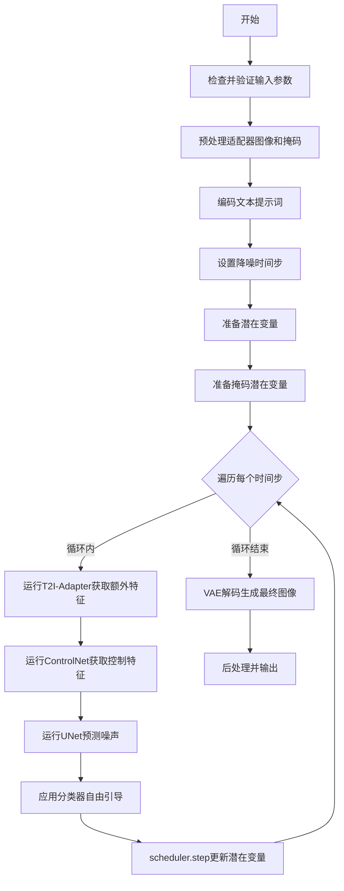
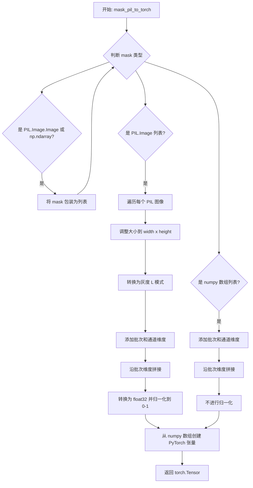
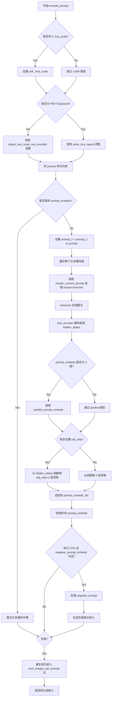
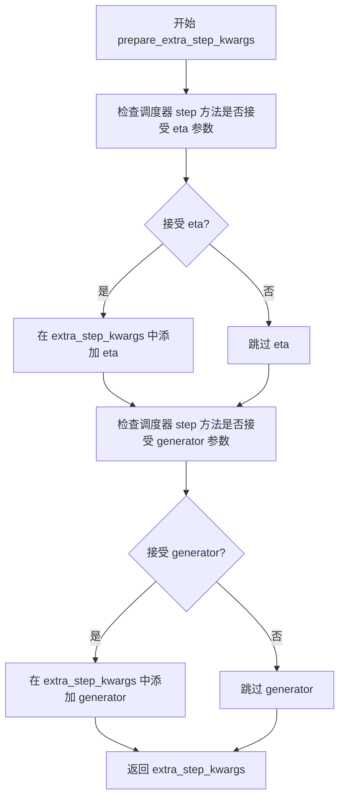
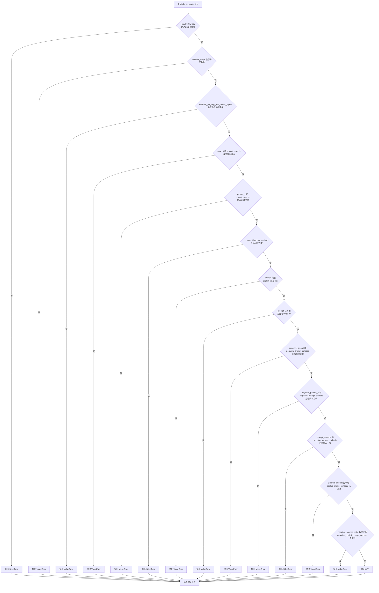
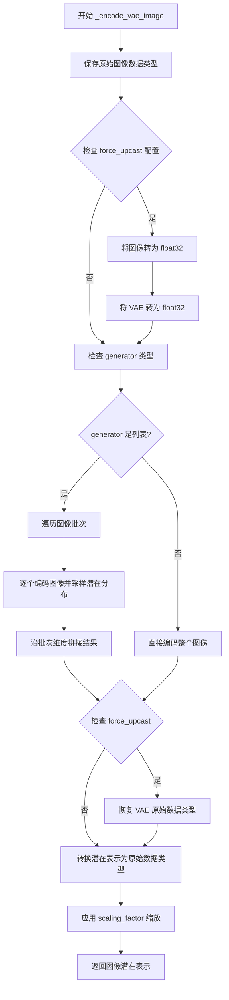
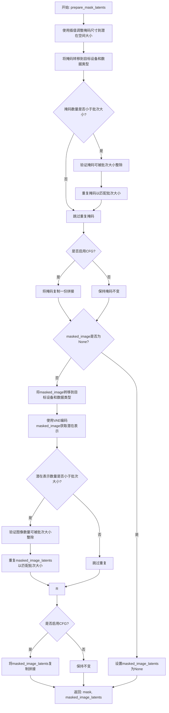
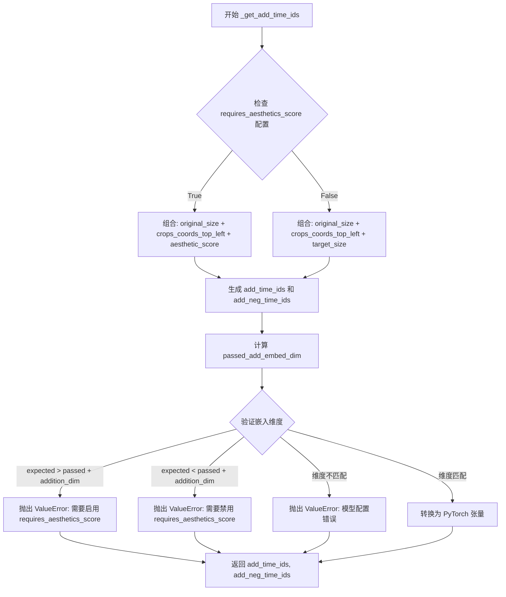
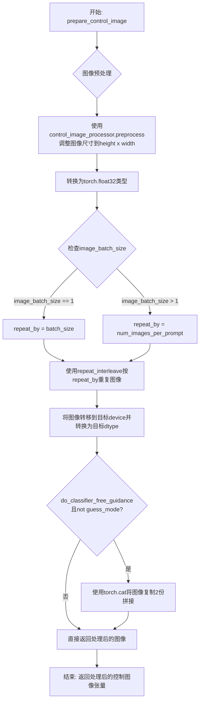
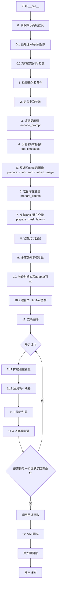

# `diffusers\examples\community\pipeline_stable_diffusion_xl_controlnet_adapter_inpaint.py` 详细设计文档

这是一个结合了T2I-Adapter和ControlNet的Stable Diffusion XL图像修复（inpainting）管道，支持通过文本提示、深度图和草图等多种条件进行可控的图像修复生成。

## 整体流程



## 类结构

```
DiffusionPipeline (基类)
├── StableDiffusionMixin
├── FromSingleFileMixin
├── StableDiffusionXLLoraLoaderMixin
└── StableDiffusionXLControlNetAdapterInpaintPipeline
```

## 全局变量及字段


### `logger`
    
用于记录日志的日志记录器对象

类型：`logging.Logger`
    


### `EXAMPLE_DOC_STRING`
    
包含管道使用示例的文档字符串

类型：`str`
    


### `StableDiffusionXLControlNetAdapterInpaintPipeline.vae`
    
用于图像编码和解码的变分自编码器模型

类型：`AutoencoderKL`
    


### `StableDiffusionXLControlNetAdapterInpaintPipeline.text_encoder`
    
第一个冻结的文本编码器，将文本转换为嵌入向量

类型：`CLIPTextModel`
    


### `StableDiffusionXLControlNetAdapterInpaintPipeline.text_encoder_2`
    
第二个带投影的文本编码器，用于SDXL的文本处理

类型：`CLIPTextModelWithProjection`
    


### `StableDiffusionXLControlNetAdapterInpaintPipeline.tokenizer`
    
第一个分词器，用于将文本转换为token IDs

类型：`CLIPTokenizer`
    


### `StableDiffusionXLControlNetAdapterInpaintPipeline.tokenizer_2`
    
第二个分词器，配合text_encoder_2使用

类型：`CLIPTokenizer`
    


### `StableDiffusionXLControlNetAdapterInpaintPipeline.unet`
    
条件U-Net架构，用于对编码的图像潜在表示进行去噪

类型：`UNet2DConditionModel`
    


### `StableDiffusionXLControlNetAdapterInpaintPipeline.adapter`
    
T2I适配器，提供额外的条件信息给UNet

类型：`Union[T2IAdapter, MultiAdapter]`
    


### `StableDiffusionXLControlNetAdapterInpaintPipeline.controlnet`
    
ControlNet模型，用于提供控制指导的条件信息

类型：`Union[ControlNetModel, MultiControlNetModel]`
    


### `StableDiffusionXLControlNetAdapterInpaintPipeline.scheduler`
    
扩散调度器，用于控制去噪过程的噪声调度

类型：`KarrasDiffusionSchedulers`
    


### `StableDiffusionXLControlNetAdapterInpaintPipeline.vae_scale_factor`
    
VAE的缩放因子，用于计算潜在空间的尺寸

类型：`int`
    


### `StableDiffusionXLControlNetAdapterInpaintPipeline.image_processor`
    
图像处理器，用于预处理和后处理VAE图像

类型：`VaeImageProcessor`
    


### `StableDiffusionXLControlNetAdapterInpaintPipeline.control_image_processor`
    
控制图像的专用处理器，用于处理ControlNet输入

类型：`VaeImageProcessor`
    


### `StableDiffusionXLControlNetAdapterInpaintPipeline.default_sample_size`
    
UNet的默认采样尺寸

类型：`int`
    
    

## 全局函数及方法


### `_preprocess_adapter_image`

该函数是Stable Diffusion XL ControlNet Adapter Inpaint Pipeline的图像预处理辅助函数，用于将适配器图像（adapter image）转换为统一的torch.Tensor格式。它支持PIL.Image和torch.Tensor两种输入格式，并自动进行尺寸调整、维度扩展和归一化处理，使其符合T2I-Adapter的输入要求。

参数：

- `image`：`Union[torch.Tensor, PIL.Image.Image, List[torch.Tensor], List[PIL.Image.Image]]`，待处理的适配器图像输入，可以是单个PIL图像、单个torch张量、图像列表或张量列表
- `height`：`int`，目标输出高度（像素）
- `width`：`int`，目标输出宽度（像素）

返回值：`torch.Tensor`，返回形状为`(batch_size, channels, height, width)`的4D张量，通道顺序为CHW，数值范围为[0, 1]的float32类型

#### 流程图

```mermaid
flowchart TD
    A[开始: _preprocess_adapter_image] --> B{image是否为torch.Tensor}
    B -->|是| C[直接返回原tensor]
    B -->|否| D{image是否为PIL.Image}
    D -->|是| E[将image转为list]
    D -->|否| F[继续处理]
    
    E --> G{image[0]是否为PIL.Image}
    G -->|是| H[遍历图像列表<br/>resize到width×height<br/>转为numpy数组]
    G -->|否| I{image[0]是否为torch.Tensor}
    
    H --> J[扩展维度<br/>[h,w]->[1,h,w,1]<br/>[h,w,c]->[1,h,w,c]]
    J --> K[在batch维度concat]
    K --> L[转float32并除以255.0]
    L --> M[transpose: N×H×W×C → N×C×H×W]
    M --> N[转为torch.Tensor]
    N --> O[返回tensor]
    
    I -->|ndim==3| P[torch.stack堆叠]
    I -->|ndim==4| Q[torch.cat拼接]
    I -->|其他| R[抛出ValueError]
    P --> O
    Q --> O
    
    F --> I
```

#### 带注释源码

```python
def _preprocess_adapter_image(image, height, width):
    """
    预处理适配器图像，将其转换为统一格式的torch.Tensor
    
    处理逻辑：
    1. 如果是torch.Tensor直接返回
    2. 如果是PIL.Image转为list处理
    3. 根据输入类型进行相应转换：
       - PIL.Image: resize → numpy → 扩展维度 → 归一化 → transpose → tensor
       - torch.Tensor: 根据维度stack或cat
    """
    # 情况1：已经是torch.Tensor，直接返回
    if isinstance(image, torch.Tensor):
        return image
    # 情况2：单个PIL.Image转为list统一处理
    elif isinstance(image, PIL.Image.Image):
        image = [image]

    # 处理PIL.Image列表
    if isinstance(image[0], PIL.Image.Image):
        # 1. resize到目标尺寸，使用lanczos插值
        image = [np.array(i.resize((width, height), resample=PIL_INTERPOLATION["lanczos"])) for i in image]
        # 2. 扩展维度：从[h,w]或[h,w,c]扩展为[1,h,w,c]以便batch处理
        image = [
            i[None, ..., None] if i.ndim == 2 else i[None, ...] for i in image
        ]  # expand [h, w] or [h, w, c] to [b, h, w, c]
        # 3. 在batch维度拼接
        image = np.concatenate(image, axis=0)
        # 4. 归一化到[0,1]范围
        image = np.array(image).astype(np.float32) / 255.0
        # 5. 维度重排：从NHWC转为NCHW（符合PyTorch习惯）
        image = image.transpose(0, 3, 1, 2)
        # 6. 转换为torch.Tensor
        image = torch.from_numpy(image)
    # 处理torch.Tensor列表
    elif isinstance(image[0], torch.Tensor):
        # 3D张量列表：[c,h,w] → stack → [batch,c,h,w]
        if image[0].ndim == 3:
            image = torch.stack(image, dim=0)
        # 4D张量列表：[batch,c,h,w] → cat → [total_batch,c,h,w]
        elif image[0].ndim == 4:
            image = torch.cat(image, dim=0)
        else:
            raise ValueError(
                f"Invalid image tensor! Expecting image tensor with 3 or 4 dimension, but receive: {image[0].ndim}"
            )
    return image
```


### `mask_pil_to_torch`

该函数将 PIL 图像或 numpy 数组格式的 mask 转换为 PyTorch 张量格式，以便在 Stable Diffusion 管道中使用。它负责预处理 mask，包括调整大小、转换为灰度、归一化等操作。

参数：

- `mask`：`Union[PIL.Image.Image, np.ndarray, List[PIL.Image.Image], List[np.ndarray]]`，输入的 mask，可以是单个 PIL 图像、numpy 数组，或者它们的列表
- `height`：`int`，目标图像的高度，用于调整 mask 大小
- `width`：`int`，目标图像的宽度，用于调整 mask 大小

返回值：`torch.Tensor`，转换后的 PyTorch 张量，形状为 `[batch, 1, height, width]`，值域为 `[0, 1]`

#### 流程图



#### 带注释源码

```python
def mask_pil_to_torch(mask, height, width):
    """
    将 PIL 图像或 numpy 数组格式的 mask 转换为 PyTorch 张量
    
    参数:
        mask: 输入的 mask，可以是 PIL.Image.Image、np.ndarray 或它们的列表
        height: 目标高度
        width: 目标宽度
    
    返回:
        torch.Tensor: 转换后的 mask 张量
    """
    # 预处理 mask - 如果是单个图像或数组，转换为列表
    if isinstance(mask, Union[PIL.Image.Image, np.ndarray]):
        mask = [mask]

    # 处理 PIL 图像列表
    if isinstance(mask, list) and isinstance(mask[0], PIL.Image.Image):
        # 1. 将每个 mask 图像调整到目标大小（使用 LANCZOS 重采样）
        mask = [i.resize((width, height), resample=PIL.Image.LANCZOS) for i in mask]
        
        # 2. 转换为灰度图（L 模式），然后添加批次和通道维度
        #    [h, w] -> [1, 1, h, w]
        mask = np.concatenate([np.array(m.convert("L"))[None, None, :] for m in mask], axis=0)
        
        # 3. 转换为 float32 并归一化到 [0, 1] 范围
        mask = mask.astype(np.float32) / 255.0
    
    # 处理 numpy 数组列表
    elif isinstance(mask, list) and isinstance(mask[0], np.ndarray):
        # 1. 添加批次和通道维度
        #    [h, w] 或 [h, w, c] -> [1, 1, h, w] 或 [1, 1, h, w, c]
        mask = np.concatenate([m[None, None, :] for m in mask], axis=0)
        # 注意：这里不进行归一化，假设输入已经是 [0, 1] 范围
    
    # 从 numpy 数组创建 PyTorch 张量
    mask = torch.from_numpy(mask)
    
    return mask
```


### `prepare_mask_and_masked_image`

该函数负责将图像和掩码预处理为Stable Diffusion pipeline所需的张量格式。它将输入的图像和掩码转换为形状为`batch x channels x height x width`的张量，其中图像通道数为3，掩码通道数为1。图像会被标准化到[-1, 1]范围，掩码会被二值化（阈值0.5）。

参数：

- `image`：`Union[np.array, PIL.Image.Image, torch.Tensor]`，待修复的图像，可以是PIL.Image、height x width x 3的numpy数组、channels x height x width的torch.Tensor或batch x channels x height x width的torch.Tensor
- `mask`：`Union[PIL.Image.Image, np.ndarray, torch.Tensor]`，要应用到图像上的掩码，即需要修复的区域，可以是PIL.Image、height x width的numpy数组、1 x height x width的torch.Tensor或batch x 1 x height x width的torch.Tensor
- `height`：`int`，目标高度
- `width`：`int`，目标宽度
- `return_image`：`bool`，是否返回处理后的原始图像，默认为False

返回值：`Union[Tuple[torch.Tensor, torch.Tensor], Tuple[torch.Tensor, torch.Tensor, torch.Tensor]]`，当return_image为False时返回(mask, masked_image)的元组；当return_image为True时返回(mask, masked_image, image)的元组，均为4维张量batch x channels x height x width

#### 流程图

```mermaid
flowchart TD
    A[开始] --> B{image是否为None}
    B -->|是| B1[抛出ValueError: image不能为undefined]
    B -->|否| C{mask是否为None}
    C -->|是| C1[抛出ValueError: mask不能为undefined]
    C -->|否| D{image是否为torch.Tensor}
    
    D -->|是| E{mask是否为torch.Tensor}
    E -->|否| F[调用mask_pil_to_torch转换mask]
    E -->|是| G[继续]
    F --> G
    
    G --> H{image维度处理]
    H --> I[ndim==3时unsqueeze添加batch维]
    I --> J[mask维度处理]
    J --> K[ndim==2时unsqueeze两次]
    K --> L{ndim==3时的特殊处理]
    L --> M[shape[0]==1时unsqueeze添加维度]
    L -->|否则| N[shape[0]>1时unsqueeze添加channel维]
    M --> O
    N --> O
    
    O --> P[断言检查: image和mask都是4维]
    P --> Q[断言检查: batch大小相同]
    Q --> R{检查mask范围在[0,1]}
    R -->|不在范围内| R1[抛出ValueError]
    R -->|在范围内| S[二值化mask: <0.5设为0, >=0.5设为1]
    S --> T[转换image为float32]
    T --> U[跳至image.shape[1]==4检查]
    
    D -->|否| V{mask是否为torch.Tensor}
    V -->|是| V1[抛出TypeError]
    V -->|否| W[预处理image]
    W --> X{image是否为PIL.Image或np.ndarray}
    X -->|是| Y[转为list]
    Y --> Z{list[0]是否为PIL.Image]
    Z -->|是| AA[resize到width×height, 转RGB, 加batch维, concatenate]
    Z -->|否| AB[直接加batch维, concatenate]
    AA --> AC[转置: 0,3,1,2]
    AB --> AC
    AC --> AD[转为torch.Tensor, 除以127.5减1进行标准化到[-1,1]]
    
    X -->|否| AD
    
    AD --> AE[调用mask_pil_to_torch转换mask]
    AE --> AF[二值化mask: <0.5设为0, >=0.5设为1]
    AF --> U
    
    U --> V2{image.shape[1]==4}
    V2 -->|是| V3[masked_image设为None]
    V2 -->|否| V4[masked_image = image * (mask < 0.5)]
    V3 --> V5
    V4 --> V5
    
    V5 --> W1{return_image为True?}
    W1 -->|是| X1[返回mask, masked_image, image]
    W1 -->|否| Y1[返回mask, masked_image]
    X1 --> Z1[结束]
    Y1 --> Z1
```

#### 带注释源码

```python
def prepare_mask_and_masked_image(image, mask, height, width, return_image: bool = False):
    """
    Prepares a pair (image, mask) to be consumed by the Stable Diffusion pipeline. This means that those inputs will be
    converted to ``torch.Tensor`` with shapes ``batch x channels x height x width`` where ``channels`` is ``3`` for the
    ``image`` and ``1`` for the ``mask``.

    The ``image`` will be converted to ``torch.float32`` and normalized to be in ``[-1, 1]``. The ``mask`` will be
    binarized (``mask > 0.5``) and cast to ``torch.float32`` too.

    Args:
        image (Union[np.array, PIL.Image, torch.Tensor]): The image to inpaint.
            It can be a ``PIL.Image``, or a ``height x width x 3`` ``np.array`` or a ``channels x height x width``
            ``torch.Tensor`` or a ``batch x channels x height x width`` ``torch.Tensor``.
        mask (_type_): The mask to apply to the image, i.e. regions to inpaint.
            It can be a ``PIL.Image``, or a ``height x width`` ``np.array`` or a ``1 x height x width``
            ``torch.Tensor`` or a ``batch x 1 x height x width`` ``torch.Tensor``.


    Raises:
        ValueError: ``torch.Tensor`` images should be in the ``[-1, 1]`` range. ValueError: ``torch.Tensor`` mask
        should be in the ``[0, 1]`` range. ValueError: ``mask`` and ``image`` should have the same spatial dimensions.
        TypeError: ``mask`` is a ``torch.Tensor`` but ``image`` is not
            (ot the other way around).

    Returns:
        tuple[torch.Tensor]: The pair (mask, masked_image) as ``torch.Tensor`` with 4
            dimensions: ``batch x channels x height x width``.
    """

    # 基础检查：image不能为空
    if image is None:
        raise ValueError("`image` input cannot be undefined.")

    # 基础检查：mask不能为空
    if mask is None:
        raise ValueError("`mask_image` input cannot be undefined.")

    # 分支1：image已经是torch.Tensor
    if isinstance(image, torch.Tensor):
        # 如果mask不是tensor，需要先转换mask
        if not isinstance(mask, torch.Tensor):
            mask = mask_pil_to_torch(mask, height, width)

        # 处理image维度：如果是3D(单张图)，添加batch维变为4D
        if image.ndim == 3:
            image = image.unsqueeze(0)

        # 处理mask维度：2D mask添加batch和channel维
        if mask.ndim == 2:
            mask = mask.unsqueeze(0).unsqueeze(0)

        # 处理3D mask：可能是带channel维的单mask或多个mask
        if mask.ndim == 3:
            # 单个已batch的mask，没有channel维，或单个未batch但有channel维
            if mask.shape[0] == 1:
                mask = mask.unsqueeze(0)
            # 多个mask但没有channel维
            else:
                mask = mask.unsqueeze(1)

        # 断言：确保image和mask都是4维张量
        assert image.ndim == 4 and mask.ndim == 4, "Image and Mask must have 4 dimensions"
        # 注释掉的空间维度检查，兼容旧版本
        # assert image.shape[-2:] == mask.shape[-2:], "Image and Mask must have the same spatial dimensions"
        # 断言：batch大小必须相同
        assert image.shape[0] == mask.shape[0], "Image and Mask must have the same batch size"

        # 检查image是否在[-1, 1]范围（已注释，可能不是强制要求）
        # if image.min() < -1 or image.max() > 1:
        #    raise ValueError("Image should be in [-1, 1] range")

        # 检查mask是否在[0, 1]范围
        if mask.min() < 0 or mask.max() > 1:
            raise ValueError("Mask should be in [0, 1] range")

        # 二值化mask：小于0.5设为0，大于等于0.5设为1
        mask[mask < 0.5] = 0
        mask[mask >= 0.5] = 1

        # 转换image为float32类型
        image = image.to(dtype=torch.float32)
    
    # 分支2：mask是tensor但image不是 - 类型不匹配
    elif isinstance(mask, torch.Tensor):
        raise TypeError(f"`mask` is a torch.Tensor but `image` (type: {type(image)} is not")
    
    # 分支3：两者都不是tensor（可能是PIL.Image或numpy数组）
    else:
        # 预处理image：统一转为list处理
        if isinstance(image, Union[PIL.Image.Image, np.ndarray]):
            image = [image]
        
        # 如果是PIL Image列表：resize、转换、拼接
        if isinstance(image, list) and isinstance(image[0], PIL.Image.Image):
            # resize所有图像到指定尺寸
            image = [i.resize((width, height), resample=PIL.Image.LANCZOS) for i in image]
            # 转为RGB numpy数组并添加batch维
            image = [np.array(i.convert("RGB"))[None, :] for i in image]
            # 在batch维拼接
            image = np.concatenate(image, axis=0)
        # 如果是numpy数组列表：直接添加batch维并拼接
        elif isinstance(image, list) and isinstance(image[0], np.ndarray):
            image = np.concatenate([i[None, :] for i in image], axis=0)

        # 转置：从HWC转为CHW格式
        image = image.transpose(0, 3, 1, 2)
        # 转为torch.Tensor并标准化到[-1, 1]
        image = torch.from_numpy(image).to(dtype=torch.float32) / 127.5 - 1.0

        # 转换mask并二值化
        mask = mask_pil_to_torch(mask, height, width)
        mask[mask < 0.5] = 0
        mask[mask >= 0.5] = 1

    # 处理图像通道数为4的情况（latent空间）
    if image.shape[1] == 4:
        # 图像在latent空间，无法直接mask
        # 假设这不是inpainting checkpoint
        masked_image = None
    else:
        # 创建masked_image：将mask<0.5的位置保留原图，其他位置为0
        # 这样mask对应的区域（需要修复的区域）保持原图，待修复区域为黑色
        masked_image = image * (mask < 0.5)

    # 根据return_image标志决定返回值
    # 保持向后兼容：旧函数不返回image
    if return_image:
        return mask, masked_image, image

    return mask, masked_image
```


### `rescale_noise_cfg`

该函数用于根据 `guidance_rescale` 参数对噪声预测配置进行重新缩放，基于论文 "Common Diffusion Noise Schedules and Sample Steps are Flawed" 的研究发现，通过调整噪声预测的标准差来避免图像过度曝光问题。

参数：

- `noise_cfg`：`torch.Tensor`，噪声预测的配置张量，通常是 CFG（Classifier-Free Guidance）生成的噪声预测
- `noise_pred_text`：`torch.Tensor`，文本条件的噪声预测，用于计算标准差参考
- `guidance_rescale`：`float`， Guidance 重新缩放因子，默认为 0.0，用于控制重新缩放的程度

返回值：`torch.Tensor`，重新缩放后的噪声预测配置

#### 流程图

```mermaid
flowchart TD
    A[开始] --> B[计算 noise_pred_text 的标准差 std_text]
    B --> C[计算 noise_cfg 的标准差 std_cfg]
    C --> D[计算缩放因子 std_text / std_cfg]
    D --> E[重新缩放噪声预测: noise_pred_rescaled = noise_cfg × 缩放因子]
    E --> F[线性混合: noise_cfg = guidance_rescale × noise_pred_rescaled + (1 - guidance_rescale) × noise_cfg]
    F --> G[返回重新缩放后的 noise_cfg]
```

#### 带注释源码

```python
# Copied from diffusers.pipelines.stable_diffusion.pipeline_stable_diffusion.rescale_noise_cfg
def rescale_noise_cfg(noise_cfg, noise_pred_text, guidance_rescale=0.0):
    """
    Rescale `noise_cfg` according to `guidance_rescale`. Based on findings of [Common Diffusion Noise Schedules and
    Sample Steps are Flawed](https://huggingface.co/papers/2305.08891). See Section 3.4
    """
    # 计算文本条件噪声预测在空间维度上的标准差
    # dim=list(range(1, noise_pred_text.ndim)) 表示对除 batch 维度外的所有维度计算标准差
    # keepdim=True 保持维度以便后续广播操作
    std_text = noise_pred_text.std(dim=list(range(1, noise_pred_text.ndim)), keepdim=True)
    
    # 计算噪声配置在空间维度上的标准差
    std_cfg = noise_cfg.std(dim=list(range(1, noise_cfg.ndim)), keepdim=True)
    
    # 重新缩放结果以修复过度曝光问题
    # 通过将 noise_cfg 乘以文本预测与配置标准差的比率来实现
    noise_pred_rescaled = noise_cfg * (std_text / std_cfg)
    
    # 通过 guidance_rescale 因子混合原始结果，避免图像看起来"平淡无奇"
    # guidance_rescale=0 时保留原始 noise_cfg，guidance_rescale=1 时完全使用重新缩放的结果
    noise_cfg = guidance_rescale * noise_pred_rescaled + (1 - guidance_rescale) * noise_cfg
    
    return noise_cfg
```


### `StableDiffusionXLControlNetAdapterInpaintPipeline.__init__`

初始化 Stable Diffusion XL Inpainting Pipeline，集成了 T2I-Adapter 和 ControlNet，用于基于文本提示和多种控制条件进行图像修复生成。

参数：

- `vae`：`AutoencoderKL`，变分自编码器模型，用于编码和解码图像到潜在表示
- `text_encoder`：`CLIPTextModel`，冻结的文本编码器（CLIP），用于将文本提示编码为向量
- `text_encoder_2`：`CLIPTextModelWithProjection`，第二个带投影的 CLIP 文本编码器（SDXL 使用）
- `tokenizer`：`CLIPTokenizer`，第一个分词器，用于将文本转换为 token
- `tokenizer_2`：`CLIPTokenizer`，第二个分词器（SDXL 使用）
- `unet`：`UNet2DConditionModel`，条件 U-Net 架构，用于去噪图像潜在表示
- `adapter`：`Union[T2IAdapter, MultiAdapter]`，T2I-Adapter 或 MultiAdapter，提供额外的条件信息
- `controlnet`：`Union[ControlNetModel, MultiControlNetModel]`，ControlNet 或 MultiControlNet，提供控制条件
- `scheduler`：`KarrasDiffusionSchedulers`，调度器，用于去噪过程中的噪声调度
- `requires_aesthetics_score`：`bool`，是否需要美学评分条件（默认为 False）
- `force_zeros_for_empty_prompt`：`bool`，是否强制将空提示的嵌入设为零（默认为 True）

返回值：`None`，该方法为构造函数，不返回任何值

#### 流程图

```mermaid
flowchart TD
    A[开始 __init__] --> B[调用 super().__init__]
    B --> C{controlnet 是 list/tuple?}
    C -->|是| D[包装为 MultiControlNetModel]
    C -->|否| E[直接使用 controlnet]
    D --> F[register_modules 注册所有模块]
    E --> F
    F --> G[register_to_config 注册配置参数]
    G --> H[计算 vae_scale_factor]
    H --> I[创建 VaeImageProcessor]
    I --> J[创建 control_image_processor]
    J --> K[设置 default_sample_size]
    K --> L[结束 __init__]
```

#### 带注释源码

```python
def __init__(
    self,
    vae: AutoencoderKL,
    text_encoder: CLIPTextModel,
    text_encoder_2: CLIPTextModelWithProjection,
    tokenizer: CLIPTokenizer,
    tokenizer_2: CLIPTokenizer,
    unet: UNet2DConditionModel,
    adapter: Union[T2IAdapter, MultiAdapter],
    controlnet: Union[ControlNetModel, MultiControlNetModel],
    scheduler: KarrasDiffusionSchedulers,
    requires_aesthetics_score: bool = False,
    force_zeros_for_empty_prompt: bool = True,
):
    """
    初始化 Stable Diffusion XL ControlNet Adapter Inpainting Pipeline
    
    参数:
        vae: 变分自编码器，用于图像编码/解码
        text_encoder: 第一个 CLIP 文本编码器
        text_encoder_2: 第二个带投影的 CLIP 文本编码器（SDXL 专用）
        tokenizer: 第一个分词器
        tokenizer_2: 第二个分词器（SDXL 专用）
        unet: 条件 U-Net，用于去噪
        adapter: T2I-Adapter 模型，提供额外条件
        controlnet: ControlNet 模型，提供控制条件
        scheduler: 噪声调度器
        requires_aesthetics_score: 是否需要美学评分
        force_zeros_for_empty_prompt: 空提示是否强制为零嵌入
    """
    # 调用父类 DiffusionPipeline 的初始化方法
    super().__init__()

    # 如果 controlnet 是列表或元组，包装为 MultiControlNetModel
    # 以支持多个 ControlNet 同时使用
    if isinstance(controlnet, (list, tuple)):
        controlnet = MultiControlNetModel(controlnet)

    # 注册所有模块到管道，使管道能够管理这些组件的生命周期
    # 包括保存、加载、设备转移等功能
    self.register_modules(
        vae=vae,
        text_encoder=text_encoder,
        text_encoder_2=text_encoder_2,
        tokenizer=tokenizer,
        tokenizer_2=tokenizer_2,
        unet=unet,
        adapter=adapter,
        controlnet=controlnet,
        scheduler=scheduler,
    )

    # 将配置参数注册到 config 中，用于序列化
    self.register_to_config(force_zeros_for_empty_prompt=force_zeros_for_empty_prompt)
    self.register_to_config(requires_aesthetics_score=requires_aesthetics_score)

    # 计算 VAE 缩放因子，基于 VAE 的块输出通道数
    # 2^(len(block_out_channels) - 1)，通常为 8
    self.vae_scale_factor = 2 ** (len(self.vae.config.block_out_channels) - 1) if getattr(self, "vae", None) else 8

    # 创建图像处理器，用于预处理和后处理图像
    self.image_processor = VaeImageProcessor(vae_scale_factor=self.vae_scale_factor)

    # 创建 ControlNet 专用图像处理器
    # 启用 RGB 转换但不禁用归一化（用于 ControlNet 条件图像）
    self.control_image_processor = VaeImageProcessor(
        vae_scale_factor=self.vae_scale_factor, do_convert_rgb=True, do_normalize=False
    )

    # 设置默认样本大小，从 UNet 配置中获取
    # 如果 UNet 不可用或没有 sample_size 配置，则默认为 128
    self.default_sample_size = (
        self.unet.config.sample_size
        if hasattr(self, "unet") and self.unet is not None and hasattr(self.unet.config, "sample_size")
        else 128
    )
```


### `StableDiffusionXLControlNetAdapterInpaintPipeline.encode_prompt`

该方法用于将文本提示（prompt）编码为文本编码器的隐藏状态向量，支持双文本编码器（CLIP Text Encoder 和 CLIP Text Encoder with Projection）架构，可处理提示嵌入的批量生成、负面提示嵌入、条件无分类器引导（CFG）以及 LoRA 权重调整等核心功能。

参数：

- `prompt`：`str | List[str]`，要编码的主提示，支持单字符串或字符串列表
- `prompt_2`：`str | List[str] | None`，发送给第二文本编码器（tokenizer_2 和 text_encoder_2）的提示，若不指定则使用 prompt
- `device`：`torch.device | None`，执行计算的 torch 设备，若不指定则使用执行设备
- `num_images_per_prompt`：`int`，每个提示生成的图像数量，用于复制提示嵌入
- `do_classifier_free_guidance`：`bool`，是否启用无分类器引导，若为 True 则需要生成负面提示嵌入
- `negative_prompt`：`str | List[str] | None`，不引导图像生成的负面提示
- `negative_prompt_2`：`str | List[str] | None`，发送给第二文本编码器的负面提示，若不指定则使用 negative_prompt
- `prompt_embeds`：`torch.Tensor | None`，预生成的文本嵌入，若提供则直接使用而不从 prompt 生成
- `negative_prompt_embeds`：`torch.Tensor | None`，预生成的负面文本嵌入
- `pooled_prompt_embeds`：`torch.Tensor | None`，预生成的池化文本嵌入（来自第二文本编码器的 pooled output）
- `negative_pooled_prompt_embeds`：`torch.Tensor | None`，预生成的负面池化文本嵌入
- `lora_scale`：`float | None`，LoRA 缩放因子，用于调整文本编码器的 LoRA 层权重
- `clip_skip`：`int | None`，从 CLIP 倒数第几层获取隐藏状态，若为 None 则使用倒数第二层

返回值：`Tuple[torch.Tensor, torch.Tensor, torch.Tensor, torch.Tensor]`，返回四个张量组成的元组 —— prompt_embeds（编码后的提示嵌入）、negative_prompt_embeds（编码后的负面提示嵌入）、pooled_prompt_embeds（池化后的提示嵌入）、negative_pooled_prompt_embeds（池化后的负面提示嵌入）

#### 流程图



#### 带注释源码

```python
def encode_prompt(
    self,
    prompt: str,
    prompt_2: str | None = None,
    device: Optional[torch.device] = None,
    num_images_per_prompt: int = 1,
    do_classifier_free_guidance: bool = True,
    negative_prompt: str | None = None,
    negative_prompt_2: str | None = None,
    prompt_embeds: Optional[torch.Tensor] = None,
    negative_prompt_embeds: Optional[torch.Tensor] = None,
    pooled_prompt_embeds: Optional[torch.Tensor] = None,
    negative_pooled_prompt_embeds: Optional[torch.Tensor] = None,
    lora_scale: Optional[float] = None,
    clip_skip: Optional[int] = None,
):
    r"""
    Encodes the prompt into text encoder hidden states.

    Args:
        prompt (`str` or `List[str]`, *optional*):
            prompt to be encoded
        prompt_2 (`str` or `List[str]`, *optional*):
            The prompt or prompts to be sent to the `tokenizer_2` and `text_encoder_2`. If not defined, `prompt` is
            used in both text-encoders
        device: (`torch.device`):
            torch device
        num_images_per_prompt (`int`):
            number of images that should be generated per prompt
        do_classifier_free_guidance (`bool`):
            whether to use classifier free guidance or not
        negative_prompt (`str` or `List[str]`, *optional*):
            The prompt or prompts not to guide the image generation. If not defined, one has to pass
            `negative_prompt_embeds` instead. Ignored when not using guidance (i.e., ignored if `guidance_scale` is
            less than `1`).
        negative_prompt_2 (`str` or `List[str]`, *optional*):
            The prompt or prompts not to guide the image generation to be sent to `tokenizer_2` and
            `text_encoder_2`. If not defined, `negative_prompt` is used in both text-encoders
        prompt_embeds (`torch.Tensor`, *optional*):
            Pre-generated text embeddings. Can be used to easily tweak text inputs, *e.g.* prompt weighting. If not
            provided, text embeddings will be generated from `prompt` input argument.
        negative_prompt_embeds (`torch.Tensor`, *optional*):
            Pre-generated negative text embeddings. Can be used to easily tweak text inputs, *e.g.* prompt
            weighting. If not provided, negative_prompt_embeds will be generated from `negative_prompt` input
            argument.
        pooled_prompt_embeds (`torch.Tensor`, *optional*):
            Pre-generated pooled text embeddings. Can be used to easily tweak text inputs, *e.g.* prompt weighting.
            If not provided, pooled text embeddings will be generated from `prompt` input argument.
        negative_pooled_prompt_embeds (`torch.Tensor`, *optional*):
            Pre-generated negative pooled text embeddings. Can be used to easily tweak text inputs, *e.g.* prompt
            weighting. If not provided, pooled negative_prompt_embeds will be generated from `negative_prompt`
            input argument.
        lora_scale (`float`, *optional*):
            A lora scale that will be applied to all LoRA layers of the text encoder if LoRA layers are loaded.
        clip_skip (`int`, *optional*):
            Number of layers to be skipped from CLIP while computing the prompt embeddings. A value of 1 means that
            the output of the pre-final layer will be used for computing the prompt embeddings.
    """
    # 获取执行设备，优先使用传入的 device，否则使用 pipeline 的执行设备
    device = device or self._execution_device

    # 设置 LoRA 缩放因子，以便文本编码器的 LoRA 函数可以正确访问
    if lora_scale is not None and isinstance(self, StableDiffusionXLLoraLoaderMixin):
        self._lora_scale = lora_scale

        # 动态调整 LoRA 缩放
        if self.text_encoder is not None:
            if not USE_PEFT_BACKEND:
                # 非 PEFT 后端使用旧版 LoRA 调整方法
                adjust_lora_scale_text_encoder(self.text_encoder, lora_scale)
            else:
                # PEFT 后端使用新版的缩放方法
                scale_lora_layers(self.text_encoder, lora_scale)

        if self.text_encoder_2 is not None:
            if not USE_PEFT_BACKEND:
                adjust_lora_scale_text_encoder(self.text_encoder_2, lora_scale)
            else:
                scale_lora_layers(self.text_encoder_2, lora_scale)

    # 将 prompt 转换为列表形式，便于批量处理
    prompt = [prompt] if isinstance(prompt, str) else prompt

    # 确定批量大小
    if prompt is not None:
        batch_size = len(prompt)
    else:
        # 如果没有提供 prompt，则使用 prompt_embeds 的批量大小
        batch_size = prompt_embeds.shape[0]

    # 定义文本分词器和文本编码器列表（支持双文本编码器架构）
    tokenizers = [self.tokenizer, self.tokenizer_2] if self.tokenizer is not None else [self.tokenizer_2]
    text_encoders = (
        [self.text_encoder, self.text_encoder_2] if self.text_encoder is not None else [self.text_encoder_2]
    )

    # 如果未提供 prompt_embeds，则从 prompt 文本生成
    if prompt_embeds is None:
        # prompt_2 默认为 prompt
        prompt_2 = prompt_2 or prompt
        prompt_2 = [prompt_2] if isinstance(prompt_2, str) else prompt_2

        # textual inversion: 处理多向量令牌（如需要）
        prompt_embeds_list = []
        prompts = [prompt, prompt_2]
        
        # 遍历两个文本编码器分别编码 prompt 和 prompt_2
        for prompt, tokenizer, text_encoder in zip(prompts, tokenizers, text_encoders):
            # 如果支持 textual inversion，转换 prompt
            if isinstance(self, TextualInversionLoaderMixin):
                prompt = self.maybe_convert_prompt(prompt, tokenizer)

            # 使用分词器将文本转换为 token IDs
            text_inputs = tokenizer(
                prompt,
                padding="max_length",
                max_length=tokenizer.model_max_length,
                truncation=True,
                return_tensors="pt",
            )

            text_input_ids = text_inputs.input_ids
            
            # 获取未截断的 token IDs 用于检测截断
            untruncated_ids = tokenizer(prompt, padding="longest", return_tensors="pt").input_ids

            # 检查是否发生截断，并记录警告
            if untruncated_ids.shape[-1] >= text_input_ids.shape[-1] and not torch.equal(
                text_input_ids, untruncated_ids
            ):
                removed_text = tokenizer.batch_decode(untruncated_ids[:, tokenizer.model_max_length - 1 : -1])
                logger.warning(
                    "The following part of your input was truncated because CLIP can only handle sequences up to"
                    f" {tokenizer.model_max_length} tokens: {removed_text}"
                )

            # 使用文本编码器编码，获取隐藏状态
            prompt_embeds = text_encoder(text_input_ids.to(device), output_hidden_states=True)

            # 从最终的文本编码器获取 pooled 输出（用于后续的 pooling）
            if pooled_prompt_embeds is None and prompt_embeds[0].ndim == 2:
                pooled_prompt_embeds = prompt_embeds[0]

            # 根据 clip_skip 选择隐藏状态层
            if clip_skip is None:
                # 默认使用倒数第二层（SDXL 总是从倒数第二层索引）
                prompt_embeds = prompt_embeds.hidden_states[-2]
            else:
                # "2" 是因为 SDXL 总是从倒数第二层索引
                prompt_embeds = prompt_embeds.hidden_states[-(clip_skip + 2)]

            prompt_embeds_list.append(prompt_embeds)

        # 沿最后一维拼接两个文本编码器的嵌入
        prompt_embeds = torch.concat(prompt_embeds_list, dim=-1)

    # 处理无分类器引导的无条件嵌入
    # 如果 force_zeros_for_empty_prompt 为真且未提供 negative_prompt，则使用零嵌入
    zero_out_negative_prompt = negative_prompt is None and self.config.force_zeros_for_empty_prompt
    
    if do_classifier_free_guidance and negative_prompt_embeds is None and zero_out_negative_prompt:
        # 使用零嵌入作为无条件嵌入
        negative_prompt_embeds = torch.zeros_like(prompt_embeds)
        negative_pooled_prompt_embeds = torch.zeros_like(pooled_prompt_embeds)
    elif do_classifier_free_guidance and negative_prompt_embeds is None:
        # 需要从 negative_prompt 生成嵌入
        negative_prompt = negative_prompt or ""
        negative_prompt_2 = negative_prompt_2 or negative_prompt

        # 规范化字符串为列表形式
        negative_prompt = batch_size * [negative_prompt] if isinstance(negative_prompt, str) else negative_prompt
        negative_prompt_2 = (
            batch_size * [negative_prompt_2] if isinstance(negative_prompt_2, str) else negative_prompt_2
        )

        uncond_tokens: List[str]
        
        # 类型和批量大小检查
        if prompt is not None and type(prompt) is not type(negative_prompt):
            raise TypeError(
                f"`negative_prompt` should be the same type to `prompt`, but got {type(negative_prompt)} !="
                f" {type(prompt)}."
            )
        elif batch_size != len(negative_prompt):
            raise ValueError(
                f"`negative_prompt`: {negative_prompt} has batch size {len(negative_prompt)}, but `prompt`:"
                f" {prompt} has batch size {batch_size}. Please make sure that passed `negative_prompt` matches"
                " the batch size of `prompt`."
            )
        else:
            uncond_tokens = [negative_prompt, negative_prompt_2]

        # 为每个文本编码器生成负面提示嵌入
        negative_prompt_embeds_list = []
        for negative_prompt, tokenizer, text_encoder in zip(uncond_tokens, tokenizers, text_encoders):
            if isinstance(self, TextualInversionLoaderMixin):
                negative_prompt = self.maybe_convert_prompt(negative_prompt, tokenizer)

            max_length = prompt_embeds.shape[1]
            uncond_input = tokenizer(
                negative_prompt,
                padding="max_length",
                max_length=max_length,
                truncation=True,
                return_tensors="pt",
            )

            # 编码负面提示
            negative_prompt_embeds = text_encoder(
                uncond_input.input_ids.to(device),
                output_hidden_states=True,
            )
            
            # 提取 pooled 嵌入
            if negative_pooled_prompt_embeds is None and negative_prompt_embeds[0].ndim == 2:
                negative_pooled_prompt_embeds = negative_prompt_embeds[0]
            
            # 使用倒数第二层隐藏状态
            negative_prompt_embeds = negative_prompt_embeds.hidden_states[-2]

            negative_prompt_embeds_list.append(negative_prompt_embeds)

        # 拼接负面提示嵌入
        negative_prompt_embeds = torch.concat(negative_prompt_embeds_list, dim=-1)

    # 确保 prompt_embeds 的数据类型与文本编码器或 UNet 一致
    if self.text_encoder_2 is not None:
        prompt_embeds = prompt_embeds.to(dtype=self.text_encoder_2.dtype, device=device)
    else:
        prompt_embeds = prompt_embeds.to(dtype=self.unet.dtype, device=device)

    # 获取嵌入的形状信息
    bs_embed, seq_len, _ = prompt_embeds.shape
    
    # 复制提示嵌入以支持每个提示生成多个图像（MPS 友好的方法）
    prompt_embeds = prompt_embeds.repeat(1, num_images_per_prompt, 1)
    prompt_embeds = prompt_embeds.view(bs_embed * num_images_per_prompt, seq_len, -1)

    # 如果启用无分类器引导，复制无条件嵌入
    if do_classifier_free_guidance:
        seq_len = negative_prompt_embeds.shape[1]

        if self.text_encoder_2 is not None:
            negative_prompt_embeds = negative_prompt_embeds.to(dtype=self.text_encoder_2.dtype, device=device)
        else:
            negative_prompt_embeds = negative_prompt_embeds.to(dtype=self.unet.dtype, device=device)

        negative_prompt_embeds = negative_prompt_embeds.repeat(1, num_images_per_prompt, 1)
        negative_prompt_embeds = negative_prompt_embeds.view(batch_size * num_images_per_prompt, seq_len, -1)

    # 复制 pooled 提示嵌入
    pooled_prompt_embeds = pooled_prompt_embeds.repeat(1, num_images_per_prompt).view(
        bs_embed * num_images_per_prompt, -1
    )
    
    # 如果启用 CFG，复制负面 pooled 嵌入
    if do_classifier_free_guidance:
        negative_pooled_prompt_embeds = negative_pooled_prompt_embeds.repeat(1, num_images_per_prompt).view(
            bs_embed * num_images_per_prompt, -1
        )

    # 恢复原始 LoRA 缩放（如果使用了 PEFT 后端）
    if self.text_encoder is not None:
        if isinstance(self, StableDiffusionXLLoraLoaderMixin) and USE_PEFT_BACKEND:
            # 通过取消缩放 LoRA 层来恢复原始缩放
            unscale_lora_layers(self.text_encoder, lora_scale)

    if self.text_encoder_2 is not None:
        if isinstance(self, StableDiffusionXLLoraLoaderMixin) and USE_PEFT_BACKEND:
            unscale_lora_layers(self.text_encoder_2, lora_scale)

    # 返回编码后的嵌入四元组
    return prompt_embeds, negative_prompt_embeds, pooled_prompt_embeds, negative_pooled_prompt_embeds
```


### `StableDiffusionXLControlNetAdapterInpaintPipeline.prepare_extra_step_kwargs`

该方法用于为调度器（scheduler）的步骤准备额外的关键字参数。由于不同的调度器具有不同的签名（例如 DDIMScheduler 支持 `eta` 参数，而其他调度器可能不支持），该方法通过检查调度器的 `step` 方法签名来动态确定需要传递哪些参数。

参数：

-  `self`：隐式参数，pipeline 实例本身
-  `generator`：`Optional[Union[torch.Generator, List[torch.Generator]]]`，用于生成确定性随机数的 PyTorch 生成器，可为单个生成器或生成器列表
-  `eta`：`float`，DDIM 论文中的 η 参数，仅在 DDIMScheduler 中使用，取值范围应为 [0, 1]

返回值：`Dict[str, Any]`，包含调度器 step 方法所需的关键字参数的字典，可能包含 `eta` 和/或 `generator` 键

#### 流程图



#### 带注释源码

```python
def prepare_extra_step_kwargs(self, generator, eta):
    # 准备调度器步骤的额外关键字参数，因为并非所有调度器都具有相同的签名
    # eta (η) 仅与 DDIMScheduler 一起使用，对于其他调度器将被忽略
    # eta 对应 DDIM 论文中的 η: https://huggingface.co/papers/2010.02502
    # 取值应在 [0, 1] 之间

    # 使用 inspect 模块检查调度器的 step 方法签名，判断是否接受 eta 参数
    accepts_eta = "eta" in set(inspect.signature(self.scheduler.step).parameters.keys())
    # 初始化空字典用于存储额外参数
    extra_step_kwargs = {}
    # 如果调度器接受 eta 参数，则将其添加到额外参数字典中
    if accepts_eta:
        extra_step_kwargs["eta"] = eta

    # 检查调度器是否接受 generator 参数
    accepts_generator = "generator" in set(inspect.signature(self.scheduler.step).parameters.keys())
    # 如果接受，则将生成器添加到额外参数字典中
    if accepts_generator:
        extra_step_kwargs["generator"] = generator
    
    # 返回包含调度器所需额外参数的字典
    return extra_step_kwargs
```


### `StableDiffusionXLControlNetAdapterInpaintPipeline.check_image`

该方法用于验证控制网络（ControlNet）和适配器（Adapter）的输入图像的类型和批次大小是否有效。通过检查图像格式是否支持（PIL图像、PyTorch张量、NumPy数组及其列表形式）以及图像批次与提示词批次的一致性，确保后续处理流程的稳定性。

参数：

- `self`：隐式参数，Pipeline 实例本身
- `image`：`PIL.Image.Image | torch.Tensor | np.ndarray | list[PIL.Image.Image] | list[torch.Tensor] | list[np.ndarray]`，待验证的输入图像，支持单张图像或图像列表
- `prompt`：`str | list[str] | None`，用于计算批次大小的提示词文本，若为字符串则批次大小为1，若为列表则批次大小为列表长度
- `prompt_embeds`：`torch.Tensor | None`，预计算的提示词嵌入，用于在未提供 prompt 时确定批次大小

返回值：`None`，该方法仅执行验证逻辑，不返回任何值；若验证失败则抛出 `TypeError` 或 `ValueError` 异常

#### 流程图

```mermaid
flowchart TD
    A[开始 check_image 验证] --> B{检查 image 类型}
    B --> B1[image_is_pil]
    B --> B2[image_is_tensor]
    B --> B3[image_is_np]
    B --> B4[image_is_pil_list]
    B --> B5[image_is_tensor_list]
    B --> B6[image_is_np_list]
    
    B1 --> C{是否有任意类型匹配?}
    B2 --> C
    B3 --> C
    B4 --> C
    B5 --> C
    B6 --> C
    
    C -->|否| D[抛出 TypeError]
    C -->|是| E{image_is_pil?]
    E -->|是| F[image_batch_size = 1]
    E -->|否| G[image_batch_size = len(image)]
    
    F --> H{检查 prompt 类型}
    G --> H
    
    H --> I{prompt is str?}
    H --> J{prompt is list?}
    H --> K{prompt_embeds is not None?}
    
    I -->|是| L[prompt_batch_size = 1]
    J -->|是| M[prompt_batch_size = len(prompt)]
    K -->|是| N[prompt_batch_size = prompt_embeds.shape[0]]
    K -->|否| O[不设置 prompt_batch_size]
    
    L --> P{批次大小校验}
    M --> P
    N --> P
    O --> Q[通过验证]
    
    P --> R{image_batch_size != 1 且 != prompt_batch_size?}
    R -->|是| S[抛出 ValueError]
    R -->|否| Q[通过验证]
    
    D --> T[结束 - 验证失败]
    S --> T
    Q --> T
    
    style D fill:#ffcccc
    style S fill:#ffcccc
    style Q fill:#ccffcc
```

#### 带注释源码

```python
def check_image(self, image, prompt, prompt_embeds):
    """
    验证 ControlNet/Adapter 输入图像的类型和批次大小是否有效。
    
    该方法执行以下检查：
    1. 确认 image 参数是支持的图像类型（PIL.Image、torch.Tensor、np.ndarray 及其列表形式）
    2. 验证图像批次大小与提示词批次大小的一致性（当两者都不是 1 时必须相等）
    
    Args:
        image: 输入图像，支持以下格式：
            - PIL.Image.Image: 单张 PIL 图像
            - torch.Tensor: 单张图像张量
            - np.ndarray: 单张图像数组
            - list[PIL.Image.Image]: PIL 图像列表
            - list[torch.Tensor]: 图像张量列表
            - list[np.ndarray]: 图像数组列表
        prompt: 提示词文本，用于确定提示词批次大小
            - str: 单个提示词，批次大小为 1
            - list[str]: 提示词列表，批次大小为列表长度
            - None: 不确定批次大小，依赖于 prompt_embeds
        prompt_embeds: 预计算的提示词嵌入，当 prompt 为 None 时用于确定批次大小
            - torch.Tensor: 嵌入张量，批次大小为 shape[0]
            - None: 无嵌入信息
    
    Raises:
        TypeError: 当 image 不是支持的图像类型时抛出
        ValueError: 当图像批次大小与提示词批次大小不匹配时抛出
    
    Returns:
        None: 验证通过时不返回任何值
    """
    # 检查图像是否为 PIL Image 类型
    image_is_pil = isinstance(image, PIL.Image.Image)
    # 检查图像是否为 PyTorch Tensor 类型
    image_is_tensor = isinstance(image, torch.Tensor)
    # 检查图像是否为 NumPy Array 类型
    image_is_np = isinstance(image, np.ndarray)
    # 检查图像是否为 PIL Image 列表
    image_is_pil_list = isinstance(image, list) and isinstance(image[0], PIL.Image.Image)
    # 检查图像是否为 Tensor 列表
    image_is_tensor_list = isinstance(image, list) and isinstance(image[0], torch.Tensor)
    # 检查图像是否为 NumPy Array 列表
    image_is_np_list = isinstance(image, list) and isinstance(image[0], np.ndarray)

    # 验证图像类型是否在支持列表中
    if (
        not image_is_pil
        and not image_is_tensor
        and not image_is_np
        and not image_is_pil_list
        and not image_is_tensor_list
        and not image_is_np_list
    ):
        # 抛出类型错误，提供详细的类型信息
        raise TypeError(
            f"image must be passed and be one of PIL image, numpy array, torch tensor, "
            f"list of PIL images, list of numpy arrays or list of torch tensors, "
            f"but is {type(image)}"
        )

    # 确定图像批次大小
    if image_is_pil:
        # 单张 PIL 图像，批次大小为 1
        image_batch_size = 1
    else:
        # 列表形式，批次大小为列表长度
        image_batch_size = len(image)

    # 确定提示词批次大小
    if prompt is not None and isinstance(prompt, str):
        # 字符串形式的单个提示词
        prompt_batch_size = 1
    elif prompt is not None and isinstance(prompt, list):
        # 列表形式的多个提示词
        prompt_batch_size = len(prompt)
    elif prompt_embeds is not None:
        # 使用预计算的嵌入确定批次大小
        prompt_batch_size = prompt_embeds.shape[0]

    # 验证批次大小一致性
    if image_batch_size != 1 and image_batch_size != prompt_batch_size:
        # 当图像批次大小不为 1 时，必须与提示词批次大小相等
        raise ValueError(
            f"If image batch size is not 1, image batch size must be same as prompt batch size. "
            f"image batch size: {image_batch_size}, prompt batch size: {prompt_batch_size}"
        )
```


### `StableDiffusionXLControlNetAdapterInpaintPipeline.check_inputs`

该方法用于验证管道输入参数的有效性，确保传递给生成管道的所有参数符合要求，包括图像尺寸、提示词、嵌入向量等关键参数的正确性和一致性。

参数：

- `prompt`：`Optional[Union[str, List[str]]]`，主要的文本提示词，用于指导图像生成
- `prompt_2`：`Optional[Union[str, List[str]]]`，发送给第二个文本编码器的提示词，若未指定则使用 prompt
- `height`：`int`，生成图像的高度（像素），必须能被 8 整除
- `width`：`int`，生成图像的宽度（像素），必须能被 8 整除
- `callback_steps`：`int`，回调函数被调用的频率，必须为正整数
- `negative_prompt`：`Optional[Union[str, List[str]]]`，负面提示词，用于引导图像向相反方向发展
- `negative_prompt_2`：`Optional[Union[str, List[str]]]`，发送给第二个文本编码器的负面提示词
- `prompt_embeds`：`Optional[torch.Tensor]`，预生成的文本嵌入向量，不能与 prompt 同时提供
- `negative_prompt_embeds`：`Optional[torch.Tensor]`，预生成的负面文本嵌入向量
- `pooled_prompt_embeds`：`Optional[torch.Tensor]`，预生成的池化文本嵌入向量
- `negative_pooled_prompt_embeds`：`Optional[torch.Tensor]`，预生成的负面池化文本嵌入向量
- `callback_on_step_end_tensor_inputs`：`Optional[List[str]]`，在步骤结束时需要传递给回调的张量输入列表

返回值：`None`，该方法不返回任何值，仅通过抛出异常来处理验证失败的情况

#### 流程图



#### 带注释源码

```python
def check_inputs(
    self,
    prompt,                       # 主要文本提示词
    prompt_2,                     # 第二文本编码器的提示词
    height,                       # 图像高度
    width,                        # 图像宽度
    callback_steps,               # 回调步数
    negative_prompt=None,         # 负面提示词
    negative_prompt_2=None,       # 第二负面提示词
    prompt_embeds=None,           # 预生成提示词嵌入
    negative_prompt_embeds=None,  # 预生成负面提示词嵌入
    pooled_prompt_embeds=None,   # 池化提示词嵌入
    negative_pooled_prompt_embeds=None,  # 池化负面提示词嵌入
    callback_on_step_end_tensor_inputs=None,  # 步骤结束时的张量输入
):
    # 验证 1: 检查高度和宽度是否能被 8 整除
    # 这是因为扩散模型的潜在空间下采样因子通常是 8
    if height % 8 != 0 or width % 8 != 0:
        raise ValueError(f"`height` and `width` have to be divisible by 8 but are {height} and {width}.")

    # 验证 2: 检查 callback_steps 是否为正整数
    # 用于控制回调函数的调用频率
    if callback_steps is not None and (not isinstance(callback_steps, int) or callback_steps <= 0):
        raise ValueError(
            f"`callback_steps` has to be a positive integer but is {callback_steps} of type"
            f" {type(callback_steps)}."
        )

    # 验证 3: 检查回调张量输入是否在允许的列表中
    # 这些是回调函数可以访问的内部状态变量
    if callback_on_step_end_tensor_inputs is not None and not all(
        k in self._callback_tensor_inputs for k in callback_on_step_end_tensor_inputs
    ):
        raise ValueError(
            f"`callback_on_step_end_tensor_inputs` has to be in {self._callback_tensor_inputs}, but found {[k for k in callback_on_step_end_tensor_inputs if k not in self._callback_tensor_inputs]}"
        )

    # 验证 4: 检查 prompt 和 prompt_embeds 不能同时提供
    # 两者是互斥的输入方式
    if prompt is not None and prompt_embeds is not None:
        raise ValueError(
            f"Cannot forward both `prompt`: {prompt} and `prompt_embeds`: {prompt_embeds}. Please make sure to"
            " only forward one of the two."
        )
    # 验证 5: 检查 prompt_2 和 prompt_embeds 不能同时提供
    elif prompt_2 is not None and prompt_embeds is not None:
        raise ValueError(
            f"Cannot forward both `prompt_2`: {prompt_2} and `prompt_embeds`: {prompt_embeds}. Please make sure to"
            " only forward one of the two."
        )
    # 验证 6: 至少需要提供 prompt 或 prompt_embeds 之一
    elif prompt is None and prompt_embeds is None:
        raise ValueError(
            "Provide either `prompt` or `prompt_embeds`. Cannot leave both `prompt` and `prompt_embeds` undefined."
        )
    # 验证 7: 检查 prompt 类型是否为 str 或 list
    elif prompt is not None and (not isinstance(prompt, str) and not isinstance(prompt, list)):
        raise ValueError(f"`prompt` has to be of type `str` or `list` but is {type(prompt)}")
    # 验证 8: 检查 prompt_2 类型是否为 str 或 list
    elif prompt_2 is not None and (not isinstance(prompt_2, str) and not isinstance(prompt_2, list)):
        raise ValueError(f"`prompt_2` has to be of type `str` or `list` but is {type(prompt_2)}")

    # 验证 9: 检查 negative_prompt 和 negative_prompt_embeds 不能同时提供
    if negative_prompt is not None and negative_prompt_embeds is not None:
        raise ValueError(
            f"Cannot forward both `negative_prompt`: {negative_prompt} and `negative_prompt_embeds`:"
            f" {negative_prompt_embeds}. Please make sure to only forward one of the two."
        )
    # 验证 10: 检查 negative_prompt_2 和 negative_prompt_embeds 不能同时提供
    elif negative_prompt_2 is not None and negative_prompt_embeds is not None:
        raise ValueError(
            f"Cannot forward both `negative_prompt_2`: {negative_prompt_2} and `negative_prompt_embeds`:"
            f" {negative_prompt_embeds}. Please make sure to only forward one of the two."
        )

    # 验证 11: 检查 prompt_embeds 和 negative_prompt_embeds 形状必须一致
    # 这确保引导和无引导的嵌入维度匹配
    if prompt_embeds is not None and negative_prompt_embeds is not None:
        if prompt_embeds.shape != negative_prompt_embeds.shape:
            raise ValueError(
                "`prompt_embeds` and `negative_prompt_embeds` must have the same shape when passed directly, but"
                f" got: `prompt_embeds` {prompt_embeds.shape} != `negative_prompt_embeds`"
                f" {negative_prompt_embeds.shape}."
            )

    # 验证 12: 如果提供 prompt_embeds，必须也提供 pooled_prompt_embeds
    # 池化嵌入用于 SDXL 的微条件
    if prompt_embeds is not None and pooled_prompt_embeds is None:
        raise ValueError(
            "If `prompt_embeds` are provided, `pooled_prompt_embeds` also have to be passed. Make sure to generate `pooled_prompt_embeds` from the same text encoder that was used to generate `prompt_embeds`."
        )

    # 验证 13: 如果提供 negative_prompt_embeds，必须也提供 negative_pooled_prompt_embeds
    if negative_prompt_embeds is not None and negative_pooled_prompt_embeds is None:
        raise ValueError(
            "If `negative_prompt_embeds` are provided, `negative_pooled_prompt_embeds` also have to be passed. Make sure to generate `negative_pooled_prompt_embeds` from the same text encoder that was used to generate `negative_prompt_embeds`."
        )
```


### `StableDiffusionXLControlNetAdapterInpaintPipeline.check_conditions`

该方法用于验证和控制图像生成的条件参数，确保 ControlNet 和 T2IAdapter 的输入图像、引导参数和比例因子符合要求。它会检查控制引导的起止范围、图像类型与批次大小、适配器与控制网络的比例因子等多个维度，以保证后续推理过程的正确性。

参数：

- `prompt`：`str | List[str] | None`，用户提供的文本提示，用于图像生成指导
- `prompt_embeds`：`torch.Tensor | None`，预计算的文本嵌入向量，用于替代 prompt
- `adapter_image`：`PipelineImageInput`，T2IAdapter 的输入图像，用于提供额外的条件信息
- `control_image`：`PipelineImageInput`，ControlNet 的输入图像，用于提供控制条件
- `adapter_conditioning_scale`：`float | List[float]`，T2IAdapter 的条件缩放因子
- `controlnet_conditioning_scale`：`float | List[float]`，ControlNet 的条件缩放因子
- `control_guidance_start`：`float | Tuple[float] | List[float]`，ControlNet 引导起始时间步
- `control_guidance_end`：`float | Tuple[float] | List[float]`，ControlNet 引导结束时间步

返回值：`None`，该方法不返回任何值，仅进行参数验证和异常抛出

#### 流程图

```mermaid
flowchart TD
    A[开始 check_conditions] --> B{control_guidance_start 是 list/tuple?}
    B -->|否| C[转换为 list]
    B -->|是| D{control_guidance_end 是 list/tuple?}
    D -->|否| E[转换为 list]
    D -->|是| F{start 和 end 长度相同?}
    C --> F
    E --> F
    F -->|否| G[抛出 ValueError]
    F -->|是| H{controlnet 是 MultiControlNetModel?}
    H -->|是| I{start 长度等于 controlnet.nets 数量?}
    H -->|否| J{每个 start >= end?}
    I -->|否| K[抛出 ValueError]
    I -->|是| J
    J -->|否| L[抛出 ValueError]
    J -->|是| M{start < 0.0?]
    M -->|是| N[抛出 ValueError]
    M -->|是| O{end > 1.0?]
    O -->|是| P[抛出 ValueError]
    O -->|否| Q{检查 control_image]
    Q --> R{controlnet 类型检查]
    R --> S{调用 check_image 验证 control_image]
    R --> T{验证 controlnet_conditioning_scale 类型]
    T --> U{检查 adapter 类型]
    U --> V{调用 check_image 验证 adapter_image]
    U --> W{验证 adapter_conditioning_scale 类型]
    W --> X[结束]
    
    K --> X
    N --> X
    P --> X
    G --> X
```

#### 带注释源码

```python
def check_conditions(
    self,
    prompt,
    prompt_embeds,
    adapter_image,
    control_image,
    adapter_conditioning_scale,
    controlnet_conditioning_scale,
    control_guidance_start,
    control_guidance_end,
):
    """
    验证 ControlNet 和 T2IAdapter 的条件参数有效性
    
    该方法执行以下验证：
    1. control_guidance_start 和 control_guidance_end 的范围和类型
    2. control_image 的类型和批次大小
    3. controlnet_conditioning_scale 的类型和长度
    4. adapter_image 的类型和批次大小
    5. adapter_conditioning_scale 的类型和长度
    """
    
    # ==================== ControlNet 验证开始 ====================
    # 验证 control_guidance_start 类型，若不是 list/tuple 则转换为 list
    if not isinstance(control_guidance_start, (tuple, list)):
        control_guidance_start = [control_guidance_start]

    # 验证 control_guidance_end 类型，若不是 list/tuple 则转换为 list
    if not isinstance(control_guidance_end, (tuple, list)):
        control_guidance_end = [control_guidance_end]

    # 验证 start 和 end 列表长度必须一致
    if len(control_guidance_start) != len(control_guidance_end):
        raise ValueError(
            f"`control_guidance_start` has {len(control_guidance_start)} elements, but `control_guidance_end` has {len(control_guidance_end)} elements. Make sure to provide the same number of elements to each list."
        )

    # 如果是多个 ControlNet 模型，验证 start 数量与模型数量一致
    if isinstance(self.controlnet, MultiControlNetModel):
        if len(control_guidance_start) != len(self.controlnet.nets):
            raise ValueError(
                f"`control_guidance_start`: {control_guidance_start} has {len(control_guidance_start)} elements but there are {len(self.controlnet.nets)} controlnets available. Make sure to provide {len(self.controlnet.nets)}."
            )

    # 验证每个 start-end 对的有效性
    for start, end in zip(control_guidance_start, control_guidance_end):
        # start 必须小于 end
        if start >= end:
            raise ValueError(
                f"control guidance start: {start} cannot be larger or equal to control guidance end: {end}."
            )
        # start 不能小于 0
        if start < 0.0:
            raise ValueError(f"control guidance start: {start} can't be smaller than 0.")
        # end 不能大于 1
        if end > 1.0:
            raise ValueError(f"control guidance end: {end} can't be larger than 1.0.")

    # 检查 controlnet 是否经过 torch.compile 编译优化
    is_compiled = hasattr(F, "scaled_dot_product_attention") and isinstance(
        self.controlnet, torch._dynamo.eval_frame.OptimizedModule
    )

    # 验证 control_image 的有效性
    if (
        isinstance(self.controlnet, ControlNetModel)
        or is_compiled
        and isinstance(self.controlnet._orig_mod, ControlNetModel)
    ):
        # 单个 ControlNet 模型情况
        self.check_image(control_image, prompt, prompt_embeds)
    elif (
        isinstance(self.controlnet, MultiControlNetModel)
        or is_compiled
        and isinstance(self.controlnet._orig_mod, MultiControlNetModel)
    ):
        # 多个 ControlNet 模型情况
        if not isinstance(control_image, list):
            raise TypeError("For multiple controlnets: `control_image` must be type `list`")

        # 不支持嵌套列表（多批次条件）
        elif any(isinstance(i, list) for i in control_image):
            raise ValueError("A single batch of multiple conditionings are supported at the moment.")
        
        # 验证 image 数量与 ControlNet 数量一致
        elif len(control_image) != len(self.controlnet.nets):
            raise ValueError(
                f"For multiple controlnets: `image` must have the same length as the number of controlnets, but got {len(control_image)} images and {len(self.controlnet.nets)} ControlNets."
            )

        # 对每个 control_image 调用验证
        for image_ in control_image:
            self.check_image(image_, prompt, prompt_embeds)
    else:
        assert False

    # 验证 controlnet_conditioning_scale 的类型和长度
    if (
        isinstance(self.controlnet, ControlNetModel)
        or is_compiled
        and isinstance(self.controlnet._orig_mod, ControlNetModel)
    ):
        # 单个 ControlNet 时必须为 float
        if not isinstance(controlnet_conditioning_scale, float):
            raise TypeError("For single controlnet: `controlnet_conditioning_scale` must be type `float`.")
    elif (
        isinstance(self.controlnet, MultiControlNetModel)
        or is_compiled
        and isinstance(self.controlnet._orig_mod, MultiControlNetModel)
    ):
        # 多个 ControlNet 时可以是 float 或 list
        if isinstance(controlnet_conditioning_scale, list):
            # 不支持嵌套列表
            if any(isinstance(i, list) for i in controlnet_conditioning_scale):
                raise ValueError("A single batch of multiple conditionings are supported at the moment.")
        # 如果是 list，长度必须与 ControlNet 数量一致
        elif isinstance(controlnet_conditioning_scale, list) and len(controlnet_conditioning_scale) != len(
            self.controlnet.nets
        ):
            raise ValueError(
                "For multiple controlnets: When `controlnet_conditioning_scale` is specified as `list`, it must have"
                " the same length as the number of controlnets"
            )
    else:
        assert False

    # ==================== T2IAdapter 验证开始 ====================
    # 验证 adapter_image 的有效性
    if isinstance(self.adapter, T2IAdapter) or is_compiled and isinstance(self.adapter._orig_mod, T2IAdapter):
        # 单个 Adapter 情况
        self.check_image(adapter_image, prompt, prompt_embeds)
    elif (
        isinstance(self.adapter, MultiAdapter) or is_compiled and isinstance(self.adapter._orig_mod, MultiAdapter)
    ):
        # 多个 Adapter 情况
        if not isinstance(adapter_image, list):
            raise TypeError("For multiple adapters: `adapter_image` must be type `list`")

        # 不支持嵌套列表
        elif any(isinstance(i, list) for i in adapter_image):
            raise ValueError("A single batch of multiple conditionings are supported at the moment.")
        
        # 验证 image 数量与 Adapter 数量一致
        elif len(adapter_image) != len(self.adapter.adapters):
            raise ValueError(
                f"For multiple adapters: `image` must have the same length as the number of adapters, but got {len(adapter_image)} images and {len(self.adapters.nets)} Adapters."
            )

        # 对每个 adapter_image 调用验证
        for image_ in adapter_image:
            self.check_image(image_, prompt, prompt_embeds)
    else:
        assert False

    # 验证 adapter_conditioning_scale 的类型和长度
    if isinstance(self.adapter, T2IAdapter) or is_compiled and isinstance(self.adapter._orig_mod, T2IAdapter):
        # 单个 Adapter 时必须为 float
        if not isinstance(adapter_conditioning_scale, float):
            raise TypeError("For single adapter: `adapter_conditioning_scale` must be type `float`.")
    elif (
        isinstance(self.adapter, MultiAdapter) or is_compiled and isinstance(self.adapter._orig_mod, MultiAdapter)
    ):
        # 多个 Adapter 时可以是 float 或 list
        if isinstance(adapter_conditioning_scale, list):
            # 不支持嵌套列表
            if any(isinstance(i, list) for i in adapter_conditioning_scale):
                raise ValueError("A single batch of multiple conditionings are supported at the moment.")
        # 如果是 list，长度必须与 Adapter 数量一致
        elif isinstance(adapter_conditioning_scale, list) and len(adapter_conditioning_scale) != len(
            self.adapter.adapters
        ):
            raise ValueError(
                "For multiple adapters: When `adapter_conditioning_scale` is specified as `list`, it must have"
                " the same length as the number of adapters"
            )
    else:
        assert False
```


### `StableDiffusionXLControlNetAdapterInpaintPipeline.prepare_latents`

该方法负责为Stable Diffusion XL图像修复管道准备潜在向量（latents）。它根据传入的图像、时间步和噪声参数，初始化或处理用于去噪过程的潜在表示，支持纯噪声初始化、图像+噪声混合初始化等多种模式，并可选择性地返回噪声和图像潜在向量用于后续处理。

参数：

- `batch_size`：`int`，批处理大小，指定一次生成多少个样本
- `num_channels_latents`：`int`，潜在空间的通道数，通常为4（对应VAE的潜在维度）
- `height`：`int`，目标图像的高度（像素单位）
- `width`：`int`，目标图像的宽度（像素单位）
- `dtype`：`torch.dtype`，潜在向量使用的数据类型（如torch.float16）
- `device`：`torch.device`，计算设备（cuda或cpu）
- `generator`：`torch.Generator` 或 `List[torch.Generator]`，随机数生成器，用于确保可重复性
- `latents`：`torch.Tensor`，可选，预生成的潜在向量，如果为None则自动生成
- `image`：`torch.Tensor`，可选，输入图像，用于图像修复任务
- `timestep`：`torch.Tensor`，可选，噪声调度的时间步
- `is_strength_max`：`bool`，默认为True，表示是否使用最大强度（即完全使用噪声初始化）
- `add_noise`：`bool`，默认为True，是否向潜在向量添加噪声
- `return_noise`：`bool`，默认为False，是否在返回值中包含生成的噪声
- `return_image_latents`：`bool`，默认为False，是否在返回值中包含图像的潜在向量表示

返回值：`Tuple[torch.Tensor, ...]`，返回一个元组，包含：
- `latents`（`torch.Tensor`）：处理后的潜在向量，用于去噪过程
- `noise`（`torch.Tensor`，可选）：生成的随机噪声，当`return_noise=True`时返回
- `image_latents`（`torch.Tensor`，可选）：图像的VAE编码表示，当`return_image_latents=True`时返回

#### 流程图

```mermaid
flowchart TD
    A[开始 prepare_latents] --> B[计算shape]
    B --> C{generator长度是否匹配batch_size?}
    C -->|否| D[抛出ValueError]
    C -->|是| E{image和timestep是否都为None且is_strength_max为False?}
    E -->|是| F[抛出ValueError]
    E -->|否| G{image.shape[1] == 4?}
    G -->|是| H[直接转换image为image_latents]
    G -->|否| I{return_image_latents或latents为None且非is_strength_max?}
    I -->|是| J[使用VAE编码image为image_latents]
    I -->|否| K[跳过图像编码]
    H --> L[重复image_latents以匹配batch_size]
    J --> L
    K --> M{latents是否为None且add_noise为True?}
    M -->|是| N[生成随机噪声randn_tensor]
    M -->|否| O{add_noise为True?}
    N --> P{is_strength_max是否为True?}
    P -->|是| Q[latents = noise]
    P -->|否| R[latents = scheduler.add_noise]
    Q --> S[latents *= scheduler.init_noise_sigma]
    R --> S
    O -->|是| T[latents = noise * init_noise_sigma]
    O -->|否| U[latents = image_latents]
    S --> V[构建输出元组]
    T --> V
    U --> V
    L --> M
    V --> W[返回outputs元组]
```

#### 带注释源码

```python
def prepare_latents(
    self,
    batch_size,                      # 批处理大小
    num_channels_latents,            # 潜在空间通道数（通常为4）
    height,                         # 目标图像高度
    width,                          # 目标图像宽度
    dtype,                          # 数据类型（torch.float16/float32）
    device,                         # 计算设备
    generator,                      # 随机生成器
    latents=None,                   # 可选的预生成潜在向量
    image=None,                     # 输入图像
    timestep=None,                  # 时间步
    is_strength_max=True,           # 是否最大强度（纯噪声初始化）
    add_noise=True,                 # 是否添加噪声
    return_noise=False,             # 是否返回噪声
    return_image_latents=False,     # 是否返回图像潜在向量
):
    # 计算潜在向量的形状：(batch_size, channels, height/vae_scale, width/vae_scale)
    shape = (
        batch_size,
        num_channels_latents,
        height // self.vae_scale_factor,
        width // self.vae_scale_factor,
    )
    
    # 检查生成器列表长度是否与batch_size匹配
    if isinstance(generator, list) and len(generator) != batch_size:
        raise ValueError(
            f"You have passed a list of generators of length {len(generator)}, but requested an effective batch"
            f" size of {batch_size}. Make sure the batch size matches the length of the generators."
        )

    # 当非最大强度时，必须提供image和timestep用于混合噪声
    if (image is None or timestep is None) and not is_strength_max:
        raise ValueError(
            "Since strength < 1. initial latents are to be initialised as a combination of Image + Noise."
            "However, either the image or the noise timestep has not been provided."
        )

    # 处理图像到潜在空间的转换
    # 如果图像已经在潜在空间（4通道），直接使用；否则需要VAE编码
    if image.shape[1] == 4:
        image_latents = image.to(device=device, dtype=dtype)
    elif return_image_latents or (latents is None and not is_strength_max):
        image = image.to(device=device, dtype=dtype)
        image_latents = self._encode_vae_image(image=image, generator=generator)

    # 重复image_latents以匹配batch_size（当batch_size大于原始图像数量时）
    image_latents = image_latents.repeat(batch_size // image_latents.shape[0], 1, 1, 1)

    # 根据不同条件初始化latents
    if latents is None and add_noise:
        # 生成随机噪声
        noise = randn_tensor(shape, generator=generator, device=device, dtype=dtype)
        
        # is_strength_max=True: 完全使用噪声初始化
        # is_strength_max=False: 混合图像潜在向量和噪声
        if is_strength_max:
            latents = noise
        else:
            latents = self.scheduler.add_noise(image_latents, noise, timestep)
        
        # 纯噪声模式下，使用scheduler的初始sigma缩放
        if is_strength_max:
            latents = latents * self.scheduler.init_noise_sigma
    elif add_noise:
        # 已有latents但需要添加噪声的情况
        noise = latents.to(device)
        latents = noise * self.scheduler.init_noise_sigma
    else:
        # 不添加噪声，直接使用图像潜在向量
        noise = randn_tensor(shape, generator=generator, device=device, dtype=dtype)
        latents = image_latents.to(device)

    # 构建返回值元组
    outputs = (latents,)

    if return_noise:
        outputs += (noise,)

    if return_image_latents:
        outputs += (image_latents,)

    return outputs
```


### `StableDiffusionXLControlNetAdapterInpaintPipeline._encode_vae_image`

该方法用于将图像编码为VAE潜在空间表示，是Stable Diffusion XL图像修复流程中的关键组件。它处理VAE的精度转换、潜在分布采样，并应用缩放因子生成用于后续去噪过程的图像潜在表示。

参数：

- `image`：`torch.Tensor`，需要编码为潜在空间的输入图像张量
- `generator`：`torch.Generator`，用于确保采样可重现性的随机数生成器，支持单个生成器或生成器列表

返回值：`torch.Tensor`，编码后的图像潜在表示，用于后续的扩散去噪过程

#### 流程图



#### 带注释源码

```python
def _encode_vae_image(self, image: torch.Tensor, generator: torch.Generator):
    """
    将图像编码为VAE潜在空间表示
    
    参数:
        image: 待编码的图像张量，形状为 [B, C, H, W]
        generator: 随机生成器，用于确保采样可重现性
    
    返回:
        编码后的图像潜在表示张量
    """
    # 1. 保存原始图像数据类型，用于后续恢复
    dtype = image.dtype
    
    # 2. 如果VAE配置了force_upcast，需要临时将数据和VAE转为float32
    #    这可以避免半精度下的溢出问题
    if self.vae.config.force_upcast:
        image = image.float()
        self.vae.to(dtype=torch.float32)

    # 3. 根据generator类型选择不同的编码策略
    if isinstance(generator, list):
        # 当有多个生成器时，需要逐个处理图像
        # 这支持对批次中的每个图像使用不同的随机种子
        image_latents = [
            self.vae.encode(image[i : i + 1]).latent_dist.sample(generator=generator[i])
            for i in range(image.shape[0])
        ]
        # 将列表中的潜在表示沿批次维度拼接
        image_latents = torch.cat(image_latents, dim=0)
    else:
        # 单一生成器时直接编码整个批次
        image_latents = self.vae.encode(image).latent_dist.sample(generator=generator)

    # 4. 如果之前进行了force_upcast，恢复VAE的原始数据类型
    if self.vae.config.force_upcast:
        self.vae.to(dtype)

    # 5. 确保潜在表示使用原始图像的数据类型
    image_latents = image_latents.to(dtype)
    
    # 6. 应用VAE的缩放因子，将潜在表示从潜在空间转换回标准差为1的空间
    #    这是SDXL VAE的标准处理方式
    image_latents = self.vae.config.scaling_factor * image_latents

    return image_latents
```


### `StableDiffusionXLControlNetAdapterInpaintPipeline.prepare_mask_latents`

该方法用于准备掩码（mask）和被掩码覆盖的图像（masked image）的潜在表示，以便在Stable Diffusion XL Inpainting流水线中使用。它会对掩码进行尺寸调整、类型转换、批量复制，并使用VAE编码被掩码覆盖的图像。

参数：

- `self`：`StableDiffusionXLControlNetAdapterInpaintPipeline` 实例本身
- `mask`：`torch.Tensor`，输入的掩码张量，用于指示需要修复的区域
- `masked_image`：`torch.Tensor`，被掩码覆盖的图像，即原始图像中被掩码遮挡的部分
- `batch_size`：`int`，批次大小，指定生成的数量
- `height`：`int`，目标图像的高度（像素）
- `width`：`int`，目标图像的宽度（像素）
- `dtype`：`torch.dtype`，目标数据类型，用于张量转换
- `device`：`torch.device`，目标设备，用于张量放置
- `generator`：`torch.Generator` 或 `List[torch.Generator]`，随机数生成器，用于VAE编码的确定性采样
- `do_classifier_free_guidance`：`bool`，是否启用无分类器引导（Classifier-Free Guidance）

返回值：`Tuple[torch.Tensor, torch.Tensor]`，返回处理后的掩码和被掩码覆盖图像的潜在表示

#### 流程图



#### 带注释源码

```python
def prepare_mask_latents(
    self,
    mask,
    masked_image,
    batch_size,
    height,
    width,
    dtype,
    device,
    generator,
    do_classifier_free_guidance,
):
    # 调整掩码尺寸到潜在空间的形状
    # 在转换为dtype之前执行此操作，以避免在使用cpu_offload和半精度时出现问题
    mask = torch.nn.functional.interpolate(
        mask,
        size=(
            height // self.vae_scale_factor,
            width // self.vae_scale_factor,
        ),
    )
    # 将掩码转移到目标设备和指定数据类型
    mask = mask.to(device=device, dtype=dtype)

    # 为每个prompt生成复制掩码和masked_image_latents
    # 使用对MPS友好的方法
    if mask.shape[0] < batch_size:
        # 验证掩码数量是否能被批次大小整除
        if not batch_size % mask.shape[0] == 0:
            raise ValueError(
                "The passed mask and the required batch size don't match. Masks are supposed to be duplicated to"
                f" a total batch size of {batch_size}, but {mask.shape[0]} masks were passed. Make sure the number"
                " of masks that you pass is divisible by the total requested batch size."
            )
        # 重复掩码以匹配批次大小
        mask = mask.repeat(batch_size // mask.shape[0], 1, 1, 1)

    # 如果启用无分类器引导，将掩码复制一份并拼接（用于条件和无条件）
    mask = torch.cat([mask] * 2) if do_classifier_free_guidance else mask

    # 初始化被掩码覆盖图像的潜在表示为None
    masked_image_latents = None
    if masked_image is not None:
        # 将被掩码覆盖的图像转移到目标设备和指定数据类型
        masked_image = masked_image.to(device=device, dtype=dtype)
        # 使用VAE编码被掩码覆盖的图像
        masked_image_latents = self._encode_vae_image(masked_image, generator=generator)
        
        # 如果潜在表示数量小于批次大小，进行复制处理
        if masked_image_latents.shape[0] < batch_size:
            if not batch_size % masked_image_latents.shape[0] == 0:
                raise ValueError(
                    "The passed images and the required batch size don't match. Images are supposed to be duplicated"
                    f" to a total batch size of {batch_size}, but {masked_image_latents.shape[0]} images were passed."
                    " Make sure the number of images that you pass is divisible by the total requested batch size."
                )
            masked_image_latents = masked_image_latents.repeat(
                batch_size // masked_image_latents.shape[0], 1, 1, 1
            )

        # 如果启用无分类器引导，复制并拼接潜在表示
        masked_image_latents = (
            torch.cat([masked_image_latents] * 2) if do_classifier_free_guidance else masked_image_latents
        )

        # 对齐设备以防止与潜在模型输入连接时出现设备错误
        masked_image_latents = masked_image_latents.to(device=device, dtype=dtype)

    # 返回处理后的掩码和被掩码覆盖图像的潜在表示
    return mask, masked_image_latents
```


### `StableDiffusionXLControlNetAdapterInpaintPipeline.get_timesteps`

该方法用于根据推理步数、强度和去噪起始点计算并返回扩散过程的时间步序列。它是Stable Diffusion XL图像到图像（Img2Img）管道的关键组成部分，负责确定在去噪过程中使用哪些时间步。

参数：

- `num_inference_steps`：`int`，推理过程中使用的总步数，决定去噪迭代的次数
- `strength`：`float`，强度参数（0到1之间），控制原始图像与噪声的混合比例，值越大表示保留的原始图像特征越少
- `device`：`torch.device`，用于计算的目标设备（如CPU或CUDA）
- `denoising_start`：`Optional[float]`，可选的去噪起始点，指定从总去噪过程的哪个 fraction 开始执行，如果为None则根据strength计算

返回值：`Tuple[torch.Tensor, int]`，返回两个元素的元组：第一个是时间步张量（torch.Tensor），包含用于去噪推理的时间步序列；第二个是调整后的推理步数（int）

#### 流程图

```mermaid
flowchart TD
    A[开始 get_timesteps] --> B{denoising_start is None?}
    B -->|Yes| C[计算 init_timestep = min(num_inference_steps * strength, num_inference_steps)]
    B -->|No| D[t_start = 0]
    
    C --> E[t_start = max(num_inference_steps - init_timestep, 0)]
    D --> F[获取 timesteps = scheduler.timesteps[t_start * scheduler.order:]]
    
    E --> F
    F --> G{denoising_start is not None?}
    G -->|Yes| H[计算 discrete_timestep_cutoff]
    G -->|No| I[返回 timesteps, num_inference_steps - t_start]
    
    H --> J[计算 num_inference_steps = timesteps中小于cutoff的数量]
    J --> K{scheduler.order == 2 且 num_inference_steps % 2 == 0?}
    K -->|Yes| L[num_inference_steps += 1]
    K -->|No| M[timesteps = timesteps[-num_inference_steps:]]
    
    L --> M
    M --> N[返回 timesteps, num_inference_steps]
```

#### 带注释源码

```python
def get_timesteps(self, num_inference_steps, strength, device, denoising_start=None):
    # 获取原始时间步，使用 init_timestep
    # 如果没有指定 denoising_start，则根据 strength 计算初始时间步
    if denoising_start is None:
        # 根据强度计算初始时间步数量
        # 例如：num_inference_steps=50, strength=0.7，则 init_timestep=35
        init_timestep = min(int(num_inference_steps * strength), num_inference_steps)
        # 计算起始索引，确保不为负数
        # 例如：50 - 35 = 15，即从第15个时间步开始
        t_start = max(num_inference_steps - init_timestep, 0)
    else:
        # 如果指定了 denoising_start，则从0开始
        t_start = 0

    # 从调度器获取时间步序列，根据 t_start 进行切片
    # scheduler.order 用于处理多阶调度器（如 DDIM 的二阶模式）
    timesteps = self.scheduler.timesteps[t_start * self.scheduler.order :]

    # 如果直接指定了去噪起始点，则 strength 由 denoising_start 决定
    # 此时 strength 参数被忽略
    if denoising_start is not None:
        # 计算离散时间步截止点
        # 将去噪起始点（0-1之间的分数）转换为具体的时间步数值
        discrete_timestep_cutoff = int(
            round(
                self.scheduler.config.num_train_timesteps
                - (denoising_start * self.scheduler.config.num_train_timesteps)
            )
        )

        # 计算满足条件的时间步数量（小于截止点的数量）
        num_inference_steps = (timesteps < discrete_timestep_cutoff).sum().item()
        
        # 如果调度器是二阶调度器且推理步数为偶数，需要加1
        # 这是因为每个时间步（除最高外）会被复制一次
        # 如果步数为偶数，意味着我们在去噪步骤中间切断了时间步
        # （在1阶和2阶导数之间），这会导致错误结果
        # 加1可以确保去噪过程总是在调度器的二阶导数步骤之后结束
        if self.scheduler.order == 2 and num_inference_steps % 2 == 0:
            num_inference_steps = num_inference_steps + 1

        # 因为 t_n+1 >= t_n，所以从末尾开始切片时间步
        timesteps = timesteps[-num_inference_steps:]
        return timesteps, num_inference_steps

    # 返回时间步和调整后的推理步数
    # 对于 strength < 1 的情况，推理步数会相应减少
    return timesteps, num_inference_steps - t_start
```


### `StableDiffusionXLControlNetAdapterInpaintPipeline._get_add_time_ids`

该方法用于生成 Stable Diffusion XL 模型所需的时间嵌入条件向量（add_time_ids），支持美学评分和目标尺寸两种模式，并根据 UNet 配置验证嵌入维度是否匹配。

参数：

- `self`：类实例本身，包含 pipeline 配置和 UNet 模型
- `original_size`：`Tuple[int, int]`，原始图像尺寸 (width, height)
- `crops_coords_top_left`：`Tuple[int, int]`，裁剪左上角坐标
- `target_size`：`Tuple[int, int]`，目标图像尺寸 (width, height)
- `aesthetic_score`：`float`，美学评分，用于正向提示词条件
- `negative_aesthetic_score`：`float`，负向美学评分
- `dtype`：`torch.dtype`，输出张量的数据类型
- `text_encoder_projection_dim`：`int`，文本编码器投影维度，默认为 None

返回值：`Tuple[torch.Tensor, torch.Tensor]`，返回两个张量——add_time_ids（正向时间嵌入）和 add_neg_time_ids（负向时间嵌入），形状均为 (1, n)，其中 n 为时间嵌入维度

#### 流程图



#### 带注释源码

```python
def _get_add_time_ids(
    self,
    original_size,
    crops_coords_top_left,
    target_size,
    aesthetic_score,
    negative_aesthetic_score,
    dtype,
    text_encoder_projection_dim=None,
):
    """
    生成用于 SDXL 模型的时间嵌入向量（add_time_ids）。
    这些向量作为微条件（micro-conditioning）传入 UNet，帮助模型
    理解图像的尺寸、裁剪位置和美学偏好。
    
    参数:
        original_size: 原始图像尺寸 (width, height)
        crops_coords_top_left: 裁剪左上角坐标偏移
        target_size: 目标输出尺寸
        aesthetic_score: 正向美学评分 (默认 6.0)
        negative_aesthetic_score: 负向美学评分 (默认 2.5)
        dtype: 输出张量的数据类型
        text_encoder_projection_dim: 文本编码器投影维度
    
    返回:
        (add_time_ids, add_neg_time_ids): 正负向时间嵌入张量
    """
    # 根据配置决定是否使用美学评分
    if self.config.requires_aesthetics_score:
        # 当启用美学评分时，将美学分数纳入时间嵌入
        # 格式: [original_width, original_height, crop_x, crop_y, aesthetic_score]
        add_time_ids = list(original_size + crops_coords_top_left + (aesthetic_score,))
        add_neg_time_ids = list(original_size + crops_coords_top_left + (negative_aesthetic_score,))
    else:
        # 当禁用美学评分时，使用目标尺寸替代
        # 格式: [original_width, original_height, crop_x, crop_y, target_width, target_height]
        add_time_ids = list(original_size + crops_coords_top_left + target_size)
        add_neg_time_ids = list(original_size + crops_coords_top_left + target_size)

    # 计算实际传入的嵌入维度
    # addition_time_embed_dim * 元素数量 + 文本投影维度
    passed_add_embed_dim = (
        self.unet.config.addition_time_embed_dim * len(add_time_ids) + text_encoder_projection_dim
    )
    # 获取模型期望的嵌入维度（从 UNet 的 linear_1 层输入特征数）
    expected_add_embed_dim = self.unet.add_embedding.linear_1.in_features

    # 维度验证与错误提示
    if (
        expected_add_embed_dim > passed_add_embed_dim
        and (expected_add_embed_dim - passed_add_embed_dim) == self.unet.config.addition_time_embed_dim
    ):
        # 期望更大但实际更小，差值为一个 addition_time_embed_dim
        # 说明模型需要美学评分参数但未启用
        raise ValueError(
            f"Model expects an added time embedding vector of length {expected_add_embed_dim}, but a vector of {passed_add_embed_dim} was created. Please make sure to enable `requires_aesthetics_score` with `pipe.register_to_config(requires_aesthetics_score=True)` to make sure `aesthetic_score` {aesthetic_score} and `negative_aesthetic_score` {negative_aesthetic_score} is correctly used by the model."
        )
    elif (
        expected_add_embed_dim < passed_add_embed_dim
        and (passed_add_embed_dim - expected_add_embed_dim) == self.unet.config.addition_time_embed_dim
    ):
        # 期望更小但实际更大，差值为一个 addition_time_embed_dim
        # 说明模型不需要美学评分参数但启用了
        raise ValueError(
            f"Model expects an added time embedding vector of length {expected_add_embed_dim}, but a vector of {passed_add_embed_dim} was created. Please make sure to disable `requires_aesthetics_score` with `pipe.register_to_config(requires_aesthetics_score=False)` to make sure `target_size` {target_size} is correctly used by the model."
        )
    elif expected_add_embed_dim != passed_add_embed_dim:
        # 维度完全不匹配，可能配置错误
        raise ValueError(
            f"Model expects an added time embedding vector of length {expected_add_embed_dim}, but a vector of {passed_add_embed_dim} was created. The model has an incorrect config. Please check `unet.config.time_embedding_type` and `text_encoder_2.config.projection_dim`."
        )

    # 将列表转换为 PyTorch 张量，形状为 (1, n)
    add_time_ids = torch.tensor([add_time_ids], dtype=dtype)
    add_neg_time_ids = torch.tensor([add_neg_time_ids], dtype=dtype)

    return add_time_ids, add_neg_time_ids
```


### `StableDiffusionXLControlNetAdapterInpaintPipeline.upcast_vae`

该方法是一个已弃用的便捷方法，用于将VAE（变分自编码器）强制转换为float32数据类型，以防止在float16模式下运行时发生溢出。

参数：

- `self`：类实例本身，无需显式传递

返回值：`None`，无返回值（方法直接修改实例属性）

#### 流程图

```mermaid
flowchart TD
    A[方法调用: upcast_vae] --> B[调用deprecate警告]
    B --> C[执行VAE类型转换: self.vae.to(dtype=torch.float32)]
    C --> D[方法结束]
```

#### 带注释源码

```python
def upcast_vae(self):
    """
    将VAE模型上转换为float32类型。
    
    该方法已被弃用，建议直接使用 pipe.vae.to(torch.float32) 代替。
    主要用于解决在float16精度下VAE可能出现的数值溢出问题。
    """
    # 发出弃用警告，提示用户使用新的替代方法
    deprecate(
        "upcast_vae",              # 被弃用的方法名
        "1.0.0",                    # 弃用版本号
        "`upcast_vae` is deprecated. Please use `pipe.vae.to(torch.float32)`"  # 警告消息
    )
    
    # 将VAE模型转换为float32数据类型
    # 这是为了防止在float16模式下运行时出现数值溢出
    self.vae.to(dtype=torch.float32)
```


### `StableDiffusionXLControlNetAdapterInpaintPipeline._default_height_width`

该方法用于在未显式指定高度和宽度时，根据输入图像自动计算合适的输出尺寸。它会从 PIL 图像或 PyTorch 张量中提取尺寸，并向下取整到适配器下采样因子的整数倍，以确保与 T2I-Adapter 兼容。

参数：

- `height`：`Optional[int]`，可选的高度参数。如果为 None，则根据图像自动计算
- `width`：`Optional[int]`，可选的宽度参数。如果为 None，则根据图像自动计算
- `image`：`Union[torch.Tensor, PIL.Image.Image, list]`：输入图像，可以是 PIL 图像、PyTorch 张量或图像列表

返回值：`Tuple[int, int]`，返回计算后的高度和宽度元组

#### 流程图

```mermaid
flowchart TD
    A[开始 _default_height_width] --> B{image 是列表吗?}
    B -->|是| C[取列表第一个元素]
    B -->|否| D[使用原 image]
    C --> D
    D --> E{height 是 None?}
    E -->|是| F{image 是 PIL.Image?}
    E -->|否| G{width 是 None?}
    F -->|是| H[height = image.height]
    F -->|否| I{image 是 Tensor?}
    I -->|是| J[height = image.shape-2]
    I -->|否| K[返回错误]
    H --> L[height = (height // downscale_factor) * downscale_factor]
    J --> L
    G -->|是| M{image 是 PIL.Image?}
    G -->|否| N[返回 height, width]
    M -->|是| O[width = image.width]
    M -->|否| P{image 是 Tensor?}
    P -->|是| Q[width = image.shape-1]
    P -->|否| R[返回错误]
    O --> S[width = (width // downscale_factor) * downscale_factor]
    Q --> S
    L --> G
    S --> N
```

#### 带注释源码

```python
def _default_height_width(self, height, width, image):
    # 注意：图像列表中的每个图像可能有不同的尺寸，
    # 因此只检查第一张图像并不完全准确，但实现较为简单。
    
    # 如果传入的是图像列表，则提取第一个元素
    while isinstance(image, list):
        image = image[0]

    # 处理高度
    if height is None:
        if isinstance(image, PIL.Image.Image):
            # 从 PIL 图像获取高度
            height = image.height
        elif isinstance(image, torch.Tensor):
            # 从张量获取高度（倒数第二个维度）
            height = image.shape[-2]

        # 向下取整到 adapter 下采样因子的整数倍
        height = (height // self.adapter.downscale_factor) * self.adapter.downscale_factor

    # 处理宽度
    if width is None:
        if isinstance(image, PIL.Image.Image):
            # 从 PIL 图像获取宽度
            width = image.width
        elif isinstance(image, torch.Tensor):
            # 从张量获取宽度（最后一个维度）
            width = image.shape[-1]

        # 向下取整到 adapter 下采样因子的整数倍
        width = (width // self.adapter.downscale_factor) * self.adapter.downscale_factor

    return height, width
```


### `StableDiffusionXLControlNetAdapterInpaintPipeline.prepare_control_image`

该方法负责将输入的控制图像（ControlNet conditioning image）进行预处理，包括图像尺寸调整、批处理维度适配、设备转移、数据类型转换，以及在无分类器引导模式下的图像复制，以适配Stable Diffusion XL ControlNet适配器修复管道的输入要求。

参数：

- `self`：类实例自身，无需显式传递
- `image`：`PipelineImageInput`，待处理的支持PIL图像、numpy数组、torch张量或这些类型的列表的控制图像
- `width`：`int`，目标输出图像的宽度（像素）
- `height`：`int`，目标输出图像的高度（像素）
- `batch_size`：`int`，批处理大小，用于确定图像重复次数
- `num_images_per_prompt`：`int`，每个文本提示生成的图像数量
- `device`：`torch.device`，图像处理后要移动到的目标设备（如CPU或CUDA）
- `dtype`：`torch.dtype`，图像转换后的目标数据类型（如float16或float32）
- `do_classifier_free_guidance`：`bool`，可选，是否启用无分类器引导（classifier-free guidance），默认False
- `guess_mode`：`bool`，可选，是否启用猜测模式，默认False

返回值：`torch.Tensor`，预处理后符合管道输入要求的控制图像张量，形状为 `[batch_size * num_images_per_prompt * (2 if do_classifier_free_guidance and not guess_mode else 1), channels, height, width]`

#### 流程图



#### 带注释源码

```python
def prepare_control_image(
    self,
    image,
    width,
    height,
    batch_size,
    num_images_per_prompt,
    device,
    dtype,
    do_classifier_free_guidance=False,
    guess_mode=False,
):
    """
    预处理控制图像以适配ControlNet输入格式
    
    处理步骤：
    1. 使用图像处理器将图像调整到目标尺寸并转换为float32
    2. 根据batch_size和num_images_per_prompt确定重复次数
    3. 转移到目标设备并转换为目标数据类型
    4. 如果启用无分类器引导且非猜测模式，则复制图像用于条件/非条件输入
    """
    
    # 步骤1：使用control_image_processor预处理图像
    # - 将PIL/numpy图像转换为torch.Tensor
    # - 调整图像尺寸到指定的height x width
    # - 转换为torch.float32类型
    image = self.control_image_processor.preprocess(image, height=height, width=width).to(dtype=torch.float32)
    
    # 获取预处理后图像的批次大小
    image_batch_size = image.shape[0]

    # 步骤2：确定图像重复次数
    if image_batch_size == 1:
        # 如果图像批次为1，则按整个批处理大小重复
        # 这样可以使单个图像适应多个提示的生成
        repeat_by = batch_size
    else:
        # 如果图像已有批次，则每个提示对应一个图像
        # 按num_images_per_prompt重复以匹配每个提示生成的图像数
        repeat_by = num_images_per_prompt

    # 使用repeat_interleave在批次维度重复图像
    # 维度0是批次维度，repeat_by决定重复次数
    image = image.repeat_interleave(repeat_by, dim=0)

    # 步骤3：设备转移和数据类型转换
    # 将图像移动到指定设备并转换为目标数据类型
    image = image.to(device=device, dtype=dtype)

    # 步骤4：无分类器引导处理
    # 在无分类器引导模式下，需要为条件输入和无条件输入各准备一份图像
    # 猜测模式(guess_mode)下不需要复制，因为只使用条件输入
    if do_classifier_free_guidance and not guess_mode:
        image = torch.cat([image] * 2)

    # 返回处理后的控制图像张量
    return image
```


### `StableDiffusionXLControlNetAdapterInpaintPipeline.__call__`

这是一个集成了T2I-Adapter和ControlNet的Stable Diffusion XL图像修复（inpainting）管道，支持通过文本提示、深度图和轮廓图等条件信息对图像进行修复和编辑。

参数：

- `prompt`：`Optional[Union[str, List[str]]]`，用于指导图像生成的文本提示
- `prompt_2`：`Optional[Union[str, List[str]]]`，（可选）发送给第二文本编码器的提示词
- `image`：`Optional[Union[torch.Tensor, PIL.Image.Image]]`，待修复的输入图像
- `mask_image`：`Optional[Union[torch.Tensor, PIL.Image.Image]]`，修复遮罩，黑色像素保留，白色像素被重绘
- `adapter_image`：`PipelineImageInput`，T2I-Adapter的输入条件图像（如深度图、边缘图等）
- `control_image`：`PipelineImageInput`，ControlNet的输入条件图像
- `height`：`Optional[int]`，生成图像的高度（默认为unet配置*vae_scale_factor）
- `width`：`Optional[int]`，生成图像的宽度
- `strength`：`float`，变换强度，介于0到1之间，控制噪声添加量
- `num_inference_steps`：`int`，去噪步数，默认50
- `denoising_start`：`Optional[float]`，（可选）去噪开始的时间步分数
- `denoising_end`：`Optional[float]`，（可选）去噪结束的时间步分数
- `guidance_scale`：`float`，分类器自由引导比例，默认5.0
- `negative_prompt`：`Optional[Union[str, List[str]]]`，负面提示词
- `negative_prompt_2`：`Optional[Union[str, List[str]]]`，第二负面提示词
- `num_images_per_prompt`：`Optional[int]`，每个提示词生成的图像数量
- `eta`：`float`，DDIM调度器参数η，默认0.0
- `generator`：`Optional[Union[torch.Generator, List[torch.Generator]]]`，随机数生成器
- `latents`：`Optional[Union[torch.Tensor]]`，预生成的噪声潜在变量
- `prompt_embeds`：`Optional[torch.Tensor]`，预生成的文本嵌入
- `negative_prompt_embeds`：`Optional[torch.Tensor]`，预生成的负面文本嵌入
- `pooled_prompt_embeds`：`Optional[torch.Tensor]`，预生成的池化文本嵌入
- `negative_pooled_prompt_embeds`：`Optional[torch.Tensor]`，预生成的负面池化文本嵌入
- `output_type`：`str | None`，输出格式，默认"pil"
- `return_dict`：`bool`，是否返回字典格式结果
- `callback`：`Optional[Callable[[int, int, torch.Tensor], None]]`，推理回调函数
- `callback_steps`：`int`＝1，回调函数调用频率
- `cross_attention_kwargs`：`Optional[Dict[str, Any]]`，交叉注意力额外参数
- `guidance_rescale`：`float`＝0.0，引导重新缩放因子
- `original_size`：`Optional[Tuple[int, int]]`，原始图像尺寸
- `crops_coords_top_left`：`Optional[Tuple[int, int]]`＝(0, 0)，裁剪坐标
- `target_size`：`Optional[Tuple[int, int]]`，目标尺寸
- `adapter_conditioning_scale`：`Optional[Union[float, List[float]]]`＝1.0，Adapter条件缩放
- `cond_tau`：`float`＝1.0，条件时间参数
- `aesthetic_score`：`float`＝6.0，美学评分
- `negative_aesthetic_score`：`float`＝2.5，负面美学评分
- `controlnet_conditioning_scale`：`float`＝1.0，ControlNet条件缩放
- `guess_mode`：`bool`＝False，猜测模式
- `control_guidance_start`：`float`＝0.0，控制引导开始
- `control_guidance_end`：`float`＝1.0，控制引导结束

返回值：`StableDiffusionXLPipelineOutput` 或 `tuple`，生成的图像列表

#### 流程图



#### 带注释源码

```python
@torch.no_grad()
@replace_example_docstring(EXAMPLE_DOC_STRING)
def __call__(
    self,
    prompt: Optional[Union[str, List[str]]] = None,
    prompt_2: Optional[Union[str, List[str]]] = None,
    image: Optional[Union[torch.Tensor, PIL.Image.Image]] = None,
    mask_image: Optional[Union[torch.Tensor, PIL.Image.Image]] = None,
    adapter_image: PipelineImageInput = None,
    control_image: PipelineImageInput = None,
    height: Optional[int] = None,
    width: Optional[int] = None,
    strength: float = 0.9999,
    num_inference_steps: int = 50,
    denoising_start: Optional[float] = None,
    denoising_end: Optional[float] = None,
    guidance_scale: float = 5.0,
    negative_prompt: Optional[Union[str, List[str]]] = None,
    negative_prompt_2: Optional[Union[str, List[str]]] = None,
    num_images_per_prompt: Optional[int] = 1,
    eta: float = 0.0,
    generator: Optional[Union[torch.Generator, List[torch.Generator]]] = None,
    latents: Optional[Union[torch.Tensor]] = None,
    prompt_embeds: Optional[torch.Tensor] = None,
    negative_prompt_embeds: Optional[torch.Tensor] = None,
    pooled_prompt_embeds: Optional[torch.Tensor] = None,
    negative_pooled_prompt_embeds: Optional[torch.Tensor] = None,
    output_type: str | None = "pil",
    return_dict: bool = True,
    callback: Optional[Callable[[int, int, torch.Tensor], None]] = None,
    callback_steps: int = 1,
    cross_attention_kwargs: Optional[Dict[str, Any]] = None,
    guidance_rescale: float = 0.0,
    original_size: Optional[Tuple[int, int]] = None,
    crops_coords_top_left: Optional[Tuple[int, int]] = (0, 0),
    target_size: Optional[Tuple[int, int]] = None,
    adapter_conditioning_scale: Optional[Union[float, List[float]]] = 1.0,
    cond_tau: float = 1.0,
    aesthetic_score: float = 6.0,
    negative_aesthetic_score: float = 2.5,
    controlnet_conditioning_scale=1.0,
    guess_mode: bool = False,
    control_guidance_start=0.0,
    control_guidance_end=1.0,
):
    # 0. 默认高度和宽度设置为unet配置
    controlnet = self.controlnet._orig_mod if is_compiled_module(self.controlnet) else self.controlnet
    adapter = self.adapter._orig_mod if is_compiled_module(self.adapter) else self.adapter
    height, width = self._default_height_width(height, width, adapter_image)
    device = self._execution_device

    # 预处理adapter输入图像
    if isinstance(adapter, MultiAdapter):
        adapter_input = []
        for one_image in adapter_image:
            one_image = _preprocess_adapter_image(one_image, height, width)
            one_image = one_image.to(device=device, dtype=adapter.dtype)
            adapter_input.append(one_image)
    else:
        adapter_input = _preprocess_adapter_image(adapter_image, height, width)
        adapter_input = adapter_input.to(device=device, dtype=adapter.dtype)

    original_size = original_size or (height, width)
    target_size = target_size or (height, width)

    # 0.1 对齐控制引导参数格式
    if not isinstance(control_guidance_start, list) and isinstance(control_guidance_end, list):
        control_guidance_start = len(control_guidance_end) * [control_guidance_start]
    elif not isinstance(control_guidance_end, list) and isinstance(control_guidance_start, list):
        control_guidance_end = len(control_guidance_start) * [control_guidance_end]
    elif not isinstance(control_guidance_start, list) and not isinstance(control_guidance_end, list):
        mult = len(controlnet.nets) if isinstance(controlnet, MultiControlNetModel) else 1
        control_guidance_start, control_guidance_end = (
            mult * [control_guidance_start],
            mult * [control_guidance_end],
        )

    # 处理多个ControlNet和Adapter的缩放系数
    if isinstance(controlnet, MultiControlNetModel) and isinstance(controlnet_conditioning_scale, float):
        controlnet_conditioning_scale = [controlnet_conditioning_scale] * len(controlnet.nets)
    if isinstance(adapter, MultiAdapter) and isinstance(adapter_conditioning_scale, float):
        adapter_conditioning_scale = [adapter_conditioning_scale] * len(adapter.nets)

    # 1. 检查输入参数有效性
    self.check_inputs(
        prompt, prompt_2, height, width, callback_steps,
        negative_prompt, negative_prompt_2, prompt_embeds,
        negative_prompt_embeds, pooled_prompt_embeds,
        negative_pooled_prompt_embeds,
    )

    self.check_conditions(
        prompt, prompt_embeds, adapter_image, control_image,
        adapter_conditioning_scale, controlnet_conditioning_scale,
        control_guidance_start, control_guidance_end,
    )

    # 2. 定义调用参数：确定批次大小
    if prompt is not None and isinstance(prompt, str):
        batch_size = 1
    elif prompt is not None and isinstance(prompt, list):
        batch_size = len(prompt)
    else:
        batch_size = prompt_embeds.shape[0]

    device = self._execution_device

    # 确定是否使用分类器自由引导
    do_classifier_free_guidance = guidance_scale > 1.0

    # 3. 编码输入提示词
    (
        prompt_embeds,
        negative_prompt_embeds,
        pooled_prompt_embeds,
        negative_pooled_prompt_embeds,
    ) = self.encode_prompt(
        prompt=prompt,
        prompt_2=prompt_2,
        device=device,
        num_images_per_prompt=num_images_per_prompt,
        do_classifier_free_guidance=do_classifier_free_guidance,
        negative_prompt=negative_prompt,
        negative_prompt_2=negative_prompt_2,
        prompt_embeds=prompt_embeds,
        negative_prompt_embeds=negative_prompt_embeds,
        pooled_prompt_embeds=pooled_prompt_embeds,
        negative_pooled_prompt_embeds=negative_pooled_prompt_embeds,
    )

    # 4. 设置去噪时间步
    def denoising_value_valid(dnv):
        return isinstance(dnv, float) and 0 < dnv < 1

    self.scheduler.set_timesteps(num_inference_steps, device=device)
    timesteps, num_inference_steps = self.get_timesteps(
        num_inference_steps,
        strength,
        device,
        denoising_start=denoising_start if denoising_value_valid(denoising_start) else None,
    )

    # 验证去噪步数有效
    if num_inference_steps < 1:
        raise ValueError(f"去噪步数 {num_inference_steps} < 1，不适合此管道")

    # 设置初始噪声时间步
    latent_timestep = timesteps[:1].repeat(batch_size * num_images_per_prompt)
    is_strength_max = strength == 1.0

    # 5. 预处理mask和图像
    mask, masked_image, init_image = prepare_mask_and_masked_image(
        image, mask_image, height, width, return_image=True
    )

    # 6. 准备潜在变量
    num_channels_latents = self.vae.config.latent_channels
    num_channels_unet = self.unet.config.in_channels
    return_image_latents = num_channels_unet == 4

    add_noise = denoising_start is None
    latents_outputs = self.prepare_latents(
        batch_size * num_images_per_prompt,
        num_channels_latents,
        height,
        width,
        prompt_embeds.dtype,
        device,
        generator,
        latents,
        image=init_image,
        timestep=latent_timestep,
        is_strength_max=is_strength_max,
        add_noise=add_noise,
        return_noise=True,
        return_image_latents=return_image_latents,
    )

    if return_image_latents:
        latents, noise, image_latents = latents_outputs
    else:
        latents, noise = latents_outputs

    # 7. 准备mask潜在变量
    mask, masked_image_latents = self.prepare_mask_latents(
        mask,
        masked_image,
        batch_size * num_images_per_prompt,
        height,
        width,
        prompt_embeds.dtype,
        device,
        generator,
        do_classifier_free_guidance,
    )

    # 8. 检查mask、masked image和latents的尺寸匹配
    if num_channels_unet == 9:
        num_channels_mask = mask.shape[1]
        num_channels_masked_image = masked_image_latents.shape[1]
        if num_channels_latents + num_channels_mask + num_channels_masked_image != self.unet.config.in_channels:
            raise ValueError("输入通道配置不正确")
    elif num_channels_unet != 4:
        raise ValueError(f"UNet输入通道应为4或9，当前为{self.unet.config.in_channels}")

    # 9. 准备额外步骤参数
    extra_step_kwargs = self.prepare_extra_step_kwargs(generator, eta)

    # 10. 准备时间ID和Adapter特征
    if isinstance(adapter, MultiAdapter):
        adapter_state = adapter(adapter_input, adapter_conditioning_scale)
        for k, v in enumerate(adapter_state):
            adapter_state[k] = v
    else:
        adapter_state = adapter(adapter_input)
        for k, v in enumerate(adapter_state):
            adapter_state[k] = v * adapter_conditioning_scale

    # 复制适配器状态以匹配每提示图像数量
    if num_images_per_prompt > 1:
        for k, v in enumerate(adapter_state):
            adapter_state[k] = v.repeat(num_images_per_prompt, 1, 1, 1)

    # 为分类器自由引导复制状态
    if do_classifier_free_guidance:
        for k, v in enumerate(adapter_state):
            adapter_state[k] = torch.cat([v] * 2, dim=0)

    # 10.2 准备ControlNet图像
    if isinstance(controlnet, ControlNetModel):
        control_image = self.prepare_control_image(
            image=control_image,
            width=width,
            height=height,
            batch_size=batch_size * num_images_per_prompt,
            num_images_per_prompt=num_images_per_prompt,
            device=device,
            dtype=controlnet.dtype,
            do_classifier_free_guidance=do_classifier_free_guidance,
            guess_mode=guess_mode,
        )
    elif isinstance(controlnet, MultiControlNetModel):
        control_images = []
        for control_image_ in control_image:
            control_image_ = self.prepare_control_image(
                image=control_image_,
                width=width,
                height=height,
                batch_size=batch_size * num_images_per_prompt,
                num_images_per_prompt=num_images_per_prompt,
                device=device,
                dtype=controlnet.dtype,
                do_classifier_free_guidance=do_classifier_free_guidance,
                guess_mode=guess_mode,
            )
            control_images.append(control_image_)
        control_image = control_images

    # 创建ControlNet保留标记
    controlnet_keep = []
    for i in range(len(timesteps)):
        keeps = [
            1.0 - float(i / len(timesteps) < s or (i + 1) / len(timesteps) > e)
            for s, e in zip(control_guidance_start, control_guidance_end)
        ]
        if isinstance(self.controlnet, MultiControlNetModel):
            controlnet_keep.append(keeps)
        else:
            controlnet_keep.append(keeps[0])

    # 准备文本嵌入和时间ID
    add_text_embeds = pooled_prompt_embeds
    if self.text_encoder_2 is None:
        text_encoder_projection_dim = int(pooled_prompt_embeds.shape[-1])
    else:
        text_encoder_projection_dim = self.text_encoder_2.config.projection_dim

    add_time_ids, add_neg_time_ids = self._get_add_time_ids(
        original_size,
        crops_coords_top_left,
        target_size,
        aesthetic_score,
        negative_aesthetic_score,
        dtype=prompt_embeds.dtype,
        text_encoder_projection_dim=text_encoder_projection_dim,
    )
    add_time_ids = add_time_ids.repeat(batch_size * num_images_per_prompt, 1)

    # 连接条件和无条件嵌入用于分类器自由引导
    if do_classifier_free_guidance:
        prompt_embeds = torch.cat([negative_prompt_embeds, prompt_embeds], dim=0)
        add_text_embeds = torch.cat([negative_pooled_prompt_embeds, add_text_embeds], dim=0)
        add_neg_time_ids = add_neg_time_ids.repeat(batch_size * num_images_per_prompt, 1)
        add_time_ids = torch.cat([add_neg_time_ids, add_time_ids], dim=0)

    prompt_embeds = prompt_embeds.to(device)
    add_text_embeds = add_text_embeds.to(device)
    add_time_ids = add_time_ids.to(device)

    # 11. 去噪循环
    num_warmup_steps = max(len(timesteps) - num_inference_steps * self.scheduler.order, 0)

    # 11.1 应用denoising_end
    if denoising_end is not None and denoising_value_valid(denoising_end):
        discrete_timestep_cutoff = int(
            round(
                self.scheduler.config.num_train_timesteps
                - (denoising_end * self.scheduler.config.num_train_timesteps)
            )
        )
        num_inference_steps = len(list(filter(lambda ts: ts >= discrete_timestep_cutoff, timesteps)))
        timesteps = timesteps[:num_inference_steps]

    with self.progress_bar(total=num_inference_steps) as progress_bar:
        for i, t in enumerate(timesteps):
            # 扩展潜在变量用于分类器自由引导
            latent_model_input = torch.cat([latents] * 2) if do_classifier_free_guidance else latents
            latent_model_input = self.scheduler.scale_model_input(latent_model_input, t)

            # 对于inpainting，连接mask和masked_image_latents
            if num_channels_unet == 9:
                latent_model_input = torch.cat([latent_model_input, mask, masked_image_latents], dim=1)

            # 预测噪声残差
            added_cond_kwargs = {
                "text_embeds": add_text_embeds,
                "time_ids": add_time_ids,
            }

            # 根据cond_tau条件应用T2I-Adapter
            if i < int(num_inference_steps * cond_tau):
                down_block_additional_residuals = [state.clone() for state in adapter_state]
            else:
                down_block_additional_residuals = None

            # ControlNet推理
            latent_model_input_controlnet = torch.cat([latents] * 2) if do_classifier_free_guidance else latents
            latent_model_input_controlnet = self.scheduler.scale_model_input(latent_model_input_controlnet, t)

            if guess_mode and do_classifier_free_guidance:
                control_model_input = latents
                control_model_input = self.scheduler.scale_model_input(control_model_input, t)
                controlnet_prompt_embeds = prompt_embeds.chunk(2)[1]
                controlnet_added_cond_kwargs = {
                    "text_embeds": add_text_embeds.chunk(2)[1],
                    "time_ids": add_time_ids.chunk(2)[1],
                }
            else:
                control_model_input = latent_model_input_controlnet
                controlnet_prompt_embeds = prompt_embeds
                controlnet_added_cond_kwargs = added_cond_kwargs

            # 计算ControlNet条件缩放
            if isinstance(controlnet_keep[i], list):
                cond_scale = [c * s for c, s in zip(controlnet_conditioning_scale, controlnet_keep[i])]
            else:
                controlnet_cond_scale = controlnet_conditioning_scale
                if isinstance(controlnet_cond_scale, list):
                    controlnet_cond_scale = controlnet_cond_scale[0]
                cond_scale = controlnet_cond_scale * controlnet_keep[i]

            # 执行ControlNet
            down_block_res_samples, mid_block_res_sample = self.controlnet(
                control_model_input,
                t,
                encoder_hidden_states=controlnet_prompt_embeds,
                controlnet_cond=control_image,
                conditioning_scale=cond_scale,
                guess_mode=guess_mode,
                added_cond_kwargs=controlnet_added_cond_kwargs,
                return_dict=False,
            )

            # UNet预测
            noise_pred = self.unet(
                latent_model_input,
                t,
                encoder_hidden_states=prompt_embeds,
                cross_attention_kwargs=cross_attention_kwargs,
                added_cond_kwargs=added_cond_kwargs,
                return_dict=False,
                down_intrablock_additional_residuals=down_block_additional_residuals,
                down_block_additional_residuals=down_block_res_samples,
                mid_block_additional_residual=mid_block_res_sample,
            )[0]

            # 执行分类器自由引导
            if do_classifier_free_guidance:
                noise_pred_uncond, noise_pred_text = noise_pred.chunk(2)
                noise_pred = noise_pred_uncond + guidance_scale * (noise_pred_text - noise_pred_uncond)

            # 应用引导重缩放
            if do_classifier_free_guidance and guidance_rescale > 0.0:
                noise_pred = rescale_noise_cfg(
                    noise_pred,
                    noise_pred_text,
                    guidance_rescale=guidance_rescale,
                )

            # 计算上一步的噪声样本
            latents = self.scheduler.step(
                noise_pred,
                t,
                latents,
                **extra_step_kwargs,
                return_dict=False,
            )[0]

            # 对于非latent输出模式，应用mask blending
            if num_channels_unet == 4:
                init_latents_proper = image_latents
                if do_classifier_free_guidance:
                    init_mask, _ = mask.chunk(2)
                else:
                    init_mask = mask

                if i < len(timesteps) - 1:
                    noise_timestep = timesteps[i + 1]
                    init_latents_proper = self.scheduler.add_noise(
                        init_latents_proper,
                        noise,
                        torch.tensor([noise_timestep]),
                    )

                latents = (1 - init_mask) * init_latents_proper + init_mask * latents

            # 调用回调函数
            if i == len(timesteps) - 1 or ((i + 1) > num_warmup_steps and (i + 1) % self.scheduler.order == 0):
                progress_bar.update()
                if callback is not None and i % callback_steps == 0:
                    callback(i, t, latents)

    # 确保VAE在float32模式以防止溢出
    if self.vae.dtype == torch.float16 and self.vae.config.force_upcast:
        self.upcast_vae()
        latents = latents.to(next(iter(self.vae.post_quant_conv.parameters())).dtype)

    # 解码潜在变量
    if output_type != "latent":
        image = self.vae.decode(latents / self.vae.config.scaling_factor, return_dict=False)[0]
    else:
        image = latents
        return StableDiffusionXLPipelineOutput(images=image)

    # 后处理图像
    image = self.image_processor.postprocess(image, output_type=output_type)

    # 卸载最后一个模型到CPU
    if hasattr(self, "final_offload_hook") and self.final_offload_hook is not None:
        self.final_offload_hook.offload()

    if not return_dict:
        return (image,)

    return StableDiffusionXLPipelineOutput(images=image)
```

## 关键组件


### StableDiffusionXLControlNetAdapterInpaintPipeline

主Pipeline类，集成了Stable Diffusion XL、ControlNet、T2I-Adapter和Inpainting功能，支持文本到图像生成、图像修复和多条件控制。

### 张量索引与惰性加载

在`__call__`方法中通过条件判断实现惰性加载，如`if i < int(num_inference_steps * cond_tau)`时才添加Adapter残差，否则为None，避免不必要的计算。

### 反量化支持

在`_encode_vae_image`中使用`self.vae.config.force_upcast`判断，当VAE为float16时强制升转为float32进行编码，防止溢出后再降回原精度。

### 量化策略

通过`self.vae.to(dtype=torch.float32)`和`self.vae.to(dtype)`显式管理VAE数据类型转换，配合`self.vae.config.force_upcast`配置处理混合精度场景。

### ControlNet集成

在`__call__`方法的去噪循环中调用`self.controlnet`进行条件预测，支持单ControlNet和MultiControlNetModel，通过`controlnet_conditioning_scale`控制影响权重。

### T2I-Adapter集成

通过`adapter(adapter_input)`获取适配器特征，在去噪前期(`cond_tau`阶段)将`down_block_additional_residuals`传入UNet，实现额外的条件控制。

### Inpainting支持

通过`prepare_mask_and_masked_image`和`prepare_mask_latents`处理掩码图像，在UNet输入中拼接`latent_model_input, mask, masked_image_latents`实现9通道输入。

### prepare_mask_and_masked_image

负责将PIL/NumPy图像和掩码转换为4D张量，处理空间尺寸匹配、值域归一化(-1到1或0到1)以及潜在空间判断。

### encode_prompt

双文本编码器支持函数，处理CLIP Tokenizer和Text Encoder的文本嵌入生成，支持LoRA权重调整和Classifier-Free Guidance。

### prepare_latents

潜在变量初始化函数，根据`is_strength_max`决定初始化为纯噪声或图像加噪声，支持`denoising_start`参数实现分段去噪。

### check_conditions

验证ControlNet和Adapter输入合法性，包括图像类型检查、批处理大小匹配、条件缩放因子验证和引导时间范围检查。


## 问题及建议


### 已知问题

- **遗留的TODO和未完成代码**：存在多处TODO注释（如 `#TODO(Yiyi) - need to clean this up later`），表明代码有未完成的部分，需要后续清理。
- **被注释掉的代码未清理**：如图像范围检查的代码被注释但未删除，增加了代码理解和维护的负担。
- **过度使用assert进行错误处理**：多处使用`assert`语句进行参数验证（如`assert image.ndim == 4 and mask.ndim == 4`），而不是抛出明确的异常，这会导致调试困难。
- **方法职责不清晰**：`encode_prompt`方法过长（超过300行），承担了过多职责，包括文本编码、LoRA处理、条件嵌入等，建议拆分为更小的单一职责方法。
- **代码重复**：在`__call__`方法中，创建`adapter_state`时有冗余的循环逻辑，先遍历再赋值，没有实际作用；ControlNet和Adapter的图像预处理逻辑存在重复。
- **参数过多**：`__call__`方法有超过40个参数，过多的参数会导致API难以使用和扩展，建议使用配置对象或分步构建器模式。
- **魔法数字和硬编码**：多处使用硬编码值（如`cond_tau=1.0`），缺乏对这些超参数含义的解释。
- **类型转换效率低下**：在多处进行numpy和torch之间的反复转换，增加了不必要的性能开销。
- **不安全的私有属性访问**：直接访问`._orig_mod`等私有属性来检查编译模块，依赖于库内部实现细节，可能导致版本兼容性问题。
- **缺乏输入验证的完整性**：`check_conditions`方法中的某些验证逻辑使用`assert False`，这在生产环境中是不可接受的。

### 优化建议

- **移除TODO并完成遗留工作**：清理所有TODO注释，完成标记为"需要清理"的代码部分。
- **用异常替代assert验证**：将所有参数验证的assert语句替换为明确的ValueError或TypeError异常。
- **提取并复用公共逻辑**：将Adapter和ControlNet的图像预处理、条件缩放等公共逻辑提取为独立方法，减少代码重复。
- **重构encode_prompt方法**：将其拆分为多个小方法，如`encode_text`、`apply_lora_scale`、`duplicate_for_cfg`等，提高可读性和可维护性。
- **使用配置对象简化API**：将相关参数封装为配置类（如`AdapterConfig`、`ControlNetConfig`），减少`__call__`的参数数量。
- **优化张量操作**：避免不必要的复制操作，使用原地操作或预分配内存。
- **添加类型提示和文档**：为所有关键方法和函数添加详细的类型提示和文档字符串。
- **处理编译模块的更安全方式**：使用库提供的公共API检查模块是否为编译状态，而非直接访问私有属性。

## 其它


### 设计目标与约束

本Pipeline的设计目标是实现一个支持T2I-Adapter和ControlNet双重条件控制的Stable Diffusion XL图像修复（inpainting）生成管线。核心约束包括：(1) 必须与diffusers库版本兼容，支持SDXL 1.0+模型；(2) 输入图像尺寸必须能被8整除；(3) 支持float16和float32两种精度模式；(4) 最大支持1024x1024分辨率生成；(5) 必须同时支持单ControlNet和MultiControlNet架构；(6) 管线必须在GPU设备上运行，不支持纯CPU推理（尽管部分模块可能回退到CPU）。

### 错误处理与异常设计

代码中的错误处理采用分层设计。输入验证层（`check_inputs`、`check_conditions`、`check_image`）负责在推理前检测参数合法性，包括：图像尺寸检查（height%8==0且width%8==0）、批处理大小匹配检查、Prompt与embeds互斥检查、ControlNet/Adapter数量与尺度列表长度一致性检查。数据类型检查通过`isinstance`验证图像类型（PIL.Image/torch.Tensor/np.ndarray或其列表）。数值范围检查包括：guidance_scale必须大于1.0生效、mask必须在[0,1]范围、control_guidance_start/end必须在[0,1]范围且start<end。异常抛出采用ValueError和TypeError，错误信息包含具体的违规值和期望值。管线级别的异常通过try-except包装，关键步骤如VAE encode/decode、UNet推理、Scheduler step都有异常处理。

### 数据流与状态机

管线数据流遵循以下状态转换：初始状态（接收raw输入）→预处理状态（图像resize、normalize、mask处理）→编码状态（prompt encode、VAE encode、adapter process、controlnet process）→潜在空间状态（latents初始化、噪声添加）→去噪循环状态（UNet预测噪声、scheduler步进）→解码状态（VAE decode）→后处理状态（图像postprocess、输出格式转换）。在去噪循环内部存在条件分支：classifier-free guidance模式下latents和conditioning进行concatenation；adapter_conditioning存在cond_tau时间阈值控制（i < int(num_inference_steps * cond_tau)时应用adapter residuals）；guess_mode下ControlNet仅用于条件batch。状态机由scheduler的timesteps驱动，每个timestep执行一次完整的UNet推理+CFG组合+scheduler step。

### 外部依赖与接口契约

本管线依赖以下核心外部组件：(1) `transformers`库：CLIPTextModel和CLIPTextModelWithProjection用于文本编码；(2) `diffusers`库：DiffusionPipeline基类、各类Scheduler、VAE、UNet、ControlNet、T2IAdapter模型实现；(3) `torch`深度学习框架；(4) `PIL`图像处理库；(5) `numpy`数值计算库。接口契约方面：所有图像输入必须转换为torch.Tensor (B,C,H,W)格式；mask必须为单通道(B,1,H,W)；adapter_image和control_image支持多种输入格式但最终都需预处理为float32 tensor；prompt_embeds期望shape为(batch*num_images, seq_len, hidden_dim)；管线输出为StableDiffusionXLPipelineOutput对象或(images,)元组。

### 配置与参数设计

管线配置通过`register_to_config`保存以下参数：force_zeros_for_empty_prompt（空prompt时negative embeddings置零）、requires_aesthetics_score（是否需要美学评分条件）、vae_scale_factor（VAE下采样因子，默认2^(len(vae.config.block_out_channels)-1)）。运行时参数分为几类：生成控制参数（num_inference_steps、guidance_scale、strength、eta）；尺寸参数（height、width、original_size、target_size、crops_coords_top_left）；条件控制参数（adapter_conditioning_scale、controlnet_conditioning_scale、control_guidance_start、control_guidance_end、cond_tau）；美学参数（aesthetic_score、negative_aesthetic_score）；高级参数（denoising_start、denoising_end、guidance_rescale、cross_attention_kwargs）。参数默认值遵循SDXL最佳实践，如guidance_scale=5.0、num_inference_steps=50、aesthetic_score=6.0。

### 性能考虑与优化

性能优化策略包括：(1) VAE分块处理：`_encode_vae_image`中对大图像逐块编码以避免OOM；(2) 混合精度支持：代码支持float16推理，通过dtype参数控制；(3) LoRA动态缩放：使用scale_lora_layers/unscale_lora_layers避免LoRA权重冲突；(4) 编译优化：检测is_compiled_module对torch.compile加速的模型进行特殊处理；(5) 内存优化：使用torch.no_grad()装饰器禁用梯度计算；(6) 批处理友好：所有tensor复制操作使用mps友好的repeat/repeat_interleave而非逐个复制；(7) 潜在空间操作：VAE编码/解码使用scaling_factor缩放以保持数值稳定；(8) 进度条：使用progress_bar提供推理进度反馈。

### 并发与线程安全性

管线的线程安全性分析如下：(1) 无状态推理：管线核心推理方法`__call__`设计为无状态函数式调用，多次调用间通过参数隔离；(2) 模型组件共享：同一个pipeline实例的模型组件（vae、unet、controlnet等）在多次调用间共享，但diffusers库的模型forward操作是线程安全的（内部无共享状态修改）；(3) 全局状态：仅logger和scheduler可能存在全局状态，但scheduler在每次set_timesteps时重新初始化；(4) 随机数生成：generator参数允许用户控制随机性以实现可重复生成；(5) 注意事项：不应在多线程环境下修改同一pipeline实例的配置参数；不同线程调用同一pipeline时建议使用独立的generator对象。

### 版本兼容性

代码针对以下版本兼容性设计：(1) Python版本：建议Python 3.8+；(2) PyTorch版本：支持PyTorch 2.0+特性（如torch.compile）；(3) diffusers版本：基于diffusers 0.25+API设计，使用了StableDiffusionMixin、FromSingleFileMixin等mixin；(4) transformers版本：支持CLIPTextModelWithProjection（SDXL引入）；(5) 兼容性检查：代码中使用is_compiled_module检测torch.compile兼容性；使用USE_PEFT_BACKEND标志检测PEFT后端；(6) 废弃警告：使用deprecate函数标记废弃接口（如upcast_vae）；(7) 未来扩展：预留了denoising_start/denoising_end参数支持多管线混合去噪。

### 安全性考虑

管线涉及的安全性问题包括：(1) 有害内容生成：代码中包含safety_checker相关导入但当前版本未使用（SDXL版本通常依赖外部safety checker）；(2) 内存安全：VAE强制上浮（force_upcast）机制防止float16精度下的溢出；(3) 输入验证：严格的类型和范围检查防止恶意输入；(4) 模型加载安全：支持safetensors格式加载（use_safetensors=True）；(5) Prompt注入风险：用户提供的prompt直接用于文本编码，建议在实际部署中添加prompt过滤层；(6) 资源耗尽：未包含内置的生成配额限制，生产环境需自行实现；(7) 敏感信息：代码中无硬编码的API密钥或敏感配置。

### 测试策略

建议的测试策略包括：(1) 单元测试：分别测试各个预处理函数（_preprocess_adapter_image、mask_pil_to_torch、prepare_mask_and_masked_image）；(2) 集成测试：使用小尺寸图像（256x256）和少量推理步骤（10 steps）进行端到端管线测试；(3) 参数组合测试：覆盖单/多ControlNet、单/多Adapter、有/无CFG、不同dtype的组合；(4) 边界条件测试：测试尺寸边界（8倍数临界值）、空输入、极端guidance_scale值；(5) 回归测试：对比管线输出与参考实现的数值一致性（使用固定seed）；(6) 性能基准测试：测量不同配置下的推理时间和显存占用；(7) 兼容性测试：在不同Python/PyTorch/diffusers版本组合下验证功能。

### 部署注意事项

生产环境部署需考虑：(1) 模型下载：首次运行需下载SDXL base、ControlNet、Adapter权重，建议预热；(2) 显存要求：FP16模式下建议16GB+显存，完整1024x1024输出需要约12GB VRAM；(3) 设备管理：使用单GPU时通过.to("cuda")指定设备，多GPU需实现模型并行；(4) 批处理策略：num_images_per_prompt参数控制单次生成的图像数量，需根据显存调整；(5) 推理优化：可启用torch.compile加速首次推理；(6) 服务化：建议使用FastAPI或类似框架封装为RESTful服务；(7) 监控：记录生成耗时、显存使用、成功率等指标；(8) 错误恢复：实现模型重载机制应对OOM等运行时错误。

### 使用示例与最佳实践

典型使用流程：(1) 加载模型：使用DiffusionPipeline.from_pretrained加载预训练权重；(2) 配置条件：实例化T2IAdapter和ControlNet并传入pipeline；(3) 准备输入：准备inpainting图像、mask、adapter图像（如depth map）、control图像；(4) 调用管线：设置num_inference_steps=50、guidance_scale=5.0、strength参数控制inpainting强度；(5) 后处理：获取输出图像并进行保存。最佳实践包括：使用固定seed的generator实现可重复生成；adapter_image和control_image建议使用相同的深度图以获得最佳效果；inpainting时mask边缘使用羽化处理避免硬边界；调整adapter_conditioning_scale（通常0.3-0.5）和controlnet_conditioning_scale（通常0.4-0.8）平衡条件强度。

### 监控与日志

建议的监控指标包括：(1) 性能指标：单次生成耗时（total time）、去噪循环每步耗时（step time）；(2) 资源指标：GPU显存占用（VRAM）、GPU利用率；(3) 质量指标：生成成功率（无OOM/无错误）、输出图像尺寸验证；(4) 业务指标：请求QPS、平均响应时间。日志设计：使用diffusers的logging.get_logger(__name__)统一管理；记录关键步骤耗时（encode_prompt、prepare_latents、denoising loop、VAE decode）；WARNING级别记录参数异常和建议（如truncated prompt）；DEBUG级别记录详细tensor shape和设备转移信息。

### 资源管理

资源管理策略包括：(1) 模型卸载：使用final_offload_hook实现模型逐出以节省显存；(2) VAE精度管理：force_upcast机制在float16模式下将VAE临时切换到float32防止溢出；(3) 梯度禁用：@torch.no_grad()装饰器确保推理不保留梯度；(4) 内存释放：使用torch.cuda.empty_cache()清理缓存（尤其在批量推理间）；(5) 潜在空间管理：latents在GPU上保持直到最终解码；(6) 多管线共享：可共享同一模型权重创建多个pipeline实例（需注意设备一致性）；(7) 长期运行：定期检查并清理未使用的tensor引用以避免内存泄漏。

### 扩展性设计

管线扩展性设计包括：(1) 新增Adapter支持：通过register_modules注册新Adapter类型，check_conditions中添加对应验证逻辑；(2) 新增条件控制：在__call__中添加新的条件处理分支，修改UNet的added_cond_kwargs；(3) 自定义Scheduler：KarrasDiffusionSchedulers支持多种调度器，只需实现step方法兼容接口；(4) LoRA支持：StableDiffusionXLLoraLoaderMixin提供LoRA加载和动态缩放能力；(5) 自定义后处理器：在image_processor.postprocess之后添加自定义处理步骤；(6) 多管线组合：denoising_start/denoising_end参数支持与其他管线串联实现混合去噪；(7) 插件化设计：通过cross_attention_kwargs传递自定义注意力处理器。

### 缓存策略

当前代码的缓存策略分析：(1) 模型权重：diffusers自动缓存下载的模型权重到~/.cache/huggingface；(2) 文本嵌入：prompt_embeds等在单次调用内复用，不跨调用缓存；(3) 图像预处理：adapter_input和control_image在每次调用时重新预处理，无持久缓存；(4) Scheduler状态：scheduler内部状态在set_timesteps时重置；(5) 建议优化：可实现LRU缓存存储常用prompt的embeddings（需注意内存占用）；可缓存VAE encode结果用于相同图像的多次生成；可实现adapter输出缓存避免重复推理。

### 状态管理与上下文

管线状态管理采用无状态设计模式：(1) 配置状态：通过register_to_config保存的配置在实例生命周期内保持不变；(2) 运行时状态：scheduler内部维护timesteps和sigma状态，每次set_timesteps重置；(3) 设备状态：模型在指定device上运行，通过_execution_device属性追踪；(4) 随机状态：通过传入的generator对象控制，允许外部管理；(5) 上下文隔离：不同pipeline实例之间完全隔离，无共享可变状态；(6) 注意事项：修改config后需重新实例化pipeline以生效；不建议在推理过程中修改模型权重。


    