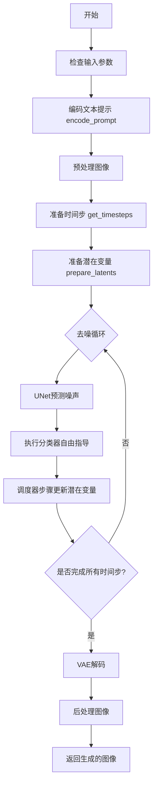
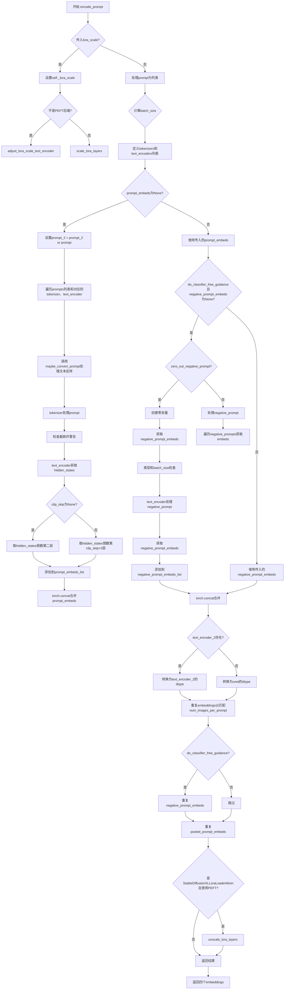
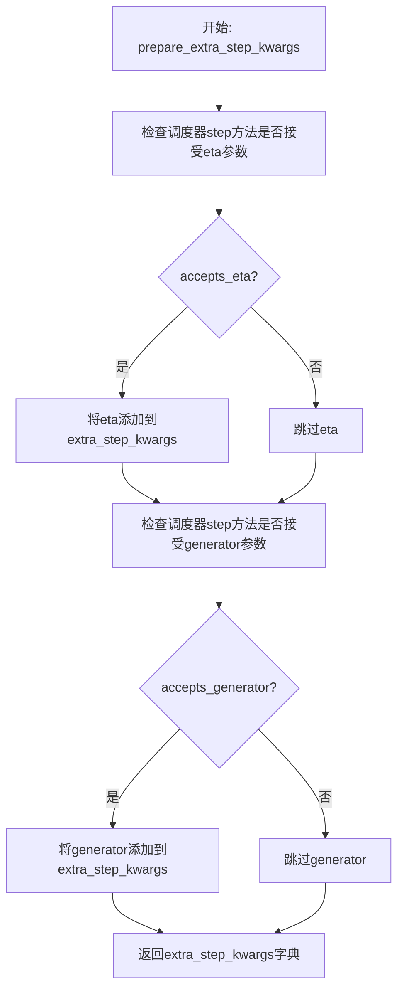
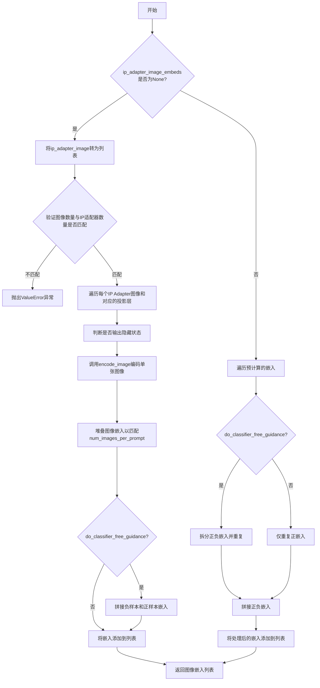
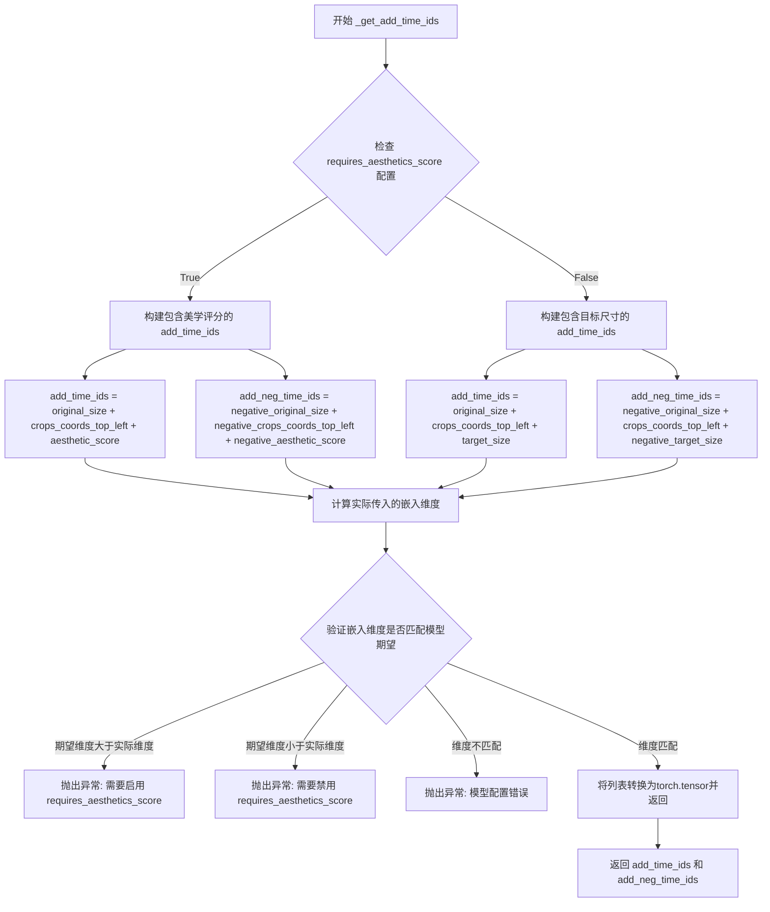
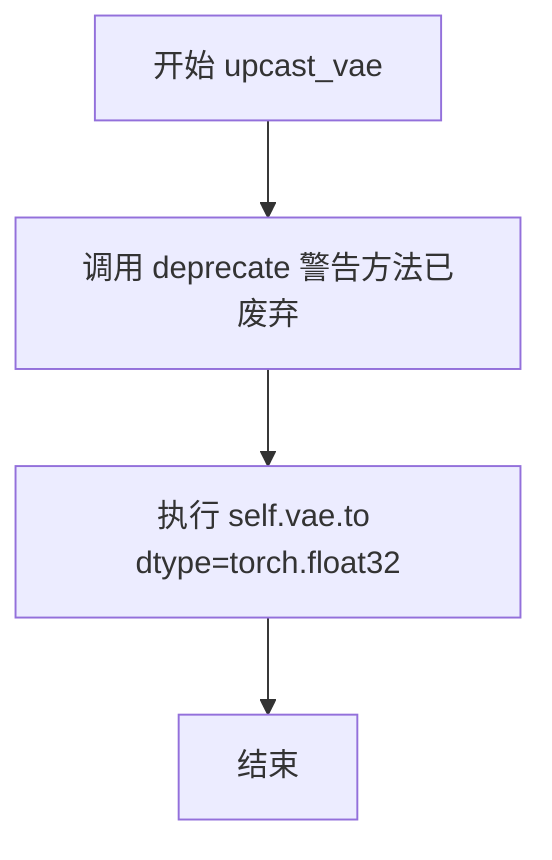
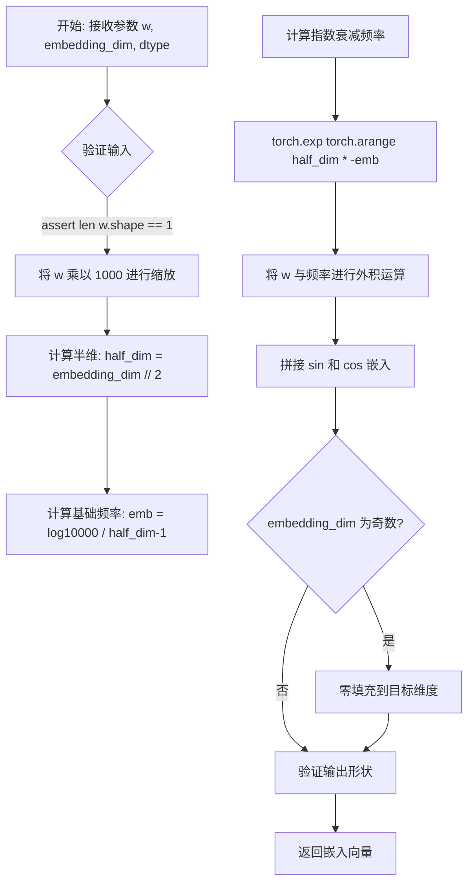

# `diffusers\examples\community\pipeline_stable_diffusion_xl_differential_img2img.py` 详细设计文档

Stable Diffusion XL 差异图像到图像生成管道，支持基于文本提示和初始图像通过去噪过程生成新图像，包含双文本编码器、IP适配器、LoRA和美学评分等高级功能。

## 整体流程



## 类结构

```
StableDiffusionXLDifferentialImg2ImgPipeline (主类)
├── 继承自:
│   ├── DiffusionPipeline
│   ├── StableDiffusionMixin
│   ├── TextualInversionLoaderMixin
│   ├── FromSingleFileMixin
│   ├── StableDiffusionXLLoraLoaderMixin
│   └── IPAdapterMixin
```

## 全局变量及字段


### `logger`
    
模块级别的日志记录器，用于输出调试和信息日志

类型：`logging.Logger`
    


### `EXAMPLE_DOC_STRING`
    
包含管道使用示例的文档字符串，展示如何进行图像到图像的生成

类型：`str`
    


### `XLA_AVAILABLE`
    
标志位，指示PyTorch XLA是否可用，用于支持TPU等加速设备

类型：`bool`
    


### `StableDiffusionXLDifferentialImg2ImgPipeline.vae`
    
变分自编码器模型，用于将图像编码到潜在空间并从潜在表示解码图像

类型：`AutoencoderKL`
    


### `StableDiffusionXLDifferentialImg2ImgPipeline.text_encoder`
    
冻结的文本编码器，用于将文本提示编码为嵌入向量

类型：`CLIPTextModel`
    


### `StableDiffusionXLDifferentialImg2ImgPipeline.text_encoder_2`
    
第二个冻结的文本编码器，用于生成带有投影的文本嵌入

类型：`CLIPTextModelWithProjection`
    


### `StableDiffusionXLDifferentialImg2ImgPipeline.tokenizer`
    
第一个CLIP分词器，用于将文本提示分词为token序列

类型：`CLIPTokenizer`
    


### `StableDiffusionXLDifferentialImg2ImgPipeline.tokenizer_2`
    
第二个CLIP分词器，用于第二文本编码器的文本处理

类型：`CLIPTokenizer`
    


### `StableDiffusionXLDifferentialImg2ImgPipeline.unet`
    
条件U-Net模型，用于在去噪过程中预测噪声残差

类型：`UNet2DConditionModel`
    


### `StableDiffusionXLDifferentialImg2ImgPipeline.scheduler`
    
扩散调度器，用于管理去噪过程中的时间步和噪声调度

类型：`KarrasDiffusionSchedulers`
    


### `StableDiffusionXLDifferentialImg2ImgPipeline.image_encoder`
    
CLIP视觉编码器，用于IP-Adapter图像条件嵌入的生成

类型：`CLIPVisionModelWithProjection`
    


### `StableDiffusionXLDifferentialImg2ImgPipeline.feature_extractor`
    
CLIP图像特征提取器，用于预处理图像输入

类型：`CLIPImageProcessor`
    


### `StableDiffusionXLDifferentialImg2ImgPipeline.watermark`
    
不可见水印器，用于在生成的图像上添加水印

类型：`StableDiffusionXLWatermarker`
    


### `StableDiffusionXLDifferentialImg2ImgPipeline.vae_scale_factor`
    
VAE缩放因子，用于计算潜在空间与像素空间之间的尺寸转换

类型：`int`
    


### `StableDiffusionXLDifferentialImg2ImgPipeline.image_processor`
    
VAE图像处理器，用于图像的后处理和格式转换

类型：`VaeImageProcessor`
    
    

## 全局函数及方法


### `rescale_noise_cfg`

该函数用于根据`guidance_rescale`参数对噪声预测配置进行重缩放，基于论文《Common Diffusion Noise Schedules and Sample Steps are Flawed》的研究发现，旨在修复扩散模型中的过度曝光问题并避免生成过于平淡的图像。

参数：

- `noise_cfg`：`torch.Tensor`，噪声预测配置，即经过分类器自由引导（classifier-free guidance）后的噪声预测
- `noise_pred_text`：`torch.Tensor`，文本条件的噪声预测（引导后的噪声预测）
- `guidance_rescale`：`float`，引导重缩放因子，用于控制重缩放强度，默认为0.0

返回值：`torch.Tensor`，重缩放后的噪声预测配置

#### 流程图

```mermaid
flowchart TD
    A[开始] --> B[计算noise_pred_text的标准差 std_text]
    B --> C[计算noise_cfg的标准差 std_cfg]
    C --> D[重缩放噪声预测: noise_pred_rescaled = noise_cfg × (std_text / std_cfg)]
    D --> E[混合重缩放结果与原始结果<br/>noise_cfg = guidance_rescale × noise_pred_rescaled + (1 - guidance_rescale) × noise_cfg]
    E --> F[返回重缩放后的noise_cfg]
```

#### 带注释源码

```
# Copied from diffusers.pipelines.stable_diffusion.pipeline_stable_diffusion.rescale_noise_cfg
def rescale_noise_cfg(noise_cfg, noise_pred_text, guidance_rescale=0.0):
    """
    Rescale `noise_cfg` according to `guidance_rescale`. Based on findings of [Common Diffusion Noise Schedules and
    Sample Steps are Flawed](https://huggingface.co/papers/2305.08891). See Section 3.4
    """
    # 计算文本条件噪声预测的标准差
    # std(dim=list(range(1, ndim)), keepdim=True) 保留批次维度但折叠所有特征维度
    std_text = noise_pred_text.std(dim=list(range(1, noise_pred_text.ndim)), keepdim=True)
    
    # 计算噪声配置的标准差
    std_cfg = noise_cfg.std(dim=list(range(1, noise_cfg.ndim)), keepdim=True)
    
    # 使用文本预测的标准差对噪声配置进行重缩放
    # 这修复了过度曝光问题（overexposure）
    noise_pred_rescaled = noise_cfg * (std_text / std_cfg)
    
    # 将重缩放后的结果与原始结果按guidance_rescale因子混合
    # guidance_rescale > 0 可以避免生成"plain looking"（平淡无奇）的图像
    noise_cfg = guidance_rescale * noise_pred_rescaled + (1 - guidance_rescale) * noise_cfg
    
    return noise_cfg
```


### `retrieve_latents`

该函数是一个全局工具函数，用于从 VAE（变分自编码器）的编码输出中提取潜在表示（latents）。它支持三种提取方式：通过 latent_dist 进行采样、通过 latent_dist 进行argmax操作，或直接访问预计算的 latents 属性。

参数：

- `encoder_output`：`torch.Tensor`，VAE 编码器的输出对象，通常包含 `latent_dist`（潜在分布对象）或 `latents`（已计算的潜在张量）属性
- `generator`：`torch.Generator | None`，可选的随机数生成器，用于确保采样过程的可重复性
- `sample_mode`：`str`，采样模式，默认为 "sample"；可选值为 "sample"（从分布中采样）或 "argmax"（取分布的众数）

返回值：`torch.Tensor`，从编码器输出中提取的潜在表示张量

#### 流程图

```mermaid
flowchart TD
    A[开始: retrieve_latents] --> B{encoder_output 是否有 latent_dist 属性?}
    B -- 是 --> C{sample_mode == 'sample'?}
    C -- 是 --> D[返回 encoder_output.latent_dist.sample<br/>(generator)]
    C -- 否 --> E{sample_mode == 'argmax'?}
    E -- 是 --> F[返回 encoder_output.latent_dist.mode<br/>(众数)]
    E -- 否 --> G{encoder_output 是否有 latents 属性?}
    B -- 否 --> G
    G -- 是 --> H[返回 encoder_output.latents]
    G -- 否 --> I[抛出 AttributeError]
    
    D --> J[结束]
    F --> J
    H --> J
    I --> J
```

#### 带注释源码

```
# 从 VAE 编码器输出中检索潜在表示的函数
# Copied from diffusers.pipelines.stable_diffusion.pipeline_stable_diffusion_img2img.retrieve_latents
def retrieve_latents(
    encoder_output: torch.Tensor,  # VAE 编码器的输出，包含 latent_dist 或 latents 属性
    generator: torch.Generator | None = None,  # 可选的随机生成器，用于采样
    sample_mode: str = "sample"  # 采样模式：'sample' 或 'argmax'
):
    # 情况1：如果 encoder_output 有 latent_dist 属性且模式为 sample
    # 从潜在分布中进行采样（随机采样）
    if hasattr(encoder_output, "latent_dist") and sample_mode == "sample":
        return encoder_output.latent_dist.sample(generator)
    
    # 情况2：如果 encoder_output 有 latent_dist 属性且模式为 argmax
    # 取潜在分布的众数（确定性选择）
    elif hasattr(encoder_output, "latent_dist") and sample_mode == "argmax":
        return encoder_output.latent_dist.mode()
    
    # 情况3：如果 encoder_output 直接有 latents 属性
    # 返回预计算的潜在表示
    elif hasattr(encoder_output, "latents"):
        return encoder_output.latents
    
    # 错误处理：无法从 encoder_output 中提取潜在表示
    else:
        raise AttributeError("Could not access latents of provided encoder_output")
```


### `retrieve_timesteps`

该函数是 Stable Diffusion XL 图像生成管道中的辅助函数，用于调用调度器的 `set_timesteps` 方法并获取时间步调度。它支持自定义时间步和默认时间步策略，并将时间步移动到指定设备上。

参数：

- `scheduler`：`SchedulerMixin`，要获取时间步的调度器对象。
- `num_inference_steps`：`Optional[int]`，生成样本时使用的扩散步数。如果使用此参数，`timesteps` 必须为 `None`。
- `device`：`Optional[Union[str, torch.device]]`，时间步要移动到的设备。如果为 `None`，则不移动时间步。
- `timesteps`：`Optional[List[int]]`，用于支持任意时间步间隔的自定义时间步。如果为 `None`，则使用调度器的默认时间步间隔策略。如果传入 `timesteps`，则 `num_inference_steps` 必须为 `None`。
- `**kwargs`：任意关键字参数，将传递给 `scheduler.set_timesteps` 方法。

返回值：`Tuple[torch.Tensor, int]`，元组，其中第一个元素是调度器的时间步调度，第二个元素是推理步数。

#### 流程图

```mermaid
flowchart TD
    A[开始 retrieve_timesteps] --> B{是否传入 timesteps?}
    B -->|Yes| C[检查 scheduler.set_timesteps 是否接受 timesteps 参数]
    C --> D{接受?}
    D -->|No| E[抛出 ValueError 异常]
    D -->|Yes| F[调用 scheduler.set_timesteps<br/>timesteps=timesteps, device=device]
    F --> G[获取 scheduler.timesteps]
    G --> H[num_inference_steps = len(timesteps)]
    B -->|No| I[调用 scheduler.set_timesteps<br/>num_inference_steps, device=device]
    I --> J[获取 scheduler.timesteps]
    J --> K[返回 timesteps, num_inference_steps]
    H --> K
    E --> L[结束]
    K --> L
```

#### 带注释源码

```python
# Copied from diffusers.pipelines.stable_diffusion.pipeline_stable_diffusion.retrieve_timesteps
def retrieve_timesteps(
    scheduler,
    num_inference_steps: Optional[int] = None,
    device: Optional[Union[str, torch.device]] = None,
    timesteps: Optional[List[int]] = None,
    **kwargs,
):
    """
    Calls the scheduler's `set_timesteps` method and retrieves timesteps from the scheduler after the call. Handles
    custom timesteps. Any kwargs will be supplied to `scheduler.set_timesteps`.

    Args:
        scheduler (`SchedulerMixin`):
            The scheduler to get timesteps from.
        num_inference_steps (`int`):
            The number of diffusion steps used when generating samples with a pre-trained model. If used,
            `timesteps` must be `None`.
        device (`str` or `torch.device`, *optional*):
            The device to which the timesteps should be moved to. If `None`, the timesteps are not moved.
        timesteps (`List[int]`, *optional*):
                Custom timesteps used to support arbitrary spacing between timesteps. If `None`, then the default
                timestep spacing strategy of the scheduler is used. If `timesteps` is passed, `num_inference_steps`
                must be `None`.

    Returns:
        `Tuple[torch.Tensor, int]`: A tuple where the first element is the timestep schedule from the scheduler and the
        second element is the number of inference steps.
    """
    # 如果传入了自定义 timesteps，则验证调度器是否支持
    if timesteps is not None:
        # 使用 inspect 检查 scheduler.set_timesteps 方法是否接受 timesteps 参数
        accepts_timesteps = "timesteps" in set(inspect.signature(scheduler.set_timesteps).parameters.keys())
        if not accepts_timesteps:
            raise ValueError(
                f"The current scheduler class {scheduler.__class__}'s `set_timesteps` does not support custom"
                f" timestep schedules. Please check whether you are using the correct scheduler."
            )
        # 使用自定义 timesteps 调用 set_timesteps
        scheduler.set_timesteps(timesteps=timesteps, device=device, **kwargs)
        # 获取调度器的时间步
        timesteps = scheduler.timesteps
        # 计算推理步数
        num_inference_steps = len(timesteps)
    else:
        # 使用 num_inference_steps 调用 set_timesteps
        scheduler.set_timesteps(num_inference_steps, device=device, **kwargs)
        # 获取调度器的时间步
        timesteps = scheduler.timesteps
    # 返回时间步和推理步数
    return timesteps, num_inference_steps
```


### `StableDiffusionXLDifferentialImg2ImgPipeline.__init__`

这是Stable Diffusion XL差分Img2Img Pipeline的初始化方法，负责接收并注册所有必需的模型组件（VAE、文本编码器、UNet等）、配置参数，以及初始化图像处理器和水印处理器。

参数：

- `vae`：`AutoencoderKL`，Variational Auto-Encoder (VAE) 模型，用于将图像编码到潜在表示并从潜在表示解码图像。
- `text_encoder`：`CLIPTextModel`，冻结的文本编码器，Stable Diffusion XL 使用 CLIP 的文本部分。
- `text_encoder_2`：`CLIPTextModelWithProjection`，第二个冻结的文本编码器，使用 CLIP 的文本和池化部分。
- `tokenizer`：`CLIPTokenizer`，CLIPTokenizer 类的分词器。
- `tokenizer_2`：`CLIPTokenizer`，第二个 CLIPTokenizer 类的分词器。
- `unet`：`UNet2DConditionModel`，条件 U-Net 架构，用于对编码后的图像潜在表示进行去噪。
- `scheduler`：`KarrasDiffusionSchedulers`，与 `unet` 结合使用以对图像潜在表示进行去噪的调度器。
- `image_encoder`：`CLIPVisionModelWithProjection = None`，可选的图像编码器，用于 IP-Adapter 功能。
- `feature_extractor`：`CLIPImageProcessor = None`，可选的特征提取器，用于图像预处理。
- `requires_aesthetics_score`：`bool = False`，是否需要美学评分，用于 SDXL 的微条件。
- `force_zeros_for_empty_prompt`：`bool = True`，当提示为空时是否强制为零嵌入。
- `add_watermarker`：`Optional[bool] = None`，是否添加不可见水印。

返回值：`None`，该方法为构造函数，不返回任何值。

#### 流程图

```mermaid
flowchart TD
    A[开始 __init__] --> B[调用 super().__init__]
    B --> C[register_modules 注册所有模块]
    C --> D[register_to_config 注册 force_zeros_for_empty_prompt]
    D --> E[register_to_config 注册 requires_aesthetics_score]
    E --> F[计算 vae_scale_factor]
    F --> G[创建 VaeImageProcessor]
    G --> H{add_watermarker 是否可用?}
    H -->|是| I[创建 StableDiffusionXLWatermarker]
    H -->|否| J[设置 watermark = None]
    I --> K[结束 __init__]
    J --> K
```

#### 带注释源码

```python
def __init__(
    self,
    vae: AutoencoderKL,
    text_encoder: CLIPTextModel,
    text_encoder_2: CLIPTextModelWithProjection,
    tokenizer: CLIPTokenizer,
    tokenizer_2: CLIPTokenizer,
    unet: UNet2DConditionModel,
    scheduler: KarrasDiffusionSchedulers,
    image_encoder: CLIPVisionModelWithProjection = None,
    feature_extractor: CLIPImageProcessor = None,
    requires_aesthetics_score: bool = False,
    force_zeros_for_empty_prompt: bool = True,
    add_watermarker: Optional[bool] = None,
):
    # 调用父类 DiffusionPipeline 的初始化方法
    super().__init__()

    # 注册所有模型组件到 Pipeline 中，使其可通过 self.xxx 访问
    self.register_modules(
        vae=vae,
        text_encoder=text_encoder,
        text_encoder_2=text_encoder_2,
        tokenizer=tokenizer,
        tokenizer_2=tokenizer_2,
        unet=unet,
        image_encoder=image_encoder,
        feature_extractor=feature_extractor,
        scheduler=scheduler,
    )

    # 将 force_zeros_for_empty_prompt 配置注册到 self.config
    self.register_to_config(force_zeros_for_empty_prompt=force_zeros_for_empty_prompt)

    # 将 requires_aesthetics_score 配置注册到 self.config
    self.register_to_config(requires_aesthetics_score=requires_aesthetics_score)

    # 计算 VAE 缩放因子，用于图像和潜在表示之间的空间转换
    # 基于 VAE 的块输出通道数量计算 (2^(block_out_channels - 1))
    self.vae_scale_factor = 2 ** (len(self.vae.config.block_out_channels) - 1) if getattr(self, "vae", None) else 8

    # 创建 VAE 图像处理器，用于图像的预处理和后处理
    self.image_processor = VaeImageProcessor(vae_scale_factor=self.vae_scale_factor)

    # 确定是否添加水印：优先使用传入值，否则检查是否安装了水印库
    add_watermarker = add_watermarker if add_watermarker is not None else is_invisible_watermark_available()

    # 如果需要添加水印，创建水印处理器；否则设为 None
    if add_watermarker:
        self.watermark = StableDiffusionXLWatermarker()
    else:
        self.watermark = None
```


### `StableDiffusionXLDifferentialImg2ImgPipeline.encode_prompt`

该方法用于将文本提示（prompt）编码为文本编码器的隐藏状态。它处理Stable Diffusion XL的双文本编码器架构，支持LoRA缩放、文本反转、Classifier-Free Guidance（无分类器引导），并返回正向提示嵌入、负向提示嵌入、池化提示嵌入和负向池化提示嵌入。

参数：

- `prompt`：`str | None`，要编码的主提示
- `prompt_2`：`str | None`，发送给第二个tokenizer和text_encoder_2的提示，若不定义则使用prompt
- `device`：`Optional[torch.device]`，torch设备，若不提供则使用执行设备
- `num_images_per_prompt`：`int`，每个提示生成的图像数量，默认为1
- `do_classifier_free_guidance`：`bool`，是否使用无分类器引导，默认为True
- `negative_prompt`：`str | None`，不引导图像生成的负向提示
- `negative_prompt_2`：`str | None`，发送给第二个tokenizer和text_encoder_2的负向提示
- `prompt_embeds`：`Optional[torch.Tensor]`，预生成的文本嵌入，可用于轻松调整文本输入
- `negative_prompt_embeds`：`Optional[torch.Tensor]`，预生成的负向文本嵌入
- `pooled_prompt_embeds`：`Optional[torch.Tensor]`，预生成的池化文本嵌入
- `negative_pooled_prompt_embeds`：`Optional[torch.Tensor]`，预生成的负向池化文本嵌入
- `lora_scale`：`Optional[float]`，要应用于文本编码器所有LoRA层的LoRA缩放因子
- `clip_skip`：`Optional[int`，计算提示嵌入时从CLIP跳过的层数

返回值：`Tuple[torch.Tensor, torch.Tensor, torch.Tensor, torch.Tensor]`，返回四个张量：prompt_embeds（正向提示嵌入）、negative_prompt_embeds（负向提示嵌入）、pooled_prompt_embeds（池化提示嵌入）、negative_pooled_prompt_embeds（负向池化提示嵌入）

#### 流程图



#### 带注释源码

```python
def encode_prompt(
    self,
    prompt: str,
    prompt_2: str | None = None,
    device: Optional[torch.device] = None,
    num_images_per_prompt: int = 1,
    do_classifier_free_guidance: bool = True,
    negative_prompt: str | None = None,
    negative_prompt_2: str | None = None,
    prompt_embeds: Optional[torch.Tensor] = None,
    negative_prompt_embeds: Optional[torch.Tensor] = None,
    pooled_prompt_embeds: Optional[torch.Tensor] = None,
    negative_pooled_prompt_embeds: Optional[torch.Tensor] = None,
    lora_scale: Optional[float] = None,
    clip_skip: Optional[int] = None,
):
    r"""
    Encodes the prompt into text encoder hidden states.

    Args:
        prompt (`str` or `List[str]`, *optional*):
            prompt to be encoded
        prompt_2 (`str` or `List[str]`, *optional*):
            The prompt or prompts to be sent to the `tokenizer_2` and `text_encoder_2`. If not defined, `prompt` is
            used in both text-encoders
        device: (`torch.device`):
            torch device
        num_images_per_prompt (`int`):
            number of images that should be generated per prompt
        do_classifier_free_guidance (`bool`):
            whether to use classifier free guidance or not
        negative_prompt (`str` or `List[str]`, *optional*):
            The prompt or prompts not to guide the image generation. If not defined, one has to pass
            `negative_prompt_embeds` instead. Ignored when not using guidance (i.e., ignored if `guidance_scale` is
            less than `1`).
        negative_prompt_2 (`str` or `List[str]`, *optional*):
            The prompt or prompts not to guide the image generation to be sent to `tokenizer_2` and
            `text_encoder_2`. If not defined, `negative_prompt` is used in both text-encoders
        prompt_embeds (`torch.Tensor`, *optional*):
            Pre-generated text embeddings. Can be used to easily tweak text inputs, *e.g.* prompt weighting. If not
            provided, text embeddings will be generated from `prompt` input argument.
        negative_prompt_embeds (`torch.Tensor`, *optional*):
            Pre-generated negative text embeddings. Can be used to easily tweak text inputs, *e.g.* prompt
            weighting. If not provided, negative_prompt_embeds will be generated from `negative_prompt` input
            argument.
        pooled_prompt_embeds (`torch.Tensor`, *optional*):
            Pre-generated pooled text embeddings. Can be used to easily tweak text inputs, *e.g.* prompt weighting.
            If not provided, pooled text embeddings will be generated from `prompt` input argument.
        negative_pooled_prompt_embeds (`torch.Tensor`, *optional*):
            Pre-generated negative pooled text embeddings. Can be used to easily tweak text inputs, *e.g.* prompt
            weighting. If not provided, pooled negative_prompt_embeds will be generated from `negative_prompt`
            input argument.
        lora_scale (`float`, *optional*):
            A lora scale that will be applied to all LoRA layers of the text encoder if LoRA layers are loaded.
        clip_skip (`int`, *optional*):
            Number of layers to be skipped from CLIP while computing the prompt embeddings. A value of 1 means that
            the output of the pre-final layer will be used for computing the prompt embeddings.
    """
    # 确定设备，若未指定则使用执行设备
    device = device or self._execution_device

    # 设置lora scale，以便text encoder的LoRA函数可以正确访问
    # 如果传入了lora_scale且当前pipeline支持LoRA
    if lora_scale is not None and isinstance(self, StableDiffusionXLLoraLoaderMixin):
        self._lora_scale = lora_scale

        # 动态调整LoRA scale
        if self.text_encoder is not None:
            if not USE_PEFT_BACKEND:
                adjust_lora_scale_text_encoder(self.text_encoder, lora_scale)
            else:
                scale_lora_layers(self.text_encoder, lora_scale)

        if self.text_encoder_2 is not None:
            if not USE_PEFT_BACKEND:
                adjust_lora_scale_text_encoder(self.text_encoder_2, lora_scale)
            else:
                scale_lora_layers(self.text_encoder_2, lora_scale)

    # 将prompt转换为列表，统一处理
    prompt = [prompt] if isinstance(prompt, str) else prompt

    # 计算batch_size
    if prompt is not None:
        batch_size = len(prompt)
    else:
        batch_size = prompt_embeds.shape[0]

    # 定义tokenizers和text encoders列表（支持双文本编码器架构）
    tokenizers = [self.tokenizer, self.tokenizer_2] if self.tokenizer is not None else [self.tokenizer_2]
    text_encoders = (
        [self.text_encoder, self.text_encoder_2] if self.text_encoder is not None else [self.text_encoder_2]
    )

    # 如果未提供prompt_embeds，则从prompt生成
    if prompt_embeds is None:
        # prompt_2默认为prompt
        prompt_2 = prompt_2 or prompt
        prompt_2 = [prompt_2] if isinstance(prompt_2, str) else prompt_2

        # textual inversion: process multi-vector tokens if necessary
        prompt_embeds_list = []
        prompts = [prompt, prompt_2]
        
        # 遍历两个prompt和对应的tokenizer、text_encoder
        for prompt, tokenizer, text_encoder in zip(prompts, tokenizers, text_encoders):
            # 如果支持TextualInversionLoaderMixin，转换prompt
            if isinstance(self, TextualInversionLoaderMixin):
                prompt = self.maybe_convert_prompt(prompt, tokenizer)

            # tokenizer处理prompt
            text_inputs = tokenizer(
                prompt,
                padding="max_length",
                max_length=tokenizer.model_max_length,
                truncation=True,
                return_tensors="pt",
            )

            text_input_ids = text_inputs.input_ids
            # 获取未截断的token IDs用于检查
            untruncated_ids = tokenizer(prompt, padding="longest", return_tensors="pt").input_ids

            # 检查是否发生截断，并记录警告
            if untruncated_ids.shape[-1] >= text_input_ids.shape[-1] and not torch.equal(
                text_input_ids, untruncated_ids
            ):
                removed_text = tokenizer.batch_decode(untruncated_ids[:, tokenizer.model_max_length - 1 : -1])
                logger.warning(
                    "The following part of your input was truncated because CLIP can only handle sequences up to"
                    f" {tokenizer.model_max_length} tokens: {removed_text}"
                )

            # 获取text_encoder的hidden_states输出
            prompt_embeds = text_encoder(text_input_ids.to(device), output_hidden_states=True)

            # 总是取pooled output（最终文本编码器的池化输出）
            if pooled_prompt_embeds is None and prompt_embeds[0].ndim == 2:
                pooled_prompt_embeds = prompt_embeds[0]

            # 根据clip_skip决定使用哪层hidden_states
            if clip_skip is None:
                prompt_embeds = prompt_embeds.hidden_states[-2]  # 默认取倒数第二层
            else:
                # "2" because SDXL always indexes from the penultimate layer.
                prompt_embeds = prompt_embeds.hidden_states[-(clip_skip + 2)]

            prompt_embeds_list.append(prompt_embeds)

        # 在最后一个维度拼接两个文本编码器的embeddings
        prompt_embeds = torch.concat(prompt_embeds_list, dim=-1)

    # 获取无分类器引导的无条件embeddings
    zero_out_negative_prompt = negative_prompt is None and self.config.force_zeros_for_empty_prompt
    
    # 处理negative_prompt_embeds
    if do_classifier_free_guidance and negative_prompt_embeds is None and zero_out_negative_prompt:
        # 如果配置要求对空prompt使用零向量
        negative_prompt_embeds = torch.zeros_like(prompt_embeds)
        negative_pooled_prompt_embeds = torch.zeros_like(pooled_prompt_embeds)
    elif do_classifier_free_guidance and negative_prompt_embeds is None:
        negative_prompt = negative_prompt or ""
        negative_prompt_2 = negative_prompt_2 or negative_prompt

        # normalize str to list
        negative_prompt = batch_size * [negative_prompt] if isinstance(negative_prompt, str) else negative_prompt
        negative_prompt_2 = (
            batch_size * [negative_prompt_2] if isinstance(negative_prompt_2, str) else negative_prompt_2
        )

        uncond_tokens: List[str]
        # 类型检查
        if prompt is not None and type(prompt) is not type(negative_prompt):
            raise TypeError(
                f"`negative_prompt` should be the same type to `prompt`, but got {type(negative_prompt)} !="
                f" {type(prompt)}."
            )
        elif batch_size != len(negative_prompt):
            raise ValueError(
                f"`negative_prompt`: {negative_prompt} has batch size {len(negative_prompt)}, but `prompt`:"
                f" {prompt} has batch size {batch_size}. Please make sure that passed `negative_prompt` matches"
                " the batch size of `prompt`."
            )
        else:
            uncond_tokens = [negative_prompt, negative_prompt_2]

        negative_prompt_embeds_list = []
        
        # 处理negative prompts
        for negative_prompt, tokenizer, text_encoder in zip(uncond_tokens, tokenizers, text_encoders):
            if isinstance(self, TextualInversionLoaderMixin):
                negative_prompt = self.maybe_convert_prompt(negative_prompt, tokenizer)

            max_length = prompt_embeds.shape[1]
            uncond_input = tokenizer(
                negative_prompt,
                padding="max_length",
                max_length=max_length,
                truncation=True,
                return_tensors="pt",
            )

            negative_prompt_embeds = text_encoder(
                uncond_input.input_ids.to(device),
                output_hidden_states=True,
            )
            
            # 获取pooled output
            if negative_pooled_prompt_embeds is None and negative_prompt_embeds[0].ndim == 2:
                negative_pooled_prompt_embeds = negative_prompt_embeds[0]
            negative_prompt_embeds = negative_prompt_embeds.hidden_states[-2]

            negative_prompt_embeds_list.append(negative_prompt_embeds)

        negative_prompt_embeds = torch.concat(negative_prompt_embeds_list, dim=-1)

    # 转换dtype和device
    if self.text_encoder_2 is not None:
        prompt_embeds = prompt_embeds.to(dtype=self.text_encoder_2.dtype, device=device)
    else:
        prompt_embeds = prompt_embeds.to(dtype=self.unet.dtype, device=device)

    bs_embed, seq_len, _ = prompt_embeds.shape
    
    # 复制text embeddings以匹配每个prompt生成的图像数量
    # 使用mps友好的方法
    prompt_embeds = prompt_embeds.repeat(1, num_images_per_prompt, 1)
    prompt_embeds = prompt_embeds.view(bs_embed * num_images_per_prompt, seq_len, -1)

    if do_classifier_free_guidance:
        # 复制unconditional embeddings
        seq_len = negative_prompt_embeds.shape[1]

        if self.text_encoder_2 is not None:
            negative_prompt_embeds = negative_prompt_embeds.to(dtype=self.text_encoder_2.dtype, device=device)
        else:
            negative_prompt_embeds = negative_prompt_embeds.to(dtype=self.unet.dtype, device=device)

        negative_prompt_embeds = negative_prompt_embeds.repeat(1, num_images_per_prompt, 1)
        negative_prompt_embeds = negative_prompt_embeds.view(batch_size * num_images_per_prompt, seq_len, -1)

    # 处理pooled embeddings
    pooled_prompt_embeds = pooled_prompt_embeds.repeat(1, num_images_per_prompt).view(
        bs_embed * num_images_per_prompt, -1
    )
    if do_classifier_free_guidance:
        negative_pooled_prompt_embeds = negative_pooled_prompt_embeds.repeat(1, num_images_per_prompt).view(
            bs_embed * num_images_per_prompt, -1
        )

    # 如果使用PEFT后端，恢复LoRA layers的原始scale
    if self.text_encoder is not None:
        if isinstance(self, StableDiffusionXLLoraLoaderMixin) and USE_PEFT_BACKEND:
            unscale_lora_layers(self.text_encoder, lora_scale)

    if self.text_encoder_2 is not None:
        if isinstance(self, StableDiffusionXLLoraLoaderMixin) and USE_PEFT_BACKEND:
            unscale_lora_layers(self.text_encoder_2, lora_scale)

    # 返回四个embeddings
    return prompt_embeds, negative_prompt_embeds, pooled_prompt_embeds, negative_pooled_prompt_embeds
```


### `StableDiffusionXLDifferentialImg2ImgPipeline.prepare_extra_step_kwargs`

该方法用于准备调度器（scheduler）的额外参数。由于不同的调度器可能有不同的签名，该方法会检查当前调度器是否支持`eta`和`generator`参数，并将支持的参数添加到返回的字典中传递给调度器的`step`方法。

参数：

- `generator`：`torch.Generator | None`，可选的随机数生成器，用于生成确定性噪声
- `eta`：`float`，DDIM调度器使用的eta参数（对应DDIM论文中的η），取值范围为[0,1]，其他调度器会忽略此参数

返回值：`Dict[str, Any]`，包含调度器额外参数的字典，可能包含`eta`和/或`generator`键

#### 流程图



#### 带注释源码

```python
def prepare_extra_step_kwargs(self, generator, eta):
    # 准备调度器步骤的额外参数，因为并非所有调度器都具有相同的签名
    # eta (η) 仅在 DDIMScheduler 中使用，其他调度器会忽略它
    # eta 对应 DDIM 论文中的 η: https://huggingface.co/papers/2010.02502
    # 取值应在 [0, 1] 范围内

    # 通过检查调度器step方法的签名来确定是否接受eta参数
    accepts_eta = "eta" in set(inspect.signature(self.scheduler.step).parameters.keys())
    extra_step_kwargs = {}
    
    # 如果调度器支持eta参数，则将其添加到额外参数字典中
    if accepts_eta:
        extra_step_kwargs["eta"] = eta

    # 检查调度器是否接受generator参数
    accepts_generator = "generator" in set(inspect.signature(self.scheduler.step).parameters.keys())
    if accepts_generator:
        extra_step_kwargs["generator"] = generator
    
    # 返回包含调度器额外参数的字典
    return extra_step_kwargs
```


### `StableDiffusionXLDifferentialImg2ImgPipeline.check_inputs`

该方法用于验证 Stable Diffusion XL Differential Img2Img Pipeline 的输入参数是否合法，确保在使用管道进行图像生成之前，所有必要的参数都符合要求。如果参数不符合要求，该方法会抛出详细的 ValueError 异常来提示用户。

参数：

- `self`：实例方法，隐式参数
- `prompt`：Union[str, List[str], None]，主要的文本提示，用于指导图像生成
- `prompt_2`：Optional[Union[str, List[str]]]，发送给第二个分词器和文本编码器的提示，如果未定义则使用 prompt
- `strength`：float，概念上表示对参考图像的转换程度，必须在 0 到 1 之间
- `num_inference_steps`：int，去噪步骤的数量，必须是正整数
- `callback_steps`：Optional[int]，调用回调函数的频率，必须是正整数（如果提供）
- `negative_prompt`：Optional[Union[str, List[str]]]，不参与图像生成的负面提示
- `negative_prompt_2`：Optional[Union[str, List[str]]]，发送给第二个分词器和文本编码器的负面提示
- `prompt_embeds`：Optional[torch.Tensor]，预生成的文本嵌入，用于轻松调整文本输入
- `negative_prompt_embeds`：Optional[torch.Tensor]，预生成的负面文本嵌入
- `ip_adapter_image`：Optional[PipelineImageInput]，可选的图片输入，用于 IP Adapters
- `ip_adapter_image_embeds`：Optional[List[torch.Tensor]]，预生成的 IP-Adapter 图片嵌入列表
- `callback_on_step_end_tensor_inputs`：Optional[List[str]]，在步骤结束时回调的 tensor 输入列表

返回值：`None`，该方法不返回值，仅通过抛出异常来处理错误

#### 流程图

```mermaid
flowchart TD
    A[开始 check_inputs] --> B{strength 在 [0, 1] 范围内?}
    B -->|否| B1[抛出 ValueError: strength 应在 [0.0, 1.0]]
    B -->|是| C{num_inference_steps 是正整数?}
    C -->|否| C1[抛出 ValueError: num_inference_steps 必须是正整数]
    C -->|是| D{callback_steps 是正整数?}
    D -->|否| D1[抛出 ValueError: callback_steps 必须是正整数]
    D -->|是| E{callback_on_step_end_tensor_inputs 有效?}
    E -->|否| E1[抛出 ValueError: 无效的 tensor 输入]
    E -->|是| F{prompt 和 prompt_embeds 同时提供?}
    F -->|是| F1[抛出 ValueError: 不能同时提供两者]
    F -->|否| G{prompt_2 和 prompt_embeds 同时提供?}
    G -->|是| G1[抛出 ValueError: 不能同时提供两者]
    G -->|否| H{prompt 和 prompt_embeds 都未提供?}
    H -->|是| H1[抛出 ValueError: 必须提供 prompt 或 prompt_embeds]
    H -->|否| I{prompt 类型正确?}
    I -->|否| I1[抛出 ValueError: prompt 类型错误]
    I -->|是| J{prompt_2 类型正确?}
    J -->|否| J1[抛出 ValueError: prompt_2 类型错误]
    J -->|是| K{negative_prompt 和 negative_prompt_embeds 同时提供?}
    K -->|是| K1[抛出 ValueError: 不能同时提供两者]
    K -->|否| L{negative_prompt_2 和 negative_prompt_embeds 同时提供?}
    L -->|是| L1[抛出 ValueError: 不能同时提供两者]
    L -->|否| M{prompt_embeds 和 negative_prompt_embeds 形状相同?}
    M -->|否| M1[抛出 ValueError: 形状不匹配]
    M -->|是| N{ip_adapter_image 和 ip_adapter_image_embeds 同时提供?}
    N -->|是| N1[抛出 ValueError: 不能同时提供两者]
    N -->|否| O{ip_adapter_image_embeds 类型正确?}
    O -->|否| O1[抛出 ValueError: ip_adapter_image_embeds 类型错误]
    O -->|是| P{ip_adapter_image_embeds 维度正确?}
    P -->|否| P1[抛出 ValueError: 维度错误]
    P -->|是| Q[结束 - 所有检查通过]
    B1 --> Q
    C1 --> Q
    D1 --> Q
    E1 --> Q
    F1 --> Q
    G1 --> Q
    H1 --> Q
    I1 --> Q
    J1 --> Q
    K1 --> Q
    L1 --> Q
    M1 --> Q
    N1 --> Q
    O1 --> Q
    P1 --> Q
```

#### 带注释源码

```python
def check_inputs(
    self,
    prompt,
    prompt_2,
    strength,
    num_inference_steps,
    callback_steps,
    negative_prompt=None,
    negative_prompt_2=None,
    prompt_embeds=None,
    negative_prompt_embeds=None,
    ip_adapter_image=None,
    ip_adapter_image_embeds=None,
    callback_on_step_end_tensor_inputs=None,
):
    """
    检查并验证输入参数的有效性。
    
    该方法执行一系列验证检查，确保所有输入参数都符合管道的预期。
    如果任何检查失败，将抛出具有详细信息的 ValueError。
    """
    
    # 检查 strength 参数是否在有效范围内 [0.0, 1.0]
    if strength < 0 or strength > 1:
        raise ValueError(f"The value of strength should in [0.0, 1.0] but is {strength}")
    
    # 检查 num_inference_steps 不能为 None
    if num_inference_steps is None:
        raise ValueError("`num_inference_steps` cannot be None.")
    # 检查 num_inference_steps 是否为正整数
    elif not isinstance(num_inference_steps, int) or num_inference_steps <= 0:
        raise ValueError(
            f"`num_inference_steps` has to be a positive integer but is {num_inference_steps} of type"
            f" {type(num_inference_steps)}."
        )
    
    # 检查 callback_steps 如果提供的话必须是正整数
    if callback_steps is not None and (not isinstance(callback_steps, int) or callback_steps <= 0):
        raise ValueError(
            f"`callback_steps` has to be a positive integer but is {callback_steps} of type"
            f" {type(callback_steps)}."
        )

    # 检查 callback_on_step_end_tensor_inputs 是否在允许的列表中
    if callback_on_step_end_tensor_inputs is not None and not all(
        k in self._callback_tensor_inputs for k in callback_on_step_end_tensor_inputs
    ):
        raise ValueError(
            f"`callback_on_step_end_tensor_inputs` has to be in {self._callback_tensor_inputs}, but found {[k for k in callback_on_step_end_tensor_inputs if k not in self._callback_tensor_inputs]}"
        )

    # 检查 prompt 和 prompt_embeds 不能同时提供
    if prompt is not None and prompt_embeds is not None:
        raise ValueError(
            f"Cannot forward both `prompt`: {prompt} and `prompt_embeds`: {prompt_embeds}. Please make sure to"
            " only forward one of the two."
        )
    # 检查 prompt_2 和 prompt_embeds 不能同时提供
    elif prompt_2 is not None and prompt_embeds is not None:
        raise ValueError(
            f"Cannot forward both `prompt_2`: {prompt_2} and `prompt_embeds`: {prompt_embeds}. Please make sure to"
            " only forward one of the two."
        )
    # 检查 prompt 和 prompt_embeds 至少提供一个
    elif prompt is None and prompt_embeds is None:
        raise ValueError(
            "Provide either `prompt` or `prompt_embeds`. Cannot leave both `prompt` and `prompt_embeds` undefined."
        )
    # 检查 prompt 类型是否正确（str 或 list）
    elif prompt is not None and (not isinstance(prompt, str) and not isinstance(prompt, list)):
        raise ValueError(f"`prompt` has to be of type `str` or `list` but is {type(prompt)}")
    # 检查 prompt_2 类型是否正确
    elif prompt_2 is not None and (not isinstance(prompt_2, str) and not isinstance(prompt_2, list)):
        raise ValueError(f"`prompt_2` has to be of type `str` or `list` but is {type(prompt_2)}")

    # 检查 negative_prompt 和 negative_prompt_embeds 不能同时提供
    if negative_prompt is not None and negative_prompt_embeds is not None:
        raise ValueError(
            f"Cannot forward both `negative_prompt`: {negative_prompt} and `negative_prompt_embeds`:"
            f" {negative_prompt_embeds}. Please make sure to only forward one of the two."
        )
    # 检查 negative_prompt_2 和 negative_prompt_embeds 不能同时提供
    elif negative_prompt_2 is not None and negative_prompt_embeds is not None:
        raise ValueError(
            f"Cannot forward both `negative_prompt_2`: {negative_prompt_2} and `negative_prompt_embeds`:"
            f" {negative_prompt_embeds}. Please make sure to only forward one of the two."
        )

    # 如果同时提供了 prompt_embeds 和 negative_prompt_embeds，检查形状是否相同
    if prompt_embeds is not None and negative_prompt_embeds is not None:
        if prompt_embeds.shape != negative_prompt_embeds.shape:
            raise ValueError(
                "`prompt_embeds` and `negative_prompt_embeds` must have the same shape when passed directly, but"
                f" got: `prompt_embeds` {prompt_embeds.shape} != `negative_prompt_embeds`"
                f" {negative_prompt_embeds.shape}."
            )

    # 检查 ip_adapter_image 和 ip_adapter_image_embeds 不能同时提供
    if ip_adapter_image is not None and ip_adapter_image_embeds is not None:
        raise ValueError(
            "Provide either `ip_adapter_image` or `ip_adapter_image_embeds`. Cannot leave both `ip_adapter_image` and `ip_adapter_image_embeds` defined."
        )

    # 检查 ip_adapter_image_embeds 的类型和维度
    if ip_adapter_image_embeds is not None:
        if not isinstance(ip_adapter_image_embeds, list):
            raise ValueError(
                f"`ip_adapter_image_embeds` has to be of type `list` but is {type(ip_adapter_image_embeds)}"
            )
        elif ip_adapter_image_embeds[0].ndim not in [3, 4]:
            raise ValueError(
                f"`ip_adapter_image_embeds` has to be a list of 3D or 4D tensors but is {ip_adapter_image_embeds[0].ndim}D"
            )
```


### `StableDiffusionXLDifferentialImg2ImgPipeline.get_timesteps`

该方法用于计算差分图像到图像管道的 timesteps，基于推理步数、强度参数和可选的去噪起始点。它根据强度（对原始图像的变换程度）或 denoising_start 参数来确定用于去噪的时间步。

参数：

- `num_inference_steps`：`int`，生成样本时使用的扩散步数
- `strength`：`float`，概念上表示对参考图像的变换程度，值在 0 到 1 之间
- `device`：`torch.device`，timesteps 要移动到的设备
- `denoising_start`：`Optional[float]`，指定时表示要跳过的去噪过程的比例（介于 0.0 和 1.0 之间）

返回值：`Tuple[torch.Tensor, int]`，第一个元素是来自 scheduler 的时间步调度，第二个元素是推理步数

#### 流程图

```mermaid
flowchart TD
    A[开始 get_timesteps] --> B{denoising_start 是否为 None}
    B -->|是| C[计算 init_timestep = min(num_inference_steps * strength, num_inference_steps)]
    B -->|否| D[t_start = 0]
    C --> E[t_start = max(num_inference_steps - init_timestep, 0)]
    E --> F[从 scheduler.timesteps 中获取 t_start * order 之后的 timesteps]
    F --> G{denoising_start 是否指定}
    G -->|是| H[计算 discrete_timestep_cutoff]
    H --> I[计算 num_inference_steps = timesteps < discrete_timestep_cutoff 的数量]
    I --> J{scheduler 是二阶且步数为偶数?}
    J -->|是| K[num_inference_steps += 1]
    J -->|否| L[从末尾切片获取最终 timesteps]
    K --> L
    L --> M[返回 timesteps, num_inference_steps]
    G -->|否| N[返回 timesteps, num_inference_steps - t_start]
    M --> O[结束]
    N --> O
```

#### 带注释源码

```python
def get_timesteps(self, num_inference_steps, strength, device, denoising_start=None):
    # 获取使用 init_timestep 的原始时间步
    # 如果没有指定 denoising_start，则根据 strength 计算初始时间步
    if denoising_start is None:
        # 根据强度计算初始时间步数，强度越高，添加的噪声越多
        init_timestep = min(int(num_inference_steps * strength), num_inference_steps)
        # 计算起始索引，确保不小于 0
        t_start = max(num_inference_steps - init_timestep, 0)
    else:
        # 如果指定了 denoising_start，则从 0 开始
        t_start = 0

    # 从 scheduler 中获取时间步序列，按 order 切片
    timesteps = self.scheduler.timesteps[t_start * self.scheduler.order :]

    # 如果直接请求了去噪起始时间步，则强度无关；
    # 也就是说，强度由 denoising_start 决定
    if denoising_start is not None:
        # 计算离散时间步截止点
        discrete_timestep_cutoff = int(
            round(
                self.scheduler.config.num_train_timesteps
                - (denoising_start * self.scheduler.config.num_train_timesteps)
            )
        )

        # 计算满足条件的时间步数量
        num_inference_steps = (timesteps < discrete_timestep_cutoff).sum().item()
        
        # 如果 scheduler 是二阶且推理步数为偶数，可能需要加 1
        # 因为每个时间步（除了最高的）都会被复制
        # 如果步数为偶数，意味着我们在去噪步骤中间切片
        # （在一阶和二阶导数之间），这会导致错误结果
        # 加 1 确保去噪过程总是在 scheduler 的二阶导数步骤之后结束
        if self.scheduler.order == 2 and num_inference_steps % 2 == 0:
            num_inference_steps = num_inference_steps + 1

        # 因为 t_n+1 >= t_n，我们从末尾开始切片时间步
        timesteps = timesteps[-num_inference_steps:]
        return timesteps, num_inference_steps

    # 返回所有时间步和调整后的推理步数
    return timesteps, num_inference_steps - t_start
```


### `StableDiffusionXLDifferentialImg2ImgPipeline.prepare_latents`

该方法负责为Stable Diffusion XL差分图像到图像管道准备潜在变量（latents）。它将输入图像编码为潜在表示，处理批次大小扩展，并根据需要向潜在变量添加噪声以进行去噪过程。

参数：

- `self`：`StableDiffusionXLDifferentialImg2ImgPipeline`实例本身
- `image`：`torch.Tensor | PIL.Image.Image | list`，需要处理的输入图像
- `timestep`：`int`，当前去噪步骤的时间步
- `batch_size`：`int`，批处理大小
- `num_images_per_prompt`：`int`，每个prompt生成的图像数量
- `dtype`：`torch.dtype`，目标数据类型
- `device`：`torch.device`，目标设备
- `generator`：`torch.Generator | None`，可选的随机生成器用于确定性生成
- `add_noise`：`bool`，是否向潜在变量添加噪声，默认为True

返回值：`torch.Tensor`，处理后的潜在变量

#### 流程图

```mermaid
flowchart TD
    A[开始 prepare_latents] --> B{验证 image 类型}
    B -->|类型无效| C[抛出 ValueError]
    B -->|类型有效| D{检查 final_offload_hook}
    D -->|存在| E[卸载 text_encoder_2 到 CPU]
    D -->|不存在| F[继续]
    E --> F
    F --> G[将 image 移动到 device 和 dtype]
    H[计算有效 batch_size = batch_size * num_images_per_prompt]
    G --> H
    H --> I{image.shape[1] == 4?}
    I -->|是| J[直接使用 image 作为 init_latents]
    I -->|否| K{vae.config.force_upcast?}
    K -->|是| L[将 image 转为 float32, vae 转为 float32]
    K -->|否| M[继续]
    L --> M
    M --> N{generator 是 list?}
    N -->|是| O[遍历编码每个图像]
    N -->|否| P[直接编码整个 batch]
    O --> Q[拼接 init_latents]
    P --> Q
    Q --> R[应用 scaling_factor]
    J --> S{batch_size > init_latents.shape[0]?}
    R --> S
    S -->|是且可整除| T[复制扩展 init_latents]
    S -->|是且不可整除| U[抛出 ValueError]
    S -->|否| V[直接使用 init_latents]
    T --> W
    U --> X[结束]
    V --> W
    W --> Y{add_noise == true?}
    Y -->|是| Z[生成随机噪声]
    Y -->|否| AA[跳过添加噪声]
    Z --> AB[使用 scheduler.add_noise 添加噪声]
    AA --> AC[设置 latents = init_latents]
    AB --> AC
    AC --> AD[返回 latents]
```

#### 带注释源码

```python
def prepare_latents(
    self, image, timestep, batch_size, num_images_per_prompt, dtype, device, generator=None, add_noise=True
):
    """
    准备用于图像生成过程的潜在变量。
    
    参数:
        image: 输入图像，可以是 torch.Tensor, PIL.Image.Image 或 list
        timestep: 当前扩散时间步
        batch_size: 批处理大小
        num_images_per_prompt: 每个prompt生成的图像数量
        dtype: 目标数据类型
        device: 目标设备
        generator: 可选的随机生成器
        add_noise: 是否添加噪声
    """
    # 1. 验证输入图像类型
    if not isinstance(image, (torch.Tensor, PIL.Image.Image, list)):
        raise ValueError(
            f"`image` has to be of type `torch.Tensor`, `PIL.Image.Image` or list but is {type(image)}"
        )

    # 2. 如果启用了模型CPU卸载，将text_encoder_2移至CPU以释放GPU内存
    if hasattr(self, "final_offload_hook") and self.final_offload_hook is not None:
        self.text_encoder_2.to("cpu")
        torch.cuda.empty_cache()

    # 3. 将图像移动到指定设备和数据类型
    image = image.to(device=device, dtype=dtype)

    # 4. 计算有效批次大小（考虑每个prompt生成多张图像）
    batch_size = batch_size * num_images_per_prompt

    # 5. 如果图像已经是潜在表示（通道数=4），直接使用
    if image.shape[1] == 4:
        init_latents = image

    else:
        # 6. 处理VAE精度问题：float16会溢出，需要转换为float32
        if self.vae.config.force_upcast:
            image = image.float()
            self.vae.to(dtype=torch.float32)

        # 7. 验证生成器列表长度
        if isinstance(generator, list) and len(generator) != batch_size:
            raise ValueError(
                f"You have passed a list of generators of length {len(generator)}, but requested an effective batch"
                f" size of {batch_size}. Make sure the batch size matches the length of the generators."
            )

        # 8. 使用VAE编码图像为潜在变量
        elif isinstance(generator, list):
            # 多个生成器时，逐个编码并拼接
            init_latents = [
                retrieve_latents(self.vae.encode(image[i : i + 1]), generator=generator[i])
                for i in range(batch_size)
            ]
            init_latents = torch.cat(init_latents, dim=0)
        else:
            # 单个生成器或无生成器时，整体编码
            init_latents = retrieve_latents(self.vae.encode(image), generator=generator)

        # 9. 恢复VAE的原始数据类型
        if self.vae.config.force_upcast:
            self.vae.to(dtype)

        # 10. 应用VAE缩放因子（将潜在变量转换到正确的尺度）
        init_latents = init_latents.to(dtype)
        init_latents = self.vae.config.scaling_factor * init_latents

    # 11. 处理批次大小扩展（当需要生成多张图像时）
    if batch_size > init_latents.shape[0] and batch_size % init_latents.shape[0] == 0:
        # 扩展init_latents以匹配批次大小
        additional_image_per_prompt = batch_size // init_latents.shape[0]
        init_latents = torch.cat([init_latents] * additional_image_per_prompt, dim=0)
    elif batch_size > init_latents.shape[0] and batch_size % init_latents.shape[0] != 0:
        raise ValueError(
            f"Cannot duplicate `image` of batch size {init_latents.shape[0]} to {batch_size} text prompts."
        )
    else:
        init_latents = torch.cat([init_latents], dim=0)

    # 12. 根据时间步添加噪声（用于去噪过程）
    if add_noise:
        shape = init_latents.shape
        noise = randn_tensor(shape, generator=generator, device=device, dtype=dtype)
        # 使用调度器的add_noise方法添加噪声
        init_latents = self.scheduler.add_noise(init_latents, noise, timestep)

    latents = init_latents

    return latents
```


### `StableDiffusionXLDifferentialImg2ImgPipeline.encode_image`

该方法用于将输入图像编码为图像嵌入向量或隐藏状态，支持无分类器引导（classifier-free guidance）所需的阴性（unconditional）图像嵌入。

参数：

- `image`：`Union[torch.Tensor, PIL.Image.Image, np.ndarray, List[torch.Tensor], List[PIL.Image.Image], List[np.ndarray]]`，待编码的输入图像
- `device`：`torch.device`，目标设备
- `num_images_per_prompt`：`int`，每个提示词生成的图像数量
- `output_hidden_states`：`Optional[bool]`，是否输出隐藏状态，默认为 None

返回值：`Tuple[torch.Tensor, torch.Tensor]`，
- 当 `output_hidden_states=True` 时：返回 `image_enc_hidden_states`（条件图像隐藏状态）和 `uncond_image_enc_hidden_states`（无条件图像隐藏状态）
- 当 `output_hidden_states=False` 或 None 时：返回 `image_embeds`（条件图像嵌入）和 `uncond_image_embeds`（全零无条件图像嵌入）

#### 流程图

```mermaid
flowchart TD
    A[开始 encode_image] --> B{image 是否为 Tensor}
    B -- 否 --> C[使用 feature_extractor 提取像素值]
    B -- 是 --> D[直接使用 image]
    C --> E[转换为目标设备 device 和 dtype]
    D --> E
    E --> F{output_hidden_states == True?}
    F -- 是 --> G[调用 image_encoder 获取隐藏状态]
    G --> H[取倒数第二层隐藏状态 hidden_states[-2]]
    H --> I[repeat_interleave 扩展到 num_images_per_prompt]
    I --> J[生成全零无条件隐藏状态]
    J --> K[返回条件与无条件隐藏状态元组]
    F -- 否 --> L[调用 image_encoder 获取图像嵌入]
    L --> M[提取 image_embeds]
    M --> N[repeat_interleave 扩展到 num_images_per_prompt]
    N --> O[生成全零无条件嵌入]
    O --> P[返回条件与无条件嵌入元组]
    K --> Q[结束]
    P --> Q
```

#### 带注释源码

```python
def encode_image(self, image, device, num_images_per_prompt, output_hidden_states=None):
    """
    将输入图像编码为图像嵌入或隐藏状态，用于后续的图像到图像生成过程。
    支持无分类器引导（classifier-free guidance）所需的阴性图像嵌入。
    
    Args:
        image: 输入图像，支持 torch.Tensor, PIL.Image, np.ndarray 或其列表形式
        device: torch.device，目标计算设备
        num_images_per_prompt: int，每个提示词生成的图像数量，用于扩展批次
        output_hidden_states: Optional[bool]，是否返回完整隐藏状态序列
    
    Returns:
        Tuple[torch.Tensor, torch.Tensor]: 
            - 条件图像嵌入/隐藏状态（用于引导生成）
            - 无条件图像嵌入/隐藏状态（全零，用于无分类器引导）
    """
    # 获取图像编码器的参数数据类型
    dtype = next(self.image_encoder.parameters()).dtype

    # 如果输入不是 Tensor 格式，使用 feature_extractor 预处理
    if not isinstance(image, torch.Tensor):
        image = self.feature_extractor(image, return_tensors="pt").pixel_values

    # 将图像移动到目标设备并转换数据类型
    image = image.to(device=device, dtype=dtype)
    
    # 根据 output_hidden_states 标志选择不同的处理路径
    if output_hidden_states:
        # 路径1：需要隐藏状态（用于 IP-Adapter 等高级功能）
        
        # 编码图像获取隐藏状态
        image_enc_hidden_states = self.image_encoder(image, output_hidden_states=True).hidden_states[-2]
        # 扩展到每个提示词对应的多个图像
        image_enc_hidden_states = image_enc_hidden_states.repeat_interleave(num_images_per_prompt, dim=0)
        
        # 生成无条件（阴性）图像嵌入：使用全零图像
        uncond_image_enc_hidden_states = self.image_encoder(
            torch.zeros_like(image), output_hidden_states=True
        ).hidden_states[-2]
        # 同样扩展到多个图像
        uncond_image_enc_hidden_states = uncond_image_enc_hidden_states.repeat_interleave(
            num_images_per_prompt, dim=0
        )
        
        # 返回条件和无条件隐藏状态
        return image_enc_hidden_states, uncond_image_enc_hidden_states
    else:
        # 路径2：仅需要图像嵌入（默认路径）
        
        # 编码图像获取图像嵌入
        image_embeds = self.image_encoder(image).image_embeds
        # 扩展到每个提示词对应的多个图像
        image_embeds = image_embeds.repeat_interleave(num_images_per_prompt, dim=0)
        
        # 生成无条件（阴性）图像嵌入：使用与条件嵌入形状相同的全零张量
        uncond_image_embeds = torch.zeros_like(image_embeds)

        # 返回条件和无条件图像嵌入
        return image_embeds, uncond_image_embeds
```


### `StableDiffusionXLDifferentialImg2ImgPipeline.prepare_ip_adapter_image_embeds`

该方法用于准备 IP Adapter 的图像嵌入向量。它接受原始图像或预计算的图像嵌入，根据是否启用 classifier-free guidance 来处理和复制嵌入，并返回适配器所需的图像嵌入列表。

参数：

- `self`：`StableDiffusionXLDifferentialImg2ImgPipeline` 实例本身
- `ip_adapter_image`：`PipelineImageInput`，待处理的原始 IP Adapter 输入图像
- `ip_adapter_image_embeds`：`Optional[List[torch.Tensor]]`，预计算的 IP Adapter 图像嵌入列表，如果为 None 则从 `ip_adapter_image` 编码生成
- `device`：`torch.device`，计算设备
- `num_images_per_prompt`：`int`，每个提示生成的图像数量
- `do_classifier_free_guidance`：`bool`，是否启用 classifier-free guidance

返回值：`List[torch.Tensor]]`，处理后的 IP Adapter 图像嵌入列表，每个元素对应一个 IP Adapter

#### 流程图



#### 带注释源码

```python
def prepare_ip_adapter_image_embeds(
    self, ip_adapter_image, ip_adapter_image_embeds, device, num_images_per_prompt, do_classifier_free_guidance
):
    # 场景1：未提供预计算的嵌入，需要从原始图像编码生成
    if ip_adapter_image_embeds is None:
        # 确保输入图像是列表格式，便于批量处理多个IP Adapter
        if not isinstance(ip_adapter_image, list):
            ip_adapter_image = [ip_adapter_image]

        # 验证输入图像数量必须与UNet中配置的IP Adapter数量一致
        if len(ip_adapter_image) != len(self.unet.encoder_hid_proj.image_projection_layers):
            raise ValueError(
                f"`ip_adapter_image` must have same length as the number of IP Adapters. Got {len(ip_adapter_image)} images and {len(self.unet.encoder_hid_proj.image_projection_layers)} IP Adapters."
            )

        # 存储处理后的图像嵌入
        image_embeds = []
        # 遍历每个IP Adapter的图像和对应的图像投影层
        for single_ip_adapter_image, image_proj_layer in zip(
            ip_adapter_image, self.unet.encoder_hid_proj.image_projection_layers
        ):
            # 如果投影层不是ImageProjection类型，则输出隐藏状态而非pooled embedding
            output_hidden_state = not isinstance(image_proj_layer, ImageProjection)
            # 调用encode_image方法获取图像嵌入和负样本嵌入
            single_image_embeds, single_negative_image_embeds = self.encode_image(
                single_ip_adapter_image, device, 1, output_hidden_state
            )
            # 复制嵌入以匹配每个提示生成的图像数量
            single_image_embeds = torch.stack([single_image_embeds] * num_images_per_prompt, dim=0)
            single_negative_image_embeds = torch.stack(
                [single_negative_image_embeds] * num_images_per_prompt, dim=0
            )

            # 如果启用classifier-free guidance，需要在负样本和正样本嵌入之间进行插值
            if do_classifier_free_guidance:
                single_image_embeds = torch.cat([single_negative_image_embeds, single_image_embeds])
                single_image_embeds = single_image_embeds.to(device)

            image_embeds.append(single_image_embeds)
    # 场景2：已提供预计算的嵌入，直接进行后处理
    else:
        repeat_dims = [1]  # 用于重复嵌入的维度
        image_embeds = []
        # 遍历每个预计算的嵌入
        for single_image_embeds in ip_adapter_image_embeds:
            if do_classifier_free_guidance:
                # 拆分为负样本和正样本嵌入（通常前半部分是负样本）
                single_negative_image_embeds, single_image_embeds = single_image_embeds.chunk(2)
                # 重复嵌入以匹配num_images_per_prompt
                single_image_embeds = single_image_embeds.repeat(
                    num_images_per_prompt, *(repeat_dims * len(single_image_embeds.shape[1:]))
                )
                single_negative_image_embeds = single_negative_image_embeds.repeat(
                    num_images_per_prompt, *(repeat_dims * len(single_negative_image_embeds.shape[1:]))
                )
                # 拼接负样本和正样本嵌入
                single_image_embeds = torch.cat([single_negative_image_embeds, single_image_embeds])
            else:
                # 无guidance时仅重复正样本嵌入
                single_image_embeds = single_image_embeds.repeat(
                    num_images_per_prompt, *(repeat_dims * len(single_image_embeds.shape[1:]))
                )
            image_embeds.append(single_image_embeds)

    return image_embeds
```


### `StableDiffusionXLDifferentialImg2ImgPipeline._get_add_time_ids`

该方法用于构建Stable Diffusion XL pipeline中的额外时间嵌入向量（Additional Time IDs），这些嵌入向量包含原始尺寸、裁剪坐标、目标尺寸以及可选的美学评分等微条件信息，用于增强模型对图像尺寸和构图的感知能力。

参数：

- `original_size`：`Tuple[int, int]`，原始图像的尺寸（宽度，高度）
- `crops_coords_top_left`：`Tuple[int, int]`，裁剪坐标的左上角位置
- `target_size`：`Tuple[int, int]`，目标图像的尺寸
- `aesthetic_score`：`float`，正向美学评分，用于模拟生成图像的美学质量
- `negative_aesthetic_score`：`float`，负向美学评分
- `negative_original_size`：`Tuple[int, int]`，负向提示词的原始图像尺寸
- `negative_crops_coords_top_left`：`Tuple[int, int]`，负向提示词的裁剪坐标
- `negative_target_size`：`Tuple[int, int]`，负向提示词的目标尺寸
- `dtype`：`torch.dtype`，输出张量的数据类型
- `text_encoder_projection_dim`：`int`，文本编码器的投影维度，默认为None

返回值：`Tuple[torch.Tensor, torch.Tensor]`，返回两个张量——add_time_ids（正向时间ID）和add_neg_time_ids（负向时间ID），形状均为(1, embedding_dim)

#### 流程图



#### 带注释源码

```python
def _get_add_time_ids(
    self,
    original_size,                     # 原始图像尺寸 tuple(width, height)
    crops_coords_top_left,             # 裁剪偏移量 tuple(x, y)
    target_size,                       # 目标尺寸 tuple(width, height)
    aesthetic_score,                   # 正向美学评分 float
    negative_aesthetic_score,          # 负向美学评分 float
    negative_original_size,            # 负向提示的原始尺寸
    negative_crops_coords_top_left,     # 负向提示的裁剪偏移量
    negative_target_size,              # 负向提示的目标尺寸
    dtype,                             # 输出张量的数据类型
    text_encoder_projection_dim=None,  # 文本编码器投影维度
):
    """
    构建Stable Diffusion XL所需的额外时间嵌入向量。
    
    这些时间ID包含了图像的尺寸信息和美学评分，用于：
    1. 告诉模型原始图像的尺寸
    2. 告诉模型目标生成图像的尺寸
    3. (可选) 告诉模型期望的美学评分
    """
    
    # 根据配置决定是否包含美学评分
    if self.config.requires_aesthetics_score:
        # 如果模型配置需要美学评分，则将美学评分纳入时间ID
        # 格式: [original_width, original_height, crop_x, crop_y, aesthetic_score]
        add_time_ids = list(original_size + crops_coords_top_left + (aesthetic_score,))
        add_neg_time_ids = list(
            negative_original_size + negative_crops_coords_top_left + (negative_aesthetic_score,)
        )
    else:
        # 如果不需要美学评分，则将目标尺寸纳入时间ID
        # 格式: [original_width, original_height, crop_x, crop_y, target_width, target_height]
        add_time_ids = list(original_size + crops_coords_top_left + target_size)
        add_neg_time_ids = list(negative_original_size + crops_coords_top_left + negative_target_size)

    # 计算实际传入的嵌入维度
    # addition_time_embed_dim * len(add_time_ids) 表示时间嵌入维度
    # text_encoder_projection_dim 表示文本编码器的投影维度
    passed_add_embed_dim = (
        self.unet.config.addition_time_embed_dim * len(add_time_ids) + text_encoder_projection_dim
    )
    
    # 获取模型期望的嵌入维度
    # 从UNet的embedding层获取期望的输入特征维度
    expected_add_embed_dim = self.unet.add_embedding.linear_1.in_features

    # 验证维度是否匹配，SDXL对维度有严格要求
    if (
        expected_add_embed_dim > passed_add_embed_dim
        and (expected_add_embed_dim - passed_add_embed_dim) == self.unet.config.addition_time_embed_dim
    ):
        # 如果期望维度大于实际维度，且差值等于一个时间嵌入维度
        # 说明模型期望包含美学评分但实际未提供
        raise ValueError(
            f"Model expects an added time embedding vector of length {expected_add_embed_dim}, but a vector of {passed_add_embed_dim} was created. Please make sure to enable `requires_aesthetics_score` with `pipe.register_to_config(requires_aesthetics_score=True)` to make sure `aesthetic_score` {aesthetic_score} and `negative_aesthetic_score` {negative_aesthetic_score} is correctly used by the model."
        )
    elif (
        expected_add_embed_dim < passed_add_embed_dim
        and (passed_add_embed_dim - expected_add_embed_dim) == self.unet.config.addition_time_embed_dim
    ):
        # 如果期望维度小于实际维度，且差值等于一个时间嵌入维度
        # 说明模型不期望美学评分但实际提供了
        raise ValueError(
            f"Model expects an added time embedding vector of length {expected_add_embed_dim}, but a vector of {passed_add_embed_dim} was created. Please make sure to disable `requires_aesthetics_score` with `pipe.register_to_config(requires_aesthetics_score=False)` to make sure `target_size` {target_size} is correctly used by the model."
        )
    elif expected_add_embed_dim != passed_add_embed_dim:
        # 其他维度不匹配情况，检查UNet配置和文本编码器投影维度
        raise ValueError(
            f"Model expects an added time embedding vector of length {expected_add_embed_dim}, but a vector of {passed_add_embed_dim} was created. The model has an incorrect config. Please check `unet.config.time_embedding_type` and `text_encoder_2.config.projection_dim`."
        )

    # 将Python列表转换为PyTorch张量
    # 形状: (1, num_add_time_ids)
    add_time_ids = torch.tensor([add_time_ids], dtype=dtype)
    add_neg_time_ids = torch.tensor([add_neg_time_ids], dtype=dtype)

    return add_time_ids, add_neg_time_ids
```


### `StableDiffusionXLDifferentialImg2ImgPipeline.upcast_vae`

将 VAE 模型转换为 float32 类型的成员方法，用于避免在 float16 精度下进行 VAE 解码时可能出现的数值溢出问题。

参数： 无

返回值： 无（`None`），该方法直接修改实例属性，不返回任何值

#### 流程图



#### 带注释源码

```python
# Copied from diffusers.pipelines.stable_diffusion.pipeline_stable_diffusion_upscale.StableDiffusionUpscalePipeline.upcast_vae
def upcast_vae(self):
    """
    将 VAE 模型转换为 float32 类型以避免数值溢出。

    此方法已废弃，建议直接使用 pipe.vae.to(torch.float32) 代替。
    当 VAE 在 float16 精度下运行时，进行解码操作可能会导致数值溢出，
    因此需要先将 VAE 转换为 float32 进行处理。
    """
    # 发出废弃警告，提醒用户使用新的替代方法
    deprecate("upcast_vae", "1.0.0", "`upcast_vae` is deprecated. Please use `pipe.vae.to(torch.float32)`")
    
    # 将 VAE 模型的所有参数和缓冲区转换为 float32 类型
    self.vae.to(dtype=torch.float32)
```


### `StableDiffusionXLDifferentialImg2ImgPipeline.get_guidance_scale_embedding`

该方法实现了将 guidance scale（引导尺度）转换为正弦/余弦位置编码的嵌入向量，用于增强时间步嵌入。这一实现源自 VDM 论文，通过将 guidance scale 缩放后映射到高维空间，使其能够被 U-Net 的时间条件层利用，从而更精细地控制图像生成过程中的引导强度。

参数：

- `w`：`torch.Tensor`，一维张量，表示要生成嵌入向量的 guidance scale 值
- `embedding_dim`：`int`，可选参数，默认为 512，指定生成的嵌入向量的维度
- `dtype`：`torch.dtype`，可选参数，默认为 `torch.float32`，指定生成嵌入的数据类型

返回值：`torch.Tensor`，形状为 `(len(w), embedding_dim)` 的嵌入向量

#### 流程图



#### 带注释源码

```python
def get_guidance_scale_embedding(
    self, w: torch.Tensor, embedding_dim: int = 512, dtype: torch.dtype = torch.float32
) -> torch.Tensor:
    """
    实现基于正弦/余弦的位置编码，将 guidance scale 转换为嵌入向量。
    该方法参考自 Google Research 的 VDM 论文 (https://github.com/google-research/vdm)
    
    参数:
        w: 输入的 guidance scale 张量，需要是一维的
        embedding_dim: 嵌入向量的目标维度，默认为 512
        dtype: 输出张量的数据类型，默认为 float32
    
    返回:
        形状为 (len(w), embedding_dim) 的嵌入张量
    """
    # 验证输入为一维张量
    assert len(w.shape) == 1
    
    # 将 guidance scale 缩放 1000 倍，以获得更细粒度的控制
    w = w * 1000.0

    # 计算嵌入维度的一半（因为 sin 和 cos 各占一半）
    half_dim = embedding_dim // 2
    
    # 计算对数空间的基础频率，使用 10000.0 作为基础
    # 这创建了一个从大到小的频率范围
    emb = torch.log(torch.tensor(10000.0)) / (half_dim - 1)
    
    # 生成指数衰减的频率向量
    # 越大的索引对应越高的频率（越小的波长）
    emb = torch.exp(torch.arange(half_dim, dtype=dtype) * -emb)
    
    # 将 w 与频率进行外积运算
    # w[:, None] 将 w 变为列向量，emb[None, :] 将 emb 变为行向量
    # 结果形状: (len(w), half_dim)
    emb = w.to(dtype)[:, None] * emb[None, :]
    
    # 拼接正弦和余弦编码
    # 这创建了完整的傅里叶特征表示
    emb = torch.cat([torch.sin(emb), torch.cos(emb)], dim=1)
    
    # 如果嵌入维度为奇数，进行零填充
    # 这是为了确保输出维度准确
    if embedding_dim % 2 == 1:
        emb = torch.nn.functional.pad(emb, (0, 1))
    
    # 最终验证输出形状是否符合预期
    assert emb.shape == (w.shape[0], embedding_dim)
    
    return emb
```

#### 关键设计说明

| 特性 | 说明 |
|------|------|
| 位置编码类型 | 频率编码（Frequency Encoding），使用正弦和余弦函数的组合 |
| 频率计算 | 使用对数空间创建从密到疏的频率分布，有助于模型学习不同尺度的特征 |
| 维度处理 | 支持奇数和偶数维度，奇数维度时自动进行零填充 |
| 数据类型 | 支持指定输出数据类型，确保与模型其他部分兼容 |
| 输入缩放 | 将 guidance scale 乘以 1000，以便在嵌入空间中获得更细致的区分度 |

#### 技术债务与优化空间

1. **硬编码数值**：数字 `10000.0` 和 `1000.0` 被硬编码，可考虑提取为可配置参数
2. **断言用于验证**：使用 `assert` 进行形状验证，在生产环境中可能需要更优雅的错误处理
3. **张量创建开销**：每次调用都会创建新的 `torch.tensor(10000.0)`，可考虑缓存为类属性
4. **文档引用**：依赖外部论文链接，文档可补充更详细的中文说明


### `StableDiffusionXLDifferentialImg2ImgPipeline.__call__`

实现基于Stable Diffusion XL的差异化图像到图像（Differential Image-to-Image）生成管线，通过接收提示词、原始图像和mask图，在去噪过程中根据mask区域将原始图像的噪声版本与潜在表示进行混合，实现局部图像编辑与生成。

参数：

- `self`：`StableDiffusionXLDifferentialImg2ImgPipeline` 实例，方法所属的管线对象
- `prompt`：`Union[str, List[str]]`，可选，要引导图像生成的提示词，若未定义则必须传递 `prompt_embeds`
- `prompt_2`：`Optional[Union[str, List[str]]]`，可选，发送给 `tokenizer_2` 和 `text_encoder_2` 的提示词，若未定义则使用 `prompt`
- `image`：`Union[torch.Tensor, PIL.Image.Image, np.ndarray, List[torch.Tensor], List[PIL.Image.Image], List[np.ndarray]]`，可选，要通过管线修改的图像
- `strength`：`float`，可选，默认 0.3，概念上表示对参考图像的变换程度，值越大变换越多，必须在 0 到 1 之间
- `num_inference_steps`：`int`，可选，默认 50，去噪步数，更多步数通常导致更高质量的图像但推理更慢
- `timesteps`：`List[int]`，可选，自定义时间步列表
- `denoising_start`：`Optional[float]`，可选，指定要跳过的总去噪过程的分数（0.0 到 1.0 之间）
- `denoising_end`：`Optional[float]`，可选，指定要提前终止的总去噪过程的分数
- `guidance_scale`：`float`，可选，默认 5.0，分类器自由引导（Classifier-Free Guidance）尺度，值越大越接近文本提示
- `negative_prompt`：`Optional[Union[str, List[str]]]`，可选，不引导图像生成的提示词
- `negative_prompt_2`：`Optional[Union[str, List[str]]]`，可选，发送给 `tokenizer_2` 和 `text_encoder_2` 的负面提示词
- `num_images_per_prompt`：`Optional[int]`，可选，默认 1，每个提示词生成的图像数量
- `eta`：`float`，可选，默认 0.0，仅适用于 DDIMScheduler 的 eta 参数
- `generator`：`Optional[Union[torch.Generator, List[torch.Generator]]]`，可选，一个或多个随机生成器以使生成可确定
- `latents`：`Optional[torch.Tensor]`，可选，预生成的噪声潜在向量
- `prompt_embeds`：`Optional[torch.Tensor]`，可选，预生成的文本嵌入
- `negative_prompt_embeds`：`Optional[torch.Tensor]`，可选，预生成的负面文本嵌入
- `pooled_prompt_embeds`：`Optional[torch.Tensor]`，可选，预生成的池化文本嵌入
- `negative_pooled_prompt_embeds`：`Optional[torch.Tensor]`，可选，预生成的负面池化文本嵌入
- `ip_adapter_image`：`Optional[PipelineImageInput]`，可选，用于 IP Adapter 的可选图像输入
- `ip_adapter_image_embeds`：`Optional[List[torch.Tensor]]`，可选，IP-Adapter 的预生成图像嵌入列表
- `output_type`：`str | None`，可选，默认 "pil"，生成图像的输出格式
- `return_dict`：`bool`，可选，默认 True，是否返回 `StableDiffusionXLPipelineOutput`
- `cross_attention_kwargs`：`Optional[Dict[str, Any]]`，可选，传递给 `AttentionProcessor` 的 kwargs 字典
- `guidance_rescale`：`float`，可选，默认 0.0，引导重缩放因子，用于修复过度曝光
- `original_size`：`Tuple[int, int]`，可选，默认 (1024, 1024)，原始图像尺寸
- `crops_coords_top_left`：`Tuple[int, int]`，可选，默认 (0, 0)，裁剪坐标左上角
- `target_size`：`Tuple[int, int]`，可选，默认 (1024, 1024)，目标图像尺寸
- `negative_original_size`：`Optional[Tuple[int, int]]`，可选，负面提示的原始尺寸
- `negative_crops_coords_top_left`：`Tuple[int, int]`，可选，默认 (0, 0)，负面提示的裁剪坐标
- `negative_target_size`：`Optional[Tuple[int, int]]`，可选，负面提示的目标尺寸
- `aesthetic_score`：`float`，可选，默认 6.0，用于模拟生成图像的美学评分
- `negative_aesthetic_score`：`float`，可选，默认 2.5，负面提示的美学评分
- `clip_skip`：`Optional[int]`，可选，从 CLIP 计算提示嵌入时要跳过的层数
- `callback_on_step_end`：`Optional[Callable[[int, int, Dict], None]]`，可选，每步结束时调用的回调函数
- `callback_on_step_end_tensor_inputs`：`List[str]`，可选，默认 ["latents"]，回调函数要返回的张量输入列表
- `map`：`torch.Tensor`，可选，用于区分图像区域的mask映射图
- `original_image`：`Union[torch.Tensor, PIL.Image.Image, np.ndarray, List[torch.Tensor], List[PIL.Image.Image], List[np.ndarray]]`，可选，原始输入图像
- `**kwargs`：其他关键字参数

返回值：`Union[StableDiffusionXLPipelineOutput, Tuple]`，返回 `StableDiffusionXLPipelineOutput` 对象（若 `return_dict` 为 True），否则返回元组，第一个元素是生成的图像列表

#### 流程图

```mermaid
flowchart TD
    A[开始 __call__] --> B[1. 检查输入参数]
    B --> C[2. 定义调用参数<br/>确定batch_size和device]
    C --> D[3. 编码输入提示词<br/>encode_prompt]
    D --> E[4. 预处理图像<br/>调整map大小]
    E --> F[5. 准备时间步<br/>retrieve_timesteps]
    F --> G[6. 获取时间步和潜在变量<br/>get_timesteps + prepare_latents]
    G --> H[7. 准备额外步骤参数<br/>prepare_extra_step_kwargs]
    H --> I[8. 准备时间ID和嵌入<br/>_get_add_time_ids]
    I --> J[9. 去噪循环前的准备<br/>准备IP Adapter嵌入<br/>计算denoising_end]
    J --> K[9.1 准备差异化去噪<br/>original_with_noise + masks]
    K --> L[9.2 可选获取引导尺度嵌入<br/>get_guidance_scale_embedding]
    L --> M[9.3 去噪循环开始]
    M --> N{循环: i &lt; len(timesteps)}
    N -->|是| O[差异化混合:<br/>mask区域使用original_with_noise<br/>非mask区域使用当前latents]
    O --> P[扩展latents进行分类器自由引导]
    P --> Q[缩放模型输入<br/>scheduler.scale_model_input]
    Q --> R[预测噪声残差<br/>unet forward]
    R --> S{是否使用引导?}
    S -->|是| T[计算引导噪声<br/>noise_pred = noise_pred_uncond + guidance_scale * (noise_pred_text - noise_pred_uncond)]
    S -->|否| U
    T --> V[可选guidance_rescale重缩放]
    V --> W[计算上一步x_t-1<br/>scheduler.step]
    U --> W
    W --> X{有callback_on_step_end?}
    X -->|是| Y[执行回调并更新变量]
    X -->|否| Z
    Y --> Z
    Z --> AA{是否为最后一步或满足warmup?}
    AA -->|是| BB[更新进度条<br/>可选执行legacy callback]
    BB --> CC[检查XLA可用性标记step]
    AA -->|否| DD
    DD --> N
    N -->|否| EE{output_type == 'latent'?}
    EE -->|否| FF[潜在空间解码<br/>VAE decode]
    EE -->|是| GG[直接使用latents作为图像]
    FF --> HH[可选应用水印]
    HH --> II[后处理图像<br/>image_processor.postprocess]
    GG --> II
    II --> JJ[释放模型钩子<br/>maybe_free_model_hooks]
    JJ --> KK{return_dict == True?}
    KK -->|是| LL[返回StableDiffusionXLPipelineOutput]
    KK -->|否| MM[返回元组]
    LL --> NN[结束]
    MM --> NN
```

#### 带注释源码

```python
@torch.no_grad()
@replace_example_docstring(EXAMPLE_DOC_STRING)
def __call__(
    self,
    prompt: Union[str, List[str]] = None,
    prompt_2: Optional[Union[str, List[str]]] = None,
    image: Union[
        torch.Tensor,
        PIL.Image.Image,
        np.ndarray,
        List[torch.Tensor],
        List[PIL.Image.Image],
        List[np.ndarray],
    ] = None,
    strength: float = 0.3,
    num_inference_steps: int = 50,
    timesteps: List[int] = None,
    denoising_start: Optional[float] = None,
    denoising_end: Optional[float] = None,
    guidance_scale: float = 5.0,
    negative_prompt: Optional[Union[str, List[str]]] = None,
    negative_prompt_2: Optional[Union[str, List[str]]] = None,
    num_images_per_prompt: Optional[int] = 1,
    eta: float = 0.0,
    generator: Optional[Union[torch.Generator, List[torch.Generator]]] = None,
    latents: Optional[torch.Tensor] = None,
    prompt_embeds: Optional[torch.Tensor] = None,
    negative_prompt_embeds: Optional[torch.Tensor] = None,
    pooled_prompt_embeds: Optional[torch.Tensor] = None,
    negative_pooled_prompt_embeds: Optional[torch.Tensor] = None,
    ip_adapter_image: Optional[PipelineImageInput] = None,
    ip_adapter_image_embeds: Optional[List[torch.Tensor]] = None,
    output_type: str | None = "pil",
    return_dict: bool = True,
    cross_attention_kwargs: Optional[Dict[str, Any]] = None,
    guidance_rescale: float = 0.0,
    original_size: Tuple[int, int] = None,
    crops_coords_top_left: Tuple[int, int] = (0, 0),
    target_size: Tuple[int, int] = None,
    negative_original_size: Optional[Tuple[int, int]] = None,
    negative_crops_coords_top_left: Tuple[int, int] = (0, 0),
    negative_target_size: Optional[Tuple[int, int]] = None,
    aesthetic_score: float = 6.0,
    negative_aesthetic_score: float = 2.5,
    clip_skip: Optional[int] = None,
    callback_on_step_end: Optional[Callable[[int, int, Dict], None]] = None,
    callback_on_step_end_tensor_inputs: List[str] = ["latents"],
    map: torch.Tensor = None,
    original_image: Union[
        torch.Tensor,
        PIL.Image.Image,
        np.ndarray,
        List[torch.Tensor],
        List[PIL.Image.Image],
        List[np.ndarray],
    ] = None,
    **kwargs,
):
    r"""
    调用管线进行图像生成时执行的函数。
    
    Args:
        prompt: 引导图像生成的提示词
        prompt_2: 发送给第二个tokenizer和text_encoder的提示词
        image: 要修改的图像
        strength: 对参考图像的变换程度（0-1）
        num_inference_steps: 去噪步数
        timesteps: 自定义时间步
        denoising_start: 跳过的去噪过程分数
        denoising_end: 终止的去噪过程分数
        guidance_scale: 引导尺度
        negative_prompt: 负面提示词
        negative_prompt_2: 第二个负面提示词
        num_images_per_prompt: 每个提示词生成的图像数
        eta: DDIMScheduler参数
        generator: 随机生成器
        latents: 预生成的潜在向量
        prompt_embeds: 预生成的文本嵌入
        negative_prompt_embeds: 预生成的负面文本嵌入
        pooled_prompt_embeds: 预生成的池化文本嵌入
        negative_pooled_prompt_embeds: 预生成的负面池化文本嵌入
        ip_adapter_image: IP Adapter图像输入
        ip_adapter_image_embeds: IP Adapter图像嵌入
        output_type: 输出格式
        return_dict: 是否返回字典格式
        cross_attention_kwargs: 交叉注意力参数
        guidance_rescale: 引导重缩放因子
        original_size: 原始图像尺寸
        crops_coords_top_left: 裁剪坐标
        target_size: 目标尺寸
        negative_original_size: 负面原始尺寸
        negative_crops_coords_top_left: 负面裁剪坐标
        negative_target_size: 负面目标尺寸
        aesthetic_score: 美学评分
        negative_aesthetic_score: 负面美学评分
        clip_skip: CLIP跳过的层数
        callback_on_step_end: 每步结束回调
        callback_on_step_end_tensor_inputs: 回调张量输入
        map: 差异化mask映射图
        original_image: 原始输入图像
    """
    # 处理已弃用的callback参数
    callback = kwargs.pop("callback", None)
    callback_steps = kwargs.pop("callback_steps", None)

    if callback is not None:
        deprecate("callback", "1.0.0", "使用 callback_on_step_end 代替")
    if callback_steps is not None:
        deprecate("callback_steps", "1.0.0", "使用 callback_on_step_end 代替")

    # 1. 检查输入参数
    self.check_inputs(
        prompt, prompt_2, strength, num_inference_steps, callback_steps,
        negative_prompt, negative_prompt_2, prompt_embeds, negative_prompt_embeds,
        ip_adapter_image, ip_adapter_image_embeds, callback_on_step_end_tensor_inputs,
    )

    # 设置内部状态变量
    self._guidance_scale = guidance_scale
    self._guidance_rescale = guidance_rescale
    self._clip_skip = clip_skip
    self._cross_attention_kwargs = cross_attention_kwargs
    self._denoising_end = denoising_end
    self._denoising_start = denoising_start
    self._interrupt = False

    # 2. 定义调用参数
    if prompt is not None and isinstance(prompt, str):
        batch_size = 1
    elif prompt is not None and isinstance(prompt, list):
        batch_size = len(prompt)
    else:
        batch_size = prompt_embeds.shape[0]

    device = self._execution_device

    # 3. 编码输入提示词
    text_encoder_lora_scale = (
        cross_attention_kwargs.get("scale", None) if cross_attention_kwargs is not None else None
    )
    (
        prompt_embeds, negative_prompt_embeds, pooled_prompt_embeds, negative_pooled_prompt_embeds,
    ) = self.encode_prompt(
        prompt=prompt, prompt_2=prompt_2, device=device, num_images_per_prompt=num_images_per_prompt,
        do_classifier_free_guidance=self.do_classifier_free_guidance, negative_prompt=negative_prompt,
        negative_prompt_2=negative_prompt_2, prompt_embeds=prompt_embeds,
        negative_prompt_embeds=negative_prompt_embeds, pooled_prompt_embeds=pooled_prompt_embeds,
        negative_pooled_prompt_embeds=negative_pooled_prompt_embeds, lora_scale=text_encoder_lora_scale,
    )

    # 4. 预处理图像 - 调整map大小以适应VAE下采样
    map = torchvision.transforms.Resize(
        tuple(s // self.vae_scale_factor for s in original_image.shape[2:]), antialias=None
    )(map)

    # 5. 准备时间步
    def denoising_value_valid(dnv):
        return isinstance(dnv, float) and 0 < dnv < 1

    timesteps, num_inference_steps = retrieve_timesteps(self.scheduler, num_inference_steps, device, timesteps)

    # 保存总步数用于差异化处理
    total_time_steps = num_inference_steps

    timesteps, num_inference_steps = self.get_timesteps(
        num_inference_steps, strength, device,
        denoising_start=self.denoising_start if denoising_value_valid(self.denoising_start) else None,
    )
    latent_timestep = timesteps[:1].repeat(batch_size * num_images_per_prompt)

    # 6. 准备潜在变量
    add_noise = True if denoising_start is None else False
    latents = self.prepare_latents(
        image, latent_timestep, batch_size, num_images_per_prompt,
        prompt_embeds.dtype, device, generator, add_noise,
    )

    # 7. 准备额外步骤参数
    extra_step_kwargs = self.prepare_extra_step_kwargs(generator, eta)

    height, width = latents.shape[-2:]
    height = height * self.vae_scale_factor
    width = width * self.vae_scale_factor

    original_size = original_size or (height, width)
    target_size = target_size or (height, width)

    # 8. 准备时间ID和嵌入
    if negative_original_size is None:
        negative_original_size = original_size
    if negative_target_size is None:
        negative_target_size = target_size

    add_text_embeds = pooled_prompt_embeds
    if self.text_encoder_2 is None:
        text_encoder_projection_dim = int(pooled_prompt_embeds.shape[-1])
    else:
        text_encoder_projection_dim = self.text_encoder_2.config.projection_dim

    add_time_ids, add_neg_time_ids = self._get_add_time_ids(
        original_size, crops_coords_top_left, target_size, aesthetic_score, negative_aesthetic_score,
        negative_original_size, negative_crops_coords_top_left, negative_target_size,
        dtype=prompt_embeds.dtype, text_encoder_projection_dim=text_encoder_projection_dim,
    )
    add_time_ids = add_time_ids.repeat(batch_size * num_images_per_prompt, 1)

    # 应用分类器自由引导时复制条件嵌入
    if self.do_classifier_free_guidance:
        prompt_embeds = torch.cat([negative_prompt_embeds, prompt_embeds], dim=0)
        add_text_embeds = torch.cat([negative_pooled_prompt_embeds, add_text_embeds], dim=0)
        add_neg_time_ids = add_neg_time_ids.repeat(batch_size * num_images_per_prompt, 1)
        add_time_ids = torch.cat([add_neg_time_ids, add_time_ids], dim=0)

    prompt_embeds = prompt_embeds.to(device)
    add_text_embeds = add_text_embeds.to(device)
    add_time_ids = add_time_ids.to(device)

    # 准备IP Adapter图像嵌入
    if ip_adapter_image is not None or ip_adapter_image_embeds is not None:
        image_embeds = self.prepare_ip_adapter_image_embeds(
            ip_adapter_image, ip_adapter_image_embeds, device,
            batch_size * num_images_per_prompt, self.do_classifier_free_guidance,
        )

    # 9. 去噪循环
    num_warmup_steps = max(len(timesteps) - num_inference_steps * self.scheduler.order, 0)

    # 9.1 应用denoising_end
    if (
        denoising_end is not None and denoising_start is not None
        and denoising_value_valid(denoising_end) and denoising_value_valid(denoising_start)
        and denoising_start >= denoising_end
    ):
        raise ValueError("denoising_start 不能大于或等于 denoising_end")
    elif denoising_end is not None and denoising_value_valid(denoising_end):
        discrete_timestep_cutoff = int(
            round(self.scheduler.config.num_train_timesteps - (denoising_end * self.scheduler.config.num_train_timesteps))
        )
        num_inference_steps = len(list(filter(lambda ts: ts >= discrete_timestep_cutoff, timesteps)))
        timesteps = timesteps[:num_inference_steps]

    # 差异化去噪的准备工作
    # 为原始图像添加噪声，准备与mask混合
    original_with_noise = self.prepare_latents(
        original_image, timesteps, batch_size, num_images_per_prompt, 
        prompt_embeds.dtype, device, generator
    )
    # 创建基于时间步的mask阈值
    thresholds = torch.arange(total_time_steps, dtype=map.dtype) / total_time_steps
    thresholds = thresholds.unsqueeze(1).unsqueeze(1).to(device)
    # 生成每个时间步的mask：map值大于阈值表示保留原图区域
    masks = map > (thresholds + (denoising_start or 0))

    # 9.2 可选获取引导尺度嵌入
    timestep_cond = None
    if self.unet.config.time_cond_proj_dim is not None:
        guidance_scale_tensor = torch.tensor(self.guidance_scale - 1).repeat(batch_size * num_images_per_prompt)
        timestep_cond = self.get_guidance_scale_embedding(
            guidance_scale_tensor, embedding_dim=self.unet.config.time_cond_proj_dim
        ).to(device=device, dtype=latents.dtype)

    self._num_timesteps = len(timesteps)
    with self.progress_bar(total=num_inference_steps) as progress_bar:
        for i, t in enumerate(timesteps):
            if self.interrupt:
                continue

            # 差异化混合：第一步使用original_with_noise，否则根据mask混合
            if i == 0 and denoising_start is None:
                latents = original_with_noise[:1]
            else:
                mask = masks[i].unsqueeze(0)
                mask = mask.to(latents.dtype)
                mask = mask.unsqueeze(1)  # 适配形状
                # mask区域保留original_with_noise，非mask区域使用当前latents
                latents = original_with_noise[i] * mask + latents * (1 - mask)

            # 扩展latents进行分类器自由引导
            latent_model_input = torch.cat([latents] * 2) if self.do_classifier_free_guidance else latents

            latent_model_input = self.scheduler.scale_model_input(latent_model_input, t)

            # 预测噪声残差
            added_cond_kwargs = {"text_embeds": add_text_embeds, "time_ids": add_time_ids}
            if ip_adapter_image is not None or ip_adapter_image_embeds is not None:
                added_cond_kwargs["image_embeds"] = image_embeds
            noise_pred = self.unet(
                latent_model_input, t, encoder_hidden_states=prompt_embeds, timestep_cond=timestep_cond,
                cross_attention_kwargs=cross_attention_kwargs, added_cond_kwargs=added_cond_kwargs,
                return_dict=False,
            )[0]

            # 执行引导
            if self.do_classifier_free_guidance:
                noise_pred_uncond, noise_pred_text = noise_pred.chunk(2)
                noise_pred = noise_pred_uncond + guidance_scale * (noise_pred_text - noise_pred_uncond)

            # 应用guidance_rescale
            if self.do_classifier_free_guidance and guidance_rescale > 0.0:
                noise_pred = rescale_noise_cfg(noise_pred, noise_pred_text, guidance_rescale=guidance_rescale)

            # 计算上一步
            latents_dtype = latents.dtype
            latents = self.scheduler.step(noise_pred, t, latents, **extra_step_kwargs, return_dict=False)[0]
            if latents.dtype != latents_dtype:
                if torch.backends.mps.is_available():
                    latents = latents.to(latents_dtype)
                else:
                    raise ValueError("类型转换意外问题")

            # 执行每步结束回调
            if callback_on_step_end is not None:
                callback_kwargs = {}
                for k in callback_on_step_end_tensor_inputs:
                    callback_kwargs[k] = locals()[k]
                callback_outputs = callback_on_step_end(self, i, t, callback_kwargs)

                latents = callback_outputs.pop("latents", latents)
                prompt_embeds = callback_outputs.pop("prompt_embeds", prompt_embeds)
                negative_prompt_embeds = callback_outputs.pop("negative_prompt_embeds", negative_prompt_embeds)
                add_text_embeds = callback_outputs.pop("add_text_embeds", add_text_embeds)
                negative_pooled_prompt_embeds = callback_outputs.pop("negative_pooled_prompt_embeds", negative_pooled_prompt_embeds)
                add_time_ids = callback_outputs.pop("add_time_ids", add_time_ids)
                add_neg_time_ids = callback_outputs.pop("add_neg_time_ids", add_neg_time_ids)

            # 调用legacy callback
            if i == len(timesteps) - 1 or ((i + 1) > num_warmup_steps and (i + 1) % self.scheduler.order == 0):
                progress_bar.update()
                if callback is not None and i % callback_steps == 0:
                    step_idx = i // getattr(self.scheduler, "order", 1)
                    callback(step_idx, t, latents)

            if XLA_AVAILABLE:
                xm.mark_step()

    # 后处理：解码或直接返回latents
    if not output_type == "latent":
        # VAE需要float32模式
        needs_upcasting = self.vae.dtype == torch.float16 and self.vae.config.force_upcast
        if needs_upcasting:
            self.upcast_vae()
            latents = latents.to(next(iter(self.vae.post_quant_conv.parameters())).dtype)
        elif latents.dtype != self.vae.dtype:
            if torch.backends.mps.is_available():
                self.vae = self.vae.to(latents.dtype)
            else:
                raise ValueError("类型转换意外问题")
        
        # 反归一化latents
        has_latents_mean = hasattr(self.vae.config, "latents_mean") and self.vae.config.latents_mean is not None
        has_latents_std = hasattr(self.vae.config, "latents_std") and self.vae.config.latents_std is not None
        if has_latents_mean and has_latents_std:
            latents_mean = torch.tensor(self.vae.config.latents_mean).view(1, 4, 1, 1).to(latents.device, latents.dtype)
            latents_std = torch.tensor(self.vae.config.latents_std).view(1, 4, 1, 1).to(latents.device, latents.dtype)
            latents = latents * latents_std / self.vae.config.scaling_factor + latents_mean
        else:
            latents = latents / self.vae.config.scaling_factor

        image = self.vae.decode(latents, return_dict=False)[0]

        if needs_upcasting:
            self.vae.to(dtype=torch.float16)
    else:
        image = latents

    # 应用水印
    if self.watermark is not None:
        image = self.watermark.apply_watermark(image)

    # 后处理图像
    image = self.image_processor.postprocess(image, output_type=output_type)

    # 释放模型钩子
    self.maybe_free_model_hooks()

    if not return_dict:
        return (image,)

    return StableDiffusionXLPipelineOutput(images=image)
```

## 关键组件


### 张量索引与惰性加载

在`__call__`方法中，通过`map`张量进行动态索引，实现基于阈值的mask选择性地混合`original_with_noise`和当前`latents`，实现惰性加载的去噪策略。

### 反量化支持

`upcast_vae`方法将VAE从float16转换为float32以避免溢出，`prepare_latents`方法中处理`force_upcast`配置，以及在最终解码前进行必要的dtype转换。

### 量化策略

通过`force_upcast`配置控制VAE精度转换，使用`dtype`参数在`prepare_latents`、`encode_prompt`等方法中动态管理模型权重的量化状态。

### 微分图像到图像管道核心类

`StableDiffusionXLDifferentialImg2ImgPipeline`类继承多个Mixin实现完整功能，包含`__call__`、`prepare_latents`、`encode_prompt`等核心方法实现基于map的差异化图像转换。

### 调度器时间步管理

`retrieve_timesteps`函数从调度器获取时间步，`get_timesteps`方法根据`strength`和`denoising_start`参数计算实际去噪时间步，支持灵活的降噪起始点控制。

### 文本提示编码

`encode_prompt`方法支持双文本编码器（CLIPTextModel和CLIPTextModelWithProjection），处理LoRA缩放、文本反转、classifier-free guidance等复杂文本条件。

### IP-Adapter图像嵌入准备

`prepare_ip_adapter_image_embeds`方法处理IP-Adapter的图像条件输入，支持多IP-Adapter和classifier-free guidance模式下的图像嵌入生成。

### 时间嵌入向量生成

`_get_add_time_ids`方法构建SDXL所需的额外时间条件向量，支持美学评分（aesthetic_score）和目标尺寸等微条件。

### 噪声预测重缩放

`rescale_noise_cfg`函数根据guidance_rescale参数对噪声预测进行重缩放，解决过度曝光问题，提升生成图像质量。

### VAE潜在向量检索

`retrieve_latents`函数从encoder_output中提取潜在向量，支持采样模式和最大值模式，以及直接访问latents属性。


## 问题及建议


### 已知问题

-   **缺失的图像预处理**：第853行将图像预处理代码注释掉，但后续代码直接使用原始图像，可能导致类型不一致或潜在错误
-   **参数文档不完整**：`map`和`original_image`参数在`__call__`方法中使用，但未在文档字符串中说明其用途和格式要求
-   **重复计算**：在去噪循环前调用了两次`prepare_latents`方法（第867行和第877行），第二次调用添加了噪声但结果未完全利用，造成计算浪费
-   **变量命名冲突**：使用`map`作为变量名与Python内置函数`map`冲突，可能导致代码可读性问题
-   **未使用的变量**：定义了`total_time_steps`变量但仅用于记录，未在实际去噪逻辑中发挥作用
-   **硬编码的缩放因子**：在`map`预处理中使用整除操作`//`，可能导致float类型输入时的精度问题
-   **缺失的输入验证**：未验证`map`参数的类型、形状和数值范围，也未验证`original_image`与`image`的一致性

### 优化建议

-   **完善文档**：为`map`和`original_image`参数添加完整的文档说明，包括类型、形状要求和用途
-   **移除重复计算**：重构代码，避免在去噪循环前重复调用`prepare_latents`，或复用已计算的含噪声潜在变量
-   **重命名变量**：将`map`重命名为更明确的名称（如`mask_map`或`control_map`），避免与内置函数冲突
-   **添加输入验证**：在`check_inputs`方法中添加对`map`和`original_image`参数的验证
-   **优化阈值计算**：将`thresholds`的计算移到循环外，避免每步重新创建张量
-   **代码清理**：移除被注释的预处理代码行，或实现完整的图像预处理逻辑
-   **类型提示改进**：为某些返回类型添加更精确的泛型定义，提高代码类型安全性

## 其它


### 设计目标与约束

**设计目标**：实现Stable Diffusion XL的图像到图像（Diff img2img）生成管道，支持基于文本提示对输入图像进行风格迁移和内容修改，同时支持差分隐私机制（通过map和original_image参数实现选择性去噪）、IP-Adapter图像提示、多LoRA加载器、Textual Inversion等高级功能。

**设计约束**：
- 必须兼容diffusers库的DiffusionPipeline基类和相关Mixin
- 需要支持FP16混合精度推理
- 内存使用受限于单张GPU显存（建议16GB以上）
- 推理速度受限于UNet去噪步数和图像分辨率

### 错误处理与异常设计

**输入验证异常**：
- `check_inputs`方法负责验证所有输入参数合法性
- `strength`必须在[0.0, 1.0]范围内，否则抛出ValueError
- `num_inference_steps`必须为正整数
- `prompt`和`prompt_embeds`不能同时非空
- 图像类型必须为torch.Tensor、PIL.Image.Image或list

**模型运行异常**：
- VAE上溢处理：当vae.dtype为fp16且force_upcast为True时，自动将VAE转为float32进行解码
- MPS平台兼容性：针对Apple MPS的特殊类型转换问题进行try-except处理
- XLA设备同步：使用xm.mark_step()确保TPU/XLA设备同步

**资源清理**：
- `maybe_free_model_hooks()`在推理完成后自动释放模型
- 支持模型CPU offload以节省显存

### 数据流与状态机

**主状态机**（__call__方法流程）：
1. CHECK_INPUTS：验证所有输入参数
2. ENCODE_PROMPT：编码文本提示为embedding
3. PREPROCESS_IMAGE：预处理输入图像（resize到latent空间尺寸）
4. PREPARE_TIMESTEPS：计算去噪时间步
5. PREPARE_LATENTS：准备初始latent（添加噪声）
6. PREPARE_CONDITIONS：准备额外条件（time_ids、text_embeds、IP-Adapter）
7. DENOISING_LOOP：迭代去噪循环
   - 可选：应用差分mask（diff diff逻辑）
   - UNet预测噪声
   - Classifier-Free Guidance
   - Scheduler步骤更新latent
8. DECODE：VAE解码latent到图像
9. POSTPROCESS：后处理（应用水印、格式转换）

**差分去噪逻辑**：
- `map`参数作为mask，控制哪些区域使用原始含噪声图像（original_with_noise）
- `denoising_start`参数控制去噪开始时机
- 阈值计算：`masks = map > (thresholds + denoising_start)`

### 外部依赖与接口契约

**核心依赖**：
- `transformers`：CLIPTextModel、CLIPTokenizer、CLIPVisionModelWithProjection
- `diffusers`：DiffusionPipeline、UNet2DConditionModel、AutoencoderKL、各类Scheduler
- `torch`：张量运算、随机数生成
- `torchvision`：图像变换
- `PIL`：图像处理
- `numpy`：数组处理

**Mixin接口契约**：
- `TextualInversionLoaderMixin`：支持 textual inversion 嵌入加载
- `StableDiffusionXLLoraLoaderMixin`：支持LoRA权重加载/保存
- `FromSingleFileMixin`：支持单文件checkpoint加载
- `IPAdapterMixin`：支持IP-Adapter图像提示

**输出格式**：
- `StableDiffusionXLPipelineOutput`：包含images列表
- 支持output_type: "pil"、"np"、"latent"

### 性能考虑与优化空间

**当前优化**：
- 模型CPU offload序列：`text_encoder->text_encoder_2->image_encoder->unet->vae`
- LoRA动态缩放：使用scale_lora_layers和unscale_lora_layers
- XLA支持：可选的torch_xla加速
- 混合精度：默认使用FP16

**优化建议**：
- 批处理优化：当前逐个处理图像，可考虑批量编码/解码
- CUDA图优化：对去噪循环进行JIT编译
- 缓存优化：prompt_embeds可缓存以复用
- 异步IO：图像加载可异步执行
- 内存复用：避免在循环中频繁分配tensor

### 安全性考虑

**输入安全**：
- prompt长度限制由tokenizer.model_max_length决定
- CLIP自动截断超长提示并警告
- 敏感内容过滤由text_encoder本身决定

**模型安全**：
- 水印功能（可选）：StableDiffusionXLWatermarker添加不可见水印
- 推理中断机制：interrupt属性支持中断长时推理

### 版本兼容性

**依赖版本要求**：
- Python 3.8+
- PyTorch 2.0+
- diffusers 0.20+
- transformers 4.30+

**已知兼容性**：
- MPS平台（Apple Silicon）有特殊处理
- XLA设备需要torch_xla额外安装


    