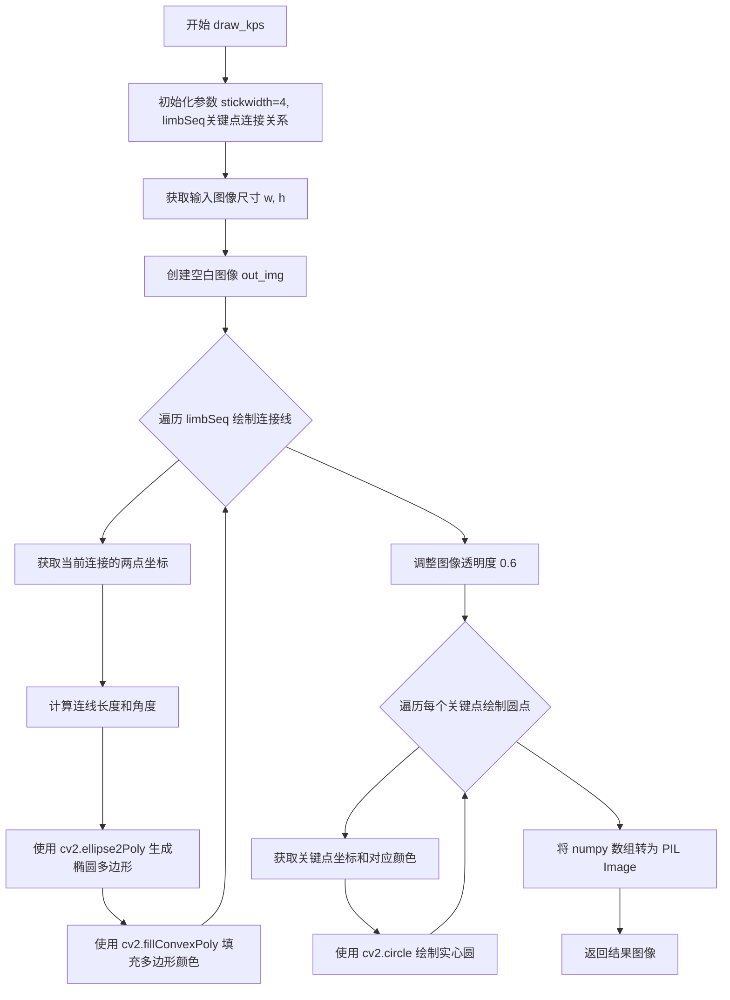
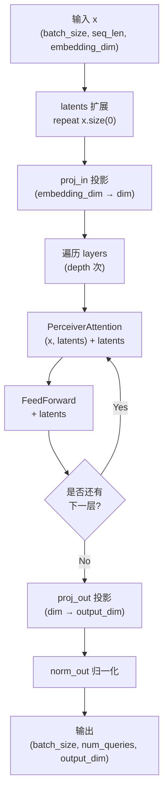
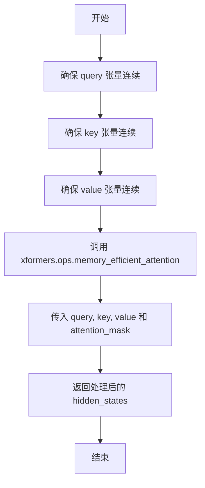
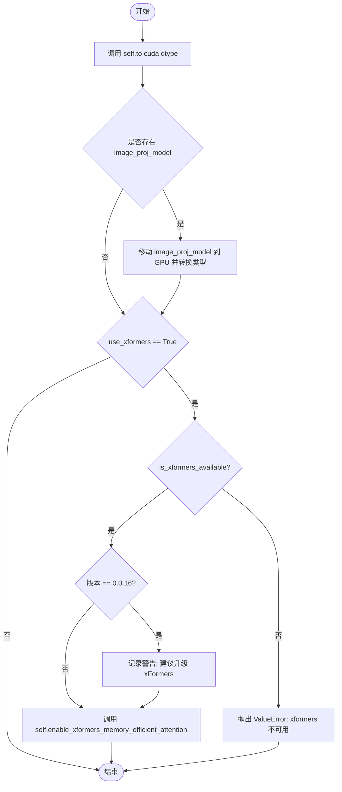
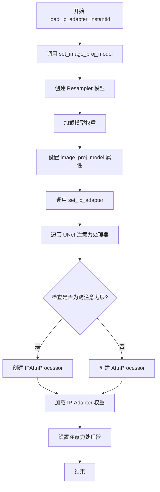
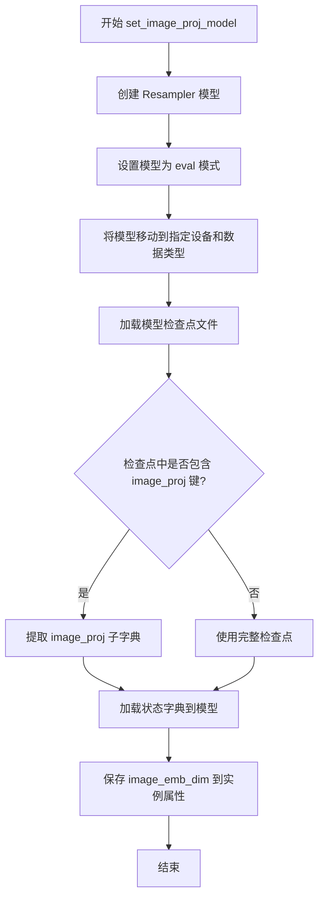
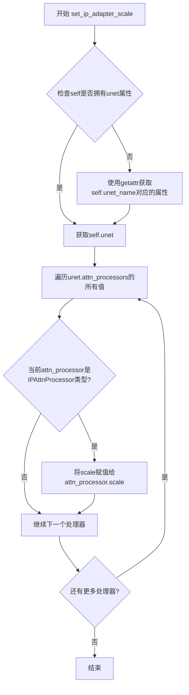
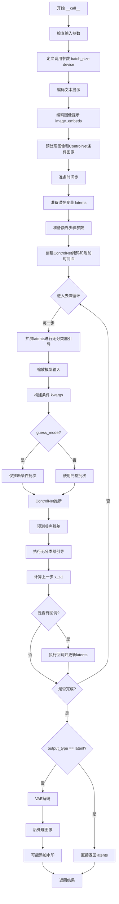

# `diffusers\examples\community\pipeline_stable_diffusion_xl_instandid_img2img.py` 详细设计文档

这是一个基于 Stable Diffusion XL 的 InstantID 图像生成管道（Pipeline），通过结合 ControlNet（用于面部关键点/结构控制）和 IP-Adapter（用于面部身份特征注入），实现了在保持原有角色身份的同时，根据文本提示生成或修改图像的功能。

## 整体流程

```mermaid
graph TD
    Start[开始] --> Init[初始化管道 & 加载模型]
    Init --> LoadIP[加载 IP-Adapter (Face Adapter)]
    Init --> LoadCN[加载 ControlNet (IdentityNet)]
    LoadIP --> Inference[执行推理 __call__]
    LoadCN --> Inference
    Inference --> EncodeText[编码文本 Prompt]
    EncodeText --> EncodeImgEmb[编码图像嵌入 (Face Embedding)]
    EncodeImgEmb --> Preprocess[预处理 Control Image (关键点)]
    Preprocess --> Denoise[去噪循环 (Denoising Loop)]
    Denoise --> ControlNet[调用 ControlNet 提取结构特征]
    Denoise --> IPAttn[在 UNet 中注入 IP-Adapter 注意力]
    Denoise --> Predict[UNet 预测噪声]
    Predict --> Scheduler[Scheduler 步进]
    Scheduler --> Check{是否完成所有步数?}
    Check -- 否 --> Denoise
    Check -- 是 --> VAEDecode[VAE 解码 Latents]
    VAEDecode --> Output[返回生成图像]
```

## 类结构

```
torch.nn.Module (基类)
├── PerceiverAttention (感知器注意力模块)
├── Resampler (图像嵌入重采样器)
├── AttnProcessor (默认注意力处理器)
└── IPAttnProcessor (IP-Adapter 注意力处理器)
StableDiffusionXLControlNetImg2ImgPipeline (Diffusers 基类)
└── StableDiffusionXLInstantIDImg2ImgPipeline (主管道类)
```

## 全局变量及字段


### `logger`
    
日志记录器，用于输出pipeline运行时的警告和信息

类型：`logging.Logger`
    


### `xformers_available`
    
xformers库可用性标志，指示是否安装了xformers以启用高效注意力

类型：`bool`
    


### `EXAMPLE_DOC_STRING`
    
示例文档字符串，包含InstantID pipeline的使用示例和代码演示

类型：`str`
    


### `FeedForward`
    
前馈神经网络函数，接受维度dim和倍数mult，返回包含LayerNorm、GELU激活和线性层的顺序网络

类型：`Callable[[int, int], nn.Sequential]`
    


### `reshape_tensor`
    
调整张量形状函数，将输入张量从(bs, length, width)转换为(bs*n_heads, length, dim_per_head)以适配多头注意力计算

类型：`Callable[[torch.Tensor, int], torch.Tensor]`
    


### `draw_kps`
    
在图像上绘制关键点函数，根据人脸关键点坐标使用椭圆和圆圈绘制可视化关键点

类型：`Callable[[PIL.Image, list, list], PIL.Image]`
    


### `PerceiverAttention.scale`
    
缩放因子，用于注意力分数计算，值为dim_head的-0.5次方

类型：`float`
    


### `PerceiverAttention.dim_head`
    
头维度，每个注意力头的特征维度大小

类型：`int`
    


### `PerceiverAttention.heads`
    
注意力头数，多头注意力机制中的头数量

类型：`int`
    


### `PerceiverAttention.norm1, norm2`
    
LayerNorm层，分别用于输入特征和潜在特征的归一化

类型：`nn.LayerNorm`
    


### `PerceiverAttention.to_q, to_kv, to_out`
    
线性层，to_q用于查询投影，to_kv用于键值联合投影，to_out用于输出投影

类型：`nn.Linear`
    


### `PerceiverAttention.forward(x, latents)`
    
前向传播方法，执行Perceiver注意力和前馈操作，返回处理后的潜在特征

类型：`Callable[[torch.Tensor, torch.Tensor], torch.Tensor]`
    


### `Resampler.latents`
    
可学习的查询向量参数，用于初始化查询token的潜在表示

类型：`nn.Parameter`
    


### `Resampler.proj_in`
    
输入投影层，将嵌入维度映射到内部维度

类型：`nn.Linear`
    


### `Resampler.proj_out`
    
输出投影层，将内部维度映射到输出维度

类型：`nn.Linear`
    


### `Resampler.norm_out`
    
输出归一化层，对最终输出进行层归一化

类型：`nn.LayerNorm`
    


### `Resampler.layers`
    
模块列表，包含PerceiverAttention和FeedForward层交替组成的多个处理层

类型：`nn.ModuleList`
    


### `Resampler.forward(x)`
    
前向传播方法，通过多层注意力和前馈网络处理输入特征并投影到输出维度

类型：`Callable[[torch.Tensor], torch.Tensor]`
    


### `IPAttnProcessor.hidden_size`
    
隐藏层大小，注意力层的隐藏维度

类型：`int`
    


### `IPAttnProcessor.cross_attention_dim`
    
跨注意力维度，用于控制图像提示特征的维度

类型：`Optional[int]`
    


### `IPAttnProcessor.scale`
    
IP特征权重，控制图像提示特征的贡献程度

类型：`float`
    


### `IPAttnProcessor.num_tokens`
    
IP特征长度，图像提示特征对应的token数量

类型：`int`
    


### `IPAttnProcessor.to_k_ip, to_v_ip`
    
IP特征投影层，分别用于图像提示特征的键和值投影

类型：`nn.Linear`
    


### `IPAttnProcessor.__call__(attn, hidden_states, ...)`
    
调用方法，执行IP-Adapter增强的注意力计算，包括主注意力分支和IP特征分支

类型：`Callable[..., torch.Tensor]`
    


### `IPAttnProcessor._memory_efficient_attention_xformers(...)`
    
使用xformers库的高效注意力实现，减少显存消耗

类型：`Callable[..., torch.Tensor]`
    


### `StableDiffusionXLInstantIDImg2ImgPipeline.image_proj_model`
    
图像投影模型，用于将人脸嵌入向量投影到与UNet跨注意力维度匹配的空间

类型：`Resampler`
    


### `StableDiffusionXLInstantIDImg2ImgPipeline.image_proj_model_in_features`
    
输入特征维度，图像投影模型接收的输入特征维度

类型：`int`
    


### `StableDiffusionXLInstantIDImg2ImgPipeline.cuda(dtype, use_xformers)`
    
将pipeline移至CUDA设备，可选启用xformers高效注意力

类型：`Callable[[torch.dtype, bool], None]`
    


### `StableDiffusionXLInstantIDImg2ImgPipeline.load_ip_adapter_instantid(model_ckpt, ...)`
    
加载InstantID的IP-Adapter模型和图像投影模型

类型：`Callable[..., None]`
    


### `StableDiffusionXLInstantIDImg2ImgPipeline.set_image_proj_model(model_ckpt, ...)`
    
设置图像投影模型，加载并初始化Resampler模型

类型：`Callable[..., None]`
    


### `StableDiffusionXLInstantIDImg2ImgPipeline.set_ip_adapter(model_ckpt, ...)`
    
设置IP-Adapter处理器，替换UNet的注意力处理器为IPAttnProcessor

类型：`Callable[..., None]`
    


### `StableDiffusionXLInstantIDImg2ImgPipeline.set_ip_adapter_scale(scale)`
    
设置IP-Adapter的缩放因子，控制图像提示对生成的影响程度

类型：`Callable[[float], None]`
    


### `StableDiffusionXLInstantIDImg2ImgPipeline._encode_prompt_image_emb(prompt_image_emb, ...)`
    
编码图像提示嵌入，将人脸嵌入向量通过投影模型转换为UNet可用的条件嵌入

类型：`Callable[..., torch.Tensor]`
    


### `StableDiffusionXLInstantIDImg2ImgPipeline.__call__(...)`
    
主生成方法，执行Stable Diffusion XL的Img2Img推理，结合ControlNet和IP-Adapter进行身份保持的图像生成

类型：`Callable[..., Union[StableDiffusionXLPipelineOutput, Tuple]]`
    
    

## 全局函数及方法


### `FeedForward`

这是一个前馈神经网络模块（Feed Forward Network），通常用于Transformer架构中。它包含层归一化、两个线性层（全连接层）以及GELU激活函数，用于对输入特征进行非线性变换和维度映射。

参数：

- `dim`：`int`，输入特征的维度
- `mult`：`int`（默认值4），扩展因子，用于计算内部隐藏层维度

返回值：`nn.Sequential`，返回一个包含层归一化、线性变换、GELU激活和输出线性变换的顺序容器模块

#### 流程图

```mermaid
flowchart TD
    A[输入 x<br/>shape: (batch, seq_len, dim)] --> B[LayerNorm(dim)]
    B --> C[Linear(dim → inner_dim)<br/>inner_dim = dim × mult]
    C --> D[GELU 激活函数]
    D --> E[Linear(inner_dim → dim)]
    E --> F[输出 x<br/>shape: (batch, seq_len, dim)]
    
    style A fill:#e1f5fe
    style F fill:#e1f5fe
    style B fill:#fff3e0
    style C fill:#fff3e0
    style D fill:#fff3e0
    style E fill:#fff3e0
```

#### 带注释源码

```python
def FeedForward(dim, mult=4):
    """
    前馈神经网络模块（Feed Forward Network）
    
    这是一个标准的前馈网络块，通常用于Transformer架构中。
    它通过扩展维度到 inner_dim = dim * mult，然后映射回原始维度，
    为模型提供非线性变换能力。
    
    Args:
        dim (int): 输入和输出的特征维度
        mult (int): 扩展因子，默认为4。内部维度 = dim * mult
    
    Returns:
        nn.Sequential: 包含以下层的顺序容器:
            - nn.LayerNorm(dim): 层归一化
            - nn.Linear(dim, inner_dim, bias=False): 第一个线性层（升维）
            - nn.GELU(): Gaussian Error Linear Unit 激活函数
            - nn.Linear(inner_dim, dim, bias=False): 第二个线性层（降维）
    """
    # 计算内部隐藏层维度：dim * mult
    # 例如：dim=1024, mult=4 时，inner_dim=4096
    inner_dim = int(dim * mult)
    
    # 返回一个顺序容器，包含完整的前馈网络结构
    return nn.Sequential(
        # LayerNorm: 对输入进行层归一化，有助于训练稳定性
        nn.LayerNorm(dim),
        
        # 第一个线性层：从 dim 扩展到 inner_dim
        # bias=False 是因为后续有 LayerNorm，偏置不起作用
        nn.Linear(dim, inner_dim, bias=False),
        
        # GELU 激活函数：Gaussian Error Linear Unit
        # 比 ReLU 更平滑，是 Transformer 模型的标准选择
        nn.GELU(),
        
        # 第二个线性层：从 inner_dim 映射回 dim
        # 保持输出维度与输入维度一致
        nn.Linear(inner_dim, dim, bias=False),
    )
```


### `reshape_tensor`

用于多头注意力计算的tensor reshape工具，将输入tensor从形状 (bs, length, width) 转换为 (bs*heads, length, dim_per_head) 以适配多头注意力机制。

参数：

- `x`：`torch.Tensor`，输入的tensor，形状为 (bs, length, width)，其中 bs 是batch size，length是序列长度，width是特征维度
- `heads`：`int`，多头注意力中的头数

返回值：`torch.Tensor`，重塑后的tensor，形状为 (bs*heads, length, dim_per_head)，其中 dim_per_head = width // heads

#### 流程图

```mermaid
flowchart TD
    A[输入 tensor x: (bs, length, width)] --> B[解包形状: bs, length, width = x.shape]
    B --> C[view 操作: (bs, length, width) --> (bs, length, heads, -1)]
    C --> D[transpose 操作: (bs, length, heads, dim_per_head) --> (bs, heads, length, dim_per_head)]
    D --> E[reshape 操作: (bs, heads, length, dim_per_head) --> (bs*heads, length, dim_per_head)]
    E --> F[返回重塑后的 tensor]
```

#### 带注释源码

```python
def reshape_tensor(x, heads):
    """
    将输入tensor重塑为多头注意力所需的格式
    
    参数:
        x: 输入tensor，形状为 (batch_size, seq_len, hidden_dim)
        heads: 多头注意力中的头数
    
    返回:
        重塑后的tensor，形状为 (batch_size * heads, seq_len, hidden_dim // heads)
    """
    # 解包输入tensor的形状
    # bs: batch size, length: 序列长度, width: 隐藏层维度
    bs, length, width = x.shape
    
    # 第一步：view 操作
    # (bs, length, width) --> (bs, length, n_heads, dim_per_head)
    # -1 表示自动计算维度，即 width // heads
    x = x.view(bs, length, heads, -1)
    
    # 第二步：transpose 操作
    # (bs, length, n_heads, dim_per_head) --> (bs, n_heads, length, dim_per_head)
    # 交换 length 和 heads 维度，便于后续注意力计算
    x = x.transpose(1, 2)
    
    # 第三步：reshape 操作
    # (bs, n_heads, length, dim_per_head) --> (bs*n_heads, length, dim_per_head)
    # 将 batch size 和头数合并，便于批量注意力计算
    x = x.reshape(bs, heads, length, -1)
    
    return x
```


### `draw_kps`

该函数是用于将面部关键点（Keypoints）绘制在输入的 PIL 图像上，并返回带有可视化关键点的图像。它通过绘制关键点之间的连接线（使用椭圆表示）和关键点点（使用圆圈表示）来可视化面部关键点的位置信息，常用于人脸识别或面部处理的调试与结果展示场景。

参数：

- `image_pil`：`PIL.Image.Image` 或 `PIL.Image`，输入的原始 PIL 格式图像，用于确定输出图像的尺寸
- `kps`：任意类型，关键点坐标数据，通常为包含多个 (x, y) 坐标的列表或数组，格式如 `[[x1, y1], [x2, y2], ...]`
- `color_list`：列表类型，可选参数，默认为 `[(255, 0, 0), (0, 255, 0), (0, 0, 255), (255, 255, 0), (255, 0, 255)]`，用于指定关键点和连接线的颜色顺序，每个元素为 RGB 元组

返回值：`PIL.Image.Image`，返回绘制了关键点可视化结果的 PIL 图像对象

#### 流程图



#### 带注释源码

```python
def draw_kps(image_pil, kps, color_list=[(255, 0, 0), (0, 255, 0), (0, 0, 255), (255, 255, 0), (255, 0, 255)]):
    """
    在 PIL 图像上绘制面部关键点可视化结果
    
    Args:
        image_pil: 输入的 PIL 图像对象
        kps: 关键点坐标列表，格式为 [[x1, y1], [x2, y2], ...]
        color_list: 可选的颜色列表，用于给不同关键点/连接线着色
    
    Returns:
        绘制了关键点的 PIL 图像对象
    """
    # 定义连接线的宽度
    stickwidth = 4
    # 定义关键点之间的连接关系，数组索引表示关键点编号
    # 例如 [0, 2] 表示关键点0和关键点2之间有连接
    limbSeq = np.array([[0, 2], [1, 2], [3, 2], [4, 2]])
    # 将关键点数据转换为 numpy 数组便于处理
    kps = np.array(kps)

    # 获取输入图像的宽度和高度
    w, h = image_pil.size
    # 创建与输入图像尺寸相同的空白图像（黑色背景）
    out_img = np.zeros([h, w, 3])

    # 遍历连接关系，绘制关键点之间的连线（使用椭圆表示）
    for i in range(len(limbSeq)):
        # 获取当前连接的两点索引
        index = limbSeq[i]
        # 根据连接线起始点的索引选择对应颜色
        color = color_list[index[0]]

        # 提取两个关键点的 x, y 坐标
        x = kps[index][:, 0]
        y = kps[index][:, 1]
        # 计算两点之间的欧几里得距离（连线长度）
        length = ((x[0] - x[1]) ** 2 + (y[0] - y[1]) ** 2) ** 0.5
        # 计算连线的角度（弧度转角度）
        angle = math.degrees(math.atan2(y[0] - y[1], x[0] - x[1]))
        # 使用椭圆多边形近似椭圆弧线
        # 参数: 中心点, (长轴半径, 短轴半径即stickwidth), 旋转角度, 起始角度, 终止角度, 步长
        polygon = cv2.ellipse2Poly(
            (int(np.mean(x)), int(np.mean(y))), (int(length / 2), stickwidth), int(angle), 0, 360, 1
        )
        # 填充多边形区域（注意使用 copy() 避免就地修改影响后续迭代）
        out_img = cv2.fillConvexPoly(out_img.copy(), polygon, color)
    
    # 将图像亮度降低（乘以 0.6），使连线不会过于显眼
    out_img = (out_img * 0.6).astype(np.uint8)

    # 遍历每个关键点，绘制圆圈标记
    for idx_kp, kp in enumerate(kps):
        # 使用对应索引的颜色
        color = color_list[idx_kp]
        # 提取关键点坐标
        x, y = kp
        # 在关键点位置绘制实心圆（半径为10，-1表示实心填充）
        out_img = cv2.circle(out_img.copy(), (int(x), int(y)), 10, color, -1)

    # 将处理后的 numpy 数组转换回 PIL Image 对象
    out_img_pil = PIL.Image.fromarray(out_img.astype(np.uint8))
    return out_img_pil
```


### PerceiverAttention.forward

该方法实现了Perceiver架构中的交叉注意力机制，通过将图像特征（x）作为键和值来源， latent特征作为查询来源，使latent向量能够 attend 到图像特征中的相关信息。这是InstantID中实现身份保持的关键模块。

参数：

- `x`：`torch.Tensor`，图像特征，形状为 (b, n1, D)，其中 b 是批量大小，n1 是图像特征的序列长度，D 是特征维度
- `latents`：`torch.Tensor`，潜在特征，形状为 (b, n2, D)，需要通过注意力机制更新的向量

返回值：`torch.Tensor`，经过注意力机制处理后的潜在特征，形状为 (b, n2, D)

#### 流程图

```mermaid
flowchart TD
    A[开始: forward x, latents] --> B[归一化处理<br/>norm1: x = self.norm1(x)<br/>norm2: latents = self.norm2(latents)]
    B --> C[获取batch和序列长度<br/>b, l, _ = latents.shape]
    C --> D[计算Query<br/>q = self.to_q(latents)]
    D --> E[拼接Key-Value输入<br/>kv_input = torch.cat(x, latents)]
    E --> F[计算Key和Value<br/>k, v = self.to_kv(kv_input).chunk2]
    F --> G[重塑张量以适配多头注意力<br/>reshape_tensor: (bs, n_heads, length, dim_per_head)]
    G --> H[注意力计算<br/>scale = 1 / sqrt(sqrt(dim_head))<br/>weight = softmax((q*scale) @ (k*scale)^T)]
    H --> I[加权聚合<br/>out = weight @ v]
    I --> J[恢复形状<br/>out.permute.reshape: (b, l, -1)]
    J --> K[输出投影<br/>return self.to_out(out)]
    K --> L[结束]
```

#### 带注释源码

```python
def forward(self, x, latents):
    """
    执行Perceiver风格的交叉注意力计算。
    
    核心思想：让latent queriesattend 到image features的keys和values，
    从而实现图像信息向潜在空间的传递。
    
    Args:
        x (torch.Tensor): 图像特征，shape (b, n1, D)
        latents (torch.Tensor): 潜在特征/查询向量，shape (b, n2, D)
    
    Returns:
        torch.Tensor: 更新后的潜在特征，shape (b, n2, D)
    """
    # Step 1: Pre-norm 归一化 - Pre-LN结构，有助于训练稳定性
    x = self.norm1(x)           # 对图像特征进行LayerNorm
    latents = self.norm2(latents)  # 对潜在特征进行LayerNorm

    # Step 2: 获取批量大小和序列长度
    b, l, _ = latents.shape     # b=batch, l=latent序列长度

    # Step 3: 计算Query - 只从latents计算query
    # 将latents从dim投影到inner_dim (dim_head * heads)
    q = self.to_q(latents)

    # Step 4: 构造Key-Value输入 - 将图像特征和latent特征拼接
    # 拼接后在最后一个维度：总长度 = n1 + n2
    # 这样k和v同时包含图像信息和latent信息
    kv_input = torch.cat((x, latents), dim=-2)

    # Step 5: 计算Key和Value - 共享的线性变换
    # 输出维度是inner_dim * 2，用chunk(2)分割为k和v
    k, v = self.to_kv(kv_input).chunk(2, dim=-1)

    # Step 6: 重塑张量以适配多头注意力机制
    # 从 (b, length, heads, dim_per_head) -> (b, heads, length, dim_per_head)
    q = reshape_tensor(q, self.heads)
    k = reshape_tensor(k, self.heads)
    v = reshape_tensor(v, self.heads)

    # Step 7: 注意力计算 - 使用scaled dot-product attention
    # 采用scale = 1/sqrt(sqrt(dim_head))而非1/sqrt(dim_head)
    # 这样在f16精度下更稳定，避免除法后溢出
    scale = 1 / math.sqrt(math.sqrt(self.dim_head))
    weight = (q * scale) @ (k * scale).transpose(-2, -1)
    
    # Softmax归一化 - 转回float计算再转回原dtype
    weight = torch.softmax(weight.float(), dim=-1).type(weight.dtype)
    
    # 加权聚合 - attention weights乘以values
    out = weight @ v

    # Step 8: 恢复形状 - 从多头格式转回完整特征维度
    # (b, heads, l, dim_per_head) -> (b, l, heads, dim_per_head) -> (b, l, D)
    out = out.permute(0, 2, 1, 3).reshape(b, l, -1)

    # Step 9: 输出投影 - 从inner_dim投影回原始dim
    return self.to_out(out)
```


### `Resampler.forward`

该函数实现了一个基于Perceiver架构的注意力机制，用于将输入的图像嵌入（image embeddings）转换为适配扩散模型UNet的查询 token。核心流程包括：初始化可学习的查询 latent 向量，通过线性投影调整维度，循环执行自注意力与前馈网络 Transform 操作，最后投影到目标输出维度并归一化。

参数：

-  `x`：`torch.Tensor`，输入的图像嵌入张量，形状为 (batch_size, sequence_length, embedding_dim)，通常来源于人脸特征提取器（如 InsightFace）的embedding输出。

返回值：`torch.Tensor`，转换后的图像 prompt 嵌入，形状为 (batch_size, num_queries, output_dim)，可作为 IP-Adapter 的图像条件输入到 Stable Diffusion XL 的 cross-attention 层。

#### 流程图



#### 带注释源码

```python
def forward(self, x):
    """
    Args:
        x (torch.Tensor): 输入的图像嵌入向量
            shape: (batch_size, sequence_length, embedding_dim)
            来自人脸识别模型的embedding输出
    """
    # 步骤1: 将可学习的查询向量 latents 扩展到与输入批次大小相同
    # latents 初始形状: (1, num_queries, dim) → (batch_size, num_queries, dim)
    latents = self.latents.repeat(x.size(0), 1, 1)
    
    # 步骤2: 将输入投影到内部维度
    # proj_in: Linear(embedding_dim, dim)
    x = self.proj_in(x)
    
    # 步骤3: 遍历每一层 Perceiver 块（包含注意力 + 前馈网络）
    for attn, ff in self.layers:
        # PerceiverAttention: 使用输入 x 作为 key/value 来源，latents 作为 query
        # 注意力计算: latents = Attn(x, latents) + latents (残差连接)
        latents = attn(x, latents) + latents
        
        # FeedForward: 前馈网络进一步处理 latents
        # latents = FF(latents) + latents (残差连接)
        latents = ff(latents) + latents
    
    # 步骤4: 投影到输出维度并归一化
    # proj_out: Linear(dim, output_dim)，通常 output_dim = unet.config.cross_attention_dim
    latents = self.proj_out(latents)
    
    # 步骤5: LayerNorm 归一化输出
    return self.norm_out(latents)
```


### `AttnProcessor.__call__`

默认的注意力处理器，用于执行注意力相关的计算。它是Stable Diffusion模型中使用的标准注意力处理器，负责计算query、key、value的注意力权重并输出经过注意力机制处理的隐藏状态。

参数：

- `attn`：`nn.Module`，注意力模块，包含to_q、to_k、to_v等线性层以及group_norm、spatial_norm等归一化层
- `hidden_states`：`torch.Tensor`，输入的隐藏状态，形状为(batch_size, channel, height, width)或(batch_size, sequence_length, hidden_dim)
- `encoder_hidden_states`：`torch.Tensor`，可选，编码器的隐藏状态，用于cross-attention计算
- `attention_mask`：`torch.Tensor`，可选，用于屏蔽特定位置的注意力权重
- `temb`：`torch.Tensor`，可选，时间嵌入，用于spatial_norm处理

返回值：`torch.Tensor`，经过注意力处理后的隐藏状态，形状与输入hidden_states相同

#### 流程图

```mermaid
flowchart TD
    A[开始 __call__] --> B[保存残差: residual = hidden_states]
    B --> C{spatial_norm是否存在?}
    C -->|是| D[应用spatial_norm: hidden_states = attn.spatial_normhidden_states, temb)]
    C -->|否| E[跳过spatial_norm]
    D --> E
    E --> F{输入维度是否为4?}
    F -->|是| G[reshape: (B,C,H,W) -> (B,C,H*W) -> (B,H*W,C)]
    F -->|否| H[保持2D张量]
    G --> H
    H --> I[获取sequence_length和batch_size]
    I --> J[准备attention_mask]
    J --> K{group_norm是否存在?}
    K -->|是| L[应用group_norm: hidden_states = attn.group_normhidden_states.transpose1, 2).transpose1, 2)]
    K -->|否| M[跳过group_norm]
    L --> N[计算query: query = attn.to_qhidden_states]
    M --> N
    N --> O{encoder_hidden_states是否为None?}
    O -->|是| P[encoder_hidden_states = hidden_states]
    O -->|否| Q{是否需要norm_cross?}
    Q -->|是| R[norm_encoder_hidden_states: encoder_hidden_states = attn.norm_encoder_hidden_statesencoder_hidden_states]
    Q -->|否| S[跳过norm]
    P --> T
    R --> T
    S --> T
    T --> U[计算key: key = attn.to_kencoder_hidden_states]
    T --> V[计算value: value = attn.to_vencoder_hidden_states]
    U --> W[将query/key/value从batch维度转换到head维度]
    V --> W
    W --> X[计算注意力分数: attention_probs = attn.get_attention_scoresquery, key, attention_mask]
    X --> Y[计算加权值: hidden_states = torch.bmmattention_probs, value]
    Y --> Z[将hidden_states从head维度转回batch维度]
    Z --> AA[线性投影: hidden_states = attn.to_out[0]hidden_states]
    AA --> AB[Dropout: hidden_states = attn.to_out[1]hidden_states]
    AB --> AC{输入维度是否为4?}
    AC -->|是| AD[reshape回4D: (B,H*W,C) -> (B,C,H,W)]
    AC -->|否| AE[保持2D张量]
    AD --> AF
    AE --> AF
    AF --> AG{residual_connection是否为真?}
    AG -->|是| AH[残差连接: hidden_states = hidden_states + residual]
    AG -->|否| AI[跳过残差]
    AH --> AJ[输出缩放: hidden_states = hidden_states / attn.rescale_output_factor]
    AI --> AJ
    AJ --> AK[返回hidden_states]
```

#### 带注释源码

```python
def __call__(
    self,
    attn,
    hidden_states,
    encoder_hidden_states=None,
    attention_mask=None,
    temb=None,
):
    """
    执行注意力计算的核心方法
    
    参数:
        attn: Attention模块，包含to_q, to_k, to_v, to_out等线性层
        hidden_states: 输入的隐藏状态张量
        encoder_hidden_states: 可选的编码器隐藏状态，用于cross-attention
        attention_mask: 可选的注意力掩码
        temb: 可选的时间嵌入，用于spatial_norm
    
    返回:
        经过注意力处理后的隐藏状态
    """
    # 步骤1: 保存残差连接，用于后续的残差计算
    residual = hidden_states

    # 步骤2: 如果存在spatial_norm，则应用它（用于图像空间的归一化）
    if attn.spatial_norm is not None:
        hidden_states = attn.spatial_norm(hidden_states, temb)

    # 步骤3: 获取输入张量的维度
    input_ndim = hidden_states.ndim

    # 步骤4: 如果是4D张量 (batch, channel, height, width)，转换为3D (batch, seq_len, channel)
    if input_ndim == 4:
        batch_size, channel, height, width = hidden_states.shape
        # (B, C, H, W) -> (B, C, H*W) -> (B, H*W, C)
        hidden_states = hidden_states.view(batch_size, channel, height * width).transpose(1, 2)

    # 步骤5: 获取序列长度和批次大小
    batch_size, sequence_length, _ = (
        hidden_states.shape if encoder_hidden_states is None else encoder_hidden_states.shape
    )
    
    # 步骤6: 准备注意力掩码
    attention_mask = attn.prepare_attention_mask(attention_mask, sequence_length, batch_size)

    # 步骤7: 如果存在group_norm，则应用它
    if attn.group_norm is not None:
        hidden_states = attn.group_norm(hidden_states.transpose(1, 2)).transpose(1, 2)

    # 步骤8: 计算query（查询向量）
    query = attn.to_q(hidden_states)

    # 步骤9: 处理encoder_hidden_states
    if encoder_hidden_states is None:
        # 如果没有encoder_hidden_states，则使用hidden_states作为self-attention
        encoder_hidden_states = hidden_states
    elif attn.norm_cross:
        # 如果需要归一化cross hidden states
        encoder_hidden_states = attn.norm_encoder_hidden_states(encoder_hidden_states)

    # 步骤10: 计算key和value（键和值向量）
    key = attn.to_k(encoder_hidden_states)
    value = attn.to_v(encoder_hidden_states)

    # 步骤11: 将query/key/value从(batch, seq, dim)转换为(batch, heads, seq, head_dim)
    query = attn.head_to_batch_dim(query)
    key = attn.head_to_batch_dim(key)
    value = attn.head_to_batch_dim(value)

    # 步骤12: 计算注意力分数
    attention_probs = attn.get_attention_scores(query, key, attention_mask)
    
    # 步骤13: 使用注意力分数加权value
    hidden_states = torch.bmm(attention_probs, value)
    
    # 步骤14: 将hidden_states从多头维度转回batch维度
    hidden_states = attn.batch_to_head_dim(hidden_states)

    # 步骤15: 线性投影（输出层）
    hidden_states = attn.to_out[0](hidden_states)
    
    # 步骤16: Dropout
    hidden_states = attn.to_out[1](hidden_states)

    # 步骤17: 如果输入是4D，则转回4D形状
    if input_ndim == 4:
        hidden_states = hidden_states.transpose(-1, -2).reshape(batch_size, channel, height, width)

    # 步骤18: 残差连接
    if attn.residual_connection:
        hidden_states = hidden_states + residual

    # 步骤19: 输出缩放（用于数值稳定性）
    hidden_states = hidden_states / attn.rescale_output_factor

    return hidden_states
```


### `IPAttnProcessor.__call__`

这是 IP-Adapter 的注意力处理器核心方法，负责在 Stable Diffusion UNet 的注意力层中同时处理文本提示和图像提示（IP Embedding）的注意力计算，实现图像提示对生成过程的条件引导。

参数：

- `attn`：`nn.Module`，注意力模块本身，包含 `to_q`、`to_k`、`to_v`、`to_out`、`prepare_attention_mask`、`head_to_batch_dim`、`batch_to_head_dim`、`get_attention_scores` 等方法及 `spatial_norm`、`group_norm`、`norm_cross`、`residual_connection`、`rescale_output_factor` 等属性
- `hidden_states`：`torch.Tensor`，输入的隐藏状态，形状为 `(batch_size, sequence_length, hidden_size)` 或 `(batch_size, channel, height, width)` 的 4D 张量
- `encoder_hidden_states`：`torch.Tensor`，可选，编码器的隐藏状态（即文本嵌入），形状为 `(batch_size, text_seq_len, hidden_size)`，如果同时包含图像提示，则最后 `num_tokens` 个 token 为图像提示嵌入
- `attention_mask`：`torch.Tensor`，可选，注意力掩码，用于屏蔽某些位置的注意力计算
- `temb`：`torch.Tensor`，可选，时间嵌入，用于空间归一化

返回值：`torch.Tensor`，经过注意力计算和 IP-Adapter 融合后的隐藏状态，形状与输入 `hidden_states` 相同

#### 流程图

```mermaid
flowchart TD
    A[开始: __call__] --> B[保存残差 residual = hidden_states]
    B --> C{hidden_states是4D?}
    C -->|是| D[展平为2D: (B, C, H*W)->(B, H*W, C)]
    C -->|否| E[获取batch_size和sequence_length]
    D --> E
    E --> F[准备attention_mask]
    F --> G{attn有group_norm?}
    G -->|是| H[执行group_norm]
    G -->|否| I[计算query: attn.to_q(hidden_states)]
    H --> I
    I --> J{encoder_hidden_states存在?}
    J -->|否| K[令encoder_hidden_states = hidden_states]
    J -->|是| L{分离文本和图像嵌入}
    L --> M[计算end_pos = seq_len - num_tokens]
    M --> N[encoder_hidden_states: 0:end_pos]
    N --> O[ip_hidden_states: end_pos:]
    O --> P{attn.norm_cross?}
    P -->|是| Q[归一化encoder_hidden_states]
    P -->|否| R[计算key和value: attn.to_k/to_v]
    Q --> R
    K --> R
    R --> S[将query/key/value转换到batch维度]
    S --> T{xformers可用?}
    T -->|是| U[调用_memory_efficient_attention_xformers]
    T -->|否| V[计算注意力分数和hidden_states]
    U --> W[转换回原始维度]
    V --> W
    W --> X[计算IP Adapter的key/value: to_k_ip/to_v_ip]
    X --> Y{IP部分xformers可用?}
    Y -->|是| Z[调用xformers计算IP注意力]
    Y -->|否| AA[计算IP注意力分数和hidden_states]
    Z --> AB[转换回原始维度]
    AA --> AB
    AB --> AC[融合: hidden_states + scale * ip_hidden_states]
    AC --> AD[线性投影: attn.to_out[0]]
    AD --> AE[Dropout: attn.to_out[1]]
    AE --> AF{输入是4D?}
    AF -->|是| AG[恢复4D形状]
    AF -->|否| AH{residual_connection?}
    AG --> AH
    AH -->|是| AI[加回残差: hidden_states + residual]
    AH -->|否| AJ[输出缩放: hidden_states / rescale_output_factor]
    AI --> AJ
    AJ --> AK[返回hidden_states]
```

#### 带注释源码

```python
def __call__(
    self,
    attn,
    hidden_states,
    encoder_hidden_states=None,
    attention_mask=None,
    temb=None,
):
    """
    IP-Adapter注意力处理器的核心调用方法
    实现了同时处理文本提示和图像提示（IP Embedding）的注意力计算
    
    Args:
        attn: 注意力模块，包含权重和方法
        hidden_states: 输入隐藏状态
        encoder_hidden_states: 编码器隐藏状态（文本嵌入），末尾包含图像提示
        attention_mask: 注意力掩码
        temb: 时间嵌入
    """
    # 步骤1: 保存残差连接所需的原始hidden_states
    residual = hidden_states

    # 步骤2: 如果有空间归一化，先应用
    if attn.spatial_norm is not None:
        hidden_states = attn.spatial_norm(hidden_states, temb)

    # 步骤3: 判断输入维度，如果是4D (B, C, H, W) 则展平为2D (B, H*W, C)
    input_ndim = hidden_states.ndim
    if input_ndim == 4:
        batch_size, channel, height, width = hidden_states.shape
        hidden_states = hidden_states.view(batch_size, channel, height * width).transpose(1, 2)

    # 步骤4: 获取batch_size和sequence_length
    batch_size, sequence_length, _ = (
        hidden_states.shape if encoder_hidden_states is None else encoder_hidden_states.shape
    )
    
    # 步骤5: 准备注意力掩码
    attention_mask = attn.prepare_attention_mask(attention_mask, sequence_length, batch_size)

    # 步骤6: 如果有组归一化，应用它
    if attn.group_norm is not None:
        hidden_states = attn.group_norm(hidden_states.transpose(1, 2)).transpose(1, 2)

    # 步骤7: 计算Query
    query = attn.to_q(hidden_states)

    # 步骤8: 处理encoder_hidden_states
    if encoder_hidden_states is None:
        # 如果没有提供，则使用hidden_states本身
        encoder_hidden_states = hidden_states
    else:
        # 分离文本嵌入和图像提示嵌入（IP Embedding）
        # 图像提示嵌入位于序列的末尾，长度为num_tokens
        end_pos = encoder_hidden_states.shape[1] - self.num_tokens
        encoder_hidden_states, ip_hidden_states = (
            encoder_hidden_states[:, :end_pos, :],  # 文本嵌入
            encoder_hidden_states[:, end_pos:, :],  # 图像提示嵌入
        )
        # 如果需要，归一化文本嵌入
        if attn.norm_cross:
            encoder_hidden_states = attn.norm_encoder_hidden_states(encoder_hidden_states)

    # 步骤9: 计算文本部分的Key和Value
    key = attn.to_k(encoder_hidden_states)
    value = attn.to_v(encoder_hidden_states)

    # 步骤10: 将张量从 (batch, seq, head, dim) 转换为 (batch, head, seq, dim)
    query = attn.head_to_batch_dim(query)
    key = attn.head_to_batch_dim(key)
    value = attn.head_to_batch_dim(value)

    # 步骤11: 计算文本注意力和hidden_states
    if xformers_available:
        # 使用xformers的高效注意力计算
        hidden_states = self._memory_efficient_attention_xformers(query, key, value, attention_mask)
    else:
        # 标准注意力计算: attention_probs = softmax(QK^T / sqrt(d)) * V
        attention_probs = attn.get_attention_scores(query, key, attention_mask)
        hidden_states = torch.bmm(attention_probs, value)
    
    # 步骤12: 转换回 (batch, seq, hidden_size)
    hidden_states = attn.batch_to_head_dim(hidden_states)

    # 步骤13: 处理IP-Adapter的图像提示部分
    # 使用专门的投影层将图像提示投影到与query相同的空间
    ip_key = self.to_k_ip(ip_hidden_states)
    ip_value = self.to_v_ip(ip_hidden_states)

    # 转换到batch维度
    ip_key = attn.head_to_batch_dim(ip_key)
    ip_value = attn.head_to_batch_dim(ip_value)

    # 步骤14: 计算IP注意力和hidden_states
    if xformers_available:
        ip_hidden_states = self._memory_efficient_attention_xformers(query, ip_key, ip_value, None)
    else:
        ip_attention_probs = attn.get_attention_scores(query, ip_key, None)
        ip_hidden_states = torch.bmm(ip_attention_probs, ip_value)
    
    ip_hidden_states = attn.batch_to_head_dim(ip_hidden_states)

    # 步骤15: 融合文本注意力和IP注意力结果
    # scale控制IP提示的影响权重
    hidden_states = hidden_states + self.scale * ip_hidden_states

    # 步骤16: 应用输出投影和Dropout
    hidden_states = attn.to_out[0](hidden_states)  # 线性投影
    hidden_states = attn.to_out[1](hidden_states)  # Dropout

    # 步骤17: 如果输入是4D，恢复原始形状
    if input_ndim == 4:
        hidden_states = hidden_states.transpose(-1, -2).reshape(batch_size, channel, height, width)

    # 步骤18: 残差连接
    if attn.residual_connection:
        hidden_states = hidden_states + residual

    # 步骤19: 输出缩放
    hidden_states = hidden_states / attn.rescale_output_factor

    return hidden_states
```


### `IPAttnProcessor._memory_efficient_attention_xformers`

该方法是一个私有方法，使用 xFormers 库的内存高效注意力机制来计算注意力输出，相比标准注意力机制能够显著降低显存占用，适用于大规模模型的推理过程。

参数：

- `query`：`torch.Tensor`，查询向量，形状为 (batch_size, num_heads, seq_len, head_dim)
- `key`：`torch.Tensor`，键向量，形状为 (batch_size, num_heads, seq_len, head_dim)
- `value`：`torch.Tensor`，值向量，形状为 (batch_size, num_heads, seq_len, head_dim)
- `attention_mask`：`Optional[torch.Tensor]`，注意力掩码，用于控制哪些位置参与注意力计算

返回值：`torch.Tensor`，经过注意力机制处理后的隐藏状态向量

#### 流程图



#### 带注释源码

```python
def _memory_efficient_attention_xformers(self, query, key, value, attention_mask):
    """
    使用 xFormers 库的内存高效注意力机制计算注意力输出。
    
    该方法是对标准注意力计算的优化实现，通过 xFormers 的
    memory_efficient_attention 函数，可以显著降低显存占用，
    特别适用于长序列和大规模模型的场景。
    
    Args:
        query: 查询向量，用于计算注意力权重
        key: 键向量，用于与查询进行匹配
        value: 值向量，用于加权求和得到输出
        attention_mask: 可选的注意力掩码，用于控制注意力范围
    
    Returns:
        hidden_states: 经过注意力机制处理后的输出
    """
    # TODO: attention_mask 参数尚未完全实现，可能需要进一步处理
    # 确保张量在内存中是连续存储的，这是 xFormers 的要求
    query = query.contiguous()
    key = key.contiguous()
    value = value.contiguous()
    
    # 调用 xFormers 的内存高效注意力计算
    # attn_bias 参数用于传入注意力掩码
    hidden_states = xformers.ops.memory_efficient_attention(
        query, 
        key, 
        value, 
        attn_bias=attention_mask
    )
    
    return hidden_states
```


### `StableDiffusionXLInstantIDImg2ImgPipeline.cuda`

该方法属于 `StableDiffusionXLInstantIDImg2ImgPipeline` 类，负责将 Diffusion Pipeline 的所有组件（包括 UNet、VAE、文本编码器等）移至 CUDA 设备以启用 GPU 加速，并可选地启用 xFormers 内存高效注意力机制来优化推理速度与显存占用。

参数：

-  `dtype`：`torch.dtype`（默认值为 `torch.float16`），指定模型权重在 GPU 上的数据类型（精度），如 `float16` 或 `float32`。
-  `use_xformers`：`bool`（默认值为 `False`），是否启用 xFormers 库提供的内存高效注意力（Memory Efficient Attention）优化。

返回值：`None`，该方法直接修改对象状态，不返回任何值。

#### 流程图



#### 带注释源码

```python
def cuda(self, dtype=torch.float16, use_xformers=False):
    """
    将管道所有组件移至 CUDA 设备。
    Args:
        dtype (torch.dtype): 模型权重的数据类型，默认为 torch.float16。
        use_xformers (bool): 是否启用 xFormers 内存高效注意力，默认为 False。
    """
    # 1. 将继承自父类的所有组件（如 unet, vae, text_encoder 等）移至 cuda 并转换 dtype
    self.to("cuda", dtype)

    # 2. 如果存在 image_proj_model（IP-Adapter 的图像投影模型），也将其移至 GPU
    #    并保持与 unet 相同的设备与数据类型，确保一致性
    if hasattr(self, "image_proj_model"):
        self.image_proj_model.to(self.unet.device).to(self.unet.dtype)

    # 3. 根据 use_xformers 参数决定是否启用 xFormers 优化
    if use_xformers:
        # 检查当前环境是否安装了 xformers
        if is_xformers_available():
            import xformers
            from packaging import version

            # 获取 xformers 版本并检查是否存在已知的兼容性问题
            xformers_version = version.parse(xformers.__version__)
            if xformers_version == version.parse("0.0.16"):
                # 0.0.16 版本在某些 GPU 上训练有问题，打印警告建议升级
                logger.warning(
                    "xFormers 0.0.16 cannot be used for training in some GPUs. If you observe problems during training, please update xFormers to at least 0.0.17. See https://huggingface.co/docs/diffusers/main/en/optimization/xformers for more details."
                )
            # 启用 xFormers 的内存高效注意力机制，可显著降低显存占用
            self.enable_xformers_memory_efficient_attention()
        else:
            # 如果未安装 xformers 但请求使用，抛出错误
            raise ValueError("xformers is not available. Make sure it is installed correctly")
```

#### 关键组件信息

-   **StableDiffusionXLInstantIDImg2ImgPipeline**: 继承自 `StableDiffusionXLControlNetImg2ImgPipeline`，是 InstantID 解决方案的核心推理管道，支持基于人脸特征的图像生成。
-   **image_proj_model**: Resampler 模型，用于将人脸图像 embedding 转换为适配 UNet 跨注意力维度的特征。
-   **xformers**: Facebook Research 开发的内存高效注意力库，用于加速 Transformer 模型推理。

#### 潜在的技术债务与优化空间

1.  **版本检查逻辑硬编码**: 当前代码仅针对 xFormers 0.0.16 版本给出警告，随着版本演进需要维护更全面的兼容性列表。
2.  **错误处理不够细化**: 若 `enable_xformers_memory_efficient_attention()` 内部失败，错误信息可能不够明确。
3.  **设备迁移假设**: 代码假设 `self.unet` 必然存在，若管道初始化顺序异常可能导致 AttributeError。

#### 其它项目

-   **设计目标**: 方便用户通过一行代码将复杂管道部署到 GPU，并提供可选的推理优化开关。
-   **错误处理**: 缺少 xFormers 时明确抛出 `ValueError`，但未捕获 `self.to` 失败的情况（如 CUDA 不可用）。
-   **外部依赖**: 依赖 `diffusers` 库的 `is_xformers_available` 和 Pipeline 基类方法，以及 `packaging` 版本解析。


### `StableDiffusionXLInstantIDImg2ImgPipeline.load_ip_adapter_instantid`

该函数是StableDiffusionXLInstantIDImg2ImgPipeline类中的核心方法，用于加载IP-Adapter InstantID模型。它通过调用两个内部方法来完成IP适配器的初始化工作：首先设置图像投影模型（set_image_proj_model），然后配置IP适配器（set_ip_adapter），从而使pipeline能够使用图像提示（image prompt）进行身份保持的图像生成。

参数：

- `self`：实例本身，StableDiffusionXLInstantIDImg2ImgPipeline，调用该方法的对象实例
- `model_ckpt`：str，模型检查点文件的路径，包含IP-Adapter的权重数据
- `image_emb_dim`：int，图像嵌入的维度大小，默认值为512，表示输入图像特征的维度
- `num_tokens`：int，图像特征对应的token数量，默认值为16，用于控制图像提示的细粒度
- `scale`：float，IP-Adapter的缩放因子，默认值为0.5，控制图像提示对生成结果的影响强度

返回值：`None`，该方法直接在实例上设置属性，不返回任何值

#### 流程图



#### 带注释源码

```python
def load_ip_adapter_instantid(self, model_ckpt, image_emb_dim=512, num_tokens=16, scale=0.5):
    """
    加载IP-Adapter InstantID模型
    
    该方法是StableDiffusionXLInstantIDImg2ImgPipeline的核心功能之一，
    负责初始化IP-Adapter所需的所有组件，包括图像投影模型和注意力处理器。
    
    参数:
        model_ckpt: str - 模型检查点路径，包含image_proj和ip_adapter的权重
        image_emb_dim: int - 输入图像嵌入的维度，默认512
        num_tokens: int - 图像特征的token数量，默认16
        scale: float - IP-Adapter的权重缩放因子，默认0.5
    """
    
    # 步骤1: 设置图像投影模型
    # 该模型将输入的图像嵌入转换为适合UNet跨注意力机制的格式
    self.set_image_proj_model(model_ckpt, image_emb_dim, num_tokens)
    
    # 步骤2: 设置IP适配器的注意力处理器
    # 将UNet中的标准注意力层替换为支持图像提示的IPAttnProcessor
    self.set_ip_adapter(model_ckpt, num_tokens, scale)
```


### `StableDiffusionXLInstantIDImg2ImgPipeline.set_image_proj_model`

该方法用于加载和初始化 InstantID 的图像投影模型（Image Projection Model），该模型是一个基于 Perceiver Attention 的 Resampler，用于将人脸图像的 embedding 转换为适合 UNet 交叉注意力机制使用的特征向量。

参数：

- `model_ckpt`：`str`，模型检查点文件的路径，包含预训练的图像投影模型权重
- `image_emb_dim`：`int`，默认值 512，输入图像 embedding 的维度
- `num_tokens`：`int`，默认值 16，输出查询令牌的数量

返回值：`None`，该方法无返回值，直接修改实例属性

#### 流程图



#### 带注释源码

```
def set_image_proj_model(self, model_ckpt, image_emb_dim=512, num_tokens=16):
    """
    加载并初始化图像投影模型 (Image Projection Model)
    
    该模型将人脸图像的 embedding (来自 Face Analysis) 转换为
    可以与文本 prompt embedding 拼接后输入 UNet 的特征向量
    
    参数:
        model_ckpt: 预训练模型检查点路径
        image_emb_dim: 输入 embedding 维度 (默认 512, 对应 FaceInsight 提取的人脸特征)
        num_tokens: 输出的查询数量 (默认 16, 决定与 UNet 交叉注意力交互的令牌数)
    """
    # 使用 Resampler (基于 Perceiver Attention 的架构) 创建图像投影模型
    # dim=1280: 与 SDXL UNet 的 cross_attention_dim 匹配
    # depth=4: 4 层 Perceiver Attention + FeedForward
    # heads=20: 多头注意力头数
    # num_queries: 输出的查询令牌数, 决定与文本 embedding 拼接后的序列长度
    image_proj_model = Resampler(
        dim=1280,
        depth=4,
        dim_head=64,
        heads=20,
        num_queries=num_tokens,
        embedding_dim=image_emb_dim,      # 输入维度: 人脸 embedding 维度
        output_dim=self.unet.config.cross_attention_dim,  # 输出维度: SDXL UNet 期望的维度
        ff_mult=4,
    )

    # 设置为评估模式，禁用 dropout 和 batch normalization 的训练行为
    image_proj_model.eval()

    # 将模型移动到与 UNet 相同的设备和数据类型
    # 使用 self.device 和 self.dtype (通常为 cuda 和 float16)
    self.image_proj_model = image_proj_model.to(self.device, dtype=self.dtype)
    
    # 从磁盘加载预训练权重
    # map_location="cpu" 先加载到 CPU, 然后再移动到目标设备
    state_dict = torch.load(model_ckpt, map_location="cpu")
    
    # 检查权重文件结构
    # InstantID 的检查点文件可能包含多个部分:
    # - image_proj: 图像投影模型权重
    # - ip_adapter: IP-Adapter 权重
    # 如果存在 "image_proj" 键, 则只提取该部分
    if "image_proj" in state_dict:
        state_dict = state_dict["image_proj"]
    
    # 加载权重到模型
    self.image_proj_model.load_state_dict(state_dict)

    # 保存输入维度供后续 _encode_prompt_image_emb 方法使用
    self.image_proj_model_in_features = image_emb_dim
```


### `StableDiffusionXLInstantIDImg2ImgPipeline.set_ip_adapter`

该方法用于为 Stable Diffusion XL 模型设置 IP-Adapter（Image Prompt Adapter），通过替换 UNet 的注意力处理器为自定义的 IPAttnProcessor，并加载预训练的 IP-Adapter 权重，使模型能够接收图像提示进行生成。

参数：

- `model_ckpt`：`str`，IP-Adapter 模型检查点文件路径，用于加载预训练的 IP-Adapter 权重
- `num_tokens`：`int`，图像特征的 token 数量，决定了图像提示的上下文长度
- `scale`：`float`，图像提示的权重系数，用于控制图像提示对生成结果的影响程度

返回值：`None`，该方法无返回值，直接修改 pipeline 内部的 UNet 模型

#### 流程图

```mermaid
flowchart TD
    A[开始 set_ip_adapter] --> B[获取 self.unet]
    B --> C[遍历 unet.attn_processors.keys]
    C --> D{处理器的名称是否以 attn1.processor 结尾}
    D -->|是| E[cross_attention_dim = None]
    D -->|否| F[cross_attention_dim = unet.config.cross_attention_dim]
    E --> G{处理器名称以...开头}
    F --> G
    G -->|mid_block| H[hidden_size = block_out_channels[-1]]
    G -->|up_blocks| I[block_id = 解析块ID<br/>hidden_size = reversed(block_out_channels)[block_id]]
    G -->|down_blocks| J[block_id = 解析块ID<br/>hidden_size = block_out_channels[block_id]]
    H --> K{cross_attention_dim 为 None}
    I --> K
    J --> K
    K -->|是| L[创建 AttnProcessor 并添加到 attn_procs]
    K -->|否| M[创建 IPAttnProcessor 并添加到 attn_procs]
    L --> N[所有处理器遍历完成?]
    M --> N
    N -->|否| C
    N -->|是| O[unet.set_attn_processor(attn_procs)]
    O --> P[加载 model_ckpt 到 state_dict]
    Q{state_dict 包含 ip_adapter?}
    Q -->|是| R[state_dict = state_dict['ip_adapter']]
    Q -->|否| S[使用原始 state_dict]
    R --> T[获取 ip_layers = ModuleList of attn_processors]
    S --> T
    T --> U[ip_layers.load_state_dict(state_dict)]
    U --> V[结束]
```

#### 带注释源码

```python
def set_ip_adapter(self, model_ckpt, num_tokens, scale):
    """
    设置 IP-Adapter 到 UNet 模型
    
    Args:
        model_ckpt: IP-Adapter 权重文件路径
        num_tokens: 图像特征的 token 数量
        scale: 图像提示的权重系数
    """
    # 获取 UNet 模型
    unet = self.unet
    
    # 创建新的注意力处理器字典
    attn_procs = {}
    
    # 遍历 UNet 中所有的注意力处理器
    for name in unet.attn_processors.keys():
        # 确定交叉注意力维度：如果是 attn1（自注意力），则不需要交叉注意力
        cross_attention_dim = None if name.endswith("attn1.processor") else unet.config.cross_attention_dim
        
        # 根据处理器名称确定隐藏层大小
        if name.startswith("mid_block"):
            # 中间块：使用最后一个通道数
            hidden_size = unet.config.block_out_channels[-1]
        elif name.startswith("up_blocks"):
            # 上采样块：从后向前索引通道数
            block_id = int(name[len("up_blocks.")])
            hidden_size = list(reversed(unet.config.block_out_channels))[block_id]
        elif name.startswith("down_blocks"):
            # 下采样块：直接索引通道数
            block_id = int(name[len("down_blocks.")])
            hidden_size = unet.config.block_out_channels[block_id]
        
        # 根据是否有交叉注意力维度选择处理器类型
        if cross_attention_dim is None:
            # 自注意力使用默认处理器
            attn_procs[name] = AttnProcessor().to(unet.device, dtype=unet.dtype)
        else:
            # 交叉注意力使用 IP-Adapter 处理器
            attn_procs[name] = IPAttnProcessor(
                hidden_size=hidden_size,
                cross_attention_dim=cross_attention_dim,
                scale=scale,
                num_tokens=num_tokens,
            ).to(unet.device, dtype=unet.dtype)
    
    # 将新的注意力处理器设置到 UNet
    unet.set_attn_processor(attn_procs)
    
    # 加载模型检查点
    state_dict = torch.load(model_ckpt, map_location="cpu")
    
    # 获取 IP 注意力处理器模块列表
    ip_layers = torch.nn.ModuleList(self.unet.attn_processors.values())
    
    # 检查是否需要提取 ip_adapter 子项
    if "ip_adapter" in state_dict:
        state_dict = state_dict["ip_adapter"]
    
    # 加载 IP-Adapter 权重
    ip_layers.load_state_dict(state_dict)
```


### StableDiffusionXLInstantIDImg2ImgPipeline.set_ip_adapter_scale

该方法用于设置IP-Adapter的权重比例，用于控制图像提示（image prompt）对生成结果的影响程度。通过遍历UNet中的所有注意力处理器，将指定的比例值传递给IPAttnProcessor，从而在推理过程中调整图像特征的融合权重。

参数：

- `scale`：`float`，IP-Adapter的权重比例值，值越大表示图像提示对生成结果的影响越强，默认为0.5，取值范围通常在0到1之间

返回值：`None`，该方法直接修改内部状态，不返回任何值

#### 流程图



#### 带注释源码

```python
def set_ip_adapter_scale(self, scale):
    """
    设置IP-Adapter的权重比例，用于控制图像提示对生成结果的影响程度。
    
    Args:
        scale (float): IP-Adapter的权重比例值，值越大表示图像提示的影响越强
        
    Returns:
        None: 直接修改内部状态，无返回值
    """
    # 获取UNet模型：首先尝试直接获取self.unet，如果不存在则通过self.unet_name属性动态获取
    # 这是因为不同的Pipeline实现可能使用不同的属性名存储UNet
    unet = getattr(self, self.unet_name) if not hasattr(self, "unet") else self.unet
    
    # 遍历UNet中所有的注意力处理器（包括CrossAttention和Attention层）
    for attn_processor in unet.attn_processors.values():
        # 仅对IPAttnProcessor类型的处理器进行更新
        # IPAttnProcessor是专门为IP-Adapter设计的注意力处理器
        if isinstance(attn_processor, IPAttnProcessor):
            # 更新IP-Adapter的权重比例
            # 这个scale值会在IPAttnProcessor的forward方法中
            # 用于加权图像提示的特征表示
            attn_processor.scale = scale
```


### `StableDiffusionXLInstantIDImg2ImgPipeline._encode_prompt_image_emb`

该方法负责将输入的图像嵌入（prompt_image_emb）转换为适合Stable Diffusion XL模型使用的格式，包括设备转移、数据类型转换、形状重塑以及通过图像投影模型（Resampler）进行特征处理，支持Classifier-Free Guidance模式的处理。

参数：

- `self`：`StableDiffusionXLInstantIDImg2ImgPipeline` 类实例，隐式参数
- `prompt_image_emb`：`Union[torch.Tensor, Any]`，输入的图像嵌入向量，通常是人脸特征的嵌入表示
- `device`：`torch.device`，目标计算设备（CPU/CUDA）
- `dtype`：`torch.dtype`，目标数据类型（通常为float16或float32）
- `do_classifier_free_guidance`：`bool`，是否启用无分类器指导（CFG）模式

返回值：`torch.Tensor`，经过图像投影模型处理后的图像嵌入向量，形状为 `[batch_size, seq_len, hidden_dim]`

#### 流程图

```mermaid
flowchart TD
    A[开始] --> B{判断 prompt_image_emb 类型}
    B -->|torch.Tensor| C[clone + detach 复制张量]
    B -->|其他类型| D[转换为 torch.Tensor]
    C --> E[转移至目标设备 device]
    D --> E
    E --> F[转换数据类型 dtype]
    F --> G[reshape: [1, -1, image_proj_model_in_features]]
    G --> H{do_classifier_free_guidance?}
    H -->|True| I[拼接: zeros_like + original]
    H -->|False| J[仅保留 original]
    I --> K[通过 image_proj_model 处理]
    J --> K
    K --> L[返回处理后的嵌入]
```

#### 带注释源码

```python
def _encode_prompt_image_emb(self, prompt_image_emb, device, dtype, do_classifier_free_guidance):
    """
    处理并编码图像嵌入向量，供后续去噪网络使用
    
    Args:
        prompt_image_emb: 输入的图像嵌入（人脸特征向量）
        device: 目标设备
        dtype: 目标数据类型
        do_classifier_free_guidance: 是否启用无分类器指导
    """
    # Step 1: 转换为PyTorch张量并克隆（避免梯度回传破坏原始数据）
    if isinstance(prompt_image_emb, torch.Tensor):
        prompt_image_emb = prompt_image_emb.clone().detach()
    else:
        prompt_image_emb = torch.tensor(prompt_image_emb)

    # Step 2: 移动到指定设备并转换数据类型
    prompt_image_emb = prompt_image_emb.to(device=device, dtype=dtype)
    
    # Step 3: 重塑形状为 [batch=1, sequence_length, feature_dim]
    # image_proj_model_in_features 是图像投影模型的输入维度（默认512）
    prompt_image_emb = prompt_image_emb.reshape([1, -1, self.image_proj_model_in_features])

    # Step 4: 处理 Classifier-Free Guidance
    # 如果启用CFG，需要同时准备条件和无条件两组嵌入
    if do_classifier_free_guidance:
        # 拼接 zeros（无条件）和原始嵌入（条件）
        # 结果形状: [2, seq_len, feature_dim]
        prompt_image_emb = torch.cat([torch.zeros_like(prompt_image_emb), prompt_image_emb], dim=0)
    else:
        # 保持单嵌入，形状: [1, seq_len, feature_dim]
        prompt_image_emb = torch.cat([prompt_image_emb], dim=0)

    # Step 5: 通过图像投影模型（Resampler）进行特征转换
    # 将输入嵌入转换为与UNet cross-attention兼容的维度
    prompt_image_emb = self.image_proj_model(prompt_image_emb)
    
    return prompt_image_emb
```


### `StableDiffusionXLInstantIDImg2ImgPipeline.__call__`

该方法是 InstantID 图像生成管道的核心调用函数，继承自 StableDiffusionXLControlNetImg2ImgPipeline。它结合了文本提示、面部图像嵌入（通过 IP-Adapter）和 ControlNet 条件图像，在去噪循环中同时利用文本、身份保持和结构控制信息，生成保留指定人物身份特征的图像。

参数：

- `prompt`：`Union[str, List[str]]`，用于引导图像生成的文本提示，若未定义需传递 `prompt_embeds`
- `prompt_2`：`Optional[Union[str, List[str]]]`（默认 None），发送给 `tokenizer_2` 和 `text_encoder_2` 的第二文本提示，若不定义则使用 `prompt`
- `image`：`PipelineImageInput`（默认 None），输入图像，用于图像到图像的转换
- `control_image`：`PipelineImageInput`（默认 None），ControlNet 输入条件图像，提供结构控制
- `strength`：`float`（默认 0.8），图像变换强度，决定保留原图的程度
- `height`：`Optional[int]`（默认 None），生成图像的高度像素值，默认取 `self.unet.config.sample_size * self.vae_scale_factor`
- `width`：`Optional[int]`（默认 None），生成图像的宽度像素值
- `num_inference_steps`：`int`（默认 50），去噪步数，步数越多图像质量越高但推理越慢
- `guidance_scale`：`float`（默认 5.0），引导尺度，值越大越严格遵循文本提示
- `negative_prompt`：`Optional[Union[str, List[str]]]`（默认 None），负面提示，指定不希望出现的元素
- `negative_prompt_2`：`Optional[Union[str, List[str]]]`（默认 None），第二负面提示，用于双文本编码器
- `num_images_per_prompt`：`Optional[int]`（默认 1），每个提示生成的图像数量
- `eta`：`float`（默认 0.0），DDIM 调度器的 eta 参数，仅对 DDIM 调度器有效
- `generator`：`Optional[Union[torch.Generator, List[torch.Generator]]]`（默认 None），用于生成确定性结果的随机数生成器
- `latents`：`Optional[torch.Tensor]`（默认 None），预生成的噪声潜在向量，若不提供则使用随机生成
- `prompt_embeds`：`Optional[torch.Tensor]`（默认 None），预生成的文本嵌入
- `negative_prompt_embeds`：`Optional[torch.Tensor]`（默认 None），预生成的负面文本嵌入
- `pooled_prompt_embeds`：`Optional[torch.Tensor]`（默认 None），预生成的池化文本嵌入
- `negative_pooled_prompt_embeds`：`Optional[torch.Tensor]`（默认 None），预生成的负面池化文本嵌入
- `image_embeds`：`Optional[torch.Tensor]`（默认 None），预生成的人脸图像嵌入，用于身份保持
- `output_type`：`str | None`（默认 "pil"），输出格式，可选 "pil" 或 "np.array"
- `return_dict`：`bool`（默认 True），是否返回 `StableDiffusionPipelineOutput` 而非元组
- `cross_attention_kwargs`：`Optional[Dict[str, Any]]]`（默认 None），传递给注意力处理器的关键字参数
- `controlnet_conditioning_scale`：`Union[float, List[float]]`（默认 1.0），ControlNet 输出乘数
- `guess_mode`：`bool`（默认 False），ControlNet 编码器尝试识别输入图像内容，即使没有提示
- `control_guidance_start`：`Union[float, List[float]]`（默认 0.0），ControlNet 开始应用的步骤百分比
- `control_guidance_end`：`Union[float, List[float]]`（默认 1.0），ControlNet 停止应用的步骤百分比
- `original_size`：`Tuple[int, int]`（默认 None），原始图像尺寸，用于微条件
- `crops_coords_top_left`：`Tuple[int, int]`（默认 (0, 0)），裁剪坐标左上角
- `target_size`：`Tuple[int, int]`（默认 None），目标图像尺寸
- `negative_original_size`：`Optional[Tuple[int, int]]`（默认 None），负面原始尺寸
- `negative_crops_coords_top_left`：`Tuple[int, int]`（默认 (0, 0)），负面裁剪坐标
- `negative_target_size`：`Optional[Tuple[int, int]]`（默认 None），负面目标尺寸
- `aesthetic_score`：`float`（默认 6.0），美学评分，用于微条件
- `negative_aesthetic_score`：`float`（默认 2.5），负面美学评分
- `clip_skip`：`Optional[int]`（默认 None），CLIP 跳过层数
- `callback_on_step_end`：`Optional[Callable[[int, int, Dict], None]]`（默认 None），每步结束时的回调函数
- `callback_on_step_end_tensor_inputs`：`List[str]`（默认 ["latents"]），回调函数接收的张量输入列表

返回值：`StableDiffusionXLPipelineOutput`，包含生成的图像列表；若 `return_dict` 为 False，则返回元组 `(image,)`

#### 流程图



#### 带注释源码

```python
@torch.no_grad()
@replace_example_docstring(EXAMPLE_DOC_STRING)
def __call__(
    self,
    prompt: Union[str, List[str]] = None,
    prompt_2: Optional[Union[str, List[str]]] = None,
    image: PipelineImageInput = None,
    control_image: PipelineImageInput = None,
    strength: float = 0.8,
    height: Optional[int] = None,
    width: Optional[int] = None,
    num_inference_steps: int = 50,
    guidance_scale: float = 5.0,
    negative_prompt: Optional[Union[str, List[str]]] = None,
    negative_prompt_2: Optional[Union[str, List[str]]] = None,
    num_images_per_prompt: Optional[int] = 1,
    eta: float = 0.0,
    generator: Optional[Union[torch.Generator, List[torch.Generator]]] = None,
    latents: Optional[torch.Tensor] = None,
    prompt_embeds: Optional[torch.Tensor] = None,
    negative_prompt_embeds: Optional[torch.Tensor] = None,
    pooled_prompt_embeds: Optional[torch.Tensor] = None,
    negative_pooled_prompt_embeds: Optional[torch.Tensor] = None,
    image_embeds: Optional[torch.Tensor] = None,
    output_type: str | None = "pil",
    return_dict: bool = True,
    cross_attention_kwargs: Optional[Dict[str, Any]] = None,
    controlnet_conditioning_scale: Union[float, List[float]] = 1.0,
    guess_mode: bool = False,
    control_guidance_start: Union[float, List[float]] = 0.0,
    control_guidance_end: Union[float, List[float]] = 1.0,
    original_size: Tuple[int, int] = None,
    crops_coords_top_left: Tuple[int, int] = (0, 0),
    target_size: Tuple[int, int] = None,
    negative_original_size: Optional[Tuple[int, int]] = None,
    negative_crops_coords_top_left: Tuple[int, int] = (0, 0),
    negative_target_size: Optional[Tuple[int, int]] = None,
    aesthetic_score: float = 6.0,
    negative_aesthetic_score: float = 2.5,
    clip_skip: Optional[int] = None,
    callback_on_step_end: Optional[Callable[[int, int, Dict], None]] = None,
    callback_on_step_end_tensor_inputs: List[str] = ["latents"],
    **kwargs,
):
    r"""
    生成管道的调用函数。
    
    参数:
        prompt: 引导图像生成的文本提示
        prompt_2: 第二文本提示用于SDXL双文本编码器
        image: 输入图像用于图像到图像转换
        control_image: ControlNet条件图像
        strength: 图像变换强度
        height/width: 生成图像尺寸
        num_inference_steps: 去噪步数
        guidance_scale: 引导尺度
        negative_prompt: 负面提示
        image_embeds: 人脸图像嵌入用于身份保持
        ... (其他参数见文档字符串)
    """
    # 处理废弃的回调参数
    callback = kwargs.pop("callback", None)
    callback_steps = kwargs.pop("callback_steps", None)

    if callback is not None:
        deprecate("callback", "1.0.0", "使用 callback_on_step_end 替代")
    if callback_steps is not None:
        deprecate("callback_steps", "1.0.0", "使用 callback_on_step_end 替代")

    # 获取原始ControlNet模块
    controlnet = self.controlnet._orig_mod if is_compiled_module(self.controlnet) else self.controlnet

    # 对齐控制引导格式
    if not isinstance(control_guidance_start, list) and isinstance(control_guidance_end, list):
        control_guidance_start = len(control_guidance_end) * [control_guidance_start]
    elif not isinstance(control_guidance_end, list) and isinstance(control_guidance_start, list):
        control_guidance_end = len(control_guidance_start) * [control_guidance_end]
    elif not isinstance(control_guidance_start, list) and not isinstance(control_guidance_end, list):
        mult = len(controlnet.nets) if isinstance(controlnet, MultiControlNetModel) else 1
        control_guidance_start, control_guidance_end = mult * [control_guidance_start], mult * [control_guidance_end]

    # 1. 检查输入参数
    self.check_inputs(
        prompt, prompt_2, control_image, strength, num_inference_steps, callback_steps,
        negative_prompt, negative_prompt_2, prompt_embeds, negative_prompt_embeds,
        pooled_prompt_embeds, negative_pooled_prompt_embeds, None, None,
        controlnet_conditioning_scale, control_guidance_start, control_guidance_end,
        callback_on_step_end_tensor_inputs,
    )

    # 设置内部状态
    self._guidance_scale = guidance_scale
    self._clip_skip = clip_skip
    self._cross_attention_kwargs = cross_attention_kwargs

    # 2. 定义调用参数
    if prompt is not None and isinstance(prompt, str):
        batch_size = 1
    elif prompt is not None and isinstance(prompt, list):
        batch_size = len(prompt)
    else:
        batch_size = prompt_embeds.shape[0]

    device = self._execution_device

    # 处理ControlNet条件尺度
    if isinstance(controlnet, MultiControlNetModel) and isinstance(controlnet_conditioning_scale, float):
        controlnet_conditioning_scale = [controlnet_conditioning_scale] * len(controlnet.nets)

    global_pool_conditions = (
        controlnet.config.global_pool_conditions
        if isinstance(controlnet, ControlNetModel)
        else controlnet.nets[0].config.global_pool_conditions
    )
    guess_mode = guess_mode or global_pool_conditions

    # 3.1 编码输入文本提示
    text_encoder_lora_scale = (
        self.cross_attention_kwargs.get("scale", None) if self.cross_attention_kwargs is not None else None
    )
    (
        prompt_embeds,
        negative_prompt_embeds,
        pooled_prompt_embeds,
        negative_pooled_prompt_embeds,
    ) = self.encode_prompt(
        prompt, prompt_2, device, num_images_per_prompt, self.do_classifier_free_guidance,
        negative_prompt, negative_prompt_2, prompt_embeds=prompt_embeds,
        negative_prompt_embeds=negative_prompt_embeds, pooled_prompt_embeds=pooled_prompt_embeds,
        negative_pooled_prompt_embeds=negative_pooled_prompt_embeds,
        lora_scale=text_encoder_lora_scale, clip_skip=self.clip_skip,
    )

    # 3.2 编码图像提示（人脸嵌入）
    prompt_image_emb = self._encode_prompt_image_emb(
        image_embeds, device, self.unet.dtype, self.do_classifier_free_guidance
    )
    bs_embed, seq_len, _ = prompt_image_emb.shape
    prompt_image_emb = prompt_image_emb.repeat(1, num_images_per_prompt, 1)
    prompt_image_emb = prompt_image_emb.view(bs_embed * num_images_per_prompt, seq_len, -1)

    # 4. 预处理图像和ControlNet条件图像
    image = self.image_processor.preprocess(image, height=height, width=width).to(dtype=torch.float32)

    if isinstance(controlnet, ControlNetModel):
        control_image = self.prepare_control_image(
            image=control_image, width=width, height=height,
            batch_size=batch_size * num_images_per_prompt,
            num_images_per_prompt=num_images_per_prompt, device=device,
            dtype=controlnet.dtype, do_classifier_free_guidance=self.do_classifier_free_guidance,
            guess_mode=guess_mode,
        )
        height, width = control_image.shape[-2:]
    elif isinstance(controlnet, MultiControlNetModel):
        control_images = []
        for control_image_ in control_image:
            control_image_ = self.prepare_control_image(
                image=control_image_, width=width, height=height,
                batch_size=batch_size * num_images_per_prompt,
                num_images_per_prompt=num_images_per_prompt, device=device,
                dtype=controlnet.dtype, do_classifier_free_guidance=self.do_classifier_free_guidance,
                guess_mode=guess_mode,
            )
            control_images.append(control_image_)
        control_image = control_images
        height, width = control_image[0].shape[-2:]
    else:
        assert False

    # 5. 准备时间步
    self.scheduler.set_timesteps(num_inference_steps, device=device)
    timesteps, num_inference_steps = self.get_timesteps(num_inference_steps, strength, device)
    latent_timestep = timesteps[:1].repeat(batch_size * num_images_per_prompt)
    self._num_timesteps = len(timesteps)

    # 6. 准备潜在变量
    latents = self.prepare_latents(
        image, latent_timestep, batch_size, num_images_per_prompt,
        prompt_embeds.dtype, device, generator, True,
    )

    # 6.5 可选获取引导尺度嵌入
    timestep_cond = None
    if self.unet.config.time_cond_proj_dim is not None:
        guidance_scale_tensor = torch.tensor(self.guidance_scale - 1).repeat(batch_size * num_images_per_prompt)
        timestep_cond = self.get_guidance_scale_embedding(
            guidance_scale_tensor, embedding_dim=self.unet.config.time_cond_proj_dim
        ).to(device=device, dtype=latents.dtype)

    # 7. 准备额外步骤参数
    extra_step_kwargs = self.prepare_extra_step_kwargs(generator, eta)

    # 7.1 创建ControlNet保持掩码
    controlnet_keep = []
    for i in range(len(timesteps)):
        keeps = [
            1.0 - float(i / len(timesteps) < s or (i + 1) / len(timesteps) > e)
            for s, e in zip(control_guidance_start, control_guidance_end)
        ]
        controlnet_keep.append(keeps[0] if isinstance(controlnet, ControlNetModel) else keeps)

    # 7.2 准备附加时间ID和嵌入
    if isinstance(control_image, list):
        original_size = original_size or control_image[0].shape[-2:]
    else:
        original_size = original_size or control_image.shape[-2:]
    target_size = target_size or (height, width)

    if negative_original_size is None:
        negative_original_size = original_size
    if negative_target_size is None:
        negative_target_size = target_size
    add_text_embeds = pooled_prompt_embeds

    if self.text_encoder_2 is None:
        text_encoder_projection_dim = int(pooled_prompt_embeds.shape[-1])
    else:
        text_encoder_projection_dim = self.text_encoder_2.config.projection_dim

    add_time_ids, add_neg_time_ids = self._get_add_time_ids(
        original_size, crops_coords_top_left, target_size, aesthetic_score,
        negative_aesthetic_score, negative_original_size, negative_crops_coords_top_left,
        negative_target_size, dtype=prompt_embeds.dtype,
        text_encoder_projection_dim=text_encoder_projection_dim,
    )
    add_time_ids = add_time_ids.repeat(batch_size * num_images_per_prompt, 1)

    # 应用无分类器引导
    if self.do_classifier_free_guidance:
        prompt_embeds = torch.cat([negative_prompt_embeds, prompt_embeds], dim=0)
        add_text_embeds = torch.cat([negative_pooled_prompt_embeds, add_text_embeds], dim=0)
        add_neg_time_ids = add_neg_time_ids.repeat(batch_size * num_images_per_prompt, 1)
        add_time_ids = torch.cat([add_neg_time_ids, add_time_ids], dim=0)

    prompt_embeds = prompt_embeds.to(device)
    add_text_embeds = add_text_embeds.to(device)
    add_time_ids = add_time_ids.to(device).repeat(batch_size * num_images_per_prompt, 1)
    
    # 连接文本嵌入和图像嵌入作为编码器隐藏状态
    encoder_hidden_states = torch.cat([prompt_embeds, prompt_image_emb], dim=1)

    # 8. 去噪循环
    num_warmup_steps = len(timesteps) - num_inference_steps * self.scheduler.order
    is_unet_compiled = is_compiled_module(self.unet)
    is_controlnet_compiled = is_compiled_module(self.controlnet)
    is_torch_higher_equal_2_1 = is_torch_version(">=", "2.1")

    with self.progress_bar(total=num_inference_steps) as progress_bar:
        for i, t in enumerate(timesteps):
            # CUDA图优化
            if (is_unet_compiled and is_controlnet_compiled) and is_torch_higher_equal_2_1:
                torch._inductor.cudagraph_mark_step_begin()
            
            # 扩展latents进行无分类器引导
            latent_model_input = torch.cat([latents] * 2) if self.do_classifier_free_guidance else latents
            latent_model_input = self.scheduler.scale_model_input(latent_model_input, t)

            added_cond_kwargs = {"text_embeds": add_text_embeds, "time_ids": add_time_ids}

            # ControlNet推断
            if guess_mode and self.do_classifier_free_guidance:
                control_model_input = latents
                control_model_input = self.scheduler.scale_model_input(control_model_input, t)
                controlnet_prompt_embeds = prompt_embeds.chunk(2)[1]
                controlnet_added_cond_kwargs = {
                    "text_embeds": add_text_embeds.chunk(2)[1],
                    "time_ids": add_time_ids.chunk(2)[1],
                }
            else:
                control_model_input = latent_model_input
                controlnet_prompt_embeds = prompt_embeds
                controlnet_added_cond_kwargs = added_cond_kwargs

            if isinstance(controlnet_keep[i], list):
                cond_scale = [c * s for c, s in zip(controlnet_conditioning_scale, controlnet_keep[i])]
            else:
                controlnet_cond_scale = controlnet_conditioning_scale
                if isinstance(controlnet_cond_scale, list):
                    controlnet_cond_scale = controlnet_cond_scale[0]
                cond_scale = controlnet_cond_scale * controlnet_keep[i]

            down_block_res_samples, mid_block_res_sample = self.controlnet(
                control_model_input, t,
                encoder_hidden_states=prompt_image_emb,  # 使用图像嵌入而非文本嵌入
                controlnet_cond=control_image,
                conditioning_scale=cond_scale,
                guess_mode=guess_mode,
                added_cond_kwargs=controlnet_added_cond_kwargs,
                return_dict=False,
            )

            # 猜测模式应用ControlNet输出到两个批次
            if guess_mode and self.do_classifier_free_guidance:
                down_block_res_samples = [torch.cat([torch.zeros_like(d), d]) for d in down_block_res_samples]
                mid_block_res_sample = torch.cat([torch.zeros_like(mid_block_res_sample), mid_block_res_sample])

            # 预测噪声残差
            noise_pred = self.unet(
                latent_model_input, t,
                encoder_hidden_states=encoder_hidden_states,  # 包含文本+图像嵌入
                timestep_cond=timestep_cond,
                cross_attention_kwargs=self.cross_attention_kwargs,
                down_block_additional_residuals=down_block_res_samples,
                mid_block_additional_residual=mid_block_res_sample,
                added_cond_kwargs=added_cond_kwargs,
                return_dict=False,
            )[0]

            # 执行无分类器引导
            if self.do_classifier_free_guidance:
                noise_pred_uncond, noise_pred_text = noise_pred.chunk(2)
                noise_pred = noise_pred_uncond + guidance_scale * (noise_pred_text - noise_pred_uncond)

            # 计算上一步
            latents = self.scheduler.step(noise_pred, t, latents, **extra_step_kwargs, return_dict=False)[0]

            # 步骤结束回调
            if callback_on_step_end is not None:
                callback_kwargs = {}
                for k in callback_on_step_end_tensor_inputs:
                    callback_kwargs[k] = locals()[k]
                callback_outputs = callback_on_step_end(self, i, t, callback_kwargs)
                latents = callback_outputs.pop("latents", latents)
                prompt_embeds = callback_outputs.pop("prompt_embeds", prompt_embeds)
                negative_prompt_embeds = callback_outputs.pop("negative_prompt_embeds", negative_prompt_embeds)

            # 进度回调
            if i == len(timesteps) - 1 or ((i + 1) > num_warmup_steps and (i + 1) % self.scheduler.order == 0):
                progress_bar.update()
                if callback is not None and i % callback_steps == 0:
                    step_idx = i // getattr(self.scheduler, "order", 1)
                    callback(step_idx, t, latents)

    # 9. 后处理
    if not output_type == "latent":
        # 确保VAE在float32模式
        needs_upcasting = self.vae.dtype == torch.float16 and self.vae.config.force_upcast
        if needs_upcasting:
            self.upcast_vae()
            latents = latents.to(next(iter(self.vae.post_quant_conv.parameters())).dtype)

        image = self.vae.decode(latents / self.vae.config.scaling_factor, return_dict=False)[0]

        if needs_upcasting:
            self.vae.to(dtype=torch.float16)
    else:
        image = latents

    if not output_type == "latent":
        # 应用水印
        if self.watermark is not None:
            image = self.watermark.apply_watermark(image)

        image = self.image_processor.postprocess(image, output_type=output_type)

    # 释放模型
    self.maybe_free_model_hooks()

    if not return_dict:
        return (image,)

    return StableDiffusionXLPipelineOutput(images=image)
```

## 关键组件


### FeedForward

前馈神经网络模块，包含LayerNorm、线性层和GELU激活函数，用于Transformer块中的前馈处理。

### PerceiverAttention

感知器注意力模块，实现图像特征与潜在特征之间的交叉注意力机制，支持多头注意力计算。

### Resampler

图像嵌入重采样器，将输入的图像嵌入转换为适合UNet的交叉注意力维度，包含多层PerceiverAttention和FeedForward堆叠。

### AttnProcessor

默认的注意力处理器，用于标准注意力计算，支持空间归一化、组归一化和残差连接。

### IPAttnProcessor

IP-Adapter专用的注意力处理器，支持图像提示嵌入的处理，实现了图像特征与文本特征的分离与融合，支持xformers高效注意力计算。

### draw_kps

人脸关键点可视化函数，将检测到的关键点绘制在图像上，用于人脸关键点可视化。

### StableDiffusionXLInstantIDImg2ImgPipeline

核心Pipeline类，继承自StableDiffusionXLControlNetImg2ImgPipeline，实现InstantID功能的图像到图像生成，包含IP-Adapter加载、图像嵌入编码、条件控制等功能。


## 问题及建议


### 已知问题

-   **模型检查点重复加载**：`set_image_proj_model` 和 `set_ip_adapter` 方法都独立调用 `torch.load(model_ckpt, map_location="cpu")` 加载同一个文件，造成不必要的重复 I/O 开销。
-   **硬编码的模型参数**：`set_image_proj_model` 方法中 `Resampler` 的 `dim=1280`、`depth=4`、`heads=20` 等参数被硬编码，缺乏灵活性，无法适配不同的模型配置。
-   **xformers attention_mask 处理不完整**：`_memory_efficient_attention_xformers` 方法中存在 TODO 注释，表明 attention_mask 未被正确处理，可能导致注意力计算错误。
-   **状态字典加载逻辑缺陷**：`set_ip_adapter` 方法中直接使用 `ip_layers.load_state_dict(state_dict)`，但未检查 `state_dict` 是否包含 "image_proj" 键，可能导致加载错误的权重。
-   **设备转移效率低下**：多处使用 `.to(unet.device, dtype=unet.dtype)` 逐个转移处理器，而 `AttnProcessor` 和 `IPAttnProcessor` 的实例化可以一次完成设备转移。
-   **draw_kps 图像复制冗余**：`draw_kps` 函数中多次调用 `out_img.copy()`，对大尺寸图像会造成显著的内存开销。
-   **缺乏错误处理与验证**：模型加载、方法调用缺少异常捕获和输入验证（如检查 `model_ckpt` 文件是否存在、`prompt` 是否为空等）。
-   **属性访问不一致**：`set_ip_adapter_scale` 方法使用 `getattr(self, self.unet_name)` 获取 unet，但 `self.unet_name` 的来源和定义不明确，代码可读性差。

### 优化建议

-   **合并模型加载逻辑**：创建统一的模型加载方法，在 `load_ip_adapter_instantid` 中一次性加载并解析检查点，避免重复 I/O。
-   **参数外部化**：将 `Resampler` 的构造参数提取为类属性或构造函数参数，从配置文件或模型元数据中读取。
-   **完善 xformers 支持**：实现完整的 attention_mask 处理逻辑，或在使用 xformers 时添加警告说明 mask 不被完全支持。
-   **增加状态字典验证**：在加载权重前检查键名，根据键的内容选择正确的加载方式。
-   **优化设备转移**：使用 `nn.Module.to()` 一次性转移整个模块，而非逐个处理器转移。
-   **消除冗余复制**：重构 `draw_kps`，避免不必要的图像复制操作。
-   **添加错误处理**：为文件加载、方法调用添加 try-except 块和输入验证，提高鲁棒性。
-   **统一属性访问**：明确定义 `unet_name` 属性的来源，或直接使用 `self.unet` 简化代码。

## 其它


### 设计目标与约束

本代码旨在实现基于 Stable Diffusion XL 的 InstantID 图像生成流水线，通过 IP-Adapter 技术实现面部图像驱动的文本到图像生成。核心目标包括：(1) 支持面部特征embedding作为图像提示；(2) 利用 ControlNet 进行条件控制；(3) 保持与 Diffusers 库的兼容性。约束条件包括：需要 CUDA 支持、依赖 InsightFace 库进行人脸分析、模型权重需单独下载。

### 错误处理与异常设计

代码中的错误处理主要体现在：(1) `load_ip_adapter_instantid`、`set_image_proj_model` 和 `set_ip_adapter` 方法中使用 `torch.load` 加载权重时捕获异常；(2) `cuda` 方法中检查 xformers 可用性并抛出 `ValueError`；(3) 使用 `deprecate` 函数提示废弃的回调参数。潜在改进：增加对无效模型路径、损坏权重文件、显存不足等情况的异常处理。

### 数据流与状态机

主数据流为：用户输入(prompt + face_embedding + face_kps) → 编码器(text_encoder + image_proj_model) → ControlNet 条件生成 → UNet 去噪循环 → VAE 解码 → 输出图像。状态机主要体现在去噪调度器(self.scheduler)的step迭代过程，包括噪声预测、条件/无条件分离、guidance scale 应用等状态转换。

### 外部依赖与接口契约

主要依赖包括：(1) `diffusers` 库提供的 StableDiffusionXLControlNetImg2ImgPipeline 基类；(2) `insightface` 库用于人脸检测和embedding提取；(3) `xformers` 用于高效注意力计算；(4) OpenCV、PIL、NumPy 用于图像处理。接口契约：pipeline 接收 prompt、image_embeds、image(控制图像)等参数，输出 PIL.Image 或 numpy array。

### 性能优化考虑

代码包含多项性能优化：(1) xformers 内存高效注意力机制 (`_memory_efficient_attention_xformers` 方法)；(2) 使用 `torch.no_grad()` 装饰器减少推理显存占用；(3) VAE 动态类型转换管理（float32/float16）；(4) 编译模块(CUDA Graphs)支持。潜在优化：缓存文本embedding、批处理多张图像生成、异步加载模型权重。

### 安全性考虑

代码包含以下安全措施：(1) 模型权重从指定路径加载，使用 `map_location="cpu"` 避免直接加载到 GPU；(2) 废弃参数警告机制(`deprecate`)；(3) 脱钩模型钩子(`maybe_free_model_hooks`)释放显存。潜在风险：用户需自行确保模型权重来源合法，以及人脸数据处理的隐私合规性。

### 版本兼容性

代码明确检查的版本依赖包括：(1) xformers 版本 0.0.16 存在已知问题；(2) PyTorch 版本需 >= 2.1 以支持 CUDA Graphs；(3) Diffusers 库版本需支持 StableDiffusionXLControlNetImg2ImgPipeline。适配策略：通过 `is_xformers_available()` 和 `is_torch_version()` 动态检测并降级处理。

### 配置参数说明

关键配置参数包括：`num_inference_steps`(默认50)控制去噪步数；`guidance_scale`(默认5.0)控制文本prompt权重；`strength`(默认0.8)控制图像变换强度；`controlnet_conditioning_scale`(默认1.0)控制ControlNet影响程度；`image_emb_dim`(默认512)和`num_tokens`(默认16)控制图像embedding维度；`scale`(默认0.5)控制IP-Adapter影响权重。

    