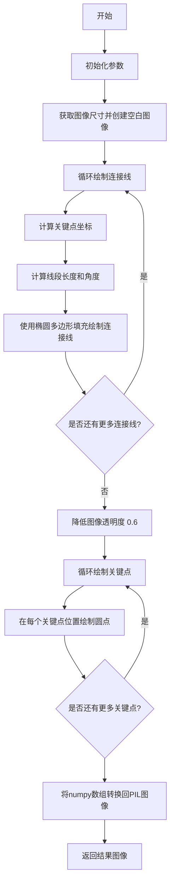
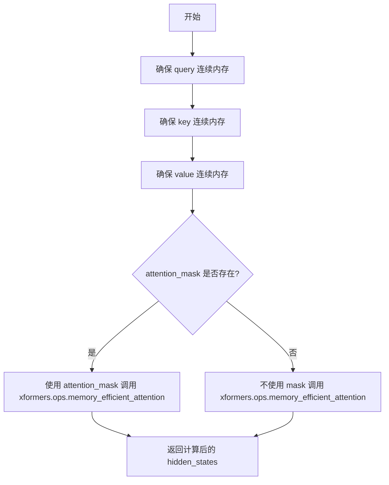
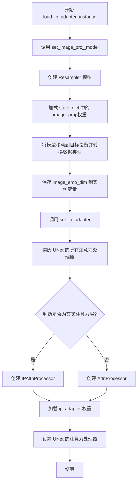
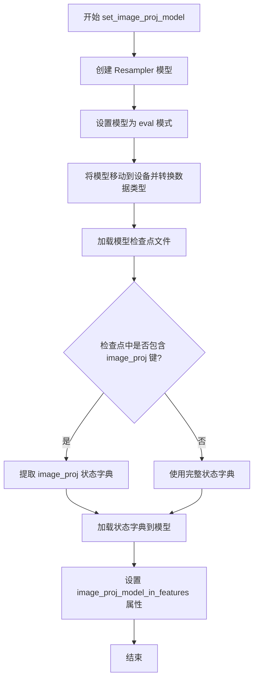
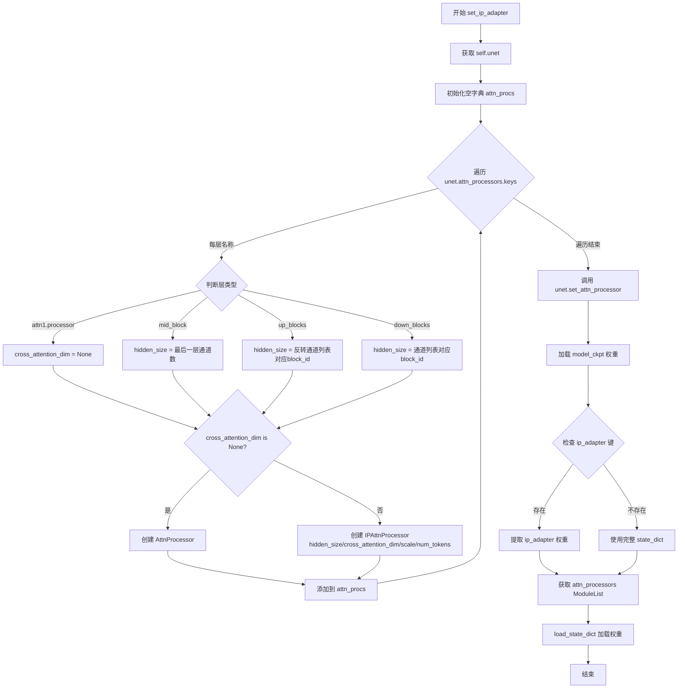
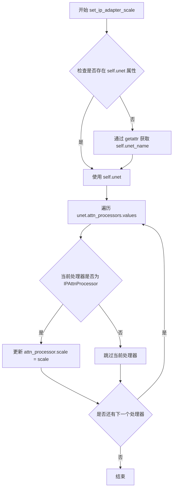

```mermaid
flowchart TD
    A[开始 __call__] --> B[检查并处理回调参数]
    B --> C[处理 control_guidance 格式]
    C --> D[验证输入参数 check_inputs]
    D --> E[定义批次大小和设备]
    E --> F[编码文本提示 encode_prompt]
    F --> G[编码图像嵌入 _encode_prompt_image_emb]
    G --> H[准备 ControlNet 图像 prepare_image]
    H --> I[准备时间步 scheduler.set_timesteps]
    I --> J[准备潜在变量 prepare_latents]
    J --> K[计算 Guidance Scale Embedding]
    K --> L[准备额外步骤参数 prepare_extra_step_kwargs]
    L --> M[创建 ControlNet 保持掩码]
    M --> N[计算添加的时间 ID 和嵌入 _get_add_time_ids]
    N --> O[拼接负面和正面提示嵌入]
    O --> P[拼接文本嵌入和图像嵌入为 encoder_hidden_states]
    P --> Q[去噪循环开始]
    Q --> R{遍历每个时间步}
    R -->|是| S[扩展潜在变量用于 Classifier-Free Guidance]
    S --> T[缩放模型输入]
    T --> U[执行 ControlNet 推理]
    U --> V[预测噪声残差 UNet]
    V --> W[执行引导计算]
    W --> X[计算上一步噪声样本 scheduler.step]
    X --> Y{是否有 callback_on_step_end}
    Y -->|是| Z[执行回调函数]
    Y -->|否| AA[更新进度条]
    Z --> AA
    AA --> AB{是否最后一个时间步或达到预热步数}
    AB -->|否| R
    AB -->|是| AC[去噪循环结束]
    R -->|否| AC
    AC --> AD{output_type == 'latent'}
    AD -->|否| AE[VAE 解码潜在变量]
    AD -->|是| AF[直接使用潜在变量作为图像]
    AE --> AG[后处理图像 postprocess]
    AF --> AG
    AG --> AH[卸载模型 maybe_free_model_hooks]
    AH --> AI{return_dict == True}
    AI -->|是| AJ[返回 StableDiffusionXLPipelineOutput]
    AI -->|否| AK[返回元组]
```

# `diffusers\examples\community\pipeline_stable_diffusion_xl_instantid.py` 详细设计文档

这是一个基于 Stable Diffusion XL 的身份保留图像生成 Pipeline，结合了 ControlNet 和 IP-Adapter 技术，可根据输入的人脸图像和人脸关键点生成保持相似身份特征的目标图像。

## 整体流程

```mermaid
graph TD
    A[开始] --> B[加载模型和权重]
    B --> C[初始化 Resampler (图像投影模型)]
    C --> D[设置 IP-Adapter 注意力处理器]
    D --> E[编码文本提示词]
    E --> F[编码图像嵌入 (通过 Resampler)]
    F --> G[准备 ControlNet 条件图像]
    G --> H[准备噪声 latent]
    H --> I{去噪循环}
    I ---> J[ControlNet 推理]
    J --> K[UNet 预测噪声]
    K --> L[分类器自由引导]
    L --> M[调度器更新 latent]
    M --> N{是否结束?}
    N -- 否 --> I
    N -- 是 --> O[VAE 解码]
    O --> P[后处理输出图像]
```

## 类结构

```
StableDiffusionXLControlNetPipeline (基类)
└── StableDiffusionXLInstantIDPipeline
    ├── PerceiverAttention (注意力模块)
    ├── Resampler (图像投影模型)
    ├── AttnProcessor (默认注意力处理器)
    └── IPAttnProcessor (IP-Adapter 注意力处理器)
```

## 全局变量及字段


### `logger`
    
用于记录日志的日志记录器

类型：`logging.Logger`
    


### `xformers_available`
    
标识xFormers库是否可用的布尔标志

类型：`bool`
    


### `EXAMPLE_DOC_STRING`
    
包含示例代码和使用说明的文档字符串

类型：`str`
    


### `PerceiverAttention.scale`
    
用于注意力计算的缩放因子

类型：`float`
    


### `PerceiverAttention.dim_head`
    
每个注意力头的维度

类型：`int`
    


### `PerceiverAttention.heads`
    
注意力头的数量

类型：`int`
    


### `PerceiverAttention.inner_dim`
    
内部投影维度

类型：`int`
    


### `PerceiverAttention.norm1`
    
第一层归一化层

类型：`nn.LayerNorm`
    


### `PerceiverAttention.norm2`
    
第二层归一化层

类型：`nn.LayerNorm`
    


### `PerceiverAttention.to_q`
    
查询向量的线性投影

类型：`nn.Linear`
    


### `PerceiverAttention.to_kv`
    
键值对的线性投影

类型：`nn.Linear`
    


### `PerceiverAttention.to_out`
    
输出向量的线性投影

类型：`nn.Linear`
    


### `Resampler.latents`
    
可学习的查询令牌参数

类型：`nn.Parameter`
    


### `Resampler.proj_in`
    
输入嵌入的线性投影

类型：`nn.Linear`
    


### `Resampler.proj_out`
    
输出嵌入的线性投影

类型：`nn.Linear`
    


### `Resampler.norm_out`
    
输出嵌入的归一化层

类型：`nn.LayerNorm`
    


### `Resampler.layers`
    
包含感知器注意力和前馈网络的多层模块列表

类型：`nn.ModuleList`
    


### `AttnProcessor.hidden_size`
    
注意力层的隐藏层大小

类型：`int`
    


### `AttnProcessor.cross_attention_dim`
    
交叉注意力机制的维度

类型：`int`
    


### `IPAttnProcessor.hidden_size`
    
IP-Adapter注意力层的隐藏层大小

类型：`int`
    


### `IPAttnProcessor.cross_attention_dim`
    
IP-Adapter交叉注意力维度

类型：`int`
    


### `IPAttnProcessor.scale`
    
IP-Adapter的权重缩放因子

类型：`float`
    


### `IPAttnProcessor.num_tokens`
    
图像特征的令牌数量

类型：`int`
    


### `IPAttnProcessor.to_k_ip`
    
IP-Adapter键向量的线性投影

类型：`nn.Linear`
    


### `IPAttnProcessor.to_v_ip`
    
IP-Adapter值向量的线性投影

类型：`nn.Linear`
    


### `StableDiffusionXLInstantIDPipeline.image_proj_model`
    
用于图像嵌入投影的Resampler模型

类型：`Resampler`
    


### `StableDiffusionXLInstantIDPipeline.image_proj_model_in_features`
    
图像嵌入模型的输入特征维度

类型：`int`
    
    

## 全局函数及方法


### `FeedForward`

前馈网络构建函数，用于创建Transformer模型中的前馈神经网络（FFN）模块，包含层归一化、两个线性层以及GELU激活函数。

参数：

- `dim`：`int`，输入特征的维度
- `mult`：`int` 或 `float`，隐藏层扩展因子，默认为4，用于计算内部维度（inner_dim = dim * mult）

返回值：`nn.Sequential`，返回一个有序容器，包含LayerNorm层、第一个线性层（升维）、GELU激活函数、第二个线性层（降维）

#### 流程图

```mermaid
flowchart TD
    A[开始: FeedForward] --> B[计算内部维度<br/>inner_dim = int(dim * mult)]
    B --> C[创建nn.Sequential容器]
    C --> D[添加LayerNorm层<br/>nn.LayerNorm(dim)]
    E[输入向量 dim维] --> D
    D --> F[第一个线性层<br/>Linear: dim → inner_dim]
    F --> G[GELU激活函数]
    G --> H[第二个线性层<br/>Linear: inner_dim → dim]
    H --> I[输出向量 dim维]
    
    style A fill:#f9f,stroke:#333
    style I fill:#9f9,stroke:#333
```

#### 带注释源码

```python
def FeedForward(dim, mult=4):
    """
    构建前馈网络（Feed Forward Network）
    
    该函数创建一个包含两层线性变换的MLP模块，中间通过GELU激活函数连接。
    这是在Transformer架构中广泛使用的标准前馈网络结构。
    
    参数:
        dim: 输入和输出的特征维度
        mult: 隐藏层维度相对于输入维度的扩展倍数，默认为4
    
    返回:
        包含完整前馈网络结构的nn.Sequential模块
    """
    # 计算隐藏层维度：通过扩展因子mult将维度从dim扩展到inner_dim
    inner_dim = int(dim * mult)
    
    # 构建顺序网络容器，依次包含：
    # 1. LayerNorm: 层归一化，用于稳定训练
    # 2. 第一个Linear: 将维度从dim升到inner_dim（扩展）
    # 3. GELU: 高斯误差线性单元激活函数
    # 4. 第二个Linear: 将维度从inner_dim降到dim（还原）
    return nn.Sequential(
        nn.LayerNorm(dim),              # 层归一化，标准化输入
        nn.Linear(dim, inner_dim, bias=False),  # 升维投影
        nn.GELU(),                       # GELU激活函数
        nn.Linear(inner_dim, dim, bias=False),  # 降维投影
    )
```


### `reshape_tensor`

该函数执行张量重塑操作，将输入的3D张量转换为多头注意力机制所需的4D张量格式。具体来说，它将形状为 `(batch_size, sequence_length, hidden_dim)` 的张量转换为 `(batch_size * num_heads, sequence_length, hidden_dim / num_heads)` 的形式，以便后续在多头注意力计算中使用。

参数：

- `x`：`torch.Tensor`，输入的3D张量，形状为 (batch_size, sequence_length, hidden_dim)
- `heads`：`int`，注意力头的数量，用于计算每个头的维度

返回值：`torch.Tensor`，重塑后的3D张量，形状为 (batch_size * num_heads, sequence_length, hidden_dim / num_heads)

#### 流程图

```mermaid
flowchart TD
    A[输入张量 x<br/>shape: (bs, length, width)] --> B[view 操作<br/>/--&gt; (bs, length, heads, -1)]
    B --> C[transpose 操作<br/>/--&gt; (bs, heads, length, -1)]
    C --> D[reshape 操作<br/>/--&gt; (bs, heads, length, -1)<br/>--&gt; (bs*heads, length, -1)]
    D --> E[输出张量<br/>shape: (bs*heads, length, dim_per_head)]
    
    style A fill:#e1f5fe
    style E fill:#e8f5e8
```

#### 带注释源码

```python
def reshape_tensor(x, heads):
    """
    将输入张量重塑为多头注意力格式
    
    Args:
        x: 输入张量，形状为 (batch_size, seq_len, hidden_dim)
        heads: 注意力头数量
    
    Returns:
        重塑后的张量，形状为 (batch_size * heads, seq_len, hidden_dim / heads)
    """
    # 从输入张量形状中获取批量大小、序列长度和隐藏维度
    # x.shape: (bs, length, width) 其中 width = heads * dim_per_head
    bs, length, width = x.shape
    
    # 第一步重塑：将 (bs, length, width) -> (bs, length, heads, dim_per_head)
    # view 操作不会改变底层数据，只是改变张量的 strides
    # 例如: (2, 8, 64) -> (2, 8, 4, 16) 当 heads=4 时
    x = x.view(bs, length, heads, -1)
    
    # 第二步转置：将 (bs, length, heads, dim_per_head) -> (bs, heads, length, dim_per_head)
    # 交换 sequence 和 heads 维度，便于后续进行注意力计算
    # 例如: (2, 8, 4, 16) -> (2, 4, 8, 16)
    x = x.transpose(1, 2)
    
    # 第三步重塑：将 (bs, heads, length, dim_per_head) -> (bs*heads, length, dim_per_head)
    # 将批量大小和头数合并，方便后续矩阵乘法计算
    # 例如: (2, 4, 8, 16) -> (8, 8, 16)
    x = x.reshape(bs, heads, length, -1)
    
    # 注意：这里 reshape 后实际形状是 (bs, heads, length, -1)
    # 再取 bs, heads, length, -1 中的最后一个维度作为 dim_per_head
    # 最终返回的是 (bs*heads, length, dim_per_head)
    return x
```


### `draw_kps`

该函数用于在人脸图像上绘制关键点及其连接线，将关键点坐标转换为可视化的图形输出，常用于人脸关键点可视化或作为Stable Diffusion InstantID pipeline的输入条件图。

参数：

- `image_pil`：`PIL.Image.Image`，输入的PIL格式人脸图像，用于绘制关键点
- `kps`：`Union[List, np.ndarray]`，人脸关键点坐标列表，每个关键点包含(x, y)坐标
- `color_list`：`List[Tuple[int, int, int]]`，可选，默认值为 `[(255, 0, 0), (0, 255, 0), (0, 0, 255), (255, 255, 0), (255, 0, 255)]`，用于绘制关键点和连接线的颜色列表

返回值：`PIL.Image.Image`，返回包含绘制好关键点和连接线的PIL图像

#### 流程图



#### 带注释源码

```python
def draw_kps(image_pil, kps, color_list=[(255, 0, 0), (0, 255, 0), (0, 0, 255), (255, 255, 0), (255, 0, 255)]):
    """
    在PIL图像上绘制人脸关键点及其连接线
    
    Args:
        image_pil: 输入的人脸PIL图像
        kps: 关键点坐标列表，格式为[[x1,y1], [x2,y2], ...]
        color_list: 颜色列表，用于绘制不同关键点
    
    Returns:
        绘制好关键点的PIL图像
    """
    stickwidth = 4  # 连接线的宽度
    # 定义关键点连接顺序：索引0-2, 1-2, 3-2, 4-2 (人脸关键点连接图)
    limbSeq = np.array([[0, 2], [1, 2], [3, 2], [4, 2]])
    kps = np.array(kps)  # 转换为numpy数组以便索引操作
    
    # 获取输入图像的宽和高
    w, h = image_pil.size
    # 创建与原图同尺寸的黑色空白图像用于绘制
    out_img = np.zeros([h, w, 3])
    
    # 绘制关键点之间的连接线（肢体/面部轮廓）
    for i in range(len(limbSeq)):
        index = limbSeq[i]  # 获取当前连接线的两个关键点索引
        color = color_list[index[0]]  # 根据第一个关键点的索引选择颜色
        
        # 获取两个关键点的x,y坐标
        x = kps[index][:, 0]
        y = kps[index][:, 1]
        
        # 计算线段长度（两点间距离）
        length = ((x[0] - x[1]) ** 2 + (y[0] - y[1]) ** 2) ** 0.5
        # 计算线段角度（弧度转角度）
        angle = math.degrees(math.atan2(y[0] - y[1], x[0] - x[1]))
        
        # 使用椭圆多边形近似绘制线段
        polygon = cv2.ellipse2Poly(
            (int(np.mean(x)), int(np.mean(y))),  # 椭圆中心坐标
            (int(length / 2), stickwidth),  # 椭圆长短轴
            int(angle),  # 旋转角度
            0, 360, 1  # 椭圆起始和终止角度，以及步长
        )
        # 填充多边形区域
        out_img = cv2.fillConvexPoly(out_img.copy(), polygon, color)
    
    # 将图像透明度降低到60%，使其成为半透明叠加层
    out_img = (out_img * 0.6).astype(np.uint8)
    
    # 绘制关键点（圆点）
    for idx_kp, kp in enumerate(kps):
        color = color_list[idx_kp]  # 使用对应索引的颜色
        x, y = kp  # 解包关键点坐标
        # 在每个关键点位置绘制半径为10的实心圆
        out_img = cv2.circle(out_img.copy(), (int(x), int(y)), 10, color, -1)
    
    # 将numpy数组转换回PIL图像格式
    out_img_pil = PIL.Image.fromarray(out_img.astype(np.uint8))
    return out_img_pil
```


### `PerceiverAttention.forward`

执行感知器注意力计算，通过对图像特征（x）和潜在特征（latents）进行归一化、查询/键/值投影、多头注意力计算和输出投影，生成融合了图像信息的潜在表示。

参数：

- `x`：`torch.Tensor`，图像特征，形状为 (b, n1, D)，其中 b 是批量大小，n1 是图像特征序列长度，D 是特征维度
- `latents`：`torch.Tensor`，潜在特征，形状为 (b, n2, D)，其中 b 是批量大小，n2 是潜在特征序列长度，D 是特征维度

返回值：`torch.Tensor`，经过注意力机制处理后的潜在特征，形状为 (b, n2, D)

#### 流程图

```mermaid
flowchart TD
    A[输入: x, latents] --> B[LayerNorm: norm1(x)]
    A --> C[LayerNorm: norm2(latents)]
    B --> D[to_q: 生成Query]
    C --> D
    C --> E[拼接: torch.cat(x, latents)]
    E --> F[to_kv: 生成Key和Value]
    F --> G[chunk: 分离k, v]
    D --> H[reshape_tensor: 调整q维度]
    G --> I[reshape_tensor: 调整k, v维度]
    H --> J[计算注意力权重]
    I --> J
    J --> K[softmax归一化]
    K --> L[加权值: weight @ v]
    L --> M[reshape: 恢复形状]
    M --> N[to_out: 输出投影]
    N --> O[输出: 处理后的latents]
```

#### 带注释源码

```python
def forward(self, x, latents):
    """
    执行感知器注意力计算
    
    Args:
        x (torch.Tensor): 图像特征，形状 (b, n1, D)
        latent (torch.Tensor): 潜在特征，形状 (b, n2, D)
    
    Returns:
        torch.Tensor: 处理后的潜在特征，形状 (b, n2, D)
    """
    # 步骤1: 对输入进行LayerNorm归一化
    x = self.norm1(x)           # 对图像特征进行归一化
    latents = self.norm2(latents)  # 对潜在特征进行归一化

    # 步骤2: 获取批量大小和潜在序列长度
    b, l, _ = latents.shape

    # 步骤3: 生成Query - 仅从latents生成Query
    q = self.to_q(latents)

    # 步骤4: 生成Key和Value - 将x和latents拼接后一起生成
    # 这样可以让latents关注图像特征x的信息
    kv_input = torch.cat((x, latents), dim=-2)  # 在序列维度拼接
    k, v = self.to_kv(kv_input).chunk(2, dim=-1)  # 分离为Key和Value

    # 步骤5: 调整形状以适应多头注意力
    # 从 (b, n, heads*dim) -> (b, heads, n, dim)
    q = reshape_tensor(q, self.heads)
    k = reshape_tensor(k, self.heads)
    v = reshape_tensor(v, self.heads)

    # 步骤6: 计算注意力分数
    # 使用缩放因子1/sqrt(sqrt(dim_head))以提高数值稳定性
    scale = 1 / math.sqrt(math.sqrt(self.dim_head))
    weight = (q * scale) @ (k * scale).transpose(-2, -1)
    
    # 步骤7: 归一化注意力权重
    weight = torch.softmax(weight.float(), dim=-1).type(weight.dtype)

    # 步骤8: 计算注意力输出
    out = weight @ v

    # 步骤9: 恢复形状 (b, heads, n, dim) -> (b, n, heads*dim)
    out = out.permute(0, 2, 1, 3).reshape(b, l, -1)

    # 步骤10: 输出投影
    return self.to_out(out)
```


### `Resampler.forward(x)`

该方法是 `Resampler` 类的核心前向传播方法，负责将输入的图像嵌入投影到查询空间中，并通过多层感知器注意力（Perceiver Attention）和前馈网络（FeedForward）进行处理，最终输出固定数量的查询嵌入（Query Embeddings），用于图像提示（Image Prompt）生成。

参数：

- `x`：`torch.Tensor`，输入的图像嵌入张量，shape 为 (batch_size, seq_len, embedding_dim)，其中 seq_len 是输入序列长度，embedding_dim 是输入嵌入维度，需与构造函数中的 embedding_dim 参数一致。

返回值：`torch.Tensor`，处理后的输出张量，shape 为 (batch_size, num_queries, output_dim)，其中 num_queries 是查询数量（由构造函数参数 num_queries 指定），output_dim 是输出维度（由构造函数参数 output_dim 指定）。

#### 流程图

```mermaid
flowchart TD
    A[输入 x: torch.Tensor] --> B[复制 latents: self.latents.repeat batch size]
    B --> C[投影输入: self.proj_in(x)]
    C --> D{遍历 layers}
    D -->|每个 attn, ff| E[Perceiver Attention: attn(x, latents) + latents]
    E --> F[FeedForward: ff(latents) + latents]
    F --> D
    D -->|完成| G[输出投影: self.proj_out(latents)]
    G --> H[输出归一化: self.norm_out]
    H --> I[返回: torch.Tensor]
```

#### 带注释源码

```python
def forward(self, x):
    """
    Resampler 的前向传播方法。
    Args:
        x (torch.Tensor): 输入的图像嵌入，shape 为 (batch_size, seq_len, embedding_dim)。
    Returns:
        torch.Tensor: 处理后的输出，shape 为 (batch_size, num_queries, output_dim)。
    """
    # 获取输入的批量大小，并复制可学习的查询令牌（latents）以匹配批量大小
    # self.latents 初始化为 (1, num_queries, dim)，扩展到 (batch_size, num_queries, dim)
    latents = self.latents.repeat(x.size(0), 1, 1)
    
    # 将输入嵌入投影到内部维度 dim
    x = self.proj_in(x)
    
    # 遍历每一层，每层包含一个 PerceiverAttention 和一个 FeedForward
    for attn, ff in self.layers:
        # 使用图像特征 x 作为键和值，查询 latents，通过注意力机制更新 latents
        latents = attn(x, latents) + latents
        # 通过前馈网络进一步处理 latents
        latents = ff(latents) + latents
    
    # 将 latents 投影到输出维度 output_dim
    latents = self.proj_out(latents)
    
    # 对输出进行层归一化
    return self.norm_out(latents)
```


### `AttnProcessor.__call__`

默认的注意力处理器，用于执行注意力相关的计算。该方法接收注意力模块、隐藏状态和编码器隐藏状态，执行完整的注意力计算流程，包括归一化、查询/键/值投影、注意力分数计算、注意力加权聚合以及输出投影，最终返回处理后的隐藏状态。

参数：

-  `attn`：`nn.Module`，注意力模块（Attention），包含空间归一化、分组归一化、Q/K/V投影矩阵、注意力头转换方法等组件
-  `hidden_states`：`torch.Tensor`，输入的隐藏状态张量，形状为 (batch, channel, height, width) 或 (batch, sequence, dim)
-  `encoder_hidden_states`：`torch.Tensor`，可选的编码器隐藏状态，用于跨注意力计算，默认为 None
-  `attention_mask`：`torch.Tensor`，可选的注意力掩码，用于屏蔽特定位置的注意力，默认为 None
-  `temb`：`torch.Tensor`，可选的时间嵌入，用于空间归一化，默认为 None

返回值：`torch.Tensor`，处理后的隐藏状态张量，形状与输入 hidden_states 相同

#### 流程图

```mermaid
flowchart TD
    A[开始] --> B[保存残差 hidden_states]
    B --> C{是否有 spatial_norm?}
    C -->|是| D[应用 spatial_norm 到 hidden_states]
    C -->|否| E[继续]
    D --> E
    E --> F{输入维度是否为4?}
    F -->|是| G[reshape: (B,C,H,W) → (B,C,H*W) → (B,H*W,C)]
    F -->|否| H
    G --> H
    H --> I[获取序列长度和批次大小]
    I --> J[准备注意力掩码 prepare_attention_mask]
    J --> K{是否有 group_norm?}
    K -->|是| L[应用 group_norm]
    K -->|否| M
    L --> M
    M --> N[计算 Query: to_q(hidden_states)]
    N --> O{encoder_hidden_states 为空?}
    O -->|是| P[encoder_hidden_states = hidden_states]
    O -->|否| Q{需要归一化 encoder_hidden_states?}
    P --> R
    Q -->|是| S[归一化 encoder_hidden_states]
    Q -->|否| R
    S --> R
    R --> T[计算 Key: to_k(encoder_hidden_states)]
    T --> U[计算 Value: to_v(encoder_hidden_states)]
    U --> V[Query/Key/Value 转换为批次维度]
    V --> W[计算注意力分数 get_attention_scores]
    W --> X[注意力加权: attention_probs @ value]
    X --> Y[恢复批次维度 batch_to_head_dim]
    Y --> Z[线性投影 to_out[0]]
    Z --> AA[Dropout to_out[1]]
    AA --> AB{输入维度为4?}
    AB -->|是| AC[reshape: (B,H*W,C) → (B,C,H,W)]
    AB -->|否| AD
    AC --> AD
    AD --> AE{是否有 residual_connection?}
    AE -->|是| AF[hidden_states = hidden_states + residual]
    AE -->|否| AG
    AF --> AG
    AG --> AH[除以 rescale_output_factor]
    AH --> AI[返回 hidden_states]
```

#### 带注释源码

```python
def __call__(
    self,
    attn,
    hidden_states,
    encoder_hidden_states=None,
    attention_mask=None,
    temb=None,
):
    """
    执行默认的注意力处理流程。
    
    参数:
        attn: 注意力模块，包含 to_q, to_k, to_v, to_out 等线性层
        hidden_states: 输入的隐藏状态
        encoder_hidden_states: 跨注意力用的编码器隐藏状态
        attention_mask: 注意力掩码
        temb: 时间嵌入，用于空间归一化
    
    返回:
        处理后的隐藏状态
    """
    # 1. 保存残差连接所需的原始输入
    residual = hidden_states

    # 2. 如果存在空间归一化层，应用它（通常用于图像生成任务）
    if attn.spatial_norm is not None:
        hidden_states = attn.spatial_norm(hidden_states, temb)

    # 3. 确定输入维度
    input_ndim = hidden_states.ndim

    # 4. 如果是4D张量 (B, C, H, W)，转换为3D (B, H*W, C)
    if input_ndim == 4:
        batch_size, channel, height, width = hidden_states.shape
        hidden_states = hidden_states.view(batch_size, channel, height * width).transpose(1, 2)

    # 5. 获取批次大小和序列长度
    batch_size, sequence_length, _ = (
        hidden_states.shape if encoder_hidden_states is None else encoder_hidden_states.shape
    )
    
    # 6. 准备注意力掩码，处理不同形状和注意力模式
    attention_mask = attn.prepare_attention_mask(attention_mask, sequence_length, batch_size)

    # 7. 如果存在分组归一化，应用它
    if attn.group_norm is not None:
        hidden_states = attn.group_norm(hidden_states.transpose(1, 2)).transpose(1, 2)

    # 8. 计算 Query（查询）向量
    query = attn.to_q(hidden_states)

    # 9. 处理 encoder_hidden_states
    # 如果没有提供，则使用 hidden_states（自注意力）
    if encoder_hidden_states is None:
        encoder_hidden_states = hidden_states
    # 如果提供了，需要归一化（用于跨注意力）
    elif attn.norm_cross:
        encoder_hidden_states = attn.norm_encoder_hidden_states(encoder_hidden_states)

    # 10. 计算 Key 和 Value 向量
    key = attn.to_k(encoder_hidden_states)
    value = attn.to_v(encoder_hidden_states)

    # 11. 将 Query/Key/Value 从 (B, N, C) 转换为多头格式 (B * heads, N, head_dim)
    query = attn.head_to_batch_dim(query)
    key = attn.head_to_batch_dim(key)
    value = attn.head_to_batch_dim(value)

    # 12. 计算注意力分数并应用注意力
    attention_probs = attn.get_attention_scores(query, key, attention_mask)
    hidden_states = torch.bmm(attention_probs, value)
    hidden_states = attn.batch_to_head_dim(hidden_states)

    # 13. 线性投影（输出层）
    hidden_states = attn.to_out[0](hidden_states)
    # 14. Dropout
    hidden_states = attn.to_out[1](hidden_states)

    # 15. 如果原始输入是4D，转换回4D
    if input_ndim == 4:
        hidden_states = hidden_states.transpose(-1, -2).reshape(batch_size, channel, height, width)

    # 16. 残差连接
    if attn.residual_connection:
        hidden_states = hidden_states + residual

    # 17. 输出缩放
    hidden_states = hidden_states / attn.rescale_output_factor

    return hidden_states
```


### `IPAttnProcessor.__call__`

该方法是 IP-Adapter 的注意力处理器核心实现，负责在 Stable Diffusion 的交叉注意力机制中融入图像提示（image prompt）信息。它通过分离文本编码器隐藏状态和图像提示隐藏状态，分别计算注意力并将图像提示的注意力结果以可学习的权重（scale）加入到最终的隐藏状态中。

参数：

- `attn`：`nn.Module`，注意力模块实例，包含 to_q、to_k、to_v、to_out 等子模块以及 spatial_norm、group_norm、norm_cross、residual_connection、rescale_output_factor 等属性
- `hidden_states`：`torch.Tensor`，输入的隐藏状态张量，形状为 (batch_size, sequence_length, hidden_size) 或 (batch_size, channel, height, width)
- `encoder_hidden_states`：`torch.Tensor` 或 None，编码器的隐藏状态，当不为 None 时，其末尾 num_tokens 对应图像提示特征
- `attention_mask`：`torch.Tensor` 或 None，用于注意力计算的掩码
- `temb`：`torch.Tensor` 或 None，时间嵌入，用于空间归一化

返回值：`torch.Tensor`，经过注意力计算和 IP-Adapter 图像提示融合后的隐藏状态，形状与输入 hidden_states 相同

#### 流程图

```mermaid
flowchart TD
    A[开始] --> B[保存残差: residual = hidden_states]
    B --> C{hidden_states是4D?}
    C -->|是| D[将4D张量reshape为3D: (B, C, H*W) -> (B, H*W, C)]
    C -->|否| E[继续]
    D --> E
    E --> F[准备attention_mask]
    F --> G{attn.group_norm存在?}
    G -->|是| H[应用group_norm]
    G -->|否| I[继续]
    H --> I
    I --> J[计算query = attn.to_q(hidden_states)]
    J --> K{encoder_hidden_states是None?}
    K -->|是| L[encoder_hidden_states = hidden_states]
    K -->|否| M[分离encoder_hidden_states和ip_hidden_states]
    M --> N[norm_encoder_hidden_states]
    L --> O
    N --> O
    O --> P[计算key和value]
    P --> Q[将query/key/value转换为batch头形式]
    Q --> R{xformers可用?}
    R -->|是| S[使用_memory_efficient_attention_xformers计算注意力]
    R -->|否| T[使用get_attention_scores计算注意力]
    S --> U
    T --> U
    U --> V[计算ip_key和ip_value]
    V --> W{xformers可用?}
    W -->|是| X[使用_memory_efficient_attention_xformers计算ip注意力]
    W -->|否| Y[使用get_attention_scores计算ip注意力]
    X --> Z
    Y --> Z
    Z --> AA[融合: hidden_states + scale * ip_hidden_states]
    AA --> AB[线性投影: attn.to_out[0]]
    AB --> AC[Dropout: attn.to_out[1]]
    AC --> AD{输入是4D?}
    AD -->|是| AE[还原为4D: (B, H*W, C) -> (B, C, H, W)]
    AD -->|否| AF
    AE --> AF{residual_connection?}
    AF -->|是| AG[残差连接: hidden_states + residual]
    AF -->|否| AH
    AG --> AH[输出缩放: hidden_states / rescale_output_factor]
    AH --> AI[返回hidden_states]
```

#### 带注释源码

```python
def __call__(
    self,
    attn,
    hidden_states,
    encoder_hidden_states=None,
    attention_mask=None,
    temb=None,
):
    # 1. 保存输入hidden_states作为残差，用于后续残差连接
    residual = hidden_states

    # 2. 如果注意力模块有空间归一化层，则应用它
    if attn.spatial_norm is not None:
        hidden_states = attn.spatial_norm(hidden_states, temb)

    # 3. 获取hidden_states的维度数量
    input_ndim = hidden_states.ndim

    # 4. 如果是4D张量 (batch, channel, height, width)，转换为3D (batch, seq_len, channel)
    if input_ndim == 4:
        batch_size, channel, height, width = hidden_states.shape
        hidden_states = hidden_states.view(batch_size, channel, height * width).transpose(1, 2)

    # 5. 确定batch_size和sequence_length
    batch_size, sequence_length, _ = (
        hidden_states.shape if encoder_hidden_states is None else encoder_hidden_states.shape
    )
    
    # 6. 准备注意力掩码
    attention_mask = attn.prepare_attention_mask(attention_mask, sequence_length, batch_size)

    # 7. 如果有组归一化，应用它
    if attn.group_norm is not None:
        hidden_states = attn.group_norm(hidden_states.transpose(1, 2)).transpose(1, 2)

    # 8. 计算query向量
    query = attn.to_q(hidden_states)

    # 9. 处理encoder_hidden_states
    if encoder_hidden_states is None:
        # 如果没有编码器隐藏状态，使用当前的hidden_states
        encoder_hidden_states = hidden_states
    else:
        # 分离文本编码器隐藏状态和图像提示隐藏状态
        # encoder_hidden_states的末尾num_tokens对应图像提示特征
        end_pos = encoder_hidden_states.shape[1] - self.num_tokens
        encoder_hidden_states, ip_hidden_states = (
            encoder_hidden_states[:, :end_pos, :],
            encoder_hidden_states[:, end_pos:, :],
        )
        # 如果需要，对文本编码器隐藏状态进行归一化
        if attn.norm_cross:
            encoder_hidden_states = attn.norm_encoder_hidden_states(encoder_hidden_states)

    # 10. 计算key和value向量（用于文本注意力）
    key = attn.to_k(encoder_hidden_states)
    value = attn.to_v(encoder_hidden_states)

    # 11. 将query/key/value从头维度转换为批量维度
    query = attn.head_to_batch_dim(query)
    key = attn.head_to_batch_dim(key)
    value = attn.head_to_batch_dim(value)

    # 12. 计算文本注意力
    if xformers_available:
        # 使用xformers的高效注意力计算
        hidden_states = self._memory_efficient_attention_xformers(query, key, value, attention_mask)
    else:
        # 使用标准的注意力分数计算
        attention_probs = attn.get_attention_scores(query, key, attention_mask)
        hidden_states = torch.bmm(attention_probs, value)
    # 还原hidden_states的头维度
    hidden_states = attn.batch_to_head_dim(hidden_states)

    # 13. 处理IP-Adapter的图像提示注意力
    # 计算图像提示的key和value
    ip_key = self.to_k_ip(ip_hidden_states)
    ip_value = self.to_v_ip(ip_hidden_states)

    # 转换维度
    ip_key = attn.head_to_batch_dim(ip_key)
    ip_value = attn.head_to_batch_dim(ip_value)

    # 计算图像提示的注意力
    if xformers_available:
        ip_hidden_states = self._memory_efficient_attention_xformers(query, ip_key, ip_value, None)
    else:
        ip_attention_probs = attn.get_attention_scores(query, ip_key, None)
        ip_hidden_states = torch.bmm(ip_attention_probs, ip_value)
    ip_hidden_states = attn.batch_to_head_dim(ip_hidden_states)

    # 14. 将图像提示的注意力结果按scale权重加入到主hidden_states
    hidden_states = hidden_states + self.scale * ip_hidden_states

    # 15. 应用输出投影和dropout
    hidden_states = attn.to_out[0](hidden_states)  # 线性投影
    hidden_states = attn.to_out[1](hidden_states)  # Dropout

    # 16. 如果输入是4D，还原为4D张量
    if input_ndim == 4:
        hidden_states = hidden_states.transpose(-1, -2).reshape(batch_size, channel, height, width)

    # 17. 如果有残差连接，加上残差
    if attn.residual_connection:
        hidden_states = hidden_states + residual

    # 18. 缩放输出
    hidden_states = hidden_states / attn.rescale_output_factor

    return hidden_states
```


### `IPAttnProcessor._memory_efficient_attention_xformers`

使用 xFormers 库的 memory_efficient_attention 实现进行高效的注意力计算，通过将输入张量确保为连续内存布局来优化 GPU 内存使用和计算性能。

参数：

- `query`：`torch.Tensor`，查询张量，形状为 (batch_size, num_heads, seq_len, head_dim)，经过 head_to_batch_dim 变换后的注意力查询向量
- `key`：`torch.Tensor`，键张量，形状为 (batch_size, num_heads, seq_len, head_dim)，经过 head_to_batch_dim 变换后的注意力键向量
- `value`：`torch.Tensor`，值张量，形状为 (batch_size, num_heads, seq_len, head_dim)，经过 head_to_batch_dim 变换后的注意力值向量
- `attention_mask`：`Optional[torch.Tensor]`，注意力掩码张量，用于屏蔽特定位置的注意力权重，可为 None

返回值：`torch.Tensor`，隐藏状态张量，形状为 (batch_size, num_heads, seq_len, head_dim)，经过注意力计算后的上下文向量

#### 流程图



#### 带注释源码

```python
def _memory_efficient_attention_xformers(self, query, key, value, attention_mask):
    """
    使用 xFormers 的 memory_efficient_attention 进行高效的注意力计算
    
    参数:
        query: 查询张量
        key: 键张量
        value: 值张量
        attention_mask: 注意力掩码
    """
    # TODO attention_mask
    # 注释：目前对 attention_mask 的处理不完善，需要进一步优化
    
    # 确保张量在内存中是连续的，以优化 GPU 访问性能
    # 不连续的张量会导致内存碎片化和访问效率降低
    query = query.contiguous()
    key = key.contiguous()
    value = value.contiguous()
    
    # 调用 xFormers 库的高效注意力实现
    # memory_efficient_attention 是 FlashAttention 的变体
    # 相比标准注意力机制，它能显著减少显存占用
    hidden_states = xformers.ops.memory_efficient_attention(
        query, 
        key, 
        value, 
        attn_bias=attention_mask
    )
    
    # 返回计算得到的上下文向量
    return hidden_states
```


### `StableDiffusionXLInstantIDPipeline.cuda`

该方法负责将整个推理管道（包括 UNet、VAE、Text Encoder、ControlNet 以及 InstantID 特有的图像投影模型）移动到 CUDA 设备以启用 GPU 加速，并可选地启用 xFormers 内存高效注意力机制来优化推理速度并降低显存占用。

参数：

- `dtype`：`torch.dtype`，模型权重的数据类型，默认值为 `torch.float16`。指定移动到 GPU 时使用的数据类型（如 float16 可以加速推理并减少显存）。
- `use_xformers`：`bool`，是否启用 xFormers 优化，默认值为 `False`。设置为 `True` 可启用 `xformers.ops.memory_efficient_attention`。

返回值：`None`，无返回值。该方法直接修改对象的内部状态，将模型参数移至 GPU。

#### 流程图

```mermaid
flowchart TD
    A([Start]) --> B[调用 self.to('cuda', dtype)]
    B --> C{检查是否存在 image_proj_model?}
    C -- Yes --> D[移动 image_proj_model 到 CUDA]
    C -- No --> E{use_xformers == True?}
    D --> E
    E -- No --> F([End])
    E -- Yes --> G{is_xformers_available?}
    G -- No --> H[抛出 ValueError: xformers 不可用]
    G -- Yes --> I{检查 xformers 版本 == 0.0.16?}
    I -- Yes --> J[记录警告: 建议升级 xformers]
    I -- No --> K[调用 enable_xformers_memory_efficient_attention]
    J --> K
    K --> F
    H --> F
```

#### 带注释源码

```python
def cuda(self, dtype=torch.float16, use_xformers=False):
    # 1. 将 Pipeline 的主要组件（UNet, VAE, Text Encoder, ControlNet 等）移动到 CUDA 设备
    # 并转换为指定的 dtype（例如 torch.float16）
    self.to("cuda", dtype)

    # 2. 检查是否存在 InstantID 的图像投影模型（image_proj_model）
    # 如果存在，需要手动将其移动到与 UNet 相同的设备和 dtype
    if hasattr(self, "image_proj_model"):
        self.image_proj_model.to(self.unet.device).to(self.unet.dtype)

    # 3. 如果用户请求使用 xFormers
    if use_xformers:
        # 检查 xFormers 库是否已安装
        if is_xformers_available():
            import xformers
            from packaging import version

            # 获取当前 xFormers 版本
            xformers_version = version.parse(xformers.__version__)
            
            # 针对 0.0.16 版本的已知问题发出警告
            if xformers_version == version.parse("0.0.16"):
                logger.warning(
                    "xFormers 0.0.16 cannot be used for training in some GPUs. If you observe problems during training, please update xFormers to at least 0.0.17. See https://huggingface.co/docs/diffusers/main/en/optimization/xformers for more details."
                )
            
            # 启用 xFormers 的内存高效注意力机制
            self.enable_xformers_memory_efficient_attention()
        else:
            # 如果未安装 xFormers，抛出错误
            raise ValueError("xformers is not available. Make sure it is installed correctly")
```


### `StableDiffusionXLInstantIDPipeline.load_ip_adapter_instantid`

该方法用于加载 IP-Adapter（Image Prompt Adapter）模型，这是 InstantID 技术的核心组件之一。它通过调用两个内部方法来完成加载过程：首先是设置图像投影模型（将人脸嵌入投影到 CLIP 空间），然后配置 IP-Adapter 的注意力处理器，使其能够在文本到图像的生成过程中注入人脸身份信息。

参数：

- `self`：隐式参数，StableDiffusionXLInstantIDPipeline 实例本身
- `model_ckpt`：`str` 或 `Path`，IP-Adapter 模型检查点的文件路径，通常是包含 image_proj 和 ip_adapter 权重的 .bin 文件
- `image_emb_dim`：`int`，默认值 512，输入人脸嵌入的维度，通常为 512 维（来自人脸识别模型的输出）
- `num_tokens`：`int`，默认值 16，图像特征对应的 token 数量，用于控制人脸细节的颗粒度
- `scale`：`float`，默认值 0.5，IP-Adapter 的权重缩放因子，值越大人脸特征对生成图像的影响越强

返回值：`None`，该方法直接修改 Pipeline 实例的状态，不返回任何值

#### 流程图



#### 带注释源码

```python
def load_ip_adapter_instantid(self, model_ckpt, image_emb_dim=512, num_tokens=16, scale=0.5):
    """
    加载 IP-Adapter InstantID 模型
    
    该方法是 InstantID 管道的核心初始化方法之一，负责加载两个关键组件：
    1. 图像投影模型 (Resampler)：将人脸嵌入向量映射到与文本嵌入相同的空间
    2. IP-Adapter 注意力处理器：修改 UNet 的注意力机制以接收图像条件输入
    
    Args:
        model_ckpt: IP-Adapter 模型文件路径，通常包含 image_proj 和 ip_adapter 两个部分的权重
        image_emb_dim: 输入人脸嵌入的维度，默认 512（来自 InsightFace 的人脸识别模型）
        num_tokens: 图像特征对应的 token 数量，默认 16（IP-Adapter Plus 使用 16，普通版本使用 4）
        scale: IP-Adapter 的权重缩放因子，默认 0.5，控制人脸特征对生成结果的影响程度
    
    Returns:
        None: 直接修改实例属性，不返回任何值
    
    Example:
        >>> pipe.load_ip_adapter_instantid(
        ...     model_ckpt="./checkpoints/ip-adapter.bin",
        ...     image_emb_dim=512,
        ...     num_tokens=16,
        ...     scale=0.8
        ... )
    """
    # 第一步：加载图像投影模型
    # 该模型将高维人脸嵌入（512维）转换为低维的 CLIP 空间特征（1280维）
    # 使用 Resampler 架构，包含 4 层 Perceiver Attention 层
    self.set_image_proj_model(model_ckpt, image_emb_dim, num_tokens)
    
    # 第二步：配置 IP-Adapter 注意力处理器
    # 遍历 UNet 的所有注意力层，根据层类型选择性地替换为 IPAttnProcessor
    # IPAttnProcessor 会在注意力计算中额外考虑图像条件，实现人脸特征的注入
    self.set_ip_adapter(model_ckpt, num_tokens, scale)
```

#### 相关的内部方法详情

**set_image_proj_model 方法**：
```python
def set_image_proj_model(self, model_ckpt, image_emb_dim=512, num_tokens=16):
    """
    创建并加载图像投影模型（Resampler）
    
    Resampler 架构：
    - 输入：人脸嵌入向量 (batch, num_tokens, image_emb_dim)
    - 输出：CLIP 空间特征 (batch, num_tokens, cross_attention_dim)
    - 内部结构：4 层 Perceiver Attention + FeedForward
    """
    image_proj_model = Resampler(
        dim=1280,                    # 输出维度，对应 SDXL 的 cross_attention_dim
        depth=4,                     # 4 层 Perceiver Attention
        dim_head=64,                 # 注意力头维度
        heads=20,                    # 20 个注意力头
        num_queries=num_tokens,      # 查询token数量
        embedding_dim=image_emb_dim, # 输入嵌入维度
        output_dim=self.unet.config.cross_attention_dim,  # 输出维度
        ff_mult=4,                   # FeedForward 扩展倍数
    )
    # 加载权重时支持两种格式：
    # 1. 完整 checkpoint 包含 image_proj 和 ip_adapter
    # 2. 仅包含 image_proj 的独立权重文件
    state_dict = torch.load(model_ckpt, map_location="cpu")
    if "image_proj" in state_dict:
        state_dict = state_dict["image_proj"]
    self.image_proj_model.load_state_dict(state_dict)
```

**set_ip_adapter 方法**：
```python
def set_ip_adapter(self, model_ckpt, num_tokens, scale):
    """
    配置 UNet 的注意力处理器为 IPAttnProcessor
    
    处理逻辑：
    - 遍历 UNet 的所有注意力层（down_blocks, mid_block, up_blocks）
    - 对于交叉注意力层，替换为 IPAttnProcessor
    - 对于自注意力层（attn1），保持原来的 AttnProcessor
    - IPAttnProcessor 会将图像特征与文本特征分离，分别计算注意力
    """
    # 动态构建注意力处理器字典
    for name in unet.attn_processors.keys():
        # 判断是否为交叉注意力层：attn1 是自注意力，其他是交叉注意力
        cross_attention_dim = None if name.endswith("attn1.processor") else unet.config.cross_attention_dim
        
        # 根据层级确定隐藏层大小
        if name.startswith("mid_block"):
            hidden_size = unet.config.block_out_channels[-1]
        elif name.startswith("up_blocks"):
            block_id = int(name[len("up_blocks.")])
            hidden_size = list(reversed(unet.config.block_out_channels))[block_id]
        elif name.startswith("down_blocks"):
            block_id = int(name[len("down_blocks.")])
            hidden_size = unet.config.block_out_channels[block_id]
        
        # 创建对应的注意力处理器
        if cross_attention_dim is None:
            attn_procs[name] = AttnProcessor()  # 自注意力层
        else:
            attn_procs[name] = IPAttnProcessor(  # 交叉注意力层（支持IP-Adapter）
                hidden_size=hidden_size,
                cross_attention_dim=cross_attention_dim,
                scale=scale,
                num_tokens=num_tokens,
            )
    
    # 加载 IP-Adapter 权重
    state_dict = torch.load(model_ckpt, map_location="cpu")
    if "ip_adapter" in state_dict:
        state_dict = state_dict["ip_adapter"]
    ip_layers.load_state_dict(state_dict)
```


### `StableDiffusionXLInstantIDPipeline.set_image_proj_model`

该方法用于设置图像投影模型（Image Projection Model），该模型是 InstantID 系统的核心组件之一，负责将人脸嵌入（face embedding）转换为适合 UNet 交叉注意力机制的查询令牌。

参数：

- `self`：`StableDiffusionXLInstantIDPipeline` 实例，隐式参数，表示管道本身
- `model_ckpt`：`str`，模型检查点文件路径，用于加载预训练的图像投影模型权重
- `image_emb_dim`：`int`，默认值 512，输入人脸嵌入的维度
- `num_tokens`：`int`，默认值 16，输出的查询令牌数量，决定了图像特征序列的长度

返回值：`None`，该方法无返回值，直接在实例上设置 `image_proj_model` 属性

#### 流程图



#### 带注释源码

```python
def set_image_proj_model(self, model_ckpt, image_emb_dim=512, num_tokens=16):
    """
    设置图像投影模型 (Image Projection Model)
    
    该模型将人脸嵌入 (face embedding) 转换为可被 UNet 使用的查询向量。
    使用 Resampler 架构实现，这是一种基于 Perceiver 的变换器结构。
    
    参数:
        model_ckpt: 预训练模型检查点路径
        image_emb_dim: 输入嵌入维度，默认 512 (对应人脸嵌入)
        num_tokens: 输出查询数量，默认 16
    """
    # 创建 Resampler 模型实例
    # Resampler 参数说明:
    # - dim=1280: 模型内部维度，对应 SDXL 的交叉注意力维度
    # - depth=4: 4 层变换器块
    # - dim_head=64: 每个注意力头的维度
    # - heads=20: 20 个注意力头
    # - num_queries: 输出的查询令牌数量
    # - embedding_dim: 输入嵌入维度 (来自人脸识别模型)
    # - output_dim: 输出维度 (UNet 的交叉注意力维度)
    # - ff_mult=4: 前馈网络扩展因子
    image_proj_model = Resampler(
        dim=1280,
        depth=4,
        dim_head=64,
        heads=20,
        num_queries=num_tokens,
        embedding_dim=image_emb_dim,
        output_dim=self.unet.config.cross_attention_dim,
        ff_mult=4,
    )

    # 设置为评估模式，禁用 dropout 和 batch normalization 的训练行为
    image_proj_model.eval()

    # 将模型移动到与 UNet 相同的设备 (cuda/cpu) 和数据类型 (float16/float32)
    self.image_proj_model = image_proj_model.to(self.device, dtype=self.dtype)
    
    # 从磁盘加载预训练权重
    # map_location="cpu" 表示先加载到 CPU，再移动到目标设备
    state_dict = torch.load(model_ckpt, map_location="cpu")
    
    # 检查点文件可能包含多个部分的权重
    # 如果包含 "image_proj" 键，则提取该部分
    if "image_proj" in state_dict:
        state_dict = state_dict["image_proj"]
    
    # 将加载的权重加载到模型中
    self.image_proj_model.load_state_dict(state_dict)

    # 保存输入特征维度，供后续 _encode_prompt_image_emb 方法使用
    self.image_proj_model_in_features = image_emb_dim
```


### `StableDiffusionXLInstantIDPipeline.set_ip_adapter`

该方法用于在 Stable Diffusion XL InstantID Pipeline 中设置 IP-Adapter 处理器，通过遍历 UNet 的所有注意力层，根据层的位置和类型确定隐藏层维度，为交叉注意力层创建并配置 IPAttnProcessor，最后从模型检查点加载 IP-Adapter 权重并应用到对应的注意力处理器中。

参数：

- `model_ckpt`：`str`，IP-Adapter 模型检查点文件路径，用于加载预训练的 IP-Adapter 权重
- `num_tokens`：`int`，图像特征的 token 数量，决定了图像嵌入的上下文长度
- `scale`：`float`，IP-Adapter 的权重缩放因子，用于控制图像提示对生成结果的影响程度

返回值：`None`，无返回值，该方法直接修改 Pipeline 内部状态

#### 流程图



#### 带注释源码

```python
def set_ip_adapter(self, model_ckpt, num_tokens, scale):
    """
    设置 IP-Adapter 处理器
    
    Args:
        model_ckpt: IP-Adapter 模型检查点路径
        num_tokens: 图像特征的 token 数量
        scale: IP-Adapter 权重缩放因子
    """
    # 获取 UNet 模型
    unet = self.unet
    
    # 用于存储注意力处理器的新字典
    attn_procs = {}
    
    # 遍历 UNet 中所有的注意力处理器名称
    for name in unet.attn_processors.keys():
        # 判断是否为自注意力层 (attn1)，自注意力层不需要 cross_attention_dim
        cross_attention_dim = None if name.endswith("attn1.processor") else unet.config.cross_attention_dim
        
        # 根据模块名称确定隐藏层大小
        if name.startswith("mid_block"):
            # 中间块：使用最后的通道数
            hidden_size = unet.config.block_out_channels[-1]
        elif name.startswith("up_blocks"):
            # 上采样块：从反转的通道列表中获取对应索引的通道数
            block_id = int(name[len("up_blocks.")])
            hidden_size = list(reversed(unet.config.block_out_channels))[block_id]
        elif name.startswith("down_blocks"):
            # 下采样块：从通道列表中获取对应索引的通道数
            block_id = int(name[len("down_blocks.")])
            hidden_size = unet.config.block_out_channels[block_id]
        
        # 根据是否有 cross_attention_dim 选择不同的处理器
        if cross_attention_dim is None:
            # 自注意力层使用默认处理器
            attn_procs[name] = AttnProcessor().to(unet.device, dtype=unet.dtype)
        else:
            # 交叉注意力层使用 IP-Adapter 处理器
            attn_procs[name] = IPAttnProcessor(
                hidden_size=hidden_size,
                cross_attention_dim=cross_attention_dim,
                scale=scale,
                num_tokens=num_tokens,
            ).to(unet.device, dtype=unet.dtype)
    
    # 更新 UNet 的注意力处理器
    unet.set_attn_processor(attn_procs)
    
    # 从磁盘加载模型权重
    state_dict = torch.load(model_ckpt, map_location="cpu")
    
    # 获取所有注意力处理器的 ModuleList
    ip_layers = torch.nn.ModuleList(self.unet.attn_processors.values())
    
    # 检查权重字典中是否有 ip_adapter 键
    if "ip_adapter" in state_dict:
        # 如果有，提取 ip_adapter 权重
        state_dict = state_dict["ip_adapter"]
    
    # 将加载的权重应用到 IP-Adapter 处理器
    ip_layers.load_state_dict(state_dict)
```


### `StableDiffusionXLInstantIDPipeline.set_ip_adapter_scale`

该方法用于设置 IP-Adapter 的权重（scale），通过遍历 UNet 模型中所有的注意力处理器，将符合 `IPAttnProcessor` 类型的处理器的 scale 属性更新为指定值，从而控制图像提示对生成结果的影响程度。

参数：

- `scale`：`float`，IP-Adapter 的权重值，取值范围通常为 0.0 到 1.0 之间，用于调节图像提示特征在注意力机制中的贡献程度

返回值：`None`，该方法直接修改对象内部状态，无返回值

#### 流程图



#### 带注释源码

```python
def set_ip_adapter_scale(self, scale):
    """
    设置 IP-Adapter 的权重
    
    该方法允许用户动态调整 IP-Adapter 对生成图像的影响程度。
    较大的 scale 值会增强图像提示的作用，使生成结果更接近输入的图像特征。
    
    Args:
        scale (float): IP-Adapter 权重值，范围通常为 0.0-1.0
    """
    # 兼容处理：尝试获取 UNet 模型
    # 如果 self 存在 'unet' 属性直接使用，否则通过 unet_name 属性动态获取
    # 这是因为不同版本的 diffusers 管道可能使用不同的属性命名方式
    unet = getattr(self, self.unet_name) if not hasattr(self, "unet") else self.unet
    
    # 遍历 UNet 中所有的注意力处理器
    # attention processors 以字典形式存储，key 是处理器名称，value 是处理器实例
    for attn_processor in unet.attn_processors.values():
        # 检查当前处理器是否为 IP-Adapter 专用的注意力处理器
        # 只有 IPAttnProcessor 需要更新 scale 属性
        if isinstance(attn_processor, IPAttnProcessor):
            # 更新 IP-Adapter 的权重
            # 这个 scale 值会在 IPAttnProcessor 的 forward 方法中使用
            # 用于控制图像提示特征的加权程度
            attn_processor.scale = scale
```


### `StableDiffusionXLInstantIDPipeline._encode_prompt_image_emb`

该方法负责将输入的图像嵌入（prompt_image_emb）进行预处理和编码，通过图像投影模型（Resampler）将其转换为适合 UNet 交叉注意力机制的维度，并支持 Classifier-Free Guidance 下的无条件嵌入生成。

参数：

- `prompt_image_emb`：输入的图像嵌入，可以是 `torch.Tensor` 或其他可转换为张量的数据（如 numpy 数组、列表等），代表从人脸图像提取的嵌入向量
- `device`：`torch.device`，指定计算设备（CPU 或 CUDA），用于将张量移动到指定设备上
- `dtype`：`torch.dtype`，指定张量的数据类型（如 `torch.float16`），用于控制计算精度
- `do_classifier_free_guidance`：`bool` 标志，指示是否启用 Classifier-Free Guidance，若为 `True` 则会在嵌入序列前拼接零张量以生成无条件嵌入

返回值：`torch.Tensor`，经过图像投影模型编码后的图像嵌入张量，形状为 `[2, num_tokens, cross_attention_dim]`（当 `do_classifier_free_guidance=True` 时）或 `[1, num_tokens, cross_attention_dim]`（当 `do_classifier_free_guidance=False` 时）

#### 流程图

```mermaid
flowchart TD
    A[开始: _encode_prompt_image_emb] --> B{prompt_image_emb 是否为 Tensor?}
    B -->|是| C[clone 并 detach]
    B -->|否| D[转换为 torch.Tensor]
    C --> E[移动到指定设备并转换 dtype]
    D --> E
    E --> F[reshape 为 [1, -1, image_proj_model_in_features]]
    F --> G{do_classifier_free_guidance?}
    G -->|是| H[拼接零张量: torch.cat([zeros, prompt_image_emb], dim=0)]
    G -->|否| I[保持单张量: torch.cat([prompt_image_emb], dim=0)]
    H --> J[通过 image_proj_model 编码]
    I --> J
    J --> K[返回编码后的嵌入]
```

#### 带注释源码

```python
def _encode_prompt_image_emb(self, prompt_image_emb, device, dtype, do_classifier_free_guidance):
    """
    编码图像嵌入并输出适合 UNet 交叉注意力的嵌入向量。
    
    该方法完成以下工作：
    1. 将输入转换为 torch.Tensor（如果还不是）
    2. 移动到指定设备并转换数据类型
    3. 重塑为 [batch=1, seq_len, feature_dim] 的形状
    4. 根据是否启用 Classifier-Free Guidance 决定是否拼接无条件嵌入
    5. 通过图像投影模型（Resampler）进行维度变换
    
    Args:
        prompt_image_emb: 输入的图像嵌入向量，来自人脸检测模型提取的 embedding
        device: 目标设备（cuda 或 cpu）
        dtype: 目标数据类型（通常为 float16 以节省显存）
        do_classifier_free_guidance: 是否启用 Classifier-Free Guidance
    
    Returns:
        经过投影模型编码后的图像嵌入张量
    """
    # 步骤1: 确保输入为 torch.Tensor，并克隆以避免梯度回流
    if isinstance(prompt_image_emb, torch.Tensor):
        # 如果已经是 Tensor，clone() 复制数据，detach() 脱离计算图
        prompt_image_emb = prompt_image_emb.clone().detach()
    else:
        # 将其他类型（numpy array, list 等）转换为 torch.Tensor
        prompt_image_emb = torch.tensor(prompt_image_emb)

    # 步骤2: 将张量移动到指定设备并转换数据类型
    prompt_image_emb = prompt_image_emb.to(device=device, dtype=dtype)

    # 步骤3: 重塑为 [batch=1, seq_len=自动计算, feature_dim=image_proj_model_in_features]
    # 这里的 -1 表示自动推断序列长度，image_proj_model_in_features 是图像嵌入的原始维度
    prompt_image_emb = prompt_image_emb.reshape([1, -1, self.image_proj_model_in_features])

    # 步骤4: 处理 Classifier-Free Guidance
    if do_classifier_free_guidance:
        # 创建与 prompt_image_emb 形状相同的零张量作为无条件嵌入
        # 拼接后形状变为 [2, seq_len, feature_dim]，用于后续在推理时分别计算有条件和无条件噪声预测
        prompt_image_emb = torch.cat([torch.zeros_like(prompt_image_emb), prompt_image_emb], dim=0)
    else:
        # 不启用 CFG 时，虽然不必要但仍保持 batch 维度一致，形状为 [1, seq_len, feature_dim]
        prompt_image_emb = torch.cat([prompt_image_emb], dim=0)

    # 步骤5: 通过图像投影模型（Resampler）进行编码
    # Resampler 将输入嵌入转换为 UNet 所需的 cross_attention_dim 维度
    # 这是一个基于 Perceiver Attention 的模型，用于将图像特征适配到文本嵌入空间
    prompt_image_emb = self.image_proj_model(prompt_image_emb)
    
    # 返回编码后的嵌入，形状: [2, num_tokens, cross_attention_dim] 或 [1, num_tokens, cross_attention_dim]
    return prompt_image_emb
```


### StableDiffusionXLInstantIDPipeline.__call__

这是 InstantID 管道的主调用方法，负责基于文本提示、图像嵌入（人脸特征）和 ControlNet 条件图像生成保持身份特征的图像。该方法执行完整的扩散推理流程：编码提示词、处理图像嵌入、运行去噪循环、最终解码潜在变量为输出图像。

参数：

- `prompt`：`Union[str, List[str]]`，用于指导图像生成的文本提示，如未定义则需传入 `prompt_embeds`
- `prompt_2`：`Optional[Union[str, List[str]]]`，发送给 `tokenizer_2` 和 `text_encoder_2` 的提示词，如未定义则使用 `prompt`
- `image`：`PipelineImageInput`，ControlNet 输入条件，用于为 `unet` 生成提供引导，可接受 torch.Tensor、PIL.Image.Image、np.ndarray 等多种格式
- `height`：`Optional[int]`，生成图像的高度（像素），默认值为 `self.unet.config.sample_size * self.vae_scale_factor`
- `width`：`Optional[int]`，生成图像的宽度（像素），默认值为 `self.unet.config.sample_size * self.vae_scale_factor`
- `num_inference_steps`：`int`，去噪步数，默认值为 50，步数越多通常质量越高但推理越慢
- `guidance_scale`：`float`，引导比例，默认值为 5.0，该值大于 1 时启用引导生成
- `negative_prompt`：`Optional[Union[str, List[str]]]`，用于指导不包含内容的负面提示词
- `negative_prompt_2`：`Optional[Union[str, List[str]]]`，发送给第二个文本编码器的负面提示词
- `num_images_per_prompt`：`int`，每个提示词生成的图像数量，默认值为 1
- `eta`：`float`，DDIM 调度器参数，默认值为 0.0
- `generator`：`Optional[Union[torch.Generator, List[torch.Generator]]]`，用于确保生成确定性的随机生成器
- `latents`：`Optional[torch.Tensor]`，预生成的噪声潜在变量，用于图像生成
- `prompt_embeds`：`Optional[torch.Tensor]`，预生成的文本嵌入，可用于轻松调整文本输入
- `negative_prompt_embeds`：`Optional[torch.Tensor]`，预生成的负面文本嵌入
- `pooled_prompt_embeds`：`Optional[torch.Tensor]`，预生成的池化文本嵌入
- `negative_pooled_prompt_embeds`：`Optional[torch.Tensor]`，预生成的负面池化文本嵌入
- `image_embeds`：`Optional[torch.Tensor]`，预生成的人脸图像嵌入，用于 IP-Adapter 身份保持
- `output_type`：`str`，输出格式，可选 "pil" 或 "np.array"，默认值为 "pil"
- `return_dict`：`bool`，是否返回 `StableDiffusionXLPipelineOutput`，默认值为 True
- `cross_attention_kwargs`：`Optional[Dict[str, Any]]`，传递给注意力处理器的 kwargs 字典
- `controlnet_conditioning_scale`：`Union[float, List[float]]`，ControlNet 输出乘以的比例因子，默认值为 1.0
- `guess_mode`：`bool`，ControlNet 编码器是否尝试识别输入图像内容，默认值为 False
- `control_guidance_start`：`Union[float, List[float]]`，ControlNet 开始应用的总步数百分比，默认值为 0.0
- `control_guidance_end`：`Union[float, List[float]]`，ControlNet 停止应用的总步数百分比，默认值为 1.0
- `original_size`：`Tuple[int, int]`，原始图像尺寸，默认值为 (1024, 1024)
- `crops_coords_top_left`：`Tuple[int, int]`，裁剪坐标左上角，默认值为 (0, 0)
- `target_size`：`Tuple[int, int]`，目标图像尺寸，默认值为 (1024, 1024)
- `negative_original_size`：`Optional[Tuple[int, int]]`，负面条件原始尺寸
- `negative_crops_coords_top_left`：`Tuple[int, int]`，负面条件裁剪坐标，默认值为 (0, 0)
- `negative_target_size`：`Optional[Tuple[int, int]]`，负面条件目标尺寸
- `clip_skip`：`Optional[int]`，CLIP 计算提示嵌入时跳过的层数
- `callback_on_step_end`：`Optional[Callable[[int, int, Dict], None]]`，每个去噪步骤结束时调用的函数
- `callback_on_step_end_tensor_inputs`：`List[str]`，回调函数张量输入列表，默认值为 ["latents"]

返回值：`StableDiffusionXLPipelineOutput` 或 `tuple`，当 `return_dict` 为 True 时返回 `StableDiffusionXLPipelineOutput`，否则返回包含输出图像的元组

#### 流程图



#### 带注释源码

```python
@torch.no_grad()
@replace_example_docstring(EXAMPLE_DOC_STRING)
def __call__(
    self,
    prompt: Union[str, List[str]] = None,
    prompt_2: Optional[Union[str, List[str]]] = None,
    image: PipelineImageInput = None,
    height: Optional[int] = None,
    width: Optional[int] = None,
    num_inference_steps: int = 50,
    guidance_scale: float = 5.0,
    negative_prompt: Optional[Union[str, List[str]]] = None,
    negative_prompt_2: Optional[Union[str, List[str]]] = None,
    num_images_per_prompt: Optional[int] = 1,
    eta: float = 0.0,
    generator: Optional[Union[torch.Generator, List[torch.Generator]]] = None,
    latents: Optional[torch.Tensor] = None,
    prompt_embeds: Optional[torch.Tensor] = None,
    negative_prompt_embeds: Optional[torch.Tensor] = None,
    pooled_prompt_embeds: Optional[torch.Tensor] = None,
    negative_pooled_prompt_embeds: Optional[torch.Tensor] = None,
    image_embeds: Optional[torch.Tensor] = None,
    output_type: str | None = "pil",
    return_dict: bool = True,
    cross_attention_kwargs: Optional[Dict[str, Any]] = None,
    controlnet_conditioning_scale: Union[float, List[float]] = 1.0,
    guess_mode: bool = False,
    control_guidance_start: Union[float, List[float]] = 0.0,
    control_guidance_end: Union[float, List[float]] = 1.0,
    original_size: Tuple[int, int] = None,
    crops_coords_top_left: Tuple[int, int] = (0, 0),
    target_size: Tuple[int, int] = None,
    negative_original_size: Optional[Tuple[int, int]] = None,
    negative_crops_coords_top_left: Tuple[int, int] = (0, 0),
    negative_target_size: Optional[Tuple[int, int]] = None,
    clip_skip: Optional[int] = None,
    callback_on_step_end: Optional[Callable[[int, int, Dict], None]] = None,
    callback_on_step_end_tensor_inputs: List[str] = ["latents"],
    **kwargs,
):
    # 提取并弃用旧版回调参数
    callback = kwargs.pop("callback", None)
    callback_steps = kwargs.pop("callback_steps", None)

    # 检查并发出弃用警告
    if callback is not None:
        deprecate("callback", "1.0.0", "Passing `callback` as an input argument to `__call__` is deprecated, consider using `callback_on_step_end`")
    if callback_steps is not None:
        deprecate("callback_steps", "1.0.0", "Passing `callback_steps` as an input argument to `__call__` is deprecated, consider using `callback_on_step_end`")

    # 获取 ControlNet 模型，处理编译后的模块
    controlnet = self.controlnet._orig_mod if is_compiled_module(self.controlnet) else self.controlnet

    # 对 control_guidance_start/end 进行格式对齐，确保与 ControlNet 数量匹配
    if not isinstance(control_guidance_start, list) and isinstance(control_guidance_end, list):
        control_guidance_start = len(control_guidance_end) * [control_guidance_start]
    elif not isinstance(control_guidance_end, list) and isinstance(control_guidance_start, list):
        control_guidance_end = len(control_guidance_start) * [control_guidance_end]
    elif not isinstance(control_guidance_start, list) and not isinstance(control_guidance_end, list):
        mult = len(controlnet.nets) if isinstance(controlnet, MultiControlNetModel) else 1
        control_guidance_start, control_guidance_end = mult * [control_guidance_start], mult * [control_guidance_end]

    # 1. 检查输入参数合法性
    self.check_inputs(
        prompt, prompt_2, image, callback_steps, negative_prompt, negative_prompt_2,
        prompt_embeds, negative_prompt_embeds, pooled_prompt_embeds, negative_pooled_prompt_embeds,
        controlnet_conditioning_scale, control_guidance_start, control_guidance_end,
        callback_on_step_end_tensor_inputs,
    )

    # 设置内部属性
    self._guidance_scale = guidance_scale
    self._clip_skip = clip_skip
    self._cross_attention_kwargs = cross_attention_kwargs

    # 2. 定义调用参数：确定批次大小
    if prompt is not None and isinstance(prompt, str):
        batch_size = 1
    elif prompt is not None and isinstance(prompt, list):
        batch_size = len(prompt)
    else:
        batch_size = prompt_embeds.shape[0]

    device = self._execution_device

    # 处理 ControlNet 条件比例
    if isinstance(controlnet, MultiControlNetModel) and isinstance(controlnet_conditioning_scale, float):
        controlnet_conditioning_scale = [controlnet_conditioning_scale] * len(controlnet.nets)

    # 判断是否使用全局池化条件
    global_pool_conditions = (
        controlnet.config.global_pool_conditions
        if isinstance(controlnet, ControlNetModel)
        else controlnet.nets[0].config.global_pool_conditions
    )
    guess_mode = guess_mode or global_pool_conditions

    # 3.1 编码输入文本提示
    text_encoder_lora_scale = (
        self.cross_attention_kwargs.get("scale", None) if self.cross_attention_kwargs is not None else None
    )
    # 调用 encode_prompt 生成文本嵌入
    (
        prompt_embeds,
        negative_prompt_embeds,
        pooled_prompt_embeds,
        negative_pooled_prompt_embeds,
    ) = self.encode_prompt(
        prompt, prompt_2, device, num_images_per_prompt, self.do_classifier_free_guidance,
        negative_prompt, negative_prompt_2, prompt_embeds=prompt_embeds,
        negative_prompt_embeds=negative_prompt_embeds, pooled_prompt_embeds=pooled_prompt_embeds,
        negative_pooled_prompt_embeds=negative_pooled_prompt_embeds, lora_scale=text_encoder_lora_scale,
        clip_skip=self.clip_skip,
    )

    # 3.2 编码图像提示（人脸嵌入）- 这是 InstantID 的关键步骤
    # 使用 _encode_prompt_image_emb 将人脸特征编码为提示嵌入
    prompt_image_emb = self._encode_prompt_image_emb(
        image_embeds, device, self.unet.dtype, self.do_classifier_free_guidance
    )
    bs_embed, seq_len, _ = prompt_image_emb.shape
    # 重复以匹配每个提示生成的图像数量
    prompt_image_emb = prompt_image_emb.repeat(1, num_images_per_prompt, 1)
    prompt_image_emb = prompt_image_emb.view(bs_embed * num_images_per_prompt, seq_len, -1)

    # 4. 准备 ControlNet 图像
    if isinstance(controlnet, ControlNetModel):
        image = self.prepare_image(
            image=image, width=width, height=height,
            batch_size=batch_size * num_images_per_prompt,
            num_images_per_prompt=num_images_per_prompt, device=device,
            dtype=controlnet.dtype, do_classifier_free_guidance=self.do_classifier_free_guidance,
            guess_mode=guess_mode,
        )
        height, width = image.shape[-2:]
    elif isinstance(controlnet, MultiControlNetModel):
        images = []
        for image_ in image:
            image_ = self.prepare_image(
                image=image_, width=width, height=height,
                batch_size=batch_size * num_images_per_prompt,
                num_images_per_prompt=num_images_per_prompt, device=device,
                dtype=controlnet.dtype, do_classifier_free_guidance=self.do_classifier_free_guidance,
                guess_mode=guess_mode,
            )
            images.append(image_)
        image = images
        height, width = image[0].shape[-2:]
    else:
        assert False

    # 5. 准备时间步
    self.scheduler.set_timesteps(num_inference_steps, device=device)
    timesteps = self.scheduler.timesteps
    self._num_timesteps = len(timesteps)

    # 6. 准备潜在变量
    num_channels_latents = self.unet.config.in_channels
    latents = self.prepare_latents(
        batch_size * num_images_per_prompt, num_channels_latents, height, width,
        prompt_embeds.dtype, device, generator, latents,
    )

    # 6.5 可选：获取 Guidance Scale Embedding
    timestep_cond = None
    if self.unet.config.time_cond_proj_dim is not None:
        guidance_scale_tensor = torch.tensor(self.guidance_scale - 1).repeat(batch_size * num_images_per_prompt)
        timestep_cond = self.get_guidance_scale_embedding(
            guidance_scale_tensor, embedding_dim=self.unet.config.time_cond_proj_dim
        ).to(device=device, dtype=latents.dtype)

    # 7. 准备额外步骤参数
    extra_step_kwargs = self.prepare_extra_step_kwargs(generator, eta)

    # 7.1 创建 ControlNet 保持掩码
    controlnet_keep = []
    for i in range(len(timesteps)):
        keeps = [
            1.0 - float(i / len(timesteps) < s or (i + 1) / len(timesteps) > e)
            for s, e in zip(control_guidance_start, control_guidance_end)
        ]
        controlnet_keep.append(keeps[0] if isinstance(controlnet, ControlNetModel) else keeps)

    # 7.2 准备添加的时间 ID 和嵌入
    if isinstance(image, list):
        original_size = original_size or image[0].shape[-2:]
    else:
        original_size = original_size or image.shape[-2:]
    target_size = target_size or (height, width)

    add_text_embeds = pooled_prompt_embeds
    if self.text_encoder_2 is None:
        text_encoder_projection_dim = int(pooled_prompt_embeds.shape[-1])
    else:
        text_encoder_projection_dim = self.text_encoder_2.config.projection_dim

    add_time_ids = self._get_add_time_ids(
        original_size, crops_coords_top_left, target_size,
        dtype=prompt_embeds.dtype, text_encoder_projection_dim=text_encoder_projection_dim,
    )

    # 处理负面条件的时间 ID
    if negative_original_size is not None and negative_target_size is not None:
        negative_add_time_ids = self._get_add_time_ids(
            negative_original_size, negative_crops_coords_top_left, negative_target_size,
            dtype=prompt_embeds.dtype, text_encoder_projection_dim=text_encoder_projection_dim,
        )
    else:
        negative_add_time_ids = add_time_ids

    # 拼接负面和正面条件用于 Classifier-Free Guidance
    if self.do_classifier_free_guidance:
        prompt_embeds = torch.cat([negative_prompt_embeds, prompt_embeds], dim=0)
        add_text_embeds = torch.cat([negative_pooled_prompt_embeds, add_text_embeds], dim=0)
        add_time_ids = torch.cat([negative_add_time_ids, add_time_ids], dim=0)

    # 移动到设备
    prompt_embeds = prompt_embeds.to(device)
    add_text_embeds = add_text_embeds.to(device)
    add_time_ids = add_time_ids.to(device).repeat(batch_size * num_images_per_prompt, 1)
    # 关键：将文本嵌入和图像嵌入（人脸特征）拼接作为 UNet 的条件
    encoder_hidden_states = torch.cat([prompt_embeds, prompt_image_emb], dim=1)

    # 8. 去噪循环
    num_warmup_steps = len(timesteps) - num_inference_steps * self.scheduler.order
    is_unet_compiled = is_compiled_module(self.unet)
    is_controlnet_compiled = is_compiled_module(self.controlnet)
    is_torch_higher_equal_2_1 = is_torch_version(">=", "2.1")

    with self.progress_bar(total=num_inference_steps) as progress_bar:
        for i, t in enumerate(timesteps):
            # PyTorch 2.0+ 的 CUDA graphs 优化
            if (is_unet_compiled and is_controlnet_compiled) and is_torch_higher_equal_2_1:
                torch._inductor.cudagraph_mark_step_begin()
            
            # 扩展潜在变量以进行 Classifier-Free Guidance
            latent_model_input = torch.cat([latents] * 2) if self.do_classifier_free_guidance else latents
            latent_model_input = self.scheduler.scale_model_input(latent_model_input, t)

            added_cond_kwargs = {"text_embeds": add_text_embeds, "time_ids": add_time_ids}

            # ControlNet 推理
            if guess_mode and self.do_classifier_free_guidance:
                # 仅对条件批次推断 ControlNet
                control_model_input = latents
                control_model_input = self.scheduler.scale_model_input(control_model_input, t)
                controlnet_prompt_embeds = prompt_embeds.chunk(2)[1]
                controlnet_added_cond_kwargs = {
                    "text_embeds": add_text_embeds.chunk(2)[1],
                    "time_ids": add_time_ids.chunk(2)[1],
                }
            else:
                control_model_input = latent_model_input
                controlnet_prompt_embeds = prompt_embeds
                controlnet_added_cond_kwargs = added_cond_kwargs

            # 计算 ControlNet 条件比例
            if isinstance(controlnet_keep[i], list):
                cond_scale = [c * s for c, s in zip(controlnet_conditioning_scale, controlnet_keep[i])]
            else:
                controlnet_cond_scale = controlnet_conditioning_scale
                if isinstance(controlnet_cond_scale, list):
                    controlnet_cond_scale = controlnet_cond_scale[0]
                cond_scale = controlnet_cond_scale * controlnet_keep[i]

            # 执行 ControlNet 推理
            # 注意：这里使用 prompt_image_emb（人脸嵌入）作为 encoder_hidden_states
            down_block_res_samples, mid_block_res_sample = self.controlnet(
                control_model_input, t,
                encoder_hidden_states=prompt_image_emb,
                controlnet_cond=image,
                conditioning_scale=cond_scale,
                guess_mode=guess_mode,
                added_cond_kwargs=controlnet_added_cond_kwargs,
                return_dict=False,
            )

            # guess_mode 下的处理
            if guess_mode and self.do_classifier_free_guidance:
                down_block_res_samples = [torch.cat([torch.zeros_like(d), d]) for d in down_block_res_samples]
                mid_block_res_sample = torch.cat([torch.zeros_like(mid_block_res_sample), mid_block_res_sample])

            # 预测噪声残差
            # 这里 encoder_hidden_states 包含文本嵌入+人脸嵌入
            noise_pred = self.unet(
                latent_model_input, t,
                encoder_hidden_states=encoder_hidden_states,
                timestep_cond=timestep_cond,
                cross_attention_kwargs=self.cross_attention_kwargs,
                down_block_additional_residuals=down_block_res_samples,
                mid_block_additional_residual=mid_block_res_sample,
                added_cond_kwargs=added_cond_kwargs,
                return_dict=False,
            )[0]

            # 执行引导
            if self.do_classifier_free_guidance:
                noise_pred_uncond, noise_pred_text = noise_pred.chunk(2)
                noise_pred = noise_pred_uncond + guidance_scale * (noise_pred_text - noise_pred_uncond)

            # 计算上一步的噪声样本 x_t -> x_t-1
            latents = self.scheduler.step(noise_pred, t, latents, **extra_step_kwargs, return_dict=False)[0]

            # 步骤结束时的回调
            if callback_on_step_end is not None:
                callback_kwargs = {}
                for k in callback_on_step_end_tensor_inputs:
                    callback_kwargs[k] = locals()[k]
                callback_outputs = callback_on_step_end(self, i, t, callback_kwargs)
                latents = callback_outputs.pop("latents", latents)
                prompt_embeds = callback_outputs.pop("prompt_embeds", prompt_embeds)
                negative_prompt_embeds = callback_outputs.pop("negative_prompt_embeds", negative_prompt_embeds)

            # 进度更新和旧版回调
            if i == len(timesteps) - 1 or ((i + 1) > num_warmup_steps and (i + 1) % self.scheduler.order == 0):
                progress_bar.update()
                if callback is not None and i % callback_steps == 0:
                    step_idx = i // getattr(self.scheduler, "order", 1)
                    callback(step_idx, t, latents)

    # 9. 后处理
    if not output_type == "latent":
        # 确保 VAE 在 float32 模式，避免 float16 溢出
        needs_upcasting = self.vae.dtype == torch.float16 and self.vae.config.force_upcast
        if needs_upcasting:
            self.upcast_vae()
            latents = latents.to(next(iter(self.vae.post_quant_conv.parameters())).dtype)

        # VAE 解码
        image = self.vae.decode(latents / self.vae.config.scaling_factor, return_dict=False)[0]

        # 恢复到 fp16
        if needs_upcasting:
            self.vae.to(dtype=torch.float16)
    else:
        image = latents

    # 应用水印和后处理
    if not output_type == "latent":
        if self.watermark is not None:
            image = self.watermark.apply_watermark(image)
        image = self.image_processor.postprocess(image, output_type=output_type)

    # 卸载所有模型
    self.maybe_free_model_hooks()

    # 返回结果
    if not return_dict:
        return (image,)
    
    return StableDiffusionXLPipelineOutput(images=image)
```

## 关键组件


### PerceiverAttention

用于图像特征和潜在特征之间交叉注意力的模块，通过可学习的查询（latents）关注输入图像特征，支持多头注意力机制。

### Resampler

将输入的图像嵌入（embedding）重采样到目标维度的模块，使用多层 PerceiverAttention 和前馈网络进行深度变换，支持可学习的查询向量。

### AttnProcessor

默认的注意力处理器，实现标准的自注意力/交叉注意力计算逻辑，处理残差连接、层归一化、维度变换等操作。

### IPAttnProcessor

IP-Adapter 专用的注意力处理器，支持图像提示（image prompt）功能，能够将图像嵌入作为额外的条件信息注入到注意力计算中，支持 xformers 高效注意力。

### StableDiffusionXLInstantIDPipeline

主要推理管道类，继承自 StableDiffusionXLControlNetPipeline，整合了 ControlNet、IP-Adapter 和 Face Analysis 功能，实现基于单张参考人脸图像的 ID 保持生成。

### FeedForward

简单的前馈网络模块，由 LayerNorm、线性变换和 GELU 激活函数组成，用于 PerceiverAttention 中的特征变换。

### reshape_tensor

张量形状变换工具函数，将输入张量从 (bs, length, width) 转换为 (bs*n_heads, length, dim_per_head) 格式，以适配多头注意力计算。

### draw_kps

人脸关键点可视化辅助函数，使用 OpenCV 在人脸图像上绘制关键点和连线，输出 PIL Image 格式的可视化结果。

## 问题及建议


### 已知问题

- **错误处理缺失**：`_encode_prompt_image_emb` 方法未检查 `image_embeds` 为 `None` 或 `self.image_proj_model` 未加载的情况，可能导致运行时错误
- **属性访问错误**：`set_ip_adapter_scale` 方法中使用 `getattr(self, self.unet_name)` 存在逻辑错误，`self.unet_name` 应为字符串而非属性值
- **重复加载模型权重**：`set_image_proj_model` 和 `set_ip_adapter` 分别独立加载同一个 `model_ckpt`，造成 I/O 浪费
- **类型注解错误**：`__call__` 方法中 `target_size: str | None = None` 应为 `Tuple[int, int] | None`
- **冗余的 tensor 复制**：多处使用 `.clone().detach()` 和 `.copy()` 创建不必要的副本，增加内存开销
- **魔法数字缺乏封装**：Resampler 初始化中的硬编码参数（dim=1280, heads=20, depth=4）应提取为常量或配置参数
- **重复导入 xformers**：模块级已导入 xformers，方法内又重复检查和导入
- **attention mask 处理不完整**：`_memory_efficient_attention_xformers` 方法中 TODO 注释表明 attention_mask 未被正确处理

### 优化建议

- 添加输入验证和空值检查，确保 `image_proj_model` 已加载后再调用相关方法
- 修复 `set_ip_adapter_scale` 中的属性访问逻辑，改为 `unet = self.unet`
- 将模型权重加载合并到单个方法中，避免重复 I/O 操作
- 修正 `target_size` 等参数的类型注解为 `Optional[Tuple[int, int]]`
- 使用 inplace 操作替代不必要的 tensor 复制（如 `out_img.copy()` 可优化）
- 提取配置参数为类常量或配置文件，提高可维护性
- 移除重复的 xformers 导入，仅使用模块级变量
- 完善 xformers 的 attention_mask 处理逻辑

## 其它


### 设计目标与约束

本代码的设计目标是实现一个基于Stable Diffusion XL的InstantID人像生成pipeline，通过结合ControlNet和IP-Adapter技术，在生成新图像的同时保持输入人脸的身份特征。核心约束包括：1) 必须依赖insightface库进行人脸检测和特征提取；2) 需要预训练的ControlNet模型（IdentityNet）和IP-Adapter权重；3) 仅支持CUDA设备运行；4) 输入人脸图像需要包含有效的面部关键点（KPS）；5) 模型权重需要以特定格式存储（包含image_proj和ip_adapter两个部分）。

### 错误处理与异常设计

代码中的错误处理主要体现在以下几个方面：xformers库可用性检查，如果不可用则回退到标准注意力机制；load_ip_adapter_instantid方法中捕获模型加载异常；cuda方法中对xformers版本的兼容性警告（0.0.16版本存在已知问题）；deprecated API使用警告（callback和callback_steps参数）。但整体错误处理机制较为薄弱，缺少对以下场景的处理：模型权重文件不存在或格式错误的异常捕获、输入图像无效或人脸检测失败的错误提示、设备内存不足时的处理、以及推理过程中的运行时错误捕获。建议增加更完善的异常类型定义和try-except包装。

### 数据流与状态机

整体数据流如下：输入阶段接收prompt文本、人脸embedding（image_embeds）和人脸关键点图像（image）；编码阶段将文本通过text_encoder编码为prompt_embeds，将人脸embedding通过image_proj_model（Resampler）编码为prompt_image_emb；条件准备阶段将关键点图像通过ControlNet提取条件特征；推理阶段在denoising loop中，UNet结合文本embedding、图像embedding和Controlnet条件进行噪声预测；最后通过VAE解码生成最终图像。状态转换遵循：初始化→编码→条件准备→去噪迭代→解码→后处理→输出，其中去噪迭代状态机由scheduler控制（默认为DDIM或其他调度器）。

### 外部依赖与接口契约

核心依赖包括：diffusers（≥0.21.0）提供StableDiffusionXLControlNetPipeline基础类和各类模型加载接口；insightface（用于人脸检测和embedding提取，必须安装）；opencv-python（图像处理）；PIL和numpy（图像数组转换）；torch（深度学习框架）；xformers（可选，用于内存高效注意力计算）。外部模型依赖：1) Stable Diffusion XL base 1.0模型（stabilityai/stable-diffusion-xl-base-1.0）；2) ControlNet IdentityNet模型（本地路径）；3) IP-Adapter权重（包含image_proj和ip_adapter的.bin文件）。接口契约要求：image_embeds为torch.Tensor类型，shape为[1, 512]；image为PIL.Image或numpy.ndarray类型的人脸关键点图像；face_info需包含embedding和kps两个字段。

### 性能考虑与优化空间

代码已包含以下性能优化：xformers内存高效注意力机制支持（通过IPAttnProcessor._memory_efficient_attention_xformers方法）；模型编译支持（is_compiled_module检查）；CUDA Graph优化（torch._inductor.cudagraph_mark_step_begin()）。优化空间包括：1) image_proj_model可改为torch.jit.script加速；2) 重复的tensor操作（如repeat、view）可优化；3) 多ControlNet支持可添加批处理优化；4) 可添加ONNX导出支持；5) 推理时可启用xformers的memory_efficient_attention但当前实现中attention_mask处理不完整（TODO注释）；6) 可添加FP8推理支持以进一步降低显存。

### 安全性与隐私考虑

代码处理的人脸图像和embedding属于生物特征数据，需要注意：1) 人脸embedding和图像应在处理后及时释放内存；2) 模型权重文件来源需要验证；3) 生成的图像可能涉及deepfake风险，应添加水印或元数据标识；4) 部署时需考虑数据存储和传输的加密；5) 建议在公开API中增加使用条款和伦理声明。目前代码中包含watermark机制但默认可能为None。

### 配置与可扩展性

主要配置参数通过load_ip_adapter_instantid方法传入：image_emb_dim（默认512）、num_tokens（默认16）、scale（默认0.5）。Resampler和IPAttnProcessor的结构通过构造函数暴露可配置性。扩展方向包括：1) 支持多个人脸embedding融合；2) 添加更多风格的适配器；3) 支持Video生成；4) 添加LoRA权重加载接口；5) 支持更细粒度的attention control。当前set_ip_adapter_scale方法已支持运行时调整IP-Adapter强度。

### 测试策略建议

建议补充的测试包括：单元测试（Resampler前向传播、IPAttnProcessor注意力计算、draw_kps关键点绘制）；集成测试（完整pipeline推理、权重加载流程）；性能基准测试（不同batch_size和resolution下的推理速度、显存占用）；回归测试（确保更新diffusers版本后兼容性）。当前代码无显式测试文件。

### 版本兼容性要求

代码依赖的最低版本：Python 3.8+；torch 2.0+（建议2.1+以支持CUDA Graphs）；diffusers 0.21.0+；xformers 0.0.17+（如使用）。注意事项：代码使用了一些可能随版本变化的内部API（如scheduler.step的返回值格式、UNet的cross_attention_kwargs处理方式），diffusers主版本更新时需验证兼容性。xformers 0.0.16存在已知训练问题需避免。

### 部署要求

生产部署需满足：1) CUDA设备且显存≥16GB（推荐24GB）；2) 安装insightface并下载antelopev2模型；3) 准备所有预训练权重文件；4) 建议使用Docker容器化部署；5) API服务化可使用FastAPI或Gradio封装；6) 需处理模型热加载和内存管理；7) 建议添加health check接口。
    