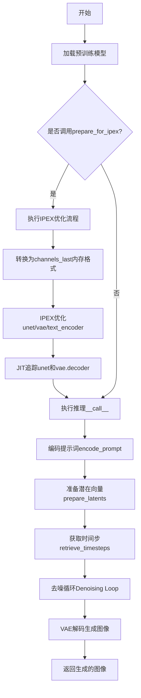
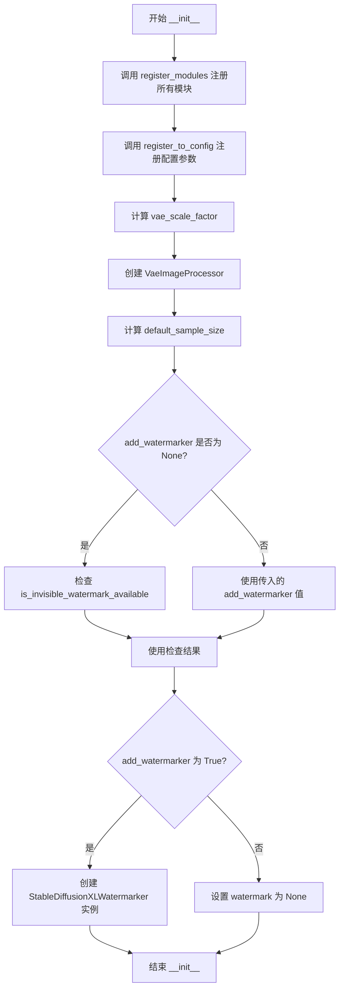
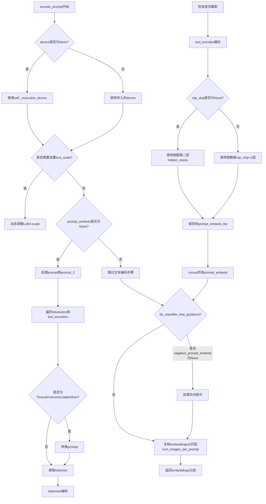
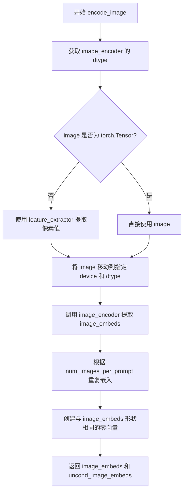
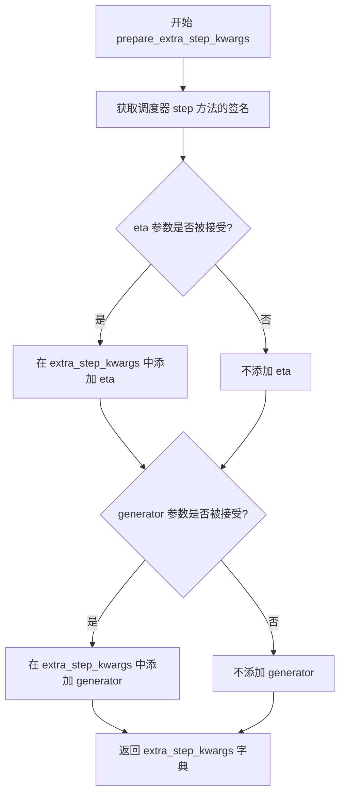
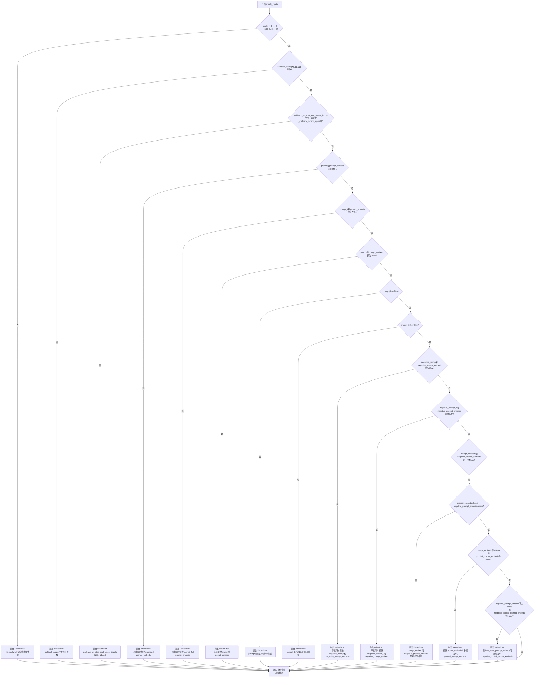
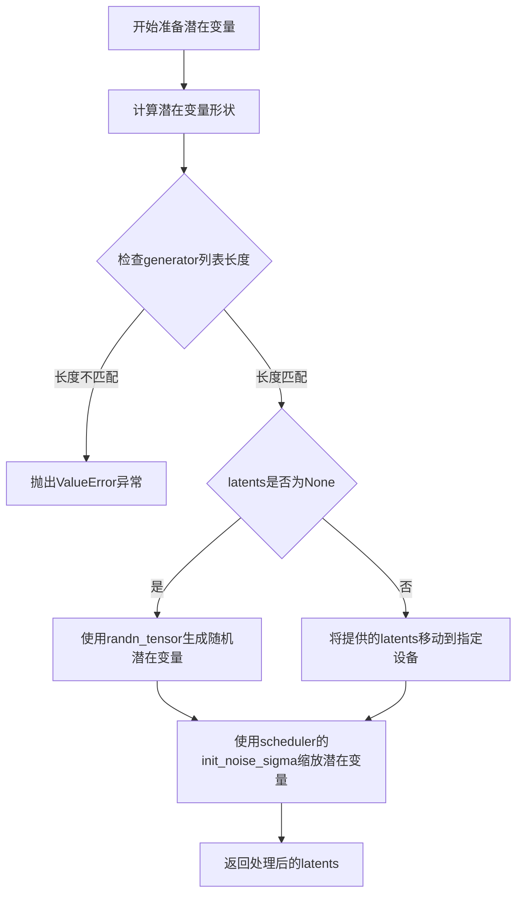
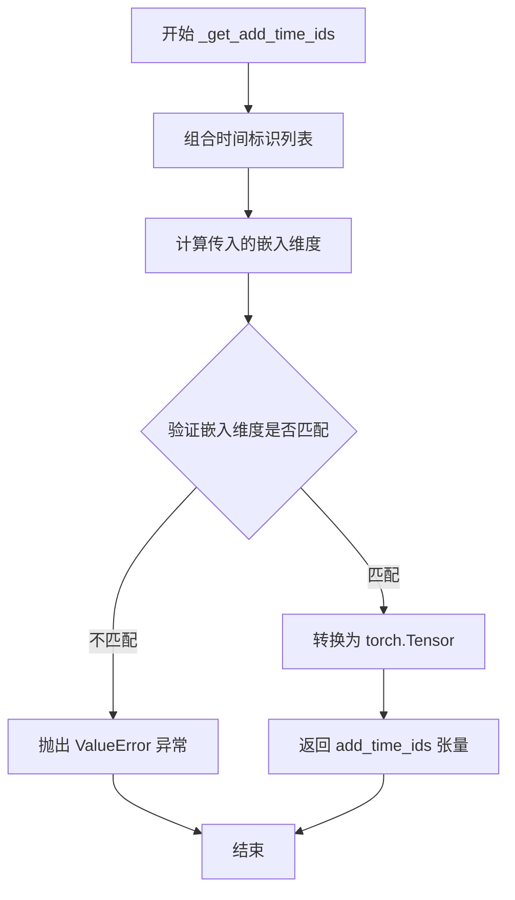
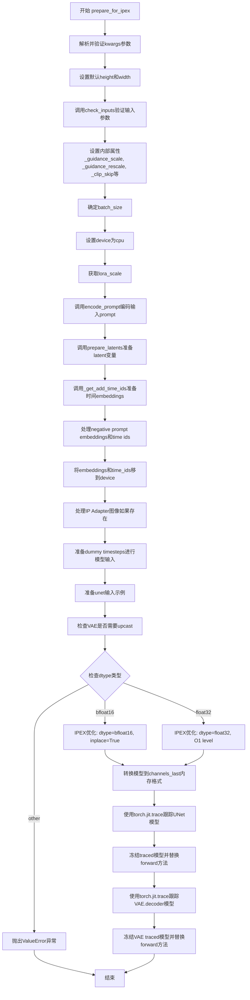

```mermaid
flowchart TD
    A[开始 __call__] --> B[解析回调参数]
    B --> C[设置默认高度和宽度]
    C --> D[检查输入参数 check_inputs]
    D --> E[设置内部属性 _guidance_scale, _guidance_rescale 等]
    E --> F[确定批次大小 batch_size]
    F --> G[编码输入提示词 encode_prompt]
    G --> H[获取时间步 retrieve_timesteps]
    H --> I[准备潜在变量 prepare_latents]
    I --> J[准备额外步骤参数 prepare_extra_step_kwargs]
    J --> K[准备添加的时间ID和嵌入 _get_add_time_ids]
    K --> L{是否使用分类器自由引导?}
    L -->|是| M[拼接负面和正面提示嵌入]
    L -->|否| N[不拼接]
    M --> O[编码IP-Adapter图像]
    N --> O
    O --> P[设置去噪结束条件]
    P --> Q[获取引导比例嵌入 timestep_cond]
    Q --> R[开始去噪循环]
    
    R --> S[展开潜在变量用于分类器自由引导]
    S --> T[缩放模型输入 scheduler.scale_model_input]
    T --> U[UNet预测噪声残差]
    U --> V{是否使用分类器自由引导?}
    V -->|是| W[分离无条件噪声预测和条件噪声预测]
    V -->|否| X
    W --> Y[计算引导后的噪声预测]
    Y --> Z{guidance_rescale > 0?}
    Z -->|是| AA[重缩放噪声配置 rescale_noise_cfg]
    Z -->|否| AB
    AA --> AB
    X --> AB
    
    AB --> AC[scheduler.step 计算上一步]
    AC --> AD{有回调函数?}
    AD -->|是| AE[执行回调 callback_on_step_end]
    AD -->|否| AF
    
    AE --> AF[更新进度条]
    AF --> AG{XLA可用?}
    AG -->|是| AH[xm.mark_step]
    AG -->|否| AI
    
    AH --> AI{是否完成所有时间步?}
    AI -->|否| S
    AI -->|是| AJ
    
    R --> AJ[去噪循环结束]
    
    AJ --> AK{output_type != 'latent'?}
    AK -->|是| AL[VAE解码 latent到图像]
    AL --> AM[应用水印]
    AM --> AN[后处理图像]
    AK -->|否| AO[直接使用latents作为图像]
    
    AN --> AP[释放模型钩子 maybe_free_model_hooks]
    AO --> AP
    
    AP --> AQ{return_dict?}
    AQ -->|是| AR[返回 StableDiffusionXLPipelineOutput]
    AQ -->|否| AS[返回元组]
    
    AR --> AT[结束]
    AS --> AT
```

# `diffusers\examples\community\pipeline_stable_diffusion_xl_ipex.py` 详细设计文档

这是一个基于Intel Extension for PyTorch (IPEX)优化的Stable Diffusion XL文本到图像生成管道，通过IPEX的优化技术（包括JIT追踪、内存格式转换、模型优化）来提升在Intel CPU/GPU上的推理性能，支持float32和bfloat16两种精度模式。

## 整体流程



## 类结构

```
DiffusionPipeline (基类)
└── StableDiffusionXLPipeline
    └── StableDiffusionXLPipelineIpex (本类)
```

## 全局变量及字段


### `logger`
    
模块级别的日志记录器，用于输出调试和运行时信息

类型：`logging.Logger`
    


### `EXAMPLE_DOC_STRING`
    
包含StableDiffusionXLPipelineIpex使用示例的文档字符串

类型：`str`
    


### `XLA_AVAILABLE`
    
标志位，指示PyTorch XLA是否可用以支持加速推理

类型：`bool`
    


### `rescale_noise_cfg`
    
根据guidance_rescale参数重新缩放噪声配置的函数，用于改善图像质量

类型：`function`
    


### `retrieve_timesteps`
    
从调度器获取去噪时间步的辅助函数，支持自定义时间步

类型：`function`
    


### `StableDiffusionXLPipelineIpex.model_cpu_offload_seq`
    
定义模型卸载到CPU的顺序序列

类型：`str`
    


### `StableDiffusionXLPipelineIpex._optional_components`
    
可选组件列表，包括tokenizer、text_encoder等可加载模块

类型：`List[str]`
    


### `StableDiffusionXLPipelineIpex._callback_tensor_inputs`
    
回调函数中允许传递的张量输入名称列表

类型：`List[str]`
    


### `StableDiffusionXLPipelineIpex.vae`
    
变分自编码器，用于图像与潜在表示之间的编码和解码

类型：`AutoencoderKL`
    


### `StableDiffusionXLPipelineIpex.text_encoder`
    
冻结的文本编码器，将文本提示转换为嵌入向量

类型：`CLIPTextModel`
    


### `StableDiffusionXLPipelineIpex.text_encoder_2`
    
第二个冻结的文本编码器，提供池化后的文本嵌入

类型：`CLIPTextModelWithProjection`
    


### `StableDiffusionXLPipelineIpex.tokenizer`
    
第一个分词器，将文本转换为token ID序列

类型：`CLIPTokenizer`
    


### `StableDiffusionXLPipelineIpex.tokenizer_2`
    
第二个分词器，用于双文本编码器架构

类型：`CLIPTokenizer`
    


### `StableDiffusionXLPipelineIpex.unet`
    
条件U-Net模型，用于去噪潜在表示

类型：`UNet2DConditionModel`
    


### `StableDiffusionXLPipelineIpex.scheduler`
    
扩散调度器，控制去噪过程的噪声调度

类型：`KarrasDiffusionSchedulers`
    


### `StableDiffusionXLPipelineIpex.image_encoder`
    
可选的图像编码器，用于IP-Adapter功能

类型：`CLIPVisionModelWithProjection`
    


### `StableDiffusionXLPipelineIpex.feature_extractor`
    
可选的特征提取器，用于预处理图像输入

类型：`CLIPImageProcessor`
    


### `StableDiffusionXLPipelineIpex.vae_scale_factor`
    
VAE缩放因子，基于VAE块通道数计算

类型：`int`
    


### `StableDiffusionXLPipelineIpex.image_processor`
    
图像后处理器，用于VAE输出的后处理

类型：`VaeImageProcessor`
    


### `StableDiffusionXLPipelineIpex.default_sample_size`
    
默认采样尺寸，基于UNet配置确定

类型：`int`
    


### `StableDiffusionXLPipelineIpex.watermark`
    
可选的水印处理器，用于添加不可见水印

类型：`StableDiffusionXLWatermarker`
    


### `StableDiffusionXLPipelineIpex._guidance_scale`
    
分类器自由引导比例，控制文本提示对生成图像的影响程度

类型：`float`
    


### `StableDiffusionXLPipelineIpex._guidance_rescale`
    
噪声配置重新缩放因子，用于修复过度曝光问题

类型：`float`
    


### `StableDiffusionXLPipelineIpex._clip_skip`
    
CLIP跳过的层数，用于调整文本嵌入的提取层

类型：`Optional[int]`
    


### `StableDiffusionXLPipelineIpex._cross_attention_kwargs`
    
交叉注意力关键字参数，用于自定义注意力机制

类型：`Optional[Dict[str, Any]]`
    


### `StableDiffusionXLPipelineIpex._denoising_end`
    
去噪结束比例，用于提前终止去噪过程

类型：`Optional[float]`
    


### `StableDiffusionXLPipelineIpex._num_timesteps`
    
去噪步骤总数，记录当前推理的步数

类型：`int`
    
    

## 全局函数及方法


### `rescale_noise_cfg`

该函数用于根据`guidance_rescale`参数对噪声预测配置进行重缩放，基于论文"Common Diffusion Noise Schedules and Sample Steps are Flawed"的研究发现，旨在修复扩散模型中常见的过度曝光问题并避免生成过于平淡的图像。

参数：

- `noise_cfg`：`torch.Tensor`，原始的噪声预测配置（CFG预测）
- `noise_pred_text`：`torch.Tensor`，文本引导的噪声预测结果
- `guidance_rescale`：`float`，默认为0.0，引导重缩放因子，用于控制混合程度

返回值：`torch.Tensor`，重缩放并混合后的噪声预测配置

#### 流程图

```mermaid
flowchart TD
    A[开始: rescale_noise_cfg] --> B[计算noise_pred_text的标准差<br/>std_text = noise_pred_text.std(dim=..., keepdim=True)]
    --> C[计算noise_cfg的标准差<br/>std_cfg = noise_cfg.std(dim=..., keepdim=True)]
    --> D[计算重缩放后的噪声预测<br/>noise_pred_rescaled = noise_cfg × (std_text / std_cfg)]
    --> E[根据guidance_rescale混合结果<br/>noise_cfg = guidance_rescale × noise_pred_rescaled + (1 - guidance_rescale) × noise_cfg]
    --> F[返回重缩放后的noise_cfg]
```

#### 带注释源码

```python
def rescale_noise_cfg(noise_cfg, noise_pred_text, guidance_rescale=0.0):
    """
    Rescale `noise_cfg` according to `guidance_rescale`. Based on findings of 
    [Common Diffusion Noise Schedules and Sample Steps are Flawed]
    (https://huggingface.co/papers/2305.08891). See Section 3.4
    
    该函数实现了一种针对CFG（Classifier-Free Guidance）噪声预测的修复方法，
    旨在解决过度曝光和图像过于平淡的问题。
    """
    
    # 计算文本引导噪声预测的标准差（沿所有非批次维度，保留维度以便广播）
    std_text = noise_pred_text.std(dim=list(range(1, noise_pred_text.ndim)), keepdim=True)
    
    # 计算CFG噪声预测的标准差（沿所有非批次维度，保留维度以便广播）
    std_cfg = noise_cfg.std(dim=list(range(1, noise_cfg.ndim)), keepdim=True)
    
    # 第一步：重缩放 - 根据文本预测的标准差调整CFG预测的幅度
    # 这可以修复过度曝光问题（overexposure）
    noise_pred_rescaled = noise_cfg * (std_text / std_cfg)
    
    # 第二步：混合 - 将重缩放后的结果与原始CFG预测按guidance_rescale因子混合
    # guidance_rescale=0.0时完全使用原始预测，=1.0时完全使用重缩放后的预测
    # 这种混合可以避免生成"plain looking"（过于平淡）的图像
    noise_cfg = guidance_rescale * noise_pred_rescaled + (1 - guidance_rescale) * noise_cfg
    
    # 返回处理后的噪声预测配置
    return noise_cfg
```


### `retrieve_timesteps`

该函数是Stable Diffusion XL pipeline的辅助函数，用于调用调度器的`set_timesteps`方法并从中检索timesteps。它支持自定义timesteps，并处理调度器是否接受timesteps参数的检查。

参数：

- `scheduler`：`SchedulerMixin`，用于获取timesteps的调度器
- `num_inference_steps`：`Optional[int]`，生成样本时使用的扩散步数。如果使用此参数，`timesteps`必须为`None`
- `device`：`Optional[Union[str, torch.device]]`，timesteps要移动到的设备。如果为`None`，timesteps不会被移动
- `timesteps`：`Optional[List[int]]`，用于支持任意timesteps间隔的自定义timesteps。如果为`None`，则使用调度器的默认timesteps间距策略
- `**kwargs`：任意关键字参数，将传递给`scheduler.set_timesteps`

返回值：`Tuple[torch.Tensor, int]`，第一个元素是调度器的timesteps计划，第二个元素是推理步数

#### 流程图

```mermaid
flowchart TD
    A[开始] --> B{检查timesteps是否不为None}
    B -->|是| C[检查scheduler.set_timesteps是否接受timesteps参数]
    C --> D{接受?}
    D -->|否| E[抛出ValueError]
    D -->|是| F[调用scheduler.set_timesteps with timesteps]
    F --> G[获取scheduler.timesteps]
    G --> H[设置num_inference_steps = len(timesteps)]
    B -->|否| I[调用scheduler.set_timesteps with num_inference_steps]
    I --> J[获取scheduler.timesteps]
    J --> K[返回timesteps和num_inference_steps]
    H --> K
    E --> L[结束]
    K --> L
```

#### 带注释源码

```python
def retrieve_timesteps(
    scheduler,
    num_inference_steps: Optional[int] = None,
    device: Optional[Union[str, torch.device]] = None,
    timesteps: Optional[List[int]] = None,
    **kwargs,
):
    """
    Calls the scheduler's `set_timesteps` method and retrieves timesteps from the scheduler after the call. Handles
    custom timesteps. Any kwargs will be supplied to `scheduler.set_timesteps`.

    Args:
        scheduler (`SchedulerMixin`):
            The scheduler to get timesteps from.
        num_inference_steps (`int`):
            The number of diffusion steps used when generating samples with a pre-trained model. If used,
            `timesteps` must be `None`.
        device (`str` or `torch.device`, *optional*):
            The device to which the timesteps should be moved to. If `None`, the timesteps are not moved.
        timesteps (`List[int]`, *optional*):
                Custom timesteps used to support arbitrary spacing between timesteps. If `None`, then the default
                timestep spacing strategy of the scheduler is used. If `timesteps` is passed, `num_inference_steps`
                must be `None`.

    Returns:
        `Tuple[torch.Tensor, int]`: A tuple where the first element is the timestep schedule from the scheduler and the
        second element is the number of inference steps.
    """
    # 如果提供了自定义timesteps，检查调度器是否支持
    if timesteps is not None:
        # 使用inspect检查scheduler.set_timesteps的签名参数
        accepts_timesteps = "timesteps" in set(inspect.signature(scheduler.set_timesteps).parameters.keys())
        if not accepts_timesteps:
            raise ValueError(
                f"The current scheduler class {scheduler.__class__}'s `set_timesteps` does not support custom"
                f" timestep schedules. Please check whether you are using the correct scheduler."
            )
        # 使用自定义timesteps调用调度器的set_timesteps方法
        scheduler.set_timesteps(timesteps=timesteps, device=device, **kwargs)
        # 从调度器获取timesteps
        timesteps = scheduler.timesteps
        # 根据timesteps长度设置推理步数
        num_inference_steps = len(timesteps)
    else:
        # 使用num_inference_steps调用调度器的set_timesteps方法
        scheduler.set_timesteps(num_inference_steps, device=device, **kwargs)
        # 从调度器获取timesteps
        timesteps = scheduler.timesteps
    # 返回timesteps和num_inference_steps元组
    return timesteps, num_inference_steps
```


### StableDiffusionXLPipelineIpex.__init__

该方法是`StableDiffusionXLPipelineIpex`类的构造函数，负责初始化IPEX优化的Stable Diffusion XL pipeline实例。方法主要完成以下工作：注册所有必需的模块（VAE、文本编码器、分词器、UNet、调度器等）到pipeline，配置VAE缩放因子，计算默认采样大小，并根据设置初始化水印处理器。

参数：

- `vae`：`AutoencoderKL`，Variational Auto-Encoder (VAE) 模型，用于编码和解码图像到潜在表示
- `text_encoder`：`CLIPTextModel`，冻结的文本编码器，Stable Diffusion XL 使用 CLIP 的文本部分
- `text_encoder_2`：`CLIPTextModelWithProjection`，第二个冻结的文本编码器，使用 CLIP 的文本和池化部分
- `tokenizer`：`CLIPTokenizer`，CLIPTokenizer 类的分词器
- `tokenizer_2`：`CLIPTokenizer`，第二个 CLIPTokenizer 类的分词器
- `unet`：`UNet2DConditionModel`，条件 U-Net 架构，用于对编码的图像潜在表示进行去噪
- `scheduler`：`KarrasDiffusionSchedulers`，与 `unet` 结合使用以对编码图像潜在表示进行去噪的调度器
- `image_encoder`：`CLIPVisionModelWithProjection`（可选），图像编码器，用于 IP-Adapter
- `feature_extractor`：`CLIPImageProcessor`（可选），图像特征提取器
- `force_zeros_for_empty_prompt`：`bool`（可选，默认为 True），是否将负提示嵌入强制设为零
- `add_watermarker`：`Optional[bool]`（可选），是否使用 invisible_watermark 库对输出图像加水印

返回值：无（`None`），构造函数不返回值

#### 流程图



#### 带注释源码

```python
def __init__(
    self,
    vae: AutoencoderKL,
    text_encoder: CLIPTextModel,
    text_encoder_2: CLIPTextModelWithProjection,
    tokenizer: CLIPTokenizer,
    tokenizer_2: CLIPTokenizer,
    unet: UNet2DConditionModel,
    scheduler: KarrasDiffusionSchedulers,
    image_encoder: CLIPVisionModelWithProjection = None,
    feature_extractor: CLIPImageProcessor = None,
    force_zeros_for_empty_prompt: bool = True,
    add_watermarker: Optional[bool] = None,
):
    """
    初始化 StableDiffusionXLPipelineIpex 实例。
    
    参数:
        vae: Variational Auto-Encoder (VAE) Model，用于编码和解码图像到潜在表示
        text_encoder: 冻结的文本编码器，Stable Diffusion XL 使用 CLIP 的文本部分
        text_encoder_2: 第二个冻结的文本编码器，使用 CLIP 的文本和池化部分
        tokenizer: CLIPTokenizer 类的分词器
        tokenizer_2: 第二个 CLIPTokenizer 类的分词器
        unet: 条件 U-Net 架构，用于对编码的图像潜在表示进行去噪
        scheduler: 与 unet 结合使用以对编码图像潜在表示进行去噪的调度器
        image_encoder: 可选的图像编码器，用于 IP-Adapter
        feature_extractor: 可选的图像特征提取器
        force_zeros_for_empty_prompt: 是否将负提示嵌入强制设为零，默认为 True
        add_watermarker: 是否使用 invisible_watermark 库对输出图像加水印
    """
    # 注释: 注册所有模块到 pipeline，使它们可以通过 self.xxx 访问
    self.register_modules(
        vae=vae,
        text_encoder=text_encoder,
        text_encoder_2=text_encoder_2,
        tokenizer=tokenizer,
        tokenizer_2=tokenizer_2,
        unet=unet,
        scheduler=scheduler,
        image_encoder=image_encoder,
        feature_extractor=feature_extractor,
    )
    
    # 注释: 将配置参数注册到 config 中
    self.register_to_config(force_zeros_for_empty_prompt=force_zeros_for_empty_prompt)
    
    # 注释: 计算 VAE 缩放因子，基于 VAE 块输出通道数的深度
    # 如果 VAE 存在，使用 2^(len(block_out_channels)-1)，否则默认为 8
    self.vae_scale_factor = 2 ** (len(self.vae.config.block_out_channels) - 1) if getattr(self, "vae", None) else 8
    
    # 注释: 创建 VAE 图像处理器，用于图像的后处理
    self.image_processor = VaeImageProcessor(vae_scale_factor=self.vae_scale_factor)

    # 注释: 计算默认采样大小，从 UNet 配置中获取 sample_size
    # 如果 UNet 不存在或没有 sample_size 配置，则默认为 128
    self.default_sample_size = (
        self.unet.config.sample_size
        if hasattr(self, "unet") and self.unet is not None and hasattr(self.unet.config, "sample_size")
        else 128
    )

    # 注释: 确定是否添加水印
    # 如果 add_watermarker 为 None，则检查 invisible_watermark 包是否可用
    add_watermarker = add_watermarker if add_watermarker is not None else is_invisible_watermark_available()

    # 注释: 根据 add_watermarker 值决定是否创建水印处理器
    if add_watermarker:
        self.watermark = StableDiffusionXLWatermarker()
    else:
        self.watermark = None
```


### `StableDiffusionXLPipelineIpex.encode_prompt`

该方法用于将文本提示（prompt）编码为文本编码器的隐藏状态（hidden states），支持单文本编码器和双文本编码器（SDXL架构），同时处理正向提示和负向提示的嵌入向量，并支持LoRA权重调整和clip skip功能。

参数：

- `self`：`StableDiffusionXLPipelineIpex`，Pipeline实例本身
- `prompt`：`str` 或 `List[str]`，要编码的主提示词
- `prompt_2`：`str` 或 `List[str]` 或 `None`，发送给第二个tokenizer和text_encoder_2的提示词，若不指定则使用prompt
- `device`：`torch.device` 或 `None`，计算设备，若为None则使用self._execution_device
- `num_images_per_prompt`：`int`，每个提示词生成的图像数量，默认为1
- `do_classifier_free_guidance`：`bool`，是否使用无分类器自由引导，默认为True
- `negative_prompt`：`str` 或 `List[str]` 或 `None`，负向提示词，用于引导图像生成方向
- `negative_prompt_2`：`str` 或 `List[str]` 或 `None`，发送给第二个编码器的负向提示词
- `prompt_embeds`：`torch.Tensor` 或 `None`，预生成的文本嵌入，可用于轻松调整文本输入
- `negative_prompt_embeds`：`torch.Tensor` 或 `None`，预生成的负向文本嵌入
- `pooled_prompt_embeds`：`torch.Tensor` 或 `None`，预生成的池化文本嵌入
- `negative_pooled_prompt_embeds`：`torch.Tensor` 或 `None`，预生成的负向池化文本嵌入
- `lora_scale`：`float` 或 `None`，LoRA缩放因子，用于调整LoRA层的影响
- `clip_skip`：`int` 或 `None`，计算提示嵌入时跳过的CLIP层数

返回值：`Tuple[torch.Tensor, torch.Tensor, torch.Tensor, torch.Tensor]`，包含四个张量：prompt_embeds（编码后的提示嵌入）、negative_prompt_embeds（负向提示嵌入）、pooled_prompt_embeds（池化提示嵌入）、negative_pooled_prompt_embeds（负向池化提示嵌入）

#### 流程图



#### 带注释源码

```python
def encode_prompt(
    self,
    prompt: str,
    prompt_2: str | None = None,
    device: Optional[torch.device] = None,
    num_images_per_prompt: int = 1,
    do_classifier_free_guidance: bool = True,
    negative_prompt: str | None = None,
    negative_prompt_2: str | None = None,
    prompt_embeds: Optional[torch.Tensor] = None,
    negative_prompt_embeds: Optional[torch.Tensor] = None,
    pooled_prompt_embeds: Optional[torch.Tensor] = None,
    negative_pooled_prompt_embeds: Optional[torch.Tensor] = None,
    lora_scale: Optional[float] = None,
    clip_skip: Optional[int] = None,
):
    r"""
    Encodes the prompt into text encoder hidden states.

    Args:
        prompt (`str` or `List[str]`, *optional*):
            prompt to be encoded
        prompt_2 (`str` or `List[str]`, *optional*):
            The prompt or prompts to be sent to the `tokenizer_2` and `text_encoder_2`. If not defined, `prompt` is
            used in both text-encoders
        device: (`torch.device`):
            torch device
        num_images_per_prompt (`int`):
            number of images that should be generated per prompt
        do_classifier_free_guidance (`bool`):
            whether to use classifier free guidance or not
        negative_prompt (`str` or `List[str]`, *optional*):
            The prompt or prompts not to guide the image generation. If not defined, one has to pass
            `negative_prompt_embeds` instead. Ignored when not using guidance (i.e., ignored if `guidance_scale` is
            less than `1`).
        negative_prompt_2 (`str` or `List[str]`, *optional*):
            The prompt or prompts not to guide the image generation to be sent to `tokenizer_2` and
            `text_encoder_2`. If not defined, `negative_prompt` is used in both text-encoders
        prompt_embeds (`torch.Tensor`, *optional*):
            Pre-generated text embeddings. Can be used to easily tweak text inputs, *e.g.* prompt weighting. If not
            provided, text embeddings will be generated from `prompt` input argument.
        negative_prompt_embeds (`torch.Tensor`, *optional*):
            Pre-generated negative text embeddings. Can be used to easily tweak text inputs, *e.g.* prompt
            weighting. If not provided, negative_prompt_embeds will be generated from `negative_prompt` input
            argument.
        pooled_prompt_embeds (`torch.Tensor`, *optional*):
            Pre-generated pooled text embeddings. Can be used to easily tweak text inputs, *e.g.* prompt weighting.
            If not provided, pooled text embeddings will be generated from `prompt` input argument.
        negative_pooled_prompt_embeds (`torch.Tensor`, *optional*):
            Pre-generated negative pooled text embeddings. Can be used to easily tweak text inputs, *e.g.* prompt
            weighting. If not provided, pooled negative_prompt_embeds will be generated from `negative_prompt`
            input argument.
        lora_scale (`float`, *optional*):
            A lora scale that will be applied to all LoRA layers of the text encoder if LoRA layers are loaded.
        clip_skip (`int`, *optional*):
            Number of layers to be skipped from CLIP while computing the prompt embeddings. A value of 1 means that
            the output of the pre-final layer will be used for computing the prompt embeddings.
    """
    # 确定设备，默认为执行设备
    device = device or self._execution_device

    # 设置lora scale以便text encoder的monkey patched LoRA函数正确访问
    if lora_scale is not None and isinstance(self, StableDiffusionXLLoraLoaderMixin):
        self._lora_scale = lora_scale

        # 动态调整LoRA scale
        if self.text_encoder is not None:
            if not USE_PEFT_BACKEND:
                adjust_lora_scale_text_encoder(self.text_encoder, lora_scale)
            else:
                scale_lora_layers(self.text_encoder, lora_scale)

        if self.text_encoder_2 is not None:
            if not USE_PEFT_BACKEND:
                adjust_lora_scale_text_encoder(self.text_encoder_2, lora_scale)
            else:
                scale_lora_layers(self.text_encoder_2, lora_scale)

    # 统一prompt为列表格式
    prompt = [prompt] if isinstance(prompt, str) else prompt

    # 确定batch_size
    if prompt is not None:
        batch_size = len(prompt)
    else:
        batch_size = prompt_embeds.shape[0]

    # 定义tokenizers和text encoders列表
    tokenizers = [self.tokenizer, self.tokenizer_2] if self.tokenizer is not None else [self.tokenizer_2]
    text_encoders = (
        [self.text_encoder, self.text_encoder_2] if self.text_encoder is not None else [self.text_encoder_2]
    )

    # 如果未提供prompt_embeds，则从prompt生成
    if prompt_embeds is None:
        # prompt_2默认为prompt
        prompt_2 = prompt_2 or prompt
        prompt_2 = [prompt_2] if isinstance(prompt_2, str) else prompt_2

        # textual inversion: 处理多向量token如果需要
        prompt_embeds_list = []
        prompts = [prompt, prompt_2]
        for prompt, tokenizer, text_encoder in zip(prompts, tokenizers, text_encoders):
            # 如果支持TextualInversionLoaderMixin，转换prompt
            if isinstance(self, TextualInversionLoaderMixin):
                prompt = self.maybe_convert_prompt(prompt, tokenizer)

            # tokenize
            text_inputs = tokenizer(
                prompt,
                padding="max_length",
                max_length=tokenizer.model_max_length,
                truncation=True,
                return_tensors="pt",
            )

            text_input_ids = text_inputs.input_ids
            # 获取未截断的ids用于检查
            untruncated_ids = tokenizer(prompt, padding="longest", return_tensors="pt").input_ids

            # 检查是否被截断，如果是则记录警告
            if untruncated_ids.shape[-1] >= text_input_ids.shape[-1] and not torch.equal(
                text_input_ids, untruncated_ids
            ):
                removed_text = tokenizer.batch_decode(untruncated_ids[:, tokenizer.model_max_length - 1 : -1])
                logger.warning(
                    "The following part of your input was truncated because CLIP can only handle sequences up to"
                    f" {tokenizer.model_max_length} tokens: {removed_text}"
                )

            # 编码得到hidden states
            prompt_embeds = text_encoder(text_input_ids.to(device), output_hidden_states=True)

            # 我们总是对最终的text encoder的pooled输出感兴趣
            if pooled_prompt_embeds is None and prompt_embeds[0].ndim == 2:
                pooled_prompt_embeds = prompt_embeds[0]

            # 根据clip_skip选择hidden states层
            if clip_skip is None:
                prompt_embeds = prompt_embeds.hidden_states[-2]  # 默认使用倒数第二层
            else:
                # "2" 因为SDXL总是从倒数第二层开始索引
                prompt_embeds = prompt_embeds.hidden_states[-(clip_skip + 2)]

            prompt_embeds_list.append(prompt_embeds)

        # 在最后一个维度拼接两个encoder的输出
        prompt_embeds = torch.concat(prompt_embeds_list, dim=-1)

    # 获取无分类器自由引导的无条件嵌入
    zero_out_negative_prompt = negative_prompt is None and self.config.force_zeros_for_empty_prompt
    if do_classifier_free_guidance and negative_prompt_embeds is None and zero_out_negative_prompt:
        # 如果配置要求对空prompt强制为零，则创建零张量
        negative_prompt_embeds = torch.zeros_like(prompt_embeds)
        negative_pooled_prompt_embeds = torch.zeros_like(pooled_prompt_embeds)
    elif do_classifier_free_guidance and negative_prompt_embeds is None:
        # 需要从negative_prompt生成embeddings
        negative_prompt = negative_prompt or ""
        negative_prompt_2 = negative_prompt_2 or negative_prompt

        # 规范化为列表
        negative_prompt = batch_size * [negative_prompt] if isinstance(negative_prompt, str) else negative_prompt
        negative_prompt_2 = (
            batch_size * [negative_prompt_2] if isinstance(negative_prompt_2, str) else negative_prompt_2
        )

        uncond_tokens: List[str]
        # 类型检查
        if prompt is not None and type(prompt) is not type(negative_prompt):
            raise TypeError(
                f"`negative_prompt` should be the same type to `prompt`, but got {type(negative_prompt)} !="
                f" {type(prompt)}."
            )
        elif batch_size != len(negative_prompt):
            raise ValueError(
                f"`negative_prompt`: {negative_prompt} has batch size {len(negative_prompt)}, but `prompt`:"
                f" {prompt} has batch size {batch_size}. Please make sure that passed `negative_prompt` matches"
                " the batch size of `prompt`."
            )
        else:
            uncond_tokens = [negative_prompt, negative_prompt_2]

        negative_prompt_embeds_list = []
        for negative_prompt, tokenizer, text_encoder in zip(uncond_tokens, tokenizers, text_encoders):
            if isinstance(self, TextualInversionLoaderMixin):
                negative_prompt = self.maybe_convert_prompt(negative_prompt, tokenizer)

            max_length = prompt_embeds.shape[1]
            uncond_input = tokenizer(
                negative_prompt,
                padding="max_length",
                max_length=max_length,
                truncation=True,
                return_tensors="pt",
            )

            negative_prompt_embeds = text_encoder(
                uncond_input.input_ids.to(device),
                output_hidden_states=True,
            )
            # 我们总是对最终的text encoder的pooled输出感兴趣
            if negative_pooled_prompt_embeds is None and negative_prompt_embeds[0].ndim == 2:
                negative_pooled_prompt_embeds = negative_prompt_embeds[0]
            negative_prompt_embeds = negative_prompt_embeds.hidden_states[-2]

            negative_prompt_embeds_list.append(negative_prompt_embeds)

        negative_prompt_embeds = torch.concat(negative_prompt_embeds_list, dim=-1)

    # 转换prompt_embeds到正确的dtype和device
    if self.text_encoder_2 is not None:
        prompt_embeds = prompt_embeds.to(dtype=self.text_encoder_2.dtype, device=device)
    else:
        prompt_embeds = prompt_embeds.to(dtype=self.unet.dtype, device=device)

    bs_embed, seq_len, _ = prompt_embeds.shape
    # 为每个prompt的每次生成复制text embeddings，使用mps友好的方法
    prompt_embeds = prompt_embeds.repeat(1, num_images_per_prompt, 1)
    prompt_embeds = prompt_embeds.view(bs_embed * num_images_per_prompt, seq_len, -1)

    # 如果使用无分类器自由引导，复制无条件embeddings
    if do_classifier_free_guidance:
        seq_len = negative_prompt_embeds.shape[1]

        if self.text_encoder_2 is not None:
            negative_prompt_embeds = negative_prompt_embeds.to(dtype=self.text_encoder_2.dtype, device=device)
        else:
            negative_prompt_embeds = negative_prompt_embeds.to(dtype=self.unet.dtype, device=device)

        negative_prompt_embeds = negative_prompt_embeds.repeat(1, num_images_per_prompt, 1)
        negative_prompt_embeds = negative_prompt_embeds.view(batch_size * num_images_per_prompt, seq_len, -1)

    # 复制pooled embeddings
    pooled_prompt_embeds = pooled_prompt_embeds.repeat(1, num_images_per_prompt).view(
        bs_embed * num_images_per_prompt, -1
    )
    if do_classifier_free_guidance:
        negative_pooled_prompt_embeds = negative_pooled_prompt_embeds.repeat(1, num_images_per_prompt).view(
            bs_embed * num_images_per_prompt, -1
        )

    # 如果使用了PEFT backend，恢复LoRA layers的原始scale
    if self.text_encoder is not None:
        if isinstance(self, StableDiffusionXLLoraLoaderMixin) and USE_PEFT_BACKEND:
            # 通过unscaling LoRA layers恢复原始scale
            unscale_lora_layers(self.text_encoder, lora_scale)

    if self.text_encoder_2 is not None:
        if isinstance(self, StableDiffusionXLLoraLoaderMixin) and USE_PEFT_BACKEND:
            unscale_lora_layers(self.text_encoder_2, lora_scale)

    # 返回四个embeddings元组
    return prompt_embeds, negative_prompt_embeds, pooled_prompt_embeds, negative_pooled_prompt_embeds
```


### `StableDiffusionXLPipelineIpex.encode_image`

该方法用于将输入图像编码为图像嵌入向量（image embeddings），支持图像提示（image prompt）功能。它首先将输入图像转换为张量格式，然后使用图像编码器（image_encoder）提取图像特征，最后为每个提示生成对应数量的图像嵌入，并创建用于无分类器自由引导的零向量。

参数：

- `image`：`PipelineImageInput`（支持 PIL.Image、numpy.ndarray 或 torch.Tensor），需要编码的输入图像
- `device`：`torch.device`，用于运行图像编码的设备
- `num_images_per_prompt`：`int`，每个提示生成的图像数量

返回值：`Tuple[torch.Tensor, torch.Tensor]`，返回两个张量——`image_embeds`（编码后的图像嵌入）和 `uncond_image_embeds`（用于无分类器自由引导的零向量），两者形状相同

#### 流程图



#### 带注释源码

```python
def encode_image(self, image, device, num_images_per_prompt):
    """
    将输入图像编码为图像嵌入向量，用于图像提示（IP-Adapter）功能。
    
    参数:
        image: 输入图像，支持 PIL.Image、numpy.ndarray 或 torch.Tensor 格式
        device: torch.device，用于运行编码的设备
        num_images_per_prompt: int，每个提示生成的图像数量
    
    返回:
        Tuple[torch.Tensor, torch.Tensor]: (image_embeds, uncond_image_embeds)
            - image_embeds: 编码后的图像嵌入
            - uncond_image_embeds: 零向量，用于无分类器自由引导
    """
    # 1. 获取图像编码器的参数数据类型（dtype），确保输入数据类型一致
    dtype = next(self.image_encoder.parameters()).dtype

    # 2. 如果输入不是张量，使用特征提取器将其转换为张量
    #    支持多种输入格式：PIL Image、numpy array 等
    if not isinstance(image, torch.Tensor):
        image = self.feature_extractor(image, return_tensors="pt").pixel_values

    # 3. 将图像移动到指定设备，并转换为正确的 dtype
    image = image.to(device=device, dtype=dtype)
    
    # 4. 使用图像编码器提取图像嵌入
    #    image_embeds 的形状通常为 [batch_size, embed_dim]
    image_embeds = self.image_encoder(image).image_embeds
    
    # 5. 根据每个提示生成的图像数量重复嵌入
    #    例如：如果 num_images_per_prompt=2，则在 batch 维度重复
    image_embeds = image_embeds.repeat_interleave(num_images_per_prompt, dim=0)

    # 6. 创建与图像嵌入形状相同的零向量
    #    用于无分类器自由引导（Classifier-Free Guidance）
    #    在推理时与条件嵌入拼接，引导模型生成更符合提示的图像
    uncond_image_embeds = torch.zeros_like(image_embeds)
    
    # 7. 返回图像嵌入和对应的无条件嵌入
    return image_embeds, uncond_image_embeds
```


### `StableDiffusionXLPipelineIpex.prepare_extra_step_kwargs`

该方法用于为调度器（scheduler）的 step 方法准备额外的关键字参数。由于不同的调度器具有不同的签名，该方法通过检查调度器的 `step` 方法是否接受 `eta` 和 `generator` 参数来动态构建需要传递的额外参数字典。

参数：

- `self`：调用该方法的实例对象，表示当前的 StableDiffusionXLPipelineIpex 管道对象。
- `generator`：`Optional[Union[torch.Generator, List[torch.Generator]]]`，用于控制随机数生成以实现可重复性的 torch 生成器对象。如果为 None，则使用随机噪声。
- `eta`：`float`，DDIM 调度器中的 eta (η) 参数，对应 DDIM 论文中的 η，值应在 [0, 1] 范围内。其他调度器会忽略此参数。

返回值：`Dict[str, Any]`，返回一个字典，包含需要传递给调度器 step 方法的额外关键字参数。如果调度器支持，则可能包含 `eta` 和/或 `generator` 键。

#### 流程图



#### 带注释源码

```python
# Copied from diffusers.pipelines.stable_diffusion.pipeline_stable_diffusion.StableDiffusionPipeline.prepare_extra_step_kwargs
def prepare_extra_step_kwargs(self, generator, eta):
    # 准备调度器 step 的额外参数，因为并非所有调度器都具有相同的签名
    # eta (η) 仅在 DDIMScheduler 中使用，对于其他调度器将被忽略
    # eta 对应 DDIM 论文中的 η：https://huggingface.co/papers/2010.02502
    # 值应介于 [0, 1] 之间

    # 检查调度器的 step 方法是否接受 eta 参数
    accepts_eta = "eta" in set(inspect.signature(self.scheduler.step).parameters.keys())
    # 初始化空字典用于存储额外参数
    extra_step_kwargs = {}
    # 如果调度器接受 eta，则将其添加到参数字典中
    if accepts_eta:
        extra_step_kwargs["eta"] = eta

    # 检查调度器是否接受 generator 参数
    accepts_generator = "generator" in set(inspect.signature(self.scheduler.step).parameters.keys())
    # 如果调度器接受 generator，则将其添加到参数字典中
    if accepts_generator:
        extra_step_kwargs["generator"] = generator
    
    # 返回构建好的参数字典
    return extra_step_kwargs
```


### `StableDiffusionXLPipelineIpex.check_inputs`

该方法用于验证 Stable Diffusion XL IPEX Pipeline 的输入参数合法性，确保图像尺寸符合 VAE 和 UNet 的要求，检查提示词与嵌入向量的互斥关系，并验证负面提示词与嵌入向量的兼容性。如果任何检查失败，将抛出详细的 `ValueError` 异常。

**参数：**

- `self`：类的实例本身
- `prompt`：`Union[str, List[str], None]`，主要提示词，用于指导图像生成
- `prompt_2`：`Union[str, List[str], None]`，发送给第二个文本编码器的提示词，若为 None 则使用 prompt
- `height`：`int`，生成图像的高度（像素），必须能被 8 整除
- `width`：`int`，生成图像的宽度（像素），必须能被 8 整除
- `callback_steps`：`int`，每多少步执行一次回调，必须为正整数
- `negative_prompt`：`Union[str, List[str], None]`，不引导图像生成的负面提示词
- `negative_prompt_2`：`Union[str, List[str], None]`，发送给第二个文本编码器的负面提示词
- `prompt_embeds`：`Optional[torch.Tensor]`，预生成的提示词嵌入向量
- `negative_prompt_embeds`：`Optional[torch.Tensor]`，预生成的负面提示词嵌入向量
- `pooled_prompt_embeds`：`Optional[torch.Tensor]`，预生成的池化提示词嵌入向量
- `negative_pooled_prompt_embeds`：`Optional[torch.Tensor]`，预生成的负面池化提示词嵌入向量
- `callback_on_step_end_tensor_inputs`：`Optional[List[str]]`，步骤结束时回调的张量输入列表

**返回值：** `None`，该方法不返回任何值，仅通过抛出异常来处理错误

#### 流程图



#### 带注释源码

```python
def check_inputs(
    self,
    prompt,
    prompt_2,
    height,
    width,
    callback_steps,
    negative_prompt=None,
    negative_prompt_2=None,
    prompt_embeds=None,
    negative_prompt_embeds=None,
    pooled_prompt_embeds=None,
    negative_pooled_prompt_embeds=None,
    callback_on_step_end_tensor_inputs=None,
):
    """
    检查并验证 Pipeline 输入参数的合法性。
    
    该方法执行以下验证：
    1. 图像尺寸必须能被 8 整除（与 VAE 的下采样因子对齐）
    2. callback_steps 必须为正整数
    3. callback_on_step_end_tensor_inputs 中的元素必须在允许列表中
    4. prompt 和 prompt_embeds 互斥，不能同时提供
    5. prompt_2 和 prompt_embeds 互斥，不能同时提供
    6. 必须提供 prompt 或 prompt_embeds 之一
    7. prompt 和 prompt_2 必须是 str 或 list 类型
    8. negative_prompt 和 negative_prompt_embeds 互斥
    9. negative_prompt_2 和 negative_prompt_embeds 互斥
    10. prompt_embeds 和 negative_prompt_embeds 形状必须相同
    11. 如果提供 prompt_embeds，必须同时提供 pooled_prompt_embeds
    12. 如果提供 negative_prompt_embeds，必须同时提供 negative_pooled_prompt_embeds
    
    Args:
        self: Pipeline 实例
        prompt: 主要提示词
        prompt_2: 第二个文本编码器的提示词
        height: 输出图像高度
        width: 输出图像宽度
        callback_steps: 回调执行步数
        negative_prompt: 负面提示词
        negative_prompt_2: 第二个负面提示词
        prompt_embeds: 预计算的提示词嵌入
        negative_prompt_embeds: 预计算的负面提示词嵌入
        pooled_prompt_embeds: 预计算的池化提示词嵌入
        negative_pooled_prompt_embeds: 预计算的负面池化提示词嵌入
        callback_on_step_end_tensor_inputs: 步骤结束时的回调张量输入
    
    Raises:
        ValueError: 当任何输入参数不符合要求时抛出
    
    Returns:
        None
    """
    
    # 步骤 1: 验证图像尺寸
    # VAE 通常有 2^(num_layers-1) 的下采样因子，SDXL 通常是 8
    # UNet 期望输入尺寸能被 8 整除
    if height % 8 != 0 or width % 8 != 0:
        raise ValueError(f"`height` and `width` have to be divisible by 8 but are {height} and {width}.")

    # 步骤 2: 验证 callback_steps
    # callback_steps 必须是正整数，用于控制回调频率
    if callback_steps is not None and (not isinstance(callback_steps, int) or callback_steps <= 0):
        raise ValueError(
            f"`callback_steps` has to be a positive integer but is {callback_steps} of type"
            f" {type(callback_steps)}."
        )

    # 步骤 3: 验证 callback_on_step_end_tensor_inputs
    # 确保所有提供的张量名称都在允许的列表中
    if callback_on_step_end_tensor_inputs is not None and not all(
        k in self._callback_tensor_inputs for k in callback_on_step_end_tensor_inputs
    ):
        raise ValueError(
            f"`callback_on_step_end_tensor_inputs` has to be in {self._callback_tensor_inputs}, but found {[k for k in callback_on_step_end_tensor_inputs if k not in self._callback_tensor_inputs]}"
        )

    # 步骤 4: 验证 prompt 和 prompt_embeds 互斥
    # 不能同时提供原始提示词和预计算的嵌入
    if prompt is not None and prompt_embeds is not None:
        raise ValueError(
            f"Cannot forward both `prompt`: {prompt} and `prompt_embeds`: {prompt_embeds}. Please make sure to"
            " only forward one of the two."
        )
    
    # 步骤 5: 验证 prompt_2 和 prompt_embeds 互斥
    elif prompt_2 is not None and prompt_embeds is not None:
        raise ValueError(
            f"Cannot forward both `prompt_2`: {prompt_2} and `prompt_embeds`: {prompt_embeds}. Please make sure to"
            " only forward one of the two."
        )
    
    # 步骤 6: 验证至少提供一个提示词
    # prompt 和 prompt_embeds 必须至少提供一个
    elif prompt is None and prompt_embeds is None:
        raise ValueError(
            "Provide either `prompt` or `prompt_embeds`. Cannot leave both `prompt` and `prompt_embeds` undefined."
        )
    
    # 步骤 7: 验证 prompt 类型
    # prompt 必须是字符串或字符串列表
    elif prompt is not None and (not isinstance(prompt, str) and not isinstance(prompt, list)):
        raise ValueError(f"`prompt` has to be of type `str` or `list` but is {type(prompt)}")
    
    # 步骤 8: 验证 prompt_2 类型
    elif prompt_2 is not None and (not isinstance(prompt_2, str) and not isinstance(prompt_2, list)):
        raise ValueError(f"`prompt_2` has to be of type `str` or `list` but is {type(prompt_2)}")

    # 步骤 9: 验证 negative_prompt 和 negative_prompt_embeds 互斥
    if negative_prompt is not None and negative_prompt_embeds is not None:
        raise ValueError(
            f"Cannot forward both `negative_prompt`: {negative_prompt} and `negative_prompt_embeds`:"
            f" {negative_prompt_embeds}. Please make sure to only forward one of the two."
        )
    
    # 步骤 10: 验证 negative_prompt_2 和 negative_prompt_embeds 互斥
    elif negative_prompt_2 is not None and negative_prompt_embeds is not None:
        raise ValueError(
            f"Cannot forward both `negative_prompt_2`: {negative_prompt_2} and `negative_prompt_embeds`:"
            f" {negative_prompt_embeds}. Please make sure to only forward one of the two."
        )

    # 步骤 11: 验证 prompt_embeds 和 negative_prompt_embeds 形状一致性
    # 当两者都提供时，必须形状相同以进行 classifier-free guidance
    if prompt_embeds is not None and negative_prompt_embeds is not None:
        if prompt_embeds.shape != negative_prompt_embeds.shape:
            raise ValueError(
                "`prompt_embeds` and `negative_prompt_embeds` must have the same shape when passed directly, but"
                f" got: `prompt_embeds` {prompt_embeds.shape} != `negative_prompt_embeds`"
                f" {negative_prompt_embeds.shape}."
            )

    # 步骤 12: 验证 prompt_embeds 和 pooled_prompt_embeds 的依赖关系
    # SDXL 使用两个文本编码器，需要同时提供 pooled 嵌入
    if prompt_embeds is not None and pooled_prompt_embeds is None:
        raise ValueError(
            "If `prompt_embeds` are provided, `pooled_prompt_embeds` also have to be passed. Make sure to generate `pooled_prompt_embeds` from the same text encoder that was used to generate `prompt_embeds`."
        )

    # 步骤 13: 验证 negative_prompt_embeds 和 negative_pooled_prompt_embeds 的依赖关系
    if negative_prompt_embeds is not None and negative_pooled_prompt_embeds is None:
        raise ValueError(
            "If `negative_prompt_embeds` are provided, `negative_pooled_prompt_embeds` also have to be passed. Make sure to generate `negative_pooled_prompt_embeds` from the same text encoder that was used to generate `negative_prompt_embeds`."
        )
```


### `StableDiffusionXLPipelineIpex.prepare_latents`

该方法用于在Stable Diffusion XL pipeline中准备潜在变量（latents），即初始化用于去噪过程的随机噪声张量，或将预提供的潜在变量移动到指定设备。它根据批处理大小、图像尺寸和VAE缩放因子计算潜在变量的形状，并使用调度器的初始噪声标准差对潜在变量进行缩放。

参数：

- `batch_size`：`int`，批次大小，即一次生成图像的数量
- `num_channels_latents`：`int`，潜在变量的通道数，通常对应于UNet的输入通道数
- `height`：`int`，生成图像的高度（像素）
- `width`：`int`，生成图像的宽度（像素）
- `dtype`：`torch.dtype`，潜在变量的数据类型
- `device`：`torch.device`，潜在变量所在的设备（CPU或CUDA）
- `generator`：`torch.Generator` 或 `List[torch.Generator]`，可选，用于生成确定性随机噪声的随机数生成器
- `latents`：`torch.Tensor`，可选，预生成的潜在变量。如果为None，则随机生成；否则使用提供的潜在变量

返回值：`torch.Tensor`，处理后的潜在变量张量，形状为(batch_size, num_channels_latents, height // vae_scale_factor, width // vae_scale_factor)

#### 流程图



#### 带注释源码

```python
def prepare_latents(self, batch_size, num_channels_latents, height, width, dtype, device, generator, latents=None):
    # 计算潜在变量的形状
    # 形状包括：批次大小、潜在通道数、以及根据VAE缩放因子调整后的高度和宽度
    # VAE通常会将图像下采样8倍（对于SDXL可能是16倍），因此需要除以vae_scale_factor
    shape = (
        batch_size,
        num_channels_latents,
        int(height) // self.vae_scale_factor,
        int(width) // self.vae_scale_factor,
    )
    
    # 检查传入的generator列表长度是否与批次大小匹配
    # 如果不匹配，抛出明确的错误信息
    if isinstance(generator, list) and len(generator) != batch_size:
        raise ValueError(
            f"You have passed a list of generators of length {len(generator)}, but requested an effective batch"
            f" size of {batch_size}. Make sure the batch size matches the length of the generators."
        )

    # 如果没有提供预生成的latents，则随机生成
    # 使用randn_tensor生成标准正态分布的随机数，dtype固定为float32
    if latents is None:
        latents = randn_tensor(shape, generator=generator, device=device, dtype=torch.float32)
    else:
        # 如果提供了latents，则将其移动到指定的设备上
        latents = latents.to(device)

    # 使用调度器的初始噪声标准差对潜在变量进行缩放
    # 不同的调度器有不同的初始噪声水平，这是为了与训练过程保持一致
    latents = latents * self.scheduler.init_noise_sigma
    
    return latents
```


### `StableDiffusionXLPipelineIpex._get_add_time_ids`

该方法用于生成 Stable Diffusion XL pipeline 中的附加时间标识（add_time_ids），这些标识包含了图像的原始尺寸、裁剪坐标和目标尺寸信息，用于微调（micro-conditioning）过程。

参数：

- `self`：`StableDiffusionXLPipelineIpex`，Pipeline 实例本身
- `original_size`：`Tuple[int, int]`，原始图像尺寸，格式为 (height, width)
- `crops_coords_top_left`：`Tuple[int, int]`，裁剪坐标起点，格式为 (top, left)
- `target_size`：`Tuple[int, int]`，目标图像尺寸，格式为 (height, width)
- `dtype`：`torch.dtype`，输出张量的数据类型
- `text_encoder_projection_dim`：`Optional[int]`，文本编码器的投影维度，默认为 None

返回值：`torch.Tensor`，包含组合后的时间标识张量，形状为 (1, 6)，其中包含 original_size、crops_coords_top_left 和 target_size 的值

#### 流程图



#### 带注释源码

```python
def _get_add_time_ids(
    self, original_size, crops_coords_top_left, target_size, dtype, text_encoder_projection_dim=None
):
    """
    生成并返回用于 Stable Diffusion XL 的附加时间标识。
    
    这些时间标识包含了图像的原始尺寸、裁剪坐标和目标尺寸信息，
    用于 SDXL 的微 conditioning 机制，帮助模型更好地理解图像的空间属性。
    
    参数:
        original_size: 原始图像尺寸 (height, width)
        crops_coords_top_left: 裁剪坐标起点 (top, left)
        target_size: 目标图像尺寸 (height, width)
        dtype: 输出张量的数据类型
        text_encoder_projection_dim: 文本编码器投影维度
    
    返回:
        包含时间标识的 torch.Tensor，形状为 (1, 6)
    """
    # 将三个元组连接成一个列表: original_size + crops_coords_top_left + target_size
    # 结果格式: [orig_h, orig_w, crop_top, crop_left, target_h, target_w]
    add_time_ids = list(original_size + crops_coords_top_left + target_size)

    # 计算传入的附加时间嵌入维度
    # 公式: addition_time_embed_dim * len(add_time_ids) + text_encoder_projection_dim
    # 其中 addition_time_embed_dim 是 UNet 配置中的时间嵌入维度乘数
    passed_add_embed_dim = (
        self.unet.config.addition_time_embed_dim * len(add_time_ids) + text_encoder_projection_dim
    )
    
    # 从 UNet 的 add_embedding 线性层获取期望的嵌入维度
    expected_add_embed_dim = self.unet.add_embedding.linear_1.in_features

    # 验证传入的维度与模型期望的维度是否匹配
    if expected_add_embed_dim != passed_add_embed_dim:
        raise ValueError(
            f"Model expects an added time embedding vector of length {expected_add_embed_dim}, but a vector of {passed_add_embed_dim} was created. The model has an incorrect config. Please check `unet.config.time_embedding_type` and `text_encoder_2.config.projection_dim`."
        )

    # 将列表转换为 PyTorch 张量，指定数据类型
    # 形状: (1, 6) - 包含6个值的一维向量
    add_time_ids = torch.tensor([add_time_ids], dtype=dtype)
    
    return add_time_ids
```


### `StableDiffusionXLPipelineIpex.upcast_vae`

该方法用于将 VAE（变分自编码器）模型强制转换为 float32 数据类型，以避免在 float16 模式下解码时发生数值溢出。该方法已被标记为废弃，推荐直接使用 `pipe.vae.to(torch.float32)` 替代。

参数： 无

返回值：`None`，无返回值（该方法直接修改 VAE 的数据类型）

#### 流程图

```mermaid
flowchart TD
    A[开始 upcast_vae] --> B[调用 deprecate 警告]
    B --> C[执行 self.vae.to(dtype=torch.float32)]
    C --> D[结束]
```

#### 带注释源码

```python
def upcast_vae(self):
    """
    将 VAE 模型上转换为 float32 类型。
    
    该方法用于确保 VAE 在 float32 模式下运行，以防止在 float16 推理时
    发生数值溢出。由于已被废弃，现在推荐直接调用 pipe.vae.to(torch.float32)。
    """
    # 发出废弃警告，提醒用户使用新的替代方法
    deprecate("upcast_vae", "1.0.0", "`upcast_vae` is deprecated. Please use `pipe.vae.to(torch.float32)`")
    
    # 将 VAE 模型转换为 float32 数据类型
    self.vae.to(dtype=torch.float32)
```


### `StableDiffusionXLPipelineIpex.get_guidance_scale_embedding`

该方法用于根据引导比例（guidance scale）生成对应的嵌入向量，采用基于正弦和余弦函数的频率编码方式，将标量引导值映射到高维向量空间，供UNet的时间条件投影层使用。

参数：

- `self`：隐式参数，StableDiffusionXLPipelineIpex 实例本身
- `w`：`torch.Tensor`，一维张量，表示需要生成嵌入向量的引导比例值（guidance scale）
- `embedding_dim`：`int`，可选参数，默认值为 512，表示生成的嵌入向量的维度
- `dtype`：`torch.dtype`，可选参数，默认值为 torch.float32，生成嵌入向量的数据类型

返回值：`torch.Tensor`，形状为 `(len(w), embedding_dim)` 的嵌入向量张量

#### 流程图

```mermaid
flowchart TD
    A[开始: 接收引导比例 w] --> B{验证 w 是一维张量}
    B -->|是| C[将 w 乘以 1000.0 进行缩放]
    B -->|否| Z[抛出断言错误]
    C --> D[计算半维度 half_dim = embedding_dim // 2]
    D --> E[计算频率基础向量 emb = log(10000.0) / (half_dim - 1)]
    E --> F[生成频率指数: exp(-arange(half_dim) * emb)]
    F --> G[将 w 与频率向量相乘得到加权频率]
    G --> H[连接 sin 和 cos 变换: concat[sin, cos]]
    H --> I{embedding_dim 是奇数?}
    I -->|是| J[在末尾填充零以满足维度]
    I -->|否| K[直接返回嵌入向量]
    J --> K
    K --> L[验证输出形状: (w.shape[0], embedding_dim)]
    L --> M[返回嵌入向量]
```

#### 带注释源码

```python
def get_guidance_scale_embedding(self, w, embedding_dim=512, dtype=torch.float32):
    """
    根据给定的引导比例值生成对应的嵌入向量。
    使用基于正弦和余弦函数的频率编码，将标量映射到高维向量空间。
    
    参考: https://github.com/google-research/vdm/blob/dc27b98a554f65cdc654b800da5aa1846545d41b/model_vdm.py#L298
    
    参数:
        w (torch.Tensor): 引导比例值的一维张量
        embedding_dim (int, optional): 嵌入向量维度，默认 512
        dtype: 生成嵌入向量的数据类型，默认 torch.float32
        
    返回:
        torch.Tensor: 形状为 (len(w), embedding_dim) 的嵌入向量
    """
    # 断言确保输入是一维张量
    assert len(w.shape) == 1
    
    # 将引导比例缩放 1000 倍，这使得在小范围 (0-10) 内的 guidance_scale 
    # 能够在嵌入空间中获得更细粒度的表示
    w = w * 1000.0
    
    # 计算半维度，因为后续会使用 sin 和 cos 各占一半维度
    half_dim = embedding_dim // 2
    
    # 计算对数频率基础: log(10000.0) / (half_dim - 1)
    # 这个公式创建了一个从高频到低频的对数频率跨度
    emb = torch.log(torch.tensor(10000.0)) / (half_dim - 1)
    
    # 生成指数衰减的频率向量: exp(-emb * arange(half_dim))
    # 这创建了一个从大到小的频率谱
    emb = torch.exp(torch.arange(half_dim, dtype=dtype) * -emb)
    
    # 将引导比例 w 与频率向量相乘，外展广播得到 (n, half_dim) 的加权频率矩阵
    emb = w.to(dtype)[:, None] * emb[None, :]
    
    # 对每个频率应用 sin 和 cos 变换，生成最终的嵌入向量
    # sin 和 cos 的组合能够唯一表示一个频率分量
    emb = torch.cat([torch.sin(emb), torch.cos(emb)], dim=1)
    
    # 如果目标维度是奇数，需要在末尾填充一个零以满足维度要求
    if embedding_dim % 2 == 1:  # zero pad
        emb = torch.nn.functional.pad(emb, (0, 1))
    
    # 最终验证输出的形状是否符合预期
    assert emb.shape == (w.shape[0], embedding_dim)
    
    return emb
```


### `StableDiffusionXLPipelineIpex.__call__`

该方法是 Stable Diffusion XL 的 IPEX 优化管道的主入口函数，用于根据文本提示生成图像。它通过去噪循环将随机潜在变量逐步转换为最终图像，支持分类器自由引导、LoRA、IP-Adapter 等高级功能，并针对 Intel CPU 进行了性能优化。

参数：

- `prompt`：`Union[str, List[str]]`，要引导图像生成的提示词，若未定义则必须传递 `prompt_embeds`
- `prompt_2`：`Optional[Union[str, List[str]]]`，发送给第二个分词器和文本编码器的提示词，若未定义则使用 `prompt`
- `height`：`Optional[int]`，生成图像的高度（像素），默认由 `self.unet.config.sample_size * self.vae_scale_factor` 决定
- `width`：`Optional[int]`，生成图像的宽度（像素），默认由 `self.unet.config.sample_size * self.vae_scale_factor` 决定
- `num_inference_steps`：`int`，去噪步数，默认为 50
- `timesteps`：`List[int]`，自定义去噪时间步，当调度器支持时使用
- `denoising_end`：`Optional[float]`，提前终止去噪过程的比例（0.0-1.0）
- `guidance_scale`：`float`，分类器自由引导的引导比例，默认为 5.0
- `negative_prompt`：`Optional[Union[str, List[str]]]`，不引导图像生成的负面提示词
- `negative_prompt_2`：`Optional[Union[str, List[str]]]`，第二个编码器的负面提示词
- `num_images_per_prompt`：`Optional[int]`，每个提示词生成的图像数量，默认为 1
- `eta`：`float`，DDIM 论文中的 eta 参数，默认为 0.0
- `generator`：`Optional[Union[torch.Generator, List[torch.Generator]]]`，随机数生成器，用于确定性生成
- `latents`：`Optional[torch.Tensor]`，预生成的噪声潜在变量
- `prompt_embeds`：`Optional[torch.Tensor]`，预生成的文本嵌入
- `negative_prompt_embeds`：`Optional[torch.Tensor]`，预生成的负面文本嵌入
- `pooled_prompt_embeds`：`Optional[torch.Tensor]`，预生成的池化文本嵌入
- `negative_pooled_prompt_embeds`：`Optional[torch.Tensor]`，预生成的负面池化文本嵌入
- `ip_adapter_image`：`Optional[PipelineImageInput]`，IP-Adapter 的可选图像输入
- `output_type`：`str | None`，输出格式，默认为 "pil"
- `return_dict`：`bool`，是否返回 `StableDiffusionXLPipelineOutput`，默认为 True
- `cross_attention_kwargs`：`Optional[Dict[str, Any]]`，传递给注意力处理器的 kwargs 字典
- `guidance_rescale`：`float`，引导重缩放因子，默认为 0.0
- `original_size`：`Optional[Tuple[int, int]]`，原始尺寸，默认为 (height, width)
- `crops_coords_top_left`：`Tuple[int, int]`，裁剪坐标左上角，默认为 (0, 0)
- `target_size`：`Optional[Tuple[int, int]]`，目标尺寸，默认为 (height, width)
- `negative_original_size`：`Optional[Tuple[int, int]]`，负面条件原始尺寸
- `negative_crops_coords_top_left`：`Tuple[int, int]`，负面条件裁剪坐标
- `negative_target_size`：`Optional[Tuple[int, int]]`，负面条件目标尺寸
- `clip_skip`：`Optional[int]`，CLIP 跳过的层数
- `callback_on_step_end`：`Optional[Callable[[int, int, Dict], None]]`，每个去噪步骤结束时调用的函数
- `callback_on_step_end_tensor_inputs`：`List[str]`，回调函数张量输入列表，默认为 ["latents"]

返回值：`StableDiffusionXLPipelineOutput` 或 `tuple`，返回生成的图像列表或包含图像的元组

#### 流程图



#### 带注释源码

```python
@torch.no_grad()
@replace_example_docstring(EXAMPLE_DOC_STRING)
def __call__(
    self,
    prompt: Union[str, List[str]] = None,
    prompt_2: Optional[Union[str, List[str]]] = None,
    height: Optional[int] = None,
    width: Optional[int] = None,
    num_inference_steps: int = 50,
    timesteps: List[int] = None,
    denoising_end: Optional[float] = None,
    guidance_scale: float = 5.0,
    negative_prompt: Optional[Union[str, List[str]]] = None,
    negative_prompt_2: Optional[Union[str, List[str]]] = None,
    num_images_per_prompt: Optional[int] = 1,
    eta: float = 0.0,
    generator: Optional[Union[torch.Generator, List[torch.Generator]]] = None,
    latents: Optional[torch.Tensor] = None,
    prompt_embeds: Optional[torch.Tensor] = None,
    negative_prompt_embeds: Optional[torch.Tensor] = None,
    pooled_prompt_embeds: Optional[torch.Tensor] = None,
    negative_pooled_prompt_embeds: Optional[torch.Tensor] = None,
    ip_adapter_image: Optional[PipelineImageInput] = None,
    output_type: str | None = "pil",
    return_dict: bool = True,
    cross_attention_kwargs: Optional[Dict[str, Any]] = None,
    guidance_rescale: float = 0.0,
    original_size: Optional[Tuple[int, int]] = None,
    crops_coords_top_left: Tuple[int, int] = (0, 0),
    target_size: Optional[Tuple[int, int]] = None,
    negative_original_size: Optional[Tuple[int, int]] = None,
    negative_crops_coords_top_left: Tuple[int, int] = (0, 0),
    negative_target_size: Optional[Tuple[int, int]] = None,
    clip_skip: Optional[int] = None,
    callback_on_step_end: Optional[Callable[[int, int, Dict], None]] = None,
    callback_on_step_end_tensor_inputs: List[str] = ["latents"],
    **kwargs,
):
    r"""
    Function invoked when calling the pipeline for generation.

    Args:
        prompt (`str` or `List[str]`, *optional*):
            The prompt or prompts to guide the image generation. If not defined, one has to pass `prompt_embeds`.
            instead.
        ... (其他参数见上文)
    """

    # 解析旧版回调参数，兼容旧代码
    callback = kwargs.pop("callback", None)
    callback_steps = kwargs.pop("callback_steps", None)

    # 如果使用了旧版回调，发出警告
    if callback is not None:
        deprecate(
            "callback",
            "1.0.0",
            "Passing `callback` as an input argument to `__call__` is deprecated, consider use `callback_on_step_end`",
        )
    if callback_steps is not None:
        deprecate(
            "callback_steps",
            "1.0.0",
            "Passing `callback_steps` as an input argument to `__call__` is deprecated, consider use `callback_on_step_end`",
        )

    # 0. 默认高度和宽度使用unet配置
    height = height or self.default_sample_size * self.vae_scale_factor
    width = width or self.default_sample_size * self.vae_scale_factor

    # 设置默认的原始尺寸和目标尺寸
    original_size = original_size or (height, width)
    target_size = target_size or (height, width)

    # 1. 检查输入参数，确保参数合法
    self.check_inputs(
        prompt,
        prompt_2,
        height,
        width,
        callback_steps,
        negative_prompt,
        negative_prompt_2,
        prompt_embeds,
        negative_prompt_embeds,
        pooled_prompt_embeds,
        negative_pooled_prompt_embeds,
        callback_on_step_end_tensor_inputs,
    )

    # 设置内部状态属性，供属性方法使用
    self._guidance_scale = guidance_scale
    self._guidance_rescale = guidance_rescale
    self._clip_skip = clip_skip
    self._cross_attention_kwargs = cross_attention_kwargs
    self._denoising_end = denoising_end

    # 2. 定义调用参数，确定批次大小
    if prompt is not None and isinstance(prompt, str):
        batch_size = 1
    elif prompt is not None and isinstance(prompt, list):
        batch_size = len(prompt)
    else:
        batch_size = prompt_embeds.shape[0]

    # 获取执行设备
    device = self._execution_device

    # 3. 编码输入提示词，获取文本嵌入
    lora_scale = (
        self.cross_attention_kwargs.get("scale", None) if self.cross_attention_kwargs is not None else None
    )

    (
        prompt_embeds,
        negative_prompt_embeds,
        pooled_prompt_embeds,
        negative_pooled_prompt_embeds,
    ) = self.encode_prompt(
        prompt=prompt,
        prompt_2=prompt_2,
        device=device,
        num_images_per_prompt=num_images_per_prompt,
        do_classifier_free_guidance=self.do_classifier_free_guidance,
        negative_prompt=negative_prompt,
        negative_prompt_2=negative_prompt_2,
        prompt_embeds=prompt_embeds,
        negative_prompt_embeds=negative_prompt_embeds,
        pooled_prompt_embeds=pooled_prompt_embeds,
        negative_pooled_prompt_embeds=negative_pooled_prompt_embeds,
        lora_scale=lora_scale,
        clip_skip=self.clip_skip,
    )

    # 4. 准备时间步
    timesteps, num_inference_steps = retrieve_timesteps(self.scheduler, num_inference_steps, device, timesteps)

    # 5. 准备潜在变量
    num_channels_latents = self.unet.config.in_channels
    latents = self.prepare_latents(
        batch_size * num_images_per_prompt,
        num_channels_latents,
        height,
        width,
        prompt_embeds.dtype,
        device,
        generator,
        latents,
    )

    # 6. 准备额外步骤参数
    extra_step_kwargs = self.prepare_extra_step_kwargs(generator, eta)

    # 7. 准备添加的时间ID和嵌入
    add_text_embeds = pooled_prompt_embeds
    if self.text_encoder_2 is None:
        text_encoder_projection_dim = int(pooled_prompt_embeds.shape[-1])
    else:
        text_encoder_projection_dim = self.text_encoder_2.config.projection_dim

    add_time_ids = self._get_add_time_ids(
        original_size,
        crops_coords_top_left,
        target_size,
        dtype=prompt_embeds.dtype,
        text_encoder_projection_dim=text_encoder_projection_dim,
    )
    if negative_original_size is not None and negative_target_size is not None:
        negative_add_time_ids = self._get_add_time_ids(
            negative_original_size,
            negative_crops_coords_top_left,
            negative_target_size,
            dtype=prompt_embeds.dtype,
            text_encoder_projection_dim=text_encoder_projection_dim,
        )
    else:
        negative_add_time_ids = add_time_ids

    # 如果使用分类器自由引导，将负面和正面嵌入拼接
    if self.do_classifier_free_guidance:
        prompt_embeds = torch.cat([negative_prompt_embeds, prompt_embeds], dim=0)
        add_text_embeds = torch.cat([negative_pooled_prompt_embeds, add_text_embeds], dim=0)
        add_time_ids = torch.cat([negative_add_time_ids, add_time_ids], dim=0)

    # 将所有张量移到设备上
    prompt_embeds = prompt_embeds.to(device)
    add_text_embeds = add_text_embeds.to(device)
    add_time_ids = add_time_ids.to(device).repeat(batch_size * num_images_per_prompt, 1)

    # 如果有IP-Adapter图像，编码图像嵌入
    if ip_adapter_image is not None:
        image_embeds, negative_image_embeds = self.encode_image(ip_adapter_image, device, num_images_per_prompt)
        if self.do_classifier_free_guidance:
            image_embeds = torch.cat([negative_image_embeds, image_embeds])
            image_embeds = image_embeds.to(device)

    # 8. 去噪循环
    num_warmup_steps = max(len(timesteps) - num_inference_steps * self.scheduler.order, 0)

    # 8.1 应用去噪结束条件
    if (
        self.denoising_end is not None
        and isinstance(self.denoising_end, float)
        self.denoising_end > 0
        and self.denoising_end < 1
    ):
        discrete_timestep_cutoff = int(
            round(
                self.scheduler.config.num_train_timesteps
                - (self.denoising_end * self.scheduler.config.num_train_timesteps)
            )
        )
        num_inference_steps = len(list(filter(lambda ts: ts >= discrete_timestep_cutoff, timesteps)))
        timesteps = timesteps[:num_inference_steps]

    # 9. 可选获取引导比例嵌入
    timestep_cond = None
    if self.unet.config.time_cond_proj_dim is not None:
        guidance_scale_tensor = torch.tensor(self.guidance_scale - 1).repeat(batch_size * num_images_per_prompt)
        timestep_cond = self.get_guidance_scale_embedding(
            guidance_scale_tensor, embedding_dim=self.unet.config.time_cond_proj_dim
        ).to(device=device, dtype=latents.dtype)

    self._num_timesteps = len(timesteps)
    with self.progress_bar(total=num_inference_steps) as progress_bar:
        for i, t in enumerate(timesteps):
            # 展开潜在变量用于分类器自由引导
            latent_model_input = torch.cat([latents] * 2) if self.do_classifier_free_guidance else latents

            # 缩放模型输入
            latent_model_input = self.scheduler.scale_model_input(latent_model_input, t)

            # 预测噪声残差
            added_cond_kwargs = {"text_embeds": add_text_embeds, "time_ids": add_time_ids}
            if ip_adapter_image is not None:
                added_cond_kwargs["image_embeds"] = image_embeds

            noise_pred = self.unet(
                latent_model_input,
                t,
                encoder_hidden_states=prompt_embeds,
                added_cond_kwargs=added_cond_kwargs,
            )["sample"]

            # 执行引导
            if self.do_classifier_free_guidance:
                noise_pred_uncond, noise_pred_text = noise_pred.chunk(2)
                noise_pred = noise_pred_uncond + self.guidance_scale * (noise_pred_text - noise_pred_uncond)

            # 应用引导重缩放
            if self.do_classifier_free_guidance and self.guidance_rescale > 0.0:
                noise_pred = rescale_noise_cfg(noise_pred, noise_pred_text, guidance_rescale=self.guidance_rescale)

            # 计算上一步的噪声样本 x_t -> x_t-1
            latents = self.scheduler.step(noise_pred, t, latents, **extra_step_kwargs, return_dict=False)[0]

            # 如果有回调函数，在步骤结束时调用
            if callback_on_step_end is not None:
                callback_kwargs = {}
                for k in callback_on_step_end_tensor_inputs:
                    callback_kwargs[k] = locals()[k]
                callback_outputs = callback_on_step_end(self, i, t, callback_kwargs)

                # 更新回调返回的张量
                latents = callback_outputs.pop("latents", latents)
                prompt_embeds = callback_outputs.pop("prompt_embeds", prompt_embeds)
                negative_prompt_embeds = callback_outputs.pop("negative_prompt_embeds", negative_prompt_embeds)
                add_text_embeds = callback_outputs.pop("add_text_embeds", add_text_embeds)
                negative_pooled_prompt_embeds = callback_outputs.pop(
                    "negative_pooled_prompt_embeds", negative_pooled_prompt_embeds
                )
                add_time_ids = callback_outputs.pop("add_time_ids", add_time_ids)
                negative_add_time_ids = callback_outputs.pop("negative_add_time_ids", negative_add_time_ids)

            # 旧版回调调用
            if i == len(timesteps) - 1 or ((i + 1) > num_warmup_steps and (i + 1) % self.scheduler.order == 0):
                progress_bar.update()
                if callback is not None and i % callback_steps == 0:
                    step_idx = i // getattr(self.scheduler, "order", 1)
                    callback(step_idx, t, latents)

            # XLA支持
            if XLA_AVAILABLE:
                xm.mark_step()

    # 如果不是latent输出类型，进行VAE解码
    if not output_type == "latent":
        # 确保VAE在float32模式，避免float16溢出
        needs_upcasting = self.vae.dtype == torch.float16 and self.vae.config.force_upcast

        if needs_upcasting:
            self.upcast_vae()
            latents = latents.to(next(iter(self.vae.post_quant_conv.parameters())).dtype)

        # VAE解码
        image = self.vae.decode(latents / self.vae.config.scaling_factor, return_dict=False)[0]

        # 如果需要，恢复fp16
        if needs_upcasting:
            self.vae.to(dtype=torch.float16)
    else:
        image = latents

    # 后处理
    if not output_type == "latent":
        # 如果有水印器，应用水印
        if self.watermark is not None:
            image = self.watermark.apply_watermark(image)

        # 后处理图像
        image = self.image_processor.postprocess(image, output_type=output_type)

    # 释放所有模型
    self.maybe_free_model_hooks()

    # 返回结果
    if not return_dict:
        return (image,)

    return StableDiffusionXLPipelineOutput(images=image)
```


### `StableDiffusionXLPipelineIpex.prepare_for_ipex`

该函数用于在Intel Extension for PyTorch (IPEX)上准备和优化Stable Diffusion XL Pipeline，主要完成输入验证、prompt编码、latent准备、模型内存格式转换、IPEX优化以及模型跟踪等关键步骤，使Pipeline能够在Intel硬件上高效运行。

参数：

-  `dtype`：`torch.dtype`，默认值为`torch.float32`，指定用于IPEX优化的数据类型（支持torch.float32或torch.bfloat16）
-  `prompt`：`Union[str, List[str]]`，可选，输入的文本提示用于指导图像生成
-  `prompt_2`：`Optional[Union[str, List[str]]]`，`prompt`的第二个版本，发送给第二个tokenizer和text_encoder
-  `height`：`Optional[int]`，生成图像的高度（像素），默认为unet配置值
-  `width`：`Optional[int]`，生成图像的宽度（像素），默认为unet配置值
-  `num_inference_steps`：`int`，默认值为50，扩散去噪步数
-  `timesteps`：`List[int]`，可选，自定义去噪时间步
-  `denoising_end`：`Optional[float]`，可选，提前终止去噪过程的比例
-  `guidance_scale`：`float`，默认值为5.0，分类器自由引导（CFG）权重
-  `negative_prompt`：`Optional[Union[str, List[str]]]`，用于否定引导的提示词
-  `negative_prompt_2`：`Optional[Union[str, List[str]]]`，第二否定提示词
-  `num_images_per_prompt`：`Optional[int]`，默认值为1，每个提示词生成的图像数量
-  `eta`：`float`，默认值为0.0，DDIM论文中的η参数
-  `generator`：`Optional[Union[torch.Generator, List[torch.Generator]]]`，用于生成确定性结果的随机生成器
-  `latents`：`Optional[torch.Tensor]`，预生成的噪声latent，用于图像生成
-  `prompt_embeds`：`Optional[torch.Tensor]`，预生成的文本embeddings
-  `negative_prompt_embeds`：`Optional[torch.Tensor]`，预生成的否定文本embeddings
-  `pooled_prompt_embeds`：`Optional[torch.Tensor]`，预生成的池化文本embeddings
-  `negative_pooled_prompt_embeds`：`Optional[torch.Tensor]`，预生成的否定池化文本embeddings
-  `ip_adapter_image`：`Optional[PipelineImageInput]`，可选的IP Adapter图像输入
-  `output_type`：`str | None`，默认值为"pil"，输出图像格式
-  `return_dict`：`bool`，默认值为True，是否返回字典格式结果
-  `cross_attention_kwargs`：`Optional[Dict[str, Any]]`，传递给注意力处理器的额外参数
-  `guidance_rescale`：`float`，默认值为0.0，引导重缩放因子
-  `original_size`：`Optional[Tuple[int, int]]`，原始图像尺寸
-  `crops_coords_top_left`：`Tuple[int, int]`，默认值为(0, 0)，裁剪坐标左上角
-  `target_size`：`Optional[Tuple[int, int]]`，目标图像尺寸
-  `negative_original_size`：`Optional[Tuple[int, int]]`，否定引导的原始尺寸
-  `negative_crops_coords_top_left`：`Tuple[int, int]`，默认值为(0, 0)，否定引导的裁剪坐标
-  `negative_target_size`：`Optional[Tuple[int, int]]`，否定引导的目标尺寸
-  `clip_skip`：`Optional[int]`，CLIP层跳过数量
-  `callback_on_step_end`：`Optional[Callable[[int, int, Dict], None]]`，每步结束时的回调函数
-  `callback_on_step_end_tensor_inputs`：`List[str]`，默认值为["latents"]，回调函数的tensor输入列表

返回值：`None`，该函数无返回值，主要执行模型优化和准备工作

#### 流程图



#### 带注释源码

```python
@torch.no_grad()
def prepare_for_ipex(
    self,
    dtype=torch.float32,
    prompt: Union[str, List[str]] = None,
    prompt_2: Optional[Union[str, List[str]]] = None,
    height: Optional[int] = None,
    width: Optional[int] = None,
    num_inference_steps: int = 50,
    timesteps: List[int] = None,
    denoising_end: Optional[float] = None,
    guidance_scale: float = 5.0,
    negative_prompt: Optional[Union[str, List[str]]] = None,
    negative_prompt_2: Optional[Union[str, List[str]]] = None,
    num_images_per_prompt: Optional[int] = 1,
    eta: float = 0.0,
    generator: Optional[Union[torch.Generator, List[torch.Generator]]] = None,
    latents: Optional[torch.Tensor] = None,
    prompt_embeds: Optional[torch.Tensor] = None,
    negative_prompt_embeds: Optional[torch.Tensor] = None,
    pooled_prompt_embeds: Optional[torch.Tensor] = None,
    negative_pooled_prompt_embeds: Optional[torch.Tensor] = None,
    ip_adapter_image: Optional[PipelineImageInput] = None,
    output_type: str | None = "pil",
    return_dict: bool = True,
    cross_attention_kwargs: Optional[Dict[str, Any]] = None,
    guidance_rescale: float = 0.0,
    original_size: Optional[Tuple[int, int]] = None,
    crops_coords_top_left: Tuple[int, int] = (0, 0),
    target_size: Optional[Tuple[int, int]] = None,
    negative_original_size: Optional[Tuple[int, int]] = None,
    negative_crops_coords_top_left: Tuple[int, int] = (0, 0),
    negative_target_size: Optional[Tuple[int, int]] = None,
    clip_skip: Optional[int] = None,
    callback_on_step_end: Optional[Callable[[int, int, Dict], None]] = None,
    callback_on_step_end_tensor_inputs: List[str] = ["latents"],
    **kwargs,
):
    # 解析deprecated的callback参数
    callback = kwargs.pop("callback", None)
    callback_steps = kwargs.pop("callback_steps", None)

    # 如果使用了deprecated的callback参数，发出警告
    if callback is not None:
        deprecate(
            "callback",
            "1.0.0",
            "Passing `callback` as an input argument to `__call__` is deprecated, consider use `callback_on_step_end`",
        )
    if callback_steps is not None:
        deprecate(
            "callback_steps",
            "1.0.0",
            "Passing `callback_steps` as an input argument to `__call__` is deprecated, consider use `callback_on_step_end`",
        )

    # 0. 设置默认的height和width，基于unet配置
    height = height or self.default_sample_size * self.vae_scale_factor
    width = width or self.default_sample_size * self.vae_scale_factor

    original_size = original_size or (height, width)
    target_size = target_size or (height, width)

    # 1. 检查输入参数的正确性，如果错误则抛出异常
    self.check_inputs(
        prompt,
        prompt_2,
        height,
        width,
        callback_steps,
        negative_prompt,
        negative_prompt_2,
        prompt_embeds,
        negative_prompt_embeds,
        pooled_prompt_embeds,
        negative_pooled_prompt_embeds,
        callback_on_step_end_tensor_inputs,
    )

    # 设置内部状态变量
    self._guidance_scale = guidance_scale
    self._guidance_rescale = guidance_rescale
    self._clip_skip = clip_skip
    self._cross_attention_kwargs = cross_attention_kwargs
    self._denoising_end = denoising_end

    # 2. 根据输入确定batch_size
    if prompt is not None and isinstance(prompt, str):
        batch_size = 1
    elif prompt is not None and isinstance(prompt, list):
        batch_size = len(prompt)
    else:
        batch_size = prompt_embeds.shape[0]

    # 设定device为CPU（IPEX主要在CPU上优化）
    device = "cpu"
    do_classifier_free_guidance = self.do_classifier_free_guidance

    # 3. 编码输入的prompt
    lora_scale = (
        self.cross_attention_kwargs.get("scale", None) if self.cross_attention_kwargs is not None else None
    )

    # 调用encode_prompt获取text embeddings
    (
        prompt_embeds,
        negative_prompt_embeds,
        pooled_prompt_embeds,
        negative_pooled_prompt_embeds,
    ) = self.encode_prompt(
        prompt=prompt,
        prompt_2=prompt_2,
        device=device,
        num_images_per_prompt=num_images_per_prompt,
        do_classifier_free_guidance=self.do_classifier_free_guidance,
        negative_prompt=negative_prompt,
        negative_prompt_2=negative_prompt_2,
        prompt_embeds=prompt_embeds,
        negative_prompt_embeds=negative_prompt_embeds,
        pooled_prompt_embeds=pooled_prompt_embeds,
        negative_pooled_prompt_embeds=negative_pooled_prompt_embeds,
        lora_scale=lora_scale,
        clip_skip=self.clip_skip,
    )

    # 5. 准备latent变量
    num_channels_latents = self.unet.config.in_channels
    latents = self.prepare_latents(
        batch_size * num_images_per_prompt,
        num_channels_latents,
        height,
        width,
        prompt_embeds.dtype,
        device,
        generator,
        latents,
    )

    # 7. 准备额外的时间IDs和embeddings
    add_text_embeds = pooled_prompt_embeds
    if self.text_encoder_2 is None:
        text_encoder_projection_dim = int(pooled_prompt_embeds.shape[-1])
    else:
        text_encoder_projection_dim = self.text_encoder_2.config.projection_dim

    # 获取添加的时间ID
    add_time_ids = self._get_add_time_ids(
        original_size,
        crops_coords_top_left,
        target_size,
        dtype=prompt_embeds.dtype,
        text_encoder_projection_dim=text_encoder_projection_dim,
    )
    if negative_original_size is not None and negative_target_size is not None:
        negative_add_time_ids = self._get_add_time_ids(
            negative_original_size,
            negative_crops_coords_top_left,
            negative_target_size,
            dtype=prompt_embeds.dtype,
            text_encoder_projection_dim=text_encoder_projection_dim,
        )
    else:
        negative_add_time_ids = add_time_ids

    # 如果使用CFG，将negative和positive embeddings拼接
    if self.do_classifier_free_guidance:
        prompt_embeds = torch.cat([negative_prompt_embeds, prompt_embeds], dim=0)
        add_text_embeds = torch.cat([negative_pooled_prompt_embeds, add_text_embeds], dim=0)
        add_time_ids = torch.cat([negative_add_time_ids, add_time_ids], dim=0)

    # 将embeddings移到指定设备
    prompt_embeds = prompt_embeds.to(device)
    add_text_embeds = add_text_embeds.to(device)
    add_time_ids = add_time_ids.to(device).repeat(batch_size * num_images_per_prompt, 1)

    # 如果存在IP Adapter图像，编码图像
    if ip_adapter_image is not None:
        image_embeds, negative_image_embeds = self.encode_image(ip_adapter_image, device, num_images_per_prompt)
        if self.do_classifier_free_guidance:
            image_embeds = torch.cat([negative_image_embeds, image_embeds])
            image_embeds = image_embeds.to(device)

    # 创建dummy timesteps用于模型输入示例
    dummy = torch.ones(1, dtype=torch.int32)
    latent_model_input = torch.cat([latents] * 2) if do_classifier_free_guidance else latents
    latent_model_input = self.scheduler.scale_model_input(latent_model_input, dummy)

    # 准备额外的条件参数
    added_cond_kwargs = {"text_embeds": add_text_embeds, "time_ids": add_time_ids}
    if ip_adapter_image is not None:
        added_cond_kwargs["image_embeds"] = image_embeds

    # 如果不是latent输出类型，检查VAE是否需要upcast
    if not output_type == "latent":
        # 确保VAE在float32模式，因为float16会溢出
        needs_upcasting = self.vae.dtype == torch.float16 and self.vae.config.force_upcast

        if needs_upcasting:
            self.upcast_vae()
            latents = latents.to(next(iter(self.vae.post_quant_conv.parameters())).dtype)

        # 如果需要upcast，将VAE转回fp16
        if needs_upcasting:
            self.vae.to(dtype=torch.float16)

    # 将模型转换为channels_last内存格式以提高性能
    self.unet = self.unet.to(memory_format=torch.channels_last)
    self.vae.decoder = self.vae.decoder.to(memory_format=torch.channels_last)
    self.text_encoder = self.text_encoder.to(memory_format=torch.channels_last)

    # 准备UNet输入示例
    unet_input_example = {
        "sample": latent_model_input,
        "timestep": dummy,
        "encoder_hidden_states": prompt_embeds,
        "added_cond_kwargs": added_cond_kwargs,
    }

    vae_decoder_input_example = latents

    # 使用IPEX优化模型
    if dtype == torch.bfloat16:
        # 使用bfloat16进行IPEX优化
        self.unet = ipex.optimize(
            self.unet.eval(),
            dtype=torch.bfloat16,
            inplace=True,
        )
        self.vae.decoder = ipex.optimize(self.vae.decoder.eval(), dtype=torch.bfloat16, inplace=True)
        self.text_encoder = ipex.optimize(self.text_encoder.eval(), dtype=torch.bfloat16, inplace=True)
    elif dtype == torch.float32:
        # 使用float32进行IPEX优化，O1级别
        self.unet = ipex.optimize(
            self.unet.eval(),
            dtype=torch.float32,
            inplace=True,
            level="O1",
            weights_prepack=True,
            auto_kernel_selection=False,
        )
        self.vae.decoder = ipex.optimize(
            self.vae.decoder.eval(),
            dtype=torch.float32,
            inplace=True,
            level="O1",
            weights_prepack=True,
            auto_kernel_selection=False,
        )
        self.text_encoder = ipex.optimize(
            self.text_encoder.eval(),
            dtype=torch.float32,
            inplace=True,
            level="O1",
            weights_prepack=True,
            auto_kernel_selection=False,
        )
    else:
        # dtype不支持时抛出异常
        raise ValueError(" The value of 'dtype' should be 'torch.bfloat16' or 'torch.float32' !")

    # 使用torch.jit.trace跟踪UNet模型以获得更好的IPEX性能
    with torch.cpu.amp.autocast(enabled=dtype == torch.bfloat16), torch.no_grad():
        unet_trace_model = torch.jit.trace(
            self.unet, example_kwarg_inputs=unet_input_example, check_trace=False, strict=False
        )
        unet_trace_model = torch.jit.freeze(unet_trace_model)
        self.unet.forward = unet_trace_model.forward

    # 使用torch.jit.trace跟踪VAE.decoder模型以获得更好的IPEX性能
    with torch.cpu.amp.autocast(enabled=dtype == torch.bfloat16), torch.no_grad():
        vae_decoder_trace_model = torch.jit.trace(
            self.vae.decoder, vae_decoder_input_example, check_trace=False, strict=False
        )
        vae_decoder_trace_model = torch.jit.freeze(vae_decoder_trace_model)
        self.vae.decoder.forward = vae_decoder_trace_model.forward
```

## 关键组件


### StableDiffusionXLPipelineIpex

基于Intel Extension for PyTorch (IPEX)的Stable Diffusion XL推理管道，支持BF16/FP32量化优化、模型追踪与冻结、内存格式转换等IPEX特定优化，用于在Intel硬件上加速文本到图像生成任务。

### IPEX量化与优化策略

支持两种量化精度：torch.bfloat16和torch.float32，使用ipex.optimize()进行模型优化，float32使用O1级别优化和权重预打包，bfloat16使用inplace优化。

### 模型追踪与冻结

使用torch.jit.trace对UNet和VAE decoder进行追踪，torch.jit.freeze冻结追踪后的模型以提升推理性能，替换原始模型的forward方法。

### 内存格式转换

将UNet、VAE decoder和text_encoder转换为torch.channels_last内存格式，以优化Intel CPU上的计算效率。

### prepare_for_ipex方法

专用的IPEX准备方法，执行模型追踪、量化配置、内存格式转换和example输入准备。

### VAE解码器优化

独立的VAE decoder追踪和优化流程，支持BF16和FP32精度，作为图像生成后处理的关键组件。

### UNet模型优化

独立的UNet模型追踪和优化流程，支持BF16和FP32精度，作为去噪过程的核心组件。

### 文本编码器优化

独立的text_encoder优化，使用IPEX进行性能提升，支持BF16和FP32精度，用于将文本提示转换为embedding。

### 双文本编码器支持

支持CLIPTextModel和CLIPTextModelWithProjection两个文本编码器，分别处理主文本和pooled文本嵌入。

### Classifier-Free Guidance实现

在__call__方法中实现，通过chunk操作分离条件和非条件噪声预测，结合guidance_scale进行生成引导。

### 时间步检索与调度

使用retrieve_timesteps函数获取调度器的时间步，支持自定义timesteps列表和num_inference_steps参数。

### 潜在变量管理

prepare_latents方法处理批量大小、通道数、高宽和dtype转换，支持外部传入latents或自动生成随机噪声。

### 提示词编码与连接

encode_prompt方法支持双提示词、双分词器和LORA scale调整，返回prompt_embeds、negative_prompt_embeds、pooled_prompt_embeds和negative_pooled_prompt_embeds。

### 微条件编码

_get_add_time_ids方法处理SDXL的微条件，包括original_size、crops_coords_top_left和target_size，生成时间嵌入向量。

### 图像后处理

支持VAE解码、水印添加和图像后处理，将latents转换为PIL图像或numpy数组输出。

## 问题及建议


### 已知问题

-   **代码重复严重**：`prepare_for_ipex`方法与`__call__方法存在大量重复代码，包括输入验证、prompt编码、latent准备、时间ID处理等逻辑，违反了DRY原则。
-   **硬编码设备类型**：`prepare_for_ipex`方法中device被硬编码为`"cpu"`，缺乏灵活性，无法支持其他设备如GPU或特定的XLA设备。
-   **缺少IPEX优化失败处理**：当`ipex.optimize()`或`torch.jit.trace()`失败时，代码没有捕获异常，可能导致程序直接崩溃。
-   **参数使用不一致**：`prepare_for_ipex`接收了大量参数（如`timesteps`、`denoising_end`等），但实际上并未完全使用，造成API混乱。
-   **重复的deprecated处理**：`callback`和`callback_steps`的deprecated警告处理逻辑在两个方法中重复出现。
-   **IPEX依赖缺乏保护**：虽然通过`import ipex`使用了IPEX，但代码中没有优雅处理IPEX未安装或版本不兼容的情况。

### 优化建议

-   **提取公共逻辑**：将`__call__`和`prepare_for_ipex`中的共享逻辑（如输入检查、prompt编码、latent准备）抽取为私有方法，如`_prepare_inputs()`、`_encode_prompt_internal()`等。
-   **增强错误处理**：为IPEX相关操作添加try-except块，当优化失败时回退到原始模型，并记录警告日志。
-   **参数清理**：移除`prepare_for_ipex`中未使用的参数，或在方法体内添加占位注释说明未来使用计划。
-   **设备参数化**：将device从硬编码改为可配置参数，支持`cpu`、`cuda`或自定义设备。
-   **合并deprecated处理**：创建`_handle_deprecated_callbacks()`辅助方法，集中处理callback相关逻辑。

## 其它


### 设计目标与约束

本Pipeline的设计目标是在Intel CPU平台上实现Stable Diffusion XL的高效推理加速。通过IPEX优化库实现模型精度转换（BF16/FP32）、内存格式转换（channels_last）、JIT trace和freeze等优化手段，在保证图像生成质量的前提下最大化推理性能。约束条件包括：仅支持CPU推理、仅支持torch.bfloat16和torch.float32两种数据类型、图像尺寸必须能被8整除。

### 错误处理与异常设计

代码中的错误处理机制主要包含以下几个方面：1）参数校验：check_inputs方法对输入的prompt、height、width、callback_steps等参数进行严格校验，抛出ValueError；2）数据类型校验：在prepare_for_ipex方法中检查dtype参数，仅允许torch.bfloat16或torch.float32，否则抛出ValueError；3）Scheduler兼容性检查：retrieve_timesteps函数验证scheduler是否支持自定义timesteps；4）废弃API警告：使用deprecate函数提示用户callback和callback_steps参数已废弃；5）异常捕获：使用is_invisible_watermark_available()和is_torch_xla_available()进行可选依赖的优雅处理。

### 数据流与状态机

Pipeline的核心数据流如下：1）初始化阶段：加载预训练模型（VAE、Text Encoder 1/2、UNet、Scheduler）；2）准备阶段（prepare_for_ipex）：将模型转换为IPEX优化格式，进行JIT trace和freeze；3）推理阶段（__call__）：a) 文本编码：将prompt通过tokenizer和text_encoder转换为embedding；b) 潜在空间初始化：使用randn_tensor生成初始噪声；c) 去噪循环：UNet预测噪声 -> Classifier-Free Guidance处理 -> Scheduler步骤更新latents；d) VAE解码：将最终latents解码为图像；e) 后处理：应用水印（如有）、图像格式转换。状态机主要涉及guidance_scale、guidance_rescale、clip_skip等属性的动态管理。

### 外部依赖与接口契约

主要外部依赖包括：1）intel_extension_for_pytorch (ipex)：用于模型优化和推理加速；2）transformers：提供CLIPTextModel、CLIPTextModelWithProjection、CLIPTokenizer、CLIPImageProcessor、CLIPVisionModelWithProjection；3）diffusers：提供StableDiffusionXLPipeline、AutoencoderKL、UNet2DConditionModel、KarrasDiffusionSchedulers等；4）torch：基础深度学习框架；5）可选依赖：invisible_watermark（水印功能）、torch_xla（XLA加速）。接口契约：Pipeline继承自StableDiffusionXLPipeline，保持与标准Diffusers Pipeline的兼容性；prepare_for_ipex方法需要在推理前调用，用于IPEX优化；支持LoRA加载通过StableDiffusionXLLoraLoaderMixin接口。

### 性能优化策略

本代码采用多重性能优化策略：1）精度优化：支持BF16和FP32两种精度模式，BF16可获得更好的性能，FP32具有更好的兼容性；2）内存格式优化：将模型转换为channels_last格式，优化CPU缓存利用率；3）JIT优化：使用torch.jit.trace和torch.jit.freeze对UNet和VAE decoder进行图编译，消除Python解释器开销；4）IPEX优化：使用ipex.optimize进行算子融合和内存优化；5）内存预分配：在prepare_for_ipex中预计算prompt_embeds、latents、add_time_ids等中间变量，减少推理时的计算量；6）XLA支持：可选的torch_xla集成用于TPU/XLA设备加速。

### 配置与参数说明

关键配置参数包括：1）dtype：数据类型选择，torch.bfloat16或torch.float32，影响优化级别和精度；2）height/width：输出图像尺寸，必须为8的倍数；3）num_inference_steps：去噪步数，影响生成质量和速度；4）guidance_scale：CFG引导强度，值越大越忠于prompt；5）guidance_rescale：噪声cfg重缩放因子，解决过度曝光问题；6）clip_skip：CLIP跳过的层数，影响text embedding质量；7）force_zeros_for_empty_prompt：空prompt时是否强制零embedding；8）add_watermarker：是否添加隐形水印。

### 兼容性说明

硬件兼容性：主要针对Intel CPU平台优化，支持Intel Xeon系列处理器及Intel Iris Xe集成显卡。软件兼容性：需要Intel Extension for PyTorch (IPEX) 2.0+版本；PyTorch版本需与IPEX兼容；Python版本建议3.8+。模型兼容性：支持stabilityai/stable-diffusion-xl-base-1.0及衍生模型；支持SDXL-Turbo等蒸馏模型；兼容HuggingFace Diffusers库的标准SDXL Pipeline接口。数据类型兼容性：BF16支持需要CPU支持AVX512_VNNI或AMX指令集；FP32具有最广泛的硬件兼容性。

### 使用注意事项

1）prepare_for_ipex必须在首次推理前调用，且参数（dtype、height、width）需与后续__call__调用保持一致；2）BF16模式下推理需要在torch.cpu.amp.autocast上下文中执行；3）XLA模式下需要在循环结束后调用xm.mark_step()；4）使用IPEX优化后，模型被freeze，无法进行进一步训练或微调；5）建议在CPU环境下使用，不支持GPU推理路径；6）LoRA权重加载时需注意PEFT后端与传统LoRA的处理差异。

    