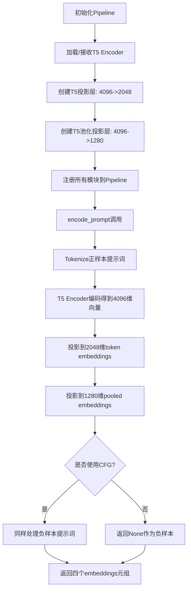
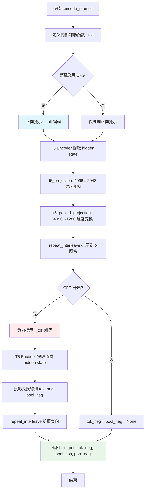
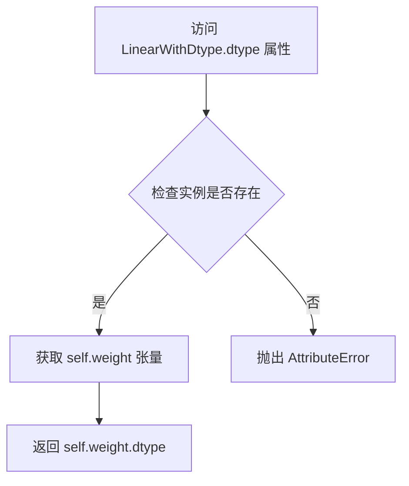
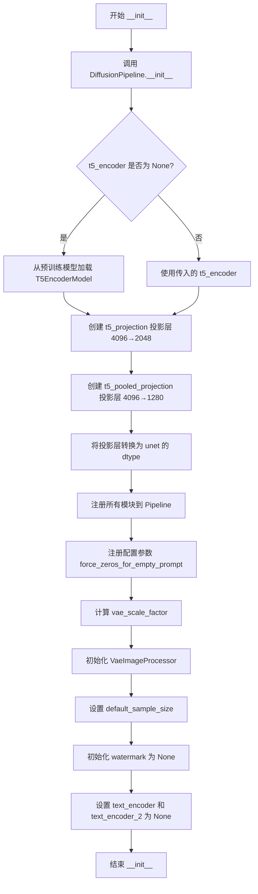

# `diffusers\examples\community\pipeline_stable_diffusion_xl_t5.py` 详细设计文档

这是一个自定义的Stable Diffusion XL Pipeline，通过集成T5-XXL大语言模型作为文本编码器（替代默认的CLIP文本编码器），并添加两个可训练的线性投影层将T5的4096维输出分别映射到2048维（token embeddings）和1280维（pooled embeddings），以实现更强大的文本理解和图像生成能力。

## 整体流程



## 类结构

```
nn.Module (PyTorch基类)
└── LinearWithDtype (自定义线性层)

DiffusionPipeline (diffusers基类)
└── StableDiffusionXLPipeline (SDXL基类)
    └── StableDiffusionXL_T5Pipeline (自定义T5集成Pipeline)
```

## 全局变量及字段


### `T5_NAME`
    
T5编码器模型名称 'mcmonkey/google_t5-v1_1-xxl_encoderonly'

类型：`str`
    


### `SDXL_NAME`
    
SDXL基础模型名称 'stabilityai/stable-diffusion-xl-base-1.0'

类型：`str`
    


### `LinearWithDtype.weight`
    
继承自nn.Linear的权重参数

类型：`nn.Parameter/张量`
    


### `LinearWithDtype.bias`
    
继承自nn.Linear的偏置参数

类型：`nn.Parameter/张量`
    


### `StableDiffusionXL_T5Pipeline.vae`
    
VAE模型

类型：`AutoencoderKL`
    


### `StableDiffusionXL_T5Pipeline.unet`
    
UNet条件模型

类型：`UNet2DConditionModel`
    


### `StableDiffusionXL_T5Pipeline.scheduler`
    
扩散调度器

类型：`KarrasDiffusionSchedulers`
    


### `StableDiffusionXL_T5Pipeline.tokenizer`
    
分词器

类型：`CLIPTokenizer`
    


### `StableDiffusionXL_T5Pipeline.t5_encoder`
    
T5文本编码器

类型：`T5EncoderModel`
    


### `StableDiffusionXL_T5Pipeline.t5_projection`
    
4096->2048投影层

类型：`LinearWithDtype`
    


### `StableDiffusionXL_T5Pipeline.t5_pooled_projection`
    
4096->1280投影层

类型：`LinearWithDtype`
    


### `StableDiffusionXL_T5Pipeline.image_encoder`
    
图像编码器

类型：`CLIPVisionModelWithProjection (可选)`
    


### `StableDiffusionXL_T5Pipeline.feature_extractor`
    
特征提取器

类型：`CLIPImageProcessor (可选)`
    


### `StableDiffusionXL_T5Pipeline.vae_scale_factor`
    
VAE缩放因子

类型：`int`
    


### `StableDiffusionXL_T5Pipeline.image_processor`
    
图像处理器

类型：`VaeImageProcessor`
    


### `StableDiffusionXL_T5Pipeline.default_sample_size`
    
默认采样尺寸

类型：`int`
    


### `StableDiffusionXL_T5Pipeline.watermark`
    
水印对象

类型：`None/水印对象`
    


### `StableDiffusionXL_T5Pipeline.text_encoder`
    
旧版文本编码器占位

类型：`None`
    


### `StableDiffusionXL_T5Pipeline.text_encoder_2`
    
旧版文本编码器2占位

类型：`None`
    


### `StableDiffusionXL_T5Pipeline._expected_modules`
    
预期模块列表

类型：`list`
    


### `StableDiffusionXL_T5Pipeline._optional_components`
    
可选组件列表

类型：`list`
    
    

## 全局函数及方法


### `StableDiffusionXL_T5Pipeline.encode_prompt`

该方法将输入的文本提示通过 T5-XXL 编码器编码为四个 embedding 张量（token embeddings 和 pooled embeddings 各两个，分别对应正向和负向提示），供 Stable Diffusion XL 模型的推理过程使用，支持多图像生成和无分类器自由引导（CFG）。

参数：

- `prompt`：`str`，待编码的文本提示
- `num_images_per_prompt`：`int = 1`，每个提示生成的图像数量，用于扩展 batch size
- `do_classifier_free_guidance`：`bool = True`，是否启用无分类器自由引导，若为 True 则同时计算负向提示 embeddings
- `negative_prompt`：`str | None = None`，负向提示，用于引导模型避免生成相关内容
- `**__`：其他关键字参数，当前未使用

返回值：`Tuple[Tensor, Tensor | None, Tensor, Tensor | None]`，返回四个张量元组，依次为：
1. `tok_pos`：`Tensor`，形状 [B, T, 2048]，正向 token embeddings
2. `tok_neg`：`Tensor | None`，形状 [B, T, 2048]，负向 token embeddings（若关闭 CFG 则为 None）
3. `pool_pos`：`Tensor`，形状 [B, 1280]，正向 pooled embeddings
4. `pool_neg`：`Tensor | None`，形状 [B, 1280]，负向 pooled embeddings（若关闭 CFG 则为 None）

其中 B = batch_size × num_images_per_prompt，T 为序列长度。

#### 流程图



#### 带注释源码

```python
def encode_prompt(
    self,
    prompt,
    num_images_per_prompt: int = 1,
    do_classifier_free_guidance: bool = True,
    negative_prompt: str | None = None,
    **_,
):
    """
    Returns
    -------
    prompt_embeds                : Tensor [B, T, 2048]
    negative_prompt_embeds       : Tensor [B, T, 2048] | None
    pooled_prompt_embeds         : Tensor [B, 1280]
    negative_pooled_prompt_embeds: Tensor [B, 1280]    | None
    where B = batch * num_images_per_prompt
    """

    # --- helper to tokenize on the pipeline’s device ----------------
    def _tok(text: str):
        # 使用 pipeline 的 tokenizer 对文本进行 tokenize
        # 返回 input_ids 和 attention_mask，并移到正确设备上
        tok_out = self.tokenizer(
            text,
            return_tensors="pt",
            padding="max_length",
            max_length=self.tokenizer.model_max_length,
            truncation=True,
        ).to(self.device)
        return tok_out.input_ids, tok_out.attention_mask

    # ---------- positive stream -------------------------------------
    # 对正向提示进行 tokenize
    ids, mask = _tok(prompt)
    # 使用 T5 Encoder 提取特征，得到 4096 维的 hidden state
    h_pos = self.t5_encoder(ids, attention_mask=mask).last_hidden_state  # [b, T, 4096]
    # 投影层将 4096 维映射到 2048 维（SDXL 期望的 token embedding 维度）
    tok_pos = self.t5_projection(h_pos)  # [b, T, 2048]
    # 对 hidden state 在序列维度求均值，得到 1280 维的 pooled embedding
    pool_pos = self.t5_pooled_projection(h_pos.mean(dim=1))  # [b, 1280]

    # expand for multiple images per prompt
    # 扩展 batch 维度以支持每个提示生成多张图像
    tok_pos = tok_pos.repeat_interleave(num_images_per_prompt, 0)
    pool_pos = pool_pos.repeat_interleave(num_images_per_prompt, 0)

    # ---------- negative / CFG stream --------------------------------
    # 如果启用无分类器自由引导（CFG），则计算负向提示的 embeddings
    if do_classifier_free_guidance:
        # 处理空负向提示的情况
        neg_text = "" if negative_prompt is None else negative_prompt
        # 负向提示的 tokenize、编码、投影过程与正向相同
        ids_n, mask_n = _tok(neg_text)
        h_neg = self.t5_encoder(ids_n, attention_mask=mask_n).last_hidden_state
        tok_neg = self.t5_projection(h_neg)
        pool_neg = self.t5_pooled_projection(h_neg.mean(dim=1))

        # 同样扩展到多图像
        tok_neg = tok_neg.repeat_interleave(num_images_per_prompt, 0)
        pool_neg = pool_neg.repeat_interleave(num_images_per_prompt, 0)
    else:
        # 关闭 CFG 时，负向 embeddings 设为 None
        tok_neg = pool_neg = None

    # ----------------- final ordered return --------------------------
    # 按 SDXL __call__ 期望的顺序返回四个张量
    # 1) positive token embeddings
    # 2) negative token embeddings (or None)
    # 3) positive pooled embeddings
    # 4) negative pooled embeddings (or None)
    return tok_pos, tok_neg, pool_pos, pool_neg
```


### `LinearWithDtype.dtype` (property)

返回权重的 `dtype` 属性，提供对模型权重的数值类型（精度）的访问能力。

参数：

- `self`：`LinearWithDtype`，隐式参数，表示当前线性层实例本身

返回值：`torch.dtype`，返回该线性层权重张量的数据类型（如 `torch.float32`、`torch.float16` 等）

#### 流程图



#### 带注释源码

```python
class LinearWithDtype(nn.Linear):
    """
    继承自 nn.Linear 的线性层类，重写了 dtype 属性以直接返回权重的数据类型。
    该类主要用于确保 T5 投影层的 dtype 与 UNet 模型的 dtype 保持一致。
    """
    
    @property
    def dtype(self):
        """
        返回权重张量的数据类型属性。
        
        该属性重写了 nn.Linear 的默认行为，直接访问权重的 dtype，
        而无需访问整个模块的 dtype。这在处理混合精度训练时特别有用，
        可以确保投影层的精度与主模型（如 UNet）一致。
        
        Returns:
            torch.dtype: 权重张量的数据类型
        """
        return self.weight.dtype
```


### `StableDiffusionXL_T5Pipeline.__init__`

初始化Pipeline，设置T5编码器和投影层，将T5 XXL编码器的4096维输出投影到SDXL所需的2048维和1280维空间，以实现T5文本编码器与Stable Diffusion XL的集成。

#### 参数

- `vae`：`AutoencoderKL`，SDXL的变分自编码器，用于编码和解码图像
- `unet`：`UNet2DConditionModel`，SDXL的去噪UNet网络
- `scheduler`：`KarrasDiffusionSchedulers`，扩散调度器
- `tokenizer`：`CLIPTokenizer`，用于对文本提示进行分词
- `t5_encoder`：`T5EncoderModel`，可选的T5编码器，默认从预训练模型加载
- `t5_projection`：`LinearWithDtype`，可选的T5投影层（4096→2048），默认创建
- `t5_pooled_projection`：`LinearWithDtype`，可选的T5池化投影层（4096→1280），默认创建
- `image_encoder`：`CLIPVisionModelWithProjection`，可选的图像编码器
- `feature_extractor`：`CLIPImageProcessor`，可选的特征提取器
- `force_zeros_for_empty_prompt`：`bool`，默认为True，空提示词时是否强制使用零向量
- `add_watermarker`：`Optional[bool]` ，是否为输出图像添加水印

#### 返回值

无（`None`），该方法为构造函数，仅初始化实例属性

#### 流程图



#### 带注释源码

```python
def __init__(
    self,
    vae: AutoencoderKL,
    unet: UNet2DConditionModel,
    scheduler: KarrasDiffusionSchedulers,
    tokenizer: CLIPTokenizer,
    t5_encoder=None,
    t5_projection=None,
    t5_pooled_projection=None,
    image_encoder: CLIPVisionModelWithProjection = None,
    feature_extractor: CLIPImageProcessor = None,
    force_zeros_for_empty_prompt: bool = True,
    add_watermarker: Optional[bool] = None,
):
    """
    初始化 StableDiffusionXL_T5Pipeline
    设置T5编码器和投影层，将4096维输出投影到SDXL所需的维数
    """
    # 调用父类 DiffusionPipeline 的初始化方法
    DiffusionPipeline.__init__(self)

    # ----- 加载 T5 编码器 -----
    # 如果未提供 T5 编码器，则从预训练模型加载
    # 使用 unet.dtype 确保 T5 编码器与 UNet 使用相同的数据类型
    if t5_encoder is None:
        self.t5_encoder = T5EncoderModel.from_pretrained(T5_NAME, torch_dtype=unet.dtype)
    else:
        self.t5_encoder = t5_encoder

    # ----- 构建 T5 4096 => 2048 维投影层 -----
    # 该投影层用于将 T5 编码器的输出投影到 SDXL 预期的维度
    # LinearWithDtype 是自定义的线性层，用于保持 dtype 属性
    if t5_projection is None:
        self.t5_projection = LinearWithDtype(4096, 2048)  # 可训练的投影层
    else:
        self.t5_projection = t5_projection
    # 将投影层转换为与 UNet 相同的数据类型
    self.t5_projection.to(dtype=unet.dtype)
    
    # ----- 构建 T5 4096 => 1280 维池化投影层 -----
    # 该投影层用于生成池化的提示词嵌入（pooled embeddings）
    if t5_pooled_projection is None:
        self.t5_pooled_projection = LinearWithDtype(4096, 1280)  # 可训练的投影层
    else:
        self.t5_pooled_projection = t5_pooled_projection
    # 将投影层转换为与 UNet 相同的数据类型
    self.t5_pooled_projection.to(dtype=unet.dtype)

    # 打印调试信息：显示投影层的数据类型
    print("dtype of Linear is ", self.t5_projection.dtype)

    # ----- 注册所有模块 -----
    # 将所有组件注册到 Pipeline 中进行统一管理
    self.register_modules(
        vae=vae,
        unet=unet,
        scheduler=scheduler,
        tokenizer=tokenizer,
        t5_encoder=self.t5_encoder,
        t5_projection=self.t5_projection,
        t5_pooled_projection=self.t5_pooled_projection,
        image_encoder=image_encoder,
        feature_extractor=feature_extractor,
    )
    
    # 注册配置参数
    self.register_to_config(force_zeros_for_empty_prompt=force_zeros_for_empty_prompt)
    
    # ----- 计算 VAE 缩放因子 -----
    # 基于 VAE 块输出通道数计算，用于图像处理
    self.vae_scale_factor = 2 ** (len(self.vae.config.block_out_channels) - 1) if getattr(self, "vae", None) else 8
    
    # 初始化图像处理器
    self.image_processor = VaeImageProcessor(vae_scale_factor=self.vae_scale_factor)

    # ----- 设置默认采样尺寸 -----
    # 从 UNet 配置中获取样本尺寸，默认为 128
    self.default_sample_size = (
        self.unet.config.sample_size
        if hasattr(self, "unet") and self.unet is not None and hasattr(self.unet.config, "sample_size")
        else 128
    )

    # 初始化水印为 None
    self.watermark = None

    # ----- 兼容性处理 -----
    # SDXL 类的某些部分要求这些属性必须存在
    # 将 text_encoder 和 text_encoder_2 设置为 None，因为使用的是 T5 编码器
    self.text_encoder = self.text_encoder_2 = None
```

---

## 完整设计文档

### 一、代码核心功能概述

该代码实现了一个基于Stable Diffusion XL的扩散管道，通过集成T5-XXL大型语言模型作为文本编码器，替代传统的CLIP文本编码器。核心创新在于设计了两个可训练的投影层（Projection Layers），将T5编码器输出的4096维向量分别投影到SDXL所需的2048维（用于完整序列嵌入）和1280维（用于池化嵌入），从而实现T5强大文本理解能力与SDXL图像生成能力的结合。

### 二、文件整体运行流程

```
┌─────────────────────────────────────────────────────────────┐
│                    初始化阶段                                 │
├─────────────────────────────────────────────────────────────┤
│  1. 加载/创建 UNet2DConditionModel                          │
│  2. 加载/创建 AutoencoderKL                                  │
│  3. 初始化 DiffusionPipeline 基础                           │
│  4. 加载 T5EncoderModel (从预训练或使用传入)                 │
│  5. 创建/使用 t5_projection (4096→2048)                     │
│  6. 创建/使用 t5_pooled_projection (4096→1280)              │
│  7. 注册所有模块到 Pipeline                                  │
│  8. 初始化图像处理器和水印                                    │
└─────────────────────────────────────────────────────────────┘
                              │
                              ▼
┌─────────────────────────────────────────────────────────────┐
│                    推理阶段                                   │
├─────────────────────────────────────────────────────────────┤
│  StableDiffusionXL_T5Pipeline.encode_prompt()              │
│  ┌────────────────────────────────────────────────────────┐ │
│  │ 1. Tokenize 文本提示                                   │ │
│  │ 2. T5 Encoder 编码 → 4096维向量                        │ │
│  │ 3. t5_projection → 2048维序列嵌入                      │ │
│  │ 4. t5_pooled_projection → 1280维池化嵌入               │ │
│  │ 5. 重复采样扩展 (num_images_per_prompt)                │ │
│  │ 6. CFG 处理 (负样本嵌入)                                │ │
│  │ 7. 返回四个嵌入张量                                      │ │
│  └────────────────────────────────────────────────────────┘ │
└─────────────────────────────────────────────────────────────┘
```

### 三、类详细信息

#### 3.1 全局变量和常量

| 名称 | 类型 | 描述 |
|------|------|------|
| `T5_NAME` | `str` | T5编码器的预训练模型名称："mcmonkey/google_t5-v1_1-xxl_encoderonly" |
| `SDXL_NAME` | `str` | SDXL基础模型名称："stabilityai/stable-diffusion-xl-base-1.0" |

#### 3.2 类：LinearWithDtype

| 属性/方法 | 类型 | 描述 |
|-----------|------|------|
| `dtype` | `property` | 返回权重的dtype |

继承自`nn.Linear`的简单包装类，用于确保dtype属性可被正确访问。

#### 3.3 类：StableDiffusionXL_T5Pipeline

| 类属性 | 类型 | 描述 |
|--------|------|------|
| `_expected_modules` | `List[str]` | 期望的模块列表，包含t5相关模块 |
| `_optional_components` | `List[str]` | 可选组件列表 |

##### 类字段

| 字段名称 | 类型 | 描述 |
|----------|------|------|
| `t5_encoder` | `T5EncoderModel` | T5文本编码器模型 |
| `t5_projection` | `LinearWithDtype` | 4096→2048维投影层 |
| `t5_pooled_projection` | `LinearWithDtype` | 4096→1280维池化投影层 |
| `vae` | `AutoencoderKL` | VAE编码器/解码器 |
| `unet` | `UNet2DConditionModel` | 条件UNet模型 |
| `scheduler` | `KarrasDiffusionSchedulers` | 扩散调度器 |
| `tokenizer` | `CLIPTokenizer` | 文本分词器 |
| `vae_scale_factor` | `int` | VAE缩放因子 |
| `image_processor` | `VaeImageProcessor` | 图像处理器 |
| `default_sample_size` | `int` | 默认采样尺寸 |
| `watermark` | `None` | 水印对象（当前为None） |
| `text_encoder` | `None` | 兼容性占位符 |
| `text_encoder_2` | `None` | 兼容性占位符 |

##### 类方法

| 方法名称 | 参数 | 返回值 | 描述 |
|----------|------|--------|------|
| `__init__` | vae, unet, scheduler, tokenizer, t5_encoder, t5_projection, t5_pooled_projection, image_encoder, feature_extractor, force_zeros_for_empty_prompt, add_watermarker | `None` | 初始化Pipeline |
| `encode_prompt` | prompt, num_images_per_prompt, do_classifier_free_guidance, negative_prompt | `(tok_pos, tok_neg, pool_pos, pool_neg)` | 编码文本提示为嵌入向量 |

### 四、关键组件信息

| 组件名称 | 一句话描述 |
|----------|------------|
| T5EncoderModel | Google的T5文本编码器，负责将文本转换为4096维语义向量 |
| LinearWithDtype | 自定义线性层包装类，确保dtype属性可访问 |
| t5_projection | 可训练投影层，将T5的4096维输出投影到SDXL的2048维序列空间 |
| t5_pooled_projection | 可训练投影层，将T5的4096维输出投影到SDXL的1280维池化空间 |
| VaeImageProcessor | 图像预处理和后处理工具 |
| DiffusionPipeline | Hugging Face Diffusers库的基础管道类 |

### 五、潜在的技术债务与优化空间

1. **硬编码的模型名称**: `T5_NAME`和`SDXL_NAME`作为全局常量硬编码，缺乏灵活性，应考虑通过配置或参数传入。

2. **投影层维度硬编码**: 投影层的输入/输出维度（4096→2048→1280）硬编码在代码中，如果SDXL版本更新可能导致兼容性问题。

3. **调试打印语句**: `print("dtype of Linear is ", self.t5_projection.dtype)`这样的调试代码应移除或替换为日志系统。

4. **缺失的权重初始化策略**: 投影层使用默认的Kaiming初始化，对于特定任务可能不是最优的，应考虑预训练或自定义初始化。

5. **text_encoder占位符**: 将`text_encoder`和`text_encoder_2`设置为`None`是hack方式，长期来看应考虑更优雅的设计。

6. **错误处理不足**: 缺少对模型加载失败、维度不匹配等异常情况的处理。

7. **文档缺失**: 缺少模块级和类级的文档字符串。

### 六、其它项目

#### 设计目标与约束

- **设计目标**: 将T5-XXL的强大文本理解能力与SDXL的图像生成能力结合
- **约束**: 投影层设计为可训练，允许针对特定任务微调
- **兼容性**: 保持与Hugging Face Diffusers库接口的兼容性

#### 错误处理与异常设计

- 当前实现未包含显式的错误处理机制
- 依赖Hugging Face Diffusers的底层异常传播
- 建议添加：模型加载失败检查、维度验证、dtype一致性检查

#### 数据流与状态机

```
输入文本 → Tokenizer → T5 Encoder (4096维) 
         → 投影层1 (2048维) → 正样本序列嵌入
         → 投影层2 (1280维) → 正样本池化嵌入
         → CFG处理 → 负样本嵌入
         → 输出四个嵌入向量供UNet使用
```

#### 外部依赖与接口契约

- ** transformers**: 提供T5EncoderModel、CLIPTokenizer、CLIPVisionModelWithProjection
- ** diffusers**: 提供DiffusionPipeline、StableDiffusionXLPipeline、VaeImageProcessor、AutoencoderKL、UNet2DConditionModel、KarrasDiffusionSchedulers
- ** torch**: 基础深度学习框架
- ** torch.nn**: 提供神经网络模块

## 关键组件


### T5文本编码器 (t5_encoder)

使用预训练的T5-XXL编码器（google_t5-v1_1-xxl_encoderonly）将文本提示编码为4096维的hidden states，是管道的主要文本理解组件。

### T5 Token投影层 (t5_projection)

LinearWithDtype(4096, 2048) 线性层，将T5的4096维输出投影到SDXL期望的2048维token嵌入空间，用于非池化的序列嵌入。

### T5 池化投影层 (t5_pooled_projection)

LinearWithDtype(4096, 1280) 线性层，将T5的4096维输出投影到1280维的pooled嵌入空间，用于全局池化后的文本表示。

### LinearWithDtype 类

继承自nn.Linear的辅助类，重写dtype属性返回weight.dtype，确保投影层与unet使用相同的dtype进行计算。

### encode_prompt 方法

管道的核心文本编码方法，接收提示词和负提示词，通过T5编码器编码后经投影层转换，返回符合SDXL __call__要求的四个嵌入张量（正向token嵌入、负向token嵌入、正向pooled嵌入、负向pooled嵌入）。

### StableDiffusionXL_T5Pipeline 类

继承自StableDiffusionXLPipeline的定制管道类，整合T5-XXL文本编码器及其投影层，支持T5文本编码代替传统的CLIP文本编码。

### VaeImageProcessor

用于处理VAE输入输出的图像处理器，根据VAE的block_out_channels计算缩放因子。

### _expected_modules 和 _optional_components

定义了管道期望的模块列表和可选组件，包括T5编码器和相关的投影层模块。

### add_watermarker 配置

可选的水印功能参数，目前被接受但未实际实现（watermark初始化为None）。

### force_zeros_for_empty_prompt 配置

控制空提示词时是否强制使用零向量的配置参数，传递给父类管道。


## 问题及建议


### 已知问题

-   **硬编码模型名称**：T5_NAME 和 SDXL_NAME 被硬编码在模块顶部，缺乏灵活配置机制
-   **调试打印语句未移除**：`print("dtype of Linear is ", self.t5_projection.dtype)` 语句存在于生产代码中，应使用日志框架或移除
-   **未使用的参数**：`add_watermarker` 参数在 `__init__` 中接收但从未使用，`self.watermark` 被设置为 None 后无实际功能
-   **类型注解不完整**：`encode_prompt` 方法缺少返回值类型注解，使用 `**_,` 接收未知参数不符合最佳实践
-   **内存效率问题**：每次调用 `encode_prompt` 都会重复执行 tokenize 和编码操作，缺少缓存机制；`repeat_interleave` 会创建新的张量副本
-   **不完整的继承实现**：设置 `self.text_encoder = self.text_encoder_2 = None` 仅为避免检查，非真正使用，可能导致父类方法调用失败
-   **缺少错误处理**：未对空 prompt、None 模型组件、CUDA/OOM 错误等进行防御性检查
-   **设备管理不明确**：依赖 `self.device` 但未显式确保所有组件在同一设备上
-   **文档不完整**：缺少对 T5 投影层维度变换目的的说明，未说明为何选择 4096→2048 和 4096→1280 的映射

### 优化建议

-   将模型名称改为可配置参数或环境变量，使用配置类管理
-   移除调试用 print 语句，改用 `logging` 模块
-   补充完整的类型注解和 docstring，特别是返回值类型
-   实现 prompt 编码结果的缓存机制，避免重复计算
-   添加参数验证和异常处理，如空 prompt 检查、模型组件 None 检查
-   考虑使用 `torch.no_grad()` 包装只读推理操作以节省显存
-   明确设备管理策略，在初始化时显式调用 `.to(device)` 确保所有组件在同一设备
-   移除未使用的 `add_watermarker` 参数或实现水印功能
-   补充设计文档，说明 T5 投影层的数学意义和训练策略

## 其它


### 设计目标与约束

本Pipeline的设计目标是结合T5-XXL文本编码器与SDXL模型，以探索更强大的文本到图像生成能力。当前约束包括：1) T5模型权重不存储在Pipeline中，而是利用HuggingFace Hub缓存加载；2) 投影层(4096→2048和4096→1280)设计为可训练的Linear层；3) 依赖stabilityai/stable-diffusion-xl-base-1.0作为基础模型；4) 当前无预训练模型能产生满意结果，属于技术演示阶段。

### 错误处理与异常设计

代码中错误处理较为简单，主要依赖HuggingFace Diffusers框架的异常传播。未捕获的异常情况包括：1) T5EncoderModel加载失败（网络问题或模型不存在）；2) tokenizer处理超长文本时的截断行为；3) device不匹配导致的tensor迁移错误；4) VAE/Unet为None时的属性访问。建议添加：模型加载失败的重试机制、参数校验、详细的错误日志记录、以及None值的防御性检查。

### 数据流与状态机

Pipeline的核心数据流为：用户输入prompt → CLIPTokenizer分词 → T5EncoderModel编码 → 投影层(dim 4096→2048/1280) → 返回四个tensor(prompt_embeds, negative_prompt_embeds, pooled_prompt_embeds, negative_pooled_prompt_embeds)。状态机主要体现在：1) 单次推理vs批量处理(num_images_per_prompt)；2) 是否启用Classifier-Free Guidance(do_classifier_free_guidance)；3) 投影层的训练/推理模式切换。

### 外部依赖与接口契约

核心依赖包括：torch.nn, transformers(CLIPImageProcessor, CLIPTokenizer, CLIPVisionModelWithProjection, T5EncoderModel), diffusers(DiffusionPipeline, StableDiffusionXLPipeline, VaeImageProcessor, AutoencoderKL, UNet2DConditionModel, KarrasDiffusionSchedulers)。接口契约：encode_prompt方法接收prompt(str), num_images_per_prompt(int), do_classifier_free_guidance(bool), negative_prompt(str|None)，返回四个tensor元组，顺序固定为(positive_embeds, negative_embeds, pooled_positive, pooled_negative)。

### 性能考虑与优化空间

性能瓶颈：1) T5-XXL模型参数量大，推理速度慢；2) 投影层使用nn.Linear，无混合精度优化；3) repeat_interleave操作可能带来内存复制开销。优化建议：1) 对投影层启用梯度checkpointing；2) 使用torch.compile加速；3) 考虑量化T5编码器；4) 批量处理时预分配tensor避免重复分配；5) 移除调试用的print语句。

### 安全性考虑

代码本身不直接处理用户敏感数据，但需注意：1) 模型下载来源需验证(T5_NAME和SDXL_NAME)；2) 生成的图像可能包含水印(add_watermark参数预留但未实现)；3) 内存中保留完整prompt和embeds需及时清理；4) 恶意超长prompt可能导致OOM(当前truncation=True可缓解)。

### 兼容性说明

本Pipeline继承StableDiffusionXLPipeline，需保持与Diffusers库版本的兼容性。当前设计支持的版本特性：1) Diffusers库的register_modules机制；2) VaeImageProcessor的VAE缩放因子计算；3) KarrasDiffusionSchedulers调度器接口。已知兼容性问题：需确保diffusers>=0.19.0以支持T5EncoderModel的from_pretrained方法。

### 测试策略与测试用例设计

建议测试覆盖：1) 单元测试：LinearWithDtype的dtype属性；encode_prompt的返回值shape验证(B*T*2048, B*1280)；2) 集成测试：Pipeline实例化(带/不带t5_encoder参数)；完整推理流程(需GPU)；3) 边界测试：空prompt、极长prompt(>512 tokens)、num_images_per_prompt>1、do_classifier_free_guidance=False；4) 回归测试：对比加/不加T5编码器的输出差异。

    