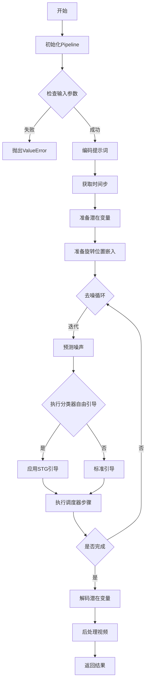
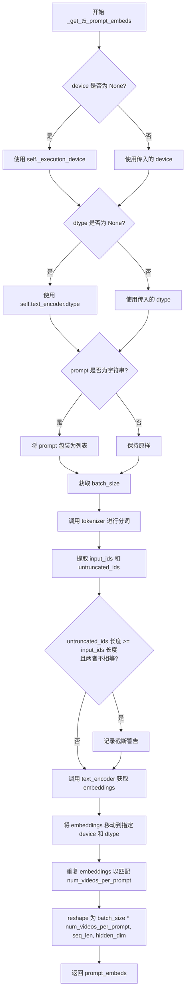
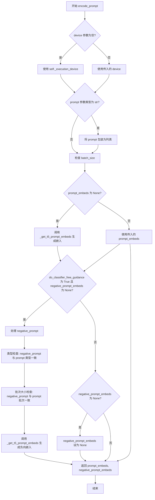
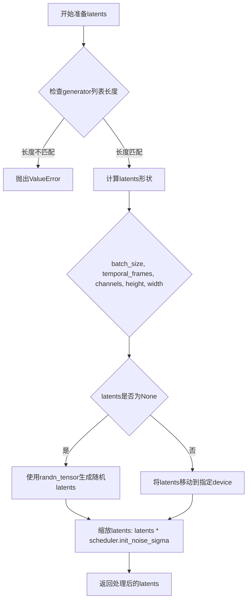
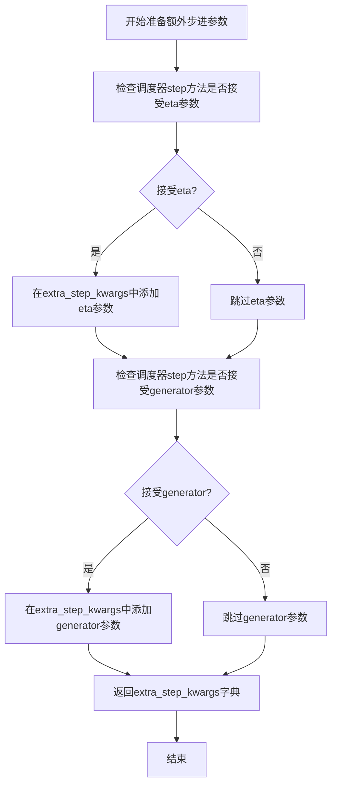
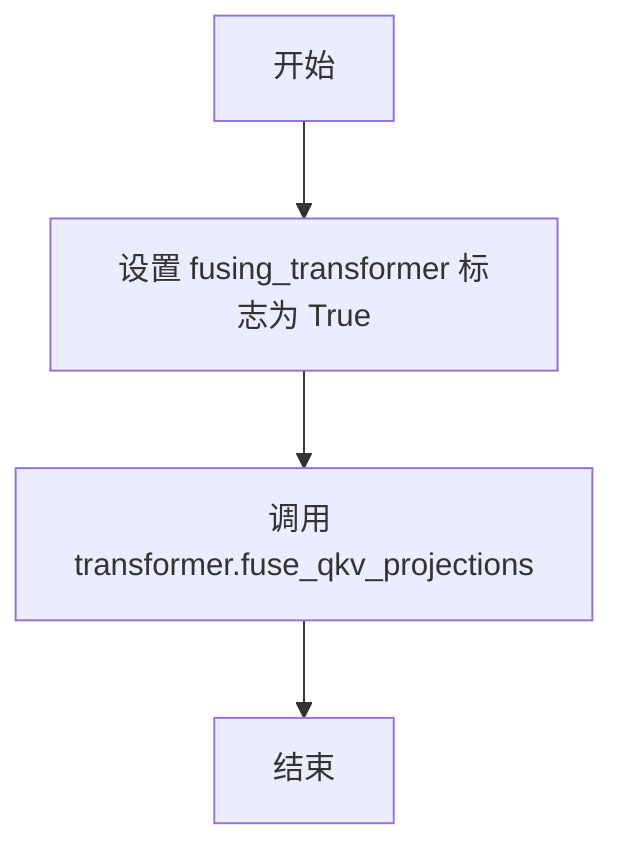
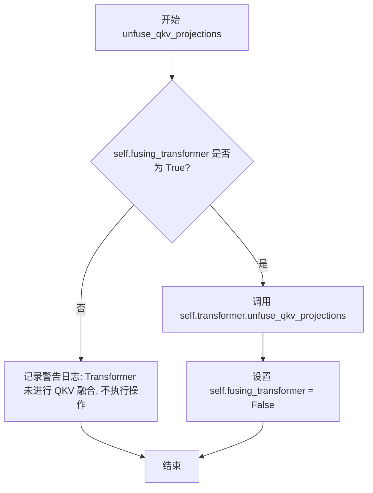
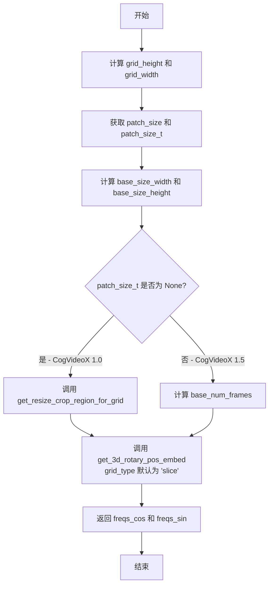
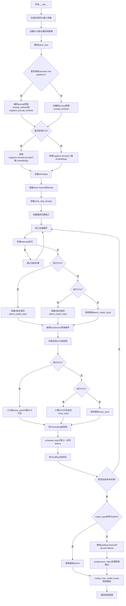

```mermaid
flowchart TD
    A[开始: retrieve_timesteps] --> B{检查参数}
    B --> C{timesteps 和 sigmas 都非空?}
    C -->|是| D[抛出 ValueError: 只能选择 timesteps 或 sigmas 之一]
    C -->|否| E{timesteps 非空?}
    E -->|是| F[检查 scheduler.set_timesteps 是否接受 timesteps 参数]
    F --> G{支持 timesteps?}
    G -->|否| H[抛出 ValueError: 当前调度器不支持自定义时间步]
    G -->|是| I[调用 scheduler.set_timesteps&#40;timesteps=timesteps, device=device, **kwargs&#41;]
    I --> J[获取 scheduler.timesteps]
    J --> K[计算 num_inference_steps = len&#40;timesteps&#41;]
    E -->|否| L{sigmas 非空?}
    L -->|是| M[检查 scheduler.set_timesteps 是否接受 sigmas 参数]
    M --> N{支持 sigmas?}
    N -->|否| O[抛出 ValueError: 当前调度器不支持自定义 sigmas]
    N -->|是| P[调用 scheduler.set_timesteps&#40;sigmas=sigmas, device=device, **kwargs&#41;]
    P --> Q[获取 scheduler.timesteps]
    Q --> R[计算 num_inference_steps = len&#40;timesteps&#41;]
    L -->|否| S[调用 scheduler.set_timesteps&#40;num_inference_steps, device=device, **kwargs&#41;]
    S --> T[获取 scheduler.timesteps]
    T --> U[计算 num_inference_steps = len&#40;timesteps&#41;]
    K --> V[返回 timesteps, num_inference_steps]
    R --> V
    U --> V
    V --> W[结束]
```

# `diffusers\examples\community\pipeline_stg_cogvideox.py` 详细设计文档

CogVideoX STG Pipeline是一个用于文本到视频生成的扩散模型实现，通过时空引导(STG)技术增强视频生成的质量和可控性，支持CogVideoX-2b/5b模型，能够根据文本提示生成高质量视频内容。

## 整体流程



## 类结构

```
DiffusionPipeline (抽象基类)
└── CogVideoXSTGPipeline (主类)
    └── CogVideoXLoraLoaderMixin (混入类)
```

## 全局变量及字段


### `logger`
    
模块级日志记录器，用于输出警告和信息

类型：`logging.Logger`
    


### `EXAMPLE_DOC_STRING`
    
示例文档字符串，包含CogVideoX-STG pipeline的使用示例

类型：`str`
    


### `XLA_AVAILABLE`
    
标志位，指示PyTorch XLA是否可用

类型：`bool`
    


### `CogVideoXSTGPipeline.vae_scale_factor_spatial`
    
VAE空间缩放因子，用于计算潜在空间的spatial维度

类型：`int`
    


### `CogVideoXSTGPipeline.vae_scale_factor_temporal`
    
VAE时间压缩比，用于计算潜在帧数

类型：`int`
    


### `CogVideoXSTGPipeline.vae_scaling_factor_image`
    
VAE图像缩放因子，用于解码时对潜在表示进行缩放

类型：`float`
    


### `CogVideoXSTGPipeline.video_processor`
    
视频处理器，用于视频后处理和格式转换

类型：`VideoProcessor`
    


### `CogVideoXSTGPipeline._stg_scale`
    
时空引导强度系数，控制STG guidance的生效程度

类型：`float`
    


### `CogVideoXSTGPipeline._guidance_scale`
    
分类器自由引导强度，控制文本提示对生成结果的影响程度

类型：`float`
    


### `CogVideoXSTGPipeline._attention_kwargs`
    
注意力处理器所需的额外关键字参数字典

类型：`Optional[Dict[str, Any]]`
    


### `CogVideoXSTGPipeline._num_timesteps`
    
去噪过程的总时间步数

类型：`int`
    


### `CogVideoXSTGPipeline._current_timestep`
    
当前去噪步骤的时间步值

类型：`Optional[int]`
    


### `CogVideoXSTGPipeline._interrupt`
    
中断标志，用于中断pipeline执行

类型：`bool`
    
    

## 全局函数及方法


### `forward_with_stg`

该函数是 CogVideoX Transformer 块的前向传播方法的修改版本，通过保存部分 hidden_states（索引 2 之后）并在最后恢复，实现了一种特殊的 spatio-temporal guidance（STG）机制，用于在视频生成过程中注入特定的引导信号。

参数：

- `self`：调用此方法的 Transformer 块实例本身。
- `hidden_states`：`torch.Tensor`，输入的潜在状态，通常是经过噪声处理的视频潜在表示。
- `encoder_hidden_states`：`torch.Tensor`，来自文本编码器的条件隐藏状态，用于引导视频生成内容。
- `temb`：`torch.Tensor`，时间步嵌入（timestep embedding），用于指示扩散过程的当前步骤。
- `image_rotary_emb`：`Optional[Tuple[torch.Tensor, torch.Tensor]]`，可选的旋转位置嵌入，用于增强模型对空间位置的理解。

返回值：`torch.Tensor`，返回处理后的 `hidden_states` 和 `encoder_hidden_states` 元组，实际上是一个包含两个张量的元组。

#### 流程图

```mermaid
graph TD
    A[开始 forward_with_stg] --> B[保存 hidden_states[2:] 和 encoder_hidden_states[2:] 到 PTB]
    B --> C[获取 text_seq_length]
    C --> D[norm1: 归一化与调制 hidden_states 和 encoder_hidden_states]
    D --> E[attn1: 自注意力计算]
    E --> F[残差连接: hidden_states += gate_msa * attn_hidden_states]
    F --> G[残差连接: encoder_hidden_states += enc_gate_msa * attn_encoder_hidden_states]
    G --> H[norm2: 归一化与调制]
    H --> I[拼接: norm_hidden_states = concat norm_encoder_hidden_states, norm_hidden_states]
    I --> J[ff: 前馈网络计算]
    J --> K[残差连接: hidden_states += gate_ff * ff_output[:, text_seq_length:]]
    K --> L[残差连接: encoder_hidden_states += enc_gate_ff * ff_output[:, :text_seq_length]]
    L --> M[恢复 PTB: hidden_states[2:] 和 encoder_hidden_states[2:] 恢复原始值]
    M --> N[返回 hidden_states, encoder_hidden_states]
```

#### 带注释源码

```python
def forward_with_stg(
    self,
    hidden_states: torch.Tensor,
    encoder_hidden_states: torch.Tensor,
    temb: torch.Tensor,
    image_rotary_emb: Optional[Tuple[torch.Tensor, torch.Tensor]] = None,
) -> torch.Tensor:
    # 1. 保存 hidden_states 和 encoder_hidden_states 中索引 2 之后的部分（即所谓的 PTB - Partial Tensor Buffer？）
    # 这通常用于保留不参与 STG（时空引导）计算的部分，以便最后恢复
    hidden_states_ptb = hidden_states[2:]
    encoder_hidden_states_ptb = encoder_hidden_states[2:]

    # 获取文本序列长度，用于后续分割前馈网络输出
    text_seq_length = encoder_hidden_states.size(1)

    # 2. 第一层归一化与调制 (Norm & Modulate)
    # norm1 负责对 hidden_states 和 encoder_hidden_states 进行归一化，并生成门控因子 gate_msa 和 enc_gate_msa
    norm_hidden_states, norm_encoder_hidden_states, gate_msa, enc_gate_msa = self.norm1(
        hidden_states, encoder_hidden_states, temb
    )

    # 3. 自注意力计算 (Self-Attention)
    # 使用归一化后的隐藏状态进行注意力计算，可能包含 cross-attention（encoder_hidden_states）
    attn_hidden_states, attn_encoder_hidden_states = self.attn1(
        hidden_states=norm_hidden_states,
        encoder_hidden_states=norm_encoder_hidden_states,
        image_rotary_emb=image_rotary_emb,
    )

    # 4. 残差连接与门控应用 (Residual Connection & Gating)
    # 将注意力输出通过门控因子加权后加到原始隐藏状态上
    hidden_states = hidden_states + gate_msa * attn_hidden_states
    encoder_hidden_states = encoder_hidden_states + enc_gate_msa * attn_encoder_hidden_states

    # 5. 第二层归一化与调制 (Norm & Modulate)
    norm_hidden_states, norm_encoder_hidden_states, gate_ff, enc_gate_ff = self.norm2(
        hidden_states, encoder_hidden_states, temb
    )

    # 6. 准备前馈网络输入 (Prepare FFN Input)
    # 将 encoder 和 decoder 的归一化隐藏状态在序列维度上拼接
    # 假设前馈网络是一个联合处理文本和视频特征的混合前馈网络
    norm_hidden_states = torch.cat([norm_encoder_hidden_states, norm_hidden_states], dim=1)
    
    # 7. 前馈网络计算 (Feed-Forward)
    ff_output = self.ff(norm_hidden_states)

    # 8. 分割并应用残差连接 (Split & Residual)
    # 根据文本序列长度将 FFN 输出分割回 encoder 和 decoder 部分，并分别加上门控后的残差
    hidden_states = hidden_states + gate_ff * ff_output[:, text_seq_length:]
    encoder_hidden_states = encoder_hidden_states + enc_gate_ff * ff_output[:, :text_seq_length]

    # 9. 恢复保留的 PTB 部分 (Restore PTB)
    # 将最初保存的原始值写回 hidden_states 和 encoder_hidden_states 的指定索引位置
    # 这确保了 STG 修改不会影响到某些特定的 tokens（通常是特殊的控制 tokens）
    hidden_states[2:] = hidden_states_ptb
    encoder_hidden_states[2:] = encoder_hidden_states_ptb

    return hidden_states, encoder_hidden_states
```


### `get_resize_crop_region_for_grid`

该函数用于计算图像在调整到目标尺寸后的裁剪区域坐标，通过保持宽高比将源图像调整为目标尺寸，并返回居中裁剪的左上角和右下角坐标。

参数：

- `src`：`Tuple[int, int]`，源图像的高度和宽度元组 (h, w)
- `tgt_width`：`int`，目标图像的宽度
- `tgt_height`：`int`，目标图像的高度

返回值：`Tuple[Tuple[int, int], Tuple[int, int]]`，返回两个元组——第一个是裁剪区域左上角坐标 (crop_top, crop_left)，第二个是裁剪区域右下角坐标 (crop_top + resize_height, crop_left + resize_width)

#### 流程图

```mermaid
flowchart TD
    A[开始] --> B[输入 src=(h,w), tgt_width, tgt_height]
    B --> C[计算目标宽高比 r = h / w]
    C --> D{判断 r > (th / tw)?}
    D -->|是| E[resize_height = th<br/>resize_width = round(th / h * w)]
    D -->|否| F[resize_width = tw<br/>resize_height = round(tw / w * h)]
    E --> G[计算裁剪偏移量<br/>crop_top = round((th - resize_height) / 2)<br/>crop_left = round((tw - resize_width) / 2)]
    F --> G
    G --> H[返回裁剪区域坐标<br/>((crop_top, crop_left), (crop_top + resize_height, crop_left + resize_width))]
    H --> I[结束]
```

#### 带注释源码

```
# 该函数用于计算图像调整大小后的裁剪区域，保持宽高比并居中裁剪
# 类似于 diffusers.pipelines.hunyuandit.pipeline_hunyuandit.get_resize_crop_region_for_grid
def get_resize_crop_region_for_grid(src, tgt_width, tgt_height):
    # 目标宽度和高度
    tw = tgt_width
    th = tgt_height
    # 解包源图像尺寸：h为高度，w为宽度
    h, w = src
    # 计算源图像的宽高比
    r = h / w
    
    # 根据宽高比判断需要拉伸的方向
    if r > (th / tw):
        # 源图像更窄/高，按高度填充，宽度自适应
        resize_height = th
        resize_width = int(round(th / h * w))
    else:
        # 源图像更宽/矮，按宽度填充，高度自适应
        resize_width = tw
        resize_height = int(round(tw / w * h))

    # 计算居中裁剪的偏移量
    crop_top = int(round((th - resize_height) / 2.0))
    crop_left = int(round((tw - resize_width) / 2.0))

    # 返回裁剪区域的左上角和右下角坐标
    return (crop_top, crop_left), (crop_top + resize_height, crop_left + resize_width)
```


### `retrieve_timesteps`

该函数是扩散 pipelines 中的工具函数，用于从调度器（scheduler）获取推理时的时间步（timesteps）。它支持三种模式：使用自定义时间步、自定义 sigmas，或使用默认的推理步数来生成时间步序列。函数内部会验证调度器是否支持相应的参数，并调用 `set_timesteps` 方法完成时间步的设置。

参数：

- `scheduler`：`SchedulerMixin`，调度器对象，用于生成时间步
- `num_inference_steps`：`Optional[int]`，扩散模型的推理步数，当使用 `timesteps` 或 `sigmas` 时必须为 `None`
- `device`：`Optional[Union[str, torch.device]]`，时间步要迁移到的设备，如果为 `None` 则不迁移
- `timesteps`：`Optional[List[int]]`，自定义时间步，用于覆盖调度器的默认时间步间隔策略
- `sigmas`：`Optional[List[float]]`，自定义 sigmas，用于覆盖调度器的默认 sigma 间隔策略
- `**kwargs`：任意关键字参数，将传递给调度器的 `set_timesteps` 方法

返回值：`Tuple[torch.Tensor, int]`，元组包含调度器生成的时间步序列（torch.Tensor）和推理步数量（int）

#### 流程图



#### 带注释源码

```python
def retrieve_timesteps(
    scheduler,
    num_inference_steps: Optional[int] = None,
    device: Optional[Union[str, torch.device]] = None,
    timesteps: Optional[List[int]] = None,
    sigmas: Optional[List[float]] = None,
    **kwargs,
):
    r"""
    Calls the scheduler's `set_timesteps` method and retrieves timesteps from the scheduler after the call. Handles
    custom timesteps. Any kwargs will be supplied to `scheduler.set_timesteps`.

    Args:
        scheduler (`SchedulerMixin`):
            The scheduler to get timesteps from.
        num_inference_steps (`int`):
            The number of diffusion steps used when generating samples with a pre-trained model. If used, `timesteps`
            must be `None`.
        device (`str` or `torch.device`, *optional*):
            The device to which the timesteps should be moved to. If `None`, the timesteps are not moved.
        timesteps (`List[int]`, *optional*):
            Custom timesteps used to override the timestep spacing strategy of the scheduler. If `timesteps` is passed,
            `num_inference_steps` and `sigmas` must be `None`.
        sigmas (`List[float]`, *optional*):
            Custom sigmas used to override the timestep spacing strategy of the scheduler. If `sigmas` is passed,
            `num_inference_steps` and `timesteps` must be `None`.

    Returns:
        `Tuple[torch.Tensor, int]`: A tuple where the first element is the timestep schedule from the scheduler and the
        second element is the number of inference steps.
    """
    # 检查是否同时传递了 timesteps 和 sigmas，这两个参数只能选择其一
    if timesteps is not None and sigmas is not None:
        raise ValueError("Only one of `timesteps` or `sigmas` can be passed. Please choose one to set custom values")
    
    # 模式一：使用自定义时间步
    if timesteps is not None:
        # 检查调度器的 set_timesteps 方法是否支持 timesteps 参数
        accepts_timesteps = "timesteps" in set(inspect.signature(scheduler.set_timesteps).parameters.keys())
        if not accepts_timesteps:
            raise ValueError(
                f"The current scheduler class {scheduler.__class__}'s `set_timesteps` does not support custom"
                f" timestep schedules. Please check whether you are using the correct scheduler."
            )
        # 调用调度器的 set_timesteps 方法设置自定义时间步
        scheduler.set_timesteps(timesteps=timesteps, device=device, **kwargs)
        # 从调度器获取生成的时间步序列
        timesteps = scheduler.timesteps
        # 计算推理步数
        num_inference_steps = len(timesteps)
    
    # 模式二：使用自定义 sigmas
    elif sigmas is not None:
        # 检查调度器的 set_timesteps 方法是否支持 sigmas 参数
        accept_sigmas = "sigmas" in set(inspect.signature(scheduler.set_timesteps).parameters.keys())
        if not accept_sigmas:
            raise ValueError(
                f"The current scheduler class {scheduler.__class__}'s `set_timesteps` does not support custom"
                f" sigmas schedules. Please check whether you are using the correct scheduler."
            )
        # 调用调度器的 set_timesteps 方法设置自定义 sigmas
        scheduler.set_timesteps(sigmas=sigmas, device=device, **kwargs)
        # 从调度器获取生成的时间步序列
        timesteps = scheduler.timesteps
        # 计算推理步数
        num_inference_steps = len(timesteps)
    
    # 模式三：使用默认推理步数生成时间步
    else:
        # 调用调度器的 set_timesteps 方法，使用 num_inference_steps 生成时间步
        scheduler.set_timesteps(num_inference_steps, device=device, **kwargs)
        # 从调度器获取生成的时间步序列
        timesteps = scheduler.timesteps
    
    # 返回时间步序列和推理步数
    return timesteps, num_inference_steps
```


### `CogVideoXSTGPipeline.__init__`

该方法是CogVideoXSTGPipeline类的构造函数，负责初始化视频生成管道所需的所有核心组件，包括分词器、文本编码器、VAE、Transformer模型和调度器，并配置相关的缩放因子和视频处理器。

参数：

- `tokenizer`：`T5Tokenizer`，T5分词器，用于将文本提示编码为token序列
- `text_encoder`：`T5EncoderModel`，冻结的T5文本编码器，用于生成文本嵌入向量
- `vae`：`AutoencoderKLCogVideoX`，变分自编码器模型，用于编码和解码视频潜在表示
- `transformer`：`CogVideoXTransformer3DModel`，3D变换器模型，用于对视频潜在表示进行去噪
- `scheduler`：`Union[CogVideoXDDIMScheduler, CogVideoXDPMScheduler]`，调度器，用于控制去噪过程中的时间步

返回值：无（`None`），构造函数不返回值，仅初始化实例属性

#### 流程图

```mermaid
flowchart TD
    A[开始 __init__] --> B[调用父类构造函数 super().__init__]
    B --> C[register_modules: 注册 tokenizer, text_encoder, vae, transformer, scheduler]
    C --> D[计算 vae_scale_factor_spatial<br/>基于 VAE block_out_channels 数量]
    C --> E[计算 vae_scale_factor_temporal<br/>基于 VAE temporal_compression_ratio]
    C --> F[计算 vae_scaling_factor_image<br/>基于 VAE scaling_factor]
    D --> G[创建 VideoProcessor<br/>使用 vae_scale_factor_spatial]
    E --> G
    F --> G
    G --> H[结束 __init__]
```

#### 带注释源码

```python
def __init__(
    self,
    tokenizer: T5Tokenizer,
    text_encoder: T5EncoderModel,
    vae: AutoencoderKLCogVideoX,
    transformer: CogVideoXTransformer3DModel,
    scheduler: Union[CogVideoXDDIMScheduler, CogVideoXDPMScheduler],
):
    """
    初始化 CogVideoXSTGPipeline 管道
    
    参数:
        tokenizer: T5分词器
        text_encoder: T5文本编码器
        vae: CogVideoX VAE模型
        transformer: CogVideoX Transformer 3D模型
        scheduler: 调度器 (DDIM 或 DPM)
    """
    # 调用父类 DiffusionPipeline 的初始化方法
    super().__init__()

    # 将所有模块注册到管道中，使它们可以通过 self.tokenizer, self.text_encoder 等访问
    self.register_modules(
        tokenizer=tokenizer, 
        text_encoder=text_encoder, 
        vae=vae, 
        transformer=transformer, 
        scheduler=scheduler
    )
    
    # 计算空间缩放因子：基于VAE块输出通道数的2^(n-1)
    # CogVideoX 典型值为 2^(6-1) = 32 或根据配置
    self.vae_scale_factor_spatial = (
        2 ** (len(self.vae.config.block_out_channels) - 1) if getattr(self, "vae", None) else 8
    )
    
    # 计算时间缩放因子：基于VAE的时间压缩比
    self.vae_scale_factor_temporal = (
        self.vae.config.temporal_compression_ratio if getattr(self, "vae", None) else 4
    )
    
    # 获取VAE的图像缩放因子
    self.vae_scaling_factor_image = self.vae.config.scaling_factor if getattr(self, "vae", None) else 0.7

    # 创建视频处理器，用于视频后处理
    self.video_processor = VideoProcessor(vae_scale_factor=self.vae_scale_factor_spatial)
```


### `CogVideoXSTGPipeline._get_t5_prompt_embeds`

该方法用于将文本提示词（prompt）编码为T5文本编码器的嵌入向量（embeddings），支持批量处理和每个提示词生成多个视频的场景，并对序列长度进行截断处理。

参数：

- `prompt`：`Union[str, List[str]] = None`，要编码的文本提示词，可以是单个字符串或字符串列表
- `num_videos_per_prompt`：`int = 1`，每个提示词需要生成的视频数量，用于复制embeddings
- `max_sequence_length`：`int = 226`，文本序列的最大token长度，超过该长度会被截断
- `device`：`Optional[torch.device] = None`，指定计算设备，默认为执行设备
- `dtype`：`Optional[torch.dtype] = None`，指定数据类型，默认为text_encoder的数据类型

返回值：`torch.Tensor`，形状为 `(batch_size * num_videos_per_prompt, seq_len, hidden_dim)` 的文本嵌入张量

#### 流程图



#### 带注释源码

```python
def _get_t5_prompt_embeds(
    self,
    prompt: Union[str, List[str]] = None,
    num_videos_per_prompt: int = 1,
    max_sequence_length: int = 226,
    device: Optional[torch.device] = None,
    dtype: Optional[torch.dtype] = None,
):
    # 确定设备：如果未指定，则使用pipeline的默认执行设备
    device = device or self._execution_device
    # 确定数据类型：如果未指定，则使用text_encoder的数据类型
    dtype = dtype or self.text_encoder.dtype

    # 如果prompt是单个字符串，转换为列表以便批量处理
    prompt = [prompt] if isinstance(prompt, str) else prompt
    # 计算批次大小
    batch_size = len(prompt)

    # 使用T5 Tokenizer对prompt进行分词
    # padding="max_length": 填充到最大长度
    # max_length=max_sequence_length: 最大序列长度
    # truncation=True: 超过最大长度的序列进行截断
    # add_special_tokens=True: 添加特殊tokens（如EOS等）
    # return_tensors="pt": 返回PyTorch张量
    text_inputs = self.tokenizer(
        prompt,
        padding="max_length",
        max_length=max_sequence_length,
        truncation=True,
        add_special_tokens=True,
        return_tensors="pt",
    )
    # 提取input_ids用于编码
    text_input_ids = text_inputs.input_ids
    # 获取未截断的input_ids用于检测是否发生了截断
    untruncated_ids = self.tokenizer(prompt, padding="longest", return_tensors="pt").input_ids

    # 检测是否有内容被截断
    if untruncated_ids.shape[-1] >= text_input_ids.shape[-1] and not torch.equal(text_input_ids, untruncated_ids):
        # 解码被截断的部分并记录警告
        removed_text = self.tokenizer.batch_decode(untruncated_ids[:, max_sequence_length - 1 : -1])
        logger.warning(
            "The following part of your input was truncated because `max_sequence_length` is set to "
            f" {max_sequence_length} tokens: {removed_text}"
        )

    # 使用T5文本编码器获取文本嵌入
    # text_input_ids.to(device): 将输入移动到指定设备
    # [0]: 获取hidden states（第一个元素）
    prompt_embeds = self.text_encoder(text_input_ids.to(device))[0]
    # 将嵌入转换为指定的数据类型并确保在指定设备上
    prompt_embeds = prompt_embeds.to(dtype=dtype, device=device)

    # 复制文本嵌入以匹配每个提示词生成的视频数量
    # 使用mps友好的方法进行复制
    _, seq_len, _ = prompt_embeds.shape
    # repeat(1, num_videos_per_prompt, 1): 在第1维（视频数）复制
    prompt_embeds = prompt_embeds.repeat(1, num_videos_per_prompt, 1)
    # reshape为 (batch_size * num_videos_per_prompt, seq_len, hidden_dim)
    prompt_embeds = prompt_embeds.view(batch_size * num_videos_per_prompt, seq_len, -1)

    # 返回处理后的文本嵌入
    return prompt_embeds
```


### `CogVideoXSTGPipeline.encode_prompt`

该方法负责将文本提示（prompt）编码为文本编码器的隐藏状态（hidden states）。它支持 Classifier-Free Guidance（CFG），可以同时编码正向提示和负向提示，并处理预生成的嵌入向量。如果未提供嵌入向量，则使用内部的 `_get_t5_prompt_embeds` 方法从原始文本生成。

参数：

- `prompt`：`Union[str, List[str]]`，要编码的文本提示，支持单个字符串或字符串列表
- `negative_prompt`：`Optional[Union[str, List[str]]]`，不参与图像生成引导的提示词，当不使用引导时（即 guidance_scale < 1）会被忽略
- `do_classifier_free_guidance`：`bool`，是否使用 Classifier-Free Guidance，默认为 True
- `num_videos_per_prompt`：`int`，每个提示要生成的视频数量，默认为 1
- `prompt_embeds`：`Optional[torch.Tensor]`，预生成的文本嵌入，可用于轻松调整文本输入（如提示加权），若未提供则从 `prompt` 参数生成
- `negative_prompt_embeds`：`Optional[torch.Tensor]`，预生成的负向文本嵌入，若未提供则从 `negative_prompt` 参数生成
- `max_sequence_length`：`int`，编码提示的最大序列长度，默认为 226
- `device`：`Optional[torch.device]`，torch 设备，若未提供则使用执行设备
- `dtype`：`Optional[torch.dtype]`，torch 数据类型，若未提供则使用文本编码器的数据类型

返回值：`Tuple[torch.Tensor, torch.Tensor]`，返回编码后的提示嵌入和负向提示嵌入元组

#### 流程图



#### 带注释源码

```python
def encode_prompt(
    self,
    prompt: Union[str, List[str]],
    negative_prompt: Optional[Union[str, List[str]]] = None,
    do_classifier_free_guidance: bool = True,
    num_videos_per_prompt: int = 1,
    prompt_embeds: Optional[torch.Tensor] = None,
    negative_prompt_embeds: Optional[torch.Tensor] = None,
    max_sequence_length: int = 226,
    device: Optional[torch.device] = None,
    dtype: Optional[torch.dtype] = None,
):
    r"""
    Encodes the prompt into text encoder hidden states.

    Args:
        prompt (`str` or `List[str]`, *optional*):
            prompt to be encoded
        negative_prompt (`str` or `List[str]`, *optional*):
            The prompt or prompts not to guide the image generation. If not defined, one has to pass
            `negative_prompt_embeds` instead. Ignored when not using guidance (i.e., ignored if `guidance_scale` is
            less than `1`).
        do_classifier_free_guidance (`bool`, *optional*, defaults to `True`):
            Whether to use classifier free guidance or not.
        num_videos_per_prompt (`int`, *optional*, defaults to 1):
            Number of videos that should be generated per prompt. torch device to place the resulting embeddings on
        prompt_embeds (`torch.Tensor`, *optional*):
            Pre-generated text embeddings. Can be used to easily tweak text inputs, *e.g.* prompt weighting. If not
            provided, text embeddings will be generated from `prompt` input argument.
        negative_prompt_embeds (`torch.Tensor`, *optional*):
            Pre-generated negative text embeddings. Can be used to easily tweak text inputs, *e.g.* prompt
            weighting. If not provided, negative_prompt_embeds will be generated from `negative_prompt` input
            argument.
        device: (`torch.device`, *optional*):
            torch device
        dtype: (`torch.dtype`, *optional*):
            torch dtype
    """
    # 如果未提供 device，则使用管道的执行设备
    device = device or self._execution_device

    # 将单个字符串 prompt 转换为列表，统一处理
    prompt = [prompt] if isinstance(prompt, str) else prompt
    # 根据 prompt 列表确定批次大小
    if prompt is not None:
        batch_size = len(prompt)
    # 如果 prompt 为 None，则从已提供的 prompt_embeds 获取批次大小
    else:
        batch_size = prompt_embeds.shape[0]

    # 如果未提供 prompt_embeds，则调用内部方法从文本生成嵌入
    if prompt_embeds is None:
        prompt_embeds = self._get_t5_prompt_embeds(
            prompt=prompt,
            num_videos_per_prompt=num_videos_per_prompt,
            max_sequence_length=max_sequence_length,
            device=device,
            dtype=dtype,
        )

    # 如果启用 CFG 且未提供负向嵌入，则生成负向嵌入
    if do_classifier_free_guidance and negative_prompt_embeds is None:
        # 默认负向 prompt 为空字符串
        negative_prompt = negative_prompt or ""
        # 将负向 prompt 扩展为与批次大小匹配的列表
        negative_prompt = batch_size * [negative_prompt] if isinstance(negative_prompt, str) else negative_prompt

        # 类型检查：negative_prompt 与 prompt 类型必须一致
        if prompt is not None and type(prompt) is not type(negative_prompt):
            raise TypeError(
                f"`negative_prompt` should be the same type to `prompt`, but got {type(negative_prompt)} !="
                f" {type(prompt)}."
            )
        # 批次大小检查：negative_prompt 与 prompt 批次大小必须一致
        elif batch_size != len(negative_prompt):
            raise ValueError(
                f"`negative_prompt`: {negative_prompt} has batch size {len(negative_prompt)}, but `prompt`:"
                f" {prompt} has batch size {batch_size}. Please make sure that passed `negative_prompt` matches"
                " the batch size of `prompt`."
            )

        # 调用内部方法生成负向文本嵌入
        negative_prompt_embeds = self._get_t5_prompt_embeds(
            prompt=negative_prompt,
            num_videos_per_prompt=num_videos_per_prompt,
            max_sequence_length=max_sequence_length,
            device=device,
            dtype=dtype,
        )

    # 返回正向和负向的文本嵌入
    return prompt_embeds, negative_prompt_embeds
```


### `CogVideoXSTGPipeline.prepare_latents`

该方法用于准备视频生成的潜在变量（latents），包括验证生成器批次大小、计算潜在变量的形状、生成或转移潜在变量到指定设备，并根据调度器的初始噪声标准差进行缩放。

参数：

- `batch_size`：`int`，批量大小，生成视频的数量
- `num_channels_latents`：`int`，潜在变量的通道数，对应于Transformer模型的输入通道数
- `num_frames`：`int`，要生成的视频帧数
- `height`：`int`，生成视频的高度（像素）
- `width`：`int`，生成视频的宽度（像素）
- `dtype`：`torch.dtype`，潜在变量的数据类型
- `device`：`torch.device`，潜在变量存放的设备
- `generator`：`torch.Generator` 或 `List[torch.Generator]`，可选的随机数生成器，用于确保生成的可重复性
- `latents`：`torch.FloatTensor`，可选的预生成潜在变量，如果为None则随机生成

返回值：`torch.Tensor`，处理后的潜在变量张量

#### 流程图



#### 带注释源码

```python
def prepare_latents(
    self,
    batch_size: int,
    num_channels_latents: int,
    num_frames: int,
    height: int,
    width: int,
    dtype: torch.dtype,
    device: torch.device,
    generator: Optional[Union[torch.Generator, List[torch.Generator]]] = None,
    latents: Optional[torch.FloatTensor] = None,
) -> torch.Tensor:
    """
    准备视频生成的潜在变量（latents）。

    Args:
        batch_size: 批量大小
        num_channels_latents: 潜在变量的通道数
        num_frames: 视频帧数
        height: 视频高度
        width: 视频宽度
        dtype: 数据类型
        device: 设备
        generator: 随机数生成器
        latents: 预生成的潜在变量

    Returns:
        处理后的潜在变量张量
    """
    # 检查generator列表长度是否与batch_size匹配
    if isinstance(generator, list) and len(generator) != batch_size:
        raise ValueError(
            f"You have passed a list of generators of length {len(generator)}, but requested an effective batch"
            f" size of {batch_size}. Make sure the batch size matches the length of the generators."
        )

    # 计算潜在变量的形状
    # temporal_frames: 经过VAE时间压缩后的帧数
    # height/width: 经过VAE空间缩放后的尺寸
    shape = (
        batch_size,  # 批量大小
        (num_frames - 1) // self.vae_scale_factor_temporal + 1,  # 时间维度帧数
        num_channels_latents,  # 通道数
        height // self.vae_scale_factor_spatial,  # 空间高度
        width // self.vae_scale_factor_spatial,  # 空间宽度
    )

    if latents is None:
        # 如果未提供latents，则使用随机张量生成
        latents = randn_tensor(shape, generator=generator, device=device, dtype=dtype)
    else:
        # 如果提供了latents，则将其移动到指定设备
        latents = latents.to(device)

    # 根据调度器的初始噪声标准差缩放初始噪声
    # 这是扩散模型采样的关键步骤，确保噪声水平与调度器期望一致
    latents = latents * self.scheduler.init_noise_sigma
    
    return latents
```


### `CogVideoXSTGPipeline.decode_latents`

该方法负责将VAE编码后的潜在表示（latents）解码为实际的视频帧数据。它首先对潜在表示进行维度置换以适配VAE的输入格式，然后根据VAE的缩放因子对潜在表示进行反缩放，最后通过VAE解码器生成视频帧。

参数：

- `self`：`CogVideoXSTGPipeline` 类实例，隐式参数，代表当前.pipeline对象
- `latents`：`torch.Tensor`，需要解码的潜在表示张量，形状为 [batch_size, num_frames, num_channels, height, width]

返回值：`torch.Tensor`，解码后的视频帧张量

#### 流程图

```mermaid
flowchart TD
    A[开始 decode_latents] --> B[维度置换: latents.permute(0, 2, 1, 3, 4)]
    B --> C[形状: batch_size, num_channels, num_frames, height, width]
    C --> D[反缩放: latents = 1 / vae_scaling_factor_image * latents]
    D --> E[VAE解码: vae.decode(latents).sample]
    E --> F[返回解码后的视频帧]
```

#### 带注释源码

```python
def decode_latents(self, latents: torch.Tensor) -> torch.Tensor:
    """
    将潜在表示解码为视频帧。
    
    参数:
        latents: 形状为 [batch_size, num_frames, num_channels, height, width] 的潜在张量
        
    返回:
        解码后的视频帧张量
    """
    # 对latents进行维度置换，从 [batch, frames, channels, h, w] 
    # 转换为 VAE 期望的 [batch, channels, frames, h, w] 格式
    latents = latents.permute(0, 2, 1, 3, 4)  # [batch_size, num_channels, num_frames, height, width]
    
    # 根据VAE的缩放因子对latents进行反缩放
    # 这是为了将latents恢复到适当的数值范围以便解码
    latents = 1 / self.vae_scaling_factor_image * latents
    
    # 使用VAE解码器将潜在表示解码为实际图像/视频帧
    # .sample 表示从解码器的输出中采样得到具体的像素值
    frames = self.vae.decode(latents).sample
    
    # 返回解码后的视频帧
    return frames
```


### `CogVideoXSTGPipeline.prepare_extra_step_kwargs`

准备扩散管道中调度器（scheduler）的额外步进参数。由于不同调度器具有不同的签名，该方法动态检查调度器支持的参数并返回相应的额外参数字典。

参数：

- `generator`：`Optional[torch.Generator]`，随机数生成器，用于确保生成的可重复性。如果提供，调度器将使用它来生成确定性输出。
- `eta`：`float`，DDIM调度器使用的η参数，对应DDIM论文中的η，值应控制在[0,1]范围内。该参数在其他调度器中会被忽略。

返回值：`Dict[str, Any]`，包含调度器step方法所需额外参数的字典，可能包含`eta`和/或`generator`键。

#### 流程图



#### 带注释源码

```python
def prepare_extra_step_kwargs(self, generator, eta):
    # 准备调度器step方法的额外参数，因为并非所有调度器都具有相同的签名
    # eta (η) 仅在DDIMScheduler中使用，其他调度器将忽略此参数
    # eta 对应DDIM论文 (https://huggingface.co/papers/2010.02502) 中的 η
    # 取值范围应为 [0, 1]

    # 通过检查调度器step方法的签名来确定是否接受eta参数
    accepts_eta = "eta" in set(inspect.signature(self.scheduler.step).parameters.keys())
    # 初始化空字典用于存储额外参数
    extra_step_kwargs = {}
    
    # 如果调度器接受eta参数，则将其添加到extra_step_kwargs中
    if accepts_eta:
        extra_step_kwargs["eta"] = eta

    # 检查调度器是否接受generator参数
    accepts_generator = "generator" in set(inspect.signature(self.scheduler.step).parameters.keys())
    
    # 如果调度器接受generator参数，则将其添加到extra_step_kwargs中
    if accepts_generator:
        extra_step_kwargs["generator"] = generator
    
    # 返回包含调度器所需额外参数的字典
    return extra_step_kwargs
```


### `CogVideoXSTGPipeline.check_inputs`

该方法用于验证 CogVideoX 视频生成管道的输入参数合法性，确保传入的提示词、嵌入向量、图像尺寸等参数符合模型要求，防止因参数配置错误导致生成失败或异常行为。

参数：

- `prompt`：`Union[str, List[str], None]`，用户提供的文本提示词，用于指导视频生成内容
- `height`：`int`，生成视频的高度（像素），必须能被 8 整除
- `width`：`int`，生成视频的宽度（像素），必须能被 8 整除
- `negative_prompt`：`Optional[Union[str, List[str]]]`，负向提示词，用于指导模型避免生成相关内容
- `callback_on_step_end_tensor_inputs`：`Optional[List[str]]`，回调函数在每步结束时需要处理的张量输入列表
- `prompt_embeds`：`Optional[torch.FloatTensor]`，预生成的文本嵌入向量，与 prompt 二选一使用
- `negative_prompt_embeds`：`Optional[torch.FloatTensor]`，预生成的负向文本嵌入向量，与 negative_prompt 二选一使用

返回值：`None`，该方法不返回任何值，仅通过抛出 ValueError 来指示参数校验失败

#### 流程图

```mermaid
flowchart TD
    A[开始 check_inputs] --> B{height % 8 == 0 且 width % 8 == 0?}
    B -->|否| C[抛出 ValueError: 尺寸必须被8整除]
    B -->|是| D{callback_on_step_end_tensor_inputs 是否有效?}
    D -->|否| E[抛出 ValueError: 无效的回调张量输入]
    D -->|是| F{prompt 和 prompt_embeds 是否同时存在?}
    F -->|是| G[抛出 ValueError: 不能同时指定]
    F -->|否| H{prompt 和 prompt_embeds 是否都为空?}
    H -->|是| I[抛出 ValueError: 至少提供一个]
    H -->|否| J{prompt 类型是否 str 或 list?]
    J -->|否| K[抛出 ValueError: 类型错误]
    J -->|是| L{prompt 和 negative_prompt_embeds 是否同时存在?}
    L -->|是| M[抛出 ValueError: 不能同时指定]
    L -->|否| N{negative_prompt 和 negative_prompt_embeds 是否同时存在?}
    N -->|是| O[抛出 ValueError: 不能同时指定]
    N -->|否| P{prompt_embeds 和 negative_prompt_embeds 形状是否一致?}
    P -->|否| Q[抛出 ValueError: 形状不匹配]
    P -->|是| R[校验通过，方法结束]
```

#### 带注释源码

```python
def check_inputs(
    self,
    prompt,                           # 文本提示词，str或list类型
    height,                           # 视频高度，必须能被8整除
    width,                            # 视频宽度，必须能被8整除
    negative_prompt,                  # 负向提示词
    callback_on_step_end_tensor_inputs,  # 回调函数张量输入列表
    prompt_embeds=None,               # 预生成的正向文本嵌入
    negative_prompt_embeds=None,      # 预生成的负向文本嵌入
):
    # 检查视频尺寸是否为8的倍数，这是CogVideoX模型的的要求
    if height % 8 != 0 or width % 8 != 0:
        raise ValueError(f"`height` and `width` have to be divisible by 8 but are {height} and {width}.")

    # 验证回调函数张量输入是否在允许的列表中
    # 允许的回调张量输入定义在 self._callback_tensor_inputs 中
    if callback_on_step_end_tensor_inputs is not None and not all(
        k in self._callback_tensor_inputs for k in callback_on_step_end_tensor_inputs
    ):
        raise ValueError(
            f"`callback_on_step_end_tensor_inputs` has to be in {self._callback_tensor_inputs}, but found {[k for k in callback_on_step_end_tensor_inputs if k not in self._callback_tensor_inputs]}"
        )
    
    # 检查是否同时提供了 prompt 和 prompt_embeds，两者只能选择一种输入方式
    if prompt is not None and prompt_embeds is not None:
        raise ValueError(
            f"Cannot forward both `prompt`: {prompt} and `prompt_embeds`: {prompt_embeds}. Please make sure to"
            " only forward one of the two."
        )
    # 检查是否至少提供了 prompt 或 prompt_embeds 之一
    elif prompt is None and prompt_embeds is None:
        raise ValueError(
            "Provide either `prompt` or `prompt_embeds`. Cannot leave both `prompt` and `prompt_embeds` undefined."
        )
    # 验证 prompt 的类型是否为 str 或 list
    elif prompt is not None and (not isinstance(prompt, str) and not isinstance(prompt, list)):
        raise ValueError(f"`prompt` has to be of type `str` or `list` but is {type(prompt)}")

    # 检查是否同时提供了 prompt 和 negative_prompt_embeds
    if prompt is not None and negative_prompt_embeds is not None:
        raise ValueError(
            f"Cannot forward both `prompt`: {prompt} and `negative_prompt_embeds`:"
            f" {negative_prompt_embeds}. Please make sure to only forward one of the two."
        )

    # 检查是否同时提供了 negative_prompt 和 negative_prompt_embeds
    if negative_prompt is not None and negative_prompt_embeds is not None:
        raise ValueError(
            f"Cannot forward both `negative_prompt`: {negative_prompt} and `negative_prompt_embeds`:"
            f" {negative_prompt_embeds}. Please make sure to only forward one of the two."
        )

    # 如果同时提供了 prompt_embeds 和 negative_prompt_embeds，验证它们的形状是否一致
    if prompt_embeds is not None and negative_prompt_embeds is not None:
        if prompt_embeds.shape != negative_prompt_embeds.shape:
            raise ValueError(
                "`prompt_embeds` and `negative_prompt_embeds` must have the same shape when passed directly, but"
                f" got: `prompt_embeds` {prompt_embeds.shape} != `negative_prompt_embeds`"
                f" {negative_prompt_embeds.shape}."
            )
```


### `CogVideoXSTGPipeline.fuse_qkv_projections`

该方法用于启用 CogVideoX Transformer 模型中的融合 QKV（Query-Key-Value）投影，通过设置内部标志位并调用底层 Transformer 模型的相关方法，以优化注意力机制的计算效率。

参数：

- 该方法无显式参数（仅包含 `self`）

返回值：`None`，无返回值

#### 流程图



#### 带注释源码

```python
def fuse_qkv_projections(self) -> None:
    r"""Enables fused QKV projections.
    
    启用融合的QKV投影。此方法通过以下步骤实现：
    1. 设置内部标志位 `self.fusing_transformer` 为 True，用于跟踪融合状态
    2. 调用底层 Transformer 模型的 `fuse_qkv_projections()` 方法，
       将 Query、Key、Value 的投影操作融合为一个统一的线性层，
       以减少内存访问开销并提高计算效率
    """
    # 设置标志位，标记 Transformer 的 QKV 投影已被融合
    self.fusing_transformer = True
    
    # 调用底层 Transformer 模型的融合方法
    # 这通常会将三个独立的线性层合并为一个，以提高推理效率
    self.transformer.fuse_qkv_projections()
```


### `CogVideoXSTGPipeline.unfuse_qkv_projections`

该方法用于禁用 Transformer 模型中 QKV 投影的融合操作，如果之前已启用融合则将其恢复为分离的 QKV 投影。

参数：此方法无显式参数（仅包含 `self`）。

返回值：`None`，无返回值。

#### 流程图



#### 带注释源码

```python
def unfuse_qkv_projections(self) -> None:
    r"""Disable QKV projection fusion if enabled."""
    # 检查 Transformer 是否已启用 QKV 融合
    if not self.fusing_transformer:
        # 如果未融合，记录警告日志提示用户当前未进行融合操作
        logger.warning("The Transformer was not initially fused for QKV projections. Doing nothing.")
    else:
        # 如果已融合，调用 Transformer 的 unfuse_qkv_projections 方法禁用融合
        self.transformer.unfuse_qkv_projections()
        # 更新内部状态标志，表示 Transformer 不再处于融合状态
        self.fusing_transformer = False
```


### CogVideoXSTGPipeline._prepare_rotary_positional_embeddings

该方法负责为 CogVideoX 模型准备旋转位置嵌入（Rotary Positional Embeddings），根据视频帧的高度、宽度和数量计算空间和时间维度上的位置编码信息，支持 CogVideoX 1.0 和 1.5 两个版本的嵌入生成逻辑。

参数：

- `self`：`CogVideoXSTGPipeline` 实例本身
- `height`：`int`，生成视频的高度（像素）
- `width`：`int`，生成视频的宽度（像素）
- `num_frames`：`int`，要生成的视频帧数
- `device`：`torch.device`，计算设备

返回值：`Tuple[torch.Tensor, torch.Tensor]`，返回两个张量——freqs_cos（余弦频率）和 freqs_sin（正弦频率），用于后续 transformer 中的旋转位置嵌入

#### 流程图



#### 带注释源码

```python
def _prepare_rotary_positional_embeddings(
    self,
    height: int,
    width: int,
    num_frames: int,
    device: torch.device,
) -> Tuple[torch.Tensor, torch.Tensor]:
    # 计算空间网格维度：高度和宽度除以 VAE 空间缩放因子和 transformer 的 patch 大小
    grid_height = height // (self.vae_scale_factor_spatial * self.transformer.config.patch_size)
    grid_width = width // (self.vae_scale_factor_spatial * self.transformer.config.patch_size)

    # 获取 transformer 配置中的 patch 大小参数
    p = self.transformer.config.patch_size       # 空间 patch 大小
    p_t = self.transformer.config.patch_size_t    # 时间 patch 大小，可能为 None

    # 计算基础尺寸（对应模型训练时的分辨率）
    base_size_width = self.transformer.config.sample_width // p
    base_size_height = self.transformer.config.sample_height // p

    # 根据是否具有时间 patch 大小区分 CogVideoX 版本
    if p_t is None:
        # CogVideoX 1.0 版本处理逻辑
        # 获取调整大小和裁剪坐标以适应基础分辨率
        grid_crops_coords = get_resize_crop_region_for_grid(
            (grid_height, grid_width), base_size_width, base_size_height
        )
        
        # 生成 3D 旋转位置嵌入（空间 + 时间）
        freqs_cos, freqs_sin = get_3d_rotary_pos_embed(
            embed_dim=self.transformer.config.attention_head_dim,  # 注意力头维度
            crops_coords=grid_crops_coords,                         # 裁剪坐标
            grid_size=(grid_height, grid_width),                    # 空间网格大小
            temporal_size=num_frames,                               # 时间维度大小
            device=device,                                           # 计算设备
        )
    else:
        # CogVideoX 1.5 版本处理逻辑
        # 计算调整后的帧数，使其能被时间 patch 大小整除
        base_num_frames = (num_frames + p_t - 1) // p_t

        # 使用 slice 类型的网格生成 3D 旋转位置嵌入
        freqs_cos, freqs_sin = get_3d_rotary_pos_embed(
            embed_dim=self.transformer.config.attention_head_dim,
            crops_coords=None,                                       # 不使用裁剪坐标
            grid_size=(grid_height, grid_width),
            temporal_size=base_num_frames,                            # 使用调整后的帧数
            grid_type="slice",                                       # slice 类型支持任意分辨率
            max_size=(base_size_height, base_size_width),            # 最大尺寸约束
            device=device,
        )

    # 返回余弦和正弦频率，用于后续注意力计算中的旋转位置编码
    return freqs_cos, freqs_sin
```


### `CogVideoXSTGPipeline.__call__`

该方法是CogVideoXSTGPipeline的主入口方法，用于通过文本提示生成视频。它整合了CogVideoX transformer模型和STG（Spatio-Temporal Guidance）时空引导技术，在去噪循环中通过classifier-free guidance和可选的STG机制来生成与文本描述相符的视频帧序列。

参数：

- `prompt`：`Optional[Union[str, List[str]]]`，用于引导视频生成的文本提示，如未定义则需传递prompt_embeds
- `negative_prompt`：`Optional[Union[str, List[str]]]`，不引导视频生成的文本提示，如不定义则需传递negative_prompt_embeds
- `height`：`Optional[int]`，生成视频的高度（像素），默认值为transformer配置高度乘以vae缩放因子
- `width`：`Optional[int]`，生成视频的宽度（像素），默认值为transformer配置宽度乘以vae缩放因子
- `num_frames`：`Optional[int]`，要生成的帧数，必须能被vae时间缩放因子整除
- `num_inference_steps`：`int`，去噪步数，默认50步，步数越多通常质量越高但推理越慢
- `timesteps`：`Optional[List[int]]`，自定义时间步，用于支持timesteps的scheduler
- `guidance_scale`：`float`，分类器自由引导比例，默认6.0，值越大越贴近文本提示
- `use_dynamic_cfg`：`bool`，是否使用动态CFG，根据推理进度动态调整guidance_scale
- `num_videos_per_prompt`：`int`，每个提示生成的视频数量，STG模式下固定为1
- `eta`：`float`，DDIM scheduler的eta参数，仅DDIM scheduler有效
- `generator`：`Optional[Union[torch.Generator, List[torch.Generator]]]`，随机生成器，用于确定性生成
- `latents`：`Optional[torch.FloatTensor]`，预生成的噪声潜在变量，可用于相同提示的不同生成
- `prompt_embeds`：`Optional[torch.FloatTensor]`，预生成的文本嵌入，可用于提示词加权
- `negative_prompt_embeds`：`Optional[torch.FloatTensor]`，预生成的负面文本嵌入
- `output_type`：`str`，输出格式，默认"pil"，可选"latent"或numpy数组
- `return_dict`：`bool`，是否返回CogVideoXPipelineOutput对象，默认True
- `attention_kwargs`：`Optional[Dict[str, Any]]`，传递给AttentionProcessor的参数字典
- `callback_on_step_end`：`Optional[Union[Callable, PipelineCallback, MultiPipelineCallbacks]]`，每个去噪步骤结束时调用的回调函数
- `callback_on_step_end_tensor_inputs`：`List[str]`，回调函数需要的张量输入列表，默认["latents"]
- `max_sequence_length`：`int`，编码提示的最大序列长度，默认226
- `stg_applied_layers_idx`：`Optional[List[int]]`，STG应用的transformer块索引列表，默认[11]
- `stg_scale`：`Optional[float]`，STG引导比例，默认0.0，设为0时等同于CFG
- `do_rescaling`：`Optional[bool]`，是否执行噪声预测重缩放，默认False

返回值：`Union[CogVideoXPipelineOutput, Tuple]`，当return_dict为True时返回CogVideoXPipelineOutput对象（包含frames属性），否则返回元组，第一个元素是生成的视频帧列表

#### 流程图



#### 带注释源码

```python
@torch.no_grad()
@replace_example_docstring(EXAMPLE_DOC_STRING)
def __call__(
    self,
    prompt: Optional[Union[str, List[str]]] = None,
    negative_prompt: Optional[Union[str, List[str]]] = None,
    height: Optional[int] = None,
    width: Optional[int] = None,
    num_frames: Optional[int] = None,
    num_inference_steps: int = 50,
    timesteps: Optional[List[int]] = None,
    guidance_scale: float = 6,
    use_dynamic_cfg: bool = False,
    num_videos_per_prompt: int = 1,
    eta: float = 0.0,
    generator: Optional[Union[torch.Generator, List[torch.Generator]]] = None,
    latents: Optional[torch.FloatTensor] = None,
    prompt_embeds: Optional[torch.FloatTensor] = None,
    negative_prompt_embeds: Optional[torch.FloatTensor] = None,
    output_type: str = "pil",
    return_dict: bool = True,
    attention_kwargs: Optional[Dict[str, Any]] = None,
    callback_on_step_end: Optional[
        Union[Callable[[int, int, Dict], None], PipelineCallback, MultiPipelineCallbacks]
    ] = None,
    callback_on_step_end_tensor_inputs: List[str] = ["latents"],
    max_sequence_length: int = 226,
    stg_applied_layers_idx: Optional[List[int]] = [11],
    stg_scale: Optional[float] = 0.0,
    do_rescaling: Optional[bool] = False,
) -> Union[CogVideoXPipelineOutput, Tuple]:
    """
    Pipeline for text-to-video generation with STG (Spatio-Temporal Guidance) support.
    
    处理流程概述:
    1. 参数验证与默认值设置
    2. 编码输入提示词为embeddings
    3. 准备噪声latents和timesteps
    4. 执行去噪循环,在每步中:
       - 使用transformer预测噪声
       - 应用CFG和/或STG引导
       - 更新latents
    5. 解码latents为视频帧
    6. 后处理并返回结果
    """
    
    # 处理回调函数输入格式,统一为tensor_inputs列表
    if isinstance(callback_on_step_end, (PipelineCallback, MultiPipelineCallbacks)):
        callback_on_step_end_tensor_inputs = callback_on_step_end.tensor_inputs

    # 设置默认分辨率:height和width必须能被8整除
    height = height or self.transformer.config.sample_height * self.vae_scale_factor_spatial
    width = width or self.transformer.config.sample_width * self.vae_scale_factor_spatial
    # 设置默认帧数
    num_frames = num_frames or self.transformer.config.sample_frames

    # STG模式下num_videos_per_prompt固定为1
    num_videos_per_prompt = 1

    # 1. 检查输入参数合法性,包括height/width可被8整除、prompt和embeddings互斥等
    self.check_inputs(
        prompt,
        height,
        width,
        negative_prompt,
        callback_on_step_end_tensor_inputs,
        prompt_embeds,
        negative_prompt_embeds,
    )
    
    # 存储STG和guidance参数供后续使用
    self._stg_scale = stg_scale
    self._guidance_scale = guidance_scale
    self._attention_kwargs = attention_kwargs
    self._current_timestep = None
    self._interrupt = False

    # 2. 如果启用STG,替换指定transformer block的forward方法为STG版本
    if self.do_spatio_temporal_guidance:
        for i in stg_applied_layers_idx:
            self.transformer.transformer_blocks[i].forward = types.MethodType(
                forward_with_stg, self.transformer.transformer_blocks[i]
            )

    # 3. 确定batch_size:根据prompt类型或已有的prompt_embeds
    if prompt is not None and isinstance(prompt, str):
        batch_size = 1
    elif prompt is not None and isinstance(prompt, list):
        batch_size = len(prompt)
    else:
        batch_size = prompt_embeds.shape[0]

    device = self._execution_device

    # 判断是否使用classifier-free guidance (CFG)
    do_classifier_free_guidance = guidance_scale > 1.0

    # 4. 编码输入提示词为embeddings
    prompt_embeds, negative_prompt_embeds = self.encode_prompt(
        prompt,
        negative_prompt,
        do_classifier_free_guidance,
        num_videos_per_prompt=num_videos_per_prompt,
        prompt_embeds=prompt_embeds,
        negative_prompt_embeds=negative_prompt_embeds,
        max_sequence_length=max_sequence_length,
        device=device,
    )
    
    # 根据是否启用STG来拼接embeddings维度
    if do_classifier_free_guidance and not self.do_spatio_temporal_guidance:
        # 标准CFG: [negative, prompt] 拼接为2倍
        prompt_embeds = torch.cat([negative_prompt_embeds, prompt_embeds], dim=0)
    elif do_classifier_free_guidance and self.do_spatio_temporal_guidance:
        # STG模式: [negative, prompt, prompt_perturbation] 拼接为3倍
        prompt_embeds = torch.cat([negative_prompt_embeds, prompt_embeds, prompt_embeds], dim=0)

    # 5. 准备timesteps:从scheduler获取推理步骤的时间步
    timesteps, num_inference_steps = retrieve_timesteps(self.scheduler, num_inference_steps, device, timesteps)
    self._num_timesteps = len(timesteps)

    # 6. 准备latents (潜在变量/噪声)
    latent_frames = (num_frames - 1) // self.vae_scale_factor_temporal + 1

    # CogVideoX 1.5需要处理:确保latent_frames能被patch_size_t整除
    patch_size_t = self.transformer.config.patch_size_t
    additional_frames = 0
    if patch_size_t is not None and latent_frames % patch_size_t != 0:
        additional_frames = patch_size_t - latent_frames % patch_size_t
        num_frames += additional_frames * self.vae_scale_factor_temporal

    latent_channels = self.transformer.config.in_channels
    # 生成或复用latents
    latents = self.prepare_latents(
        batch_size * num_videos_per_prompt,
        latent_channels,
        num_frames,
        height,
        width,
        prompt_embeds.dtype,
        device,
        generator,
        latents,
    )

    # 7. 准备scheduler额外参数 (如eta和generator)
    extra_step_kwargs = self.prepare_extra_step_kwargs(generator, eta)

    # 8. 创建旋转位置嵌入 (用于3D视频的时空注意力)
    image_rotary_emb = (
        self._prepare_rotary_positional_embeddings(height, width, latents.size(1), device)
        if self.transformer.config.use_rotary_positional_embeddings
        else None
    )

    # 9. 去噪循环:主生成过程
    num_warmup_steps = max(len(timesteps) - num_inference_steps * self.scheduler.order, 0)

    with self.progress_bar(total=num_inference_steps) as progress_bar:
        # DPM-solver++需要保存上一步的pred_original_sample
        old_pred_original_sample = None
        for i, t in enumerate(timesteps):
            # 支持中断生成
            if self.interrupt:
                continue

            self._current_timestep = t
            
            # 准备模型输入:根据是否启用CFG/STG复制latents
            if do_classifier_free_guidance and not self.do_spatio_temporal_guidance:
                latent_model_input = torch.cat([latents] * 2)
            elif do_classifier_free_guidance and self.do_spatio_temporal_guidance:
                latent_model_input = torch.cat([latents] * 3)
            else:
                latent_model_input = latents
            
            # 缩放latents到当前timestep
            latent_model_input = self.scheduler.scale_model_input(latent_model_input, t)

            # 广播timestep到batch维度
            timestep = t.expand(latent_model_input.shape[0])

            # 使用transformer预测噪声
            noise_pred = self.transformer(
                hidden_states=latent_model_input,
                encoder_hidden_states=prompt_embeds,
                timestep=timestep,
                image_rotary_emb=image_rotary_emb,
                attention_kwargs=attention_kwargs,
                return_dict=False,
            )[0]
            noise_pred = noise_pred.float()

            # 动态CFG:根据当前进度动态调整guidance_scale
            if use_dynamic_cfg:
                self._guidance_scale = 1 + guidance_scale * (
                    (1 - math.cos(math.pi * ((num_inference_steps - t.item()) / num_inference_steps) ** 5.0)) / 2
                )
            
            # 应用引导策略
            if do_classifier_free_guidance and not self.do_spatio_temporal_guidance:
                # 标准CFG引导
                noise_pred_uncond, noise_pred_text = noise_pred.chunk(2)
                noise_pred = noise_pred_uncond + self.guidance_scale * (noise_pred_text - noise_pred_uncond)
            elif do_classifier_free_guidance and self.do_spatio_temporal_guidance:
                # STG引导:三分割 [uncond, text, perturbation]
                noise_pred_uncond, noise_pred_text, noise_pred_perturb = noise_pred.chunk(3)
                noise_pred = (
                    noise_pred_uncond
                    + self._guidance_scale * (noise_pred_text - noise_pred_uncond)
                    + self._stg_scale * (noise_pred_text - noise_pred_perturb)
                )

            # 噪声重缩放 (可选)
            if do_rescaling:
                rescaling_scale = 0.7
                factor = noise_pred_text.std() / noise_pred.std()
                factor = rescaling_scale * factor + (1 - rescaling_scale)
                noise_pred = noise_pred * factor

            # scheduler step:从噪声预测更新到x_t-1
            if not isinstance(self.scheduler, CogVideoXDPMScheduler):
                latents = self.scheduler.step(noise_pred, t, latents, **extra_step_kwargs, return_dict=False)[0]
            else:
                # DPM-solver++特殊处理
                latents, old_pred_original_sample = self.scheduler.step(
                    noise_pred,
                    old_pred_original_sample,
                    t,
                    timesteps[i - 1] if i > 0 else None,
                    latents,
                    **extra_step_kwargs,
                    return_dict=False,
                )
            latents = latents.to(prompt_embeds.dtype)

            # 执行回调函数 (如存在)
            if callback_on_step_end is not None:
                callback_kwargs = {}
                for k in callback_on_step_end_tensor_inputs:
                    callback_kwargs[k] = locals()[k]
                callback_outputs = callback_on_step_end(self, i, t, callback_kwargs)

                # 允许回调修改latents和embeddings
                latents = callback_outputs.pop("latents", latents)
                prompt_embeds = callback_outputs.pop("prompt_embeds", prompt_embeds)
                negative_prompt_embeds = callback_outputs.pop("negative_prompt_embeds", negative_prompt_embeds)

            # 更新进度条
            if i == len(timesteps) - 1 or ((i + 1) > num_warmup_steps and (i + 1) % self.scheduler.order == 0):
                progress_bar.update()

            # XLA支持:标记计算步骤
            if XLA_AVAILABLE:
                xm.mark_step()

    self._current_timestep = None

    # 10. 后处理:解码latents为视频
    if not output_type == "latent":
        # 移除CogVideoX 1.5添加的padding frames
        latents = latents[:, additional_frames:]
        # VAE解码
        video = self.decode_latents(latents)
        # 转换为目标输出格式 (PIL/张量/数组)
        video = self.video_processor.postprocess_video(video=video, output_type=output_type)
    else:
        video = latents

    # 释放模型显存
    self.maybe_free_model_hooks()

    # 11. 返回结果
    if not return_dict:
        return (video,)

    return CogVideoXPipelineOutput(frames=video)
```

## 关键组件


### Tensor Indexing with Lazy Loading (hidden_states[2:] 切片操作)

在 `forward_with_stg` 函数中，通过 `hidden_states[2:]` 和 `encoder_hidden_states_ptb = encoder_hidden_states[2:]` 对张量进行切片操作，实现惰性加载。这种设计允许在 STG (Spatio-Temporal Guidance) 计算过程中保留前两个位置（可能是 CLS token 或特殊标记），仅对剩余序列进行处理，从而减少计算量并提高推理效率。

### STG (Spatio-Temporal Guidance) 策略

代码实现了 STG 引导策略，通过 `stg_applied_layers_idx` 参数指定应用 STG 的 Transformer 层索引。在 `__call__` 方法中使用 `types.MethodType` 动态替换指定层的 forward 方法，实现对时空引导的注入。该策略在噪声预测阶段通过三路分割（uncond/text/perturb）实现CFG与STG的联合引导。

### 动态配置与Rescaling机制

`do_rescaling` 参数控制是否启用Rescaling机制。当启用时，代码计算 `noise_pred_text.std() / noise_pred.std()` 的比例因子，并使用 0.7 的 rescaling_scale 进行加权融合。这种设计用于平衡 unconditional 和 conditional 噪声预测的尺度，防止引导强度过大导致的质量下降。

### 量化参数支持

虽然代码本身不包含显式的量化/反量化实现，但通过 `dtype` 参数（`torch.float16` 等）支持不同的精度模式。`encode_prompt` 方法接收 `dtype` 参数，`prepare_latents` 方法使用 `prompt_embeds.dtype` 确保数据类型一致性，为量化模型推理提供基础。

### 多路噪声预测分割策略

在 `__call__` 方法的去噪循环中，根据是否启用 CFG 和 STG，动态决定 `latent_model_input` 的复制维度（2路或3路）和 `noise_pred` 的分割方式。这种条件分支设计使得单一 pipeline 能同时支持纯 CFG、纯 STG 和 CFG+STG 混合模式。

### VAE 潜在空间缩放因子

通过 `vae_scaling_factor_image` 和 `vae_scale_factor_temporal` 管理 VAE 的空间和时间缩放。在 `decode_latents` 中使用 `1 / self.vae_scaling_factor_image * latents` 进行反缩放，确保潜在空间与像素空间的正确映射。

### 动态CFG引导强度

`use_dynamic_cfg` 参数启用动态 CFG 策略，通过余弦函数 `1 + guidance_scale * ((1 - cos(pi * ((num_inference_steps - t.item()) / num_inference_steps) ** 5.0)) / 2)` 随时间步动态调整引导强度，使去噪过程更加平滑。


## 问题及建议


### 已知问题

-   **魔法数字和硬编码值**：代码中存在多个硬编码的数值，如 `hidden_states[2:]`、`rescaling_scale = 0.7`、`num_videos_per_prompt = 1`、默认 `stg_applied_layers_idx = [11]`，这些值缺乏可配置性且可读性差。
-   **Monkey Patch 性能问题**：在 `__call__` 方法中，每次推理都会通过 `types.MethodType` 动态替换 `transformer_blocks` 的 forward 方法，这会导致不必要的性能开销。
-   **状态变量未初始化**：实例变量 `_stg_scale`、`_guidance_scale`、`_attention_kwargs`、`_current_timestep`、`_interrupt` 和 `fusing_transformer` 未在 `__init__` 中初始化，依赖于运行时赋值，容易引发属性错误。
-   **输入验证不足**：未验证 `stg_applied_layers_idx` 中的索引是否在有效范围内（`0` 到 `len(transformer_blocks) - 1`），可能导致运行时错误。
-   **`num_videos_per_prompt` 被覆盖**：传入的 `num_videos_per_prompt` 参数在 `__call__` 中被强制设为 `1`，忽略了用户输入。
-   **重复代码逻辑**：prompt_embeds 的条件拼接（CFG、STG、同时启用两者）在多处重复，可提取为独立方法。
-   **回调处理潜在问题**：使用 `locals()[k]` 获取回调变量依赖 Python 内部实现，且回调修改 latents/prompt_embeds 后未验证类型兼容性。
-   **未使用的组件**：`_optional_components` 定义为空列表但未被使用，`model_cpu_offload_seq` 仅定义未实际应用。
-   **设备传输冗余**：多次调用 `.to(device)` 和 `.to(prompt_embeds.dtype)` 可能导致不必要的数据迁移。

### 优化建议

-   **提取配置参数**：将硬编码的数值（如 `rescaling_scale`、`num_videos_per_prompt` 默认值）提取为类属性或构造函数参数。
-   **初始化状态变量**：在 `__init__` 方法中统一初始化所有实例变量，使用合理的默认值。
-   **优化 STG 模式切换**：考虑在构造函数或单独的 setup 方法中一次性替换 forward 方法，而不是每次调用时重复替换。
-   **添加输入验证**：在 `__call__` 或 `check_inputs` 中添加对 `stg_applied_layers_idx` 索引范围的验证。
-   **重构 prompt_embeds 处理**：将不同 guidance 模式下的 prompt_embeds 拼接逻辑提取为私有方法，减少重复代码。
-   **移除无效代码**：删除未使用的 `_optional_components` 或补充其功能实现。
-   **减少设备传输**：在循环外预先完成设备转换，避免在去噪循环内重复执行 `.to()` 操作。
-   **改进文档注释**：完善 `use_dynamic_cfg` 等高级功能的文档说明，明确参数的有效范围和约束条件。

## 其它


### 设计目标与约束

本Pipeline的设计目标是实现基于CogVideoX模型的文本到视频生成能力，并支持STG（Spatio-Temporal Guidance）时空引导功能。核心约束包括：输入prompt必须为字符串或字符串列表；height和width必须能被8整除；num_frames必须能被self.vae_scale_factor_temporal整除；max_sequence_length默认值为226，需与transformer配置保持一致以获得最佳效果；支持CogVideoXDDIMScheduler和CogVideoXDPMScheduler两种调度器。

### 错误处理与异常设计

代码中存在多处错误处理逻辑。在retrieve_timesteps函数中，当同时传入timesteps和sigmas时抛出ValueError；当scheduler不支持自定义timesteps或sigmas时抛出ValueError并提示检查scheduler类型。check_inputs方法验证height和width的8整除性、callback_on_step_end_tensor_inputs的合法性、prompt与prompt_embeds的互斥性、negative_prompt与negative_prompt_embeds的互斥性，以及prompt_embeds与negative_prompt_embeds的形状一致性。prepare_latents方法检查generator列表长度与batch_size的匹配性。encode_prompt方法检查negative_prompt与prompt的类型一致性及batch_size匹配性。

### 数据流与状态机

Pipeline的核心数据流如下：1）输入validation阶段通过check_inputs检查参数合法性；2）Prompt编码阶段通过encode_prompt将文本转换为embedding；3）Timestep准备阶段通过retrieve_timesteps获取去噪调度；4）Latent准备阶段通过prepare_latents初始化噪声 latent；5）Denoising循环阶段在每个timestep执行噪声预测和latent更新；6）解码阶段通过decode_latents将latent转换为视频帧；7）后处理阶段通过video_processor转换为输出格式。状态机包含：初始化状态、编码状态、去噪进行中状态、解码状态、完成状态。

### 外部依赖与接口契约

主要依赖包括：transformers库的T5EncoderModel和T5Tokenizer；diffusers库的DiffusionPipeline、CogVideoXLoraLoaderMixin、AutoencoderKLCogVideoX、CogVideoXTransformer3DModel、CogVideoXDDIMScheduler、CogVideoXDPMScheduler、VideoProcessor等；torch库；可选的torch_xla用于XLA加速。接口契约要求：调用__call__方法时必须提供prompt或prompt_embeds之一；height默认值为transformer.config.sample_height乘以vae_scale_factor_spatial；width默认值为transformer.config.sample_width乘以vae_scale_factor_spatial；num_frames默认值为transformer.config.sample_frames。

### 性能考虑与优化空间

Pipeline支持多种性能优化：1）模型CPU卸载通过model_cpu_offload_seq定义卸载顺序；2）Fused QKV projections通过fuse_qkv_projections方法启用；3）XLA加速支持当torch_xla可用时启用xm.mark_step()；4）Progress bar显示去噪进度；5）Callback机制支持在每个去噪步骤结束后执行自定义逻辑。潜在优化点包括：VAE decode可以考虑使用tiling避免OOM；多视频生成时的batch处理优化；混合精度计算的更细粒度控制。

### 安全性考虑

代码中的安全性措施包括：1）dtype转换确保计算精度一致；2）device管理确保张量在正确设备上；3）gradient计算通过@torch.no_grad()装饰器禁用以节省显存；4）可能的情况下调用maybe_free_model_hooks释放模型钩子。需要注意的安全问题：输入prompt的长度限制由max_sequence_length控制；generator的随机性可能影响可重复性；处理用户提供的latents时需验证其device和dtype兼容性。

### 配置参数详细说明

关键配置参数包括：vae_scale_factor_spatial和vae_scale_factor_temporal用于计算latent空间尺寸；vae_scaling_factor_image用于latent的缩放；model_cpu_offload_seq定义模型卸载顺序；_callback_tensor_inputs定义callback可访问的tensor列表；stg_applied_layers_idx指定应用STG的transformer block索引；stg_scale控制STG引导强度；do_rescaling控制是否启用rescaling；use_dynamic_cfg控制是否使用动态CFG。

### 版本兼容性与依赖要求

代码对CogVideoX 1.0和1.5版本提供兼容支持，通过_transformer.config.patch_size_t是否为None来区分两个版本。对于CogVideoX 1.0使用get_resize_crop_region_for_grid，对于1.5版本使用slice方式的grid处理。需要transformers库支持T5EncoderModel和T5Tokenizer；diffusers库版本需支持CogVideoX相关组件。

### 资源管理与内存优化

Pipeline在资源管理方面：1）使用randn_tensor生成随机latents，支持指定generator；2）通过prepare_latents确保latents的dtype和device正确；3）在decode_latents中对latents进行permute和缩放处理；4）最后调用maybe_free_model_hooks释放所有模型钩子；5）XLA可用时使用mark_step()优化执行。内存优化建议：对于大尺寸视频生成可考虑VAE tiling；可在__call__中添加latents的gradient checkpointing支持。

    