# `diffusers\examples\community\pipeline_stg_hunyuan_video.py` 详细设计文档

HunyuanVideoSTGPipeline是一个用于文本到视频生成的Diffusion Pipeline，实现了基于HunyuanVideoTransformer3DModel的时空引导(STG)视频生成能力，支持双文本编码器(Llama和CLIP)进行提示词编码，并通过VAE进行视频潜在表示的编码和解码。

## 整体流程

```mermaid
graph TD
A[开始: 用户调用__call__方法] --> B[检查输入参数check_inputs]
B --> C[编码提示词encode_prompt]
C --> D[获取时间步retrieve_timesteps]
D --> E[准备潜在变量prepare_latents]
E --> F{是否启用STG}
F -- 是 --> G[循环遍历时间步]
F -- 否 --> G
G --> H{当前迭代 < 总步数?}
H -- 是 --> I[执行Transformer前向传播]
I --> J{是否启用STG引导?}
J -- 是 --> K[执行STG前向并计算扰动]
J -- 否 --> L[跳过STG计算]
K --> M[计算噪声预测: noise_pred + stg_scale * (noise_pred - noise_pred_perturb)]
L --> M
M --> N[scheduler.step更新潜在变量]
N --> O[执行回调callback_on_step_end]
O --> P[更新进度条]
P --> G
H -- 否 --> Q{output_type == 'latent'?}
Q -- 否 --> R[VAE解码: vae.decode]
Q -- 是 --> S[直接返回潜在变量]
R --> T[后处理视频: video_processor.postprocess_video]
T --> U[释放模型钩子maybe_free_model_hooks]
U --> V[返回HunyuanVideoPipelineOutput]
S --> V
```

## 类结构

```
DiffusionPipeline (基类)
├── HunyuanVideoLoraLoaderMixin (Mixin)
└── HunyuanVideoSTGPipeline (主类)
```

## 全局变量及字段


### `XLA_AVAILABLE`
    
标记是否支持XLA加速（PyTorch XLA）

类型：`bool`
    


### `logger`
    
模块级日志记录器，用于输出运行时信息

类型：`logging.Logger`
    


### `EXAMPLE_DOC_STRING`
    
示例文档字符串，包含pipeline使用示例代码

类型：`str`
    


### `DEFAULT_PROMPT_TEMPLATE`
    
默认提示词模板，包含系统提示和用户提示格式化结构

类型：`Dict`
    


### `HunyuanVideoSTGPipeline.vae`
    
变分自编码器模型，用于视频潜在表示的编码和解码

类型：`AutoencoderKLHunyuanVideo`
    


### `HunyuanVideoSTGPipeline.text_encoder`
    
Llama文本编码器模型，用于将提示词编码为嵌入向量

类型：`LlamaModel`
    


### `HunyuanVideoSTGPipeline.tokenizer`
    
Llama快速分词器，用于将文本转换为token序列

类型：`LlamaTokenizerFast`
    


### `HunyuanVideoSTGPipeline.transformer`
    
条件3D Transformer模型，用于去噪潜在视频表示

类型：`HunyuanVideoTransformer3DModel`
    


### `HunyuanVideoSTGPipeline.scheduler`
    
Flow Match欧拉离散调度器，用于控制扩散去噪过程

类型：`FlowMatchEulerDiscreteScheduler`
    


### `HunyuanVideoSTGPipeline.text_encoder_2`
    
CLIP文本编码器，用于生成池化提示嵌入

类型：`CLIPTextModel`
    


### `HunyuanVideoSTGPipeline.tokenizer_2`
    
CLIP分词器，用于CLIP文本编码器的文本处理

类型：`CLIPTokenizer`
    


### `HunyuanVideoSTGPipeline.vae_scale_factor_temporal`
    
VAE时间维度压缩比，用于计算潜在帧数

类型：`int`
    


### `HunyuanVideoSTGPipeline.vae_scale_factor_spatial`
    
VAE空间维度压缩比，用于计算潜在高度和宽度

类型：`int`
    


### `HunyuanVideoSTGPipeline.video_processor`
    
视频后处理器，用于将VAE输出转换为最终视频格式

类型：`VideoProcessor`
    


### `HunyuanVideoSTGPipeline.model_cpu_offload_seq`
    
模型CPU卸载顺序序列，定义模块卸载到CPU的优先级

类型：`str`
    


### `HunyuanVideoSTGPipeline._callback_tensor_inputs`
    
回调函数支持的张量输入名称列表

类型：`List[str]`
    


### `HunyuanVideoSTGPipeline._guidance_scale`
    
分类器自由引导比例，控制文本提示对生成的影响程度

类型：`float`
    


### `HunyuanVideoSTGPipeline._stg_scale`
    
时空引导(STG)缩放因子，控制时空引导强度

类型：`float`
    


### `HunyuanVideoSTGPipeline._attention_kwargs`
    
注意力处理器关键字参数字典

类型：`Dict`
    


### `HunyuanVideoSTGPipeline._current_timestep`
    
当前扩散推理步骤的时间步

类型：`int`
    


### `HunyuanVideoSTGPipeline._num_timesteps`
    
总推理时间步数量

类型：`int`
    


### `HunyuanVideoSTGPipeline._interrupt`
    
中断标志，用于暂停或停止推理过程

类型：`bool`
    
    

## 全局函数及方法


### `forward_with_stg`

该函数是 HunyuanVideo 管道中用于实现 Spatio-Temporal Guidance (STG) 的核心组件之一。它是一个简化的前向传播方法，作为 `transformer.transformer_blocks[i]` 的 forward 方法被动态替换使用。当 STG 模式启用时，管道会先后调用 `forward_without_stg` 和 `forward_with_stg` 来分别计算无引导和有引导的噪声预测，从而实现对生成过程的时空引导控制。

参数：

- `self`：隐式参数，指向被替换的 transformer block 实例
- `hidden_states`：`torch.Tensor`，输入的隐藏状态张量，通常为经过扩散模型处理后的潜在表示
- `encoder_hidden_states`：`torch.Tensor`，编码器输出的隐藏状态，包含来自文本提示的上下文信息
- `temb`：`torch.Tensor`，时间嵌入向量，用于将扩散时间步信息融入模型
- `attention_mask`：`Optional[torch.Tensor]`，注意力掩码，用于控制注意力机制的可见范围，可选参数
- `freqs_cis`：`Optional[Tuple[torch.Tensor, torch.Tensor]]`，旋转位置编码（RoPE）的频率张量，用于位置信息编码，可选参数

返回值：`Tuple[torch.Tensor, torch.Tensor]`，返回两个隐藏状态张量，分别是处理后的 hidden_states 和 encoder_hidden_states

#### 流程图

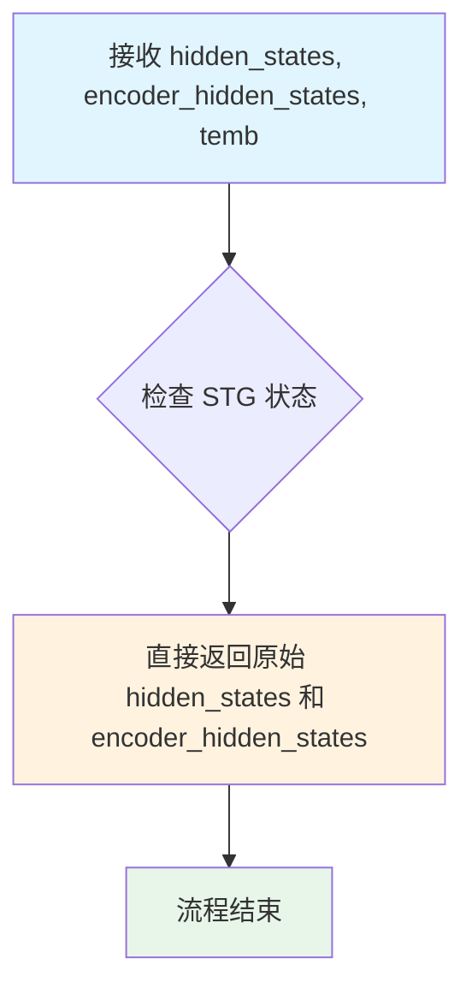

#### 带注释源码

```python
def forward_with_stg(
    self,
    hidden_states: torch.Tensor,
    encoder_hidden_states: torch.Tensor,
    temb: torch.Tensor,
    attention_mask: Optional[torch.Tensor] = None,
    freqs_cis: Optional[Tuple[torch.Tensor, torch.Tensor]] = None,
) -> Tuple[torch.Tensor, torch.Tensor]:
    """
    STG 模式下的前向传播方法。
    
    该函数作为一个"直通"（pass-through）实现，在计算有引导的噪声预测时被调用。
    与 forward_without_stg 不同，此函数不执行任何实际的注意力计算或特征变换，
    而是直接返回输入的隐藏状态。这种设计用于在双次前向传播中：
    1. 第一次调用 forward_without_stg 计算无引导预测
    2. 第二次调用 forward_with_stg 获取原始状态用于比较
    
    实际使用中，管道会计算 noise_pred + stg_scale * (noise_pred - noise_pred_perturb)
    来实现时空引导的效果。
    
    参数:
        self: 指向 transformer block 实例的隐式参数
        hidden_states: 输入的潜在表示张量
        encoder_hidden_states: 文本编码器输出的上下文表示
        temb: 时间步嵌入向量
        attention_mask: 可选的注意力掩码
        freqs_cis: 可选的旋转位置编码频率张量
    
    返回:
        Tuple[torch.Tensor, torch.Tensor]: 未经修改的 hidden_states 和 encoder_hidden_states
    """
    return hidden_states, encoder_hidden_states
```


### `forward_without_stg`

该函数是 HunyuanVideoTransformer3DModel 中 transformer_block 的标准前向传播方法，实现了完整的时空变换器块操作，包括输入归一化、联合注意力机制、调制与残差连接以及前馈网络处理。

参数：

- `self`：transformer_block 实例，调用该方法的块对象
- `hidden_states`：`torch.Tensor`，输入的隐藏状态张量
- `encoder_hidden_states`：`torch.Tensor`，编码器侧的条件隐藏状态张量
- `temb`：`torch.Tensor`，时间步嵌入向量，用于调制
- `attention_mask`：`Optional[torch.Tensor]`，注意力掩码，可选，用于遮盖无效位置
- `freqs_cis`：`Optional[Tuple[torch.Tensor, torch.Tensor]]`，旋转嵌入的频率张量，可选

返回值：`Tuple[torch.Tensor, torch.Tensor]`，返回处理后的隐藏状态和编码器隐藏状态

#### 流程图

```mermaid
flowchart TD
    A[开始] --> B[输入 hidden_states 和 encoder_hidden_states]
    B --> C[norm1 归一化 hidden_states]
    B --> D[norm1_context 归一化 encoder_hidden_states]
    C --> E[提取调制参数: gate_msa, shift_mlp, scale_mlp, gate_mlp]
    D --> F[提取上下文调制参数: c_gate_msa, c_shift_mlp, c_scale_mlp, c_gate_mlp]
    E --> G[attn 联合注意力计算]
    F --> G
    G --> H[残差连接 + 门控: hidden_states + attn_output * gate_msa]
    G --> I[残差连接 + 门控: encoder_hidden_states + context_attn_output * c_gate_msa]
    H --> J[norm2 归一化]
    I --> K[norm2_context 归一化]
    J --> L[shift 和 scale 调制]
    K --> M[shift 和 scale 调制]
    L --> N[前馈网络 ff 处理]
    M --> O[前馈网络 ff_context 处理]
    N --> P[残差连接 + 门控: hidden_states + gate_mlp * ff_output]
    O --> Q[残差连接 + 门控: encoder_hidden_states + c_gate_mlp * context_ff_output]
    P --> R[返回 Tuple[hidden_states, encoder_hidden_states]]
    Q --> R
```

#### 带注释源码

```python
def forward_without_stg(
    self,
    hidden_states: torch.Tensor,
    encoder_hidden_states: torch.Tensor,
    temb: torch.Tensor,
    attention_mask: Optional[torch.Tensor] = None,
    freqs_cis: Optional[Tuple[torch.Tensor, torch.Tensor]] = None,
) -> Tuple[torch.Tensor, torch.Tensor]:
    """
    HunyuanVideo transformer block 的标准前向传播（不使用时空引导）
    
    参数:
        hidden_states: 输入的潜在特征张量 [B, N, C]
        encoder_hidden_states: 文本编码器的隐藏状态 [B, M, C]
        temb: 时间步嵌入向量
        attention_mask: 可选的注意力掩码
        freqs_cis: 可选的旋转位置编码
    
    返回:
        处理后的 hidden_states 和 encoder_hidden_states
    """
    
    # 1. 输入归一化
    # 对 hidden_states 进行归一化并提取调制参数（门控、偏移、缩放）
    norm_hidden_states, gate_msa, shift_mlp, scale_mlp, gate_mlp = self.norm1(hidden_states, emb=temb)
    
    # 对 encoder_hidden_states 进行归一化并提取上下文调制参数
    norm_encoder_hidden_states, c_gate_msa, c_shift_mlp, c_scale_mlp, c_gate_mlp = self.norm1_context(
        encoder_hidden_states, emb=temb
    )

    # 2. 联合注意力
    # 执行自注意力和交叉注意力，计算 query 来自 hidden_states，key/value 来自两者
    attn_output, context_attn_output = self.attn(
        hidden_states=norm_hidden_states,
        encoder_hidden_states=norm_encoder_hidden_states,
        attention_mask=attention_mask,
        image_rotary_emb=freqs_cis,
    )

    # 3. 调制和残差连接
    # 应用门控机制：hidden_states = hidden_states + attn_output * gate_msa
    hidden_states = hidden_states + attn_output * gate_msa.unsqueeze(1)
    encoder_hidden_states = encoder_hidden_states + context_attn_output * c_gate_msa.unsqueeze(1)

    # 第二次归一化
    norm_hidden_states = self.norm2(hidden_states)
    norm_encoder_hidden_states = self.norm2_context(encoder_hidden_states)

    # 应用 shift 和 scale 调制
    # norm_hidden_states = norm_hidden_states * (1 + scale_mlp) + shift_mlp
    norm_hidden_states = norm_hidden_states * (1 + scale_mlp[:, None]) + shift_mlp[:, None]
    norm_encoder_hidden_states = norm_encoder_hidden_states * (1 + c_scale_mlp[:, None]) + c_shift_mlp[:, None]

    # 4. 前馈网络
    # 分别对 hidden_states 和 encoder_hidden_states 应用前馈网络
    ff_output = self.ff(norm_hidden_states)
    context_ff_output = self.ff_context(norm_encoder_hidden_states)

    # 最终残差连接并应用门控
    hidden_states = hidden_states + gate_mlp.unsqueeze(1) * ff_output
    encoder_hidden_states = encoder_hidden_states + c_gate_mlp.unsqueeze(1) * context_ff_output

    return hidden_states, encoder_hidden_states
```

#### 使用场景说明

该函数在 `HunyuanVideoSTGPipeline.__call__` 方法中被动态替换到指定的 transformer blocks 上，用于实现时空引导（Spatio-Temporal Guidance）功能：

```python
# 在去噪循环中，临时替换 forward 方法
if self.do_spatio_temporal_guidance:
    for i in stg_applied_layers_idx:
        self.transformer.transformer_blocks[i].forward = types.MethodType(
            forward_without_stg, self.transformer.transformer_blocks[i]
        )

# 第一次推理（无引导）
noise_pred = self.transformer(...)[0]

# 恢复原始 forward 方法
if self.do_spatio_temporal_guidance:
    for i in stg_applied_layers_idx:
        self.transformer.transformer_blocks[i].forward = types.MethodType(
            forward_with_stg, self.transformer.transformer_blocks[i]
        )

# 第二次推理（有引导）
noise_pred_perturb = self.transformer(...)[0]

# 计算最终预测
noise_pred = noise_pred + self._stg_scale * (noise_pred - noise_pred_perturb)
```

这种设计允许在推理时灵活地启用/禁用时空引导功能，通过方法替换实现而不需要修改模型结构。


### `retrieve_timesteps`

该函数是diffusers库中用于从调度器（scheduler）获取时间步（timesteps）的通用工具函数。它调用调度器的`set_timesteps`方法，并返回生成样本所需的时间步序列和推理步数。支持自定义时间步或sigmas，并处理各种调度器的兼容性检查。

参数：

-  `scheduler`：`SchedulerMixin`，需要获取时间步的调度器对象
-  `num_inference_steps`：`Optional[int]`，使用预训练模型生成样本时的扩散步数。如果使用此参数，则`timesteps`必须为`None`
-  `device`：`Optional[Union[str, torch.device]]`，时间步要移动到的设备。如果为`None`，则时间步不会移动
-  `timesteps`：`Optional[List[int]]`，用于覆盖调度器时间步间隔策略的自定义时间步。如果传递了`timesteps`，则`num_inference_steps`和`sigmas`必须为`None`
-  `sigmas`：`Optional[List[float]]`，用于覆盖调度器时间步间隔策略的自定义sigmas。如果传递了`sigmas`，则`num_inference_steps`和`timesteps`必须为`None`
-  `**kwargs`：任意关键字参数，将提供给`scheduler.set_timesteps`

返回值：`Tuple[torch.Tensor, int]`，元组包含调度器的时间步序列（第一个元素）和推理步数（第二个元素）

#### 流程图

```mermaid
flowchart TD
    A[开始: retrieve_timesteps] --> B{同时传入timesteps和sigmas?}
    B -->|是| C[抛出ValueError: 只能传一个]
    B -->|否| D{传入了timesteps?}
    D -->|是| E[检查scheduler.set_timesteps是否接受timesteps参数]
    E --> F{支持timesteps?}
    F -->|否| G[抛出ValueError: 当前调度器不支持自定义timesteps]
    F -->|是| H[调用scheduler.set_timesteps<br/>timesteps=timesteps, device=device]
    H --> I[获取scheduler.timesteps]
    I --> J[计算num_inference_steps = len(timesteps)]
    J --> K[返回timesteps, num_inference_steps]
    
    D -->|否| L{传入了sigmas?}
    L -->|是| M[检查scheduler.set_timesteps是否接受sigmas参数]
    M --> N{支持sigmas?}
    N -->|否| O[抛出ValueError: 当前调度器不支持自定义sigmas]
    N -->|是| P[调用scheduler.set_timesteps<br/>sigmas=sigmas, device=device]
    P --> Q[获取scheduler.timesteps]
    Q --> R[计算num_inference_steps = len(timesteps)]
    R --> K
    
    L -->|否| S[调用scheduler.set_timesteps<br/>num_inference_steps, device=device]
    S --> T[获取scheduler.timesteps]
    T --> K
```

#### 带注释源码

```python
# Copied from diffusers.pipelines.stable_diffusion.pipeline_stable_diffusion.retrieve_timesteps
def retrieve_timesteps(
    scheduler,
    num_inference_steps: Optional[int] = None,
    device: Optional[Union[str, torch.device]] = None,
    timesteps: Optional[List[int]] = None,
    sigmas: Optional[List[float]] = None,
    **kwargs,
):
    r"""
    Calls the scheduler's `set_timesteps` method and retrieves timesteps from the scheduler after the call. Handles
    custom timesteps. Any kwargs will be supplied to `scheduler.set_timesteps`.

    Args:
        scheduler (`SchedulerMixin`):
            The scheduler to get timesteps from.
        num_inference_steps (`int`):
            The number of diffusion steps used when generating samples with a pre-trained model. If used, `timesteps`
            must be `None`.
        device (`str` or `torch.device`, *optional*):
            The device to which the timesteps should be moved to. If `None`, the timesteps are not moved.
        timesteps (`List[int]`, *optional*):
            Custom timesteps used to override the timestep spacing strategy of the scheduler. If `timesteps` is passed,
            `num_inference_steps` and `sigmas` must be `None`.
        sigmas (`List[float]`, *optional*):
            Custom sigmas used to override the timestep spacing strategy of the scheduler. If `sigmas` is passed,
            `num_inference_steps` and `timesteps` must be `None`.

    Returns:
        `Tuple[torch.Tensor, int]`: A tuple where the first element is the timestep schedule from the scheduler and the
        second element is the number of inference steps.
    """
    # 检查是否同时传入了timesteps和sigmas，这是不允许的，只能选择其中一个
    if timesteps is not None and sigmas is not None:
        raise ValueError("Only one of `timesteps` or `sigmas` can be passed. Please choose one to set custom values")
    
    # 处理自定义timesteps的情况
    if timesteps is not None:
        # 检查调度器的set_timesteps方法是否支持timesteps参数
        accepts_timesteps = "timesteps" in set(inspect.signature(scheduler.set_timesteps).parameters.keys())
        if not accepts_timesteps:
            raise ValueError(
                f"The current scheduler class {scheduler.__class__}'s `set_timesteps` does not support custom"
                f" timestep schedules. Please check whether you are using the correct scheduler."
            )
        # 调用调度器的set_timesteps方法设置自定义时间步
        scheduler.set_timesteps(timesteps=timesteps, device=device, **kwargs)
        # 从调度器获取设置后的时间步
        timesteps = scheduler.timesteps
        # 计算推理步数
        num_inference_steps = len(timesteps)
    # 处理自定义sigmas的情况
    elif sigmas is not None:
        # 检查调度器的set_timesteps方法是否支持sigmas参数
        accept_sigmas = "sigmas" in set(inspect.signature(scheduler.set_timesteps).parameters.keys())
        if not accept_sigmas:
            raise ValueError(
                f"The current scheduler class {scheduler.__class__}'s `set_timesteps` does not support custom"
                f" sigmas schedules. Please check whether you are using the correct scheduler."
            )
        # 调用调度器的set_timesteps方法设置自定义sigmas
        scheduler.set_timesteps(sigmas=sigmas, device=device, **kwargs)
        # 从调度器获取设置后的时间步
        timesteps = scheduler.timesteps
        # 计算推理步数
        num_inference_steps = len(timesteps)
    # 默认情况：使用num_inference_steps设置时间步
    else:
        scheduler.set_timesteps(num_inference_steps, device=device, **kwargs)
        timesteps = scheduler.timesteps
    
    # 返回时间步序列和推理步数
    return timesteps, num_inference_steps
```


### HunyuanVideoSTGPipeline.__init__

这是HunyuanVideoSTGPipeline类的构造函数，用于初始化整个视频生成管道。它接收所有必要的模型组件（文本编码器、分词器、Transformer、VAE、调度器等），并通过注册模块和配置视频处理器来完成管道的初始化设置。

参数：

- `text_encoder`：`LlamaModel`，Llama文本编码器，用于将文本提示编码为嵌入向量
- `tokenizer`：`LlamaTokenizerFast`，Llama分词器，用于将文本转换为token
- `transformer`：`HunyuanVideoTransformer3DModel`，条件Transformer模型，用于去噪潜在表示
- `vae`：`AutoencoderKLHunyuanVideo`，变分自编码器，用于编码和解码视频到潜在表示
- `scheduler`：`FlowMatchEulerDiscreteScheduler`，调度器，用于去噪过程中的时间步长管理
- `text_encoder_2`：`CLIPTextModel`，CLIP文本编码器，用于生成额外的文本嵌入
- `tokenizer_2`：`CLIPTokenizer`，CLIP分词器，用于CLIP文本编码

返回值：`None`，构造函数不返回任何值，仅初始化对象状态

#### 流程图

```mermaid
flowchart TD
    A[__init__ 开始] --> B[调用 super().__init__]
    B --> C[register_modules 注册所有模块]
    C --> D{获取 VAE 存在性}
    D -->|是| E[设置 temporal_compression_ratio]
    D -->|否| F[默认值 4]
    E --> G[设置 spatial_compression_ratio]
    F --> G
    G --> H[创建 VideoProcessor]
    H --> I[__init__ 结束]
```

#### 带注释源码

```python
def __init__(
    self,
    text_encoder: LlamaModel,                      # Llama文本编码器模型
    tokenizer: LlamaTokenizerFast,                 # Llama快速分词器
    transformer: HunyuanVideoTransformer3DModel,  # HunyuanVideo 3D变换器模型
    vae: AutoencoderKLHunyuanVideo,                # HunyuanVideo VAE模型
    scheduler: FlowMatchEulerDiscreteScheduler,   # Flow Match欧拉离散调度器
    text_encoder_2: CLIPTextModel,                 # CLIP文本编码器
    tokenizer_2: CLIPTokenizer,                    # CLIP分词器
):
    # 调用父类DiffusionPipeline的初始化方法
    # 设置管道的基本属性和配置
    super().__init__()

    # 注册所有模块到管道中，使它们可以通过self.xxx访问
    # 同时保存这些模块的引用用于模型卸载等功能
    self.register_modules(
        vae=vae,
        text_encoder=text_encoder,
        tokenizer=tokenizer,
        transformer=transformer,
        scheduler=scheduler,
        text_encoder_2=text_encoder_2,
        tokenizer_2=tokenizer_2,
    )

    # 设置VAE的时间压缩比率
    # 如果vae存在则获取其temporal_compression_ratio，否则使用默认值4
    self.vae_scale_factor_temporal = self.vae.temporal_compression_ratio if getattr(self, "vae", None) else 4
    
    # 设置VAE的空间压缩比率
    # 如果vae存在则获取其spatial_compression_ratio，否则使用默认值8
    self.vae_scale_factor_spatial = self.vae.spatial_compression_ratio if getattr(self, "vae", None) else 8
    
    # 创建视频处理器，使用空间压缩比率作为缩放因子
    # 用于视频的后处理操作（如转换为PIL图像等）
    self.video_processor = VideoProcessor(vae_scale_factor=self.vae_scale_factor_spatial)
```


### `HunyuanVideoSTGPipeline._get_llama_prompt_embeds`

该方法使用 Llama 文本编码器将用户输入的文本提示词编码为向量嵌入，处理提示词模板格式，并通过跳过指定数量的隐藏层来获取特定层的文本表示，同时返回对应的注意力掩码供后续处理使用。

参数：

-  `prompt`：`Union[str, List[str]]`，输入的文本提示词，可以是单个字符串或字符串列表
-  `prompt_template`：`Dict[str, Any]`，包含提示词模板的字典，用于格式化输入文本
-  `num_videos_per_prompt`：`int = 1`，每个提示词要生成的视频数量，用于复制嵌入向量
-  `device`：`Optional[torch.device] = None`，计算设备，若为 None 则使用执行设备
-  `dtype`：`Optional[torch.dtype] = None`，嵌入向量的数据类型，若为 None 则使用文本编码器的数据类型
-  `max_sequence_length`：`int = 256`，Token 序列的最大长度
-  `num_hidden_layers_to_skip`：`int = 2`，从模型输出中跳过的隐藏层数量，用于获取更浅层的特征

返回值：`Tuple[torch.Tensor, torch.Tensor]`，第一个元素是文本提示词的嵌入向量，形状为 (batch_size * num_videos_per_prompt, seq_len, hidden_dim)，第二个元素是对应的注意力掩码，形状为 (batch_size * num_videos_per_prompt, seq_len)

#### 流程图

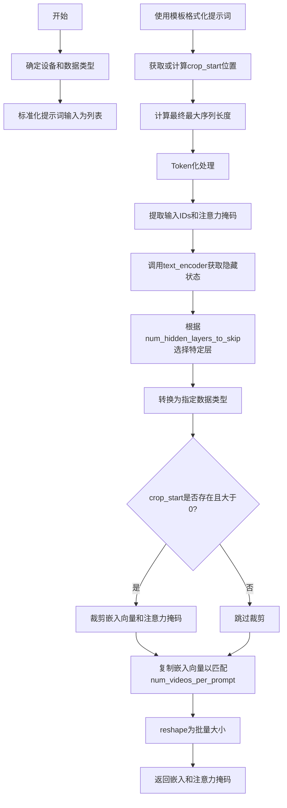

#### 带注释源码

```python
def _get_llama_prompt_embeds(
    self,
    prompt: Union[str, List[str]],
    prompt_template: Dict[str, Any],
    num_videos_per_prompt: int = 1,
    device: Optional[torch.device] = None,
    dtype: Optional[torch.dtype] = None,
    max_sequence_length: int = 256,
    num_hidden_layers_to_skip: int = 2,
) -> Tuple[torch.Tensor, torch.Tensor]:
    # 确定计算设备，未指定则使用默认执行设备
    device = device or self._execution_device
    # 确定数据类型，未指定则使用文本编码器的数据类型
    dtype = dtype or self.text_encoder.dtype

    # 将单个字符串转换为列表，保持输入格式一致性
    prompt = [prompt] if isinstance(prompt, str) else prompt
    # 获取批量大小
    batch_size = len(prompt)

    # 使用模板格式化每个提示词，将{p}替换为实际提示词内容
    prompt = [prompt_template["template"].format(p) for p in prompt]

    # 获取模板中的crop_start位置，用于裁剪固定前缀
    crop_start = prompt_template.get("crop_start", None)
    if crop_start is None:
        # 如果未提供，则通过tokenize模板计算
        prompt_template_input = self.tokenizer(
            prompt_template["template"],
            padding="max_length",
            return_tensors="pt",
            return_length=False,
            return_overflowing_tokens=False,
            return_attention_mask=False,
        )
        # 获取模板token序列长度
        crop_start = prompt_template_input["input_ids"].shape[-1]
        # 减去结束符token和占位符{}
        crop_start -= 2

    # 根据crop_start调整最大序列长度
    max_sequence_length += crop_start
    # 对格式化后的提示词进行tokenize
    text_inputs = self.tokenizer(
        prompt,
        max_length=max_sequence_length,
        padding="max_length",
        truncation=True,
        return_tensors="pt",
        return_length=False,
        return_overflowing_tokens=False,
        return_attention_mask=True,
    )
    # 将token IDs和注意力掩码移至指定设备
    text_input_ids = text_inputs.input_ids.to(device=device)
    prompt_attention_mask = text_inputs.attention_mask.to(device=device)

    # 调用Llama文本编码器获取隐藏状态
    # output_hidden_states=True 返回所有隐藏层
    prompt_embeds = self.text_encoder(
        input_ids=text_input_ids,
        attention_mask=prompt_attention_mask,
        output_hidden_states=True,
    ).hidden_states[-(num_hidden_layers_to_skip + 1)]
    # 转换为指定数据类型
    prompt_embeds = prompt_embeds.to(dtype=dtype)

    # 如果需要裁剪，则去除模板前缀部分
    if crop_start is not None and crop_start > 0:
        prompt_embeds = prompt_embeds[:, crop_start:]
        prompt_attention_mask = prompt_attention_mask[:, crop_start:]

    # 复制文本嵌入以匹配每个提示词生成的视频数量
    # 这是一个MPS友好的方法
    _, seq_len, _ = prompt_embeds.shape
    prompt_embeds = prompt_embeds.repeat(1, num_videos_per_prompt, 1)
    # 重塑为 (batch_size * num_videos_per_prompt, seq_len, hidden_dim)
    prompt_embeds = prompt_embeds.view(batch_size * num_videos_per_prompt, seq_len, -1)
    # 同样处理注意力掩码
    prompt_attention_mask = prompt_attention_mask.repeat(1, num_videos_per_prompt)
    prompt_attention_mask = prompt_attention_mask.view(batch_size * num_videos_per_prompt, seq_len)

    # 返回处理后的嵌入向量和注意力掩码
    return prompt_embeds, prompt_attention_mask
```


### HunyuanVideoSTGPipeline._get_clip_prompt_embeds

该方法用于使用 CLIP（text_encoder_2 和 tokenizer_2）将文本 prompt 编码为文本嵌入向量（pooler_output），支持批量处理和每个 prompt 生成多个视频的嵌入复制。

参数：

- `self`：`HunyuanVideoSTGPipeline` 实例本身
- `prompt`：`Union[str, List[str]]`，输入的文本提示，可以是单个字符串或字符串列表
- `num_videos_per_prompt`：`int = 1`，每个 prompt 生成的视频数量，用于复制嵌入向量
- `device`：`Optional[torch.device] = None`，计算设备，若为 None 则使用 `self._execution_device`
- `dtype`：`Optional[torch.dtype] = None`，数据类型，若为 None 则使用 `self.text_encoder_2.dtype`
- `max_sequence_length`：`int = 77`，CLIP 模型的最大序列长度（CLIP 通常为 77）

返回值：`torch.Tensor`，形状为 `(batch_size * num_videos_per_prompt, hidden_dim)` 的文本嵌入向量

#### 流程图

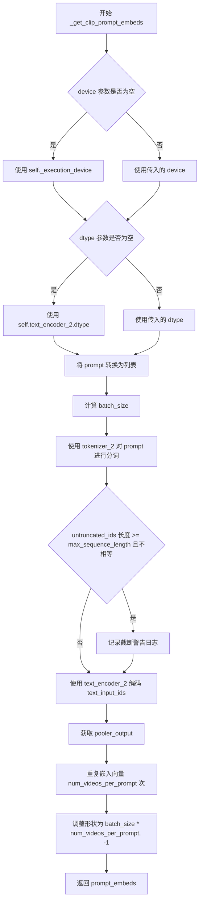

#### 带注释源码

```python
def _get_clip_prompt_embeds(
    self,
    prompt: Union[str, List[str]],
    num_videos_per_prompt: int = 1,
    device: Optional[torch.device] = None,
    dtype: Optional[torch.dtype] = None,
    max_sequence_length: int = 77,
) -> torch.Tensor:
    # 确定设备：如果未指定，则使用执行设备
    device = device or self._execution_device
    # 确定数据类型：如果未指定，则使用 text_encoder_2 的数据类型
    dtype = dtype or self.text_encoder_2.dtype

    # 如果 prompt 是单个字符串，转换为列表
    prompt = [prompt] if isinstance(prompt, str) else prompt
    # 计算批次大小
    batch_size = len(prompt)

    # 使用 CLIP tokenizer_2 对 prompt 进行分词
    # 填充到最大长度，截断超长序列，返回 PyTorch 张量
    text_inputs = self.tokenizer_2(
        prompt,
        padding="max_length",
        max_length=max_sequence_length,
        truncation=True,
        return_tensors="pt",
    )

    # 获取分词后的 input_ids
    text_input_ids = text_inputs.input_ids
    # 使用最长填充获取未截断的 input_ids，用于检测截断
    untruncated_ids = self.tokenizer_2(prompt, padding="longest", return_tensors="pt").input_ids
    
    # 检查是否发生了截断，如果是则记录警告
    if untruncated_ids.shape[-1] >= text_input_ids.shape[-1] and not torch.equal(text_input_ids, untruncated_ids):
        # 解码被截断的部分
        removed_text = self.tokenizer_2.batch_decode(untruncated_ids[:, max_sequence_length - 1 : -1])
        logger.warning(
            "The following part of your input was truncated because CLIP can only handle sequences up to"
            f" {max_sequence_length} tokens: {removed_text}"
        )

    # 使用 CLIP text_encoder_2 编码 input_ids，获取 pooler_output
    # output_hidden_states=False 表示只输出 pooler_output，不输出隐藏状态
    prompt_embeds = self.text_encoder_2(text_input_ids.to(device), output_hidden_states=False).pooler_output

    # 为每个 prompt 复制 num_videos_per_prompt 次文本嵌入
    # 使用 MPS 友好的方法进行复制
    prompt_embeds = prompt_embeds.repeat(1, num_videos_per_prompt)
    # 调整形状为 (batch_size * num_videos_per_prompt, -1)
    prompt_embeds = prompt_embeds.view(batch_size * num_videos_per_prompt, -1)

    # 返回处理后的文本嵌入
    return prompt_embeds
```


### HunyuanVideoSTGPipeline.encode_prompt

该方法负责将文本提示（prompt）编码为向量表示（embeddings），支持双文本编码器（Llama和CLIP）架构，返回两种编码器的嵌入结果及注意力掩码，供后续视频生成扩散模型使用。

参数：

- `prompt`：`Union[str, List[str]]`，主提示词文本，用于Llama文本编码器
- `prompt_2`：`Union[str, List[str]]`，可选的第二个提示词文本，用于CLIP文本编码器，默认为None
- `prompt_template`：`Dict[str, Any]`，提示词模板字典，包含系统提示词格式，默认为`DEFAULT_PROMPT_TEMPLATE`
- `num_videos_per_prompt`：`int`，每个提示词生成的视频数量，用于复制嵌入向量，默认为1
- `prompt_embeds`：`Optional[torch.Tensor]`，可选的预计算提示词嵌入，如果提供则跳过Llama编码，默认为None
- `pooled_prompt_embeds`：`Optional[torch.Tensor]`，可选的预计算CLIP池化嵌入，如果提供则跳过CLIP编码，默认为None
- `prompt_attention_mask`：`Optional[torch.Tensor]`，可选的注意力掩码，用于标识有效token位置，默认为None
- `device`：`Optional[torch.device]`：计算设备，默认为执行设备
- `dtype`：`Optional[torch.dtype]`：计算数据类型，默认为文本编码器的dtype
- `max_sequence_length`：`int`，最大序列长度，默认为256

返回值：`Tuple[torch.Tensor, torch.Tensor, torch.Tensor]`，包含提示词嵌入、池化提示词嵌入和注意力掩码的元组

#### 流程图

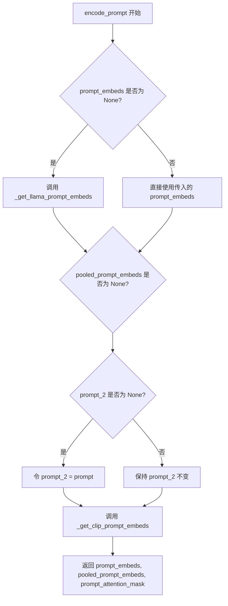

#### 带注释源码

```python
def encode_prompt(
    self,
    prompt: Union[str, List[str]],
    prompt_2: Union[str, List[str]] = None,
    prompt_template: Dict[str, Any] = DEFAULT_PROMPT_TEMPLATE,
    num_videos_per_prompt: int = 1,
    prompt_embeds: Optional[torch.Tensor] = None,
    pooled_prompt_embeds: Optional[torch.Tensor] = None,
    prompt_attention_mask: Optional[torch.Tensor] = None,
    device: Optional[torch.device] = None,
    dtype: Optional[torch.dtype] = None,
    max_sequence_length: int = 256,
):
    # 如果未提供预计算的提示词嵌入，则使用Llama文本编码器生成
    if prompt_embeds is None:
        # 调用内部方法_get_llama_prompt_embeds进行编码
        prompt_embeds, prompt_attention_mask = self._get_llama_prompt_embeds(
            prompt,              # 原始提示词文本
            prompt_template,     # 提示词模板
            num_videos_per_prompt,  # 每个提示词生成的视频数量
            device=device,        # 计算设备
            dtype=dtype,          # 数据类型
            max_sequence_length=max_sequence_length,  # 最大序列长度
        )

    # 如果未提供CLIP池化嵌入，则需要计算
    if pooled_prompt_embeds is None:
        # 处理prompt_2：如果既没提供prompt_2也没提供pooled_prompt_embeds，则使用prompt
        if prompt_2 is None and pooled_prompt_embeds is None:
            prompt_2 = prompt
        # 调用CLIP编码器获取池化嵌入（用于交叉注意力条件）
        pooled_prompt_embeds = self._get_clip_prompt_embeds(
            prompt,               # 注意这里使用prompt而非prompt_2（根据逻辑）
            num_videos_per_prompt,
            device=device,
            dtype=dtype,
            max_sequence_length=77,  # CLIP固定最大长度
        )

    # 返回三种嵌入向量供扩散模型使用
    return prompt_embeds, pooled_prompt_embeds, prompt_attention_mask
```


### HunyuanVideoSTGPipeline.check_inputs

该方法用于验证 HunyuanVideo 视频生成管道的输入参数是否合法，包括检查图像尺寸是否可被 16 整除、callback 张量输入是否有效、prompt 与 prompt_embeds 的互斥关系、参数类型正确性以及 prompt_template 的结构完整性。

参数：

- `self`：`HunyuanVideoSTGPipeline`，Pipeline 实例本身
- `prompt`：`Union[str, List[str], None]`，文本提示词，用于指导视频生成
- `prompt_2`：`Union[str, List[str], None]`，第二个文本提示词，用于发送给第二个 tokenizer 和 text_encoder
- `height`：`int`，生成视频的高度（像素），必须能被 16 整除
- `width`：`int`，生成视频的宽度（像素），必须能被 16 整除
- `prompt_embeds`：`Optional[torch.Tensor]`，预生成的文本嵌入，与 prompt 互斥
- `callback_on_step_end_tensor_inputs`：`Optional[List[str]]`，在每个去噪步骤结束时回调的张量输入列表
- `prompt_template`：`Optional[Dict[str, Any]]`，提示词模板字典，必须包含 "template" 键

返回值：`None`，该方法不返回任何值，仅通过抛出 ValueError 来指示验证失败

#### 流程图

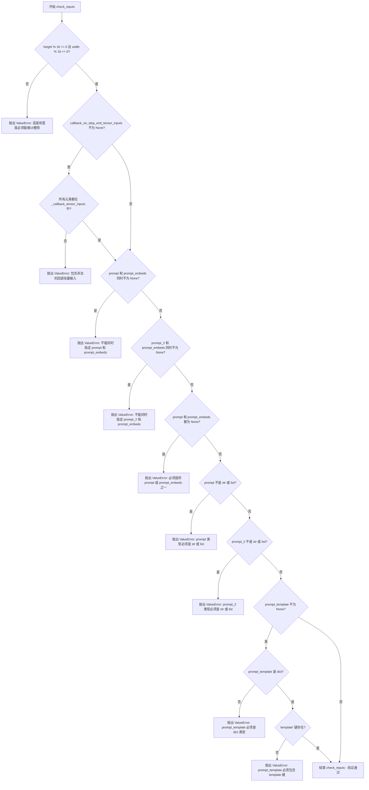

#### 带注释源码

```python
def check_inputs(
    self,
    prompt,
    prompt_2,
    height,
    width,
    prompt_embeds=None,
    callback_on_step_end_tensor_inputs=None,
    prompt_template=None,
):
    # 检查生成的图像尺寸是否满足模型要求（高度和宽度必须是16的倍数）
    if height % 16 != 0 or width % 16 != 0:
        raise ValueError(f"`height` and `width` have to be divisible by 16 but are {height} and {width}.")

    # 检查回调张量输入是否在允许的列表中
    if callback_on_step_end_tensor_inputs is not None and not all(
        k in self._callback_tensor_inputs for k in callback_on_step_end_tensor_inputs
    ):
        raise ValueError(
            f"`callback_on_step_end_tensor_inputs` has to be in {self._callback_tensor_inputs}, but found {[k for k in callback_on_step_end_tensor_inputs if k not in self._callback_tensor_inputs]}"
        )

    # 检查 prompt 和 prompt_embeds 的互斥关系 - 两者不能同时提供
    if prompt is not None and prompt_embeds is not None:
        raise ValueError(
            f"Cannot forward both `prompt`: {prompt} and `prompt_embeds`: {prompt_embeds}. Please make sure to"
            " only forward one of the two."
        )
    # 检查 prompt_2 和 prompt_embeds 的互斥关系
    elif prompt_2 is not None and prompt_embeds is not None:
        raise ValueError(
            f"Cannot forward both `prompt_2`: {prompt_2} and `prompt_embeds`: {prompt_embeds}. Please make sure to"
            " only forward one of the two."
        )
    # 检查是否至少提供了 prompt 或 prompt_embeds 之一
    elif prompt is None and prompt_embeds is None:
        raise ValueError(
            "Provide either `prompt` or `prompt_embeds`. Cannot leave both `prompt` and `prompt_embeds` undefined."
        )
    # 检查 prompt 的类型是否合法
    elif prompt is not None and (not isinstance(prompt, str) and not isinstance(prompt, list)):
        raise ValueError(f"`prompt` has to be of type `str` or `list` but is {type(prompt)}")
    # 检查 prompt_2 的类型是否合法
    elif prompt_2 is not None and (not isinstance(prompt_2, str) and not isinstance(prompt_2, list)):
        raise ValueError(f"`prompt_2` has to be of type `str` or `list` but is {type(prompt_2)}")

    # 检查 prompt_template 的结构（如果提供了的话）
    if prompt_template is not None:
        # 必须是字典类型
        if not isinstance(prompt_template, dict):
            raise ValueError(f"`prompt_template` has to be of type `dict` but is {type(prompt_template)}")
        # 必须包含 template 键
        if "template" not in prompt_template:
            raise ValueError(
                f"`prompt_template` has to contain a key `template` but only found {prompt_template.keys()}"
            )
```


### HunyuanVideoSTGPipeline.prepare_latents

该方法用于为视频生成准备潜在变量（latents）。如果已提供 latents 则直接返回并转移至指定设备和数据类型；否则根据批处理大小、潜在通道数、视频帧数以及 VAE 空间压缩比计算潜在张量的形状，然后使用随机张量生成器创建初始噪声潜在变量。

参数：

- `batch_size`：`int`，批处理大小，即同时生成的视频数量
- `num_channels_latents`：`int`，潜在变量的通道数，默认为 32
- `height`：`int`，生成视频的高度（像素），默认为 720
- `width`：`int`，生成视频的宽度（像素），默认为 1280
- `num_frames`：`int`，生成视频的帧数，默认为 129
- `dtype`：`Optional[torch.dtype]`，潜在张量的数据类型，若为 None 则使用 randn_tensor 的默认类型
- `device`：`Optional[torch.device]`，潜在张量所在的设备（CPU/CUDA）
- `generator`：`Optional[Union[torch.Generator, List[torch.Generator]]]`，随机数生成器，用于确保生成的可重复性，可以是单个生成器或生成器列表
- `latents`：`Optional[torch.Tensor]`，可选的预生成潜在变量，若提供则直接使用，否则生成新的随机潜在变量

返回值：`torch.Tensor`，准备好的潜在变量张量，形状为 (batch_size, num_channels_latents, num_frames, height/vae_scale_factor_spatial, width/vae_scale_factor_spatial)

#### 流程图

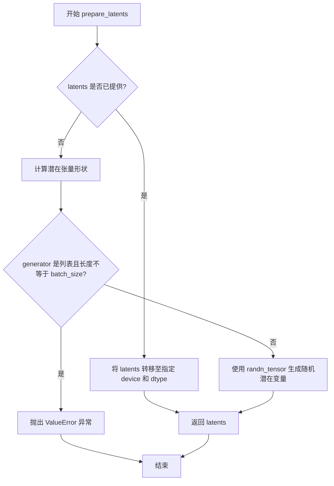

#### 带注释源码

```python
def prepare_latents(
    self,
    batch_size: int,
    num_channels_latents: 32,
    height: int = 720,
    width: int = 1280,
    num_frames: int = 129,
    dtype: Optional[torch.dtype] = None,
    device: Optional[torch.device] = None,
    generator: Optional[Union[torch.Generator, List[torch.Generator]]] = None,
    latents: Optional[torch.Tensor] = None,
) -> torch.Tensor:
    # 如果已提供 latents，直接转移至目标设备和数据类型后返回
    if latents is not None:
        return latents.to(device=device, dtype=dtype)

    # 计算潜在张量的形状，考虑 VAE 的空间压缩比
    # 形状: (batch_size, num_channels_latents, num_frames, height/vae_scale_factor_spatial, width/vae_scale_factor_spatial)
    shape = (
        batch_size,
        num_channels_latents,
        num_frames,
        int(height) // self.vae_scale_factor_spatial,
        int(width) // self.vae_scale_factor_spatial,
    )
    
    # 验证生成器列表长度与批处理大小是否匹配
    if isinstance(generator, list) and len(generator) != batch_size:
        raise ValueError(
            f"You have passed a list of generators of length {len(generator)}, but requested an effective batch"
            f" size of {batch_size}. Make sure the batch size matches the length of the generators."
        )

    # 使用 randn_tensor 生成符合标准正态分布的随机潜在变量
    latents = randn_tensor(shape, generator=generator, device=device, dtype=dtype)
    return latents
```


### `HunyuanVideoSTGPipeline.enable_vae_slicing`

启用切片 VAE 解码。当启用此选项时，VAE 将输入张量分割成多个切片，以多步计算解码。这对于节省内存和允许更大的批处理大小很有用。该方法已被弃用，推荐直接调用 `pipe.vae.enable_slicing()`。

参数： 无

返回值：`None`，无返回值

#### 流程图

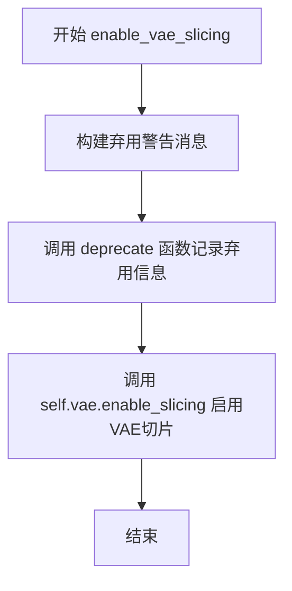

#### 带注释源码

```python
def enable_vae_slicing(self):
    r"""
    Enable sliced VAE decoding. When this option is enabled, the VAE will split the input tensor in slices to
    compute decoding in several steps. This is useful to save some memory and allow larger batch sizes.
    """
    # 构建弃用警告消息，提示用户该方法已弃用，应使用 pipe.vae.enable_slicing() 代替
    depr_message = f"Calling `enable_vae_slicing()` on a `{self.__class__.__name__}` is deprecated and this method will be removed in a future version. Please use `pipe.vae.enable_slicing()`."
    # 调用 deprecate 函数记录弃用信息，将在版本 0.40.0 后移除
    deprecate(
        "enable_vae_slicing",
        "0.40.0",
        depr_message,
    )
    # 委托给 VAE 对象的 enable_slicing 方法来启用切片解码
    self.vae.enable_slicing()
```


### HunyuanVideoSTGPipeline.disable_vae_slicing

该方法用于禁用 VAE（变分自编码器）的切片解码功能。如果之前启用了 `enable_vae_slicing`，调用此方法后将恢复为单步解码。该方法已被标记为废弃，将在未来版本中移除，建议直接使用 `pipe.vae.disable_slicing()`。

参数：

- 无（仅包含 `self` 参数）

返回值：`None`，无返回值（该方法直接作用于 VAE 对象的内部状态）

#### 流程图

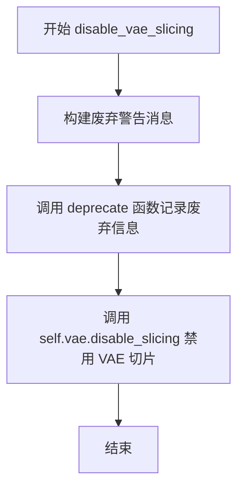

#### 带注释源码

```
def disable_vae_slicing(self):
    r"""
    Disable sliced VAE decoding. If `enable_vae_slicing` was previously enabled, this method will go back to
    computing decoding in one step.
    """
    # 构建废弃警告消息，提示用户使用新的 API
    depr_message = f"Calling `disable_vae_slicing()` on a `{self.__class__.__name__}` is deprecated and this method will be removed in a future version. Please use `pipe.vae.disable_slicing()`."
    
    # 调用 deprecate 函数记录废弃信息，用于在运行时发出警告
    deprecate(
        "disable_vae_slicing",    # 要废弃的功能名称
        "0.40.0",                  # 废弃版本号
        depr_message,              # 废弃警告消息
    )
    
    # 调用 VAE 对象的 disable_slicing 方法，禁用切片解码功能
    # 这将使 VAE 恢复为单步解码模式
    self.vae.disable_slicing()
```


### `HunyuanVideoSTGPipeline.enable_vae_tiling`

该方法用于启用分块 VAE（Variational Auto-Encoder）解码/编码功能。当启用此选项时，VAE 会将输入张量分割成多个tiles（块）进行分步计算，从而显著节省内存占用并允许处理更大的图像或视频帧。该方法目前已被标记为废弃，推荐直接调用 `pipe.vae.enable_tiling()`。

参数：无（仅包含 `self` 参数）

返回值：`None`，无返回值

#### 流程图

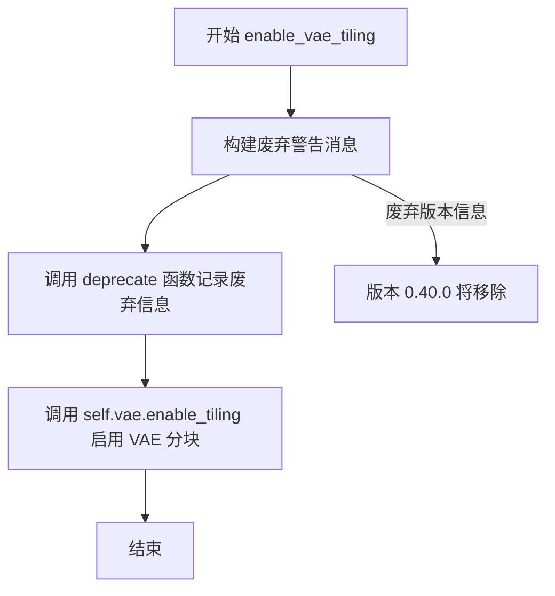

#### 带注释源码

```python
def enable_vae_tiling(self):
    r"""
    Enable tiled VAE decoding. When this option is enabled, the VAE will split the input tensor into tiles to
    compute decoding and encoding in several steps. This is useful for saving a large amount of memory and to allow
    processing larger images.
    """
    # 构建废弃警告消息，包含类名以提供上下文信息
    depr_message = f"Calling `enable_vae_tiling()` on a `{self.__class__.__name__}` is deprecated and this method will be removed in a future version. Please use `pipe.vae.enable_tiling()`."
    
    # 调用 deprecate 函数记录废弃警告，包括方法名、版本号和详细消息
    deprecate(
        "enable_vae_tiling",      # 废弃的方法名称
        "0.40.0",                  # 计划移除的版本号
        depr_message,              # 废弃详细说明
    )
    
    # 实际调用底层 VAE 模型的 enable_tiling 方法来启用分块功能
    # 这是真正执行功能的方法，前面的废弃警告只是提示用户迁移到新 API
    self.vae.enable_tiling()
```


### HunyuanVideoSTGPipeline.disable_vae_tiling

该方法用于禁用 VAE 分块解码功能。如果之前启用了分块解码，调用此方法后将恢复到单步解码模式。

参数：
- 该方法无显式参数（仅包含隐式 `self` 参数）

返回值：`None`，无返回值

#### 流程图

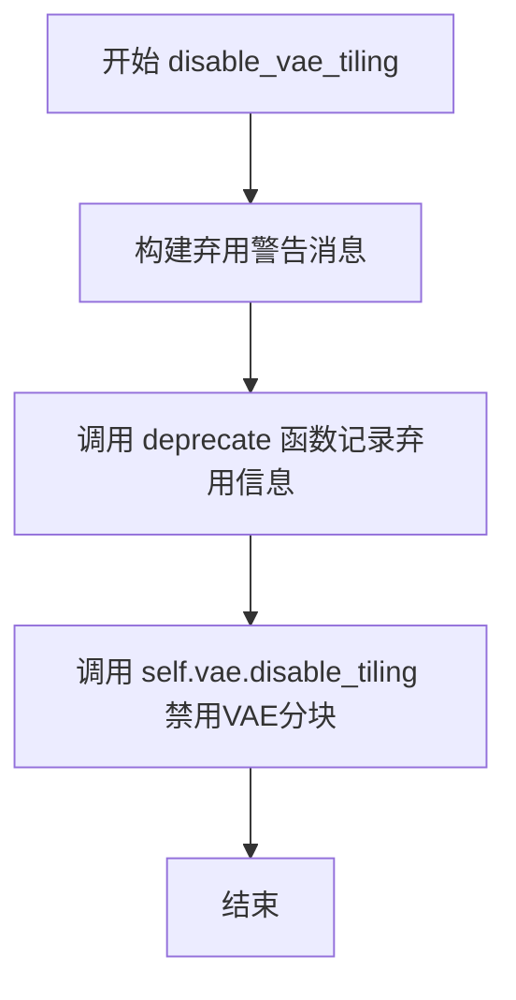

#### 带注释源码

```
def disable_vae_tiling(self):
    r"""
    Disable tiled VAE decoding. If `enable_vae_tiling` was previously enabled, this method will go back to
    computing decoding in one step.
    """
    # 构建弃用警告消息，提示用户该方法将在未来版本中移除
    # 建议直接使用 pipe.vae.disable_tiling() 代替
    depr_message = f"Calling `disable_vae_tiling()` on a `{self.__class__.__name__}` is deprecated and this method will be removed in a future version. Please use `pipe.vae.disable_tiling()`."
    
    # 调用 deprecate 函数记录弃用信息
    # 参数: 方法名, 弃用版本号, 弃用消息
    deprecate(
        "disable_vae_tiling",
        "0.40.0",
        depr_message,
    )
    
    # 实际执行禁用 VAE 分块解码的操作
    # 调用 VAE 模型的 disable_tiling 方法
    self.vae.disable_tiling()
```


### `HunyuanVideoSTGPipeline.guidance_scale`

该属性是一个只读的 getter 方法，用于获取当前管线中存储的 Classifier-Free Diffusion Guidance (CFG) 的 guidance_scale 参数值。该参数控制文本提示对生成视频的影响程度，值越大表示生成结果越严格遵循文本提示。

参数：无（属性 getter 不接受参数）

返回值：`float`，返回存储在管线实例中的 `_guidance_scale` 实例变量值，该值在调用 `__call__` 方法时通过 `guidance_scale` 参数设置。

#### 流程图

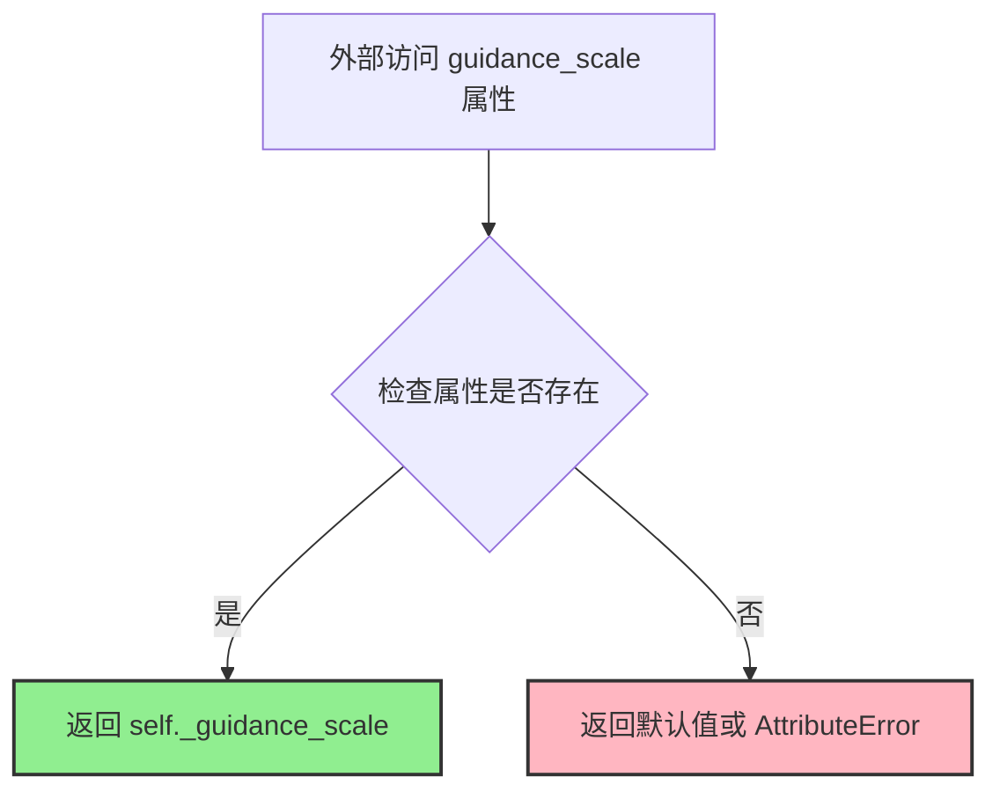

#### 带注释源码

```python
@property
def guidance_scale(self):
    """
    获取当前的 guidance_scale 值。
    
    guidance_scale 是 Classifier-Free Diffusion Guidance (CFG) 中的关键参数，
    定义于论文 https://huggingface.co/papers/2207.12598。
    在方程2中记为 w，其作用与 Imagen 论文 https://huggingface.co/papers/2205.11487 中描述的一致。
    当 guidance_scale > 1 时启用，较高的值会促使生成结果更紧密地贴合文本提示，
    但通常以牺牲图像质量为代价。
    
    注意：当前可用的 HunyuanVideo 模型是 CFG 精馏版本，
    意味着传统的无条件与条件潜在变量之间的 guidance 不适用。
    该属性返回的值在管线调用前通过 __call__ 方法的 guidance_scale 参数设置。
    
    Returns:
        float: 当前使用的 guidance_scale 值
    """
    return self._guidance_scale
```


### `HunyuanVideoSTGPipeline.do_spatio_temporal_guidance`

这是一个属性方法，用于判断当前管道是否启用了时空引导（Spatio-Temporal Guidance，STG）功能。通过检查内部变量 `_stg_scale` 是否大于 0.0 来确定是否需要进行时空引导处理。

参数： （无参数）

返回值：`bool`，返回 `True` 表示启用了时空引导功能，返回 `False` 表示未启用。

#### 流程图

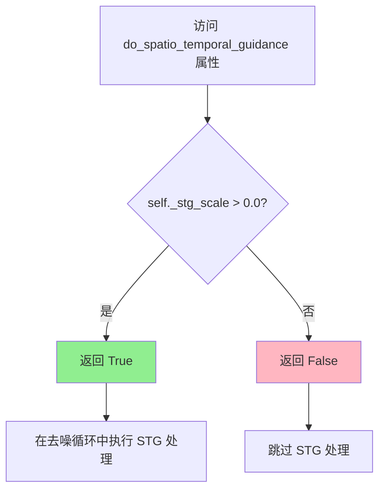

#### 带注释源码

```python
@property
def do_spatio_temporal_guidance(self):
    """
    属性：判断是否启用时空引导功能
    
    该属性检查内部变量 _stg_scale 是否大于 0.0来确定是否启用时空引导。
    时空引导是一种在视频生成过程中增强时空一致性的技术。
    
    工作原理：
    - 当 stg_scale > 0.0 时，在去噪循环中会对指定的 transformer 块
      应用 forward_without_stg 方法进行正常前向传播
    - 然后再次调用应用了 forward_with_stg 的前向传播
    - 最后通过公式: noise_pred = noise_pred + stg_scale * (noise_pred - noise_pred_perturb)
      来融合正常预测和扰动预测的结果
    
    Returns:
        bool: 如果 _stg_scale 大于 0.0 返回 True，否则返回 False
    """
    return self._stg_scale > 0.0
```


### HunyuanVideoSTGPipeline.num_timesteps

该属性是一个只读属性，用于返回扩散推理过程中的时间步数量。在 `__call__` 方法中通过 `self._num_timesteps = len(timesteps)` 进行赋值，反映了实际使用的时间步长度。

参数： 无

返回值：`int`，返回推理过程中使用的时间步总数。

#### 流程图

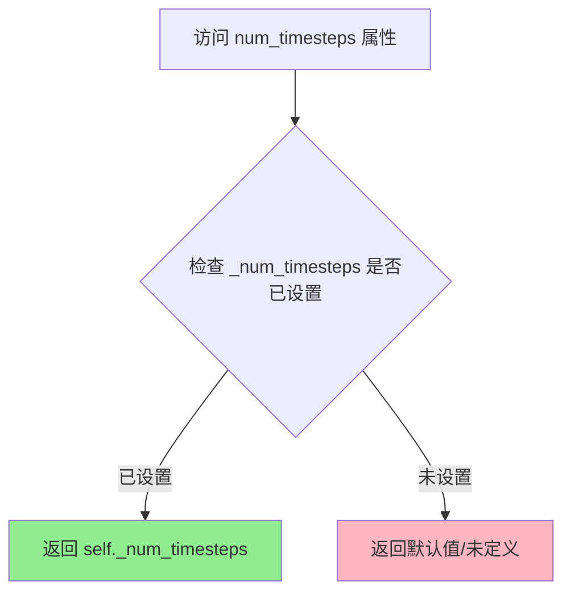

#### 带注释源码

```python
@property
def num_timesteps(self):
    """
    只读属性，返回扩散推理过程中使用的时间步总数。
    
    该属性在 __call__ 方法中被赋值：
    self._num_timesteps = len(timesteps)
    
    用途：
    - 供外部访问者查询当前pipeline配置的时间步数量
    - 与 progress_bar 进度显示配合使用
    - 用户可能需要了解完整的推理步数用于调试或性能分析
    
    Returns:
        int: 推理过程中使用的时间步总数。如果在 __call__ 之前访问，可能未初始化。
    """
    return self._num_timesteps
```


### `HunyuanVideoSTGPipeline.attention_kwargs`

这是一个属性（property）方法，用于获取在管道调用时传递的注意力机制相关参数（attention_kwargs）。该属性返回在 `__call__` 方法执行期间设置的 `self._attention_kwargs` 字典，该字典包含传递给 `AttentionProcessor` 的额外关键字参数。

参数：无（仅包含隐式参数 `self`）

返回值：`Optional[Dict[str, Any]]`，返回注意力机制的关键字参数字典。如果未设置，则返回 `None`。

#### 流程图

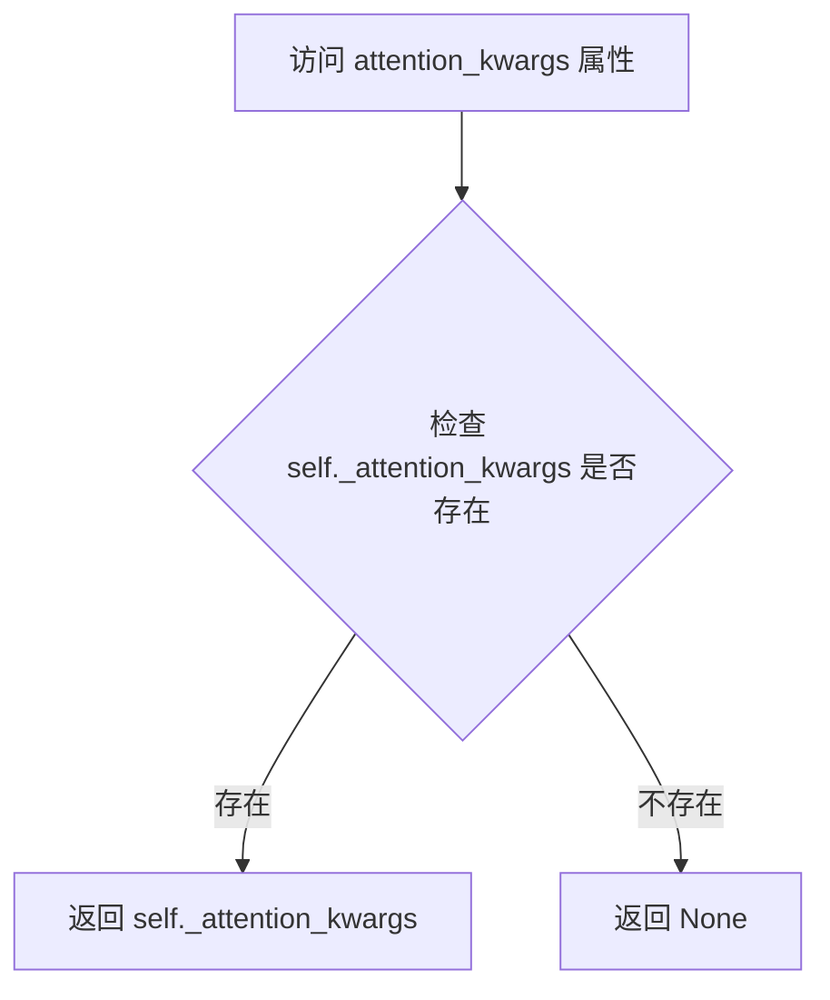

#### 带注释源码

```python
@property
def attention_kwargs(self):
    """
    属性 getter 方法，用于获取注意力机制的关键字参数。
    
    这个属性允许用户或内部组件访问在管道调用时通过 attention_kwargs 参数
    传递的额外配置。这些参数会被传递给 AttentionProcessor，用于自定义
    注意力机制的行为。
    
    Returns:
        Optional[Dict[str, Any]]: 包含注意力处理器的额外关键字参数的字典，
                                  如果未设置则返回 None。
    """
    return self._attention_kwargs
```


### `HunyuanVideoSTGPipeline.current_timestep`

该属性是 HunyuanVideoSTGPipeline 类的一个只读属性，用于获取当前去噪循环中的时间步（timestep）。在管道执行 `__call__` 方法期间，此属性会实时反映扩散模型正在处理的具体时间步，可用于外部回调或监控推理进度。

参数：

- （无参数）

返回值：`Any`，返回当前推理过程中的时间步。在去噪循环中返回 `torch.Tensor` 类型的单个时间步值，循环外返回 `None`。

#### 流程图

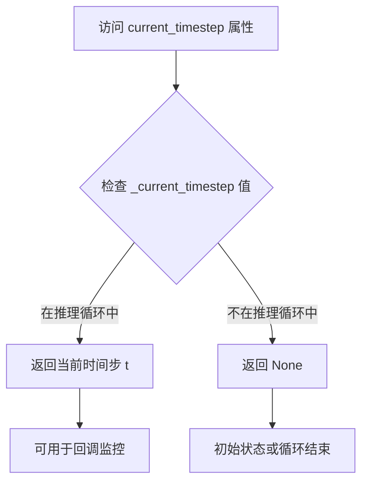

#### 带注释源码

```python
@property
def current_timestep(self):
    """
    当前推理过程中的时间步属性。
    
    在 __call__ 方法的去噪循环开始时被初始化为 None，
    每次循环迭代时更新为当前的 t 值，
    循环结束后重置为 None。
    
    Returns:
        Any: 当前扩散过程的时间步。类型为 torch.Tensor (单元素标量)
             或 None (当不在推理循环中时)。
    """
    return self._current_timestep
```

#### 相关上下文代码片段

```python
# 在 __call__ 方法中的初始化：
self._current_timestep = None  # 推理开始前

# 在去噪循环中：
for i, t in enumerate(timesteps):
    self._current_timestep = t  # 更新当前时间步
    # ... 去噪逻辑 ...

# 循环结束后：
self._current_timestep = None  # 重置状态
```

此属性通常与 `num_timesteps`、`interrupt` 等属性配合使用，用于提供管道执行状态的完整信息。


### `HunyuanVideoSTGPipeline.interrupt`

该属性是一个用于控制管道（pipeline）中断执行的标志属性。当被设置为 `True` 时，正在进行的去噪循环会跳过当前迭代，从而实现提前终止视频生成任务。

参数：

- 无参数（属性访问仅需 `self`）

返回值：`bool`，表示是否中断管道执行的布尔标志。

#### 流程图

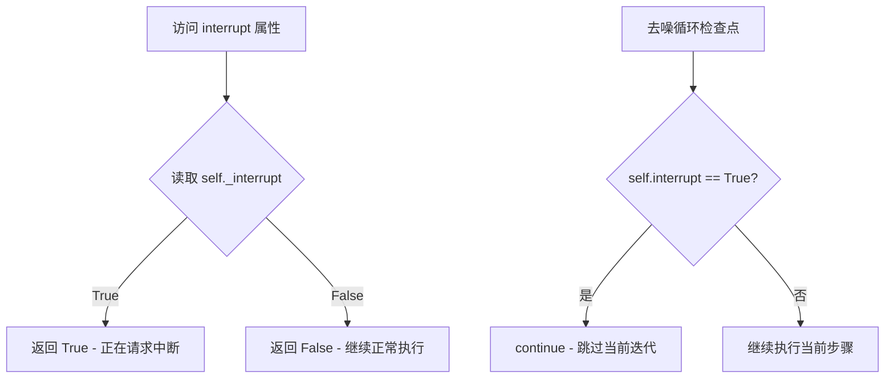

#### 带注释源码

```python
@property
def interrupt(self):
    r"""
    属性用于控制管道执行的中断状态。

    当设置为 True 时，去噪循环中的每次迭代都会检查此属性，
    如果为 True 则跳过当前迭代，从而实现提前终止生成过程。

    返回:
        bool: 中断标志。True 表示请求中断，False 表示继续执行。
    """
    return self._interrupt
```

#### 补充说明

在 `__call__` 方法中，该属性被初始化为 `False`：

```python
self._interrupt = False
```

在去噪循环中被检查：

```python
with self.progress_bar(total=num_inference_steps) as progress_bar:
    for i, t in enumerate(timesteps):
        if self.interrupt:  # 检查中断标志
            continue       # 如果为 True，跳过当前迭代
        # ... 继续去噪步骤
```

**使用场景**：
- 外部调用者可以通过设置 `pipeline._interrupt = True` 来请求提前终止生成
- 这在需要动态停止长时间运行的视频生成任务时很有用
- 常用于 Web 服务或交互式应用中允许用户取消生成操作


### HunyuanVideoSTGPipeline.__call__

这是 HunyuanVideo 视频生成管道的主调用方法，负责执行完整的文本到视频生成流程。它接受文本提示和各类生成参数，经过编码提示、创建潜在变量、去噪循环（包括可选的时空引导 STG）、VAE 解码等步骤，最终输出生成的视频帧。

参数：

- `prompt`：`Union[str, List[str]]`，可选的文本提示或提示列表，用于指导视频生成
- `prompt_2`：`Union[str, List[str]]`，发送给第二个分词器和文本编码器的提示，若不定义则使用 prompt
- `height`：`int`，默认 720，生成图像的高度（像素）
- `width`：`int`，默认 1280，生成图像的宽度（像素）
- `num_frames`：`int`，默认 129，生成视频的帧数
- `num_inference_steps`：`int`，默认 50，去噪步数，步数越多通常质量越高但推理越慢
- `sigmas`：`List[float]`，可选，自定义 sigmas 值用于支持该参数的调度器
- `guidance_scale`：`float`，默认 6.0，分类器自由扩散引导比例
- `num_videos_per_prompt`：`Optional[int]`，默认 1，每个提示生成的视频数量
- `generator`：`Optional[Union[torch.Generator, List[torch.Generator]]]`，可选的随机生成器，用于保证生成的可重复性
- `latents`：`Optional[torch.Tensor]`，可选的预生成噪声潜在向量
- `prompt_embeds`：`Optional[torch.Tensor]`，可选的预生成文本嵌入
- `pooled_prompt_embeds`：`Optional[torch.Tensor]`，可选的池化文本嵌入
- `prompt_attention_mask`：`Optional[torch.Tensor]`，可选的文本注意力掩码
- `output_type`：`str | None`，默认 "pil"，输出格式，可选 "pil" 或 "np.array"
- `return_dict`：`bool`，默认 True，是否返回 HunyuanVideoPipelineOutput 而非元组
- `attention_kwargs`：`Optional[Dict[str, Any]]`，可选的注意力处理器参数字典
- `callback_on_step_end`：可选的回调函数或 PipelineCallback，在每个去噪步骤结束时调用
- `callback_on_step_end_tensor_inputs`：`List[str]]`，默认 ["latents"]，回调函数使用的张量输入列表
- `prompt_template`：`Dict[str, Any]`，默认 DEFAULT_PROMPT_TEMPLATE，提示模板
- `max_sequence_length`：`int`，默认 256，最大序列长度
- `stg_applied_layers_idx`：`Optional[List[int]]`，默认 [2]，STG 应用的层索引（0-41）
- `stg_scale`：`Optional[float]`，默认 0.0，STG 比例，设为 0.0 表示使用 CFG

返回值：`HunyuanVideoPipelineOutput` 或 `tuple`，当 return_dict 为 True 时返回 HunyuanVideoPipelineOutput 对象，否则返回包含视频帧列表的元组

#### 流程图

```mermaid
flowchart TD
    A[开始 __call__] --> B[检查输入参数有效性 check_inputs]
    B --> C[设置内部状态变量<br/>_stg_scale, _guidance_scale, _attention_kwargs, _interrupt]
    C --> D[确定批次大小 batch_size]
    D --> E[编码输入提示 encode_prompt<br/>生成 prompt_embeds, pooled_prompt_embeds, prompt_attention_mask]
    E --> F[准备时间步 retrieve_timesteps<br/>从调度器获取 timesteps]
    F --> G[准备潜在变量 prepare_latents<br/>创建随机噪声或使用提供的 latents]
    G --> H[准备引导条件 guidance tensor]
    H --> I[进入去噪循环 for each timestep]
    I --> J{self.do_spatio_temporal_guidance?}
    J -->|是| K[动态替换 transformer_blocks 的 forward 方法为 forward_without_stg]
    J -->|否| L[直接进行前向传播]
    K --> M[执行 transformer 前向传播 noise_pred]
    M --> N{self.do_spatio_temporal_guidance?}
    N -->|是| O[替换 forward 为 forward_with_stg<br/>执行第二次前向传播 noise_pred_perturb]
    O --> P[应用 STG 公式: noise_pred = noise_pred + stg_scale * (noise_pred - noise_pred_perturb)]
    N -->|否| Q[跳过 STG 处理]
    L --> R[执行 transformer 前向传播 noise_pred]
    R --> Q
    Q --> S[调用 scheduler.step 计算上一步噪声 x_t -> x_t-1]
    S --> T{callback_on_step_end?}
    T -->|是| U[执行回调函数并更新 latents/prompt_embeds]
    T -->|否| V[更新进度条]
    V --> W{还有更多 timesteps?}
    W -->|是| I
    W -->|否| X{output_type == 'latent'?}
    X -->|否| Y[VAE 解码 latents -> video<br/>后处理视频]
    X -->|是| Z[video = latents]
    Y --> AA[释放模型钩子 maybe_free_model_hooks]
    Z --> AA
    AA --> BB{return_dict?}
    BB -->|是| CC[返回 HunyuanVideoPipelineOutput]
    BB -->|否| DD[返回元组 (video,)]
```

#### 带注释源码

```python
@torch.no_grad()
@replace_example_docstring(EXAMPLE_DOC_STRING)
def __call__(
    self,
    prompt: Union[str, List[str]] = None,
    prompt_2: Union[str, List[str]] = None,
    height: int = 720,
    width: int = 1280,
    num_frames: int = 129,
    num_inference_steps: int = 50,
    sigmas: List[float] = None,
    guidance_scale: float = 6.0,
    num_videos_per_prompt: Optional[int] = 1,
    generator: Optional[Union[torch.Generator, List[torch.Generator]]] = None,
    latents: Optional[torch.Tensor] = None,
    prompt_embeds: Optional[torch.Tensor] = None,
    pooled_prompt_embeds: Optional[torch.Tensor] = None,
    prompt_attention_mask: Optional[torch.Tensor] = None,
    output_type: str | None = "pil",
    return_dict: bool = True,
    attention_kwargs: Optional[Dict[str, Any]] = None,
    callback_on_step_end: Optional[
        Union[Callable[[int, int, Dict], None], PipelineCallback, MultiPipelineCallbacks]
    ] = None,
    callback_on_step_end_tensor_inputs: List[str] = ["latents"],
    prompt_template: Dict[str, Any] = DEFAULT_PROMPT_TEMPLATE,
    max_sequence_length: int = 256,
    stg_applied_layers_idx: Optional[List[int]] = [2],
    stg_scale: Optional[float] = 0.0,
):
    # 如果提供了回调对象，则从其中获取张量输入列表
    if isinstance(callback_on_step_end, (PipelineCallback, MultiPipelineCallbacks)):
        callback_on_step_end_tensor_inputs = callback_on_step_end.tensor_inputs

    # 1. 检查输入有效性，若不正确则抛出错误
    self.check_inputs(
        prompt,
        prompt_2,
        height,
        width,
        prompt_embeds,
        callback_on_step_end_tensor_inputs,
        prompt_template,
    )

    # 设置内部状态变量
    self._stg_scale = stg_scale  # STG 缩放因子
    self._guidance_scale = guidance_scale  # 引导比例
    self._attention_kwargs = attention_kwargs  # 注意力参数字典
    self._current_timestep = None  # 当前时间步
    self._interrupt = False  # 中断标志

    device = self._execution_device  # 获取执行设备

    # 2. 定义调用参数，确定批次大小
    if prompt is not None and isinstance(prompt, str):
        batch_size = 1
    elif prompt is not None and isinstance(prompt, list):
        batch_size = len(prompt)
    else:
        batch_size = prompt_embeds.shape[0]

    # 3. 编码输入提示，生成文本嵌入
    prompt_embeds, pooled_prompt_embeds, prompt_attention_mask = self.encode_prompt(
        prompt=prompt,
        prompt_2=prompt_2,
        prompt_template=prompt_template,
        num_videos_per_prompt=num_videos_per_prompt,
        prompt_embeds=prompt_embeds,
        pooled_prompt_embeds=pooled_prompt_embeds,
        prompt_attention_mask=prompt_attention_mask,
        device=device,
        max_sequence_length=max_sequence_length,
    )

    # 转换嵌入数据类型以匹配 transformer
    transformer_dtype = self.transformer.dtype
    prompt_embeds = prompt_embeds.to(transformer_dtype)
    prompt_attention_mask = prompt_attention_mask.to(transformer_dtype)
    if pooled_prompt_embeds is not None:
        pooled_prompt_embeds = pooled_prompt_embeds.to(transformer_dtype)

    # 4. 准备时间步，使用默认 sigma 分布或自定义值
    sigmas = np.linspace(1.0, 0.0, num_inference_steps + 1)[:-1] if sigmas is None else sigmas
    timesteps, num_inference_steps = retrieve_timesteps(
        self.scheduler,
        num_inference_steps,
        device,
        sigmas=sigmas,
    )

    # 5. 准备潜在变量
    num_channels_latents = self.transformer.config.in_channels
    num_latent_frames = (num_frames - 1) // self.vae_scale_factor_temporal + 1
    latents = self.prepare_latents(
        batch_size * num_videos_per_prompt,
        num_channels_latents,
        height,
        width,
        num_latent_frames,
        torch.float32,
        device,
        generator,
        latents,
    )

    # 6. 准备引导条件
    guidance = torch.tensor([guidance_scale] * latents.shape[0], dtype=transformer_dtype, device=device) * 1000.0

    # 7. 去噪循环
    num_warmup_steps = len(timesteps) - num_inference_steps * self.scheduler.order
    self._num_timesteps = len(timesteps)

    with self.progress_bar(total=num_inference_steps) as progress_bar:
        for i, t in enumerate(timesteps):
            # 检查中断标志
            if self.interrupt:
                continue

            self._current_timestep = t
            latent_model_input = latents.to(transformer_dtype)
            # 广播到批次维度，兼容 ONNX/Core ML
            timestep = t.expand(latents.shape[0]).to(latents.dtype)

            # 如果启用时空引导，将指定层的 forward 方法替换为不包含 STG 的版本
            if self.do_spatio_temporal_guidance:
                for i in stg_applied_layers_idx:
                    self.transformer.transformer_blocks[i].forward = types.MethodType(
                        forward_without_stg, self.transformer.transformer_blocks[i]
                    )

            # 执行 transformer 前向传播，获取噪声预测
            noise_pred = self.transformer(
                hidden_states=latent_model_input,
                timestep=timestep,
                encoder_hidden_states=prompt_embeds,
                encoder_attention_mask=prompt_attention_mask,
                pooled_projections=pooled_prompt_embeds,
                guidance=guidance,
                attention_kwargs=attention_kwargs,
                return_dict=False,
            )[0]

            # 如果启用 STG，执行第二次前向传播并应用 STG 公式
            if self.do_spatio_temporal_guidance:
                for i in stg_applied_layers_idx:
                    self.transformer.transformer_blocks[i].forward = types.MethodType(
                        forward_with_stg, self.transformer.transformer_blocks[i]
                    )

                noise_pred_perturb = self.transformer(
                    hidden_states=latent_model_input,
                    timestep=timestep,
                    encoder_hidden_states=prompt_embeds,
                    encoder_attention_mask=prompt_attention_mask,
                    pooled_projections=pooled_prompt_embeds,
                    guidance=guidance,
                    attention_kwargs=attention_kwargs,
                    return_dict=False,
                )[0]
                # STG 公式：noise_pred = noise_pred + stg_scale * (noise_pred - noise_pred_perturb)
                noise_pred = noise_pred + self._stg_scale * (noise_pred - noise_pred_perturb)

            # 计算上一步的噪声样本 x_t -> x_t-1
            latents = self.scheduler.step(noise_pred, t, latents, return_dict=False)[0]

            # 如果提供了回调函数，在步骤结束时调用
            if callback_on_step_end is not None:
                callback_kwargs = {}
                for k in callback_on_step_end_tensor_inputs:
                    callback_kwargs[k] = locals()[k]
                callback_outputs = callback_on_step_end(self, i, t, callback_kwargs)

                # 从回调输出中提取更新后的值
                latents = callback_outputs.pop("latents", latents)
                prompt_embeds = callback_outputs.pop("prompt_embeds", prompt_embeds)

            # 调用回调（如果提供）并更新进度条
            if i == len(timesteps) - 1 or ((i + 1) > num_warmup_steps and (i + 1) % self.scheduler.order == 0):
                progress_bar.update()

            # 如果使用 XLA，加速处理
            if XLA_AVAILABLE:
                xm.mark_step()

    self._current_timestep = None

    # 如果不是潜在向量输出类型，则进行 VAE 解码
    if not output_type == "latent":
        latents = latents.to(self.vae.dtype) / self.vae.config.scaling_factor
        video = self.vae.decode(latents, return_dict=False)[0]
        video = self.video_processor.postprocess_video(video, output_type=output_type)
    else:
        video = latents

    # 释放所有模型的钩子
    self.maybe_free_model_hooks()

    # 根据 return_dict 返回结果
    if not return_dict:
        return (video,)

    return HunyuanVideoPipelineOutput(frames=video)
```

## 关键组件


### HunyuanVideoSTGPipeline 类

HunyuanVideoSTGPipeline是用于文本到视频生成的核心管道类，继承自DiffusionPipeline和HunyuanVideoLoraLoaderMixin，集成了Transformer、VAE、双文本编码器（Llama和CLIP）以及调度器，实现基于扩散模型的视频生成。

### STG (Spatio-Temporal Guidance) 机制

STG机制通过动态替换transformer_blocks的前向方法实现时空引导。在去噪循环中，根据`stg_applied_layers_idx`选择特定层应用`forward_without_stg`进行扰动预测，然后结合`forward_with_stg`进行CFG计算，通过`stg_scale`控制引导强度。

### 双文本编码器系统

该系统包含两个文本编码器：LlamaModel（用于长序列语义理解）和CLIPTextModel（用于短序列pooled特征）。`_get_llama_prompt_embeds`方法处理长文本提示（最大256 tokens），`_get_clip_prompt_embeds`处理短文本（最大77 tokens），两者结合提供更丰富的文本表示。

### VAE 优化策略

提供了VAE切片（slicing）和平铺（tiling）两种优化策略。`enable_vae_slicing`将输入张量切片用于解码，`enable_vae_tiling`将输入张量分块处理，两者均可节省显存并支持更大批处理。

### FlowMatchEulerDiscreteScheduler 调度器

使用FlowMatchEulerDiscreteScheduler进行去噪过程的时间步调度。通过`retrieve_timesteps`函数获取时间步序列，支持自定义timesteps和sigmas，提供灵活的去噪策略配置。

### 潜在时空引导层索引

`stg_applied_layers_idx`参数指定应用STG的transformer块索引（默认[2]），允许用户选择性地对特定层应用时空引导，实现细粒度的生成控制。

### 视频后处理器

VideoProcessor负责VAE解码后视频的后处理，包括格式转换（pil/numpy/torch）和帧率调整，将潜在表示转换为最终视频输出。

### 模型CPU卸载序列

`model_cpu_offload_seq`定义了模型卸载顺序为"text_encoder->text_encoder_2->transformer->vae"，优化推理过程中的显存管理。

### 提示模板系统

DEFAULT_PROMPT_TEMPLATE提供系统提示模板，包含视频描述的结构化指导（对象、动作、背景、相机等），通过crop_start参数控制提示词截断位置，确保文本编码器有效利用输入。


## 问题及建议


### 已知问题

-   **动态修改方法带来的性能开销**：在去噪循环的每次迭代中，都通过 `types.MethodType` 动态替换 `transformer_blocks` 的 `forward` 方法，然后又在下一轮立即恢复。这种做法在每次推理步骤中都会产生方法替换开销，应该在推理开始前一次性设置，推理结束后恢复，而不是在循环内部反复执行。

-   **encode_prompt 方法存在逻辑缺陷**：`encode_prompt` 方法中当 `prompt_embeds` 为 `None` 时调用 `_get_llama_prompt_embeds`，但随后在获取 `pooled_prompt_embeds` 时，传入的 `prompt` 参数仍然是原始值而非 `prompt_2`，即使 `prompt_2` 已经被赋值，这导致了语义不一致。

-   **_guidance_scale 属性缺乏初始化**：代码中使用了 `self._guidance_scale` 作为属性（通过 `@property` 暴露），但在 `__call__` 方法中直接赋值前，该属性从未在 `__init__` 中被初始化，依赖 @property 但没有 backing field 的定义，可能导致 AttributeError。

-   **硬编码的默认值缺乏灵活性**：`stg_applied_layers_idx` 默认值为 `[2]`，`crop_start` 硬编码为 `95`，这些magic numbers 缺乏文档说明，且不易于配置。

-   **Deprecated 方法仍未移除**：`enable_vae_slicing`、`disable_vae_slicing`、`enable_vae_tiling`、`disable_vae_tiling` 方法已被标记为 deprecated (version 0.40.0)，但仍然存在于代码中，增加了维护负担。

-   **全局函数 forward_with_stg 和 forward_without_stg 设计不当**：这两个函数定义为模块级函数，但它们期望以方法方式被调用（第一个参数为 self），这种设计容易造成混淆，且不符合 Python 的最佳实践。

-   **重复计算 guidance tensor**：在循环外定义的 `guidance` tensor 每次推理步骤都会重新创建，虽然在循环外定义，但创建逻辑在循环外部，仍有优化空间。

-   **缺失关键的内存优化**：未实现 model offloading（除了 CPU offload），未使用 gradient checkpointing，大批量推理时可能导致 OOM。

-   **类型注解不完整**：部分方法参数缺少类型注解，如 `check_inputs` 方法的多个参数，以及 `encode_prompt` 的部分参数。

-   **STG 逻辑中存在变量遮蔽**：在去噪循环中使用 `for i, t in enumerate(timesteps)`，随后在 STG 逻辑中又使用了 `for i in stg_applied_layers_idx`，变量 `i` 被重复使用，可能导致意外的行为。

### 优化建议

-   **重构 forward 方法替换逻辑**：将 forward 方法的替换移到推理循环外部，在开始去噪前批量替换，推理结束后批量恢复，避免在每次迭代中重复执行方法替换操作。

-   **修复 encode_prompt 逻辑**：确保当 `prompt_2` 被提供时，正确地将 `prompt_2` 传递给 `_get_clip_prompt_embeds`，而不是始终使用原始 `prompt`。

-   **初始化实例属性**：在 `__init__` 方法中初始化 `_guidance_scale`、`_stg_scale`、`_attention_kwargs`、`_current_timestep`、`_interrupt` 等属性，提供默认值以避免潜在的 AttributeError。

-   **移除或完成 deprecated 方法**：如果这些方法不再需要，应该直接移除；如果仍需保持向后兼容，应确保有明确的迁移路径。

-   **将全局 forward 函数改为内部方法或 Lambda**：考虑将 `forward_with_stg` 和 `forward_without_stg` 定义为类的私有方法或使用更清晰的函数式接口。

-   **消除变量名遮蔽**：将 STG 循环中的 `i` 改为 `layer_idx` 或其他不与外层循环变量冲突的名称。

-   **添加类型注解和文档**：为所有公开方法添加完整的类型注解和文档字符串，特别是对于复杂的参数如 `attention_kwargs` 和 `prompt_template`。

-   **实现内存优化**：添加 gradient checkpointing 支持、动态批处理选项、以及更细粒度的模型 offloading 控制。


## 其它


### 设计目标与约束

本Pipeline旨在实现基于HunyuanVideo模型的文本到视频（Text-to-Video）生成功能，支持STG（Spatio-Temporal Guidance，时空引导）模式以增强视频生成的质量和可控性。核心设计目标包括：（1）支持多模态文本提示（Llama和CLIP双编码器）；（2）支持可配置的时空引导层索引（stg_applied_layers_idx）和引导强度（stg_scale）；（3）遵循Diffusers库的Pipeline标准架构，实现模型加载、推理、输出的完整流程。设计约束包括：输入height和width必须能被16整除；num_frames必须与VAE时间压缩比例兼容；prompt和prompt_embeds不能同时传入；STG模式仅在stg_scale > 0时启用。

### 错误处理与异常设计

Pipeline在多个关键环节实现了系统性的错误处理。输入验证阶段通过check_inputs方法执行多项检查：height/width必须能被16整除，否则抛出ValueError；callback_on_step_end_tensor_inputs中的键必须存在于_callback_tensor_inputs中；prompt和prompt_embeds不能同时非None；prompt和prompt_2的类型必须为str或list；prompt_template必须为dict且包含template键。时间步检索函数retrieve_timesteps中实现了timesteps和sigmas互斥检查，以及scheduler对自定义参数的兼容性验证。潜在变量准备阶段检查generator列表长度与batch_size的匹配性。此外，代码使用deprecate函数对enable_vae_slicing、disable_vae_slicing、enable_vae_tiling、disable_vae_tiling等已废弃方法发出警告，提示用户使用VAE自身的等效方法。

### 数据流与状态机

Pipeline的推理数据流遵循标准的Diffusion Pipeline模式，包含以下主要阶段：【输入阶段】接收prompt、height、width、num_frames等参数，经过check_inputs验证后进入编码流程。【文本编码阶段】encode_prompt方法调用_get_llama_prompt_embeds和_get_clip_prompt_embeds分别生成Llama文本嵌入和CLIP池化嵌入，用于Transformer的条件输入。【潜在变量初始化阶段】prepare_latents方法根据batch_size、num_channels_latents、height、width、num_frames计算潜在空间形状，并使用randn_tensor生成初始噪声。【去噪循环阶段】主循环遍历timesteps，对每个时间步执行：扩展timestep维度以匹配batch、调用transformer进行噪声预测、如果启用STG则执行两次前向传播（一次正常+一次扰动）并应用引导缩放、调用scheduler.step更新潜在变量、触发callback_on_step_end回调。【解码阶段】如果output_type不为latent，则将潜在变量通过VAE解码器转换为视频帧，最后通过video_processor后处理输出。整个流程可通过interrupt标志在任意时刻中断。

### 外部依赖与接口契约

本Pipeline依赖以下核心外部组件：【模型组件】HunyuanVideoTransformer3DModel（条件Transformer）、AutoencoderKLHunyuanVideo（VAE编解码器）、LlamaModel和CLIPTextModel（双文本编码器）、LlamaTokenizerFast和CLIPTokenizer（分词器）。【调度器】FlowMatchEulerDiscreteScheduler实现基于流匹配的去噪调度。【工具类】VideoProcessor用于视频后处理、randn_tensor用于张量随机生成、MultiPipelineCallbacks和PipelineCallback支持推理回调机制。【Mixin类】HunyuanVideoLoraLoaderMixin提供LoRA权重加载能力。Pipeline通过register_modules注册所有依赖模块，并定义了model_cpu_offload_seq="text_encoder->text_encoder_2->transformer->vae"指定模型卸载顺序。外部调用入口为__call__方法，返回HunyuanVideoPipelineOutput或tuple格式。

### 配置参数详细说明

Pipeline的主要配置参数分为生成参数、编码参数、引导参数和后处理参数四类。生成参数包括：height（默认720，输出视频高度）、width（默认1280，输出视频宽度）、num_frames（默认129，视频帧数）、num_inference_steps（默认50，去噪步数）、sigmas（可选，自定义噪声调度）、generator（可选，随机数生成器控制确定性）、latents（可选，预定义的噪声潜在变量）。编码参数包括：prompt/prompt_2（文本提示）、prompt_embeds/pooled_prompt_embeds（预计算嵌入）、prompt_template（提示词模板，默认DEFAULT_PROMPT_TEMPLATE）、max_sequence_length（最大序列长度，默认256）。引导参数包括：guidance_scale（引导强度，默认6.0）、stg_applied_layers_idx（STG应用层索引，默认[2]）、stg_scale（STG引导强度，默认0.0，0表示禁用）。后处理参数包括：output_type（输出格式，默认"pil"）、return_dict（是否返回字典格式）、num_videos_per_prompt（每个提示生成的视频数量）、attention_kwargs（注意力处理器参数字典）、callback_on_step_end（每步结束回调）。

### 性能优化策略

代码实现了多项性能优化策略。【模型卸载】通过model_cpu_offload_seq定义自动CPU卸载顺序，推理结束后调用maybe_free_model_hooks释放模型钩子。【VAE优化】提供enable_vae_slicing/disable_vae_slicing（切片解码）和enable_vae_tiling/disable_vae_tiling（瓦片解码）两种模式，显著降低大尺寸视频解码的显存占用。【计算优化】使用@torch.no_grad装饰器禁用梯度计算；通过XLA_AVAILABLE检查支持PyTorch XLA加速（xm.mark_step()）。【内存优化】潜在变量在设备和dtype间转换时保持最小内存占用；文本嵌入在不需要时及时释放。【批处理优化】num_videos_per_prompt参数支持批量生成多个视频，嵌入复制使用内存友好的view操作。STG模式通过动态替换transformer_blocks的forward方法实现，无需额外复制模型权重。

### 安全性考虑

当前Pipeline缺少显式的NSFW（Not Safe For Work）内容检测机制。虽然HunyuanVideoPipelineOutput包含nsfw_content_detected字段，但本实现未对生成的视频进行此类检测。CLIP文本编码器部分实现了输入截断警告，当prompt超过77 tokens时记录日志。代码遵循Apache 2.0许可证，符合开源安全规范。建议在生产环境中集成额外的安全过滤层以防止生成不当内容。

### 版本兼容性

本Pipeline与以下版本范围兼容：【Python】>=3.8【PyTorch】>=1.9【Transformers】支持LlamaModel、CLIPTextModel、LlamaTokenizerFast、CLIPTokenizer【Diffusers】>=0.40.0（引用了0.40.0版本的deprecation警告）。代码中的enable_vae_slicing等方法已标记为废弃，将在0.40.0版本移除，建议使用vae自身的enable_slicing()方法。STG功能依赖于HunyuanVideoTransformer3DModel的transformer_blocks属性访问，如果模型架构变化可能导致兼容性问题。

### 测试策略建议

建议为Pipeline实现以下测试用例：【单元测试】test_check_inputs验证各项输入校验逻辑、test_prepare_latents验证潜在变量形状计算、test_retrieve_timesteps验证时间步获取逻辑。【集成测试】test_text_to_video_end_to_end使用小分辨率和少帧数进行端到端生成测试、test_stg_mode验证STG模式下的引导效果。【性能测试】测试不同分辨率和帧数下的显存占用和推理时间、测试VAE slicing/tiling模式的效果。【回归测试】验证模型权重更新后Pipeline输出的统计特性是否保持稳定。【边界测试】测试极端参数值（如最小/最大分辨率、边界帧数）下的行为。

### 使用示例与用例

代码提供了完整的示例文档字符串，演示了典型使用场景：【基础文本到视频】输入描述性prompt（如"A wolf howling at the moon..."），生成对应视频内容。【STG模式启用】通过设置stg_applied_layers_idx=[2]（可选择0-41之间的层索引）和stg_scale=1.0启用时空引导，设置stg_scale=0.0可实现传统CFG效果。【自定义分辨率】支持320x512、720x1280等多种分辨率，但必须是16的倍数。【自定义帧数】num_frames参数控制生成视频长度，需考虑VAE时间压缩比。【后处理导出】使用diffusers.utils.export_to_video将输出帧转换为MP4格式。

### 资源管理与生命周期

Pipeline实现了完整的资源管理机制：【初始化阶段】__init__方法接收所有模型组件并通过register_modules注册，创建VideoProcessor实例，初始化VAE时空压缩比参数。【推理阶段】通过_execution_device获取执行设备，动态管理张量在不同设备间的迁移。模型使用结束后通过maybe_free_model_hooks自动卸载到CPU。【显存管理】支持VAE slicing和tiling两种显存优化模式；XLA环境下使用mark_step()优化计算图。【状态清理】推理完成后重置_current_timestep为None，_interrupt标志位可被外部中断信号置位以提前终止生成。

### 监控与可观测性

代码集成了以下监控和日志机制：【进度监控】使用self.progress_bar(total=num_inference_steps)显示去噪循环进度，在每步结束或达到warmup步数时更新。【日志记录】通过diffusers.utils.logging.get_logger(__name__)获取日志记录器，记录CLIP截断警告等信息。【回调机制】callback_on_step_end支持在每个去噪步骤结束时执行自定义回调函数，可用于监控latents、prompt_embeds等中间状态。【时间步跟踪】通过@property暴露num_timesteps、current_timestep等属性供外部查询当前推理进度。【中断支持】interrupt属性支持外部设置标志位以中断长时间运行的推理任务。

### 扩展性与未来改进方向

本Pipeline在设计上预留了多项扩展能力：【LoRA支持】通过继承HunyuanVideoLoraLoaderMixin支持低秩适配器加载，可用于风格迁移或概念定制。【注意力机制扩展】attention_kwargs参数支持向AttentionProcessor传递自定义参数，可用于实现ControlNet等扩展功能。【调度器扩展】retrieve_timesteps函数支持自定义timesteps和sigmas，可适配多种调度器实现。【多模态扩展】当前支持文本提示，可扩展支持图像提示（Image Prompt）或音频提示（Audio Prompt）。【分布式推理】去噪循环具备良好的批处理支持，可进一步扩展支持多GPU分布式推理。【性能优化】可探索FlashAttention集成、xFormers优化、动态图编译等进一步加速方案。潜在改进方向包括：增加NSFW检测集成、添加更细粒度的STG层控制、支持视频编辑/续写等下游任务。

    