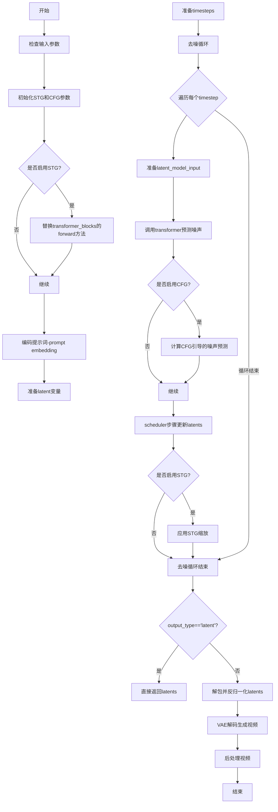
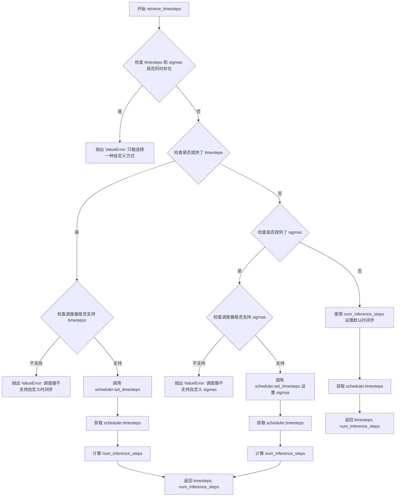
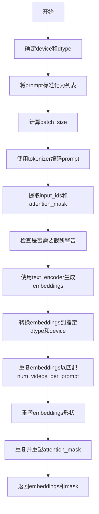
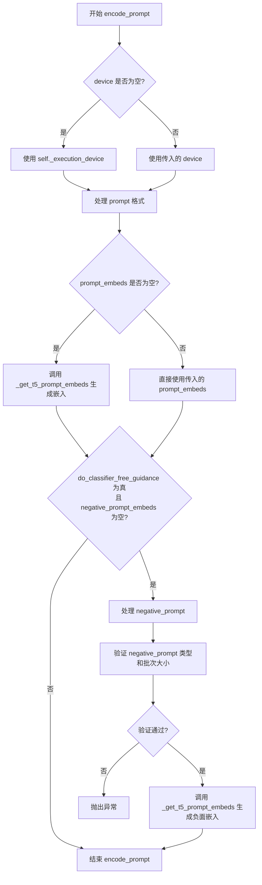
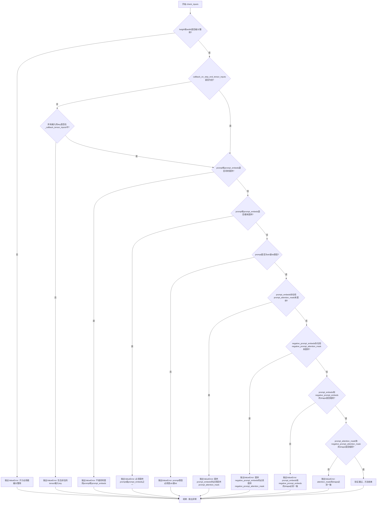
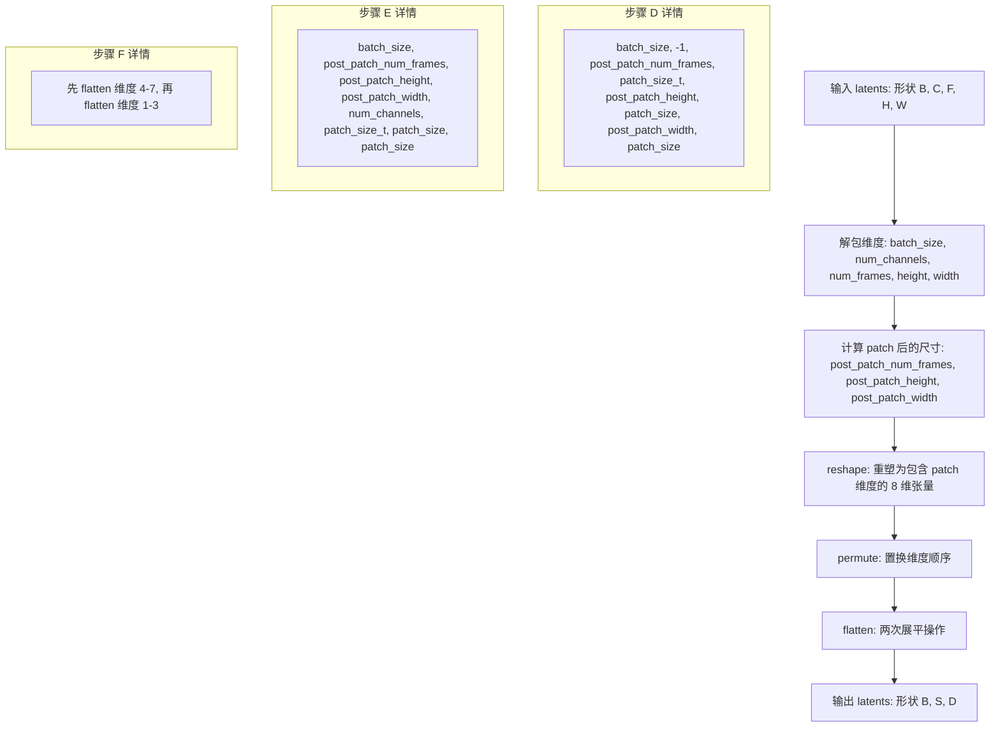
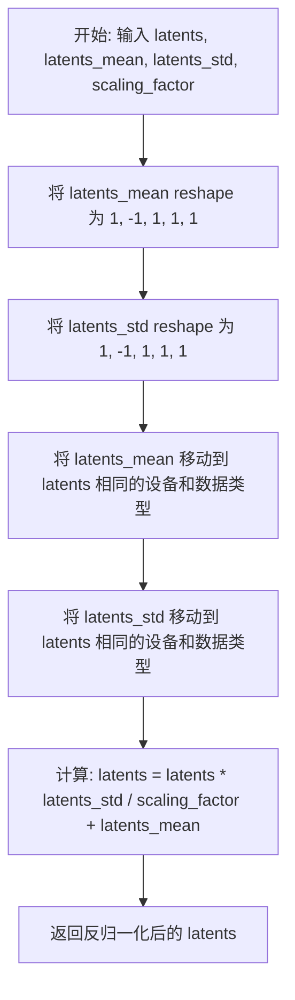

```mermaid
flowchart TD
    A[开始 __call__] --> B[检查回调张量输入]
    B --> C[验证输入参数 check_inputs]
    C --> D[设置STG参数 _stg_scale, _guidance_scale, _attention_kwargs, _interrupt]
    D --> E{do_spatio_temporal_guidance?}
    E -->|是| F[为指定层替换forward方法为forward_with_stg]
    E -->|否| G[跳过STG设置]
    F --> G
    G --> H[确定batch_size]
    H --> I[获取执行设备device]
    I --> J[编码提示词 encode_prompt]
    J --> K{do_classifier_free_guidance?}
    K -->|是 且 无STG| L[拼接negative和prompt embeddings x2]
    K -->|是 且 有STG| M[拼接negative和prompt embeddings x3]
    K -->|否| N[仅使用prompt embeddings]
    L --> O
    M --> O
    N --> O
    O[准备潜变量 prepare_latents]
    O --> P[计算视频序列长度和sigma]
    P --> Q[计算shift值 calculate_shift]
    Q --> R[获取时间步 retrieve_timesteps]
    R --> S[准备微条件 rope_interpolation_scale]
    S --> T[进入去噪循环]
    T --> U[检查interrupt标志]
    U --> V{interrupt?}
    V -->|是| W[continue跳过本次迭代]
    V -->|否| X[准备latent_model_input]
    X --> Y{guidance和STG条件}
    Y -->|CFG无STG| Z[cat latents x2]
    Y -->|CFG有STG| AA[cat latents x3]
    Y -->|无CFG| AB[仅用latents]
    Z --> AC
    AA --> AC
    AB --> AC
    AC[扩展timestep到batch维度] --> AD[调用transformer预测噪声]
    AD --> AE{do_classifier_free_guidance?}
    AE -->|无STG| AF[chunk噪声预测为2部分计算CFG]
    AE -->|有STG| AG[chunk噪声预测为3部分计算CFG+STG]
    AF --> AH
    AG --> AI{do_rescaling?}
    AI -->|是| AJ[计算rescaling_factor并应用]
    AJ --> AK
    AI -->|否| AK
    AH --> AK
    AK[scheduler.step更新latents] --> AL{callback_on_step_end?}
    AL -->|是| AM[执行回调函数]
    AL -->|否| AN[更新进度条]
    AM --> AN
    AN --> AO{是否最后一步或warmup后?}
    AO -->|是| AP[进度条更新]
    AO -->|否| AQ[返回循环开始]
    AQ --> U
    AP --> AR{output_type == 'latent'?}
    AR -->|是| AS[直接使用latents作为video]
    AR -->|否| AT[解包潜变量 _unpack_latents]
    AT --> AU[反归一化 _denormalize_latents]
    AU --> AV{vae.timestep_conditioning?}
    AV -->|是| AW[添加噪声到latents]
    AV -->|否| AX[跳过噪声添加]
    AW --> AX
    AX --> AY[vae.decode解码为视频]
    AY --> AZ[后处理视频 postprocess_video]
    AS --> BA
    AZ --> BA
    BA[释放模型钩子 maybe_free_model_hooks]
    BA --> BB{return_dict?}
    BB -->|是| BC[返回LTXPipelineOutput]
    BB -->|否| BD[返回元组 video]
    BC --> BE[结束]
    BD --> BE
```

# `diffusers\examples\community\pipeline_stg_ltx.py` 详细设计文档

这是一个基于LTX-Video模型的文本到视频生成Pipeline，实现了时空引导(STG)功能，支持分类器自由引导(CFG)，通过Diffusion模型将文本提示转换为高质量视频。

## 整体流程



## 类结构

```
DiffusionPipeline (基类)
├── FromSingleFileMixin (混入类)
├── LTXVideoLoraLoaderMixin (混入类)
└── LTXSTGPipeline (主类)
```

## 全局变量及字段


### `XLA_AVAILABLE`
    
Boolean flag indicating whether PyTorch XLA is available for accelerated computation

类型：`bool`
    


### `logger`
    
Module-level logger instance for logging warnings and information

类型：`logging.Logger`
    


### `EXAMPLE_DOC_STRING`
    
Documentation string containing example usage of the pipeline

类型：`str`
    


### `LTXSTGPipeline.vae`
    
Variational Auto-Encoder model for encoding videos to latents and decoding latents back to videos

类型：`AutoencoderKLLTXVideo`
    


### `LTXSTGPipeline.text_encoder`
    
T5 text encoder model for converting text prompts into text embeddings

类型：`T5EncoderModel`
    


### `LTXSTGPipeline.tokenizer`
    
T5 tokenizer for tokenizing text prompts into token IDs

类型：`T5TokenizerFast`
    


### `LTXSTGPipeline.transformer`
    
3D Transformer model for denoising video latents through the diffusion process

类型：`LTXVideoTransformer3DModel`
    


### `LTXSTGPipeline.scheduler`
    
Flow match Euler discrete scheduler for controlling the denoising process

类型：`FlowMatchEulerDiscreteScheduler`
    


### `LTXSTGPipeline.vae_spatial_compression_ratio`
    
Spatial compression ratio used by the VAE for encoding/decoding video frames

类型：`int`
    


### `LTXSTGPipeline.vae_temporal_compression_ratio`
    
Temporal compression ratio used by the VAE for encoding/decoding video sequences

类型：`int`
    


### `LTXSTGPipeline.transformer_spatial_patch_size`
    
Spatial patch size configuration for the transformer model

类型：`int`
    


### `LTXSTGPipeline.transformer_temporal_patch_size`
    
Temporal patch size configuration for the transformer model

类型：`int`
    


### `LTXSTGPipeline.video_processor`
    
Video processor for post-processing generated video frames

类型：`VideoProcessor`
    


### `LTXSTGPipeline.tokenizer_max_length`
    
Maximum sequence length supported by the tokenizer for text input

类型：`int`
    


### `LTXSTGPipeline.model_cpu_offload_seq`
    
Sequence string defining the order for CPU offloading of models (text_encoder->transformer->vae)

类型：`str`
    


### `LTXSTGPipeline._optional_components`
    
List of optional pipeline components that may not be required

类型：`List`
    


### `LTXSTGPipeline._callback_tensor_inputs`
    
List of tensor variable names that can be passed to callback functions during inference

类型：`List`
    


### `LTXSTGPipeline._guidance_scale`
    
Classifier-free guidance scale for controlling prompt adherence in generation

类型：`float`
    


### `LTXSTGPipeline._stg_scale`
    
Spatio-temporal guidance scale for controlling motion and spatial consistency

类型：`float`
    


### `LTXSTGPipeline._attention_kwargs`
    
Dictionary of additional attention-related parameters passed to the transformer

类型：`Dict`
    


### `LTXSTGPipeline._interrupt`
    
Flag to interrupt the denoising loop during generation

类型：`bool`
    


### `LTXSTGPipeline._num_timesteps`
    
Total number of inference timesteps used in the generation process

类型：`int`
    
    

## 全局函数及方法


### `forward_with_stg`

该函数是LTXVideoTransformer3DModel中Transformer块的前向传播方法，集成了Spatio-Temporal Guidance (STG)时空引导机制，通过自适应参数调整（AdaLN）和门控机制来增强特征变换能力，同时支持Past Token Bypass (PTB)直通。

参数：

- `self`：Transformer块对象，包含归一化层、注意力层和前馈网络
- `hidden_states`：`torch.Tensor`，输入的隐藏状态张量，形状为 [B, S, D]
- `encoder_hidden_states`：`torch.Tensor`，编码器输出的隐藏状态，用于cross-attention
- `temb`：`torch.Tensor`，时间嵌入向量，用于生成自适应缩放和平移参数
- `image_rotary_emb`：`Optional[Tuple[torch.Tensor, torch.Tensor]]`，可选的旋转位置嵌入，用于旋转注意力
- `encoder_attention_mask`：`Optional[torch.Tensor]`、可选的编码器注意力掩码，用于控制cross-attention的注意力分布

返回值：`torch.Tensor`，经过STG增强处理后的隐藏状态张量，形状为 [B, S, D]

#### 流程图

```mermaid
flowchart TD
    A[开始 forward_with_stg] --> B[保存PTB: hidden_states_ptb = hidden_states[2:]]
    B --> C[保存PTB: encoder_hidden_states_ptb = encoder_hidden_states[2:]]
    C --> D[获取batch_size并归一化: norm_hidden_states = self.norm1 hidden_states]
    D --> E[计算AdaLN参数: 从scale_shift_table生成shift_msa, scale_msa, gate_msa, shift_mlp, scale_mlp, gate_mlp]
    E --> F[应用AdaLN: norm_hidden_states = norm_hidden_states * (1 + scale_msa) + shift_msa]
    F --> G[自注意力: attn_hidden_states = self.attn1 norm_hidden_states]
    G --> H[残差连接: hidden_states = hidden_states + attn_hidden_states * gate_msa]
    H --> I[Cross注意力: attn_hidden_states = self.attn2 hidden_states with encoder_hidden_states]
    I --> J[残差连接: hidden_states = hidden_states + attn_hidden_states]
    J --> K[MLP归一化: norm_hidden_states = self.norm2 hidden_states * (1 + scale_mlp) + shift_mlp]
    K --> L[前馈网络: ff_output = self.ff norm_hidden_states]
    L --> M[残差连接: hidden_states = hidden_states + ff_output * gate_mlp]
    M --> N[恢复PTB: hidden_states[2:] = hidden_states_ptb]
    N --> O[恢复PTB: encoder_hidden_states[2:] = encoder_hidden_states_ptb]
    O --> P[返回处理后的hidden_states]
```

#### 带注释源码

```python
def forward_with_stg(
    self,
    hidden_states: torch.Tensor,
    encoder_hidden_states: torch.Tensor,
    temb: torch.Tensor,
    image_rotary_emb: Optional[Tuple[torch.Tensor, torch.Tensor]] = None,
    encoder_attention_mask: Optional[torch.Tensor] = None,
) -> torch.Tensor:
    """
    Transformer块的STG增强前向传播方法
    
    该方法实现了:
    1. Past Token Bypass (PTB): 保存并恢复隐藏状态的后两个位置
    2. AdaLN自适应参数: 使用时间嵌入生成归一化层的缩放和平移参数
    3. 门控机制: 控制自注意力和MLP输出的贡献程度
    
    参数:
        hidden_states: 输入隐藏状态 [batch, seq_len, dim]
        encoder_hidden_states: 编码器隐藏状态用于cross-attention
        temb: 时间嵌入向量
        image_rotary_emb: 旋转位置嵌入
        encoder_attention_mask: 编码器注意力掩码
    
    返回:
        处理后的隐藏状态
    """
    # ============ Past Token Bypass (PTB) ============
    # 保存hidden_states的后两个位置（索引2及之后），用于后续直通
    # PTB机制允许某些token绕过注意力计算直接传递
    hidden_states_ptb = hidden_states[2:]
    
    # 同理保存encoder_hidden_states的后两个位置
    encoder_hidden_states_ptb = encoder_hidden_states[2:]

    # ============ 归一化与AdaLN参数计算 ============
    # 获取批次大小
    batch_size = hidden_states.size(0)
    
    # 第一次归一化
    norm_hidden_states = self.norm1(hidden_states)

    # 计算AdaLN自适应参数数量（scale_shift_table的维度）
    num_ada_params = self.scale_shift_table.shape[0]
    
    # 从时间嵌入temb生成自适应参数
    # temb: [batch, time_dim] -> ada_values: [batch, 1, num_ada_params, -1]
    # scale_shift_table: [num_ada_params, hidden_dim]
    ada_values = self.scale_shift_table[None, None] + temb.reshape(batch_size, temb.size(1), num_ada_params, -1)
    
    # 解包6个AdaLN参数: shift/scale用于MSA和MLP
    shift_msa, scale_msa, gate_msa, shift_mlp, scale_mlp, gate_mlp = ada_values.unbind(dim=2)

    # 应用AdaLN: norm_hidden_states = (1 + scale_msa) * norm_hidden_states + shift_msa
    # 这种自适应缩放平移比传统的AdaLN更灵活
    norm_hidden_states = norm_hidden_states * (1 + scale_msa) + shift_msa

    # ============ 自注意力层 (Self-Attention) ============
    # 执行自注意力计算，使用旋转嵌入进行位置编码
    attn_hidden_states = self.attn1(
        hidden_states=norm_hidden_states,
        encoder_hidden_states=None,  # 自注意力不使用encoder_hidden_states
        image_rotary_emb=image_rotary_emb,
    )
    
    # 残差连接 + 门控: hidden_states = hidden_states + gate_msa * attn_hidden_states
    # gate_msa作为注意力输出的调制因子
    hidden_states = hidden_states + attn_hidden_states * gate_msa

    # ============ Cross注意力层 (Cross-Attention) ============
    # 使用encoder_hidden_states进行跨注意力计算
    attn_hidden_states = self.attn2(
        hidden_states,
        encoder_hidden_states=encoder_hidden_states,
        image_rotary_emb=None,  # cross-attention不使用旋转嵌入
        attention_mask=encoder_attention_mask,
    )
    
    # 残差连接（无门控）: hidden_states = hidden_states + attn_hidden_states
    hidden_states = hidden_states + attn_hidden_states
    
    # ============ MLP层 ============
    # 第二次归一化并应用AdaLN
    norm_hidden_states = self.norm2(hidden_states) * (1 + scale_mlp) + shift_mlp

    # 前馈网络处理
    ff_output = self.ff(norm_hidden_states)
    
    # 残差连接 + 门控: hidden_states = hidden_states + gate_mlp * ff_output
    hidden_states = hidden_states + ff_output * gate_mlp

    # ============ 恢复PTB ============
    # 将保存的PTB值写回hidden_states的后两个位置，实现直通
    hidden_states[2:] = hidden_states_ptb
    encoder_hidden_states[2:] = encoder_hidden_states_ptb

    return hidden_states
```


### calculate_shift

该函数通过线性插值计算图像序列长度对应的偏移量（mu），用于调整扩散模型噪声调度程序的时间步长，基于给定的序列长度范围和偏移范围进行动态调整。

参数：

- `image_seq_len`：`int`，输入的图像序列长度，用于计算对应的偏移量
- `base_seq_len`：`int`，默认值为 256，基础序列长度，对应最小偏移量
- `max_seq_len`：`int`，默认值为 4096，最大序列长度，对应最大偏移量
- `base_shift`：`float`，默认值为 0.5，基础偏移量
- `max_shift`：`float`，默认值为 1.16，最大偏移量

返回值：`float`，返回基于图像序列长度计算的偏移量 mu

#### 流程图

```mermaid
graph TD
    A[开始] --> B[计算斜率 m = (max_shift - base_shift) / (max_seq_len - base_seq_len)]
    B --> C[计算截距 b = base_shift - m * base_seq_len]
    C --> D[计算偏移量 mu = image_seq_len * m + b]
    D --> E[返回 mu]
```

#### 带注释源码

```python
def calculate_shift(
    image_seq_len,  # 输入的图像序列长度，用于计算对应的偏移量
    base_seq_len: int = 256,  # 基础序列长度，对应最小偏移量 base_shift
    max_seq_len: int = 4096,  # 最大序列长度，对应最大偏移量 max_shift
    base_shift: float = 0.5,  # 基础偏移量，当序列长度为 base_seq_len 时的偏移
    max_shift: float = 1.16,  # 最大偏移量，当序列长度为 max_seq_len 时的偏移
):
    # 计算线性插值的斜率 m
    # 斜率表示每单位序列长度变化的偏移量变化
    m = (max_shift - base_shift) / (max_seq_len - base_seq_len)
    
    # 计算线性插值的截距 b
    # 截距是当序列长度为 0 时的偏移量基础值
    b = base_shift - m * base_seq_len
    
    # 根据输入的图像序列长度计算最终的偏移量 mu
    # 使用线性方程 mu = image_seq_len * m + b
    mu = image_seq_len * m + b
    
    # 返回计算得到的偏移量，用于调整噪声调度程序
    return mu
```


### `retrieve_timesteps`

该函数是扩散模型管道中的时间步检索工具，用于配置调度器的时间步或sigma调度，并返回生成过程中使用的时间步序列。它支持三种模式：通过自定义时间步列表、通过自定义sigma值，或通过推理步数自动计算时间步。

参数：

- `scheduler`：`SchedulerMixin`，要获取时间步的调度器对象
- `num_inference_steps`：`Optional[int]`，生成样本时使用的扩散步数。如果使用此参数，`timesteps`必须为None
- `device`：`Optional[Union[str, torch.device]]`，时间步要移动到的设备。如果为None，时间步不会移动
- `timesteps`：`Optional[List[int]]`，用于覆盖调度器时间步间隔策略的自定义时间步。如果传递了此参数，`num_inference_steps`和`sigmas`必须为None
- `sigmas`：`Optional[List[float]]`，用于覆盖调度器sigma间隔策略的自定义sigma。如果传递了此参数，`num_inference_steps`和`timesteps`必须为None
- `**kwargs`：任意关键字参数，将传递给`scheduler.set_timesteps`

返回值：`Tuple[torch.Tensor, int]`，元组包含调度器的时间步序列和推理步数

#### 流程图



#### 带注释源码

```python
def retrieve_timesteps(
    scheduler,
    num_inference_steps: Optional[int] = None,
    device: Optional[Union[str, torch.device]] = None,
    timesteps: Optional[List[int]] = None,
    sigmas: Optional[List[float]] = None,
    **kwargs,
):
    r"""
    Calls the scheduler's `set_timesteps` method and retrieves timesteps from the scheduler after the call. Handles
    custom timesteps. Any kwargs will be supplied to `scheduler.set_timesteps`.

    Args:
        scheduler (`SchedulerMixin`):
            The scheduler to get timesteps from.
        num_inference_steps (`int`):
            The number of diffusion steps used when generating samples with a pre-trained model. If used, `timesteps`
            must be `None`.
        device (`str` or `torch.device`, *optional*):
            The device to which the timesteps should be moved to. If `None`, the timesteps are not moved.
        timesteps (`List[int]`, *optional*):
            Custom timesteps used to override the timestep spacing strategy of the scheduler. If `timesteps` is passed,
            `num_inference_steps` and `sigmas` must be `None`.
        sigmas (`List[float]`, *optional*):
            Custom sigmas used to override the timestep spacing strategy of the scheduler. If `sigmas` is passed,
            `num_inference_steps` and `timesteps` must be `None`.

    Returns:
        `Tuple[torch.Tensor, int]`: A tuple where the first element is the timestep schedule from the scheduler and the
        second element is the number of inference steps.
    """
    # 验证输入参数：不能同时指定 timesteps 和 sigmas
    if timesteps is not None and sigmas is not None:
        raise ValueError("Only one of `timesteps` or `sigmas` can be passed. Please choose one to set custom values")
    
    # 处理自定义时间步模式
    if timesteps is not None:
        # 检查调度器的 set_timesteps 方法是否接受 timesteps 参数
        accepts_timesteps = "timesteps" in set(inspect.signature(scheduler.set_timesteps).parameters.keys())
        if not accepts_timesteps:
            raise ValueError(
                f"The current scheduler class {scheduler.__class__}'s `set_timesteps` does not support custom"
                f" timestep schedules. Please check whether you are using the correct scheduler."
            )
        # 调用调度器的 set_timesteps 方法设置自定义时间步
        scheduler.set_timesteps(timesteps=timesteps, device=device, **kwargs)
        timesteps = scheduler.timesteps
        num_inference_steps = len(timesteps)
    
    # 处理自定义 sigma 模式
    elif sigmas is not None:
        # 检查调度器的 set_timesteps 方法是否接受 sigmas 参数
        accept_sigmas = "sigmas" in set(inspect.signature(scheduler.set_timesteps).parameters.keys())
        if not accept_sigmas:
            raise ValueError(
                f"The current scheduler class {scheduler.__class__}'s `set_timesteps` does not support custom"
                f" sigmas schedules. Please check whether you are using the correct scheduler."
            )
        # 调用调度器的 set_timesteps 方法设置自定义 sigmas
        scheduler.set_timesteps(sigmas=sigmas, device=device, **kwargs)
        timesteps = scheduler.timesteps
        num_inference_steps = len(timesteps)
    
    # 处理默认模式：使用 num_inference_steps 自动计算时间步
    else:
        scheduler.set_timesteps(num_inference_steps, device=device, **kwargs)
        timesteps = scheduler.timesteps
    
    # 返回时间步序列和推理步数
    return timesteps, num_inference_steps
```


### `LTXSTGPipeline.__init__`

该方法是 LTXSTGPipeline 类的构造函数，负责初始化文本到视频生成管道的所有核心组件，包括调度器、VAE 模型、文本编码器、分词器和变换器，并配置视频处理相关的参数和属性。

参数：

-  `scheduler`：`FlowMatchEulerDiscreteScheduler`，用于去噪过程的调度器
-  `vae`：`AutoencoderKLLTXVideo`，用于编码和解码视频的变分自编码器模型
-  `text_encoder`：`T5EncoderModel`，用于将文本提示编码为嵌入的 T5 文本编码器模型
-  `tokenizer`：`T5TokenizerFast`，用于将文本提示分词为 token 的 T5 分词器
-  `transformer`：`LTXVideoTransformer3DModel`，用于去噪视频潜在表示的条件变换器架构

返回值：`None`，该方法为构造函数，不返回任何值

#### 流程图

```mermaid
flowchart TD
    A[开始 __init__] --> B[调用 super().__init__]
    B --> C[register_modules: 注册 vae, text_encoder, tokenizer, transformer, scheduler]
    D[初始化压缩比和补丁大小] --> D1[vae_spatial_compression_ratio]
    D --> D2[vae_temporal_compression_ratio]
    D --> D3[transformer_spatial_patch_size]
    D --> D4[transformer_temporal_patch_size]
    D1 --> E[创建 VideoProcessor]
    D2 --> E
    D3 --> E
    D4 --> E
    E --> F[设置 tokenizer_max_length]
    F --> G[结束 __init__]
```

#### 带注释源码

```python
def __init__(
    self,
    scheduler: FlowMatchEulerDiscreteScheduler,
    vae: AutoencoderKLLTXVideo,
    text_encoder: T5EncoderModel,
    tokenizer: T5TokenizerFast,
    transformer: LTXVideoTransformer3DModel,
):
    """
    初始化 LTXSTGPipeline 管道
    
    参数:
        scheduler: FlowMatchEulerDiscreteScheduler，去噪调度器
        vae: AutoencoderKLLTXVideo，VAE 模型
        text_encoder: T5EncoderModel，文本编码器
        tokenizer: T5TokenizerFast，分词器
        transformer: LTXVideoTransformer3DModel，变换器模型
    """
    # 调用父类 DiffusionPipeline 的初始化方法
    super().__init__()

    # 注册所有模块到管道中，使其可通过 pipeline.xxx 访问
    self.register_modules(
        vae=vae,
        text_encoder=text_encoder,
        tokenizer=tokenizer,
        transformer=transformer,
        scheduler=scheduler,
    )

    # 获取 VAE 空间压缩比，如果 vae 不存在则默认为 32
    self.vae_spatial_compression_ratio = (
        self.vae.spatial_compression_ratio if getattr(self, "vae", None) is not None else 32
    )
    # 获取 VAE 时间压缩比，如果 vae 不存在则默认为 8
    self.vae_temporal_compression_ratio = (
        self.vae.temporal_compression_ratio if getattr(self, "vae", None) is not None else 8
    )
    # 获取变换器空间补丁大小，如果 transformer 不存在则默认为 1
    self.transformer_spatial_patch_size = (
        self.transformer.config.patch_size if getattr(self, "transformer", None) is not None else 1
    )
    # 获取变换器时间补丁大小，如果 transformer 不存在则默认为 1
    self.transformer_temporal_patch_size = (
        self.transformer.config.patch_size_t if getattr(self, "transformer") is not None else 1
    )

    # 创建视频处理器，使用 VAE 空间压缩比作为缩放因子
    self.video_processor = VideoProcessor(vae_scale_factor=self.vae_spatial_compression_ratio)
    # 获取分词器的最大长度，如果 tokenizer 不存在则默认为 128
    self.tokenizer_max_length = (
        self.tokenizer.model_max_length if getattr(self, "tokenizer", None) is not None else 128
    )
```


### `LTXSTGPipeline._get_t5_prompt_embeds`

该方法用于将文本提示（prompt）编码为T5文本编码器的嵌入向量，并生成相应的注意力掩码，支持批量处理和每个提示生成多个视频。

参数：

- `self`：`LTXSTGPipeline` 实例本身
- `prompt`：`Union[str, List[str]]`，要编码的文本提示，可以是单个字符串或字符串列表
- `num_videos_per_prompt`：`int`，每个提示要生成的视频数量，默认为1
- `max_sequence_length`：`int`，文本序列的最大长度，默认为128
- `device`：`Optional[torch.device]`，指定计算设备，如果为None则使用执行设备
- `dtype`：`Optional[torch.dtype]`指定计算数据类型，如果为None则使用文本编码器的数据类型

返回值：`Tuple[torch.Tensor, torch.Tensor]`，返回元组包含：
- `prompt_embeds`：`torch.Tensor`，形状为 `(batch_size * num_videos_per_prompt, seq_len, hidden_dim)` 的文本嵌入向量
- `prompt_attention_mask`：`torch.Tensor`，形状为 `(batch_size * num_videos_per_prompt, seq_len)` 的注意力掩码

#### 流程图



#### 带注释源码

```python
def _get_t5_prompt_embeds(
    self,
    prompt: Union[str, List[str]] = None,
    num_videos_per_prompt: int = 1,
    max_sequence_length: int = 128,
    device: Optional[torch.device] = None,
    dtype: Optional[torch.dtype] = None,
):
    # 确定设备：如果未指定device，则使用pipeline的执行设备
    device = device or self._execution_device
    # 确定数据类型：如果未指定dtype，则使用text_encoder的数据类型
    dtype = dtype or self.text_encoder.dtype

    # 标准化prompt为列表格式：如果是单个字符串则包装为列表
    prompt = [prompt] if isinstance(prompt, str) else prompt
    # 计算批次大小
    batch_size = len(prompt)

    # 使用tokenizer将文本编码为模型输入格式
    # padding="max_length": 填充到最大长度
    # max_length=max_sequence_length: 最大序列长度
    # truncation=True: 超过最大长度时截断
    # add_special_tokens=True: 添加特殊tokens（如bos/eos）
    # return_tensors="pt": 返回PyTorch张量
    text_inputs = self.tokenizer(
        prompt,
        padding="max_length",
        max_length=max_sequence_length,
        truncation=True,
        add_special_tokens=True,
        return_tensors="pt",
    )
    # 提取输入IDs和注意力掩码
    text_input_ids = text_inputs.input_ids
    prompt_attention_mask = text_inputs.attention_mask
    # 将attention_mask转换为布尔值并移到指定设备
    prompt_attention_mask = prompt_attention_mask.bool().to(device)

    # 获取未截断的输入IDs（用于检测是否发生了截断）
    untruncated_ids = self.tokenizer(prompt, padding="longest", return_tensors="pt").input_ids

    # 检查是否发生了截断，如果是则记录警告信息
    if untruncated_ids.shape[-1] >= text_input_ids.shape[-1] and not torch.equal(text_input_ids, untruncated_ids):
        # 解码被截断的部分用于警告信息
        removed_text = self.tokenizer.batch_decode(untruncated_ids[:, max_sequence_length - 1 : -1])
        logger.warning(
            "The following part of your input was truncated because `max_sequence_length` is set to "
            f" {max_sequence_length} tokens: {removed_text}"
        )

    # 使用T5文本编码器生成文本嵌入
    # text_encoder接受input_ids并返回hidden states
    prompt_embeds = self.text_encoder(text_input_ids.to(device))[0]
    # 将embeddings转换到指定的dtype和device
    prompt_embeds = prompt_embeds.to(dtype=dtype, device=device)

    # 复制文本嵌入以支持每个提示生成多个视频
    # 使用mps友好的方法进行复制
    _, seq_len, _ = prompt_embeds.shape
    # 在序列维度上重复，以支持num_videos_per_prompt
    prompt_embeds = prompt_embeds.repeat(1, num_videos_per_prompt, 1)
    # 重塑为 (batch_size * num_videos_per_prompt, seq_len, hidden_dim)
    prompt_embeds = prompt_embeds.view(batch_size * num_videos_per_prompt, seq_len, -1)

    # 处理attention mask：重塑并重复以匹配embeddings
    prompt_attention_mask = prompt_attention_mask.view(batch_size, -1)
    prompt_attention_mask = prompt_attention_mask.repeat(num_videos_per_prompt, 1)

    # 返回文本嵌入和注意力掩码
    return prompt_embeds, prompt_attention_mask
```


### `LTXSTGPipeline.encode_prompt`

该方法负责将文本提示（prompt）和负面提示（negative_prompt）编码为文本编码器的隐藏状态（hidden states），并生成相应的注意力掩码（attention mask）。它支持分类器自由引导（Classifier-Free Guidance），并允许用户直接传入预计算的提示嵌入。

参数：

-  `self`：`LTXSTGPipeline` 实例本身
-  `prompt`：`Union[str, List[str]]`，要编码的主提示，可以是单个字符串或字符串列表
-  `negative_prompt`：`Optional[Union[str, List[str]]]`，不参与引导图像生成的负面提示，若不提供且不使用引导则需传入 `negative_prompt_embeds`
-  `do_classifier_free_guidance`：`bool`，是否使用分类器自由引导，默认为 `True`
-  `num_videos_per_prompt`：`int`，每个提示生成的视频数量，默认为 1
-  `prompt_embeds`：`Optional[torch.Tensor]`，预生成的文本嵌入，若不提供则从 `prompt` 生成
-  `negative_prompt_embeds`：`Optional[torch.Tensor]`，预生成的负面文本嵌入，若不提供则从 `negative_prompt` 生成
-  `prompt_attention_mask`：`Optional[torch.Tensor]`，文本嵌入的注意力掩码
-  `negative_prompt_attention_mask`：`Optional[torch.Tensor]`，负面文本嵌入的注意力掩码
-  `max_sequence_length`：`int`，最大序列长度，默认为 128
-  `device`：`Optional[torch.device]`，torch 设备
-  `dtype`：`Optional[torch.dtype]`，torch 数据类型

返回值：`Tuple[torch.Tensor, torch.Tensor, torch.Tensor, torch.Tensor]`，包含四个元素的元组：提示嵌入、提示注意力掩码、负面提示嵌入、负面提示注意力掩码

#### 流程图



#### 带注释源码

```python
def encode_prompt(
    self,
    prompt: Union[str, List[str]],
    negative_prompt: Optional[Union[str, List[str]]] = None,
    do_classifier_free_guidance: bool = True,
    num_videos_per_prompt: int = 1,
    prompt_embeds: Optional[torch.Tensor] = None,
    negative_prompt_embeds: Optional[torch.Tensor] = None,
    prompt_attention_mask: Optional[torch.Tensor] = None,
    negative_prompt_attention_mask: Optional[torch.Tensor] = None,
    max_sequence_length: int = 128,
    device: Optional[torch.device] = None,
    dtype: Optional[torch.dtype] = None,
):
    r"""
    Encodes the prompt into text encoder hidden states.

    Args:
        prompt (`str` or `List[str]`, *optional*):
            prompt to be encoded
        negative_prompt (`str` or `List[str]`, *optional*):
            The prompt or prompts not to guide the image generation. If not defined, one has to pass
            `negative_prompt_embeds` instead. Ignored when not using guidance (i.e., ignored if `guidance_scale` is
            less than `1`).
        do_classifier_free_guidance (`bool`, *optional*, defaults to `True`):
            Whether to use classifier free guidance or not.
        num_videos_per_prompt (`int`, *optional*, defaults to 1):
            Number of videos that should be generated per prompt. torch device to place the resulting embeddings on
        prompt_embeds (`torch.Tensor`, *optional*):
            Pre-generated text embeddings. Can be used to easily tweak text inputs, *e.g.* prompt weighting. If not
            provided, text embeddings will be generated from `prompt` input argument.
        negative_prompt_embeds (`torch.Tensor`, *optional*):
            Pre-generated negative text embeddings. Can be used to easily tweak text inputs, *e.g.* prompt
            weighting. If not provided, negative_prompt_embeds will be generated from `negative_prompt` input
            argument.
        device: (`torch.device`, *optional*):
            torch device
        dtype: (`torch.dtype`, *optional*):
            torch dtype
    """
    # 确定执行设备，如果未指定则使用管道默认执行设备
    device = device or self._execution_device

    # 将单个字符串 prompt 转换为列表，统一处理流程
    prompt = [prompt] if isinstance(prompt, str) else prompt
    
    # 根据 prompt 或 prompt_embeds 确定批次大小
    if prompt is not None:
        batch_size = len(prompt)
    else:
        batch_size = prompt_embeds.shape[0]

    # 如果未提供 prompt_embeds，则从 prompt 生成文本嵌入和注意力掩码
    if prompt_embeds is None:
        prompt_embeds, prompt_attention_mask = self._get_t5_prompt_embeds(
            prompt=prompt,
            num_videos_per_prompt=num_videos_per_prompt,
            max_sequence_length=max_sequence_length,
            device=device,
            dtype=dtype,
        )

    # 如果启用分类器自由引导且未提供负面嵌入，则生成负面提示嵌入
    if do_classifier_free_guidance and negative_prompt_embeds is None:
        # 如果未提供 negative_prompt 则使用空字符串
        negative_prompt = negative_prompt or ""
        
        # 确保 negative_prompt 为列表且长度与 batch_size 一致
        negative_prompt = batch_size * [negative_prompt] if isinstance(negative_prompt, str) else negative_prompt

        # 验证 negative_prompt 和 prompt 类型一致性
        if prompt is not None and type(prompt) is not type(negative_prompt):
            raise TypeError(
                f"`negative_prompt` should be the same type to `prompt`, but got {type(negative_prompt)} !="
                f" {type(prompt)}."
            )
        
        # 验证 negative_prompt 和 prompt 批次大小一致性
        elif batch_size != len(negative_prompt):
            raise ValueError(
                f"`negative_prompt`: {negative_prompt} has batch size {len(negative_prompt)}, but `prompt`:"
                f" {prompt} has batch size {batch_size}. Please make sure that passed `negative_prompt` matches"
                " the batch size of `prompt`."
            )

        # 从 negative_prompt 生成负面文本嵌入和注意力掩码
        negative_prompt_embeds, negative_prompt_attention_mask = self._get_t5_prompt_embeds(
            prompt=negative_prompt,
            num_videos_per_prompt=num_videos_per_prompt,
            max_sequence_length=max_sequence_length,
            device=device,
            dtype=dtype,
        )

    # 返回四个元素：提示嵌入、提示注意力掩码、负面提示嵌入、负面提示注意力掩码
    return prompt_embeds, prompt_attention_mask, negative_prompt_embeds, negative_prompt_attention_mask
```


### LTXSTGPipeline.check_inputs

该方法用于验证LTXSTGPipeline的输入参数是否合法，确保用户在调用pipeline生成视频前提供的参数满足模型要求，包括检查尺寸对齐、prompt与prompt_embeds互斥性、attention_mask配对等关键约束。

参数：

- `self`：`LTXSTGPipeline` 实例，Pipeline对象本身
- `prompt`：`Union[str, List[str]]`，用户提供的文本提示，用于引导视频生成
- `height`：`int`，生成的视频高度（像素），必须能被32整除
- `width`：`int`，生成的视频宽度（像素），必须能被32整除
- `callback_on_step_end_tensor_inputs`：`Optional[List[str]]`，回调函数在每个推理步骤结束时可以访问的tensor输入列表
- `prompt_embeds`：`Optional[torch.Tensor]`（推断），预计算的文本embedding，与prompt互斥
- `negative_prompt_embeds`：`Optional[torch.Tensor]`（推断），预计算的负面文本embedding
- `prompt_attention_mask`：`Optional[torch.Tensor]`（推断），prompt_embeds对应的attention mask
- `negative_prompt_attention_mask`：`Optional[torch.Tensor]`（推断），negative_prompt_embeds对应的attention mask

返回值：`None`，该方法通过抛出ValueError来指示错误，无返回值

#### 流程图



#### 带注释源码

```python
def check_inputs(
    self,
    prompt,
    height,
    width,
    callback_on_step_end_tensor_inputs=None,
    prompt_embeds=None,
    negative_prompt_embeds=None,
    prompt_attention_mask=None,
    negative_prompt_attention_mask=None,
):
    """
    验证pipeline输入参数的有效性，确保满足LTXVideo模型的约束条件。
    
    检查项目包括：
    1. 视频尺寸必须能被32整除（VAE的压缩比要求）
    2. 回调tensor输入必须在允许列表中
    3. prompt和prompt_embeds不能同时提供也不能同时为空
    4. prompt类型必须是字符串或列表
    5. prompt_embeds和negative_prompt_embeds必须成对提供
    6. embedding和attention mask的shape必须匹配
    """
    
    # 检查1: 验证视频尺寸满足VAE的空间压缩比要求（32的倍数）
    if height % 32 != 0 or width % 32 != 0:
        raise ValueError(f"`height` and `width` have to be divisible by 32 but are {height} and {width}.")

    # 检查2: 验证回调函数可以访问的tensor输入是否在允许列表中
    # _callback_tensor_inputs定义在类级别，包含了["latents", "prompt_embeds", "negative_prompt_embeds"]
    if callback_on_step_end_tensor_inputs is not None and not all(
        k in self._callback_tensor_inputs for k in callback_on_step_end_tensor_inputs
    ):
        raise ValueError(
            f"`callback_on_step_end_tensor_inputs` has to be in {self._callback_tensor_inputs}, but found {[k for k in callback_on_step_end_tensor_inputs if k not in self._callback_tensor_inputs]}"
        )

    # 检查3: prompt和prompt_embeds不能同时提供（只能二选一）
    if prompt is not None and prompt_embeds is not None:
        raise ValueError(
            f"Cannot forward both `prompt`: {prompt} and `prompt_embeds`: {prompt_embeds}. Please make sure to"
            " only forward one of the two."
        )
    # 检查4: prompt和prompt_embeds不能同时为空（至少提供一个）
    elif prompt is None and prompt_embeds is None:
        raise ValueError(
            "Provide either `prompt` or `prompt_embeds`. Cannot leave both `prompt` and `prompt_embeds` undefined."
        )
    # 检查5: prompt类型必须是字符串或列表
    elif prompt is not None and (not isinstance(prompt, str) and not isinstance(prompt, list)):
        raise ValueError(f"`prompt` has to be of type `str` or `list` but is {type(prompt)}")

    # 检查6: 如果提供了prompt_embeds，必须同时提供对应的attention mask
    if prompt_embeds is not None and prompt_attention_mask is None:
        raise ValueError("Must provide `prompt_attention_mask` when specifying `prompt_embeds`.")

    # 检查7: 如果提供了negative_prompt_embeds，必须同时提供对应的attention mask
    if negative_prompt_embeds is not None and negative_prompt_attention_mask is None:
        raise ValueError("Must provide `negative_prompt_attention_mask` when specifying `negative_prompt_embeds`.")

    # 检查8: 如果同时提供了prompt_embeds和negative_prompt_embeds，验证它们的shape一致
    if prompt_embeds is not None and negative_prompt_embeds is not None:
        if prompt_embeds.shape != negative_prompt_embeds.shape:
            raise ValueError(
                "`prompt_embeds` and `negative_prompt_embeds` must have the same shape when passed directly, but"
                f" got: `prompt_embeds` {prompt_embeds.shape} != `negative_prompt_embeds`"
                f" {negative_prompt_embeds.shape}."
            )
        # 检查9: attention mask的shape也必须一致
        if prompt_attention_mask.shape != negative_prompt_attention_mask.shape:
            raise ValueError(
                "`prompt_attention_mask` and `negative_prompt_attention_mask` must have the same shape when passed directly, but"
                f" got: `prompt_attention_mask` {prompt_attention_mask.shape} != `negative_prompt_attention_mask`"
                f" {negative_prompt_attention_mask.shape}."
            )
```


### `LTXSTGPipeline._pack_latents`

将形状为 [B, C, F, H, W] 的未打包 latent 张量转换为transformer可处理的形状为 [B, S, D] 的打包形式，其中 S 是有效视频序列长度，D 是有效特征维度。

参数：

- `latents`：`torch.Tensor`，输入的 latent 张量，形状为 [B, C, F, H, W]，其中 B 是批次大小，C 是通道数，F 是帧数，H 是高度，W 是宽度
- `patch_size`：`int`，空间 patch 大小，默认为 1
- `patch_size_t`：`int`，时间 patch 大小，默认为 1

返回值：`torch.Tensor`，打包后的 latent 张量，形状为 [B, F // p_t * H // p * W // p, C * p_t * p * p]

#### 流程图



#### 带注释源码

```python
@staticmethod
def _pack_latents(latents: torch.Tensor, patch_size: int = 1, patch_size_t: int = 1) -> torch.Tensor:
    """
    将未打包的 latents 打包成 transformer 可处理的 token 形式
    
    输入形状: [B, C, F, H, W] - 批次, 通道, 帧, 高度, 宽度
    输出形状: [B, S, D] - 批次, 有效视频序列长度, 有效特征维度
    
    打包过程:
    1. 重塑为包含 patch 维度的 8 维张量
    2. 置换维度顺序
    3. 展平为最终的 3 维张量
    """
    # 从输入张量中解包各个维度
    # latents: [B, C, F, H, W]
    batch_size, num_channels, num_frames, height, width = latents.shape
    
    # 计算 patch 后的各维度大小
    # 将时间维度按时间 patch 大小分割
    post_patch_num_frames = num_frames // patch_size_t
    # 将空间高度按空间 patch 大小分割
    post_patch_height = height // patch_size
    # 将空间宽度按空间 patch 大小分割
    post_patch_width = width // patch_size
    
    # Step 1: reshape - 将 [B, C, F, H, W] 重塑为包含 patch 维度的 8 维张量
    # 目标形状: [B, C, F // p_t, p_t, H // p, p, W // p, p]
    # 其中 -1 表示 num_channels 保持不变
    latents = latents.reshape(
        batch_size,
        -1,
        post_patch_num_frames,
        patch_size_t,
        post_patch_height,
        patch_size,
        post_patch_width,
        patch_size,
    )
    
    # Step 2: permute - 置换维度顺序，将 patch 维度移到通道维度附近
    # 从 [B, C, F//p_t, p_t, H//p, p, W//p, p] 
    # 置换为 [B, F//p_t, H//p, W//p, C, p_t, p, p]
    latents = latents.permute(0, 2, 4, 6, 1, 3, 5, 7).flatten(4, 7).flatten(1, 3)
    
    # Step 3: flatten - 两次展平操作
    # 第一次 flatten(4, 7): 将最后的 4 个维度 [C, p_t, p, p] 展平为 [C * p_t * p * p]
    # 第二次 flatten(1, 3): 将中间的 3 个维度 [F//p_t, H//p, W//p] 展平为 [F//p_t * H//p * W//p]
    # 最终形状: [B, F//p_t * H//p * W//p, C * p_t * p * p]
    # 即: [B, S, D] 其中 S 是有效视频序列长度, D 是有效特征维度
    
    return latents
```


### `LTXSTGPipeline._unpack_latents`

该方法执行 `_pack_latents` 的逆操作，将打包后的潜在表示（latents）从压缩的序列形式解包并重塑为原始的视频张量形状（[B, C, F, H, W]），以便后续的 VAE 解码处理。

参数：

- `latents`：`torch.Tensor`，打包后的潜在表示，形状为 [B, S, D]，其中 B 是批量大小，S 是有效视频序列长度，D 是有效特征维度
- `num_frames`：`int`，视频的原始帧数（经过 VAE 时间压缩后的帧数）
- `height`：`int`，视频的原始高度（经过 VAE 空间压缩后的高度）
- `width`：`int`，视频的原始宽度（经过 VAE 空间压缩后的宽度）
- `patch_size`：`int`，空间 patch 大小，默认为 1
- `patch_size_t`：`int`，时间 patch 大小，默认为 1

返回值：`torch.Tensor`，解包后的视频张量，形状为 [B, C, F, H, W]

#### 流程图

```mermaid
graph TD
    A[开始: 输入打包后的 latents 形状 [B, S, D]] --> B[获取 batch_size]
    B --> C[Reshape: 重塑为多维张量]
    C --> D[Permute: 调整维度顺序]
    D --> E[Flatten: 展平维度]
    F[结束: 输出解包后的 latents 形状 [B, C, F, H, W]]
    E --> F
```

#### 带注释源码

```python
@staticmethod
def _unpack_latents(
    latents: torch.Tensor, num_frames: int, height: int, width: int, patch_size: int = 1, patch_size_t: int = 1
) -> torch.Tensor:
    # 注释：打包后的 latents 形状为 [B, S, D]（S 是有效视频序列长度，D 是有效特征维度）
    # 注释：解包并重塑为形状为 [B, C, F, H, W] 的视频张量
    # 注释：这是 `_pack_latents` 方法的逆操作
    
    # 获取批量大小
    batch_size = latents.size(0)
    
    # 注释：重塑张量，将压缩的序列维度展开为帧、宽、高以及 patch 信息
    # 注释：目标形状为 [batch_size, num_frames, height, width, -1, patch_size_t, patch_size, patch_size]
    latents = latents.reshape(batch_size, num_frames, height, width, -1, patch_size_t, patch_size, patch_size)
    
    # 注释：调整维度顺序，将 patch 维度合并到通道维度
    # 注释：通过 permute 将维度重新排列为 [B, C, F, p_t, H, p, W, p]
    latents = latents.permute(0, 4, 1, 5, 2, 6, 3, 7).flatten(6, 7).flatten(4, 5).flatten(2, 3)
    
    # 注释：返回解包后的视频张量 [B, C, F, H, W]
    return latents
```


### LTXSTGPipeline._normalize_latents

该函数是 LTX 视频生成管道中的静态方法，用于对潜在表示（latents）进行标准化处理。它接收待处理的 latents 张量、全局均值和标准差，通过减去均值并除以标准差（乘以缩放因子）在通道维度上进行归一化，确保输入数据分布稳定。

参数：

- `latents`：`torch.Tensor`，待归一化的潜在表示张量，形状为 [B, C, F, H, W]，其中 B 为批次大小，C 为通道数，F 为帧数，H 和 W 为空间维度
- `latents_mean`：`torch.Tensor`，用于归一化的全局均值向量，通常对应 VAE 的通道统计量
- `latents_std`：`torch.Tensor`，用于归一化的全局标准差向量，通常对应 VAE 的通道统计量
- `scaling_factor`：`float`，可选参数，默认为 1.0，用于调整归一化后数值的缩放比例

返回值：`torch.Tensor`，返回归一化后的潜在表示张量，形状与输入 latents 相同

#### 流程图

```mermaid
flowchart TD
    A[开始 _normalize_latents] --> B[将 latents_mean reshape 为 [1, C, 1, 1, 1]]
    B --> C[将 latents_std reshape 为 [1, C, 1, 1, 1]]
    C --> D[将 mean 和 std 移动到 latents 相同设备和数据类型]
    D --> E[计算归一化: latents = (latents - mean) × scaling_factor / std]
    E --> F[返回归一化后的 latents]
```

#### 带注释源码

```python
@staticmethod
def _normalize_latents(
    latents: torch.Tensor, latents_mean: torch.Tensor, latents_std: torch.Tensor, scaling_factor: float = 1.0
) -> torch.Tensor:
    # Normalize latents across the channel dimension [B, C, F, H, W]
    # 首先将均值和标准差向量reshape为 [1, C, 1, 1, 1] 以便广播到latents的完整形状
    latents_mean = latents_mean.view(1, -1, 1, 1, 1).to(latents.device, latents.device)
    # 将标准差同样reshape为 [1, C, 1, 1, 1] 并确保设备和数据类型与latents一致
    latents_std = latents_std.view(1, -1, 1, 1, 1).to(latents.device, latents.dtype)
    # 执行标准化：(x - mean) * scaling_factor / std，实现零均值和单位方差的分布
    latents = (latents - latents_mean) * scaling_factor / latents_std
    return latents
```


### `LTXSTGPipeline._denormalize_latents`

该方法是一个静态方法，用于对latent张量进行反归一化操作。它接收标准化的latent张量及其对应的均值、标准差和缩放因子，然后通过逆向运算将数据恢复到原始尺度。

参数：

- `latents`：`torch.Tensor`，需要反归一化的latent张量，形状为 [B, C, F, H, W]
- `latents_mean`：`torch.Tensor`，latent的均值，用于反归一化计算
- `latents_std`：`torch.Tensor`，latent的标准差，用于反归一化计算
- `scaling_factor`：`float`，缩放因子，默认为 1.0，用于控制归一化的缩放程度

返回值：`torch.Tensor`，反归一化后的latent张量，形状与输入相同

#### 流程图



#### 带注释源码

```python
@staticmethod
def _denormalize_latents(
    latents: torch.Tensor, latents_mean: torch.Tensor, latents_std: torch.Tensor, scaling_factor: float = 1.0
) -> torch.Tensor:
    # Denormalize latents across the channel dimension [B, C, F, H, W]
    # 对latent张量进行反归一化，原始形状为 [B, C, F, H, W]
    
    # 将均值张量reshape为 (1, C, 1, 1, 1) 以便广播操作
    latents_mean = latents_mean.view(1, -1, 1, 1, 1).to(latents.device, latents.dtype)
    
    # 将标准差张量reshape为 (1, C, 1, 1, 1) 以便广播操作
    latents_std = latents_std.view(1, -1, 1, 1, 1).to(latents.device, latents.dtype)
    
    # 反归一化公式: latents = latents * latents_std / scaling_factor + latents_mean
    # 这是对 _normalize_latents 方法操作的逆运算
    latents = latents * latents_std / scaling_factor + latents_mean
    
    return latents
```


### `LTXSTGPipeline.prepare_latents`

该方法用于为视频生成流程准备初始潜在变量（latents），包括根据VAE压缩比例调整视频帧数、尺寸，生成随机潜在变量并进行填充处理。

参数：

- `batch_size`：`int`，生成视频的批次大小，默认为1
- `num_channels_latents`：`int`，潜在变量的通道数，默认为128
- `height`：`int`，原始输入高度（像素），默认为512
- `width`：`int`，原始输入宽度（像素），默认为704
- `num_frames`：`int`，原始输入帧数，默认为161
- `dtype`：`Optional[torch.dtype]`，潜在变量的数据类型，默认为None
- `device`：`Optional[torch.device]`，潜在变量存放的设备，默认为None
- `generator`：`torch.Generator | None`，用于生成确定性随机数的生成器，默认为None
- `latents`：`Optional[torch.Tensor]`，如果已提供潜在变量则直接返回，否则生成新的潜在变量，默认为None

返回值：`torch.Tensor`，返回填充后的潜在变量张量，形状为 [B, S, D]，其中B是批次大小，S是有效视频序列长度，D是有效特征维度

#### 流程图

```mermaid
flowchart TD
    A[开始 prepare_latents] --> B{latents 是否已提供?}
    B -->|是| C[将 latents 移动到指定设备并转换类型]
    C --> Z[返回 latents]
    B -->|否| D[计算压缩后的尺寸]
    D --> E[height = height / vae_spatial_compression_ratio]
    D --> F[width = width / vae_temporal_compression_ratio]
    D --> G[num_frames = (num_frames - 1) / vae_temporal_compression_ratio + 1]
    E --> H[构建潜在变量形状]
    F --> H
    G --> H
    H --> I[batch_size, num_channels_latents, num_frames, height, width]
    I --> J{generator 是列表且长度不匹配?}
    J -->|是| K[抛出 ValueError 异常]
    J -->|否| L[使用 randn_tensor 生成随机潜在变量]
    L --> M[调用 _pack_latents 进行填充]
    M --> N[使用 transformer 的空间和时间 patch size]
    N --> Z
    
    K --> Z
```

#### 带注释源码

```python
def prepare_latents(
    self,
    batch_size: int = 1,
    num_channels_latents: int = 128,
    height: int = 512,
    width: int = 704,
    num_frames: int = 161,
    dtype: Optional[torch.dtype] = None,
    device: Optional[torch.device] = None,
    generator: torch.Generator | None = None,
    latents: Optional[torch.Tensor] = None,
) -> torch.Tensor:
    # 如果已提供潜在变量，则直接将其移动到指定设备并转换数据类型后返回
    if latents is not None:
        return latents.to(device=device, dtype=dtype)

    # 根据VAE的时空压缩比调整高度、宽度和帧数
    # 空间压缩：height 和 width 被压缩
    height = height // self.vae_spatial_compression_ratio
    width = width // self.vae_spatial_compression_ratio
    # 时间压缩：帧数需要特殊处理，确保正确计算压缩后的帧数
    num_frames = (num_frames - 1) // self.vae_temporal_compression_ratio + 1

    # 构建潜在变量的目标形状：[batch_size, channels, frames, height, width]
    shape = (batch_size, num_channels_latents, num_frames, height, width)

    # 验证generator列表长度与batch_size是否匹配
    if isinstance(generator, list) and len(generator) != batch_size:
        raise ValueError(
            f"You have passed a list of generators of length {len(generator)}, but requested an effective batch"
            f" size of {batch_size}. Make sure the batch size matches the length of the generators."
        )

    # 使用随机张量生成器创建初始噪声潜在变量
    latents = randn_tensor(shape, generator=generator, device=device, dtype=dtype)
    
    # 对潜在变量进行填充（pack）操作，将其转换为transformer期望的输入格式
    # 这会将 [B, C, F, H, W] 形状的视频潜在变量转换为 [B, S, D] 形状的token序列
    latents = self._pack_latents(
        latents, self.transformer_spatial_patch_size, self.transformer_temporal_patch_size
    )
    return latents
```


### `LTXSTGPipeline.__call__`

该方法是LTXSTGPipeline的主入口函数，用于实现基于文本提示生成视频的功能。方法通过Diffusion Pipeline的典型流程（检查输入、编码提示词、准备潜变量、执行去噪循环、解码潜在表示为视频），同时支持Spatio-Temporal Guidance (STG)技术来增强视频生成的质量和可控性。

参数：

- `prompt`：`Union[str, List[str]]`，要引导视频生成的提示词，若不定义则必须传递prompt_embeds
- `negative_prompt`：`Optional[Union[str, List[str]]]`，不用于引导视频生成的提示词
- `height`：`int`，生成图像的高度（像素），默认512
- `width`：`int`，生成图像的宽度（像素），默认704
- `num_frames`：`int`，要生成的视频帧数，默认161
- `frame_rate`：`int`，视频帧率，默认25
- `num_inference_steps`：`int`，去噪步数，默认50
- `timesteps`：`List[int]`，自定义时间步
- `guidance_scale`：`float`，分类器自由引导比例，默认3
- `num_videos_per_prompt`：`Optional[int]`，每个提示词生成的视频数量，默认1
- `generator`：`Optional[Union[torch.Generator, List[torch.Generator]]]`，随机数生成器
- `latents`：`Optional[torch.Tensor]`，预生成的噪声潜变量
- `prompt_embeds`：`Optional[torch.Tensor]`，预生成的文本嵌入
- `prompt_attention_mask`：`Optional[torch.Tensor]`，文本嵌入的注意力掩码
- `negative_prompt_embeds`：`Optional[torch.Tensor]`，负向文本嵌入
- `negative_prompt_attention_mask`：`Optional[torch.Tensor]`，负向文本嵌入的注意力掩码
- `decode_timestep`：`Union[float, List[float]]`，解码时的时间步，默认0.0
- `decode_noise_scale`：`Optional[Union[float, List[float]]]`，解码时的噪声缩放因子
- `output_type`：`str | None`，输出格式，默认"pil"
- `return_dict`：`bool`，是否返回字典格式，默认True
- `attention_kwargs`：`Optional[Dict[str, Any]]`，注意力处理器 kwargs
- `callback_on_step_end`：`Optional[Callable[[int, int, Dict], None]]`，每步结束时的回调函数
- `callback_on_step_end_tensor_inputs`：`List[str]`，回调函数使用的张量输入，默认["latents"]
- `max_sequence_length`：`int`，最大序列长度，默认128
- `stg_applied_layers_idx`：`Optional[List[int]]`，STG应用的层索引，默认[19]
- `stg_scale`：`Optional[float]`，STG缩放比例，默认1.0
- `do_rescaling`：`Optional[bool]`，是否执行重缩放，默认False

返回值：`LTXPipelineOutput` 或 `tuple`，返回生成的视频帧或元组

#### 流程图



#### 带注释源码

```python
@torch.no_grad()
@replace_example_docstring(EXAMPLE_DOC_STRING)
def __call__(
    self,
    prompt: Union[str, List[str]] = None,
    negative_prompt: Optional[Union[str, List[str]]] = None,
    height: int = 512,
    width: int = 704,
    num_frames: int = 161,
    frame_rate: int = 25,
    num_inference_steps: int = 50,
    timesteps: List[int] = None,
    guidance_scale: float = 3,
    num_videos_per_prompt: Optional[int] = 1,
    generator: Optional[Union[torch.Generator, List[torch.Generator]]] = None,
    latents: Optional[torch.Tensor] = None,
    prompt_embeds: Optional[torch.Tensor] = None,
    prompt_attention_mask: Optional[torch.Tensor] = None,
    negative_prompt_embeds: Optional[torch.Tensor] = None,
    negative_prompt_attention_mask: Optional[torch.Tensor] = None,
    decode_timestep: Union[float, List[float]] = 0.0,
    decode_noise_scale: Optional[Union[float, List[float]]] = None,
    output_type: str | None = "pil",
    return_dict: bool = True,
    attention_kwargs: Optional[Dict[str, Any]] = None,
    callback_on_step_end: Optional[Callable[[int, int, Dict], None]] = None,
    callback_on_step_end_tensor_inputs: List[str] = ["latents"],
    max_sequence_length: int = 128,
    stg_applied_layers_idx: Optional[List[int]] = [19],
    stg_scale: Optional[float] = 1.0,
    do_rescaling: Optional[bool] = False,
):
    # 如果使用PipelineCallback或MultiPipelineCallbacks，则从回调中获取tensor_inputs
    if isinstance(callback_on_step_end, (PipelineCallback, MultiPipelineCallbacks)):
        callback_on_step_end_tensor_inputs = callback_on_step_end.tensor_inputs

    # 1. 检查输入参数，若不正确则抛出错误
    self.check_inputs(
        prompt=prompt,
        height=height,
        width=width,
        callback_on_step_end_tensor_inputs=callback_on_step_end_tensor_inputs,
        prompt_embeds=prompt_embeds,
        negative_prompt_embeds=negative_prompt_embeds,
        prompt_attention_mask=prompt_attention_mask,
        negative_prompt_attention_mask=negative_prompt_attention_mask,
    )

    # 保存STG比例、引导比例、注意力kwargs和中断标志到实例变量
    self._stg_scale = stg_scale
    self._guidance_scale = guidance_scale
    self._attention_kwargs = attention_kwargs
    self._interrupt = False

    # 如果启用STG，则为指定层替换forward方法为STG版本
    if self.do_spatio_temporal_guidance:
        for i in stg_applied_layers_idx:
            self.transformer.transformer_blocks[i].forward = types.MethodType(
                forward_with_stg, self.transformer.transformer_blocks[i]
            )

    # 2. 定义调用参数，确定batch_size
    if prompt is not None and isinstance(prompt, str):
        batch_size = 1
    elif prompt is not None and isinstance(prompt, list):
        batch_size = len(prompt)
    else:
        batch_size = prompt_embeds.shape[0]

    device = self._execution_device

    # 3. 准备文本嵌入，调用encode_prompt方法
    (
        prompt_embeds,
        prompt_attention_mask,
        negative_prompt_embeds,
        negative_prompt_attention_mask,
    ) = self.encode_prompt(
        prompt=prompt,
        negative_prompt=negative_prompt,
        do_classifier_free_guidance=self.do_classifier_free_guidance,
        num_videos_per_prompt=num_videos_per_prompt,
        prompt_embeds=prompt_embeds,
        negative_prompt_embeds=negative_prompt_embeds,
        prompt_attention_mask=prompt_attention_mask,
        negative_prompt_attention_mask=negative_prompt_attention_mask,
        max_sequence_length=max_sequence_length,
        device=device,
    )

    # 根据是否使用CFG和STG来决定如何拼接embeddings
    if self.do_classifier_free_guidance and not self.do_spatio_temporal_guidance:
        # 无STG时，拼接negative和prompt embeddings
        prompt_embeds = torch.cat([negative_prompt_embeds, prompt_embeds], dim=0)
        prompt_attention_mask = torch.cat([negative_prompt_attention_mask, prompt_attention_mask], dim=0)
    elif self.do_classifier_free_guidance and self.do_spatio_temporal_guidance:
        # 有STG时，拼接negative、prompt、prompt embeddings (3份)
        prompt_embeds = torch.cat([negative_prompt_embeds, prompt_embeds, prompt_embeds], dim=0)
        prompt_attention_mask = torch.cat(
            [negative_prompt_attention_mask, prompt_attention_mask, prompt_attention_mask], dim=0
        )

    # 4. 准备潜变量
    num_channels_latents = self.transformer.config.in_channels
    latents = self.prepare_latents(
        batch_size * num_videos_per_prompt,
        num_channels_latents,
        height,
        width,
        num_frames,
        torch.float32,
        device,
        generator,
        latents,
    )

    # 5. 准备时间步
    # 计算压缩后的潜在帧数、高度和宽度
    latent_num_frames = (num_frames - 1) // self.vae_temporal_compression_ratio + 1
    latent_height = height // self.vae_spatial_compression_ratio
    latent_width = width // self.vae_spatial_compression_ratio
    video_sequence_length = latent_num_frames * latent_height * latent_width
    
    # 生成sigma序列
    sigmas = np.linspace(1.0, 1 / num_inference_steps, num_inference_steps)
    
    # 计算shift值用于调整sigma
    mu = calculate_shift(
        video_sequence_length,
        self.scheduler.config.get("base_image_seq_len", 256),
        self.scheduler.config.get("max_image_seq_len", 4096),
        self.scheduler.config.get("base_shift", 0.5),
        self.scheduler.config.get("max_shift", 1.16),
    )
    
    # 从调度器获取时间步
    timesteps, num_inference_steps = retrieve_timesteps(
        self.scheduler,
        num_inference_steps,
        device,
        timesteps,
        sigmas=sigmas,
        mu=mu,
    )
    
    # 计算预热步数
    num_warmup_steps = max(len(timesteps) - num_inference_steps * self.scheduler.order, 0)
    self._num_timesteps = len(timesteps)

    # 6. 准备微条件（RoPE插值比例）
    latent_frame_rate = frame_rate / self.vae_temporal_compression_ratio
    rope_interpolation_scale = (
        1 / latent_frame_rate,
        self.vae_spatial_compression_ratio,
        self.vae_spatial_compression_ratio,
    )

    # 7. 去噪循环
    with self.progress_bar(total=num_inference_steps) as progress_bar:
        for i, t in enumerate(timesteps):
            # 检查中断标志
            if self.interrupt:
                continue

            # 准备latent_model_input（根据是否使用CFG和STG进行拼接）
            if self.do_classifier_free_guidance and not self.do_spatio_temporal_guidance:
                latent_model_input = torch.cat([latents] * 2)
            elif self.do_classifier_free_guidance and self.do_spatio_temporal_guidance:
                latent_model_input = torch.cat([latents] * 3)
            else:
                latent_model_input = latents

            latent_model_input = latent_model_input.to(prompt_embeds.dtype)

            # 将时间步扩展到batch维度以兼容ONNX/Core ML
            timestep = t.expand(latent_model_input.shape[0])

            # 调用transformer进行噪声预测
            noise_pred = self.transformer(
                hidden_states=latent_model_input,
                encoder_hidden_states=prompt_embeds,
                timestep=timestep,
                encoder_attention_mask=prompt_attention_mask,
                num_frames=latent_num_frames,
                height=latent_height,
                width=latent_width,
                rope_interpolation_scale=rope_interpolation_scale,
                attention_kwargs=attention_kwargs,
                return_dict=False,
            )[0]
            noise_pred = noise_pred.float()

            # 应用分类器自由引导和STG引导
            if self.do_classifier_free_guidance and not self.do_spatio_temporal_guidance:
                # 标准的CFG计算
                noise_pred_uncond, noise_pred_text = noise_pred.chunk(2)
                noise_pred = noise_pred_uncond + self.guidance_scale * (noise_pred_text - noise_pred_uncond)
            elif self.do_classifier_free_guidance and self.do_spatio_temporal_guidance:
                # CFG + STG计算
                noise_pred_uncond, noise_pred_text, noise_pred_perturb = noise_pred.chunk(3)
                noise_pred = (
                    noise_pred_uncond
                    + self.guidance_scale * (noise_pred_text - noise_pred_uncond)
                    + self._stg_scale * (noise_pred_text - noise_pred_perturb)
                )

            # 可选的重缩放处理
            if do_rescaling:
                rescaling_scale = 0.7
                factor = noise_pred_text.std() / noise_pred.std()
                factor = rescaling_scale * factor + (1 - rescaling_scale)
                noise_pred = noise_pred * factor

            # 使用调度器进行单步去噪：x_t -> x_t-1
            latents = self.scheduler.step(noise_pred, t, latents, return_dict=False)[0]

            # 执行每步结束时的回调
            if callback_on_step_end is not None:
                callback_kwargs = {}
                for k in callback_on_step_end_tensor_inputs:
                    callback_kwargs[k] = locals()[k]
                callback_outputs = callback_on_step_end(self, i, t, callback_kwargs)

                # 从回调输出中获取更新后的latents和prompt_embeds
                latents = callback_outputs.pop("latents", latents)
                prompt_embeds = callback_outputs.pop("prompt_embeds", prompt_embeds)

            # 在最后一步或预热后每scheduler.order步更新进度条
            if i == len(timesteps) - 1 or ((i + 1) > num_warmup_steps and (i + 1) % self.scheduler.order == 0):
                progress_bar.update()

            # XLA支持
            if XLA_AVAILABLE:
                xm.mark_step()

    # 8. 解码生成视频
    if output_type == "latent":
        video = latents
    else:
        # 解包潜变量
        latents = self._unpack_latents(
            latents,
            latent_num_frames,
            latent_height,
            latent_width,
            self.transformer_spatial_patch_size,
            self.transformer_temporal_patch_size,
        )
        
        # 反归一化潜变量
        latents = self._denormalize_latents(
            latents, self.vae.latents_mean, self.vae.latents_std, self.vae.config.scaling_factor
        )
        latents = latents.to(prompt_embeds.dtype)

        # 根据VAE的时间步条件处理
        if not self.vae.config.timestep_conditioning:
            timestep = None
        else:
            # 添加噪声到latents用于解码
            noise = randn_tensor(latents.shape, generator=generator, device=device, dtype=latents.dtype)
            if not isinstance(decode_timestep, list):
                decode_timestep = [decode_timestep] * batch_size
            if decode_noise_scale is None:
                decode_noise_scale = decode_timestep
            elif not isinstance(decode_noise_scale, list):
                decode_noise_scale = [decode_noise_scale] * batch_size

            timestep = torch.tensor(decode_timestep, device=device, dtype=latents.dtype)
            decode_noise_scale = torch.tensor(decode_noise_scale, device=device, dtype=latents.dtype)[
                :, None, None, None, None
            ]
            latents = (1 - decode_noise_scale) * latents + decode_noise_scale * noise

        # 使用VAE解码
        video = self.vae.decode(latents, timestep, return_dict=False)[0]
        video = self.video_processor.postprocess_video(video, output_type=output_type)

    # 释放所有模型
    self.maybe_free_model_hooks()

    # 返回结果
    if not return_dict:
        return (video,)

    return LTXPipelineOutput(frames=video)
```

## 关键组件


### 张量索引与惰性加载

代码通过`_pack_latents`和`_unpack_latents`方法实现张量的打包与解包操作，支持将[B, C, F, H, W]形状的latent张量转换为序列形式的[B, S, D]张量。在`prepare_latents`中支持惰性加载，当未提供latents时使用`randn_tensor`生成随机噪声，并通过`transformer_spatial_patch_size`和`transformer_temporal_patch_size`进行patch化处理。

### 反量化支持

`_denormalize_latents`静态方法负责反量化操作，使用vae的`latents_mean`、`latents_std`和`scaling_factor`参数对latent张量进行去归一化处理，将[-1, 1]范围的归一化数据恢复到原始数值范围，支持后续的vae解码过程。

### 量化策略

代码实现了STG（Spatio-Temporal Guidance）量化策略，通过`forward_with_stg`函数在transformer块中注入自适应参数（shift和scale）。关键参数包括：`stg_applied_layers_idx`指定应用STG的层索引列表，`stg_scale`控制SPG引导强度，`do_rescaling`决定是否启用预测值重缩放。在去噪循环中，噪声预测结合了CFG和STG两个引导信号，支持更精细的生成控制。

### LTXSTGPipeline主类

继承自DiffusionPipeline、FromSingleFileMixin和LTXVideoLoraLoaderMixin的文本到视频生成管道，集成T5文本编码器、VAE、视频transformer和FlowMatch调度器。提供完整的文本到视频生成流程，支持Classifier-Free Guidance和Spatio-Temporal Guidance两种引导策略。

### forward_with_stg函数

自定义的transformer块前向传播函数，通过`scale_shift_table`和temb计算AdaLN参数，实现时空域的自适应调制。该函数替换指定层的原始forward方法，在注意力计算和MLP前应用shift和scale变换，增强模型对时空结构的建模能力。

### calculate_shift函数

借鉴自Flux pipeline的序列长度偏移计算函数，根据图像序列长度、基础序列长度、最大序列长度和基础/最大偏移量，通过线性插值计算噪声调度偏移量mu，用于适配不同分辨率和帧数的生成任务。

### retrieve_timesteps函数

通用的timestep检索函数，支持自定义timesteps或sigmas序列。该函数调用scheduler的`set_timesteps`方法并返回生成的timestep序列和推理步数，提供灵活的调度器配置接口。

### _get_t5_prompt_embeds方法

使用T5TokenizerFast对prompt进行tokenize，通过T5EncoderModel生成文本embedding。该方法处理batch化、attention mask生成、截断警告和embedding复制，支持最大序列长度128的配置。

### encode_prompt方法

封装prompt编码的完整流程，支持positive和negative prompt的独立编码。该方法处理classifier-free guidance所需的embedding拼接，当启用guidance时将negative和positive embedding沿batch维度连接。

### check_inputs方法

输入参数验证函数，检查height和width的32倍数约束、callback tensor输入的有效性、prompt和prompt_embeds的互斥性、attention mask的必要性以及embedding形状的一致性。

### _pack_latents静态方法

将[B, C, F, H, W]形状的latent张量打包为[B, F//p_t*H//p*W//p, C*p_t*p*p]形状的序列张量。通过reshape和permute操作实现空间和时间维度的patch化，便于transformer的序列处理。

### _unpack_latents静态方法

_pack_latents的逆操作，将打包后的[B, S, D]张量解包回[B, C, F, H, W]形状。通过reshape和permute的逆操作重建原始视频latent张量结构。

### prepare_latents方法

准备latent变量的核心方法，计算VAE压缩后的height、width和num_frames，根据batch_size生成随机噪声或使用提供的latents，最后调用_pack_latents进行patch化处理。

### __call__主方法

管道调用入口函数，执行完整的文本到视频生成流程：输入验证、文本编码、latent准备、timestep计算、去噪循环（包含CFG和STG引导）、VAE解码和后处理。支持丰富的生成参数配置和callback机制。


## 问题及建议


### 已知问题

-   **Monkey-patch 副作用**：`forward_with_stg` 函数通过 `types.MethodType` 动态修改 `transformer_blocks` 的 `forward` 方法，这种 monkey-patch 方式会在每次调用 `__call__` 时修改模型状态，可能导致并发调用时的不可预测行为，且没有在调用结束后恢复原始方法。
-   **未初始化的实例变量**：代码使用 `self._stg_scale`、`self._guidance_scale`、`self._attention_kwargs`、`self._interrupt` 等实例变量，但在 `__init__` 方法中未进行初始化，依赖于 `__call__` 方法的首次设置。
-   **硬编码的索引操作**：`forward_with_stg` 中硬编码了 `hidden_states[2:]` 和 `encoder_hidden_states[2:]`，这种魔法数字降低了代码的可读性和可维护性。
-   **缺少参数验证**：`stg_applied_layers_idx` 参数没有验证索引是否在有效范围内 (`0` 到 `len(self.transformer.transformer_blocks) - 1`)，可能导致运行时错误。
-   **回调中使用 `locals()`**：在 `callback_on_step_end` 处理中使用 `locals()` 获取变量，这种方式不够显式，可能捕获不必要的变量，且难以调试。
-   **重复代码模式**：`encode_prompt` 方法中存在类型检查和批处理大小验证的重复逻辑。

### 优化建议

-   **移除 monkey-patch**：将 STG (Spatio-Temporal Guidance) 逻辑集成到 `LTXVideoTransformer3DModel` 内部，而不是通过动态修改方法实现，或者使用回调机制替代。
-   **初始化实例变量**：在 `__init__` 方法中初始化所有使用的实例变量，设置合理的默认值，提高代码的确定性。
-   **提取魔法数字**：将 `hidden_states[2:]` 中的 `2` 提取为有意义的常量，并添加文档说明其含义。
-   **添加参数验证**：在 `__call__` 方法开始时验证 `stg_applied_layers_idx` 的有效性，提供明确的错误信息。
-   **重构回调处理**：显式地构建传递给回调的字典，而不是使用 `locals()`，提高代码的可读性和可维护性。
-   **使用 dataclass 或 Pydantic**：考虑使用结构化的参数类来管理大量可选参数，提高类型安全性和代码组织性。
-   **添加资源管理**：在 pipeline 调用结束后，确保恢复 transformer 的原始状态，或者使用上下文管理器来管理模型状态的临时修改。

## 其它


### 设计目标与约束

本pipeline的设计目标是实现基于LTX-Video模型的高质量文本到视频生成能力，支持时空引导(STG)功能以增强视频生成的质量和可控性。主要约束包括：1) 输入尺寸必须被32整除；2) 支持最大序列长度为128；3) 仅支持T5文本编码器；4) VAE压缩比必须与transformer的patch size匹配；5) 时空引导模式下的 Guidance Scale 和 STG Scale 不能同时为0。

### 错误处理与异常设计

主要错误处理包括：1) 输入验证错误通过 `check_inputs` 方法集中处理，包括尺寸验证、prompt类型验证、embeds维度匹配验证；2) 调度器不支持自定义timesteps或sigmas时抛出 `ValueError`；3) 截断提示时记录警告而非中断执行；4) Generator数量与batch size不匹配时抛出异常；5) XLA设备支持通过条件导入实现优雅降级。

### 数据流与状态机

Pipeline的主要数据流为：用户输入(prompt/参数) → 文本编码(encode_prompt) → 潜在向量准备(prepare_latents) → 去噪循环(denoising loop) → VAE解码 → 视频后处理(postprocess_video)。状态机包含：初始化态、编码态、去噪态、解码态、完成态。在去噪循环中，根据 do_classifier_free_guidance 和 do_spatio_temporal_guidance 的组合，latent_model_input 会复制为2份(CFG)或3份(CFG+STG)。

### 外部依赖与接口契约

主要外部依赖包括：1) transformers库的T5EncoderModel和T5TokenizerFast；2) diffusers库的DiffusionPipeline、FlowMatchEulerDiscreteScheduler、AutoencoderKLLTXVideo、LTXVideoTransformer3DModel；3) numpy和torch；4) 可选的torch_xla。接口契约：transformer必须实现特定接口方法(text_encoding、forward)；vae必须提供latents_mean、latents_std、config.scaling_factor属性；scheduler必须实现set_timesteps和step方法。

### 配置参数说明

关键配置参数包括：1) guidance_scale(默认3.0)控制文本引导强度；2) stg_scale控制时空引导强度(0.0-1.0)；3) stg_applied_layers_idx指定应用STG的transformer block索引；4) decode_timestep和decode_noise_scale控制解码阶段的噪声混合；5) do_rescaling启用预测噪声重缩放；6) vae_spatial_compression_ratio和vae_temporal_compression_ratio分别默认为32和8；7) transformer_patch_size默认为1。

### 使用示例与最佳实践

最佳实践包括：1) 推荐使用bfloat16精度以平衡质量和内存；2) height和width应使用32的倍数如704x480；3) num_frames建议使用161以获得最佳时空压缩比；4) STG模式下建议stg_applied_layers_idx使用中间层如[19]；5) 需要CFG时将stg_scale设为0，启用STG时将guidance_scale设为3.0；6) 输出类型为"latent"时可跳过VAE解码以节省内存。

### 性能考虑与优化建议

性能关键点：1) 文本编码在CPU执行，prompt_embeds可预计算缓存；2) VAE编码/解码是主要计算瓶颈；3) XLA支持通过xm.mark_step()实现即时编译；4) 模型卸载通过maybe_free_model_hooks实现；5) 多视频生成时batch处理优于循环。优化建议：1) 使用CPU offload或sequential CPU offload；2) 预计算prompt_embeds避免重复编码；3) 对于大规模生成，考虑使用分布式推理。

### 兼容性说明

兼容性要求：1) PyTorch版本需支持torch.float16/bfloat16；2) 调度器必须继承自SchedulerMixin并支持FlowMatch；3) Transformer必须实现LTXVideoTransformer3DModel接口；4) VAE必须实现AutoencoderKLLTXVideo接口；5) 建议配合diffusers 0.30+版本使用。不支持：非T5文本编码器、非FlowMatch调度器、非标准VAE架构。

### 安全考量与限制

安全考虑：1) 生成的视频内容需遵守模型使用条款；2) prompt可能包含不当内容需外部过滤；3) 模型权重大小需足够磁盘空间(>10GB)；4) 内存需求高(建议16GB+ GPU)。限制：1) 不支持实时生成；2) 固定帧率输出；3) 视频时长受num_frames和压缩比限制；4) 分辨率受限于VAE和transformer配置。


    