# `diffusers\examples\community\pipeline_stg_ltx_image2video.py` 详细设计文档

LTXImageToVideoSTGPipeline是一个基于扩散模型的图像到视频生成管道，支持STG（Spatio-Temporal Guidance）模式和Classifier-Free Guidance，通过T5文本编码器编码提示词，使用LTXVideoTransformer3DModel进行去噪，并利用AutoencoderKLLTXVideo进行潜在空间的编码和解码，最终将静态图像转换为动态视频序列。

## 整体流程

```mermaid
graph TD
    A[开始] --> B[检查输入参数]
    B --> C{是否启用STG模式?}
    C -- 是 --> D[替换transformer_blocks的forward方法]
    C -- 否 --> E[继续下一步]
    D --> E
    E --> F[编码提示词 - encode_prompt]
    F --> G{是否启用CFG?}
    G -- 是且无STG --> H[拼接negative_prompt_embeds和prompt_embeds]
    G -- 是且有STG --> I[拼接negative_prompt_embeds, prompt_embeds, prompt_embeds]
    G -- 否 --> J[不拼接]
    H --> K
    I --> K
    J --> K
    K[准备潜在向量 - prepare_latents] --> L[准备时间步]
    L --> M[计算video_sequence_length和sigmas]
    M --> N[调用calculate_shift计算mu]
    N --> O[调用retrieve_timesteps获取timesteps]
    O --> P[准备微条件 - rope_interpolation_scale]
    P --> Q[去噪循环 for t in timesteps]
    Q --> R{是否启用CFG且无STG?}
    R -- 是 --> S[latent_model_input = torch.cat([latents] * 2)]
    R -- 否 --> T{是否启用CFG且有STG?}
    T -- 是 --> U[latent_model_input = torch.cat([latents] * 3)]
    T -- 否 --> V[latent_model_input = latents]
    S --> W
    U --> W
    V --> W
    W[调用transformer进行推理] --> X[计算noise_pred]
    X --> Y{应用CFG和STG?}
    Y -- 是 --> Z[应用guidance_scale和stg_scale]
    Y -- 否 --> AA[不应用guidance]
    Z --> AB
    AA --> AB
    AB[解包潜在向量] --> AC[scheduler.step更新latents] --> AD[打包潜在向量]
    AD --> AE{是否还有更多timesteps?} --> Q
    AE -- 否 --> AF{output_type == 'latent'?}
    AF -- 是 --> AG[直接返回latents作为video]
    AF -- 否 --> AH[反规范化latents] --> AI[VAE解码] --> AJ[后处理视频] --> AK[返回结果]
    AG --> AK
```

## 类结构

```
DiffusionPipeline (抽象基类)
├── FromSingleFileMixin (混入类)
│   └── FromSingleFileMixin
├── LTXVideoLoraLoaderMixin (混入类)
│   └── LTXVideoLoraLoaderMixin
└── LTXImageToVideoSTGPipeline (主类)
    ├── 核心组件
    │   ├── scheduler (FlowMatchEulerDiscreteScheduler)
    │   ├── vae (AutoencoderKLLTXVideo)
    │   ├── text_encoder (T5EncoderModel)
    │   ├── tokenizer (T5TokenizerFast)
    │   └── transformer (LTXVideoTransformer3DModel)
    └── 支持组件
        └── video_processor (VideoProcessor)
```

## 全局变量及字段


### `EXAMPLE_DOC_STRING`
    
示例文档字符串，包含使用该管道的示例代码

类型：`str`
    


### `logger`
    
日志记录器

类型：`logging.Logger`
    


### `XLA_AVAILABLE`
    
是否支持XLA/TPU

类型：`bool`
    


### `LTXImageToVideoSTGPipeline.scheduler`
    
扩散调度器

类型：`FlowMatchEulerDiscreteScheduler`
    


### `LTXImageToVideoSTGPipeline.vae`
    
变分自编码器

类型：`AutoencoderKLLTXVideo`
    


### `LTXImageToVideoSTGPipeline.text_encoder`
    
T5文本编码器

类型：`T5EncoderModel`
    


### `LTXImageToVideoSTGPipeline.tokenizer`
    
T5分词器

类型：`T5TokenizerFast`
    


### `LTXImageToVideoSTGPipeline.transformer`
    
条件Transformer

类型：`LTXVideoTransformer3DModel`
    


### `LTXImageToVideoSTGPipeline.vae_spatial_compression_ratio`
    
VAE空间压缩比

类型：`int`
    


### `LTXImageToVideoSTGPipeline.vae_temporal_compression_ratio`
    
VAE时间压缩比

类型：`int`
    


### `LTXImageToVideoSTGPipeline.transformer_spatial_patch_size`
    
Transformer空间补丁大小

类型：`int`
    


### `LTXImageToVideoSTGPipeline.transformer_temporal_patch_size`
    
Transformer时间补丁大小

类型：`int`
    


### `LTXImageToVideoSTGPipeline.video_processor`
    
视频处理器

类型：`VideoProcessor`
    


### `LTXImageToVideoSTGPipeline.tokenizer_max_length`
    
分词器最大长度

类型：`int`
    


### `LTXImageToVideoSTGPipeline.default_height`
    
默认高度

类型：`int`
    


### `LTXImageToVideoSTGPipeline.default_width`
    
默认宽度

类型：`int`
    


### `LTXImageToVideoSTGPipeline.default_frames`
    
默认帧数

类型：`int`
    


### `LTXImageToVideoSTGPipeline._guidance_scale`
    
引导尺度（私有）

类型：`float`
    


### `LTXImageToVideoSTGPipeline._stg_scale`
    
时空引导尺度（私有）

类型：`float`
    


### `LTXImageToVideoSTGPipeline._attention_kwargs`
    
注意力参数（私有）

类型：`dict`
    


### `LTXImageToVideoSTGPipeline._interrupt`
    
中断标志（私有）

类型：`bool`
    


### `LTXImageToVideoSTGPipeline._num_timesteps`
    
时间步数（私有）

类型：`int`
    
    

## 全局函数及方法


### `forward_with_stg`

该函数是STG（Spatio-Temporal Guidance，时空引导）模式的forward实现，作为LTXVideoTransformer3DModel中transformer块的forward方法，用于在视频生成过程中应用时空引导机制，通过修改注意力特征的scale和shift参数来实现对生成过程的细粒度控制，同时保留特定索引位置的原始hidden states。

参数：

- `self`：隐式参数，transformer块的实例
- `hidden_states`：`torch.Tensor`，输入的隐藏状态张量，形状为 [B, S, D]，其中B是批量大小，S是序列长度，D是特征维度
- `encoder_hidden_states`：`torch.Tensor`，编码器输出的隐藏状态，用于cross-attention
- `temb`：`torch.Tensor`，时间嵌入向量，用于计算自适应归一化参数
- `image_rotary_emb`：`Optional[Tuple[torch.Tensor, torch.Tensor]]`，图像旋转位置嵌入，用于旋转注意力
- `encoder_attention_mask`：`Optional[torch.Tensor]`，

编码器的注意力掩码，用于mask掉不需要关注的位置

返回值：`torch.Tensor`，处理后的隐藏状态，形状与输入相同

#### 流程图

```mermaid
flowchart TD
    A[开始 forward_with_stg] --> B[提取PTB隐藏状态]
    B --> C[hidden_states_ptb = hidden_states[2:]]
    B --> D[encoder_hidden_states_ptb = encoder_hidden_states[2:]]
    
    E[获取批量大小] --> F[归一化隐藏状态]
    F --> G[norm_hidden_states = self.norm1]
    
    H[计算AdaLN参数] --> I[从scale_shift_table提取]
    I --> J[结合temb计算ada_values]
    J --> K[unbind分离6个参数]
    K --> L[shift_msa, scale_msa, gate_msa, shift_mlp, scale_mlp, gate_mlp]
    
    L --> M[应用AdaLN到norm_hidden_states]
    M --> N[norm_hidden_states = norm_hidden_states * (1 + scale_msa) + shift_msa]
    
    O[自注意力计算] --> P[self.attn1处理norm_hidden_states]
    P --> Q[残差连接: hidden_states + attn_hidden_states * gate_msa]
    
    R[Cross注意力计算] --> S[self.attn2处理hidden_states和encoder_hidden_states]
    S --> T[残差连接: hidden_states + attn_hidden_states]
    
    U[MLP处理] --> V[self.norm2归一化]
    V --> W[应用AdaMLP: norm_hidden_states * (1 + scale_mlp) + shift_mlp]
    W --> X[self.ff前馈网络]
    X --> Y[残差连接: hidden_states + ff_output * gate_mlp]
    
    Z[恢复PTB位置] --> AA[hidden_states[2:] = hidden_states_ptb]
    AA --> AB[encoder_hidden_states[2:] = encoder_hidden_states_ptb]
    AB --> AC[返回hidden_states]
```

#### 带注释源码

```python
def forward_with_stg(
    self,
    hidden_states: torch.Tensor,
    encoder_hidden_states: torch.Tensor,
    temb: torch.Tensor,
    image_rotary_emb: Optional[Tuple[torch.Tensor, torch.Tensor]] = None,
    encoder_attention_mask: Optional[torch.Tensor] = None,
) -> torch.Tensor:
    # 提取需要保留原始值的patch token块(PTB)
    # hidden_states[2:] 表示从第3个位置开始的所有token
    hidden_states_ptb = hidden_states[2:]
    encoder_hidden_states_ptb = encoder_hidden_states[2:]

    # 获取批量大小
    batch_size = hidden_states.size(0)
    
    # 第一次归一化处理
    norm_hidden_states = self.norm1(hidden_states)

    # 获取AdaLN参数数量
    num_ada_params = self.scale_shift_table.shape[0]
    
    # 计算自适应归一化参数
    # 将scale_shift_table与temb相加，通过reshape扩展维度
    ada_values = self.scale_shift_table[None, None] + temb.reshape(batch_size, temb.size(1), num_ada_params, -1)
    
    # 解绑得到6个自适应参数
    shift_msa, scale_msa, gate_msa, shift_mlp, scale_mlp, gate_mlp = ada_values.unbind(dim=2)
    
    # 应用AdaLN到隐藏状态: norm(x) * (1 + scale) + shift
    norm_hidden_states = norm_hidden_states * (1 + scale_msa) + shift_msa

    # 自注意力计算 (self-attention)
    attn_hidden_states = self.attn1(
        hidden_states=norm_hidden_states,
        encoder_hidden_states=None,
        image_rotary_emb=image_rotary_emb,
    )
    
    # 残差连接，使用gate_msa作为门控因子
    hidden_states = hidden_states + attn_hidden_states * gate_msa

    # Cross注意力计算 (cross-attention with encoder)
    attn_hidden_states = self.attn2(
        hidden_states,
        encoder_hidden_states=encoder_hidden_states,
        image_rotary_emb=None,  # cross-attention不使用旋转嵌入
        attention_mask=encoder_attention_mask,
    )
    
    # 残差连接
    hidden_states = hidden_states + attn_hidden_states
    
    # 第二次归一化 + AdaMLP
    norm_hidden_states = self.norm2(hidden_states) * (1 + scale_mlp) + shift_mlp

    # 前馈网络处理
    ff_output = self.ff(norm_hidden_states)
    
    # 残差连接，使用gate_mlp作为门控因子
    hidden_states = hidden_states + ff_output * gate_mlp

    # 恢复PTB位置的原始值（不被STG修改）
    hidden_states[2:] = hidden_states_ptb
    encoder_hidden_states[2:] = encoder_hidden_states_ptb

    return hidden_states
```


### `calculate_shift`

计算图像序列长度的偏移量（shift），用于根据输入序列长度动态调整噪声调度参数（noise schedule）。该函数通过线性插值在预定义的基准序列长度和最大序列长度之间计算偏移量，从而使扩散模型能够更好地处理不同长度的图像序列。

参数：

- `image_seq_len`：`int`，目标图像序列的实际长度，用于计算偏移量
- `base_seq_len`：`int = 256`，基准序列长度，默认为256
- `max_seq_len`：`int = 4096`，最大序列长度，默认为4096
- `base_shift`：`float = 0.5`，基准偏移量，默认为0.5
- `max_shift`：`float = 1.16`，最大偏移量，默认为1.16

返回值：`float`，计算得到的偏移量 mu，用于调整噪声调度

#### 流程图

```mermaid
flowchart TD
    A[开始 calculate_shift] --> B[计算斜率 m]
    B --> C[计算截距 b]
    C --> D[计算偏移量 mu = image_seq_len * m + b]
    D --> E[返回 mu]
    
    B --> B1[m = (max_shift - base_shift) / (max_seq_len - base_seq_len)]
    C --> C1[b = base_shift - m * base_seq_len]
```

#### 带注释源码

```python
# Copied from diffusers.pipelines.flux.pipeline_flux.calculate_shift
def calculate_shift(
    image_seq_len,              # 目标图像序列的实际长度
    base_seq_len: int = 256,    # 基准序列长度（线性方程起点）
    max_seq_len: int = 4096,    # 最大序列长度（线性方程终点）
    base_shift: float = 0.5,    # 基准偏移量（对应 base_seq_len）
    max_shift: float = 1.16,    # 最大偏移量（对应 max_seq_len）
):
    """
    计算图像序列长度的偏移量，用于调整噪声调度。
    
    该函数实现线性插值，根据图像序列长度在 [base_seq_len, max_seq_len] 区间内
    线性插值得到对应的偏移量。偏移量用于调整扩散模型的噪声调度参数，使模型
    能够更好地适应不同长度的输入序列。
    
    数学公式:
        m = (max_shift - base_shift) / (max_seq_len - base_seq_len)
        b = base_shift - m * base_seq_len
        mu = image_seq_len * m + b
    
    Args:
        image_seq_len: 目标图像序列的实际长度
        base_seq_len: 基准序列长度，默认为256
        max_seq_len: 最大序列长度，默认为4096
        base_shift: 基准偏移量，默认为0.5
        max_shift: 最大偏移量，默认为1.16
    
    Returns:
        float: 计算得到的偏移量 mu
    """
    # 计算线性方程的斜率 m
    # 斜率表示每单位序列长度变化对应的偏移量变化
    m = (max_shift - base_shift) / (max_seq_len - base_seq_len)
    
    # 计算线性方程的截距 b
    # 截距确保当序列长度等于 base_seq_len 时，偏移量等于 base_shift
    b = base_shift - m * base_seq_len
    
    # 根据实际序列长度计算偏移量 mu
    # 这是一个标准的线性方程：y = mx + b
    mu = image_seq_len * m + b
    
    # 返回计算得到的偏移量
    return mu
```

#### 使用场景说明

在 `LTXImageToVideoSTGPipeline` 的 `__call__` 方法中，该函数被用于计算噪声调度的偏移量：

```python
# 计算视频序列长度
video_sequence_length = latent_num_frames * latent_height * latent_width

# 使用 calculate_shift 计算偏移量 mu
mu = calculate_shift(
    video_sequence_length,
    self.scheduler.config.get("base_image_seq_len", 256),
    self.scheduler.config.get("max_image_seq_len", 4096),
    self.scheduler.config.get("base_shift", 0.5),
    self.scheduler.config.get("max_shift", 1.16),
)

# 将 mu 传递给调度器的时间步设置
timesteps, num_inference_steps = retrieve_timesteps(
    self.scheduler,
    num_inference_steps,
    device,
    timesteps,
    sigmas=sigmas,
    mu=mu,
)
```

这个偏移量 `mu` 会被传递给 `FlowMatchEulerDiscreteScheduler`，用于调整噪声调度的时间步分布，从而使模型能够更准确地处理不同分辨率和帧数的视频生成任务。


### `retrieve_timesteps`

从调度器（scheduler）检索时间步（timesteps），支持自定义时间步或 sigmas，并返回时间步调度序列及推理步数。

参数：

-  `scheduler`：`SchedulerMixin`，要获取时间步的调度器对象
-  `num_inference_steps`：`Optional[int]`，生成样本时使用的扩散步数，若使用此参数则 `timesteps` 必须为 `None`
-  `device`：`Optional[Union[str, torch.device]]`，时间步要移动到的设备，若为 `None` 则不移动
-  `timesteps`：`Optional[List[int]]`，自定义时间步，用于覆盖调度器的时间步间隔策略，若传入此参数则 `num_inference_steps` 和 `sigmas` 必须为 `None`
-  `sigmas`：`Optional[List[float]]`，自定义 sigmas，用于覆盖调度器的时间步间隔策略，若传入此参数则 `num_inference_steps` 和 `timesteps` 必须为 `None`
-  `**kwargs`：任意关键字参数，将传递给调度器的 `set_timesteps` 方法

返回值：`Tuple[torch.Tensor, int]`，元组包含调度器的时间步调度序列（第一个元素）和推理步数（第二个元素）

#### 流程图

```mermaid
flowchart TD
    A[开始] --> B{检查timesteps和sigmas是否同时传入}
    B -->|是| C[抛出ValueError: 只能选择timesteps或sigmas之一]
    B -->|否| D{检查timesteps是否传入}
    D -->|是| E{检查scheduler.set_timesteps是否接受timesteps参数}
    E -->|否| F[抛出ValueError: 当前调度器不支持自定义timesteps]
    E -->|是| G[调用scheduler.set_timesteps并传入timesteps和device]
    D -->|否| H{检查sigmas是否传入}
    H -->|是| I{检查scheduler.set_timesteps是否接受sigmas参数}
    I -->|否| J[抛出ValueError: 当前调度器不支持自定义sigmas]
    I -->|是| K[调用scheduler.set_timesteps并传入sigmas和device]
    H -->|否| L[调用scheduler.set_timesteps并传入num_inference_steps和device]
    G --> M[获取scheduler.timesteps]
    K --> M
    L --> M
    M --> N[计算num_inference_steps = len(timesteps)]
    N --> O[返回timesteps和num_inference_steps]
```

#### 带注释源码

```python
def retrieve_timesteps(
    scheduler,
    num_inference_steps: Optional[int] = None,
    device: Optional[Union[str, torch.device]] = None,
    timesteps: Optional[List[int]] = None,
    sigmas: Optional[List[float]] = None,
    **kwargs,
):
    r"""
    Calls the scheduler's `set_timesteps` method and retrieves timesteps from the scheduler after the call. Handles
    custom timesteps. Any kwargs will be supplied to `scheduler.set_timesteps`.

    Args:
        scheduler (`SchedulerMixin`):
            The scheduler to get timesteps from.
        num_inference_steps (`int`):
            The number of diffusion steps used when generating samples with a pre-trained model. If used, `timesteps`
            must be `None`.
        device (`str` or `torch.device`, *optional*):
            The device to which the timesteps should be moved to. If `None`, the timesteps are not moved.
        timesteps (`List[int]`, *optional*):
            Custom timesteps used to override the timestep spacing strategy of the scheduler. If `timesteps` is passed,
            `num_inference_steps` and `sigmas` must be `None`.
        sigmas (`List[float]`, *optional*):
            Custom sigmas used to override the timestep spacing strategy of the scheduler. If `sigmas` is passed,
            `num_inference_steps` and `timesteps` must be `None`.

    Returns:
        `Tuple[torch.Tensor, int]`: A tuple where the first element is the timestep schedule from the scheduler and the
        second element is the number of inference steps.
    """
    # 校验：不能同时传入timesteps和sigmas，只能选择其中一种
    if timesteps is not None and sigmas is not None:
        raise ValueError("Only one of `timesteps` or `sigmas` can be passed. Please choose one to set custom values")
    
    # 处理自定义timesteps的情况
    if timesteps is not None:
        # 检查scheduler的set_timesteps方法是否接受timesteps参数
        accepts_timesteps = "timesteps" in set(inspect.signature(scheduler.set_timesteps).parameters.keys())
        if not accepts_timesteps:
            raise ValueError(
                f"The current scheduler class {scheduler.__class__}'s `set_timesteps` does not support custom"
                f" timestep schedules. Please check whether you are using the correct scheduler."
            )
        # 调用scheduler的set_timesteps方法设置自定义timesteps
        scheduler.set_timesteps(timesteps=timesteps, device=device, **kwargs)
        # 从scheduler获取设置后的timesteps
        timesteps = scheduler.timesteps
        # 计算推理步数
        num_inference_steps = len(timesteps)
    # 处理自定义sigmas的情况
    elif sigmas is not None:
        # 检查scheduler的set_timesteps方法是否接受sigmas参数
        accept_sigmas = "sigmas" in set(inspect.signature(scheduler.set_timesteps).parameters.keys())
        if not accept_sigmas:
            raise ValueError(
                f"The current scheduler class {scheduler.__class__}'s `set_timesteps` does not support custom"
                f" sigmas schedules. Please check whether you are using the correct scheduler."
            )
        # 调用scheduler的set_timesteps方法设置自定义sigmas
        scheduler.set_timesteps(sigmas=sigmas, device=device, **kwargs)
        # 从scheduler获取设置后的timesteps
        timesteps = scheduler.timesteps
        # 计算推理步数
        num_inference_steps = len(timesteps)
    # 处理默认情况：使用num_inference_steps
    else:
        scheduler.set_timesteps(num_inference_steps, device=device, **kwargs)
        timesteps = scheduler.timesteps
    
    # 返回timesteps和num_inference_steps的元组
    return timesteps, num_inference_steps
```


### `retrieve_latents`

该函数用于从 VAE 编码器的输出中提取潜在向量，支持两种采样模式（sample 和 argmax），并可根据是否提供随机生成器来控制采样随机性。

参数：

- `encoder_output`：`torch.Tensor`，编码器输出对象，通常包含 `latent_dist` 或 `latents` 属性
- `generator`：`torch.Generator | None`，可选的 PyTorch 随机生成器，用于采样模式下的随机采样
- `sample_mode`：`str`，采样模式，默认为 "sample"；支持 "sample"（随机采样）或 "argmax"（取模态最大值）

返回值：`torch.Tensor`，从编码器输出中提取的潜在向量张量

#### 流程图

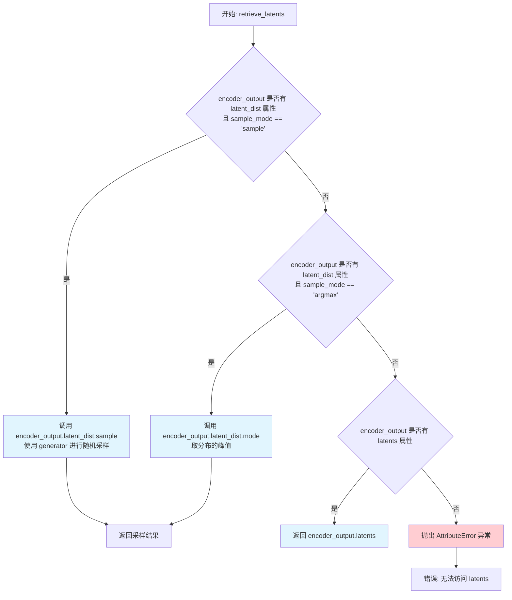

#### 带注释源码

```python
# Copied from diffusers.pipelines.stable_diffusion.pipeline_stable_diffusion_img2img.retrieve_latents
def retrieve_latents(
    encoder_output: torch.Tensor, generator: torch.Generator | None = None, sample_mode: str = "sample"
):
    """
    从编码器输出中检索潜在向量。
    
    该函数支持三种获取潜在向量的方式：
    1. 当 encoder_output 包含 latent_dist 属性且 sample_mode='sample' 时，从分布中采样
    2. 当 encoder_output 包含 latent_dist 属性且 sample_mode='argmax' 时，取分布的均值/峰值
    3. 当 encoder_output 包含 latents 属性时，直接返回 latents
    
    Args:
        encoder_output: 编码器输出，通常是 AutoencoderKL.encode() 的返回值
        generator: 可选的随机生成器，用于控制采样随机性
        sample_mode: 采样模式，'sample' 或 'argmax'
    
    Returns:
        torch.Tensor: 潜在向量张量
    
    Raises:
        AttributeError: 当无法从 encoder_output 中获取潜在向量时抛出
    """
    # 模式1: 采样模式 - 从潜在分布中随机采样
    if hasattr(encoder_output, "latent_dist") and sample_mode == "sample":
        return encoder_output.latent_dist.sample(generator)
    
    # 模式2: Argmax 模式 - 取潜在分布的峰值（均值）
    elif hasattr(encoder_output, "latent_dist") and sample_mode == "argmax":
        return encoder_output.latent_dist.mode()
    
    # 模式3: 直接返回预计算的 latents 属性
    elif hasattr(encoder_output, "latents"):
        return encoder_output.latents
    
    # 错误处理: 无法识别编码器输出的格式
    else:
        raise AttributeError("Could not access latents of provided encoder_output")
```

#### 关键组件信息

| 组件名称 | 描述 |
|---------|------|
| `encoder_output.latent_dist` | VAE 编码器输出的潜在分布对象，通常包含 `sample()` 和 `mode()` 方法 |
| `encoder_output.latents` | 编码器直接输出的潜在向量张量 |

#### 潜在技术债务与优化空间

1. **类型提示不够精确**：`encoder_output` 的类型标注为 `torch.Tensor`，但实际上它是一个包含 `latent_dist` 或 `latents` 属性的自定义对象，应该使用更精确的类型标注（如 `DecoderOutput` 或类似的协议类型）

2. **重复的属性检查**：使用 `hasattr` 多次检查 `latent_dist` 属性，可以优化为一次检查后将结果缓存

3. **缺少默认值验证**：没有对 `sample_mode` 参数进行合法性验证，如果传入非法值会直接返回不符合预期的结果而非给出明确错误

4. **错误信息不够详细**：仅提示 "Could not access latents"，没有说明具体是缺少哪个属性或 sample_mode 的可选值有哪些

#### 其它项目说明

- **设计目标**：为 diffusion pipeline 提供统一的潜在向量提取接口，屏蔽不同 VAE 编码器输出格式的差异
- **错误处理**：通过 `AttributeError` 异常处理无法识别格式的编码器输出
- **调用场景**：该函数在 `prepare_latents` 方法中被调用，用于从图像编码结果中获取初始潜在向量


### `LTXImageToVideoSTGPipeline.__init__`

初始化LTXImageToVideoSTGPipeline管道实例，注册所有必需模块（VAE、文本编码器、分词器、Transformer、调度器），并配置视频处理的压缩比、patch大小、默认分辨率和帧数等关键参数。

参数：

-  `scheduler`：`FlowMatchEulerDiscreteScheduler`，用于去噪过程的调度器
-  `vae`：`AutoencoderKLLTXVideo`，变分自编码器模型，用于编码和解码图像与潜在表示
-  `text_encoder`：`T5EncoderModel`，T5文本编码器模型，用于将文本提示编码为隐藏状态
-  `tokenizer`：`T5TokenizerFast`，T5分词器，用于对文本提示进行分词
-  `transformer`：`LTXVideoTransformer3DModel`，条件Transformer架构，用于对编码的视频潜在表示进行去噪

返回值：无（`None`），构造函数不返回值，仅初始化实例状态

#### 流程图

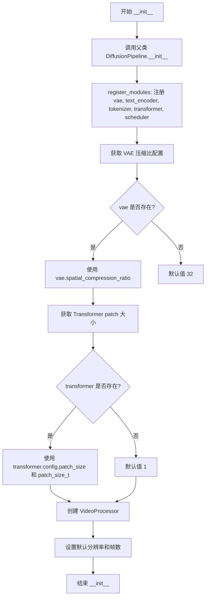

#### 带注释源码

```python
def __init__(
    self,
    scheduler: FlowMatchEulerDiscreteScheduler,
    vae: AutoencoderKLLTXVideo,
    text_encoder: T5EncoderModel,
    tokenizer: T5TokenizerFast,
    transformer: LTXVideoTransformer3DModel,
):
    """
    初始化 LTXImageToVideoSTGPipeline 管道实例。
    
    参数:
        scheduler: 用于视频去噪的 Flow Match Euler 离散调度器
        vae: 自动编码器模型，用于图像/视频与潜在表示之间的转换
        text_encoder: T5 编码器模型，用于文本提示的编码
        tokenizer: T5 分词器，用于文本分词
        transformer: 3D Transformer 模型，用于潜在表示的去噪
    """
    # 调用父类 DiffusionPipeline 的初始化方法
    # 设置管道的基本结构和执行设备
    super().__init__()

    # 注册所有模块到管道中，使管道能够统一管理这些组件
    # 每个模块都可以通过 self.xxx 访问
    self.register_modules(
        vae=vae,
        text_encoder=text_encoder,
        tokenizer=tokenizer,
        transformer=transformer,
        scheduler=scheduler,
    )

    # 获取 VAE 的空间压缩比（用于将像素空间压缩到潜在空间）
    # 使用 getattr 安全访问，如果 vae 不存在则使用默认值 32
    self.vae_spatial_compression_ratio = (
        self.vae.spatial_compression_ratio if getattr(self, "vae", None) is not None else 32
    )
    
    # 获取 VAE 的时间压缩比（用于将时间维度压缩）
    # 默认值为 8，表示每8帧被压缩为1帧
    self.vae_temporal_compression_ratio = (
        self.vae.temporal_compression_ratio if getattr(self, "vae", None) is not None else 8
    )
    
    # 获取 Transformer 的空间 patch 大小
    # patch_size 决定了潜在表示的空间分块方式
    self.transformer_spatial_patch_size = (
        self.transformer.config.patch_size if getattr(self, "transformer", None) is not None else 1
    )
    
    # 获取 Transformer 的时间 patch 大块
    # patch_size_t 决定了潜在表示的时间分块方式
    self.transformer_temporal_patch_size = (
        self.transformer.config.patch_size_t if getattr(self, "transformer") is not None else 1
    )

    # 创建视频处理器，用于预处理输入图像和后处理输出视频
    # vae_scale_factor 用于视频帧的缩放
    self.video_processor = VideoProcessor(vae_scale_factor=self.vae_spatial_compression_ratio)
    
    # 获取分词器的最大序列长度，用于文本编码
    # 默认值为 128
    self.tokenizer_max_length = (
        self.tokenizer.model_max_length if getattr(self, "tokenizer", None) is not None else 128
    )

    # 设置默认的输出视频参数
    # 这些值会在 __call__ 方法中被使用如果用户没有指定
    self.default_height = 512   # 默认高度
    self.default_width = 704    # 默认宽度
    self.default_frames = 121   # 默认帧数
```


### `LTXImageToVideoSTGPipeline._get_t5_prompt_embeds`

该方法用于将文本提示（prompt）编码为T5文本编码器的隐藏状态（embeddings）和注意力掩码（attention mask），以便在LTX图像到视频生成管道中使用。

参数：

- `prompt`：`Union[str, List[str]] = None`，要编码的文本提示，可以是单个字符串或字符串列表
- `num_videos_per_prompt`：`int = 1`，每个提示生成的视频数量，用于复制提示嵌入
- `max_sequence_length`：`int = 128`，T5编码器的最大序列长度
- `device`：`Optional[torch.device] = None`，执行设备，若为None则使用执行设备
- `dtype`：`Optional[torch.dtype] = None`，返回的张量数据类型，若为None则使用text_encoder的数据类型

返回值：`Tuple[torch.Tensor, torch.Tensor]`，返回两个张量组成的元组：
- 第一个元素是`prompt_embeds`：`torch.Tensor`，形状为`(batch_size * num_videos_per_prompt, seq_len, hidden_dim)`的文本嵌入张量
- 第二个元素是`prompt_attention_mask`：`torch.Tensor`，形状为`(batch_size * num_videos_per_prompt, seq_len)`的注意力掩码张量

#### 流程图

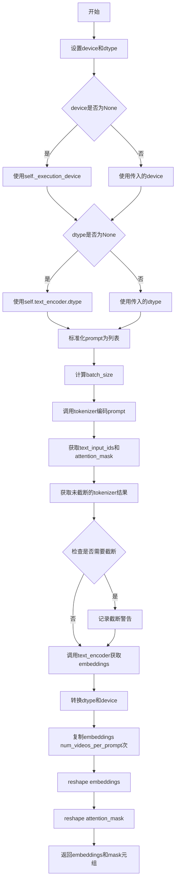

#### 带注释源码

```python
def _get_t5_prompt_embeds(
    self,
    prompt: Union[str, List[str]] = None,
    num_videos_per_prompt: int = 1,
    max_sequence_length: int = 128,
    device: Optional[torch.device] = None,
    dtype: Optional[torch.dtype] = None,
):
    """
    将文本提示编码为T5文本编码器的嵌入向量和注意力掩码
    
    参数:
        prompt: 要编码的文本提示，支持单个字符串或字符串列表
        num_videos_per_prompt: 每个提示生成的视频数量，用于复制嵌入向量
        max_sequence_length: T5编码器的最大序列长度，默认128
        device: 计算设备，若为None则使用执行设备
        dtype: 返回张量的数据类型，若为None则使用text_encoder的数据类型
    
    返回:
        Tuple[torch.Tensor, torch.Tensor]: (prompt_embeds, prompt_attention_mask)元组
    """
    # 确定最终使用的device和dtype
    device = device or self._execution_device
    dtype = dtype or self.text_encoder.dtype

    # 标准化prompt为列表格式，便于批量处理
    prompt = [prompt] if isinstance(prompt, str) else prompt
    batch_size = len(prompt)

    # 使用T5 tokenizer将文本转换为token IDs
    text_inputs = self.tokenizer(
        prompt,
        padding="max_length",           # 填充到最大长度
        max_length=max_sequence_length, # 截断超过最大长度的序列
        truncation=True,                # 启用截断
        add_special_tokens=True,        # 添加特殊token（如[CLS], [SEP]等）
        return_tensors="pt",            # 返回PyTorch张量
    )
    # 获取token IDs和注意力掩码
    text_input_ids = text_inputs.input_ids
    prompt_attention_mask = text_inputs.attention_mask
    # 将注意力掩码转换为布尔值并移动到指定设备
    prompt_attention_mask = prompt_attention_mask.bool().to(device)

    # 获取未截断的tokenizer结果，用于检测是否发生了截断
    untruncated_ids = self.tokenizer(prompt, padding="longest", return_tensors="pt").input_ids

    # 检查输入是否被截断，如果是则记录警告信息
    if untruncated_ids.shape[-1] >= text_input_ids.shape[-1] and not torch.equal(text_input_ids, untruncated_ids):
        # 解码被截断的部分用于日志记录
        removed_text = self.tokenizer.batch_decode(untruncated_ids[:, max_sequence_length - 1 : -1])
        logger.warning(
            "The following part of your input was truncated because `max_sequence_length` is set to "
            f" {max_sequence_length} tokens: {removed_text}"
        )

    # 使用T5编码器将token IDs转换为嵌入向量
    # text_encoder返回的[0]表示获取hidden states
    prompt_embeds = self.text_encoder(text_input_ids.to(device))[0]
    # 将嵌入向量转换为指定的dtype和device
    prompt_embeds = prompt_embeds.to(dtype=dtype, device=device)

    # 为每个提示生成的视频数量复制嵌入向量
    # 使用mps友好的方法进行复制
    _, seq_len, _ = prompt_embeds.shape
    # 先在seq_len维度重复，再reshape
    prompt_embeds = prompt_embeds.repeat(1, num_videos_per_prompt, 1)
    # 重塑为(batch_size * num_videos_per_prompt, seq_len, hidden_dim)
    prompt_embeds = prompt_embeds.view(batch_size * num_videos_per_prompt, seq_len, -1)

    # 同样复制注意力掩码
    prompt_attention_mask = prompt_attention_mask.view(batch_size, -1)
    prompt_attention_mask = prompt_attention_mask.repeat(num_videos_per_prompt, 1)

    # 返回嵌入向量和注意力掩码
    return prompt_embeds, prompt_attention_mask
```


### `LTXImageToVideoSTGPipeline.encode_prompt`

该方法负责将文本提示词（prompt）和负向提示词（negative_prompt）编码为文本编码器（Text Encoder）的隐藏状态（hidden states），以便后续用于图像到视频的生成过程。该方法支持分类器自由引导（Classifier-Free Guidance），并在未提供预计算的嵌入时自动调用T5文本编码器生成嵌入向量。

参数：

- `prompt`：`Union[str, List[str]]`，要编码的文本提示词，可以是单个字符串或字符串列表
- `negative_prompt`：`Optional[Union[str, List[str]]] = None`，不参与引导的负向提示词，用于提高生成质量
- `do_classifier_free_guidance`：`bool = True`，是否启用分类器自由引导技术
- `num_videos_per_prompt`：`int = 1`，每个提示词需要生成的视频数量，用于批量生成时的嵌入复制
- `prompt_embeds`：`Optional[torch.Tensor] = None`，预生成的提示词嵌入向量，如提供则直接使用
- `negative_prompt_embeds`：`Optional[torch.Tensor] = None`，预生成的负向提示词嵌入向量
- `prompt_attention_mask`：`Optional[torch.Tensor] = None`，提示词的注意力掩码，用于指示有效token位置
- `negative_prompt_attention_mask`：`Optional[torch.Tensor] = None`，负向提示词的注意力掩码
- `max_sequence_length`：`int = 128`，文本序列的最大token长度，超过部分会被截断
- `device`：`Optional[torch.device] = None`，计算设备，未指定时使用执行设备
- `dtype`：`Optional[torch.dtype] = None`，计算数据类型，未指定时使用文本编码器的dtype

返回值：`Tuple[torch.Tensor, torch.Tensor, torch.Tensor, torch.Tensor]`，返回包含四个元素的元组——正向提示词嵌入（prompt_embeds）、正向提示词注意力掩码（prompt_attention_mask）、负向提示词嵌入（negative_prompt_embeds）、负向提示词注意力掩码（negative_prompt_attention_mask）

#### 流程图

```mermaid
flowchart TD
    A[encode_prompt 开始] --> B{device 参数是否为空?}
    B -->|是| C[使用 self._execution_device]
    B -->|否| D[使用传入的 device]
    C --> E[确定 device 和 dtype]
    D --> E
    E --> F{prompt 是否为字符串?}
    F -->|是| G[将 prompt 转换为列表]
    F -->|否| H[保持原样]
    G --> I{prompt_embeds 是否为空?}
    H --> I
    I -->|否| J[直接使用传入的 prompt_embeds 和 prompt_attention_mask]
    I -->|是| K[调用 self._get_t5_prompt_embeds 生成嵌入]
    J --> L{do_classifier_free_guidance 为真且 negative_prompt_embeds 为空?}
    K --> L
    L -->|否| M[返回四个嵌入和掩码]
    L -->|是| N{negative_prompt 是否为空字符串?]
    N -->|是| O[使用空字符串]
    N -->|否| P[保持原 negative_prompt]
    O --> Q[将 negative_prompt 扩展为 batch_size 长度]
    P --> Q
    Q --> R[检查 negative_prompt 与 prompt 类型一致性]
    R --> S{类型是否一致?}
    S -->|否| T[抛出 TypeError]
    S -->|是| U{长度是否匹配 batch_size?}
    T --> V[错误处理]
    U -->|否| W[抛出 ValueError]
    U -->|是| X[调用 self._get_t5_prompt_embeds 生成负向嵌入]
    X --> M
```

#### 带注释源码

```python
def encode_prompt(
    self,
    prompt: Union[str, List[str]],
    negative_prompt: Optional[Union[str, List[str]]] = None,
    do_classifier_free_guidance: bool = True,
    num_videos_per_prompt: int = 1,
    prompt_embeds: Optional[torch.Tensor] = None,
    negative_prompt_embeds: Optional[torch.Tensor] = None,
    prompt_attention_mask: Optional[torch.Tensor] = None,
    negative_prompt_attention_mask: Optional[torch.Tensor] = None,
    max_sequence_length: int = 128,
    device: Optional[torch.device] = None,
    dtype: Optional[torch.dtype] = None,
):
    r"""
    Encodes the prompt into text encoder hidden states.

    Args:
        prompt (`str` or `List[str]`, *optional*):
            prompt to be encoded
        negative_prompt (`str` or `List[str]`, *optional*):
            The prompt or prompts not to guide the image generation. If not defined, one has to pass
            `negative_prompt_embeds` instead. Ignored when not using guidance (i.e., ignored if `guidance_scale` is
            less than `1`).
        do_classifier_free_guidance (`bool`, *optional*, defaults to `True`):
            Whether to use classifier free guidance or not.
        num_videos_per_prompt (`int`, *optional*, defaults to 1):
            Number of videos that should be generated per prompt. torch device to place the resulting embeddings on
        prompt_embeds (`torch.Tensor`, *optional*):
            Pre-generated text embeddings. Can be used to easily tweak text inputs, *e.g.* prompt weighting. If not
            provided, text embeddings will be generated from `prompt` input argument.
        negative_prompt_embeds (`torch.Tensor`, *optional*):
            Pre-generated negative text embeddings. Can be used to easily tweak text inputs, *e.g.* prompt
            weighting. If not provided, negative_prompt_embeds will be generated from `negative_prompt` input
            argument.
        device: (`torch.device`, *optional*):
            torch device
        dtype: (`torch.dtype`, *optional*):
            torch dtype
    """
    # 确定设备：如果未提供，则使用执行设备
    device = device or self._execution_device

    # 统一 prompt 格式：如果是单个字符串则转为列表
    prompt = [prompt] if isinstance(prompt, str) else prompt
    
    # 确定批次大小
    if prompt is not None:
        batch_size = len(prompt)
    else:
        # 如果没有 prompt，则从 prompt_embeds 获取批次大小
        batch_size = prompt_embeds.shape[0]

    # 如果未提供 prompt_embeds，则生成新的嵌入
    if prompt_embeds is None:
        prompt_embeds, prompt_attention_mask = self._get_t5_prompt_embeds(
            prompt=prompt,
            num_videos_per_prompt=num_videos_per_prompt,
            max_sequence_length=max_sequence_length,
            device=device,
            dtype=dtype,
        )

    # 处理负向提示词嵌入（当启用分类器自由引导且未提供负向嵌入时）
    if do_classifier_free_guidance and negative_prompt_embeds is None:
        # 默认使用空字符串作为负向提示词
        negative_prompt = negative_prompt or ""
        # 负向提示词扩展为列表以匹配批次大小
        negative_prompt = batch_size * [negative_prompt] if isinstance(negative_prompt, str) else negative_prompt

        # 类型检查：负向提示词类型必须与正向提示词一致
        if prompt is not None and type(prompt) is not type(negative_prompt):
            raise TypeError(
                f"`negative_prompt` should be the same type to `prompt`, but got {type(negative_prompt)} !="
                f" {type(prompt)}."
            )
        # 批次大小检查：负向提示词数量必须与正向提示词一致
        elif batch_size != len(negative_prompt):
            raise ValueError(
                f"`negative_prompt`: {negative_prompt} has batch size {len(negative_prompt)}, but `prompt`:"
                f" {prompt} has batch size {batch_size}. Please make sure that passed `negative_prompt` matches"
                " the batch size of `prompt`."
            )

        # 生成负向提示词嵌入
        negative_prompt_embeds, negative_prompt_attention_mask = self._get_t5_prompt_embeds(
            prompt=negative_prompt,
            num_videos_per_prompt=num_videos_per_prompt,
            max_sequence_length=max_sequence_length,
            device=device,
            dtype=dtype,
        )

    # 返回四个元素：正向嵌入、正向掩码、负向嵌入、负向掩码
    return prompt_embeds, prompt_attention_mask, negative_prompt_embeds, negative_prompt_attention_mask
```


### `LTXImageToVideoSTGPipeline.check_inputs`

该方法用于验证图像转视频管道的输入参数是否合法，确保用户提供的参数组合有效且符合模型要求，包括检查图像尺寸对齐、提示词与嵌入向量的一致性、注意力掩码的完整性等。

参数：

- `self`：`LTXImageToVideoSTGPipeline` 实例，隐式参数，表示管道对象本身
- `prompt`：`Union[str, List[str], None]`用户提供的文本提示词，用于指导视频生成，可为字符串或字符串列表
- `height`：`int`，生成的视频高度（像素），必须能被32整除
- `width`：`int`，生成的视频宽度（像素），必须能被32整除
- `callback_on_step_end_tensor_inputs`：`List[str], None`，每步结束时回调函数需要接收的张量输入列表，默认为None
- `prompt_embeds`：`torch.Tensor, None`，预计算的提示词嵌入向量，不能与prompt同时提供，默认为None
- `negative_prompt_embeds`：`torch.Tensor, None`，预计算的负面提示词嵌入向量，用于无分类器自由引导，默认为None
- `prompt_attention_mask`：`torch.Tensor, None`，提示词嵌入对应的注意力掩码，当提供prompt_embeds时必须提供，默认为None
- `negative_prompt_attention_mask`：`torch.Tensor, None`，负面提示词嵌入对应的注意力掩码，当提供negative_prompt_embeds时必须提供，默认为None

返回值：`None`，该方法不返回任何值，通过抛出异常来处理验证失败的情况

#### 流程图

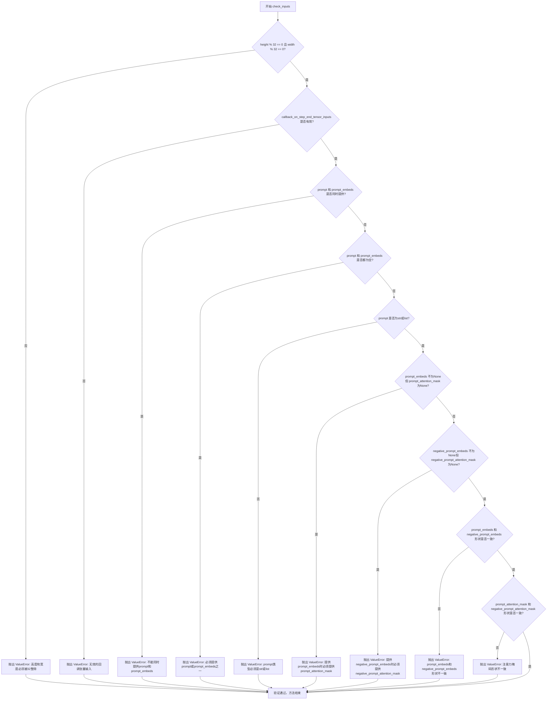

#### 带注释源码

```python
def check_inputs(
    self,
    prompt,
    height,
    width,
    callback_on_step_end_tensor_inputs=None,
    prompt_embeds=None,
    negative_prompt_embeds=None,
    prompt_attention_mask=None,
    negative_prompt_attention_mask=None,
):
    """
    检查输入参数的有效性，确保用户提供的参数符合管道要求。
    
    该方法会进行多项验证：
    1. 图像尺寸必须能被VAE的压缩比率(32)整除
    2. 回调函数张量输入必须在允许列表中
    3. prompt和prompt_embeds不能同时提供也不能同时为空
    4. prompt类型必须是字符串或列表
    5. 提供的embeddings和对应的attention_mask必须成对出现
    6. 提供的embeddings和attention_mask的形状必须相互匹配
    """
    
    # 检查1：验证图像尺寸是否符合VAE压缩要求（必须能被32整除）
    if height % 32 != 0 or width % 32 != 0:
        raise ValueError(f"`height` and `width` have to be divisible by 32 but are {height} and {width}.")

    # 检查2：验证回调函数张量输入是否在允许的列表中
    # 允许的回调张量输入定义在类属性 _callback_tensor_inputs 中
    if callback_on_step_end_tensor_inputs is not None and not all(
        k in self._callback_tensor_inputs for k in callback_on_step_end_tensor_inputs
    ):
        raise ValueError(
            f"`callback_on_step_end_tensor_inputs` has to be in {self._callback_tensor_inputs}, but found {[k for k in callback_on_step_end_tensor_inputs if k not in self._callback_tensor_inputs]}"
        )

    # 检查3：验证prompt和prompt_embeds不能同时提供
    # 用户可以选择提供原始文本prompt或预计算的prompt_embeds，但不能同时提供
    if prompt is not None and prompt_embeds is not None:
        raise ValueError(
            f"Cannot forward both `prompt`: {prompt} and `prompt_embeds`: {prompt_embeds}. Please make sure to"
            " only forward one of the two."
        )
    # 检查4：验证prompt和prompt_embeds不能同时为空
    # 至少需要提供一种方式来指定生成内容
    elif prompt is None and prompt_embeds is None:
        raise ValueError(
            "Provide either `prompt` or `prompt_embeds`. Cannot leave both `prompt` and `prompt_embeds` undefined."
        )
    # 检查5：验证prompt的类型
    # prompt必须是字符串或字符串列表，不能是其他类型
    elif prompt is not None and (not isinstance(prompt, str) and not isinstance(prompt, list)):
        raise ValueError(f"`prompt` has to be of type `str` or `list` but is {type(prompt)}")

    # 检查6：当提供prompt_embeds时，必须同时提供对应的attention_mask
    # 因为transformer需要知道哪些位置是有效的文本token
    if prompt_embeds is not None and prompt_attention_mask is None:
        raise ValueError("Must provide `prompt_attention_mask` when specifying `prompt_embeds`.")

    # 检查7：当提供negative_prompt_embeds时，必须同时提供对应的attention_mask
    # 负面提示词同样需要注意力掩码来指示有效token位置
    if negative_prompt_embeds is not None and negative_prompt_attention_mask is None:
        raise ValueError("Must provide `negative_prompt_attention_mask` when specifying `negative_prompt_embeds`.")

    # 检查8：验证prompt_embeds和negative_prompt_embeds的形状一致性
    # 在分类器自由引导(CFG)模式下，两者的形状必须完全一致
    if prompt_embeds is not None and negative_prompt_embeds is not None:
        if prompt_embeds.shape != negative_prompt_embeds.shape:
            raise ValueError(
                "`prompt_embeds` and `negative_prompt_embeds` must have the same shape when passed directly, but"
                f" got: `prompt_embeds` {prompt_embeds.shape} != `negative_prompt_embeds`"
                f" {negative_prompt_embeds.shape}."
            )
        # 检查9：验证prompt_attention_mask和negative_prompt_attention_mask的形状一致性
        if prompt_attention_mask.shape != negative_prompt_attention_mask.shape:
            raise ValueError(
                "`prompt_attention_mask` and `negative_prompt_attention_mask` must have the same shape when passed directly, but"
                f" got: `prompt_attention_mask` {prompt_attention_mask.shape} != `negative_prompt_attention_mask`"
                f" {negative_prompt_attention_mask.shape}."
            )
```


### `LTXImageToVideoSTGPipeline._pack_latents`

将5D潜在向量张量（形状为 [B, C, F, H, W]）打包成3D张量（形状为 [B, S, D]），其中 S 是有效视频序列长度，D 是有效特征维度，以便于Transformer模型处理。

参数：

- `latents`：`torch.Tensor`，输入的5D潜在向量，形状为 [B, C, F, H, W]，其中 B 是批次大小，C 是通道数，F 是帧数，H 是高度，W 是宽度
- `patch_size`：`int`，空间方向的分块大小，默认为1
- `patch_size_t`：`int`，时间方向的分块大小，默认为1

返回值：`torch.Tensor`，打包后的3D潜在向量，形状为 [B, F // p_t * H // p * W // p, C * p_t * p * p]

#### 流程图

```mermaid
flowchart TD
    A[输入 latents: 5D Tensor [B, C, F, H, W]] --> B[解包输入形状]
    B --> C[计算分块后尺寸]
    C --> D[post_patch_num_frames = F // patch_size_t]
    C --> E[post_patch_height = H // patch_size]
    C --> F[post_patch_width = W // patch_size]
    D --> G[reshape: 重塑为含分块维度的8D张量]
    E --> G
    F --> G
    G --> H[permute: 重新排列维度顺序]
    H --> I[flatten: 展平分块维度到通道维]
    I --> J[输出 latents: 3D Tensor [B, S, D]]
    
    style G fill:#e1f5fe
    style H fill:#e1f5fe
    style I fill:#e1f5fe
```

#### 带注释源码

```python
@staticmethod
# Copied from diffusers.pipelines.ltx.pipeline_ltx.LTXPipeline._pack_latents
def _pack_latents(latents: torch.Tensor, patch_size: int = 1, patch_size_t: int = 1) -> torch.Tensor:
    # 输入说明：
    # Unpacked latents of shape are [B, C, F, H, W]
    # - B: batch size (批次大小)
    # - C: number of channels (通道数)
    # - F: number of frames (帧数)
    # - H: height (高度)
    # - W: width (宽度)
    
    # 步骤1: 解包输入张量的形状
    batch_size, num_channels, num_frames, height, width = latents.shape
    
    # 步骤2: 计算分块后的空间维度
    # 将原始维度除以对应的分块大小，得到分块后的数量
    post_patch_num_frames = num_frames // patch_size_t      # 时间分块数量
    post_patch_height = height // patch_size                # 空间高度分块数量
    post_patch_width = width // patch_size                  # 空间宽度分块数量
    
    # 步骤3: reshape 操作
    # 将 [B, C, F, H, W] 重塑为 [B, C, F//p_t, p_t, H//p, p, W//p, p]
    # 插入分块维度，使每个分块独立
    latents = latents.reshape(
        batch_size,
        -1,                          # 通道维度保持不变
        post_patch_num_frames,       # 分块后的帧数
        patch_size_t,                # 时间方向的分块大小
        post_patch_height,           # 分块后的高度
        patch_size,                  # 空间高度分块大小
        post_patch_width,            # 分块后的宽度
        patch_size,                  # 空间宽度分块大小
    )
    
    # 步骤4: permute 操作
    # 重新排列维度: [B, C, F//p_t, p_t, H//p, p, W//p, p] -> [B, F//p_t, H//p, W//p, C, p_t, p, p]
    # 将分块维度移到通道维度附近，为后续展平做准备
    latents = latents.permute(0, 2, 4, 6, 1, 3, 5, 7)
    
    # 步骤5: flatten 操作
    # 第一步: flatten(4, 7) 将最后的 p_t, p, p 三个分块维度展平为 C * p_t * p * p
    # 结果形状: [B, F//p_t, H//p, W//p, C * p_t * p * p]
    latents = latents.flatten(4, 7)
    
    # 第二步: flatten(1, 3) 将空间维度 F//p_t, H//p, W//p 展平为序列长度 S
    # 最终形状: [B, S, D] 其中:
    # - S = F // p_t * H // p * W // p (有效视频序列长度)
    # - D = C * p_t * p * p (有效特征维度)
    latents = latents.flatten(1, 3)
    
    return latents
```


### `LTXImageToVideoSTGPipeline._unpack_latents`

该静态方法执行潜在向量的解包操作，将打包后的潜在向量（从Transformer输出）恢复为原始的视频张量形状（[B, C, F, H, W]），是`_pack_latents`方法的逆操作。

参数：

- `latents`：`torch.Tensor`，输入的打包潜在向量，形状为[B, S, D]，其中S是有效视频序列长度，D是有效特征维度
- `num_frames`：`int`，视频的帧数
- `height`：`int`，视频的高度（潜在空间）
- `width`：`int`，视频的宽度（潜在空间）
- `patch_size`：`int`，空间补丁大小，默认为1
- `patch_size_t`：`int`，时间补丁大小，默认为1

返回值：`torch.Tensor`，解包后的视频张量，形状为[B, C, F, H, W]

#### 流程图

```mermaid
flowchart TD
    A[开始: 输入打包的latents [B, S, D]] --> B[获取batch_size]
    B --> C[reshape: [B, num_frames, height, width, -1, patch_size_t, patch_size, patch_size]]
    C --> D[permute: [0, 4, 1, 5, 2, 6, 3, 7] 重新排列维度]
    D --> E[flatten 6-7: 合并空间补丁维度]
    E --> F[flatten 4-5: 合并时间补丁维度]
    F --> G[flatten 2-3: 合并帧和空间维度]
    G --> H[返回: 解包后的latents [B, C, F, H, W]]
```

#### 带注释源码

```python
@staticmethod
# Copied from diffusers.pipelines.ltx.pipeline_ltx.LTXPipeline._unpack_latents
def _unpack_latents(
    latents: torch.Tensor, 
    num_frames: int, 
    height: int, 
    width: int, 
    patch_size: int = 1, 
    patch_size_t: int = 1
) -> torch.Tensor:
    """
    将打包的潜在向量解包为视频张量形状 [B, C, F, H, W]
    
    打包格式 [B, S, D] 说明:
    - B: batch size
    - S: effective video sequence length (有效视频序列长度)
    - D: effective feature dimensions (有效特征维度)
    
    解包后格式 [B, C, F, H, W] 说明:
    - B: batch size
    - C: channel 数量
    - F: frames 帧数
    - H: height 高度
    - W: width 宽度
    """
    # 获取batch大小
    batch_size = latents.size(0)
    
    # 第一步reshape: 将 [B, S, D] 重塑为 [B, num_frames, height, width, C, patch_size_t, patch_size, patch_size]
    # 其中 -1 自动计算通道数 C
    latents = latents.reshape(
        batch_size, 
        num_frames, 
        height, 
        width, 
        -1,  # 自动计算出通道数 C
        patch_size_t, 
        patch_size, 
        patch_size
    )
    
    # 第二步permute: 重新排列维度顺序
    # 从 [B, F, H, W, C, p_t, p, p] -> [B, C, F, p_t, H, p, W, p]
    latents = latents.permute(0, 4, 1, 5, 2, 6, 3, 7).flatten(6, 7).flatten(4, 5).flatten(2, 3)
    
    # 第三步flatten: 连续三次flatten操作将补丁维度合并到通道和空间维度
    # 1. flatten(6,7): 合并最后的两个patch维度 [B, C, F, p_t, H, p, W*p]
    # 2. flatten(4,5): 合并patch_time和height_patch [B, C, F, p_t, H*p, W*p]
    # 3. flatten(2,3): 合并frame和patch_time维度 [B, C, F*p_t, H*p, W*p]
    
    # 最终返回形状: [B, C, F, H, W]
    return latents
```


### `LTXImageToVideoSTGPipeline._normalize_latents`

对输入的潜在向量进行规范化处理，通过减去均值并除以标准差（可选缩放因子），实现通道维度的标准化。

参数：

- `latents`：`torch.Tensor`，输入的潜在向量，形状为 [B, C, F, H, W]，其中 B 是批次大小，C 是通道数，F 是帧数，H 是高度，W 是宽度
- `latents_mean`：`torch.Tensor`，用于规范化的均值向量，通常对应通道维度
- `latents_std`：`torch.Tensor`，用于规范化的标准差向量，通常对应通道维度
- `scaling_factor`：`float`，可选的缩放因子，默认为 1.0，用于在归一化后调整潜在向量的尺度

返回值：`torch.Tensor`，返回规范化后的潜在向量，形状与输入 `latents` 相同

#### 流程图

```mermaid
flowchart TD
    A[输入 latents] --> B[将 latents_mean reshape 为 [1, C, 1, 1, 1]]
    B --> C[将 latents_std reshape 为 [1, C, 1, 1, 1]]
    C --> D[将 mean 和 std 移动到 latents 相同设备和数据类型]
    D --> E[计算: latents = (latents - latents_mean) × scaling_factor / latents_std]
    E --> F[返回规范化后的 latents]
```

#### 带注释源码

```python
@staticmethod
# Copied from diffusers.pipelines.ltx.pipeline_ltx.LTXPipeline._normalize_latents
def _normalize_latents(
    latents: torch.Tensor, latents_mean: torch.Tensor, latents_std: torch.Tensor, scaling_factor: float = 1.0
) -> torch.Tensor:
    # Normalize latents across the channel dimension [B, C, F, H, W]
    # 将均值向量 reshape 为 [1, C, 1, 1, 1] 以便与 latents 的通道维度对齐
    latents_mean = latents_mean.view(1, -1, 1, 1, 1).to(latents.device, latents.dtype)
    # 将标准差向量 reshape 为 [1, C, 1, 1, 1] 以便与 latents 的通道维度对齐
    latents_std = latents_std.view(1, -1, 1, 1, 1).to(latents.device, latents.dtype)
    # 执行规范化: 减去均值，乘以缩放因子，除以标准差
    latents = (latents - latents_mean) * scaling_factor / latents_std
    return latents
```


### `LTXImageToVideoSTGPipeline._denormalize_latents`

反规范化潜在向量（静态方法），用于将经过标准化处理的潜在向量恢复到原始数值范围。该方法是 `_normalize_latents` 的逆操作，在图像到视频生成流程的解码阶段使用，确保 VAE 解码时使用正确范围的潜在表示。

参数：

- `latents`：`torch.Tensor`，输入的规范化潜在向量，形状为 [B, C, F, H, W]
- `latents_mean`：`torch.Tensor`，潜在向量的均值，用于反规范化计算
- `latents_std`：`torch.Tensor`，潜在向量的标准差，用于反规范化计算
- `scaling_factor`：`float`，缩放因子，默认为 1.0，用于控制反规范化的缩放程度

返回值：`torch.Tensor`，反规范化后的潜在向量，形状与输入相同 [B, C, F, H, W]

#### 流程图

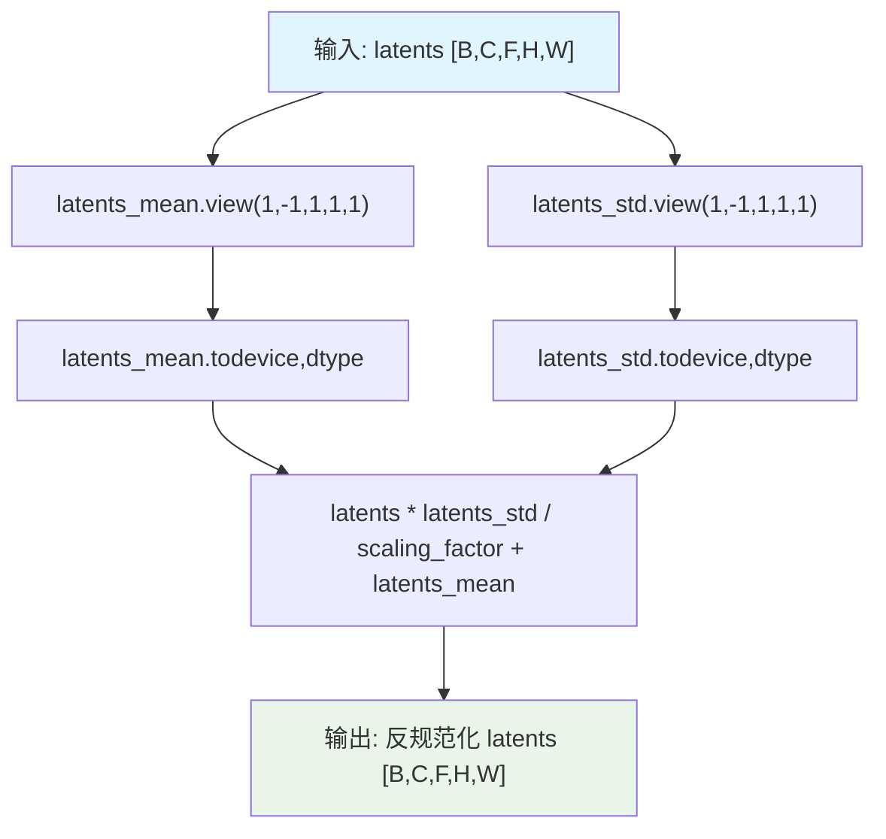

#### 带注释源码

```python
@staticmethod
# Copied from diffusers.pipelines.ltx.pipeline_ltx.LTXPipeline._denormalize_latents
def _denormalize_latents(
    latents: torch.Tensor, latents_mean: torch.Tensor, latents_std: torch.Tensor, scaling_factor: float = 1.0
) -> torch.Tensor:
    """
    反规范化潜在向量，将标准化后的潜在向量恢复到原始数值范围
    
    参数:
        latents: 输入的规范化潜在向量，形状 [B, C, F, H, W]
        latents_mean: 潜在向量的均值，用于反规范化
        latents_std: 潜在向量的标准差，用于反规范化
        scaling_factor: 缩放因子，控制反规范化的缩放程度
    
    返回:
        反规范化后的潜在向量，形状 [B, C, F, H, W]
    """
    # 对潜在向量进行通道维度的反规范化 [B, C, F, H, W]
    # 将均值张量reshape为 [1, C, 1, 1, 1] 以便广播操作，并确保设备和数据类型一致
    latents_mean = latents_mean.view(1, -1, 1, 1, 1).to(latents.device, latents.dtype)
    
    # 将标准差张量reshape为 [1, C, 1, 1, 1] 以便广播操作，并确保设备和数据类型一致
    latents_std = latents_std.view(1, -1, 1, 1, 1).to(latents.device, latents.dtype)
    
    # 反规范化公式: latents = latents * latents_std / scaling_factor + latents_mean
    # 这是标准化公式: normalized = (latents - latents_mean) * scaling_factor / latents_std 的逆操作
    latents = latents * latents_std / scaling_factor + latents_mean
    
    return latents
```


### `LTXImageToVideoSTGPipeline.prepare_latents`

该方法负责为LTX图像到视频生成管道准备潜在向量（latents）和条件掩码（conditioning mask）。它通过VAE编码输入图像，将其归一化后与随机噪声混合，生成用于去噪过程的初始潜在表示，并根据Transformer的空间和时间patch大小对潜在向量和掩码进行打包处理。

参数：

- `self`：隐式参数，指向`LTXImageToVideoSTGPipeline`实例本身
- `image`：`Optional[torch.Tensor]`，输入图像张量，用于编码生成初始潜在向量，若为`None`则仅使用噪声生成latents
- `batch_size`：`int = 1`，批量大小，指定生成的视频数量
- `num_channels_latents`：`int = 128`，潜在向量的通道数，对应Transformer的输入通道数
- `height`：`int = 512`，输入图像的高度（像素），将被VAE空间压缩比除以得到潜在空间高度
- `width`：`int = 704`，输入图像的宽度（像素），将被VAE空间压缩比除以得到潜在空间宽度
- `num_frames`：`int = 161`，目标视频帧数，将被VAE时间压缩比除以得到潜在空间帧数
- `dtype`：`Optional[torch.dtype]`，`torch.float32`或`torch.bfloat16`等数据类型，指定返回latents的数据类型，若为`None`则使用`torch.float32`
- `device`：`Optional[torch.device]`，计算设备（CPU/CUDA），指定返回张量存放的设备
- `generator`：`torch.Generator | None = None`，PyTorch随机数生成器，用于确保可重现的噪声生成
- `latents`：`Optional[torch.Tensor] = None`，可选的预生成潜在向量，若提供则直接使用而非编码图像

返回值：`torch.Tensor`，实际返回值为元组`(latents, conditioning_mask)`：
- `latents`：`torch.Tensor`，打包后的潜在向量，形状为`[B, S, D]`，其中B为批量大小，S为有效视频序列长度，D为特征维度
- `conditioning_mask`：`torch.Tensor`，条件掩码，用于标识第一帧（条件帧）的位置，形状为`[B, S, 1]`

#### 流程图

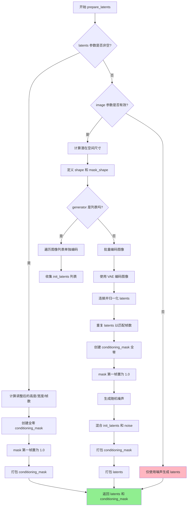

#### 带注释源码

```python
def prepare_latents(
    self,
    image: Optional[torch.Tensor] = None,          # 输入图像张量 [B, C, H, W] 或 [B, H, W, C]
    batch_size: int = 1,                            # 批量大小
    num_channels_latents: int = 128,                # 潜在向量通道数（Transformer输入通道）
    height: int = 512,                              # 图像高度（像素）
    width: int = 704,                               # 图像宽度（像素）
    num_frames: int = 161,                          # 目标视频帧数
    dtype: Optional[torch.dtype] = None,            # 数据类型（默认torch.float32）
    device: Optional[torch.device] = None,          # 计算设备
    generator: torch.Generator | None = None,       # 随机数生成器
    latents: Optional[torch.Tensor] = None,         # 可选的预生成latents
) -> torch.Tensor:
    # ==================== 第一步：调整尺寸 ====================
    # 根据VAE的空间压缩比调整高度和宽度
    # 例如：VAE压缩比为32，则704->22, 512->16
    height = height // self.vae_spatial_compression_ratio
    width = width // self.vae_spatial_compression_ratio
    
    # 根据VAE的时间压缩比调整帧数
    # 公式：(num_frames - 1) // compression_ratio + 1
    # 例如：161帧，压缩比8，则 (161-1)//8 + 1 = 21帧
    num_frames = (
        (num_frames - 1) // self.vae_temporal_compression_ratio + 1 
        if latents is None else latents.size(2)
    )

    # ==================== 第二步：定义形状 ====================
    # 潜在向量形状：[B, C, F, H, W] - 批量、通道、帧、高、宽
    shape = (batch_size, num_channels_latents, num_frames, height, width)
    # 条件掩码形状：[B, 1, F, H, W] - 用于标识条件帧位置
    mask_shape = (batch_size, 1, num_frames, height, width)

    # ==================== 第三步：处理预生成的latents ====================
    if latents is not None:
        # 创建全零条件掩码，所有帧初始为非条件帧
        conditioning_mask = latents.new_zeros(shape)
        # 第一帧设为1.0，表示这是条件帧（由图像编码而来）
        conditioning_mask[:, :, 0] = 1.0
        
        # 打包掩码以适配Transformer的patch处理方式
        # 使用空间和时间patch大小进行pack操作
        conditioning_mask = self._pack_latents(
            conditioning_mask, 
            self.transformer_spatial_patch_size, 
            self.transformer_temporal_patch_size
        )
        # 返回处理后的latents和条件掩码（无噪声混合）
        return latents.to(device=device, dtype=dtype), conditioning_mask

    # ==================== 第四步：编码图像（无预生成latents时）====================
    if isinstance(generator, list):
        # 如果generator是列表，需要为每个批量元素使用不同的generator
        if len(generator) != batch_size:
            raise ValueError(
                f"You have passed a list of generators of length {len(generator)}, but requested an effective batch"
                f" size of {batch_size}. Make sure the batch size matches the length of the generators."
            )

        # 逐个编码图像并从VAE潜在分布中采样
        init_latents = [
            retrieve_latents(self.vae.encode(image[i].unsqueeze(0).unsqueeze(2)), generator[i])
            for i in range(batch_size)
        ]
    else:
        # 批量编码所有图像
        init_latents = [
            retrieve_latents(self.vae.encode(img.unsqueeze(0).unsqueeze(2)), generator) 
            for img in image
        ]

    # ==================== 第五步：后处理编码结果 ====================
    # 将多个图像的latents沿批量维度连接
    # 连接后形状：[B, C, 1, H, W]
    init_latents = torch.cat(init_latents, dim=0).to(dtype)
    
    # 归一化latents：减去均值并除以标准差
    # 使用VAE预计算的latents_mean和latents_std
    init_latents = self._normalize_latents(
        init_latents, 
        self.vae.latents_mean, 
        self.vae.latents_std
    )
    
    # 沿通道维度重复以扩展到所有时间帧
    # 从 [B, C, 1, H, W] 扩展到 [B, C, F, H, W]
    init_latents = init_latents.repeat(1, 1, num_frames, 1, 1)
    
    # 创建条件掩码：全零，第一帧为条件帧
    conditioning_mask = torch.zeros(mask_shape, device=device, dtype=dtype)
    conditioning_mask[:, :, 0] = 1.0

    # ==================== 第六步：混合噪声 ====================
    # 生成与目标形状相同的随机噪声
    noise = randn_tensor(shape, generator=generator, device=device, dtype=dtype)
    
    # 核心混合逻辑：
    # - 条件帧（第一帧）：使用 init_latents（图像编码结果）
    # - 非条件帧：使用 noise（随机噪声）
    # 公式：latents = init_latents * mask + noise * (1 - mask)
    latents = init_latents * conditioning_mask + noise * (1 - conditioning_mask)

    # ==================== 第七步：打包以适配Transformer ====================
    # 将 [B, C, F, H, W] 形状的latents打包成 [B, S, D] 形状
    # S = F/p_t * H/p * W/p （有效序列长度）
    # D = C * p_t * p * p （特征维度）
    conditioning_mask = self._pack_latents(
        conditioning_mask, 
        self.transformer_spatial_patch_size, 
        self.transformer_temporal_patch_size
    ).squeeze(-1)  # 移除最后一个维度
    
    latents = self._pack_latents(
        latents, 
        self.transformer_spatial_patch_size, 
        self.transformer_temporal_patch_size
    )

    # 返回打包后的latents和条件掩码
    return latents, conditioning_mask
```


### `LTXImageToVideoSTGPipeline.guidance_scale`

引导尺度（Guidance Scale）属性，用于控制图像生成过程中分类器自由引导（Classifier-Free Guidance）的强度，该值决定了生成内容与文本提示的匹配程度。

参数：无（属性访问不需要参数）

返回值：`float`，返回当前设置的引导尺度值，值越大表示生成的图像与文本提示越紧密相关

#### 流程图

```mermaid
graph TD
    A[访问 guidance_scale 属性] --> B{检查 _guidance_scale 值}
    B --> C[返回 float 类型的引导尺度值]
    
    D[在 __call__ 中设置] --> E[接收 guidance_scale 参数]
    E --> F[赋值给 self._guidance_scale]
    F --> G[在去噪循环中使用]
    
    G --> H[计算 noise_pred]
    H --> I[noise_pred_uncond + guidance_scale × (noise_pred_text - noise_pred_uncond)]
```

#### 带注释源码

```python
@property
def guidance_scale(self):
    """
    引导尺度属性，只读属性，返回分类器自由引导的强度值。
    
    该属性在以下场景中使用：
    1. do_classifier_free_guidance 属性中判断是否启用引导
    2. __call__ 方法的去噪循环中计算最终噪声预测
    
    返回:
        float: 引导尺度值，值越大生成的图像与文本提示越相关
    """
    return self._guidance_scale
```

**关联使用代码片段：**

```python
# 1. 在 __call__ 方法中设置该值
self._guidance_scale = guidance_scale  # 默认值为 3.0

# 2. 在 do_classifier_free_guidance 属性中判断是否启用引导
@property
def do_classifier_free_guidance(self):
    return self._guidance_scale > 1.0  # 当 guidance_scale > 1.0 时启用 CFG

# 3. 在去噪循环中使用该值计算噪声预测
if self.do_classifier_free_guidance and not self.do_spatio_temporal_guidance:
    noise_pred_uncond, noise_pred_text = noise_pred.chunk(2)
    noise_pred = noise_pred_uncond + self.guidance_scale * (noise_pred_text - noise_pred_uncond)
```

#### 详细说明

| 项目 | 描述 |
|------|------|
| **属性名称** | `LTXImageToVideoSTGPipeline.guidance_scale` |
| **属性类型** | `property` (只读属性) |
| **底层变量** | `self._guidance_scale` (float 类型) |
| **默认值** | `3.0` (在 `__call__` 方法参数中定义) |
| **使用条件** | `do_classifier_free_guidance` 为 `True` 时（即 `guidance_scale > 1.0`） |
| **作用** | 控制文本提示对生成图像的影响强度，值越高生成的图像与提示越相关 |


### `LTXImageToVideoSTGPipeline.do_classifier_free_guidance`

该属性用于判断是否启用无分类器自由引导（Classifier-Free Guidance，CFG）。通过比较内部存储的 `_guidance_scale` 值是否大于 1.0 来返回布尔值，当 guidance_scale > 1.0 时表示启用 CFG，否则表示禁用。

参数： 无（该方法为属性访问器，无需参数）

返回值：`bool`，返回 `True` 表示启用 CFG（guidance_scale > 1.0），返回 `False` 表示禁用 CFG（guidance_scale <= 1.0）

#### 流程图

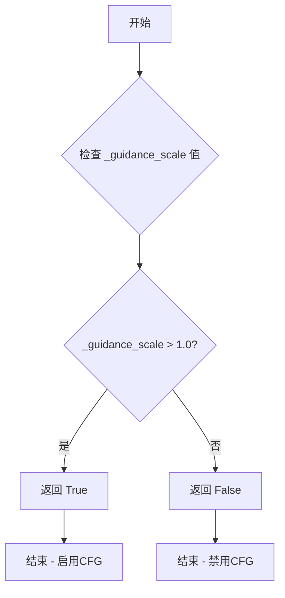

#### 带注释源码

```python
@property
def do_classifier_free_guidance(self):
    """
    属性：判断是否启用无分类器自由引导（CFG）
    
    该属性通过检查 guidance_scale 是否大于 1.0 来决定是否启用 CFG。
    在扩散模型中，CFG 通过同时处理条件和无条件预测来提高生成质量。
    
    工作原理：
    - guidance_scale > 1.0: 启用 CFG，使用 classifier-free guidance 引导生成
    - guidance_scale <= 1.0: 禁用 CFG，等同于标准扩散采样
    
    在 __call__ 方法中的使用示例：
        if self.do_classifier_free_guidance and not self.do_spatio_temporal_guidance:
            prompt_embeds = torch.cat([negative_prompt_embeds, prompt_embeds], dim=0)
            prompt_attention_mask = torch.cat([negative_prompt_attention_mask, prompt_attention_mask], dim=0)
    
    Returns:
        bool: 如果 guidance_scale > 1.0 则返回 True，否则返回 False
    """
    return self._guidance_scale > 1.0
```


### `LTXImageToVideoSTGPipeline.do_spatio_temporal_guidance`

这是一个属性方法，用于检查是否启用了时空引导（Spatio-Temporal Guidance，STG）功能。通过判断内部变量`_stg_scale`是否大于0来决定是否启用STG机制。

参数： 无（属性方法不接受任何参数）

返回值：`bool`，如果启用了时空引导则返回`True`，否则返回`False`

#### 流程图

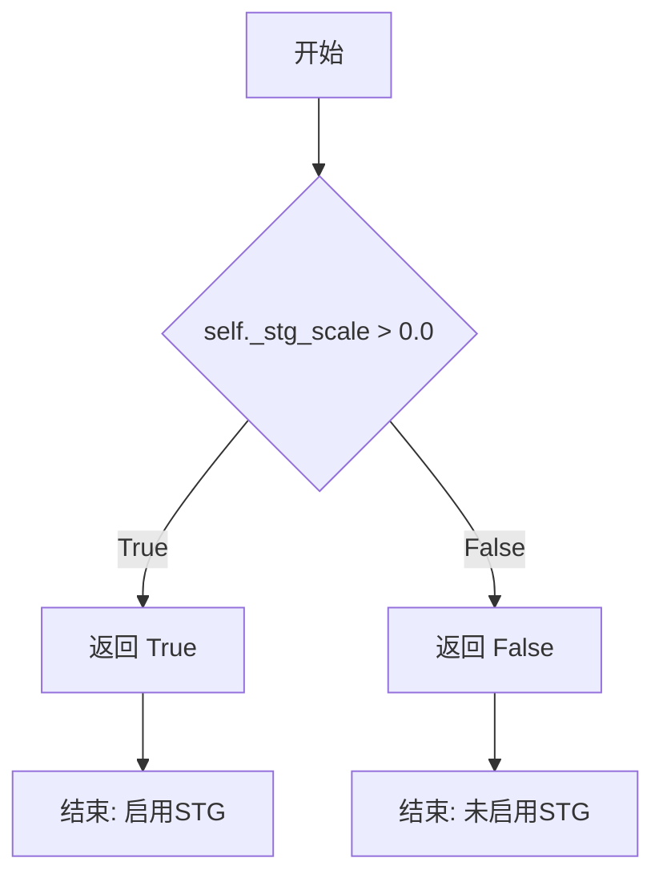

#### 带注释源码

```python
@property
def do_spatio_temporal_guidance(self):
    """
    检查是否启用时空引导（Spatio-Temporal Guidance，STG）的属性。
    
    该属性通过判断内部变量 _stg_scale 是否大于 0 来决定是否启用 STG 机制。
    STG 是一种用于图像到视频生成的高级引导技术，允许在去噪过程中
    引入额外的时空控制信号，从而提升生成视频的质量和一致性。
    
    在 __call__ 方法中，如果启用了 STG（do_spatio_temporal_guidance 返回 True），
    会在去噪循环中采用三路分割的方式处理噪声预测：
    1. 无条件噪声预测 (noise_pred_uncond)
    2. 有条件噪声预测 (noise_pred_text)  
    3. 扰动噪声预测 (noise_pred_perturb)
    
    最终的噪声预测通过以下公式计算：
    noise_pred = noise_pred_uncond + guidance_scale * (noise_pred_text - noise_pred_uncond) 
                 + stg_scale * (noise_pred_text - noise_pred_perturb)
    
    返回值:
        bool: 如果 _stg_scale > 0.0 则返回 True（启用 STG），否则返回 False
    """
    return self._stg_scale > 0.0
```


### `LTXImageToVideoSTGPipeline.num_timesteps`

该属性返回扩散过程中使用的时间步数，用于图像到视频的生成过程。这是一个只读属性，提供了对内部 `_num_timesteps` 值的访问，该值在管道的 `__call__` 方法中根据时间步数组的长度设置。

参数：

- （无参数，这是一个属性而非方法）

返回值：`int`，返回去噪过程中将使用的推理时间步的总数。

#### 流程图

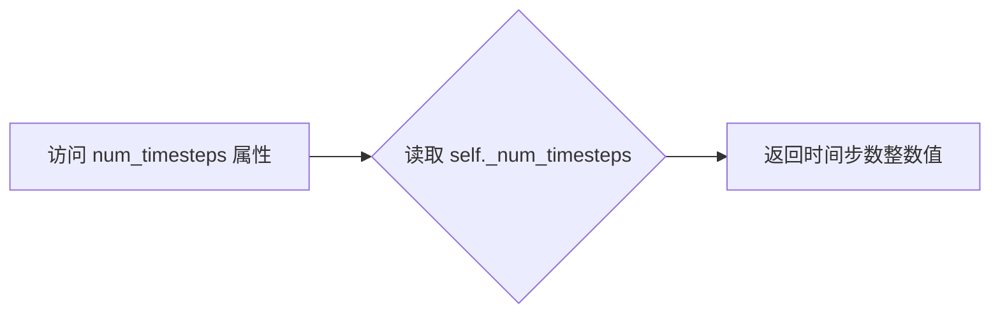

#### 带注释源码

```python
@property
def num_timesteps(self):
    """
    返回扩散过程中使用的时间步数。

    该属性在 __call__ 方法中被设置，值为时间步数组的长度。
    用于跟踪去噪过程的迭代次数。

    返回:
        int: 推理过程中使用的时间步总数
    """
    return self._num_timesteps
```


### `LTXImageToVideoSTGPipeline.attention_kwargs`

该属性是一个只读属性，用于获取在管道调用过程中传递的注意力机制参数字典。该属性通过 `__call__` 方法的 `attention_kwargs` 参数设置，并可在推理过程中传递给 `AttentionProcessor` 以自定义注意力机制的行为。

参数：无（属性访问不需要显式参数，`self` 为隐式参数）

返回值：`Optional[Dict[str, Any]]`，返回存储的注意力参数字典，如果未设置则返回 `None`。该字典包含自定义注意力机制的键值对，如层索引、缩放因子等配置。

#### 流程图

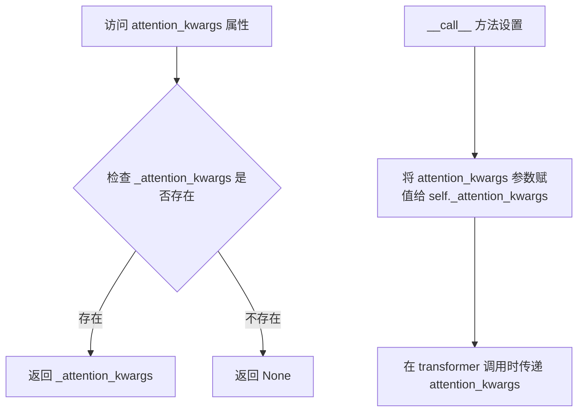

#### 带注释源码

```python
@property
def attention_kwargs(self):
    """
    只读属性，返回管道在推理过程中使用的注意力参数字典。
    
    该属性在 __call__ 方法中被设置，通过 attention_kwargs 参数接收自定义的
    注意力机制配置。这些参数最终会传递给 Transformer 模型的 attention_kwargs
    参数，用于自定义注意力处理器的行为。
    
    Returns:
        Optional[Dict[str, Any]]: 注意力参数字典，如果未设置则返回 None。
    """
    return self._attention_kwargs
```

#### 相关上下文源码

```python
# 在 __call__ 方法中设置 _attention_kwargs
self._attention_kwargs = attention_kwargs

# 在 transformer 调用时传递 attention_kwargs
noise_pred = self.transformer(
    hidden_states=latent_model_input,
    encoder_hidden_states=prompt_embeds,
    timestep=timestep,
    encoder_attention_mask=prompt_attention_mask,
    num_frames=latent_num_frames,
    height=latent_height,
    width=latent_width,
    rope_interpolation_scale=rope_interpolation_scale,
    attention_kwargs=attention_kwargs,  # 传递给 transformer
    return_dict=False,
)[0]
```


### `LTXImageToVideoSTGPipeline.interrupt`

这是一个属性（property），用于获取或检查pipeline的中断状态标志。该属性允许外部调用者查询当前的去噪循环是否被请求中断。

参数：无（属性 getter不接受参数）

返回值：`bool`，返回内部的中断标志 `_interrupt`，用于控制去噪循环是否在下次迭代时中断。

#### 流程图

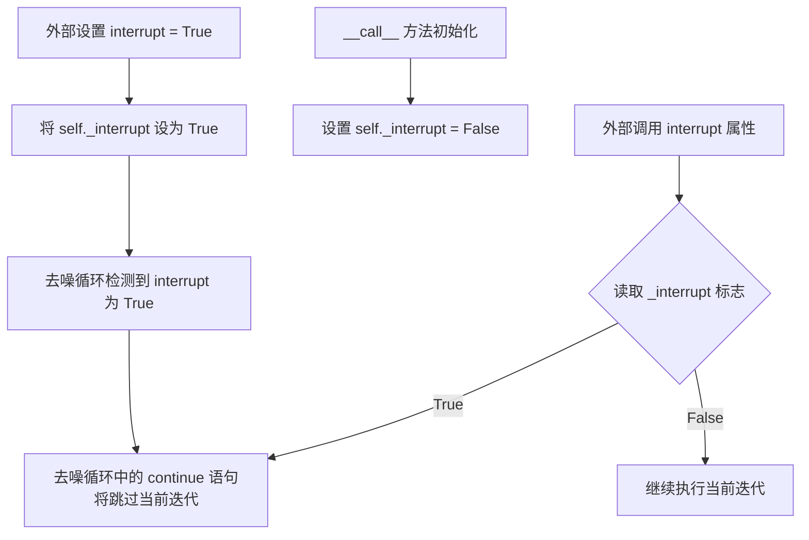

#### 带注释源码

```python
@property
def interrupt(self):
    """
    属性 getter: 获取当前的中断状态标志
    
    说明:
        - 该属性返回 self._interrupt 的值
        - 在 __call__ 方法开始时，self._interrupt 被初始化为 False
        - 当外部调用者将该属性设置为 True 时，去噪循环会在下一次迭代开始时跳过当前步骤
        - 这提供了一种从外部中断长时间运行的生成过程的方法
    
    返回值:
        bool: 中断标志。为 True 时表示请求中断去噪循环
    """
    return self._interrupt
```

#### 关键上下文信息

该属性在去噪循环中的使用方式：

```python
# 在 __call__ 方法的去噪循环中
with self.progress_bar(total=num_inference_steps) as progress_bar:
    for i, t in enumerate(timesteps):
        if self.interrupt:  # 检查中断标志
            continue  # 如果中断标志为 True，跳过当前迭代
        
        # ... 继续去噪逻辑
```


### `LTXImageToVideoSTGPipeline.__call__`

这是 LTXImageToVideoSTGPipeline 管道的主推理方法，接收图像和文本提示，生成对应的视频序列。该方法整合了 T5 文本编码器、LTXVideoTransformer3DModel transformer 和 VAE 解码器，通过 spatio-temporal guidance (STG) 技术实现高质量的图像到视频生成。

参数：

- `image`：`PipelineImageInput`，输入图像用于条件生成，可以是图像、图像列表或 torch.Tensor
- `prompt`：`Union[str, List[str]]`，指导视频生成的文本提示，如果未定义则必须传递 prompt_embeds
- `negative_prompt`：`Optional[Union[str, List[str]]]`，用于 Classifier-Free Guidance 的负面提示
- `height`：`int`，生成图像的高度（像素），默认 512
- `width`：`int`，生成图像的宽度（像素），默认 704
- `num_frames`：`int`，要生成的视频帧数，默认 161
- `frame_rate`：`int`，视频帧率，默认 25
- `num_inference_steps`：`int`，去噪步数，默认 50
- `timesteps`：`List[int]`，自定义去噪时间步
- `guidance_scale`：`float`，Classifier-Free Diffusion Guidance 比例，默认 3.0
- `num_videos_per_prompt`：`Optional[int]`，每个提示生成的视频数量，默认 1
- `generator`：`Optional[Union[torch.Generator, List[torch.Generator]]]`，随机数生成器，用于确保生成的可重复性
- `latents`：`Optional[torch.Tensor]`，预先生成的噪声潜在向量
- `prompt_embeds`：`Optional[torch.Tensor]`，预生成的文本嵌入
- `prompt_attention_mask`：`Optional[torch.Tensor]`，文本嵌入的注意力掩码
- `negative_prompt_embeds`：`Optional[torch.Tensor]`，负面文本嵌入
- `negative_prompt_attention_mask`：`Optional[torch.Tensor]`，负面文本嵌入的注意力掩码
- `decode_timestep`：`Union[float, List[float]]`，解码时的时间步，默认 0.0
- `decode_noise_scale`：`Optional[Union[float, List[float]]]`，解码时的噪声缩放插值因子
- `output_type`：`str | None`，输出格式，默认 "pil" (PIL.Image.Image 或 np.array)
- `return_dict`：`bool`，是否返回 LTXPipelineOutput，默认 True
- `attention_kwargs`：`Optional[Dict[str, Any]]`，传递给 AttentionProcessor 的关键字参数
- `callback_on_step_end`：`Optional[Callable[[int, int, Dict], None]]`，每个去噪步骤结束时调用的回调函数
- `callback_on_step_end_tensor_inputs`：`List[str]`，回调函数使用的张量输入列表
- `max_sequence_length`：`int`，最大序列长度，默认 128
- `stg_applied_layers_idx`：`Optional[List[int]]`，STG 应用的层索引列表，默认 [19]
- `stg_scale`：`Optional[float]`，STG 缩放比例，默认 1.0
- `do_rescaling`：`Optional[bool]`，是否执行重缩放，默认 False

返回值：`LTXPipelineOutput` 或 `tuple`，如果 return_dict 为 True 返回 LTXPipelineOutput，否则返回包含生成视频的元组

#### 流程图

```mermaid
flowchart TD
    A[开始 __call__] --> B{检查回调类型}
    B -->|PipelineCallback| C[设置 tensor_inputs]
    B -->|其他| D[保留原 tensor_inputs]
    C --> E[检查输入参数]
    D --> E
    E --> F[初始化内部状态<br/>_stg_scale, _guidance_scale, _attention_kwargs, _interrupt]
    F --> G{do_spatio_temporal_guidance?}
    G -->|Yes| H[修改 transformer block forward 方法]
    G -->|No| I[跳过修改]
    H --> I
    I --> J[确定 batch_size]
    J --> K[编码提示词 encode_prompt]
    K --> L[处理 CFG 和 STG 的 prompt_embeds 拼接]
    L --> M{latents 为空?}
    M -->|Yes| N[预处理图像 video_processor.preprocess]
    M -->|No| O[准备潜在变量 prepare_latents]
    N --> O
    O --> P[处理 conditioning_mask 的拼接]
    P --> Q[计算 latent 维度信息<br/>latent_num_frames, latent_height, latent_width]
    Q --> R[计算时间步 retrieve_timesteps]
    R --> S[准备微条件 rope_interpolation_scale]
    S --> T[进入去噪循环]
    
    T --> U{遍历 timesteps}
    U -->|每个 t| V{interrupt 标志?}
    V -->|Yes| W[跳过本次循环]
    V -->|No| X[准备 latent_model_input]
    X --> Y[扩展 timestep 并应用 conditioning_mask]
    Y --> Z[调用 transformer 预测噪声]
    Z --> AA[应用 CFG 和 STG 组合噪声预测]
    AA --> BB{do_rescaling?}
    BB -->|Yes| CC[执行噪声重缩放]
    BB -->|No| DD[跳过重缩放]
    CC --> DD
    DD --> EE[解包潜在变量 _unpack_latents]
    EE --> FF[计算上一步的噪声潜在向量]
    FF --> GG[打包潜在变量 _pack_latents]
    GG --> HH{回调函数存在?}
    HH -->|Yes| II[执行回调并更新 latents]
    HH -->|No| JJ[跳过回调]
    II --> KK[更新进度条]
    JJ --> KK
    KK --> LL{XLA 可用?}
    LL -->|Yes| MM[mark_step]
    LL -->|No| NN[继续]
    MM --> NN
    NN --> UU{循环结束?}
    UU -->|No| U
    UU -->|Yes| OO{output_type == latent?}
    
    OO -->|Yes| PP[直接返回 latents 作为视频]
    OO -->|No| QQ[解包并反规范化潜在变量]
    QQ --> RR{VAE 需要 timestep_conditioning?}
    RR -->|No| SS[设置 timestep = None]
    RR -->|Yes| TT[混合噪声到潜在变量]
    SS --> UU[跳过 TT]
    TT --> UU
    UU --> VV[VAE 解码生成视频]
    VV --> WW[后处理视频 video_processor.postprocess_video]
    PP --> XX[释放模型钩子]
    QQ --> XX
    WW --> XX
    XX --> YY{return_dict?}
    YY -->|Yes| ZZ[返回 LTXPipelineOutput]
    YY -->|No| AAA[返回元组]
    ZZ --> AB[结束]
    AAA --> AB
```

#### 带注释源码

```python
@torch.no_grad()
@replace_example_docstring(EXAMPLE_DOC_STRING)
def __call__(
    self,
    image: PipelineImageInput = None,
    prompt: Union[str, List[str]] = None,
    negative_prompt: Optional[Union[str, List[str]]] = None,
    height: int = 512,
    width: int = 704,
    num_frames: int = 161,
    frame_rate: int = 25,
    num_inference_steps: int = 50,
    timesteps: List[int] = None,
    guidance_scale: float = 3,
    num_videos_per_prompt: Optional[int] = 1,
    generator: Optional[Union[torch.Generator, List[torch.Generator]]] = None,
    latents: Optional[torch.Tensor] = None,
    prompt_embeds: Optional[torch.Tensor] = None,
    prompt_attention_mask: Optional[torch.Tensor] = None,
    negative_prompt_embeds: Optional[torch.Tensor] = None,
    negative_prompt_attention_mask: Optional[torch.Tensor] = None,
    decode_timestep: Union[float, List[float]] = 0.0,
    decode_noise_scale: Optional[Union[float, List[float]]] = None,
    output_type: str | None = "pil",
    return_dict: bool = True,
    attention_kwargs: Optional[Dict[str, Any]] = None,
    callback_on_step_end: Optional[Callable[[int, int, Dict], None]] = None,
    callback_on_step_end_tensor_inputs: List[str] = ["latents"],
    max_sequence_length: int = 128,
    stg_applied_layers_idx: Optional[List[int]] = [19],
    stg_scale: Optional[float] = 1.0,
    do_rescaling: Optional[bool] = False,
):
    # 1. 处理回调函数：如果传入的是 PipelineCallback 或 MultiPipelineCallbacks，
    # 则从回调中获取需要传递的张量输入列表
    if isinstance(callback_on_step_end, (PipelineCallback, MultiPipelineCallbacks)):
        callback_on_step_end_tensor_inputs = callback_on_step_end.tensor_inputs

    # 2. 检查输入参数的有效性：验证高度、宽度是否可被 32 整除，
    # 确保 prompt 和 prompt_embeds 不同时传递，检查各种张量形状一致性
    self.check_inputs(
        prompt=prompt,
        height=height,
        width=width,
        callback_on_step_end_tensor_inputs=callback_on_step_end_tensor_inputs,
        prompt_embeds=prompt_embeds,
        negative_prompt_embeds=negative_prompt_embeds,
        prompt_attention_mask=prompt_attention_mask,
        negative_prompt_attention_mask=negative_prompt_attention_mask,
    )

    # 3. 初始化内部状态变量，用于后续的条件判断和 Guidance 应用
    self._stg_scale = stg_scale
    self._guidance_scale = guidance_scale
    self._attention_kwargs = attention_kwargs
    self._interrupt = False

    # 4. 配置 Spatio-Temporal Guidance (STG)：如果启用了 STG，
    # 则将指定的 transformer block 的 forward 方法替换为自定义的 forward_with_stg 方法
    if self.do_spatio_temporal_guidance:
        for i in stg_applied_layers_idx:
            self.transformer.transformer_blocks[i].forward = types.MethodType(
                forward_with_stg, self.transformer.transformer_blocks[i]
            )

    # 5. 确定批次大小：根据 prompt 类型（字符串、列表或直接使用 prompt_embeds）
    if prompt is not None and isinstance(prompt, str):
        batch_size = 1
    elif prompt is not None and isinstance(prompt, list):
        batch_size = len(prompt)
    else:
        batch_size = prompt_embeds.shape[0]

    device = self._execution_device

    # 6. 编码文本提示：调用 encode_prompt 方法将文本转换为嵌入向量，
    # 支持 Classifier-Free Guidance 和批量生成
    (
        prompt_embeds,
        prompt_attention_mask,
        negative_prompt_embeds,
        negative_prompt_attention_mask,
    ) = self.encode_prompt(
        prompt=prompt,
        negative_prompt=negative_prompt,
        do_classifier_free_guidance=self.do_classifier_free_guidance,
        num_videos_per_prompt=num_videos_per_prompt,
        prompt_embeds=prompt_embeds,
        negative_prompt_embeds=negative_prompt_embeds,
        prompt_attention_mask=prompt_attention_mask,
        negative_prompt_attention_mask=negative_prompt_attention_mask,
        max_sequence_length=max_sequence_length,
        device=device,
    )

    # 7. 根据是否启用 CFG 和 STG 来拼接 prompt_embeds 和 attention_mask
    # CFG 需要 [negative, positive]，STG 需要 [negative, positive, positive_perturb]
    if self.do_classifier_free_guidance and not self.do_spatio_temporal_guidance:
        prompt_embeds = torch.cat([negative_prompt_embeds, prompt_embeds], dim=0)
        prompt_attention_mask = torch.cat([negative_prompt_attention_mask, prompt_attention_mask], dim=0)
    elif self.do_classifier_free_guidance and self.do_spatio_temporal_guidance:
        prompt_embeds = torch.cat([negative_prompt_embeds, prompt_embeds, prompt_embeds], dim=0)
        prompt_attention_mask = torch.cat(
            [negative_prompt_attention_mask, prompt_attention_mask, prompt_attention_mask], dim=0
        )

    # 8. 准备潜在变量：如果没有提供 latents，则对输入图像进行预处理并编码
    if latents is None:
        image = self.video_processor.preprocess(image, height=height, width=width)
        image = image.to(device=device, dtype=prompt_embeds.dtype)

    # 9. 计算潜在变量的维度，并调用 prepare_latents 方法准备初始潜在向量
    num_channels_latents = self.transformer.config.in_channels
    latents, conditioning_mask = self.prepare_latents(
        image,
        batch_size * num_videos_per_prompt,
        num_channels_latents,
        height,
        width,
        num_frames,
        torch.float32,
        device,
        generator,
        latents,
    )

    # 10. 根据 CFG 和 STG 配置拼接 conditioning_mask
    if self.do_classifier_free_guidance and not self.do_spatio_temporal_guidance:
        conditioning_mask = torch.cat([conditioning_mask, conditioning_mask])
    elif self.do_classifier_free_guidance and self.do_spatio_temporal_guidance:
        conditioning_mask = torch.cat([conditioning_mask, conditioning_mask, conditioning_mask])

    # 11. 计算潜在空间中的帧数、高度和宽度，用于后续的形状变换
    latent_num_frames = (num_frames - 1) // self.vae_temporal_compression_ratio + 1
    latent_height = height // self.vae_spatial_compression_ratio
    latent_width = width // self.vae_spatial_compression_ratio
    video_sequence_length = latent_num_frames * latent_height * latent_width

    # 12. 计算时间步调度：使用线性 sigma 分布和 shift 计算来调整采样策略
    sigmas = np.linspace(1.0, 1 / num_inference_steps, num_inference_steps)
    mu = calculate_shift(
        video_sequence_length,
        self.scheduler.config.get("base_image_seq_len", 256),
        self.scheduler.config.get("max_image_seq_len", 4096),
        self.scheduler.config.get("base_shift", 0.5),
        self.scheduler.config.get("max_shift", 1.16),
    )
    timesteps, num_inference_steps = retrieve_timesteps(
        self.scheduler,
        num_inference_steps,
        device,
        timesteps,
        sigmas=sigmas,
        mu=mu,
    )
    num_warmup_steps = max(len(timesteps) - num_inference_steps * self.scheduler.order, 0)
    self._num_timesteps = len(timesteps)

    # 13. 准备微调条件：计算 RoPE 插值缩放因子
    latent_frame_rate = frame_rate / self.vae_temporal_compression_ratio
    rope_interpolation_scale = (
        1 / latent_frame_rate,
        self.vae_spatial_compression_ratio,
        self.vae_spatial_compression_ratio,
    )

    # 14. 开始去噪循环：遍历每个时间步进行迭代去噪
    with self.progress_bar(total=num_inference_steps) as progress_bar:
        for i, t in enumerate(timesteps):
            # 检查是否中断
            if self.interrupt:
                continue

            # 根据 CFG 和 STG 配置准备 latent_model_input
            if self.do_classifier_free_guidance and not self.do_spatio_temporal_guidance:
                latent_model_input = torch.cat([latents] * 2)
            elif self.do_classifier_free_guidance and self.do_spatio_temporal_guidance:
                latent_model_input = torch.cat([latents] * 3)
            else:
                latent_model_input = latents

            latent_model_input = latent_model_input.to(prompt_embeds.dtype)

            # 扩展时间步以匹配批次维度，并应用条件掩码
            timestep = t.expand(latent_model_input.shape[0])
            timestep = timestep.unsqueeze(-1) * (1 - conditioning_mask)

            # 调用 transformer 进行噪声预测
            noise_pred = self.transformer(
                hidden_states=latent_model_input,
                encoder_hidden_states=prompt_embeds,
                timestep=timestep,
                encoder_attention_mask=prompt_attention_mask,
                num_frames=latent_num_frames,
                height=latent_height,
                width=latent_width,
                rope_interpolation_scale=rope_interpolation_scale,
                attention_kwargs=attention_kwargs,
                return_dict=False,
            )[0]
            noise_pred = noise_pred.float()

            # 应用 Classifier-Free Guidance 和 Spatio-Temporal Guidance
            if self.do_classifier_free_guidance and not self.do_spatio_temporal_guidance:
                noise_pred_uncond, noise_pred_text = noise_pred.chunk(2)
                noise_pred = noise_pred_uncond + self.guidance_scale * (noise_pred_text - noise_pred_uncond)
                timestep, _ = timestep.chunk(2)
            elif self.do_classifier_free_guidance and self.do_spatio_temporal_guidance:
                noise_pred_uncond, noise_pred_text, noise_pred_perturb = noise_pred.chunk(3)
                noise_pred = (
                    noise_pred_uncond
                    + self.guidance_scale * (noise_pred_text - noise_pred_uncond)
                    + self._stg_scale * (noise_pred_text - noise_pred_perturb)
                )
                timestep, _, _ = timestep.chunk(3)

            # 可选的噪声重缩放
            if do_rescaling:
                rescaling_scale = 0.7
                factor = noise_pred_text.std() / noise_pred.std()
                factor = rescaling_scale * factor + (1 - rescaling_scale)
                noise_pred = noise_pred * factor

            # 解包潜在变量并进行去噪步骤
            noise_pred = self._unpack_latents(
                noise_pred,
                latent_num_frames,
                latent_height,
                latent_width,
                self.transformer_spatial_patch_size,
                self.transformer_temporal_patch_size,
            )
            latents = self._unpack_latents(
                latents,
                latent_num_frames,
                latent_height,
                latent_width,
                self.transformer_spatial_patch_size,
                self.transformer_temporal_patch_size,
            )

            # 计算前一个噪声样本：x_t -> x_t-1
            noise_pred = noise_pred[:, :, 1:]
            noise_latents = latents[:, :, 1:]
            pred_latents = self.scheduler.step(noise_pred, t, noise_latents, return_dict=False)[0]

            # 重新拼接第一帧（条件帧）和预测帧
            latents = torch.cat([latents[:, :, :1], pred_latents], dim=2)
            latents = self._pack_latents(
                latents, self.transformer_spatial_patch_size, self.transformer_temporal_patch_size
            )

            # 执行回调函数
            if callback_on_step_end is not None:
                callback_kwargs = {}
                for k in callback_on_step_end_tensor_inputs:
                    callback_kwargs[k] = locals()[k]
                callback_outputs = callback_on_step_end(self, i, t, callback_kwargs)

                latents = callback_outputs.pop("latents", latents)
                prompt_embeds = callback_outputs.pop("prompt_embeds", prompt_embeds)

            # 更新进度条（仅在最后一个时间步或预热步之后）
            if i == len(timesteps) - 1 or ((i + 1) > num_warmup_steps and (i + 1) % self.scheduler.order == 0):
                progress_bar.update()

            # XLA 优化：标记计算步骤
            if XLA_AVAILABLE:
                xm.mark_step()

    # 15. 生成最终视频：如果只需要潜在表示则直接返回，否则进行解码
    if output_type == "latent":
        video = latents
    else:
        # 解包并反规范化潜在变量
        latents = self._unpack_latents(
            latents,
            latent_num_frames,
            latent_height,
            latent_width,
            self.transformer_spatial_patch_size,
            self.transformer_temporal_patch_size,
        )
        latents = self._denormalize_latents(
            latents, self.vae.latents_mean, self.vae.latents_std, self.vae.config.scaling_factor
        )
        latents = latents.to(prompt_embeds.dtype)

        # 处理 VAE 的时间步条件
        if not self.vae.config.timestep_conditioning:
            timestep = None
        else:
            # 在解码时添加噪声（可选）
            noise = torch.randn(latents.shape, generator=generator, device=device, dtype=latents.dtype)
            if not isinstance(decode_timestep, list):
                decode_timestep = [decode_timestep] * batch_size
            if decode_noise_scale is None:
                decode_noise_scale = decode_timestep
            elif not isinstance(decode_noise_scale, list):
                decode_noise_scale = [decode_noise_scale] * batch_size

            timestep = torch.tensor(decode_timestep, device=device, dtype=latents.dtype)
            decode_noise_scale = torch.tensor(decode_noise_scale, device=device, dtype=latents.dtype)[
                :, None, None, None, None
            ]
            latents = (1 - decode_noise_scale) * latents + decode_noise_scale * noise

        # 使用 VAE 解码潜在变量生成最终视频
        video = self.vae.decode(latents, timestep, return_dict=False)[0]
        video = self.video_processor.postprocess_video(video, output_type=output_type)

    # 16. 释放模型钩子和内存
    self.maybe_free_model_hooks()

    # 17. 返回结果
    if not return_dict:
        return (video,)

    return LTXPipelineOutput(frames=video)
```

## 关键组件


### LTXImageToVideoSTGPipeline

主 pipeline 类，负责图像到视频的生成，集成 T5 文本编码器、VAE 解码器和 Transformer 模型，实现时空引导（STG）功能。

### forward_with_stg

时空引导（STG）前向传播函数，通过操作 AdaIN 参数实现对 Transformer 块的时空条件注入，支持在指定层应用 STG 机制。

### prepare_latents

潜在变量准备函数，将输入图像编码为潜在变量，并结合噪声生成初始潜在表示，同时生成用于控制首帧条件的 conditioning_mask。

### _pack_latents / _unpack_latents

潜在变量打包与解包函数，负责将 [B, C, F, H, W] 形状的潜在变量转换为 Transformer 所需的 [B, S, D] 形状（空间和时间 patching），以及逆向操作。

### encode_prompt

提示编码函数，使用 T5TokenizerFast 和 T5EncoderModel 将文本提示转换为文本嵌入，支持分类器自由引导（CFG）所需的负向提示编码。

### retrieve_timesteps

时间步检索函数，从调度器获取去噪过程中的时间步序列，支持自定义时间步和 sigma 值。

### 时空引导（STG）机制

通过 stg_applied_layers_idx 和 stg_scale 参数控制，在特定 Transformer 层注入时空条件，实现对生成视频的时空控制。

### conditioning_mask

条件掩码生成与管理，用于标识第一帧（条件帧）和后续帧（生成帧），确保首帧保持与输入图像一致。

### 去噪循环

主去噪流程，包含噪声预测、条件注入、分类器自由引导计算、时空引导融合、潜在变量更新等步骤。

### VAE 解码

视频潜在变量解码模块，支持时间步条件解码和噪声插值，最终将潜在表示转换为视频帧。

## 问题及建议


### 已知问题

-   **Monkey Patching方式不够优雅**：`forward_with_stg`函数在类外部定义，通过`types.MethodType`动态绑定到transformer blocks上，这种方式破坏了类的封装性，使得代码难以理解和维护
-   **可变对象作为默认参数**：`stg_applied_layers_idx: Optional[List[int]] = [19]`使用可变对象作为默认值，这是Python中的常见陷阱，可能导致意外的共享状态
-   **未初始化的实例属性**：代码使用了`self._stg_scale`、`self._guidance_scale`、`self._attention_kwargs`、`self._interrupt`等属性，但这些属性在`__init__`方法中没有初始化，仅在`__call__`中设置，可能导致状态不一致
-   **`__call__`方法过长**：`__call__`方法超过300行，包含过多逻辑分支，应该拆分为更小的私有方法来提高可读性和可维护性
-   **类型检查不一致**：代码中混合使用了`isinstance(prompt, str)`和`type(prompt) is not type(negative_prompt)`，应该统一使用`isinstance`进行类型检查
-   **硬编码的魔法数值**：代码中存在多个硬编码值，如`rescaling_scale = 0.7`、`vae_spatial_compression_ratio`默认值`32`等，这些值应该通过配置或参数传入
-   **`forward_with_stg`硬编码索引**：函数中使用`hidden_states[2:]`和`encoder_hidden_states[2:]`，假设第一帧是条件帧（索引0和1），这种硬编码假设缺乏灵活性
-   **XLA支持不完整**：虽然检查了XLA可用性，但只在循环末尾使用`xm.mark_step()`，没有充分利用XLA的编译优化能力
-   **内存管理不足**：缺少显式的GPU内存清理（如`torch.cuda.empty_cache()`）和更精细的模型卸载策略
-   **代码重复**：在`__call__`方法中多次出现类似的`torch.cat([conditioning_mask, conditioning_mask])`模式，可以提取为辅助方法

### 优化建议

-   将`forward_with_stg`逻辑封装为一个自定义的`AttentionProcessor`或`TransformerBlock`子类，通过配置而非monkey patching来启用STG功能
-   使用`None`作为可变默认参数的默认值，在方法内部进行处理，如`stg_applied_layers_idx: Optional[List[int]] = None`，然后在方法开始时设置默认值
-   在`__init__`方法中初始化所有实例属性，提供默认值，并在`__call__`方法开始时进行必要的覆盖
-   将`__call__`方法拆分为多个私有方法，如`_prepare_text_embeddings`、`_prepare_latents`、`_denoise_loop`、`_decode_video`等
-   统一所有类型检查使用`isinstance()`
-   将硬编码的数值提取为类属性或构造函数参数，提供默认值
-   增强XLA支持，考虑使用`xm.optimizer_step()`等更完整的XLA集成
-   在适当的位置添加GPU内存清理调用
-   提取重复的`torch.cat`逻辑为辅助方法，减少代码冗余

## 其它


### 设计目标与约束

**设计目标**：实现基于LTX-Video模型的图像到视频生成Pipeline，支持STG（Spatial Temporal Guidance）技术，能够根据输入图像和文本提示生成高质量的视频内容。

**主要约束**：
- 输入图像高度和宽度必须能被32整除
- 视频帧数必须满足VAE时间压缩比的要求
- 最大序列长度限制为128
- 必须使用支持Flow Match的调度器（FlowMatchEulerDiscreteScheduler）
- STG功能与CFG（Classifier-Free Guidance）不能同时以相同权重使用

### 错误处理与异常设计

**输入验证**：
- `check_inputs()`方法验证高度和宽度必须被32整除
- 验证prompt和prompt_embeds不能同时提供
- 验证prompt_embeds和negative_prompt_embeds的形状必须匹配
- 验证callback_on_step_end_tensor_inputs中的参数必须在允许列表中
- 验证timesteps和sigmas不能同时提供

**调度器兼容性检查**：
- `retrieve_timesteps()`函数检查调度器是否支持自定义timesteps或sigmas

**生成器验证**：
- 验证传入的生成器列表长度必须与批处理大小匹配

**异常类型**：
- ValueError：输入参数验证失败
- TypeError：类型不匹配
- AttributeError：encoder_output缺少必要的属性

### 数据流与状态机

**整体数据流**：
1. 输入预处理（图像预处理、文本编码）
2. 潜在变量准备（VAE编码、噪声添加、条件掩码生成）
3. 时间步计算（基于视频序列长度的shift计算）
4. 去噪循环（Transformer推理、噪声预测、潜在变量更新）
5. VAE解码（潜在变量解码为视频）
6. 后处理（视频格式转换）

**关键状态转换**：
- `latents`：从初始噪声/编码图像到最终潜在表示
- `conditioning_mask`：标记第一帧为条件帧，其余帧为生成帧
- `timestep`：从高噪声到低噪声的调度过程

### 外部依赖与接口契约

**核心依赖**：
- `transformers`：T5EncoderModel和T5TokenizerFast用于文本编码
- `diffusers`：DiffusionPipeline、调度器、VAE、Transformer模型
- `numpy`：数值计算
- `torch`：深度学习框架
- `torch_xla`：可选的XLA加速支持

**模型组件接口**：
- `vae.encode()`：返回包含latent_dist的对象
- `transformer()`：接受hidden_states、encoder_hidden_states、timestep等参数
- `vae.decode()`：将潜在表示解码为视频
- `scheduler.step()`：执行去噪步骤

### 性能考虑

**内存优化**：
- 使用`model_cpu_offload_seq`指定模型卸载顺序
- 支持XLA加速（`xm.mark_step()`）
- 使用torch.no_grad()禁用梯度计算

**计算优化**：
- VAE时间/空间压缩比用于减少潜在变量维度
- 潜在变量打包（packing）减少计算开销
- 支持批处理和每提示多视频生成

**推理速度**：
- 可配置的num_inference_steps
- 支持自定义timesteps/sigmas跳过某些步骤

### 安全性考虑

**输入验证**：
- 对所有用户输入进行类型和范围检查
- 截断过长的文本输入

**模型安全**：
- 支持negative_prompt引导
- 支持CFG但需要合理设置guidance_scale

### 配置参数说明

**核心配置**：
- `vae_spatial_compression_ratio`：VAE空间压缩比（默认32）
- `vae_temporal_compression_ratio`：VAE时间压缩比（默认8）
- `transformer_spatial_patch_size`：Transformer空间 patch 大小
- `transformer_temporal_patch_size`：Transformer时间 patch 大小
- `tokenizer_max_length`：最大文本长度（默认128）

**默认参数**：
- `default_height`：512
- `default_width`：704
- `default_frames`：121

### 使用示例

**基本用法**：
```python
import torch
from diffusers.utils import export_to_video, load_image
from examples.community.pipeline_stg_ltx_image2video import LTXImageToVideoSTGPipeline

pipe = LTXImageToVideoSTGPipeline.from_pretrained("Lightricks/LTX-Video", torch_dtype=torch.bfloat16)
pipe.to("cuda")

image = load_image("path/to/image.png")
prompt = "描述视频内容的文本"
negative_prompt = "worst quality, blurry"

video = pipe(
    image=image,
    prompt=prompt,
    negative_prompt=negative_prompt,
    width=704,
    height=480,
    num_frames=161,
    num_inference_steps=50,
).frames[0]

export_to_video(video, "output.mp4", fps=24)
```

**STG模式用法**：
```python
stg_applied_layers_idx = [19]  # 层索引范围0-41
stg_scale = 1.0  # 设置0.0则使用CFG
do_rescaling = False

video = pipe(
    image=image,
    prompt=prompt,
    stg_applied_layers_idx=stg_applied_layers_idx,
    stg_scale=stg_scale,
    do_rescaling=do_rescaling,
).frames[0]
```

### 许可证信息

Copyright 2025 Lightricks and The HuggingFace Team. All rights reserved.

Licensed under the Apache License, Version 2.0 (the "License");
you may not use this file except in compliance with the License.
You may obtain a copy of the License at
http://www.apache.org/licenses/LICENSE-2.0

    