# `diffusers\examples\community\pipeline_stg_mochi.py` 详细设计文档

这是一个基于Mochi-1-preview模型的文本到视频生成管道，支持时空引导(STG)功能，通过T5文本编码器、Transformer去噪网络和VAE解码器将文本提示转换为视频内容。

## 整体流程

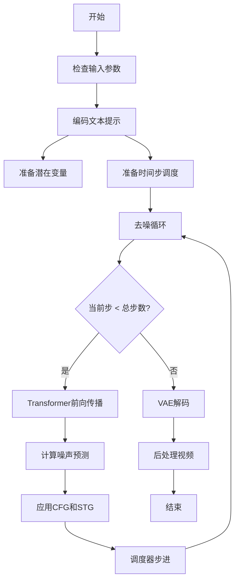

## 类结构

```
DiffusionPipeline (基类)
└── MochiSTGPipeline
    └── Mochi1LoraLoaderMixin (混入类)
```

## 全局变量及字段


### `logger`
    
用于记录警告和信息日志的模块级日志记录器

类型：`logging.Logger`
    


### `EXAMPLE_DOC_STRING`
    
包含MochiSTGPipeline使用示例的文档字符串

类型：`str`
    


### `XLA_AVAILABLE`
    
指示torch_xla是否可用的布尔标志，用于XLA设备支持

类型：`bool`
    


### `MochiSTGPipeline.scheduler`
    
用于去噪编码视频潜在变量的调度器

类型：`FlowMatchEulerDiscreteScheduler`
    


### `MochiSTGPipeline.vae`
    
用于将视频编码和解码到潜在表示的变分自编码器模型

类型：`AutoencoderKLMochi`
    


### `MochiSTGPipeline.text_encoder`
    
T5文本编码器模型，用于将文本提示编码为隐藏状态

类型：`T5EncoderModel`
    


### `MochiSTGPipeline.tokenizer`
    
T5快速分词器，用于将文本转换为token序列

类型：`T5TokenizerFast`
    


### `MochiSTGPipeline.transformer`
    
条件3D变换器架构，用于对编码的视频潜在变量进行去噪

类型：`MochiTransformer3DModel`
    


### `MochiSTGPipeline.video_processor`
    
视频后处理器，用于将潜在变量转换为输出视频格式

类型：`VideoProcessor`
    


### `MochiSTGPipeline.vae_spatial_scale_factor`
    
VAE空间缩放因子，用于调整潜在变量的空间维度

类型：`int`
    


### `MochiSTGPipeline.vae_temporal_scale_factor`
    
VAE时间缩放因子，用于调整潜在变量的时间维度

类型：`int`
    


### `MochiSTGPipeline.patch_size`
    
Transformer的patch大小，用于空间时间patch嵌入

类型：`int`
    


### `MochiSTGPipeline.tokenizer_max_length`
    
分词器的最大序列长度，默认值为256

类型：`int`
    


### `MochiSTGPipeline.default_height`
    
生成视频的默认高度像素值

类型：`int`
    


### `MochiSTGPipeline.default_width`
    
生成视频的默认宽度像素值

类型：`int`
    


### `MochiSTGPipeline.model_cpu_offload_seq`
    
模型CPU卸载顺序序列，指定组件卸载到CPU的顺序

类型：`str`
    


### `MochiSTGPipeline._optional_components`
    
可选组件列表，用于管道配置

类型：`list`
    


### `MochiSTGPipeline._callback_tensor_inputs`
    
回调函数可用的张量输入名称列表

类型：`list`
    


### `MochiSTGPipeline._guidance_scale`
    
无分类器自由引导的guidance缩放因子

类型：`float`
    


### `MochiSTGPipeline._stg_scale`
    
时空引导(STG)的缩放因子，用于控制STG效果强度

类型：`float`
    


### `MochiSTGPipeline._attention_kwargs`
    
传递给注意力处理器的额外关键字参数

类型：`dict`
    


### `MochiSTGPipeline._current_timestep`
    
当前去噪步骤的时间步值

类型：`int`
    


### `MochiSTGPipeline._num_timesteps`
    
去噪过程的总时间步数

类型：`int`
    


### `MochiSTGPipeline._interrupt`
    
中断标志，用于在去噪循环中提前终止生成

类型：`bool`
    
    

## 全局函数及方法


### `forward_with_stg`

该函数是 MochiTransformer3DModel 中 Transformer 块的自定义前向传播方法，添加了时空引导（Spatio-Temporal Guidance，STG）支持。该方法通过分离部分隐藏状态进行处理，应用注意力机制和前馈网络，并利用门控机制控制信息流动，最终返回更新后的隐藏状态和编码器隐藏状态。

参数：

- `self`：隐式参数，Transformer 块实例
- `hidden_states`：`torch.Tensor`，输入的隐藏状态张量
- `encoder_hidden_states`：`torch.Tensor`，编码器的隐藏状态张量
- `temb`：`torch.Tensor`，时间步嵌入向量
- `encoder_attention_mask`：`torch.Tensor`，编码器注意力掩码，用于屏蔽无效位置
- `image_rotary_emb`：`Optional[torch.Tensor]`，图像旋转嵌入，可选参数

返回值：`Tuple[torch.Tensor, torch.Tensor]`，返回更新后的隐藏状态和编码器隐藏状态

#### 流程图

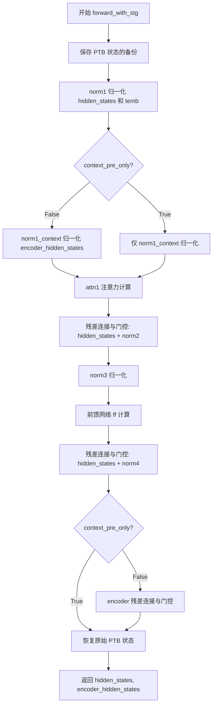

#### 带注释源码

```python
def forward_with_stg(
    self,
    hidden_states: torch.Tensor,
    encoder_hidden_states: torch.Tensor,
    temb: torch.Tensor,
    encoder_attention_mask: torch.Tensor,
    image_rotary_emb: Optional[torch.Tensor] = None,
) -> Tuple[torch.Tensor, torch.Tensor]:
    # 保存 hidden_states 和 encoder_hidden_states 的后两个通道（PTB 状态）
    # PTB 可能指 Patchified Token Blocks，用于后续状态恢复
    hidden_states_ptb = hidden_states[2:]
    encoder_hidden_states_ptb = encoder_hidden_states[2:]
    
    # 第一步归一化：对 hidden_states 进行 LayerNorm 并获取门控参数
    # gate_msa: 门控 MSA（多头注意力）的缩放因子
    # scale_mlp: MLP 的缩放因子
    # gate_mlp: 门控 MLP 的缩放因子
    norm_hidden_states, gate_msa, scale_mlp, gate_mlp = self.norm1(hidden_states, temb)

    # 处理编码器隐藏状态
    if not self.context_pre_only:
        # 如果不是仅预处理上下文，则对 encoder_hidden_states 进行相同的归一化处理
        norm_encoder_hidden_states, enc_gate_msa, enc_scale_mlp, enc_gate_mlp = self.norm1_context(
            encoder_hidden_states, temb
        )
    else:
        # 仅进行归一化，不获取门控参数
        norm_encoder_hidden_states = self.norm1_context(encoder_hidden_states, temb)

    # 执行自注意力计算
    # 返回两个隐藏状态：主注意力结果和上下文注意力结果
    attn_hidden_states, context_attn_hidden_states = self.attn1(
        hidden_states=norm_hidden_states,
        encoder_hidden_states=norm_encoder_hidden_states,
        image_rotary_emb=image_rotary_emb,
        attention_mask=encoder_attention_mask,
    )

    # 残差连接与门控：对注意力输出进行缩放后加回到 hidden_states
    # 使用 tanh(gate_msa) 作为门控因子，scale_mlp 用于后续 MLP 路径
    hidden_states = hidden_states + self.norm2(attn_hidden_states, torch.tanh(gate_msa).unsqueeze(1))
    
    # 归一化步骤3：为前馈网络准备状态
    norm_hidden_states = self.norm3(hidden_states, (1 + scale_mlp.unsqueeze(1).to(torch.float32)))
    
    # 前馈网络计算
    ff_output = self.ff(norm_hidden_states)
    
    # 残差连接与门控：前馈网络输出
    hidden_states = hidden_states + self.norm4(ff_output, torch.tanh(gate_mlp).unsqueeze(1))

    # 处理编码器路径（如果需要）
    if not self.context_pre_only:
        # 对上下文注意力结果进行残差连接和门控
        encoder_hidden_states = encoder_hidden_states + self.norm2_context(
            context_attn_hidden_states, torch.tanh(enc_gate_msa).unsqueeze(1)
        )
        # 上下文的前馈网络处理
        norm_encoder_hidden_states = self.norm3_context(
            encoder_hidden_states, (1 + enc_scale_mlp.unsqueeze(1).to(torch.float32))
        )
        context_ff_output = self.ff_context(norm_encoder_hidden_states)
        encoder_hidden_states = encoder_hidden_states + self.norm4_context(
            context_ff_output, torch.tanh(enc_gate_mlp).unsqueeze(1)
        )

        # 恢复之前保存的 PTB 状态
        # STG 处理可能修改了这部分状态，需要恢复原始值
        hidden_states[2:] = hidden_states_ptb
        encoder_hidden_states[2:] = encoder_hidden_states_ptb

    # 返回更新后的隐藏状态
    return hidden_states, encoder_hidden_states
```


### `linear_quadraticSchedule`

该函数用于生成线性-二次混合的 sigma（噪声水平）调度表，常用于扩散模型的采样过程中。前半部分采用线性增长，后半部分采用二次曲线增长，以实现更平滑的噪声调度。

参数：

- `num_steps`：`int`，总推理步数，决定调度表的长度
- `threshold_noise`：`float`，阈值噪声水平，用于控制噪声的上限
- `linear_steps`：`int | None`，线性部分的步数，默认为 `num_steps // 2`

返回值：`List[float]`，返回调度好的 sigma 值列表，长度为 `num_steps`

#### 流程图

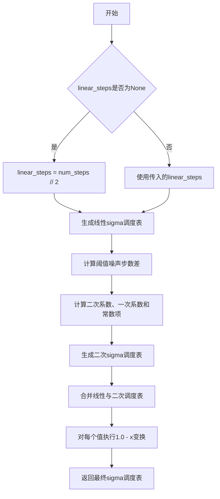

#### 带注释源码

```python
def linear_quadraticSchedule(num_steps, threshold_noise, linear_steps=None):
    """
    生成线性-二次混合的sigma调度表，用于扩散模型采样。
    
    该调度表结合了线性和二次函数：
    - 前linear_steps步使用线性插值
    - 剩余步骤使用二次多项式拟合
    
    这种设计使得噪声水平在初期快速下降，后期则更加平滑。
    
    Args:
        num_steps: 总推理步数
        threshold_noise: 阈值噪声水平，范围通常在0到1之间
        linear_steps: 线性部分的步数，默认为num_steps的一半
    
    Returns:
        sigma_schedule: 长度为num_steps的sigma值列表
    """
    # 如果未指定线性步数，则默认为总步数的一半
    if linear_steps is None:
        linear_steps = num_steps // 2
    
    # 步骤1：生成线性部分的sigma值
    # 线性增长：从0到threshold_noise
    linear_sigma_schedule = [i * threshold_noise / linear_steps for i in range(linear_steps)]
    
    # 步骤2：计算二次部分所需的系数
    # threshold_noise_step_diff表示线性部分终点与目标阈值之间的差值
    threshold_noise_step_diff = linear_steps - threshold_noise * num_steps
    
    # 二次部分的步数
    quadratic_steps = num_steps - linear_steps
    
    # 计算二次多项式系数：ax^2 + bx + c
    # 二次项系数a
    quadratic_coef = threshold_noise_step_diff / (linear_steps * quadratic_steps**2)
    # 一次项系数b
    linear_coef = threshold_noise / linear_steps - 2 * threshold_noise_step_diff / (quadratic_steps**2)
    # 常数项c，确保在linear_steps处连续
    const = quadratic_coef * (linear_steps**2)
    
    # 步骤3：生成二次部分的sigma值
    # 从linear_steps到num_steps-1的二次曲线
    quadratic_sigma_schedule = [
        quadratic_coef * (i**2) + linear_coef * i + const for i in range(linear_steps, num_steps)
    ]
    
    # 步骤4：合并线性和二次部分
    sigma_schedule = linear_sigma_schedule + quadratic_sigma_schedule
    
    # 步骤5：转换为1 - sigma形式（扩散模型常用格式）
    # 这样sigma值从高到低（噪声从多到少）
    sigma_schedule = [1.0 - x for x in sigma_schedule]
    
    return sigma_schedule
```


### `retrieve_timesteps`

该函数是扩散 pipelines 中的通用时间步检索工具函数，用于调用调度器的 `set_timesteps` 方法并从调度器中检索时间步。支持自定义时间步或 sigmas，任何额外的 kwargs 都会传递给调度器的 `set_timesteps` 方法。

参数：

- `scheduler`：`SchedulerMixin`，执行推理时用于去噪的调度器
- `num_inference_steps`：`Optional[int]`，使用预训练模型生成样本时的扩散步数，若使用此参数则 `timesteps` 必须为 `None`
- `device`：`Optional[Union[str, torch.device]]`，时间步要移动到的设备，若为 `None` 则不移动时间步
- `timesteps`：`Optional[List[int]]`，用于覆盖调度器时间步间隔策略的自定义时间步，若传入此参数则 `num_inference_steps` 和 `sigmas` 必须为 `None`
- `sigmas`：`Optional[List[float]]`，用于覆盖调度器时间步间隔策略的自定义 sigmas，若传入此参数则 `num_inference_steps` 和 `timesteps` 必须为 `None`
- `**kwargs`：任意关键字参数，将传递给 `scheduler.set_timesteps`

返回值：`Tuple[torch.Tensor, int]`，元组包含调度器的时间步调度和推理步数

#### 流程图

```mermaid
flowchart TD
    A[开始: retrieve_timesteps] --> B{检查 timesteps 和 sigmas 是否同时存在}
    B -->|是| C[抛出 ValueError: 只能选择 timesteps 或 sigmas 之一]
    B -->|否| D{检查 timesteps 是否存在}
    D -->|是| E[检查 scheduler.set_timesteps 是否支持 timesteps 参数]
    E -->|不支持| F[抛出 ValueError: 当前调度器不支持自定义 timesteps]
    E -->|支持| G[调用 scheduler.set_timesteps&#40;timesteps=timesteps, device=device, **kwargs&#41;]
    G --> H[获取 scheduler.timesteps]
    H --> I[计算 num_inference_steps = len&#40;timesteps&#41;]
    D -->|否| J{检查 sigmas 是否存在}
    J -->|是| K[检查 scheduler.set_timesteps 是否支持 sigmas 参数]
    K -->|不支持| L[抛出 ValueError: 当前调度器不支持自定义 sigmas]
    K -->|支持| M[调用 scheduler.set_timesteps&#40;sigmas=sigmas, device=device, **kwargs&#41;]
    M --> N[获取 scheduler.timesteps]
    N --> O[计算 num_inference_steps = len&#40;timesteps&#41;]
    J -->|否| P[调用 scheduler.set_timesteps&#40;num_inference_steps, device=device, **kwargs&#41;]
    P --> Q[获取 scheduler.timesteps]
    Q --> R[返回 timesteps, num_inference_steps]
    I --> R
    O --> R
```

#### 带注释源码

```python
# Copied from diffusers.pipelines.stable_diffusion.pipeline_stable_diffusion.retrieve_timesteps
def retrieve_timesteps(
    scheduler,  # 调度器对象，用于获取时间步
    num_inference_steps: Optional[int] = None,  # 推理步数
    device: Optional[Union[str, torch.device]] = None,  # 目标设备
    timesteps: Optional[List[int]] = None,  # 自定义时间步列表
    sigmas: Optional[List[float]] = None,  # 自定义 sigma 列表
    **kwargs,  # 额外参数传递给 scheduler.set_timesteps
):
    r"""
    Calls the scheduler's `set_timesteps` method and retrieves timesteps from the scheduler after the call. Handles
    custom timesteps. Any kwargs will be supplied to `scheduler.set_timesteps`.

    Args:
        scheduler (`SchedulerMixin`):
            The scheduler to get timesteps from.
        num_inference_steps (`int`):
            The number of diffusion steps used when generating samples with a pre-trained model. If used, `timesteps`
            must be `None`.
        device (`str` or `torch.device`, *optional*):
            The device to which the timesteps should be moved to. If `None`, the timesteps are not moved.
        timesteps (`List[int]`, *optional*):
            Custom timesteps used to override the timestep spacing strategy of the scheduler. If `timesteps` is passed,
            `num_inference_steps` and `sigmas` must be `None`.
        sigmas (`List[float]`, *optional*):
            Custom sigmas used to override the timestep spacing strategy of the scheduler. If `sigmas` is passed,
            `num_inference_steps` and `timesteps` must be `None`.

    Returns:
        `Tuple[torch.Tensor, int]`: A tuple where the first element is the timestep schedule from the scheduler and the
        second element is the number of inference steps.
    """
    # 检查是否同时传入了 timesteps 和 sigmas，只能选择其一
    if timesteps is not None and sigmas is not None:
        raise ValueError("Only one of `timesteps` or `sigmas` can be passed. Please choose one to set custom value")
    
    # 处理自定义 timesteps 的情况
    if timesteps is not None:
        # 检查调度器的 set_timesteps 方法是否支持 timesteps 参数
        accepts_timesteps = "timesteps" in set(inspect.signature(scheduler.set_timesteps).parameters.keys())
        if not accepts_timesteps:
            raise ValueError(
                f"The current scheduler class {scheduler.__class__}'s `set_timesteps` does not support custom"
                f" timestep schedules. Please check whether you are using the correct scheduler."
            )
        # 调用调度器的 set_timesteps 方法设置自定义时间步
        scheduler.set_timesteps(timesteps=timesteps, device=device, **kwargs)
        # 从调度器获取生成的时间步
        timesteps = scheduler.timesteps
        # 计算推理步数
        num_inference_steps = len(timesteps)
    
    # 处理自定义 sigmas 的情况
    elif sigmas is not None:
        # 检查调度器的 set_timesteps 方法是否支持 sigmas 参数
        accept_sigmas = "sigmas" in set(inspect.signature(scheduler.set_timesteps).parameters.keys())
        if not accept_sigmas:
            raise ValueError(
                f"The current scheduler class {scheduler.__class__}'s `set_timesteps` does not support custom"
                f" sigmas schedules. Please check whether you are using the correct scheduler."
            )
        # 调用调度器的 set_timesteps 方法设置自定义 sigmas
        scheduler.set_timesteps(sigmas=sigmas, device=device, **kwargs)
        # 从调度器获取生成的时间步
        timesteps = scheduler.timesteps
        # 计算推理步数
        num_inference_steps = len(timesteps)
    
    # 既没有自定义 timesteps 也没有自定义 sigmas 的情况
    else:
        # 使用 num_inference_steps 调用调度器
        scheduler.set_timesteps(num_inference_steps, device=device, **kwargs)
        # 从调度器获取生成的时间步
        timesteps = scheduler.timesteps
    
    # 返回时间步调度和推理步数
    return timesteps, num_inference_steps
```


### `MochiSTGPipeline.__init__`

该方法是MochiSTGPipeline类的构造函数，负责初始化文本到视频生成管道所需的所有组件，包括VAE模型、文本编码器、tokenizer、transformer和scheduler，并配置视频处理参数和默认分辨率。

参数：

-  `scheduler`：`FlowMatchEulerDiscreteScheduler`，用于去噪过程的调度器
-  `vae`：`AutoencoderKLMochi`，用于编码和解码视频的变分自编码器模型
-  `text_encoder`：`T5EncoderModel`，用于将文本提示编码为隐藏状态的T5编码器模型
-  `tokenizer`：`T5TokenizerFast`，用于将文本提示分词的T5分词器
-  `transformer`：`MochiTransformer3DModel`，用于去噪视频潜在表示的条件Transformer架构
-  `force_zeros_for_empty_prompt`：`bool`，可选参数，默认为False，控制是否对空提示强制为零

返回值：无（`None`），该方法为构造函数，仅初始化对象状态

#### 流程图

```mermaid
flowchart TD
    A[开始 __init__] --> B[调用父类构造函数 super().__init__]
    B --> C[使用 register_modules 注册所有子模块: vae, text_encoder, tokenizer, transformer, scheduler]
    C --> D[设置 VAE 空间缩放因子: 8]
    D --> E[设置 VAE 时间缩放因子: 6]
    E --> F[设置 patch_size: 2]
    F --> G[创建 VideoProcessor 并赋值给 self.video_processor]
    G --> H[设置 tokenizer_max_length 从 tokenizer 或默认为 256]
    H --> I[设置默认高度: 480]
    I --> J[设置默认宽度: 848]
    J --> K[调用 register_to_config 注册 force_zeros_for_empty_prompt 配置]
    K --> L[结束 __init__]
```

#### 带注释源码

```python
def __init__(
    self,
    scheduler: FlowMatchEulerDiscreteScheduler,
    vae: AutoencoderKLMochi,
    text_encoder: T5EncoderModel,
    tokenizer: T5TokenizerFast,
    transformer: MochiTransformer3DModel,
    force_zeros_for_empty_prompt: bool = False,
):
    """
    初始化 MochiSTGPipeline 管道
    
    参数:
        scheduler: FlowMatchEulerDiscreteScheduler 调度器，用于去噪过程
        vae: AutoencoderKLMochi VAE 模型，用于视频编解码
        text_encoder: T5EncoderModel T5文本编码器
        tokenizer: T5TokenizerFast T5分词器
        transformer: MochiTransformer3DModel 3D变换器模型
        force_zeros_for_empty_prompt: bool 是否对空提示强制为零
    """
    # 调用父类 DiffusionPipeline 的初始化方法
    # 继承自 DiffusionPipeline 基类，完成基础初始化
    super().__init__()

    # 注册所有子模块到管道中，使其可以被 pipelines 管理和访问
    # 这些模块将在管道执行过程中被使用
    self.register_modules(
        vae=vae,
        text_encoder=text_encoder,
        tokenizer=tokenizer,
        transformer=transformer,
        scheduler=scheduler,
    )
    
    # TODO: determine these scaling factors from model parameters
    # 这些缩放因子应该从模型参数中自动确定，目前是硬编码值
    # VAE 空间缩放因子：用于将像素空间映射到潜在空间
    self.vae_spatial_scale_factor = 8
    # VAE 时间缩放因子：用于处理视频帧的时间维度
    self.vae_temporal_scale_factor = 6
    # Transformer 的 patch 大小
    self.patch_size = 2

    # 创建视频处理器，用于视频的后处理
    # 使用 VAE 空间缩放因子来调整视频尺寸
    self.video_processor = VideoProcessor(vae_scale_factor=self.vae_spatial_scale_factor)
    
    # 获取 tokenizer 的最大长度，如果 tokenizer 存在则使用其 model_max_length，否则默认为 256
    # 这是 T5 模型处理文本序列的最大长度限制
    self.tokenizer_max_length = (
        self.tokenizer.model_max_length if hasattr(self, "tokenizer") and self.tokenizer is not None else 256
    )
    
    # 设置默认的视频输出高度（像素）
    # 这是生成视频的默认高度，用于当用户未指定时
    self.default_height = 480
    # 设置默认的视频输出宽度（像素）
    # 这是生成视频的默认宽度，用于当用户未指定时
    self.default_width = 848
    
    # 将 force_zeros_for_empty_prompt 参数注册到配置中
    # 这是一个配置选项，控制空提示的行为
    self.register_to_config(force_zeros_for_empty_prompt=force_zeros_for_empty_prompt)
```


### `MochiSTGPipeline._get_t5_prompt_embeds`

该方法负责将文本提示词（prompt）转换为T5文本编码器可以处理的嵌入向量（embeddings），同时生成对应的注意力掩码（attention mask），支持批量处理和每个提示词生成多个视频的场景。

参数：

- `prompt`：`Union[str, List[str]]`，输入的文本提示词，可以是单个字符串或字符串列表
- `num_videos_per_prompt`：`int`，每个提示词生成的视频数量，默认为1
- `max_sequence_length`：`int`，T5模型的最大序列长度，默认为256个token
- `device`：`Optional[torch.device]`，计算设备，若为None则使用执行设备
- `dtype`：`Optional[torch.dtype]`”，数据类型，若为None则使用文本编码器的数据类型

返回值：`Tuple[torch.Tensor, torch.Tensor]`，返回一个元组，包含提示词嵌入向量（形状为[batch_size * num_videos_per_prompt, seq_len, hidden_dim]）和对应的注意力掩码（形状为[batch_size * num_videos_per_prompt, seq_len]）

#### 流程图

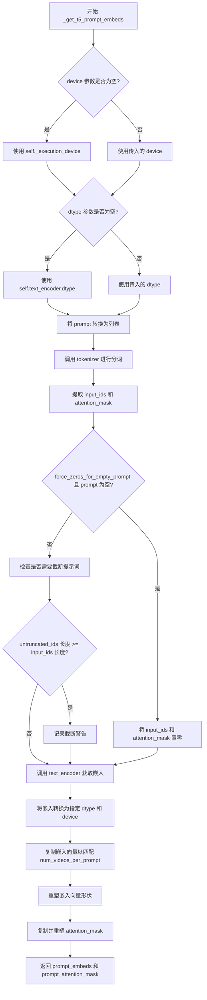

#### 带注释源码

```python
def _get_t5_prompt_embeds(
    self,
    prompt: Union[str, List[str]] = None,
    num_videos_per_prompt: int = 1,
    max_sequence_length: int = 256,
    device: Optional[torch.device] = None,
    dtype: Optional[torch.dtype] = None,
):
    """
    将文本提示词编码为T5模型的嵌入向量
    
    参数:
        prompt: 输入的文本提示词，支持单字符串或字符串列表
        num_videos_per_prompt: 每个提示词要生成的视频数量
        max_sequence_length: 最大序列长度
        device: 计算设备
        dtype: 数据类型
    
    返回:
        包含提示词嵌入和注意力掩码的元组
    """
    # 确定设备：优先使用传入的设备，否则使用执行设备
    device = device or self._execution_device
    # 确定数据类型：优先使用传入的数据类型，否则使用文本编码器的数据类型
    dtype = dtype or self.text_encoder.dtype

    # 确保 prompt 是列表格式，便于批量处理
    prompt = [prompt] if isinstance(prompt, str) else prompt
    batch_size = len(prompt)

    # 调用 T5 tokenizer 对提示词进行分词
    # padding="max_length": 填充到最大长度
    # truncation=True: 超过最大长度的部分截断
    # add_special_tokens=True: 添加特殊token（如EOS）
    # return_tensors="pt": 返回PyTorch张量
    text_inputs = self.tokenizer(
        prompt,
        padding="max_length",
        max_length=max_sequence_length,
        truncation=True,
        add_special_tokens=True,
        return_tensors="pt",
    )

    # 提取分词后的输入IDs和注意力掩码
    text_input_ids = text_inputs.input_ids
    prompt_attention_mask = text_inputs.attention_mask
    # 将注意力掩码转换为布尔类型并移动到指定设备
    prompt_attention_mask = prompt_attention_mask.bool().to(device)

    # 如果配置要求对空提示词强制使用零向量
    # 且当前提示词为空，则将输入IDs和注意力掩码置零
    # 这是为了避免在autocast上下文中的溢出问题
    if self.config.force_zeros_for_empty_prompt and (prompt == "" or prompt[-1] == ""):
        text_input_ids = torch.zeros_like(text_input_ids, device=device)
        prompt_attention_mask = torch.zeros_like(prompt_attention_mask, dtype=torch.bool, device=device)

    # 使用最长填充方式获取未截断的输入，用于检测是否发生了截断
    untruncated_ids = self.tokenizer(prompt, padding="longest", return_tensors="pt").input_ids

    # 如果未截断的序列长度大于等于当前序列长度，且两者不相等
    # 说明发生了截断，需要记录警告信息
    if untrracted_ids.shape[-1] >= text_input_ids.shape[-1] and not torch.equal(text_input_ids, untruncated_ids):
        # 解码被截断的部分并记录警告
        removed_text = self.tokenizer.batch_decode(untruncated_ids[:, max_sequence_length - 1 : -1])
        logger.warning(
            "The following part of your input was truncated because `max_sequence_length` is set to "
            f" {max_sequence_length} tokens: {removed_text}"
        )

    # 调用T5文本编码器获取提示词嵌入
    # 返回的嵌入形状为 [batch_size, seq_len, hidden_dim]
    prompt_embeds = self.text_encoder(text_input_ids.to(device), attention_mask=prompt_attention_mask)[0]
    # 将嵌入转换为指定的dtype和device
    prompt_embeds = prompt_embeds.to(dtype=dtype, device=device)

    # 复制文本嵌入以匹配每个提示词生成的视频数量
    # 这是为了在MPS设备上更高效地处理
    _, seq_len, _ = prompt_embeds.shape
    # 在序列维度上重复，以支持多个视频生成
    prompt_embeds = prompt_embeds.repeat(1, num_videos_per_prompt, 1)
    # 重塑为 [batch_size * num_videos_per_prompt, seq_len, hidden_dim]
    prompt_embeds = prompt_embeds.view(batch_size * num_videos_per_prompt, seq_len, -1)

    # 同样处理注意力掩码
    # 从 [batch_size, seq_len] 重塑为 [batch_size, seq_len * num_videos_per_prompt]
    prompt_attention_mask = prompt_attention_mask.view(batch_size, -1)
    # 复制以匹配视频数量
    prompt_attention_mask = prompt_attention_mask.repeat(num_videos_per_prompt, 1)

    # 返回提示词嵌入和对应的注意力掩码
    return prompt_embeds, prompt_attention_mask
```


### `MochiSTGPipeline.encode_prompt`

该方法负责将文本提示词（prompt）和负面提示词（negative_prompt）编码为文本encoder的隐藏状态（hidden states），支持分类器自由引导（Classifier-Free Guidance），并处理预生成的嵌入向量。

参数：

- `self`：`MochiSTGPipeline`，Pipeline实例本身
- `prompt`：`Union[str, List[str]]`，要编码的文本提示词，可以是单个字符串或字符串列表
- `negative_prompt`：`Optional[Union[str, List[str]]] = None`，不引导图像生成的负面提示词，若不定义则需传递`negative_prompt_embeds`
- `do_classifier_free_guidance`：`bool = True`，是否启用分类器自由引导
- `num_videos_per_prompt`：`int = 1`，每个提示词需要生成的视频数量
- `prompt_embeds`：`Optional[torch.Tensor] = None`，预生成的文本嵌入，可用于调整文本输入
- `negative_prompt_embeds`：`Optional[torch.Tensor] = None`，预生成的负面文本嵌入
- `prompt_attention_mask`：`Optional[torch.Tensor] = None`，文本嵌入的注意力掩码
- `negative_prompt_attention_mask`：`Optional[torch.Tensor] = None`，负面文本嵌入的注意力掩码
- `max_sequence_length`：`int = 256`，最大序列长度
- `device`：`Optional[torch.device] = None`，torch设备
- `dtype`：`Optional[torch.dtype] = None`，torch数据类型

返回值：`Tuple[torch.Tensor, torch.Tensor, torch.Tensor, torch.Tensor]`，返回四个张量——`prompt_embeds`（提示词嵌入）、`prompt_attention_mask`（提示词注意力掩码）、`negative_prompt_embeds`（负面提示词嵌入）、`negative_prompt_attention_mask`（负面提示词注意力掩码）

#### 流程图

```mermaid
flowchart TD
    A[开始 encode_prompt] --> B{device 参数为空?}
    B -->|是| C[使用 self._execution_device]
    B -->|否| D[使用传入的 device]
    C --> E{参数 prompt 是否为字符串?]
    D --> E
    E -->|是| F[将 prompt 转换为列表]
    E -->|否| G[直接使用 prompt 列表]
    F --> H[获取 batch_size]
    G --> H
    H --> I{prompt_embeds 为 None?}
    I -->|是| J[调用 _get_t5_prompt_embeds 生成嵌入]
    I -->|否| K[直接使用传入的 prompt_embeds]
    J --> L{do_classifier_free_guidance 且 negative_prompt_embeds 为 None?}
    K --> L
    L -->|是| M[设置 negative_prompt 为空字符串]
    L -->|否| N[验证 prompt 和 negative_prompt 类型一致性]
    M --> O[验证 batch_size 与 negative_prompt 长度匹配]
    O --> P[调用 _get_t5_prompt_embeds 生成 negative_prompt_embeds]
    N --> P
    L -->|否| Q{negative_prompt_embeds 不为 None?}
    Q -->|是| R[直接使用传入的 negative_prompt_embeds]
    Q -->|否| S[设置 negative_prompt_embeds 和对应的 mask 为 None]
    P --> T
    R --> T
    S --> T
    T[返回 prompt_embeds, prompt_attention_mask, negative_prompt_embeds, negative_prompt_attention_mask]
```

#### 带注释源码

```python
def encode_prompt(
    self,
    prompt: Union[str, List[str]],
    negative_prompt: Optional[Union[str, List[str]]] = None,
    do_classifier_free_guidance: bool = True,
    num_videos_per_prompt: int = 1,
    prompt_embeds: Optional[torch.Tensor] = None,
    negative_prompt_embeds: Optional[torch.Tensor] = None,
    prompt_attention_mask: Optional[torch.Tensor] = None,
    negative_prompt_attention_mask: Optional[torch.Tensor] = None,
    max_sequence_length: int = 256,
    device: Optional[torch.device] = None,
    dtype: Optional[torch.dtype] = None,
):
    r"""
    Encodes the prompt into text encoder hidden states.

    Args:
        prompt (`str` or `List[str]`, *optional*):
            prompt to be encoded
        negative_prompt (`str` or `List[str]`, *optional*):
            The prompt or prompts not to guide the image generation. If not defined, one has to pass
            `negative_prompt_embeds` instead. Ignored when not using guidance (i.e., ignored if `guidance_scale` is
            less than `1`).
        do_classifier_free_guidance (`bool`, *optional*, defaults to `True`):
            Whether to use classifier free guidance or not.
        num_videos_per_prompt (`int`, *optional*, defaults to 1):
            Number of videos that should be generated per prompt. torch device to place the resulting embeddings on
        prompt_embeds (`torch.Tensor`, *optional*):
            Pre-generated text embeddings. Can be used to easily tweak text inputs, *e.g.* prompt weighting. If not
            provided, text embeddings will be generated from `prompt` input argument.
        negative_prompt_embeds (`torch.Tensor`, *optional*):
            Pre-generated negative text embeddings. Can be used to easily tweak text inputs, *e.g.* prompt
            weighting. If not provided, negative_prompt_embeds will be generated from `negative_prompt` input
            argument.
        device: (`torch.device`, *optional*):
            torch device
        dtype: (`torch.dtype`, *optional*):
            torch dtype
    """
    # 确定设备，如果未提供则使用执行设备
    device = device or self._execution_device

    # 将 prompt 转换为列表（如果是字符串则包装为单元素列表）
    prompt = [prompt] if isinstance(prompt, str) else prompt
    # 确定批次大小
    if prompt is not None:
        batch_size = len(prompt)
    else:
        # 如果 prompt 为 None，则从 prompt_embeds 的形状推断批次大小
        batch_size = prompt_embeds.shape[0]

    # 如果未提供 prompt_embeds，则调用内部方法 _get_t5_prompt_embeds 生成
    if prompt_embeds is None:
        prompt_embeds, prompt_attention_mask = self._get_t5_prompt_embeds(
            prompt=prompt,
            num_videos_per_prompt=num_videos_per_prompt,
            max_sequence_length=max_sequence_length,
            device=device,
            dtype=dtype,
        )

    # 如果启用分类器自由引导且未提供 negative_prompt_embeds，则生成负面嵌入
    if do_classifier_free_guidance and negative_prompt_embeds is None:
        # 如果未提供负面提示词，默认为空白字符串
        negative_prompt = negative_prompt or ""
        # 将负面提示词扩展为与批次大小匹配的列表
        negative_prompt = batch_size * [negative_prompt] if isinstance(negative_prompt, str) else negative_prompt

        # 类型检查：确保 negative_prompt 与 prompt 类型一致
        if prompt is not None and type(prompt) is not type(negative_prompt):
            raise TypeError(
                f"`negative_prompt` should be the same type to `prompt`, but got {type(negative_prompt)} !="
                f" {type(prompt)}."
            )
        # 批次大小检查：确保 negative_prompt 数量与 prompt 匹配
        elif batch_size != len(negative_prompt):
            raise ValueError(
                f"`negative_prompt`: {negative_prompt} has batch size {len(negative_prompt)}, but `prompt`:"
                f" {prompt} has batch size {batch_size}. Please make sure that passed `negative_prompt` matches"
                " the batch size of `prompt`."
            )

        # 调用内部方法生成 negative_prompt_embeds 和对应的 attention mask
        negative_prompt_embeds, negative_prompt_attention_mask = self._get_t5_prompt_embeds(
            prompt=negative_prompt,
            num_videos_per_prompt=num_videos_per_prompt,
            max_sequence_length=max_sequence_length,
            device=device,
            dtype=dtype,
        )

    # 返回四个张量：prompt嵌入、prompt注意力掩码、negative_prompt嵌入、negative_prompt注意力掩码
    return prompt_embeds, prompt_attention_mask, negative_prompt_embeds, negative_prompt_attention_mask
```


### `MochiSTGPipeline.check_inputs`

验证视频生成管道的输入参数合法性，确保 `height` 和 `width` 为 8 的倍数、检查 `prompt` 与 `prompt_embeds` 的互斥关系、验证注意力掩码与嵌入向量的匹配性，以及确认正负提示嵌入的形状一致性。

参数：

- `self`：`MochiSTGPipeline` 实例本身
- `prompt`：`Union[str, List[str], None]`，用户提供的文本提示，可为字符串或字符串列表
- `height`：`int`，生成视频的高度（像素），必须能被 8 整除
- `width`：`int`，生成视频的宽度（像素），必须能被 8 整除
- `callback_on_step_end_tensor_inputs`：`Optional[List[str]]`，可选的回调张量输入列表，必须是管道允许的回调张量之一
- `prompt_embeds`：`Optional[torch.Tensor]`，可选的预计算文本嵌入向量，若提供则忽略 `prompt`
- `negative_prompt_embeds`：`Optional[torch.Tensor]`，可选的预计算负向文本嵌入向量
- `prompt_attention_mask`：`Optional[torch.Tensor]`，文本嵌入对应的注意力掩码，当提供 `prompt_embeds` 时必须同时提供
- `negative_prompt_attention_mask`：`Optional[torch.Tensor]`，负向文本嵌入对应的注意力掩码，当提供 `negative_prompt_embeds` 时必须同时提供

返回值：`None`，该方法仅进行参数验证，不返回任何值。若验证失败则抛出 `ValueError` 异常。

#### 流程图

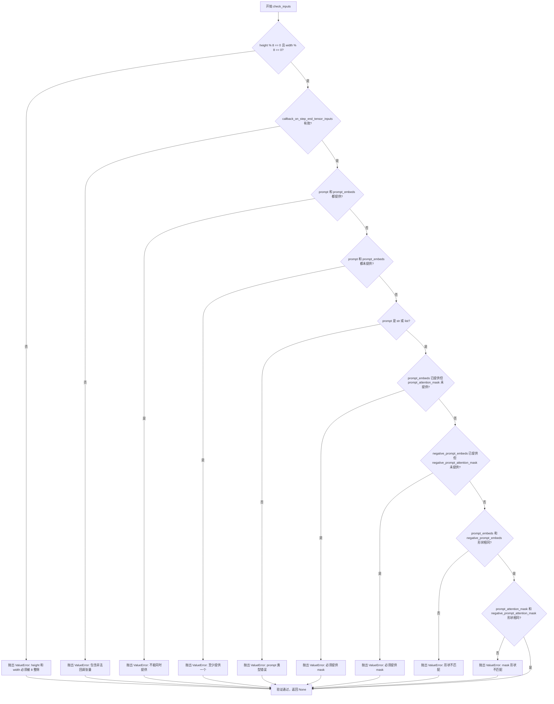

#### 带注释源码

```python
def check_inputs(
    self,
    prompt,
    height,
    width,
    callback_on_step_end_tensor_inputs=None,
    prompt_embeds=None,
    negative_prompt_embeds=None,
    prompt_attention_mask=None,
    negative_prompt_attention_mask=None,
):
    """
    验证视频生成管道的输入参数合法性。
    
    该方法执行以下检查：
    1. height 和 width 必须能被 8 整除（VAE 的空间缩放因子要求）
    2. callback_on_step_end_tensor_inputs 必须是允许的回调张量之一
    3. prompt 和 prompt_embeds 只能二选一，不能同时提供
    4. prompt 和 prompt_embeds 至少提供一个
    5. prompt 必须是 str 或 list 类型
    6. 如果提供 prompt_embeds，必须同时提供 prompt_attention_mask
    7. 如果提供 negative_prompt_embeds，必须同时提供 negative_prompt_attention_mask
    8. prompt_embeds 和 negative_prompt_embeds 形状必须一致
    9. prompt_attention_mask 和 negative_prompt_attention_mask 形状必须一致
    """
    
    # 检查 1：验证图像尺寸符合 VAE 的空间缩放因子要求
    if height % 8 != 0 or width % 8 != 0:
        raise ValueError(f"`height` and `width` have to be divisible by 8 but are {height} and {width}.")

    # 检查 2：验证回调张量输入是否在允许列表中
    if callback_on_step_end_tensor_inputs is not None and not all(
        k in self._callback_tensor_inputs for k in callback_on_step_end_tensor_inputs
    ):
        raise ValueError(
            f"`callback_on_step_end_tensor_inputs` has to be in {self._callback_tensor_inputs}, but found {[k for k in callback_on_step_end_tensor_inputs if k not in self._callback_tensor_inputs]}"
        )

    # 检查 3：prompt 和 prompt_embeds 互斥性检查
    if prompt is not None and prompt_embeds is not None:
        raise ValueError(
            f"Cannot forward both `prompt`: {prompt} and `prompt_embeds`: {prompt_embeds}. Please make sure to"
            " only forward one of the two."
        )
    # 检查 4：至少提供一个 prompt 或 prompt_embeds
    elif prompt is None and prompt_embeds is None:
        raise ValueError(
            "Provide either `prompt` or `prompt_embeds`. Cannot leave both `prompt` and `prompt_embeds` undefined."
        )
    # 检查 5：验证 prompt 的类型
    elif prompt is not None and (not isinstance(prompt, str) and not isinstance(prompt, list)):
        raise ValueError(f"`prompt` has to be of type `str` or `list` but is {type(prompt)}")

    # 检查 6：prompt_embeds 和 prompt_attention_mask 必须成对提供
    if prompt_embeds is not None and prompt_attention_mask is None:
        raise ValueError("Must provide `prompt_attention_mask` when specifying `prompt_embeds`.")

    # 检查 7：negative_prompt_embeds 和 negative_prompt_attention_mask 必须成对提供
    if negative_prompt_embeds is not None and negative_prompt_attention_mask is None:
        raise ValueError("Must provide `negative_prompt_attention_mask` when specifying `negative_prompt_embeds`.")

    # 检查 8：验证正负嵌入形状一致性
    if prompt_embeds is not None and negative_prompt_embeds is not None:
        if prompt_embeds.shape != negative_prompt_embeds.shape:
            raise ValueError(
                "`prompt_embeds` and `negative_prompt_embeds` must have the same shape when passed directly, but"
                f" got: `prompt_embeds` {prompt_embeds.shape} != `negative_prompt_embeds`"
                f" {negative_prompt_embeds.shape}."
            )
        # 检查 9：验证正负注意力掩码形状一致性
        if prompt_attention_mask.shape != negative_prompt_attention_mask.shape:
            raise ValueError(
                "`prompt_attention_mask` and `negative_prompt_attention_mask` must have the same shape when passed directly, but"
                f" got: `prompt_attention_mask` {prompt_attention_mask.shape} != `negative_prompt_attention_mask`"
                f" {negative_prompt_attention_mask.shape}."
            )
```


### `MochiSTGPipeline.enable_vae_slicing`

这是一个已弃用的实例方法，用于在 Mochi STG Pipeline 中启用 VAE 切片解码功能。该方法通过调用底层 VAE 模型的 `enable_slicing()` 方法，将输入张量分割为多个切片进行分步解码，从而节省显存并允许更大的批处理大小。

参数：

- 无显式参数（仅包含 `self`）

返回值：`None`，无返回值。

#### 流程图

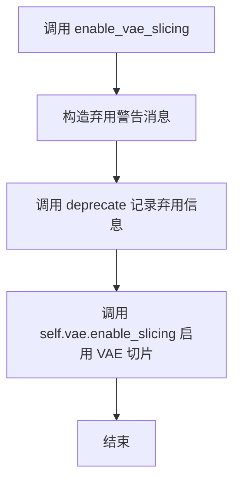

#### 带注释源码

```python
def enable_vae_slicing(self):
    r"""
    Enable sliced VAE decoding. When this option is enabled, the VAE will split the input tensor in slices to
    compute decoding in several steps. This is useful to save some memory and allow larger batch sizes.
    """
    # 构造弃用警告消息，提示用户该方法将在 0.40.0 版本被移除，并建议使用 pipe.vae.enable_slicing()
    depr_message = f"Calling `enable_vae_slicing()` on a `{self.__class__.__name__}` is deprecated and this method will be removed in a future version. Please use `pipe.vae.enable_slicing()`."
    # 调用 deprecate 函数记录弃用信息，触发警告
    deprecate(
        "enable_vae_slicing",
        "0.40.0",
        depr_message,
    )
    # 调用底层 VAE 模型的 enable_slicing 方法，启用切片解码功能
    self.vae.enable_slicing()
```


### `MochiSTGPipeline.disable_vae_slicing`

该方法用于禁用VAE切片解码功能。如果之前启用了`enable_vae_slicing`，调用此方法后将恢复为单步执行解码。此方法已被弃用，推荐直接调用`pipe.vae.disable_slicing()`。

参数：

-  `self`：MochiSTGPipeline 实例本身

返回值：`None`，无返回值

#### 流程图

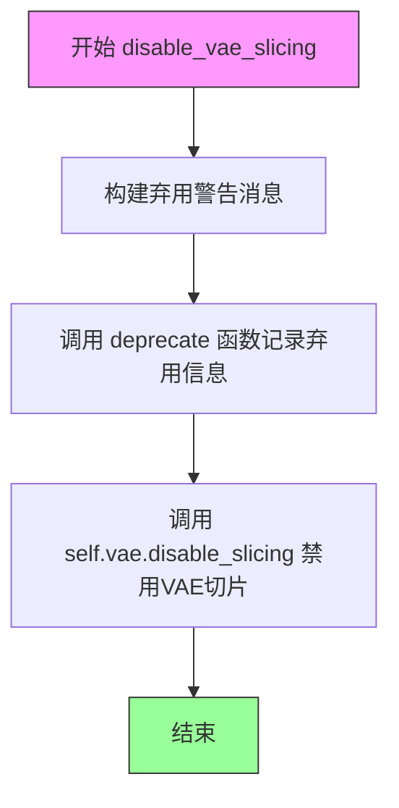

#### 带注释源码

```python
def disable_vae_slicing(self):
    r"""
    Disable sliced VAE decoding. If `enable_vae_slicing` was previously enabled, this method will go back to
    computing decoding in one step.
    """
    # 构建弃用警告消息，提示用户该方法将在未来版本中移除
    # 并建议使用新的替代方法 pipe.vae.disable_slicing()
    depr_message = f"Calling `disable_vae_slicing()` on a `{self.__class__.__name__}` is deprecated and this method will be removed in a future version. Please use `pipe.vae.disable_slicing()`."
    
    # 调用 deprecate 函数记录弃用信息
    # 参数: 方法名, 弃用版本号, 弃用消息
    deprecate(
        "disable_vae_slicing",
        "0.40.0",
        depr_message,
    )
    
    # 调用 VAE 模型的 disable_slicing 方法实际禁用切片功能
    self.vae.disable_slicing()
```


### `MochiSTGPipeline.enable_vae_tiling`

该方法用于启用瓦片式 VAE（变分自编码器）解码功能。当启用此选项时，VAE 会将输入张量分割成多个瓦片分步计算编码和解码，从而节省大量内存并允许处理更大的图像。该方法已被标记为弃用，建议直接使用 `pipe.vae.enable_tiling()`。

参数：该方法无显式参数（除 self 外）

返回值：`None`，无返回值

#### 流程图

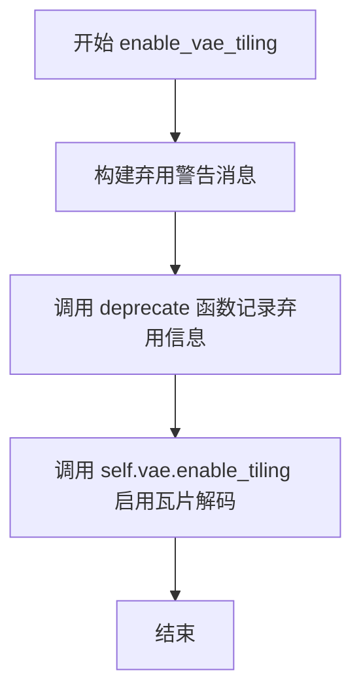

#### 带注释源码

```
def enable_vae_tiling(self):
    r"""
    Enable tiled VAE decoding. When this option is enabled, the VAE will split the input tensor into tiles to
    compute decoding and encoding in several steps. This is useful for saving a large amount of memory and to allow
    processing larger images.
    """
    # 构建弃用警告消息，包含类名和替代方案
    depr_message = f"Calling `enable_vae_tiling()` on a `{self.__class__.__name__}` is deprecated and this method will be removed in a future version. Please use `pipe.vae.enable_tiling()`."
    
    # 调用 deprecate 函数记录弃用信息，指定版本号为 0.40.0
    deprecate(
        "enable_vae_tiling",
        "0.40.0",
        depr_message,
    )
    
    # 委托给 VAE 模型的 enable_tiling 方法执行实际的瓦片启用操作
    self.vae.enable_tiling()
```


### `MochiSTGPipeline.disable_vae_tiling`

该方法用于禁用VAE的瓦片解码模式。如果之前启用了瓦片解码（通过`enable_vae_tiling`），调用此方法后将恢复为单步解码。注意：此方法已弃用，建议直接使用`pipe.vae.disable_tiling()`。

参数：
- 无（仅包含`self`参数）

返回值：`None`，无返回值描述

#### 流程图

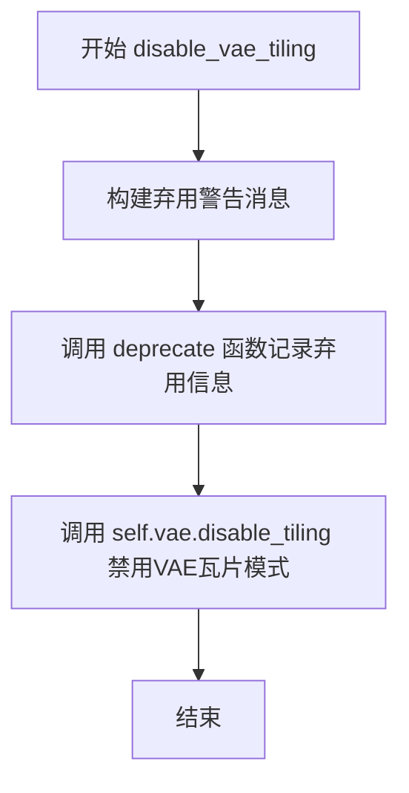

#### 带注释源码

```
def disable_vae_tiling(self):
    r"""
    Disable tiled VAE decoding. If `enable_vae_tiling` was previously enabled, this method will go back to
    computing decoding in one step.
    """
    # 构建弃用警告消息，提示用户该方法将在未来版本中移除
    # 应改用 pipe.vae.disable_tiling() 替代
    depr_message = f"Calling `disable_vae_tiling()` on a `{self.__class__.__name__}` is deprecated and this method will be removed in a future version. Please use `pipe.vae.disable_tiling()`."
    
    # 调用 deprecate 函数记录弃用信息，用于在后续版本中向用户发出警告
    deprecate(
        "disable_vae_tiling",      # 弃用的方法名
        "0.40.0",                  # 弃用版本号
        depr_message,              # 弃用警告消息
    )
    
    # 实际执行：调用VAE模型的disable_tiling方法禁用瓦片解码模式
    self.vae.disable_tiling()
```


### MochiSTGPipeline.prepare_latents

该方法用于准备视频生成的潜在变量（latents），根据输入的批处理大小、视频帧数、高度和宽度，结合VAE的缩放因子计算潜在空间的形状，并可选择使用提供的潜在变量或通过随机张生生成器创建新的潜在变量。

参数：

- `batch_size`：`int`，批处理大小，指定一次生成多少个视频样本
- `num_channels_latents`：`int`，潜在通道数，对应于Transformer模型的输入通道数
- `height`：`int`，原始图像高度（像素单位）
- `width`：`int`，原始图像宽度（像素单位）
- `num_frames`：`int`，要生成的视频帧数
- `dtype`：`torch.dtype`，期望输出的数据类型
- `device`：`torch.device`，计算设备（CPU/CUDA）
- `generator`：`torch.Generator` 或 `List[torch.Generator]`，可选的随机生成器，用于确保可重复性
- `latents`：`torch.Tensor`，可选的预生成潜在变量，如果提供则直接返回转换后的张量

返回值：`torch.Tensor`，处理后的潜在变量张量，形状为 (batch_size, num_channels_latents, num_frames, height//scale, width//scale)

#### 流程图

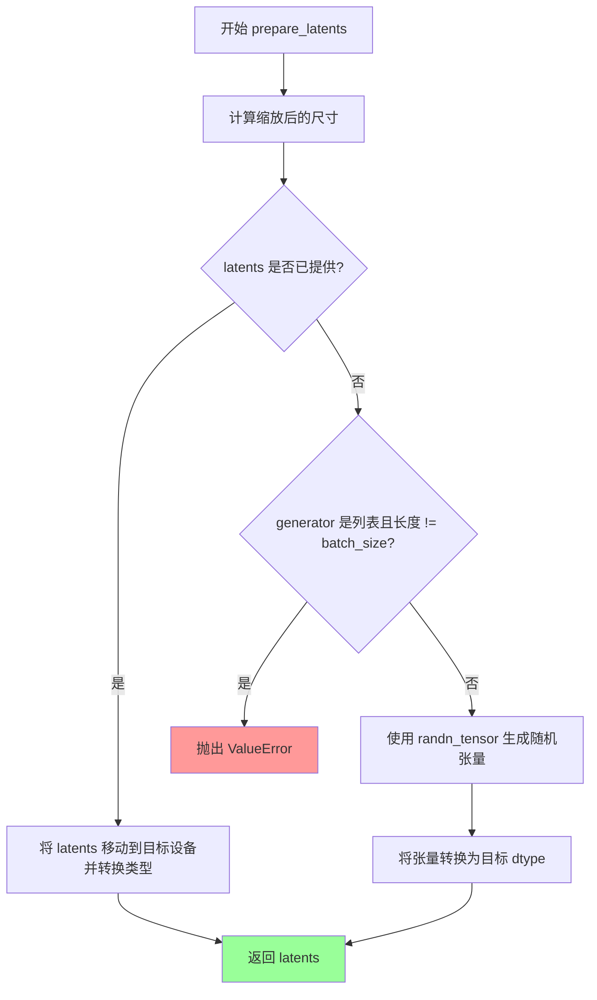

#### 带注释源码

```python
def prepare_latents(
    self,
    batch_size,              # int: 批处理大小
    num_channels_latents,    # int: 潜在变量的通道数
    height,                  # int: 输入图像高度（像素）
    width,                   # int: 输入图像宽度（像素）
    num_frames,              # int: 视频帧数
    dtype,                   # torch.dtype: 目标数据类型
    device,                  # torch.device: 目标设备
    generator,               # torch.Generator or List[torch.Generator]: 随机生成器
    latents=None,            # torch.Tensor: 可选的预生成潜在变量
):
    # 根据VAE的空间缩放因子调整高度和宽度
    # VAE 将像素空间映射到潜在空间，需要除以缩放因子
    height = height // self.vae_spatial_scale_factor
    width = width // self.vae_spatial_scale_factor
    
    # 根据VAE的时间缩放因子调整帧数
    # 潜在空间中的帧数 = (原始帧数 - 1) // 缩放因子 + 1
    # 这种计算方式确保了时间维度的正确下采样
    num_frames = (num_frames - 1) // self.vae_temporal_scale_factor + 1

    # 构建潜在变量的形状：[batch, channels, temporal_frames, height, width]
    shape = (batch_size, num_channels_latents, num_frames, height, width)

    # 如果已经提供了潜在变量，直接转换设备和数据类型后返回
    # 这允许用户复用之前生成的噪声或中间结果
    if latents is not None:
        return latents.to(device=device, dtype=dtype)
    
    # 验证生成器列表的长度是否与批处理大小匹配
    if isinstance(generator, list) and len(generator) != batch_size:
        raise ValueError(
            f"You have passed a list of generators of length {len(generator)}, but requested an effective batch"
            f" size of {batch_size}. Make sure the batch size matches the length of the generators."
        )

    # 使用 randn_tensor 生成符合标准正态分布的随机潜在变量
    # 初始使用 float32 以保证数值精度，后续在去噪循环中可转换为其他精度
    latents = randn_tensor(shape, generator=generator, device=device, dtype=torch.float32)
    
    # 转换为目标数据类型（如 bfloat16）
    latents = latents.to(dtype)
    return latents
```


### `MochiSTGPipeline.__call__`

这是 MochiSTGPipeline 的核心推理方法，负责协调文本到视频的完整生成流程。该方法接受文本提示词和其他生成参数，通过多步去噪过程生成视频帧，支持时空引导（STG）和分类器自由引导（CFG）等高级功能，最终返回生成的视频或潜在表示。

参数：

- `prompt`：`Union[str, List[str]]`，要引导图像生成的提示词，如果未定义，则必须传递 `prompt_embeds`
- `negative_prompt`：`Optional[Union[str, List[str]]]`，用于指导图像生成的反向提示词，当不使用引导时将被忽略
- `height`：`Optional[int]`，生成图像的高度（像素），默认为 `self.default_height`（480）
- `width`：`Optional[int]`，生成图像的宽度（像素），默认为 `self.default_width`（848）
- `num_frames`：`int`，要生成的视频帧数，默认为 19
- `num_inference_steps`：`int`，去噪步骤数，更多去噪步骤通常会导致更高质量的图像，但推理速度较慢，默认为 64
- `timesteps`：`List[int]`，自定义时间步，用于支持调度器的去噪过程
- `guidance_scale`：`float`，分类器自由引导（CFG）的引导比例，定义为方程2中的 w，默认为 4.5
- `num_videos_per_prompt`：`int`，每个提示词生成的视频数量，默认为 1
- `generator`：`Optional[Union[torch.Generator, List[torch.Generator]]]`，随机生成器，用于确保生成的可确定性
- `latents`：`Optional[torch.Tensor]`，预生成的有噪声潜在变量，可用于使用不同提示词进行相同生成
- `prompt_embeds`：`Optional[torch.Tensor]`，预生成的文本嵌入，可用于轻松调整文本输入
- `prompt_attention_mask`：`Optional[torch.Tensor]`，文本嵌入的预生成注意力掩码
- `negative_prompt_embeds`：`Optional[torch.Tensor]`，预生成的负面文本嵌入
- `negative_prompt_attention_mask`：`Optional[torch.Tensor]`，负面文本嵌入的预生成注意力掩码
- `output_type`：`str | None`，输出格式，可选 "pil" 或 "latent"，默认为 "pil"
- `return_dict`：`bool`，是否返回 `MochiPipelineOutput`，默认为 True
- `attention_kwargs`：`Optional[Dict[str, Any]]`，传递给注意力处理器的额外关键字参数
- `callback_on_step_end`：`Optional[Callable[[int, int, Dict], None]]`，每个去噪步骤结束时调用的函数
- `callback_on_step_end_tensor_inputs`：`List[str]`，回调函数要使用的张量输入列表，默认为 ["latents"]
- `max_sequence_length`：`int`，与提示词一起使用的最大序列长度，默认为 256
- `stg_applied_layers_idx`：`Optional[List[int]]`，应用时空引导的层索引，默认为 [34]
- `stg_scale`：`Optional[float]`，时空引导的缩放因子，设置为 0.0 可启用 CFG，默认为 0.0
- `do_rescaling`：`Optional[bool]`，是否执行预测重缩放，默认为 False

返回值：`MochiPipelineOutput` 或 `tuple`，当 `return_dict` 为 True 时返回 `MochiPipelineOutput`，否则返回包含生成视频的元组

#### 流程图

```mermaid
flowchart TD
    A[开始 __call__] --> B[检查回调类型并设置tensor_inputs]
    B --> C[设置默认height和width]
    C --> D[调用 check_inputs 验证输入参数]
    D --> E[初始化内部状态变量<br/>_guidance_scale, _stg_scale, _attention_kwargs等]
    E --> F{是否启用时空引导}
    F -->|是| G[替换transformer_blocks的forward方法为forward_with_stg]
    F -->|否| H[跳过此步骤]
    G --> H
    H --> I[确定batch_size]
    I --> J[调用encode_prompt生成文本嵌入]
    J --> K[调用prepare_latents准备潜在变量]
    K --> L{是否启用CFG}
    L -->|是且无STG| M[连接negative和prompt嵌入]
    L -->|是且有STG| N[连接negative和两个prompt嵌入]
    L -->|否| O[保持原有嵌入]
    M --> P
    N --> P
    O --> P
    P[生成sigma调度并获取timesteps]
    P --> Q[进入去噪循环]
    Q --> R{循环索引i < num_inference_steps}
    R -->|是| S[检查是否中断]
    R -->|否| T[去噪完成]
    S --> U{是否启用CFG且无STG}
    U -->|是| V[复制latents两次]
    U -->|否| W{是否启用CFG且有STG}
    W -->|是| X[复制latents三次]
    W -->|否| Y[保持latents不变]
    X --> Z
    V --> Z
    Y --> Z
    Z[扩展timestep到batch维度]
    Z --> AA[调用transformer进行前向传播]
    AA --> AB[转换noise_pred到FP32]
    AB --> AC{是否启用CFG且无STG}
    AC -->|是| AD[计算CFG: noise_pred_uncond + guidance_scale * (noise_pred_text - noise_pred_uncond)]
    AC -->|否| AE{是否启用CFG且有STG}
    AE -->|是| AF[计算CFG+STG引导]
    AE -->|否| AG[不进行引导]
    AD --> AH
    AF --> AH
    AG --> AH
    AH{do_rescaling是否为True}
    AH -->|是| AI[执行噪声预测重缩放]
    AH -->|否| AJ[跳过重缩放]
    AI --> AK
    AJ --> AK
    AK[调用scheduler.step计算上一步的latents]
    AK --> AL[处理MPS设备类型兼容性]
    AL --> AM{callback_on_step_end是否提供}
    AM -->|是| AN[执行回调函数]
    AM -->|否| AO[跳过回调]
    AN --> AO
    AO --> AP[更新进度条]
    AP --> AQ{是否为最后一个step或满足warmup条件}
    AQ -->|是| AR[调用XLA mark_step]
    AQ -->|否| AS[继续循环]
    AR --> R
    AS --> R
    T --> AT{output_type是否为latent}
    AT -->|是| AU[video = latents]
    AT -->|否| AV[反归一化latents]
    AV --> AW[调用vae.decode生成视频]
    AW --> AX[调用video_processor后处理视频]
    AU --> AY
    AX --> AY
    AY[释放模型钩子]
    AY --> AZ{return_dict是否为True}
    AZ -->|是| BA[返回MochiPipelineOutput]
    AZ -->|否| BB[返回tuple]
    BA --> BC[结束]
    BB --> BC
```

#### 带注释源码

```python
@torch.no_grad()
@replace_example_docstring(EXAMPLE_DOC_STRING)
def __call__(
    self,
    prompt: Union[str, List[str]] = None,
    negative_prompt: Optional[Union[str, List[str]]] = None,
    height: Optional[int] = None,
    width: Optional[int] = None,
    num_frames: int = 19,
    num_inference_steps: int = 64,
    timesteps: List[int] = None,
    guidance_scale: float = 4.5,
    num_videos_per_prompt: Optional[int] = 1,
    generator: Optional[Union[torch.Generator, List[torch.Generator]]] = None,
    latents: Optional[torch.Tensor] = None,
    prompt_embeds: Optional[torch.Tensor] = None,
    prompt_attention_mask: Optional[torch.Tensor] = None,
    negative_prompt_embeds: Optional[torch.Tensor] = None,
    negative_prompt_attention_mask: Optional[torch.Tensor] = None,
    output_type: str | None = "pil",
    return_dict: bool = True,
    attention_kwargs: Optional[Dict[str, Any]] = None,
    callback_on_step_end: Optional[Callable[[int, int, Dict], None]] = None,
    callback_on_step_end_tensor_inputs: List[str] = ["latents"],
    max_sequence_length: int = 256,
    stg_applied_layers_idx: Optional[List[int]] = [34],
    stg_scale: Optional[float] = 0.0,
    do_rescaling: Optional[bool] = False,
):
    r"""
    Function invoked when calling the pipeline for generation.

    Args:
        prompt (`str` or `List[str]`, *optional*):
            The prompt or prompts to guide the image generation. If not defined, one has to pass `prompt_embeds`.
            instead.
        height (`int`, *optional*, defaults to `self.default_height`):
            The height in pixels of the generated image. This is set to 480 by default for the best results.
        width (`int`, *optional*, defaults to `self.default_width`):
            The width in pixels of the generated image. This is set to 848 by default for the best results.
        num_frames (`int`, defaults to `19`):
            The number of video frames to generate
        num_inference_steps (`int`, *optional*, defaults to 50):
            The number of denoising steps. More denoising steps usually lead to a higher quality image at the
            expense of slower inference.
        timesteps (`List[int]`, *optional*):
            Custom timesteps to use for the denoising process with schedulers which support a `timesteps` argument
            in their `set_timesteps` method. If not defined, the default behavior when `num_inference_steps` is
            passed will be used. Must be in descending order.
        guidance_scale (`float`, defaults to `4.5`):
            Guidance scale as defined in [Classifier-Free Diffusion Guidance](https://huggingface.co/papers/2207.12598).
            `guidance_scale` is defined as `w` of equation 2. of [Imagen
            Paper](https://huggingface.co/papers/2205.11487). Guidance scale is enabled by setting `guidance_scale >
            1`. Higher guidance scale encourages to generate images that are closely linked to the text `prompt`,
            usually at the expense of lower image quality.
        num_videos_per_prompt (`int`, *optional*, defaults to 1):
            The number of videos to generate per prompt.
        generator (`torch.Generator` or `List[torch.Generator]`, *optional*):
            One or a list of [torch generator(s)](https://pytorch.org/docs/stable/generated/torch.Generator.html)
            to make generation deterministic.
        latents (`torch.Tensor`, *optional*):
            Pre-generated noisy latents, sampled from a Gaussian distribution, to be used as inputs for image
            generation. Can be used to tweak the same generation with different prompts. If not provided, a latents
            tensor will be generated by sampling using the supplied random `generator`.
        prompt_embeds (`torch.Tensor`, *optional*):
            Pre-generated text embeddings. Can be used to easily tweak text inputs, *e.g.* prompt weighting. If not
            provided, text embeddings will be generated from `prompt` input argument.
        prompt_attention_mask (`torch.Tensor`, *optional*):
            Pre-generated attention mask for text embeddings.
        negative_prompt_embeds (`torch.FloatTensor`, *optional*):
            Pre-generated negative text embeddings. For PixArt-Sigma this negative prompt should be "". If not
            provided, negative_prompt_embeds will be generated from `negative_prompt` input argument.
        negative_prompt_attention_mask (`torch.FloatTensor`, *optional*):
            Pre-generated attention mask for negative text embeddings.
        output_type (`str`, *optional*, defaults to `"pil"`):
            The output format of the generate image. Choose between
            [PIL](https://pillow.readthedocs.io/en/stable/): `PIL.Image.Image` or `np.array`.
        return_dict (`bool`, *optional*, defaults to `True`):
            Whether or not to return a [`~pipelines.mochi.MochiPipelineOutput`] instead of a plain tuple.
        attention_kwargs (`dict`, *optional*):
            A kwargs dictionary that if specified is passed along to the `AttentionProcessor` as defined under
            `self.processor` in
            [diffusers.models.attention_processor](https://github.com/huggingface/diffusers/blob/main/src/diffusers/models/attention_processor.py).
        callback_on_step_end (`Callable`, *optional*):
            A function that calls at the end of each denoising steps during the inference. The function is called
            with the following arguments: `callback_on_step_end(self: DiffusionPipeline, step: int, timestep: int,
            callback_kwargs: Dict)`. `callback_kwargs` will include a list of all tensors as specified by
            `callback_on_step_end_tensor_inputs`.
        callback_on_step_end_tensor_inputs (`List`, *optional*):
            The list of tensor inputs for the `callback_on_step_end` function. The tensors specified in the list
            will be passed as `callback_kwargs` argument. You will only be able to include variables listed in the
            `._callback_tensor_inputs` attribute of your pipeline class.
        max_sequence_length (`int` defaults to `256`):
            Maximum sequence length to use with the `prompt`.

    Examples:

    Returns:
        [`~pipelines.mochi.MochiPipelineOutput`] or `tuple`:
            If `return_dict` is `True`, [`~pipelines.mochi.MochiPipelineOutput`] is returned, otherwise a `tuple`
            is returned where the first element is a list with the generated images.
    """

    # 步骤1: 处理回调函数，提取tensor_inputs
    if isinstance(callback_on_step_end, (PipelineCallback, MultiPipelineCallbacks)):
        callback_on_step_end_tensor_inputs = callback_on_step_end.tensor_inputs

    # 步骤2: 设置默认分辨率
    height = height or self.default_height
    width = width or self.default_width

    # 步骤3: 验证输入参数
    self.check_inputs(
        prompt=prompt,
        height=height,
        width=width,
        callback_on_step_end_tensor_inputs=callback_on_step_end_tensor_inputs,
        prompt_embeds=prompt_embeds,
        negative_prompt_embeds=negative_prompt_embeds,
        prompt_attention_mask=prompt_attention_mask,
        negative_prompt_attention_mask=negative_prompt_attention_mask,
    )

    # 步骤4: 初始化内部状态变量
    self._guidance_scale = guidance_scale
    self._stg_scale = stg_scale
    self._attention_kwargs = attention_kwargs
    self._current_timestep = None
    self._interrupt = False

    # 步骤5: 配置时空引导（STG）
    if self.do_spatio_temporal_guidance:
        for i in stg_applied_layers_idx:
            self.transformer.transformer_blocks[i].forward = types.MethodType(
                forward_with_stg, self.transformer.transformer_blocks[i]
            )

    # 步骤6: 确定批处理大小
    if prompt is not None and isinstance(prompt, str):
        batch_size = 1
    elif prompt is not None and isinstance(prompt, list):
        batch_size = len(prompt)
    else:
        batch_size = prompt_embeds.shape[0]

    device = self._execution_device

    # 步骤7: 编码提示词生成文本嵌入
    (
        prompt_embeds,
        prompt_attention_mask,
        negative_prompt_embeds,
        negative_prompt_attention_mask,
    ) = self.encode_prompt(
        prompt=prompt,
        negative_prompt=negative_prompt,
        do_classifier_free_guidance=self.do_classifier_free_guidance,
        num_videos_per_prompt=num_videos_per_prompt,
        prompt_embeds=prompt_embeds,
        negative_prompt_embeds=negative_prompt_embeds,
        prompt_attention_mask=prompt_attention_mask,
        negative_prompt_attention_mask=negative_prompt_attention_mask,
        max_sequence_length=max_sequence_length,
        device=device,
    )

    # 步骤8: 准备潜在变量
    num_channels_latents = self.transformer.config.in_channels
    latents = self.prepare_latents(
        batch_size * num_videos_per_prompt,
        num_channels_latents,
        height,
        width,
        num_frames,
        prompt_embeds.dtype,
        device,
        generator,
        latents,
    )

    # 步骤9: 处理分类器自由引导和时空引导
    if self.do_classifier_free_guidance and not self.do_spatio_temporal_guidance:
        # 仅CFG：连接负面和正面提示
        prompt_embeds = torch.cat([negative_prompt_embeds, prompt_embeds], dim=0)
        prompt_attention_mask = torch.cat([negative_prompt_attention_mask, prompt_attention_mask], dim=0)
    elif self.do_classifier_free_guidance and self.do_spatio_temporal_guidance:
        # CFG + STG：连接负面和两个正面提示（一个用于CFG，一个用于STG扰动）
        prompt_embeds = torch.cat([negative_prompt_embeds, prompt_embeds, prompt_embeds], dim=0)
        prompt_attention_mask = torch.cat(
            [negative_prompt_attention_mask, prompt_attention_mask, prompt_attention_mask], dim=0
        )

    # 步骤10: 生成时间步调度
    # 使用线性二次调度生成sigma曲线
    threshold_noise = 0.025
    sigmas = linear_quadratic_schedule(num_inference_steps, threshold_noise)
    sigmas = np.array(sigmas)

    # 检索时间步
    timesteps, num_inference_steps = retrieve_timesteps(
        self.scheduler,
        num_inference_steps,
        device,
        timesteps,
        sigmas,
    )

    # 计算预热步骤
    num_warmup_steps = max(len(timesteps) - num_inference_steps * self.scheduler.order, 0)
    self._num_timesteps = len(timesteps)

    # 步骤11: 去噪循环
    with self.progress_bar(total=num_inference_steps) as progress_bar:
        for i, t in enumerate(timesteps):
            # 检查中断信号
            if self.interrupt:
                continue

            # 注意：Mochi使用反向时间步。为确保与FasterCache等方法兼容，需要使用正确的非反向时间步值
            self._current_timestep = 1000 - t

            # 为批处理维度扩展latent_model_input
            if self.do_classifier_free_guidance and not self.do_spatio_temporal_guidance:
                latent_model_input = torch.cat([latents] * 2)
            elif self.do_classifier_free_guidance and self.do_spatio_temporal_guidance:
                latent_model_input = torch.cat([latents] * 3)
            else:
                latent_model_input = latents

            # 扩展时间步以兼容ONNX/Core ML
            timestep = t.expand(latent_model_input.shape[0]).to(latents.dtype)

            # 步骤11a: 调用Transformer进行前向传播
            noise_pred = self.transformer(
                hidden_states=latent_model_input,
                encoder_hidden_states=prompt_embeds,
                timestep=timestep,
                encoder_attention_mask=prompt_attention_mask,
                attention_kwargs=attention_kwargs,
                return_dict=False,
            )[0]

            # Mochi CFG + Sampling runs in FP32
            noise_pred = noise_pred.to(torch.float32)

            # 步骤11b: 应用引导
            if self.do_classifier_free_guidance and not self.do_spatio_temporal_guidance:
                # 标准CFG
                noise_pred_uncond, noise_pred_text = noise_pred.chunk(2)
                noise_pred = noise_pred_uncond + self.guidance_scale * (noise_pred_text - noise_pred_uncond)
            elif self.do_classifier_free_guidance and self.do_spatio_temporal_guidance:
                # CFG + STG组合引导
                noise_pred_uncond, noise_pred_text, noise_pred_perturb = noise_pred.chunk(3)
                noise_pred = (
                    noise_pred_uncond
                    + self.guidance_scale * (noise_pred_text - noise_pred_uncond)
                    + self._stg_scale * (noise_pred_text - noise_pred_perturb)
                )

            # 步骤11c: 可选的重缩放
            if do_rescaling:
                rescaling_scale = 0.7
                factor = noise_pred_text.std() / noise_pred.std()
                factor = rescaling_scale * factor + (1 - rescaling_scale)
                noise_pred = noise_pred * factor

            # 步骤11d: 计算上一步的去噪样本 x_t -> x_t-1
            latents_dtype = latents.dtype
            latents = self.scheduler.step(noise_pred, t, latents.to(torch.float32), return_dict=False)[0]
            latents = latents.to(latents_dtype)

            # 处理MPS设备类型兼容性
            if latents.dtype != latents_dtype:
                if torch.backends.mps.is_available():
                    # 某些平台（如apple mps）由于pytorch bug而表现异常
                    latents = latents.to(latents_dtype)

            # 步骤11e: 执行回调函数
            if callback_on_step_end is not None:
                callback_kwargs = {}
                for k in callback_on_step_end_tensor_inputs:
                    callback_kwargs[k] = locals()[k]
                callback_outputs = callback_on_step_end(self, i, t, callback_kwargs)

                latents = callback_outputs.pop("latents", latents)
                prompt_embeds = callback_outputs.pop("prompt_embeds", prompt_embeds)

            # 步骤11f: 更新进度条
            if i == len(timesteps) - 1 or ((i + 1) > num_warmup_steps and (i + 1) % self.scheduler.order == 0):
                progress_bar.update()

            # 处理XLA设备
            if XLA_AVAILABLE:
                xm.mark_step()

    # 清除当前时间步
    self._current_timestep = None

    # 步骤12: 后处理
    if output_type == "latent":
        video = latents
    else:
        # 步骤12a: 反归一化latents
        has_latents_mean = hasattr(self.vae.config, "latents_mean") and self.vae.config.latents_mean is not None
        has_latents_std = hasattr(self.vae.config, "latents_std") and self.vae.config.latents_std is not None
        if has_latents_mean and has_latents_std:
            latents_mean = (
                torch.tensor(self.vae.config.latents_mean).view(1, 12, 1, 1, 1).to(latents.device, latents.dtype)
            )
            latents_std = (
                torch.tensor(self.vae.config.latents_std).view(1, 12, 1, 1, 1).to(latents.device, latents.dtype)
            )
            latents = latents * latents_std / self.vae.config.scaling_factor + latents_mean
        else:
            latents = latents / self.vae.config.scaling_factor

        # 步骤12b: VAE解码
        video = self.vae.decode(latents, return_dict=False)[0]

        # 步骤12c: 视频后处理
        video = self.video_processor.postprocess_video(video, output_type=output_type)

    # 步骤13: 释放所有模型
    self.maybe_free_model_hooks()

    # 步骤14: 返回结果
    if not return_dict:
        return (video,)

    return MochiPipelineOutput(frames=video)
```

## 关键组件


### MochiSTGPipeline

核心扩散管道类，集成T5文本编码器、MochiTransformer3DModel变换器和AutoencoderKLMochi VAE，实现文本到视频生成功能，支持时空引导(STG)机制和分类器自由引导(CFG)。

### forward_with_stg

时空引导(SPATIO-TEMPORAL GUIDANCE)前向传播函数，通过张量索引切片hidden_states实现对特定层的高效控制，扰动噪声预测过程。

### linear_quadraticSchedule

噪声调度函数，生成从线性到二次过渡的sigma值序列，控制去噪过程中的噪声衰减曲线。

### retrieve_timesteps

时间步检索函数，获取并设置调度器的时间步，支持自定义timesteps或sigmas参数，兼容不同调度器配置。

### _get_t5_prompt_embeds

T5文本嵌入生成函数，将文本提示编码为T5encoder的hidden states，处理填充、截断和批量生成，生成用于条件引导的文本特征。

### encode_prompt

提示编码主函数，集成T5编码和负提示处理，支持分类器自由引导，验证并规范化输入提示和嵌入张量。

### check_inputs

输入验证函数，检查高度/宽度倍数、回调张量输入类型、提示与嵌入的互斥关系，确保参数合法性和一致性。

### prepare_latents

潜在变量准备函数，根据VAE的空间和时间缩放因子计算潜在空间的形状，支持随机生成或使用提供的潜在变量。

### __call__

主生成方法，执行完整的文本到视频扩散推理流程，包括文本编码、潜在变量初始化、去噪循环、CFG/STG处理、VAE解码和后处理。

### enable_vae_slicing / disable_vae_slicing

VAE切片解码控制方法，将VAE输入张量分片处理以节省显存，支持更大批次生成（已弃用，建议使用vae自身的接口）。

### enable_vae_tiling / disable_vae_tiling

VAE平铺解码控制方法，将输入张量分块处理以处理更大分辨率图像，支持高分辨率视频生成（已弃用，建议使用vae自身的接口）。

### VideoProcessor

视频后处理器，将VAE输出的潜在表示转换为最终视频帧，应用标准化和格式转换。

### Mochi1LoraLoaderMixin

LoRA加载混入类，提供Mochi-1模型的LoRA权重加载功能，支持个性化模型微调。


## 问题及建议


### 已知问题

- **Monkey Patch 方式不够优雅**：`forward_with_stg` 函数通过 `types.MethodType` 动态绑定到 transformer blocks 上，这种 monkey patch 方式难以追踪和维护，容易在不同版本中失效。
- **硬编码的魔法数值**：多处使用硬编码值（如 `threshold_noise = 0.025`、`rescaling_scale = 0.7`、`stg_applied_layers_idx = [34]`），这些应该作为可配置参数。
- **过时的deprecated方法仍保留**：虽然标记为 deprecated，但 `enable_vae_slicing`、`disable_vae_slicing`、`enable_vae_tiling`、`disable_vae_tiling` 这些方法只是简单包装底层方法后调用 deprecate，没有实际价值，增加代码复杂度。
- **类变量共享风险**：`_optional_components = []` 和 `_callback_tensor_inputs` 作为可变类变量，可能在类实例间共享状态（虽然这里是空列表，但仍存在风险）。
- **重复的条件分支逻辑**：在 `__call__` 方法中，CFG 和 STG 的条件判断重复出现多次（如 `if self.do_classifier_free_guidance and not self.do_spatio_temporal_guidance`），导致代码冗长且难以维护。
- **Python 版本兼容性问题**：使用了 `str | None` 语法（Python 3.10+），可能与旧版本 Python 不兼容。
- **错误处理不足**：缺少对 `stg_applied_layers_idx` 索引范围的有效验证，以及 `num_frames` 必须为奇数等约束条件的检查。

### 优化建议

- **重构条件分支**：将 CFG 和 STG 的组合逻辑提取为独立方法或使用策略模式，减少重复代码。
- **参数化配置**：将硬编码值（threshold_noise、rescaling_scale 等）提取为构造函数参数或配置文件选项。
- **移除废弃方法**：如果版本已升级到移除这些方法的版本，应直接删除 deprecated 方法而非保留空包装。
- **增加输入验证**：在 `__call__` 方法开始时添加对 `stg_applied_layers_idx` 索引范围、`num_frames` 奇偶性等约束的验证。
- **统一类型注解**：使用 `Optional[str]` 替代 `str | None` 以保持 Python 3.9+ 兼容性。
- **优化 STG 实现**：考虑将 `forward_with_stg` 改为正式的 AttentionProcessor 子类实现，而非 monkey patch。

## 其它


### 设计目标与约束

本管道的设计目标是实现高质量的文本到视频生成，通过结合T5文本编码器、MochiTransformer3DModel变换器模型和AutoencoderKLMochi VAE实现视频的潜空间编码与解码。核心约束包括：1) 输入分辨率必须能被8整除；2) 默认高度480像素、宽度848像素；3) 默认生成19帧视频；4) max_sequence_length限制为256个token；5) 支持FP16/BF16推理但Mochi CFG+Sampling必须在FP32下运行以防止溢出。

### 错误处理与异常设计

管道在多个环节实现了严格的输入验证：1) check_inputs方法验证height和width必须被8整除；2) 验证callback_on_step_end_tensor_inputs必须属于允许列表；3) prompt和prompt_embeds不能同时传递；4) prompt_embeds和negative_prompt_embeds形状必须匹配；5) prompt_attention_mask与negative_prompt_attention_mask形状必须匹配。retrieve_timesteps函数检查scheduler是否支持自定义timesteps或sigmas，不支持时抛出ValueError。prepare_latents方法验证generator列表长度与batch_size匹配。

### 数据流与状态机

管道执行遵循严格的顺序状态机：1) 初始化状态——加载模型组件；2) 输入验证状态——check_inputs；3) 文本编码状态——encode_prompt生成prompt_embeds和negative_prompt_embeds；4) 潜变量准备状态——prepare_latents初始化随机噪声或使用提供的latents；5) 时间步调度状态——retrieve_timesteps根据sigmas生成时间步序列；6) 去噪循环状态——遍历每个时间步执行transformer前向传播、CFG计算、STG计算（可选）、scheduler.step；7) VAE解码状态——latents解码为视频帧；8) 后处理状态——video_processor转换输出格式。

### 外部依赖与接口契约

核心依赖包括：1) transformers库——T5EncoderModel和T5TokenizerFast用于文本编码；2) diffusers库——DiffusionPipeline基类、MochiTransformer3DModel、AutoencoderKLMochi、FlowMatchEulerDiscreteScheduler；3) torch——张量运算和模型执行；4) numpy——数值计算特别是linear_quadratic_schedule的sigma计算。外部模型依赖：genmo/mochi-1-preview预训练模型权重，通过from_pretrained加载。接口契约遵循DiffusionPipeline标准：__call__方法接受prompt等参数，返回MochiPipelineOutput或tuple。

### 性能优化策略

管道支持多种性能优化：1) 模型CPU卸载——通过enable_model_cpu_offload实现transformer、text_encoder、vae的顺序卸载；2) VAE切片——enable_vae_slicing将输入tensor分片处理以节省内存；3) VAE平铺——enable_vae_tiling将大图像分块编码/解码；4) XLA支持——当torch_xla可用时使用xm.mark_step()优化TPU执行；5) 混合精度——支持BF16/FP16但关键计算转FP32。stg_applied_layers_idx参数允许选择性应用STG到特定变换器块，减少计算开销。

### 内存管理与资源清理

管道实现了自动资源管理：1) 模型卸载——maybe_free_model_hooks()在生成完成后释放所有模型；2) 梯度禁用——@torch.no_grad()装饰器确保推理时不计算梯度；3) 动态精度转换——latents在scheduler.step前后进行dtype转换以平衡精度与内存；4) MPS设备特殊处理——apple mps设备有已知bug需特殊处理dtype转换。XLA环境下使用mark_step()优化内存使用。

### 版本兼容性考虑

代码标记了版本废弃警告：enable_vae_slicing、disable_vae_slicing、enable_vae_tiling、disable_vae_tiling方法将在0.40.0版本移除，推荐直接调用vae.enable_slicing()等方法。force_zeros_for_empty_prompt配置参数用于处理空negative_prompt的兼容性问题。transformer.blocks.forward方法通过types.MethodType动态替换以支持STG功能，需注意不同版本模型结构可能导致的兼容性问题。

### 安全性考虑

管道处理用户输入时需注意：1) prompt截断——当max_sequence_length限制时截断警告会泄露被移除的文本内容；2) 模型权重安全——从HuggingFace Hub加载模型需验证来源可信；3) 潜在恶意输入——超长prompt可能导致tokenizer处理异常；4) 设备安全——device参数需验证有效性。代码未实现输入过滤或内容安全审查。

### 配置参数详解

关键配置参数：1) force_zeros_for_empty_prompt——空prompt时是否强制zero embeddings防止overflow；2) vae_spatial_scale_factor=8——VAE空间下采样倍数；3) vae_temporal_scale_factor=6——VAE时间轴下采样倍数；4) patch_size=2——Transformer patch大小；5) default_height=480、default_width=848——默认输出分辨率；6) tokenizer_max_length——T5 tokenizer最大长度默认256。stg_scale参数控制时空引导强度，do_rescaling启用噪声预测缩放。

### 关键算法说明

1) linear_quadraticSchedule算法——生成非线性的sigma调度，前半段线性增长到threshold_noise，后半段二次曲线平滑过渡到1.0，这种调度平衡了细粒度与快速去噪；2) STG (Spatio-Temporal Guidance)——通过forward_with_stg函数修改特定transformer块的注意力计算，注入时空引导信号，stg_scale>0时启用；3) CFG (Classifier-Free Guidance)——标准引导公式noise_pred = noise_pred_uncond + guidance_scale * (noise_pred_text - noise_pred_uncond)；4) Flow Match离散调度——使用FlowMatchEulerDiscreteScheduler实现基于流匹配的采样过程。

### 测试策略建议

1) 单元测试——验证check_inputs对各类非法输入的异常抛出；2) 集成测试——使用短prompt和小参数(num_inferences_steps=2, num_frames=5)验证完整pipeline可运行；3) 数值稳定性测试——验证BF16/FP16模式下的输出质量与FP32差异；4) STG功能测试——对比stg_scale=0和stg_scale>0时的输出差异；5) 内存泄漏测试——连续多次调用pipeline验证内存不持续增长；6) 模型卸载测试——验证enable_model_cpu_offload后GPU内存正确释放。

### 部署注意事项

1) GPU显存需求——全模型加载需至少24GB显存，建议使用enable_model_cpu_offload；2) 批处理限制——num_videos_per_prompt增加会线性增加显存需求；3) 输出格式——output_type="latent"可跳过VAE解码大幅节省显存；4) 异步推理——callback_on_step_end支持自定义后处理但需注意GIL限制；5) 分布式推理——当前未原生支持多GPU并行，需外部框架协调。

    