# `diffusers\examples\community\pipeline_stg_wan.py` 详细设计文档

WanSTGPipeline是一个基于扩散模型的文本到视频生成管道，支持时空引导(STG)功能，能够根据文本提示生成高质量视频内容。该管道集成了T5文本编码器、Wan变换器模型和VAE解码器，并提供了灵活的控制参数如guidance_scale和stg_scale来调节生成效果。

## 整体流程

```mermaid
graph TD
    A[开始] --> B[检查输入参数]
    B --> C[编码提示词]
    C --> D[准备时间步]
    D --> E[准备潜在变量]
    E --> F{开始去噪循环}
    F --> G[获取噪声预测]
    G --> H{是否使用CFG?] --> I[计算无条件预测]
    I --> J{是否使用STG?] --> K[计算STG扰动]
    K --> L[组合噪声预测]
    J --> M[直接使用CFG]
    L --> N[更新潜在变量]
    M --> N
    N --> O[执行回调]
    O --> P{是否完成所有步]
    P -- 否 --> F
    P -- 是 --> Q[VAE解码]
    Q --> R[后处理视频]
    R --> S[返回结果]
```

## 类结构

```
DiffusionPipeline (基类)
└── WanSTGPipeline
    ├── WanLoraLoaderMixin (混合基类)
    └── 组件模块
        ├── tokenizer (AutoTokenizer)
        ├── text_encoder (UMT5EncoderModel)
        ├── transformer (WanTransformer3DModel)
        ├── vae (AutoencoderKLWan)
        └── scheduler (FlowMatchEulerDiscreteScheduler)
```

## 全局变量及字段


### `XLA_AVAILABLE`
    
标记XLA(TensorFlow for PyTorch)是否可用的布尔值

类型：`bool`
    


### `logger`
    
用于记录日志的日志记录器对象

类型：`logging.Logger`
    


### `EXAMPLE_DOC_STRING`
    
包含示例代码和使用说明的文档字符串

类型：`str`
    


### `WanSTGPipeline.vae_scale_factor_temporal`
    
VAE时间维度缩放因子，用于计算潜在帧数

类型：`int`
    


### `WanSTGPipeline.vae_scale_factor_spatial`
    
VAE空间维度缩放因子，用于计算潜在空间尺寸

类型：`int`
    


### `WanSTGPipeline.video_processor`
    
视频处理工具，用于视频的后处理和格式转换

类型：`VideoProcessor`
    


### `WanSTGPipeline._guidance_scale`
    
无分类器自由引导比例，控制文本提示对生成结果的影响程度

类型：`float`
    


### `WanSTGPipeline._stg_scale`
    
时空引导(STG)比例，控制时空引导对去噪过程的影响程度

类型：`float`
    


### `WanSTGPipeline._attention_kwargs`
    
注意力机制的额外参数字典，用于传递给注意力处理器

类型：`Optional[Dict[str, Any]]`
    


### `WanSTGPipeline._current_timestep`
    
当前去噪步骤的时间步，用于追踪生成进度

类型：`Optional[int]`
    


### `WanSTGPipeline._num_timesteps`
    
总的时间步数量，表示去噪过程的总步骤数

类型：`int`
    


### `WanSTGPipeline._interrupt`
    
中断标志，用于控制生成过程的中断和恢复

类型：`bool`
    


### `WanSTGPipeline.vae`
    
变分自编码器模型，用于视频的编码和解码

类型：`AutoencoderKLWan`
    


### `WanSTGPipeline.text_encoder`
    
T5文本编码器模型，将文本提示转换为嵌入向量

类型：`UMT5EncoderModel`
    


### `WanSTGPipeline.tokenizer`
    
分词器，用于将文本分割成标记序列

类型：`AutoTokenizer`
    


### `WanSTGPipeline.transformer`
    
3D Transformer模型，用于潜在空间的去噪过程

类型：`WanTransformer3DModel`
    


### `WanSTGPipeline.scheduler`
    
调度器，控制去噪过程中的时间步和噪声调度

类型：`FlowMatchEulerDiscreteScheduler`
    
    

## 全局函数及方法


### `basic_clean`

该函数是文本预处理管道中的基础清理模块，主要用于对原始输入文本进行HTML实体解码和文本编码修复，确保后续处理（如prompt_clean、whitespace_clean）的输入是干净、规范的文本格式。

参数：

- `text`：`str`，需要清理的原始输入文本

返回值：`str`，经过HTML实体双重解码和ftfy修复后的干净文本

#### 流程图

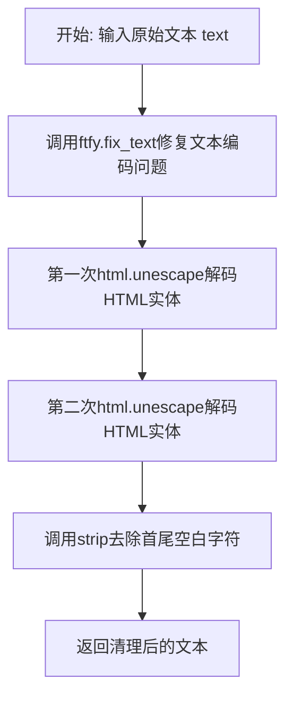

#### 带注释源码

```python
def basic_clean(text):
    """
    对输入文本进行基础的清理处理
    
    该函数是文本预处理流水线中的第一道工序，主要完成以下任务：
    1. 使用ftfy修复常见的文本编码问题（如UTF-8编码错误、mojibake等）
    2. 连续两次调用html.unescape确保HTML实体被完全解码（处理嵌套转义情况）
    3. 去除文本首尾的空白字符
    
    Args:
        text (str): 需要清理的原始文本，可能包含HTML实体或编码问题
        
    Returns:
        str: 清理后的干净文本
    """
    # 使用ftfy库修复常见的文本编码问题
    # ftfy可以修复如 "é" -> "é" 这类mojibake问题
    text = ftfy.fix_text(text)
    
    # 第一次解码HTML实体，如 "&" -> "&"
    # 连续两次解码是为了处理嵌套转义的情况，如 "&amp;lt;" -> "&lt;" -> "<"
    text = html.unescape(html.unescape(text))
    
    # 去除文本首尾的空白字符，包括空格、换行、制表符等
    return text.strip()
```


### `whitespace_clean`

该函数是一个文本预处理工具，用于清理输入文本中的多余空白字符，将连续空白字符替换为单个空格，并去除文本首尾的空格，确保文本格式规范整洁。

参数：

- `text`：`str`，需要清理的原始文本

返回值：`str`，清理后的文本

#### 流程图

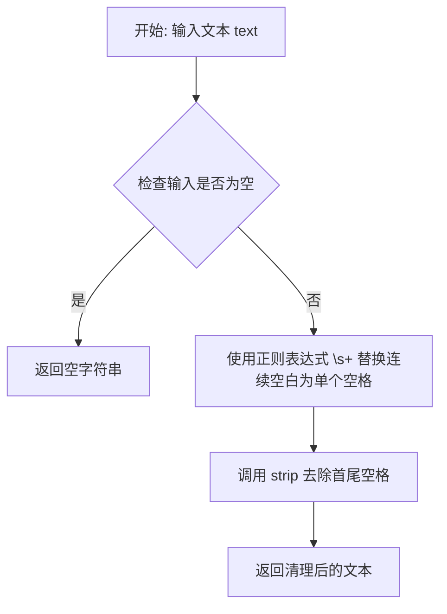

#### 带注释源码

```
def whitespace_clean(text):
    # 使用正则表达式将所有连续的空白色字符（空格、制表符、换行符等）
    # 替换为单个空格字符
    text = re.sub(r"\s+", " ", text)
    
    # 去除文本开头和结尾的空格
    text = text.strip()
    
    # 返回清理后的文本
    return text
```


### `prompt_clean`

该函数是 Wan 视频生成管道中的文本预处理函数，通过组合 `basic_clean` 和 `whitespace_clean` 两个辅助函数，对用户输入的 prompt 进行全面的文本清洗和规范化处理，去除 HTML 转义字符、修复编码问题、并规范化空白字符。

参数：

- `text`：`str`，需要清洗的原始文本 prompt

返回值：`str`，清洗和规范化后的文本

#### 流程图

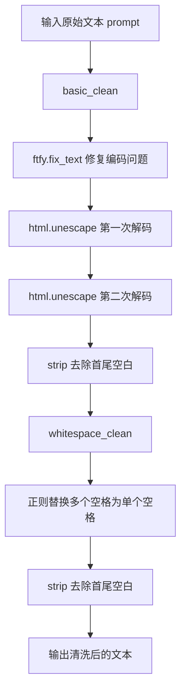

#### 带注释源码

```python
def prompt_clean(text):
    """
    清洗和规范化输入的文本 prompt。
    
    该函数通过组合 basic_clean 和 whitespace_clean 两个辅助函数，
    完整地处理文本清洗流程：
    1. 修复文本编码问题（使用 ftfy）
    2. 解码 HTML 实体（使用 html.unescape）
    3. 规范化空白字符（使用正则表达式）
    
    Args:
        text: 需要清洗的原始文本 prompt
        
    Returns:
        清洗和规范化后的文本字符串
    """
    # 第一步：basic_clean 处理编码问题和 HTML 实体
    # - ftfy.fix_text: 修复常见的文本编码错误
    # - html.unescape: 解码 HTML 实体（如 &amp; -> &）
    #   调用两次确保完全解码
    # - strip: 去除首尾空白字符
    text = whitespace_clean(basic_clean(text))
    
    # 第二步：whitespace_clean 规范化空白字符
    # - 正则表达式 \s+ 匹配一个或多个空白字符
    # - 替换为单个空格
    # - 再次 strip 确保没有首尾空白
    return text
```


### `forward_with_stg`

这是一个用于Spatio-Temporal Guidance（时空引导）的Transformer块前向传播函数。当启用STG模式时，该函数被动态替换到指定的transformer块上，以实现对视频生成过程的时空引导控制。

参数：

- `self`：调用此方法的transformer块对象实例
- `hidden_states`：`torch.Tensor`，输入的隐藏状态张量，表示当前层的特征表示
- `encoder_hidden_states`：`torch.Tensor`，编码器生成的文本嵌入隐藏状态，用于cross-attention
- `temb`：`torch.Tensor`，时间步嵌入向量，用于调节生成过程
- `rotary_emb`：`torch.Tensor`，旋转位置编码（RoPE），用于提供位置信息

返回值：`torch.Tensor`，处理后的隐藏状态张量

#### 流程图

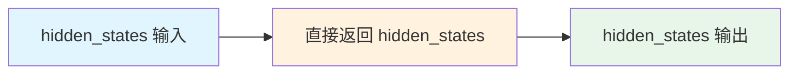

#### 带注释源码

```python
def forward_with_stg(
    self,
    hidden_states: torch.Tensor,
    encoder_hidden_states: torch.Tensor,
    temb: torch.Tensor,
    rotary_emb: torch.Tensor,
) -> torch.Tensor:
    """
    Spatio-Temporal Guidance (STG) 模式下的前向传播函数
    
    该函数是一个占位符实现，当启用STG模式时，会被动态替换到transformer的指定块上。
    在当前实现中，它直接返回输入的hidden_states，不进行任何实际的处理。
    实际的STG处理逻辑通过对比有STG和无STG的噪声预测来实现：
    noise_pred = noise_uncond + guidance_scale * (noise_pred - noise_uncond) + stg_scale * (noise_pred - noise_perturb)
    
    参数:
        self: transformer块实例
        hidden_states: 输入的隐藏状态张量 [batch, channels, frames, height, width]
        encoder_hidden_states: 文本编码器的隐藏状态
        temb: 时间步嵌入向量
        rotary_emb: 旋转位置编码
    
    返回:
        torch.Tensor: 未经修改的hidden_states
    """
    return hidden_states
```


### `forward_without_stg`

该函数是 Wan Transformer 块的标准前向传播实现，包含了自注意力（Self-Attention）、交叉注意力（Cross-Attention）和前馈网络（Feed-Forward Network）三个核心模块，通过 `scale_shift_table` 和时间嵌入 `temb` 计算注意力机制的 shift 和 scale 参数，实现对隐藏状态的逐步处理和特征提取。

参数：

- `self`：类实例，Transformer 块对象，包含 norm1、attn1、norm2、attn2、norm3、ffn、scale_shift_table 等属性
- `hidden_states`：`torch.Tensor`，输入的隐藏状态张量，形状为 (batch, seq_len, hidden_dim)
- `encoder_hidden_states`：`torch.Tensor`，编码器的隐藏状态，用于 cross-attention 计算
- `temb`：`torch.Tensor`，时间嵌入向量，用于计算 shift 和 scale 注意力参数
- `rotary_emb`：`torch.Tensor`，旋转位置嵌入，用于自注意力中的位置编码

返回值：`torch.Tensor`，处理后的隐藏状态张量，形状与输入相同

#### 流程图

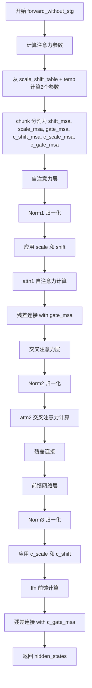

#### 带注释源码

```python
def forward_without_stg(
    self,
    hidden_states: torch.Tensor,
    encoder_hidden_states: torch.Tensor,
    temb: torch.Tensor,
    rotary_emb: torch.Tensor,
) -> torch.Tensor:
    """
    Wan Transformer 块的标准前向传播（不含时空引导）
    
    参数:
        hidden_states: 输入的隐藏状态
        encoder_hidden_states: 编码器输出的隐藏状态（用于cross-attention）
        temb: 时间嵌入，用于计算注意力机制的scale和shift参数
        rotary_emb: 旋转位置嵌入
    
    返回:
        处理后的隐藏状态
    """
    # 从 scale_shift_table 和时间嵌入 temb 计算6个注意力参数
    # 这些参数用于自适应地调整注意力机制的特征变换
    shift_msa, scale_msa, gate_msa, c_shift_msa, c_scale_msa, c_gate_msa = (
        self.scale_shift_table + temb.float()
    ).chunk(6, dim=1)

    # ==================== 1. 自注意力层 (Self-Attention) ====================
    # 对 hidden_states 进行归一化，并应用 scale 和 shift 变换
    # (1 + scale_msa) 允许在训练过程中渐进式地启用自适应机制
    norm_hidden_states = (self.norm1(hidden_states.float()) * (1 + scale_msa) + shift_msa).type_as(hidden_states)
    # 执行自注意力计算，使用旋转位置嵌入
    attn_output = self.attn1(hidden_states=norm_hidden_states, rotary_emb=rotary_emb)
    # 残差连接：原始 hidden_states + 门控后的注意力输出
    # gate_msa 作为门控因子，控制注意力信息的流动
    hidden_states = (hidden_states.float() + attn_output * gate_msa).type_as(hidden_states)

    # ==================== 2. 交叉注意力层 (Cross-Attention) ====================
    # 对自注意力的输出进行归一化
    norm_hidden_states = self.norm2(hidden_states.float()).type_as(hidden_states)
    # 执行交叉注意力计算，Query 来自 hidden_states，Key/Value 来自 encoder_hidden_states
    # 这允许模型关注文本编码器的信息
    attn_output = self.attn2(hidden_states=norm_hidden_states, encoder_hidden_states=encoder_hidden_states)
    # 残差连接：直接加上交叉注意力输出
    hidden_states = hidden_states + attn_output

    # ==================== 3. 前馈网络层 (Feed-Forward Network) ====================
    # 对交叉注意力输出进行归一化，并应用另一组 scale 和 shift 变换
    norm_hidden_states = (self.norm3(hidden_states.float()) * (1 + c_scale_msa) + c_shift_msa).type_as(hidden_states)
    # 执行前馈网络计算
    ff_output = self.ffn(norm_hidden_states)
    # 残差连接：原始 hidden_states + 门控后的前馈输出
    # c_gate_msa 作为门控因子，控制前馈网络信息的流动
    hidden_states = (hidden_states.float() + ff_output.float() * c_gate_msa).type_as(hidden_states)

    return hidden_states
```


### `WanSTGPipeline.__init__`

该方法是 WanSTGPipeline 类的初始化构造函数，负责接收并注册所有必需的模型组件（tokenizer、text_encoder、transformer、vae、scheduler），并根据 VAE 的配置计算视频处理的时空缩放因子，同时初始化视频处理器。

参数：

- `tokenizer`：`AutoTokenizer`，T5 分词器，用于将文本 prompt 转换为 token 序列
- `text_encoder`：`UMT5EncoderModel`，T5 文本编码器模型，用于将 token 序列编码为文本嵌入
- `transformer`：`WanTransformer3DModel`，Wan 3D 变换器模型，用于去噪潜在表示
- `vae`：`AutoencoderKLWan`，Wan VAE 模型，用于编码和解码视频到潜在表示
- `scheduler`：`FlowMatchEulerDiscreteScheduler`，流匹配欧拉离散调度器，用于去噪过程

返回值：无（`None`），构造函数不返回任何值

#### 流程图

```mermaid
flowchart TD
    A[开始 __init__] --> B[调用 super().__init__ 初始化基类]
    B --> C[调用 register_modules 注册 vae, text_encoder, tokenizer, transformer, scheduler]
    C --> D{self.vae 是否存在}
    D -->|是| E[计算 vae_scale_factor_temporal = 2^sum(vae.temperal_downsample)]
    D -->|否| F[设置 vae_scale_factor_temporal = 4]
    E --> G[计算 vae_scale_factor_spatial = 2^len(vae.temperal_downsample)]
    F --> G
    G --> H[初始化 VideoProcessor 并赋值给 self.video_processor]
    H --> I[结束 __init__]
```

#### 带注释源码

```python
def __init__(
    self,
    tokenizer: AutoTokenizer,
    text_encoder: UMT5EncoderModel,
    transformer: WanTransformer3DModel,
    vae: AutoencoderKLWan,
    scheduler: FlowMatchEulerDiscreteScheduler,
):
    """
    初始化 WanSTGPipeline 管道
    
    参数:
        tokenizer: T5 分词器，用于文本预处理
        text_encoder: T5 文本编码器，用于生成文本嵌入
        transformer: Wan 3D 变换器，用于去噪过程
        vae: VAE 编解码器，用于视频与潜在表示之间的转换
        scheduler: 调度器，控制去噪步骤
    """
    # 调用父类 DiffusionPipeline 的初始化方法
    # 设置管道的基本属性和配置
    super().__init__()
    
    # 注册所有模型组件，使它们可以通过管道属性访问
    # 同时确保这些模块会被正确地保存和加载
    self.register_modules(
        vae=vae,
        text_encoder=text_encoder,
        tokenizer=tokenizer,
        transformer=transformer,
        scheduler=scheduler,
    )
    
    # 计算 VAE 的时间维度缩放因子
    # 用于将原始帧数转换为潜在表示的帧数
    # 如果 vae 存在，则根据其 temperal_downsample 属性计算，否则默认为 4
    self.vae_scale_factor_temporal = 2 ** sum(self.vae.temperal_downsample) if getattr(self, "vae", None) else 4
    
    # 计算 VAE 的空间维度缩放因子
    # 用于将原始空间尺寸（高、宽）转换为潜在表示的尺寸
    # 如果 vae 存在，则根据其 temperal_downsample 列表长度计算，否则默认为 8
    self.vae_scale_factor_spatial = 2 ** len(self.vae.temperal_downsample) if getattr(self, "vae", None) else 8
    
    # 初始化视频后处理器
    # 用于将 VAE 解码后的潜在表示转换为最终的视频输出格式
    # 使用空间缩放因子作为参数
    self.video_processor = VideoProcessor(vae_scale_factor=self.vae_scale_factor_spatial)
```


### `WanSTGPipeline._get_t5_prompt_embeds`

该方法将文本提示词编码为 T5 模型的隐藏状态嵌入，用于 Wan 文本到视频生成管道。它接收原始文本提示词，通过分词器转换为 token ID，使用 T5 文本编码器生成上下文相关的嵌入向量，并处理批量生成时的嵌入复制。

参数：

- `prompt`：`Union[str, List[str]] = None`，要编码的文本提示词，支持单个字符串或字符串列表
- `num_videos_per_prompt`：`int = 1`，每个提示词需要生成的视频数量，用于复制嵌入向量
- `max_sequence_length`：`int = 226`，分词和嵌入的最大序列长度
- `device`：`Optional[torch.device] = None`，执行设备，默认为当前执行设备
- `dtype`：`Optional[torch.dtype] = None`，输出张量的数据类型，默认为文本编码器的数据类型

返回值：`torch.Tensor`，形状为 `(batch_size * num_videos_per_prompt, max_sequence_length, hidden_dim)` 的文本嵌入张量

#### 流程图

```mermaid
flowchart TD
    A[开始 _get_t5_prompt_embeds] --> B{device 参数}
    B -->|None| C[使用 self._execution_device]
    B -->|有值| D[使用传入的 device]
    C --> E{device = device or self._execution_device}
    D --> E
    
    E --> F{dtype 参数}
    F -->|None| G[使用 self.text_encoder.dtype]
    F -->|有值| H[使用传入的 dtype]
    G --> I[dtype = dtype or self.text_encoder.dtype]
    H --> I
    
    I --> J{处理 prompt 格式}
    J -->|str| K[转换为列表: [prompt]]
    J -->|list| L[保持原样]
    K --> M
    L --> M
    
    M[prompt_clean 对每个提示词清理] --> N[获取 batch_size]
    
    N --> O[调用 self.tokenizer 进行分词]
    O --> P[提取 input_ids 和 attention_mask]
    P --> Q[计算每个序列的实际长度: mask.gt(0).sum]
    
    Q --> R[调用 self.text_encoder 编码]
    R --> S[获取 last_hidden_state]
    S --> T[转换为指定 dtype 和 device]
    
    T --> U[截断到实际序列长度: prompt_embeds[:seq_len]]
    U --> V[填充到 max_sequence_length]
    V --> W{处理 num_videos_per_prompt}
    W --> X[repeat 复制嵌入]
    X --> Y[reshape 到最终形状]
    Y --> Z[返回 prompt_embeds]
    
    style A fill:#f9f,color:#333
    style Z fill:#9f9,color:#333
```

#### 带注释源码

```python
def _get_t5_prompt_embeds(
    self,
    prompt: Union[str, List[str]] = None,
    num_videos_per_prompt: int = 1,
    max_sequence_length: int = 226,
    device: Optional[torch.device] = None,
    dtype: Optional[torch.dtype] = None,
):
    # 确定执行设备和数据类型，如果没有提供则使用默认值
    device = device or self._execution_device
    dtype = dtype or self.text_encoder.dtype

    # 统一将 prompt 转换为列表格式进行处理
    prompt = [prompt] if isinstance(prompt, str) else prompt
    # 对每个提示词进行清理：修复 HTML 实体、清理多余空白等
    prompt = [prompt_clean(u) for u in prompt]
    # 获取批处理大小
    batch_size = len(prompt)

    # 使用 T5 分词器对提示词进行分词处理
    text_inputs = self.tokenizer(
        prompt,
        padding="max_length",              # 填充到最大长度
        max_length=max_sequence_length,    # 最大序列长度
        truncation=True,                   # 超过最大长度时截断
        add_special_tokens=True,           # 添加特殊 token（如 <eos>）
        return_attention_mask=True,        # 返回注意力掩码
        return_tensors="pt",               # 返回 PyTorch 张量
    )
    # 提取 input_ids 和注意力掩码
    text_input_ids, mask = text_inputs.input_ids, text_inputs.attention_mask
    # 计算每个序列的实际长度（非 padding 部分）
    seq_lens = mask.gt(0).sum(dim=1).long()

    # 使用 T5 文本编码器编码文本输入，获取最后一层隐藏状态
    prompt_embeds = self.text_encoder(text_input_ids.to(device), mask.to(device)).last_hidden_state
    # 将嵌入转换到指定的 dtype 和 device
    prompt_embeds = prompt_embeds.to(dtype=dtype, device=device)
    # 截断每个嵌入到实际序列长度（去除 padding）
    prompt_embeds = [u[:v] for u, v in zip(prompt_embeds, seq_lens)]
    # 将截断后的嵌入重新填充到 max_sequence_length 长度（用零填充）
    prompt_embeds = torch.stack(
        [torch.cat([u, u.new_zeros(max_sequence_length - u.size(0), u.size(1))]) for u in prompt_embeds], dim=0
    )

    # 如果每个提示词需要生成多个视频，则复制文本嵌入
    # 这是为了在后续生成过程中与多个潜在帧对应
    _, seq_len, _ = prompt_embeds.shape
    prompt_embeds = prompt_embeds.repeat(1, num_videos_per_prompt, 1)
    # 重塑为最终的批量维度：(batch_size * num_videos_per_prompt, seq_len, hidden_dim)
    prompt_embeds = prompt_embeds.view(batch_size * num_videos_per_prompt, seq_len, -1)

    return prompt_embeds
```


### WanSTGPipeline.encode_prompt

该方法负责将文本提示（prompt）和负向提示（negative_prompt）编码为文本编码器的隐藏状态向量（embeddings）。当启用 Classifier-Free Guidance（CFG）时，会同时生成正向和负向提示的嵌入，以便在去噪过程中实现无分类器引导。如果没有提供预计算的嵌入，则调用内部方法 `_get_t5_prompt_embeds` 进行动态生成。

参数：

- `self`：`WanSTGPipeline` 实例，Pipeline 对象本身
- `prompt`：`Union[str, List[str]]`，要编码的主提示，可以是单个字符串或字符串列表
- `negative_prompt`：`Optional[Union[str, List[str]]]`，可选的负向提示，用于引导生成时排除不希望的元素
- `do_classifier_free_guidance`：`bool`，是否启用无分类器引导，默认为 True
- `num_videos_per_prompt`：`int`，每个提示要生成的视频数量，默认为 1
- `prompt_embeds`：`Optional[torch.Tensor]`，可选的预计算主提示嵌入，用于避免重复计算
- `negative_prompt_embeds`：`Optional[torch.Tensor]`，可选的预计算负向提示嵌入
- `max_sequence_length`：`int`，T5 编码器的最大序列长度，默认为 226
- `device`：`Optional[torch.device]`，可选的 torch 设备，用于放置生成的嵌入
- `dtype`：`Optional[torch.dtype]`，可选的 torch 数据类型，用于嵌入的张量

返回值：`Tuple[torch.Tensor, torch.Tensor]`，返回两个张量组成的元组——第一个是主提示的嵌入（prompt_embeds），第二个是负向提示的嵌入（negative_prompt_embeds）。如果未启用 CFG 或未提供负向提示，负向提示嵌入可能为 None。

#### 流程图

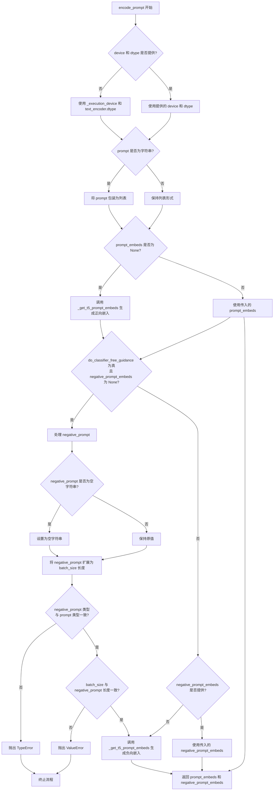

#### 带注释源码

```python
def encode_prompt(
    self,
    prompt: Union[str, List[str]],
    negative_prompt: Optional[Union[str, List[str]]] = None,
    do_classifier_free_guidance: bool = True,
    num_videos_per_prompt: int = 1,
    prompt_embeds: Optional[torch.Tensor] = None,
    negative_prompt_embeds: Optional[torch.Tensor] = None,
    max_sequence_length: int = 226,
    device: Optional[torch.device] = None,
    dtype: Optional[torch.dtype] = None,
):
    r"""
    Encodes the prompt into text encoder hidden states.

    Args:
        prompt (`str` or `List[str]`, *optional*):
            prompt to be encoded
        negative_prompt (`str` or `List[str]`, *optional*):
            The prompt or prompts not to guide the image generation. If not defined, one has to pass
            `negative_prompt_embeds` instead. Ignored when not using guidance (i.e., ignored if `guidance_scale` is
            less than `1`).
        do_classifier_free_guidance (`bool`, *optional*, defaults to `True`):
            Whether to use classifier free guidance or not.
        num_videos_per_prompt (`int`, *optional*, defaults to 1):
            Number of videos that should be generated per prompt. torch device to place the resulting embeddings on
        prompt_embeds (`torch.Tensor`, *optional*):
            Pre-generated text embeddings. Can be used to easily tweak text inputs, *e.g.* prompt weighting. If not
            provided, text embeddings will be generated from `prompt` input argument.
        negative_prompt_embeds (`torch.Tensor`, *optional*):
            Pre-generated negative text embeddings. Can be used to easily tweak text inputs, *e.g.* prompt
            weighting. If not provided, negative_prompt_embeds will be generated from `negative_prompt` input
            argument.
        device: (`torch.device`, *optional*):
            torch device
        dtype: (`torch.dtype`, *optional*):
            torch dtype
    """
    # 确定执行设备，未指定则使用当前执行设备
    device = device or self._execution_device

    # 如果 prompt 是单个字符串，转换为列表；否则保持列表形式
    prompt = [prompt] if isinstance(prompt, str) else prompt
    
    # 确定批次大小：如果有 prompt 则使用其长度，否则使用已提供嵌入的形状
    if prompt is not None:
        batch_size = len(prompt)
    else:
        batch_size = prompt_embeds.shape[0]

    # 如果未提供预计算的 prompt 嵌入，则从原始 prompt 生成
    if prompt_embeds is None:
        prompt_embeds = self._get_t5_prompt_embeds(
            prompt=prompt,
            num_videos_per_prompt=num_videos_per_prompt,
            max_sequence_length=max_sequence_length,
            device=device,
            dtype=dtype,
        )

    # 如果启用 CFG 且未提供负向嵌入，则需要生成负向嵌入
    if do_classifier_free_guidance and negative_prompt_embeds is None:
        # 如果未提供负向提示，默认使用空字符串
        negative_prompt = negative_prompt or ""
        
        # 将负向提示扩展为与批次大小匹配的列表
        negative_prompt = batch_size * [negative_prompt] if isinstance(negative_prompt, str) else negative_prompt

        # 类型检查：确保 negative_prompt 与 prompt 类型一致
        if prompt is not None and type(prompt) is not type(negative_prompt):
            raise TypeError(
                f"`negative_prompt` should be the same type to `prompt`, but got {type(negative_prompt)} !="
                f" {type(prompt)}."
            )
        # 批次大小检查：确保 negative_prompt 与 prompt 批次大小一致
        elif batch_size != len(negative_prompt):
            raise ValueError(
                f"`negative_prompt`: {negative_prompt} has batch size {len(negative_prompt)}, but `prompt`:"
                f" {prompt} has batch size {batch_size}. Please make sure that passed `negative_prompt` matches"
                " the batch size of `prompt`."
            )

        # 从负向提示生成嵌入
        negative_prompt_embeds = self._get_t5_prompt_embeds(
            prompt=negative_prompt,
            num_videos_per_prompt=num_videos_per_prompt,
            max_sequence_length=max_sequence_length,
            device=device,
            dtype=dtype,
        )

    # 返回正向和负向提示嵌入
    return prompt_embeds, negative_prompt_embeds
```


### `WanSTGPipeline.check_inputs`

该方法用于验证文本到视频生成管道的输入参数是否合法，包括检查高度和宽度是否被16整除、回调张量输入是否在允许列表中、prompt和prompt_embeds不能同时提供、negative_prompt和negative_prompt_embeds不能同时提供、prompt和negative_prompt的类型必须为str或list等。

参数：

- `prompt`：`str` 或 `List[str]`，要编码的提示词，不能与 `prompt_embeds` 同时提供
- `negative_prompt`：`str` 或 `List[str]`，负向提示词，不能与 `negative_prompt_embeds` 同时提供
- `height`：`int`，生成图像的高度，必须能被16整除
- `width`：`int`，生成图像的宽度，必须能被16整除
- `prompt_embeds`：`torch.Tensor`，可选，预生成的文本嵌入，不能与 `prompt` 同时提供
- `negative_prompt_embeds`：`torch.Tensor`，可选，预生成的负向文本嵌入，不能与 `negative_prompt` 同时提供
- `callback_on_step_end_tensor_inputs`：`List[str]`，可选，步结束回调时需要传递的 tensor 输入，必须是 `_callback_tensor_inputs` 的子集

返回值：`None`，该方法不返回值，仅通过抛出 ValueError 来处理验证失败的情况

#### 流程图

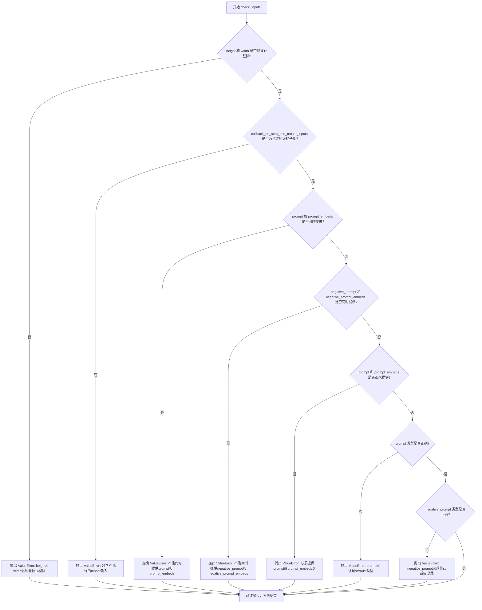

#### 带注释源码

```
def check_inputs(
    self,
    prompt,                              # 用户输入的文本提示词
    negative_prompt,                     # 用户输入的负向提示词
    height,                              # 生成视频的高度像素值
    width,                               # 生成视频的宽度像素值
    prompt_embeds=None,                  # 预计算的文本嵌入向量
    negative_prompt_embeds=None,         # 预计算的负向文本嵌入向量
    callback_on_step_end_tensor_inputs=None,  # 回调函数可访问的tensor输入列表
):
    # 检查1: 验证高度和宽度是否为16的倍数
    # Wan模型要求输入尺寸必须能被16整除，以保证VAE和Transformer的正确处理
    if height % 16 != 0 or width % 16 != 0:
        raise ValueError(f"`height` and `width` have to be divisible by 16 but are {height} and {width}.")

    # 检查2: 验证回调tensor输入是否在允许的列表中
    # 只能传递pipeline中明确允许的tensor到回调函数，防止非法内存访问
    if callback_on_step_end_tensor_inputs is not None and not all(
        k in self._callback_tensor_inputs for k in callback_on_step_end_tensor_inputs
    ):
        raise ValueError(
            f"`callback_on_step_end_tensor_inputs` has to be in {self._callback_tensor_inputs}, but found {[k for k in callback_on_step_end_tensor_inputs if k not in self._callback_tensor_inputs]}"
        )

    # 检查3: prompt和prompt_embeds不能同时提供
    # 两者是互斥的输入方式，用户只能选择其中一种
    if prompt is not None and prompt_embeds is not None:
        raise ValueError(
            f"Cannot forward both `prompt`: {prompt} and `prompt_embeds`: {prompt_embeds}. Please make sure to"
            " only forward one of the two."
        )
    # 检查4: negative_prompt和negative_prompt_embeds不能同时提供
    elif negative_prompt is not None and negative_prompt_embeds is not None:
        raise ValueError(
            f"Cannot forward both `negative_prompt`: {negative_prompt} and `negative_prompt_embeds`: {negative_prompt_embeds}. Please make sure to"
            " only forward one of the two."
        )
    # 检查5: prompt和prompt_embeds至少提供一个
    # 管道需要文本条件来引导生成，不能两者都为空
    elif prompt is None and prompt_embeds is None:
        raise ValueError(
            "Provide either `prompt` or `prompt_embeds`. Cannot leave both `prompt` and `prompt_embeds` undefined."
        )
    # 检查6: prompt类型验证，必须是字符串或字符串列表
    elif prompt is not None and (not isinstance(prompt, str) and not isinstance(prompt, list)):
        raise ValueError(f"`prompt` has to be of type `str` or `list` but is {type(prompt)}")
    # 检查7: negative_prompt类型验证，必须是字符串或字符串列表
    elif negative_prompt is not None and (
        not isinstance(negative_prompt, str) and not isinstance(negative_prompt, list)
    ):
        raise ValueError(f"`negative_prompt` has to be of type `str` or `list` but is {type(negative_prompt)}")
```


### WanSTGPipeline.prepare_latents

该方法负责为 Wan 文本到视频生成管道准备初始潜在变量（latents）。如果调用者未提供 latents，则根据指定的批量大小、视频尺寸（高度、宽度、帧数）和 VAE 缩放因子计算潜在空间的形状，并使用随机张量生成器初始化噪声潜在变量；如果已提供 latents，则将其移动到指定设备并转换为指定数据类型后返回。

参数：

- `self`：`WanSTGPipeline` 实例本身
- `batch_size`：`int`，生成的视频批次大小
- `num_channels_latents`：`int`，潜在变量的通道数，默认为 16
- `height`：`int`，生成视频的高度（像素），默认为 480
- `width`：`int`，生成视频的宽度（像素），默认为 832
- `num_frames`：`int`，生成视频的帧数，默认为 81
- `dtype`：`Optional[torch.dtype]`，潜在变量的数据类型，可选
- `device`：`Optional[torch.device]`，潜在变量存放的设备，可选
- `generator`：`Optional[Union[torch.Generator, List[torch.Generator]]]`，用于生成确定性随机数的 PyTorch 随机生成器或生成器列表，可选
- `latents`：`Optional[torch.Tensor]`，预先存在的潜在变量张量，可选

返回值：`torch.Tensor`，处理或生成后的潜在变量张量

#### 流程图

```mermaid
flowchart TD
    A([开始 prepare_latents]) --> B{latents 参数是否不为 None?}
    B -- 是 --> C[将 latents 移动到指定设备并转换数据类型]
    C --> D[返回转换后的 latents]
    B -- 否 --> E[计算潜在帧数: num_latent_frames = (num_frames - 1) // vae_scale_factor_temporal + 1]
    E --> F[计算潜在变量形状 shape]
    F --> G{generator 是 list 且长度不等于 batch_size?}
    G -- 是 --> H[抛出 ValueError 异常: 生成器列表长度与批量大小不匹配]
    G -- 否 --> I[使用 randn_tensor 生成随机潜在变量]
    I --> D
    H --> J([结束])
    D --> J
```

#### 带注释源码

```python
def prepare_latents(
    self,
    batch_size: int,
    num_channels_latents: int = 16,
    height: int = 480,
    width: int = 832,
    num_frames: int = 81,
    dtype: Optional[torch.dtype] = None,
    device: Optional[torch.device] = None,
    generator: Optional[Union[torch.Generator, List[torch.Generator]]] = None,
    latents: Optional[torch.Tensor] = None,
) -> torch.Tensor:
    """
    准备用于视频生成过程的潜在变量张量。

    如果调用者已经提供了 latents，则直接将其移动到目标设备并转换数据类型后返回。
    否则，根据视频参数计算潜在空间的维度，并使用随机张量生成器初始化噪声潜在变量。

    参数:
        batch_size: 生成的视频批次大小
        num_channels_latents: 潜在变量的通道数，默认为 16
        height: 生成视频的高度（像素），默认为 480
        width: 生成视频的宽度（像素），默认为 832
        num_frames: 生成视频的帧数，默认为 81
        dtype: 潜在变量的数据类型，可选
        device: 潜在变量存放的设备，可选
        generator: 用于生成确定性随机数的生成器或生成器列表，可选
        latents: 预先存在的潜在变量张量，可选

    返回:
        处理或生成后的潜在变量张量
    """
    # 如果已经提供了 latents，直接进行设备和数据类型转换后返回
    if latents is not None:
        return latents.to(device=device, dtype=dtype)

    # 计算潜在空间中的帧数，根据 VAE 的时间下采样因子进行调整
    # 公式: (原始帧数 - 1) // 下采样因子 + 1，确保正确处理边界情况
    num_latent_frames = (num_frames - 1) // self.vae_scale_factor_temporal + 1

    # 计算潜在变量的形状维度
    # 形状为: (batch_size, channels, latent_frames, height//spatial_scale, width//spatial_scale)
    shape = (
        batch_size,
        num_channels_latents,
        num_latent_frames,
        int(height) // self.vae_scale_factor_spatial,
        int(width) // self.vae_scale_factor_spatial,
    )

    # 验证生成器列表长度是否与批次大小匹配
    if isinstance(generator, list) and len(generator) != batch_size:
        raise ValueError(
            f"You have passed a list of generators of length {len(generator)}, but requested an effective batch"
            f" size of {batch_size}. Make sure the batch size matches the length of the generators."
        )

    # 使用.randn_tensor 生成符合标准正态分布的随机潜在变量
    # 该随机噪声将作为扩散模型去噪过程的起点
    latents = randn_tensor(shape, generator=generator, device=device, dtype=dtype)
    return latents
```


### WanSTGPipeline.__call__

这是 Wan 文本到视频生成管道的主调用方法，负责执行完整的文本到视频生成流程，包括输入验证、提示词编码、潜在变量准备、去噪循环（支持时空引导 STG 和无分类器引导 CFG）以及最终的视频解码。

参数：

- `prompt`：`Union[str, List[str]]`，用于引导图像生成的提示词，若未定义则需传递 `prompt_embeds`
- `negative_prompt`：`Union[str, List[str]]`，不用于引导图像生成的提示词，若未使用引导则忽略
- `height`：`int`，生成图像的高度像素值，默认为 480
- `width`：`int`，生成图像的宽度像素值，默认为 832
- `num_frames`：`int`，生成视频的帧数，默认为 81
- `num_inference_steps`：`int`，去噪步数，更多去噪步骤通常能获得更高质量的图像，默认为 50
- `guidance_scale`：`float`，分类器自由扩散引导中的引导比例，默认为 5.0
- `num_videos_per_prompt`：`int`，每个提示词生成的视频数量，默认为 1
- `generator`：`torch.Generator` 或 `List[torch.Generator]`，用于使生成具有确定性的随机生成器
- `latents`：`torch.Tensor`，预生成的噪声潜在向量，若未提供则使用随机生成器采样
- `prompt_embeds`：`torch.Tensor`，预生成的文本嵌入，可用于轻松调整文本输入
- `negative_prompt_embeds`：`torch.Tensor`，预生成的负面文本嵌入
- `output_type`：`str`，生成图像的输出格式，默认为 "np"
- `return_dict`：`bool`，是否返回 `WanPipelineOutput`，默认为 True
- `attention_kwargs`：`Dict[str, Any]`，传递给注意力处理器的额外参数字典
- `callback_on_step_end`：`Callable` 或 `PipelineCallback` 或 `MultiPipelineCallbacks`，每个去噪步骤结束时调用的回调函数
- `callback_on_step_end_tensor_inputs`：`List[str]`，回调函数使用的张量输入列表
- `max_sequence_length`：`int`，最大序列长度，默认为 512
- `stg_applied_layers_idx`：`List[int]`，时空引导（STG）应用的层索引列表，默认为 [3, 8, 16]
- `stg_scale`：`float`，时空引导比例，设置为 0.0 用于 CFG 模式，默认为 0.0

返回值：`WanPipelineOutput`，包含生成的视频帧；若 `return_dict` 为 False，则返回元组

#### 流程图

```mermaid
flowchart TD
    A[开始 __call__] --> B{检查 callback_on_step_end 类型}
    B -->|PipelineCallback 或 MultiPipelineCallbacks| C[更新 callback_on_step_end_tensor_inputs]
    B -->|其他| D[跳过更新]
    C --> E[调用 check_inputs 验证输入]
    D --> E
    E --> F{输入验证失败?}
    F -->|是| G[抛出 ValueError]
    F -->|否| H[设置内部状态变量 _guidance_scale, _stg_scale, _attention_kwargs, _current_timestep, _interrupt]
    H --> I[获取执行设备 device]
    I --> J[根据 prompt 或 prompt_embeds 确定 batch_size]
    J --> K[调用 encode_prompt 编码提示词]
    K --> L[转换 prompt_embeds 和 negative_prompt_embeds 到 transformer_dtype]
    L --> M[调用 scheduler.set_timesteps 准备时间步]
    M --> N[获取 timesteps]
    N --> O[准备 latents: 调用 prepare_latents]
    O --> P[设置 num_warmup_steps 和 _num_timesteps]
    P --> Q[初始化进度条]
    Q --> R[进入去噪循环: for i, t in enumerate timesteps]
    R --> S{self.interrupt?}
    S -->|True| T[continue 跳过本次迭代]
    S -->|No| U[设置 _current_timestep = t]
    U --> V[将 latents 转换为 transformer_dtype]
    V --> W[扩展 timestep]
    W --> X{do_spatio_temporal_guidance?}
    X -->|Yes| Y[对所有 block 设置 forward_without_stg]
    X -->|No| Z[跳过]
    Y --> AA[调用 transformer 预测噪声: noise_pred]
    AA --> BB{do_classifier_free_guidance?}
    BB -->|Yes| CC[调用 transformer 预测无条件噪声: noise_uncond]
    BB -->|No| JJ[noise_pred 保持不变]
    CC --> DD{do_spatio_temporal_guidance?}
    DD -->|Yes| EE[对指定层设置 forward_with_stg]
    EE --> FF[调用 transformer 预测扰动噪声: noise_perturb]
    FF --> GG[计算组合噪声预测]
    GG --> HH[noise_pred = noise_uncond + guidance_scale * (noise_pred - noise_uncond) + stg_scale * (noise_pred - noise_perturb)]
    DD -->|No| II[noise_pred = noise_uncond + guidance_scale * (noise_pred - noise_uncond)]
    HH --> KK[跳到步骤 34]
    II --> KK
    JJ --> KK
    KK --> LL[调用 scheduler.step 计算上一步 latent]
    LL --> MM{callback_on_step_end?}
    MM -->|Yes| NN[构建 callback_kwargs]
    NN --> OO[调用 callback_on_step_end]
    OO --> PP[更新 latents, prompt_embeds, negative_prompt_embeds]
    PP --> QQ[跳到步骤 36]
    MM -->|No| QQ
    QQ --> RR{是否最后一个步骤或满足进度条件?}
    RR -->|Yes| SS[更新进度条]
    RR -->|No| TT[跳过]
    SS --> UU{XLA_AVAILABLE?}
    UU -->|Yes| VV[调用 xm.mark_step]
    UU -->|No| WW[去噪循环结束]
    VV --> WW
    TT --> WW
    WW --> XX{output_type == 'latent'?}
    XX -->|No| YY[转换 latents 到 vae.dtype]
    YY --> ZZ[应用 latents_mean 和 latents_std 反标准化]
    ZZ --> AAA[调用 vae.decode 生成视频]
    AAA --> AAB[调用 video_processor.postprocess_video 后处理]
    AAB --> AAC[video = 处理后的视频]
    XX -->|Yes| AAD[video = latents]
    AAC --> AAE[调用 maybe_free_model_hooks 释放模型]
    AAD --> AAE
    AAE --> AAF{return_dict?}
    AAF -->|Yes| AAG[返回 WanPipelineOutput]
    AAF -->|No| AAH[返回元组 (video,)]
    T --> R
    Z --> AA
```

#### 带注释源码

```python
@torch.no_grad()
@replace_example_docstring(EXAMPLE_DOC_STRING)
def __call__(
    self,
    prompt: Union[str, List[str]] = None,
    negative_prompt: Union[str, List[str]] = None,
    height: int = 480,
    width: int = 832,
    num_frames: int = 81,
    num_inference_steps: int = 50,
    guidance_scale: float = 5.0,
    num_videos_per_prompt: Optional[int] = 1,
    generator: Optional[Union[torch.Generator, List[torch.Generator]]] = None,
    latents: Optional[torch.Tensor] = None,
    prompt_embeds: Optional[torch.Tensor] = None,
    negative_prompt_embeds: Optional[torch.Tensor] = None,
    output_type: str | None = "np",
    return_dict: bool = True,
    attention_kwargs: Optional[Dict[str, Any]] = None,
    callback_on_step_end: Optional[
        Union[Callable[[int, int, Dict], None], PipelineCallback, MultiPipelineCallbacks]
    ] = None,
    callback_on_step_end_tensor_inputs: List[str] = ["latents"],
    max_sequence_length: int = 512,
    stg_applied_layers_idx: Optional[List[int]] = [3, 8, 16],
    stg_scale: Optional[float] = 0.0,
):
    # 如果 callback_on_step_end 是 PipelineCallback 或 MultiPipelineCallbacks 类型，
    # 则从其中提取 tensor_inputs 作为回调的张量输入列表
    if isinstance(callback_on_step_end, (PipelineCallback, MultiPipelineCallbacks)):
        callback_on_step_end_tensor_inputs = callback_on_step_end.tensor_inputs

    # 1. 检查输入参数的有效性，若不正确则抛出错误
    self.check_inputs(
        prompt,
        negative_prompt,
        height,
        width,
        prompt_embeds,
        negative_prompt_embeds,
        callback_on_step_end_tensor_inputs,
    )

    # 设置内部状态变量，用于在去噪过程中提供引导
    self._guidance_scale = guidance_scale
    self._stg_scale = stg_scale
    self._attention_kwargs = attention_kwargs
    self._current_timestep = None
    self._interrupt = False

    # 获取执行设备
    device = self._execution_device

    # 2. 根据 prompt 或 prompt_embeds 确定批处理大小
    if prompt is not None and isinstance(prompt, str):
        batch_size = 1
    elif prompt is not None and isinstance(prompt, list):
        batch_size = len(prompt)
    else:
        batch_size = prompt_embeds.shape[0]

    # 3. 编码输入提示词，生成 prompt_embeds 和 negative_prompt_embeds
    prompt_embeds, negative_prompt_embeds = self.encode_prompt(
        prompt=prompt,
        negative_prompt=negative_prompt,
        do_classifier_free_guidance=self.do_classifier_free_guidance,
        num_videos_per_prompt=num_videos_per_prompt,
        prompt_embeds=prompt_embeds,
        negative_prompt_embeds=negative_prompt_embeds,
        max_sequence_length=max_sequence_length,
        device=device,
    )

    # 获取 transformer 的数据类型并将 prompt_embeds 转换到该类型
    transformer_dtype = self.transformer.dtype
    prompt_embeds = prompt_embeds.to(transformer_dtype)
    if negative_prompt_embeds is not None:
        negative_prompt_embeds = negative_prompt_embeds.to(transformer_dtype)

    # 4. 准备时间步：设置调度器的时间步
    self.scheduler.set_timesteps(num_inference_steps, device=device)
    timesteps = self.scheduler.timesteps

    # 5. 准备潜在变量：准备用于生成的初始噪声潜在向量
    num_channels_latents = self.transformer.config.in_channels
    latents = self.prepare_latents(
        batch_size * num_videos_per_prompt,
        num_channels_latents,
        height,
        width,
        num_frames,
        torch.float32,
        device,
        generator,
        latents,
    )

    # 6. 去噪循环：迭代执行去噪过程
    num_warmup_steps = len(timesteps) - num_inference_steps * self.scheduler.order
    self._num_timesteps = len(timesteps)

    # 使用进度条跟踪去噪进度
    with self.progress_bar(total=num_inference_steps) as progress_bar:
        for i, t in enumerate(timesteps):
            # 检查是否中断，若中断则跳过当前迭代
            if self.interrupt:
                continue

            # 更新当前时间步
            self._current_timestep = t
            # 将潜在向量转换为 transformer 的数据类型
            latent_model_input = latents.to(transformer_dtype)
            # 扩展时间步以匹配批处理大小
            timestep = t.expand(latents.shape[0])

            # 如果启用时空引导(STG)，先将所有块设置为不使用 STG 的前向传播
            if self.do_spatio_temporal_guidance:
                for idx, block in enumerate(self.transformer.blocks):
                    block.forward = types.MethodType(forward_without_stg, block)

            # 调用 transformer 预测噪声（条件预测）
            noise_pred = self.transformer(
                hidden_states=latent_model_input,
                timestep=timestep,
                encoder_hidden_states=prompt_embeds,
                attention_kwargs=attention_kwargs,
                return_dict=False,
            )[0]

            # 如果启用分类器自由引导(CFG)，执行无条件预测和引导预测
            if self.do_classifier_free_guidance:
                # 无条件噪声预测（不使用提示词）
                noise_uncond = self.transformer(
                    hidden_states=latent_model_input,
                    timestep=timestep,
                    encoder_hidden_states=negative_prompt_embeds,
                    attention_kwargs=attention_kwargs,
                    return_dict=False,
                )[0]
                
                # 如果启用时空引导，在指定层应用 STG
                if self.do_spatio_temporal_guidance:
                    for idx, block in enumerate(self.transformer.blocks):
                        if idx in stg_applied_layers_idx:
                            block.forward = types.MethodType(forward_with_stg, block)
                    
                    # 扰动噪声预测（用于 STG）
                    noise_perturb = self.transformer(
                        hidden_states=latent_model_input,
                        timestep=timestep,
                        encoder_hidden_states=prompt_embeds,
                        attention_kwargs=attention_kwargs,
                        return_dict=False,
                    )[0]
                    
                    # 组合噪声预测：结合 CFG 和 STG
                    noise_pred = (
                        noise_uncond
                        + guidance_scale * (noise_pred - noise_uncond)
                        + self._stg_scale * (noise_pred - noise_perturb)
                    )
                else:
                    # 仅使用 CFG 的噪声预测
                    noise_pred = noise_uncond + guidance_scale * (noise_pred - noise_uncond)

            # 使用调度器从噪声预测计算上一步的潜在向量
            latents = self.scheduler.step(noise_pred, t, latents, return_dict=False)[0]

            # 如果提供了回调函数，在步骤结束时调用
            if callback_on_step_end is not None:
                callback_kwargs = {}
                for k in callback_on_step_end_tensor_inputs:
                    callback_kwargs[k] = locals()[k]
                callback_outputs = callback_on_step_end(self, i, t, callback_kwargs)

                # 更新回调返回的潜在向量和嵌入
                latents = callback_outputs.pop("latents", latents)
                prompt_embeds = callback_outputs.pop("prompt_embeds", prompt_embeds)
                negative_prompt_embeds = callback_outputs.pop("negative_prompt_embeds", negative_prompt_embeds)

            # 在最后一个步骤或满足进度条件时更新进度条
            if i == len(timesteps) - 1 or ((i + 1) > num_warmup_steps and (i + 1) % self.scheduler.order == 0):
                progress_bar.update()

            # 如果使用 XLA（PyTorch XLA），标记执行步骤
            if XLA_AVAILABLE:
                xm.mark_step()

    # 重置当前时间步
    self._current_timestep = None

    # 如果不是潜在向量输出类型，则进行解码
    if not output_type == "latent":
        # 将潜在向量转换为 VAE 的数据类型
        latents = latents.to(self.vae.dtype)
        
        # 应用潜在向量的均值和标准差进行反标准化
        latents_mean = (
            torch.tensor(self.vae.config.latents_mean)
            .view(1, self.vae.config.z_dim, 1, 1, 1)
            .to(latents.device, latents.dtype)
        )
        latents_std = 1.0 / torch.tensor(self.vae.config.latents_std).view(1, self.vae.config.z_dim, 1, 1, 1).to(
            latents.device, latents.dtype
        )
        latents = latents / latents_std + latents_mean
        
        # 使用 VAE 解码潜在向量生成视频
        video = self.vae.decode(latents, return_dict=False)[0]
        # 对视频进行后处理
        video = self.video_processor.postprocess_video(video, output_type=output_type)
    else:
        # 直接输出潜在向量
        video = latents

    # 释放所有模型的钩子
    self.maybe_free_model_hooks()

    # 根据 return_dict 返回结果
    if not return_dict:
        return (video,)

    # 返回包含生成视频帧的 WanPipelineOutput 对象
    return WanPipelineOutput(frames=video)
```


### `WanSTGPipeline.guidance_scale`

该属性用于获取当前管道的引导比例（guidance scale）值。引导比例是 Classifier-Free Diffusion Guidance (CFG) 中的关键参数，用于控制生成内容与文本提示的相关性。该属性返回内部存储的 `_guidance_scale` 私有属性，该值在调用管道时被设置为传入的 `guidance_scale` 参数。

参数：

- `self`：WanSTGPipeline 实例，隐式参数，表示当前管道对象本身

返回值：`float`，返回当前配置的引导比例值。该值用于控制分类器自由引导的强度，值越大表示生成内容与提示词相关性越高，通常以牺牲图像质量为代价。

#### 流程图

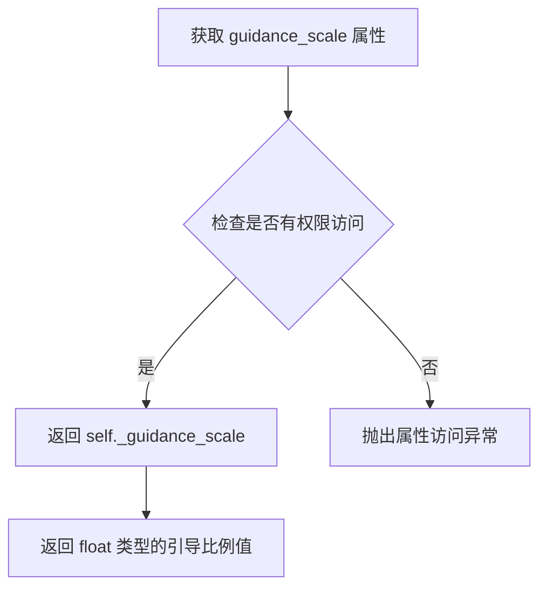

#### 带注释源码

```python
@property
def guidance_scale(self):
    """
    属性：guidance_scale
    
    获取当前扩散管道的引导比例（Classifier-Free Guidance Scale）。
    该值定义了分类器自由引导方程中的权重参数 w，用于平衡
    条件生成（基于文本提示）和非条件生成（无文本提示）之间的影响。
    
    在 __call__ 方法中，该值被设置为传入的 guidance_scale 参数，
    默认为 5.0。较高的值会促使生成与文本提示更紧密相关的图像，
    但可能导致质量下降。
    
    Returns:
        float: 当前的引导比例值，通常大于 1.0 时启用分类器自由引导
    """
    return self._guidance_scale
```


### `WanSTGPipeline.do_classifier_free_guidance`

该属性用于判断当前管道是否启用了 Classifier-Free Guidance（CFG）技术，通过检查 guidance_scale 是否大于 1.0 来决定是否在推理过程中执行无分类器引导。

参数：无（该方法为属性，无参数）

返回值：`bool`，返回是否启用 classifier-free guidance（当 guidance_scale > 1.0 时返回 True，否则返回 False）

#### 流程图

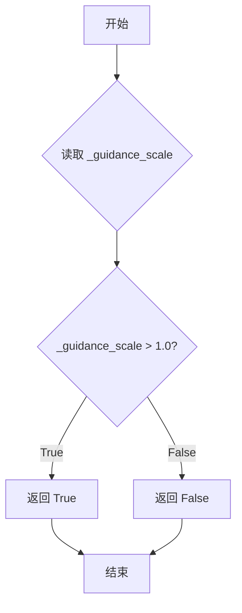

#### 带注释源码

```python
@property
def do_classifier_free_guidance(self):
    """
    属性：判断是否启用 Classifier-Free Guidance（无分类器引导）
    
    Classifier-Free Guidance 是一种提高生成质量的扩散模型推理技术，
    通过同时预测条件预测和无条件预测，然后使用 guidance_scale 加权
    两者的差异来引导生成过程更符合文本提示。
    
    Returns:
        bool: 当 guidance_scale 大于 1.0 时返回 True，表示启用 CFG；
             当 guidance_scale 小于等于 1.0 时返回 False，表示不启用 CFG
    """
    return self._guidance_scale > 1.0
```


### `WanSTGPipeline.do_spatio_temporal_guidance`

这是一个属性方法，用于判断是否启用了时空引导（Spatio-Temporal Guidance，STG）功能。通过检查`stg_scale`参数是否大于0来决定是否启用STG功能。

参数：

- `self`：隐式参数，WanSTGPipeline实例本身

返回值：`bool`，表示是否启用了时空引导功能（当`_stg_scale > 0.0`时返回`True`）

#### 流程图

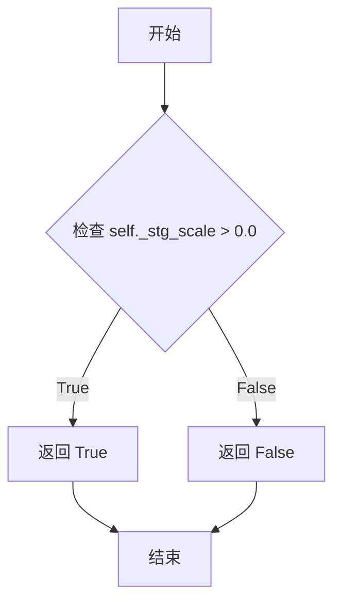

#### 带注释源码

```python
@property
def do_spatio_temporal_guidance(self):
    """
    属性方法：判断是否启用了时空引导（Spatio-Temporal Guidance，STG）功能。
    
    时空引导是Wan模型的一种可选特性，允许在去噪过程中对特定的transformer层
    应用额外的引导信号，以增强生成视频的时空一致性。
    
    返回值:
        bool: 如果启用了STG（_stg_scale > 0.0）则返回True，否则返回False。
              该属性通常在去噪循环中用于条件判断，决定是否执行STG相关的计算。
    """
    return self._stg_scale > 0.0
```


### `WanSTGPipeline.num_timesteps`

该属性方法用于获取扩散模型去噪过程中的总时间步数量。在 `__call__` 方法的去噪循环开始前，通过 `self.scheduler.set_timesteps()` 设置时间步，并将时间步列表的长度赋值给 `self._num_timesteps`。

参数：

- `self`：隐含参数，WanSTGPipeline 实例本身

返回值：`int`，返回去噪过程的总时间步数量，即调度器中时间步列表的长度。

#### 流程图

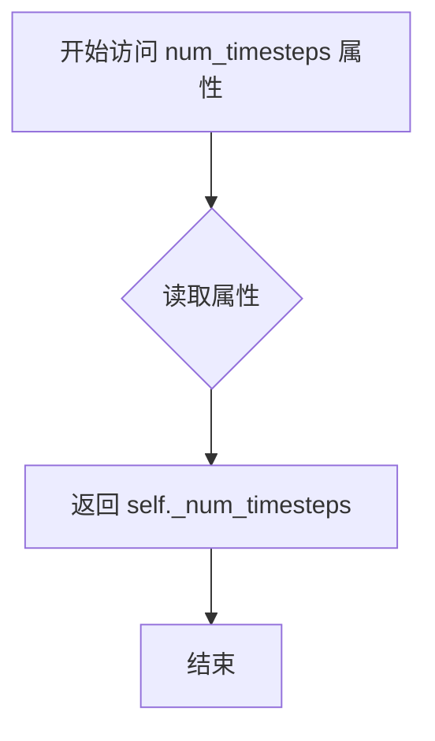

#### 带注释源码

```python
@property
def num_timesteps(self):
    """
    属性方法：获取去噪过程的总时间步数量
    
    该属性返回一个整数，表示扩散模型在生成图像/视频时需要执行的去噪步骤总数。
    该值在 __call__ 方法中被设置：
        self._num_timesteps = len(timesteps)
    其中 timesteps 来自调度器的 timesteps 列表。
    """
    return self._num_timesteps
```


### `WanSTGPipeline.current_timestep`

该属性用于获取当前去噪循环中的时间步（timestep）。在扩散模型的推理过程中，该属性返回当前正在处理的时间步值，使得外部调用者能够追踪推理进度。

参数： 无（这是一个属性访问器，不需要参数）

返回值：`Any`，返回当前的时间步。在扩散模型的去噪循环中，`_current_timestep` 被设置为调度器（scheduler）产生的时间步张量（通常为 `torch.Tensor`），可用于监控或调试推理过程。

#### 流程图

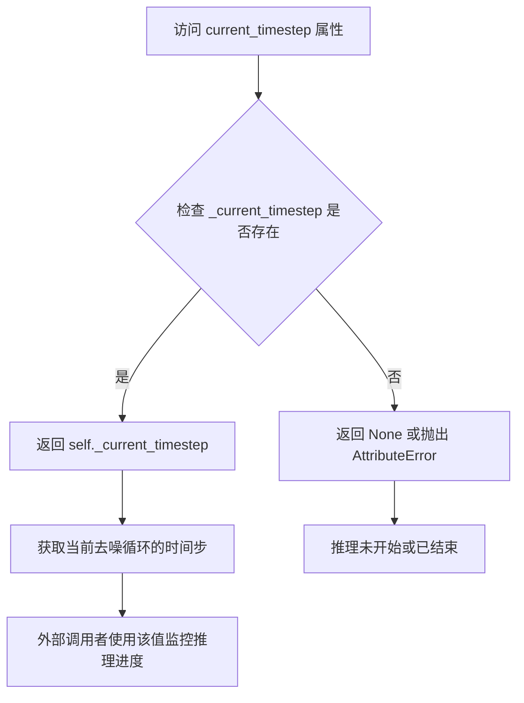

#### 带注释源码

```python
@property
def current_timestep(self):
    """
    属性访问器：返回当前推理过程中的时间步。
    
    该属性在去噪循环（denoising loop）中被更新：
    - 循环开始前：_current_timestep = None
    - 每次迭代：_current_timestep = t（当前时间步）
    - 循环结束后：_current_timestep = None
    
    Returns:
        Any: 当前的时间步，通常是 torch.Tensor 类型。
             如果推理未开始或已结束，则返回 None。
    """
    return self._current_timestep
```

---

#### 使用上下文说明

在 `WanSTGPipeline.__call__` 方法中，该属性的使用方式如下：

```python
# 初始化时设置为 None
self._current_timestep = None

# 在去噪循环中更新
for i, t in enumerate(timesteps):
    if self.interrupt:
        continue
    
    self._current_timestep = t  # 更新当前时间步
    # ... 执行推理逻辑 ...

# 循环结束后重置
self._current_timestep = None
```

该属性允许外部回调函数（callback）或监控工具在推理过程中访问当前的处理进度，从而实现动态调整、进度显示或调试等功能。


### `WanSTGPipeline.interrupt`

这是一个属性方法（Property），用于返回管线的 `interrupt` 标志，表示是否需要中断去噪过程。在去噪循环中通过检查该属性来决定是否跳过当前迭代。

参数：无

返回值：`bool`，返回 `self._interrupt` 标志的值，True 表示需要中断，False 表示继续执行

#### 流程图

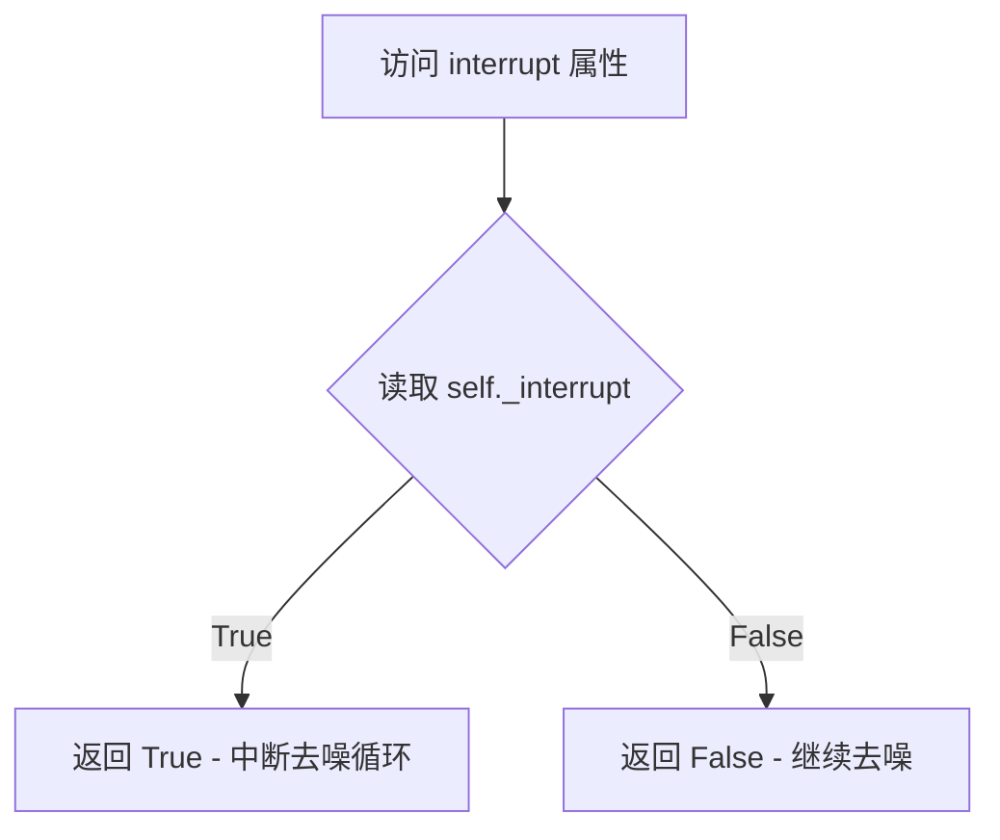

#### 带注释源码

```python
@property
def interrupt(self):
    """
    属性方法：返回管线的 interrupt 标志
    
    该属性用于在去噪循环中检查是否需要中断执行。
    当 _interrupt 被设置为 True 时，__call__ 方法中的
    去噪循环会跳过当前迭代，实现优雅停止。
    
    Returns:
        bool: interrupt 标志状态，True 表示需要中断
    """
    return self._interrupt
```

---

**备注**：该属性在 `__call__` 方法中被初始化为 `False`：

```python
self._interrupt = False
```

在去噪循环中的使用方式：

```python
for i, t in enumerate(timesteps):
    if self.interrupt:  # 检查 interrupt 属性
        continue        # 如果为 True，跳过当前迭代
```


### `WanSTGPipeline.attention_kwargs`

这是一个属性 getter 方法，用于获取在管道调用时设置的注意力机制关键字参数（attention_kwargs）。该属性返回传递给 `AttentionProcessor` 的 kwargs 字典，使得用户可以在运行时动态调整注意力机制的行为。

参数：此方法无参数（为属性 getter）

返回值：`Optional[Dict[str, Any]]`，返回注意力机制的关键字参数字典。如果未设置，则返回 `None`。

#### 流程图

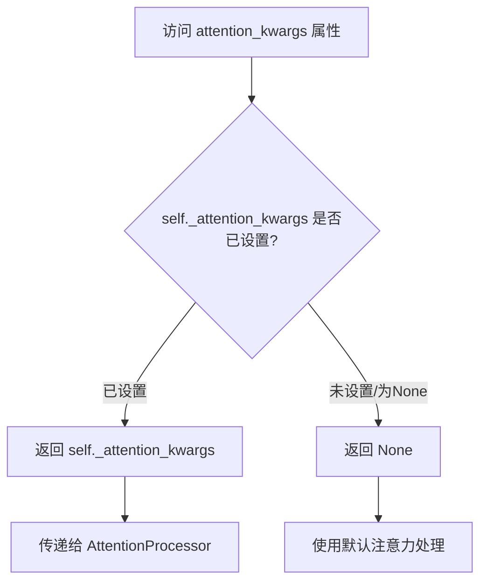

#### 带注释源码

```python
@property
def attention_kwargs(self):
    """
    属性 getter: 获取注意力机制关键字参数
    
    该属性返回在 pipeline __call__ 方法中设置的 _attention_kwargs。
    这些参数会被传递给 transformer 的 AttentionProcessor，用于
    动态调整注意力机制的行为（例如自定义注意力掩码、缩放因子等）。
    
    Returns:
        Optional[Dict[str, Any]]: 注意力机制的关键字参数字典，
                                  如果未设置则返回 None
    """
    return self._attention_kwargs
```

## 关键组件


### WanSTGPipeline

主pipeline类，继承自DiffusionPipeline和WanLoraLoaderMixin，用于Wan文本到视频生成，支持时空引导(STG)和无分类器自由引导(CFG)

### _get_t5_prompt_embeds

使用T5文本编码器(UMT5)将文本prompt编码为embedding向量，支持批量处理和序列长度填充，返回标准化后的prompt embeddings

### encode_prompt

编码正向和负向prompt，若启用CFG则同时生成unconditional embeddings，用于后续的引导生成过程

### prepare_latents

根据视频参数(高度、宽度、帧数)和VAE下采样因子计算潜在空间形状，使用randn_tensor生成高斯噪声潜在变量或复用提供的latents

### __call__

主生成方法，执行完整的去噪循环，包括：输入验证、prompt编码、时间步准备、latent初始化、条件/非条件噪声预测、CFG和STG应用、调度器step、VAE解码输出视频

### forward_with_stg

时空引导(STG)的forward函数，直接返回hidden_states不做任何处理，用于STG模式下的扰动计算

### forward_without_stg

标准Transformer block forward函数，实现shifted mean和scale的自注意力、交叉注意力和前馈网络完整前向传播

### STG (Spatio-Temporal Guidance) 机制

通过stg_applied_layers_idx指定应用STG的transformer层索引，stg_scale控制引导强度，实现对时空维度的条件生成控制

### VAE解码器 (AutoencoderKLWan)

将去噪后的latents解码为实际视频帧，包含latents_mean和latents_std的反量化处理，支持spatial和temporal下采样因子的自适应

### FlowMatchEulerDiscreteScheduler

基于Flow Match的Euler离散调度器，用于去噪过程中的时间步更新和噪声预测到干净样本的转换

### VideoProcessor

视频后处理工具，将VAE输出的tensor转换为指定输出类型(np数组或PIL图像)，处理视频帧的格式转换

### 潜在变量反量化

使用vae.config中的latents_mean和latents_std对latents进行标准化逆操作：latents = latents / latents_std + latents_mean，恢复到原始潜在空间分布


## 问题及建议


### 已知问题

-   **变量名拼写错误**：`vae_scale_factor_temporal` 和 `vae_scale_factor_spatial` 计算中使用 `self.vae.temperal_downsample`（拼写错误，应为 temporal），可能导致不可预期的行为
-   **动态方法替换效率低**：在 denoising loop 中每次迭代都使用 `types.MethodType` 动态替换 `block.forward` 方法，这种 monkey patching 方式性能开销大且难以调试
-   **硬编码默认值冲突**：`stg_applied_layers_idx` 默认值为 `[3, 8, 16]`，但示例文档中使用 `[8]`，默认值与文档示例不一致
-   **类型注解不一致**：混合使用了 Python 3.10+ 的 `str | None` 语法和传统的 `Union[str, List[str]]` 语法，风格不统一
-   **属性实现冗余**：使用 `@property` 包装内部变量（如 `guidance_scale`、`do_classifier_free_guidance` 等），但这些属性仅仅是直接返回 `_` 开头的私有变量，增加了代码复杂度
-   **内存浪费**：在 `_get_t5_prompt_embeds` 中创建了大量零填充 tensor，在 `encode_prompt` 中又进行了重复的 batch 处理
-   **缺少输入验证**：未验证 `stg_applied_layers_idx` 中的索引是否在 transformer blocks 的有效范围内
-   **条件编译不完整**：`XLA_AVAILABLE` 检查存在，但在关键路径上使用 `xm.mark_step()` 的效果可能不佳

### 优化建议

-   **修复拼写错误**：将 `temperal_downsample` 改为 `temporal_downsample`
-   **重构动态替换逻辑**：使用策略模式或工厂方法预先创建不同的 block forward 方法，而不是在循环中动态替换
-   **统一默认值与文档**：将 `stg_applied_layers_idx` 默认值改为 `None` 或与文档一致，添加参数验证逻辑
-   **统一类型注解风格**：统一使用 `Optional` 或 `|` 语法，避免混用
-   **简化属性访问**：考虑直接暴露内部变量或使用 `__getattr__` 统一处理
-   **优化内存使用**：使用 torch 的 in-place 操作或延迟计算减少中间 tensor 的创建
-   **添加输入验证**：在 `__call__` 开头验证 `stg_applied_layers_idx` 的有效性
-   **改进 XLA 支持**：考虑使用 `xm.optimizer_step` 或更完整的 XLA 集成

## 其它


### 设计目标与约束

本Pipeline旨在实现Wan2.1文本到视频（T2V）生成功能，支持高分辨率视频生成（最高720P），通过STG（Spatio-Temporal Guidance）机制增强时空一致性。设计约束包括：1）仅支持FP16/BF16推理，不支持FP32；2）视频分辨率必须为16的倍数；3）仅支持CUDA设备，暂不支持CPU推理；4）最大序列长度为512，prompt最大长度226；5）仅支持FlowMatchEulerDiscreteScheduler调度器。

### 错误处理与异常设计

代码实现了多层错误检查机制：1）输入验证（check_inputs方法）：检查分辨率 divisibility、prompt类型、callback_tensor_inputs合法性；2）批次大小一致性检查：验证generator列表长度与batch_size匹配；3）类型检查：negative_prompt与prompt类型必须一致；4）参数互斥检查：prompt与prompt_embeds不能同时传递；5）设备迁移异常：自动处理tensor设备转移；6）调度器步数异常：warmup_steps计算保证非负。

### 数据流与状态机

Pipeline数据流如下：1）Prompt输入→文本编码（T5）→prompt_embeds；2）初始化随机latents（高斯噪声）；3）Denoising循环：latents→Transformer→noise_pred→Scheduler.step→新latents；4）条件分支：CFG计算uncond分支，STG计算perturb分支；5）VAE decode：latents→视频帧；6）后处理：VideoProcessor转换为目标格式（np/pil/latent）。状态机包含：初始化态→编码态→去噪态→解码态→完成态，支持interrupt标志中断。

### 外部依赖与接口契约

核心依赖包括：1）transformers（AutoTokenizer, UMT5EncoderModel）；2）diffusers（DiffusionPipeline基类、VAE/Transformer模型、Scheduler、VideoProcessor）；3）ftfy（文本修复）；4）regex（正则处理）；5）torch（张量运算）。接口契约：1）from_pretrained方法加载预训练权重；2）__call__返回WanPipelineOutput或tuple；3）支持attention_kwargs注入AttentionProcessor；4）支持callback_on_step_end自定义回调；5）支持model_cpu_offload_seq序列卸载。

### 性能考虑与优化建议

性能关键点：1）文本编码一次计算，多步去噪复用；2）Transformer dtype转换（float32→bf16）减少内存；3）XLA支持（xm.mark_step）加速TPU推理；4）Model Offload降低显存峰值；5）prompt_embeds重复利用避免重复编码。优化建议：1）可加入xformers加速attention；2）可实现ONNX导出；3）可添加torch.compile加速；4）可实现分布式推理支持多卡；5）可添加KV Cache优化。

### 配置参数说明

关键配置参数：1）height/width：视频分辨率（默认480x832，必须16倍）；2）num_frames：帧数（默认81，影响生成时长）；3）num_inference_steps：去噪步数（默认50，越高越慢质量越好）；4）guidance_scale：CFG引导强度（默认5.0，>1启用）；5）stg_applied_layers_idx：STG应用层索引（14B模型0-39，1.3B模型0-29）；6）stg_scale：STG强度（默认0.0，>0启用时空引导）；7）max_sequence_length：T5最大序列（默认512）；8）vae_scale_factor：时空下采样因子（自动计算）。

### 局限性说明

当前实现存在以下局限：1）仅支持T2V任务，不支持I2V或ControlNet；2）不支持LoRA权重动态加载（虽然继承WanLoraLoaderMixin但未完整实现）；3）STG模式仅支持特定层索引，不支持自适应选择；4）不支持Negative Prompt Embedding预计算缓存；5）不支持多prompt混合生成；6）视频帧数受vae_temporal_downsample限制，灵活性不足；7）不支持自定义VAE或Transformer架构。

### 版本兼容性与依赖要求

依赖版本要求：1）torch>=2.0.0（支持torch.compile）；2）transformers>=4.35.0（支持UMT5）；3）diffusers>=0.25.0（支持Wan模型）；4）ftfy>=6.1.0；5）regex>=2023.0。兼容性说明：1）FP32输入会自动转换；2）CPU设备会抛出NotImplementedError；3）XLA设备可选支持；4）Mac MPS部分支持（prompt_embeds处理有mpsfriendly方法）。

### 安全性与伦理考虑

代码包含以下安全机制：1）NSFW内容检测（negative_prompt机制）；2）模型水印保留；3）许可证合规（Apache 2.0）。潜在风险：1）视频生成可能用于深度伪造；2）prompt注入攻击风险；3）显存消耗大（14B模型需40GB+显存）。建议：1）添加内容审核接口；2）实现prompt过滤；3）添加生成追溯机制。

### 扩展性设计

Pipeline设计支持以下扩展：1）自定义Scheduler（需兼容FlowMatch接口）；2）自定义AttentionProcessor（通过attention_kwargs注入）；3）自定义VideoProcessor；4）LoRA微调支持（继承WanLoraLoaderMixin）；5）多模态条件（预留encoder_hidden_states接口）；6）自定义Callback机制（支持PipelineCallback/MultiPipelineCallbacks）。建议后续扩展：1）添加ControlNet支持；2）添加IP-Adapter支持；3）添加视频编辑能力。


    