# `diffusers\examples\community\pipeline_z_image_differential_img2img.py` 详细设计文档

这是一个基于ZImage Transformer的差分图像到图像生成管道，支持通过文本提示、输入图像和掩码进行图像修复和生成任务，采用Flow Match调度器和差分扩散技术。

## 整体流程

```mermaid
graph TD
    A[开始: __call__] --> B{验证输入 strength}
B -->|无效| B1[抛出 ValueError]
B -->|有效| C[预处理图像]
C --> D[获取高度和宽度]
D --> E[验证尺寸 divisibility]
E -->|无效| E1[抛出 ValueError]
E -->|有效| F[编码提示词 encode_prompt]
F --> G[准备潜在变量]
G --> H[计算image_seq_len和shift值]
H --> I[准备时间步 retrieve_timesteps]
I --> J[调整时间步 get_timesteps]
J --> K[准备初始图像潜在变量 prepare_latents]
K --> L[准备掩码和被掩码图像 prepare_mask_latents]
L --> M[创建动态掩码 masks]
M --> N{遍历每个时间步}
N -->|未结束| O[扩展时间步并归一化]
O --> P{是否应用CFG}
P -->|是| Q[复制latents和prompt_embeds]
P -->|否| R[直接使用输入]
Q --> S[调用transformer推理]
R --> S
S --> T{是否应用CFG}
T -->|是| U[执行CFG和归一化]
T -->|否| V[直接使用输出]
U --> W[scheduler.step去噪]
V --> W
W --> X[差分混合: image_latent * mask + latents * (1-mask)]
X --> Y[回调处理 callback_on_step_end]
Y --> N
N -->|结束| Z{output_type}
Z -->|latent| Z1[直接返回latents]
Z -->|其他| Z2[VAE解码并后处理]
Z1 --> AA[释放模型钩子 maybe_free_model_hooks]
Z2 --> AA
AA --> BB[返回ZImagePipelineOutput]
```

## 类结构

```
DiffusionPipeline (基类)
├── ZImageLoraLoaderMixin (混入类)
├── FromSingleFileMixin (混入类)
└── ZImageDifferentialImg2ImgPipeline (主类)
```

## 全局变量及字段


### `logger`
    
Module-level logger for debugging and informational output

类型：`logging.Logger`
    


### `EXAMPLE_DOC_STRING`
    
Documentation string containing usage examples for the pipeline

类型：`str`
    


### `ZImageDifferentialImg2ImgPipeline.model_cpu_offload_seq`
    
Sequence string defining the order of CPU offloading for models (text_encoder->transformer->vae)

类型：`str`
    


### `ZImageDifferentialImg2ImgPipeline._optional_components`
    
List of optional components that can be omitted when loading the pipeline

类型：`List[str]`
    


### `ZImageDifferentialImg2ImgPipeline._callback_tensor_inputs`
    
List of tensor input names that can be passed to callback functions during inference

类型：`List[str]`
    


### `ZImageDifferentialImg2ImgPipeline.vae`
    
Variational Auto-Encoder model for encoding images to latent representations and decoding latents back to images

类型：`AutoencoderKL`
    


### `ZImageDifferentialImg2ImgPipeline.text_encoder`
    
Text encoder model for converting text prompts into embedding vectors

类型：`PreTrainedModel`
    


### `ZImageDifferentialImg2ImgPipeline.tokenizer`
    
Tokenizer for converting text prompts into token IDs for the text encoder

类型：`AutoTokenizer`
    


### `ZImageDifferentialImg2ImgPipeline.scheduler`
    
Flow matching Euler discrete scheduler for controlling the denoising process during image generation

类型：`FlowMatchEulerDiscreteScheduler`
    


### `ZImageDifferentialImg2ImgPipeline.transformer`
    
ZImage transformer model that denoises latent image representations based on text embeddings

类型：`ZImageTransformer2DModel`
    


### `ZImageDifferentialImg2ImgPipeline.vae_scale_factor`
    
Scaling factor derived from VAE configuration for computing latent space dimensions

类型：`int`
    


### `ZImageDifferentialImg2ImgPipeline.image_processor`
    
Image processor for preprocessing input images and postprocessing generated images

类型：`VaeImageProcessor`
    


### `ZImageDifferentialImg2ImgPipeline.mask_processor`
    
Specialized image processor for handling mask images in differential diffusion

类型：`VaeImageProcessor`
    
    

## 全局函数及方法


### `calculate_shift`

该函数是一个线性插值工具，用于根据图像序列长度（image_seq_len）动态计算Flow Match scheduler所需的偏移量参数mu。它通过建立图像序列长度与偏移量之间的线性映射关系，使Diffusion模型能够根据不同分辨率的输入图像自适应调整噪声调度策略。

参数：

- `image_seq_len`：`int`，图像的序列长度，通常由 latent 空间的宽高计算得出（即 `(latent_height // 2) * (latent_width // 2)`）
- `base_seq_len`：`int`，默认值 256，基础序列长度，用于线性方程的起点
- `max_seq_len`：`int`，默认值 4096，最大序列长度，用于线性方程的终点
- `base_shift`：`float`，默认值 0.5，基础偏移量，对应 base_seq_len 时的偏移值
- `max_shift`：`float`，默认值 1.15，最大偏移量，对应 max_seq_len 时的偏移值

返回值：`float`，计算得到的偏移量 mu，用于配置 FlowMatchEulerDiscreteScheduler 的噪声调度参数

#### 流程图

```mermaid
flowchart TD
    A[开始 calculate_shift] --> B[输入 image_seq_len, base_seq_len, max_seq_len, base_shift, max_shift]
    B --> C[计算斜率 m = (max_shift - base_shift) / (max_seq_len - base_seq_len)]
    C --> D[计算截距 b = base_shift - m * base_seq_len]
    D --> E[计算偏移量 mu = image_seq_len * m + b]
    E --> F[返回 mu]
    
    style A fill:#f9f,color:#000
    style F fill:#9f9,color:#000
```

#### 带注释源码

```python
# Copied from diffusers.pipelines.flux.pipeline_flux.calculate_shift
def calculate_shift(
    image_seq_len,          # int: 当前图像的序列长度
    base_seq_len: int = 256,  # int: 线性映射的起始序列长度
    max_seq_len: int = 4096,  # int: 线性映射的结束序列长度
    base_shift: float = 0.5,  # float: 起始序列长度对应的偏移量
    max_shift: float = 1.15,  # float: 结束序列长度对应的偏移量
):
    """
    计算图像序列长度对应的偏移量 mu。
    
    该函数通过线性插值建立图像序列长度与偏移量之间的映射关系：
    - 当序列长度为 base_seq_len (256) 时，偏移量为 base_shift (0.5)
    - 当序列长度为 max_seq_len (4096) 时，偏移量为 max_shift (1.15)
    - 中间的序列长度通过线性插值计算
    
    这种设计使得 Flow Match 调度器能够根据不同分辨率的输入图像
    自适应调整噪声添加策略，从而获得更好的生成效果。
    
    Args:
        image_seq_len: 图像的序列长度
        base_seq_len: 基础序列长度，默认256
        max_seq_len: 最大序列长度，默认4096
        base_shift: 基础偏移量，默认0.5
        max_shift: 最大偏移量，默认1.15
    
    Returns:
        float: 计算得到的偏移量 mu
    """
    # 计算线性方程的斜率 (slope)
    m = (max_shift - base_shift) / (max_seq_len - base_seq_len)
    
    # 计算线性方程的截距 (intercept)
    b = base_shift - m * base_seq_len
    
    # 根据当前图像序列长度计算偏移量 mu
    mu = image_seq_len * m + b
    
    return mu
```


### `retrieve_latents`

该函数是一个全局工具函数，用于从 VAE 编码器输出中检索潜在变量（latents）。它支持三种模式：从潜在分布中采样（sample）、从潜在分布中取最可能值（argmax）、或直接返回预计算的潜在变量。

参数：

- `encoder_output`：`torch.Tensor`，编码器输出对象，通常包含 `latent_dist` 属性（潜在分布）或 `latents` 属性（预计算潜在变量）
- `generator`：`torch.Generator | None`，可选的随机数生成器，用于控制采样过程中的随机性
- `sample_mode`：`str`，采样模式，默认为 "sample"，可選值包括 "sample"（从分布采样）和 "argmax"（取分布的众数）

返回值：`torch.Tensor`，检索到的潜在变量张量

#### 流程图

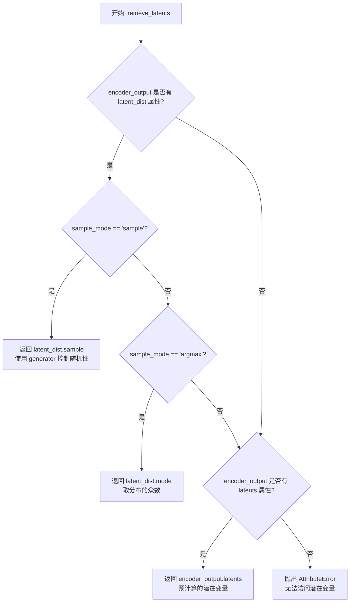

#### 带注释源码

```python
# Copied from diffusers.pipelines.stable_diffusion.pipeline_stable_diffusion_img2img.retrieve_latents
def retrieve_latents(
    encoder_output: torch.Tensor, generator: torch.Generator | None = None, sample_mode: str = "sample"
):
    """
    从编码器输出中检索潜在变量。
    
    该函数支持三种获取潜在变量的方式：
    1. 从潜在分布中采样（sample mode）
    2. 从潜在分布中取众数（argmax mode）
    3. 直接返回预计算的潜在变量（latents 属性）
    
    参数:
        encoder_output: 编码器输出，包含 latent_dist 或 latents 属性
        generator: 可选的随机生成器，用于采样时的随机性控制
        sample_mode: 采样模式，"sample" 或 "argmax"
    
    返回:
        潜在变量张量
    
    异常:
        AttributeError: 当无法从 encoder_output 中访问潜在变量时抛出
    """
    # 检查编码器输出是否有 latent_dist 属性（表示输出是分布形式）
    # 并且采样模式为 "sample"（从分布中采样）
    if hasattr(encoder_output, "latent_dist") and sample_mode == "sample":
        # 从潜在分布中采样，可选使用生成器控制随机性
        return encoder_output.latent_dist.sample(generator)
    # 检查是否有 latent_dist 属性但采样模式为 "argmax"（取分布的众数/最大值）
    elif hasattr(encoder_output, "latent_dist") and sample_mode == "argmax":
        # 返回潜在分布的模式（最可能的值）
        return encoder_output.latent_dist.mode()
    # 检查是否有预计算的 latents 属性（直接存储的潜在变量）
    elif hasattr(encoder_output, "latents"):
        # 直接返回预计算的潜在变量
        return encoder_output.latents
    # 如果无法通过任何方式获取潜在变量，抛出属性错误
    else:
        raise AttributeError("Could not access latents of provided encoder_output")
```


### `retrieve_timesteps`

该函数负责调用调度器的 `set_timesteps` 方法并从调度器中检索时间步。它处理自定义时间步和自定义 sigmas，并将任何额外的关键字参数传递给调度器的 `set_timesteps` 方法。

参数：

- `scheduler`：`SchedulerMixin`，用于获取时间步的调度器
- `num_inference_steps`：`Optional[int]`，使用预训练模型生成样本时使用的扩散步数。如果使用此参数，则 `timesteps` 必须为 `None`
- `device`：`Optional[Union[str, torch.device]]`，时间步应移动到的设备。如果为 `None`，则不移动时间步
- `timesteps`：`Optional[List[int]]`，用于覆盖调度器时间步间隔策略的自定义时间步。如果传入 `timesteps`，则 `num_inference_steps` 和 `sigmas` 必须为 `None`
- `sigmas`：`Optional[List[float]]`，用于覆盖调度器时间步间隔策略的自定义 sigmas。如果传入 `sigmas`，则 `num_inference_steps` 和 `timesteps` 必须为 `None`
- `**kwargs`：任意关键字参数，将传递给 `scheduler.set_timesteps`

返回值：`Tuple[torch.Tensor, int]`，元组第一个元素是调度器的时间步计划，第二个元素是推理步数

#### 流程图

```mermaid
flowchart TD
    A[开始 retrieve_timesteps] --> B{同时传入了 timesteps 和 sigmas?}
    B -->|是| C[抛出 ValueError: 只能选择其中一个]
    B -->|否| D{传入了 timesteps?}
    D -->|是| E{scheduler.set_timesteps 支持 timesteps?}
    D -->|否| F{传入了 sigmas?}
    E -->|否| G[抛出 ValueError: 不支持自定义 timesteps]
    E -->|是| H[调用 scheduler.set_timesteps(timesteps=timesteps, device=device, **kwargs)]
    H --> I[获取 scheduler.timesteps]
    I --> J[计算 num_inference_steps = len(timesteps)]
    J --> K[返回 timesteps, num_inference_steps]
    F -->|是| L{scheduler.set_timesteps 支持 sigmas?}
    F -->|否| M[抛出 ValueError: 不支持自定义 sigmas]
    F -->|否| N[调用 scheduler.set_timesteps(num_inference_steps, device=device, **kwargs)]
    L -->|是| O[调用 scheduler.set_timesteps(sigmas=sigmas, device=device, **kwargs)]
    O --> P[获取 scheduler.timesteps]
    P --> Q[计算 num_inference_steps = len(timesteps)]
    Q --> K
    N --> R[获取 scheduler.timesteps]
    R --> S[计算 num_inference_steps = len(timesteps)]
    S --> K
```

#### 带注释源码

```
# Copied from diffusers.pipelines.stable_diffusion.pipeline_stable_diffusion.retrieve_timesteps
def retrieve_timesteps(
    scheduler,  # 调度器对象，用于获取时间步
    num_inference_steps: Optional[int] = None,  # 推理步数
    device: Optional[Union[str, torch.device]] = None,  # 目标设备
    timesteps: Optional[List[int]] = None,  # 自定义时间步列表
    sigmas: Optional[List[float]] = None,  # 自定义 sigmas 列表
    **kwargs,  # 额外参数，传递给 scheduler.set_timesteps
):
    r"""
    Calls the scheduler's `set_timesteps` method and retrieves timesteps from the scheduler after the call. Handles
    custom timesteps. Any kwargs will be supplied to `scheduler.set_timesteps`.

    Args:
        scheduler (`SchedulerMixin`):
            The scheduler to get timesteps from.
        num_inference_steps (`int`):
            The number of diffusion steps used when generating samples with a pre-trained model. If used, `timesteps`
            must be `None`.
        device (`str` or `torch.device`, *optional*):
            The device to which the timesteps should be moved to. If `None`, the timesteps are not moved.
        timesteps (`List[int]`, *optional*):
            Custom timesteps used to override the timestep spacing strategy of the scheduler. If `timesteps` is passed,
            `num_inference_steps` and `sigmas` must be `None`.
        sigmas (`List[float]`, *optional*):
            Custom sigmas used to override the timestep spacing strategy of the scheduler. If `sigmas` is passed,
            `num_inference_steps` and `timesteps` must be `None`.

    Returns:
        `Tuple[torch.Tensor, int]`: A tuple where the first element is the timestep schedule from the scheduler and the
        second element is the number of inference steps.
    """
    # 检查是否同时传入了 timesteps 和 sigmas，两者只能选择其一
    if timesteps is not None and sigmas is not None:
        raise ValueError("Only one of `timesteps` or `sigmas` can be passed. Please choose one to set custom values")
    
    # 处理自定义 timesteps 的情况
    if timesteps is not None:
        # 检查调度器的 set_timesteps 方法是否支持 timesteps 参数
        accepts_timesteps = "timesteps" in set(inspect.signature(scheduler.set_timesteps).parameters.keys())
        if not accepts_timesteps:
            raise ValueError(
                f"The current scheduler class {scheduler.__class__}'s `set_timesteps` does not support custom"
                f" timestep schedules. Please check whether you are using the correct scheduler."
            )
        # 调用调度器的 set_timesteps 方法设置自定义时间步
        scheduler.set_timesteps(timesteps=timesteps, device=device, **kwargs)
        # 从调度器获取更新后的时间步
        timesteps = scheduler.timesteps
        # 计算推理步数
        num_inference_steps = len(timesteps)
    # 处理自定义 sigmas 的情况
    elif sigmas is not None:
        # 检查调度器的 set_timesteps 方法是否支持 sigmas 参数
        accept_sigmas = "sigmas" in set(inspect.signature(scheduler.set_timesteps).parameters.keys())
        if not accept_sigmas:
            raise ValueError(
                f"The current scheduler class {scheduler.__class__}'s `set_timesteps` does not support custom"
                f" sigmas schedules. Please check whether you are using the correct scheduler."
            )
        # 调用调度器的 set_timesteps 方法设置自定义 sigmas
        scheduler.set_timesteps(sigmas=sigmas, device=device, **kwargs)
        # 从调度器获取更新后的时间步
        timesteps = scheduler.timesteps
        # 计算推理步数
        num_inference_steps = len(timesteps)
    # 使用默认方式设置时间步（根据 num_inference_steps）
    else:
        scheduler.set_timesteps(num_inference_steps, device=device, **kwargs)
        timesteps = scheduler.timesteps
    
    # 返回时间步和推理步数
    return timesteps, num_inference_steps
```


### `ZImageDifferentialImg2ImgPipeline.__init__`

该方法是 ZImage 差分图像到图像生成管道的构造函数，负责初始化管道所需的所有核心组件（调度器、VAE、文本编码器、tokenizer 和 transformer）以及图像处理器和掩码处理器。

参数：

-  `scheduler`：`FlowMatchEulerDiscreteScheduler`，用于去噪图像潜在表示的调度器
-  `vae`：`AutoencoderKL`，用于编码和解码图像到潜在表示的变分自编码器模型
-  `text_encoder`：`PreTrainedModel`，用于编码文本提示的文本编码器模型
-  `tokenizer`：`AutoTokenizer`，用于对文本提示进行分词的 tokenizer
-  `transformer`：`ZImageTransformer2DModel`，用于去噪图像潜在表示的 ZImage transformer 模型

返回值：`None`，构造函数不返回值，仅初始化对象状态

#### 流程图

```mermaid
flowchart TD
    A[开始 __init__] --> B[调用父类构造函数 super().__init__]
    B --> C[使用 register_modules 注册所有模块: vae, text_encoder, tokenizer, scheduler, transformer]
    C --> D[计算 vae_scale_factor: 2^(len(vae.config.block_out_channels)-1) 或默认为8]
    D --> E[获取 latent_channels: vae.config.latent_channels 或默认为16]
    E --> F[创建 image_processor: VaeImageProcessor<br/>vae_scale_factor = vae_scale_factor * 2]
    F --> G[创建 mask_processor: VaeImageProcessor<br/>包含特定配置: do_normalize=False,<br/>do_binarize=False, do_convert_grayscale=True]
    G --> H[结束 __init__]
```

#### 带注释源码

```python
def __init__(
    self,
    scheduler: FlowMatchEulerDiscreteScheduler,
    vae: AutoencoderKL,
    text_encoder: PreTrainedModel,
    tokenizer: AutoTokenizer,
    transformer: ZImageTransformer2DModel,
):
    """
    初始化 ZImageDifferentialImg2ImgPipeline 管道。
    
    参数:
        scheduler: FlowMatchEulerDiscreteScheduler 实例，用于控制去噪过程的调度器
        vae: AutoencoderKL 实例，用于图像编码和解码
        text_encoder: PreTrainedModel 实例，用于将文本转换为嵌入向量
        tokenizer: AutoTokenizer 实例，用于分词文本输入
        transformer: ZImageTransformer2DModel 实例，用于去噪图像潜在表示
    """
    # 调用父类 DiffusionPipeline 的初始化方法
    super().__init__()
    
    # 注册所有模块，使管道能够访问和管理这些组件
    self.register_modules(
        vae=vae,
        text_encoder=text_encoder,
        tokenizer=tokenizer,
        scheduler=scheduler,
        transformer=transformer,
    )
    
    # 计算 VAE 的缩放因子，基于 VAE 的块输出通道数
    # 如果 VAE 存在且有 block_out_channels 配置，则计算，否则使用默认值 8
    self.vae_scale_factor = (
        2 ** (len(self.vae.config.block_out_channels) - 1) if hasattr(self, "vae") and self.vae is not None else 8
    )
    
    # 获取潜在通道数，用于后续处理
    latent_channels = self.vae.config.latent_channels if getattr(self, "vae", None) else 16
    
    # 创建图像处理器，用于预处理输入图像和后处理输出图像
    # 缩放因子乘以2以适应差分扩散的需要
    self.image_processor = VaeImageProcessor(vae_scale_factor=self.vae_scale_factor * 2)
    
    # 创建掩码处理器，专门用于处理差分扩散中的掩码
    # 配置说明:
    # - do_normalize=False: 不对掩码进行归一化
    # - do_binarize=False: 不对掩码进行二值化
    # - do_convert_grayscale=True: 转换为灰度图以符合掩码格式要求
    self.mask_processor = VaeImageProcessor(
        vae_scale_factor=self.vae_scale_factor,
        vae_latent_channels=latent_channels,
        do_normalize=False,
        do_binarize=False,
        do_convert_grayscale=True,
    )
```


### ZImageDifferentialImg2ImgPipeline.encode_prompt

该方法负责将文本提示（prompt）编码为文本嵌入向量（text embeddings），支持分类器自由引导（Classifier-Free Guidance）技术，能够同时处理正向提示和负向提示，返回两组嵌入向量用于图像生成过程。

参数：

- `prompt`：`Union[str, List[str]]`，要编码的文本提示，可以是单个字符串或字符串列表
- `device`：`Optional[torch.device]`（可选），指定计算设备，若不指定则使用执行设备
- `do_classifier_free_guidance`：`bool`（可选，默认值 `True`），是否启用分类器自由引导
- `negative_prompt`：`Optional[Union[str, List[str]]]`（可选），负向提示，用于引导模型避免生成某些内容
- `prompt_embeds`：`Optional[List[torch.FloatTensor]]`（可选），预计算的正向文本嵌入，若提供则直接使用
- `negative_prompt_embeds`：`Optional[List[torch.FloatTensor]]`（可选），预计算的负向文本嵌入
- `max_sequence_length`：`int`（可选，默认值 `512`），文本序列的最大长度

返回值：`Tuple[List[torch.FloatTensor], List[torch.FloatTensor]]`，返回两个列表——第一个是正向提示嵌入列表，第二个是负向提示嵌入列表

#### 流程图

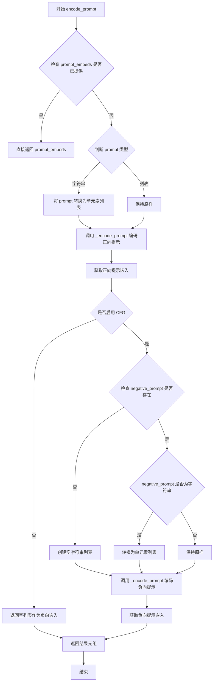

#### 带注释源码

```python
def encode_prompt(
    self,
    prompt: Union[str, List[str]],
    device: Optional[torch.device] = None,
    do_classifier_free_guidance: bool = True,
    negative_prompt: Optional[Union[str, List[str]]] = None,
    prompt_embeds: Optional[List[torch.FloatTensor]] = None,
    negative_prompt_embeds: Optional[List[torch.FloatTensor]] = None,
    max_sequence_length: int = 512,
):
    """
    编码文本提示为文本嵌入向量，支持分类器自由引导。
    
    参数:
        prompt: 要编码的文本提示，字符串或字符串列表
        device: 计算设备
        do_classifier_free_guidance: 是否启用CFG
        negative_prompt: 负向提示
        prompt_embeds: 预计算的正向嵌入
        negative_prompt_embeds: 预计算的负向嵌入
        max_sequence_length: 最大序列长度
    
    返回:
        正向和负向文本嵌入的元组
    """
    # 将单个字符串转换为列表，保持处理一致性
    prompt = [prompt] if isinstance(prompt, str) else prompt
    
    # 调用内部方法进行实际编码，首先处理正向提示
    prompt_embeds = self._encode_prompt(
        prompt=prompt,
        device=device,
        prompt_embeds=prompt_embeds,
        max_sequence_length=max_sequence_length,
    )

    # 判断是否需要处理分类器自由引导的负向提示
    if do_classifier_free_guidance:
        # 如果没有提供负向提示，则使用空字符串填充
        if negative_prompt is None:
            negative_prompt = ["" for _ in prompt]
        else:
            # 统一负向提示为列表格式
            negative_prompt = [negative_prompt] if isinstance(negative_prompt, str) else negative_prompt
        
        # 确保正负提示数量一致
        assert len(prompt) == len(negative_prompt)
        
        # 编码负向提示
        negative_prompt_embeds = self._encode_prompt(
            prompt=negative_prompt,
            device=device,
            prompt_embeds=negative_prompt_embeds,
            max_sequence_length=max_sequence_length,
        )
    else:
        # 不使用CFG时，负向嵌入为空列表
        negative_prompt_embeds = []
    
    # 返回编码结果
    return prompt_embeds, negative_prompt_embeds
```


### `ZImageDifferentialImg2ImgPipeline._encode_prompt`

该方法负责将文本提示（prompt）编码为文本嵌入向量（text embeddings），供后续的图像生成pipeline使用。它支持批量处理、预计算嵌入复用，并通过tokenizer的chat template和attention mask来生成高质量的文本表示。

参数：

-  `prompt`：`Union[str, List[str]]`，要编码的文本提示，可以是单个字符串或字符串列表
-  `device`：`Optional[torch.device]`，[可选] 指定计算设备，默认为执行设备（self._execution_device）
-  `prompt_embeds`：`Optional[List[torch.FloatTensor]]`，[可选] 预计算的提示嵌入，如果提供则直接返回，跳过编码过程
-  `max_sequence_length`：`int`，[可选] 最大序列长度，默认为512

返回值：`List[torch.FloatTensor]`，返回编码后的提示嵌入列表，每个元素对应一个prompt的嵌入向量（已应用attention mask过滤）

#### 流程图

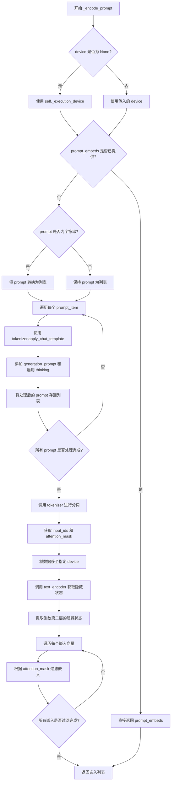

#### 带注释源码

```python
def _encode_prompt(
    self,
    prompt: Union[str, List[str]],
    device: Optional[torch.device] = None,
    prompt_embeds: Optional[List[torch.FloatTensor]] = None,
    max_sequence_length: int = 512,
) -> List[torch.FloatTensor]:
    # 确定执行设备：如果未指定device，则使用pipeline的默认执行设备
    device = device or self._execution_device

    # 如果已经提供了预计算的prompt_embeds，则直接返回，避免重复编码
    if prompt_embeds is not None:
        return prompt_embeds

    # 将单个字符串prompt转换为列表，统一处理方式
    if isinstance(prompt, str):
        prompt = [prompt]

    # 遍历每个prompt，应用chat template进行格式化
    # chat template用于将用户消息格式化为模型需要的对话格式
    for i, prompt_item in enumerate(prompt):
        messages = [
            {"role": "user", "content": prompt_item},
        ]
        # 使用tokenizer的apply_chat_template方法格式化prompt
        # add_generation_prompt=True: 添加生成提示（如"Assistant:"）引导模型生成
        # enable_thinking=True: 启用思考模式（可能用于更详细的推理）
        prompt_item = self.tokenizer.apply_chat_template(
            messages,
            tokenize=False,  # 不进行分词，只返回格式化后的字符串
            add_generation_prompt=True,
            enable_thinking=True,
        )
        prompt[i] = prompt_item

    # 使用tokenizer对prompt列表进行分词处理
    # padding="max_length": 填充到最大长度
    # max_length: 最大序列长度
    # truncation=True: 超过最大长度的部分进行截断
    # return_tensors="pt": 返回PyTorch张量
    text_inputs = self.tokenizer(
        prompt,
        padding="max_length",
        max_length=max_sequence_length,
        truncation=True,
        return_tensors="pt",
    )

    # 获取输入ID和attention mask，并将它们移到指定设备
    # input_ids: 分词后的token ID序列
    # attention_mask: 指示哪些位置是有效token（1）哪些是padding（0）
    text_input_ids = text_inputs.input_ids.to(device)
    prompt_masks = text_inputs.attention_mask.to(device).bool()

    # 调用text_encoder获取文本的隐藏状态表示
    # output_hidden_states=True: 返回所有层的隐藏状态
    # 使用倒数第二层的隐藏状态（通常包含更丰富的语义信息）
    prompt_embeds = self.text_encoder(
        input_ids=text_input_ids,
        attention_mask=prompt_masks,
        output_hidden_states=True,
    ).hidden_states[-2]

    # 根据attention mask过滤嵌入向量，只保留有效token对应的嵌入
    # 这样可以移除padding部分的嵌入，得到可变长度的嵌入表示
    embeddings_list = []
    for i in range(len(prompt_embeds)):
        # 使用boolean mask索引，只保留attention_mask为True的位置
        embeddings_list.append(prompt_embeds[i][prompt_masks[i]])

    # 返回过滤后的嵌入列表
    return embeddings_list
```


### `ZImageDifferentialImg2ImgPipeline.get_timesteps`

该方法用于根据图像到图像转换的强度（strength）参数调整去噪过程的时间步。它计算初始时间步数量，并根据强度值截取调度器的时间步序列，从而实现对原始图像不同程度的影响。

参数：

- `num_inference_steps`：`int`，扩散模型生成图像时使用的去噪步数
- `strength`：`float`，指示对参考图像的转换程度，值必须在 0 到 1 之间，值越大表示添加的噪声越多
- `device`：`torch.device`，时间步要移动到的目标设备

返回值：`Tuple[torch.Tensor, int]`，第一个元素是调整后的时间步调度序列，第二个元素是调整后的推理步数

#### 流程图

```mermaid
flowchart TD
    A[开始] --> B[计算初始时间步 init_timestep = min(num_inference_steps × strength, num_inference_steps)]
    B --> C[计算起始索引 t_start = max(num_inference_steps - init_timestep, 0)]
    C --> D[从调度器中截取时间步序列 timesteps = scheduler.timesteps[t_start × scheduler.order :]
    D --> E{调度器是否有 set_begin_index 方法?}
    E -->|是| F[调用 scheduler.set_begin_index(t_start × scheduler.order)]
    E -->|否| G[跳过]
    F --> H[返回 timesteps 和 num_inference_steps - t_start]
    G --> H
```

#### 带注释源码

```python
def get_timesteps(self, num_inference_steps, strength, device):
    # 根据强度参数计算初始时间步数量
    # strength 表示对原始图像的保留程度，值越大表示添加的噪声越多
    # 实际使用的时间步数 = num_inference_steps * strength，但不超过 num_inference_steps
    init_timestep = min(num_inference_steps * strength, num_inference_steps)

    # 计算从原始时间步序列中的起始索引
    # 如果 strength < 1，则跳过前面的时间步，只使用后面的时间步进行去噪
    # 这样可以实现部分图像转换的效果
    t_start = int(max(num_inference_steps - init_timestep, 0))
    
    # 从调度器中获取时间步序列
    # scheduler.order 表示调度器的阶数，用于正确索引时间步
    timesteps = self.scheduler.timesteps[t_start * self.scheduler.order :]
    
    # 如果调度器支持设置起始索引，则设置它
    # 这对于某些需要知道当前所处去噪阶段的调度器很重要
    if hasattr(self.scheduler, "set_begin_index"):
        self.scheduler.set_begin_index(t_start * self.scheduler.order)

    # 返回调整后的时间步序列和实际的推理步数
    # 实际推理步数 = 原始步数 - 跳过的步数
    return timesteps, num_inference_steps - t_start
```


### `ZImageDifferentialImg2ImgPipeline._prepare_latent_image_ids`

该方法用于生成潜在空间（latent space）中的图像位置ID张量，这些位置ID将作为transformer模型的二维位置编码，帮助模型理解图像的空间结构信息。

参数：

- `batch_size`：`int`，批次大小（虽然参数存在但在当前实现中未直接使用，仅作为接口签名的一部分）
- `height`：`int`，潜在空间中的图像高度（经过VAE下采样后的高度）
- `width`：`int`，潜在空间中的图像宽度（经过VAE下采样后的宽度）
- `device`：`torch.device`，目标计算设备
- `dtype`：`torch.dtype`，目标数据类型

返回值：`torch.Tensor`，返回形状为 `(height//2 * width//2, 3)` 的位置ID张量，其中第二维包含3个通道（高度索引、宽度索引、常量通道）

#### 流程图

```mermaid
flowchart TD
    A[开始] --> B[创建零张量: shape为height//2 × width//2 × 3]
    B --> C[填充高度位置编码: latent_image_ids[..., 1] + torch.arange(height//2)[:, None]]
    C --> D[填充宽度位置编码: latent_image_ids[..., 2] + torch.arange(width//2)[None, :]]
    D --> E[获取张量形状: height, width, channels]
    E --> F[重塑张量: 展平为2D - height×width行, 3列]
    F --> G[移动张量到指定设备并转换数据类型]
    G --> H[返回位置ID张量]
```

#### 带注释源码

```python
@staticmethod
def _prepare_latent_image_ids(batch_size, height, width, device, dtype):
    """
    生成潜在空间中的图像位置ID，用于transformer模型的二维位置编码。
    
    Args:
        batch_size: 批次大小（当前实现中未使用）
        height: 潜在空间高度
        width: 潜在空间宽度
        device: 目标设备
        dtype: 目标数据类型
    
    Returns:
        形状为 (height//2 * width//2, 3) 的位置ID张量
    """
    # 步骤1: 创建初始零张量，形状为 (height//2, width//2, 3)
    # 这里的3对应三个通道：通道0为常量0，通道1为高度索引，通道2为宽度索引
    latent_image_ids = torch.zeros(height // 2, width // 2, 3)
    
    # 步骤2: 填充高度位置编码 (y坐标)
    # torch.arange(height // 2) 生成 [0, 1, 2, ..., height//2-1]
    # [:, None] 将其转换为列向量，用于广播
    latent_image_ids[..., 1] = latent_image_ids[..., 1] + torch.arange(height // 2)[:, None]
    
    # 步骤3: 填充宽度位置编码 (x坐标)
    # torch.arange(width // 2) 生成 [0, 1, 2, ..., width//2-1]
    # [None, :] 将其转换为行向量，用于广播
    latent_image_ids[..., 2] = latent_image_ids[..., 2] + torch.arange(width // 2)[None, :]
    
    # 步骤4: 获取重塑后的张量维度
    latent_image_id_height, latent_image_id_width, latent_image_id_channels = latent_image_ids.shape
    
    # 步骤5: 将3D张量重塑为2D张量
    # 从 (height//2, width//2, 3) 转换为 (height//2 * width//2, 3)
    # 每一行代表一个潜在空间位置，其格式为 [0, y_index, x_index]
    latent_image_ids = latent_image_ids.reshape(
        latent_image_id_height * latent_image_id_width, latent_image_id_channels
    )
    
    # 步骤6: 将张量移动到指定设备并转换数据类型后返回
    return latent_image_ids.to(device=device, dtype=dtype)
```


### `ZImageDifferentialImg2ImgPipeline.prepare_latents`

该方法负责将输入图像编码为潜在向量，并根据时间步添加噪声，是图像到图像扩散管道中的关键步骤。它首先计算潜在空间的形状，然后使用VAE编码输入图像（如未提供预计算潜在向量），接着处理批量大小扩展，最后通过调度器的`scalenoise`方法添加噪声，生成用于去噪过程的初始潜在向量。

参数：

- `image`：`torch.Tensor`，输入图像张量，将被编码到潜在空间
- `timestep`：`torch.Tensor`，当前扩散时间步，用于噪声缩放
- `batch_size`：`int`，批处理大小
- `num_channels_latents`：`int`，潜在通道数，由Transformer模型的输入通道决定
- `height`：`int`，目标高度（像素）
- `width`：`int`，目标宽度（像素）
- `dtype`：`torch.dtype`，潜在向量的数据类型
- `device`：`torch.device`，计算设备
- `generator`：`torch.Generator` 或 `List[torch.Generator]`，可选的随机数生成器，用于确保可重现性
- `latents`：`torch.FloatTensor`，可选的预生成潜在向量，如果提供则直接返回

返回值：`Tuple[torch.Tensor, torch.Tensor, torch.Tensor, torch.Tensor]`，返回一个包含四个元素的元组：
- `latents`：添加噪声后的潜在向量
- `noise`：生成的随机噪声
- `image_latents`：编码后的图像潜在向量
- `latent_image_ids`：用于位置编码的潜在图像ID

#### 流程图

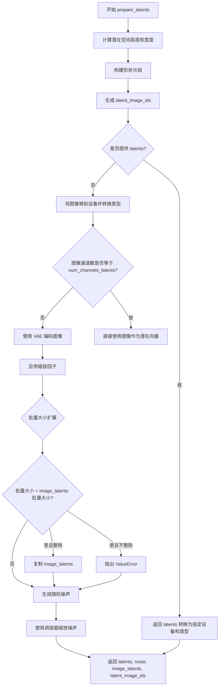

#### 带注释源码

```python
def prepare_latents(
    self,
    image,
    timestep,
    batch_size,
    num_channels_latents,
    height,
    width,
    dtype,
    device,
    generator,
    latents=None,
):
    # 计算潜在空间的尺寸：高度和宽度需要除以 VAE 缩放因子的两倍
    # 然后乘以 2 以适应 Transformer 的空间结构
    height = 2 * (int(height) // (self.vae_scale_factor * 2))
    width = 2 * (int(width) // (self.vae_scale_factor * 2))

    # 构建潜在向量的形状：(batch_size, num_channels, height, width)
    shape = (batch_size, num_channels_latents, height, width)
    
    # 生成潜在图像的位置编码 IDs，用于 Transformer 的自注意力机制
    latent_image_ids = self._prepare_latent_image_ids(batch_size, height, width, device, dtype)

    # 如果已经提供了 latents，直接返回转换后的 latents
    if latents is not None:
        return latents.to(device=device, dtype=dtype)

    # 将输入图像移到指定设备并转换数据类型
    image = image.to(device=device, dtype=dtype)
    
    # 如果图像通道数与潜在通道数不匹配，需要通过 VAE 编码
    if image.shape[1] != num_channels_latents:
        # 根据是否有多个生成器分别处理
        if isinstance(generator, list):
            # 对批量图像分别编码
            image_latents = [
                retrieve_latents(self.vae.encode(image[i : i + 1]), generator=generator[i])
                for i in range(image.shape[0])
            ]
            # 合并编码结果
            image_latents = torch.cat(image_latents, dim=0)
        else:
            # 一次性编码整个图像批量
            image_latents = retrieve_latents(self.vae.encode(image), generator=generator)

        # 应用 VAE 缩放因子（与解码过程相反的操作）
        # 解码时：latents / scaling_factor + shift_factor
        # 编码时：(latents - shift_factor) * scaling_factor
        image_latents = (image_latents - self.vae.config.shift_factor) * self.vae.config.scaling_factor
    else:
        # 图像已经是潜在向量格式，直接使用
        image_latents = image

    # 处理批量大小扩展：当批处理大小大于图像潜在向量数量时
    if batch_size > image_latents.shape[0] and batch_size % image_latents.shape[0] == 0:
        # 计算每个提示需要复制的次数
        additional_image_per_prompt = batch_size // image_latents.shape[0]
        # 复制图像潜在向量
        image_latents = torch.cat([image_latents] * additional_image_per_prompt, dim=0)
    elif batch_size > image_latents.shape[0] and batch_size % image_latents.shape[0] != 0:
        # 批量大小无法整除时抛出错误
        raise ValueError(
            f"Cannot duplicate `image` of batch size {image_latents.shape[0]} to {batch_size} text prompts."
        )

    # 使用 randn_tensor 生成随机噪声，形状为潜在向量形状
    noise = randn_tensor(shape, generator=generator, device=device, dtype=dtype)
    
    # 使用调度器的 scale_noise 方法对噪声进行缩放（Flow Matching 特有）
    # 这会将图像潜在向量和噪声混合，得到最终的潜在向量
    latents = self.scheduler.scale_noise(image_latents, timestep, noise)

    # 返回：潜在向量、噪声、原始图像潜在向量、位置编码 IDs
    return latents, noise, image_latents, latent_image_ids
```


### `ZImageDifferentialImg2ImgPipeline.prepare_mask_latents`

该方法负责准备和调整掩码（mask）以及被掩码覆盖的图像（masked_image）的潜在表示，以便在差分图像到图像（differential img2img）pipeline中使用。它调整掩码尺寸、处理被掩码图像的VAE编码、进行批次大小扩展，并返回与潜在空间对齐的掩码和掩码图像潜在向量。

参数：

- `self`：`ZImageDifferentialImg2ImgPipeline` 实例本身，隐式参数
- `mask`：`torch.Tensor`，输入的掩码张量，通常是二值或灰度图像，用于指示图像中需要保留或修改的区域
- `masked_image`：`torch.Tensor`，被掩码覆盖的图像张量，即原始图像与掩码相乘后的结果
- `batch_size`：`int`，基础批次大小，表示单个提示词对应的图像数量
- `num_images_per_prompt`：`int`，每个提示词生成的图像数量，用于批次扩展
- `height`：`int`，目标图像高度（像素单位），方法内部会转换为潜在空间高度
- `width`：`int`，目标图像宽度（像素单位），方法内部会转换为潜在空间宽度
- `dtype`：`torch.dtype`，计算使用的数据类型（如torch.float32、torch.bfloat16等）
- `device`：`torch.device`，计算设备（如cuda、cpu）
- `generator`：`torch.Generator` 或 `None`，可选的随机数生成器，用于确保可重复性

返回值：`Tuple[torch.Tensor, torch.Tensor]`，返回两个张量——第一个是调整大小并扩展批次后的掩码，第二个是处理后的被掩码图像潜在向量

#### 流程图

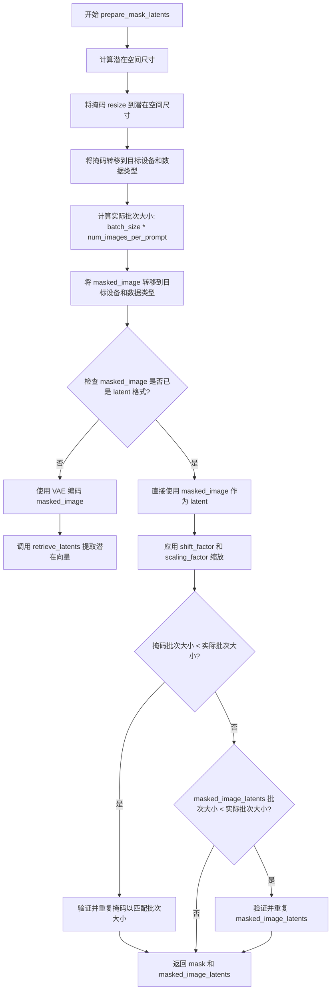

#### 带注释源码

```python
def prepare_mask_latents(
    self,
    mask,                      # 输入掩码张量，用于指示图像修改区域
    masked_image,              # 被掩码覆盖的图像，即原图与掩码相乘结果
    batch_size,                # 基础批次大小
    num_images_per_prompt,     # 每个提示词生成图像数
    height,                    # 目标高度（像素）
    width,                     # 目标宽度（像素）
    dtype,                     # 目标数据类型
    device,                    # 目标设备
    generator,                 # 随机数生成器
):
    # 计算潜在空间中的高度和宽度
    # VAE的scale_factor为2^(len(block_out_channels)-1)，通常为8
    # 这里乘以2是因为差分图像处理需要更高的分辨率
    height = 2 * (int(height) // (self.vae_scale_factor * 2))
    width = 2 * (int(width) // (self.vae_scale_factor * 2))
    
    # 使用双线性插值将掩码调整到与潜在空间对应的尺寸
    # 在转换为dtype之前执行resize，以避免CPU offload时出现问题
    # 因为半精度下某些操作可能失败
    mask = torch.nn.functional.interpolate(mask, size=(height, width))
    mask = mask.to(device=device, dtype=dtype)

    # 计算实际需要的批次大小（考虑每提示词生成多张图像）
    batch_size = batch_size * num_images_per_prompt

    # 将被掩码图像转移到目标设备和数据类型
    masked_image = masked_image.to(device=device, dtype=dtype)

    # 检查被掩码图像是否已经是潜在向量格式（通道数为16）
    if masked_image.shape[1] == 16:
        masked_image_latents = masked_image  # 直接使用，无需编码
    else:
        # 使用VAE编码器将图像转换为潜在向量
        # retrieve_latents函数处理不同的VAE输出格式（latent_dist或latents）
        masked_image_latents = retrieve_latents(self.vae.encode(masked_image), generator=generator)

    # 应用VAE的缩放因子进行反向变换
    # 解码时执行: latents / scaling_factor + shift_factor
    # 编码时需要反向操作: (latents - shift_factor) * scaling_factor
    masked_image_latents = (masked_image_latents - self.vae.config.shift_factor) * self.vae.config.scaling_factor

    # 为每个提示词的生成复制掩码和被掩码图像潜在向量
    # 使用MPS友好的方法（repeat而非tile）进行批次扩展
    if mask.shape[0] < batch_size:
        if not batch_size % mask.shape[0] == 0:
            raise ValueError(
                "The passed mask and the required batch size don't match. Masks are supposed to be duplicated to"
                f" a total batch size of {batch_size}, but {mask.shape[0]} masks were passed. Make sure the number"
                " of masks that you pass is divisible by the total requested batch size."
            )
        # 整除扩展：重复掩码以匹配批次大小
        mask = mask.repeat(batch_size // mask.shape[0], 1, 1, 1)
    
    if masked_image_latents.shape[0] batch_size:
        if not batch_size % masked_image_latents.shape[0] == 0:
            raise ValueError(
                "The passed images and the required batch size don't match. Images are supposed to be duplicated"
                f" a total batch size of {batch_size}, but {masked_image_latents.shape[0]} images were passed."
                " Make sure the number of images that you pass is divisible by the total requested batch size."
            )
        # 整除扩展：重复被掩码图像潜在向量以匹配批次大小
        masked_image_latents = masked_image_latents.repeat(batch_size // masked_image_latents.shape[0], 1, 1, 1)

    # 确保设备一致，防止与潜在模型输入连接时出现设备错误
    masked_image_latents = masked_image_latents.to(device=device, dtype=dtype)

    # 返回调整后的掩码和被掩码图像潜在向量
    return mask, masked_image_latents
```


### `ZImageDifferentialImg2ImgPipeline.guidance_scale`

这是一个属性 getter 方法，用于获取当前pipeline的指导尺度（guidance scale）。该值控制了图像生成过程中文本提示对生成结果的影响程度，值越大生成的图像与文本提示的关联性越强。

参数：无

返回值：`float`，返回当前设置的指导尺度值，值越大表示文本引导强度越高

#### 流程图

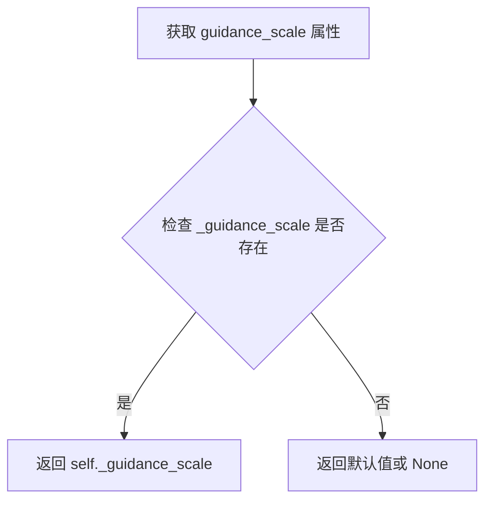

#### 带注释源码

```python
@property
def guidance_scale(self):
    """
    属性 getter：获取 guidance_scale（指导尺度）
    
    guidance_scale 是 Classifier-Free Diffusion Guidance (CFDG) 中的关键参数，
    用于控制文本提示对图像生成的影响程度。
    - 值 > 1.0 时启用 CFG，值越大文本引导越强
    - 值 <= 1.0 时禁用 CFG
    
    Returns:
        float: 当前设置的指导尺度值
    """
    return self._guidance_scale
```

#### 关联信息

- **调用来源**: 在 `__call__` 方法中通过 `self._guidance_scale = guidance_scale` 设置初始值
- **使用场景**: 在 denoising 循环中用于控制 CFG 强度：
  ```python
  current_guidance_scale = self.guidance_scale
  apply_cfg = self.do_classifier_free_guidance and current_guidance_scale > 0
  ```
- **默认值**: `5.0`（在 `__call__` 方法参数中定义）
- **属性类型**: `float`


### `ZImageDifferentialImg2ImgPipeline.do_classifier_free_guidance`

该属性用于判断当前管线是否启用无分类器自由引导（Classifier-Free Guidance, CFG）策略。通过比较内部存储的 `guidance_scale` 值是否大于 1 来决定是否在推理过程中应用 CFG。

参数：无（该属性不需要额外参数）

返回值：`bool`，当 `guidance_scale > 1` 时返回 `True`，表示启用 CFG；否则返回 `False`。

#### 流程图

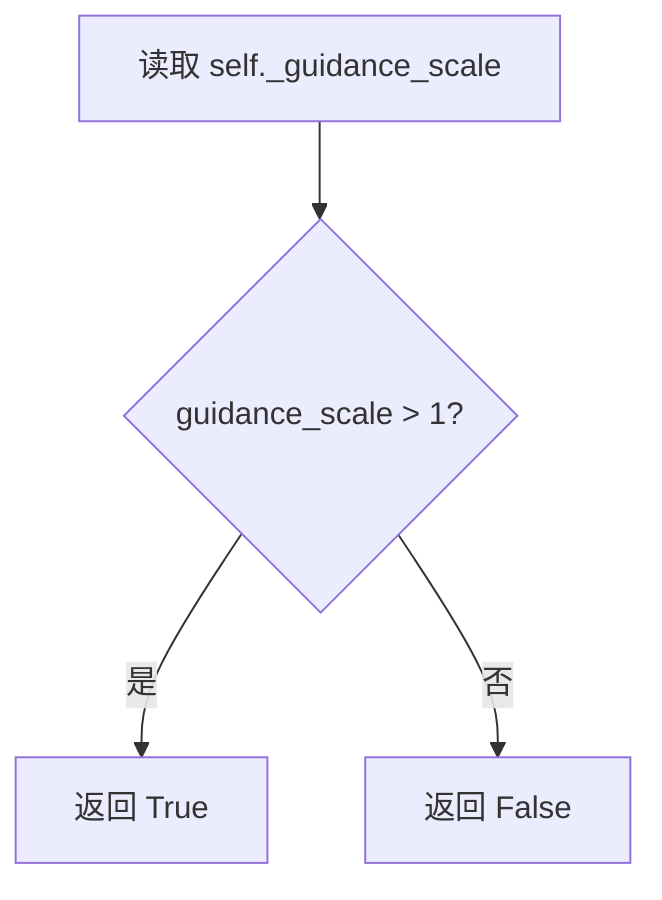

#### 带注释源码

```python
@property
def do_classifier_free_guidance(self):
    """
    属性：判断是否执行无分类器自由引导（CFG）
    
    该属性基于 guidance_scale 参数判断是否启用 CFG 策略。
    当 guidance_scale > 1 时，模型会在推理时同时处理带条件和不带条件的
    文本嵌入，以实现更精确的图像生成控制。
    
    Returns:
        bool: 如果 guidance_scale 大于 1 返回 True，否则返回 False
    """
    return self._guidance_scale > 1
```


### `ZImageDifferentialImg2ImgPipeline.joint_attention_kwargs`

该属性是一个只读的property，用于获取在图像生成管道调用过程中存储的联合注意力关键字参数（joint_attention_kwargs）。这些参数会在去噪循环中被传递给Transformer模型的注意力处理器，用于控制注意力机制的行为。

参数：

- （无参数，这是一个property getter）

返回值：`Optional[Dict[str, Any]]`，返回存储在管道实例中的联合注意力关键字参数字典。如果未设置则返回`None`。

#### 流程图

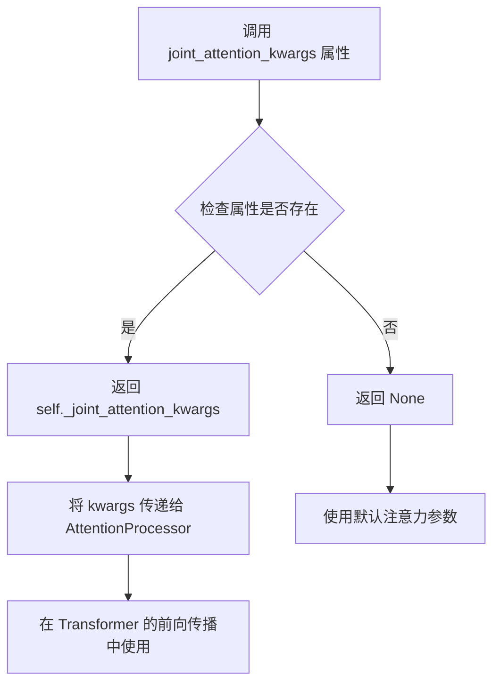

#### 带注释源码

```python
@property
def joint_attention_kwargs(self):
    """
    获取联合注意力关键字参数的属性访问器。
    
    该属性返回一个字典，其中包含在管道调用时设置的联合注意力参数。
    这些参数会被传递到注意力处理器中，用于自定义注意力机制的行为，
    例如控制注意力权重、添加额外的注意力控制等。
    
    返回值:
        Optional[Dict[str, Any]]: 存储的联合注意力关键字参数字典。
        如果在管道调用时未传入 joint_attention_kwargs 参数，则返回 None。
    """
    return self._joint_attention_kwargs
```

#### 相关上下文代码

```python
# 在 __call__ 方法中设置该属性
self._joint_attention_kwargs = joint_attention_kwargs

# joint_attention_kwargs 参数的定义（在 __call__ 方法中）
joint_attention_kwargs: Optional[Dict[str, Any]] = None,
```

#### 使用场景说明

该属性在管道执行过程中的去噪循环中被使用，参数会被传递给`self.transformer`的注意力处理器：

```python
# 在 transformer 调用时，joint_attention_kwargs 会被传递
model_out_list = self.transformer(
    latent_model_input_list,
    timestep_model_input,
    prompt_embeds_model_input,
    # joint_attention_kwargs 会在内部传递给注意力处理器
)[0]
```


### `ZImageDifferentialImg2ImgPipeline.num_timesteps` (property)

该属性是一个只读的property，用于返回图像生成管道在推理过程中所使用的时间步数量。时间步数量由去噪循环前的调度器配置决定，并在`__call__`方法中去噪开始前被设置。

参数： 无（property不需要参数）

返回值：`int`，返回管道推理过程中使用的时间步总数

#### 流程图

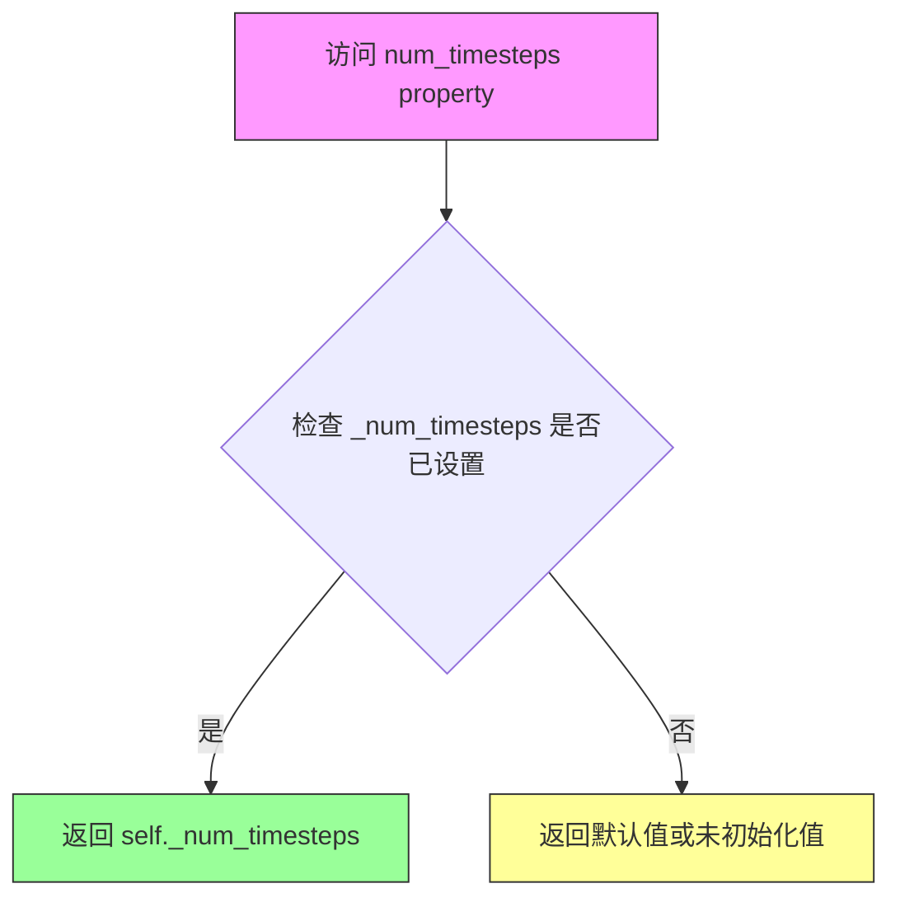

#### 带注释源码

```python
@property
def num_timesteps(self):
    """
    只读属性，返回图像生成管道使用的时间步数量。
    
    该值在 __call__ 方法中去噪循环开始前设置：
    self._num_timesteps = len(timesteps)
    
    Returns:
        int: 去噪过程中使用的时间步总数
    """
    return self._num_timesteps
```

---

#### 补充信息

**设置时机**： 在 `ZImageDifferentialImg2ImgPipeline.__call__` 方法的第6步（Prepare timesteps）之后、去噪循环开始之前，通过以下代码设置：

```python
self._num_timesteps = len(timesteps)
```

**相关变量**：
- `self._num_timesteps`：整型，存储时间步数量，在去噪循环开始前由调度器返回的时间步列表长度决定

**使用场景**： 
- 该属性允许外部代码查询管道当前配置的时间步数量
- 可用于监控管道进度或获取推理配置信息
- 在diffusers库的其他Pipeline中也常见此属性，用于保持API一致性


### `ZImageDifferentialImg2ImgPipeline.interrupt`

该属性是 ZImage 图像到图像生成管道的中断控制标志，用于在去噪循环中检查是否需要提前终止推理过程。当设置为 `True` 时，管道会跳过当前迭代继续执行，但不抛出异常，从而实现优雅中断。

参数：
- 无参数（这是一个属性访问器）

返回值：`bool`，返回 `self._interrupt` 的当前值，表示管道是否被请求中断。`False` 表示继续正常执行，`True` 表示请求中断。

#### 流程图

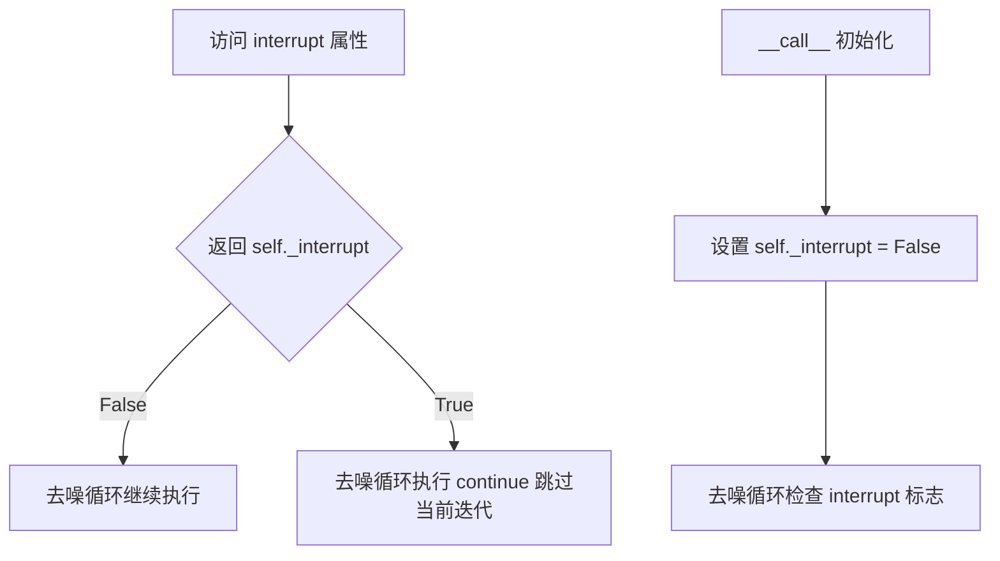

#### 带注释源码

```python
@property
def interrupt(self):
    """
    中断属性，用于控制管道执行的中断状态。
    
    在 __call__ 方法的去噪循环中通过 'if self.interrupt: continue' 检查。
    外部调用者可以通过设置 pipeline.interrupt = True 来请求提前终止推理。
    
    Returns:
        bool: 当前的中断状态标志
    """
    return self._interrupt
```

**使用场景示例：**

```python
# 在去噪循环中的使用方式（来自 __call__ 方法）
with self.progress_bar(total=num_inference_steps) as progress_bar:
    for i, t in enumerate(timesteps):
        if self.interrupt:  # 检查中断标志
            continue        # 跳过当前迭代，实现优雅中断
        
        # ... 正常的去噪逻辑 ...
```

**设计说明：**
- 该属性设计为可写的，外部可以通过 `pipeline._interrupt = True` 来中断长时间运行的推理
- 中断机制采用"软中断"模式，即设置标志后不会立即停止，而是让当前迭代完成后再检查标志
- 这种设计避免了强制中断可能带来的资源泄漏或状态不一致问题


### `ZImageDifferentialImg2ImgPipeline.__call__`

该方法是ZImage差分图像到图像（differential image-to-image）生成管道的核心调用函数，通过结合文本提示、输入图像和掩码，实现基于差分扩散技术的图像生成与修复。支持分类器自由引导（CFG）、CFG归一化、CFG截断等高级控制功能，并能根据mask动态调整噪声注入实现精确的区域性重绘。

参数：

- `prompt`：`Union[str, List[str]]`，可选，文本提示或提示列表，用于引导图像生成
- `image`：`PipelineImageInput`，可选，作为生成起点的输入图像批次
- `mask_image`：`PipelineImageInput`，可选，用于掩码的图像，黑像素被重绘，白像素保留
- `strength`：`float`，可选，默认0.6，图像变换程度，0-1之间，越高添加噪声越多
- `height`：`Optional[int]`，可选，默认1024，生成图像的高度像素
- `width`：`Optional[int]`，可选，默认1024，生成图像的宽度像素
- `num_inference_steps`：`int`，可选，默认50，去噪步数
- `sigmas`：`Optional[List[float]]`，可选，自定义去噪过程的sigma值
- `guidance_scale`：`float`，可选，默认5.0，分类器自由引导比例
- `cfg_normalization`：`bool`，可选，默认False，是否应用CFG归一化
- `cfg_truncation`：`float`，可选，默认1.0，CFG截断值
- `negative_prompt`：`Optional[Union[str, List[str]]]`，可选，不用于引导图像生成的负面提示
- `num_images_per_prompt`：`Optional[int]`，可选，默认1，每个提示生成的图像数量
- `generator`：`Optional[Union[torch.Generator, List[torch.Generator]]]`，可选，用于生成确定性的随机生成器
- `latents`：`Optional[torch.FloatTensor]`，可选，预生成的有噪声潜在向量
- `prompt_embeds`：`Optional[List[torch.FloatTensor]]`，可选，预生成的文本嵌入
- `negative_prompt_embeds`：`Optional[List[torch.FloatTensor]]`，可选，预生成的负面文本嵌入
- `output_type`：`str | None`，可选，默认"pil"，输出格式（PIL图像或numpy数组）
- `return_dict`：`bool`，可选，默认True，是否返回字典格式输出
- `joint_attention_kwargs`：`Optional[Dict[str, Any]]`，可选，传递给注意力处理器的参数字典
- `callback_on_step_end`：`Optional[Callable[[int, int, Dict], None]]`，可选，每步结束时调用的回调函数
- `callback_on_step_end_tensor_inputs`：`List[str]`，可选，默认["latents"]，回调函数需要的张量输入列表
- `max_sequence_length`：`int`，可选，默认512，提示的最大序列长度

返回值：`Union[ZImagePipelineOutput, Tuple]`，返回ZImagePipelineOutput对象（包含生成的图像列表）或元组

#### 流程图

```mermaid
flowchart TD
    A[开始 __call__] --> B[验证strength参数 0-1]
    B --> C[预处理输入图像]
    C --> D{检查height/width}
    D -->|未指定| E[从预处理图像获取尺寸]
    D -->|已指定| F[验证尺寸可被vae_scale整除]
    F --> G[设置guidance_scale和joint_attention_kwargs]
    G --> H{确定batch_size}
    H --> I[编码prompt生成embeddings]
    I --> J[准备潜在变量]
    J --> K[计算image_seq_len]
    K --> L[计算scheduler的mu偏移]
    L --> M[获取timesteps]
    M --> N[根据strength调整timesteps]
    N --> O[准备初始图像的latents]
    O --> P[预处理mask图像]
    P --> Q[创建差分mask序列]
    Q --> R[初始化进度条]
    R --> S[进入去噪循环]
    
    S --> T{遍历timesteps}
    T -->|当前| U[展开timestep到batch维度]
    U --> V[归一化时间]
    V --> W{检查CFG截断条件}
    W -->|满足| X[设置guidance_scale为0]
    W -->|不满足| Y[保持原guidance_scale]
    X --> Z[构建模型输入]
    Y --> Z
    
    Z --> AA{是否应用CFG}
    AA -->|是| AB[复制latents和embeddings]
    AA -->|否| AC[直接使用单份输入]
    AB --> AD[调用transformer推理]
    AC --> AD
    
    AD --> AE{应用CFG}
    AE -->|是| AF[分离正负输出并计算加权预测]
    AE -->|否| AG[直接堆叠输出]
    AF --> AH[执行CFG归一化]
    AG --> AI[挤压维度并取反]
    AH --> AI
    
    AI --> AJ[scheduler.step更新latents]
    AJ --> AK{不是最后一步}
    AK -->|是| AL[计算下一步噪声]
    AL --> AM[应用差分mask混合]
    AK -->|否| AN[跳过差分混合]
    AM --> AO[检查并转换dtype]
    AO --> AP{有callback}
    AP -->|是| AQ[执行回调函数]
    AP -->|否| AR[更新进度条]
    AQ --> AR
    
    AR --> AS{循环继续}
    AS -->|是| T
    AS -->|否| AT
    
    AT --> AU{output_type是latent}
    AU -->|是| AV[直接返回latents]
    AU -->|否| AW[解码latents到图像]
    AW --> AX[后处理图像]
    AV --> AY[释放模型钩子]
    AX --> AY
    
    AY --> AZ{return_dict}
    AZ -->|是| BA[返回ZImagePipelineOutput]
    AZ -->|否| BB[返回元组]
    BA --> BC[结束]
    BB --> BC
```

#### 带注释源码

```python
@torch.no_grad()
@replace_example_docstring(EXAMPLE_DOC_STRING)
def __call__(
    self,
    prompt: Union[str, List[str]] = None,
    image: PipelineImageInput = None,
    mask_image: PipelineImageInput = None,
    strength: float = 0.6,
    height: Optional[int] = None,
    width: Optional[int] = None,
    num_inference_steps: int = 50,
    sigmas: Optional[List[float]] = None,
    guidance_scale: float = 5.0,
    cfg_normalization: bool = False,
    cfg_truncation: float = 1.0,
    negative_prompt: Optional[Union[str, List[str]]] = None,
    num_images_per_prompt: Optional[int] = 1,
    generator: Optional[Union[torch.Generator, List[torch.Generator]]] = None,
    latents: Optional[torch.FloatTensor] = None,
    prompt_embeds: Optional[List[torch.FloatTensor]] = None,
    negative_prompt_embeds: Optional[List[torch.FloatTensor]] = None,
    output_type: str | None = "pil",
    return_dict: bool = True,
    joint_attention_kwargs: Optional[Dict[str, Any]] = None,
    callback_on_step_end: Optional[Callable[[int, int, Dict], None]] = None,
    callback_on_step_end_tensor_inputs: List[str] = ["latents"],
    max_sequence_length: int = 512,
):
    r"""
    Function invoked when calling the pipeline for image-to-image generation.

    Args:
        prompt (`str` or `List[str]`, *optional*):
            The prompt or prompts to guide the image generation. If not defined, one has to pass `prompt_embeds`.
            instead.
        image (`torch.Tensor`, `PIL.Image.Image`, `np.ndarray`, `List[torch.Tensor]`, `List[PIL.Image.Image]`, or `List[np.ndarray]`):
            `Image`, numpy array or tensor representing an image batch to be used as the starting point. For both
            numpy array and pytorch tensor, the expected value range is between `[0, 1]`. If it's a tensor or a
            list of tensors, the expected shape should be `(B, C, H, W)` or `(C, H, W)`. If it is a numpy array or
            a list of arrays, the expected shape should be `(B, H, W, C)` or `(H, W, C)`.
        mask_image (`torch.Tensor`, `PIL.Image.Image`, `np.ndarray`, `List[torch.Tensor]`, `List[PIL.Image.Image]`, or `List[np.ndarray]`):
            `Image`, numpy array or tensor representing an image batch to mask `image`. Black pixels in the mask
            are repainted while white pixels are preserved. If `mask_image` is a PIL image, it is converted to a
            single channel (luminance) before use. If it's a numpy array or pytorch tensor, it should contain one
            color channel (L) instead of 3, so the expected shape for pytorch tensor would be `(B, 1, H, W)`, `(B,
            H, W)`, `(1, H, W)`, `(H, W)`. And for numpy array would be for `(B, H, W, 1)`, `(B, H, W)`, `(H, W,
            1)`, or `(H, W)`.
        strength (`float`, *optional*, defaults to 0.6):
            Indicates extent to transform the reference `image`. Must be between 0 and 1. `image` is used as a
            starting point and more noise is added the higher the `strength`. The number of denoising steps depends
            on the amount of noise initially added. When `strength` is 1, added noise is maximum and the denoising
            process runs for the full number of iterations specified in `num_inference_steps`. A value of 1
            essentially ignores `image`.
        height (`int`, *optional*, defaults to 1024):
            The height in pixels of the generated image. If not provided, uses the input image height.
        width (`int`, *optional*, defaults to 1024):
            The width in pixels of the generated image. If not provided, uses the input image width.
        num_inference_steps (`int`, *optional*, defaults to 50):
            The number of denoising steps. More denoising steps usually lead to a higher quality image at the
            expense of slower inference.
        sigmas (`List[float]`, *optional*):
            Custom sigmas to use for the denoising process with schedulers which support a `sigmas` argument in
            their `set_timesteps` method. If not defined, the default behavior when `num_inference_steps` is passed
            will be used.
        guidance_scale (`float`, *optional*, defaults to 5.0):
            Guidance scale as defined in [Classifier-Free Diffusion Guidance](https://arxiv.org/abs/2207.12598).
            `guidance_scale` is defined as `w` of equation 2. of [Imagen
            Paper](https://arxiv.org/pdf/2205.11487.pdf). Guidance scale is enabled by setting `guidance_scale >
            1`. Higher guidance scale encourages to generate images that are closely linked to the text `prompt`,
            usually at the expense of lower image quality.
        cfg_normalization (`bool`, *optional*, defaults to False):
            Whether to apply configuration normalization.
        cfg_truncation (`float`, *optional*, defaults to 1.0):
            The truncation value for configuration.
        negative_prompt (`str` or `List[str]`, *optional*):
            The prompt or prompts not to guide the image generation. If not defined, one has to pass
            `negative_prompt_embeds` instead. Ignored when not using guidance (i.e., ignored if `guidance_scale` is
            less than `1`).
        num_images_per_prompt (`int`, *optional*, defaults to 1):
            The number of images to generate per prompt.
        generator (`torch.Generator` or `List[torch.Generator]`, *optional*):
            One or a list of [torch generator(s)](https://pytorch.org/docs/stable/generated/torch.Generator.html)
            to make generation deterministic.
        latents (`torch.FloatTensor`, *optional*):
            Pre-generated noisy latents, sampled from a Gaussian distribution, to be used as inputs for image
            generation. Can be used to tweak the same generation with different prompts. If not provided, a latents
            tensor will be generated by sampling using the supplied random `generator`.
        prompt_embeds (`List[torch.FloatTensor]`, *optional*):
            Pre-generated text embeddings. Can be used to easily tweak text inputs, *e.g.* prompt weighting. If not
            provided, text embeddings will be generated from `prompt` input argument.
        negative_prompt_embeds (`List[torch.FloatTensor]`, *optional*):
            Pre-generated negative text embeddings. Can be used to easily tweak text inputs, *e.g.* prompt
            weighting. If not provided, negative_prompt_embeds will be generated from `negative_prompt` input
            argument.
        output_type (`str`, *optional*, defaults to `"pil"`):
            The output format of the generate image. Choose between
            [PIL](https://pillow.readthedocs.io/en/stable/): `PIL.Image.Image` or `np.array`.
        return_dict (`bool`, *optional*, defaults to `True`):
            Whether or not to return a [`~pipelines.stable_diffusion.ZImagePipelineOutput`] instead of a plain
            tuple.
        joint_attention_kwargs (`dict`, *optional*):
            A kwargs dictionary that if specified is passed along to the `AttentionProcessor` as defined under
            `self.processor` in
            [diffusers.models.attention_processor](https://github.com/huggingface/diffusers/blob/main/src/diffusers/models/attention_processor.py).
        callback_on_step_end (`Callable`, *optional*):
            A function that calls at the end of each denoising steps during the inference. The function is called
            with the following arguments: `callback_on_step_end(self: DiffusionPipeline, step: int, timestep: int,
            callback_kwargs: Dict)`. `callback_kwargs` will include a list of all tensors as specified by
            `callback_on_step_end_tensor_inputs`.
        callback_on_step_end_tensor_inputs (`List`, *optional*):
            The list of tensor inputs for the `callback_on_step_end` function. The tensors specified in the list
            will be passed as `callback_kwargs` argument. You will only be able to include variables listed in the
            `._callback_tensor_inputs` attribute of your pipeline class.
        max_sequence_length (`int`, *optional*, defaults to 512):
            Maximum sequence length to use with the `prompt`.

    Examples:

    Returns:
        [`~pipelines.z_image.ZImagePipelineOutput`] or `tuple`: [`~pipelines.z_image.ZImagePipelineOutput`] if
        `return_dict` is True, otherwise a `tuple`. When returning a tuple, the first element is a list with the
        generated images.
    """
    # 1. Check inputs and validate strength - 验证strength参数在有效范围内
    if strength < 0 or strength > 1:
        raise ValueError(f"The value of strength should be in [0.0, 1.0] but is {strength}")

    # 2. Preprocess image - 预处理输入图像，转换为标准格式
    init_image = self.image_processor.preprocess(image)
    init_image = init_image.to(dtype=torch.float32)

    # Get dimensions from the preprocessed image if not specified - 从预处理图像获取尺寸
    if height is None:
        height = init_image.shape[-2]
    if width is None:
        width = init_image.shape[-1]

    # 验证尺寸可被VAE scale因子整除，确保潜在空间计算正确
    vae_scale = self.vae_scale_factor * 2
    if height % vae_scale != 0:
        raise ValueError(
            f"Height must be divisible by {vae_scale} (got {height}). "
            f"Please adjust the height to a multiple of {vae_scale}."
        )
    if width % vae_scale != 0:
        raise ValueError(
            f"Width must be divisible by {vae_scale} (got {width}). "
            f"Please adjust the width to a multiple of {vae_scale}."
        )

    device = self._execution_device

    # 设置引导比例和联合注意力参数
    self._guidance_scale = guidance_scale
    self._joint_attention_kwargs = joint_attention_kwargs
    self._interrupt = False
    self._cfg_normalization = cfg_normalization
    self._cfg_truncation = cfg_truncation

    # 3. Define call parameters - 根据prompt或prompt_embeds确定batch size
    if prompt is not None and isinstance(prompt, str):
        batch_size = 1
    elif prompt is not None and isinstance(prompt, list):
        batch_size = len(prompt)
    else:
        batch_size = len(prompt_embeds)

    # 验证prompt_embeds和negative_prompt_embeds的一致性
    if prompt_embeds is not None and prompt is None:
        if self.do_classifier_free_guidance and negative_prompt_embeds is None:
            raise ValueError(
                "When `prompt_embeds` is provided without `prompt`, "
                "`negative_prompt_embeds` must also be provided for classifier-free guidance."
            )
    else:
        # 编码prompt生成文本嵌入
        (
            prompt_embeds,
            negative_prompt_embeds,
        ) = self.encode_prompt(
            prompt=prompt,
            negative_prompt=negative_prompt,
            do_classifier_free_guidance=self.do_classifier_free_guidance,
            prompt_embeds=prompt_embeds,
            negative_prompt_embeds=negative_prompt_embeds,
            device=device,
            max_sequence_length=max_sequence_length,
        )

    # 4. Prepare latent variables - 准备潜在变量
    num_channels_latents = self.transformer.in_channels

    # 为每个prompt生成多张图像时复制embeddings
    if num_images_per_prompt > 1:
        prompt_embeds = [pe for pe in prompt_embeds for _ in range(num_images_per_prompt)]
        if self.do_classifier_free_guidance and negative_prompt_embeds:
            negative_prompt_embeds = [npe for npe in negative_prompt_embeds for _ in range(num_images_per_prompt)]

    actual_batch_size = batch_size * num_images_per_prompt

    # 计算潜在空间尺寸，用于后续scheduler参数调整
    latent_height = 2 * (int(height) // (self.vae_scale_factor * 2))
    latent_width = 2 * (int(width) // (self.vae_scale_factor * 2))
    image_seq_len = (latent_height // 2) * (latent_width // 2)

    # 5. Prepare timesteps - 计算scheduler的mu偏移，实现动态噪声调度
    mu = calculate_shift(
        image_seq_len,
        self.scheduler.config.get("base_image_seq_len", 256),
        self.scheduler.config.get("max_image_seq_len", 4096),
        self.scheduler.config.get("base_shift", 0.5),
        self.scheduler.config.get("max_shift", 1.15),
    )
    self.scheduler.sigma_min = 0.0
    scheduler_kwargs = {"mu": mu}
    timesteps, num_inference_steps = retrieve_timesteps(
        self.scheduler,
        num_inference_steps,
        device,
        sigmas=sigmas,
        **scheduler_kwargs,
    )

    # 6. Adjust timesteps based on strength - 根据strength调整timesteps，实现图像变换程度控制
    timesteps, num_inference_steps = self.get_timesteps(num_inference_steps, strength, device)
    if num_inference_steps < 1:
        raise ValueError(
            f"After adjusting the num_inference_steps by strength parameter: {strength}, the number of pipeline "
            f"steps is {num_inference_steps} which is < 1 and not appropriate for this pipeline."
        )
    latent_timestep = timesteps[:1].repeat(actual_batch_size)

    # 7. Prepare latents from image - 准备初始图像的latents
    latents, noise, original_image_latents, latent_image_ids = self.prepare_latents(
        init_image,
        latent_timestep,
        actual_batch_size,
        num_channels_latents,
        height,
        width,
        prompt_embeds[0].dtype,
        device,
        generator,
        latents,
    )
    resize_mode = "default"
    crops_coords = None

    # 开始差分扩散准备 - 预处理mask图像
    original_mask = self.mask_processor.preprocess(
        mask_image, height=height, width=width, resize_mode=resize_mode, crops_coords=crops_coords
    )

    # 创建被mask的图像
    masked_image = init_image * original_mask
    original_mask, _ = self.prepare_mask_latents(
        original_mask,
        masked_image,
        batch_size,
        num_images_per_prompt,
        height,
        width,
        prompt_embeds[0].dtype,
        device,
        generator,
    )
    # 为每个去噪步骤创建不同的mask阈值，实现渐进式mask应用
    mask_thresholds = torch.arange(num_inference_steps, dtype=original_mask.dtype) / num_inference_steps
    mask_thresholds = mask_thresholds.reshape(-1, 1, 1, 1).to(device)
    masks = original_mask > mask_thresholds
    # 结束差分扩散准备

    # 计算预热步数，用于进度条显示
    num_warmup_steps = max(len(timesteps) - num_inference_steps * self.scheduler.order, 0)
    self._num_timesteps = len(timesteps)

    # 8. Denoising loop - 核心去噪循环
    with self.progress_bar(total=num_inference_steps) as progress_bar:
        for i, t in enumerate(timesteps):
            # 检查中断标志，支持管道中断
            if self.interrupt:
                continue

            # 广播timestep到batch维度，兼容ONNX/Core ML
            timestep = t.expand(latents.shape[0])
            timestep = (1000 - timestep) / 1000
            # 归一化时间 (0在开始，1在结束)，用于时间感知配置
            t_norm = timestep[0].item()

            # 处理CFG截断 - 在特定时间后禁用引导
            current_guidance_scale = self.guidance_scale
            if (
                self.do_classifier_free_guidance
                and self._cfg_truncation is not None
                and float(self._cfg_truncation) <= 1
            ):
                if t_norm > self._cfg_truncation:
                    current_guidance_scale = 0.0

            # 仅在配置启用且scale非零时运行CFG
            apply_cfg = self.do_classifier_free_guidance and current_guidance_scale > 0

            if apply_cfg:
                # 准备CFG所需的成对输入
                latents_typed = latents.to(self.transformer.dtype)
                latent_model_input = latents_typed.repeat(2, 1, 1, 1)  # [2B, C, H, W]
                prompt_embeds_model_input = prompt_embeds + negative_prompt_embeds
                timestep_model_input = timestep.repeat(2)
            else:
                latent_model_input = latents.to(self.transformer.dtype)
                prompt_embeds_model_input = prompt_embeds
                timestep_model_input = timestep

            # 为transformer准备输入格式
            latent_model_input = latent_model_input.unsqueeze(2)  # 添加序列维度
            latent_model_input_list = list(latent_model_input.unbind(dim=0))

            # 调用transformer进行去噪预测
            model_out_list = self.transformer(
                latent_model_input_list,
                timestep_model_input,
                prompt_embeds_model_input,
            )[0]

            # 执行Classifier-Free Guidance
            if apply_cfg:
                # 分离正负预测
                pos_out = model_out_list[:actual_batch_size]
                neg_out = model_out_list[actual_batch_size:]

                noise_pred = []
                for j in range(actual_batch_size):
                    pos = pos_out[j].float()
                    neg = neg_out[j].float()

                    # CFG公式: pred = pos + scale * (pos - neg)
                    pred = pos + current_guidance_scale * (pos - neg)

                    # 可选的CFG归一化，防止预测范数过大
                    if self._cfg_normalization and float(self._cfg_normalization) > 0.0:
                        ori_pos_norm = torch.linalg.vector_norm(pos)
                        new_pos_norm = torch.linalg.vector_norm(pred)
                        max_new_norm = ori_pos_norm * float(self._cfg_normalization)
                        if new_pos_norm > max_new_norm:
                            pred = pred * (max_new_norm / new_pos_norm)

                    noise_pred.append(pred)

                noise_pred = torch.stack(noise_pred, dim=0)
            else:
                # 无CFG时直接堆叠输出
                noise_pred = torch.stack([t.float() for t in model_out_list], dim=0)

            # 处理输出维度并取反（转换为噪声预测而非去噪目标）
            noise_pred = noise_pred.squeeze(2)
            noise_pred = -noise_pred

            # 使用scheduler步骤更新latents
            latents = self.scheduler.step(noise_pred.to(torch.float32), t, latents, return_dict=False)[0]
            assert latents.dtype == torch.float32

            # 差分扩散: 在非最后一步，将原始图像latents与当前latents按mask混合
            image_latent = original_image_latents
            latents_dtype = latents.dtype
            if i < len(timesteps) - 1:
                # 计算下一步的噪声级别
                noise_timestep = timesteps[i + 1]
                image_latent = self.scheduler.scale_noise(
                    original_image_latents, torch.tensor([noise_timestep]), noise
                )

                # 按mask混合: masked区域保留原图，unmasked区域使用生成的
                mask = masks[i].to(latents_dtype)
                latents = image_latent * mask + latents * (1 - mask)

            # 处理MPS设备特定的dtype问题
            if latents.dtype != latents_dtype:
                if torch.backends.mps.is_available():
                    # some platforms (eg. apple mps) misbehave due to a pytorch bug: https://github.com/pytorch/pytorch/pull/99272
                    latents = latents.to(latents_dtype)

            # 可选的每步结束回调
            if callback_on_step_end is not None:
                callback_kwargs = {}
                for k in callback_on_step_end_tensor_inputs:
                    callback_kwargs[k] = locals()[k]
                callback_outputs = callback_on_step_end(self, i, t, callback_kwargs)

                # 允许回调修改latents和embeddings
                latents = callback_outputs.pop("latents", latents)
                prompt_embeds = callback_outputs.pop("prompt_embeds", prompt_embeds)
                negative_prompt_embeds = callback_outputs.pop("negative_prompt_embeds", negative_prompt_embeds)

            # 进度条更新 - 在最后一步或完成预热后每scheduler.order步更新
            if i == len(timesteps) - 1 or ((i + 1) > num_warmup_steps and (i + 1) % self.scheduler.order == 0):
                progress_bar.update()

    # 9. 处理输出 - 根据output_type决定是返回latents还是解码为图像
    if output_type == "latent":
        image = latents

    else:
        # 解码latents到图像空间
        latents = latents.to(self.vae.dtype)
        latents = (latents / self.vae.config.scaling_factor) + self.vae.config.shift_factor

        image = self.vae.decode(latents, return_dict=False)[0]
        image = self.image_processor.postprocess(image, output_type=output_type)

    # 释放所有模型的CPU/GPU内存
    self.maybe_free_model_hooks()

    # 返回结果
    if not return_dict:
        return (image,)

    return ZImagePipelineOutput(images=image)
```

## 关键组件


### ZImageDifferentialImg2ImgPipeline

主Pipeline类，继承自DiffusionPipeline、ZImageLoraLoaderMixin和FromSingleFileMixin，负责差分图像到图像的生成任务，支持基于文本提示和参考图像的条件图像生成与修复。

### encode_prompt / _encode_prompt

提示编码模块，负责将文本提示转换为Transformer可用的嵌入向量。使用tokenizer进行分词，并应用chat_template处理消息格式，支持思考模式(thinking mode)开关。

### prepare_latents

潜在变量准备模块，将输入图像编码为潜在空间表示。通过VAE的encode方法获取图像潜在变量，并使用FlowMatchEulerDiscreteScheduler的scale_noise方法添加噪声，生成用于去噪过程的初始潜在变量。

### prepare_mask_latents

掩码潜在变量准备模块，对mask_image进行预处理和编码。调整掩码尺寸至潜在空间大小，对masked_image进行VAE编码并应用缩放因子，支持批量扩展以匹配生成数量。

### _prepare_latent_image_ids

潜在图像ID生成模块，为Transformer创建位置编码所需的二维网格坐标。生成形状为(H/2, W/2, 3)的坐标张量，包含行索引和列索引，用于自回归注意力机制中的空间位置表示。

### get_timesteps

时间步调整模块，根据strength参数调整去噪时间步。计算初始时间步数量并确定起始索引，确保在有限的去噪步骤内实现期望的图像变换强度。

### calculate_shift

序列长度偏移计算模块，用于调整噪声调度参数。根据图像序列长度计算mu值，使去噪过程适应不同的图像分辨率，确保在可变尺寸输入下的生成质量。

### retrieve_latents

潜在变量检索模块，从VAE编码器输出中提取潜在向量。支持多种获取模式(sample/argmax)，优先使用latent_dist属性，兼容不同版本VAE的输出格式。

### retrieve_timesteps

时间步检索模块，调用调度器的set_timesteps方法并返回调整后的时间步序列。支持自定义timesteps和sigmas参数，进行参数合法性验证。

### Differential Diffusion (差分扩散)

差分扩散机制模块，在去噪循环中实现基于掩码的图像融合。通过动态阈值掩码(masks)在原始图像潜在变量和去噪潜在变量之间进行线性插值，实现精确的区域控制生成。

### CFG (Classifier-Free Guidance) 模块

无分类器引导实现模块，支持CFG归一化和截断策略。对正向和负向输出进行线性组合，根据guidance_scale和_cfg_truncation参数动态调整引导强度，支持可选的向量范数归一化。

### VaeImageProcessor / Mask Processor

图像处理器模块，负责图像的预处理和后处理。VaeImageProcessor用于输入图像的预处理和输出图像的后处理(解码)；MaskProcessor专门处理掩码图像，支持灰度转换和尺寸调整。

### 模型卸载序列 (model_cpu_offload_seq)

CPU卸载顺序定义，指定"text_encoder->transformer->vae"的卸载优先级，优化显存管理。

### 回调机制 (callback_on_step_end)

步骤结束回调模块，支持在每个去噪步骤后执行自定义逻辑。允许访问和修改latents、prompt_embeds等中间结果，实现推理过程中的动态干预。

### 潜在变量批处理扩展

批量扩展模块，处理num_images_per_prompt大于1时的提示嵌入和负向嵌入复制，确保多图生成时的维度匹配。


## 问题及建议


### 已知问题

-   **硬编码值问题**：多处使用硬编码值如`2`、`16`、`vae_scale_factor * 2`等，缺乏配置灵活性
-   **代码重复**：Utility函数`calculate_shift`、`retrieve_latents`、`retrieve_timesteps`从其他pipeline复制过来，可抽取到共享模块
-   **类型转换冗余**：代码中存在多次dtype转换（如`to(self.transformer.dtype)`、`to(torch.float32)`、`to(latents_dtype)`），影响性能
-   **未使用的变量**：`resize_mode`和`crops_coords`被定义但未实际使用
-   **错误处理不一致**：部分地方抛出`ValueError`，部分抛出`AttributeError`，缺少统一的异常处理策略
-   **MPS兼容代码**：存在针对Apple MPS平台的bug workaround代码，表明跨平台兼容性带来的技术债务
-   **缺失的类型提示**：部分方法参数缺少完整的类型注解，如`__call__`中的部分参数
-   **mask处理复杂度**：准备mask latents的逻辑复杂，包含多次resize和复制操作，可简化
-   **内存管理**：在denoising循环中创建的中间tensor未显式释放，可能导致内存占用过高

### 优化建议

-   **提取共享模块**：将`calculate_shift`、`retrieve_latents`、`retrieve_timesteps`等工具函数移至共享模块，避免代码重复
-   **减少类型转换**：优化dtype转换逻辑，统一在必要时进行转换，避免中间环节的冗余转换
-   **配置化硬编码值**：将硬编码值提取为可配置参数，增强pipeline的灵活性
-   **统一错误处理**：建立统一的异常处理机制，定义项目特定的异常类
-   **清理无用代码**：移除未使用的`resize_mode`和`crops_coords`变量
-   **优化内存使用**：在denoising循环中显式管理tensor生命周期，使用`del`或上下文管理器释放不再使用的中间变量
-   **完善类型注解**：为所有公开方法添加完整的类型提示，提高代码可维护性和IDE支持
-   **简化mask处理逻辑**：重构`prepare_mask_latents`方法，减少不必要的中间操作
-   **添加资源清理**：在`__call__`方法结束处添加更明确的资源清理逻辑，特别是对于大尺寸tensor
-   **文档完善**：为复杂逻辑（如differential diffusion部分）添加更详细的代码注释


## 其它


### 设计目标与约束

本Pipeline的设计目标是实现基于ZImage模型的图像到图像（img2img）差异化扩散生成功能。核心约束包括：1) 只能处理单张输入图像；2) 支持的图像尺寸必须能被vae_scale_factor * 2整除；3) strength参数必须在[0, 1]范围内；4) 推理步数必须≥1；5) 内存占用受batch_size和num_images_per_prompt的乘积影响；6) 依赖transformer的in_channels配置确定潜在空间通道数。

### 错误处理与异常设计

代码采用主动验证+防御性编程相结合的异常处理策略。输入验证阶段：strength超出[0,1]范围抛出ValueError；height/width不能被vae_scale * 2整除时抛出详细错误信息；prompt_embeds与prompt不匹配且缺少negative_prompt_embeds时抛出ValueError。批处理兼容性验证：batch_size不能整除image_latents.shape[0]时抛出错误；mask与batch_size不匹配时明确提示。调度器兼容性检查：retrieve_timesteps函数验证scheduler是否支持自定义timesteps或sigmas。设备兼容性：MPS后端特殊处理以避免dtype不匹配问题。异常传播采用逐层传递模式，底层encode/decode错误向上传播至__call__层。

### 数据流与状态机

Pipeline的核心数据流遵循以下状态转换：INIT(初始化) → PREPROCESS(图像预处理) → ENCODE_PROMPT(提示词编码) → PREPARE_LATENTS(潜在变量准备) → DENOISE_LOOP(去噪循环) → DECODE(潜在变量解码) → POSTPROCESS(后处理) → OUTPUT(输出)。在去噪循环内部，每个timestep执行以下操作：expand_timestep → normalize_time → cfg_truncation_check → model_inference → cfg_application → noise_prediction → scheduler_step → differential_blend。状态变量包括：_guidance_scale、_joint_attention_kwargs、_interrupt、_cfg_normalization、_cfg_truncation、_num_timesteps，其中_interrupt为中断标志位用于支持pipeline外部中断。

### 外部依赖与接口契约

本Pipeline依赖以下外部组件，接口契约明确：1) transformers.AutoTokenizer和PreTrainedModel：用于文本编码，tokenizer需支持apply_chat_template方法；2) diffusers.schedulers.FlowMatchEulerDiscreteScheduler：去噪调度器，需支持set_timesteps、sigma_min、scale_noise、step方法；3) diffusers.models.autoencoders.AutoencoderKL：VAE编解码器，需具备latent_dist或latents属性及config中的block_out_channels、latent_channels、shift_factor、scaling_factor；4) diffusers.models.transformers.ZImageTransformer2DModel：Transformer去噪模型，需支持in_channels配置和hidden_states输出；5) diffusers.image_processor.VaeImageProcessor：图像预处理和后处理。外部调用约定：callback_on_step_end签名为(pipe, step, timestep, callback_kwargs) -> dict；generator支持单个或列表形式。

### 性能优化策略

代码包含多处性能优化实现：1) 模型CPU卸载：model_cpu_offload_seq定义卸载顺序"text_encoder->transformer->vae"；2) VAE分块处理：针对MPS设备特殊处理dtype转换避免bug；3) 批处理优化：prompt_embeds和negative_prompt_embeds在num_images_per_prompt>1时预先展开；4) 内存复用：latents参数支持预生成以复用计算结果；5) 推理加速：calculate_shift函数动态调整scheduler的mu参数适配不同分辨率；6) 差异化扩散：使用mask阈值预计算避免循环中的重复计算。

### 安全性考量

本Pipeline涉及以下安全考量：1) 输入验证：所有用户输入(prompt、image、mask_image)均经过预处理和类型检查；2) 设备安全：tensor操作指定device避免CPU/GPU设备错配；3) 内存安全：batch_size扩展时严格验证整除关系防止越界；4) 数值安全：CFG归一化防止预测值范数无限增长；5) 模型卸载：maybe_free_model_hooks确保推理完成后释放模型内存。

### 测试与验证建议

建议补充以下测试用例：1) 单元测试：calculate_shift函数的不同输入组合；retrieve_latents的三种sample_mode；retrieve_timesteps的自定义timesteps/sigmas；2) 集成测试：完整pipeline在CUDA/MPS/CPU设备上的端到端生成；3) 参数边界测试：strength=0/1的极端情况；height/width边界值；4) 并发测试：多prompt批量生成；5) 回归测试：相同seed保证输出确定性；6) 性能基准测试：不同分辨率和步数的推理时间。

### 版本兼容性与迁移指南

当前代码从以下diffusers pipeline复制了核心方法：ZImagePipeline(encode_prompt、_encode_prompt)；StableDiffusion3Img2ImgPipeline(get_timesteps)；StableDiffusion(retrieve_timesteps)。迁移注意事项：1) diffusers版本需≥0.31.0以支持ZImageTransformer2DModel；2) tokenizer需支持chat_template；3) scheduler配置需包含base_image_seq_len、max_image_seq_len、base_shift、max_shift字段；4) VAE配置需包含shift_factor和scaling_factor；5) 若使用LoRA，需通过ZImageLoraLoaderMixin加载权重。

### 配置参数详解

关键配置参数说明：vae_scale_factor由VAE的block_out_channels深度计算决定，影响潜在空间分辨率；mask_processor使用独立的VaeImageProcessor配置(do_normalize=False、do_binarize=False、do_convert_grayscale=True)处理差异化扩散掩码；cfg_truncation在t_norm超过阈值时将guidance_scale置零实现动态CFG；mask_thresholds在[0,1]区间生成线性阈值用于时变掩码；max_sequence_length限制tokenizer输出的最大序列长度(默认512)。

### 监控与可观测性

代码支持以下监控机制：1) 进度条：progress_bar显示去噪循环进度，num_warmup_steps控制预热步数；2) 日志记录：logger用于输出调试信息；3) 回调机制：callback_on_step_end支持在每个去噪步骤后注入自定义逻辑，callback_on_step_end_tensor_inputs定义可传递的tensor变量列表；4. 状态暴露：num_timesteps属性暴露总推理步数；5) 中断支持：interrupt属性支持从外部中断去噪循环。

### 资源消耗评估

内存消耗主要来源：1) prompt_embeds：batch_size × num_images_per_prompt × max_sequence_length × hidden_size；2) latents：batch_size × num_channels_latents × latent_height × latent_width × 4bytes(float32)；3) 模型权重：text_encoder + transformer + vae合计通常占用数GB；4) 中间激活：transformer输出和CFG计算可能使峰值内存翻倍。计算量估算：num_inference_steps × batch_size × (transformer_forward + vae_decode)，其中transformer_forward与序列长度平方成正比。


    