# `diffusers\examples\community\pipeline_zero1to3.py` 详细设计文档

这是一个基于Diffusers库实现的Zero1to3扩散模型pipeline，用于单视图条件下的新视图生成（Novel View Generation）。该pipeline结合CLIP图像编码器、姿态信息（pose）和文本提示，通过去噪UNet模型生成指定视角的目标图像，继承自Stable Diffusion pipeline框架。

## 整体流程

```mermaid
graph TD
    A[开始: __call__] --> B[检查输入合法性]
B --> C[获取batch_size和device]
C --> D{guidance_scale > 1.0?}
D -- 是 --> E[启用无分类器引导]
D -- 否 --> F[不启用引导]
E --> G[_encode_image_with_pose: 编码图像和姿态]
F --> G
G --> H[设置去噪时间步]
H --> I[准备初始噪声latents]
I --> J[准备图像latents]
J --> K[准备额外调度器参数]
K --> L[去噪循环开始]
L --> M{是否完成所有步?}
M -- 否 --> N[扩展latents用于CFG]
N --> O[调度器缩放输入]
O --> P[拼接图像latents]
P --> Q[UNet预测噪声]
Q --> R{启用CFG?}
R -- 是 --> S[分离无条件和文本噪声, 应用引导权重]
R -- 否 --> T[直接使用预测噪声]
S --> U[调度器执行一步去噪]
T --> U
U --> V[调用回调函数(如果存在)]
V --> M
M -- 是 --> W[后处理: 解码latents]
W --> X{output_type?}
X -- latent --> Y[直接返回latents]
X -- pil --> Z[转换为PIL图像]
X -- numpy --> Y
Z --> AA[运行安全检查器]
AA --> BB[返回StableDiffusionPipelineOutput]
```

## 类结构

```
ModelMixin (抽象基类)
└── CCProjection

ConfigMixin (配置混入)
└── Zero1to3StableDiffusionPipeline
    ├── 继承自: DiffusionPipeline
    └── 继承自: StableDiffusionMixin
```

## 全局变量及字段


### `logger`
    
模块级日志记录器，用于记录运行时信息

类型：`logging.Logger`
    


### `EXAMPLE_DOC_STRING`
    
示例文档字符串，包含pipeline使用示例代码

类型：`str`
    


### `CCProjection.in_channel`
    
输入通道数，默认为772

类型：`int`
    


### `CCProjection.out_channel`
    
输出通道数，默认为768

类型：`int`
    


### `CCProjection.projection`
    
线性投影层，用于将输入投影到输出空间

类型：`torch.nn.Linear`
    


### `Zero1to3StableDiffusionPipeline.vae`
    
VAE编码器/解码器，用于图像的潜在表示编码和解码

类型：`AutoencoderKL`
    


### `Zero1to3StableDiffusionPipeline.image_encoder`
    
CLIP图像编码器，用于提取图像特征

类型：`CLIPVisionModelWithProjection`
    


### `Zero1to3StableDiffusionPipeline.unet`
    
条件U-Net去噪模型，用于根据条件去噪潜在表示

类型：`UNet2DConditionModel`
    


### `Zero1to3StableDiffusionPipeline.scheduler`
    
扩散调度器，控制去噪过程的噪声调度

类型：`KarrasDiffusionSchedulers`
    


### `Zero1to3StableDiffusionPipeline.safety_checker`
    
安全检查器，用于检测生成图像是否包含不当内容

类型：`StableDiffusionSafetyChecker`
    


### `Zero1to3StableDiffusionPipeline.feature_extractor`
    
特征提取器，用于从图像中提取特征供安全检查器使用

类型：`CLIPImageProcessor`
    


### `Zero1to3StableDiffusionPipeline.cc_projection`
    
图像+姿态投影层，用于将CLIP图像特征和姿态特征投影到统一空间

类型：`CCProjection`
    


### `Zero1to3StableDiffusionPipeline.vae_scale_factor`
    
VAE缩放因子，用于调整潜在空间的尺度

类型：`int`
    


### `Zero1to3StableDiffusionPipeline.requires_safety_checker`
    
标志位，指示是否需要启用安全检查器

类型：`bool`
    
    

## 全局函数及方法


# Zero1to3StableDiffusionPipeline 设计文档

## 1. 核心功能概述

Zero1to3StableDiffusionPipeline 实现了基于扩散模型的单视图条件新视图生成（Novel View Generation），通过接收一张输入图像和目标姿态（pose），利用 CLIP 图像编码器、VAE 编码器和条件 U-Net 生成该物体在新视角下的图像。该 pipeline 继承自 diffusers 库的 DiffusionPipeline，支持分类器自由引导（Classifier-Free Guidance），可生成高质量、多样化的新视图图像。

## 2. 文件整体运行流程

```
┌─────────────────┐     ┌──────────────────┐     ┌─────────────────┐
│   输入图像和     │     │   编码模块        │     │   扩散去噪      │
│   目标姿态       │────>│ (CLIP + Pose)    │────>│   循环          │
└─────────────────┘     └──────────────────┘     └────────┬────────┘
                                                          │
                                                          v
┌─────────────────┐     ┌──────────────────┐     ┌─────────────────┐
│   输出图像       │<────│   VAE 解码       │<────│   潜在空间      │
│   ( PIL/numpy)  │     │   decode_latents │     │   prepare_latents│
└─────────────────┘     └──────────────────┘     └─────────────────┘
```

**详细流程：**
1. **输入处理**：接收 input_imgs（输入图像）、prompt_imgs（用于 CLIP 条件的图像）、poses（目标姿态）
2. **编码阶段**：
   - 使用 `_encode_image_with_pose` 编码图像特征和姿态信息
   - 通过 CCProjection 投影层融合特征
   - 使用 `prepare_img_latents` 编码输入图像到 VAE 潜在空间
3. **去噪阶段**：在潜在空间中执行多次去噪迭代，使用 U-Net 预测噪声并逐步重建图像
4. **后处理阶段**：VAE 解码潜在向量，安全检查，转换为 PIL 图像或 numpy 数组

## 3. 类详细信息

### 3.1 CCProjection 类

#### CCProjection

投影层类，用于将拼接的 CLIP 特征和姿态嵌入投影到原始 CLIP 特征大小。

参数：
- `in_channel`：`int` = 772，输入通道数（CLIP 图像嵌入 768 + 姿态嵌入 4）
- `out_channel`：`int` = 768，输出通道数（原始 CLIP 特征维度）

#### CCProjection.__init__

初始化投影层。

参数：
- `in_channel`：`int` = 772，输入通道数
- `out_channel`：`int` = 768，输出通道数

返回值：无

#### 流程图

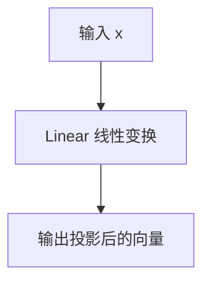

#### 带注释源码

```python
class CCProjection(ModelMixin, ConfigMixin):
    """投影层，将拼接的CLIP特征和姿态嵌入投影到原始CLIP特征大小"""
    
    def __init__(self, in_channel=772, out_channel=768):
        """
        初始化投影层
        
        Args:
            in_channel: 输入通道数，默认772（CLIP图像嵌入768 + 姿态嵌入4）
            out_channel: 输出通道数，默认768（原始CLIP特征维度）
        """
        super().__init__()
        self.in_channel = in_channel
        self.out_channel = out_channel
        # 定义线性投影层
        self.projection = torch.nn.Linear(in_channel, out_channel)

    def forward(self, x):
        """
        前向传播
        
        Args:
            x: 输入张量，形状为 (batch, seq_len, in_channel)
            
        Returns:
            投影后的张量，形状为 (batch, seq_len, out_channel)
        """
        return self.projection(x)
```

---

### 3.2 Zero1to3StableDiffusionPipeline 类

#### Zero1to3StableDiffusionPipeline

单视图条件新视图生成扩散 Pipeline，继承自 DiffusionPipeline 和 StableDiffusionMixin。该 pipeline 使用 CLIP 图像编码器提取图像特征，结合目标姿态信息，通过条件扩散模型生成新视角图像。

参数：
- `vae`：`AutoencoderKL`，VAE 模型，用于编码和解码图像潜在表示
- `image_encoder`：`CLIPVisionModelWithProjection`，冻结的 CLIP 图像编码器
- `unet`：`UNet2DConditionModel`，条件 U-Net 架构，用于去噪潜在表示
- `scheduler`：`KarrasDiffusionSchedulers`，扩散调度器
- `safety_checker`：`StableDiffusionSafetyChecker`，安全检查器
- `feature_extractor`：`CLIPImageProcessor`，特征提取器
- `cc_projection`：`CCProjection`，CLIP 特征和姿态嵌入的投影层
- `requires_safety_checker`：`bool` = True，是否需要安全检查器

#### Zero1to3StableDiffusionPipeline.__init__

初始化 pipeline，检查并更新配置，注册所有模块。

参数：
- `vae`：`AutoencoderKL`，VAE 模型
- `image_encoder`：`CLIPVisionModelWithProjection`，CLIP 图像编码器
- `unet`：`UNet2DConditionModel`，条件 U-Net
- `scheduler`：`KarrasDiffusionSchedulers`，扩散调度器
- `safety_checker`：`StableDiffusionSafetyChecker`，安全检查器
- `feature_extractor`：`CLIPImageProcessor`，特征提取器
- `cc_projection`：`CCProjection`，投影层
- `requires_safety_checker`：`bool` = True，是否启用安全检查

返回值：无

#### 流程图

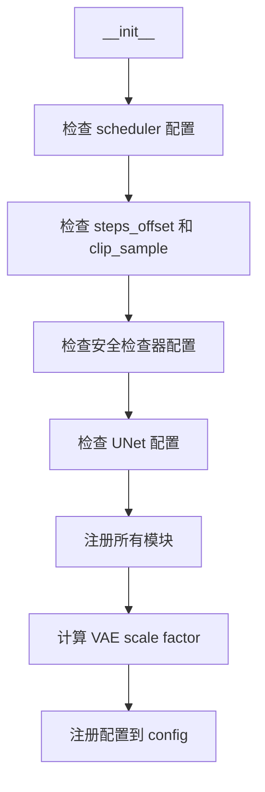

#### 带注释源码

```python
def __init__(
    self,
    vae: AutoencoderKL,
    image_encoder: CLIPVisionModelWithProjection,
    unet: UNet2DConditionModel,
    scheduler: KarrasDiffusionSchedulers,
    safety_checker: StableDiffusionSafetyChecker,
    feature_extractor: CLIPImageProcessor,
    cc_projection: CCProjection,
    requires_safety_checker: bool = True,
):
    """
    初始化 Zero1to3 扩散 Pipeline
    
    Args:
        vae: 变分自编码器模型，用于图像编码和解码
        image_encoder: CLIP 图像编码器，提取图像特征
        unet: 条件 U-Net，用于去噪
        scheduler: 扩散调度器
        safety_checker: 安全检查器，用于过滤不当内容
        feature_extractor: 特征提取器，用于安全检查
        cc_projection: CLIP 特征和姿态嵌入的投影层
        requires_safety_checker: 是否启用安全检查器
    """
    super().__init__()

    # 检查 scheduler 的 steps_offset 配置
    if scheduler is not None and getattr(scheduler.config, "steps_offset", 1) != 1:
        deprecation_message = (...)
        deprecate("steps_offset!=1", "1.0.0", deprecation_message, standard_warn=False)
        new_config = dict(scheduler.config)
        new_config["steps_offset"] = 1
        scheduler._internal_dict = FrozenDict(new_config)

    # 检查 scheduler 的 clip_sample 配置
    if scheduler is not None and getattr(scheduler.config, "clip_sample", False) is True:
        deprecation_message = (...)
        deprecate("clip_sample not set", "1.0.0", deprecation_message, standard_warn=False)
        new_config = dict(scheduler.config)
        new_config["clip_sample"] = False
        scheduler._internal_dict = FrozenDict(new_config)

    # 如果没有安全检查器但需要启用，则发出警告
    if safety_checker is None and requires_safety_checker:
        logger.warning(...)

    # 如果有安全检查器但没有特征提取器，则报错
    if safety_checker is not None and feature_extractor is None:
        raise ValueError(...)

    # 检查 UNet 版本和 sample_size
    is_unet_version_less_0_9_0 = (...)
    is_unet_sample_size_less_64 = (...)
    if is_unet_version_less_0_9_0 and is_unet_sample_size_less_64:
        deprecation_message = (...)
        deprecate("sample_size<64", "1.0.0", deprecation_message, standard_warn=False)
        new_config = dict(unet.config)
        new_config["sample_size"] = 64
        unet._internal_dict = FrozenDict(new_config)

    # 注册所有模块
    self.register_modules(
        vae=vae,
        image_encoder=image_encoder,
        unet=unet,
        scheduler=scheduler,
        safety_checker=safety_checker,
        feature_extractor=feature_extractor,
        cc_projection=cc_projection,
    )
    # 计算 VAE 缩放因子
    self.vae_scale_factor = 2 ** (len(self.vae.config.block_out_channels) - 1) if getattr(self, "vae", None) else 8
    self.register_to_config(requires_safety_checker=requires_safety_checker)
```

---

#### Zero1to3StableDiffusionPipeline._encode_prompt

将文本提示编码为文本编码器的隐藏状态。

参数：
- `prompt`：`str` 或 `List[str]`，要编码的提示
- `device`：`torch.device`，torch 设备
- `num_images_per_prompt`：`int`，每个提示生成的图像数量
- `do_classifier_free_guidance`：`bool`，是否使用分类器自由引导
- `negative_prompt`：`str` 或 `List[str]`，负面提示
- `prompt_embeds`：`Optional[torch.Tensor]`，预生成的文本嵌入
- `negative_prompt_embeds`：`Optional[torch.Tensor]`，预生成的负面文本嵌入

返回值：`torch.Tensor`，编码后的提示嵌入

#### 流程图

```mermaid
graph TD
    A[_encode_prompt] --> B{检查 prompt 类型}
    B -->|str| C[batch_size = 1]
    B -->|List| D[batch_size = len(prompt)]
    B -->|else| E[使用 prompt_embeds.shape[0]]
    C --> F{prompt_embeds 是否为 None?}
    D --> F
    E --> F
    F -->|Yes| G[使用 tokenizer 编码]
    F -->|No| H[直接使用 prompt_embeds]
    G --> I[生成文本嵌入]
    I --> J{do_classifier_free_guidance?}
    J -->|Yes| K[生成 negative_prompt_embeds]
    J -->|No| L[跳过]
    K --> M[重复 embeddings]
    L --> M
    M --> N[返回 prompt_embeds]
```

#### 带注释源码

```python
def _encode_prompt(
    self,
    prompt,
    device,
    num_images_per_prompt,
    do_classifier_free_guidance,
    negative_prompt=None,
    prompt_embeds: Optional[torch.Tensor] = None,
    negative_prompt_embeds: Optional[torch.Tensor] = None,
):
    """
    将提示编码为文本编码器的隐藏状态
    
    Args:
        prompt: 要编码的提示，可以是字符串或字符串列表
        device: torch 设备
        num_images_per_prompt: 每个提示生成的图像数量
        do_classifier_free_guidance: 是否使用分类器自由引导
        negative_prompt: 负面提示，用于引导生成
        prompt_embeds: 预生成的文本嵌入
        negative_prompt_embeds: 预生成的负面文本嵌入
        
    Returns:
        编码后的提示嵌入
    """
    # 确定批次大小
    if prompt is not None and isinstance(prompt, str):
        batch_size = 1
    elif prompt is not None and isinstance(prompt, list):
        batch_size = len(prompt)
    else:
        batch_size = prompt_embeds.shape[0]

    # 如果没有提供 prompt_embeds，则从 prompt 生成
    if prompt_embeds is None:
        text_inputs = self.tokenizer(
            prompt,
            padding="max_length",
            max_length=self.tokenizer.model_max_length,
            truncation=True,
            return_tensors="pt",
        )
        text_input_ids = text_inputs.input_ids
        untruncated_ids = self.tokenizer(prompt, padding="longest", return_tensors="pt").input_ids

        # 检查是否发生了截断
        if untruncated_ids.shape[-1] >= text_input_ids.shape[-1] and not torch.equal(
            text_input_ids, untruncated_ids
        ):
            removed_text = self.tokenizer.batch_decode(
                untruncated_ids[:, self.tokenizer.model_max_length - 1 : -1]
            )
            logger.warning(...)

        # 处理 attention mask
        if hasattr(self.text_encoder.config, "use_attention_mask") and self.text_encoder.config.use_attention_mask:
            attention_mask = text_inputs.attention_mask.to(device)
        else:
            attention_mask = None

        # 生成文本嵌入
        prompt_embeds = self.text_encoder(
            text_input_ids.to(device),
            attention_mask=attention_mask,
        )
        prompt_embeds = prompt_embeds[0]

    # 转换数据类型和设备
    prompt_embeds = prompt_embeds.to(dtype=self.text_encoder.dtype, device=device)

    # 复制文本嵌入以匹配每个提示生成的图像数量
    bs_embed, seq_len, _ = prompt_embeds.shape
    prompt_embeds = prompt_embeds.repeat(1, num_images_per_prompt, 1)
    prompt_embeds = prompt_embeds.view(bs_embed * num_images_per_prompt, seq_len, -1)

    # 获取分类器自由引导的无条件嵌入
    if do_classifier_free_guidance and negative_prompt_embeds is None:
        uncond_tokens: List[str]
        if negative_prompt is None:
            uncond_tokens = [""] * batch_size
        elif type(prompt) is not type(negative_prompt):
            raise TypeError(...)
        elif isinstance(negative_prompt, str):
            uncond_tokens = [negative_prompt]
        elif batch_size != len(negative_prompt):
            raise ValueError(...)
        else:
            uncond_tokens = negative_prompt

        max_length = prompt_embeds.shape[1]
        uncond_input = self.tokenizer(
            uncond_tokens,
            padding="max_length",
            max_length=max_length,
            truncation=True,
            return_tensors="pt",
        )

        # 处理 attention mask
        if hasattr(self.text_encoder.config, "use_attention_mask") and self.text_encoder.config.use_attention_mask:
            attention_mask = uncond_input.attention_mask.to(device)
        else:
            attention_mask = None

        negative_prompt_embeds = self.text_encoder(
            uncond_input.input_ids.to(device),
            attention_mask=attention_mask,
        )
        negative_prompt_embeds = negative_prompt_embeds[0]

    # 如果使用分类器自由引导
    if do_classifier_free_guidance:
        seq_len = negative_prompt_embeds.shape[1]
        negative_prompt_embeds = negative_prompt_embeds.to(dtype=self.text_encoder.dtype, device=device)
        negative_prompt_embeds = negative_prompt_embeds.repeat(1, num_images_per_prompt, 1)
        negative_prompt_embeds = negative_prompt_embeds.view(batch_size * num_images_per_prompt, seq_len, -1)

        # 拼接无条件嵌入和文本嵌入
        prompt_embeds = torch.cat([negative_prompt_embeds, prompt_embeds])

    return prompt_embeds
```

---

#### Zero1to3StableDiffusionPipeline.CLIP_preprocess

对图像进行 CLIP 预处理，包括调整大小、归一化等操作。

参数：
- `x`：`torch.Tensor`，输入图像张量，值范围 [-1, 1]

返回值：`torch.Tensor`，预处理后的图像张量

#### 流程图

```mermaid
graph TD
    A[CLIP_preprocess] --> B[检查数据类型]
    B --> C[检查值范围 [-1, 1]]
    C --> D[Resize 到 224x224]
    D --> E[归一化到 [0, 1]]
    E --> F[CLIP  renormalize]
    F --> G[返回预处理后的图像]
```

#### 带注释源码

```python
def CLIP_preprocess(self, x):
    """
    对图像进行 CLIP 预处理
    
    遵循 OpenAI 的实现方式，对输入图像进行预处理以匹配 CLIP 模型的输入要求
    
    Args:
        x: 输入图像张量，值必须在 [-1, 1] 范围内
        
    Returns:
        预处理后的图像张量
        
    Raises:
        ValueError: 如果输入值不在 [-1, 1] 范围内
    """
    dtype = x.dtype
    # 遵循 OpenAI 的实现
    # 检查输入值范围
    if isinstance(x, torch.Tensor):
        if x.min() < -1.0 or x.max() > 1.0:
            raise ValueError("Expected input tensor to have values in the range [-1, 1]")
    
    # 调整大小到 224x224，使用双三次插值
    x = kornia.geometry.resize(
        x.to(torch.float32), (224, 224), interpolation="bicubic", align_corners=True, antialias=False
    ).to(dtype=dtype)
    
    # 归一化到 [0, 1]
    x = (x + 1.0) / 2.0
    
    # 根据 CLIP 进行重新归一化
    x = kornia.enhance.normalize(
        x, torch.Tensor([0.48145466, 0.4578275, 0.40821073]), torch.Tensor([0.26862954, 0.26130258, 0.27577711])
    )
    return x
```

---

#### Zero1to3StableDiffusionPipeline._encode_image

将输入图像编码为 CLIP 图像嵌入。

参数：
- `image`：`torch.Tensor` 或 `PIL.Image.Image` 或 `list`，输入图像
- `device`：`torch.device`，目标设备
- `num_images_per_prompt`：`int`，每个提示生成的图像数量
- `do_classifier_free_guidance`：`bool`，是否使用分类器自由引导

返回值：`torch.Tensor`，编码后的图像嵌入

#### 流程图

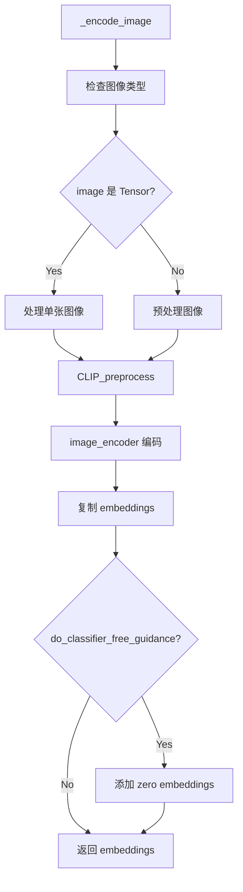

#### 带注释源码

```python
def _encode_image(self, image, device, num_images_per_prompt, do_classifier_free_guidance):
    """
    将输入图像编码为 CLIP 图像嵌入
    
    Args:
        image: 输入图像，支持 torch.Tensor, PIL.Image.Image 或 list
        device: 目标设备
        num_images_per_prompt: 每个提示生成的图像数量
        do_classifier_free_guidance: 是否使用分类器自由引导
        
    Returns:
        编码后的图像嵌入
        
    Raises:
        ValueError: 如果图像类型不正确或值范围不对
    """
    dtype = next(self.image_encoder.parameters()).dtype
    
    # 检查图像类型
    if not isinstance(image, (torch.Tensor, PIL.Image.Image, list)):
        raise ValueError(f"`image` has to be of type `torch.Tensor`, `PIL.Image.Image` or list but is {type(image)}")

    # 处理 torch.Tensor 类型的图像
    if isinstance(image, torch.Tensor):
        # 批量单张图像
        if image.ndim == 3:
            assert image.shape[0] == "Image outside a batch should be of shape (3, H, W)"
            image = image.unsqueeze(0)

        assert image.ndim == "Image must have 4 dimensions"

        # 检查图像值在 [-1, 1] 范围内
        if image.min() < -1 or image.max() > 1:
            raise ValueError("Image should be in [-1, 1] range")
    else:
        # 预处理图像
        if isinstance(image, (PIL.Image.Image, np.ndarray)):
            image = [image]

        if isinstance(image, list) and isinstance(image[0], PIL.Image.Image):
            image = [np.array(i.convert("RGB"))[None, :] for i in image]
            image = np.concatenate(image, axis=0)
        elif isinstance(image, list) and isinstance(image[0], np.ndarray):
            image = np.concatenate([i[None, :] for i in image], axis=0)

        image = image.transpose(0, 3, 1, 2)
        image = torch.from_numpy(image).to(dtype=torch.float32) / 127.5 - 1.0

    # 移动到指定设备和数据类型
    image = image.to(device=device, dtype=dtype)

    # CLIP 预处理
    image = self.CLIP_preprocess(image)
    
    # 编码为图像嵌入
    image_embeddings = self.image_encoder(image).image_embeds.to(dtype=dtype)
    image_embeddings = image_embeddings.unsqueeze(1)

    # 复制图像嵌入以匹配每个提示生成的图像数量
    bs_embed, seq_len, _ = image_embeddings.shape
    image_embeddings = image_embeddings.repeat(1, num_images_per_prompt, 1)
    image_embeddings = image_embeddings.view(bs_embed * num_images_per_prompt, seq_len, -1)

    # 如果使用分类器自由引导，添加零嵌入
    if do_classifier_free_guidance:
        negative_prompt_embeds = torch.zeros_like(image_embeddings)
        image_embeddings = torch.cat([negative_prompt_embeds, image_embeddings])

    return image_embeddings
```

---

#### Zero1to3StableDiffusionPipeline._encode_pose

将姿态信息编码为姿态嵌入。

参数：
- `pose`：`torch.Tensor` 或 `List[float]` 或 `List[List[float]]`，姿态信息
- `device`：`torch.device`，目标设备
- `num_images_per_prompt`：`int`，每个提示生成的图像数量
- `do_classifier_free_guidance`：`bool`，是否使用分类器自由引导

返回值：`torch.Tensor`，编码后的姿态嵌入

#### 流程图

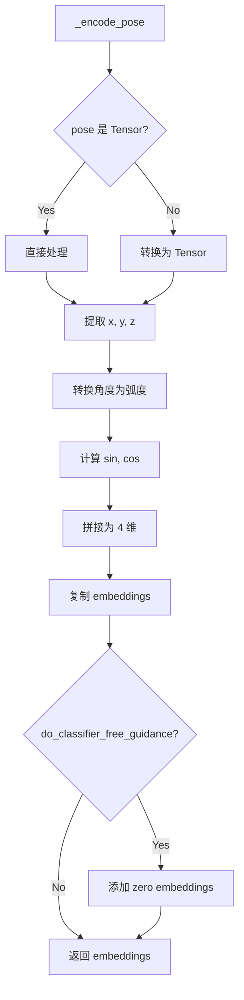

#### 带注释源码

```python
def _encode_pose(self, pose, device, num_images_per_prompt, do_classifier_free_guidance):
    """
    将姿态信息编码为姿态嵌入
    
    姿态格式为 [x, y, z]，其中 x 是航向角（yaw），y 是俯仰角（pitch），z 是距离
    将角度转换为弧度，并计算 sin 和 cos 以保持周期性
    
    Args:
        pose: 姿态信息，支持 torch.Tensor 或列表格式
        device: 目标设备
        num_images_per_prompt: 每个提示生成的图像数量
        do_classifier_free_guidance: 是否使用分类器自由引导
        
    Returns:
        编码后的姿态嵌入
    """
    dtype = next(self.cc_projection.parameters()).dtype
    
    if isinstance(pose, torch.Tensor):
        pose_embeddings = pose.unsqueeze(1).to(device=device, dtype=dtype)
    else:
        # 将列表转换为 Tensor
        if isinstance(pose[0], list):
            pose = torch.Tensor(pose)
        else:
            pose = torch.Tensor([pose])
        
        # 提取 x, y, z 并进行角度转换
        x, y, z = pose[:, 0].unsqueeze(1), pose[:, 1].unsqueeze(1), pose[:, 2].unsqueeze(1)
        pose_embeddings = (
            torch.cat([torch.deg2rad(x), torch.sin(torch.deg2rad(y)), torch.cos(torch.deg2rad(y)), z], dim=-1)
            .unsqueeze(1)
            .to(device=device, dtype=dtype)
        )  # 形状: B, 1, 4
    
    # 复制姿态嵌入以匹配每个提示生成的图像数量
    bs_embed, seq_len, _ = pose_embeddings.shape
    pose_embeddings = pose_embeddings.repeat(1, num_images_per_prompt, 1)
    pose_embeddings = pose_embeddings.view(bs_embed * num_images_per_prompt, seq_len, -1)
    
    # 如果使用分类器自由引导，添加零嵌入
    if do_classifier_free_guidance:
        negative_prompt_embeds = torch.zeros_like(pose_embeddings)
        pose_embeddings = torch.cat([negative_prompt_embeds, pose_embeddings])
    
    return pose_embeddings
```

---

#### Zero1to3StableDiffusionPipeline._encode_image_with_pose

将图像和姿态联合编码为条件嵌入。

参数：
- `image`：`torch.Tensor` 或 `PIL.Image.Image`，输入图像
- `pose`：`torch.Tensor` 或 `List[float]`，目标姿态
- `device`：`torch.device`，目标设备
- `num_images_per_prompt`：`int`，每个提示生成的图像数量
- `do_classifier_free_guidance`：`bool`，是否使用分类器自由引导

返回值：`torch.Tensor`，联合编码后的嵌入

#### 流程图

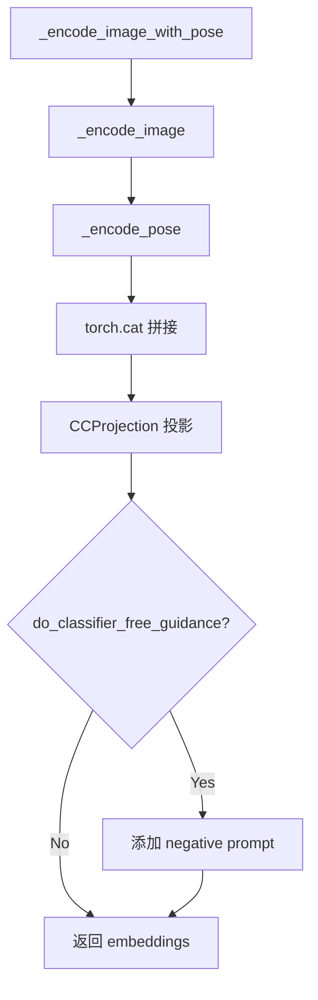

#### 带注释源码

```python
def _encode_image_with_pose(self, image, pose, device, num_images_per_prompt, do_classifier_free_guidance):
    """
    将图像和姿态联合编码为条件嵌入
    
    编码图像嵌入和姿态嵌入，拼接后通过 CCProjection 投影层
    
    Args:
        image: 输入图像
        pose: 目标姿态
        device: 目标设备
        num_images_per_prompt: 每个提示生成的图像数量
        do_classifier_free_guidance: 是否使用分类器自由引导
        
    Returns:
        联合编码后的嵌入
    """
    # 分别编码图像和姿态
    img_prompt_embeds = self._encode_image(image, device, num_images_per_prompt, False)
    pose_prompt_embeds = self._encode_pose(pose, device, num_images_per_prompt, False)
    
    # 拼接图像和姿态嵌入
    prompt_embeds = torch.cat([img_prompt_embeds, pose_prompt_embeds], dim=-1)
    
    # 通过投影层
    prompt_embeds = self.cc_projection(prompt_embeds)
    
    # 如果使用分类器自由引导，添加负面提示
    if do_classifier_free_guidance:
        negative_prompt = torch.zeros_like(prompt_embeds)
        prompt_embeds = torch.cat([negative_prompt, prompt_embeds])
    
    return prompt_embeds
```

---

#### Zero1to3StableDiffusionPipeline.run_safety_checker

运行安全检查器检测生成图像是否包含不当内容。

参数：
- `image`：`torch.Tensor`，生成的图像
- `device`：`torch.device`，设备
- `dtype`：`torch.dtype`，数据类型

返回值：元组 `(torch.Tensor, Optional[List[bool]])`，处理后的图像和 NSFW 检测结果

#### 带注释源码

```python
def run_safety_checker(self, image, device, dtype):
    """
    运行安全检查器
    
    Args:
        image: 生成的图像
        device: 设备
        dtype: 数据类型
        
    Returns:
        处理后的图像和 NSFW 检测结果
    """
    if self.safety_checker is not None:
        # 使用特征提取器处理图像
        safety_checker_input = self.feature_extractor(self.numpy_to_pil(image), return_tensors="pt").to(device)
        image, has_nsfw_concept = self.safety_checker(
            images=image, clip_input=safety_checker_input.pixel_values.to(dtype)
        )
    else:
        has_nsfw_concept = None
    return image, has_nsfw_concept
```

---

#### Zero1to3StableDiffusionPipeline.decode_latents

将潜在表示解码为图像。

参数：
- `latents`：`torch.Tensor`，潜在表示

返回值：`np.ndarray`，解码后的图像

#### 带注释源码

```python
def decode_latents(self, latents):
    """
    将潜在表示解码为图像
    
    Args:
        latents: VAE 潜在表示
        
    Returns:
        解码后的图像 numpy 数组
    """
    # 缩放潜在表示
    latents = 1 / self.vae.config.scaling_factor * latents
    
    # 解码
    image = self.vae.decode(latents).sample
    
    # 归一化到 [0, 1]
    image = (image / 2 + 0.5).clamp(0, 1)
    
    # 转换为 float32 并移动到 CPU
    image = image.cpu().permute(0, 2, 3, 1).float().numpy()
    return image
```

---

#### Zero1to3StableDiffusionPipeline.prepare_extra_step_kwargs

准备调度器的额外参数。

参数：
- `generator`：`Optional[torch.Generator]`，随机生成器
- `eta`：`float`，DDIM 调度器参数

返回值：`Dict`，额外参数字典

#### 带注释源码

```python
def prepare_extra_step_kwargs(self, generator, eta):
    """
    准备调度器的额外参数
    
    不同调度器可能有不同的签名，此方法统一处理
    
    Args:
        generator: 随机生成器，用于可重复生成
        eta: DDIM 调度器参数 (η)
        
    Returns:
        包含额外参数的字典
    """
    # 检查调度器是否接受 eta 参数
    accepts_eta = "eta" in set(inspect.signature(self.scheduler.step).parameters.keys())
    extra_step_kwargs = {}
    if accepts_eta:
        extra_step_kwargs["eta"] = eta

    # 检查调度器是否接受 generator 参数
    accepts_generator = "generator" in set(inspect.signature(self.scheduler.step).parameters.keys())
    if accepts_generator:
        extra_step_kwargs["generator"] = generator
    
    return extra_step_kwargs
```

---

#### Zero1to3StableDiffusionPipeline.check_inputs

检查输入参数的有效性。

参数：
- `image`：`torch.Tensor` 或 `PIL.Image.Image` 或 `list`，输入图像
- `height`：`int`，生成图像高度
- `width`：`int`，生成图像宽度
- `callback_steps`：`int`，回调步骤间隔

返回值：无

#### 带注释源码

```python
def check_inputs(self, image, height, width, callback_steps):
    """
    检查输入参数的有效性
    
    Args:
        image: 输入图像
        height: 生成图像高度
        width: 生成图像宽度
        callback_steps: 回调步骤间隔
        
    Raises:
        ValueError: 如果输入参数无效
    """
    # 检查图像类型
    if (
        not isinstance(image, torch.Tensor)
        and not isinstance(image, PIL.Image.Image)
        and not isinstance(image, list)
    ):
        raise ValueError(
            "`image` has to be of type `torch.Tensor` or `PIL.Image.Image` or `List[PIL.Image.Image]` but is"
            f" {type(image)}"
        )

    # 检查高度和宽度是否可被 8 整除
    if height % 8 != 0 or width % 8 != 0:
        raise ValueError(f"`height` and `width` have to be divisible by 8 but are {height} and {width}.")

    # 检查 callback_steps
    if (callback_steps is None) or (
        callback_steps is not None and (not isinstance(callback_steps, int) or callback_steps <= 0)
    ):
        raise ValueError(
            f"`callback_steps` has to be a positive integer but is {callback_steps} of type"
            f" {type(callback_steps)}."
        )
```

---

#### Zero1to3StableDiffusionPipeline.prepare_latents

准备初始潜在表示。

参数：
- `batch_size`：`int`，批次大小
- `num_channels_latents`：`int`，潜在通道数
- `height`：`int`，图像高度
- `width`：`int`，图像宽度
- `dtype`：`torch.dtype`，数据类型
- `device`：`torch.device`，设备
- `generator`：`Optional[Union[torch.Generator, List[torch.Generator]]]`，随机生成器
- `latents`：`Optional[torch.Tensor]`，预提供的潜在表示

返回值：`torch.Tensor`，准备好的潜在表示

#### 带注释源码

```python
def prepare_latents(self, batch_size, num_channels_latents, height, width, dtype, device, generator, latents=None):
    """
    准备初始潜在表示
    
    Args:
        batch_size: 批次大小
        num_channels_latents: 潜在通道数，通常为 4
        height: 图像高度
        width: 图像宽度
        dtype: 数据类型
        device: 设备
        generator: 随机生成器
        latents: 预提供的潜在表示
        
    Returns:
        准备好的潜在表示
        
    Raises:
        ValueError: 如果生成器列表长度与批次大小不匹配
    """
    # 计算潜在空间形状
    shape = (
        batch_size,
        num_channels_latents,
        int(height) // self.vae_scale_factor,
        int(width) // self.vae_scale_factor,
    )
    
    # 检查生成器数量
    if isinstance(generator, list) and len(generator) != batch_size:
        raise ValueError(
            f"You have passed a list of generators of length {len(generator)}, but requested an effective batch"
            f" size of {batch_size}. Make sure the batch size matches the length of the generators."
        )

    # 生成或使用提供的潜在表示
    if latents is None:
        latents = randn_tensor(shape, generator=generator, device=device, dtype=dtype)
    else:
        latents = latents.to(device)

    # 根据调度器要求缩放初始噪声
    latents = latents * self.scheduler.init_noise_sigma
    return latents
```

---

#### Zero1to3StableDiffusionPipeline.prepare_img_latents

准备图像潜在表示。

参数：
- `image`：`torch.Tensor` 或 `PIL.Image.Image` 或 `list`，输入图像
- `batch_size`：`int`，批次大小
- `dtype`：`torch.dtype`，数据类型
- `device`：`torch.device`，设备
- `generator`：`Optional[torch.Generator]`，随机生成器
- `do_classifier_free_guidance`：`bool`，是否使用分类器自由引导

返回值：`torch.Tensor`，图像潜在表示

#### 流程图

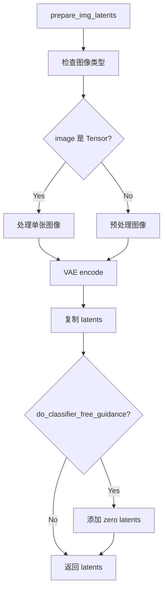

#### 带注释源码

```python
def prepare_img_latents(self, image, batch_size, dtype, device, generator=None, do_classifier_free_guidance=False):
    """
    准备图像潜在表示
    
    使用 VAE 编码输入图像到潜在空间
    
    Args:
        image: 输入图像
        batch_size: 批次大小
        dtype: 数据类型
        device: 设备
        generator: 随机生成器
        do_classifier_free_guidance: 是否使用分类器自由引导
        
    Returns:
        图像潜在表示
        
    Raises:
        ValueError: 如果图像类型不正确或生成器数量不匹配
    """
    # 检查图像类型
    if not isinstance(image, (torch.Tensor, PIL.Image.Image, list)):
        raise ValueError(
            f"`image` has to be of type `torch.Tensor`, `PIL.Image.Image` or list but is {type(image)}"
        )

    # 处理 torch.Tensor 类型的图像
    if isinstance(image, torch.Tensor):
        if image.ndim == 3:
            assert image.shape[0] == 3, "Image outside a batch should be of shape (3, H, W)"
            image = image.unsqueeze(0)

        assert image.ndim == 4, "Image must have 4 dimensions"

        if image.min() < -1 or image.max() > 1:
            raise ValueError("Image should be in [-1, 1] range")
    else:
        # 预处理图像
        if isinstance(image, (PIL.Image.Image, np.ndarray)):
            image = [image]

        if isinstance(image, list) and isinstance(image[0], PIL.Image.Image):
            image = [np.array(i.convert("RGB"))[None, :] for i in image]
            image = np.concatenate(image, axis=0)
        elif isinstance(image, list) and isinstance(image[0], np.ndarray):
            image = np.concatenate([i[None, :] for i in image], axis=0)

        image = image.transpose(0, 3, 1, 2)
        image = torch.from_numpy(image).to(dtype=torch.float32) / 127.5 - 1.0

    image = image.to(device=device, dtype=dtype)

    # 检查生成器数量
    if isinstance(generator, list) and len(generator) != batch_size:
        raise ValueError(...)

    # 使用 VAE 编码图像
    if isinstance(generator, list):
        init_latents = [
            self.vae.encode(image[i : i + 1]).latent_dist.mode(generator[i])
            for i in range(batch_size)
        ]
        init_latents = torch.cat(init_latents, dim=0)
    else:
        init_latents = self.vae.encode(image).latent_dist.mode()

    # 复制 latents 以匹配批次大小
    if batch_size > init_latents.shape[0]:
        num_images_per_prompt = batch_size // init_latents.shape[0]
        bs_embed, emb_c, emb_h, emb_w = init_latents.shape
        init_latents = init_latents.unsqueeze(1)
        init_latents = init_latents.repeat(1, num_images_per_prompt, 1, 1, 1)
        init_latents = init_latents.view(bs_embed * num_images_per_prompt, emb_c, emb_h, emb_w)

    # 如果使用分类器自由引导，添加零潜在表示
    init_latents = (
        torch.cat([torch.zeros_like(init_latents), init_latents]) if do_classifier_free_guidance else init_latents
    )

    init_latents = init_latents.to(device=device, dtype=dtype)
    return init_latents
```

---

#### Zero1to3StableDiffusionPipeline.__call__

主推理方法，调用 pipeline 生成新视图图像。

参数：
- `input_imgs`：`Union[torch.Tensor, PIL.Image.Image]`，输入图像（用于 VAE 编码）
- `prompt_imgs`：`Union[torch.Tensor, PIL.Image.Image]`，用于 CLIP 条件的图像
- `poses`：`Union[List[float], List[List[float]]]`，目标姿态
- `torch_dtype`：`torch.dtype` = torch.float32，数据类型
- `height`：`Optional[int]`，生成图像高度
- `width`：`Optional[int]`，生成图像宽度
- `num_inference_steps`：`int` = 50，去噪步数
- `guidance_scale`：`float` = 3.0，引导_scale
- `negative_prompt`：`Optional[Union[str, List[str]]]`，负面提示
- `num_images_per_prompt`：`Optional[int]` = 1，每提示生成的图像数
- `eta`：`float` = 0.0，DDIM 参数
- `generator`：`Optional[Union[torch.Generator, List[torch.Generator]]]`，随机生成器
- `latents`：`Optional[torch.Tensor]`，预提供的潜在表示
- `prompt_embeds`：`Optional[torch.Tensor]`，预提供的提示嵌入
- `negative_prompt_embeds`：`Optional[torch.Tensor]`，预提供的负面提示嵌入
- `output_type`：`str | None` = "pil"，输出类型
- `return_dict`：`bool` = True，是否返回字典格式
- `callback`：`Optional[Callable[[int, int, torch.Tensor], None]]`，回调函数
- `callback_steps`：`int` = 1，回调步骤间隔
- `cross_attention_kwargs`：`Optional[Dict[str, Any]]`，交叉注意力参数
- `controlnet_conditioning_scale`：`float` = 1.0，ControlNet 条件_scale

返回值：`StableDiffusionPipelineOutput` 或 `tuple`，生成的图像和安全检查结果

#### 流程图

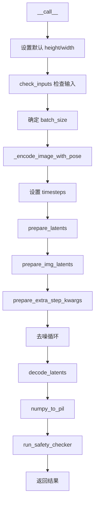

#### 带注释源码

```python
@torch.no_grad()
@replace_example_docstring(EXAMPLE_DOC_STRING)
def __call__(
    self,
    input_imgs: Union[torch.Tensor, PIL.Image.Image] = None,
    prompt_imgs: Union[torch.Tensor, PIL.Image.Image] = None,
    poses: Union[List[float], List[List[float]]] = None,
    torch_dtype=torch.float32,
    height: Optional[int] = None,
    width: Optional[int] = None,
    num_inference_steps: int = 50,
    guidance_scale: float = 3.0,
    negative_prompt: Optional[Union[str, List[str]]] = None,
    num_images_per_prompt: Optional[int] = 1,
    eta: float = 0.0,
    generator: Optional[Union[torch.Generator, List[torch.Generator]]] = None,
    latents: Optional[torch.Tensor] = None,
    prompt_embeds: Optional[torch.Tensor] = None,
    negative_prompt_embeds: Optional[torch.Tensor] = None,
    output_type: str | None = "pil",
    return_dict: bool = True,
    callback: Optional[Callable[[int, int, torch.Tensor], None]] = None,
    callback_steps: int = 1,
    cross_attention_kwargs: Optional[Dict[str, Any]] = None,
    controlnet_conditioning_scale: float = 1.0,
):
    """
    调用 pipeline 进行新视图生成
    
    Args:
        input_imgs: 输入图像，用于 VAE 编码
        prompt_imgs: 用于 CLIP 条件的图像
        poses: 目标姿态 [x, y, z]
        torch_dtype: 数据类型
        height: 生成图像高度
        width: 生成图像宽度
        num_inference_steps: 去噪步数
        guidance_scale: 引导_scale
        negative_prompt: 负面提示
        num_images_per_prompt: 每提示生成的图像数
        eta: DDIM 参数
        generator: 随机生成器
        latents: 预提供的潜在表示
        prompt_embeds: 预提供的提示嵌入
        negative_prompt_embeds: 预提供的负面提示嵌入
        output_type: 输出类型 (pil/numpy/latent)
        return_dict: 是否返回字典格式
        callback: 回调函数
        callback_steps: 回调步骤间隔
        cross_attention_kwargs: 交叉注意力参数
        controlnet_conditioning_scale: ControlNet 条件_scale
        
    Returns:
        StableDiffusionPipelineOutput 或 tuple
    """
    # 0. 默认高度和宽度
    height = height or self.unet.config.sample_size * self.vae_scale_factor
    width = width or self.unet.config.sample_size * self.vae_scale_factor

    # 1. 检查输入
    self.check_inputs(input_imgs, height, width, callback_steps)

    # 2. 定义批次大小
    if isinstance(input_imgs, PIL.Image.Image):
        batch_size = 1
    elif isinstance(input_imgs, list):
        batch_size = len(input_imgs)
    else:
        batch_size = input_imgs.shape[0]
    
    device = self._execution_device
    
    # 确定是否使用分类器自由引导
    do_classifier_free_guidance = guidance_scale > 1.0

    # 3. 编码输入图像和姿态
    prompt_embeds = self._encode_image_with_pose(
        prompt_imgs, poses, device, num_images_per_prompt, do_classifier_free_guidance
    )

    # 4. 准备 timesteps
    self.scheduler.set_timesteps(num_inference_steps, device=device)
    timesteps = self.scheduler.timesteps

    # 5. 准备潜在变量
    latents = self.prepare_latents(
        batch_size * num_images_per_prompt,
        4,
        height,
        width,
        prompt_embeds.dtype,
        device,
        generator,
        latents,
    )

    # 6. 准备图像潜在变量
    img_latents = self.prepare_img_latents(
        input_imgs,
        batch_size * num_images_per_prompt,
        prompt_embeds.dtype,
        device,
        generator,
        do_classifier_free_guidance,
    )

    # 7. 准备额外步骤参数
    extra_step_kwargs = self.prepare_extra_step_kwargs(generator, eta)

    # 8. 去噪循环
    num_warmup_steps = len(timesteps) - num_inference_steps * self.scheduler.order
    with self.progress_bar(total=num_inference_steps) as progress_bar:
        for i, t in enumerate(timesteps):
            # 扩展潜在表示（如果使用分类器自由引导）
            latent_model_input = torch.cat([latents] * 2) if do_classifier_free_guidance else latents
            latent_model_input = self.scheduler.scale_model_input(latent_model_input, t)
            
            # 拼接图像潜在表示
            latent_model_input = torch.cat([latent_model_input, img_latents], dim=1)

            # 预测噪声残差
            noise_pred = self.unet(latent_model_input, t, encoder_hidden_states=prompt_embeds).sample

            # 执行引导
            if do_classifier_free_guidance:
                noise_pred_uncond, noise_pred_text = noise_pred.chunk(2)
                noise_pred = noise_pred_uncond + guidance_scale * (noise_pred_text - noise_pred_uncond)

            # 计算上一步的噪声样本
            latents = self.scheduler.step(noise_pred, t, latents, **extra_step_kwargs, return_dict=False)[0]

            # 调用回调函数
            if i == len(timesteps) - 1 or ((i + 1) > num_warmup_steps and (i + 1) % self.scheduler.order == 0):
                progress_bar.update()
                if callback is not None and i % callback_steps == 0:
                    step_idx = i // getattr(self.scheduler, "order", 1)
                    callback(step_idx, t, latents)

    # 9. 后处理
    has_nsfw_concept = None
    if output_type == "latent":
        image = latents
    elif output_type == "pil":
        image = self.decode_latents(latents)
        image = self.numpy_to_pil(image)
    else:
        image = self.decode_latents(latents)

    # 10. 释放模型内存
    if hasattr(self, "final_offload_hook") and self.final_offload_hook is not None:
        self.final_offload_hook.offload()

    if not return_dict:
        return (image, has_nsfw_concept)

    return StableDiffusionPipelineOutput(images=image, nsfw_content_detected=has_nsfw_concept)
```

---

## 4. 关键组件信息

| 组件名称 | 描述 |
|---------|------|
| `vae` | AutoencoderKL，VAE 模型，用于图像编码和解码到潜在空间 |
| `image_encoder` | CLIPVisionModelWithProjection，冻结的 CLIP 图像编码器，提取图像特征 |
| `unet` | UNet2DConditionModel，条件 U-Net，根据噪声和条件预测噪声残差 |
| `scheduler` | KarrasDiffusionSchedulers，扩散调度器，控制去噪过程 |
| `safety_checker` | StableDiffusionSafetyChecker，安全检查器，检测 NSFW 内容 |
| `feature_extractor` | CLIPImageProcessor，特征提取器，用于安全检查 |
| `cc_projection` | CCProjection，投影层，将拼接的图像和姿态嵌入投影到统一空间 |
| `vae_scale_factor` | int，VAE 缩放因子，用于调整潜在空间大小 |

## 5. 潜在技术债务与优化空间

### 5.1 代码质量
- **注释掉的代码**：存在大量注释掉的代码（如 `load_cc_projection` 方法），应清理或删除
- **硬编码值**：如 CLIP 归一化参数、默认值等可以考虑提取为配置参数
- **TODO 注释**：代码中存在 `# todo` 标记，表明有未完成的功能

### 5.2 错误处理
- **输入验证**：部分方法的输入验证可以更严格
- **类型检查**：可以使用更多类型注解和运行时检查
- **异常信息**：部分错误信息可以更详细

### 5.3 性能优化
- **内存效率**：可以添加模型卸载（model offloading）支持
- **批处理优化**：可以优化大批量处理时的内存使用
- **混合精度**：可以更广泛地使用混合精度训练和推理

### 5.4 功能扩展
- **ControlNet 支持**：代码中已有 `controlnet_conditioning_scale` 参数但未使用
- **更灵活的输入**：可以支持更多输入格式
- **自定义调度器**：可以添加更多调度器支持

## 6. 其它项目

### 6.1 设计目标与约束

- **目标**：实现单视图条件的新视图生成，用户提供一张输入图像和目标姿态，生成该物体在新视角下的图像
- **约束**：
  - 高度和宽度必须能被 8 整除
  - 图像值必须在 [-1, 1] 范围内
  - 必须使用 CLIP 图像编码器进行特征提取
  - 姿态格式为 [x, y, z]，其中 x 是航向角，y 是俯仰角，z 是距离

### 6.2 错误处理与异常设计

- **输入类型错误**：对不支持的输入类型抛出 `ValueError`
- **配置过时警告**：使用 `deprecate` 函数警告过时的配置
- **安全检查**：可选的安全检查器用于过滤不当内容

### 6.3 数据流与状态机

1. **输入阶段**：验证和规范化输入图像和姿态
2. **编码阶段**：将图像编码为 CLIP 嵌入，将姿态编码为姿态嵌入，拼接后投影
3. **潜在空间准备**：准备噪声潜在表示和图像潜在表示
4. **去噪循环**：多次迭代，每步预测噪声并更新潜在表示
5. **解码阶段**：将潜在表示解码为图像
6. **后处理阶段**：安全检查，格式转换

### 6.4 外部依赖与接口契约

- **diffusers 库**：核心依赖，提供 DiffusionPipeline、VAE、UNet 等
- **transformers 库**：提供 CLIP 模型
- **kornia 库**：提供图像处理操作
- **PyTorch**：深度学习框架
- **PIL/numpy**：图像处理


### `CCProjection.forward`

这是一个前向传播方法，将输入张量通过线性投影层从 `in_channel` 维度映射到 `out_channel` 维度。该方法主要用于将CLIP图像特征与姿态特征拼接后的高维特征（772维）投影到适合UNet条件输入的维度（768维），实现跨模态特征的对齐与融合。

参数：

- `x`：`torch.Tensor`，输入张量，形状为 (batch_size, seq_len, in_channel)，通常是拼接后的CLIP图像特征和姿态嵌入的级联结果

返回值：`torch.Tensor`，投影后的张量，形状为 (batch_size, seq_len, out_channel)，可直接作为UNet的条件嵌入输入

#### 流程图

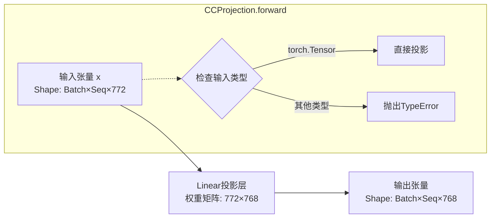

#### 带注释源码

```python
def forward(self, x):
    """
    CCProjection的前向传播方法，执行线性投影变换
    
    参数:
        x: 输入张量，形状为 (batch_size, seq_len, in_channel=772)
           包含CLIP图像特征与姿态嵌入的拼接结果
    
    返回:
        投影后的张量，形状为 (batch_size, seq_len, out_channel=768)
        符合Stable Diffusion UNet的text_embeds维度要求
    """
    # 使用nn.Linear层对输入进行线性变换
    # 内部实现: output = x @ W^T + b
    # 其中W shape为 (out_channel, in_channel) = (768, 772)
    # b shape为 (out_channel) = (768)
    return self.projection(x)
```


### Zero1to3StableDiffusionPipeline.__init__

该方法是 `Zero1to3StableDiffusionPipeline` 类的构造函数，负责初始化整个扩散管道。它接收多个关键组件（VAE、图像编码器、UNet、调度器、安全检查器等），进行配置验证和兼容性检查，注册所有模块，并计算VAE的缩放因子，为后续的图像生成流程做好准备。

参数：

-  `vae`：`AutoencoderKL`，Variational Auto-Encoder (VAE) 模型，用于将图像编码和解码到潜在表示。
-  `image_encoder`：`CLIPVisionModelWithProjection`，冻结的CLIP图像编码器，用于提取图像特征。
-  `unet`：`UNet2DConditionModel`，条件U-Net架构，用于对编码后的图像潜在表示进行去噪。
-  `scheduler`：`KarrasDiffusionSchedulers`，调度器，与UNet结合使用以对图像潜在表示进行去噪。
-  `safety_checker`：`StableDiffusionSafetyChecker`，分类模块，用于估计生成的图像是否具有攻击性或有害内容。
-  `feature_extractor`：`CLIPImageProcessor`，从生成的图像中提取特征，作为`safety_checker`的输入。
-  `cc_projection`：`CCProjection`，投影层，用于将连接的CLIP特征和姿态嵌入投影到原始CLIP特征大小。
-  `requires_safety_checker`：`bool`，是否需要安全检查器，默认为True。

返回值：`None`，该方法为构造函数，不返回任何值。

#### 流程图

```mermaid
flowchart TD
    A[开始 __init__] --> B[调用 super().__init__]
    B --> C{scheduler.config.steps_offset != 1?}
    C -->|是| D[输出弃用警告并修正配置]
    C -->|否| E{scheduler.config.clip_sample == True?}
    D --> E
    E -->|是| F[输出弃用警告并修正配置]
    E -->|否| G{safety_checker is None<br/>且 requires_safety_checker == True?}
    G -->|是| H[输出安全警告]
    G -->|否| I{safety_checker is not None<br/>且 feature_extractor is None?}
    H --> I
    I -->|是| J[抛出 ValueError]
    I -->|否| K{检查 UNet 版本和 sample_size]
    K --> L{版本 < 0.9.0<br/>且 sample_size < 64?}
    L -->|是| M[输出弃用警告并修正 sample_size 为 64]
    L -->|否| N[调用 self.register_modules]
    M --> N
    N --> O[计算 vae_scale_factor]
    O --> P[调用 self.register_to_config]
    P --> Q[结束 __init__]
    J --> R[抛出异常并终止]
```

#### 带注释源码

```python
def __init__(
    self,
    vae: AutoencoderKL,
    image_encoder: CLIPVisionModelWithProjection,
    unet: UNet2DConditionModel,
    scheduler: KarrasDiffusionSchedulers,
    safety_checker: StableDiffusionSafetyChecker,
    feature_extractor: CLIPImageProcessor,
    cc_projection: CCProjection,
    requires_safety_checker: bool = True,
):
    # 调用父类 DiffusionPipeline 的初始化方法
    super().__init__()

    # 检查 scheduler 的 steps_offset 配置是否正确
    if scheduler is not None and getattr(scheduler.config, "steps_offset", 1) != 1:
        deprecation_message = (
            f"The configuration file of this scheduler: {scheduler} is outdated. `steps_offset`"
            f" should be set to 1 instead of {scheduler.config.steps_offset}. Please make sure "
            "to update the config accordingly as leaving `steps_offset` might led to incorrect results"
            " in future versions. If you have downloaded this checkpoint from the Hugging Face Hub,"
            " it would be very nice if you could open a Pull request for the `scheduler/scheduler_config.json`"
            " file"
        )
        deprecate("steps_offset!=1", "1.0.0", deprecation_message, standard_warn=False)
        new_config = dict(scheduler.config)
        new_config["steps_offset"] = 1
        scheduler._internal_dict = FrozenDict(new_config)

    # 检查 scheduler 的 clip_sample 配置是否正确
    if scheduler is not None and getattr(scheduler.config, "clip_sample", False) is True:
        deprecation_message = (
            f"The configuration file of this scheduler: {scheduler} has not set the configuration `clip_sample`."
            " `clip_sample` should be set to False in the configuration file. Please make sure to update the"
            " config accordingly as not setting `clip_sample` in the config might lead to incorrect results in"
            " future versions. If you have downloaded this checkpoint from the Hugging Face Hub, it would be very"
            " nice if you could open a Pull request for the `scheduler/scheduler_config.json` file"
        )
        deprecate("clip_sample not set", "1.0.0", deprecation_message, standard_warn=False)
        new_config = dict(scheduler.config)
        new_config["clip_sample"] = False
        scheduler._internal_dict = FrozenDict(new_config)

    # 如果 safety_checker 为 None 但 requires_safety_checker 为 True，发出警告
    if safety_checker is None and requires_safety_checker:
        logger.warning(
            f"You have disabled the safety checker for {self.__class__} by passing `safety_checker=None`. Ensure"
            " that you abide to the conditions of the Stable Diffusion license and do not expose unfiltered"
            " results in services or applications open to the public. Both the diffusers team and Hugging Face"
            " strongly recommend to keep the safety filter enabled in all public facing circumstances, disabling"
            " it only for use-cases that involve analyzing network behavior or auditing its results. For more"
            " information, please have a look at https://github.com/huggingface/diffusers/pull/254 ."
        )

    # 如果 safety_checker 不为 None 但 feature_extractor 为 None，抛出错误
    if safety_checker is not None and feature_extractor is None:
        raise ValueError(
            "Make sure to define a feature extractor when loading {self.__class__} if you want to use the safety"
            " checker. If you do not want to use the safety checker, you can pass `'safety_checker=None'` instead."
        )

    # 检查 UNet 版本和 sample_size
    is_unet_version_less_0_9_0 = (
        unet is not None
        and hasattr(unet.config, "_diffusers_version")
        and version.parse(version.parse(unet.config._diffusers_version).base_version) < version.parse("0.9.0.dev0")
    )
    is_unet_sample_size_less_64 = (
        unet is not None and hasattr(unet.config, "sample_size") and unet.config.sample_size < 64
    )
    if is_unet_version_less_0_9_0 and is_unet_sample_size_less_64:
        deprecation_message = (
            "The configuration file of the unet has set the default `sample_size` to smaller than"
            " 64 which seems highly unlikely. If your checkpoint is a fine-tuned version of any of the"
            " following: \n- CompVis/stable-diffusion-v1-4 \n- CompVis/stable-diffusion-v1-3 \n-"
            " CompVis/stable-diffusion-v1-2 \n- CompVis/stable-diffusion-v1-1 \n- stable-diffusion-v1-5/stable-diffusion-v1-5"
            " \n- stable-diffusion-v1-5/stable-diffusion-inpainting \n you should change 'sample_size' to 64 in the"
            " configuration file. Please make sure to update the config accordingly as leaving `sample_size=32`"
            " in the config might lead to incorrect results in future versions. If you have downloaded this"
            " checkpoint from the Hugging Face Hub, it would be very nice if you could open a Pull request for"
            " the `unet/config.json` file"
        )
        deprecate("sample_size<64", "1.0.0", deprecation_message, standard_warn=False)
        new_config = dict(unet.config)
        new_config["sample_size"] = 64
        unet._internal_dict = FrozenDict(new_config)

    # 注册所有模块到管道
    self.register_modules(
        vae=vae,
        image_encoder=image_encoder,
        unet=unet,
        scheduler=scheduler,
        safety_checker=safety_checker,
        feature_extractor=feature_extractor,
        cc_projection=cc_projection,
    )
    # 计算 VAE 缩放因子，基于块输出通道数
    self.vae_scale_factor = 2 ** (len(self.vae.config.block_out_channels) - 1) if getattr(self, "vae", None) else 8
    # 将 requires_safety_checker 注册到配置
    self.register_to_config(requires_safety_checker=requires_safety_checker)
```


### `Zero1to3StableDiffusionPipeline._encode_prompt`

该方法负责将文本提示（prompt）编码为文本编码器的隐藏状态（text encoder hidden states），生成用于图像生成的条件嵌入。它支持分类器自由引导（Classifier-Free Guidance），并能处理负面提示（negative prompt）以引导图像生成方向。

参数：

- `prompt`：`str` 或 `List[str]`，可选，要编码的文本提示
- `device`：`torch.device`，torch 设备
- `num_images_per_prompt`：`int`，每个提示生成的图像数量
- `do_classifier_free_guidance`：`bool`，是否使用分类器自由引导
- `negative_prompt`：`str` 或 `List[str]`，可选，用于引导图像生成的负面提示
- `prompt_embeds`：`torch.Tensor`，可选，预生成的文本嵌入
- `negative_prompt_embeds`：`torch.Tensor`，可选，预生成的负面文本嵌入

返回值：`torch.Tensor`，文本编码器生成的文本嵌入（text embeddings）

#### 流程图

```mermaid
flowchart TD
    A[开始 _encode_prompt] --> B{判断 batch_size}
    B -->|prompt 是 str| C[batch_size = 1]
    B -->|prompt 是 List| D[batch_size = len(prompt)]
    B -->|其他情况| E[batch_size = prompt_embeds.shape[0]]
    
    C --> F{prompt_embeds 是否为 None}
    D --> F
    E --> F
    
    F -->|是| G[tokenizer 编码 prompt]
    G --> H{检查 attention_mask}
    H -->|有 use_attention_mask| I[使用 text_inputs.attention_mask]
    H -->|无| J[attention_mask = None]
    I --> K
    J --> K
    K[text_encoder 生成 prompt_embeds]
    F -->|否| L[直接使用 prompt_embeds]
    
    K --> M
    L --> M
    
    M[转换 prompt_embeds dtype 和 device] --> N{do_classifier_free_guidance}
    
    N -->|是 且 negative_prompt_embeds 为 None| O[处理 negative_prompt]
    O -->|negative_prompt 为 None| P[uncond_tokens = [''] * batch_size]
    O -->|negative_prompt 是 str| Q[uncond_tokens = [negative_prompt]]
    O -->|negative_prompt 是 List| R[uncond_tokens = negative_prompt]
    
    P --> S[tokenizer 编码 uncond_tokens]
    Q --> S
    R --> S
    
    S --> T{检查 attention_mask} --> U[text_encoder 生成 negative_prompt_embeds]
    N -->|否| V[跳过 negative_prompt 处理]
    N -->|是 且 negative_prompt_embeds 不为 None| V
    
    U --> W[duplicate negative_prompt_embeds]
    V --> X
    
    W --> X{duplicate prompt_embeds}
    X --> Y[repeat(1, num_images_per_prompt, 1)]
    Y --> Z[view 重塑为 batch_size * num_images_per_prompt]
    
    Z --> AA{do_classifier_free_guidance}
    
    AA -->|是| AB[torch.cat [negative_prompt_embeds, prompt_embeds]]
    AA -->|否| AC[直接返回 prompt_embeds]
    
    AB --> AD[返回最终 prompt_embeds]
    AC --> AD
    
    AD[结束]
```

#### 带注释源码

```python
def _encode_prompt(
    self,
    prompt,                          # str 或 List[str]，输入的文本提示
    device,                          # torch.device，指定运行设备
    num_images_per_prompt,           # int，每个提示生成的图像数量
    do_classifier_free_guidance,    # bool，是否启用分类器自由引导
    negative_prompt=None,            # str 或 List[str]，负面提示
    prompt_embeds: Optional[torch.Tensor] = None,   # 预计算的提示嵌入
    negative_prompt_embeds: Optional[torch.Tensor] = None,  # 预计算的负面嵌入
):
    r"""
    Encodes the prompt into text encoder hidden states.

    Args:
         prompt (`str` or `List[str]`, *optional*):
            prompt to be encoded
        device: (`torch.device`):
            torch device
        num_images_per_prompt (`int`):
            number of images that should be generated per prompt
        do_classifier_free_guidance (`bool`):
            whether to use classifier free guidance or not
        negative_prompt (`str` or `List[str]`, *optional*):
            The prompt or prompts not to guide the image generation. If not defined, one has to pass
            `negative_prompt_embeds`. instead. If not defined, one has to pass `negative_prompt_embeds`. instead.
            Ignored when not using guidance (i.e., ignored if `guidance_scale` is less than `1`).
        prompt_embeds (`torch.Tensor`, *optional*):
            Pre-generated text embeddings. Can be used to easily tweak text inputs, *e.g.* prompt weighting. If not
            provided, text embeddings will be generated from `prompt` input argument.
        negative_prompt_embeds (`torch.Tensor`, *optional*):
            Pre-generated negative text embeddings. Can be used to easily tweak text inputs, *e.g.* prompt
            weighting. If not provided, negative_prompt_embeds will be generated from `negative_prompt` input
            argument.
    """
    # 1. 确定 batch_size：根据 prompt 类型或已存在的 prompt_embeds 确定批次大小
    if prompt is not None and isinstance(prompt, str):
        batch_size = 1
    elif prompt is not None and isinstance(prompt, list):
        batch_size = len(prompt)
    else:
        batch_size = prompt_embeds.shape[0]

    # 2. 如果未提供 prompt_embeds，则通过 tokenizer 和 text_encoder 生成
    if prompt_embeds is None:
        # 使用 tokenizer 将 prompt 转换为 token IDs
        text_inputs = self.tokenizer(
            prompt,
            padding="max_length",
            max_length=self.tokenizer.model_max_length,
            truncation=True,
            return_tensors="pt",
        )
        text_input_ids = text_inputs.input_ids
        
        # 获取未截断的 token IDs 用于检查是否发生了截断
        untruncated_ids = self.tokenizer(prompt, padding="longest", return_tensors="pt").input_ids

        # 检查是否发生了截断，如果是则记录警告
        if untruncated_ids.shape[-1] >= text_input_ids.shape[-1] and not torch.equal(
            text_input_ids, untruncated_ids
        ):
            removed_text = self.tokenizer.batch_decode(
                untruncated_ids[:, self.tokenizer.model_max_length - 1 : -1]
            )
            logger.warning(
                "The following part of your input was truncated because CLIP can only handle sequences up to"
                f" {self.tokenizer.model_max_length} tokens: {removed_text}"
            )

        # 检查 text_encoder 是否配置了 attention_mask
        if hasattr(self.text_encoder.config, "use_attention_mask") and self.text_encoder.config.use_attention_mask:
            attention_mask = text_inputs.attention_mask.to(device)
        else:
            attention_mask = None

        # 调用 text_encoder 生成文本嵌入
        prompt_embeds = self.text_encoder(
            text_input_ids.to(device),
            attention_mask=attention_mask,
        )
        # 提取第一项（通常为 last_hidden_state）
        prompt_embeds = prompt_embeds[0]

    # 3. 将 prompt_embeds 转换为与 text_encoder 相同的 dtype 和设备
    prompt_embeds = prompt_embeds.to(dtype=self.text_encoder.dtype, device=device)

    # 4. 为每个提示复制多个图像的嵌入（复制以支持 num_images_per_prompt）
    bs_embed, seq_len, _ = prompt_embeds.shape
    # 复制：repeat(1, num_images_per_prompt, 1) 在序列维度复制
    prompt_embeds = prompt_embeds.repeat(1, num_images_per_prompt, 1)
    # 重塑为 batch_size * num_images_per_prompt 个样本
    prompt_embeds = prompt_embeds.view(bs_embed * num_images_per_prompt, seq_len, -1)

    # 5. 处理分类器自由引导的负面嵌入
    if do_classifier_free_guidance and negative_prompt_embeds is None:
        uncond_tokens: List[str]
        
        # 处理负面提示的各种情况
        if negative_prompt is None:
            # 如果未提供负面提示，使用空字符串
            uncond_tokens = [""] * batch_size
        elif type(prompt) is not type(negative_prompt):
            # 类型检查，确保 prompt 和 negative_prompt 类型一致
            raise TypeError(
                f"`negative_prompt` should be the same type to `prompt`, but got {type(negative_prompt)} !="
                f" {type(prompt)}."
            )
        elif isinstance(negative_prompt, str):
            # 负面提示是单个字符串
            uncond_tokens = [negative_prompt]
        elif batch_size != len(negative_prompt):
            # 批次大小不匹配
            raise ValueError(
                f"`negative_prompt`: {negative_prompt} has batch size {len(negative_prompt)}, but `prompt`:"
                f" {prompt} has batch size {batch_size}. Please make sure that passed `negative_prompt` matches"
                " the batch size of `prompt`."
            )
        else:
            # 负面提示是字符串列表
            uncond_tokens = negative_prompt

        # 获取序列长度（与 prompt_embeds 相同）
        max_length = prompt_embeds.shape[1]
        
        # Tokenize 负面提示
        uncond_input = self.tokenizer(
            uncond_tokens,
            padding="max_length",
            max_length=max_length,
            truncation=True,
            return_tensors="pt",
        )

        # 处理 attention_mask
        if hasattr(self.text_encoder.config, "use_attention_mask") and self.text_encoder.config.use_attention_mask:
            attention_mask = uncond_input.attention_mask.to(device)
        else:
            attention_mask = None

        # 生成负面提示嵌入
        negative_prompt_embeds = self.text_encoder(
            uncond_input.input_ids.to(device),
            attention_mask=attention_mask,
        )
        negative_prompt_embeds = negative_prompt_embeds[0]

    # 6. 如果启用分类器自由引导，拼接负面和正面嵌入
    if do_classifier_free_guidance:
        # 获取负面嵌入的序列长度
        seq_len = negative_prompt_embeds.shape[1]

        # 转换 dtype 和设备
        negative_prompt_embeds = negative_prompt_embeds.to(dtype=self.text_encoder.dtype, device=device)

        # 复制负面嵌入以匹配 num_images_per_prompt
        negative_prompt_embeds = negative_prompt_embeds.repeat(1, num_images_per_prompt, 1)
        negative_prompt_embeds = negative_prompt_embeds.view(batch_size * num_images_per_prompt, seq_len, -1)

        # 拼接：[negative_prompt_embeds, prompt_embeds]
        # 前面是无条件（负面）嵌入，后面是有条件（正面）嵌入
        # 用于在推理时同时计算无条件和有条件噪声预测
        prompt_embeds = torch.cat([negative_prompt_embeds, prompt_embeds])

    # 7. 返回最终的文本嵌入
    return prompt_embeds
```


### Zero1to3StableDiffusionPipeline.CLIP_preprocess

该方法用于对输入图像进行CLIP模型所需的预处理，包括输入验证、图像resize到224x224、像素值范围从[-1,1]到[0,1]的转换，以及按照CLIP模型的均值和标准差进行归一化处理。

参数：

- `x`：`torch.Tensor`，输入的图像张量，值必须在[-1, 1]范围内，形状应为(B, C, H, W)

返回值：`torch.Tensor`，经过CLIP预处理后的图像张量，形状为(B, C, 224, 224)

#### 流程图

```mermaid
flowchart TD
    A[开始 CLIP_preprocess] --> B[保存输入张量dtype]
    B --> C{输入是否为torch.Tensor?}
    C -->|是| D[检查值是否在[-1, 1]范围内]
    C -->|否| E[跳过值范围检查]
    D --> F{值范围检查通过?}
    F -->|否| G[抛出ValueError异常]
    F -->|是| H[resize到224x224]
    E --> H
    H --> I[转换数据类型到float32]
    I --> J[resize后再转回原始dtype]
    J --> K[像素值从[-1,1]归一化到[0,1]: x = (x + 1.0) / 2.0]
    K --> L[使用CLIP均值和标准差进行归一化]
    L --> M[返回处理后的张量]
    G --> N[异常处理: 值范围超出]
```

#### 带注释源码

```python
def CLIP_preprocess(self, x):
    """
    对输入图像进行CLIP预处理:
    1. 验证输入值范围
    2. resize到224x224
    3. 从[-1,1]归一化到[0,1]
    4. 使用CLIP的均值和标准差进行归一化
    """
    # 保存原始输入张量的数据类型
    dtype = x.dtype
    
    # following openai's implementation
    # TODO HF OpenAI CLIP preprocessing issue https://github.com/huggingface/transformers/issues/22505#issuecomment-1650170741
    # follow openai preprocessing to keep exact same, input tensor [-1, 1], otherwise the preprocessing will be different, https://github.com/huggingface/transformers/pull/22608
    
    # 检查输入是否为torch.Tensor，如果是则验证值范围
    if isinstance(x, torch.Tensor):
        # 验证输入值必须在[-1, 1]范围内
        if x.min() < -1.0 or x.max() > 1.0:
            raise ValueError("Expected input tensor to have values in the range [-1, 1]")
    
    # 使用kornia进行resize，将图像调整到224x224
    # 使用双三次插值(bicubic)，对齐角点(align_corners=True)，关闭抗锯齿(antialias=False)
    x = kornia.geometry.resize(
        x.to(torch.float32), (224, 224), interpolation="bicubic", align_corners=True, antialias=False
    ).to(dtype=dtype)
    
    # 将像素值从[-1, 1]范围映射到[0, 1]范围
    x = (x + 1.0) / 2.0
    
    # renormalize according to clip
    # 使用CLIP模型的标准均值和标准差进行归一化
    # 均值: [0.48145466, 0.4578275, 0.40821073] (RGB三个通道)
    # 标准差: [0.26862954, 0.26130258, 0.27577711] (RGB三个通道)
    x = kornia.enhance.normalize(
        x, 
        torch.Tensor([0.48145466, 0.4578275, 0.40821073]),  # CLIP均值
        torch.Tensor([0.26862954, 0.26130258, 0.27577711])  # CLIP标准差
    )
    
    return x
```


### `Zero1to3StableDiffusionPipeline._encode_image`

该方法负责将输入图像编码为图像嵌入向量（image embeddings），支持多种图像格式输入（torch.Tensor、PIL.Image.Image 或 list），并根据是否启用无分类器引导（classifier-free guidance）处理嵌入向量。

参数：

- `image`：`Union[torch.Tensor, PIL.Image.Image, list]` ，待编码的输入图像，支持单张图像、图像批次或图像列表
- `device`：`torch.device`，指定计算设备（CPU/CUDA）
- `num_images_per_prompt`：`int`，每个提示词生成的图像数量，用于复制图像嵌入
- `do_classifier_free_guidance`：`bool`，是否启用无分类器引导，若为 True 则在嵌入前拼接零向量

返回值：`torch.Tensor`，编码后的图像嵌入向量，形状为 `(batch_size * num_images_per_prompt * 2, seq_len, embedding_dim)`（启用 CFG 时乘 2，否则为 `batch_size * num_images_per_prompt`）

#### 流程图

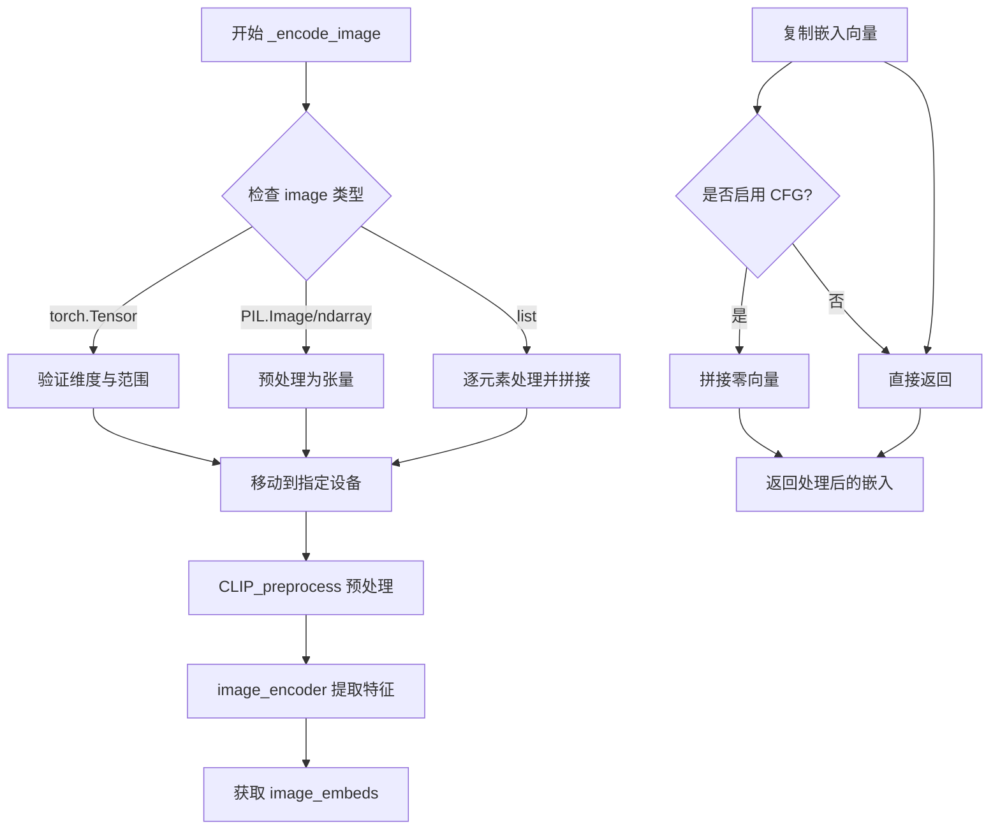

#### 带注释源码

```python
def _encode_image(self, image, device, num_images_per_prompt, do_classifier_free_guidance):
    """
    编码输入图像为图像嵌入向量
    
    参数:
        image: 输入图像，支持 torch.Tensor, PIL.Image.Image 或 list
        device: 计算设备
        num_images_per_prompt: 每个提示词生成的图像数量
        do_classifier_free_guidance: 是否启用无分类器引导
    返回:
        torch.Tensor: 编码后的图像嵌入向量
    """
    # 获取图像编码器的权重数据类型
    dtype = next(self.image_encoder.parameters()).dtype
    
    # 类型检查：确保输入是支持的类型之一
    if not isinstance(image, (torch.Tensor, PIL.Image.Image, list)):
        raise ValueError(
            f"`image` has to be of type `torch.Tensor`, `PIL.Image.Image` or list but is {type(image)}"
        )

    # 处理 torch.Tensor 类型的图像
    if isinstance(image, torch.Tensor):
        # 批次单张图像：如果输入是 (3, H, W)，扩展为 (1, 3, H, W)
        if image.ndim == 3:
            assert image.shape[0] == 3, "Image outside a batch should be of shape (3, H, W)"
            image = image.unsqueeze(0)

        assert image.ndim == 4, "Image must have 4 dimensions"

        # 检查图像值范围是否在 [-1, 1]
        if image.min() < -1 or image.max() > 1:
            raise ValueError("Image should be in [-1, 1] range")
    else:
        # 预处理 PIL.Image 或 numpy 数组
        if isinstance(image, (PIL.Image.Image, np.ndarray)):
            image = [image]

        # 处理 PIL.Image 列表：转换为 RGB 并转为 numpy 数组
        if isinstance(image, list) and isinstance(image[0], PIL.Image.Image):
            image = [np.array(i.convert("RGB"))[None, :] for i in image]
            image = np.concatenate(image, axis=0)
        # 处理 numpy 数组列表
        elif isinstance(image, list) and isinstance(image[0], np.ndarray):
            image = np.concatenate([i[None, :] for i in image], axis=0)

        # 转换维度顺序 (N, H, W, C) -> (N, C, H, W) 并归一化到 [-1, 1]
        image = image.transpose(0, 3, 1, 2)
        image = torch.from_numpy(image).to(dtype=torch.float32) / 127.5 - 1.0

    # 移动图像到指定设备并转换为正确的数据类型
    image = image.to(device=device, dtype=dtype)

    # 执行 CLIP 预处理：resize 到 224x224、归一化
    image = self.CLIP_preprocess(image)
    
    # 使用 CLIP 图像编码器提取图像特征
    image_embeddings = self.image_encoder(image).image_embeds.to(dtype=dtype)
    # 添加序列维度：从 (batch, dim) -> (batch, 1, dim)
    image_embeddings = image_embeddings.unsqueeze(1)

    # 复制图像嵌入向量以匹配每个提示词生成的图像数量
    bs_embed, seq_len, _ = image_embeddings.shape
    image_embeddings = image_embeddings.repeat(1, num_images_per_prompt, 1)
    image_embeddings = image_embeddings.view(bs_embed * num_images_per_prompt, seq_len, -1)

    # 如果启用无分类器引导，拼接零向量
    if do_classifier_free_guidance:
        negative_prompt_embeds = torch.zeros_like(image_embeddings)
        
        # 拼接无条件嵌入和条件嵌入，以便单次前向传播完成
        image_embeddings = torch.cat([negative_prompt_embeds, image_embeddings])

    return image_embeddings
```


### `Zero1to3StableDiffusionPipeline._encode_pose`

该方法用于将输入的姿态信息（pose）编码为姿态嵌入向量（pose embeddings），以便作为条件输入传递给UNet模型。它支持多种输入格式（Tensor或列表），并对姿态参数进行角度变换（度转弧度、三角函数变换），最终生成符合模型要求的嵌入表示。

参数：

- `pose`：`Union[torch.Tensor, List[float], List[List[float]]]`，输入的姿态信息，可以是包含XYZ坐标的Tensor或列表，支持单样本和多样本批处理
- `device`：`torch.device`，计算设备，用于将张量移动到指定设备（如CPU或CUDA）
- `num_images_per_prompt`：`int`，每个提示词生成的图像数量，用于复制嵌入向量以匹配生成数量
- `do_classifier_free_guidance`：`bool`，是否启用无分类器自由引导（CFG），启用时会在嵌入前拼接零向量

返回值：`torch.Tensor`，形状为 `(batch_size * num_images_per_prompt, seq_len, feature_dim)` 的姿态嵌入张量，当启用CFG时seq_len会翻倍

#### 流程图

```mermaid
flowchart TD
    A[开始 _encode_pose] --> B[获取 cc_projection 的 dtype]
    B --> C{pose 是否为 Tensor}
    C -->|是| D[直接转换为张量并unsqueeze]
    C -->|否| E{pose[0] 是否为 list}
    E -->|是| F[直接转换为 Tensor]
    E -->|否| G[包装为单元素列表再转换]
    D --> H[跳转至重复嵌入]
    F --> H
    G --> H
    H[提取 x, y, z 坐标并unsqueeze]
    I[deg2rad转换x坐标]
    J[sin转换y坐标]
    K[cos转换y坐标]
    I --> L[沿最后一维拼接: x_rad, sin_y, cos_y, z]
    J --> L
    K --> L
    L --> M[unsqueeze添加序列维度]
    M --> N[移动到指定device和dtype]
    N --> O[重复嵌入: repeat num_images_per_prompt次]
    O --> P{启用 CFG}
    P -->|是| Q[创建零向量]
    P -->|否| R[返回 pose_embeddings]
    Q --> S[拼接: zeros + pose_embeddings]
    S --> R
```

#### 带注释源码

```python
def _encode_pose(self, pose, device, num_images_per_prompt, do_classifier_free_guidance):
    """
    将姿态信息编码为嵌入向量
    
    参数:
        pose: 姿态数据，支持Tensor或列表格式，包含xyz坐标
        device: 目标设备
        num_images_per_prompt: 每个提示生成的图像数
        do_classifier_free_guidance: 是否启用无分类器引导
    """
    # 获取cc_projection层的dtype，确保所有运算使用相同数据类型
    dtype = next(self.cc_projection.parameters()).dtype
    
    if isinstance(pose, torch.Tensor):
        # 如果输入已经是Tensor，直接使用并添加序列维度
        pose_embeddings = pose.unsqueeze(1).to(device=device, dtype=dtype)
    else:
        # 处理列表格式的输入
        if isinstance(pose[0], list):
            # 多样本输入：[[x1,y1,z1], [x2,y2,z2], ...]
            pose = torch.Tensor(pose)
        else:
            # 单样本输入：[x, y, z]
            pose = torch.Tensor([pose])
        
        # 分离xyz坐标并各自添加序列维度
        x, y, z = pose[:, 0].unsqueeze(1), pose[:, 1].unsqueeze(1), pose[:, 2].unsqueeze(1)
        
        # 姿态编码变换：将角度转换为弧度，并对y坐标做sin/cos编码
        # 输入格式: [azimuth_x, elevation_y, depth_z]
        # 输出格式: [rad_x, sin(y), cos(y), z]，维度为4
        pose_embeddings = (
            torch.cat([
                torch.deg2rad(x),      # 水平角转弧度
                torch.sin(torch.deg2rad(y)),  # 仰角正弦
                torch.cos(torch.deg2rad(y)),  # 仰角余弦
                z                      # 深度保持不变
            ], dim=-1)
            .unsqueeze(1)  # 添加序列维度: B -> B, 1, 4
            .to(device=device, dtype=dtype)
        )  # B, 1, 4
    
    # 复制嵌入向量以匹配每个提示词生成的图像数量
    # 使用mps友好的方法避免内存碎片
    bs_embed, seq_len, _ = pose_embeddings.shape
    pose_embeddings = pose_embeddings.repeat(1, num_images_per_prompt, 1)
    pose_embeddings = pose_embeddings.view(bs_embed * num_images_per_prompt, seq_len, -1)
    
    # 无分类器自由引导（CFG）处理
    if do_classifier_free_guidance:
        # 创建与pose_embeddings相同形状的零向量（无条件嵌入）
        negative_prompt_embeds = torch.zeros_like(pose_embeddings)

        # 拼接无条件嵌入和条件嵌入
        # 这样可以在单次前向传播中同时计算有条件和无条件的噪声预测
        pose_embeddings = torch.cat([negative_prompt_embeds, pose_embeddings])
    
    return pose_embeddings
```


### `Zero1to3StableDiffusionPipeline._encode_image_with_pose`

该方法联合编码输入图像和姿态信息，将图像嵌入和姿态嵌入拼接后通过投影层映射到统一的空间，以作为扩散模型的输入条件。

参数：

- `image`：`Union[torch.Tensor, PIL.Image.Image, list]`，待编码的输入图像，支持Tensor、PIL图像或图像列表
- `pose`：`Union[List[float], List[List[float]]]，目标姿态参数，可以是单组姿态参数或多个姿态参数列表，用于控制生成视角
- `device`：`torch.device`，计算设备
- `num_images_per_prompt`：`int`，每个提示词生成的图像数量
- `do_classifier_free_guidance`：`bool`，是否启用无分类器引导

返回值：`torch.Tensor`，联合编码后的提示嵌入向量，形状为(batch_size * num_images_per_prompt, seq_len, hidden_dim)

#### 流程图

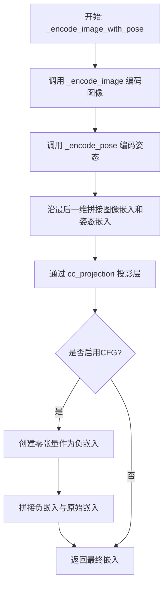

#### 带注释源码

```python
def _encode_image_with_pose(self, image, pose, device, num_images_per_prompt, do_classifier_free_guidance):
    """
    联合编码图像和姿态信息，生成用于扩散模型的提示嵌入
    
    参数:
        image: 输入图像
        pose: 姿态参数
        device: 计算设备
        num_images_per_prompt: 每提示生成的图像数
        do_classifier_free_guidance: 是否启用无分类器引导
    """
    # 步骤1: 使用图像编码器获取图像嵌入
    # 注意: 内部使用 do_classifier_free_guidance=False，因为后续会手动处理
    img_prompt_embeds = self._encode_image(image, device, num_images_per_prompt, False)
    
    # 步骤2: 使用姿态编码器获取姿态嵌入
    # 将姿态转换为嵌入向量，包含视角变换信息
    pose_prompt_embeds = self._encode_pose(pose, device, num_images_per_prompt, False)
    
    # 步骤3: 沿特征维度拼接图像和姿态嵌入
    # 拼接后维度为 (batch, seq_len, image_dim + pose_dim) = (batch, seq_len, 772)
    prompt_embeds = torch.cat([img_prompt_embeds, pose_prompt_embeds], dim=-1)
    
    # 步骤4: 通过投影层将拼接嵌入映射到CLIP特征空间
    # CCProjection 将 772 维映射到 768 维
    prompt_embeds = self.cc_projection(prompt_embeds)
    
    # 步骤5: 如果启用无分类器引导，添加负样本嵌入
    # 负嵌入为零向量，用于CFG的第一个forward pass
    if do_classifier_free_guidance:
        negative_prompt = torch.zeros_like(prompt_embeds)
        # 拼接后: [negative_prompt, prompt_embeds]
        # 用于后续与无条件嵌入进行对比引导
        prompt_embeds = torch.cat([negative_prompt, prompt_embeds])
    
    return prompt_embeds
```


### `Zero1to3StableDiffusionPipeline.run_safety_checker`

运行安全检查器，对生成的图像进行 NSFW（不适合在工作场所查看）内容检测。如果安全检查器存在，则使用特征提取器处理图像并调用安全检查器进行检测；否则返回 None。

参数：

- `image`：`torch.Tensor`，需要检查的生成图像张量
- `device`：`torch.device`，执行安全检查的设备（CPU 或 CUDA）
- `dtype`：`torch.dtype`，安全检查器输入的数据类型

返回值：`(Tuple[Optional[torch.Tensor], Optional[torch.Tensor]])`，返回元组包含处理后的图像和 NSFW 检测结果。如果安全检查器为 None，则 `has_nsfw_concept` 为 None。

#### 流程图

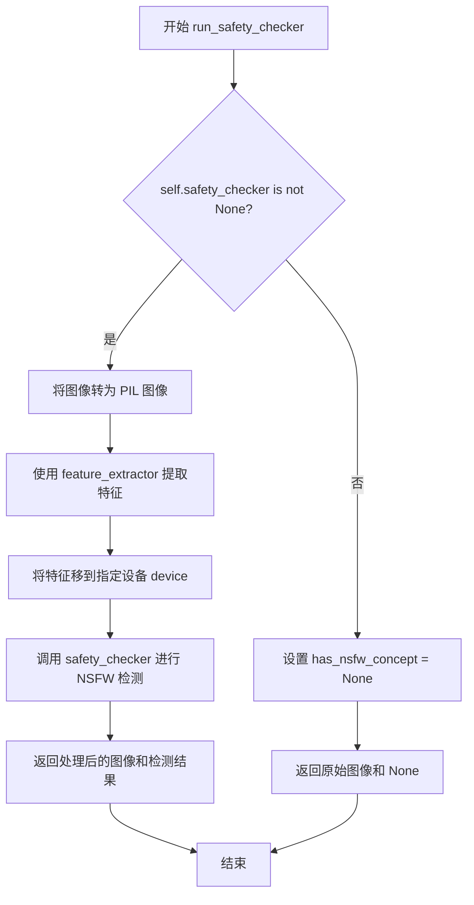

#### 带注释源码

```python
def run_safety_checker(self, image, device, dtype):
    """
    运行安全检查器，检查生成的图像是否包含不当内容
    
    参数:
        image: 生成的图像张量，形状为 (B, C, H, W)
        device: 运行安全检查的设备 (torch.device)
        dtype: 安全检查器输入的数据类型
    
    返回:
        tuple: (处理后的图像, NSFW检测结果)
            - image: 输入图像（可能被安全检查器修改）
            - has_nsfw_concept: 检测到的不当内容标记，None表示未检测
    """
    # 检查安全检查器是否已配置
    if self.safety_checker is not None:
        # 将图像从 numpy 数组转换为 PIL 图像
        # safety_checker 需要 PIL 图像作为输入
        safety_checker_input = self.feature_extractor(
            self.numpy_to_pil(image),  # 将图像转换为 PIL 格式
            return_tensors="pt"       # 返回 PyTorch 张量
        ).to(device)                   # 移到指定设备
        
        # 调用安全检查器进行 NSFW 检测
        # safety_checker 会返回处理后的图像和是否包含不当内容的标志
        image, has_nsfw_concept = self.safety_checker(
            images=image,                                    # 原始生成的图像
            clip_input=safety_checker_input.pixel_values.to(dtype)  # CLIP 特征输入
        )
    else:
        # 如果安全检查器未配置，返回 None
        has_nsfw_concept = None
    
    # 返回图像和 NSFW 检测结果
    return image, has_nsfw_concept
```


### `Zero1to3StableDiffusionPipeline.decode_latents`

该方法负责将VAE编码后的潜在表示(latents)解码为实际的图像数据。它通过VAE解码器将潜在空间的值反变换到像素空间，并进行必要的数值归一化和格式转换，最终输出标准的numpy数组格式图像。

参数：

- `latents`：`torch.Tensor`，从扩散模型输出VAE编码的潜在表示张量，形状为(batch_size, channels, height/8, width/8)

返回值：`np.ndarray`，解码后的图像数组，形状为(batch_size, height, width, channels)，值域为[0, 1]的float32类型

#### 流程图

```mermaid
flowchart TD
    A[输入: latents张量] --> B[除以scaling_factor反缩放]
    B --> C[VAE.decode解码]
    C --> D[/2 + 0.5归一化到0-1]
    D --> E[clamp限制范围]
    E --> F[移到CPU]
    F --> G[维度转换: CHW -> HWC]
    G --> H[转为float32]
    H --> I[转为numpy数组]
    I --> J[返回图像数组]
```

#### 带注释源码

```python
def decode_latents(self, latents):
    """
    将VAE编码后的潜在表示解码为图像
    
    参数:
        latents: VAE编码的潜在张量，形状为 (B, C, H, W)
    
    返回:
        归一化后的图像numpy数组，形状为 (B, H, W, C)
    """
    # 步骤1: 反缩放latents
    # VAE在编码时会对latents进行scaling_factor缩放，这里需要除以该因子还原
    latents = 1 / self.vae.config.scaling_factor * latents
    
    # 步骤2: 使用VAE解码器将latents解码为图像
    # decode方法返回包含sample属性的对象
    image = self.vae.decode(latents).sample
    
    # 步骤3: 将图像值从[-1, 1]区间归一化到[0, 1]区间
    # 扩散模型通常使用[-1, 1]范围的输出，需要转换为人眼可见的[0, 1]范围
    image = (image / 2 + 0.5).clamp(0, 1)
    
    # 步骤4: 转换为numpy数组格式
    # (1) 移到CPU - 避免GPU内存占用
    # (2) 维度转换 - 从 (B, C, H, W) 转为 (B, H, W, C) 以符合图像约定
    # (3) 转为float32 - 避免bfloat16兼容性问题，这是兼容性好且开销可忽略的做法
    image = image.cpu().permute(0, 2, 3, 1).float().numpy()
    
    return image
```


### `Zero1to3StableDiffusionPipeline.prepare_extra_step_kwargs`

该方法用于为调度器（scheduler）的步骤准备额外的关键字参数。由于不同的调度器具有不同的签名（例如 DDIMScheduler 使用 `eta` 参数，而其他调度器可能不使用），该方法通过检查调度器的 `step` 方法签名来动态构建需要传递的额外参数字典。主要处理 `eta`（DDIM 论文中的 η 参数）和 `generator`（随机数生成器）两个参数。

参数：

- `self`：Zero1to3StableDiffusionPipeline 实例，隐式参数，方法的调用对象
- `generator`：`Optional[Union[torch.Generator, List[torch.Generator]]]`，用于使生成过程具有确定性的 PyTorch 生成器，可以是单个生成器或生成器列表
- `eta`：`float`，对应 DDIM 论文中的参数 η (eta)，取值范围应在 [0, 1] 之间，仅在 DDIMScheduler 中生效，其他调度器会忽略该参数

返回值：`Dict[str, Any]`，返回包含调度器额外关键字参数的字典，可能包含 `eta` 和/或 `generator` 键值对

#### 流程图

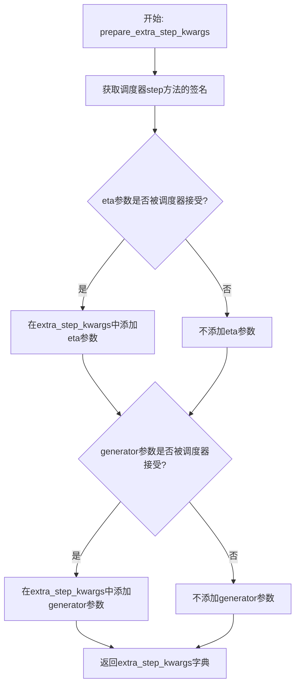

#### 带注释源码

```python
def prepare_extra_step_kwargs(self, generator, eta):
    """
    准备调度器步骤所需的额外关键字参数
    
    由于并非所有调度器都具有相同的签名，该方法通过检查调度器的 step 方法
    来动态确定需要传递哪些额外参数。eta (η) 参数仅在 DDIMScheduler 中使用，
    其他调度器会忽略该参数。
    
    参数:
        generator: 可选的 PyTorch 生成器，用于控制随机性
        eta: float 类型，对应 DDIM 论文中的 η 参数，取值范围 [0, 1]
    
    返回:
        包含额外参数的字典，可能包含 'eta' 和/或 'generator' 键
    """
    
    # 通过 inspect 模块检查调度器 step 方法的签名参数
    # 判断调度器是否接受 eta 参数
    accepts_eta = "eta" in set(inspect.signature(self.scheduler.step).parameters.keys())
    
    # 初始化额外的关键字参数字典
    extra_step_kwargs = {}
    
    # 如果调度器接受 eta 参数，则将其添加到 extra_step_kwargs 中
    if accepts_eta:
        extra_step_kwargs["eta"] = eta

    # 检查调度器是否接受 generator 参数
    accepts_generator = "generator" in set(inspect.signature(self.scheduler.step).parameters.keys())
    
    # 如果调度器接受 generator 参数，则将其添加到 extra_step_kwargs 中
    if accepts_generator:
        extra_step_kwargs["generator"] = generator
    
    # 返回构建好的额外参数字典
    return extra_step_kwargs
```


### `Zero1to3StableDiffusionPipeline.check_inputs`

该方法用于验证传入的图像、高度、宽度和回调步数是否符合生成管道的输入要求，确保数据类型正确、图像尺寸能被8整除，且回调步数为正整数。

参数：

- `image`：`Union[torch.Tensor, PIL.Image.Image, List]`，输入的图像数据，可以是 PyTorch 张量、PIL 图像或图像列表
- `height`：`int`，生成图像的高度，必须能被 8 整除
- `width`：`int`，生成图像的宽度，必须能被 8 整除
- `callback_steps`：`int`，回调函数的调用步数，必须为正整数

返回值：`None`，该方法不返回任何值，通过抛出异常来处理验证失败的情况

#### 流程图

```mermaid
flowchart TD
    A[开始检查输入] --> B{image 是否为 Tensor 或 PIL.Image 或 List}
    B -->|否| C[抛出 ValueError: image 类型不正确]
    B -->|是| D{height 是否能被 8 整除}
    D -->|否| E[抛出 ValueError: height 不能被 8 整除]
    D -->|是| F{width 是否能被 8 整除}
    F -->|否| G[抛出 ValueError: width 不能被 8 整除]
    F -->|是| H{callback_steps 是否为正整数}
    H -->|否| I[抛出 ValueError: callback_steps 不是正整数]
    H -->|是| J[验证通过]
    C --> K[结束]
    E --> K
    G --> K
    I --> K
    J --> K
```

#### 带注释源码

```python
def check_inputs(self, image, height, width, callback_steps):
    """
    检查输入参数的合法性
    
    参数:
        image: 输入图像，支持 torch.Tensor, PIL.Image.Image 或 list 类型
        height: 生成图像的高度
        width: 生成图像的宽度
        callback_steps: 回调步数，必须为正整数
    """
    # 检查 image 参数的类型是否为 torch.Tensor、PIL.Image.Image 或 list
    # 如果都不是，抛出 ValueError 异常
    if (
        not isinstance(image, torch.Tensor)
        and not isinstance(image, PIL.Image.Image)
        and not isinstance(image, list)
    ):
        raise ValueError(
            "`image` has to be of type `torch.Tensor` or `PIL.Image.Image` or `List[PIL.Image.Image]` but is"
            f" {type(image)}"
        )

    # 检查 height 和 width 是否能被 8 整除
    # 这是因为 VAE 的下采样因子为 8，需要确保输入尺寸符合要求
    if height % 8 != 0 or width % 8 != 0:
        raise ValueError(f"`height` and `width` have to be divisible by 8 but are {height} and {width}.")

    # 检查 callback_steps 是否为正整数
    # callback_steps 可以为 None，但一旦提供就必须为正整数
    if (callback_steps is None) or (
        callback_steps is not None and (not isinstance(callback_steps, int) or callback_steps <= 0)
    ):
        raise ValueError(
            f"`callback_steps` has to be a positive integer but is {callback_steps} of type"
            f" {type(callback_steps)}."
        )
```


### `Zero1to3StableDiffusionPipeline.prepare_latents`

该方法用于准备扩散模型的初始噪声 latent 向量，是 Zero1to3 图像生成管道的关键步骤。它根据指定的批量大小、图像尺寸和 VAE 缩放因子计算 latent 形状，若未提供 latent 则使用随机噪声生成器创建，否则将现有 latent 转移到目标设备，最后根据调度器的初始噪声标准差对 latent 进行缩放以确保与去噪过程兼容。

参数：

- `batch_size`：`int`，生成的图像批次大小
- `num_channels_latents`：`int`，latent 通道数，通常为 4（对应 RGB 三个通道加上潜在空间维度）
- `height`：`int`，目标输出图像的高度（像素）
- `width`：`int`，目标输出图像的宽度（像素）
- `dtype`：`torch.dtype`，生成 latent 的数据类型（如 float32、float16）
- `device`：`torch.device`，生成 latent 的目标设备（如 cuda、cpu）
- `generator`：`torch.Generator` 或 `List[torch.Generator]`，可选的随机数生成器，用于确保可重复性
- `latents`：`torch.Tensor`，可选的预生成 latent 向量，若为 None 则随机生成

返回值：`torch.Tensor`，处理后的 latent 张量，形状为 (batch_size, num_channels_latents, height // vae_scale_factor, width // vae_scale_factor)

#### 流程图

```mermaid
flowchart TD
    A[开始 prepare_latents] --> B[计算 latent 形状]
    B --> C{generator 是列表且长度不等于 batch_size?}
    C -->|是| D[抛出 ValueError]
    C -->|否| E{latents 参数是否为 None?}
    E -->|是| F[使用 randn_tensor 生成随机 latent]
    E -->|否| G[将 latents 转移到目标设备]
    F --> H[使用 scheduler.init_noise_sigma 缩放 latent]
    G --> H
    H --> I[返回处理后的 latents]
    D --> J[结束]
    I --> J
```

#### 带注释源码

```python
def prepare_latents(
    self,
    batch_size: int,
    num_channels_latents: int,
    height: int,
    width: int,
    dtype: torch.dtype,
    device: torch.device,
    generator: Optional[Union[torch.Generator, List[torch.Generator]]],
    latents: Optional[torch.Tensor] = None
) -> torch.Tensor:
    """
    准备扩散模型的初始噪声 latent 向量。
    
    该方法根据指定的批量大小、图像尺寸和 VAE 缩放因子计算 latent 的形状。
    如果没有提供 latent，则使用随机噪声生成器创建；否则使用提供的 latent 并转移到目标设备。
    最后根据调度器的初始噪声标准差对 latent 进行缩放。
    
    参数:
        batch_size: 生成的图像批次大小
        num_channels_latents: latent 通道数，通常为 4
        height: 目标输出图像的高度（像素）
        width: 目标输出图像的宽度（像素）
        dtype: 生成 latent 的数据类型
        device: 生成 latent 的目标设备
        generator: 可选的随机数生成器，用于确保可重复性
        latents: 可选的预生成 latent 向量，若为 None 则随机生成
    
    返回:
        处理后的 latent 张量
    """
    # 计算 latent 的形状：批次大小 × 通道数 × (高度/VAE缩放因子) × (宽度/VAE缩放因子)
    # VAE 缩放因子通常为 8，意味着 latent 空间是像素空间的 1/8
    shape = (
        batch_size,
        num_channels_latents,
        int(height) // self.vae_scale_factor,
        int(width) // self.vae_scale_factor,
    )
    
    # 验证：如果传入多个生成器，其数量必须与批次大小匹配
    if isinstance(generator, list) and len(generator) != batch_size:
        raise ValueError(
            f"You have passed a list of generators of length {len(generator)}, but requested an effective batch"
            f" size of {batch_size}. Make sure the batch size matches the length of the generators."
        )

    # 根据是否有预生成的 latent 来决定如何初始化
    if latents is None:
        # 使用 randn_tensor 生成随机噪声 latent，形状为 (batch_size, channels, H/8, W/8)
        # generator 参数确保随机性的可控性（可复现）
        latents = randn_tensor(shape, generator=generator, device=device, dtype=dtype)
    else:
        # 如果提供了 latent，只需将其转移到目标设备
        latents = latents.to(device)

    # 使用调度器的初始噪声标准差缩放初始噪声
    # 不同的调度器（如 DDIM、PNDM、LMS）有不同的 init_noise_sigma 值
    # 这确保了噪声水平与调度器的去噪过程兼容
    latents = latents * self.scheduler.init_noise_sigma
    
    return latents
```


### `Zero1to3StableDiffusionPipeline.prepare_img_latents`

该方法负责将输入的原始图像（ PIL Image 或 Tensor ）编码为潜在的向量表示（latents），以便送入 UNet 进行去噪处理。它处理了图像的预处理、批次扩展以及 Classifier-Free Guidance（CFG）的条件准备。

参数：

-  `self`：实例本身，包含 VAE 模型等组件。
-  `image`：`Union[torch.Tensor, PIL.Image.Image, list]`，待编码的输入图像。
-  `batch_size`：`int`，目标生成的批次大小。
-  `dtype`：`torch.dtype`，目标张量的数据类型（如 float32）。
-  `device`：`torch.device`，目标计算设备（cuda 或 cpu）。
-  `generator`：`Optional[Union[torch.Generator, List[torch.Generator]]]`，可选的随机数生成器，用于控制采样的随机性。
-  `do_classifier_free_guidance`：`bool`，是否启用无分类器指导。

返回值：`torch.Tensor`，编码后的图像潜在向量。

#### 流程图

```mermaid
flowchart TD
    A[开始: prepare_img_latents] --> B{检查 image 类型}
    B -->|Tensor| C[验证维度 & 数值范围]
    B -->|PIL/NumPy| D[预处理: 转为 List -> Numpy -> Tensor [0,1] -> [-1,1]]
    C --> E[移动到 Device & Dtype]
    D --> E
    E --> F{检查 Generator 列表长度}
    F -->|List| G[循环调用 VAE Encode]
    F -->|Single| H[批量调用 VAE Encode]
    G --> I[拼接 Latents]
    H --> I
    I --> J{检查 Batch Size vs Latent Size}
    J -->|需要扩展| K[重复 Latents 以匹配批次]
    J -->|无需扩展| L{检查 CFG}
    K --> L
    L -->|启用| M[拼接全零 Latents]
    L -->|未启用| N[返回 Latents]
    M --> N
```

#### 带注释源码

```python
def prepare_img_latents(self, image, batch_size, dtype, device, generator=None, do_classifier_free_guidance=False):
    # 1. 输入类型校验：确保 image 是 Tensor, PIL Image 或 List
    if not isinstance(image, (torch.Tensor, PIL.Image.Image, list)):
        raise ValueError(
            f"`image` has to be of type `torch.Tensor`, `PIL.Image.Image` or list but is {type(image)}"
        )

    # 2. 图像预处理与标准化
    if isinstance(image, torch.Tensor):
        # 处理单个 Tensor 图像
        if image.ndim == 3:
            assert image.shape[0] == 3, "Image outside a batch should be of shape (3, H, W)"
            image = image.unsqueeze(0) # 增加批次维度

        assert image.ndim == 4, "Image must have 4 dimensions"

        # 检查图像数值范围是否在 [-1, 1]
        if image.min() < -1 or image.max() > 1:
            raise ValueError("Image should be in [-1, 1] range")
    else:
        # 处理 PIL Image 或 NumPy 数组
        if isinstance(image, (PIL.Image.Image, np.ndarray)):
            image = [image]

        if isinstance(image, list) and isinstance(image[0], PIL.Image.Image):
            # 将 PIL 图像转为 RGB NumPy 数组并拼接
            image = [np.array(i.convert("RGB"))[None, :] for i in image]
            image = np.concatenate(image, axis=0)
        elif isinstance(image, list) and isinstance(image[0], np.ndarray):
            image = np.concatenate([i[None, :] for i in image], axis=0)

        # 转换维度从 (B, H, W, C) -> (B, C, H, W) 并归一化到 [-1, 1]
        image = image.transpose(0, 3, 1, 2)
        image = torch.from_numpy(image).to(dtype=torch.float32) / 127.5 - 1.0

    # 3. 将图像数据传输到指定设备和数据类型
    image = image.to(device=device, dtype=dtype)

    # 4. 校验 Generator 数量与 Batch Size 是否匹配
    if isinstance(generator, list) and len(generator) != batch_size:
        raise ValueError(
            f"You have passed a list of generators of length {len(generator)}, but requested an effective batch"
            f" size of {batch_size}. Make sure the batch size matches the length of the generators."
        )

    # 5. VAE 编码：根据是否有多个 Generator 进行循环编码或批量编码
    if isinstance(generator, list):
        init_latents = [
            self.vae.encode(image[i : i + 1]).latent_dist.mode(generator[i])
            for i in range(batch_size)  # sample
        ]
        init_latents = torch.cat(init_latents, dim=0)
    else:
        init_latents = self.vae.encode(image).latent_dist.mode()

    # 6. 批次扩展：如果目标 batch_size 大于编码出的 latent 数量（通常是因为 num_images_per_prompt > 1），则重复 latent
    # init_latents = self.vae.config.scaling_factor * init_latents  # 注意：原版 zero123 未乘 scaling_factor
    if batch_size > init_latents.shape[0]:
        # 计算需要重复的倍数
        num_images_per_prompt = batch_size // init_latents.shape[0]
        # 复制 latent 以匹配批次大小
        bs_embed, emb_c, emb_h, emb_w = init_latents.shape
        init_latents = init_latents.unsqueeze(1) # (B, 1, C, H, W)
        init_latents = init_latents.repeat(1, num_images_per_prompt, 1, 1, 1) # (B, N, C, H, W)
        init_latents = init_latents.view(bs_embed * num_images_per_prompt, emb_c, emb_h, emb_w) # (B*N, C, H, W)

    # 7. Classifier-Free Guidance (CFG) 处理
    # 在 latent 前面拼接全零的 latent，作为无条件的输入
    init_latents = (
        torch.cat([torch.zeros_like(init_latents), init_latents]) if do_classifier_free_guidance else init_latents
    )

    # 8. 最终设备与类型转换
    init_latents = init_latents.to(device=device, dtype=dtype)
    return init_latents
```

### 关键组件信息

1.  **VAE (Variational Autoencoder)**:
    - 描述：`self.vae` (AutoencoderKL)。负责将像素空间的图像解码为 latent 空间的特征。
2.  **Latent Distribution Mode**:
    - 描述：使用 `latent_dist.mode()` 方法从 VAE 的分布中采样出最可能的 latent 向量，而不是采样整个分布。

### 潜在的技术债务或优化空间

1.  **Scaling Factor 不一致**:
    - 代码中第 376 行（`init_latents = self.vae.config.scaling_factor * init_latents`）被注释掉了。注释指出原版 Zero123 的 inference 代码中没有乘以 `scaling_factor`。这可能导致与官方实现的结果存在细微差异，或者在切换 diffusers 版本时出现不一致。应该根据具体需求（是严格复现官方 grdio 脚本还是遵循标准 diffusers 流程）决定是否取消注释。
2.  **重复的预处理逻辑**:
    - 图像到 `[-1, 1]` Tensor 的转换逻辑（`prepare_img_latents` 中的分支）与 `_encode_image` 方法中的逻辑高度相似。虽然一个用于 VAE，一个用于 CLIP，但在代码结构上可以抽取为一个通用的工具函数，减少维护成本。
3.  **Generator 处理效率**:
    - 当提供 Generator 列表时，使用 Python 循环逐个调用 `vae.encode`，这可能比批量编码（batch encoding）效率低。虽然这里是为了匹配特定 generator 的随机状态，但在大批次量时可能成为性能瓶颈。

### 其它项目

1.  **错误处理与异常设计**:
    - **类型检查**：严格限制输入类型，防止后续处理崩溃。
    - **数值范围检查**：强制要求图像在 `[-1, 1]` 范围内，这是 VAE 和 CLIP 模型的常见预处理要求，否则会产生错误的输出。
    - **维度校验**：确保图像具有 4 个维度 (B, C, H, W)。
2.  **数据流与状态机**:
    - 此方法位于 Pipeline 的 `__call__` 流程中的 **Step 6 (Prepare image latents)**。
    - **输入**: 原始图像 + 生成参数 (batch_size, generator)。
    - **输出**: 带有 CFG 标记的图像 Latents。
    - **状态**: 仅修改了 Tensor 的设备/数值，不修改 Pipeline 的内部状态（如 scheduler、model weights）。


### `Zero1to3StableDiffusionPipeline.__call__`

主生成方法，用于基于单张输入图像和目标姿态（pose）生成新的视角图像。该方法实现了Zero1to3的推理逻辑，结合CLIP图像编码器和姿态信息，通过扩散模型的去噪过程生成目标视角的图像。

参数：

- `input_imgs`：`Union[torch.Tensor, PIL.Image.Image]`，输入的单张3D对象图像，用于提取VAE latent
- `prompt_imgs`：`Union[torch.Tensor, PIL.Image.Image]`，作为图像提示条件的输入图像，由CLIP编码
- `poses`：`Union[List[float], List[List[float]]]`，[俯仰角，偏航角，距离]或它们的列表，表示目标视角
- `torch_dtype`：`torch.dtype`，模型计算数据类型，默认为torch.float32
- `height`：`Optional[int]`，生成图像的高度像素值，默认为unet.config.sample_size * vae_scale_factor
- `width`：`Optional[int]`，生成图像的宽度像素值，默认为unet.config.sample_size * vae_scale_factor
- `num_inference_steps`：`int`，去噪步数，默认50步
- `guidance_scale`：`float`，无分类器自由引导（CFG）权重，默认3.0
- `negative_prompt`：`Optional[Union[str, List[str]]]`，负面提示词，用于引导图像生成排除某些内容
- `num_images_per_prompt`：`Optional[int]`，每个提示词生成的图像数量，默认1
- `eta`：`float`，DDIM采样器的ETA参数，仅对DDIMScheduler有效，默认0.0
- `generator`：`Optional[Union[torch.Generator, List[torch.Generator]]]`，随机数生成器，用于确保可重复性
- `latents`：`Optional[torch.Tensor]`，预生成的噪声潜在向量，可用于调整相同生成的不同提示
- `prompt_embeds`：`Optional[torch.Tensor]`，预生成的文本嵌入，可用于轻松调整文本输入
- `negative_prompt_embeds`：`Optional[torch.Tensor]`，预生成的负面文本嵌入
- `output_type`：`str | None`，输出格式，可选"pil"、"latent"或其他，默认"pil"
- `return_dict`：`bool`，是否返回PipelineOutput对象而非元组，默认True
- `callback`：`Optional[Callable[[int, int, torch.Tensor], None]]`，每callback_steps步调用的回调函数
- `callback_steps`：`int`，回调函数被调用的频率，默认1
- `cross_attention_kwargs`：`Optional[Dict[str, Any]]`，传递给注意力处理器的额外关键字参数
- `controlnet_conditioning_scale`：`float`，ControlNet条件缩放因子，默认1.0

返回值：`StableDiffusionPipelineOutput` 或 `tuple`，返回生成的图像列表和NSFW内容检测标志列表

#### 流程图

```mermaid
flowchart TD
    A[开始 __call__] --> B[设置默认height和width]
    B --> C[检查输入参数合法性]
    C --> D{判断input_imgs类型确定batch_size}
    D -->|PIL.Image| E[batch_size=1]
    D -->|list| F[batch_size=len]
    D -->|Tensor| G[batch_size=input_imgs.shape[0]]
    E --> H[获取执行设备device]
    F --> H
    G --> H
    H --> I[判断是否启用CFG: guidance_scale>1.0]
    I --> J[编码图像和姿态为prompt_embeds]
    J --> K[设置扩散调度器的timesteps]
    K --> L[准备latent噪声变量]
    L --> M[准备input_imgs的VAE latent]
    M --> N[准备额外调度器参数]
    N --> O[开始去噪循环]
    O --> P{遍历timesteps}
    P -->|未完成| Q[扩展latents用于CFG]
    Q --> R[调度器缩放模型输入]
    R --> S[拼接latent_model_input和img_latents]
    S --> T[UNet预测噪声残差]
    T --> U{启用CFG?}
    U -->|是| V[分离uncond和text预测计算引导]
    U -->|否| W[直接使用noise_pred]
    V --> X[计算x_t-1]
    W --> X
    X --> Y[调度器执行一步去噪]
    Y --> Z{是否需要回调?}
    Z -->|是| AA[执行callback]
    Z -->|否| AB[更新进度条]
    AA --> AB
    AB --> P
    P -->|完成| AC{output_type=='latent'?}
    AC -->|是| AD[直接返回latents作为image]
    AC -->|否| AE{output_type=='pil'?}
    AE -->|是| AF[decode_latents并转换为PIL]
    AE -->|否| AG[decode_latents]
    AF --> AH[安全检查器检查NSFW]
    AG --> AH
    AH --> AI[最终模型offload]
    AI --> AJ[返回结果]
    
    style O fill:#f9f,stroke:#333
    style P fill:#ff9,stroke:#333
    style Z fill:#ff9,stroke:#333
```

#### 带注释源码

```python
@torch.no_grad()
@replace_example_docstring(EXAMPLE_DOC_STRING)
def __call__(
    self,
    input_imgs: Union[torch.Tensor, PIL.Image.Image] = None,
    prompt_imgs: Union[torch.Tensor, PIL.Image.Image] = None,
    poses: Union[List[float], List[List[float]]] = None,
    torch_dtype=torch.float32,
    height: Optional[int] = None,
    width: Optional[int] = None,
    num_inference_steps: int = 50,
    guidance_scale: float = 3.0,
    negative_prompt: Optional[Union[str, List[str]]] = None,
    num_images_per_prompt: Optional[int] = 1,
    eta: float = 0.0,
    generator: Optional[Union[torch.Generator, List[torch.Generator]]] = None,
    latents: Optional[torch.Tensor] = None,
    prompt_embeds: Optional[torch.Tensor] = None,
    negative_prompt_embeds: Optional[torch.Tensor] = None,
    output_type: str | None = "pil",
    return_dict: bool = True,
    callback: Optional[Callable[[int, int, torch.Tensor], None]] = None,
    callback_steps: int = 1,
    cross_attention_kwargs: Optional[Dict[str, Any]] = None,
    controlnet_conditioning_scale: float = 1.0,
):
    r"""
    主生成方法，Zero1to3单视角条件新视角生成的主入口。
    
    该方法实现了基于扩散模型的视角生成pipeline：
    1. 编码输入图像和目标姿态作为条件嵌入
    2. 准备噪声latent和输入图像的VAE latent
    3. 通过多步去噪过程生成目标视角图像
    4. 后处理包括VAE解码和安全检查
    
    参数:
        input_imgs: 输入图像，用于提取VAE latent作为UNet的额外条件
        prompt_imgs: 条件图像，由CLIP编码后与姿态一起投影生成text encoder格式的嵌入
        poses: 目标相机姿态 [pitch, yaw, radius]
        其他参数参考Stable Diffusion标准pipeline
    """
    # 0. Default height and width to unet
    # 从UNet配置中获取默认的sample_size并乘以VAE的缩放因子得到默认分辨率
    height = height or self.unet.config.sample_size * self.vae_scale_factor
    width = width or self.unet.config.sample_size * self.vae_scale_factor

    # 1. Check inputs. Raise error if not correct
    # 验证输入图像格式和尺寸是否符合要求
    self.check_inputs(input_imgs, height, width, callback_steps)

    # 2. Define call parameters
    # 根据输入图像类型确定批次大小
    if isinstance(input_imgs, PIL.Image.Image):
        batch_size = 1
    elif isinstance(input_imgs, list):
        batch_size = len(input_imgs)
    else:
        batch_size = input_imgs.shape[0]
    device = self._execution_device
    
    # 确定是否使用无分类器自由引导(CFG)
    # guidance_scale > 1.0 时启用，模拟方程(2)中的权重w
    do_classifier_free_guidance = guidance_scale > 1.0

    # 3. Encode input image with pose as prompt
    # 将prompt_imgs和poses编码为CLIP图像嵌入+姿态嵌入，经CCProjection投影后作为UNet的条件
    prompt_embeds = self._encode_image_with_pose(
        prompt_imgs, poses, device, num_images_per_prompt, do_classifier_free_guidance
    )

    # 4. Prepare timesteps
    # 设置扩散调度器的去噪 timesteps
    self.scheduler.set_timesteps(num_inference_steps, device=device)
    timesteps = self.scheduler.timesteps

    # 5. Prepare latent variables
    # 初始化随机噪声latents，或使用提供的latents
    # 形状: [batch_size * num_images_per_prompt, 4, H/vae_scale_factor, W/vae_scale_factor]
    latents = self.prepare_latents(
        batch_size * num_images_per_prompt,
        4,  # latent空间的通道数
        height,
        width,
        prompt_embeds.dtype,
        device,
        generator,
        latents,
    )

    # 6. Prepare image latents
    # 对input_imgs进行VAE编码得到latent，作为UNet的额外条件输入
    # 这里使用了zero123的技巧：将图像编码为latent后直接作为条件
    img_latents = self.prepare_img_latents(
        input_imgs,
        batch_size * num_images_per_prompt,
        prompt_embeds.dtype,
        device,
        generator,
        do_classifier_free_guidance,
    )

    # 7. Prepare extra step kwargs. TODO: Logic should ideally just be moved out of the pipeline
    # 准备调度器额外的参数，如DDIM的eta和generator
    extra_step_kwargs = self.prepare_extra_step_kwargs(generator, eta)

    # 7. Denoising loop
    # 计算预热步数，用于进度条显示
    num_warmup_steps = len(timesteps) - num_inference_steps * self.scheduler.order
    with self.progress_bar(total=num_inference_steps) as progress_bar:
        for i, t in enumerate(timesteps):
            # expand the latents if we are doing classifier free guidance
            # CFG: 将latents复制两份，一份用于无条件生成，一份用于条件生成
            latent_model_input = torch.cat([latents] * 2) if do_classifier_free_guidance else latents
            
            # 调度器缩放输入(根据噪声计划)
            latent_model_input = self.scheduler.scale_model_input(latent_model_input, t)
            
            # 关键：将图像latent与噪声latent拼接作为UNet输入
            # latent_model_input: [B*2, 4+4, H, W], img_latents: [B*2, 4, H, W]
            latent_model_input = torch.cat([latent_model_input, img_latents], dim=1)

            # predict the noise residual
            # UNet预测噪声残差
            noise_pred = self.unet(latent_model_input, t, encoder_hidden_states=prompt_embeds).sample

            # perform guidance
            # 执行无分类器自由引导: noise_pred = noise_uncond + scale * (noise_text - noise_uncond)
            if do_classifier_free_guidance:
                noise_pred_uncond, noise_pred_text = noise_pred.chunk(2)
                noise_pred = noise_pred_uncond + guidance_scale * (noise_pred_text - noise_pred_uncond)

            # compute the previous noisy sample x_t -> x_t-1
            # 使用调度器执行一步去噪
            latents = self.scheduler.step(noise_pred, t, latents, **extra_step_kwargs, return_dict=False)[0]

            # call the callback, if provided
            # 在最后一步或预热完成后每order步调用回调
            if i == len(timesteps) - 1 or ((i + 1) > num_warmup_steps and (i + 1) % self.scheduler.order == 0):
                progress_bar.update()
                if callback is not None and i % callback_steps == 0:
                    step_idx = i // getattr(self.scheduler, "order", 1)
                    callback(step_idx, t, latents)

    # 8. Post-processing
    has_nsfw_concept = None
    
    # 根据输出类型处理
    if output_type == "latent":
        # 直接返回latent，不经过VAE解码
        image = latents
    elif output_type == "pil":
        # 8. Post-processing
        # VAE解码latent到像素空间
        image = self.decode_latents(latents)
        # 10. Convert to PIL
        # 转换为PIL图像格式
        image = self.numpy_to_pil(image)
    else:
        # 8. Post-processing
        # VAE解码并返回numpy数组
        image = self.decode_latents(latents)

    # Offload last model to CPU
    # 如果启用了模型offload，将最后模型移回CPU释放显存
    if hasattr(self, "final_offload_hook") and self.final_offload_hook is not None:
        self.final_offload_hook.offload()

    # 根据return_dict决定返回格式
    if not return_dict:
        return (image, has_nsfw_concept)

    # 返回标准pipeline输出对象
    return StableDiffusionPipelineOutput(images=image, nsfw_content_detected=has_nsfw_concept)
```

## 关键组件


### CCProjection

投影层类，用于将连接后的CLIP特征和姿态嵌入投影到原始CLIP特征大小。采用线性变换，将772维输入映射到768维输出。

### Zero1to3StableDiffusionPipeline

主扩散管道类，继承自DiffusionPipeline和StableDiffusionMixin。实现单视图条件的新视图生成（Novel View Generation），基于Zero1to3方法。整合了VAE、CLIP图像编码器、UNet、调度器、安全检查器等组件。

### _encode_prompt

文本提示编码方法，将文本输入转换为文本编码器的隐藏状态。支持分类器自由引导（Classifier-Free Guidance），处理负面提示 embedding 预先计算和批量生成。

### CLIP_preprocess

CLIP图像预处理方法，遵循OpenAI的实现。对输入图像进行resize到224x224、归一化到[-1,1]范围、然后根据CLIP的均值和标准差进行重归一化，确保与CLIP模型输入一致。

### _encode_image

图像编码方法，使用CLIPVisionModelWithProjection将图像编码为图像embedding。支持批量处理、PIL图像和numpy数组转换为张量，并处理分类器自由引导的无条件embedding。

### _encode_pose

姿态编码方法，将视角参数（俯仰角、偏航角、距离）转换为embedding。自动将角度转换为弧度，计算sin和cos特征，并与距离值连接，最终投影到指定维度。

### _encode_image_with_pose

图像与姿态联合编码方法，将图像embedding和姿态embedding在特征维度上连接，然后通过CCProjection层投影，生成最终的提示embedding供UNet使用。

### prepare_img_latents

图像潜在变量准备方法，使用VAE编码器将输入图像编码为潜在表示。处理批量大小、生成器支持、以及分类器自由引导下的无条件潜在变量扩充。

### prepare_latents

潜在变量准备方法，为扩散过程生成或准备初始噪声潜在变量。根据调度器要求缩放初始噪声，并处理批量生成器输入。

### decode_latents

潜在变量解码方法，将扩散过程产生的潜在变量通过VAE解码器转换为图像。执行缩放、反归一化到[0,1]范围，并转换为numpy数组。

### __call__

主推理方法，完整的新视图生成流程。接收输入图像、提示图像、姿态参数，依次执行编码潜在变量准备、去噪循环、后处理，最终返回生成的图像或包含NSFW检测结果的输出。

### run_safety_checker

安全检查方法，使用StableDiffusionSafetyChecker检测生成图像中是否包含不安全内容，返回处理后的图像和NSFW概念标志。

### check_inputs

输入验证方法，检查输入图像格式、高宽可被8整除、callback_steps为正整数等约束条件，确保调用参数有效。


## 问题及建议


### 已知问题

- **未使用的参数**：`controlnet_conditioning_scale` 参数在 `__call__` 方法签名中定义但从未被使用，导致API混乱。
- **参数命名歧义**：`input_imgs` 和 `prompt_imgs` 两个参数功能定义不清晰，在 `_encode_image_with_pose` 中使用 `prompt_imgs` 而非 `input_imgs`，可能导致用户误解。
- **硬编码值**：多处存在硬编码值，如 `num_channels_latents=4`、CLIP归一化参数 `torch.Tensor([0.48145466, 0.4578275, 0.40821073])` 等，应提取为配置常量。
- **代码重复**：图像预处理逻辑在 `_encode_image` 和 `prepare_img_latents` 方法中重复出现，违反了DRY原则。
- **未调用的方法**：`_encode_prompt` 方法存在但在当前管道中未被使用，属于死代码。
- **注释代码未清理**：多处注释掉的代码（如 `load_cc_projection` 方法、`model_mode` 注释、scaling_factor 相关注释）长期存在，应决定保留或删除。
- **类型注解不够精确**：部分参数如 `output_type: str | None` 使用了Python 3.10+的联合类型语法，可能导致兼容性问题。
- **潜在bug**：在 `_encode_pose` 中，当 `pose` 是空列表时，可能导致索引错误。

### 优化建议

- 移除未使用的 `controlnet_conditioning_scale` 参数，或实现ControlNet支持功能。
- 统一参数命名，明确 `input_imgs` 和 `prompt_imgs` 的职责，并在文档中清晰说明。
- 将硬编码的数值提取为类常量或配置文件，如 VAE latent通道数、CLIP归一化参数等。
- 重构图像预处理逻辑，提取公共方法以减少代码重复。
- 删除未使用的 `_encode_prompt` 方法或明确其用途。
- 清理所有注释掉的代码块，保持代码仓库整洁。
- 考虑使用 Python 3.9 兼容的类型注解语法，或明确标注最低Python版本要求。
- 增加更完善的输入验证和错误处理，特别是在处理空列表或异常数据类型时。

## 其它


### 设计目标与约束

**设计目标**：
- 实现基于Zero1to3的单视角3D新视图生成扩散模型
- 通过CLIP图像编码器和姿态信息(conditioning)实现视角可控的图像生成
- 兼容Stable Diffusion生态系统的组件（VAE、UNet、Scheduler等）

**设计约束**：
- 输入图像尺寸必须能被8整除（height和width）
- 图像输入范围必须在[-1, 1]
- CLIP预处理后图像尺寸固定为224x224
- 批量大小受限于GPU内存
- 姿态编码仅支持(x, y, z)三个自由度的旋转和平移

### 错误处理与异常设计

**参数校验错误**：
- `check_inputs`: 验证图像类型（PIL.Image/torch.Tensor/list）、尺寸可被8整除、callback_steps为正整数
- `ValueError`: 当image类型不正确、height/width不可被8整除、callback_steps无效时抛出

**数据预处理错误**：
- `ValueError`: 输入张量值超出[-1, 1]范围时抛出
- `TypeError`: negative_prompt与prompt类型不匹配时抛出
- `ValueError`: negative_prompt与prompt批量大小不匹配时抛出

**模块依赖错误**：
- `ValueError`: 使用safety_checker但未提供feature_extractor时抛出
- 缺失关键模块（vae/unet等）时的警告日志

**异常处理流程**：
- 使用deprecate函数处理版本兼容性问题（steps_offset、clip_sample、sample_size等）
- NSFW内容检测失败时返回has_nsfw_concept=None而非中断执行

### 数据流与状态机

**主生成流程状态机**：
1. **INIT_STATE**: 初始化，检查输入参数
2. **ENCODE_STATE**: 编码阶段
   - 编码prompt图像+姿态信息 → prompt_embeds
   - 编码输入图像 → img_latents
3. **NOISE_SCHEDULE_STATE**: 设置噪声调度器时间步
4. **LATENT_PREP_STATE**: 准备初始潜在向量
5. **DENOISE_LOOP_STATE**: 去噪循环（多个timestep迭代）
   - 扩展latents（classifier-free guidance）
   - UNet预测噪声
   - 执行guidance
   - scheduler step更新latents
6. **DECODE_STATE**: 潜在向量解码为图像
7. **OUTPUT_STATE**: 后处理（safety check、格式转换）

**数据流向**：
```
输入图像 + 姿态 → CLIP编码 → CCProjection → prompt_embeds
输入图像 → VAE编码 → img_latents
随机噪声 + prompt_embeds + img_latents → UNet(多次迭代) → 去噪后latents
去噪latents → VAE解码 → 输出图像
```

### 外部依赖与接口契约

**核心依赖**：
- `diffusers`: DiffusionPipeline, StableDiffusionMixin, AutoencoderKL, UNet2DConditionModel
- `transformers`: CLIPImageProcessor, CLIPVisionModelWithProjection
- `kornia`: 图像预处理（resize、normalize）
- `torch`: 深度学习框架
- `PIL`: 图像处理
- `numpy`: 数组操作

**模块接口契约**：
- `CCProjection`: 输入(in_channel=772) → 输出(out_channel=768)的线性投影
- `Zero1to3StableDiffusionPipeline.__call__`:
  - 输入: input_imgs, prompt_imgs, poses等生成参数
  - 输出: StableDiffusionPipelineOutput(images, nsfw_content_detected)
- Scheduler接口: 必须实现step()方法，支持eta和generator参数

### 配置参数说明

**Pipeline配置**：
- `vae_scale_factor`: VAE下采样因子（默认8），基于block_out_channels计算
- `requires_safety_checker`: 是否启用安全检查器

**生成参数**：
- `height/width`: 输出图像尺寸，默认unet.config.sample_size * vae_scale_factor
- `num_inference_steps`: 去噪步数，默认50
- `guidance_scale`: CFG权重，默认3.0
- `num_images_per_prompt`: 每个prompt生成的图像数
- `eta`: DDIM调度器参数，用于控制随机性

### 使用示例

```python
import torch
from zero1to3_pipeline import Zero1to3StableDiffusionPipeline

pipe = Zero1to3StableDiffusionPipeline.from_pretrained(
    "zero1to3-model-path",
    torch_dtype=torch.float16
)
pipe = pipe.to("cuda")

# 单视角新视图生成
input_img = PIL.Image.open("input.png")
prompt_img = input_img  # 用于CLIP编码的图像
pose = [0, 0, 0]  # 目标视角的(x, y, z)

image = pipe(
    input_imgs=input_img,
    prompt_imgs=prompt_img,
    poses=pose,
    num_inference_steps=50,
    guidance_scale=3.0
).images[0]
```

### 性能考虑

**显存优化**：
- 使用float16推理（torch_dtype=torch.float16）
- VAE decode时转float32避免bfloat16兼容性问题
- latents在CPU和GPU间转移使用.permute()而非.view()

**推理速度**：
- 默认50步去噪，可根据质量要求调整
- scheduler.order用于多步采样优化
- progress_bar提供迭代进度反馈

**批量生成**：
- num_images_per_prompt参数支持批量生成
- image_embeddings和pose_embeddings自动复制到匹配批量大小

### 安全性考虑

**NSFW内容检测**：
- 集成StableDiffusionSafetyChecker
- 可通过safety_checker=None禁用（需自行承担风险）
- feature_extractor为必需组件（当safety_checker启用时）

**输入验证**：
- 图像值范围检查[-1, 1]
- 类型检查防止非法输入
- 批量大小一致性验证

### 版本兼容性

**依赖版本要求**：
- diffusers >= 0.10.0（支持StableDiffusionMixin）
- transformers >= 4.20.0（CLIPVisionModelWithProjection）
- torch >= 1.9.0
- kornia >= 0.6.0

**内部版本适配**：
- UNet版本检查（< 0.9.0时警告sample_size配置）
- Scheduler配置兼容性检查（steps_offset、clip_sample）
- 使用deprecate函数统一处理废弃特性

### 测试考虑

**单元测试重点**：
- CCProjection维度变换正确性
- CLIP_preprocess图像预处理输出范围
- pose编码角度转换（degree转rad、sin/cos）
- prepare_latents形状和dtype
- prepare_img_latents VAE编码一致性

**集成测试**：
- 完整pipeline推理流程
- 多图像批量生成
- 不同pose角度生成
- Classifier-free guidance开关
- output_type不同格式（pil/numpy/latent）

### 部署注意事项

**环境配置**：
- 需要CUDA支持（GPU推理）
- 大模型文件需提前下载或从HuggingFace Hub加载
- 推荐使用虚拟环境隔离依赖

**模型加载**：
- from_pretrained自动加载所有子模块
- 需要确保网络连接或本地缓存完整
- torch_dtype参数影响内存占用

**服务部署**：
- 可通过FastAPI或Gradio封装为Web服务
- 需要处理长时间运行的推理任务
- 建议实现进度回调（callback）提供用户反馈

### 参考文献与参考链接

- Zero1to3原版实现: https://github.com/cvlab-columbia/zero123
- ICCV 2023论文: Zero-1-to-3: Zero-shot One Image to 3D Object
- Stable Diffusion: https://huggingface.co/stable-diffusion-v1-5
- Diffusers库: https://github.com/huggingface/diffusers
- CLIP模型: https://huggingface.co/openai/clip-vit-large-patch14

    