# `diffusers\examples\community\pipline_flux_fill_controlnet_Inpaint.py` 详细设计文档

FluxControlNetFillInpaintPipeline 是一个基于 Flux 模型的 ControlNet 引导图像修复（inpainting）扩散管道，支持通过 ControlNet 条件控制来指导图像修复过程，结合 Flux Transformer 进行潜在空间去噪，并支持 LoRA 权重加载和多模型集成。

## 整体流程

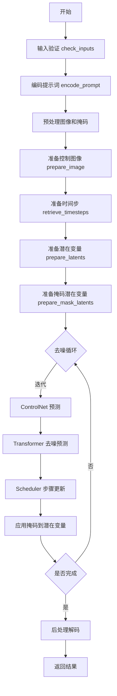

## 类结构

```
DiffusionPipeline (基类)
├── FluxLoraLoaderMixin (混合类)
├── FromSingleFileMixin (混合类)
└── FluxControlNetFillInpaintPipeline (主类)
```

## 全局变量及字段


### `XLA_AVAILABLE`
    
XLA可用性标志，指示torch_xla是否可用

类型：`bool`
    


### `logger`
    
用于记录日志的日志记录器对象

类型：`logging.Logger`
    


### `EXAMPLE_DOC_STRING`
    
示例文档字符串，包含pipeline使用示例

类型：`str`
    


### `FluxControlNetFillInpaintPipeline.scheduler`
    
扩散调度器，用于控制去噪过程的步进

类型：`FlowMatchEulerDiscreteScheduler`
    


### `FluxControlNetFillInpaintPipeline.vae`
    
VAE编解码器，用于图像与潜在表示之间的转换

类型：`AutoencoderKL`
    


### `FluxControlNetFillInpaintPipeline.text_encoder`
    
CLIP文本编码器，用于将文本提示编码为嵌入向量

类型：`CLIPTextModel`
    


### `FluxControlNetFillInpaintPipeline.text_encoder_2`
    
T5文本编码器，用于长文本序列的编码

类型：`T5EncoderModel`
    


### `FluxControlNetFillInpaintPipeline.tokenizer`
    
CLIP分词器，用于将文本转换为token IDs

类型：`CLIPTokenizer`
    


### `FluxControlNetFillInpaintPipeline.tokenizer_2`
    
T5分词器，用于长文本的分词处理

类型：`T5TokenizerFast`
    


### `FluxControlNetFillInpaintPipeline.transformer`
    
Flux变换器模型，用于去噪潜在表示

类型：`FluxTransformer2DModel`
    


### `FluxControlNetFillInpaintPipeline.controlnet`
    
ControlNet模型，用于提供图像生成的控制条件

类型：`Union[FluxControlNetModel, FluxMultiControlNetModel]`
    


### `FluxControlNetFillInpaintPipeline.image_processor`
    
图像处理器，用于图像的预处理和后处理

类型：`VaeImageProcessor`
    


### `FluxControlNetFillInpaintPipeline.mask_processor`
    
掩码处理器，用于掩码图像的预处理

类型：`VaeImageProcessor`
    


### `FluxControlNetFillInpaintPipeline.vae_scale_factor`
    
VAE缩放因子，用于计算潜在空间的尺寸

类型：`int`
    


### `FluxControlNetFillInpaintPipeline.tokenizer_max_length`
    
分词器最大长度，限制输入序列的最大token数

类型：`int`
    


### `FluxControlNetFillInpaintPipeline.default_sample_size`
    
默认采样尺寸，用于确定生成图像的默认分辨率

类型：`int`
    
    

## 全局函数及方法


### `calculate_shift`

计算图像序列长度的偏移量（shift），用于调整去噪调度器的偏移参数。该函数通过线性插值，根据图像序列长度在基础偏移量和最大偏移量之间计算出一个合适的偏移值。

参数：

- `image_seq_len`：`int`，图像序列长度，即图像在潜在空间中的序列长度
- `base_seq_len`：`int`，基础序列长度，默认为 256，用于线性插值的基准点
- `max_seq_len`：`int`，最大序列长度，默认为 4096，用于线性插值的另一基准点
- `base_shift`：`float`，基础偏移量，默认为 0.5，对应基础序列长度时的偏移值
- `max_shift`：`float`，最大偏移量，默认为 1.15，对应最大序列长度时的偏移值

返回值：`float`，计算得到的偏移量 mu，用于调整调度器的噪声调度策略

#### 流程图

```mermaid
flowchart TD
    A[开始] --> B[计算斜率 m = (max_shift - base_shift) / (max_seq_len - base_seq_len)]
    B --> C[计算截距 b = base_shift - m * base_seq_len]
    C --> D[计算偏移量 mu = image_seq_len * m + b]
    D --> E[返回 mu]
```

#### 带注释源码

```python
# Copied from diffusers.pipelines.flux.pipeline_flux.calculate_shift
def calculate_shift(
    image_seq_len,          # 图像序列长度
    base_seq_len: int = 256,      # 基础序列长度，默认256
    max_seq_len: int = 4096,      # 最大序列长度，默认4096
    base_shift: float = 0.5,      # 基础偏移量，默认0.5
    max_shift: float = 1.15,      # 最大偏移量，默认1.15
):
    # 计算线性插值的斜率 (slope)
    m = (max_shift - base_shift) / (max_seq_len - base_seq_len)
    # 计算线性插值的截距 (intercept)
    b = base_shift - m * base_seq_len
    # 根据图像序列长度计算偏移量 mu
    mu = image_seq_len * m + b
    # 返回计算得到的偏移量
    return mu
```


### `retrieve_latents`

从编码器输出（encoder_output）中检索潜在向量（latents），支持从 latent_dist 分布中采样（sample）或取 mode（argmax），也可以直接返回预存的 latents 属性。

参数：

- `encoder_output`：`torch.Tensor`，编码器的输出对象，通常包含 `latent_dist` 或 `latents` 属性
- `generator`：`torch.Generator | None`，可选的随机数生成器，用于控制采样过程中的随机性
- `sample_mode`：`str`，采样模式，可选值为 "sample"（从分布中采样）或 "argmax"（取分布的众数），默认值为 "sample"

返回值：`torch.Tensor`，检索到的潜在向量

#### 流程图

```mermaid
flowchart TD
    A[开始: retrieve_latents] --> B{encoder_output 是否有 latent_dist 属性?}
    B -- 是 --> C{sample_mode == 'sample'?}
    C -- 是 --> D[调用 latent_dist.sample(generator) 返回采样结果]
    C -- 否 --> E{sample_mode == 'argmax'?}
    E -- 是 --> F[调用 latent_dist.mode() 返回众数]
    E -- 否 --> G[继续检查 latents 属性]
    B -- 否 --> G
    G{encoder_output 是否有 latents 属性?}
    G -- 是 --> H[直接返回 encoder_output.latents]
    G -- 否 --> I[抛出 AttributeError 异常]
    D --> J[结束: 返回 latents]
    F --> J
    H --> J
    I --> J
```

#### 带注释源码

```python
# 从编码器输出中检索潜在向量
# Copied from diffusers.pipelines.stable_diffusion.pipeline_stable_diffusion_img2img.retrieve_latents
def retrieve_latents(
    encoder_output: torch.Tensor, generator: torch.Generator | None = None, sample_mode: str = "sample"
):
    # 检查编码器输出是否包含 latent_dist 属性（表示输出是概率分布形式）
    if hasattr(encoder_output, "latent_dist") and sample_mode == "sample":
        # 如果采样模式为 "sample"，从潜在分布中采样
        # 使用 generator 确保采样过程可复现（如果提供了 generator）
        return encoder_output.latent_dist.sample(generator)
    # 如果采样模式为 "argmax"，取分布的众数（即最可能的潜在向量）
    elif hasattr(encoder_output, "latent_dist") and sample_mode == "argmax":
        return encoder_output.latent_dist.mode()
    # 检查编码器输出是否直接包含 latents 属性（预计算的潜在向量）
    elif hasattr(encoder_output, "latents"):
        return encoder_output.latents
    # 如果无法从编码器输出中获取潜在向量，抛出属性错误
    else:
        raise AttributeError("Could not access latents of provided encoder_output")
```


### `retrieve_latents_fill`

该函数用于从 VAE 编码器输出中检索填充（inpainting）任务的潜在向量，支持三种模式：从潜在分布采样、从潜在分布取最大概率值、或直接返回预存的潜在向量。

参数：

- `encoder_output`：`torch.Tensor`，VAE 编码器的输出对象，包含 `latent_dist` 属性或 `latents` 属性
- `generator`：`torch.Generator | None`，可选的随机数生成器，用于采样时的随机性控制
- `sample_mode`：`str`，采样模式，可选值为 `"sample"`（从分布采样）或 `"argmax"`（取模式），默认为 `"sample"`

返回值：`torch.Tensor`，检索到的潜在向量张量

#### 流程图

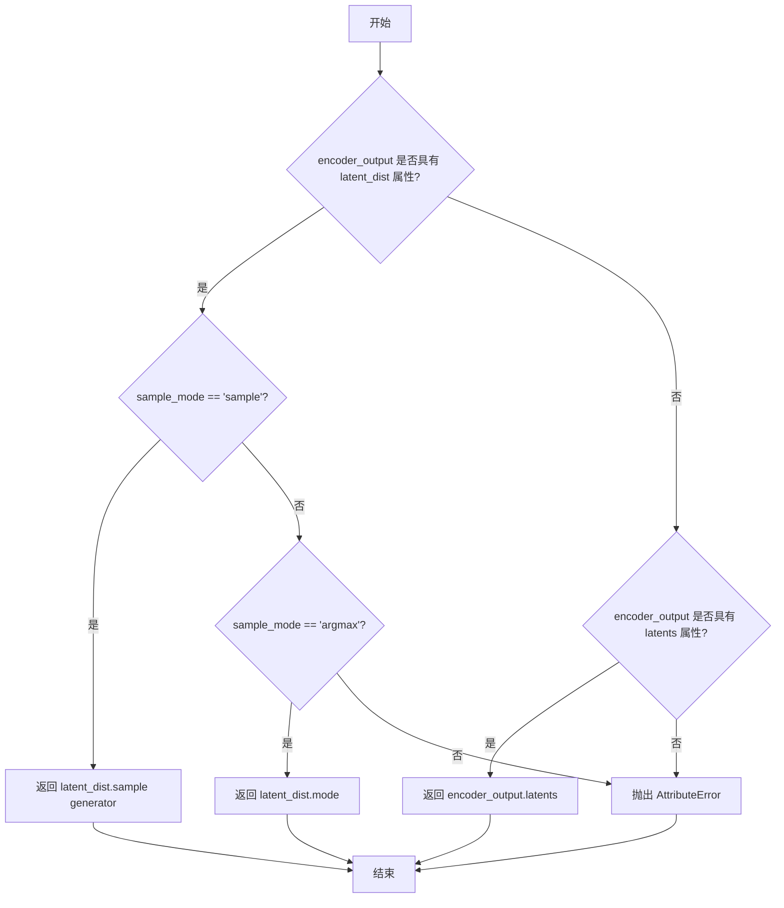

#### 带注释源码

```python
def retrieve_latents_fill(
    encoder_output: torch.Tensor, generator: torch.Generator | None = None, sample_mode: str = "sample"
):
    """
    从编码器输出中检索填充任务的潜在向量。
    
    Args:
        encoder_output: VAE编码器的输出对象
        generator: 可选的随机数生成器，用于采样模式下的随机采样
        sample_mode: 采样模式，"sample"从分布采样，"argmax"取分布的模式
    
    Returns:
        检索到的潜在向量张量
    """
    # 检查encoder_output是否具有latent_dist属性且采样模式为sample
    if hasattr(encoder_output, "latent_dist") and sample_mode == "sample":
        # 从潜在分布中采样得到潜在向量
        return encoder_output.latent_dist.sample(generator)
    # 检查encoder_output是否具有latent_dist属性且采样模式为argmax
    elif hasattr(encoder_output, "latent_dist") and sample_mode == "argmax":
        # 返回潜在分布的模式（最大概率值对应的潜在向量）
        return encoder_output.latent_dist.mode()
    # 检查encoder_output是否直接具有latents属性
    elif hasattr(encoder_output, "latents"):
        # 直接返回预存的潜在向量
        return encoder_output.latents
    # 如果无法访问任何潜在向量属性，抛出异常
    else:
        raise AttributeError("Could not access latents of provided encoder_output")
```


### `retrieve_timesteps`

检索调度器的时间步。该函数调用调度器的 `set_timesteps` 方法并在调用后从调度器中检索时间步，处理自定义时间步。任何 kwargs 都将传递给 `scheduler.set_timesteps`。

参数：

- `scheduler`：`SchedulerMixin`，要获取时间步的调度器
- `num_inference_steps`：`Optional[int]`，使用预训练模型生成样本时使用的扩散步数。如果使用此参数，`timesteps` 必须为 `None`
- `device`：`Optional[Union[str, torch.device]]`，时间步要移动到的设备。如果为 `None`，则不移动时间步
- `timesteps`：`Optional[List[int]]`，用于覆盖调度器时间步间隔策略的自定义时间步。如果传入 `timesteps`，则 `num_inference_steps` 和 `sigmas` 必须为 `None`
- `sigmas`：`Optional[List[float]]`，用于覆盖调度器时间步间隔策略的自定义 sigmas。如果传入 `sigmas`，则 `num_inference_steps` 和 `timesteps` 必须为 `None`
- `**kwargs`：额外参数，将传递给调度器的 `set_timesteps` 方法

返回值：`Tuple[torch.Tensor, int]`，元组包含调度器的时间步计划（第一个元素）和推理步数（第二个元素）

#### 流程图

```mermaid
flowchart TD
    A[开始] --> B{检查timesteps和sigmas是否同时传入}
    B -->|是| C[抛出ValueError: 只能选择一个]
    B -->|否| D{检查timesteps是否传入}
    D -->|是| E{检查scheduler.set_timesteps是否接受timesteps参数}
    E -->|否| F[抛出ValueError: 当前调度器类不支持自定义timesteps]
    E -->|是| G[调用scheduler.set_timesteps<br/>timesteps=timesteps, device=device, **kwargs]
    G --> H[获取scheduler.timesteps]
    H --> I[计算num_inference_steps = len(timesteps)]
    D -->|否| J{检查sigmas是否传入}
    J -->|是| K{检查scheduler.set_timesteps是否接受sigmas参数}
    K -->|否| L[抛出ValueError: 当前调度器类不支持自定义sigmas]
    K -->|是| M[调用scheduler.set_timesteps<br/>sigmas=sigmas, device=device, **kwargs]
    M --> N[获取scheduler.timesteps]
    N --> O[计算num_inference_steps = len(timesteps)]
    J -->|否| P[调用scheduler.set_timesteps<br/>num_inference_steps, device=device, **kwargs]
    P --> Q[获取scheduler.timesteps]
    Q --> R[设置num_inference_steps = len(timesteps)]
    R --> S[返回timesteps和num_inference_steps]
    I --> S
    O --> S
```

#### 带注释源码

```python
# Copied from diffusers.pipelines.stable_diffusion.pipeline_stable_diffusion.retrieve_timesteps
def retrieve_timesteps(
    scheduler,
    num_inference_steps: Optional[int] = None,
    device: Optional[Union[str, torch.device]] = None,
    timesteps: Optional[List[int]] = None,
    sigmas: Optional[List[float]] = None,
    **kwargs,
):
    r"""
    Calls the scheduler's `set_timesteps` method and retrieves timesteps from the scheduler after the call. Handles
    custom timesteps. Any kwargs will be supplied to `scheduler.set_timesteps`.

    Args:
        scheduler (`SchedulerMixin`):
            The scheduler to get timesteps from.
        num_inference_steps (`int`):
            The number of diffusion steps used when generating samples with a pre-trained model. If used, `timesteps`
            must be `None`.
        device (`str` or `torch.device`, *optional*):
            The device to which the timesteps should be moved to. If `None`, the timesteps are not moved.
        timesteps (`List[int]`, *optional*):
            Custom timesteps used to override the timestep spacing strategy of the scheduler. If `timesteps` is passed,
            `num_inference_steps` and `sigmas` must be `None`.
        sigmas (`List[float]`, *optional*):
            Custom sigmas used to override the timestep spacing strategy of the scheduler. If `sigmas` is passed,
            `num_inference_steps` and `timesteps` must be `None`.

    Returns:
        `Tuple[torch.Tensor, int]`: A tuple where the first element is the timestep schedule from the scheduler and the
        second element is the number of inference steps.
    """
    # 检查是否同时传入了timesteps和sigmas，这是不允许的
    if timesteps is not None and sigmas is not None:
        raise ValueError("Only one of `timesteps` or `sigmas` can be passed. Please choose one to set custom values")
    
    # 如果传入了自定义timesteps
    if timesteps is not None:
        # 通过inspect检查scheduler.set_timesteps是否接受timesteps参数
        accepts_timesteps = "timesteps" in set(inspect.signature(scheduler.set_timesteps).parameters.keys())
        if not accepts_timesteps:
            raise ValueError(
                f"The current scheduler class {scheduler.__class__}'s `set_timesteps` does not support custom"
                f" timestep schedules. Please check whether you are using the correct scheduler."
            )
        # 调用scheduler的set_timesteps方法设置自定义timesteps
        scheduler.set_timesteps(timesteps=timesteps, device=device, **kwargs)
        # 从scheduler获取设置后的timesteps
        timesteps = scheduler.timesteps
        # 计算推理步数
        num_inference_steps = len(timesteps)
    # 如果传入了自定义sigmas
    elif sigmas is not None:
        # 通过inspect检查scheduler.set_timesteps是否接受sigmas参数
        accept_sigmas = "sigmas" in set(inspect.signature(scheduler.set_timesteps).parameters.keys())
        if not accept_sigmas:
            raise ValueError(
                f"The current scheduler class {scheduler.__class__}'s `set_timesteps` does not support custom"
                f" sigmas schedules. Please check whether you are using the correct scheduler."
            )
        # 调用scheduler的set_timesteps方法设置自定义sigmas
        scheduler.set_timesteps(sigmas=sigmas, device=device, **kwargs)
        # 从scheduler获取设置后的timesteps
        timesteps = scheduler.timesteps
        # 计算推理步数
        num_inference_steps = len(timesteps)
    # 如果都没有传入，使用默认的num_inference_steps
    else:
        scheduler.set_timesteps(num_inference_steps, device=device, **kwargs)
        timesteps = scheduler.timesteps
    
    # 返回timesteps和num_inference_steps
    return timesteps, num_inference_steps
```


### `FluxControlNetFillInpaintPipeline.__init__`

该方法是 FluxControlNetFillInpaintPipeline 类的构造函数，负责初始化扩散管道所需的所有组件，包括调度器、VAE、文本编码器、tokenizer、Transformer模型和ControlNet模型，并配置图像处理器、掩码处理器等关键参数。

参数：

- `scheduler`：`FlowMatchEulerDiscreteScheduler`，用于去噪的调度器
- `vae`：`AutoencoderKL`，用于编码和解码图像的变分自编码器模型
- `text_encoder`：`CLIPTextModel`，CLIP文本编码器模型
- `tokenizer`：`CLIPTokenizer`，CLIP分词器
- `text_encoder_2`：`T5EncoderModel`，T5文本编码器模型
- `tokenizer_2`：`T5TokenizerFast`，T5快速分词器
- `transformer`：`FluxTransformer2DModel`，用于去噪的条件Transformer (MMDiT) 架构
- `controlnet`：`Union[FluxControlNetModel, List[FluxControlNetModel], Tuple[FluxControlNetModel], FluxMultiControlNetModel]`，ControlNet模型，用于控制生成

返回值：`None`，构造函数无返回值

#### 流程图

```mermaid
flowchart TD
    A[开始 __init__] --> B{检查 controlnet 类型}
    B -->|list 或 tuple| C[转换为 FluxMultiControlNetModel]
    B -->|其他| D[保持原样]
    C --> E[调用 super().__init__]
    D --> E
    E --> F[register_modules 注册所有模块]
    F --> G[计算 vae_scale_factor]
    G --> H[创建 VaeImageProcessor 作为 image_processor]
    I[获取 latent_channels] --> J[创建 mask_processor]
    H --> J
    J --> K[设置 tokenizer_max_length]
    K --> L[设置 default_sample_size = 128]
    L --> M[结束 __init__]
```

#### 带注释源码

```python
def __init__(
    self,
    scheduler: FlowMatchEulerDiscreteScheduler,
    vae: AutoencoderKL,
    text_encoder: CLIPTextModel,
    tokenizer: CLIPTokenizer,
    text_encoder_2: T5EncoderModel,
    tokenizer_2: T5TokenizerFast,
    transformer: FluxTransformer2DModel,
    controlnet: Union[
        FluxControlNetModel, List[FluxControlNetModel], Tuple[FluxControlNetModel], FluxMultiControlNetModel
    ],
):
    # 调用父类 DiffusionPipeline 的初始化方法
    super().__init__()
    
    # 如果 controlnet 是 list 或 tuple 格式，转换为 FluxMultiControlNetModel 对象
    # 以支持多个 ControlNet 同时使用
    if isinstance(controlnet, (list, tuple)):
        controlnet = FluxMultiControlNetModel(controlnet)

    # 注册所有模块到管道中，使这些组件可以通过管道的属性访问
    # 同时也会将这些组件保存到 self.<component_name> 中
    self.register_modules(
        scheduler=scheduler,
        vae=vae,
        text_encoder=text_encoder,
        tokenizer=tokenizer,
        text_encoder_2=text_encoder_2,
        tokenizer_2=tokenizer_2,
        transformer=transformer,
        controlnet=controlnet,
    )

    # 计算 VAE 的缩放因子
    # 基于 VAE 块输出通道数的深度计算 2^(depth-1)
    # Flux latents 被转换为 2x2  patches 并打包，因此 latent 宽度和高度必须能被 patch size 整除
    # 所以 vae_scale_factor 乘以 patch size 来考虑这一点
    self.vae_scale_factor = 2 ** (len(self.vae.config.block_out_channels) - 1) if getattr(self, "vae", None) else 8
    
    # 创建图像预处理器，用于处理输入图像和将输出转换为图像
    # vae_scale_factor * 2 考虑了 Flux 的 2x2 打包机制
    self.image_processor = VaeImageProcessor(vae_scale_factor=self.vae_scale_factor * 2)
    
    # 获取 latent channels 数量，用于配置 mask 处理器
    latent_channels = self.vae.config.latent_channels if getattr(self, "vae", None) else 16
    
    # 创建掩码预处理器
    # do_normalize=False: 不进行归一化
    # do_binarize=True: 进行二值化处理
    # do_convert_grayscale=True: 转换为灰度图
    self.mask_processor = VaeImageProcessor(
        vae_scale_factor=self.vae_scale_factor * 2,
        vae_latent_channels=latent_channels,
        do_normalize=False,
        do_binarize=True,
        do_convert_grayscale=True,
    )
    
    # 设置 tokenizer 的最大长度
    # 如果 tokenizer 存在则使用其 model_max_length，否则使用默认值 77 (CLIP 标准长度)
    self.tokenizer_max_length = (
        self.tokenizer.model_max_length if hasattr(self, "tokenizer") and self.tokenizer is not None else 77
    )
    
    # 设置默认采样大小为 128
    # 最终输出图像尺寸 = default_sample_size * vae_scale_factor
    self.default_sample_size = 128
```


### `FluxControlNetFillInpaintPipeline._get_t5_prompt_embeds`

该方法用于使用T5文本编码器生成文本提示的嵌入向量（prompt embeddings），支持批量处理和多图生成。

参数：

- `self`：`FluxControlNetFillInpaintPipeline`实例，管道对象本身
- `prompt`：`Union[str, List[str]]`，要编码的文本提示，可以是单个字符串或字符串列表
- `num_images_per_prompt`：`int = 1`，每个提示生成的图像数量，用于复制嵌入向量
- `max_sequence_length`：`int = 512`，T5编码器的最大序列长度
- `device`：`Optional[torch.device] = None`，计算设备，若未指定则使用执行设备
- `dtype`：`Optional[torch.dtype] = None`，输出张量的数据类型，若未指定则使用文本编码器的数据类型

返回值：`torch.FloatTensor`，形状为`(batch_size * num_images_per_prompt, seq_len, hidden_size)`的文本嵌入向量

#### 流程图

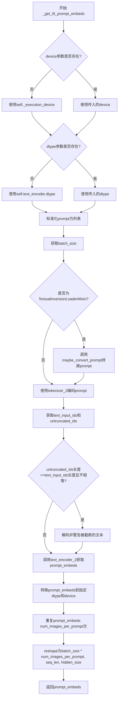

#### 带注释源码

```python
def _get_t5_prompt_embeds(
    self,
    prompt: Union[str, List[str]] = None,
    num_images_per_prompt: int = 1,
    max_sequence_length: int = 512,
    device: Optional[torch.device] = None,
    dtype: Optional[torch.dtype] = None,
):
    """
    使用T5编码器生成文本提示嵌入向量
    
    参数:
        prompt: 输入文本提示，支持单字符串或字符串列表
        num_images_per_prompt: 每个提示生成的图像数量
        max_sequence_length: T5编码器的最大序列长度
        device: 计算设备
        dtype: 输出数据类型
    
    返回:
        形状为 (batch_size * num_images_per_prompt, seq_len, hidden_size) 的嵌入张量
    """
    # 确定计算设备，若未指定则使用执行设备
    device = device or self._execution_device
    # 确定数据类型，若未指定则使用文本编码器的数据类型
    dtype = dtype or self.text_encoder.dtype

    # 将prompt标准化为列表：若是字符串则包装为单元素列表
    prompt = [prompt] if isinstance(prompt, str) else prompt
    # 获取批大小
    batch_size = len(prompt)

    # 如果是TextualInversionLoaderMixin，转换prompt以处理文本反转嵌入
    if isinstance(self, TextualInversionLoaderMixin):
        prompt = self.maybe_convert_prompt(prompt, self.tokenizer_2)

    # 使用T5 tokenizer对prompt进行编码
    text_inputs = self.tokenizer_2(
        prompt,
        padding="max_length",              # 填充到最大长度
        max_length=max_sequence_length,     # 最大序列长度
        truncation=True,                   # 截断超长序列
        return_length=False,               # 不返回长度
        return_overflowing_tokens=False,   # 不返回溢出token
        return_tensors="pt",               # 返回PyTorch张量
    )
    # 获取编码后的输入ID
    text_input_ids = text_inputs.input_ids
    # 获取未截断的输入ID（用于检测截断）
    untruncated_ids = self.tokenizer_2(prompt, padding="longest", return_tensors="pt").input_ids

    # 检测是否发生了截断，若发生则警告用户
    if untruncated_ids.shape[-1] >= text_input_ids.shape[-1] and not torch.equal(text_input_ids, untruncated_ids):
        removed_text = self.tokenizer_2.batch_decode(untruncated_ids[:, self.tokenizer_max_length - 1 : -1])
        logger.warning(
            "The following part of your input was truncated because `max_sequence_length` is set to "
            f" {max_sequence_length} tokens: {removed_text}"
        )

    # 使用T5文本编码器获取提示嵌入
    prompt_embeds = self.text_encoder_2(text_input_ids.to(device), output_hidden_states=False)[0]

    # 获取编码器的数据类型并转换嵌入
    dtype = self.text_encoder_2.dtype
    prompt_embeds = prompt_embeds.to(dtype=dtype, device=device)

    # 获取序列长度
    _, seq_len, _ = prompt_embeds.shape

    # 为每个提示生成的图像复制文本嵌入和注意力掩码
    # 使用MPS友好的方法进行复制
    prompt_embeds = prompt_embeds.repeat(1, num_images_per_prompt, 1)
    prompt_embeds = prompt_embeds.view(batch_size * num_images_per_prompt, seq_len, -1)

    return prompt_embeds
```


### `FluxControlNetFillInpaintPipeline._get_clip_prompt_embeds`

该方法用于将文本提示（prompt）转换为CLIP模型的嵌入向量（embedding），支持批量处理和每提示生成多张图像的场景。

参数：

- `self`：类的实例本身，包含pipeline的所有组件。
- `prompt`：`Union[str, List[str]]`，要编码的文本提示，可以是单个字符串或字符串列表。
- `num_images_per_prompt`：`int = 1`，每个提示生成的图像数量，用于复制嵌入向量以匹配批量大小。
- `device`：`Optional[torch.device] = None`，计算设备，若未指定则使用执行设备。

返回值：`torch.FloatTensor`，CLIP模型生成的文本嵌入向量，形状为 `(batch_size * num_images_per_prompt, embedding_dim)`。

#### 流程图

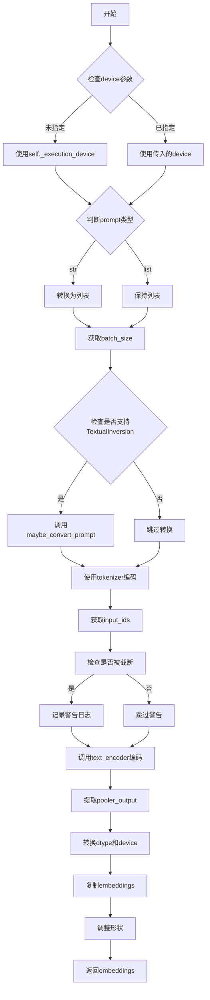

#### 带注释源码

```python
def _get_clip_prompt_embeds(
    self,
    prompt: Union[str, List[str]],
    num_images_per_prompt: int = 1,
    device: Optional[torch.device] = None,
):
    """
    获取CLIP文本编码器的提示嵌入向量
    
    参数:
        prompt: 文本提示，可以是单个字符串或字符串列表
        num_images_per_prompt: 每个提示生成的图像数量
        device: 目标计算设备
    
    返回:
        CLIP文本嵌入向量
    """
    # 确定设备，未指定时使用执行设备
    device = device or self._execution_device

    # 标准化输入为列表格式，便于批量处理
    prompt = [prompt] if isinstance(prompt, str) else prompt
    batch_size = len(prompt)

    # 如果支持TextualInversion，进行提示转换
    if isinstance(self, TextualInversionLoaderMixin):
        prompt = self.maybe_convert_prompt(prompt, self.tokenizer)

    # 使用CLIP tokenizer将文本转换为token IDs
    text_inputs = self.tokenizer(
        prompt,
        padding="max_length",
        max_length=self.tokenizer_max_length,
        truncation=True,
        return_overflowing_tokens=False,
        return_length=False,
        return_tensors="pt",
    )

    # 获取编码后的token IDs
    text_input_ids = text_inputs.input_ids
    
    # 使用最长填充模式进行二次编码，检查是否发生截断
    untruncated_ids = self.tokenizer(prompt, padding="longest", return_tensors="pt").input_ids
    
    # 如果发生截断，记录警告信息
    if untruncated_ids.shape[-1] >= text_input_ids.shape[-1] and not torch.equal(text_input_ids, untruncated_ids):
        removed_text = self.tokenizer.batch_decode(untruncated_ids[:, self.tokenizer_max_length - 1 : -1])
        logger.warning(
            "The following part of your input was truncated because CLIP can only handle sequences up to"
            f" {self.tokenizer_max_length} tokens: {removed_text}"
        )
    
    # 调用CLIP文本编码器获取嵌入向量，output_hidden_states=False表示只使用最后一层输出
    prompt_embeds = self.text_encoder(text_input_ids.to(device), output_hidden_states=False)

    # 提取池化输出（pooled output），这是CLIP文本编码器的句子级表示
    prompt_embeds = prompt_embeds.pooler_output
    
    # 转换到正确的dtype和device，确保与模型参数一致
    prompt_embeds = prompt_embeds.to(dtype=self.text_encoder.dtype, device=device)

    # 为每个提示生成多个图像时，复制对应的embeddings
    prompt_embeds = prompt_embeds.repeat(1, num_images_per_prompt)
    
    # 调整形状为 (batch_size * num_images_per_prompt, embedding_dim)
    prompt_embeds = prompt_embeds.view(batch_size * num_images_per_prompt, -1)

    return prompt_embeds
```


### `FluxControlNetFillInpaintPipeline.encode_prompt`

该方法用于将文本提示编码为文本嵌入向量，支持CLIP和T5两种文本编码器，并处理LoRA权重的动态调整。

参数：

- `prompt`：`Union[str, List[str]]`，要编码的主提示文本
- `prompt_2`：`Union[str, List[str]]`，发送给tokenizer_2和text_encoder_2的提示，如未定义则使用prompt
- `device`：`Optional[torch.device]`，torch设备，如未提供则使用执行设备
- `num_images_per_prompt`：`int`，每个提示生成的图像数量，默认为1
- `prompt_embeds`：`Optional[torch.FloatTensor]`，预生成的文本嵌入，可用于调整文本输入
- `pooled_prompt_embeds`：`Optional[torch.FloatTensor]`，预生成的池化文本嵌入
- `max_sequence_length`：`int`，最大序列长度，默认为512
- `lora_scale`：`Optional[float]`，应用于文本编码器LoRA层的LoRA缩放因子

返回值：`Tuple[torch.FloatTensor, torch.FloatTensor, torch.Tensor]`，包含文本嵌入、池化文本嵌入和文本IDs

#### 流程图

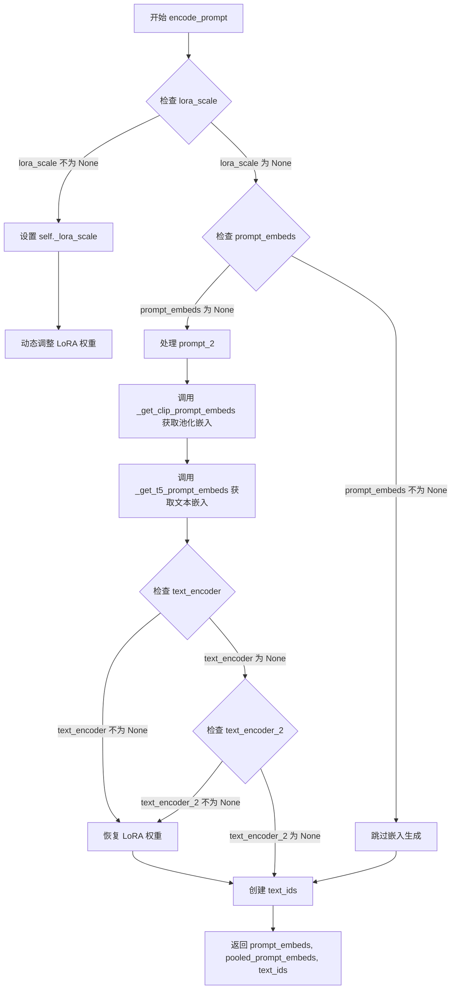

#### 带注释源码

```python
def encode_prompt(
    self,
    prompt: Union[str, List[str]],
    prompt_2: Union[str, List[str]],
    device: Optional[torch.device] = None,
    num_images_per_prompt: int = 1,
    prompt_embeds: Optional[torch.FloatTensor] = None,
    pooled_prompt_embeds: Optional[torch.FloatTensor] = None,
    max_sequence_length: int = 512,
    lora_scale: Optional[float] = None,
):
    """
    Encodes the prompt into text embeddings using CLIP and T5 text encoders.
    Handles LoRA scale adjustment and text ID generation.
    
    Args:
        prompt: The prompt to be encoded
        prompt_2: The prompt for T5 encoder, defaults to prompt if not provided
        device: torch device
        num_images_per_prompt: number of images to generate per prompt
        prompt_embeds: Pre-generated text embeddings
        pooled_prompt_embeds: Pre-generated pooled text embeddings
        max_sequence_length: Maximum sequence length for T5
        lora_scale: LoRA scale for text encoder layers
    """
    # 使用执行设备作为默认设备
    device = device or self._execution_device

    # 设置LoRA缩放因子，以便文本编码器的LoRA函数可以正确访问
    if lora_scale is not None and isinstance(self, FluxLoraLoaderMixin):
        self._lora_scale = lora_scale

        # 动态调整LoRA权重
        if self.text_encoder is not None and USE_PEFT_BACKEND:
            scale_lora_layers(self.text_encoder, lora_scale)
        if self.text_encoder_2 is not None and USE_PEFT_BACKEND:
            scale_lora_layers(self.text_encoder_2, lora_scale)

    # 标准化prompt为列表格式
    prompt = [prompt] if isinstance(prompt, str) else prompt

    # 如果未提供预计算的嵌入，则生成新的嵌入
    if prompt_embeds is None:
        # prompt_2默认为prompt
        prompt_2 = prompt_2 or prompt
        prompt_2 = [prompt_2] if isinstance(prompt_2, str) else prompt_2

        # 从CLIPTextModel获取池化输出
        pooled_prompt_embeds = self._get_clip_prompt_embeds(
            prompt=prompt,
            device=device,
            num_images_per_prompt=num_images_per_prompt,
        )
        # 从T5获取文本嵌入
        prompt_embeds = self._get_t5_prompt_embeds(
            prompt=prompt_2,
            num_images_per_prompt=num_images_per_prompt,
            max_sequence_length=max_sequence_length,
            device=device,
        )

    # 处理完成后恢复LoRA权重
    if self.text_encoder is not None:
        if isinstance(self, FluxLoraLoaderMixin) and USE_PEFT_BACKEND:
            # 通过反向缩放LoRA层恢复原始权重
            unscale_lora_layers(self.text_encoder, lora_scale)

    if self.text_encoder_2 is not None:
        if isinstance(self, FluxLoraLoaderMixin) and USE_PEFT_BACKEND:
            unscale_lora_layers(self.text_encoder_2, lora_scale)

    # 确定数据类型（使用text_encoder或transformer的数据类型）
    dtype = self.text_encoder.dtype if self.text_encoder is not None else self.transformer.dtype
    
    # 创建用于文本的零张量IDs（形状为[seq_len, 3]）
    text_ids = torch.zeros(prompt_embeds.shape[1], 3).to(device=device, dtype=dtype)

    # 返回文本嵌入、池化嵌入和文本IDs
    return prompt_embeds, pooled_prompt_embeds, text_ids
```


### `FluxControlNetFillInpaintPipeline._encode_vae_image`

该方法使用VAE编码器将输入图像转换为潜在空间表示，通过retrieve_latents函数从VAE编码器输出中提取潜在向量，并根据VAE配置中的shift_factor和scaling_factor对潜在表示进行归一化处理。

参数：

- `self`：类的实例引用
- `image`：`torch.Tensor`，输入的待编码图像张量，形状为(batch_size, channels, height, width)
- `generator`：`torch.Generator`，用于生成随机噪声的PyTorch生成器，支持单个生成器或生成器列表以支持批量处理中的不同随机种子

返回值：`torch.Tensor`，编码后的图像潜在表示，形状为(batch_size, latent_channels, latent_height, latent_width)

#### 流程图

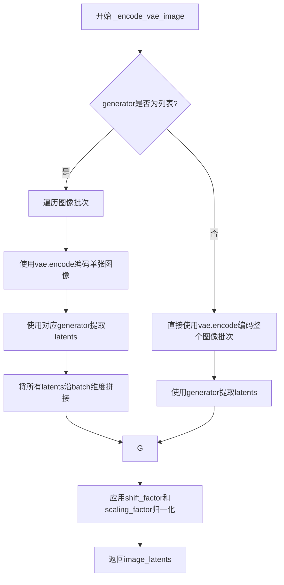

#### 带注释源码

```python
def _encode_vae_image(self, image: torch.Tensor, generator: torch.Generator):
    """
    使用VAE编码图像并返回归一化后的潜在表示
    
    Args:
        image: 待编码的图像张量
        generator: 随机生成器，用于采样潜在分布
    
    Returns:
        编码并归一化后的图像潜在表示
    """
    # 判断generator是否为列表，以支持批量处理中每个样本独立的随机种子
    if isinstance(generator, list):
        # 批量生成器模式：逐个处理每张图像
        image_latents = [
            # 对每张图像单独编码，并使用对应的generator采样
            retrieve_latents(self.vae.encode(image[i : i + 1]), generator=generator[i])
            for i in range(image.shape[0])
        ]
        # 将所有图像的潜在表示沿batch维度拼接
        image_latents = torch.cat(image_latents, dim=0)
    else:
        # 单生成器模式：直接编码整个批次
        image_latents = retrieve_latents(self.vae.encode(image), generator=generator)

    # 应用VAE的shift和scale因子进行归一化
    # 这是将潜在表示标准化到特定范围的操作
    image_latents = (image_latents - self.vae.config.shift_factor) * self.vae.config.scaling_factor

    return image_latents
```


### `FluxControlNetFillInpaintPipeline.get_timesteps`

该方法用于根据推理步数和修复强度（strength）调整去噪时间步调度，使得修复过程能够在指定区域内执行。

参数：

- `num_inference_steps`：`int`，推理步数，即去噪过程的迭代次数
- `strength`：`float`，修复强度，范围在 0 到 1 之间，控制修复区域的时间步范围
- `device`：`torch.device`，计算设备，用于张量运算

返回值：`Tuple[torch.Tensor, int]`，返回一个元组，包含调整后的时间步张量（torch.Tensor）和调整后的推理步数（int）

#### 流程图

```mermaid
flowchart TD
    A[开始 get_timesteps] --> B[计算 init_timestep = min num_inference_steps × strength, num_inference_steps]
    B --> C[计算 t_start = max num_inference_steps - init_timestep, 0]
    C --> D[从调度器获取时间步 timesteps = scheduler.timesteps[t_start × scheduler.order :]]
    D --> E{调度器是否有 set_begin_index 方法?}
    E -->|是| F[调用 scheduler.set_begin_index t_start × scheduler.order]
    E -->|否| G[跳过设置]
    F --> H[返回 timesteps, num_inference_steps - t_start]
    G --> H
```

#### 带注释源码

```python
def get_timesteps(self, num_inference_steps, strength, device):
    """
    根据修复强度调整时间步调度
    
    该方法通过计算实际需要执行的时间步数量来实现基于强度的修复。
    强度越高，修复过程从越晚的时间步开始，保留更多原始图像信息。
    
    参数:
        num_inference_steps: 总推理步数
        strength: 修复强度，值越大表示修复程度越高
        device: 计算设备
    """
    # 计算有效的时间步数，基于强度参数
    # 如果 strength=1.0，则使用全部时间步；如果 strength=0.5，则使用一半
    init_timestep = min(num_inference_steps * strength, num_inference_steps)
    
    # 计算起始索引，确定从哪个时间步开始执行修复
    # 强度越高，t_start 越小，从越早的时间步开始（修复程度低）
    # 强度越低，t_start 越大，从越晚的时间步开始（修复程度高，保留更多原始信息）
    t_start = int(max(num_inference_steps - init_timestep, 0))
    
    # 从调度器中获取对应的时间步序列
    # 使用 scheduler.order 进行索引，确保正确处理多步调度器
    timesteps = self.scheduler.timesteps[t_start * self.scheduler.order :]
    
    # 如果调度器支持设置起始索引，则设置它
    # 这对于某些需要知道当前执行位置的调度器很重要
    if hasattr(self.scheduler, "set_begin_index"):
        self.scheduler.set_begin_index(t_start * self.scheduler.order)
    
    # 返回调整后的时间步和实际的推理步数
    return timesteps, num_inference_steps - t_start
```


### `FluxControlNetFillInpaintPipeline.check_inputs`

该方法用于验证 FluxControlNetFillInpaintPipeline .pipeline 的输入参数是否合法，包括检查 strength 值是否在 [0,1] 范围内、图像尺寸是否满足 VAE 缩放因子要求、prompt 和 prompt_embeds 的互斥关系、padding_mask_crop 相关类型检查以及 max_sequence_length 的上限约束。

参数：

-  `prompt`：`Union[str, List[str]]`，主提示词，用于指导图像生成
-  `prompt_2`：`Union[str, List[str]]`，发送给第二个文本编码器（tokenizer_2 和 text_encoder_2）的提示词，若未定义则使用 prompt
-  `image`：`PipelineImageInput`，要修复的图像
-  `mask_image`：`PipelineImageInput`，修复用的掩码图像，白色像素将被重绘，黑色像素将被保留
-  `strength`：`float`，修复强度，值必须在 [0.0, 1.0] 范围内
-  `height`：`int`，生成图像的高度（像素）
-  `width`：`int`，生成图像的宽度（像素）
-  `output_type`：`str`，输出格式，可选 "pil" 或 "latent" 等
-  `prompt_embeds`：`Optional[torch.FloatTensor]`，预生成的文本嵌入，若提供则不应同时提供 prompt
-  `pooled_prompt_embeds`：`Optional[torch.FloatTensor]`，预生成的池化文本嵌入，与 prompt_embeds 配套使用
-  `callback_on_step_end_tensor_inputs`：`Optional[List[str]]`，回调函数在每个去噪步骤结束时需要的张量输入列表
-  `padding_mask_crop`：`Optional[int]`，裁剪掩码时使用的填充大小
-  `max_sequence_length`：`Optional[int]`，序列最大长度，不能超过 512

返回值：`None`，该方法无返回值，通过抛出 ValueError 来表示验证失败

#### 流程图

```mermaid
flowchart TD
    A[开始验证 check_inputs] --> B{strength 是否在 [0, 1] 范围内}
    B -->|否| B1[抛出 ValueError]
    B -->|是| C{height 和 width 是否可被 vae_scale_factor * 2 整除}
    C -->|否| C1[发出警告并继续]
    C -->|是| D{callback_on_step_end_tensor_inputs 是否合法}
    D -->|否| D1[抛出 ValueError]
    D -->|是| E{prompt 和 prompt_embeds 是否同时提供}
    E -->|是| E1[抛出 ValueError]
    E -->|否| F{prompt_2 和 prompt_embeds 是否同时提供}
    F -->|是| F1[抛出 ValueError]
    F -->|否| G{prompt 和 prompt_embeds 是否都未提供}
    G -->|是| G1[抛出 ValueError]
    G -->|否| H{prompt 类型是否合法}
    H -->|否| H1[抛出 ValueError]
    H -->|是| I{prompt_2 类型是否合法}
    I -->|否| I1[抛出 ValueError]
    I -->|是| J{prompt_embeds 提供但 pooled_prompt_embeds 未提供}
    J -->|是| J1[抛出 ValueError]
    J -->|否| K{padding_mask_crop 是否提供}
    K -->|是| L{image 是否为 PIL.Image.Image}
    L -->|否| L1[抛出 ValueError]
    L -->|是| M{mask_image 是否为 PIL.Image.Image}
    M -->|否| M1[抛出 ValueError]
    M -->|是| N{output_type 是否为 'pil'}
    N -->|否| N1[抛出 ValueError]
    N -->|是| K -->|否| O{max_sequence_length 是否大于 512}
    O -->|是| O1[抛出 ValueError]
    O -->|否| P[验证通过，方法结束]
    
    B1 --> P
    C1 --> D
    D1 --> P
    E1 --> P
    F1 --> P
    G1 --> P
    H1 --> P
    I1 --> P
    J1 --> P
    L1 --> P
    M1 --> P
    N1 --> P
    O1 --> P
```

#### 带注释源码

```python
def check_inputs(
    self,
    prompt,
    prompt_2,
    image,
    mask_image,
    strength,
    height,
    width,
    output_type,
    prompt_embeds=None,
    pooled_prompt_embeds=None,
    callback_on_step_end_tensor_inputs=None,
    padding_mask_crop=None,
    max_sequence_length=None,
):
    """
    验证 pipeline 输入参数的合法性。
    
    该方法执行多项检查以确保用户提供的参数符合要求，包括：
    1. strength 值范围检查
    2. 图像尺寸兼容性检查
    3. 回调张量输入合法性检查
    4. prompt 和 prompt_embeds 互斥检查
    5. prompt_2 和 prompt_embeds 互斥检查
    6. 至少提供 prompt 或 prompt_embeds 之一
    7. prompt 和 prompt_2 类型检查
    8. pooled_prompt_embeds 配套检查
    9. padding_mask_crop 相关类型检查
    10. max_sequence_length 上限检查
    """
    
    # 检查 1: strength 值必须在 [0.0, 1.0] 范围内
    if strength < 0 or strength > 1:
        raise ValueError(f"The value of strength should in [0.0, 1.0] but is {strength}")

    # 检查 2: height 和 width 必须能被 vae_scale_factor * 2 整除
    # 这是因为 Flux 图像被处理成 2x2 的块并打包，潜在宽度和高度必须能被块大小整除
    if height % (self.vae_scale_factor * 2) != 0 or width % (self.vae_scale_factor * 2) != 0:
        logger.warning(
            f"`height` and `width` have to be divisible by {self.vae_scale_factor * 2} but are {height} and {width}. Dimensions will be resized accordingly"
        )

    # 检查 3: callback_on_step_end_tensor_inputs 必须是合法的张量输入
    if callback_on_step_end_tensor_inputs is not None and not all(
        k in self._callback_tensor_inputs for k in callback_on_step_end_tensor_inputs
    ):
        raise ValueError(
            f"`callback_on_step_end_tensor_inputs` has to be in {self._callback_tensor_inputs}, but found {[k for k in callback_on_step_end_tensor_inputs if k not in self._callback_tensor_inputs]}"
        )

    # 检查 4: prompt 和 prompt_embeds 互斥，不能同时提供
    if prompt is not None and prompt_embeds is not None:
        raise ValueError(
            f"Cannot forward both `prompt`: {prompt} and `prompt_embeds`: {prompt_embeds}. Please make sure to"
            " only forward one of the two."
        )
        
    # 检查 5: prompt_2 和 prompt_embeds 互斥，不能同时提供
    elif prompt_2 is not None and prompt_embeds is not None:
        raise ValueError(
            f"Cannot forward both `prompt_2`: {prompt_2} and `prompt_embeds`: {prompt_embeds}. Please make sure to"
            " only forward one of the two."
        )
        
    # 检查 6: 至少需要提供 prompt 或 prompt_embeds 之一
    elif prompt is None and prompt_embeds is None:
        raise ValueError(
            "Provide either `prompt` or `prompt_embeds`. Cannot leave both `prompt` and `prompt_embeds` undefined."
        )
        
    # 检查 7: prompt 类型必须是 str 或 list
    elif prompt is not None and (not isinstance(prompt, str) and not isinstance(prompt, list)):
        raise ValueError(f"`prompt` has to be of type `str` or `list` but is {type(prompt)}")
        
    # 检查 7 续: prompt_2 类型必须是 str 或 list
    elif prompt_2 is not None and (not isinstance(prompt_2, str) and not isinstance(prompt_2, list)):
        raise ValueError(f"`prompt_2` has to be of type `str` or `list` but is {type(prompt_2)}")

    # 检查 8: 如果提供了 prompt_embeds，必须也提供 pooled_prompt_embeds
    if prompt_embeds is not None and pooled_prompt_embeds is None:
        raise ValueError(
            "If `prompt_embeds` are provided, `pooled_prompt_embeds` also have to be passed. Make sure to generate `pooled_prompt_embeds` from the same text encoder that was used to generate `prompt_embeds`."
        )

    # 检查 9: padding_mask_crop 相关检查
    if padding_mask_crop is not None:
        # 当使用 padding_mask_crop 时，image 必须是 PIL 图像
        if not isinstance(image, PIL.Image.Image):
            raise ValueError(
                f"The image should be a PIL image when inpainting mask crop, but is of type {type(image)}."
            )
        # 当使用 padding_mask_crop 时，mask_image 必须是 PIL 图像
        if not isinstance(mask_image, PIL.Image.Image):
            raise ValueError(
                f"The mask image should be a PIL image when inpainting mask crop, but is of type"
                f" {type(mask_image)}."
            )
        # 当使用 padding_mask_crop 时，output_type 必须是 "pil"
        if output_type != "pil":
            raise ValueError(f"The output type should be PIL when inpainting mask crop, but is {output_type}.")

    # 检查 10: max_sequence_length 不能超过 512
    if max_sequence_length is not None and max_sequence_length > 512:
        raise ValueError(f"`max_sequence_length` cannot be greater than 512 but is {max_sequence_length}")
```


### `FluxControlNetFillInpaintPipeline._prepare_latent_image_ids`

该方法是一个静态方法，用于生成潜在图像的ID张量。它创建一个包含空间位置信息的张量，用于在Flux变换器中识别二维图像位置。该方法通过生成一个形状为(height * width, 3)的张量，其中每个位置包含(y坐标, x坐标, 0)的格式，为自注意力机制提供位置信息。

参数：

- `batch_size`：`int`，批次大小（虽然在当前实现中未使用，但保留用于API一致性）
- `height`：`int`，潜在图像的高度（以patch为单位）
- `width`：`int`，潜在图像的宽度（以patch为单位）
- `device`：`torch.device`，目标设备，用于将生成的张量移动到指定设备
- `dtype`：`torch.dtype`，目标数据类型，用于设置张量的数据类型

返回值：`torch.Tensor`，形状为(height * width, 3)的张量，包含潜在图像的位置ID信息

#### 流程图

```mermaid
flowchart TD
    A[开始] --> B[创建零张量 latent_image_ids shape: height x width x 3]
    B --> C[设置第一通道为行索引: latent_image_ids[..., 1] += torch.arange(height)[:, None]]
    C --> D[设置第二通道为列索引: latent_image_ids[..., 2] += torch.arange(width)[None, :]]
    D --> E[获取张量形状: height, width, channels]
    E --> F[重塑张量: reshape为 height*width x 3]
    F --> G[移动到指定设备并转换数据类型]
    G --> H[返回 latent_image_ids]
```

#### 带注释源码

```python
@staticmethod
# Copied from diffusers.pipelines.flux.pipeline_flux.FluxPipeline._prepare_latent_image_ids
def _prepare_latent_image_ids(batch_size, height, width, device, dtype):
    # 1. 创建一个形状为 (height, width, 3) 的零张量
    #    3个通道分别用于: [通道0未使用, 行索引, 列索引]
    latent_image_ids = torch.zeros(height, width, 3)
    
    # 2. 将行索引填充到第二通道 (索引1)
    #    torch.arange(height)[:, None] 创建形状为 (height, 1) 的列向量
    #    广播机制将其扩展到 (height, width)
    latent_image_ids[..., 1] = latent_image_ids[..., 1] + torch.arange(height)[:, None]
    
    # 3. 将列索引填充到第三通道 (索引2)
    #    torch.arange(width)[None, :] 创建形状为 (1, width) 的行向量
    #    广播机制将其扩展到 (height, width)
    latent_image_ids[..., 2] = latent_image_ids[..., 2] + torch.arange(width)[None, :]

    # 4. 获取重塑前的张量形状信息
    latent_image_id_height, latent_image_id_width, latent_image_id_channels = latent_image_ids.shape

    # 5. 将三维张量重塑为二维张量
    #    从 (height, width, 3) 转换为 (height * width, 3)
    #    每一行代表一个潜在图像位置，包含 [0, y_index, x_index]
    latent_image_ids = latent_image_ids.reshape(
        latent_image_id_height * latent_image_id_width, latent_image_id_channels
    )

    # 6. 将张量移动到指定设备并转换为指定数据类型后返回
    return latent_image_ids.to(device=device, dtype=dtype)
```


### `FluxControlNetFillInpaintPipeline._pack_latents`

该函数用于将输入的latent张量进行打包处理，将4个2x2的patch合并为一个单元，这是Flux模型中特有的数据预处理方式，用于适配transformer的输入格式。

参数：

- `latents`：`torch.Tensor`，输入的latent张量，形状为 (batch_size, num_channels_latents, height, width)
- `batch_size`：`int`，批次大小
- `num_channels_latents`：`int`，latent通道数
- `height`：`int`，latent的高度
- `width`：`int`，latent的宽度

返回值：`torch.Tensor`，打包后的latent张量，形状为 (batch_size, (height // 2) * (width // 2), num_channels_latents * 4)

#### 流程图

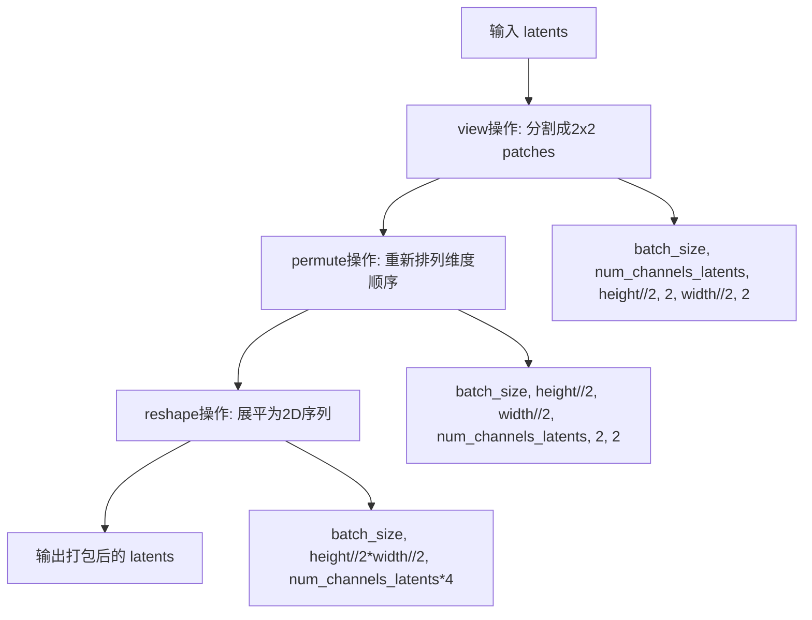

#### 带注释源码

```python
@staticmethod
# Copied from diffusers.pipelines.flux.pipeline_flux.FluxPipeline._pack_latents
def _pack_latents(latents, batch_size, num_channels_latents, height, width):
    """
    将latent张量打包成Flux Transformer期望的格式。
    
    Flux模型使用2x2的patch打包方式，将每个2x2的区域视为一个token，
    这样可以减少序列长度，提高计算效率。
    
    示例：
        输入: (batch_size, channels, H, W)
        输出: (batch_size, H//2 * W//2, channels * 4)
    """
    # 第一步：view操作
    # 将latents从 (batch_size, num_channels_latents, height, width)
    # 转换为 (batch_size, num_channels_latents, height//2, 2, width//2, 2)
    # 这里的2表示2x2的patch大小
    latents = latents.view(batch_size, num_channels_latents, height // 2, 2, width // 2, 2)
    
    # 第二步：permute操作
    # 重新排列维度从 (0, 2, 4, 1, 3, 5)
    # 转换为 (batch_size, height//2, width//2, num_channels_latents, 2, 2)
    # 这样可以将2x2的patch维度移到最后，便于后续reshape
    latents = latents.permute(0, 2, 4, 1, 3, 5)
    
    # 第三步：reshape操作
    # 将latents从 (batch_size, height//2, width//2, num_channels_latents, 2, 2)
    # 转换为 (batch_size, height//2 * width//2, num_channels_latents * 4)
    # 其中 num_channels_latents * 4 是因为4个2x2的patch位置合并为一个token
    latents = latents.reshape(batch_size, (height // 2) * (width // 2), num_channels_latents * 4)

    return latents
```


### `FluxControlNetFillInpaintPipeline._unpack_latents`

该函数是一个静态方法，用于将经过打包（packing）处理的latent张量解包（unpack）回原始的4D张量形状。在FLUX模型中，latent表示会被打包以提高计算效率，此方法逆向操作恢复空间结构。

参数：

- `latents`：`torch.Tensor`，打包后的latent张量，形状为 `[batch_size, num_patches, channels]`
- `height`：`int`，原始图像的高度（像素单位）
- `width`：`int`，原始图像的宽度（像素单位）
- `vae_scale_factor`：`int`，VAE的缩放因子，用于计算latent空间的尺寸

返回值：`torch.Tensor`，解包后的latent张量，形状为 `[batch_size, channels // 4, height, width]`

#### 流程图

```mermaid
flowchart TD
    A[开始 _unpack_latents] --> B[从latents获取batch_size, num_patches, channels]
    --> C[计算调整后的height和width<br/>height = 2 * (int(height) // (vae_scale_factor * 2))<br/>width = 2 * (int(width) // (vae_scale_factor * 2))]
    --> D[重塑latents为6D张量<br/>view to [batch_size, height//2, width//2, channels//4, 2, 2]]
    --> E[调整维度顺序<br/>permute to [0, 3, 1, 4, 2, 5]]
    --> F[重塑为4D张量<br/>reshape to [batch_size, channels//4, height, width]]
    --> G[返回解包后的latents]
```

#### 带注释源码

```python
@staticmethod
# Copied from diffusers.pipelines.flux.pipeline_flux.FluxPipeline._unpack_latents
def _unpack_latents(latents, height, width, vae_scale_factor):
    """
    将打包的latent张量解包回原始的4D空间表示。
    
    在FLUX模型中，latent张量被打包以提高计算效率：
    - VAE应用8x压缩
    - 打包要求latent高度和宽度可被2整除
    此方法是_pack_latents的逆操作。
    """
    # 从输入的latent张量中获取批次大小、patch数量和通道数
    batch_size, num_patches, channels = latents.shape

    # VAE对图像应用8x压缩，但我们还需要考虑打包操作
    # 打包要求latent的高度和宽度可被2整除
    # 因此需要将输入的像素尺寸转换为latent空间尺寸
    height = 2 * (int(height) // (vae_scale_factor * 2))
    width = 2 * (int(width) // (vae_scale_factor * 2))

    # 将打包的latent张量重塑为6D张量
    # 原来: [batch_size, num_patches, channels]
    # 现在: [batch_size, height//2, width//2, channels//4, 2, 2]
    # 这里的2x2对应打包前的2x2 patch结构
    latents = latents.view(batch_size, height // 2, width // 2, channels // 4, 2, 2)
    
    # 调整维度顺序，从[batch, h/2, w/2, c/4, 2, 2] 
    # 变为[batch, c/4, h/2, 2, w/2, 2]
    # 为后续reshape做准备
    latents = latents.permute(0, 3, 1, 4, 2, 5)

    # 最终重塑为4D张量: [batch_size, channels//4, height, width]
    # 恢复为标准的latent空间表示
    latents = latents.reshape(batch_size, channels // (2 * 2), height, width)

    return latents
```


### `FluxControlNetFillInpaintPipeline.prepare_latents`

该方法负责为Flux ControlNet图像修复管道准备潜空间变量（latents），包括编码输入图像为潜空间表示、生成或处理噪声、调整批次大小、以及对潜变量进行打包操作以适配Transformer模型的输入格式。

参数：

- `image`：`torch.Tensor`，输入的要进行修复处理的图像张量
- `timestep`：`torch.Tensor`，当前扩散过程的时间步，用于噪声调度
- `batch_size`：`int`，批处理大小
- `num_channels_latents`：`int`，潜变量的通道数，通常为VAE的潜在通道数
- `height`：`int`，生成图像的高度（像素单位）
- `width`：`int`，生成图像的宽度（像素单位）
- `dtype`：`torch.dtype`，张量的数据类型
- `device`：`torch.device`，计算设备
- `generator`：`torch.Generator` 或 `List[torch.Generator]`，可选的随机数生成器，用于确保可复现性
- `latents`：`torch.FloatTensor`，可选的预生成噪声潜变量，如果为None则自动生成

返回值：`Tuple[torch.Tensor, torch.Tensor, torch.Tensor, torch.Tensor]`，返回四个元素的元组：
- `latents`：打包后的潜变量张量
- `noise`：打包后的噪声张量
- `image_latents`：编码后的图像潜变量（打包后）
- `latent_image_ids`：用于标识潜变量中图像位置的ID张量

#### 流程图

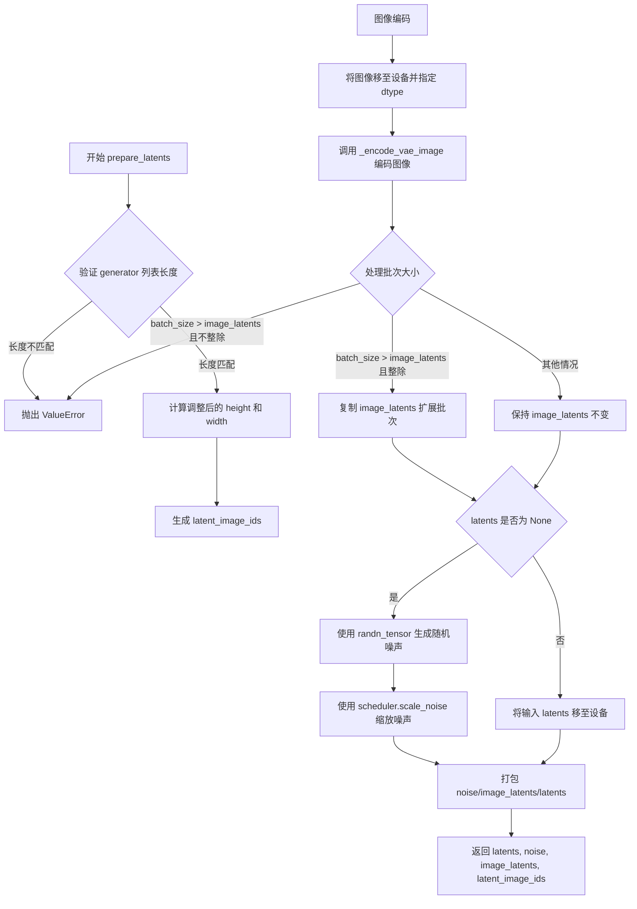

#### 带注释源码

```python
def prepare_latents(
    self,
    image,
    timestep,
    batch_size,
    num_channels_latents,
    height,
    width,
    dtype,
    device,
    generator,
    latents=None,
):
    # 检查传入的生成器列表长度是否与批处理大小匹配
    if isinstance(generator, list) and len(generator) != batch_size:
        raise ValueError(
            f"You have passed a list of generators of length {len(generator)}, but requested an effective batch"
            f" size of {batch_size}. Make sure the batch size matches the length of the generators."
        )

    # 计算调整后的潜变量高度和宽度
    # VAE应用8倍压缩，但还需要考虑打包操作（packing）要求潜变量高度和宽度能被2整除
    height = 2 * (int(height) // (self.vae_scale_factor * 2))
    width = 2 * (int(width) // (self.vae_scale_factor * 2))
    
    # 构造潜变量的形状：(batch_size, channels, height, width)
    shape = (batch_size, num_channels_latents, height, width)
    
    # 生成潜变量图像ID，用于标识每个潜变量在原始图像中的位置
    # 注意：这里传入的是 height//2 和 width//2，因为后续会进行2x2的打包
    latent_image_ids = self._prepare_latent_image_ids(batch_size, height // 2, width // 2, device, dtype)

    # 将输入图像移至指定设备并转换为指定数据类型
    image = image.to(device=device, dtype=dtype)
    
    # 使用VAE编码器将图像编码为潜空间表示
    image_latents = self._encode_vae_image(image=image, generator=generator)

    # 处理批次大小不匹配的情况
    if batch_size > image_latents.shape[0] and batch_size % image_latents.shape[0] == 0:
        # 如果批处理大小大于图像潜变量数量且可以整除，则复制扩展
        additional_image_per_prompt = batch_size // image_latents.shape[0]
        image_latents = torch.cat([image_latents] * additional_image_per_prompt, dim=0)
    elif batch_size > image_latents.shape[0] and batch_size % image_latents.shape[0] != 0:
        # 批次大小不匹配且无法整除，抛出错误
        raise ValueError(
            f"Cannot duplicate `image` of batch size {image_latents.shape[0]} to {batch_size} text prompts."
        )
    else:
        # 批次大小小于等于图像潜变量数量，直接使用
        image_latents = torch.cat([image_latents], dim=0)

    # 根据是否有预提供的latents来生成或处理噪声
    if latents is None:
        # 未提供latents时，使用随机噪声生成器创建噪声张量
        noise = randn_tensor(shape, generator=generator, device=device, dtype=dtype)
        # 使用调度器的scale_noise方法基于图像潜变量和时间步进行噪声缩放
        latents = self.scheduler.scale_noise(image_latents, timestep, noise)
    else:
        # 已提供latents，直接将其移至设备
        noise = latents.to(device)
        latents = noise

    # 对所有潜变量相关张量进行打包处理
    # 打包操作将2x2的潜变量块合并为一个token，以适配Transformer的输入格式
    noise = self._pack_latents(noise, batch_size, num_channels_latents, height, width)
    image_latents = self._pack_latents(image_latents, batch_size, num_channels_latents, height, width)
    latents = self._pack_latents(latents, batch_size, num_channels_latents, height, width)

    # 返回：打包后的潜变量、噪声、图像潜变量、以及潜变量图像ID
    return latents, noise, image_latents, latent_image_ids
```


### `FluxControlNetFillInpaintPipeline.prepare_mask_latents`

该方法用于准备填充修复（fill-inpaint）任务的蒙版和蒙版图像潜在变量，包括调整大小、编码、缩放、复制和打包操作，以便与扩散模型的潜在空间进行匹配。

参数：

- `self`：`FluxControlNetFillInpaintPipeline` 实例本身
- `mask`：`torch.Tensor`，蒙版张量，用于指示需要修复的区域
- `masked_image`：`torch.Tensor`，被蒙版覆盖的图像张量
- `batch_size`：`int`，批次大小
- `num_channels_latents`：`int`，潜在变量的通道数
- `num_images_per_prompt`：`int`，每个提示生成的图像数量
- `height`：`int`，目标高度（像素）
- `width`：`int`，目标宽度（像素）
- `dtype`：`torch.dtype`，目标数据类型
- `device`：`torch.device`，目标设备
- `generator`：`torch.Generator` 或 `None`，随机数生成器

返回值：`Tuple[torch.Tensor, torch.Tensor]`，返回打包后的蒙版和蒙版图像潜在变量

#### 流程图

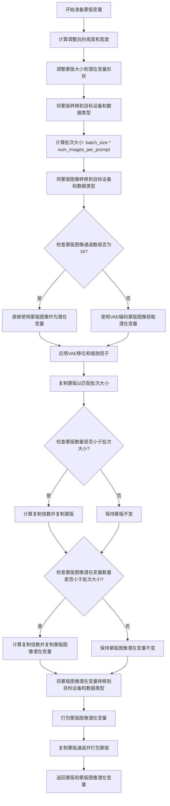

#### 带注释源码

```python
def prepare_mask_latents(
    self,
    mask,
    masked_image,
    batch_size,
    num_channels_latents,
    num_images_per_prompt,
    height,
    width,
    dtype,
    device,
    generator,
):
    # VAE对图像应用8x压缩，但我们还需要考虑打包操作
    # 这要求潜在变量的高度和宽度能被2整除
    # 计算调整后的潜在变量尺寸
    height = 2 * (int(height) // (self.vae_scale_factor * 2))
    width = 2 * (int(width) // (self.vae_scale_factor * 2))
    
    # 调整蒙版大小以匹配潜在变量的形状
    # 我们在转换数据类型之前进行此操作，以避免在使用cpu_offload
    # 和半精度时出现问题
    mask = torch.nn.functional.interpolate(mask, size=(height, width))
    mask = mask.to(device=device, dtype=dtype)

    # 计算每个提示的图像数量后的总批次大小
    batch_size = batch_size * num_images_per_prompt

    # 将蒙版图像转移到目标设备和数据类型
    masked_image = masked_image.to(device=device, dtype=dtype)

    # 检查蒙版图像是否已经是潜在变量格式
    # (即通道数等于潜在变量通道数，通常为16)
    if masked_image.shape[1] == 16:
        # 如果已经是潜在变量格式，直接使用
        masked_image_latents = masked_image
    else:
        # 否则，使用VAE编码蒙版图像获取潜在变量
        masked_image_latents = retrieve_latents(self.vae.encode(masked_image), generator=generator)

    # 应用VAE的移位和缩放因子进行归一化
    masked_image_latents = (masked_image_latents - self.vae.config.shift_factor) * self.vae.config.scaling_factor

    # 为每个提示复制蒙版和蒙版图像潜在变量
    # 使用MPS友好的方法
    if mask.shape[0] < batch_size:
        # 检查蒙版数量是否与批次大小匹配
        if not batch_size % mask.shape[0] == 0:
            raise ValueError(
                "The passed mask and the required batch size don't match. Masks are supposed to be duplicated to"
                f" a total batch size of {batch_size}, but {mask.shape[0]} masks were passed. Make sure the number"
                " of masks that you pass is divisible by the total requested batch size."
            )
        # 按批次大小重复蒙版
        mask = mask.repeat(batch_size // mask.shape[0], 1, 1, 1)
    
    # 同样处理蒙版图像潜在变量
    if masked_image_latents.shape[0] < batch_size:
        if not batch_size % masked_image_latents.shape[0] == 0:
            raise ValueError(
                "The passed images and the required batch size don't match. Images are supposed to be duplicated"
                f" to a total batch size of {batch_size}, but {masked_image_latents.shape[0]} images were passed."
                " Make sure the number of images that you pass is divisible by the total requested batch size."
            )
        masked_image_latents = masked_image_latents.repeat(batch_size // masked_image_latents.shape[0], 1, 1, 1)

    # 对齐设备以防止连接潜在模型输入时出现设备错误
    masked_image_latents = masked_image_latents.to(device=device, dtype=dtype)
    
    # 打包蒙版图像潜在变量
    # 将 (batch_size, num_channels_latents, height, width) 
    # 转换为 (batch_size, height//2 * width//2, num_channels_latents*4)
    masked_image_latents = self._pack_latents(
        masked_image_latents,
        batch_size,
        num_channels_latents,
        height,
        width,
    )

    # 打包蒙版
    # 先将蒙版重复到与潜在变量相同的通道数
    mask = self._pack_latents(
        mask.repeat(1, num_channels_latents, 1, 1),
        batch_size,
        num_channels_latents,
        height,
        width,
    )
    
    return mask, masked_image_latents
```


### `FluxControlNetFillInpaintPipeline.prepare_image`

该方法负责预处理输入的ControlNet图像，将其调整为指定的宽度和高度，处理批次维度以匹配生成请求，并在需要时为分类器自由引导（Classifier-Free Guidance）准备条件和非条件图像对。

参数：

- `image`：`PipelineImageInput`（torch.Tensor | PIL.Image.Image | List[PIL.Image.Image] | np.ndarray），待处理的ControlNet输入图像
- `width`：`int`，目标输出宽度（像素）
- `height`：`int`，目标输出高度（像素）
- `batch_size`：`int`，文本提示的批次大小，用于决定图像重复次数
- `num_images_per_prompt`：`int`，每个提示生成的图像数量
- `device`：`torch.device`，图像处理的目标设备
- `dtype`：`torch.dtype`，图像转换后的目标数据类型
- `do_classifier_free_guidance`：`bool`，是否启用分类器自由引导（默认为False）
- `guess_mode`：`bool`，猜测模式标志，与分类器自由引导配合使用（默认为False）

返回值：`torch.Tensor`，处理后的图像张量，形状为 (batch_size * num_images_per_prompt * 2, C, H, W)（如果启用CFG）或 (batch_size * num_images_per_prompt, C, H, W)

#### 流程图

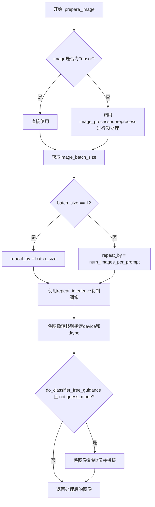

#### 带注释源码

```python
def prepare_image(
    self,
    image,
    width,
    height,
    batch_size,
    num_images_per_prompt,
    device,
    dtype,
    do_classifier_free_guidance=False,
    guess_mode=False,
):
    """
    预处理ControlNet输入图像
    
    该方法执行以下操作:
    1. 如果输入是PIL图像或numpy数组,使用VAE图像处理器进行预处理(缩放到指定尺寸)
    2. 根据batch_size和num_images_per_prompt确定图像复制策略
    3. 将图像转移到目标设备和数据类型
    4. 如果启用分类器自由引导且非猜测模式,复制图像用于条件和非条件推理
    
    参数:
        image: 输入图像,可以是Tensor、PIL图像或图像列表
        width: 目标宽度
        height: 目标高度
        batch_size: 提示批次大小
        num_images_per_prompt: 每个提示生成的图像数
        device: 目标设备
        dtype: 目标数据类型
        do_classifier_free_guidance: 是否启用CFG
        guess_mode: 猜测模式
    
    返回:
        处理后的图像张量
    """
    # 1. 预处理: 如果是PIL图像则转换为Tensor,否则直接使用
    if isinstance(image, torch.Tensor):
        pass  # 已经是Tensor,直接使用
    else:
        # 使用VaeImageProcessor将PIL图像转换为张量并缩放到目标尺寸
        image = self.image_processor.preprocess(image, height=height, width=width)

    # 2. 确定图像复制策略
    image_batch_size = image.shape[0]

    if image_batch_size == 1:
        # 单张图像: 复制batch_size次以匹配提示数量
        repeat_by = batch_size
    else:
        # 图像批次与提示批次相同: 按每提示图像数复制
        # image batch size is the same as prompt batch size
        repeat_by = num_images_per_prompt

    # 3. 按指定倍数复制图像批次
    # repeat_interleave保持原始维度结构,是MPS友好的方法
    image = image.repeat_interleave(repeat_by, dim=0)

    # 4. 转移设备和数据类型
    image = image.to(device=device, dtype=dtype)

    # 5. 分类器自由引导处理
    # 当启用CFG时,需要同时提供条件和非条件输入以实现无分类器指导
    if do_classifier_free_guidance and not guess_mode:
        # 将图像复制2份: [条件图像, 非条件图像]
        image = torch.cat([image] * 2)

    return image
```


### `FluxControlNetFillInpaintPipeline.prepare_mask_latents_fill`

该方法用于在 Flux ControlNet 图像修复 pipeline 中准备掩码和被掩码覆盖图像的潜在表示（latents），包括计算压缩后的尺寸、编码 masked_image、处理批次大小扩展以及打包 latents。

参数：

- `self`：隐式参数，Pipeline 实例本身
- `mask`：`torch.Tensor`，输入的掩码张量，用于指示需要修复的区域
- `masked_image`：`torch.Tensor`，被掩码覆盖的图像，即原始图像中被掩码遮挡的部分
- `batch_size`：`int`，批次大小
- `num_channels_latents`：`int`，潜在表示的通道数
- `num_images_per_prompt`：`int`，每个提示词生成的图像数量
- `height`：`int`，目标图像高度
- `width`：`int`，目标图像宽度
- `dtype`：`torch.dtype`，输出张量的数据类型
- `device`：`torch.device`，输出张量所在的设备
- `generator`：`torch.Generator | None`，用于生成随机数的可选生成器

返回值：`Tuple[torch.Tensor, torch.Tensor]`，返回处理后的掩码和被掩码覆盖图像的潜在表示

#### 流程图

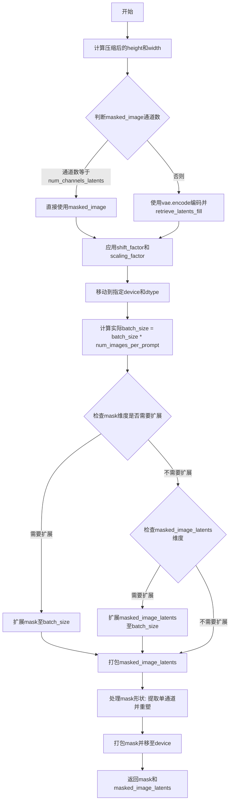

#### 带注释源码

```python
def prepare_mask_latents_fill(
    self,
    mask: torch.Tensor,
    masked_image: torch.Tensor,
    batch_size: int,
    num_channels_latents: int,
    num_images_per_prompt: int,
    height: int,
    width: int,
    dtype: torch.dtype,
    device: torch.device,
    generator: torch.Generator | None = None,
) -> Tuple[torch.Tensor, torch.Tensor]:
    # 1. 计算latents的高度和宽度
    # VAE对图像应用8x压缩，但还需考虑packing（打包）需要latent的高宽能被2整除
    height = 2 * (int(height) // (self.vae_scale_factor * 2))
    width = 2 * (int(width) // (self.vae_scale_factor * 2))

    # 2. 编码被掩码覆盖的图像
    if masked_image.shape[1] == num_channels_latents:
        # 如果已经是latent格式，直接使用
        masked_image_latents = masked_image
    else:
        # 否则通过VAE编码并提取latents
        masked_image_latents = retrieve_latents_fill(self.vae.encode(masked_image), generator=generator)

    # 应用VAE的shift和scale因子进行归一化
    masked_image_latents = (masked_image_latents - self.vae.config.shift_factor) * self.vae.config.scaling_factor
    masked_image_latents = masked_image_latents.to(device=device, dtype=dtype)

    # 3. 为每个prompt生成多个图像而复制mask和masked_image_latents
    batch_size = batch_size * num_images_per_prompt
    if mask.shape[0] < batch_size:
        if not batch_size % mask.shape[0] == 0:
            raise ValueError(
                "The passed mask and the required batch size don't match. Masks are supposed to be duplicated to"
                f" a total batch size of {batch_size}, but {mask.shape[0]} masks were passed. Make sure the number"
                " of masks that you pass is divisible by the total requested batch size."
            )
        mask = mask.repeat(batch_size // mask.shape[0], 1, 1, 1)
    if masked_image_latents.shape[0] < batch_size:
        if not batch_size % masked_image_latents.shape[0] == 0:
            raise ValueError(
                "The passed images and the required batch size don't match. Images are supposed to be duplicated"
                f" to a total batch size of {batch_size}, but {masked_image_latents.shape[0]} images were passed."
                " Make sure the number of images that you pass is divisible by the total requested batch size."
            )
        masked_image_latents = masked_image_latents.repeat(batch_size // masked_image_latents.shape[0], 1, 1, 1)

    # 4. 打包masked_image_latents
    # 从 (batch_size, num_channels_latents, height, width) 
    # 到 (batch_size, height//2 * width//2, num_channels_latents*4)
    masked_image_latents = self._pack_latents(
        masked_image_latents,
        batch_size,
        num_channels_latents,
        height,
        width,
    )

    # 5. 调整mask大小以匹配latents形状，然后连接mask到latents
    mask = mask[:, 0, :, :]  # 提取单通道: batch_size, 8*height, 8*width (mask未进行8x压缩)
    # 重塑为: batch_size, height, 8, width, 8
    mask = mask.view(
        batch_size, height, self.vae_scale_factor, width, self.vae_scale_factor
    )
    # 置换维度: batch_size, 8, 8, height, width
    mask = mask.permute(0, 2, 4, 1, 3)
    # 重新整形: batch_size, 8*8, height, width
    mask = mask.reshape(
        batch_size, self.vae_scale_factor * self.vae_scale_factor, height, width
    )

    # 6. 打包mask
    # 从 (batch_size, 64, height, width) 到 (batch_size, height//2 * width//2, 64*2*2)
    mask = self._pack_latents(
        mask,
        batch_size,
        self.vae_scale_factor * self.vae_scale_factor,
        height,
        width,
    )
    mask = mask.to(device=device, dtype=dtype)

    return mask, masked_image_latents
```


### `FluxControlNetFillInpaintPipeline.__call__`

该方法是 FluxControlNetFillInpaintPipeline 类的核心调用方法，用于执行基于 ControlNet 的图像填充修复（inpainting）任务。它接收文本提示、控制图像和掩码图像，通过去噪过程生成修复后的图像，支持 Flux 模型的多种控制模式和条件引导。

参数：

- `prompt`：`Union[str, List[str]] = None`，用于指导图像生成的文本提示
- `prompt_2`：`Optional[Union[str, List[str]]] = None`，发送给 tokenizer_2 和 text_encoder_2 的提示词
- `image`：`PipelineImageInput = None`，要修复的输入图像
- `mask_image`：`PipelineImageInput = None`，修复掩码图像，白色像素将被重绘，黑色像素将保留
- `masked_image_latents`：`PipelineImageInput = None`，预生成的掩码图像潜在变量
- `control_image`：`PipelineImageInput = None`，ControlNet 输入条件图像，用于控制生成
- `height`：`Optional[int] = None`，生成图像的高度（像素），默认为 self.default_sample_size * self.vae_scale_factor
- `width`：`Optional[int] = None`，生成图像的宽度（像素），默认为 self.default_sample_size * self.vae_scale_factor
- `strength`：`float = 0.6`，概念上表示修复掩码区域的程度，必须在 0 和 1 之间
- `padding_mask_crop`：`Optional[int] = None`，裁剪掩码时使用的填充大小
- `sigmas`：`Optional[List[float]] = None`，用于去噪过程的自定义 sigmas
- `num_inference_steps`：`int = 28`，去噪步骤数
- `guidance_scale`：`float = 7.0`，分类器自由扩散引导（CFG）比例
- `control_guidance_start`：`Union[float, List[float]] = 0.0`，ControlNet 开始应用的总步骤百分比
- `control_guidance_end`：`Union[float, List[float]] = 1.0`，ControlNet 停止应用的总步骤百分比
- `control_mode`：`Optional[Union[int, List[int]]] = None`，ControlNet 的模式
- `controlnet_conditioning_scale`：`Union[float, List[float]] = 1.0`，ControlNet 输出乘以该系数后添加到原始 transformer 的残差中
- `num_images_per_prompt`：`Optional[int] = 1`，每个提示生成的图像数量
- `generator`：`Optional[Union[torch.Generator, List[torch.Generator]]] = None`，随机数生成器，用于生成确定性结果
- `latents`：`Optional[torch.FloatTensor] = None`，预生成的高斯分布噪声潜在变量
- `prompt_embeds`：`Optional[torch.FloatTensor] = None`，预生成的文本嵌入
- `pooled_prompt_embeds`：`Optional[torch.FloatTensor] = None`，预生成的池化文本嵌入
- `output_type`：`str | None = "pil"`，生成图像的输出格式，可选 "pil" 或 "np.array"
- `return_dict`：`bool = True`，是否返回 FluxPipelineOutput 而不是元组
- `joint_attention_kwargs`：`Optional[Dict[str, Any]] = None`，传递给联合注意力机制的额外关键字参数
- `callback_on_step_end`：`Optional[Callable[[int, int, Dict], None]] = None`，在每个去噪步骤结束时调用的函数
- `callback_on_step_end_tensor_inputs`：`List[str] = ["latents"]`，callback_on_step_end 函数的张量输入列表
- `max_sequence_length`：`int = 512`，生成序列的最大长度

返回值：`FluxPipelineOutput | tuple`，如果 return_dict 为 True，返回 FluxPipelineOutput（包含生成的图像列表），否则返回元组

#### 流程图

```mermaid
flowchart TD
    A[开始 __call__] --> B[设置高度和宽度]
    B --> C[处理 control_guidance_start 和 control_guidance_end 列表]
    C --> D[检查输入参数 check_inputs]
    D --> E[编码输入提示 encode_prompt]
    E --> F[预处理掩码和图像]
    F --> G[准备控制图像 prepare_image]
    G --> H[准备时间步 retrieve_timesteps 和 get_timesteps]
    H --> I[准备潜在变量 prepare_latents]
    I --> J[准备掩码潜在变量 prepare_mask_latents]
    J --> K[准备填充掩码潜在变量 prepare_mask_latents_fill]
    K --> L[计算 controlnet_keep 列表]
    L --> M[去噪循环 for i, t in enumerate(timesteps)]
    M --> N[扩展时间步并预测噪声残差]
    N --> O[调用 ControlNet 获取控制块样本]
    O --> P[准备联合潜在输入并调用 Transformer]
    P --> Q[计算上一步噪声样本]
    Q --> R[应用掩码并添加掩码图像潜在变量]
    R --> S[调用回调函数 callback_on_step_end]
    S --> T{是否完成所有步骤?}
    T -->|否| M
    T -->|是| U[后处理: 解码潜在变量]
    U --> V[Offload 模型]
    V --> W[返回结果]
```

#### 带注释源码

```python
@torch.no_grad()
@replace_example_docstring(EXAMPLE_DOC_STRING)
def __call__(
    self,
    prompt: Union[str, List[str]] = None,
    prompt_2: Optional[Union[str, List[str]]] = None,
    image: PipelineImageInput = None,
    mask_image: PipelineImageInput = None,
    masked_image_latents: PipelineImageInput = None,
    control_image: PipelineImageInput = None,
    height: Optional[int] = None,
    width: Optional[int] = None,
    strength: float = 0.6,
    padding_mask_crop: Optional[int] = None,
    sigmas: Optional[List[float]] = None,
    num_inference_steps: int = 28,
    guidance_scale: float = 7.0,
    control_guidance_start: Union[float, List[float]] = 0.0,
    control_guidance_end: Union[float, List[float]] = 1.0,
    control_mode: Optional[Union[int, List[int]]] = None,
    controlnet_conditioning_scale: Union[float, List[float]] = 1.0,
    num_images_per_prompt: Optional[int] = 1,
    generator: Optional[Union[torch.Generator, List[torch.Generator]]] = None,
    latents: Optional[torch.FloatTensor] = None,
    prompt_embeds: Optional[torch.FloatTensor] = None,
    pooled_prompt_embeds: Optional[torch.FloatTensor] = None,
    output_type: str | None = "pil",
    return_dict: bool = True,
    joint_attention_kwargs: Optional[Dict[str, Any]] = None,
    callback_on_step_end: Optional[Callable[[int, int, Dict], None]] = None,
    callback_on_step_end_tensor_inputs: List[str] = ["latents"],
    max_sequence_length: int = 512,
):
    """
    管道调用方法，用于生成修复后的图像
    """
    # 设置默认高度和宽度（基于 VAE 缩放因子）
    height = height or self.default_sample_size * self.vae_scale_factor
    width = width or self.default_sample_size * self.vae_scale_factor

    global_height = height
    global_width = width

    # 处理 ControlNet 引导参数（确保列表长度一致）
    if not isinstance(control_guidance_start, list) and isinstance(control_guidance_end, list):
        control_guidance_start = len(control_guidance_end) * [control_guidance_start]
    elif not isinstance(control_guidance_end, list) and isinstance(control_guidance_start, list):
        control_guidance_end = len(control_guidance_start) * [control_guidance_end]
    elif not isinstance(control_guidance_start, list) and not isinstance(control_guidance_end, list):
        mult = len(self.controlnet.nets) if isinstance(self.controlnet, FluxMultiControlNetModel) else 1
        control_guidance_start, control_guidance_end = (
            mult * [control_guidance_start],
            mult * [control_guidance_end],
        )

    # 1. 检查输入参数
    self.check_inputs(
        prompt,
        prompt_2,
        image,
        mask_image,
        strength,
        height,
        width,
        output_type=output_type,
        prompt_embeds=prompt_embeds,
        pooled_prompt_embeds=pooled_prompt_embeds,
        callback_on_step_end_tensor_inputs=callback_on_step_end_tensor_inputs,
        padding_mask_crop=padding_mask_crop,
        max_sequence_length=max_sequence_length,
    )

    self._guidance_scale = guidance_scale
    self._joint_attention_kwargs = joint_attention_kwargs
    self._interrupt = False

    # 2. 定义调用参数（确定批处理大小）
    if prompt is not None and isinstance(prompt, str):
        batch_size = 1
    elif prompt is not None and isinstance(prompt, list):
        batch_size = len(prompt)
    else:
        batch_size = prompt_embeds.shape[0]

    device = self._execution_device
    dtype = self.transformer.dtype

    # 3. 编码输入提示
    lora_scale = (
        self.joint_attention_kwargs.get("scale", None) if self.joint_attention_kwargs is not None else None
    )
    prompt_embeds, pooled_prompt_embeds, text_ids = self.encode_prompt(
        prompt=prompt,
        prompt_2=prompt_2,
        prompt_embeds=prompt_embeds,
        pooled_prompt_embeds=pooled_prompt_embeds,
        device=device,
        num_images_per_prompt=num_images_per_prompt,
        max_sequence_length=max_sequence_length,
        lora_scale=lora_scale,
    )

    # 4. 预处理掩码和图像
    if padding_mask_crop is not None:
        crops_coords = self.mask_processor.get_crop_region(
            mask_image, global_width, global_height, pad=padding_mask_crop
        )
        resize_mode = "fill"
    else:
        crops_coords = None
        resize_mode = "default"

    original_image = image
    init_image = self.image_processor.preprocess(
        image, height=global_height, width=global_width, crops_coords=crops_coords, resize_mode=resize_mode
    )
    init_image = init_image.to(dtype=torch.float32)

    # 5. 准备控制图像
    num_channels_latents = self.vae.config.latent_channels

    # 处理单个或多个 ControlNet
    if isinstance(self.controlnet, FluxControlNetModel):
        control_image = self.prepare_image(
            image=control_image,
            width=width,
            height=height,
            batch_size=batch_size * num_images_per_prompt,
            num_images_per_prompt=num_images_per_prompt,
            device=device,
            dtype=self.vae.dtype,
        )
        height, width = control_image.shape[-2:]

        # 检查 ControlNet 类型
        controlnet_blocks_repeat = False if self.controlnet.input_hint_block is None else True
        if self.controlnet.input_hint_block is None:
            # VAE 编码控制图像
            control_image = retrieve_latents(self.vae.encode(control_image), generator=generator)
            control_image = (control_image - self.vae.config.shift_factor) * self.vae.config.scaling_factor

            # 打包控制图像
            height_control_image, width_control_image = control_image.shape[2:]
            control_image = self._pack_latents(
                control_image,
                batch_size * num_images_per_prompt,
                num_channels_latents,
                height_control_image,
                width_control_image,
            )

        # 设置控制模式
        if control_mode is not None:
            control_mode = torch.tensor(control_mode).to(device, dtype=torch.long)
            control_mode = control_mode.reshape([-1, 1])

    elif isinstance(self.controlnet, FluxMultiControlNetModel):
        control_images = []
        controlnet_blocks_repeat = False if self.controlnet.nets[0].input_hint_block is None else True
        
        for i, control_image_ in enumerate(control_image):
            control_image_ = self.prepare_image(
                image=control_image_,
                width=width,
                height=height,
                batch_size=batch_size * num_images_per_prompt,
                num_images_per_prompt=num_images_per_prompt,
                device=device,
                dtype=self.vae.dtype,
            )
            height, width = control_image_.shape[-2:]

            if self.controlnet.nets[0].input_hint_block is None:
                control_image_ = retrieve_latents(self.vae.encode(control_image_), generator=generator)
                control_image_ = (control_image_ - self.vae.config.shift_factor) * self.vae.config.scaling_factor

                height_control_image, width_control_image = control_image_.shape[2:]
                control_image_ = self._pack_latents(
                    control_image_,
                    batch_size * num_images_per_prompt,
                    num_channels_latents,
                    height_control_image,
                    width_control_image,
                )

            control_images.append(control_image_)

        control_image = control_images

        # 处理多个控制模式的列表
        control_mode_ = []
        if isinstance(control_mode, list):
            for cmode in control_mode:
                if cmode is None:
                    control_mode_.append(-1)
                else:
                    control_mode_.append(cmode)
        control_mode = torch.tensor(control_mode_).to(device, dtype=torch.long)
        control_mode = control_mode.reshape([-1, 1])

    # 6. 准备时间步
    # 计算默认 sigmas 调度
    sigmas = np.linspace(1.0, 1 / num_inference_steps, num_inference_steps) if sigmas is None else sigmas
    image_seq_len = (int(global_height) // self.vae_scale_factor // 2) * (
        int(global_width) // self.vae_scale_factor // 2
    )
    # 计算时间步偏移
    mu = calculate_shift(
        image_seq_len,
        self.scheduler.config.get("base_image_seq_len", 256),
        self.scheduler.config.get("max_image_seq_len", 4096),
        self.scheduler.config.get("base_shift", 0.5),
        self.scheduler.config.get("max_shift", 1.15),
    )
    # 获取时间步
    timesteps, num_inference_steps = retrieve_timesteps(
        self.scheduler,
        num_inference_steps,
        device,
        sigmas=sigmas,
        mu=mu,
    )
    timesteps, num_inference_steps = self.get_timesteps(num_inference_steps, strength, device)

    if num_inference_steps < 1:
        raise ValueError(
            f"After adjusting the num_inference_steps by strength parameter: {strength}, the number of pipeline"
            f"steps is {num_inference_steps} which is < 1 and not appropriate for this pipeline."
        )
    latent_timestep = timesteps[:1].repeat(batch_size * num_images_per_prompt)

    # 7. 准备潜在变量
    latents, noise, image_latents, latent_image_ids = self.prepare_latents(
        init_image,
        latent_timestep,
        batch_size * num_images_per_prompt,
        num_channels_latents,
        global_height,
        global_width,
        prompt_embeds.dtype,
        device,
        generator,
        latents,
    )

    # 8. 准备掩码潜在变量
    mask_condition = self.mask_processor.preprocess(
        mask_image, height=global_height, width=global_width, resize_mode=resize_mode, crops_coords=crops_coords
    )
    if masked_image_latents is None:
        masked_image = init_image * (mask_condition < 0.5)
    else:
        masked_image = masked_image_latents

    mask, masked_image_latents = self.prepare_mask_latents(
        mask_condition,
        masked_image,
        batch_size,
        num_channels_latents,
        num_images_per_prompt,
        global_height,
        global_width,
        prompt_embeds.dtype,
        device,
        generator,
    )

    # 准备填充（fill）掩码潜在变量
    mask_image_fill = self.mask_processor.preprocess(mask_image, height=height, width=width)
    masked_image_fill = init_image * (1 - mask_image_fill)
    masked_image_fill = masked_image_fill.to(dtype=self.vae.dtype, device=device)
    mask_fill, masked_latents_fill = self.prepare_mask_latents_fill(
        mask_image_fill,
        masked_image_fill,
        batch_size,
        num_channels_latents,
        num_images_per_prompt,
        height,
        width,
        prompt_embeds.dtype,
        device,
        generator,
    )

    # 计算 ControlNet 引导权重
    controlnet_keep = []
    for i in range(len(timesteps)):
        keeps = [
            1.0 - float(i / len(timesteps) < s or (i + 1) / len(timesteps) > e)
            for s, e in zip(control_guidance_start, control_guidance_end)
        ]
        controlnet_keep.append(keeps[0] if isinstance(self.controlnet, FluxControlNetModel) else keeps)

    # 9. 去噪循环
    num_warmup_steps = max(len(timesteps) - num_inference_steps * self.scheduler.order, 0)
    self._num_timesteps = len(timesteps)

    with self.progress_bar(total=num_inference_steps) as progress_bar:
        for i, t in enumerate(timesteps):
            if self.interrupt:
                continue

            # 扩展时间步
            timestep = t.expand(latents.shape[0]).to(latents.dtype)

            # 确定是否使用引导
            if isinstance(self.controlnet, FluxMultiControlNetModel):
                use_guidance = self.controlnet.nets[0].config.guidance_embeds
            else:
                use_guidance = self.controlnet.config.guidance_embeds
            
            if use_guidance:
                guidance = torch.full([1], guidance_scale, device=device, dtype=torch.float32)
                guidance = guidance.expand(latents.shape[0])
            else:
                guidance = None

            # 计算 ControlNet 条件缩放
            if isinstance(controlnet_keep[i], list):
                cond_scale = [c * s for c, s in zip(controlnet_conditioning_scale, controlnet_keep[i])]
            else:
                controlnet_cond_scale = controlnet_conditioning_scale
                if isinstance(controlnet_cond_scale, list):
                    controlnet_cond_scale = controlnet_cond_scale[0]
                cond_scale = controlnet_cond_scale * controlnet_keep[i]

            # 调用 ControlNet
            controlnet_block_samples, controlnet_single_block_samples = self.controlnet(
                hidden_states=latents,
                controlnet_cond=control_image,
                controlnet_mode=control_mode,
                conditioning_scale=cond_scale,
                timestep=timestep / 1000,
                guidance=guidance,
                pooled_projections=pooled_prompt_embeds,
                encoder_hidden_states=prompt_embeds,
                txt_ids=text_ids,
                img_ids=latent_image_ids,
                joint_attention_kwargs=self.joint_attention_kwargs,
                return_dict=False,
            )

            # Transformer 的引导
            if self.transformer.config.guidance_embeds:
                guidance = torch.full([1], guidance_scale, device=device, dtype=torch.float32)
                guidance = guidance.expand(latents.shape[0])
            else:
                guidance = None

            # 准备联合潜在输入（包含填充掩码信息）
            masked_image_latents_fill = torch.cat((masked_latents_fill, mask_fill), dim=-1)
            latent_model_input = torch.cat([latents, masked_image_latents_fill], dim=2)

            # 调用 Transformer 进行去噪
            noise_pred = self.transformer(
                hidden_states=latent_model_input,
                timestep=timestep / 1000,
                guidance=guidance,
                pooled_projections=pooled_prompt_embeds,
                encoder_hidden_states=prompt_embeds,
                controlnet_block_samples=controlnet_block_samples,
                controlnet_single_block_samples=controlnet_single_block_samples,
                txt_ids=text_ids,
                img_ids=latent_image_ids,
                joint_attention_kwargs=self.joint_attention_kwargs,
                return_dict=False,
                controlnet_blocks_repeat=controlnet_blocks_repeat,
            )[0]

            # 计算上一步的噪声样本
            latents_dtype = latents.dtype
            latents = self.scheduler.step(noise_pred, t, latents, return_dict=False)[0]

            # 应用掩码并添加掩码图像潜在变量（inpainting 逻辑）
            init_latents_proper = image_latents
            init_mask = mask

            if i < len(timesteps) - 1:
                noise_timestep = timesteps[i + 1]
                init_latents_proper = self.scheduler.scale_noise(
                    init_latents_proper, torch.tensor([noise_timestep]), noise
                )

            # 混合原始图像潜在变量和去噪后的潜在变量
            latents = (1 - init_mask) * init_latents_proper + init_mask * latents

            # 处理数据类型兼容性
            if latents.dtype != latents_dtype:
                if torch.backends.mps.is_available():
                    latents = latents.to(latents_dtype)

            # 调用回调函数
            if callback_on_step_end is not None:
                callback_kwargs = {}
                for k in callback_on_step_end_tensor_inputs:
                    callback_kwargs[k] = locals()[k]
                callback_outputs = callback_on_step_end(self, i, t, callback_kwargs)

                latents = callback_outputs.pop("latents", latents)
                prompt_embeds = callback_outputs.pop("prompt_embeds", prompt_embeds)
                control_image = callback_outputs.pop("control_image", control_image)
                mask = callback_outputs.pop("mask", mask)
                masked_image_latents = callback_outputs.pop("masked_image_latents", masked_image_latents)

            # 更新进度条
            if i == len(timesteps) - 1 or ((i + 1) > num_warmup_steps and (i + 1) % self.scheduler.order == 0):
                progress_bar.update()

            # XLA 设备支持
            if XLA_AVAILABLE:
                xm.mark_step()

    # 后处理
    if output_type == "latent":
        image = latents
    else:
        # 解码潜在变量到图像
        latents = self._unpack_latents(latents, global_height, global_width, self.vae_scale_factor)
        latents = (latents / self.vae.config.scaling_factor) + self.vae.config.shift_factor
        image = self.vae.decode(latents, return_dict=False)[0]
        image = self.image_processor.postprocess(image, output_type=output_type)

    # 释放模型内存
    self.maybe_free_model_hooks()

    if not return_dict:
        return (image,)

    return FluxPipelineOutput(images=image)
```

## 关键组件


### 张量索引与打包解包 (Tensor Indexing & Packing/Unpacking)

代码中实现了完整的张量索引与打包解包机制，包括 `_pack_latents` 方法将 4D latent 张量转换为 2D patch 序列，`_unpack_latents` 方法逆向还原，以及 `_prepare_latent_image_ids` 生成位置编码信息。这些方法处理了 Flux 模型特有的 2x2 patch 打包和 8x VAE 压缩，确保 latents 的高度和宽度可被 patch size 整除。

### 惰性加载与延迟计算 (Lazy Loading & Deferred Computation)

`retrieve_latents` 函数和 `retrieve_latents_fill` 函数实现了惰性加载模式，根据 encoder_output 的属性（latent_dist 或 latents）按需采样或直接返回，避免不必要的计算。`prepare_latents` 方法支持传入预计算的 latents，当为 None 时才生成噪声，体现了延迟初始化思想。

### 多精度类型处理 (Multi-Precision Type Handling)

代码全面处理了 float32、float16、torch.float32、torch.long 等多种数据类型转换，特别是在 `encode_prompt`、`prepare_image`、`prepare_mask_latents_fill` 等方法中频繁进行 dtype 统一转换，确保不同模型组件（VAE、Transformer、ControlNet）间的数据类型兼容性。

### Mask 处理与图像修复 (Mask Processing for Inpainting)

`prepare_mask_latents` 和 `prepare_mask_latents_fill` 方法实现了完整的 mask 处理流水线，包括 mask resize、复制、packing 操作，以及 masked_image_latents 的编码和缩放。`VaeImageProcessor` 和 `MaskProcessor` 分别处理普通图像和 mask 的预处理，支持 crops_coords 裁剪和多种 resize_mode。

### ControlNet 多模型支持 (Multi-ControlNet Support)

代码支持单模型 `FluxControlNetModel` 和多模型 `FluxMultiControlNetModel` 两种模式，在 `__call__` 方法中通过 `isinstance` 判断并分别处理。实现了 controlnet_conditioning_scale 列表支持、control_mode 控制模式张量化、以及 control_guidance_start/end 的时间段控制。

### 文本编码与提示词嵌入 (Text Encoding & Prompt Embedding)

`_get_clip_prompt_embeds` 和 `_get_t5_prompt_embeds` 分别处理 CLIP 和 T5 两种文本编码器的 embedding 生成，`encode_prompt` 方法整合两者并支持 LoRA scale 动态调整。文本 ID（text_ids）根据 prompt_embeds 形状生成，用于控制生成过程中的文本注意力。

### 时间步调度与噪声调度 (Timestep Scheduling & Noise Scheduling)

`calculate_shift` 函数计算图像序列长度相关的 mu 值用于调整 scheduler，`retrieve_timesteps` 支持自定义 timesteps 或 sigmas 列表，`get_timesteps` 根据 strength 参数调整初始时间步。scheduler 使用 `FlowMatchEulerDiscreteScheduler`，并通过 `scale_noise` 方法进行噪声缩放。

### LoRA 权重动态缩放 (Dynamic LoRA Weight Scaling)

在 `encode_prompt` 中实现，检测到 lora_scale 参数时调用 `scale_lora_layers` 动态调整 LoRA 权重，完成编码后再调用 `unscale_lora_layers` 恢复原始权重。结合 `FluxLoraLoaderMixin` 支持，实现了 text_encoder 和 text_encoder_2 的 LoRA 加载与缩放。

### VAE 编码与潜在空间操作 (VAE Encoding & Latent Space Operations)

`_encode_vae_image` 方法对输入图像进行 VAE 编码，返回的 latents 经过 shift_factor 和 scaling_factor 处理转换到标准潜在空间。`prepare_latents` 整合了图像 latents、噪声和 masked_image_latents 的打包，为去噪循环准备完整的潜在变量输入。

### XLA 设备支持与跨平台优化 (XLA Device Support)

通过 `is_torch_xla_available()` 检测 XLA 环境，若可用则导入 `torch_xla.core.xla_model as xm` 并在去噪循环末尾调用 `xm.mark_step()` 实现 XLA 设备上的异步执行优化。

### 回调与中断机制 (Callback & Interrupt Mechanism)

支持 `callback_on_step_end` 回调函数和 `callback_on_step_end_tensor_inputs` 张量输入列表，允许在每个去噪步骤结束时执行自定义逻辑。`interrupt` 属性支持外部中断请求，实现优雅的生成中断控制。


## 问题及建议


### 已知问题

- **代码重复**：`retrieve_latents` 和 `retrieve_latents_fill` 两个函数实现完全相同，存在冗余。
- **方法职责过重**：`__call__` 方法超过 300 行，包含了过多的逻辑（图像预处理、编码、去噪、后期处理等），违反了单一职责原则。
- **硬编码值**：`self.default_sample_size = 128` 和 `self.tokenizer_max_length` 的默认值 77 被硬编码，缺乏配置灵活性。
- **重复的条件判断**：在 `__call__` 方法中多次使用 `isinstance(self.controlnet, FluxControlNetModel)` 和 `isinstance(self.controlnet, FluxMultiControlNetModel)` 进行类型检查，可以提取为类属性或辅助方法。
- **重复的图像处理逻辑**：`prepare_mask_latents` 和 `prepare_mask_latents_fill` 方法包含大量相似代码（mask 复制、masked_image_latents 复制、pack 操作），可以抽象公共方法。
- **魔法数字**：代码中多处使用数字如 `1000`（timestep 缩放因子）、`2`（patch 尺寸）、`8`（VAE 压缩倍数）等，缺乏有名称的常量定义，降低了可读性。
- **冗余的变量赋值**：在 `prepare_latents` 方法中，当 `latents` 不为 `None` 时，代码执行 `noise = latents.to(device)` 然后 `latents = noise`，这步操作是冗余的。
- **控制流可以优化**：在 denoising 循环中，`controlnet_blocks_repeat` 和 `use_guidance` 在每次迭代中都被重新计算，但它们是常量，可以提到循环外部。
- **类型注解不完整**：部分参数如 `masked_image_latents` 使用了较宽泛的 `PipelineImageInput` 类型，而非更具体的 `torch.FloatTensor`。

### 优化建议

- 合并 `retrieve_latents` 和 `retrieve_latents_fill` 为一个函数，消除重复代码。
- 将 `__call__` 方法拆分为多个私有方法，如 `_prepare_images`、`_encode_prompts`、`_denoise`、`_post_process` 等，提高代码可读性和可维护性。
- 将硬编码的配置值（如 default_sample_size）提取为类的默认属性或通过构造函数参数传入。
- 将 ControlNet 类型检查提取为类属性 `self._is_multi_controlnet`，在 `__init__` 中计算一次。
- 抽象 `prepare_mask_latents` 和 `prepare_mask_latents_fill` 的公共逻辑到 `_prepare_mask_latents_common` 方法。
- 定义常量类或模块级常量来替代魔法数字，如 `TIMESTEP_SCALE = 1000`、`PATCH_SIZE = 2` 等。
- 移除 `prepare_latents` 中冗余的 `latents = noise` 赋值操作。
- 将循环内不变的计算（`controlnet_blocks_repeat`、`use_guidance`）提前到循环外部。
- 完善类型注解，使用更具体的类型（如 `Optional[torch.FloatTensor]` 替代部分 `PipelineImageInput`）。

## 其它


### 设计目标与约束

本Pipeline基于Diffusers框架实现Flux ControlNet图像修复（Inpainting）功能，支持通过ControlNet条件控制进行图像修复。设计目标包括：支持Flux系列的ControlNet模型进行条件生成、支持FluxTransformer2DModel进行去噪处理、支持CLIP和T5双文本编码器提供文本引导、集成FlowMatchEulerDiscreteScheduler调度器实现离散时间步的去噪过程。约束条件包括：输入图像的高度和宽度必须能被`vae_scale_factor * 2`整除（默认为16）、strength参数必须在[0, 1]范围内、`max_sequence_length`不能超过512、batch_size必须与generator列表长度匹配。

### 错误处理与异常设计

Pipeline在多个关键位置实现了输入验证和错误处理。在`check_inputs`方法中进行了全面的参数校验：strength值超出[0,1]范围时抛出ValueError、height/width不满足对齐要求时记录warning、callback_on_step_end_tensor_inputs不在允许列表中时抛出ValueError、prompt和prompt_embeds同时提供时抛出ValueError、prompt类型不符合str或list时抛出ValueError、padding_mask_crop参数使用但image不是PIL图像时抛出ValueError、max_sequence_length超过512时抛出ValueError。在`retrieve_latents`和`retrieve_latents_fill`函数中，当encoder_output无法访问latents属性时抛出AttributeError。在`prepare_latents`方法中，generator列表长度与batch_size不匹配时抛出ValueError。在`prepare_mask_latents`和`prepare_mask_latents_fill`方法中，mask或masked_image_latents的batch_size无法整除目标batch_size时抛出ValueError。在去噪循环结束后，如果num_inference_steps小于1则抛出ValueError。

### 数据流与状态机

Pipeline的数据流主要分为以下阶段：第一阶段为Prompt编码，通过`_get_clip_prompt_embeds`和`_get_t5_prompt_embeds`分别提取CLIP和T5的文本embedding，生成`prompt_embeds`、`pooled_prompt_embeds`和`text_ids`。第二阶段为图像预处理，使用`image_processor.preprocess`处理输入图像和mask图像，使用`mask_processor.preprocess`处理mask_condition。第三阶段为控制图像准备，根据ControlNet类型（单或多）分别处理control_image，使用VAE编码后进行packing操作。第四阶段为时间步准备，使用`retrieve_timesteps`获取调度器的时间步，使用`get_timesteps`根据strength参数调整起始时间步。第五阶段为Latent准备，通过`prepare_latents`生成初始噪声和图像latents，通过`prepare_mask_latents`和`prepare_mask_latents_fill`准备mask相关的latents。第六阶段为去噪循环，在每个时间步依次执行：ControlNet前向传播获取控制特征、Transformer前向传播预测噪声、使用scheduler.step更新latents、应用mask进行图像修复。第七阶段为后处理，将latents解码为最终图像或直接输出latents。

### 外部依赖与接口契约

Pipeline依赖以下核心外部组件：transformers库提供CLIPTextModel和T5EncoderModel用于文本编码；diffusers库提供DiffusionPipeline基类、各类模型（FluxTransformer2DModel、AutoencoderKL、FluxControlNetModel等）、VaeImageProcessor图像处理器、FlowMatchEulerDiscreteScheduler调度器；numpy用于生成sigmas数组；PIL用于图像处理；torch用于张量操作。接口契约方面，`__call__`方法接收标准参数（prompt、image、mask_image、control_image等）并返回FluxPipelineOutput对象或tuple；encode_prompt方法接收文本提示和编码参数返回三元组（prompt_embeds、pooled_prompt_embeds、text_ids）；prepare_latents方法返回四元组（latents、noise、image_latents、latent_image_ids）；所有模型组件通过register_modules注册，支持CPU offload和PEFT后端。

### 并发与资源管理

Pipeline支持XLA设备加速（通过torch_xla库），在去噪循环末尾调用`xm.mark_step()`进行XLA设备同步。支持模型CPU offload，通过`model_cpu_offload_seq`定义卸载顺序（"text_encoder->text_encoder_2->transformer->vae"），在推理结束后调用`maybe_free_model_hooks()`释放模型钩子。支持LoRA权重管理，通过`scale_lora_layers`和`unscale_lora_layers`动态调整LoRA缩放因子。支持生成器（Generator）列表输入以实现多图并行生成时的随机性控制。支持classifier-free guidance，通过guidance_scale参数控制生成多样性。

### 版本兼容性与配置

Pipeline通过`model_cpu_offload_seq`指定模型卸载顺序，`_optional_components`定义可选组件列表，`_callback_tensor_inputs`定义回调函数支持的tensor输入类型。配置文件中的关键参数包括：base_image_seq_len（默认256）、max_image_seq_len（默认4096）、base_shift（默认0.5）、max_shift（默认1.15）用于计算图像序列长度偏移。VAE配置中的latent_channels、block_out_channels、shift_factor、scaling_factor等影响latent空间的处理。Transformer配置中的in_channels、guidance_embeds影响去噪过程。ControlNet配置中的guidance_embeds影响条件引导。

### 潜在技术债务与优化空间

代码中存在重复实现：`retrieve_latents`和`retrieve_latents_fill`函数实现几乎完全相同，可合并为一个函数并通过参数区分。`prepare_mask_latents`和`prepare_mask_latents_fill`存在大量重复代码，可提取公共逻辑。`prepare_image`方法同时支持单ControlNet和多ControlNet（FluxMultiControlNetModel），但实际处理逻辑有分支，可考虑拆分为独立方法。注释中有"Copied from"的标记，表明这些方法是从其他Pipeline复制过来的长期技术债务，缺乏统一的抽象层次。ControlNet的input_hint_block存在性检查（`controlnet_blocks_repeat`变量）逻辑复杂，可通过统一接口设计简化。缺少对极端batch_size情况的性能优化，当batch_size很大时内存占用较高。XLA支持通过全局变量`XLA_AVAILABLE`检测，逻辑可封装到配置类中。

### 关键算法与数学原理

Pipeline基于Flow Matching原理进行图像生成，使用FlowMatchEulerDiscreteScheduler实现离散时间步的去噪。图像修复采用Latent空间操作：VAE编码器将图像转换为latent表示（乘以scaling_factor减去shift_factor），在latent空间进行噪声添加和去除，最后通过VAE解码器还原为图像。ControlNet通过额外的输入提示块（input_hint_block）接收控制图像，并在多个分辨率层级输出控制特征。文本引导通过双编码器架构（CLIP + T5）实现，CLIP提供池化后的全局特征，T5提供更长的序列特征。Mask处理采用双路径：主路径使用二值化mask（do_binarize=True），填充路径使用平滑过渡的mask以减少边界伪影。


    