# `diffusers\examples\community\regional_prompting_stable_diffusion.py` 详细设计文档

这是一个基于Stable Diffusion的图像生成管道，名为RegionalPromptingStableDiffusionPipeline。它通过自定义的提示词解析和UNet注意力机制钩子，实现了图像的区域控制生成功能（支持COL/ROW网格模式和PROMPT注意力图模式），允许用户在同一张图像的不同区域指定不同的提示词。

## 整体流程

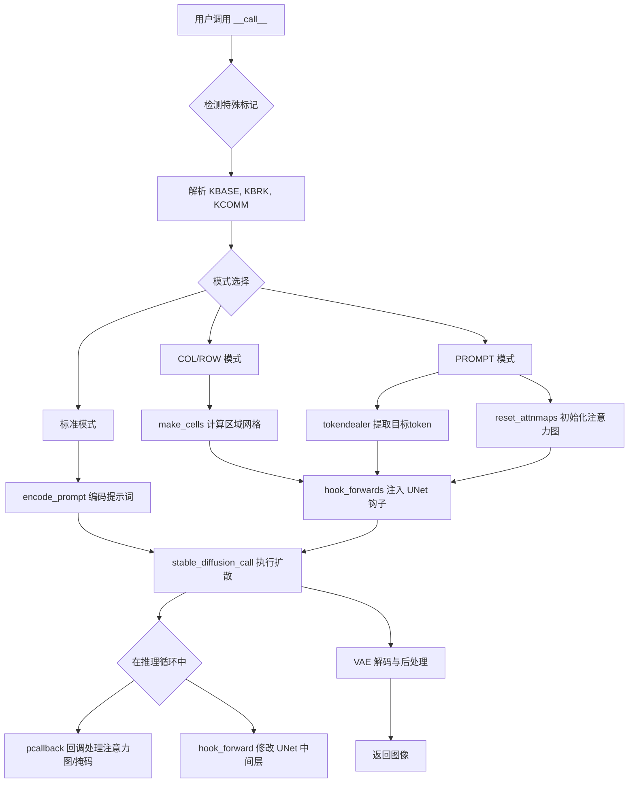

## 类结构

```
DiffusionPipeline (基类)
└── RegionalPromptingStableDiffusionPipeline (主类)
```

## 全局变量及字段


### `KBASE`
    
常量，用于在提示词中标记基础提示（base prompt）的起始

类型：`str`
    


### `KCOMM`
    
常量，用于在提示词中标记附加评论（additional comment）的分隔

类型：`str`
    


### `KBRK`
    
常量，用于在提示词中标记区域分隔（break），将提示词分成多个区域

类型：`str`
    


### `logger`
    
模块级日志记录器，用于输出调试和信息日志

类型：`logging.Logger`
    


### `XLA_AVAILABLE`
    
指示是否安装了 PyTorch XLA（用于 TPU 加速）的布尔标志

类型：`bool`
    


### `Compel`
    
可选的 Compel 库导入，用于增强的提示词嵌入处理，若未安装则为 None

类型：`Optional[type]`
    


### `RegionalPromptingStableDiffusionPipeline.vae`
    
变分自编码器模型，用于将图像编码到潜在空间和解码回像素空间

类型：`AutoencoderKL`
    


### `RegionalPromptingStableDiffusionPipeline.text_encoder`
    
冻结的 CLIP 文本编码器，将文本提示转换为嵌入向量

类型：`CLIPTextModel`
    


### `RegionalPromptingStableDiffusionPipeline.tokenizer`
    
CLIP 分词器，将文本分割成 token 序列

类型：`CLIPTokenizer`
    


### `RegionalPromptingStableDiffusionPipeline.unet`
    
条件 U-Net 模型，用于根据文本嵌入去噪潜在表示

类型：`UNet2DConditionModel`
    


### `RegionalPromptingStableDiffusionPipeline.scheduler`
    
扩散调度器，控制去噪过程的噪声调度

类型：`KarrasDiffusionSchedulers`
    


### `RegionalPromptingStableDiffusionPipeline.safety_checker`
    
安全检查器，用于检测和过滤可能有害的生成图像

类型：`StableDiffusionSafetyChecker`
    


### `RegionalPromptingStableDiffusionPipeline.feature_extractor`
    
CLIP 图像处理器，用于提取图像特征

类型：`CLIPImageProcessor`
    


### `RegionalPromptingStableDiffusionPipeline.image_encoder`
    
可选的 CLIP 视觉编码器，用于 IP-Adapter 图像提示

类型：`Optional[CLIPVisionModelWithProjection]`
    


### `RegionalPromptingStableDiffusionPipeline.vae_scale_factor`
    
VAE 缩放因子，用于调整潜在空间的尺寸

类型：`int`
    


### `RegionalPromptingStableDiffusionPipeline.image_processor`
    
VAE 图像处理器，用于图像的后处理和归一化

类型：`VaeImageProcessor`
    


### `RegionalPromptingStableDiffusionPipeline.base_ratio`
    
基础提示权重比例，控制基础提示在最终嵌入中的混合比例

类型：`float`
    


### `RegionalPromptingStableDiffusionPipeline.power`
    
注意力图幂次，用于增强或削弱特定区域的注意力权重

类型：`int`
    


### `RegionalPromptingStableDiffusionPipeline.batch`
    
批处理大小，乘以提示数量决定每次生成的图像总数

类型：`int`
    


### `RegionalPromptingStableDiffusionPipeline.attnmaps`
    
注意力图字典，存储每个步骤中各区域的注意力权重

类型：`dict`
    


### `RegionalPromptingStableDiffusionPipeline.attnmaps_sizes`
    
注意力图尺寸列表，记录不同 U-Net 块的高度和宽度组合

类型：`list`
    


### `RegionalPromptingStableDiffusionPipeline.attnmasks`
    
注意力掩码字典，基于注意力图生成的区域掩码

类型：`dict`
    


### `RegionalPromptingStableDiffusionPipeline.maskready`
    
掩码就绪标志，指示注意力掩码是否已准备好用于去噪

类型：`bool`
    


### `RegionalPromptingStableDiffusionPipeline.history`
    
历史记录字典，存储每个去噪步骤的注意力图副本

类型：`dict`
    


### `RegionalPromptingStableDiffusionPipeline.step`
    
当前去噪步骤编号

类型：`int`
    


### `RegionalPromptingStableDiffusionPipeline.target_tokens`
    
目标 token 列表，包含每个区域提示词在 token 序列中的位置索引

类型：`list`
    


### `RegionalPromptingStableDiffusionPipeline.ex`
    
排除模式标志，控制是否使用排除方式生成区域掩码

类型：`bool`
    


### `RegionalPromptingStableDiffusionPipeline.hw`
    
当前处理的高度和宽度元组

类型：`tuple`
    
    

## 全局函数及方法


### `promptsmaker`

该函数用于将输入的提示词列表按区域（Region）进行拆分和重组，生成支持区域提示（Regional Prompting）的提示词列表。它处理`ADDCOMM`和`BREAK`标记来分离通用提示和区域特定提示，并按照batch大小复制每个区域的提示词。

参数：

- `prompts`：`List[str]`，原始提示词列表，每个提示词可能包含`ADDCOMM`（通用提示）和`BREAK`（区域分隔符）标记
- `batch`：`int`，每个提示词需要生成的图像数量，用于决定输出列表的重复次数

返回值：`Tuple[List[str], List[List[str]]]`，返回一个元组，其中第一个元素是扁平的提示词列表（长度为`batch * 区域数 * prompt数`），第二个元素是按区域分组的二维提示词列表

#### 流程图

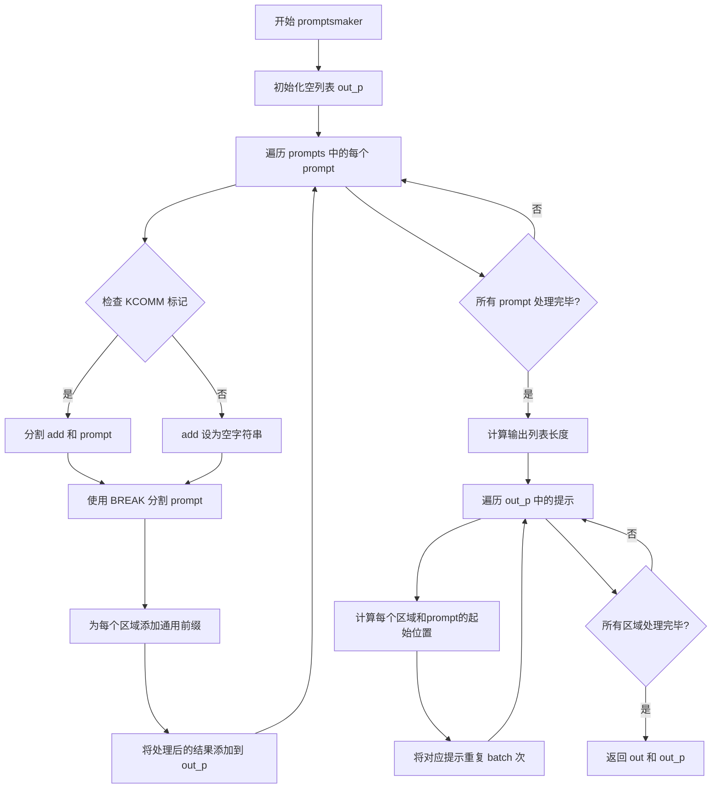

#### 带注释源码

```python
### Make prompt list for each regions
def promptsmaker(prompts, batch):
    """
    将输入的提示词列表按区域进行拆分和重组，生成支持区域提示的提示词列表。
    
    Args:
        prompts: 原始提示词列表，每个提示词可能包含 ADDCOMM 和 BREAK 标记
        batch: 每个提示词需要生成的图像数量
    
    Returns:
        out: 扁平的提示词列表，长度为 batch * 区域数 * prompt数
        out_p: 按区域分组的二维提示词列表
    """
    out_p = []  # 存储按区域分组的提示词
    plen = len(prompts)  # 原始提示词数量
    
    # 遍历每个提示词，处理通用提示和区域提示
    for prompt in prompts:
        add = ""  # 初始化通用提示部分
        if KCOMM in prompt:
            # 使用 ADDCOMM 分割通用提示和区域提示
            add, prompt = prompt.split(KCOMM)
            add = add.strip() + " "  # 清理并添加空格
        
        # 使用 BREAK 分割不同区域
        prompts = [p.strip() for p in prompt.split(KBRK)]
        # 为每个区域添加通用前缀
        out_p.append([add + p for i, p in enumerate(prompts)])
    
    # 计算输出列表的总长度：batch * 区域数 * prompt数
    out = [None] * batch * len(out_p[0]) * len(out_p)
    
    # 遍历处理后的提示词，重组为扁平列表
    for p, prs in enumerate(out_p):  # inputs prompts - 遍历每个原始提示
        for r, pr in enumerate(prs):  # prompts for regions - 遍历每个区域
            # 计算当前区域提示的起始位置
            # 公式: (prompt_index + region_index * prompt_count) * batch_size
            start = (p + r * plen) * batch
            # 将当前区域的提示重复 batch 次填入输出列表
            # 格式: P1R1B1,P1R1B2...,P1R2B1,P1R2B2...,P2R1B1...
            out[start : start + batch] = [pr] * batch
    
    return out, out_p
```


### `make_cells`

该函数根据给定的比例字符串生成区域单元格，用于区域提示（Regional Prompting）中定义图像的不同区域。它支持两种模式：通过分号`;`分隔外层区域（outer cells），通过逗号`,`分隔内层区域（inner cells）。

参数：

- `ratios`：`str`，表示区域划分的比例字符串，格式如`"1;1;1"`或`"1,1;1,1"`，其中分号定义外层分割，逗号定义内层分割。

返回值：`Tuple[List[List[float]], List[List[List[float]]], int]`，返回一个三元组，包含外层单元格列表、内层单元格列表和总区域数。

#### 流程图

```mermaid
flowchart TD
    A[开始 make_cells] --> B{检查ratios中是否无;但有,}
    B -->|是| C[将,替换为;]
    B -->|否| D[保持原样]
    C --> E[按;分割字符串]
    D --> E
    E --> F[按,分割每个部分]
    F --> G[初始化icells和ocells空列表]
    G --> H[定义内部函数startend]
    H --> I[调用startend处理外层比例<br/>ocells = [r[0] for r in ratios]]
    I --> J[遍历每个inratios]
    J --> K{len < 2?}
    K -->|是| L[添加默认 [[0,1]]]
    K -->|否| M[调用startend处理内层比例]
    M --> N[将结果添加到icells]
    L --> N
    J --> O{遍历结束?}
    O -->|否| J
    O -->|是| P[计算总区域数: sum len(cell) for cell in icells]
    P --> Q[返回 ocells, icells, 总区域数]
```

#### 带注释源码

```python
### make regions from ratios
### ";" makes outercells, "," makes inner cells
def make_cells(ratios):
    """
    根据比例字符串生成区域单元格
    
    参数:
        ratios: str, 区域划分比例，如 "1;1;1" 或 "1,1;1,1"
               分号;定义外层区域(outer cells)
               逗号,定义内层区域(inner cells)
    
    返回:
        tuple: (ocells, icells, regions)
               ocells: 外层单元格列表，每个元素为[start, end]的归一化坐标
               icells: 内层单元格列表，外层每个区域对应一个内层列表
               regions: 总区域数量
    """
    # 如果没有分号但有逗号，则将逗号替换为分号，统一格式
    if ";" not in ratios and "," in ratios:
        ratios = ratios.replace(",", ";")
    
    # 按分号分割得到外层比例列表
    ratios = ratios.split(";")
    # 再按逗号分割每个外层区域，得到内层比例的嵌套列表
    ratios = [inratios.split(",") for inratios in ratios]

    # 初始化内层单元格和外层单元格列表
    icells = []
    ocells = []

    def startend(cells, array):
        """
        内部辅助函数：根据比例数组计算每个区域的起始和结束位置
        
        参数:
            cells: 要填充的单元格列表
            array: 浮点数比例数组
        """
        current_start = 0
        # 将字符串转换为浮点数
        array = [float(x) for x in array]
        for value in array:
            # 计算当前区域的结束位置（归一化累加）
            end = current_start + (value / sum(array))
            cells.append([current_start, end])
            current_start = end

    # 处理外层区域：取每个外层区域的第一个比例值
    startend(ocells, [r[0] for r in ratios])

    # 处理每个外层区域内的内层区域
    for inratios in ratios:
        # 如果内层比例少于2个（即没有逗号分隔），使用默认的整个区域
        if 2 > len(inratios):
            icells.append([[0, 1]])
        else:
            # 存在内层分割，处理从第二个开始的 内层比例
            add = []
            startend(add, inratios[1:])
            icells.append(add)
    
    # 返回外层单元格、内层单元格和总区域数
    return ocells, icells, sum(len(cell) for cell in icells)
```


### `RegionalPromptingStableDiffusionPipeline.make_emblist`

该方法接收文本提示列表，通过分词器转换为token IDs，然后使用文本编码器生成文本嵌入向量（hidden states），返回最后一层的隐藏状态作为文本嵌入，用于后续的图像生成过程。

参数：

- `self`：隐式参数，RegionalPromptingStableDiffusionPipeline 类的实例，包含 tokenizer、text_encoder 等属性
- `prompts`：`List[str]`，需要编码的文本提示词列表

返回值：`torch.Tensor`，形状为 (batch_size, seq_len, hidden_size) 的文本嵌入张量

#### 流程图

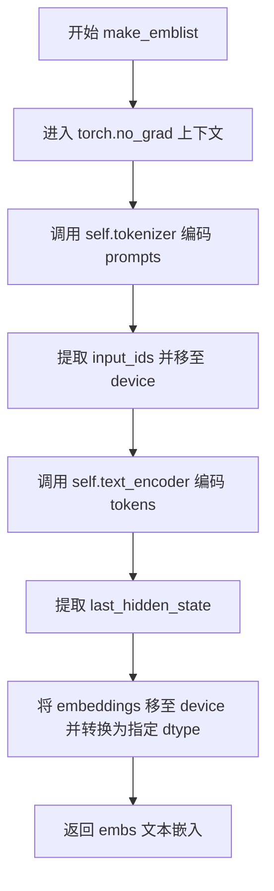

#### 带注释源码

```python
def make_emblist(self, prompts):
    """
    将文本提示词列表编码为文本嵌入向量
    
    参数:
        self: Pipeline 实例，包含 tokenizer 和 text_encoder
        prompts: 要编码的文本提示词列表
    
    返回:
        torch.Tensor: 文本编码器的最后一层隐藏状态
    """
    # 使用 no_grad 上下文管理器禁用梯度计算，节省内存和计算资源
    with torch.no_grad():
        # 调用分词器将文本提示转换为 token IDs
        # max_length: 使用模型的最大长度
        # padding: 填充到相同长度
        # truncation: 截断超长序列
        # return_tensors: 返回 PyTorch 张量
        tokens = self.tokenizer(
            prompts,
            max_length=self.tokenizer.model_max_length,
            padding=True,
            truncation=True,
            return_tensors="pt",
        ).input_ids.to(self.device)  # 将 token IDs 移动到执行设备
        
        # 使用文本编码器编码 token IDs
        # output_hidden_states=True: 返回所有层的隐藏状态
        # .last_hidden_state: 获取最后一层的输出作为主要嵌入
        # 移至指定设备并转换为指定数据类型
        embs = self.text_encoder(tokens, output_hidden_states=True).last_hidden_state.to(self.device, dtype=self.dtype)
    
    # 返回生成的文本嵌入向量
    return embs
```


### `split_dims`

该函数是 Stable Diffusion pipeline 中的一个全局辅助函数，用于在 UNet 前向传播过程中，根据原始图像尺寸和隐藏状态的空间维度总数，计算出隐藏状态张量在空间上应被分割成的高宽维度。这是区域提示（Regional Prompting）功能中处理注意力图和空间维度映射的关键函数。

参数：

- `xs`：`int`，隐藏状态的空间维度总数（即 height * width），表示 UNet 中隐藏状态张量的第二维度（通道之外的维度）的总元素数。
- `height`：`int`，原始生成图像的高度（像素单位）。
- `width`：`int`，原始生成图像的宽度（像素单位）。

返回值：`Tuple[int, int]`，返回一个元组 `(dsh, dsw)`，其中 dsh 是计算后的高度维度，dsw 是计算后的宽度维度，用于将隐藏状态张量 reshape 为 (batch, channels, height, width) 形式。

#### 流程图

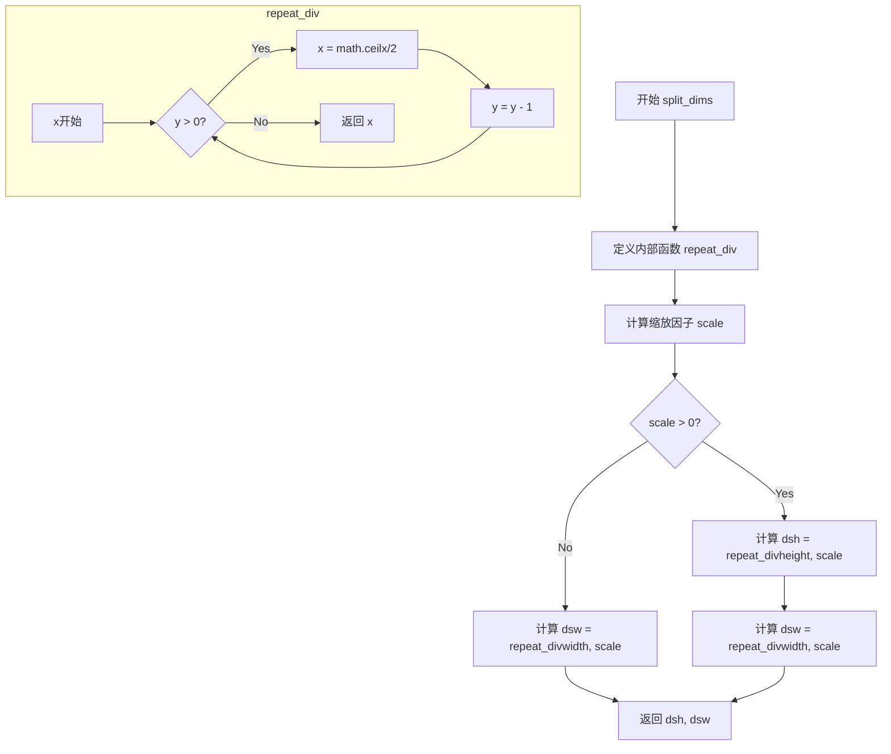

#### 带注释源码

```
def split_dims(xs, height, width):
    """
    计算隐藏状态张量的空间高宽维度。
    
    参数:
        xs: 隐藏状态的空间维度总数 (height * width)
        height: 原始图像高度
        width: 原始图像宽度
    
    返回:
        dsh, dsw: 隐藏状态的空间维度 (height, width)
    """
    
    def repeat_div(x, y):
        """
        内部辅助函数：递归除以2（向上取整）
        用于模拟 UNet 的下采样过程，计算特征图尺寸
        """
        while y > 0:
            x = math.ceil(x / 2)  # 向上取整除以2，模拟 UNet 的下采样
            y = y - 1
        return x

    # 计算缩放因子：
    # 1. height * width 是原始图像的像素总数
    # 2. xs 是隐藏状态的空间维度总数
    # 3. sqrt(height * width / xs) 得到尺寸比例
    # 4. log2 得到需要下采样的次数
    # 5. ceil 向上取整确保有足够的下采样
    scale = math.ceil(math.log2(math.sqrt(height * width / xs)))
    
    # 根据缩放因子计算隐藏状态的空间维度
    # UNet 每一次下采样会使特征图尺寸减半（向上取整）
    dsh = repeat_div(height, scale)
    dsw = repeat_div(width, scale)
    
    return dsh, dsw
```


### `get_attn_maps`

该函数是Regional Prompting（区域提示）功能的核心组件，用于从UNet的注意力层提取并处理注意力图（Attention Maps）。在Prompt模式下，该函数根据目标token（target_tokens）对注意力权重进行提取、幂运算和累加，用于后续生成区域掩码，从而实现不同区域使用不同提示词的功能。

参数：

- `self`：`RegionalPromptingStableDiffusionPipeline`，Pipeline实例，隐式参数，包含所有必要的状态属性（hw、target_tokens、attnmaps_sizes、batch、power、attnmaps等）
- `attn`：`torch.Tensor`，注意力权重矩阵，形状为`(batch, heads, seq_len, seq_len)`，由`scaled_dot_product_attention`函数传递的原始注意力权重

返回值：`None`（无返回值），该函数直接修改`self`对象的属性（`self.attnmaps`、`self.attnmaps_sizes`）

#### 流程图

```mermaid
flowchart TD
    A[开始: get_attn_maps] --> B[获取当前hw尺寸和target_tokens]
    B --> C{尺寸hw是否在attnmaps_sizes中?}
    C -->|否| D[将hw添加到attnmaps_sizes]
    C -->|是| E[跳过添加]
    D --> E
    E --> F[遍历batch: b从0到batch-1]
    E --> M[外层循环结束]
    
    F --> G[遍历target_tokens: t in target_tokens]
    G --> H[计算power和尺寸索引权重]
    H --> I[提取attn中目标token的注意力子图]
    I --> J[应用power操作并乘以尺寸索引权重]
    J --> K[对heads维度求和得到2D注意力图]
    K --> L[构建key为'{t}-{b}']
    
    L --> N{key是否在attnmaps中?}
    N -->|否| O[直接存储add到attnmaps[key]]
    N -->|是| P{attnmaps[key]与add的shape是否相同?}
    
    O --> Q[继续下一个token]
    P -->|否| R[调整add的形状并resize]
    P -->|是| S[直接累加]
    R --> S
    S --> Q
    
    Q --> G
    G --> T[继续下一个batch]
    T --> F
    
    M --> Z[结束]
```

#### 带注释源码

```python
def get_attn_maps(self, attn):
    """
    从注意力权重中提取并累加指定token的注意力图。
    用于Regional Prompting的Prompt模式，根据目标token生成区域掩码。
    
    参数:
        attn: torch.Tensor, 形状为(batch, heads, seq_len, seq_len)的注意力权重
    """
    # 获取当前UNet块的空间维度(height, width)
    height, width = self.hw
    # 获取目标token列表，这些token对应需要单独生成区域的提示词
    target_tokens = self.target_tokens
    
    # 记录不同UNet块的尺寸，用于后续掩码resize对齐
    if (height, width) not in self.attnmaps_sizes:
        self.attnmaps_sizes.append((height, width))

    # 遍历每个样本和每个目标token
    for b in range(self.batch):
        for t in target_tokens:
            # power参数控制注意力图的对比度增强
            power = self.power
            # 提取当前token对应的注意力子图并应用power和尺寸权重
            # t[0]: 起始位置, len(t): token数量
            add = attn[b, :, :, t[0] : t[0] + len(t)] ** (power) * (self.attnmaps_sizes.index((height, width)) + 1)
            # 对所有head求和，得到综合注意力图
            add = torch.sum(add, dim=2)
            
            # 构建字典key: token索引-样本索引
            key = f"{t}-{b}"
            
            if key not in self.attnmaps:
                # 首次出现，直接存储
                self.attnmaps[key] = add
            else:
                # 已存在，需要累加，但可能尺寸不同(不同UNet块)
                if self.attnmaps[key].shape[1] != add.shape[1]:
                    # 调整形状: 8个head -> (8, height, width)
                    add = add.view(8, height, width)
                    # resize到第一个UNet块的尺寸以保持一致性
                    add = FF.resize(add, self.attnmaps_sizes[0], antialias=None)
                    # 恢复为与已有注意力图相同的形状
                    add = add.reshape_as(self.attnmaps[key])

                # 累加不同UNet块的注意力图
                self.attnmaps[key] = self.attnmaps[key] + add
```


### reset_attnmaps

该函数用于在每个批次开始时初始化/重置与注意力图（attention maps）相关的所有参数，确保pipeline能够正确处理区域提示（Regional Prompting）的注意力图计算。

参数：

- `self`：`RegionalPromptingStableDiffusionPipeline` 对象，pipeline实例本身，用于访问和初始化类属性

返回值：`None`，该函数无返回值，仅修改实例属性

#### 流程图

```mermaid
flowchart TD
    A[开始 reset_attnmaps] --> B[设置 self.step = 0]
    B --> C[初始化 self.attnmaps = {}]
    C --> D[初始化 self.attnmaps_sizes = []]
    D --> E[初始化 self.attnmasks = {}]
    E --> F[设置 self.maskready = False]
    F --> G[初始化 self.history = {}]
    G --> H[结束函数]
```

#### 带注释源码

```python
def reset_attnmaps(self):  # init parameters in every batch
    """
    重置注意力图相关的所有状态参数
    
    在每个新的批次生成开始时调用，确保从干净的状态开始计算区域提示的注意力图。
    用于'PROMPT'模式下的注意力图收集和掩码生成。
    """
    self.step = 0  # 当前推理步骤计数器，重置为0
    self.attnmaps = {}  # 存储从UNet各层收集的注意力图，key格式为"token_id-batch_id"
    self.attnmaps_sizes = []  # 记录UNet不同块的空间尺寸(height, width)集合
    self.attnmasks = {}  # 从注意力图生成的区域掩码，用于最终的特征加权
    self.maskready = False  # 掩码是否准备就绪的标志
    self.history = {}  # 存储每步的注意力图历史，用于保存中间结果
```


### saveattnmaps

该函数用于将注意力图（Attention Maps）转换为掩码图像并保存到输出中。它遍历指定步骤的历史注意力图，对每个图调用 `makepmask` 生成二值掩码，并根据 `self.ex` 标志决定是分别保存每个区域的掩码还是合并保存。

参数：

- `self`：`RegionalPromptingStableDiffusionPipeline`， Pipeline 实例，隐式参数，包含历史注意力图和配置
- `output`：`StableDiffusionPipelineOutput`， 管道输出对象，用于存储生成的掩码图像
- `h`：`int`， 输出图像的高度（像素）
- `w`：`int`， 输出图像的宽度（像素）
- `th`：`List[float]`， 阈值列表，用于生成二值掩码
- `step`：`int`， 要保存的推理步骤索引
- `regions`：`int`， 区域数量，用于控制掩码保存逻辑

返回值：`None`，该函数直接修改 `output.images` 列表，不返回任何值

#### 流程图

```mermaid
flowchart TD
    A[开始 saveattnmaps] --> B[初始化空列表 masks]
    B --> C{遍历 self.history[step].values}
    C -->|每个 mask| D[调用 makepmask 生成 img 和 mask]
    D --> E{self.ex 是否为真}
    E -->|是| F[从当前 masks 中减去新 mask]
    F --> G[将新 mask 加入 masks 列表]
    G --> H{masks 数量达到 regions-1}
    H -->|是| I[将 masks 转为 PIL 图像并加入 output.images]
    I --> J[清空 masks 列表]
    H -->|否| C
    E -->|否| K[将 img 直接加入 output.images]
    K --> C
    C -->|遍历完成| L[结束]
```

#### 带注释源码

```
def saveattnmaps(self, output, h, w, th, step, regions):
    """
    保存注意力图掩码到输出图像
    
    参数:
        self: Pipeline 实例，包含 history, ex 等属性
        output: StableDiffusionPipelineOutput，输出对象
        h: 输出高度
        w: 输出宽度
        th: 阈值列表
        step: 步骤索引
        regions: 区域数量
    """
    masks = []  # 用于暂存多个掩码（当 ex=True 时）
    
    # 遍历指定步骤的历史注意力图
    for i, mask in enumerate(self.history[step].values()):
        # 使用阈值生成掩码图像和二值掩码
        # th[i % len(th)] 循环使用阈值列表中的值
        img, _, mask = makepmask(self, mask, h, w, th[i % len(th)], step)
        
        if self.ex:
            # EX 模式：处理多个区域的掩码
            # 从已有的 masks 中减去当前掩码（实现互斥区域）
            masks = [x - mask for x in masks]
            # 添加当前掩码到列表
            masks.append(mask)
            
            # 当收集到 regions-1 个掩码时，保存并重置
            # （最后一个区域用 1 - sum(其他区域) 计算）
            if len(masks) == regions - 1:
                # 将掩码转换为 PIL 图像并添加到输出
                output.images.extend([FF.to_pil_image(mask) for mask in masks])
                masks = []  # 重置掩码列表
        else:
            # 普通模式：直接保存预览图像
            output.images.append(img)
```


### `makepmask`

该函数用于从注意力图（attention map）生成二值掩码，用于区域提示（Regional Prompting）的提示模式。它接收注意力图、目标尺寸、阈值和当前去噪步数，通过均值池化、归一化和阈值处理生成可用于图像区域分割的掩码，同时返回预览图像和潜在空间掩码。

参数：

- `self`：`RegionalPromptingStableDiffusionPipeline`， Pipeline实例，包含注意力图尺寸等属性
- `mask`：`torch.Tensor`， 来自U-Net的注意力图张量，形状为(batch, heads, seq_len, seq_len)
- `h`：`int`， 目标图像高度（像素）
- `w`：`int`， 目标图像宽度（像素）
- `th`：`float`， 初始阈值，用于生成二值掩码
- `step`：`int`， 当前去噪步骤，用于动态调整阈值

返回值：`Tuple[PIL.Image, torch.Tensor, torch.Tensor]`，返回一个三元组：
- `img`：PIL Image，用于预览的掩码图像
- `mask`：torch.Tensor，展平后的1D二值掩码，用于注意力加权
- `lmask`：`torch.Tensor`，2D二值掩码，用于潜在空间操作

#### 流程图

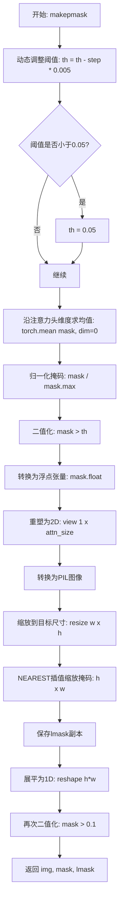

#### 带注释源码

```python
def makepmask(
    self, mask, h, w, th, step
):  # make masks from attention cache return [for preview, for attention, for Latent]
    # 动态阈值调整：随着去噪进程推进，逐渐降低阈值以包含更多区域
    th = th - step * 0.005
    
    # 设置最小阈值，防止完全无掩码
    if 0.05 >= th:
        th = 0.05
    
    # 沿注意力头维度求均值，将多头注意力聚合为单通道
    # mask 原始形状: (batch, heads, seq_len, seq_len) -> (batch, seq_len, seq_len)
    mask = torch.mean(mask, dim=0)
    
    # 归一化掩码，使最大值变为1，便于阈值比较
    mask = mask / mask.max().item()
    
    # 应用阈值进行二值化，大于阈值的设为1，否则为0
    mask = torch.where(mask > th, 1, 0)
    
    # 转换为浮点类型以支持后续操作
    mask = mask.float()
    
    # 重塑为2D张量，使用第一个U-Net块的注意力图尺寸
    mask = mask.view(1, *self.attnmaps_sizes[0])
    
    # 转换为PIL图像用于预览和保存
    img = FF.to_pil_image(mask)
    
    # 缩放到目标图像尺寸
    img = img.resize((w, h))
    
    # 使用NEAREST插值缩放掩码到潜在空间尺寸（h x w）
    # 保持二值特性，不进行抗锯齿
    mask = FF.resize(mask, (h, w), interpolation=FF.InterpolationMode.NEAREST, antialias=None)
    
    # 保存2D掩码副本用于潜在空间操作
    lmask = mask
    
    # 展平为1D向量，用于注意力加权计算
    mask = mask.reshape(h * w)
    
    # 最终二值化，确保只有0和1
    mask = torch.where(mask > 0.1, 1, 0)
    
    # 返回: 预览图像、1D注意力掩码、2D潜在掩码
    return img, mask, lmask
```


### `tokendealer`

该函数是"区域提示"（Regional Prompting）功能的核心组件，用于在提示模式（PROMPT mode）下识别并提取每个区域提示中最后一个分隔符后面的关键词语（即目标区域描述），并在完整提示的token序列中定位这些目标词语所对应的token位置索引，以便后续从注意力图中提取相应的区域掩码。

参数：

- `self`：`RegionalPromptingStableDiffusionPipeline` 类实例，包含分词器（tokenizer）等属性
- `all_prompts`：`List[List[str]]` 类型，二维列表，外层列表的每个元素代表一个提示的所有区域版本，内层列表包含用分割符（如 `BREAK`）分隔的多个区域提示词

返回值：`List[List[int]]` 类型，返回一个二维列表，其中每个子列表包含某个目标词语在对应完整提示token序列中的位置索引（可能有多个索引）

#### 流程图

```mermaid
flowchart TD
    A[开始: tokendealer] --> B[遍历 all_prompts 中的每个 prompts]
    B --> C[提取 targets: 区域提示词列表中除第一个外的所有元素, 取逗号后的最后部分]
    C --> D[初始化空列表 tt 存储目标token位置]
    D --> E[遍历每个 target]
    E --> F[使用 tokenizer 对整个 prompts 进行编码, 得到 ptokens]
    F --> G[使用 tokenizer 对单个 target 进行编码, 得到 ttokens]
    G --> H[初始化空列表 tlist]
    H --> I[遍历 ttokens 的有效token范围]
    I --> J[遍历 ptokens 的所有token]
    J --> K{判断 ttokens[t+1] == ptokens[p]?}
    K -->|是| L[将索引 p 加入 tlist]
    K -->|否| M[继续下一个 p]
    L --> M
    M --> N{遍历完所有 p?}
    N -->|否| J
    N -->|是| O{tlist 不为空?}
    O -->|是| P[将 tlist 加入 tt]
    O -->|否| Q[不添加]
    P --> R[继续处理下一个 target]
    Q --> R
    R --> S{遍历完所有 targets?}
    S -->|否| E
    S -->|是| T[返回 tt]
    T --> U[结束]
```

#### 带注释源码

```python
def tokendealer(self, all_prompts):
    """
    处理区域提示中的目标token位置
    
    该函数用于在Regional Prompting的PROMPT模式中，识别每个区域提示中需要控制的
    目标词语，并在完整提示的token序列中找出这些词语对应的token位置索引。
    这些索引将用于从注意力图中提取相应区域的掩码。
    
    参数:
        self: Pipeline实例，包含tokenizer等属性
        all_prompts: 二维列表，外层每个元素是一组区域提示（已被BREAK分割）
    
    返回:
        二维列表，每个子列表包含一个目标词语在对应提示token序列中的位置索引
    """
    # 遍历所有的提示组（每个提示可能被分割成多个区域）
    for prompts in all_prompts:
        # 从每个区域提示中提取目标词：取逗号后的最后一部分
        # 例如: "1girl, blue hair, red eyes" -> " red eyes"
        # prompts[1:] 跳过第一个元素（基础提示），取所有区域提示
        targets = [p.split(",")[-1] for p in prompts[1:]]
        
        # 存储当前提示组中所有目标词的token位置
        tt = []

        # 遍历每个目标词
        for target in targets:
            # 对整个prompts进行tokenize，得到完整提示的token序列
            # prompts包含基础提示和所有区域提示
            ptokens = (
                self.tokenizer(
                    prompts,
                    max_length=self.tokenizer.model_max_length,
                    padding=True,
                    truncation=True,
                    return_tensors="pt",
                ).input_ids
            )[0]  # 取batch中的第一项
            
            # 对单个目标词进行tokenize
            ttokens = (
                self.tokenizer(
                    target,
                    max_length=self.tokenizer.model_max_length,
                    padding=True,
                    truncation=True,
                    return_tensors="pt",
                ).input_ids
            )[0]

            # 存储当前目标词在完整提示中的位置索引
            tlist = []

            # 在token序列中查找目标词的位置
            # ttokens.shape[0] - 2: 跳过开头和结尾的特殊token (BOS/EOS)
            for t in range(ttokens.shape[0] - 2):
                # 从1开始，跳过BOS token
                target_token_id = ttokens[t + 1]
                # 在完整提示的token序列中查找匹配
                for p in range(ptokens.shape[0]):
                    if target_token_id == ptokens[p]:
                        # 找到匹配，记录位置索引
                        tlist.append(p)
            
            # 如果找到了目标词的位置，则添加到结果中
            if tlist != []:
                tt.append(tlist)

    return tt
```


### `scaled_dot_product_attention`

自定义的缩放点积注意力（Scaled Dot-Product Attention）实现，用于在Regional Prompting模式下计算注意力权重并生成上下文感知的目标隐藏状态，同时支持注意力图提取功能。

参数：

- `self`：调用此方法的类实例本身，用于访问类属性（如`self.device`）和调用其他方法（如`get_attn_maps`）
- `query`：`torch.Tensor`，查询张量，形状为`(batch, num_heads, seq_len, head_dim)`
- `key`：`torch.Tensor`，键张量，形状为`(batch, num_heads, seq_len, head_dim)`
- `value`：`torch.Tensor`，值张量，形状为`(batch, num_heads, seq_len, head_dim)`
- `attn_mask`：`Optional[torch.Tensor]`，注意力掩码，可选，用于屏蔽特定位置的注意力
- `dropout_p`：`float`，dropout概率，默认0.0，用于随机丢弃注意力权重以防止过拟合
- `is_causal`：`bool`，是否使用因果掩码（当前时间步不能看到未来信息），默认False
- `scale`：`Optional[float]`，缩放因子，默认None（使用`1/sqrt(head_dim)`）
- `getattn`：`bool`，是否提取并保存注意力图，默认False，用于Regional Prompting的Prompt模式

返回值：`torch.Tensor`，返回注意力加权后的值张量，形状为`(batch, num_heads, seq_len, head_dim)`

#### 流程图

```mermaid
flowchart TD
    A[开始: scaled_dot_product_attention] --> B[获取query和key的最后两个维度L, S]
    B --> C{scale是否为None?}
    C -->|是| D[计算scale_factor = 1 / sqrt(query.size(-1))]
    C -->|否| E[使用传入的scale值]
    D --> F[创建零初始化attn_bias]
    E --> F
    F --> G{is_causal为True?}
    G -->|是| H[创建因果掩码, 将上三角设为-inf]
    G -->|否| I{attn_mask是否为None?}
    H --> I
    I -->|否| J{attn_mask dtype为bool?}
    I -->|是| K[计算注意力分数: query @ key.T * scale_factor]
    J -->|是| L[将bool掩码转为-inf]
    J -->|否| M[直接加到attn_bias上]
    L --> K
    M --> K
    K --> N[attn_weight += attn_bias]
    N --> O[对attn_weight进行softmax]
    O --> P{getattn为True?}
    P -->|是| Q[调用get_attn_maps保存注意力图]
    P -->|否| R[应用dropout]
    Q --> R
    R --> S[计算输出: attn_weight @ value]
    S --> T[返回最终结果]
```

#### 带注释源码

```python
def scaled_dot_product_attention(
    self,
    query,
    key,
    value,
    attn_mask=None,
    dropout_p=0.0,
    is_causal=False,
    scale=None,
    getattn=False,
) -> torch.Tensor:
    # Efficient implementation equivalent to the following:
    # 获取query和key的序列长度维度
    L, S = query.size(-2), key.size(-2)
    
    # 计算缩放因子：如果未提供，则使用标准缩放因子 1/sqrt(d_k)
    scale_factor = 1 / math.sqrt(query.size(-1)) if scale is None else scale
    
    # 初始化注意力偏置为零矩阵，形状为 L x S，设备和类型与query相同
    attn_bias = torch.zeros(L, S, dtype=query.dtype, device=self.device)
    
    # 如果使用因果注意力，创建因果掩码（下三角为True，上三角为False）
    # 将False位置（对角线及以上）设为负无穷
    if is_causal:
        assert attn_mask is None  # 因果模式和显式掩码不能同时使用
        temp_mask = torch.ones(L, S, dtype=torch.bool).tril(diagonal=0)
        attn_bias.masked_fill_(temp_mask.logical_not(), float("-inf"))
        attn_bias.to(query.dtype)

    # 处理传入的注意力掩码
    if attn_mask is not None:
        if attn_mask.dtype == torch.bool:
            # bool类型的掩码：将False位置转为-inf
            attn_mask.masked_fill_(attn_mask.logical_not(), float("-inf"))
        else:
            # 数值型掩码：直接加到偏置上
            attn_bias += attn_mask
    
    # 计算注意力分数：Q @ K^T
    attn_weight = query @ key.transpose(-2, -1) * scale_factor
    
    # 加上偏置（包含因果掩码或attn_mask的影响）
    attn_weight += attn_bias
    
    # 对注意力分数进行softmax归一化
    attn_weight = torch.softmax(attn_weight, dim=-1)
    
    # 如果需要获取注意力图（用于Regional Prompting的Prompt模式）
    if getattn:
        get_attn_maps(self, attn_weight)
    
    # 应用dropout（仅在训练模式下生效）
    attn_weight = torch.dropout(attn_weight, dropout_p, train=True)
    
    # 注意力权重乘以values得到最终输出
    return attn_weight @ value
```


### `retrieve_timesteps`

该函数负责调用调度器的 `set_timesteps` 方法并从调度器中检索时间步。它处理自定义时间步和 sigma 值，支持三种模式：使用指定的时间步、使用指定的 sigma 值，或使用默认的推理步骤数。

参数：

- `scheduler`：`SchedulerMixin`，用于获取时间步的调度器对象
- `num_inference_steps`：`Optional[int]`，生成样本时使用的扩散步骤数。如果使用此参数，`timesteps` 必须为 `None`
- `device`：`Optional[Union[str, torch.device]]`，时间步要移动到的设备。如果为 `None`，时间步不会被移动
- `timesteps`：`Optional[List[int]]`，用于覆盖调度器时间步间隔策略的自定义时间步。如果传递了 `timesteps`，则 `num_inference_steps` 和 `sigmas` 必须为 `None`
- `sigmas`：`Optional[List[float]]`，用于覆盖调度器时间步间隔策略的自定义 sigma。如果传递了 `sigmas`，则 `num_inference_steps` 和 `timesteps` 必须为 `None`
- `**kwargs`：任意关键字参数，将提供给 `scheduler.set_timesteps`

返回值：`Tuple[torch.Tensor, int]`，第一个元素是调度器的时间步计划，第二个元素是推理步骤数

#### 流程图

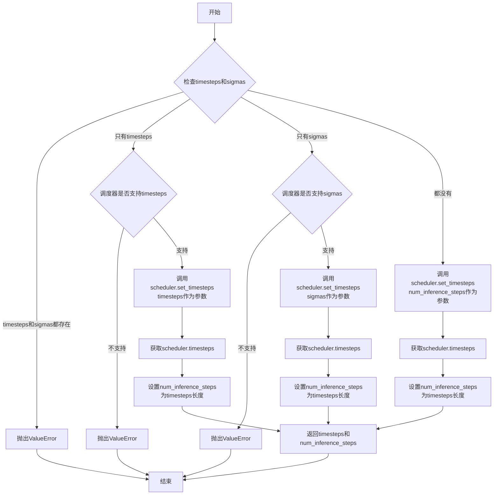

#### 带注释源码

```python
def retrieve_timesteps(
    scheduler,
    num_inference_steps: Optional[int] = None,
    device: Optional[Union[str, torch.device]] = None,
    timesteps: Optional[List[int]] = None,
    sigmas: Optional[List[float]] = None,
    **kwargs,
):
    r"""
    Calls the scheduler's `set_timesteps` method and retrieves timesteps from the scheduler after the call. Handles
    custom timesteps. Any kwargs will be supplied to `scheduler.set_timesteps`.

    Args:
        scheduler (`SchedulerMixin`):
            The scheduler to get timesteps from.
        num_inference_steps (`int`):
            The number of diffusion steps used when generating samples with a pre-trained model. If used, `timesteps`
            must be `None`.
        device (`str` or `torch.device`, *optional*):
            The device to which the timesteps should be moved to. If `None`, the timesteps are not moved.
        timesteps (`List[int]`, *optional*):
            Custom timesteps used to override the timestep spacing strategy of the scheduler. If `timesteps` is passed,
            `num_inference_steps` and `sigmas` must be `None`.
        sigmas (`List[float]`, *optional*):
            Custom sigmas used to override the timestep spacing strategy of the scheduler. If `sigmas` is passed,
            `num_inference_steps` and `timesteps` must be `None`.

    Returns:
        `Tuple[torch.Tensor, int]`: A tuple where the first element is the timestep schedule from the scheduler and the
        second element is the number of inference steps.
    """
    # 检查是否同时传递了timesteps和sigmas，这是不允许的
    if timesteps is not None and sigmas is not None:
        raise ValueError("Only one of `timesteps` or `sigmas` can be passed. Please choose one to set custom values")
    
    # 处理自定义时间步模式
    if timesteps is not None:
        # 检查调度器是否支持自定义时间步
        accepts_timesteps = "timesteps" in set(inspect.signature(scheduler.set_timesteps).parameters.keys())
        if not accepts_timesteps:
            raise ValueError(
                f"The current scheduler class {scheduler.__class__}'s `set_timesteps` does not support custom"
                f" timestep schedules. Please check whether you are using the correct scheduler."
            )
        # 调用调度器的set_timesteps方法，传递自定义时间步
        scheduler.set_timesteps(timesteps=timesteps, device=device, **kwargs)
        # 从调度器获取生成的时间步
        timesteps = scheduler.timesteps
        # 计算推理步骤数
        num_inference_steps = len(timesteps)
    # 处理自定义sigma模式
    elif sigmas is not None:
        # 检查调度器是否支持自定义sigma
        accept_sigmas = "sigmas" in set(inspect.signature(scheduler.set_timesteps).parameters.keys())
        if not accept_sigmas:
            raise ValueError(
                f"The current scheduler class {scheduler.__class__}'s `set_timesteps` does not support custom"
                f" sigmas schedules. Please check whether you are using the correct scheduler."
            )
        # 调用调度器的set_timesteps方法，传递自定义sigma
        scheduler.set_timesteps(sigmas=sigmas, device=device, **kwargs)
        # 从调度器获取生成的时间步
        timesteps = scheduler.timesteps
        # 计算推理步骤数
        num_inference_steps = len(timesteps)
    # 默认模式：使用num_inference_steps
    else:
        # 调用调度器的set_timesteps方法，使用推理步骤数
        scheduler.set_timesteps(num_inference_steps, device=device, **kwargs)
        # 从调度器获取生成的时间步
        timesteps = scheduler.timesteps
    
    # 返回时间步和推理步骤数
    return timesteps, num_inference_steps
```


### `rescale_noise_cfg`

该函数用于根据 `guidance_rescale` 参数重新缩放噪声预测张量，以改善图像质量并修复过度曝光问题。基于 Common Diffusion Noise Schedules and Sample Steps are Flawed 论文的第 3.4 节。

参数：

- `noise_cfg`：`torch.Tensor`，引导扩散过程中预测的噪声张量
- `noise_pred_text`：`torch.Tensor`，文本引导扩散过程中预测的噪声张量
- `guidance_rescale`：`float`，可选，默认值为 0.0，应用于噪声预测的缩放因子

返回值：`torch.Tensor`，重新缩放后的噪声预测张量

#### 流程图

```mermaid
flowchart TD
    A[开始] --> B[计算noise_pred_text的标准差std_text]
    B --> C[计算noise_cfg的标准差std_cfg]
    C --> D[计算缩放后的噪声预测: noise_pred_rescaled = noise_cfg \* (std_text / std_cfg)]
    D --> E[混合原始噪声预测和缩放后的噪声预测: noise_cfg = guidance_rescale \* noise_pred_rescaled + (1 - guidance_rescale) \* noise_cfg]
    E --> F[返回重新缩放后的noise_cfg]
```

#### 带注释源码

```python
def rescale_noise_cfg(noise_cfg, noise_pred_text, guidance_rescale=0.0):
    r"""
    Rescales `noise_cfg` tensor based on `guidance_rescale` to improve image quality and fix overexposure. Based on
    Section 3.4 from [Common Diffusion Noise Schedules and Sample Steps are
    Flawed](https://huggingface.co/papers/2305.08891).

    Args:
        noise_cfg (`torch.Tensor`):
            The predicted noise tensor for the guided diffusion process.
        noise_pred_text (`torch.Tensor`):
            The predicted noise tensor for the text-guided diffusion process.
        guidance_rescale (`float`, *optional*, defaults to 0.0):
            A rescale factor applied to the noise predictions.

    Returns:
        noise_cfg (`torch.Tensor`): The rescaled noise prediction tensor.
    """
    # 计算文本引导噪声预测在所有空间维度上的标准差
    # dim=list(range(1, noise_pred_text.ndim)) 排除batch维度
    # keepdim=True 保持维度以便后续广播运算
    std_text = noise_pred_text.std(dim=list(range(1, noise_pred_text.ndim)), keepdim=True)
    
    # 计算引导噪声预测在所有空间维度上的标准差
    std_cfg = noise_cfg.std(dim=list(range(1, noise_cfg.ndim)), keepdim=True)
    
    # 使用文本噪声的标准差对引导噪声进行重新缩放
    # 这一步修复了过度曝光问题
    noise_pred_rescaled = noise_cfg * (std_text / std_cfg)
    
    # 根据 guidance_rescale 因子混合原始噪声预测和缩放后的噪声预测
    # guidance_rescale=0 时返回原始 noise_cfg
    # guidance_rescale=1 时返回完全缩放的 noise_pred_rescaled
    # 这避免了图像看起来"平淡无奇"
    noise_cfg = guidance_rescale * noise_pred_rescaled + (1 - guidance_rescale) * noise_cfg
    
    return noise_cfg
```


### `RegionalPromptingStableDiffusionPipeline.__init__`

该方法是RegionalPromptingStableDiffusionPipeline类的构造函数，负责初始化Stable Diffusion管线所需的所有核心组件（包括VAE、文本编码器、UNet、调度器等），并配置图像处理、安全检查器以及管线运行所需的内部状态变量。

参数：

- `vae`：`AutoencoderKL`，用于将图像编码到潜在空间并从潜在空间解码重建图像的变分自编码器模型
- `text_encoder`：`CLIPTextModel`，冻结的文本编码器，将文本提示转换为向量表示，用于引导图像生成
- `tokenizer`：`CLIPTokenizer`，CLIP模型的文本分词器，用于将文本提示转换为token序列
- `unet`：`UNet2DConditionModel`，条件U-Net架构，用于对编码后的图像潜在表示进行去噪处理
- `scheduler`：`KarrasDiffusionSchedulers`，扩散调度器，用于控制去噪过程中的噪声调度策略
- `safety_checker`：`StableDiffusionSafetyChecker`，安全检查模块，用于检测并过滤可能存在问题的生成图像
- `feature_extractor`：`CLIPImageProcessor`，特征提取器，用于从生成的图像中提取特征供安全检查器使用
- `image_encoder`：`CLIPVisionModelWithProjection`（可选），CLIP视觉编码器，用于IP-Adapter等图像条件引导功能，默认为None
- `requires_safety_checker`：`bool`，是否启用安全检查器，默认为True

返回值：无（构造函数，初始化实例属性）

#### 流程图

```mermaid
flowchart TD
    A[开始 __init__] --> B[调用 super().__init__]
    B --> C[register_modules: 注册 vae<br/>text_encoder<br/>tokenizer<br/>unet<br/>scheduler<br/>safety_checker<br/>feature_extractor<br/>image_encoder]
    C --> D[计算 vae_scale_factor<br/>基于 vae.config.block_out_channels]
    D --> E[创建 VaeImageProcessor<br/>使用 vae_scale_factor]
    E --> F[register_to_config:<br/>requires_safety_checker]
    F --> G[初始化内部状态变量<br/>_num_timesteps=None<br/>_interrupt=False<br/>_guidance_scale=7.5<br/>_guidance_rescale=0.0<br/>_clip_skip=None<br/>_cross_attention_kwargs=None]
    G --> H[结束 __init__]
```

#### 带注释源码

```python
def __init__(
    self,
    vae: AutoencoderKL,
    text_encoder: CLIPTextModel,
    tokenizer: CLIPTokenizer,
    unet: UNet2DConditionModel,
    scheduler: KarrasDiffusionSchedulers,
    safety_checker: StableDiffusionSafetyChecker,
    feature_extractor: CLIPImageProcessor,
    image_encoder: CLIPVisionModelWithProjection = None,
    requires_safety_checker: bool = True,
):
    """
    初始化RegionalPromptingStableDiffusionPipeline管线
    
    参数:
        vae: 变分自编码器，用于图像与潜在表示之间的转换
        text_encoder: CLIP文本编码器，将文本提示编码为向量
        tokenizer: CLIP分词器，解析文本输入
        unet: 条件U-Net，用于去噪潜在表示
        scheduler: 扩散调度器，控制去噪步骤
        safety_checker: 安全检查器，过滤不当内容
        feature_extractor: 图像特征提取器
        image_encoder: 可选的CLIP视觉编码器，用于IP-Adapter
        requires_safety_checker: 是否启用安全检查
    """
    # 调用父类DiffusionPipeline的初始化方法
    # 设置基本的管线配置和设备管理
    super().__init__()
    
    # 注册所有子模块，使管线能够正确保存/加载权重
    # 同时支持从单个文件加载等Mixin功能
    self.register_modules(
        vae=vae,
        text_encoder=text_encoder,
        tokenizer=tokenizer,
        unet=unet,
        scheduler=scheduler,
        safety_checker=safety_checker,
        feature_extractor=feature_extractor,
        image_encoder=image_encoder,
    )
    
    # 计算VAE缩放因子，用于调整潜在空间的尺寸
    # 基于VAE块输出通道数的深度（2^(depth-1)）
    # 如果VAE存在则计算，否则默认为8
    self.vae_scale_factor = 2 ** (len(self.vae.config.block_out_channels) - 1) if getattr(self, "vae", None) else 8
    
    # 创建VAE图像处理器，用于图像的预处理和后处理
    # 包括归一化、编码、解码等功能
    self.image_processor = VaeImageProcessor(vae_scale_factor=self.vae_scale_factor)
    
    # 将requires_safety_checker配置注册到管线配置中
    # 允许在推理时动态启用/禁用安全检查
    self.register_to_config(requires_safety_checker=requires_safety_checker)

    # 初始化扩散管线所需的额外内部状态变量
    # _num_timesteps: 记录总的时间步数
    # _interrupt: 中断标志，用于暂停/恢复生成
    # _guidance_scale: 默认CFG引导强度
    # _guidance_rescale: CFG重缩放因子
    # _clip_skip: CLIP跳过的层数
    # _cross_attention_kwargs: 跨注意力额外参数
    self._num_timesteps = None
    self._interrupt = False
    self._guidance_scale = 7.5
    self._guidance_rescale = 0.0
    self._clip_skip = None
    self._cross_attention_kwargs = None
```


### `RegionalPromptingStableDiffusionPipeline.__call__`

该方法是Regional Prompting Stable Diffusion管道的主入口函数，封装了基于Stable Diffusion的文本到图像生成流程，并支持区域提示（Regional Prompting）功能，允许用户通过COL/ROW模式或PROMPT模式将图像划分为多个区域，每个区域使用不同的提示词进行生成。

参数：

- `prompt`：`str`，要引导图像生成的提示词。如果未定义，则需要传递`prompt_embeds`。
- `height`：`int`，生成图像的高度（像素），默认为512。
- `width`：`int`，生成图像的宽度（像素），默认为512。
- `num_inference_steps`：`int`，去噪步数，默认为50。更多的去噪步数通常会导致更高质量的图像，但推理速度会变慢。
- `guidance_scale`：`float`，引导比例，用于控制生成图像与文本提示的相关性，默认为7.5。值越高，图像与提示词越相关，但图像质量可能下降。
- `negative_prompt`：`str`，用于引导不包含内容的提示词，默认为None。
- `num_images_per_prompt`：`int`，每个提示词生成的图像数量，默认为1。
- `eta`：`float`，DDIM调度器的参数η，默认为0.0。
- `generator`：`torch.Generator`，用于生成确定性结果的随机数生成器，默认为None。
- `latents`：`torch.Tensor`，预生成的噪声潜在变量，默认为None。
- `output_type`：`str`，输出图像的格式，可选"pil"或"np.array"，默认为"pil"。
- `return_dict`：`bool`，是否返回字典格式的输出，默认为True。
- `rp_args`：`Dict[str, str]`，区域提示参数字典，包含mode（COL/ROW/PROMPT）、div（分割比例）、th（阈值）、base_ratio等。

返回值：`Union[StableDiffusionPipelineOutput, Tuple]`，如果`return_dict`为True，返回`StableDiffusionPipelineOutput`对象，包含生成的图像列表和NSFW内容检测标志；否则返回元组。

#### 流程图

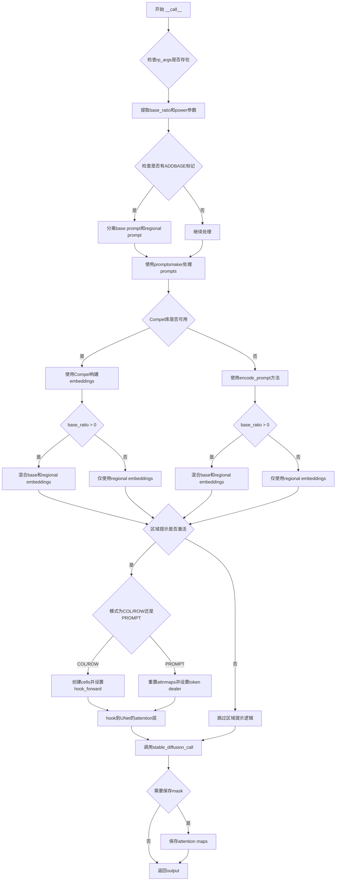

#### 带注释源码

```python
@torch.no_grad()
def __call__(
    self,
    prompt: str,
    height: int = 512,
    width: int = 512,
    num_inference_steps: int = 50,
    guidance_scale: float = 7.5,
    negative_prompt: str = None,
    num_images_per_prompt: Optional[int] = 1,
    eta: float = 0.0,
    generator: torch.Generator | None = None,
    latents: Optional[torch.Tensor] = None,
    output_type: str | None = "pil",
    return_dict: bool = True,
    rp_args: Dict[str, str] = None,
):
    # 检查prompt中是否包含区域提示标记BREAK (KBRK = "BREAK")
    active = KBRK in prompt[0] if isinstance(prompt, list) else KBRK in prompt
    # 检查是否使用base prompt (KBASE = "ADDBASE")
    use_base = KBASE in prompt[0] if isinstance(prompt, list) else KBASE in prompt
    
    # 默认negative_prompt处理
    if negative_prompt is None:
        negative_prompt = "" if isinstance(prompt, str) else [""] * len(prompt)

    # 获取执行设备
    device = self._execution_device
    regions = 0

    # 从rp_args提取区域提示参数
    self.base_ratio = float(rp_args["base_ratio"]) if "base_ratio" in rp_args else 0.0
    self.power = int(rp_args["power"]) if "power" in rp_args else 1

    # 标准化prompt为列表格式
    prompts = prompt if isinstance(prompt, list) else [prompt]
    n_prompts = negative_prompt if isinstance(negative_prompt, list) else [negative_prompt]
    self.batch = batch = num_images_per_prompt * len(prompts)

    # 处理base prompt模式
    if use_base:
        bases = prompts.copy()
        n_bases = n_prompts.copy()

        # 分离每个prompt中的base部分和regional部分
        for i, prompt in enumerate(prompts):
            parts = prompt.split(KBASE)
            if len(parts) == 2:
                bases[i], prompts[i] = parts
            elif len(parts) > 2:
                raise ValueError(f"Multiple instances of {KBASE} found in prompt: {prompt}")
        
        # 对negative prompt做同样处理
        for i, prompt in enumerate(n_prompts):
            n_parts = prompt.split(KBASE)
            if len(n_parts) == 2:
                n_bases[i], n_prompts[i] = n_parts
            elif len(n_parts) > 2:
                raise ValueError(f"Multiple instances of {KBASE} found in negative prompt: {prompt}")

        # 为base prompt生成embeddings
        all_bases_cn, _ = promptsmaker(bases, num_images_per_prompt)
        all_n_bases_cn, _ = promptsmaker(n_bases, num_images_per_prompt)

    # 为regional prompts生成embeddings
    all_prompts_cn, all_prompts_p = promptsmaker(prompts, num_images_per_prompt)
    all_n_prompts_cn, _ = promptsmaker(n_prompts, num_images_per_prompt)

    equal = len(all_prompts_cn) == len(all_n_prompts_cn)

    # 使用Compel库处理embeddings（如果可用）
    if Compel:
        compel = Compel(tokenizer=self.tokenizer, text_encoder=self.text_encoder)

        def getcompelembs(prps):
            embl = []
            for prp in prps:
                embl.append(compel.build_conditioning_tensor(prp))
            return torch.cat(embl)

        # 获取条件和无条件embeddings
        conds = getcompelembs(all_prompts_cn)
        unconds = getcompelembs(all_n_prompts_cn)
        base_embs = getcompelembs(all_bases_cn) if use_base else None
        base_n_embs = getcompelembs(all_n_bases_cn) if use_base else None
        
        # 当使用base时，使用base prompts作为主要embeddings
        embs = getcompelembs(prompts) if not use_base else base_embs
        n_embs = getcompelembs(n_prompts) if not use_base else base_n_embs

        # 根据base_ratio混合embeddings
        if use_base and self.base_ratio > 0:
            conds = self.base_ratio * base_embs + (1 - self.base_ratio) * conds
            unconds = self.base_ratio * base_n_embs + (1 - self.base_ratio) * unconds

        # 置空prompt参数，使用embeddings
        prompt = negative_prompt = None
    else:
        # 使用encode_prompt方法生成embeddings
        conds = self.encode_prompt(prompts, device, 1, True)[0]
        unconds = (
            self.encode_prompt(n_prompts, device, 1, True)[0]
            if equal
            else self.encode_prompt(all_n_prompts_cn, device, 1, True)[0]
        )

        if use_base and self.base_ratio > 0:
            base_embs = self.encode_prompt(bases, device, 1, True)[0]
            base_n_embs = (
                self.encode_prompt(n_bases, device, 1, True)[0]
                if equal
                else self.encode_prompt(all_n_bases_cn, device, 1, True)[0]
            )

            # 混合base和regional embeddings
            conds = self.base_ratio * base_embs + (1 - self.base_ratio) * conds
            unconds = self.base_ratio * base_n_embs + (1 - self.base_ratio) * unconds

        embs = n_embs = None

    # 区域提示逻辑处理
    if not active:
        pcallback = None
        mode = None
    else:
        # COL/ROW模式处理
        if any(x in rp_args["mode"].upper() for x in ["COL", "ROW"]):
            mode = "COL" if "COL" in rp_args["mode"].upper() else "ROW"
            ocells, icells, regions = make_cells(rp_args["div"])

        # PROMPT模式处理
        elif "PRO" in rp_args["mode"].upper():
            regions = len(all_prompts_p[0])
            mode = "PROMPT"
            reset_attnmaps(self)
            self.ex = "EX" in rp_args["mode"].upper()
            self.target_tokens = target_tokens = tokendealer(self, all_prompts_p)
            thresholds = [float(x) for x in rp_args["th"].split(",")]

        orig_hw = (height, width)
        revers = True

        # 定义每步结束时的回调函数（用于PROMPT模式生成attention masks）
        def pcallback(s_self, step: int, timestep: int, latents: torch.Tensor, selfs=None):
            if "PRO" in mode:  # 在Prompt模式下，从attention maps生成masks
                self.step = step

                if len(self.attnmaps_sizes) > 3:
                    self.history[step] = self.attnmaps.copy()
                    for hw in self.attnmaps_sizes:
                        allmasks = []
                        basemasks = [None] * batch
                        for tt, th in zip(target_tokens, thresholds):
                            for b in range(batch):
                                key = f"{tt}-{b}"
                                _, mask, _ = makepmask(self, self.attnmaps[key], hw[0], hw[1], th, step)
                                mask = mask.unsqueeze(0).unsqueeze(-1)
                                if self.ex:
                                    allmasks[b::batch] = [x - mask for x in allmasks[b::batch]]
                                    allmasks[b::batch] = [torch.where(x > 0, 1, 0) for x in allmasks[b::batch]]
                                allmasks.append(mask)
                                basemasks[b] = mask if basemasks[b] is None else basemasks[b] + mask
                        basemasks = [1 - mask for mask in basemasks]
                        basemasks = [torch.where(x > 0, 1, 0) for x in basemasks]
                        allmasks = basemasks + allmasks

                        self.attnmasks[hw] = torch.cat(allmasks)
                    self.maskready = True
            return latents

        # 定义hook函数来拦截UNet的attention计算
        def hook_forward(module):
            def forward(
                hidden_states: torch.Tensor,
                encoder_hidden_states: Optional[torch.Tensor] = None,
                attention_mask: Optional[torch.Tensor] = None,
                temb: Optional[torch.Tensor] = None,
                scale: float = 1.0,
            ) -> torch.Tensor:
                attn = module
                xshape = hidden_states.shape
                self.hw = (h, w) = split_dims(xshape[1], *orig_hw)

                # 处理positive和negative latent
                if revers:
                    nx, px = hidden_states.chunk(2)
                else:
                    px, nx = hidden_states.chunk(2)

                # 根据是否equal条件拼接hidden states
                if equal:
                    hidden_states = torch.cat(
                        [px for i in range(regions)] + [nx for i in range(regions)],
                        0,
                    )
                    encoder_hidden_states = torch.cat([conds] + [unconds])
                else:
                    hidden_states = torch.cat([px for i in range(regions)] + [nx], 0)
                    encoder_hidden_states = torch.cat([conds] + [unconds])

                residual = hidden_states

                # 标准的attention计算
                if attn.spatial_norm is not None:
                    hidden_states = attn.spatial_norm(hidden_states, temb)

                input_ndim = hidden_states.ndim

                if input_ndim == 4:
                    batch_size, channel, height, width = hidden_states.shape
                    hidden_states = hidden_states.view(batch_size, channel, height * width).transpose(1, 2)

                batch_size, sequence_length, _ = (
                    hidden_states.shape if encoder_hidden_states is None else encoder_hidden_states.shape
                )

                if attention_mask is not None:
                    attention_mask = attn.prepare_attention_mask(attention_mask, sequence_length, batch_size)
                    attention_mask = attention_mask.view(batch_size, attn.heads, -1, attention_mask.shape[-1])

                if attn.group_norm is not None:
                    hidden_states = attn.group_norm(hidden_states.transpose(1, 2)).transpose(1, 2)

                query = attn.to_q(hidden_states)

                if encoder_hidden_states is None:
                    encoder_hidden_states = hidden_states
                elif attn.norm_cross:
                    encoder_hidden_states = attn.norm_encoder_hidden_states(encoder_hidden_states)

                key = attn.to_k(encoder_hidden_states)
                value = attn.to_v(encoder_hidden_states)

                inner_dim = key.shape[-1]
                head_dim = inner_dim // attn.heads

                query = query.view(batch_size, -1, attn.heads, head_dim).transpose(1, 2)
                key = key.view(batch_size, -1, attn.heads, head_dim).transpose(1, 2)
                value = value.view(batch_size, -1, attn.heads, head_dim).transpose(1, 2)

                # 调用scaled_dot_product_attention，支持获取attention map
                hidden_states = scaled_dot_product_attention(
                    self,
                    query,
                    key,
                    value,
                    attn_mask=attention_mask,
                    dropout_p=0.0,
                    is_causal=False,
                    getattn="PRO" in mode,
                )

                hidden_states = hidden_states.transpose(1, 2).reshape(batch_size, -1, attn.heads * head_dim)
                hidden_states = hidden_states.to(query.dtype)

                # output projection和dropout
                hidden_states = attn.to_out[0](hidden_states)
                hidden_states = attn.to_out[1](hidden_states)

                if input_ndim == 4:
                    hidden_states = hidden_states.transpose(-1, -2).reshape(batch_size, channel, height, width)

                if attn.residual_connection:
                    hidden_states = hidden_states + residual

                hidden_states = hidden_states / attn.rescale_output_factor

                # COL/ROW模式的区域处理
                if any(x in mode for x in ["COL", "ROW"]):
                    reshaped = hidden_states.reshape(hidden_states.size()[0], h, w, hidden_states.size()[2])
                    center = reshaped.shape[0] // 2
                    px = reshaped[0:center] if equal else reshaped[0:-batch]
                    nx = reshaped[center:] if equal else reshaped[-batch:]
                    outs = [px, nx] if equal else [px]
                    for out in outs:
                        c = 0
                        for i, ocell in enumerate(ocells):
                            for icell in icells[i]:
                                if "ROW" in mode:
                                    out[
                                        0:batch,
                                        int(h * ocell[0]) : int(h * ocell[1]),
                                        int(w * icell[0]) : int(w * icell[1]),
                                        :,
                                    ] = out[
                                        c * batch : (c + 1) * batch,
                                        int(h * ocell[0]) : int(h * ocell[1]),
                                        int(w * icell[0]) : int(w * icell[1]),
                                        :,
                                    ]
                                else:
                                    out[
                                        0:batch,
                                        int(h * icell[0]) : int(h * icell[1]),
                                        int(w * ocell[0]) : int(w * ocell[1]),
                                        :,
                                    ] = out[
                                        c * batch : (c + 1) * batch,
                                        int(h * icell[0]) : int(h * icell[1]),
                                        int(w * ocell[0]) : int(w * ocell[1]),
                                        :,
                                    ]
                                c += 1
                    px, nx = (px[0:batch], nx[0:batch]) if equal else (px[0:batch], nx)
                    hidden_states = torch.cat([nx, px], 0) if revers else torch.cat([px, nx], 0)
                    hidden_states = hidden_states.reshape(xshape)

                # PROMPT模式的区域处理
                elif "PRO" in mode:
                    px, nx = (
                        torch.chunk(hidden_states) if equal else hidden_states[0:-batch],
                        hidden_states[-batch:],
                    )

                    if (h, w) in self.attnmasks and self.maskready:

                        def mask(input):
                            out = torch.multiply(input, self.attnmasks[(h, w)])
                            for b in range(batch):
                                for r in range(1, regions):
                                    out[b] = out[b] + out[r * batch + b]
                            return out

                        px, nx = (mask(px), mask(nx)) if equal else (mask(px), nx)
                    px, nx = (px[0:batch], nx[0:batch]) if equal else (px[0:batch], nx)
                    hidden_states = torch.cat([nx, px], 0) if revers else torch.cat([px, nx], 0)
                return hidden_states

            return forward

        # 将hook注册到UNet的所有attn2层
        def hook_forwards(root_module: torch.nn.Module):
            for name, module in root_module.named_modules():
                if "attn2" in name and module.__class__.__name__ == "Attention":
                    module.forward = hook_forward(module)

        hook_forwards(self.unet)

    # 调用主生成方法
    output = self.stable_diffusion_call(
        prompt=prompt,
        prompt_embeds=embs,
        negative_prompt=negative_prompt,
        negative_prompt_embeds=n_embs,
        height=height,
        width=width,
        num_inference_steps=num_inference_steps,
        guidance_scale=guidance_scale,
        num_images_per_prompt=num_images_per_prompt,
        eta=eta,
        generator=generator,
        latents=latents,
        output_type=output_type,
        return_dict=return_dict,
        callback_on_step_end=pcallback,
    )

    # 处理mask保存
    if "save_mask" in rp_args:
        save_mask = rp_args["save_mask"]
    else:
        save_mask = False

    # 在PROMPT模式下保存attention maps
    if mode == "PROMPT" and save_mask:
        saveattnmaps(
            self,
            output,
            height,
            width,
            thresholds,
            num_inference_steps // 2,
            regions,
        )

    return output
```


### `RegionalPromptingStableDiffusionPipeline.prepare_extra_step_kwargs`

该方法用于准备调度器（scheduler）步骤所需的额外参数。由于不同的调度器具有不同的签名，该方法通过检查调度器的 `step` 方法是否接受特定参数（`eta` 和 `generator`），动态构建并返回包含这些参数的字典。这确保了管道能够兼容多种调度器（如 DDIMScheduler、LMSDiscreteScheduler 等）。

参数：

-  `generator`：`torch.Generator | None`，随机数生成器，用于确保生成过程的可重复性
-  `eta`：`float`，DDIM 论文中的 η 参数，仅在 DDIMScheduler 中使用，应在 [0, 1] 范围内

返回值：`Dict[str, Any]`，包含调度器步骤所需额外参数（如 `eta` 和/或 `generator`）的字典

#### 流程图

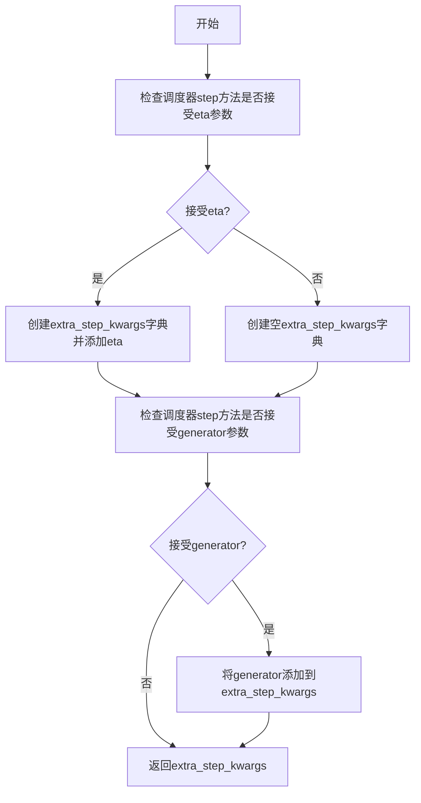

#### 带注释源码

```python
def prepare_extra_step_kwargs(self, generator, eta):
    # 准备调度器步骤所需的额外参数，因为并非所有调度器都具有相同的签名
    # eta (η) 仅在 DDIMScheduler 中使用，对于其他调度器将被忽略
    # eta 对应 DDIM 论文中的 η: https://huggingface.co/papers/2010.02502
    # 取值应在 [0, 1] 之间

    # 使用 inspect 模块检查调度器的 step 方法是否接受 'eta' 参数
    accepts_eta = "eta" in set(inspect.signature(self.scheduler.step).parameters.keys())
    
    # 初始化空字典用于存储额外参数
    extra_step_kwargs = {}
    
    # 如果调度器接受 eta 参数，则将其添加到 extra_step_kwargs 中
    if accepts_eta:
        extra_step_kwargs["eta"] = eta

    # 检查调度器是否接受 'generator' 参数
    accepts_generator = "generator" in set(inspect.signature(self.scheduler.step).parameters.keys())
    
    # 如果调度器接受 generator，则将其添加到 extra_step_kwargs 中
    if accepts_generator:
        extra_step_kwargs["generator"] = generator
    
    # 返回包含调度器所需额外参数的字典
    return extra_step_kwargs
```


### `RegionalPromptingStableDiffusionPipeline.prepare_latents`

该函数用于在扩散模型的推理过程中准备初始的噪声潜在向量（latents）。它根据指定的批次大小、图像尺寸和数据类型生成或调整潜在向量，并使用调度器的初始噪声标准差进行缩放，以适配Stable Diffusion的噪声调度策略。

参数：

- `batch_size`：`int`，有效的批处理大小，用于确定生成的潜在向量数量
- `num_channels_latents`：`int`，潜在向量的通道数，通常对应于UNet的输入通道数
- `height`：`int`，目标生成图像的高度（像素）
- `width`：`int`，目标生成图像的宽度（像素）
- `dtype`：`torch.dtype`，潜在向量的数据类型（如torch.float32）
- `device`：`torch.device`，潜在向量存放的设备（如cuda或cpu）
- `generator`：`torch.Generator` 或 `List[torch.Generator]`，可选的随机数生成器，用于确保生成的可重复性
- `latents`：`Optional[torch.Tensor]`，可选的预生成潜在向量，若为None则随机生成

返回值：`torch.Tensor`，处理后的潜在向量张量，形状为 `(batch_size, num_channels_latents, height // vae_scale_factor, width // vae_scale_factor)`

#### 流程图

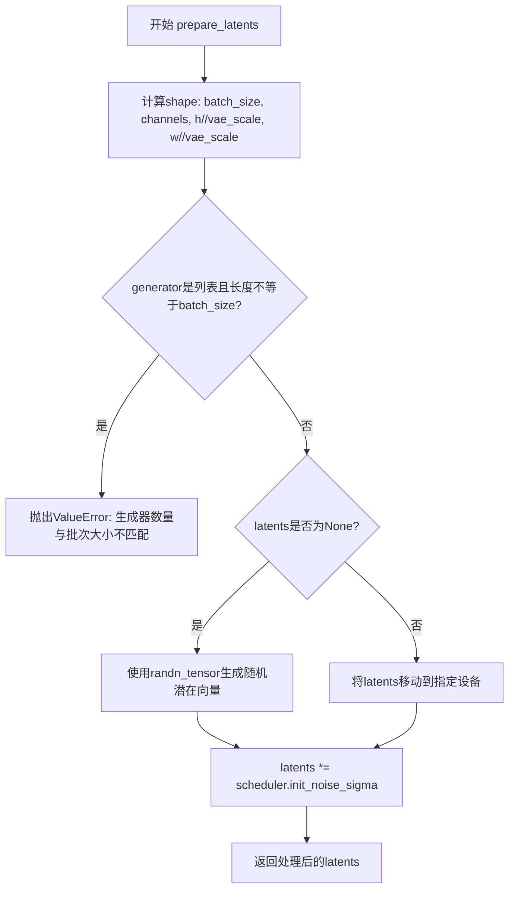

#### 带注释源码

```python
def prepare_latents(
    self,
    batch_size: int,
    num_channels_latents: int,
    height: int,
    width: int,
    dtype: torch.dtype,
    device: torch.device,
    generator: torch.Generator | List[torch.Generator] | None,
    latents: Optional[torch.Tensor] = None
) -> torch.Tensor:
    """
    准备用于Stable Diffusion推理的潜在向量。
    
    参数:
        batch_size: 批处理大小
        num_channels_latents: 潜在向量通道数
        height: 图像高度
        width: 图像宽度
        dtype: 数据类型
        device: 计算设备
        generator: 随机数生成器
        latents: 预提供的潜在向量（可选）
    
    返回:
        处理后的潜在向量张量
    """
    # 计算潜在向量的形状，需要根据VAE的缩放因子调整空间维度
    shape = (
        batch_size,
        num_channels_latents,
        int(height) // self.vae_scale_factor,
        int(width) // self.vae_scale_factor,
    )
    
    # 验证：如果传入生成器列表，其长度必须与批大小匹配
    if isinstance(generator, list) and len(generator) != batch_size:
        raise ValueError(
            f"You have passed a list of generators of length {len(generator)}, but requested an effective batch"
            f" size of {batch_size}. Make sure the batch size matches the length of the generators."
        )

    # 如果没有提供潜在向量，则随机生成
    if latents is None:
        latents = randn_tensor(shape, generator=generator, device=device, dtype=dtype)
    else:
        # 否则使用提供的潜在向量，并确保它在正确的设备上
        latents = latents.to(device)

    # 根据调度器的初始噪声标准差缩放潜在向量
    # 这是Stable Diffusion工作流程中的关键步骤，使噪声与调度器的时间步匹配
    latents = latents * self.scheduler.init_noise_sigma
    
    return latents
```


### `RegionalPromptingStableDiffusionPipeline.encode_prompt`

该方法负责将文本提示（prompt）编码为文本编码器的隐藏状态（hidden states），用于后续的图像生成过程。它处理正向提示和负向提示，支持分类器无关引导（Classifier-Free Guidance），并应用LoRA缩放和CLIP跳过层等高级功能。

参数：

- `prompt`：`str` 或 `List[str]`，可选，要编码的提示文本
- `device`：`torch.device`，torch设备，用于执行编码
- `num_images_per_prompt`：`int`，每个提示生成的图像数量
- `do_classifier_free_guidance`：`bool`，是否使用分类器无关引导
- `negative_prompt`：`str` 或 `List[str]`，可选，不引导图像生成的提示
- `prompt_embeds`：`torch.Tensor`，可选，预生成的文本嵌入，用于微调文本输入
- `negative_prompt_embeds`：`torch.Tensor`，可选，预生成的负向文本嵌入
- `lora_scale`：`float`，可选，要应用于文本编码器所有LoRA层的LoRA缩放因子
- `clip_skip`：`int`，可选，计算提示嵌入时跳过的CLIP层数

返回值：`Tuple[torch.Tensor, torch.Tensor]`，返回编码后的提示嵌入和负向提示嵌入元组

#### 流程图

```mermaid
flowchart TD
    A[开始 encode_prompt] --> B{设置了 lora_scale?}
    B -->|是| C[设置 LoRA 缩放]
    B -->|否| D{提供了 prompt_embeds?}
    C --> D
    D -->|是| E[直接使用传入的 prompt_embeds]
    D -->|否| F{prompt 是字符串还是列表?}
    F -->|字符串| G[batch_size = 1]
    F -->|列表| H[batch_size = len(prompt)]
    F -->|其他| I[从 prompt_embeds 获取 batch_size]
    G --> J{是否支持 Textual Inversion?}
    H --> J
    I --> K[复制 embeddings 用于每个生成的图像]
    J -->|是| L[maybe_convert_prompt 转换 prompt]
    J -->|否| M[直接使用原始 prompt]
    L --> N[tokenizer 处理 prompt]
    M --> N
    N --> O[检查是否需要 attention_mask]
    O --> P{设置了 clip_skip?}
    P -->|否| Q[直接获取 text_encoder 输出]
    P -->|是| R[获取隐藏状态并应用 final_layer_norm]
    Q --> S[获取 prompt_embeds 数据类型]
    R --> S
    S --> T[将 prompt_embeds 转换为正确的数据类型和设备]
    T --> U{需要 Classifier-Free Guidance?}
    U -->|是| V{提供了 negative_prompt_embeds?}
    U -->|否| K
    V -->|否| W{提供了 negative_prompt?}
    V -->|是| X[直接使用传入的 negative_prompt_embeds]
    W -->|无| Y[uncond_tokens = 空字符串列表]
    W -->|有| Z[处理 negative_prompt 类型]
    Y --> AA[tokenizer 处理 uncond_tokens]
    Z --> AA
    AA --> AB[获取 negative_prompt_embeds]
    AB --> AC[转换 negative_prompt_embeds 到正确类型和设备]
    X --> AC
    AC --> AD{do_classifier_free_guidance 为真?}
    AD -->|是| AE[复制 negative_prompt_embeds]
    AD -->|否| K
    AE --> K
    K --> AF[返回 prompt_embeds, negative_prompt_embeds]
```

#### 带注释源码

```python
def encode_prompt(
    self,
    prompt,
    device,
    num_images_per_prompt,
    do_classifier_free_guidance,
    negative_prompt=None,
    prompt_embeds: Optional[torch.Tensor] = None,
    negative_prompt_embeds: Optional[torch.Tensor] = None,
    lora_scale: Optional[float] = None,
    clip_skip: Optional[int] = None,
):
    r"""
    Encodes the prompt into text encoder hidden states.

    Args:
        prompt (`str` or `List[str]`, *optional*):
            prompt to be encoded
        device: (`torch.device`):
            torch device
        num_images_per_prompt (`int`):
            number of images that should be generated per prompt
        do_classifier_free_guidance (`bool`):
            whether to use classifier free guidance or not
        negative_prompt (`str` or `List[str]`, *optional*):
            The prompt or prompts not to guide the image generation. If not defined, one has to pass
            `negative_prompt_embeds` instead. Ignored when not using guidance (i.e., ignored if `guidance_scale` is
            less than `1`).
        prompt_embeds (`torch.Tensor`, *optional*):
            Pre-generated text embeddings. Can be used to easily tweak text inputs, *e.g.* prompt weighting. If not
            provided, text embeddings will be generated from `prompt` input argument.
        negative_prompt_embeds (`torch.Tensor`, *optional*):
            Pre-generated negative text embeddings. Can be used to easily tweak text inputs, *e.g.* prompt
            weighting. If not provided, negative_prompt_embeds will be generated from `negative_prompt` input
            argument.
        lora_scale (`float`, *optional*):
            A LoRA scale that will be applied to all LoRA layers of the text encoder if LoRA layers are loaded.
        clip_skip (`int`, *optional*):
            Number of layers to be skipped from CLIP while computing the prompt embeddings. A value of 1 means that
            the output of the pre-final layer will be used for computing the prompt embeddings.
    """
    # 设置 lora scale 以便 text encoder 的 monkey patched LoRA 函数可以正确访问
    if lora_scale is not None and isinstance(self, StableDiffusionLoraLoaderMixin):
        self._lora_scale = lora_scale

        # 动态调整 LoRA 缩放
        if not USE_PEFT_BACKEND:
            adjust_lora_scale_text_encoder(self.text_encoder, lora_scale)
        else:
            scale_lora_layers(self.text_encoder, lora_scale)

    # 确定 batch_size
    if prompt is not None and isinstance(prompt, str):
        batch_size = 1
    elif prompt is not None and isinstance(prompt, list):
        batch_size = len(prompt)
    else:
        batch_size = prompt_embeds.shape[0]

    # 如果没有提供 prompt_embeds，则从 prompt 生成
    if prompt_embeds is None:
        # textual inversion: 如果需要处理多向量 token
        if isinstance(self, TextualInversionLoaderMixin):
            prompt = self.maybe_convert_prompt(prompt, self.tokenizer)

        # 使用 tokenizer 将 prompt 转换为 token IDs
        text_inputs = self.tokenizer(
            prompt,
            padding="max_length",
            max_length=self.tokenizer.model_max_length,
            truncation=True,
            return_tensors="pt",
        )
        text_input_ids = text_inputs.input_ids
        # 获取未截断的 token IDs 用于检查是否被截断
        untruncated_ids = self.tokenizer(prompt, padding="longest", return_tensors="pt").input_ids

        # 检查是否发生了截断
        if untruncated_ids.shape[-1] >= text_input_ids.shape[-1] and not torch.equal(
            text_input_ids, untruncated_ids
        ):
            removed_text = self.tokenizer.batch_decode(
                untruncated_ids[:, self.tokenizer.model_max_length - 1 : -1]
            )
            logger.warning(
                "The following part of your input was truncated because CLIP can only handle sequences up to"
                f" {self.tokenizer.model_max_length} tokens: {removed_text}"
            )

        # 获取 attention_mask
        if hasattr(self.text_encoder.config, "use_attention_mask") and self.text_encoder.config.use_attention_mask:
            attention_mask = text_inputs.attention_mask.to(device)
        else:
            attention_mask = None

        # 根据 clip_skip 获取 prompt embeddings
        if clip_skip is None:
            # 直接获取 text_encoder 输出
            prompt_embeds = self.text_encoder(text_input_ids.to(device), attention_mask=attention_mask)
            prompt_embeds = prompt_embeds[0]
        else:
            # 获取所有隐藏状态，然后选择指定的层
            prompt_embeds = self.text_encoder(
                text_input_ids.to(device), attention_mask=attention_mask, output_hidden_states=True
            )
            # 访问 hidden_states 元组中倒数第 clip_skip+1 层
            prompt_embeds = prompt_embeds[-1][-(clip_skip + 1)]
            # 应用 final_layer_norm 以保持表示的完整性
            prompt_embeds = self.text_encoder.text_model.final_layer_norm(prompt_embeds)

    # 确定 prompt_embeds 的数据类型
    if self.text_encoder is not None:
        prompt_embeds_dtype = self.text_encoder.dtype
    elif self.unet is not None:
        prompt_embeds_dtype = self.unet.dtype
    else:
        prompt_embeds_dtype = prompt_embeds.dtype

    # 转换 prompt_embeds 到正确的设备和数据类型
    prompt_embeds = prompt_embeds.to(dtype=prompt_embeds_dtype, device=device)

    # 复制 text embeddings 以便每个提示生成多个图像
    bs_embed, seq_len, _ = prompt_embeds.shape
    prompt_embeds = prompt_embeds.repeat(1, num_images_per_prompt, 1)
    prompt_embeds = prompt_embeds.view(bs_embed * num_images_per_prompt, seq_len, -1)

    # 获取 Classifier-Free Guidance 所需的无条件 embeddings
    if do_classifier_free_guidance and negative_prompt_embeds is None:
        uncond_tokens: List[str]
        if negative_prompt is None:
            uncond_tokens = [""] * batch_size
        elif prompt is not None and type(prompt) is not type(negative_prompt):
            raise TypeError(
                f"`negative_prompt` should be the same type to `prompt`, but got {type(negative_prompt)} !="
                f" {type(prompt)}."
            )
        elif isinstance(negative_prompt, str):
            uncond_tokens = [negative_prompt]
        elif batch_size != len(negative_prompt):
            raise ValueError(
                f"`negative_prompt`: {negative_prompt} has batch size {len(negative_prompt)}, but `prompt`:"
                f" {prompt} has batch size {batch_size}. Please make sure that passed `negative_prompt` matches"
                " the batch size of `prompt`."
            )
        else:
            uncond_tokens = negative_prompt

        # textual inversion: 如果需要处理多向量 token
        if isinstance(self, TextualInversionLoaderMixin):
            uncond_tokens = self.maybe_convert_prompt(uncond_tokens, self.tokenizer)

        max_length = prompt_embeds.shape[1]
        uncond_input = self.tokenizer(
            uncond_tokens,
            padding="max_length",
            max_length=max_length,
            truncation=True,
            return_tensors="pt",
        )

        if hasattr(self.text_encoder.config, "use_attention_mask") and self.text_encoder.config.use_attention_mask:
            attention_mask = uncond_input.attention_mask.to(device)
        else:
            attention_mask = None

        # 获取无条件 embeddings
        negative_prompt_embeds = self.text_encoder(
            uncond_input.input_ids.to(device),
            attention_mask=attention_mask,
        )
        negative_prompt_embeds = negative_prompt_embeds[0]

    # 如果使用 Classifier-Free Guidance，复制无条件 embeddings
    if do_classifier_free_guidance:
        # 复制无条件 embeddings 以便每个提示生成多个图像
        seq_len = negative_prompt_embeds.shape[1]

        negative_prompt_embeds = negative_prompt_embeds.to(dtype=prompt_embeds_dtype, device=device)

        negative_prompt_embeds = negative_prompt_embeds.repeat(1, num_images_per_prompt, 1)
        negative_prompt_embeds = negative_prompt_embeds.view(batch_size * num_images_per_prompt, seq_len, -1)

    # 如果使用了 PEFT backend，恢复 LoRA 层的原始缩放
    if self.text_encoder is not None:
        if isinstance(self, StableDiffusionLoraLoaderMixin) and USE_PEFT_BACKEND:
            # 通过反向缩放 LoRA 层恢复原始缩放
            unscale_lora_layers(self.text_encoder, lora_scale)

    return prompt_embeds, negative_prompt_embeds
```


### `RegionalPromptingStableDiffusionPipeline.check_inputs`

该方法用于验证Stable DiffusionPipeline的输入参数是否合法，包括检查高度/宽度、提示词、负面提示词、嵌入向量以及IP适配器图像等参数的有效性，防止在推理过程中因参数错误导致程序崩溃。

参数：

- `prompt`：`Union[str, List[str]]`，用户输入的文本提示词，用于引导图像生成
- `height`：`int`，生成图像的高度（像素），必须能被8整除
- `width`：`int`，生成图像的宽度（像素），必须能被8整除
- `callback_steps`：`Optional[int]`，可选参数，指定每隔多少步执行一次回调函数，必须为正整数
- `negative_prompt`：`Optional[Union[str, List[str]]]`，可选的负面提示词，用于指导模型避免生成相关内容
- `prompt_embeds`：`Optional[torch.Tensor]`，可选的预计算提示词嵌入向量，不能与prompt同时使用
- `negative_prompt_embeds`：`Optional[torch.Tensor]`，可选的预计算负面提示词嵌入向量，不能与negative_prompt同时使用
- `ip_adapter_image`：`Optional[PipelineImageInput]`，可选的IP适配器输入图像
- `ip_adapter_image_embeds`：`Optional[List[torch.Tensor]]`，可选的IP适配器图像嵌入列表
- `callback_on_step_end_tensor_inputs`：`Optional[List[str]]`，可选的回调函数可访问的张量输入名称列表

返回值：`None`，该方法仅进行参数验证，不返回任何值

#### 流程图

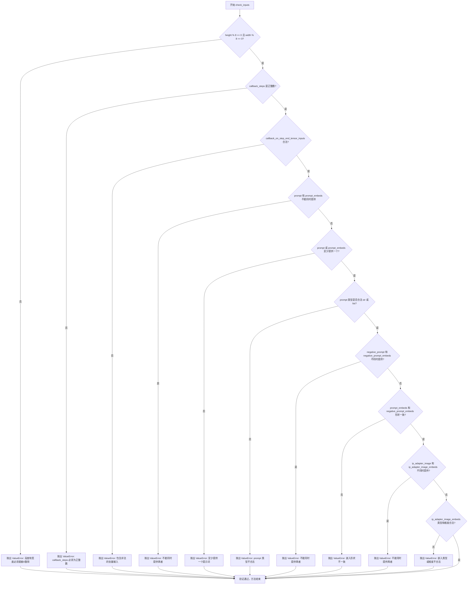

#### 带注释源码

```python
def check_inputs(
    self,
    prompt,
    height,
    width,
    callback_steps,
    negative_prompt=None,
    prompt_embeds=None,
    negative_prompt_embeds=None,
    ip_adapter_image=None,
    ip_adapter_image_embeds=None,
    callback_on_step_end_tensor_inputs=None,
):
    """
    验证Pipeline输入参数的有效性。
    
    该方法会检查所有输入参数是否符合Pipeline的要求，包括：
    - 图像尺寸必须是8的倍数
    - callback_steps必须是正整数
    - prompt和prompt_embeds不能同时提供
    - negative_prompt和negative_prompt_embeds不能同时提供
    - prompt_embeds和negative_prompt_embeds形状必须一致
    - IP适配器相关参数的有效性检查
    
    如果任何检查失败，将抛出相应的ValueError异常。
    """
    
    # 检查高度和宽度是否为8的倍数
    # Stable Diffusion的VAE编码器要求尺寸能被8整除
    if height % 8 != 0 or width % 8 != 0:
        raise ValueError(f"`height` and `width` have to be divisible by 8 but are {height} and {width}.")

    # 检查callback_steps是否为正整数
    # callback_steps用于控制回调函数的调用频率
    if callback_steps is not None and (not isinstance(callback_steps, int) or callback_steps <= 0):
        raise ValueError(
            f"`callback_steps` has to be a positive integer but is {callback_steps} of type"
            f" {type(callback_steps)}."
        )
    
    # 检查callback_on_step_end_tensor_inputs是否为合法的张量输入
    # 这些张量将在回调函数中被传递
    if callback_on_step_end_tensor_inputs is not None and not all(
        k in self._callback_tensor_inputs for k in callback_on_step_end_tensor_inputs
    ):
        raise ValueError(
            f"`callback_on_step_end_tensor_inputs` has to be in {self._callback_tensor_inputs}, but found {[k for k in callback_on_step_end_tensor_inputs if k not in self._callback_tensor_inputs]}"
        )

    # 检查prompt和prompt_embeds不能同时提供
    # 用户应该选择直接使用文本prompt或预计算的嵌入向量
    if prompt is not None and prompt_embeds is not None:
        raise ValueError(
            f"Cannot forward both `prompt`: {prompt} and `prompt_embeds`: {prompt_embeds}. Please make sure to"
            " only forward one of the two."
        )
    
    # 检查至少提供prompt或prompt_embeds之一
    # Pipeline需要文本信息来指导图像生成
    elif prompt is None and prompt_embeds is None:
        raise ValueError(
            "Provide either `prompt` or `prompt_embeds`. Cannot leave both `prompt` and `prompt_embeds` undefined."
        )
    
    # 检查prompt的类型是否为str或list
    elif prompt is not None and (not isinstance(prompt, str) and not isinstance(prompt, list)):
        raise ValueError(f"`prompt` has to be of type `str` or `list` but is {type(prompt)}")

    # 检查negative_prompt和negative_prompt_embeds不能同时提供
    if negative_prompt is not None and negative_prompt_embeds is not None:
        raise ValueError(
            f"Cannot forward both `negative_prompt`: {negative_prompt} and `negative_prompt_embeds`:"
            f" {negative_prompt_embeds}. Please make sure to only forward one of the two."
        )

    # 检查prompt_embeds和negative_prompt_embeds形状是否一致
    # 它们必须在批次大小和序列长度上匹配
    if prompt_embeds is not None and negative_prompt_embeds is not None:
        if prompt_embeds.shape != negative_prompt_embeds.shape:
            raise ValueError(
                "`prompt_embeds` and `negative_prompt_embeds` must have the same shape when passed directly, but"
                f" got: `prompt_embeds` {prompt_embeds.shape} != `negative_prompt_embeds`"
                f" {negative_prompt_embeds.shape}."
            )

    # 检查IP适配器图像和嵌入不能同时提供
    if ip_adapter_image is not None and ip_adapter_image_embeds is not None:
        raise ValueError(
            "Provide either `ip_adapter_image` or `ip_adapter_image_embeds`. Cannot leave both `ip_adapter_image` and `ip_adapter_image_embeds` defined."
        )

    # 检查IP适配器嵌入的类型和维度
    if ip_adapter_image_embeds is not None:
        # 必须是列表类型
        if not isinstance(ip_adapter_image_embeds, list):
            raise ValueError(
                f"`ip_adapter_image_embeds` has to be of type `list` but is {type(ip_adapter_image_embeds)}"
            )
        # 每个嵌入必须是3D或4D张量
        elif ip_adapter_image_embeds[0].ndim not in [3, 4]:
            raise ValueError(
                f"`ip_adapter_image_embeds` has to be a list of 3D or 4D tensors but is {ip_adapter_image_embeds[0].ndim}D"
            )
```


### `RegionalPromptingStableDiffusionPipeline.stable_diffusion_call`

这是Stable Diffusion pipeline的核心推理方法，支持区域提示（Regional Prompting）功能，能够根据用户指定的区域划分和提示词生成分区图像。

参数：

- `prompt`：`Union[str, List[str]] = None`，用于指导图像生成的提示词
- `height`：`Optional[int] = None`，生成图像的高度（像素）
- `width`：`Optional[int] = None`，生成图像的宽度（像素）
- `num_inference_steps`：`int = 50`，去噪步数，越多图像质量越高
- `timesteps`：`List[int] = None`，自定义时间步，用于支持自定义调度器
- `sigmas`：`List[float] = None`，自定义sigma值，用于支持自定义调度器
- `guidance_scale`：`float = 7.5`，引导比例，值越高图像与文本越相关
- `negative_prompt`：`Optional[Union[str, List[str]]] = None`，负面提示词，指导不包含的内容
- `num_images_per_prompt`：`Optional[int] = 1`，每个提示词生成的图像数量
- `eta`：`float = 0.0`，DDIM论文中的η参数，仅DDIM调度器有效
- `generator`：`Optional[Union[torch.Generator, List[torch.Generator]]] = None`，随机生成器，用于确定性生成
- `latents`：`Optional[torch.Tensor] = None`，预生成的噪声潜在向量
- `prompt_embeds`：`Optional[torch.Tensor] = None`，预生成的文本嵌入
- `negative_prompt_embeds`：`Optional[torch.Tensor] = None`，预生成的负面文本嵌入
- `ip_adapter_image`：`Optional[PipelineImageInput] = None`，IP适配器图像输入
- `ip_adapter_image_embeds`：`Optional[List[torch.Tensor]] = None`，IP适配器图像嵌入
- `output_type`：`str | None = "pil"`，输出格式，可选"pil"或"np.array"
- `return_dict`：`bool = True`，是否返回字典格式结果
- `cross_attention_kwargs`：`Optional[Dict[str, Any]] = None`，交叉注意力 kwargs
- `guidance_rescale`：`float = 0.0`，引导重缩放因子
- `clip_skip`：`Optional[int] = None`，CLIP跳过的层数
- `callback_on_step_end`：`Optional[Union[Callable, PipelineCallback, MultiPipelineCallbacks]] = None`，每步结束时的回调函数
- `callback_on_step_end_tensor_inputs`：`List[str] = ["latents"]`，回调函数使用的张量输入

返回值：`Union[StableDiffusionPipelineOutput, tuple]`，返回生成的图像列表和NSFW检测结果

#### 流程图

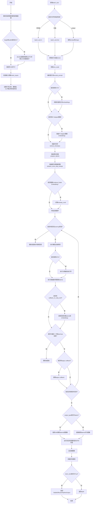

#### 带注释源码

```python
@torch.no_grad()
def stable_diffusion_call(
    self,
    prompt: Union[str, List[str]] = None,
    height: Optional[int] = None,
    width: Optional[int] = None,
    num_inference_steps: int = 50,
    timesteps: List[int] = None,
    sigmas: List[float] = None,
    guidance_scale: float = 7.5,
    negative_prompt: Optional[Union[str, List[str]]] = None,
    num_images_per_prompt: Optional[int] = 1,
    eta: float = 0.0,
    generator: Optional[Union[torch.Generator, List[torch.Generator]]] = None,
    latents: Optional[torch.Tensor] = None,
    prompt_embeds: Optional[torch.Tensor] = None,
    negative_prompt_embeds: Optional[torch.Tensor] = None,
    ip_adapter_image: Optional[PipelineImageInput] = None,
    ip_adapter_image_embeds: Optional[List[torch.Tensor]] = None,
    output_type: str | None = "pil",
    return_dict: bool = True,
    cross_attention_kwargs: Optional[Dict[str, Any]] = None,
    guidance_rescale: float = 0.0,
    clip_skip: Optional[int] = None,
    callback_on_step_end: Optional[
        Union[Callable[[int, int, Dict], None], PipelineCallback, MultiPipelineCallbacks]
    ] = None,
    callback_on_step_end_tensor_inputs: List[str] = ["latents"],
    **kwargs,
):
    r"""
    The call function to the pipeline for generation.

    Args:
        prompt (`str` or `List[str]`, *optional*):
            The prompt or prompts to guide image generation. If not defined, you need to pass `prompt_embeds`.
        height (`int`, *optional*, defaults to `self.unet.config.sample_size * self.vae_scale_factor`):
            The height in pixels of the generated image.
        width (`int`, *optional*, defaults to `self.unet.config.sample_size * self.vae_scale_factor`):
            The width in pixels of the generated image.
        num_inference_steps (`int`, *optional*, defaults to 50):
            The number of denoising steps.
        timesteps (`List[int]`, *optional*):
            Custom timesteps to use for the denoising process with schedulers which support a `timesteps` argument.
        sigmas (`List[float]`, *optional*):
            Custom sigmas to use for the denoising process with schedulers which support a `sigmas` argument.
        guidance_scale (`float`, *optional*, defaults to 7.5):
            A higher guidance scale value encourages the model to generate images closely linked to the text `prompt`.
        negative_prompt (`str` or `List[str]`, *optional*):
            The prompt or prompts to guide what to not include in image generation.
        num_images_per_prompt (`int`, *optional*, defaults to 1):
            The number of images to generate per prompt.
        eta (`float`, *optional*, defaults to 0.0):
            Corresponds to parameter eta (η) from the DDIM paper.
        generator (`torch.Generator` or `List[torch.Generator]`, *optional*):
            A torch.Generator to make generation deterministic.
        latents (`torch.Tensor`, *optional*):
            Pre-generated noisy latents sampled from a Gaussian distribution.
        prompt_embeds (`torch.Tensor`, *optional*):
            Pre-generated text embeddings.
        negative_prompt_embeds (`torch.Tensor`, *optional*):
            Pre-generated negative text embeddings.
        ip_adapter_image: (`PipelineImageInput`, *optional*): Optional image input to work with IP Adapters.
        ip_adapter_image_embeds (`List[torch.Tensor]`, *optional*):
            Pre-generated image embeddings for IP-Adapter.
        output_type (`str`, *optional*, defaults to `"pil"`):
            The output format of the generated image.
        return_dict (`bool`, *optional*, defaults to `True`):
            Whether or not to return a StableDiffusionPipelineOutput instead of a plain tuple.
        cross_attention_kwargs (`dict`, *optional*):
            A kwargs dictionary that if specified is passed along to the AttentionProcessor.
        guidance_rescale (`float`, *optional*, defaults to 0.0):
            Guidance rescale factor from Common Diffusion Noise Schedules and Sample Steps are Flawed.
        clip_skip (`int`, *optional*):
            Number of layers to be skipped from CLIP while computing the prompt embeddings.
        callback_on_step_end (`Callable`, `PipelineCallback`, `MultiPipelineCallbacks`, *optional*):
            A function that is called at the end of each denoising step during the inference.
        callback_on_step_end_tensor_inputs (`List`, *optional*):
            The list of tensor inputs for the `callback_on_step_end` function.

    Returns:
        [`~pipelines.stable_diffusion.StableDiffusionPipelineOutput`] or `tuple`:
            If `return_dict` is `True`, StableDiffusionPipelineOutput is returned, otherwise a tuple is returned.
    """

    # 从kwargs中提取已弃用的callback参数
    callback = kwargs.pop("callback", None)
    callback_steps = kwargs.pop("callback_steps", None)
    
    # 设置模型卸载序列和可选组件
    self.model_cpu_offload_seq = "text_encoder->image_encoder->unet->vae"
    self._optional_components = ["safety_checker", "feature_extractor", "image_encoder"]
    self._exclude_from_cpu_offload = ["safety_checker"]
    
    # 设置回调张量输入列表
    self._callback_tensor_inputs = ["latents", "prompt_embeds", "negative_prompt_embeds"]

    # 处理已弃用的callback参数警告
    if callback is not None:
        deprecate(
            "callback",
            "1.0.0",
            "Passing `callback` as an input argument to `__call__` is deprecated, consider using `callback_on_step_end`",
        )
    if callback_steps is not None:
        deprecate(
            "callback_steps",
            "1.0.0",
            "Passing `callback_steps` as an input argument to `__call__` is deprecated, consider using `callback_on_step_end`",
        )

    # 处理PipelineCallback或MultiPipelineCallbacks
    if isinstance(callback_on_step_end, (PipelineCallback, MultiPipelineCallbacks)):
        callback_on_step_end_tensor_inputs = callback_on_step_end.tensor_inputs

    # 0. 默认高度和宽度从unet获取
    if not height or not width:
        height = (
            self.unet.config.sample_size
            if self._is_unet_config_sample_size_int
            else self.unet.config.sample_size[0]
        )
        width = (
            self.unet.config.sample_size
            if self._is_unet_config_sample_size_int
            else self.unet.config.sample_size[1]
        )
        # 根据VAE缩放因子调整尺寸
        height, width = height * self.vae_scale_factor, width * self.vae_scale_factor

    # 1. 检查输入参数
    self.check_inputs(
        prompt,
        height,
        width,
        callback_steps,
        negative_prompt,
        prompt_embeds,
        negative_prompt_embeds,
        ip_adapter_image,
        ip_adapter_image_embeds,
        callback_on_step_end_tensor_inputs,
    )

    # 设置内部状态
    self._guidance_scale = guidance_scale
    self._guidance_rescale = guidance_rescale
    self._clip_skip = clip_skip
    self._cross_attention_kwargs = cross_attention_kwargs
    self._interrupt = False

    # 2. 定义调用参数 - 确定batch_size
    if prompt is not None and isinstance(prompt, str):
        batch_size = 1
    elif prompt is not None and isinstance(prompt, list):
        batch_size = len(prompt)
    else:
        batch_size = prompt_embeds.shape[0]

    # 获取执行设备
    device = self._execution_device

    # 3. 编码输入提示词
    lora_scale = (
        self.cross_attention_kwargs.get("scale", None) if self.cross_attention_kwargs is not None else None
    )

    # 调用encode_prompt生成文本嵌入
    prompt_embeds, negative_prompt_embeds = self.encode_prompt(
        prompt,
        device,
        num_images_per_prompt,
        self.do_classifier_free_guidance,
        negative_prompt,
        prompt_embeds=prompt_embeds,
        negative_prompt_embeds=negative_prompt_embeds,
        lora_scale=lora_scale,
        clip_skip=self.clip_skip,
    )

    # 对于分类器自由引导，需要做两次前向传播
    # 将无条件嵌入和文本嵌入拼接成单个batch以避免两次前向传播
    if self.do_classifier_free_guidance:
        prompt_embeds = torch.cat([negative_prompt_embeds, prompt_embeds])

    # 处理IP-Adapter图像嵌入
    if ip_adapter_image is not None or ip_adapter_image_embeds is not None:
        image_embeds = self.prepare_ip_adapter_image_embeds(
            ip_adapter_image,
            ip_adapter_image_embeds,
            device,
            batch_size * num_images_per_prompt,
            self.do_classifier_free_guidance,
        )

    # 4. 准备时间步
    timesteps, num_inference_steps = retrieve_timesteps(
        self.scheduler, num_inference_steps, device, timesteps, sigmas
    )

    # 5. 准备潜在变量
    num_channels_latents = self.unet.config.in_channels
    latents = self.prepare_latents(
        batch_size * num_images_per_prompt,
        num_channels_latents,
        height,
        width,
        prompt_embeds.dtype,
        device,
        generator,
        latents,
    )

    # 6. 准备额外调度器参数
    extra_step_kwargs = self.prepare_extra_step_kwargs(generator, eta)

    # 6.1 为IP-Adapter添加图像嵌入
    added_cond_kwargs = (
        {"image_embeds": image_embeds}
        if (ip_adapter_image is not None or ip_adapter_image_embeds is not None)
        else None
    )

    # 6.2 可选获取Guidance Scale Embedding
    timestep_cond = None
    if self.unet.config.time_cond_proj_dim is not None:
        guidance_scale_tensor = torch.tensor(self.guidance_scale - 1).repeat(batch_size * num_images_per_prompt)
        timestep_cond = self.get_guidance_scale_embedding(
            guidance_scale_tensor, embedding_dim=self.unet.config.time_cond_proj_dim
        ).to(device=device, dtype=latents.dtype)

    # 7. 去噪循环
    num_warmup_steps = len(timesteps) - num_inference_steps * self.scheduler.order
    self._num_timesteps = len(timesteps)
    
    # 启用进度条
    with self.progress_bar(total=num_inference_steps) as progress_bar:
        for i, t in enumerate(timesteps):
            # 检查是否中断
            if self.interrupt:
                continue

            # 如果使用分类器自由引导，扩展latents
            latent_model_input = torch.cat([latents] * 2) if self.do_classifier_free_guidance else latents
            latent_model_input = self.scheduler.scale_model_input(latent_model_input, t)

            # 预测噪声残差
            noise_pred = self.unet(
                latent_model_input,
                t,
                encoder_hidden_states=prompt_embeds,
                timestep_cond=timestep_cond,
                cross_attention_kwargs=self.cross_attention_kwargs,
                added_cond_kwargs=added_cond_kwargs,
                return_dict=False,
            )[0]

            # 执行引导
            if self.do_classifier_free_guidance:
                noise_pred_uncond, noise_pred_text = noise_pred.chunk(2)
                noise_pred = noise_pred_uncond + self.guidance_scale * (noise_pred_text - noise_pred_uncond)

            # 应用引导重缩放
            if self.do_classifier_free_guidance and self.guidance_rescale > 0.0:
                # 基于 https://huggingface.co/papers/2305.08891 第3.4节
                noise_pred = rescale_noise_cfg(noise_pred, noise_pred_text, guidance_rescale=self.guidance_rescale)

            # 计算前一个噪声样本 x_t -> x_t-1
            latents = self.scheduler.step(noise_pred, t, latents, **extra_step_kwargs, return_dict=False)[0]

            # 调用每步结束时的回调
            if callback_on_step_end is not None:
                callback_kwargs = {}
                for k in callback_on_step_end_tensor_inputs:
                    callback_kwargs[k] = locals()[k]
                callback_outputs = callback_on_step_end(self, i, t, callback_kwargs)

                # 更新latents和embeddings
                latents = callback_outputs.pop("latents", latents)
                prompt_embeds = callback_outputs.pop("prompt_embeds", prompt_embeds)
                negative_prompt_embeds = callback_outputs.pop("negative_prompt_embeds", negative_prompt_embeds)

            # 调用回调（如果提供）
            if i == len(timesteps) - 1 or ((i + 1) > num_warmup_steps and (i + 1) % self.scheduler.order == 0):
                progress_bar.update()
                if callback is not None and i % callback_steps == 0:
                    step_idx = i // getattr(self.scheduler, "order", 1)
                    callback(step_idx, t, latents)

            # XLA设备支持
            if XLA_AVAILABLE:
                xm.mark_step()

    # 8. 后处理 - 解码latents到图像
    if not output_type == "latent":
        # 使用VAE解码
        image = self.vae.decode(latents / self.vae.config.scaling_factor, return_dict=False, generator=generator)[
            0
        ]
        # 运行安全检查器
        image, has_nsfw_concept = self.run_safety_checker(image, device, prompt_embeds.dtype)
    else:
        image = latents
        has_nsfw_concept = None

    # 处理NSFW概念检测结果
    if has_nsfw_concept is None:
        do_denormalize = [True] * image.shape[0]
    else:
        do_denormalize = [not has_nsfw for has_nsfw in has_nsfw_concept]
    
    # 后处理图像
    image = self.image_processor.postprocess(image, output_type=output_type, do_denormalize=do_denormalize)

    # 卸载所有模型
    self.maybe_free_model_hooks()

    # 返回结果
    if not return_dict:
        return (image, has_nsfw_concept)

    return StableDiffusionPipelineOutput(images=image, nsfw_content_detected=has_nsfw_concept)
```


### `RegionalPromptingStableDiffusionPipeline._encode_prompt`

该方法负责将文本提示（prompt）编码为文本编码器隐藏状态（text encoder hidden states），支持分类器自由引导（Classifier-Free Guidance），并处理LoRA权重调整和多向量文本反转标记。

参数：

- `self`：隐式参数，Pipeline 实例本身
- `prompt`：`str` 或 `List[str]`，要编码的提示文本
- `device`：`torch.device`，PyTorch 设备
- `num_images_per_prompt`：`int`，每个提示生成的图像数量
- `do_classifier_free_guidance`：`bool`，是否启用分类器自由引导
- `negative_prompt`：`Optional[str | List[str]]`，不包含在图像生成中的提示
- `prompt_embeds`：`Optional[torch.Tensor]`，预生成的文本嵌入
- `negative_prompt_embeds`：`Optional[torch.Tensor]`，预生成的负面文本嵌入
- `lora_scale`：`Optional[float]`，LoRA 缩放因子
- `**kwargs`：其他可选关键字参数

返回值：`Tuple[torch.Tensor, torch.Tensor]`，返回文本提示嵌入和负面提示嵌入的元组

#### 流程图

```mermaid
flowchart TD
    A[开始 _encode_prompt] --> B[计算 batch_size]
    B --> C{是否有预计算的 prompt_embeds?}
    C -->|是| D[直接使用现有 embeds]
    C -->|否| E[Tokenize prompt]
    E --> F[检查是否截断]
    F --> G[获取 attention_mask]
    G --> H{是否使用 PEFT Backend?}
    H -->|是| I[直接编码并转换为 text_encoder dtype]
    H -->|否| J{是否需要 LoRA 调整?}
    J -->|是| K[动态调整 LoRA scale]
    J -->|否| L[直接编码]
    I --> M[提取 prompt_embeds[0]]
    K --> L
    L --> M
    D --> M
    M --> N[重复 embeddings 以匹配 num_images_per_prompt]
    N --> O{是否启用 CFG 且无 negative_prompt_embeds?}
    O -->|是| P[处理 uncond_tokens]
    O -->|否| S
    P --> Q[Tokenize uncond_tokens]
    Q --> R[编码得到 negative_prompt_embeds]
    R --> S{启用 CFG?}
    S -->|是| T[重复 negative_prompt_embeds]
    S -->|否| U
    T --> U{使用 PEFT Backend?}
    U -->|是| V[取消 LoRA 缩放]
    U -->|否| W
    V --> W[返回 prompt_embeds, negative_prompt_embeds]
```

#### 带注释源码

```python
def _encode_prompt(
    self,
    prompt,                          # 输入的文本提示，str或list类型
    device,                         # torch设备，用于指定计算设备
    num_images_per_prompt,          # 每个提示生成的图像数量
    do_classifier_free_guidance,   # 是否使用分类器自由引导
    negative_prompt=None,           # 可选的负面提示
    prompt_embeds: Optional[torch.Tensor] = None,  # 预计算的提示嵌入
    negative_prompt_embeds: Optional[torch.Tensor] = None,  # 预计算的负面嵌入
    lora_scale: Optional[float] = None,  # LoRA缩放因子
    **kwargs,                       # 其他关键字参数
):
    r"""将提示编码为文本编码器隐藏状态。"""
    
    # 确定批次大小：如果是列表则取长度，否则为1
    batch_size = len(prompt) if isinstance(prompt, list) else 1

    # =====================================================
    # 步骤1：如果没有预计算嵌入，则对prompt进行tokenize
    # =====================================================
    if prompt_embeds is None:
        # 使用tokenizer将prompt转换为token ids
        text_inputs = self.tokenizer(
            prompt,
            padding="max_length",
            max_length=self.tokenizer.model_max_length,
            truncation=True,
            return_tensors="pt",
        )
        text_input_ids = text_inputs.input_ids
        
        # 同时进行不截断的tokenize，用于检测截断
        untruncated_ids = self.tokenizer(prompt, padding="longest", return_tensors="pt").input_ids

        # 检查是否发生了截断，如果是则记录警告
        if untruncated_ids.shape[-1] >= text_input_ids.shape[-1] and not torch.equal(text_input_ids, untruncated_ids):
            removed_text = self.tokenizer.batch_decode(untruncated_ids[:, self.tokenizer.model_max_length - 1 : -1])
            logger.warning(
                "The following part of your input was truncated because CLIP can only handle sequences up to"
                f" {self.tokenizer.model_max_length} tokens: {removed_text}"
            )

        # 根据text_encoder配置决定是否使用attention_mask
        if hasattr(self.text_encoder.config, "use_attention_mask") and self.text_encoder.config.use_attention_mask:
            attention_mask = text_inputs.attention_mask.to(device)
        else:
            attention_mask = None

        # =====================================================
        # 步骤2：根据后端类型处理LoRA并编码
        # =====================================================
        if isinstance(self, StableDiffusionLoraLoaderMixin) and USE_PEFT_BACKEND:
            # PEFT后端：直接转换dtype以防止bf16溢出
            text_input_ids = text_input_ids.to(device=device, dtype=self.text_encoder.dtype)
            prompt_embeds = self.text_encoder(
                text_input_ids,
                attention_mask=attention_mask,
            )
            prompt_embeds = prompt_embeds[0]  # 取第一个元素得到hidden states
        else:
            # 非PEFT后端：可能需要动态调整LoRA scale
            text_encoder_lora_scale = None
            if lora_scale is not None and isinstance(self, StableDiffusionLoraLoaderMixin):
                text_encoder_lora_scale = lora_scale
            if text_encoder_lora_scale is not None and isinstance(self, StableDiffusionLoraLoaderMixin):
                # 动态调整text_encoder的LoRA scale
                adjust_lora_scale_text_encoder(self.text_encoder, lora_scale)

            # 执行编码
            prompt_embeds = self.text_encoder(
                text_input_ids.to(device),
                attention_mask=attention_mask,
            )
            prompt_embeds = prompt_embeds[0]

    # =====================================================
    # 步骤3：为每个生成的图像复制embeddings
    # =====================================================
    bs_embed, seq_len, _ = prompt_embeds.shape
    # 重复embeddings以匹配生成的图像数量
    prompt_embeds = prompt_embeds.repeat(1, num_images_per_prompt, 1)
    # 重塑形状：(batch * num_images, seq_len, hidden_dim)
    prompt_embeds = prompt_embeds.view(bs_embed * num_images_per_prompt, seq_len, -1)

    # =====================================================
    # 步骤4：处理分类器自由引导的负面提示嵌入
    # =====================================================
    if do_classifier_free_guidance and negative_prompt_embeds is None:
        uncond_tokens: List[str]
        
        # 处理负面提示
        if negative_prompt is None:
            uncond_tokens = [""]  # 默认空字符串
        elif type(prompt) is not type(negative_prompt):
            raise TypeError(
                f"`negative_prompt` should be the same type to `prompt`, but got {type(negative_prompt)} !="
                f" {type(prompt)}."
            )
        elif isinstance(negative_prompt, str):
            uncond_tokens = [negative_prompt]
        elif batch_size != len(negative_prompt):
            raise ValueError(
                f"`negative_prompt`: {negative_prompt} has batch size {len(negative_prompt)}, but `prompt`:"
                f" {prompt} has batch size {batch_size}. Please make sure that passed `negative_prompt` matches"
                " the batch size of `prompt`."
            )
        else:
            uncond_tokens = negative_prompt

        # 如果支持文本反转，则处理多向量token
        if isinstance(self, TextualInversionLoaderMixin):
            uncond_tokens = self.maybe_convert_prompt(uncond_tokens, self.tokenizer)

        # tokenize uncond_tokens
        max_length = prompt_embeds.shape[1]
        uncond_input = self.tokenizer(
            uncond_tokens,
            padding="max_length",
            max_length=max_length,
            truncation=True,
            return_tensors="pt",
        )

        # 同样处理attention_mask
        if hasattr(self.text_encoder.config, "use_attention_mask") and self.text_encoder.config.use_attention_mask:
            attention_mask = uncond_input.attention_mask.to(device)
        else:
            attention_mask = None

        # 编码负面提示
        negative_prompt_embeds = self.text_encoder(
            uncond_input.input_ids.to(device),
            attention_mask=attention_mask,
        )
        negative_prompt_embeds = negative_prompt_embeds[0]

    # =====================================================
    # 步骤5：如果启用CFG，复制negative embeddings
    # =====================================================
    if do_classifier_free_guidance:
        seq_len = negative_prompt_embeds.shape[1]
        
        # 复制以匹配生成的图像数量
        negative_prompt_embeds = negative_prompt_embeds.repeat(1, num_images_per_prompt, 1)
        negative_prompt_embeds = negative_prompt_embeds.view(batch_size * num_images_per_prompt, seq_len, -1)

    # =====================================================
    # 步骤6：如果使用PEFT后端，取消LoRA缩放以防过拟合
    # =====================================================
    if isinstance(self, StableDiffusionLoraLoaderMixin) and USE_PEFT_BACKEND:
        # 恢复原始scale，防止过拟合
        unscale_lora_layers(self.text_encoder, lora_scale)

    # 返回编码后的embeddings
    return prompt_embeds, negative_prompt_embeds
```


### `RegionalPromptingStableDiffusionPipeline.encode_image`

该方法用于将输入图像编码为图像编码器的隐藏状态或图像嵌入，以便在Stable Diffusion pipeline中与IP-Adapter一起使用。它支持两种输出模式：返回图像嵌入或返回隐藏状态，并同时生成无条件嵌入用于无分类器自由引导。

参数：

- `image`：`Union[PipelineImageInput, torch.Tensor]`，输入图像，可以是PIL图像、numpy数组或torch.Tensor格式
- `device`：`torch.device`，执行设备，用于将图像移动到指定设备
- `num_images_per_prompt`：`int`，每个prompt生成的图像数量，用于复制embeddings以匹配批量大小
- `output_hidden_states`：`Optional[bool]`，可选参数，指定是否返回图像编码器的隐藏状态而非图像嵌入

返回值：`Tuple[torch.Tensor, torch.Tensor]`，返回两个tensor元组：条件图像embeddings/隐藏状态和对应的无条件embeddings/隐藏状态，用于classifier-free guidance

#### 流程图

```mermaid
flowchart TD
    A[开始 encode_image] --> B[获取image_encoder的dtype]
    B --> C{image是否为Tensor?}
    C -->|否| D[使用feature_extractor提取图像特征]
    C -->|是| E[直接使用image]
    D --> F[将图像移到device并转换dtype]
    E --> F
    F --> G{output_hidden_states是否为True?}
    G -->|是| H[调用image_encoder获取hidden_states]
    G -->|否| I[调用image_encoder获取image_embeds]
    H --> J[提取倒数第二层hidden_states]
    I --> K[repeat_interleave扩展batch维度]
    J --> L[repeat_interleave扩展batch维度]
    K --> M[生成zeros_like的uncond embeddings]
    L --> M
    M --> N[返回条件与无条件embeddings元组]
```

#### 带注释源码

```python
def encode_image(self, image, device, num_images_per_prompt, output_hidden_states=None):
    """Encodes the image into image encoder hidden states."""
    # 获取图像编码器的dtype，确保输入数据类型一致
    dtype = next(self.image_encoder.parameters()).dtype

    # 如果输入不是tensor，则使用feature_extractor提取特征
    if not isinstance(image, torch.Tensor):
        image = self.feature_extractor(image, return_tensors="pt").pixel_values

    # 将图像移动到指定设备并转换为正确的dtype
    image = image.to(device=device, dtype=dtype)
    
    # 根据output_hidden_states参数决定输出类型
    if output_hidden_states:
        # 返回hidden_states模式：获取倒数第二层的隐藏状态
        # 选择倒数第二层是因为最后一层可能过于具体，前一层更适合迁移学习
        image_enc_hidden_states = self.image_encoder(image, output_hidden_states=True).hidden_states[-2]
        # 扩展batch维度以匹配每个prompt生成多张图像的需求
        image_enc_hidden_states = image_enc_hidden_states.repeat_interleave(num_images_per_prompt, dim=0)
        
        # 生成无条件（negative）的图像隐藏状态
        # 使用zeros_like创建与输入相同形状的全零张量作为无图像条件
        uncond_image_enc_hidden_states = self.image_encoder(
            torch.zeros_like(image), output_hidden_states=True
        ).hidden_states[-2]
        uncond_image_enc_hidden_states = uncond_image_enc_hidden_states.repeat_interleave(
            num_images_per_prompt, dim=0
        )
        return image_enc_hidden_states, uncond_image_enc_hidden_states
    else:
        # 返回embeddings模式：直接获取图像嵌入
        image_embeds = self.image_encoder(image).image_embeds
        # 扩展batch维度
        image_embeds = image_embeds.repeat_interleave(num_images_per_prompt, dim=0)
        # 生成无条件图像嵌入（全零）
        uncond_image_embeds = torch.zeros_like(image_embeds)

        return image_embeds, uncond_image_embeds
```


### `RegionalPromptingStableDiffusionPipeline.prepare_ip_adapter_image_embeds`

该方法负责为 IP-Adapter 准备图像嵌入，处理输入图像或预计算的图像嵌入，并根据是否启用无分类器自由引导（Classifier-Free Guidance）来组织输出嵌入。

参数：

- `self`：`RegionalPromptingStableDiffusionPipeline` 实例本身，隐式参数
- `ip_adapter_image`：`Optional[PipelineImageInput]`，可选的 IP-Adapter 输入图像列表
- `ip_adapter_image_embeds`：`Optional[List[torch.Tensor]]`，可选的预计算图像嵌入列表
- `device`：`torch.device`，目标计算设备
- `num_images_per_prompt`：`int`，每个 prompt 生成的图像数量
- `do_classifier_free_guidance`：`bool`，是否启用无分类器自由引导

返回值：`torch.Tensor`，处理后的图像嵌入张量

#### 流程图

```mermaid
flowchart TD
    A[开始] --> B{ip_adapter_image_embeds 是否为 None?}
    B -->|是| C[遍历 ip_adapter_image]
    B -->|否| H[使用 repeat_interleave 复制嵌入]
    C --> D{当前 image 是否为 Tensor?}
    D -->|否| E[使用 image_processor 预处理并移动到 device]
    D -->|是| F[检查维度并添加批次维度]
    E --> G[调用 encode_image 获取嵌入]
    F --> G
    G --> I{是否启用 CFG?}
    I -->|是| J[收集负向嵌入]
    I -->|否| K[仅收集正向嵌入]
    J --> L{处理完所有图像?}
    K --> L
    L -->|否| C
    L -->|是| M[整理嵌入维度]
    H --> N{是否启用 CFG?}
    N -->|是| O[创建零张量作为负向嵌入]
    N -->|否| P[直接使用复制的嵌入]
    O --> Q[拼接负向和正向嵌入]
    P --> R[返回最终嵌入]
    M --> S{嵌入数量为1?}
    S -->|是| T[提取单个嵌入]
    S -->|否| U[在维度0拼接多个嵌入]
    T --> V{是否启用 CFG?}
    U --> V
    Q --> R
    V -->|是| W[拼接负向和正向嵌入]
    V -->|否| R
    W --> R
```

#### 带注释源码

```python
def prepare_ip_adapter_image_embeds(
    self, ip_adapter_image, ip_adapter_image_embeds, device, num_images_per_prompt, do_classifier_free_guidance
):
    """Prepares and processes IP-Adapter image embeddings."""
    # 初始化正向嵌入列表
    image_embeds = []
    
    # 如果启用 CFG，初始化负向嵌入列表
    if do_classifier_free_guidance:
        negative_image_embeds = []
    
    # 情况1：没有预计算的嵌入，需要从图像编码
    if ip_adapter_image_embeds is None:
        # 遍历每个输入图像
        for image in ip_adapter_image:
            # 如果输入不是张量，进行预处理并移动到指定设备
            if not isinstance(image, torch.Tensor):
                image = self.image_processor.preprocess(image)
                image = image.to(device=device)
            
            # 如果图像是3D张量（缺少批次维度），添加批次维度
            if len(image.shape) == 3:
                image = image.unsqueeze(0)
            
            # 编码图像获取嵌入，output_hidden_states=True 返回中间层
            image_emb, neg_image_emb = self.encode_image(image, device, num_images_per_prompt, True)
            
            # 添加正向嵌入
            image_embeds.append(image_emb)
            
            # 如果启用 CFG，同时收集负向嵌入
            if do_classifier_free_guidance:
                negative_image_embeds.append(neg_image_emb)

        # 处理嵌入列表：根据数量决定是直接提取还是拼接
        if len(image_embeds) == 1:
            # 只有一个图像嵌入，直接提取
            image_embeds = image_embeds[0]
            if do_classifier_free_guidance:
                negative_image_embeds = negative_image_embeds[0]
        else:
            # 多个嵌入，在批次维度（dim=0）拼接
            image_embeds = torch.cat(image_embeds, dim=0)
            if do_classifier_free_guidance:
                negative_image_embeds = torch.cat(negative_image_embeds, dim=0)
    else:
        # 情况2：已有预计算的嵌入，直接复制扩展
        
        # 确定复制维度：CFG 时在 dim=2 复制两份（条件+非条件），否则在 dim=1 复制
        repeat_dim = 2 if do_classifier_free_guidance else 1
        image_embeds = ip_adapter_image_embeds.repeat_interleave(repeat_dim, dim=0)
        
        # 如果启用 CFG，创建与正向嵌入相同形状的零张量作为负向嵌入
        if do_classifier_free_guidance:
            negative_image_embeds = torch.zeros_like(image_embeds)

    # 最终处理：根据是否启用 CFG 拼接负向和正向嵌入
    # CFG 模式下：输出为 [负向嵌入, 正向嵌入]，用于后续与文本嵌入组合
    if do_classifier_free_guidance:
        image_embeds = torch.cat([negative_image_embeds, image_embeds])

    return image_embeds
```


### `RegionalPromptingStableDiffusionPipeline.run_safety_checker`

该方法用于对生成的图像进行安全检查（NSFW检测），通过调用安全检查器识别图像中是否存在不当内容，并返回处理后的图像及检测结果。

参数：

- `image`：`torch.Tensor`，需要检查的图像张量
- `device`：`torch.device`，执行检查的设备（如CPU或GPU）
- `dtype`：`torch.dtype`，图像张量的数据类型（如float32）

返回值：`Tuple[torch.Tensor, Optional[List[bool]]]`，返回处理后的图像张量和NSFW检测结果列表（若有）

#### 流程图

```mermaid
flowchart TD
    A[开始 run_safety_checker] --> B{safety_checker 是否为 None}
    B -->|是| C[has_nsfw_concept = None]
    C --> D[返回 原图像, None]
    B -->|否| E{safety_checker 是否为 StableDiffusionSafetyChecker 实例}
    E -->|是| F[使用 feature_extractor 处理图像]
    F --> G[调用 safety_checker 检查图像]
    G --> H[返回 处理后图像, has_nsfw_concept]
    E -->|否| I[使用 safety_checker.feature_extractor 处理图像]
    I --> J[调用 safety_checker 检查图像]
    J --> K[返回 原图像, has_nsfw_concept]
```

#### 带注释源码

```python
def run_safety_checker(self, image, device, dtype):
    """Runs the safety checker on the generated image."""
    # 如果未配置安全检查器，直接返回原图像和None
    if self.safety_checker is None:
        has_nsfw_concept = None
        return image, has_nsfw_concept

    # 判断安全检查器是否为标准StableDiffusionSafetyChecker类型
    if isinstance(self.safety_checker, StableDiffusionSafetyChecker):
        # 使用特征提取器将图像转换为张量格式
        safety_checker_input = self.feature_extractor(self.numpy_to_pil(image), return_tensors="pt").to(device)
        # 调用安全检查器进行NSFW检测
        image, has_nsfw_concept = self.safety_checker(
            images=image,
            clip_input=safety_checker_input.pixel_values.to(dtype),
        )
    else:
        # 处理其他类型的安全检查器
        images_np = self.numpy_to_pil(image)
        safety_checker_input = self.safety_checker.feature_extractor(images_np, return_tensors="pt").to(device)
        has_nsfw_concept = self.safety_checker(
            images=image,
            clip_input=safety_checker_input.pixel_values.to(dtype),
        )[1]

    return image, has_nsfw_concept
```


### `RegionalPromptingStableDiffusionPipeline.decode_latents`

该方法负责将 VAE 编码的潜在表示（latents）解码为可视化的图像数据，执行 VAE 解码、反归一化处理并将张量转换为 NumPy 数组格式。

参数：

- `self`：类的实例本身，包含 VAE 模型配置
- `latents`：`torch.Tensor`，来自 VAE 编码器的潜在表示，形状为 `(batch_size, channels, height, width)`，数据类型为模型特定精度

返回值：`numpy.ndarray`，解码后的图像数组，形状为 `(batch_size, height, width, channels)`，值域为 `[0, 1]`，数据类型为 `float32`

#### 流程图

```mermaid
flowchart TD
    A[输入 latents 张量] --> B[缩放 latents: latents / scaling_factor]
    B --> C[VAE decode: 解码为图像]
    C --> D[反归一化: (image / 2 + 0.5).clamp(0, 1)]
    D --> E[移至CPU并转换维度: permute 0,2,3,1]
    E --> F[转换为 float32 numpy 数组]
    F --> G[返回图像数组]
```

#### 带注释源码

```python
def decode_latents(self, latents):
    """
    Decodes the latents to images.
    将 VAE 潜在表示解码为实际图像
    """
    # 第一步：缩放 latents
    # VAE 在编码时会乘以 scaling_factor，解码时需要除以该因子还原
    latents = 1 / self.vae.config.scaling_factor * latents
    
    # 第二步：VAE 解码
    # 使用变分自编码器将潜在表示解码为图像张量
    # return_dict=False 返回元组，取第一个元素 [0]
    image = self.vae.decode(latents, return_dict=False)[0]
    
    # 第三步：反归一化处理
    # VAE 输出通常在 [-1, 1] 范围，转换为 [0, 1] 范围便于后续处理
    # 公式: (image / 2 + 0.5) 将 [-1,1] 映射到 [0,1]
    # .clamp(0, 1) 确保值域边界
    image = (image / 2 + 0.5).clamp(0, 1)
    
    # 第四步：格式转换
    # 将张量从 GPU 移至 CPU
    # permute(0, 2, 3, 1) 调整维度顺序：从 (B, C, H, W) 变为 (B, H, W, C)
    # 转换为 float32 类型以保证兼容性（包括 bfloat16）
    # 最后转为 numpy 数组便于图像处理和返回
    # we always cast to float32 as this does not cause significant overhead and is compatible with bfloat16
    image = image.cpu().permute(0, 2, 3, 1).float().numpy()
    
    return image
```


### `RegionalPromptingStableDiffusionPipeline.get_guidance_scale_embedding`

该方法用于生成分类器无指导（Classifier-Free Guidance）条件下的引导比例嵌入（Guidance Scale Embedding），通过正弦和余弦函数将标量引导比例值映射到高维向量空间，供UNet的时间条件投影层使用。

参数：

- `w`：`torch.Tensor`，一维张量，表示引导比例（guidance scale）值，用于控制图像生成与提示词的相关程度
- `embedding_dim`：`int`，默认为512，嵌入向量的维度大小
- `dtype`：`torch.dtype`，默认为torch.float32，嵌入向量的数据类型

返回值：`torch.Tensor`，形状为`(len(w), embedding_dim)`的嵌入向量张量

#### 流程图

```mermaid
flowchart TD
    A[开始] --> B[断言 w 是一维张量]
    B --> C[将 w 乘以 1000.0 进行缩放]
    C --> D[计算半维长度 half_dim = embedding_dim // 2]
    D --> E[计算基础频率 emb = log(10000.0) / (half_dim - 1)]
    E --> F[生成频率数组 arange(half_dim) * -emb]
    F --> G[计算频率向量 exp]
    G --> H[外积 w 与频率向量]
    H --> I[拼接 sin 和 cos 结果]
    I --> J{embedding_dim 是否为奇数?}
    J -->|是| K[填充一个零到末尾]
    J -->|否| L[跳过填充]
    K --> M[验证输出形状]
    L --> M
    M --> N[返回嵌入向量]
```

#### 带注释源码

```python
def get_guidance_scale_embedding(
    self, w: torch.Tensor, embedding_dim: int = 512, dtype: torch.dtype = torch.float32
):
    """Gets the guidance scale embedding for classifier free guidance conditioning.
    See https://github.com/google-research/vdm/blob/dc27b98a554f65cdc654b800da5aa1846545d41b/model_vdm.py#L298

    Args:
        w (`torch.Tensor`):
            The guidance scale tensor used for classifier free guidance conditioning.
        embedding_dim (`int`, defaults to 512):
            The dimensionality of the guidance scale embedding.
        dtype (`torch.dtype`, defaults to torch.float32):
            The dtype of the embedding.

    Returns:
        `torch.Tensor`: Embedding vectors with shape `(len(w), embedding_dim)`.
    """
    # 断言确保输入是一维张量
    assert len(w.shape) == 1
    
    # 将引导比例值缩放1000倍，使较小的数值差异能在嵌入空间中产生明显区分
    w = w * 1000.0

    # 计算嵌入维度的一半（用于分别存储sin和cos部分）
    half_dim = embedding_dim // 2
    
    # 计算对数域的基础频率缩放因子，使用10000.0作为基础值
    # 这参考了Transformer中positional embedding的经典做法
    emb = torch.log(torch.tensor(10000.0)) / (half_dim - 1)
    
    # 生成从0到half_dim-1的整数序列，乘以负的缩放因子得到频率数组
    # 使用torch.arange避免Python原生range的兼容性问题和性能开销
    emb = torch.exp(torch.arange(half_dim, dtype=dtype) * -emb)
    
    # 执行外积操作：将w的每个元素与频率向量相乘
    # w[:, None] 将w变为列向量，emb[None, :] 将emb变为行向量
    # 结果形状为 (len(w), half_dim)
    emb = w.to(dtype)[:, None] * emb[None, :]
    
    # 将sin和cos部分沿最后一维拼接，得到完整的嵌入向量
    # 这创建了"位置编码"式的嵌入表示
    emb = torch.cat([torch.sin(emb), torch.cos(emb)], dim=1)
    
    # 如果嵌入维度为奇数，需要在末尾填充一个零以达到指定维度
    # 这是一种常见的填充技巧，保持维度对齐
    if embedding_dim % 2 == 1:  # zero pad
        emb = torch.nn.functional.pad(emb, (0, 1))
    
    # 最终验证输出形状是否符合预期：(batch_size, embedding_dim)
    assert emb.shape == (w.shape[0], embedding_dim)
    
    return emb
```


### `promptsmaker`

该函数用于将输入的提示词列表根据区域标记（KBRK）和公共标记（KCOMM）拆分成多个区域提示词，并为每个区域生成对应的批处理提示词列表。这是区域提示（Regional Prompting）功能的核心处理函数，用于支持在Stable Diffusion中实现多区域独立提示词生成。

参数：

- `prompts`：`List[str]`，输入的提示词列表，每个提示词可以包含区域分隔符（KBRK="BREAK"）和公共前缀标记（KCOMM="ADDCOMM"）
- `batch`：`int`，每个区域生成的图像数量，用于决定输出列表的长度

返回值：`(Tuple[List[str], List[List[str]]])`，返回一个元组，其中第一个元素是展开后的提示词列表（长度为 `batch * 区域数 * 提示词数`），第二个元素是按区域分组的原始提示词列表（用于后续处理如token提取等）

#### 流程图

```mermaid
flowchart TD
    A[开始: prompts, batch] --> B[初始化空列表 out_p]
    B --> C{遍历每个prompt}
    C --> D{prompt包含KCOMM?}
    D -->|是| E[分离公共前缀add和主提示词prompt]
    D -->|否| F[add = '']
    E --> F
    F --> G[按KBRK分割prompt为多个区域]
    G --> H[为每个区域添加公共前缀]
    H --> I[将处理结果添加到out_p]
    I --> C
    C -->|遍历完成| J[计算输出列表长度]
    J --> K[创建长度为batch × 区域数 × 提示词数的out列表]
    K --> L{遍历out_p中的提示词和区域}
    L --> M[计算每个提示词在out中的起始位置]
    M --> N[start = (p + r * plen) × batch]
    N --> O[将当前区域提示词复制batch次填入out]
    O --> L
    L -->|遍历完成| P[返回 out 和 out_p]
```

#### 带注释源码

```
def promptsmaker(prompts, batch):
    """
    将提示词列表按区域拆分，并为每个区域生成批处理提示词列表
    
    参数:
        prompts: 输入的提示词列表，如 ["A BREAK B", "C BREAK D"]
        batch: 每个区域生成的图像数量
    返回:
        out: 展开后的提示词列表，用于生成
        out_p: 按区域分组的提示词列表，用于提取token等
    """
    out_p = []  # 存储按区域分组的提示词
    plen = len(prompts)  # 原始提示词数量
    
    # 第一步：处理每个提示词，分离公共前缀和区域
    for prompt in prompts:
        add = ""  # 公共前缀
        if KCOMM in prompt:  # 检查是否有公共前缀标记
            add, prompt = prompt.split(KCOMM)  # 分离公共前缀
            add = add.strip() + " "  # 清理并添加空格
        
        # 按BREAK分割为多个区域，并添加公共前缀
        # 例如: "base BREAK region1 BREAK region2" -> ["base region1", "base region2"]
        prompts = [p.strip() for p in prompt.split(KBRK)]
        out_p.append([add + p for i, p in enumerate(prompts)])
    
    # 第二步：计算输出列表长度并创建输出数组
    # 长度 = batch × 区域数 × 提示词数
    out = [None] * batch * len(out_p[0]) * len(out_p)
    
    # 第三步：将提示词展开到输出列表
    # 排列顺序: P1R1B1, P1R1B2, ..., P1R2B1, P1R2B2, ..., P2R1B1, ...
    for p, prs in enumerate(out_p):  # 遍历每个输入提示词
        for r, pr in enumerate(prs):  # 遍历每个区域
            # 计算当前提示词在输出数组中的起始位置
            start = (p + r * plen) * batch
            # 将当前区域提示词复制batch次
            out[start : start + batch] = [pr] * batch
    
    return out, out_p
```


### `make_cells`

该函数根据传入的比例字符串解析并生成区域（cells）信息，用于将图像划分为多个区域，支持列模式（COL）和行模式（ROW）的区域划分。函数通过解析分号（`;`）分隔的外层单元格和逗号（`,`）分隔的内层单元格，计算每个区域的起始和结束位置。

参数：

- `ratios`：`str`，区域划分比例字符串。格式为 `"外层比例1;外层比例2;..."` 或 `"外层比例1,内层比例1,内层比例2;外层比例2,..."`。例如 `"1;1;1"` 表示分成3个等大的外层区域，`"1,1,1;1,1"` 表示第一个外层区域有3个内层区域，第二个有2个。

返回值：`(List[List[float]], List[List[List[float]]], int)`，返回一个三元组。第一元素 `ocells` 是外层区域的起始和结束位置列表；第二元素 `icells` 是内层区域（嵌套列表）的列表；第三元素是总区域数量。

#### 流程图

```mermaid
flowchart TD
    A[开始 make_cells] --> B{检查ratios字符串}
    B --> C{";" 不存在但 "," 存在?}
    C -->|是| D[将 "," 替换为 ";"]
    C -->|否| E[直接使用ratios]
    D --> E
    E --> F[按 ";" 分割得到外层比例列表]
    F --> G[将每个外层比例按 "," 分割得到嵌套列表]
    G --> H[初始化 icells 和 ocells 列表]
    H --> I[调用 startend 函数处理外层比例<br/>生成 ocells 外层区域边界]
    I --> J[遍历每个外层比例的内层比例]
    J --> K{内层比例数量 < 2?}
    K -->|是| L[添加默认 [[0, 1]]]
    K -->|否| M[调用 startend 函数<br/>生成内层区域边界]
    L --> N{继续遍历}
    M --> N
    N --> O[计算总区域数: sum len(cell) for cell in icells]
    O --> P[返回 ocells, icells, 总区域数]
```

#### 带注释源码

```python
### make regions from ratios
### ";" makes outercells, "," makes inner cells
def make_cells(ratios):
    """
    根据比例字符串生成区域边界信息
    
    参数:
        ratios: str, 区域划分比例字符串
            - ";" 分隔外层(outer)区域
            - "," 分隔内层(inner)区域
            - 例如 "1;1;1" 表示分成3个等大区域
            - 例如 "1,1;1,1,1" 表示第一行2个区域, 第二行3个区域
    
    返回:
        ocells: 外层区域边界列表 [[start, end], ...]
        icells: 内层区域边界嵌套列表 [[[start, end], ...], ...]
        regions: 总区域数量
    """
    
    # 如果没有分号但有逗号,将逗号替换为分号(兼容单行分隔格式)
    if ";" not in ratios and "," in ratios:
        ratios = ratios.replace(",", ";")
    
    # 分割得到外层比例列表
    ratios = ratios.split(";")
    # 将每个外层比例进一步按逗号分割为嵌套列表
    ratios = [inratios.split(",") for inratios in ratios]

    # 初始化内层和外层单元格列表
    icells = []  # 内层区域列表
    ocells = []  # 外层区域列表

    def startend(cells, array):
        """
        辅助函数:根据比例数组计算区域的起始和结束位置
        
        参数:
            cells: 要填充的单元格列表
            array: 比例值数组 [ratio1, ratio2, ...]
        """
        current_start = 0
        # 将字符串转换为浮点数
        array = [float(x) for x in array]
        
        # 遍历每个比例值,计算累计边界
        for value in array:
            # 结束位置 = 起始位置 + (当前值 / 总和)
            end = current_start + (value / sum(array))
            cells.append([current_start, end])
            current_start = end

    # 处理外层区域:提取每个外层比例的第一个值
    startend(ocells, [r[0] for r in ratios])

    # 处理每个外层区域内的内层区域
    for inratios in ratios:
        # 如果内层比例数量少于2个,使用默认的整个区域 [0, 1]
        if 2 > len(inratios):
            icells.append([[0, 1]])
        else:
            add = []
            # 从第二个元素开始处理内层比例
            startend(add, inratios[1:])
            icells.append(add)
    
    # 计算总区域数量 = 所有内层区域列表的长度之和
    return ocells, icells, sum(len(cell) for cell in icells)
```


### `RegionalPromptingStableDiffusionPipeline.hook_forward.<locals>.forward`

这是 `RegionalPromptingStableDiffusionPipeline` 管道中的内部闭包函数，用于替换 UNet 注意力模块的原始前向传播，实现区域提示（Regional Prompting）功能。该函数通过修改注意力计算过程，支持列/行模式（COL/ROW）和提示模式（PROMPT）的区域化图像生成。

参数：

- `hidden_states`：`torch.Tensor`，输入的隐藏状态张量，形状为 (batch, channel, height, width)
- `encoder_hidden_states`：`Optional[torch.Tensor]`（可选），编码器隐藏状态（文本嵌入），用于交叉注意力计算
- `attention_mask`：`Optional[torch.Tensor]`（可选），注意力掩码，用于屏蔽特定位置的注意力
- `temb`：`Optional[torch.Tensor]`（可选），时间嵌入向量
- `scale`：`float`（可选，默认为 1.0），注意力计算的缩放因子

返回值：`torch.Tensor`，经过区域提示处理后的隐藏状态张量

#### 流程图

```mermaid
flowchart TD
    A[接收 hidden_states 输入] --> B{判断 revers 标志}
    B -->|True| C[将 hidden_states 按chunk分为 nx, px]
    B -->|False| D[将 hidden_states 按chunk分为 px, nx]
    
    C --> E{equal 为 True?}
    D --> E
    
    E -->|True| F[重复 px 和 nx 各 regions 次]
    E -->|False| G[px 重复 regions 次, nx 不变]
    
    F --> H[拼接 encoder_hidden_states: conds + unconds]
    G --> H
    
    H --> I[执行标准注意力计算<br/>包括: norm, Q, K, V 投影<br/>scaled_dot_product_attention]
    
    I --> J{模式为 COL/ROW?}
    I --> K{模式为 PROMPT?}
    
    J -->|Yes| L[Regional Prompting Col/Row 模式<br/>重排 hidden_states 区域]
    J -->|No| K
    
    L --> M[reshape 并重新拼接 nx, px]
    M --> N[返回处理后的 hidden_states]
    
    K -->|Yes| O[Regional Prompting Prompt 模式<br/>应用 attnmasks 掩码]
    O --> M
    
    K -->|No| M
```

#### 带注释源码

```python
def forward(
    hidden_states: torch.Tensor,
    encoder_hidden_states: Optional[torch.Tensor] = None,
    attention_mask: Optional[torch.Tensor] = None,
    temb: Optional[torch.Tensor] = None,
    scale: float = 1.0,
) -> torch.Tensor:
    """
    区域提示注意力模块的前向传播闭包函数
    
    该函数替换 UNet 中的注意力模块，实现:
    1. COL/ROW 模式: 按列或行分割区域应用不同提示
    2. PROMPT 模式: 基于注意力图生成区域掩码
    """
    attn = module  # 获取注意力模块引用
    xshape = hidden_states.shape  # 保存原始形状
    
    # 计算当前层的高度和宽度维度
    self.hw = (h, w) = split_dims(xshape[1], *orig_hw)

    # 根据 revers 标志决定像素和噪声的顺序
    if revers:
        nx, px = hidden_states.chunk(2)  # [噪声, 像素]
    else:
        px, nx = hidden_states.chunk(2)  # [像素, 噪声]

    # 根据 equal 标志重新组织 hidden_states 和 encoder_hidden_states
    if equal:
        # 条件和非条件都重复 regions 次
        hidden_states = torch.cat(
            [px for i in range(regions)] + [nx for i in range(regions)],
            0,
        )
        encoder_hidden_states = torch.cat([conds] + [unconds])
    else:
        # 仅条件部分重复
        hidden_states = torch.cat([px for i in range(regions)] + [nx], 0)
        encoder_hidden_states = torch.cat([conds] + [unconds])

    residual = hidden_states  # 保存残差连接

    # 应用空间归一化（如果存在）
    if attn.spatial_norm is not None:
        hidden_states = attn.spatial_norm(hidden_states, temb)

    input_ndim = hidden_states.ndim

    # 将 4D 张量转换为 3D (batch, seq, channel)
    if input_ndim == 4:
        batch_size, channel, height, width = hidden_states.shape
        hidden_states = hidden_states.view(batch_size, channel, height * width).transpose(1, 2)

    # 获取 batch_size 和 sequence_length
    batch_size, sequence_length, _ = (
        hidden_states.shape if encoder_hidden_states is None else encoder_hidden_states.shape
    )

    # 准备注意力掩码
    if attention_mask is not None:
        attention_mask = attn.prepare_attention_mask(attention_mask, sequence_length, batch_size)
        attention_mask = attention_mask.view(batch_size, attn.heads, -1, attention_mask.shape[-1])

    # 应用分组归一化
    if attn.group_norm is not None:
        hidden_states = attn.group_norm(hidden_states.transpose(1, 2)).transpose(1, 2)

    # 计算 Query
    query = attn.to_q(hidden_states)

    # 处理 encoder_hidden_states
    if encoder_hidden_states is None:
        encoder_hidden_states = hidden_states
    elif attn.norm_cross:
        encoder_hidden_states = attn.norm_encoder_hidden_states(encoder_hidden_states)

    # 计算 Key 和 Value
    key = attn.to_k(encoder_hidden_states)
    value = attn.to_v(encoder_hidden_states)

    # 获取内部维度信息
    inner_dim = key.shape[-1]
    head_dim = inner_dim // attn.heads

    # 重塑为多头注意力格式: (batch, heads, seq, head_dim)
    query = query.view(batch_size, -1, attn.heads, head_dim).transpose(1, 2)
    key = key.view(batch_size, -1, attn.heads, head_dim).transpose(1, 2)
    value = value.view(batch_size, -1, attn.heads, head_dim).transpose(1, 2)

    # 执行缩放点积注意力计算
    # getattn="PRO" in mode 时会捕获注意力图
    hidden_states = scaled_dot_product_attention(
        self,
        query,
        key,
        value,
        attn_mask=attention_mask,
        dropout_p=0.0,
        is_causal=False,
        getattn="PRO" in mode,
    )

    # 恢复形状
    hidden_states = hidden_states.transpose(1, 2).reshape(batch_size, -1, attn.heads * head_dim)
    hidden_states = hidden_states.to(query.dtype)

    # 线性投影和 Dropout
    hidden_states = attn.to_out[0](hidden_states)
    hidden_states = attn.to_out[1](hidden_states)

    # 恢复 4D 形状
    if input_ndim == 4:
        hidden_states = hidden_states.transpose(-1, -2).reshape(batch_size, channel, height, width)

    # 残差连接和输出缩放
    if attn.residual_connection:
        hidden_states = hidden_states + residual
    hidden_states = hidden_states / attn.rescale_output_factor

    # ====== Regional Prompting Col/Row 模式 ======
    if any(x in mode for x in ["COL", "ROW"]):
        # 重塑为 (batch, h, w, channel)
        reshaped = hidden_states.reshape(hidden_states.size()[0], h, w, hidden_states.size()[2])
        center = reshaped.shape[0] // 2
        
        # 分离像素和噪声部分
        px = reshaped[0:center] if equal else reshaped[0:-batch]
        nx = reshaped[center:] if equal else reshaped[-batch:]
        
        outs = [px, nx] if equal else [px]
        
        # 对每个区域应用对应的提示
        for out in outs:
            c = 0
            for i, ocell in enumerate(ocells):  # 外层区域
                for icell in icells[i]:  # 内层区域
                    if "ROW" in mode:
                        # 行模式: 按行分割
                        out[
                            0:batch,
                            int(h * ocell[0]) : int(h * ocell[1]),
                            int(w * icell[0]) : int(w * icell[1]),
                            :,
                        ] = out[
                            c * batch : (c + 1) * batch,
                            int(h * ocell[0]) : int(h * ocell[1]),
                            int(w * icell[0]) : int(w * icell[1]),
                            :,
                        ]
                    else:
                        # 列模式: 按列分割
                        out[
                            0:batch,
                            int(h * icell[0]) : int(h * icell[1]),
                            int(w * ocell[0]) : int(w * ocell[1]),
                            :,
                        ] = out[
                            c * batch : (c + 1) * batch,
                            int(h * icell[0]) : int(h * icell[1]),
                            int(w * ocell[0]) : int(w * ocell[1]),
                            :,
                        ]
                    c += 1
        
        # 重新拼接并恢复形状
        px, nx = (px[0:batch], nx[0:batch]) if equal else (px[0:batch], nx)
        hidden_states = torch.cat([nx, px], 0) if revers else torch.cat([px, nx], 0)
        hidden_states = hidden_states.reshape(xshape)

    # ====== Regional Prompting Prompt 模式 ======
    elif "PRO" in mode:
        # 分离像素和噪声
        px, nx = (
            torch.chunk(hidden_states) if equal else hidden_states[0:-batch],
            hidden_states[-batch:],
        )

        # 应用注意力掩码
        if (h, w) in self.attnmasks and self.maskready:
            def mask(input):
                """应用区域掩码并聚合多区域特征"""
                out = torch.multiply(input, self.attnmasks[(h, w)])
                for b in range(batch):
                    for r in range(1, regions):
                        out[b] = out[b] + out[r * batch + b]
                return out

            px, nx = (mask(px), mask(nx)) if equal else (mask(px), nx)
        
        # 重新拼接
        px, nx = (px[0:batch], nx[0:batch]) if equal else (px[0:batch], nx)
        hidden_states = torch.cat([nx, px], 0) if revers else torch.cat([px, nx], 0)

    return hidden_states
```


### RegionalPromptingStableDiffusionPipeline.hook_forwards

这是一个内部函数，用于遍历UNet模型的所有模块，将指定注意力层（attn2）的forward方法替换为自定义的hook_forward函数，以实现区域提示（Regional Prompting）功能。该函数通过猴子补丁的方式修改注意力计算逻辑，支持列/行模式和提示模式下的区域化图像生成。

参数：

- `root_module`：`torch.nn.Module`，要遍历的根模块，通常传入 `self.unet`

返回值：无返回值，该函数直接修改传入模块的forward方法，属于副作用函数。

#### 流程图

```mermaid
flowchart TD
    A[开始 hook_forwards] --> B[遍历 root_module.named_modules]
    B --> C{当前模块名称包含 'attn2' 且类型为 Attention?}
    C -->|否| D[继续下一个模块]
    C -->|是| E[调用 hook_forward(module)]
    E --> F[获取自定义 forward 函数]
    F --> G[替换 module.forward 为自定义函数]
    G --> D
    D --> H{还有更多模块?}
    H -->|是| B
    H -->|否| I[结束]
```

#### 带注释源码

```python
def hook_forwards(root_module: torch.nn.Module):
    """
    遍历指定模块的所有子模块，将符合条件的注意力层的forward方法替换为自定义实现。
    用于实现区域提示（Regional Prompting）功能，通过猴子补丁方式修改UNet的注意力计算逻辑。
    
    参数:
        root_module: torch.nn.Module - 要遍历的根模块，通常为 self.unet
    返回:
        无返回值，直接修改传入模块的内部状态
    """
    # 遍历UNet模型中的所有命名模块
    for name, module in root_module.named_modules():
        # 筛选条件：模块名称包含 "attn2"（交叉注意力层）且类型为 Attention
        # attn2 通常指 Cross-Attention (text-to-image attention)
        if "attn2" in name and module.__class__.__name__ == "Attention":
            # 调用 hook_forward 获取自定义的 forward 函数
            # 该函数实现了区域提示的注意力计算逻辑
            module.forward = hook_forward(module)
```

## 关键组件


### RegionalPromptingStableDiffusionPipeline

主pipeline类，继承自DiffusionPipeline及多个LoaderMixin，支持区域提示（Regional Prompting）功能，实现文本到图像的生成，并通过注意力机制控制不同区域的生成内容。

### 张量索引与惰性加载

在hook_forward函数中实现，通过hidden_states.chunk(2)分割正负样本，根据equal标志位动态拼接hidden_states和encoder_hidden_states，实现不同区域的特征按需加载与组合。

### 注意力图提取与处理

通过自定义scaled_dot_product_attention函数，在前向传播中以getattn=True触发get_attn_maps回调，累积收集各UNet层的注意力权重，用于后续区域掩码生成。

### 区域掩码生成

makepmask函数将注意力图转换为二值掩码，通过阈值过滤和形状重塑，生成用于区域控制的注意力掩码（attnmasks），支持PROMPT模式下的区域级生成控制。

### 区域划分（COL/ROW模式）

make_cells函数解析rp_args["div"]参数，将图像按行列比例划分为外层单元格（ocells）和内层单元格（icells），为COL/ROW模式提供空间分区信息。

### 提示词处理与展开

promptsmaker函数解析包含KCOMM和KBRK分隔符的提示词，将单一提示词展开为每个区域、每个batch的独立提示词列表，支持基提示词（KBASE）的分离与混合。

### 自定义注意力前向Hook

hook_forward函数通过hook_forwards注册到UNet的attn2模块，拦截注意力计算过程，根据mode（COL/ROW/PROMPT）执行不同的区域控制逻辑，实现空间维度的特征重映射。

### 基础比例混合

当启用KBASE时，通过base_ratio参数混合基础提示词embedding和区域提示词embedding，在条件和无条件嵌入层面实现全局与局部的平衡。

## 问题及建议


### 已知问题

- `__call__`方法过于冗长（超过500行），包含大量嵌套逻辑和内部函数定义，违反单一职责原则，严重影响可读性和可维护性
- `rp_args`字典访问存在`KeyError`风险，虽然使用`in`检查但未提供明确错误提示，且未处理`rp_args`为`None`的情况
- 存在代码重复：`encode_prompt`方法与`stable_diffusion_call`中都有prompt编码逻辑，`check_inputs`调用也分散在多处
- `tokendealer`函数存在逻辑缺陷：对每个`prompt`都重新tokenize`all_prompts`，导致不必要计算且可能返回错误结果
- `hook_forward`函数中`equal`分支处理不完整，当`equal=False`时某些分支逻辑未正确处理
- 硬编码大量magic number和字符串：`guidance_scale`默认7.5、`eta`默认0.0、阈值计算系数0.005等，缺乏配置灵活性
- 类型注解严重缺失：全局函数`promptsmaker`、`make_cells`、`tokendealer`等参数无类型注解，`rp_args`类型定义为`Dict[str, str]`实际使用中包含`int`、`float`、`bool`等
- 某些变量命名不清晰：`revers`始终为`True`但未被使用、`ocells`/`icells`命名语义模糊、`bases`与`prompts`变量名容易混淆
- 依赖处理不当：`Compel`库为可选依赖但处理方式简单粗暴，`XLA_AVAILABLE`检查后未在关键路径使用
- `hook_forwards`每次调用都重新注册forward hook，重复调用`__call__`时可能累积多个hook

### 优化建议

- 将`__call__`中的嵌套函数（`pcallback`、`hook_forward`、`hook_forwards`）提取为类方法或独立辅助类，降低方法复杂度
- 为`rp_args`创建专门的数据类或TypedDict进行类型约束，提供完整的参数验证和默认值处理逻辑
- 将`promptsmaker`、`make_cells`、`tokendealer`等辅助函数移入类中作为静态方法或内部函数，增强代码内聚性
- 补充完整的类型注解，特别是全局函数和配置相关的数据结构定义
- 提取硬编码配置值为类属性或配置文件，支持运行时自定义
- 优化tokenize逻辑：`tokendealer`函数应对每个prompt只tokenize一次而非重复tokenize
- 添加hook管理机制：在pipeline初始化时注册一次hook，结束时移除，避免重复注册导致的性能问题
- 完善错误处理：对关键操作添加try-except包装，提供更友好的错误信息
- 考虑使用`dataclass`或`pydantic`模型验证输入参数，提升类型安全和验证逻辑可维护性

## 其它


### 设计目标与约束

**设计目标：**
实现区域提示（Regional Prompting）功能的Stable Diffusion Pipeline，支持将不同的文本提示映射到图像的不同区域，实现更精细的图像生成控制。

**核心约束：**
1. **模型兼容性**：需要与Stable Diffusion系列模型（VAE、Text Encoder、UNet）兼容
2. **注意力机制**：需要在不修改原始UNet结构的情况下实现区域控制
3. **批处理支持**：支持批量生成多个图像，每个图像可有不同的区域配置
4. **性能要求**：区域提示不应显著增加推理时间

### 错误处理与异常设计

**关键异常处理：**

1. **输入验证错误**：
   - `ValueError`: 当`height`或`width`不能被8整除时抛出
   - `ValueError`: 当`callback_steps`不是正整数时抛出
   - `ValueError`: 当`prompt`和`prompt_embeds`同时提供时抛出
   - `TypeError`: 当`prompt`和`negative_prompt`类型不匹配时抛出

2. **区域提示配置错误**：
   - `ValueError`: 当`KBASE`（ADDBASE）在提示中出现多次时抛出
   - `ValueError`: 当`rp_args["mode"]`不支持的模式时忽略

3. **模型相关错误**：
   - `ImportError`: 当`compel`库未安装时降级到基础编码方式

**错误恢复策略：**
- 使用try-except处理可选依赖（Compel库）
- XLA设备支持检查，优雅降级到CPU
- 安全的张量形状检查和设备转移

### 数据流与状态机

**主数据流：**
```
用户输入(prompt, rp_args)
    ↓
解析区域提示配置(KBASE, KCOMM, KBRK)
    ↓
编码提示文本(encode_prompt/Compel)
    ↓
准备潜在向量(prepare_latents)
    ↓
去噪循环(denoising loop)
    ├─ 条件: 区域提示激活 → 注入hook_forward
    ├─ 模式: COL/ROW → 空间分割注意力
    ├─ 模式: PROMPT → 注意力图掩码
    └─ 标准: 正常扩散
    ↓
VAE解码(decode_latents)
    ↓
安全检查(run_safety_checker)
    ↓
输出图像
```

**状态转换：**
- **初始化状态**：Pipeline创建，模块注册
- **准备状态**：提示编码，潜在向量初始化
- **推理状态**：去噪循环，区域掩码计算
- **完成状态**：图像解码，安全检查

### 外部依赖与接口契约

**核心依赖：**
1. **transformers**: CLIPTextModel, CLIPTokenizer, CLIPImageProcessor, CLIPVisionModelWithProjection
2. **diffusers**: DiffusionPipeline, AutoencoderKL, UNet2DConditionModel, 各类型调度器
3. **torch**: 核心张量计算
4. **compel** (可选): 增强的提示编码

**关键接口契约：**

1. **rp_args参数规范：**
   - `mode`: "COL", "ROW", "PRO", "PROEX", "COL/ROW"模式
   - `div`: 区域分割比例（如"1;1;1"）
   - `th`: 阈值列表（如"0.5,0.5,0.6"）
   - `base_ratio`: 基础提示权重（0.0-1.0）
   - `power`: 注意力图幂次
   - `save_mask`: 是否保存掩码

2. **提示标记规范：**
   - `KBASE` (ADDBASE): 标记基础提示
   - `KCOMM` (ADDCOMM): 区域提示前缀
   - `KBRK` (BREAK): 区域分隔符

3. **输出格式：**
   - `StableDiffusionPipelineOutput`: images, nsfw_content_detected

### 配置与扩展性设计

**可配置属性：**
- `vae_scale_factor`: VAE缩放因子
- `guidance_scale`: 引导尺度（默认7.5）
- `guidance_rescale`: 引导重缩放（默认0.0）
- `clip_skip`: CLIP跳过的层数

**扩展机制：**
- Mixin类设计：支持LoRA、Textual Inversion、IP-Adapter
- 回调系统：callback_on_step_end支持自定义后处理
- 调度器兼容性：支持KarrasDiffusionSchedulers系列

### 性能优化与资源管理

**当前优化：**
- XLA支持：torch_xla加速（如可用）
- CPU卸载：model_cpu_offload_seq管理模型内存
- LoRA动态缩放：scale_lora_layers/unscale_lora_layers

**潜在优化点：**
- 注意力图的缓存策略可进一步优化
- hook_forward中的重复计算可提取
- 大批量处理时的内存管理

### 版本兼容性与依赖要求

**Python版本**：3.8+

**关键依赖版本**：
- torch >= 2.0
- diffusers >= 0.23.0（代码中提到diffusers==0.23.2兼容性）
- transformers >= 4.21.0
- torchvision（用于图像处理）

**可选依赖**：
- compel: 用于增强提示编码
- peft: 用于LoRA后端支持
- torch_xla: 用于TPU/XLA加速


    