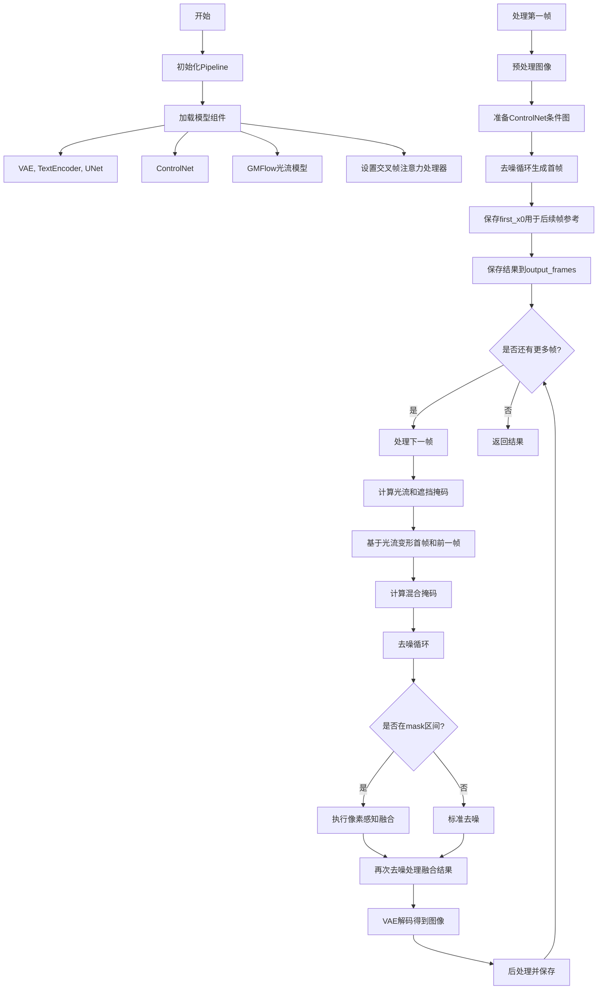
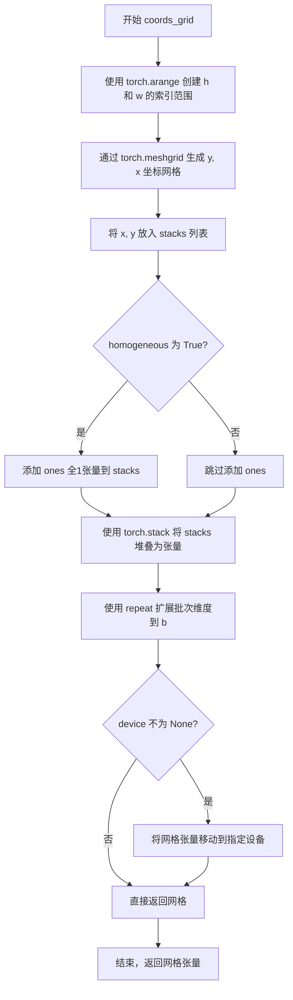
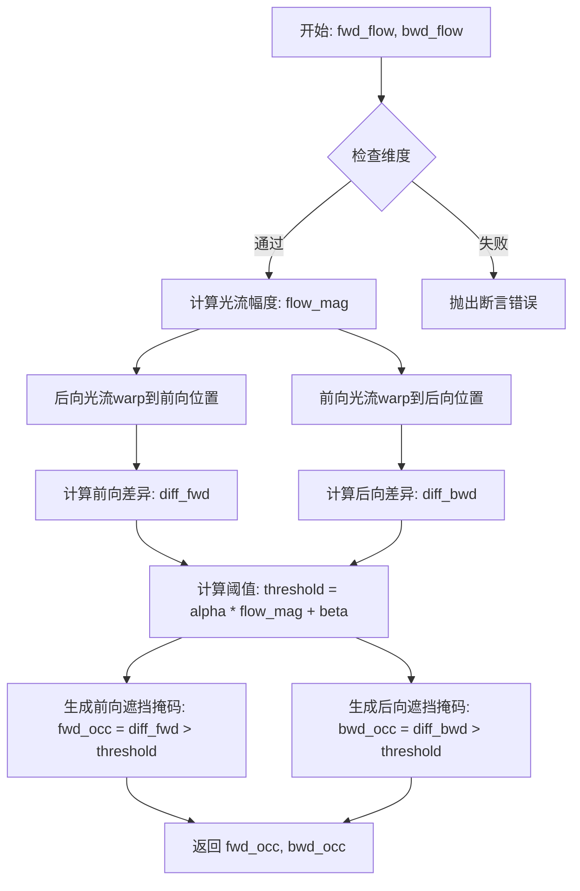
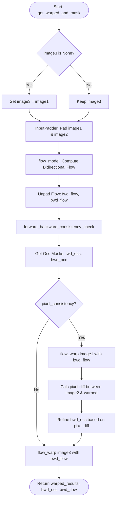
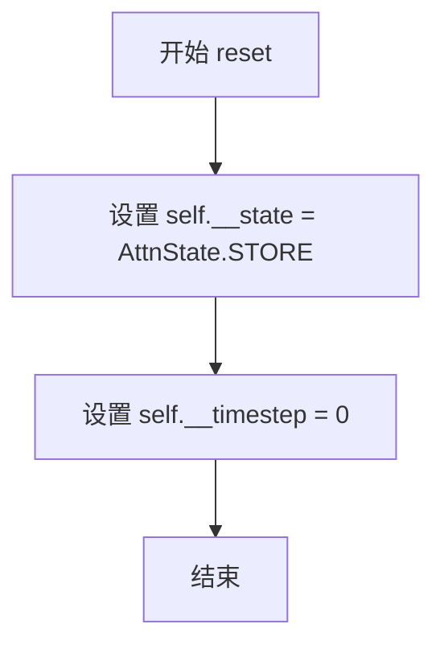
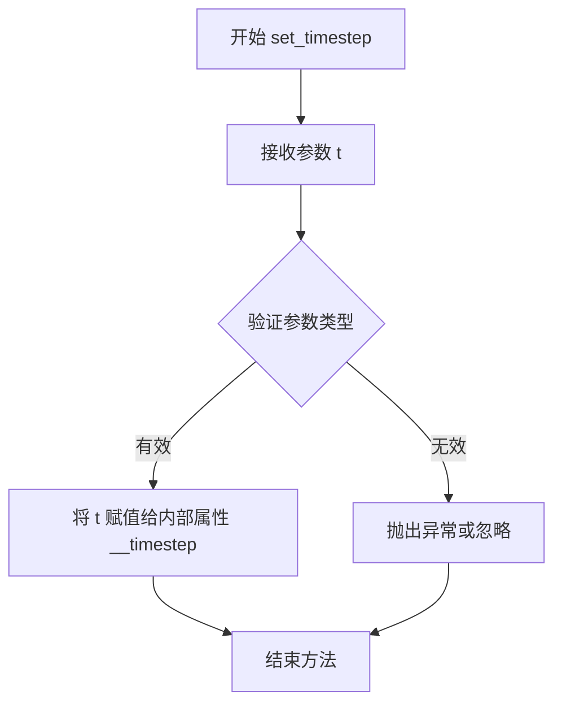
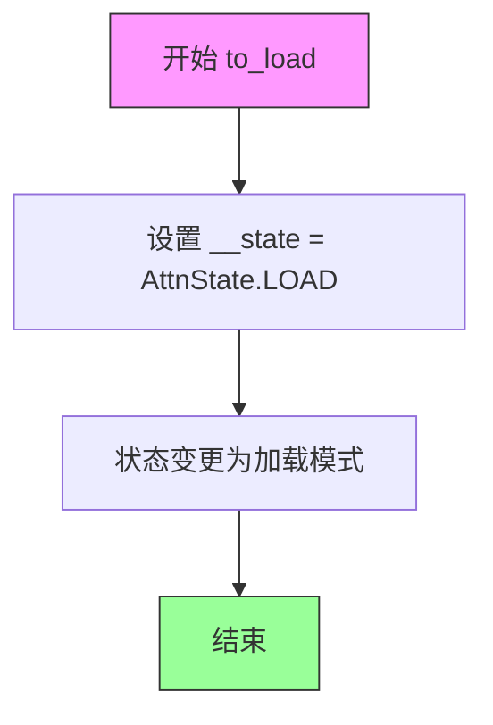
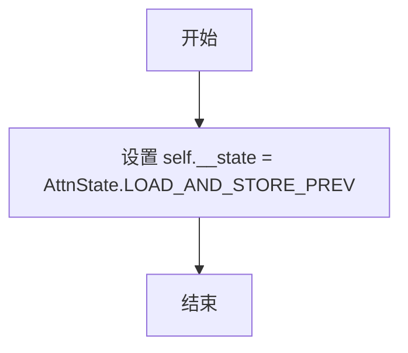
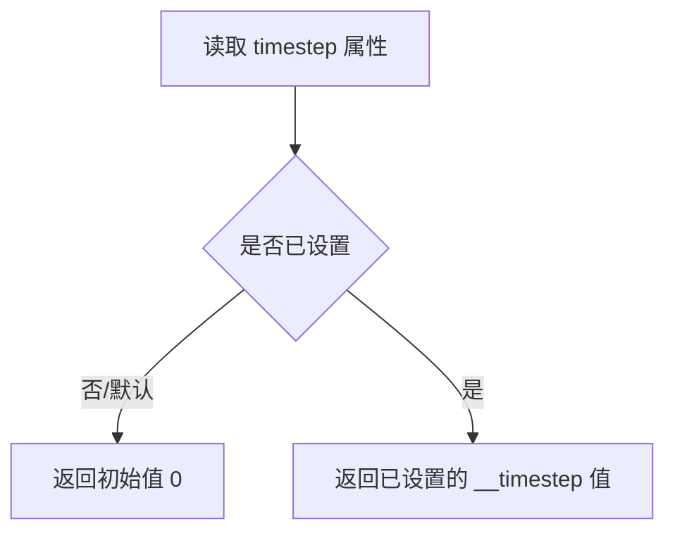
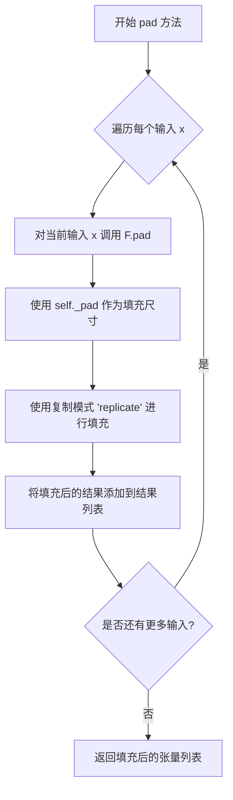

# `diffusers\examples\community\rerender_a_video.py` 详细设计文档

这是一个基于Stable Diffusion的视频到视频翻译Pipeline（Rerender算法），通过结合ControlNet条件控制、GMFlow光流估计和交叉帧注意力机制，实现高质量的视频风格转换和时序一致性。核心思想是利用首帧作为参考，通过光流变形和像素级融合来保持帧间连续性。

## 整体流程



## 类结构

```
DiffusionPipeline (基类)
└── StableDiffusionControlNetImg2ImgPipeline
    └── RerenderAVideoPipeline (主Pipeline类)
        ├── AttnState (注意力状态管理)
        ├── CrossFrameAttnProcessor (交叉帧注意力处理器)
        └── InputPadder (图像填充工具类)
    (全局函数)
    ├── coords_grid
    ├── bilinear_sample
    ├── flow_warp
    ├── forward_backward_consistency_check
    ├── get_warped_and_mask
    └── find_flat_region
    (数据类)
    └── TextToVideoSDPipelineOutput
```

## 全局变量及字段


### `blur`
    
Gaussian blur transform for smoothing fusion boundaries

类型：`torchvision.transforms.GaussianBlur`
    


### `logger`
    
Logger instance for the module

类型：`logging.Logger`
    


### `XLA_AVAILABLE`
    
Flag indicating whether PyTorch XLA is available

类型：`bool`
    


### `AttnState.__state`
    
Private attribute storing the current attention state (STORE, LOAD, or LOAD_AND_STORE_PREV)

类型：`int`
    


### `AttnState.__timestep`
    
Private attribute storing the current denoising timestep

类型：`int`
    


### `CrossFrameAttnProcessor.attn_state`
    
Reference to the attention state controller for managing cross-frame attention

类型：`AttnState`
    


### `CrossFrameAttnProcessor.first_maps`
    
Dictionary storing attention maps from the first frame for each timestep

类型：`Dict[int, torch.Tensor]`
    


### `CrossFrameAttnProcessor.prev_maps`
    
Dictionary storing attention maps from the previous frame for each timestep

类型：`Dict[int, torch.Tensor]`
    


### `InputPadder.ht`
    
Height of the input image

类型：`int`
    


### `InputPadder.wd`
    
Width of the input image

类型：`int`
    


### `InputPadder._pad`
    
Padding values [left, right, top, bottom] for making dimensions divisible by padding_factor

类型：`List[int]`
    


### `RerenderAVideoPipeline.vae`
    
Variational Auto-Encoder for encoding images to latent space and decoding latents to images

类型：`AutoencoderKL`
    


### `RerenderAVideoPipeline.text_encoder`
    
Frozen text encoder for encoding text prompts to embeddings

类型：`CLIPTextModel`
    


### `RerenderAVideoPipeline.tokenizer`
    
Tokenizer for converting text prompts to token IDs

类型：`CLIPTokenizer`
    


### `RerenderAVideoPipeline.unet`
    
Conditional U-Net architecture for denoising latent representations

类型：`UNet2DConditionModel`
    


### `RerenderAVideoPipeline.controlnet`
    
ControlNet model(s) for providing additional conditioning to the denoising process

类型：`Union[ControlNetModel, MultiControlNetModel]`
    


### `RerenderAVideoPipeline.scheduler`
    
Diffusion scheduler for managing denoising steps and noise scheduling

类型：`KarrasDiffusionSchedulers`
    


### `RerenderAVideoPipeline.safety_checker`
    
Safety checker for filtering potentially harmful generated content

类型：`StableDiffusionSafetyChecker`
    


### `RerenderAVideoPipeline.feature_extractor`
    
Feature extractor for processing images for the safety checker

类型：`CLIPImageProcessor`
    


### `RerenderAVideoPipeline.vae_scale_factor`
    
Scaling factor for VAE latent space (typically 2^(num_layers-1))

类型：`int`
    


### `RerenderAVideoPipeline.image_processor`
    
Processor for preprocessing and postprocessing main images

类型：`VaeImageProcessor`
    


### `RerenderAVideoPipeline.control_image_processor`
    
Processor for preprocessing controlnet conditioning images without normalization

类型：`VaeImageProcessor`
    


### `RerenderAVideoPipeline.attn_state`
    
Attention state controller for managing cross-frame attention in the denoising process

类型：`AttnState`
    


### `RerenderAVideoPipeline.flow_model`
    
GMFlow optical flow model for computing flow between frames for warping

类型：`GMFlow`
    


### `TextToVideoSDPipelineOutput.frames`
    
Output frames as a list of denoised images (numpy arrays or torch tensor)

类型：`Union[List[np.ndarray], torch.Tensor]`
    
    

## 全局函数及方法


### `coords_grid`

生成用于图像采样或坐标表示的网格张量（batch size, 2/3, H, W），支持齐次坐标选项。

参数：

- `b`：`int`，批次大小（batch size），表示生成的网格数量
- `h`：`int`，图像高度（height）
- `w`：`int`，图像宽度（width）
- `homogeneous`：`bool`，是否返回齐次坐标（添加第三维），默认为 `False`
- `device`：`torch.device`，可选参数，指定张量存放的设备

返回值：`torch.Tensor`，坐标网格张量，形状为 `[B, 2, H, W]`（非齐次）或 `[B, 3, H, W]`（齐次）

#### 流程图



#### 带注释源码

```
def coords_grid(b, h, w, homogeneous=False, device=None):
    # 生成高度和宽度的索引网格
    # y: [H, W] - 行索引 (0 到 h-1)
    # x: [H, W] - 列索引 (0 到 w-1)
    y, x = torch.meshgrid(torch.arange(h), torch.arange(w))

    # 初始化堆叠列表，先放 x 坐标，再放 y 坐标
    stacks = [x, y]

    # 如果需要齐次坐标（用于仿射变换等），添加全1通道
    if homogeneous:
        ones = torch.ones_like(x)  # [H, W]
        stacks.append(ones)

    # 堆叠为张量：[2, H, W] 或 [3, H, W]
    grid = torch.stack(stacks, dim=0).float()

    # 扩展批次维度：[2, H, W] -> [B, 2, H, W] 或 [B, 3, H, W]
    grid = grid[None].repeat(b, 1, 1, 1)

    # 如果指定了设备，将网格移动到对应设备
    if device is not None:
        grid = grid.to(device)

    return grid
```


### `bilinear_sample`

该函数执行双线性插值采样，通过将采样坐标归一化到 [-1, 1] 范围，并利用 `torch.nn.functional.grid_sample` 实现图像采样。当 `return_mask=True` 时，额外返回一个布尔掩码，标识哪些采样点位于图像有效范围内。

参数：

- `img`：`torch.Tensor`，输入图像张量，形状为 `[B, C, H, W]`，其中 B 为批量大小，C 为通道数，H 和 W 分别为高度和宽度
- `sample_coords`：`torch.Tensor`，采样坐标，形状为 `[B, 2, H, W]`（图像尺度）或 `[B, H, W, 2]`（根据第一个维度是否为 2 自动处理）
- `mode`：`str`，插值模式，默认为 `"bilinear"`，支持 `"nearest"`, `"bicubic"` 等
- `padding_mode`：`str`，填充模式，默认为 `"zeros"`，支持 `"border"`, `"reflection"` 等
- `return_mask`：`bool`，是否返回有效采样区域掩码，默认为 `False`

返回值：`torch.Tensor` 或 `Tuple[torch.Tensor, torch.Tensor]`，当 `return_mask=False` 时返回采样后的图像张量 `[B, C, H, W]`；当 `return_mask=True` 时返回元组，包含采样图像和布尔掩码 `[B, H, W]`

#### 流程图

```mermaid
flowchart TD
    A[开始] --> B{检查 sample_coords 维度}
    B -->|size[1] == 2| C[形状为 [B, 2, H, W]]
    B -->|size[1] != 2| D[置换维度: permute(0, 3, 1, 2)]
    D --> C
    C --> E[提取批量大小 b, 高度 h, 宽度 w]
    E --> F[计算 x_grid: 归一化到 [-1, 1]]
    F --> G[计算 y_grid: 归一化到 [-1, 1]]
    G --> H[堆叠 grid: [B, H, W, 2]]
    H --> I[调用 F.grid_sample 进行采样]
    I --> J{return_mask 为真?}
    J -->|是| K[计算有效区域掩码]
    K --> L[返回 img 和 mask 元组]
    J -->|否| M[仅返回 img]
    L --> N[结束]
    M --> N
```

#### 带注释源码

```python
def bilinear_sample(img, sample_coords, mode="bilinear", padding_mode="zeros", return_mask=False):
    """
    执行双线性插值采样

    参数:
        img: 输入图像张量 [B, C, H, W]
        sample_coords: 采样坐标 [B, 2, H, W] (图像尺度)
        mode: 插值模式，默认双线性
        padding_mode: 边界填充模式
        return_mask: 是否返回有效区域掩码

    返回:
        采样后的图像，或 (采样图像, 掩码) 元组
    """
    # img: [B, C, H, W]
    # sample_coords: [B, 2, H, W] in image scale
    
    # 如果坐标维度不是 [B, 2, H, W]，则假设为 [B, H, W, 2] 并进行维度置换
    if sample_coords.size(1) != 2:  # [B, H, W, 2]
        sample_coords = sample_coords.permute(0, 3, 1, 2)

    # 获取批量大小 b，坐标通道数（2），高度 h 和宽度 w
    b, _, h, w = sample_coords.shape

    # Normalize to [-1, 1]
    # 将采样坐标从图像像素坐标 [0, w-1] / [0, h-1] 归一化到 grid_sample 所需的 [-1, 1] 范围
    x_grid = 2 * sample_coords[:, 0] / (w - 1) - 1  # x 坐标归一化
    y_grid = 2 * sample_coords[:, 1] / (h - 1) - 1  # y 坐标归一化

    # 堆叠成 grid 格式 [B, H, W, 2]，符合 F.grid_sample 的输入要求
    grid = torch.stack([x_grid, y_grid], dim=-1)  # [B, H, W, 2]

    # 执行网格采样，使用双线性插值和指定的填充模式
    # align_corners=True 保持与原图角点对齐
    img = F.grid_sample(img, grid, mode=mode, padding_mode=padding_mode, align_corners=True)

    # 如果需要返回掩码，计算哪些采样点位于图像有效范围内
    if return_mask:
        # 掩码为 True 表示采样点在 [-1, 1] 范围内（图像有效区域）
        mask = (x_grid >= -1) & (y_grid >= -1) & (x_grid <= 1) & (y_grid <= 1)  # [B, H, W]

        return img, mask

    return img
```


### `flow_warp`

该函数执行光流扭曲（flow warping），根据光流场对特征图进行采样和变换，是视频帧融合和光流处理的核心操作。

参数：

- `feature`：`torch.Tensor`，输入的特征图，形状为 [B, C, H, W]
- `flow`：`torch.Tensor`，光流场，形状为 [B, 2, H, W]，包含每个像素的位移向量
- `mask`：`bool`，是否返回采样有效性掩码，默认为 False
- `mode`：`str`，插值模式，默认为 "bilinear"，支持 "nearest"、"bicubic" 等
- `padding_mode`：`str`，填充模式，默认为 "zeros"，支持 "reflection"、"replicate" 等

返回值：`torch.Tensor` 或 `Tuple[torch.Tensor, torch.Tensor]`，当 mask=False 时返回扭曲后的特征图；当 mask=True 时返回 (扭曲后的特征图, 有效性掩码)

#### 流程图

```mermaid
flowchart TD
    A[开始: flow_warp] --> B[获取特征图尺寸: b, c, h, w]
    B --> C{验证flow通道数}
    C -->|flow.size(1) == 2| D[创建坐标网格 coords_grid]
    C -->|否则| E[断言失败报错]
    D --> F[将flow加到坐标网格上]
    F --> G[转换grid数据类型匹配feature]
    G --> H[调用 bilinear_sample 采样]
    H --> I{mask参数为True?}
    I -->|是| J[返回 warped_feature 和 mask]
    I -->|否| K[仅返回 warped_feature]
    J --> L[结束]
    K --> L
```

#### 带注释源码

```python
def flow_warp(feature, flow, mask=False, mode="bilinear", padding_mode="zeros"):
    """
    对特征图进行光流扭曲（warp）操作。
    
    根据光流场提供的位移向量，对输入特征图进行采样变换，常用于：
    - 光流估计中的前向/后向传播
    - 视频帧间的特征对齐
    - 基于光流的图像融合
    
    Args:
        feature: 输入特征图，形状 [B, C, H, W]
        flow: 光流场，形状 [B, 2, H, W]，通道0为x方向位移，通道1为y方向位移
        mask: 是否返回采样有效性掩码，True时返回(mask, warped_feature)
        mode: grid_sample的插值模式，默认bilinear
        padding_mode: grid_sample的填充模式，默认zeros
    
    Returns:
        若mask=False: 返回扭曲后的特征图 [B, C, H, W]
        若mask=True: 返回 (扭曲后的特征图, 有效性掩码)
    """
    # 获取特征图的批次大小、通道数、高度和宽度
    b, c, h, w = feature.size()
    
    # 确保光流场有2个通道（x和y方向）
    assert flow.size(1) == 2

    # 创建坐标网格并加上光流位移
    # coords_grid 生成 [B, 2, H, W] 的归一化坐标 [-1, 1]
    # 加上flow后得到采样目标坐标
    grid = coords_grid(b, h, w).to(flow.device) + flow  # [B, 2, H, W]
    
    # 确保网格数据类型与特征图一致
    grid = grid.to(feature.dtype)
    
    # 调用双线性采样函数进行图像扭曲
    # bilinear_sample 内部会归一化坐标到 [-1, 1] 范围
    return bilinear_sample(feature, grid, mode=mode, padding_mode=padding_mode, return_mask=mask)
```


### `forward_backward_consistency_check`

该函数实现前向-后向光流一致性检查，用于检测光流估计中的遮挡区域。通过比较前向和后向光流的相互warp结果与原始光流的差异，计算前向和后向的遮挡掩码。

参数：

- `fwd_flow`：`torch.Tensor`，前向光流，形状为 [B, 2, H, W]，表示从第1帧到第2帧的光流
- `bwd_flow`：`torch.Tensor`，后向光流，形状为 [B, 2, H, W]，表示从第2帧到第1帧的光流
- `alpha`：`float`，默认值 0.01，一致性检查的缩放系数，参考 UnFlow 论文
- `beta`：`float`，默认值 0.5，一致性检查的常数偏移，参考 UnFlow 论文

返回值：`Tuple[torch.Tensor, torch.Tensor]`，返回两个遮挡掩码：

- `fwd_occ`：前向遮挡掩码，形状为 [B, H, W]，值为 0.0 表示无遮挡，1.0 表示遮挡
- `bwd_occ`：后向遮挡掩码，形状为 [B, H, W]，值为 0.0 表示无遮挡，1.0 表示遮挡

#### 流程图



#### 带注释源码

```python
def forward_backward_consistency_check(fwd_flow, bwd_flow, alpha=0.01, beta=0.5):
    # fwd_flow, bwd_flow: [B, 2, H, W]
    # alpha and beta values are following UnFlow
    # (https://huggingface.co/papers/1711.07837)
    
    # 1. 验证输入维度：确保两个光流都是4维且第2维为2（x,y分量）
    assert fwd_flow.dim() == 4 and bwd_flow.dim() == 4
    assert fwd_flow.size(1) == 2 and bwd_flow.size(1) == 2
    
    # 2. 计算光流幅度：前向和后向光流L1范数之和
    # flow_mag: [B, H, W]，表示每个像素的光流强度
    flow_mag = torch.norm(fwd_flow, dim=1) + torch.norm(bwd_flow, dim=1)
    
    # 3. 互相warp：对后向光流用前向光流进行warp，反之亦然
    # warped_bwd_flow: [B, 2, H, W]，将后向光流warp到前向位置
    warped_bwd_flow = flow_warp(bwd_flow, fwd_flow)
    # warped_fwd_flow: [B, 2, H, W]，将前向光流warp到后向位置
    warped_fwd_flow = flow_warp(fwd_flow, bwd_flow)
    
    # 4. 计算差异：如果光流估计准确，fwd_flow + warped_bwd_flow 应该接近0
    # diff_fwd: [B, H, W]，前向光流与其反向warp后的差异
    diff_fwd = torch.norm(fwd_flow + warped_bwd_flow, dim=1)
    # diff_bwd: [B, H, W]，后向光流与其反向warp后的差异
    diff_bwd = torch.norm(bwd_flow + warped_fwd_flow, dim=1)
    
    # 5. 计算动态阈值：基于光流幅度自适应调整
    # 当光流幅度大时，允许更大的差异；基础阈值为 beta
    threshold = alpha * flow_mag + beta
    
    # 6. 生成遮挡掩码：差异超过阈值的像素标记为遮挡
    # fwd_occ: [B, H, W]，前向遮挡区域（值为1表示遮挡）
    fwd_occ = (diff_fwd > threshold).float()
    # bwd_occ: [B, H, W]，后向遮挡区域（值为1表示遮挡）
    bwd_occ = (diff_bwd > threshold).float()
    
    # 7. 返回遮挡掩码，用于后续的视频处理或光流融合
    return fwd_occ, bwd_occ
```


### `get_warped_and_mask`

该函数是视频帧处理（Video-to-Video Rerender）流程中的核心组件之一。它接收当前帧和参考帧，利用嵌入的光流模型（GMFlow）估计两帧之间的运动场（光流），通过前后向一致性检查识别遮挡区域，并据此将参考帧扭曲（Warping）到当前帧视角，输出扭曲图像、遮挡掩码和后向光流，为后续的图像融合提供数据支持。

参数：

- `flow_model`：`GMFlow`，光流估计模型实例，用于计算两帧之间的密集对应关系。
- `image1`：`torch.Tensor`，参考帧图像，形状为 `[C, H, W]` 或 `[B, C, H, W]`。
- `image2`：`torch.Tensor`，目标帧图像，形状为 `[C, H, W]` 或 `[B, C, H, W]`。
- `image3`：`torch.Tensor` (可选)，需要进行扭曲操作的图像。若为 `None`，则默认使用 `image1`。
- `pixel_consistency`：`bool`，标志位，决定是否使用像素级颜色一致性来细化遮挡掩码（通常用于更精细的遮挡检测）。
- `device`：`torch.device` (可选)，指定计算设备（如 CPU 或 CUDA）。若为 `None`，则使用模型当前所在设备。

返回值：`(warped_results, bwd_occ, bwd_flow)`
- `warped_results`：`torch.Tensor`，基于后向光流扭曲后的图像。
- `bwd_occ`：`torch.Tensor`，后向遮挡掩码 (0-1 之间)，用于标识在目标帧视角下不可见的区域。
- `bwd_flow`：`torch.Tensor`，从 image2 到 image1 的后向光流，形状为 `[1, 2, H, W]`。

#### 流程图



#### 带注释源码

```python
@torch.no_grad()
def get_warped_and_mask(flow_model, image1, image2, image3=None, pixel_consistency=False, device=None):
    # 1. 处理可选参数：如果未提供 image3，则默认使用 image1
    if image3 is None:
        image3 = image1
    
    # 2. 图像填充：由于 GMFlow 要求输入尺寸能被 8 整除，使用 InputPadder 进行填充
    padder = InputPadder(image1.shape, padding_factor=8)
    # 将图像移至指定设备并增加 batch 维度进行推理
    image1, image2 = padder.pad(image1[None].to(device), image2[None].to(device))
    
    # 3. 光流模型推理：调用 GMFlow 预测双向光流
    # attn_splits_list, corr_radius_list 等参数控制模型内部的注意力机制和计算范围
    results_dict = flow_model(
        image1, image2, attn_splits_list=[2], corr_radius_list=[-1], prop_radius_list=[-1], pred_bidir_flow=True
    )
    
    # 4. 提取并解包光流结果
    flow_pr = results_dict["flow_preds"][-1]  # 取最后一层预测结果 [B, 2, H, W]
    fwd_flow = padder.unpad(flow_pr[0]).unsqueeze(0)  # [1, 2, H, W] 正向光流
    bwd_flow = padder.unpad(flow_pr[1]).unsqueeze(0)  # [1, 2, H, W] 反向光流
    
    # 5. 前后向一致性检查：检测遮挡区域
    # 该方法通过检查光流的可逆性来识别哪些像素是遮挡的
    fwd_occ, bwd_occ = forward_backward_consistency_check(fwd_flow, bwd_flow)  # [1, H, W] float
    
    # 6. 像素级一致性细化（可选）：如果启用，进一步利用颜色差异修正遮挡掩码
    if pixel_consistency:
        # 将 image1 基于反向光流 warp 到 image2 的位置
        warped_image1 = flow_warp(image1, bwd_flow)
        # 计算扭曲后图像与 image2 的差异，如果差异过大（超过阈值），认为是遮挡
        bwd_occ = torch.clamp(
            bwd_occ + (abs(image2 - warped_image1).mean(dim=1) > 255 * 0.25).float(), 0, 1
        ).unsqueeze(0)
        
    # 7. 最终扭曲：基于计算出的 bwd_flow 对 image3 进行扭曲
    warped_results = flow_warp(image3, bwd_flow)
    
    # 8. 返回扭曲结果、遮挡掩码和光流
    return warped_results, bwd_occ, bwd_flow
```


### `find_flat_region`

该函数用于检测输入 mask 中的平坦区域（flat region）。它使用 Sobel 算子计算图像梯度，找出梯度为零的区域，这些区域即为平坦区域。在视频重渲染 pipeline 中，该函数用于识别需要平滑处理的平坦区域，以防止在边界处产生伪影。

参数：

- `mask`：`torch.Tensor`，输入的二值掩码（mask），通常为 [H, W] 形状，表示需要检测的区域

返回值：`torch.Tensor`，返回平坦区域的掩码，形状为 [H, W]，值为 1 表示平坦区域，值为 0 表示非平坦区域（边缘或纹理区域）

#### 流程图

```mermaid
flowchart TD
    A[开始: 输入 mask] --> B[获取 device]
    B --> C[创建 Sobel X 方向卷积核]
    C --> D[创建 Sobel Y 方向卷积核]
    D --> E[对 mask 进行维度扩展和 padding]
    E --> F[使用卷积计算 X 方向梯度 grad_x]
    F --> G[使用卷积计算 Y 方向梯度 grad_y]
    G --> H[计算梯度绝对值之和: abs_grad = |grad_x| + |grad_y|]
    H --> I{判断: abs_grad == 0?}
    I -->|是| J[标记为平坦区域: 1.0]
    I -->|否| K[标记为非平坦区域: 0.0]
    J --> L[移除批次维度]
    L --> M[返回平坦区域 mask]
    K --> M
```

#### 带注释源码

```python
@torch.no_grad()
def find_flat_region(mask):
    """
    检测输入掩码中的平坦区域。
    
    使用 Sobel 算子计算图像梯度，平坦区域（梯度为0）表示需要平滑处理的区域。
    
    参数:
        mask: 输入的二值掩码，形状为 [H, W]
    
    返回:
        平坦区域的掩码，形状为 [H, W]，1.0 表示平坦区域，0.0 表示非平坦区域
    """
    # 获取输入 mask 所在的设备（CPU 或 CUDA）
    device = mask.device
    
    # 创建 X 方向的 Sobel 卷积核，用于检测水平边缘
    # [[-1, 0, 1],
    #  [-1, 0, 1],
    #  [-1, 0, 1]]
    kernel_x = torch.Tensor([[-1, 0, 1], [-1, 0, 1], [-1, 0, 1]]).unsqueeze(0).unsqueeze(0).to(device)
    
    # 创建 Y 方向的 Sobel 卷积核，用于检测垂直边缘
    # [[-1, -1, -1],
    #  [ 0,  0,  0],
    #  [ 1,  1,  1]]
    kernel_y = torch.Tensor([[-1, -1, -1], [0, 0, 0], [1, 1, 1]]).unsqueeze(0).unsqueeze(0).to(device)
    
    # 对输入 mask 进行扩展和 padding
    # 1. unsqueeze(0) 添加批次维度: [H, W] -> [1, H, W]
    # 2. F.pad 进行边缘填充，使用 replicate 模式保持边缘像素值
    #    padding=(1,1,1,1) 表示左、右、上、下各填充 1 个像素
    mask_ = F.pad(mask.unsqueeze(0), (1, 1, 1, 1), mode="replicate")
    
    # 使用卷积计算 X 方向的梯度（水平边缘检测）
    grad_x = torch.nn.functional.conv2d(mask_, kernel_x)
    
    # 使用卷积计算 Y 方向的梯度（垂直边缘检测）
    grad_y = torch.nn.functional.conv2d(mask_, kernel_y)
    
    # 计算梯度绝对值之和，如果为 0 则表示该位置是平坦区域
    # abs(grad_x) + abs(grad_y) == 0 的位置既没有水平变化也没有垂直变化
    # 转换为 float 类型，并移除批次维度 [1, H, W] -> [H, W]
    return ((abs(grad_x) + abs(grad_y)) == 0).float()[0]
```


### `prepare_image`

该函数用于将不同格式的图像（PIL图像、NumPy数组或PyTorch张量）统一转换为PyTorch.float32张量格式，并进行归一化处理（除以127.5减1，使得像素值范围在[-1, 1]）。

参数：

- `image`：`Union[torch.Tensor, PIL.Image.Image, np.ndarray, List[PIL.Image.Image], List[np.ndarray]]`，输入图像，可以是单个PIL图像、NumPy数组、PyTorch张量，或者是它们的列表

返回值：`torch.Tensor`，预处理后的图像张量，形状为 `[B, C, H, W]`，数据类型为 `float32`，值域范围 `[-1, 1]`

#### 流程图

```mermaid
flowchart TD
    A[开始: prepare_image] --> B{image是否为torch.Tensor?}
    B -->|是| C{image.ndim == 3?}
    C -->|是| D[unsqueeze增加batch维度]
    C -->|否| E[保持原样]
    D --> F[转换为float32]
    E --> F
    B -->|否| G{image是否为PIL.Image或np.ndarray?}
    G -->|是| H[转换为list]
    G -->|否| I[保持list格式]
    H --> J{list[0]是否为PIL.Image?}
    J -->|是| K[逐个转换为RGB np.array]
    J -->|否| L{list[0]是否为np.ndarray?}
    K --> M[在axis=0拼接]
    L -->|是| M
    I --> M
    M --> N[转换为CHW格式: transpose]
    N --> O[转换为torch.Tensor]
    P[归一化: 除以127.5减1]
    O --> P
    F --> Q[返回处理后的image]
    P --> Q
```

#### 带注释源码

```python
def prepare_image(image):
    # 判断输入是否为PyTorch张量
    if isinstance(image, torch.Tensor):
        # 批量单张图像处理：如果输入是3维张量(H, W, C)，添加batch维度变为(1, C, H, W)
        if image.ndim == 3:
            image = image.unsqueeze(0)

        # 统一转换为float32类型
        image = image.to(dtype=torch.float32)
    else:
        # 预处理其他格式的图像
        # 如果是PIL.Image或np.ndarray，转换为list以便统一处理
        if isinstance(image, (PIL.Image.Image, np.ndarray)):
            image = [image]

        # 处理PIL.Image列表：逐个转换为RGB格式的numpy数组
        if isinstance(image, list) and isinstance(image[0], PIL.Image.Image):
            # 将每张PIL图像转换为numpy数组，并在前面添加batch维度
            image = [np.array(i.convert("RGB"))[None, :] for i in image]
            # 在batch维度上拼接
            image = np.concatenate(image, axis=0)
        # 处理numpy数组列表：直接在batch维度上拼接
        elif isinstance(image, list) and isinstance(image[0], np.ndarray):
            image = np.concatenate([i[None, :] for i in image], axis=0)

        # 转换维度顺序：从HWC转换为CHW
        image = image.transpose(0, 3, 1, 2)
        # 转换为PyTorch张量并归一化：像素值从[0, 255]映射到[-1, 1]
        image = torch.from_numpy(image).to(dtype=torch.float32) / 127.5 - 1.0

    return image
```


### `AttnState.reset`

该方法用于重置注意力状态，将内部状态重置为初始值（STORE状态），并将时间步计数器归零。

参数：
- 无（仅包含隐式参数 `self`）

返回值：`None`，无返回值描述（该方法修改对象内部状态）

#### 流程图



#### 带注释源码

```python
def reset(self):
    """
    重置注意力状态到初始状态
    
    将内部状态重置为 STORE 模式，并将时间步计数器归零。
    通常在开始处理新的一批帧或新视频时调用。
    """
    # 设置状态为 STORE 模式，表示开始存储注意力图
    self.__state = AttnState.STORE
    
    # 将时间步计数器归零
    self.__timestep = 0
```


### `AttnState.set_timestep`

该方法用于设置 AttnState 类的内部时间步长（timestep）值，控制注意力状态在视频帧处理过程中的时间同步。

参数：

-  `t`：`int`，时间步长值，通常来自调度器（scheduler）的时间步张量经过 `.item()` 转换后的整数值，用于标识当前处理的去噪步骤序号

返回值：`None`，无返回值，仅修改内部状态

#### 流程图



#### 带注释源码

```python
def set_timestep(self, t):
    """
    设置当前的时间步长值。
    
    该方法在去噪循环的每次迭代中被调用，用于更新 AttnState 内部存储的时间步长。
    时间步长决定了在跨帧注意力机制中，应该使用哪一帧的注意力图（attention maps）。
    
    参数:
        t: int 或 float，当前去噪步骤的时间步长值，通常为非负整数。
           该值来自调度器的 timesteps 列表，经过 .item() 转换为 Python 原生类型。
    
    返回:
        None: 此方法直接修改内部状态，不返回任何值。
    """
    self.__timestep = t  # 将传入的时间步长值存储到私有属性 __timestep 中
```


### `AttnState.to_load`

该方法用于将注意力状态设置为"加载"模式（LOAD），表示后续处理将加载之前存储的注意力图而非存储新的。

参数： 无

返回值：`None`，无返回值，仅修改内部状态

#### 流程图



#### 带注释源码

```python
def to_load(self):
    """
    将注意力状态设置为加载模式（LOAD）。
    
    该方法修改内部状态__state为AttnState.LOAD（值为1），
    使得CrossFrameAttnProcessor在后续处理中不再存储新的注意力图，
    而是加载之前存储的first_maps和prev_maps进行跨帧注意力计算。
    """
    self.__state = AttnState.LOAD  # 将状态设置为加载模式，值为1
```


### `AttnState.to_load_and_store_prev`

该方法用于将注意力状态设置为 `LOAD_AND_STORE_PREV` 模式，以便在跨帧注意力处理中同时加载和存储前一帧的注意力图。

参数： 无

返回值：`None`，无返回值，该方法直接修改内部状态

#### 流程图



#### 带注释源码

```python
def to_load_and_store_prev(self):
    """
    将注意力状态设置为 LOAD_AND_STORE_PREV 模式。
    
    在此模式下，CrossFrameAttnProcessor 会：
    1. 加载第一帧和前一帧的注意力图用于交叉注意力计算
    2. 同时保存当前帧的隐藏状态作为下一帧的 prev_maps
    
    这个状态用于非首帧的非掩码区域的帧处理，
    使得每帧都能参考第一帧和前一帧的信息。
    """
    self.__state = AttnState.LOAD_AND_STORE_PREV
```


### `AttnState.state`

该属性是 `AttnState` 类的状态访问器，用于获取注意力处理器的当前状态（存储、加载或加载并存储上一帧）。

参数： 无

返回值：`int`，返回当前注意力处理器的状态，值为 `AttnState.STORE`（0）、`AttnState.LOAD`（1）或 `AttnState.LOAD_AND_STORE_PREV`（2）之一。

#### 流程图

```mermaid
flowchart TD
    A[访问 AttnState.state] --> B{读取 __state 属性}
    B --> C[返回当前状态值]
    C --> D{状态判断}
    D -->|STORE (0)| E[当前帧存储注意力图]
    D -->|LOAD (1)| F[从之前帧加载注意力图]
    D -->|LOAD_AND_STORE_PREV| G[加载并保存当前帧作为上一帧]
```

#### 带注释源码

```python
@property
def state(self):
    """
    属性: state
    
    获取注意力处理器的当前状态。
    
    状态说明:
        - STORE (0): 存储模式，第一帧或需要保存注意力图的状态
        - LOAD (1): 加载模式，从之前保存的注意力图中加载
        - LOAD_AND_STORE_PREV (2): 加载并保存上一帧模式，
          在加载的同时保存当前帧作为后续使用的上一帧
    
    返回:
        int: 当前状态值，默认为 AttnState.STORE (0)
    """
    return self.__state
```


### `AttnState.timestep` (property)

返回当前注意力状态的时间步（timestep）值，用于在视频帧处理过程中追踪当前处理的帧索引或去噪步骤。

参数：

- （无参数）

返回值：`int`，返回当前存储的时间步整数值。

#### 流程图



#### 带注释源码

```python
@property
def timestep(self):
    """
    获取当前时间步的 property。
    
    AttnState 类用于管理跨帧注意力处理过程中的状态，
    其中 timestep 用于记录当前处理的帧索引或去噪步骤。
    此属性为只读，返回私有属性 __timestep 的值。
    该值通过 set_timestep() 方法进行设置。
    
    Returns:
        int: 当前的时间步值，初始为 0
    """
    return self.__timestep
```


### `CrossFrameAttnProcessor.__init__`

该方法是 `CrossFrameAttnProcessor` 类的构造函数，用于初始化跨帧注意力处理器。它接收一个 `AttnState` 对象作为参数，用于跟踪当前处理的帧状态，并初始化用于存储第一帧和前一帧注意力图的两个字典。

参数：

-  `attn_state`：`AttnState`，用于跟踪模型是处理第一帧还是中间帧的状态对象

返回值：`None`，因为 `__init__` 方法不返回值

#### 流程图

```mermaid
flowchart TD
    A[开始 __init__] --> B[调用 super().__init__ 初始化父类]
    B --> C[将 attn_state 参数赋值给 self.attn_state]
    C --> D[初始化 self.first_maps 为空字典]
    D --> E[初始化 self.prev_maps 为空字典]
    E --> F[结束]
```

#### 带注释源码

```python
def __init__(self, attn_state: AttnState):
    """
    初始化 CrossFrameAttnProcessor。
    
    Args:
        attn_state: 注意力状态对象，用于跟踪当前处理的帧状态
    """
    # 调用父类 AttnProcessor 的初始化方法
    super().__init__()
    
    # 保存传入的注意力状态对象，用于在后续处理中判断帧状态
    self.attn_state = attn_state
    
    # 初始化字典用于存储第一帧的注意力图，键为时间步 t
    self.first_maps = {}
    
    # 初始化字典用于存储前一帧的注意力图，键为时间步 t
    self.prev_maps = {}
```


### `CrossFrameAttnProcessor.__call__`

该方法是跨帧注意力处理器的核心实现，负责在视频生成过程中实现帧间信息传递。当处理自注意力时，根据 `AttnState` 的状态（存储、加载或加载并存储前一帧）决定是保存当前帧的隐藏状态，还是将之前存储的首帧和前一帧进行拼接后作为交叉注意力上下文；若处理交叉注意力，则直接将 `encoder_hidden_states` 传递给父类处理。

参数：

- `attn`：`Attention`，注意力模块实例，用于执行实际的注意力计算
- `hidden_states`：`torch.Tensor`，当前层的隐藏状态，通常为 `[batch_size, seq_len, hidden_dim]` 形状的张量
- `encoder_hidden_states`：`Optional[torch.Tensor]`，编码器隐藏状态，当为 `None` 时执行自注意力，否则执行交叉注意力，默认为 `None`
- `attention_mask`：`Optional[torch.Tensor]`，注意力掩码，用于屏蔽特定位置的注意力，默认为 `None`
- `temb`：`Optional[torch.Tensor]`，时间嵌入，用于条件扩散模型的时间步信息，默认为 `None`

返回值：`torch.Tensor`，经过注意力处理后的隐藏状态，形状与输入 `hidden_states` 相同

#### 流程图

```mermaid
flowchart TD
    A[开始 __call__] --> B{encoder_hidden_states is None?}
    B -->|Yes| C[自注意力处理]
    B -->|No| D[交叉注意力处理]
    
    C --> E[获取当前timestep t]
    E --> F{attn_state.state == STORE?}
    
    F -->|Yes| G[存储first_maps和prev_maps]
    G --> H[调用父类__call__]
    F -->|No| I[LOAD或LOAD_AND_STORE_PREV]
    
    I --> J{state == LOAD_AND_STORE_PREV?}
    J -->|Yes| K[tmp = hidden_states.detach()]
    J -->|No| L[跳过]
    
    K --> L
    L --> M[cross_map = concat[first_maps[t], prev_maps[t]]]
    M --> N[调用父类__call__处理cross_map]
    N --> O{state == LOAD_AND_STORE_PREV?}
    O -->|Yes| P[prev_maps[t] = tmp]
    O -->|No| Q[跳过]
    
    P --> Q
    Q --> R[返回结果]
    
    D --> S[直接调用父类__call__]
    S --> R
    
    R --> T[结束]
```

#### 带注释源码

```python
def __call__(self, attn: Attention, hidden_states, encoder_hidden_states=None, attention_mask=None, temb=None):
    """
    执行跨帧注意力处理，支持自注意力和交叉注意力两种模式。
    
    参数:
        attn: Attention模块，执行实际注意力计算
        hidden_states: 当前层的隐藏状态张量
        encoder_hidden_states: 编码器隐藏状态，None时为自注意力
        attention_mask: 可选的注意力掩码
        temb: 可选的时间嵌入
    
    返回:
        处理后的隐藏状态张量
    """
    # 判断是否为自注意力（encoder_hidden_states为None）
    if encoder_hidden_states is None:
        # 获取当前扩散过程的时间步t
        t = self.attn_state.timestep
        
        # STORE状态：首次处理当前帧，需要存储hidden_states
        if self.attn_state.state == AttnState.STORE:
            # 存储第一帧的hidden_states（用于后续帧的参考）
            self.first_maps[t] = hidden_states.detach()
            # 同时存储前一帧的hidden_states
            self.prev_maps[t] = hidden_states.detach()
            # 执行标准自注意力计算
            res = super().__call__(attn, hidden_states, encoder_hidden_states, attention_mask, temb)
        
        # LOAD或LOAD_AND_STORE_PREV状态：处理后续帧
        else:
            # 如果需要同时加载并存储前一帧，先保存当前hidden_states的副本
            if self.attn_state.state == AttnState.LOAD_AND_STORE_PREV:
                tmp = hidden_states.detach()
            
            # 沿通道维度（dim=1）拼接首帧和前一帧的hidden_states作为跨帧上下文
            cross_map = torch.cat((self.first_maps[t], self.prev_maps[t]), dim=1)
            
            # 使用跨帧上下文执行注意力计算，使当前帧能够关注首帧和前一帧的信息
            res = super().__call__(attn, hidden_states, cross_map, attention_mask, temb)
            
            # 如果状态为LOAD_AND_STORE_PREV，更新prev_maps为之前保存的tmp
            if self.attn_state.state == AttnState.LOAD_AND_STORE_PREV:
                self.prev_maps[t] = tmp
    else:
        # 交叉注意力模式：直接使用encoder_hidden_states
        res = super().__call__(attn, hidden_states, encoder_hidden_states, attention_mask, temb)

    return res
```


### `InputPadder.__init__`

初始化 InputPadder 类，用于对图像进行填充，使其尺寸能够被指定的因子整除（默认因子为 8）。

参数：

- `dims`：`tuple` 或 `list`，输入图像的尺寸信息（应包含高度和宽度信息）
- `mode`：`str`，填充模式，值为 "sintel" 或其他模式（默认值为 "sintel"）
- `padding_factor`：`int`，填充因子，用于确保图像尺寸能够被该因子整除（默认值为 8）

返回值：`None`，构造函数无返回值

#### 流程图

```mermaid
flowchart TD
    A[开始初始化 InputPadder] --> B[从 dims 中提取高度 self.ht 和宽度 self.wd]
    B --> C[计算 pad_ht: 使得高度能被 padding_factor 整除的填充量]
    C --> D[计算 pad_wd: 使得宽度能被 padding_factor 整除的填充量]
    D --> E{判断 mode == 'sintel'?}
    E -->|Yes| F[设置 self._pad = [pad_wd//2, pad_wd-pad_wd//2, pad_ht//2, pad_ht-pad_ht//2]]
    E -->|No| G[设置 self._pad = [pad_wd//2, pad_wd-pad_wd//2, 0, pad_ht]]
    F --> H[结束初始化]
    G --> H
```

#### 带注释源码

```python
def __init__(self, dims, mode="sintel", padding_factor=8):
    """
    初始化 InputPadder 类，用于填充图像使其尺寸可被 padding_factor 整除
    
    参数:
        dims: 输入图像的尺寸，通常为 (batch, channels, height, width) 或 (height, width)
        mode: 填充模式，"sintel" 模式会对称填充高度，其他模式从顶部填充
        padding_factor: 填充因子，默认值为 8
    """
    # 从 dims 中提取高度和宽度（取最后两个维度）
    self.ht, self.wd = dims[-2:]
    
    # 计算高度方向需要填充的像素数
    # 公式解析：(((self.ht // padding_factor) + 1) * padding_factor - self.ht) % padding_factor
    # 1. self.ht // padding_factor: 高度包含多少个 padding_factor
    # 2. +1: 向上取整到下一个整数
    # 3. * padding_factor: 计算目标高度
    # 4. - self.ht: 计算需要填充的像素
    # 5. % padding_factor: 取模确保不会超过一个 padding_factor（实际上对于向上取整的算法结果为 0 或 padding_factor）
    pad_ht = (((self.ht // padding_factor) + 1) * padding_factor - self.ht) % padding_factor
    
    # 计算宽度方向需要填充的像素数（计算逻辑同高度）
    pad_wd = (((self.wd // padding_factor) + 1) * padding_factor - self.wd) % padding_factor
    
    # 根据模式设置填充参数
    # 填充参数格式: [左, 右, 上, 下]
    if mode == "sintel":
        # "sintel" 模式：高度方向对称填充（上下各一半）
        self._pad = [pad_wd // 2, pad_wd - pad_wd // 2, pad_ht // 2, pad_ht - pad_ht // 2]
    else:
        # 其他模式：高度方向从顶部开始填充
        self._pad = [pad_wd // 2, pad_wd - pad_wd // 2, 0, pad_ht]
```


### InputPadder.pad

该方法用于对输入图像进行填充，使其尺寸能够被 padding_factor 整除。通过计算需要的填充量，使用复制模式（replicate）在图像边缘进行填充，确保后续操作（如光流计算）的尺寸要求得到满足。

参数：

- `*inputs`：可变数量的 `torch.Tensor`，需要填充的张量（通常是图像或特征图）

返回值：`List[torch.Tensor]`，填充后的张量列表，每个输入都经过相同的填充处理

#### 流程图



#### 带注释源码

```python
def pad(self, *inputs):
    """
    对输入图像进行填充处理
    
    该方法接收可变数量的张量，对每个张量应用相同的填充操作。
    填充使用复制模式（replicate），即在边界处复制边缘像素值，
    这在图像处理中有助于避免边界效应。
    
    参数:
        *inputs: 可变数量的 torch.Tensor，需要填充的张量
        
    返回:
        List[torch.Tensor]: 填充后的张量列表
    """
    # 使用列表推导式，对每个输入应用 F.pad 函数
    # self._pad 存储了填充参数 [左, 右, 上, 下]
    # mode="replicate" 表示使用复制填充模式
    return [F.pad(x, self._pad, mode="replicate") for x in inputs]
```


### `InputPadder.unpad`

该方法用于将经过填充的图像数据去除填充边界，还原为原始尺寸。在视频处理流程中，配合光流模型使用，对预测的光流结果进行去填充操作，确保输出尺寸与原始输入图像一致。

参数：

- `x`：`torch.Tensor`，需要进行去填充处理的张量，通常为光流数据或特征图，形状为 `[..., C, H, W]`

返回值：`torch.Tensor`，去填充后的张量，形状与原始未填充时的尺寸相同

#### 流程图

```mermaid
flowchart TD
    A[开始: 输入张量 x] --> B[获取张量高度 ht 和宽度 wd]
    B --> C[根据填充参数计算去填充边界 c]
    C --> D[使用切片提取有效区域 x[..., c0:c1, c2:c3]]
    E[返回去填充后的张量]
    D --> E
```

#### 带注释源码

```python
def unpad(self, x):
    """
    移除图像填充边界，还原原始尺寸
    
    参数:
        x: torch.Tensor，需要去填充的张量，形状为 [..., C, H, W]
    
    返回:
        torch.Tensor，去除填充后的张量
    """
    # 获取输入张量的高度和宽度（取最后两个维度）
    ht, wd = x.shape[-2:]
    
    # 计算去填充的边界索引
    # self._pad 存储了 [pad_left, pad_right, pad_top, pad_bottom]
    # c 数组存储 [start_row, end_row, start_col, end_col]
    c = [self._pad[2], ht - self._pad[3], self._pad[0], wd - self._pad[1]]
    
    # 使用切片操作去除填充边界
    # x[..., c[0]:c[1], c[2]:c[3]] 表示：
    #   - 保留前面的所有维度（用 ... 表示）
    #   - 在倒数第二维（高度）上取 c[0] 到 c[1]
    #   - 在倒数第一维（宽度）上取 c[2] 到 c[3]
    return x[..., c[0] : c[1], c[2] : c[3]]
```


### `RerenderAVideoPipeline.__init__`

该方法是 `RerenderAVideoPipeline` 类的构造函数，负责初始化视频到视频翻译管道。它继承自 `StableDiffusionControlNetImg2ImgPipeline`，设置各种组件（如 VAE、文本编码器、UNet、ControlNet 等），配置注意力处理器以支持跨帧注意力，并加载 GMFlow 光流模型用于视频帧之间的特征融合。

参数：

- `vae`：`AutoencoderKL`，用于将图像编码和解码到潜在表示的变分自编码器模型
- `text_encoder`：`CLIPTextModel`，冻结的文本编码器，Stable Diffusion 使用 CLIP 的文本部分
- `tokenizer`：`CLIPTokenizer`，CLIPTokenizer 类的分词器
- `unet`：`UNet2DConditionModel`，条件 U-Net 架构，用于对编码的图像潜在表示进行去噪
- `controlnet`：`Union[ControlNetModel, List[ControlNetModel], Tuple[ControlNetModel], MultiControlNetModel]`，在去噪过程中为 unet 提供额外条件控制的 ControlNet 模型
- `scheduler`：`KarrasDiffusionSchedulers`，与 unet 结合使用以对编码图像潜在表示进行去噪的调度器
- `safety_checker`：`StableDiffusionSafetyChecker`，估计生成图像是否可以被认为是攻击性或有害的分类模块
- `feature_extractor`：`CLIPImageProcessor`，从生成图像中提取特征以用作 safety_checker 输入的模型
- `image_encoder`：可选的图像编码器，默认为 None
- `requires_safety_checker`：布尔值，指示是否需要安全检查器，默认为 True
- `device`：可选的设备参数，默认为 None

返回值：`None`，构造函数不返回任何值

#### 流程图

```mermaid
flowchart TD
    A[开始 __init__] --> B[调用父类构造函数 super().__init__]
    B --> C[将管道移动到指定设备 self.to device]
    C --> D{检查 safety_checker 是否为 None}
    D -->|是且 requires_safety_checker 为 True| E[发出安全检查器警告]
    D -->|否| F{检查 safety_checker 不为 None 但 feature_extractor 为 None}
    F -->|是| G[抛出 ValueError 异常]
    F -->|否| H[检查 controlnet 类型]
    H --> I{controlnet 是 list 或 tuple}
    I -->|是| J[包装为 MultiControlNetModel]
    I -->|否| K[注册所有模块]
    J --> K
    K --> L[计算 vae_scale_factor]
    L --> M[创建 VaeImageProcessor]
    M --> N[创建 control_image_processor]
    N --> O[注册 requires_safety_checker 到配置]
    O --> P[创建 AttnState 实例]
    P --> Q[遍历 unet 的注意力处理器]
    Q --> R{处理器键以 'up' 开头}
    R -->|是| S[创建 CrossFrameAttnProcessor]
    R -->|否| T[创建 AttnProcessor]
    S --> U[设置注意力处理器到 unet]
    T --> U
    U --> V[创建 GMFlow 模型]
    V --> W[从 URL 加载 GMFlow 权重]
    W --> X[设置 flow_model 为 eval 模式]
    X --> Y[结束 __init__]
    
    E --> H
    G --> H
```

#### 带注释源码

```python
def __init__(
    self,
    vae: AutoencoderKL,
    text_encoder: CLIPTextModel,
    tokenizer: CLIPTokenizer,
    unet: UNet2DConditionModel,
    controlnet: Union[ControlNetModel, List[ControlNetModel], Tuple[ControlNetModel], MultiControlNetModel],
    scheduler: KarrasDiffusionSchedulers,
    safety_checker: StableDiffusionSafetyChecker,
    feature_extractor: CLIPImageProcessor,
    image_encoder=None,
    requires_safety_checker: bool = True,
    device=None,
):
    # 调用父类构造函数，初始化基础 Stable Diffusion ControlNet Img2Img pipeline
    super().__init__(
        vae,
        text_encoder,
        tokenizer,
        unet,
        controlnet,
        scheduler,
        safety_checker,
        feature_extractor,
        image_encoder,
        requires_safety_checker,
    )
    
    # 将整个 pipeline 移动到指定设备（CPU/CUDA）
    self.to(device)

    # 如果 safety_checker 为 None 但 requires_safety_checker 为 True，发出警告
    if safety_checker is None and requires_safety_checker:
        logger.warning(
            f"You have disabled the safety checker for {self.__class__} by passing `safety_checker=None`. Ensure"
            " that you abide to the conditions of the Stable Diffusion license and do not expose unfiltered"
            " results in services or applications open to the public. Both the diffusers team and Hugging Face"
            " strongly recommend to keep the safety filter enabled in all public facing circumstances, disabling"
            " it only for use-cases that involve analyzing network behavior or auditing its results. For more"
            " information, please have a look at https://github.com/huggingface/diffusers/pull/254 ."
        )

    # 如果 safety_checker 不为 None 但 feature_extractor 为 None，抛出错误
    if safety_checker is not None and feature_extractor is None:
        raise ValueError(
            "Make sure to define a feature extractor when loading {self.__class__} if you want to use the safety"
            " checker. If you do not want to use the safety checker, you can pass `'safety_checker=None'` instead."
        )

    # 如果 controlnet 是列表或元组，包装为 MultiControlNetModel
    if isinstance(controlnet, (list, tuple)):
        controlnet = MultiControlNetModel(controlnet)

    # 注册所有模块到 pipeline
    self.register_modules(
        vae=vae,
        text_encoder=text_encoder,
        tokenizer=tokenizer,
        unet=unet,
        controlnet=controlnet,
        scheduler=scheduler,
        safety_checker=safety_checker,
        feature_extractor=feature_extractor,
    )
    
    # 计算 VAE 缩放因子，基于 VAE 块输出通道数的 2 的幂次
    self.vae_scale_factor = 2 ** (len(self.vae.config.block_out_channels) - 1) if getattr(self, "vae", None) else 8
    
    # 创建图像处理器，用于预处理和后处理图像
    self.image_processor = VaeImageProcessor(vae_scale_factor=self.vae_scale_factor, do_convert_rgb=True)
    
    # 创建 ControlNet 图像处理器，不进行归一化
    self.control_image_processor = VaeImageProcessor(
        vae_scale_factor=self.vae_scale_factor, do_convert_rgb=True, do_normalize=False
    )
    
    # 注册 requires_safety_checker 到配置
    self.register_to_config(requires_safety_checker=requires_safety_checker)
    
    # 创建注意力状态管理器，用于跨帧注意力控制
    self.attn_state = AttnState()
    
    # 构建注意力处理器字典
    attn_processor_dict = {}
    for k in unet.attn_processors.keys():
        if k.startswith("up"):
            # 对于 U-Net 的上层，使用跨帧注意力处理器
            attn_processor_dict[k] = CrossFrameAttnProcessor(self.attn_state)
        else:
            # 其他层使用标准注意力处理器
            attn_processor_dict[k] = AttnProcessor()

    # 为 UNet 设置注意力处理器
    self.unet.set_attn_processor(attn_processor_dict)

    # 创建 GMFlow 模型用于光流估计
    flow_model = GMFlow(
        feature_channels=128,
        num_scales=1,
        upsample_factor=8,
        num_head=1,
        attention_type="swin",
        ffn_dim_expansion=4,
        num_transformer_layers=6,
    ).to(self.device)

    # 从 HuggingFace Hub 加载 GMFlow 预训练权重
    checkpoint = torch.utils.model_zoo.load_url(
        "https://huggingface.co/Anonymous-sub/Rerender/resolve/main/models/gmflow_sintel-0c07dcb3.pth",
        map_location=lambda storage, loc: storage,
    )
    
    # 提取模型权重
    weights = checkpoint["model"] if "model" in checkpoint else checkpoint
    
    # 加载权重到模型
    flow_model.load_state_dict(weights, strict=False)
    
    # 设置为评估模式
    flow_model.eval()
    
    # 保存 flow_model 到实例
    self.flow_model = flow_model
```


### `RerenderAVideoPipeline.check_inputs`

该方法用于验证视频重渲染管道的输入参数合法性，包括对提示词、负提示词、embeddings、controlnet条件缩放以及引导时间步长等关键参数进行全面的合法性检查与校验，确保后续的推理流程能够正常运行。

参数：

- `self`：隐式参数，指向 `RerenderAVideoPipeline` 实例本身
- `prompt`：`Union[str, List[str], None]`，用户提供的文本提示词，用于引导图像/视频生成
- `callback_steps`：`int`，回调函数被调用的频率步数，必须为正整数
- `negative_prompt`：`Union[str, List[str], None]`，可选的负面提示词，用于引导模型避免生成相关内容
- `prompt_embeds`：`Optional[torch.Tensor]`，可选的预计算文本嵌入向量，与 `prompt` 二选一提供
- `negative_prompt_embeds`：`Optional[torch.Tensor]`，可选的预计算负面文本嵌入向量
- `controlnet_conditioning_scale`：`Union[float, List[float]]`，ControlNet 条件缩放因子，默认为 1.0
- `control_guidance_start`：`Union[float, List[float]]`，ControlNet 开始应用的推理步数比例，默认为 0.0
- `control_guidance_end`：`Union[float, List[float]]`，ControlNet 结束应用的推理步数比例，默认为 1.0

返回值：`None`，该方法不返回任何值，主要通过抛出异常来处理错误情况

#### 流程图

```mermaid
flowchart TD
    A[开始 check_inputs] --> B{callback_steps 是否为正整数}
    B -->|否| C[抛出 ValueError]
    B -->|是| D{prompt 和 prompt_embeds 是否同时提供}
    D -->|是| E[抛出 ValueError]
    D -->|否| F{prompt 和 prompt_embeds 是否都未提供}
    F -->|是| G[抛出 ValueError]
    F -->|否| H{prompt 是否为 str 或 list}
    H -->|否| I[抛出 ValueError]
    H -->|是| J{negative_prompt 和 negative_prompt_embeds 是否同时提供}
    J -->|是| K[抛出 ValueError]
    J -->|否| L{prompt_embeds 和 negative_prompt_embeds 形状是否一致}
    L -->|否| M[抛出 ValueError]
    L -->|是| N{是否为 MultiControlNetModel]
    N -->|是| O[检查 prompt 数量与 ControlNet 数量]
    N -->|否| P{controlnet_conditioning_scale 类型检查]
    O --> P
    P --> Q{control_guidance_start 和 control_guidance_end 长度是否一致}
    Q -->|否| R[抛出 ValueError]
    Q -->|是| S{control_guidance_start 长度是否与 ControlNet 数量一致]
    S -->|否| T[抛出 ValueError]
    S -->|是| U{检查每个 start/end 对的有效性]
    U --> V{start < end 且 0 <= start < 1 且 end <= 1}
    V -->|否| W[抛出 ValueError]
    V -->|是| X[验证通过，方法结束]
```

#### 带注释源码

```python
def check_inputs(
    self,
    prompt,
    callback_steps,
    negative_prompt=None,
    prompt_embeds=None,
    negative_prompt_embeds=None,
    controlnet_conditioning_scale=1.0,
    control_guidance_start=0.0,
    control_guidance_end=1.0,
):
    """
    检查输入参数的合法性，验证视频重渲染管道所需的各类输入是否符合预期。
    
    参数校验涵盖以下方面：
    1. callback_steps 必须为正整数
    2. prompt 和 prompt_embeds 不能同时提供，也不能都未提供
    3. prompt 必须为字符串或列表类型
    4. negative_prompt 和 negative_prompt_embeds 不能同时提供
    5. prompt_embeds 和 negative_prompt_embeds 形状必须一致
    6. controlnet_conditioning_scale 类型必须正确
    7. control_guidance_start 和 control_guidance_end 长度必须一致
    8. 控制引导的起止时间必须在有效范围内
    """
    
    # 验证 callback_steps 是否为正整数
    # callback_steps 控制训练过程中回调函数的调用频率，必须为正整数
    if (callback_steps is None) or (
        callback_steps is not None and (not isinstance(callback_steps, int) or callback_steps <= 0)
    ):
        raise ValueError(
            f"`callback_steps` has to be a positive integer but is {callback_steps} of type"
            f" {type(callback_steps)}."
        )

    # 验证 prompt 和 prompt_embeds 不能同时提供
    # 两者是互斥的输入方式，只能选择其中一种
    if prompt is not None and prompt_embeds is not None:
        raise ValueError(
            f"Cannot forward both `prompt`: {prompt} and `prompt_embeds`: {prompt_embeds}. Please make sure to"
            " only forward one of the two."
        )
    # 验证 prompt 和 prompt_embeds 至少提供一个
    # 如果都未提供，则无法进行文本引导的生成
    elif prompt is None and prompt_embeds is None:
        raise ValueError(
            "Provide either `prompt` or `prompt_embeds`. Cannot leave both `prompt` and `prompt_embeds` undefined."
        )
    # 验证 prompt 的类型，必须为字符串或列表
    elif prompt is not None and (not isinstance(prompt, str) and not isinstance(prompt, list)):
        raise ValueError(f"`prompt` has to be of type `str` or `list` but is {type(prompt)}")

    # 验证 negative_prompt 和 negative_prompt_embeds 不能同时提供
    if negative_prompt is not None and negative_prompt_embeds is not None:
        raise ValueError(
            f"Cannot forward both `negative_prompt`: {negative_prompt} and `negative_prompt_embeds`:"
            f" {negative_prompt_embeds}. Please make sure to only forward one of the two."
        )

    # 验证 prompt_embeds 和 negative_prompt_embeds 形状一致性
    # 确保正面和负面文本嵌入的维度匹配，便于后续计算
    if prompt_embeds is not None and negative_prompt_embeds is not None:
        if prompt_embeds.shape != negative_prompt_embeds.shape:
            raise ValueError(
                "`prompt_embeds` and `negative_prompt_embeds` must have the same shape when passed directly, but"
                f" got: `prompt_embeds` {prompt_embeds.shape} != `negative_prompt_embeds`"
                f" {negative_prompt_embeds.shape}."
            )

    # 当使用多个 ControlNet 时，检查 prompt 数量与 ControlNet 数量的关系
    # 如果有多个 ControlNet 但只提供一个 prompt，会发出警告
    if isinstance(self.controlnet, MultiControlNetModel):
        if isinstance(prompt, list):
            logger.warning(
                f"You have {len(self.controlnet.nets)} ControlNets and you have passed {len(prompt)}"
                " prompts. The conditionings will be fixed across the prompts."
            )

    # 检查是否为编译后的模块，用于兼容性处理
    is_compiled = hasattr(F, "scaled_dot_product_attention") and isinstance(
        self.controlnet, torch._dynamo.eval_frame.OptimizedModule
    )

    # 验证 controlnet_conditioning_scale 的类型
    # 根据 ControlNet 的数量（单个或多个）进行不同的验证
    if (
        isinstance(self.controlnet, ControlNetModel)
        or is_compiled
        and isinstance(self.controlnet._orig_mod, ControlNetModel)
    ):
        # 单个 ControlNet 时，conditioning_scale 必须为 float 类型
        if not isinstance(controlnet_conditioning_scale, float):
            raise TypeError("For single controlnet: `controlnet_conditioning_scale` must be type `float`.")
    elif (
        isinstance(self.controlnet, MultiControlNetModel)
        or is_compiled
        and isinstance(self.controlnet._orig_mod, MultiControlNetModel)
    ):
        # 多个 ControlNet 时，conditioning_scale 可以是 float 或 list
        if isinstance(controlnet_conditioning_scale, list):
            # 目前暂不支持批量多个条件的情况
            if any(isinstance(i, list) for i in controlnet_conditioning_scale):
                raise ValueError("A single batch of multiple conditionings are supported at the moment.")
        # 如果是 list，长度必须与 ControlNet 数量一致
        elif isinstance(controlnet_conditioning_scale, list) and len(controlnet_conditioning_scale) != len(
            self.controlnet.nets
        ):
            raise ValueError(
                "For multiple controlnets: When `controlnet_conditioning_scale` is specified as `list`, it must have"
                " the same length as the number of controlnets"
            )
    else:
        # Controlnet 类型不符合预期
        assert False

    # 验证 control_guidance_start 和 control_guidance_end 长度一致性
    # 它们必须成对出现，长度必须相同
    if len(control_guidance_start) != len(control_guidance_end):
        raise ValueError(
            f"`control_guidance_start` has {len(control_guidance_start)} elements, but `control_guidance_end` has {len(control_guidance_end)} elements. Make sure to provide the same number of elements to each list."
        )

    # 验证 ControlNet 数量与引导参数数量的一致性
    if isinstance(self.controlnet, MultiControlNetModel):
        if len(control_guidance_start) != len(self.controlnet.nets):
            raise ValueError(
                f"`control_guidance_start`: {control_guidance_start} has {len(control_guidance_start)} elements but there are {len(self.controlnet.nets)} controlnets available. Make sure to provide {len(self.controlnet.nets)}."
            )

    # 验证每个 start/end 对的有效性
    # start 必须小于 end，且都在 [0, 1] 范围内
    for start, end in zip(control_guidance_start, control_guidance_end):
        if start >= end:
            raise ValueError(
                f"control guidance start: {start} cannot be larger or equal to control guidance end: {end}."
            )
        if start < 0.0:
            raise ValueError(f"control guidance start: {start} can't be smaller than 0.")
        if end > 1.0:
            raise ValueError(f"control guidance end: {end} can't be larger than 1.0.")
```


### `RerenderAVideoPipeline.prepare_control_image`

该方法用于预处理控制网络（ControlNet）的输入图像，包括图像的预处理、尺寸调整、批次复制以及分类器自由引导（Classifier-Free Guidance）的处理。

参数：

- `self`：`RerenderAVideoPipeline`，Pipeline实例本身
- `image`：`Union[PIL.Image.Image, np.ndarray, torch.Tensor, List[PIL.Image.Image], List[np.ndarray]]`，待处理的原始输入图像
- `width`：`int`，目标输出宽度
- `height`：`int`，目标输出高度
- `batch_size`：`int`，批次大小，用于确定图像重复次数
- `num_images_per_prompt`：`int`，每个提示词生成的图像数量
- `device`：`torch.device`，目标设备（CPU或GPU）
- `dtype`：`torch.dtype`，目标数据类型
- `do_classifier_free_guidance`：`bool`，是否启用分类器自由引导（默认为False）
- `guess_mode`：`bool`，猜测模式标志（默认为False）

返回值：`torch.Tensor`，处理后的控制网络条件图像张量，形状为 `[B, C, H, W]`

#### 流程图

```mermaid
flowchart TD
    A[开始] --> B{预处理图像}
    B --> C[调用control_image_processor.preprocess]
    C --> D{image_batch_size == 1?}
    D -->|Yes| E[repeat_by = batch_size]
    D -->|No| F[repeat_by = num_images_per_prompt]
    E --> G[repeat_interleave沿dim=0重复图像]
    F --> G
    G --> H[将图像移到指定设备和dtype]
    H --> I{do_classifier_free_guidance 且 not guess_mode?}
    I -->|Yes| J[沿dim=0拼接两份图像]
    I -->|No| K[返回处理后的图像]
    J --> K
```

#### 带注释源码

```python
def prepare_control_image(
    self,
    image,
    width,
    height,
    batch_size,
    num_images_per_prompt,
    device,
    dtype,
    do_classifier_free_guidance=False,
    guess_mode=False,
):
    """
    预处理ControlNet的输入图像。
    
    处理流程：
    1. 使用control_image_processor对图像进行预处理（调整大小、归一化等）
    2. 根据batch_size和num_images_per_prompt决定图像重复次数
    3. 将图像转移到指定设备和数据类型
    4. 如果启用分类器自由引导且不在guess_mode，则复制图像用于后续处理
    """
    
    # Step 1: 使用控制图像处理器预处理图像
    # preprocess方法会进行resize、normalize等操作
    # 转换为torch.float32类型
    image = self.control_image_processor.preprocess(image, height=height, width=width).to(dtype=torch.float32)
    
    # 获取预处理后图像的批次大小
    image_batch_size = image.shape[0]

    # Step 2: 确定图像重复次数
    if image_batch_size == 1:
        # 如果原始图像只有1张，则根据总batch_size重复
        repeat_by = batch_size
    else:
        # 图像批次大小与prompt批次大小相同时，使用num_images_per_prompt
        # image batch size is the same as prompt batch size
        repeat_by = num_images_per_prompt

    # 沿批次维度重复图像
    image = image.repeat_interleave(repeat_by, dim=0)

    # Step 3: 将图像转移到目标设备和数据类型
    image = image.to(device=device, dtype=dtype)

    # Step 4: 处理分类器自由引导
    # 如果启用CFG且不在guess_mode，需要为无条件输入和条件输入各准备一份
    if do_classifier_free_guidance and not guess_mode:
        # 拼接两份相同的图像：第一份用于unconditional，第二份用于conditional
        image = torch.cat([image] * 2)

    # 返回处理后的控制图像
    return image
```


### `RerenderAVideoPipeline.get_timesteps`

该方法用于根据推理步数和强度（strength）参数计算视频帧处理的时间步调度。它继承自 `StableDiffusionImg2ImgPipeline`，通过强度参数确定初始时间步，并从调度器中提取相应的时间步序列，用于后续的去噪过程。

参数：

- `num_inference_steps`：`int`，去噪过程的推理步数总数
- `strength`：`float`，SDEdit 强度参数，用于控制图像到图像转换的程度，值为 0 到 1 之间
- `device`：`torch.device`，执行计算的设备（如 CPU 或 CUDA）

返回值：`Tuple[torch.Tensor, int]`，返回一个元组，包含从调度器中提取的时间步张量，以及实际需要执行的推理步数

#### 流程图

```mermaid
flowchart TD
    A[开始 get_timesteps] --> B[计算 init_timestep = minintnum_inference_steps × strength, num_inference_steps]
    B --> C[计算 t_start = maxnum_inference_steps - init_timestep, 0]
    C --> D[从 scheduler.timesteps 中提取子序列<br/>timesteps = scheduler.timesteps[t_start × scheduler.order:]]
    D --> E[返回 timesteps 和 num_inference_steps - t_start]
    E --> F[结束]
    
    style A fill:#f9f,stroke:#333
    style E fill:#9f9,stroke:#333
```

#### 带注释源码

```python
# Copied from diffusers.pipelines.stable_diffusion.pipeline_stable_diffusion_img2img.StableDiffusionImg2ImgPipeline.get_timesteps
def get_timesteps(self, num_inference_steps, strength, device):
    """
    根据推理步数和强度参数计算时间步调度
    
    该方法决定了在图像到图像转换过程中需要使用哪些时间步。
    强度参数决定了从原始图像保留多少信息，较高的强度意味着
    更多的去噪步骤和更大的图像变化。
    
    Args:
        num_inference_steps: 总推理步数
        strength: SDEdit强度 (0-1之间)
        device: 计算设备
    
    Returns:
        timesteps: 调度器中的时间步序列
        num_inference_steps - t_start: 实际执行的推理步数
    """
    # get the original timestep using init_timestep
    # 计算初始时间步数：根据强度参数和总步数计算
    # strength 越接近 1，init_timestep 越大，意味着从更早的时间步开始
    init_timestep = min(int(num_inference_steps * strength), num_inference_steps)

    # 计算起始索引：从时间步序列的哪个位置开始
    # num_inference_steps - init_timestep 决定了跳过的步数
    t_start = max(num_inference_steps - init_timestep, 0)
    
    # 从调度器中提取时间步序列
    # 使用 scheduler.order 确保正确处理多步调度器（如 DDIM）
    timesteps = self.scheduler.timesteps[t_start * self.scheduler.order :]

    # 返回时间步和剩余的推理步数
    return timesteps, num_inference_steps - t_start
```


### `RerenderAVideoPipeline.prepare_latents`

该方法用于在视频重渲染pipeline中将输入图像编码为潜在向量，并添加噪声以准备后续的去噪过程。它继承自StableDiffusionControlNetImg2ImgPipeline，处理图像到潜在空间的转换、批次大小调整以及噪声初始化。

参数：

- `self`：`RerenderAVideoPipeline` 实例本身，隐式传递
- `image`：`Union[torch.Tensor, PIL.Image.Image, list]`：输入图像，可以是PyTorch张量、PIL图像或图像列表
- `timestep`：`torch.Tensor`：当前扩散时间步，用于向潜在向量添加噪声
- `batch_size`：`int`：基础批次大小（不考虑每提示图像数）
- `num_images_per_prompt`：`int`：每个提示生成的图像数量，用于扩展批次
- `dtype`：`torch.dtype`：目标和潜在向量的数据类型
- `device`：`torch.device`：计算设备（CPU/CUDA）
- `generator`：`Optional[Union[torch.Generator, List[torch.Generator]]]`：可选的随机生成器，用于确定性采样

返回值：`torch.Tensor`：添加了噪声的潜在向量，用于后续的去噪处理

#### 流程图

```mermaid
flowchart TD
    A[开始: prepare_latents] --> B{验证image类型}
    B -->|类型错误| C[抛出ValueError]
    B -->|类型正确| D[将image移到device并转换dtype]
    D --> E[计算有效批次大小: batch_size * num_images_per_prompt]
    E --> F{image.shape[1] == 4?}
    F -->|是| G[直接使用image作为init_latents]
    F -->|否| H{generator是list?}
    H -->|是且长度不匹配| I[抛出ValueError]
    H -->|是且长度匹配| J[逐个编码图像并采样latent]
    H -->|否| K[编码整个图像批次并采样latent]
    J --> L[拼接init_latents]
    K --> L
    L --> M[应用VAE缩放因子]
    G --> M
    M --> N{批次大小需要扩展?}
    N -->|是且可整除| O[复制init_latents以匹配批次]
    N -->|是且不可整除| P[抛出ValueError]
    N -->|否| Q[确保init_latents是批次维度]
    O --> Q
    Q --> R[生成与init_latents形状相同的随机噪声]
    R --> S[通过scheduler.add_noise将噪声添加到init_latents]
    S --> T[返回最终的latents张量]
```

#### 带注释源码

```python
def prepare_latents(self, image, timestep, batch_size, num_images_per_prompt, dtype, device, generator=None):
    """
    准备用于去噪的潜在向量。
    
    将输入图像编码为VAE latent空间，并根据给定的时间步添加噪声。
    处理各种输入格式（tensor、PIL Image、list）并管理批次大小。
    
    参数:
        image: 输入图像，可以是torch.Tensor, PIL.Image.Image或list
        timestep: 当前扩散时间步
        batch_size: 基础批次大小
        num_images_per_prompt: 每个提示生成的图像数
        dtype: 目标数据类型
        device: 目标设备
        generator: 可选的随机生成器用于确定性采样
        
    返回:
        添加了噪声的latent张量
    """
    # 步骤1: 验证输入类型
    if not isinstance(image, (torch.Tensor, PIL.Image.Image, list)):
        raise ValueError(
            f"`image` has to be of type `torch.Tensor`, `PIL.Image.Image` or list but is {type(image)}"
        )

    # 步骤2: 将图像移到指定设备并转换数据类型
    image = image.to(device=device, dtype=dtype)

    # 步骤3: 计算有效批次大小（考虑每提示图像数）
    batch_size = batch_size * num_images_per_prompt

    # 步骤4: 判断输入图像是否已经是latent格式（通道数为4）
    if image.shape[1] == 4:
        # 图像已经是latent格式，直接使用
        init_latents = image
    else:
        # 步骤5: 图像需要编码为latent
        # 验证generator列表长度与批次大小是否匹配
        if isinstance(generator, list) and len(generator) != batch_size:
            raise ValueError(
                f"You have passed a list of generators of length {len(generator)}, but requested an effective batch"
                f" size of {batch_size}. Make sure the batch size matches the length of the generators."
            )

        # 步骤6: 根据generator类型选择编码方式
        elif isinstance(generator, list):
            # 多个generator，逐个处理图像并采样
            init_latents = [
                self.vae.encode(image[i : i + 1]).latent_dist.sample(generator[i]) for i in range(batch_size)
            ]
            init_latents = torch.cat(init_latents, dim=0)
        else:
            # 单个generator或无generator，一次性编码整个批次
            init_latents = self.vae.encode(image).latent_dist.sample(generator)

        # 步骤7: 应用VAE缩放因子（将latent转换到标准差为1的空间）
        init_latents = self.vae.config.scaling_factor * init_latents

    # 步骤8: 处理批次大小扩展（当提示数大于初始图像数时）
    if batch_size > init_latents.shape[0] and batch_size % init_latents.shape[0] == 0:
        # 扩展init_latents以匹配批次大小（已弃用的行为）
        deprecation_message = (
            f"You have passed {batch_size} text prompts (`prompt`), but only {init_latents.shape[0]} initial"
            " images (`image`). Initial images are now duplicating to match the number of text prompts. Note"
            " that this behavior is deprecated and will be removed in a version 1.0.0. Please make sure to update"
            " your script to pass as many initial images as text prompts to suppress this warning."
        )
        deprecate("len(prompt) != len(image)", "1.0.0", deprecation_message, standard_warn=False)
        additional_image_per_prompt = batch_size // init_latents.shape[0]
        init_latents = torch.cat([init_latents] * additional_image_per_prompt, dim=0)
    elif batch_size > init_latents.shape[0] and batch_size % init_latents.shape[0] != 0:
        # 无法均匀扩展，抛出错误
        raise ValueError(
            f"Cannot duplicate `image` of batch size {init_latents.shape[0]} to {batch_size} text prompts."
        )
    else:
        # 确保init_latents有批次维度
        init_latents = torch.cat([init_latents], dim=0)

    # 步骤9: 生成随机噪声
    shape = init_latents.shape
    noise = randn_tensor(shape, generator=generator, device=device, dtype=dtype)

    # 步骤10: 根据时间步将噪声添加到初始latent
    # 这是扩散模型前向过程的关键步骤: x_t = sqrt(alpha_bar) * x_0 + sqrt(1-alpha_bar) * noise
    init_latents = self.scheduler.add_noise(init_latents, noise, timestep)
    latents = init_latents

    return latents
```


### RerenderAVideoPipeline.__call__

这是RerenderAVideoPipeline的核心推理方法，实现基于Stable Diffusion的视频到视频翻译（Rerender）算法。该方法首先处理第一帧作为关键参考帧，然后对后续帧进行处理，利用光流（Optical Flow）进行形状感知的融合（Shape-aware warping）和像素感知的融合（Pixel-aware blending），同时通过跨帧注意力机制（Cross-frame Attention）保持时间一致性，最终生成目标风格的视频序列。

参数：

- `prompt`：`Union[str, List[str]]`，文本提示，用于指导图像生成。如果未定义，则必须传递`prompt_embeds`。
- `frames`：`Union[List[np.ndarray], torch.Tensor]]`，输入图像列表，作为图像生成过程的起始点。
- `control_frames`：`Union[List[np.ndarray], torch.Tensor]]`，ControlNet输入图像条件，用于为`unet`生成提供指导。
- `strength`：`float`，SDEdit强度参数，控制图像变形的程度。
- `num_inference_steps`：`int`，去噪步数，默认为50。更多去噪步骤通常会导致更高质量的图像，但推理速度会更慢。
- `guidance_scale`：`float`，引导尺度，定义为Classifier-Free Diffusion Guidance中的权重`w`。较高的引导尺度会促使生成的图像更紧密地与文本提示相关联。
- `negative_prompt`：`Optional[Union[str, List[str]]]`，用于指导图像生成的负面提示。如果未定义，则必须传递`negative_prompt_embeds`。
- `eta`：`float`，DDIM论文中的参数eta (η)，仅适用于DDIMScheduler。
- `generator`：`Optional[Union[torch.Generator, List[torch.Generator]]]`，用于使生成具有确定性的一位或多位随机生成器。
- `latents`：`Optional[torch.Tensor]]`，预生成的噪声潜在变量，用于图像生成。
- `prompt_embeds`：`Optional[torch.Tensor]]`，预生成的文本嵌入，用于轻松调整文本输入。
- `negative_prompt_embeds`：`Optional[torch.Tensor]]`，预生成的负面文本嵌入。
- `output_type`：`str | None`，生成图像的输出格式，可选择"PIL"或"np.array"。
- `return_dict`：`bool`，是否返回`StableDiffusionPipelineOutput`而不是元组。
- `callback`：`Optional[Callable[[int, int, torch.Tensor], None]]`，每`callback_steps`步调用的回调函数。
- `callback_steps`：`int`，回调函数被调用的频率。
- `cross_attention_kwargs`：`Optional[Dict[str, Any]]`，传递给AttentionProcessor的kwargs字典。
- `controlnet_conditioning_scale`：`Union[float, List[float]]`，ControlNet输出乘以的系数。
- `guess_mode`：`bool`，ControlNet编码器将尝试最佳识别输入图像的内容。
- `control_guidance_start`：`Union[float, List[float]]`，ControlNet开始应用的总步数百分比。
- `control_guidance_end`：`Union[float, List[float]]`，ControlNet停止应用的 总步数百分比。
- `warp_start`：`float`，形状感知融合的起始时间步。
- `warp_end`：`float`，形状感知融合的结束时间步。
- `mask_start`：`float`，像素感知融合的起始时间步。
- `mask_end`：`float`，像素感知融合的结束时间步。
- `smooth_boundary`：`bool`，平滑融合边界，防止边界处产生伪影。
- `mask_strength`：`float`，像素感知融合的强度。
- `inner_strength`：`float`，像素感知融合的细节层次。

返回值：`TextToVideoSDPipelineOutput` 或 `tuple`，包含生成的帧列表，如果`return_dict`为True则返回`TextToVideoSDPipelineOutput`，否则返回包含生成图像列表和NSFW标记的元组。

#### 流程图

```mermaid
flowchart TD
    A[开始 __call__] --> B[检查输入参数]
    B --> C[定义调用参数<br/>batch_size, num_images_per_prompt]
    C --> D[编码输入提示<br/>_encode_prompt]
    D --> E[处理第一帧]
    E --> E1[预处理第一帧<br/>image_processor.preprocess]
    E1 --> E2[准备ControlNet条件图像<br/>prepare_control_image]
    E2 --> E3[准备时间步<br/>get_timesteps]
    E3 --> E4[准备潜在变量<br/>prepare_latents]
    E4 --> E5[准备额外步骤参数<br/>prepare_extra_step_kwargs]
    E5 --> E6[创建ControlNet保留张量<br/>controlnet_keep]
    E6 --> E7[去噪循环 - 第一帧]
    E7 --> E7a[设置注意力状态<br/>attn_state.set_timestep]
    E7a --> E7b[扩展潜在变量<br/>classifier_free_guidance]
    E7b --> E7c[ControlNet推理]
    E7c --> E7d[UNet预测噪声残差]
    E7d --> E7e[执行引导<br/>guidance_scale]
    E7e --> E7f[计算pred_x0<br/>保存到first_x0_list]
    E7f --> E7g[scheduler.step<br/>计算上一步的潜在变量]
    E7g --> E7h{是否完成<br/>所有时间步?}
    E7h -->|否| E7a
    E7h -->|是| E7i[VAE解码<br/>得到first_result]
    
    E7i --> F[处理后续帧 for idx in range(1, len(frames))]
    F --> F1[预处理当前帧和前一帧]
    F1 --> F2[计算光流和遮挡掩码<br/>get_warped_and_mask]
    F2 --> F2a[计算first_frame到当前帧的warping]
    F2a --> F2b[计算prev_frame到当前帧的warping]
    F2b --> F2c[准备ControlNet条件图像]
    F2c --> F3[准备时间步和潜在变量]
    F3 --> F4[创建denoising_loop函数]
    F4 --> F4a{检查mask时间步范围}
    F4a -->|mask_start <= mask_end| F4b[设置attn_state.to_load]
    F4a -->|else| F4c[设置attn_state.to_load_and_store_prev]
    F4b --> F4d[执行去噪循环<br/>denoising_loop]
    F4c --> F4d
    F4d --> F5{是否需要像素感知融合?}
    F5 -->|是| F5a[计算混合结果<br/>blend_results]
    F5a --> F5b[VAE编码/解码<br/>计算xtrg]
    F5b --> F5c[计算mask和noise_rescale]
    F5c --> F5d[再次执行去噪循环<br/>带mask参数]
    F5d --> F5e[VAE解码得到最终图像]
    F5 -->|否| F5e
    F5e --> F6[后处理图像<br/>image_processor.postprocess]
    F6 --> F7[添加到output_frames]
    F7 --> F8{还有更多帧?}
    F8 -->|是| F
    F8 -->|否| F9[输出结果]
    
    F9 --> G{return_dict?}
    G -->|是| H[返回TextToVideoSDPipelineOutput]
    G -->|否| I[返回output_frames元组]
```

#### 带注释源码

```python
@torch.no_grad()
def __call__(
    self,
    prompt: Union[str, List[str]] = None,
    frames: Union[List[np.ndarray], torch.Tensor] = None,
    control_frames: Union[List[np.ndarray], torch.Tensor] = None,
    strength: float = 0.8,
    num_inference_steps: int = 50,
    guidance_scale: float = 7.5,
    negative_prompt: Optional[Union[str, List[str]]] = None,
    eta: float = 0.0,
    generator: Optional[Union[torch.Generator, List[torch.Generator]]] = None,
    latents: Optional[torch.Tensor] = None,
    prompt_embeds: Optional[torch.Tensor] = None,
    negative_prompt_embeds: Optional[torch.Tensor] = None,
    output_type: str | None = "pil",
    return_dict: bool = True,
    callback: Optional[Callable[[int, int, torch.Tensor], None]] = None,
    callback_steps: int = 1,
    cross_attention_kwargs: Optional[Dict[str, Any]] = None,
    controlnet_conditioning_scale: Union[float, List[float]] = 0.8,
    guess_mode: bool = False,
    control_guidance_start: Union[float, List[float]] = 0.0,
    control_guidance_end: Union[float, List[float]] = 1.0,
    warp_start: Union[float, List[float]] = 0.0,
    warp_end: Union[float, List[float]] = 0.3,
    mask_start: Union[float, List[float]] = 0.5,
    mask_end: Union[float, List[float]] = 0.8,
    smooth_boundary: bool = True,
    mask_strength: Union[float, List[float]] = 0.5,
    inner_strength: Union[float, List[float]] = 0.9,
):
    r"""
    函数调用时的执行入口，用于视频到视频的翻译生成。
    
    Args:
        prompt: 文本提示
        frames: 输入帧列表
        control_frames: ControlNet控制帧
        strength: 去噪强度
        num_inference_steps: 推理步数
        guidance_scale: 引导规模
        negative_prompt: 负面提示
        eta: DDIM参数
        generator: 随机生成器
        latents: 预计算潜在变量
        prompt_embeds: 预计算提示嵌入
        negative_prompt_embeds: 预计算负面提示嵌入
        output_type: 输出类型
        return_dict: 是否返回字典
        callback: 回调函数
        callback_steps: 回调步数
        cross_attention_kwargs: 交叉注意力参数
        controlnet_conditioning_scale: ControlNet规模
        guess_mode: 猜测模式
        control_guidance_start: ControlNet开始
        control_guidance_end: ControlNet结束
        warp_start: 变形开始
        warp_end: 变形结束
        mask_start: 掩码开始
        mask_end: 掩码结束
        smooth_boundary: 平滑边界
        mask_strength: 掩码强度
        inner_strength: 内部强度
    """
    # 获取原始controlnet（如果是编译模块）
    controlnet = self.controlnet._orig_mod if is_compiled_module(self.controlnet) else self.controlnet

    # 调整control guidance格式
    if not isinstance(control_guidance_start, list) and isinstance(control_guidance_end, list):
        control_guidance_start = len(control_guidance_end) * [control_guidance_start]
    elif not isinstance(control_guidance_end, list) and isinstance(control_guidance_start, list):
        control_guidance_end = len(control_guidance_start) * [control_guidance_end]
    elif not isinstance(control_guidance_start, list) and not isinstance(control_guidance_end, list):
        mult = len(controlnet.nets) if isinstance(controlnet, MultiControlNetModel) else 1
        control_guidance_start, control_guidance_end = (
            mult * [control_guidance_start],
            mult * [control_guidance_end],
        )

    # 1. 检查输入参数
    self.check_inputs(
        prompt,
        callback_steps,
        negative_prompt,
        prompt_embeds,
        negative_prompt_embeds,
        controlnet_conditioning_scale,
        control_guidance_start,
        control_guidance_end,
    )

    # 2. 定义调用参数
    # 目前只支持1个prompt
    if prompt is not None and isinstance(prompt, str):
        batch_size = 1
    elif prompt is not None and isinstance(prompt, list):
        assert False
    else:
        assert False
    num_images_per_prompt = 1

    device = self._execution_device
    
    # 判断是否使用无分类器引导
    do_classifier_free_guidance = guidance_scale > 1.0

    if isinstance(controlnet, MultiControlNetModel) and isinstance(controlnet_conditioning_scale, float):
        controlnet_conditioning_scale = [controlnet_conditioning_scale] * len(controlnet.nets)

    global_pool_conditions = (
        controlnet.config.global_pool_conditions
        if isinstance(controlnet, ControlNetModel)
        else controlnet.nets[0].config.global_pool_conditions
    )
    guess_mode = guess_mode or global_pool_conditions

    # 3. 编码输入提示
    text_encoder_lora_scale = (
        cross_attention_kwargs.get("scale", None) if cross_attention_kwargs is not None else None
    )
    prompt_embeds = self._encode_prompt(
        prompt,
        device,
        num_images_per_prompt,
        do_classifier_free_guidance,
        negative_prompt,
        prompt_embeds=prompt_embeds,
        negative_prompt_embeds=negative_prompt_embeds,
        lora_scale=text_encoder_lora_scale,
    )

    # 4. 处理第一帧
    height, width = None, None
    output_frames = []
    self.attn_state.reset()  # 重置注意力状态

    # 4.1 准备帧
    image = self.image_processor.preprocess(frames[0]).to(dtype=self.dtype)
    first_image = image[0]  # C, H, W

    # 4.2 准备ControlNet条件图像
    if isinstance(controlnet, ControlNetModel):
        control_image = self.prepare_control_image(
            image=control_frames(frames[0]) if callable(control_frames) else control_frames[0],
            width=width,
            height=height,
            batch_size=batch_size,
            num_images_per_prompt=1,
            device=device,
            dtype=controlnet.dtype,
            do_classifier_free_guidance=do_classifier_free_guidance,
            guess_mode=guess_mode,
        )
    else:
        assert False

    # 4.3 准备时间步
    self.scheduler.set_timesteps(num_inference_steps, device=device)
    timesteps, cur_num_inference_steps = self.get_timesteps(num_inference_steps, strength, device)
    latent_timestep = timesteps[:1].repeat(batch_size)

    # 4.4 准备潜在变量
    latents = self.prepare_latents(
        image,
        latent_timestep,
        batch_size,
        num_images_per_prompt,
        prompt_embeds.dtype,
        device,
        generator,
    )

    # 4.5 准备额外步骤参数
    extra_step_kwargs = self.prepare_extra_step_kwargs(generator, eta)

    # 4.6 创建ControlNet保留张量
    controlnet_keep = []
    for i in range(len(timesteps)):
        keeps = [
            1.0 - float(i / len(timesteps) < s or (i + 1) / len(timesteps) > e)
            for s, e in zip(control_guidance_start, control_guidance_end)
        ]
        controlnet_keep.append(keeps[0] if isinstance(controlnet, ControlNetModel) else keeps)

    first_x0_list = []

    # 4.7 第一帧的去噪循环
    num_warmup_steps = len(timesteps) - cur_num_inference_steps * self.scheduler.order
    with self.progress_bar(total=cur_num_inference_steps) as progress_bar:
        for i, t in enumerate(timesteps):
            self.attn_state.set_timestep(t.item())

            # 如果进行无分类器引导，则扩展潜在变量
            latent_model_input = torch.cat([latents] * 2) if do_classifier_free_guidance else latents
            latent_model_input = self.scheduler.scale_model_input(latent_model_input, t)

            # ControlNet推理
            if guess_mode and do_classifier_free_guidance:
                control_model_input = latents
                control_model_input = self.scheduler.scale_model_input(control_model_input, t)
                controlnet_prompt_embeds = prompt_embeds.chunk(2)[1]
            else:
                control_model_input = latent_model_input
                controlnet_prompt_embeds = prompt_embeds

            if isinstance(controlnet_keep[i], list):
                cond_scale = [c * s for c, s in zip(controlnet_conditioning_scale, controlnet_keep[i])]
            else:
                controlnet_cond_scale = controlnet_conditioning_scale
                if isinstance(controlnet_cond_scale, list):
                    controlnet_cond_scale = controlnet_cond_scale[0]
                cond_scale = controlnet_cond_scale * controlnet_keep[i]

            down_block_res_samples, mid_block_res_sample = self.controlnet(
                control_model_input,
                t,
                encoder_hidden_states=controlnet_prompt_embeds,
                controlnet_cond=control_image,
                conditioning_scale=cond_scale,
                guess_mode=guess_mode,
                return_dict=False,
            )

            if guess_mode and do_classifier_free_guidance:
                down_block_res_samples = [torch.cat([torch.zeros_like(d), d]) for d in down_block_res_samples]
                mid_block_res_sample = torch.cat([torch.zeros_like(mid_block_res_sample), mid_block_res_sample])

            # 预测噪声残差
            noise_pred = self.unet(
                latent_model_input,
                t,
                encoder_hidden_states=prompt_embeds,
                cross_attention_kwargs=cross_attention_kwargs,
                down_block_additional_residuals=down_block_res_samples,
                mid_block_additional_residual=mid_block_res_sample,
                return_dict=False,
            )[0]

            # 执行引导
            if do_classifier_free_guidance:
                noise_pred_uncond, noise_pred_text = noise_pred.chunk(2)
                noise_pred = noise_pred_uncond + guidance_scale * (noise_pred_text - noise_pred_uncond)

            # 计算pred_x0
            alpha_prod_t = self.scheduler.alphas_cumprod[t]
            beta_prod_t = 1 - alpha_prod_t
            pred_x0 = (latents - beta_prod_t ** (0.5) * noise_pred) / alpha_prod_t ** (0.5)
            first_x0 = pred_x0.detach()
            first_x0_list.append(first_x0)

            # 计算前一个噪声样本 x_t -> x_t-1
            latents = self.scheduler.step(noise_pred, t, latents, **extra_step_kwargs, return_dict=False)[0]

            # 调用回调函数
            if i == len(timesteps) - 1 or ((i + 1) > num_warmup_steps and (i + 1) % self.scheduler.order == 0):
                progress_bar.update()
                if callback is not None and i % callback_steps == 0:
                    callback(i, t, latents)

            if XLA_AVAILABLE:
                xm.mark_step()

    # 解码第一帧结果
    if not output_type == "latent":
        image = self.vae.decode(latents / self.vae.config.scaling_factor, return_dict=False)[0]
    else:
        image = latents

    first_result = image
    prev_result = image
    do_denormalize = [True] * image.shape[0]
    image = self.image_processor.postprocess(image, output_type=output_type, do_denormalize=do_denormalize)

    output_frames.append(image[0])

    # 5. 处理后续帧
    for idx in range(1, len(frames)):
        image = frames[idx]
        prev_image = frames[idx - 1]
        control_image = control_frames(image) if callable(control_frames) else control_frames[idx]
        
        # 5.1 准备帧
        image = self.image_processor.preprocess(image).to(dtype=self.dtype)
        prev_image = self.image_processor.preprocess(prev_image).to(dtype=self.dtype)

        # 使用光流模型获取warped结果和遮挡掩码
        # 从第一帧到当前帧
        warped_0, bwd_occ_0, bwd_flow_0 = get_warped_and_mask(
            self.flow_model, first_image, image[0], first_result, False, self.device
        )
        blend_mask_0 = blur(F.max_pool2d(bwd_occ_0, kernel_size=9, stride=1, padding=4))
        blend_mask_0 = torch.clamp(blend_mask_0 + bwd_occ_0, 0, 1)

        # 从前一帧到当前帧
        warped_pre, bwd_occ_pre, bwd_flow_pre = get_warped_and_mask(
            self.flow_model, prev_image[0], image[0], prev_result, False, self.device
        )
        blend_mask_pre = blur(F.max_pool2d(bwd_occ_pre, kernel_size=9, stride=1, padding=4))
        blend_mask_pre = torch.clamp(blend_mask_pre + bwd_occ_pre, 0, 1)

        warp_mask = 1 - F.max_pool2d(blend_mask_0, kernel_size=8)
        warp_flow = F.interpolate(bwd_flow_0 / 8.0, scale_factor=1.0 / 8, mode="bilinear")

        # 5.2 准备ControlNet条件图像
        if isinstance(controlnet, ControlNetModel):
            control_image = self.prepare_control_image(
                image=control_image,
                width=width,
                height=height,
                batch_size=batch_size,
                num_images_per_prompt=1,
                device=device,
                dtype=controlnet.dtype,
                do_classifier_free_guidance=do_classifier_free_guidance,
                guess_mode=guess_mode,
            )
        else:
            assert False

        # 5.3 准备时间步
        self.scheduler.set_timesteps(num_inference_steps, device=device)
        timesteps, cur_num_inference_steps = self.get_timesteps(num_inference_steps, strength, device)
        latent_timestep = timesteps[:1].repeat(batch_size)

        skip_t = int(num_inference_steps * (1 - strength))
        warp_start_t = int(warp_start * num_inference_steps)
        warp_end_t = int(warp_end * num_inference_steps)
        mask_start_t = int(mask_start * num_inference_steps)
        mask_end_t = int(mask_end * num_inference_steps)

        # 5.4 准备潜在变量
        init_latents = self.prepare_latents(
            image,
            latent_timestep,
            batch_size,
            num_images_per_prompt,
            prompt_embeds.dtype,
            device,
            generator,
        )

        # 5.5 准备额外步骤参数
        extra_step_kwargs = self.prepare_extra_step_kwargs(generator, eta)

        # 5.6 创建ControlNet保留张量
        controlnet_keep = []
        for i in range(len(timesteps)):
            keeps = [
                1.0 - float(i / len(timesteps) < s or (i + 1) / len(timesteps) > e)
                for s, e in zip(control_guidance_start, control_guidance_end)
            ]
            controlnet_keep.append(keeps[0] if isinstance(controlnet, ControlNetModel) else keeps)

        # 5.7 定义去噪循环函数
        def denoising_loop(latents, mask=None, xtrg=None, noise_rescale=None):
            """去噪循环函数，支持形状感知warping和像素感知blending"""
            dir_xt = 0
            latents_dtype = latents.dtype
            with self.progress_bar(total=cur_num_inference_steps) as progress_bar:
                for i, t in enumerate(timesteps):
                    self.attn_state.set_timestep(t.item())
                    
                    # 像素感知融合：在mask范围内进行
                    if i + skip_t >= mask_start_t and i + skip_t <= mask_end_t and xtrg is not None:
                        rescale = torch.maximum(1.0 - mask, (1 - mask**2) ** 0.5 * inner_strength)
                        if noise_rescale is not None:
                            rescale = (1.0 - mask) * (1 - noise_rescale) + rescale * noise_rescale
                        noise = randn_tensor(xtrg.shape, generator=generator, device=device, dtype=xtrg.dtype)
                        latents_ref = self.scheduler.add_noise(xtrg, noise, t)
                        latents = latents_ref * mask + (1.0 - mask) * (latents - dir_xt) + rescale * dir_xt
                        latents = latents.to(latents_dtype)

                    # 扩展潜在变量（无分类器引导）
                    latent_model_input = torch.cat([latents] * 2) if do_classifier_free_guidance else latents
                    latent_model_input = self.scheduler.scale_model_input(latent_model_input, t)

                    # ControlNet推理
                    if guess_mode and do_classifier_free_guidance:
                        control_model_input = latents
                        control_model_input = self.scheduler.scale_model_input(control_model_input, t)
                        controlnet_prompt_embeds = prompt_embeds.chunk(2)[1]
                    else:
                        control_model_input = latent_model_input
                        controlnet_prompt_embeds = prompt_embeds

                    if isinstance(controlnet_keep[i], list):
                        cond_scale = [c * s for c, s in zip(controlnet_conditioning_scale, controlnet_keep[i])]
                    else:
                        controlnet_cond_scale = controlnet_conditioning_scale
                        if isinstance(controlnet_cond_scale, list):
                            controlnet_cond_scale = controlnet_cond_scale[0]
                        cond_scale = controlnet_cond_scale * controlnet_keep[i]
                    
                    down_block_res_samples, mid_block_res_sample = self.controlnet(
                        control_model_input,
                        t,
                        encoder_hidden_states=controlnet_prompt_embeds,
                        controlnet_cond=control_image,
                        conditioning_scale=cond_scale,
                        guess_mode=guess_mode,
                        return_dict=False,
                    )

                    if guess_mode and do_classifier_free_guidance:
                        down_block_res_samples = [
                            torch.cat([torch.zeros_like(d), d]) for d in down_block_res_samples
                        ]
                        mid_block_res_sample = torch.cat(
                            [torch.zeros_like(mid_block_res_sample), mid_block_res_sample]
                        )

                    # 预测噪声残差
                    noise_pred = self.unet(
                        latent_model_input,
                        t,
                        encoder_hidden_states=prompt_embeds,
                        cross_attention_kwargs=cross_attention_kwargs,
                        down_block_additional_residuals=down_block_res_samples,
                        mid_block_additional_residual=mid_block_res_sample,
                        return_dict=False,
                    )[0]

                    # 执行引导
                    if do_classifier_free_guidance:
                        noise_pred_uncond, noise_pred_text = noise_pred.chunk(2)
                        noise_pred = noise_pred_uncond + guidance_scale * (noise_pred_text - noise_pred_uncond)

                    # 从scheduler获取pred_x0
                    alpha_prod_t = self.scheduler.alphas_cumprod[t]
                    beta_prod_t = 1 - alpha_prod_t
                    pred_x0 = (latents - beta_prod_t ** (0.5) * noise_pred) / alpha_prod_t ** (0.5)

                    # 形状感知warping
                    if i + skip_t >= warp_start_t and i + skip_t <= warp_end_t:
                        # warp x_0
                        pred_x0 = (
                            flow_warp(first_x0_list[i], warp_flow, mode="nearest") * warp_mask
                            + (1 - warp_mask) * pred_x0
                        )

                        # 从x_0得到x_t
                        latents = self.scheduler.add_noise(pred_x0, noise_pred, t).to(latents_dtype)

                    prev_t = t - self.scheduler.config.num_train_timesteps // self.scheduler.num_inference_steps
                    if i == len(timesteps) - 1:
                        alpha_t_prev = 1.0
                    else:
                        alpha_t_prev = self.scheduler.alphas_cumprod[prev_t]

                    dir_xt = (1.0 - alpha_t_prev) ** 0.5 * noise_pred

                    # 计算前一个噪声样本 x_t -> x_t-1
                    latents = self.scheduler.step(noise_pred, t, latents, **extra_step_kwargs, return_dict=False)[0]

                    # 调用回调函数
                    if i == len(timesteps) - 1 or (
                        (i + 1) > num_warmup_steps and (i + 1) % self.scheduler.order == 0
                    ):
                        progress_bar.update()
                        if callback is not None and i % callback_steps == 0:
                            callback(i, t, latents)

                    if XLA_AVAILABLE:
                        xm.mark_step()

                return latents

        # 根据mask时间步设置注意力状态
        if mask_start_t <= mask_end_t:
            self.attn_state.to_load()
        else:
            self.attn_state.to_load_and_store_prev()
        
        latents = denoising_loop(init_latents)

        # 像素感知融合
        if mask_start_t <= mask_end_t:
            direct_result = self.vae.decode(latents / self.vae.config.scaling_factor, return_dict=False)[0]

            # 混合结果
            blend_results = (1 - blend_mask_pre) * warped_pre + blend_mask_pre * direct_result
            blend_results = (1 - blend_mask_0) * warped_0 + blend_mask_0 * blend_results

            bwd_occ = 1 - torch.clamp(1 - bwd_occ_pre + 1 - bwd_occ_0, 0, 1)
            blend_mask = blur(F.max_pool2d(bwd_occ, kernel_size=9, stride=1, padding=4))
            blend_mask = 1 - torch.clamp(blend_mask + bwd_occ, 0, 1)

            blend_results = blend_results.to(latents.dtype)
            xtrg = self.vae.encode(blend_results).latent_dist.sample(generator)
            xtrg = self.vae.config.scaling_factor * xtrg
            blend_results_rec = self.vae.decode(xtrg / self.vae.config.scaling_factor, return_dict=False)[0]
            xtrg_rec = self.vae.encode(blend_results_rec).latent_dist.sample(generator)
            xtrg_rec = self.vae.config.scaling_factor * xtrg_rec
            xtrg_ = xtrg + (xtrg - xtrg_rec)
            blend_results_rec_new = self.vae.decode(xtrg_ / self.vae.config.scaling_factor, return_dict=False)[0]
            tmp = (abs(blend_results_rec_new - blend_results).mean(dim=1, keepdims=True) > 0.25).float()

            mask_x = F.max_pool2d(
                (F.interpolate(tmp, scale_factor=1 / 8.0, mode="bilinear") > 0).float(),
                kernel_size=3,
                stride=1,
                padding=1,
            )

            mask = 1 - F.max_pool2d(1 - blend_mask, kernel_size=8)

            if smooth_boundary:
                noise_rescale = find_flat_region(mask)
            else:
                noise_rescale = torch.ones_like(mask)

            xtrg = (xtrg + (1 - mask_x) * (xtrg - xtrg_rec)) * mask
            xtrg = xtrg.to(latents.dtype)

            self.scheduler.set_timesteps(num_inference_steps, device=device)
            timesteps, cur_num_inference_steps = self.get_timesteps(num_inference_steps, strength, device)

            self.attn_state.to_load_and_store_prev()
            latents = denoising_loop(init_latents, mask * mask_strength, xtrg, noise_rescale)

        # 最终解码
        if not output_type == "latent":
            image = self.vae.decode(latents / self.vae.config.scaling_factor, return_dict=False)[0]
        else:
            image = latents

        prev_result = image

        do_denormalize = [True] * image.shape[0]
        image = self.image_processor.postprocess(image, output_type=output_type, do_denormalize=do_denormalize)

        output_frames.append(image[0])

    # 卸载最后一个模型到CPU
    if hasattr(self, "final_offload_hook") and self.final_offload_hook is not None:
        self.final_offload_hook.offload()

    if not return_dict:
        return output_frames

    return TextToVideoSDPipelineOutput(frames=output_frames)
```

## 关键组件


### RerenderAVideoPipeline

核心视频到视频翻译Pipeline，继承自StableDiffusionControlNetImg2ImgPipeline，集成了Rerender算法实现跨帧注意力机制、光流warping和像素级融合，用于视频风格迁移或内容替换。

### CrossFrameAttnProcessor

跨帧注意力处理器，使每个帧能够关注第一帧和前一帧的特征，通过维护first_maps和prev_maps字典实现时间维度的信息传递，增强视频帧间一致性。

### AttnState

注意力状态管理类，管理三种状态(STORE、LOAD、LOAD_AND_STORE_PREV)，用于控制CrossFrameAttnProcessor在处理不同帧时的行为，包括状态切换和时间步设置。

### InputPadder

图像尺寸填充工具类，确保输入图像尺寸可被8整除以适配光流模型，使用replicate模式进行边缘填充，提供pad和unpad方法进行尺寸调整。

### get_warped_and_mask

光流warp和遮挡Mask获取函数，调用GMFlow模型计算双向光流，通过前后向一致性检查生成遮挡Mask，支持像素级一致性验证。

### flow_warp

特征warp函数，利用光流场对特征图进行重采样，通过坐标网格生成和双线性采样实现图像对齐，返回warped特征和可选的mask。

### forward_backward_consistency_check

前后向光流一致性检查函数，基于UnFlow论文方法，计算光流幅度和warp后差异，通过阈值判断生成前后向遮挡区域。

### bilinear_sample

双线性采样函数，将归一化坐标转换为[-1,1]范围，使用torch.grid_sample进行采样，支持返回有效性mask。

### coords_grid

坐标网格生成函数，创建[B,2,H,W]或[B,3,H,W]格式的坐标网格，支持齐次坐标选项，用于光流计算和图像采样。

### TextToVideoSDPipelineOutput

输出数据类，继承自BaseOutput，包含frames字段存储生成的视频帧列表，支持numpy数组或torch张量格式。

### prepare_image

图像预处理函数，将PIL图像或numpy数组转换为torch.float32张量格式，进行归一化处理(-1到1)，支持批量输入。

### find_flat_region

平坦区域检测函数，使用Sobel算子计算梯度，找出图像中梯度为零的平坦区域，用于mask平滑处理。

### GMFlow模型集成

代码中集成了GMFlow光流模型，通过torch.utils.model_zoo.load_url从HuggingFace加载预训练权重，用于计算帧间光流。

### ControlNet条件控制

集成了ControlNetModel进行图像条件控制，支持多ControlNet的MultiControlNetModel，支持guess_mode和条件引导开始/结束时间控制。

### 光流融合策略

实现了基于光流的像素级融合，包括warp_mask计算、blend_mask生成、平坦区域噪声重缩放等，支持shape-aware fusion和pixel-aware fusion两阶段融合。


## 问题及建议


### 已知问题

- **内存泄漏风险**：`CrossFrameAttnProcessor` 中的 `first_maps` 和 `prev_maps` 字典会持续存储所有帧的 hidden states，在处理长视频时可能导致内存溢出
- **未使用的变量**：`first_x0_list` 被填充但在后续处理中未被有效利用，造成计算资源浪费
- **逻辑缺陷**：在 `CrossFrameAttnProcessor.__call__` 中，当 `attn_state.state == AttnState.LOAD` 时，`prev_maps` 不会被更新，可能导致注意力特征不一致
- **硬编码的模型URL**：GMFlow 模型权重每次初始化时都从远程 URL 加载，缺乏缓存机制，影响启动性能
- **魔法数字泛滥**：代码中存在大量硬编码的数值（如 `8`、`0.8`、`0.25`、`9` 等），缺乏配置化管理，影响可维护性
- **参数校验不足**：`control_frames` 支持 callable 但未验证其返回值的类型和形状，可能导致运行时错误
- **重复代码**：首帧处理与后续帧处理的去噪循环逻辑高度重复（约 200 行），违反 DRY 原则
- **继承方法不匹配**：类继承自 `StableDiffusionControlNetImg2ImgPipeline` 但部分方法签名与父类不完全一致，可能导致意外行为
- **高度耦合**：`InputPadder` 和 `denoising_loop` 函数被定义在类内部或方法内部，降低了模块化程度

### 优化建议

- **内存优化**：引入 LRU 缓存或滑动窗口机制限制存储的帧数，或添加显式的内存清理方法
- **模型缓存**：使用 `diffusers` 的本地缓存机制加载 GMFlow 模型权重，避免每次初始化时重新下载
- **代码重构**：将去噪循环提取为独立的类或函数，接受不同的配置参数以处理首帧和后续帧，减少代码重复
- **配置外化**：将魔法数字提取为类属性或配置文件中的参数，提供更好的可配置性
- **类型校验**：增加对 `control_frames` 返回值的运行时检查，确保其符合预期格式
- **增强错误处理**：将 `assert False` 替换为具体的 `ValueError` 异常，并提供有意义的错误信息
- **文档完善**：为复杂算法（如 flow warping、blending）添加技术文档和参数说明，便于后续维护

## 其它


### 设计目标与约束

**设计目标**：实现基于Stable Diffusion的视频到视频翻译管道，支持通过ControlNet进行条件控制，利用光流（GMFlow）实现帧间信息传递和融合，采用跨帧注意力机制提升时间一致性，最终实现高质量的视频风格迁移。

**约束条件**：
- 依赖PyTorch生态，需GPU支持
- 输入帧尺寸需能被8整除（通过InputPadder处理）
- 内存占用较高，需考虑批处理大小
- 推理速度受帧数和去噪步数影响

### 错误处理与异常设计

**输入验证**：
- `check_inputs`方法验证prompt、callback_steps、negative_prompt、prompt_embeds等参数合法性
- `prepare_latents`方法检查image类型合法性
- 控制网参数（controlnet_conditioning_scale、control_guidance_start、control_guidance_end）必须类型正确且数值在有效范围内

**异常处理**：
- 当safety_checker为None但requires_safety_checker为True时发出警告
- 当feature_extractor为None但safety_checker不为None时抛出ValueError
- 多ControlNet场景下检查数量匹配
- 数值边界检查（如control_guidance_start必须小于control_guidance_end）

### 数据流与状态机

**主流程状态机**：
- **初始化状态**：加载模型，初始化AttnState
- **第一帧处理状态**：处理第一帧，保存first_x0_list用于后续帧的warping
- **帧处理状态**：对每帧进行去噪、warping、blending
- **混合状态**：在mask_start到mask_end区间执行pixel-aware fusion
- **输出状态**：后处理，收集输出帧

**AttnState状态转换**：
- `STORE`：第一帧处理时存储attention maps
- `LOAD`：后续帧使用已存储的maps
- `LOAD_AND_STORE_PREV`：同时加载和存储前一帧

### 外部依赖与接口契约

**核心依赖**：
- `diffusers`：Stable Diffusion相关模型和管道
- `transformers`：CLIP文本编码器
- `gmflow`：光流估计模型
- `torch`：深度学习框架
- `PIL`、`numpy`：图像处理

**模型输入接口**：
- prompt：字符串或字符串列表
- frames：numpy数组列表或torch.Tensor
- control_frames：可选的控制条件
- 各种控制参数（strength、guidance_scale等）

**模型输出接口**：
- TextToVideoSDPipelineOutput：包含frames列表
- 支持output_type为"pil"、"latent"等

### 安全性与合规性

- 内置StableDiffusionSafetyChecker用于内容过滤
- 支持通过safety_checker=None禁用安全检查（需自行承担风险）
- 遵守Apache License 2.0开源协议
- 提供requires_safety_checker参数控制安全检查开关

### 性能考虑与优化空间

**当前优化点**：
- 使用torch.no_grad()减少显存占用
- 支持XLA编译加速（is_torch_xla_available）
- 使用is_compiled_module检查优化模块

**优化建议**：
- 可添加ONNX导出支持
- 可实现FP16推理优化
- 可添加批处理推理支持
- 光流模型可考虑缓存或按需加载

### 配置与可扩展性

**可配置项**：
- warp_start/warp_end：形状感知融合时间步
- mask_start/mask_end：像素感知融合时间步
- smooth_boundary：边界平滑开关
- mask_strength：融合强度
- inner_strength：细节保留强度

**扩展点**：
- 支持MultiControlNet
- 支持自定义AttentionProcessor
- 支持自定义调度器
- 支持自定义图像预处理器

### 版本与兼容性

- 基于diffusers库构建
- 兼容KarrasDiffusionSchedulers系列调度器
- 依赖Python 3.8+和PyTorch 1.9+
- 代码中包含版本弃用警告机制（deprecate函数）

    