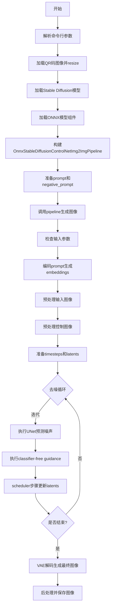
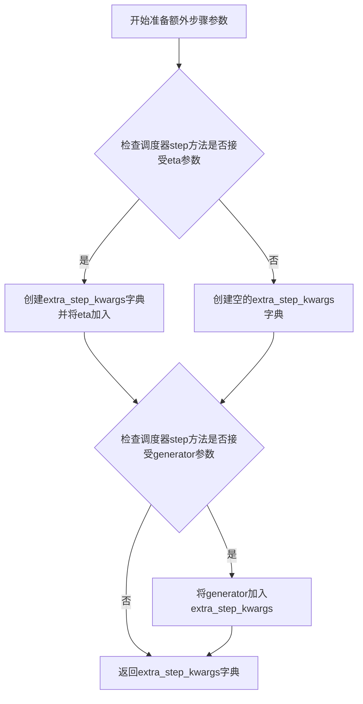
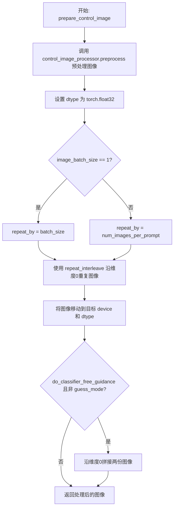
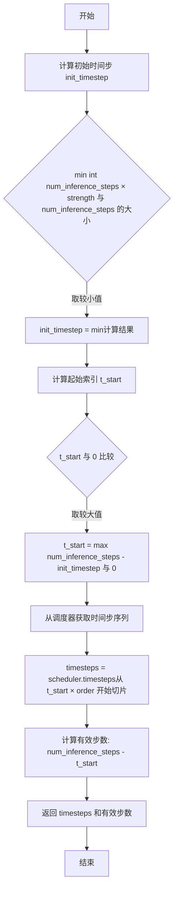
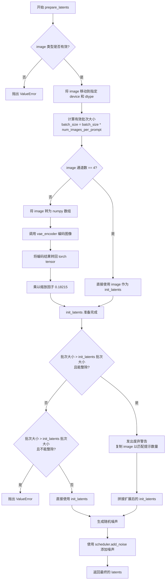
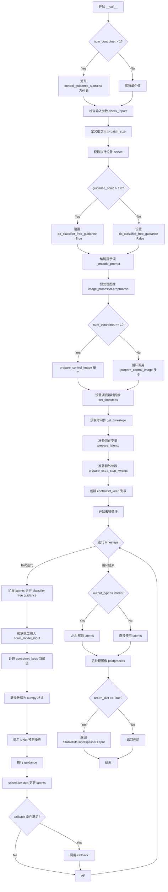

# `diffusers\examples\community\run_onnx_controlnet.py` 详细设计文档

这是一个基于ONNX Runtime加速的Stable Diffusion ControlNet图像到图像生成管道，通过接收文本提示和QR码等控制图像，生成符合条件的新图像。

## 整体流程



## 类结构

```
DiffusionPipeline (抽象基类)
└── OnnxStableDiffusionControlNetImg2ImgPipeline
```

## 全局变量及字段


### `logger`
    
日志记录器，用于记录程序运行过程中的信息

类型：`logging.Logger`
    


### `EXAMPLE_DOC_STRING`
    
示例文档字符串，包含Stable Diffusion ControlNetImg2ImgPipeline的使用示例

类型：`str`
    


### `OnnxStableDiffusionControlNetImg2ImgPipeline.vae_encoder`
    
VAE编码器模型，用于将输入图像编码为潜在空间表示

类型：`OnnxRuntimeModel`
    


### `OnnxStableDiffusionControlNetImg2ImgPipeline.vae_decoder`
    
VAE解码器模型，用于将潜在空间表示解码为图像

类型：`OnnxRuntimeModel`
    


### `OnnxStableDiffusionControlNetImg2ImgPipeline.text_encoder`
    
文本编码器模型，用于将文本提示转换为嵌入向量

类型：`OnnxRuntimeModel`
    


### `OnnxStableDiffusionControlNetImg2ImgPipeline.tokenizer`
    
分词器，用于将文本分割成token序列

类型：`CLIPTokenizer`
    


### `OnnxStableDiffusionControlNetImg2ImgPipeline.unet`
    
UNet去噪模型，用于在潜在空间中预测噪声

类型：`OnnxRuntimeModel`
    


### `OnnxStableDiffusionControlNetImg2ImgPipeline.scheduler`
    
扩散调度器，用于控制去噪过程的采样策略

类型：`KarrasDiffusionSchedulers`
    


### `OnnxStableDiffusionControlNetImg2ImgPipeline.vae_scale_factor`
    
VAE缩放因子，用于调整VAE编码和解码的尺度

类型：`int`
    


### `OnnxStableDiffusionControlNetImg2ImgPipeline.image_processor`
    
图像处理器，用于预处理和后处理输入输出图像

类型：`VaeImageProcessor`
    


### `OnnxStableDiffusionControlNetImg2ImgPipeline.control_image_processor`
    
控制图像处理器，用于预处理控制网络所需的图像

类型：`VaeImageProcessor`
    
    

## 全局函数及方法


### `prepare_image`

该函数是一个图像预处理函数，用于将不同格式的输入图像（PIL.Image、numpy array、torch.Tensor）统一转换为 PyTorch 张量格式，并对像素值进行归一化处理（范围 [-1, 1]）。

参数：

- `image`：`Union[torch.Tensor, PIL.Image.Image, np.ndarray, List[torch.Tensor], List[PIL.Image.Image], List[np.ndarray]]`，输入图像，可以是单个或批量图像，支持 PIL 图像、NumPy 数组或 PyTorch 张量格式

返回值：`torch.Tensor`，返回标准化后的 PyTorch 张量，形状为 (B, C, H, W)，像素值范围 [-1, 1]

#### 流程图

```mermaid
flowchart TD
    A[开始] --> B{image 是否为 torch.Tensor}
    B -- 是 --> C{image.ndim == 3}
    C -- 是 --> D[使用 unsqueeze 添加批次维度]
    C -- 否 --> E[跳过]
    D --> F[转换 dtype 为 torch.float32]
    B -- 否 --> G{image 是否为 PIL.Image 或 np.ndarray}
    G -- 是 --> H[将单个图像包装为列表]
    G -- 否 --> I{image 是否为列表}
    I -- 是 --> J{列表第一个元素类型}
    J -- PIL.Image --> K[转换为 RGB 数组并添加批次维度]
    J -- np.ndarray --> L[为每个数组添加批次维度]
    K --> M[沿轴 0 拼接]
    L --> M
    M --> N[转置维度: (H, W, C) -> (C, H, W)]
    N --> O[转换为张量并除以 127.5 减 1]
    O --> P[结束]
```

#### 带注释源码

```python
def prepare_image(image):
    """
    预处理图像函数，将不同格式的图像统一转换为 PyTorch 张量
    
    处理逻辑：
    1. 如果输入是 torch.Tensor，直接转换数据类型为 float32
    2. 如果输入是 PIL.Image 或 numpy array，先转换为张量，再归一化到 [-1, 1] 范围
    """
    # 判断输入是否为 PyTorch 张量
    if isinstance(image, torch.Tensor):
        # 批次化单张图像：如果输入是 3D 张量 (C, H, W)，添加批次维度变为 (1, C, H, W)
        if image.ndim == 3:
            image = image.unsqueeze(0)

        # 统一转换为 float32 类型，确保后续计算精度一致
        image = image.to(dtype=torch.float32)
    else:
        # 预处理 PIL Image 或 numpy array 格式的图像
        # 如果是单个图像，包装为列表以便统一处理
        if isinstance(image, (PIL.Image.Image, np.ndarray)):
            image = [image]

        # 处理 PIL Image 列表：转换为 RGB numpy 数组并拼接
        if isinstance(image, list) and isinstance(image[0], PIL.Image.Image):
            # 转换为 RGB 数组，添加批次维度 [None, :]，然后沿轴 0 拼接
            image = [np.array(i.convert("RGB"))[None, :] for i in image]
            image = np.concatenate(image, axis=0)
        # 处理 numpy array 列表：同样添加批次维度并拼接
        elif isinstance(image, list) and isinstance(image[0], np.ndarray):
            image = np.concatenate([i[None, :] for i in image], axis=0)

        # 转置维度顺序：从 (B, H, W, C) 转换为 (B, C, H, W)
        # 这是 PyTorch 标准的图像张量格式
        image = image.transpose(0, 3, 1, 2)
        
        # 转换为 PyTorch 张量，并归一化像素值到 [-1, 1] 范围
        # 原像素值范围 [0, 255] -> [0, 1] -> [-1, 1]
        # 除以 127.5 = 255/2，实现 (pixel / 127.5) - 1.0 = (pixel * 2 / 255) - 1
        image = torch.from_numpy(image).to(dtype=torch.float32) / 127.5 - 1.0

    return image
```


### `OnnxStableDiffusionControlNetImg2ImgPipeline.__init__`

该方法是 OnnxStableDiffusionControlNetImg2ImgPipeline 类的构造函数，用于初始化基于 ONNX Runtime 的 Stable Diffusion ControlNet Img2Img 推理管道，接收 VAE 编码器/解码器、文本编码器、分词器、UNet 和调度器等核心组件，并注册模块和初始化图像处理器。

参数：

- `vae_encoder`：`OnnxRuntimeModel`，VAE 编码器模型，用于将输入图像编码为潜在表示
- `vae_decoder`：`OnnxRuntimeModel`，VAE 解码器模型，用于将潜在表示解码为图像
- `text_encoder`：`OnnxRuntimeModel`，文本编码器模型，用于将文本提示转换为嵌入向量
- `tokenizer`：`CLIPTokenizer`，CLIP 分词器，用于将文本分词为 token ID
- `unet`：`OnnxRuntimeModel`，UNet 模型，用于预测噪声残差
- `scheduler`：`KarrasDiffusionSchedulers`，扩散调度器，用于控制去噪过程的采样策略

返回值：`None`，构造函数无返回值

#### 流程图

```mermaid
flowchart TD
    A[开始 __init__] --> B[调用 super().__init__ 初始化基类]
    B --> C[调用 register_modules 注册6个模块]
    C --> D[计算 vae_scale_factor = 2^(4-1) = 8]
    D --> E[创建 VaeImageProcessor 用于主图像处理]
    E --> F[创建 VaeImageProcessor 用于控制图像处理<br/>do_normalize=False]
    F --> G[结束 __init__]
```

#### 带注释源码

```python
def __init__(
    self,
    vae_encoder: OnnxRuntimeModel,
    vae_decoder: OnnxRuntimeModel,
    text_encoder: OnnxRuntimeModel,
    tokenizer: CLIPTokenizer,
    unet: OnnxRuntimeModel,
    scheduler: KarrasDiffusionSchedulers,
):
    """
    初始化 OnnxStableDiffusionControlNetImg2ImgPipeline 管道
    
    参数:
        vae_encoder: ONNX VAE 编码器模型
        vae_decoder: ONNX VAE 解码器模型
        text_encoder: ONNX 文本编码器模型
        tokenizer: CLIP 分词器
        unet: ONNX UNet 模型
        scheduler: Karras 扩散调度器
    """
    # 调用父类 DiffusionPipeline 的初始化方法
    # 负责设置管道的基本框架和配置
    super().__init__()

    # 使用 register_modules 方法注册所有核心组件
    # 这些模块会被保存为管道的内部属性，可以通过 self.xxx 访问
    self.register_modules(
        vae_encoder=vae_encoder,
        vae_decoder=vae_decoder,
        text_encoder=text_encoder,
        tokenizer=tokenizer,
        unet=unet,
        scheduler=scheduler,
    )
    
    # 计算 VAE 缩放因子
    # 2^(4-1) = 8，这是基于 VAE 架构的常见设置
    # 用于在编码/解码时调整潜在空间的尺度
    self.vae_scale_factor = 2 ** (4 - 1)
    
    # 初始化主图像处理器
    # vae_scale_factor: 用于调整图像尺寸
    # do_convert_rgb: 转换为 RGB 格式以确保一致性
    self.image_processor = VaeImageProcessor(
        vae_scale_factor=self.vae_scale_factor, 
        do_convert_rgb=True
    )
    
    # 初始化控制图像处理器
    # 与主图像处理器类似，但 do_normalize=False
    # 因为控制图像（如 Canny 边缘）通常不需要归一化
    self.control_image_processor = VaeImageProcessor(
        vae_scale_factor=self.vae_scale_factor, 
        do_convert_rgb=True, 
        do_normalize=False
    )
```


### `OnnxStableDiffusionControlNetImg2ImgPipeline._encode_prompt`

该方法负责将文本提示（prompt）编码为文本编码器的隐藏状态（embeddings），支持 Classifier-Free Guidance（无分类器引导），可处理单个或多个提示，并返回包含条件和非条件嵌入的 numpy 数组。

参数：

- `prompt`：`Union[str, List[str]]`，要编码的文本提示
- `num_images_per_prompt`：`Optional[int]`，每个提示生成的图像数量
- `do_classifier_free_guidance`：`bool`，是否使用无分类器引导
- `negative_prompt`：`str | None`，不参与图像生成的负面提示
- `prompt_embeds`：`Optional[np.ndarray]`，预生成的文本嵌入，如未提供则从 prompt 生成
- `negative_prompt_embeds`：`Optional[np.ndarray]`，预生成的负面文本嵌入，如未提供则从 negative_prompt 生成

返回值：`np.ndarray`，编码后的提示嵌入（当使用 CFG 时包含负面和正面嵌入的拼接）

#### 流程图

```mermaid
flowchart TD
    A[开始 _encode_prompt] --> B{判断 batch_size}
    B -->|prompt 是 str| C[batch_size = 1]
    B -->|prompt 是 list| D[batch_size = len(prompt)]
    B -->|其他情况| E[batch_size = prompt_embeds.shape[0]]
    
    C --> F{prompt_embeds is None?}
    D --> F
    E --> F
    
    F -->|是| G[Tokenize prompt]
    G --> H[检查是否被截断]
    H --> I[调用 text_encoder 获取嵌入]
    F -->|否| J[跳过嵌入生成]
    
    I --> K[沿 axis=0 重复 prompt_embeds num_images_per_prompt 次]
    J --> K
    
    K --> L{do_classifier_free_guidance 且 negative_prompt_embeds is None?}
    
    L -->|是| M{处理 negative_prompt}
    L -->|否| R[返回 prompt_embeds]
    
    M -->|negative_prompt is None| N[uncond_tokens = [''] * batch_size]
    M -->|negative_prompt 是 str| O[uncond_tokens = [negative_prompt] * batch_size]
    M -->|negative_prompt 是 list| P[uncond_tokens = negative_prompt]
    M -->|类型不匹配| Q[抛出 TypeError]
    M -->|batch_size 不匹配| S[抛出 ValueError]
    
    N --> T[Tokenize uncond_tokens]
    O --> T
    P --> T
    
    T --> U[调用 text_encoder 获取 negative_prompt_embeds]
    
    U --> V{do_classifier_free_guidance?}
    V -->|是| W[重复 negative_prompt_embeds num_images_per_prompt 次]
    V -->|否| R
    
    W --> X[沿 axis=0 拼接 negative_prompt_embeds 和 prompt_embeds]
    X --> R
    
    R[返回 prompt_embeds] --> Z[结束]
```

#### 带注释源码

```python
def _encode_prompt(
    self,
    prompt: Union[str, List[str]],
    num_images_per_prompt: Optional[int],
    do_classifier_free_guidance: bool,
    negative_prompt: str | None,
    prompt_embeds: Optional[np.ndarray] = None,
    negative_prompt_embeds: Optional[np.ndarray] = None,
):
    r"""
    Encodes the prompt into text encoder hidden states.

    Args:
        prompt (`str` or `List[str]`):
            prompt to be encoded
        num_images_per_prompt (`int`):
            number of images that should be generated per prompt
        do_classifier_free_guidance (`bool`):
            whether to use classifier free guidance or not
        negative_prompt (`str` or `List[str]`):
            The prompt or prompts not to guide the image generation. Ignored when not using guidance (i.e., ignored
            if `guidance_scale` is less than `1`).
        prompt_embeds (`np.ndarray`, *optional*):
            Pre-generated text embeddings. Can be used to easily tweak text inputs, *e.g.* prompt weighting. If not
            provided, text embeddings will be generated from `prompt` input argument.
        negative_prompt_embeds (`np.ndarray`, *optional*):
            Pre-generated negative text embeddings. Can be used to easily tweak text inputs, *e.g.* prompt
            weighting. If not provided, negative_prompt_embeds will be generated from `negative_prompt` input
            argument.
    """
    # 根据 prompt 或 prompt_embeds 确定批处理大小
    if prompt is not None and isinstance(prompt, str):
        batch_size = 1
    elif prompt is not None and isinstance(prompt, list):
        batch_size = len(prompt)
    else:
        batch_size = prompt_embeds.shape[0]

    # 如果未提供 prompt_embeds，则从 prompt 生成
    if prompt_embeds is None:
        # 使用分词器将 prompt 转换为 token ID
        text_inputs = self.tokenizer(
            prompt,
            padding="max_length",
            max_length=self.tokenizer.model_max_length,
            truncation=True,
            return_tensors="np",
        )
        text_input_ids = text_inputs.input_ids
        
        # 获取未截断的 token ID 用于检测截断
        untruncated_ids = self.tokenizer(prompt, padding="max_length", return_tensors="np").input_ids

        # 检测并警告截断的文本
        if not np.array_equal(text_input_ids, untruncated_ids):
            removed_text = self.tokenizer.batch_decode(
                untruncated_ids[:, self.tokenizer.model_max_length - 1 : -1]
            )
            logger.warning(
                "The following part of your input was truncated because CLIP can only handle sequences up to"
                f" {self.tokenizer.model_max_length} tokens: {removed_text}"
            )

        # 调用 ONNX text_encoder 获取文本嵌入
        prompt_embeds = self.text_encoder(input_ids=text_input_ids.astype(np.int32))[0]

    # 为每个提示生成多个图像时重复嵌入
    prompt_embeds = np.repeat(prompt_embeds, num_images_per_prompt, axis=0)

    # 如果启用 CFG 且未提供 negative_prompt_embeds，则生成无条件嵌入
    if do_classifier_free_guidance and negative_prompt_embeds is None:
        uncond_tokens: List[str]
        
        # 处理不同的 negative_prompt 类型
        if negative_prompt is None:
            # 空字符串作为默认无条件提示
            uncond_tokens = [""] * batch_size
        elif type(prompt) is not type(negative_prompt):
            # 类型不匹配时抛出错误
            raise TypeError(
                f"`negative_prompt` should be the same type to `prompt`, but got {type(negative_prompt)} !="
                f" {type(prompt)}."
            )
        elif isinstance(negative_prompt, str):
            # 字符串类型时重复 batch_size 次
            uncond_tokens = [negative_prompt] * batch_size
        elif batch_size != len(negative_prompt):
            # batch 大小不匹配时抛出错误
            raise ValueError(
                f"`negative_prompt`: {negative_prompt} has batch size {len(negative_prompt)}, but `prompt`:"
                f" {prompt} has batch size {batch_size}. Please make sure that passed `negative_prompt` matches"
                " the batch size of `prompt`."
            )
        else:
            # list 类型时直接使用
            uncond_tokens = negative_prompt

        # 使用与 prompt_embeds 相同的长度
        max_length = prompt_embeds.shape[1]
        
        # 对无条件提示进行分词
        uncond_input = self.tokenizer(
            uncond_tokens,
            padding="max_length",
            max_length=max_length,
            truncation=True,
            return_tensors="np",
        )
        
        # 获取无条件嵌入
        negative_prompt_embeds = self.text_encoder(input_ids=uncond_input.input_ids.astype(np.int32))[0]

    # 如果启用 CFG，重复 negative_prompt_embeds 并与 prompt_embeds 拼接
    if do_classifier_free_guidance:
        # 为每个提示重复 negative_prompt_embeds
        negative_prompt_embeds = np.repeat(negative_prompt_embeds, num_images_per_prompt, axis=0)

        # 对于 CFG，需要进行两次前向传播
        # 这里将无条件嵌入和文本嵌入拼接成单个批次以避免两次前向传播
        prompt_embeds = np.concatenate([negative_prompt_embeds, prompt_embeds])

    # 返回最终的 prompt_embeds
    return prompt_embeds
```


### OnnxStableDiffusionControlNetImg2ImgPipeline.decode_latents

该方法用于将扩散模型生成的潜在表示（latents）解码为可视化的图像数组。由于该方法是从原始 PyTorch 版本直接复制而来并未完全适配 ONNX 版本，存在属性引用错误（使用了不存在的 self.vae，应使用 vae_decoder）且已被标记为弃用。

参数：

- `latents`：`torch.Tensor`，需要解码的潜在变量张量

返回值：`np.ndarray`，解码后的图像数组，形状为 (batch_size, height, width, channels)，值范围 [0, 1]

#### 流程图

```mermaid
flowchart TD
    A[开始 decode_latents] --> B[发出 FutureWarning 警告]
    B --> C[检查 self.vae 属性是否存在]
    C --> D{self.vae 是否存在}
    D -->|是| E[进行缩放: latents = 1/scaling_factor \* latents]
    D -->|否| F[抛出 AttributeError]
    E --> G[调用 self.vae.decode 解码潜在变量]
    G --> H[图像归一化: (image / 2 + 0.5).clamp(0, 1)]
    H --> I[转换为numpy数组: image.cpu.permute.transposed.float.numpy]
    I --> J[返回图像数组]
```

#### 带注释源码

```python
def decode_latents(self, latents):
    # 发出弃用警告，提示用户使用 VaeImageProcessor 替代
    warnings.warn(
        "The decode_latents method is deprecated and will be removed in a future version. Please"
        " use VaeImageProcessor instead",
        FutureWarning,
    )
    
    # 使用 VAE 的缩放因子对潜在变量进行缩放
    # 注意：此处引用了 self.vae，但在 OnnxStableDiffusionControlNetImg2ImgPipeline 中
    # 实际只有 vae_encoder 和 vae_decoder，没有 vae 属性，会导致 AttributeError
    latents = 1 / self.vae.config.scaling_factor * latents
    
    # 使用 VAE 解码器将潜在变量解码为图像
    # 同样会因 self.vae 不存在而失败
    image = self.vae.decode(latents, return_dict=False)[0]
    
    # 将图像值从 [-1, 1] 范围归一化到 [0, 1] 范围
    image = (image / 2 + 0.5).clamp(0, 1)
    
    # 将图像从 PyTorch 张量转换为 NumPy 数组
    # 调整维度顺序从 (B, C, H, W) 变为 (B, H, W, C)
    # 转换为 float32 类型以兼容 bfloat16
    image = image.cpu().permute(0, 2, 3, 1).float().numpy()
    
    # 返回解码后的图像数组
    return image
```


### `OnnxStableDiffusionControlNetImg2ImgPipeline.prepare_extra_step_kwargs`

该方法用于准备调度器（scheduler）的额外参数。由于不同的调度器具有不同的签名，该方法通过检查调度器的 `step` 方法来动态确定需要传递哪些参数（如 `eta` 和 `generator`），以确保与各种调度器兼容。

参数：

- `generator`：`Optional[Union[torch.Generator, List[torch.Generator]]]`，用于生成确定性结果的随机生成器
- `eta`：`float`，DDIM调度器参数η，值应在[0,1]范围内，仅被DDIMScheduler使用，其他调度器会忽略

返回值：`Dict[str, Any]`，包含调度器步骤所需的额外关键字参数字典

#### 流程图



#### 带注释源码

```python
# Copied from diffusers.pipelines.stable_diffusion.pipeline_stable_diffusion.StableDiffusionPipeline.prepare_extra_step_kwargs
def prepare_extra_step_kwargs(self, generator, eta):
    """
    准备调度器步骤的额外参数。
    由于并非所有调度器都具有相同的签名，因此需要检查调度器的step方法接受哪些参数。
    eta (η) 仅在DDIMScheduler中使用，其他调度器将忽略该参数。
    eta对应DDIM论文中的η (https://huggingface.co/papers/2010.02502)，值应在[0, 1]范围内。
    """
    
    # 使用inspect模块检查调度器step方法的签名，判断是否接受eta参数
    accepts_eta = "eta" in set(inspect.signature(self.scheduler.step).parameters.keys())
    
    # 初始化额外参数字典
    extra_step_kwargs = {}
    
    # 如果调度器接受eta参数，则将其加入参数字典
    if accepts_eta:
        extra_step_kwargs["eta"] = eta

    # 检查调度器是否接受generator参数
    accepts_generator = "generator" in set(inspect.signature(self.scheduler.step).parameters.keys())
    
    # 如果调度器接受generator参数，则将其加入参数字典
    if accepts_generator:
        extra_step_kwargs["generator"] = generator
    
    # 返回包含额外参数的字典，供调度器step方法使用
    return extra_step_kwargs
```


### `OnnxStableDiffusionControlNetImg2ImgPipeline.check_inputs`

该方法用于验证扩散管道输入参数的有效性，在图像生成之前被调用以确保所有参数符合预期。它会检查提示词、图像、控制网参数等多个维度的一致性和合法性，若参数无效则抛出相应的 ValueError 或 TypeError。

参数：

- `num_controlnet`：`int`，控制网（ControlNet）的数量，用于指定使用多少个控制网模型
- `prompt`：`Union[str, List[str], None]`，文本提示词，用于指导图像生成，可以是单个字符串或字符串列表
- `image`：`Union[torch.Tensor, PIL.Image.Image, np.ndarray, List[...], None]`，输入的初始图像，作为图像到图像转换的起点
- `callback_steps`：`int`，回调函数的调用频率，每隔多少步调用一次回调函数
- `negative_prompt`：`Union[str, List[str], None]`，负面提示词，用于指定不希望出现在生成图像中的元素
- `prompt_embeds`：`Optional[np.ndarray]`，预生成的文本嵌入向量，可以直接传入以避免重复编码
- `negative_prompt_embeds`：`Optional[np.ndarray]`，预生成的负面文本嵌入向量
- `controlnet_conditioning_scale`：`float`，控制网调节比例，默认为 1.0，用于控制控制网对生成过程的影响程度
- `control_guidance_start`：`float`，控制网开始应用的步数比例，默认为 0.0
- `control_guidance_end`：`float`，控制网停止应用的步数比例，默认为 1.0

返回值：`None`，该方法不返回任何值，仅通过抛出异常来处理验证失败的情况

#### 流程图

```mermaid
flowchart TD
    A[开始 check_inputs] --> B{验证 callback_steps}
    B -->|无效| C[抛出 ValueError]
    B -->|有效| D{prompt 和 prompt_embeds 都存在?}
    D -->|是| E[抛出 ValueError: 不能同时提供]
    D -->|否| F{prompt 和 prompt_embeds 都为 None?}
    F -->|是| G[抛出 ValueError: 必须提供至少一个]
    F -->|否| H{prompt 类型合法?}
    H -->|否| I[抛出 ValueError: 类型错误]
    H -->|是| J{negative_prompt 和 negative_prompt_embeds 都存在?}
    J -->|是| K[抛出 ValueError: 不能同时提供]
    J -->|否| L{prompt_embeds 和 negative_prompt_embeds 形状匹配?}
    L -->|否| M[抛出 ValueError: 形状不匹配]
    L -->|是| N{检查 image 输入}
    N --> O{num_controlnet == 1?}
    O -->|是| P[调用 check_image 验证单图]
    O -->|否| Q{num_controlnet > 1?}
    Q -->|是| R{image 是 list?}
    R -->|否| S[抛出 TypeError: 需为 list]
    R -->|是| T{image 是嵌套 list?]
    T -->|是| U[抛出 ValueError: 不支持嵌套列表]
    T -->|否| V{len(image) == num_controlnet?]
    V -->|否| W[抛出 ValueError: 长度不匹配]
    V -->|是| X[遍历 image 调用 check_image]
    Q -->|否| Y[assert False]
    P --> Z{验证 controlnet_conditioning_scale}
    X --> Z
    Z --> AA{num_controlnet == 1?}
    AA -->|是| AB{类型是 float?]
    AA -->|否| AC{是 list?]
    AC -->|是| AD{嵌套 list?}
    AD -->|是| AE[抛出 ValueError]
    AD -->|否| AF{长度 == num_controlnet?]
    AF -->|否| AG[抛出 ValueError]
    AC -->|否| AH[类型检查]
    AB -->|否| AI[抛出 TypeError]
    Z --> AJ{验证 control_guidance_start/end}
    AJ --> AK{长度相等?]
    AK -->|否| AL[抛出 ValueError]
    AK -->|是| AM{多 ControlNet 时长度 == num_controlnet?]
    AM -->|否| AN[抛出 ValueError]
    AM -->|是| AO{逐个验证 start < end}
    AO -->|是| AP{start >= end?]
    AP -->|是| AQ[抛出 ValueError]
    AP -->|否| AR{start < 0?]
    AR -->|是| AS[抛出 ValueError]
    AR -->|否| AT{end > 1.0?]
    AT -->|是| AU[抛出 ValueError]
    AT -->|否| AV[验证通过]
    C --> AV
    E --> AV
    G --> AV
    I --> AV
    K --> AV
    M --> AV
    S --> AV
    W --> AV
    AI --> AV
    AE --> AV
    AG --> AV
    AL --> AV
    AN --> AV
    AQ --> AV
    AS --> AV
    AU --> AV
```

#### 带注释源码

```python
def check_inputs(
    self,
    num_controlnet,
    prompt,
    image,
    callback_steps,
    negative_prompt=None,
    prompt_embeds=None,
    negative_prompt_embeds=None,
    controlnet_conditioning_scale=1.0,
    control_guidance_start=0.0,
    control_guidance_end=1.0,
):
    # 验证 callback_steps 参数：必须为正整数
    if (callback_steps is None) or (
        callback_steps is not None and (not isinstance(callback_steps, int) or callback_steps <= 0)
    ):
        raise ValueError(
            f"`callback_steps` has to be a positive integer but is {callback_steps} of type"
            f" {type(callback_steps)}."
        )

    # 验证 prompt 和 prompt_embeds 不能同时提供
    if prompt is not None and prompt_embeds is not None:
        raise ValueError(
            f"Cannot forward both `prompt`: {prompt} and `prompt_embeds`: {prompt_embeds}. Please make sure to"
            " only forward one of the two."
        )
    # 验证 prompt 和 prompt_embeds 至少提供一个
    elif prompt is None and prompt_embeds is None:
        raise ValueError(
            "Provide either `prompt` or `prompt_embeds`. Cannot leave both `prompt` and `prompt_embeds` undefined."
        )
    # 验证 prompt 的类型必须是 str 或 list
    elif prompt is not None and (not isinstance(prompt, str) and not isinstance(prompt, list)):
        raise ValueError(f"`prompt` has to be of type `str` or `list` but is {type(prompt)}")

    # 验证 negative_prompt 和 negative_prompt_embeds 不能同时提供
    if negative_prompt is not None and negative_prompt_embeds is not None:
        raise ValueError(
            f"Cannot forward both `negative_prompt`: {negative_prompt} and `negative_prompt_embeds`:"
            f" {negative_prompt_embeds}. Please make sure to only forward one of the two."
        )

    # 验证 prompt_embeds 和 negative_prompt_embeds 形状必须一致
    if prompt_embeds is not None and negative_prompt_embeds is not None:
        if prompt_embeds.shape != negative_prompt_embeds.shape:
            raise ValueError(
                "`prompt_embeds` and `negative_prompt_embeds` must have the same shape when passed directly, but"
                f" got: `prompt_embeds` {prompt_embeds.shape} != `negative_prompt_embeds`"
                f" {negative_prompt_embeds.shape}."
            )

    # 验证 image 输入参数
    if num_controlnet == 1:
        # 单个控制网：直接验证图像
        self.check_image(image, prompt, prompt_embeds)
    elif num_controlnet > 1:
        # 多个控制网：image 必须是 list 类型
        if not isinstance(image, list):
            raise TypeError("For multiple controlnets: `image` must be type `list`")

        # 检查是否是嵌套列表（暂不支持）
        elif any(isinstance(i, list) for i in image):
            raise ValueError("A single batch of multiple conditionings are supported at the moment.")
        # 验证图像数量与控制网数量匹配
        elif len(image) != num_controlnet:
            raise ValueError(
                f"For multiple controlnets: `image` must have the same length as the number of controlnets, but got {len(image)} images and {num_controlnet} ControlNets."
            )

        # 遍历每个图像进行验证
        for image_ in image:
            self.check_image(image_, prompt, prompt_embeds)
    else:
        assert False

    # 验证 controlnet_conditioning_scale 参数
    if num_controlnet == 1:
        # 单个控制网：必须是 float 类型
        if not isinstance(controlnet_conditioning_scale, float):
            raise TypeError("For single controlnet: `controlnet_conditioning_scale` must be type `float`.")
    elif num_controlnet > 1:
        # 多个控制网：可以是 float 或 list
        if isinstance(controlnet_conditioning_scale, list):
            # 检查是否有嵌套列表（暂不支持）
            if any(isinstance(i, list) for i in controlnet_conditioning_scale):
                raise ValueError("A single batch of multiple conditionings are supported at the moment.")
            # 验证列表长度与控制网数量匹配
            elif (
                isinstance(controlnet_conditioning_scale, list)
                and len(controlnet_conditioning_scale) != num_controlnet
            ):
                raise ValueError(
                    "For multiple controlnets: When `controlnet_conditioning_scale` is specified as `list`, it must have"
                    " the same length as the number of controlnets"
                )
    else:
        assert False

    # 验证 control_guidance_start 和 control_guidance_end 长度必须一致
    if len(control_guidance_start) != len(control_guidance_end):
        raise ValueError(
            f"`control_guidance_start` has {len(control_guidance_start)} elements, but `control_guidance_end` has {len(control_guidance_end)} elements. Make sure to provide the same number of elements to each list."
        )

    # 验证多个控制网时，长度必须等于控制网数量
    if num_controlnet > 1:
        if len(control_guidance_start) != num_controlnet:
            raise ValueError(
                f"`control_guidance_start`: {control_guidance_start} has {len(control_guidance_start)} elements but there are {num_controlnet} controlnets available. Make sure to provide {num_controlnet}."
            )

    # 逐个验证每对 start/end 的合法性
    for start, end in zip(control_guidance_start, control_guidance_end):
        # start 必须小于 end
        if start >= end:
            raise ValueError(
                f"control guidance start: {start} cannot be larger or equal to control guidance end: {end}."
            )
        # start 不能小于 0
        if start < 0.0:
            raise ValueError(f"control guidance start: {start} can't be smaller than 0.")
        # end 不能大于 1.0
        if end > 1.0:
            raise ValueError(f"control guidance end: {end} can't be larger than 1.0.")
```


### `OnnxStableDiffusionControlNetImg2ImgPipeline.check_image`

该方法用于验证输入图像的类型和批次大小是否合法，确保图像是PIL Image、torch.Tensor、numpy.ndarray或它们的列表形式，并且当图像批次大小不为1时，必须与prompt的批次大小一致。

参数：

- `image`：输入的图像数据，支持 `PIL.Image.Image`、`torch.Tensor`、`numpy.ndarray` 或它们的列表类型
- `prompt`：文本提示，可以是字符串或字符串列表
- `prompt_embeds`：预生成的文本嵌入，类型为 `numpy.ndarray`，可选参数

返回值：`None`，该方法仅进行参数校验，不返回任何值

#### 流程图

```mermaid
flowchart TD
    A[开始 check_image] --> B{检查 image 类型}
    B -->|PIL Image| C[设置 image_batch_size = 1]
    B -->|Tensor| D[获取 image 长度]
    B -->|Numpy Array| D
    B -->|List| E{检查 list 元素类型}
    E -->|PIL Image| F[设置 image_batch_size = len(image)]
    E -->|Tensor| F
    E -->|Numpy Array| F
    B -->|不支持的类型| G[抛出 TypeError]
    
    H{检查 prompt 类型}
    H -->|str| I[prompt_batch_size = 1]
    H -->|list| J[prompt_batch_size = len(prompt)]
    H -->|prompt_embeds| K[prompt_batch_size = prompt_embeds.shape[0]]
    
    L{验证批次大小一致性}
    L -->|image_batch_size == 1| M[通过校验]
    L -->|image_batch_size == prompt_batch_size| M
    L -->|不匹配| N[抛出 ValueError]
    
    M --> O[结束]
```

#### 带注释源码

```python
def check_image(self, image, prompt, prompt_embeds):
    """
    检查输入图像的有效性，包括类型检查和批次大小一致性检查。
    
    参数:
        image: 输入图像，支持多种格式
        prompt: 文本提示
        prompt_embeds: 预计算的文本嵌入
    """
    # 检查图像是否为PIL Image类型
    image_is_pil = isinstance(image, PIL.Image.Image)
    # 检查图像是否为torch Tensor类型
    image_is_tensor = isinstance(image, torch.Tensor)
    # 检查图像是否为numpy array类型
    image_is_np = isinstance(image, np.ndarray)
    # 检查图像是否为PIL Image列表
    image_is_pil_list = isinstance(image, list) and isinstance(image[0], PIL.Image.Image)
    # 检查图像是否为torch Tensor列表
    image_is_tensor_list = isinstance(image, list) and isinstance(image[0], torch.Tensor)
    # 检查图像是否为numpy array列表
    image_is_np_list = isinstance(image, list) and isinstance(image[0], np.ndarray)

    # 如果图像不是支持的任何类型，抛出TypeError
    if (
        not image_is_pil
        and not image_is_tensor
        and not image_is_np
        and not image_is_pil_list
        and not image_is_tensor_list
        and not image_is_np_list
    ):
        raise TypeError(
            f"image must be passed and be one of PIL image, numpy array, torch tensor, list of PIL images, list of numpy arrays or list of torch tensors, but is {type(image)}"
        )

    # 计算图像批次大小
    if image_is_pil:
        image_batch_size = 1
    else:
        image_batch_size = len(image)

    # 计算prompt批次大小
    if prompt is not None and isinstance(prompt, str):
        prompt_batch_size = 1
    elif prompt is not None and isinstance(prompt, list):
        prompt_batch_size = len(prompt)
    elif prompt_embeds is not None:
        prompt_batch_size = prompt_embeds.shape[0]

    # 验证批次大小一致性：当图像批次大小不为1时，必须与prompt批次大小一致
    if image_batch_size != 1 and image_batch_size != prompt_batch_size:
        raise ValueError(
            f"If image batch size is not 1, image batch size must be same as prompt batch size. image batch size: {image_batch_size}, prompt batch size: {prompt_batch_size}"
        )
```


### `OnnxStableDiffusionControlNetImg2ImgPipeline.prepare_control_image`

该方法负责将输入的 ControlNet 控制图像进行预处理、尺寸调整、批次复制和数据类型转换，以适配 ONNX 运行时推理的输入要求。支持无分类器引导（classifier-free guidance）模式下的图像复制。

参数：

- `image`：输入的 ControlNet 控制图像，支持 torch.Tensor、PIL.Image.Image、np.ndarray 或它们的列表类型
- `width`：目标图像宽度（像素）
- `height`：目标图像高度（像素）
- `batch_size`：提示词批处理大小，用于决定单张图像的重复次数
- `num_images_per_prompt`：每个提示词生成的图像数量
- `device`：目标设备（torch.device，如 cuda 或 cpu）
- `dtype`：目标数据类型（如 torch.float16 或 torch.float32）
- `do_classifier_free_guidance`：布尔值，是否在无分类器引导模式下运行，默认为 False
- `guess_mode`：布尔值，是否为猜测模式，默认为 False

返回值：`torch.Tensor`，处理后的控制图像张量，形状为 [batch_size, channels, height, width]

#### 流程图



#### 带注释源码

```python
def prepare_control_image(
    self,
    image,
    width,
    height,
    batch_size,
    num_images_per_prompt,
    device,
    dtype,
    do_classifier_free_guidance=False,
    guess_mode=False,
):
    """
    准备 ControlNet 控制图像的预处理方法
    
    该方法执行以下步骤：
    1. 使用 control_image_processor.preprocess 进行尺寸调整和归一化
    2. 根据批次大小和每提示词图像数量决定重复次数
    3. 转换到目标设备和数据类型
    4. 在 classifier-free guidance 模式下复制图像以支持无条件生成
    
    参数:
        image: 输入的控制图像，支持多种格式
        width: 目标宽度
        height: 目标高度
        batch_size: 批处理大小
        num_images_per_prompt: 每个提示词生成的图像数
        device: 目标设备
        dtype: 目标数据类型
        do_classifier_free_guidance: 是否启用无分类器引导
        guess_mode: 猜测模式标志
    
    返回:
        处理后的图像张量
    """
    # Step 1: 预处理图像 - 调整尺寸并归一化到 [-1, 1]
    # control_image_processor.preprocess 会将图像转换为 tensor 并归一化
    image = self.control_image_processor.preprocess(image, height=height, width=width).to(dtype=torch.float32)
    
    # 获取图像批次大小
    image_batch_size = image.shape[0]

    # Step 2: 确定重复次数
    # 如果只有一张图像，按照 batch_size 重复
    # 如果图像批次与提示词批次相同，则按照 num_images_per_prompt 重复
    if image_batch_size == 1:
        repeat_by = batch_size
    else:
        # image batch size is the same as prompt batch size
        repeat_by = num_images_per_prompt

    # Step 3: 沿批次维度重复图像以匹配生成的图像数量
    image = image.repeat_interleave(repeat_by, dim=0)

    # Step 4: 移动到目标设备和数据类型
    image = image.to(device=device, dtype=dtype)

    # Step 5: 在 classifier-free guidance 模式下复制图像
    # 这样可以在一次前向传播中同时计算有条件和无条件的噪声预测
    if do_classifier_free_guidance and not guess_mode:
        image = torch.cat([image] * 2)

    return image
```


### `OnnxStableDiffusionControlNetImg2ImgPipeline.get_timesteps`

该方法用于根据推理步数（num_inference_steps）和强度（strength）参数计算扩散模型的时间步序列。在图像到图像（img2img）任务中，strength参数决定了原始图像与生成图像之间的混合程度，从而影响模型在去噪过程中的起始点和迭代范围。

参数：

- `num_inference_steps`：`int`，推理步数，即去噪过程的迭代次数
- `strength`：`float`，强度参数，取值范围通常为0到1之间，用于控制图像变形的程度，值越大表示生成图像与原始图像差异越大
- `device`：`torch.device`，计算设备（虽然在当前实现中未直接使用，但保留此参数以保持接口一致性）

返回值：`Tuple[torch.Tensor, int]`，返回一个元组，包含：

- `torch.Tensor`：时间步序列，包含用于去噪过程的时间步
- `int`：调整后的有效推理步数

#### 流程图



#### 带注释源码

```python
def get_timesteps(self, num_inference_steps, strength, device):
    # 计算初始时间步数：根据strength参数计算需要保留的原始图像特征比例
    # strength表示保留原图信息的程度，1.0表示完全保留，0.0表示完全不保留
    # 例如：num_inference_steps=50, strength=0.8 时，init_timestep = min(40, 50) = 40
    init_timestep = min(int(num_inference_steps * strength), num_inference_steps)

    # 计算起始索引：从时间步序列的哪个位置开始
    # 这确保了当strength < 1时，我们跳过前面的时间步，从中间开始去噪
    # 例如：num_inference_steps=50, init_timestep=40 时，t_start = max(10, 0) = 10
    t_start = max(num_inference_steps - init_timestep, 0)

    # 从调度器获取完整的时间步序列，并根据t_start进行切片
    # scheduler.order表示调度器的阶数，用于多步调度器（如UniPCMultistepScheduler）
    # 切片操作确保我们从正确的位置开始迭代
    timesteps = self.scheduler.timesteps[t_start * self.scheduler.order :]

    # 返回时间步序列和调整后的推理步数
    # num_inference_steps - t_start 表示实际将执行的推理步数
    return timesteps, num_inference_steps - t_start
```


### `OnnxStableDiffusionControlNetImg2ImgPipeline.prepare_latents`

该方法负责将输入图像预处理为潜在向量（latents），为Stable Diffusion的图像到图像（img2img）扩散过程准备初始潜在表示。它处理图像类型验证、设备转换、VAE编码、批次大小调整以及噪声添加等关键步骤。

参数：

- `self`：`OnnxStableDiffusionControlNetImg2ImgPipeline`实例，管道对象本身
- `image`：`Union[torch.Tensor, PIL.Image.Image, list]`，输入的初始图像，将作为图像生成的起点
- `timestep`：`torch.Tensor`，当前去噪步骤的时间步，用于噪声调度
- `batch_size`：`int`，文本提示的批次大小，用于确定最终潜在向量的批次维度
- `num_images_per_prompt`：`int`，每个提示生成的图像数量，用于扩展批次
- `dtype`：`torch.dtype`，张量的数据类型（如float16或float32）
- `device`：`torch.device`，计算设备（CPU或CUDA）
- `generator`：`Optional[torch.Generator]`，可选的随机生成器，用于确保可重复的噪声生成

返回值：`torch.Tensor`，准备好的潜在向量，用于后续的去噪扩散过程

#### 流程图



#### 带注释源码

```python
def prepare_latents(
    self,
    image,
    timestep,
    batch_size,
    num_images_per_prompt,
    dtype,
    device,
    generator=None
):
    """
    准备用于图像生成的潜在向量。
    
    该方法执行以下操作：
    1. 验证输入图像类型
    2. 将图像编码为潜在空间（如果尚未编码）
    3. 调整批次大小以匹配提示数量
    4. 添加噪声以创建初始潜在向量
    """
    
    # 步骤1: 验证图像类型
    # 检查 image 是否为 torch.Tensor、PIL.Image.Image 或 list 类型
    # 如果不是有效类型，抛出详细的 ValueError 异常
    if not isinstance(image, (torch.Tensor, PIL.Image.Image, list)):
        raise ValueError(
            f"`image` has to be of type `torch.Tensor`, `PIL.Image.Image` or list but is {type(image)}"
        )

    # 步骤2: 将图像移动到指定设备和数据类型
    # 这确保后续计算使用正确的设备和精度
    image = image.to(device=device, dtype=dtype)

    # 步骤3: 计算有效批次大小
    # 需要考虑每个提示生成的图像数量
    # 例如：batch_size=2, num_images_per_prompt=3 -> effective_batch_size=6
    batch_size = batch_size * num_images_per_prompt

    # 步骤4: 检查图像是否已经是潜在表示
    # 如果图像已经有4个通道（latent space），说明已经是编码后的潜在向量
    # 直接使用；否则需要通过 VAE encoder 进行编码
    if image.shape[1] == 4:
        # 图像已经是潜在表示形式
        init_latents = image
    else:
        # 图像需要编码：将 PIL/numpy 图像编码为潜在空间
        # 注意：需要先转到 CPU 并 detach，因为后续要在 numpy 数组上操作
        _image = image.cpu().detach().numpy()
        
        # 使用 VAE encoder 将图像编码为潜在表示
        # VAE encoder 将图像从像素空间映射到潜在空间
        init_latents = self.vae_encoder(sample=_image)[0]
        
        # 将编码结果（numpy array）转回 torch tensor
        init_latents = torch.from_numpy(init_latents).to(device=device, dtype=dtype)
        
        # 应用 VAE 缩放因子
        # 这个因子用于将潜在向量缩放到适当的范围
        init_latents = 0.18215 * init_latents

    # 步骤5: 处理批次大小不匹配的情况
    # 当提示数量大于初始图像数量时，需要复制图像以匹配批次
    if batch_size > init_latents.shape[0] and batch_size % init_latents.shape[0] == 0:
        # 计算每个提示需要复制的图像数量
        # 例如：batch_size=6, init_latents.shape[0]=2 -> 需要复制3次
        additional_image_per_prompt = batch_size // init_latents.shape[0]
        
        # 发出废弃警告
        # 提示用户这种行为在未来版本中会被移除
        deprecation_message = (
            f"You have passed {batch_size} text prompts (`prompt`), but only {init_latents.shape[0]} initial"
            " images (`image`). Initial images are now duplicating to match the number of text prompts. Note"
            " that this behavior is deprecated and will be removed in a version 1.0.0. Please make sure to update"
            " your script to pass as many initial images as text prompts to suppress this warning."
        )
        deprecate("len(prompt) != len(image)", "1.0.0", deprecation_message, standard_warn=False)
        
        # 沿批次维度复制 init_latents
        init_latents = torch.cat([init_latents] * additional_image_per_prompt, dim=0)
    
    # 批次大小不匹配且不能整除的情况，抛出错误
    elif batch_size > init_latents.shape[0] and batch_size % init_latents.shape[0] != 0:
        raise ValueError(
            f"Cannot duplicate `image` of batch size {init_latents.shape[0]} to {batch_size} text prompts."
        )
    else:
        # 批次大小匹配或小于初始图像数量，直接使用
        # 注意：这里即使只有一个元素也会执行 cat，但效果相同
        init_latents = torch.cat([init_latents], dim=0)

    # 步骤6: 生成噪声并添加到初始潜在向量
    # 获取潜在向量的形状
    shape = init_latents.shape
    
    # 使用 randn_tensor 生成与潜在向量形状相同的随机噪声
    # 可选的 generator 参数用于确保可重复性
    noise = randn_tensor(shape, generator=generator, device=device, dtype=dtype)

    # 使用调度器的 add_noise 方法将噪声添加到初始潜在向量
    # 这是 img2img 过程的关键：我们在初始图像的潜在表示上添加噪声
    # 然后通过去噪过程恢复（或转换）图像
    init_latents = self.scheduler.add_noise(init_latents, noise, timestep)
    
    # 返回准备好的潜在向量
    # 这些 latents 将用于后续的去噪循环
    latents = init_latents

    return latents
```


### `OnnxStableDiffusionControlNetImg2ImgPipeline.__call__`

该方法是 ONNX 版本的 Stable Diffusion ControlNet Image-to-Image 生成管线的主入口函数，接收文本提示词、初始图像和控制图像，通过去噪扩散过程生成符合文本描述和条件引导的目标图像。

参数：

- `num_controlnet`：`int`，ControlNet 模型的数量
- `fp16`：`bool = True`，是否使用 float16 精度
- `prompt`：`Union[str, List[str]] = None`，引导图像生成的文本提示词
- `image`：`Union[torch.Tensor, PIL.Image.Image, np.ndarray, List[torch.Tensor], List[PIL.Image.Image], List[np.ndarray]] = None`，作为图像生成起点的初始图像
- `control_image`：`Union[torch.Tensor, PIL.Image.Image, np.ndarray, List[torch.Tensor], List[PIL.Image.Image], List[np.ndarray]] = None`，ControlNet 输入条件，用于生成对 Unet 的引导
- `height`：`Optional[int] = None`，生成图像的高度（像素），默认使用 `self.unet.config.sample_size * self.vae_scale_factor`
- `width`：`Optional[int] = None`，生成图像的宽度（像素）
- `strength`：`float = 0.8`，去噪强度，影响推理步数
- `num_inference_steps`：`int = 50`，去噪步数
- `guidance_scale`：`float = 7.5`，无分类器自由引导（Classifier-Free Diffusion Guidance）比例
- `negative_prompt`：`Optional[Union[str, List[str]]] = None`，不引导图像生成的负面提示词
- `num_images_per_prompt`：`Optional[int] = 1`，每个提示词生成的图像数量
- `eta`：`float = 0.0`，DDIM 论文中的参数 η
- `generator`：`Optional[Union[torch.Generator, List[torch.Generator]]] = None`，随机数生成器，用于确保生成的可确定性
- `latents`：`Optional[torch.Tensor] = None`，预生成的噪声潜在向量
- `prompt_embeds`：`Optional[torch.Tensor] = None`，预生成的文本嵌入向量
- `negative_prompt_embeds`：`Optional[torch.Tensor] = None`，预生成的负面文本嵌入向量
- `output_type`：`str | None = "pil"`，输出格式，可选 `"pil"` 或 `"latent"`
- `return_dict`：`bool = True`，是否返回 `StableDiffusionPipelineOutput`
- `callback`：`Optional[Callable[[int, int, torch.Tensor], None]] = None`，推理过程中每 `callback_steps` 步调用的回调函数
- `callback_steps`：`int = 1`，回调函数调用频率
- `cross_attention_kwargs`：`Optional[Dict[str, Any]] = None`，传递给注意力处理器的参数字典
- `controlnet_conditioning_scale`：`Union[float, List[float]] = 0.8`，ControlNet 输出乘数
- `guess_mode`：`bool = False`，识别模式，ControlNet 编码器会尝试识别输入图像内容
- `control_guidance_start`：`Union[float, List[float]] = 0.0`，ControlNet 开始应用的步骤百分比
- `control_guidance_end`：`Union[float, List[float]] = 1.0`，ControlNet 停止应用的步骤百分比

返回值：`Union[StableDiffusionPipelineOutput, tuple]`，返回 `StableDiffusionPipelineOutput` 对象（包含生成的图像列表和 NSFW 检测结果），或者返回元组 `(image, has_nsfw_concept)`

#### 流程图



#### 带注释源码

```python
@torch.no_grad()
@replace_example_docstring(EXAMPLE_DOC_STRING)
def __call__(
    self,
    num_controlnet: int,
    fp16: bool = True,
    prompt: Union[str, List[str]] = None,
    image: Union[
        torch.Tensor,
        PIL.Image.Image,
        np.ndarray,
        List[torch.Tensor],
        List[PIL.Image.Image],
        List[np.ndarray],
    ] = None,
    control_image: Union[
        torch.Tensor,
        PIL.Image.Image,
        np.ndarray,
        List[torch.Tensor],
        List[PIL.Image.Image],
        List[np.ndarray],
    ] = None,
    height: Optional[int] = None,
    width: Optional[int] = None,
    strength: float = 0.8,
    num_inference_steps: int = 50,
    guidance_scale: float = 7.5,
    negative_prompt: Optional[Union[str, List[str]]] = None,
    num_images_per_prompt: Optional[int] = 1,
    eta: float = 0.0,
    generator: Optional[Union[torch.Generator, List[torch.Generator]]] = None,
    latents: Optional[torch.Tensor] = None,
    prompt_embeds: Optional[torch.Tensor] = None,
    negative_prompt_embeds: Optional[torch.Tensor] = None,
    output_type: str | None = "pil",
    return_dict: bool = True,
    callback: Optional[Callable[[int, int, torch.Tensor], None]] = None,
    callback_steps: int = 1,
    cross_attention_kwargs: Optional[Dict[str, Any]] = None,
    controlnet_conditioning_scale: Union[float, List[float]] = 0.8,
    guess_mode: bool = False,
    control_guidance_start: Union[float, List[float]] = 0.0,
    control_guidance_end: Union[float, List[float]] = 1.0,
):
    # 根据 fp16 参数选择 torch 和 numpy 的数据类型
    if fp16:
        torch_dtype = torch.float16
        np_dtype = np.float16
    else:
        torch_dtype = torch.float32
        np_dtype = np.float32

    # 对齐 control_guidance 格式，确保与 controlnet 数量匹配
    if not isinstance(control_guidance_start, list) and isinstance(control_guidance_end, list):
        control_guidance_start = len(control_guidance_end) * [control_guidance_start]
    elif not isinstance(control_guidance_end, list) and isinstance(control_guidance_start, list):
        control_guidance_end = len(control_guidance_start) * [control_guidance_end]
    elif not isinstance(control_guidance_start, list) and not isinstance(control_guidance_end, list):
        mult = num_controlnet
        control_guidance_start, control_guidance_end = (
            mult * [control_guidance_start],
            mult * [control_guidance_end],
        )

    # 1. 检查输入参数，错误则抛出异常
    self.check_inputs(
        num_controlnet,
        prompt,
        control_image,
        callback_steps,
        negative_prompt,
        prompt_embeds,
        negative_prompt_embeds,
        controlnet_conditioning_scale,
        control_guidance_start,
        control_guidance_end,
    )

    # 2. 定义调用参数
    if prompt is not None and isinstance(prompt, str):
        batch_size = 1
    elif prompt is not None and isinstance(prompt, list):
        batch_size = len(prompt)
    else:
        batch_size = prompt_embeds.shape[0]

    device = self._execution_device
    # 计算是否使用无分类器自由引导 (guidance_scale > 1.0)
    do_classifier_free_guidance = guidance_scale > 1.0

    # 如果有多个 controlnet 但只提供了一个 scale，扩展为列表
    if num_controlnet > 1 and isinstance(controlnet_conditioning_scale, float):
        controlnet_conditioning_scale = [controlnet_conditioning_scale] * num_controlnet

    # 3. 编码输入提示词
    prompt_embeds = self._encode_prompt(
        prompt,
        num_images_per_prompt,
        do_classifier_free_guidance,
        negative_prompt,
        prompt_embeds=prompt_embeds,
        negative_prompt_embeds=negative_prompt_embeds,
    )
    # 4. 预处理图像
    image = self.image_processor.preprocess(image).to(dtype=torch.float32)

    # 5. 准备 ControlNet 条件图像
    if num_controlnet == 1:
        control_image = self.prepare_control_image(
            image=control_image,
            width=width,
            height=height,
            batch_size=batch_size * num_images_per_prompt,
            num_images_per_prompt=num_images_per_prompt,
            device=device,
            dtype=torch_dtype,
            do_classifier_free_guidance=do_classifier_free_guidance,
            guess_mode=guess_mode,
        )
    elif num_controlnet > 1:
        control_images = []
        for control_image_ in control_image:
            control_image_ = self.prepare_control_image(
                image=control_image_,
                width=width,
                height=height,
                batch_size=batch_size * num_images_per_prompt,
                num_images_per_prompt=num_images_per_prompt,
                device=device,
                dtype=torch_dtype,
                do_classifier_free_guidance=do_classifier_free_guidance,
                guess_mode=guess_mode,
            )
            control_images.append(control_image_)
        control_image = control_images

    # 5. 准备时间步
    self.scheduler.set_timesteps(num_inference_steps, device=device)
    timesteps, num_inference_steps = self.get_timesteps(num_inference_steps, strength, device)
    latent_timestep = timesteps[:1].repeat(batch_size * num_images_per_prompt)

    # 6. 准备潜在变量
    latents = self.prepare_latents(
        image,
        latent_timestep,
        batch_size,
        num_images_per_prompt,
        torch_dtype,
        device,
        generator,
    )

    # 7. 准备额外参数
    extra_step_kwargs = self.prepare_extra_step_kwargs(generator, eta)

    # 7.1 创建控制网络保留张量
    controlnet_keep = []
    for i in range(len(timesteps)):
        keeps = [
            1.0 - float(i / len(timesteps) < s or (i + 1) / len(timesteps) > e)
            for s, e in zip(control_guidance_start, control_guidance_end)
        ]
        controlnet_keep.append(keeps[0] if num_controlnet == 1 else keeps)

    # 8. 去噪循环
    num_warmup_steps = len(timesteps) - num_inference_steps * self.scheduler.order
    with self.progress_bar(total=num_inference_steps) as progress_bar:
        for i, t in enumerate(timesteps):
            # 扩展 latents 以进行 classifier free guidance
            latent_model_input = torch.cat([latents] * 2) if do_classifier_free_guidance else latents
            latent_model_input = self.scheduler.scale_model_input(latent_model_input, t)

            # 计算当前步骤的 controlnet 条件缩放
            if isinstance(controlnet_keep[i], list):
                cond_scale = [c * s for c, s in zip(controlnet_conditioning_scale, controlnet_keep[i])]
            else:
                controlnet_cond_scale = controlnet_conditioning_scale
                if isinstance(controlnet_cond_scale, list):
                    controlnet_cond_scale = controlnet_cond_scale[0]
                cond_scale = controlnet_cond_scale * controlnet_keep[i]

            # 准备 ONNX 推理输入 (转换为 numpy)
            _latent_model_input = latent_model_input.cpu().detach().numpy()
            _prompt_embeds = np.array(prompt_embeds, dtype=np_dtype)
            _t = np.array([t.cpu().detach().numpy()], dtype=np_dtype)

            if num_controlnet == 1:
                control_images = np.array([control_image], dtype=np_dtype)
            else:
                control_images = []
                for _control_img in control_image:
                    _control_img = _control_img.cpu().detach().numpy()
                    control_images.append(_control_img)
                control_images = np.array(control_images, dtype=np_dtype)

            control_scales = np.array(cond_scale, dtype=np_dtype)
            control_scales = np.resize(control_scales, (num_controlnet, 1))

            # 调用 ONNX UNet 预测噪声残差
            noise_pred = self.unet(
                sample=_latent_model_input,
                timestep=_t,
                encoder_hidden_states=_prompt_embeds,
                controlnet_conds=control_images,
                conditioning_scales=control_scales,
            )[0]
            noise_pred = torch.from_numpy(noise_pred).to(device)

            # 执行 guidance
            if do_classifier_free_guidance:
                noise_pred_uncond, noise_pred_text = noise_pred.chunk(2)
                noise_pred = noise_pred_uncond + guidance_scale * (noise_pred_text - noise_pred_uncond)

            # 计算上一步的噪声样本 x_t -> x_t-1
            latents = self.scheduler.step(noise_pred, t, latents, **extra_step_kwargs, return_dict=False)[0]

            # 调用回调函数
            if i == len(timesteps) - 1 or ((i + 1) > num_warmup_steps and (i + 1) % self.scheduler.order == 0):
                progress_bar.update()
                if callback is not None and i % callback_steps == 0:
                    step_idx = i // getattr(self.scheduler, "order", 1)
                    callback(step_idx, t, latents)

    # 后处理：解码 latents 到图像
    if not output_type == "latent":
        _latents = latents.cpu().detach().numpy() / 0.18215
        _latents = np.array(_latents, dtype=np_dtype)
        image = self.vae_decoder(latent_sample=_latents)[0]
        image = torch.from_numpy(image).to(device, dtype=torch.float32)
        has_nsfw_concept = None
    else:
        image = latents
        has_nsfw_concept = None

    # 反归一化处理
    if has_nsfw_concept is None:
        do_denormalize = [True] * image.shape[0]
    else:
        do_denormalize = [not has_nsfw for has_nsfw in has_nsfw_concept]

    image = self.image_processor.postprocess(image, output_type=output_type, do_denormalize=do_denormalize)

    # 返回结果
    if not return_dict:
        return (image, has_nsfw_concept)

    return StableDiffusionPipelineOutput(images=image, nsfw_content_detected=has_nsfw_concept)
```

## 关键组件


### 张量索引与惰性加载

在 `__call__` 方法的去噪循环中，通过 `cpu().detach().numpy()` 将 PyTorch 张量转换为 NumPy 数组，以适配 ONNX Runtime 的推理接口。这种模式实现了惰性加载，避免在 GPU 和 CPU 之间频繁传输数据，同时确保张量在转换前已完全计算。

### 反量化支持

在 VAE 解码阶段，代码执行反量化操作：`image = self.vae_decoder(latent_sample=_latents)[0]`，其中输入的 latents 在传入前除以 `0.18215` 进行缩放反量化：`latents = latents.cpu().detach().numpy() / 0.18215`。这是将潜在空间表示恢复为像素空间的关键步骤。

### 量化策略

代码支持两种量化策略：通过 `fp16` 参数控制精度（`torch.float16` 或 `torch.float32`），并在推理时将张量转换为对应的 NumPy 类型（`np.float16` 或 `np.float32`）。ONNX Runtime 模型通过 `OnnxRuntimeModel.from_pretrained()` 加载，可结合 provider 配置（如 CUDAExecutionProvider）进行硬件加速推理。


## 问题及建议


### 已知问题

- **硬编码设备**: 代码中多处硬编码设备（如 `cuda` 和 `self._execution_device`），缺乏多设备灵活支持。
- **类型不一致**: `_encode_prompt` 返回 numpy 数组，但 `__call__` 中混用 torch 和 numpy 操作，导致频繁的 CPU-GPU 数据转换。
- **不存在的属性引用**: `decode_latents` 方法使用 `self.vae.config.scaling_factor`，但类中只定义了 `vae_encoder` 和 `vae_decoder`，无 `vae` 属性。
- **API 设计缺陷**: `num_controlnet` 作为参数传入而非从模型结构推断，增加用户负担且易出错。
- **重复代码与死代码**: `decode_latents` 方法已弃用但仍保留，`EXAMPLE_DOC_STRING` 描述的是 ControlNet Img2Img 而非当前类。
- **魔法数字**: 代码中多处硬编码数值（如 `0.18215`、`0.8`、`512`）缺乏解释和配置化。
- **NSFW 检测缺失**: `has_nsfw_concept = None` 硬编码，未实现实际的安全检查逻辑。
- **错误处理不足**: `prepare_latents` 中异常信息缺乏上下文，缺少 ONNX 模型加载失败的容错处理。
- **变量命名不一致**: 部分临时变量使用 `_` 前缀（如 `_latent_model_input`），部分未使用，风格不统一。

### 优化建议

- **解耦设备管理**: 引入设备工厂或配置类，统一管理 CUDA/CPU/MPS 设备选择。
- **统一数据类型**: 明确张量格式规范（建议全流程使用 torch.Tensor 或统一在 ONNX 调用前转换），减少不必要的 CPU-GPU 交互。
- **移除死代码**: 删除已弃用的 `decode_latents` 方法，修正 `EXAMPLE_DOC_STRING` 或移除未使用的示例文档。
- **重构 API**: 从模型配置推断 `num_controlnet`，而非要求用户显式传入。
- **配置化参数**: 将魔法数字提取为类属性或配置文件（如 `vae_scale_factor`、`default_strength` 等）。
- **完善错误处理**: 为 ONNX 模型加载和关键方法调用添加 try-except 包装，提供更友好的错误信息和回退机制。
- **实现 NSFW 检测**: 集成安全检查器或提供接口供用户自定义实现。
- **统一代码风格**: 遵循 PEP8，使用 `_` 前缀标记私有/临时变量，保持命名一致性。
- **性能优化**: 考虑添加批处理支持、混合精度（AMP）开关、缓存机制等提升推理效率。

## 其它


### 设计目标与约束

本管道的设计目标是实现一个基于ONNX Runtime加速的Stable Diffusion ControlNet图像到图像生成流水线，能够在GPU环境下高效运行推理任务。核心约束包括：1) 必须使用ONNX Runtime作为推理后端；2) 支持单控制网络和多控制网络（num_controlnet参数控制）；3) 输入图像尺寸需为512x512或通过width/height参数指定；4) 支持float16和float32两种精度模式，默认使用float16以提升性能；5) 控制网络引导强度通过controlnet_conditioning_scale参数控制，范围建议为[0,1]；6) 控制网络应用时间范围通过control_guidance_start和control_guidance_end控制。

### 错误处理与异常设计

管道实现了多层次的输入验证和错误处理机制。在check_inputs方法中，主要验证以下内容：callback_steps必须为正整数；prompt和prompt_embeds不能同时提供；negative_prompt和negative_prompt_embeds不能同时提供；prompt_embeds和negative_prompt_embeds形状必须匹配；image参数类型必须是PIL.Image.Image、torch.Tensor、np.ndarray或它们的列表形式；多控制网络场景下image列表长度必须与num_controlnet匹配；controlnet_conditioning_scale类型验证；control_guidance_start和control_guidance_end长度必须一致且数值在合法范围内。在check_image方法中验证图像类型和批处理大小匹配性。在prepare_latents方法中验证图像类型合法性。异常处理采用ValueError和TypeError抛出明确的错误信息，便于调用者定位问题。

### 数据流与状态机

管道的数据流主要包括以下阶段：初始化阶段加载ONNX模型（vae_encoder、vae_decoder、text_encoder、unet）和tokenizer；推理调用阶段首先进行输入验证，然后编码文本提示得到prompt_embeds，接着预处理输入图像和控制图像，准备噪声潜在向量，设置去噪调度器的 timesteps，进入去噪循环（每个迭代执行UNet预测噪声、执行分类器自由引导、更新潜在向量），最后通过VAE解码器将潜在向量转换为输出图像。整个状态机由__call__方法的主流程控制，状态转换依据do_classifier_free_guidance标志、num_controlnet数量、guess_mode等条件进行分支处理。

### 外部依赖与接口契约

本管道依赖以下核心外部组件：1) ONNX Runtime (OnnxRuntimeModel) - 提供模型推理加速，支持CUDA和CPU执行提供者；2) Diffusers库 - 提供StableDiffusionPipeline、DiffusionPipeline基类、VaeImageProcessor、KarrasDiffusionSchedulers等组件；3) Transformers库 (CLIPTokenizer) - 提供文本分词功能；4) PyTorch - 提供张量操作和设备管理；5) NumPy - 提供数值计算支持；6) PIL/Pillow - 提供图像处理功能。接口契约方面，OnnxRuntimeModel需提供__call__方法接受sample、timestep、encoder_hidden_states等参数并返回预测结果；scheduler需提供set_timesteps、scale_model_input、step等方法；tokenizer需提供__call__方法返回input_ids。

### 性能考虑与优化建议

当前实现已包含若干性能优化：1) 使用torch.no_grad()装饰器禁用梯度计算；2) 支持float16精度以减少内存占用和加速计算；3) 将numpy数组转换为torch张量后及时移至GPU设备；4) 在去噪循环外预先计算controlnet_keep列表。当前潜在优化点包括：1) 批量推理优化 - 当前在循环中逐个处理样本，可考虑合并处理；2) 内存复用 - 可预先分配缓冲区避免频繁内存分配；3) 异步执行 - 可使用CUDA流实现计算与数据传输重叠；4) 模型并行 - 多控制网络场景可考虑并行执行；5) 缓存机制 - 对于相同的prompt可缓存embedding结果。

### 安全性考虑

当前管道未集成NSFW（不安全内容）检测器（has_nsfw_concept始终为None），在生产环境中应考虑添加安全过滤器。文本提示中可能包含恶意指令，管道应实现提示过滤机制。ONNX模型来源需进行完整性校验，防止加载被篡改的模型。输入图像需进行大小和内容验证，防止资源耗尽攻击。生成的图像应添加水印或元数据以便追溯。

### 测试策略

单元测试应覆盖：1) prepare_image函数的图像预处理逻辑；2) check_inputs方法的各类输入验证；3) check_image方法的图像类型检查；4) prepare_control_image方法的控制图像处理；5) prepare_latents方法的潜在向量准备；6) 各方法的异常抛出验证。集成测试应覆盖：1) 端到端图像生成流程；2) 多控制网络场景；3) float16与float32精度对比；4) 不同调度器兼容性；5) 边界条件（空提示、单图像批处理等）。性能测试应包含：1) 推理延迟基准测试；2) 内存占用监控；3) 多批次并发处理能力。

### 部署注意事项

部署时需确保CUDA版本与ONNX Runtime兼容，建议使用匹配版本的CUDA和cuDNN。模型文件需确保完整性，建议进行签名校验。生产环境应配置日志级别和监控告警。应实现请求限流防止服务过载。推理服务建议使用独立的GPU实例以保证资源隔离。批量推理场景需考虑队列管理和服务降级策略。

### 版本兼容性

代码依赖的diffusers版本需支持OnnxRuntimeModel和KarrasDiffusionSchedulers。transformers版本需支持CLIPTokenizer的model_max_length属性。PyTorch版本需支持torch.no_grad上下文管理器和randn_tensor函数。ONNX Runtime版本需支持所加载模型的算子集。建议在requirements.txt中锁定最小版本号，并在CI中进行版本兼容性测试。

### 配置管理

管道通过构造函数和__call__方法参数进行配置。构造函数接收5个ONNX模型组件和1个调度器。__call__方法包含40+参数，主要分为：1) 模型控制参数（fp16、num_controlnet）；2) 生成参数（prompt、image、control_image、strength、num_inference_steps、guidance_scale等）；3) 输出控制参数（output_type、return_dict）；4) 高级参数（callback、cross_attention_kwargs、controlnet_conditioning_scale等）。建议使用配置文件或环境变量管理默认参数，避免硬编码。


    