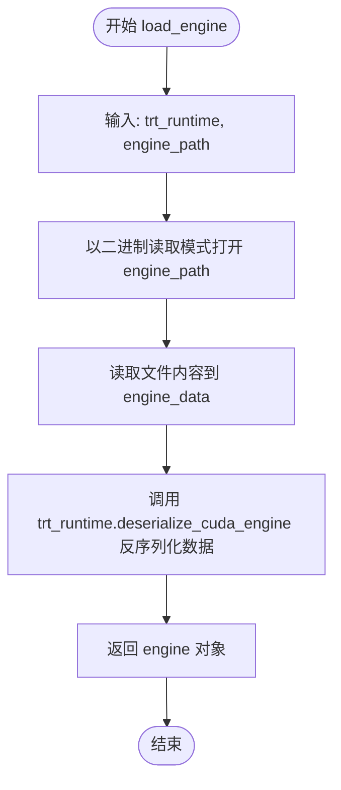
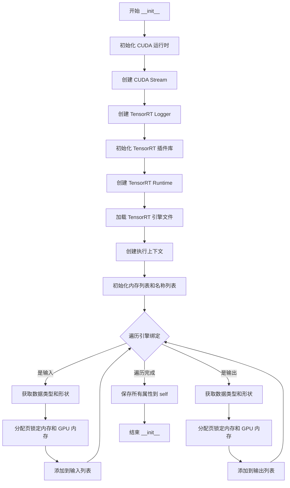
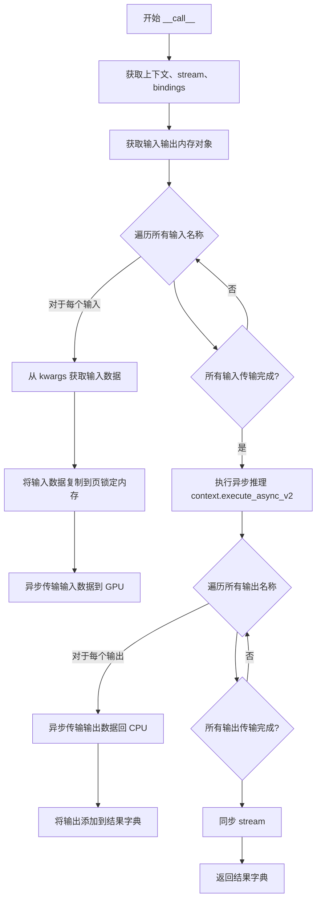
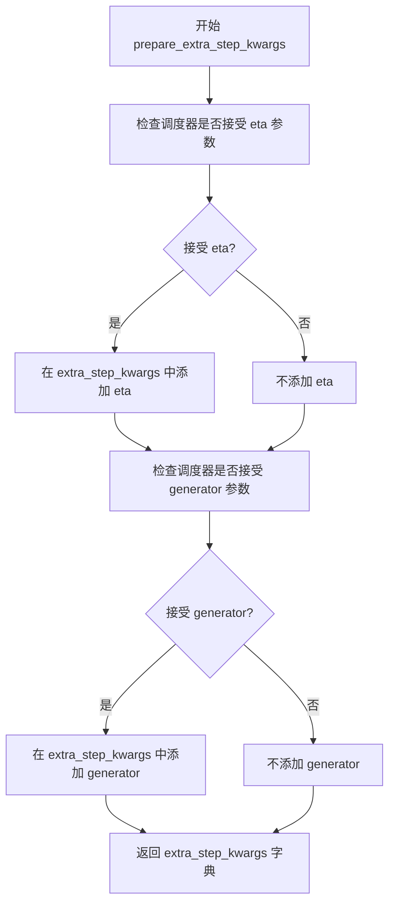
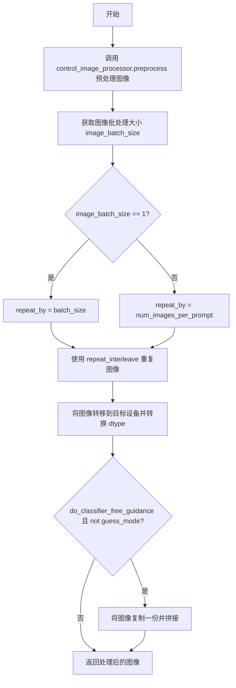
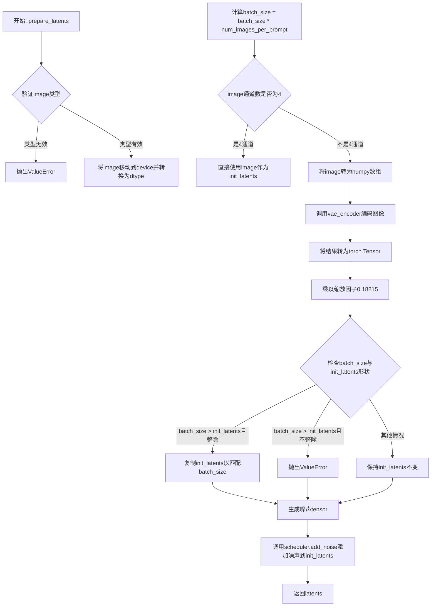

```mermaid
flowchart TD
    A[开始 __call__] --> B[设置 torch_dtype 和 np_dtype]
    B --> C[对齐 control_guidance 格式]
    C --> D[检查输入参数 check_inputs]
    D --> E[定义批次大小 batch_size]
    E --> F[获取执行设备 device]
    F --> G{guidance_scale > 1.0?}
    G -->|Yes| H[设置 do_classifier_free_guidance = True]
    G -->|No| I[设置 do_classifier_free_guidance = False]
    H --> J[处理 controlnet_conditioning_scale 为列表]
    I --> J
    J --> K[编码提示词 _encode_prompt]
    K --> L[预处理主图像 image_processor.preprocess]
    L --> M{num_controlnet == 1?}
    M -->|Yes| N[准备单个 control_image]
    M -->|No| O[准备多个 control_image 列表]
    N --> P[设置时间步 timesteps]
    O --> P
    P --> Q[准备潜在变量 prepare_latents]
    Q --> R[准备额外步骤参数 prepare_extra_step_kwargs]
    R --> S[创建 controlnet_keep 列表]
    S --> T[进入去噪循环]
    T --> U{遍历 timesteps}
    U -->|每次迭代| V[扩展 latent_model_input]
    V --> W[scale_model_input]
    W --> X[计算 cond_scale]
    X --> Y[调用 unet 预测噪声]
    Y --> Z{do_classifier_free_guidance?}
    Z -->|Yes| AA[分离 uncond 和 text 预测并应用引导]
    Z -->|No| AB[直接使用噪声预测]
    AA --> AC[scheduler.step 计算上一步]
    AB --> AC
    AC --> AD[调用 callback 回调]
    AD --> AE{还有更多时间步?}
    AE -->|Yes| U
    AE -->|No| AF[后处理生成图像]
    AF --> AG{output_type == 'latent'?}
    AG -->|No| AH[vae_decoder 解码潜在向量]
    AG -->|Yes| AI[直接使用 latents]
    AH --> AJ[image_processor postprocess]
    AI --> AJ
    AJ --> AK{return_dict?}
    AK -->|Yes| AL[返回 StableDiffusionPipelineOutput]
    AK -->|No| AM[返回 tuple]
    AL --> AN[结束]
    AM --> AN
```

# `diffusers\examples\community\run_tensorrt_controlnet.py` 详细设计文档

A high-performance Stable Diffusion Image-to-Image pipeline utilizing NVIDIA TensorRT for the UNet model inference to accelerate generation, while leveraging ONNX Runtime for the VAE and Text Encoder, specifically implemented with ControlNet for conditional image guidance.

## 整体流程

```mermaid
graph TD
    A[Start __call__] --> B[Check Inputs]
    B --> C[Encode Prompt (Text Encoder ONNX)]
    C --> D[Preprocess Input Image]
    D --> E[Prepare Control Image]
    E --> F[Prepare Latents (VAE Encoder)]
    F --> G[Prepare Timesteps]
    G --> H{Denoising Loop}
    H --> I[TensorRT UNet Inference]
    I --> J[Scheduler Step]
    J --> K{More Steps?}
    K -- Yes --> H
    K -- No --> L[Decode Latents (VAE Decoder ONNX)]
    L --> M[Post Process Image]
    M --> N[Return Images]
```

## 类结构

```
DiffusionPipeline (HuggingFace Base)
└── TensorRTStableDiffusionControlNetImg2ImgPipeline
TensorRTModel (TensorRT Engine Wrapper)
```

## 全局变量及字段


### `logger`
    
Logger instance for the module to log warnings and info messages

类型：`logging.Logger`
    


### `EXAMPLE_DOC_STRING`
    
Documentation string containing example usage code for the pipeline

类型：`str`
    


### `TensorRTModel.stream`
    
CUDA stream for asynchronous memory copy and kernel execution

类型：`pycuda.driver.Stream`
    


### `TensorRTModel.context`
    
TensorRT execution context for running inference

类型：`tensorrt.ICudaEngine`
    


### `TensorRTModel.engine`
    
Deserialized TensorRT engine containing network definition and weights

类型：`tensorrt.ICudaEngine`
    


### `TensorRTModel.host_inputs`
    
List of pagelocked CPU memory buffers for model inputs

类型：`List[numpy.ndarray]`
    


### `TensorRTModel.cuda_inputs`
    
List of GPU memory allocations for model inputs

类型：`List[pycuda.driver.DeviceAllocation]`
    


### `TensorRTModel.host_outputs`
    
List of pagelocked CPU memory buffers for model outputs

类型：`List[numpy.ndarray]`
    


### `TensorRTModel.cuda_outputs`
    
List of GPU memory allocations for model outputs

类型：`List[pycuda.driver.DeviceAllocation]`
    


### `TensorRTModel.bindings`
    
List of integer memory addresses binding GPU buffers to TensorRT engine

类型：`List[int]`
    


### `TensorRTModel.batch_size`
    
Maximum batch size supported by the TensorRT engine

类型：`int`
    


### `TensorRTModel.input_names`
    
List of input tensor names in the TensorRT engine

类型：`List[str]`
    


### `TensorRTModel.output_names`
    
List of output tensor names in the TensorRT engine

类型：`List[str]`
    


### `TensorRTStableDiffusionControlNetImg2ImgPipeline.vae_encoder`
    
VAE encoder model for encoding images to latent space

类型：`OnnxRuntimeModel`
    


### `TensorRTStableDiffusionControlNetImg2ImgPipeline.vae_decoder`
    
VAE decoder model for decoding latents to images

类型：`OnnxRuntimeModel`
    


### `TensorRTStableDiffusionControlNetImg2ImgPipeline.text_encoder`
    
CLIP text encoder model for encoding text prompts to embeddings

类型：`OnnxRuntimeModel`
    


### `TensorRTStableDiffusionControlNetImg2ImgPipeline.tokenizer`
    
CLIP tokenizer for tokenizing text prompts

类型：`CLIPTokenizer`
    


### `TensorRTStableDiffusionControlNetImg2ImgPipeline.unet`
    
TensorRT-accelerated UNet model for noise prediction in diffusion process

类型：`TensorRTModel`
    


### `TensorRTStableDiffusionControlNetImg2ImgPipeline.scheduler`
    
Diffusion scheduler for managing denoising steps and noise scheduling

类型：`KarrasDiffusionSchedulers`
    


### `TensorRTStableDiffusionControlNetImg2ImgPipeline.vae_scale_factor`
    
Scaling factor for VAE latent space (2^(4-1)=8)

类型：`int`
    


### `TensorRTStableDiffusionControlNetImg2ImgPipeline.image_processor`
    
Image processor for preprocessing input images and postprocessing output images

类型：`VaeImageProcessor`
    


### `TensorRTStableDiffusionControlNetImg2ImgPipeline.control_image_processor`
    
Image processor for preprocessing controlnet conditioning images

类型：`VaeImageProcessor`
    
    

## 全局函数及方法


### `load_engine`

该函数负责从磁盘上读取序列化的 TensorRT 引擎文件（.engine 或 .plan 文件），并使用提供的 TensorRT Runtime 将其反序列化为可执行的 CUDA 引擎对象。这是构建 TensorRT 推理管道的关键第一步。

参数：

-  `trt_runtime`：`trt.Runtime`，TensorRT 的运行时对象，用于管理引擎的反序列化过程。
-  `engine_path`：`str`，指向存储 TensorRT 引擎计划的文件路径。

返回值：`trt.ICudaEngine`，反序列化后的 TensorRT 引擎对象，包含网络的定义和权重，可用于创建执行上下文。

#### 流程图



#### 带注释源码

```python
def load_engine(trt_runtime, engine_path):
    # 打开指定路径的引擎文件，以二进制只读模式 ('rb')
    with open(engine_path, "rb") as f:
        # 读取文件的全部内容到内存中
        engine_data = f.read()
    
    # 使用 TensorRT Runtime 的反序列化方法将二进制数据转换为 CUDA 引擎对象
    engine = trt_runtime.deserialize_cuda_engine(engine_data)
    
    # 返回构建好的引擎对象
    return engine
```


### `prepare_image`

该函数是一个图像预处理函数，用于将不同格式的输入图像（PIL Image、numpy array 或 torch tensor）统一转换为 torch.Tensor 格式，并进行标准化处理，以便后续的 Stable Diffusion 流水线使用。

参数：

- `image`：`Union[torch.Tensor, PIL.Image.Image, np.ndarray, List[torch.Tensor], List[PIL.Image.Image], List[np.ndarray]]`，待预处理的图像，支持单个图像或图像列表

返回值：`torch.Tensor`，预处理后的图像张量，形状为 (B, C, H, W)，数据类型为 float32，值域范围为 [-1, 1]

#### 流程图

```mermaid
flowchart TD
    A[开始: prepare_image] --> B{image是否为torch.Tensor?}
    B -- 是 --> C{image.ndim == 3?}
    C -- 是 --> D[image.unsqueeze(0) 添加batch维度]
    C -- 否 --> E[跳过]
    D --> F[image.to dtype=torch.float32]
    F --> Z[返回处理后的image]
    B -- 否 --> G{image是否为PIL.Image或np.ndarray?}
    G -- 是 --> H[image = [image] 包装为列表]
    G -- 否 --> I{image是否为list?}
    H --> J{image[0]是否为PIL.Image?}
    J -- 是 --> K[遍历image列表, 转换为RGB numpy数组并添加batch维度]
    K --> L[np.concatenate 合并数组]
    J -- 否 --> M{image[0]是否为np.ndarray?}
    M -- 是 --> N[为每个numpy数组添加batch维度并合并]
    N --> O
    L --> O[image.transpose 0,3,1,2 转换维度顺序]
    O --> P[torch.from_numpy 转为张量]
    P --> Q[除以127.5并减1.0 归一化到[-1,1]]
    Q --> Z
    I -- 否 --> R[抛出TypeError]
```

#### 带注释源码

```python
def prepare_image(image):
    # 判断输入是否为torch.Tensor类型
    if isinstance(image, torch.Tensor):
        # 批处理单张图像：如果输入是3维张量(H, W, C)，添加batch维度变为(1, H, W, C)
        if image.ndim == 3:
            image = image.unsqueeze(0)

        # 确保数据类型转换为float32（无论原始是float16还是其他类型）
        image = image.to(dtype=torch.float32)
    else:
        # 预处理非Tensor类型的图像
        # 如果是PIL.Image或np.ndarray，统一包装为列表以便批量处理
        if isinstance(image, (PIL.Image.Image, np.ndarray)):
            image = [image]

        # 处理PIL.Image列表：每个PIL图像转换为RGB numpy数组并添加batch维度
        if isinstance(image, list) and isinstance(image[0], PIL.Image.Image):
            image = [np.array(i.convert("RGB"))[None, :] for i in image]
            # 在batch维度(0轴)上拼接所有图像
            image = np.concatenate(image, axis=0)
        # 处理numpy.ndarray列表：为每个数组添加batch维度并拼接
        elif isinstance(image, list) and isinstance(image[0], np.ndarray):
            image = np.concatenate([i[None, :] for i in image], axis=0)

        # 转换维度顺序：从 (B, H, W, C) 转换为 (B, C, H, W)
        # 这是PyTorch的标准图像张量格式
        image = image.transpose(0, 3, 1, 2)
        
        # 转换为torch.Tensor并归一化：将像素值从[0, 255]映射到[-1, 1]
        # 除以127.5将[0, 255]缩放到[0, 2]，再减1.0得到[-1, 1]
        image = torch.from_numpy(image).to(dtype=torch.float32) / 127.5 - 1.0

    return image
```


### TensorRTModel.__init__

该方法是 TensorRTModel 类的构造函数，负责初始化 TensorRT 推理引擎，包括加载 TensorRT 引擎文件、创建执行上下文、分配 CUDA 内存（CPU 页锁定内存和 GPU 内存），并准备输入输出绑定，以便后续执行高效的深度学习推理。

参数：

- `trt_engine_path`：`str`，TensorRT 引擎文件的路径，用于加载序列化的 TensorRT 引擎
- `**kwargs`：`dict`，可选的关键字参数，用于扩展功能

返回值：`None`，该方法不返回任何值，仅初始化对象状态

#### 流程图



#### 带注释源码

```python
def __init__(
    self,
    trt_engine_path,
    **kwargs,
):
    """
    初始化 TensorRT 推理模型，加载引擎并分配内存
    
    参数:
        trt_engine_path: TensorRT 引擎文件路径
        **kwargs: 额外的关键字参数
    """
    # 初始化 CUDA 运行时，这是使用 pycuda 的必要步骤
    cuda.init()
    
    # 创建 CUDA 流，用于异步数据传输和执行
    stream = cuda.Stream()
    
    # 创建 TensorRT 日志记录器，VERBOSE 级别会输出详细信息
    TRT_LOGGER = trt.Logger(trt.Logger.VERBOSE)
    
    # 初始化 TensorRT 插件库，支持自定义层和操作
    trt.init_libnvinfer_plugins(TRT_LOGGER, "")
    
    # 创建 TensorRT Runtime，用于反序列化引擎
    trt_runtime = trt.Runtime(TRT_LOGGER)
    
    # 从文件加载 TensorRT 引擎
    engine = load_engine(trt_runtime, trt_engine_path)
    
    # 创建执行上下文，用于进行推理
    context = engine.create_execution_context()

    # ========== 分配网络输入/输出的内存 ==========
    # host_inputs: CPU 页锁定内存，用于存储输入数据
    # cuda_inputs: GPU 内存指针，用于传输输入数据到 GPU
    # host_outputs: CPU 页锁定内存，用于存储输出数据
    # cuda_outputs: GPU 内存指针，用于传输输出数据从 GPU
    # bindings: GPU 内存地址列表，用于 execute_async_v2
    # input_names: 输入张量的名称列表
    # output_names: 输出张量的名称列表
    host_inputs = []
    cuda_inputs = []
    host_outputs = []
    cuda_outputs = []
    bindings = []
    input_names = []
    output_names = []

    # 遍历引擎的所有绑定（输入和输出）
    for binding in engine:
        # 获取绑定的数据类型
        datatype = engine.get_binding_dtype(binding)
        
        # 根据 TensorRT 数据类型确定 NumPy 数据类型
        # 如果是半精度（HALF），使用 float16，否则使用 float32
        if datatype == trt.DataType.HALF:
            dtype = np.float16
        else:
            dtype = np.float32

        # 获取绑定的形状（张量维度）
        shape = tuple(engine.get_binding_shape(binding))
        
        # 分配页锁定内存（pagelocked memory）
        # 页锁定内存可以加速 CPU-GPU 数据传输
        host_mem = cuda.pagelocked_empty(shape, dtype)
        
        # 分配 GPU 内存
        cuda_mem = cuda.mem_alloc(host_mem.nbytes)
        
        # 将 GPU 内存地址转换为整数并保存到 bindings 列表
        bindings.append(int(cuda_mem))

        # 判断当前绑定是输入还是输出
        if engine.binding_is_input(binding):
            # 添加到输入相关列表
            host_inputs.append(host_mem)
            cuda_inputs.append(cuda_mem)
            input_names.append(binding)
        else:
            # 添加到输出相关列表
            host_outputs.append(host_mem)
            cuda_outputs.append(cuda_mem)
            output_names.append(binding)

    # ========== 保存所有必要属性到实例 ==========
    self.stream = stream                    # CUDA 流对象
    self.context = context                  # TensorRT 执行上下文
    self.engine = engine                    # TensorRT 引擎对象

    self.host_inputs = host_inputs          # 输入数据 CPU 内存列表
    self.cuda_inputs = cuda_inputs          # 输入数据 GPU 内存列表
    self.host_outputs = host_outputs        # 输出数据 CPU 内存列表
    self.cuda_outputs = cuda_outputs        # 输出数据 GPU 内存列表
    self.bindings = bindings                # GPU 内存地址列表
    self.batch_size = engine.max_batch_size # 引擎支持的最大批处理大小

    self.input_names = input_names          # 输入张量名称列表
    self.output_names = output_names        # 输出张量名称列表
```


### `TensorRTModel.__call__`

该方法是 TensorRT 推理模型的核心调用函数，通过异步 CUDA 操作将输入数据传输到 GPU，执行 TensorRT 引擎的推理计算，并将预测结果从 GPU 传回 CPU，最终返回包含所有输出张量的字典。

参数：

- `**kwargs`：可变关键字参数，字典类型，包含输入张量，键为输入名称（字符串），值为输入数据（numpy 数组）。例如：`sample`, `timestep`, `encoder_hidden_states`, `controlnet_conds`, `conditioning_scales` 等。

返回值：`Dict[str, np.ndarray]`，返回包含输出张量的字典，键为输出名称（如 `noise_pred`），值为输出数据（numpy 数组）。

#### 流程图



#### 带注释源码

```python
def __call__(self, **kwargs):
    # 获取执行上下文、流和绑定信息
    # context: TensorRT 执行上下文，用于运行推理
    # stream: CUDA 流，用于异步数据传输
    # bindings: GPU 内存地址列表，用于绑定输入输出
    context = self.context
    stream = self.stream
    bindings = self.bindings

    # 获取预先分配的输入输出内存
    # host_inputs: CPU 端页锁定内存（用于输入）
    # cuda_inputs: GPU 端内存指针（用于输入）
    # host_outputs: CPU 端页锁定内存（用于输出）
    # cuda_outputs: GPU 端内存指针（用于输出）
    host_inputs = self.host_inputs
    cuda_inputs = self.cuda_inputs
    host_outputs = self.host_outputs
    cuda_outputs = self.cuda_outputs

    # 遍历所有输入张量，将数据从 kwargs 传输到 GPU
    for idx, input_name in enumerate(self.input_names):
        # 从关键字参数中获取对应输入名的数据
        _input = kwargs[input_name]
        # 使用 np.copyto 将输入数据复制到预分配的页锁定内存
        np.copyto(host_inputs[idx], _input)
        # 异步将输入数据从 CPU 传输到 GPU
        # cuda.memcpy_htod_async: 主机到设备的异步内存拷贝
        cuda.memcpy_htod_async(cuda_inputs[idx], host_inputs[idx], stream)

    # 执行 TensorRT 异步推理
    # execute_async_v2: TensorRT 的异步执行接口
    # bindings 参数指定了所有输入输出的 GPU 内存地址
    context.execute_async_v2(bindings=bindings, stream_handle=stream.handle)

    # 初始化结果字典
    result = {}
    # 遍历所有输出张量，将数据从 GPU 传回 CPU
    for idx, output_name in enumerate(self.output_names):
        # 异步将输出数据从 GPU 传输回 CPU
        # cuda.memcpy_dtoh_async: 设备到主机的异步内存拷贝
        cuda.memcpy_dtoh_async(host_outputs[idx], cuda_outputs[idx], stream)
        # 将输出数据添加到结果字典，键为输出名称
        result[output_name] = host_outputs[idx]

    # 同步 CUDA 流，确保所有异步操作完成
    # 这是必要的，因为异步传输和推理需要等待完成才能返回正确结果
    stream.synchronize()

    # 返回包含所有输出张量的字典
    return result
```


### TensorRTStableDiffusionControlNetImg2ImgPipeline.__init__

该方法是 `TensorRTStableDiffusionControlNetImg2ImgPipeline` 类的构造函数，用于初始化基于 TensorRT 的 Stable Diffusion ControlNet Img2Img 推理管道。构造函数接收 VAE 编码器/解码器、文本编码器、分词器、UNet TensorRT 模型和调度器作为参数，并注册这些模块，同时初始化图像处理器用于图像的预处理和后处理。

参数：

- `vae_encoder`：`OnnxRuntimeModel`，VAE 编码器模型，用于将输入图像编码为潜在表示
- `vae_decoder`：`OnnxRuntimeModel`，VAE 解码器模型，用于将潜在表示解码为图像
- `text_encoder`：`OnnxRuntimeModel`，文本编码器模型，用于将文本提示编码为嵌入向量
- `tokenizer`：`CLIPTokenizer`，CLIP 分词器，用于将文本提示转换为 token IDs
- `unet`：`TensorRTModel`，基于 TensorRT 优化的 UNet 模型，用于噪声预测
- `scheduler`：`KarrasDiffusionSchedulers`，扩散调度器，用于控制去噪过程的噪声调度

返回值：无（`None`），构造函数仅初始化对象状态，不返回任何值

#### 流程图

```mermaid
flowchart TD
    A[开始 __init__] --> B[调用 super().__init__ 初始化基类]
    B --> C[调用 register_modules 注册6个模块]
    C --> D[计算 vae_scale_factor = 2^(4-1) = 8]
    D --> E[创建 VaeImageProcessor 用于主图像处理]
    E --> F[创建 VaeImageProcessor 用于控制图像处理<br/>do_normalize=False]
    F --> G[结束 __init__]
```

#### 带注释源码

```python
def __init__(
    self,
    vae_encoder: OnnxRuntimeModel,
    vae_decoder: OnnxRuntimeModel,
    text_encoder: OnnxRuntimeModel,
    tokenizer: CLIPTokenizer,
    unet: TensorRTModel,
    scheduler: KarrasDiffusionSchedulers,
):
    """
    初始化 TensorRT 优化的 Stable Diffusion ControlNet Img2Img 管道
    
    参数:
        vae_encoder: VAE 编码器 ONNX 模型
        vae_decoder: VAE 解码器 ONNX 模型
        text_encoder: 文本编码器 ONNX 模型
        tokenizer: CLIP 分词器
        unet: TensorRT 优化的 UNet 模型
        scheduler: Karras 扩散调度器
    """
    # 调用父类 DiffusionPipeline 的初始化方法
    # 设置基本的 pipeline 配置和属性
    super().__init__()

    # 将传入的模型模块注册到 pipeline 中
    # 这些模块将通过 self.<module_name> 访问
    # 注册过程会进行类型检查和属性赋值
    self.register_modules(
        vae_encoder=vae_encoder,
        vae_decoder=vae_decoder,
        text_encoder=text_encoder,
        tokenizer=tokenizer,
        unet=unet,
        scheduler=scheduler,
    )
    
    # 计算 VAE 缩放因子
    # 基于 VAE 的层数 (4 层) 计算: 2^(4-1) = 8
    # 用于将像素空间图像映射到潜在空间
    self.vae_scale_factor = 2 ** (4 - 1)
    
    # 创建主图像处理器
    # do_convert_rgb=True 确保将图像转换为 RGB 格式
    # 用于处理输入图像和输出图像的预处理/后处理
    self.image_processor = VaeImageProcessor(
        vae_scale_factor=self.vae_scale_factor, 
        do_convert_rgb=True
    )
    
    # 创建控制图像处理器
    # do_normalize=False 控制图像不需要归一化
    # 因为控制图像（如 Canny 边缘）已经是数值形式
    self.control_image_processor = VaeImageProcessor(
        vae_scale_factor=self.vae_scale_factor, 
        do_convert_rgb=True, 
        do_normalize=False
    )
```


### `TensorRTStableDiffusionControlNetImg2ImgPipeline._encode_prompt`

该方法负责将文本提示（prompt）编码为文本编码器的隐藏状态（text encoder hidden states），即文本嵌入向量（text embeddings）。它支持通过分类器自由引导（Classifier-Free Guidance, CFG）生成无条件嵌入（unconditional embeddings），并能复用预先计算的嵌入向量。当启用 CFG 时，该方法会将负向提示（negative prompt）的嵌入与原始提示的嵌入进行拼接，以在单次前向传播中同时计算条件和无条件噪声预测，从而优化推理效率。

参数：

- `self`：隐式参数，指向 `TensorRTStableDiffusionControlNetImg2ImgPipeline` 类的实例
- `prompt`：`Union[str, List[str]]`，要编码的文本提示，可以是单个字符串或字符串列表
- `num_images_per_prompt`：`Optional[int]`，每个提示要生成的图像数量，用于扩展嵌入维度
- `do_classifier_free_guidance`：`bool`，是否启用分类器自由引导
- `negative_prompt`：`str | None`，不参与图像生成引导的负向提示，当不使用引导时该参数被忽略
- `prompt_embeds`：`Optional[np.ndarray] = None`，预先生成的文本嵌入，可用于便捷地调整文本输入（如提示加权）；若未提供，则根据 `prompt` 参数生成
- `negative_prompt_embeds`：`Optional[np.ndarray] = None`，预先生成的负向文本嵌入，若未提供，则根据 `negative_prompt` 参数生成

返回值：`np.ndarray`，编码后的文本嵌入向量，用于后续去噪过程的噪声预测

#### 流程图

```mermaid
flowchart TD
    A[开始 _encode_prompt] --> B{判断 prompt 类型}
    B -->|str| C[batch_size = 1]
    B -->|list| D[batch_size = len(prompt)]
    B -->|其他| E[batch_size = prompt_embeds.shape[0]
    
    C --> F{prompt_embeds is None?}
    D --> F
    E --> F
    
    F -->|是| G[调用 tokenizer 编码 prompt]
    G --> H{检测到截断?}
    H -->|是| I[记录警告日志]
    H -->|否| J[直接返回]
    I --> J
    J --> K[调用 text_encoder 生成嵌入]
    F -->|否| L[使用已有的 prompt_embeds]
    K --> M[按 num_images_per_prompt 重复嵌入]
    L --> M
    
    M --> N{do_classifier_free_guidance 且 negative_prompt_embeds is None?}
    N -->|否| O[返回 prompt_embeds]
    N -->|是| P{处理 negative_prompt}
    P -->|None| Q[uncond_tokens = [''] * batch_size]
    P -->|str| R[uncond_tokens = [negative_prompt] * batch_size]
    P -->|list| S[uncond_tokens = negative_prompt]
    Q --> T[调用 tokenizer 编码 uncond_tokens]
    R --> T
    S --> T
    T --> U[调用 text_encoder 生成 negative_prompt_embeds]
    
    U --> V{do_classifier_free_guidance?}
    V -->|是| W[重复 negative_prompt_embeds]
    V -->|否| O
    W --> X[拼接 negative_prompt_embeds 和 prompt_embeds]
    X --> O
```

#### 带注释源码

```python
def _encode_prompt(
    self,
    prompt: Union[str, List[str]],
    num_images_per_prompt: Optional[int],
    do_classifier_free_guidance: bool,
    negative_prompt: str | None,
    prompt_embeds: Optional[np.ndarray] = None,
    negative_prompt_embeds: Optional[np.ndarray] = None,
):
    r"""
    Encodes the prompt into text encoder hidden states.

    Args:
        prompt (`str` or `List[str]`):
            prompt to be encoded
        num_images_per_prompt (`int`):
            number of images that should be generated per prompt
        do_classifier_free_guidance (`bool`):
            whether to use classifier free guidance or not
        negative_prompt (`str` or `List[str]`):
            The prompt or prompts not to guide the image generation. Ignored when not using guidance (i.e., ignored
            if `guidance_scale` is less than `1`).
        prompt_embeds (`np.ndarray`, *optional*):
            Pre-generated text embeddings. Can be used to easily tweak text inputs, *e.g.* prompt weighting. If not
            provided, text embeddings will be generated from `prompt` input argument.
        negative_prompt_embeds (`np.ndarray`, *optional*):
            Pre-generated negative text embeddings. Can be used to easily tweak text inputs, *e.g.* prompt
            weighting. If not provided, negative_prompt_embeds will be generated from `negative_prompt` input
            argument.
    """
    # 确定批次大小（batch_size）
    # 如果 prompt 是字符串，则批处理大小为 1；如果是列表，则为列表长度；否则使用 prompt_embeds 的形状
    if prompt is not None and isinstance(prompt, str):
        batch_size = 1
    elif prompt is not None and isinstance(prompt, list):
        batch_size = len(prompt)
    else:
        batch_size = prompt_embeds.shape[0]

    # 如果未提供 prompt_embeds，则从 prompt 生成文本嵌入
    if prompt_embeds is None:
        # 使用 tokenizer 将 prompt 转换为 token IDs
        # 设置最大长度、启用截断、返回 numpy 数组
        text_inputs = self.tokenizer(
            prompt,
            padding="max_length",
            max_length=self.tokenizer.model_max_length,
            truncation=True,
            return_tensors="np",
        )
        text_input_ids = text_inputs.input_ids
        
        # 获取未截断的 token IDs 用于检测是否发生了截断
        untruncated_ids = self.tokenizer(prompt, padding="max_length", return_tensors="np").input_ids

        # 检测到截断时发出警告，因为 CLIP 只能处理到 model_max_length 长度的序列
        if not np.array_equal(text_input_ids, untruncated_ids):
            removed_text = self.tokenizer.batch_decode(
                untruncated_ids[:, self.tokenizer.model_max_length - 1 : -1]
            )
            logger.warning(
                "The following part of your input was truncated because CLIP can only handle sequences up to"
                f" {self.tokenizer.model_max_length} tokens: {removed_text}"
            )

        # 调用 text_encoder 模型生成文本嵌入向量
        # 将 input_ids 转换为 int32 类型以适配 ONNX Runtime
        prompt_embeds = self.text_encoder(input_ids=text_input_ids.astype(np.int32))[0]

    # 根据 num_images_per_prompt 重复 embeddings 以匹配生成的图像数量
    # 例如：如果 num_images_per_prompt=3，则每个 prompt 的嵌入复制 3 份
    prompt_embeds = np.repeat(prompt_embeds, num_images_per_prompt, axis=0)

    # 处理分类器自由引导（Classifier-Free Guidance）的无条件嵌入
    # 只有当启用 CFG 且未提供 negative_prompt_embeds 时才需要生成无条件嵌入
    if do_classifier_free_guidance and negative_prompt_embeds is None:
        uncond_tokens: List[str]
        
        # 处理 negative_prompt 参数的各种情况
        if negative_prompt is None:
            # 如果未提供 negative_prompt，使用空字符串作为默认值
            uncond_tokens = [""] * batch_size
        elif type(prompt) is not type(negative_prompt):
            # 类型检查：negative_prompt 和 prompt 类型必须一致
            raise TypeError(
                f"`negative_prompt` should be the same type to `prompt`, but got {type(negative_prompt)} !="
                f" {type(prompt)}."
            )
        elif isinstance(negative_prompt, str):
            # 如果 negative_prompt 是字符串，扩展为与 batch_size 匹配的列表
            uncond_tokens = [negative_prompt] * batch_size
        elif batch_size != len(negative_prompt):
            # 批处理大小检查：negative_prompt 列表长度必须与 prompt 匹配
            raise ValueError(
                f"`negative_prompt`: {negative_prompt} has batch size {len(negative_prompt)}, but `prompt`:"
                f" {prompt} has batch size {batch_size}. Please make sure that passed `negative_prompt` matches"
                " the batch size of `prompt`."
            )
        else:
            # negative_prompt 已经是列表，直接使用
            uncond_tokens = negative_prompt

        # 获取 prompt_embeds 的序列长度，用于 tokenize uncond_tokens
        max_length = prompt_embeds.shape[1]
        
        # 对无条件 token 进行 tokenize
        uncond_input = self.tokenizer(
            uncond_tokens,
            padding="max_length",
            max_length=max_length,
            truncation=True,
            return_tensors="np",
        )
        
        # 生成负向提示的嵌入向量
        negative_prompt_embeds = self.text_encoder(input_ids=uncond_input.input_ids.astype(np.int32))[0]

    # 如果启用分类器自由引导，需要对 negative_prompt_embeds 进行重复和拼接
    if do_classifier_free_guidance:
        # 重复 negative_prompt_embeds 以匹配生成的图像数量
        negative_prompt_embeds = np.repeat(negative_prompt_embeds, num_images_per_prompt, axis=0)

        # 拼接无条件嵌入和条件嵌入以避免执行两次前向传播
        # 这样可以在单次前向传播中同时计算条件和无条件噪声预测
        # 拼接后的形状：[batch_size * num_images_per_prompt * 2, seq_len, hidden_dim]
        # 前半部分为无条件嵌入，后半部分为条件嵌入
        prompt_embeds = np.concatenate([negative_prompt_embeds, prompt_embeds])

    # 返回最终的文本嵌入向量
    return prompt_embeds
```


### `TensorRTStableDiffusionControlNetImg2ImgPipeline.decode_latents`

该方法用于将 VAE 的潜在表示解码为图像。由于使用了 `self.vae`，而类中只定义了 `vae_encoder` 和 `vae_decoder`，此方法在当前实现中可能存在兼容性问题（已在注释中标记为已弃用）。

参数：

- `latents`：`torch.Tensor`，需要解码的 VAE 潜在表示张量

返回值：`np.ndarray`，解码后的图像，形状为 (batch_size, height, width, channels)，像素值范围 [0, 1]

#### 流程图

```mermaid
flowchart TD
    A[开始 decode_latents] --> B[发出 FutureWarning 警告]
    B --> C[反归一化 latents: latents = 1 / scaling_factor * latents]
    C --> D[使用 vae.decode 解码 latents]
    D --> E[图像值域转换: (image / 2 + 0.5).clamp(0, 1)]
    E --> F[转换到 CPU 并调整维度: permute(0, 2, 3, 1)]
    F --> G[转换为 float32 numpy 数组]
    G --> H[返回图像数组]
```

#### 带注释源码

```python
# Copied from diffusers.pipelines.stable_diffusion.pipeline_stable_diffusion.StableDiffusionPipeline.decode_latents
def decode_latents(self, latents):
    # 发出警告：该方法已弃用，建议使用 VaeImageProcessor 替代
    warnings.warn(
        "The decode_latents method is deprecated and will be removed in a future version. Please"
        " use VaeImageProcessor instead",
        FutureWarning,
    )
    
    # 1. 反归一化 latents
    # 使用 VAE 的 scaling_factor 进行逆变换
    latents = 1 / self.vae.config.scaling_factor * latents
    
    # 2. 使用 VAE 解码器将 latents 解码为图像
    # 调用 vae.decode 并取第一个返回值（图像）
    image = self.vae.decode(latents, return_dict=False)[0]
    
    # 3. 将图像值域从 [-1, 1] 转换到 [0, 1]
    # 原始 VAE 输出通常在 [-1, 1] 范围
    image = (image / 2 + 0.5).clamp(0, 1)
    
    # 4. 将图像转换到 CPU 并调整维度顺序
    # 从 (batch, channels, height, width) 转换为 (batch, height, width, channels)
    # 然后转换为 float32 类型的 numpy 数组
    # 选择 float32 是因为它不会导致显著的性能开销，且与 bfloat16 兼容
    image = image.cpu().permute(0, 2, 3, 1).float().numpy()
    
    # 5. 返回解码后的图像数组
    return image
```


### `TensorRTStableDiffusionControlNetImg2ImgPipeline.prepare_extra_step_kwargs`

该方法用于为调度器（scheduler）的 step 函数准备额外的关键字参数。由于不同的调度器具有不同的签名，该方法通过检查调度器的参数来决定是否需要传递 `eta` 和 `generator` 参数。

参数：

- `generator`：`Optional[Union[torch.Generator, List[torch.Generator]]]`，用于生成确定性随机数的生成器
- `eta`：`float`，DDIM 调度器的参数 η，值应在 [0, 1] 范围内，仅在使用 DDIMScheduler 时生效

返回值：`Dict[str, Any]`，包含调度器 step 方法所需的关键字参数的字典

#### 流程图



#### 带注释源码

```python
def prepare_extra_step_kwargs(self, generator, eta):
    # 准备调度器步骤的额外关键字参数，因为并非所有调度器都具有相同的签名
    # eta (η) 仅与 DDIMScheduler 一起使用，其他调度器将忽略它
    # eta 对应于 DDIM 论文中的 η: https://huggingface.co/papers/2010.02502
    # 值应在 [0, 1] 范围内

    # 使用 inspect 模块检查调度器的 step 方法签名，判断是否接受 eta 参数
    accepts_eta = "eta" in set(inspect.signature(self.scheduler.step).parameters.keys())
    # 初始化空字典用于存储额外的关键字参数
    extra_step_kwargs = {}
    # 如果调度器接受 eta 参数，则将其添加到 extra_step_kwargs 中
    if accepts_eta:
        extra_step_kwargs["eta"] = eta

    # 检查调度器是否接受 generator 参数
    accepts_generator = "generator" in set(inspect.signature(self.scheduler.step).parameters.keys())
    # 如果调度器接受 generator 参数，则将其添加到 extra_step_kwargs 中
    if accepts_generator:
        extra_step_kwargs["generator"] = generator
    
    # 返回包含调度器所需额外参数 的字典
    return extra_step_kwargs
```


### `TensorRTStableDiffusionControlNetImg2ImgPipeline.check_inputs`

该方法用于验证图像生成管道的输入参数是否合法。它检查回调步骤、提示词、提示词嵌入、控制网图像、条件缩放以及控制引导起始和终止值是否符合要求，确保所有输入参数的类型、形状和值都在有效范围内，以防止在后续生成过程中出现错误。

参数：

- `self`：实例本身
- `num_controlnet`：`int`，控制网络（ControlNet）的数量，用于指定使用多少个控制网络模型
- `prompt`：`Union[str, List[str]]`，用于引导图像生成的文本提示，可以是单个字符串或字符串列表
- `image`：`Union[torch.Tensor, PIL.Image.Image, np.ndarray, List[torch.Tensor], List[PIL.Image.Image], List[np.ndarray]]`，输入的初始图像，用于图像到图像的生成过程
- `callback_steps`：`int`，回调函数的调用频率，每隔多少步调用一次回调函数
- `negative_prompt`：`Union[str, List[str], None]`，可选的负面提示词，用于指定不希望出现在生成图像中的内容
- `prompt_embeds`：`Optional[torch.Tensor]`，可选的预生成文本嵌入，用于直接传入文本编码结果
- `negative_prompt_embeds`：`Optional[torch.Tensor]`，可选的预生成负面文本嵌入
- `controlnet_conditioning_scale`：`Union[float, List[float]]`，默认为 1.0，控制网络输出的条件缩放因子
- `control_guidance_start`：`Union[float, List[float]]`，默认为 0.0，控制网络开始应用的步骤百分比
- `control_guidance_end`：`Union[float, List[float]]`，默认为 1.0，控制网络停止应用的步骤百分比

返回值：`None`，无返回值。该方法通过抛出 ValueError 或 TypeError 异常来处理无效输入，而不是返回错误码。

#### 流程图

```mermaid
flowchart TD
    A[开始检查输入] --> B{callback_steps是否为正整数}
    B -->|否| C[抛出ValueError: callback_steps必须是正整数]
    B -->|是| D{prompt和prompt_embeds是否同时存在}
    D -->|是| D1[抛出ValueError: 不能同时提供prompt和prompt_embeds]
    D -->|否| E{prompt和prompt_embeds是否都为空}
    E -->|是| E1[抛出ValueError: 必须提供prompt或prompt_embeds之一]
    E -->|否| F{prompt是否为str或list}
    F -->|否| F1[抛出ValueError: prompt类型错误]
    F -->|是| G{negative_prompt和negative_prompt_embeds是否同时存在}
    G -->|是| G1[抛出ValueError: 不能同时提供negative_prompt和negative_prompt_embeds]
    G -->|否| H{prompt_embeds和negative_prompt_embeds形状是否匹配}
    H -->|否| H1[抛出ValueError: prompt_embeds和negative_prompt_embeds形状不匹配]
    H -->|是| I{num_controlnet是否为1}
    I -->|是| J[调用check_image验证单张图像]
    I -->|否| K{num_controlnet是否大于1}
    K -->|否| K1[抛出断言错误]
    K -->|是| L{image是否为list类型}
    L -->|否| L1[抛出TypeError: 多控制网时image必须是list]
    L -->|是| M{image是否为嵌套list]
    M -->|是| M1[抛出ValueError: 不支持嵌套list条件]
    M -->|否| N{image数量是否等于num_controlnet]
    N -->|否| N1[抛出ValueError: 图像数量与控制网数量不匹配]
    N -->|是| O[遍历每个图像调用check_image]
    O --> P{controlnet_conditioning_scale检查}
    P --> Q{num_controlnet是否为1]
    Q -->|是| R[检查是否为float类型]
    Q -->|否| S{是否为list类型]
    S -->|是| T{检查list长度是否匹配num_controlnet]
    S -->|否| U[检查是否为float类型]
    R --> V{control_guidance_start和control_guidance_end长度检查]
    V --> W{长度是否相等]
    V --> X{num_controlnet大于1时长度检查]
    X --> Y{每个start/end对进行范围检查]
    Y --> Z[结束验证]
    
    C --> Z
    D1 --> Z
    E1 --> Z
    F1 --> Z
    G1 --> Z
    H1 --> Z
    L1 --> Z
    M1 --> Z
    N1 --> Z
```

#### 带注释源码

```python
def check_inputs(
    self,
    num_controlnet,
    prompt,
    image,
    callback_steps,
    negative_prompt=None,
    prompt_embeds=None,
    negative_prompt_embeds=None,
    controlnet_conditioning_scale=1.0,
    control_guidance_start=0.0,
    control_guidance_end=1.0,
):
    """
    检查并验证传入管道的所有输入参数是否有效。
    
    参数:
        num_controlnet: 控制网络(ControlNet)的数量
        prompt: 文本提示词
        image: 输入图像
        callback_steps: 回调步骤间隔
        negative_prompt: 负面提示词
        prompt_embeds: 预生成的文本嵌入
        negative_prompt_embeds: 预生成的负面文本嵌入
        controlnet_conditioning_scale: 控制网络条件缩放因子
        control_guidance_start: 控制引导起始点
        control_guidance_end: 控制引导终止点
    
    异常:
        ValueError: 当参数值无效时抛出
        TypeError: 当参数类型错误时抛出
    """
    # 验证 callback_steps 参数：必须为正整数
    if (callback_steps is None) or (
        callback_steps is not None and (not isinstance(callback_steps, int) or callback_steps <= 0)
    ):
        raise ValueError(
            f"`callback_steps` has to be a positive integer but is {callback_steps} of type"
            f" {type(callback_steps)}."
        )

    # 验证 prompt 和 prompt_embeds 不能同时提供
    if prompt is not None and prompt_embeds is not None:
        raise ValueError(
            f"Cannot forward both `prompt`: {prompt} and `prompt_embeds`: {prompt_embeds}. Please make sure to"
            " only forward one of the two."
        )
    # 验证至少提供一个 prompt 参数
    elif prompt is None and prompt_embeds is None:
        raise ValueError(
            "Provide either `prompt` or `prompt_embeds`. Cannot leave both `prompt` and `prompt_embeds` undefined."
        )
    # 验证 prompt 的类型
    elif prompt is not None and (not isinstance(prompt, str) and not isinstance(prompt, list)):
        raise ValueError(f"`prompt` has to be of type `str` or `list` but is {type(prompt)}")

    # 验证 negative_prompt 和 negative_prompt_embeds 不能同时提供
    if negative_prompt is not None and negative_prompt_embeds is not None:
        raise ValueError(
            f"Cannot forward both `negative_prompt`: {negative_prompt} and `negative_prompt_embeds`:"
            f" {negative_prompt_embeds}. Please make sure to only forward one of the two."
        )

    # 验证 prompt_embeds 和 negative_prompt_embeds 形状必须匹配
    if prompt_embeds is not None and negative_prompt_embeds is not None:
        if prompt_embeds.shape != negative_prompt_embeds.shape:
            raise ValueError(
                "`prompt_embeds` and `negative_prompt_embeds` must have the same shape when passed directly, but"
                f" got: `prompt_embeds` {prompt_embeds.shape} != `negative_prompt_embeds`"
                f" {negative_prompt_embeds.shape}."
            )

    # 检查图像输入的有效性
    if num_controlnet == 1:
        # 单个控制网络：验证单张图像
        self.check_image(image, prompt, prompt_embeds)
    elif num_controlnet > 1:
        # 多个控制网络：验证图像列表
        if not isinstance(image, list):
            raise TypeError("For multiple controlnets: `image` must be type `list`")

        # 检查不支持的嵌套列表格式
        elif any(isinstance(i, list) for i in image):
            raise ValueError("A single batch of multiple conditionings are supported at the moment.")
        # 验证图像数量与控制网络数量匹配
        elif len(image) != num_controlnet:
            raise ValueError(
                f"For multiple controlnets: `image` must have the same length as the number of controlnets, but got {len(image)} images and {num_controlnet} ControlNets."
            )

        # 遍历验证每张图像
        for image_ in image:
            self.check_image(image_, prompt, prompt_embeds)
    else:
        assert False

    # 检查控制网络条件缩放因子
    if num_controlnet == 1:
        # 单个控制网络：必须是 float 类型
        if not isinstance(controlnet_conditioning_scale, float):
            raise TypeError("For single controlnet: `controlnet_conditioning_scale` must be type `float`.")
    elif num_controlnet > 1:
        # 多个控制网络：可以是 float 或 list
        if isinstance(controlnet_conditioning_scale, list):
            # 不支持嵌套列表
            if any(isinstance(i, list) for i in controlnet_conditioning_scale):
                raise ValueError("A single batch of multiple conditionings are supported at the moment.")
        # 如果是 list，长度必须与控制网络数量匹配
        elif (
            isinstance(controlnet_conditioning_scale, list)
            and len(controlnet_conditioning_scale) != num_controlnet
        ):
            raise ValueError(
                "For multiple controlnets: When `controlnet_conditioning_scale` is specified as `list`, it must have"
                " the same length as the number of controlnets"
            )
    else:
        assert False

    # 验证控制引导起始和终止点的长度必须一致
    if len(control_guidance_start) != len(control_guidance_end):
        raise ValueError(
            f"`control_guidance_start` has {len(control_guidance_start)} elements, but `control_guidance_end` has {len(control_guidance_end)} elements. Make sure to provide the same number of elements to each list."
        )

    # 多个控制网络时，起始点数量必须等于控制网络数量
    if num_controlnet > 1:
        if len(control_guidance_start) != num_controlnet:
            raise ValueError(
                f"`control_guidance_start`: {control_guidance_start} has {len(control_guidance_start)} elements but there are {num_controlnet} controlnets available. Make sure to provide {num_controlnet}."
            )

    # 验证每个起始/终止点对的有效性
    for start, end in zip(control_guidance_start, control_guidance_end):
        # 起始点必须小于终止点
        if start >= end:
            raise ValueError(
                f"control guidance start: {start} cannot be larger or equal to control guidance end: {end}."
            )
        # 起始点不能小于0
        if start < 0.0:
            raise ValueError(f"control guidance start: {start} can't be smaller than 0.")
        # 终止点不能大于1
        if end > 1.0:
            raise ValueError(f"control guidance end: {end} can't be larger than 1.0.")
```


### `TensorRTStableDiffusionControlNetImg2ImgPipeline.check_image`

该方法用于验证输入图像的类型和批次大小是否合法，确保图像是PIL图像、PyTorch张量、NumPy数组或它们的列表，并且当图像批次大小不为1时，必须与提示词的批次大小相匹配，以防止批次不匹配导致的推理错误。

参数：

- `self`：`TensorRTStableDiffusionControlNetImg2ImgPipeline` 实例本身，包含管道配置和模型组件。
- `image`：`Union[torch.Tensor, PIL.Image.Image, np.ndarray, List[torch.Tensor], List[PIL.Image.Image], List[np.ndarray]]`，待验证的输入图像，支持单张图像或图像列表，可以是PyTorch张量、PIL图像或NumPy数组。
- `prompt`：`Union[str, List[str], None]`，可选的文本提示词，用于确定提示词批次大小，可以是字符串或字符串列表。
- `prompt_embeds`：`Optional[torch.Tensor]`（实际代码中未直接使用此参数，仅通过其形状推断批次大小），可选的预计算文本嵌入，用于确定提示词批次大小。

返回值：`None`，该方法不返回任何值，仅通过异常处理验证输入合法性。

#### 流程图

```mermaid
flowchart TD
    A[开始 check_image 验证] --> B{检查 image 类型}
    B --> B1[image_is_pil]
    B --> B2[image_is_tensor]
    B --> B2a[image_is_tensor_list]
    B --> B3[image_is_np]
    B --> B3a[image_is_np_list]
    B --> B4[image_is_pil_list]
    
    B1 --> C{是否为合法类型?}
    B2 --> C
    B2a --> C
    B3 --> C
    B3a --> C
    B4 --> C
    
    C -->|否| D[抛出 TypeError]
    C -->|是| E{image_is_pil?}
    
    E -->|是| F[设置 image_batch_size = 1]
    E -->|否| G[设置 image_batch_size = len(image)]
    
    F --> H{检查 prompt 类型}
    G --> H
    
    H --> I{prompt 是 str?}
    I -->|是| J[prompt_batch_size = 1]
    I -->|否| K{prompt 是 list?}
    K -->|是| L[prompt_batch_size = len(prompt)]
    K -->|否| M{prompt_embeds 不为空?}
    M -->|是| N[prompt_batch_size = prompt_embeds.shape[0]]
    M -->|否| O[不设置 prompt_batch_size]
    
    J --> P{image_batch_size != 1?}
    L --> P
    N --> P
    
    P -->|是| Q{image_batch_size == prompt_batch_size?}
    P -->|否| R[验证通过，方法结束]
    
    Q -->|否| S[抛出 ValueError]
    Q -->|是| R
    
    D --> T[结束]
    S --> T
    O --> R
```

#### 带注释源码

```python
# Copied from diffusers.pipelines.controlnet.pipeline_controlnet.StableDiffusionControlNetPipeline.check_image
def check_image(self, image, prompt, prompt_embeds):
    # 检查图像是否为 PIL.Image.Image 类型
    image_is_pil = isinstance(image, PIL.Image.Image)
    # 检查图像是否为 torch.Tensor 类型
    image_is_tensor = isinstance(image, torch.Tensor)
    # 检查图像是否为 np.ndarray 类型
    image_is_np = isinstance(image, np.ndarray)
    # 检查图像是否为 PIL.Image.Image 列表
    image_is_pil_list = isinstance(image, list) and isinstance(image[0], PIL.Image.Image)
    # 检查图像是否为 torch.Tensor 列表
    image_is_tensor_list = isinstance(image, list) and isinstance(image[0], torch.Tensor)
    # 检查图像是否为 np.ndarray 列表
    image_is_np_list = isinstance(image, list) and isinstance(image[0], np.ndarray)

    # 如果图像不是以上任何一种合法类型，抛出 TypeError 异常
    if (
        not image_is_pil
        and not image_is_tensor
        and not image_is_np
        and not image_is_pil_list
        and not image_is_tensor_list
        and not image_is_np_list
    ):
        raise TypeError(
            f"image must be passed and be one of PIL image, numpy array, torch tensor, list of PIL images, list of numpy arrays or list of torch tensors, but is {type(image)}"
        )

    # 确定图像批次大小：如果是单张 PIL 图像，批次大小为 1；否则取列表长度
    if image_is_pil:
        image_batch_size = 1
    else:
        image_batch_size = len(image)

    # 根据 prompt 或 prompt_embeds 确定提示词批次大小
    if prompt is not None and isinstance(prompt, str):
        prompt_batch_size = 1
    elif prompt is not None and isinstance(prompt, list):
        prompt_batch_size = len(prompt)
    elif prompt_embeds is not None:
        prompt_batch_size = prompt_embeds.shape[0]

    # 验证图像批次大小与提示词批次大小的兼容性
    # 当图像批次大小不为 1 时，必须与提示词批次大小一致
    if image_batch_size != 1 and image_batch_size != prompt_batch_size:
        raise ValueError(
            f"If image batch size is not 1, image batch size must be same as prompt batch size. image batch size: {image_batch_size}, prompt batch size: {prompt_batch_size}"
        )
```


### `TensorRTStableDiffusionControlNetImg2ImgPipeline.prepare_control_image`

该方法用于对ControlNet的输入图像进行预处理，包括图像的缩放、批处理大小的调整、设备和 dtype 的转换，以及在 classifier-free guidance 模式下对图像进行复制以适配条件和无条件输入。

参数：

- `self`：`TensorRTStableDiffusionControlNetImg2ImgPipeline` 类的实例，隐式参数
- `image`：`Union[torch.Tensor, PIL.Image.Image, np.ndarray, List[torch.Tensor], List[PIL.Image.Image], List[np.ndarray]]`，ControlNet 的输入图像，支持多种格式
- `width`：`int`，目标图像宽度（像素）
- `height`：`int`，目标图像高度（像素）
- `batch_size`：`int`，文本提示的批处理大小
- `num_images_per_prompt`：`int`，每个提示生成的图像数量
- `device`：`torch.device`，目标设备（CPU 或 CUDA 设备）
- `dtype`：`torch.dtype`，目标数据类型（如 float16 或 float32）
- `do_classifier_free_guidance`：`bool`，是否启用 classifier-free guidance（默认 False）
- `guess_mode`：`bool`，是否为猜测模式（默认 False）

返回值：`torch.Tensor`，预处理后的 ControlNet 图像张量

#### 流程图



#### 带注释源码

```python
def prepare_control_image(
    self,
    image,
    width,
    height,
    batch_size,
    num_images_per_prompt,
    device,
    dtype,
    do_classifier_free_guidance=False,
    guess_mode=False,
):
    """
    预处理 ControlNet 输入图像
    
    参数:
        image: ControlNet 输入图像，支持 torch.Tensor, PIL.Image, np.ndarray 及其列表形式
        width: 目标宽度
        height: 目标高度
        batch_size: 文本批处理大小
        num_images_per_prompt: 每个提示生成的图像数
        device: 目标设备
        dtype: 目标数据类型
        do_classifier_free_guidance: 是否启用无分类器引导
        guess_mode: 猜测模式标志
    """
    # 使用 control_image_processor 预处理图像，包括resize到指定宽高
    image = self.control_image_processor.preprocess(image, height=height, width=width).to(dtype=torch.float32)
    
    # 获取预处理后图像的批处理大小
    image_batch_size = image.shape[0]

    # 根据原始图像批处理大小确定重复次数
    if image_batch_size == 1:
        # 单张图像需要按batch_size重复
        repeat_by = batch_size
    else:
        # 图像批处理大小与prompt一致，使用num_images_per_prompt
        repeat_by = num_images_per_prompt

    # 按维度0重复图像以匹配批处理大小
    image = image.repeat_interleave(repeat_by, dim=0)

    # 将图像转移到目标设备并转换为目标dtype
    image = image.to(device=device, dtype=dtype)

    # 在classifier-free guidance模式下（且不是guess_mode），需要复制图像用于无条件引导
    if do_classifier_free_guidance and not guess_mode:
        # 将图像和其副本在维度0拼接，前半部分为无条件引导，后半部分为条件引导
        image = torch.cat([image] * 2)

    return image
```


### `TensorRTStableDiffusionControlNetImg2ImgPipeline.get_timesteps`

该方法用于根据推理步数和图像转换强度（strength）计算Stable Diffusion图像到图像（img2img）流程的时间步序列。它根据strength参数确定从原始时间步序列的哪个位置开始采样，以实现对输入图像的转换程度控制。

参数：

- `num_inference_steps`：`int`，推理过程中要执行的去噪步骤总数
- `strength`：`float`，图像转换强度，值介于0.0到1.0之间，用于控制保留原图信息的比例
- `device`：`torch.device`，用于张量运算的计算设备（CPU或CUDA）

返回值：`Tuple[torch.Tensor, int]`，返回两个值：第一个是`torch.Tensor`类型的时间步序列，用于去噪过程的迭代；第二个是`int`类型的值，表示实际执行的推理步数（可能小于原始请求的步数）

#### 流程图

```mermaid
flowchart TD
    A[开始 get_timesteps] --> B[计算 init_timestep]
    B --> C{init_timestep <= num_inference_steps?}
    C -->|是| D[init_timestep = int(num_inference_steps × strength)]
    C -->|否| E[init_timestep = num_inference_steps]
    D --> F[t_start = max(num_inference_steps - init_timestep, 0)]
    E --> F
    F --> G[从 scheduler.timesteps 提取子序列]
    G --> H[timesteps = scheduler.timesteps[t_start × scheduler.order :]]
    H --> I[计算剩余步数: num_inference_steps - t_start]
    I --> J[返回 timesteps, 剩余步数]
```

#### 带注释源码

```python
# Copied from diffusers.pipelines.stable_diffusion.pipeline_stable_diffusion_img2img.StableDiffusionImg2ImgPipeline.get_timesteps
def get_timesteps(self, num_inference_steps, strength, device):
    # 根据强度(strength)计算初始时间步
    # strength 越高，保留的原始图像特征越少，去噪过程越彻底
    # 例如: strength=1.0 表示完全重新生成, strength=0.0 表示保持原图
    init_timestep = min(int(num_inference_steps * strength), num_inference_steps)

    # 计算起始索引，确保不会小于0
    # 跳过前面的时间步，只使用后面的时间步进行去噪
    t_start = max(num_inference_steps - init_timestep, 0)
    
    # 从调度器的时间步序列中提取子序列
    # 乘以 scheduler.order 是为了兼容多步调度器（如 UniPCMultistepScheduler）
    timesteps = self.scheduler.timesteps[t_start * self.scheduler.order :]

    # 返回时间步序列和实际推理步数
    # 剩余步数 = 原始步数 - 跳过的步数
    return timesteps, num_inference_steps - t_start
```


### `TensorRTStableDiffusionControlNetImg2ImgPipeline.prepare_latents`

该方法负责为图像到图像（Img2Img）扩散过程准备潜在向量（latents）。它接收输入图像，计算批量大小，如果图像不是潜在空间表示则使用VAE编码器进行编码，生成噪声并将其添加到初始潜在向量中，最后返回用于去噪过程的潜在向量。

参数：

- `image`：`Union[torch.Tensor, PIL.Image.Image, list]`，输入的初始图像，将作为图像生成过程的起点
- `timestep`：`torch.Tensor`，扩散过程的时间步，用于调度器添加噪声
- `batch_size`：`int`，文本提示的批次大小
- `num_images_per_prompt`：`int`，每个提示要生成的图像数量
- `dtype`：`torch.dtype`，潜在向量的数据类型（float16或float32）
- `device`：`torch.device`，计算设备（CPU或CUDA）
- `generator`：`Optional[torch.Generator]`，可选的随机生成器，用于确保生成的可重复性

返回值：`torch.Tensor`，添加噪声后的潜在向量，用于去噪过程

#### 流程图



#### 带注释源码

```python
def prepare_latents(
    self,
    image: Union[torch.Tensor, PIL.Image.Image, list],  # 输入图像
    timestep: torch.Tensor,  # 扩散时间步
    batch_size: int,  # 批处理大小
    num_images_per_prompt: int,  # 每个提示生成的图像数
    dtype: torch.dtype,  # 数据类型
    device: torch.device,  # 计算设备
    generator: Optional[torch.Generator] = None  # 随机生成器
) -> torch.Tensor:
    """
    准备用于图像到图像生成的潜在变量。
    
    处理流程：
    1. 验证输入图像类型
    2. 将图像移动到指定设备和数据类型
    3. 如果图像不是潜在空间表示，则使用VAE编码器编码
    4. 调整潜在向量以匹配批处理大小
    5. 生成噪声并添加到初始潜在向量
    """
    
    # === 步骤1: 类型验证 ===
    # 确保image是支持的类型之一：torch.Tensor、PIL.Image.Image或list
    if not isinstance(image, (torch.Tensor, PIL.Image.Image, list)):
        raise ValueError(
            f"`image` has to be of type `torch.Tensor`, `PIL.Image.Image` or list but is {type(image)}"
        )

    # === 步骤2: 设备转换 ===
    # 将图像移动到指定的计算设备和数据类型
    image = image.to(device=device, dtype=dtype)

    # === 步骤3: 计算批次大小 ===
    # 考虑每个提示生成的图像数量
    batch_size = batch_size * num_images_per_prompt

    # === 步骤4: 检查图像是否为潜在空间 ===
    # 如果图像已经有4个通道（高度、宽度、通道数=4），说明已经是潜在空间表示
    if image.shape[1] == 4:
        init_latents = image  # 直接使用，无需编码
    else:
        # === 步骤5: VAE编码 ===
        # 图像不是潜在空间，需要通过VAE编码器进行编码
        # 先将图像从GPU移到CPU，转换为numpy数组
        _image = image.cpu().detach().numpy()
        
        # 调用ONNX Runtime VAE编码器获取潜在表示
        init_latents = self.vae_encoder(sample=_image)[0]
        
        # 转换回PyTorch Tensor并移动到指定设备
        init_latents = torch.from_numpy(init_latents).to(device=device, dtype=dtype)
        
        # VAE缩放因子：将潜在向量缩放到正确的数值范围
        init_latents = 0.18215 * init_latents

    # === 步骤6: 批处理大小调整 ===
    # 处理批次大小与初始图像数量不匹配的情况
    if batch_size > init_latents.shape[0] and batch_size % init_latents.shape[0] == 0:
        # 情况1: batch_size大于init_latents且可以整除
        # 需要复制初始图像以匹配文本提示数量（已弃用行为）
        deprecation_message = (
            f"You have passed {batch_size} text prompts (`prompt`), but only {init_latents.shape[0]} initial"
            " images (`image`). Initial images are now duplicating to match the number of text prompts. Note"
            " that this behavior is deprecated and will be removed in a version 1.0.0. Please make sure to update"
            " your script to pass as many initial images as text prompts to suppress this warning."
        )
        deprecate("len(prompt) != len(image)", "1.0.0", deprecation_message, standard_warn=False)
        
        # 计算每个提示需要复制的图像数量
        additional_image_per_prompt = batch_size // init_latents.shape[0]
        
        # 在维度0（批次维度）上复制潜在向量
        init_latents = torch.cat([init_latents] * additional_image_per_prompt, dim=0)
        
    elif batch_size > init_latents.shape[0] and batch_size % init_latents.shape[0] != 0:
        # 情况2: batch_size大于init_latents但不能整除
        # 这种情况下无法均匀分配，抛出错误
        raise ValueError(
            f"Cannot duplicate `image` of batch size {init_latents.shape[0]} to {batch_size} text prompts."
        )
    else:
        # 情况3: batch_size <= init_latents.shape[0]
        # 保持不变，可能会有一些潜在向量不被使用
        init_latents = torch.cat([init_latents], dim=0)

    # === 步骤7: 噪声生成 ===
    # 获取初始潜在向量的形状
    shape = init_latents.shape
    
    # 使用randn_tensor生成与潜在向量形状相同的随机噪声
    # generator参数确保可重复性（如果提供）
    noise = randn_tensor(shape, generator=generator, device=device, dtype=dtype)

    # === 步骤8: 添加噪声 ===
    # 使用调度器的add_noise方法将噪声添加到初始潜在向量
    # 这模拟了扩散过程的前向过程
    init_latents = self.scheduler.add_noise(init_latents, noise, timestep)
    
    # 最终的latents用于后续的去噪推理过程
    latents = init_latents

    return latents
```


### `TensorRTStableDiffusionControlNetImg2ImgPipeline.__call__`

该方法是 TensorRT 加速的 Stable Diffusion ControlNet Img2Img 推理管道的主入口函数，接收文本提示、初始图像和控制图像，通过多个去噪步骤利用 ControlNet 引导生成符合条件的目标图像。

参数：

- `num_controlnet`：`int`，ControlNet 模型的数量
- `fp16`：`bool`，是否使用 float16 精度（默认为 True）
- `prompt`：`Union[str, List[str]]`，引导图像生成的文本提示
- `image`：`Union[torch.Tensor, PIL.Image.Image, np.ndarray, List[torch.Tensor], List[PIL.Image.Image], List[np.ndarray]]`，用作图像生成起点的初始图像
- `control_image`：`Union[torch.Tensor, PIL.Image.Image, np.ndarray, List[torch.Tensor], List[PIL.Image.Image], List[np.ndarray]]`，ControlNet 输入条件图像
- `height`：`Optional[int]`，生成图像的高度（默认为 unet.config.sample_size * vae_scale_factor）
- `width`：`Optional[int]`，生成图像的宽度（默认为 unet.config.sample_size * vae_scale_factor）
- `strength`：`float`，图像变换强度（默认为 0.8）
- `num_inference_steps`：`int`，去噪步骤数（默认为 50）
- `guidance_scale`：`float`，分类器自由引导比例（默认为 7.5）
- `negative_prompt`：`Optional[Union[str, List[str]]]`，不引导图像生成的负面提示
- `num_images_per_prompt`：`Optional[int]`，每个提示生成的图像数量（默认为 1）
- `eta`：`float`，DDIM 论文中的 eta 参数（默认为 0.0）
- `generator`：`Optional[Union[torch.Generator, List[torch.Generator]]]`，随机生成器用于确定性生成
- `latents`：`Optional[torch.Tensor]`，预生成的噪声潜在向量
- `prompt_embeds`：`Optional[torch.Tensor]`，预生成的文本嵌入
- `negative_prompt_embeds`：`Optional[torch.Tensor]`，预生成的负面文本嵌入
- `output_type`：`str | None`，输出格式，默认为 "pil"
- `return_dict`：`bool`，是否返回 StableDiffusionPipelineOutput（默认为 True）
- `callback`：`Optional[Callable[[int, int, torch.Tensor], None]]`，推理过程中每 callback_steps 步调用的回调函数
- `callback_steps`：`int`，回调函数调用频率（默认为 1）
- `cross_attention_kwargs`：`Optional[Dict[str, Any]]`，传递给 AttentionProcessor 的参数字典
- `controlnet_conditioning_scale`：`Union[float, List[float]]`，ControlNet 输出乘数（默认为 0.8）
- `guess_mode`：`bool`，ControlNet 识别模式（默认为 False）
- `control_guidance_start`：`Union[float, List[float]]`，ControlNet 开始应用的步骤百分比（默认为 0.0）
- `control_guidance_end`：`Union[float, List[float]]`，ControlNet 停止应用的步骤百分比（默认为 1.0）

返回值：`Union[StableDiffusionPipelineOutput, tuple]`，当 return_dict 为 True 时返回 StableDiffusionPipelineOutput（包含生成的图像列表和 NSFW 检测结果），否则返回元组

#### 流程图



#### 带注释源码

```python
@torch.no_grad()
@replace_example_docstring(EXAMPLE_DOC_STRING)
def __call__(
    self,
    num_controlnet: int,
    fp16: bool = True,
    prompt: Union[str, List[str]] = None,
    image: Union[
        torch.Tensor,
        PIL.Image.Image,
        np.ndarray,
        List[torch.Tensor],
        List[PIL.Image.Image],
        List[np.ndarray],
    ] = None,
    control_image: Union[
        torch.Tensor,
        PIL.Image.Image,
        np.ndarray,
        List[torch.Tensor],
        List[PIL.Image.Image],
        List[np.ndarray],
    ] = None,
    height: Optional[int] = None,
    width: Optional[int] = None,
    strength: float = 0.8,
    num_inference_steps: int = 50,
    guidance_scale: float = 7.5,
    negative_prompt: Optional[Union[str, List[str]]] = None,
    num_images_per_prompt: Optional[int] = 1,
    eta: float = 0.0,
    generator: Optional[Union[torch.Generator, List[torch.Generator]]] = None,
    latents: Optional[torch.Tensor] = None,
    prompt_embeds: Optional[torch.Tensor] = None,
    negative_prompt_embeds: Optional[torch.Tensor] = None,
    output_type: str | None = "pil",
    return_dict: bool = True,
    callback: Optional[Callable[[int, int, torch.Tensor], None]] = None,
    callback_steps: int = 1,
    cross_attention_kwargs: Optional[Dict[str, Any]] = None,
    controlnet_conditioning_scale: Union[float, List[float]] = 0.8,
    guess_mode: bool = False,
    control_guidance_start: Union[float, List[float]] = 0.0,
    control_guidance_end: Union[float, List[float]] = 1.0,
):
    r"""
    Function invoked when calling the pipeline for generation.

    Args:
        prompt (`str` or `List[str]`, *optional*):
            The prompt or prompts to guide the image generation. If not defined, one has to pass `prompt_embeds`.
            instead.
        image (`torch.Tensor`, `PIL.Image.Image`, `np.ndarray`, `List[torch.Tensor]`, `List[PIL.Image.Image]`, `List[np.ndarray]`,:
                `List[List[torch.Tensor]]`, `List[List[np.ndarray]]` or `List[List[PIL.Image.Image]]`):
            The initial image will be used as the starting point for the image generation process. Can also accept
            image latents as `image`, if passing latents directly, it will not be encoded again.
        control_image (`torch.Tensor`, `PIL.Image.Image`, `np.ndarray`, `List[torch.Tensor]`, `List[PIL.Image.Image]`, `List[np.ndarray]`,:
                `List[List[torch.Tensor]]`, `List[List[np.ndarray]]` or `List[List[PIL.Image.Image]]`):
            The ControlNet input condition. ControlNet uses this input condition to generate guidance to Unet. If
            the type is specified as `torch.Tensor`, it is passed to ControlNet as is. `PIL.Image.Image` can
            also be accepted as an image. The dimensions of the output image defaults to `image`'s dimensions. If
            height and/or width are passed, `image` is resized according to them. If multiple ControlNets are
            specified in init, images must be passed as a list such that each element of the list can be correctly
            batched for input to a single controlnet.
        height (`int`, *optional*, defaults to self.unet.config.sample_size * self.vae_scale_factor):
            The height in pixels of the generated image.
        width (`int`, *optional*, defaults to self.unet.config.sample_size * self.vae_scale_factor):
            The width in pixels of the generated image.
        num_inference_steps (`int`, *optional*, defaults to 50):
            The number of denoising steps. More denoising steps usually lead to a higher quality image at the
            expense of slower inference.
        guidance_scale (`float`, *optional*, defaults to 7.5):
            Guidance scale as defined in [Classifier-Free Diffusion Guidance](https://huggingface.co/papers/2207.12598).
            `guidance_scale` is defined as `w` of equation 2. of [Imagen
            Paper](https://huggingface.co/papers/2205.11487). Guidance scale is enabled by setting `guidance_scale >
            1`. Higher guidance scale encourages to generate images that are closely linked to the text `prompt`,
            usually at the expense of lower image quality.
        negative_prompt (`str` or `List[str]`, *optional*):
            The prompt or prompts not to guide the image generation. If not defined, one has to pass
            `negative_prompt_embeds` instead. Ignored when not using guidance (i.e., ignored if `guidance_scale` is
            less than `1`).
        num_images_per_prompt (`int`, *optional*, defaults to 1):
            The number of images to generate per prompt.
        eta (`float`, *optional*, defaults to 0.0):
            Corresponds to parameter eta (η) in the DDIM paper: https://huggingface.co/papers/2010.02502. Only applies to
            [`schedulers.DDIMScheduler`], will be ignored for others.
        generator (`torch.Generator` or `List[torch.Generator]`, *optional*):
            One or a list of [torch generator(s)](https://pytorch.org/docs/stable/generated/torch.Generator.html)
            to make generation deterministic.
        latents (`torch.Tensor`, *optional*):
            Pre-generated noisy latents, sampled from a Gaussian distribution, to be used as inputs for image
            generation. Can be used to tweak the same generation with different prompts. If not provided, a latents
            tensor will be generated by sampling using the supplied random `generator`.
        prompt_embeds (`torch.Tensor`, *optional*):
            Pre-generated text embeddings. Can be used to easily tweak text inputs, *e.g.* prompt weighting. If not
            provided, text embeddings will be generated from `prompt` input argument.
        negative_prompt_embeds (`torch.Tensor`, *optional*):
            Pre-generated negative text embeddings. Can be used to easily tweak text inputs, *e.g.* prompt
            weighting. If not provided, negative_prompt_embeds will be generated from `negative_prompt` input
            argument.
        output_type (`str`, *optional*, defaults to `"pil"`):
            The output format of the generate image. Choose between
            [PIL](https://pillow.readthedocs.io/en/stable/): `PIL.Image.Image` or `np.array`.
        return_dict (`bool`, *optional*, defaults to `True`):
            Whether or not to return a [`~pipelines.stable_diffusion.StableDiffusionPipelineOutput`] instead of a
            plain tuple.
        callback (`Callable`, *optional*):
            A function that will be called every `callback_steps` steps during inference. The function will be
            called with the following arguments: `callback(step: int, timestep: int, latents: torch.Tensor)`.
        callback_steps (`int`, *optional*, defaults to 1):
            The frequency at which the `callback` function will be called. If not specified, the callback will be
            called at every step.
        cross_attention_kwargs (`dict`, *optional*):
            A kwargs dictionary that if specified is passed along to the `AttentionProcessor` as defined under
            `self.processor` in
            [diffusers.models.attention_processor](https://github.com/huggingface/diffusers/blob/main/src/diffusers/models/attention_processor.py).
        controlnet_conditioning_scale (`float` or `List[float]`, *optional*, defaults to 1.0):
            The outputs of the controlnet are multiplied by `controlnet_conditioning_scale` before they are added
            to the residual in the original unet. If multiple ControlNets are specified in init, you can set the
            corresponding scale as a list. Note that by default, we use a smaller conditioning scale for inpainting
            than for [`~StableDiffusionControlNetPipeline.__call__`].
        guess_mode (`bool`, *optional*, defaults to `False`):
            In this mode, the ControlNet encoder will try best to recognize the content of the input image even if
            you remove all prompts. The `guidance_scale` between 3.0 and 5.0 is recommended.
        control_guidance_start (`float` or `List[float]`, *optional*, defaults to 0.0):
            The percentage of total steps at which the controlnet starts applying.
        control_guidance_end (`float` or `List[float]`, *optional*, defaults to 1.0):
            The percentage of total steps at which the controlnet stops applying.

    Examples:

    Returns:
        [`~pipelines.stable_diffusion.StableDiffusionPipelineOutput`] or `tuple`:
        [`~pipelines.stable_diffusion.StableDiffusionPipelineOutput`] if `return_dict` is True, otherwise a `tuple.
        When returning a tuple, the first element is a list with the generated images, and the second element is a
        list of `bool`s denoting whether the corresponding generated image likely represents "not-safe-for-work"
        (nsfw) content, according to the `safety_checker`.
    """
    # 1. 根据 fp16 参数选择 torch 和 numpy 数据类型
    if fp16:
        torch_dtype = torch.float16
        np_dtype = np.float16
    else:
        torch_dtype = torch.float32
        np_dtype = np.float32

    # 2. 对齐 control_guidance 格式，确保 start 和 end 都是列表
    if not isinstance(control_guidance_start, list) and isinstance(control_guidance_end, list):
        control_guidance_start = len(control_guidance_end) * [control_guidance_start]
    elif not isinstance(control_guidance_end, list) and isinstance(control_guidance_start, list):
        control_guidance_end = len(control_guidance_start) * [control_guidance_end]
    elif not isinstance(control_guidance_start, list) and not isinstance(control_guidance_end, list):
        mult = num_controlnet
        control_guidance_start, control_guidance_end = (
            mult * [control_guidance_start],
            mult * [control_guidance_end],
        )

    # 3. 检查输入参数有效性
    self.check_inputs(
        num_controlnet,
        prompt,
        control_image,
        callback_steps,
        negative_prompt,
        prompt_embeds,
        negative_prompt_embeds,
        controlnet_conditioning_scale,
        control_guidance_start,
        control_guidance_end,
    )

    # 4. 定义调用参数：批次大小
    if prompt is not None and isinstance(prompt, str):
        batch_size = 1
    elif prompt is not None and isinstance(prompt, list):
        batch_size = len(prompt)
    else:
        batch_size = prompt_embeds.shape[0]

    device = self._execution_device
    
    # 5. 确定是否使用分类器自由引导 (CFG)
    do_classifier_free_guidance = guidance_scale > 1.0

    # 6. 处理 controlnet_conditioning_scale 为列表格式
    if num_controlnet > 1 and isinstance(controlnet_conditioning_scale, float):
        controlnet_conditioning_scale = [controlnet_conditioning_scale] * num_controlnet

    # 7. 编码输入提示词
    prompt_embeds = self._encode_prompt(
        prompt,
        num_images_per_prompt,
        do_classifier_free_guidance,
        negative_prompt,
        prompt_embeds=prompt_embeds,
        negative_prompt_embeds=negative_prompt_embeds,
    )
    
    # 8. 预处理主图像
    image = self.image_processor.preprocess(image).to(dtype=torch.float32)

    # 9. 准备 ControlNet 条件图像
    if num_controlnet == 1:
        control_image = self.prepare_control_image(
            image=control_image,
            width=width,
            height=height,
            batch_size=batch_size * num_images_per_prompt,
            num_images_per_prompt=num_images_per_prompt,
            device=device,
            dtype=torch_dtype,
            do_classifier_free_guidance=do_classifier_free_guidance,
            guess_mode=guess_mode,
        )
    elif num_controlnet > 1:
        control_images = []

        for control_image_ in control_image:
            control_image_ = self.prepare_control_image(
                image=control_image_,
                width=width,
                height=height,
                batch_size=batch_size * num_images_per_prompt,
                num_images_per_prompt=num_images_per_prompt,
                device=device,
                dtype=torch_dtype,
                do_classifier_free_guidance=do_classifier_free_guidance,
                guess_mode=guess_mode,
            )

            control_images.append(control_image_)

        control_image = control_images
    else:
        assert False

    # 10. 准备时间步
    self.scheduler.set_timesteps(num_inference_steps, device=device)
    timesteps, num_inference_steps = self.get_timesteps(num_inference_steps, strength, device)
    latent_timestep = timesteps[:1].repeat(batch_size * num_images_per_prompt)

    # 11. 准备潜在变量
    latents = self.prepare_latents(
        image,
        latent_timestep,
        batch_size,
        num_images_per_prompt,
        torch_dtype,
        device,
        generator,
    )

    # 12. 准备额外步骤参数
    extra_step_kwargs = self.prepare_extra_step_kwargs(generator, eta)

    # 13. 创建控制网络保留张量
    controlnet_keep = []
    for i in range(len(timesteps)):
        keeps = [
            1.0 - float(i / len(timesteps) < s or (i + 1) / len(timesteps) > e)
            for s, e in zip(control_guidance_start, control_guidance_end)
        ]
        controlnet_keep.append(keeps[0] if num_controlnet == 1 else keeps)

    # 14. 去噪循环
    num_warmup_steps = len(timesteps) - num_inference_steps * self.scheduler.order
    with self.progress_bar(total=num_inference_steps) as progress_bar:
        for i, t in enumerate(timesteps):
            # 如果使用 CFG，扩展潜在变量
            latent_model_input = torch.cat([latents] * 2) if do_classifier_free_guidance else latents
            latent_model_input = self.scheduler.scale_model_input(latent_model_input, t)

            # 计算条件缩放
            if isinstance(controlnet_keep[i], list):
                cond_scale = [c * s for c, s in zip(controlnet_conditioning_scale, controlnet_keep[i])]
            else:
                controlnet_cond_scale = controlnet_conditioning_scale
                if isinstance(controlnet_cond_scale, list):
                    controlnet_cond_scale = controlnet_cond_scale[0]
                cond_scale = controlnet_cond_scale * controlnet_keep[i]

            # 将数据转换为 numpy 格式以供 TensorRT UNet 使用
            _latent_model_input = latent_model_input.cpu().detach().numpy()
            _prompt_embeds = np.array(prompt_embeds, dtype=np_dtype)
            _t = np.array([t.cpu().detach().numpy()], dtype=np_dtype)

            if num_controlnet == 1:
                control_images = np.array([control_image], dtype=np_dtype)
            else:
                control_images = []
                for _control_img in control_image:
                    _control_img = _control_img.cpu().detach().numpy()
                    control_images.append(_control_img)
                control_images = np.array(control_images, dtype=np_dtype)

            control_scales = np.array(cond_scale, dtype=np_dtype)
            control_scales = np.resize(control_scales, (num_controlnet, 1))

            # 调用 TensorRT UNet 预测噪声残差
            noise_pred = self.unet(
                sample=_latent_model_input,
                timestep=_t,
                encoder_hidden_states=_prompt_embeds,
                controlnet_conds=control_images,
                conditioning_scales=control_scales,
            )["noise_pred"]
            noise_pred = torch.from_numpy(noise_pred).to(device)

            # 执行分类器自由引导
            if do_classifier_free_guidance:
                noise_pred_uncond, noise_pred_text = noise_pred.chunk(2)
                noise_pred = noise_pred_uncond + guidance_scale * (noise_pred_text - noise_pred_uncond)

            # 计算上一步的噪声样本 x_t -> x_t-1
            latents = self.scheduler.step(noise_pred, t, latents, **extra_step_kwargs, return_dict=False)[0]

            # 调用回调函数
            if i == len(timesteps) - 1 or ((i + 1) > num_warmup_steps and (i + 1) % self.scheduler.order == 0):
                progress_bar.update()
                if callback is not None and i % callback_steps == 0:
                    step_idx = i // getattr(self.scheduler, "order", 1)
                    callback(step_idx, t, latents)

    # 15. 后处理：解码潜在向量为图像
    if not output_type == "latent":
        _latents = latents.cpu().detach().numpy() / 0.18215
        _latents = np.array(_latents, dtype=np_dtype)
        image = self.vae_decoder(latent_sample=_latents)[0]
        image = torch.from_numpy(image).to(device, dtype=torch.float32)
        has_nsfw_concept = None
    else:
        image = latents
        has_nsfw_concept = None

    # 16. 规范化图像
    if has_nsfw_concept is None:
        do_denormalize = [True] * image.shape[0]
    else:
        do_denormalize = [not has_nsfw for has_nsfw in has_nsfw_concept]

    # 17. 后处理图像并返回
    image = self.image_processor.postprocess(image, output_type=output_type, do_denormalize=do_denormalize)

    if not return_dict:
        return (image, has_nsfw_concept)

    return StableDiffusionPipelineOutput(images=image, nsfw_content_detected=has_nsfw_concept)
```

## 关键组件


### TensorRTModel 类

封装 TensorRT 引擎加载、CUDA 内存分配与异步推理的核心类，负责将深度学习模型在 GPU 上高效执行。

### TensorRTStableDiffusionControlNetImg2ImgPipeline 类

基于 Diffusers 库的 Stable Diffusion ControlNet Img2Img 推理管道，整合 ONNX 运行时 VAE/Text Encoder 与 TensorRT 加速的 UNet，实现条件图像生成。

### load_engine 函数

从指定路径加载序列化后的 TensorRT 引擎数据并反序列化，初始化推理运行时。

### prepare_image 函数

将 PIL Image、numpy array 或 PyTorch Tensor 格式的输入图像统一转换为 PyTorch Float32 张量并进行归一化预处理。

### VAE Encoder/Decoder (OnnxRuntimeModel)

负责将输入图像编码为潜在表示，以及将生成的潜在向量解码为最终图像，采用 ONNX 运行时执行。

### Text Encoder (CLIPTokenizer + OnnxRuntimeModel)

将文本提示词转换为文本嵌入向量，供 UNet 在去噪过程中使用条件引导。

### 图像处理器 (VaeImageProcessor)

负责图像的预处理（resize、归一化）和后处理（反归一化、格式转换），支持 RGB 转换。

### 控制图像处理器 (control_image_processor)

专门处理 ControlNet 的条件输入图像，支持不同的预处理策略（不进行归一化）。

### 调度器 (UniPCMultistepScheduler)

实现 UniPC 多步求解器，用于扩散模型的迭代去噪过程，支持 Karras 扩散调度器类型。

### 张量索引与惰性加载机制

TensorRTModel 在初始化时仅分配 CUDA 内存页锁定缓冲区，实际数据迁移在调用时通过 `memcpy_htod_async` 和 `memcpy_dtoh_async` 异步完成，实现惰性加载。

### 混合精度支持 (fp16/fp16)

通过 `fp16` 参数控制推理精度，自动选择 torch.float16/np.float16 或 torch.float32/np.float32，并在 TensorRTModel 初始化时根据引擎绑定数据类型分配对应精度的内存。

### 异步执行机制

使用 CUDA Stream 实现推理异步化，通过 `execute_async_v2` 并行执行 GPU 计算，结合 `synchronize` 确保结果同步返回。

### ControlNet 多条件支持

支持单个或多个 ControlNet 条件输入，通过 `num_controlnet` 参数配置条件数量，实现条件图像的批处理和时间步控制。

### Guidance 引导控制

实现 Classifier-Free Guidance 机制，通过 `guidance_scale` 参数控制文本条件强度，支持 `control_guidance_start/end` 动态控制 ControlNet 应用的起止时间步。


## 问题及建议


### 已知问题

- **CUDA重复初始化风险**：模块顶层调用`cuda.init()`，而`TensorRTModel.__init__`中也调用`cuda.init()`，可能在某些环境下导致CUDA初始化冲突或未定义行为
- **全局上下文管理不当**：使用`make_default_context()`和`atexit.register(context.pop)`在模块级别管理CUDA上下文，缺乏线程安全保证，多实例化时可能产生资源竞争
- **推理循环中频繁的CPU-GPU数据拷贝**：在去噪循环内部大量使用`.cpu().detach().numpy()`和`torch.from_numpy().to(device)`进行张量转换，每次迭代都触发同步操作，严重影响推理性能
- **混合使用ONNX Runtime和PyTorch**：VAE编码器使用ONNX Runtime，返回结果需转换为PyTorch张量再传给后续模块，增加了不必要的数据格式转换开销
- **硬编码VAE缩放因子**：直接使用魔数`0.18215`而未从VAE配置中动态读取，违反DRY原则且降低代码可维护性
- **缺少对TensorRT执行失败的错误处理**：`context.execute_async_v2`的返回值未被检查，若引擎执行失败（如输入shape不匹配）会静默返回错误结果
- **潜在的内存泄漏风险**：使用`cuda.mem_alloc`分配的GPU内存和`cuda.pagelocked_empty`分配的页锁定内存在对象销毁时未显式释放（缺少`__del__`方法）
- **类型检查逻辑冗余**：在`check_inputs`中对`controlnet_conditioning_scale`的类型检查存在重复逻辑，且浮点数列表与单值的统一处理方式可能导致运行时类型错误
- **调度器依赖内部实现**：通过`inspect.signature`反射获取调度器参数，假设特定字段存在，这种隐式依赖脆弱且难以调试
- **控制网条件图像处理低效**：对control_image进行numpy数组转换时，未考虑批量处理的连续内存布局，可能导致额外的内存拷贝

### 优化建议

- **统一CUDA资源管理**：使用单例模式或依赖注入管理CUDA上下文，添加`torch.cuda.is_initialized()`检查避免重复初始化；考虑使用`torch.cuda.DeviceContext`替代手动的pycuda上下文管理
- **优化数据传输路径**：将推理循环中的数据转换移至循环外，使用连续内存缓冲区；考虑在GPU上完成整个UNet推理链路，避免中间张量回传CPU
- **统一运行时后端**：VAE编码/解码均使用TensorRT引擎，或统一使用ONNX Runtime，避免PyTorch与ONNX Runtime混用带来的格式转换开销
- **从VAE配置动态读取参数**：通过`self.vae.config.scaling_factor`获取缩放因子，消除硬编码
- **添加执行错误处理**：检查`context.execute_async_v2`的返回值，对CUDA错误进行显式捕获和报告
- **实现资源清理**：为`TensorRTModel`添加`__del__`方法或实现上下文管理器协议，显式释放GPU内存和页锁定内存
- **简化类型检查逻辑**：统一`controlnet_conditioning_scale`的类型处理方式，使用更清晰的类型提示和验证流程
- **解耦调度器依赖**：使用调度器公开的标准API而非内部实现细节，或封装调度器参数准备逻辑提高可测试性
- **优化控制图像预处理**：使用连续的GPU内存布局处理control_image，避免多次内存拷贝和格式转换

## 其它


### 设计目标与约束

本代码的设计目标是将Stable Diffusion的ControlNet Img2Img推理过程进行TensorRT加速，以实现更高效的图像生成。主要约束包括：1) 需要NVIDIA GPU和CUDA支持；2) 需要预先转换好的ONNX模型（VAE Encoder、VAE Decoder、Text Encoder）和TensorRT引擎文件；3) 模型输入尺寸默认为512x512；4) 仅支持FP16和FP32两种精度模式。

### 错误处理与异常设计

代码采用分层错误处理机制：1) 输入验证阶段通过`check_inputs`和`check_image`方法进行全面的参数校验，包括类型检查、尺寸匹配、批处理一致性等，抛出`ValueError`或`TypeError`；2) 在`prepare_latents`方法中对图像类型进行验证；3) 使用Python标准异常而非自定义异常，保持与diffusers库的一致性；4) 通过`warnings.warn`处理废弃API的警告信息；5) `decode_latents`方法标记为已废弃并发出`FutureWarning`。

### 数据流与状态机

整体数据流如下：1) **编码阶段**：将文本prompt通过tokenizer和text_encoder编码为prompt_embeds，同时处理negative_prompt生成unconditional embeddings；2) **图像预处理阶段**：对输入图像进行预处理（resize、normalize），对control_image进行专门处理；3) **潜在向量准备阶段**：通过VAE Encoder将图像转换为latent表示，或直接使用输入的latent；4) **去噪循环阶段**：在多个timestep上迭代，使用UNet（TensorRT加速）预测噪声，执行classifier-free guidance；5) **解码阶段**：通过VAE Decoder将latent解码为最终图像。状态转移由scheduler的timesteps控制，从初始噪声逐步去噪至目标图像。

### 外部依赖与接口契约

核心依赖包括：1) **tensorrt** - 用于UNet推理加速；2) **pycuda** - CUDA Python绑定；3) **onnxruntime** - VAE和Text Encoder的ONNX推理；4) **diffusers** - Stable Diffusion Pipeline基类和scheduler；5) **transformers** - CLIPTokenizer；6) **numpy** - 数值计算；7) **PIL/Pillow** - 图像处理；8) **torch** - 张量操作。接口契约遵循DiffusionPipeline基类，输出格式为`StableDiffusionPipelineOutput`，包含images和nsfw_content_detected字段。

### 性能考量与优化空间

当前实现的主要性能特性：1) UNet使用TensorRT加速，执行异步推理（execute_async_v2）；2) VAE和Text Encoder使用ONNX Runtime；3) 图像预处理在CPU完成；4) 控制 Guidance 采用列表方式处理多个ControlNet。优化方向包括：1) 可添加TensorRT Builder配置以支持更多精度选项；2) 可实现批处理推理支持；3) 可添加内存优化如CPU offload；4) 可添加推理过程中的中间结果缓存；5) 控制图像预处理可考虑GPU加速。

### 资源管理与生命周期

CUDA资源管理策略：1) 在模块加载时初始化CUDA（cuda.init()）和TensorRT插件；2) 使用`atexit.register(context.pop)`确保程序退出时释放CUDA context；3) TensorRTModel在初始化时分配固定的pinned memory和GPU memory用于输入输出；4) 使用cuda.Stream进行异步数据传输和计算；5) stream.synchronize()确保所有异步操作完成。需要注意的是当前实现在TensorRTModel中重复调用了cuda.init()，可能导致潜在的资源泄漏风险。

### 安全性考虑

安全相关设计：1) 代码未包含Safety Checker模块（has_nsfw_concept始终为None），实际部署时需要添加；2) 输入验证覆盖了常见的错误使用场景；3) 模型文件路径来自命令行参数，需要确保路径安全性；4) 生成的图像直接保存无水印处理；5) 建议在生产环境中添加输入图像大小限制和prompt过滤机制。

### 配置管理与参数说明

主要配置参数：1) **fp16** - 控制推理精度，默认为True（FP16）；2) **num_inference_steps** - 去噪步数，默认50；3) **guidance_scale** - CFG权重，默认7.5；4) **strength** - 图像变换强度，默认0.8；5) **num_images_per_prompt** - 每个prompt生成的图像数量；6) **controlnet_conditioning_scale** - ControlNet条件权重；7) **control_guidance_start/end** - ControlNet应用的时间步范围。命令行参数包括：sd_model（diffusers模型路径）、onnx_model_dir（ONNX模型目录）、unet_engine_path（TensorRT引擎路径）、qr_img_path（输入图像路径）。

### 测试策略建议

建议的测试覆盖：1) 单元测试：各模块（TensorRTModel、prepare_image、prepare_control_image）的独立测试；2) 集成测试：完整pipeline的端到端测试；3) 边界测试：空prompt、单ControlNet、多ControlNet、最大分辨率等场景；4) 性能测试：不同batch size和steps下的推理时间；5) 错误处理测试：各种非法输入的异常抛出验证；6) 一致性测试：与原始diffusers pipeline输出的数值对比。

### 部署注意事项

生产环境部署需注意：1) 确保CUDA、TensorRT、ONNX Runtime版本兼容性；2) 预转换模型文件的路径配置；3) GPU显存要求（建议16GB以上）；4) 可添加health check endpoint用于监控；5) 考虑添加请求队列和并发控制；6) 日志级别配置（当前使用diffusers的logging）；7) 错误重试机制；8) 监控推理过程中的内存使用。

### 版本兼容性与依赖管理

版本兼容性考虑：1) 代码依赖diffusers库的特定类（DiffusionPipeline、StableDiffusionPipelineOutput等）；2) 依赖transformers的CLIPTokenizer；3) 依赖tensorrt的特定API（deserialize_cuda_engine、create_execution_context等）；4) 依赖pycuda的特定API（make_default_context、memcpy_htod_async等）；5) 建议在requirements.txt中锁定具体版本；6) TensorRT引擎文件与TensorRT版本强相关，更换环境需重新生成引擎。


    