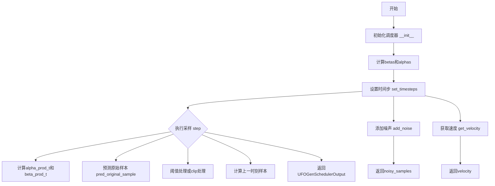
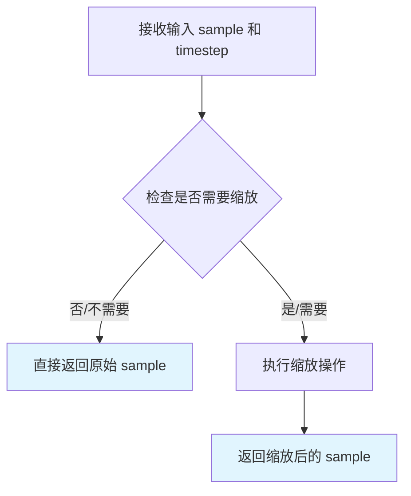
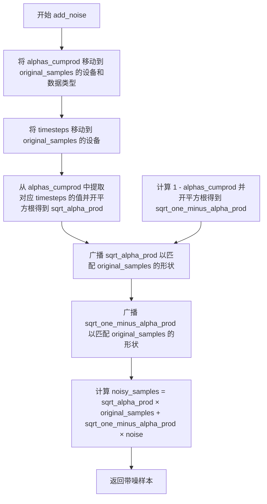
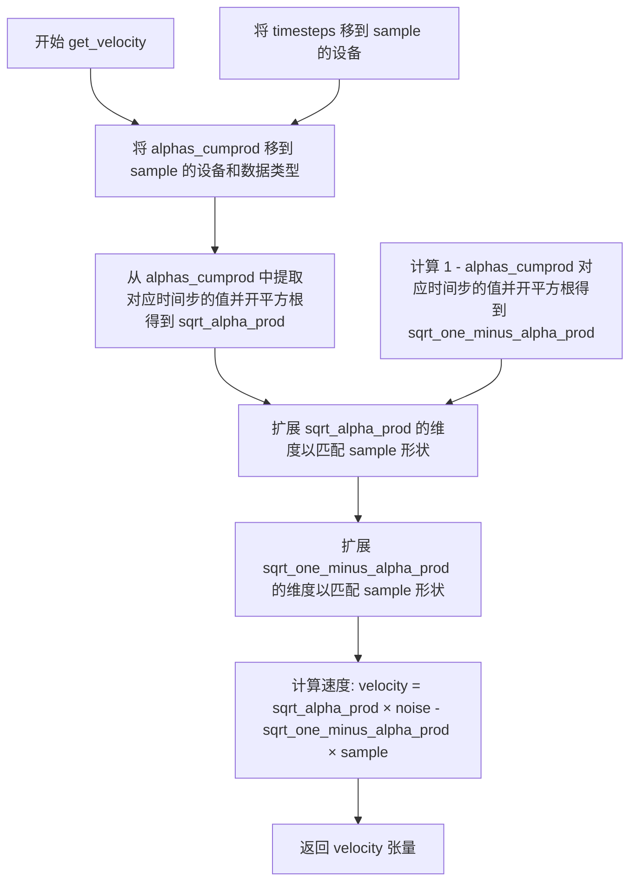
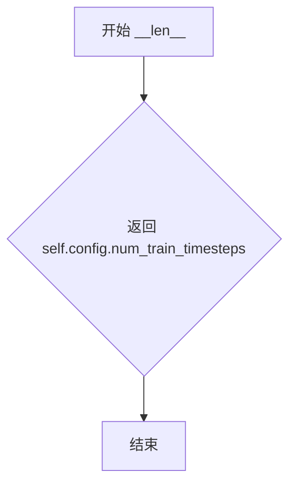

# `diffusers\examples\community\scheduling_ufogen.py` 详细设计文档

UFOGenScheduler是一个扩散模型调度器，实现了UFOGen模型的单步和多步采样功能，基于去噪扩散GAN（DDGAN）架构，用于大规模文本到图像生成。该调度器通过管理噪声调度（beta值）、累积alpha产品以及预测原始样本来实现反向扩散过程。

## 整体流程



## 类结构

```
UFOGenSchedulerOutput (数据类)
├── prev_sample: torch.Tensor
└── pred_original_sample: torch.Tensor

UFOGenScheduler (主调度器类)
├── 继承: SchedulerMixin, ConfigMixin
├── 字段: betas, alphas, alphas_cumprod, final_alpha_cumprod, init_noise_sigma, custom_timesteps, num_inference_steps, timesteps
└── 方法: __init__, scale_model_input, set_timesteps, _threshold_sample, step, add_noise, get_velocity, __len__, previous_timestep
```

## 全局变量及字段


### `num_train_timesteps`
    
扩散模型训练的步数，默认为1000

类型：`int`
    


### `beta_start`
    
Beta调度起始值，用于控制扩散过程的噪声添加速率

类型：`float`
    


### `beta_end`
    
Beta调度结束值，定义扩散过程中噪声的最终水平

类型：`float`
    


### `beta_schedule`
    
Beta调度策略类型，可选linear、scaled_linear、squaredcos_cap_v2或sigmoid

类型：`str`
    


### `trained_betas`
    
预训练的Beta值数组，如果提供则忽略beta_schedule策略

类型：`Optional[Union[np.ndarray, List[float]]]`
    


### `clip_sample`
    
是否对预测样本进行裁剪以确保数值稳定性

类型：`bool`
    


### `set_alpha_to_one`
    
最终扩散步是否将前一个alpha乘积固定为1

类型：`bool`
    


### `prediction_type`
    
预测类型，可为epsilon、sample或v_prediction，决定模型预测的内容

类型：`str`
    


### `thresholding`
    
是否启用动态阈值处理方法以改善图像质量

类型：`bool`
    


### `dynamic_thresholding_ratio`
    
动态阈值计算的百分位比例，用于确定阈值s的值

类型：`float`
    


### `clip_sample_range`
    
样本裁剪的数值范围，用于限制预测样本的幅度

类型：`float`
    


### `sample_max_value`
    
动态阈值处理的最大阈值上限

类型：`float`
    


### `timestep_spacing`
    
推理时时间步的间隔策略，可选linspace、leading或trailing

类型：`str`
    


### `steps_offset`
    
推理步数的偏移量，某些模型家族需要此参数

类型：`int`
    


### `rescale_betas_zero_snr`
    
是否重新调整Beta以实现零终端信噪比，使模型能生成更亮或更暗的样本

类型：`bool`
    


### `denoising_step_size`
    
UFOGen论文中的去噪步大小参数，用于确定训练步数

类型：`int`
    


### `UFOGenSchedulerOutput.prev_sample`
    
前一个时间步的计算样本x_{t-1}，作为下一个去噪循环的输入

类型：`torch.Tensor`
    


### `UFOGenSchedulerOutput.pred_original_sample`
    
基于当前时间步模型输出预测的去噪样本x_0，可用于预览进度或引导

类型：`Optional[torch.Tensor]`
    


### `UFOGenScheduler.order`
    
调度器的阶数，决定了多步采样时的阶数

类型：`int`
    


### `UFOGenScheduler.betas`
    
Beta调度值序列，控制每个扩散时间步的噪声水平

类型：`torch.Tensor`
    


### `UFOGenScheduler.alphas`
    
Alpha值序列，通过1减去betas计算得出

类型：`torch.Tensor`
    


### `UFOGenScheduler.alphas_cumprod`
    
Alpha值的累积乘积，用于计算扩散过程中的累积衰减

类型：`torch.Tensor`
    


### `UFOGenScheduler.final_alpha_cumprod`
    
最终时间步的累积Alpha产品，用于边界条件处理

类型：`torch.Tensor`
    


### `UFOGenScheduler.init_noise_sigma`
    
初始噪声分布的标准差，默认为1.0

类型：`float`
    


### `UFOGenScheduler.custom_timesteps`
    
标志位，指示是否使用自定义时间步序列

类型：`bool`
    


### `UFOGenScheduler.num_inference_steps`
    
推理时使用的扩散步数，决定采样质量与速度的权衡

类型：`int`
    


### `UFOGenScheduler.timesteps`
    
包含推理用离散时间步的张量序列

类型：`torch.Tensor`
    
    

## 全局函数及方法


### `betas_for_alpha_bar`

该函数用于创建 beta 调度表，通过离散化给定的 alpha_t_bar 函数来生成扩散过程中 (1-beta) 的累积乘积序列，支持 cosine 和 exponential 两种 alpha 变换类型。

参数：

- `num_diffusion_timesteps`：`int`，要生成的 beta 数量
- `max_beta`：`float`，最大 beta 值，用于防止奇点（默认值 0.999）
- `alpha_transform_type`：`str`，alpha_bar 的噪声调度类型，可选 "cosine" 或 "exp"（默认 "cosine"）

返回值：`torch.Tensor`，调度器用于逐步模型输出的 betas 数组

#### 流程图

```mermaid
flowchart TD
    A[开始] --> B{alpha_transform_type == 'cosine'?}
    B -->|Yes| C[定义 alpha_bar_fn = cos²((t+0.008)/1.008 * π/2)]
    B -->|No| D{alpha_transform_type == 'exp'?}
    D -->|Yes| E[定义 alpha_bar_fn = exp(t * -12.0)]
    D -->|No| F[raise ValueError 不支持的类型]
    F --> G[结束]
    C --> H[初始化空列表 betas]
    H --> I[循环 i 从 0 到 num_diffusion_timesteps-1]
    I --> J[计算 t1 = i / num_diffusion_timesteps]
    J --> K[计算 t2 = (i + 1) / num_diffusion_timesteps]
    K --> L[计算 beta = min(1 - alpha_bar_fn(t2) / alpha_bar_fn(t1), max_beta)]
    L --> M[将 beta 添加到 betas 列表]
    M --> N{循环结束?}
    N -->|No| I
    N -->|Yes| O[返回 torch.tensor(betas, dtype=torch.float32)]
    O --> G
    E --> H
```

#### 带注释源码

```python
# Copied from diffusers.schedulers.scheduling_ddpm.betas_for_alpha_bar
def betas_for_alpha_bar(
    num_diffusion_timesteps,    # int: 要生成的 beta 数量
    max_beta=0.999,             # float: 最大 beta 值，防止奇点
    alpha_transform_type="cosine",  # str: alpha_bar 变换类型，可选 "cosine" 或 "exp"
):
    """
    Create a beta schedule that discretizes the given alpha_t_bar function, which defines the cumulative product of
    (1-beta) over time from t = [0,1].

    Contains a function alpha_bar that takes an argument t and transforms it to the cumulative product of (1-beta) up
    to that part of the diffusion process.


    Args:
        num_diffusion_timesteps (`int`): the number of betas to produce.
        max_beta (`float`): the maximum beta to use; use values lower than 1 to
                     prevent singularities.
        alpha_transform_type (`str`, *optional*, default to `cosine`): the type of noise schedule for alpha_bar.
                     Choose from `cosine` or `exp`

    Returns:
        betas (`np.ndarray`): the betas used by the scheduler to step the model outputs
    """
    # 根据 alpha_transform_type 选择不同的 alpha_bar 函数
    if alpha_transform_type == "cosine":
        # cosine 变换：使用余弦平方函数平滑过渡
        def alpha_bar_fn(t):
            return math.cos((t + 0.008) / 1.008 * math.pi / 2) ** 2

    elif alpha_transform_type == "exp":
        # exponential 变换：使用指数衰减函数
        def alpha_bar_fn(t):
            return math.exp(t * -12.0)

    else:
        raise ValueError(f"Unsupported alpha_transform_type: {alpha_transform_type}")

    # 初始化 betas 列表
    betas = []
    # 遍历每个扩散时间步，离散化 alpha_bar 函数
    for i in range(num_diffusion_timesteps):
        t1 = i / num_diffusion_timesteps  # 当前时间步的归一化值
        t2 = (i + 1) / num_diffusion_timesteps  # 下一个时间步的归一化值
        # 计算 beta：基于 alpha_bar 变化率，并限制最大值为 max_beta
        betas.append(min(1 - alpha_bar_fn(t2) / alpha_bar_fn(t1), max_beta))
    
    # 返回 PyTorch float32 类型的 betas 张量
    return torch.tensor(betas, dtype=torch.float32)
```


### `rescale_zero_terminal_snr`

该函数用于重新缩放beta调度表，使其具有零终端信噪比（SNR），基于https://huggingface.co/papers/2305.08891算法1，这使得模型能够生成非常明亮或非常暗的样本，而不是限制在中等亮度的样本。

参数：

- `betas`：`torch.Tensor`，调度器初始化时使用的beta值张量

返回值：`torch.Tensor`，具有零终端SNR的重新缩放后的beta值

#### 流程图

```mermaid
flowchart TD
    A[开始: 输入 betas] --> B[计算 alphas = 1.0 - betas]
    B --> C[计算 alphas_cumprod = cumprod(alphas)]
    C --> D[计算 alphas_bar_sqrt = sqrt(alphas_cumprod)]
    D --> E[保存初始值: alphas_bar_sqrt_0]
    E --> F[保存最终值: alphas_bar_sqrt_T]
    F --> G[移动使得最后一步为零: alphas_bar_sqrt -= alphas_bar_sqrt_T]
    G --> H[缩放使得第一步回到原始值]
    H --> I[alphas_bar_sqrt *= alphas_bar_sqrt_0 / alphas_bar_sqrt_0 - alphas_bar_sqrt_T]
    I --> J[转换回alphas_bar: alphas_bar = alphas_bar_sqrt ** 2]
    J --> K[反转cumprod: alphas = alphas_bar[1:] / alphas_bar[:-1]]
    K --> L[拼接: alphas = concat[alphas_bar[0:1], alphas]]
    L --> M[计算betas: betas = 1 - alphas]
    M --> N[返回: 重新缩放后的 betas]
```

#### 带注释源码

```python
def rescale_zero_terminal_snr(betas):
    """
    Rescales betas to have zero terminal SNR Based on https://huggingface.co/papers/2305.08891 (Algorithm 1)

    Args:
        betas (`torch.Tensor`):
            the betas that the scheduler is being initialized with.

    Returns:
        `torch.Tensor`: rescaled betas with zero terminal SNR
    """
    # 第一步：将betas转换为alphas（从beta到alpha的转换）
    # alpha = 1 - beta，表示在每个时间步保留的信号比例
    alphas = 1.0 - betas
    
    # 第二步：计算累积乘积alphas_cumprod
    # alphas_cumprod[t] = alpha[0] * alpha[1] * ... * alpha[t]
    # 这表示从开始到时间t的累积信号保留
    alphas_cumprod = torch.cumprod(alphas, dim=0)
    
    # 第三步：计算累积alpha的平方根
    # 用于后续的数值操作和SNR调整
    alphas_bar_sqrt = alphas_cumprod.sqrt()

    # 第四步：保存原始值用于后续恢复
    # 保存第一个时间步的sqrt值（初始噪声水平）
    alphas_bar_sqrt_0 = alphas_bar_sqrt[0].clone()
    # 保存最后一个时间步的sqrt值（终端SNR相关）
    alphas_bar_sqrt_T = alphas_bar_sqrt[-1].clone()

    # 第五步：移动使得最后时间步为零
    # 这是实现零终端SNR的关键步骤
    # 移动后，最后一个时间步的alphas_bar_sqrt变为0
    alphas_bar_sqrt -= alphas_bar_sqrt_T

    # 第六步：缩放使得第一个时间步回到原始值
    # 通过线性变换保持初始噪声水平不变
    # 公式：alphas_bar_sqrt *= alphas_bar_sqrt_0 / (alphas_bar_sqrt_0 - alphas_bar_sqrt_T)
    alphas_bar_sqrt *= alphas_bar_sqrt_0 / (alphas_bar_sqrt_0 - alphas_bar_sqrt_T)

    # 第七步：将sqrt值转换回原始的alphas_bar
    # 平方操作还原sqrt变换
    alphas_bar = alphas_bar_sqrt**2  # Revert sqrt
    
    # 第八步：从累积积还原单个alpha值
    # alphas[t] = alphas_bar[t] / alphas_bar[t-1]
    alphas = alphas_bar[1:] / alphas_bar[:-1]  # Revert cumprod
    
    # 第九步：在前面添加第一个时间步的alpha值
    # 保持数组长度与原始一致
    alphas = torch.cat([alphas_bar[0:1], alphas])
    
    # 第十步：从alpha计算beta
    # beta = 1 - alpha
    betas = 1 - alphas

    # 返回重新缩放后的betas
    # 现在具有零终端SNR特性
    return betas
```


### UFOGenScheduler.__init__

初始化UFOGenScheduler调度器，用于UFOGen（One Forward Large Scale Text-to-Image Generation）模型的扩散过程参数配置。该方法根据传入的参数构建beta调度表、计算alpha累积乘积，并设置推理所需的各种状态变量。

参数：

- `num_train_timesteps`：`int`，训练时的扩散步数，默认为1000，决定了模型训练的时间步总数
- `beta_start`：`float`，beta调度起始值，默认为0.0001，用于线性调度起始点
- `beta_end`：`float`，beta调度结束值，默认为0.02，用于线性调度终点
- `beta_schedule`：`str`，beta调度策略，可选"linear"、"scaled_linear"、"squaredcos_cap_v2"或"sigmoid"，默认为"linear"
- `trained_betas`：`Optional[Union[np.ndarray, List[float]]]`，预训练的beta值数组，若提供则忽略beta_schedule，默认为None
- `clip_sample`：`bool`，是否对预测样本进行裁剪以保证数值稳定性，默认为True
- `set_alpha_to_one`：`bool`，最终时间步的alpha累积乘积是否设为1，默认为True
- `prediction_type`：`str`，预测类型，可选"epsilon"、"sample"或"v_prediction"，默认为"epsilon"
- `thresholding`：`bool`，是否启用动态阈值处理，默认为False
- `dynamic_thresholding_ratio`：`float`，动态阈值比例，用于确定阈值百分位数，默认为0.995
- `clip_sample_range`：`float`，样本裁剪范围，当clip_sample为True时使用，默认为1.0
- `sample_max_value`：`float`，动态阈值处理的最大样本值，默认为1.0
- `timestep_spacing`：`str`，时间步间隔策略，可选"linspace"、"leading"或"trailing"，默认为"leading"
- `steps_offset`：`int`，推理步数偏移量，用于某些模型家族，默认为0
- `rescale_betas_zero_snr`：`bool`，是否重新缩放beta以实现零终端信噪比，默认为False
- `denoising_step_size`：`int`，UFOGen论文中的去噪步长参数，默认为250

返回值：无（`None`），该方法为构造函数，直接修改实例状态

#### 流程图

```mermaid
flowchart TD
    A[开始 __init__] --> B{trained_betas 是否为 None?}
    B -->|否| C[使用 trained_betas 创建 betas 张量]
    B -->|是| D{beta_schedule 类型?}
    D -->|linear| E[创建线性 beta 调度]
    D -->|scaled_linear| F[创建缩放线性 beta 调度]
    D -->|squaredcos_cap_v2| G[使用 betas_for_alpha_bar 创建调度]
    D -->|sigmoid| H[使用 sigmoid 函数创建调度]
    D -->|其他| I[抛出 NotImplementedError]
    C --> J
    E --> J
    F --> J
    G --> J
    H --> J
    J{rescale_betas_zero_snr?}
    J -->|是| K[调用 rescale_zero_terminal_snr 重新缩放 betas]
    J -->|否| L
    K --> L
    L[计算 alphas = 1 - betas] --> M[计算 alphas_cumprod 累积乘积]
    M --> N{set_alpha_to_one?}
    N -->|是| O[final_alpha_cumprod = 1.0]
    N -->|否| P[final_alpha_cumprod = alphas_cumprod[0]]
    O --> Q[设置 init_noise_sigma = 1.0]
    P --> Q
    Q --> R[设置 custom_timesteps = False]
    R --> S[设置 num_inference_steps = None]
    S --> T[创建 timesteps 数组并逆序]
    T --> U[结束 __init__]
```

#### 带注释源码

```python
@register_to_config
def __init__(
    self,
    num_train_timesteps: int = 1000,
    beta_start: float = 0.0001,
    beta_end: float = 0.02,
    beta_schedule: str = "linear",
    trained_betas: Optional[Union[np.ndarray, List[float]]] = None,
    clip_sample: bool = True,
    set_alpha_to_one: bool = True,
    prediction_type: str = "epsilon",
    thresholding: bool = False,
    dynamic_thresholding_ratio: float = 0.995,
    clip_sample_range: float = 1.0,
    sample_max_value: float = 1.0,
    timestep_spacing: str = "leading",
    steps_offset: int = 0,
    rescale_betas_zero_snr: bool = False,
    denoising_step_size: int = 250,
):
    """
    初始化 UFOGenScheduler 调度器。
    
    参数说明：
    - num_train_timesteps: 训练时的扩散步数
    - beta_start/beta_end: beta 调度线性范围的起止值
    - beta_schedule: beta 调度策略类型
    - trained_betas: 预训练的 beta 值，优先级高于 beta_schedule
    - clip_sample: 是否裁剪样本保证数值稳定
    - set_alpha_to_one: 最终时间步是否使用 alpha=1
    - prediction_type: 预测类型（噪声/样本/v-prediction）
    - thresholding: 是否启用动态阈值
    - dynamic_thresholding_ratio: 动态阈值百分位
    - clip_sample_range: 裁剪范围
    - sample_max_value: 动态阈值最大值
    - timestep_spacing: 时间步间隔策略
    - steps_offset: 推理步数偏移
    - rescale_betas_zero_snr: 是否重缩放实现零终端 SNR
    - denoising_step_size: UFOGen 去噪步长
    """
    
    # 1. 根据 trained_betas 或 beta_schedule 创建 betas 张量
    if trained_betas is not None:
        # 使用预训练的 beta 值
        self.betas = torch.tensor(trained_betas, dtype=torch.float32)
    elif beta_schedule == "linear":
        # 线性调度：从 beta_start 均匀插值到 beta_end
        self.betas = torch.linspace(beta_start, beta_end, num_train_timesteps, dtype=torch.float32)
    elif beta_schedule == "scaled_linear":
        # 缩放线性调度：先在线性空间插值，再平方
        # 常用于潜在扩散模型
        self.betas = torch.linspace(beta_start**0.5, beta_end**0.5, num_train_timesteps, dtype=torch.float32) ** 2
    elif beta_schedule == "squaredcos_cap_v2":
        # Glide 余弦调度：使用 alpha_bar 函数
        self.betas = betas_for_alpha_bar(num_train_timesteps)
    elif beta_schedule == "sigmoid":
        # GeoDiff sigmoid 调度
        betas = torch.linspace(-6, 6, num_train_timesteps)
        self.betas = torch.sigmoid(betas) * (beta_end - beta_start) + beta_start
    else:
        raise NotImplementedError(f"{beta_schedule} is not implemented for {self.__class__}")

    # 2. 可选：重缩放 betas 实现零终端 SNR
    # 基于 https://huggingface.co/papers/2305.08891
    if rescale_betas_zero_snr:
        self.betas = rescale_zero_terminal_snr(self.betas)

    # 3. 计算 alpha 值和累积乘积
    # alpha 表示 (1 - beta)，即保留率
    self.alphas = 1.0 - self.betas
    # 累积乘积：alpha_cumprod[t] = alpha[0] * alpha[1] * ... * alpha[t]
    self.alphas_cumprod = torch.cumprod(self.alphas, dim=0)

    # 4. 设置最终 alpha 累积乘积值
    # 对于最终时间步，没有之前的 alpha_cumprod
    # set_alpha_to_one 决定是设为 1 还是使用 step 0 的值
    self.final_alpha_cumprod = torch.tensor(1.0) if set_alpha_to_one else self.alphas_cumprod[0]

    # 5. 初始化噪声分布的标准差
    # 标准差为 1.0，对应标准正态分布 N(0, I)
    self.init_noise_sigma = 1.0

    # 6. 设置可变的推理状态变量
    self.custom_timesteps = False          # 是否使用自定义时间步
    self.num_inference_steps = None        # 推理步数（后续 set_timesteps 设置）
    # 创建默认时间步数组：[num_train_timesteps-1, num_train_timesteps-2, ..., 0]
    self.timesteps = torch.from_numpy(np.arange(0, num_train_timesteps)[::-1].copy())
```


### `UFOGenScheduler.scale_model_input`

该方法确保调度器与其他需要根据当前时间步缩放去噪模型输入的调度器之间的互换性。对于 UFOGenScheduler，由于其设计特性，该方法直接返回原始样本而不进行任何缩放操作。

参数：

- `self`：隐式参数，UFOGenScheduler 实例本身
- `sample`：`torch.Tensor`，输入的样本张量，通常为去噪过程中的当前状态
- `timestep`：`Optional[int]`，扩散链中的当前时间步，默认为 None

返回值：`torch.Tensor`，直接返回输入的样本（未经缩放）

#### 流程图



#### 带注释源码

```python
def scale_model_input(self, sample: torch.Tensor, timestep: Optional[int] = None) -> torch.Tensor:
    """
    确保与需要根据当前时间步缩放去噪模型输入的调度器具有互换性。

    Args:
        sample (`torch.Tensor`):
            输入样本。
        timestep (`int`, *optional*):
            扩散链中的当前时间步。

    Returns:
        `torch.Tensor`:
            缩放后的输入样本。
    """
    # UFOGenScheduler 设计上不需要对输入进行缩放
    # 直接返回原始样本，保持与调度器接口的一致性
    return sample
```


### UFOGenScheduler.set_timesteps

设置扩散链中使用的离散时间步（用于推理前初始化调度器的时间步序列）。该方法根据传入的推理步数或自定义时间步列表，计算并生成符合扩散模型采样需求的时间步数组，同时支持多种时间步间距策略（如 linspace、leading、trailing）。

参数：

- `num_inference_steps`：`Optional[int]`，生成样本时使用的扩散步数。如果使用此参数，则`timesteps`必须为`None`。
- `device`：`Union[str, torch.device]`，时间步要移动到的目标设备。如果为`None`，则不移动时间步。
- `timesteps`：`Optional[List[int]]`，自定义时间步列表，用于支持任意时间步间距。如果传入此参数，`num_inference_steps`必须为`None`。

返回值：`None`（无显式返回值，通过修改实例属性`self.timesteps`、`self.num_inference_steps`和`self.custom_timesteps`来更新状态）

#### 流程图

```mermaid
flowchart TD
    A[开始 set_timesteps] --> B{检查参数合法性}
    B -->|同时传入 num_inference_steps 和 timesteps| C[抛出 ValueError]
    B -->|传入 timesteps| D[验证 timesteps]
    D --> E{timesteps 是否降序}
    E -->|否| F[抛出 ValueError]
    E -->|是| G{timesteps[0] >= num_train_timesteps}
    G -->|是| H[抛出 ValueError]
    G -->|否| I[设置 custom_timesteps = True]
    I --> J[转换为 numpy 数组]
    B -->|传入 num_inference_steps| K{num_inference_steps > num_train_timesteps}
    K -->|是| L[抛出 ValueError]
    K -->|否| M[设置 custom_timesteps = False]
    M --> N{num_inference_steps == 1}
    N -->|是| O[设置为单步时间步 num_train_timesteps - 1]
    N -->|否| P{根据 timestep_spacing 计算时间步}
    P -->|linspace| Q[使用 np.linspace 均匀分布]
    P -->|leading| R[使用步长乘积计算]
    P -->|trailing| S[反向步长计算]
    P -->|其他| T[抛出 ValueError]
    J --> U[转换为 torch.Tensor 并移动到 device]
    O --> U
    Q --> U
    R --> U
    S --> U
    U --> V[结束]
```

#### 带注释源码

```python
def set_timesteps(
    self,
    num_inference_steps: Optional[int] = None,
    device: Union[str, torch.device] = None,
    timesteps: Optional[List[int]] = None,
):
    """
    设置扩散链中使用的离散时间步（推理前运行）。

    参数:
        num_inference_steps (int): 使用预训练模型生成样本时的扩散步数。如果使用此参数，
            则 timesteps 必须为 None。
        device (str 或 torch.device): 时间步要移动到的设备。如果为 None，则不移动时间步。
        timesteps (List[int], 可选): 用于支持任意间距的自定义时间步。如果为 None，
            则使用默认的等间距策略。如果传入 timesteps，则 num_inference_steps 必须为 None。
    """
    # 参数合法性检查：不能同时指定 num_inference_steps 和 timesteps
    if num_inference_steps is not None and timesteps is not None:
        raise ValueError("Can only pass one of `num_inference_steps` or `custom_timesteps`.")

    # 处理自定义时间步输入
    if timesteps is not None:
        # 验证时间步必须为降序排列
        for i in range(1, len(timesteps)):
            if timesteps[i] >= timesteps[i - 1]:
                raise ValueError("`custom_timesteps` must be in descending order.")

        # 验证起始时间步不超过训练时间步数
        if timesteps[0] >= self.config.num_train_timesteps:
            raise ValueError(
                f"`timesteps` must start before `self.config.train_timesteps`: {self.config.num_train_timesteps}."
            )

        # 转换为 numpy 数组并标记为自定义时间步模式
        timesteps = np.array(timesteps, dtype=np.int64)
        self.custom_timesteps = True
    else:
        # 处理 num_inference_steps 模式
        # 验证推理步数不超过训练步数
        if num_inference_steps > self.config.num_train_timesteps:
            raise ValueError(
                f"`num_inference_steps`: {num_inference_steps} cannot be larger than `self.config.train_timesteps`:"
                f" {self.config.num_train_timesteps} as the unet model trained with this scheduler can only handle"
                f" maximal {self.config.num_train_timesteps} timesteps."
            )

        self.num_inference_steps = num_inference_steps
        self.custom_timesteps = False

        # 特殊处理单步推理的情况
        if num_inference_steps == 1:
            # 设置时间步为 num_train_timesteps - 1 而不是 0
            # 单步时间步策略始终使用 trailing 方式
            timesteps = np.array([self.config.num_train_timesteps - 1], dtype=np.int64)
        else:
            # 根据配置的 timestep_spacing 策略计算时间步
            # 对应于 Common Diffusion Noise Schedules and Sample Steps are Flawed 论文表 2
            if self.config.timestep_spacing == "linspace":
                # 线性均匀分布策略
                timesteps = (
                    np.linspace(0, self.config.num_train_timesteps - 1, num_inference_steps)
                    .round()[::-1]  # 反转得到降序
                    .copy()
                    .astype(np.int64)
                )
            elif self.config.timestep_spacing == "leading":
                # 领先策略：按整数步长计算
                step_ratio = self.config.num_train_timesteps // self.num_inference_steps
                # 通过乘以比例创建整数时间步，避免浮点数问题
                timesteps = (np.arange(0, num_inference_steps) * step_ratio).round()[::-1].copy().astype(np.int64)
                timesteps += self.config.steps_offset  # 添加偏移量
            elif self.config.timestep_spacing == "trailing":
                #  trailing 策略：从最大步数反向计算
                step_ratio = self.config.num_train_timesteps / self.num_inference_steps
                timesteps = np.round(np.arange(self.config.num_train_timesteps, 0, -step_ratio)).astype(np.int64)
                timesteps -= 1
            else:
                raise ValueError(
                    f"{self.config.timestep_spacing} is not supported. Please make sure to choose one of 'linspace', 'leading' or 'trailing'."
                )

    # 将计算得到的时间步转换为 torch.Tensor 并移动到指定设备
    self.timesteps = torch.from_numpy(timesteps).to(device)
```


### `UFOGenScheduler._threshold_sample`

该方法实现了动态阈值（Dynamic Thresholding）技术，通过计算样本在每个批次中的特定百分位数作为动态阈值，将预测的原始样本限制在 [-s, s] 范围内并除以 s 以进行归一化，从而有效防止像素饱和并提升生成图像的真实感和文本对齐效果。

参数：

- `self`：类的实例本身，包含配置参数 `dynamic_thresholding_ratio` 和 `sample_max_value`
- `sample`：`torch.Tensor`，输入的预测原始样本（predicted x_0），通常为四维张量 (batch_size, channels, height, width)

返回值：`torch.Tensor`，经过动态阈值处理后的样本张量，形状与输入相同

#### 流程图

```mermaid
flowchart TD
    A[开始: _threshold_sample] --> B[获取样本数据类型 dtype]
    B --> C{检查 dtype 是否为 float32/float64?}
    C -->|是| D[保持原样]
    C -->|否| E[转换为 float 类型以支持 quantile 计算]
    D --> F[获取样本形状: batch_size, channels, *remaining_dims]
    E --> F
    F --> G[将样本 reshape 为二维: (batch_size, channels * prod(remaining_dims))]
    G --> H[计算绝对值样本 abs_sample]
    H --> I[计算动态阈值 s = quantile(abs_sample, dynamic_thresholding_ratio, dim=1)]
    I --> J[将 s 限制在 [1, sample_max_value] 范围内]
    J --> K[s 扩展维度至 (batch_size, 1) 以便广播]
    K --> L[执行阈值处理: sample = clamp(sample, -s, s) / s]
    L --> M[恢复原始形状: (batch_size, channels, *remaining_dims)]
    M --> N[转换回原始 dtype]
    N --> O[返回处理后的样本]
```

#### 带注释源码

```python
def _threshold_sample(self, sample: torch.Tensor) -> torch.Tensor:
    """
    "Dynamic thresholding: At each sampling step we set s to a certain percentile absolute pixel value in xt0 (the
    prediction of x_0 at timestep t), and if s > 1, then we threshold xt0 to the range [-s, s] and then divide by
    s. Dynamic thresholding pushes saturated pixels (those near -1 and 1) inwards, thereby actively preventing
    pixels from saturation at each step. We find that dynamic thresholding results in significantly better
    photorealism as well as better image-text alignment, especially when using very large guidance weights."

    https://huggingface.co/papers/2205.11487
    """
    # 步骤1: 记录原始数据类型，以便最后转换回去
    dtype = sample.dtype
    
    # 步骤2: 解包样本形状，remaining_dims 包含 height, width 等维度
    batch_size, channels, *remaining_dims = sample.shape

    # 步骤3: 如果数据类型不是 float32 或 float64，则需要转换为 float
    # 这是因为 quantile 计算需要浮点数类型，且 CPU 上 half 精度不支持 clamp 操作
    if dtype not in (torch.float32, torch.float64):
        sample = sample.float()  # upcast for quantile calculation, and clamp not implemented for cpu half

    # 步骤4: 将样本展平以便沿着每个图像进行分位数计算
    # 从 (batch_size, channels, H, W) 变为 (batch_size, channels * H * W)
    sample = sample.reshape(batch_size, channels * np.prod(remaining_dims))

    # 步骤5: 计算绝对值样本，用于确定动态阈值
    abs_sample = sample.abs()  # "a certain percentile absolute pixel value"

    # 步骤6: 计算动态阈值 s——取绝对值样本在每个批次上的指定百分位数
    s = torch.quantile(abs_sample, self.config.dynamic_thresholding_ratio, dim=1)
    
    # 步骤7: 将阈值 s 限制在 [1, sample_max_value] 范围内
    # 当 min=1 时，等价于标准的 [-1, 1] 裁剪
    s = torch.clamp(
        s, min=1, max=self.config.sample_max_value
    )  # When clamped to min=1, equivalent to standard clipping to [-1, 1]
    
    # 步骤8: 扩展 s 的维度以便与样本进行广播运算
    # 从 (batch_size,) 变为 (batch_size, 1)
    s = s.unsqueeze(1)  # (batch_size, 1) because clamp will broadcast along dim=0
    
    # 步骤9: 执行动态阈值处理：将样本限制在 [-s, s] 范围内，然后除以 s 进行归一化
    sample = torch.clamp(sample, -s, s) / s  # "we threshold xt0 to the range [-s, s] and then divide by s"

    # 步骤10: 恢复原始形状
    sample = sample.reshape(batch_size, channels, *remaining_dims)
    
    # 步骤11: 转换回原始数据类型
    sample = sample.to(dtype)

    return sample
```


### `UFOGenScheduler.step`

该方法实现了 UFOGenScheduler 的核心采样逻辑，通过逆转扩散过程（SDE），基于当前时间步的模型输出预测前一个时间步的样本。这是扩散模型推理阶段的关键步骤，支持 epsilon、sample 和 v_prediction 三种预测类型，并可选地应用动态阈值裁剪或样本裁剪以保证数值稳定性。

参数：

- `model_output`：`torch.Tensor`，学习到的扩散模型的直接输出（通常为预测噪声）
- `timestep`：`int`，扩散链中的当前离散时间步
- `sample`：`torch.Tensor`，当前由扩散过程创建的样本实例
- `generator`：`torch.Generator | None`，可选的随机数生成器，用于可重复采样
- `return_dict`：`bool`，可选，默认为 `True`，是否返回 `UFOGenSchedulerOutput` 或元组

返回值：`Union[UFOGenSchedulerOutput, Tuple]`，若 `return_dict` 为 `True` 返回 `UFOGenSchedulerOutput`（包含 `prev_sample` 和 `pred_original_sample`），否则返回元组

#### 流程图

```mermaid
flowchart TD
    A[step 方法开始] --> B[获取当前时间步 t 和前一时间步 prev_t]
    B --> C[计算 alpha_prod_t 和 alpha_prod_t_prev]
    C --> D{预测类型 == epsilon?}
    D -->|Yes| E[pred_original_sample = (sample - sqrt(beta_prod_t) * model_output) / sqrt(alpha_prod_t)]
    D -->|No| F{预测类型 == sample?}
    F -->|Yes| G[pred_original_sample = model_output]
    F -->|No| H{预测类型 == v_prediction?}
    H -->|Yes| I[pred_original_sample = sqrt(alpha_prod_t) * sample - sqrt(beta_prod_t) * model_output]
    H -->|No| J[raise ValueError 预测类型不支持]
    E --> K{启用动态阈值?}
    G --> K
    I --> K
    K -->|Yes| L[调用 _threshold_sample 进行动态阈值裁剪]
    K -->|No| M{启用样本裁剪?}
    L --> N
    M -->|Yes| O[pred_original_sample.clamp 范围裁剪]
    M -->|No| N[pred_original_sample 保持不变]
    O --> N
    N --> P{当前时间步 != 最后一个时间步?}
    P -->|Yes| Q[生成噪声并计算 pred_prev_sample]
    P -->|No| R[pred_prev_sample = pred_original_sample]
    Q --> S[pred_prev_sample = sqrt(alpha_prod_t_prev) * pred_original_sample + sqrt_one_minus_alpha_prod_t_prev * noise]
    S --> T
    R --> T
    T{return_dict == True?}
    T -->|Yes| U[返回 UFOGenSchedulerOutput]
    T -->|No| V[返回 Tuple (pred_prev_sample,)]
```

#### 带注释源码

```python
def step(
    self,
    model_output: torch.Tensor,
    timestep: int,
    sample: torch.Tensor,
    generator: torch.Generator | None = None,
    return_dict: bool = True,
) -> Union[UFOGenSchedulerOutput, Tuple]:
    """
    Predict the sample from the previous timestep by reversing the SDE. This function propagates the diffusion
    process from the learned model outputs (most often the predicted noise).

    Args:
        model_output (`torch.Tensor`):
            The direct output from learned diffusion model.
        timestep (`float`):
            The current discrete timestep in the diffusion chain.
        sample (`torch.Tensor`):
            A current instance of a sample created by the diffusion process.
        generator (`torch.Generator`, *optional*):
            A random number generator.
        return_dict (`bool`, *optional*, defaults to `True`):
            Whether or not to return a [`~schedulers.scheduling_ufogen.UFOGenSchedulerOutput`] or `tuple`.

    Returns:
        [`~schedulers.scheduling_ddpm.UFOGenSchedulerOutput`] or `tuple`:
            If return_dict is `True`, [`~schedulers.scheduling_ufogen.UFOGenSchedulerOutput`] is returned, otherwise a
            tuple is returned where the first element is the sample tensor.

    """
    # 0. Resolve timesteps - 获取当前时间步 t 和前一个时间步 prev_t
    t = timestep
    prev_t = self.previous_timestep(t)

    # 1. compute alphas, betas - 计算累积 alpha 和 beta 乘积
    alpha_prod_t = self.alphas_cumprod[t]
    # 获取前一时间步的累积 alpha，若 prev_t < 0 则使用 final_alpha_cumprod
    alpha_prod_t_prev = self.alphas_cumprod[prev_t] if prev_t >= 0 else self.final_alpha_cumprod
    beta_prod_t = 1 - alpha_prod_t
    # beta_prod_t_prev = 1 - alpha_prod_t_prev
    # current_alpha_t = alpha_prod_t / alpha_prod_t_prev
    # current_beta_t = 1 - current_alpha_t

    # 2. compute predicted original sample from predicted noise also called
    # "predicted x_0" of formula (15) from https://huggingface.co/papers/2006.11239
    # 根据预测类型计算原始样本（x_0）
    if self.config.prediction_type == "epsilon":
        # epsilon 预测：x_0 = (x_t - sqrt(beta_t) * epsilon) / sqrt(alpha_t)
        pred_original_sample = (sample - beta_prod_t ** (0.5) * model_output) / alpha_prod_t ** (0.5)
    elif self.config.prediction_type == "sample":
        # sample 预测：直接使用模型输出作为原始样本
        pred_original_sample = model_output
    elif self.config.prediction_type == "v_prediction":
        # v_prediction: x_0 = sqrt(alpha_t) * x_t - sqrt(beta_t) * v
        pred_original_sample = (alpha_prod_t**0.5) * sample - (beta_prod_t**0.5) * model_output
    else:
        raise ValueError(
            f"prediction_type given as {self.config.prediction_type} must be one of `epsilon`, `sample` or"
            " `v_prediction`  for UFOGenScheduler."
        )

    # 3. Clip or threshold "predicted x_0" - 对预测的原始样本进行裁剪或阈值处理
    if self.config.thresholding:
        # 动态阈值处理：防止像素饱和
        pred_original_sample = self._threshold_sample(pred_original_sample)
    elif self.config.clip_sample:
        # 简单裁剪到指定范围
        pred_original_sample = pred_original_sample.clamp(
            -self.config.clip_sample_range, self.config.clip_sample_range
        )

    # 4. Single-step or multi-step sampling
    # Noise is not used on the final timestep of the timestep schedule.
    # This also means that noise is not used for one-step sampling.
    # 最后一个时间步不使用噪声（单步采样模式）
    if t != self.timesteps[-1]:
        # TODO: is this correct?
        # Sample prev sample x_{t - 1} ~ q(x_{t - 1} | x_0 = G(x_t, t))
        # 从预测的原始样本 x_0 采样得到前一时间步的样本 x_{t-1}
        device = model_output.device
        # 生成与模型输出形状相同的随机噪声
        noise = randn_tensor(model_output.shape, generator=generator, device=device, dtype=model_output.dtype)
        sqrt_alpha_prod_t_prev = alpha_prod_t_prev**0.5
        sqrt_one_minus_alpha_prod_t_prev = (1 - alpha_prod_t_prev) ** 0.5
        # x_{t-1} = sqrt(alpha_{t-1}) * x_0 + sqrt(1 - alpha_{t-1}) * noise
        pred_prev_sample = sqrt_alpha_prod_t_prev * pred_original_sample + sqrt_one_minus_alpha_prod_t_prev * noise
    else:
        # Simply return the pred_original_sample. If `prediction_type == "sample"`, this is equivalent to returning
        # the output of the GAN generator U-Net on the initial noisy latents x_T ~ N(0, I).
        # 对于单步采样，直接返回预测的原始样本
        pred_prev_sample = pred_original_sample

    if not return_dict:
        return (pred_prev_sample,)

    return UFOGenSchedulerOutput(prev_sample=pred_prev_sample, pred_original_sample=pred_original_sample)
```


### `UFOGenScheduler.add_noise`

该方法实现了向原始样本添加噪声的核心功能，通过根据给定的时间步使用累积alpha值来计算噪声的加权系数，将原始样本与随机噪声线性混合，生成扩散过程中的带噪样本。

参数：

- `original_samples`：`torch.Tensor`，原始的未加噪样本
- `noise`：`torch.Tensor`，要添加的随机噪声
- `timesteps`：`torch.IntTensor`，当前的时间步索引，用于确定每个样本的噪声强度

返回值：`torch.Tensor`，混合后的带噪样本

#### 流程图



#### 带注释源码

```python
# 从 diffusers.schedulers.scheduling_ddpm.DDPMScheduler.add_noise 复制
def add_noise(
    self,
    original_samples: torch.Tensor,
    noise: torch.Tensor,
    timesteps: torch.IntTensor,
) -> torch.Tensor:
    # 确保 alphas_cumprod 与 original_samples 在同一设备上且数据类型一致
    # 以避免后续计算时出现设备或数据类型不匹配的问题
    alphas_cumprod = self.alphas_cumprod.to(device=original_samples.device, dtype=original_samples.dtype)
    # 将 timesteps 移动到与 original_samples 相同的设备上
    timesteps = timesteps.to(original_samples.device)

    # 根据时间步从累积alpha值中提取对应的平方根值
    # alpha_prod 表示从开始到当前时间步的累积概率
    sqrt_alpha_prod = alphas_cumprod[timesteps] ** 0.5
    # 将结果展平，以便进行后续的广播操作
    sqrt_alpha_prod = sqrt_alpha_prod.flatten()
    # 循环扩展维度以匹配 original_samples 的形状
    # 例如：如果 original_samples 是 (batch, channels, height, width)
    # 而 sqrt_alpha_prod 是 (batch,)，需要扩展为 (batch, 1, 1, 1)
    while len(sqrt_alpha_prod.shape) < len(original_samples.shape):
        sqrt_alpha_prod = sqrt_alpha_prod.unsqueeze(-1)

    # 计算 (1 - alpha_prod) 的平方根，代表噪声项的系数
    sqrt_one_minus_alpha_prod = (1 - alphas_cumprod[timesteps]) ** 0.5
    sqrt_one_minus_alpha_prod = sqrt_one_minus_alpha_prod.flatten()
    # 同样广播以匹配原始样本的形状
    while len(sqrt_one_minus_alpha_prod.shape) < len(original_samples.shape):
        sqrt_one_minus_alpha_prod = sqrt_one_minus_alpha_prod.unsqueeze(-1)

    # 根据扩散过程的正向公式计算带噪样本
    # x_t = sqrt(alpha_prod) * x_0 + sqrt(1 - alpha_prod) * noise
    # 其中 x_0 是原始样本，noise 是高斯噪声
    noisy_samples = sqrt_alpha_prod * original_samples + sqrt_one_minus_alpha_prod * noise
    return noisy_samples
```


### `UFOGenScheduler.get_velocity`

该方法用于计算给定样本、噪声和时间步下的扩散速度（velocity），基于扩散过程中样本和噪声的线性组合。这是扩散模型中用于计算速度场的函数，遵循 DDPM 调度器的速度计算逻辑。

参数：

- `sample`：`torch.Tensor`，当前扩散过程中的样本（通常是去噪后的样本）
- `noise`：`torch.Tensor`，添加到样本中的噪声
- `timesteps`：`torch.IntTensor`，当前的时间步

返回值：`torch.Tensor`，计算得到的速度张量，用于表示扩散过程中样本的变化率

#### 流程图



#### 带注释源码

```python
def get_velocity(
    self,
    sample: torch.Tensor,
    noise: torch.Tensor,
    timesteps: torch.IntTensor
) -> torch.Tensor:
    """
    计算扩散过程中的速度张量。
    
    该方法基于扩散模型的累积alpha值和给定的时间步，
    计算样本在噪声空间中的变化速度。
    
    参数:
        sample: 当前扩散样本
        noise: 添加的噪声
        timesteps: 时间步索引
    
    返回:
        速度张量
    """
    
    # 确保 alphas_cumprod 与 sample 在同一设备上并使用相同的数据类型
    # alphas_cumprod 存储累积的 alpha 值 (1 - beta 的累积乘积)
    alphas_cumprod = self.alphas_cumprod.to(
        device=sample.device,
        dtype=sample.dtype
    )
    
    # 确保 timesteps 在正确的设备上
    timesteps = timesteps.to(sample.device)
    
    # 获取对应时间步的 alpha 累积值的平方根
    # alpha_prod 表示该时间步的 alpha 累积值
    sqrt_alpha_prod = alphas_cumprod[timesteps] ** 0.5
    
    # 展平以便后续维度扩展
    sqrt_alpha_prod = sqrt_alpha_prod.flatten()
    
    # 扩展维度以匹配 sample 的形状
    # 例如从 [batch_size] 扩展到 [batch_size, 1, 1, 1]
    while len(sqrt_alpha_prod.shape) < len(sample.shape):
        sqrt_alpha_prod = sqrt_alpha_prod.unsqueeze(-1)
    
    # 计算 (1 - alpha_cumprod) 的平方根
    # 这代表噪声系数的标准差
    sqrt_one_minus_alpha_prod = (1 - alphas_cumprod[timesteps]) ** 0.5
    sqrt_one_minus_alpha_prod = sqrt_one_minus_alpha_prod.flatten()
    
    # 同样扩展维度以匹配 sample 的形状
    while len(sqrt_one_minus_alpha_prod.shape) < len(sample.shape):
        sqrt_one_minus_alpha_prod = sqrt_one_minus_alpha_prod.unsqueeze(-1)
    
    # 计算速度: v = √α * noise - √(1-α) * sample
    # 这是扩散过程中噪声和样本的线性组合
    # 代表了在给定时间步下，样本向目标方向移动的速度
    velocity = sqrt_alpha_prod * noise - sqrt_one_minus_alpha_prod * sample
    
    return velocity
```


### `UFOGenScheduler.__len__`

该方法实现了 Python 的魔术方法 `__len__`，用于返回 UFOGenScheduler 调度器所配置的训练时间步数长度，使调度器对象可以直接通过 `len()` 函数获取其训练的总体时间步数。

参数：无需显式参数（self 为隐含参数）

返回值：`int`，返回调度器配置的训练时间步数（num_train_timesteps），表示扩散模型训练过程中所使用的时间步总数。

#### 流程图



#### 带注释源码

```python
def __len__(self):
    """
    返回调度器配置的训练时间步数长度。
    
    该方法实现了 Python 的魔术方法，使得调度器对象可以通过 len() 函数获取
    其训练的总体时间步数。这对于确定扩散过程的总步数以及与其它调度器进行
    比较非常有用。
    
    Returns:
        int: 训练时间步数，即 self.config.num_train_timesteps
             默认值为 1000
    """
    return self.config.num_train_timesteps
```


### `UFOGenScheduler.previous_timestep`

该函数用于计算给定时间步的前一个时间步。当使用自定义时间步时，通过查找时间步数组中的索引来获取下一个时间步；当使用默认时间步时，根据推理步数和训练时间步总数计算步长来得到前一个时间步。

参数：

- `timestep`：`int`，当前的时间步

返回值：`torch.Tensor`，前一个时间步的值。如果当前时间步是自定义时间步序列中的最后一个，则返回 -1；否则返回计算得到的前一个时间步。

#### 流程图

```mermaid
flowchart TD
    A[开始: previous_timestep] --> B{是否使用自定义时间步?}
    B -->|是| C[在timesteps中查找timestep的索引]
    C --> D{是否是最后一个时间步?}
    D -->|是| E[prev_t = -1]
    D -->|否| F[prev_t = timesteps[index + 1]]
    B -->|否| G[获取推理步数num_inference_steps]
    G --> H[计算步长: num_train_timesteps // num_inference_steps]
    H --> I[prev_t = timestep - 步长]
    E --> J[返回prev_t]
    F --> J
    I --> J
```

#### 带注释源码

```python
def previous_timestep(self, timestep):
    """
    计算给定时间步的前一个时间步。
    
    该方法根据是否使用自定义时间步采用不同的策略：
    - 自定义时间步：在预定义的时间步序列中查找当前时间步的下一个元素
    - 默认时间步：通过固定步长计算前一个时间步
    
    参数:
        timestep (int): 当前的时间步
        
    返回:
        torch.Tensor: 前一个时间步的值。如果是自定义时间步的最后一个，则返回-1
    """
    # 检查是否使用自定义时间步序列
    if self.custom_timesteps:
        # 在self.timesteps数组中查找与当前timestep相等的元素的索引
        index = (self.timesteps == timestep).nonzero(as_tuple=True)[0][0]
        
        # 判断是否是时间步序列中的最后一个
        if index == self.timesteps.shape[0] - 1:
            # 最后一个时间步没有前一个时间步，返回-1作为哨兵值
            prev_t = torch.tensor(-1)
        else:
            # 返回时间步序列中的下一个时间步
            prev_t = self.timesteps[index + 1]
    else:
        # 使用默认的时间步计算方式
        # 获取推理步数，如果没有设置则使用训练时的总时间步数
        num_inference_steps = (
            self.num_inference_steps if self.num_inference_steps else self.config.num_train_timesteps
        )
        
        # 计算时间步间隔：总训练步数除以推理步数
        # 例如：1000步训练，50步推理，则步长为20
        prev_t = timestep - self.config.num_train_timesteps // num_inference_steps
    
    return prev_t
```

## 关键组件


### UFOGenScheduler (主调度器类)

UFOGenScheduler是用于UFOGen模型的扩散调度器，实现多步和单步采样功能，基于DDGAN架构，支持多种噪声调度策略（linear、scaled_linear、squaredcos_cap_v2、sigmoid），提供动态阈值处理和预测类型选择（epsilon/sample/v_prediction），通过累积乘积的alpha值实现扩散过程的逆序采样。

### UFOGenSchedulerOutput (输出数据类)

用于存储调度器step函数输出的数据类，包含prev_sample（前一时间步的计算样本）和pred_original_sample（预测的去噪样本），支持可选返回模式。

### betas_for_alpha_bar (Beta调度生成函数)

根据alpha_bar函数离散化生成beta序列的函数，支持cosine和exp两种alpha变换类型，通过数学公式计算累积乘积(1-beta)，返回指定数量的beta张量。

### rescale_zero_terminal_snr (SNR重缩放函数)

将beta序列重缩放以实现零终端信噪比的函数，基于论文2305.08891的Algorithm 1，通过移位和缩放操作确保最后时间步的SNR为零，从而支持生成极亮或极暗的样本。

### set_timesteps (时间步设置方法)

设置扩散链中使用的离散时间步的方法，支持自定义时间步和自动生成策略（linspace/leading/trailing），处理单步采样的特殊边界情况，验证时间步顺序和范围有效性。

### step (采样步骤方法)

执行扩散过程逆序采样的核心方法，根据预测的噪声计算前一时间步的样本，支持三种预测类型（epsilon/sample/v_prediction），应用阈值处理或样本裁剪，处理单步和多步采样的噪声添加逻辑。

### _threshold_sample (动态阈值处理方法)

实现动态阈值方法的私有方法，基于论文2205.11487的策略，对预测的原始样本进行分位数计算和阈值裁剪，有效防止像素饱和并提升图像真实感和文本对齐效果。

### add_noise (噪声添加方法)

向前扩散过程添加噪声的方法，根据时间步从alphas_cumprod中提取对应系数，计算混合后的噪声样本，支持批量处理和不同设备/数据类型。

### get_velocity (速度计算方法)

计算扩散过程速度张量的方法，用于某些高级采样策略，返回基于alpha_prod和样本/噪声组合的线性组合结果。

### previous_timestep (前一步计算方法)

计算给定时间步的前一个时间步的方法，支持自定义时间步和自动计算模式，处理边界情况返回-1表示到达终点。


## 问题及建议


### 已知问题

- **死代码/注释掉的代码**：在 `step` 方法中存在被注释掉的变量 `beta_prod_t_prev`、`current_alpha_t`、`current_beta_t`，这些代码应该被移除以保持代码整洁。
- **TODO 未完成**：`set_timesteps` 方法中有两个 TODO 注释，分别处理 `num_inference_steps == 1` 的特殊情况以及保留 DDPM 时间步间距逻辑，这些 TODO 应该被实现或移除。
- **缺少设备参数处理**：在 `set_timesteps` 方法中，当 `device` 参数为 `None` 时没有明确处理，可能导致 `timesteps` 被移动到不正确的设备上。
- **缺少返回类型注解**：`previous_timestep` 方法没有定义返回类型注解。
- **硬编码值**：`self.init_noise_sigma = 1.0` 是硬编码的，无法通过配置参数进行自定义，限制了灵活性。
- **配置参数验证缺失**：构造函数中没有验证 `beta_start < beta_end`、`num_train_timesteps > 0` 等参数的合法性。
- **重复代码模式**：`add_noise` 和 `get_velocity` 方法中存在重复的代码逻辑（计算 `sqrt_alpha_prod` 和 `sqrt_one_minus_alpha_prod`），可以抽取为私有辅助方法。
- **类型注解兼容性**：`generator: torch.Generator | None = None` 使用了 Python 3.10+ 的联合类型语法，可能与旧版本 Python 不兼容。

### 优化建议

- 移除 `step` 方法中所有注释掉的代码，并删除 TODO 注释或实现相关功能。
- 为 `previous_timestep` 方法添加返回类型注解 `: int`。
- 在 `set_timesteps` 方法开始处添加设备参数为 `None` 的默认处理逻辑。
- 将 `init_noise_sigma` 添加为可配置的构造函数参数，或从配置中读取。
- 在 `__init__` 方法中添加参数合法性验证，如 `beta_start < beta_end`、`num_train_timesteps > 0` 等。
- 抽取 `add_noise` 和 `get_velocity` 方法中的公共逻辑为私有辅助方法 `_compute_alpha_beta_products`，减少代码重复。
- 考虑使用 `Optional[torch.Generator]` 替代联合类型语法以提高 Python 版本兼容性，或在项目要求中明确 Python 版本需求。
- 考虑将 `betas_for_alpha_bar` 和 `rescale_zero_terminal_snr` 函数移至共享模块，避免代码重复（目前注释标明是从其他调度器复制）。


## 其它


### 设计目标与约束

本调度器实现UFOGen模型的多步和单步采样，核心设计目标是支持基于扩散GAN的一步采样生成。约束条件包括：必须继承SchedulerMixin和ConfigMixin以保持与diffusers库的兼容性；仅支持epsilon、sample和v_prediction三种预测类型；动态阈值仅适用于像素空间扩散，不适用于潜空间扩散模型如Stable Diffusion；beta调度仅支持linear、scaled_linear、squaredcos_cap_v2和sigmoid四种策略。

### 错误处理与异常设计

调度器在以下场景抛出ValueError：1)set_timesteps同时传入num_inference_steps和timesteps；2)timesteps非降序排列；3)timesteps起始值超过训练步数；4)num_inference_steps大于训练步数；5)不支持的timestep_spacing类型；6)不支持的prediction_type；7)不支持的beta_schedule类型。Alpha_transform_type仅支持cosine和exp，否则抛出ValueError。

### 数据流与状态机

调度器状态转换如下：初始化→set_timesteps设置推理步数→循环调用step进行去噪推理→返回最终样本。核心状态变量包括：timesteps存储推理时间步序列；num_inference_steps记录推理步数；custom_timesteps标记是否使用自定义时间步；alphas_cumprod累积乘积用于采样计算。时间步通过previous_timestep方法计算前一时间步，支持自定义和默认两种计算模式。

### 外部依赖与接口契约

主要依赖：torch和numpy提供张量计算；diffusers.configuration_utils.ConfigMixin和register_to_config装饰器实现配置序列化；diffusers.schedulers.scheduling_utils.SchedulerMixin提供调度器基类；diffusers.utils.BaseOutput和randn_tensor提供基础工具。调用方契约：step方法需要model_output、timestep和sample三个必要参数；add_noise和get_velocity需要original_samples/_sample、noise和timesteps参数；所有张量需在同一设备上。

### 数学基础与算法细节

调度器基于去噪扩散概率模型(DDPM)原理实现。核心公式包括：1)噪声调度beta到alpha转换：alphas=1-betas, alphas_cumprod=cumprod(alphas)；2)原始样本预测：x_0=(x_t-sqrt(1-ᾱ_t)*ε)/sqrt(ᾱ_t)；3)前向采样：x_{t-1}=sqrt(ᾱ_{t-1})*x_0+sqrt(1-ᾱ_{t-1})*ε；4)动态阈值计算：s=quantile(|x_0|,ratio)，然后clamp并归一化。UFOGen特有参数denoising_step_size=250控制训练步长。

### 配置参数参考

所有配置参数通过@register_to_config装饰器注册，支持序列化保存。关键参数：num_train_timesteps默认1000定义训练总步数；beta_start/end定义线性beta范围；beta_schedule选择调度策略；prediction_type选择预测目标；thresholding启用动态阈值；timestep_spacing控制推理步间距(leading/linspace/trailing)；rescale_betas_zero_snr启用终端SNR重缩放；denoising_step_size控制UFOGen去噪步长。

### 使用示例与调用流程

典型用法：1)创建调度器实例UFOGenScheduler(config)；2)设置推理步数set_timesteps(num_inference_steps,device)；3)初始化噪声样本x_T=randn_tensor(...)；4)循环for t in reversed(timesteps): output=step(model_output,x_t,sample)；5)获取最终样本output.prev_sample。单步采样时num_inference_steps设为1，时间步为num_train_timesteps-1。

### 版本兼容性与注意事项

代码从diffusers库复制了DDPMScheduler和DDIMScheduler的部分实现：betas_for_alpha_bar来自DDPM、rescale_zero_terminal_snr来自DDIM、_threshold_sample来自DDPMScheduler。UFOGenSchedulerOutput从DDPMSchedulerOutput复制并重命名。兼容性注意：quantile方法需要float32/float64类型否则会升cast；generator参数支持CPU和CUDA随机数生成；init_noise_sigma固定为1.0不可配置。

    