# `diffusers\examples\community\sd_text2img_k_diffusion.py` 详细设计文档

这是一个用于文本到图像生成Stable Diffusion Pipeline的实现，继承自DiffusionPipeline和StableDiffusionMixin，通过组合VAE、文本编码器、UNet和调度器来实现图像生成，并集成了k_diffusion库进行高效采样。

## 整体流程

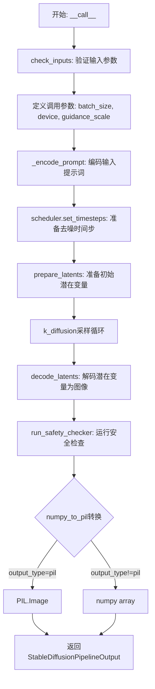

## 类结构

```
DiffusionPipeline (基类)
StableDiffusionMixin (Mixin)
└── StableDiffusionPipeline
    └── ModelWrapper (辅助类)
```

## 全局变量及字段


### `logger`
    
模块级日志记录器

类型：`logging.Logger`
    


### `ModelWrapper.model`
    
基础UNet模型

类型：`UNet2DConditionModel`
    


### `ModelWrapper.alphas_cumprod`
    
累积 alpha 值

类型：`torch.Tensor`
    


### `StableDiffusionPipeline.vae`
    
VAE模型

类型：`AutoencoderKL`
    


### `StableDiffusionPipeline.text_encoder`
    
CLIP文本编码器

类型：`CLIPTextModel`
    


### `StableDiffusionPipeline.tokenizer`
    
CLIP分词器

类型：`CLIPTokenizer`
    


### `StableDiffusionPipeline.unet`
    
条件U-Net

类型：`UNet2DConditionModel`
    


### `StableDiffusionPipeline.scheduler`
    
调度器

类型：`LMSDiscreteScheduler`
    


### `StableDiffusionPipeline.safety_checker`
    
安全检查器

类型：`StableDiffusionSafetyChecker | None`
    


### `StableDiffusionPipeline.feature_extractor`
    
特征提取器

类型：`CLIPImageProcessor | None`
    


### `StableDiffusionPipeline.k_diffusion_model`
    
k_diffusion 封装模型

类型：`CompVisDenoiser | CompVisVDenoiser`
    


### `StableDiffusionPipeline.sampler`
    
采样器

类型：`Callable`
    
    

## 全局函数及方法


### `importlib.import_module`

动态导入指定的模块，并返回对应的模块对象。在此代码中用于动态加载 `k_diffusion` 库，以便获取其中的采样器。

参数：

- `name`：`str`，要导入的模块名称（如 `"k_diffusion"`）
- `package`：`str`（可选），用于相对导入的包名

返回值：`types.ModuleType`，返回导入的模块对象

#### 流程图

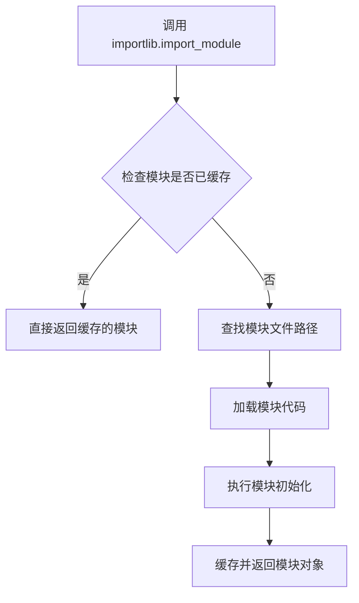

#### 带注释源码

```python
def set_scheduler(self, scheduler_type: str):
    """
    设置采样器调度器类型。
    
    Args:
        scheduler_type: 调度器类型名称，如 'ddim', 'k_euler', 'k_euler_ancestral' 等
    """
    # 使用 importlib.import_module 动态导入 k_diffusion 库
    # 这允许在运行时动态加载模块，而不是在导入时静态加载
    # 避免了循环依赖问题，并允许延迟加载
    library = importlib.import_module("k_diffusion")
    
    # 从导入的库中获取 sampling 子模块
    sampling = getattr(library, "sampling")
    
    # 从 sampling 模块中动态获取指定类型的采样器
    # scheduler_type 参数指定了要使用的采样算法名称
    self.sampler = getattr(sampling, scheduler_type)
```


### `logging.get_logger`

获取与当前模块关联的日志记录器实例，用于在模块中记录日志信息。

参数：

- `name`：`str`，日志记录器的名称，通常传入 `__name__` 以标识模块来源

返回值：`logging.Logger`，Python 标准库的日志记录器对象，用于输出日志信息

#### 流程图

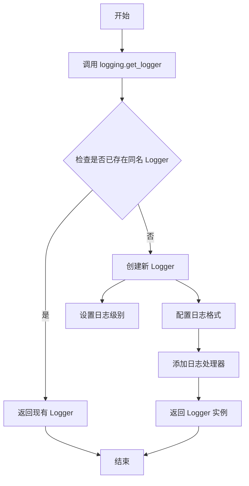

#### 带注释源码

```python
# 从 diffusers.utils 导入 logging 模块
from diffusers.utils import logging

# 获取当前模块的日志记录器
# 参数 __name__ 是 Python 内置变量，表示当前模块的完全限定名
# 例如：对于文件 diffusers/pipelines/stable_diffusion/pipeline_stable_diffusion.py
# __name__ 的值将是 "diffusers.pipelines.stable_diffusion.pipeline_stable_diffusion"
logger = logging.get_logger(__name__)  # pylint: disable=invalid-name
```


### `ModelWrapper.__init__`

`ModelWrapper` 类的初始化方法，用于封装 UNet 模型并存储扩散过程中的累积 alpha 值，以便在后续的模型调用中提供必要的参数。

参数：

- `model`：`torch.nn.Module` 或 `UNet2DConditionModel`，需要被封装的 UNet 模型，用于图像去噪
- `alphas_cumprod`：`torch.Tensor`，扩散过程中各时间步的累积 alpha 值，用于计算噪声调度

返回值：`None`，构造函数不返回任何值

#### 流程图

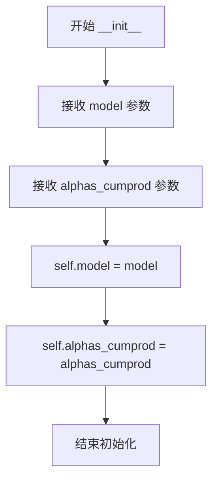

#### 带注释源码

```python
def __init__(self, model, alphas_cumprod):
    """
    初始化 ModelWrapper 实例。
    
    该构造函数接收一个 UNet 模型和累积 alpha 值，
    将它们存储为实例属性以便后续使用。
    
    Args:
        model: 需要封装的 UNet 模型（通常是 UNet2DConditionModel）
        alphas_cumprod: 扩散 scheduler 提供的累积 alpha 张量，
                       形状为 (num_timesteps,)，用于噪声调度计算
    
    Returns:
        None
    """
    # 将传入的模型赋值给实例属性
    # 这个模型将在 apply_model 方法中被调用
    self.model = model
    
    # 将累积 alpha 值赋值给实例属性
    # 这些值用于扩散过程的噪声调度
    self.alphas_cumprod = alphas_cumprod
```


### `ModelWrapper.apply_model`

该方法是对Stable Diffusion模型的封装适配器，用于将k_diffusion库的调用接口转换为diffusers库的UNet模型调用接口。它负责从可变参数中提取`encoder_hidden_states`（条件嵌入），并调用底层模型获取去噪预测样本。

参数：

- `*args`：`Tuple`，可变位置参数，当长度为3时，最后一个参数被提取为`encoder_hidden_states`（条件嵌入）；否则作为位置参数传递给底层模型
- `**kwargs`：`Dict`，可变关键字参数，如果包含`cond`键，其值会被提取为`encoder_hidden_states`

返回值：`torch.Tensor`，底层模型输出对象的`.sample`属性，即去噪后的潜在表示

#### 流程图

```mermaid
flowchart TD
    A[开始 apply_model] --> B{len(args) == 3?}
    B -- 是 --> C[提取 args[-1] 作为 encoder_hidden_states]
    B -- 否 --> D[args 保持不变]
    C --> E{kwargs.get('cond') is not None?}
    D --> E
    E -- 是 --> F[从 kwargs 提取 cond 作为 encoder_hidden_states]
    E -- 否 --> G[使用之前提取的 encoder_hidden_states]
    F --> G
    G --> H[调用 self.model with args, encoder_hidden_states and kwargs]
    I[获取模型返回的 .sample 属性]
    H --> I
    I --> J[返回样本张量]
```

#### 带注释源码

```python
def apply_model(self, *args, **kwargs):
    """
    适配器方法：将k_diffusion库的调用约定转换为diffusers UNet模型的调用约定
    
    参数:
        *args: 可变位置参数。当传入3个参数时，第3个参数被视为encoder_hidden_states
        **kwargs: 可变关键字参数。如果包含'cond'键，其值作为encoder_hidden_states
    
    返回:
        torch.Tensor: 模型的.sample输出
    """
    # 如果有3个位置参数，将最后一个参数提取为encoder_hidden_states
    if len(args) == 3:
        encoder_hidden_states = args[-1]  # 提取文本/条件嵌入
        args = args[:2]  # 保留前两个参数（通常是latents和timestep）
    
    # 从关键字参数中提取'cond'作为encoder_hidden_states
    if kwargs.get("cond", None) is not None:
        encoder_hidden_states = kwargs.pop("cond")
    
    # 调用底层UNet模型，传入encoder_hidden_states条件嵌入
    # 并返回模型的sample输出（去噪后的预测）
    return self.model(*args, encoder_hidden_states=encoder_hidden_states, **kwargs).sample
```


### `StableDiffusionPipeline.__init__`

该方法是 `StableDiffusionPipeline` 类的构造函数，负责初始化整个文生图Pipeline的核心组件，包括VAE、文本编码器、分词器、UNet、调度器以及可选的安全检查器和特征提取器，同时还会根据调度器的预测类型配置k_diffusion模型。

参数：

- `vae`：`AutoencoderKL`，Variational Auto-Encoder (VAE) 模型，用于将图像编码到潜在空间并从潜在空间解码重建图像
- `text_encoder`：`CLIPTextModel`，冻结的文本编码器，将文本提示转换为文本嵌入向量
- `tokenizer`：`CLIPTokenizer`，CLIP分词器，用于将文本分割成token序列
- `unet`：`UNet2DConditionModel`，条件U-Net架构，用于对编码后的图像潜在表示进行去噪
- `scheduler`：`SchedulerMixin`，调度器，用于与UNet配合对图像潜在表示进行去噪，可为DDIMScheduler、LMSDiscreteScheduler或PNDMScheduler等
- `safety_checker`：`StableDiffusionSafetyChecker`，可选的安全检查器模块，用于评估生成的图像是否包含不当内容
- `feature_extractor`：`CLIPImageProcessor`，可选的特征提取器，用于从生成的图像中提取特征供安全检查器使用

返回值：`None`，构造函数不返回任何值

#### 流程图

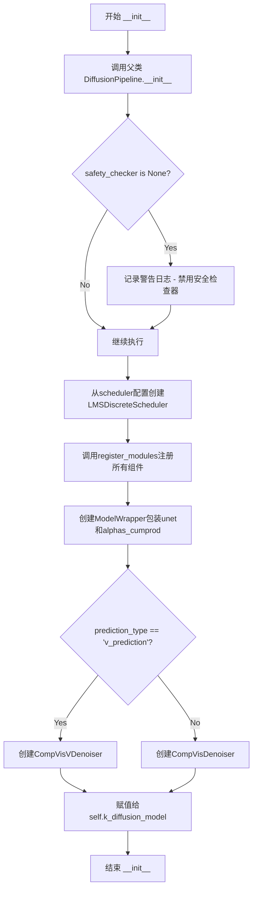

#### 带注释源码

```python
def __init__(
    self,
    vae,
    text_encoder,
    tokenizer,
    unet,
    scheduler,
    safety_checker,
    feature_extractor,
):
    # 调用父类DiffusionPipeline的初始化方法
    # 父类负责设置基础管道结构和设备管理
    super().__init__()

    # 检查安全检查器是否为None
    # 如果为None，发出警告提示用户遵守Stable Diffusion许可协议
    # 并建议在公开场合启用安全过滤器
    if safety_checker is None:
        logger.warning(
            f"You have disabled the safety checker for {self.__class__} by passing `safety_checker=None`. Ensure"
            " that you abide to the conditions of the Stable Diffusion license and do not expose unfiltered"
            " results in services or applications open to the public. Both the diffusers team and Hugging Face"
            " strongly recommend to keep the safety filter enabled in all public facing circumstances, disabling"
            " it only for use-cases that involve analyzing network behavior or auditing its results. For more"
            " information, please have a look at https://github.com/huggingface/diffusers/pull/254 ."
        )

    # 从传入的scheduler配置创建LMSDiscreteScheduler
    # LMS (Least Mean Squares) 调度器用于离散时间步的去噪过程
    # 确保使用正确的sigma计算方法
    scheduler = LMSDiscreteScheduler.from_config(scheduler.config)
    
    # 将所有模块注册到Pipeline中
    # 这样可以通过self.xxx访问各个组件
    # 注册的组件包括：vae, text_encoder, tokenizer, unet, scheduler, safety_checker, feature_extractor
    self.register_modules(
        vae=vae,
        text_encoder=text_encoder,
        tokenizer=tokenizer,
        unet=unet,
        scheduler=scheduler,
        safety_checker=safety_checker,
        feature_extractor=feature_extractor,
    )

    # 创建ModelWrapper包装UNet模型和调度器的alphas_cumprod
    # ModelWrapper用于适配k_diffusion库的接口
    # alphas_cumprod是累积乘积的alpha值，用于噪声调度
    model = ModelWrapper(unet, scheduler.alphas_cumprod)
    
    # 根据调度器的prediction_type选择合适的k_diffusion去噪器
    # v_prediction使用CompVisVDenoiser，其他使用CompVisDenoiser
    # 这两种去噪器分别处理不同类型的预测（v-prediction vs epsilon-prediction）
    if scheduler.config.prediction_type == "v_prediction":
        self.k_diffusion_model = CompVisVDenoiser(model)
    else:
        self.k_diffusion_model = CompVisDenoiser(model)
```


### `StableDiffusionPipeline.set_sampler`

该方法用于设置采样器（sampler），但已被弃用，推荐使用`set_scheduler`方法。它接受一个字符串类型的采样器类型名称，动态导入`k_diffusion`库并获取对应的采样器，同时通过警告提示用户该方法已弃用，最终调用`set_scheduler`方法完成实际设置。

参数：

- `scheduler_type`：`str`，指定要使用的采样器类型（如"euler"、"dpm++_2m"等），对应`k_diffusion.sampling`模块中的采样函数名称。

返回值：`None`，该方法无显式返回值，内部调用`set_scheduler`方法的结果作为其返回值，但`set_scheduler`方法也未返回任何值。

#### 流程图

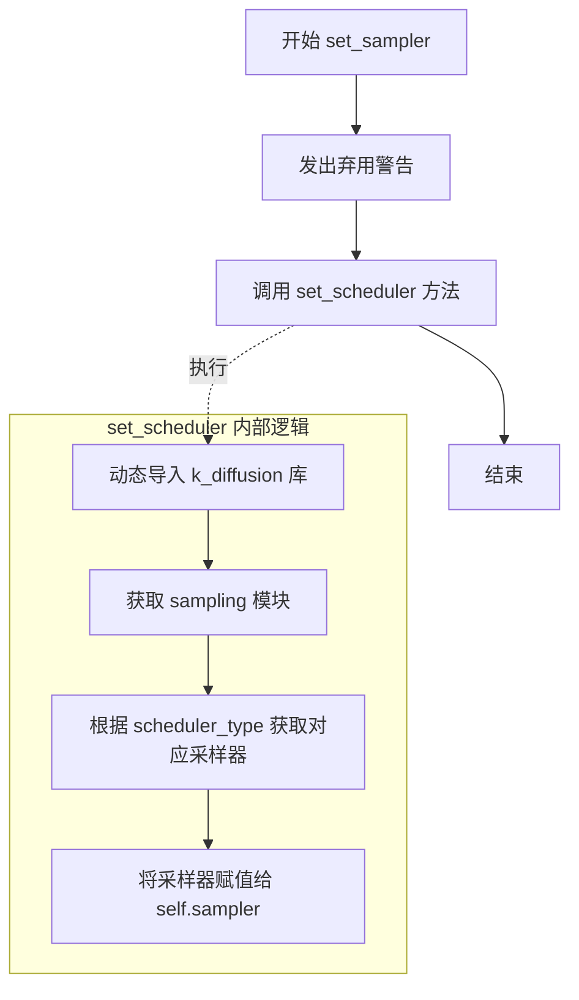

#### 带注释源码

```python
def set_sampler(self, scheduler_type: str):
    """
    设置采样器（已弃用）。
    
    注意：此方法已被弃用，请使用 set_scheduler 方法代替。
    该方法仅作为兼容性保留，实际功能转发到 set_scheduler。
    
    参数:
        scheduler_type (str): 采样器类型名称，对应 k_diffusion.sampling 模块中的函数。
    
    返回:
        None: 无返回值，调用 set_scheduler 的结果。
    """
    # 发出弃用警告，提示用户使用新方法
    warnings.warn("The `set_sampler` method is deprecated, please use `set_scheduler` instead.")
    
    # 转发调用到 set_scheduler 方法处理实际逻辑
    return self.set_scheduler(scheduler_type)
```


### `StableDiffusionPipeline.set_scheduler`

动态设置图像生成管道的采样器。该方法通过从 `k_diffusion` 库中动态导入并获取指定的采样算法，并将其赋值给实例的 `sampler` 属性，供后续图像生成过程使用。

参数：

- `scheduler_type`：`str`，指定要使用的采样器类型（如 'euler'、'euler_ancestral'、'dpm_solver' 等，对应 k_diffusion.sampling 模块中的函数名）

返回值：`None`，该方法直接修改实例状态，不返回任何值。

#### 流程图

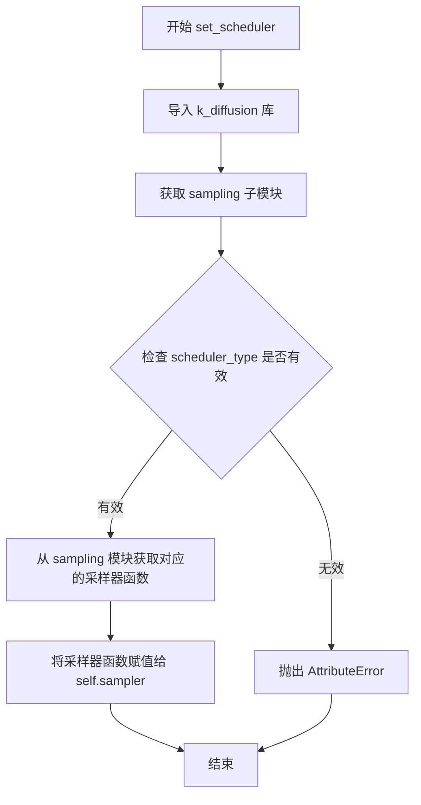

#### 带注释源码

```python
def set_scheduler(self, scheduler_type: str):
    """
    设置用于去噪过程的采样器。

    Args:
        scheduler_type (str): 采样器类型名称，对应 k_diffusion.sampling 模块中的函数。
                              常见值包括 'euler', 'euler_ancestral', 'dpm_solver', 'dpm_solver_stochastic' 等。
    """
    # 动态导入 k_diffusion 库
    # k_diffusion 是一个外部库，提供了多种扩散模型采样算法
    library = importlib.import_module("k_diffusion")
    
    # 获取 k_diffusion.sampling 子模块
    # 该模块包含各种采样算法实现
    sampling = getattr(library, "sampling")
    
    # 从 sampling 模块中动态获取指定的采样器函数
    # scheduler_type 应为字符串，如 'euler', 'dpm_solver' 等
    # 如果指定的采样器不存在，会在此处抛出 AttributeError
    self.sampler = getattr(sampling, scheduler_type)
```


### `StableDiffusionPipeline._encode_prompt`

该方法负责将文本提示（prompt）编码为文本编码器的隐藏状态（text embeddings），支持批量生成和分类器无关引导（Classifier-Free Guidance）功能。它首先对输入提示进行 tokenize，然后通过 CLIP 文本编码器获取文本嵌入，并根据 `num_images_per_prompt` 参数复制嵌入以支持每提示生成多张图像。当启用引导时，该方法还会处理负面提示（negative_prompt），生成无条件嵌入并与条件嵌入进行拼接，以实现 classifier-free guidance 机制。

**参数：**

- `prompt`：`str` 或 `List[int]`，要编码的文本提示，支持单字符串或字符串列表（以批处理方式处理）
- `device`：`torch.device`，指定用于计算的 PyTorch 设备（如 CUDA 或 CPU）
- `num_images_per_prompt`：`int`，每个提示词要生成的图像数量，用于复制文本嵌入以匹配生成数量
- `do_classifier_free_guidance`：`bool`，是否启用分类器无关引导，若为 True 则需要生成无条件嵌入
- `negative_prompt`：`str` 或 `List[str]`，可选的负面提示，用于指导图像生成时避免生成不希望的内容

**返回值：** `torch.Tensor`，形状为 `(batch_size * num_images_per_prompt, seq_len, hidden_dim)` 的文本嵌入张量，包含条件嵌入和无条件嵌入（当启用引导时）

#### 流程图

```mermaid
flowchart TD
    A[开始 _encode_prompt] --> B{判断 prompt 类型}
    B -->|list| C[batch_size = len(prompt)]
    B -->|str| D[batch_size = 1]
    C --> E[Tokenize prompt]
    D --> E
    E --> F[调用 tokenizer 转换为 input_ids]
    F --> G{检查是否被截断}
    G -->|是| H[记录警告日志]
    G -->|否| I[继续]
    H --> I
    I --> J{检查 use_attention_mask}
    J -->|是| K[获取 attention_mask]
    J -->|否| L[attention_mask = None]
    K --> M
    L --> M
    M[调用 text_encoder 编码] --> N[提取 text_embeddings[0]]
    N --> O{复制嵌入}
    O --> P[repeat(1, num_images_per_prompt, 1)]
    P --> Q[view 成 (bs_embed * num_images_per_prompt, seq_len, -1)]
    Q --> R{do_classifier_free_guidance?}
    R -->|否| S[返回 text_embeddings]
    R -->|是| T{处理 negative_prompt}
    T -->|None| U[uncond_tokens = [''] * batch_size]
    T -->|str| V[uncond_tokens = [negative_prompt]]
    T -->|List| W[uncond_tokens = negative_prompt]
    U --> X[Tokenize uncond_tokens]
    V --> X
    W --> X
    X --> Y{检查 use_attention_mask}
    Y -->|是| Z[获取 attention_mask]
    Y -->|否| AA[attention_mask = None]
    Z --> AB
    AA --> AB[调用 text_encoder 编码 uncond]
    AB --> AC[提取 uncond_embeddings[0]]
    AC --> AD[复制 uncond_embeddings]
    AD --> AE[view 成 batch_size * num_images_per_prompt 形状]
    AE --> AF[torch.cat([uncond_embeddings, text_embeddings])]
    AF --> S
```

#### 带注释源码

```python
def _encode_prompt(
    self,
    prompt: Union[str, List[int]],
    device: torch.device,
    num_images_per_prompt: int,
    do_classifier_free_guidance: bool,
    negative_prompt: Union[str, List[str], None],
):
    r"""
    Encodes the prompt into text encoder hidden states.

    Args:
        prompt (`str` or `list(int)`):
            prompt to be encoded
        device: (`torch.device`):
            torch device
        num_images_per_prompt (`int`):
            number of images that should be generated per prompt
        do_classifier_free_guidance (`bool`):
            whether to use classifier free guidance or not
        negative_prompt (`str` or `List[str]`):
            The prompt or prompts not to guide the image generation. Ignored when not using guidance (i.e., ignored
            if `guidance_scale` is less than `1`).
    """
    # 步骤1: 确定批量大小
    # 如果 prompt 是列表，则批量大小为列表长度；否则为 1
    batch_size = len(prompt) if isinstance(prompt, list) else 1

    # 步骤2: 使用 tokenizer 将 prompt 转换为 token IDs
    # 设置 padding 为最大长度，启用截断，返回 PyTorch 张量
    text_inputs = self.tokenizer(
        prompt,
        padding="max_length",
        max_length=self.tokenizer.model_max_length,
        truncation=True,
        return_tensors="pt",
    )
    text_input_ids = text_inputs.input_ids
    
    # 步骤3: 检查输入是否被截断（用于警告日志）
    # 使用未截断的版本进行比较
    untruncated_ids = self.tokenizer(prompt, padding="max_length", return_tensors="pt").input_ids
    
    # 如果输入被截断，记录警告信息
    if not torch.equal(text_input_ids, untruncated_ids):
        # 解码被截断的部分用于警告信息
        removed_text = self.tokenizer.batch_decode(
            untruncated_ids[:, self.tokenizer.model_max_length - 1 : -1]
        )
        logger.warning(
            "The following part of your input was truncated because CLIP can only handle sequences up to"
            f" {self.tokenizer.model_max_length} tokens: {removed_text}"
        )

    # 步骤4: 处理 attention_mask
    # 检查文本编码器配置是否需要 attention_mask
    if hasattr(self.text_encoder.config, "use_attention_mask") and self.text_encoder.config.use_attention_mask:
        # 如果配置中启用了 attention_mask，则使用 tokenizer 生成的 mask
        attention_mask = text_inputs.attention_mask.to(device)
    else:
        # 否则设置为 None（使用默认的注意力机制）
        attention_mask = None

    # 步骤5: 使用文本编码器获取文本嵌入
    # 将 token IDs 移动到指定设备，传入 attention_mask
    text_embeddings = self.text_encoder(
        text_input_ids.to(device),
        attention_mask=attention_mask,
    )
    # 提取第一项（通常第二项是 pooler_output 等其他输出）
    text_embeddings = text_embeddings[0]

    # 步骤6: 复制文本嵌入以支持每提示生成多张图像
    # 使用 MPS 友好的方法进行复制
    bs_embed, seq_len, _ = text_embeddings.shape
    
    # 在 seq_len 维度之前重复 num_images_per_prompt 次
    text_embeddings = text_embeddings.repeat(1, num_images_per_prompt, 1)
    
    # 重塑为 (bs_embed * num_images_per_prompt, seq_len, hidden_dim)
    text_embeddings = text_embeddings.view(bs_embed * num_images_per_prompt, seq_len, -1)

    # 步骤7: 如果启用 classifier-free guidance，获取无条件嵌入
    if do_classifier_free_guidance:
        # 处理负面提示（negative_prompt）
        uncond_tokens: List[str]
        
        if negative_prompt is None:
            # 如果没有提供负面提示，使用空字符串
            uncond_tokens = [""] * batch_size
        elif type(prompt) is not type(negative_prompt):
            # 类型检查：negative_prompt 必须与 prompt 类型相同
            raise TypeError(
                f"`negative_prompt` should be the same type to `prompt`, but got {type(negative_prompt)} !="
                f" {type(prompt)}."
            )
        elif isinstance(negative_prompt, str):
            # 如果负面提示是单个字符串，转换为列表
            uncond_tokens = [negative_prompt]
        elif batch_size != len(negative_prompt):
            # 批量大小检查
            raise ValueError(
                f"`negative_prompt`: {negative_prompt} has batch size {len(negative_prompt)}, but `prompt`:"
                f" {prompt} has batch size {batch_size}. Please make sure that passed `negative_prompt` matches"
                " the batch size of `prompt`."
            )
        else:
            # 直接使用负面提示列表
            uncond_tokens = negative_prompt

        # 获取文本输入的长度（用于 tokenize 无条件输入）
        max_length = text_input_ids.shape[-1]
        
        # 对无条件输入进行 tokenize
        uncond_input = self.tokenizer(
            uncond_tokens,
            padding="max_length",
            max_length=max_length,
            truncation=True,
            return_tensors="pt",
        )

        # 处理无条件输入的 attention_mask
        if hasattr(self.text_encoder.config, "use_attention_mask") and self.text_encoder.config.use_attention_mask:
            attention_mask = uncond_input.attention_mask.to(device)
        else:
            attention_mask = None

        # 编码无条件输入得到无条件嵌入
        uncond_embeddings = self.text_encoder(
            uncond_input.input_ids.to(device),
            attention_mask=attention_mask,
        )
        uncond_embeddings = uncond_embeddings[0]

        # 复制无条件嵌入以匹配生成数量
        seq_len = uncond_embeddings.shape[1]
        uncond_embeddings = uncond_embeddings.repeat(1, num_images_per_prompt, 1)
        uncond_embeddings = uncond_embeddings.view(batch_size * num_images_per_prompt, seq_len, -1)

        # 步骤8: 拼接无条件嵌入和条件嵌入
        # 为了避免执行两次前向传播，将无条件嵌入和文本嵌入拼接成单个批次
        # 顺序：前一半是无条件嵌入，后一半是条件嵌入
        text_embeddings = torch.cat([uncond_embeddings, text_embeddings])

    # 返回最终的文本嵌入
    return text_embeddings
```


### `StableDiffusionPipeline.run_safety_checker`

该方法用于检查生成的图像是否包含不适合工作内容（NSFW），通过调用安全检查器对图像进行分类，并返回处理后的图像以及是否检测到不当内容的标志。

参数：

- `self`：`StableDiffusionPipeline` 实例，表示调用该方法的管道对象本身
- `image`：`torch.Tensor`，需要进行安全检查的图像张量，通常是从潜在空间解码后的图像
- `device`：`torch.device`，执行安全检查所使用的计算设备（如 CPU 或 CUDA）
- `dtype`：`torch.dtype`，用于安全检查器的输入数据类型（如 float32）

返回值：`tuple`，包含两个元素——第一个是经过安全检查处理后的图像（`torch.Tensor` 或根据 `safety_checker` 返回类型），第二个是检测结果（`torch.Tensor` 或 `None`，表示是否检测到 NSFW 内容）

#### 流程图

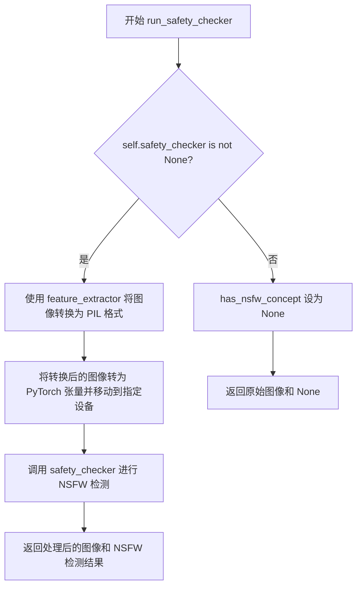

#### 带注释源码

```python
def run_safety_checker(self, image, device, dtype):
    """
    对生成的图像进行安全检查，检测是否包含 NSFW 内容
    
    参数:
        image: 生成的图像张量，需要进行安全检查
        device: 运行安全检查的设备
        dtype: 安全检查器输入的数据类型
    
    返回:
        tuple: (处理后的图像, NSFW检测结果)
    """
    # 检查是否配置了安全检查器模块
    if self.safety_checker is not None:
        # 使用特征提取器将图像转换为适合安全检查器的输入格式
        # 首先将张量转换为 PIL 图像，然后提取特征并转为 PyTorch 张量
        safety_checker_input = self.feature_extractor(
            self.numpy_to_pil(image),  # 将图像张量转换为 PIL 图像
            return_tensors="pt"       # 返回 PyTorch 张量格式
        ).to(device)                   # 将输入移动到指定计算设备
        
        # 调用安全检查器模型，检测图像中是否包含不当内容
        # 参数:
        #   images: 待检测的图像张量
        #   clip_input: 通过特征提取器处理后的 CLIP 输入
        # 返回:
        #   image: 处理后的图像（可能经过滤波）
        #   has_nsfw_concept: 布尔张量，标记每张图像是否为 NSFW
        image, has_nsfw_concept = self.safety_checker(
            images=image, 
            clip_input=safety_checker_input.pixel_values.to(dtype)
        )
    else:
        # 如果未配置安全检查器（用户主动禁用），将检测结果设为 None
        has_nsfw_concept = None
    
    # 返回图像和 NSFW 检测结果
    return image, has_nsfw_concept
```


### `StableDiffusionPipeline.decode_latents`

该方法将Stable Diffusion模型生成的潜在向量(latents)通过VAE解码器转换为实际图像，并进行必要的数值归一化和格式转换，最终返回Numpy数组格式的图像数据。

参数：

- `latents`：`torch.Tensor`，从UNet去噪过程输出的潜在表示，需要被VAE解码成可见图像

返回值：`numpy.ndarray`，解码并归一化后的图像，形状为(batch_size, height, width, channels)，像素值范围[0, 1]

#### 流程图

```mermaid
graph TD
    A[输入 latents] --> B[缩放潜在向量<br/>latents = 1/0.18215 * latents]
    B --> C[VAE解码<br/>image = self.vae.decode(latents).sample]
    C --> D[图像归一化<br/>image = (image/2 + 0.5).clamp(0, 1)]
    D --> E[格式转换<br/>cpu -> permute -> float -> numpy]
    E --> F[返回图像数组]
```

#### 带注释源码

```python
def decode_latents(self, latents):
    """
    将潜在向量解码为图像。
    
    Args:
        latents: VAE编码后的潜在表示，形状为 (batch_size, channels, height/8, width/8)
    
    Returns:
        numpy.ndarray: 解码后的图像，形状为 (batch_size, height, width, channels)
    """
    # 缩放潜在向量：VAE在训练时使用的潜在空间缩放因子
    # 0.18215 是VAE默认的缩放系数，用于将潜在向量调整到正确的数值范围
    latents = 1 / 0.18215 * latents
    
    # 使用VAE解码器将潜在向量解码为图像
    # .sample 表示从解码器输出中采样，生成确定的图像
    image = self.vae.decode(latents).sample
    
    # 归一化图像到 [0, 1] 范围
    # VAE输出通常在 [-1, 1] 范围，通过 (x/2 + 0.5) 转换到 [0, 1]
    image = (image / 2 + 0.5).clamp(0, 1)
    
    # 转换为Numpy数组以便于后续处理和输出
    # 1. .cpu() - 将张量从GPU移到CPU（如果在使用GPU）
    # 2. .permute(0, 2, 3, 1) - 调整维度顺序: (B, C, H, W) -> (B, H, W, C)
    # 3. .float() - 转换为float32，兼容性更好且不会造成显著性能开销
    # 4. .numpy() - 转换为Numpy数组
    # we always cast to float32 as this does not cause significant overhead and is compatible with bfloat16
    image = image.cpu().permute(0, 2, 3, 1).float().numpy()
    
    return image
```


### `StableDiffusionPipeline.check_inputs`

该方法用于验证文本到图像生成管道的输入参数，确保 `prompt`、`height`、`width` 和 `callback_steps` 符合要求。如果任何参数不符合条件，将抛出 `ValueError` 异常。

参数：

- `prompt`：`Union[str, List[str]]`，用户提供的文本提示，可以是单个字符串或字符串列表
- `height`：`int`，生成的图像高度，必须能被 8 整除
- `width`：`int`，生成的图像宽度，必须能被 8 整除
- `callback_steps`：`int`，回调函数调用间隔步数，必须为正整数

返回值：`None`，该方法仅执行参数验证，不返回任何值

#### 流程图

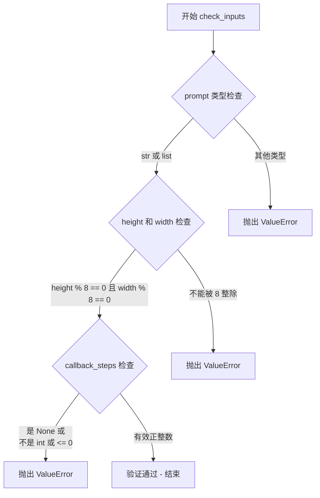

#### 带注释源码

```python
def check_inputs(self, prompt, height, width, callback_steps):
    """
    验证文本到图像生成的输入参数。

    该方法在 pipeline 执行前被调用，用于确保所有输入参数
    符合 Stable Diffusion 模型的要求。如果任何参数无效，
    将抛出详细的 ValueError 异常。

    Args:
        prompt: 文本提示，可以是单个字符串或字符串列表
        height: 生成图像的高度（像素）
        width: 生成图像的宽度（像素）
        callback_steps: 回调函数被调用的频率步数
    """
    # 验证 prompt 类型：必须是字符串或字符串列表
    if not isinstance(prompt, str) and not isinstance(prompt, list):
        raise ValueError(f"`prompt` has to be of type `str` or `list` but is {type(prompt)}")

    # 验证图像尺寸：Stable Diffusion 的 VAE 和 U-Net 要求尺寸能被 8 整除
    # 这是因为模型内部的多个下采样/上采样层会导致维度变化
    if height % 8 != 0 or width % 8 != 0:
        raise ValueError(f"`height` and `width` have to be divisible by 8 but are {height} and {width}.")

    # 验证 callback_steps：必须是正整数
    # None 被视为无效值，需要明确指定正整数值
    if (callback_steps is None) or (
        callback_steps is not None and (not isinstance(callback_steps, int) or callback_steps <= 0)
    ):
        raise ValueError(
            f"`callback_steps` has to be a positive integer but is {callback_steps} of type"
            f" {type(callback_steps)}."
        )
```


### `StableDiffusionPipeline.prepare_latents`

该方法负责为 Stable Diffusion 图像生成流程准备 latent 张量。它根据指定的批次大小、通道数、高度和宽度计算 latent 形状，如果未提供预生成的 latents，则使用随机噪声初始化；否则验证并移动现有的 latents 到目标设备。

参数：

- `batch_size`：`int`，批量大小，指定一次生成多少个图像
- `num_channels_latents`：`int`，latent 空间的通道数，通常对应于 UNet 的输入通道数
- `height`：`int`，目标生成图像的高度（像素）
- `width`：`int`，目标生成图像的宽度（像素）
- `dtype`：`torch.dtype`，生成 latents 所用的数据类型（如 torch.float32）
- `device`：`torch.device`，生成 latents 所用的设备（如 cpu、cuda、mps）
- `generator`：`torch.Generator`，可选的随机数生成器，用于确保生成的可重复性
- `latents`：`Optional[torch.Tensor]`，可选的预生成 latents 张量，如果为 None 则随机生成

返回值：`torch.Tensor`，准备好的 latent 张量，形状为 (batch_size, num_channels_latents, height // 8, width // 8)

#### 流程图

```mermaid
flowchart TD
    A[开始 prepare_latents] --> B[计算 shape = batch_size, num_channels_latents, height//8, width//8]
    B --> C{latents is None?}
    C -->|是| D{device.type == 'mps'?}
    D -->|是| E[在 CPU 上生成随机 latents<br/>然后移动到目标 device]
    D -->|否| F[直接在目标 device 上生成随机 latents]
    C -->|否| G{latents.shape == shape?}
    G -->|否| H[抛出 ValueError 异常]
    G -->|是| I[将 latents 移动到目标 device]
    E --> J[返回 latents]
    F --> J
    I --> J
    J[K[结束 prepare_latents]]
```

#### 带注释源码

```python
def prepare_latents(self, batch_size, num_channels_latents, height, width, dtype, device, generator, latents=None):
    # 计算期望的 latent 形状：批次大小 × 通道数 × (高度/8) × (宽度/8)
    # 除以 8 是因为 VAE 在潜在空间中进行 8x 下采样
    shape = (batch_size, num_channels_latents, height // 8, width // 8)
    
    # 如果没有提供预生成的 latents，则随机生成
    if latents is None:
        # MPS 设备上的随机数生成不可重现，需要特殊处理
        if device.type == "mps":
            # randn does not work reproducibly on mps
            # 在 CPU 上生成然后移到 MPS 设备，以确保可重现性
            latents = torch.randn(shape, generator=generator, device="cpu", dtype=dtype).to(device)
        else:
            # 直接在目标设备上生成随机 latent 向量
            # 使用 generator 确保随机性可控制（用于种子设置）
            latents = torch.randn(shape, generator=generator, device=device, dtype=dtype)
    else:
        # 验证提供的 latents 形状是否与预期匹配
        if latents.shape != shape:
            raise ValueError(f"Unexpected latents shape, got {latents.shape}, expected {shape}")
        # 将已有的 latents 移动到指定的设备上
        latents = latents.to(device)

    # 返回准备好的 latents
    # 注意：这里直接返回，scaling 会在调用处（如 __call__ 方法）通过 sigmas 完成
    return latents
```


### `StableDiffusionPipeline.__call__`

该方法是Stable Diffusion管道的主入口，接收文本提示和其他生成参数，通过编码提示、初始化潜在向量、执行去噪采样循环、解码潜在向量并运行安全检查器，最终返回生成的图像或包含图像与NSFW检测结果的输出对象。

#### 参数

- `prompt`：`Union[str, List[str]]`，要引导图像生成的提示文本
- `height`：`int`，可选，默认为 512，生成图像的高度（像素）
- `width`：`int`，可选，默认为 512，生成图像的宽度（像素）
- `num_inference_steps`：`int`，可选，默认为 50，去噪步数，越多图像质量越高但推理越慢
- `guidance_scale`：`float`，可选，默认为 7.5，分类器自由引导比例，值越大生成的图像与文本提示越相关
- `negative_prompt`：`Optional[Union[str, List[str]]]`，可选，不希望出现在图像中的提示
- `num_images_per_prompt`：`Optional[int]`，可选，默认为 1，每个提示生成的图像数量
- `eta`：`float`，可选，默认为 0.0，DDIM论文中的eta参数，仅对DDIMScheduler有效
- `generator`：`torch.Generator | None`，可选，用于生成确定性结果的随机生成器
- `latents`：`Optional[torch.Tensor]`，可选，预生成的噪声潜在向量
- `output_type`：`str | None`，可选，默认为 "pil"，输出格式，可选 "pil" 或 "np.array"
- `return_dict`：`bool`，可选，默认为 True，是否返回StableDiffusionPipelineOutput对象
- `callback`：`Optional[Callable[[int, int, torch.Tensor], None]]`，可选，每隔callback_steps步调用的回调函数
- `callback_steps`：`int`，可选，默认为 1，回调函数被调用的频率

#### 返回值

`Union[StableDiffusionPipelineOutput, Tuple[List[Union[PIL.Image.Image, numpy.ndarray]], List[bool]]]`，当 return_dict 为 True 时返回 StableDiffusionPipelineOutput 对象，包含生成的图像列表和NSFW内容检测布尔列表；否则返回元组。

#### 流程图

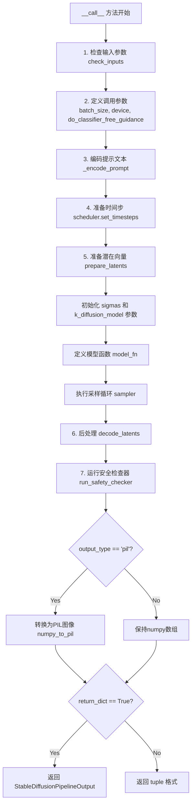

#### 带注释源码

```python
@torch.no_grad()
def __call__(
    self,
    prompt: Union[str, List[str]],
    height: int = 512,
    width: int = 512,
    num_inference_steps: int = 50,
    guidance_scale: float = 7.5,
    negative_prompt: Optional[Union[str, List[str]]] = None,
    num_images_per_prompt: Optional[int] = 1,
    eta: float = 0.0,
    generator: torch.Generator | None = None,
    latents: Optional[torch.Tensor] = None,
    output_type: str | None = "pil",
    return_dict: bool = True,
    callback: Optional[Callable[[int, int, torch.Tensor], None]] = None,
    callback_steps: int = 1,
    **kwargs,
):
    """
    Function invoked when calling the pipeline for generation.

    Args:
        prompt (`str` or `List[str]`):
            The prompt or prompts to guide the image generation.
        height (`int`, *optional*, defaults to 512):
            The height in pixels of the generated image.
        width (`int`, *optional*, defaults to 512):
            The width in pixels of the generated image.
        num_inference_steps (`int`, *optional*, defaults to 50):
            The number of denoising steps. More denoising steps usually lead to a higher quality image at the
            expense of slower inference.
        guidance_scale (`float`, *optional*, defaults to 7.5):
            Guidance scale as defined in [Classifier-Free Diffusion Guidance](https://huggingface.co/papers/2207.12598).
            `guidance_scale` is defined as `w` of equation 2. of [Imagen
            Paper](https://huggingface.co/papers/2205.11487). Guidance scale is enabled by setting `guidance_scale >
            1`. Higher guidance scale encourages to generate images that are closely linked to the text `prompt`,
            usually at the expense of lower image quality.
        negative_prompt (`str` or `List[str]`, *optional*):
            The prompt or prompts not to guide the image generation. Ignored when not using guidance (i.e., ignored
            if `guidance_scale` is less than `1`).
        num_images_per_prompt (`int`, *optional*, defaults to 1):
            The number of images to generate per prompt.
        eta (`float`, *optional*, defaults to 0.0):
            Corresponds to parameter eta (η) in the DDIM paper: https://huggingface.co/papers/2010.02502. Only applies to
            [`schedulers.DDIMScheduler`], will be ignored for others.
        generator (`torch.Generator`, *optional*):
            A [torch generator](https://pytorch.org/docs/stable/generated/torch.Generator.html) to make generation
            deterministic.
        latents (`torch.Tensor`, *optional*):
            Pre-generated noisy latents, sampled from a Gaussian distribution, to be used as inputs for image
            generation. Can be used to tweak the same generation with different prompts. If not provided, a latents
            tensor will be generated by sampling using the supplied random `generator`.
        output_type (`str`, *optional*, defaults to `"pil"`):
            The output format of the generate image. Choose between
            [PIL](https://pillow.readthedocs.io/en/stable/): `PIL.Image.Image` or `np.array`.
        return_dict (`bool`, *optional*, defaults to `True`):
            Whether or not to return a [`~pipelines.stable_diffusion.StableDiffusionPipelineOutput`] instead of a
            plain tuple.
        callback (`Callable`, *optional*):
            A function that will be called every `callback_steps` steps during inference. The function will be
            called with the following arguments: `callback(step: int, timestep: int, latents: torch.Tensor)`.
        callback_steps (`int`, *optional*, defaults to 1):
            The frequency at which the `callback` function will be called. If not specified, the callback will be
            called at every step.

    Returns:
        [`~pipelines.stable_diffusion.StableDiffusionPipelineOutput`] or `tuple`:
        [`~pipelines.stable_diffusion.StableDiffusionPipelineOutput`] if `return_dict` is True, otherwise a `tuple.
        When returning a tuple, the first element is a list with the generated images, and the second element is a
        list of `bool`s denoting whether the corresponding generated image likely represents "not-safe-for-work"
        (nsfw) content, according to the `safety_checker`.
    """

    # 1. Check inputs. Raise error if not correct
    # 验证输入参数的有效性：检查prompt类型、高宽能否被8整除、callback_steps是否为正整数
    self.check_inputs(prompt, height, width, callback_steps)

    # 2. Define call parameters
    # 根据prompt类型确定batch_size，获取执行设备
    batch_size = 1 if isinstance(prompt, str) else len(prompt)
    device = self._execution_device
    # guidance_scale 类似于Imagen论文中的权重w，=1表示不使用分类器自由引导
    do_classifier_free_guidance = True
    if guidance_scale <= 1.0:
        raise ValueError("has to use guidance_scale")

    # 3. Encode input prompt
    # 将文本提示编码为text_encoder的隐藏状态，同时生成用于分类器自由引导的无条件嵌入
    text_embeddings = self._encode_prompt(
        prompt, device, num_images_per_prompt, do_classifier_free_guidance, negative_prompt
    )

    # 4. Prepare timesteps
    # 从调度器获取去噪所需的时间步
    self.scheduler.set_timesteps(num_inference_steps, device=text_embeddings.device)
    sigmas = self.scheduler.sigmas
    sigmas = sigmas.to(text_embeddings.dtype)

    # 5. Prepare latent variables
    # 准备潜在向量（初始噪声），形状为(batch_size, channels, height//8, width//8)
    num_channels_latents = self.unet.config.in_channels
    latents = self.prepare_latents(
        batch_size * num_images_per_prompt,
        num_channels_latents,
        height,
        width,
        text_embeddings.dtype,
        device,
        generator,
        latents,
    )
    # 根据第一个sigma缩放初始噪声
    latents = latents * sigmas[0]
    # 将sigma和log_sigmas移动到latents设备上，确保一致性
    self.k_diffusion_model.sigmas = self.k_diffusion_model.sigmas.to(latents.device)
    self.k_diffusion_model.log_sigmas = self.k_diffusion_model.log_sigmas.to(latents.device)

    # 定义模型函数，用于k_diffusion采样器
    def model_fn(x, t):
        # 将latent复制两份，一份用于无条件预测，一份用于条件预测
        latent_model_input = torch.cat([x] * 2)

        # 使用k_diffusion模型预测噪声
        noise_pred = self.k_diffusion_model(latent_model_input, t, cond=text_embeddings)

        # 将预测的无条件和有条件噪声分离
        noise_pred_uncond, noise_pred_text = noise_pred.chunk(2)
        # 应用分类器自由引导：根据guidance_scale加权有条件噪声与无条件噪声的差异
        noise_pred = noise_pred_uncond + guidance_scale * (noise_pred_text - noise_pred_uncond)
        return noise_pred

    # 6. Denoising loop / Sampling loop
    # 执行k_diffusion采样循环，从噪声图像逐步去噪到清晰图像
    latents = self.sampler(model_fn, latents, sigmas)

    # 8. Post-processing
    # 将潜在向量解码为图像：先除以缩放因子0.18215，再通过VAE解码
    image = self.decode_latents(latents)

    # 9. Run safety checker
    # 检查生成的图像是否包含NSFW内容
    image, has_nsfw_concept = self.run_safety_checker(image, device, text_embeddings.dtype)

    # 10. Convert to PIL
    # 根据output_type决定输出格式：PIL Image 或 numpy array
    if output_type == "pil":
        image = self.numpy_to_pil(image)

    # 根据return_dict决定返回格式
    if not return_dict:
        return (image, has_nsfw_concept)

    # 返回包含图像和NSFW检测结果的输出对象
    return StableDiffusionPipelineOutput(images=image, nsfw_content_detected=has_nsfw_concept)
```

## 关键组件


### 核心功能概述

该代码实现了一个基于Stable Diffusion的文本到图像生成Pipeline，通过整合VAE、文本编码器、UNet和调度器等组件，利用k_diffusion库的采样器实现高质量图像合成，并集成了安全检查器过滤不当内容。

### 文件整体运行流程

1. 初始化阶段：加载VAE、文本编码器、tokenizer、UNet、调度器等组件，包装UNet为k_diffusion兼容的ModelWrapper
2. 输入验证：检查prompt、height、width、callback_steps等参数合法性
3. 文本编码：调用_encode_prompt将文本提示转换为文本嵌入向量，支持classifier-free guidance
4. 潜在变量准备：调用prepare_latents生成或接收噪声潜在变量
5. 去噪采样：使用k_diffusion采样器和UNet进行多步去噪，生成最终潜在表示
6. 潜在解码：调用decode_latents将潜在表示解码为图像
7. 安全检查：调用run_safety_checker检测NSFW内容
8. 输出转换：将图像转换为PIL格式或numpy数组输出

### 类的详细信息

#### 类：ModelWrapper

**类字段：**

| 字段名 | 类型 | 描述 |
|--------|------|------|
| model | torch.nn.Module | 被包装的UNet2DConditionModel模型 |
| alphas_cumprod | torch.Tensor | 累积alpha值，用于调度 |

**类方法：**

**apply_model**

| 属性 | 内容 |
|------|------|
| 名称 | apply_model |
| 参数 | *args, **kwargs |
| 参数类型 | 可变参数 |
| 参数描述 | 传递模型输入，支持位置参数和关键字参数两种方式传入encoder_hidden_states |
| 返回值类型 | torch.Tensor |
| 返回值描述 | 模型输出样本 |

**mermaid流程图：**
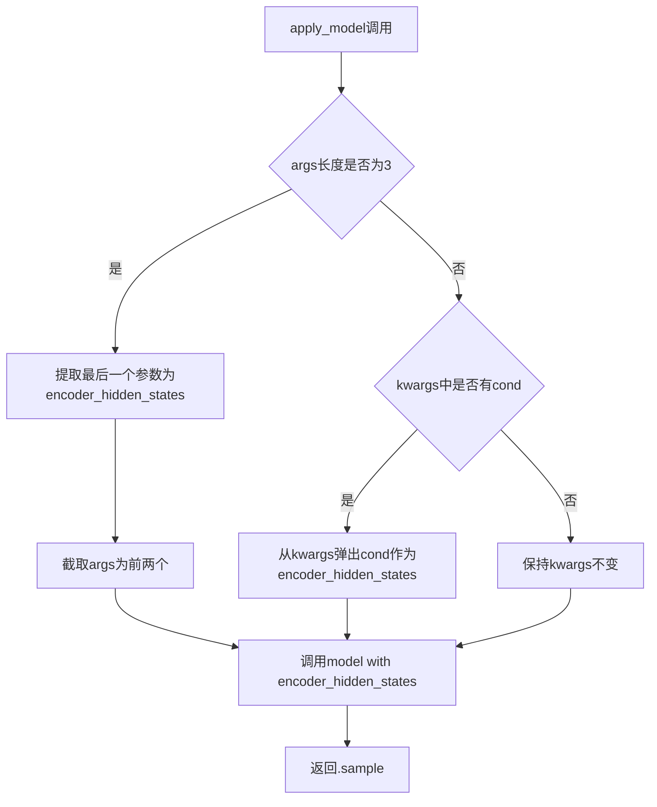

**带注释源码：**
```python
def apply_model(self, *args, **kwargs):
    # 处理位置参数形式：model(x, t, encoder_hidden_states)
    if len(args) == 3:
        encoder_hidden_states = args[-1]
        args = args[:2]
    # 处理关键字参数形式：model(x, t, cond=encoder_hidden_states)
    if kwargs.get("cond", None) is not None:
        encoder_hidden_states = kwargs.pop("cond")
    # 调用模型并返回sample属性
    return self.model(*args, encoder_hidden_states=encoder_hidden_states, **kwargs).sample
```

---

#### 类：StableDiffusionPipeline

**类字段：**

| 字段名 | 类型 | 描述 |
|--------|------|------|
| vae | AutoencoderKL | 变分自编码器，用于图像与潜在表示的编码解码 |
| text_encoder | CLIPTextModel | CLIP文本编码器，将文本转换为嵌入向量 |
| tokenizer | CLIPTokenizer | 分词器，将文本转换为token id |
| unet | UNet2DConditionModel | 条件U-Net，用于去噪潜在表示 |
| scheduler | SchedulerMixin | 噪声调度器，控制去噪过程的方差调度 |
| safety_checker | StableDiffusionSafetyChecker | 安全检查器，检测NSFW内容 |
| feature_extractor | CLIPImageProcessor | 特征提取器，提取图像特征供安全检查器使用 |
| k_diffusion_model | CompVisDenoiser/CompVisVDenoiser | k_diffusion封装的去噪模型 |
| sampler | callable | k_diffusion采样器函数 |
| _optional_components | List[str | 可选组件列表，包含safety_checker和feature_extractor |

**类方法：**

**__init__**

| 属性 | 内容 |
|------|------|
| 名称 | __init__ |
| 参数 | vae, text_encoder, tokenizer, unet, scheduler, safety_checker, feature_extractor |
| 参数类型 | 各个模型组件 |
| 参数描述 | 初始化Pipeline的所有必需和可选组件 |
| 返回值类型 | None |
| 返回值描述 | 无返回值 |

**mermaid流程图：**
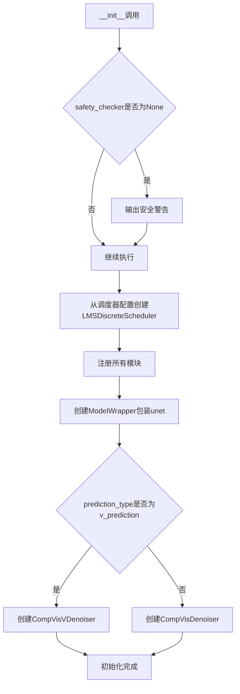

**带注释源码：**
```python
def __init__(
    self,
    vae,
    text_encoder,
    tokenizer,
    unet,
    scheduler,
    safety_checker,
    feature_extractor,
):
    super().__init__()

    # 安全检查器为None时发出警告
    if safety_checker is None:
        logger.warning(
            f"You have disabled the safety checker for {self.__class__} by passing `safety_checker=None`. Ensure"
            " that you abide to the conditions of the Stable Diffusion license and do not expose unfiltered"
            " results in services or applications open to the public..."
        )

    # 获取正确的LMS调度器sigmas
    scheduler = LMSDiscreteScheduler.from_config(scheduler.config)
    self.register_modules(
        vae=vae,
        text_encoder=text_encoder,
        tokenizer=tokenizer,
        unet=unet,
        scheduler=scheduler,
        safety_checker=safety_checker,
        feature_extractor=feature_extractor,
    )

    # 包装UNet模型
    model = ModelWrapper(unet, scheduler.alphas_cumprod)
    # 根据预测类型选择合适的k_diffusion去噪器
    if scheduler.config.prediction_type == "v_prediction":
        self.k_diffusion_model = CompVisVDenoiser(model)
    else:
        self.k_diffusion_model = CompVisDenoiser(model)
```

---

**_encode_prompt**

| 属性 | 内容 |
|------|------|
| 名称 | _encode_prompt |
| 参数 | prompt, device, num_images_per_prompt, do_classifier_free_guidance, negative_prompt |
| 参数类型 | Union[str, List[str]], torch.device, int, bool, Union[str, List[str]] |
| 参数描述 | prompt为要编码的文本，device为目标设备，num_images_per_prompt为每提示生成的图像数量，do_classifier_free_guidance是否启用无分类器引导，negative_prompt为负面提示 |
| 返回值类型 | torch.Tensor |
| 返回值描述 | 文本嵌入向量，形状为(batch_size*num_images_per_prompt, seq_len, hidden_dim) |

**mermaid流程图：**
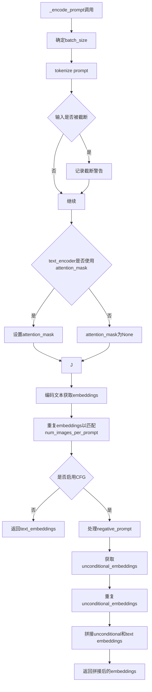

**带注释源码：**
```python
def _encode_prompt(self, prompt, device, num_images_per_prompt, do_classifier_free_guidance, negative_prompt):
    # 确定批次大小
    batch_size = len(prompt) if isinstance(prompt, list) else 1

    # Token化提示文本
    text_inputs = self.tokenizer(
        prompt,
        padding="max_length",
        max_length=self.tokenizer.model_max_length,
        truncation=True,
        return_tensors="pt",
    )
    text_input_ids = text_inputs.input_ids
    # 获取未截断的token ids用于比较
    untruncated_ids = self.tokenizer(prompt, padding="max_length", return_tensors="pt").input_ids

    # 检测并警告截断
    if not torch.equal(text_input_ids, untruncated_ids):
        removed_text = self.tokenizer.batch_decode(untruncated_ids[:, self.tokenizer.model_max_length - 1 : -1])
        logger.warning(
            "The following part of your input was truncated because CLIP can only handle sequences up to"
            f" {self.tokenizer.model_max_length} tokens: {removed_text}"
        )

    # 获取attention_mask（如果模型支持）
    if hasattr(self.text_encoder.config, "use_attention_mask") and self.text_encoder.config.use_attention_mask:
        attention_mask = text_inputs.attention_mask.to(device)
    else:
        attention_mask = None

    # 编码文本获取嵌入
    text_embeddings = self.text_encoder(
        text_input_ids.to(device),
        attention_mask=attention_mask,
    )
    text_embeddings = text_embeddings[0]

    # 为每个提示的每个生成复制文本嵌入（MPS友好的方法）
    bs_embed, seq_len, _ = text_embeddings.shape
    text_embeddings = text_embeddings.repeat(1, num_images_per_prompt, 1)
    text_embeddings = text_embeddings.view(bs_embed * num_images_per_prompt, seq_len, -1)

    # 获取无分类器引导的无条件嵌入
    if do_classifier_free_guidance:
        # 处理negative_prompt
        if negative_prompt is None:
            uncond_tokens = [""] * batch_size
        elif type(prompt) is not type(negative_prompt):
            raise TypeError(...)
        elif isinstance(negative_prompt, str):
            uncond_tokens = [negative_prompt]
        elif batch_size != len(negative_prompt):
            raise ValueError(...)
        else:
            uncond_tokens = negative_prompt

        max_length = text_input_ids.shape[-1]
        uncond_input = self.tokenizer(
            uncond_tokens,
            padding="max_length",
            max_length=max_length,
            truncation=True,
            return_tensors="pt",
        )

        # 获取无条件嵌入的attention_mask
        if hasattr(self.text_encoder.config, "use_attention_mask") and self.text_encoder.config.use_attention_mask:
            attention_mask = uncond_input.attention_mask.to(device)
        else:
            attention_mask = None

        # 编码无条件提示
        uncond_embeddings = self.text_encoder(
            uncond_input.input_ids.to(device),
            attention_mask=attention_mask,
        )
        uncond_embeddings = uncond_embeddings[0]

        # 复制无条件嵌入
        seq_len = uncond_embeddings.shape[1]
        uncond_embeddings = uncond_embeddings.repeat(1, num_images_per_prompt, 1)
        uncond_embeddings = uncond_embeddings.view(batch_size * num_images_per_prompt, seq_len, -1)

        # 拼接无条件嵌入和文本嵌入（避免两次前向传播）
        text_embeddings = torch.cat([uncond_embeddings, text_embeddings])

    return text_embeddings
```

---

**run_safety_checker**

| 属性 | 内容 |
|------|------|
| 名称 | run_safety_checker |
| 参数 | image, device, dtype |
| 参数类型 | torch.Tensor, torch.device, torch.dtype |
| 参数描述 | image为待检查的图像张量，device为计算设备，dtype为数据类型 |
| 返回值类型 | Tuple[torch.Tensor, Optional[torch.Tensor]] |
| 返回值描述 | 返回处理后的图像和NSFW概念检测结果 |

**mermaid流程图：**
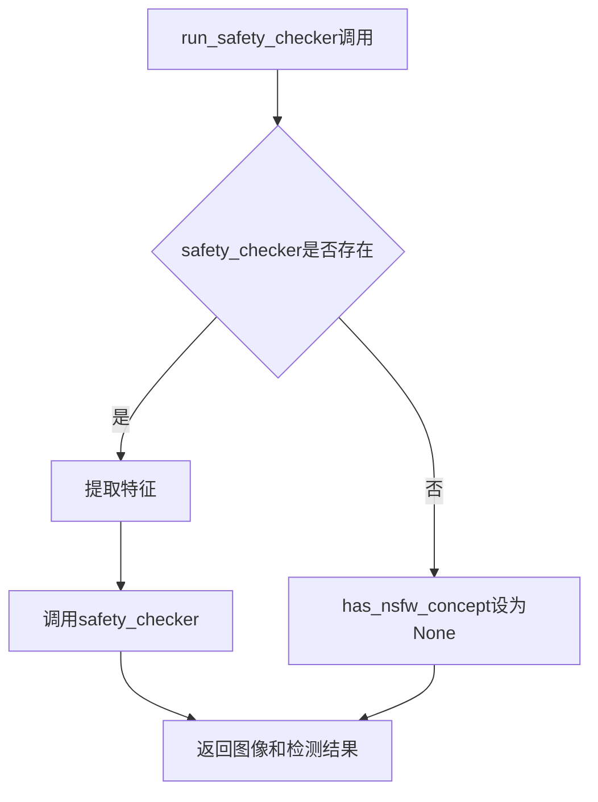

**带注释源码：**
```python
def run_safety_checker(self, image, device, dtype):
    # 如果存在安全检查器则运行检查
    if self.safety_checker is not None:
        # 使用feature_extractor准备安全检查器输入
        safety_checker_input = self.feature_extractor(self.numpy_to_pil(image), return_tensors="pt").to(device)
        # 运行安全检查
        image, has_nsfw_concept = self.safety_checker(
            images=image, clip_input=safety_checker_input.pixel_values.to(dtype)
        )
    else:
        has_nsfw_concept = None
    return image, has_nsfw_concept
```

---

**decode_latents**

| 属性 | 内容 |
|------|------|
| 名称 | decode_latents |
| 参数 | latents |
| 参数类型 | torch.Tensor |
| 参数描述 | 待解码的潜在表示张量 |
| 返回值类型 | np.ndarray |
| 返回值描述 | 解码后的图像，形状为(batch, height, width, channels)，值范围[0, 1] |

**mermaid流程图：**
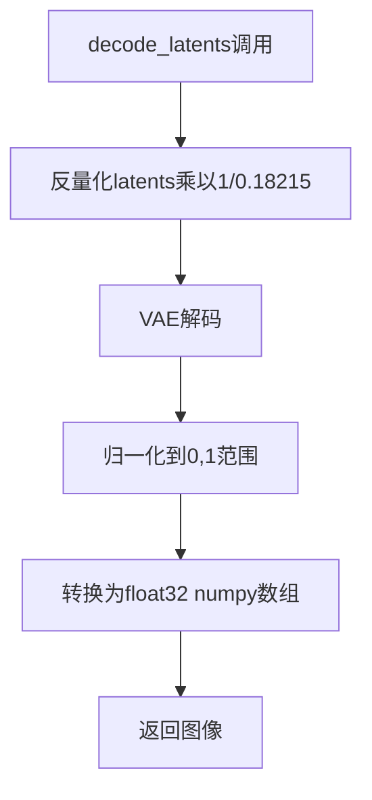

**带注释源码：**
```python
def decode_latents(self, latents):
    # 反量化：将latents缩放回原始范围
    # 0.18215是VAE缩放因子
    latents = 1 / 0.18215 * latents
    # 使用VAE解码latents到图像
    image = self.vae.decode(latents).sample
    # 归一化到[0, 1]范围： (image / 2 + 0.5).clamp(0, 1)
    image = (image / 2 + 0.5).clamp(0, 1)
    # 转换为float32以兼容bfloat16且不会造成显著开销
    image = image.cpu().permute(0, 2, 3, 1).float().numpy()
    return image
```

---

**check_inputs**

| 属性 | 内容 |
|------|------|
| 名称 | check_inputs |
| 参数 | prompt, height, width, callback_steps |
| 参数类型 | Union[str, List[str]], int, int, int |
| 参数描述 | prompt为输入提示，height和width为输出图像尺寸，callback_steps为回调步数 |
| 返回值类型 | None |
| 返回值描述 | 验证失败则抛出ValueError |

**mermaid流程图：**
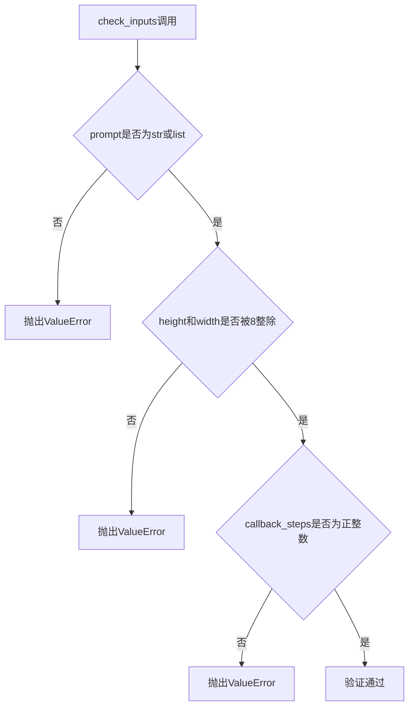

**带注释源码：**
```python
def check_inputs(self, prompt, height, width, callback_steps):
    # 验证prompt类型
    if not isinstance(prompt, str) and not isinstance(prompt, list):
        raise ValueError(f"`prompt` has to be of type `str` or `list` but is {type(prompt)}")

    # 验证图像尺寸（必须能被8整除）
    if height % 8 != 0 or width % 8 != 0:
        raise ValueError(f"`height` and `width` have to be divisible by 8 but are {height} and {width}.")

    # 验证callback_steps
    if (callback_steps is None) or (
        callback_steps is not None and (not isinstance(callback_steps, int) or callback_steps <= 0)
    ):
        raise ValueError(
            f"`callback_steps` has to be a positive integer but is {callback_steps} of type"
            f" {type(callback_steps)}."
        )
```

---

**prepare_latents**

| 属性 | 内容 |
|------|------|
| 名称 | prepare_latents |
| 参数 | batch_size, num_channels_latents, height, width, dtype, device, generator, latents |
| 参数类型 | int, int, int, int, torch.dtype, torch.device, torch.Generator, Optional[torch.Tensor] |
| 参数描述 | 准备用于生成的潜在变量，包括形状定义和随机初始化 |
| 返回值类型 | torch.Tensor |
| 返回值描述 | 准备好的潜在变量张量 |

**mermaid流程图：**
```mermaid
flowchart TD
    A[prepare_latents调用] --> B[计算latents形状]
    B --> C{latents是否为None}
    C -->|是| D{device是否为mps}
    C -->|否| E[验证latents形状]
    D -->|是| F[在CPU上生成随机噪声再移到mps]
    D -->|否| G[直接在目标设备生成]
    E --> H[将latents移到设备]
    F --> I[返回latents]
    G --> I
    H --> I
```

**带注释源码：**
```python
def prepare_latents(self, batch_size, num_channels_latents, height, width, dtype, device, generator, latents=None):
    # 计算潜在变量形状：(batch, channels, height/8, width/8)
    shape = (batch_size, num_channels_latents, height // 8, width // 8)
    
    # 如果未提供latents，则随机生成
    if latents is None:
        if device.type == "mps":
            # randn在mps上不可重现，先在cpu生成再移过去
            latents = torch.randn(shape, generator=generator, device="cpu", dtype=dtype).to(device)
        else:
            latents = torch.randn(shape, generator=generator, device=device, dtype=dtype)
    else:
        # 验证latents形状
        if latents.shape != shape:
            raise ValueError(f"Unexpected latents shape, got {latents.shape}, expected {shape}")
        latents = latents.to(device)

    # 按调度器要求的标准差缩放初始噪声
    return latents
```

---

**__call__**

| 属性 | 内容 |
|------|------|
| 名称 | __call__ |
| 参数 | prompt, height, width, num_inference_steps, guidance_scale, negative_prompt, num_images_per_prompt, eta, generator, latents, output_type, return_dict, callback, callback_steps |
| 参数类型 | Union[str, List[str]], int, int, int, float, Union[str, List[str]], int, float, torch.Generator, Optional[torch.Tensor], str, bool, Optional[Callable], int |
| 参数描述 | 主生成方法的所有参数，详见代码注释 |
| 返回值类型 | StableDiffusionPipelineOutput or Tuple |
| 返回值描述 | 生成图像和NSFW检测结果 |

**mermaid流程图：**
```mermaid
flowchart TD
    A[__call__调用] --> B[1. 检查输入参数]
    B --> C[2. 定义调用参数确定batch_size和device]
    C --> D[3. 编码输入prompt获取text_embeddings]
    D --> E[4. 准备timesteps和sigmas]
    E --> F[5. 准备latents]
    F --> G[6. 定义model_fn进行去噪预测]
    G --> H[7. 运行k_diffusion采样器去噪]
    H --> I[8. 解码latents为图像]
    I --> J[9. 运行安全检查]
    J --> K[10. 转换为PIL格式]
    K --> L[返回结果]
```

**带注释源码：**
```python
@torch.no_grad()
def __call__(
    self,
    prompt: Union[str, List[str]],
    height: int = 512,
    width: int = 512,
    num_inference_steps: int = 50,
    guidance_scale: float = 7.5,
    negative_prompt: Optional[Union[str, List[str]]] = None,
    num_images_per_prompt: Optional[int] = 1,
    eta: float = 0.0,
    generator: torch.Generator | None = None,
    latents: Optional[torch.Tensor] = None,
    output_type: str | None = "pil",
    return_dict: bool = True,
    callback: Optional[Callable[[int, int, torch.Tensor], None]] = None,
    callback_steps: int = 1,
    **kwargs,
):
    # 1. 检查输入
    self.check_inputs(prompt, height, width, callback_steps)

    # 2. 定义调用参数
    batch_size = 1 if isinstance(prompt, str) else len(prompt)
    device = self._execution_device
    do_classifier_free_guidance = guidance_scale > 1.0

    # 3. 编码输入prompt
    text_embeddings = self._encode_prompt(
        prompt, device, num_images_per_prompt, do_classifier_free_guidance, negative_prompt
    )

    # 4. 准备timesteps
    self.scheduler.set_timesteps(num_inference_steps, device=text_embeddings.device)
    sigmas = self.scheduler.sigmas
    sigmas = sigmas.to(text_embeddings.dtype)

    # 5. 准备latent变量
    num_channels_latents = self.unet.config.in_channels
    latents = self.prepare_latents(
        batch_size * num_images_per_prompt,
        num_channels_latents,
        height,
        width,
        text_embeddings.dtype,
        device,
        generator,
        latents,
    )
    # 初始噪声乘以第一个sigma
    latents = latents * sigmas[0]
    # 确保k_diffusion模型的sigmas和log_sigmas在同一设备
    self.k_diffusion_model.sigmas = self.k_diffusion_model.sigmas.to(latents.device)
    self.k_diffusion_model.log_sigmas = self.k_diffusion_model.log_sigmas.to(latents.device)

    # 定义模型函数：执行一次前向传播计算噪声预测
    def model_fn(x, t):
        # 复制输入用于classifier-free guidance
        latent_model_input = torch.cat([x] * 2)

        # 获取噪声预测
        noise_pred = self.k_diffusion_model(latent_model_input, t, cond=text_embeddings)

        # 分离无条件预测和条件预测，执行CFG
        noise_pred_uncond, noise_pred_text = noise_pred.chunk(2)
        noise_pred = noise_pred_uncond + guidance_scale * (noise_pred_text - noise_pred_uncond)
        return noise_pred

    # 6. 运行采样器进行去噪
    latents = self.sampler(model_fn, latents, sigmas)

    # 7. 后处理：解码latents
    image = self.decode_latents(latents)

    # 8. 运行安全检查器
    image, has_nsfw_concept = self.run_safety_checker(image, device, text_embeddings.dtype)

    # 9. 转换为PIL格式
    if output_type == "pil":
        image = self.numpy_to_pil(image)

    # 10. 返回结果
    if not return_dict:
        return (image, has_nsfw_concept)

    return StableDiffusionPipelineOutput(images=image, nsfw_content_detected=has_nsfw_concept)
```

---

**set_scheduler**

| 属性 | 内容 |
|------|------|
| 名称 | set_scheduler |
| 参数 | scheduler_type |
| 参数类型 | str |
| 参数描述 | 调度器类型名称，如"ddim", "euler", "euler_ancestral"等 |
| 返回值类型 | None |
| 返回值描述 | 无返回值 |

**set_sampler**

| 属性 | 内容 |
|------|------|
| 名称 | set_sampler |
| 参数 | scheduler_type |
| 参数类型 | str |
| 参数描述 | 调度器类型名称（已废弃，使用set_scheduler） |
| 返回值类型 | None |
| 返回值描述 | 无返回值，调用set_scheduler |

---

### 全局变量和全局函数

| 名称 | 类型 | 描述 |
|------|------|------|
| logger | logging.Logger | 模块级日志记录器 |
| importlib | module | Python标准库，用于动态导入模块 |
| warnings | module | Python标准库，用于发出警告 |
| torch | module | PyTorch深度学习框架 |
| CompVisDenoiser | class | k_diffusion的Denoiser封装类 |
| CompVisVDenoiser | class | k_diffusion的VDenoiser封装类 |
| DiffusionPipeline | class | diffusers库的基类Pipeline |
| LMSDiscreteScheduler | class | LMS离散调度器 |
| StableDiffusionMixin | class | Stable Diffusion混入类 |
| StableDiffusionPipelineOutput | class | 输出数据类 |

---

### 关键组件信息

### 组件1: 张量索引与惰性加载

Stable Diffusion Pipeline使用多种张量索引技术实现高效的内存使用和惰性加载。ModelWrapper的apply_model方法通过灵活的参数处理支持位置参数和关键字参数两种传入encoder_hidden_states的方式。在__call__方法中，text_embeddings通过torch.cat操作将unconditional embeddings和text embeddings拼接起来，避免了两次独立前向传播的开销。latents通过sigmas[0]进行初始缩放，实现了噪声调度的惰性计算。prepare_latents方法针对MPS设备特别处理，先在CPU生成随机数再转移到MPS，解决了MPS上randn不可重现的问题。

### 组件2: 反量化支持

decode_latents方法实现了潜在表示到图像的反量化转换。通过将latents乘以1/0.18215（VAE的缩放因子倒数），将潜在空间的值转换回原始VAE编码空间的数值范围。这一反量化操作是Stable Diffusion图像重建的关键步骤，确保解码后的图像保持正确的色彩和细节。

### 组件3: 量化策略

Pipeline采用多种量化相关的策略来支持不同的模型配置。ModelWrapper将UNet和scheduler.alphas_cumprod组合在一起，支持v_prediction和epsilon_prediction两种预测类型。k_diffusion_model根据prediction_type选择CompVisVDenoiser或CompVisDenoiser，分别对应v-prediction和标准epsilon预测。在采样过程中，sigmas和log_sigmas被显式移到latents所在的设备上，确保量化参数与潜在变量的一致性。

### 组件4: 安全检查器集成

run_safety_checker方法实现了NSFW内容检测的完整流程。当safety_checker存在时，使用feature_extractor将numpy图像转换为PyTorch张量，然后调用safety_checker进行内容检测。这种设计允许安全检查作为可选组件存在，同时保持API的一致性。

### 组件5: k_diffusion采样器集成

Pipeline通过动态导入k_diffusion库实现了多种采样算法的支持。set_scheduler方法使用importlib动态加载采样函数，支持DDIM、Euler、Euler Ancestral等多种采样器。model_fn函数在每个采样步骤中执行classifier-free guidance，通过torch.chunk将噪声预测分离为无条件部分和条件部分。

### 组件6: 文本编码与条件嵌入

_encode_prompt方法实现了完整的文本到嵌入向量的转换流程。处理了tokenizer的截断警告、attention_mask的支持、批量生成的嵌入复制，以及negative_prompt的条件嵌入生成。文本嵌入在CFG模式下同时包含无条件嵌入和条件嵌入，通过torch.cat拼接为单个张量传递给UNet。

---

### 潜在的技术债务或优化空间

1. **废弃方法兼容性**：set_sampler方法已废弃但仍保留，只是调用set_scheduler，增加了代码维护负担

2. **硬编码值**：decode_latents中的0.18215缩放因子被硬编码，应该从VAE配置中读取

3. **类型检查不一致**：__call__方法使用了Python 3.10的|语法但整体代码风格不统一

4. **错误处理缺失**：_encode_prompt中对negative_prompt的类型检查使用了复杂的条件分支，可以简化

5. **设备处理特殊逻辑**：prepare_latents中对MPS设备的特殊处理代码分散在主流程中，可读性欠佳

6. **日志警告时机**：安全检查器警告在__init__中每次都打印，即使在后续调用中不需要

7. **采样器参数未使用**：eta参数在__call__中定义但未实际使用

8. **callback机制不完整**：callback_steps参数已验证但callback功能未在采样循环中实际调用

---

### 其它项目

#### 设计目标与约束

- **生成512x512像素的图像**，width和height必须能被8整除
- **支持批量生成**，通过num_images_per_prompt参数控制每提示生成的图像数量
- **支持条件引导生成**，通过guidance_scale参数控制分类器自由引导强度
- **默认50步去噪**，可通过num_inference_steps调整
- **输出格式支持PIL和numpy数组**，通过output_type参数选择

#### 错误处理与异常设计

- 输入验证通过check_inputs方法集中处理，验证prompt类型、图像尺寸、callback_steps合法性
- negative_prompt与prompt类型不匹配时抛出TypeError
- negative_prompt与prompt的batch size不一致时抛出ValueError
- latents形状不匹配预期时抛出ValueError
- guidance_scale小于等于1时抛出ValueError（因为启用了classifier-free guidance）
- 安全检查器为None时仅发出警告，不中断执行

#### 数据流与状态机

1. **文本编码状态**：prompt → tokenize → CLIP编码 → text_embeddings
2. **潜在准备状态**：随机噪声或用户提供的latents → 形状验证 → 设备转移 → sigma缩放
3. **去噪采样状态**：latents + text_embeddings → 多次k_diffusion采样迭代 → 最终latents
4. **图像生成状态**：latents → VAE解码 → 反量化 → 图像归一化 → 安全检查 → 输出格式转换

#### 外部依赖与接口契约

- **k_diffusion库**：提供CompVisDenoiser/CompVisVDenoiser类和采样函数
- **diffusers库**：提供DiffusionPipeline基类、StableDiffusionMixin、LMSDiscreteScheduler、StableDiffusionPipelineOutput
- **transformers库**：CLIPTextModel和CLIPTokenizer
- **torch库**：深度学习计算后端
- **PIL/numpy**：图像处理和数值计算


## 问题及建议


### 已知问题

- **硬编码的VAE缩放因子**: `decode_latents` 方法中 `1 / 0.18215` 是硬编码的VAE缩放因子，缺乏灵活性，应该从VAE配置中动态获取
- **类型比较方式不当**: `_encode_prompt` 中使用 `type(prompt) is not type(negative_prompt)` 进行类型检查不是最佳实践，应使用 `isinstance()` 
- **逻辑不一致的guidance处理**: `do_classifier_free_guidance` 被硬编码为True，但后面的检查 `if guidance_scale <= 1.0: raise ValueError("has to use guidance_scale")` 逻辑冗余，应该根据guidance_scale动态设置
- **MPS设备处理不完整**: `prepare_latents` 中对MPS设备有特殊处理，但其他地方的张量创建没有一致性地考虑MPS设备，且MPS上的 `torch.randn` 仍存在随机性问题
- **废弃方法残留**: `set_sampler` 方法标记为deprecated但仍保留，造成代码冗余维护负担
- **ModelWrapper参数处理混乱**: `apply_model` 方法通过位置参数和关键字参数混合判断encoder_hidden_states，逻辑复杂且容易出错
- **重复import库**: `set_scheduler` 方法每次调用都重新 `importlib.import_module("k_diffusion")`，没有缓存机制
- **步骤编号不连续**: 注释中跳过了步骤编号(# 8. Post-processing 跳过了5-7)，表明代码开发过程中可能有步骤遗漏或重组
- **文档与实现不匹配**: 类文档字符串提到参数 `vae`，但初始化方法中接收了vae参数却未实际使用(仅用于注册模块)

### 优化建议

- 将VAE缩放因子提取为类属性或从VAE配置动态获取，提高代码可维护性
- 简化类型检查逻辑，使用 `isinstance()` 替代 `type()` 比较，并支持更灵活的prompt类型组合
- 根据 `guidance_scale` 动态设置 `do_classifier_free_guidance`，而不是硬编码为True
- 统一设备处理逻辑，对MPS设备提供一致的fallback方案，或添加明确的设备兼容性检查
- 移除废弃的 `set_sampler` 方法，或将其标记为仅保留接口兼容性的最小实现
- 重构 `ModelWrapper.apply_model` 方法，使用更清晰的参数签名和文档
- 缓存k_diffusion库的导入结果，避免重复import开销
- 修正注释中的步骤编号，保持代码逻辑的清晰性和可读性
- 补充vae参数的实际使用逻辑，或从类定义中移除该参数以避免误导

## 其它


### 设计目标与约束

本代码实现了Stable Diffusion文本到图像生成管道，核心目标是将文本提示转换为512x512像素的图像。主要设计约束包括：1) 必须使用CUDA或MPS设备运行以保证性能；2) 输出图像高度和宽度必须被8整除；3) 引导比例必须大于1.0以启用分类器自由引导；4) 仅支持k_diffusion库中的特定采样器（DDIM、LMS等）。

### 错误处理与异常设计

代码采用以下错误处理策略：1) `check_inputs`方法验证prompt类型（str或list）、图像尺寸（必须能被8整除）、callback_steps（正整数）；2) 类型不匹配时抛出`TypeError`；3) 批次大小不匹配时抛出`ValueError`；4) 潜在变量形状不匹配时抛出`ValueError`；5) 引导比例小于等于1.0时抛出`ValueError`；6) 安全检查器可为None，但会发出警告提示潜在风险。

### 数据流与状态机

管道执行流程：1) 初始化阶段：加载模型、创建ModelWrapper包装UNet、初始化k_diffusion模型；2) 输入验证：调用check_inputs验证参数；3) 提示编码：_encode_prompt将文本转换为text_embeddings；4) 时间步准备：scheduler.set_timesteps生成去噪时间步；5) 潜在变量准备：prepare_latents生成或验证初始噪声；6) 去噪循环：使用k_diffusion采样器执行模型预测和噪声预测；7) 后处理：decode_latents将潜在变量解码为图像；8) 安全检查：run_safety_checker检测NSFW内容；9) 输出转换：根据output_type转换为PIL或numpy数组。

### 外部依赖与接口契约

核心依赖包括：1) torch（PyTorch深度学习框架）；2) diffusers（ Hugging Face扩散管道库）；3) k_diffusion（外部采样库，提供CompVisDenoiser和CompVisVDenoiser）；4) transformers（CLIP文本编码器）；5) PIL（图像处理）。接口契约：1) VAE必须实现decode方法；2) text_encoder必须返回hidden_states；3) tokenizer必须遵循CLIP接口；4) scheduler必须支持set_timesteps和sigmas属性；5) safety_checker必须返回图像和NSFW标志。

### 性能考量

性能优化点：1) 使用torch.no_grad()装饰器禁用梯度计算；2) 图像始终转换为float32以兼容bfloat16；3) MPS设备使用CPU生成随机数以保证可重复性；4) 分类器自由引导通过单次前向传播实现（拼接unconditional和text embeddings）；5) 潜在变量在设备间传输时复用dtype。潜在瓶颈：1) 文本编码可能成为CPU瓶颈；2) VAE解码计算密集；3) 安全检查器增加额外推理开销。

### 安全性考量

安全机制：1) 默认启用safety_checker检测NSFW内容；2) 禁用safety_checker时发出明确警告；3) 返回nsfw_content_detected标志供调用者决策；4) 符合Stable Diffusion许可协议要求。安全建议：1) 公开服务应保持safety_checker启用；2) 仅在审计和分析场景中禁用；3) 建议参考GitHub PR #254了解最佳实践。

### 兼容性说明

兼容性：1) 支持CUDA和MPS设备；2) 支持PyTorch 2.0+的bfloat16；3) 兼容diffusers库的StableDiffusionMixin；4) 支持DDIMScheduler、LMSDiscreteScheduler、PNDMScheduler。版本依赖：1) k_diffusion外部库；2) Python 3.8+；3) PyTorch 1.9+。

### 使用示例

```python
from diffusers import StableDiffusionPipeline
import torch

pipe = StableDiffusionPipeline.from_pretrained("runwayml/stable-diffusion-v1-5", torch_dtype=torch.float16)
pipe = pipe.to("cuda")

image = pipe(
    "a photo of an astronaut riding a horse",
    height=512,
    width=512,
    num_inference_steps=50,
    guidance_scale=7.5
).images[0]
```

### 配置说明

关键配置参数：1) prediction_type（v_prediction或epsilon_prediction）决定使用CompVisVDenoiser或CompVisDenoiser；2) 安全检查器和特征提取器为可选组件；3) 默认调度器为LMSDiscreteScheduler；4) 输出类型支持"pil"和"numpy"。

### 扩展性设计

扩展点：1) _optional_components支持动态添加可选组件；2) register_modules方法允许替换任意模块；3) set_scheduler方法支持切换采样策略；4) callback机制允许自定义进度监控；5) ModelWrapper可适配其他去噪模型。

### 测试策略

测试应覆盖：1) 输入验证（prompt类型、尺寸约束、callback_steps）；2) 设备兼容性（CUDA、MPS、CPU）；3) 分类器自由引导功能；4) NSFW检测功能；5) 潜在变量形状一致性；6) 输出格式转换（PIL vs numpy）；7) 多图像生成（num_images_per_prompt）；8) 负向提示引导；9) 随机种子可重复性（generator参数）。

    