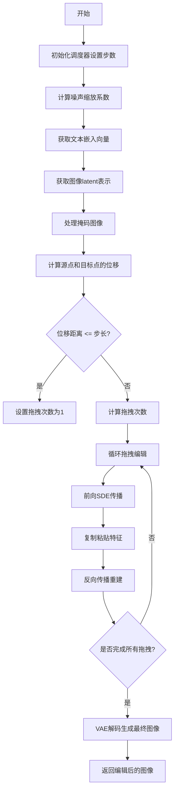
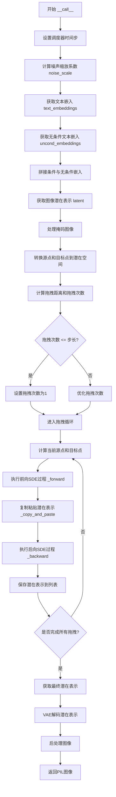
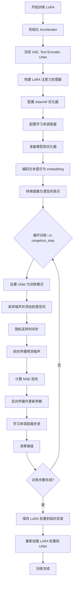
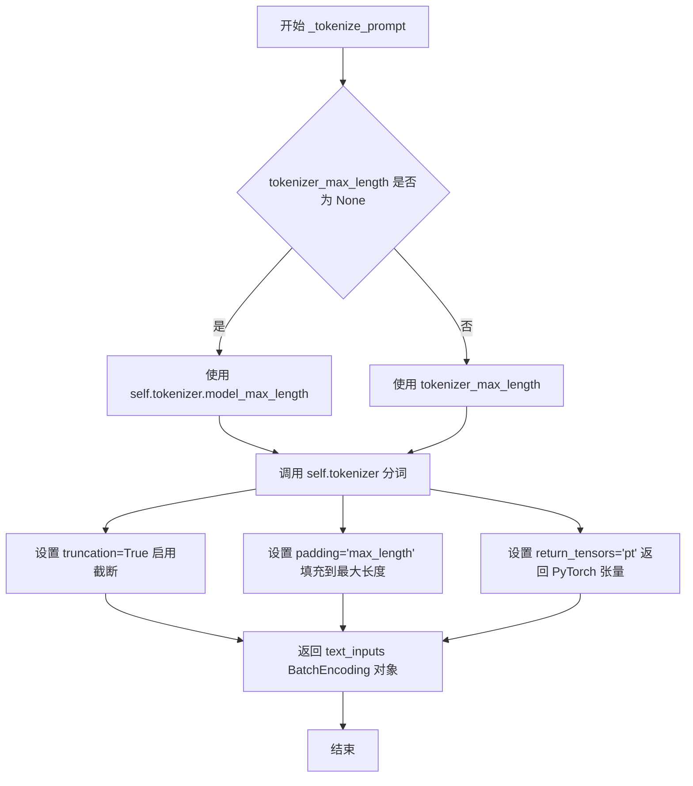
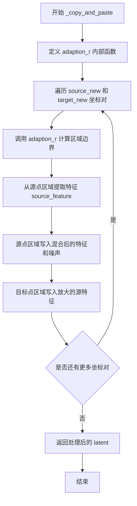
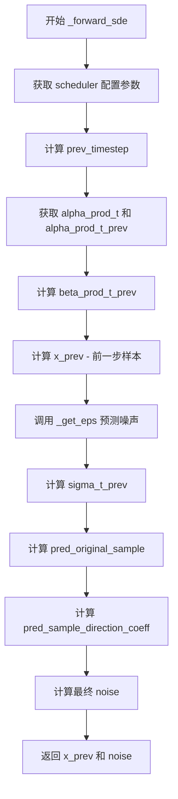
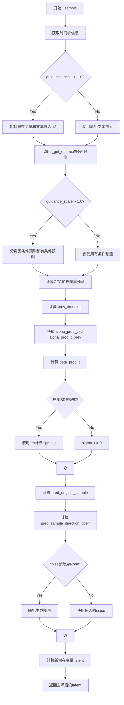
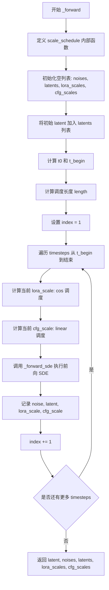
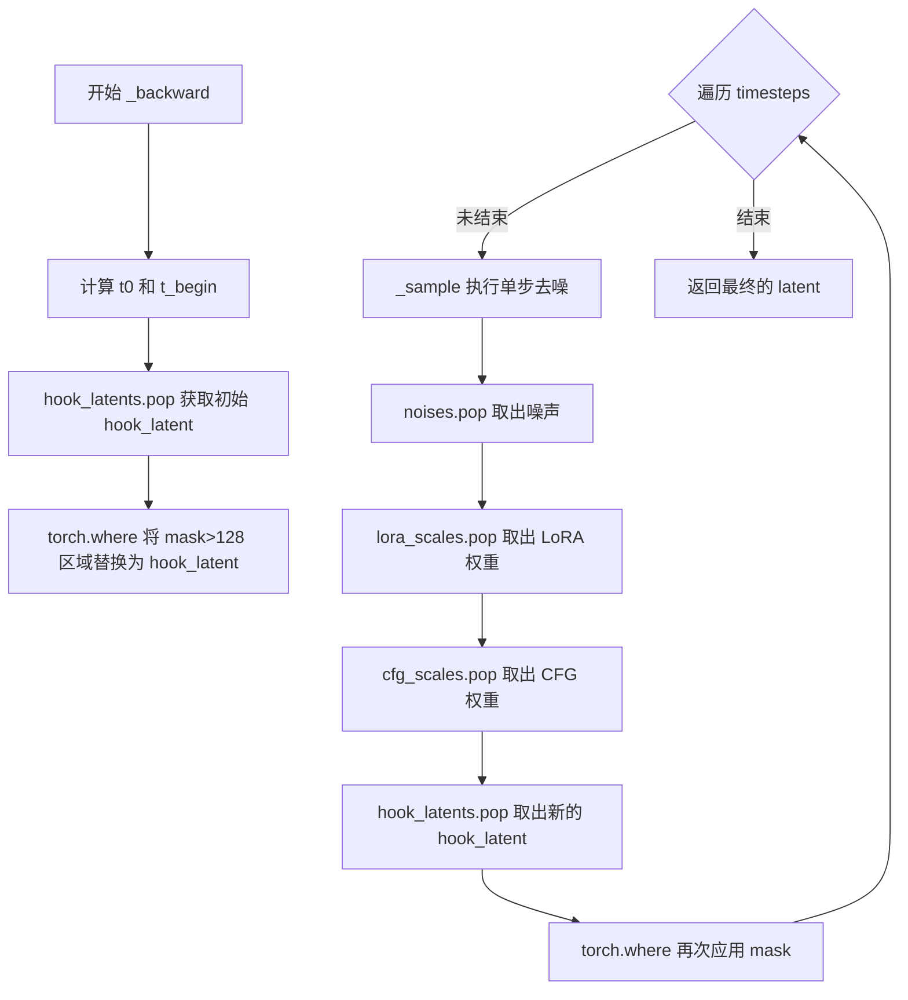

# `diffusers\examples\community\sde_drag.py` 详细设计文档

SdeDragPipeline是一个基于扩散模型的图像拖拽编辑管道，通过随机微分方程(SDE)实现图像的精确区域编辑。该管道继承自DiffusionPipeline，支持LoRA微调，能够在保持图像大部分内容不变的情况下，将源区域的特征移动到目标区域。

## 整体流程



## 类结构

```
DiffusionPipeline (基类)
└── SdeDragPipeline (主类)
```

## 全局变量及字段


### `noise_scale`
    
噪声缩放系数，基于image_scale计算用于控制噪声强度

类型：`float`
    


### `text_embeddings`
    
文本嵌入向量，用于将输入文本编码为模型可理解的向量表示

类型：`Tensor`
    


### `uncond_embeddings`
    
无条件文本嵌入，用于无分类器指导的扩散生成

类型：`Tensor`
    


### `latent`
    
图像的latent表示，通过VAE编码器将图像转换为潜在空间向量

类型：`Tensor`
    


### `mask`
    
编辑区域的掩码，白色像素区域将进行编辑，黑色像素区域保持不变

类型：`Tensor`
    


### `source_points`
    
拖拽源点坐标，表示图像中拖拽操作的起始位置

类型：`Tensor`
    


### `target_points`
    
拖拽目标点坐标，表示图像中拖拽操作的目标位置

类型：`Tensor`
    


### `distance`
    
源点到目标点的位移向量，计算拖拽的距离和方向

类型：`Tensor`
    


### `distance_norm_max`
    
最大位移距离，用于确定拖拽迭代的次数

类型：`Tensor`
    


### `drag_num`
    
拖拽迭代次数，根据距离计算需要执行多少次拖拽步骤

类型：`int`
    


### `latents`
    
存储每步的latent结果，用于记录整个拖拽过程中的潜在表示变化

类型：`List[Tensor]`
    


### `result_image`
    
最终生成的图像，经过VAE解码器从latent空间转换回像素空间

类型：`Tensor`
    


### `SdeDragPipeline.vae`
    
VAE模型用于图像编码解码，将图像转换为latent表示并从latent重建图像

类型：`AutoencoderKL`
    


### `SdeDragPipeline.text_encoder`
    
文本编码器，将文本提示转换为向量嵌入以指导图像生成

类型：`CLIPTextModel`
    


### `SdeDragPipeline.tokenizer`
    
文本分词器，将输入文本分割为token序列供模型使用

类型：`CLIPTokenizer`
    


### `SdeDragPipeline.unet`
    
条件U-Net去噪网络，在潜在空间中根据文本嵌入逐步去除噪声生成图像

类型：`UNet2DConditionModel`
    


### `SdeDragPipeline.scheduler`
    
扩散调度器，管理扩散过程中的时间步和噪声调度策略

类型：`DPMSolverMultistepScheduler`
    
    

## 全局函数及方法


### `scale_schedule`

内部函数，用于生成lora和cfg的调度值，根据调度类型（线性、余弦或常数）计算当前步骤的缩放因子。

参数：

- `begin`：`float`，调度起始值
- `end`：`float`，调度结束值
- `n`：`int`，当前步骤索引
- `length`：`int`，总步数长度
- `type`：`str`，调度类型，可选值为 "constant"、"linear"、"cos"，默认为 "linear"

返回值：`float`，根据调度类型计算得到的当前缩放因子值

#### 流程图

```mermaid
flowchart TD
    A[开始 scale_schedule] --> B{type == 'constant'?}
    B -->|Yes| C[返回 end]
    B -->|No| D{type == 'linear'?}
    D -->|Yes| E[计算: begin + (end - begin) * n / length]
    E --> F[返回线性结果]
    D -->|No| G{type == 'cos'?}
    G -->|Yes| H[计算 factor = (1 - cos(n * pi / length)) / 2]
    H --> I[返回: (1 - factor) * begin + factor * end]
    I --> J[返回余弦结果]
    G -->|No| K[抛出 NotImplementedError]
    
    C --> L[结束]
    F --> L
    J --> L
    K --> L
```

#### 带注释源码

```python
def scale_schedule(begin, end, n, length, type="linear"):
    """
    生成调度值的内部函数，用于计算lora和cfg在各个时间步的缩放因子
    
    参数:
        begin: 调度起始值
        end: 调度结束值  
        n: 当前步骤索引
        length: 总步数长度
        type: 调度类型 ("constant", "linear", "cos")
    
    返回:
        计算得到的缩放因子
    """
    # 常数调度：直接返回结束值
    if type == "constant":
        return end
    # 线性调度：按比例线性插值
    elif type == "linear":
        return begin + (end - begin) * n / length
    # 余弦调度：使用余弦函数进行平滑插值
    elif type == "cos":
        # 计算余弦因子，使变化更加平滑
        factor = (1 - math.cos(n * math.pi / length)) / 2
        # 使用余弦因子在起始和结束值之间进行平滑过渡
        return (1 - factor) * begin + factor * end
    else:
        # 不支持的调度类型抛出异常
        raise NotImplementedError(type)
```


### `adaption_r`

内部函数，用于计算复制粘贴操作的实际适应半径，确保操作区域不会超出图像边界。

参数：

- `source`：`torch.Tensor`，源点坐标，形状为 `[2]` 的张量，表示要复制内容的起始位置 `[x, y]`
- `target`：`torch.Tensor`，目标点坐标，形状为 `[2]` 的张量，表示复制内容的目标位置 `[x, y]`
- `adapt_radius`：`int`，用户指定的适应半径，定义了复制粘贴区域的初始大小
- `max_height`：`int`，潜空间图像的最大高度（以像素为单位）
- `max_width`：`int`，潜空间图像的最大宽度（以像素为单位）

返回值：`Tuple[int, int, int, int]`，返回四个整数 `(r_x_lower, r_x_upper, r_y_lower, r_y_upper)`，分别表示在 x 方向上左侧和右侧的扩展范围，以及 y 方向上下方和上方的扩展范围。

#### 流程图

```mermaid
flowchart TD
    A[开始 adaption_r] --> B[计算 r_x_lower]
    B --> C[计算 r_x_upper]
    C --> D[计算 r_y_lower]
    D --> E[计算 r_y_upper]
    E --> F[返回 r_x_lower, r_x_upper, r_y_lower, r_y_upper]
    
    B --> B1[min adapt_radius, source[0], target[0]]
    C --> C1[min adapt_radius, max_width - source[0], max_width - target[0]]
    D --> D1[min adapt_radius, source[1], target[1]]
    E --> E1[min adapt_radius, max_height - source[1], max_height - target[1]]
```

#### 带注释源码

```python
def adaption_r(source, target, adapt_radius, max_height, max_width):
    """
    计算复制粘贴操作的适应半径，确保区域不会超出图像边界。
    
    参数:
        source: 源点坐标 [x, y]
        target: 目标点坐标 [x, y]
        adapt_radius: 初始适应半径
        max_height: 图像最大高度
        max_width: 图像最大宽度
    
    返回:
        r_x_lower, r_x_upper, r_y_lower, r_y_upper: 四个方向的边界偏移量
    """
    # 计算 x 方向左侧边界：取 adapt_radius、源点 x、目标点 x 的最小值
    # 确保不会从负坐标开始复制
    r_x_lower = min(adapt_radius, source[0], target[0])
    
    # 计算 x 方向右侧边界：取 adapt_radius、右侧剩余空间 的最小值
    # 确保不会超出图像右边界
    r_x_upper = min(adapt_radius, max_width - source[0], max_width - target[0])
    
    # 计算 y 方向下侧边界：取 adapt_radius、源点 y、目标点 y 的最小值
    # 确保不会从负坐标开始复制
    r_y_lower = min(adapt_radius, source[1], target[1])
    
    # 计算 y 方向上侧边界：取 adapt_radius、上侧剩余空间 的最小值
    # 确保不会超出图像上边界
    r_y_upper = min(adapt_radius, max_height - source[1], max_height - target[1])
    
    return r_x_lower, r_x_upper, r_y_lower, r_y_upper
```


### `SdeDragPipeline.__init__`

这是 SdeDragPipeline 类的构造函数，用于初始化图像拖拽编辑管道。该方法继承自 DiffusionPipeline，并注册了实现 SDE Drag 算法所需的所有核心模块（VAE、文本编码器、分词器、U-Net 和调度器）。

参数：

- `vae`：`AutoencoderKL`，变分自编码器模型，用于将图像编码到潜在表示并从潜在表示解码图像。
- `text_encoder`：`CLIPTextModel`，冻结的文本编码器。Stable Diffusion 使用 CLIP 的文本部分，具体是 clip-vit-large-patch14 变体。
- `tokenizer`：`CLIPTokenizer`，CLIPTokenizer 类的分词器，用于将文本转换为 token。
- `unet`：`UNet2DConditionModel`，条件 U-Net 架构，用于对编码后的图像潜在表示进行去噪。
- `scheduler`：`DPMSolverMultistepScheduler`，调度器，与 `unet` 结合使用以对编码后的图像潜在表示进行去噪。

返回值：`None`，构造函数无返回值，用于初始化对象状态。

#### 流程图

```mermaid
flowchart TD
    A[开始 __init__] --> B[调用 super().__init__]
    B --> C[调用 self.register_modules 注册所有模块]
    C --> D[vae: AutoencoderKL]
    C --> E[text_encoder: CLIPTextModel]
    C --> F[tokenizer: CLIPTokenizer]
    C --> G[unet: UNet2DConditionModel]
    C --> H[scheduler: DPMSolverMultistepScheduler]
    D --> I[结束初始化]
    E --> I
    F --> I
    G --> I
    H --> I
```

#### 带注释源码

```python
def __init__(
    self,
    vae: AutoencoderKL,
    text_encoder: CLIPTextModel,
    tokenizer: CLIPTokenizer,
    unet: UNet2DConditionModel,
    scheduler: DPMSolverMultistepScheduler,
):
    """
    初始化 SdeDragPipeline 实例。
    
    该构造函数继承自 DiffusionPipeline，并注册了实现 SDE Drag 算法所需的
    所有核心组件。这些组件共同工作以支持基于扩散模型的图像拖拽编辑功能。
    
    参数:
        vae: AutoencoderKL - 用于图像与潜在表示之间的编码/解码
        text_encoder: CLIPTextModel - 将文本提示编码为嵌入向量
        tokenizer: CLIPTokenizer - 将文本提示分词为 token ID
        unet: UNet2DConditionModel - 基于文本条件对图像潜在表示去噪
        scheduler: DPMSolverMultistepScheduler - 控制扩散过程的噪声调度
    """
    # 调用父类 DiffusionPipeline 的初始化方法
    # 设置基本的 pipeline 配置和设备管理
    super().__init__()
    
    # 注册所有必要的模块，使它们可以通过 pipeline 的属性访问
    # 同时保存这些模块的引用以便在推理过程中使用
    # register_modules 是 DiffusionPipeline 提供的标准方法
    # 用于统一管理 pipeline 中的所有可序列化组件
    self.register_modules(
        vae=vae, 
        text_encoder=text_encoder, 
        tokenizer=tokenizer, 
        unet=unet, 
        scheduler=scheduler
    )
```


### `SdeDragPipeline.__call__`

这是 SDE-Drag 图像编辑管道的核心方法，通过拖拽源点到目标点来实现图像编辑。该方法结合了前向SDE扩散过程和后向去噪过程，利用LoRA微调和CFG（Classifier-Free Guidance）技术，在保持图像语义一致性的同时，将图像中的特定区域从源位置拖拽到目标位置。

参数：

- `prompt`：`str`，必选，用于引导图像编辑的文本提示
- `image`：`PIL.Image.Image`，必选，待编辑的原始图像
- `mask_image`：`PIL.Image.Image`，必选，掩码图像，白色像素区域将被编辑，黑色像素区域将被保留
- `source_points`：`List[List[int]]`，必选，拖拽编辑的起始位置坐标，每个像素点用长度为2的列表表示
- `target_points`：`List[List[int]]`，必选，拖拽编辑的目标位置坐标，每个像素点用长度为2的列表表示
- `t0`：`Optional[float]`，默认为0.6，时间参数，较高的t0提高保真度但降低忠实度
- `steps`：`Optional[int]`，默认为200，采样迭代次数
- `step_size`：`Optional[int]`，默认为2，每次拖拽的步长距离
- `image_scale`：`Optional[float]`，默认为0.3，用于扰动源区域的缩放因子，避免内容重复
- `adapt_radius`：`Optional[int]`，默认为5，每次拖拽过程中复制粘贴操作的区域大小
- `min_lora_scale`：`Optional[float]`，默认为0.5，图像拖拽编辑过程中LoRA层的最小缩放系数
- `generator`：`torch.Generator | None`，默认为None，用于确保生成过程确定性的随机数生成器

返回值：`PIL.Image.Image`，编辑后的结果图像

#### 流程图



#### 带注释源码

```python
@torch.no_grad()
def __call__(
    self,
    prompt: str,
    image: PIL.Image.Image,
    mask_image: PIL.Image.Image,
    source_points: List[List[int]],
    target_points: List[List[int]],
    t0: Optional[float] = 0.6,
    steps: Optional[int] = 200,
    step_size: Optional[int] = 2,
    image_scale: Optional[float] = 0.3,
    adapt_radius: Optional[int] = 5,
    min_lora_scale: Optional[float] = 0.5,
    generator: torch.Generator | None = None,
):
    """
    Pipeline for image drag-and-drop editing using stochastic differential equations.
    """
    # 1. 设置调度器的时间步数
    self.scheduler.set_timesteps(steps)

    # 2. 计算噪声缩放系数，基于image_scale计算
    noise_scale = (1 - image_scale**2) ** (0.5)

    # 3. 获取文本嵌入（条件）
    text_embeddings = self._get_text_embed(prompt)
    # 4. 获取无条件文本嵌入（用于CFG）
    uncond_embeddings = self._get_text_embed([""])
    # 5. 拼接无条件嵌入和条件嵌入 [uncond, cond]
    text_embeddings = torch.cat([uncond_embeddings, text_embeddings])

    # 6. 获取输入图像的潜在表示
    latent = self._get_img_latent(image)

    # 7. 处理掩码图像：调整大小并转换为tensor
    mask = mask_image.resize((latent.shape[3], latent.shape[2]))
    mask = torch.tensor(np.array(mask))
    mask = mask.unsqueeze(0).expand_as(latent).to(self.device)

    # 8. 将源点和目标点转换到潜在空间（除以8，因为VAE通常下采样8倍）
    source_points = torch.tensor(source_points).div(torch.tensor([8]), rounding_mode="trunc")
    target_points = torch.tensor(target_points).div(torch.tensor([8]), rounding_mode="trunc")

    # 9. 计算拖拽距离向量
    distance = target_points - source_points
    # 10. 计算距离的最大范数
    distance_norm_max = torch.norm(distance.float(), dim=1, keepdim=True).max()

    # 11. 确定拖拽次数（将距离分解为多个小步骤）
    if distance_norm_max <= step_size:
        drag_num = 1
    else:
        drag_num = distance_norm_max.div(torch.tensor([step_size]), rounding_mode="trunc")
        # 选择更优的拖拽次数（使每步更接近step_size）
        if (distance_norm_max / drag_num - step_size).abs() > (
            distance_norm_max / (drag_num + 1) - step_size
        ).abs():
            drag_num += 1

    # 12. 初始化潜在表示列表
    latents = []
    # 13. 遍历每个拖拽步骤
    for i in tqdm(range(int(drag_num)), desc="SDE Drag"):
        # 14. 计算当前步骤的源点和目标点
        source_new = source_points + (i / drag_num * distance).to(torch.int)
        target_new = source_points + ((i + 1) / drag_num * distance).to(torch.int)

        # 15. 执行前向SDE扩散过程（从t0到steps）
        latent, noises, hook_latents, lora_scales, cfg_scales = self._forward(
            latent, steps, t0, min_lora_scale, text_embeddings, generator
        )
        
        # 16. 执行复制粘贴操作（将源区域内容复制到目标区域）
        latent = self._copy_and_paste(
            latent,
            source_new,
            target_new,
            adapt_radius,
            latent.shape[2] - 1,
            latent.shape[3] - 1,
            image_scale,
            noise_scale,
            generator,
        )
        
        # 17. 执行后向SDE去噪过程（从t0回到0）
        latent = self._backward(
            latent, mask, steps, t0, noises, hook_latents, lora_scales, cfg_scales, text_embeddings, generator
        )

        # 18. 保存每一步的潜在表示
        latents.append(latent)

    # 19. 获取最终潜在表示并反缩放
    result_image = 1 / 0.18215 * latents[-1]

    # 20. 使用VAE解码潜在表示到图像空间
    with torch.no_grad():
        result_image = self.vae.decode(result_image).sample

    # 21. 后处理：将图像归一化到[0,1]范围
    result_image = (result_image / 2 + 0.5).clamp(0, 1)
    # 22. 转换为numpy数组并转为uint8格式
    result_image = result_image.cpu().permute(0, 2, 3, 1).numpy()[0]
    result_image = (result_image * 255).astype(np.uint8)

    # 23. 返回PIL图像
    return result_image
```


### `SdeDragPipeline.train_lora`

该方法用于训练LoRA（Low-Rank Adaptation）权重，使SDE Drag pipeline能够更好地保持原始图像的特性和与编辑后图像的一致性，通过在图像潜空间上执行带噪声的正向扩散过程并预测噪声残差来学习LoRA参数。

参数：

- `prompt`：`str`，用于训练的文本提示，引导模型学习图像与文本的对应关系
- `image`：`PIL.Image.Image`，需要训练LoRA的原始图像
- `lora_step`：`int`，可选，默认100，LoRA训练的迭代步数
- `lora_rank`：`int`，可选，默认16，LoRA低秩矩阵的秩，决定参数量和表达能力
- `generator`：`torch.Generator | None`，可选，默认None，用于控制随机数生成的确定性

返回值：`None`，该方法无返回值，通过修改模型内部状态来保存训练好的LoRA权重

#### 流程图



#### 带注释源码

```python
def train_lora(self, prompt, image, lora_step=100, lora_rank=16, generator=None):
    """
    训练 LoRA 权重以保持图像一致性
    
    Args:
        prompt: 文本提示
        image: 输入图像
        lora_step: 训练步数，默认100
        lora_rank: LoRA 秩，默认16
        generator: 随机生成器
    """
    # 1. 初始化 Accelerator，用于分布式训练和混合精度
    accelerator = Accelerator(gradient_accumulation_steps=1, mixed_precision="fp16")

    # 2. 冻结不需要训练的模型组件
    self.vae.requires_grad_(False)
    self.text_encoder.requires_grad_(False)
    self.unet.requires_grad_(False)

    # 3. 为 UNet 的每个注意力处理器创建 LoRA 版本
    unet_lora_attn_procs = {}
    for name, attn_processor in self.unet.attn_processors.items():
        # 根据层名称确定隐藏维度
        cross_attention_dim = None if name.endswith("attn1.processor") else self.unet.config.cross_attention_dim
        if name.startswith("mid_block"):
            hidden_size = self.unet.config.block_out_channels[-1]
        elif name.startswith("up_blocks"):
            block_id = int(name[len("up_blocks.")])
            hidden_size = list(reversed(self.unet.config.block_out_channels))[block_id]
        elif name.startswith("down_blocks"):
            block_id = int(name[len("down_blocks.")])
            hidden_size = self.unet.config.block_out_channels[block_id]
        else:
            raise NotImplementedError("name must start with up_blocks, mid_blocks, or down_blocks")

        # 选择合适的 LoRA 注意力处理器类
        if isinstance(attn_processor, (AttnAddedKVProcessor, SlicedAttnAddedKVProcessor, AttnAddedKVProcessor2_0)):
            lora_attn_processor_class = LoRAAttnAddedKVProcessor
        else:
            lora_attn_processor_class = (
                LoRAAttnProcessor2_0
                if hasattr(torch.nn.functional, "scaled_dot_product_attention")
                else LoRAAttnProcessor
            )
        
        # 创建 LoRA 注意力处理器实例
        unet_lora_attn_procs[name] = lora_attn_processor_class(
            hidden_size=hidden_size, cross_attention_dim=cross_attention_dim, rank=lora_rank
        )

    # 4. 设置 UNet 的注意力处理器
    self.unet.set_attn_processor(unet_lora_attn_procs)
    unet_lora_layers = AttnProcsLayers(self.unet.attn_processors)
    params_to_optimize = unet_lora_layers.parameters()

    # 5. 创建 AdamW 优化器
    optimizer = torch.optim.AdamW(
        params_to_optimize,
        lr=2e-4,
        betas=(0.9, 0.999),
        weight_decay=1e-2,
        eps=1e-08,
    )

    # 6. 创建学习率调度器
    lr_scheduler = get_scheduler(
        "constant",
        optimizer=optimizer,
        num_warmup_steps=0,
        num_training_steps=lora_step,
        num_cycles=1,
        power=1.0,
    )

    # 7. 准备模型和优化器
    unet_lora_layers = accelerator.prepare_model(unet_lora_layers)
    optimizer = accelerator.prepare_optimizer(optimizer)
    lr_scheduler = accelerator.prepare_scheduler(lr_scheduler)

    # 8. 编码文本提示
    with torch.no_grad():
        text_inputs = self._tokenize_prompt(prompt, tokenizer_max_length=None)
        text_embedding = self._encode_prompt(
            text_inputs.input_ids, text_inputs.attention_mask, text_encoder_use_attention_mask=False
        )

    # 9. 图像预处理变换
    image_transforms = transforms.Compose(
        [
            transforms.ToTensor(),
            transforms.Normalize([0.5], [0.5]),
        ]
    )

    # 10. 转换图像并编码为潜空间
    image = image_transforms(image).to(self.device, dtype=self.vae.dtype)
    image = image.unsqueeze(dim=0)
    latents_dist = self.vae.encode(image).latent_dist

    # 11. 训练循环
    for _ in tqdm(range(lora_step), desc="Train LoRA"):
        self.unet.train()
        model_input = latents_dist.sample() * self.vae.config.scaling_factor

        # 采样噪声
        noise = torch.randn(
            model_input.size(),
            dtype=model_input.dtype,
            layout=model_input.layout,
            device=model_input.device,
            generator=generator,
        )
        bsz, channels, height, width = model_input.shape

        # 随机采样时间步
        timesteps = torch.randint(
            0, self.scheduler.config.num_train_timesteps, (bsz,), device=model_input.device, generator=generator
        )
        timesteps = timesteps.long()

        # 前向扩散：添加噪声
        noisy_model_input = self.scheduler.add_noise(model_input, noise, timesteps)

        # 预测噪声残差
        model_pred = self.unet(noisy_model_input, timesteps, text_embedding).sample

        # 计算目标值
        if self.scheduler.config.prediction_type == "epsilon":
            target = noise
        elif self.scheduler.config.prediction_type == "v_prediction":
            target = self.scheduler.get_velocity(model_input, noise, timesteps)
        else:
            raise ValueError(f"Unknown prediction type {self.scheduler.config.prediction_type}")

        # 计算损失并反向传播
        loss = torch.nn.functional.mse_loss(model_pred.float(), target.float(), reduction="mean")
        accelerator.backward(loss)
        optimizer.step()
        lr_scheduler.step()
        optimizer.zero_grad()

    # 12. 保存 LoRA 权重
    with tempfile.TemporaryDirectory() as save_lora_dir:
        StableDiffusionLoraLoaderMixin.save_lora_weights(
            save_directory=save_lora_dir,
            unet_lora_layers=unet_lora_layers,
            text_encoder_lora_layers=None,
        )

        # 重新加载到 UNet
        self.unet.load_attn_procs(save_lora_dir)
```

---

### 完整设计文档

#### 1. 一段话描述

SdeDragPipeline 是一个基于随机微分方程（SDE）的图像拖拽编辑pipeline，继承自DiffusionPipeline，通过训练LoRA权重来保持编辑后图像与原图的一致性，并利用前向SDE过程、特征复制粘贴和反向去噪过程实现精确的图像拖拽编辑。

#### 2. 文件整体运行流程

1. **初始化阶段**：加载预训练的VAE、文本编码器、UNet和调度器
2. **LoRA训练阶段（可选）**：调用`train_lora`方法训练LoRA权重以保持图像一致性
3. **编辑推理阶段**：
   - 编码文本提示和图像到潜空间
   - 计算源点和目标点之间的距离，确定拖拽步数
   - 迭代执行前向SDE、特征复制粘贴、反向去噪过程
   - 最终解码潜空间到图像

#### 3. 类详细信息

| 组件 | 类型 | 描述 |
|------|------|------|
| **类名** | `SdeDragPipeline` | 基于SDE的图像拖拽编辑pipeline |
| **父类** | `DiffusionPipeline` | Diffusers库的基础pipeline类 |

**类字段：**

| 字段名称 | 类型 | 描述 |
|----------|------|------|
| `vae` | `AutoencoderKL` | VAE模型，用于图像编码解码 |
| `text_encoder` | `CLIPTextModel` | 文本编码器，将文本转为embedding |
| `tokenizer` | `CLIPTokenizer` | 文本分词器 |
| `unet` | `UNet2DConditionModel` | 条件U-Net，用于去噪 |
| `scheduler` | `DPMSolverMultistepScheduler` | 扩散调度器 |

**类方法：**

| 方法名 | 功能 |
|--------|------|
| `__init__` | 初始化pipeline组件 |
| `__call__` | 主推理方法，执行图像编辑 |
| `train_lora` | 训练LoRA权重保持图像一致性 |
| `_tokenize_prompt` | 分词文本提示 |
| `_encode_prompt` | 编码文本为embedding |
| `_get_text_embed` | 获取文本embedding |
| `_copy_and_paste` | 特征复制粘贴操作 |
| `_get_img_latent` | 获取图像潜空间表示 |
| `_get_eps` | 预测噪声残差 |
| `_forward_sde` | 前向SDE过程 |
| `_sample` | 采样过程 |
| `_forward` | 前向传播（编辑方向） |
| `_backward` | 反向传播（恢复方向） |

#### 4. 关键组件信息

| 组件 | 描述 |
|------|------|
| **LoRA Attention Processor** | 注入到UNet中的低秩适配器，用于学习图像特定特征 |
| **SDE Forward Process** | 前向扩散过程，用于拖拽变形 |
| **Copy and Paste** | 特征区域复制粘贴，保持内容一致性 |
| **Mask-guided Backward** | 蒙版引导的反向去噪，保持未编辑区域 |

#### 5. 潜在技术债务与优化空间

1. **临时文件I/O**：训练完成后使用临时目录保存再加载LoRA权重，可优化为内存直接传递
2. **硬编码超参数**：学习率(2e-4)、rank(16)、steps(100)等应可配置
3. **混合精度限制**：固定使用fp16，可能在某些硬件上可启用更高效精度
4. **缺乏检查点保存**：长时间训练无中间保存机制
5. **单图像训练**：当前只支持单图训练，可扩展为批量训练

#### 6. 其它项目

**设计目标与约束：**
- 目标：实现高精度图像拖拽编辑，同时保持原图特征
- 约束：需要至少16GB显存，建议24GB以获得最佳性能

**错误处理与异常设计：**
- 层名称必须以`up_blocks`、`mid_blocks`或`down_blocks`开头
- 预测类型只支持`epsilon`和`v_prediction`
- guidance_scale必须大于等于1.0

**数据流与状态机：**
- 图像→VAE编码→潜空间→前向SDE→特征操作→反向去噪→VAE解码→输出图像

**外部依赖与接口契约：**
- 依赖`diffusers`库的`DiffusionPipeline`、`StableDiffusionLoraLoaderMixin`
- 依赖`accelerate`库的分布式训练支持
- 输入图像尺寸自动适配到潜空间尺寸（除以8）


### `SdeDragPipeline._tokenize_prompt`

该方法用于将输入的文本提示（prompt）分词为模型可处理的 token 序列，通过 tokenizer 将文本转换为包含 input_ids 和 attention_mask 的批次编码对象。

参数：

- `prompt`：`str` 或 `List[str]`，需要被分词的文本提示，可以是单个字符串或字符串列表
- `tokenizer_max_length`：`Optional[int]`，可选参数，指定 tokenizer 的最大长度，如果为 None 则使用 tokenizer 的默认最大长度（model_max_length）

返回值：`BatchEncoding`，分词后的批次编码对象，包含 `input_ids`（token IDs）和 `attention_mask`（注意力掩码）等张量，用于后续的文本编码

#### 流程图



#### 带注释源码

```
def _tokenize_prompt(self, prompt, tokenizer_max_length=None):
    """
    将文本提示分词为模型可处理的 token 序列
    
    参数:
        prompt: 输入的文本提示，可以是单个字符串或字符串列表
        tokenizer_max_length: 可选的最大分词长度，默认为 None
    
    返回:
        包含 input_ids 和 attention_mask 的 BatchEncoding 对象
    """
    
    # 判断是否指定了自定义的最大长度
    if tokenizer_max_length is not None:
        # 如果传入了自定义长度，则使用该长度
        max_length = tokenizer_max_length
    else:
        # 如果未指定，则使用 tokenizer 的默认最大长度
        max_length = self.tokenizer.model_max_length
    
    # 调用 tokenizer 进行分词处理
    text_inputs = self.tokenizer(
        prompt,                    # 要分词的文本
        truncation=True,           # 启用截断，超过最大长度的部分将被截断
        padding="max_length",      # 填充到最大长度，使所有输出具有相同长度
        max_length=max_length,     # 指定的最大分词长度
        return_tensors="pt",       # 返回 PyTorch 张量格式
    )
    
    # 返回分词后的批次编码对象
    return text_inputs
```


### `SdeDragPipeline._encode_prompt`

该方法用于将经过分词处理的文本输入（input_ids）通过CLIP文本编码器转换为文本嵌入向量（text embeddings），以便后续在图像编辑过程中为扩散模型提供文本引导信息。

参数：

- `input_ids`：`torch.Tensor`，经过tokenizer处理后的文本token IDs序列
- `attention_mask`：`torch.Tensor`，用于指示哪些token是有效的注意力掩码
- `text_encoder_use_attention_mask`：`bool`，默认为False，决定是否将attention_mask传递给文本编码器

返回值：`torch.Tensor`，文本编码器生成的文本嵌入向量（prompt_embeds）

#### 流程图

```mermaid
flowchart TD
    A[开始 _encode_prompt] --> B[将 input_ids 移动到目标设备]
    C{text_encoder_use_attention_mask?}
    B --> C
    C -->|True| D[将 attention_mask 移动到目标设备]
    C -->|False| E[设置 attention_mask 为 None]
    D --> F[调用 text_encoder 编码文本]
    E --> F
    F --> G[提取 prompt_embeds[0]]
    G --> H[返回 prompt_embeds]
```

#### 带注释源码

```python
def _encode_prompt(self, input_ids, attention_mask, text_encoder_use_attention_mask=False):
    """
    将tokenized文本输入编码为文本嵌入向量
    
    参数:
        input_ids: 经过tokenizer处理后的文本token IDs
        attention_mask: 注意力掩码,指示哪些token有效
        text_encoder_use_attention_mask: 是否将attention_mask传递给encoder
    
    返回:
        prompt_embeds: 文本编码器输出的嵌入向量
    """
    # 将input_ids移动到模型所在设备
    text_input_ids = input_ids.to(self.device)

    # 根据text_encoder_use_attention_mask决定是否使用attention_mask
    if text_encoder_use_attention_mask:
        # 如果需要使用attention_mask,则将其移动到目标设备
        attention_mask = attention_mask.to(self.device)
    else:
        # 否则设置为None,不传入encoder
        attention_mask = None

    # 调用CLIP文本编码器进行编码,返回包含嵌入的元组
    prompt_embeds = self.text_encoder(
        text_input_ids,
        attention_mask=attention_mask,
    )
    # 提取第一个元素,即实际的嵌入向量
    # text_encoder返回的是(last_hidden_state, pooler_output)等组成的元组
    prompt_embeds = prompt_embeds[0]

    # 返回文本嵌入向量,用于后续的扩散模型推理
    return prompt_embeds
```


### `SdeDragPipeline._get_text_embed`

该方法用于将文本提示（prompt）编码为文本嵌入向量（text embeddings），以便后续在图像编辑过程中为扩散模型提供文本条件引导。

参数：

- `prompt`：`Union[str, List[str]]`，需要编码的文本提示，可以是单个字符串或字符串列表

返回值：`torch.Tensor`，文本嵌入向量，形状为 `[batch_size, sequence_length, hidden_size]`，其中 `hidden_size` 是文本编码器的隐藏层维度

#### 流程图

```mermaid
flowchart TD
    A[输入 prompt] --> B{判断类型}
    B -->|字符串| C[转换为单元素列表]
    B -->|列表| D[直接使用]
    C --> E[调用 self.tokenizer 进行分词]
    D --> E
    E --> F[设置 padding=max_length 和 truncation=True]
    F --> G[return_tensors='pt' 转换为 PyTorch 张量]
    G --> H[将 input_ids 移动到设备]
    H --> I[调用 self.text_encoder 编码]
    I --> J[提取第一项 text_embeddings[0]]
    K[返回 text_embeddings] --> L[结束]
```

#### 带注释源码

```python
@torch.no_grad()
def _get_text_embed(self, prompt):
    """
    将文本提示编码为文本嵌入向量
    
    参数:
        prompt: 输入的文本提示，可以是单个字符串或字符串列表
        
    返回:
        text_embeddings: 文本嵌入向量，用于后续扩散模型的文本条件引导
    """
    # 使用分词器将文本转换为模型输入格式
    # padding="max_length": 将所有序列填充到最大长度
    # max_length: 使用模型配置的最大长度（通常为77）
    # truncation=True: 超过最大长度的序列进行截断
    # return_tensors="pt": 返回 PyTorch 张量格式
    text_input = self.tokenizer(
        prompt,
        padding="max_length",
        max_length=self.tokenizer.model_max_length,
        truncation=True,
        return_tensors="pt",
    )
    
    # 将分词后的 input_ids 移动到计算设备（如 GPU）
    # 调用 text_encoder 获取文本嵌入表示
    # [0] 表示提取第一个元素（hidden_states）
    text_embeddings = self.text_encoder(text_input.input_ids.to(self.device))[0]
    
    # 返回文本嵌入向量，形状为 [batch_size, seq_len, hidden_dim]
    return text_embeddings
```


### `SdeDragPipeline._copy_and_paste`

该方法实现了图像拖拽编辑中的特征复制与粘贴功能，通过从源点提取特征并将其添加到目标点，同时加入噪声扰动来保持图像一致性。

参数：

- `self`：类实例本身
- `latent`：`torch.Tensor`，潜在表示张量，包含当前的图像潜在特征
- `source_new`：`torch.Tensor`，源点坐标张量，指定要复制特征的起始位置
- `target_new`：`torch.Tensor`，目标点坐标张量，指定要粘贴特征的目标位置
- `adapt_radius`：`int`，适配半径，用于确定复制粘贴操作的影响区域大小
- `max_height`：`int`，最大高度，潜在表示的空间维度上限
- `max_width`：`int`，最大宽度，潜在表示的空间维度上限
- `image_scale`：`float`，图像缩放因子，控制源特征在混合时的权重
- `noise_scale`：`float`，噪声缩放因子，控制随机噪声在混合时的权重
- `generator`：`torch.Generator | None`，随机数生成器，用于确保噪声的可重复性

返回值：`torch.Tensor`，返回处理后的潜在表示张量

#### 流程图



#### 带注释源码

```
def _copy_and_paste(
    self, latent, source_new, target_new, adapt_radius, max_height, max_width, image_scale, noise_scale, generator
):
    # 定义内部函数：根据源点和目标点计算复制的适配半径区域边界
    # 确保复制的区域不会超出图像边界
    def adaption_r(source, target, adapt_radius, max_height, max_width):
        # 计算左侧和上侧的边界，取适配半径、源点坐标、目标点坐标的最小值
        r_x_lower = min(adapt_radius, source[0], target[0])
        r_x_upper = min(adapt_radius, max_width - source[0], max_width - target[0])
        r_y_lower = min(adapt_radius, source[1], target[1])
        r_y_upper = min(adapt_radius, max_height - source[1], max_height - target[1])
        # 返回四个方向的边界值
        return r_x_lower, r_x_upper, r_y_lower, r_y_upper

    # 遍历每一对源点和目标点
    for source_, target_ in zip(source_new, target_new):
        # 计算当前源点和目标点对应的复制区域边界
        r_x_lower, r_x_upper, r_y_lower, r_y_upper = adaption_r(
            source_, target_, adapt_radius, max_height, max_width
        )

        # 从潜在表示中提取源点区域的特征
        # 使用切片获取 [batch, channels, height, width] 格式的子区域
        source_feature = latent[
            :, :, source_[1] - r_y_lower : source_[1] + r_y_upper, source_[0] - r_x_lower : source_[0] + r_x_upper
        ].clone()

        # 在源点区域写入混合后的特征
        # 混合公式：image_scale * 原始特征 + noise_scale * 随机噪声
        # 这样可以在保持部分原始特征的同时引入变化，避免内容重复
        latent[
            :, :, source_[1] - r_y_lower : source_[1] + r_y_upper, source_[0] - r_x_lower : source_[0] + r_x_upper
        ] = image_scale * source_feature + noise_scale * torch.randn(
            latent.shape[0],
            4,
            r_y_lower + r_y_upper,
            r_x_lower + r_x_upper,
            device=self.device,
            generator=generator,
        )

        # 将源特征（放大1.1倍）写入目标点区域
        # 1.1的放大系数有助于强化目标区域的特征
        latent[
            :, :, target_[1] - r_y_lower : target_[1] + r_y_upper, target_[0] - r_x_lower : target_[0] + r_x_upper
        ] = source_feature * 1.1
    # 返回处理后的潜在表示
    return latent
```


### `SdeDragPipeline._get_img_latent`

该方法负责将输入的 PIL 图像对象转换为 Stable Diffusion 模型所需的潜在空间表示（latent representation），通过 VAE 编码器对图像进行编码并应用缩放因子，是图像编辑管道中的关键预处理步骤。

参数：

- `self`：隐含参数，类方法的标准参数，表示当前管道实例
- `image`：`PIL.Image.Image`，待编码的输入图像
- `height`：`Optional[int]`，可选参数，指定图像调整后的高度，若为 None 则不调整
- `weight`：`Optional[int]`，可选参数，指定图像调整后的宽度（代码中为 weight，应为 width），需与 height 配合使用

返回值：`torch.Tensor`，返回形状为 (1, 4, H, W) 的四维张量，表示图像在 VAE 潜在空间中的表示，其中 H 和 W 分别为潜在空间的高度和宽度

#### 流程图

```mermaid
flowchart TD
    A[开始: 输入 PIL Image] --> B[将图像转换为 RGB 模式]
    B --> C{height 参数是否非空?}
    C -->|是| D[按 weight x height 调整图像大小]
    C -->|否| E[跳过调整大小]
    D --> F[使用 ToTensor 转换为张量]
    E --> F
    F --> G[在批次维度添加维度: unsqueeze(0)]
    G --> H[归一化: data * 2.0 - 1.0]
    H --> I[移动到设备并转换数据类型]
    I --> J[VAE 编码: vae.encode]
    J --> K[从潜在分布中采样]
    K --> L[乘以缩放因子 0.18215]
    L --> M[返回潜在表示张量]
```

#### 带注释源码

```python
@torch.no_grad()
def _get_img_latent(self, image, height=None, weight=None):
    """
    将 PIL 图像转换为 VAE 潜在空间表示
    
    参数:
        image: 输入的 PIL Image 对象
        height: 可选的目标高度
        weight: 可选的目标宽度
        
    返回:
        图像的潜在表示张量
    """
    # 将图像转换为 RGB 模式（确保通道一致）
    data = image.convert("RGB")
    
    # 如果指定了高度和宽度，则调整图像大小
    # 注意：这里 weight 实际上是 width 的含义
    if height is not None:
        data = data.resize((weight, height))
    
    # 创建 ToTensor 变换：将 PIL 图像转换为 [0, 1] 范围的张量
    transform = transforms.ToTensor()
    data = transform(data).unsqueeze(0)  # 添加批次维度 -> (1, C, H, W)
    
    # 归一化到 [-1, 1] 范围，符合模型预期输入
    data = (data * 2.0) - 1.0
    
    # 将数据移动到计算设备并转换为 VAE 所需的数据类型
    data = data.to(self.device, dtype=self.vae.dtype)
    
    # 使用 VAE 编码器对图像进行编码，获取潜在分布
    latent = self.vae.encode(data).latent_dist.sample()
    
    # 应用缩放因子，这是 Stable Diffusion VAE 的标准缩放值
    latent = 0.18215 * latent
    
    return latent
```


### `SdeDragPipeline._get_eps`

该方法通过 UNet 模型预测噪声残差，并结合无分类器引导（Classifier-Free Guidance）技术，根据 guidance_scale 对无条件预测和有条件预测进行加权融合，以引导生成过程朝向目标文本描述。

参数：

- `self`：`SdeDragPipeline`，管道实例本身
- `latent`：`torch.Tensor`，潜在空间中的图像表示，通常为 `[batch, channels, height, width]` 维度
- `timestep`：`torch.Tensor` 或 `int`，扩散过程中的时间步，用于告知模型当前处于去噪的哪个阶段
- `guidance_scale`：`float`，无分类器引导的强度系数，值越大生成图像与文本提示相关性越高，但可能导致图像质量下降；值为 1.0 时禁用 CFG
- `text_embeddings`：`torch.Tensor`，文本编码器生成的文本嵌入向量，用于条件生成；若 guidance_scale ≤ 1.0，应只包含条件嵌入
- `lora_scale`：`Optional[float]`，可选的 LoRA 权重缩放因子，传递给 UNet 的 cross_attention_kwargs，用于调整 LoRA 层的注意力权重；若为 None 则不传递

返回值：`torch.Tensor`，预测的噪声残差向量，维度与输入 latent 相同，用于后续的采样和图像重建过程。

#### 流程图

```mermaid
flowchart TD
    A[开始 _get_eps] --> B{guidance_scale > 1.0?}
    B -->|Yes| C[latent_model_input = concat [latent, latent]]
    B -->|No| D[latent_model_input = latent]
    C --> E[text_embeddings 保持不变]
    D --> F[text_embeddings = chunk[1] 取条件部分]
    E --> G{lora_scale is None?}
    F --> G
    G -->|Yes| H[cross_attention_kwargs = None]
    G -->|No| I[cross_attention_kwargs = {scale: lora_scale}]
    H --> J[调用 self.unet 预测噪声]
    I --> J
    J --> K[noise_pred = unet.sample]
    K --> L{guidance_scale > 1.0?}
    L -->|Yes| M[chunk 2: noise_pred_uncond, noise_pred_text]
    L -->|No| N[noise_pred_text = noise_pred]
    L -->|Yes| O[noise_pred_uncond = 0.0]
    M --> P[noise_pred = noise_pred_uncond + guidance_scale * (noise_pred_text - noise_pred_uncond)]
    N --> O
    O --> Q[返回 noise_pred]
    P --> Q
```

#### 带注释源码

```python
@torch.no_grad()
def _get_eps(self, latent, timestep, guidance_scale, text_embeddings, lora_scale=None):
    """
    预测噪声残差并应用无分类器引导（Classifier-Free Guidance）。
    
    参数:
        latent: 当前潜在空间表示 [B, C, H, W]
        timestep: 扩散时间步
        guidance_scale: CFG 强度系数，>1 启用引导
        text_embeddings: 文本嵌入
        lora_scale: 可选的 LoRA 缩放因子
    
    返回:
        noise_pred: 预测的噪声残差
    """
    # 1. 根据 guidance_scale 决定是否拼接 latent 进行 CFG
    # 如果启用 CFG，需要同时计算条件和无条件噪声预测
    latent_model_input = torch.cat([latent] * 2) if guidance_scale > 1.0 else latent
    
    # 2. 处理文本嵌入：CFG 模式下需要条件+无条件嵌入
    # 非 CFG 模式只取条件部分（chunk 后的第二部分）
    text_embeddings = text_embeddings if guidance_scale > 1.0 else text_embeddings.chunk(2)[1]

    # 3. 准备交叉注意力参数，用于 LoRA 加权
    cross_attention_kwargs = None if lora_scale is None else {"scale": lora_scale}

    # 4. 调用 UNet 预测噪声
    with torch.no_grad():
        noise_pred = self.unet(
            latent_model_input,      # 潜在表示（CFG模式下为双份）
            timestep,                 # 时间步
            encoder_hidden_states=text_embeddings,  # 文本条件
            cross_attention_kwargs=cross_attention_kwargs,  # LoRA 参数
        ).sample

    # 5. 根据 guidance_scale 应用 CFG 公式
    # CFG 公式: noise_pred = noise_pred_uncond + guidance_scale * (noise_pred_text - noise_pred_uncond)
    if guidance_scale > 1.0:
        # 分离无条件预测和条件预测
        noise_pred_uncond, noise_pred_text = noise_pred.chunk(2)
    elif guidance_scale == 1.0:
        # 禁用 CFG，只使用条件预测
        noise_pred_text = noise_pred
        noise_pred_uncond = 0.0
    else:
        # 无效的 guidance_scale
        raise NotImplementedError(guidance_scale)
    
    # 6. 计算最终噪声预测
    noise_pred = noise_pred_uncond + guidance_scale * (noise_pred_text - noise_pred_uncond)

    return noise_pred
```


### `SdeDragPipeline._forward_sde`

该方法执行SDE前向扩散过程，基于当前时间步的样本计算前一个时间步的样本和对应的噪声，用于图像拖拽编辑的前向传播阶段。

参数：

- `self`：SdeDragPipeline类实例，包含了模型组件（vae、text_encoder、tokenizer、unet、scheduler等）
- `timestep`：`int`，当前扩散过程的时间步长
- `sample`：`torch.Tensor`，当前时刻的潜在表示样本
- `guidance_scale`：`float`，Classifier-free guidance的引导尺度，控制文本条件的强度
- `text_embeddings`：`torch.Tensor`，文本嵌入向量，用于条件生成
- `steps`：`int`，扩散过程的总步数
- `eta`：`float`，可选参数（默认1.0），SDE中的噪声参数，控制随机性程度
- `lora_scale`：`float`，可选参数，LoRA注意力机制的缩放因子
- `generator`：`torch.Generator`，可选参数，用于控制随机数生成以确保可重复性

返回值：`Tuple[torch.Tensor, torch.Tensor]`，返回包含两个张量的元组：
- `x_prev`：`torch.Tensor`，前一个时间步的潜在表示样本
- `noise`：`torch.Tensor`，对应的噪声成分

#### 流程图



#### 带注释源码

```python
def _forward_sde(
    self, timestep, sample, guidance_scale, text_embeddings, steps, eta=1.0, lora_scale=None, generator=None
):
    """
    执行SDE前向扩散过程
    参数:
        timestep: 当前时间步
        sample: 当前样本
        guidance_scale: 引导尺度
        text_embeddings: 文本嵌入
        steps: 总步数
        eta: SDE噪声参数
        lora_scale: LoRA缩放因子
        generator: 随机数生成器
    返回:
        x_prev: 前一步的样本
        noise: 对应的噪声
    """
    # 获取训练时间步的总数
    num_train_timesteps = len(self.scheduler)
    # 获取累积的alpha值
    alphas_cumprod = self.scheduler.alphas_cumprod
    # 初始alpha累积值设为1.0
    initial_alpha_cumprod = torch.tensor(1.0)

    # 计算前一个时间步
    prev_timestep = timestep + num_train_timesteps // steps

    # 获取当前时间步的alpha_prod_t
    alpha_prod_t = alphas_cumprod[timestep] if timestep >= 0 else initial_alpha_cumprod
    # 获取前一个时间步的alpha_prod_t_prev
    alpha_prod_t_prev = alphas_cumprod[prev_timestep]

    # 计算beta_prod_t_prev
    beta_prod_t_prev = 1 - alpha_prod_t_prev

    # 计算前一个时间步的样本x_prev
    # 使用线性插值结合噪声
    x_prev = (alpha_prod_t_prev / alpha_prod_t) ** (0.5) * sample + (1 - alpha_prod_t_prev / alpha_prod_t) ** (
        0.5
    ) * torch.randn(
        sample.size(), dtype=sample.dtype, layout=sample.layout, device=self.device, generator=generator
    )
    
    # 使用UNet预测噪声
    eps = self._get_eps(x_prev, prev_timestep, guidance_scale, text_embeddings, lora_scale)

    # 计算sigma_t_prev - SDE的噪声项
    sigma_t_prev = (
        eta
        * (1 - alpha_prod_t) ** (0.5)
        * (1 - alpha_prod_t_prev / (1 - alpha_prod_t_prev) * (1 - alpha_prod_t) / alpha_prod_t) ** (0.5)
    )

    # 从噪声预测中恢复原始样本
    pred_original_sample = (x_prev - beta_prod_t_prev ** (0.5) * eps) / alpha_prod_t_prev ** (0.5)
    # 计算预测样本方向系数
    pred_sample_direction_coeff = (1 - alpha_prod_t - sigma_t_prev**2) ** (0.5)

    # 计算需要返回的噪声
    noise = (
        sample - alpha_prod_t ** (0.5) * pred_original_sample - pred_sample_direction_coeff * eps
    ) / sigma_t_prev

    return x_prev, noise
```


### `SdeDragPipeline._sample`

该方法执行扩散模型的单个逆向采样步骤，结合了DDIM（确定性）和SDE（随机微分方程）两种采样策略，通过噪声预测和CFG（分类器自由指导）来逐步从噪声潜在变量恢复目标图像。

参数：

- `self`：`SdeDragPipeline`，SDE拖拽管道实例本身
- `timestep`：`int`，当前扩散过程中的时间步
- `sample`：`torch.Tensor`，当前待去噪的潜在变量
- `guidance_scale`：`float`，CFG指导比例，用于控制文本条件对生成的影响程度
- `text_embeddings`：`torch.Tensor`，文本编码器生成的嵌入向量，用于条件生成
- `steps`：`int`，总采样步数
- `sde`：`bool`，是否启用SDE采样模式（True启用，False为DDIM模式）
- `noise`：`torch.Tensor | None`，可选的预定义噪声，若为None则随机生成
- `eta`：`float`，SDE模式的随机性参数，0为确定性，1为完全随机
- `lora_scale`：`float | None`，LoRA注意力层的缩放因子
- `generator`：`torch.Generator | None`，随机数生成器，用于确保可复现性

返回值：`torch.Tensor`，去噪后的潜在变量

#### 流程图



#### 带注释源码

```python
def _sample(
    self,
    timestep,               # 当前扩散时间步（整数）
    sample,                 # 当前潜在变量张量
    guidance_scale,         # CFG比例（float）
    text_embeddings,        # 文本嵌入（torch.Tensor）
    steps,                  # 总步数（int）
    sde=False,              # 是否启用SDE模式（bool）
    noise=None,             # 可选噪声张量或None
    eta=1.0,                # SDE随机性参数（float）
    lora_scale=None,        # LoRA缩放因子（float或None）
    generator=None,         # 随机数生成器
):
    # 获取训练时间步总数
    num_train_timesteps = len(self.scheduler)
    # 获取累积alpha值
    alphas_cumprod = self.scheduler.alphas_cumprod
    # 最终alpha值（设为1.0，表示完全去噪）
    final_alpha_cumprod = torch.tensor(1.0)

    # 获取当前时间步的噪声预测
    eps = self._get_eps(sample, timestep, guidance_scale, text_embeddings, lora_scale)

    # 计算前一个时间步（逆向过程）
    prev_timestep = timestep - num_train_timesteps // steps

    # 获取当前和前一步的alpha累积值
    alpha_prod_t = alphas_cumprod[timestep]
    # 如果prev_timestep为负，则使用final_alpha_cumprod
    alpha_prod_t_prev = alphas_cumprod[prev_timestep] if prev_timestep >= 0 else final_alpha_cumprod

    # 计算beta值
    beta_prod_t = 1 - alpha_prod_t

    # 根据是否启用SDE模式计算sigma_t
    # SDE模式：使用eta参数和alpha比值计算随机性
    # DDIM模式：sigma_t为0（确定性采样）
    sigma_t = (
        eta
        * ((1 - alpha_prod_t_prev) / (1 - alpha_prod_t)) ** (0.5)
        * (1 - alpha_prod_t / alpha_prod_t_prev) ** (0.5)
        if sde
        else 0
    )

    # 根据噪声预测计算原始样本预测
    # pred_original_sample = (sample - sqrt(beta_prod_t) * eps) / sqrt(alpha_prod_t)
    pred_original_sample = (sample - beta_prod_t ** (0.5) * eps) / alpha_prod_t ** (0.5)
    
    # 计算采样方向系数
    # 控制从原始样本到噪声样本的过渡
    pred_sample_direction_coeff = (1 - alpha_prod_t_prev - sigma_t**2) ** (0.5)

    # 如果未提供噪声，则随机生成；否则使用提供的噪声
    noise = (
        torch.randn(
            sample.size(), dtype=sample.dtype, layout=sample.layout, device=self.device, generator=generator
        )
        if noise is None
        else noise
    )
    
    # 计算最终的潜在变量
    # 结合原始样本预测、采样方向和噪声
    latent = (
        alpha_prod_t_prev ** (0.5) * pred_original_sample + pred_sample_direction_coeff * eps + sigma_t * noise
    )

    return latent
```


### `SdeDragPipeline._forward`

该方法实现了SDE-Drag图像编辑框架的前向扩散过程，通过调度LoRA比例和CFG（Classifier-Free Guidance）比例，在t0时刻到初始时刻之间执行前向SDE迭代，生成用于后续逆向重建的噪声、中间潜变量及各类调度参数。

参数：

- `self`：SdeDragPipeline实例，隐式参数
- `latent`：`torch.Tensor`，当前时刻的图像潜在表示，维度为[batch, channels, height, width]
- `steps`：`int`，总扩散步数，控制整个去噪/加噪过程的迭代次数
- `t0`：`float`，时间参数，取值范围[0,1]，表示前向过程停止的时间点，值越大表示保留越多原始图像信息
- `lora_scale_min`：`float`，LoRA比例的最小值，用于控制LoRA适配器在生成过程中的影响程度
- `text_embeddings`：`torch.Tensor`，文本嵌入向量，包含了无条件嵌入和条件嵌入的拼接结果
- `generator`：`torch.Generator | None`，随机数生成器，用于确保加噪过程的可重复性

返回值：`Tuple[torch.Tensor, List[torch.Tensor], List[torch.Tensor], List[float], List[float]]`，返回一个元组，包含：
- 最终的潜在表示（`torch.Tensor`）
- 每步生成的噪声列表（`List[torch.Tensor]`）
- 每步的中间潜变量列表（`List[torch.Tensor]`）
- 每步使用的LoRA比例列表（`List[float]`）
- 每步使用的CFG比例列表（`List[float]`）

#### 流程图



#### 带注释源码

```python
def _forward(self, latent, steps, t0, lora_scale_min, text_embeddings, generator):
    """
    执行前向SDE扩散过程，从t0时刻反向演化到初始时刻。
    
    参数:
        latent: 当前图像潜在表示
        steps: 总扩散步数
        t0: 时间参数，控制前向过程保留多少原始信息
        lora_scale_min: 最小LoRA比例
        text_embeddings: 文本嵌入
        generator: 随机生成器
    """
    
    def scale_schedule(begin, end, n, length, type="linear"):
        """
        内部函数：计算调度值
        
        支持三种调度类型：
        - constant: 返回终值
        - linear: 线性插值
        - cos: 余弦插值
        """
        if type == "constant":
            return end
        elif type == "linear":
            return begin + (end - begin) * n / length
        elif type == "cos":
            factor = (1 - math.cos(n * math.pi / length)) / 2
            return (1 - factor) * begin + factor * end
        else:
            raise NotImplementedError(type)

    # 初始化存储列表，用于保存每一步的中间结果
    noises = []        # 保存每步生成的噪声
    latents = []       # 保存每步的中间潜变量
    lora_scales = []   # 保存每步的LoRA比例
    cfg_scales = []    # 保存每步的CFG比例
    
    # 将初始潜变量加入列表（用于后续hook操作）
    latents.append(latent)
    
    # 将t0转换为步数，并计算起始步
    # t0=0.6 表示保留60%的原始图像信息
    t0 = int(t0 * steps)
    t_begin = steps - t0
    
    # 计算调度长度，用于确定调度曲线的范围
    # 从t_begin-1到最后一个timestep（排除最后一个）
    length = len(self.scheduler.timesteps[t_begin - 1 : -1]) - 1
    
    index = 1
    # 逆序遍历timesteps（从t0时刻到初始时刻）
    for t in self.scheduler.timesteps[t_begin:].flip(dims=[0]):
        # 使用余弦调度计算LoRA比例：从1.0逐渐降到lora_scale_min
        lora_scale = scale_schedule(1, lora_scale_min, index, length, type="cos")
        
        # 使用线性调度计算CFG比例：从1.0逐渐增到3.0
        cfg_scale = scale_schedule(1, 3.0, index, length, type="linear")
        
        # 执行前向SDE步骤，获得新的潜变量和噪声
        # _forward_sde实现了VP-SDE的前向扩散
        latent, noise = self._forward_sde(
            t, latent, cfg_scale, text_embeddings, steps, lora_scale=lora_scale, generator=generator
        )

        # 保存当前步骤的所有中间结果
        noises.append(noise)
        latents.append(latent)
        lora_scales.append(lora_scale)
        cfg_scales.append(cfg_scale)
        
        index += 1
    
    # 返回最终潜变量及所有中间结果
    # 这些数据将用于后续的_backward过程中的条件重建
    return latent, noises, latents, lora_scales, cfg_scales
```


### `SdeDragPipeline._backward`

该方法执行反向扩散过程（Backward Diffusion Process），结合 mask 掩码来保留原始图像的部分内容。它从当前的噪声 latent 开始，通过多个去噪步骤逐步恢复图像，同时利用预先存储的 hook_latents、noises、lora_scales 和 cfg_scales 来指导生成过程，确保在 mask 区域保留原始特征。

参数：

- `self`：类方法隐含参数，表示当前 SdeDragPipeline 实例
- `latent`：`torch.Tensor`，当前的去噪潜在表示（latent representation）
- `mask`：`torch.Tensor`，用于指示需要保留原始内容的二进制掩码，灰度值大于 128 的区域将被保留
- `steps`：`int`，扩散过程的总步数
- `t0`：`float`，时间参数，表示从哪个时间步开始反向扩散（0-1 之间的比例值）
- `noises`：`List[torch.Tensor]`，在前向扩散过程中生成的噪声列表，用于反向过程
- `hook_latents`：`List[torch.Tensor]`，在前向扩散过程中保存的潜在表示列表，用于保持图像一致性
- `lora_scales`：`List[float]`，LoRA 权重调度列表，控制各步的 LoRA 强度
- `cfg_scales`：`List[float]`，Classifier-Free Guidance 权重调度列表，控制各步的 CFG 强度
- `text_embeddings`：`torch.Tensor`，文本嵌入向量，用于条件生成
- `generator`：`torch.Generator | None`，随机数生成器，用于确保可重复性

返回值：`torch.Tensor`，完成反向扩散后的潜在表示

#### 流程图



#### 带注释源码

```python
def _backward(
    self, latent, mask, steps, t0, noises, hook_latents, lora_scales, cfg_scales, text_embeddings, generator
):
    """
    执行反向扩散过程，结合 mask 保留原始图像内容
    
    参数:
        latent: 当前的去噪潜在表示
        mask: 二进制掩码，>128 的区域保留原始内容
        steps: 总扩散步数
        t0: 时间参数 (0-1)
        noises: 前向过程生成的噪声列表
        hook_latents: 前向过程保存的潜在表示列表
        lora_scales: LoRA 权重调度列表
        cfg_scales: CFG 权重调度列表
        text_embeddings: 文本嵌入
        generator: 随机数生成器
    """
    # 将时间参数 t0 转换为具体的步数整数
    t0 = int(t0 * steps)
    # 计算开始反向扩散的起始步数
    t_begin = steps - t0

    # 取出最后一个 hook_latent 作为初始锚点
    hook_latent = hook_latents.pop()
    # 应用初始 mask：mask>128 的区域保留 hook_latent，否则保留当前 latent
    latent = torch.where(mask > 128, latent, hook_latent)
    
    # 遍历从 t_begin-1 到最后的 timesteps，进行反向扩散
    for t in self.scheduler.timesteps[t_begin - 1 : -1]:
        # 调用 _sample 方法执行单步去噪采样
        # 参数包括：当前 timestep、latent、CFG 权重、文本嵌入、总步数、
        # sde=True 启用随机微分方程模式、noise、LoRA 权重、随机生成器
        latent = self._sample(
            t,
            latent,
            cfg_scales.pop(),        # 取出当前步的 CFG 权重
            text_embeddings,
            steps,
            sde=True,                # 启用 SDE 模式
            noise=noises.pop(),      # 取出对应步的噪声
            lora_scale=lora_scales.pop(),  # 取出当前步的 LoRA 权重
            generator=generator,
        )
        # 取出新的 hook_latent 用于后续处理
        hook_latent = hook_latents.pop()
        # 再次应用 mask，确保 mask 区域保留原始特征
        latent = torch.where(mask > 128, latent, hook_latent)
    
    # 返回完成去噪后的最终 latent 表示
    return latent
```

## 关键组件


### SdeDragPipeline 类

主pipeline类，继承自DiffusionPipeline，实现基于SDE的图像拖拽编辑功能，集成VAE、文本编码器、UNet和调度器，支持LoRA微调和图像修复。

### __call__ 方法

主编辑流程入口，协调文本嵌入提取、图像潜在表示获取、拖拽路径计算、前向SDE传播、复制粘贴操作和反向去噪过程，返回编辑后的图像。

### train_lora 方法

训练LoRA权重以增强图像一致性，动态替换UNet注意力处理器为LoRA版本，执行完整的前向扩散和噪声预测训练循环，并保存加载LoRA权重。

### _get_text_embed 方法

使用CLIP文本编码器将提示词转换为潜在空间嵌入向量，支持条件和无条件（空字符串）文本嵌入的拼接。

### _get_img_latent 方法

将PIL图像转换为潜在表示，通过VAE编码器获取潜在分布的采样结果，并应用缩放因子0.18215进行反量化预处理。

### _forward 方法

执行SDE前向传播过程，在给定时间步内使用动态LoRA比例和CFG比例调度，迭代调用_forward_sde保存噪声、潜在表示和尺度信息用于后续反向过程。

### _backward 方法

执行反向去噪过程，结合掩码进行区域保留，使用保存的噪声、潜在表示和尺度信息逐步恢复图像，mask > 128区域保留原始潜在表示。

### _copy_and_paste 方法

实现拖拽编辑的核心复制粘贴机制，根据源点和目标点计算自适应半径，从源区域复制特征并添加噪声后粘贴到目标区域，支持图像缩放和噪声尺度控制。

### _forward_sde 方法

实现随机微分方程前向采样，通过预测原始样本和噪声方向系数计算前一时间步的潜在表示，支持LoRA比例和随机种子控制。

### _sample 方法

通用采样函数，支持ODE和SDE两种采样模式，根据alpha_prod计算预测的原始样本和采样方向，结合噪声生成下一时间步的潜在表示。

### _get_eps 方法

获取噪声预测，执行UNet前向推理，根据guidance_scale处理条件和无条件预测，实现分类器自由引导（CFG）融合。

### _tokenize_prompt 和 _encode_prompt 方法

文本预处理辅助函数，将提示词转换为token ID和注意力掩码，并编码为文本嵌入向量供UNet使用。

### min_lora_scale 参数

控制拖拽编辑过程中LoRA影响的最小比例，在反向去噪时动态降低LoRA权重以平衡编辑强度与图像保真度。

### image_scale 参数

控制复制粘贴操作中的噪声混合比例，避免内容重复并引入变化，通过(1 - image_scale^2)^0.5计算噪声尺度。

### adapt_radius 参数

定义复制粘贴操作的自适应区域半径，根据源点和目标点的位置动态调整裁剪边界，确保操作在图像范围内有效。

## 问题及建议


### 已知问题

-   **类型注解不完整**：`train_lora` 方法的所有参数缺少类型注解；多个私有方法（如 `_copy_and_paste`、`_forward_sde`、`_sample`）的返回值没有类型注解；`__call__` 方法中部分变量（如 `latents`、`drag_num`）缺少类型注解。
-   **硬编码的魔法数字**：VAE缩放因子 `0.18215` 在多处重复出现；mask阈值 `128`、CFG scale上限 `3.0`、copy-paste增强系数 `1.1` 等均为硬编码，缺乏常量定义或配置参数。
-   **代码重复**：`_get_text_embed` 和 `_encode_prompt` 方法存在重复的tokenize逻辑；`_tokenize_prompt` 和 `_get_text_embed` 中的tokenization代码重复。
-   **缺乏输入验证**：没有对 `source_points` 和 `target_points` 的坐标范围进行有效性检查；没有验证 `image` 和 `mask_image` 的尺寸兼容性；缺少对负值或超出范围参数的校验。
-   **资源管理风险**：`train_lora` 方法使用 `tempfile.TemporaryDirectory()` 但在异常情况下可能存在资源泄漏风险；LoRA训练过程中没有显式的模型权重保存/加载错误处理。
-   **复杂的条件逻辑**：`drag_num` 的计算逻辑嵌套多层条件判断和舍入操作，可读性差且难以维护。
-   **训练与推理代码耦合**：`train_lora` 方法与 `__call__` 方法放在同一类中，违反了单一职责原则；LoRA训练应该独立为单独的模块或工具类。
-   **潜在的内存问题**：训练循环中 `latents_dist.sample()` 可能产生较大的中间张量；`hook_latents` 列表存储所有中间latent可能占用大量显存。

### 优化建议

-   **补充类型注解**：为所有公共方法和私有方法补充完整的类型注解，包括泛型类型（如 `List[List[int]]`）；使用 `typing.Optional` 替代 Python 3.10+ 的 `|` 语法以提高兼容性。
-   **提取常量**：创建类级别的常量或配置类来管理魔法数字，如 `VAE_SCALE_FACTOR = 0.18215`、`MASK_THRESHOLD = 128` 等。
-   **消除重复代码**：将 `_tokenize_prompt` 的逻辑整合到 `_encode_prompt` 中，或创建通用的 `_prepare_text_inputs` 辅助方法。
-   **增加输入验证**：在 `__call__` 方法开头添加参数校验逻辑，验证点坐标是否在图像范围内、图像尺寸是否匹配等。
-   **重构LoRA训练逻辑**：将 `train_lora` 抽取为独立的工具类或模块，提高代码的可测试性和可维护性；添加异常处理和资源清理机制。
-   **简化复杂逻辑**：将 `drag_num` 的计算抽取为独立的私有方法并添加详细的文档注释。
-   **优化内存使用**：采用生成器模式替代存储完整的 `latents` 和 `hook_latents` 列表；及时释放不需要的中间变量（使用 `del` 和 `torch.cuda.empty_cache()`）。
-   **添加错误处理**：为关键操作（如模型推理、VAE解码）添加 try-except 块和友好的错误信息；处理可能的 CUDA OOM 情况。

## 其它


### 设计目标与约束

本项目旨在实现基于随机微分方程（SDE）的图像拖拽编辑功能，核心目标是通过用户指定的源点和目标点对图像进行精确的内容迁移和编辑。设计约束包括：1）需要支持LoRA微调以保持图像一致性；2）必须兼容Stable Diffusion v1.5的模型架构；3）需要支持CFG（Classifier-Free Guidance）以提高生成质量；4）延迟约束为单次拖拽编辑应在合理时间内完成（200步迭代内）。

### 错误处理与异常设计

代码在多处缺乏完善的错误处理机制。主要问题包括：1）`_forward_sde`方法中`prev_timestep`可能超出索引范围而未做边界检查；2）`_sample`方法中当`sde=True`且`eta>0`时除零风险未处理；3）`_copy_and_paste`中源/目标点超出图像边界时仅做简单截断处理，可能导致意外行为；4）`train_lora`方法中未检查LoRA权重是否正确加载；5）`scheduler.timesteps`为空或长度不足时会导致索引错误。建议增加参数有效性验证、边界检查、异常捕获与上报机制。

### 数据流与状态机

Pipeline的核心数据流如下：1）初始化阶段加载VAE、Text Encoder、UNet和Scheduler；2）推理阶段首先通过`_get_text_embed`获取文本嵌入，通过`_get_img_latent`获取图像潜在表示；3）主循环对每个拖拽步骤执行：前向SDE过程（`_forward`）→复制粘贴操作（`_copy_and_paste`）→后向恢复过程（`_backward`）；4）最终通过VAE解码器将潜在表示转换为图像。状态机主要包括：初始状态、拖拽迭代中状态、LoRA训练状态、以及完成状态。

### 外部依赖与接口契约

本代码依赖以下核心外部组件：1）`diffusers`库提供的`DiffusionPipeline`、`AutoencoderKL`、`UNet2DConditionModel`、`DPMSolverMultistepScheduler`；2）`transformers`库提供的`CLIPTextModel`和`CLIPTokenizer`；3）PyTorch及torchvision；4）PIL/numpy用于图像处理。接口契约要求：1）输入图像和mask必须为PIL.Image.Image格式；2）source_points和target_points为二维坐标列表；3）scheduler必须为DDIMScheduler或兼容的multistep scheduler；4）输出为numpy数组格式的RGB图像。

### 性能考虑与优化空间

当前实现存在以下性能瓶颈：1）每步拖拽都完整执行200次迭代的前向和后向过程，计算开销大；2）`_copy_and_paste`中的tensor clone操作频繁，可能导致内存碎片；3）`train_lora`方法中使用fp16混合精度但未做梯度缩放检查；4）LoRA训练保存临时文件到磁盘再加载存在IO开销。优化建议：1）考虑使用DDIMScheduler的截断采样策略减少迭代次数；2）使用in-place操作替代部分clone；3）直接流式保存和加载LoRA权重；4）实现步长自适应调整以减少不必要的计算。

### 资源管理与内存优化

当前代码在资源管理方面存在以下问题：1）`train_lora`中创建了临时目录但未显式管理大模型权重释放；2）多步迭代过程中latents列表持续累积显存；3）hook_latents弹出操作可能导致引用泄露；4）未实现梯度检查点技术以降低显存占用。建议：1）使用`torch.cuda.empty_cache()`定期清理缓存；2）在迭代结束后显式删除中间变量；3）考虑实现chunked处理以支持更大分辨率图像；4）添加GPU显存监控和自动降级策略。

### 版本兼容性与依赖管理

代码对以下版本有隐式依赖：1）diffusers库版本需支持`AttnProcsLayers`和`StableDiffusionLoraLoaderMixin`；2）PyTorch需支持`torch.nn.functional.scaled_dot_product_attention`（用于LoRA处理器2.0版本）；3）transformers库版本需支持CLIP相关API。当前代码未指定版本约束，建议添加`requirements.txt`或`setup.py`明确版本范围，并增加版本兼容性检查逻辑。

### 使用限制与已知问题

当前实现存在以下限制：1）仅支持单张图像处理，不支持批量操作；2）拖拽距离计算仅使用L2范数，未考虑多点多距离情形；3）LoRA训练固定使用100步和constant学习率调度，可能不适用于所有场景；4）mask处理假设为灰度图像且使用128阈值，硬编码缺乏灵活性；5）不支持负提示词（negative prompt）；6）图像分辨率受限于VAE的下采样比例（8倍）。建议在文档中明确标注这些限制，并提供变通方案。


    