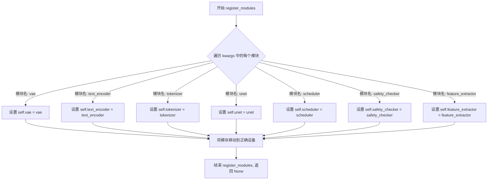
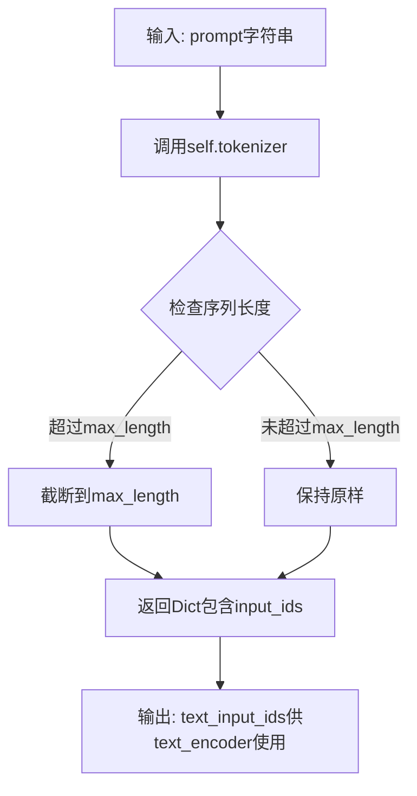
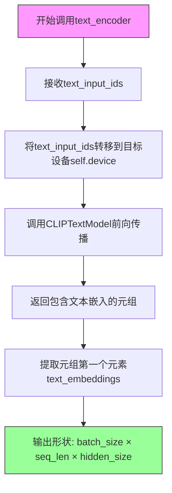
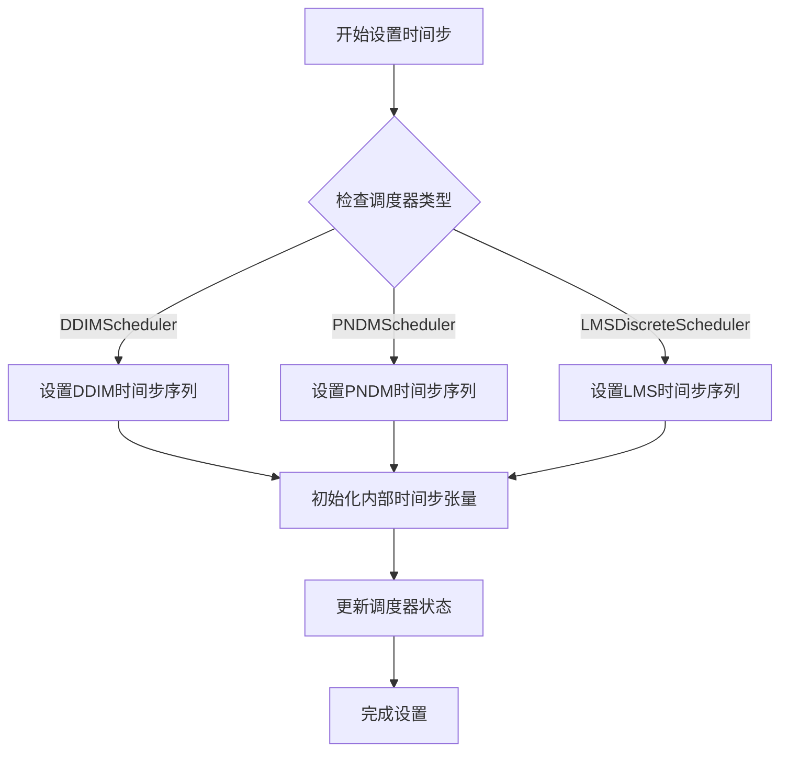
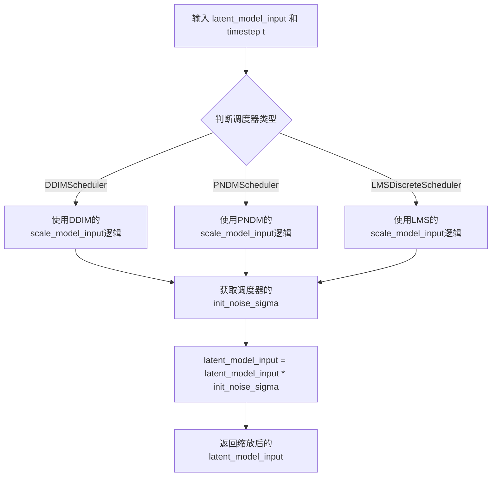
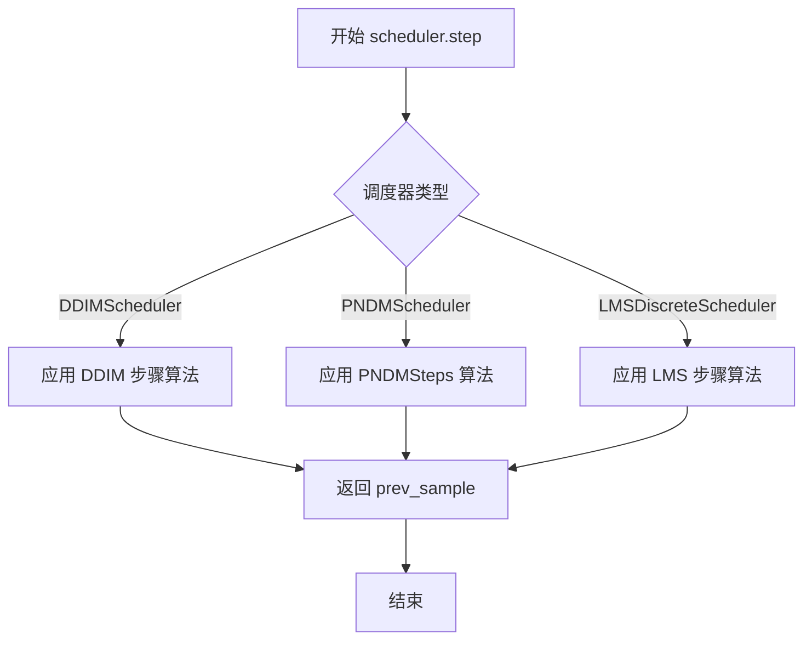
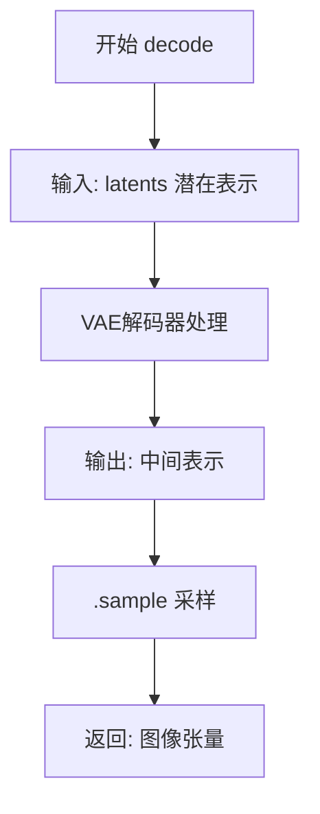
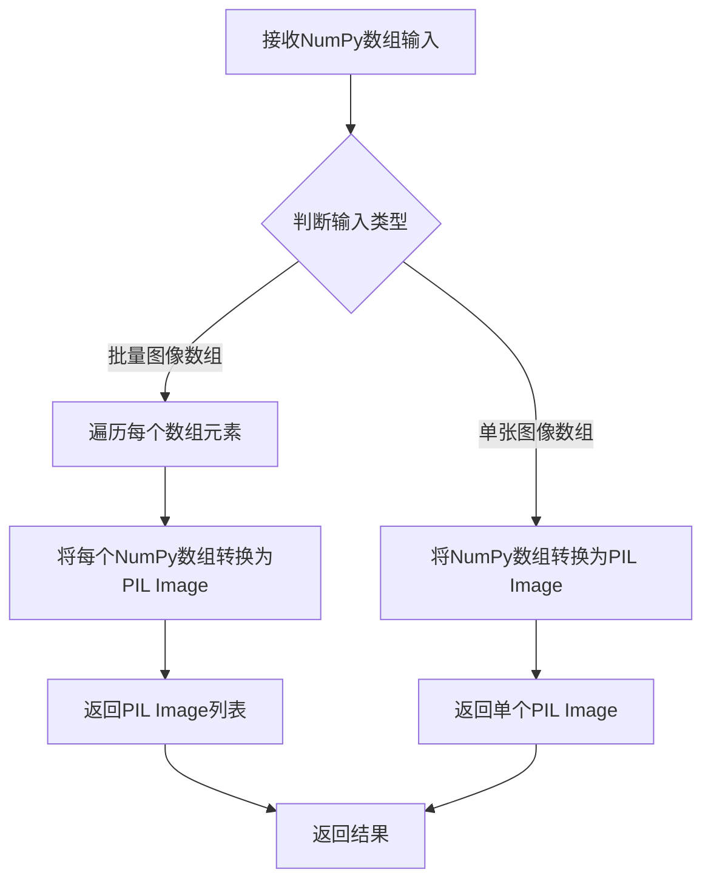
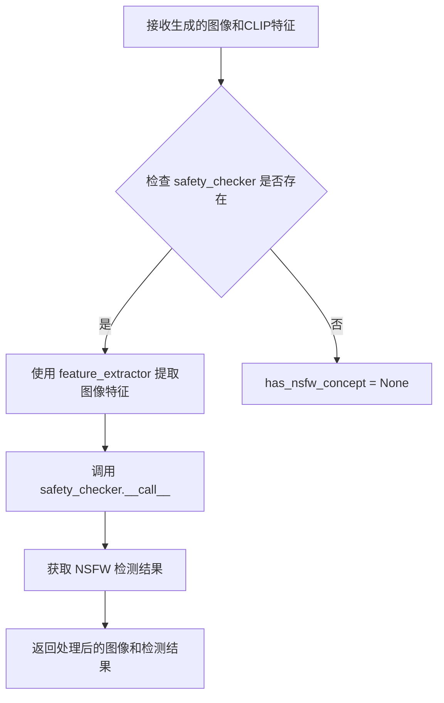
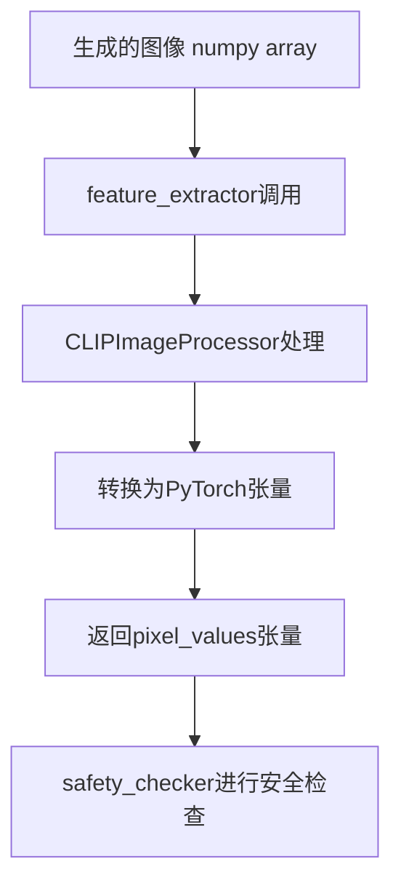

# `diffusers\examples\community\seed_resize_stable_diffusion.py` 详细设计文档

这是一个基于Hugging Face Diffusers库的Stable Diffusion文本到图像生成Pipeline，核心功能是在使用相同种子生成不同尺寸图像时，通过引用尺寸(latents_reference)的中心裁剪策略确保生成图像的相似性，同时支持NSFW内容安全检查和多种调度器。

## 整体流程

```mermaid
graph TD
    A[开始 __call__] --> B{验证prompt类型}
    B --> C{验证height和width可被8整除}
    D[获取文本嵌入] --> E{复制文本嵌入用于批量生成}
    E --> F{计算是否使用无分类器引导},
        
F --> G{获取无条件嵌入}
    G --> H[拼接条件和无条件嵌入]
    H --> I{生成或验证latents}
    I --> J[关键:SeedResize中心裁剪对齐]
    J --> K[设置调度器时间步]
    K --> L[迭代去噪过程]
    L --> M[VAE解码latents到图像]
    M --> N[安全检查NSFW]
    N --> O[输出图像或PipelineOutput]
```

## 类结构

```
DiffusionPipeline (抽象基类)
└── SeedResizeStableDiffusionPipeline (自定义实现)
    └── StableDiffusionMixin (混入类)
```

## 全局变量及字段


### `logger`
    
用于记录警告信息的日志记录器实例

类型：`logging.Logger`
    


### `batch_size`
    
批处理大小，根据prompt是字符串还是列表确定

类型：`int`
    


### `text_embeddings`
    
文本编码器生成的文本嵌入向量，用于引导图像生成

类型：`torch.Tensor`
    


### `do_classifier_free_guidance`
    
标志位，表示是否启用无分类器自由引导（CFG）

类型：`bool`
    


### `latents`
    
用于图像生成的潜在空间噪声张量

类型：`torch.Tensor`
    


### `latents_reference`
    
参考潜在变量，用于保持不同尺寸图像生成的一致性

类型：`torch.Tensor`
    


### `latents_shape`
    
当前生成任务的潜在变量形状（batch*num_images, channels, height//8, width//8）

类型：`tuple`
    


### `latents_shape_reference`
    
参考潜在变量的形状，用于计算偏移量

类型：`tuple`
    


### `dx`
    
潜在变量在宽度方向上的偏移量，用于对齐不同尺寸的噪声

类型：`int`
    


### `dy`
    
潜在变量在高度方向上的偏移量，用于对齐不同尺寸的噪声

类型：`int`
    


### `w`
    
有效区域的宽度，用于裁剪或填充操作

类型：`int`
    


### `h`
    
有效区域的高度，用于裁剪或填充操作

类型：`int`
    


### `tx`
    
目标区域在x方向的起始位置

类型：`int`
    


### `ty`
    
目标区域在y方向的起始位置

类型：`int`
    


### `timesteps_tensor`
    
调度器生成的去噪时间步张量

类型：`torch.Tensor`
    


### `extra_step_kwargs`
    
传递给调度器step方法的额外参数（如eta）

类型：`dict`
    


### `noise_pred`
    
UNet模型预测的噪声残差

类型：`torch.Tensor`
    


### `noise_pred_uncond`
    
无条件（空prompt）情况下的噪声预测

类型：`torch.Tensor`
    


### `noise_pred_text`
    
文本引导情况下的噪声预测

类型：`torch.Tensor`
    


### `image`
    
VAE解码后生成的图像张量

类型：`torch.Tensor`
    


### `has_nsfw_concept`
    
安全检查器检测到的NSFW内容标记列表

类型：`Optional[List[bool]]`
    


### `SeedResizeStableDiffusionPipeline.vae`
    
变分自编码器，用于在潜在空间和图像空间之间进行编解码

类型：`AutoencoderKL`
    


### `SeedResizeStableDiffusionPipeline.text_encoder`
    
冻结的CLIP文本编码器，将文本提示转换为嵌入向量

类型：`CLIPTextModel`
    


### `SeedResizeStableDiffusionPipeline.tokenizer`
    
CLIP分词器，用于将文本分割为token序列

类型：`CLIPTokenizer`
    


### `SeedResizeStableDiffusionPipeline.unet`
    
条件U-Net架构，用于在去噪过程中预测噪声残差

类型：`UNet2DConditionModel`
    


### `SeedResizeStableDiffusionPipeline.scheduler`
    
噪声调度器，控制去噪过程中的噪声衰减策略

类型：`Union[DDIMScheduler, PNDMScheduler, LMSDiscreteScheduler]`
    


### `SeedResizeStableDiffusionPipeline.safety_checker`
    
安全检查模块，用于检测生成图像是否包含不当内容

类型：`StableDiffusionSafetyChecker`
    


### `SeedResizeStableDiffusionPipeline.feature_extractor`
    
CLIP图像特征提取器，用于为安全检查器提取图像特征

类型：`CLIPImageProcessor`
    
    

## 全局函数及方法


### `SeedResizeStableDiffusionPipeline.__init__`

这是 `SeedResizeStableDiffusionPipeline` 类的构造函数，用于初始化整个文本到图像生成管道。它接收多个预训练模型组件（VAE、文本编码器、分词器、U-Net、调度器、安全检查器和特征提取器），并通过父类的注册机制将这些组件注册到管道中，使其可在后续的图像生成过程中被调用。

参数：

- `vae`：`AutoencoderKL`，变分自编码器(VAE)模型，用于将图像编码和解码到潜在表示
- `text_encoder`：`CLIPTextModel`，冻结的文本编码器，Stable Diffusion使用CLIP的文本部分
- `tokenizer`：`CLIPTokenizer`，CLIP分词器，用于将文本转换为token
- `unet`：`UNet2DConditionModel`，条件U-Net架构，用于对编码的图像潜在表示进行去噪
- `scheduler`：`Union[DDIMScheduler, PNDMScheduler, LMSDiscreteScheduler]`，调度器，与U-Net结合使用对图像潜在表示去噪
- `safety_checker`：`StableDiffusionSafetyChecker`，分类模块，用于评估生成的图像是否包含不当或有害内容
- `feature_extractor`：`CLIPImageProcessor`，从生成的图像中提取特征，用作安全检查器的输入

返回值：`None`，无返回值，仅完成实例属性的初始化

#### 流程图

```mermaid
flowchart TD
    A[开始 __init__] --> B[调用 super().__init__ 初始化基类]
    B --> C[调用 self.register_modules 注册所有模块]
    C --> D[注册 vae: AutoencoderKL]
    C --> E[注册 text_encoder: CLIPTextModel]
    C --> F[注册 tokenizer: CLIPTokenizer]
    C --> G[注册 unet: UNet2DConditionModel]
    C --> H[注册 scheduler: 调度器]
    C --> I[注册 safety_checker: StableDiffusionSafetyChecker]
    C --> J[注册 feature_extractor: CLIPImageProcessor]
    D --> K[结束 __init__]
    E --> K
    F --> K
    G --> K
    H --> K
    I --> K
    J --> K
```

#### 带注释源码

```python
def __init__(
    self,
    vae: AutoencoderKL,
    text_encoder: CLIPTextModel,
    tokenizer: CLIPTokenizer,
    unet: UNet2DConditionModel,
    scheduler: Union[DDIMScheduler, PNDMScheduler, LMSDiscreteScheduler],
    safety_checker: StableDiffusionSafetyChecker,
    feature_extractor: CLIPImageProcessor,
):
    """
    初始化 SeedResizeStableDiffusionPipeline 实例
    
    参数:
        vae: 用于图像编码/解码的变分自编码器模型
        text_encoder: 冻结的CLIP文本编码器
        tokenizer: CLIP分词器
        unet: 条件U-Net去噪模型
        scheduler: 去噪调度器（支持DDIM、PNDM、LMSDiscrete）
        safety_checker: 图像安全检查器
        feature_extractor: CLIP图像特征提取器
    """
    # 调用父类 DiffusionPipeline 的初始化方法
    # 这是必要的，因为需要初始化管道的基础设施
    super().__init__()
    
    # 使用 register_modules 方法注册所有模型组件
    # 这样管道可以统一管理这些模块的设备分配和保存/加载功能
    self.register_modules(
        vae=vae,
        text_encoder=text_encoder,
        tokenizer=tokenizer,
        unet=unet,
        scheduler=scheduler,
        safety_checker=safety_checker,
        feature_extractor=feature_extractor,
    )
```


### `SeedResizeStableDiffusionPipeline.__call__`

该方法是Stable Diffusion Pipeline的核心调用函数，负责根据文本提示生成图像。它集成了文本编码、噪声潜在向量生成、U-Net去噪、VAE解码等完整流程，并特别实现了"Seed Resize"功能——确保在使用相同种子但不同尺寸生成图像时能够产生视觉上一致的结果。

参数：

- `prompt`：`Union[str, List[str]]`，引导图像生成的文本提示或提示列表
- `height`：`int`，可选，默认为512，生成图像的高度（像素）
- `width`：`int`，可选，默认为512，生成图像的宽度（像素）
- `num_inference_steps`：`int`，可选，默认为50，去噪步数，越多图像质量越高但推理越慢
- `guidance_scale`：`float`，可选，默认为7.5，分类器自由引导（CFG）尺度，用于控制图像与文本提示的关联程度
- `negative_prompt`：`Optional[Union[str, List[str]]]`，可选，默认为None，不引导图像生成的提示，用于排除不需要的元素
- `num_images_per_prompt`：`int`，可选，默认为1，每个提示生成的图像数量
- `eta`：`float`，可选，默认为0.0，DDIM调度器参数，对应DDIM论文中的η参数
- `generator`：`torch.Generator | None`，可选，默认为None，用于使生成确定性的PyTorch随机数生成器
- `latents`：`Optional[torch.Tensor]`，可选，默认为None，预生成的噪声潜在向量，可用于重复相同生成
- `output_type`：`str | None`，可选，默认为"pil"，生成图像的输出格式，可选"pil"或numpy数组
- `return_dict`：`bool`，可选，默认为True，是否返回StableDiffusionPipelineOutput而不是元组
- `callback`：`Optional[Callable[[int, int, torch.Tensor], None]]`，可选，默认为None，每隔callback_steps步调用的函数，签名为callback(step, timestep, latents)
- `callback_steps`：`int`，可选，默认为1，callback函数被调用的频率
- `text_embeddings`：`Optional[torch.Tensor]`，可选，默认为None，预计算的文本嵌入，如果提供则跳过文本编码步骤

返回值：`StableDiffusionPipelineOutput` 或 `tuple`，当return_dict为True时返回包含生成图像和NSFW检测结果的输出对象，否则返回(image, has_nsfw_concept)的元组

#### 流程图

```mermaid
flowchart TD
    A[开始 __call__] --> B{检查 prompt 类型}
    B -->|str| C[batch_size = 1]
    B -->|list| D[batch_size = len(prompt)]
    B -->|其他| E[抛出 ValueError]
    
    C --> F[验证 height/width 可被8整除]
    D --> F
    F --> G[验证 callback_steps 为正整数]
    
    G --> H[获取文本嵌入]
    H --> I{text_embeddings 是否提供}
    I -->|是| J[直接使用]
    I -->|否| K[使用 text_encoder 编码]
    J --> L[复制文本嵌入 for num_images_per_prompt]
    K --> L
    
    L --> M{guidance_scale > 1.0}
    M -->|是| N[获取负面提示的 unconditional 嵌入]
    M -->|否| O[跳过 unconditional 嵌入]
    N --> P[拼接 unconditional 和 text embeddings]
    O --> P
    
    P --> Q[生成或验证 latents 形状]
    Q --> R[Seed Resize 核心逻辑]
    R --> S[计算偏移量 dx, dy]
    S --> T[将参考 latent 复制到目标位置]
    
    T --> U[设置调度器 timesteps]
    U --> V[初始化噪声: latents = latents * init_noise_sigma]
    
    V --> W[遍历 timesteps]
    W --> X{当前步是否执行 classifier-free guidance}
    X -->|是| Y[扩展 latents 为2倍]
    X -->|否| Z[保持 latents 不变]
    Y --> AA[scale_model_input]
    Z --> AA
    
    AA --> AB[U-Net 预测噪声残差]
    AB --> AC{guidance_scale > 1.0}
    AC -->|是| AD[执行 guidance: noise_pred_uncond + guidance_scale * (noise_pred_text - noise_pred_uncond)]
    AC -->|否| AE[使用原始 noise_pred]
    AD --> AF
    AE --> AF
    
    AF --> AG[scheduler.step 计算上一步的 latents]
    AG --> AH{callback 是否提供且满足调用条件}
    AH -->|是| AI[调用 callback(step_idx, t, latents)]
    AH -->|否| AJ[继续下一步]
    AI --> AJ
    AJ --> W
    
    W --> AK[去噪完成: latents = 1/0.18215 * latents]
    AK --> AL[VAE decode: image = vae.decode(latents).sample]
    AL --> AM[归一化图像: (image/2+0.5).clamp(0,1)]
    AM --> AN[转换为 numpy float32]
    
    AN --> AO{safety_checker 是否存在}
    AO -->|是| AP[运行 safety_checker 检测 NSFW]
    AO -->|否| AQ[has_nsfw_concept = None]
    AP --> AR
    AQ --> AR
    
    AR --> AS{output_type == 'pil'}
    AS -->|是| AT[转换为 PIL Image]
    AS -->|否| AU
    
    AT --> AV
    AU --> AV{return_dict}
    AV -->|是| AW[返回 StableDiffusionPipelineOutput]
    AV -->|否| AX[返回 tuple (image, has_nsfw_concept)]
```

#### 带注释源码

```python
@torch.no_grad()
def __call__(
    self,
    prompt: Union[str, List[str]],
    height: int = 512,
    width: int = 512,
    num_inference_steps: int = 50,
    guidance_scale: float = 7.5,
    negative_prompt: Optional[Union[str, List[str]]] = None,
    num_images_per_prompt: Optional[int] = 1,
    eta: float = 0.0,
    generator: torch.Generator | None = None,
    latents: Optional[torch.Tensor] = None,
    output_type: str | None = "pil",
    return_dict: bool = True,
    callback: Optional[Callable[[int, int, torch.Tensor], None]] = None,
    callback_steps: int = 1,
    text_embeddings: Optional[torch.Tensor] = None,
    **kwargs,
):
    # ============================================
    # 步骤1: 输入验证
    # ============================================
    # 确定批次大小
    if isinstance(prompt, str):
        batch_size = 1
    elif isinstance(prompt, list):
        batch_size = len(prompt)
    else:
        raise ValueError(f"`prompt` has to be of type `str` or `list` but is {type(prompt)}")

    # 验证图像尺寸必须能被8整除（VAE要求）
    if height % 8 != 0 or width % 8 != 0:
        raise ValueError(f"`height` and `width` have to be divisible by 8 but are {height} and {width}.")

    # 验证callback_steps参数有效性
    if (callback_steps is None) or (
        callback_steps is not None and (not isinstance(callback_steps, int) or callback_steps <= 0)
    ):
        raise ValueError(
            f"`callback_steps` has to be a positive integer but is {callback_steps} of type"
            f" {type(callback_steps)}."
        )

    # ============================================
    # 步骤2: 获取文本嵌入
    # ============================================
    # 将prompt tokenize为tensor
    text_inputs = self.tokenizer(
        prompt,
        padding="max_length",
        max_length=self.tokenizer.model_max_length,
        return_tensors="pt",
    )
    text_input_ids = text_inputs.input_ids

    # 截断超长文本（CLIP最大支持77 tokens）
    if text_input_ids.shape[-1] > self.tokenizer.model_max_length:
        removed_text = self.tokenizer.batch_decode(text_input_ids[:, self.tokenizer.model_max_length :])
        logger.warning(
            "The following part of your input was truncated because CLIP can only handle sequences up to"
            f" {self.tokenizer.model_max_length} tokens: {removed_text}"
        )
        text_input_ids = text_input_ids[:, : self.tokenizer.model_max_length]

    # 使用text_encoder编码得到嵌入向量（如果未提供）
    if text_embeddings is None:
        text_embeddings = self.text_encoder(text_input_ids.to(self.device))[0]

    # 复制文本嵌入以匹配每个prompt生成的图像数量
    bs_embed, seq_len, _ = text_embeddings.shape
    text_embeddings = text_embeddings.repeat(1, num_images_per_prompt, 1)
    text_embeddings = text_embeddings.view(bs_embed * num_images_per_prompt, seq_len, -1)

    # ============================================
    # 步骤3: 分类器自由引导（Classifier-Free Guidance）
    # ============================================
    # 判断是否启用CFG
    do_classifier_free_guidance = guidance_scale > 1.0
    
    # 获取unconditional embeddings用于CFG
    if do_classifier_free_guidance:
        uncond_tokens: List[str]
        if negative_prompt is None:
            uncond_tokens = [""]
        elif type(prompt) is not type(negative_prompt):
            raise TypeError(
                f"`negative_prompt` should be the same type to `prompt`, but got {type(negative_prompt)} !="
                f" {type(prompt)}."
            )
        elif isinstance(negative_prompt, str):
            uncond_tokens = [negative_prompt]
        elif batch_size != len(negative_prompt):
            raise ValueError(
                f"`negative_prompt`: {negative_prompt} has batch size {len(negative_prompt)}, but `prompt`:"
                f" {prompt} has batch size {batch_size}. Please make sure that passed `negative_prompt` matches"
                " the batch size of `prompt`."
            )
        else:
            uncond_tokens = negative_prompt

        # tokenize negative prompt
        max_length = text_input_ids.shape[-1]
        uncond_input = self.tokenizer(
            uncond_tokens,
            padding="max_length",
            max_length=max_length,
            truncation=True,
            return_tensors="pt",
        )
        uncond_embeddings = self.text_encoder(uncond_input.input_ids.to(self.device))[0]

        # 复制unconditional embeddings
        seq_len = uncond_embeddings.shape[1]
        uncond_embeddings = uncond_embeddings.repeat(batch_size, num_images_per_prompt, 1)
        uncond_embeddings = uncond_embeddings.view(batch_size * num_images_per_prompt, seq_len, -1)

        # 拼接unconditional和text embeddings以避免两次前向传播
        text_embeddings = torch.cat([uncond_embeddings, text_embeddings])

    # ============================================
    # 步骤4: 初始化潜在向量（包含Seed Resize逻辑）
    # ============================================
    # 计算潜在向量形状（height//8因为VAE的8倍下采样）
    latents_shape = (batch_size * num_images_per_prompt, self.unet.config.in_channels, height // 8, width // 8)
    # 参考形状（固定64x64用于seed对齐）
    latents_shape_reference = (batch_size * num_images_per_prompt, self.unet.config.in_channels, 64, 64)
    latents_dtype = text_embeddings.dtype
    
    if latents is None:
        # 生成随机噪声潜在向量
        if self.device.type == "mps":
            # MPS设备特殊处理（randn不存在）
            latents_reference = torch.randn(
                latents_shape_reference, generator=generator, device="cpu", dtype=latents_dtype
            ).to(self.device)
            latents = torch.randn(latents_shape, generator=generator, device="cpu", dtype=latents_dtype).to(
                self.device
            )
        else:
            latents_reference = torch.randn(
                latents_shape_reference, generator=generator, device=self.device, dtype=latents_dtype
            )
            latents = torch.randn(latents_shape, generator=generator, device=self.device, dtype=latents_dtype)
    else:
        # 验证外部提供的latents形状
        if latents_reference.shape != latents_shape:
            raise ValueError(f"Unexpected latents shape, got {latents.shape}, expected {latents_shape}")
        latents_reference = latents_reference.to(self.device)
        latents = latents.to(self.device)

    # ============================================
    # 步骤5: Seed Resize 核心逻辑
    # 确保不同尺寸图像使用相同seed时产生相似结果
    # ============================================
    # 计算目标尺寸与参考尺寸的偏移
    dx = (latents_shape[3] - latents_shape_reference[3]) // 2  # 宽度偏移
    dy = (latents_shape[2] - latents_shape_reference[2]) // 2  # 高度偏移
    
    # 计算有效区域（处理负偏移情况）
    w = latents_shape_reference[3] if dx >= 0 else latents_shape_reference[3] + 2 * dx
    h = latents_shape_reference[2] if dy >= 0 else latents_shape_reference[2] + 2 * dy
    tx = 0 if dx < 0 else dx  # 目标x偏移
    ty = 0 if dy < 0 else dy  # 目标y偏移
    dx = max(-dx, 0)
    dy = max(-dy, 0)
    
    # 将参考latent复制到目标位置（中心对齐）
    latents[:, :, ty : ty + h, tx : tx + w] = latents_reference[:, :, dy : dy + h, dx : dx + w]

    # ============================================
    # 步骤6: 去噪循环
    # ============================================
    # 设置调度器的timesteps
    self.scheduler.set_timesteps(num_inference_steps)

    # 将timesteps移到正确设备
    timesteps_tensor = self.scheduler.timesteps.to(self.device)

    # 按调度器要求初始化噪声
    latents = latents * self.scheduler.init_noise_sigma

    # 准备调度器额外参数
    accepts_eta = "eta" in set(inspect.signature(self.scheduler.step).parameters.keys())
    extra_step_kwargs = {}
    if accepts_eta:
        extra_step_kwargs["eta"] = eta

    # 迭代去噪
    for i, t in enumerate(self.progress_bar(timesteps_tensor)):
        # 扩展latents用于CFG（需要同时预测unconditional和conditional）
        latent_model_input = torch.cat([latents] * 2) if do_classifier_free_guidance else latents
        latent_model_input = self.scheduler.scale_model_input(latent_model_input, t)

        # U-Net预测噪声残差
        noise_pred = self.unet(latent_model_input, t, encoder_hidden_states=text_embeddings).sample

        # 执行分类器自由引导
        if do_classifier_free_guidance:
            noise_pred_uncond, noise_pred_text = noise_pred.chunk(2)
            noise_pred = noise_pred_uncond + guidance_scale * (noise_pred_text - noise_pred_uncond)

        # 调度器执行去噪步骤
        latents = self.scheduler.step(noise_pred, t, latents, **extra_step_kwargs).prev_sample

        # 调用回调函数（如提供）
        if callback is not None and i % callback_steps == 0:
            step_idx = i // getattr(self.scheduler, "order", 1)
            callback(step_idx, t, latents)

    # ============================================
    # 步骤7: VAE解码并后处理
    # ============================================
    # 将latents从潜在空间转换回像素空间（VAE解码器缩放因子）
    latents = 1 / 0.18215 * latents
    image = self.vae.decode(latents).sample

    # 归一化到[0,1]范围
    image = (image / 2 + 0.5).clamp(0, 1)

    # 转换为numpy float32（兼容bfloat16）
    image = image.cpu().permute(0, 2, 3, 1).float().numpy()

    # ============================================
    # 步骤8: NSFW安全检查
    # ============================================
    if self.safety_checker is not None:
        safety_checker_input = self.feature_extractor(self.numpy_to_pil(image), return_tensors="pt").to(
            self.device
        )
        image, has_nsfw_concept = self.safety_checker(
            images=image, clip_input=safety_checker_input.pixel_values.to(text_embeddings.dtype)
        )
    else:
        has_nsfw_concept = None

    # 转换为PIL格式（如需要）
    if output_type == "pil":
        image = self.numpy_to_pil(image)

    # ============================================
    # 步骤9: 返回结果
    # ============================================
    if not return_dict:
        return (image, has_nsfw_concept)

    return StableDiffusionPipelineOutput(images=image, nsfw_content_detected=has_nsfw_concept)
```


### `SeedResizeStableDiffusionPipeline.register_modules`

该方法继承自 `DiffusionPipeline` 基类，用于将传入的各个模块（VAE、文本编码器、分词器、UNet、调度器、安全检查器、特征提取器）注册到当前 pipeline 实例的对应属性中，以便后续推理时调用。

参数：

- `**kwargs`：关键字参数，包含以下模块：
  - `vae`：`AutoencoderKL`，VAE 模型，用于编解码图像 latent
  - `text_encoder`：`CLIPTextModel`，文本编码器，将文本转换为 embedding
  - `tokenizer`：`CLIPTokenizer`，分词器，对文本进行分词
  - `unet`：`UNet2DConditionModel`，条件 U-Net，用于去噪图像 latent
  - `scheduler`：`Union[DDIMScheduler, PNDMScheduler, LMSDiscreteScheduler]`，
  - `safety_checker`：`StableDiffusionSafetyChecker`，安全检查器，检测生成图像是否违规
  - `feature_extractor`：`CLIPImageProcessor`，特征提取器，提取图像特征用于安全检查

返回值：`None`，无返回值（该方法直接修改实例属性）

#### 流程图



#### 带注释源码

```python
# 该方法继承自 DiffusionPipeline，以下为推断的标准实现
def register_modules(self, **kwargs):
    """
    注册各个模块到 pipeline 实例的属性中
    
    Args:
        **kwargs: 关键字参数，包含以下模块:
            - vae: AutoencoderKL, VAE 模型
            - text_encoder: CLIPTextModel, 文本编码器
            - tokenizer: CLIPTokenizer, 分词器
            - unet: UNet2DConditionModel, 去噪模型
            - scheduler: SchedulerMixin, 调度器
            - safety_checker: StableDiffusionSafetyChecker, 安全检查器
            - feature_extractor: CLIPImageProcessor, 特征提取器
    """
    # 遍历传入的模块并注册到实例属性
    for name, module in kwargs.items():
        # 将模块赋值给实例属性，如 self.vae, self.unet 等
        setattr(self, name, module)
        
    # 将模块移动到正确的设备（如 GPU/CPU）
    # 这是 DiffusionPipeline 的标准做法，确保所有模块在同一设备上
    self.register_to_config(**kwargs)
```

#### 在 `__init__` 中的调用方式

```python
def __init__(
    self,
    vae: AutoencoderKL,
    text_encoder: CLIPTextModel,
    tokenizer: CLIPTokenizer,
    unet: UNet2DConditionModel,
    scheduler: Union[DDIMScheduler, PNDMScheduler, LMSDiscreteScheduler],
    safety_checker: StableDiffusionSafetyChecker,
    feature_extractor: CLIPImageProcessor,
):
    super().__init__()
    # 调用继承的 register_modules 方法注册所有模块
    self.register_modules(
        vae=vae,
        text_encoder=text_encoder,
        tokenizer=tokenizer,
        unet=unet,
        scheduler=scheduler,
        safety_checker=safety_checker,
        feature_extractor=feature_extractor,
    )
```


### `SeedResizeStableDiffusionPipeline.tokenizer`

CLIPTokenizer实例，将文本prompt转换为token IDs，供text_encoder生成文本嵌入。在pipeline中被调用以编码输入文本。

参数：

- `prompt`：`Union[str, List[str]]`，要编码的文本提示，可以是单个字符串或字符串列表
- `padding`：`str`，填充方式，代码中传入 `"max_length"`
- `max_length`：`int`，最大序列长度，代码中传入 `self.tokenizer.model_max_length`
- `truncation`：`bool`，是否截断（仅在negative_prompt编码时使用），值为 `True`
- `return_tensors`：`str`，返回的张量类型，代码中传入 `"pt"` 表示返回PyTorch张量

返回值：`Dict`，返回包含以下键的字典：
- `input_ids`：`torch.Tensor`，编码后的token IDs张量

#### 流程图



#### 带注释源码

```python
# 在__call__方法中，tokenizer被调用两次：
# 第一次：对正向提示进行编码
text_inputs = self.tokenizer(
    prompt,                          # 输入的文本prompt，str或List[str]类型
    padding="max_length",           # 填充方式，填充到最大长度
    max_length=self.tokenizer.model_max_length,  # 使用tokenizer的最大模型长度限制
    return_tensors="pt",            # 返回PyTorch张量
)
text_input_ids = text_inputs.input_ids  # 提取编码后的token IDs

# 如果序列长度超过限制，截断并警告
if text_input_ids.shape[-1] > self.tokenizer.model_max_length:
    removed_text = self.tokenizer.batch_decode(text_input_ids[:, self.tokenizer.model_max_length:])
    logger.warning(
        "The following part of your input was truncated because CLIP can only handle sequences up to"
        f" {self.tokenizer.model_max_length} tokens: {removed_text}"
    )
    text_input_ids = text_input_ids[:, :self.tokenizer.model_max_length]

# 第二次（如果使用classifier-free guidance）：对负向提示进行编码
if do_classifier_free_guidance:
    max_length = text_input_ids.shape[-1]
    uncond_input = self.tokenizer(
        uncond_tokens,               # negative_prompt
        padding="max_length",
        max_length=max_length,       # 使用与正向提示相同的长度
        truncation=True,             # 启用截断
        return_tensors="pt",
    )
    uncond_embeddings = self.text_encoder(uncond_input.input_ids.to(self.device))[0]
```

#### 额外说明

`tokenizer` 是 `CLIPTokenizer` 类的实例，来自 `transformers` 库。在 `SeedResizeStableDiffusionPipeline` 中通过 `register_modules` 注册为模块。其核心功能是将自然语言文本转换为模型可处理的token ID序列，这是Stable Diffusion文本到图像生成流程的第一步。代码中特别处理了序列长度超过模型最大长度的情况，确保兼容性。


### `SeedResizeStableDiffusionPipeline.text_encoder`

该方法是对传入的CLIPTextModel（文本编码器）的调用，用于将token化后的文本输入IDs转换为文本嵌入向量（text embeddings），以便后续在图像生成过程中作为条件信息传递给UNet模型。

参数：

- `text_input_ids`：`torch.Tensor`，经过tokenizer处理并转换为张量的文本输入IDs，形状为(batch_size, sequence_length)
- `device`：`torch.device`，目标设备（通过`.to(self.device)`转移），指定在哪个设备上进行计算

返回值：`tuple(torch.Tensor, ...]`（具体返回结构取决于CLIPTextModel的实现），其中第一个元素`[0]`是文本嵌入向量，形状为(batch_size, sequence_length, hidden_size)

#### 流程图



#### 带注释源码

```python
# 在__call__方法中调用text_encoder的上下文代码

# 步骤1: 使用tokenizer处理prompt，得到包含input_ids和attention_mask的字典
text_inputs = self.tokenizer(
    prompt,
    padding="max_length",
    max_length=self.tokenizer.model_max_length,
    return_tensors="pt",
)
text_input_ids = text_inputs.input_ids

# 步骤2: 检查token长度是否超过模型最大长度，若超过则截断并警告
if text_input_ids.shape[-1] > self.tokenizer.model_max_length:
    removed_text = self.tokenizer.batch_decode(text_input_ids[:, self.tokenizer.model_max_length:])
    logger.warning(
        "The following part of your input was truncated because CLIP can only handle sequences up to"
        f" {self.tokenizer.model_max_length} tokens: {removed_text}"
    )
    text_input_ids = text_input_ids[:, :self.tokenizer.model_max_length]

# 步骤3: 如果未提供预计算的text_embeddings，则调用text_encoder进行编码
# text_encoder是CLIPTextModel实例，来自transformers库
if text_embeddings is None:
    # [核心调用] 将text_input_ids转移到目标设备，然后调用text_encoder
    # CLIPTextModel返回包含隐藏状态和额外输出的元组
    # [0]表示取第一个元素，即文本嵌入向量（hidden states）
    text_embeddings = self.text_encoder(text_input_ids.to(self.device))[0]

# 后续处理：复制文本嵌入以匹配每个prompt生成的图像数量
bs_embed, seq_len, _ = text_embeddings.shape
text_embeddings = text_embeddings.repeat(1, num_images_per_prompt, 1)
text_embeddings = text_embeddings.view(bs_embed * num_images_per_prompt, seq_len, -1)
```


### `scheduler.set_timesteps`

该方法是调度器（scheduler）的内部方法，在 `SeedResizeStableDiffusionPipeline` 的 `__call__` 方法中被调用，用于设置扩散模型的推理时间步。

参数：

- `num_inference_steps`：`int`，推理步数，即去噪过程的迭代次数

返回值：`None`（该方法直接修改调度器内部状态，不返回任何值）

#### 流程图



#### 带注释源码

```python
# 在 SeedResizeStableDiffusionPipeline.__call__ 方法中调用
# 位置大约在第 247-248 行

# set timesteps
# 设置推理过程中的时间步序列
# 根据不同的调度器类型（DDIM/PNDM/LMS），生成对应的时间步序列
# 这些时间步将决定去噪过程的迭代顺序和步数
self.scheduler.set_timesteps(num_inference_steps)
```


### scheduler.scale_model_input

该方法是diffusers库中调度器（SchedulerMixin）的成员方法，用于在扩散模型的推理过程中根据当前时间步（timestep）缩放输入的潜在表示（latents）。这是扩散模型去噪流程中的关键预处理步骤，确保latents与调度器的噪声时间表（noise schedule）相匹配。

参数：

- `latent_model_input`：`torch.Tensor`，从噪声潜在表示或上一步去噪结果复制而来的输入张量，通常包含条件和无条件两份副本（当使用classifier-free guidance时）
- `t`：`int` 或 `torch.Tensor`，当前推理步骤的时间步（timestep），用于确定噪声缩放因子

返回值：`torch.Tensor`，缩放后的潜在表示，其值根据调度器的噪声sigma进行缩放，以适配UNet的输入要求

#### 流程图



#### 带注释源码

```python
# 在StableDiffusionPipeline.__call__方法中的调用上下文
# 第273行附近

# 扩展latents（如果使用classifier-free guidance）
# 当guidance_scale > 1.0时，需要同时处理有条件和无条件的noise prediction
latent_model_input = torch.cat([latents] * 2) if do_classifier_free_guidance else latents

# 调用调度器的scale_model_input方法缩放输入
# 这个方法根据当前timestep t调整latent_model_input的数值范围
# 对于DDIM调度器：这通常是将latents乘以scheduler.init_noise_sigma
# 对于PNDM调度器：可能执行更复杂的线性插值
# 对于LMSDiscrete调度器：可能结合sigma值进行缩放
latent_model_input = self.scheduler.scale_model_input(latent_model_input, t)
```


### `scheduler.step`

在 `SeedResizeStableDiffusionPipeline.__call__` 方法中调度的去噪步骤方法，用于根据预测的噪声计算前一个时间步的潜在表示。

参数：

- `noise_pred`：`torch.Tensor`，模型预测的噪声残差
- `t`：`torch.Tensor` 或 `int`，当前的时间步
- `latents`：`torch.Tensor`，当前的潜在表示（噪声图像）
- `**extra_step_kwargs`：额外的关键字参数，如 `eta`（仅 DDIM 调度器使用）

返回值：`torch.Tensor`，去噪后的前一个时间步的潜在表示（`prev_sample` 属性）

#### 流程图



#### 带注释源码

```python
# 在 SeedResizeStableDiffusionPipeline.__call__ 方法中调用 scheduler.step
# 用于执行扩散模型的去噪过程

# 1. 准备额外参数（eta 仅用于 DDIMScheduler）
accepts_eta = "eta" in set(inspect.signature(self.scheduler.step).parameters.keys())
extra_step_kwargs = {}
if accepts_eta:
    extra_step_kwargs["eta"] = eta

# 2. 遍历所有时间步进行去噪
for i, t in enumerate(self.progress_bar(timesteps_tensor)):
    # 扩展潜在表示以进行无分类器引导
    latent_model_input = torch.cat([latents] * 2) if do_classifier_free_guidance else latents
    latent_model_input = self.scheduler.scale_model_input(latent_model_input, t)

    # 使用 UNet 预测噪声残差
    noise_pred = self.unet(latent_model_input, t, encoder_hidden_states=text_embeddings).sample

    # 执行分类器自由引导
    if do_classifier_free_guidance:
        noise_pred_uncond, noise_pred_text = noise_pred.chunk(2)
        noise_pred = noise_pred_uncond + guidance_scale * (noise_pred_text - noise_pred_uncond)

    # 调用调度器的 step 方法计算前一个时间步的潜在表示
    # scheduler.step 是核心的去噪步骤，根据不同调度器实现不同的采样算法
    latents = self.scheduler.step(noise_pred, t, latents, **extra_step_kwargs).prev_sample

    # 可选：调用回调函数
    if callback is not None and i % callback_steps == 0:
        step_idx = i // getattr(self.scheduler, "order", 1)
        callback(step_idx, t, latents)
```

#### 补充说明

`scheduler.step` 方法的具体实现取决于使用的调度器类型：

- **DDIMScheduler**: 实现 DDIM（Denoising Diffusion Implicit Models）采样算法，支持 `eta` 参数控制随机性
- **PNDMScheduler**: 实现 PNDM（Pseudo Numerical Methods for Diffusion Models）采样算法，通常收敛更快
- **LMSDiscreteScheduler**: 实现 LMS（Linear Multistep Scheduler）采样算法，使用线性多步方法

该方法的核心功能是根据当前时间步的噪声预测，计算并返回去噪后的潜在表示（`prev_sample`），从而推动扩散过程从 $x_t$ 演进到 $x_{t-1}$。


### `vae.decode`

该方法为变分自编码器（VAE）的解码函数，负责将经过UNet去噪处理后的潜在表示（latents）转换为实际的图像张量。这是Stable Diffusion pipeline中从潜在空间到图像空间的最后一步转换过程。

参数：

- `latents`：`torch.Tensor`，经过UNet去噪处理后的潜在表示，形状为(batch_size, 4, height//8, width//8)

返回值：`torch.Tensor`，解码后的图像张量，包含.sample属性返回的像素值数据

#### 流程图



#### 带注释源码

```python
# 在Stable Diffusion pipeline中的调用位置（__call__方法内）：

# 1. 对潜在表示进行缩放（Inverse scaling）
# latents 在去噪过程中被缩放，需要还原到原始scale
latents = 1 / 0.18215 * latents

# 2. 调用VAE的decode方法将潜在表示解码为图像
# 参数: latents - 经过UNet去噪后的潜在表示张量
# 返回: 包含.sample属性的DecodeOutput对象
image = self.vae.decode(latents).sample
```

#### 详细说明

**调用上下文**：

- 该方法在`__call__`方法的去噪循环之后被调用
- 此时`latents`已经过所有去噪步骤处理，包含了图像的潜在表示

**返回值处理**：

- `.sample`属性提取VAE解码后的图像数据
- 后续会对图像进行归一化处理（除以2加0.5，然后clamp到[0,1]范围）
- 最终转换为numpy数组或PIL图像格式输出

**技术细节**：

- 缩放因子`0.18215`是VAE训练时使用的缩放系数，用于将潜在表示规范化到合适的数据范围


### `SeedResizeStableDiffusionPipeline.numpy_to_pil`

该方法继承自`StableDiffusionMixin`类，用于将NumPy数组格式的图像数据转换为PIL图像对象，以便于后续的图像处理和输出。

参数：

-  `numpy_array`：`numpy.ndarray`，需要转换的NumPy数组，通常是形状为`(height, width, channels)`的图像数据，通道顺序为RGB，值范围在[0, 255]或[0, 1]

返回值：`PIL.Image.Image`或`List[PIL.Image.Image]`，转换后的PIL图像对象，如果是批量图像则返回列表

#### 流程图



#### 带注释源码

```
# 注：此方法继承自 StableDiffusionMixin 类，未在此代码文件中直接定义
# 以下为基于diffusers库的标准实现推断

def numpy_to_pil(images):
    """
    Convert a numpy image or a batch of images to PIL Image object(s).
    
    Args:
        images (`np.ndarray` or `List[np.ndarray]`):
            The input image(s) to convert. Can be:
            - A single image array of shape (height, width, channels)
            - A batch of images of shape (batch_size, height, width, channels)
            
    Returns:
        `PIL.Image.Image` or `List[PIL.Image.Image]`:
            The converted PIL Image(s). Returns a single Image if input is a single
            array, otherwise returns a list of Images.
    """
    if isinstance(images, np.ndarray):
        # Handle single image
        if images.ndim == 3:
            # Convert CHW to HWC if needed (channels first)
            if images.shape[0] == 3:
                images = images.transpose(1, 2, 0)
            # Convert to uint8 if in float format [0, 1]
            if images.dtype == np.float32 or images.dtype == np.float64:
                if images.max() <= 1.0:
                    images = (images * 255).astype(np.uint8)
            return Image.fromarray(images)
    elif isinstance(images, list):
        # Handle batch of images
        return [numpy_to_pil(img) for img in images]
    
    raise ValueError(f"Unsupported image format: {type(images)}")
```

#### 补充说明

- **来源**：此方法继承自`diffusers.pipelines.pipeline_utils.StableDiffusionMixin`类
- **使用场景**：在`__call__`方法中，当`output_type`参数设置为`"pil"`时调用，用于将VAE解码后的NumPy数组图像转换为PIL格式以便输出
- **数据流**：VAE解码输出 → NumPy数组(形状: [B, H, W, C]) → PIL Image对象
- **设计目标**：提供统一的图像格式转换接口，简化图像输出流程
- **外部依赖**：PIL(Pillow)库、NumPy库


### `SeedResizeStableDiffusionPipeline.safety_checker`

该方法是 `StableDiffusionSafetyChecker` 类的调用接口，用于检查生成的图像是否包含可能被认为是令人反感或有害的内容（NSFW）。在推理过程中，管道会将生成的图像和从图像中提取的 CLIP 特征传入安全检查器，以判断是否存在不安全内容。

参数：

- `images`：`torch.Tensor` 或 `numpy.ndarray`，需要检查的图像数据，通常是经过去噪和后处理的图像张量
- `clip_input`：`torch.Tensor`，从图像中使用 `feature_extractor` 提取的 CLIP 特征向量，用于辅助判断图像内容

返回值：`(torch.Tensor | numpy.ndarray, torch.Tensor | numpy.ndarray | None)`，返回两个值——第一个是处理后的图像（如果安全检查器会对图像进行处理），第二个是布尔值或布尔列表，表示对应图像是否包含不安全内容

#### 流程图



#### 带注释源码

```python
# 在 SeedResizeStableDiffusionPipeline.__call__ 方法中调用 safety_checker 的代码片段

if self.safety_checker is not None:
    # 使用特征提取器将numpy图像转换为PyTorch张量
    safety_checker_input = self.feature_extractor(self.numpy_to_pil(image), return_tensors="pt").to(
        self.device
    )
    # 调用安全检查器的__call__方法进行NSFW检测
    # 参数:
    #   - images: 需要检查的图像 (numpy array)
    #   - clip_input: CLIP模型输入 (PyTorch tensor)
    # 返回:
    #   - image: 处理后的图像
    #   - has_nsfw_concept: 检测结果列表
    image, has_nsfw_concept = self.safety_checker(
        images=image, clip_input=safety_checker_input.pixel_values.to(text_embeddings.dtype)
    )
else:
    # 如果没有配置安全检查器，则NSFW检测结果为None
    has_nsfw_concept = None
```


### `SeedResizeStableDiffusionPipeline.feature_extractor`

feature_extractor是SeedResizeStableDiffusionPipeline类中的一个CLIPImageProcessor类型属性，用于从生成的图像中提取特征向量，以便安全检查器（safety_checker）能够判断图像是否包含不当内容。

参数：

- 无（该属性是类初始化时传入的CLIPImageProcessor实例，在__call__方法中作为实例方法调用）

返回值：`torch.Tensor`，返回提取的图像特征张量，用于后续的安全检查

#### 流程图



#### 带注释源码

```python
# feature_extractor 是 CLIPImageProcessor 类型的实例
# 在 __init__ 中通过参数传入并注册
self.register_modules(
    ...
    safety_checker=safety_checker,
    feature_extractor=feature_extractor,  # CLIPImageProcessor实例
)

# 在 __call__ 方法中被调用，用于提取图像特征
# 以下是调用位置和上下文：
if self.safety_checker is not None:
    # 使用 feature_extractor 将numpy图像转换为PyTorch张量
    # 并提取CLIP特征用于安全检查
    safety_checker_input = self.feature_extractor(
        self.numpy_to_pil(image),  # 将numpy数组转换为PIL图像
        return_tensors="pt"        # 返回PyTorch张量
    ).to(self.device)
    
    # 将特征传递给safety_checker进行推理
    image, has_nsfw_concept = self.safety_checker(
        images=image, 
        clip_input=safety_checker_input.pixel_values.to(text_embeddings.dtype)
    )
```

> 注意：feature_extractor本身不是在该代码中定义的函数或方法，而是从外部传入的CLIPImageProcessor实例。代码中通过self.feature_extractor调用该对象的__call__方法来实现特征提取功能。


### `SeedResizeStableDiffusionPipeline.progress_bar`

这是一个继承自 `DiffusionPipeline` 基类的方法，用于在推理过程中显示去噪步骤的进度条。

参数：

-  `iterator`：任意可迭代对象（通常是 `torch.Tensor`），需要进行迭代并显示进度的数据

返回值：迭代器，返回输入的可迭代对象，但在迭代过程中会显示进度条

#### 流程图

```mermaid
flowchart TD
    A[开始] --> B[接收迭代器 iterator]
    B --> C[检查是否需要显示进度条]
    C -->|是| D[使用 tqdm 创建带进度条的迭代器]
    C -->|否| E[直接返回原始迭代器]
    D --> F[返回带进度条的迭代器]
    E --> F
    F[结束]
    
    subgraph "调用处"
    G[在 __call__ 中调用: for i, t in enumerate(self.progress_bar(timesteps_tensor))]
    end
    
    F --> G
```

#### 带注释源码

```python
# progress_bar 方法定义在 DiffusionPipeline 基类中
# 以下是基于其在代码中使用方式的推断实现

def progress_bar(self, iterator):
    """
    为迭代器添加进度条显示功能。
    
    该方法继承自 DiffusionPipeline 基类，内部使用 tqdm 库来实现进度条。
    在 Stable Diffusion 的去噪循环中，每个时间步都会通过此方法进行迭代，
    从而向用户展示当前的推理进度。
    
    参数:
        iterator: 任意可迭代对象，如时间步张量 timesteps_tensor
        
    返回:
        包装后的迭代器，迭代时显示进度条
    """
    # 实际实现位于 diffusers/src/diffusers/pipelines/pipeline_utils.py 中
    # 大致实现逻辑如下（简化版）:
    
    try:
        from tqdm.auto import tqdm
        return tqdm(iterator)
    except ImportError:
        # 如果没有安装 tqdm，回退到普通迭代器
        return iterator


# 在 __call__ 方法中的实际使用方式:
# for i, t in enumerate(self.progress_bar(timesteps_tensor)):
#     # 展开 latents（如果使用无分类器指导）
#     latent_model_input = torch.cat([latents] * 2) if do_classifier_free_guidance else latents
#     latent_model_input = self.scheduler.scale_model_input(latent_model_input, t)
#     
#     # 预测噪声残差
#     noise_pred = self.unet(latent_model_input, t, encoder_hidden_states=text_embeddings).sample
#     
#     # 执行引导
#     if do_classifier_free_guidance:
#         noise_pred_uncond, noise_pred_text = noise_pred.chunk(2)
#         noise_pred = noise_pred_uncond + guidance_scale * (noise_pred_text - noise_pred_uncond)
#     
#     # 计算前一个噪声样本 x_t -> x_t-1
#     latents = self.scheduler.step(noise_pred, t, latents, **extra_step_kwargs).prev_sample
#     
#     # 如果提供了回调，则调用
#     if callback is not None and i % callback_steps == 0:
#         step_idx = i // getattr(self.scheduler, "order", 1)
#         callback(step_idx, t, latents)
```

#### 备注

`progress_bar` 方法的具体实现位于 `diffusers` 库的基类 `DiffusionPipeline` 中，未在此代码文件中直接显示。从代码中的使用方式可以推断：

1. **输入**：`timesteps_tensor` - 调度器生成的时间步张量
2. **输出**：逐个时间步的迭代器
3. **功能**：为每个去噪步骤显示进度，让用户了解推理进度
4. **依赖**：通常依赖 `tqdm` 库来显示进度条

这个方法是 `diffusers` 库中所有扩散管道的标准组件，提供了一种用户友好的方式来显示长时间运行的推理任务的进度。


### `SeedResizeStableDiffusionPipeline.__init__`

该方法是 `SeedResizeStableDiffusionPipeline` 类的构造函数，用于初始化文本到图像生成管道。它接收并注册多个核心模型组件（VAE、文本编码器、分词器、U-Net、调度器、安全检查器和特征提取器），并通过 `register_modules` 方法将它们注册到管道中，以便在后续的图像生成过程中使用。

参数：

- `vae`：`AutoencoderKL`，变分自编码器模型，用于将图像编码和解码到潜在表示空间
- `text_encoder`：`CLIPTextModel`，冻结的文本编码器，Stable Diffusion 使用 CLIP 的文本部分
- `tokenizer`：`CLIPTokenizer`，用于将文本提示转换为令牌
- `unet`：`UNet2DConditionModel`，条件 U-Net 架构，用于对编码的图像潜在表示进行去噪
- `scheduler`：`Union[DDIMScheduler, PNDMScheduler, LMSDiscreteScheduler]`，与 `unet` 配合使用去噪的调度器
- `safety_checker`：`StableDiffusionSafetyChecker`，分类模块，用于评估生成的图像是否包含不当或有害内容
- `feature_extractor`：`CLIPImageProcessor`，从生成的图像中提取特征以供安全检查器使用

返回值：`None`，构造函数无返回值

#### 流程图

```mermaid
flowchart TD
    A[开始 __init__] --> B[调用 super().__init__]
    B --> C[调用 self.register_modules 注册所有模块]
    C --> D[注册 vae]
    C --> E[注册 text_encoder]
    C --> F[注册 tokenizer]
    C --> G[注册 unet]
    C --> H[注册 scheduler]
    C --> I[注册 safety_checker]
    C --> J[注册 feature_extractor]
    D --> K[结束 __init__]
    E --> K
    F --> K
    G --> K
    H --> K
    I --> K
    J --> K
```

#### 带注释源码

```python
def __init__(
    self,
    vae: AutoencoderKL,  # 变分自编码器，用于图像编码/解码
    text_encoder: CLIPTextModel,  # CLIP文本编码器
    tokenizer: CLIPTokenizer,  # CLIP分词器
    unet: UNet2DConditionModel,  # 条件U-Net去噪模型
    scheduler: Union[DDIMScheduler, PNDMScheduler, LMSDiscreteScheduler],  # 去噪调度器
    safety_checker: StableDiffusionSafetyChecker,  # 安全检查器
    feature_extractor: CLIPImageProcessor,  # 特征提取器
):
    """
    初始化 SeedResizeStableDiffusionPipeline 管道
    
    参数:
        vae: 变分自编码器模型，用于编码和解码图像潜在表示
        text_encoder: CLIP文本编码器模型
        tokenizer: CLIP分词器
        unet: 条件U-Net架构，用于去噪图像潜在表示
        scheduler: 去噪调度器，支持DDIM、PNDM和LMSDiscrete
        safety_checker: 安全检查器，用于过滤不当内容
        feature_extractor: 特征提取器，用于提取图像特征供安全检查器使用
    """
    # 调用父类 DiffusionPipeline 的初始化方法
    super().__init__()
    
    # 将所有模块注册到管道中，使其可以通过 self.<module_name> 访问
    self.register_modules(
        vae=vae,
        text_encoder=text_encoder,
        tokenizer=tokenizer,
        unet=unet,
        scheduler=scheduler,
        safety_checker=safety_checker,
        feature_extractor=feature_extractor,
    )
```


### `SeedResizeStableDiffusionPipeline.__call__`

这是该Pipeline的核心推理方法，实现基于Stable Diffusion的文本到图像生成功能，并通过"Seed Resize"技术确保在使用相同种子但不同尺寸时能生成视觉相似的图像。

参数：

- `prompt`：`Union[str, List[str]]`，用于指导图像生成的文本提示，支持单个字符串或字符串列表
- `height`：`int`，可选，默认值512，生成图像的高度（像素）
- `width`：`int`，可选，默认值512，生成图像的宽度（像素）
- `num_inference_steps`：`int`，可选，默认值50，去噪步数，越多通常图像质量越高但推理越慢
- `guidance_scale`：`float`，可选，默认值7.5，分类器自由引导（Classifier-Free Guidance）权重，越高越贴近文本提示
- `negative_prompt`：`Optional[Union[str, List[str]]]`，可选，用于反向引导的提示，生成时避免出现相关内容
- `num_images_per_prompt`：`Optional[int]`，可选，默认值1，每个提示生成的图像数量
- `eta`：`float`，可选，默认值0.0，DDIM调度器的η参数，仅对DDIMScheduler有效
- `generator`：`torch.Generator | None`，可选，用于确保生成确定性的随机数生成器
- `latents`：`Optional[torch.Tensor]`，可选，预生成的噪声潜在向量，如不提供则随机生成
- `output_type`：`str | None`，可选，默认值"pil"，输出格式，可选"pil"或"np"
- `return_dict`：`bool`，可选，默认值True，是否返回字典格式的输出
- `callback`：`Optional[Callable[[int, int, torch.Tensor], None]]`，可选，每隔callback_steps步调用的回调函数
- `callback_steps`：`int`，可选，默认值1，回调函数被调用的频率
- `text_embeddings`：`Optional[torch.Tensor]`，可选，预计算的文本嵌入，如不提供则实时计算

返回值：`Union[StableDiffusionPipelineOutput, tuple]`，当return_dict为True时返回StableDiffusionPipelineOutput对象，包含生成图像和NSFW检测结果；否则返回元组(image, has_nsfw_concept)

#### 流程图

```mermaid
flowchart TD
    A[开始 __call__] --> B{验证 prompt 类型}
    B -->|str| C[batch_size = 1]
    B -->|list| D[batch_size = len(prompt)]
    B -->|其他| E[抛出 ValueError]
    C --> F{验证 height/width 能被8整除}
    D --> F
    F -->|否| G[抛出 ValueError]
    F -->|是| H{验证 callback_steps}
    H -->|无效| I[抛出 ValueError]
    H -->|有效| J[获取文本嵌入]
    
    J --> K{检查 text_embeddings}
    K -->|None| L[调用 text_encoder 获取嵌入]
    K -->|已提供| M[使用提供的嵌入]
    L --> N[复制嵌入以匹配 num_images_per_prompt]
    M --> N
    
    N --> O{guidance_scale > 1.0?}
    O -->|是| P[准备无条件嵌入 negative_prompt]
    O -->|否| Q[跳过无条件嵌入]
    P --> R[合并无条件嵌入和文本嵌入]
    Q --> R
    
    R --> S{latents 是否为 None?}
    S -->|是| T[生成随机 latents]
    S -->|否| U[使用提供的 latents]
    T --> V[计算 Seed Resize 调整]
    U --> V
    
    V --> W[设置调度器时间步]
    W --> X[初始化噪声: latents *= init_noise_sigma]
    
    X --> Y[循环遍历 timesteps]
    Y --> Z{执行分类器自由引导?}
    Z -->|是| AA[扩展 latents 为2倍]
    Z -->|否| AB[使用原始 latents]
    AA --> AC[缩放模型输入]
    AB --> AC
    
    AC --> AD[UNet 预测噪声]
    AD --> AE{do_classifier_free_guidance?}
    AE -->|是| AF[分离无条件和文本噪声预测]
    AE -->|否| AG[使用原始噪声预测]
    AF --> AH[计算引导后的噪声]
    AG --> AI[调度器步骤更新 latents]
    
    AH --> AI
    AI --> AJ[调用 callback 如需要]
    AJ --> AK{还有更多时间步?}
    AK -->|是| Y
    AK -->|否| AL[解码 latents 为图像]
    
    AL --> AM[归一化图像到 [0,1]]
    AM --> AN{有 safety_checker?}
    AN -->|是| AO[执行安全检查]
    AN -->|否| AP[has_nsfw_concept = None]
    AO --> AP
    
    AP --> AQ{output_type == 'pil'?}
    AQ -->|是| AR[转换为 PIL 图像]
    AQ -->|否| AS[保持 numpy 数组]
    AR --> AT{return_dict?}
    AS --> AT
    
    AT -->|是| AU[返回 StableDiffusionPipelineOutput]
    AT -->|否| AV[返回元组]
    AU --> AV[结束]
```

#### 带注释源码

```python
@torch.no_grad()
def __call__(
    self,
    prompt: Union[str, List[str]],
    height: int = 512,
    width: int = 512,
    num_inference_steps: int = 50,
    guidance_scale: float = 7.5,
    negative_prompt: Optional[Union[str, List[str]]] = None,
    num_images_per_prompt: Optional[int] = 1,
    eta: float = 0.0,
    generator: torch.Generator | None = None,
    latents: Optional[torch.Tensor] = None,
    output_type: str | None = "pil",
    return_dict: bool = True,
    callback: Optional[Callable[[int, int, torch.Tensor], None]] = None,
    callback_steps: int = 1,
    text_embeddings: Optional[torch.Tensor] = None,
    **kwargs,
):
    # ============================================================
    # 步骤1: 输入验证 - 确定 batch_size
    # ============================================================
    if isinstance(prompt, str):
        batch_size = 1
    elif isinstance(prompt, list):
        batch_size = len(prompt)
    else:
        raise ValueError(f"`prompt` has to be of type `str` or `list` but is {type(prompt)}")

    # 验证图像尺寸必须能被8整除（VAE的压缩因子）
    if height % 8 != 0 or width % 8 != 0:
        raise ValueError(f"`height` and `width` have to be divisible by 8 but are {height} and {width}.")

    # 验证回调步数必须是正整数
    if (callback_steps is None) or (
        callback_steps is not None and (not isinstance(callback_steps, int) or callback_steps <= 0)
    ):
        raise ValueError(
            f"`callback_steps` has to be a positive integer but is {callback_steps} of type"
            f" {type(callback_steps)}."
        )

    # ============================================================
    # 步骤2: 获取文本嵌入 (Text Embeddings)
    # ============================================================
    # 使用 tokenizer 将文本转换为 token IDs
    text_inputs = self.tokenizer(
        prompt,
        padding="max_length",
        max_length=self.tokenizer.model_max_length,
        return_tensors="pt",
    )
    text_input_ids = text_inputs.input_ids

    # 截断超出模型最大长度的文本
    if text_input_ids.shape[-1] > self.tokenizer.model_max_length:
        removed_text = self.tokenizer.batch_decode(text_input_ids[:, self.tokenizer.model_max_length :])
        logger.warning(
            "The following part of your input was truncated because CLIP can only handle sequences up to"
            f" {self.tokenizer.model_max_length} tokens: {removed_text}"
        )
        text_input_ids = text_input_ids[:, : self.tokenizer.model_max_length]

    # 如果未提供 text_embeddings，则通过 text_encoder 编码获取
    if text_embeddings is None:
        text_embeddings = self.text_encoder(text_input_ids.to(self.device))[0]

    # 为每个提示的每个生成复制文本嵌入
    bs_embed, seq_len, _ = text_embeddings.shape
    text_embeddings = text_embeddings.repeat(1, num_images_per_prompt, 1)
    text_embeddings = text_embeddings.view(bs_embed * num_images_per_prompt, seq_len, -1)

    # ============================================================
    # 步骤3: 准备分类器自由引导 (Classifier-Free Guidance)
    # ============================================================
    # guidance_scale > 1 时启用无分类器引导
    do_classifier_free_guidance = guidance_scale > 1.0
    
    if do_classifier_free_guidance:
        # 处理负面提示
        if negative_prompt is None:
            uncond_tokens = [""]
        elif type(prompt) is not type(negative_prompt):
            raise TypeError(
                f"`negative_prompt` should be the same type to `prompt`, but got {type(negative_prompt)} !="
                f" {type(prompt)}."
            )
        elif isinstance(negative_prompt, str):
            uncond_tokens = [negative_prompt]
        elif batch_size != len(negative_prompt):
            raise ValueError(
                f"`negative_prompt`: {negative_prompt} has batch size {len(negative_prompt)}, but `prompt`:"
                f" {prompt} has batch size {batch_size}. Please make sure that passed `negative_prompt` matches"
                " the batch size of `prompt`."
            )
        else:
            uncond_tokens = negative_prompt

        # 编码无条件嵌入
        max_length = text_input_ids.shape[-1]
        uncond_input = self.tokenizer(
            uncond_tokens,
            padding="max_length",
            max_length=max_length,
            truncation=True,
            return_tensors="pt",
        )
        uncond_embeddings = self.text_encoder(uncond_input.input_ids.to(self.device))[0]

        # 复制无条件嵌入以匹配批量大小
        seq_len = uncond_embeddings.shape[1]
        uncond_embeddings = uncond_embeddings.repeat(batch_size, num_images_per_prompt, 1)
        uncond_embeddings = uncond_embeddings.view(batch_size * num_images_per_prompt, seq_len, -1)

        # 拼接无条件嵌入和文本嵌入，避免两次前向传播
        text_embeddings = torch.cat([uncond_embeddings, text_embeddings])

    # ============================================================
    # 步骤4: 初始化潜在向量 (Latents) - 包含 Seed Resize 逻辑
    # ============================================================
    # 定义潜在空间的形状 (batch_size, channels, height//8, width//8)
    latents_shape = (batch_size * num_images_per_prompt, self.unet.config.in_channels, height // 8, width // 8)
    # 参考形状 (固定为 64x64，用于种子调整)
    latents_shape_reference = (batch_size * num_images_per_prompt, self.unet.config.in_channels, 64, 64)
    latents_dtype = text_embeddings.dtype
    
    if latents is None:
        if self.device.type == "mps":
            # MPS 设备特殊处理：先在 CPU 上生成再移到 MPS
            latents_reference = torch.randn(
                latents_shape_reference, generator=generator, device="cpu", dtype=latents_dtype
            ).to(self.device)
            latents = torch.randn(latents_shape, generator=generator, device="cpu", dtype=latents_dtype).to(
                self.device
            )
        else:
            # 在目标设备上直接生成随机潜在向量
            latents_reference = torch.randn(
                latents_shape_reference, generator=generator, device=self.device, dtype=latents_dtype
            )
            latents = torch.randn(latents_shape, generator=generator, device=self.device, dtype=latents_dtype)
    else:
        # 使用提供的 latents，验证形状一致性
        if latents_reference.shape != latents_shape:
            raise ValueError(f"Unexpected latents shape, got {latents.shape}, expected {latents_shape}")
        latents_reference = latents_reference.to(self.device)
        latents = latents.to(self.device)

    # ============================================================
    # 核心创新: Seed Resize 技术
    # 确保相同种子不同尺寸生成相似图像
    # ============================================================
    # 计算目标尺寸与参考尺寸(64x64)的偏移量
    dx = (latents_shape[3] - latents_shape_reference[3]) // 2
    dy = (latents_shape[2] - latents_shape_reference[2]) // 2
    # 计算有效宽高（处理负偏移情况）
    w = latents_shape_reference[3] if dx >= 0 else latents_shape_reference[3] + 2 * dx
    h = latents_shape_reference[2] if dy >= 0 else latents_shape_reference[2] + 2 * dy
    # 计算目标位置和裁剪偏移
    tx = 0 if dx < 0 else dx
    ty = 0 if dy < 0 else dy
    dx = max(-dx, 0)
    dy = max(-dy, 0)
    # 将参考潜在向量复制到目标潜在向量的对应区域
    latents[:, :, ty : ty + h, tx : tx + w] = latents_reference[:, :, dy : dy + h, dx : dx + w]

    # ============================================================
    # 步骤5: 去噪循环 (Denoising Loop)
    # ============================================================
    # 设置调度器的时间步
    self.scheduler.set_timesteps(num_inference_steps)
    
    # 将时间步移到目标设备
    timesteps_tensor = self.scheduler.timesteps.to(self.device)
    
    # 使用调度器要求的初始噪声标准差缩放初始噪声
    latents = latents * self.scheduler.init_noise_sigma

    # 准备调度器的额外参数
    accepts_eta = "eta" in set(inspect.signature(self.scheduler.step).parameters.keys())
    extra_step_kwargs = {}
    if accepts_eta:
        extra_step_kwargs["eta"] = eta

    # 遍历每个时间步进行去噪
    for i, t in enumerate(self.progress_bar(timesteps_tensor)):
        # 扩展潜在向量以同时处理无条件和有条件预测
        latent_model_input = torch.cat([latents] * 2) if do_classifier_free_guidance else latents
        latent_model_input = self.scheduler.scale_model_input(latent_model_input, t)

        # 使用 UNet 预测噪声残差
        noise_pred = self.unet(latent_model_input, t, encoder_hidden_states=text_embeddings).sample

        # 执行分类器自由引导
        if do_classifier_free_guidance:
            noise_pred_uncond, noise_pred_text = noise_pred.chunk(2)
            noise_pred = noise_pred_uncond + guidance_scale * (noise_pred_text - noise_pred_uncond)

        # 调度器执行单步去噪
        latents = self.scheduler.step(noise_pred, t, latents, **extra_step_kwargs).prev_sample

        # 调用回调函数（如提供）
        if callback is not None and i % callback_steps == 0:
            step_idx = i // getattr(self.scheduler, "order", 1)
            callback(step_idx, t, latents)

    # ============================================================
    # 步骤6: 解码潜在向量为图像
    # ============================================================
    # 将潜在向量缩放回原始空间
    latents = 1 / 0.18215 * latents
    # VAE 解码
    image = self.vae.decode(latents).sample

    # 归一化图像到 [0, 1] 范围
    image = (image / 2 + 0.5).clamp(0, 1)

    # 转换为 float32 numpy 数组（兼容性考虑）
    image = image.cpu().permute(0, 2, 3, 1).float().numpy()

    # ============================================================
    # 步骤7: 安全检查 (Safety Checking)
    # ============================================================
    if self.safety_checker is not None:
        safety_checker_input = self.feature_extractor(self.numpy_to_pil(image), return_tensors="pt").to(
            self.device
        )
        image, has_nsfw_concept = self.safety_checker(
            images=image, clip_input=safety_checker_input.pixel_values.to(text_embeddings.dtype)
        )
    else:
        has_nsfw_concept = None

    # 转换为 PIL 图像（如需要）
    if output_type == "pil":
        image = self.numpy_to_pil(image)

    # ============================================================
    # 步骤8: 返回结果
    # ============================================================
    if not return_dict:
        return (image, has_nsfw_concept)

    return StableDiffusionPipelineOutput(images=image, nsfw_content_detected=has_nsfw_concept)
```


## 关键组件


### 张量索引与尺寸调整 (Seed Resize)

该pipeline实现了基于相同seed生成不同尺寸相似图像的核心功能。通过计算目标尺寸与参考尺寸(64x64)的偏移量(dx, dy)，使用切片操作将参考latents映射到目标latents张量中，确保相同seed在不同分辨率下产生视觉一致的图像。

### VAE 反量化支持

将去噪后的latents从潜在空间反量化回像素空间，使用系数`1 / 0.18215`进行缩放，然后通过`self.vae.decode(latents).sample`解码生成最终图像。

### 文本编码与条件嵌入

使用CLIPTextModel将tokenized后的文本输入编码为文本嵌入，支持批量处理和每prompt多图生成。实现了classifier-free guidance所需的无条件嵌入(unconditional embeddings)与条件嵌入(condition embeddings)的拼接。

### U-Net 去噪推理

使用UNet2DConditionModel进行噪声预测，支持classifier-free guidance引导下的噪声预测计算，根据guidance_scale权重调整条件与无条件噪声预测的混合。

### 调度器集成

支持DDIMScheduler、PNDMScheduler和LMSDiscreteScheduler三种调度器，提供标准化的timestep设置和去噪步骤执行接口，封装了eta参数和进度回调机制。

### 安全检查器

集成了StableDiffusionSafetyChecker对生成的图像进行NSFW内容检测，使用CLIPImageProcessor提取图像特征作为安全检查器的输入。

### 惰性设备迁移

针对MPS设备(Mac Apple Silicon)的兼容处理，当设备类型为"mps"时，先在CPU上生成随机latents再迁移到mps设备，规避mps上torch.randn不可用的问题。


## 问题及建议


### 已知问题

-   **硬编码的VAE缩放因子**：代码中 `latents = 1 / 0.18215 * latents` 使用了硬编码的数值0.18215，这个值应该从 `self.vae.config.scaling_factor` 获取，以提高代码的可维护性和准确性
-   **种子调整大小逻辑存在潜在bug**：在处理不同尺寸图像的latents时，dx、dy、w、h、tx、ty的计算逻辑较为复杂，当尺寸差异较大或为负数时可能导致索引越界或未定义行为
-   **MPS设备特殊处理不完整**：虽然对MPS设备做了特殊处理（将随机数先在CPU生成再移到设备），但这种变通方法可能引入性能问题，且未考虑其他可能的Apple Silicon特定问题
- **不安全的数据类型转换**：将 `text_embeddings.dtype` 传递给safety_checker的clip_input，可能导致类型不匹配问题，因为safety_checker通常期望float32类型
- **调度器参数检查方式脆弱**：使用 `inspect.signature` 检查调度器是否接受eta参数的方式不够健壮，调度器接口变化可能导致意外错误
- **未使用的参数**：kwargs参数被接收但从未使用，可能导致隐藏的错误或被忽略的配置

### 优化建议

-   将硬编码的 `0.18215` 替换为 `self.vae.config.scaling_factor` 或在初始化时缓存该值
-   重构种子调整大小的逻辑，添加更严格的输入验证和边界检查，确保dx、dy计算不会产生无效的切片索引
-   考虑使用PyTorch原生的随机数生成方法统一处理不同设备，或者添加更完善的MPS兼容性检测
-   在调用safety_checker前显式转换数据类型为float32，确保兼容性
-   使用更可靠的方式检查调度器参数，例如使用 `hasattr(self.scheduler, 'step')` 结合参数检测或文档化的调度器接口
-   如果kwargs确实不需要，应将其移除或在文档中说明其用途；考虑使用 `**kwargs` 仅传递已知参数给子组件
-   添加更详细的类型注解和参数验证，提高代码的可读性和可维护性


## 其它


### 设计目标与约束

本Pipeline的设计目标是在保持相同种子(seed)的情况下，生成不同尺寸的图像时能够得到视觉上相似的图像。核心约束包括：输入的height和width必须能被8整除；文本提示长度不能超过tokenizer.model_max_length；callback_steps必须为正整数；本实现针对mps设备做了特殊处理（因mps不支持randn）。

### 错误处理与异常设计

代码对多种异常情况进行了处理：prompt类型错误时抛出TypeError；negative_prompt与prompt类型不匹配时抛出TypeError；batch size不匹配时抛出ValueError；height/width不能被8整除时抛出ValueError；callback_steps不是正整数时抛出ValueError；latents_shape与预期不符时抛出ValueError。对于CLIP截断的文本会发出logger.warning警告。

### 数据流与状态机

Pipeline的核心数据流为：prompt → tokenizer → text_encoder → text_embeddings → (classifier_free_guidance处理) → unet噪声预测 → scheduler去噪步骤 → VAE解码 → safety_checker检查 → 输出图像。状态机主要包括：初始化状态、文本编码状态、潜在向量生成状态、去噪迭代状态、图像解码状态、安全检查状态、最终输出状态。

### 外部依赖与接口契约

本Pipeline依赖以下外部组件：diffusers库（DiffusionPipeline、StableDiffusionMixin、StableDiffusionPipelineOutput）；transformers库（CLIPTextModel、CLIPTokenizer、CLIPImageProcessor）；torch库；PIL库（用于图像输出）。所有子模块通过register_modules注册，设备自动从子模块推断。

### 配置参数说明

关键配置参数包括：vae用于图像编解码；text_encoder和tokenizer用于文本处理；unet用于噪声预测；scheduler控制去噪策略（支持DDIMScheduler、PNDMScheduler、LMSDiscreteScheduler）；safety_checker用于NSFW检测；feature_extractor用于提取安全检查所需的图像特征。

### 性能考虑

代码采用了多项性能优化：使用torch.no_grad()禁用梯度计算；对mps设备特殊处理（因mps不支持randn操作）；在图像处理时使用float32以兼容bfloat16；对于classifier_free_guidance将无条件和有条件embedding拼接以减少forward次数；潜在向量在CPU生成后移到目标设备。

### 安全性考虑

本Pipeline集成了StableDiffusionSafetyChecker用于检测NSFW内容，safety_checker_input使用与text_embeddings相同的dtype以保证兼容性。当safety_checker启用时，输出会包含nsfw_content_detected标志。用户可通过设置output_type和return_dict控制输出格式。

### 测试策略建议

建议测试场景包括：不同尺寸图像生成（验证seedresize功能）；多种prompt类型（单字符串、字符串列表）；negative_prompt的各种形式；不同scheduler的兼容性；mps设备的特殊处理路径；callback函数调用频率；NSFW内容检测功能；输入验证（height/width、callback_steps等）。

### 使用示例

```python
from diffusers import StableDiffusionPipeline
pipe = SeedResizeStableDiffusionPipeline.from_pretrained("CompVis/stable-diffusion-v1-4")
pipe.to("cuda")
# 使用相同seed生成不同尺寸的相似图像
image1 = pipe("a cat", height=512, width=512, generator=torch.Generator().manual_seed(42)).images[0]
image2 = pipe("a cat", height=768, width=512, generator=torch.Generator().manual_seed(42)).images[0]
```

### 版本历史与变更记录

本代码基于HuggingFace diffusers库的StableDiffusionPipeline修改，核心变更是添加了latents和latents_reference的处理逻辑，使得相同seed在不同输出尺寸下能生成视觉上相似的图像。

    