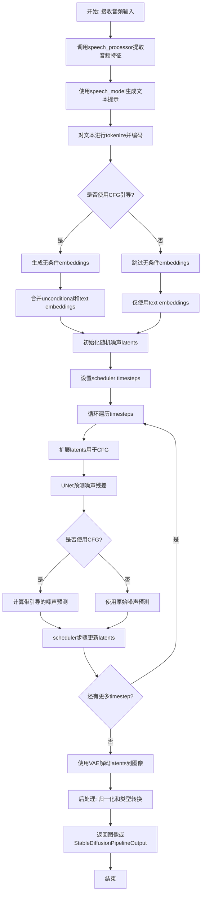
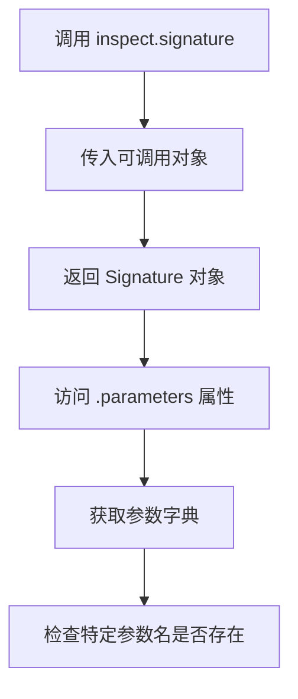
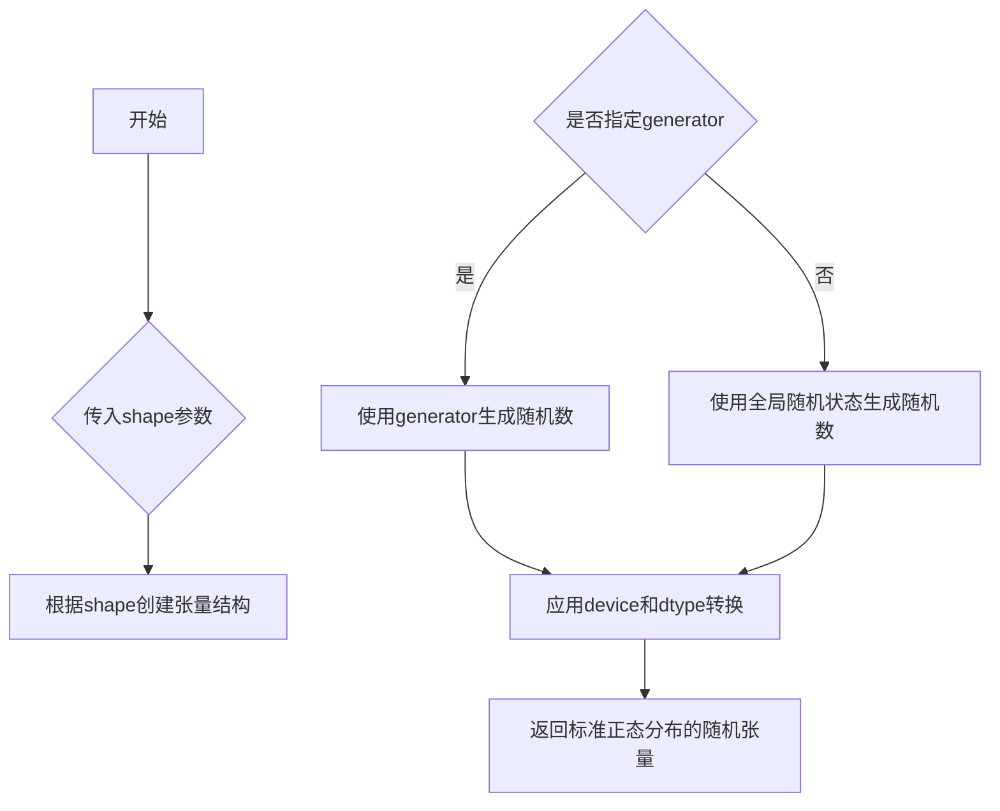
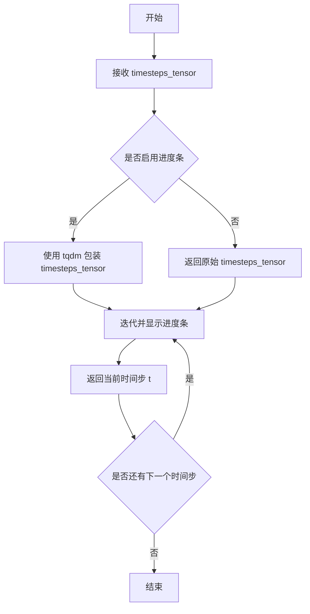

# `diffusers\examples\community\speech_to_image_diffusion.py` 详细设计文档

一个将语音转换为图像的DiffusionPipeline，接收音频输入，使用Whisper模型进行语音识别生成文本提示，然后结合Stable Diffusion模型（包含VAE、Text Encoder、UNet和Scheduler）根据文本提示生成对应的图像。支持分类器自由引导（CFG）、负面提示、回调函数等高级功能。

## 整体流程



## 类结构

```
DiffusionPipeline (基类)
└── SpeechToImagePipeline
    ├── 依赖组件 (通过register_modules注册)
    │   ├── speech_model (WhisperForConditionalGeneration)
    │   ├── speech_processor (WhisperProcessor)
    │   ├── vae (AutoencoderKL)
    │   ├── text_encoder (CLIPTextModel)
    │   ├── tokenizer (CLIPTokenizer)
    │   ├── unet (UNet2DConditionModel)
    │   ├── scheduler (DDIMScheduler/PNDMScheduler/LMSDiscreteScheduler)
    │   ├── safety_checker (StableDiffusionSafetyChecker)
    │   └── feature_extractor (CLIPImageProcessor)
```

## 全局变量及字段


### `logger`
    
模块级日志记录器，用于记录运行时信息

类型：`logging.Logger`
    


### `SpeechToImagePipeline.speech_model`
    
语音识别模型，用于将音频输入转换为文本

类型：`WhisperForConditionalGeneration`
    


### `SpeechToImagePipeline.speech_processor`
    
语音处理器，用于特征提取和tokenizer

类型：`WhisperProcessor`
    


### `SpeechToImagePipeline.vae`
    
VAE解码器，用于将latents解码为图像

类型：`AutoencoderKL`
    


### `SpeechToImagePipeline.text_encoder`
    
CLIP文本编码器，将文本转换为embeddings

类型：`CLIPTextModel`
    


### `SpeechToImagePipeline.tokenizer`
    
分词器，用于将文本转换为token ids

类型：`CLIPTokenizer`
    


### `SpeechToImagePipeline.unet`
    
UNet去噪模型，用于预测噪声残差

类型：`UNet2DConditionModel`
    


### `SpeechToImagePipeline.scheduler`
    
噪声调度器，用于控制扩散过程中的噪声调度

类型：`Union[DDIMScheduler, PNDMScheduler, LMSDiscreteScheduler]`
    


### `SpeechToImagePipeline.safety_checker`
    
安全检查器，用于过滤不适宜的内容

类型：`StableDiffusionSafetyChecker`
    


### `SpeechToImagePipeline.feature_extractor`
    
图像特征提取器，用于处理图像输入

类型：`CLIPImageProcessor`
    
    

## 全局函数及方法


### `inspect.signature`

获取函数或方法的签名信息，用于动态检查函数接受的参数。

参数：

-  `obj`：`Callable`，要获取签名的可调用对象（例如 `self.scheduler.step`）

返回值：`Signature`，返回函数的签名对象，包含参数信息

#### 流程图



#### 带注释源码

```python
# 使用 inspect.signature 检查 scheduler.step 方法是否接受 'eta' 参数
# self.scheduler 是一个调度器对象（例如 DDIMScheduler, PNDMScheduler, LMSDiscreteScheduler）
# .step 是调度器的推理步骤方法
accepts_eta = "eta" in set(inspect.signature(self.scheduler.step).parameters.keys())
```

在代码中的实际使用场景：

```python
# 准备调度器的额外参数，因为不是所有调度器都有相同的签名
# eta (η) 仅与 DDIMScheduler 一起使用，对于其他调度器将被忽略
# eta 对应于 DDIM 论文中的 η: https://huggingface.co/papers/2010.02502
# 取值范围应为 [0, 1]
accepts_eta = "eta" in set(inspect.signature(self.scheduler.step).parameters.keys())
extra_step_kwargs = {}
if accepts_eta:
    extra_step_kwargs["eta"] = eta
```

这个调用允许管道动态适配不同调度器的接口，确保兼容性。


### `torch.randn`

生成符合标准正态分布（均值为0，方差为1）的随机张量。在 `SpeechToImagePipeline.__call__` 方法中用于生成初始的潜在噪声张量（latents），作为扩散模型的起点。

#### 参数

- `*shape`：`int` 或 `tuple of ints`，张量的形状。例如 `3` 或 `(3, 4)`。
- `generator`：`torch.Generator`（可选），用于控制随机数生成的伪随机数生成器。若指定，则使用该生成器生成随机数。
- `device`：`torch.device`（可选），指定张量存放的设备（如 `"cpu"` 或 `"cuda"`）。
- `dtype`：`torch.dtype`（可选），张量的数据类型（如 `torch.float32`）。
- `layout`：`torch.layout`（可选），张量的内存布局（默认 `torch.strided`）。
- `requires_grad`：`bool`（可选），是否需要自动求导（默认 `False`）。

#### 返回值

- `torch.Tensor`：一个随机张量，其元素从标准正态分布中采样。

#### 流程图



#### 带注释源码

```python
# 在 SpeechToImagePipeline.__call__ 方法中 torch.randn 的使用示例：

# 确定潜在张量的形状 (batch_size * num_images_per_prompt, 通道数, 高度//8, 宽度//8)
latents_shape = (batch_size * num_images_per_prompt, self.unet.config.in_channels, height // 8, width // 8)
# 使用文本嵌入的数据类型
latents_dtype = text_embeddings.dtype

# 如果没有提供预定义的 latents，则生成随机噪声
if latents is None:
    # 针对 Apple Silicon (mps) 设备的特殊处理，因为 mps 不支持 randn
    if self.device.type == "mps":
        # 在 CPU 上生成随机张量，然后移动到 mps 设备
        latents = torch.randn(
            latents_shape,          # 张量形状
            generator=generator,   # 随机数生成器（可选）
            device="cpu",           # 临时在 CPU 上生成
            dtype=latents_dtype     # 数据类型与文本嵌入一致
        ).to(self.device)           # 然后转移到目标设备
    else:
        # 直接在目标设备上生成随机张量
        latents = torch.randn(
            latents_shape,          # 张量形状
            generator=generator,    # 随机数生成器（可选）
            device=self.device,     # 目标设备（cpu/cuda/mps）
            dtype=latents_dtype     # 数据类型（如 float32）
        )
else:
    # 如果提供了 latents，则验证其形状并移动到目标设备
    if latents.shape != latents_shape:
        raise ValueError(f"Unexpected latents shape, got {latents.shape}, expected {latents_shape}")
    latents = latents.to(self.device)

# 生成的 latents 将作为扩散过程的初始噪声输入到 UNet 模型中
```


### `SpeechToImagePipeline.progress_bar`

该方法是继承自 `DiffusionPipeline` 基类的进度条显示功能，用于包装可迭代对象（如时间步张量），在迭代过程中通过 tqdm 库实时展示推理进度，提升用户体验。

参数：

-  `timesteps_tensor`：`torch.Tensor`，待迭代的时间步张量，通常为从调度器获取的时间步序列

返回值：`Iterable`，返回包装后的可迭代对象，迭代时返回原始元素并显示进度条

#### 流程图



#### 带注释源码

```python
# 在 DiffusionPipeline 基类中，progress_bar 方法的典型实现如下：
# （此代码为基于 diffusers 库的推断实现，具体实现请参考 diffusers 源代码）

from typing import Iterable, Iterator, Any
from tqdm import tqdm

def progress_bar(self, iterable: Any, disable: bool = False) -> Iterable:
    """
    包装可迭代对象以显示进度条
    
    参数:
        iterable: 要包装的可迭代对象
        disable: 是否禁用进度条显示
    
    返回:
        包装后的可迭代对象
    """
    return tqdm(iterable, disable=disable)

# 在 __call__ 方法中的实际使用：
# for i, t in enumerate(self.progress_bar(timesteps_tensor)):
#     # 迭代处理每个时间步
#     # i: 当前迭代索引
#     # t: 当前时间步值
#     
#     # 1. 扩展潜在表示（如果使用无分类器指导）
#     latent_model_input = torch.cat([latents] * 2) if do_classifier_free_guidance else latents
#     latent_model_input = self.scheduler.scale_model_input(latent_model_input, t)
#     
#     # 2. 预测噪声残差
#     noise_pred = self.unet(latent_model_input, t, encoder_hidden_states=text_embeddings).sample
#     
#     # 3. 执行指导计算
#     if do_classifier_free_guidance:
#         noise_pred_uncond, noise_pred_text = noise_pred.chunk(2)
#         noise_pred = noise_pred_uncond + guidance_scale * (noise_pred_text - noise_pred_uncond)
#     
#     # 4. 计算前一个噪声样本 x_t -> x_t-1
#     latents = self.scheduler.step(noise_pred, t, latents, **extra_step_kwargs).prev_sample
#     
#     # 5. 调用回调函数（如果提供）
#     if callback is not None and i % callback_steps == 0:
#         step_idx = i // getattr(self.scheduler, "order", 1)
#         callback(step_idx, t, latents)
```

#### 使用上下文说明

在 `SpeechToImagePipeline.__call__` 方法中，`progress_bar` 的具体调用上下文如下：

```python
# 设置时间步
self.scheduler.set_timesteps(num_inference_steps)

# 将调度器的时间步移动到正确的设备
timesteps_tensor = self.scheduler.timesteps.to(self.device)

# 缩放初始噪声
latents = latents * self.scheduler.init_noise_sigma

# 准备调度器步骤的额外参数
extra_step_kwargs = {}
if accepts_eta:
    extra_step_kwargs["eta"] = eta

# 核心迭代循环 - 使用 progress_bar 显示进度
for i, t in enumerate(self.progress_bar(timesteps_tensor)):
    # 扩散模型的去噪迭代过程
    # ... (噪声预测、引导、调度器步进等)
    pass
```

此方法继承自 `DiffusionPipeline` 基类，属于 Hugging Face diffusers 框架的标准组件，无需在当前子类中额外定义，直接调用即可获取进度条功能。


### `DiffusionPipeline.numpy_to_pil`

该方法继承自 `DiffusionPipeline` 基类，用于将处理后的 NumPy 数组图像转换为 PIL Image 对象，以便于显示和保存。

参数：

-  `image`：`numpy.ndarray`，输入的图像数据，通常为形状 `(batch_size, height, width, channels)` 的浮点型 NumPy 数组，数值范围在 [0, 1]

返回值：`List[PIL.Image.Image]` 或 `PIL.Image.Image`，转换后的 PIL 图像对象列表或单个图像对象

#### 流程图

```mermaid
flowchart TD
    A[开始 numpy_to_pil] --> B{输入数组维度}
    B -->|4D数组| C[处理批量图像]
    B -->|3D数组| D[处理单张图像]
    C --> E[遍历每张图像]
    D --> F[将HWC转为CHW格式]
    F --> G[将[0,1]范围转为[0,255]]
    G --> H[转换为uint8类型]
    H --> I[创建PIL Image]
    E --> I
    I --> J[返回图像/图像列表]
```

#### 带注释源码

```python
def numpy_to_pil(images):
    """
    将 NumPy 数组转换为 PIL 图像对象。
    
    参数:
        images: NumPy 数组，形状为 (batch_size, height, width, channels) 
                或 (height, width, channels)，数值范围 [0, 1]
    
    返回:
        PIL Image 对象或列表
    """
    # 将 NumPy 数组转换为 PIL 图像
    if images.ndim == 3:
        # 单张图像: (H, W, C) -> PIL Image
        images = (images * 255).round().astype("uint8")
        images = images[:, :, ::-1]  # RGB 转 BGR（如果需要）
        images = Image.fromarray(images)
    elif images.ndim == 4:
        # 批量图像: (B, H, W, C) -> List[PIL Image]
        images = (images * 255).round().astype("uint8")
        images = [Image.fromarray(img[:, :, ::-1]) for img in images]
    else:
        raise ValueError(f"Unsupported image dimension: {images.ndim}")
    
    return images
```

> **注意**：该方法的具体实现位于 `diffusers` 库的 `DiffusionPipeline` 基类中，上述源码为常见的实现模式。实际调用时位于 `SpeechToImagePipeline.__call__` 方法的第 215 行：
> ```python
> if output_type == "pil":
>     image = self.numpy_to_pil(image)
> ```


### `SpeechToImagePipeline.__init__`

该方法为本类的构造函数，用于初始化语音到图像的扩散管道。它首先调用父类的初始化方法，随后检查安全检查器配置，最后将所有传入的模型组件（如语音模型、VAE、文本编码器等）注册到 pipeline 实例中，使其可以通过 `self.xxx` 进行访问。

参数：

- `speech_model`：`WhisperForConditionalGeneration`，用于将输入的音频信号转换为文本提示（Prompt）的 Whisper 条件生成模型。
- `speech_processor`：`WhisperProcessor`，用于对音频进行预处理并解码 Whisper 模型输出的处理器。
- `vae`：`AutoencoderKL`，变分自编码器模型，负责将潜在空间中的表示解码为最终的图像像素。
- `text_encoder`：`CLIPTextModel`，CLIP 文本编码器，负责将文本提示转换为嵌入向量（Embeddings），供 UNet 使用。
- `tokenizer`：`CLIPTokenizer`，CLIP 分词器，用于将文本字符串转换为 token ID 序列。
- `unet`：`UNet2DConditionModel`，UNet 2D 条件模型，是扩散管道的主干网络，负责根据文本嵌入和噪声预测噪声残差。
- `scheduler`：`Union[DDIMScheduler, PNDMScheduler, LMSDiscreteScheduler]`，
- `safety_checker`：`StableDiffusionSafetyChecker`，安全检查器，用于检测并过滤生成的潜在不安全图像内容。
- `feature_extractor`：`CLIPImageProcessor`，CLIP 图像预处理器，通常用于安全检查器或特征提取。

返回值：`None`（无返回值，作为构造函数）。

#### 流程图

```mermaid
graph TD
    A([开始 __init__]) --> B[调用 super().__init__ 初始化基础组件]
    B --> C{检查 safety_checker 是否为 None}
    C -- 是 --> D[记录警告日志: 提示安全检查器已关闭]
    C -- 否 --> E[继续执行]
    D --> E
    E --> F[调用 self.register_modules 注册所有模型组件]
    F --> G([结束 __init__])
    
    subgraph "组件列表"
    S1[speech_model]
    S2[speech_processor]
    S3[vae]
    S4[text_encoder]
    S5[tokenizer]
    S6[unet]
    S7[scheduler]
    S8[feature_extractor]
    end
    
    F -.-> S1
    F -.-> S2
    F -.-> S3
    F -.-> S4
    F -.-> S5
    F -.-> S6
    F -.-> S7
    F -.-> S8
```

#### 带注释源码

```python
def __init__(
    self,
    speech_model: WhisperForConditionalGeneration,  # 语音识别模型 (Whisper)
    speech_processor: WhisperProcessor,            # 语音处理器
    vae: AutoencoderKL,                            # 图像解码器 (VAE)
    text_encoder: CLIPTextModel,                  # 文本编码器 (CLIP)
    tokenizer: CLIPTokenizer,                     # 文本分词器
    unet: UNet2DConditionModel,                    # 扩散去噪网络 (U-Net)
    # 调度器，支持 DDIM, PNDM, LMSDiscreteScheduler
    scheduler: Union[DDIMScheduler, PNDMScheduler, LMSDiscreteScheduler], 
    safety_checker: StableDiffusionSafetyChecker, # 安全检查器
    feature_extractor: CLIPImageProcessor,        # 图像特征提取器
):
    # 调用父类 DiffusionPipeline 的初始化方法
    super().__init__()

    # 如果没有传入安全检查器（即设为 None），则记录警告信息
    if safety_checker is None:
        logger.warning(
            f"You have disabled the safety checker for {self.__class__} by passing `safety_checker=None`. Ensure"
            " that you abide to the conditions of the Stable Diffusion license and do not expose unfiltered"
            " results in services or applications open to the public. Both the diffusers team and Hugging Face"
            " strongly recommend to keep the safety filter enabled in all public facing circumstances, disabling"
            " it only for use-cases that involve analyzing network behavior or auditing its results. For more"
            " information, please have a look at https://github.com/huggingface/diffusers/pull/254 ."
        )

    # 将所有模型组件注册到当前 pipeline 实例中
    # 注册后，这些组件会被存储在 self.xxx 属性中，并可被 save_pretrained 等方法保存
    self.register_modules(
        speech_model=speech_model,
        speech_processor=speech_processor,
        vae=vae,
        text_encoder=text_encoder,
        tokenizer=tokenizer,
        unet=unet,
        scheduler=scheduler,
        feature_extractor=feature_extractor,
    )
```


### `SpeechToImagePipeline.__call__`

主推理方法，接收音频输入，使用Whisper模型将语音转文本，然后使用Stable Diffusion扩散模型根据文本生成对应图像。支持分类器自由引导（Classifier-Free Guidance），可配置推理步数、图像尺寸、负面提示等参数，最终返回生成的图像或封装结果。

参数：

- `audio`：音频数据，输入的原始音频信号
- `sampling_rate`：int，音频采样率，默认为16000
- `height`：int，生成图像的高度，默认为512像素，需能被8整除
- `width`：int，生成图像的宽度，默认为512像素，需能被8整除
- `num_inference_steps`：int，扩散模型推理步数，默认为50
- `guidance_scale`：float，分类器自由引导系数，默认为7.5，设为1.0表示不启用引导
- `negative_prompt`：Optional[Union[str, List[str]]]，负面提示词，用于引导模型避免生成相关内容，默认为None
- `num_images_per_prompt`：Optional[int]，每个提示词生成的图像数量，默认为1
- `eta`：float，DDIM调度器的随机性参数，范围[0,1]，默认为0.0
- `generator`：torch.Generator | None，用于复现结果的随机数生成器，默认为None
- `latents`：Optional[torch.Tensor]，用户提供的初始潜在向量，默认为None（由方法自动生成）
- `output_type`：str | None，输出类型，可为"pil"返回PIL图像或"numpy"返回numpy数组，默认为"pil"
- `return_dict`：bool，是否返回字典格式结果，默认为True
- `callback`：Optional[Callable[[int, int, torch.Tensor], None]]，每步推理后调用的回调函数，默认为None
- `callback_steps`：int，回调函数调用间隔步数，默认为1
- `**kwargs`：dict，其他未明确指定的额外关键字参数

返回值：`Union[StableDiffusionPipelineOutput, List[PIL.Image.Image] | np.ndarray]`，当return_dict为True时返回StableDiffusionPipelineOutput对象（包含生成图像和NSFW检测结果），否则返回图像列表或numpy数组

#### 流程图

```mermaid
flowchart TD
    A[开始 __call__] --> B[提取音频特征]
    B --> C[Whisper模型生成文本]
    C --> D[解码获取prompt]
    D --> E{验证参数有效性}
    E -->|height/width不可被8整除| F[抛出ValueError]
    E -->|callback_steps无效| G[抛出ValueError]
    E --> H[获取文本嵌入]
    H --> I[复制文本嵌入以匹配生成数量]
    I --> J{是否启用分类器自由引导?}
    J -->|是| K[处理negative_prompt获取无条件嵌入]
    J -->|否| L[跳过无条件嵌入处理]
    K --> M[拼接无条件嵌入和文本嵌入]
    L --> N[计算latents形状和类型]
    M --> N
    N --> O{用户是否提供latents?}
    O -->|否| P[在目标设备生成随机噪声]
    O -->|是| Q[验证latents形状并移至设备]
    P --> R[设置调度器时间步]
    Q --> R
    R --> S[初始化噪声标准差]
    S --> T[迭代推理循环]
    T --> U[扩展latents用于CFG]
    U --> V[缩放模型输入]
    V --> W[UNet预测噪声残差]
    W --> X{启用CFG?}
    X -->|是| Y[分离噪声预测计算引导]
    X -->|否| Z[直接使用噪声预测]
    Y --> AA[调度器执行去噪步]
    Z --> AA
    AA --> AB[更新latents]
    AB --> AC{执行回调?}
    AC -->|是| AD[调用callback函数]
    AC -->|否| AE{还有更多时间步?}
    AD --> AE
    AE -->|是| T
    AE -->|否| AF[缩放latents解码]
    AF --> AG[VAE解码latents生成图像]
    AG → AH[归一化图像到0-1范围]
    AH → AI[转换为float32 numpy数组]
    AI → AJ{output_type=='pil'?}
    AJ -->|是| AK[转换为PIL图像]
    AJ -->|否| AL[直接返回numpy数组]
    AK --> AM{return_dict==True?}
    AL --> AM
    AM -->|是| AN[返回StableDiffusionPipelineOutput]
    AM -->|否| AO[返回图像列表或数组]
```

#### 带注释源码

```python
@torch.no_grad()
def __call__(
    self,
    audio,
    sampling_rate=16_000,
    height: int = 512,
    width: int = 512,
    num_inference_steps: int = 50,
    guidance_scale: float = 7.5,
    negative_prompt: Optional[Union[str, List[str]]] = None,
    num_images_per_prompt: Optional[int] = 1,
    eta: float = 0.0,
    generator: torch.Generator | None = None,
    latents: Optional[torch.Tensor] = None,
    output_type: str | None = "pil",
    return_dict: bool = True,
    callback: Optional[Callable[[int, int, torch.Tensor], None]] = None,
    callback_steps: int = 1,
    **kwargs,
):
    # ========== 步骤1: 语音识别 - 音频转文本 ==========
    # 使用Whisper的特征提取器将音频转换为输入特征
    inputs = self.speech_processor.feature_extractor(
        audio, return_tensors="pt", sampling_rate=sampling_rate
    ).input_features.to(self.device)
    # 使用Whisper模型生成预测的token ID序列
    predicted_ids = self.speech_model.generate(inputs, max_length=480_000)

    # 将token ID解码为文本prompt
    prompt = self.speech_processor.tokenizer.batch_decode(predicted_ids, skip_special_tokens=True, normalize=True)[
        0
    ]

    # ========== 步骤2: 参数验证 ==========
    # 确定批次大小
    if isinstance(prompt, str):
        batch_size = 1
    elif isinstance(prompt, list):
        batch_size = len(prompt)
    else:
        raise ValueError(f"`prompt` has to be of type `str` or `list` but is {type(prompt)}")

    # 验证图像尺寸是否可以被8整除（VAE要求）
    if height % 8 != 0 or width % 8 != 0:
        raise ValueError(f"`height` and `width` have to be divisible by 8 but are {height} and {width}.")

    # 验证回调步数有效性
    if (callback_steps is None) or (
        callback_steps is not None and (not isinstance(callback_steps, int) or callback_steps <= 0)
    ):
        raise ValueError(
            f"`callback_steps` has to be a positive integer but is {callback_steps} of type"
            f" {type(callback_steps)}."
        )

    # ========== 步骤3: 文本编码 ==========
    # 将prompt token化
    text_inputs = self.tokenizer(
        prompt,
        padding="max_length",
        max_length=self.tokenizer.model_max_length,
        return_tensors="pt",
    )
    text_input_ids = text_inputs.input_ids

    # 截断超出CLIP最大长度的文本
    if text_input_ids.shape[-1] > self.tokenizer.model_max_length:
        removed_text = self.tokenizer.batch_decode(text_input_ids[:, self.tokenizer.model_max_length :])
        logger.warning(
            "The following part of your input was truncated because CLIP can only handle sequences up to"
            f" {self.tokenizer.model_max_length} tokens: {removed_text}"
        )
        text_input_ids = text_input_ids[:, : self.tokenizer.model_max_length]
    # 获取文本嵌入向量
    text_embeddings = self.text_encoder(text_input_ids.to(self.device))[0]

    # ========== 步骤4: 复制嵌入向量以匹配生成数量 ==========
    # 为每个prompt的每个生成复制文本嵌入（MPS兼容方法）
    bs_embed, seq_len, _ = text_embeddings.shape
    text_embeddings = text_embeddings.repeat(1, num_images_per_prompt, 1)
    text_embeddings = text_embeddings.view(bs_embed * num_images_per_prompt, seq_len, -1)

    # ========== 步骤5: 分类器自由引导（CFG）设置 ==========
    # guidance_scale类似Imagen论文中的权重w，1.0表示不进行引导
    do_classifier_free_guidance = guidance_scale > 1.0

    # 获取无条件嵌入用于CFG
    if do_classifier_free_guidance:
        uncond_tokens: List[str]
        if negative_prompt is None:
            uncond_tokens = [""] * batch_size
        elif type(prompt) is not type(negative_prompt):
            raise TypeError(
                f"`negative_prompt` should be the same type to `prompt`, but got {type(negative_prompt)} !="
                f" {type(prompt)}."
            )
        elif isinstance(negative_prompt, str):
            uncond_tokens = [negative_prompt]
        elif batch_size != len(negative_prompt):
            raise ValueError(
                f"`negative_prompt`: {negative_prompt} has batch size {len(negative_prompt)}, but `prompt`:"
                f" {prompt} has batch size {batch_size}. Please make sure that passed `negative_prompt` matches"
                " the batch size of `prompt`."
            )
        else:
            uncond_tokens = negative_prompt

        max_length = text_input_ids.shape[-1]
        # token化无条件输入
        uncond_input = self.tokenizer(
            uncond_tokens,
            padding="max_length",
            max_length=max_length,
            truncation=True,
            return_tensors="pt",
        )
        # 获取无条件嵌入
        uncond_embeddings = self.text_encoder(uncond_input.input_ids.to(self.device))[0]

        # 复制无条件嵌入以匹配生成数量
        seq_len = uncond_embeddings.shape[1]
        uncond_embeddings = uncond_embeddings.repeat(1, num_images_per_prompt, 1)
        uncond_embeddings = uncond_embeddings.view(batch_size * num_images_per_prompt, seq_len, -1)

        # 拼接无条件嵌入和文本嵌入以避免两次前向传播
        text_embeddings = torch.cat([uncond_embeddings, text_embeddings])

    # ========== 步骤6: 初始化潜在向量 ==========
    # 计算latents的形状：(batch_size * num_images_per_prompt, channels, height//8, width//8)
    latents_shape = (batch_size * num_images_per_prompt, self.unet.config.in_channels, height // 8, width // 8)
    latents_dtype = text_embeddings.dtype

    if latents is None:
        # 用户未提供latents，生成随机噪声
        if self.device.type == "mps":
            # MPS设备上没有randn，需要先在CPU上生成再移至MPS
            latents = torch.randn(latents_shape, generator=generator, device="cpu", dtype=latents_dtype).to(
                self.device
            )
        else:
            latents = torch.randn(latents_shape, generator=generator, device=self.device, dtype=latents_dtype)
    else:
        # 验证用户提供的latents形状
        if latents.shape != latents_shape:
            raise ValueError(f"Unexpected latents shape, got {latents.shape}, expected {latents_shape}")
        latents = latents.to(self.device)

    # ========== 步骤7: 设置调度器 ==========
    self.scheduler.set_timesteps(num_inference_steps)

    # 将时间步移至目标设备（PNDM等调度器使用数组形式的时间步）
    timesteps_tensor = self.scheduler.timesteps.to(self.device)

    # 根据调度器要求缩放初始噪声
    latents = latents * self.scheduler.init_noise_sigma

    # 准备调度器的额外参数（eta仅DDIM调度器使用）
    accepts_eta = "eta" in set(inspect.signature(self.scheduler.step).parameters.keys())
    extra_step_kwargs = {}
    if accepts_eta:
        extra_step_kwargs["eta"] = eta

    # ========== 步骤8: 迭代去噪过程 ==========
    for i, t in enumerate(self.progress_bar(timesteps_tensor)):
        # 如果启用CFG，扩展latents（复制一份用于无条件预测）
        latent_model_input = torch.cat([latents] * 2) if do_classifier_free_guidance else latents
        # 根据调度器要求缩放输入
        latent_model_input = self.scheduler.scale_model_input(latent_model_input, t)

        # UNet预测噪声残差
        noise_pred = self.unet(latent_model_input, t, encoder_hidden_states=text_embeddings).sample

        # 执行分类器自由引导
        if do_classifier_free_guidance:
            noise_pred_uncond, noise_pred_text = noise_pred.chunk(2)
            # 引导公式：noise_pred = noise_pred_uncond + guidance_scale * (noise_pred_text - noise_pred_uncond)
            noise_pred = noise_pred_uncond + guidance_scale * (noise_pred_text - noise_pred_uncond)

        # 调度器执行去噪步：x_t -> x_t-1
        latents = self.scheduler.step(noise_pred, t, latents, **extra_step_kwargs).prev_sample

        # 调用回调函数（如果提供且在指定步数间隔）
        if callback is not None and i % callback_steps == 0:
            step_idx = i // getattr(self.scheduler, "order", 1)
            callback(step_idx, t, latents)

    # ========== 步骤9: 图像解码 ==========
    # 缩放latents（VAE解码前需要反缩放）
    latents = 1 / 0.18215 * latents
    # VAE解码潜在向量生成图像
    image = self.vae.decode(latents).sample

    # ========== 步骤10: 后处理 ==========
    # 归一化图像到[0,1]范围
    image = (image / 2 + 0.5).clamp(0, 1)

    # 转换为float32的numpy数组（避免与bfloat16不兼容）
    image = image.cpu().permute(0, 2, 3, 1).float().numpy()

    # 根据output_type转换格式
    if output_type == "pil":
        image = self.numpy_to_pil(image)

    # ========== 步骤11: 返回结果 ==========
    if not return_dict:
        return image

    # 返回包含图像和NSFW检测结果的封装对象
    return StableDiffusionPipelineOutput(images=image, nsfw_content_detected=None)
```

## 关键组件


### 语音识别与文本生成 (Speech-to-Text)

使用WhisperForConditionalGeneration模型和WhisperProcessor将输入的音频信号转换为文本提示（prompt），通过feature_extractor提取音频特征并生成文本。

### 文本编码与嵌入 (Text Encoding)

使用CLIPTextModel和CLIPTokenizer将文本提示转换为高维嵌入向量，用于后续UNet的条件生成。支持分类器自由引导（Classifier-free Guidance）所需的文本嵌入和空文本嵌入。

### 潜在空间与噪声调度 (Latent Space & Noise Scheduling)

通过UNet2DConditionModel在潜在空间进行去噪操作，配合DDIMScheduler/PNDMScheduler/LMSDiscreteScheduler实现多步迭代去噪。latents变量管理噪声状态，支持自定义初始噪声和MPS设备兼容。

### VAE图像解码 (VAE Decoding)

使用AutoencoderKL将去噪后的潜在表示解码为最终图像，应用0.18215缩放因子进行后处理，并转换为numpy/PIL格式输出。

### 安全检查机制 (Safety Checking)

集成StableDiffusionSafetyChecker进行内容过滤，虽然默认启用但可通过参数禁用，存在潜在的技术债务（返回值中nsfw_content_detected固定为None）。

### 分类器自由引导 (Classifier-free Guidance)

在推理时通过guidance_scale参数控制无分类器引导强度，将条件和无条件噪声预测进行加权组合以提升生成质量。

### 回调与进度监控 (Callback & Progress Monitoring)

通过callback和callback_steps参数支持生成过程中的状态监控，允许外部代码在每个指定步数获取当前的时间步和潜在变量。

### 多调度器兼容设计 (Multi-Scheduler Compatibility)

通过inspect模块动态检查调度器的签名参数（如eta），实现对不同调度器的兼容支持，提高了pipeline的通用性。


## 问题及建议


### 已知问题

- **硬编码的魔数（Magic Numbers）**：代码中存在多个硬编码的数值，如 `max_length=480_000`、`height=512`、`width=512`、`num_inference_steps=50` 等，这些值应该通过配置或参数暴露给用户，以提高灵活性。
- **Safety Checker 未实际使用**：虽然 `safety_checker` 被注册到模块中，但在 `__call__` 方法中从未调用它来过滤生成的图像，且返回的 `nsfw_content_detected` 始终为 `None`，这可能导致合规性问题。
- **混合的类型提示语法**：代码混合使用了 `Optional[str]` 和 `str | None` 以及 `torch.Generator | None` 和 `Optional[torch.Generator]`，风格不一致，影响可读性。
- **缺乏输入验证**：没有对 `audio` 输入的类型、有效性进行验证，可能导致运行时错误或难以调试的问题。
- **设备兼容性问题处理不完整**：虽然对 `mps` 设备做了特殊处理（将随机数生成放在 CPU 上），但对其他设备类型（如 `cpu`）的处理可能不够完善，且未检查模型是否在正确的设备上。
- **调度器参数接受度检查冗余**：使用 `inspect.signature` 动态检查调度器是否接受 `eta` 参数，这种方式在每次调用时都会执行一次签名检查，增加了性能开销。

### 优化建议

- **重构为配置驱动的设计**：将硬编码的默认值（如分辨率、推理步数、引导系数）提取为类属性或构造函数参数，提供更灵活的配置方式。
- **完善 Safety Checker 集成**：在图像生成后实际调用 `safety_checker` 进行内容检测，并返回正确的 `nsfw_content_detected` 结果，或在不支持时明确抛出警告。
- **统一类型提示风格**：统一使用 Python 3.10+ 的联合类型语法（`str | None`）或 `typing` 模块（`Optional[str]`），保持代码风格一致。
- **增强输入验证**：在方法开始时添加对 `audio` 输入的类型检查（应为 `np.ndarray` 或 `torch.Tensor`）和非空验证，提升鲁棒性。
- **优化设备处理逻辑**：添加设备检查，确保所有模型组件都在同一设备上，或提供自动迁移到正确设备的能力。
- **缓存调度器参数支持**：在初始化时检查调度器支持的参数（如 `eta`），并将结果缓存，避免在推理循环中重复检查签名。
- **添加混合精度支持**：利用 `torch.cuda.amp.autocast` 或 PyTorch 2.0+ 的 `torch.compile()` 加速推理。
- **支持更多扩展**：预留接口以支持 LoRA、ControlNet、IP-Adapter 等社区常用的扩展功能。


## 其它


### 设计目标与约束

该管道旨在实现从语音输入直接生成对应图像的功能，将Whisper语音识别模型与Stable Diffusion图像生成模型无缝结合。设计约束包括：输入音频采样率需为16kHz，输出图像尺寸需能被8整除，文本编码器最大序列长度受CLIP模型限制（通常为77或128个token），且当前版本仅支持DDIMScheduler、PNDMScheduler和LMSDiscreteScheduler三种调度器。

### 错误处理与异常设计

代码在以下场景进行异常处理：1) 当safety_checker为None时发出警告；2) prompt类型不匹配时抛出TypeError；3) batch_size不一致时抛出ValueError；4) height/width不能被8整除时抛出ValueError；5) callback_steps为非正整数时抛出ValueError；6) latents形状不匹配时抛出ValueError；7) 文本超过最大长度时截断并发出警告。潜在改进：可增加对音频格式的校验、内存溢出保护、模型加载失败的重试机制等。

### 数据流与状态机

数据流如下：音频输入 → Whisper特征提取 → Whisper生成文本ID → tokenizer解码为文本prompt → CLIP编码为文本embedding → 初始化随机噪声latents → UNet迭代预测噪声 → scheduler更新latents → VAE解码latents为图像 → 后处理（归一化、转换格式）。状态转换：初始化状态 → 特征提取状态 → 文本编码状态 → 噪声初始化状态 → 迭代去噪状态（循环）→ 图像解码状态 → 输出状态。

### 外部依赖与接口契约

主要依赖包括：transformers库提供Whisper和CLIP模型；diffusers库提供Stable Diffusion组件（AutoencoderKL、UNet2DConditionModel、各类Scheduler）；PyTorch提供张量运算。接口契约：audio参数接受原始音频张量；sampling_rate默认为16000；返回StableDiffusionPipelineOutput或图像列表；当return_dict=False时返回兼容旧版API的格式。

### 性能考虑与优化空间

性能瓶颈：1) Whisper模型生成长序列（max_length=480_000）时耗时长；2) 文本编码器在CPU与GPU间数据传输；3) UNet迭代次数（默认50步）较多。优化建议：1) 减少max_length或使用流式处理；2) 预先计算文本embedding并缓存；3) 考虑使用DDIM等更高效的调度器减少迭代步数；4) 支持ONNX或TorchScript加速；5) 批处理多个音频请求。

### 安全性考虑

代码包含NSFW（不安全内容）检测机制（StableDiffusionSafetyChecker），默认启用安全检查器。当safety_checker设为None时，会发出警告提醒遵守Stable Diffusion许可协议。图像生成过程中不保存中间潜在变量到磁盘，防止敏感信息泄露。潜在风险：Whisper模型可能产生误识别导致生成不当图像；文本编码截断可能产生语义偏差。

### 资源管理与内存优化

当前实现：latents在目标设备上生成以确保可重现性；图像最终转换到CPU并转为numpy数组；未显式释放GPU内存。改进建议：1) 使用torch.cuda.empty_cache()显式清理缓存；2) 对长音频输入实现分块处理；3) 支持float16推理减少显存占用；4) 实现上下文管理器自动释放资源；5) 考虑使用gradient checkpointing减少UNet显存需求。

### 配置参数详解

关键参数说明：audio为输入音频数据；sampling_rate音频采样率默认16kHz；height/width控制输出图像分辨率默认512x512；num_inference_steps去噪迭代步数默认50；guidance_scale引导系数默认7.5设为1时禁用分类器自由引导；negative_prompt负面提示词用于引导远离特定内容；num_images_per_prompt每个prompt生成图像数量；eta仅DDIMScheduler使用控制噪声残留量；latents支持传入预定义噪声实现确定性生成；callback_steps控制回调触发频率。

### 使用示例与最佳实践

基本用法：pipeline = SpeechToImagePipeline(...); image = pipeline(audio)[0]；带参数调用：pipeline(audio, height=768, width=768, num_inference_steps=30, guidance_scale=9.0)；负面提示：pipeline(audio, negative_prompt="blurry, low quality")；多图生成：pipeline(audio, num_images_per_prompt=4)；自定义噪声：pipeline(audio, generator=torch.Generator().manual_seed(42))。

### 版本兼容性与限制

该代码依赖diffusers库版本需包含StableDiffusionMixin和相应Pipeline组件；transformers库需支持WhisperForConditionalGeneration和CLIPTextModel；PyTorch版本需支持torch.Generator | None类型注解（Python 3.10+联合类型）。已知限制：1) mps设备不支持randn需回退到CPU；2) 当前不支持ControlNet或LoRA等扩展组件；3) 不支持图像到图像的inpainting功能；4) 不支持文本到图像的图像提示（Image Prompt）。

### 潜在技术债务与优化空间

技术债务：1) 代码中存在硬编码数值如0.18215（VAE缩放因子）；2) max_length=480_000为魔数应提取为配置常量；3) 缺少单元测试覆盖；4) 文档注释不完整。优化空间：1) 抽象出音频预处理基类支持多种语音模型；2) 实现异步处理管道提高吞吐量；3) 添加ONNXRuntime支持；4) 实现分布式推理支持；5) 增加流式输出支持实时预览生成过程；6) 将配置参数外化到YAML/JSON配置文件。

    