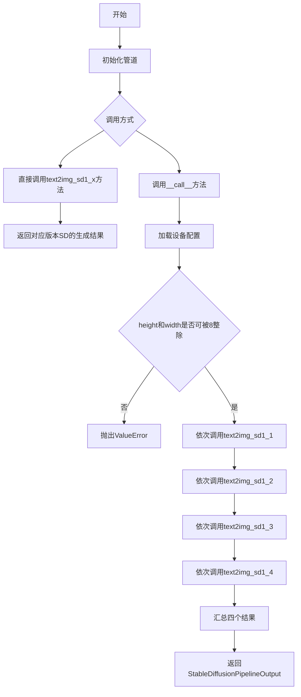
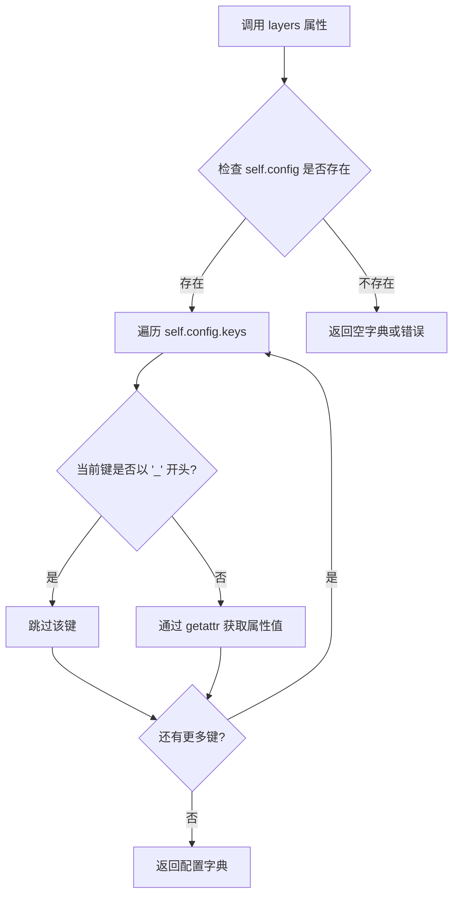
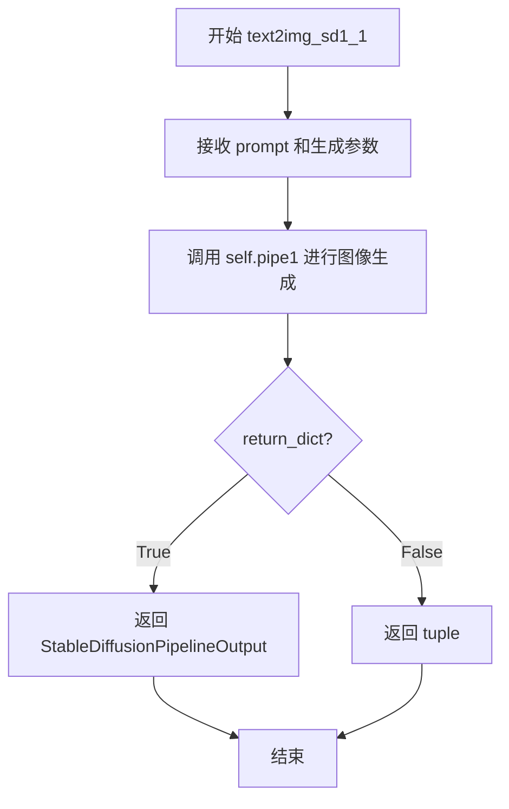
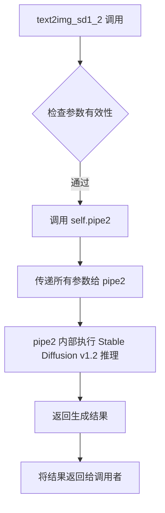
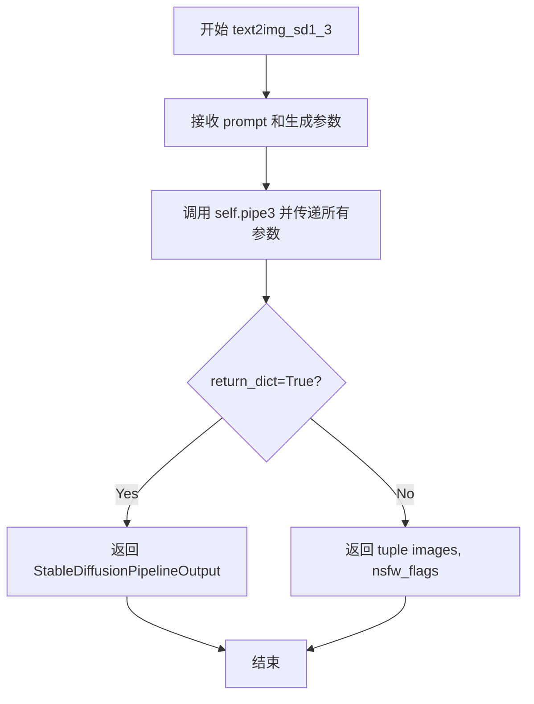
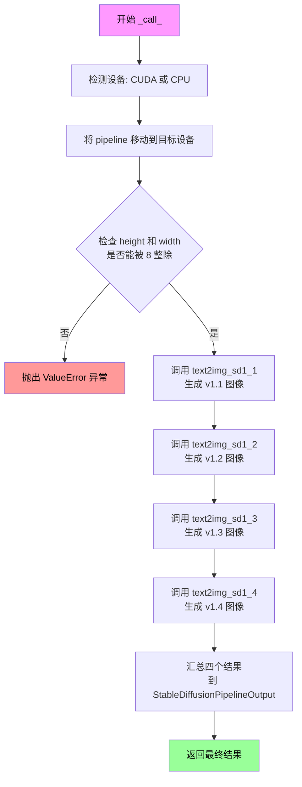

```mermaid
flowchart TD
    A[text2img_sd1_4 方法调用] --> B{检查装饰器 @torch.no_grad}
    B --> C[将所有参数传递给 self.pipe4]
    C --> D[调用 StableDiffusionPipeline 生成图像]
    D --> E[返回生成结果]
    
    subgraph "内部管道 pipe4"
        D1[文本编码] --> D2[潜在向量采样]
        D2 --> D3[U-Net 去噪]
        D3 --> D4[VAE 解码]
        D4 --> D5[安全检查]
        D5 --> D6[返回图像]
    end
    
    E --> F[返回结果给调用者]
```

# `diffusers\examples\community\stable_diffusion_comparison.py` 详细设计文档

这是一个用于并行比较Stable Diffusion v1.1至v1.4四个版本图像生成效果的管道，通过封装四个独立的StableDiffusionPipeline实例，实现同一prompt串行生成四个版本的图像并统一返回结果。

## 整体流程



## 类结构

```
DiffusionPipeline (基类)
└── StableDiffusionMixin (混入类)
    └── StableDiffusionComparisonPipeline (当前类)
        ├── pipe1 (StableDiffusionPipeline v1.1)
        ├── pipe2 (StableDiffusionPipeline v1.2)
        ├── pipe3 (StableDiffusionPipeline v1.3)
        └── pipe4 (StableDiffusionPipeline v1.4)
```

## 全局变量及字段


### `pipe1_model_id`
    
CompVis/stable-diffusion-v1-1模型ID

类型：`str`
    


### `pipe2_model_id`
    
CompVis/stable-diffusion-v1-2模型ID

类型：`str`
    


### `pipe3_model_id`
    
CompVis/stable-diffusion-v1-3模型ID

类型：`str`
    


### `pipe4_model_id`
    
CompVis/stable-diffusion-v1-4模型ID

类型：`str`
    


### `StableDiffusionComparisonPipeline.pipe1`
    
SD v1.1模型实例

类型：`StableDiffusionPipeline`
    


### `StableDiffusionComparisonPipeline.pipe2`
    
SD v1.2模型实例

类型：`StableDiffusionPipeline`
    


### `StableDiffusionComparisonPipeline.pipe3`
    
SD v1.3模型实例

类型：`StableDiffusionPipeline`
    


### `StableDiffusionComparisonPipeline.pipe4`
    
SD v1.4模型实例

类型：`StableDiffusionPipeline`
    


### `StableDiffusionComparisonPipeline.vae`
    
VAE编码解码器(继承)

类型：`AutoencoderKL`
    


### `StableDiffusionComparisonPipeline.text_encoder`
    
文本编码器(继承)

类型：`CLIPTextModel`
    


### `StableDiffusionComparisonPipeline.tokenizer`
    
分词器(继承)

类型：`CLIPTokenizer`
    


### `StableDiffusionComparisonPipeline.unet`
    
去噪U-Net(继承)

类型：`UNet2DConditionModel`
    


### `StableDiffusionComparisonPipeline.scheduler`
    
调度器(继承)

类型：`Union[DDIMScheduler, PNDMScheduler, LMSDiscreteScheduler]`
    


### `StableDiffusionComparisonPipeline.safety_checker`
    
安全检查器(继承)

类型：`StableDiffusionSafetyChecker`
    


### `StableDiffusionComparisonPipeline.feature_extractor`
    
特征提取器(继承)

类型：`CLIPImageProcessor`
    


### `StableDiffusionComparisonPipeline.requires_safety_checker`
    
是否需要安全检查(继承)

类型：`bool`
    
    

## 全局函数及方法


### `StableDiffusionComparisonPipeline.__init__`

该方法是 `StableDiffusionComparisonPipeline` 类的构造函数，用于初始化一个支持并行比较 Stable Diffusion v1-v4 四个版本的Pipeline对象。它接收必要的模型组件作为参数，加载预训练的SD v1.1-v1.3模型，并使用传入的组件构造v1.4模型，最后通过 `register_modules` 注册四个子Pipeline。

**参数：**

- `vae`：`AutoencoderKL`，Variational Auto-Encoder (VAE) 模型，用于在潜在表示和图像之间进行编码和解码
- `text_encoder`：`CLIPTextModel`，冻结的文本编码器，Stable Diffusion 使用 CLIP 的文本部分
- `tokenizer`：`CLIPTokenizer`，用于文本处理的 CLIP 分词器
- `unet`：`UNet2DConditionModel`，条件 U-Net 架构，用于对编码后的图像潜在表示进行去噪
- `scheduler`：`Union[DDIMScheduler, PNDMScheduler, LMSDiscreteScheduler]`，与 `unet` 结合使用进行去噪的调度器
- `safety_checker`：`StableDiffusionSafetyChecker`，分类模块，用于估计生成的图像是否具有攻击性或有害内容
- `feature_extractor`：`CLIPImageProcessor`，用于从生成的图像中提取特征并作为 `safety_checker` 的输入
- `requires_safety_checker`：`bool`，默认为 `True`，指定是否需要安全检查器

**返回值：** 无（`None`），构造函数不返回值

#### 流程图

```mermaid
flowchart TD
    A[__init__ 开始] --> B[调用 super().__init__ 初始化基类]
    B --> C[从预训练模型加载 pipe1 (SD v1.1)]
    C --> D[从预训练模型加载 pipe2 (SD v1.2)]
    D --> E[从预训练模型加载 pipe3 (SD v1.3)]
    E --> F[使用传入参数构造 pipe4 (SD v1.4)]
    F --> G[调用 register_modules 注册四个子Pipeline]
    G --> H[__init__ 结束]
```

#### 带注释源码

```python
def __init__(
    self,
    vae: AutoencoderKL,
    text_encoder: CLIPTextModel,
    tokenizer: CLIPTokenizer,
    unet: UNet2DConditionModel,
    scheduler: Union[DDIMScheduler, PNDMScheduler, LMSDiscreteScheduler],
    safety_checker: StableDiffusionSafetyChecker,
    feature_extractor: CLIPImageProcessor,
    requires_safety_checker: bool = True,
):
    """
    初始化 Stable Diffusion Comparison Pipeline
    该Pipeline可以并行比较SD v1-v4四个版本的生成效果
    
    参数:
        vae: VAE模型，用于图像与潜在表示的相互转换
        text_encoder: CLIP文本编码器，将文本转换为向量表示
        tokenizer: CLIP分词器，对输入文本进行分词
        unet: 条件U-Net模型，用于去噪潜在表示
        scheduler: 噪声调度器，控制去噪过程的参数
        safety_checker: 安全检查器，过滤有害内容
        feature_extractor: 图像特征提取器，用于安全检查
        requires_safety_checker: 是否启用安全检查器
    """
    # 调用父类DiffusionPipeline的初始化方法
    super().__init__()
    
    # 加载预训练的 Stable Diffusion v1.1 模型
    self.pipe1 = StableDiffusionPipeline.from_pretrained(pipe1_model_id)
    # pipe1_model_id = "CompVis/stable-diffusion-v1-1"
    
    # 加载预训练的 Stable Diffusion v1.2 模型
    self.pipe2 = StableDiffusionPipeline.from_pretrained(pipe2_model_id)
    # pipe2_model_id = "CompVis/stable-diffusion-v1-2"
    
    # 加载预训练的 Stable Diffusion v1.3 模型
    self.pipe3 = StableDiffusionPipeline.from_pretrained(pipe3_model_id)
    # pipe3_model_id = "CompVis/stable-diffusion-v1-3"
    
    # 使用传入参数构造 Stable Diffusion v1.4 模型
    # 这里复用了传入的组件（vae, text_encoder等），而非从预训练加载
    self.pipe4 = StableDiffusionPipeline(
        vae=vae,
        text_encoder=text_encoder,
        tokenizer=tokenizer,
        unet=unet,
        scheduler=scheduler,
        safety_checker=safety_checker,
        feature_extractor=feature_extractor,
        requires_safety_checker=requires_safety_checker,
    )
    # pipe4_model_id = "CompVis/stable-diffusion-v1-4"
    
    # 将四个子Pipeline注册到当前Pipeline的模块列表中
    # 这使得diffusers能够追踪和管理所有子模块
    self.register_modules(
        pipeline1=self.pipe1,
        pipeline2=self.pipe2,
        pipeline3=self.pipe3,
        pipeline4=self.pipe4
    )
```


### `StableDiffusionComparisonPipeline.layers`

该属性方法用于获取当前管道实例的所有非私有配置项，通过遍历配置字典的键并过滤掉以 `_` 开头的私有键，返回一个包含配置项名称及其对应值的字典，以便外部调用者可以方便地访问管道的公共配置属性。

参数： 无

返回值： `dict[str, Any]`，返回包含所有非私有（不以下划线 `_` 开头）配置项的字典，键为配置项名称，值为对应的配置值

#### 流程图



#### 带注释源码

```python
@property
def layers(self) -> dict[str, Any]:
    """
    获取所有非私有配置项的属性方法
    
    该方法遍历对象的配置字典，过滤掉所有以双下划线开头的私有键，
    并通过 getattr 获取对应的属性值，最终返回一个包含所有公共配置项的字典。
    
    Returns:
        dict[str, Any]: 键为配置项名称（字符串），值为对应的配置对象
    """
    # 字典推导式：遍历配置键，过滤私有键，获取对应属性值
    # self.config 来自 DiffusionPipeline 基类，包含了所有注册的配置属性
    # getattr(self, k) 动态获取实例属性值
    # not k.startswith("_") 过滤掉所有私有配置项（下划线开头的）
    return {k: getattr(self, k) for k in self.config.keys() if not k.startswith("_")}
```


### `StableDiffusionComparisonPipeline.text2img_sd1_1`

使用 Stable Diffusion v1.1 模型根据文本提示生成图像的包装方法，通过委托给内部封装的 `pipe1`（基于 CompVis/stable-diffusion-v1-1 预训练模型）执行实际的图像生成任务。

参数：

- `prompt`：`Union[str, List[str]]`，用于指导图像生成的文本提示，可以是单个字符串或字符串列表
- `height`：`int`，生成图像的高度（像素），默认为 512
- `width`：`int`，生成图像的宽度（像素），默认为 512
- `num_inference_steps`：`int`，去噪步数，更多步数通常能获得更高质量的图像，但推理速度更慢，默认为 50
- `guidance_scale`：`float`，Classifier-Free Diffusion Guidance 中的引导比例，用于控制生成图像与文本提示的关联度，默认为 7.5
- `negative_prompt`：`Optional[Union[str, List[str]]]`，用于指定不希望出现在生成图像中的内容，默认为 None
- `num_images_per_prompt`：`Optional[int]`，每个提示生成的图像数量，默认为 1
- `eta`：`float`，DDIM 调度器中的 eta 参数，仅对 DDIMScheduler 有效，默认为 0.0
- `generator`：`torch.Generator | None`，用于使生成过程确定性的 PyTorch 随机数生成器，默认为 None
- `latents`：`Optional[torch.Tensor]`，预生成的噪声潜在向量，用于图像生成，可用于通过不同提示微调相同生成结果，默认为 None
- `output_type`：`str | None`，生成图像的输出格式，可选 "pil" 或 "np.array"，默认为 "pil"
- `return_dict`：`bool`，是否返回 StableDiffusionPipelineOutput 而不是普通元组，默认为 True
- `callback`：`Optional[Callable[[int, int, torch.Tensor], None]]`，每一步去噪后调用的回调函数，默认为 None
- `callback_steps`：`int`，回调函数被调用的频率（每多少步调用一次），默认为 1
- `**kwargs`：其他可选参数，将传递给底层管道

返回值：`Union[StableDiffusionPipelineOutput, Tuple]`，如果 `return_dict` 为 True，返回 `StableDiffusionPipelineOutput`（包含生成的图像列表和 NSFW 检测结果），否则返回元组

#### 流程图



#### 带注释源码

```python
@torch.no_grad()  # 禁用梯度计算以节省内存并提高推理速度
def text2img_sd1_1(
    self,
    prompt: Union[str, List[str]],  # 文本提示，引导图像生成的内容
    height: int = 512,  # 生成图像的高度，默认512像素
    width: int = 512,  # 生成图像的宽度，默认512像素
    num_inference_steps: int = 50,  # 去噪迭代次数，影响图像质量和生成速度
    guidance_scale: float = 7.5,  # 文本引导强度，值越大越忠于提示词
    negative_prompt: Optional[Union[str, List[str]]] = None,  # 负面提示，用于排除不需要的元素
    num_images_per_prompt: Optional[int] = 1,  # 每个提示生成的图像数量
    eta: float = 0.0,  # DDIM调度器的随机性参数
    generator: torch.Generator | None = None,  # 随机数生成器，确保可复现性
    latents: Optional[torch.Tensor] = None,  # 预定义的噪声潜在向量
    output_type: str | None = "pil",  # 输出格式：PIL图像或numpy数组
    return_dict: bool = True,  # 是否返回结构化输出对象
    callback: Optional[Callable[[int, int, torch.Tensor], None]] = None,  # 进度回调函数
    callback_steps: int = 1,  # 回调触发频率
    **kwargs,  # 其他传递给底层管道的参数
):
    # 委托给 self.pipe1（基于 CompVis/stable-diffusion-v1-1 的 StableDiffusionPipeline）
    # 执行实际的图像生成逻辑，并返回其结果
    return self.pipe1(
        prompt=prompt,
        height=height,
        width=width,
        num_inference_steps=num_inference_steps,
        guidance_scale=guidance_scale,
        negative_prompt=negative_prompt,
        num_images_per_prompt=num_images_per_prompt,
        eta=eta,
        generator=generator,
        latents=latents,
        output_type=output_type,
        return_dict=return_dict,
        callback=callback,
        callback_steps=callback_steps,
        **kwargs,
    )
```


### `StableDiffusionComparisonPipeline.text2img_sd1_2`

该方法是一个图像生成接口，内部调用封装好的 `pipe2`（Stable Diffusion v1.2 pipeline）来根据文本提示生成图像。它将所有参数传递给 `pipe2` 并返回其生成结果，实现了与标准 `StableDiffusionPipeline` 相同的调用方式。

参数：

- `prompt`：`Union[str, List[str]]`，用于引导图像生成的文本提示或提示列表
- `height`：`int`，生成图像的高度（默认 512 像素）
- `width`：`int`，生成图像的宽度（默认 512 像素）
- `num_inference_steps`：`int`，去噪迭代步数，步数越多通常图像质量越高（默认 50）
- `guidance_scale`：`float`，分类器自由扩散引导（CFG）尺度，值越大生成的图像与文本提示越相关（默认 7.5）
- `negative_prompt`：`Optional[Union[str, List[str]]]`，负面提示，用于指定要避免的内容（默认 None）
- `num_images_per_prompt`：`Optional[int]`，每个提示要生成的图像数量（默认 1）
- `eta`：`float`，DDIM scheduler 的 eta 参数，仅对 DDIMScheduler 有效（默认 0.0）
- `generator`：`torch.Generator | None`，用于确保生成结果可复现的随机数生成器（默认 None）
- `latents`：`Optional[torch.Tensor]`，预生成的噪声潜在向量，可用于使用不同提示复用相同随机种子（默认 None）
- `output_type`：`str | None`，输出格式，可选 "pil" 返回 PIL 图像或 "np" 返回 numpy 数组（默认 "pil"）
- `return_dict`：`bool`，是否返回字典格式而非元组（默认 True）
- `callback`：`Optional[Callable[[int, int, torch.Tensor], None]]`，每步迭代调用的回调函数，参数为步数、当前时间步和潜在张量（默认 None）
- `callback_steps`：`int`，回调函数被调用的频率步数（默认 1）
- `**kwargs`：其他传递给底层 pipeline 的可选参数

返回值：`Any`，返回 `StableDiffusionPipeline` 的输出，类型为 `StableDiffusionPipelineOutput`（若 return_dict=True）或包含图像和 NSFW 标志的元组

#### 流程图



#### 带注释源码

```python
@torch.no_grad()
def text2img_sd1_2(
    self,
    prompt: Union[str, List[str]],
    height: int = 512,
    width: int = 512,
    num_inference_steps: int = 50,
    guidance_scale: float = 7.5,
    negative_prompt: Optional[Union[str, List[str]]] = None,
    num_images_per_prompt: Optional[int] = 1,
    eta: float = 0.0,
    generator: torch.Generator | None = None,
    latents: Optional[torch.Tensor] = None,
    output_type: str | None = "pil",
    return_dict: bool = True,
    callback: Optional[Callable[[int, int, torch.Tensor], None]] = None,
    callback_steps: int = 1,
    **kwargs,
):
    """
    使用 Stable Diffusion v1.2 模型根据文本提示生成图像
    
    参数:
        prompt: 文本提示或提示列表
        height: 生成图像的高度
        width: 生成图像的宽度
        num_inference_steps: 去噪步数
        guidance_scale: 引导尺度
        negative_prompt: 负面提示
        num_images_per_prompt: 每个提示生成的图像数量
        eta: DDIM scheduler 参数
        generator: 随机生成器
        latents: 预生成噪声潜在向量
        output_type: 输出格式
        return_dict: 是否返回字典格式
        callback: 迭代回调函数
        callback_steps: 回调频率
        **kwargs: 其他参数
    
    返回:
        StableDiffusionPipeline 输出
    """
    # 使用 torch.no_grad() 装饰器禁用梯度计算，减少内存占用
    # 调用内部封装的 pipe2 (StableDiffusionPipeline v1.2) 执行图像生成
    return self.pipe2(
        prompt=prompt,
        height=height,
        width=width,
        num_inference_steps=num_inference_steps,
        guidance_scale=guidance_scale,
        negative_prompt=negative_prompt,
        num_images_per_prompt=num_images_per_prompt,
        eta=eta,
        generator=generator,
        latents=latents,
        output_type=output_type,
        return_dict=return_dict,
        callback=callback,
        callback_steps=callback_steps,
        **kwargs,
    )
```


### `StableDiffusionComparisonPipeline.text2img_sd1_3`

该方法用于调用 Stable Diffusion v1.3 模型进行文本到图像的生成，是 `StableDiffusionComparisonPipeline` 类的一个委托方法，内部将所有参数转发给 `pipe3`（即预加载的 StableDiffusionPipeline）执行实际推理。

参数：

- `prompt`：`Union[str, List[str]]`，用于引导图像生成的文本提示或提示列表
- `height`：`int`，生成的图像高度，默认为 512 像素
- `width`：`int`，生成的图像宽度，默认为 512 像素
- `num_inference_steps`：`int`，去噪步数，默认为 50，步数越多通常图像质量越高但推理越慢
- `guidance_scale`：`float`，无分类器引导扩散Guidance Scale参数，默认为 7.5，值越大生成的图像与文本提示关联越紧密
- `negative_prompt`：`Optional[Union[str, List[str]]]`，负面提示，用于引导模型避免生成相关内容
- `num_images_per_prompt`：`Optional[int]`，每个提示生成的图像数量，默认为 1
- `eta`：`float`，DDIM 调度器参数 η，默认为 0.0，仅对 DDIMScheduler 有效
- `generator`：`torch.Generator | None`，PyTorch 随机数生成器，用于控制生成的可重复性
- `latents`：`Optional[torch.Tensor]`，预生成的噪声潜在向量，可用于复现或微调生成结果
- `output_type`：`str | None`，输出格式，默认为 "pil"，可选 PIL.Image.Image 或 np.array
- `return_dict`：`bool`，是否返回 PipelineOutput 对象而非元组，默认为 True
- `callback`：`Optional[Callable[[int, int, torch.Tensor], None]]`，推理过程中的回调函数
- `callback_steps`：`int`，回调函数调用间隔步数，默认为 1
- `**kwargs`：其他未列出的参数，将传递给底层 pipeline

返回值：根据 `return_dict` 参数返回 `StableDiffusionPipelineOutput` 对象（包含图像列表和 NSFW 标志列表）或元组

#### 流程图



#### 带注释源码

```python
@torch.no_grad()
def text2img_sd1_3(
    self,
    prompt: Union[str, List[str]],
    height: int = 512,
    width: int = 512,
    num_inference_steps: int = 50,
    guidance_scale: float = 7.5,
    negative_prompt: Optional[Union[str, List[str]]] = None,
    num_images_per_prompt: Optional[int] = 1,
    eta: float = 0.0,
    generator: torch.Generator | None = None,
    latents: Optional[torch.Tensor] = None,
    output_type: str | None = "pil",
    return_dict: bool = True,
    callback: Optional[Callable[[int, int, torch.Tensor], None]] = None,
    callback_steps: int = 1,
    **kwargs,
):
    """
    使用 Stable Diffusion v1.3 模型生成图像
    @torch.no_grad() 装饰器：禁用梯度计算以节省显存和提高推理速度
    """
    # 委托给内部封装的 pipe3 (StableDiffusionPipeline) 执行实际推理
    # pipe3 是在 __init__ 中通过 from_pretrained(pipe3_model_id) 加载的 v1.3 模型
    return self.pipe3(
        prompt=prompt,
        height=height,
        width=width,
        num_inference_steps=num_inference_steps,
        guidance_scale=guidance_scale,
        negative_prompt=negative_prompt,
        num_images_per_prompt=num_images_per_prompt,
        eta=eta,
        generator=generator,
        latents=latents,
        output_type=output_type,
        return_dict=return_dict,
        callback=callback,
        callback_steps=callback_steps,
        **kwargs,
    )
```


### `StableDiffusionComparisonPipeline.text2img_sd1_4`

该方法是 `StableDiffusionComparisonPipeline` 类的成员方法，用于调用 Stable Diffusion v1.4 版本生成图像。它接收文本提示及各种生成参数，将这些参数传递给内部持有的 `pipe4`（即 StableDiffusionPipeline 实例），并返回生成的图像结果。

参数：

- `prompt`：`Union[str, List[str]]`，用于指导图像生成的文本提示或提示列表
- `height`：`int`，生成图像的高度像素值，默认为 512
- `width`：`int`，生成图像的宽度像素值，默认为 512
- `num_inference_steps`：`int`，去噪步数，越多通常图像质量越高，默认为 50
- `guidance_scale`：`float`，分类器自由扩散引导（CFG）尺度，值越大越忠于文本提示，默认为 7.5
- `negative_prompt`：`Optional[Union[str, List[str]]]`，负面提示，用于指定不希望出现的元素，默认为 None
- `num_images_per_prompt`：`Optional[int]`，每个提示生成的图像数量，默认为 1
- `eta`：`float`，DDIM 调度器的 eta 参数，仅对 DDIMScheduler 有效，默认为 0.0
- `generator`：`torch.Generator | None`，用于生成确定性结果的 PyTorch 随机数生成器，默认为 None
- `latents`：`Optional[torch.Tensor]`，预生成的噪声潜在向量，可用于自定义生成过程，默认为 None
- `output_type`：`str | None`，输出格式，可选 "pil" 或 "np.array"，默认为 "pil"
- `return_dict`：`bool`，是否返回 StableDiffusionPipelineOutput 字典而非元组，默认为 True
- `callback`：`Optional[Callable[[int, int, torch.Tensor], None]]`，每步推理调用的回调函数，默认为 None
- `callback_steps`：`int`，回调函数调用间隔步数，默认为 1
- `**kwargs`：其他可选参数，将传递给底层管道

返回值：调用 `self.pipe4` 的返回类型，通常为 `StableDiffusionPipelineOutput` 或元组，包含生成的图像列表和 NSFW 检查布尔值

#### 流程图



#### 带注释源码

```python
@torch.no_grad()  # 禁用梯度计算以节省显存并加速推理
def text2img_sd1_4(
    self,
    prompt: Union[str, List[str]],  # 文本提示，字符串或字符串列表
    height: int = 512,  # 生成图像的高度（像素）
    width: int = 512,  # 生成图像的宽度（像素）
    num_inference_steps: int = 50,  # 扩散模型的推理步数
    guidance_scale: float = 7.5,  # 文本引导强度（Classifier-Free Guidance）
    negative_prompt: Optional[Union[str, List[str]]] = None,  # 负面提示词
    num_images_per_prompt: Optional[int] = 1,  # 每个提示生成的图像数量
    eta: float = 0.0,  # DDIM 调度器的 eta 参数
    generator: torch.Generator | None = None,  # 随机数生成器，确保可复现性
    latents: Optional[torch.Tensor] = None,  # 预定义的噪声潜在向量
    output_type: str | None = "pil",  # 输出格式：'pil' 或 'np.array'
    return_dict: bool = True,  # 是否返回字典格式的结果
    callback: Optional[Callable[[int, int, torch.Tensor], None]] = None,  # 推理过程中的回调函数
    callback_steps: int = 1,  # 回调函数被调用的频率（步数）
    **kwargs,  # 传递给底层管道的额外参数
):
    """
    使用 Stable Diffusion v1.4 模型生成图像的方法。
    该方法是管道方法 pipe4 的包装器，将所有参数透传到底层的 StableDiffusionPipeline。
    """
    # 将所有参数原样传递给内部持有的 pipe4（StableDiffusionPipeline 实例）
    # pipe4 在 __init__ 中使用传入的 vae, text_encoder, tokenizer, unet, scheduler 等组件初始化
    return self.pipe4(
        prompt=prompt,
        height=height,
        width=width,
        num_inference_steps=num_inference_steps,
        guidance_scale=guidance_scale,
        negative_prompt=negative_prompt,
        num_images_per_prompt=num_images_per_prompt,
        eta=eta,
        generator=generator,
        latents=latents,
        output_type=output_type,
        return_dict=return_dict,
        callback=callback,
        callback_steps=callback_steps,
        **kwargs,
    )
```


### `StableDiffusionComparisonPipeline._call_`

该方法是 `StableDiffusionComparisonPipeline` 类的主入口方法，用于串行调用四个 Stable Diffusion 版本（v1.1 至 v1.4）的图像生成功能，并将所有结果汇总到一个 `StableDiffusionPipelineOutput` 对象中返回。

参数：

- `prompt`：`Union[str, List[str]]`，指导图像生成的提示或提示列表
- `height`：`int`，生成图像的高度（像素），默认为 512
- `width`：`int`，生成图像的宽度（像素），默认为 512
- `num_inference_steps`：`int`，去噪步数，默认为 50
- `guidance_scale`：`float`，分类器自由扩散引导（Classifier-Free Diffusion Guidance）中的引导 scale，默认为 7.5
- `negative_prompt`：`Optional[Union[str, List[str]]]`，负面提示，用于指导模型避免生成相关内容，默认为 None
- `num_images_per_prompt`：`Optional[int]`，每个提示生成的图像数量，默认为 1
- `eta`：`float`，DDIM 论文中的参数 η，仅适用于 DDIMScheduler，默认为 0.0
- `generator`：`torch.Generator | None`，PyTorch 随机生成器，用于确保结果可复现，默认为 None
- `latents`：`Optional[torch.Tensor]`，预生成的噪声潜在向量，可用于在同一潜在向量下生成不同提示的图像，默认为 None
- `output_type`：`str | None`，输出格式，可选 "pil" 或 "np.array"，默认为 "pil"
- `return_dict`：`bool`，是否返回 `StableDiffusionPipelineOutput` 对象而非元组，默认为 True
- `callback`：`Optional[Callable[[int, int, torch.Tensor], None]]`，每步去噪后调用的回调函数，默认为 None
- `callback_steps`：`int`，回调函数被调用的频率（每多少步调用一次），默认为 1
- `**kwargs`：其他传递给底层 pipeline 的关键字参数

返回值：`StableDiffusionPipelineOutput`，包含四个版本生成的图像列表（`images` 属性）

#### 流程图



#### 带注释源码

```python
@torch.no_grad()
def _call_(
    self,
    prompt: Union[str, List[str]],
    height: int = 512,
    width: int = 512,
    num_inference_steps: int = 50,
    guidance_scale: float = 7.5,
    negative_prompt: Optional[Union[str, List[str]]] = None,
    num_images_per_prompt: Optional[int] = 1,
    eta: float = 0.0,
    generator: torch.Generator | None = None,
    latents: Optional[torch.Tensor] = None,
    output_type: str | None = "pil",
    return_dict: bool = True,
    callback: Optional[Callable[[int, int, torch.Tensor], None]] = None,
    callback_steps: int = 1,
    **kwargs,
):
    r"""
    当调用管道生成图像时执行的函数。此函数将以串行处理、并行调用的方式
    同时运行 SD1.1-1.4 的四个管道来生成 4 个结果。
    """
    # 确定运行设备：优先使用 CUDA，否则使用 CPU
    device = "cuda" if torch.cuda.is_available() else "cpu"
    # 将整个管道（包括所有子管道）移动到目标设备
    self.to(device)

    # 验证输入的 height 和 width 是否能被 8 整除
    # Stable Diffusion 的 VAE 和 U-Net 要求图像尺寸为 8 的倍数
    if height % 8 != 0 or width % 8 != 0:
        raise ValueError(f"`height` and `width` must be divisible by 8 but are {height} and {width}.")

    # ===== 串行调用四个 Stable Diffusion 版本 =====
    
    # 从 Stable Diffusion Checkpoint v1.1 获取结果
    res1 = self.text2img_sd1_1(
        prompt=prompt,
        height=height,
        width=width,
        num_inference_steps=num_inference_steps,
        guidance_scale=guidance_scale,
        negative_prompt=negative_prompt,
        num_images_per_prompt=num_images_per_prompt,
        eta=eta,
        generator=generator,
        latents=latents,
        output_type=output_type,
        return_dict=return_dict,
        callback=callback,
        callback_steps=callback_steps,
        **kwargs,
    )

    # 从 Stable Diffusion Checkpoint v1.2 获取结果
    res2 = self.text2img_sd1_2(
        prompt=prompt,
        height=height,
        width=width,
        num_inference_steps=num_inference_steps,
        guidance_scale=guidance_scale,
        negative_prompt=negative_prompt,
        num_images_per_prompt=num_images_per_prompt,
        eta=eta,
        generator=generator,
        latents=latents,
        output_type=output_type,
        return_dict=return_dict,
        callback=callback,
        callback_steps=callback_steps,
        **kwargs,
    )

    # 从 Stable Diffusion Checkpoint v1.3 获取结果
    res3 = self.text2img_sd1_3(
        prompt=prompt,
        height=height,
        width=width,
        num_inference_steps=num_inference_steps,
        guidance_scale=guidance_scale,
        negative_prompt=negative_prompt,
        num_images_per_prompt=num_images_per_prompt,
        eta=eta,
        generator=generator,
        latents=latents,
        output_type=output_type,
        return_dict=return_dict,
        callback=callback,
        callback_steps=callback_steps,
        **kwargs,
    )

    # 从 Stable Diffusion Checkpoint v1.4 获取结果
    res4 = self.text2img_sd1_4(
        prompt=prompt,
        height=height,
        width=width,
        num_inference_steps=num_inference_steps,
        guidance_scale=guidance_scale,
        negative_prompt=negative_prompt,
        num_images_per_prompt=num_images_per_prompt,
        eta=eta,
        generator=generator,
        latents=latents,
        output_type=output_type,
        return_dict=return_dict,
        callback=callback,
        callback_steps=callback_steps,
        **kwargs,
    )

    # 将四个版本的生成结果合并到一个列表中
    # 通过 StableDiffusionPipelineOutput 返回最终结果
    # 注意：此处未处理 safety_checker 的结果（nsfw 标志）
    return StableDiffusionPipelineOutput([res1[0], res2[0], res3[0], res4[0]])
```

## 关键组件


### StableDiffusionComparisonPipeline

核心管道类，继承自DiffusionPipeline和StableDiffusionMixin，用于并行比较Stable Diffusion v1.1到v1.4四个版本的生成效果。

### 多管道实例管理

在__init__方法中创建4个StableDiffusionPipeline实例（pipe1-4），其中pipe1-3通过from_pretrained直接加载预训练模型，pipe4使用传入的vae、text_encoder等模块。

### 统一调用接口（_call_）

主生成方法，按顺序调用text2img_sd1_1到text2img_sd1_4四个子方法，串行执行四个管道的推理，并将结果聚合到StableDiffusionPipelineOutput中返回。

### 独立版本方法（text2img_sd1_1/1_2/1_3/1_4）

四个版本对应的文本到图像生成方法，内部委托给对应的pipe1-4管道执行推理，支持高度、宽度、推理步数、引导_scale等标准参数。

### 模型ID常量

pipe1_model_id至pipe4_model_id四个全局变量，定义了CompVis/stable-diffusion-v1-1到v1-4的预训练模型标识符。

### layers属性

动态返回管道配置中所有非私有属性字典，用于 introspection 和调试。

### 设备自动转移

在_call_方法中自动检测CUDA可用性并将管道转移到GPU设备。

### 安全检查器集成

通过StableDiffusionSafetyChecker和CLIPImageProcessor实现的NSFW内容检测功能，集成在每个子管道中。

### 结果聚合机制

将四个独立管道的生成结果（图像列表）合并为单一的StableDiffusionPipelineOutput对象返回。


## 问题及建议


### 已知问题

- **显存和内存资源浪费**：在 `__init__` 中，`pipe1`、`pipe2`、`pipe3` 均通过 `from_pretrained` 加载完整模型权重，即使不使用也会占用大量显存和内存，造成资源浪费。
- **严重的代码重复**：`text2img_sd1_1`、`text2img_sd1_2`、`text2img_sd1_3`、`text2img_sd1_4` 四个方法实现几乎完全相同，仅调用的 pipeline 对象不同，违反 DRY 原则，可通过统一方法或动态调度优化。
- **串行执行效率低下**：`_call_` 方法中四个 pipeline 依次串行执行，总推理时间等于四个 pipeline 时间之和，未利用并行处理能力。
- **latents 复用导致相似输出**：四个 pipeline 使用相同的 `latents` 参数生成图像，可能导致四张图像高度相似（初始噪声相同），降低比较意义。
- **返回值访问不安全**：代码使用 `res1[0]` 访问结果，但未根据 `return_dict` 参数判断返回值类型（可能是 tuple 或 `StableDiffusionPipelineOutput`），存在索引访问错误风险。
- **device 处理逻辑冗余**：`__init__` 接收了 `vae`、`text_encoder` 等参数但未使用，pipe4 直接使用这些参数加载，但 pipe1-3 仍从预训练加载，导致 pipeline 配置不一致。
- **缺少异常处理**：网络加载模型可能失败、CUDA 内存不足等情况均无 try-except 保护，程序易崩溃。
- **缺少 `__call__` 方法**：类未定义 `__call__`，用户无法直接通过 `pipeline(prompt)` 调用，需显式调用 `_call_`。

### 优化建议

- **延迟加载或按需加载**：采用懒加载模式，仅在首次调用对应版本时加载模型，或提供配置参数控制加载哪些版本的 pipeline，减少初始化时的资源占用。
- **抽象公共逻辑**：将四个 text2img 方法合并为通用方法，通过参数指定使用哪个 pipeline，消除代码重复。
- **并行推理**：使用 `threading`、`asyncio` 或 `torch.multiprocessing` 实现四个 pipeline 的并行推理，或使用 `batch` 方式共享计算（如共享 text_encoder 输出）。
- **独立 latents 生成**：为每个子 pipeline 生成独立的 latents，确保比较结果的差异性来源于模型本身而非随机种子。
- **统一返回值处理**：根据 `return_dict` 参数类型安全地提取图像列表，或统一返回 `StableDiffusionPipelineOutput` 格式。
- **增加错误处理**：添加模型加载失败、显存不足、参数校验等异常处理，提供有意义的错误信息。
- **实现 `__call__` 方法**：提供更友好的调用接口，或将 `_call_` 重命名为 `__call__` 以符合 pipeline 调用惯例。

## 其它


### 设计目标与约束

本 pipeline 的设计目标是提供一个统一的接口，用于并行比较 Stable Diffusion v1.1、v1.2、v1.3 和 v1.4 四个版本的生成效果。核心约束包括：1）必须继承 DiffusionPipeline 和 StableDiffusionMixin 以遵循 diffusers 库的架构规范；2）支持文本到图像（text2img）的生成任务；3）默认图像尺寸为 512x512，且必须能被 8 整除；4）推理默认使用 50 步，guidance_scale 默认为 7.5；5）支持 CUDA 和 CPU 两种设备运行。

### 错误处理与异常设计

管道在 `_call_` 方法中对输入参数进行了基本验证：当 `height` 或 `width` 不能被 8 整除时，抛出 `ValueError` 异常并提示具体的无效值。潜在的其他异常场景包括：模型加载失败（网络问题或权限问题）、CUDA 内存不足、输入 prompt 为空等，但当前代码未对这些情况做显式处理。建议添加异常捕获机制以提升健壮性。

### 数据流与状态机

数据流遵循以下路径：用户调用 `_call_` 方法（作为管道入口）→ 依次调用 text2img_sd1_1/1.2/1.3/1.4 四个子方法 → 每个子方法委托给对应的 StableDiffusionPipeline 实例执行推理 → 四个子管道的结果图像被收集到列表中 → 最后通过 StableDiffusionPipelineOutput 封装返回。状态机方面，管道本身无显式状态管理，状态由底层四个 StableDiffusionPipeline 实例各自维护。

### 外部依赖与接口契约

主要依赖包括：1）torch 及 CUDA 支持；2）transformers 库（CLIPTextModel、CLIPTokenizer、CLIPImageProcessor）；3）diffusers 库（AutoencoderKL、各类 Scheduler、UNet2DConditionModel、StableDiffusionPipeline 等）。接口契约方面，`_call_` 方法接收标准扩散模型参数，返回 StableDiffusionPipelineOutput 对象；四个 text2img 方法分别暴露给用户直接调用特定版本。

### 性能考虑与优化空间

当前实现采用串行处理方式依次调用四个管道，GPU 利用率较低。优化方向包括：1）使用 `torch.multiprocessing` 或线程池并行执行四个管道的推理；2）实现批处理机制，同时向四个模型发送请求以提高吞吐量；3）考虑模型卸载策略，在不需要某些版本时释放显存；4）使用 FP16 推理减少内存占用和计算时间。

### 资源管理与显存优化

四个 StableDiffusionPipeline 实例同时加载到内存/显存中，在显存受限环境下可能导致 OOM。建议实现动态加载机制：仅在调用特定版本时才加载对应模型，或使用 `torch.cuda.empty_cache()` 定期清理缓存。pipe1/2/3 使用 `from_pretrained` 加载，pipe4 通过构造函数传入，可统一改为按需加载模式。

### 并发与并行处理设计

当前代码在 `_call_` 中顺序调用四个子方法，未利用并行计算能力。可引入 `concurrent.futures.ThreadPoolExecutor` 或 `ProcessPoolExecutor` 实现并行推理：创建四个 Future 对象分别提交给线程池/进程池，等待所有结果返回后合并。注意需要处理线程安全问题，确保四个管道的状态不会相互干扰。

### 安全性与合规性

代码集成了 StableDiffusionSafetyChecker 用于检测生成图像是否包含不当内容。`requires_safety_checker` 参数控制是否启用安全检查。建议在使用文档中明确告知用户：即使启用安全检查器，仍可能生成意外内容，管道不应对输出内容承担法律责任。

### 版本兼容性与依赖管理

代码指定了特定的模型版本（CompVis/stable-diffusion-v1-1 到 v1-4），这些模型可能随时间更新或迁移。`from_pretrained` 默认使用最新版本，建议锁定具体 commit hash 或使用本地缓存模型以确保可复现性。diffusers 库版本变化可能导致 API 不兼容，应在 requirements.txt 中指定兼容版本范围。

### 使用示例与API调用指南

```python
from diffusers import AutoencoderKL, CLIPImageProcessor, CLIPTextModel, CLIPTokenizer, DDIMScheduler, LMSDiscreteScheduler, PNDMScheduler, StableDiffusionSafetyChecker, UNet2DConditionModel
from stable_diffusion_comparison import StableDiffusionComparisonPipeline

# 初始化管道
pipeline = StableDiffusionComparisonPipeline(
    vae=AutoencoderKL.from_pretrained("stabilityai/sd-vae-ft-mse"),
    text_encoder=CLIPTextModel.from_pretrained("openai/clip-vit-large-patch14"),
    tokenizer=CLIPTokenizer.from_pretrained("openai/clip-vit-large-patch14"),
    unet=UNet2DConditionModel.from_pretrained("runwayml/stable-diffusion-v1-5"),
    scheduler=DDIMScheduler.from_pretrained("runwayml/stable-diffusion-v1-5"),
    safety_checker=StableDiffusionSafetyChecker.from_pretrained("CompVis/stable-diffusion-safety-checker"),
    feature_extractor=CLIPImageProcessor.from_pretrained("openai/clip-vit-large-patch14")
)

# 调用默认入口（同时生成四个版本）
result = pipeline("a beautiful sunset over the ocean")

# 或单独调用特定版本
result_v1_1 = pipeline.text2img_sd1_1("a beautiful sunset")
```

### 扩展性与未来改进建议

1. **动态模型加载**：支持从配置或命令行参数指定要加载的模型版本；2. **统一输出格式**：当前返回四个图像列表，可扩展为返回包含版本元数据的结构化对象；3. **支持更多版本**：如 SD 2.x、SDXL 等；4. **参数差异化**：允许为不同版本设置不同的推理参数；5. **缓存机制**：实现推理结果缓存以加速重复请求；6. **异步API**：提供 async/await 版本的调用接口以支持异步框架。

    