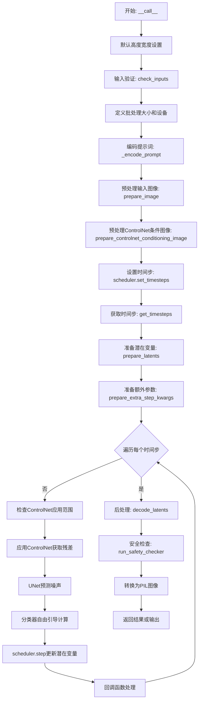
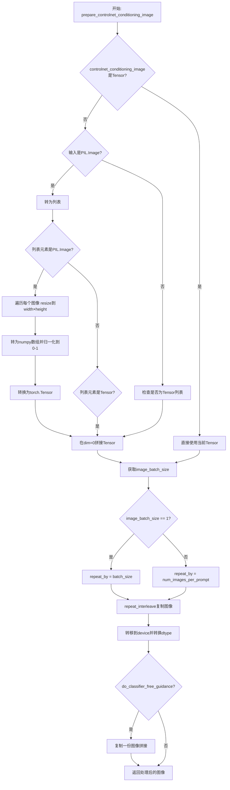
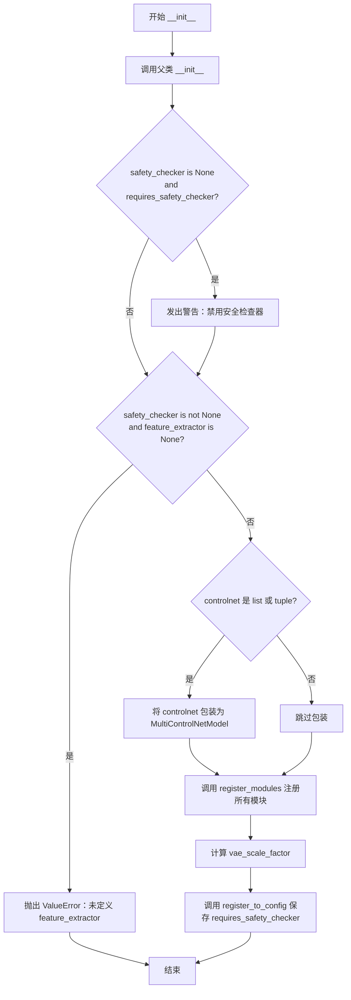
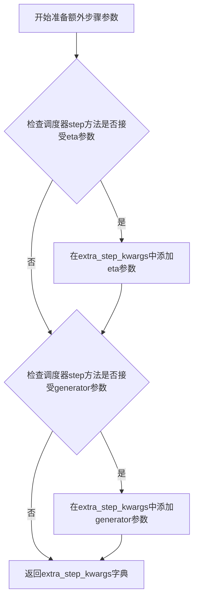
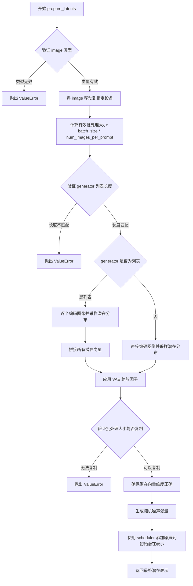
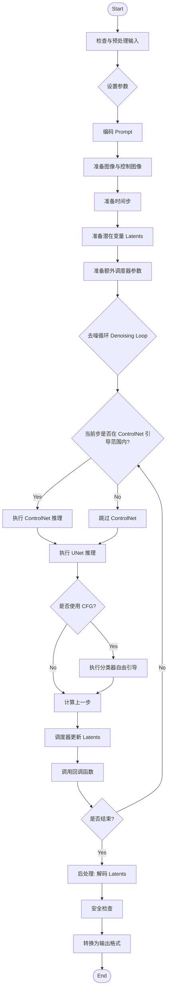

# `diffusers\examples\community\stable_diffusion_controlnet_img2img.py` 详细设计文档

这是一个基于Stable Diffusion的ControlNet图像到图像（Img2Img）生成管道。它结合了ControlNet模型来控制图像生成过程，允许用户通过条件图像（如边缘图、姿态等）来引导生成目标图像，同时保留原始图像的结构信息。该管道支持多种输入格式、分类器自由引导（CFG）、图像安全检查和自定义推理参数。

## 整体流程



## 类结构

```
DiffusionPipeline (抽象基类)
├── StableDiffusionMixin (混入类)
└── StableDiffusionControlNetImg2ImgPipeline
```

## 全局变量及字段


### `logger`
    
模块级日志记录器，用于记录管道运行时的日志信息

类型：`logging.Logger`
    


### `EXAMPLE_DOC_STRING`
    
示例文档字符串，包含该管道的使用示例和代码演示

类型：`str`
    


### `StableDiffusionControlNetImg2ImgPipeline.vae`
    
VAE编码器/解码器模型，用于将图像编码为潜在表示并从潜在表示解码为图像

类型：`AutoencoderKL`
    


### `StableDiffusionControlNetImg2ImgPipeline.text_encoder`
    
文本编码器，用于将文本提示转换为文本嵌入向量

类型：`CLIPTextModel`
    


### `StableDiffusionControlNetImg2ImgPipeline.tokenizer`
    
文本分词器，用于将文本提示分割为token序列

类型：`CLIPTokenizer`
    


### `StableDiffusionControlNetImg2ImgPipeline.unet`
    
UNet条件模型，用于在扩散过程中预测噪声残差

类型：`UNet2DConditionModel`
    


### `StableDiffusionControlNetImg2ImgPipeline.controlnet`
    
ControlNet模型，用于根据条件图像生成控制引导信息，增强生成图像的结构控制

类型：`Union[ControlNetModel, List[ControlNetModel], Tuple[ControlNetModel], MultiControlNetModel]`
    


### `StableDiffusionControlNetImg2ImgPipeline.scheduler`
    
扩散调度器，用于控制扩散过程中的噪声调度和时间步安排

类型：`KarrasDiffusionSchedulers`
    


### `StableDiffusionControlNetImg2ImgPipeline.safety_checker`
    
安全检查器，用于检测并过滤可能不适当的内容

类型：`StableDiffusionSafetyChecker`
    


### `StableDiffusionControlNetImg2ImgPipeline.feature_extractor`
    
特征提取器，用于从图像中提取特征供安全检查器使用

类型：`CLIPImageProcessor`
    


### `StableDiffusionControlNetImg2ImgPipeline.vae_scale_factor`
    
VAE缩放因子，用于调整VAE潜在空间的尺度，基于VAE块输出通道数计算

类型：`int`
    


### `StableDiffusionControlNetImg2ImgPipeline.requires_safety_checker`
    
是否需要安全检查器的标志，控制是否启用安全检查功能

类型：`bool`
    


### `StableDiffusionControlNetImg2ImgPipeline._optional_components`
    
可选组件列表，定义哪些组件在管道中是可选的（如safety_checker和feature_extractor）

类型：`List[str]`
    
    

## 全局函数及方法


### `prepare_image`

预处理输入图像（支持PIL.Image和torch.Tensor），将不同格式的输入统一转换为torch.Tensor格式，并进行归一化处理（归一化到[-1, 1]范围）。

参数：

- `image`：`Union[torch.Tensor, PIL.Image.Image, np.ndarray]`，输入图像，可以是PyTorch张量、PIL图像或NumPy数组

返回值：`torch.Tensor`，处理后的图像张量，形状为(batch_size, channels, height, width)，数据类型为float32，数值范围在[-1, 1]

#### 流程图

```mermaid
flowchart TD
    A[开始: prepare_image] --> B{image是否为torch.Tensor?}
    B -- 是 --> C{image.ndim == 3?}
    C -- 是 --> D[添加batch维度: image.unsqueeze(0)]
    C -- 否 --> E[保持原样]
    D --> F[转换为float32类型]
    F --> Z[返回处理后的tensor]
    B -- 否 --> G{image是否为PIL.Image或np.ndarray?}
    G -- 是 --> H[转换为列表: image = [image]]
    G -- 否 --> I[保持原样]
    H --> J{image[0]是否为PIL.Image?}
    J -- 是 --> K[转换为RGB数组并拼接]
    J -- 否 --> L{image[0]是否为np.ndarray?}
    L -- 是 --> M[拼接numpy数组]
    K --> N[维度转换: transpose(0, 3, 1, 2)]
    M --> N
    N --> O[转为Tensor并归一化 / 127.5 - 1.0]
    O --> Z
    I --> N
```

#### 带注释源码

```python
def prepare_image(image):
    # 判断输入是否为torch.Tensor类型
    if isinstance(image, torch.Tensor):
        # Batch single image: 如果是单张图像（3维），添加batch维度变成4维
        if image.ndim == 3:
            image = image.unsqueeze(0)

        # 确保数据类型为float32
        image = image.to(dtype=torch.float32)
    else:
        # 预处理PIL.Image或np.ndarray类型的图像
        # 如果是单个图像，转换为列表以统一处理
        if isinstance(image, (PIL.Image.Image, np.ndarray)):
            image = [image]

        # 处理PIL.Image列表：转换为RGB格式的numpy数组并拼接
        if isinstance(image, list) and isinstance(image[0], PIL.Image.Image):
            # 将每张PIL图像转换为RGB numpy数组，并在第0维添加batch维度
            image = [np.array(i.convert("RGB"))[None, :] for i in image]
            # 在第0维拼接所有图像
            image = np.concatenate(image, axis=0)
        # 处理numpy数组列表：直接在第0维拼接
        elif isinstance(image, list) and isinstance(image[0], np.ndarray):
            image = np.concatenate([i[None, :] for i in image], axis=0)

        # 维度转换：从 (batch, height, width, channels) 转换为 (batch, channels, height, width)
        image = image.transpose(0, 3, 1, 2)
        # 转换为torch.Tensor，并归一化到[-1, 1]范围
        # 原图范围[0, 255] -> [0, 1] -> [-1, 1]
        image = torch.from_numpy(image).to(dtype=torch.float32) / 127.5 - 1.0

    return image
```


### `prepare_controlnet_conditioning_image`

该函数用于预处理ControlNet的条件图像，将PIL图像或张量转换为标准化的PyTorch张量格式，并根据批次大小和引导参数进行相应的复制和拼接操作，以适配Stable Diffusion ControlNet pipeline的输入要求。

参数：

- `controlnet_conditioning_image`：`Union[torch.Tensor, PIL.Image.Image, List[torch.Tensor], List[PIL.Image.Image]]`，ControlNet的条件图像输入，可以是单个图像、图像列表或张量
- `width`：`int`，目标图像宽度（像素）
- `height`：`int`，目标图像高度（像素）
- `batch_size`：`int`，prompt批处理大小，用于确定图像重复次数
- `num_images_per_prompt`：`int`，每个prompt生成的图像数量
- `device`：`torch.device`，目标设备（CPU或GPU）
- `dtype`：`torch.dtype`，目标数据类型（如torch.float32）
- `do_classifier_free_guidance`：`bool`，是否启用无分类器自由引导（CFG）

返回值：`torch.Tensor`，预处理后的条件图像张量，形状为 [batch_size, 3, height, width]（如启用CFG则翻倍）

#### 流程图



#### 带注释源码

```python
def prepare_controlnet_conditioning_image(
    controlnet_conditioning_image,  # 输入：ControlNet条件图像
    width,                          # 目标宽度
    height,                         # 目标高度
    batch_size,                     # 批次大小
    num_images_per_prompt,          # 每个prompt生成的图像数
    device,                         # 目标设备
    dtype,                          # 目标数据类型
    do_classifier_free_guidance,   # 是否启用CFG
):
    # 步骤1：如果输入不是Tensor，则进行格式转换
    if not isinstance(controlnet_conditioning_image, torch.Tensor):
        # 如果是单个PIL Image，转为列表处理
        if isinstance(controlnet_conditioning_image, PIL.Image.Image):
            controlnet_conditioning_image = [controlnet_conditioning_image]

        # 步骤2：处理PIL Image列表
        if isinstance(controlnet_conditioning_image[0], PIL.Image.Image):
            # 遍历每个图像：resize、转换、归一化
            controlnet_conditioning_image = [
                np.array(i.resize((width, height), resample=PIL_INTERPOLATION["lanczos"]))[None, :]
                for i in controlnet_conditioning_image
            ]
            # 在batch维度拼接
            controlnet_conditioning_image = np.concatenate(controlnet_conditioning_image, axis=0)
            # 归一化到[0, 1]范围
            controlnet_conditioning_image = np.array(controlnet_conditioning_image).astype(np.float32) / 255.0
            # 转换为CHW格式
            controlnet_conditioning_image = controlnet_conditioning_image.transpose(0, 3, 1, 2)
            # 转为Tensor
            controlnet_conditioning_image = torch.from_numpy(controlnet_conditioning_image)
        # 步骤3：处理Tensor列表
        elif isinstance(controlnet_conditioning_image[0], torch.Tensor):
            # 直接在batch维度拼接
            controlnet_conditioning_image = torch.cat(controlnet_conditioning_image, dim=0)

    # 获取输入图像的批次大小
    image_batch_size = controlnet_conditioning_image.shape[0]

    # 步骤4：根据图像批次大小确定重复次数
    if image_batch_size == 1:
        # 单张图像：按batch_size重复
        repeat_by = batch_size
    else:
        # 多张图像：按num_images_per_prompt重复
        repeat_by = num_images_per_prompt

    # 步骤5：重复图像以匹配批次
    controlnet_conditioning_image = controlnet_conditioning_image.repeat_interleave(repeat_by, dim=0)

    # 步骤6：转移至目标设备并转换数据类型
    controlnet_conditioning_image = controlnet_conditioning_image.to(device=device, dtype=dtype)

    # 步骤7：如果启用CFG，复制图像用于无条件和有条件两种推理
    if do_classifier_free_guidance:
        controlnet_conditioning_image = torch.cat([controlnet_conditioning_image] * 2)

    # 返回处理后的条件图像
    return controlnet_conditioning_image
```


### StableDiffusionControlNetImg2ImgPipeline.__init__

这是 Stable Diffusion ControlNet Img2Img Pipeline 的初始化方法，负责接收并注册所有的模型组件（VAE、文本编码器、分词器、UNet、ControlNet、调度器、安全检查器等），并进行参数校验和配置初始化。

参数：

- `vae`：`AutoencoderKL`，变分自编码器，用于将图像编码到潜在空间和从潜在空间解码图像
- `text_encoder`：`CLIPTextModel`，CLIP 文本编码器，用于将文本提示编码为嵌入向量
- `tokenizer`：`CLIPTokenizer`，CLIP 分词器，用于将文本分词为 token ID
- `unet`：`UNet2DConditionModel`，UNet2D 条件模型，用于去噪潜在表示
- `controlnet`：`Union[ControlNetModel, List[ControlNetModel], Tuple[ControlNetModel], MultiControlNetModel]`，ControlNet 模型或多个 ControlNet 的组合，用于根据条件图像生成额外的控制信息
- `scheduler`：`KarmasDiffusionSchedulers`，扩散调度器，管理去噪步骤和噪声调度
- `safety_checker`：`StableDiffusionSafetyChecker`，安全检查器，用于检测和过滤不安全的内容
- `feature_extractor`：`CLIPImageProcessor`，CLIP 图像处理器，用于提取图像特征供安全检查器使用
- `requires_safety_checker`：`bool`，是否需要安全检查器，默认为 True

返回值：无（`None`），该方法为构造函数，不返回任何值

#### 流程图



#### 带注释源码

```python
def __init__(
    self,
    vae: AutoencoderKL,
    text_encoder: CLIPTextModel,
    tokenizer: CLIPTokenizer,
    unet: UNet2DConditionModel,
    controlnet: Union[ControlNetModel, List[ControlNetModel], Tuple[ControlNetModel], MultiControlNetModel],
    scheduler: KarrasDiffusionSchedulers,
    safety_checker: StableDiffusionSafetyChecker,
    feature_extractor: CLIPImageProcessor,
    requires_safety_checker: bool = True,
):
    """
    初始化 StableDiffusionControlNetImg2ImgPipeline
    
    参数:
        vae: 变分自编码器 (Variational Autoencoder)
        text_encoder: CLIP 文本编码器
        tokenizer: CLIP 分词器
        unet: UNet2D 条件模型
        controlnet: ControlNet 模型，支持单个、列表或元组形式
        scheduler: 扩散调度器
        safety_checker: 安全检查器
        feature_extractor: CLIP 图像处理器
        requires_safety_checker: 是否需要安全检查器
    """
    # 调用父类 DiffusionPipeline 和 StableDiffusionMixin 的初始化方法
    super().__init__()

    # 如果 safety_checker 为 None 但 requires_safety_checker 为 True，发出警告
    if safety_checker is None and requires_safety_checker:
        logger.warning(
            f"You have disabled the safety checker for {self.__class__} by passing `safety_checker=None`. Ensure"
            " that you abide to the conditions of the Stable Diffusion license and do not expose unfiltered"
            " results in services or applications open to the public. Both the diffusers team and Hugging Face"
            " strongly recommend to keep the safety filter enabled in all public facing circumstances, disabling"
            " it only for use-cases that involve analyzing network behavior or auditing its results. For more"
            " information, please have a look at https://github.com/huggingface/diffusers/pull/254 ."
        )

    # 如果 safety_checker 不为 None 但 feature_extractor 为 None，抛出错误
    if safety_checker is not None and feature_extractor is None:
        raise ValueError(
            "Make sure to define a feature extractor when loading {self.__class__} if you want to use the safety"
            " checker. If you do not want to use the safety checker, you can pass `'safety_checker=None'` instead."
        )

    # 如果 controlnet 是 list 或 tuple 类型，包装为 MultiControlNetModel
    if isinstance(controlnet, (list, tuple)):
        controlnet = MultiControlNetModel(controlnet)

    # 注册所有模块到 Pipeline
    self.register_modules(
        vae=vae,
        text_encoder=text_encoder,
        tokenizer=tokenizer,
        unet=unet,
        controlnet=controlnet,
        scheduler=scheduler,
        safety_checker=safety_checker,
        feature_extractor=feature_extractor,
    )
    
    # 计算 VAE 缩放因子，基于 VAE 块输出通道数的幂次
    # 公式: 2 ** (len(vae.config.block_out_channels) - 1)
    # 如果没有 VAE，则默认使用 8
    self.vae_scale_factor = 2 ** (len(self.vae.config.block_out_channels) - 1) if getattr(self, "vae", None) else 8
    
    # 将 requires_safety_checker 注册到配置中
    self.register_to_config(requires_safety_checker=requires_safety_checker)
```


### StableDiffusionControlNetImg2ImgPipeline._encode_prompt

该方法负责将文本提示（prompt）编码为文本编码器的隐藏状态（text encoder hidden states），支持批处理、负面提示（negative prompt）以及无分类器引导（classifier-free guidance）。

参数：

- `self`：隐式参数，StableDiffusionControlNetImg2ImgPipeline 实例，Pipeline 对象本身
- `prompt`：`str` 或 `List[str]`，要编码的文本提示词，可以是单个字符串或字符串列表
- `device`：`torch.device`，PyTorch 设备对象，指定计算设备（如 CPU 或 CUDA）
- `num_images_per_prompt`：`int`，每个提示词需要生成的图像数量，用于复制embeddings
- `do_classifier_free_guidance`：`bool`，是否启用无分类器引导，如果为 True 则需要生成无条件embeddings以进行引导
- `negative_prompt`：`str` 或 `List[str]` 或 `None`，可选的负面提示词，用于引导图像生成方向
- `prompt_embeds`：`Optional[torch.Tensor]`，可选的预生成文本embeddings，如果提供则直接使用而不从prompt生成
- `negative_prompt_embeds`：`Optional[torch.Tensor]`，可选的预生成负面文本embeddings

返回值：`torch.Tensor`，编码后的文本embeddings张量，形状为 (batch_size * num_images_per_prompt * 2, seq_len, hidden_dim)，当启用无分类器引导时会在前面拼接上负面embeddings

#### 流程图

```mermaid
flowchart TD
    A[开始 _encode_prompt] --> B{判断 prompt 类型}
    B -->|字符串| C[batch_size = 1]
    B -->|列表| D[batch_size = len(prompt)]
    B -->|其他| E[batch_size = prompt_embeds.shape[0]]
    
    C --> F{prompt_embeds 是否存在?}
    D --> F
    E --> F
    
    F -->|否| G[调用 tokenizer 对 prompt 分词]
    G --> H[检查是否截断,输出警告]
    H --> I{text_encoder 是否使用 attention_mask?}
    I -->|是| J[获取 attention_mask]
    I -->|否| K[attention_mask = None]
    J --> L[调用 text_encoder 编码]
    K --> L
    L --> M[提取 prompt_embeds[0]]
    
    F -->|是| N[直接使用现有的 prompt_embeds]
    
    M --> O[转换 dtype 和 device]
    N --> O
    
    O --> P[复制 embeddings 以匹配 num_images_per_prompt]
    P --> Q[重塑为 batch_size * num_images_per_prompt, seq_len, -1]
    
    Q --> R{do_classifier_free_guidance 为真且 negative_prompt_embeds 为空?}
    R -->|是| S{negative_prompt 是否存在?}
    R -->|否| T[返回 prompt_embeds]
    
    S -->|否| U[uncond_tokens = 空字符串列表]
    S -->|是字符串| V[uncond_tokens = [negative_prompt]]
    S -->|是列表| W{长度是否匹配 batch_size?}
    W -->|是| X[uncond_tokens = negative_prompt]
    W -->|否| Y[抛出 ValueError]
    
    U --> Z[tokenizer 处理 uncond_tokens]
    V --> Z
    X --> Z
    
    Z --> AA{text_encoder 使用 attention_mask?}
    AA -->|是| AB[获取 attention_mask]
    AA -->|否| AC[attention_mask = None]
    AB --> AD[调用 text_encoder 编码]
    AC --> AD
    AD --> AE[提取 negative_prompt_embeds[0]]
    
    AE --> AF[复制 negative_prompt_embeds]
    AF --> AG[重塑为 batch_size * num_images_per_prompt, seq_len, -1]
    
    AG --> AH[torch.cat: 拼接 negative_prompt_embeds 和 prompt_embeds]
    AH --> T
    
    T --> AI[结束,返回 embeddings]
```

#### 带注释源码

```python
def _encode_prompt(
    self,
    prompt,
    device,
    num_images_per_prompt,
    do_classifier_free_guidance,
    negative_prompt=None,
    prompt_embeds: Optional[torch.Tensor] = None,
    negative_prompt_embeds: Optional[torch.Tensor] = None,
):
    r"""
    Encodes the prompt into text encoder hidden states.

    Args:
         prompt (`str` or `List[str]`, *optional*):
            prompt to be encoded
        device: (`torch.device`):
            torch device
        num_images_per_prompt (`int`):
            number of images that should be generated per prompt
        do_classifier_free_guidance (`bool`):
            whether to use classifier free guidance or not
        negative_prompt (`str` or `List[str]`, *optional*):
            The prompt or prompts not to guide the image generation. If not defined, one has to pass
            `negative_prompt_embeds` instead. Ignored when not using guidance (i.e., ignored if `guidance_scale` is less than `1`).
        prompt_embeds (`torch.Tensor`, *optional*):
            Pre-generated text embeddings. Can be used to easily tweak text inputs, *e.g.* prompt weighting. If not
            provided, text embeddings will be generated from `prompt` input argument.
        negative_prompt_embeds (`torch.Tensor`, *optional*):
            Pre-generated negative text embeddings. Can be used to easily tweak text inputs, *e.g.* prompt
            weighting. If not provided, negative_prompt_embeds will be generated from `negative_prompt` input
            argument.
    """
    # 确定批次大小：如果 prompt 是字符串则为 1，如果是列表则为其长度，否则使用 prompt_embeds 的批次大小
    if prompt is not None and isinstance(prompt, str):
        batch_size = 1
    elif prompt is not None and isinstance(prompt, list):
        batch_size = len(prompt)
    else:
        batch_size = prompt_embeds.shape[0]

    # 如果没有提供预计算的 prompt_embeds，则从 prompt 生成
    if prompt_embeds is None:
        # 调用 tokenizer 将文本转换为 token IDs
        text_inputs = self.tokenizer(
            prompt,
            padding="max_length",  # 填充到最大长度
            max_length=self.tokenizer.model_max_length,  # 使用模型支持的最大长度
            truncation=True,  # 截断过长的序列
            return_tensors="pt",  # 返回 PyTorch 张量
        )
        text_input_ids = text_inputs.input_ids  # 获取 token IDs
        
        # 同时获取未截断的 token IDs，用于检测截断情况
        untruncated_ids = self.tokenizer(prompt, padding="longest", return_tensors="pt").input_ids

        # 检查是否发生了截断，如果是则警告用户
        if untruncated_ids.shape[-1] >= text_input_ids.shape[-1] and not torch.equal(
            text_input_ids, untruncated_ids
        ):
            removed_text = self.tokenizer.batch_decode(
                untruncated_ids[:, self.tokenizer.model_max_length - 1 : -1]
            )
            logger.warning(
                "The following part of your input was truncated because CLIP can only handle sequences up to"
                f" {self.tokenizer.model_max_length} tokens: {removed_text}"
            )

        # 检查 text_encoder 配置是否需要 attention_mask
        if hasattr(self.text_encoder.config, "use_attention_mask") and self.text_encoder.config.use_attention_mask:
            attention_mask = text_inputs.attention_mask.to(device)  # 将 attention_mask 移到目标设备
        else:
            attention_mask = None  # 不需要 attention_mask

        # 使用 text_encoder 编码文本得到 embeddings
        prompt_embeds = self.text_encoder(
            text_input_ids.to(device),
            attention_mask=attention_mask,
        )
        # 通常 text_encoder 返回一个元组，取第一个元素（hidden states）
        prompt_embeds = prompt_embeds[0]

    # 确保 prompt_embeds 的 dtype 和 device 正确
    prompt_embeds = prompt_embeds.to(dtype=self.text_encoder.dtype, device=device)

    # 获取 embeddings 的形状信息：batch_size, sequence_length, hidden_dim
    bs_embed, seq_len, _ = prompt_embeds.shape
    
    # 复制 embeddings 以匹配 num_images_per_prompt（每个 prompt 生成多张图像）
    # 使用 repeat 方法而不是 clone，以提高 MPS 兼容性
    prompt_embeds = prompt_embeds.repeat(1, num_images_per_prompt, 1)
    # 重塑为 (batch_size * num_images_per_prompt, seq_len, hidden_dim)
    prompt_embeds = prompt_embeds.view(bs_embed * num_images_per_prompt, seq_len, -1)

    # 如果启用无分类器引导且没有提供 negative_prompt_embeds，则生成无条件 embeddings
    if do_classifier_free_guidance and negative_prompt_embeds is None:
        uncond_tokens: List[str]
        
        # 处理 negative_prompt：确定无条件 tokens
        if negative_prompt is None:
            uncond_tokens = [""] * batch_size  # 使用空字符串
        elif type(prompt) is not type(negative_prompt):
            raise TypeError(
                f"`negative_prompt` should be the same type to `prompt`, but got {type(negative_prompt)} !="
                f" {type(prompt)}."
            )
        elif isinstance(negative_prompt, str):
            uncond_tokens = [negative_prompt]  # 包装为列表
        elif batch_size != len(negative_prompt):
            raise ValueError(
                f"`negative_prompt`: {negative_prompt} has batch size {len(negative_prompt)}, but `prompt`:"
                f" {prompt} has batch size {batch_size}. Please make sure that passed `negative_prompt` matches"
                " the batch size of `prompt`."
            )
        else:
            uncond_tokens = negative_prompt

        # 获取 prompt_embeds 的序列长度，用于 padding
        max_length = prompt_embeds.shape[1]
        
        # 对无条件 tokens 进行 tokenize
        uncond_input = self.tokenizer(
            uncond_tokens,
            padding="max_length",
            max_length=max_length,
            truncation=True,
            return_tensors="pt",
        )

        # 处理 attention_mask
        if hasattr(self.text_encoder.config, "use_attention_mask") and self.text_encoder.config.use_attention_mask:
            attention_mask = uncond_input.attention_mask.to(device)
        else:
            attention_mask = None

        # 编码无条件 tokens 得到 negative_prompt_embeds
        negative_prompt_embeds = self.text_encoder(
            uncond_input.input_ids.to(device),
            attention_mask=attention_mask,
        )
        negative_prompt_embeds = negative_prompt_embeds[0]

    # 如果启用无分类器引导
    if do_classifier_free_guidance:
        # 复制无条件 embeddings 以匹配 num_images_per_prompt
        seq_len = negative_prompt_embeds.shape[1]

        negative_prompt_embeds = negative_prompt_embeds.to(dtype=self.text_encoder.dtype, device=device)

        negative_prompt_embeds = negative_prompt_embeds.repeat(1, num_images_per_prompt, 1)
        negative_prompt_embeds = negative_prompt_embeds.view(batch_size * num_images_per_prompt, seq_len, -1)

        # 对于无分类器引导，需要同时考虑有条件和无条件 embeddings
        # 这里将无条件 embeddings 拼接到条件 embeddings 前面
        # 在推理时，会分别计算噪声预测然后相减来实现引导效果
        prompt_embeds = torch.cat([negative_prompt_embeds, prompt_embeds])

    return prompt_embeds
```


### `StableDiffusionControlNetImg2ImgPipeline.run_safety_checker`

该方法用于对生成的图像进行安全检查（NSFW检测），通过调用StableDiffusionSafetyChecker来识别图像中是否存在不适合公开的内容。如果safety_checker未配置，则直接返回原图像并将NSFW概念标记为None。

参数：

- `image`：`torch.Tensor`，需要检查的图像张量，通常是经过解码的latents转换而来的图像
- `device`：`torch.device`，用于执行安全检查的设备（CPU或CUDA）
- `dtype`：`torch.dtype`，图像张量的数据类型，用于与safety_checker配合

返回值：`Tuple[torch.Tensor, Optional[torch.Tensor]]`，返回检查后的图像和NSFW概念检测结果元组。第一个元素是处理后的图像（可能被修改），第二个元素是布尔张量，表示每个图像是否包含NSFW内容，如果safety_checker为None则返回None

#### 流程图

```mermaid
flowchart TD
    A[开始 run_safety_checker] --> B{self.safety_checker is not None?}
    B -->|是| C[调用 feature_extractor 将 tensor 转为 PIL Image]
    C --> D[使用 feature_extractor 提取特征并转为 pytorch tensor]
    D --> E[调用 safety_checker 进行 NSFW 检测]
    E --> F[获取检查后的 image 和 has_nsfw_concept 标记]
    F --> G[返回 (image, has_nsfw_concept)]
    B -->|否| H[设置 has_nsfw_concept = None]
    H --> I[返回 (原始image, None)]
```

#### 带注释源码

```python
def run_safety_checker(self, image, device, dtype):
    """
    对生成的图像运行安全检查器，检测是否存在不适合公开的内容（NSFW）
    
    参数:
        image: torch.Tensor - 经过解码的图像张量，形状为 [B, C, H, W]
        device: torch.device - 执行安全检查的设备
        dtype: torch.dtype - 图像张量的数据类型
    
    返回:
        tuple: (处理后的图像, NSFW检测结果)
            - 图像: 如果safety_checker存在则返回处理后的图像，否则返回原图像
            - NSFW标记: 如果safety_checker存在则返回检测结果张量，否则返回None
    """
    # 检查是否配置了安全检查器
    if self.safety_checker is not None:
        # 1. 将图像张量转换为PIL Image列表（feature_extractor需要PIL格式）
        # 2. 使用feature_extractor提取特征并转换为pytorch张量
        # 3. 将特征张量移动到指定设备
        safety_checker_input = self.feature_extractor(
            self.numpy_to_pil(image),  # 将numpy数组转换为PIL Image
            return_tensors="pt"       # 返回pytorch张量
        ).to(device)                   # 移动到计算设备
        
        # 调用safety_checker进行实际的安全检查
        # 参数:
        #   - images: 待检查的图像张量
        #   - clip_input: 经过feature_extractor处理的CLIP输入特征
        image, has_nsfw_concept = self.safety_checker(
            images=image, 
            clip_input=safety_checker_input.pixel_values.to(dtype)  # 转换数据类型
        )
    else:
        # 如果未配置安全检查器，设置NSFW概念为None（表示未进行检查）
        has_nsfw_concept = None
    
    # 返回处理后的图像和NSFW检测结果
    return image, has_nsfw_concept
```


### `StableDiffusionControlNetImg2ImgPipeline.decode_latents`

该方法负责将VAE潜在空间中的向量解码为最终的可视化图像。它首先对潜在向量进行缩放以恢复原始表示，然后通过VAE解码器生成图像，接着将图像值从[-1, 1]范围归一化到[0, 1]范围，最后将张量转换为NumPy数组以便后续处理或返回给用户。

参数：

- `latents`：`torch.Tensor`，VAE潜在空间的向量，通常是去噪过程中的中间结果

返回值：`numpy.ndarray`，解码后的图像数组，形状为(batch_size, height, width, channels)，像素值范围为[0, 1]

#### 流程图

```mermaid
flowchart TD
    A[接收latents输入] --> B[缩放latents: latents = 1/scaling_factor \* latents]
    B --> C[VAE解码: vae.decode(latents).sample]
    C --> D[图像归一化: (image/2 + 0.5).clamp(0, 1)]
    D --> E[移至CPU并转换维度: cpu.permute(0, 2, 3, 1)]
    E --> F[转换为float32类型]
    F --> G[转换为NumPy数组]
    G --> H[返回图像数组]
```

#### 带注释源码

```python
def decode_latents(self, latents):
    """
    将VAE潜在向量解码为图像
    
    参数:
        latents: VAE潜在空间的张量，形状为 (batch_size, latent_channels, height, width)
    
    返回:
        图像NumPy数组，形状为 (batch_size, height, width, channels)，值范围[0, 1]
    """
    # 第一步：缩放潜在向量
    # VAE在编码时会乘以scaling_factor，这里需要除以回来以恢复原始潜在空间
    latents = 1 / self.vae.config.scaling_factor * latents
    
    # 第二步：使用VAE解码器将潜在向量解码为图像
    # vae.decode返回包含sample属性的输出对象
    image = self.vae.decode(latents).sample
    
    # 第三步：图像值归一化
    # VAE输出的值范围是[-1, 1]，需要转换到[0, 1]范围
    # 公式: (x / 2 + 0.5) 将[-1, 1]映射到[0, 1]
    # .clamp(0, 1) 确保值不会超出[0, 1]范围
    image = (image / 2 + 0.5).clamp(0, 1)
    
    # 第四步：转换为NumPy数组
    # 1. .cpu() 将张量从GPU移至CPU（如果还在GPU上）
    # 2. .permute(0, 2, 3, 1) 调整维度顺序从 (B, C, H, W) 变为 (B, H, W, C)
    # 3. .float() 转换为float32类型（因为某些后端操作如bfloat16可能有兼容性问题）
    # 4. .numpy() 将PyTorch张量转换为NumPy数组
    image = image.cpu().permute(0, 2, 3, 1).float().numpy()
    
    return image
```


### `StableDiffusionControlNetImg2ImgPipeline.prepare_extra_step_kwargs`

该方法用于准备调度器（scheduler）步骤所需的额外参数。由于不同调度器的签名不同，该方法通过检查调度器的`step`方法是否接受`eta`和`generator`参数来动态构建需要传递的额外关键字参数字典。

参数：

- `generator`：`Optional[Union[torch.Generator, List[torch.Generator]]]`，一个或多个torch生成器对象，用于使生成过程具有确定性
- `eta`：`float`，DDIM调度器专用的参数η（对应DDIM论文中的η），值应介于[0, 1]之间

返回值：`Dict[str, Any]`，包含调度器`step`方法所需额外参数（如`eta`和`generator`）的字典

#### 流程图



#### 带注释源码

```
def prepare_extra_step_kwargs(self, generator, eta):
    # 准备调度器步骤的额外参数，因为并非所有调度器都具有相同的签名
    # eta (η) 仅用于 DDIMScheduler，其他调度器将忽略它
    # eta 对应 DDIM 论文中的 η: https://huggingface.co/papers/2010.02502
    # 值应介于 [0, 1] 之间

    # 使用 inspect 模块检查调度器的 step 方法签名，判断是否接受 eta 参数
    accepts_eta = "eta" in set(inspect.signature(self.scheduler.step).parameters.keys())
    
    # 初始化空字典用于存储额外参数
    extra_step_kwargs = {}
    
    # 如果调度器接受 eta 参数，则将其添加到 extra_step_kwargs
    if accepts_eta:
        extra_step_kwargs["eta"] = eta

    # 检查调度器是否接受 generator 参数
    accepts_generator = "generator" in set(inspect.signature(self.scheduler.step).parameters.keys())
    
    # 如果调度器接受 generator 参数，则将其添加到 extra_step_kwargs
    if accepts_generator:
        extra_step_kwargs["generator"] = generator
    
    # 返回包含额外参数的字典，供调度器 step 方法使用
    return extra_step_kwargs
```


### `StableDiffusionControlNetImg2ImgPipeline.check_controlnet_conditioning_image`

该方法用于验证 ControlNet 条件图像的类型有效性和批次大小一致性，确保输入的图像满足 pipeline 的要求，如果图像类型或批次大小不符合规范则抛出相应的异常。

参数：

- `image`：`Union[PIL.Image.Image, torch.Tensor, List[PIL.Image.Image], List[torch.Tensor]]`，ControlNet 的条件图像，可以是单张 PIL 图像、单个张量、PIL 图像列表或张量列表
- `prompt`：`Union[str, List[str], None]`，用于引导图像生成的提示词，可以是字符串或字符串列表
- `prompt_embeds`：`Optional[torch.Tensor]`，预生成的文本嵌入，用于文本引导

返回值：`None`，该方法不返回任何值，仅进行验证并在不符合条件时抛出异常

#### 流程图

```mermaid
flowchart TD
    A[开始验证] --> B{检查 image 类型}
    B -->|PIL Image| C[设置 image_is_pil = True]
    B -->|torch.Tensor| D[设置 image_is_tensor = True]
    B -->|PIL Image 列表| E[设置 image_is_pil_list = True]
    B -->|torch.Tensor 列表| F[设置 image_is_tensor_list = True]
    B -->|其他类型| G[抛出 TypeError]
    
    C --> H{类型是否有效?}
    D --> H
    E --> H
    F --> H
    
    H -->|无效| G
    H -->|有效| I{确定 image_batch_size}
    
    I -->|image_is_pil| J[image_batch_size = 1]
    I -->|image_is_tensor| K[image_batch_size = image.shape[0]]
    I -->|image_is_pil_list| L[image_batch_size = len(image)]
    I -->|image_is_tensor_list| M[image_batch_size = len(image)]
    
    J --> N{确定 prompt_batch_size}
    K --> N
    L --> N
    M --> N
    
    N -->|prompt 是 str| O[prompt_batch_size = 1]
    N -->|prompt 是 list| P[prompt_batch_size = len(prompt)]
    N -->|prompt_embeds 不为 None| Q[prompt_batch_size = prompt_embeds.shape[0]]
    N -->|其他情况| R[抛出 ValueError]
    
    O --> S{验证批次大小}
    P --> S
    Q --> S
    
    S -->|image_batch_size == 1| T[验证通过]
    S -->|image_batch_size != prompt_batch_size| U[抛出 ValueError]
    S -->|image_batch_size == prompt_batch_size| T
    
    T --> V[结束验证]
    U --> V
    G --> V
    R --> V
```

#### 带注释源码

```python
def check_controlnet_conditioning_image(self, image, prompt, prompt_embeds):
    """
    检查 ControlNet 条件图像的类型和批次大小是否有效。
    
    参数:
        image: ControlNet 条件图像，支持 PIL.Image.Image, torch.Tensor, 
               List[PIL.Image.Image], List[torch.Tensor] 类型
        prompt: 文本提示词，支持 str, List[str] 类型
        prompt_embeds: 预计算的文本嵌入，torch.Tensor 类型
        
    异常:
        TypeError: 当 image 类型不在支持列表中时抛出
        ValueError: 当批次大小不匹配或无法确定时抛出
    """
    # 检查图像是否为 PIL Image
    image_is_pil = isinstance(image, PIL.Image.Image)
    # 检查图像是否为 torch Tensor
    image_is_tensor = isinstance(image, torch.Tensor)
    # 检查图像是否为 PIL Image 列表
    image_is_pil_list = isinstance(image, list) and isinstance(image[0], PIL.Image.Image)
    # 检查图像是否为 torch Tensor 列表
    image_is_tensor_list = isinstance(image, list) and isinstance(image[0], torch.Tensor)

    # 验证图像类型必须在支持列表中
    if not image_is_pil and not image_is_tensor and not image_is_pil_list and not image_is_tensor_list:
        raise TypeError(
            "image must be passed and be one of PIL image, torch tensor, list of PIL images, or list of torch tensors"
        )

    # 根据图像类型确定批次大小
    if image_is_pil:
        image_batch_size = 1  # 单张 PIL 图像，批次大小为 1
    elif image_is_tensor:
        image_batch_size = image.shape[0]  # 从张量形状获取批次大小
    elif image_is_pil_list:
        image_batch_size = len(image)  # 从列表长度获取批次大小
    elif image_is_tensor_list:
        image_batch_size = len(image)  # 从列表长度获取批次大小
    else:
        raise ValueError("controlnet condition image is not valid")

    # 根据 prompt 或 prompt_embeds 确定批次大小
    if prompt is not None and isinstance(prompt, str):
        prompt_batch_size = 1  # 单个字符串提示词
    elif prompt is not None and isinstance(prompt, list):
        prompt_batch_size = len(prompt)  # 从列表长度获取
    elif prompt_embeds is not None:
        prompt_batch_size = prompt_embeds.shape[0]  # 从嵌入形状获取
    else:
        raise ValueError("prompt or prompt_embeds are not valid")

    # 验证图像批次大小与提示词批次大小的一致性
    if image_batch_size != 1 and image_batch_size != prompt_batch_size:
        raise ValueError(
            f"If image batch size is not 1, image batch size must be same as prompt batch size. image batch size: {image_batch_size}, prompt batch size: {prompt_batch_size}"
        )
```


### `StableDiffusionControlNetImg2ImgPipeline.check_inputs`

该方法用于验证 Stable Diffusion ControlNet Img2Img Pipeline 的输入参数是否符合要求，包括检查图像尺寸、回调步骤、提示词、负提示词、ControlNet 条件图像、引导参数等是否合法。如果任何检查失败，该方法会抛出相应的 ValueError 或 TypeError 异常。

参数：

- `prompt`：`Union[str, List[str], None]`，用户输入的文本提示词，用于指导图像生成
- `image`：`Union[torch.Tensor, PIL.Image.Image, None]`，待处理的输入图像
- `controlnet_conditioning_image`：`Union[torch.Tensor, PIL.Image.Image, List[torch.Tensor], List[PIL.Image.Image], None]`，ControlNet 的条件输入图像
- `height`：`int`，生成图像的高度（像素），必须能被 8 整除
- `width`：`int`，生成图像的宽度（像素），必须能被 8 整除
- `callback_steps`：`int`，回调函数被调用的频率步数，必须为正整数
- `negative_prompt`：`Union[str, List[str], None]`，负向提示词，用于指导不想要的内容
- `prompt_embeds`：`Optional[torch.Tensor]`，预生成的文本嵌入向量
- `negative_prompt_embeds`：`Optional[torch.Tensor]`，预生成的负向文本嵌入向量
- `strength`：`Optional[float]`，图像变换强度，值在 [0, 1] 范围内
- `controlnet_guidance_start`：`Optional[float]`，ControlNet 开始应用的步骤百分比，值在 [0, 1] 范围内
- `controlnet_guidance_end`：`Optional[float]`，ControlNet 结束应用的步骤百分比，值在 [0, 1] 范围内
- `controlnet_conditioning_scale`：`Union[float, List[float], None]`，ControlNet 输出与原始 UNet 残差相加前的乘数因子

返回值：`None`，该方法不返回值，仅进行输入验证并可能在验证失败时抛出异常

#### 流程图

```mermaid
flowchart TD
    A([开始 check_inputs]) --> B{height % 8 == 0<br/>且 width % 8 == 0?}
    B -->|否| B1[抛出 ValueError:<br/>height和width必须能被8整除]
    B -->|是| C{callback_steps是<br/>正整数?}
    C -->|否| C1[抛出 ValueError:<callback_steps必须为正整数]
    C -->|是| D{prompt和<br/>prompt_embeds<br/>同时提供?}
    D -->|是| D1[抛出 ValueError:<br/>不能同时提供prompt和prompt_embeds]
    D -->|否| E{prompt和<br/>prompt_embeds<br/>都未提供?}
    E -->|是| E1[抛出 ValueError:<br/>必须提供prompt或prompt_embeds之一]
    E -->|否| F{prompt类型<br/>是否合法?}
    F -->|否| F1[抛出 ValueError:<br/>prompt必须是str或list类型]
    F -->|是| G{negative_prompt和<br/>negative_prompt_embeds<br/>同时提供?}
    G -->|是| G1[抛出 ValueError:<br/>不能同时提供两者]
    G -->|否| H{prompt_embeds和<br/>negative_prompt_embeds<br/>形状是否相同?}
    H -->|否| H1[抛出 ValueError:<br/>两者形状必须相同]
    H -->|是| I{ControlNet类型<br/>是ControlNetModel?}
    I -->|是| I1[调用check_controlnet_conditioning_image<br/>验证条件图像]
    I -->|否| J{ControlNet类型<br/>是MultiControlNetModel?}
    J -->|是| J1{controlnet_conditioning_image<br/>是list类型?}
    J1 -->|否| J2[抛出 TypeError:<br/>多ControlNet时必须提供list类型]
    J1 -->|是| J3{list长度是否等于<br/>ControlNet数量?}
    J3 -->|否| J3a[抛出 ValueError:<br/>长度必须与ControlNet数量一致]
    J3 -->|是| J4[遍历验证每个条件图像]
    J -->|否| J5[抛出断言错误]
    I1 --> K{controlnet_conditioning_scale<br/>类型检查?}
    K -->|单ControlNet| K1{是float类型?}
    K1 -->|否| K2[抛出 TypeError:<br/>必须是float类型]
    K1 -->|是| L
    K -->|多ControlNet| K3{是list类型?}
    K3 -->|是| K4{长度等于<br/>ControlNet数量?}
    K4 -->|否| K5[抛出 ValueError:<br/>长度必须一致]
    K4 -->|是| L
    K3 -->|否| L
    K -->|其他| L
    L{image是<br/>torch.Tensor?}
    L -->|是| L1{维度是3或4?}
    L1 -->|否| L2[抛出 ValueError:<br/>维度必须为3或4]
    L1 -->|是| L3{通道数=3?}
    L3 -->|否| L4[抛出 ValueError:<br/>通道数必须为3]
    L3 -->|是| L5{像素值在<br/>[-1, 1]范围?}
    L5 -->|否| L6[抛出 ValueError:<br/>像素值必须在[-1, 1]范围内]
    L -->|否| M{VAE latent通道数<br/>等于UNet输入通道数?}
    M -->|否| M1[抛出 ValueError:<br/>通道数配置不匹配]
    M -->|是| N{strength在[0,1]?}
    N -->|否| N1[抛出 ValueError:<br/>strength必须在[0,1]范围内]
    N -->|是| O{controlnet_guidance_start<br/>在[0,1]?}
    O -->|否| O1[抛出 ValueError]
    O -->|是| P{controlnet_guidance_end<br/>在[0,1]?}
    P -->|否| P1[抛出 ValueError]
    P -->|是| Q{controlnet_guidance_start<br/>< controlnet_guidance_end?}
    Q -->|否| Q1[抛出 ValueError:<br/>start必须小于end]
    Q -->|是| R([验证通过<br/>返回])
    
    B1 --> R
    C1 --> R
    D1 --> R
    E1 --> R
    F1 --> R
    G1 --> R
    H1 --> R
    J2 --> R
    J3a --> R
    J5 --> R
    K2 --> R
    K5 --> R
    L2 --> R
    L4 --> R
    L6 --> R
    M1 --> R
    N1 --> R
    O1 --> R
    P1 --> R
    Q1 --> R
```

#### 带注释源码

```python
def check_inputs(
    self,
    prompt,
    image,
    controlnet_conditioning_image,
    height,
    width,
    callback_steps,
    negative_prompt=None,
    prompt_embeds=None,
    negative_prompt_embeds=None,
    strength=None,
    controlnet_guidance_start=None,
    controlnet_guidance_end=None,
    controlnet_conditioning_scale=None,
):
    """
    验证 Pipeline 输入参数的合法性
    
    该方法执行多项检查以确保传入的参数符合 Pipeline 的要求。
    任何不符合要求的参数都会抛出相应的异常。
    """
    
    # 检查 1: 图像尺寸必须是 8 的倍数
    # Stable Diffusion 模型内部使用 8x8 的下采样块，尺寸必须能被 8 整除
    if height % 8 != 0 or width % 8 != 0:
        raise ValueError(f"`height` and `width` have to be divisible by 8 but are {height} and {width}.")

    # 检查 2: callback_steps 必须是正整数
    # callback_steps 用于控制回调函数被调用的频率，必须为正整数
    if (callback_steps is None) or (
        callback_steps is not None and (not isinstance(callback_steps, int) or callback_steps <= 0)
    ):
        raise ValueError(
            f"`callback_steps` has to be a positive integer but is {callback_steps} of type"
            f" {type(callback_steps)}."
        )

    # 检查 3: prompt 和 prompt_embeds 不能同时提供
    # 两者都是用于提供文本指导的，只能选择其中一种方式
    if prompt is not None and prompt_embeds is not None:
        raise ValueError(
            f"Cannot forward both `prompt`: {prompt} and `prompt_embeds`: {prompt_embeds}. Please make sure to"
            " only forward one of the two."
        )
    # 检查 4: prompt 和 prompt_embeds 必须至少提供一个
    # 必须提供文本指导才能进行图像生成
    elif prompt is None and prompt_embeds is None:
        raise ValueError(
            "Provide either `prompt` or `prompt_embeds`. Cannot leave both `prompt` and `prompt_embeds` undefined."
        )
    # 检查 5: prompt 类型必须是 str 或 list
    elif prompt is not None and (not isinstance(prompt, str) and not isinstance(prompt, list)):
        raise ValueError(f"`prompt` has to be of type `str` or `list` but is {type(prompt)}")

    # 检查 6: negative_prompt 和 negative_prompt_embeds 不能同时提供
    if negative_prompt is not None and negative_prompt_embeds is not None:
        raise ValueError(
            f"Cannot forward both `negative_prompt`: {negative_prompt} and `negative_prompt_embeds`:"
            f" {negative_prompt_embeds}. Please make sure to only forward one of the two."
        )

    # 检查 7: prompt_embeds 和 negative_prompt_embeds 形状必须相同
    # 当直接传入 embeddings 时，两者的维度必须匹配
    if prompt_embeds is not None and negative_prompt_embeds is not None:
        if prompt_embeds.shape != negative_prompt_embeds.shape:
            raise ValueError(
                "`prompt_embeds` and `negative_prompt_embeds` must have the same shape when passed directly, but"
                f" got: `prompt_embeds` {prompt_embeds.shape} != `negative_prompt_embeds`"
                f" {negative_prompt_embeds.shape}."
            )

    # 检查 8: ControlNet 条件图像验证
    # 根据 ControlNet 类型（单个或多个）进行不同的验证
    if isinstance(self.controlnet, ControlNetModel):
        # 单个 ControlNet 模型，使用辅助方法验证
        self.check_controlnet_conditioning_image(controlnet_conditioning_image, prompt, prompt_embeds)
    elif isinstance(self.controlnet, MultiControlNetModel):
        # 多个 ControlNet 模型，必须提供 list 类型的条件图像
        if not isinstance(controlnet_conditioning_image, list):
            raise TypeError("For multiple controlnets: `image` must be type `list`")

        # 验证条件图像数量与 ControlNet 数量是否匹配
        if len(controlnet_conditioning_image) != len(self.controlnet.nets):
            raise ValueError(
                "For multiple controlnets: `image` must have the same length as the number of controlnets."
            )

        # 遍历验证每个条件图像
        for image_ in controlnet_conditioning_image:
            self.check_controlnet_conditioning_image(image_, prompt, prompt_embeds)
    else:
        # 未知类型，触发断言错误
        assert False

    # 检查 9: ControlNet 条件图像缩放因子验证
    if isinstance(self.controlnet, ControlNetModel):
        # 单个 ControlNet 时，缩放因子必须是 float 类型
        if not isinstance(controlnet_conditioning_scale, float):
            raise TypeError("For single controlnet: `controlnet_conditioning_scale` must be type `float`.")
    elif isinstance(self.controlnet, MultiControlNetModel):
        # 多个 ControlNet 时，如果是 list 类型，长度必须匹配
        if isinstance(controlnet_conditioning_scale, list) and len(controlnet_conditioning_scale) != len(
            self.controlnet.nets
        ):
            raise ValueError(
                "For multiple controlnets: When `controlnet_conditioning_scale` is specified as `list`, it must have"
                " the same length as the number of controlnets"
            )
    else:
        assert False

    # 检查 10: 输入图像验证（如果是 Tensor 类型）
    # 验证图像的维度、通道数和像素值范围
    if isinstance(image, torch.Tensor):
        # 图像必须是 3D 或 4D Tensor
        # 3D: [C, H, W] - 单张图像
        # 4D: [B, C, H, W] - 图像批次
        if image.ndim != 3 and image.ndim != 4:
            raise ValueError("`image` must have 3 or 4 dimensions")

        if image.ndim == 3:
            image_batch_size = 1
            image_channels, image_height, image_width = image.shape
        elif image.ndim == 4:
            image_batch_size, image_channels, image_height, image_width = image.shape
        else:
            assert False

        # 图像必须是 RGB 三通道
        if image_channels != 3:
            raise ValueError("`image` must have 3 channels")

        # 像素值必须在 [-1, 1] 范围内（归一化后的值）
        if image.min() < -1 or image.max() > 1:
            raise ValueError("`image` should be in range [-1, 1]")

    # 检查 11: VAE 和 UNet 的通道数配置一致性
    # VAE 的潜在空间通道数必须与 UNet 的输入通道数匹配
    if self.vae.config.latent_channels != self.unet.config.in_channels:
        raise ValueError(
            f"The config of `pipeline.unet` expects {self.unet.config.in_channels} but received"
            f" latent channels: {self.vae.config.latent_channels},"
            f" Please verify the config of `pipeline.unet` and the `pipeline.vae`"
        )

    # 检查 12: strength 参数范围验证
    # strength 控制图像变换的程度，0 表示不变换，1 表示完全变换
    if strength < 0 or strength > 1:
        raise ValueError(f"The value of `strength` should in [0.0, 1.0] but is {strength}")

    # 检查 13: ControlNet 引导时间范围验证
    # controlnet_guidance_start 和 controlnet_guidance_end 必须在 [0, 1] 范围内
    if controlnet_guidance_start < 0 or controlnet_guidance_start > 1:
        raise ValueError(
            f"The value of `controlnet_guidance_start` should in [0.0, 1.0] but is {controlnet_guidance_start}"
        )

    if controlnet_guidance_end < 0 or controlnet_guidance_end > 1:
        raise ValueError(
            f"The value of `controlnet_guidance_end` should in [0.0, 1.0] but is {controlnet_guidance_end}"
        )

    # 检查 14: start 必须小于 end
    if controlnet_guidance_start > controlnet_guidance_end:
        raise ValueError(
            "The value of `controlnet_guidance_start` should be less than `controlnet_guidance_end`, but got"
            f" `controlnet_guidance_start` {controlnet_guidance_start} >= `controlnet_guidance_end` {controlnet_guidance_end}"
        )
```


### `StableDiffusionControlNetImg2ImgPipeline.get_timesteps`

该方法用于根据推理步数和强度参数计算实际的时间步序列，决定在去噪过程中从哪个时间步开始执行。

参数：

- `num_inference_steps`：`int`，推理过程中的去噪步数总数
- `strength`：`float`，概念上表示对参考图像的变换程度，取值范围 [0, 1]，值越大变换越多
- `device`：`torch.device`，计算设备

返回值：`Tuple[torch.Tensor, int]`，返回时间步张量及实际推理步数

#### 流程图

```mermaid
flowchart TD
    A[开始 get_timesteps] --> B[计算 init_timestep = min(num_inference_steps * strength, num_inference_steps)]
    B --> C[计算 t_start = max(num_inference_steps - init_timestep, 0)]
    C --> D[从 scheduler.timesteps 中切片获取 timesteps[t_start:]]
    E[返回 timesteps, num_inference_steps - t_start]
    D --> E
```

#### 带注释源码

```python
def get_timesteps(self, num_inference_steps, strength, device):
    """
    根据推理步数和强度计算实际使用的时间步序列
    
    参数:
        num_inference_steps: 总推理步数
        strength: 图像变换强度 (0-1之间)
        device: torch设备
    """
    # 根据强度计算初始时间步数，最多不超过总步数
    init_timestep = min(int(num_inference_steps * strength), num_inference_steps)

    # 计算起始索引，确保不为负数
    t_start = max(num_inference_steps - init_timestep, 0)
    
    # 从调度器的完整时间步序列中切片获取实际使用的时间步
    timesteps = self.scheduler.timesteps[t_start:]

    # 返回时间步序列和实际推理步数
    return timesteps, num_inference_steps - t_start
```


### `StableDiffusionControlNetImg2ImgPipeline.prepare_latents`

该方法用于准备图像的潜在表示（latents），将输入图像编码为潜在空间，并添加噪声以支持图像到图像的扩散过程。

参数：

- `image`：`torch.Tensor | PIL.Image.Image | list`，输入的原始图像，用于提取潜在表示
- `timestep`：`torch.Tensor`，当前扩散过程的时间步，用于决定添加的噪声量
- `batch_size`：`int`，基础的批处理大小
- `num_images_per_prompt`：`int`，每个提示词生成的图像数量
- `dtype`：`torch.dtype`，指定张量的数据类型（如 float16、float32 等）
- `device`：`torch.device`，计算设备（CPU 或 CUDA）
- `generator`：`torch.Generator | list`，可选的随机数生成器，用于确保可重复的噪声生成

返回值：`torch.Tensor`，处理后的潜在表示，包含添加的噪声，可用于后续的扩散去噪过程

#### 流程图



#### 带注释源码

```python
def prepare_latents(self, image, timestep, batch_size, num_images_per_prompt, dtype, device, generator=None):
    """
    准备图像的潜在表示，用于图像到图像的扩散过程
    
    参数:
        image: 输入图像 (torch.Tensor, PIL.Image.Image, 或 list)
        timestep: 当前扩散时间步
        batch_size: 基础批处理大小
        num_images_per_prompt: 每个提示词生成的图像数量
        dtype: 张量数据类型
        device: 计算设备
        generator: 可选的随机数生成器
    """
    # 1. 验证输入图像类型是否为支持的类型
    if not isinstance(image, (torch.Tensor, PIL.Image.Image, list)):
        raise ValueError(
            f"`image` has to be of type `torch.Tensor`, `PIL.Image.Image` or list but is {type(image)}"
        )

    # 2. 将图像移动到指定的计算设备和数据类型
    image = image.to(device=device, dtype=dtype)

    # 3. 计算有效批处理大小（基础批处理 × 每提示词图像数）
    batch_size = batch_size * num_images_per_prompt
    
    # 4. 如果提供的是生成器列表，验证其长度是否匹配批处理大小
    if isinstance(generator, list) and len(generator) != batch_size:
        raise ValueError(
            f"You have passed a list of generators of length {len(generator)}, but requested an effective batch"
            f" size of {batch_size}. Make sure the batch size matches the length of the generators."
        )

    # 5. 使用 VAE 编码图像到潜在空间
    if isinstance(generator, list):
        # 逐个处理每个图像，使用对应的生成器
        init_latents = [
            self.vae.encode(image[i : i + 1]).latent_dist.sample(generator[i]) for i in range(batch_size)
        ]
        # 沿批处理维度拼接所有潜在向量
        init_latents = torch.cat(init_latents, dim=0)
    else:
        # 批量编码图像，使用单个生成器
        init_latents = self.vae.encode(image).latent_dist.sample(generator)

    # 6. 应用 VAE 缩放因子（通常用于将潜在表示缩放到适当的范围）
    init_latents = self.vae.config.scaling_factor * init_latents

    # 7. 验证是否可以安全地复制潜在表示以匹配批处理大小
    if batch_size > init_latents.shape[0] and batch_size % init_latents.shape[0] == 0:
        raise ValueError(
            f"Cannot duplicate `image` of batch size {init_latents.shape[0]} to {batch_size} text prompts."
        )
    else:
        # 确保潜在向量在正确的维度上（即使只有一个也进行拼接）
        init_latents = torch.cat([init_latents], dim=0)

    # 8. 生成与潜在表示形状相同的随机噪声
    shape = init_latents.shape
    noise = randn_tensor(shape, generator=generator, device=device, dtype=dtype)

    # 9. 根据指定的时间步，将噪声添加到初始潜在表示中
    # 这实现了图像到图像转换的核心：保持原始图像的结构同时添加噪声
    init_latents = self.scheduler.add_noise(init_latents, noise, timestep)
    latents = init_latents

    # 10. 返回最终的潜在表示，用于后续的去噪过程
    return latents
```


### `StableDiffusionControlNetImg2ImgPipeline._default_height_width`

该方法用于在用户未指定输出图像的高度和宽度时，自动从输入图像中推断合适的尺寸，并确保尺寸为8的倍数以适配UNet和VAE的要求。

参数：

- `height`：`Optional[int]`，用户期望的图像高度，如果为 `None` 则需要从输入图像推断
- `width`：`Optional[int]`，用户期望的图像宽度，如果为 `None` 则需要从输入图像推断
- `image`：`Union[torch.Tensor, PIL.Image.Image, List[torch.Tensor], List[PIL.Image.Image]]`，输入图像，用于推断高度和宽度

返回值：`Tuple[int, int]`，返回计算后的高度和宽度（均为8的倍数）

#### 流程图

```mermaid
flowchart TD
    A[开始 _default_height_width] --> B{image 是否为 list}
    B -->|Yes| C[取 image[0] 作为实际图像]
    B -->|No| D[直接使用 image]
    C --> E{height 是否为 None}
    D --> E
    E -->|Yes| F{image 类型}
    E -->|No| G{width 是否为 None}
    F -->|PIL.Image.Image| H[height = image.height]
    F -->|torch.Tensor| I[height = image.shape[3]]
    H --> J[height = (height // 8) * 8]
    I --> J
    J --> G
    G -->|Yes| K{image 类型}
    G -->|No| L[返回 (height, width)]
    K -->|PIL.Image.Image| M[width = image.width]
    K -->|torch.Tensor| N[width = image.shape[2]]
    M --> O[width = (width // 8) * 8]
    N --> O
    O --> L
```

#### 带注释源码

```python
def _default_height_width(self, height, width, image):
    """
    确定输出图像的高度和宽度。
    
    如果用户未指定 height 或 width，则从输入图像中推断。
    确保返回的尺寸是 8 的倍数，以适配 UNet 和 VAE 的要求。
    
    参数:
        height (Optional[int]): 用户指定的高度，如果为 None 则从 image 推断
        width (Optional[int]): 用户指定的宽度，如果为 None 则从 image 推断
        image: 输入图像，可以是 PIL.Image.Tensor、torch.Tensor 或它们的列表
    
    返回:
        Tuple[int, int]: (height, width)
    """
    # 如果 image 是列表，取第一个元素作为实际图像
    if isinstance(image, list):
        image = image[0]

    # 处理高度
    if height is None:
        if isinstance(image, PIL.Image.Image):
            # PIL 图像使用 height 属性获取高度
            height = image.height
        elif isinstance(image, torch.Tensor):
            # torch.Tensor 的形状为 [B, C, H, W]，高度在第 4 维 (index 3)
            height = image.shape[3]

        # 将高度向下取整到最近的 8 的倍数
        # UNet 和 VAE 要求输入尺寸为 8 的倍数
        height = (height // 8) * 8  # round down to nearest multiple of 8

    # 处理宽度
    if width is None:
        if isinstance(image, PIL.Image.Image):
            # PIL 图像使用 width 属性获取宽度
            width = image.width
        elif isinstance(image, torch.Tensor):
            # torch.Tensor 的形状为 [B, C, H, W]，宽度在第 3 维 (index 2)
            width = image.shape[2]

        # 将宽度向下取整到最近的 8 的倍数
        width = (width // 8) * 8  # round down to nearest multiple of 8

    return height, width
```


### `StableDiffusionControlNetImg2ImgPipeline.__call__`

该方法是 Stable Diffusion ControlNet Img2Img 流水线的核心执行函数。它接收文本提示、控制图像（ControlNet 条件）和原始图像，通过扩散模型的去噪过程，根据提示生成或修改图像，并可选地应用 ControlNet 提供的结构引导。

参数：

-  `prompt`：`Union[str, List[str]]`，文本提示，引导图像生成。
-  `image`：`Union[torch.Tensor, PIL.Image.Image]`（可选），输入的初始图像，作为图像到图像转换的起点。
-  `controlnet_conditioning_image`：`Union[torch.Tensor, PIL.Image.Image, List[torch.Tensor], List[PIL.Image.Image]]`（可选），ControlNet 的控制条件图像（如边缘图、姿态图等）。
-  `strength`：`float`（可选，默认为 0.8），变换强度，控制在初始图像上添加的噪声量。
-  `height`：`int`（可选），生成图像的高度。
-  `width`：`int`（可选），生成图像的宽度。
-  `num_inference_steps`：`int`（可选，默认为 50），去噪迭代的步数。
-  `guidance_scale`：`float`（可选，默认为 7.5），分类器自由引导（CFG）的权重。
-  `negative_prompt`：`Union[str, List[str]]`（可选），反向提示，用于引导排除某些元素。
-  `num_images_per_prompt`：`int`（可选，默认为 1），每个提示生成的图像数量。
-  `eta`：`float`（可选，默认为 0.0），DDIM 调度器的参数。
-  `generator`：`Union[torch.Generator, List[torch.Generator]]`（可选），随机数生成器，用于确定性生成。
-  `latents`：`torch.Tensor`（可选），预先生成的噪声潜在向量。
-  `prompt_embeds`：`torch.Tensor`（可选），预生成的文本嵌入。
-  `negative_prompt_embeds`：`torch.Tensor`（可选），预生成的反向文本嵌入。
-  `output_type`：`str`（可选，默认为 "pil"），输出格式，可选 "pil", "np", "latent"。
-  `return_dict`：`bool`（可选，默认为 True），是否返回字典格式的输出。
-  `callback`：`Callable`（可选），每一步调用的回调函数。
-  `callback_steps`：`int`（可选，默认为 1），回调函数被调用的频率。
-  `cross_attention_kwargs`：`Dict[str, Any]`（可选），传递给注意力机制的额外参数。
-  `controlnet_conditioning_scale`：`Union[float, List[float]]`（可选，默认为 1.0），ControlNet 输出的权重。
-  `controlnet_guidance_start`：`float`（可选，默认为 0.0），ControlNet 开始应用的步数百分比。
-  `controlnet_guidance_end`：`float`（可选，默认为 1.0），ControlNet 结束应用的步数百分比。

返回值：`Union[StableDiffusionPipelineOutput, Tuple]`，如果 `return_dict` 为 True，返回包含生成图像和 NSFW 检测结果的 `StableDiffusionPipelineOutput`；否则返回元组。

#### 流程图



#### 带注释源码

```python
@torch.no_grad()
@replace_example_docstring(EXAMPLE_DOC_STRING)
def __call__(
    self,
    prompt: Union[str, List[str]] = None,
    image: Union[torch.Tensor, PIL.Image.Image] = None,
    controlnet_conditioning_image: Union[
        torch.Tensor, PIL.Image.Image, List[torch.Tensor], List[PIL.Image.Image]
    ] = None,
    strength: float = 0.8,
    height: Optional[int] = None,
    width: Optional[int] = None,
    num_inference_steps: int = 50,
    guidance_scale: float = 7.5,
    negative_prompt: Optional[Union[str, List[str]]] = None,
    num_images_per_prompt: Optional[int] = 1,
    eta: float = 0.0,
    generator: Optional[Union[torch.Generator, List[torch.Generator]]] = None,
    latents: Optional[torch.Tensor] = None,
    prompt_embeds: Optional[torch.Tensor] = None,
    negative_prompt_embeds: Optional[torch.Tensor] = None,
    output_type: str | None = "pil",
    return_dict: bool = True,
    callback: Optional[Callable[[int, int, torch.Tensor], None]] = None,
    callback_steps: int = 1,
    cross_attention_kwargs: Optional[Dict[str, Any]] = None,
    controlnet_conditioning_scale: Union[float, List[float]] = 1.0,
    controlnet_guidance_start: float = 0.0,
    controlnet_guidance_end: float = 1.0,
):
    r"""
    ... (Docstring omitted for brevity, see original code) ...
    """
    # 0. 默认高度和宽度，如果未提供则根据控制图像或 UNet 配置自动确定
    height, width = self._default_height_width(height, width, controlnet_conditioning_image)

    # 1. 检查输入参数的有效性
    self.check_inputs(
        prompt,
        image,
        controlnet_conditioning_image,
        height,
        width,
        callback_steps,
        negative_prompt,
        prompt_embeds,
        negative_prompt_embeds,
        strength,
        controlnet_guidance_start,
        controlnet_guidance_end,
        controlnet_conditioning_scale,
    )

    # 2. 定义调用参数 (如 batch_size, device)
    if prompt is not None and isinstance(prompt, str):
        batch_size = 1
    elif prompt is not None and isinstance(prompt, list):
        batch_size = len(prompt)
    else:
        batch_size = prompt_embeds.shape[0]

    device = self._execution_device
    # 判断是否使用分类器自由引导 (CFG)
    do_classifier_free_guidance = guidance_scale > 1.0

    # 处理多个 ControlNet 的情况，确保 scale 是列表
    if isinstance(self.controlnet, MultiControlNetModel) and isinstance(controlnet_conditioning_scale, float):
        controlnet_conditioning_scale = [controlnet_conditioning_scale] * len(self.controlnet.nets)

    # 3. 编码输入的 Prompt
    prompt_embeds = self._encode_prompt(
        prompt,
        device,
        num_images_per_prompt,
        do_classifier_free_guidance,
        negative_prompt,
        prompt_embeds=prompt_embeds,
        negative_prompt_embeds=negative_prompt_embeds,
    )

    # 4. 准备图像和 ControlNet 条件图像
    # 预处理主图像 (如果是 PIL 或 numpy)
    image = prepare_image(image)

    # 预处理控制图像
    if isinstance(self.controlnet, ControlNetModel):
        controlnet_conditioning_image = prepare_controlnet_conditioning_image(
            controlnet_conditioning_image=controlnet_conditioning_image,
            width=width,
            height=height,
            batch_size=batch_size * num_images_per_prompt,
            num_images_per_prompt=num_images_per_prompt,
            device=device,
            dtype=self.controlnet.dtype,
            do_classifier_free_guidance=do_classifier_free_guidance,
        )
    elif isinstance(self.controlnet, MultiControlNetModel):
        controlnet_conditioning_images = []
        for image_ in controlnet_conditioning_image:
            image_ = prepare_controlnet_conditioning_image(
                controlnet_conditioning_image=image_,
                width=width,
                height=height,
                batch_size=batch_size * num_images_per_prompt,
                num_images_per_prompt=num_images_per_prompt,
                device=device,
                dtype=self.controlnet.dtype,
                do_classifier_free_guidance=do_classifier_free_guidance,
            )
            controlnet_conditioning_images.append(image_)
        controlnet_conditioning_image = controlnet_conditioning_images
    else:
        assert False

    # 5. 准备时间步 (Timesteps)
    self.scheduler.set_timesteps(num_inference_steps, device=device)
    timesteps, num_inference_steps = self.get_timesteps(num_inference_steps, strength, device)
    latent_timestep = timesteps[:1].repeat(batch_size * num_images_per_prompt)

    # 6. 准备潜在变量 (Latents)
    # 如果没有提供 latents，则根据原始图像编码生成初始 latents 并添加噪声
    if latents is None:
        latents = self.prepare_latents(
            image,
            latent_timestep,
            batch_size,
            num_images_per_prompt,
            prompt_embeds.dtype,
            device,
            generator,
        )

    # 7. 准备调度器 (Scheduler) 的额外参数
    extra_step_kwargs = self.prepare_extra_step_kwargs(generator, eta)

    # 8. 去噪循环 (Denoising Loop)
    num_warmup_steps = len(timesteps) - num_inference_steps * self.scheduler.order
    with self.progress_bar(total=num_inference_steps) as progress_bar:
        for i, t in enumerate(timesteps):
            # 扩展 latents 以进行分类器自由引导 (如果是)
            latent_model_input = torch.cat([latents] * 2) if do_classifier_free_guidance else latents

            # 调度器对输入进行缩放
            latent_model_input = self.scheduler.scale_model_input(latent_model_input, t)

            # 计算当前采样进度百分比
            current_sampling_percent = i / len(timesteps)

            # 根据进度决定是否应用 ControlNet
            if (
                current_sampling_percent < controlnet_guidance_start
                or current_sampling_percent > controlnet_guidance_end
            ):
                # 不应用 ControlNet
                down_block_res_samples = None
                mid_block_res_sample = None
            else:
                # 应用 ControlNet 获取额外的残差连接
                down_block_res_samples, mid_block_res_sample = self.controlnet(
                    latent_model_input,
                    t,
                    encoder_hidden_states=prompt_embeds,
                    controlnet_cond=controlnet_conditioning_image,
                    conditioning_scale=controlnet_conditioning_scale,
                    return_dict=False,
                )

            # 使用 UNet 预测噪声残差
            noise_pred = self.unet(
                latent_model_input,
                t,
                encoder_hidden_states=prompt_embeds,
                cross_attention_kwargs=cross_attention_kwargs,
                down_block_additional_residuals=down_block_res_samples,
                mid_block_additional_residual=mid_block_res_sample,
            ).sample

            # 执行引导 (Guidance)
            if do_classifier_free_guidance:
                noise_pred_uncond, noise_pred_text = noise_pred.chunk(2)
                noise_pred = noise_pred_uncond + guidance_scale * (noise_pred_text - noise_pred_uncond)

            # 计算上一步的 sample (x_t -> x_t-1)
            latents = self.scheduler.step(noise_pred, t, latents, **extra_step_kwargs).prev_sample

            # 调用回调函数
            if i == len(timesteps) - 1 or ((i + 1) > num_warmup_steps and (i + 1) % self.scheduler.order == 0):
                progress_bar.update()
                if callback is not None and i % callback_steps == 0:
                    step_idx = i // getattr(self.scheduler, "order", 1)
                    callback(step_idx, t, latents)

    # 9. 后处理：如果需要顺序模型卸载，则手动卸载 UNet 和 ControlNet 以节省内存
    if hasattr(self, "final_offload_hook") and self.final_offload_hook is not None:
        self.unet.to("cpu")
        self.controlnet.to("cpu")
        torch.cuda.empty_cache()

    # 10. 输出处理
    if output_type == "latent":
        image = latents
        has_nsfw_concept = None
    elif output_type == "pil":
        # 解码 latents 到图像
        image = self.decode_latents(latents)
        # 运行安全检查器
        image, has_nsfw_concept = self.run_safety_checker(image, device, prompt_embeds.dtype)
        # 转换为 PIL 图像
        image = self.numpy_to_pil(image)
    else:
        # 解码 latents
        image = self.decode_latents(latents)
        # 运行安全检查器
        image, has_nsfw_concept = self.run_safety_checker(image, device, prompt_embeds.dtype)

    # 11. 最终卸载
    if hasattr(self, "final_offload_hook") and self.final_offload_hook is not None:
        self.final_offload_hook.offload()

    # 12. 返回结果
    if not return_dict:
        return (image, has_nsfw_concept)

    return StableDiffusionPipelineOutput(images=image, nsfw_content_detected=has_nsfw_concept)
```

## 关键组件


### StableDiffusionControlNetImg2ImgPipeline

基于ControlNet的Stable Diffusion图像到图像（img2img）生成管道，结合ControlNet条件图像引导进行图像转换和修复。

### prepare_image

图像预处理函数，将PIL图像或PyTorch张量转换为模型可用的标准化张量格式。

### prepare_controlnet_conditioning_image

ControlNet条件图像预处理函数，处理并规范化ControlNet的输入条件图像，支持批量处理和分类器自由引导。

### _encode_prompt

文本提示编码函数，将文本提示转换为文本模型的隐藏状态嵌入，支持负面提示和分类器自由引导。

### check_inputs

输入验证函数，检查所有输入参数的有效性，包括图像尺寸、批处理大小、控制网条件等。

### prepare_latents

潜在变量准备函数，将输入图像编码为潜在表示，并根据时间步添加噪声。

### get_timesteps

时间步计算函数，根据去噪强度计算实际使用的时间步序列。

### decode_latents

潜在变量解码函数，将潜在表示解码为最终图像。

### run_safety_checker

安全检查器，运行NSFW内容检测，确保生成的图像符合安全标准。

### MultiControlNetModel

多控制网模型支持类，用于管理多个ControlNet模型的条件引导。

### ControlNetModel

单个ControlNet模型，生成条件引导残差用于去噪过程。

### AutoencoderKL

变分自编码器（VAE），负责图像与潜在表示之间的编码和解码。

### UNet2DConditionModel

条件UNet模型，在噪声去除过程中预测噪声残差。

### CLIPTextModel & CLIPTokenizer

CLIP文本编码器，将文本提示转换为语义嵌入向量。

### KarrasDiffusionSchedulers

扩散调度器，管理去噪过程中的时间步和噪声调度策略。

### StableDiffusionSafetyChecker

安全检查器模型，用于检测生成图像中的不当内容。

### cross_attention_kwargs

跨注意力机制的可选参数，支持自定义注意力处理逻辑。

### controlnet_conditioning_scale

控制网条件缩放因子，控制条件引导对去噪过程的影响程度。

### controlnet_guidance_start/end

控制网引导起止点，控制网在去噪过程中的应用范围和时间。

### classifier_free_guidance

分类器自由引导技术，通过同时处理条件和无条件预测来提高生成质量。

### latent space manipulation

潜在空间操作，通过在VAE潜在空间中操作图像实现图像转换。


## 问题及建议


### 已知问题

- **类型提示不一致**：在`__call__`方法中使用了`str | None`（Python 3.10+语法），但代码中未显式导入或使用`from __future__ import annotations`，可能导致旧版本Python兼容性问题。
- **代码重复**：在`__call__`方法的output_type不同分支中，`decode_latents`和`run_safety_checker`被重复调用；`check_controlnet_conditioning_image`方法在单和多ControlNet情况下被重复调用。
- **缺少输入验证**：`prepare_controlnet_conditioning_image`函数未对无效的图像类型进行充分的错误处理；`prepare_latents`方法未验证图像尺寸是否与模型配置匹配。
- **内存管理不足**：未在适当位置调用`torch.cuda.empty_cache()`；可以使用`torch.inference_mode()`替代`torch.no_grad()`以获得更好的性能。
- **类型检查不严格**：部分方法参数如`image`接受多种类型但缺乏更精细的类型提示；`controlnet_conditioning_scale`支持float或list但类型处理逻辑可以更清晰。
- **潜在的变量遮蔽**：在`__call__`方法中循环内的`image`变量可能遮蔽外部变量，导致代码可读性问题。
- **冗余的维度检查**：`prepare_image`函数中的`if image.ndim == 3: image = image.unsqueeze(0)`在某些情况下可能导致意外的批次维度添加。

### 优化建议

- 统一类型提示：使用`Optional[str]`替代`str | None`以保证向后兼容，或添加`from __future__ import annotations`。
- 重构重复代码：将`decode_latents`和`runSafety_checker`的调用提取为单独方法；合并ControlNet图像检查逻辑。
- 增强输入验证：在`prepare_controlnet_conditioning_image`和`prepare_latents`中添加更严格的图像尺寸和类型验证。
- 优化内存使用：使用`torch.inference_mode()`替代`@torch.no_grad()`；在适当位置添加GPU内存清理。
- 改进类型处理：使用Union类型更精确地标注`controlnet_conditioning_scale`参数；添加运行时类型检查。
- 简化条件逻辑：将`isinstance`检查重构为使用字典或策略模式，减少分支代码。
- 代码重构：将`__call__`方法中的大型循环逻辑拆分为更小的私有方法，提高可读性和可测试性。


## 其它


### 设计目标与约束

1. **核心设计目标**：实现一个基于ControlNet的Stable Diffusion图像到图像（Img2Img）生成管道，支持通过控制网络条件图像来引导生成过程，同时保持与原始Stable Diffusion管道的高度兼容性。

2. **主要约束**：
   - 依赖Hugging Face diffusers库，需兼容特定版本的DiffusionPipeline、StableDiffusionMixin等基类
   - 输入图像尺寸需能被8整除（height % 8 == 0 && width % 8 == 0）
   - prompt长度受tokenizer.model_max_length限制（通常为77或128 tokens）
   - 支持单个ControlNet或MultiControlNetModel（多个控制网络的组合）
   - strength参数必须在[0, 1]范围内，控制图像变换程度

3. **兼容性约束**：
   - 支持PyTorch张量和PIL.Image两种输入格式
   - 支持float32、float16、bfloat16等数据类型
   - 支持CPU和CUDA设备

### 错误处理与异常设计

1. **输入验证**：
   - check_inputs方法全面验证prompt、image、controlnet_conditioning_image的合法性
   - check_controlnet_conditioning_image验证控制图像的类型和批次一致性
   - 对height、width、callback_steps、strength等参数进行范围检查

2. **异常类型**：
   - ValueError：参数值不合法（如height不是8的倍数、strength超出[0,1]范围）
   - TypeError：参数类型不匹配（如同时传递prompt和prompt_embeds）
   - RuntimeError：模型推理过程中的潜在运行时错误

3. **错误提示**：
   - 所有验证错误都包含详细的错误信息，说明期望值和实际值
   - 对于可能截断的prompt，会通过logger.warning提示被截断的内容

4. **安全检查**：
   - 可选的safety_checker用于检测NSFW内容
   - 当safety_checker为None时发出警告，建议保持启用

### 数据流与状态机

1. **主处理流程（__call__方法）**：
   ```
   输入验证 → 默认尺寸计算 → Prompt编码 → 图像预处理 → 
   控制图像预处理 → 时间步准备 → 潜在变量准备 → 去噪循环 → 
   后处理 → 安全检查 → 输出转换
   ```

2. **关键状态转换**：
   - **图像→潜在空间**：prepare_latents调用vae.encode将图像编码为潜在表示
   - **潜在空间→噪声预测**：UNet在每个时间步预测噪声
   - **噪声→潜在更新**：scheduler.step根据预测噪声更新潜在变量
   - **潜在空间→图像**：decode_latents调用vae.decode将潜在表示解码为图像

3. **Classifier-Free Guidance处理**：
   - 在prompt_embeds中连接unconditional embeddings和text embeddings
   - 在预测后通过chunk(2)分离，分别计算unconditional和text预测
   - 最终预测 = uncond + scale * (text - uncond)

4. **ControlNet引导控制**：
   - 通过controlnet_guidance_start和controlnet_guidance_end控制应用时机
   - 在指定百分比范围内调用controlnet获取额外残差
   - 将ControlNet输出通过conditioning_scale加权后添加到UNet残差中

### 外部依赖与接口契约

1. **核心依赖**：
   - diffusers：Pipeline基类、ControlNetModel、MultiControlNetModel、UNet2DConditionModel、KarrasDiffusionSchedulers
   - transformers：CLIPTextModel、CLIPTokenizer、CLIPImageProcessor
   - torch：核心张量运算
   - PIL/Pillow：图像处理
   - numpy：数组操作

2. **模块接口**：
   - **VAE接口**：encode返回LatentDistribution，decode接收潜在张量
   - **TextEncoder接口**：接收token_ids和attention_mask，返回hidden_states
   - **UNet接口**：接收latent_model_input、timestep、encoder_hidden_states，返回sample
   - **ControlNet接口**：接收latent_model_input、timestep、encoder_hidden_states、controlnet_cond、conditioning_scale，返回down_block_res_samples和mid_block_res_sample
   - **Scheduler接口**：step方法执行单步去噪，add_noise方法添加噪声

3. **可选组件**：
   - safety_checker：图像安全检查，默认启用
   - feature_extractor：CLIP图像特征提取，用于安全检查

4. **版本要求**：
   - 需要diffusers库支持ControlNet和MultiControlNetModel
   - 需要transformers库支持CLIP模型
   - 推荐使用torch 1.12+以支持xformers内存高效注意力机制

### 性能考虑

1. **内存优化**：
   - 支持xformers_memory_efficient_attention加速
   - 支持model_cpu_offload进行模型CPU卸载
   - 支持sequential_cpu_offload进行顺序CPU卸载
   - 使用torch.no_grad()禁用梯度计算

2. **推理优化**：
   - num_inference_steps默认为50，可根据质量需求调整
   - guidance_scale默认为7.5，影响生成质量与多样性平衡
   - 使用karras schedulers可能提供更好的质量速度权衡

3. **批处理支持**：
   - num_images_per_prompt支持单prompt生成多图
   - 支持generator列表实现确定性生成

### 安全性考虑

1. **输入验证**：严格验证所有用户输入，防止异常输入导致的问题
2. **安全检查器**：可选的NSFW内容检测，防止生成不当内容
3. **模型卸载**：推理完成后自动卸载模型释放GPU内存
4. **数据类型安全**：在不同 dtype 之间转换时注意精度损失

### 配置管理

1. **Pipeline配置**：
   - 通过register_modules注册所有组件
   - 通过register_to_config保存配置参数
   - vae_scale_factor根据vae.config.block_out_channels自动计算

2. **运行时配置**：
   - 通过__init__参数传入各模型实例
   - 通过__call__参数控制推理过程（steps、guidance、strength等）

3. **可选组件**：
   - _optional_components支持safety_checker和feature_extractor的动态加载


    