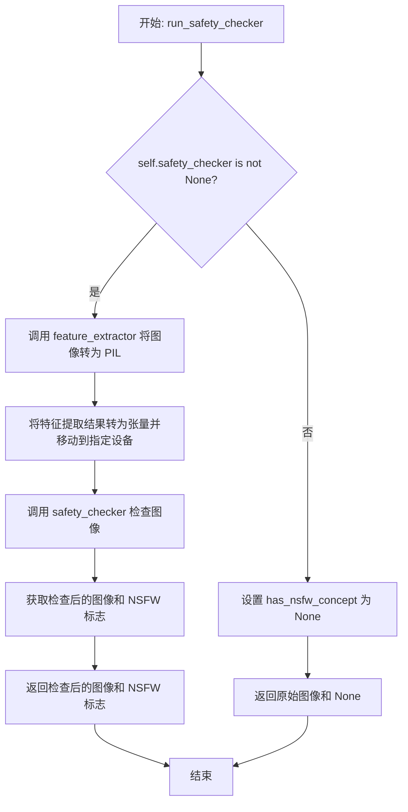
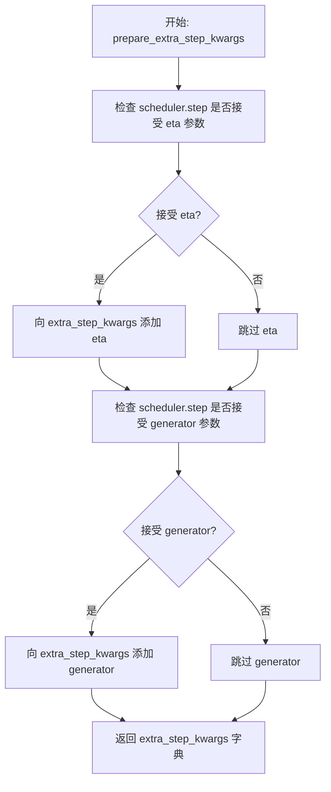
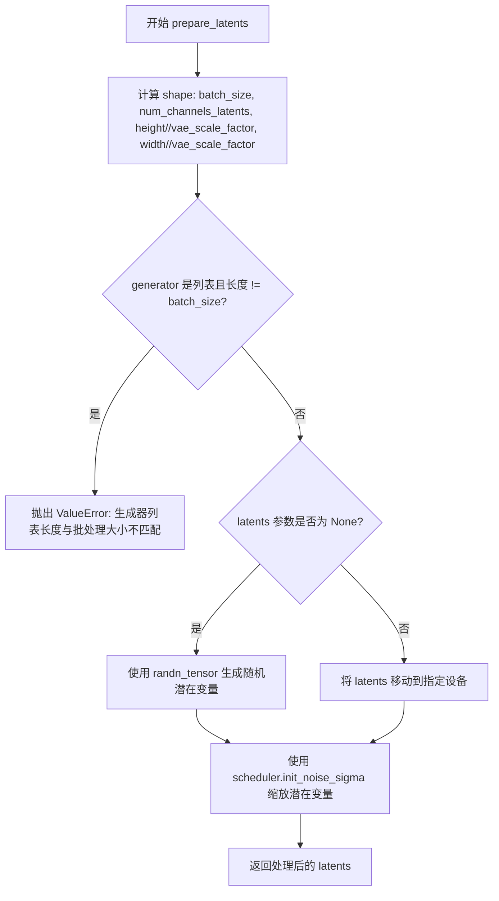
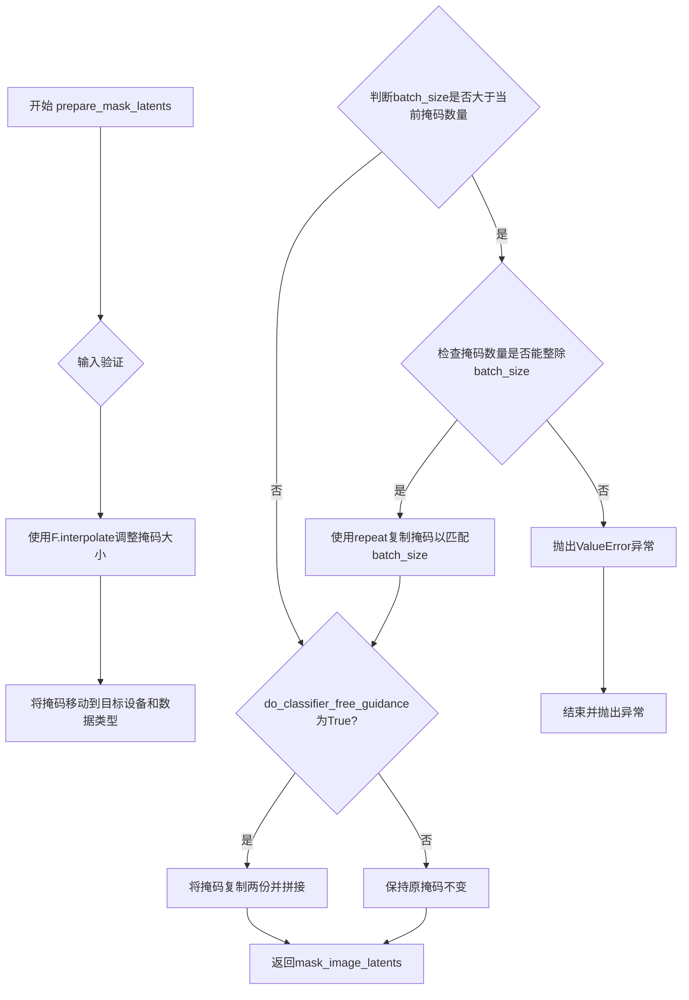
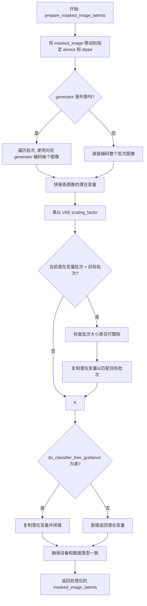
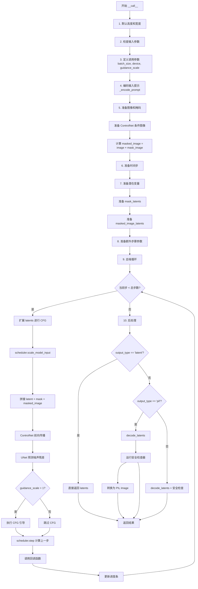

# `diffusers\examples\community\stable_diffusion_controlnet_inpaint.py` 详细设计文档

这是一个基于Stable Diffusion的ControlNet图像修复 pipeline，利用ControlNet提供的条件图像（如分割图）来引导修复过程，允许用户在保持特定结构引导的同时对图像进行inpainting（修复）。

## 整体流程

```mermaid
graph TD
A[开始: __call__] --> B[获取默认高度和宽度]
B --> C[检查输入参数]
C --> D{输入验证}
D -- 失败 --> E[抛出异常]
D -- 成功 --> F[定义调用参数]
F --> G[编码文本提示词 _encode_prompt]
G --> H[准备图像、蒙版和条件图像]
H --> I[准备时间步 timesteps]
I --> J[准备潜在变量 latents]
J --> K[准备蒙版潜在变量]
K --> L[准备修复图像潜在变量]
L --> M[准备额外步骤参数]
M --> N{去噪循环}
N --> O[扩展latents用于无分类器引导]
O --> P[ControlNet预测残差]
P --> Q[UNet预测噪声]
Q --> R{执行引导]
R --> S[计算上一步样本]
S --> T[调用回调函数]
T --> N
N -- 循环结束 --> U{输出类型}
U -- latent --> V[返回latents]
U -- pil --> W[解码latents到图像]
W --> X[运行安全检查器]
X --> Y[转换为PIL图像]
Y --> Z[返回结果]
U -- other --> W
```

## 类结构

```
DiffusionPipeline (基类)
└── StableDiffusionControlNetInpaintPipeline (主类)
    ├── _encode_prompt (编码提示词)
    ├── run_safety_checker (安全检查)
    ├── decode_latents (解码潜在变量)
    ├── check_inputs (输入验证)
    ├── prepare_latents (准备潜在变量)
    ├── prepare_mask_latents (准备蒙版潜在变量)
    ├── prepare_masked_image_latents (准备修复图像潜在变量)
    └── __call__ (主生成方法)
```

## 全局变量及字段


### `logger`
    
模块级日志记录器，用于输出警告和信息

类型：`logging.Logger`
    


### `EXAMPLE_DOC_STRING`
    
示例文档字符串，包含代码使用示例和详细说明

类型：`str`
    


### `StableDiffusionControlNetInpaintPipeline.vae`
    
变分自编码器模型，用于图像的编码和解码

类型：`AutoencoderKL`
    


### `StableDiffusionControlNetInpaintPipeline.text_encoder`
    
CLIP文本编码器，将文本提示转换为向量表示

类型：`CLIPTextModel`
    


### `StableDiffusionControlNetInpaintPipeline.tokenizer`
    
CLIP分词器，用于将文本分割为token序列

类型：`CLIPTokenizer`
    


### `StableDiffusionControlNetInpaintPipeline.unet`
    
条件UNet模型，在扩散过程中预测噪声残差

类型：`UNet2DConditionModel`
    


### `StableDiffusionControlNetInpaintPipeline.controlnet`
    
ControlNet模型，提供额外的条件控制信号来指导图像生成

类型：`Union[ControlNetModel, List[ControlNetModel], Tuple[ControlNetModel], MultiControlNetModel]`
    


### `StableDiffusionControlNetInpaintPipeline.scheduler`
    
扩散调度器，管理去噪过程中的时间步和噪声调度

类型：`KarrasDiffusionSchedulers`
    


### `StableDiffusionControlNetInpaintPipeline.safety_checker`
    
安全检查器，用于检测和过滤不适当的内容

类型：`StableDiffusionSafetyChecker`
    


### `StableDiffusionControlNetInpaintPipeline.feature_extractor`
    
CLIP图像特征提取器，用于提取图像特征供安全检查器使用

类型：`CLIPImageProcessor`
    


### `StableDiffusionControlNetInpaintPipeline.vae_scale_factor`
    
VAE缩放因子，用于调整潜在空间的尺寸

类型：`int`
    


### `StableDiffusionControlNetInpaintPipeline._optional_components`
    
可选组件列表，定义哪些组件可以安全地设置为None

类型：`list`
    
    

## 全局函数及方法


### `prepare_image`

该函数负责将输入图像标准化为统一的 PyTorch 张量格式，支持多种输入类型（PIL.Image、numpy.ndarray 或 torch.Tensor），并进行归一化处理，使其符合 Stable Diffusion 模型的输入要求。

参数：

- `image`：`Union[torch.Tensor, PIL.Image.Image, np.ndarray]`，待处理的输入图像，可以是 PyTorch 张量、PIL 图像或 NumPy 数组

返回值：`torch.Tensor`，处理后的图像张量，形状为 (B, C, H, W)，其中 C=3（RGB），数值范围为 [-1, 1]

#### 流程图

```mermaid
flowchart TD
    A[开始: prepare_image] --> B{image 是 torch.Tensor?}
    B -->|是| C{ndim == 3?}
    B -->|否| D{image 是 PIL.Image 或 np.ndarray?}
    C -->|是| E[添加 batch 维度: unsqueeze(0)]
    C -->|否| F[转换为 float32]
    E --> F
    F --> Z[返回处理后的 image]
    D -->|是| G[转换为 list]
    D -->|否| H[直接处理]
    G --> I{list[0] 是 PIL.Image?}
    I -->|是| J[转换为 RGB numpy 数组并添加 batch 维]
    I -->|否| K{list[0] 是 np.ndarray?}
    J --> L[沿 batch 维度拼接]
    K -->|是| M[添加 batch 维并拼接]
    L --> N[维度转置: (H, W, C) -> (C, H, W)]
    M --> N
    N --> O[转换为 Tensor 并归一化: /127.5 - 1.0]
    O --> Z
```

#### 带注释源码

```python
def prepare_image(image):
    """
    准备输入图像，将其转换为统一格式的 PyTorch 张量
    
    处理逻辑：
    1. 如果是 torch.Tensor：确保批次维度存在，转换为 float32
    2. 如果是 PIL.Image 或 np.ndarray：转换为张量并归一化到 [-1, 1]
    """
    # 判断输入是否为 PyTorch 张量
    if isinstance(image, torch.Tensor):
        # 处理单张图像：添加批次维度
        # 例如：将 (C, H, W) 转换为 (B, C, H, W)
        if image.ndim == 3:
            image = image.unsqueeze(0)
        
        # 统一转换为 float32 类型，确保后续计算精度
        image = image.to(dtype=torch.float32)
    else:
        # ---------- 预处理 PIL.Image 或 numpy 数组 ----------
        # 统一转换为列表格式，便于批量处理
        if isinstance(image, (PIL.Image.Image, np.ndarray)):
            image = [image]
        
        # 处理 PIL Image 列表：转换为 RGB 数组并拼接
        if isinstance(image, list) and isinstance(image[0], PIL.Image.Image):
            # 每个图像转换为 numpy 数组，添加批次维，然后拼接
            # [None, :] 使形状从 (H, W, C) 变为 (1, H, W, C)
            image = [np.array(i.convert("RGB"))[None, :] for i in image]
            # 在批次维度（第0维）拼接
            image = np.concatenate(image, axis=0)
        # 处理 numpy 数组列表
        elif isinstance(image, list) and isinstance(image[0], np.ndarray):
            # 同样添加批次维并拼接
            image = np.concatenate([i[None, :] for i in image], axis=0)
        
        # 维度转置：从 (B, H, W, C) 转换为 (B, C, H, W)
        # 这是 PyTorch 图像的标准格式
        image = image.transpose(0, 3, 1, 2)
        # 转换为 PyTorch 张量并归一化到 [-1, 1]
        # 原始像素值范围 [0, 255] -> [0, 1] -> [-1, 1]
        image = torch.from_numpy(image).to(dtype=torch.float32) / 127.5 - 1.0
    
    return image
```


### `prepare_mask_image`

该函数用于将不同格式的掩码图像（mask_image）统一转换为 PyTorch 张量格式，并进行二值化处理。它能够处理 torch.Tensor、PIL.Image 和 np.ndarray 三种输入格式，输出统一为 torch.Tensor 类型的二值掩码。

参数：

- `mask_image`：`Union[torch.Tensor, PIL.Image.Image, np.ndarray]`，输入的掩码图像，可以是 PyTorch 张量、PIL 图像或 NumPy 数组

返回值：`torch.Tensor`，返回处理后的二值化掩码图像张量，维度为 (B, 1, H, W)

#### 流程图

```mermaid
flowchart TD
    A[开始: prepare_mask_image] --> B{输入是否为 torch.Tensor?}
    B -->|Yes| C{检查维度 ndim}
    C -->|ndim == 2| D[添加批次维和通道维: unsqueeze(0).unsqueeze(0)]
    C -->|ndim == 3 且 shape[0] == 1| E[添加批次维: unsqueeze(0)]
    C -->|ndim == 3 且 shape[0] != 1| F[添加通道维: unsqueeze(1)]
    D --> G[二值化: <0.5 设为 0, >=0.5 设为 1]
    E --> G
    F --> G
    B -->|No| H{是否为 PIL.Image 或 np.ndarray?}
    H -->|Yes| I[转换为列表: [mask_image]]
    H -->|No| J{是否为 list?}
    I --> K{list[0] 是 PIL.Image?}
    K -->|Yes| L[转换为 L 模式数组并拼接]
    K -->|No| M{list[0] 是 np.ndarray?}
    M -->|Yes| N[直接拼接数组]
    L --> O[归一化: /255.0]
    N --> O
    O --> P[二值化: <0.5 设为 0, >=0.5 设为 1]
    P --> Q[转换为 torch.Tensor]
    Q --> R[返回处理后的掩码]
    G --> R
    J --> R
```

#### 带注释源码

```python
def prepare_mask_image(mask_image):
    """
    准备掩码图像，将其转换为统一的张量格式并进行二值化处理。
    
    处理流程：
    1. 如果输入是 torch.Tensor，根据其维度添加适当的批次/通道维度
    2. 如果输入是 PIL.Image 或 np.ndarray，先转换为列表，再统一处理
    3. 所有输入最终都被二值化（阈值 0.5）
    
    参数:
        mask_image: 可以是 torch.Tensor、PIL.Image.Image 或 np.ndarray
        
    返回:
        torch.Tensor: 二值化后的掩码张量，维度为 (B, 1, H, W)
    """
    # 判断输入是否为 PyTorch 张量
    if isinstance(mask_image, torch.Tensor):
        # 处理不同维度的张量输入
        if mask_image.ndim == 2:
            # 单个掩码（2D），添加批次维和通道维
            # 例如: (H, W) -> (1, 1, H, W)
            mask_image = mask_image.unsqueeze(0).unsqueeze(0)
        elif mask_image.ndim == 3 and mask_image.shape[0] == 1:
            # 已经是批次为1的掩码，但缺少通道维
            # 例如: (1, H, W) -> (1, 1, H, W)
            mask_image = mask_image.unsqueeze(0)
        elif mask_image.ndim == 3 and mask_image.shape[0] != 1:
            # 批次掩码（3D），添加通道维
            # 例如: (B, H, W) -> (B, 1, H, W)
            mask_image = mask_image.unsqueeze(1)

        # 二值化掩码：将小于0.5的值设为0，大于等于0.5的值设为1
        mask_image[mask_image < 0.5] = 0
        mask_image[mask_image >= 0.5] = 1
    else:
        # 预处理非张量输入（PIL.Image 或 np.ndarray）
        
        # 如果是单个图像或数组，包装为列表以便统一处理
        if isinstance(mask_image, (PIL.Image.Image, np.ndarray)):
            mask_image = [mask_image]

        # 处理 PIL.Image 列表
        if isinstance(mask_image, list) and isinstance(mask_image[0], PIL.Image.Image):
            # 将每个 PIL.Image 转换为 L 模式（灰度）numpy 数组
            # 并在开头添加批次和通道维度，然后沿批次维拼接
            # 结果形状: (B, 1, H, W)
            mask_image = np.concatenate(
                [np.array(m.convert("L"))[None, None, :] for m in mask_image], 
                axis=0
            )
            # 归一化到 [0, 1] 范围
            mask_image = mask_image.astype(np.float32) / 255.0
        # 处理 np.ndarray 列表
        elif isinstance(mask_image, list) and isinstance(mask_image[0], np.ndarray):
            # 为每个数组添加批次和通道维度，然后沿批次维拼接
            mask_image = np.concatenate([m[None, None, :] for m in mask_image], axis=0)

        # 二值化处理
        mask_image[mask_image < 0.5] = 0
        mask_image[mask_image >= 0.5] = 1
        
        # 转换为 PyTorch 张量
        mask_image = torch.from_numpy(mask_image)

    return mask_image
```


### `prepare_controlnet_conditioning_image`

该函数负责将各种格式（PIL Image、NumPy 数组或 PyTorch Tensor）的 ControlNet 条件图像进行预处理，包括尺寸调整、格式转换、数据类型转换、批次复制，以及在启用无分类器自由引导时进行图像复制，最终返回符合 ControlNet 输入要求的标准化 Tensor。

参数：

- `controlnet_conditioning_image`：输入的 ControlNet 条件图像，支持 `PIL.Image.Image`、`torch.Tensor`、或它们的列表
- `width`：目标图像宽度，整数类型，表示生成图像的像素宽度
- `height`：目标图像高度，整数类型，表示生成图像的像素高度
- `batch_size`：批次大小，整数类型，表示一个批次中的样本数量
- `num_images_per_prompt`：每个提示生成的图像数量，整数类型，用于控制单次推理生成的图像数
- `device`：目标设备，`torch.device` 类型，指定张量存放的设备（如 CPU 或 CUDA）
- `dtype`：目标数据类型，`torch.dtype` 类型，指定张量的数据类型
- `do_classifier_free_guidance`：是否启用无分类器自由引导，布尔类型，为 True 时会复制图像以支持 CFG

返回值：`torch.Tensor`，处理后的 ControlNet 条件图像张量

#### 流程图

```mermaid
flowchart TD
    A[开始] --> B{输入是否为 torch.Tensor}
    B -->|是| C[保持 Tensor 格式]
    B -->|否| D{输入是否为 PIL.Image}
    D -->|是| E[转换为列表]
    D -->|否| L[处理其他情况]
    
    E --> F{列表元素是否为 PIL.Image}
    F -->|是| G[逐个调整尺寸为 width x height]
    G --> H[转换为 NumPy 数组并拼接]
    H --> I[归一化到 [0, 1] 范围]
    I --> J[转换为 CHW 格式]
    J --> K[转换为 torch.Tensor]
    F -->|否| M[假设为 torch.Tensor 列表]
    M --> N[在维度 0 上拼接]
    
    C --> O[获取图像批次大小]
    K --> O
    N --> O
    
    O --> P{图像批次大小是否为 1}
    P -->|是| Q[repeat_by = batch_size]
    P -->|否| R[repeat_by = num_images_per_prompt]
    
    Q --> S[沿维度 0 重复图像]
    R --> S
    
    S --> T[移动到指定设备和数据类型]
    
    T --> U{是否启用 CFG}
    U -->|是| V[复制图像并拼接]
    U -->|否| W[直接返回]
    
    V --> W
    L --> O
    
    W --> X[返回处理后的图像]
```

#### 带注释源码

```python
def prepare_controlnet_conditioning_image(
    controlnet_conditioning_image,
    width,
    height,
    batch_size,
    num_images_per_prompt,
    device,
    dtype,
    do_classifier_free_guidance,
):
    """
    准备 ControlNet 条件图像，将各种格式的输入转换为标准化的 PyTorch Tensor
    
    参数:
        controlnet_conditioning_image: 输入的 ControlNet 条件图像
        width: 目标宽度
        height: 目标高度
        batch_size: 批次大小
        num_images_per_prompt: 每个提示生成的图像数
        device: 目标设备
        dtype: 目标数据类型
        do_classifier_free_guidance: 是否启用无分类器引导
    """
    
    # 如果输入不是 torch.Tensor，则需要预处理
    if not isinstance(controlnet_conditioning_image, torch.Tensor):
        # 如果是单个 PIL.Image，转换为列表以便统一处理
        if isinstance(controlnet_conditioning_image, PIL.Image.Image):
            controlnet_conditioning_image = [controlnet_conditioning_image]

        # 处理 PIL.Image 列表
        if isinstance(controlnet_conditioning_image[0], PIL.Image.Image):
            # 1. 将每个 PIL.Image 调整为目标尺寸 (width, height)
            # 2. 使用 lanczos 重采样方法进行高质量缩放
            # 3. 转换为 NumPy 数组并添加批次维度 [H, W, 3] -> [1, H, W, 3]
            controlnet_conditioning_image = [
                np.array(i.resize((width, height), resample=PIL_INTERPOLATION["lanczos"]))[None, :]
                for i in controlnet_conditioning_image
            ]
            
            # 在批次维度上拼接所有图像 [1, H, W, 3] -> [N, H, W, 3]
            controlnet_conditioning_image = np.concatenate(controlnet_conditioning_image, axis=0)
            
            # 转换为 float32 并归一化到 [0, 1] 范围 (原为 [0, 255])
            controlnet_conditioning_image = np.array(controlnet_conditioning_image).astype(np.float32) / 255.0
            
            # 转换维度顺序从 [N, H, W, C] 到 [N, C, H, W]
            controlnet_conditioning_image = controlnet_conditioning_image.transpose(0, 3, 1, 2)
            
            # 转换为 PyTorch Tensor
            controlnet_conditioning_image = torch.from_numpy(controlnet_conditioning_image)
            
        # 处理 torch.Tensor 列表
        elif isinstance(controlnet_conditioning_image[0], torch.Tensor):
            # 直接在批次维度上拼接多个 Tensor
            controlnet_conditioning_image = torch.cat(controlnet_conditioning_image, dim=0)

    # 获取图像批次大小
    image_batch_size = controlnet_conditioning_image.shape[0]

    # 确定重复次数
    if image_batch_size == 1:
        # 如果只有一张图像，根据总批次大小重复
        repeat_by = batch_size
    else:
        # 图像批次大小与提示批次大小相同，根据每提示图像数重复
        repeat_by = num_images_per_prompt

    # 沿批次维度重复图像，以匹配总生成数量
    controlnet_conditioning_image = controlnet_conditioning_image.repeat_interleave(repeat_by, dim=0)

    # 将图像移动到指定设备和转换数据类型
    controlnet_conditioning_image = controlnet_conditioning_image.to(device=device, dtype=dtype)

    # 如果启用无分类器自由引导，需要复制图像以同时处理条件和非条件输入
    if do_classifier_free_guidance:
        # 复制图像并在批次维度上拼接 [N, C, H, W] -> [2N, C, H, W]
        # 前半部分用于无条件生成，后半部分用于条件生成
        controlnet_conditioning_image = torch.cat([controlnet_conditioning_image] * 2)

    return controlnet_conditioning_image
```


### `StableDiffusionControlNetInpaintPipeline.__init__`

这是 `StableDiffusionControlNetInpaintPipeline` 类的构造函数，用于初始化 ControlNet 引导的 Stable Diffusion 图像修复管道。它接收多个核心模型组件（VAE、文本编码器、UNet、ControlNet等）以及调度器和安全检查器，并进行参数校验、模块注册和配置初始化。

参数：

-  `vae`：`AutoencoderKL`，变分自编码器模型，用于将图像编码/解码到潜在空间
-  `text_encoder`：`CLIPTextModel`，CLIP文本编码器，用于将文本提示编码为embedding
-  `tokenizer`：`CLIPTokenizer`，CLIP分词器，用于将文本分词为token
-  `unet`：`UNet2DConditionModel`，UNet条件模型，用于去噪潜在表示
-  `controlnet`：`Union[ControlNetModel, List[ControlNetModel], Tuple[ControlNetModel], MultiControlNetModel]`，ControlNet模型或多个ControlNet的组合，用于提供额外的条件控制
-  `scheduler`：`KarrasDiffusionSchedulers`，Karras扩散调度器，用于控制去噪过程
-  `safety_checker`：`StableDiffusionSafetyChecker`，安全检查器，用于过滤不安全内容
-  `feature_extractor`：`CLIPImageProcessor`，CLIP图像处理器，用于提取图像特征供安全检查器使用
-  `requires_safety_checker`：`bool`，是否需要安全检查器，默认为True

返回值：无（构造函数）

#### 流程图

```mermaid
flowchart TD
    A[开始 __init__] --> B[调用 super().__init__]
    B --> C{安全检查器为None<br/>且requires_safety_checker为True?}
    C -->|是| D[输出警告信息]
    C -->|否| E{安全检查器不为None<br/>但feature_extractor为None?}
    D --> E
    E -->|是| F[抛出ValueError异常]
    E -->|否| G{controlnet是list或tuple?}
    F --> H[将controlnet包装为MultiControlNetModel]
    G -->|是| H
    G -->|否| I[调用self.register_modules注册所有模块]
    H --> I
    I --> J[计算vae_scale_factor]
    J --> K[调用self.register_to_config注册requires_safety_checker]
    K --> L[结束 __init__]
```

#### 带注释源码

```python
def __init__(
    self,
    vae: AutoencoderKL,
    text_encoder: CLIPTextModel,
    tokenizer: CLIPTokenizer,
    unet: UNet2DConditionModel,
    controlnet: Union[ControlNetModel, List[ControlNetModel], Tuple[ControlNetModel], MultiControlNetModel],
    scheduler: KarrasDiffusionSchedulers,
    safety_checker: StableDiffusionSafetyChecker,
    feature_extractor: CLIPImageProcessor,
    requires_safety_checker: bool = True,
):
    """
    初始化 StableDiffusionControlNetInpaintPipeline
    
    参数:
        vae: AutoencoderKL - VAE模型
        text_encoder: CLIPTextModel - 文本编码器
        tokenizer: CLIPTokenizer - 分词器
        unet: UNet2DConditionModel - UNet模型
        controlnet: ControlNet模型或多个ControlNet的组合
        scheduler: KarrasDiffusionSchedulers - 扩散调度器
        safety_checker: StableDiffusionSafetyChecker - 安全检查器
        feature_extractor: CLIPImageProcessor - 特征提取器
        requires_safety_checker: bool - 是否需要安全检查器
    """
    # 调用父类的初始化方法
    super().__init__()

    # 如果禁用了安全检查器但requires_safety_checker为True，则发出警告
    if safety_checker is None and requires_safety_checker:
        logger.warning(
            f"You have disabled the safety checker for {self.__class__} by passing `safety_checker=None`. Ensure"
            " that you abide to the conditions of the Stable Diffusion license and do not expose unfiltered"
            " results in services or applications open to the public. Both the diffusers team and Hugging Face"
            " strongly recommend to keep the safety filter enabled in all public facing circumstances, disabling"
            " it only for use-cases that involve analyzing network behavior or auditing its results. For more"
            " information, please have a look at https://github.com/huggingface/diffusers/pull/254 ."
        )

    # 如果启用了安全检查器但没有提供特征提取器，则抛出错误
    if safety_checker is not None and feature_extractor is None:
        raise ValueError(
            "Make sure to define a feature extractor when loading {self.__class__} if you want to use the safety"
            " checker. If you do not want to use the safety checker, you can pass `'safety_checker=None'` instead."
        )

    # 如果controlnet是列表或元组，则包装为MultiControlNetModel
    if isinstance(controlnet, (list, tuple)):
        controlnet = MultiControlNetModel(controlnet)

    # 注册所有模块到pipeline中
    self.register_modules(
        vae=vae,
        text_encoder=text_encoder,
        tokenizer=tokenizer,
        unet=unet,
        controlnet=controlnet,
        scheduler=scheduler,
        safety_checker=safety_checker,
        feature_extractor=feature_extractor,
    )

    # 计算VAE的缩放因子，基于VAE的block_out_channels
    # 公式: 2 ** (len(block_out_channels) - 1)
    # 例如: block_out_channels=[128, 256, 512, 512] -> 2^3 = 8
    self.vae_scale_factor = 2 ** (len(self.vae.config.block_out_channels) - 1) if getattr(self, "vae", None) else 8
    
    # 将requires_safety_checker注册到配置中
    self.register_to_config(requires_safety_checker=requires_safety_checker)
```


### `StableDiffusionControlNetInpaintPipeline._encode_prompt`

该方法负责将文本提示词（prompt）编码为文本嵌入向量（text embeddings），供后续的UNet和ControlNet在图像生成过程中使用。方法支持正向提示词和负向提示词（negative prompt）的编码，并在启用无分类器自由引导（classifier-free guidance）时生成相应的无条件嵌入向量以用于 Classifier-free Guidance 机制。

参数：

- `self`：StableDiffusionControlNetInpaintPipeline 实例本身
- `prompt`：`Union[str, List[str], None]`，要编码的提示词，可以是单个字符串、字符串列表或None
- `device`：`torch.device`，指定计算设备（CPU/CUDA）
- `num_images_per_prompt`：`int`，每个提示词要生成的图像数量，用于复制文本嵌入
- `do_classifier_free_guidance`：`bool`，是否启用无分类器自由引导
- `negative_prompt`：`Union[str, List[str], None]`，可选的反向提示词，用于引导图像生成避开特定内容
- `prompt_embeds`：`Optional[torch.Tensor]`，可选的预生成提示词嵌入，若提供则直接使用
- `negative_prompt_embeds`：`Optional[torch.Tensor]`，可选的预生成负向提示词嵌入

返回值：`torch.Tensor`，编码后的文本嵌入向量，形状为 `(batch_size * num_images_per_prompt, seq_len, hidden_dim)`，在启用CFG时形状为 `(2 * batch_size * num_images_per_prompt, seq_len, hidden_dim)`

#### 流程图

```mermaid
flowchart TD
    A[开始 _encode_prompt] --> B{判断 batch_size}
    B -->|prompt 是 str| C[batch_size = 1]
    B -->|prompt 是 list| D[batch_size = len(prompt)]
    B -->|其他情况| E[batch_size = prompt_embeds.shape[0]]
    
    C --> F{prompt_embeds is None?}
    D --> F
    E --> F
    
    F -->|Yes| G[tokenizer 处理 prompt]
    F -->|No| K[跳过编码直接使用 prompt_embeds]
    
    G --> H[检查是否被截断]
    H --> I[获取 attention_mask]
    J[text_encoder 编码得到 prompt_embeds]
    I --> J
    
    K --> L[复制 prompt_embeds]
    J --> L
    
    L --> M{do_classifier_free_guidance?}
    M -->|Yes| N{negative_prompt_embeds is None?}
    M -->|No| P[返回 prompt_embeds]
    
    N -->|Yes| O[处理 negative_prompt]
    N -->|No| Q[使用传入的 negative_prompt_embeds]
    
    O --> R[生成 negative_prompt_embeds]
    Q --> S[复制 negative_prompt_embeds]
    R --> S
    
    S --> T[concat: [negative_prompt_embeds, prompt_embeds]]
    T --> P
    
    P --> U[结束]
```

#### 带注释源码

```python
def _encode_prompt(
    self,
    prompt,                          # Union[str, List[str], None] - 输入提示词
    device,                         # torch.device - 计算设备
    num_images_per_prompt,          # int - 每个提示词生成的图像数量
    do_classifier_free_guidance,    # bool - 是否启用无分类器引导
    negative_prompt=None,           # Union[str, List[str], None] - 负向提示词
    prompt_embeds: Optional[torch.Tensor] = None,    # 预计算的提示词嵌入
    negative_prompt_embeds: Optional[torch.Tensor] = None,  # 预计算的负向提示词嵌入
):
    r"""
    Encodes the prompt into text encoder hidden states.

    Args:
         prompt (`str` or `List[str]`, *optional*):
            prompt to be encoded
        device: (`torch.device`):
            torch device
        num_images_per_prompt (`int`):
            number of images that should be generated per prompt
        do_classifier_free_guidance (`bool`):
            whether to use classifier free guidance or not
        negative_prompt (`str` or `List[str]`, *optional*):
            The prompt or prompts not to guide the image generation. If not defined, one has to pass `negative_prompt_embeds` instead.
            Ignored when not using guidance (i.e., ignored if `guidance_scale` is less than `1`).
        prompt_embeds (`torch.Tensor`, *optional*):
            Pre-generated text embeddings. Can be used to easily tweak text inputs, *e.g.* prompt weighting. If not
            provided, text embeddings will be generated from `prompt` input argument.
        negative_prompt_embeds (`torch.Tensor`, *optional*):
            Pre-generated negative text embeddings. Can be used to easily tweak text inputs, *e.g.* prompt
            weighting. If not provided, negative_prompt_embeds will be generated from `negative_prompt` input
            argument.
    """
    # ============ Step 1: 确定 batch_size ============
    # 根据 prompt 的类型或 prompt_embeds 的形状确定批次大小
    if prompt is not None and isinstance(prompt, str):
        batch_size = 1  # 单个字符串提示词
    elif prompt is not None and isinstance(prompt, list):
        batch_size = len(prompt)  # 字符串列表
    else:
        # 如果没有 prompt，则使用预计算的 prompt_embeds 的批次大小
        batch_size = prompt_embeds.shape[0]

    # ============ Step 2: 如果没有提供 prompt_embeds，则从 prompt 生成 ============
    if prompt_embeds is None:
        # 使用 tokenizer 将文本转换为 token ID
        text_inputs = self.tokenizer(
            prompt,
            padding="max_length",  # 填充到最大长度
            max_length=self.tokenizer.model_max_length,  # CLIP 模型最大长度（通常为77）
            truncation=True,  # 截断超长文本
            return_tensors="pt",  # 返回 PyTorch 张量
        )
        text_input_ids = text_inputs.input_ids  # token IDs
        # 获取未截断的 token IDs（用于检测是否发生了截断）
        untruncated_ids = self.tokenizer(prompt, padding="longest", return_tensors="pt").input_ids

        # 检查是否发生了截断，并记录警告
        if untruncated_ids.shape[-1] >= text_input_ids.shape[-1] and not torch.equal(
            text_input_ids, untruncated_ids
        ):
            removed_text = self.tokenizer.batch_decode(
                untruncated_ids[:, self.tokenizer.model_max_length - 1 : -1]
            )
            logger.warning(
                "The following part of your input was truncated because CLIP can only handle sequences up to"
                f" {self.tokenizer.model_max_length} tokens: {removed_text}"
            )

        # 获取注意力掩码（如果文本编码器配置支持）
        if hasattr(self.text_encoder.config, "use_attention_mask") and self.text_encoder.config.use_attention_mask:
            attention_mask = text_inputs.attention_mask.to(device)
        else:
            attention_mask = None

        # 使用文本编码器将 token IDs 编码为嵌入向量
        prompt_embeds = self.text_encoder(
            text_input_ids.to(device),
            attention_mask=attention_mask,
        )
        # 提取隐藏状态（取第一个元素，因为第二个元素是其他输出）
        prompt_embeds = prompt_embeds[0]

    # ============ Step 3: 移动到正确的设备和数据类型 ============
    # 确保 prompt_embeds 与文本编码器使用相同的数据类型和设备
    prompt_embeds = prompt_embeds.to(dtype=self.text_encoder.dtype, device=device)

    # ============ Step 4: 为每个提示词生成多个图像而复制嵌入向量 ============
    # 获取当前嵌入向量的形状
    bs_embed, seq_len, _ = prompt_embeds.shape
    # 复制嵌入向量：每个提示词生成 num_images_per_prompt 个图像
    # 使用 repeat 而不是 repeat_interleave，因为后者在某些设备（如 MPS）上有问题
    prompt_embeds = prompt_embeds.repeat(1, num_images_per_prompt, 1)
    # 重新调整形状以匹配批次大小
    prompt_embeds = prompt_embeds.view(bs_embed * num_images_per_prompt, seq_len, -1)

    # ============ Step 5: 处理无分类器自由引导（Classifier-Free Guidance）========
    if do_classifier_free_guidance and negative_prompt_embeds is None:
        uncond_tokens: List[str]
        
        # 处理负向提示词
        if negative_prompt is None:
            # 如果没有提供负向提示词，使用空字符串
            uncond_tokens = [""] * batch_size
        elif type(prompt) is not type(negative_prompt):
            # 类型不匹配，抛出错误
            raise TypeError(
                f"`negative_prompt` should be the same type to `prompt`, but got {type(negative_prompt)} !="
                f" {type(prompt)}."
            )
        elif isinstance(negative_prompt, str):
            # 负向提示词是单个字符串
            uncond_tokens = [negative_prompt]
        elif batch_size != len(negative_prompt):
            # 批次大小不匹配
            raise ValueError(
                f"`negative_prompt`: {negative_prompt} has batch size {len(negative_prompt)}, but `prompt`:"
                f" {prompt} has batch size {batch_size}. Please make sure that passed `negative_prompt` matches"
                " the batch size of `prompt`."
            )
        else:
            # 负向提示词是列表
            uncond_tokens = negative_prompt

        # 获取与 prompt_embeds 相同的长度
        max_length = prompt_embeds.shape[1]
        
        # 对负向提示词进行 tokenize
        uncond_input = self.tokenizer(
            uncond_tokens,
            padding="max_length",
            max_length=max_length,
            truncation=True,
            return_tensors="pt",
        )

        # 获取负向提示词的注意力掩码
        if hasattr(self.text_encoder.config, "use_attention_mask") and self.text_encoder.config.use_attention_mask:
            attention_mask = uncond_input.attention_mask.to(device)
        else:
            attention_mask = None

        # 编码负向提示词
        negative_prompt_embeds = self.text_encoder(
            uncond_input.input_ids.to(device),
            attention_mask=attention_mask,
        )
        negative_prompt_embeds = negative_prompt_embeds[0]

    # ============ Step 6: 如果启用 CFG，处理 negative_prompt_embeds ============
    if do_classifier_free_guidance:
        # 复制无条件嵌入向量以匹配每个提示词生成的图像数量
        seq_len = negative_prompt_embeds.shape[1]

        negative_prompt_embeds = negative_prompt_embeds.to(dtype=self.text_encoder.dtype, device=device)

        negative_prompt_embeds = negative_prompt_embeds.repeat(1, num_images_per_prompt, 1)
        negative_prompt_embeds = negative_prompt_embeds.view(batch_size * num_images_per_prompt, seq_len, -1)

        # 对于无分类器自由引导，我们需要执行两次前向传播
        # 这里我们将无条件嵌入和文本嵌入连接成单个批次，以避免执行两次前向传播
        # 格式：[unconditional_embeddings, text_embeddings]
        prompt_embeds = torch.cat([negative_prompt_embeds, prompt_embeds])

    # ============ Step 7: 返回最终的文本嵌入 ============
    return prompt_embeds
```


### `StableDiffusionControlNetInpaintPipeline.run_safety_checker`

该方法用于在图像生成完成后调用安全检查器（Safety Checker）来检测生成图像中是否包含不当内容（NSFW），如果安全检查器存在，则对图像进行安全检测并返回检测结果；否则直接返回原始图像和 `None`。

参数：

- `image`：`torch.Tensor`，需要进行检查的图像张量，通常是经过解码后的图像
- `device`：`torch.device`，用于安全检查器计算的设备（如 CPU 或 CUDA 设备）
- `dtype`：`torch.dtype`，用于安全检查器输入的数据类型（通常为 float32）

返回值：`Tuple[torch.Tensor, Optional[torch.Tensor]]`，返回两个元素的元组：
- 第一个元素是经过安全检查处理后的图像（可能已被替换为安全图像）
- 第二个元素是布尔标志，表示图像是否包含"不适合工作"（NSFW）内容；如果安全检查器为 `None`，则返回 `None`

#### 流程图



#### 带注释源码

```python
def run_safety_checker(self, image, device, dtype):
    """
    运行安全检查器，检测生成图像中是否包含不当内容（NSFW）。
    
    参数:
        image: 需要检查的图像张量
        device: 计算设备
        dtype: 输入数据类型
    返回:
        元组 (处理后的图像, NSFW检测标志)
    """
    # 检查安全检查器是否已配置
    if self.safety_checker is not None:
        # 使用特征提取器将图像转换为安全检查器所需的格式
        # 首先将图像张量转换为PIL图像列表
        safety_checker_input = self.feature_extractor(
            self.numpy_to_pil(image),  # 将numpy数组/PIL图像转为PIL图像列表
            return_tensors="pt"         # 返回PyTorch张量
        ).to(device)                    # 将特征张量移动到指定设备
        
        # 调用安全检查器进行NSFW检测
        # 参数:
        #   images: 待检查的图像张量
        #   clip_input: 特征提取器输出的CLIP视觉特征
        image, has_nsfw_concept = self.safety_checker(
            images=image, 
            clip_input=safety_checker_input.pixel_values.to(dtype)
        )
    else:
        # 如果未配置安全检查器，则不做任何检查
        has_nsfw_concept = None
    
    # 返回处理后的图像和NSFW检测结果
    return image, has_nsfw_concept
```


### StableDiffusionControlNetInpaintPipeline.decode_latents

该方法负责将模型输出的潜在变量（latents）解码为最终的图像数据。它首先对潜在变量进行缩放以恢复到原始尺度，然后通过VAE解码器将其转换为图像空间，接着对图像进行归一化处理（将数值范围从[-1,1]映射到[0,1]），最后将图像数据转换为NumPy数组格式以便后续处理。

参数：

- `self`：隐式参数，类实例本身
- `latents`：`torch.Tensor`，需要解码的潜在变量，通常是从UNet输出的噪声预测经过去噪过程后得到的潜在表示

返回值：`numpy.ndarray`，解码后的图像数据，形状为(batch_size, height, width, channels)，数值范围为[0,1]

#### 流程图

```mermaid
flowchart TD
    A[输入: latents 潜在变量] --> B[缩放潜在变量: latents = 1/scaling_factor * latents]
    B --> C[VAE解码: image = vae.decode(latents).sample]
    C --> D[图像归一化: image = (image/2 + 0.5).clamp(0, 1)]
    D --> E[数据转换: 移到CPU并转换为numpy数组]
    E --> F[输出: numpy.ndarray 图像]
```

#### 带注释源码

```python
def decode_latents(self, latents):
    """
    解码潜在变量为图像
    
    Args:
        latents: 从去噪过程得到的潜在表示，形状为 (batch_size, channels, height, width)
    
    Returns:
        image: 解码后的图像，形状为 (batch_size, height, width, channels)，范围 [0, 1]
    """
    # 步骤1: 反缩放潜在变量
    # VAE在编码时会将潜在变量乘以scaling_factor，这里需要除以它来恢复原始尺度
    latents = 1 / self.vae.config.scaling_factor * latents
    
    # 步骤2: 使用VAE解码器将潜在变量解码为图像
    # .sample 表示从解码器的分布中采样得到图像
    image = self.vae.decode(latents).sample
    
    # 步骤3: 图像归一化处理
    # VAE输出的图像范围是 [-1, 1]，这里将其映射到 [0, 1] 范围
    # 先除以2再加0.5等价于 (x + 1) / 2
    # clamp(0, 1) 确保所有像素值都在 [0, 1] 范围内
    image = (image / 2 + 0.5).clamp(0, 1)
    
    # 步骤4: 转换为NumPy数组以便后续处理
    # .cpu() 将数据从GPU移到CPU
    # .permute(0, 2, 3, 1) 调整维度顺序，从 (B, C, H, W) 变为 (B, H, W, C)
    # .float() 确保数据类型为float32，因为后续处理可能要求精确度
    # .numpy() 将PyTorch张量转换为NumPy数组
    # 选择float32是因为它不会引起显著的性能开销，同时与bfloat16兼容
    image = image.cpu().permute(0, 2, 3, 1).float().numpy()
    
    # 返回解码后的图像
    return image
```


### `StableDiffusionControlNetInpaintPipeline.prepare_extra_step_kwargs`

该方法用于准备调度器（scheduler）步骤所需的额外参数。由于不同的调度器具有不同的签名（例如 DDIMScheduler 使用 `eta` 参数，而其他调度器可能不支持），该方法通过检查调度器 `step` 方法的签名来动态构建参数字典。

参数：

-  `self`：隐式参数，`StableDiffusionControlNetInpaintPipeline` 实例本身
-  `generator`：`Optional[Union[torch.Generator, List[torch.Generator]]]`，用于生成确定性噪声的随机数生成器
-  `eta`：`float`，DDIM 论文中的参数 η，用于控制噪声消退程度，仅在支持该参数的调度器（如 DDIMScheduler）中生效

返回值：`Dict[str, Any]`，包含调度器 `step` 方法所需额外参数（如 `eta` 和/或 `generator`）的字典

#### 流程图



#### 带注释源码

```python
def prepare_extra_step_kwargs(self, generator, eta):
    # 准备调度器步骤的额外参数，因为并非所有调度器都具有相同的签名
    # eta (η) 仅在 DDIMScheduler 中使用，对于其他调度器将被忽略。
    # eta 对应于 DDIM 论文中的 η: https://huggingface.co/papers/2010.02502
    # 取值应在 [0, 1] 范围内
    
    # 使用 inspect 模块检查 scheduler.step 方法的签名参数
    # 判断当前调度器是否接受 'eta' 参数
    accepts_eta = "eta" in set(inspect.signature(self.scheduler.step).parameters.keys())
    
    # 初始化空字典用于存储额外参数
    extra_step_kwargs = {}
    
    # 如果调度器接受 eta 参数，则将其添加到参数字典
    if accepts_eta:
        extra_step_kwargs["eta"] = eta

    # 检查调度器是否接受 generator 参数
    accepts_generator = "generator" in set(inspect.signature(self.scheduler.step).parameters.keys())
    
    # 如果调度器接受 generator 参数，则将其添加到参数字典
    if accepts_generator:
        extra_step_kwargs["generator"] = generator
    
    # 返回构建好的参数字典，供后续 scheduler.step 调用使用
    return extra_step_kwargs
```


### `StableDiffusionControlNetInpaintPipeline.check_controlnet_conditioning_image`

该方法用于验证 ControlNet 条件图像（controlnet_conditioning_image）的输入有效性，检查图像类型是否符合要求（PIL Image、torch Tensor 及其列表），并确保图像批次大小与提示词批次大小匹配，以防止后续处理中的维度错误。

参数：

- `image`：`Union[PIL.Image.Image, torch.Tensor, List[PIL.Image.Image], List[torch.Tensor]]`，ControlNet 条件图像输入，可以是单个 PIL 图像、单个 torch Tensor、PIL 图像列表或 torch Tensor 列表
- `prompt`：`Optional[Union[str, List[str]]]`，
- `prompt_embeds`：`Optional[torch.Tensor]`，可选的预计算提示词嵌入，与 prompt 二选一提供

返回值：`None`，该方法仅进行输入验证，不返回任何值

#### 流程图

```mermaid
flowchart TD
    A[开始验证] --> B{检查 image 类型}
    B -->|PIL Image| C[image_is_pil = True]
    B -->|torch.Tensor| D[image_is_tensor = True]
    B -->|PIL Image 列表| E[image_is_pil_list = True]
    B -->|torch.Tensor 列表| F[image_is_tensor_list = True]
    B -->|其他类型| G[抛出 TypeError]
    
    C --> H{计算 image_batch_size}
    D --> H
    E --> H
    F --> H
    
    H -->|image_is_pil| I[image_batch_size = 1]
    H -->|image_is_tensor| J[image_batch_size = image.shape[0]]
    H -->|image_is_pil_list| K[image_batch_size = len(image)]
    H -->|image_is_tensor_list| L[image_batch_size = len(image)]
    
    I --> M{检查 prompt 或 prompt_embeds}
    J --> M
    K --> M
    L --> M
    
    M -->|prompt 是 str| N[prompt_batch_size = 1]
    M -->|prompt 是 list| O[prompt_batch_size = len(prompt)]
    M -->|prompt_embeds 存在| P[prompt_batch_size = prompt_embeds.shape[0]]
    M -->|都不存在| Q[抛出 ValueError]
    
    N --> R{验证 batch_size 匹配}
    O --> R
    P --> R
    
    R -->|image_batch_size = 1| S[验证通过]
    R -->|image_batch_size = prompt_batch_size| S
    R -->|不匹配| T[抛出 ValueError]
    
    S --> U[结束验证]
    G --> U
    Q --> U
    T --> U
```

#### 带注释源码

```python
def check_controlnet_conditioning_image(self, image, prompt, prompt_embeds):
    """
    检查 ControlNet 条件图像的有效性。
    
    验证要点：
    1. image 必须是 PIL Image、torch.Tensor 或者是它们的列表
    2. 必须提供 prompt 或 prompt_embeds 之一
    3. image 的批次大小必须与 prompt 的批次大小匹配（除非 image 批次大小为 1）
    
    参数:
        image: ControlNet 条件图像，支持多种输入格式
        prompt: 文本提示词
        prompt_embeds: 预计算的文本嵌入
    
    异常:
        TypeError: image 类型不符合要求时抛出
        ValueError: 批次大小不匹配或缺少有效 prompt 时抛出
    """
    # 检查 image 是否为 PIL Image
    image_is_pil = isinstance(image, PIL.Image.Image)
    # 检查 image 是否为 torch Tensor
    image_is_tensor = isinstance(image, torch.Tensor)
    # 检查 image 是否为 PIL Image 列表
    image_is_pil_list = isinstance(image, list) and isinstance(image[0], PIL.Image.Image)
    # 检查 image 是否为 torch.Tensor 列表
    image_is_tensor_list = isinstance(image, list) and isinstance(image[0], torch.Tensor)

    # 如果 image 不是任何一种支持的类型，抛出 TypeError
    if not image_is_pil and not image_is_tensor and not image_is_pil_list and not image_is_tensor_list:
        raise TypeError(
            "image must be passed and be one of PIL image, torch tensor, list of PIL images, or list of torch tensors"
        )

    # 根据 image 类型计算批次大小
    if image_is_pil:
        # 单个 PIL 图像，批次大小为 1
        image_batch_size = 1
    elif image_is_tensor:
        # 单个 Tensor，使用第一维作为批次大小
        image_batch_size = image.shape[0]
    elif image_is_pil_list:
        # PIL 图像列表，使用列表长度
        image_batch_size = len(image)
    elif image_is_tensor_list:
        # Tensor 列表，使用列表长度
        image_batch_size = len(image)
    else:
        # 理论上不会到达这里，但为安全起见
        raise ValueError("controlnet condition image is not valid")

    # 根据 prompt 或 prompt_embeds 计算批次大小
    if prompt is not None and isinstance(prompt, str):
        # 字符串 prompt，批次大小为 1
        prompt_batch_size = 1
    elif prompt is not None and isinstance(prompt, list):
        # 列表 prompt，使用列表长度
        prompt_batch_size = len(prompt)
    elif prompt_embeds is not None:
        # 使用预计算的嵌入，批次大小为第一维
        prompt_batch_size = prompt_embeds.shape[0]
    else:
        # 既没有 prompt 也没有 prompt_embeds
        raise ValueError("prompt or prompt_embeds are not valid")

    # 验证批次大小匹配
    # 允许 image_batch_size = 1（广播到任意 prompt 批次大小）
    if image_batch_size != 1 and image_batch_size != prompt_batch_size:
        raise ValueError(
            f"If image batch size is not 1, image batch size must be same as prompt batch size. image batch size: {image_batch_size}, prompt batch size: {prompt_batch_size}"
        )
```


### `StableDiffusionControlNetInpaintPipeline.check_inputs`

该函数用于验证 Stable Diffusion ControlNet Inpainting Pipeline 的输入参数有效性，确保所有输入符合模型要求，包括图像尺寸、维度、通道数、批处理大小以及各类嵌入向量的合法性，否则抛出相应的错误信息。

#### 参数

- `prompt`：`Union[str, List[str], None]`，文本提示，用于指导图像生成
- `image`：`Union[torch.Tensor, PIL.Image.Image, None]`，待修复的输入图像
- `mask_image`：`Union[torch.Tensor, PIL.Image.Image, None]`，修复掩码图像，白色像素将被重绘
- `controlnet_conditioning_image`：`Union[torch.Tensor, PIL.Image.Image, List[torch.Tensor], List[PIL.Image.Image], None]`，ControlNet 条件图像
- `height`：`int`，生成图像的高度（像素）
- `width`：`int`，生成图像的宽度（像素）
- `callback_steps`：`int`，回调函数调用频率，必须为正整数
- `negative_prompt`：`Union[str, List[str], None]`，负面提示，用于引导图像生成方向
- `prompt_embeds`：`Optional[torch.Tensor]`，预生成的文本嵌入向量
- `negative_prompt_embeds`：`Optional[torch.Tensor]`，预生成的负面文本嵌入向量
- `controlnet_conditioning_scale`：`Union[float, List[float], None]`，ControlNet 输出缩放因子

#### 返回值

`None`，该函数不返回任何值，仅通过抛出异常来处理验证失败的情况

#### 流程图

```mermaid
flowchart TD
    A[开始 check_inputs] --> B{height % 8 == 0 且 width % 8 == 0?}
    B -->|否| B1[抛出 ValueError: height和width必须被8整除]
    B -->|是| C{callback_steps是正整数?}
    C -->|否| C1[抛出 ValueError: callback_steps必须是正整数]
    C -->|是| D{prompt和prompt_embeds同时提供?}
    D -->|是| D1[抛出 ValueError: 不能同时提供prompt和prompt_embeds]
    D -->|否| E{prompt和prompt_embeds都未提供?}
    E -->|是| E1[抛出 ValueError: 必须提供prompt或prompt_embeds之一]
    E -->|否| F{prompt是str或list?}
    F -->|否| F1[抛出 ValueError: prompt必须是str或list类型]
    F -->|是| G{negative_prompt和negative_prompt_embeds同时提供?}
    G -->|是| G1[抛出 ValueError: 不能同时提供negative_prompt和negative_prompt_embeds]
    G -->|否| H{prompt_embeds和negative_prompt_embeds形状相同?}
    H -->|否| H1[抛出 ValueError: prompt_embeds和negative_prompt_embeds形状必须相同]
    H -->|是| I{检查controlnet_conditioning_image}
    I -->|单ControlNet| I1[调用check_controlnet_conditioning_image]
    I -->|多ControlNet| I2[检查list长度和每个image]
    I -->|无效| I3[抛出TypeError或ValueError]
    J{检查controlnet_conditioning_scale}
    J -->|单ControlNet| J1[必须是float类型]
    J -->|多ControlNet| J2[是list则长度必须匹配]
    K{image和mask_image类型一致性}
    K -->|Tensor| K1[两者都必须是Tensor]
    K -->|PIL.Image| K2[两者都必须是PIL.Image]
    L{检查Tensor维度和通道数}
    L -->|通过| M[检查batch size和尺寸]
    M -->|通过| N[检查值范围: image[-1,1], mask_image[0,1]]
    N -->|通过| O[检查VAE latent channels配置]
    O -->|通过| P[验证通过，函数结束]
    B1 --> P
    C1 --> P
    D1 --> P
    E1 --> P
    F1 --> P
    G1 --> P
    H1 --> P
```

#### 带注释源码

```python
def check_inputs(
    self,
    prompt,  # str或list类型，或None
    image,  # torch.Tensor或PIL.Image.Image，或None
    mask_image,  # torch.Tensor或PIL.Image.Image，或None
    controlnet_conditioning_image,  # ControlNet条件图像
    height,  # 输出图像高度
    width,  # 输出图像宽度
    callback_steps,  # 回调步骤间隔
    negative_prompt=None,  # 可选的负面提示
    prompt_embeds=None,  # 可选的文本嵌入
    negative_prompt_embeds=None,  # 可选的负面文本嵌入
    controlnet_conditioning_scale=None,  # ControlNet缩放因子
):
    # 检查高度和宽度是否可被8整除（UNet和VAE的要求）
    if height % 8 != 0 or width % 8 != 0:
        raise ValueError(f"`height` and `width` have to be divisible by 8 but are {height} and {width}.")

    # 验证callback_steps是正整数
    if (callback_steps is None) or (
        callback_steps is not None and (not isinstance(callback_steps, int) or callback_steps <= 0)
    ):
        raise ValueError(
            f"`callback_steps` has to be a positive integer but is {callback_steps} of type"
            f" {type(callback_steps)}."
        )

    # prompt和prompt_embeds不能同时提供
    if prompt is not None and prompt_embeds is not None:
        raise ValueError(
            f"Cannot forward both `prompt`: {prompt} and `prompt_embeds`: {prompt_embeds}. Please make sure to"
            " only forward one of the two."
        )
    # 至少需要提供其中一个
    elif prompt is None and prompt_embeds is None:
        raise ValueError(
            "Provide either `prompt` or `prompt_embeds`. Cannot leave both `prompt` and `prompt_embeds` undefined."
        )
    # prompt类型检查
    elif prompt is not None and (not isinstance(prompt, str) and not isinstance(prompt, list)):
        raise ValueError(f"`prompt` has to be of type `str` or `list` but is {type(prompt)}")

    # negative_prompt和negative_prompt_embeds不能同时提供
    if negative_prompt is not None and negative_prompt_embeds is not None:
        raise ValueError(
            f"Cannot forward both `negative_prompt`: {negative_prompt} and `negative_prompt_embeds`:"
            f" {negative_prompt_embeds}. Please make sure to only forward one of the two."
        )

    # prompt_embeds和negative_prompt_embeds形状必须匹配
    if prompt_embeds is not None and negative_prompt_embeds is not None:
        if prompt_embeds.shape != negative_prompt_embeds.shape:
            raise ValueError(
                "`prompt_embeds` and `negative_prompt_embeds` must have the same shape when passed directly, but"
                f" got: `prompt_embeds` {prompt_embeds.shape} != `negative_prompt_embeds`"
                f" {negative_prompt_embeds.shape}."
            )

    # 检查controlnet条件图像
    if isinstance(self.controlnet, ControlNetModel):
        # 单个ControlNet模型验证
        self.check_controlnet_conditioning_image(controlnet_conditioning_image, prompt, prompt_embeds)
    elif isinstance(self.controlnet, MultiControlNetModel):
        # 多个ControlNet模型验证
        if not isinstance(controlnet_conditioning_image, list):
            raise TypeError("For multiple controlnets: `image` must be type `list`")
        if len(controlnet_conditioning_image) != len(self.controlnet.nets):
            raise ValueError(
                "For multiple controlnets: `image` must have the same length as the number of controlnets."
            )
        for image_ in controlnet_conditioning_image:
            self.check_controlnet_conditioning_image(image_, prompt, prompt_embeds)
    else:
        assert False

    # 检查controlnet_conditioning_scale类型
    if isinstance(self.controlnet, ControlNetModel):
        if not isinstance(controlnet_conditioning_scale, float):
            raise TypeError("For single controlnet: `controlnet_conditioning_scale` must be type `float`.")
    elif isinstance(self.controlnet, MultiControlNetModel):
        if isinstance(controlnet_conditioning_scale, list) and len(controlnet_conditioning_scale) != len(
            self.controlnet.nets
        ):
            raise ValueError(
                "For multiple controlnets: When `controlnet_conditioning_scale` is specified as `list`, it must have"
                " the same length as the number of controlnets"
            )
    else:
        assert False

    # image和mask_image类型必须一致
    if isinstance(image, torch.Tensor) and not isinstance(mask_image, torch.Tensor):
        raise TypeError("if `image` is a tensor, `mask_image` must also be a tensor")

    if isinstance(image, PIL.Image.Image) and not isinstance(mask_image, PIL.Image.Image):
        raise TypeError("if `image` is a PIL image, `mask_image` must also be a PIL image")

    # Tensor类型时的维度、通道数、batch size、尺寸检查
    if isinstance(image, torch.Tensor):
        # 维度检查：image必须是3D(C,H,W)或4D(B,C,H,W)
        if image.ndim != 3 and image.ndim != 4:
            raise ValueError("`image` must have 3 or 4 dimensions")

        # mask_image维度检查：2D(H,W)、3D(B,H,W)或4D(B,C,H,W)
        if mask_image.ndim != 2 and mask_image.ndim != 3 and mask_image.ndim != 4:
            raise ValueError("`mask_image` must have 2, 3, or 4 dimensions")

        # 提取image的batch size、通道、高宽
        if image.ndim == 3:
            image_batch_size = 1
            image_channels, image_height, image_width = image.shape
        elif image.ndim == 4:
            image_batch_size, image_channels, image_height, image_width = image.shape
        else:
            assert False

        # 提取mask_image的batch size、通道、高宽
        if mask_image.ndim == 2:
            mask_image_batch_size = 1
            mask_image_channels = 1
            mask_image_height, mask_image_width = mask_image.shape
        elif mask_image.ndim == 3:
            mask_image_channels = 1
            mask_image_batch_size, mask_image_height, mask_image_width = mask_image.shape
        elif mask_image.ndim == 4:
            mask_image_batch_size, mask_image_channels, mask_image_height, mask_image_width = mask_image.shape

        # image必须是3通道(RGB)
        if image_channels != 3:
            raise ValueError("`image` must have 3 channels")

        # mask_image必须是1通道(灰度)
        if mask_image_channels != 1:
            raise ValueError("`mask_image` must have 1 channel")

        # batch size必须一致
        if image_batch_size != mask_image_batch_size:
            raise ValueError("`image` and `mask_image` mush have the same batch sizes")

        # 高度和宽度必须一致
        if image_height != mask_image_height or image_width != mask_image_width:
            raise ValueError("`image` and `mask_image` must have the same height and width dimensions")

        # image值范围检查：[-1, 1]（归一化后的值）
        if image.min() < -1 or image.max() > 1:
            raise ValueError("`image` should be in range [-1, 1]")

        # mask_image值范围检查：[0, 1]
        if mask_image.min() < 0 or mask_image.max() > 1:
            raise ValueError("`mask_image` should be in range [0, 1]")
    else:
        # 非Tensor情况下设置默认值
        mask_image_channels = 1
        image_channels = 3

    # 验证UNet的in_channels配置是否正确
    # 对于inpainting: in_channels = latent_channels * 2 + mask_channels
    single_image_latent_channels = self.vae.config.latent_channels
    total_latent_channels = single_image_latent_channels * 2 + mask_image_channels

    if total_latent_channels != self.unet.config.in_channels:
        raise ValueError(
            f"The config of `pipeline.unet` expects {self.unet.config.in_channels} but received"
            f" non inpainting latent channels: {single_image_latent_channels},"
            f" mask channels: {mask_image_channels}, and masked image channels: {single_image_latent_channels}."
            f" Please verify the config of `pipeline.unet` and the `mask_image` and `image` inputs."
        )
```


### `StableDiffusionControlNetInpaintPipeline.prepare_latents`

该方法负责为 Stable Diffusion 修复管道准备潜在变量（latents）。它根据批处理大小、通道数和图像尺寸计算潜在变量的形状，如果是首次运行则使用随机噪声生成器创建新的潜在变量，否则使用传入的潜在变量。最后，根据调度器的初始噪声标准差对潜在变量进行缩放，以适配去噪过程的起始条件。

参数：

- `batch_size`：`int`，批处理大小，指定要生成的图像数量
- `num_channels_latents`：`int`，潜在通道数，对应 VAE 的潜在空间通道数
- `height`：`int`，目标图像的高度（像素）
- `width`：`int`，目标图像的宽度（像素）
- `dtype`：`torch.dtype`，潜在变量的数据类型
- `device`：`torch.device`，潜在变量所在的设备（CPU/CUDA）
- `generator`：`torch.Generator` 或 `List[torch.Generator]`，可选，用于生成确定性随机噪声的随机数生成器
- `latents`：`torch.Tensor`，可选，如果提供则使用该潜在变量，否则新生成随机潜在变量

返回值：`torch.Tensor`，准备好的潜在变量张量，已根据调度器的初始噪声标准差进行缩放

#### 流程图



#### 带注释源码

```python
def prepare_latents(
    self,
    batch_size: int,
    num_channels_latents: int,
    height: int,
    width: int,
    dtype: torch.dtype,
    device: torch.device,
    generator: Optional[Union[torch.Generator, List[torch.Generator]]],
    latents: Optional[torch.Tensor] = None,
) -> torch.Tensor:
    """
    准备用于图像生成的潜在变量。
    
    参数:
        batch_size: 批处理大小
        num_channels_latents: VAE 潜在通道数
        height: 图像高度
        width: 图像宽度
        dtype: 张量数据类型
        device: 计算设备
        generator: 随机数生成器，用于可重复性
        latents: 可选的预生成潜在变量
    
    返回:
        准备好的潜在变量张量
    """
    # 计算潜在变量的形状，除以 vae_scale_factor 将像素空间转换为潜在空间
    shape = (
        batch_size,
        num_channels_latents,
        int(height) // self.vae_scale_factor,
        int(width) // self.vae_scale_factor,
    )
    
    # 验证生成器列表长度与批处理大小是否匹配
    if isinstance(generator, list) and len(generator) != batch_size:
        raise ValueError(
            f"You have passed a list of generators of length {len(generator)}, but requested an effective batch"
            f" size of {batch_size}. Make sure the batch size matches the length of the generators."
        )

    # 如果未提供潜在变量，则使用随机噪声生成新的
    if latents is None:
        latents = randn_tensor(shape, generator=generator, device=device, dtype=dtype)
    else:
        # 如果提供了潜在变量，只需确保其在正确的设备上
        latents = latents.to(device)

    # 根据调度器的初始噪声标准差缩放初始噪声
    # 不同调度器使用不同的噪声缩放策略（如 DDIM 使用 1.0，DDPM 使用其他值）
    latents = latents * self.scheduler.init_noise_sigma

    return latents
```


### `StableDiffusionControlNetInpaintPipeline.prepare_mask_latents`

该方法负责将输入的掩码图像（mask_image）调整大小、复制以匹配批处理大小，并在需要时为无分类器自由引导（classifier-free guidance）复制掩码，最终返回处理后的掩码潜在变量（mask_image_latents）。

参数：

- `mask_image`：`torch.Tensor`，输入的掩码图像张量，用于指示图像中需要修复的区域
- `batch_size`：`int`，期望的批处理大小，用于确定需要生成的图像数量
- `height`：`int`，目标图像的高度，用于将掩码调整到对应的潜在空间尺寸
- `width`：`int`，目标图像的宽度，用于将掩码调整到对应的潜在空间尺寸
- `dtype`：`torch.dtype`，目标数据类型（如float16），用于转换掩码张量的数据类型
- `device`：`torch.device`，目标设备（CPU或CUDA），用于将掩码张量移动到指定设备
- `do_classifier_free_guidance`：`bool`，是否启用无分类器自由引导，如果为True则掩码会复制一份

返回值：`torch.Tensor`，处理后的掩码潜在变量，可以直接与UNet的潜在变量进行拼接

#### 流程图



#### 带注释源码

```python
def prepare_mask_latents(
    self,
    mask_image: torch.Tensor,
    batch_size: int,
    height: int,
    width: int,
    dtype: torch.dtype,
    device: torch.device,
    do_classifier_free_guidance: bool
) -> torch.Tensor:
    """
    准备掩码潜在变量，用于图像修复过程中的掩码处理。
    
    该方法完成以下工作：
    1. 将掩码图像从原始图像尺寸调整到潜在空间尺寸
    2. 将掩码移动到指定的设备和数据类型
    3. 根据批处理大小复制掩码以匹配生成的图像数量
    4. 如果启用无分类器引导，将掩码复制两份以同时处理条件和非条件预测
    
    参数:
        mask_image: 输入的掩码图像张量，值为0-1之间，0表示保留区域，1表示需要修复的区域
        batch_size: 期望的批处理大小
        height: 目标图像的高度（像素）
        width: 目标图像的宽度（像素）
        dtype: 目标数据类型
        device: 目标设备
        do_classifier_free_guidance: 是否启用无分类器自由引导
    
    返回:
        处理后的掩码潜在变量张量
    """
    
    # 步骤1：调整掩码大小到潜在空间尺寸
    # 将掩码从图像尺寸调整到潜在变量尺寸（例如：从512x512调整到64x64）
    # 先转换dtype再移动设备，以避免在使用cpu_offload和半精度时出现问题
    mask_image = F.interpolate(
        mask_image, 
        size=(height // self.vae_scale_factor, width // self.vae_scale_factor)
    )
    
    # 步骤2：将掩码移动到目标设备和数据类型
    mask_image = mask_image.to(device=device, dtype=dtype)
    
    # 步骤3：根据批处理大小复制掩码
    # 使用mps友好的方法进行复制（与CUDA兼容）
    if mask_image.shape[0] < batch_size:
        # 检查掩码数量是否能整除批处理大小
        if not batch_size % mask_image.shape[0] == 0:
            raise ValueError(
                "The passed mask and the required batch size don't match. Masks are supposed to be duplicated to"
                f" a total batch size of {batch_size}, but {mask_image.shape[0]} masks were passed. Make sure the number"
                " of masks that you pass is divisible by the total requested batch size."
            )
        # 复制掩码以匹配批处理大小
        mask_image = mask_image.repeat(batch_size // mask_image.shape[0], 1, 1, 1)
    
    # 步骤4：处理无分类器自由引导
    # 如果启用CFG，需要为无条件预测也准备一份掩码
    mask_image = torch.cat([mask_image] * 2) if do_classifier_free_guidance else mask_image
    
    # 保存处理后的掩码潜在变量
    mask_image_latents = mask_image
    
    return mask_image_latents
```


### `StableDiffusionControlNetInpaintPipeline.prepare_masked_image_latents`

该方法用于将经过掩码处理的图像编码到潜在空间（latent space），生成可用于图像修复（inpainting）的潜在变量。它通过VAE编码器将掩码图像转换为潜在表示，并根据批量大小和是否使用无分类器自由指导（Classifier-Free Guidance）进行相应的复制和拼接操作。

参数：

-  `self`：`StableDiffusionControlNetInpaintPipeline` 实例本身，表示当前管道对象。
-  `masked_image`：`torch.Tensor`，已被掩码处理后的图像，即原始图像乘以 (mask_image < 0.5) 后的结果，其中需要修复的区域被保留，其他区域被置零。
-  `batch_size`：`int`，期望的批次大小，用于决定最终输出的潜在变量的批次维度。
-  `height`：`int`，目标图像的高度，用于确定潜在变量的空间维度。
-  `width`：`int`，目标图像的宽度，用于确定潜在变量的空间维度。
-  `dtype`：`torch.dtype`，潜在变量的数据类型，通常与模型权重的数据类型一致（如 `torch.float16`）。
-  `device`：`torch.device`，计算设备（如 CUDA 或 CPU），潜在变量将被移至该设备上。
-  `generator`：`torch.Generator` 或 `List[torch.Generator]`（可选），随机数生成器，用于确保潜在变量采样的可重复性。如果为列表，则为每个批次元素使用对应的生成器。
-  `do_classifier_free_guidance`：`bool`，布尔标志，指示是否执行无分类器自由指导。如果为 `True`，则会将潜在变量复制一份以同时处理条件和非条件输入。

返回值：`torch.Tensor`，返回编码并处理后的掩码图像潜在变量，形状为 `(batch_size * (2 if do_classifier_free_guidance else 1), latent_channels, height // vae_scale_factor, width // vae_scale_factor)`。

#### 流程图



#### 带注释源码

```python
def prepare_masked_image_latents(
    self, masked_image, batch_size, height, width, dtype, device, generator, do_classifier_free_guidance
):
    # 1. 将掩码图像移动到目标设备和数据类型
    # masked_image: 已经应用了 mask (mask_image < 0.5) 的图像
    masked_image = masked_image.to(device=device, dtype=dtype)

    # 2. 使用 VAE 编码器将图像编码到潜在空间
    # encode the mask image into latents space so we can concatenate it to the latents
    if isinstance(generator, list):
        # 如果提供了生成器列表，则逐个编码图像并采样
        # 这允许每个批次元素有独立的随机状态
        masked_image_latents = [
            self.vae.encode(masked_image[i : i + 1]).latent_dist.sample(generator=generator[i])
            for i in range(batch_size)
        ]
        # 沿着批次维度拼接所有编码后的潜在变量
        masked_image_latents = torch.cat(masked_image_latents, dim=0)
    else:
        # 一次性编码整个批次
        masked_image_latents = self.vae.encode(masked_image).latent_dist.sample(generator=generator)
    
    # 3. 应用 VAE 缩放因子，将潜在变量从标准正态分布映射到目标分布
    masked_image_latents = self.vae.config.scaling_factor * masked_image_latents

    # 4. 根据批量大小复制潜在变量 (MPS 友好方法)
    # duplicate masked_image_latents for each generation per prompt, using mps friendly method
    if masked_image_latents.shape[0] < batch_size:
        if not batch_size % masked_image_latents.shape[0] == 0:
            raise ValueError(
                "The passed images and the required batch size don't match. Images are supposed to be duplicated"
                f" to a total batch size of {batch_size}, but {masked_image_latents.shape[0]} images were passed."
                " Make sure the number of images that you pass is divisible by the total requested batch size."
            )
        # 重复潜在变量以匹配目标批次大小
        masked_image_latents = masked_image_latents.repeat(batch_size // masked_image_latents.shape[0], 1, 1, 1)

    # 5. 如果使用无分类器自由指导 (CFG)，则复制并拼接潜在变量
    # CFG 需要同时处理条件 (带文本提示) 和非条件 (无文本提示) 输入
    masked_image_latents = (
        torch.cat([masked_image_latents] * 2) if do_classifier_free_guidance else masked_image_latents
    )

    # 6. 最终设备对齐，防止与潜在模型输入拼接时出现设备错误
    # aligning device to prevent device errors when concating it with the latent model input
    masked_image_latents = masked_image_latents.to(device=device, dtype=dtype)
    return masked_image_latents
```


### `StableDiffusionControlNetInpaintPipeline._default_height_width`

该方法用于根据输入图像自动推断并计算输出图像的高度和宽度，确保尺寸是8的倍数以适配VAE和UNet的编码要求。

参数：

- `height`：`Optional[int]` - 期望输出图像的高度，如果为 `None` 则从输入图像推断
- `width`：`Optional[int]` - 期望输出图像的宽度，如果为 `None` 则从输入图像推断
- `image`：`Union[torch.Tensor, PIL.Image.Image, List]` - 用于推断高度和宽度的输入图像，可以是单个图像或图像列表

返回值：`Tuple[int, int]`，返回调整后的高度和宽度（确保是8的倍数）

#### 流程图

```mermaid
flowchart TD
    A[开始 _default_height_width] --> B{image 是否是列表}
    B -->|是| C[取 image[0]]
    B -->|否| D[使用原 image]
    C --> D
    
    D --> E{height is None?}
    E -->|是| F{image 类型是 PIL.Image?}
    E -->|否| G{width is None?}
    
    F -->|是| H[height = image.height]
    F -->|否| I[height = image.shape[3]]
    H --> J[height = (height // 8) * 8]
    I --> J
    
    G --> K{image 类型是 PIL.Image?}
    G -->|否| L[返回 height, width]
    
    K -->|是| M[width = image.width]
    K -->|否| N[width = image.shape[2]]
    M --> O[width = (width // 8) * 8]
    N --> O
    
    J --> L
    O --> L
    
    L --> P[结束 - 返回 height, width]
```

#### 带注释源码

```python
def _default_height_width(self, height, width, image):
    """
    根据输入图像推断并计算默认的高度和宽度，确保尺寸是8的倍数。
    
    参数:
        height: 可选的高度值，如果为None则从图像推断
        width: 可选的宽度值，如果为None则从图像推断
        image: 输入图像，用于推断尺寸（支持PIL.Image、torch.Tensor或列表）
    
    返回:
        调整后的高度和宽度（确保是8的倍数）
    """
    # 如果传入的是图像列表，取第一个图像
    if isinstance(image, list):
        image = image[0]

    # 如果高度未指定，从图像中推断
    if height is None:
        if isinstance(image, PIL.Image.Image):
            # PIL图像直接获取height属性
            height = image.height
        elif isinstance(image, torch.Tensor):
            # torch.Tensor的shape为[B, C, H, W]，获取宽度维度
            height = image.shape[3]

        # 向下取整到最近的8的倍数，确保与VAE/UNet的stride兼容
        height = (height // 8) * 8

    # 如果宽度未指定，从图像中推断
    if width is None:
        if isinstance(image, PIL.Image.Image):
            width = image.width
        elif isinstance(image, torch.Tensor):
            # torch.Tensor的shape为[B, C, H, W]，获取宽度维度
            width = image.shape[2]

        # 向下取整到最近的8的倍数
        width = (width // 8) * 8

    return height, width
```


### `StableDiffusionControlNetInpaintPipeline.__call__`

这是 Stable Diffusion ControlNet Inpainting Pipeline 的主调用方法，用于根据文本提示（prompt）、输入图像（image）、掩码图像（mask_image）和 ControlNet 条件图像（controlnet_conditioning_image）生成修复后的图像。该方法整合了 ControlNet 引导和图像修复功能，通过去噪循环逐步生成高质量的修复结果。

参数：

- `prompt`：`Union[str, List[str]]`，可选，用于引导图像生成的文本提示。如果未定义，则必须传递 `prompt_embeds`
- `image`：`Union[torch.Tensor, PIL.Image.Image]`，需要修复的图像批次，将被 `mask_image` 掩码覆盖并进行重绘
- `mask_image`：`Union[torch.Tensor, PIL.Image.Image]`，掩码图像，白色像素将被重绘，黑色像素将被保留
- `controlnet_conditioning_image`：`Union[torch.Tensor, PIL.Image.Image, List[torch.Tensor], List[PIL.Image.Image]]`，ControlNet 输入条件，用于引导 Unet 生成
- `height`：`Optional[int]`，生成图像的高度（像素），默认为 `self.unet.config.sample_size * self.vae_scale_factor`
- `width`：`Optional[int]`，生成图像的宽度（像素），默认为 `self.unet.config.sample_size * self.vae_scale_factor`
- `num_inference_steps`：`int`，去噪步数，默认为 50，步数越多通常质量越高但推理越慢
- `guidance_scale`：`float`，无分类器自由引导（Classifier-Free Diffusion Guidance）比例，默认为 7.5，设置为 1 时不启用引导
- `negative_prompt`：`Optional[Union[str, List[str]]]`，不参与引导图像生成的负面提示
- `num_images_per_prompt`：`Optional[int]`，每个提示生成的图像数量，默认为 1
- `eta`：`float`，DDIM 论文中的 eta 参数，仅适用于 DDIMScheduler，默认为 0.0
- `generator`：`Optional[Union[torch.Generator, List[torch.Generator]]]`，用于生成确定性结果的随机数生成器
- `latents`：`Optional[torch.Tensor]`，预生成的噪声潜在向量，用于图像生成
- `prompt_embeds`：`Optional[torch.Tensor]`，预生成的文本嵌入，用于优化文本输入
- `negative_prompt_embeds`：`Optional[torch.Tensor]`，预生成的负面文本嵌入
- `output_type`：`str | None`，输出格式，默认为 "pil"，可选 "pil"、"np" 或 "latent"
- `return_dict`：`bool`，是否返回 `StableDiffusionPipelineOutput`，默认为 True
- `callback`：`Optional[Callable[[int, int, torch.Tensor], None]]`，推理每 `callback_steps` 步调用的回调函数
- `callback_steps`：`int`，回调函数调用频率，默认为 1
- `cross_attention_kwargs`：`Optional[Dict[str, Any]]`，传递给注意力处理器的额外关键字参数
- `controlnet_conditioning_scale`：`Union[float, List[float]]`，ControlNet 输出乘数，默认为 1.0

返回值：`Union[StableDiffusionPipelineOutput, Tuple]`，当 `return_dict` 为 True 时返回 `StableDiffusionPipelineOutput`（包含生成的图像列表和 NSFW 检测布尔列表），否则返回元组 `(image, has_nsfw_concept)`

#### 流程图



#### 带注释源码

```python
@torch.no_grad()
@replace_example_docstring(EXAMPLE_DOC_STRING)
def __call__(
    self,
    prompt: Union[str, List[str]] = None,
    image: Union[torch.Tensor, PIL.Image.Image] = None,
    mask_image: Union[torch.Tensor, PIL.Image.Image] = None,
    controlnet_conditioning_image: Union[
        torch.Tensor, PIL.Image.Image, List[torch.Tensor], List[PIL.Image.Image]
    ] = None,
    height: Optional[int] = None,
    width: Optional[int] = None,
    num_inference_steps: int = 50,
    guidance_scale: float = 7.5,
    negative_prompt: Optional[Union[str, List[str]]] = None,
    num_images_per_prompt: Optional[int] = 1,
    eta: float = 0.0,
    generator: Optional[Union[torch.Generator, List[torch.Generator]]] = None,
    latents: Optional[torch.Tensor] = None,
    prompt_embeds: Optional[torch.Tensor] = None,
    negative_prompt_embeds: Optional[torch.Tensor] = None,
    output_type: str | None = "pil",
    return_dict: bool = True,
    callback: Optional[Callable[[int, int, torch.Tensor], None]] = None,
    callback_steps: int = 1,
    cross_attention_kwargs: Optional[Dict[str, Any]] = None,
    controlnet_conditioning_scale: Union[float, List[float]] = 1.0,
):
    r"""
    Function invoked when calling the pipeline for generation.

    Args:
        prompt (`str` or `List[str]`, *optional*):
            The prompt or prompts to guide the image generation. If not defined, one has to pass `prompt_embeds`.
            instead.
        image (`torch.Tensor` or `PIL.Image.Image`):
            `Image`, or tensor representing an image batch which will be inpainted, *i.e.* parts of the image will
            be masked out with `mask_image` and repainted according to `prompt`.
        mask_image (`torch.Tensor` or `PIL.Image.Image`):
            `Image`, or tensor representing an image batch, to mask `image`. White pixels in the mask will be
            repainted, while black pixels will be preserved. If `mask_image` is a PIL image, it will be converted
            to a single channel (luminance) before use. If it's a tensor, it should contain one color channel (L)
            instead of 3, so the expected shape would be `(B, H, W, 1)`.
        controlnet_conditioning_image (`torch.Tensor`, `PIL.Image.Image`, `List[torch.Tensor]` or `List[PIL.Image.Image]`):
            The ControlNet input condition. ControlNet uses this input condition to generate guidance to Unet. If
            the type is specified as `torch.Tensor`, it is passed to ControlNet as is. PIL.Image.Image` can
            also be accepted as an image. The control image is automatically resized to fit the output image.
        height (`int`, *optional*, defaults to self.unet.config.sample_size * self.vae_scale_factor):
            The height in pixels of the generated image.
        width (`int`, *optional*, defaults to self.unet.config.sample_size * self.vae_scale_factor):
            The width in pixels of the generated image.
        num_inference_steps (`int`, *optional*, defaults to 50):
            The number of denoising steps. More denoising steps usually lead to a higher quality image at the
            expense of slower inference.
        guidance_scale (`float`, *optional*, defaults to 7.5):
            Guidance scale as defined in [Classifier-Free Diffusion Guidance](https://huggingface.co/papers/2207.12598).
            `guidance_scale` is defined as `w` of equation 2. of [Imagen
            Paper](https://huggingface.co/papers/2205.11487). Guidance scale is enabled by setting `guidance_scale >
            1`. Higher guidance scale encourages to generate images that are closely linked to the text `prompt`,
            usually at the expense of lower image quality.
        negative_prompt (`str` or `List[str]`, *optional*):
            The prompt or prompts not to guide the image generation. If not defined, one has to pass `negative_prompt_embeds` instead.
            Ignored when not using guidance (i.e., ignored if `guidance_scale` is less than `1`).
        num_images_per_prompt (`int`, *optional*, defaults to 1):
            The number of images to generate per prompt.
        eta (`float`, *optional*, defaults to 0.0):
            Corresponds to parameter eta (η) in the DDIM paper: https://huggingface.co/papers/2010.02502. Only applies to
            [`schedulers.DDIMScheduler`], will be ignored for others.
        generator (`torch.Generator` or `List[torch.Generator]`, *optional*):
            One or a list of [torch generator(s)](https://pytorch.org/docs/stable/generated/torch.Generator.html)
            to make generation deterministic.
        latents (`torch.Tensor`, *optional*):
            Pre-generated noisy latents, sampled from a Gaussian distribution, to be used as inputs for image
            generation. Can be used to tweak the same generation with different prompts. If not provided, a latents
            tensor will be generated by sampling using the supplied random `generator`.
        prompt_embeds (`torch.Tensor`, *optional*):
            Pre-generated text embeddings. Can be used to easily tweak text inputs, *e.g.* prompt weighting. If not
            provided, text embeddings will be generated from `prompt` input argument.
        negative_prompt_embeds (`torch.Tensor`, *optional*):
            Pre-generated negative text embeddings. Can be used to easily tweak text inputs, *e.g.* prompt
            weighting. If not provided, negative_prompt_embeds will be generated from `negative_prompt` input
            argument.
        output_type (`str`, *optional*, defaults to `"pil"`):
            The output format of the generate image. Choose between
            [PIL](https://pillow.readthedocs.io/en/stable/): `PIL.Image.Image` or `np.array`.
        return_dict (`bool`, *optional*, defaults to `True`):
            Whether or not to return a [`~pipelines.stable_diffusion.StableDiffusionPipelineOutput`] instead of a
            plain tuple.
        callback (`Callable`, *optional*):
            A function that will be called every `callback_steps` steps during inference. The function will be
            called with the following arguments: `callback(step: int, timestep: int, latents: torch.Tensor)`.
        callback_steps (`int`, *optional*, defaults to 1):
            The frequency at which the `callback` function will be called. If not specified, the callback will be
            called at every step.
        cross_attention_kwargs (`dict`, *optional*):
            A kwargs dictionary that if specified is passed along to the `AttentionProcessor` as defined under
            `self.processor` in
            [diffusers.models.attention_processor](https://github.com/huggingface/diffusers/blob/main/src/diffusers/models/attention_processor.py).
        controlnet_conditioning_scale (`float`, *optional*, defaults to 1.0):
            The outputs of the controlnet are multiplied by `controlnet_conditioning_scale` before they are added
            to the residual in the original unet.

    Examples:

    Returns:
        [`~pipelines.stable_diffusion.StableDiffusionPipelineOutput`] or `tuple`:
        [`~pipelines.stable_diffusion.StableDiffusionPipelineOutput`] if `return_dict` is True, otherwise a `tuple.
        When returning a tuple, the first element is a list with the generated images, and the second element is a
        list of `bool`s denoting whether the corresponding generated image likely represents "not-safe-for-work"
        (nsfw) content, according to the `safety_checker`.
    """
    # 0. Default height and width to unet
    # 根据 ControlNet 条件图像或默认配置设置输出图像的宽高
    height, width = self._default_height_width(height, width, controlnet_conditioning_image)

    # 1. Check inputs. Raise error if not correct
    # 验证所有输入参数的合法性，包括尺寸、维度、通道数等
    self.check_inputs(
        prompt,
        image,
        mask_image,
        controlnet_conditioning_image,
        height,
        width,
        callback_steps,
        negative_prompt,
        prompt_embeds,
        negative_prompt_embeds,
        controlnet_conditioning_scale,
    )

    # 2. Define call parameters
    # 确定批次大小：根据 prompt 类型或已提供的 prompt_embeds 确定
    if prompt is not None and isinstance(prompt, str):
        batch_size = 1
    elif prompt is not None and isinstance(prompt, list):
        batch_size = len(prompt)
    else:
        batch_size = prompt_embeds.shape[0]

    # 获取执行设备（CPU 或 GPU）
    device = self._execution_device
    # here `guidance_scale` is defined analog to the guidance weight `w` of equation (2)
    # of the Imagen paper: https://huggingface.co/papers/2205.11487 . `guidance_scale = 1`
    # corresponds to doing no classifier free guidance.
    # 确定是否使用无分类器自由引导（CFG）
    do_classifier_free_guidance = guidance_scale > 1.0

    # 如果是 MultiControlNet 但 scale 是 float，则扩展为列表
    if isinstance(self.controlnet, MultiControlNetModel) and isinstance(controlnet_conditioning_scale, float):
        controlnet_conditioning_scale = [controlnet_conditioning_scale] * len(self.controlnet.nets)

    # 3. Encode input prompt
    # 将文本 prompt 编码为文本嵌入向量
    prompt_embeds = self._encode_prompt(
        prompt,
        device,
        num_images_per_prompt,
        do_classifier_free_guidance,
        negative_prompt,
        prompt_embeds=prompt_embeds,
        negative_prompt_embeds=negative_prompt_embeds,
    )

    # 4. Prepare mask, image, and controlnet_conditioning_image
    # 预处理输入图像：转换为 tensor 并归一化到 [-1, 1]
    image = prepare_image(image)

    # 预处理掩码图像：转换为 tensor 并二值化
    mask_image = prepare_mask_image(mask_image)

    # condition image(s)
    # 根据 ControlNet 类型预处理条件图像
    if isinstance(self.controlnet, ControlNetModel):
        # 单个 ControlNet：准备条件图像
        controlnet_conditioning_image = prepare_controlnet_conditioning_image(
            controlnet_conditioning_image=controlnet_conditioning_image,
            width=width,
            height=height,
            batch_size=batch_size * num_images_per_prompt,
            num_images_per_prompt=num_images_per_prompt,
            device=device,
            dtype=self.controlnet.dtype,
            do_classifier_free_guidance=do_classifier_free_guidance,
        )
    elif isinstance(self.controlnet, MultiControlNetModel):
        # 多个 ControlNet：分别为每个准备条件图像
        controlnet_conditioning_images = []

        for image_ in controlnet_conditioning_image:
            image_ = prepare_controlnet_conditioning_image(
                controlnet_conditioning_image=image_,
                width=width,
                height=height,
                batch_size=batch_size * num_images_per_prompt,
                num_images_per_prompt=num_images_per_prompt,
                device=device,
                dtype=self.controlnet.dtype,
                do_classifier_free_guidance=do_classifier_free_guidance,
            )
            controlnet_conditioning_images.append(image_)

        controlnet_conditioning_image = controlnet_conditioning_images
    else:
        assert False

    # 创建被掩码覆盖的图像（mask_image < 0.5 的区域被保留）
    masked_image = image * (mask_image < 0.5)

    # 5. Prepare timesteps
    # 设置调度器的时间步
    self.scheduler.set_timesteps(num_inference_steps, device=device)
    timesteps = self.scheduler.timesteps

    # 6. Prepare latent variables
    # 获取 VAE 的潜在空间通道数
    num_channels_latents = self.vae.config.latent_channels
    # 准备初始噪声潜在向量
    latents = self.prepare_latents(
        batch_size * num_images_per_prompt,
        num_channels_latents,
        height,
        width,
        prompt_embeds.dtype,
        device,
        generator,
        latents,
    )

    # 准备掩码潜在向量
    mask_image_latents = self.prepare_mask_latents(
        mask_image,
        batch_size * num_images_per_prompt,
        height,
        width,
        prompt_embeds.dtype,
        device,
        do_classifier_free_guidance,
    )

    # 准备被掩码覆盖的图像潜在向量
    masked_image_latents = self.prepare_masked_image_latents(
        masked_image,
        batch_size * num_images_per_prompt,
        height,
        width,
        prompt_embeds.dtype,
        device,
        generator,
        do_classifier_free_guidance,
    )

    # 7. Prepare extra step kwargs. TODO: Logic should ideally just be moved out of the pipeline
    # 准备调度器步骤的额外参数（如 eta 和 generator）
    extra_step_kwargs = self.prepare_extra_step_kwargs(generator, eta)

    # 8. Denoising loop
    # 计算预热步数（用于进度条显示）
    num_warmup_steps = len(timesteps) - num_inference_steps * self.scheduler.order
    # 启用进度条
    with self.progress_bar(total=num_inference_steps) as progress_bar:
        # 遍历每个时间步进行去噪
        for i, t in enumerate(timesteps):
            # expand the latents if we are doing classifier free guidance
            # 如果启用 CFG，则复制 latent 以同时预测有条件和无条件噪声
            non_inpainting_latent_model_input = (
                torch.cat([latents] * 2) if do_classifier_free_guidance else latents
            )

            # 缩放输入以匹配调度器要求
            non_inpainting_latent_model_input = self.scheduler.scale_model_input(
                non_inpainting_latent_model_input, t
            )

            # 拼接修复所需的三个潜在向量：原始潜在 + 掩码潜在 + 被掩码覆盖的图像潜在
            inpainting_latent_model_input = torch.cat(
                [non_inpainting_latent_model_input, mask_image_latents, masked_image_latents], dim=1
            )

            # ControlNet 前向传播，获取中间残差
            down_block_res_samples, mid_block_res_sample = self.controlnet(
                non_inpainting_latent_model_input,
                t,
                encoder_hidden_states=prompt_embeds,
                controlnet_cond=controlnet_conditioning_image,
                conditioning_scale=controlnet_conditioning_scale,
                return_dict=False,
            )

            # predict the noise residual
            # UNet 预测噪声残差
            noise_pred = self.unet(
                inpainting_latent_model_input,
                t,
                encoder_hidden_states=prompt_embeds,
                cross_attention_kwargs=cross_attention_kwargs,
                down_block_additional_residuals=down_block_res_samples,
                mid_block_additional_residual=mid_block_res_sample,
            ).sample

            # perform guidance
            # 如果启用 CFG，则将无条件和有条件预测合并
            if do_classifier_free_guidance:
                noise_pred_uncond, noise_pred_text = noise_pred.chunk(2)
                noise_pred = noise_pred_uncond + guidance_scale * (noise_pred_text - noise_pred_uncond)

            # compute the previous noisy sample x_t -> x_t-1
            # 使用调度器计算上一步的去噪结果
            latents = self.scheduler.step(noise_pred, t, latents, **extra_step_kwargs).prev_sample

            # call the callback, if provided
            # 在特定步数调用回调函数
            if i == len(timesteps) - 1 or ((i + 1) > num_warmup_steps and (i + 1) % self.scheduler.order == 0):
                progress_bar.update()
                if callback is not None and i % callback_steps == 0:
                    step_idx = i // getattr(self.scheduler, "order", 1)
                    callback(step_idx, t, latents)

    # If we do sequential model offloading, let's offload unet and controlnet
    # manually for max memory savings
    # 如果使用顺序模型卸载，手动卸载 UNet 和 ControlNet 以节省内存
    if hasattr(self, "final_offload_hook") and self.final_offload_hook is not None:
        self.unet.to("cpu")
        self.controlnet.to("cpu")
        torch.cuda.empty_cache()

    # 根据输出类型处理结果
    if output_type == "latent":
        # 直接返回潜在向量
        image = latents
        has_nsfw_concept = None
    elif output_type == "pil":
        # 8. Post-processing
        # 解码潜在向量为图像
        image = self.decode_latents(latents)

        # 9. Run safety checker
        # 运行安全检查器检测 NSFW 内容
        image, has_nsfw_concept = self.run_safety_checker(image, device, prompt_embeds.dtype)

        # 10. Convert to PIL
        # 转换为 PIL 图像
        image = self.numpy_to_pil(image)
    else:
        # 8. Post-processing
        # 解码潜在向量为图像
        image = self.decode_latents(latents)

        # 9. Run safety checker
        # 运行安全检查器
        image, has_nsfw_concept = self.run_safety_checker(image, device, prompt_embeds.dtype)

    # Offload last model to CPU
    # 卸载最后一个模型到 CPU
    if hasattr(self, "final_offload_hook") and self.final_offload_hook is not None:
        self.final_offload_hook.offload()

    # 返回结果
    if not return_dict:
        return (image, has_nsfw_concept)

    # 返回结构化输出对象
    return StableDiffusionPipelineOutput(images=image, nsfw_content_detected=has_nsfw_concept)
```

## 关键组件


### 张量索引与惰性加载

在`prepare_image`、`prepare_mask_image`等函数中，通过`isinstance`判断输入类型（torch.Tensor或PIL.Image），并对不同类型采用不同的处理方式。对于torch.Tensor直接进行维度操作（如`unsqueeze(0)`），对于PIL.Image则先转换为numpy数组再转换为张量，实现惰性加载以避免不必要的预计算。

### 反量化支持

`decode_latents`方法通过`1 / self.vae.config.scaling_factor * latents`进行潜在空间的反量化（inverse quantization），将潜在向量缩放回原始尺度，再通过VAE解码器`self.vae.decode(latents)`将潜在表示转换为图像。

### 量化策略

代码中通过`prepare_controlnet_conditioning_image`等函数对ControlNet Conditioning图像进行预处理，支持float32和float16等多种数据类型，提供了`controlnet_conditioning_scale`参数用于调整ControlNet输出的权重，实现对ControlNet引导强度的量化控制。

### 图像与掩码预处理模块

`prepare_image`函数将PIL.Image或numpy数组统一转换为torch.Tensor并进行归一化处理（除以127.5并减1，映射到[-1, 1]范围）；`prepare_mask_image`函数对掩码进行二值化处理（阈值0.5），并将不同输入格式统一为单通道张量。

### 多ControlNet支持

通过`MultiControlNetModel`支持多个ControlNet联合使用，在`check_inputs`和`__call__`方法中分别对单ControlNet和多ControlNet情况进行分支处理，实现对多个条件图像的批量处理和条件尺度调整。

### 安全检查器集成

`run_safety_checker`方法在推理完成后调用`StableDiffusionSafetyChecker`检测生成图像是否包含NSFW内容，通过`feature_extractor`提取图像特征并进行检查，返回检测结果和过滤后的图像。

### 潜在变量管理

`prepare_latents`、`prepare_mask_latents`和`prepare_masked_image_latents`分别管理去噪过程中的不同潜在变量，包括噪声潜在向量、掩码潜在向量和被掩码图像的潜在表示，支持分类器自由引导（Classifier-Free Guidance）的双通道复制。

### 分类器自由引导实现

在`_encode_prompt`中生成无条件嵌入（unconditional embeddings），在`__call__`主方法中通过`torch.cat([latents] * 2)`扩展潜在向量，实现同时处理有条件和无条件噪声预测，最终通过`noise_pred_uncond + guidance_scale * (noise_pred_text - noise_pred_uncond)`计算引导后的噪声预测。


## 问题及建议


### 已知问题

-   **高度/宽度计算逻辑错误**：`_default_height_width` 方法接收 `controlnet_conditioning_image` 参数，但在函数内部没有使用传入的 `image` 参数来推断高度和宽度，可能导致使用错误的尺寸
-   **重复的图像预处理逻辑**：`prepare_image`、`prepare_mask_image` 和 `prepare_controlnet_conditioning_image` 函数存在重复的类型检查和数据转换代码，可以抽取公共逻辑
-   **使用 `assert False` 作为错误处理**：多处使用 `assert False` 来处理不可能的分支，这不是推荐的错误处理方式，应该抛出明确的异常
-   **`check_inputs` 方法过于冗长**：该方法包含大量重复的类型检查和验证逻辑，长度超过300行，维护困难
-   **多次张量复制开销**：在去噪循环中使用 `torch.cat([latents] * 2)` 和 `torch.cat([mask_image] * 2)` 每次迭代都会创建新张量，可以预先分配
-   **类型检查效率低**：大量使用 `isinstance` 进行运行时类型检查，在大型循环中会影响性能
- **ControlNet 处理逻辑分散**：single ControlNet 和 MultiControlNet 的处理逻辑分散在多个地方，代码重复且难以维护

### 优化建议

-   **重构 `_default_height_width` 方法**：修改逻辑使其正确使用传入的 `image` 参数来推断高度和宽度，或者统一使用 `controlnet_conditioning_image`
-   **提取公共预处理函数**：创建一个通用的图像预处理函数来处理 PIL Image、numpy array 和 torch.Tensor 的转换
-   **将 `assert False` 替换为 `raise NotImplementedError`**：提供更清晰的错误信息和异常类型
-   **拆分 `check_inputs` 方法**：将不同类型的验证逻辑拆分为独立的私有方法，如 `_validate_prompt`、`_validate_image`、`_validate_controlnet` 等
-   **预分配张量**：在去噪循环开始前预先创建 classifier-free guidance 所需的复制张量，避免在循环中重复分配
-   **使用类型提示优化**：添加更多细粒度的类型提示，部分替代运行时 isinstance 检查
-   **统一 ControlNet 处理逻辑**：提取 ControlNet 相关的处理为独立方法，减少 `__call__` 方法中的条件分支
-   **添加缓存机制**：对于 `vae_scale_factor` 等在多次调用中不变的值，可以考虑缓存


## 其它


### 设计目标与约束

本管道的设计目标是实现一个基于ControlNet的Stable Diffusion图像修复（inpainting）pipeline，能够根据文本提示、原始图像、掩码图像和控制条件图像生成高质量的修复结果。设计约束包括：1）图像尺寸必须能被8整除；2）支持单ControlNet和MultiControlNet两种模式；3）支持classifier-free guidance以提升生成质量；4）必须与diffusers库的最新API兼容；5）遵循Stable Diffusion许可证的安全要求。

### 错误处理与异常设计

代码在多个位置实现了输入验证和错误处理：1）在`check_inputs`方法中验证图像尺寸、回调步骤、提示词格式、掩码维度等；2）在`check_controlnet_conditioning_image`方法中验证控制Net输入的类型和批次大小；3）在`prepare_latents`方法中验证生成器列表长度与批次大小是否匹配；4）在`_encode_prompt`方法中处理negative_prompt与prompt类型不匹配的情况。所有错误均通过`ValueError`或`TypeError`抛出，并附带详细的错误信息。

### 数据流与状态机

Pipeline的核心数据流如下：1）接收原始图像、掩码图像和控制条件图像作为输入；2）对输入进行预处理（prepare_image、prepare_mask_image、prepare_controlnet_conditioning_image）；3）编码文本提示为embeddings；4）准备latents、mask latents和masked image latents；5）进入去噪循环，每步执行ControlNet推理、UNet噪声预测、classifier-free guidance和scheduler步骤；6）最后解码latents为图像并运行safety checker。整个流程为单向顺序执行，无状态回跳。

### 外部依赖与接口契约

本管道依赖以下外部组件：1）diffusers库（AutoencoderKL、ControlNetModel、UNet2DConditionModel、DiffusionPipeline等）；2）transformers库（CLIPTextModel、CLIPTokenizer、CLIPImageProcessor）；3）PyTorch和NumPy；4）PIL图像处理库。接口契约方面：输入图像支持torch.Tensor或PIL.Image.Image或两者的列表；输出为PIL.Image.Image或np.array或latents；提示词支持str或List[str]；生成器支持torch.Generator或列表。

### 配置与参数说明

关键配置参数包括：1）vae_scale_factor：基于VAE块输出通道数计算，用于缩放latents尺寸；2）requires_safety_checker：控制是否启用安全检查器；3）controlnet_conditioning_scale：ControlNet输出权重，可为float或List[float]；4）guidance_scale：classifier-free guidance权重，默认为7.5；5）num_inference_steps：去噪步骤数，默认为50；6）latent_channels：VAE潜在空间通道数，必须与UNet输入通道数匹配（通常为3+3+1=7）。

### 性能考虑与优化空间

代码支持多种性能优化：1）xformers内存高效注意力机制（通过enable_xformers_memory_efficient_attention()）；2）模型CPU卸载（通过enable_model_cpu_offload()）；3）半精度（float16）推理支持。当前潜在的优化空间包括：1）多ControlNet时未进行并行推理优化；2）可以添加torch.compile加速；3）可以支持ONNX导出；4）批处理大规模推理时可进一步优化内存管理。

### 安全性考虑

代码实现了多层次的安全保护：1）可选的StableDiffusionSafetyChecker用于检测NSFW内容；2）在__init__中对safety_checker为None的情况发出警告；3）safety_checker与feature_extractor必须成对出现。当前安全相关代码已集成在run_safety_checker方法中，返回has_nsfw_concept标志供调用者参考。

### 使用示例与最佳实践

代码提供了完整的example docstring，展示了从语义分割到图像修复的完整流程。最佳实践包括：1）使用UniPCMultistepScheduler替代默认scheduler以提升质量；2）启用xformers和model offload以节省显存；3）使用semantic segmentation作为ControlNet条件图像；4）对于多ControlNet场景，确保controlnet_conditioning_image为列表且长度与ControlNet数量匹配。

### 版本兼容性说明

本代码基于diffusers库设计，兼容版本需包含以下组件：1）DiffusionPipeline和StableDiffusionMixin；2）MultiControlNetModel；3）KarrasDiffusionSchedulers；4）StableDiffusionPipelineOutput。代码中使用了一些较新的API（如replace_example_docstring装饰器），建议使用diffusers>=0.14.0版本。torch dtype支持float32和float16，兼容CUDA设备。

### 扩展性设计

代码具备良好的扩展性：1）通过 Optional Components 机制支持禁用safety_checker和feature_extractor；2）支持单ControlNet和MultiControlNet的无缝切换；3）通过cross_attention_kwargs传递额外注意力参数；4）支持预计算的prompt_embeds和negative_prompt_embeds；5）callback机制允许外部介入去噪过程。未来可扩展方向包括：支持更多ControlNet变体、添加LoRA权重支持、实现更高效的并行批处理。


    