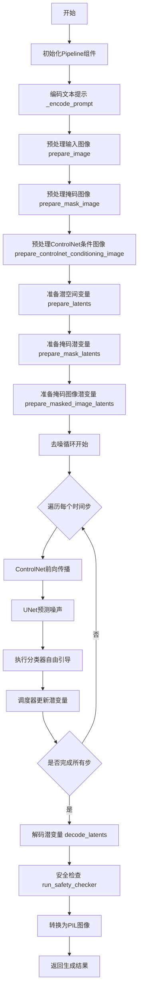
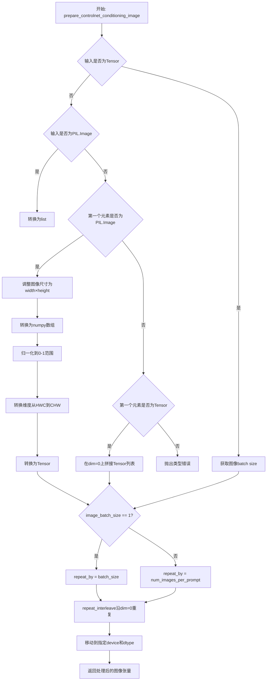
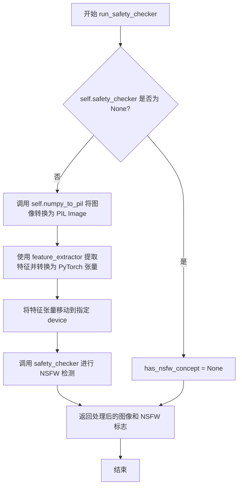
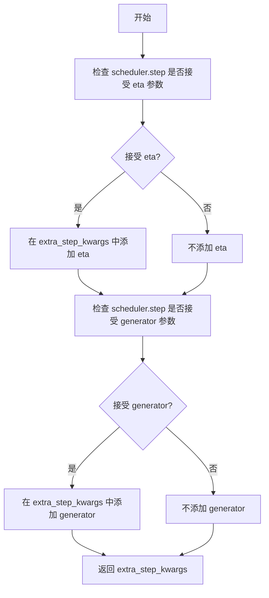
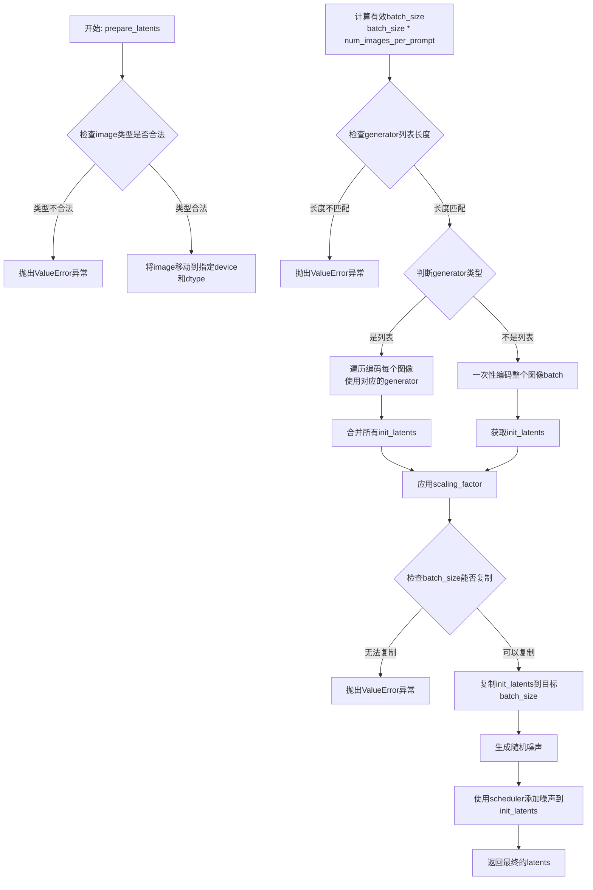
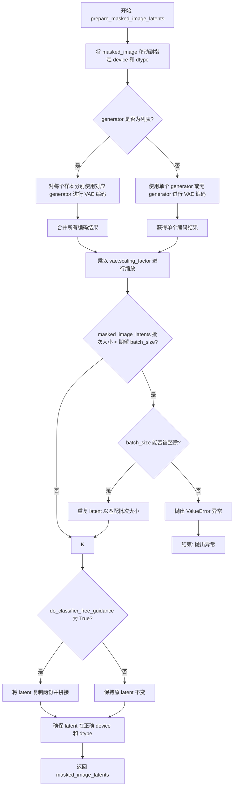

```mermaid
flowchart TD
    A[__call__ 入口] --> B[0. 默认高度和宽度]
    B --> C[1. 检查输入参数]
    C --> D[2. 定义调用参数<br/>获取 batch_size<br/>判断是否使用 classifier free guidance]
    D --> E[3. 编码输入提示<br/>调用 _encode_prompt]
    E --> F[4. 准备掩码、图像和控制条件图像<br/>prepare_image<br/>prepare_mask_image<br/>prepare_controlnet_conditioning_image]
    F --> G[计算 masked_image = image * mask_image < 0.5]
    G --> H[5. 准备时间步<br/>set_timesteps<br/>get_timesteps]
    H --> I[6. 准备潜在变量<br/>prepare_latents<br/>prepare_mask_latents<br/>prepare_masked_image_latents]
    I --> J{do_classifier_free_guidance?}
    J -->|Yes| K[controlnet_conditioning_image 复制拼接]
    J -->|No| L[跳过复制]
    K --> M[7. 准备额外步进参数]
    L --> M
    M --> N[8. 去噪循环]
    N --> O[迭代每个 timestep]
    O --> P[扩展潜在变量用于 CFG]
    P --> Q[非修复路径: scale_model_input]
    Q --> R[修复路径: 拼接 latent + mask + masked_image_latents]
    R --> S[ControlNet 前向传播]
    S --> T[应用 controlnet_conditioning_scale]
    T --> U[UNet 预测噪声残差]
    U --> V{do_classifier_free_guidance?}
    V -->|Yes| W[分离并计算引导噪声预测]
    V -->|No| X[直接使用噪声预测]
    W --> Y[scheduler.step 计算上一步]
    X --> Y
    Y --> Z{是否最后一步或满足 warmup?}
    Z -->|Yes| AA[更新进度条<br/>调用 callback]
    Z -->|No| AB[继续下一轮]
    AA --> AC{循环结束?}
    AB --> O
    AC -->|No| O
    AC -->|Yes| AD[9. 后处理]
    AD --> AE{output_type == 'latent'?}
    AE -->|Yes| AF[直接返回 latents]
    AE -->|No| AG[decode_latents 解码潜在向量]
    AG --> AH[10. 运行安全检查器]
    AH --> AI{output_type == 'pil'?}
    AI -->|Yes| AJ[转换为 PIL Image]
    AI -->|No| AK[保持为 numpy 数组]
    AJ --> AL[11. 返回结果]
    AK --> AL
    AF --> AL
```

# `diffusers\examples\community\stable_diffusion_controlnet_inpaint_img2img.py` 详细设计文档

这是一个基于Stable Diffusion的ControlNet图像修复与图像到图像转换Pipeline，它结合了ControlNet条件控制机制，能够根据文本提示、掩码图像和分割图像条件对输入图像进行修复和转换，生成符合语义要求的图像。

## 整体流程



## 类结构

```
DiffusionPipeline (抽象基类)
└── StableDiffusionControlNetInpaintImg2ImgPipeline
    ├── 组件: vae, text_encoder, tokenizer, unet, controlnet, scheduler
    ├── 安全组件: safety_checker, feature_extractor
    └── 工具函数: prepare_image, prepare_mask_image, prepare_controlnet_conditioning_image
```

## 全局变量及字段


### `logger`
    
模块日志记录器，用于输出警告和信息

类型：`logging.Logger`
    


### `EXAMPLE_DOC_STRING`
    
示例文档字符串，包含代码使用示例和说明

类型：`str`
    


### `StableDiffusionControlNetInpaintImg2ImgPipeline.vae`
    
VAE编码器/解码器

类型：`AutoencoderKL`
    


### `StableDiffusionControlNetInpaintImg2ImgPipeline.text_encoder`
    
文本编码器

类型：`CLIPTextModel`
    


### `StableDiffusionControlNetInpaintImg2ImgPipeline.tokenizer`
    
文本分词器

类型：`CLIPTokenizer`
    


### `StableDiffusionControlNetInpaintImg2ImgPipeline.unet`
    
条件UNet模型

类型：`UNet2DConditionModel`
    


### `StableDiffusionControlNetInpaintImg2ImgPipeline.controlnet`
    
ControlNet控制模型

类型：`ControlNetModel`
    


### `StableDiffusionControlNetInpaintImg2ImgPipeline.scheduler`
    
扩散调度器

类型：`KarrasDiffusionSchedulers`
    


### `StableDiffusionControlNetInpaintImg2ImgPipeline.safety_checker`
    
安全检查器

类型：`StableDiffusionSafetyChecker`
    


### `StableDiffusionControlNetInpaintImg2ImgPipeline.feature_extractor`
    
特征提取器

类型：`CLIPImageProcessor`
    


### `StableDiffusionControlNetInpaintImg2ImgPipeline.vae_scale_factor`
    
VAE缩放因子

类型：`int`
    


### `StableDiffusionControlNetInpaintImg2ImgPipeline._optional_components`
    
可选组件列表

类型：`List[str]`
    
    

## 全局函数及方法


### `prepare_image`

该函数用于预处理输入图像（支持 torch.Tensor、PIL.Image 或 numpy array 格式），将其统一转换为 4D float32 类型的 PyTorch tensor，并归一化到 [-1, 1] 范围，以适配 Stable Diffusion 模型的输入要求。

参数：

- `image`：`Union[torch.Tensor, PIL.Image.Image, np.ndarray]`，输入图像，可以是 PyTorch 张量、PIL 图像或 NumPy 数组

返回值：`torch.Tensor`，预处理后的 4D 张量，形状为 (B, C, H, W)，数据类型为 float32，值域为 [-1, 1]

#### 流程图

```mermaid
flowchart TD
    A[开始: prepare_image] --> B{image 是 torch.Tensor?}
    B -->|Yes| C{image.ndim == 3?}
    B -->|No| D{image 是 PIL.Image 或 np.ndarray?}
    C -->|Yes| E[添加 batch 维度: unsqueeze(0)]
    C -->|No| F[不做处理]
    D -->|Yes| G[转换为列表: image = [image]]
    D -->|No| H[跳过转换]
    E --> I[转换为 float32]
    F --> I
    G --> J{image[0] 是 PIL.Image?}
    H --> K{image 是 list?}
    J -->|Yes| L[转换为 RGB numpy 数组并添加维度]
    J -->|No| M[为 numpy 数组添加维度]
    L --> N[沿 axis=0 拼接]
    M --> N
    K -->|Yes| J
    K -->|No| N
    N --> O[转置: (B, H, W, C) -> (B, C, H, W)]
    O --> P[转换为 torch.Tensor]
    P --> Q[归一化: / 127.5 - 1.0]
    I --> R[返回处理后的 image]
    Q --> R
```

#### 带注释源码

```python
def prepare_image(image):
    """
    预处理输入图像，转换为模型可用的 tensor 格式
    
    Args:
        image: 输入图像，支持 torch.Tensor, PIL.Image.Image, np.ndarray
        
    Returns:
        torch.Tensor: 预处理后的图像，4D (B, C, H, W), float32, [-1, 1]
    """
    if isinstance(image, torch.Tensor):
        # 处理 PyTorch 张量输入
        # Batch single image: 如果是3维张量(H, W, C)，添加batch维度变为4维
        if image.ndim == 3:
            image = image.unsqueeze(0)

        # 统一转换为 float32 类型
        image = image.to(dtype=torch.float32)
    else:
        # 处理 PIL.Image 或 numpy array 输入
        # preprocess image: 统一转换为列表进行处理
        if isinstance(image, (PIL.Image.Image, np.ndarray)):
            image = [image]

        # 处理 PIL.Image 列表: 转换为 RGB numpy 数组并添加batch维度
        if isinstance(image, list) and isinstance(image[0], PIL.Image.Image):
            # 将每个 PIL Image 转换为 RGB numpy 数组，并添加batch维度 [None, :]
            image = [np.array(i.convert("RGB"))[None, :] for i in image]
            # 沿 batch 维度拼接
            image = np.concatenate(image, axis=0)
        # 处理 numpy array 列表: 添加batch维度后拼接
        elif isinstance(image, list) and isinstance(image[0], np.ndarray):
            image = np.concatenate([i[None, :] for i in image], axis=0)

        # 转置: 从 (B, H, W, C) 转换为 (B, C, H, W)
        image = image.transpose(0, 3, 1, 2)
        # 转换为 PyTorch tensor 并归一化到 [-1, 1]
        # 原始像素值范围 [0, 255] -> [0, 1] (除以255) -> [-1, 1] (乘以2再减1)
        # 简化计算: / 127.5 - 1.0 等效于 * 2/255 - 1
        image = torch.from_numpy(image).to(dtype=torch.float32) / 127.5 - 1.0

    return image
```


### `prepare_mask_image`

该函数用于将不同格式的掩码图像（mask_image）统一转换为 torch.Tensor 格式，并进行二值化处理，确保掩码值为 0 或 1。

参数：

- `mask_image`：`Union[torch.Tensor, PIL.Image.Image, np.ndarray, List]`，待预处理的掩码图像，支持 torch 张量、PIL 图像、numpy 数组或它们的列表

返回值：`torch.Tensor`，处理后的二值化掩码图像张量，形状为 (B, 1, H, W)

#### 流程图

```mermaid
flowchart TD
    A[开始: mask_image] --> B{判断类型}
    
    B -->|torch.Tensor| C[处理张量]
    B -->|其他类型| D[预处理非张量]
    
    C --> C1{判断维度数量}
    C1 -->|ndim == 2| C2[扩展为批量: unsqueeze(0).unsqueeze(0)]
    C1 -->|ndim == 3<br/>shape[0] == 1| C3[扩展批量维度: unsqueeze(0)]
    C1 -->|ndim == 3<br/>shape[0] != 1| C4[扩展通道维度: unsqueeze(1)]
    
    C2 --> C5[二值化: <0.5设为0, >=0.5设为1]
    C3 --> C5
    C4 --> C5
    
    D --> D1{判断输入类型}
    D1 -->|PIL.Image或np.ndarray| D2[转为列表]
    D2 --> D3{列表元素类型}
    D3 -->|PIL.Image| D4[转换为L通道<br/>拼接并归一化/255]
    D3 -->|np.ndarray| D5[拼接并归一化/255]
    D4 --> D6[二值化: <0.5设为0, >=0.5设为1]
    D5 --> D6
    
    C5 --> E[返回处理后的mask_image]
    D6 --> F[转为torch.Tensor]
    F --> E
```

#### 带注释源码

```python
def prepare_mask_image(mask_image):
    """
    预处理掩码图像，将其转换为 torch.Tensor 并进行二值化处理
    
    参数:
        mask_image: 掩码图像，支持 torch.Tensor, PIL.Image.Image, np.ndarray 或它们的列表
        
    返回:
        torch.Tensor: 处理后的二值化掩码图像，形状为 (B, 1, H, W)
    """
    # 判断是否为 torch.Tensor
    if isinstance(mask_image, torch.Tensor):
        # 处理单个掩码（2D）的情况
        if mask_image.ndim == 2:
            # 批量处理并添加通道维度
            # 例如: (H, W) -> (1, 1, H, W)
            mask_image = mask_image.unsqueeze(0).unsqueeze(0)
        # 处理单个掩码（3D）且批次为1的情况
        elif mask_image.ndim == 3 and mask_image.shape[0] == 1:
            # 扩展批量维度
            # 例如: (1, H, W) -> (1, 1, H, W)
            mask_image = mask_image.unsqueeze(0)
        # 处理批量掩码（3D）且批次不为1的情况
        elif mask_image.ndim == 3 and mask_image.shape[0] != 1:
            # 扩展通道维度
            # 例如: (B, H, W) -> (B, 1, H, W)
            mask_image = mask_image.unsqueeze(1)

        # 二值化掩码：将小于0.5的值设为0，大于等于0.5的值设为1
        mask_image[mask_image < 0.5] = 0
        mask_image[mask_image >= 0.5] = 1
    else:
        # 预处理非 torch.Tensor 类型的掩码图像
        # 将单个图像或数组转换为列表
        if isinstance(mask_image, (PIL.Image.Image, np.ndarray)):
            mask_image = [mask_image]

        # 处理 PIL.Image 列表
        if isinstance(mask_image, list) and isinstance(mask_image[0], PIL.Image.Image):
            # 将每个PIL图像转换为L通道（灰度）
            # np.array(i.convert("L")): (H, W) -> (H, W)
            # [None, None, :]: 添加批量和通道维度 -> (1, 1, H, W)
            mask_image = np.concatenate([np.array(m.convert("L"))[None, None, :] for m in mask_image], axis=0)
            # 归一化到 [0, 1] 范围
            mask_image = mask_image.astype(np.float32) / 255.0
        # 处理 np.ndarray 列表
        elif isinstance(mask_image, list) and isinstance(mask_image[0], np.ndarray):
            # 添加批量和通道维度并拼接
            mask_image = np.concatenate([m[None, None, :] for m in mask_image], axis=0)

        # 二值化掩码
        mask_image[mask_image < 0.5] = 0
        mask_image[mask_image >= 0.5] = 1
        # 转换为 torch.Tensor
        mask_image = torch.from_numpy(mask_image)

    return mask_image
```


### `prepare_controlnet_conditioning_image`

该函数负责将 ControlNet 条件图像（可以是 PIL 图像或 PyTorch 张量）预处理为符合 pipeline 要求的格式，包括图像尺寸调整、归一化、维度转换以及批量处理，以供后续 ControlNet 模型使用。

参数：

- `controlnet_conditioning_image`：`Union[torch.Tensor, PIL.Image.Image, List[torch.Tensor], List[PIL.Image.Image]]`，ControlNet 条件图像输入，支持单张图像、图像列表或张量形式
- `width`：`int`，目标输出图像的宽度（像素）
- `height`：`int`，目标输出图像的高度（像素）
- `batch_size`：`int`，提示词批处理大小，用于确定单张图像需要重复的次数
- `num_images_per_prompt`：`int`，每个提示词生成的图像数量
- `device`：`torch.device`，目标计算设备（CPU 或 GPU）
- `dtype`：`torch.dtype`，目标数据类型（如 float16）

返回值：`torch.Tensor`，预处理后的 ControlNet 条件图像张量，形状为 `[batch_size * num_images_per_prompt, 3, height, width]`

#### 流程图



#### 带注释源码

```python
def prepare_controlnet_conditioning_image(
    controlnet_conditioning_image, width, height, batch_size, num_images_per_prompt, device, dtype
):
    """
    预处理 ControlNet 条件图像，将其转换为标准化的 PyTorch 张量格式
    
    参数:
        controlnet_conditioning_image: 输入的条件图像，支持多种格式
        width: 目标宽度
        height: 目标高度
        batch_size: 批处理大小
        num_images_per_prompt: 每个提示生成的图像数
        device: 目标设备
        dtype: 目标数据类型
    
    返回:
        处理后的图像张量
    """
    
    # 如果输入不是 Tensor，先进行预处理
    if not isinstance(controlnet_conditioning_image, torch.Tensor):
        # 如果是单张 PIL Image，转换为列表以便统一处理
        if isinstance(controlnet_conditioning_image, PIL.Image.Image):
            controlnet_conditioning_image = [controlnet_conditioning_image]

        # 处理 PIL Image 列表
        if isinstance(controlnet_conditioning_image[0], PIL.Image.Image):
            # 1. 调整每张图像尺寸到目标宽高，使用 lanczos 重采样
            controlnet_conditioning_image = [
                np.array(i.resize((width, height), resample=PIL_INTERPOLATION["lanczos"]))[None, :]
                for i in controlnet_conditioning_image
            ]
            # 2. 在 batch 维度拼接
            controlnet_conditioning_image = np.concatenate(controlnet_conditioning_image, axis=0)
            # 3. 归一化到 [0, 1] 范围
            controlnet_conditioning_image = np.array(controlnet_conditioning_image).astype(np.float32) / 255.0
            # 4. 转换维度顺序：从 HWC (height, width, channels) 转为 CHW
            controlnet_conditioning_image = controlnet_conditioning_image.transpose(0, 3, 1, 2)
            # 5. 转换为 PyTorch Tensor
            controlnet_conditioning_image = torch.from_numpy(controlnet_conditioning_image)
        
        # 处理 Tensor 列表：直接在 batch 维度拼接
        elif isinstance(controlnet_conditioning_image[0], torch.Tensor):
            controlnet_conditioning_image = torch.cat(controlnet_conditioning_image, dim=0)

    # 获取图像的 batch 大小
    image_batch_size = controlnet_conditioning_image.shape[0]

    # 确定重复次数：
    # - 如果只有 1 张图像，需要重复 batch_size 次以匹配提示词数量
    # - 如果图像数量与提示词 batch 大小相同，则按 num_images_per_prompt 重复
    if image_batch_size == 1:
        repeat_by = batch_size
    else:
        # image batch size is the same as prompt batch size
        repeat_by = num_images_per_prompt

    # 沿 batch 维度重复图像
    controlnet_conditioning_image = controlnet_conditioning_image.repeat_interleave(repeat_by, dim=0)

    # 将图像移动到指定设备和数据类型
    controlnet_conditioning_image = controlnet_conditioning_image.to(device=device, dtype=dtype)

    return controlnet_conditioning_image
```


### StableDiffusionControlNetInpaintImg2ImgPipeline.__init__

该方法是 `StableDiffusionControlNetInpaintImg2ImgPipeline` 类的构造函数，负责初始化一个结合了 ControlNet 的 Stable Diffusion 图像修复（Inpainting）和图像到图像（Img2Img）转换管道。该方法接收多个预训练模型组件（如 VAE、文本编码器、UNet、ControlNet 等），进行参数校验、安全检查器配置，并将所有模块注册到管道中。

参数：

- `vae`：`AutoencoderKL`，变分自编码器，用于将图像编码到潜在空间和解码回像素空间
- `text_encoder`：`CLIPTextModel`，CLIP 文本编码器，用于将文本提示编码为嵌入向量
- `tokenizer`：`CLIPTokenizer`，CLIP 分词器，用于将文本分割为 token
- `unet`：`UNet2DConditionModel`，条件 UNet 模型，用于根据文本嵌入和噪声预测噪声残差
- `controlnet`：`ControlNetModel`，ControlNet 模型，用于从条件图像中提取控制特征
- `scheduler`：`KarrasDiffusionSchedulers`，扩散调度器，用于控制去噪过程的噪声调度
- `safety_checker`：`StableDiffusionSafetyChecker`，安全检查器，用于过滤不适宜的内容
- `feature_extractor`：`CLIPImageProcessor`，CLIP 图像处理器，用于提取图像特征供安全检查器使用
- `requires_safety_checker`：`bool`，默认为 True，是否需要安全检查器

返回值：`None`，构造函数无返回值

#### 流程图

```mermaid
flowchart TD
    A[开始 __init__] --> B[调用 super().__init__]
    B --> C{safety_checker is None<br/>且 requires_safety_checker?}
    C -->|是| D[发出安全警告]
    C -->|否| E{safety_checker is not None<br/>且 feature_extractor is None?}
    D --> E
    E -->|是| F[抛出 ValueError]
    E -->|否| G[调用 self.register_modules<br/>注册所有模块]
    G --> H[计算 self.vae_scale_factor]
    H --> I[调用 self.register_to_config<br/>保存配置]
    I --> J[结束 __init__]
```

#### 带注释源码

```python
def __init__(
    self,
    vae: AutoencoderKL,
    text_encoder: CLIPTextModel,
    tokenizer: CLIPTokenizer,
    unet: UNet2DConditionModel,
    controlnet: ControlNetModel,
    scheduler: KarrasDiffusionSchedulers,
    safety_checker: StableDiffusionSafetyChecker,
    feature_extractor: CLIPImageProcessor,
    requires_safety_checker: bool = True,
):
    """
    初始化 StableDiffusionControlNetInpaintImg2ImgPipeline 实例。
    
    参数:
        vae: 变分自编码器模型
        text_encoder: CLIP 文本编码器模型
        tokenizer: CLIP 分词器
        unet: 条件 UNet 模型
        controlnet: ControlNet 控制模型
        scheduler: 扩散调度器
        safety_checker: 安全检查器模型
        feature_extractor: CLIP 图像特征提取器
        requires_safety_checker: 是否需要安全检查器
    """
    # 调用父类 DiffusionPipeline 的初始化方法
    super().__init__()

    # 如果 safety_checker 为 None 但 requires_safety_checker 为 True，发出警告
    if safety_checker is None and requires_safety_checker:
        logger.warning(
            f"You have disabled the safety checker for {self.__class__} by passing `safety_checker=None`. Ensure"
            " that you abide to the conditions of the Stable Diffusion license and do not expose unfiltered"
            " results in services or applications open to the public. Both the diffusers team and Hugging Face"
            " strongly recommend to keep the safety filter enabled in all public facing circumstances, disabling"
            " it only for use-cases that involve analyzing network behavior or auditing its results. For more"
            " information, please have a look at https://github.com/huggingface/diffusers/pull/254 ."
        )

    # 如果 safety_checker 不为 None 但 feature_extractor 为 None，抛出错误
    if safety_checker is not None and feature_extractor is None:
        raise ValueError(
            "Make sure to define a feature extractor when loading {self.__class__} if you want to use the safety"
            " checker. If you do not want to use the safety checker, you can pass `'safety_checker=None'` instead."
        )

    # 注册所有模块到管道，使它们可以通过管道属性访问
    self.register_modules(
        vae=vae,
        text_encoder=text_encoder,
        tokenizer=tokenizer,
        unet=unet,
        controlnet=controlnet,
        scheduler=scheduler,
        safety_checker=safety_checker,
        feature_extractor=feature_extractor,
    )
    
    # 计算 VAE 缩放因子，用于调整潜在空间的尺度
    # 基于 VAE 块输出通道数的 2 的幂次方
    self.vae_scale_factor = 2 ** (len(self.vae.config.block_out_channels) - 1) if getattr(self, "vae", None) else 8
    
    # 将 requires_safety_checker 配置注册到管道配置中
    self.register_to_config(requires_safety_checker=requires_safety_checker)
```


### `StableDiffusionControlNetInpaintImg2ImgPipeline._encode_prompt`

该方法负责将文本提示（prompt）编码为文本编码器的隐藏状态（text encoder hidden states），是扩散管线处理文本输入的核心组件。它支持批量生成、分类器自由引导（CFG），并处理正面提示词和负面提示词的嵌入计算。

参数：

- `prompt`：`Union[str, List[str]]`，要编码的文本提示词，可以是单个字符串或字符串列表
- `device`：`torch.device`，torch计算设备
- `num_images_per_prompt`：`int`，每个提示词需要生成的图像数量，用于复制embeddings
- `do_classifier_free_guidance`：`bool`，是否执行分类器自由引导
- `negative_prompt`：`Union[str, List[str]]`，可选，用于引导图像生成的负面提示词
- `prompt_embeds`：`Optional[torch.Tensor]`，可选，预生成的文本嵌入向量
- `negative_prompt_embeds`：`Optional[torch.Tensor]`，可选，预生成的负面文本嵌入向量

返回值：`torch.Tensor`，编码后的文本嵌入向量，形状为`(batch_size * num_images_per_prompt, seq_len, hidden_dim)`

#### 流程图

```mermaid
flowchart TD
    A[开始 _encode_prompt] --> B{判断 batch_size}
    B -->|prompt 是 str| C[batch_size = 1]
    B -->|prompt 是 list| D[batch_size = len(prompt)]
    B -->|其他情况| E[batch_size = prompt_embeds.shape[0]]
    
    C --> F{prompt_embeds 是 None?}
    D --> F
    E --> F
    
    F -->|是| G[使用 tokenizer 处理 prompt]
    G --> H[检查 attention_mask 是否需要]
    H --> I[调用 text_encoder 获取 embeddings]
    I --> J[转换为指定 dtype 和 device]
    
    F -->|否| K[直接使用传入的 prompt_embeds]
    
    J --> L[复制 embeddings: repeat 1, num_images_per_prompt, 1]
    L --> M[reshape: view bs_embed * num_images_per_prompt, seq_len, -1]
    
    M --> N{do_classifier_free_guidance 且 negative_prompt_embeds 是 None?}
    
    N -->|是| O{negative_prompt 是 None?}
    O -->|是| P[uncond_tokens = [''] * batch_size]
    O -->|否| Q[处理 negative_prompt 类型和长度验证]
    Q --> R[使用 tokenizer 处理 uncond_tokens]
    R --> S[调用 text_encoder 获取 negative_prompt_embeds]
    
    N -->|否| T[直接使用传入的 negative_prompt_embeds]
    
    S --> U[转换为指定 dtype 和 device]
    T --> U
    
    U --> V{do_classifier_free_guidance?}
    
    V -->|是| W[复制 negative_prompt_embeds]
    W --> X[reshape negative_prompt_embeds]
    X --> Y[拼接: torch.cat [negative_prompt_embeds, prompt_embeds]]
    Y --> Z[返回最终 embeddings]
    
    V -->|否| Z
    
    K --> V
    
    M --> V
```

#### 带注释源码

```python
def _encode_prompt(
    self,
    prompt,
    device,
    num_images_per_prompt,
    do_classifier_free_guidance,
    negative_prompt=None,
    prompt_embeds: Optional[torch.Tensor] = None,
    negative_prompt_embeds: Optional[torch.Tensor] = None,
):
    r"""
    Encodes the prompt into text encoder hidden states.

    Args:
         prompt (`str` or `List[str]`, *optional*):
            prompt to be encoded
        device: (`torch.device`):
            torch device
        num_images_per_prompt (`int`):
            number of images that should be generated per prompt
        do_classifier_free_guidance (`bool`):
            whether to use classifier free guidance or not
        negative_prompt (`str` or `List[str]`, *optional*):
            The prompt or prompts not to guide the image generation. If not defined, one has to pass `negative_prompt_embeds` instead.
            Ignored when not using guidance (i.e., ignored if `guidance_scale` is less than `1`).
        prompt_embeds (`torch.Tensor`, *optional*):
            Pre-generated text embeddings. Can be used to easily tweak text inputs, *e.g.* prompt weighting. If not
            provided, text embeddings will be generated from `prompt` input argument.
        negative_prompt_embeds (`torch.Tensor`, *optional*):
            Pre-generated negative text embeddings. Can be used to easily tweak text inputs, *e.g.* prompt
            weighting. If not provided, negative_prompt_embeds will be generated from `negative_prompt` input
            argument.
    """
    # 步骤1: 确定batch_size
    # 根据prompt的类型（str或list）或prompt_embeds的形状来确定批量大小
    if prompt is not None and isinstance(prompt, str):
        batch_size = 1
    elif prompt is not None and isinstance(prompt, list):
        batch_size = len(prompt)
    else:
        batch_size = prompt_embeds.shape[0]

    # 步骤2: 如果没有提供prompt_embeds，则生成它
    if prompt_embeds is None:
        # 使用tokenizer将prompt转换为token IDs
        text_inputs = self.tokenizer(
            prompt,
            padding="max_length",
            max_length=self.tokenizer.model_max_length,
            truncation=True,
            return_tensors="pt",
        )
        text_input_ids = text_inputs.input_ids
        
        # 获取未截断的token IDs用于检测截断
        untruncated_ids = self.tokenizer(prompt, padding="longest", return_tensors="pt").input_ids

        # 检查是否有文本被截断，并记录警告
        if untruncated_ids.shape[-1] >= text_input_ids.shape[-1] and not torch.equal(
            text_input_ids, untruncated_ids
        ):
            removed_text = self.tokenizer.batch_decode(
                untruncated_ids[:, self.tokenizer.model_max_length - 1 : -1]
            )
            logger.warning(
                "The following part of your input was truncated because CLIP can only handle sequences up to"
                f" {self.tokenizer.model_max_length} tokens: {removed_text}"
            )

        # 检查text_encoder是否需要attention_mask
        if hasattr(self.text_encoder.config, "use_attention_mask") and self.text_encoder.config.use_attention_mask:
            attention_mask = text_inputs.attention_mask.to(device)
        else:
            attention_mask = None

        # 调用text_encoder获取文本嵌入
        prompt_embeds = self.text_encoder(
            text_input_ids.to(device),
            attention_mask=attention_mask,
        )
        # 提取隐藏状态（第一个元素是隐藏状态，第二个是可能的其他输出）
        prompt_embeds = prompt_embeds[0]

    # 步骤3: 将prompt_embeds转换到正确的dtype和device
    prompt_embeds = prompt_embeds.to(dtype=self.text_encoder.dtype, device=device)

    # 步骤4: 复制embeddings以匹配num_images_per_prompt
    bs_embed, seq_len, _ = prompt_embeds.shape
    # 使用MPS友好的方法复制text embeddings
    prompt_embeds = prompt_embeds.repeat(1, num_images_per_prompt, 1)
    prompt_embeds = prompt_embeds.view(bs_embed * num_images_per_prompt, seq_len, -1)

    # 步骤5: 处理分类器自由引导的unconditional embeddings
    if do_classifier_free_guidance and negative_prompt_embeds is None:
        uncond_tokens: List[str]
        
        # 处理negative_prompt
        if negative_prompt is None:
            # 如果没有提供negative_prompt，使用空字符串
            uncond_tokens = [""] * batch_size
        elif type(prompt) is not type(negative_prompt):
            raise TypeError(
                f"`negative_prompt` should be the same type to `prompt`, but got {type(negative_prompt)} !="
                f" {type(prompt)}."
            )
        elif isinstance(negative_prompt, str):
            uncond_tokens = [negative_prompt]
        elif batch_size != len(negative_prompt):
            raise ValueError(
                f"`negative_prompt`: {negative_prompt} has batch size {len(negative_prompt)}, but `prompt`:"
                f" {prompt} has batch size {batch_size}. Please make sure that passed `negative_prompt` matches"
                " the batch size of `prompt`."
            )
        else:
            uncond_tokens = negative_prompt

        # 使用与prompt_embeds相同的长度
        max_length = prompt_embeds.shape[1]
        
        # tokenize negative_prompt
        uncond_input = self.tokenizer(
            uncond_tokens,
            padding="max_length",
            max_length=max_length,
            truncation=True,
            return_tensors="pt",
        )

        # 获取attention_mask
        if hasattr(self.text_encoder.config, "use_attention_mask") and self.text_encoder.config.use_attention_mask:
            attention_mask = uncond_input.attention_mask.to(device)
        else:
            attention_mask = None

        # 获取negative embeddings
        negative_prompt_embeds = self.text_encoder(
            uncond_input.input_ids.to(device),
            attention_mask=attention_mask,
        )
        negative_prompt_embeds = negative_prompt_embeds[0]

    # 步骤6: 如果使用guidance，连接unconditional和text embeddings
    if do_classifier_free_guidance:
        # 复制unconditional embeddings以匹配num_images_per_prompt
        seq_len = negative_prompt_embeds.shape[1]

        negative_prompt_embeds = negative_prompt_embeds.to(dtype=self.text_encoder.dtype, device=device)

        negative_prompt_embeds = negative_prompt_embeds.repeat(1, num_images_per_prompt, 1)
        negative_prompt_embeds = negative_prompt_embeds.view(batch_size * num_images_per_prompt, seq_len, -1)

        # 对于分类器自由引导，需要进行两次前向传播
        # 这里将unconditional和text embeddings拼接成单个batch
        # 以避免两次前向传播
        # 拼接顺序: [negative_prompt_embeds, prompt_embeds]
        prompt_embeds = torch.cat([negative_prompt_embeds, prompt_embeds])

    # 返回最终的embeddings
    return prompt_embeds
```


### `StableDiffusionControlNetInpaintImg2ImgPipeline.run_safety_checker`

该方法是 Stable Diffusion ControlNet Inpaint Img2Img Pipeline 中的安全检查器调用函数，用于在图像生成完成后检测输出图像是否包含不适合工作场所（NSFW）的内容。如果安全检查器被启用，该方法会使用特征提取器处理图像并调用安全检查器进行评估；如果安全检查器未启用，则直接返回原始图像和 None。

参数：

- `image`：`torch.Tensor`，需要进行检查的图像张量，通常是经过解码的潜在变量转换而来的图像数据
- `device`：`torch.device`，指定计算设备（CPU 或 CUDA），用于将特征提取器的输出移动到指定设备
- `dtype`：`torch.dtype`，指定数据类型（如 torch.float32），用于将 CLIP 输入转换为相应的数据类型

返回值：`Tuple[torch.Tensor, Optional[torch.Tensor]]`，返回包含两个元素的元组——第一个是处理后的图像（如果安全检查器启用则可能对 NSFW 内容进行模糊处理），第二个是布尔标志数组，指示每个图像是否包含 NSFW 内容（如果安全检查器未启用则为 None）

#### 流程图



#### 带注释源码

```python
def run_safety_checker(self, image, device, dtype):
    """
    运行安全检查器以检测生成的图像是否包含 NSFW 内容。
    
    参数:
        image: 输入图像张量
        device: 计算设备
        dtype: 数据类型
    
    返回:
        (image, has_nsfw_concept): 处理后的图像和 NSFW 检测结果
    """
    # 检查安全检查器是否已配置
    if self.safety_checker is not None:
        # 将图像张量转换为 PIL 图像格式以供特征提取器使用
        safety_checker_input = self.feature_extractor(self.numpy_to_pil(image), return_tensors="pt").to(device)
        
        # 调用安全检查器进行 NSFW 检测
        # 传入图像和 CLIP 模型的输入（特征提取器的像素值）
        image, has_nsfw_concept = self.safety_checker(
            images=image, 
            clip_input=safety_checker_input.pixel_values.to(dtype)
        )
    else:
        # 如果未配置安全检查器，将 NSFW 标志设为 None
        has_nsfw_concept = None
    
    # 返回处理后的图像和 NSFW 标志
    return image, has_nsfw_concept
```


### `StableDiffusionControlNetInpaintImg2ImgPipeline.decode_latents`

该方法将VAE的潜在表示（latents）解码为实际图像，通过反缩放、VAE解码、图像归一化和格式转换等步骤，将神经网络内部的潜在空间表示转换为人类可看的图像数据。

参数：

- `latents`：`torch.Tensor`，由UNet生成的潜在表示张量，通常形状为 (batch_size, latent_channels, height/8, width/8)，需要通过VAE解码器转换为像素空间

返回值：`np.ndarray`，解码后的图像NumPy数组，形状为 (batch_size, height, width, channels)，像素值已归一化到 [0, 1] 范围

#### 流程图

```mermaid
graph TD
    A[输入 latents] --> B[反缩放: 1/scaling_factor * latents]
    B --> C[VAE.decode 解码潜在表示]
    C --> D[图像归一化: /2 + 0.5 并 clamp 0-1]
    D --> E[数据传输: .cpu()]
    E --> F[维度变换: permute 0,2,3,1]
    F --> G[类型转换: .float().numpy()]
    G --> H[返回 np.ndarray 图像]
```

#### 带注释源码

```python
def decode_latents(self, latents):
    """
    将潜在表示解码为图像
    
    Args:
        latents: VAE latent tensor, shape (batch_size, channels, height, width)
    """
    # 步骤1: 反缩放潜在表示
    # VAE在编码时会乘以scaling_factor，这里需要除以回来
    latents = 1 / self.vae.config.scaling_factor * latents
    
    # 步骤2: 使用VAE解码器将潜在表示转换为图像
    # decode方法返回ImagePipelineOutput，包含sample属性
    image = self.vae.decode(latents).sample
    
    # 步骤3: 图像归一化
    # VAE输出范围通常是[-1, 1]，转换为[0, 1]
    # 除以2将范围从[-1,1]映射到[-0.5, 0.5]
    # 加0.5将范围从[-0.5, 0.5]映射到[0, 1]
    # clamp(0, 1)确保值在有效范围内
    image = (image / 2 + 0.5).clamp(0, 1)
    
    # 步骤4: 将图像数据传输到CPU并转换为NumPy数组
    # 使用float32以避免精度问题，同时兼容bfloat16
    # permute(0, 2, 3, 1)将通道维度从CHW转换为HWC格式
    image = image.cpu().permute(0, 2, 3, 1).float().numpy()
    
    return image
```


### `StableDiffusionControlNetInpaintImg2ImgPipeline.prepare_extra_step_kwargs`

该方法用于准备调度器（scheduler）的额外参数。由于不同的调度器（如 DDIMScheduler、DDPMScheduler 等）具有不同的签名，该方法通过检查调度器的 `step` 函数签名，动态判断是否需要添加 `eta` 和 `generator` 参数，以确保与各种调度器兼容。

参数：

- `self`：`StableDiffusionControlNetInpaintImg2ImgPipeline`，Pipeline 实例本身
- `generator`：`Optional[Union[torch.Generator, List[torch.Generator]]]`，用于生成确定性随机数的生成器，可为 None
- `eta`：`float`，DDIM 调度器的参数 η，对应 DDIM 论文中的参数，取值范围为 [0, 1]，其他调度器会忽略此参数

返回值：`Dict[str, Any]`，包含调度器 `step` 方法所需额外参数（如 `eta` 和/或 `generator`）的字典

#### 流程图



#### 带注释源码

```python
def prepare_extra_step_kwargs(self, generator, eta):
    # 准备调度器步骤的额外参数，因为并非所有调度器都具有相同的签名
    # eta (η) 仅用于 DDIMScheduler，其他调度器将忽略它
    # eta 对应 DDIM 论文中的 η：https://huggingface.co/papers/2010.02502
    # 取值应在 [0, 1] 之间

    # 使用 inspect 模块检查调度器的 step 方法签名，判断是否接受 eta 参数
    accepts_eta = "eta" in set(inspect.signature(self.scheduler.step).parameters.keys())
    # 初始化空字典，用于存储额外参数
    extra_step_kwargs = {}
    # 如果调度器接受 eta 参数，则将其添加到 extra_step_kwargs 中
    if accepts_eta:
        extra_step_kwargs["eta"] = eta

    # 检查调度器是否接受 generator 参数
    accepts_generator = "generator" in set(inspect.signature(self.scheduler.step).parameters.keys())
    # 如果调度器接受 generator 参数，则将其添加到 extra_step_kwargs 中
    if accepts_generator:
        extra_step_kwargs["generator"] = generator
    
    # 返回包含调度器所需额外参数的字典
    return extra_step_kwargs
```


### `StableDiffusionControlNetInpaintImg2ImgPipeline.check_inputs`

该方法用于验证 Stable Diffusion ControlNet Inpaint Img2Img Pipeline 的所有输入参数是否合法，确保在执行推理前所有输入都符合预期格式和约束条件。

参数：

- `self`：`StableDiffusionControlNetInpaintImg2ImgPipeline`，Pipeline 实例本身
- `prompt`：`Union[str, List[str], None]`，文本提示词，用于指导图像生成
- `image`：`Union[torch.Tensor, PIL.Image.Image, None]`要进行修复的图像
- `mask_image`：`Union[torch.Tensor, PIL.Image.Image, None]`修复遮罩图像，白色像素将被重新绘制
- `controlnet_conditioning_image`：`Union[torch.Tensor, PIL.Image.Image, List[torch.Tensor], List[PIL.Image.Image], None]`，ControlNet 条件图像
- `height`：`int`，生成图像的高度（像素）
- `width`：`int`，生成图像的宽度（像素）
- `callback_steps`：`int`，回调函数的调用频率
- `negative_prompt`：`Union[str, List[str], None]`，可选的负面提示词
- `prompt_embeds`：`Optional[torch.Tensor]`，可选的预计算文本嵌入
- `negative_prompt_embeds`：`Optional[torch.Tensor]`，可选的预计算负面文本嵌入
- `strength`：`Optional[float]`，图像变换强度，控制在 0 到 1 之间

返回值：`None`，该方法不返回任何值，仅通过抛出异常来指示验证失败

#### 流程图

```mermaid
flowchart TD
    A[开始 check_inputs] --> B{height % 8 == 0 且 width % 8 == 0?}
    B -->|否| B1[抛出 ValueError: height和width必须能被8整除]
    B -->|是| C{callback_steps 是正整数?}
    C -->|否| C1[抛出 ValueError: callback_steps必须是正整数]
    C -->|是| D{prompt 和 prompt_embeds 不能同时提供}
    D -->|是| D1[抛出 ValueError: 不能同时提供prompt和prompt_embeds]
    D -->|否| E{prompt 或 prompt_embeds 至少提供一个}
    E -->|否| E1[抛出 ValueError: 必须提供prompt或prompt_embeds之一]
    E -->|是| F{prompt 是 str 或 list?}
    F -->|否| F1[抛出 ValueError: prompt必须是str或list]
    F -->|是| G{negative_prompt 和 negative_prompt_embeds 不能同时提供}
    G -->|是| G1[抛出 ValueError: 不能同时提供negative_prompt和negative_prompt_embeds]
    G -->|否| H{prompt_embeds 和 negative_prompt_embeds 形状相同?}
    H -->|否| H1[抛出 ValueError: prompt_embeds和negative_prompt_embeds形状必须相同]
    H -->|是| I{controlnet_conditioning_image 类型合法?}
    I -->|否| I1[抛出 TypeError: controlnet_conditioning_image类型不合法]
    I -->|是| J{controlnet_conditioning_image_batch_size 与 prompt_batch_size 兼容?}
    J -->|否| J1[抛出 ValueError: batch size不匹配]
    J -->|是| K{image 和 mask_image 类型一致?}
    K -->|否| K1[抛出 TypeError: image和mask_image类型必须一致]
    K -->|是| L{image 是 torch.Tensor?}
    L -->|是| M{image 和 mask_image 维度合法?}
    M -->|否| M1[抛出 ValueError: 维度不合法]
    M -->|是| N{image 通道数为3?}
    N -->|否| N1[抛出 ValueError: image必须有3通道]
    N -->|是| O{mask_image 通道数为1?}
    O -->|否| O1[抛出 ValueError: mask_image必须有1通道]
    O -->|是| P{image 和 mask_image batch size 相同?}
    P -->|否| P1[抛出 ValueError: batch size必须相同]
    P -->|是| Q{image 和 mask_image 高宽相同?}
    Q -->|否| Q1[抛出 ValueError: 高宽必须相同]
    Q -->|是| R{image 值在 [-1, 1] 范围内?}
    R -->|否| R1[抛出 ValueError: image值必须在[-1, 1]范围内]
    R -->|是| S{mask_image 值在 [0, 1] 范围内?}
    S -->|否| S1[抛出 ValueError: mask_image值必须在[0, 1]范围内]
    S -->|是| T{UNet 输入通道数正确?}
    T -->|否| T1[抛出 ValueError: UNet输入通道数不匹配]
    T -->|是| U{strength 在 [0, 1] 范围内?}
    U -->|否| U1[抛出 ValueError: strength必须在[0, 1]范围内]
    U -->|是| V[验证通过，方法结束]
    
    L -->|否| V
```

#### 带注释源码

```python
def check_inputs(
    self,
    prompt,  # 文本提示词
    image,  # 要修复的图像
    mask_image,  # 修复遮罩
    controlnet_conditioning_image,  # ControlNet 条件图像
    height,  # 输出高度
    width,  # 输出宽度
    callback_steps,  # 回调步骤间隔
    negative_prompt=None,  # 可选的负面提示词
    prompt_embeds=None,  # 可选的预计算提示词嵌入
    negative_prompt_embeds=None,  # 可选的预计算负面提示词嵌入
    strength=None,  # 图像变换强度
):
    # 验证高度和宽度必须是8的倍数（VAE的缩放因子要求）
    if height % 8 != 0 or width % 8 != 0:
        raise ValueError(f"`height` and `width` have to be divisible by 8 but are {height} and {width}.")

    # 验证callback_steps必须是正整数
    if (callback_steps is None) or (
        callback_steps is not None and (not isinstance(callback_steps, int) or callback_steps <= 0)
    ):
        raise ValueError(
            f"`callback_steps` has to be a positive integer but is {callback_steps} of type"
            f" {type(callback_steps)}."
        )

    # prompt和prompt_embeds不能同时提供，只能选择其中一种方式传递文本信息
    if prompt is not None and prompt_embeds is not None:
        raise ValueError(
            f"Cannot forward both `prompt`: {prompt} and `prompt_embeds`: {prompt_embeds}. Please make sure to"
            " only forward one of the two."
        )
    # 必须至少提供prompt或prompt_embeds之一
    elif prompt is None and prompt_embeds is None:
        raise ValueError(
            "Provide either `prompt` or `prompt_embeds`. Cannot leave both `prompt` and `prompt_embeds` undefined."
        )
    # prompt的类型必须是str或list
    elif prompt is not None and (not isinstance(prompt, str) and not isinstance(prompt, list)):
        raise ValueError(f"`prompt` has to be of type `str` or `list` but is {type(prompt)}")

    # negative_prompt和negative_prompt_embeds不能同时提供
    if negative_prompt is not None and negative_prompt_embeds is not None:
        raise ValueError(
            f"Cannot forward both `negative_prompt`: {negative_prompt} and `negative_prompt_embeds`:"
            f" {negative_prompt_embeds}. Please make sure to only forward one of the two."
        )

    # 如果同时提供了prompt_embeds和negative_prompt_embeds，它们必须形状相同
    if prompt_embeds is not None and negative_prompt_embeds is not None:
        if prompt_embeds.shape != negative_prompt_embeds.shape:
            raise ValueError(
                "`prompt_embeds` and `negative_prompt_embeds` must have the same shape when passed directly, but"
                f" got: `prompt_embeds` {prompt_embeds.shape} != `negative_prompt_embeds`"
                f" {negative_prompt_embeds.shape}."
            )

    # 验证controlnet_conditioning_image的类型
    controlnet_cond_image_is_pil = isinstance(controlnet_conditioning_image, PIL.Image.Image)
    controlnet_cond_image_is_tensor = isinstance(controlnet_conditioning_image, torch.Tensor)
    controlnet_cond_image_is_pil_list = isinstance(controlnet_conditioning_image, list) and isinstance(
        controlnet_conditioning_image[0], PIL.Image.Image
    )
    controlnet_cond_image_is_tensor_list = isinstance(controlnet_conditioning_image, list) and isinstance(
        controlnet_conditioning_image[0], torch.Tensor
    )

    # controlnet_conditioning_image必须是PIL图像、torch张量或它们的列表
    if (
        not controlnet_cond_image_is_pil
        and not controlnet_cond_image_is_tensor
        and not controlnet_cond_image_is_pil_list
        and not controlnet_cond_image_is_tensor_list
    ):
        raise TypeError(
            "image must be passed and be one of PIL image, torch tensor, list of PIL images, or list of torch tensors"
        )

    # 确定controlnet_conditioning_image的batch size
    if controlnet_cond_image_is_pil:
        controlnet_cond_image_batch_size = 1
    elif controlnet_cond_image_is_tensor:
        controlnet_cond_image_batch_size = controlnet_conditioning_image.shape[0]
    elif controlnet_cond_image_is_pil_list:
        controlnet_cond_image_batch_size = len(controlnet_conditioning_image)
    elif controlnet_cond_image_is_tensor_list:
        controlnet_cond_image_batch_size = len(controlnet_conditioning_image)

    # 确定prompt的batch size
    if prompt is not None and isinstance(prompt, str):
        prompt_batch_size = 1
    elif prompt is not None and isinstance(prompt, list):
        prompt_batch_size = len(prompt)
    elif prompt_embeds is not None:
        prompt_batch_size = prompt_embeds.shape[0]

    # controlnet_conditioning_image的batch size必须与prompt的batch size匹配（除非为1）
    if controlnet_cond_image_batch_size != 1 and controlnet_cond_image_batch_size != prompt_batch_size:
        raise ValueError(
            f"If image batch size is not 1, image batch size must be same as prompt batch size. image batch size: {controlnet_cond_image_batch_size}, prompt batch size: {prompt_batch_size}"
        )

    # image和mask_image的类型必须一致
    if isinstance(image, torch.Tensor) and not isinstance(mask_image, torch.Tensor):
        raise TypeError("if `image` is a tensor, `mask_image` must also be a tensor")

    if isinstance(image, PIL.Image.Image) and not isinstance(mask_image, PIL.Image.Image):
        raise TypeError("if `image` is a PIL image, `mask_image` must also be a PIL image")

    # 如果image是torch.Tensor，进行更详细的验证
    if isinstance(image, torch.Tensor):
        # 验证维度：image必须是3D或4D张量
        if image.ndim != 3 and image.ndim != 4:
            raise ValueError("`image` must have 3 or 4 dimensions")

        # mask_image必须是2D、3D或4D张量
        if mask_image.ndim != 2 and mask_image.ndim != 3 and mask_image.ndim != 4:
            raise ValueError("`mask_image` must have 2, 3, or 4 dimensions")

        # 提取image的batch size、通道数、高度和宽度
        if image.ndim == 3:
            image_batch_size = 1
            image_channels, image_height, image_width = image.shape
        elif image.ndim == 4:
            image_batch_size, image_channels, image_height, image_width = image.shape

        # 提取mask_image的batch size、通道数、高度和宽度
        if mask_image.ndim == 2:
            mask_image_batch_size = 1
            mask_image_channels = 1
            mask_image_height, mask_image_width = mask_image.shape
        elif mask_image.ndim == 3:
            mask_image_channels = 1
            mask_image_batch_size, mask_image_height, mask_image_width = mask_image.shape
        elif mask_image.ndim == 4:
            mask_image_batch_size, mask_image_channels, mask_image_height, mask_image_width = mask_image.shape

        # 验证image必须有3个通道（RGB）
        if image_channels != 3:
            raise ValueError("`image` must have 3 channels")

        # 验证mask_image必须有1个通道（灰度）
        if mask_image_channels != 1:
            raise ValueError("`mask_image` must have 1 channel")

        # 验证image和mask_image的batch size必须相同
        if image_batch_size != mask_image_batch_size:
            raise ValueError("`image` and `mask_image` mush have the same batch sizes")

        # 验证image和mask_image的高宽必须相同
        if image_height != mask_image_height or image_width != mask_image_width:
            raise ValueError("`image` and `mask_image` must have the same height and width dimensions")

        # 验证image的像素值范围
        if image.min() < -1 or image.max() > 1:
            raise ValueError("`image` should be in range [-1, 1]")

        # 验证mask_image的像素值范围
        if mask_image.min() < 0 or mask_image.max() > 1:
            raise ValueError("`mask_image` should be in range [0, 1]")
    else:
        # 如果image不是tensor，设置默认通道数
        mask_image_channels = 1
        image_channels = 3

    # 计算UNet期望的输入通道数
    # 对于inpainting任务：latent_channels (masked image) + latent_channels (mask) + mask_image_channels
    single_image_latent_channels = self.vae.config.latent_channels
    total_latent_channels = single_image_latent_channels * 2 + mask_image_channels

    # 验证UNet配置中的输入通道数是否与计算的总通道数匹配
    if total_latent_channels != self.unet.config.in_channels:
        raise ValueError(
            f"The config of `pipeline.unet` expects {self.unet.config.in_channels} but received"
            f" non inpainting latent channels: {single_image_latent_channels},"
            f" mask channels: {mask_image_channels}, and masked image channels: {single_image_latent_channels}."
            f" Please verify the config of `pipeline.unet` and the `mask_image` and `image` inputs."
        )

    # 验证strength必须在[0, 1]范围内
    if strength < 0 or strength > 1:
        raise ValueError(f"The value of strength should in [0.0, 1.0] but is {strength}")
```


### `StableDiffusionControlNetInpaintImg2ImgPipeline.get_timesteps`

该函数用于根据推理步骤数和强度（strength）参数计算并返回调整后的去噪时间步序列。它决定了在图像修复（inpainting）过程中实际需要执行的去噪迭代次数。

参数：

- `num_inference_steps`：`int`，推理步骤总数，即去噪过程的总迭代次数
- `strength`：`float`，强度参数，取值范围为 [0, 1]，表示对原始图像的变形程度，值越大变形越多
- `device`：`torch.device`，计算设备（CPU 或 CUDA）

返回值：`tuple`，包含两个元素：
- `timesteps`：`torch.Tensor`，调整后的时间步序列，用于实际去噪
- `num_inference_steps`：`int`，实际用于去噪的步数

#### 流程图

```mermaid
flowchart TD
    A[开始] --> B[计算 init_timestep = min(num_inference_steps × strength, num_inference_steps)]
    B --> C[计算 t_start = max(num_inference_steps - init_timestep, 0)]
    C --> D[从 scheduler.timesteps 中切片获取 timesteps[t_start:]]
    D --> E[返回 timesteps 和 num_inference_steps - t_start]
    E --> F[结束]
```

#### 带注释源码

```python
def get_timesteps(self, num_inference_steps, strength, device):
    """
    计算用于去噪过程的时间步序列。
    
    该方法根据用户指定的推理步骤数和强度参数，确定实际执行去噪的起始时间步。
    强度参数决定了从原始图像中添加的噪声量，从而影响实际需要的去噪迭代次数。
    
    参数:
        num_inference_steps (int): 去噪过程的总迭代次数
        strength (float): 强度参数，范围 [0, 1]，值越大对原图变形越大
        device (torch.device): 计算设备
    
    返回:
        tuple: (timesteps, actual_inference_steps)
            - timesteps: 调整后的时间步张量
            - actual_inference_steps: 实际执行的去噪步数
    """
    # 根据强度计算初始时间步数
    # 强度越高，加入的噪声越多，需要的去噪迭代也越多
    init_timestep = min(int(num_inference_steps * strength), num_inference_steps)

    # 计算起始索引，决定从时间步序列的哪个位置开始
    # 这样可以实现从中间时间步开始去噪，而不是从纯噪声开始
    t_start = max(num_inference_steps - init_timestep, 0)
    
    # 从调度器的时间步序列中获取从 t_start 开始的部分
    timesteps = self.scheduler.timesteps[t_start:]

    # 返回时间步序列和实际去噪步数
    return timesteps, num_inference_steps - t_start
```


### `StableDiffusionControlNetInpaintImg2ImgPipeline.prepare_latents`

该方法用于准备图像的潜在表示（latents），将输入图像编码为潜在空间表示，并根据给定的时间步和随机噪声进行初始化，为后续的去噪扩散过程准备初始潜在向量。

参数：

- `self`：实例方法隐含的类实例引用
- `image`：`torch.Tensor | PIL.Image.Image | list`，待编码的输入图像，可以是张量、PIL图像或图像列表
- `timestep`：`torch.Tensor`，当前扩散过程的时间步，用于向潜在向量添加噪声
- `batch_size`：`int`，批处理大小
- `num_images_per_prompt`：`int`，每个提示词生成的图像数量
- `dtype`：`torch.dtype`，目标数据类型
- `device`：`torch.device`，目标设备
- `generator`：`torch.Generator | list | None`，可选的随机数生成器，用于确保可重复性

返回值：`torch.Tensor`，处理后的潜在向量张量，形状为 (batch_size, latent_channels, height, width)

#### 流程图



#### 带注释源码

```python
def prepare_latents(self, image, timestep, batch_size, num_images_per_prompt, dtype, device, generator=None):
    """
    准备图像的潜在表示（latents），为扩散过程初始化潜在向量
    
    参数:
        image: 输入图像，可以是torch.Tensor、PIL.Image.Image或list类型
        timestep: 当前扩散过程的时间步
        batch_size: 批处理大小
        num_images_per_prompt: 每个提示词生成的图像数量
        dtype: 目标数据类型
        device: 目标设备
        generator: 可选的随机数生成器，用于确保可重复性
    """
    # 1. 类型检查：验证image是否为支持的类型
    if not isinstance(image, (torch.Tensor, PIL.Image.Image, list)):
        raise ValueError(
            f"`image` has to be of type `torch.Tensor`, `PIL.Image.Image` or list but is {type(image)}"
        )

    # 2. 设备转换：将图像移动到目标设备并转换为目标数据类型
    image = image.to(device=device, dtype=dtype)

    # 3. 计算有效批处理大小：考虑每提示词生成的图像数量
    batch_size = batch_size * num_images_per_prompt
    
    # 4. 验证generator列表长度与batch_size是否匹配
    if isinstance(generator, list) and len(generator) != batch_size:
        raise ValueError(
            f"You have passed a list of generators of length {len(generator)}, but requested an effective batch"
            f" size of {batch_size}. Make sure the batch size matches the length of the generators."
        )

    # 5. 使用VAE编码图像为潜在表示
    if isinstance(generator, list):
        # 如果有多个generator，遍历编码每个图像
        init_latents = [
            self.vae.encode(image[i : i + 1]).latent_dist.sample(generator[i]) for i in range(batch_size)
        ]
        # 合并所有编码结果
        init_latents = torch.cat(init_latents, dim=0)
    else:
        # 单一generator或None，一次性编码整个batch
        init_latents = self.vae.encode(image).latent_dist.sample(generator)

    # 6. 应用VAE的scaling_factor进行缩放
    init_latents = self.vae.config.scaling_factor * init_latents

    # 7. 处理batch复制逻辑
    if batch_size > init_latents.shape[0] and batch_size % init_latents.shape[0] == 0:
        raise ValueError(
            f"Cannot duplicate `image` of batch size {init_latents.shape[0]} to {batch_size} text prompts."
        )
    else:
        # 确保init_latents的batch维度与目标batch_size一致
        init_latents = torch.cat([init_latents], dim=0)

    # 8. 生成随机噪声
    shape = init_latents.shape
    noise = randn_tensor(shape, generator=generator, device=device, dtype=dtype)

    # 9. 使用scheduler将噪声添加到初始潜在向量（前向扩散过程）
    init_latents = self.scheduler.add_noise(init_latents, noise, timestep)
    latents = init_latents

    # 10. 返回最终准备好的潜在向量
    return latents
```


### `StableDiffusionControlNetInpaintImg2ImgPipeline.prepare_mask_latents`

该方法用于准备掩码图像的潜在表示（latents），将其调整为与VAE潜在空间相匹配的尺寸，并处理批量大小扩展和分类器无指导（classifier-free guidance）的掩码复制。

参数：

- `mask_image`：`torch.Tensor`，输入的掩码图像张量
- `batch_size`：`int`，目标批量大小
- `height`：`int`，目标图像高度
- `width`：`int`，目标图像宽度
- `dtype`：`torch.dtype`，目标数据类型
- `device`：`torch.device`，目标设备
- `do_classifier_free_guidance`：`bool`，是否启用分类器无指导

返回值：`torch.Tensor`，处理后的掩码潜在表示

#### 流程图

```mermaid
flowchart TD
    A[开始] --> B[使用F.interpolate调整mask_image大小为height//vae_scale_factor x width//vae_scale_factor]
    B --> C[将mask_image转移到指定device和dtype]
    C --> D{mask_image.shape[0] < batch_size?}
    D -->|否| F[跳过重复]
    D -->|是| E{batch_size % mask_image.shape[0] == 0?}
    E -->|否| G[抛出ValueError异常]
    E -->|是| H[使用repeat复制mask到目标batch_size]
    H --> F
    F --> I{do_classifier_free_guidance?}
    I -->|是| J[使用torch.cat将mask复制两份]
    I -->|否| K[保持原样]
    J --> L[返回mask_image_latents]
    K --> L
```

#### 带注释源码

```python
def prepare_mask_latents(
    self,
    mask_image: torch.Tensor,                    # 输入的掩码图像张量
    batch_size: int,                              # 目标批量大小
    height: int,                                  # 目标图像高度
    width: int,                                   # 目标图像宽度
    dtype: torch.dtype,                           # 目标数据类型
    device: torch.device,                         # 目标设备
    do_classifier_free_guidance: bool             # 是否启用分类器无指导
):
    # 1. 将掩码调整到与latents相同的形状，因为我们会将掩码与latents连接在一起
    #    在转换为dtype之前执行此操作，以避免在使用cpu_offload和半精度时出现问题
    mask_image = F.interpolate(
        mask_image,
        size=(
            height // self.vae_scale_factor,      # 计算对应的latents高度
            width // self.vae_scale_factor         # 计算对应的latents宽度
        )
    )
    
    # 2. 将掩码移动到指定设备和数据类型
    mask_image = mask_image.to(device=device, dtype=dtype)

    # 3. 为每个prompt复制掩码，使用MPS友好的方法
    if mask_image.shape[0] < batch_size:
        # 验证掩码数量可以被batch_size整除
        if not batch_size % mask_image.shape[0] == 0:
            raise ValueError(
                "The passed mask and the required batch size don't match. "
                f"Masks are supposed to be duplicated to a total batch size of {batch_size}, "
                f"but {mask_image.shape[0]} masks were passed. "
                "Make sure the number of masks that you pass is divisible by the total requested batch size."
            )
        # 重复掩码以匹配batch_size
        mask_image = mask_image.repeat(batch_size // mask_image.shape[0], 1, 1, 1)

    # 4. 如果启用分类器无指导，将掩码复制两份（条件和无条件）
    #    这允许在单个前向传播中进行引导
    mask_image = torch.cat([mask_image] * 2) if do_classifier_free_guidance else mask_image

    # 5. 返回处理后的掩码latents
    mask_image_latents = mask_image

    return mask_image_latents
```


### StableDiffusionControlNetInpaintImg2ImgPipeline.prepare_masked_image_latents

该方法用于将带掩码的图像编码到潜在空间（latent space），以便与扩散模型的潜在变量进行拼接处理。它接收掩码图像和批次参数，通过VAE编码器将图像转换为潜在表示，并根据是否使用无分类器自由引导（CFG）来复制潜在变量以适配双通道输入。

参数：

- `self`：类的实例方法隐含参数，指向 `StableDiffusionControlNetInpaintImg2ImgPipeline` 类的实例
- `masked_image`：`torch.Tensor`，已经被掩码处理过的图像数据（原始图像乘以掩码，掩码区域为白色/255，非掩码区域为黑色/0），需要将其编码为潜在空间表示
- `batch_size`：`int`，期望的批次大小，用于决定需要生成多少个潜在变量样本
- `height`：`int`，图像的高度（像素单位），用于确定潜在变量的空间维度
- `width`：`int`，图像的宽度（像素单位），用于确定潜在变量的空间维度
- `dtype`：`torch.dtype`，目标数据类型（通常为 float16 或 float32），确保潜在变量使用指定的精度
- `device`：`torch.device`，目标设备（CPU 或 CUDA），将潜在变量放置到指定的计算设备上
- `generator`：`torch.Generator` 或 `List[torch.Generator]` 或 `None`，随机数生成器，用于确保潜在变量采样的可重复性
- `do_classifier_free_guidance`：`bool`，是否启用无分类器自由引导，若为 True 则需要复制潜在变量以形成双通道输入（条件/非条件）

返回值：`torch.Tensor`，编码并处理后的掩码图像潜在变量，形状为 `(batch_size * num_images_per_prompt, latent_channels, height // vae_scale_factor, width // vae_scale_factor)`，若启用 CFG 则形状翻倍

#### 流程图



#### 带注释源码

```python
def prepare_masked_image_latents(
    self, masked_image, batch_size, height, width, dtype, device, generator, do_classifier_free_guidance
):
    """
    准备掩码图像的潜在变量表示。
    
    该方法将带掩码的图像编码到 VAE 的潜在空间，生成可供 UNet 在修复任务中使用的潜在变量。
    """
    # 将 masked_image 移动到目标设备并转换为目标数据类型
    masked_image = masked_image.to(device=device, dtype=dtype)

    # 使用 VAE 编码器将掩码图像编码到潜在空间，以便与潜在变量拼接
    # 根据 generator 类型决定编码方式（支持批量生成器列表以实现每个样本独立采样）
    if isinstance(generator, list):
        # 逐个编码图像片段，每个对应各自的随机生成器
        masked_image_latents = [
            self.vae.encode(masked_image[i : i + 1]).latent_dist.sample(generator=generator[i])
            for i in range(batch_size)
        ]
        # 将所有编码结果在批次维度上拼接
        masked_image_latents = torch.cat(masked_image_latents, dim=0)
    else:
        # 使用单一生成器或默认随机采样进行编码
        masked_image_latents = self.vae.encode(masked_image).latent_dist.sample(generator=generator)
    
    # 应用 VAE 缩放因子，将潜在变量调整到正确的数值范围
    masked_image_latents = self.vae.config.scaling_factor * masked_image_latents

    # 复制 masked_image_latents 以匹配每个 prompt 生成的图像数量
    # 使用 MPS 友好的方法进行复制
    if masked_image_latents.shape[0] < batch_size:
        if not batch_size % masked_image_latents.shape[0] == 0:
            raise ValueError(
                "The passed images and the required batch size don't match. Images are supposed to be duplicated"
                f" to a total batch size of {batch_size}, but {masked_image_latents.shape[0]} images were passed."
                " Make sure the number of images that you pass is divisible by the total requested batch size."
            )
        # 计算复制倍数并执行复制操作
        masked_image_latents = masked_image_latents.repeat(batch_size // masked_image_latents.shape[0], 1, 1, 1)

    # 如果启用无分类器自由引导，需要复制 latent 以形成条件/非条件对
    # 这样可以在单次前向传播中同时计算条件和非条件预测
    masked_image_latents = (
        torch.cat([masked_image_latents] * 2) if do_classifier_free_guidance else masked_image_latents
    )

    # 对齐设备以防止与潜在模型输入拼接时出现设备错误
    # 再次确保数据类型和设备位置正确
    masked_image_latents = masked_image_latents.to(device=device, dtype=dtype)
    return masked_image_latents
```


### `StableDiffusionControlNetInpaintImg2ImgPipeline._default_height_width`

该方法用于在高度或宽度参数为 `None` 时，根据输入图像自动计算默认的生成图像高度和宽度。如果传入的图像是 PIL 图像或张量，会提取其尺寸并向下取整到 8 的倍数，以确保与 UNet 的输入要求兼容。

参数：

- `height`：`Optional[int]`，待生成的图像高度，如果为 `None` 则从图像中推断
- `width`：`Optional[int]`，待生成的图像宽度，如果为 `None` 则从图像中推断
- `image`：`Union[torch.Tensor, PIL.Image.Image, List[torch.Tensor], List[PIL.Image.Image]]`，用于推断尺寸的参考图像（通常为 controlnet_conditioning_image）

返回值：`Tuple[int, int]`，返回计算后的高度和宽度，均为 8 的倍数

#### 流程图

```mermaid
flowchart TD
    A[开始 _default_height_width] --> B{image 是否为 list?}
    B -->|Yes| C[取 image[0] 作为参考]
    B -->|No| D{height is None?}
    C --> D
    D -->|Yes| E{image 类型是 PIL.Image?}
    D -->|No| G{width is None?}
    E -->|Yes| F[height = image.height]
    E -->|No| H[height = image.shape[3]]
    F --> I[height = (height // 8) * 8]
    H --> I
    G -->|Yes| J{image 类型是 PIL.Image?}
    J -->|Yes| K[width = image.width]
    J -->|No| L[width = image.shape[2]]
    K --> M[width = (width // 8) * 8]
    L --> M
    I --> N{width is None?}
    N -->|Yes| G
    N -->|No| O[返回 (height, width)]
    M --> O
```

#### 带注释源码

```python
def _default_height_width(self, height, width, image):
    # 如果传入的是图像列表，则取第一张图像作为尺寸参考
    if isinstance(image, list):
        image = image[0]

    # 当 height 参数未指定时，从输入图像中推断高度
    if height is None:
        if isinstance(image, PIL.Image.Image):
            # PIL 图像直接获取 height 属性
            height = image.height
        elif isinstance(image, torch.Tensor):
            # Tensor 图像从 shape 获取高度（假设为 B,C,H,W 格式，取索引 3）
            height = image.shape[3]

        # 将高度向下取整到 8 的倍数，确保与 VAE/UNet 兼容
        height = (height // 8) * 8  # round down to nearest multiple of 8

    # 当 width 参数未指定时，从输入图像中推断宽度
    if width is None:
        if isinstance(image, PIL.Image.Image):
            # PIL 图像直接获取 width 属性
            width = image.width
        elif isinstance(image, torch.Tensor):
            # Tensor 图像从 shape 获取宽度（假设为 B,C,H,W 格式，取索引 2）
            width = image.shape[2]

        # 将宽度向下取整到 8 的倍数，确保与 VAE/UNet 兼容
        width = (width // 8) * 8  # round down to nearest multiple of 8

    # 返回计算得到的高度和宽度
    return height, width
```


### `StableDiffusionControlNetInpaintImg2ImgPipeline.__call__`

该方法是 Stable Diffusion ControlNet 图像修复管道的主入口函数，结合了 ControlNet 引导、图像修复（Inpainting）和图像到图像转换（Img2Img）功能。它接受文本提示、待修复图像、掩码图像和控制条件图像，通过去噪循环生成符合提示的修复后图像。

参数：

- `prompt`：`Union[str, List[str]]`，要引导图像生成的文本提示。如果未定义，则必须传递 `prompt_embeds`
- `image`：`Union[torch.Tensor, PIL.Image.Image]`，将被修复的图像批次或单张图像，白色像素部分将被 `mask_image` 掩码并根据提示重新绘制
- `mask_image`：`Union[torch.Tensor, PIL.Image.Image]`，用于掩码 `image` 的图像，白色像素将被重绘，黑色像素保留
- `controlnet_conditioning_image`：`Union[torch.Tensor, PIL.Image.Image, List[torch.Tensor], List[PIL.Image.Image]]`，ControlNet 输入条件图像，用于指导 UNet 生成
- `strength`：`float`，概念上表示对参考图像的变换程度，值在 0 到 1 之间，值越大变换越明显
- `height`：`Optional[int]`，生成图像的高度（像素），默认使用 UNet 配置的 sample_size * vae_scale_factor
- `width`：`Optional[int]`，生成图像的宽度（像素），默认使用 UNet 配置的 sample_size * vae_scale_factor
- `num_inference_steps`：`int`，去噪步数，越多通常图像质量越高但推理越慢
- `guidance_scale`：`float`，无分类器自由引导（Classifier-Free Diffusion Guidance）比例，值大于 1 启用引导
- `negative_prompt`：`Optional[Union[str, List[str]]]`，不引导图像生成的负面提示
- `num_images_per_prompt`：`Optional[int]`，每个提示生成的图像数量
- `eta`：`float`，DDIM 论文中的 eta 参数，仅适用于 DDIMScheduler
- `generator`：`Optional[Union[torch.Generator, List[torch.Generator]]]`，随机生成器用于确保可重复生成
- `latents`：`Optional[torch.Tensor]`，预生成的去噪潜在向量
- `prompt_embeds`：`Optional[torch.Tensor]`，预生成的文本嵌入
- `negative_prompt_embeds`：`Optional[torch.Tensor]`，预生成的负面文本嵌入
- `output_type`：`str`，输出格式，可选 "pil" 或 "latent"，默认 "pil"
- `return_dict`：`bool`，是否返回 `StableDiffusionPipelineOutput`，默认 True
- `callback`：`Optional[Callable[[int, int, torch.Tensor], None]]`，每 `callback_steps` 步调用的回调函数
- `callback_steps`：`int`，回调函数调用频率
- `cross_attention_kwargs`：`Optional[Dict[str, Any]]`，传递给 AttentionProcessor 的参数字典
- `controlnet_conditioning_scale`：`float`，ControlNet 输出乘以的比例因子，默认 1.0

返回值：`Union[StableDiffusionPipelineOutput, Tuple]`。如果 `return_dict` 为 True，返回 `StableDiffusionPipelineOutput`，包含生成的图像列表和 NSFW 检测布尔值列表；否则返回元组 `(image, has_nsfw_concept)`

#### 流程图



#### 带注释源码

```python
@torch.no_grad()
@replace_example_docstring(EXAMPLE_DOC_STRING)
def __call__(
    self,
    prompt: Union[str, List[str]] = None,
    image: Union[torch.Tensor, PIL.Image.Image] = None,
    mask_image: Union[torch.Tensor, PIL.Image.Image] = None,
    controlnet_conditioning_image: Union[
        torch.Tensor, PIL.Image.Image, List[torch.Tensor], List[PIL.Image.Image]
    ] = None,
    strength: float = 0.8,
    height: Optional[int] = None,
    width: Optional[int] = None,
    num_inference_steps: int = 50,
    guidance_scale: float = 7.5,
    negative_prompt: Optional[Union[str, List[str]]] = None,
    num_images_per_prompt: Optional[int] = 1,
    eta: float = 0.0,
    generator: Optional[Union[torch.Generator, List[torch.Generator]]] = None,
    latents: Optional[torch.Tensor] = None,
    prompt_embeds: Optional[torch.Tensor] = None,
    negative_prompt_embeds: Optional[torch.Tensor] = None,
    output_type: str | None = "pil",
    return_dict: bool = True,
    callback: Optional[Callable[[int, int, torch.Tensor], None]] = None,
    callback_steps: int = 1,
    cross_attention_kwargs: Optional[Dict[str, Any]] = None,
    controlnet_conditioning_scale: float = 1.0,
):
    r"""
    Function invoked when calling the pipeline for generation.

    Args:
        prompt (`str` or `List[str]`, *optional*):
            The prompt or prompts to guide the image generation. If not defined, one has to pass `prompt_embeds`.
            instead.
        image (`torch.Tensor` or `PIL.Image.Image`):
            `Image`, or tensor representing an image batch which will be inpainted, *i.e.* parts of the image will
            be masked out with `mask_image` and repainted according to `prompt`.
        mask_image (`torch.Tensor` or `PIL.Image.Image`):
            `Image`, or tensor representing an image batch, to mask `image`. White pixels in the mask will be
            repainted, while black pixels will be preserved. If `mask_image` is a PIL image, it will be converted
            to a single channel (luminance) before use. If it's a tensor, it should contain one color channel (L)
            instead of 3, so the expected shape would be `(B, H, W, 1)`.
        controlnet_conditioning_image (`torch.Tensor`, `PIL.Image.Image`, `List[torch.Tensor]` or `List[PIL.Image.Image]`):
            The ControlNet input condition. ControlNet uses this input condition to generate guidance to Unet. If
            the type is specified as `torch.Tensor`, it is passed to ControlNet as is. PIL.Image.Image` can
            also be accepted as an image. The control image is automatically resized to fit the output image.
        strength (`float`, *optional*):
            Conceptually, indicates how much to transform the reference `image`. Must be between 0 and 1. `image`
            will be used as a starting point, adding more noise to it the larger the `strength`. The number of
            denoising steps depends on the amount of noise initially added. When `strength` is 1, added noise will
            be maximum and the denoising process will run for the full number of iterations specified in
            `num_inference_steps`. A value of 1, therefore, essentially ignores `image`.
        height (`int`, *optional*, defaults to self.unet.config.sample_size * self.vae_scale_factor):
            The height in pixels of the generated image.
        width (`int`, *optional*, defaults to self.unet.config.sample_size * self.vae_scale_factor):
            The width in pixels of the generated image.
        num_inference_steps (`int`, *optional*, defaults to 50):
            The number of denoising steps. More denoising steps usually lead to a higher quality image at the
            expense of slower inference.
        guidance_scale (`float`, *optional*, defaults to 7.5):
            Guidance scale as defined in [Classifier-Free Diffusion Guidance](https://huggingface.co/papers/2207.12598).
            `guidance_scale` is defined as `w` of equation 2. of [Imagen
            Paper](https://huggingface.co/papers/2205.11487). Guidance scale is enabled by setting `guidance_scale >
            1`. Higher guidance scale encourages to generate images that are closely linked to the text `prompt`,
            usually at the expense of lower image quality.
        negative_prompt (`str` or `List[str]`, *optional*):
            The prompt or prompts not to guide the image generation. If not defined, one has to pass `negative_prompt_embeds` instead.
            Ignored when not using guidance (i.e., ignored if `guidance_scale` is less than `1`).
        num_images_per_prompt (`int`, *optional*, defaults to 1):
            The number of images to generate per prompt.
        eta (`float`, *optional*, defaults to 0.0):
            Corresponds to parameter eta (η) in the DDIM paper: https://huggingface.co/papers/2010.02502. Only applies to
            [`schedulers.DDIMScheduler`], will be ignored for others.
        generator (`torch.Generator` or `List[torch.Generator]`, *optional*):
            One or a list of [torch generator(s)](https://pytorch.org/docs/stable/generated/torch.Generator.html)
            to make generation deterministic.
        latents (`torch.Tensor`, *optional*):
            Pre-generated noisy latents, sampled from a Gaussian distribution, to be used as inputs for image
            generation. Can be used to tweak the same generation with different prompts. If not provided, a latents
            tensor will be generated by sampling using the supplied random `generator`.
        prompt_embeds (`torch.Tensor`, *optional*):
            Pre-generated text embeddings. Can be used to easily tweak text inputs, *e.g.* prompt weighting. If not
            provided, text embeddings will be generated from `prompt` input argument.
        negative_prompt_embeds (`torch.Tensor`, *optional*):
            Pre-generated negative text embeddings. Can be used to easily tweak text inputs, *e.g.* prompt
            weighting. If not provided, negative_prompt_embeds will be generated from `negative_prompt` input
            argument.
        output_type (`str`, *optional*, defaults to `"pil"`):
            The output format of the generate image. Choose between
            [PIL](https://pillow.readthedocs.io/en/stable/): `PIL.Image.Image` or `np.array`.
        return_dict (`bool`, *optional*, defaults to `True`):
            Whether or not to return a [`~pipelines.stable_diffusion.StableDiffusionPipelineOutput`] instead of a
            plain tuple.
        callback (`Callable`, *optional*):
            A function that will be called every `callback_steps` steps during inference. The function will be
            called with the following arguments: `callback(step: int, timestep: int, latents: torch.Tensor)`.
        callback_steps (`int`, *optional*, defaults to 1):
            The frequency at which the `callback` function will be called. If not specified, the callback will be
            called at every step.
        cross_attention_kwargs (`dict`, *optional*):
            A kwargs dictionary that if specified is passed along to the `AttentionProcessor` as defined under
            `self.processor` in
            [diffusers.models.attention_processor](https://github.com/huggingface/diffusers/blob/main/src/diffusers/models/attention_processor.py).
        controlnet_conditioning_scale (`float`, *optional*, defaults to 1.0):
            The outputs of the controlnet are multiplied by `controlnet_conditioning_scale` before they are added
            to the residual in the original unet.

    Examples:

    Returns:
        [`~pipelines.stable_diffusion.StableDiffusionPipelineOutput`] or `tuple`:
        [`~pipelines.stable_diffusion.StableDiffusionPipelineOutput`] if `return_dict` is True, otherwise a `tuple.
        When returning a tuple, the first element is a list with the generated images, and the second element is a
        list of `bool`s denoting whether the corresponding generated image likely represents "not-safe-for-work"
        (nsfw) content, according to the `safety_checker`.
    """
    # 0. Default height and width to unet
    # 根据 controlnet_conditioning_image 自动推断高度和宽度，并确保是8的倍数
    height, width = self._default_height_width(height, width, controlnet_conditioning_image)

    # 1. Check inputs. Raise error if not correct
    # 验证所有输入参数的合法性，包括尺寸、维度、通道数等
    self.check_inputs(
        prompt,
        image,
        mask_image,
        controlnet_conditioning_image,
        height,
        width,
        callback_steps,
        negative_prompt,
        prompt_embeds,
        negative_prompt_embeds,
        strength,
    )

    # 2. Define call parameters
    # 根据 prompt 或 prompt_embeds 确定批次大小
    if prompt is not None and isinstance(prompt, str):
        batch_size = 1
    elif prompt is not None and isinstance(prompt, list):
        batch_size = len(prompt)
    else:
        batch_size = prompt_embeds.shape[0]

    # 获取执行设备
    device = self._execution_device
    
    # 判断是否使用无分类器自由引导（guidance_scale > 1.0 启用）
    do_classifier_free_guidance = guidance_scale > 1.0

    # 3. Encode input prompt
    # 将文本提示编码为文本嵌入向量
    prompt_embeds = self._encode_prompt(
        prompt,
        device,
        num_images_per_prompt,
        do_classifier_free_guidance,
        negative_prompt,
        prompt_embeds=prompt_embeds,
        negative_prompt_embeds=negative_prompt_embeds,
    )

    # 4. Prepare mask, image, and controlnet_conditioning_image
    # 将图像预处理为 torch.Tensor 格式并归一化到 [-1, 1]
    image = prepare_image(image)

    # 预处理掩码图像，确保为正确格式并二值化
    mask_image = prepare_mask_image(mask_image)

    # 预处理 ControlNet 条件图像，调整尺寸并复制到指定设备
    controlnet_conditioning_image = prepare_controlnet_conditioning_image(
        controlnet_conditioning_image,
        width,
        height,
        batch_size * num_images_per_prompt,
        num_images_per_prompt,
        device,
        self.controlnet.dtype,
    )

    # 创建被掩码的图像（保留区域为原图，掩码区域为0）
    masked_image = image * (mask_image < 0.5)

    # 5. Prepare timesteps
    # 设置调度器的时间步
    self.scheduler.set_timesteps(num_inference_steps, device=device)
    # 根据 strength 计算实际使用的时间步数
    timesteps, num_inference_steps = self.get_timesteps(num_inference_steps, strength, device)
    # 复制初始时间步以匹配批次大小
    latent_timestep = timesteps[:1].repeat(batch_size * num_images_per_prompt)

    # 6. Prepare latent variables
    # 如果未提供 latents，则从图像编码生成初始潜在向量
    if latents is None:
        latents = self.prepare_latents(
            image,
            latent_timestep,
            batch_size,
            num_images_per_prompt,
            prompt_embeds.dtype,
            device,
            generator,
        )

    # 准备掩码潜在变量，调整尺寸以匹配 VAE 下采样后的分辨率
    mask_image_latents = self.prepare_mask_latents(
        mask_image,
        batch_size * num_images_per_prompt,
        height,
        width,
        prompt_embeds.dtype,
        device,
        do_classifier_free_guidance,
    )

    # 准备被掩码图像的潜在变量
    masked_image_latents = self.prepare_masked_image_latents(
        masked_image,
        batch_size * num_images_per_prompt,
        height,
        width,
        prompt_embeds.dtype,
        device,
        generator,
        do_classifier_free_guidance,
    )

    # 如果使用 CFG，将条件图像复制并拼接（无条件+有条件）
    if do_classifier_free_guidance:
        controlnet_conditioning_image = torch.cat([controlnet_conditioning_image] * 2)

    # 7. Prepare extra step kwargs. TODO: Logic should ideally just be moved out of the pipeline
    # 准备调度器额外的参数（如 eta 和 generator）
    extra_step_kwargs = self.prepare_extra_step_kwargs(generator, eta)

    # 8. Denoising loop
    # 计算预热步数（用于进度条显示）
    num_warmup_steps = len(timesteps) - num_inference_steps * self.scheduler.order
    
    # 进度条迭代去噪
    with self.progress_bar(total=num_inference_steps) as progress_bar:
        for i, t in enumerate(timesteps):
            # expand the latents if we are doing classifier free guidance
            # 为 CFG 扩展潜在变量（复制为两份：无条件+有条件）
            non_inpainting_latent_model_input = (
                torch.cat([latents] * 2) if do_classifier_free_guidance else latents
            )

            # 对非修复路径进行缩放输入
            non_inpainting_latent_model_input = self.scheduler.scale_model_input(
                non_inpainting_latent_model_input, t
            )

            # 修复路径：拼接潜在变量、掩码和被掩码图像潜在
            inpainting_latent_model_input = torch.cat(
                [non_inpainting_latent_model_input, mask_image_latents, masked_image_latents], dim=1
            )

            # ControlNet 前向传播，获取中间残差
            down_block_res_samples, mid_block_res_sample = self.controlnet(
                non_inpainting_latent_model_input,
                t,
                encoder_hidden_states=prompt_embeds,
                controlnet_cond=controlnet_conditioning_image,
                return_dict=False,
            )

            # 应用 ControlNet 条件缩放因子
            down_block_res_samples = [
                down_block_res_sample * controlnet_conditioning_scale
                for down_block_res_sample in down_block_res_samples
            ]
            mid_block_res_sample *= controlnet_conditioning_scale

            # predict the noise residual
            # UNet 预测噪声残差
            noise_pred = self.unet(
                inpainting_latent_model_input,
                t,
                encoder_hidden_states=prompt_embeds,
                cross_attention_kwargs=cross_attention_kwargs,
                down_block_additional_residuals=down_block_res_samples,
                mid_block_additional_residual=mid_block_res_sample,
            ).sample

            # perform guidance
            # 如果使用 CFG，分别计算无条件预测和文本条件预测，然后加权
            if do_classifier_free_guidance:
                noise_pred_uncond, noise_pred_text = noise_pred.chunk(2)
                noise_pred = noise_pred_uncond + guidance_scale * (noise_pred_text - noise_pred_uncond)

            # compute the previous noisy sample x_t -> x_t-1
            # 使用调度器计算上一步的去噪潜在
            latents = self.scheduler.step(noise_pred, t, latents, **extra_step_kwargs).prev_sample

            # call the callback, if provided
            # 在特定步数调用回调函数
            if i == len(timesteps) - 1 or ((i + 1) > num_warmup_steps and (i + 1) % self.scheduler.order == 0):
                progress_bar.update()
                if callback is not None and i % callback_steps == 0:
                    step_idx = i // getattr(self.scheduler, "order", 1)
                    callback(step_idx, t, latents)

    # If we do sequential model offloading, let's offload unet and controlnet
    # manually for max memory savings
    # 如果使用了顺序模型卸载，手动卸载 UNet 和 ControlNet 以节省内存
    if hasattr(self, "final_offload_hook") and self.final_offload_hook is not None:
        self.unet.to("cpu")
        self.controlnet.to("cpu")
        torch.cuda.empty_cache()

    # 根据输出类型处理结果
    if output_type == "latent":
        # 如果要求 latent 输出，直接返回潜在向量
        image = latents
        has_nsfw_concept = None
    elif output_type == "pil":
        # 8. Post-processing
        # 将潜在向量解码为图像
        image = self.decode_latents(latents)

        # 9. Run safety checker
        # 运行安全检查器检测 NSFW 内容
        image, has_nsfw_concept = self.run_safety_checker(image, device, prompt_embeds.dtype)

        # 10. Convert to PIL
        # 转换为 PIL 图像格式
        image = self.numpy_to_pil(image)
    else:
        # 其他输出类型（numpy）
        # 8. Post-processing
        image = self.decode_latents(latents)

        # 9. Run safety checker
        image, has_nsfw_concept = self.run_safety_checker(image, device, prompt_embeds.dtype)

    # Offload last model to CPU
    # 最终模型卸载
    if hasattr(self, "final_offload_hook") and self.final_offload_hook is not None:
        self.final_offload_hook.offload()

    # 返回结果
    if not return_dict:
        return (image, has_nsfw_concept)

    # 返回结构化输出对象
    return StableDiffusionPipelineOutput(images=image, nsfw_content_detected=has_nsfw_concept)
```

## 关键组件


### 张量索引与惰性加载

代码中使用了 `@torch.no_grad()` 装饰器实现惰性加载，避免在推理过程中计算梯度，减少显存占用。同时在 `prepare_image`、`prepare_mask_image` 等函数中通过条件判断处理不同维度的输入张量（batch single image、batch of images），实现灵活的张量索引。

### 反量化支持

`prepare_image` 函数支持将 PIL.Image 和 numpy.ndarray 转换为 torch.Tensor，并归一化到 [-1, 1] 范围。`prepare_mask_image` 函数类似地将 mask 图像归一化到 [0, 1] 范围并进行二值化处理。`decode_latents` 函数将潜伏向量解码回像素空间并进行范围 clamping。

### 量化策略

代码通过 `torch.float16` 支持半精度推理，在 `from_pretrained` 时指定 `torch_dtype=torch.float16`。`prepare_controlnet_conditioning_image` 等函数中使用 `dtype` 参数控制数据类型，实现模型量化推理。

### ControlNet 引导的图像修复

`StableDiffusionControlNetInpaintImg2ImgPipeline` 类集成了 ControlNet 模型来引导修复过程，通过 `controlnet_conditioning_image` 参数接收控制条件，并在去噪循环中将 ControlNet 输出的中间特征添加到 UNet 中。

### 潜伏空间操作

`prepare_latents`、`prepare_mask_latents` 和 `prepare_masked_image_latents` 函数负责将图像和 mask 编码到 VAE 潜伏空间，并在潜伏空间中进行噪声添加和 mask 合并操作，支持 classifier-free guidance 下的双分支处理。

### 安全检查器集成

`run_safety_checker` 方法集成了 NSFW 内容检测功能，通过 `safety_checker` 和 `feature_extractor` 组件对生成的图像进行安全审查，返回检测结果。

### 调度器与噪声管理

代码使用 KarrasDiffusionSchedulers 调度器家族，通过 `get_timesteps` 方法根据 strength 参数计算实际使用的去噪步数，并在去噪循环中通过 `scheduler.step` 执行噪声预测和样本更新。


## 问题及建议


### 已知问题

- **Python版本兼容性问题**：`__call__`方法中使用了`str | None`类型注解（Python 3.10+语法），但未使用`from __future__ import annotations`，可能导致与旧版本Python不兼容。
- **代码重复**：在`__call__`方法的输出处理部分，`decode_latents`和`run_safety_checker`被调用了两次（当`output_type`为"pil"和其他类型时），违反了DRY原则。
- **类型检查不一致**：部分函数参数和返回值缺少完整的类型注解，如`prepare_image`、`prepare_mask_image`等全局函数。
- **缺乏输入验证**：虽然`check_inputs`方法有较全面的验证，但`prepare_image`和`prepare_controlnet_conditioning_image`等函数缺少对输入数据的完整验证，可能导致运行时错误。
- **变量名冗长**：代码中大量使用`controlnet_conditioning_image`这样的超长变量名，影响代码可读性，建议使用别名或缩短命名。
- **魔法数字**：代码中存在硬编码的数值（如`0.5`用于二值化掩码、`127.5`用于归一化），应提取为常量以提高可维护性。
- **潜在内存泄漏**：在批处理大型图像时，某些中间tensor（如`init_latents`）未显式释放，可能导致内存占用过高。
- **错误信息不够友好**：部分异常信息过于技术化，如"The passed mask and the required batch size don't match"，缺乏对普通用户的解释。

### 优化建议

- **重构输出处理逻辑**：将`decode_latents`和`run_safety_checker`的调用提取为单独的方法，避免在`__call__`中重复代码。
- **添加类型注解**：为所有全局函数添加完整的类型注解和文档字符串，特别是`prepare_*`系列的预处理函数。
- **提取常量**：将魔法数字提取为模块级常量，如`MASK_THRESHOLD = 0.5`、`NORMALIZATION_FACTOR = 127.5`等。
- **改进错误处理**：为关键函数添加更友好的错误提示信息和异常处理机制。
- **添加资源管理**：在`__call__`方法中添加显式的GPU内存清理逻辑，使用`torch.cuda.empty_cache()`或在`finally`块中释放资源。
- **优化批量处理**：对于大批量生成场景，考虑添加流式处理或分批处理机制以减少内存压力。
- **统一变量命名**：在保持语义清晰的前提下，适当简化变量命名，或使用类型别名来改善可读性。
- **补充文档**：为关键类方法（如`_encode_prompt`、`prepare_latents`等）添加更详细的文档说明，包括参数、返回值和示例。


## 其它


### 一段话描述

该代码实现了一个基于Stable Diffusion的ControlNet图像修复与图像转换Pipeline（StableDiffusionControlNetInpaintImg2ImgPipeline），通过结合文本提示、分割掩码（Segmentation Mask）作为ControlNet条件输入，实现对图像的智能修复和风格迁移，支持基于用户文本描述引导的图像生成与编辑。

### 文件的整体运行流程

1. **初始化阶段**：加载预训练的VAE、文本编码器（CLIP）、UNet、ControlNet模型及调度器
2. **输入准备阶段**：处理文本提示（编码为embeddings）、处理输入图像、掩码图像、ControlNet条件图像
3. **潜在空间准备**：将图像编码为latents，准备掩码latents和被掩码图像的latents
4. **去噪循环**：通过多个推理步骤逐步从噪声生成图像，包括：
   - 扩展latents用于classifier-free guidance
   - 使用ControlNet预测中间特征
   - 使用UNet预测噪声残差
   - 执行噪声调度器步骤更新latents
5. **后处理阶段**：解码latents为图像，运行安全检查器，转换为PIL图像

### 类的详细信息

#### 类名：StableDiffusionControlNetInpaintImg2ImgPipeline

**类描述**：继承自DiffusionPipeline和StableDiffusionMixin的ControlNet图像修复Pipeline类，整合了VAE、文本编码器、UNet、ControlNet等组件，实现基于文本提示和分割条件图像引导的图像修复与转换功能。

---

### 类字段

| 字段名称 | 类型 | 描述 |
|---------|------|------|
| vae | AutoencoderKL | 变分自编码器，用于图像编码和解码 |
| text_encoder | CLIPTextModel | CLIP文本编码器，将文本提示转换为向量表示 |
| tokenizer | CLIPTokenizer | CLIP分词器，用于文本分词 |
| unet | UNet2DConditionModel | 条件UNet模型，用于噪声预测 |
| controlnet | ControlNetModel | ControlNet模型，用于提取条件特征 |
| scheduler | KarrasDiffusionSchedulers | 扩散调度器，控制去噪过程 |
| safety_checker | StableDiffusionSafetyChecker | 安全检查器，过滤不适当内容 |
| feature_extractor | CLIPImageProcessor | 特征提取器，用于安全检查 |
| vae_scale_factor | int | VAE缩放因子，用于latent空间计算 |
| _optional_components | List[str] | 可选组件列表，包含safety_checker和feature_extractor |

---

### 类方法

#### 1. __init__

| 项目 | 详情 |
|------|------|
| **方法名称** | __init__ |
| **参数** | vae, text_encoder, tokenizer, unet, controlnet, scheduler, safety_checker, feature_extractor, requires_safety_checker |
| **参数类型** | AutoencoderKL, CLIPTextModel, CLIPTokenizer, UNet2DConditionModel, ControlNetModel, KarrasDiffusionSchedulers, StableDiffusionSafetyChecker, CLIPImageProcessor, bool |
| **参数描述** | 初始化Pipeline的所有必要组件 |
| **返回值类型** | None |
| **返回值描述** | 初始化Pipeline实例 |
| **mermaid流程图** | ```mermaid\ngraph TD\nA[开始__init__] --> B[调用父类构造函数]\nB --> C{requires_safety_checker为True且safety_checker为None}\nC -->|是| D[输出警告信息]\nC -->|否| E{safety_checker不为None且feature_extractor为None}\nE -->|是| F[抛出ValueError]\nE -->|否| G[注册所有模块]\nG --> H[计算vae_scale_factor]\nH --> I[注册配置]\nI --> J[结束__init__]\n``` |
| **带注释源码** | ```python\ndef __init__(\n    self,\n    vae: AutoencoderKL,\n    text_encoder: CLIPTextModel,\n    tokenizer: CLIPTokenizer,\n    unet: UNet2DConditionModel,\n    controlnet: ControlNetModel,\n    scheduler: KarrasDiffusionSchedulers,\n    safety_checker: StableDiffusionSafetyChecker,\n    feature_extractor: CLIPImageProcessor,\n    requires_safety_checker: bool = True,\n):\n    super().__init__()\n\n    # 如果禁用安全检查器但未明确设置，发出警告\n    if safety_checker is None and requires_safety_checker:\n        logger.warning(...)\n\n    # 如果使用安全检查器但未提供特征提取器，抛出错误\n    if safety_checker is not None and feature_extractor is None:\n        raise ValueError(...)\n\n    # 注册所有模块到pipeline\n    self.register_modules(...)\n    \n    # 计算VAE缩放因子，用于latent空间尺寸计算\n    self.vae_scale_factor = 2 ** (len(self.vae.config.block_out_channels) - 1) if getattr(self, \"vae\", None) else 8\n    \n    # 注册配置参数\n    self.register_to_config(requires_safety_checker=requires_safety_checker)\n``` |

#### 2. _encode_prompt

| 项目 | 详情 |
|------|------|
| **方法名称** | _encode_prompt |
| **参数** | prompt, device, num_images_per_prompt, do_classifier_free_guidance, negative_prompt, prompt_embeds, negative_prompt_embeds |
| **参数类型** | str/List[str], torch.device, int, bool, str/List[str], Optional[torch.Tensor], Optional[torch.Tensor] |
| **参数描述** | 编码文本提示为文本embeddings，支持正负提示 |
| **返回值类型** | torch.Tensor |
| **返回值描述** | 编码后的文本embeddings张量 |
| **mermaid流程图** | ```mermaid\ngraph TD\nA[开始_encode_prompt] --> B[确定batch_size]\nB --> C{prompt_embeds是否为None}\nC -->|是| D[调用tokenizer处理prompt]\nD --> E[处理截断警告]\nE --> F[调用text_encoder生成embeddings]\nC -->|否| G[直接使用prompt_embeds]\nF --> H[复制embeddings以匹配num_images_per_prompt]\nH --> I{do_classifier_free_guidance为True且negative_prompt_embeds为None}\nI -->|是| J[生成negative_prompt_embeds]\nI -->|否| K[合并unconditional和text embeddings]\nJ --> K\nK --> L[结束_encode_prompt]\n``` |
| **带注释源码** | ```python\ndef _encode_prompt(\n    self,\n    prompt,\n    device,\n    num_images_per_prompt,\n    do_classifier_free_guidance,\n    negative_prompt=None,\n    prompt_embeds: Optional[torch.Tensor] = None,\n    negative_prompt_embeds: Optional[torch.Tensor] = None,\n):\n    # 确定批次大小\n    if prompt is not None and isinstance(prompt, str):\n        batch_size = 1\n    elif prompt is not None and isinstance(prompt, list):\n        batch_size = len(prompt)\n    else:\n        batch_size = prompt_embeds.shape[0]\n\n    # 如果未提供prompt_embeds，则从prompt生成\n    if prompt_embeds is None:\n        # 使用tokenizer处理文本\n        text_inputs = self.tokenizer(prompt, padding=\"max_length\", ...)\n        text_input_ids = text_inputs.input_ids\n        \n        # 调用text_encoder生成embeddings\n        prompt_embeds = self.text_encoder(text_input_ids.to(device), attention_mask=attention_mask)\n        prompt_embeds = prompt_embeds[0]\n\n    # 复制embeddings以支持每个prompt生成多个图像\n    prompt_embeds = prompt_embeds.repeat(1, num_images_per_prompt, 1)\n    prompt_embeds = prompt_embeds.view(bs_embed * num_images_per_prompt, seq_len, -1)\n\n    # 处理classifier-free guidance\n    if do_classifier_free_guidance and negative_prompt_embeds is None:\n        # 生成negative embeddings\n        negative_prompt_embeds = self.text_encoder(uncond_input.input_ids.to(device), ...)\n        negative_prompt_embeds = negative_prompt_embeds[0]\n\n    # 合并unconditional和text embeddings用于classifier-free guidance\n    if do_classifier_free_guidance:\n        prompt_embeds = torch.cat([negative_prompt_embeds, prompt_embeds])\n\n    return prompt_embeds\n``` |

#### 3. run_safety_checker

| 项目 | 详情 |
|------|------|
| **方法名称** | run_safety_checker |
| **参数** | image, device, dtype |
| **参数类型** | torch.Tensor, torch.device, torch.dtype |
| **参数描述** | 运行安全检查器检测不当内容 |
| **返回值类型** | Tuple[torch.Tensor, Optional[List[bool]]] |
| **返回值描述** | 处理后的图像和NSFW检测结果 |

#### 4. decode_latents

| 项目 | 详情 |
|------|------|
| **方法名称** | decode_latents |
| **参数** | latents |
| **参数类型** | torch.Tensor |
| **参数描述** | 待解码的latent张量 |
| **返回值类型** | np.ndarray |
| **返回值描述** | 解码后的图像数组 |

#### 5. check_inputs

| 项目 | 详情 |
|------|------|
| **方法名称** | check_inputs |
| **参数** | prompt, image, mask_image, controlnet_conditioning_image, height, width, callback_steps, negative_prompt, prompt_embeds, negative_prompt_embeds, strength |
| **参数类型** | 多种类型，详见代码 |
| **参数描述** | 验证所有输入参数的合法性 |
| **返回值类型** | None |
| **返回值描述** | 验证通过则返回None，否则抛出ValueError |
| **mermaid流程图** | ```mermaid\ngraph TD\nA[开始check_inputs] --> B[检查height和width是否可被8整除]\nB --> C[检查callback_steps有效性]\nC --> D[检查prompt和prompt_embeds互斥]\nD --> E[检查negative_prompt和negative_prompt_embeds互斥]\nE --> F[检查controlnet_conditioning_image类型]\nF --> G[检查image和mask_image类型一致性]\nG --> H[检查维度要求]\nH --> I[检查通道数要求]\nH --> J[检查batch_size匹配]\nJ --> K[检查strength范围]\nK --> L[验证unet配置的latent_channels]\nL --> M[结束check_inputs]\n``` |

#### 6. get_timesteps

| 项目 | 详情 |
|------|------|
| **方法名称** | get_timesteps |
| **参数** | num_inference_steps, strength, device |
| **参数类型** | int, float, torch.device |
| **参数描述** | 根据强度计算推理时间步 |
| **返回值类型** | Tuple[torch.Tensor, int] |
| **返回值描述** | 时间步张量和调整后的推理步数 |

#### 7. prepare_latents

| 项目 | 详情 |
|------|------|
| **方法名称** | prepare_latents |
| **参数** | image, timestep, batch_size, num_images_per_prompt, dtype, device, generator |
| **参数类型** | torch.Tensor/PIL.Image.Image/List, torch.Tensor, int, int, torch.dtype, torch.device, Optional[torch.Generator] |
| **参数描述** | 准备初始latent变量 |
| **返回值类型** | torch.Tensor |
| **返回值描述** | 准备好的latent张量 |

#### 8. prepare_mask_latents

| 项目 | 详情 |
|------|------|
| **方法名称** | prepare_mask_latents |
| **参数** | mask_image, batch_size, height, width, dtype, device, do_classifier_free_guidance |
| **参数类型** | torch.Tensor, int, int, int, torch.dtype, torch.device, bool |
| **参数描述** | 准备掩码latents，调整尺寸并复制 |
| **返回值类型** | torch.Tensor |
| **返回值描述** | 处理后的掩码latent张量 |

#### 9. prepare_masked_image_latents

| 项目 | 详情 |
|------|------|
| **方法名称** | prepare_masked_image_latents |
| **参数** | masked_image, batch_size, height, width, dtype, device, generator, do_classifier_free_guidance |
| **参数类型** | torch.Tensor, int, int, int, torch.dtype, torch.device, Optional[torch.Generator], bool |
| **参数描述** | 将被掩码的图像编码到latent空间 |
| **返回值类型** | torch.Tensor |
| **返回值描述** | 被掩码图像的latent表示 |

#### 10. _default_height_width

| 项目 | 详情 |
|------|------|
| **方法名称** | _default_height_width |
| **参数** | height, width, image |
| **参数类型** | Optional[int], Optional[int], Union[torch.Tensor, PIL.Image.Image, List] |
| **参数描述** | 根据输入图像自动确定高度和宽度 |
| **返回值类型** | Tuple[int, int] |
| **返回值描述** | 调整后的高度和宽度（必须是8的倍数） |

#### 11. __call__

| 项目 | 详情 |
|------|------|
| **方法名称** | __call__ |
| **参数** | prompt, image, mask_image, controlnet_conditioning_image, strength, height, width, num_inference_steps, guidance_scale, negative_prompt, num_images_per_prompt, eta, generator, latents, prompt_embeds, negative_prompt_embeds, output_type, return_dict, callback, callback_steps, cross_attention_kwargs, controlnet_conditioning_scale |
| **参数类型** | 多种类型，详见代码docstring |
| **参数描述** | 主推理方法，执行完整的图像生成流程 |
| **返回值类型** | StableDiffusionPipelineOutput或tuple |
| **返回值描述** | 生成的图像列表和NSFW检测结果 |
| **mermaid流程图** | ```mermaid\ngraph TD\nA[开始__call__] --> B[获取默认height和width]\nB --> C[调用check_inputs验证输入]\nC --> D[确定batch_size]\nD --> E[确定device和do_classifier_free_guidance]\nE --> F[调用_encode_prompt编码prompt]\nF --> G[准备image、mask_image、controlnet_conditioning_image]\nG --> H[计算timesteps]\nH --> I[准备latents]\nI --> J[准备mask_latents]\nJ --> K[准备masked_image_latents]\nK --> L[准备extra_step_kwargs]\nL --> M[去噪循环开始]\nM --> N{遍历timesteps}\nN -->|每次迭代| O[扩展latents]\nO --> P[ControlNet预测]\nP --> Q[UNet预测噪声]\nQ --> R[执行guidance]\nR --> S[scheduler.step更新latents]\nS --> T{是否完成}\nT -->|否| N\nT -->|是| U[后处理：decode_latents]\nU --> V[运行safety_checker]\nV --> W[转换为PIL图像]\nW --> X[结束__call__]\n``` |
| **带注释源码** | ```python\n@torch.no_grad()\n@replace_example_docstring(EXAMPLE_DOC_STRING)\ndef __call__(\n    self,\n    prompt: Union[str, List[str]] = None,\n    image: Union[torch.Tensor, PIL.Image.Image] = None,\n    mask_image: Union[torch.Tensor, PIL.Image.Image] = None,\n    controlnet_conditioning_image: Union[...],\n    strength: float = 0.8,\n    height: Optional[int] = None,\n    width: Optional[int] = None,\n    num_inference_steps: int = 50,\n    guidance_scale: float = 7.5,\n    ...\n):\n    # 0. 默认高度和宽度\n    height, width = self._default_height_width(height, width, controlnet_conditioning_image)\n\n    # 1. 验证输入\n    self.check_inputs(...)\n\n    # 2. 确定批次大小\n    if prompt is not None and isinstance(prompt, str):\n        batch_size = 1\n    ...\n\n    # 3. 编码prompt\n    prompt_embeds = self._encode_prompt(...)\n\n    # 4. 准备图像和条件图像\n    image = prepare_image(image)\n    mask_image = prepare_mask_image(mask_image)\n    controlnet_conditioning_image = prepare_controlnet_conditioning_image(...)\n\n    # 创建masked_image = image * (mask < 0.5)\n    masked_image = image * (mask_image < 0.5)\n\n    # 5. 准备timesteps\n    self.scheduler.set_timesteps(num_inference_steps, device=device)\n    timesteps, num_inference_steps = self.get_timesteps(num_inference_steps, strength, device)\n\n    # 6. 准备latent变量\n    latents = self.prepare_latents(...)\n    mask_image_latents = self.prepare_mask_latents(...)\n    masked_image_latents = self.prepare_masked_image_latents(...)\n\n    # 7. 准备额外参数\n    extra_step_kwargs = self.prepare_extra_step_kwargs(generator, eta)\n\n    # 8. 去噪循环\n    for i, t in enumerate(timesteps):\n        # 扩展latents用于classifier-free guidance\n        non_inpainting_latent_model_input = torch.cat([latents] * 2) if do_classifier_free_guidance else latents\n\n        # ControlNet预测\n        down_block_res_samples, mid_block_res_sample = self.controlnet(...)\n\n        # UNet预测噪声\n        noise_pred = self.unet(...).sample\n\n        # 执行guidance\n        if do_classifier_free_guidance:\n            noise_pred_uncond, noise_pred_text = noise_pred.chunk(2)\n            noise_pred = noise_pred_uncond + guidance_scale * (noise_pred_text - noise_pred_uncond)\n\n        # 更新latents\n        latents = self.scheduler.step(noise_pred, t, latents, **extra_step_kwargs).prev_sample\n\n    # 9. 后处理\n    image = self.decode_latents(latents)\n    image, has_nsfw_concept = self.run_safety_checker(...)\n    image = self.numpy_to_pil(image)\n\n    return StableDiffusionPipelineOutput(images=image, nsfw_content_detected=has_nsfw_concept)\n``` |

---

### 全局函数

#### 1. prepare_image

| 项目 | 详情 |
|------|------|
| **函数名称** | prepare_image |
| **参数** | image |
| **参数类型** | Union[torch.Tensor, PIL.Image.Image, np.ndarray, List] |
| **参数描述** | 输入图像，预处理为模型所需的tensor格式 |
| **返回值类型** | torch.Tensor |
| **返回值描述** | 预处理后的图像tensor，范围[-1, 1]，格式NCHW |

#### 2. prepare_mask_image

| 项目 | 详情 |
|------|------|
| **函数名称** | prepare_mask_image |
| **参数** | mask_image |
| **参数类型** | Union[torch.Tensor, PIL.Image.Image, np.ndarray, List] |
| **参数描述** | 掩码图像，预处理为二值掩码tensor |
| **返回值类型** | torch.Tensor |
| **返回值描述** | 二值化后的掩码tensor，值0或1 |

#### 3. prepare_controlnet_conditioning_image

| 项目 | 详情 |
|------|------|
| **函数名称** | prepare_controlnet_conditioning_image |
| **参数** | controlnet_conditioning_image, width, height, batch_size, num_images_per_prompt, device, dtype |
| **参数类型** | Union[torch.Tensor, PIL.Image.Image, List], int, int, int, int, torch.device, torch.dtype |
| **参数描述** | 准备ControlNet条件图像，调整尺寸并复制到指定设备 |
| **返回值类型** | torch.Tensor |
| **返回值描述** | 处理后的条件图像tensor |

---

### 全局变量

| 变量名称 | 类型 | 描述 |
|---------|------|------|
| logger | logging.Logger | 模块级日志记录器 |
| EXAMPLE_DOC_STRING | str | 包含使用示例的文档字符串 |
| 导入的依赖 | - | numpy, PIL, torch, transformers, diffusers等库 |

---

### 关键组件信息

| 组件名称 | 描述 |
|---------|------|
| AutoencoderKL | VAE解码器，用于将latent空间解码为图像 |
| CLIPTextModel | 文本编码器，将文本提示编码为向量表示 |
| CLIPTokenizer | 文本分词器，处理文本输入 |
| UNet2DConditionModel | 条件UNet，在latent空间进行噪声预测 |
| ControlNetModel | ControlNet，提取条件特征引导生成 |
| KarrasDiffusionSchedulers | 扩散调度器，管理去噪过程的时间步 |
| StableDiffusionSafetyChecker | 安全检查器，检测NSFW内容 |
| DiffusionPipeline | 基础Pipeline类 |
| StableDiffusionMixin | Stable Diffusion混合类 |

---

### 潜在的技术债务或优化空间

1. **缺乏异步处理**：__call__方法为同步执行，大批量生成时可能导致GPU利用率不高
2. **内存优化不足**：未实现完整的CPU offload策略，仅在最后有简单的hook处理
3. **错误处理不够细粒度**：check_inputs中大量检查可以提取为独立方法提高可读性
4. **重复代码模式**：prepare_mask_latents和prepare_masked_image_latents有相似逻辑可抽象
5. **硬编码值**：如127.5、255.0等数值散落在各处，应提取为常量
6. **文档注释缺失**：部分内部方法缺少详细的文档说明
7. **类型提示不完整**：某些返回类型使用了混合类型，应使用Union明确

---

### 其它项目

#### 设计目标与约束

| 项目 | 内容 |
|------|------|
| **核心目标** | 实现基于ControlNet的图像修复与转换，支持文本引导和分割掩码条件 |
| **支持模型** | Stable Diffusion v1.5 Inpainting + ControlNet (如sd-controlnet-seg) |
| **输入约束** | 图像尺寸必须为8的倍数，掩码为单通道，条件图像支持PIL/tensor格式 |
| **输出格式** | 支持PIL Image和numpy数组输出 |
| **Guidance机制** | 支持Classifier-Free Guidance，默认guidance_scale=7.5 |
| **批处理** | 支持多prompt和每prompt生成多张图像 |

#### 错误处理与异常设计

| 场景 | 处理方式 |
|------|---------|
| height/width非8的倍数 | 抛出ValueError |
| callback_steps无效 | 抛出ValueError |
| prompt和prompt_embeds同时提供 | 抛出ValueError |
| negative_prompt和negative_prompt_embeds同时提供 | 抛出ValueError |
| prompt_embeds和negative_prompt_embeds形状不匹配 | 抛出ValueError |
| image和mask_image类型不一致 | 抛出TypeError |
| image维度不符合要求 | 抛出ValueError |
| image通道数不是3 | 抛出ValueError |
| mask_image通道数不是1 | 抛出ValueError |
| image和mask_image batch size不一致 | 抛出ValueError |
| strength超出[0,1]范围 | 抛出ValueError |
| unet in_channels配置不匹配 | 抛出ValueError |
| safety_checker与feature_extractor不匹配 | 抛出ValueError |

#### 数据流与状态机

```
输入验证
    ↓
文本编码 → prompt_embeds + negative_prompt_embeds
    ↓
图像预处理 → image tensor + mask tensor + controlnet_conditioning tensor
    ↓
Latent准备 → init_latents + mask_latents + masked_image_latents
    ↓
[去噪循环] → for each timestep:
    ↓
    ① 扩展latents (classifier-free guidance)
    ↓
    ② ControlNet提取条件特征
    ↓
    ③ UNet预测噪声残差
    ↓
    ④ 应用guidance
    ↓
    ⑤ Scheduler更新latents
    ↓
后处理 → decode_latents → safety_check → numpy_to_pil
    ↓
输出 StableDiffusionPipelineOutput
```

#### 外部依赖与接口契约

| 依赖库 | 用途 | 关键接口 |
|--------|------|---------|
| diffusers | Pipeline基类、模型加载 | DiffusionPipeline, StableDiffusionMixin, AutoencoderKL, ControlNetModel, UNet2DConditionModel |
| transformers | 文本编码 | CLIPTextModel, CLIPTokenizer, CLIPImageProcessor |
| torch | 深度学习框架 | Tensor操作、Generator |
| PIL | 图像处理 | Image处理 |
| numpy | 数值计算 | 数组操作 |

#### 性能特性

| 特性 | 描述 |
|------|------|
| 默认推理步数 | 50步 |
| 默认guidance_scale | 7.5 |
| 默认strength | 0.8 |
| 默认输出格式 | PIL Image |
| 内存优化 | 支持xformers、model_cpu_offload |
| 确定性生成 | 支持通过generator参数 |

#### 安全性考虑

| 项目 | 描述 |
|------|------|
| 安全检查器 | 默认启用StableDiffusionSafetyChecker |
| NSFW检测 | 返回nsfw_content_detected标志 |
| 可选组件 | safety_checker和feature_extractor为可选 |
| 许可证警告 | 禁用安全检查时输出许可证警告 |


    