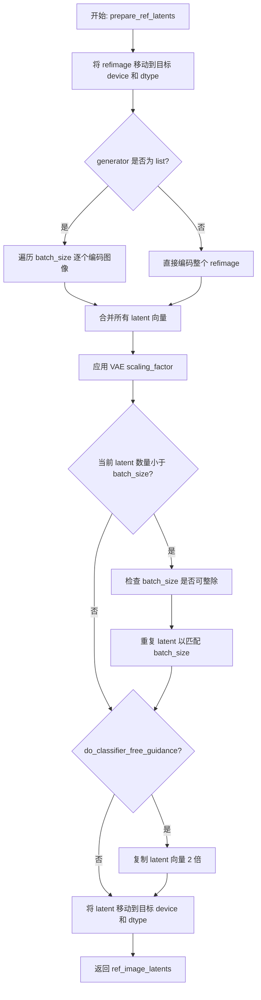
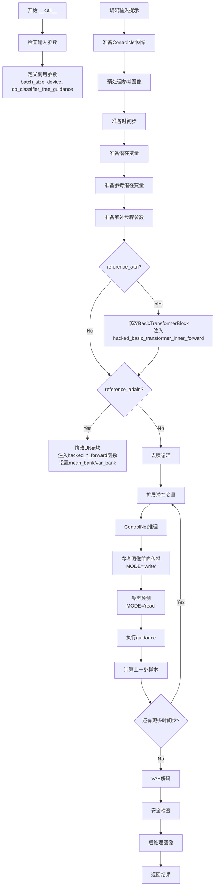

# `diffusers\examples\community\stable_diffusion_controlnet_reference.py` 详细设计文档

A custom Stable Diffusion pipeline that extends StableDiffusionControlNetPipeline to enable 'Reference' style transfer. It dynamically modifies the UNet architecture during inference to inject reference image features via Attention (reference_attn) and Adaptive Instance Normalization (reference_adain), allowing style extraction from a reference image alongside structural guidance from ControlNet.

## 整体流程

```mermaid
graph TD
    A[Start __call__] --> B[Check Inputs & Parameters]
    B --> C[Encode Prompt to Embeddings]
    C --> D[Prepare ControlNet Image (Canny/Depth)]
    D --> E[Prepare Reference Image Latents]
    E --> F[Monkey Patch UNet Modules (Hooks)]
    F --> G[Initialize Random Noise Latents]
    G --> H{Denoising Loop}
    H -->|Step 1: Write| I[Run UNet on Reference Image]
    I -->|Save| J[Attention Bank & GN Stats]
    H -->|Step 2: Read| K[Run UNet on Noisy Latent]
    K -->|Inject| L[Apply Reference Style from Bank]
    L --> M[Scheduler Step (DDIM/UniPC)]
    M --> H
    H --> N{End Loop} --> O[Decode Latents with VAE]
    O --> P[Run Safety Checker]
    P --> Q[Return Images]
```

## 类结构

```
object
├── StableDiffusionPipeline (Base)
├── StableDiffusionControlNetPipeline (Parent)
│   └── StableDiffusionControlNetReferencePipeline (Current Class)
```

## 全局变量及字段


### `logger`
    
用于记录模块日志的Logger对象，通过logging.get_logger获取

类型：`logging.Logger`
    


### `EXAMPLE_DOC_STRING`
    
包含StableDiffusionControlNetReferencePipeline使用示例的文档字符串

类型：`str`
    


    

## 全局函数及方法


### `torch_dfs`

该函数是一个深度优先搜索（DFS）工具函数，用于递归遍历PyTorch神经网络模型的所有子模块，并返回一个包含模型本身及其所有子孙模块的列表，常用于在扩散模型pipeline中查找特定的注意力模块以进行修改。

参数：

- `model`：`torch.nn.Module`，要遍历的PyTorch模型，递归搜索的根节点

返回值：`List[torch.nn.Module]`，包含输入模型及其所有子模块的列表

#### 流程图

```mermaid
flowchart TD
    A[开始: torch_dfs] --> B{输入 model}
    B --> C[创建结果列表 result = [model]]
    C --> D[遍历 model.children]
    D --> E{还有子模块未遍历?}
    E -->|是| F[递归调用 torch_dfs(child)]
    F --> G[将子模块的返回值追加到 result]
    G --> D
    E -->|否| H[返回 result 列表]
    H --> I[结束]
    
    style A fill:#e1f5fe
    style H fill:#e8f5e8
    style I fill:#e8f5e8
```

#### 带注释源码

```python
def torch_dfs(model: torch.nn.Module):
    """
    深度优先搜索遍历PyTorch模型的所有子模块。
    
    这是一个递归函数，用于收集神经网络模型中的所有模块实例。
    在Stable Diffusion ControlNet Reference pipeline中，此函数被用于
    查找所有的BasicTransformerBlock以便注入参考注意力机制。
    
    Args:
        model (torch.nn.Module): 要遍历的PyTorch模型
        
    Returns:
        List[torch.nn.Module]: 包含模型本身及其所有子模块的列表
    """
    # 将当前模型添加到结果列表中
    result = [model]
    
    # 递归遍历所有直接子模块
    for child in model.children():
        # 对每个子模块递归调用自身，并将结果合并到result中
        result += torch_dfs(child)
    
    # 返回包含所有模块的列表
    return result
```


### `StableDiffusionControlNetReferencePipeline.prepare_ref_latents`

该方法负责将参考图像（ref_image）编码并准备为潜在向量（latents），以供后续的Stable Diffusion模型在图像生成过程中使用。它处理VAE编码、批次大小调整、分类器自由引导（CFG）所需的潜在向量复制，以及设备与数据类型的对齐。

参数：

- `self`：`StableDiffusionReferencePipeline` 实例本身
- `refimage`：`torch.Tensor`，参考图像张量，已预处理并准备好被编码
- `batch_size`：`int`，目标批次大小，用于确定需要生成的潜在向量数量
- `dtype`：`torch.dtype`，目标数据类型（如 `torch.float16`）
- `device`：`torch.device`，目标计算设备（如 CUDA 设备）
- `generator`：`torch.Generator` 或 `List[torch.Generator]`（可选），随机数生成器，用于确保潜在向量采样的可重复性
- `do_classifier_free_guidance`：`bool`，标志位，指示是否在后续生成中启用分类器自由引导

返回值：`torch.Tensor`，处理后的参考图像潜在向量，形状为 `[batch_size, 4, latent_height, latent_width]`

#### 流程图



#### 带注释源码

```python
def prepare_ref_latents(self, refimage, batch_size, dtype, device, generator, do_classifier_free_guidance):
    # Step 1: 将参考图像张量移动到目标计算设备和指定数据类型
    # 确保后续编码过程在正确的设备上执行，避免设备不匹配错误
    refimage = refimage.to(device=device, dtype=dtype)

    # Step 2: 使用 VAE（变分自编码器）将图像编码到潜在空间
    # encode the mask image into latents space so we can concatenate it to the latents
    if isinstance(generator, list):
        # 如果提供了多个生成器（每个图像对应一个），逐个编码并采样潜在分布
        ref_image_latents = [
            self.vae.encode(refimage[i : i + 1]).latent_dist.sample(generator=generator[i])
            for i in range(batch_size)
        ]
        # 将所有单个图像的潜在向量沿批次维度拼接
        ref_image_latents = torch.cat(ref_image_latents, dim=0)
    else:
        # 单一生成器情况下，直接对整个批次进行编码和采样
        ref_image_latents = self.vae.encode(refimage).latent_dist.sample(generator=generator)
    
    # Step 3: 应用 VAE 缩放因子，将潜在向量调整到正确的数值范围
    # 这个因子是 VAE 配置中的关键参数，用于平衡前向和反向传播的尺度
    ref_image_latents = self.vae.config.scaling_factor * ref_image_latents

    # Step 4: 处理批次大小不匹配情况，确保 latent 数量与请求的 batch_size 一致
    # duplicate mask and ref_image_latents for each generation per prompt, using mps friendly method
    if ref_image_latents.shape[0] < batch_size:
        # 验证批次大小兼容性：请求的 batch_size 必须能被当前 latent 数量整除
        if not batch_size % ref_image_latents.shape[0] == 0:
            raise ValueError(
                "The passed images and the required batch size don't match. Images are supposed to be duplicated"
                f" to a total batch size of {batch_size}, but {ref_image_latents.shape[0]} images were passed."
                " Make sure the number of images that you pass is divisible by the total requested batch size."
            )
        # 通过重复操作扩展 latent 数量到目标 batch_size
        ref_image_latents = ref_image_latents.repeat(batch_size // ref_image_latents.shape[0], 1, 1, 1)

    # Step 5: 如果启用分类器自由引导（CFG），需要复制 latent 向量
    # CFG 机制需要同时处理条件和无条件两种预测，因此潜在向量需要翻倍
    ref_image_latents = torch.cat([ref_image_latents] * 2) if do_classifier_free_guidance else ref_image_latents

    # Step 6: 最终设备对齐，确保 latent 与后续模型输入的设备和数据类型一致
    # aligning device to prevent device errors when concating it with the latent model input
    ref_image_latents = ref_image_latents.to(device=device, dtype=dtype)
    
    # 返回处理完成的参考图像潜在向量
    return ref_image_latents
```


### `StableDiffusionControlNetReferencePipeline.__call__`

该方法是Stable Diffusion ControlNet参考管线的主入口，通过结合文本提示、ControlNet条件图像和参考图像，实现基于参考图像风格引导的图像生成。支持两种风格迁移技术：参考注意力机制（reference_attn）和自适应实例归一化（reference_adain），可在去噪过程中将参考图像的风格特征迁移到生成的图像中。

参数：

- `prompt`：`Union[str, List[str]]`，用于引导图像生成的文本提示，若未定义则需传入`prompt_embeds`
- `image`：`Union[torch.Tensor, PIL.Image.Image, np.ndarray, List[torch.Tensor], List[PIL.Image.Image], List[np.ndarray]]`，ControlNet输入条件图像，用于生成对Unet的引导
- `ref_image`：`Union[torch.Tensor, PIL.Image.Image]`，参考控制输入条件，用于将参考图像的风格迁移到生成图像
- `height`：`Optional[int]`，生成图像的高度（像素），默认为`self.unet.config.sample_size * self.vae_scale_factor`
- `width`：`Optional[int]`，生成图像的宽度（像素），默认为`self.unet.config.sample_size * self.vae_scale_factor`
- `num_inference_steps`：`int`，去噪步数，步数越多通常图像质量越高但推理速度越慢，默认为50
- `guidance_scale`：`float`，无分类器自由引导（CFG）比例，类似于Imagen论文中的权重w，默认为7.5
- `negative_prompt`：`Optional[Union[str, List[str]]]`，不用于引导图像生成的负面提示
- `num_images_per_prompt`：`int`，每个提示生成的图像数量，默认为1
- `eta`：`float`，DDIM论文中的参数η，仅适用于DDIMScheduler，默认为0.0
- `generator`：`Optional[Union[torch.Generator, List[torch.Generator]]]`，随机生成器用于确保可复现的生成结果
- `latents`：`Optional[torch.Tensor]`，预生成的噪声潜在向量，用于图像生成
- `prompt_embeds`：`Optional[torch.Tensor]`，预生成的文本嵌入，可用于文本输入的便捷调整
- `negative_prompt_embeds`：`Optional[torch.Tensor]`，预生成的负面文本嵌入
- `output_type`：`str | None`，生成图像的输出格式，可选"pil"或np.array，默认为"pil"
- `return_dict`：`bool`，是否返回`StableDiffusionPipelineOutput`，默认为True
- `callback`：`Optional[Callable[[int, int, torch.Tensor], None]]`，推理过程中每`callback_steps`步调用的回调函数
- `callback_steps`：`int`，回调函数被调用的频率，默认为1
- `cross_attention_kwargs`：`Optional[Dict[str, Any]]`，传递给AttentionProcessor的参数字典
- `controlnet_conditioning_scale`：`Union[float, List[float]]`，ControlNet输出乘以的比例因子，默认为1.0
- `guess_mode`：`bool`，ControlNet编码器尝试识别输入图像内容的模式，默认为False
- `attention_auto_machine_weight`：`float`，参考查询用于自注意力上下文的权重，默认为1.0
- `gn_auto_machine_weight`：`float`，参考自适应实例归一化的权重，默认为1.0
- `style_fidelity`：`float`，参考无条件潜在变量的风格保真度，默认为0.5
- `reference_attn`：`bool`，是否使用参考查询作为自注意力的上下文，默认为True
- `reference_adain`：`bool`，是否使用参考自适应实例归一化，默认为True

返回值：`Union[StableDiffusionPipelineOutput, Tuple[List[PIL.Image.Image], List[bool]]]`，返回生成的图像列表及对应的NSFW内容检测标志

#### 流程图



#### 带注释源码

```python
@torch.no_grad()
def __call__(
    self,
    prompt: Union[str, List[str]] = None,
    image: Union[
        torch.Tensor,
        PIL.Image.Image,
        np.ndarray,
        List[torch.Tensor],
        List[PIL.Image.Image],
        List[np.ndarray],
    ] = None,
    ref_image: Union[torch.Tensor, PIL.Image.Image] = None,
    height: Optional[int] = None,
    width: Optional[int] = None,
    num_inference_steps: int = 50,
    guidance_scale: float = 7.5,
    negative_prompt: Optional[Union[str, List[str]]] = None,
    num_images_per_prompt: Optional[int] = 1,
    eta: float = 0.0,
    generator: Optional[Union[torch.Generator, List[torch.Generator]]] = None,
    latents: Optional[torch.Tensor] = None,
    prompt_embeds: Optional[torch.Tensor] = None,
    negative_prompt_embeds: Optional[torch.Tensor] = None,
    output_type: str | None = "pil",
    return_dict: bool = True,
    callback: Optional[Callable[[int, int, torch.Tensor], None]] = None,
    callback_steps: int = 1,
    cross_attention_kwargs: Optional[Dict[str, Any]] = None,
    controlnet_conditioning_scale: Union[float, List[float]] = 1.0,
    guess_mode: bool = False,
    attention_auto_machine_weight: float = 1.0,
    gn_auto_machine_weight: float = 1.0,
    style_fidelity: float = 0.5,
    reference_attn: bool = True,
    reference_adain: bool = True,
):
    # 断言：至少启用reference_attn或reference_adain之一
    assert reference_attn or reference_adain, "`reference_attn` or `reference_adain` must be True."

    # 1. 检查输入参数的有效性
    self.check_inputs(
        prompt,
        image,
        callback_steps,
        negative_prompt,
        prompt_embeds,
        negative_prompt_embeds,
        controlnet_conditioning_scale,
    )

    # 2. 定义调用参数
    # 根据prompt类型确定batch_size
    if prompt is not None and isinstance(prompt, str):
        batch_size = 1
    elif prompt is not None and isinstance(prompt, list):
        batch_size = len(prompt)
    else:
        batch_size = prompt_embeds.shape[0]

    device = self._execution_device
    
    # 判断是否启用无分类器自由引导（CFG）
    # guidance_scale > 1.0 时启用，类似于Imagen论文中的权重w
    do_classifier_free_guidance = guidance_scale > 1.0

    # 获取原始ControlNet模块（处理torch.compile的情况）
    controlnet = self.controlnet._orig_mod if is_compiled_module(self.controlnet) else self.controlnet

    # 处理多个ControlNet的conditioning_scale
    if isinstance(controlnet, MultiControlNetModel) and isinstance(controlnet_conditioning_scale, float):
        controlnet_conditioning_scale = [controlnet_conditioning_scale] * len(controlnet.nets)

    # 确定是否使用全局池化条件
    global_pool_conditions = (
        controlnet.config.global_pool_conditions
        if isinstance(controlnet, ControlNetModel)
        else controlnet.nets[0].config.global_pool_conditions
    )
    # guess_mode：即使没有prompt也能识别图像内容
    guess_mode = guess_mode or global_pool_conditions

    # 3. 编码输入提示
    text_encoder_lora_scale = (
        cross_attention_kwargs.get("scale", None) if cross_attention_kwargs is not None else None
    )
    prompt_embeds = self._encode_prompt(
        prompt,
        device,
        num_images_per_prompt,
        do_classifier_free_guidance,
        negative_prompt,
        prompt_embeds=prompt_embeds,
        negative_prompt_embeds=negative_prompt_embeds,
        lora_scale=text_encoder_lora_scale,
    )

    # 4. 准备ControlNet图像
    if isinstance(controlnet, ControlNetModel):
        # 单个ControlNet的情况
        image = self.prepare_image(
            image=image,
            width=width,
            height=height,
            batch_size=batch_size * num_images_per_prompt,
            num_images_per_prompt=num_images_per_prompt,
            device=device,
            dtype=controlnet.dtype,
            do_classifier_free_guidance=do_classifier_free_guidance,
            guess_mode=guess_mode,
        )
        height, width = image.shape[-2:]
    elif isinstance(controlnet, MultiControlNetModel):
        # 多个ControlNet的情况
        images = []

        for image_ in image:
            image_ = self.prepare_image(
                image=image_,
                width=width,
                height=height,
                batch_size=batch_size * num_images_per_prompt,
                num_images_per_prompt=num_images_per_prompt,
                device=device,
                dtype=controlnet.dtype,
                do_classifier_free_guidance=do_classifier_free_guidance,
                guess_mode=guess_mode,
            )

            images.append(image_)

        image = images
        height, width = image[0].shape[-2:]
    else:
        assert False

    # 5. 预处理参考图像
    ref_image = self.prepare_image(
        image=ref_image,
        width=width,
        height=height,
        batch_size=batch_size * num_images_per_prompt,
        num_images_per_prompt=num_images_per_prompt,
        device=device,
        dtype=prompt_embeds.dtype,
    )

    # 6. 准备时间步
    self.scheduler.set_timesteps(num_inference_steps, device=device)
    timesteps = self.scheduler.timesteps

    # 7. 准备潜在变量
    num_channels_latents = self.unet.config.in_channels
    latents = self.prepare_latents(
        batch_size * num_images_per_prompt,
        num_channels_latents,
        height,
        width,
        prompt_embeds.dtype,
        device,
        generator,
        latents,
    )

    # 8. 准备参考潜在变量
    ref_image_latents = self.prepare_ref_latents(
        ref_image,
        batch_size * num_images_per_prompt,
        prompt_embeds.dtype,
        device,
        generator,
        do_classifier_free_guidance,
    )

    # 9. 准备额外步骤参数
    extra_step_kwargs = self.prepare_extra_step_kwargs(generator, eta)

    # 9. 修改自注意力（self-attention）和组归一化（group norm）
    # MODE用于控制写入/读取bank的模式
    MODE = "write"
    # 创建unconditional mask：用于classifier-free guidance
    uc_mask = (
        torch.Tensor([1] * batch_size * num_images_per_prompt + [0] * batch_size * num_images_per_prompt)
        .type_as(ref_image_latents)
        .bool()
    )

    # === 定义被hack的transformer前向函数 ===
    def hacked_basic_transformer_inner_forward(
        self,
        hidden_states: torch.Tensor,
        attention_mask: Optional[torch.Tensor] = None,
        encoder_hidden_states: Optional[torch.Tensor] = None,
        encoder_attention_mask: Optional[torch.Tensor] = None,
        timestep: Optional[torch.LongTensor] = None,
        cross_attention_kwargs: Dict[str, Any] = None,
        class_labels: Optional[torch.LongTensor] = None,
    ):
        # 自适应层归一化处理
        if self.use_ada_layer_norm:
            norm_hidden_states = self.norm1(hidden_states, timestep)
        elif self.use_ada_layer_norm_zero:
            norm_hidden_states, gate_msa, shift_mlp, scale_mlp, gate_mlp = self.norm1(
                hidden_states, timestep, class_labels, hidden_dtype=hidden_states.dtype
            )
        else:
            norm_hidden_states = self.norm1(hidden_states)

        # 1. 自注意力（Self-Attention）
        cross_attention_kwargs = cross_attention_kwargs if cross_attention_kwargs is not None else {}
        if self.only_cross_attention:
            attn_output = self.attn1(
                norm_hidden_states,
                encoder_hidden_states=encoder_hidden_states if self.only_cross_attention else None,
                attention_mask=attention_mask,
                **cross_attention_kwargs,
            )
        else:
            if MODE == "write":
                # 将当前hidden_states保存到bank中，供后续read模式使用
                self.bank.append(norm_hidden_states.detach().clone())
                attn_output = self.attn1(
                    norm_hidden_states,
                    encoder_hidden_states=encoder_hidden_states if self.only_cross_attention else None,
                    attention_mask=attention_mask,
                    **cross_attention_kwargs,
                )
            if MODE == "read":
                # 读取bank中的特征并进行风格迁移
                if attention_auto_machine_weight > self.attn_weight:
                    # 使用bank中的特征作为encoder_hidden_states
                    attn_output_uc = self.attn1(
                        norm_hidden_states,
                        encoder_hidden_states=torch.cat([norm_hidden_states] + self.bank, dim=1),
                        **cross_attention_kwargs,
                    )
                    attn_output_c = attn_output_uc.clone()
                    # 根据style_fidelity混合conditional和unconditional结果
                    if do_classifier_free_guidance and style_fidelity > 0:
                        attn_output_c[uc_mask] = self.attn1(
                            norm_hidden_states[uc_mask],
                            encoder_hidden_states=norm_hidden_states[uc_mask],
                            **cross_attention_kwargs,
                        )
                    attn_output = style_fidelity * attn_output_c + (1.0 - style_fidelity) * attn_output_uc
                    self.bank.clear()
                else:
                    attn_output = self.attn1(
                        norm_hidden_states,
                        encoder_hidden_states=encoder_hidden_states if self.only_cross_attention else None,
                        attention_mask=attention_mask,
                        **cross_attention_kwargs,
                    )
        
        # 应用门控机制
        if self.use_ada_layer_norm_zero:
            attn_output = gate_msa.unsqueeze(1) * attn_output
        hidden_states = attn_output + hidden_states

        # 2. 交叉注意力（Cross-Attention）
        if self.attn2 is not None:
            norm_hidden_states = (
                self.norm2(hidden_states, timestep) if self.use_ada_layer_norm else self.norm2(hidden_states)
            )

            attn_output = self.attn2(
                norm_hidden_states,
                encoder_hidden_states=encoder_hidden_states,
                attention_mask=encoder_attention_mask,
                **cross_attention_kwargs,
            )
            hidden_states = attn_output + hidden_states

        # 3. 前馈网络（Feed-forward）
        norm_hidden_states = self.norm3(hidden_states)

        if self.use_ada_layer_norm_zero:
            norm_hidden_states = norm_hidden_states * (1 + scale_mlp[:, None]) + shift_mlp[:, None]

        ff_output = self.ff(norm_hidden_states)

        if self.use_ada_layer_norm_zero:
            ff_output = gate_mlp.unsqueeze(1) * ff_output

        hidden_states = ff_output + hidden_states

        return hidden_states

    # === 定义被hack的中间块前向函数 ===
    def hacked_mid_forward(self, *args, **kwargs):
        eps = 1e-6
        x = self.original_forward(*args, **kwargs)
        if MODE == "write":
            if gn_auto_machine_weight >= self.gn_weight:
                # 计算并保存均值和方差
                var, mean = torch.var_mean(x, dim=(2, 3), keepdim=True, correction=0)
                self.mean_bank.append(mean)
                self.var_bank.append(var)
        if MODE == "read":
            # 应用自适应实例归一化（AdaIN）
            if len(self.mean_bank) > 0 and len(self.var_bank) > 0:
                var, mean = torch.var_mean(x, dim=(2, 3), keepdim=True, correction=0)
                std = torch.maximum(var, torch.zeros_like(var) + eps) ** 0.5
                mean_acc = sum(self.mean_bank) / float(len(self.mean_bank))
                var_acc = sum(self.var_bank) / float(len(self.var_bank))
                std_acc = torch.maximum(var_acc, torch.zeros_like(var_acc) + eps) ** 0.5
                # 应用AdaIN
                x_uc = (((x - mean) / std) * std_acc) + mean_acc
                x_c = x_uc.clone()
                if do_classifier_free_guidance and style_fidelity > 0:
                    x_c[uc_mask] = x[uc_mask]
                x = style_fidelity * x_c + (1.0 - style_fidelity) * x_uc
            self.mean_bank = []
            self.var_bank = []
        return x

    # ... (其他hacked forward函数类似)

    # === 注入reference_attn ===
    if reference_attn:
        # 获取所有BasicTransformerBlock
        attn_modules = [module for module in torch_dfs(self.unet) if isinstance(module, BasicTransformerBlock)]
        attn_modules = sorted(attn_modules, key=lambda x: -x.norm1.normalized_shape[0])

        for i, module in enumerate(attn_modules):
            # 保存原始forward函数
            module._original_inner_forward = module.forward
            # 替换为hacked版本
            module.forward = hacked_basic_transformer_inner_forward.__get__(module, BasicTransformerBlock)
            module.bank = []  # 用于存储特征
            module.attn_weight = float(i) / float(len(attn_modules))

    # === 注入reference_adain ===
    if reference_adain:
        gn_modules = [self.unet.mid_block]
        self.unet.mid_block.gn_weight = 0

        # 为down blocks设置权重
        down_blocks = self.unet.down_blocks
        for w, module in enumerate(down_blocks):
            module.gn_weight = 1.0 - float(w) / float(len(down_blocks))
            gn_modules.append(module)

        # 为up blocks设置权重
        up_blocks = self.unet.up_blocks
        for w, module in enumerate(up_blocks):
            module.gn_weight = float(w) / float(len(up_blocks))
            gn_modules.append(module)

        # 替换各模块的forward函数
        for i, module in enumerate(gn_modules):
            if getattr(module, "original_forward", None) is None:
                module.original_forward = module.forward
            if i == 0:
                module.forward = hacked_mid_forward.__get__(module, torch.nn.Module)
            elif isinstance(module, CrossAttnDownBlock2D):
                module.forward = hack_CrossAttnDownBlock2D_forward.__get__(module, CrossAttnDownBlock2D)
            # ... 其他模块类型处理
            module.mean_bank = []
            module.var_bank = []
            module.gn_weight *= 2

    # 11. 去噪循环
    num_warmup_steps = len(timesteps) - num_inference_steps * self.scheduler.order
    with self.progress_bar(total=num_inference_steps) as progress_bar:
        for i, t in enumerate(timesteps):
            # 扩展潜在变量（用于classifier-free guidance）
            latent_model_input = torch.cat([latents] * 2) if do_classifier_free_guidance else latents
            latent_model_input = self.scheduler.scale_model_input(latent_model_input, t)

            # ControlNet推理
            if guess_mode and do_classifier_free_guidance:
                # 仅对conditional batch进行推理
                control_model_input = latents
                control_model_input = self.scheduler.scale_model_input(control_model_input, t)
                controlnet_prompt_embeds = prompt_embeds.chunk(2)[1]
            else:
                control_model_input = latent_model_input
                controlnet_prompt_embeds = prompt_embeds

            # 调用ControlNet
            down_block_res_samples, mid_block_res_sample = self.controlnet(
                control_model_input,
                t,
                encoder_hidden_states=controlnet_prompt_embeds,
                controlnet_cond=image,
                conditioning_scale=controlnet_conditioning_scale,
                guess_mode=guess_mode,
                return_dict=False,
            )

            # 处理guess_mode
            if guess_mode and do_classifier_free_guidance:
                down_block_res_samples = [torch.cat([torch.zeros_like(d), d]) for d in down_block_res_samples]
                mid_block_res_sample = torch.cat([torch.zeros_like(mid_block_res_sample), mid_block_res_sample])

            # === 参考图像处理 ===
            # 为参考图像添加噪声
            noise = randn_tensor(
                ref_image_latents.shape, generator=generator, device=device, dtype=ref_image_latents.dtype
            )
            ref_xt = self.scheduler.add_noise(
                ref_image_latents,
                noise,
                t.reshape(1),
            )
            ref_xt = self.scheduler.scale_model_input(ref_xt, t)

            # MODE='write'：将参考图像特征写入bank
            MODE = "write"
            self.unet(
                ref_xt,
                t,
                encoder_hidden_states=prompt_embeds,
                cross_attention_kwargs=cross_attention_kwargs,
                return_dict=False,
            )

            # MODE='read'：使用bank中的特征进行噪声预测
            MODE = "read"
            noise_pred = self.unet(
                latent_model_input,
                t,
                encoder_hidden_states=prompt_embeds,
                cross_attention_kwargs=cross_attention_kwargs,
                down_block_additional_residuals=down_block_res_samples,
                mid_block_additional_residual=mid_block_res_sample,
                return_dict=False,
            )[0]

            # 执行guidance
            if do_classifier_free_guidance:
                noise_pred_uncond, noise_pred_text = noise_pred.chunk(2)
                noise_pred = noise_pred_uncond + guidance_scale * (noise_pred_text - noise_pred_uncond)

            # 计算上一步的样本：x_t -> x_{t-1}
            latents = self.scheduler.step(noise_pred, t, latents, **extra_step_kwargs, return_dict=False)[0]

            # 调用回调函数
            if i == len(timesteps) - 1 or ((i + 1) > num_warmup_steps and (i + 1) % self.scheduler.order == 0):
                progress_bar.update()
                if callback is not None and i % callback_steps == 0:
                    step_idx = i // getattr(self.scheduler, "order", 1)
                    callback(step_idx, t, latents)

    # 12. 后处理
    if hasattr(self, "final_offload_hook") and self.final_offload_hook is not None:
        self.unet.to("cpu")
        self.controlnet.to("cpu")
        torch.cuda.empty_cache()

    # VAE解码
    if not output_type == "latent":
        image = self.vae.decode(latents / self.vae.config.scaling_factor, return_dict=False)[0]
        image, has_nsfw_concept = self.run_safety_checker(image, device, prompt_embeds.dtype)
    else:
        image = latents
        has_nsfw_concept = None

    # 处理去归一化
    if has_nsfw_concept is None:
        do_denormalize = [True] * image.shape[0]
    else:
        do_denormalize = [not has_nsfw for has_nsfw in has_nsfw_concept]

    # 后处理图像
    image = self.image_processor.postprocess(image, output_type=output_type, do_denormalize=do_denormalize)

    # 卸载最后一个模型
    if hasattr(self, "final_offload_hook") and self.final_offload_hook is not None:
        self.final_offload_hook.offload()

    # 返回结果
    if not return_dict:
        return (image, has_nsfw_concept)

    return StableDiffusionPipelineOutput(images=image, nsfw_content_detected=has_nsfw_concept)
```

## 关键组件


### 张量索引与惰性加载

通过 `torch_dfs` 函数实现对 `BasicTransformerBlock` 的动态遍历与索引，支持在运行时惰性注入参考注意力和自适应实例归一化逻辑，无需修改原始模型结构。

### 反量化支持

在 `reference_adain` 模式下，通过 `mean_bank` 和 `var_bank` 分别累积 GroupNorm 的均值与方差，并在后续步骤中基于累积统计量对特征进行反标准化（denormalization），实现风格迁移。

### 量化策略

代码通过 `style_fidelity` 参数动态平衡无条件特征（unconditional）与条件特征（conditional）的贡献，支持 Classifier-Free Guidance 下的风格控制；通过 `attention_auto_machine_weight` 和 `gn_auto_machine_weight` 调整参考注意力与自适应归一化的权重。

### 参考注意力注入（Reference Attention）

通过 `hacked_basic_transformer_inner_forward` 函数拦截 `BasicTransformerBlock` 的前向传播，在 "write" 模式将 `norm_hidden_states` 存入 `bank`，在 "read" 模式将 `bank` 中的特征作为额外的 key/value 注入自注意力，实现跨图像特征引用。

### 自适应实例归一化（Reference AdaIN）

通过多个 hacked forward 函数（`hacked_mid_forward`、`hack_CrossAttnDownBlock2D_forward`、`hacked_DownBlock2D_forward`、`hack_CrossAttnUpBlock2D_forward`、`hacked_UpBlock2D_forward`）在 U-Net 的不同层级注入 GroupNorm 统计量（均值/方差），在去噪过程中对特征分布进行重写，实现风格迁移。

### 参考图像 Latent 准备

`prepare_ref_latents` 方法将参考图像编码为 VAE latent，并处理批量复制与 Classifier-Free Guidance 的条件拼接，为后续去噪循环提供参考条件输入。

### 双阶段去噪循环

在去噪循环中通过 `MODE = "write"` 和 `MODE = "read"` 切换实现双阶段推理：第一阶段使用参考图像 latent 进行前向传播以捕获统计特征，第二阶段基于捕获的特征进行实际噪声预测。


## 问题及建议


### 已知问题

- **Monkey Patching 过度使用**：代码通过直接替换 `module.forward` 方法来修改 `BasicTransformerBlock`、`CrossAttnDownBlock2D`、`DownBlock2D`、`CrossAttnUpBlock2D`、`UpBlock2D` 等类的行为，这种做法虽然实现了功能但严重降低了代码可读性和可维护性，且容易与未来版本产生冲突
- **全局状态管理不当**：使用全局变量 `MODE = "write"/"read"` 来控制管道行为，这种隐式状态在多线程或并发场景下可能导致竞态条件，且难以调试
- **大量重复代码**：`hack_CrossAttnDownBlock2D_forward`、`hacked_DownBlock2D_forward`、`hack_CrossAttnUpBlock2D_forward` 和 `hacked_UpBlock2D_forward` 中存在大量重复的 ADIN 归一化逻辑，违反了 DRY 原则
- **硬编码数值分散**：`eps = 1e-6` 在多个函数中重复定义，应提取为常量
- **使用 assert 进行验证**：`prepare_ref_latents` 中使用 `assert` 而非正式的参数验证，不适合生产环境
- **generator 处理不一致**：`prepare_ref_latents` 中对 generator 的处理同时考虑了 list 和单个 Generator 两种情况，但其他地方可能假设了不同的行为
- **类型注解不完整**：部分内部函数（如 `hack_CrossAttnDownBlock2D_forward`）的参数缺少类型注解
- **兼容性问题**：使用了 `is_compiled_module` 等 diffusers 内部 API，可能因库版本升级而失效

### 优化建议

- **提取公共逻辑**：将 ADIN 归一化的公共逻辑抽取为独立的工具函数或类，减少代码重复
- **使用上下文管理器**：用上下文管理器或显式状态参数替代全局 `MODE` 变量，提高线程安全性
- **添加常量定义**：将 `eps = 1e-6` 等魔法数字定义为模块级常量
- **完善参数验证**：用 `if...raise ValueError` 替代 assert 进行参数验证
- **统一 generator 处理**：在项目内部统一 generator 的处理方式，或添加清晰的文档说明
- **补充类型注解**：为所有函数参数和返回值补充类型注解，提高代码可读性
- **抽象 monkey patching 逻辑**：将 patching 逻辑封装为独立的辅助函数或类，降低主逻辑的复杂度
- **添加版本兼容性检查**：对依赖的内部 API 添加版本检查或try-except处理，提高鲁棒性

## 其它


### 设计目标与约束

该Pipeline的设计目标是实现基于Reference图像的Style Transfer功能，通过ControlNet控制生成图像的结构，同时使用Reference图像的风格指导生成过程。核心约束包括：1) 必须在`reference_attn`或`reference_adain`至少一个为True时才能运行；2) 依赖Stable Diffusion v1.5基础模型和ControlNet模型；3) 仅支持fp16和fp32两种精度模式；4) 生成图像尺寸受限于VAE的缩放因子（通常为8）。

### 错误处理与异常设计

代码中的错误处理主要包括：1) 输入验证阶段通过`check_inputs`方法检查prompt、image、callback_steps等参数的合法性；2) 批量大小不匹配时抛出`ValueError`异常；3) 使用`assert`语句确保`reference_attn`或`reference_adain`至少一个为True；4) 对MultiControlNetModel的情况进行了类型检查和适配。潜在异常场景包括：内存不足导致的OOM错误、模型加载失败、图像尺寸不匹配、Generator数量与批量大小不一致等。

### 数据流与状态机

数据流主要经历以下阶段：1) 输入预处理阶段：将prompt编码为embeddings，将ControlNet图像和Reference图像转换为模型所需的latent格式；2) 特征提取阶段：通过修改的UNet和ControlNet提取图像特征；3) 去噪循环阶段：在多个timestep上迭代执行去噪操作，每一步都需要将latent model input通过scheduler进行scale；4) VAE解码阶段：将最终的latents解码为图像。状态机主要体现在MODE变量的切换（"write"和"read"模式），用于控制attention和groupnorm的特征保存与读取行为。

### 外部依赖与接口契约

主要外部依赖包括：1) `diffusers`库提供的StableDiffusionControlNetPipeline、ControlNetModel、MultiControlNetModel等基础组件；2) `torch`和`numpy`用于张量计算；3) `PIL.Image`和`cv2`用于图像处理。接口契约方面：输入的prompt支持字符串或字符串列表；image支持Tensor、PIL.Image、np.ndarray或其列表形式；ref_image仅支持Tensor或PIL.Image；输出返回StableDiffusionPipelineOutput对象或元组。模型输入输出遵循diffusers的标准接口规范。

### 性能考虑与优化建议

性能瓶颈主要集中在：1) 双次数的UNet前向传播（分别处理reference和latent）；2) 大批量生成时的内存占用；3) 特征bank的内存存储。优化建议包括：1) 使用`torch.cuda.amp`进行混合精度计算；2) 实现模型offloading以节省显存；3) 对于单张图像生成可以跳过部分计算；4) 考虑使用xFormers加速attention计算；5) 特征bank可以使用共享内存或分块处理减少峰值内存占用。

### 安全性考虑

代码包含NSFW（Not Safe For Work）内容检测机制，通过`run_safety_checker`方法对生成的图像进行审查。安全性建议包括：1) 默认禁用了safety_checker（如代码示例所示设置`safety_checker=None`），生产环境应根据需求决定是否启用；2) 生成的图像可能包含水印或版权内容，使用时需注意法律风险；3) 模型权重下载自HuggingFace Hub，需验证来源可靠性。

### 兼容性说明

该Pipeline继承自`StableDiffusionControlNetPipeline`，因此与diffusers生态系统的其他组件兼容。支持的调度器包括DDIM、UniPCMultistepScheduler等。版本兼容性方面，建议使用diffusers>=0.14.0版本以确保所有API正常工作。与ControlNet的各种变体（如canny、depth、pose等）兼容，但不支持同时使用多个Reference图像。模型权重格式支持HuggingFace Safetensors和PyTorch格式。


    