# `diffusers\examples\community\stable_diffusion_ipex.py` 详细设计文档

一个针对Intel Extension for PyTorch (IPEX)优化的Stable Diffusion文本到图像生成管道，支持Float32和BFloat16精度，通过模型优化、jit trace和memory format转换提升在Intel CPU上的推理性能。

## 整体流程

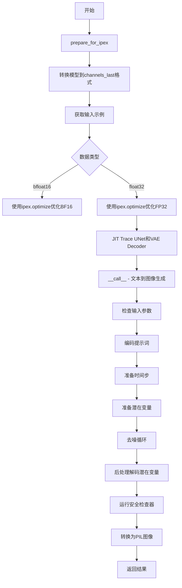

## 类结构

```
StableDiffusionIPEXPipeline (主类)
├── 继承自: DiffusionPipeline
├── 继承自: StableDiffusionMixin
├── 继承自: TextualInversionLoaderMixin
└── 继承自: StableDiffusionLoraLoaderMixin
```

## 全局变量及字段


### `logger`
    
模块级日志记录器，用于记录运行时信息

类型：`logging.Logger`
    


### `EXAMPLE_DOC_STRING`
    
示例文档字符串，包含pipeline使用示例

类型：`str`
    


### `StableDiffusionIPEXPipeline.vae`
    
VAE编解码器模型，用于图像与潜在表示之间的转换

类型：`AutoencoderKL`
    


### `StableDiffusionIPEXPipeline.text_encoder`
    
文本编码器，将文本提示转换为向量表示

类型：`CLIPTextModel`
    


### `StableDiffusionIPEXPipeline.tokenizer`
    
分词器，用于将文本分割成token

类型：`CLIPTokenizer`
    


### `StableDiffusionIPEXPipeline.unet`
    
条件U-Net去噪模型，用于从噪声预测原始图像

类型：`UNet2DConditionModel`
    


### `StableDiffusionIPEXPipeline.scheduler`
    
扩散调度器，控制去噪过程的噪声调度

类型：`KarrasDiffusionSchedulers`
    


### `StableDiffusionIPEXPipeline.safety_checker`
    
安全检查器，过滤可能存在不当内容的结果

类型：`StableDiffusionSafetyChecker`
    


### `StableDiffusionIPEXPipeline.feature_extractor`
    
特征提取器，用于提取图像特征供安全检查器使用

类型：`CLIPImageProcessor`
    


### `StableDiffusionIPEXPipeline.vae_scale_factor`
    
VAE缩放因子，用于计算潜在空间的尺寸

类型：`int`
    


### `StableDiffusionIPEXPipeline._optional_components`
    
可选组件列表，定义可选择启用的模块

类型：`list`
    
    

## 全局函数及方法


### `inspect`

`inspect` 模块是 Python 标准库的一部分，用于检查活动对象（如模块、类、函数、跟踪back等）的详细信息。在该代码中，`inspect` 模块主要用于动态检查调度器（scheduler）的 `step` 方法的函数签名，以确定该调度器支持哪些参数。

参数： 无（这是模块导入，非函数调用）

返回值： 无（这是模块导入，非函数调用）

#### 流程图

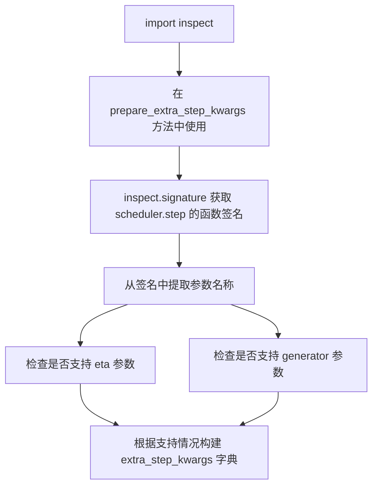

#### 带注释源码

```python
# 导入 inspect 模块
import inspect

# ... (在其他方法中使用 inspect)

def prepare_extra_step_kwargs(self, generator, eta):
    """
    准备调度器步骤的额外参数，因为并非所有调度器都具有相同的签名。
    eta (η) 仅用于 DDIMScheduler，对于其他调度器将被忽略。
    eta 对应于 DDIM 论文中的 η 参数：https://huggingface.co/papers/2010.02502
    取值范围应为 [0, 1]。
    """
    
    # 使用 inspect.signature 获取 scheduler.step 方法的签名
    # inspect.signature() 返回一个 Signature 对象，包含方法的参数信息
    accepts_eta = "eta" in set(inspect.signature(self.scheduler.step).parameters.keys())
    
    # 初始化额外参数字典
    extra_step_kwargs = {}
    
    # 如果调度器接受 eta 参数，则将其添加到 extra_step_kwargs
    if accepts_eta:
        extra_step_kwargs["eta"] = eta

    # 检查调度器是否接受 generator 参数
    accepts_generator = "generator" in set(inspect.signature(self.scheduler.step).parameters.keys())
    
    # 如果调度器接受 generator 参数，则将其添加到 extra_step_kwargs
    if accepts_generator:
        extra_step_kwargs["generator"] = generator
    
    # 返回包含调度器所需额外参数的字典
    return extra_step_kwargs
```


### version.parse

版本解析函数，用于将版本字符串解析为可比较的 Version 对象，以便进行版本比较操作。该函数源自 Python 的 `packaging` 库，在此代码中用于检查 UNet 配置的 diffusers 版本是否低于特定版本（0.9.0.dev0）。

参数：

- `version_string`：字符串，要解析的版本号字符串（如 "0.9.0.dev0"、"1.0.0" 等）

返回值：`packaging.version.Version`，解析后的版本对象，支持丰富的版本比较操作（如 <、>、<=、>= 等）

#### 流程图

```mermaid
flowchart TD
    A[开始] --> B[输入版本字符串]
    B --> C{调用 version.parse}]
    C --> D{字符串格式检查}
    D -->|有效格式| E[创建 Version 对象]
    D -->|无效格式| F[抛出 InvalidVersion 异常]
    E --> G[返回 Version 对象]
    G --> H[可用于版本比较]
    H --> I[结束]
```

#### 带注释源码

```python
# 导入语句（在文件顶部）
from packaging import version

# 使用示例（在 StableDiffusionIPEXPipeline.__init__ 方法中）
# 用于检查 UNet 的 diffusers 版本是否低于 0.9.0.dev0
is_unet_version_less_0_9_0 = (
    unet is not None
    and hasattr(unet.config, "_diffusers_version")
    # 外层 version.parse: 将比较结果字符串再解析为 Version 对象以便比较
    and version.parse(version.parse(unet.config._diffusers_version).base_version) < version.parse("0.9.0.dev0")
)
# 解释：
# 1. version.parse(unet.config._diffusers_version) - 解析配置中的版本字符串（如 "0.8.0"）
# 2. .base_version - 获取基础版本字符串（去除 pre-release, dev 等后缀）
# 3. version.parse(...) - 再次解析基础版本为 Version 对象
# 4. version.parse("0.9.0.dev0") - 解析目标版本号
# 5. < 比较 - 比较两个 Version 对象的大小
```


### `randn_tensor` (导入函数)

从 `diffusers.utils.torch_utils` 导入的随机张量生成函数，用于生成符合正态分布（高斯分布）的随机张量，主要用于为扩散模型的潜在空间初始化噪声。

参数：

- `shape`：`tuple` 或 `int`，生成张量的形状
- `generator`：`torch.Generator`，可选，用于设置随机数生成种子以确保可重复性
- `device`：`torch.device`，生成张量所在的设备（CPU 或 CUDA）
- `dtype`：`torch.dtype`，生成张量的数据类型（如 torch.float32）

返回值：`torch.Tensor`，符合正态分布的随机张量

#### 流程图

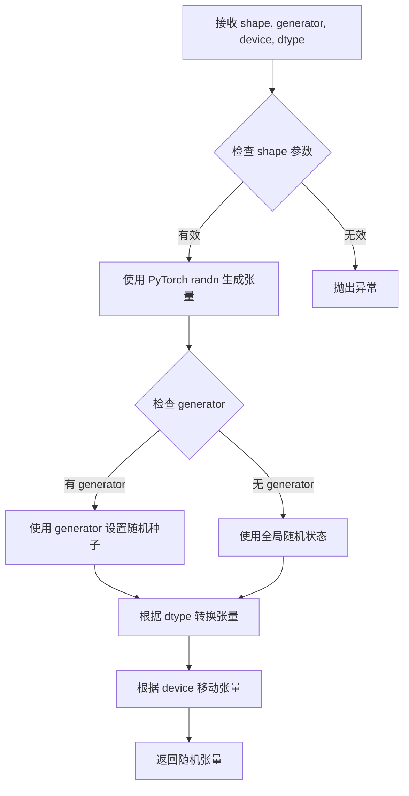

#### 带注释源码

```python
# 该函数定义在 diffusers.utils.torch_utils 中
# 当前代码中通过以下方式导入：
# from diffusers.utils.torch_utils import randn_tensor

# 在 StableDiffusionIPEXPipeline.prepare_latents 方法中的使用：

def prepare_latents(self, batch_size, num_channels_latents, height, width, dtype, device, generator, latents=None):
    """
    准备用于去噪的潜在变量（latents）
    
    参数：
        batch_size: 批次大小
        num_channels_latents: 潜在变量的通道数
        height: 生成图像的高度
        width: 生成图像的宽度
        dtype: 张量数据类型
        device: 计算设备
        generator: 随机数生成器
        latents: 可选的预生成潜在变量
    """
    # 计算潜在变量的形状
    shape = (
        batch_size,
        num_channels_latents,
        int(height) // self.vae_scale_factor,
        int(width) // self.vae_scale_factor,
    )
    
    # 检查 generator 列表长度是否与批次大小匹配
    if isinstance(generator, list) and len(generator) != batch_size:
        raise ValueError(...)
    
    # 如果没有提供 latents，则使用 randn_tensor 生成随机噪声
    if latents is None:
        # randn_tensor: 生成符合标准正态分布的张量
        latents = randn_tensor(shape, generator=generator, device=device, dtype=dtype)
    else:
        # 如果提供了 latents，则直接移动到目标设备
        latents = latents.to(device)
    
    # 根据调度器的初始噪声标准差缩放噪声
    latents = latents * self.scheduler.init_noise_sigma
    return latents
```


### `deprecate`

`deprecate` 函数是diffusers库提供的工具函数，用于向用户发出弃用警告。该函数在代码的 `__init__` 方法中被调用，用于检查并警告用户关于scheduler和unet配置中的过时参数。

参数：

-  `deprecation_name`：`str`，被弃用的配置项名称（如 "steps_offset!=1"、"clip_sample not set"、"sample_size<64"）
-  `deprecation_version`：`str`，预期弃用该配置项的版本号（如 "1.0.0"）
-  `deprecation_message`：`str`，详细的弃用说明信息，包含问题描述和建议
-  `standard_warn`：`bool`，（可选）是否使用标准警告格式，默认为 True

返回值：`None`，该函数不返回值，仅通过 logger 发出警告

#### 流程图

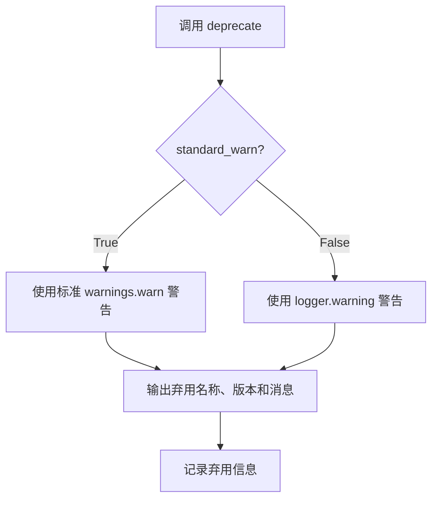

#### 带注释源码

```python
# deprecate 函数在 diffusers.utils 中定义
# 以下是代码中调用 deprecate 的示例：

# 示例1：检查 scheduler 的 steps_offset 配置
if scheduler is not None and getattr(scheduler.config, "steps_offset", 1) != 1:
    deprecation_message = (
        f"The configuration file of this scheduler: {scheduler} is outdated. `steps_offset`"
        f" should be set to 1 instead of {scheduler.config.steps_offset}. Please make sure "
        "to update the config accordingly as leaving `steps_offset` might led to incorrect results"
        " in future versions. If you have downloaded this checkpoint from the Hugging Face Hub,"
        " it would be very nice if you could open a Pull request for the `scheduler/scheduler_config.json`"
        " file"
    )
    deprecate("steps_offset!=1", "1.0.0", deprecation_message, standard_warn=False)
    # 修复配置
    new_config = dict(scheduler.config)
    new_config["steps_offset"] = 1
    scheduler._internal_dict = FrozenDict(new_config)

# 示例2：检查 scheduler 的 clip_sample 配置
if scheduler is not None and getattr(scheduler.config, "clip_sample", False) is True:
    deprecation_message = (
        f"The configuration file of this scheduler: {scheduler} has not set the configuration `clip_sample`."
        " `clip_sample` should be set to False in the configuration file. Please make sure to update the"
        " config accordingly as not setting `clip_sample` in the config might lead to incorrect results in"
        " future versions. If you have downloaded this checkpoint from the Hugging Face Hub, it would be very"
        " nice if you could open a Pull request for the `scheduler/scheduler_config.json` file"
    )
    deprecate("clip_sample not set", "1.0.0", deprecation_message, standard_warn=False)
    # 修复配置
    new_config = dict(scheduler.config)
    new_config["clip_sample"] = False
    scheduler._internal_dict = FrozenDict(new_config)

# 示例3：检查 unet 的 sample_size 配置
if is_unet_version_less_0_9_0 and is_unet_sample_size_less_64:
    deprecation_message = (
        "The configuration file of the unet has set the default `sample_size` to smaller than"
        " 64 which seems highly unlikely. If your checkpoint is a fine-tuned version of any of the"
        " following: \n- CompVis/stable-diffusion-v1-4 \n- CompVis/stable-diffusion-v1-3 \n-"
        " CompVis/stable-diffusion-v1-2 \n- CompVis/stable-diffusion-v1-1 \n- stable-diffusion-v1-5/stable-diffusion-v1-5"
        " \n- stable-diffusion-v1-5/stable-diffusion-inpainting \n you should change 'sample_size' to 64 in the"
        " configuration file. Please make sure to update the config accordingly as leaving `sample_size=32`"
        " in the config might lead to incorrect results in future versions. If you have downloaded this"
        " checkpoint from the Hugging Face Hub, it would be very nice if you could open a Pull request for"
        " the `unet/config.json` file"
    )
    deprecate("sample_size<64", "1.0.0", deprecation_message, standard_warn=False)
    # 修复配置
    new_config = dict(unet.config)
    new_config["sample_size"] = 64
    unet._internal_dict = FrozenDict(new_config)
```


### `replace_example_docstring`

这是一个从 `diffusers.utils` 模块导入的装饰器函数，用于替换被装饰函数的 `__doc__`（文档字符串）。它通常与 `EXAMPLE_DOC_STRING` 配合使用，为pipeline的 `__call__` 方法提供统一的示例文档。

**注意**：由于该函数的实现不在当前代码文件中（仅为import引入），以下信息基于其使用方式推断。

---

参数：

- `doc_string`：可选的 `str` 类型，要替换的文档字符串内容。在代码中使用时传入 `EXAMPLE_DOC_STRING`。

返回值：无直接返回值（作为装饰器使用，返回装饰后的函数）。

#### 流程图

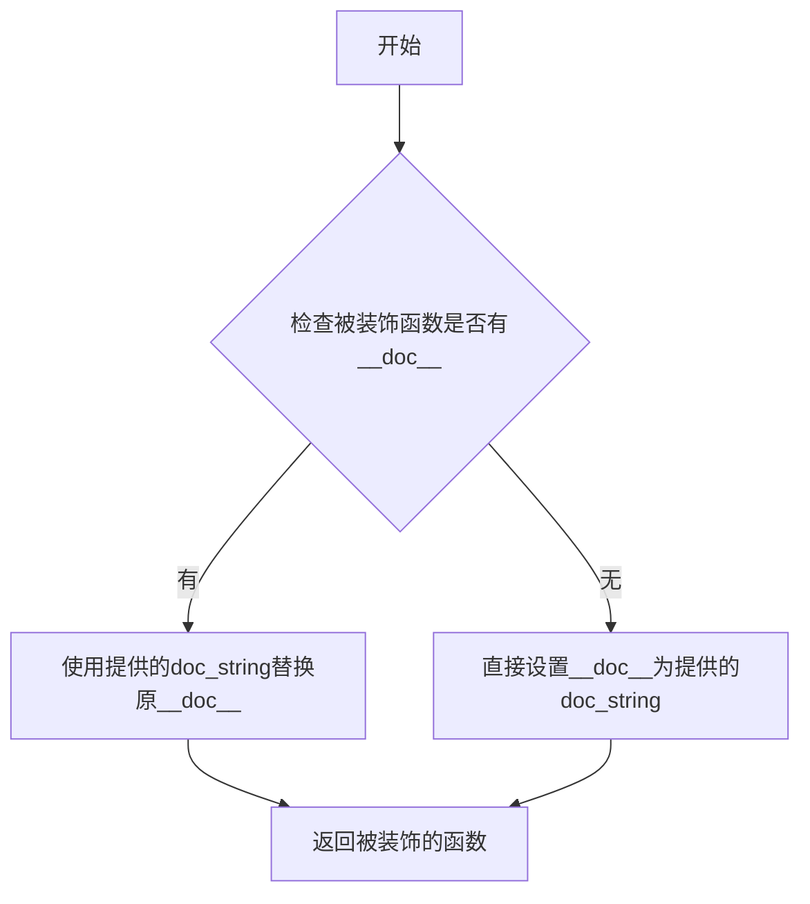

#### 带注释源码

```python
# 这是一个从 diffusers.utils 导入的装饰器函数
# 具体实现不在当前文件中，以下为基于使用方式的推断

# 使用示例（在当前代码中）:
@torch.no_grad()
@replace_example_docstring(EXAMPLE_DOC_STRING)
def __call__(self, prompt: Union[str, List[str]] = None, ...):
    r"""
    Function invoked when calling the pipeline for generation.
    ...
    """
    # 实际的方法实现...
```

**说明**：
- `replace_example_docstring` 装饰器接收一个文档字符串参数（这里是 `EXAMPLE_DOC_STRING`）
- 它会将这个文档字符串赋值给被装饰函数的 `__doc__` 属性
- 这样可以在不修改函数内部实现的情况下，提供统一的示例用法说明
- 在diffusers库中，这种模式常用于为各种pipeline的推理方法提供标准化的使用示例


### `FrozenDict`

`FrozenDict` 是从 `diffusers.configuration_utils` 模块导入的不可变字典类，用于冻结配置字典以防止意外修改。在该代码中用于确保调度器(Scheduler)和UNet的配置在初始化后保持不变。

#### 使用示例（在代码中）

在 `StableDiffusionIPEXPipeline.__init__` 方法中：

```python
# 冻结调度器配置
scheduler._internal_dict = FrozenDict(new_config)

# 冻结UNet配置
unet._internal_dict = FrozenDict(new_config)
```

#### 带注释源码（基于导入和使用推断）

```
# 导入语句（在文件顶部）
from diffusers.configuration_utils import FrozenDict

# FrozenDict 的典型使用场景（在类初始化方法中）
# 用于确保配置字典不可变，防止运行时意外修改配置

# 示例1：更新调度器配置后冻结
new_config = dict(scheduler.config)
new_config["steps_offset"] = 1
scheduler._internal_dict = FrozenDict(new_config)

# 示例2：更新UNet配置后冻结
new_config = dict(unet.config)
new_config["sample_size"] = 64
unet._internal_dict = FrozenDict(new_config)
```

#### 推断的类接口

由于 `FrozenDict` 是从外部模块导入的，以下是基于代码中使用情况的推断：

**主要特性：**
- 继承自 Python 内置 `dict` 类型
- 不可变（immutable）：初始化后不能修改、添加或删除元素
- 哈希able（可选）：某些实现支持作为字典键使用

**典型方法：**
- `__init__`：接受普通字典或可迭代键值对进行初始化
- `__getitem__`：获取值（不支持赋值）
- `__setitem__`：被禁用，修改会抛出异常
- `__delitem__`：被禁用，删除会抛出异常
- `copy()`：返回浅拷贝（通常仍是 FrozenDict 或普通字典）

#### 流程图

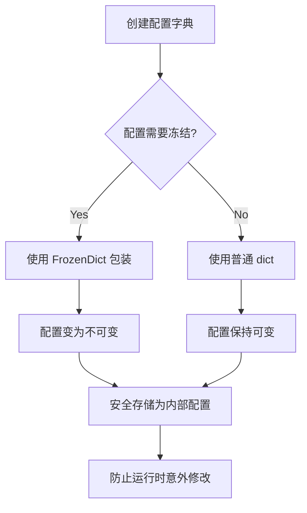

#### 技术债务与优化空间

1. **外部依赖**：FrozenDict 来自 diffusers 库，建议在文档中明确标注版本依赖
2. **类型注解缺失**：代码中未显示 FrozenDict 的泛型类型参数，建议添加如 `FrozenDict[str, Any]` 以提高类型安全性
3. **错误处理**：如果 FrozenDict 构造函数失败（如传入不可哈希的键），错误信息可能不够清晰

#### 设计目标与约束

- **目标**：确保配置对象的不可变性，防止意外修改导致的不一致行为
- **约束**：只能用于字典类型数据，不支持嵌套可变对象的完全冻结
- **性能**：冻结操作应尽可能轻量，避免不必要的深拷贝


### `DiffusionPipeline (import)`

这是从 `diffusers` 库导入的扩散管道基类，为 Stable Diffusion 等扩散模型提供通用的推理管道框架。`StableDiffusionIPEXPipeline` 继承该基类以实现基于 Intel IPEX 优化的文本到图像生成功能。

参数：

- 无直接参数（这是导入语句，非函数定义）

返回值：`type`，返回 `DiffusionPipeline` 类类型

#### 流程图

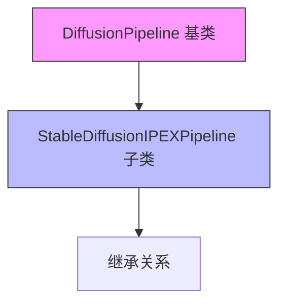

#### 带注释源码

```python
# 从 diffusers 库导入扩散管道基类
from diffusers.pipelines.pipeline_utils import DiffusionPipeline, StableDiffusionMixin

# DiffusionPipeline 是所有扩散管道的基础类，提供了：
# - 模型加载和保存 (from_pretrained, save_pretrained)
# - 设备管理 (_execution_device)
# - 进度条 (progress_bar)
# - 内存管理 (enable_attention_slicing, enable_vae_slicing 等)

# StableDiffusionMixin 提供了 Stable Diffusion 特定的混合功能
# 包括辅助方法和属性

class StableDiffusionIPEXPipeline(
    DiffusionPipeline,  # 继承扩散管道基类
    StableDiffusionMixin,  # 继承 Stable Diffusion 混合功能
    TextualInversionLoaderMixin,  # 文本反转加载混合
    StableDiffusionLoraLoaderMixin  # LoRA 加载混合
):
    """
    继承自 DiffusionPipeline 的具体实现类
    用于在 Intel IPEX 上运行 Stable Diffusion 推理
    """
```

### 补充说明

**关键组件信息：**

- `DiffusionPipeline`：扩散管道基类，提供通用推理框架
- `StableDiffusionMixin`：Stable Diffusion 专用混合类
- `StableDiffusionIPEXPipeline`：继承基类并实现 IPEX 优化的具体管道

**设计约束：**

- 必须继承 `DiffusionPipeline` 以获得标准扩散模型推理能力
- 需要实现特定硬件（Intel IPEX）的优化
- 支持自定义调度器、VAE、文本编码器等组件

**技术债务/优化空间：**

- 代码中存在拼写错误：`promt` 应为 `prompt`
- 硬编码的调度器配置检查可以抽象到基类
- 安全检查器的调用可以更加模块化


### StableDiffusionIPEXPipeline._encode_prompt

该方法用于将文本提示（prompt）编码为文本编码器（text encoder）的隐藏状态（hidden states），以便后续用于图像生成任务。

参数：

- `prompt`：`str` 或 `List[str]`，要编码的文本提示
- `device`：`torch.device`，PyTorch 设备
- `num_images_per_prompt`：`int`，每个提示生成的图像数量
- `do_classifier_free_guidance`：`bool`，是否使用无分类器引导（Classifier-Free Guidance）
- `negative_prompt`：`str` 或 `List[str]`，可选，用于指定不引导图像生成的提示
- `prompt_embeds`：`Optional[torch.Tensor]`，可选，预生成的文本嵌入
- `negative_prompt_embeds`：`Optional[torch.Tensor]`，可选，预生成的负面文本嵌入

返回值：`torch.Tensor`，编码后的提示嵌入（prompt embeddings）

#### 流程图

```mermaid
flowchart TD
    A[开始] --> B{判断 prompt 类型}
    B -->|str| C[batch_size = 1]
    B -->|List| D[batch_size = len(prompt)]
    B -->|其他| E[batch_size = prompt_embeds.shape[0]]
    C --> F{prompt_embeds 是否为空}
    D --> F
    E --> F
    F -->|是| G[检查是否需要文本反转]
    G --> H[使用 tokenizer 处理 prompt]
    H --> I[检查 text_encoder 是否使用 attention_mask]
    I -->|是| J[获取 attention_mask]
    I -->|否| K[attention_mask = None]
    J --> L[调用 text_encoder 获取嵌入]
    K --> L
    L --> M[获取 prompt_embeds]
    F -->|否| M
    M --> N{do_classifier_free_guidance 且 negative_prompt_embeds 为空}
    N -->|是| O[处理 negative_prompt]
    O --> P[获取 uncond_tokens]
    P --> Q[使用 tokenizer 处理 uncond_tokens]
    Q --> R[调用 text_encoder 获取 negative_prompt_embeds]
    R --> S{do_classifier_free_guidance}
    N -->|否| S
    S -->|是| T[复制 negative_prompt_embeds 和 prompt_embeds]
    T --> U[拼接 negative_prompt_embeds 和 prompt_embeds]
    S -->|否| V[直接返回 prompt_embeds]
    U --> V
    V --> W[结束]
```

#### 带注释源码

```python
def _encode_prompt(
    self,
    prompt,
    device,
    num_images_per_prompt,
    do_classifier_free_guidance,
    negative_prompt=None,
    prompt_embeds: Optional[torch.Tensor] = None,
    negative_prompt_embeds: Optional[torch.Tensor] = None,
):
    r"""
    Encodes the prompt into text encoder hidden states.

    Args:
         prompt (`str` or `List[str]`, *optional*):
            prompt to be encoded
        device: (`torch.device`):
            torch device
        num_images_per_prompt (`int`):
            number of images that should be generated per prompt
        do_classifier_free_guidance (`bool`):
            whether to use classifier free guidance or not
        negative_prompt (`str` or `List[str]`, *optional*):
            The prompt or prompts not to guide the image generation. If not defined, one has to pass
            `negative_prompt_embeds`. instead. If not defined, one has to pass `negative_prompt_embeds`. instead.
            Ignored when not using guidance (i.e., ignored if `guidance_scale` is less than `1`).
        prompt_embeds (`torch.Tensor`, *optional*):
            Pre-generated text embeddings. Can be used to easily tweak text inputs, *e.g.* prompt weighting. If not
            provided, text embeddings will be generated from `prompt` input argument.
        negative_prompt_embeds (`torch.Tensor`, *optional*):
            Pre-generated negative text embeddings. Can be used to easily tweak text inputs, *e.g.* prompt
            weighting. If not provided, negative_prompt_embeds will be generated from `negative_prompt` input
            argument.
    """
    # 1. 确定批次大小（batch_size）
    if prompt is not None and isinstance(prompt, str):
        batch_size = 1
    elif prompt is not None and isinstance(prompt, list):
        batch_size = len(prompt)
    else:
        batch_size = prompt_embeds.shape[0]

    # 2. 如果没有提供 prompt_embeds，则从 prompt 生成
    if prompt_embeds is None:
        # 文本反转：如果需要，处理多向量 token
        if isinstance(self, TextualInversionLoaderMixin):
            prompt = self.maybe_convert_prompt(prompt, self.tokenizer)

        # 使用 tokenizer 将文本转换为 token ID
        text_inputs = self.tokenizer(
            prompt,
            padding="max_length",
            max_length=self.tokenizer.model_max_length,
            truncation=True,
            return_tensors="pt",
        )
        text_input_ids = text_inputs.input_ids
        # 获取未截断的 token ID（用于检查是否被截断）
        untruncated_ids = self.tokenizer(prompt, padding="longest", return_tensors="pt").input_ids

        # 检查是否发生了截断
        if untruncated_ids.shape[-1] >= text_input_ids.shape[-1] and not torch.equal(
            text_input_ids, untruncated_ids
        ):
            removed_text = self.tokenizer.batch_decode(
                untruncated_ids[:, self.tokenizer.model_max_length - 1 : -1]
            )
            logger.warning(
                "The following part of your input was truncated because CLIP can only handle sequences up to"
                f" {self.tokenizer.model_max_length} tokens: {removed_text}"
            )

        # 获取 attention mask（如果 text_encoder 支持）
        if hasattr(self.text_encoder.config, "use_attention_mask") and self.text_encoder.config.use_attention_mask:
            attention_mask = text_inputs.attention_mask.to(device)
        else:
            attention_mask = None

        # 调用 text_encoder 获取文本嵌入
        prompt_embeds = self.text_encoder(
            text_input_ids.to(device),
            attention_mask=attention_mask,
        )
        prompt_embeds = prompt_embeds[0]

    # 3. 转换数据类型和设备
    prompt_embeds = prompt_embeds.to(dtype=self.text_encoder.dtype, device=device)

    # 4. 为每个 prompt 复制文本嵌入（支持批量生成多个图像）
    bs_embed, seq_len, _ = prompt_embeds.shape
    # 复制文本嵌入以支持每个 prompt 生成多个图像
    prompt_embeds = prompt_embeds.repeat(1, num_images_per_prompt, 1)
    prompt_embeds = prompt_embeds.view(bs_embed * num_images_per_prompt, seq_len, -1)

    # 5. 如果使用无分类器引导且没有提供 negative_prompt_embeds，则生成无条件嵌入
    if do_classifier_free_guidance and negative_prompt_embeds is None:
        uncond_tokens: List[str]
        if negative_prompt is None:
            uncond_tokens = [""] * batch_size
        elif type(prompt) is not type(negative_prompt):
            raise TypeError(
                f"`negative_prompt` should be the same type to `prompt`, but got {type(negative_prompt)} !="
                f" {type(prompt)}."
            )
        elif isinstance(negative_prompt, str):
            uncond_tokens = [negative_prompt]
        elif batch_size != len(negative_prompt):
            raise ValueError(
                f"`negative_prompt`: {negative_prompt} has batch size {len(negative_prompt)}, but `prompt`:"
                f" {prompt} has batch size {batch_size}. Please make sure that passed `negative_prompt` matches"
                " the batch size of `prompt`."
            )
        else:
            uncond_tokens = negative_prompt

        # 文本反转：如果需要，处理多向量 token
        if isinstance(self, TextualInversionLoaderMixin):
            uncond_tokens = self.maybe_convert_prompt(uncond_tokens, self.tokenizer)

        max_length = prompt_embeds.shape[1]
        uncond_input = self.tokenizer(
            uncond_tokens,
            padding="max_length",
            max_length=max_length,
            truncation=True,
            return_tensors="pt",
        )

        # 获取 attention mask
        if hasattr(self.text_encoder.config, "use_attention_mask") and self.text_encoder.config.use_attention_mask:
            attention_mask = uncond_input.attention_mask.to(device)
        else:
            attention_mask = None

        # 获取无条件嵌入
        negative_prompt_embeds = self.text_encoder(
            uncond_input.input_ids.to(device),
            attention_mask=attention_mask,
        )
        negative_prompt_embeds = negative_prompt_embeds[0]

    # 6. 如果使用无分类器引导，则处理无条件嵌入并拼接
    if do_classifier_free_guidance:
        # 复制无条件嵌入以匹配批量大小
        seq_len = negative_prompt_embeds.shape[1]
        negative_prompt_embeds = negative_prompt_embeds.to(dtype=self.text_encoder.dtype, device=device)
        negative_prompt_embeds = negative_prompt_embeds.repeat(1, num_images_per_prompt, 1)
        negative_prompt_embeds = negative_prompt_embeds.view(batch_size * num_images_per_prompt, seq_len, -1)

        # 拼接无条件嵌入和文本嵌入，避免两次前向传播
        prompt_embeds = torch.cat([negative_prompt_embeds, prompt_embeds])

    return prompt_embeds
```


### TextualInversionLoaderMixin

文本反转加载混入（TextualInversionLoaderMixin）是一个用于加载和应用文本反转（Textual Inversion）技术的混入类。文本反转允许用户通过自定义的 token embedding 来定义新的概念或风格，并将其用于图像生成引导。该混入类提供了加载文本反转 embeddings 的能力，并在提示编码过程中处理这些自定义 embeddings。

参数：

- 无（该类为混入类，通过继承方式使用）

返回值：

- 无（该类为混入类，通过继承方式使用）

#### 流程图

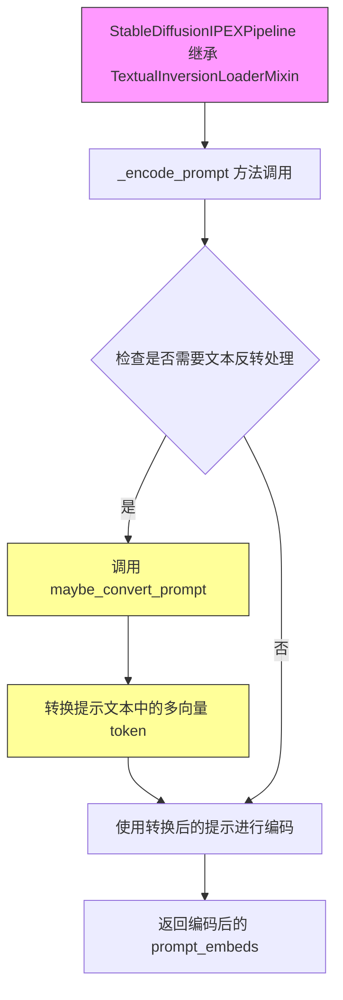

#### 带注释源码

```python
# 从 diffusers.loaders 模块导入 TextualInversionLoaderMixin
# 这是一个混入类（Mixin），提供文本反转加载功能
from diffusers.loaders import StableDiffusionLoraLoaderMixin, TextualInversionLoaderMixin

# 管道类继承 TextualInversionLoaderMixin 以获得文本反转加载能力
class StableDiffusionIPEXPipeline(
    DiffusionPipeline, StableDiffusionMixin, TextualInversionLoaderMixin, StableDiffusionLoraLoaderMixin
):
    # ... 类定义 ...

    def _encode_prompt(self, prompt, device, num_images_per_prompt, do_classifier_free_guidance, 
                       negative_prompt=None, prompt_embeds: Optional[torch.Tensor] = None, 
                       negative_prompt_embeds: Optional[torch.Tensor] = None):
        """
        编码提示文本为文本编码器隐藏状态
        """
        # ... 前面代码省略 ...
        
        if prompt_embeds is None:
            # 【关键】文本反转处理：必要时处理多向量 tokens
            # TextualInversionLoaderMixin 提供了 maybe_convert_prompt 方法
            # 用于将自定义的文本反转 token 转换为模型可以处理的格式
            if isinstance(self, TextualInversionLoaderMixin):
                # 转换提示文本，处理其中的文本反转 tokens
                prompt = self.maybe_convert_prompt(prompt, self.tokenizer)
            
            # 使用分词器将文本转换为 tokens
            text_inputs = self.tokenizer(
                prompt,
                padding="max_length",
                max_length=self.tokenizer.model_max_length,
                truncation=True,
                return_tensors="pt",
            )
            # ... 后续编码逻辑省略 ...
        
        # ... 条件引导处理逻辑省略 ...
        
        # 【关键】文本反转处理：处理负面提示中的文本反转 tokens
        if do_classifier_free_guidance and negative_prompt_embeds is None:
            # ... 获取 uncond_tokens 逻辑省略 ...
            
            # 文本反转：处理多向量 tokens（如有）
            if isinstance(self, TextualInversionLoaderMixin):
                # 同样转换负面提示中的文本反转 tokens
                uncond_tokens = self.maybe_convert_prompt(uncond_tokens, self.tokenizer)
            
            # ... 后续处理逻辑省略 ...
        
        return prompt_embeds
```

#### 关键使用说明

**TextualInversionLoaderMixin 的核心功能**：

1. **maybe_convert_prompt 方法**：在 `_encode_prompt` 中被调用，用于处理包含文本反转概念的自定义提示词。该方法能够：
   - 识别并展开文本反转学习到的特殊 tokens
   - 处理多向量（multi-vector）token 表示
   - 确保这些自定义 tokens 能被 CLIP tokenizer 正确处理

2. **典型使用场景**：当用户使用文本反转技术训练了自定义概念（如特定的艺术风格、物体或人物），并在提示词中引用这些概念时，该混入类负责正确加载和处理这些概念的 embedding。

3. **集成方式**：通过 `isinstance(self, TextualInversionLoaderMixin)` 检查，确保只有在类继承了文本反转加载能力时才执行相关处理逻辑。

**在代码中的间接使用**：

虽然 `TextualInversionLoaderMixin` 本身未在此文件中定义，但它通过继承机制被 `StableDiffusionIPEXPipeline` 类使用，为管道提供了加载和应用文本反转 embeddings 的能力。


### `StableDiffusionLoraLoaderMixin`

StableDiffusionLoraLoaderMixin 是一个 Mixin 类，用于为 Stable Diffusion 管道提供加载和管理 LoRA（Low-Rank Adaptation）权重的能力。该 Mixin 允许用户在预训练的 Stable Diffusion 模型上动态加载和卸载 LoRA 适配器，以实现轻量级的模型微调和风格迁移。

#### 带注释源码

```python
# 从 diffusers.loaders 导入 StableDiffusionLoraLoaderMixin
# 这是一个 Mixin 类，提供了以下核心功能：
# 1. load_lora_weights(): 加载 LoRA 权重到模型
# 2. save_lora_weights(): 保存当前的 LoRA 权重
# 3. unload_lora_weights(): 卸载已加载的 LoRA 权重
# 4. fuse_lora_weights(): 将 LoRA 权重融合到基础模型中
# 5. unfuse_lora_weights(): 将融合的 LoRA 权重分离

from diffusers.loaders import StableDiffusionLoraLoaderMixin, TextualInversionLoaderMixin

# 在 StableDiffusionIPEXPipeline 类中使用该 Mixin
class StableDiffusionIPEXPipeline(
    DiffusionPipeline, 
    StableDiffusionMixin, 
    TextualInversionLoaderMixin,  # 提供 Textual Inversion 功能
    StableDiffusionLoraLoaderMixin  # 提供 LoRA 加载功能
):
    r"""
    Pipeline for text-to-image generation using Stable Diffusion on IPEX.

    该类通过多重继承组合了多个 Mixin 的功能：
    - DiffusionPipeline: 基础扩散管道功能
    - StableDiffusionMixin: Stable Diffusion 特定功能
    - TextualInversionLoaderMixin: Textual Inversion 嵌入加载功能
    - StableDiffusionLoraLoaderMixin: LoRA 权重加载和管理功能
    
    通过继承 StableDiffusionLoraLoaderMixin，该管道可以：
    1. 从预训练 checkpoint 加载 LoRA 权重
    2. 将 LoRA 权重应用到 UNet、Text Encoder 等组件
    3. 支持自定义 LoRA 缩放因子
    4. 支持 LoRA 权重的融合与分离
    """
```

#### 关键功能说明

| 功能 | 描述 |
|------|------|
| `load_lora_weights` | 从指定路径加载 LoRA 权重并应用到模型 |
| `save_lora_weights` | 将当前加载的 LoRA 权重保存到磁盘 |
| `unload_lora_weights` | 移除已加载的 LoRA 权重 |
| `fuse_lora_weights` | 将 LoRA 权重融合到基础模型参数中 |
| `unfuse_lora_weights` | 将融合的权重分离回原始状态 |

#### 使用示例

```python
# 加载 LoRA 权重
pipeline.load_lora_weights("path/to/lora_weights")

# 可选：设置 LoRA 缩放因子
pipeline.set_lora_scale(scale=0.5)

# 生成图像
image = pipeline("a photo of an astronaut riding a horse on mars").images[0]

# 卸载 LoRA 权重（如需要）
pipeline.unload_lora_weights()
```

#### 流程图

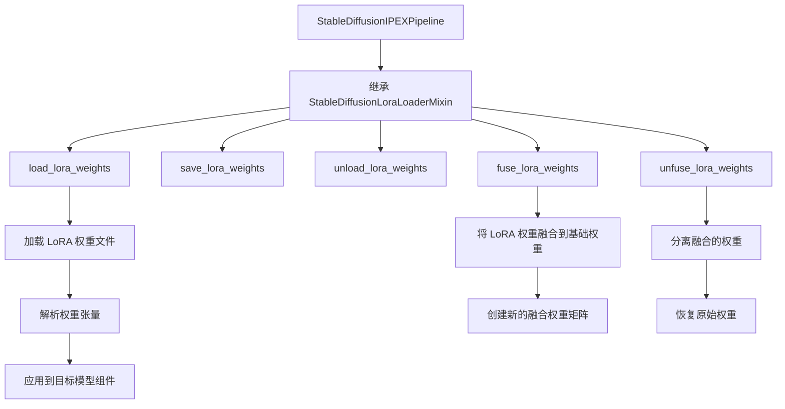

#### 注意事项

1. **Mixin 特性**: `StableDiffusionLoraLoaderMixin` 是一个 Mixin 类，不是直接实例化的，而是通过多重继承的方式为其他类提供功能
2. **依赖关系**: 该功能依赖于 `diffusers` 库中的实现，具体逻辑在库内部
3. **IPEX 集成**: 在 `StableDiffusionIPEXPipeline` 中使用 LoRA 时，需要注意与 IPEX 优化的兼容性
4. **权重兼容性**: LoRA 权重需要与基础模型的架构匹配才能正确加载


### AutoencoderKL

这是从 `diffusers.models` 导入的 VAE（变分自编码器）模型类，用于将潜在表示编码为图像或从图像编码为潜在表示。在 `StableDiffusionIPEXPipeline` 中，VAE 负责将潜在空间的数据解码为实际图像，以及将图像编码到潜在空间。

#### 参数

- `latents`：`torch.Tensor`，从潜在空间解码出的潜在表示张量，通常是经过去噪处理后的结果

#### 返回值

- `torch.Tensor`，解码后的图像张量，值域在 [0, 1] 范围内

#### 流程图

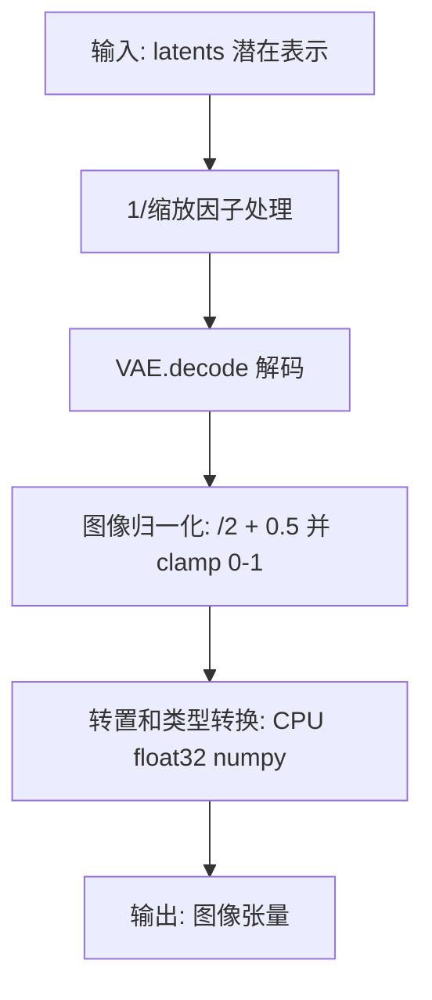

#### 带注释源码

```python
# 解码潜在表示到图像
def decode_latents(self, latents):
    """
    将潜在表示解码为实际图像
    
    参数:
        latents: 潜在表示张量，来自 UNet 去噪后的输出
    
    返回:
        image: 解码后的图像张量，格式为 numpy 数组
    """
    # 1. 逆缩放：潜在表示在编码时乘以了缩放因子，这里需要除以回来
    # 这是基于 VAE 的 scaling_factor 配置
    latents = 1 / self.vae.config.scaling_factor * latents
    
    # 2. 使用 VAE 解码器将潜在表示解码为图像
    # AutoencoderKL.decode() 返回包含 sample 属性的输出
    image = self.vae.decode(latents).sample
    
    # 3. 图像后处理：将图像值从 [-1, 1] 归一化到 [0, 1]
    # VAE 输出通常是归一化的图像，需要转换以便显示
    image = (image / 2 + 0.5).clamp(0, 1)
    
    # 4. 转换为 numpy 数组以便后续处理
    # 转换为 float32 以兼容 bfloat16，同时避免显著性能开销
    # 维度顺序从 [B, C, H, W] 转换为 [B, H, W, C]
    image = image.cpu().permute(0, 2, 3, 1).float().numpy()
    
    return image
```

#### 在 Pipeline 中的使用方式

```python
# 在 __call__ 方法的去噪循环结束后调用
# 8. Post-processing: 解码潜在表示
image = self.decode_latents(latents)

# 9. Run safety check: 检查生成图像是否安全
image, has_nsfw_concept = self.run_safety_checker(image, device, prompt_embeds.dtype)

# 10. Convert to PIL: 转换为 PIL 图像格式
image = self.numpy_to_pil(image)
```

#### VAE 在 IPEX 优化中的特殊处理

```python
# 在 prepare_for_ipex 方法中，VAE 解码器被特殊优化
# 将模型转换为 channels_last 内存格式以提高性能
self.vae.decoder = self.vae.decoder.to(memory_format=torch.channels_last)

# 使用 IPEX 优化解码器
self.vae.decoder = ipex.optimize(
    self.vae.decoder.eval(),
    dtype=torch.bfloat16,  # 或 torch.float32
    inplace=True
)

# 跟踪 VAE 解码器以获得更好的 IPEX 性能
with torch.cpu.amp.autocast(enabled=dtype == torch.bfloat16), torch.no_grad():
    ave_decoder_trace_model = torch.jit.trace(
        self.vae.decoder, vae_decoder_input_example, 
        check_trace=False, strict=False
    )
    ave_decoder_trace_model = torch.jit.freeze(ave_decoder_trace_model)
self.vae.decoder.forward = ave_decoder_trace_model.forward
```


### `UNet2DConditionModel` (导入)

从 `diffusers.models` 导入的条件U-Net模型类，用于根据文本嵌入和噪声潜变量去噪，生成图像潜变量表示。在 `StableDiffusionIPEXPipeline` 中作为核心组件 `unet` 使用。

参数：

- `unet`：`UNet2DConditionModel`，在 `StableDiffusionIPEXPipeline.__init__` 中接收的条件U-Net架构，用于对编码后的图像潜变量进行去噪。

#### 流程图

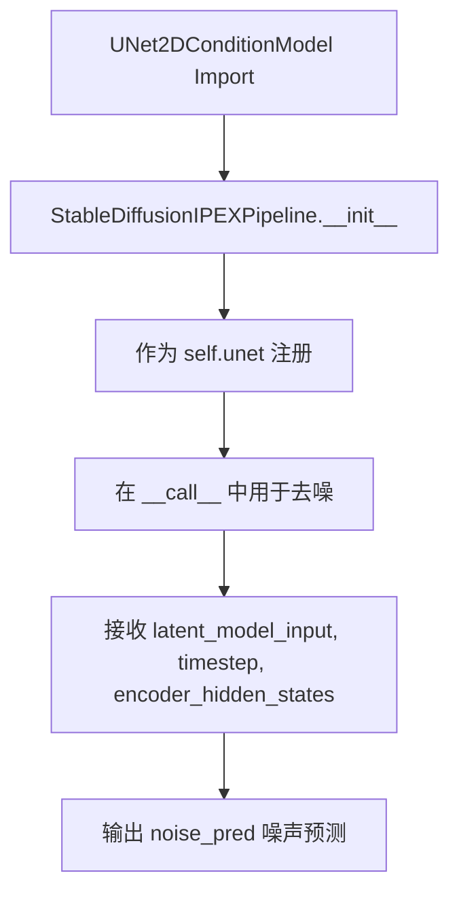

#### 带注释源码

```python
# 从 diffusers.models 导入 UNet2DConditionModel 类
# 这是一个条件U-Net模型，用于图像生成任务中的噪声预测
from diffusers.models import AutoencoderKL, UNet2DConditionModel

# 在 StableDiffusionIPEXPipeline 类中使用
class StableDiffusionIPEXPipeline(
    DiffusionPipeline, StableDiffusionMixin, TextualInversionLoaderMixin, StableDiffusionLoraLoaderMixin
):
    def __init__(
        self,
        vae: AutoencoderKL,
        text_encoder: CLIPTextModel,
        tokenizer: CLIPTokenizer,
        unet: UNet2DConditionModel,  # 条件U-Net模型参数
        scheduler: KarrasDiffusionSchedulers,
        safety_checker: StableDiffusionSafetyChecker,
        feature_extractor: CLIPImageProcessor,
        requires_safety_checker: bool = True,
    ):
        # ... 初始化代码 ...
        
        # 注册所有模块，包括 unet
        self.register_modules(
            vae=vae,
            text_encoder=text_encoder,
            tokenizer=tokenizer,
            unet=unet,  # UNet2DConditionModel 实例
            scheduler=scheduler,
            safety_checker=safety_checker,
            feature_extractor=feature_extractor,
        )
```

---

### `StableDiffusionIPEXPipeline.unet` (属性/使用)

在 `__call__` 方法中调用 U-Net 进行噪声预测。

参数（传递给 U-Net 的调用）：

- `latent_model_input`：`torch.Tensor`，拼接后的潜变量输入（如果使用无分类器引导则复制两份）
- `timestep`：`int` 或 `torch.Tensor`，当前去噪步骤的时间步
- `encoder_hidden_states`：`torch.Tensor`，文本编码器输出的文本嵌入

返回值：`Dict[str, torch.Tensor]`，包含 `sample` 键的字典，值为预测的噪声张量

#### 流程图

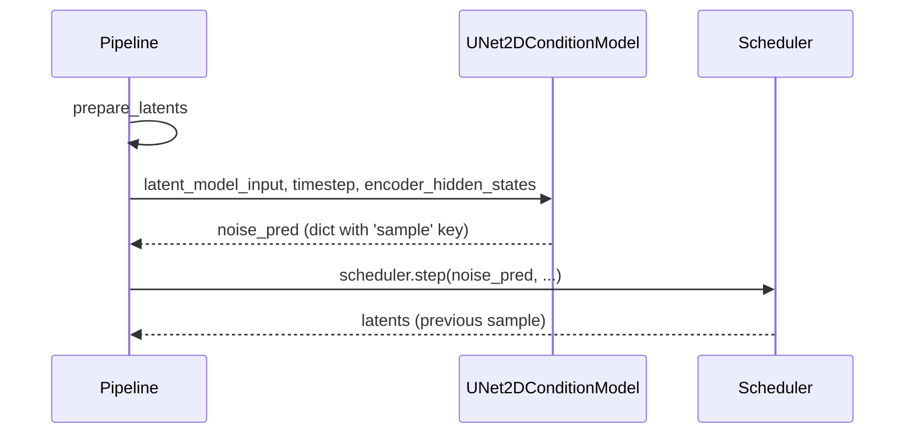

#### 带注释源码

```python
# 在 __call__ 方法中调用 U-Net 进行噪声预测
# 7. Denoising loop
num_warmup_steps = len(timesteps) - num_inference_steps * self.scheduler.order
with self.progress_bar(total=num_inference_steps) as progress_bar:
    for i, t in enumerate(timesteps):
        # expand the latents if we are doing classifier free guidance
        # 如果使用无分类器引导，则扩展潜变量
        latent_model_input = torch.cat([latents] * 2) if do_classifier_free_guidance else latents
        latent_model_input = self.scheduler.scale_model_input(latent_model_input, t)

        # predict the noise residual
        # 预测噪声残差 - 调用 UNet2DConditionModel
        # 输入: 潜变量、时间步、文本嵌入
        # 输出: 预测的噪声
        noise_pred = self.unet(latent_model_input, t, encoder_hidden_states=prompt_embeds)["sample"]

        # perform guidance
        # 执行引导（无分类器引导）
        if do_classifier_free_guidance:
            noise_pred_uncond, noise_pred_text = noise_pred.chunk(2)
            noise_pred = noise_pred_uncond + guidance_scale * (noise_pred_text - noise_pred_uncond)

        # compute the previous noisy sample x_t -> x_t-1
        # 计算前一个噪声样本 x_t -> x_t-1
        latents = self.scheduler.step(noise_pred, t, latents, **extra_step_kwargs).prev_sample

        # call the callback, if provided
        if i == len(timesteps) - 1 or ((i + 1) > num_warmup_steps and (i + 1) % self.scheduler.order == 0):
            progress_bar.update()
            if callback is not None and i % callback_steps == 0:
                step_idx = i // getattr(self.scheduler, "order", 1)
                callback(step_idx, t, latents)
```


### `StableDiffusionPipelineOutput`

这是 `StableDiffusionPipeline` 管道输出数据的封装类，用于封装文本到图像生成任务的结果。该类在 `__call__` 方法中被实例化，返回生成的图像以及可选的 NSFW（不适内容）检测结果。

参数：

- `images`：`Union[List[PIL.Image.Image], np.ndarray, torch.Tensor]`，生成的图像列表
- `nsfw_content_detected`：`Optional[List[bool]]`，标识每个生成的图像是否可能包含 NSFW 内容的布尔值列表

返回值：`StableDiffusionPipelineOutput`，包含图像和 NSFW 检测结果的封装对象

#### 流程图

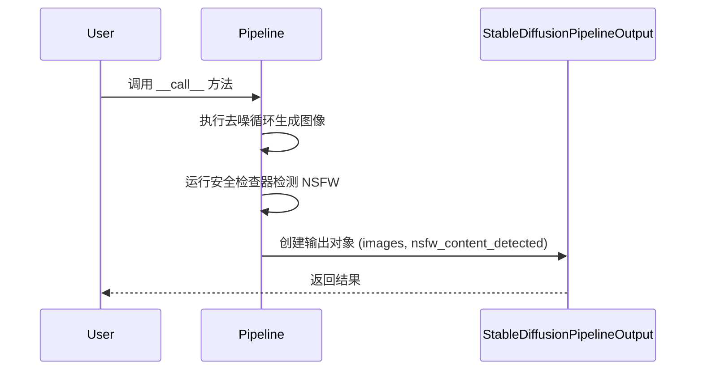

#### 带注释源码

```python
# 在 __call__ 方法中的使用示例 (第 549-551 行)
# ... 省略前面的去噪和安全检查逻辑 ...

# 当 return_dict 为 True 时，返回 StableDiffusionPipelineOutput 对象
# 该对象封装了生成的图像和 NSFW 检测结果
return StableDiffusionPipelineOutput(images=image, nsfw_content_detected=has_nsfw_concept)

# 当 return_dict 为 False 时，返回元组格式 (不推荐)
# return (image, has_nsfw_concept)
```

#### 导入声明

```python
# 第 15 行：从 diffusers 库导入 StableDiffusionPipelineOutput 类
from diffusers.pipelines.stable_diffusion import StableDiffusionPipelineOutput
```

#### 完整调用上下文

```python
# __call__ 方法返回值处理 (第 540-551 行)
# 检查输出类型如果不是返回字典形式
if not return_dict:
    # 返回元组：(图像列表, NSFW检测结果列表)
    return (image, has_nsfw_content_detected)

# 返回 StableDiffusionPipelineOutput 对象（推荐方式）
# 包含生成的所有图像和对应的 NSFW 检测标志
return StableDiffusionPipelineOutput(images=image, nsfw_content_detected=has_nsfw_content_detected)
```


### `StableDiffusionSafetyChecker` (导入)

这是从 `diffusers` 库导入的安全检查器类，用于检测生成图像中是否存在潜在的不当内容（如 NSFW）。在当前管道中，它被集成用于过滤不安全图像。

#### 参数

由于 `StableDiffusionSafetyChecker` 是外部导入的类，其具体参数定义在 `diffusers.pipelines.stable_diffusion.safety_checker` 模块中。在本管道中使用时的调用方式如下：

- `images`：`torch.Tensor`，待检查的图像张量
- `clip_input`：`torch.Tensor`，由 `feature_extractor` 提取的 CLIP 特征输入

#### 返回值

- `image`：`torch.Tensor`，处理后的图像（可能经过调整）
- `has_nsfw_concept`：`List[bool]`，标记每个图像是否包含不安全内容

#### 流程图

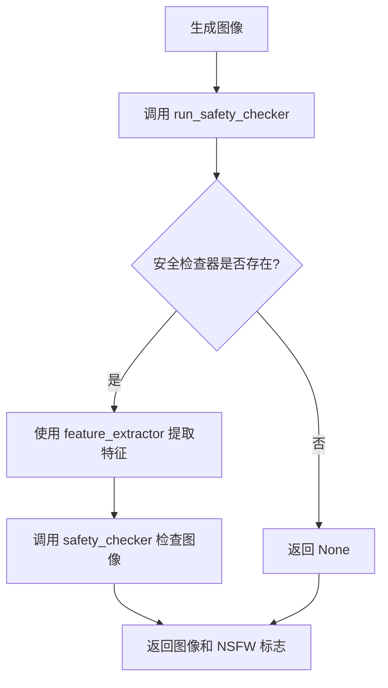

#### 带注释源码

```python
def run_safety_checker(self, image, device, dtype):
    """
    运行安全检查器来过滤不当图像内容。
    
    参数:
        image: 生成后的图像张量
        device: 计算设备 (CPU/CUDA)
        dtype: 数据类型 (用于 CLIP 输入)
    
    返回:
        tuple: (处理后的图像, NSFW 检测结果)
    """
    if self.safety_checker is not None:
        # 1. 使用特征提取器将图像转换为 CLIP 所需格式
        safety_checker_input = self.feature_extractor(
            self.numpy_to_pil(image),  # 将 numpy 数组转为 PIL 图像
            return_tensors="pt"       # 返回 PyTorch 张量
        ).to(device)
        
        # 2. 调用安全检查器模型进行推理
        #    - images: 生成的图像
        #    - clip_input: CLIP 特征提取器的像素值
        image, has_nsfw_concept = self.safety_checker(
            images=image, 
            clip_input=safety_checker_input.pixel_values.to(dtype)
        )
    else:
        # 如果未配置安全检查器，返回 None
        has_nsfw_concept = None
    
    return image, has_nsfw_concept
```

---

### 在 `StableDiffusionIPEXPipeline` 中的集成信息

| 组件 | 类型 | 描述 |
|------|------|------|
| `self.safety_checker` | `StableDiffusionSafetyChecker` | 安全检查器模型实例 |
| `self.feature_extractor` | `CLIPImageProcessor` | 用于提取图像特征的 CLIP 处理器 |
| `run_safety_checker` | 实例方法 | 管道中调用安全检查的封装方法 |

---

### 潜在技术债务与优化空间

1. **安全检查器性能开销**：在每次推理后运行安全检查会增加延迟，可考虑异步执行或批量处理。
2. **NSFW 检测准确性**：基于 CLIP 的检测可能产生误判，建议提供置信度阈值配置接口。
3. **功能可扩展性**：当前安全检查器是硬编码依赖，可设计为可插拔的过滤器接口。


### KarrasDiffusionSchedulers (import)

这是从 `diffusers.schedulers` 模块导入的调度器类型枚举，用于在 Stable Diffusion 管道中指定可用的噪声调度器。Karras 调度器是一类基于 Karras 等人论文的去噪调度策略，通过调整噪声时间步的 sigma 值来改善图像生成质量。

参数：

- 无直接参数（这是一个导入的类型声明）

返回值：`KarrasDiffusionSchedulers`，返回调度器类型枚举，包含所有可用的 Karras 扩散调度器类

#### 流程图

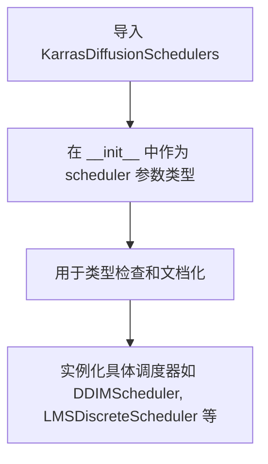

#### 带注释源码

```
# 导入语句
from diffusers.schedulers import KarrasDiffusionSchedulers

# 在 StableDiffusionIPEXPipeline 类中的使用
class StableDiffusionIPEXPipeline(
    DiffusionPipeline, StableDiffusionMixin, TextualInversionLoaderMixin, StableDiffusionLoraLoaderMixin
):
    def __init__(
        self,
        vae: AutoencoderKL,
        text_encoder: CLIPTextModel,
        tokenizer: CLIPTokenizer,
        unet: UNet2DConditionModel,
        scheduler: KarrasDiffusionSchedulers,  # <-- 作为类型提示使用
        safety_checker: StableDiffusionSafetyChecker,
        feature_extractor: CLIPImageProcessor,
        requires_safety_checker: bool = True,
    ):
        # ... 初始化逻辑
```

#### 详细说明

**类型说明**：
- `KarrasDiffusionSchedulers` 是 `diffusers` 库中定义的一个枚举类型（Enum），包含了所有基于 Karras 噪声调度策略的调度器类
- 这不是调度器实例，而是调度器类的类型标记，用于在创建管道时指定使用哪种调度器

**使用场景**：
- 用户在创建 `StableDiffusionIPEXPipeline` 时，需要传入一个调度器实例
- 该调度器实例的类型应该属于 `KarrasDiffusionSchedulers` 枚举中定义的类之一
- 常见的调度器包括：`DDIMScheduler`, `LMSDiscreteScheduler`, `PNDMScheduler`, `DDPMScheduler`, `KDPM2DiscreteScheduler`, `KDPM2AncestralDiscreteScheduler` 等

**技术债务/优化空间**：
- 当前代码仅将其作为类型提示使用，没有对调度器类型进行运行时检查
- 建议可以添加更详细的调度器兼容性检查，确保选择的调度器与模型配置匹配


### `ipex.optimize`

这是 Intel Extension for PyTorch (IPEX) 库提供的模型优化函数，用于在 Intel CPU 上优化 PyTorch 模型的推理性能。在 `StableDiffusionIPEXPipeline.prepare_for_ipex()` 方法中被调用，根据指定的数据类型（bfloat16 或 float32）对 UNet、VAE decoder 和 text_encoder 等模型进行优化，并支持模型追踪（trace）和冻结（freeze）以进一步提升性能。

参数（以在 `prepare_for_ipex` 中的典型调用为例）：

- `model`：`torch.nn.Module`，待优化的 PyTorch 模型（如 UNet2DConditionModel、Decoder 等）
- `eval`：`bool`，指定模型处于评估模式（调用 `model.eval()` 后传入）
- `dtype`：`torch.dtype`，计算精度，传入 `torch.bfloat16` 或 `torch.float32`
- `inplace`：`bool`，是否原地修改模型，默认 `True`
- `weights_prepack`：`bool`（float32 场景），是否预先打包权重以优化卷积和线性层，默认 `True`
- `auto_kernel_selection`：`bool`（float32 场景），是否自动选择最优内核，默认 `False`

返回值：`torch.nn.Module`，返回经过 IPEX 优化后的模型对象，该对象保持了原始模型的结构和属性，但针对 Intel CPU 推理进行了性能优化。

#### 流程图

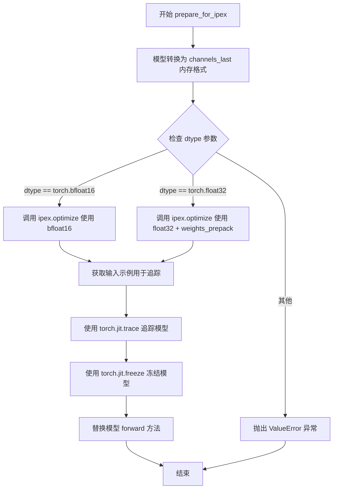

#### 带注释源码

```python
# 位置: StableDiffusionIPEXPipeline.prepare_for_ipex 方法内部

def prepare_for_ipex(self, promt, dtype=torch.float32, height=None, width=None, guidance_scale=7.5):
    """
    为 Intel Extension for PyTorch 准备 Stable Diffusion pipeline。
    
    参数:
        promt: str, 输入提示词
        dtype: torch.dtype, 计算精度，torch.float32 或 torch.bfloat16
        height: int, 生成图像高度
        width: int, 生成图像宽度
        guidance_scale: float, 引导比例
    """
    
    # 1. 将模型转换为 channels_last 内存格式（更利于 CPU 推理优化）
    self.unet = self.unet.to(memory_format=torch.channels_last)
    self.vae.decoder = self.vae.decoder.to(memory_format=torch.channels_last)
    self.text_encoder = self.text_encoder.to(memory_format=torch.channels_last)
    if self.safety_checker is not None:
        self.safety_checker = self.safety_checker.to(memory_format=torch.channels_last)

    # 2. 获取输入示例，用于后续的模型追踪
    unet_input_example, vae_decoder_input_example = self.get_input_example(promt, height, width, guidance_scale)

    # 3. 根据数据类型调用 ipex.optimize 进行模型优化
    if dtype == torch.bfloat16:
        # BF16 优化路径：自动内核选择
        self.unet = ipex.optimize(self.unet.eval(), dtype=torch.bfloat16, inplace=True)
        self.vae.decoder = ipex.optimize(self.vae.decoder.eval(), dtype=torch.bfloat16, inplace=True)
        self.text_encoder = ipex.optimize(self.text_encoder.eval(), dtype=torch.bfloat16, inplace=True)
        if self.safety_checker is not None:
            self.safety_checker = ipex.optimize(self.safety_checker.eval(), dtype=torch.bfloat16, inplace=True)
    elif dtype == torch.float32:
        # FP32 优化路径：启用权重预打包，关闭自动内核选择
        self.unet = ipex.optimize(
            self.unet.eval(),
            dtype=torch.float32,
            inplace=True,
            weights_prepack=True,         # 预先打包权重，优化卷积/线性层
            auto_kernel_selection=False,  # 手动控制内核选择
        )
        self.vae.decoder = ipex.optimize(
            self.vae.decoder.eval(),
            dtype=torch.float32,
            inplace=True,
            weights_prepack=True,
            auto_kernel_selection=False,
        )
        self.text_encoder = ipex.optimize(
            self.text_encoder.eval(),
            dtype=torch.float32,
            inplace=True,
            weights_prepack=True,
            auto_kernel_selection=False,
        )
        if self.safety_checker is not None:
            self.safety_checker = ipex.optimize(
                self.safety_checker.eval(),
                dtype=torch.float32,
                inplace=True,
                weights_prepack=True,
                auto_kernel_selection=False,
            )
    else:
        # 仅支持 bfloat16 和 float32 两种数据类型
        raise ValueError(" The value of 'dtype' should be 'torch.bfloat16' or 'torch.float32' !")

    # 4. 追踪并冻结 UNet 模型以提升推理性能
    with torch.cpu.amp.autocast(enabled=dtype == torch.bfloat16), torch.no_grad():
        # torch.jit.trace: 使用示例输入对模型进行追踪，生成静态计算图
        unet_trace_model = torch.jit.trace(
            self.unet, 
            unet_input_example, 
            check_trace=False, 
            strict=False
        )
        # torch.jit.freeze: 冻结模型，消除虚拟调度开销
        unet_trace_model = torch.jit.freeze(unet_trace_model)
    # 替换原始 forward 方法为追踪后的版本
    self.unet.forward = unet_trace_model.forward

    # 5. 追踪并冻结 VAE decoder 模型
    with torch.cpu.amp.autocast(enabled=dtype == torch.bfloat16), torch.no_grad():
        ave_decoder_trace_model = torch.jit.trace(
            self.vae.decoder, 
            vae_decoder_input_example, 
            check_trace=False, 
            strict=False
        )
        ave_decoder_trace_model = torch.jit.freeze(ave_decoder_trace_model)
    self.vae.decoder.forward = ave_decoder_trace_model.forward
```

#### 补充说明

- **weights_prepack=True**：预先打包权重可减少运行时内存访问开销，但会增加启动时间
- **auto_kernel_selection=False**：手动控制允许更精细的性能调优，适合生产环境
- **torch.jit.trace + freeze**：追踪后的模型消除了 Python 解释器开销，freeze 进一步优化了内存布局
- **使用场景**：该优化主要面向 Intel Xeon/Atom CPU，通过 IPEX 的 CPU 优化实现更高效的推理


### `torch.jit.trace`

`torch.jit.trace` 是 PyTorch 的 JIT 编译工具，用于通过示例输入记录模型的执行轨迹并生成优化的 TorchScript 模块，以提高推理性能。

参数：

- `model`：`torch.nn.Module` 或 `Callable`，需要追踪的模型或函数
- `example_inputs`：任意类型，示例输入，用于在追踪过程中执行模型以记录操作
- `check_trace`：`bool`，可选，是否在追踪后检查记录的操作是否正确，默认值为 `True`
- `strict`：`bool`，可选，是否使用严格模式追踪，默认值为 `True`

返回值：`torch.jit.ScriptModule`，返回生成的 TorchScript 追踪模块

#### 流程图

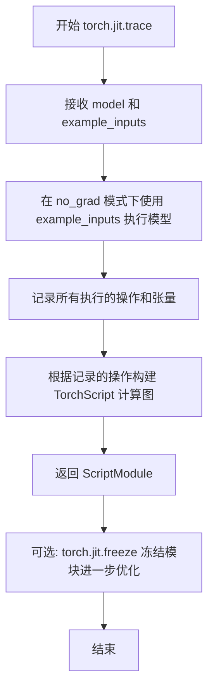

#### 带注释源码

```python
# 在 prepare_for_ipex 方法中使用 torch.jit.trace 追踪 UNet 模型
# trace unet model to get better performance on IPEX
with torch.cpu.amp.autocast(enabled=dtype == torch.bfloat16), torch.no_grad():
    # 使用 torch.jit.trace 追踪 UNet 模型
    # 参数:
    #   - self.unet: 要追踪的 UNet2DConditionModel 模型
    #   - unet_input_example: 示例输入，包含 (latent_model_input, dummy, prompt_embeds)
    #   - check_trace=False: 禁用追踪检查，提高性能
    #   - strict=False: 使用非严格模式，允许模型存在不完全支持的算子
    unet_trace_model = torch.jit.trace(self.unet, unet_input_example, check_trace=False, strict=False)
    # 使用 torch.jit.freeze 冻结追踪后的模型，消除死代码并优化
    unet_trace_model = torch.jit.freeze(unet_trace_model)
# 将追踪后的模型前向方法替换原始模型的前向方法
self.unet.forward = unet_trace_model.forward

# 同样方式追踪 VAE Decoder 模型
# trace vae.decoder model to get better performance on IPEX
with torch.cpu.amp.autocast(enabled=dtype == torch.bfloat16), torch.no_grad():
    ave_decoder_trace_model = torch.jit.trace(
        self.vae.decoder,  # 要追踪的 VAE 解码器模型
        vae_decoder_input_example,  # VAE 解码器的示例输入 (latents)
        check_trace=False,  # 禁用追踪检查
        strict=False  # 非严格模式
    )
    ave_decoder_trace_model = torch.jit.freeze(ave_decoder_trace_model)
# 替换 VAE 解码器的前向方法
self.vae.decoder.forward = ave_decoder_trace_model.forward
```


### `torch.jit.freeze`

torch.jit.freeze 是一个 PyTorch JIT 编译函数，用于将经过 torch.jit.trace 跟踪的模型进行冻结处理。冻结操作会消除模型中的 Python 对象引用，将参数内联到模型中，从而生成一个独立的、可以进行序列化和部署的模型。这在推理阶段可以提升性能并减少依赖。

参数：

-  `model`：`torch.jit.ScriptModule`，通过 `torch.jit.trace` 跟踪得到的 JIT 模型

返回值：`torch.jit.ScriptModule`，返回冻结后的 JIT 模型，模型参数已被内联，可以独立于原始模型使用

#### 流程图

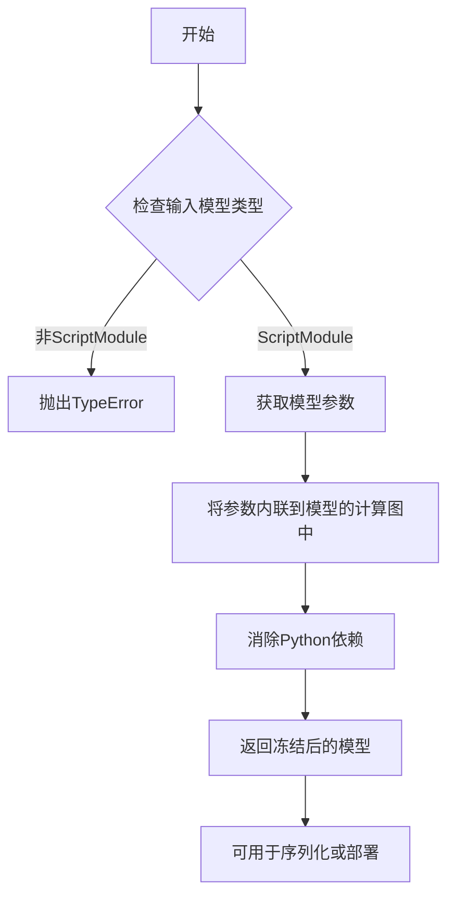

#### 带注释源码

```python
# 在 StableDiffusionIPEXPipeline.prepare_for_ipex 方法中使用 torch.jit.freeze
# 以下是完整的使用上下文：

# 1. 对 UNet 模型进行 JIT 跟踪
# trace unet model to get better performance on IPEX
with torch.cpu.amp.autocast(enabled=dtype == torch.bfloat16), torch.no_grad():
    # torch.jit.trace: 将 Python 函数/模块跟踪并转换为 TorchScript
    unet_trace_model = torch.jit.trace(
        self.unet,                           # 要跟踪的模型
        unet_input_example,                   # 示例输入
        check_trace=False,                    # 不检查跟踪正确性
        strict=False                          # 不使用严格模式
    )
    # torch.jit.freeze: 冻结跟踪后的模型
    # - 将模型参数内联到计算图中
    # - 消除对原始 Python 对象的依赖
    # - 使模型可以序列化并独立部署
    unet_trace_model = torch.jit.freeze(unet_trace_model)
# 将冻结后的模型的 forward 方法替换原始模型的 forward
self.unet.forward = unet_trace_model.forward

# 2. 对 VAE Decoder 模型进行类似的处理
# trace vae.decoder model to get better performance on IPEX
with torch.cpu.amp.autocast(enabled=dtype == torch.bfloat16), torch.no_grad():
    ave_decoder_trace_model = torch.jit.trace(
        self.vae.decoder,                     # VAE 解码器模型
        vae_decoder_input_example,             # 示例输入
        check_trace=False,
        strict=False
    )
    # 冻结 VAE Decoder 模型
    ave_decoder_trace_model = torch.jit.freeze(ave_decoder_trace_model)
# 替换 VAE Decoder 的 forward 方法
self.vae.decoder.forward = ave_decoder_trace_model.forward

# torch.jit.freeze 的主要作用：
# 1. 内联参数：将 tensor 参数直接嵌入到计算图中
# 2. 消除依赖：移除对原始模块的引用，减少 Python 开销
# 3. 优化推理：冻结后的模型可以进行进一步的 JIT 优化
# 4. 便于部署：生成的模型可以序列化保存，不依赖原始代码
```


### `StableDiffusionIPEXPipeline.__init__`

初始化用于 Intel Extension for PyTorch (IPEX) 的 Stable Diffusion 管道。该方法继承自 `DiffusionPipeline`，负责配置和管理 Stable Diffusion 模型的所有核心组件（VAE、文本编码器、U-Net、调度器等），并进行版本兼容性检查和配置修复。

参数：

-  `vae`：`AutoencoderKL`，变分自编码器模型，用于在潜在表示和图像之间进行编码和解码
-  `text_encoder`：`CLIPTextModel`，冻结的文本编码器，Stable Diffusion 使用 CLIP 的文本部分
-  `tokenizer`：`CLIPTokenizer`，CLIP 标记器，用于将文本转换为标记
-  `unet`：`UNet2DConditionModel`，条件 U-Net 架构，用于对编码后的图像潜在表示进行去噪
-  `scheduler`：`KarrasDiffusionSchedulers`，与 `unet` 结合使用以对图像潜在表示进行去噪的调度器
-  `safety_checker`：`StableDiffusionSafetyChecker`，分类模块，用于评估生成的图像是否包含令人反感或有害的内容
-  `feature_extractor`：`CLIPImageProcessor`，从生成的图像中提取特征的模型，作为 `safety_checker` 的输入
-  `requires_safety_checker`：`bool`，是否需要安全检查器，默认为 True

返回值：无（`None`），构造函数不返回值，仅初始化对象状态

#### 流程图

```mermaid
flowchart TD
    A[开始 __init__] --> B[调用父类 super().__init__]
    B --> C{scheduler.config.steps_offset != 1?}
    C -->|是| D[发出弃用警告并修复 steps_offset=1]
    C -->|否| E{scheduler.config.clip_sample == True?}
    D --> E
    E -->|是| F[发出弃用警告并设置 clip_sample=False]
    E -->|否| G{safety_checker is None 且 requires_safety_checker?}
    F --> G
    G -->|是| H[发出安全检查器禁用警告]
    G -->|否| I{safety_checker is not None 且 feature_extractor is None?}
    H --> J
    I -->|是| K[抛出 ValueError 异常]
    I -->|否| J{unet 版本 < 0.9.0 且 sample_size < 64?}
    K --> J
    J -->|是| L[发出弃用警告并设置 sample_size=64]
    J -->|否| M[调用 register_modules 注册所有模块]
    M --> N[计算 vae_scale_factor]
    N --> O[调用 register_to_config 保存 requires_safety_checker]
    O --> P[结束 __init__]
```

#### 带注释源码

```python
def __init__(
    self,
    vae: AutoencoderKL,
    text_encoder: CLIPTextModel,
    tokenizer: CLIPTokenizer,
    unet: UNet2DConditionModel,
    scheduler: KarrasDiffusionSchedulers,
    safety_checker: StableDiffusionSafetyChecker,
    feature_extractor: CLIPImageProcessor,
    requires_safety_checker: bool = True,
):
    """初始化 StableDiffusionIPEXPipeline 的所有核心组件"""
    # 调用父类 DiffusionPipeline 的初始化方法
    super().__init__()

    # ========== 步骤 1: 检查并修复 scheduler 配置 ==========
    # 检查 scheduler 的 steps_offset 配置是否正确（应为1）
    if scheduler is not None and getattr(scheduler.config, "steps_offset", 1) != 1:
        deprecation_message = (
            f"The configuration file of this scheduler: {scheduler} is outdated. `steps_offset`"
            f" should be set to 1 instead of {scheduler.config.steps_offset}. Please make sure "
            "to update the config accordingly as leaving `steps_offset` might led to incorrect results"
            " in future versions. If you have downloaded this checkpoint from the Hugging Face Hub,"
            " it would be very nice if you could open a Pull request for the `scheduler/scheduler_config.json`"
            " file"
        )
        deprecate("steps_offset!=1", "1.0.0", deprecation_message, standard_warn=False)
        new_config = dict(scheduler.config)
        new_config["steps_offset"] = 1
        scheduler._internal_dict = FrozenDict(new_config)

    # 检查 scheduler 的 clip_sample 配置（应为 False）
    if scheduler is not None and getattr(scheduler.config, "clip_sample", False) is True:
        deprecation_message = (
            f"The configuration file of this scheduler: {scheduler} has not set the configuration `clip_sample`."
            " `clip_sample` should be set to False in the configuration file. Please make sure to update the"
            " config accordingly as not setting `clip_sample` in the config might lead to incorrect results in"
            " future versions. If you have downloaded this checkpoint from the Hugging Face Hub, it would be very"
            " nice if you could open a Pull request for the `scheduler/scheduler_config.json` file"
        )
        deprecate("clip_sample not set", "1.0.0", deprecation_message, standard_warn=False)
        new_config = dict(scheduler.config)
        new_config["clip_sample"] = False
        scheduler._internal_dict = FrozenDict(new_config)

    # ========== 步骤 2: 检查安全检查器配置 ==========
    # 如果 safety_checker 为 None 但 requires_safety_checker 为 True，发出警告
    if safety_checker is None and requires_safety_checker:
        logger.warning(
            f"You have disabled the safety checker for {self.__class__} by passing `safety_checker=None`. Ensure"
            " that you abide to the conditions of the Stable Diffusion license and do not expose unfiltered"
            " results in services or applications open to the public. Both the diffusers team and Hugging Face"
            " strongly recommend to keep the safety filter enabled in all public facing circumstances, disabling"
            " it only for use-cases that involve analyzing network behavior or auditing its results. For more"
            " information, please have a look at https://github.com/huggingface/diffusers/pull/254 ."
        )

    # 如果提供了 safety_checker 但没有 feature_extractor，抛出错误
    if safety_checker is not None and feature_extractor is None:
        raise ValueError(
            "Make sure to define a feature extractor when loading {self.__class__} if you want to use the safety"
            " checker. If you do not want to use the safety checker, you can pass `'safety_checker=None'` instead."
        )

    # ========== 步骤 3: 检查并修复 UNet 配置 ==========
    # 检查 UNet 版本是否小于 0.9.0 且 sample_size 小于 64
    is_unet_version_less_0_9_0 = (
        unet is not None
        and hasattr(unet.config, "_diffusers_version")
        and version.parse(version.parse(unet.config._diffusers_version).base_version) < version.parse("0.9.0.dev0")
    )
    is_unet_sample_size_less_64 = (
        unet is not None and hasattr(unet.config, "sample_size") and unet.config.sample_size < 64
    )
    if is_unet_version_less_0_9_0 and is_unet_sample_size_less_64:
        deprecation_message = (
            "The configuration file of the unet has set the default `sample_size` to smaller than"
            " 64 which seems highly unlikely. If your checkpoint is a fine-tuned version of any of the"
            " following: \n- CompVis/stable-diffusion-v1-4 \n- CompVis/stable-diffusion-v1-3 \n-"
            " CompVis/stable-diffusion-v1-2 \n- CompVis/stable-diffusion-v1-1 \n- stable-diffusion-v1-5/stable-diffusion-v1-5"
            " \n- stable-diffusion-v1-5/stable-diffusion-inpainting \n you should change 'sample_size' to 64 in the"
            " configuration file. Please make sure to update the config accordingly as leaving `sample_size=32`"
            " in the config might lead to incorrect results in future versions. If you have downloaded this"
            " checkpoint from the Hugging Face Hub, it would be very nice if you could open a Pull request for"
            " the `unet/config.json` file"
        )
        deprecate("sample_size<64", "1.0.0", deprecation_message, standard_warn=False)
        new_config = dict(unet.config)
        new_config["sample_size"] = 64
        unet._internal_dict = FrozenDict(new_config)

    # ========== 步骤 4: 注册所有模块 ==========
    # 将所有模型组件注册到管道中，便于保存和加载
    self.register_modules(
        vae=vae,
        text_encoder=text_encoder,
        tokenizer=tokenizer,
        unet=unet,
        scheduler=scheduler,
        safety_checker=safety_checker,
        feature_extractor=feature_extractor,
    )

    # ========== 步骤 5: 计算 VAE 缩放因子 ==========
    # 根据 VAE 的 block_out_channels 计算缩放因子，用于确定潜在空间的尺寸
    self.vae_scale_factor = 2 ** (len(self.vae.config.block_out_channels) - 1) if getattr(self, "vae", None) else 8

    # ========== 步骤 6: 注册配置参数 ==========
    # 将 requires_safety_checker 保存到配置中
    self.register_to_config(requires_safety_checker=requires_safety_checker)
```


### StableDiffusionIPEXPipeline.get_input_example

该方法用于为IPEX优化准备输入样本，通过编码提示词、准备潜在变量并构建UNet和VAE解码器的输入示例，以便后续进行模型追踪和优化。

参数：

- `prompt`：`Union[str, List[str], None]`，用于指导图像生成的文本提示，可为单个字符串或字符串列表
- `height`：`Optional[int]`，生成图像的高度，默认为None，会使用UNet配置和VAE比例因子计算
- `width`：`Optional[int]`，生成图像的宽度，默认为None，会使用UNet配置和VAE比例因子计算
- `guidance_scale`：`float`，引导比例，类似于Imagen论文中的guidance weight w，默认为7.5
- `num_images_per_prompt`：`int`，每个提示词生成的图像数量，默认为1

返回值：`Tuple[Tuple[torch.Tensor, torch.Tensor, torch.Tensor], torch.Tensor]`，返回两个元素：第一个是UNet输入示例元组（latent_model_input, dummy, prompt_embeds），第二个是VAE解码器输入示例（latents）

#### 流程图

```mermaid
flowchart TD
    A[开始 get_input_example] --> B[初始化默认变量]
    B --> C{检查height和width是否为空}
    C -->|是| D[使用unet.config.sample_size \* vae_scale_factor计算默认值]
    C -->|否| E[使用传入的height和width]
    D --> F[调用check_inputs验证输入参数]
    E --> F
    F --> G{判断prompt类型}
    G -->|str| H[batch_size = 1]
    G -->|list| I[batch_size = len(prompt)]
    H --> J[设置device为cpu]
    I --> J
    J --> K{判断guidance_scale > 1.0}
    K -->|是| L[do_classifier_free_guidance = True]
    K -->|否| M[do_classifier_free_guidance = False]
    L --> N[调用_encode_prompt编码提示词]
    M --> N
    N --> O[调用prepare_latents准备潜在变量]
    O --> P{判断是否需要classifier_free_guidance}
    P -->|是| Q[latent_model_input = torch.cat([latents] \* 2)]
    P -->|否| R[latent_model_input = latents]
    Q --> S[调用scheduler.scale_model_input进行缩放]
    R --> S
    S --> T[构建unet_input_example元组]
    T --> U[构建vae_decoder_input_example]
    U --> V[返回unet_input_example和vae_decoder_input_example]
```

#### 带注释源码

```python
def get_input_example(self, prompt, height=None, width=None, guidance_scale=7.5, num_images_per_prompt=1):
    """
    为IPEX优化准备输入样本
    
    参数:
        prompt: 文本提示词，可以是字符串或字符串列表
        height: 生成图像的高度
        width: 生成图像的宽度
        guidance_scale: 引导比例，用于控制文本引导强度
        num_images_per_prompt: 每个提示词生成的图像数量
    
    返回:
        tuple: (unet_input_example, vae_decoder_input_example)
    """
    # 初始化默认变量
    prompt_embeds = None
    negative_prompt_embeds = None
    negative_prompt = None
    callback_steps = 1
    generator = None
    latents = None

    # 0. 使用UNet配置设置默认高度和宽度
    # 如果未提供height/width，则使用unet的sample_size乘以vae_scale_factor计算
    height = height or self.unet.config.sample_size * self.vae_scale_factor
    width = width or self.unet.config.sample_size * self.vae_scale_factor

    # 1. 检查输入参数的有效性
    # 验证prompt、height、width、callback_steps等参数是否符合要求
    self.check_inputs(
        prompt, height, width, callback_steps, negative_prompt, prompt_embeds, negative_prompt_embeds
    )

    # 2. 定义调用参数
    # 根据prompt类型确定batch_size
    if prompt is not None and isinstance(prompt, str):
        batch_size = 1
    elif prompt is not None and isinstance(prompt, list):
        batch_size = len(prompt)

    # 设置设备为cpu（IPEX主要针对CPU优化）
    device = "cpu"
    # guidance_scale定义类似于Imagen论文中的guidance weight w
    # guidance_scale = 1 表示不进行classifier free guidance
    do_classifier_free_guidance = guidance_scale > 1.0

    # 3. 编码输入提示词
    # 调用_encode_prompt方法将文本转换为embedding
    prompt_embeds = self._encode_prompt(
        prompt,
        device,
        num_images_per_prompt,
        do_classifier_free_guidance,
        negative_prompt,
        prompt_embeds=prompt_embeds,
        negative_prompt_embeds=negative_prompt_embeds,
    )

    # 5. 准备潜在变量
    # 生成初始噪声 latent，用于后续去噪过程
    latents = self.prepare_latents(
        batch_size * num_images_per_prompt,  # 总batch大小
        self.unet.config.in_channels,        # UNet输入通道数
        height,
        width,
        prompt_embeds.dtype,
        device,
        generator,
        latents,
    )
    
    # 创建dummy tensor用于scheduler
    dummy = torch.ones(1, dtype=torch.int32)
    
    # 如果使用classifier free guidance，需要复制latents
    # 这是因为需要同时处理有条件和无条件两种情况
    latent_model_input = torch.cat([latents] * 2) if do_classifier_free_guidance else latents
    
    # 使用scheduler缩放模型输入
    latent_model_input = self.scheduler.scale_model_input(latent_model_input, dummy)

    # 构建UNet输入示例元组
    # 包含: 缩放后的latent输入、timestep dummy、文本embeddings
    unet_input_example = (latent_model_input, dummy, prompt_embeds)
    
    # 构建VAE解码器输入示例
    # 仅需要原始latents
    vae_decoder_input_example = latents

    return unet_input_example, vae_decoder_input_example
```


### `StableDiffusionIPEXPipeline.prepare_for_ipex`

该方法用于将 Stable Diffusion 管道准备在 Intel IPEX (Intel Extension for PyTorch) 上运行，通过将模型转换为 channels_last 内存格式、使用 IPEX 优化器进行优化，并对 UNet 和 VAE 解码器进行 JIT trace 冻结，以提升在 Intel 硬件上的推理性能。

参数：

- `promt`：`Union[str, List[str]]`，输入提示词（注意：代码中存在拼写错误，原应为 `prompt`）
- `dtype`：`torch.dtype`，数据类型，支持 `torch.float32` 或 `torch.bfloat16`，默认为 `torch.float32`
- `height`：`Optional[int]`，生成图像的高度，默认为 None
- `width`：`Optional[int]`，生成图像的宽度，默认为 None
- `guidance_scale`：`float`，分类器自由引导比例，默认为 7.5

返回值：`None`，该方法直接修改管道实例的状态，无返回值

#### 流程图

```mermaid
flowchart TD
    A[开始] --> B[将UNet转换为channels_last内存格式]
    B --> C[将VAE解码器转换为channels_last内存格式]
    C --> D[将Text Encoder转换为channels_last内存格式]
    D --> E{安全检查器是否存在?}
    E -->|是| F[将安全检查器转换为channels_last内存格式]
    E -->|否| G[调用get_input_example获取输入示例]
    F --> G
    G --> H{dtype == torch.bfloat16?}
    H -->|是| I[使用ipex.optimize优化UNet为bfloat16]
    I --> J[使用ipex.optimize优化VAE解码器为bfloat16]
    J --> K[使用ipex.optimize优化Text Encoder为bfloat16]
    K --> L{安全检查器是否存在?}
    L -->|是| M[使用ipex.optimize优化安全检查器为bfloat16]
    L -->|否| N[进行UNet的JIT Trace和Freeze]
    M --> N
    H -->|否| O{dtype == torch.float32?}
    O -->|是| P[使用ipex.optimize优化UNet为float32<br/>启用weights_prepack]
    P --> Q[使用ipex.optimize优化VAE解码器为float32<br/>启用weights_prepack]
    Q --> R[使用ipex.optimize优化Text Encoder为float32<br/>启用weights_prepack]
    R --> S{安全检查器是否存在?}
    S -->|是| T[使用ipex.optimize优化安全检查器为float32<br/>启用weights_prepack]
    S -->|否| N
    T --> N
    O -->|否| U[抛出ValueError<br/>dtype必须是torch.bfloat16或torch.float32]
    U --> V[结束]
    N --> W[进行VAE解码器的JIT Trace和Freeze]
    M --> X[结束]
    L -->|否| X
    S -->|否| X
    
    style U fill:#ffcccc
    style V fill:#90EE90
    style X fill:#90EE90
```

#### 带注释源码

```python
def prepare_for_ipex(self, promt, dtype=torch.float32, height=None, width=None, guidance_scale=7.5):
    """
    准备IPEX优化管道
    
    参数:
        promt: 输入提示词 (注意: 代码中存在拼写错误 'promt' 而非 'prompt')
        dtype: 数据类型，torch.float32 或 torch.bfloat16
        height: 生成图像高度
        width: 生成图像宽度
        guidance_scale: 引导比例
    """
    
    # 步骤1: 将所有模型组件转换为channels_last内存格式
    # channels_last 是Intel CPU优化的内存布局，可提升推理性能
    self.unet = self.unet.to(memory_format=torch.channels_last)
    self.vae.decoder = self.vae.decoder.to(memory_format=torch.channels_last)
    self.text_encoder = self.text_encoder.to(memory_format=torch.channels_last)
    
    # 安全检查器为可选组件，需检查是否存在
    if self.safety_checker is not None:
        self.safety_checker = self.safety_checker.to(memory_format=torch.channels_last)

    # 步骤2: 获取输入示例
    # 用于后续JIT trace，需要代表性的输入形状
    unet_input_example, vae_decoder_input_example = self.get_input_example(promt, height, width, guidance_scale)

    # 步骤3: 根据dtype选择IPEX优化策略
    if dtype == torch.bfloat16:
        # BFloat16优化路径
        # 使用IPEX优化器进行bfloat16优化，inplace=True减少内存复制
        self.unet = ipex.optimize(self.unet.eval(), dtype=torch.bfloat16, inplace=True)
        self.vae.decoder = ipex.optimize(self.vae.decoder.eval(), dtype=torch.bfloat16, inplace=True)
        self.text_encoder = ipex.optimize(self.text_encoder.eval(), dtype=torch.bfloat16, inplace=True)
        
        if self.safety_checker is not None:
            self.safety_checker = ipex.optimize(self.safety_checker.eval(), dtype=torch.bfloat16, inplace=True)
            
    elif dtype == torch.float32:
        # Float32优化路径
        # 启用weights_prepack以预打包权重矩阵，提升性能
        # auto_kernel_selection=False使用手动内核选择
        self.unet = ipex.optimize(
            self.unet.eval(),
            dtype=torch.float32,
            inplace=True,
            weights_prepack=True,
            auto_kernel_selection=False,
        )
        self.vae.decoder = ipex.optimize(
            self.vae.decoder.eval(),
            dtype=torch.float32,
            inplace=True,
            weights_prepack=True,
            auto_kernel_selection=False,
        )
        self.text_encoder = ipex.optimize(
            self.text_encoder.eval(),
            dtype=torch.float32,
            inplace=True,
            weights_prepack=True,
            auto_kernel_selection=False,
        )
        
        if self.safety_checker is not None:
            self.safety_checker = ipex.optimize(
                self.safety_checker.eval(),
                dtype=torch.float32,
                inplace=True,
                weights_prepack=True,
                auto_kernel_selection=False,
            )
    else:
        # 错误处理: 仅支持bfloat16和float32
        raise ValueError(" The value of 'dtype' should be 'torch.bfloat16' or 'torch.float32' !")

    # 步骤4: 对UNet进行JIT Trace和Freeze
    # JIT trace将Python代码转换为TorchScript，提高执行效率
    # freeze进一步优化已trace的模型
    with torch.cpu.amp.autocast(enabled=dtype == torch.bfloat16), torch.no_grad():
        unet_trace_model = torch.jit.trace(self.unet, unet_input_example, check_trace=False, strict=False)
        unet_trace_model = torch.jit.freeze(unet_trace_model)
    # 替换原始forward方法为优化后的trace模型
    self.unet.forward = unet_trace_model.forward

    # 步骤5: 对VAE解码器进行JIT Trace和Freeze
    with torch.cpu.amp.autocast(enabled=dtype == torch.bfloat16), torch.no_grad():
        ave_decoder_trace_model = torch.jit.trace(
            self.vae.decoder, vae_decoder_input_example, check_trace=False, strict=False
        )
        ave_decoder_trace_model = torch.jit.freeze(ave_decoder_trace_model)
    # 替换原始forward方法为优化后的trace模型
    self.vae.decoder.forward = ave_decoder_trace_model.forward
```


### `StableDiffusionIPEXPipeline._encode_prompt`

该函数负责将文本提示词（prompt）编码为文本编码器（text encoder）可处理的隐藏状态向量（embeddings），支持批量处理、文本反转（textual inversion）以及无分类器引导（classifier-free guidance）所需的正向和负向嵌入生成。

参数：

- `self`：`StableDiffusionIPEXPipeline` 实例本身，隐式传递
- `prompt`：`str` 或 `List[str]`，要编码的文本提示词，支持单字符串或字符串列表
- `device`：`torch.device`，指定计算设备（如 CPU 或 CUDA 设备）
- `num_images_per_prompt`：`int`，每个提示词需要生成的图像数量，用于复制嵌入向量
- `do_classifier_free_guidance`：`bool`，是否启用无分类器引导，若为 `True` 则需要生成负向嵌入
- `negative_prompt`：`str` 或 `List[str]`，可选，用于引导图像生成的反向提示词
- `prompt_embeds`：`Optional[torch.Tensor]`，可选，预生成的文本嵌入，若提供则直接使用，跳过编码流程
- `negative_prompt_embeds`：`Optional[torch.Tensor]`，可选，预生成的负向文本嵌入

返回值：`torch.Tensor`，编码后的文本嵌入向量，形状为 `(batch_size * num_images_per_prompt, seq_len, hidden_dim)`，若启用 CFG 则前半部分为无条件嵌入，后半部分为条件嵌入

#### 流程图

```mermaid
flowchart TD
    A[开始 _encode_prompt] --> B{判断 prompt 类型}
    B -->|str| C[batch_size = 1]
    B -->|list| D[batch_size = len(prompt)]
    B -->|else| E[使用 prompt_embeds.shape[0]]
    C --> F{prompt_embeds 是否为 None?}
    D --> F
    E --> F
    
    F -->|是| G{检查是否需要 textual inversion}
    F -->|否| L[直接使用 prompt_embeds]
    
    G -->|是| H[调用 maybe_convert_prompt 处理多向量 token]
    G -->|否| I[跳过 textual inversion]
    
    H --> I
    I --> J[调用 tokenizer 编码 prompt]
    J --> K{检查 text_encoder 是否使用 attention_mask}
    K -->|是| M[获取 attention_mask 并移到 device]
    K -->|否| N[attention_mask = None]
    
    M --> O
    N --> O[调用 text_encoder 获取 prompt_embeds]
    O --> P[将 prompt_embeds 转换 dtype 和 device]
    P --> Q[复制 prompt_embeds 以匹配 num_images_per_prompt]
    
    L --> R{do_classifier_free_guidance 为真且 negative_prompt_embeds 为空?}
    Q --> R
    
    R -->|是| S{negative_prompt 是否为 None?}
    R -->|否| U[直接跳过负向嵌入生成]
    
    S -->|是| T[uncond_tokens = [''] * batch_size]
    S -->|否| V{negative_prompt 类型检查}
    
    T --> W[处理 uncond_tokens 并 tokenizer 编码]
    V -->|str| X[uncond_tokens = [negative_prompt]]
    V -->|list| Y[uncond_tokens = negative_prompt]
    
    X --> W
    Y --> W
    W --> Z[调用 text_encoder 获取 negative_prompt_embeds]
    Z --> AA[将 negative_prompt_embeds 复制并调整形状]
    
    AA --> AB{do_classifier_free_guidance 为真?}
    U --> AB
    
    AB -->|是| AC[拼接 negative_prompt_embeds 和 prompt_embeds]
    AB -->|否| AD[直接返回 prompt_embeds]
    
    AC --> AD
    
    AD --> AE[返回最终 embeddings]
```

#### 带注释源码

```python
def _encode_prompt(
    self,
    prompt,  # str 或 List[str]: 输入文本提示词
    device,  # torch.device: 计算设备
    num_images_per_prompt,  # int: 每个提示词生成的图像数量
    do_classifier_free_guidance,  # bool: 是否启用无分类器引导
    negative_prompt=None,  # Optional[str 或 List[str]]: 反向引导提示词
    prompt_embeds: Optional[torch.Tensor] = None,  # Optional[torch.Tensor]: 预计算的提示词嵌入
    negative_prompt_embeds: Optional[torch.Tensor] = None,  # Optional[torch.Tensor]: 预计算的反向提示词嵌入
):
    r"""
    Encodes the prompt into text encoder hidden states.

    Args:
         prompt (`str` or `List[str]`, *optional*):
            prompt to be encoded
        device: (`torch.device`):
            torch device
        num_images_per_prompt (`int`):
            number of images that should be generated per prompt
        do_classifier_free_guidance (`bool`):
            whether to use classifier free guidance or not
        negative_prompt (`str` or `List[str]`, *optional*):
            The prompt or prompts not to guide the image generation. If not defined, one has to pass
            `negative_prompt_embeds`. instead. If not defined, one has to pass `negative_prompt_embeds`. instead.
            Ignored when not using guidance (i.e., ignored if `guidance_scale` is less than `1`).
        prompt_embeds (`torch.Tensor`, *optional*):
            Pre-generated text embeddings. Can be used to easily tweak text inputs, *e.g.* prompt weighting. If not
            provided, text embeddings will be generated from `prompt` input argument.
        negative_prompt_embeds (`torch.Tensor`, *optional*):
            Pre-generated negative text embeddings. Can be used to easily tweak text inputs, *e.g.* prompt
            weighting. If not provided, negative_prompt_embeds will be generated from `negative_prompt` input
            argument.
    """
    # 1. 确定 batch_size: 根据 prompt 类型或已提供的 prompt_embeds 形状
    if prompt is not None and isinstance(prompt, str):
        batch_size = 1
    elif prompt is not None and isinstance(prompt, list):
        batch_size = len(prompt)
    else:
        batch_size = prompt_embeds.shape[0]

    # 2. 如果未提供 prompt_embeds，则从 prompt 编码生成
    if prompt_embeds is None:
        # textual inversion: process multi-vector tokens if necessary
        # 处理文本反转（textual inversion）：如果需要，转换多向量 token
        if isinstance(self, TextualInversionLoaderMixin):
            prompt = self.maybe_convert_prompt(prompt, self.tokenizer)

        # 使用 tokenizer 将文本转换为 token IDs
        text_inputs = self.tokenizer(
            prompt,
            padding="max_length",
            max_length=self.tokenizer.model_max_length,
            truncation=True,
            return_tensors="pt",
        )
        text_input_ids = text_inputs.input_ids
        
        # 同时进行不截断的编码，用于检测是否发生了截断
        untruncated_ids = self.tokenizer(prompt, padding="longest", return_tensors="pt").input_ids

        # 检测是否发生截断，并记录警告信息
        if untruncated_ids.shape[-1] >= text_input_ids.shape[-1] and not torch.equal(
            text_input_ids, untruncated_ids
        ):
            removed_text = self.tokenizer.batch_decode(
                untruncated_ids[:, self.tokenizer.model_max_length - 1 : -1]
            )
            logger.warning(
                "The following part of your input was truncated because CLIP can only handle sequences up to"
                f" {self.tokenizer.model_max_length} tokens: {removed_text}"
            )

        # 检查 text_encoder 是否支持 attention_mask
        if hasattr(self.text_encoder.config, "use_attention_mask") and self.text_encoder.config.use_attention_mask:
            attention_mask = text_inputs.attention_mask.to(device)
        else:
            attention_mask = None

        # 调用 text_encoder 获取文本嵌入
        prompt_embeds = self.text_encoder(
            text_input_ids.to(device),
            attention_mask=attention_mask,
        )
        # 提取隐藏状态（取第一个元素，因为返回的是元组）
        prompt_embeds = prompt_embeds[0]

    # 3. 将 prompt_embeds 转换为正确的 dtype 和 device
    prompt_embeds = prompt_embeds.to(dtype=self.text_encoder.dtype, device=device)

    # 4. 复制 embeddings 以匹配 num_images_per_prompt（每个提示词生成多张图像）
    bs_embed, seq_len, _ = prompt_embeds.shape
    # duplicate text embeddings for each generation per prompt, using mps friendly method
    prompt_embeds = prompt_embeds.repeat(1, num_images_per_prompt, 1)
    prompt_embeds = prompt_embeds.view(bs_embed * num_images_per_prompt, seq_len, -1)

    # 5. 如果启用 CFG 且未提供 negative_prompt_embeds，则生成无条件嵌入
    if do_classifier_free_guidance and negative_prompt_embeds is None:
        uncond_tokens: List[str]
        if negative_prompt is None:
            # 如果没有负向提示词，使用空字符串
            uncond_tokens = [""] * batch_size
        elif type(prompt) is not type(negative_prompt):
            raise TypeError(
                f"`negative_prompt` should be the same type to `prompt`, but got {type(negative_prompt)} !="
                f" {type(prompt)}."
            )
        elif isinstance(negative_prompt, str):
            uncond_tokens = [negative_prompt]
        elif batch_size != len(negative_prompt):
            raise ValueError(
                f"`negative_prompt`: {negative_prompt} has batch size {len(negative_prompt)}, but `prompt`:"
                f" {prompt} has batch size {batch_size}. Please make sure that passed `negative_prompt` matches"
                " the batch size of `prompt`."
            )
        else:
            uncond_tokens = negative_prompt

        # textual inversion: process multi-vector tokens if necessary
        # 处理负向提示词的文本反转
        if isinstance(self, TextualInversionLoaderMixin):
            uncond_tokens = self.maybe_convert_prompt(uncond_tokens, self.tokenizer)

        # 使用与 prompt_embeds 相同的长度进行编码
        max_length = prompt_embeds.shape[1]
        uncond_input = self.tokenizer(
            uncond_tokens,
            padding="max_length",
            max_length=max_length,
            truncation=True,
            return_tensors="pt",
        )

        # 获取 attention_mask
        if hasattr(self.text_encoder.config, "use_attention_mask") and self.text_encoder.config.use_attention_mask:
            attention_mask = uncond_input.attention_mask.to(device)
        else:
            attention_mask = None

        # 获取无条件嵌入
        negative_prompt_embeds = self.text_encoder(
            uncond_input.input_ids.to(device),
            attention_mask=attention_mask,
        )
        negative_prompt_embeds = negative_prompt_embeds[0]

    # 6. 如果启用 CFG，将无条件嵌入和条件嵌入拼接
    if do_classifier_free_guidance:
        # duplicate unconditional embeddings for each generation per prompt, using mps friendly method
        seq_len = negative_prompt_embeds.shape[1]

        negative_prompt_embeds = negative_prompt_embeds.to(dtype=self.text_encoder.dtype, device=device)

        negative_prompt_embeds = negative_prompt_embeds.repeat(1, num_images_per_prompt, 1)
        negative_prompt_embeds = negative_prompt_embeds.view(batch_size * num_images_per_prompt, seq_len, -1)

        # For classifier free guidance, we need to do two forward passes.
        # Here we concatenate the unconditional and text embeddings into a single batch
        # to avoid doing two forward passes
        # 将无条件嵌入（前面）和条件嵌入（后面）拼接
        prompt_embeds = torch.cat([negative_prompt_embeds, prompt_embeds])

    # 7. 返回最终编码后的 embeddings
    return prompt_embeds
```


### `StableDiffusionIPEXPipeline.run_safety_checker`

该方法是Stable Diffusion IPEX流水线中的安全检查器，用于在图像生成后检测生成图像是否包含不适内容（如NSFW概念），通过调用`feature_extractor`提取图像特征并由`safety_checker`进行分类判断，确保输出内容符合安全标准。

参数：

- `image`：`torch.Tensor`，待检查的图像张量，通常为生成后的图像数据
- `device`：`torch.device`，指定执行检查的设备（如CPU或CUDA设备）
- `dtype`：`torch.dtype`，指定计算使用的数据类型（如float32或bfloat16）

返回值：`Tuple[torch.Tensor, Optional[torch.Tensor]]`，返回检查后的图像张量和一个布尔张量（has_nsfw_concept），表示图像是否包含不安全内容；若`safety_checker`为None，则返回原图像和None。

#### 流程图

```mermaid
flowchart TD
    A[开始 run_safety_checker] --> B{safety_checker 是否存在?}
    B -->|是| C[调用 feature_extractor 将图像转为 PIL]
    C --> D[提取特征并转为张量]
    D --> E[将特征张量移动到指定设备]
    E --> F[调用 safety_checker 检查图像]
    F --> G[获取检查后的图像和 NSFW 标记]
    B -->|否| H[has_nsfw_concept = None]
    G --> I[返回图像和 NSFW 标记]
    H --> I
```

#### 带注释源码

```python
def run_safety_checker(self, image, device, dtype):
    """
    运行安全检查器以检测生成图像中是否包含不适内容。
    
    Args:
        image: 生成的图像张量
        device: 执行检查的设备
        dtype: 计算使用的数据类型
    """
    # 检查安全检查器是否已加载
    if self.safety_checker is not None:
        # 将图像从 numpy 数组转换为 PIL 图像
        # 然后使用特征提取器提取特征并转换为 PyTorch 张量
        safety_checker_input = self.feature_extractor(
            self.numpy_to_pil(image), 
            return_tensors="pt"
        ).to(device)
        
        # 调用安全检查器进行 NSFW 检测
        # clip_input 使用指定的数据类型进行推理
        image, has_nsfw_concept = self.safety_checker(
            images=image, 
            clip_input=safety_checker_input.pixel_values.to(dtype)
        )
    else:
        # 如果未配置安全检查器，将 NSFW 概念标记为 None
        has_nsfw_concept = None
    
    # 返回处理后的图像和 NSFW 检测结果
    return image, has_nsfw_concept
```

#### 关键组件信息

| 组件名称 | 描述 |
|---------|------|
| `safety_checker` | StableDiffusionSafetyChecker实例，负责检测图像中的NSFW内容 |
| `feature_extractor` | CLIPImageProcessor实例，用于从图像中提取特征向量供安全检查器使用 |
| `numpy_to_pil` | 工具方法，将numpy数组格式的图像转换为PIL图像对象 |

#### 潜在的技术债务或优化空间

1. **错误处理缺失**：当前实现未对`feature_extractor`或`safety_checker`调用可能引发的异常进行捕获和处理
2. **设备一致性**：未明确验证输入图像与目标`device`的一致性，可能导致隐式数据迁移影响性能
3. **批量处理支持**：当前实现仅支持单张图像检查，未利用批量处理潜力
4. **可选组件警告**：虽然构造函数会对`requires_safety_checker=True`但`safety_checker=None`的情况发出警告，但运行时缺乏明确的日志记录

#### 其它项目

**设计目标与约束**：
- 该方法是管线推理流程的可选后处理步骤，主要目标是在图像生成后过滤不当内容
- 遵循Diffusers库的模块化设计理念，将安全检查作为独立可选组件

**错误处理与异常设计**：
- 缺少对`feature_extractor`处理失败情况的异常捕获
- 未验证输入`image`张量的有效性（如shape、dtype）
- 安全检查器返回的`has_nsfw_concept`为`None`时的语义需要调用方明确处理

**数据流与状态机**：
- 输入：生成后的图像张量（通常为decode后的latents转换而来）
- 处理流程：numpy→PIL→特征提取→安全检查→返回结果
- 输出：可能经过安全检查器处理的图像及NSFW标记

**外部依赖与接口契约**：
- 依赖`StableDiffusionSafetyChecker`模型进行NSFW检测
- 依赖`CLIPImageProcessor`进行图像特征提取
- 调用方需处理`has_nsfw_concept`为`None`的情况（当`safety_checker`未加载时）


### `StableDiffusionIPEXPipeline.decode_latents`

该方法将VAE的潜在表示（latents）解码为实际的图像数据，通过反缩放潜在变量、使用VAE解码器进行解码、归一化图像像素值到[0,1]范围，最后转换为NumPy数组格式输出。

参数：

- `latents`：`torch.Tensor`，输入的VAE潜在表示张量，通常由UNet去噪过程产生，需要经过解码才能得到最终图像

返回值：`numpy.ndarray`，解码后的图像数据，形状为(batch_size, height, width, channels)，像素值范围在[0,1]之间

#### 流程图

```mermaid
flowchart TD
    A[输入 latents 张量] --> B[反缩放 latents: latents = 1/scaling_factor \* latents]
    B --> C[VAE 解码: image = vae.decode(latents).sample]
    C --> D[图像归一化: image = (image/2 + 0.5).clamp(0, 1)]
    D --> E[转移到CPU并转换维度: image.cpu().permute(0, 2, 3, 1)]
    E --> F[转换为Float32类型和NumPy数组]
    F --> G[返回 numpy.ndarray 图像]
```

#### 带注释源码

```python
def decode_latents(self, latents):
    """
    将VAE潜在表示解码为图像
    
    参数:
        latents: VAE潜在表示张量，形状为 (batch_size, channels, height, width)
    
    返回:
        numpy.ndarray: 解码后的图像，形状为 (batch_size, height, width, channels)
    """
    # 1. 反缩放 latents
    # VAE 在编码时会将潜在表示乘以 scaling_factor，这里需要除以该值来还原
    latents = 1 / self.vae.config.scaling_factor * latents
    
    # 2. 使用 VAE 解码器将潜在表示解码为图像
    # vae.decode() 返回一个 Output 对象，包含 .sample 属性
    image = self.vae.decode(latents).sample
    
    # 3. 将图像归一化到 [0, 1] 范围
    # VAE 输出的图像值通常在 [-1, 1] 范围，通过 (image/2 + 0.5) 转换到 [0, 1]
    # .clamp(0, 1) 确保值不会超出 [0, 1] 范围
    image = (image / 2 + 0.5).clamp(0, 1)
    
    # 4. 将图像转移到 CPU 并转换为 NumPy 数组
    # .permute(0, 2, 3, 1) 将张量维度从 (B, C, H, W) 转换为 (B, H, W, C)
    # 转换为 float32 是因为这不会导致显著的性能开销，且与 bfloat16 兼容
    image = image.cpu().permute(0, 2, 3, 1).float().numpy()
    
    # 5. 返回 NumPy 数组格式的图像
    return image
```


### `StableDiffusionIPEXPipeline.prepare_extra_step_kwargs`

该方法用于为调度器的 `step` 方法准备额外的关键字参数。由于不同的调度器（如 DDIMScheduler、LMSDiscreteScheduler 等）具有不同的签名，该方法通过动态检查调度器是否接受 `eta` 和 `generator` 参数来构建相应的参数字典。

参数：

- `generator`：`Optional[Union[torch.Generator, List[torch.Generator]]]`，用于控制生成过程的随机数生成器
- `eta`：`float`，DDIM 论文中的 eta 参数，用于控制噪声水平，仅在 DDIMScheduler 中生效，其他调度器会忽略该参数

返回值：`Dict[str, Any]`，包含调度器 step 方法所需的关键字参数字典（如 `eta` 和/或 `generator`）

#### 流程图

```mermaid
flowchart TD
    A[开始 prepare_extra_step_kwargs] --> B[获取调度器 step 方法的签名]
    B --> C{调度器是否接受 eta 参数?}
    C -->|是| D[将 eta 添加到 extra_step_kwargs]
    C -->|否| E[跳过 eta]
    D --> F{调度器是否接受 generator 参数?}
    E --> F
    F -->|是| G[将 generator 添加到 extra_step_kwargs]
    F -->|否| H[跳过 generator]
    G --> I[返回 extra_step_kwargs]
    H --> I
```

#### 带注释源码

```python
def prepare_extra_step_kwargs(self, generator, eta):
    # 准备调度器步骤的额外关键字参数，因为并非所有调度器都具有相同的签名
    # eta (η) 仅与 DDIMScheduler 一起使用，对于其他调度器将被忽略。
    # eta 对应 DDIM 论文中的 η: https://huggingface.co/papers/2010.02502
    # 取值范围应为 [0, 1]
    
    # 通过 inspect 模块获取调度器 step 方法的签名参数
    accepts_eta = "eta" in set(inspect.signature(self.scheduler.step).parameters.keys())
    
    # 初始化空字典用于存储额外参数
    extra_step_kwargs = {}
    
    # 如果调度器接受 eta 参数，则将其添加到参数字典中
    if accepts_eta:
        extra_step_kwargs["eta"] = eta

    # 检查调度器是否接受 generator 参数
    accepts_generator = "generator" in set(inspect.signature(self.scheduler.step).parameters.keys())
    
    # 如果调度器接受 generator 参数，则将其添加到参数字典中
    if accepts_generator:
        extra_step_kwargs["generator"] = generator
    
    # 返回构建好的参数字典，供后续调度器 step 调用使用
    return extra_step_kwargs
```


### `StableDiffusionIPEXPipeline.check_inputs`

该方法负责验证文本到图像生成管道的输入参数是否合法，包括检查图像尺寸是否能被8整除、回调步长是否为正整数、prompt与prompt_embeds不能同时提供且必须至少提供一个、negative_prompt与negative_prompt_embeds不能同时提供，以及prompt_embeds与negative_prompt_embeds的形状必须一致。

参数：

- `prompt`：`Union[str, List[str], None]`，用户提供的文本提示，用于指导图像生成
- `height`：`int`，生成图像的高度（像素），必须能被8整除
- `width`：`int`，生成图像的宽度（像素），必须能被8整除
- `callback_steps`：`int`，回调函数的调用频率，必须为正整数
- `negative_prompt`：`Union[str, List[str], None]`，可选的负面提示，用于指导图像生成时避免的内容
- `prompt_embeds`：`Optional[torch.Tensor]`，预生成的文本嵌入向量，与prompt不能同时提供
- `negative_prompt_embeds`：`Optional[torch.Tensor]`，预生成的负面文本嵌入，与negative_prompt不能同时提供

返回值：`None`，该方法不返回任何值，主要通过抛出ValueError异常来处理无效输入

#### 流程图

```mermaid
flowchart TD
    A[开始 check_inputs] --> B{height % 8 == 0 && width % 8 == 0?}
    B -- 否 --> C[抛出 ValueError: 高度和宽度必须能被8整除]
    B -- 是 --> D{callback_steps 是正整数?}
    D -- 否 --> E[抛出 ValueError: callback_steps必须为正整数]
    D -- 是 --> F{prompt 和 prompt_embeds 都非空?}
    F -- 是 --> G[抛出 ValueError: 不能同时提供prompt和prompt_embeds]
    F -- 否 --> H{prompt 和 prompt_embeds 都为空?}
    H -- 是 --> I[抛出 ValueError: 必须提供prompt或prompt_embeds之一]
    H -- 否 --> J{prompt 是 str 或 list?}
    J -- 否 --> K[抛出 ValueError: prompt必须是str或list类型]
    J -- 是 --> L{negative_prompt 和 negative_prompt_embeds 都非空?}
    L -- 是 --> M[抛出 ValueError: 不能同时提供negative_prompt和negative_prompt_embeds]
    L -- 否 --> N{prompt_embeds 和 negative_prompt_embeds 都非空?}
    N -- 是 --> O{prompt_embeds.shape == negative_prompt_embeds.shape?}
    O -- 否 --> P[抛出 ValueError: prompt_embeds和negative_prompt_embeds形状必须一致]
    O -- 是 --> Q[验证通过，方法结束]
    C --> Q
    E --> Q
    G --> Q
    I --> Q
    K --> Q
    M --> Q
    P --> Q
```

#### 带注释源码

```python
def check_inputs(
    self,
    prompt,                      # Union[str, List[str], None]: 文本提示
    height,                      # int: 图像高度
    width,                       # int: 图像宽度
    callback_steps,              # int: 回调步长
    negative_prompt=None,        # Union[str, List[str], None]: 负面提示
    prompt_embeds=None,         # Optional[torch.Tensor]: 预生成文本嵌入
    negative_prompt_embeds=None, # Optional[torch.Tensor]: 预生成负面文本嵌入
):
    # 检查1: 验证图像尺寸是否可以被8整除
    # Stable Diffusion的VAE和UNet要求输入尺寸为8的倍数
    if height % 8 != 0 or width % 8 != 0:
        raise ValueError(f"`height` and `width` have to be divisible by 8 but are {height} and {width}.")

    # 检查2: 验证callback_steps是否为正整数
    # callback_steps用于控制回调函数的调用频率，必须为正数
    if (callback_steps is None) or (
        callback_steps is not None and (not isinstance(callback_steps, int) or callback_steps <= 0)
    ):
        raise ValueError(
            f"`callback_steps` has to be a positive integer but is {callback_steps} of type"
            f" {type(callback_steps)}."
        )

    # 检查3: prompt和prompt_embeds不能同时提供
    # 两者都是提供文本信息的方式，只能选择其中一种
    if prompt is not None and prompt_embeds is not None:
        raise ValueError(
            f"Cannot forward both `prompt`: {prompt} and `prompt_embeds`: {prompt_embeds}. Please make sure to"
            " only forward one of the two."
        )
    # 检查4: prompt和prompt_embeds必须至少提供一个
    # 文本提示是生成的必要条件
    elif prompt is None and prompt_embeds is None:
        raise ValueError(
            "Provide either `prompt` or `prompt_embeds`. Cannot leave both `prompt` and `prompt_embeds` undefined."
        )
    # 检查5: prompt的类型必须是str或list
    elif prompt is not None and (not isinstance(prompt, str) and not isinstance(prompt, list)):
        raise ValueError(f"`prompt` has to be of type `str` or `list` but is {type(prompt)}")

    # 检查6: negative_prompt和negative_prompt_embeds不能同时提供
    if negative_prompt is not None and negative_prompt_embeds is not None:
        raise ValueError(
            f"Cannot forward both `negative_prompt`: {negative_prompt} and `negative_prompt_embeds`:"
            f" {negative_prompt_embeds}. Please make sure to only forward one of the two."
        )

    # 检查7: 如果两者都提供了嵌入向量，它们的形状必须一致
    # 这是因为classifier-free guidance需要它们维度匹配
    if prompt_embeds is not None and negative_prompt_embeds is not None:
        if prompt_embeds.shape != negative_prompt_embeds.shape:
            raise ValueError(
                "`prompt_embeds` and `negative_prompt_embeds` must have the same shape when passed directly, but"
                f" got: `prompt_embeds` {prompt_embeds.shape} != `negative_prompt_embeds`"
                f" {negative_prompt_embeds.shape}."
            )
```


### `StableDiffusionIPEXPipeline.prepare_latents`

该方法用于为 Stable Diffusion 管道准备初始潜在向量（latents），即生成或处理用于去噪过程的初始噪声张量，并根据调度器的配置进行噪声尺度调整。

**参数：**

- `batch_size`：`int`，生成的图像批处理大小
- `num_channels_latents`：`int`，潜在向量的通道数，通常对应于 UNet 的输入通道数
- `height`：`int`，生成图像的高度（像素）
- `width`：`int`，生成图像的宽度（像素）
- `dtype`：`torch.dtype`，潜在向量的数据类型（如 float32、bfloat16）
- `device`：`torch.device`，潜在向量所在的设备（CPU 或 CUDA）
- `generator`：`torch.Generator` 或 `List[torch.Generator]`，可选的随机数生成器，用于确保可重复性
- `latents`：`torch.Tensor`，可选的预生成潜在向量，如果为 None 则随机生成

**返回值：** `torch.Tensor`，处理后的潜在向量张量，已按调度器要求进行噪声尺度调整

#### 流程图

```mermaid
flowchart TD
    A[开始 prepare_latents] --> B[计算潜在向量形状 shape]
    B --> C{generator 是列表且长度 != batch_size?}
    C -->|是| D[抛出 ValueError]
    C -->|否| E{latents 是否为 None?}
    E -->|是| F[使用 randn_tensor 生成随机潜在向量]
    E -->|否| G[将 latents 移动到指定设备]
    F --> H[使用调度器 init_noise_sigma 缩放初始噪声]
    G --> H
    H --> I[返回处理后的 latents]
```

#### 带注释源码

```python
def prepare_latents(self, batch_size, num_channels_latents, height, width, dtype, device, generator, latents=None):
    """
    准备用于图像生成的潜在变量（latents）。
    
    参数:
        batch_size: 批处理大小
        num_channels_latents: 潜在变量的通道数
        height: 生成图像的高度
        width: 生成图像的宽度
        dtype: 潜在变量的数据类型
        device: 潜在变量所在的设备
        generator: 随机数生成器，用于可重复生成
        latents: 可选的预生成潜在变量
    
    返回:
        处理后的潜在变量张量
    """
    # 1. 计算潜在变量的形状，考虑 VAE 缩放因子
    # 潜在空间的高度和宽度是原图像尺寸除以 vae_scale_factor
    shape = (
        batch_size,
        num_channels_latents,
        int(height) // self.vae_scale_factor,
        int(width) // self.vae_scale_factor,
    )
    
    # 2. 验证生成器列表长度与批处理大小是否匹配
    if isinstance(generator, list) and len(generator) != batch_size:
        raise ValueError(
            f"You have passed a list of generators of length {len(generator)}, but requested an effective batch"
            f" size of {batch_size}. Make sure the batch size matches the length of the generators."
        )

    # 3. 如果未提供潜在变量，则随机生成；否则使用提供的潜在变量并确保在正确设备上
    if latents is None:
        # 使用 randn_tensor 生成符合正态分布的随机噪声
        latents = randn_tensor(shape, generator=generator, device=device, dtype=dtype)
    else:
        # 将已存在的潜在变量移动到目标设备
        latents = latents.to(device)

    # 4. 根据调度器的要求缩放初始噪声
    # 不同的调度器可能需要不同的初始噪声标准差
    latents = latents * self.scheduler.init_noise_sigma
    
    return latents
```


### `StableDiffusionIPEXPipeline.__call__`

该方法是 Stable Diffusion IPEX Pipeline 的主推理入口，接收文本提示和其他生成参数，通过编码提示、准备潜在变量、执行去噪循环（包括 UNet 预测噪声并使用调度器逐步去噪）、运行安全检查器，最终返回生成的图像或包含图像与 NSFW 检测结果的输出对象。

参数：

- `prompt`：`Union[str, List[str]]`，要引导图像生成的文本提示，若未定义则需提供 `prompt_embeds`
- `height`：`Optional[int]`，生成图像的高度（像素），默认为 `self.unet.config.sample_size * self.vae_scale_factor`
- `width`：`Optional[int]`，生成图像的宽度（像素），默认为 `self.unet.config.sample_size * self.vae_scale_factor`
- `num_inference_steps`：`int`，去噪步数，默认为 50，步数越多通常图像质量越高但推理越慢
- `guidance_scale`：`float`，分类器自由引导（Classifier-Free Guidance）比例，默认为 7.5，值越大生成的图像与文本提示越相关
- `negative_prompt`：`Optional[Union[str, List[str]]]`，不引导图像生成的负面提示，用于排除不需要的元素
- `num_images_per_prompt`：`Optional[int]`，每个提示生成的图像数量，默认为 1
- `eta`：`float`，DDIM 调度器专用的 eta 参数，默认为 0.0，范围 [0, 1]
- `generator`：`Optional[Union[torch.Generator, List[torch.Generator]]]`，用于生成确定性结果的随机数生成器
- `latents`：`Optional[torch.Tensor]`，预生成的噪声潜在变量，若不提供则使用随机生成器采样
- `prompt_embeds`：`Optional[torch.Tensor]`，预生成的文本嵌入，可用于文本输入的便捷调整
- `negative_prompt_embeds`：`Optional[torch.Tensor]`，预生成的负面文本嵌入
- `output_type`：`str | None`，输出格式，可选 "pil"（PIL.Image.Image）或 "np.array"，默认为 "pil"
- `return_dict`：`bool`，是否返回 `StableDiffusionPipelineOutput` 而不是元组，默认为 True
- `callback`：`Optional[Callable[[int, int, torch.Tensor], None]]`，每 `callback_steps` 步调用的回调函数，签名为 `callback(step, timestep, latents)`
- `callback_steps`：`int`，回调函数被调用的频率，默认为 1
- `cross_attention_kwargs`：`Optional[Dict[str, Any]]`，传递给注意力处理器的关键字参数

返回值：`StableDiffusionPipelineOutput` 或 `tuple`，当 `return_dict` 为 True 时返回 `StableDiffusionPipelineOutput`（包含生成的图像列表和 NSFW 检测布尔值列表），否则返回元组 `(image, has_nsfw_concept)`

#### 流程图

```mermaid
flowchart TD
    A[开始 __call__] --> B[设置默认高度和宽度]
    B --> C{检查输入参数}
    C -->|参数错误| D[抛出 ValueError]
    C -->|参数正确| E[确定批次大小]
    E --> F[确定执行设备 device]
    F --> G[判断是否使用分类器自由引导]
    G --> H{guidance_scale > 1.0?}
    H -->|是| I[do_classifier_free_guidance = True]
    H -->|否| J[do_classifier_free_guidance = False]
    I --> K[编码输入提示 _encode_prompt]
    J --> K
    K --> L[设置调度器时间步]
    L --> M[准备潜在变量 prepare_latents]
    M --> N[准备额外调度器参数 prepare_extra_step_kwargs]
    N --> O[进入去噪循环]
    O --> P[扩展潜在变量用于分类器自由引导]
    P --> Q[缩放模型输入]
    Q --> R[UNet 预测噪声]
    R --> S{执行分类器自由引导?}
    S -->|是| T[分离无条件和文本噪声预测]
    S -->|否| U[计算引导后的噪声预测]
    T --> V[计算引导权重]
    V --> U
    U --> W[调度器步骤计算前一潜在变量]
    W --> X{是否需要回调?}
    X -->|是| Y[执行回调函数]
    X -->|否| Z{循环是否结束?}
    Y --> Z
    Z -->|否| P
    Z -->|是| AA{output_type == 'latent'?}
    AA -->|是| AB[直接返回潜在变量]
    AA -->|否| AC{output_type == 'pil'?}
    AC -->|是| AD[解码潜在变量 decode_latents]
    AC -->|否| AE[解码潜在变量 decode_latents]
    AD --> AF[运行安全检查器 run_safety_checker]
    AE --> AG[运行安全检查器 run_safety_checker]
    AF --> AH[转换为 PIL 图像]
    AG --> AI[处理最终模型卸载]
    AH --> AI
    AI --> AJ{return_dict == True?}
    AJ -->|是| AK[返回 StableDiffusionPipelineOutput]
    AJ -->|否| AL[返回元组]
    AK --> AM[结束]
    AL --> AM
    AB --> AM
```

#### 带注释源码

```python
@torch.no_grad()
@replace_example_docstring(EXAMPLE_DOC_STRING)
def __call__(
    self,
    prompt: Union[str, List[str]] = None,
    height: Optional[int] = None,
    width: Optional[int] = None,
    num_inference_steps: int = 50,
    guidance_scale: float = 7.5,
    negative_prompt: Optional[Union[str, List[str]]] = None,
    num_images_per_prompt: Optional[int] = 1,
    eta: float = 0.0,
    generator: Optional[Union[torch.Generator, List[torch.Generator]]] = None,
    latents: Optional[torch.Tensor] = None,
    prompt_embeds: Optional[torch.Tensor] = None,
    negative_prompt_embeds: Optional[torch.Tensor] = None,
    output_type: str | None = "pil",
    return_dict: bool = True,
    callback: Optional[Callable[[int, int, torch.Tensor], None]] = None,
    callback_steps: int = 1,
    cross_attention_kwargs: Optional[Dict[str, Any]] = None,
):
    r"""
    Function invoked when calling the pipeline for generation.

    Args:
        prompt (`str` or `List[str]`, *optional*):
            The prompt or prompts to guide the image generation. If not defined, one has to pass `prompt_embeds`.
            instead.
        height (`int`, *optional*, defaults to self.unet.config.sample_size * self.vae_scale_factor):
            The height in pixels of the generated image.
        width (`int`, *optional*, defaults to self.unet.config.sample_size * self.vae_scale_factor):
            The width in pixels of the generated image.
        num_inference_steps (`int`, *optional*, defaults to 50):
            The number of denoising steps. More denoising steps usually lead to a higher quality image at the
            expense of slower inference.
        guidance_scale (`float`, *optional*, defaults to 7.5):
            Guidance scale as defined in [Classifier-Free Diffusion Guidance](https://huggingface.co/papers/2207.12598).
            `guidance_scale` is defined as `w` of equation 2. of [Imagen
            Paper](https://huggingface.co/papers/2205.11487). Guidance scale is enabled by setting `guidance_scale >
            1`. Higher guidance scale encourages to generate images that are closely linked to the text `prompt`,
            usually at the expense of lower image quality.
        negative_prompt (`str` or `List[str]`, *optional*):
            The prompt or prompts not to guide the image generation. If not defined, one has to pass
            `negative_prompt_embeds`. instead. If not defined, one has to pass `negative_prompt_embeds`. instead.
            Ignored when not using guidance (i.e., ignored if `guidance_scale` is less than `1`).
        num_images_per_prompt (`int`, *optional*, defaults to 1):
            The number of images to generate per prompt.
        eta (`float`, *optional*, defaults to 0.0):
            Corresponds to parameter eta (η) in the DDIM paper: https://huggingface.co/papers/2010.02502. Only applies to
            [`schedulers.DDIMScheduler`], will be ignored for others.
        generator (`torch.Generator` or `List[torch.Generator]`, *optional*):
            One or a list of [torch generator(s)](https://pytorch.org/docs/stable/generated/torch.Generator.html)
            to make generation deterministic.
        latents (`torch.Tensor`, *optional*):
            Pre-generated noisy latents, sampled from a Gaussian distribution, to be used as inputs for image
            generation. Can be used to tweak the same generation with different prompts. If not provided, a latents
            tensor will be generated by sampling using the supplied random `generator`.
        prompt_embeds (`torch.Tensor`, *optional*):
            Pre-generated text embeddings. Can be used to easily tweak text inputs, *e.g.* prompt weighting. If not
            provided, text embeddings will be generated from `prompt` input argument.
        negative_prompt_embeds (`torch.Tensor`, *optional*):
            Pre-generated negative text embeddings. Can be used to easily tweak text inputs, *e.g.* prompt
            weighting. If not provided, negative_prompt_embeds will be generated from `negative_prompt` input
            argument.
        output_type (`str`, *optional*, defaults to `"pil"`):
            The output format of the generate image. Choose between
            [PIL](https://pillow.readthedocs.io/en/stable/): `PIL.Image.Image` or `np.array`.
        return_dict (`bool`, *optional*, defaults to `True`):
            Whether or not to return a [`~pipelines.stable_diffusion.StableDiffusionPipelineOutput`] instead of a
            plain tuple.
        callback (`Callable`, *optional*):
            A function that will be called every `callback_steps` steps during inference. The function will be
            called with the following arguments: `callback(step: int, timestep: int, latents: torch.Tensor)`.
        callback_steps (`int`, *optional*, defaults to 1):
            The frequency at which the `callback` function will be called. If not specified, the callback will be
            called at every step.
        cross_attention_kwargs (`dict`, *optional*):
            A kwargs dictionary that if specified is passed along to the `AttnProcessor` as defined under
            `self.processor` in
            [diffusers.models.attention_processor](https://github.com/huggingface/diffusers/blob/main/src/diffusers/models/attention_processor.py).

    Examples:

    Returns:
        [`~pipelines.stable_diffusion.StableDiffusionPipelineOutput`] or `tuple`:
        [`~pipelines.stable_diffusion.StableDiffusionPipelineOutput`] if `return_dict` is True, otherwise a `tuple.
        When returning a tuple, the first element is a list with the generated images, and the second element is a
        list of `bool`s denoting whether the corresponding generated image likely represents "not-safe-for-work"
        (nsfw) content, according to the `safety_checker`.
    """
    # 0. Default height and width to unet
    # 如果未提供 height 和 width，则使用 UNet 配置的 sample_size 乘以 VAE 缩放因子作为默认值
    height = height or self.unet.config.sample_size * self.vae_scale_factor
    width = width or self.unet.config.sample_size * self.vae_scale_factor

    # 1. Check inputs. Raise error if not correct
    # 验证所有输入参数的有效性，包括高度/宽度是否可被 8 整除、callback_steps 是否为正整数、
    # prompt 和 prompt_embeds 不能同时提供、negative_prompt 和 negative_prompt_embeds 不能同时提供等
    self.check_inputs(
        prompt, height, width, callback_steps, negative_prompt, prompt_embeds, negative_prompt_embeds
    )

    # 2. Define call parameters
    # 根据 prompt 类型确定批次大小：单个字符串为 1，字符串列表为列表长度，否则使用 prompt_embeds 的批次大小
    if prompt is not None and isinstance(prompt, str):
        batch_size = 1
    elif prompt is not None and isinstance(prompt, list):
        batch_size = len(prompt)
    else:
        batch_size = prompt_embeds.shape[0]

    # 获取执行设备（通常是 CUDA 设备或 CPU）
    device = self._execution_device
    # here `guidance_scale` is defined analog to the guidance weight `w` of equation (2)
    # of the Imagen paper: https://huggingface.co/papers/2205.11487 . `guidance_scale = 1`
    # corresponds to doing no classifier free guidance.
    # 判断是否需要执行分类器自由引导（CFG）：当 guidance_scale > 1.0 时启用
    do_classifier_free_guidance = guidance_scale > 1.0

    # 3. Encode input prompt
    # 调用内部方法 _encode_prompt 将文本 prompt 转换为文本嵌入向量
    # 该方法会处理文本标记化、文本编码器推理，并根据需要生成无条件嵌入用于 CFG
    prompt_embeds = self._encode_prompt(
        prompt,
        device,
        num_images_per_prompt,
        do_classifier_free_guidance,
        negative_prompt,
        prompt_embeds=prompt_embeds,
        negative_prompt_embeds=negative_prompt_embeds,
    )

    # 4. Prepare timesteps
    # 根据 num_inference_steps 设置调度器的时间步，并获取调度器的时间步序列
    self.scheduler.set_timesteps(num_inference_steps, device=device)
    timesteps = self.scheduler.timesteps

    # 5. Prepare latent variables
    # 获取 UNet 输入通道数，通常为 4（对应潜在空间的 4 个通道）
    num_channels_latents = self.unet.config.in_channels
    # 准备初始噪声潜在变量，批次大小乘以每提示图像数量
    latents = self.prepare_latents(
        batch_size * num_images_per_prompt,
        num_channels_latents,
        height,
        width,
        prompt_embeds.dtype,
        device,
        generator,
        latents,
    )

    # 6. Prepare extra step kwargs. TODO: Logic should ideally just be moved out of the pipeline
    # 准备调度器步骤的额外参数，如 eta（仅 DDIM 调度器使用）和 generator
    extra_step_kwargs = self.prepare_extra_step_kwargs(generator, eta)

    # 7. Denoising loop
    # 计算预热步数（用于进度条显示）
    num_warmup_steps = len(timesteps) - num_inference_steps * self.scheduler.order
    # 创建进度条用于显示去噪进度
    with self.progress_bar(total=num_inference_steps) as progress_bar:
        # 遍历每个时间步进行去噪
        for i, t in enumerate(timesteps):
            # expand the latents if we are doing classifier free guidance
            # 如果启用 CFG，将潜在变量复制两份（一份无条件，一份有条件）
            latent_model_input = torch.cat([latents] * 2) if do_classifier_free_guidance else latents
            # 调度器缩放模型输入（将噪声时间步纳入考虑）
            latent_model_input = self.scheduler.scale_model_input(latent_model_input, t)

            # predict the noise residual
            # 使用 UNet 预测噪声残差，返回字典包含 'sample' 键
            noise_pred = self.unet(latent_model_input, t, encoder_hidden_states=prompt_embeds)["sample"]

            # perform guidance
            # 如果启用 CFG，将噪声预测分为无条件预测和文本条件预测，然后应用引导权重
            if do_classifier_free_guidance:
                noise_pred_uncond, noise_pred_text = noise_pred.chunk(2)
                noise_pred = noise_pred_uncond + guidance_scale * (noise_pred_text - noise_pred_uncond)

            # compute the previous noisy sample x_t -> x_t-1
            # 调用调度器的 step 方法，根据预测的噪声计算前一时间步的潜在变量
            latents = self.scheduler.step(noise_pred, t, latents, **extra_step_kwargs).prev_sample

            # call the callback, if provided
            # 在适当的步数调用回调函数（如果有提供）
            if i == len(timesteps) - 1 or ((i + 1) > num_warmup_steps and (i + 1) % self.scheduler.order == 0):
                progress_bar.update()
                if callback is not None and i % callback_steps == 0:
                    step_idx = i // getattr(self.scheduler, "order", 1)
                    callback(step_idx, t, latents)

    # 8. Post-processing
    # 根据 output_type 处理输出
    if output_type == "latent":
        # 如果只需要潜在变量（用于后续处理），直接返回
        image = latents
        has_nsfw_concept = None
    elif output_type == "pil":
        # 解码潜在变量到图像空间
        image = self.decode_latents(latents)

        # 9. Run safety checker
        # 运行安全检查器检测 NSFW 内容
        image, has_nsfw_concept = self.run_safety_checker(image, device, prompt_embeds.dtype)

        # 10. Convert to PIL
        # 将 numpy 数组转换为 PIL 图像
        image = self.numpy_to_pil(image)
    else:
        # 其他 output_type（如 "np"）
        # 解码潜在变量到图像空间
        image = self.decode_latents(latents)

        # 运行安全检查器
        image, has_nsfw_concept = self.run_safety_checker(image, device, prompt_embeds.dtype)

    # Offload last model to CPU
    # 如果存在最终卸载钩子，将模型卸载到 CPU 以释放 GPU 内存
    if hasattr(self, "final_offload_hook") and self.final_offload_hook is not None:
        self.final_offload_hook.offload()

    # 返回结果
    if not return_dict:
        return (image, has_nsfw_concept)

    # 返回结构化输出对象
    return StableDiffusionPipelineOutput(images=image, nsfw_content_detected=has_nsfw_concept)
```

## 关键组件


### StableDiffusionIPEXPipeline

主pipeline类，集成了Stable Diffusion模型（VAE、text_encoder、unet、scheduler、safety_checker、feature_extractor），专门针对Intel Extension for PyTorch进行优化，支持float32和bfloat16两种精度推理。

### 张量索引与惰性加载

通过`get_input_example`方法获取模型输入示例，用于后续的JIT追踪。该方法处理prompt编码、latents准备、guidance_scale计算等，为模型提供惰性加载的输入示例，避免一次性加载所有数据到内存。

### 反量化支持

在`prepare_for_ipex`方法中，根据dtype参数（torch.bfloat16或torch.float32）选择不同的IPEX优化策略。bfloat16使用自动核选择，而float32则启用weights_prepack和关闭auto_kernel_selection，实现灵活的反量化支持。

### 量化策略

通过`ipex.optimize()`对unet、vae.decoder、text_encoder进行量化优化。float32模式下使用weights_prepack=True预先打包权重以提升性能；bfloat16模式下则启用自动核选择。模型通过`torch.jit.trace`和`torch.jit.freeze`进行追踪和冻结，实现进一步的推理优化。

### 模型追踪与冻结

`prepare_for_ipex`方法中使用torch.jit.trace对unet和vae.decoder进行追踪，然后使用torch.jit.freeze冻结模型，替换原始的forward方法，实现JIT编译优化，提升推理性能。

### 内存格式转换

在`prepare_for_ipex`中将unet、vae.decoder、text_encoder等模型转换为channels_last内存格式，优化Intel架构上的卷积运算性能。

### 文本编码与Classifier-Free Guidance

`_encode_prompt`方法处理文本到embedding的转换，支持prompt加权、negative_prompt引导，并实现classifier-free guidance的双向embedding拼接（unconditional + text embedding）。

### 安全检查机制

`run_safety_checker`方法使用feature_extractor提取图像特征，通过safety_checker检测NSFW内容，返回处理后的图像和NSFW标记。

### 潜在表示解码

`decode_latents`方法将VAE潜在表示解码为图像，执行scaling_factor反缩放、归一化处理，并转换为numpy数组格式。

### 调度器集成与去噪循环

`__call__`方法实现完整的Stable Diffusion推理流程，包括timestep设置、latents准备、噪声预测、classifier-free guidance计算、调度器step更新，以及可选的callback机制。

### 输入验证与错误处理

`check_inputs`方法验证prompt、height、width、callback_steps等参数的有效性，确保输入符合pipeline要求并抛出相应的ValueError异常。


## 问题及建议


### 已知问题

- **参数拼写错误**：`prepare_for_ipex`方法中参数名为`promt`，应该是`prompt`，这可能导致调用时出现混淆。
- **变量命名不一致**：`prepare_for_ipex`方法中使用了`ave_decoder_trace_model`，应该是`vae_decoder_trace_model`（少了一个字母"v"）。
- **缺少输入验证**：`prepare_for_ipex`方法没有对`height`、`width`等参数进行验证，可能导致后续操作失败。
- **不支持其他dtype**：代码仅支持`torch.float32`和`torch.bfloat16`两种dtype，其他dtype会抛出异常，扩展性受限。
- **trace潜在风险**：使用`torch.jit.trace`时设置`check_trace=False, strict=False`，可能隐藏模型trace失败的问题，导致运行时出现意外行为。
- **重复代码模式**：`prepare_for_ipex`方法中对unet、vae.decoder、text_encoder、safety_checker的IPEX优化逻辑重复度高，可通过循环或抽象方法简化。
- **直接修改forward方法**：通过赋值`self.unet.forward = unet_trace_model.forward`来替换forward方法，这种方式不够优雅，可能影响其他依赖原始forward的代码。
- **hardcoded的tensor**：`get_input_example`方法中使用`torch.ones(1, dtype=torch.int32)`作为dummy timestep，缺乏灵活性。
- **device硬编码**：`get_input_example`方法中device被硬编码为`"cpu"`，不支持动态设备分配。
- **缺失可选组件空值处理**：虽然`safety_checker`和`feature_extractor`是可选组件，但某些方法（如`run_safety_checker`）假设它们存在而未做完整空值检查。

### 优化建议

- 修复所有拼写错误（`promt`→`prompt`，`ave_decoder_trace_model`→`vae_decoder_trace_model`）。
- 在`prepare_for_ipex`方法中添加对`height`、`width`、`dtype`等参数的校验。
- 扩展支持的dtype范围，或至少提供更清晰的错误信息。
- 重构IPEX优化逻辑，使用循环遍历组件列表以减少代码重复。
- 考虑使用更优雅的方式替换forward方法，例如创建包装类或使用猴子补丁的替代方案。
- 将`get_input_example`方法中的硬编码值（device、dtype）提取为参数。
- 增加对trace结果的验证，确保trace成功后再使用。
- 添加更完整的文档说明IPEX优化的限制和前置条件。

## 其它


### 设计目标与约束

本Pipeline的设计目标是基于Intel Extension for PyTorch (IPEX)优化Stable Diffusion模型的推理性能，使其能在Intel硬件上实现更高效的图像生成。主要约束包括：1) 仅支持CPU推理，不支持GPU；2) 仅支持Float32和BFloat16两种精度；3) 必须先调用`prepare_for_ipex`方法进行模型优化后才能进行推理；4) 图像尺寸必须为8的倍数；5) 依赖Intel的IPEX库进行模型优化和推理加速。

### 错误处理与异常设计

本代码采用以下错误处理机制：1) 参数校验：在`check_inputs`方法中验证prompt、height、width、callback_steps等参数的有效性，不合法参数将抛出`ValueError`；2) 类型检查：在`_encode_prompt`方法中对negative_prompt和prompt的类型一致性进行检查；3) 兼容性警告：对于过时的scheduler配置，通过`deprecation_message`警告用户并自动修复；4) 安全检查器错误：当safety_checker不为None但feature_extractor为None时抛出`ValueError`；5) dtype校验：在`prepare_for_ipex`方法中仅接受torch.float32和torch.bfloat16两种dtype。

### 数据流与状态机

Pipeline的数据流如下：1) 输入阶段：接收prompt、height、width等参数；2) 编码阶段：通过CLIPTokenizer和CLIPTextModel将文本编码为embeddings；3) 潜在空间准备阶段：使用randn_tensor生成初始噪声；4) 去噪循环阶段：U-Net模型在scheduler控制下逐步去噪，每个step包含模型预测和噪声残差计算；5) 解码阶段：VAE decoder将潜在表示解码为图像；6) 安全检查阶段：使用StableDiffusionSafetyChecker检测NSFW内容；7) 输出阶段：转换为PIL图像或numpy数组。状态转换由KarrasDiffusionSchedulers控制，包括timesteps设置、模型输入缩放、噪声预测和样本更新等状态。

### 外部依赖与接口契约

主要外部依赖包括：1) `intel_extension_for_pytorch (ipex)`：用于模型优化和推理加速，提供`ipex.optimize`、`torch.jit.trace`和`torch.jit.freeze`等接口；2) `transformers`：提供CLIPTextModel、CLIPTokenizer和CLIPImageProcessor；3) `diffusers`：提供DiffusionPipeline基类、AutoencoderKL、UNet2DConditionModel、各类Scheduler和安全检查器；4) `torch`：基础深度学习框架。接口契约：1) `prepare_for_ipex`必须在推理前调用；2) `height`和`width`参数必须与`prepare_for_ipex`调用时一致；3) 使用BFloat16时需配合`torch.cpu.amp.autocast`使用。

### 性能优化策略

当前已实现的优化包括：1) 内存格式转换：将模型转换为channels_last格式以利用CPU的SIMD指令；2) IPEX优化：对unet、vae.decoder和text_encoder进行IPEX优化；3) JIT追踪：对unet和vae.decoder进行torch.jit.trace和freeze以消除Python开销；4) 权重预打包：使用weights_prepack=True加速Float32推理。潜在优化方向：1) 可添加对VAE encoder的优化；2) 可添加ONNX支持；3) 可实现批处理优化以提高吞吐量；4) 可添加动态量化支持INT8推理。

### 安全性考虑

本代码包含以下安全机制：1) NSFW内容检测：集成StableDiffusionSafetyChecker对生成的图像进行安全检查；2) 安全检查器可配置：可通过设置safety_checker=None禁用安全检查，但会输出警告；3) 敏感信息处理：所有模型推理在CPU上进行，数据不离开本地。安全建议：1) 生产环境应保持safety_checker启用；2) 应添加对用户输入的过滤和 sanitization；3) 建议添加日志审计功能以追踪潜在滥用。

### 配置管理

关键配置参数包括：1) `vae_scale_factor`：基于VAE block_out_channels计算，默认为8；2) `requires_safety_checker`：控制是否必须启用安全检查器；3) `scheduler._internal_dict`：存储scheduler配置，支持自动修复过时的steps_offset和clip_sample参数；4) `unet.config.in_channels`：U-Net输入通道数；5) `tokenizer.model_max_length`：文本编码最大长度，默认为77。配置获取方式：通过self.register_modules和self.register_to_config进行注册管理。

### 并发与线程安全

本代码的并发特性：1) Pipeline实例通常为单次使用，不支持多线程并发调用同一实例；2) 模型优化后通过torch.jit.freeze固定计算图，推理时无Python GIL竞争；3) randn_tensor生成的随机数可通过generator参数实现确定性生成；4) 建议每个线程使用独立的Pipeline实例以避免状态竞争。线程安全建议：如需多线程推理，应为每个线程创建独立的Pipeline实例。

### 版本兼容性

版本兼容性考虑：1) UNet版本检测：代码检测UNet版本是否小于0.9.0，并对sample_size<64的情况进行警告和自动修复；2) Scheduler兼容性：通过inspect.signature检查scheduler.step方法支持的参数（eta、generator等）；3) Attention Mask兼容性：根据text_encoder.config.use_attention_mask决定是否使用attention_mask；4) IPEX版本：依赖特定版本的intel_extension_for_pytorch，建议在requirements中指定版本范围。升级注意：升级diffusers版本后需重新测试IPEX优化效果。

### 使用示例与最佳实践

最佳实践包括：1) 必须先调用`prepare_for_ipex`进行模型准备；2) height和width参数在`prepare_for_ipex`和`__call__`中必须保持一致；3) 使用BFloat16时需配合torch.cpu.amp.autocast；4) 推荐使用Float32以获得更稳定的推理结果，BFloat16可提升性能但可能有精度损失；5) 大批量生成时可调整num_images_per_prompt参数；6) 可通过generator参数实现可复现的图像生成；7) 可通过callback参数实现进度监控。常见陷阱：1) 忘记调用prepare_for_ipex；2) height/width参数不一致；3) 未正确处理NSFW检测结果。


    