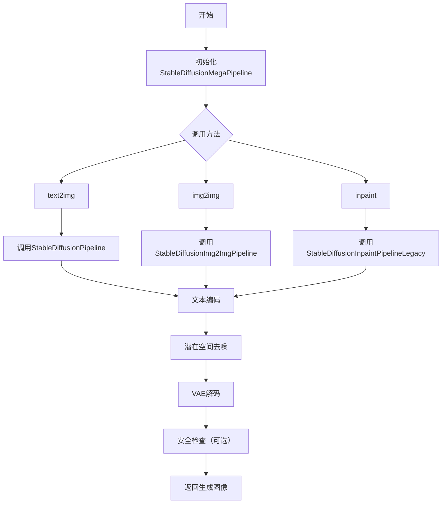
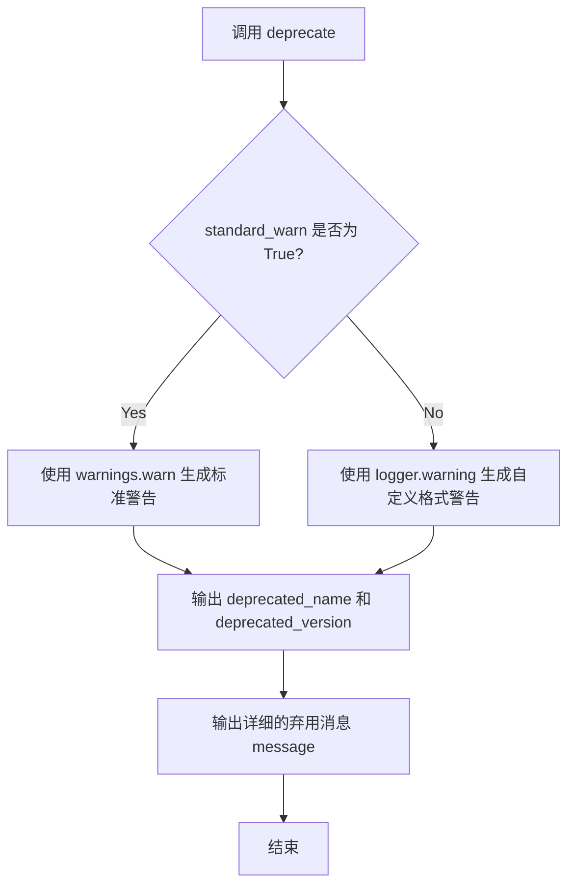
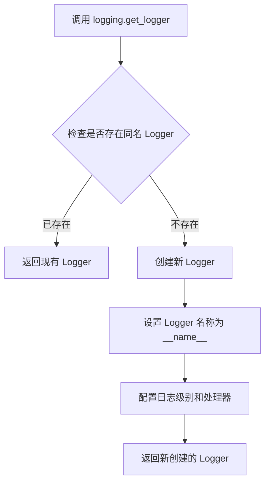
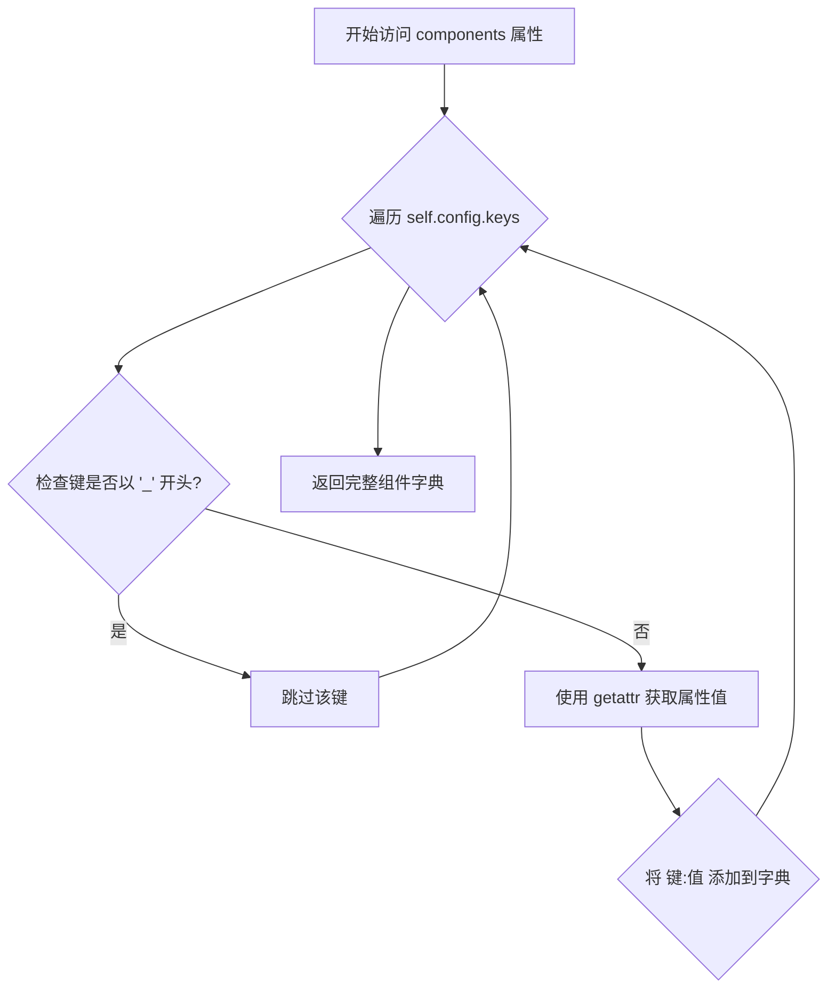
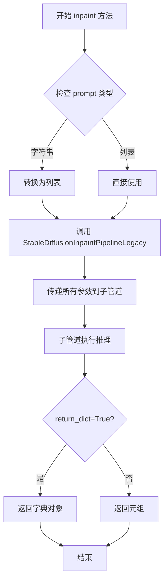
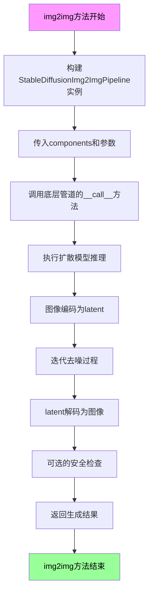
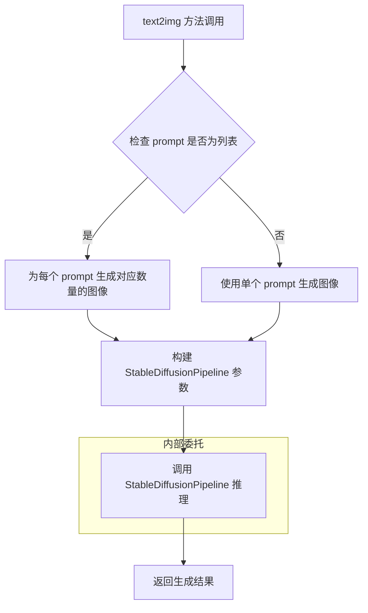

# `diffusers\examples\community\stable_diffusion_mega.py` 详细设计文档

Stable Diffusion Mega Pipeline是一个统一的图像生成管道，支持text-to-image（文本到图像）、img2img（图像到图像）和inpaint（图像修复）三种生成模式，集成了VAE、CLIP文本编码器、U-Net去噪网络和可选的安全检查器。

## 整体流程



## 类结构

```
DiffusionPipeline (基类)
└── StableDiffusionMegaPipeline
    ├── StableDiffusionPipeline (text2img)
    ├── StableDiffusionImg2ImgPipeline (img2img)
    └── StableDiffusionInpaintPipelineLegacy (inpaint)
```

## 全局变量及字段


### `logger`
    
Logger instance for capturing runtime logs, warnings, and deprecation notices.

类型：`logging.Logger`
    


### `_optional_components`
    
Class‑level list of optional pipeline components (safety_checker and feature_extractor).

类型：`List[str]`
    


### `StableDiffusionMegaPipeline.vae`
    
Variational Auto‑Encoder (VAE) used to encode images into latent space and decode latents back to images.

类型：`AutoencoderKL`
    


### `StableDiffusionMegaPipeline.text_encoder`
    
Frozen CLIP text encoder that converts textual prompts into embedding vectors for conditioning the diffusion process.

类型：`CLIPTextModel`
    


### `StableDiffusionMegaPipeline.tokenizer`
    
CLIP tokenizer that tokenizes raw text strings into token IDs for the text encoder.

类型：`CLIPTokenizer`
    


### `StableDiffusionMegaPipeline.unet`
    
Conditional U‑Net that predicts noise to be removed from latent representations guided by text embeddings.

类型：`UNet2DConditionModel`
    


### `StableDiffusionMegaPipeline.scheduler`
    
Diffusion scheduler that manages the number of inference steps and the noise schedule for denoising.

类型：`Union[DDIMScheduler, PNDMScheduler, LMSDiscreteScheduler]`
    


### `StableDiffusionMegaPipeline.safety_checker`
    
Safety‑checker model that inspects generated images and flags potentially harmful or offensive content.

类型：`StableDiffusionSafetyChecker`
    


### `StableDiffusionMegaPipeline.feature_extractor`
    
CLIP image processor that extracts visual features from images for use by the safety checker.

类型：`CLIPImageProcessor`
    


### `StableDiffusionMegaPipeline.requires_safety_checker`
    
Boolean flag indicating whether the pipeline should run the safety checker on generated images.

类型：`bool`
    


### `StableDiffusionMegaPipeline._optional_components`
    
List of optional components that may be omitted when instantiating the pipeline.

类型：`List[str]`
    
    

## 全局函数及方法


### `deprecate`

该函数是 `diffusers.utils` 模块提供的工具函数，用于向用户发出已弃用功能的警告。在 `StableDiffusionMegaPipeline.__init__` 中，当检测到 `scheduler.config.steps_offset` 不等于 1 时，会调用此函数提醒用户该配置已过时，并建议更新。

参数：

- `deprecated_name`：`str`，被弃用的配置或功能名称
- `deprecated_version`：`str`，将正式弃用该功能的版本号
- `message`：`str`，详细的弃用说明信息
- `standard_warn`：`bool`，是否使用标准警告格式，默认为 True
- `extra_warning`：（可选）额外的警告信息

返回值：`None`，该函数不返回任何值，仅输出警告信息

#### 流程图



#### 带注释源码

```python
# 该源码为基于 diffusers 库中 deprecate 函数的典型实现推断
# 实际源码位于 diffusers.utils.deprecate

def deprecate(
    deprecated_name: str,
    deprecated_version: str,
    message: str,
    standard_warn: bool = True,
    extra_warning: Optional[str] = None
):
    """
    发出已弃用功能的警告
    
    Args:
        deprecated_name: 被弃用的配置或功能名称（如 "steps_offset!=1"）
        deprecated_version: 将正式弃用该功能的版本号（如 "1.0.0"）
        message: 详细的弃用说明信息
        standard_warn: 是否使用标准警告格式
        extra_warning: 可选的额外警告信息
    """
    import warnings
    from datetime import datetime
    
    # 构建弃用警告消息
    deprecation_msg = (
        f"{deprecated_name} is deprecated and will be removed "
        f"in version {deprecated_version}. {message}"
    )
    
    if extra_warning:
        deprecation_msg += f" {extra_warning}"
    
    # 根据 standard_warn 参数选择警告方式
    if standard_warn:
        # 使用 Python 标准 warnings 模块
        warnings.warn(
            deprecation_msg,
            DeprecationWarning,
            stacklevel=3  # 提高堆栈层级以指向调用者
        )
    else:
        # 使用 diffusers 的日志记录器
        logger.warning(deprecation_msg)


# 在 StableDiffusionMegaPipeline.__init__ 中的调用示例
def __init__(self, scheduler, ...):
    # 检查 scheduler 配置
    if scheduler is not None and getattr(scheduler.config, "steps_offset", 1) != 1:
        # 构建弃用消息
        deprecation_message = (
            f"The configuration file of this scheduler: {scheduler} is outdated. "
            f"`steps_offset` should be set to 1 instead of {scheduler.config.steps_offset}. "
            "Please make sure to update the config accordingly as leaving `steps_offset` "
            "might led to incorrect results in future versions. If you have downloaded "
            "this checkpoint from the Hugging Face Hub, it would be very nice if you "
            "could open a Pull request for the `scheduler/scheduler_config.json` file"
        )
        
        # 调用 deprecate 函数发出警告
        deprecate(
            "steps_offset!=1",      # deprecated_name: 被弃用的配置
            "1.0.0",                # deprecated_version: 将在 1.0.0 版本移除
            deprecation_message,    # message: 详细说明
            standard_warn=False    # standard_warn: 使用 logger 而非 warnings
        )
        
        # 自动修复配置
        new_config = dict(scheduler.config)
        new_config["steps_offset"] = 1
        scheduler._internal_dict = FrozenDict(new_config)
```


### `logging.get_logger`

获取或创建一个与指定模块关联的日志记录器，用于在 diffusers 库中记录日志信息。

参数：

- `__name__`：`str`，通常传入 `__name__` 变量，表示调用此函数的模块名称，用于标识日志来源。

返回值：`logging.Logger`，返回一个 Python 日志记录器对象，用于记录日志信息。

#### 流程图



#### 带注释源码

```python
# 从 diffusers.utils 导入 logging 模块
from diffusers.utils import logging

# 获取当前模块的日志记录器
# __name__ 是 Python 内置变量，表示当前模块的完全限定名
# 例如：'diffusers.pipelines.stable_diffusion.mega_pipeline'
logger = logging.get_logger(__name__)  # pylint: disable=invalid-name
```

#### 补充说明

| 项目 | 说明 |
|------|------|
| **来源** | `diffusers.utils.logging` 模块 |
| **用途** | 为 diffusers 库创建模块级别的日志记录器，便于追踪库内部运行状态 |
| **日志级别** | 默认级别通常由 diffusers 库配置决定，可通过环境变量或配置调整 |
| **线程安全** | 是，Python logging 模块本身是线程安全的 |
| **常见用法** | `logger.warning("deprecated feature")`、`logger.info("loading model")` 等 |


### `StableDiffusionMegaPipeline.__init__`

该方法是StableDiffusionMegaPipeline类的构造函数，负责初始化Pipeline的所有核心组件（包括VAE、文本编码器、分词器、U-Net、调度器、安全检查器和特征提取器），并对调度器的配置进行兼容性检查与修复。

参数：

- `vae`：`AutoencoderKL`，Variational Auto-Encoder (VAE) 模型，用于将图像编码和解码到潜在表示
- `text_encoder`：`CLIPTextModel`，冻结的文本编码器，Stable Diffusion 使用 CLIP 的文本部分
- `tokenizer`：`CLIPTokenizer`，CLIPTokenizer 类的分词器
- `unet`：`UNet2DConditionModel`，条件 U-Net 架构，用于对编码后的图像潜在表示进行去噪
- `scheduler`：`Union[DDIMScheduler, PNDMScheduler, LMSDiscreteScheduler]`，与 `unet` 结合使用以对编码图像潜在表示进行去噪的调度器
- `safety_checker`：`StableDiffusionSafetyChecker`，分类模块，用于估计生成的图像是否被认为具有攻击性或有害
- `feature_extractor`：`CLIPImageProcessor`，用于从生成的图像中提取特征作为 `safety_checker` 的输入
- `requires_safety_checker`：`bool`，是否需要安全检查器，默认为 True

返回值：`None`，该方法为构造函数，不返回任何值

#### 流程图

```mermaid
flowchart TD
    A[开始 __init__] --> B[调用 super().__init__]
    B --> C{检查 scheduler.config.steps_offset != 1?}
    C -->|是| D[生成弃用警告消息]
    D --> E[创建新配置字典并将 steps_offset 设为 1]
    E --> F[更新 scheduler._internal_dict]
    F --> G[调用 register_modules 注册所有组件]
    C -->|否| G
    G --> H[调用 register_to_config 注册 requires_safety_checker]
    H --> I[结束 __init__]
```

#### 带注释源码

```python
def __init__(
    self,
    vae: AutoencoderKL,
    text_encoder: CLIPTextModel,
    tokenizer: CLIPTokenizer,
    unet: UNet2DConditionModel,
    scheduler: Union[DDIMScheduler, PNDMScheduler, LMSDiscreteScheduler],
    safety_checker: StableDiffusionSafetyChecker,
    feature_extractor: CLIPImageProcessor,
    requires_safety_checker: bool = True,
):
    """
    初始化 StableDiffusionMegaPipeline
    
    参数:
        vae: VAE模型，用于图像与潜在表示之间的编码和解码
        text_encoder: CLIP文本编码器
        tokenizer: CLIP分词器
        unet: 条件U-Net去噪模型
        scheduler: 噪声调度器
        safety_checker: 图像安全检查器
        feature_extractor: 图像特征提取器
        requires_safety_checker: 是否启用安全检查
    """
    # 调用父类 DiffusionPipeline 的初始化方法
    super().__init__()
    
    # 检查调度器的 steps_offset 配置是否为 1
    # 如果不是 1，说明配置过时，可能会导致错误结果
    if scheduler is not None and getattr(scheduler.config, "steps_offset", 1) != 1:
        # 生成弃用警告信息
        deprecation_message = (
            f"The configuration file of this scheduler: {scheduler} is outdated. `steps_offset`"
            f" should be set to 1 instead of {scheduler.config.steps_offset}. Please make sure "
            "to update the config accordingly as leaving `steps_offset` might led to incorrect results"
            " in future versions. If you have downloaded this checkpoint from the Hugging Face Hub,"
            " it would be very nice if you could open a Pull request for the `scheduler/scheduler_config.json`"
            " file"
        )
        # 发出弃用警告
        deprecate("steps_offset!=1", "1.0.0", deprecation_message, standard_warn=False)
        
        # 创建新配置并将 steps_offset 强制设为 1
        new_config = dict(scheduler.config)
        new_config["steps_offset"] = 1
        scheduler._internal_dict = FrozenDict(new_config)

    # 注册所有模块到 Pipeline
    # 使得这些组件可以通过 self.components 字典访问
    self.register_modules(
        vae=vae,
        text_encoder=text_encoder,
        tokenizer=tokenizer,
        unet=unet,
        scheduler=scheduler,
        safety_checker=safety_checker,
        feature_extractor=feature_extractor,
    )
    
    # 注册 requires_safety_checker 配置项
    self.register_to_config(requires_safety_checker=requires_safety_checker)
```


### `StableDiffusionMegaPipeline.components`

该属性是 `StableDiffusionMegaPipeline` 类的核心组件访问器，通过遍历管道配置字典，返回所有非私有组件的名称与实例映射，使用 `getattr` 动态获取属性值，从而支持将完整组件传递给子管道（如 `StableDiffusionPipeline`、`StableDiffusionImg2ImgPipeline` 等）实现功能复用。

参数： 无

返回值：`dict[str, Any]`，返回包含所有管道组件的字典，键为组件名称（字符串），值为对应的组件实例对象。

#### 流程图



#### 带注释源码

```python
@property
def components(self) -> dict[str, Any]:
    """
    返回一个包含所有管道组件的字典。
    
    该属性遍历配置中的所有键，过滤掉私有键（以 '_' 开头），
    并通过 getattr 动态获取对应的组件实例。
    
    Returns:
        dict[str, Any]: 组件名称到实例的映射字典
    """
    # 遍历配置中的所有键，过滤掉私有属性（以 '_' 开头）
    # self.config 来自 DiffusionPipeline 基类，通过 register_to_config 注册
    # 包含: vae, text_encoder, tokenizer, unet, scheduler, 
    #       safety_checker, feature_extractor, requires_safety_checker
    return {
        k: getattr(self, k)  # 动态获取同名属性值
        for k in self.config.keys()  # 遍历配置键
        if not k.startswith("_")  # 过滤私有键
    }
```


### `StableDiffusionMegaPipeline.inpaint`

该方法是 StableDiffusionMegaPipeline 类中的图像修复（inpainting）方法，通过调用内部注册的组件（VAE、文本编码器、UNet、调度器等）结合文本提示词、原始图像和掩码图像，使用 StableDiffusionInpaintPipelineLegacy 管道生成填充了指定区域的新图像。

参数：

- `prompt`：`Union[str, List[str]]`，用于引导图像生成的文本提示词，可以是单个字符串或字符串列表
- `image`：`Union[torch.Tensor, PIL.Image.Image]，需要进行修复操作的原始输入图像
- `mask_image`：`Union[torch.Tensor, PIL.Image.Image]`，标识需要修复区域的掩码图像，白色区域表示需要生成的内容
- `strength`：`float`，默认值 0.8，表示图像变化的强度，取值范围 [0, 1]
- `num_inference_steps`：`Optional[int]`，默认值 50，表示去噪推理的步数
- `guidance_scale`：`Optional[float]`，默认值 7.5，用于无分类器引导的guidance scale
- `negative_prompt`：`Optional[Union[str, List[str]]]`，可选的负面提示词，用于指定不希望出现的元素
- `num_images_per_prompt`：`Optional[int]`，默认值 1，每个提示词生成的图像数量
- `eta`：`Optional[float]`，默认值 0.0，DDIM 调度器的 eta 参数
- `generator`：`torch.Generator | None`，可选的随机生成器，用于确保可重复性
- `output_type`：`str | None`，默认值 "pil"，输出类型，可选 "pil"、"numpy" 或 "latent"
- `return_dict`：`bool`，默认值 True，是否以字典形式返回结果
- `callback`：`Optional[Callable[[int, int, torch.Tensor], None]]`，可选的回调函数，在每个推理步骤后调用
- `callback_steps`：`int`，默认值 1，回调函数调用的步长间隔

返回值：返回类型取决于 `return_dict` 参数，当 `return_dict=True` 时通常返回包含 `images` 和 `nsfw_content_detected` 等字段的字典对象；当 `return_dict=False` 时返回元组。

#### 流程图



#### 带注释源码

```python
@torch.no_grad()
def inpaint(
    self,
    prompt: Union[str, List[str]],
    image: Union[torch.Tensor, PIL.Image.Image],
    mask_image: Union[torch.Tensor, PIL.Image.Image],
    strength: float = 0.8,
    num_inference_steps: Optional[int] = 50,
    guidance_scale: Optional[float] = 7.5,
    negative_prompt: Optional[Union[str, List[str]]] = None,
    num_images_per_prompt: Optional[int] = 1,
    eta: Optional[float] = 0.0,
    generator: torch.Generator | None = None,
    output_type: str | None = "pil",
    return_dict: bool = True,
    callback: Optional[Callable[[int, int, torch.Tensor], None]] = None,
    callback_steps: int = 1,
):
    """
    执行图像修复（inpainting）操作，使用 Stable Diffusion 模型根据文本提示词填充图像中的指定区域。

    参数:
        prompt: 引导图像生成的文本提示词
        image: 输入的原始图像
        mask_image: 标识需要修复区域的掩码图像
        strength: 图像变化的强度因子
        num_inference_steps: 去噪推理的步数
        guidance_scale: 无分类器引导的强度
        negative_prompt: 负面提示词
        num_images_per_prompt: 每个提示词生成的图像数
        eta: DDIM 调度器的 eta 参数
        generator: 随机生成器用于可重复性
        output_type: 输出格式
        return_dict: 是否返回字典格式
        callback: 推理过程中的回调函数
        callback_steps: 回调调用间隔步数
    """
    # 该方法内部委托给 StableDiffusionInpaintPipelineLegacy 实现
    # 使用 self.components 获取当前管道所有的组件（vae, text_encoder, tokenizer, unet, scheduler 等）
    return StableDiffusionInpaintPipelineLegacy(**self.components)(
        prompt=prompt,
        image=image,
        mask_image=mask_image,
        strength=strength,
        num_inference_steps=num_inference_steps,
        guidance_scale=guidance_scale,
        negative_prompt=negative_prompt,
        num_images_per_prompt=num_images_per_prompt,
        eta=eta,
        generator=generator,
        output_type=output_type,
        return_dict=return_dict,
        callback=callback,
    )
```


### `StableDiffusionMegaPipeline.img2img`

该方法是`StableDiffusionMegaPipeline`类的核心方法之一，用于实现基于Stable Diffusion的图像到图像（img2img）生成功能。它接收文本提示和输入图像，通过扩散模型对图像进行风格迁移、内容替换或图像增强，最终返回生成的图像结果。

参数：

- `prompt`：`Union[str, List[str]]`，用于引导图像生成的文本提示，可以是单个字符串或字符串列表
- `image`：`Union[torch.Tensor, PIL.Image.Image]`，输入的原始图像，将被作为生成过程的起点
- `strength`：`float`，默认值为0.8，表示图像变换的强度，值越大变化越显著
- `num_inference_steps`：`Optional[int]`，默认值为50，扩散模型的推理步数，步数越多生成质量越高
- `guidance_scale`：`Optional[float]`，默认值为7.5，用于控制文本引导强度，值越大越遵循提示
- `negative_prompt`：`Optional[Union[str, List[str]]]`，用于指定不希望出现的元素
- `num_images_per_prompt`：`Optional[int]`，默认值为1，每个提示生成的图像数量
- `eta`：`Optional[float]`，默认值为0.0，DDIMScheduler的eta参数，用于控制采样随机性
- `generator`：`torch.Generator | None`，随机数生成器，用于确保结果可复现
- `output_type`：`str | None`，默认值为"pil"，输出图像的格式
- `return_dict`：`bool`，默认值为True，是否以字典形式返回结果
- `callback`：`Optional[Callable[[int, int, torch.Tensor], None]]`，用于监控生成进度的回调函数
- `callback_steps`：`int`，默认值为1，回调函数的调用频率
- `**kwargs`：额外传递给底层管道的关键字参数

返回值：`Any`，返回底层`StableDiffusionImg2ImgPipeline`的输出，通常包含生成的图像和元数据

#### 流程图



#### 带注释源码

```python
@torch.no_grad()  # 禁用梯度计算以节省显存
def img2img(
    self,
    prompt: Union[str, List[str]],  # 文本提示，引导图像生成方向
    image: Union[torch.Tensor, PIL.Image.Image],  # 输入图像，待转换的源图像
    strength: float = 0.8,  # 转换强度，0-1之间，值越大变化越剧烈
    num_inference_steps: Optional[int] = 50,  # 扩散推理步数
    guidance_scale: Optional[float] =7.5,  # Classifier-free guidance强度
    negative_prompt: Optional[Union[str, List[str]]] = None,  # 负面提示
    num_images_per_prompt: Optional[int] = 1,  # 每次提示生成的图像数
    eta: Optional[float] = 0.0,  # DDIM采样器的eta参数
    generator: torch.Generator | None = None,  # 随机数生成器
    output_type: str | None = "pil",  # 输出格式
    return_dict: bool = True,  # 是否返回字典格式
    callback: Optional[Callable[[int, int, torch.Tensor], None]] = None,  # 进度回调
    callback_steps: int = 1,  # 回调触发频率
    **kwargs,  # 额外参数透传
):
    # 文档链接：详细原理说明请参考HuggingFace官方文档
    # 调用底层StableDiffusionImg2ImgPipeline完成实际生成工作
    # 将自身组件（vae, text_encoder, tokenizer, unet, scheduler等）传递给底层管道
    return StableDiffusionImg2ImgPipeline(**self.components)(
        prompt=prompt,
        image=image,
        strength=strength,
        num_inference_steps=num_inference_steps,
        guidance_scale=guidance_scale,
        negative_prompt=negative_prompt,
        num_images_per_prompt=num_images_per_prompt,
        eta=eta,
        generator=generator,
        output_type=output_type,
        return_dict=return_dict,
        callback=callback,
        callback_steps=callback_steps,
    )
```


### `StableDiffusionMegaPipeline.text2img`

该方法是 `StableDiffusionMegaPipeline` 类的文本到图像（Text-to-Image）生成方法，通过接收文本提示（prompt）和其他生成参数（如图像尺寸、推理步数、引导尺度等），委托给内部的 `StableDiffusionPipeline` 执行实际的图像生成逻辑。该方法是一个无梯度计算的推理方法（decorated with `@torch.no_grad()`），支持多种可选参数以控制生成过程和输出格式。

参数：

- `prompt`：`Union[str, List[str]]`，文本提示，可以是单个字符串或字符串列表，用于描述期望生成的图像内容
- `height`：`int = 512`，生成图像的高度（像素），默认值为512
- `width`：`int = 512`，生成图像的宽度（像素），默认值为512
- `num_inference_steps`：`int = 50`，推理过程中的去噪步数，步数越多通常生成质量越高但耗时越长
- `guidance_scale`：`float = 7.5`，引导尺度，用于控制文本提示对生成图像的影响程度，值越大越严格遵循提示
- `negative_prompt`：`Optional[Union[str, List[str]]] = None`，负面提示，用于指定不希望出现在生成图像中的元素
- `num_images_per_prompt`：`Optional[int] = 1`，每个提示生成的图像数量
- `eta`：`float = 0.0`，DDIM采样器的eta参数，控制采样过程中的随机性，0表示确定性生成
- `generator`：`torch.Generator | None = None`，PyTorch随机数生成器，用于确保生成结果的可复现性
- `latents`：`Optional[torch.Tensor] = None`，预定义的潜在向量，用于从特定起点开始生成
- `output_type`：`str | None = "pil"`，输出类型，可选"pil"（PIL图像）、"numpy"（NumPy数组）或"pt"（PyTorch张量）
- `return_dict`：`bool = True`，是否以字典形式返回结果，True时返回包含图像和安全检查结果的元组
- `callback`：`Optional[Callable[[int, int, torch.Tensor], None]] = None`，推理过程中的回调函数，参数为步数、时间步和潜在张量
- `callback_steps`：`int = 1`，回调函数被调用的频率（每多少步调用一次）

返回值：返回 `StableDiffusionPipeline` 的输出结果，通常是包含生成图像的元组或字典，取决于 `return_dict` 参数的值

#### 流程图



#### 带注释源码

```python
@torch.no_grad()  # 禁用梯度计算以减少内存占用和提高推理速度
def text2img(
    self,
    prompt: Union[str, List[str]],  # 文本提示，支持单个字符串或字符串列表
    height: int = 512,  # 生成图像的高度，默认512像素
    width: int = 512,  # 生成图像的宽度，默认512像素
    num_inference_steps: int = 50,  # 去噪推理的步数，默认50步
    guidance_scale: float = 7.5,  # Classifier-free guidance的引导强度
    negative_prompt: Optional[Union[str, List[str]]] = None,  # 负面提示，用于排除不需要的元素
    num_images_per_prompt: Optional[int] = 1,  # 每个提示生成的图像数量
    eta: float = 0.0,  # DDIM scheduler的eta参数，0为确定性采样
    generator: torch.Generator | None = None,  # 随机数生成器，用于结果复现
    latents: Optional[torch.Tensor] = None,  # 初始潜在向量，可用于图像编辑或特定起点生成
    output_type: str | None = "pil",  # 输出格式：'pil'、'numpy'或'pt'
    return_dict: bool = True,  # 是否返回字典格式的结果
    callback: Optional[Callable[[int, int, torch.Tensor], None]] = None,  # 推理进度回调函数
    callback_steps: int = 1,  # 回调触发频率
):
    # 文档注释：关于该方法工作原理的更多信息，请访问：
    # https://huggingface.co/docs/diffusers/api/pipelines/stable_diffusion#diffusers.StableDiffusionPipeline
    
    # 该方法实际上是一个委托包装器，将所有参数传递给内部的 StableDiffusionPipeline
    # 通过 **self.components 解包当前管道实例的所有组件（vae, text_encoder, tokenizer, unet, scheduler等）
    return StableDiffusionPipeline(**self.components)(
        prompt=prompt,
        height=height,
        width=width,
        num_inference_steps=num_inference_steps,
        guidance_scale=guidance_scale,
        negative_prompt=negative_prompt,
        num_images_per_prompt=num_images_per_prompt,
        eta=eta,
        generator=generator,
        latents=latents,
        output_type=output_type,
        return_dict=return_dict,
        callback=callback,
        callback_steps=callback_steps,
    )
```

## 关键组件


### 张量索引与惰性加载

通过 `components` 属性使用 `getattr(self, k)` 动态获取组件，实现模块的惰性加载，避免在初始化时一次性加载所有模型组件。

### 组件注册系统

使用 `register_modules` 方法统一注册 vae、text_encoder、tokenizer、unet、scheduler、safety_checker、feature_extractor 等核心组件，通过配置统一管理各模块生命周期。

### 调度器兼容性检查

在初始化时检查 scheduler 的 `steps_offset` 配置，若不为 1 则自动修正并发出警告，确保与不同版本调度器的兼容性。

### 可选组件支持

通过 `_optional_components` 类变量定义 safety_checker 和 feature_extractor 为可选组件，配合 `requires_safety_checker` 配置实现条件加载。

### 多管道统一入口

提供 `inpaint`、`img2img`、`text2img` 三个方法作为统一入口，内部委托给对应的 Legacy/Img2Img/Pipeline 实现，简化用户调用逻辑。


## 问题及建议


### 已知问题

- **重复实例化问题**：在 `inpaint`、`img2img`、`text2img` 方法中，每次调用都会使用 `**self.components` 创建新的 Pipeline 实例（`StableDiffusionInpaintPipelineLegacy`、`StableDiffusionImg2ImgPipeline`、`StableDiffusionPipeline`），导致额外的内存分配和初始化开销。
- **可选组件未进行运行时检查**：虽然 `_optional_components` 定义了 `safety_checker` 和 `feature_extractor` 为可选组件，但在 `__init__` 方法中没有对它们进行 `None` 检查，可能导致运行时错误。
- **使用过时的 Inpaint Pipeline**：代码中使用的是 `StableDiffusionInpaintPipelineLegacy` 而非最新的 `StableDiffusionInpaintPipeline`，缺少新版本的优化和功能。
- **类型注解不一致**：部分参数使用了 Python 3.10+ 的联合类型语法（如 `str | None`），但其他位置仍使用 `Optional`，存在风格不一致。
- **回调机制可能存在线程安全隐患**：`callback` 参数在多线程环境下被调用，但未进行同步保护，可能导致竞态条件。
- **缺少资源释放逻辑**：Pipeline 包含大型模型（VAE、UNet、Text Encoder），但没有实现 `__del__` 或上下文管理器方法来显式释放 GPU 内存。
- **Scheduler 配置检查重复**：在 `__init__` 中对 `steps_offset` 的检查和修改逻辑较为冗余，且使用内部 `_internal_dict` 属性不够优雅。

### 优化建议

- **缓存 Pipeline 实例**：在类初始化时创建并缓存 `StableDiffusionInpaintPipelineLegacy`、`StableDiffusionImg2ImgPipeline`、`StableDiffusionPipeline` 的实例，避免重复实例化。
- **添加可选组件的运行时检查**：在使用 `safety_checker` 和 `feature_extractor` 前进行 `None` 检查，或在 `__init__` 中提供默认值。
- **升级 Inpaint Pipeline**：将 `StableDiffusionInpaintPipelineLegacy` 替换为 `StableDiffusionInpaintPipeline`，并同步更新相关文档链接。
- **统一类型注解风格**：统一使用 `typing.Optional` 或 Python 3.10+ 的联合类型语法，避免混用。
- **添加线程安全的回调机制**：使用锁保护回调调用，或提供回调队列机制。
- **实现上下文管理器**：添加 `__enter__`、`__exit__` 或 `close` 方法以显式释放资源，实现 `torch.cuda.empty_cache()` 清理 GPU 内存。
- **优化 Scheduler 配置检查**：将配置检查逻辑提取为独立方法，或使用更优雅的配置合并方式。

## 其它


### 设计目标与约束

**设计目标**：
- 提供一个统一的Stable Diffusion Mega Pipeline，支持text-to-image（文本到图像）、image-to-image（图像到图像）和inpainting（图像修复）三种生成模式
- 继承DiffusionPipeline通用接口，实现跨平台、跨设备的模型运行能力
- 通过组合现有Stable Diffusion Pipeline实现多种生成功能，降低代码重复

**设计约束**：
- 必须依赖diffusers库的核心组件（DiffusionPipeline、StableDiffusionMixin）
- scheduler必须是DDIMScheduler、PNDMScheduler或LMSDiscreteScheduler之一
- 默认输出类型为"PIL"图像格式
- 推理时强制使用torch.no_grad()以节省显存
- safety_checker和feature_extractor为可选组件

### 错误处理与异常设计

**参数校验异常**：
- scheduler的steps_offset必须为1，否则抛出deprecation警告并自动修正配置
- prompt不能为空或无效类型
- strength参数范围应为[0, 1]，否则可能导致不可预测的生成结果
- num_inference_steps必须为正整数

**运行时异常**：
- 当safety_checker未配置且requires_safety_checker=True时，可能触发安全检查相关异常
- 图像尺寸不匹配时（如width/height与输入图像尺寸不一致）可能产生异常
- GPU显存不足时会产生torch.cuda.OutOfMemoryError
- 模型组件缺失时抛出AttributeError

**异常处理策略**：
- 使用deprecation机制处理版本兼容性问题
- 通过Optional组件注册机制优雅处理可选依赖缺失
- 回调函数异常会被捕获但不会中断主流程

### 数据流与状态机

**主数据流**：
1. 输入：prompt（文本）+ 可选图像/mask + 生成参数
2. 文本编码：tokenizer + text_encoder → text_embeddings
3. 潜在空间：vae.encode() 将图像编码为latents
4. 去噪循环：unet + scheduler 迭代去噪
5. 解码：vae.decode() 将latents转回图像
6. 安全检查：safety_checker 过滤不安全输出
7. 输出：PIL.Image / numpy array / torch.Tensor

**状态机转换**：
- `__init__` → 初始化状态：所有组件加载完成
- `text2img` / `img2img` / `inpaint` → 推理状态：执行生成任务
- 推理完成 → 返回结果状态：输出生成图像

### 外部依赖与接口契约

**核心依赖**：
- `torch`：张量计算与自动求导控制
- `PIL.Image`：图像处理
- `transformers`：CLIP文本编码器和图像处理器
- `diffusers`：扩散模型核心框架

**接口契约**：
- Pipeline组件必须实现`.components`属性返回字典
- 所有推理方法必须支持`callback`回调函数机制
- 输出格式通过`output_type`参数控制（"pil"/"numpy"/"pt"）
- 所有方法必须支持`return_dict`参数以决定返回格式

**版本要求**：
- diffusers ≥ 1.0.0（用于deprecate函数）
- transformers ≥ 4.21.0（用于CLIPTokenizer）
- torch ≥ 1.9.0（用于torch.no_grad装饰器）

### 配置与可扩展性设计

**配置管理**：
- 使用FrozenDict确保配置不可变
- 通过register_modules动态注册组件
- 支持requires_safety_checker配置项控制安全检查开关

**扩展点**：
- `_optional_components`列表定义了可选组件，便于子类扩展
- components属性使用config.keys()动态获取组件列表
- 支持通过kwargs传递额外参数到底层Pipeline

### 资源管理与性能优化

**显存优化**：
- 强制使用torch.no_grad()减少梯度存储
- 支持generator参数实现确定性生成
- eta参数控制DDIM的随机性

**性能考量**：
- num_images_per_prompt支持批量生成
- callback_steps控制回调频率减少开销
- 默认512x512分辨率，符合主流GPU显存限制

### 安全性与合规性

**安全检查机制**：
- StableDiffusionSafetyChecker进行内容过滤
- feature_extractor提取图像特征供安全检查使用
- requires_safety_checker配置项可禁用安全检查（需自行承担风险）

**合规性**：
- 继承Stable Diffusion原始模型许可证限制
- 生成的图像应遵守当地法律法规
- 建议在生产环境中启用安全检查

    