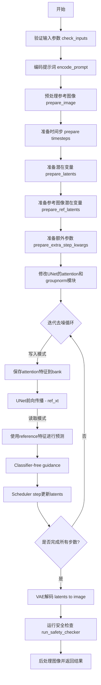
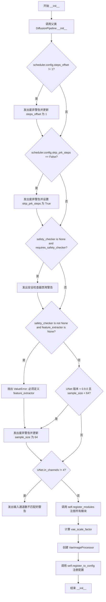
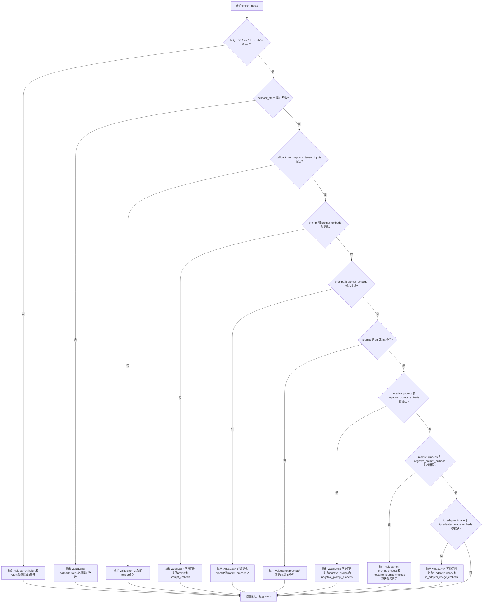
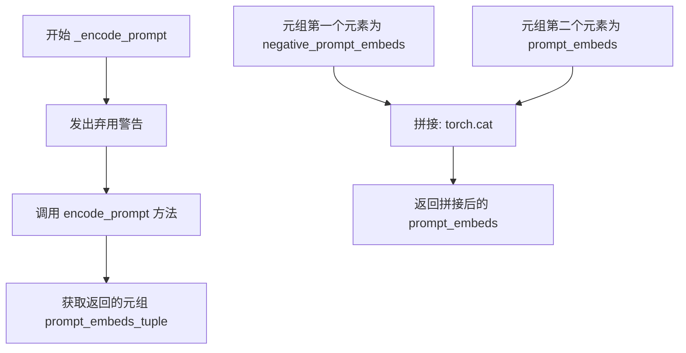
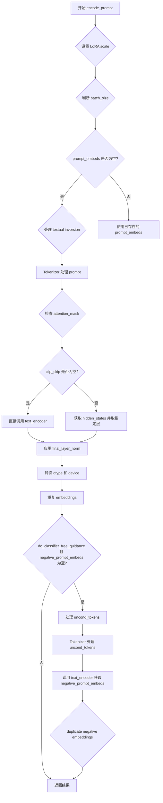
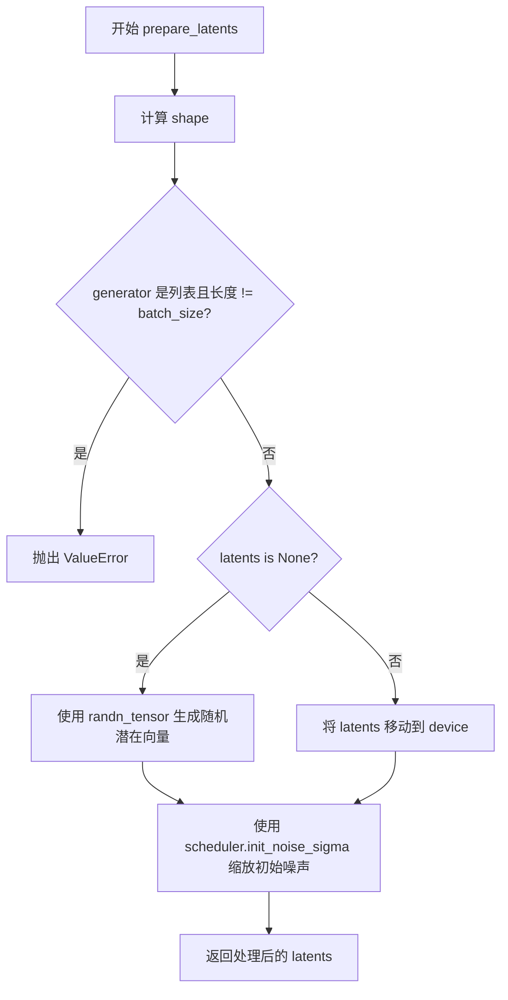
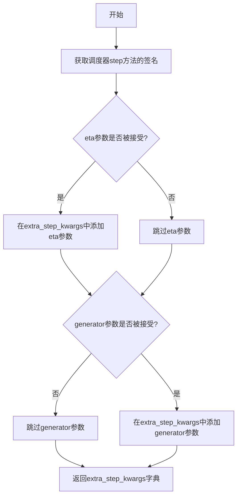
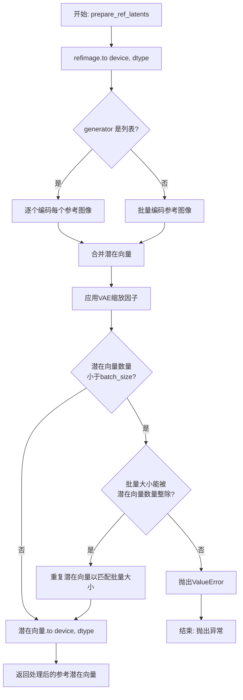
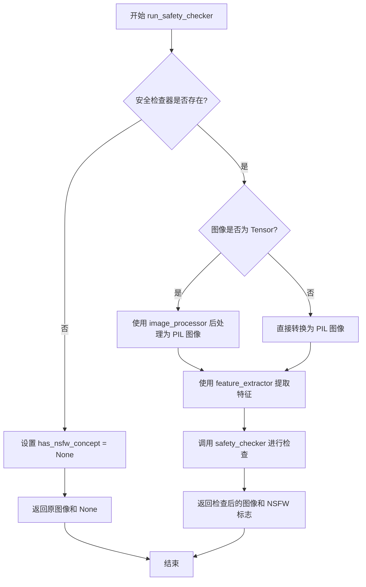

```mermaid
flowchart TD
    A[开始 __call__] --> B[断言: reference_attn 或 reference_adain 必须为 True]
    B --> C[调用 _default_height_width 获取默认高度和宽度]
    C --> D[调用 check_inputs 检查输入参数有效性]
    D --> E[确定 batch_size 和 device]
    E --> F{判断 guidance_scale > 1.0?}
    F -->|Yes| G[do_classifier_free_guidance = True]
    F -->|No| H[do_classifier_free_guidance = False]
    G --> I[调用 _encode_prompt 编码输入提示]
    H --> I
    I --> J[调用 prepare_image 预处理参考图像]
    J --> K[设置 timesteps]
    K --> L[调用 prepare_latents 准备潜在变量]
    L --> M[调用 prepare_ref_latents 准备参考潜在变量]
    M --> N[调用 prepare_extra_step_kwargs 准备额外参数]
    N --> O{reference_attn 为 True?}
    O -->|Yes| P[修改 BasicTransformerBlock 的 forward 函数]
    O -->|No| Q{reference_adain 为 True?}
    P --> Q
    Q -->|Yes| R[修改 mid_block 和 up/down_blocks 的 forward 函数]
    Q -->|No| S[开始去噪循环]
    R --> S
    S --> T[设置 num_warmup_steps]
    T --> U[遍历 timesteps]
    U --> V{是否为最后一步或需要回调?}
    V -->|Yes| W[执行进度条更新和回调]
    V -->|No| X[扩展 latents 用于分类器自由引导]
    W --> X
    X --> Y[缩放 latent_model_input]
    Y --> Z[生成 ref_xt 参考噪声]
    Z --> AA[设置 MODE = write]
    AA --> AB[调用 unet 处理 ref_xt]
    AB --> AC[设置 MODE = read]
    AC --> AD[调用 unet 预测噪声残差]
    AD --> AE{do_classifier_free_guidance?}
    AE -->|Yes| AF[分离噪声预测为无条件和有条件部分]
    AE -->|No| AG[执行 guidance_rescale]
    AF --> AG
    AG --> AH[调用 scheduler.step 更新 latents]
    AH --> AI{循环结束?}
    AI -->|No| U
    AI -->|Yes| AJ{output_type != latent?}
    AJ -->|Yes| AK[调用 vae.decode 解码潜在向量]
    AJ -->|No| AL[image = latents]
    AK --> AM[调用 run_safety_checker 检查安全性]
    AM --> AN[调用 image_processor.postprocess 后处理图像]
    AL --> AN
    AN --> AO[返回结果]
```

# `diffusers\examples\community\stable_diffusion_reference.py` 详细设计文档

Stable Diffusion Reference Pipeline - 一个用于图像到图像生成的Stable Diffusion管道，支持reference attention和reference adain技术，通过引用图像引导生成过程，实现风格迁移和内容保持的图像生成。

## 整体流程



## 类结构

```
DiffusionPipeline (基类)
├── TextualInversionLoaderMixin
├── StableDiffusionLoraLoaderMixin
├── IPAdapterMixin
└── FromSingleFileMixin
    └── StableDiffusionReferencePipeline (主类)
```

## 全局变量及字段


### `logger`
    
模块级日志记录器，用于输出运行时信息

类型：`logging.Logger`
    


### `EXAMPLE_DOC_STRING`
    
包含pipeline使用示例的文档字符串

类型：`str`
    


### `torch_dfs`
    
递归遍历PyTorch模型子模块的深度优先搜索函数

类型：`function`
    


### `StableDiffusionReferencePipeline.vae`
    
变分自编码器模型，用于将图像编码到潜在空间并从潜在空间解码重建图像

类型：`AutoencoderKL`
    


### `StableDiffusionReferencePipeline.text_encoder`
    
冻结的CLIP文本编码器，将文本提示转换为嵌入向量用于引导图像生成

类型：`CLIPTextModel`
    


### `StableDiffusionReferencePipeline.tokenizer`
    
CLIP分词器，用于将文本提示 token 化并转换为模型可处理的序列

类型：`CLIPTokenizer`
    


### `StableDiffusionReferencePipeline.unet`
    
条件U-Net神经网络，在给定文本嵌入和噪声情况下逐步去噪生成图像 latent

类型：`UNet2DConditionModel`
    


### `StableDiffusionReferencePipeline.scheduler`
    
Karras扩散调度器，管理去噪过程中的噪声调度和时间步长

类型：`KarrasDiffusionSchedulers`
    


### `StableDiffusionReferencePipeline.safety_checker`
    
安全检查器模型，用于检测生成图像是否包含不适当或有害内容

类型：`StableDiffusionSafetyChecker`
    


### `StableDiffusionReferencePipeline.feature_extractor`
    
CLIP图像特征提取器，从图像中提取特征用于安全检查器的输入

类型：`CLIPImageProcessor`
    


### `StableDiffusionReferencePipeline.vae_scale_factor`
    
VAE缩放因子，用于计算潜在空间与像素空间之间的尺寸转换比例

类型：`int`
    


### `StableDiffusionReferencePipeline.image_processor`
    
VAE图像处理器，处理图像的预处理和后处理操作

类型：`VaeImageProcessor`
    


### `StableDiffusionReferencePipeline.requires_safety_checker`
    
布尔标志，指示是否在推理过程中启用安全检查器

类型：`bool`
    
    

## 全局函数及方法


### `torch_dfs`

该函数通过递归深度优先搜索（DFS）遍历PyTorch模型的所有子模块，并返回包含模型本身及其所有后代子模块的列表。

参数：

- `model`：`torch.nn.Module`，要执行深度优先搜索的PyTorch模型

返回值：`list`，包含给定模型所有子模块的列表

#### 流程图

```mermaid
flowchart TD
    A[开始: torch_dfs] --> B[创建结果列表 result = [model]]
    B --> C{遍历 model.children()}
    C -->|还有子模块| D[获取下一个子模块 child]
    D --> E[递归调用 torch_dfs(child)]
    E --> F[将递归结果拼接到 result]
    F --> C
    C -->|没有更多子模块| G[返回 result]
    G --> H[结束]
```

#### 带注释源码

```python
def torch_dfs(model: torch.nn.Module):
    r"""
    Performs a depth-first search on the given PyTorch model and returns a list of all its child modules.

    Args:
        model (torch.nn.Module): The PyTorch model to perform the depth-first search on.

    Returns:
        list: A list of all child modules of the given model.
    """
    # 初始化结果列表，首先包含当前模型本身
    result = [model]
    
    # 遍历模型的所有直接子模块
    for child in model.children():
        # 对每个子模块递归调用DFS，并将结果合并到结果列表中
        # 这种实现方式会先递归深入到最深的子节点，然后逐层返回
        result += torch_dfs(child)
    
    # 返回包含所有子模块的完整列表
    return result
```


### `StableDiffusionReferencePipeline.__init__`

该方法是 `StableDiffusionReferencePipeline` 类的构造函数，负责初始化整个参考扩散管道，包括验证和配置各个组件（VAE、文本编码器、UNet、调度器等），设置图像处理器，并确保各模块配置的一致性。

参数：

- `vae`：`AutoencoderKL`，变分自编码器模型，用于将图像编码和解码到潜在表示。
- `text_encoder`：`CLIPTextModel`，冻结的文本编码器，Stable Diffusion 使用 CLIP 的文本部分。
- `tokenizer`：`CLIPTokenizer`，CLIPTokenizer 类的分词器。
- `unet`：`UNet2DConditionModel`，条件 U-Net 架构，用于对编码后的图像潜在表示进行去噪。
- `scheduler`：`KarrasDiffusionSchedulers`，与 `unet` 结合使用以对编码图像潜在表示进行去噪的调度器。
- `safety_checker`：`StableDiffusionSafetyChecker`，分类模块，用于评估生成的图像是否被认为是不安全或有害的。
- `feature_extractor`：`CLIPImageProcessor`，用于从生成的图像中提取特征以作为 `safety_checker` 的输入。
- `requires_safety_checker`：`bool`，默认为 True，指示是否需要安全检查器。

返回值：`None`，该方法为构造函数，不返回任何值。

#### 流程图



#### 带注释源码

```python
def __init__(
    self,
    vae: AutoencoderKL,
    text_encoder: CLIPTextModel,
    tokenizer: CLIPTokenizer,
    unet: UNet2DConditionModel,
    scheduler: KarrasDiffusionSchedulers,
    safety_checker: StableDiffusionSafetyChecker,
    feature_extractor: CLIPImageProcessor,
    requires_safety_checker: bool = True,
):
    """
    初始化 StableDiffusionReferencePipeline。
    
    参数:
        vae: 变分自编码器模型，用于编码和解码图像
        text_encoder: CLIP文本编码器
        tokenizer: CLIP分词器
        unet: 条件U-Net去噪模型
        scheduler: 扩散调度器
        safety_checker: 安全检查器（可选）
        feature_extractor: 图像特征提取器
        requires_safety_checker: 是否需要安全检查器
    """
    # 调用父类 DiffusionPipeline 的初始化方法
    super().__init__()

    # ==================== 调度器配置检查 ====================
    # 检查 scheduler 的 steps_offset 配置是否为 1（如果不是则发出警告并修复）
    if scheduler is not None and getattr(scheduler.config, "steps_offset", 1) != 1:
        deprecation_message = (
            f"The configuration file of this scheduler: {scheduler} is outdated. `steps_offset`"
            f" should be set to 1 instead of {scheduler.config.steps_offset}. Please make sure "
            "to update the config accordingly as leaving `steps_offset` might led to incorrect results"
            " in future versions. If you have downloaded this checkpoint from the Hugging Face Hub,"
            " it would be very nice if you could open a Pull request for the `scheduler/scheduler_config.json`"
            " file"
        )
        deprecate("steps_offset!=1", "1.0.0", deprecation_message, standard_warn=False)
        new_config = dict(scheduler.config)
        new_config["steps_offset"] = 1
        scheduler._internal_dict = FrozenDict(new_config)

    # 检查 scheduler 的 skip_prk_steps 配置（如果没有设置则发出警告）
    if scheduler is not None and getattr(scheduler.config, "skip_prk_steps", True) is False:
        deprecation_message = (
            f"The configuration file of this scheduler: {scheduler} has not set the configuration"
            " `skip_prk_steps`. `skip_prk_steps` should be set to True in the configuration file. Please make"
            " sure to update the config accordingly as not setting `skip_prk_steps` in the config might lead to"
            " incorrect results in future versions. If you have downloaded this checkpoint from the Hugging Face"
            " Hub, it would be very nice if you could open a Pull request for the"
            " `scheduler/scheduler_config.json` file"
        )
        deprecate(
            "skip_prk_steps not set",
            "1.0.0",
            deprecation_message,
            standard_warn=False,
        )
        new_config = dict(scheduler.config)
        new_config["skip_prk_steps"] = True
        scheduler._internal_dict = FrozenDict(new_config)

    # ==================== 安全检查器检查 ====================
    # 如果 safety_checker 为 None 但 requires_safety_checker 为 True，发出警告
    if safety_checker is None and requires_safety_checker:
        logger.warning(
            f"You have disabled the safety checker for {self.__class__} by passing `safety_checker=None`. Ensure"
            " that you abide to the conditions of the Stable Diffusion license and do not expose unfiltered"
            " results in services or applications open to the public. Both the diffusers team and Hugging Face"
            " strongly recommend to keep the safety filter enabled in all public facing circumstances, disabling"
            " it only for use-cases that involve analyzing network behavior or auditing its results. For more"
            " information, please have a look at https://github.com/huggingface/diffusers/pull/254 ."
        )

    # 如果提供了 safety_checker 但没有 feature_extractor，抛出错误
    if safety_checker is not None and feature_extractor is None:
        raise ValueError(
            "Make sure to define a feature extractor when loading {self.__class__} if you want to use the safety"
            " checker. If you do not want to use the safety checker, you can pass `'safety_checker=None'` instead."
        )

    # ==================== UNet 配置检查 ====================
    # 检查 UNet 版本和 sample_size 是否符合要求
    is_unet_version_less_0_9_0 = (
        unet is not None
        and hasattr(unet.config, "_diffusers_version")
        and version.parse(version.parse(unet.config._diffusers_version).base_version) < version.parse("0.9.0.dev0")
    )
    is_unet_sample_size_less_64 = (
        unet is not None and hasattr(unet.config, "sample_size") and unet.config.sample_size < 64
    )
    if is_unet_version_less_0_9_0 and is_unet_sample_size_less_64:
        deprecation_message = (
            "The configuration file of the unet has set the default `sample_size` to smaller than"
            " 64 which seems highly unlikely .If you're checkpoint is a fine-tuned version of any of the"
            " following: \n- CompVis/stable-diffusion-v1-4 \n- CompVis/stable-diffusion-v1-3 \n-"
            " CompVis/stable-diffusion-v1-2 \n- CompVis/stable-diffusion-v1-1 \n- stable-diffusion-v1-5/stable-diffusion-v1-5"
            " \n- stable-diffusion-v1-5/stable-diffusion-inpainting \n you should change 'sample_size' to 64 in the"
            " configuration file. Please make sure to update the config accordingly as leaving `sample_size=32`"
            " in the config might lead to incorrect results in future versions. If you have downloaded this"
            " checkpoint from the Hugging Face Hub, it would be very nice if you could open a Pull request for the"
            " the `unet/config.json` file"
        )
        deprecate("sample_size<64", "1.0.0", deprecation_message, standard_warn=False)
        new_config = dict(unet.config)
        new_config["sample_size"] = 64
        unet._internal_dict = FrozenDict(new_config)

    # 检查 UNet 输入通道数是否为 4（默认）
    if unet is not None and unet.config.in_channels != 4:
        logger.warning(
            f"You have loaded a UNet with {unet.config.in_channels} input channels, whereas by default,"
            f" {self.__class__} assumes that `pipeline.unet` has 4 input channels: 4 for `num_channels_latents`,"
            ". If you did not intend to modify"
            " this behavior, please check whether you have loaded the right checkpoint."
        )

    # ==================== 注册模块 ====================
    # 将所有模块注册到管道中
    self.register_modules(
        vae=vae,
        text_encoder=text_encoder,
        tokenizer=tokenizer,
        unet=unet,
        scheduler=scheduler,
        safety_checker=safety_checker,
        feature_extractor=feature_extractor,
    )

    # ==================== 初始化图像处理器 ====================
    # 计算 VAE 缩放因子（基于 VAE 块输出通道数）
    self.vae_scale_factor = 2 ** (len(self.vae.config.block_out_channels) - 1) if getattr(self, "vae", None) else 8
    # 创建 VAE 图像处理器
    self.image_processor = VaeImageProcessor(vae_scale_factor=self.vae_scale_factor)

    # ==================== 注册配置 ====================
    # 将 requires_safety_checker 注册到配置中
    self.register_to_config(requires_safety_checker=requires_safety_checker)
```


### `StableDiffusionReferencePipeline._default_height_width`

计算默认的高度和宽度。当未指定高度或宽度时，该方法根据输入图像自动推断合适的尺寸，并确保尺寸是8的倍数（向下取整），以适应Stable Diffusion模型的输入要求。

参数：

- `self`：`StableDiffusionReferencePipeline` 类实例，方法的调用者
- `height`：`Optional[int]`，期望的图像高度。如果为 `None`，则根据输入图像确定高度
- `width`：`Optional[int]`，期望的图像宽度。如果为 `None`，则根据输入图像确定宽度
- `image`：`Union[PIL.Image.Image, torch.Tensor, List[PIL.Image.Image]]`，输入图像，可以是 PIL 图像、PyTorch 张量或图像列表

返回值：`Tuple[int, int]`，包含计算后的高度和宽度的元组

#### 流程图

```mermaid
flowchart TD
    A[开始 _default_height_width] --> B{image 是列表?}
    B -->|是| C[取列表第一个元素]
    B -->|否| D{height is None?}
    C --> D
    D -->|是| E{image 是 PIL.Image?}
    D -->|否| F{width is None?}
    E -->|是| G[height = image.height]
    E -->|否| H{image 是 Tensor?}
    H -->|是| I[height = image.shape[2]]
    H -->|否| J[height 保持 None]
    G --> K[height = (height // 8) * 8]
    I --> K
    J --> K
    K --> F
    F -->|是| L{image 是 PIL.Image?}
    F -->|否| M[返回 (height, width)]
    L -->|是| N[width = image.width]
    L -->|否| O{image 是 Tensor?}
    O -->|是| P[width = image.shape[3]]
    O -->|否| Q[width 保持 None]
    N --> R[width = (width // 8) * 8]
    P --> R
    Q --> R
    R --> M
```

#### 带注释源码

```python
def _default_height_width(
    self,
    height: Optional[int],
    width: Optional[int],
    image: Union[PIL.Image.Image, torch.Tensor, List[PIL.Image.Image]],
) -> Tuple[int, int]:
    r"""
    Calculate the default height and width for the given image.

    Args:
        height (int or None): The desired height of the image. If None, the height will be determined based on the input image.
        width (int or None): The desired width of the image. If None, the width will be determined based on the input image.
        image (PIL.Image.Image or torch.Tensor or list[PIL.Image.Image]): The input image or a list of images.

    Returns:
        Tuple[int, int]: A tuple containing the calculated height and width.

    """
    # NOTE: It is possible that a list of images have different
    # dimensions for each image, so just checking the first image
    # is not _exactly_ correct, but it is simple.
    # 如果输入是图像列表，则递归获取第一个元素，直到不再是列表
    while isinstance(image, list):
        image = image[0]

    # 如果未指定高度，则从图像中推断
    if height is None:
        if isinstance(image, PIL.Image.Image):
            # PIL.Image 获取高度属性
            height = image.height
        elif isinstance(image, torch.Tensor):
            # PyTorch 张量 shape[2] 表示高度维度 (B, C, H, W)
            height = image.shape[2]

        # 向下取整到8的倍数，确保与 VAE 下采样兼容
        height = (height // 8) * 8

    # 如果未指定宽度，则从图像中推断
    if width is None:
        if isinstance(image, PIL.Image.Image):
            # PIL.Image 获取宽度属性
            width = image.width
        elif isinstance(image, torch.Tensor):
            # PyTorch 张量 shape[3] 表示宽度维度 (B, C, H, W)
            width = image.shape[3]

        # 向下取整到8的倍数，确保与 VAE 下采样兼容
        width = (width // 8) * 8

    # 返回计算后的高度和宽度
    return height, width
```


### `StableDiffusionReferencePipeline.check_inputs`

该方法用于验证扩散模型的输入参数有效性，检查高度/宽度是否能被8整除、callback_steps是否为正整数、tensor输入是否合法、prompt与prompt_embeds的互斥关系、negative_prompt与negative_prompt_embeds的互斥关系、embeddings形状一致性以及IP适配器图像与图像嵌入的互斥关系。若验证失败则抛出相应的ValueError。

参数：

-  `prompt`：`Optional[Union[str, List[str]]]`，提示文本或提示文本列表
-  `height`：`int`，输入图像的高度
-  `width`：`int`，输入图像的宽度
-  `callback_steps`：`Optional[int]`，执行回调的步数
-  `negative_prompt`：`str | None`，负向提示文本
-  `prompt_embeds`：`Optional[torch.Tensor]`，提示文本嵌入
-  `negative_prompt_embeds`：`Optional[torch.Tensor]`，负向提示文本嵌入
-  `ip_adapter_image`：`Optional[torch.Tensor]`，IP适配器输入图像
-  `ip_adapter_image_embeds`：`Optional[torch.Tensor]`，IP适配器输入图像嵌入
-  `callback_on_step_end_tensor_inputs`：`Optional[List[str]]`，在步骤结束时执行回调的张量输入列表

返回值：`None`，该方法不返回任何值，仅通过抛出ValueError来指示验证失败

#### 流程图



#### 带注释源码

```python
def check_inputs(
    self,
    prompt: Optional[Union[str, List[str]]],
    height: int,
    width: int,
    callback_steps: Optional[int],
    negative_prompt: str | None = None,
    prompt_embeds: Optional[torch.Tensor] = None,
    negative_prompt_embeds: Optional[torch.Tensor] = None,
    ip_adapter_image: Optional[torch.Tensor] = None,
    ip_adapter_image_embeds: Optional[torch.Tensor] = None,
    callback_on_step_end_tensor_inputs: Optional[List[str]] = None,
) -> None:
    """
    Check the validity of the input arguments for the diffusion model.

    Args:
        prompt (Optional[Union[str, List[str]]]): The prompt text or list of prompt texts.
        height (int): The height of the input image.
        width (int): The width of the input image.
        callback_steps (Optional[int]): The number of steps to perform the callback on.
        negative_prompt (str | None): The negative prompt text.
        prompt_embeds (Optional[torch.Tensor]): The prompt embeddings.
        negative_prompt_embeds (Optional[torch.Tensor]): The negative prompt embeddings.
        ip_adapter_image (Optional[torch.Tensor]): The input adapter image.
        ip_adapter_image_embeds (Optional[torch.Tensor]): The input adapter image embeddings.
        callback_on_step_end_tensor_inputs (Optional[List[str]]): The list of tensor inputs to perform the callback on.

    Raises:
        ValueError: If `height` or `width` is not divisible by 8.
        ValueError: If `callback_steps` is not a positive integer.
        ValueError: If `callback_on_step_end_tensor_inputs` contains invalid tensor inputs.
        ValueError: If both `prompt` and `prompt_embeds` are provided.
        ValueError: If neither `prompt` nor `prompt_embeds` are provided.
        ValueError: If `prompt` is not of type `str` or `list`.
        ValueError: If both `negative_prompt` and `negative_prompt_embeds` are provided.
        ValueError: If both `prompt_embeds` and `negative_prompt_embeds` are provided and have different shapes.
        ValueError: If both `ip_adapter_image` and `ip_adapter_image_embeds` are provided.

    Returns:
        None
    """
    # 检查高度和宽度是否都能被8整除，这是Stable Diffusion模型的要求
    if height % 8 != 0 or width % 8 != 0:
        raise ValueError(f"`height` and `width` have to be divisible by 8 but are {height} and {width}.")

    # 检查callback_steps是否为正整数
    if callback_steps is not None and (not isinstance(callback_steps, int) or callback_steps <= 0):
        raise ValueError(
            f"`callback_steps` has to be a positive integer but is {callback_steps} of type"
            f" {type(callback_steps)}."
        )
    
    # 检查callback_on_step_end_tensor_inputs是否包含合法的tensor输入
    if callback_on_step_end_tensor_inputs is not None and not all(
        k in self._callback_tensor_inputs for k in callback_on_step_end_tensor_inputs
    ):
        raise ValueError(
            f"`callback_on_step_end_tensor_inputs` has to be in {self._callback_tensor_inputs}, but found {[k for k in callback_on_step_end_tensor_inputs if k not in self._callback_tensor_inputs]}"
        )

    # 检查prompt和prompt_embeds的互斥关系
    if prompt is not None and prompt_embeds is not None:
        raise ValueError(
            f"Cannot forward both `prompt`: {prompt} and `prompt_embeds`: {prompt_embeds}. Please make sure to"
            " only forward one of the two."
        )
    elif prompt is None and prompt_embeds is None:
        raise ValueError(
            "Provide either `prompt` or `prompt_embeds`. Cannot leave both `prompt` and `prompt_embeds` undefined."
        )
    elif prompt is not None and (not isinstance(prompt, str) and not isinstance(prompt, list)):
        raise ValueError(f"`prompt` has to be of type `str` or `list` but is {type(prompt)}")

    # 检查negative_prompt和negative_prompt_embeds的互斥关系
    if negative_prompt is not None and negative_prompt_embeds is not None:
        raise ValueError(
            f"Cannot forward both `negative_prompt`: {negative_prompt} and `negative_prompt_embeds`:"
            f" {negative_prompt_embeds}. Please make sure to only forward one of the two."
        )

    # 检查prompt_embeds和negative_prompt_embeds的形状一致性
    if prompt_embeds is not None and negative_prompt_embeds is not None:
        if prompt_embeds.shape != negative_prompt_embeds.shape:
            raise ValueError(
                "`prompt_embeds` and `negative_prompt_embeds` must have the same shape when passed directly, but"
                f" got: `prompt_embeds` {prompt_embeds.shape} != `negative_prompt_embeds`"
                f" {negative_prompt_embeds.shape}."
            )

    # 检查ip_adapter_image和ip_adapter_image_embeds的互斥关系
    if ip_adapter_image is not None and ip_adapter_image_embeds is not None:
        raise ValueError(
            "Provide either `ip_adapter_image` or `ip_adapter_image_embeds`. Cannot leave both `ip_adapter_image` and `ip_adapter_image_embeds` defined."
        )
```


### `StableDiffusionReferencePipeline._encode_prompt`

该方法是 StableDiffusionReferencePipeline 类中的一个已弃用的方法，用于将文本提示编码为嵌入向量。它内部调用了新的 `encode_prompt` 方法并为保持向后兼容性而将结果进行拼接后返回。

参数：

- `prompt`：`Union[str, List[str]]`，提示文本或提示文本列表
- `device`：`torch.device`，用于编码的设备
- `num_images_per_prompt`：`int`，每个提示生成的图像数量
- `do_classifier_free_guidance`：`bool`，是否使用无分类器自由引导
- `negative_prompt`：`Optional[Union[str, List[str]]]`，负面提示文本或列表，默认为 None
- `prompt_embeds`：`Optional[torch.Tensor]`，预生成的提示嵌入，默认为 None
- `negative_prompt_embeds`：`Optional[torch.Tensor]`，预生成的负面提示嵌入，默认为 None
- `lora_scale`：`Optional[float]`，LoRA 缩放因子，默认为 None
- `**kwargs`：其他关键字参数

返回值：`torch.Tensor`，编码后的提示嵌入张量

#### 流程图



#### 带注释源码

```python
# Copied from diffusers.pipelines.stable_diffusion.pipeline_stable_diffusion.StableDiffusionPipeline._encode_prompt
def _encode_prompt(
    self,
    prompt: Union[str, List[str]],
    device: torch.device,
    num_images_per_prompt: int,
    do_classifier_free_guidance: bool,
    negative_prompt: Optional[Union[str, List[str]]] = None,
    prompt_embeds: Optional[torch.Tensor] = None,
    negative_prompt_embeds: Optional[torch.Tensor] = None,
    lora_scale: Optional[float] = None,
    **kwargs,
) -> torch.Tensor:
    r"""
    Encodes the prompt into embeddings.

    Args:
        prompt (Union[str, List[str]]): The prompt text or a list of prompt texts.
        device (torch.device): The device to use for encoding.
        num_images_per_prompt (int): The number of images per prompt.
        do_classifier_free_guidance (bool): Whether to use classifier-free guidance.
        negative_prompt (Optional[Union[str, List[str]]], optional): The negative prompt text or a list of negative prompt texts. Defaults to None.
        prompt_embeds (Optional[torch.Tensor], optional): The prompt embeddings. Defaults to None.
        negative_prompt_embeds (Optional[torch.Tensor], optional): The negative prompt embeddings. Defaults to None.
        lora_scale (Optional[float], optional): The LoRA scale. Defaults to None.
        **kwargs: Additional keyword arguments.

    Returns:
        torch.Tensor: The encoded prompt embeddings.
    """
    # 发出弃用警告，提示用户使用 encode_prompt 方法代替
    deprecation_message = "`_encode_prompt()` is deprecated and it will be removed in a future version. Use `encode_prompt()` instead. Also, be aware that the output format changed from a concatenated tensor to a tuple."
    deprecate("_encode_prompt()", "1.0.0", deprecation_message, standard_warn=False)

    # 调用新的 encode_prompt 方法获取元组格式的嵌入结果
    prompt_embeds_tuple = self.encode_prompt(
        prompt=prompt,
        device=device,
        num_images_per_prompt=num_images_per_prompt,
        do_classifier_free_guidance=do_classifier_free_guidance,
        negative_prompt=negative_prompt,
        prompt_embeds=prompt_embeds,
        negative_prompt_embeds=negative_prompt_embeds,
        lora_scale=lora_scale,
        **kwargs,
    )

    # 为了向后兼容性，将 negative_prompt_embeds 和 prompt_embeds 拼接返回
    # 注意：encode_prompt 返回的是 (prompt_embeds, negative_prompt_embeds) 元组
    # 但旧版本 _encode_prompt 返回的是拼接后的张量
    prompt_embeds = torch.cat([prompt_embeds_tuple[1], prompt_embeds_tuple[0]])

    return prompt_embeds
```


### `StableDiffusionReferencePipeline.encode_prompt`

该方法将文本提示（prompt）编码为文本编码器的隐藏状态（hidden states），支持 LoRA 权重调整、CLIP 层跳过、分类器自由引导（Classifier-Free Guidance）等功能。

参数：

- `prompt`：`str | None`，要编码的提示文本
- `device`：`torch.device`，计算设备
- `num_images_per_prompt`：`int`，每个提示要生成的图像数量
- `do_classifier_free_guidance`：`bool`，是否使用分类器自由引导
- `negative_prompt`：`str | None`，用于引导图像生成的负面提示
- `prompt_embeds`：`Optional[torch.Tensor]`，预生成的文本嵌入
- `negative_prompt_embeds`：`Optional[torch.Tensor]`，预生成的负面文本嵌入
- `lora_scale`：`Optional[float]`，LoRA 缩放因子
- `clip_skip`：`Optional[int]`，CLIP 编码时跳过的层数

返回值：`torch.Tensor`，实际上返回元组 `(prompt_embeds, negative_prompt_embeds)`，但签名声明为 `torch.Tensor`，这是一个类型声明错误

#### 流程图



#### 带注释源码

```python
def encode_prompt(
    self,
    prompt: str | None,
    device: torch.device,
    num_images_per_prompt: int,
    do_classifier_free_guidance: bool,
    negative_prompt: str | None = None,
    prompt_embeds: Optional[torch.Tensor] = None,
    negative_prompt_embeds: Optional[torch.Tensor] = None,
    lora_scale: Optional[float] = None,
    clip_skip: Optional[int] = None,
) -> torch.Tensor:
    r"""
    Encodes the prompt into text encoder hidden states.

    Args:
        prompt (`str` or `List[str]`, *optional*):
            prompt to be encoded
        device: (`torch.device`):
            torch device
        num_images_per_prompt (`int`):
            number of images that should be generated per prompt
        do_classifier_free_guidance (`bool`):
            whether to use classifier free guidance or not
        negative_prompt (`str` or `List[str]`, *optional*):
            The prompt or prompts not to guide the image generation. If not defined, one has to pass
            `negative_prompt_embeds` instead. Ignored when not using guidance (i.e., ignored if `guidance_scale` is
            less than `1`).
        prompt_embeds (`torch.Tensor`, *optional*):
            Pre-generated text embeddings. Can be used to easily tweak text inputs, *e.g.* prompt weighting. If not
            provided, text embeddings will be generated from `prompt` input argument.
        negative_prompt_embeds (`torch.Tensor`, *optional*):
            Pre-generated negative text embeddings. Can be used to easily tweak text inputs, *e.g.* prompt
            weighting. If not provided, negative_prompt_embeds will be generated from `negative_prompt` input
            argument.
        lora_scale (`float`, *optional*):
            A LoRA scale that will be applied to all LoRA layers of the text encoder if LoRA layers are loaded.
        clip_skip (`int`, *optional*):
            Number of layers to be skipped from CLIP while computing the prompt embeddings. A value of 1 means that
            the output of the pre-final layer will be used for computing the prompt embeddings.
    """
    # 设置 LoRA scale 以便 text encoder 的 LoRA 函数正确访问
    if lora_scale is not None and isinstance(self, StableDiffusionLoraLoaderMixin):
        self._lora_scale = lora_scale

        # 动态调整 LoRA scale
        if not USE_PEFT_BACKEND:
            adjust_lora_scale_text_encoder(self.text_encoder, lora_scale)
        else:
            scale_lora_layers(self.text_encoder, lora_scale)

    # 确定 batch_size
    if prompt is not None and isinstance(prompt, str):
        batch_size = 1
    elif prompt is not None and isinstance(prompt, list):
        batch_size = len(prompt)
    else:
        batch_size = prompt_embeds.shape[0]

    # 如果没有提供 prompt_embeds，则需要生成
    if prompt_embeds is None:
        # textual inversion: process multi-vector tokens if necessary
        if isinstance(self, TextualInversionLoaderMixin):
            prompt = self.maybe_convert_prompt(prompt, self.tokenizer)

        # Tokenize prompt
        text_inputs = self.tokenizer(
            prompt,
            padding="max_length",
            max_length=self.tokenizer.model_max_length,
            truncation=True,
            return_tensors="pt",
        )
        text_input_ids = text_inputs.input_ids
        untruncated_ids = self.tokenizer(prompt, padding="longest", return_tensors="pt").input_ids

        # 检查是否被截断，如果是则警告
        if untruncated_ids.shape[-1] >= text_input_ids.shape[-1] and not torch.equal(
            text_input_ids, untruncated_ids
        ):
            removed_text = self.tokenizer.batch_decode(
                untruncated_ids[:, self.tokenizer.model_max_length - 1 : -1]
            )
            logger.warning(
                "The following part of your input was truncated because CLIP can only handle sequences up to"
                f" {self.tokenizer.model_max_length} tokens: {removed_text}"
            )

        # 处理 attention_mask
        if hasattr(self.text_encoder.config, "use_attention_mask") and self.text_encoder.config.use_attention_mask:
            attention_mask = text_inputs.attention_mask.to(device)
        else:
            attention_mask = None

        # 调用 text_encoder 获取 embeddings
        if clip_skip is None:
            prompt_embeds = self.text_encoder(text_input_ids.to(device), attention_mask=attention_mask)
            prompt_embeds = prompt_embeds[0]
        else:
            # 获取所有 hidden states 并选择指定层
            prompt_embeds = self.text_encoder(
                text_input_ids.to(device), attention_mask=attention_mask, output_hidden_states=True
            )
            # 从 encoder layers 的 tuple 中获取指定层的 hidden states
            prompt_embeds = prompt_embeds[-1][-(clip_skip + 1)]
            # 应用 final LayerNorm 以保持表示的完整性
            prompt_embeds = self.text_encoder.text_model.final_layer_norm(prompt_embeds)

    # 确定 prompt_embeds 的 dtype
    if self.text_encoder is not None:
        prompt_embeds_dtype = self.text_encoder.dtype
    elif self.unet is not None:
        prompt_embeds_dtype = self.unet.dtype
    else:
        prompt_embeds_dtype = prompt_embeds.dtype

    # 转换 embeddings 的 dtype 和 device
    prompt_embeds = prompt_embeds.to(dtype=prompt_embeds_dtype, device=device)

    # 重复 embeddings 以支持每个 prompt 生成多个图像
    bs_embed, seq_len, _ = prompt_embeds.shape
    prompt_embeds = prompt_embeds.repeat(1, num_images_per_prompt, 1)
    prompt_embeds = prompt_embeds.view(bs_embed * num_images_per_prompt, seq_len, -1)

    # 获取无条件 embeddings 用于 classifier free guidance
    if do_classifier_free_guidance and negative_prompt_embeds is None:
        uncond_tokens: List[str]
        if negative_prompt is None:
            uncond_tokens = [""] * batch_size
        elif prompt is not None and type(prompt) is not type(negative_prompt):
            raise TypeError(
                f"`negative_prompt` should be the same type to `prompt`, but got {type(negative_prompt)} !="
                f" {type(prompt)}."
            )
        elif isinstance(negative_prompt, str):
            uncond_tokens = [negative_prompt]
        elif batch_size != len(negative_prompt):
            raise ValueError(
                f"`negative_prompt`: {negative_prompt} has batch size {len(negative_prompt)}, but `prompt`:"
                f" {prompt} has batch size {batch_size}. Please make sure that passed `negative_prompt` matches"
                " the batch size of `prompt`."
            )
        else:
            uncond_tokens = negative_prompt

        # textual inversion: process multi-vector tokens if necessary
        if isinstance(self, TextualInversionLoaderMixin):
            uncond_tokens = self.maybe_convert_prompt(uncond_tokens, self.tokenizer)

        max_length = prompt_embeds.shape[1]
        uncond_input = self.tokenizer(
            uncond_tokens,
            padding="max_length",
            max_length=max_length,
            truncation=True,
            return_tensors="pt",
        )

        if hasattr(self.text_encoder.config, "use_attention_mask") and self.text_encoder.config.use_attention_mask:
            attention_mask = uncond_input.attention_mask.to(device)
        else:
            attention_mask = None

        negative_prompt_embeds = self.text_encoder(
            uncond_input.input_ids.to(device),
            attention_mask=attention_mask,
        )
        negative_prompt_embeds = negative_prompt_embeds[0]

    # 处理 classifier free guidance 的 negative embeddings
    if do_classifier_free_guidance:
        # 重复 negative embeddings 以支持每个 prompt 生成多个图像
        seq_len = negative_prompt_embeds.shape[1]

        negative_prompt_embeds = negative_prompt_embeds.to(dtype=prompt_embeds_dtype, device=device)

        negative_prompt_embeds = negative_prompt_embeds.repeat(1, num_images_per_prompt, 1)
        negative_prompt_embeds = negative_prompt_embeds.view(batch_size * num_images_per_prompt, seq_len, -1)

    # 如果使用 PEFT backend，恢复 LoRA 层的原始 scale
    if isinstance(self, StableDiffusionLoraLoaderMixin) and USE_PEFT_BACKEND:
        unscale_lora_layers(self.text_encoder, lora_scale)

    return prompt_embeds, negative_prompt_embeds
```


### `StableDiffusionReferencePipeline.prepare_latents`

Prepare the latent vectors for diffusion by generating random noise tensors or using provided latents, scaled according to the scheduler's initial noise sigma.

参数：

- `batch_size`：`int`，批次中的样本数量
- `num_channels_latents`：`int`，潜在向量的通道数
- `height`：`int`，潜在向量的高度
- `width`：`int`，潜在向量的宽度
- `dtype`：`torch.dtype`，潜在向量的数据类型
- `device`：`torch.device`，放置潜在向量的设备
- `generator`：`Union[torch.Generator, List[torch.Generator]]`，用于随机数生成的生成器
- `latents`：`Optional[torch.Tensor]`（可选），预先存在的潜在向量。如果为 None，将生成新的潜在向量

返回值：`torch.Tensor`，准备好的潜在向量

#### 流程图



#### 带注释源码

```python
# Copied from diffusers.pipelines.stable_diffusion.pipeline_stable_diffusion.StableDiffusionPipeline.prepare_latents
def prepare_latents(
    self,
    batch_size: int,
    num_channels_latents: int,
    height: int,
    width: int,
    dtype: torch.dtype,
    device: torch.device,
    generator: Union[torch.Generator, List[torch.Generator]],
    latents: Optional[torch.Tensor] = None,
) -> torch.Tensor:
    r"""
    Prepare the latent vectors for diffusion.

    Args:
        batch_size (int): The number of samples in the batch.
        num_channels_latents (int): The number of channels in the latent vectors.
        height (int): The height of the latent vectors.
        width (int): The width of the latent vectors.
        dtype (torch.dtype): The data type of the latent vectors.
        device (torch.device): The device to place the latent vectors on.
        generator (Union[torch.Generator, List[torch.Generator]]): The generator(s) to use for random number generation.
        latents (Optional[torch.Tensor]): The pre-existing latent vectors. If None, new latent vectors will be generated.

    Returns:
        torch.Tensor: The prepared latent vectors.
    """
    # 计算潜在向量的形状，考虑 VAE 缩放因子
    shape = (
        batch_size,
        num_channels_latents,
        int(height) // self.vae_scale_factor,
        int(width) // self.vae_scale_factor,
    )
    
    # 验证生成器列表长度与批次大小是否匹配
    if isinstance(generator, list) and len(generator) != batch_size:
        raise ValueError(
            f"You have passed a list of generators of length {len(generator)}, but requested an effective batch"
            f" size of {batch_size}. Make sure the batch size matches the length of the generators."
        )

    # 如果没有提供潜在向量，则生成随机潜在向量
    if latents is None:
        latents = randn_tensor(shape, generator=generator, device=device, dtype=dtype)
    else:
        # 如果提供了潜在向量，则将其移动到指定设备
        latents = latents.to(device)

    # 使用调度器的初始噪声标准差缩放初始噪声
    latents = latents * self.scheduler.init_noise_sigma
    return latents
```


### `StableDiffusionReferencePipeline.prepare_extra_step_kwargs`

该方法用于准备调度器（scheduler）的额外关键字参数。由于不同的调度器可能有不同的签名，该方法通过检查调度器的 `step` 方法是否接受特定参数（如 `eta` 和 `generator`），动态构建并返回包含这些参数的字典，以适配不同的调度器实现。

参数：

- `self`：`StableDiffusionReferencePipeline`，当前 Pipeline 实例的隐式参数
- `generator`：`Union[torch.Generator, List[torch.Generator]]`，用于采样的随机数生成器
- `eta`：`float`，DDIMScheduler 使用的 eta (η) 参数值，应在 0 到 1 之间

返回值：`dict[str, Any]`，包含调度器 step 方法额外关键字参数的字典

#### 流程图



#### 带注释源码

```python
def prepare_extra_step_kwargs(
    self, generator: Union[torch.Generator, List[torch.Generator]], eta: float
) -> dict[str, Any]:
    r"""
    Prepare extra keyword arguments for the scheduler step.

    Args:
        generator (Union[torch.Generator, List[torch.Generator]]): The generator used for sampling.
        eta (float): The value of eta (η) used with the DDIMScheduler. Should be between 0 and 1.

    Returns:
        Dict[str, Any]: A dictionary containing the extra keyword arguments for the scheduler step.
    """
    # 准备调度器step方法的额外关键字参数，因为并非所有调度器都具有相同的签名
    # eta (η) 仅与DDIMScheduler一起使用，其他调度器将忽略它
    # eta对应DDIM论文中的η：https://huggingface.co/papers/2010.02502
    # 取值应在[0, 1]范围内
    
    # 通过inspect模块检查调度器的step方法是否接受eta参数
    accepts_eta = "eta" in set(inspect.signature(self.scheduler.step).parameters.keys())
    
    # 初始化空字典用于存储额外参数
    extra_step_kwargs = {}
    
    # 如果调度器接受eta参数，则将其添加到extra_step_kwargs中
    if accepts_eta:
        extra_step_kwargs["eta"] = eta

    # 检查调度器的step方法是否接受generator参数
    accepts_generator = "generator" in set(inspect.signature(self.scheduler.step).parameters.keys())
    
    # 如果调度器接受generator参数，则将其添加到extra_step_kwargs中
    if accepts_generator:
        extra_step_kwargs["generator"] = generator
    
    # 返回构建好的额外关键字参数字典
    return extra_step_kwargs
```


### `StableDiffusionReferencePipeline.prepare_image`

该方法负责将输入图像预处理为管道所需的张量格式。它接受多种输入格式（PIL图像、PyTorch张量或它们的列表），执行图像尺寸调整、归一化、维度转换以及批处理维度管理等操作，为后续的参考图像处理做好准备。

参数：

- `self`： StableDiffusionReferencePipeline，管道实例本身
- `image`： Union[torch.Tensor, PIL.Image.Image, List[Union[torch.Tensor, PIL.Image.Image]]]，输入图像，可以是单个PIL图像、单个张量或它们的列表
- `width`： int，目标图像宽度
- `height`： int，目标图像高度
- `batch_size`： int，批处理大小
- `num_images_per_prompt`： int，每个提示词生成的图像数量
- `device`： torch.device，用于处理的设备
- `dtype`： torch.dtype，图像的数据类型
- `do_classifier_free_guidance`： bool，是否执行无分类器自由引导，默认值为 False
- `guess_mode`： bool，是否使用猜测模式，默认值为 False

返回值：`torch.Tensor`，处理完成的图像张量

#### 流程图

```mermaid
flowchart TD
    A[开始 prepare_image] --> B{输入image是否为torch.Tensor?}
    B -->|否| C{image是否为PIL.Image.Image?}
    B -->|是| H
    
    C -->|是| D[将image转换为列表]
    C -->|否| E[假设image是列表]
    
    D --> F{列表第一个元素是否为PIL.Image.Image?}
    E --> F
    
    F -->|是| G[遍历列表中的每个图像]
    F -->|否| J[假设是torch.Tensor列表]
    
    G --> I[图像转为RGB → 调整尺寸 → 转为numpy数组]
    I --> K[所有图像沿axis=0拼接]
    
    J --> L[沿dim=0拼接张量]
    
    H --> M[直接使用输入张量]
    
    K --> N[归一化: (image - 0.5) / 0.5]
    L --> N
    M --> N
    
    N --> O[维度转换: [B, H, W, C] → [B, C, H, W]]
    O --> P[转换为torch.Tensor]
    
    P --> Q{image_batch_size == 1?}
    Q -->|是| R[repeat_by = batch_size]
    Q -->|否| S[repeat_by = num_images_per_prompt]
    
    R --> T[沿dim=0重复图像]
    S --> T
    
    T --> U[移动到指定设备和dtype]
    
    U --> V{do_classifier_free_guidance且not guess_mode?}
    V -->|是| W[沿dim=0拼接两份图像]
    V -->|否| X
    
    W --> X[返回处理后的图像张量]
```

#### 带注释源码

```python
def prepare_image(
    self,
    image: Union[torch.Tensor, PIL.Image.Image, List[Union[torch.Tensor, PIL.Image.Image]]],
    width: int,
    height: int,
    batch_size: int,
    num_images_per_prompt: int,
    device: torch.device,
    dtype: torch.dtype,
    do_classifier_free_guidance: bool = False,
    guess_mode: bool = False,
) -> torch.Tensor:
    r"""
    Prepares the input image for processing.

    Args:
        image (torch.Tensor or PIL.Image.Image or list): The input image(s).
        width (int): The desired width of the image.
        height (int): The desired height of the image.
        batch_size (int): The batch size for processing.
        num_images_per_prompt (int): The number of images per prompt.
        device (torch.device): The device to use for processing.
        dtype (torch.dtype): The data type of the image.
        do_classifier_free_guidance (bool, optional): Whether to perform classifier-free guidance. Defaults to False.
        guess_mode (bool, optional): Whether to use guess mode. Defaults to False.

    Returns:
        torch.Tensor: The prepared image for processing.
    """
    # 检查输入是否为PyTorch张量，若不是则进行转换处理
    if not isinstance(image, torch.Tensor):
        # 如果是单个PIL图像，转换为列表以便统一处理
        if isinstance(image, PIL.Image.Image):
            image = [image]

        # 处理PIL图像列表
        if isinstance(image[0], PIL.Image.Image):
            images = []

            # 遍历每个图像并进行预处理
            for image_ in image:
                # 转换为RGB格式（确保3通道）
                image_ = image_.convert("RGB")
                # 调整图像尺寸到目标宽高，使用lanczos重采样
                image_ = image_.resize((width, height), resample=PIL_INTERPOLATION["lanczos"])
                # 转换为numpy数组
                image_ = np.array(image_)
                # 在第0维添加批次维度: [H, W, C] -> [1, H, W, C]
                image_ = image_[None, :]
                images.append(image_)

            # 将所有图像在批次维度上拼接: [N, 1, H, W, C] -> [N, H, W, C]
            image = images
            image = np.concatenate(image, axis=0)
            # 转换为float32并归一化到[0, 1]
            image = np.array(image).astype(np.float32) / 255.0
            # 归一化到[-1, 1]： (image - 0.5) / 0.5
            image = (image - 0.5) / 0.5
            # 调整维度顺序: [B, H, W, C] -> [B, C, H, W]
            image = image.transpose(0, 3, 1, 2)
            # 转换为PyTorch张量
            image = torch.from_numpy(image)
        # 处理张量列表
        elif isinstance(image[0], torch.Tensor):
            # 在第0维（批次维）拼接多个张量
            image = torch.cat(image, dim=0)

    # 获取图像的批次大小
    image_batch_size = image.shape[0]

    # 根据批次大小确定重复次数
    if image_batch_size == 1:
        # 如果只有一张图像，按照batch_size重复
        repeat_by = batch_size
    else:
        # 图像批次大小与提示词批次大小相同，按照num_images_per_prompt重复
        repeat_by = num_images_per_prompt

    # 沿第0维重复图像张量
    image = image.repeat_interleave(repeat_by, dim=0)

    # 将图像移动到指定设备和数据类型
    image = image.to(device=device, dtype=dtype)

    # 如果启用无分类器自由引导且不在猜测模式，复制图像用于条件和非条件输入
    if do_classifier_free_guidance and not guess_mode:
        image = torch.cat([image] * 2)

    return image
```


### `StableDiffusionReferencePipeline.prepare_ref_latents`

该方法将参考图像编码为潜在向量，并根据批量大小进行必要的复制处理，以适配后续的扩散模型推理过程。

参数：

- `self`：`StableDiffusionReferencePipeline` 类实例，隐式参数
- `refimage`：`torch.Tensor`，参考图像张量，形状为 (B, C, H, W)，用于提供风格/内容参考
- `batch_size`：`int`，目标批量大小，用于决定参考潜在向量的重复次数
- `dtype`：`torch.dtype`，目标数据类型，用于转换潜在向量
- `device`：`torch.device`，目标设备，用于将潜在向量放置到指定计算设备
- `generator`：`Union[int, List[int]]`，随机数生成器或种子，用于 VAE 采样过程，确保可重复性
- `do_classifier_free_guidance`：`bool`，是否启用无分类器引导，影响后续处理流程

返回值：`torch.Tensor`，编码并缩放后的参考图像潜在向量

#### 流程图



#### 带注释源码

```python
def prepare_ref_latents(
    self,
    refimage: torch.Tensor,           # 参考图像张量
    batch_size: int,                  # 目标批量大小
    dtype: torch.dtype,               # 目标数据类型
    device: torch.device,             # 目标设备
    generator: Union[int, List[int]], # 随机生成器或种子
    do_classifier_free_guidance: bool,# 是否使用无分类器引导
) -> torch.Tensor:
    r"""
    Prepares reference latents for generating images.

    Args:
        refimage (torch.Tensor): The reference image.
        batch_size (int): The desired batch size.
        dtype (torch.dtype): The data type of the tensors.
        device (torch.device): The device to perform computations on.
        generator (int or list): The generator index or a list of generator indices.
        do_classifier_free_guidance (bool): Whether to use classifier-free guidance.

    Returns:
        torch.Tensor: The prepared reference latents.
    """
    # 步骤1: 将参考图像移动到目标设备并转换数据类型
    refimage = refimage.to(device=device, dtype=dtype)

    # 步骤2: 使用VAE编码器将参考图像编码到潜在空间
    # 如果generator是列表，则需要逐个处理每个图像
    if isinstance(generator, list):
        # 对批量中的每个图像分别进行编码，使用各自的随机生成器
        ref_image_latents = [
            self.vae.encode(refimage[i : i + 1]).latent_dist.sample(generator=generator[i])
            for i in range(batch_size)
        ]
        # 沿批量维度拼接所有潜在向量
        ref_image_latents = torch.cat(ref_image_latents, dim=0)
    else:
        # 批量编码所有参考图像，使用单个随机生成器
        ref_image_latents = self.vae.encode(refimage).latent_dist.sample(generator=generator)
    
    # 步骤3: 应用VAE缩放因子，将潜在向量从VAE latent空间转换到标准latent空间
    ref_image_latents = self.vae.config.scaling_factor * ref_image_latents

    # 步骤4: 确保潜在向量数量与目标批量大小匹配
    # 如果潜在向量数量少于目标批量大小，需要进行复制
    if ref_image_latents.shape[0] < batch_size:
        # 检查批量大小是否可以被潜在向量数量整除
        if not batch_size % ref_image_latents.shape[0] == 0:
            raise ValueError(
                "The passed images and the required batch size don't match. Images are supposed to be duplicated"
                f" to a total batch size of {batch_size}, but {ref_image_latents.shape[0]} images were passed."
                " Make sure the number of images that you pass is divisible by the total requested batch size."
            )
        # 计算需要重复的次数并复制潜在向量
        ref_image_latents = ref_image_latents.repeat(batch_size // ref_image_latents.shape[0], 1, 1, 1)

    # 步骤5: 最终设备对齐，防止与潜在模型输入连接时出现设备错误
    ref_image_latents = ref_image_latents.to(device=device, dtype=dtype)
    return ref_image_latents
```


### `StableDiffusionReferencePipeline.run_safety_checker`

该方法用于在图像生成完成后运行安全检查器，检测生成图像中是否存在不适合工作内容（NSFW）的概念。如果安全检查器未配置，则返回 None。

参数：

- `self`：`StableDiffusionReferencePipeline` 实例本身
- `image`：`Union[torch.Tensor, PIL.Image.Image]`，待检查的输入图像
- `device`：`torch.device`，运行安全检查器的设备
- `dtype`：`torch.dtype`，输入图像的数据类型

返回值：`Tuple[Union[torch.Tensor, PIL.Image.Image], Optional[bool]]`，包含处理后的图像和一个布尔值，表示图像是否包含 NSFW 概念

#### 流程图



#### 带注释源码

```python
def run_safety_checker(
    self, image: Union[torch.Tensor, PIL.Image.Image], device: torch.device, dtype: torch.dtype
) -> Tuple[Union[torch.Tensor, PIL.Image.Image], Optional[bool]]:
    r"""
    Runs the safety checker on the given image.

    Args:
        image (Union[torch.Tensor, PIL.Image.Image]): The input image to be checked.
        device (torch.device): The device to run the safety checker on.
        dtype (torch.dtype): The data type of the input image.

    Returns:
        (image, has_nsfw_concept) Tuple[Union[torch.Tensor, PIL.Image.Image], Optional[bool]]: A tuple containing the processed image and
        a boolean indicating whether the image has a NSFW (Not Safe for Work) concept.
    """
    # 检查安全检查器是否已配置
    if self.safety_checker is None:
        # 未配置安全检查器时，返回 None 表示无 NSFW 检测结果
        has_nsfw_concept = None
    else:
        # 将图像转换为适合 feature_extractor 输入的格式
        if torch.is_tensor(image):
            # 如果是 Tensor，使用后处理器转换为 PIL 图像
            feature_extractor_input = self.image_processor.postprocess(image, output_type="pil")
        else:
            # 如果是 PIL 图像，直接转换为 numpy 数组再转 PIL
            feature_extractor_input = self.image_processor.numpy_to_pil(image)
        
        # 使用特征提取器提取图像特征并移动到指定设备
        safety_checker_input = self.feature_extractor(feature_extractor_input, return_tensors="pt").to(device)
        
        # 调用安全检查器进行 NSFW 检测
        # clip_input 参数传入提取的图像特征
        image, has_nsfw_concept = self.safety_checker(
            images=image, clip_input=safety_checker_input.pixel_values.to(dtype)
        )
    
    # 返回处理后的图像和 NSFW 检测结果
    return image, has_nsfw_concept
```


### `StableDiffusionReferencePipeline.__call__`

该方法是 StableDiffusionReferencePipeline 的核心调用方法，通过参考图像（ref_image）来引导图像生成过程，支持 reference_attn（参考自注意力）和 reference_adain（参考自适应实例归一化）两种技术来保持生成图像与参考图像的风格一致性。

参数：

- `prompt`：`Union[str, List[str]]`，要引导图像生成的提示词，如果未定义则必须传入 `prompt_embeds`
- `ref_image`：`Union[torch.Tensor, PIL.Image.Image]`，参考控制输入条件，用于生成对 Unet 的引导
- `height`：`Optional[int]`，生成图像的高度（像素），默认为 unet 配置的 sample_size * vae_scale_factor
- `width`：`Optional[int]`，生成图像的宽度（像素），默认为 unet 配置的 sample_size * vae_scale_factor
- `num_inference_steps`：`int`，去噪步数，越多通常质量越高但推理越慢
- `guidance_scale`：`float`，分类器自由引导尺度，大于1时启用引导
- `negative_prompt`：`Optional[Union[str, List[str]]]`，不引导图像生成的提示词
- `num_images_per_prompt`：`int`，每个提示词生成的图像数量
- `eta`：`float`，DDIM 论文中的 eta 参数，仅对 DDIMScheduler 有效
- `generator`：`Optional[Union[torch.Generator, List[torch.Generator]]]`，随机生成器，用于确定生成结果
- `latents`：`Optional[torch.Tensor]`，预生成的噪声潜在向量
- `prompt_embeds`：`Optional[torch.Tensor]`，预生成的文本嵌入
- `negative_prompt_embeds`：`Optional[torch.Tensor]`，预生成的负面文本嵌入
- `output_type`：`str | None`，输出格式，可选 "pil" 或 "np.array"
- `return_dict`：`bool`，是否返回 StableDiffusionPipelineOutput 而不是元组
- `callback`：`Optional[Callable[[int, int, torch.Tensor], None]]`，推理过程中每步调用的回调函数
- `callback_steps`：`int`，回调函数调用频率
- `cross_attention_kwargs`：`Optional[Dict[str, Any]]`，传递给 AttentionProcessor 的参数字典
- `guidance_rescale`：`float`，引导重新缩放因子，用于修复过曝问题
- `attention_auto_machine_weight`：`float`，参考查询自注意力上下文权重
- `gn_auto_machine_weight`：`float`，参考 adain 权重
- `style_fidelity`：`float`，风格保真度，1.0 控制更重要，0.0 提示更重要
- `reference_attn`：`bool`，是否使用参考自注意力
- `reference_adain`：`bool`，是否使用参考 adain

返回值：`Union[StableDiffusionPipelineOutput, Tuple]`，如果 return_dict 为 True 返回 StableDiffusionPipelineOutput（包含图像列表和 NSFW 检测布尔值列表），否则返回元组

#### 流程图



#### 带注释源码

```python
@torch.no_grad()
def __call__(
    self,
    prompt: Union[str, List[str]] = None,
    ref_image: Union[torch.Tensor, PIL.Image.Image] = None,
    height: Optional[int] = None,
    width: Optional[int] = None,
    num_inference_steps: int = 50,
    guidance_scale: float = 7.5,
    negative_prompt: Optional[Union[str, List[str]]] = None,
    num_images_per_prompt: Optional[int] = 1,
    eta: float = 0.0,
    generator: Optional[Union[torch.Generator, List[torch.Generator]]] = None,
    latents: Optional[torch.Tensor] = None,
    prompt_embeds: Optional[torch.Tensor] = None,
    negative_prompt_embeds: Optional[torch.Tensor] = None,
    output_type: str | None = "pil",
    return_dict: bool = True,
    callback: Optional[Callable[[int, int, torch.Tensor], None]] = None,
    callback_steps: int = 1,
    cross_attention_kwargs: Optional[Dict[str, Any]] = None,
    guidance_rescale: float = 0.0,
    attention_auto_machine_weight: float = 1.0,
    gn_auto_machine_weight: float = 1.0,
    style_fidelity: float = 0.5,
    reference_attn: bool = True,
    reference_adain: bool = True,
):
    r"""
    Function invoked when calling the pipeline for generation.

    Args:
        prompt (`str` or `List[str]`, *optional*):
            The prompt or prompts to guide the image generation. If not defined, one has to pass `prompt_embeds`.
            instead.
        ref_image (`torch.Tensor`, `PIL.Image.Image`):
            The Reference Control input condition. Reference Control uses this input condition to generate guidance to Unet. If
            the type is specified as `torch.Tensor`, it is passed to Reference Control as is. `PIL.Image.Image` can
            also be accepted as an image.
        height (`int`, *optional*, defaults to self.unet.config.sample_size * self.vae_scale_factor):
            The height in pixels of the generated image.
        width (`int`, *optional*, defaults to self.unet.config.sample_size * self.vae_scale_factor):
            The width in pixels of the generated image.
        num_inference_steps (`int`, *optional*, defaults to 50):
            The number of denoising steps. More denoising steps usually lead to a higher quality image at the
            expense of slower inference.
        guidance_scale (`float`, *optional*, defaults to 7.5):
            Guidance scale as defined in [Classifier-Free Diffusion Guidance](https://huggingface.co/papers/2207.12598).
            `guidance_scale` is defined as `w` of equation 2. of [Imagen
            Paper](https://huggingface.co/papers/2205.11487). Guidance scale is enabled by setting `guidance_scale >
            1`. Higher guidance scale encourages to generate images that are closely linked to the text `prompt`,
            usually at the expense of lower image quality.
        negative_prompt (`str` or `List[str]`, *optional*):
            The prompt or prompts not to guide the image generation. If not defined, one has to pass
            `negative_prompt_embeds` instead. Ignored when not using guidance (i.e., ignored if `guidance_scale` is
            less than `1`).
        num_images_per_prompt (`int`, *optional*, defaults to 1):
            The number of images to generate per prompt.
        eta (`float`, *optional*, defaults to 0.0):
            Corresponds to parameter eta (η) in the DDIM paper: https://huggingface.co/papers/2010.02502. Only applies to
            [`schedulers.DDIMScheduler`], will be ignored for others.
        generator (`torch.Generator` or `List[torch.Generator]`, *optional*):
            One or a list of [torch generator(s)](https://pytorch.org/docs/stable/generated/torch.Generator.html)
            to make generation deterministic.
        latents (`torch.Tensor`, *optional*):
            Pre-generated noisy latents, sampled from a Gaussian distribution, to be used as inputs for image
            generation. Can be used to tweak the same generation with different prompts. If not provided, a latents
            tensor will be generated by sampling using the supplied random `generator`.
        prompt_embeds (`torch.Tensor`, *optional*):
            Pre-generated text embeddings. Can be used to easily tweak text inputs, *e.g.* prompt weighting. If not
            provided, text embeddings will be generated from `prompt` input argument.
        negative_prompt_embeds (`torch.Tensor`, *optional*):
            Pre-generated negative text embeddings. Can be used to easily tweak text inputs, *e.g.* prompt
            weighting. If not provided, negative_prompt_embeds will be generated from `negative_prompt` input
            argument.
        output_type (`str`, *optional*, defaults to `"pil"`):
            The output format of the generate image. Choose between
            [PIL](https://pillow.readthedocs.io/en/stable/): `PIL.Image.Image` or `np.array`.
        return_dict (`bool`, *optional*, defaults to `True`):
            Whether or not to return a [`~pipelines.stable_diffusion.StableDiffusionPipelineOutput`] instead of a
            plain tuple.
        callback (`Callable`, *optional*):
            A function that will be called every `callback_steps` steps during inference. The function will be
            called with the following arguments: `callback(step: int, timestep: int, latents: torch.Tensor)`.
        callback_steps (`int`, *optional*, defaults to 1):
            The frequency at which the `callback` function will be called. If not specified, the callback will be
            called at every step.
        cross_attention_kwargs (`dict`, *optional*):
            A kwargs dictionary that if specified is passed along to the `AttentionProcessor` as defined under
            `self.processor` in
            [diffusers.models.attention_processor](https://github.com/huggingface/diffusers/blob/main/src/diffusers/models/attention_processor.py).
        guidance_rescale (`float`, *optional*, defaults to 0.0):
            Guidance rescale factor proposed by [Common Diffusion Noise Schedules and Sample Steps are
            Flawed](https://huggingface.co/papers/2305.08891) `guidance_scale` is defined as `φ` in equation 16. of
            [Common Diffusion Noise Schedules and Sample Steps are Flawed](https://huggingface.co/papers/2305.08891).
            Guidance rescale factor should fix overexposure when using zero terminal SNR.
        attention_auto_machine_weight (`float`):
            Weight of using reference query for self attention's context.
            If attention_auto_machine_weight=1.0, use reference query for all self attention's context.
        gn_auto_machine_weight (`float`):
            Weight of using reference adain. If gn_auto_machine_weight=2.0, use all reference adain plugins.
        style_fidelity (`float`):
            style fidelity of ref_uncond_xt. If style_fidelity=1.0, control more important,
            elif style_fidelity=0.0, prompt more important, else balanced.
        reference_attn (`bool`):
            Whether to use reference query for self attention's context.
        reference_adain (`bool`):
            Whether to use reference adain.

    Examples:

    Returns:
        [`~pipelines.stable_diffusion.StableDiffusionPipelineOutput`] or `tuple`:
        [`~pipelines.stable_diffusion.StableDiffusionPipelineOutput`] if `return_dict` is True, otherwise a `tuple.
        When returning a tuple, the first element is a list with the generated images, and the second element is a
        list of `bool`s denoting whether the corresponding generated image likely represents "not-safe-for-work"
        (nsfw) content, according to the `safety_checker`.
    """
    # 断言：至少需要启用 reference_attn 或 reference_adain 之一
    assert reference_attn or reference_adain, "`reference_attn` or `reference_adain` must be True."

    # 0. Default height and width to unet
    # 根据参考图像获取默认的高度和宽度
    height, width = self._default_height_width(height, width, ref_image)

    # 1. Check inputs. Raise error if not correct
    # 检查输入参数的有效性
    self.check_inputs(
        prompt, height, width, callback_steps, negative_prompt, prompt_embeds, negative_prompt_embeds
    )

    # 2. Define call parameters
    # 确定批次大小
    if prompt is not None and isinstance(prompt, str):
        batch_size = 1
    elif prompt is not None and isinstance(prompt, list):
        batch_size = len(prompt)
    else:
        batch_size = prompt_embeds.shape[0]

    # 获取执行设备
    device = self._execution_device
    # 判断是否使用分类器自由引导
    do_classifier_free_guidance = guidance_scale > 1.0

    # 3. Encode input prompt
    # 获取 LoRA 缩放因子
    text_encoder_lora_scale = (
        cross_attention_kwargs.get("scale", None) if cross_attention_kwargs is not None else None
    )
    # 编码输入提示词
    prompt_embeds = self._encode_prompt(
        prompt,
        device,
        num_images_per_prompt,
        do_classifier_free_guidance,
        negative_prompt,
        prompt_embeds=prompt_embeds,
        negative_prompt_embeds=negative_prompt_embeds,
        lora_scale=text_encoder_lora_scale,
    )

    # 4. Preprocess reference image
    # 预处理参考图像
    ref_image = self.prepare_image(
        image=ref_image,
        width=width,
        height=height,
        batch_size=batch_size * num_images_per_prompt,
        num_images_per_prompt=num_images_per_prompt,
        device=device,
        dtype=prompt_embeds.dtype,
    )

    # 5. Prepare timesteps
    # 设置调度器的时间步
    self.scheduler.set_timesteps(num_inference_steps, device=device)
    timesteps = self.scheduler.timesteps

    # 6. Prepare latent variables
    # 准备潜在变量
    num_channels_latents = self.unet.config.in_channels
    latents = self.prepare_latents(
        batch_size * num_images_per_prompt,
        num_channels_latents,
        height,
        width,
        prompt_embeds.dtype,
        device,
        generator,
        latents,
    )

    # 7. Prepare reference latent variables
    # 准备参考图像的潜在变量
    ref_image_latents = self.prepare_ref_latents(
        ref_image,
        batch_size * num_images_per_prompt,
        prompt_embeds.dtype,
        device,
        generator,
        do_classifier_free_guidance,
    )

    # 8. Prepare extra step kwargs. TODO: Logic should ideally just be moved out of the pipeline
    # 准备额外的步骤参数
    extra_step_kwargs = self.prepare_extra_step_kwargs(generator, eta)

    # 9. Modify self attention and group norm
    # 定义写入模式标志
    MODE = "write"
    # 创建无分类器引导的掩码
    uc_mask = (
        torch.Tensor([1] * batch_size * num_images_per_prompt + [0] * batch_size * num_images_per_prompt)
        .type_as(ref_image_latents)
        .bool()
    )

    # 定义被破解的基础变换器内部前向传播函数
    def hacked_basic_transformer_inner_forward(
        self,
        hidden_states: torch.Tensor,
        attention_mask: Optional[torch.Tensor] = None,
        encoder_hidden_states: Optional[torch.Tensor] = None,
        encoder_attention_mask: Optional[torch.Tensor] = None,
        timestep: Optional[torch.LongTensor] = None,
        cross_attention_kwargs: Dict[str, Any] = None,
        class_labels: Optional[torch.LongTensor] = None,
    ):
        # 自适应层归一化处理
        if self.use_ada_layer_norm:
            norm_hidden_states = self.norm1(hidden_states, timestep)
        elif self.use_ada_layer_norm_zero:
            norm_hidden_states, gate_msa, shift_mlp, scale_mlp, gate_mlp = self.norm1(
                hidden_states, timestep, class_labels, hidden_dtype=hidden_states.dtype
            )
        else:
            norm_hidden_states = self.norm1(hidden_states)

        # 1. Self-Attention
        cross_attention_kwargs = cross_attention_kwargs if cross_attention_kwargs is not None else {}
        if self.only_cross_attention:
            attn_output = self.attn1(
                norm_hidden_states,
                encoder_hidden_states=encoder_hidden_states if self.only_cross_attention else None,
                attention_mask=attention_mask,
                **cross_attention_kwargs,
            )
        else:
            if MODE == "write":
                # 将隐藏状态写入银行（bank）用于后续参考
                self.bank.append(norm_hidden_states.detach().clone())
                attn_output = self.attn1(
                    norm_hidden_states,
                    encoder_hidden_states=encoder_hidden_states if self.only_cross_attention else None,
                    attention_mask=attention_mask,
                    **cross_attention_kwargs,
                )
            if MODE == "read":
                # 从银行读取参考状态并进行注意力计算
                if attention_auto_machine_weight > self.attn_weight:
                    attn_output_uc = self.attn1(
                        norm_hidden_states,
                        encoder_hidden_states=torch.cat([norm_hidden_states] + self.bank, dim=1),
                        **cross_attention_kwargs,
                    )
                    attn_output_c = attn_output_uc.clone()
                    # 根据风格保真度混合条件和无条件输出
                    if do_classifier_free_guidance and style_fidelity > 0:
                        attn_output_c[uc_mask] = self.attn1(
                            norm_hidden_states[uc_mask],
                            encoder_hidden_states=norm_hidden_states[uc_mask],
                            **cross_attention_kwargs,
                        )
                    attn_output = style_fidelity * attn_output_c + (1.0 - style_fidelity) * attn_output_uc
                    self.bank.clear()
                else:
                    attn_output = self.attn1(
                        norm_hidden_states,
                        encoder_hidden_states=encoder_hidden_states if self.only_cross_attention else None,
                        attention_mask=attention_mask,
                        **cross_attention_kwargs,
                    )
        
        # 应用门控机制
        if self.use_ada_layer_norm_zero:
            attn_output = gate_msa.unsqueeze(1) * attn_output
        hidden_states = attn_output + hidden_states

        # 2. Cross-Attention（如果存在）
        if self.attn2 is not None:
            norm_hidden_states = (
                self.norm2(hidden_states, timestep) if self.use_ada_layer_norm else self.norm2(hidden_states)
            )
            attn_output = self.attn2(
                norm_hidden_states,
                encoder_hidden_states=encoder_hidden_states,
                attention_mask=encoder_attention_mask,
                **cross_attention_kwargs,
            )
            hidden_states = attn_output + hidden_states

        # 3. Feed-forward
        norm_hidden_states = self.norm3(hidden_states)

        if self.use_ada_layer_norm_zero:
            norm_hidden_states = norm_hidden_states * (1 + scale_mlp[:, None]) + shift_mlp[:, None]

        ff_output = self.ff(norm_hidden_states)

        if self.use_ada_layer_norm_zero:
            ff_output = gate_mlp.unsqueeze(1) * ff_output

        hidden_states = ff_output + hidden_states

        return hidden_states

    # 定义被破解的中间块前向传播
    def hacked_mid_forward(self, *args, **kwargs):
        eps = 1e-6
        x = self.original_forward(*args, **kwargs)
        if MODE == "write":
            # 写入均值和方差银行
            if gn_auto_machine_weight >= self.gn_weight:
                var, mean = torch.var_mean(x, dim=(2, 3), keepdim=True, correction=0)
                self.mean_bank.append(mean)
                self.var_bank.append(var)
        if MODE == "read":
            # 读取并应用 AdaIN
            if len(self.mean_bank) > 0 and len(self.var_bank) > 0:
                var, mean = torch.var_mean(x, dim=(2, 3), keepdim=True, correction=0)
                std = torch.maximum(var, torch.zeros_like(var) + eps) ** 0.5
                mean_acc = sum(self.mean_bank) / float(len(self.mean_bank))
                var_acc = sum(self.var_bank) / float(len(self.var_bank))
                std_acc = torch.maximum(var_acc, torch.zeros_like(var_acc) + eps) ** 0.5
                x_uc = (((x - mean) / std) * std_acc) + mean_acc
                x_c = x_uc.clone()
                if do_classifier_free_guidance and style_fidelity > 0:
                    x_c[uc_mask] = x[uc_mask]
                x = style_fidelity * x_c + (1.0 - style_fidelity) * x_uc
            self.mean_bank = []
            self.var_bank = []
        return x

    # 定义被破解的下采样块前向传播（带交叉注意力）
    def hack_CrossAttnDownBlock2D_forward(
        self,
        hidden_states: torch.Tensor,
        temb: Optional[torch.Tensor] = None,
        encoder_hidden_states: Optional[torch.Tensor] = None,
        attention_mask: Optional[torch.Tensor] = None,
        cross_attention_kwargs: Optional[Dict[str, Any]] = None,
        encoder_attention_mask: Optional[torch.Tensor] = None,
    ):
        eps = 1e-6
        output_states = ()

        for i, (resnet, attn) in enumerate(zip(self.resnets, self.attentions)):
            hidden_states = resnet(hidden_states, temb)
            hidden_states = attn(
                hidden_states,
                encoder_hidden_states=encoder_hidden_states,
                cross_attention_kwargs=cross_attention_kwargs,
                attention_mask=attention_mask,
                encoder_attention_mask=encoder_attention_mask,
                return_dict=False,
            )[0]
            # 写入/读取 AdaIN 统计量
            if MODE == "write":
                if gn_auto_machine_weight >= self.gn_weight:
                    var, mean = torch.var_mean(hidden_states, dim=(2, 3), keepdim=True, correction=0)
                    self.mean_bank.append([mean])
                    self.var_bank.append([var])
            if MODE == "read":
                if len(self.mean_bank) > 0 and len(self.var_bank) > 0:
                    var, mean = torch.var_mean(hidden_states, dim=(2, 3), keepdim=True, correction=0)
                    std = torch.maximum(var, torch.zeros_like(var) + eps) ** 0.5
                    mean_acc = sum(self.mean_bank[i]) / float(len(self.mean_bank[i]))
                    var_acc = sum(self.var_bank[i]) / float(len(self.var_bank[i]))
                    std_acc = torch.maximum(var_acc, torch.zeros_like(var_acc) + eps) ** 0.5
                    hidden_states_uc = (((hidden_states - mean) / std) * std_acc) + mean_acc
                    hidden_states_c = hidden_states_uc.clone()
                    if do_classifier_free_guidance and style_fidelity > 0:
                        hidden_states_c[uc_mask] = hidden_states[uc_mask]
                    hidden_states = style_fidelity * hidden_states_c + (1.0 - style_fidelity) * hidden_states_uc

            output_states = output_states + (hidden_states,)

        if MODE == "read":
            self.mean_bank = []
            self.var_bank = []

        if self.downsamplers is not None:
            for downsampler in self.downsamplers:
                hidden_states = downsampler(hidden_states)
            output_states = output_states + (hidden_states,)

        return hidden_states, output_states

    # 定义被破解的下采样块前向传播（不带交叉注意力）
    def hacked_DownBlock2D_forward(
        self,
        hidden_states: torch.Tensor,
        temb: Optional[torch.Tensor] = None,
        **kwargs: Any,
    ) -> Tuple[torch.Tensor, ...]:
        eps = 1e-6
        output_states = ()

        for i, resnet in enumerate(self.resnets):
            hidden_states = resnet(hidden_states, temb)

            if MODE == "write":
                if gn_auto_machine_weight >= self.gn_weight:
                    var, mean = torch.var_mean(hidden_states, dim=(2, 3), keepdim=True, correction=0)
                    self.mean_bank.append([mean])
                    self.var_bank.append([var])
            if MODE == "read":
                if len(self.mean_bank) > 0 and len(self.var_bank) > 0:
                    var, mean = torch.var_mean(hidden_states, dim=(2, 3), keepdim=True, correction=0)
                    std = torch.maximum(var, torch.zeros_like(var) + eps) ** 0.5
                    mean_acc = sum(self.mean_bank[i]) / float(len(self.mean_bank[i]))
                    var_acc = sum(self.var_bank[i]) / float(len(self.var_bank[i]))
                    std_acc = torch.maximum(var_acc, torch.zeros_like(var_acc) + eps) ** 0.5
                    hidden_states_uc = (((hidden_states - mean) / std) * std_acc) + mean_acc
                    hidden_states_c = hidden_states_uc.clone()
                    if do_classifier_free_guidance and style_fidelity > 0:
                        hidden_states_c[uc_mask] = hidden_states[uc_mask]
                    hidden_states = style_fidelity * hidden_states_c + (1.0 - style_fidelity) * hidden_states_uc

            output_states = output_states + (hidden_states,)

        if MODE == "read":
            self.mean_bank = []
            self.var_bank = []

        if self.downsamplers is not None:
            for downsampler in self.downsamplers:
                hidden_states = downsampler(hidden_states)
            output_states = output_states + (hidden_states,)

        return hidden_states, output_states

    # 定义被破解的上采样块前向传播（带交叉注意力）
    def hacked_CrossAttnUpBlock2D_forward(
        self,
        hidden_states: torch.Tensor,
        res_hidden_states_tuple: Tuple[torch.Tensor, ...],
        temb: Optional[torch.Tensor] = None,
        encoder_hidden_states: Optional[torch.Tensor] = None,
        cross_attention_kwargs: Optional[Dict[str, Any]] = None,
        upsample_size: Optional[int] = None,
        attention_mask: Optional[torch.Tensor] = None,
        encoder_attention_mask: Optional[torch.Tensor] = None,
    ) -> torch.Tensor:
        eps = 1e-6
        for i, (resnet, attn) in enumerate(zip(self.resnets, self.attentions)):
            # 弹出残差隐藏状态
            res_hidden_states = res_hidden_states_tuple[-1]
            res_hidden_states_tuple = res_hidden_states_tuple[:-1]
            hidden_states = torch.cat([hidden_states, res_hidden_states], dim=1)
            hidden_states = resnet(hidden_states, temb)
            hidden_states = attn(
                hidden_states,
                encoder_hidden_states=encoder_hidden_states,
                cross_attention_kwargs=cross_attention_kwargs,
                attention_mask=attention_mask,
                encoder_attention_mask=encoder_attention_mask,
                return_dict=False,
            )[0]

            if MODE == "write":
                if gn_auto_machine_weight >= self.gn_weight:
                    var, mean = torch.var_mean(hidden_states, dim=(2, 3), keepdim=True, correction=0)
                    self.mean_bank.append([mean])
                    self.var_bank.append([var])
            if MODE == "read":
                if len(self.mean_bank) > 0 and len(self.var_bank) > 0:
                    var, mean = torch.var_mean(hidden_states, dim=(2, 3), keepdim=True, correction=0)
                    std = torch.maximum(var, torch.zeros_like(var) + eps) ** 0.5
                    mean_acc = sum(self.mean_bank[i]) / float(len(self.mean_bank[i]))
                    var_acc = sum(self.var_bank[i]) / float(len(self.var_bank[i]))
                    std_acc = torch.maximum(var_acc, torch.zeros_like(var_acc) + eps) ** 0.5
                    hidden_states_uc = (((hidden_states - mean) / std) * std_acc) + mean_acc
                    hidden_states_c = hidden_states_uc.clone()
                    if do_classifier_free_guidance and style_fidelity > 0:
                        hidden_states_c[uc_mask] = hidden_states[uc_mask]
                    hidden_states = style_fidelity * hidden_states_c + (1.0 - style_fidelity) * hidden_states_uc

        if MODE == "read":
            self.mean_bank = []
            self.var_bank = []

        if self.upsamplers is not None:
            for upsampler in self.upsamplers:
                hidden_states = upsampler(hidden_states, upsample_size)

        return hidden_states

    # 定义被破解的上采样块前向传播（不带交叉注意力）
    def hacked_UpBlock2D_forward(
        self,
        hidden_states: torch.Tensor,
        res_hidden_states_tuple: Tuple[torch.Tensor, ...],
        temb: Optional[torch.Tensor] = None,
        upsample_size: Optional[int] = None,
        **kwargs: Any,
    ) -> torch.Tensor:
        eps = 1e-6
        for i, resnet in enumerate(self.resnets):
            res_hidden_states = res_hidden_states_tuple[-1]
            res_hidden_states_tuple = res_hidden_states_tuple[:-1]
            hidden_states = torch.cat([hidden_states, res_hidden_states], dim=1)
            hidden_states = resnet(hidden_states, temb)

            if MODE == "write":
                if gn_auto_machine_weight >= self.gn_weight:
                    var, mean = torch.var_mean(hidden_states, dim=(2, 3), keepdim=True, correction=0)
                    self.mean_bank.append([mean])
                    self.var_bank.append([var])
            if MODE == "read":
                if len(self.mean_bank) > 0 and len(self.var_bank) > 0:
                    var, mean = torch.var_mean(hidden_states, dim=(2, 3), keepdim=True, correction=0)
                    std = torch.maximum(var, torch.zeros_like(var) + eps) ** 0.5
                    mean_acc = sum(self.mean_bank[i]) / float(len(self.mean_bank[i]))
                    var_acc = sum(self.var_bank[i]) / float(len(self.var_bank[i]))
                    std_acc = torch.maximum(var_acc, torch.zeros_like(var_acc) + eps) ** 0.5
                    hidden_states_uc = (((hidden_states - mean) / std) * std_acc) + mean_acc
                    hidden_states_c = hidden_states_uc.clone()
                    if do_classifier_free_guidance and style_fidelity > 0:
                        hidden_states_c[uc_mask] = hidden_states[uc_mask]
                    hidden_states = style_fidelity * hidden_states_c + (1.0 - style_fidelity) * hidden_states_uc

        if MODE == "read":
            self.mean_bank = []
            self.var_bank = []

        if self.upsamplers is not None:
            for upsampler in self.upsamplers:
                hidden_states = upsampler(hidden_states, upsample_size)

        return hidden_states

    # 如果启用 reference_attn，修改注意力模块
    if reference_attn:
        # 遍历 UNet 中的所有 BasicTransformerBlock
        attn_modules = [module for module in torch_dfs(self.unet) if isinstance(module, BasicTransformerBlock)]
        attn_modules = sorted(attn_modules, key=lambda x: -x.norm1.normalized_shape[0])

        for i, module in enumerate(attn_modules):
            # 保存原始 forward 函数
            module._original_inner_forward = module.forward
            # 替换为被破解的版本
            module.forward = hacked_basic_transformer_inner_forward.__get__(module, BasicTransformerBlock)
            module.bank = []  # 用于存储注意力上下文
            module.attn_weight = float(i) / float(len(attn_modules))

    # 如果启用 reference_adain，修改组归一化模块
    if reference_adain:
        gn_modules = [self.unet.mid_block]
        self.unet.mid_block.gn_weight = 0

        # 处理下采样块
        down_blocks = self.unet.down_blocks
        for w, module in enumerate(down_blocks):
            module.gn_weight = 1.0 - float(w) / float(len(down_blocks))
            gn_modules.append(module)

        # 处理上采样块
        up_blocks = self.unet.up_blocks
        for w, module in enumerate(up_blocks):
            module.gn_weight = float(w) / float(len(up_blocks))
            gn_modules.append(module)

        for i, module in enumerate(gn_modules):
            if getattr(module, "original_forward", None) is None:
                module.original_forward = module.forward
            if i == 0:
                # 中间块
                module.forward = hacked_mid_forward.__get__(module, torch.nn.Module)
            elif isinstance(module, CrossAttnDownBlock2D):
                module.forward = hack_CrossAttnDownBlock2D_forward.__get__(module, CrossAttnDownBlock2D)
            elif isinstance(module, DownBlock2D):
                module.forward = hacked_DownBlock2D_forward.__get__(module, DownBlock2D)
            elif isinstance(module, CrossAttnUpBlock2D):
                module.forward = hacked_CrossAttnUpBlock2D_forward.__get__(module, CrossAttnUpBlock2D)
            elif isinstance(module, UpBlock2D):
                module.forward = hacked_UpBlock2D_forward.__get__(module, UpBlock2D)
            module.mean_bank = []  # 存储均值
            module.var_bank = []   # 存储方差
            module.gn_weight *= 2

    # 10. Denoising loop
    # 计算预热步数
    num_warmup_steps = len(timesteps) - num_inference_steps * self.scheduler.order
    with self.progress_bar(total=num_inference_steps) as progress_bar:
        for i, t in enumerate(timesteps):
            # 扩展潜在变量用于分类器自由引导
            latent_model_input = torch.cat([latents] * 2) if do_classifier_free_guidance else latents
            latent_model_input = self.scheduler.scale_model_input(latent_model_input, t)

            # 仅参考部分
            noise = randn_tensor(
                ref_image_latents.shape, generator=generator, device=device, dtype=ref_image_latents.dtype
            )
            # 向参考图像添加噪声
            ref_xt = self.scheduler.add_noise(
                ref_image_latents,
                noise,
                t.reshape(1),
            )
            ref_xt = torch.cat([ref_xt] * 2) if do_classifier_free_guidance else ref_xt
            ref_xt = self.scheduler.scale_model_input(ref_xt, t)

            # 写入模式：保存参考特征
            MODE = "write"
            self.unet(
                ref_xt,
                t,
                encoder_hidden_states=prompt_embeds,
                cross_attention_kwargs=cross_attention_kwargs,
                return_dict=False,
            )

            # 预测噪声残差
            MODE = "read"
            noise_pred = self.unet(
                latent_model_input,
                t,
                encoder_hidden_states=prompt_embeds,
                cross_attention_kwargs=cross_attention_kwargs,
                return_dict=False,
            )[0]

            # 执行引导
            if do_classifier_free_guidance:
                noise_pred_uncond, noise_pred_text = noise_pred.chunk(2)
                noise_pred = noise_pred_uncond + guidance_scale * (noise_pred_text - noise_pred_uncond)

            # 引导重新缩放
            if do_classifier_free_guidance and guidance_rescale > 0.0:
                noise_pred = rescale_noise_cfg(noise_pred, noise_pred_text, guidance_rescale=guidance_rescale)

            # 计算上一步的噪声样本 x_t -> x_t-1
            latents = self.scheduler.step(noise_pred, t, latents, **extra_step_kwargs, return_dict=False)[0]

            # 调用回调函数
            if i == len(timesteps) - 1 or ((i + 1) > num_warmup_steps and (i + 1) % self.scheduler.order == 0):
                progress_bar.update()
                if callback is not None and i % callback_steps == 0:
                    step_idx = i // getattr(self.scheduler, "order", 1)
                    callback(step_idx, t, latents)

    # 11. 解码和后处理
    if not output_type == "latent":
        # 使用 VAE 解码潜在向量
        image = self.vae.decode(latents / self.vae.config.scaling_factor, return_dict=False)[0]
        # 运行安全检查器
        image, has_nsfw_concept = self.run_safety_checker(image, device, prompt_embeds.dtype)
    else:
        image = latents
        has_nsfw_concept = None

    # 确定是否需要去归一化
    if has_nsfw_concept is None:
        do_denormalize = [True] * image.shape[0]
    else:
        do_denormalize = [not has_nsfw for has_nsfw in has_nsfw_concept]

    # 后处理图像
    image = self.image_processor.postprocess(image, output_type=output_type, do_denormalize=do_denormalize)

    # Offload last model to CPU
    if hasattr(self, "final_offload_hook") and self.final_offload_hook is not None:
        self.final_offload_hook.offload()

    # 返回结果
    if not return_dict:
        return (image, has_nsfw_concept)

    return StableDiffusionPipelineOutput(images=image, nsfw_content_detected=has_nsfw_concept)
```

## 关键组件


### StableDiffusionReferencePipeline

Stable Diffusion Reference Pipeline，主pipeline类，继承自DiffusionPipeline和多个加载器mixin，用于基于参考图像的图像生成，支持Reference Attention和Reference AdaIN两种风格迁移技术。

### torch_dfs

深度优先搜索工具函数，用于递归遍历PyTorch模型的所有子模块，返回包含模型本身及其所有子模块的列表。

### _default_height_width

计算默认高度和宽度，当输入图像存在时根据图像尺寸计算，否则返回None，支持PIL.Image和torch.Tensor两种输入类型。

### check_inputs

验证输入参数的合法性，检查prompt、height、width、callback_steps等参数是否符合要求，抛出相应的ValueError异常。

### _encode_prompt / encode_prompt

将文本提示编码为文本编码器的隐藏状态，支持LoRA权重调整、clip_skip、classifier-free guidance等高级功能，返回prompt_embeds和negative_prompt_embeds元组。

### prepare_latents

准备扩散模型的潜在向量，根据batch_size、height、width等参数生成随机潜在向量或使用预提供的潜在向量，并应用scheduler的初始噪声标准差。

### prepare_extra_step_kwargs

准备scheduler步骤的额外关键字参数，如eta（DDIM scheduler使用）和generator，确保兼容性。

### prepare_image

准备输入图像进行推理，将PIL.Image或torch.Tensor统一转换为标准化的torch.Tensor格式，支持batch处理和classifier-free guidance。

### prepare_ref_latents

准备参考图像的潜在向量，使用VAE编码器将参考图像编码到潜在空间，并应用scaling_factor，支持批量处理和classifier-free guidance。

### run_safety_checker

运行安全检查器检测生成图像是否包含不当内容，返回处理后的图像和NSFW标志。

### __call__

主生成方法，执行完整的图像生成流程，包括：输入验证、提示编码、图像准备、潜在向量准备、修改UNet的attention和group norm forward函数以支持Reference Control、denoising循环、VAE解码、安全检查和后处理。

### hacked_basic_transformer_inner_forward

修改的BasicTransformerBlock内部forward函数，实现Reference Attention功能，在write模式下将norm_hidden_states存储到bank，在read模式下结合bank中的特征进行自注意力计算。

### hacked_mid_forward

修改的UNet中间块forward函数，实现Reference AdaIN功能，在write模式下存储mean和variance，在read模式下应用自适应实例归一化。

### hack_CrossAttnDownBlock2D_forward

修改的Cross Attention下采样块forward函数，在write模式下存储group norm的统计信息，在read模式下应用风格迁移。

### hacked_DownBlock2D_forward

修改的下采样块forward函数，支持Reference AdaIN风格的特征迁移。

### hacked_CrossAttnUpBlock2D_forward

修改的Cross Attention上采样块forward函数，实现上采样过程中的风格迁移。

### hacked_UpBlock2D_forward

修改的上采样块forward函数，支持Reference AdaIN风格的特征迁移。

### Reference Attention机制

通过修改UNet中BasicTransformerBlock的forward函数，在self-attention层引入参考图像的特征引导，支持style_fidelity参数控制风格保真度。

### Reference AdaIN机制

通过修改UNet的下采样、中间和上采样块的forward函数，在group norm层引入参考图像的均值和方差统计，实现自适应实例归一化风格的迁移。

### Mode Write/Read机制

pipeline中的关键状态机机制，write模式用于存储参考图像的特征统计信息，read模式用于将存储的特征应用到当前生成过程。

### Group Norm Banks

存储group norm统计信息（mean和variance）的数据结构，用于Reference AdaIN风格的特征迁移。

### Attention Banks

存储self-attention hidden states的数据结构，用于Reference Attention的特征融合。

### Classifier-Free Guidance支持

完整的CFG实现，包括unconditional embeddings生成、guidance_scale应用、guidance_rescale调整等。

### IP Adapter Mixin集成

集成了IPAdapterMixin，支持IP Adapter加载和使用，提供图像提示功能。

### LoRA支持

集成了StableDiffusionLoraLoaderMixin，支持LoRA权重的加载和应用。

### Safety Checker集成

集成了StableDiffusionSafetyChecker，支持生成图像的安全检查，可以检测NSFW内容。


## 问题及建议


### 已知问题

-   **Monkey Patching过度使用**：代码通过`__get__`方法直接替换了`BasicTransformerBlock`、`CrossAttnDownBlock2D`、`DownBlock2D`、`CrossAttnUpBlock2D`、`UpBlock2D`等模块的forward函数，这种做法依赖于diffusers库的内部实现细节，库版本更新时容易导致兼容性问题。
-   **全局状态管理**：使用全局变量`MODE = "write"`和`"read"`来控制流程，这种隐式状态在多线程或并发调用时可能导致不可预期的行为。
-   **代码重复严重**：多个hacked forward函数（`hacked_basic_transformer_inner_forward`、`hack_CrossAttnDownBlock2D_forward`、`hacked_DownBlock2D_forward`等）中关于style_fidelity和classifier-free guidance的处理逻辑几乎完全重复，增加了维护成本。
-   **断言用于参数验证**：在`__call__`方法中使用`assert reference_attn or reference_adain`进行参数验证，assertion在Python优化模式（-O）下会被跳过，不适合用于业务逻辑验证。
-   **缺少类型注解**：部分方法如`prepare_ref_latents`中`generator`参数类型声明为`Union[int, List[int]]`但实际使用方式与`torch.Generator`不一致，存在类型不匹配问题。
-   **硬编码阈值**：多处使用`eps = 1e-6`作为数值稳定性阈值，但未提供配置接口或解释其选择依据。
-   **弃用方法仍被调用**：`_encode_prompt`方法已标记为deprecated但在`__call__`中仍被调用，应统一使用`encode_prompt`。
-   **Bank机制内存问题**：在denoising循环的write模式下，`bank`、`mean_bank`、`var_bank`会持续积累张量，对于长时间运行的生成任务可能导致内存压力。

### 优化建议

-   **重构为装饰器或子类**：将monkey patching逻辑重构为更规范的扩展方式，例如通过继承或使用PyTorch的register_forward_hook机制，减少对内部实现的依赖。
-   **消除全局状态**：使用上下文管理器或显式参数传递来管理MODE状态，提高代码的可测试性和线程安全性。
-   **提取公共逻辑**：将重复的style_fidelity和guidance处理逻辑提取为独立函数或方法，减少代码冗余。
-   **替换断言为异常**：将`assert`改为`raise ValueError`，确保参数验证在所有执行环境下都能生效。
-   **完善类型注解**：修正`generator`参数的类型声明，确保与实际使用的类型一致，并补充缺失的返回类型注解。
-   **配置化阈值**：将数值稳定性阈值提取为类属性或初始化参数，提供灵活性。
-   **清理弃用代码**：移除或替换`_encode_prompt`的调用，统一使用`encode_prompt`。
-   **优化内存管理**：在每个denoising步骤结束后显式清理bank内存，或采用更高效的中间状态存储策略。

## 其它


### 设计目标与约束

- **核心目标**：实现基于 Stable Diffusion 的“参考图像引导”生成管道，支持通过 `reference_attn`（参考注意力注入）和 `reference_adain`（参考自适应实例归一化）两种技术，将参考图像的风格或内容信息嵌入到去噪过程，从而生成与参考图像相似的图像。
- **功能定位**：继承自 `DiffusionPipeline`，并混入 `TextualInversionLoaderMixin`、`StableDiffusionLoraLoaderMixin`、`IPAdapterMixin`、`FromSingleFileMixin`，提供完整的文本到图像生成能力的同时，额外支持参考图像控制。
- **关键约束**
  1. `reference_attn` 与 `reference_adain` 必须至少有一个为 `True`（代码中有 `assert` 检查）。
  2. 输入图像尺寸（高度、宽度）必须能被 8 整除，否则在 `check_inputs` 阶段抛出 `ValueError`。
  3. `UNet` 的输入通道数必须为 4（对应 latent 维度），若不匹配会给出警告。
  4. 若 `requires_safety_checker=True`，则必须同时提供 `feature_extractor`，否则抛出 `ValueError`。
  5. 由于采用全局 `MODE` 变量 hack 了多个 UNet 组件的前向传播，管道在多线程/并发调用时不具备线程安全性。
  6. 推荐在 GPU（CUDA）环境下运行，CPU 模式下性能极低且可能产生内存溢出。

### 错误处理与异常设计

- **输入校验**：`check_inputs` 方法对所有关键参数进行校验，典型错误包括：
  - `height` / `width` 不能被 8 整除 → `ValueError`。
  - `callback_steps` 不是正整数 → `ValueError`。
  - 同时提供 `prompt` 与 `prompt_embeds` → `ValueError`。
  - `negative_prompt` 与 `negative_prompt_embeds` 同时提供 → `ValueError`。
  - `ip_adapter_image` 与 `ip_adapter_image_embeds` 同时提供 → `ValueError`。
- **必需参数检查**：在 `__call__` 入口使用 `assert reference_attn or reference_adain`，确保至少开启一种参考控制方式。
- **弃用与警告**：对已废弃的调度器配置（如 `steps_offset!=1`、`skip_prk_steps` 未设置）使用 `deprecate` 产生警告日志。
- **安全检查器缺失**：若 `safety_checker=None` 且 `requires_safety_checker=True`，通过 `logger.warning` 提示用户关闭安全检查的风险。
- **异常传播**：底层模型（VAE、UNet、TextEncoder）抛出的异常直接向上传递，调用方需要捕获并处理 CUDA 内存不足、模型加载失败等情况。

### 数据流与状态机

1. **整体数据流**
   - **Step 0 – 参数准备**：计算默认高度/宽度、批次大小、是否使用 CFG（`guidance_scale>1`）。
   - **Step 1 – 文本编码**：调用 `encode_prompt`（内部使用 `text_encoder`）得到 `prompt_embeds` 与 `negative_prompt_embeds`。
   - **Step 2 – 参考图像预处理**：`prepare_image` 将 PIL/张量图像统一转换为张量并归一化。
   - **Step 3 – 初始噪声生成**：`prepare_latents` 为每个批次生成或接受外部噪声 latent。
   - **Step 4 – 参考 latent 编码**：`prepare_ref_latents` 使用 VAE 将参考图像编码为参考 latent。
   - **Step 5 – UNet 前向 hack**：依据 `reference_attn` 与 `reference_adain` 对 `BasicTransformerBlock`、下采样/上采样块进行前向替换，分别在“写模式”(MODE="write")记录注意力图或 GroupNorm 统计量，在“读模式”(MODE="read")将参考信息注入。
   - **Step 6 – 去噪循环**：遍历调度器生成的 timesteps，执行以下子步骤：
     - a. 对当前 `latents` 进行 CFG 扩展 → `latent_model_input`；
     - b. 使用参考 latent 生成噪声版本 `ref_xt`，在“写模式”调用 UNet 记录统计；
     - c. 在“读模式”调用 UNet 预测噪声残差 `noise_pred`；
     - d. 根据 `guidance_scale` 计算带 CFG 的噪声预测；
     - e. 调用调度器的 `step` 方法更新 `latents`。
   - **Step 7 – VAE 解码**：若 `output_type != "latent"`，使用 `vae.decode` 将最终 latent 转换回像素空间。
   - **Step 8 – 安全检查**：通过 `run_safety_checker` 检测 NSFW 内容。
   - **Step 9 – 后处理**：使用 `image_processor.postprocess` 将张量转为 PIL 或 numpy 数组，返回 `StableDiffusionPipelineOutput`。

2. **状态切换**
   - **MODE 变量**（全局函数闭包）控制 UNet 组件的内部行为：
     - `MODE = "write"`：在第一次 UNet 前向时将注意力图或 GroupNorm 均值/方差保存到 `module.bank`、`module.mean_bank`、`module.var_bank`。
     - `MODE = "read"`：在第二次前向时读取保存的统计量，按照 `style_fidelity`、`attention_auto_machine_weight`、`gn_auto_machine_weight` 融合参考信息。
   - 每个去噪步骤均执行一次写-读循环，确保参考信息在每一步都被注入。

### 外部依赖与接口契约

- **核心依赖库**
  - `torch`（>=1.9） – 张量计算与模型运行。
  - `numpy`（>=1.21） – 数组操作。
  - `PIL`（Pillow） – 图像读取/写入。
  - `transformers`（>=4.21） – `CLIPTextModel`、`CLIPTokenizer`、`CLIPImageProcessor`。
  - `diffusers`（>=0.19） – `AutoencoderKL`、`UNet2DConditionModel`、各类调度器、图像处理器、加载混合类。
  - `packaging` – 版本解析。

- **模型组件（必须）**
  - `vae`：AutoencoderKL，负责 latent ↔ 像素转换。
  - `text_encoder`：CLIPTextModel，将文本 prompt 编码为 embedding。
  - `tokenizer`：CLIPTokenizer，对 prompt 进行分词。
  - `unet`：UNet2DConditionModel，执行噪声预测。
  - `scheduler`：KarrasDiffusionSchedulers 之一，实现去噪调度。
  - `safety_checker`（可选）：StableDiffusionSafetyChecker，用于 NSFW 检测。
  - `feature_extractor`（可选）：CLIPImageProcessor，为安全检查器提取特征。

- **混入的加载器（Mixin）**
  - `TextualInversionLoaderMixin`：支持 textual inversion embedding 加载。
  - `StableDiffusionLoraLoaderMixin`：支持 LoRA 权重加载/保存。
  - `IPAdapterMixin`：支持 IP-Adapter 加载。
  - `FromSingleFileMixin`：支持从单个 `.ckpt` 文件加载模型。

- **公共接口**
  - `__call__` 方法为唯一入口，接受大量可选参数（见代码 docstring），返回 `StableDiffusionPipelineOutput`（包含 `images` 与 `nsfw_content_detected`）或元组 `(image, has_nsfw)`，取决于 `return_dict`。
  - 其它公开方法：`encode_prompt`、`prepare_latents`、`prepare_image`、`prepare_ref_latents`、`run_safety_checker`、`check_inputs`、`prepare_extra_step_kwargs`。

### 安全性与合规性

- **安全检查器**：管道内置 `StableDiffusionSafetyChecker`，默认开启 NSFW 检测。若不需要，可通过 `safety_checker=None` 禁用，但会收到警告提醒。
- **模型许可证**：使用的预训练模型（stable-diffusion-v1-5）基于 Open RAIL 许可证，规定了不得生成违法、暴力、色情等内容。使用者需自行确保符合当地法律法规。
- **潜在风险**：
  - 生成受版权保护的图像（如临摹艺术作品）可能涉及侵权。
  - 关闭安全检查器后，可能产生不适或违规内容。
  - 依赖第三方模型（CLIP、VAE 等）可能携带偏见，管道本身未做额外的公平性抑制。

### 性能与资源考虑

- **显存需求**：典型配置（FP16）需要至少 8 GB GPU 显存；开启参考注意力或 GroupNorm 统计会额外占用 O(batch_size * layers) 的内存。
- **计算开销**：
  - 参考注意力模式需要在每一步去噪执行两次 UNet 前向（写+读），大约增加 30%–50% 的计算时间。
  - `reference_adain` 模式同样需要额外的均值/方差统计与融合操作。
- **加速建议**：
  - 使用 `torch.float16`（`torch_dtype=torch.float16`）可显著降低显存与计算量。
  - 集成 `xformers` 或 `attention slicing`（diffusers 提供）可进一步提升吞吐量。
  - 对大批量生成，可采用梯度 checkpointing 或分块处理（不在本管道实现，需自行包装）。
- **CPU 运行**：技术上可在 CPU 上运行，但速度极慢（数分钟至数十分钟一张图），且内存占用极高，不建议生产使用。

### 配置参数说明

| 参数名 | 类型 | 描述 |
|--------|------|------|
| `prompt` | `str` | 可选的文本提示 |
| `ref_image` | `PIL.Image` / `torch.Tensor` | 参考图像 |
| `height` / `width` | `int` | 生成图像分辨率（默认从 `unet.config.sample_size` 与 VAE 尺度因子计算） |
| `num_inference_steps` | `int` | 去噪步数，默认 50 |
| `guidance_scale` | `float` | Classifier‑Free Guidance 权重，默认 7.5 |
| `negative_prompt` | `str` | 负向提示 |
| `num_images_per_prompt` | `int` | 每个提示生成的图像数量 |
| `eta` | `float` | DDIM 调度器的 η 参数 |
| `generator` | `torch.Generator` | 随机种子生成器 |
| `latents` | `torch.Tensor` | 预提供的噪声 latent |
| `prompt_embeds` / `negative_prompt_embeds` | `torch.Tensor` | 预计算的文本 embedding |
| `output_type` | `str` | 输出格式：`"pil"`、`"np"`、`"latent"` |
| `return_dict` | `bool` | 是否返回 `StableDiffusionPipelineOutput` |
| `callback` | `Callable` | 每 `callback_steps` 步调用的回调函数 |
| `cross_attention_kwargs` | `dict` | 传递给注意力处理器的额外参数 |
| `guidance_rescale` | `float` | 对 CFG 预测的再缩放因子 |
| `attention_auto_machine_weight` | `float` | 参考注意力权重（0–2） |
| `gn_auto_machine_weight` | `float` | 参考 GroupNorm 权重（0–2） |
| `style_fidelity` | `float` | 风格保真度（0–1），决定无条件/条件融合比例 |
| `reference_attn` | `bool` | 是否启用参考注意力注入 |
| `reference_adain` | `bool` | 是否启用参考 Adaptive Instance Normalization |
| `requires_safety_checker` | `bool` | 是否必须加载安全检查器（在 `__init__` 中） |

### 使用示例与测试策略

- **基本使用**（见代码 `EXAMPLE_DOC_STRING`）:
  ```python
  pipe = StableDiffusionReferencePipeline.from_pretrained(
      "stable-diffusion-v1-5/stable-diffusion-v1-5",
      safety_checker=None,
      torch_dtype=torch.float16).to('cuda:0')
  result = pipe(ref_image=input_image,
                prompt="1girl",
                num_inference_steps=20,
                reference_attn=True,
                reference_adain=True).images[0]
  result.show()
  ```

- **单元测试**:
  - `test_check_inputs`: 验证维度、callback_steps、prompt 与 embeds 互斥等错误路径。
  - `test_encode_prompt`: 使用dummy tokenizer/text_encoder 检查返回形状。
  - `test_prepare_latents`: 检查随机生成与外部提供的 latents 形状一致。
  - `test_prepare_image`: 验证 PIL → 张量 → 归一化流程。
  - `test_prepare_ref_latents`: 确认 VAE 编码后维度为 (batch, 4, H/8, W/8)。
  - `test_run_safety_checker`: 模拟无 NSFW 与 有 NSFW 两种情形。

- **集成测试**:
  - 使用 `hf-internal-testing/tiny-stable-diffusion-torch`（约 100 MB）进行快速端到端生成，验证图像尺寸、返回类型。
  - 测试 LoRA、Textual Inversion、IP-Adapter 加载路径（需要对应微调权重）。
  - 测试错误输入（维度不是 8 的倍数、缺少 safety_checker）是否抛出预期异常。

### 版本兼容性

- **Python**: >= 3.8
- **PyTorch**: >= 1.9（推荐 2.0+ 以获得更好的 CUDA 12 支持）
- **Diffusers**: >= 0.19.0（引入 `VaeImageProcessor`、`FrozenDict`、新调度器接口）
- **Transformers**: >= 4.21.0（提供 CLIPTokenizer、CLIPTextModel、CLIPImageProcessor）
- **其他库**: `packaging`（用于版本解析），`Pillow`（图像处理），`numpy`（数值运算）

> **注意**：本管道依赖 `diffusers` 中的内部实现（如 `BasicTransformerBlock`、`CrossAttnDownBlock2D` 等），若 `diffusers` 升级导致这些类的接口变化，管道可能需要相应补丁。

### 部署与环境需求

- **硬件**：NVIDIA GPU（CUDA 11.8+），推荐显存 ≥ 8 GB（FP16），如需并行多实例可使用多卡或分布式部署。
- **软件环境**:
  - 创建虚拟环境（`conda` / `venv`）并安装:
    ```bash
    pip install torch torchvision --index-url https://download.pytorch.org/whl/cu118
    pip install diffusers transformers accelerate pillow numpy packaging
    ```
  - 模型权重需自行下载（通过 `from_pretrained` 自动缓存至 `~/.cache/huggingface/`），或使用 `FromSingleFileMixin` 加载本地 `.ckpt` 文件。
- **部署形态**：
  - Python 脚本调用。
  - 通过 `huggingface_hub` 包装为 API 服务（配合 `FastAPI` 或 `Flask`）。
  - 在容器（Docker）中部署，推荐使用 nvidia‑docker 或 NVIDIA Runtime。

### 监控与日志

- **日志框架**：使用 `diffusers.utils.logging` 中的 `logger`，默认级别为 `WARNING`。可通过 `logging.getLogger("diffusers").setLevel("INFO")` 获得更详细输出。
- **关键日志点**：
  - 弃用配置警告（`steps_offset`、`skip_prk_steps`）。
  - 安全检查器缺失提醒。
  - 调度器步骤完成时的进度条（`self.progress_bar`）。
- **自定义监控**：
  - 在 `__call__` 循环内部可插入 `torch.cuda.memory_allocated()` 打印，以监控显存占用。
  - 使用 `callback` 参数在每 `callback_steps` 步记录 `step`、`timestep`、`latents` 统计信息，实现自定义指标收集。

### 术语表

- **VAE (Variational Auto‑Encoder)**：变分自编码器，负责在潜在空间（latent space）与像素空间之间相互转换。
- **UNet (U‑Net)**：用于条件去噪的卷积网络结构，包含编码器（下采样）和解码器（上采样）以及跨层连接。
- **CLIP**：OpenAI 的对比语言‑图像预训练模型，用于将文本和图像映射到统一向量空间。
- **LoRA (Low‑Rank Adaptation)**：一种轻量化的微调技术，通过在模型权重上添加低秩矩阵实现高效微调。
- **IP‑Adapter (Image Prompt Adapter)**：通过图像提示实现对生成模型的条件控制。
- **CFG (Classifier‑Free Guidance)**：无分类器的引导技术，通过在推理时混合条件与无条件预测提升生成质量。
- **Scheduler**：调度器（如 DDIM、UniPC）在去噪过程中决定噪声的衰减路径。
- **Latent**：在 VAE 编码后得到的低维表征（通常为 4 通道），是 UNet 预测噪声的输入。
- **Reference Attention (reference_attn)**：在自注意力（self‑attention）中引入参考图像的键‑值对，实现风格/内容迁移。
- **Reference AdaIN (reference_adain)**：在 GroupNorm 层使用参考图像的均值‑方差统计进行特征迁移。
- **Safety Checker**：基于 CLIP 的 NSFW 检测器，用于过滤不适内容。
- **Mode (“write”/“read”)**：本管道内部使用的临时状态，用于在去噪循环的同一步中对 UNet 进行两次前向传播，以实现参考信息的记录与注入。

    