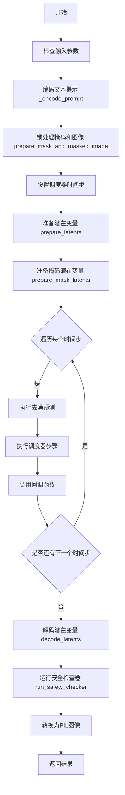
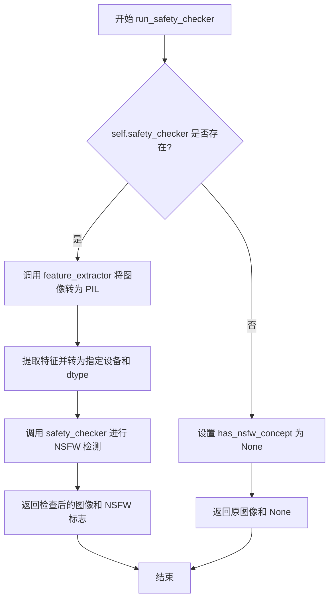
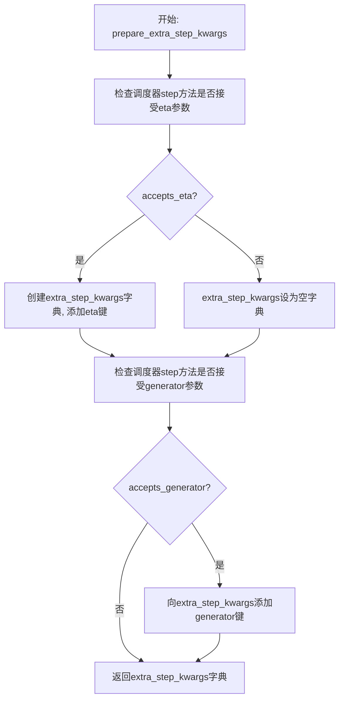
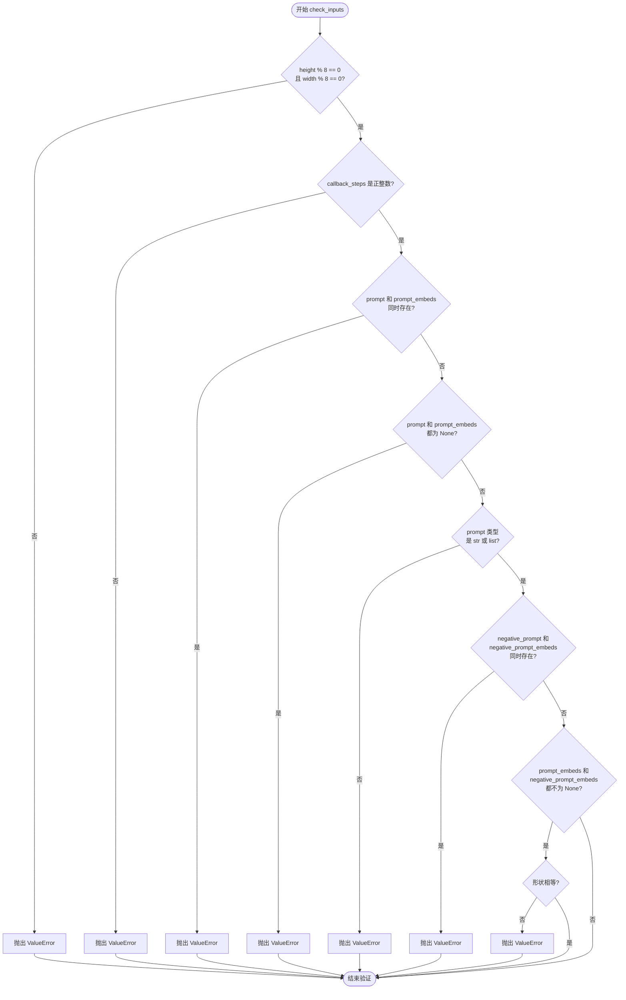
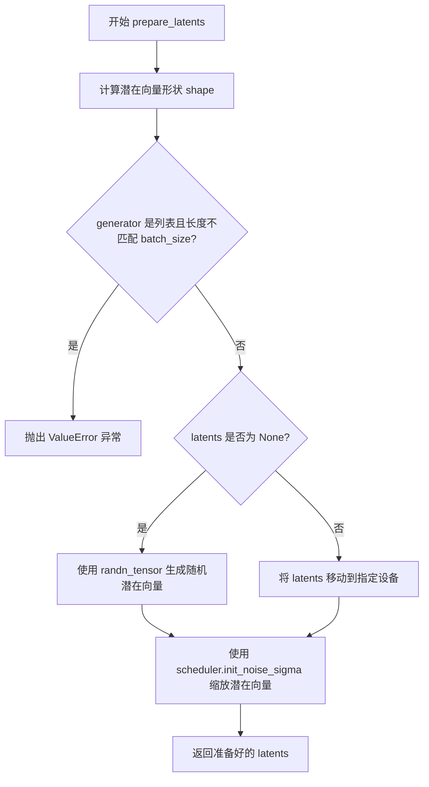
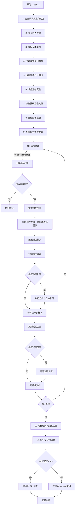

# `diffusers\examples\community\stable_diffusion_repaint.py` 详细设计文档

这是一个基于Stable Diffusion的图像重绘（inpainting）管道，实现文本引导的图像修复功能。该管道接收待修复的图像、掩码图像和文本提示，利用预训练的VAE、UNet和文本编码器模型，在掩码区域生成与文本描述相符的新内容。这是RePaint算法的实现版本，支持跳步采样和马尔可夫链回溯操作。

## 整体流程



## 类结构

```
DiffusionPipeline (抽象基类)
├── StableDiffusionMixin (混入类)
├── TextualInversionLoaderMixin (混入类)
├── StableDiffusionLoraLoaderMixin (混入类)
└── StableDiffusionRepaintPipeline (具体实现类)
```

## 全局变量及字段


### `logger`
    
模块级日志记录器，用于记录警告和信息

类型：`logging.Logger`
    


### `prepare_mask_and_masked_image`
    
预处理函数，将图像和掩码转换为张量格式并返回掩码和被掩码覆盖的图像

类型：`Callable[[Union[torch.Tensor, PIL.Image.Image, np.ndarray], Union[torch.Tensor, PIL.Image.Image, np.ndarray]], tuple[torch.Tensor, torch.Tensor]]`
    


### `StableDiffusionRepaintPipeline.vae`
    
VAE编码器和解码器，用于将图像编码到潜在空间并从潜在空间解码重建图像

类型：`AutoencoderKL`
    


### `StableDiffusionRepaintPipeline.text_encoder`
    
CLIP文本编码器，用于将文本提示编码为文本嵌入向量

类型：`CLIPTextModel`
    


### `StableDiffusionRepaintPipeline.tokenizer`
    
CLIP分词器，用于将文本分割为token序列

类型：`CLIPTokenizer`
    


### `StableDiffusionRepaintPipeline.unet`
    
条件UNet去噪模型，用于在扩散过程中预测噪声残差

类型：`UNet2DConditionModel`
    


### `StableDiffusionRepaintPipeline.scheduler`
    
扩散调度器，管理去噪过程的噪声调度和时间步

类型：`KarrasDiffusionSchedulers`
    


### `StableDiffusionRepaintPipeline.safety_checker`
    
安全检查器，用于检测生成图像中是否包含不当内容

类型：`StableDiffusionSafetyChecker`
    


### `StableDiffusionRepaintPipeline.feature_extractor`
    
CLIP图像特征提取器，用于提取图像特征供安全检查器使用

类型：`CLIPImageProcessor`
    


### `StableDiffusionRepaintPipeline.vae_scale_factor`
    
VAE缩放因子，用于计算潜在空间与像素空间之间的尺寸转换比例

类型：`int`
    


### `StableDiffusionRepaintPipeline._optional_components`
    
可选组件列表，定义哪些组件是可选的（safety_checker和feature_extractor）

类型：`List[str]`
    
    

## 全局函数及方法


### `prepare_mask_and_masked_image`

该函数用于将图像和掩码预处理为Stable Diffusion修复（inpainting）管道所需的格式。它接受多种输入类型（PIL.Image、numpy数组或PyTorch张量），并将它们统一转换为具有4个维度的PyTorch张量，其中图像归一化到[-1, 1]范围，掩码二值化到[0, 1]范围。

参数：

- `image`：`Union[np.array, PIL.Image, torch.Tensor]`，要修复的图像。可以是PIL图像、height×width×3的numpy数组、channels×height×width的PyTorch张量或batch×channels×height×width的PyTorch张量。
- `mask`：`Union[np.array, PIL.Image, torch.Tensor]`，要应用到图像的掩码，即要修复的区域。可以是PIL图像、height×width的numpy数组、1×height×width的PyTorch张量或batch×1×height×width的PyTorch张量。

返回值：`tuple[torch.Tensor]`，包含两个PyTorch张量的元组（mask, masked_image），形状均为batch×channels×height×width，其中mask的channels为1，masked_image的channels为3。

#### 流程图

```mermaid
flowchart TD
    A[开始: prepare_mask_and_masked_image] --> B{image是否为torch.Tensor?}
    B -- 是 --> C{mask是否为torch.Tensor?}
    C -- 否 --> D[抛出TypeError]
    C -- 是 --> E{image.ndim == 3?}
    E -- 是 --> F[添加批量维度: image.unsqueeze(0)]
    E -- 否 --> G{mask.ndim == 2?}
    F --> G
    G -- 是 --> H[添加通道和批量维度: mask.unsqueeze(0).unsqueeze(0)]
    G -- 否 --> I{mask.ndim == 3?}
    H --> I
    I -- 是且mask.shape[0] == 1 --> J[添加批量维度: mask.unsqueeze(0)]
    I -- 否则 --> K[添加通道维度: mask.unsqueeze(1)]
    J --> L[断言检查: image和mask都是4维]
    K --> L
    L --> M[断言检查: 空间维度相同]
    M --> N[断言检查: 批量大小相同]
    N --> O{image值在[-1, 1]?}
    O -- 否 --> P[抛出ValueError]
    O -- 是 --> Q{mask值在[0, 1]?}
    Q -- 否 --> R[抛出ValueError]
    Q -- 是 --> S[二值化掩码: mask &lt; 0.5 = 0, mask >= 0.5 = 1]
    S --> T[转换为float32: image.to dtype=torch.float32]
    T --> U[设置masked_image = image]
    
    B -- 否 --> V{mask是否为torch.Tensor?}
    V -- 是 --> W[抛出TypeError]
    V -- 否 --> X[预处理image]
    X --> Y{image是PIL.Image或np.ndarray?}
    Y -- 是 --> Z[转换为列表]
    Y -- 否 --> AA{image是list?}
    Z --> AB[处理PIL.Image: 转换为RGB并转为numpy]
    AB --> AC[拼接numpy数组]
    AA -- 是 --> AC
    AC --> AD[转置: image.transpose 0,3,1,2]
    AD --> AE[转为float32张量并归一化到[-1, 1]]
    
    X --> AF[预处理mask]
    AF --> AG{mask是PIL.Image或np.ndarray?}
    AG -- 是 --> AH[转换为列表]
    AH --> AI{处理PIL.Image: 转换为L并转为numpy]
    AI --> AJ[拼接numpy数组]
    AJ --> AK[归一化到[0, 1]]
    AK --> AL[二值化掩码]
    AL --> AM[转为torch.Tensor]
    AE --> AM
    
    AM --> AN[返回: mask, masked_image]
    U --> AN
    
    style P fill:#ffcccc
    style R fill:#ffcccc
    style D fill:#ffcccc
    style W fill:#ffcccc
    style AN fill:#ccffcc
```

#### 带注释源码

```python
def prepare_mask_and_masked_image(image, mask):
    """
    Prepares a pair (image, mask) to be consumed by the Stable Diffusion pipeline. This means that those inputs will be
    converted to ``torch.Tensor`` with shapes ``batch x channels x height x width`` where ``channels`` is ``3`` for the
    ``image`` and ``1`` for the ``mask``.
    The ``image`` will be converted to ``torch.float32`` and normalized to be in ``[-1, 1]``. The ``mask`` will be
    binarized (``mask > 0.5``) and cast to ``torch.float32`` too.
    Args:
        image (Union[np.array, PIL.Image, torch.Tensor]): The image to inpaint.
            It can be a ``PIL.Image``, or a ``height x width x 3`` ``np.array`` or a ``channels x height x width``
            ``torch.Tensor`` or a ``batch x channels x height x width`` ``torch.Tensor``.
        mask (_type_): The mask to apply to the image, i.e. regions to inpaint.
            It can be a ``PIL.Image``, or a ``height x width`` ``np.array`` or a ``1 x height x width``
            ``torch.Tensor`` or a ``batch x 1 x height x width`` ``torch.Tensor``.
    Raises:
        ValueError: ``torch.Tensor`` images should be in the ``[-1, 1]`` range. ValueError: ``torch.Tensor`` mask
        should be in the ``[0, 1]`` range. ValueError: ``mask`` and ``image`` should have the same spatial dimensions.
        TypeError: ``mask`` is a ``torch.Tensor`` but ``image`` is not
            (ot the other way around).
    Returns:
        tuple[torch.Tensor]: The pair (mask, masked_image) as ``torch.Tensor`` with 4
            dimensions: ``batch x channels x height x width``.
    """
    # 分支1: image已经是torch.Tensor
    if isinstance(image, torch.Tensor):
        # 确保mask也是torch.Tensor，否则抛出类型错误
        if not isinstance(mask, torch.Tensor):
            raise TypeError(f"`image` is a torch.Tensor but `mask` (type: {type(mask)} is not")

        # 批量单张图像: (3, H, W) -> (1, 3, H, W)
        if image.ndim == 3:
            assert image.shape[0] == 3, "Image outside a batch should be of shape (3, H, W)"
            image = image.unsqueeze(0)

        # 批量单张掩码: (H, W) -> (1, 1, H, W)
        if mask.ndim == 2:
            mask = mask.unsqueeze(0).unsqueeze(0)

        # 处理批量单张掩码或添加通道维度
        if mask.ndim == 3:
            # 单个批量掩码，无通道维度，或单掩码有通道维度
            if mask.shape[0] == 1:
                mask = mask.unsqueeze(0)
            # 批量掩码无通道维度
            else:
                mask = mask.unsqueeze(1)

        # 断言：image和mask必须是4维张量
        assert image.ndim == 4 and mask.ndim == 4, "Image and Mask must have 4 dimensions"
        # 断言：空间维度必须相同
        assert image.shape[-2:] == mask.shape[-2:], "Image and Mask must have the same spatial dimensions"
        # 断言：批量大小必须相同
        assert image.shape[0] == mask.shape[0], "Image and Mask must have the same batch size"

        # 检查image是否在[-1, 1]范围内
        if image.min() < -1 or image.max() > 1:
            raise ValueError("Image should be in [-1, 1] range")

        # 检查mask是否在[0, 1]范围内
        if mask.min() < 0 or mask.max() > 1:
            raise ValueError("Mask should be in [0, 1] range")

        # 二值化掩码: 小于0.5设为0，大于等于0.5设为1
        mask[mask < 0.5] = 0
        mask[mask >= 0.5] = 1

        # 图像转换为float32
        image = image.to(dtype=torch.float32)
    
    # 分支2: mask是torch.Tensor但image不是
    elif isinstance(mask, torch.Tensor):
        raise TypeError(f"`mask` is a torch.Tensor but `image` (type: {type(image)} is not")
    
    # 分支3: 两者都不是torch.Tensor，需要从PIL.Image或numpy数组预处理
    else:
        # 预处理图像
        if isinstance(image, (PIL.Image.Image, np.ndarray)):
            image = [image]

        # 将PIL.Image列表转换为numpy数组
        if isinstance(image, list) and isinstance(image[0], PIL.Image.Image):
            image = [np.array(i.convert("RGB"))[None, :] for i in image]
            image = np.concatenate(image, axis=0)
        # 将numpy数组列表拼接
        elif isinstance(image, list) and isinstance(image[0], np.ndarray):
            image = np.concatenate([i[None, :] for i in image], axis=0)

        # 转换维度顺序: (B, H, W, C) -> (B, C, H, W)
        image = image.transpose(0, 3, 1, 2)
        # 转换为float32张量并归一化到[-1, 1]
        image = torch.from_numpy(image).to(dtype=torch.float32) / 127.5 - 1.0

        # 预处理掩码
        if isinstance(mask, (PIL.Image.Image, np.ndarray)):
            mask = [mask]

        # 处理PIL图像掩码
        if isinstance(mask, list) and isinstance(mask[0], PIL.Image.Image):
            # 转换为L通道（灰度）并处理
            mask = np.concatenate([np.array(m.convert("L"))[None, None, :] for m in mask], axis=0)
            mask = mask.astype(np.float32) / 255.0
        # 处理numpy数组掩码
        elif isinstance(mask, list) and isinstance(mask[0], np.ndarray):
            mask = np.concatenate([m[None, None, :] for m in mask], axis=0)

        # 二值化掩码
        mask[mask < 0.5] = 0
        mask[mask >= 0.5] = 1
        mask = torch.from_numpy(mask)

    # masked_image = image * (mask >= 0.5)  # 原本应该应用的掩码，但代码中直接返回原图
    masked_image = image

    return mask, masked_image
```


### `StableDiffusionRepaintPipeline.__init__`

该方法是 `StableDiffusionRepaintPipeline` 类的构造函数，负责初始化整个重绘pipeline的核心组件，包括VAE、文本编码器、tokenizer、UNet模型、调度器以及可选的安全检查器和特征提取器。同时该方法还包含多项配置兼容性检查和自动修复逻辑，确保pipeline能够在不同版本的模型配置下正常运行。

参数：

- `vae`：`AutoencoderKL`，Variational Auto-Encoder (VAE) 模型，用于将图像编码和解码到潜在表示空间
- `text_encoder`：`CLIPTextModel`，冻结的文本编码器，Stable Diffusion 使用 CLIP 的文本部分
- `tokenizer`：`CLIPTokenizer`，用于将文本转换为token的Tokenizer
- `unet`：`UNet2DConditionModel`，条件U-Net架构，用于对编码后的图像潜在表示进行去噪
- `scheduler`：`KarrasDiffusionSchedulers`，与UNet结合使用以对图像潜在表示进行去噪的调度器
- `safety_checker`：`StableDiffusionSafetyChecker`，用于估计生成的图像是否具有攻击性或有害的分类模块
- `feature_extractor`：`CLIPImageProcessor`，用于从生成的图像中提取特征以供安全检查器使用
- `requires_safety_checker`：`bool`（默认值：`True`），是否需要安全检查器

返回值：无（`None`），构造函数不返回值，仅初始化对象状态

#### 流程图

```mermaid
flowchart TD
    A[开始 __init__] --> B[调用 super().__init__]
    
    B --> C{scheduler.config.steps_offset != 1?}
    C -->|是| D[生成废弃警告信息]
    D --> E[更新 scheduler._internal_dict 设置 steps_offset=1]
    C -->|否| F{scheduler.config.skip_prk_steps == False?}
    
    E --> F
    F -->|是| G[生成废弃警告信息]
    G --> H[更新 scheduler._internal_dict 设置 skip_prk_steps=True]
    F -->|否| I{safety_checker is None 且 requires_safety_checker is True?}
    
    H --> I
    I -->|是| J[记录安全检查器禁用警告]
    I -->|否| K{safety_checker is not None 且 feature_extractor is None?}
    
    J --> L{unet版本 < 0.9.0 且 sample_size < 64?}
    K -->|是| L
    
    K -->|否| M{unet.config.in_channels != 4?}
    L -->|是| N[生成sample_size废弃警告]
    N --> O[更新 unet._internal_dict 设置 sample_size=64]
    O --> M
    
    L -->|否| M
    M -->|是| P[记录输入通道数警告]
    M -->|否| Q[调用 self.register_modules 注册所有模块]
    
    P --> Q
    J --> Q
    
    Q --> R[计算 self.vae_scale_factor]
    R --> S[调用 self.register_to_config 注册 requires_safety_checker]
    S --> T[结束 __init__]
```

#### 带注释源码

```python
def __init__(
    self,
    vae: AutoencoderKL,
    text_encoder: CLIPTextModel,
    tokenizer: CLIPTokenizer,
    unet: UNet2DConditionModel,
    scheduler: KarrasDiffusionSchedulers,
    safety_checker: StableDiffusionSafetyChecker,
    feature_extractor: CLIPImageProcessor,
    requires_safety_checker: bool = True,
):
    """
    初始化 StableDiffusionRepaintPipeline 的所有核心组件
    
    参数:
        vae: Variational Auto-Encoder (VAE) Model，用于编码和解码图像到潜在表示
        text_encoder: Frozen text-encoder (CLIP)
        tokenizer: CLIPTokenizer，用于文本分词
        unet: Conditional U-Net architecture，用于去噪
        scheduler: 调度器，用于去噪过程
        safety_checker: 安全检查器，用于过滤不安全内容
        feature_extractor: 特征提取器，用于安全检查
        requires_safety_checker: 是否启用安全检查器
    """
    # 调用父类 DiffusionPipeline 的初始化方法
    super().__init__()

    # ============================================================
    # 步骤1: 检查并修复 scheduler 的 steps_offset 配置
    # ============================================================
    if scheduler is not None and getattr(scheduler.config, "steps_offset", 1) != 1:
        deprecation_message = (
            f"The configuration file of this scheduler: {scheduler} is outdated. `steps_offset`"
            f" should be set to 1 instead of {scheduler.config.steps_offset}. Please make sure "
            "to update the config accordingly as leaving `steps_offset` might led to incorrect results"
            " in future versions. If you have downloaded this checkpoint from the Hugging Face Hub,"
            " it would be very nice if you could open a Pull request for the `scheduler/scheduler_config.json`"
            " file"
        )
        # 发出废弃警告并自动修复配置
        deprecate("steps_offset!=1", "1.0.0", deprecation_message, standard_warn=False)
        new_config = dict(scheduler.config)
        new_config["steps_offset"] = 1
        scheduler._internal_dict = FrozenDict(new_config)

    # ============================================================
    # 步骤2: 检查并修复 scheduler 的 skip_prk_steps 配置
    # ============================================================
    if scheduler is not None and getattr(scheduler.config, "skip_prk_steps", True) is False:
        deprecation_message = (
            f"The configuration file of this scheduler: {scheduler} has not set the configuration"
            " `skip_prk_steps`. `skip_prk_steps` should be set to True in the configuration file. Please make"
            " sure to update the config accordingly as not setting `skip_prk_steps` in the config might lead to"
            " incorrect results in future versions. If you have downloaded this checkpoint from the Hugging Face"
            " Hub, it would be very nice if you could open a Pull request for the"
            " `scheduler/scheduler_config.json` file"
        )
        deprecate(
            "skip_prk_steps not set",
            "1.0.0",
            deprecation_message,
            standard_warn=False,
        )
        new_config = dict(scheduler.config)
        new_config["skip_prk_steps"] = True
        scheduler._internal_dict = FrozenDict(new_config)

    # ============================================================
    # 步骤3: 检查安全检查器配置
    # ============================================================
    # 如果 safety_checker 为 None 但 requires_safety_checker 为 True，发出警告
    if safety_checker is None and requires_safety_checker:
        logger.warning(
            f"You have disabled the safety checker for {self.__class__} by passing `safety_checker=None`. Ensure"
            " that you abide to the conditions of the Stable Diffusion license and do not expose unfiltered"
            " results in services or applications open to the public. Both the diffusers team and Hugging Face"
            " strongly recommend to keep the safety filter enabled in all public facing circumstances, disabling"
            " it only for use-cases that involve analyzing network behavior or auditing its results. For more"
            " information, please have a look at https://github.com/huggingface/diffusers/pull/254 ."
        )

    # 如果提供了 safety_checker 但没有 feature_extractor，抛出错误
    if safety_checker is not None and feature_extractor is None:
        raise ValueError(
            "Make sure to define a feature extractor when loading {self.__class__} if you want to use the safety"
            " checker. If you do not want to use the safety checker, you can pass `'safety_checker=None'` instead."
        )

    # ============================================================
    # 步骤4: 检查 UNet 版本和 sample_size 配置
    # ============================================================
    # 检查 UNet 版本是否小于 0.9.0
    is_unet_version_less_0_9_0 = (
        unet is not None
        and hasattr(unet.config, "_diffusers_version")
        and version.parse(version.parse(unet.config._diffusers_version).base_version) < version.parse("0.9.0.dev0")
    )
    # 检查 UNet 的 sample_size 是否小于 64
    is_unet_sample_size_less_64 = (
        unet is not None and hasattr(unet.config, "sample_size") and unet.config.sample_size < 64
    )
    # 如果同时满足两个条件，发出废弃警告并修复
    if is_unet_version_less_0_9_0 and is_unet_sample_size_less_64:
        deprecation_message = (
            "The configuration file of the unet has set the default `sample_size` to smaller than"
            " 64 which seems highly unlikely .If you're checkpoint is a fine-tuned version of any of the"
            " following: \n- CompVis/stable-diffusion-v1-4 \n- CompVis/stable-diffusion-v1-3 \n-"
            " CompVis/stable-diffusion-v1-2 \n- CompVis/stable-diffusion-v1-1 \n- stable-diffusion-v1-5/stable-diffusion-v1-5"
            " \n- stable-diffusion-v1-5/stable-diffusion-inpainting \n you should change 'sample_size' to 64 in the"
            " configuration file. Please make sure to update the config accordingly as leaving `sample_size=32`"
            " in the config might lead to incorrect results in future versions. If you have downloaded this"
            " checkpoint from the Hugging Face Hub, it would be very nice if you could open a Pull request for"
            " the `unet/config.json` file"
        )
        deprecate("sample_size<64", "1.0.0", deprecation_message, standard_warn=False)
        new_config = dict(unet.config)
        new_config["sample_size"] = 64
        unet._internal_dict = FrozenDict(new_config)

    # ============================================================
    # 步骤5: 检查 UNet 输入通道数配置
    # ============================================================
    # 验证 UNet 的输入通道数是否为 4（num_channels_latents=4）
    if unet is not None and unet.config.in_channels != 4:
        logger.warning(
            f"You have loaded a UNet with {unet.config.in_channels} input channels, whereas by default,"
            f" {self.__class__} assumes that `pipeline.unet` has 4 input channels: 4 for `num_channels_latents`,"
            ". If you did not intend to modify"
            " this behavior, please check whether you have loaded the right checkpoint."
        )

    # ============================================================
    # 步骤6: 注册所有模块到 pipeline
    # ============================================================
    self.register_modules(
        vae=vae,
        text_encoder=text_encoder,
        tokenizer=tokenizer,
        unet=unet,
        scheduler=scheduler,
        safety_checker=safety_checker,
        feature_extractor=feature_extractor,
    )

    # ============================================================
    # 步骤7: 计算 VAE 缩放因子并注册配置
    # ============================================================
    # 计算 VAE 缩放因子，用于调整潜在空间的尺寸
    # 公式: 2 ** (len(vae.config.block_out_channels) - 1)
    # 标准 VAE 配置通常为 [128, 256, 512, 512]，得到 2^(4-1) = 8
    self.vae_scale_factor = 2 ** (len(self.vae.config.block_out_channels) - 1) if getattr(self, "vae", None) else 8
    
    # 将 requires_safety_checker 注册到配置中
    self.register_to_config(requires_safety_checker=requires_safety_checker)
```


### `StableDiffusionRepaintPipeline._encode_prompt`

该方法负责将文本提示词（prompt）编码为文本Encoder的隐藏状态（hidden states），支持批量处理、文本反转（textual inversion）和无分类器引导（classifier-free guidance）。

参数：

- `prompt`：`Union[str, List[str]]`，可选，要编码的提示词
- `device`：`torch.device`，torch 设备，用于执行编码
- `num_images_per_prompt`：`int`，每个提示词生成的图像数量，用于复制文本嵌入
- `do_classifier_free_guidance`：`bool`，是否使用无分类器引导
- `negative_prompt`：`Union[str, List[str]]`，可选，用于引导图像生成的负面提示词
- `prompt_embeds`：`Optional[torch.Tensor]`，可选，预生成的文本嵌入，可用于轻松调整文本输入
- `negative_prompt_embeds`：`Optional[torch.Tensor]`，可选，预生成的负面文本嵌入

返回值：`torch.Tensor`，编码后的提示词嵌入，用于后续的图像生成过程。如果使用无分类器引导，返回的张量会包含负面和正面嵌入的拼接。

#### 流程图

```mermaid
flowchart TD
    A[开始 _encode_prompt] --> B{判断 prompt 类型}
    B -->|str| C[batch_size = 1]
    B -->|list| D[batch_size = len(prompt)]
    B -->|其他| E[batch_size = prompt_embeds.shape[0]]
    C --> F{prompt_embeds 是否存在}
    D --> F
    E --> F
    F -->|是| G[直接使用 prompt_embeds]
    F -->|否| H{检查 TextualInversionLoaderMixin}
    H -->|是| I[调用 maybe_convert_prompt]
    H -->|否| J[直接使用原始 prompt]
    I --> K[tokenizer 处理 prompt]
    J --> K
    K --> L[tokenizer 返回 input_ids 和 attention_mask]
    L --> M[检查 use_attention_mask 配置]
    M -->|是| N[使用 tokenizer 的 attention_mask]
    M -->|否| O[attention_mask = None]
    N --> P[text_encoder 编码]
    O --> P
    P --> Q[获取 prompt_embeds[0]]
    Q --> R[转换为指定 dtype 和 device]
    R --> S{do_classifier_free_guidance}
    S -->|是| T{negative_prompt_embeds 存在}
    T -->|是| U[直接使用 negative_prompt_embeds]
    T -->|否| V{处理 negative_prompt}
    V -->|None| W[uncond_tokens = [''] * batch_size]
    V -->|str| X[uncond_tokens = [negative_prompt]]
    V -->|list| Y[uncond_tokens = negative_prompt]
    W --> Z[TextualInversion 处理]
    X --> Z
    Y --> Z
    Z --> AA[tokenizer 处理 uncond_tokens]
    AA --> AB[text_encoder 编码获取 negative_prompt_embeds]
    U --> AC[复制 prompt_embeds]
    AB --> AC
    S -->|否| AD[不处理 negative_prompt]
    AD --> AE[复制 prompt_embeds]
    AC --> AF[重复 embeddings]
    AE --> AF
    AF --> AG{do_classifier_free_guidance}
    AG -->|是| AH[拼接 negative_prompt_embeds 和 prompt_embeds]
    AG -->|否| AI[直接返回 prompt_embeds]
    AH --> AJ[返回最终 embeddings]
    AI --> AJ
    G --> AJ
```

#### 带注释源码

```python
def _encode_prompt(
    self,
    prompt,  # Union[str, List[str]], optional - 要编码的提示词
    device,  # torch.device - torch 设备
    num_images_per_prompt,  # int - 每个提示词生成的图像数量
    do_classifier_free_guidance,  # bool - 是否使用无分类器引导
    negative_prompt=None,  # Union[str, List[str]], optional - 负面提示词
    prompt_embeds: Optional[torch.Tensor] = None,  # Optional[torch.Tensor] - 预生成的文本嵌入
    negative_prompt_embeds: Optional[torch.Tensor] = None,  # Optional[torch.Tensor] - 预生成的负面文本嵌入
):
    r"""
    Encodes the prompt into text encoder hidden states.
    """
    # 1. 确定 batch_size
    if prompt is not None and isinstance(prompt, str):
        batch_size = 1
    elif prompt is not None and isinstance(prompt, list):
        batch_size = len(prompt)
    else:
        batch_size = prompt_embeds.shape[0]

    # 2. 如果没有提供 prompt_embeds，则需要从 prompt 生成
    if prompt_embeds is None:
        # textual inversion: 处理多向量 token（如有必要）
        if isinstance(self, TextualInversionLoaderMixin):
            prompt = self.maybe_convert_prompt(prompt, self.tokenizer)

        # 使用 tokenizer 将 prompt 转换为 token IDs
        text_inputs = self.tokenizer(
            prompt,
            padding="max_length",
            max_length=self.tokenizer.model_max_length,
            truncation=True,
            return_tensors="pt",
        )
        text_input_ids = text_inputs.input_ids
        # 获取未截断的 token IDs 用于检测截断
        untruncated_ids = self.tokenizer(prompt, padding="longest", return_tensors="pt").input_ids

        # 检测是否有内容被截断
        if untruncated_ids.shape[-1] >= text_input_ids.shape[-1] and not torch.equal(
            text_input_ids, untruncated_ids
        ):
            removed_text = self.tokenizer.batch_decode(
                untruncated_ids[:, self.tokenizer.model_max_length - 1 : -1]
            )
            logger.warning(
                "The following part of your input was truncated because CLIP can only handle sequences up to"
                f" {self.tokenizer.model_max_length} tokens: {removed_text}"
            )

        # 获取 attention_mask（如果 text_encoder 支持）
        if hasattr(self.text_encoder.config, "use_attention_mask") and self.text_encoder.config.use_attention_mask:
            attention_mask = text_inputs.attention_mask.to(device)
        else:
            attention_mask = None

        # 使用 text_encoder 编码获取 embeddings
        prompt_embeds = self.text_encoder(
            text_input_ids.to(device),
            attention_mask=attention_mask,
        )
        # 获取第一项（hidden states）
        prompt_embeds = prompt_embeds[0]

    # 3. 将 prompt_embeds 转换到正确的 dtype 和 device
    prompt_embeds = prompt_embeds.to(dtype=self.text_encoder.dtype, device=device)

    # 4. 为每个提示词生成多个图像而复制 embeddings
    bs_embed, seq_len, _ = prompt_embeds.shape
    # 复制 embeddings 以支持每个提示词生成多个图像
    prompt_embeds = prompt_embeds.repeat(1, num_images_per_prompt, 1)
    prompt_embeds = prompt_embeds.view(bs_embed * num_images_per_prompt, seq_len, -1)

    # 5. 获取无分类器引导的 unconditional embeddings
    if do_classifier_free_guidance and negative_prompt_embeds is None:
        uncond_tokens: List[str]
        if negative_prompt is None:
            # 如果没有提供负面提示词，使用空字符串
            uncond_tokens = [""] * batch_size
        elif type(prompt) is not type(negative_prompt):
            raise TypeError(
                f"`negative_prompt` should be the same type to `prompt`, but got {type(negative_prompt)} !="
                f" {type(prompt)}."
            )
        elif isinstance(negative_prompt, str):
            uncond_tokens = [negative_prompt]
        elif batch_size != len(negative_prompt):
            raise ValueError(
                f"`negative_prompt`: {negative_prompt} has batch size {len(negative_prompt)}, but `prompt`:"
                f" {prompt} has batch size {batch_size}. Please make sure that passed `negative_prompt` matches"
                " the batch size of `prompt`."
            )
        else:
            uncond_tokens = negative_prompt

        # textual inversion: 处理多向量 token（如有必要）
        if isinstance(self, TextualInversionLoaderMixin):
            uncond_tokens = self.maybe_convert_prompt(uncond_tokens, self.tokenizer)

        # tokenizer 处理 negative_prompt
        max_length = prompt_embeds.shape[1]
        uncond_input = self.tokenizer(
            uncond_tokens,
            padding="max_length",
            max_length=max_length,
            truncation=True,
            return_tensors="pt",
        )

        # 获取 attention_mask
        if hasattr(self.text_encoder.config, "use_attention_mask") and self.text_encoder.config.use_attention_mask:
            attention_mask = uncond_input.attention_mask.to(device)
        else:
            attention_mask = None

        # 编码获取 negative_prompt_embeds
        negative_prompt_embeds = self.text_encoder(
            uncond_input.input_ids.to(device),
            attention_mask=attention_mask,
        )
        negative_prompt_embeds = negative_prompt_embeds[0]

    # 6. 如果使用无分类器引导，拼接 embeddings
    if do_classifier_free_guidance:
        # 获取序列长度
        seq_len = negative_prompt_embeds.shape[1]

        # 转换 dtype 和 device
        negative_prompt_embeds = negative_prompt_embeds.to(dtype=self.text_encoder.dtype, device=device)

        # 复制 unconditional embeddings
        negative_prompt_embeds = negative_prompt_embeds.repeat(1, num_images_per_prompt, 1)
        negative_prompt_embeds = negative_prompt_embeds.view(batch_size * num_images_per_prompt, seq_len, -1)

        # 拼接 unconditional 和 text embeddings
        # 这样可以在一次前向传播中同时计算有条件和无条件的噪声预测
        prompt_embeds = torch.cat([negative_prompt_embeds, prompt_embeds])

    return prompt_embeds
```


### `StableDiffusionRepaintPipeline.run_safety_checker`

该方法用于对生成的图像进行安全检查（NSFW内容检测），通过调用安全检查器判断图像是否包含不当内容，并返回检查结果及处理后的图像。

参数：

- `image`：`torch.Tensor` 或 `numpy.ndarray`，需要进行检查的图像数据，通常为去噪后的潜在表示转换得到的图像
- `device`：`torch.device`，用于执行安全检查的设备（如 CUDA 或 CPU）
- `dtype`：`torch.dtype`，图像数据的精度类型（如 float32）

返回值：`tuple[torch.Tensor, Optional[torch.Tensor]]`，返回两个元素——第一个是检查后的图像（可能保持原样或被安全检查器处理），第二个是布尔标志，指示是否检测到 NSFW 内容（若未配置安全检查器则为 `None`）

#### 流程图



#### 带注释源码

```python
def run_safety_checker(self, image, device, dtype):
    """
    运行安全检查器对图像进行 NSFW 内容检测。
    
    该方法检查图像中是否包含不适合公开展示的内容。如果安全检查器
    已配置，则使用 CLIP 特征提取器提取图像特征并传递给安全检查器
    进行判断；否则直接返回原始图像和 None。
    
    Args:
        image: 需要检查的图像张量，形状为 (B, H, W, C) 或 (B, C, H, W) 的张量
        device: 运行检查的设备
        dtype: 用于 CLIP 输入的数据类型
    
    Returns:
        tuple: (处理后的图像, NSFW 检测结果)
            - 图像：安全检查器处理后的图像，若无检查器则返回原图
            - NSFW 标志：检测到不安全内容时为 True，未检测到时为 False，
              若无检查器则返回 None
    """
    # 检查是否配置了安全检查器
    if self.safety_checker is not None:
        # 将图像从 numpy 格式转换为 PIL 图像格式
        # 供 feature_extractor 进行特征提取
        safety_checker_input = self.feature_extractor(
            self.numpy_to_pil(image),  # 转换为 PIL 图像列表
            return_tensors="pt"        # 返回 PyTorch 张量
        ).to(device)                  # 移动到指定设备
        
        # 调用安全检查器进行 NSFW 检测
        # 使用 CLIP 模型提取的特征作为 clip_input
        image, has_nsfw_concept = self.safety_checker(
            images=image,                           # 原始图像
            clip_input=safety_checker_input.pixel_values.to(dtype)  # CLIP 特征输入
        )
    else:
        # 未配置安全检查器时，返回 None 作为 NSFW 标志
        has_nsfw_concept = None
    
    # 返回检查后的图像和 NSFW 检测标志
    return image, has_nsfw_concept
```


### `StableDiffusionRepaintPipeline.prepare_extra_step_kwargs`

该方法用于准备调度器（scheduler）的额外参数。由于不同的调度器具有不同的签名，此方法通过检查调度器的 `step` 函数是否接受特定参数（如 `eta` 和 `generator`）来动态构建需要传递给调度器的参数字典。

参数：

- `generator`：`Optional[Union[torch.Generator, List[torch.Generator]]]`，可选的随机数生成器，用于确保生成过程的可重复性。如果调度器支持，则将其传递给调度器。
- `eta`：`float`，DDIM 调度器专用的 eta 参数（η），对应 DDIM 论文中的参数。其他调度器将忽略此参数。值的范围应为 [0, 1]。

返回值：`Dict`，返回一个包含调度器所需额外参数的字典，可能包含 `eta` 和/或 `generator` 键。

#### 流程图



#### 带注释源码

```python
def prepare_extra_step_kwargs(self, generator, eta):
    # 准备调度器步骤所需的额外参数，因为并非所有调度器都具有相同的签名
    # eta (η) 仅与 DDIMScheduler 一起使用，对于其他调度器将被忽略。
    # eta 对应于 DDIM 论文中的 η：https://huggingface.co/papers/2010.02502
    # 取值范围应为 [0, 1]

    # 使用 inspect 模块检查调度器的 step 方法签名中是否包含 'eta' 参数
    accepts_eta = "eta" in set(inspect.signature(self.scheduler.step).parameters.keys())
    
    # 初始化空字典用于存储额外参数
    extra_step_kwargs = {}
    
    # 如果调度器接受 eta 参数，则将其添加到参数字典中
    if accepts_eta:
        extra_step_kwargs["eta"] = eta

    # 检查调度器是否接受 generator 参数
    accepts_generator = "generator" in set(inspect.signature(self.scheduler.step).parameters.keys())
    
    # 如果调度器接受 generator，则将其添加到参数字典中
    if accepts_generator:
        extra_step_kwargs["generator"] = generator
    
    # 返回包含调度器所需额外参数的字典
    return extra_step_kwargs
```


### `StableDiffusionRepaintPipeline.decode_latents`

该方法负责将模型的潜在表示（latents）解码为实际图像。它首先对潜在表示进行反缩放，然后使用变分自编码器（VAE）进行解码，接着将输出值从 [-1, 1] 范围归一化到 [0, 1] 范围，最后将图像张量转换为 NumPy 数组以便于后续处理。

参数：

- `latents`：`torch.Tensor`，从扩散过程生成的潜在表示张量，通常形状为 (batch_size, channels, height, width)

返回值：`np.ndarray`，解码后的图像，形状为 (batch_size, height, width, channels)，像素值范围为 [0, 1]

#### 流程图

```mermaid
flowchart TD
    A[开始 decode_latents] --> B[反缩放 latents<br>latents = 1/scaling_factor * latents]
    B --> C[VAE 解码<br>image = vae.decode(latents).sample]
    C --> D[归一化到 [0, 1]<br>image = (image / 2 + 0.5).clamp(0, 1)]
    D --> E[转换为 NumPy 数组<br>image.cpu().permute(0, 2, 3, 1).float().numpy()]
    E --> F[返回图像数组]
```

#### 带注释源码

```python
def decode_latents(self, latents):
    """
    将潜在表示解码为实际图像。
    """
    # 1. 反缩放 latents 以恢复到标准正态空间
    # VAE 在编码时会对 latents 进行缩放，这里需要逆向操作
    latents = 1 / self.vae.config.scaling_factor * latents
    
    # 2. 使用 VAE 解码器将潜在表示转换为图像
    # decode 方法返回一个包含 sample 属性的对象
    image = self.vae.decode(latents).sample
    
    # 3. 将图像从 [-1, 1] 范围归一化到 [0, 1] 范围
    # 这是因为 VAE 输出通常在 [-1, 1] 区间
    image = (image / 2 + 0.5).clamp(0, 1)
    
    # 4. 将图像从 PyTorch 张量转换为 NumPy 数组
    # permute(0, 2, 3, 1) 将通道维度从 (B, C, H, W) 变为 (B, H, W, C)
    # 转换为 float32 以保证兼容性（不会导致显著的性能开销且兼容 bfloat16）
    image = image.cpu().permute(0, 2, 3, 1).float().numpy()
    
    return image
```


### `StableDiffusionRepaintPipeline.check_inputs`

该方法用于验证 Stable Diffusion 重绘流水线的输入参数是否合法，确保高度和宽度是 8 的倍数、callback_steps 是正整数，并且 prompt 和 prompt_embeds 等参数不会同时传递或缺失。

参数：

- `self`：`StableDiffusionPipeline` 本身（隐式参数），实例对象
- `prompt`：`Optional[Union[str, List[str]]]`，用于引导图像生成的文本提示
- `height`：`int`，生成图像的高度（像素）
- `width`：`int`，生成图像的宽度（像素）
- `callback_steps`：`int`，回调函数被调用的频率步数
- `negative_prompt`：`Optional[Union[str, List[str]]]`，不引导图像生成的负面提示
- `prompt_embeds`：`Optional[torch.Tensor]`，预生成的文本嵌入
- `negative_prompt_embeds`：`Optional[torch.Tensor]`，预生成的负面文本嵌入

返回值：`None`，无返回值，仅进行参数验证，若参数不合法则抛出 `ValueError`

#### 流程图



#### 带注释源码

```
def check_inputs(
    self,
    prompt,                       # 输入的文本提示
    height,                       # 生成图像的高度
    width,                        # 生成图像的宽度
    callback_steps,               # 回调步数
    negative_prompt=None,         # 可选的负面提示
    prompt_embeds=None,          # 可选的预生成提示嵌入
    negative_prompt_embeds=None, # 可选的预生成负面提示嵌入
):
    # 验证1：检查高度和宽度是否能被8整除
    # Stable Diffusion 的 VAE 和 UNet 要求输入尺寸为8的倍数
    if height % 8 != 0 or width % 8 != 0:
        raise ValueError(f"`height` and `width` have to be divisible by 8 but are {height} and {width}.")

    # 验证2：检查 callback_steps 是否为正整数
    # callback_steps 必须是一个正整数，用于控制回调函数的调用频率
    if (callback_steps is None) or (
        callback_steps is not None and (not isinstance(callback_steps, int) or callback_steps <= 0)
    ):
        raise ValueError(
            f"`callback_steps` has to be a positive integer but is {callback_steps} of type"
            f" {type(callback_steps)}."
        )

    # 验证3：prompt 和 prompt_embeds 不能同时提供
    # 用户应该只选择其中一种方式传递文本信息
    if prompt is not None and prompt_embeds is not None:
        raise ValueError(
            f"Cannot forward both `prompt`: {prompt} and `prompt_embeds`: {prompt_embeds}. Please make sure to"
            " only forward one of the two."
        )
    # 验证4：prompt 和 prompt_embeds 至少提供一个
    elif prompt is None and prompt_embeds is None:
        raise ValueError(
            "Provide either `prompt` or `prompt_embeds`. Cannot leave both `prompt` and `prompt_embeds` undefined."
        )
    # 验证5：prompt 的类型必须是 str 或 list
    elif prompt is not None and (not isinstance(prompt, str) and not isinstance(prompt, list)):
        raise ValueError(f"`prompt` has to be of type `str` or `list` but is {type(prompt)}")

    # 验证6：negative_prompt 和 negative_prompt_embeds 不能同时提供
    if negative_prompt is not None and negative_prompt_embeds is not None:
        raise ValueError(
            f"Cannot forward both `negative_prompt`: {negative_prompt} and `negative_prompt_embeds`:"
            f" {negative_prompt_embeds}. Please make sure to only forward one of the two."
        )

    # 验证7：如果同时提供了 prompt_embeds 和 negative_prompt_embeds，它们的形状必须一致
    # 这是为了确保分类器自由引导（classifier-free guidance）能够正确执行
    if prompt_embeds is not None and negative_prompt_embeds is not None:
        if prompt_embeds.shape != negative_prompt_embeds.shape:
            raise ValueError(
                "`prompt_embeds` and `negative_prompt_embeds` must have the same shape when passed directly, but"
                f" got: `prompt_embeds` {prompt_embeds.shape} != `negative_prompt_embeds`"
                f" {negative_prompt_embeds.shape}."
            )
```


### `StableDiffusionRepaintPipeline.prepare_latents`

该方法负责为 Stable Diffusion 重绘管道准备潜在向量。它根据给定的批次大小、图像尺寸和 VAE 缩放因子计算潜在空间的形状，然后生成或转移噪声潜在向量，最后根据调度器的要求对初始噪声进行缩放。

参数：

- `batch_size`：`int`，批次大小，指定要生成的图像数量
- `num_channels_latents`：`int`，潜在通道数，通常为 4
- `height`：`int`，目标图像的高度（像素）
- `width`：`int`，目标图像的宽度（像素）
- `dtype`：`torch.dtype`，潜在向量的数据类型
- `device`：`torch.device`，潜在向量应放置的设备
- `generator`：`torch.Generator` 或 `List[torch.Generator]`，可选的随机生成器，用于确保可重现性
- `latents`：`torch.Tensor`，可选的预生成潜在向量，如果为 None 则随机生成

返回值：`torch.Tensor`，准备好的潜在向量，形状为 (batch_size, num_channels_latents, height//vae_scale_factor, width//vae_scale_factor)

#### 流程图



#### 带注释源码

```python
def prepare_latents(
    self,
    batch_size,              # int: 批次大小
    num_channels_latents,   # int: 潜在通道数（通常为4）
    height,                 # int: 图像高度（像素）
    width,                  # int: 图像宽度（像素）
    dtype,                  # torch.dtype: 潜在向量数据类型
    device,                 # torch.device: 目标设备
    generator,              # torch.Generator or List[torch.Generator]: 随机生成器
    latents=None,           # torch.Tensor, optional: 预生成潜在向量
):
    # 计算潜在空间的形状：batch_size × num_channels_latents × (height/vae_scale_factor) × (width/vae_scale_factor)
    shape = (
        batch_size,
        num_channels_latents,
        height // self.vae_scale_factor,
        width // self.vae_scale_factor,
    )
    
    # 验证：如果传入生成器列表，其长度必须匹配批次大小
    if isinstance(generator, list) and len(generator) != batch_size:
        raise ValueError(
            f"You have passed a list of generators of length {len(generator)}, but requested an effective batch"
            f" size of {batch_size}. Make sure the batch size matches the length of the generators."
        )

    # 根据是否有预提供的潜在向量进行不同处理
    if latents is None:
        # 使用 randn_tensor 生成标准正态分布的随机潜在向量
        latents = randn_tensor(shape, generator=generator, device=device, dtype=dtype)
    else:
        # 将提供的潜在向量移动到目标设备
        latents = latents.to(device)

    # 根据调度器的初始噪声标准差缩放潜在向量
    # 这是 Stable Diffusion 采样过程的关键步骤
    latents = latents * self.scheduler.init_noise_sigma
    
    return latents
```


### `StableDiffusionRepaintPipeline.prepare_mask_latents`

该方法负责将掩码（mask）和被掩码覆盖的图像（masked_image）准备为潜在空间（latent space）表示。它首先调整掩码大小以匹配潜在空间的分辨率，然后使用VAE编码器将masked_image编码为潜在表示，最后根据批量大小和是否使用无分类器引导（classifier-free guidance）对掩码和潜在表示进行复制和拼接，以适配后续的去噪网络输入。

参数：

- `self`：`StableDiffusionRepaintPipeline` 实例本身
- `mask`：`torch.Tensor`，输入的掩码张量，形状为 batch x 1 x height x width，表示需要重绘的区域
- `masked_image`：`torch.Tensor`，被掩码覆盖的图像张量，形状为 batch x 3 x height x width
- `batch_size`：`int`，批处理大小
- `height`：`int`，图像的高度（像素单位）
- `width`：`int`，图像的宽度（像素单位）
- `dtype`：`torch.dtype`，目标数据类型（如 torch.float32）
- `device`：`torch.device`，目标设备（如 cuda 或 cpu）
- `generator`：`torch.Generator` 或 `List[torch.Generator]`，用于生成随机数的可选生成器，以确保可重复性
- `do_classifier_free_guidance`：`bool`，是否启用无分类器引导，如果为 True，则会在推理时复制掩码和潜在表示以实现 cfg

返回值：`tuple[torch.Tensor, torch.Tensor]`，返回调整大小和复制后的掩码及其对应的潜在表示，两者均为 4D 张量，形状为 batch_size x channels x latent_height x latent_width。

#### 流程图

```mermaid
flowchart TD
    A[开始: prepare_mask_latents] --> B[调整掩码大小]
    B --> C{使用列表生成器?}
    C -->|Yes| D[为每个样本单独编码masked_image]
    C -->|No| E[批量编码masked_image]
    D --> F[拼接masked_image_latents]
    E --> F
    F --> G[应用VAE缩放因子]
    G --> H{批量大小大于当前掩码数?}
    H -->|Yes| I[复制掩码以匹配批量大小]
    H -->|No| J{批量大小大于当前图像潜在数?}
    J -->|Yes| K[复制图像潜在表示以匹配批量大小]
    J -->|No| L{启用无分类器引导?}
    I --> L
    K --> L
    L -->|Yes| M[复制掩码和图像潜在表示各一份]
    L -->|No| N[保持原样]
    M --> O[对齐设备类型]
    N --> O
    O --> P[返回: (mask, masked_image_latents)]
```

#### 带注释源码

```python
def prepare_mask_latents(
    self,
    mask,
    masked_image,
    batch_size,
    height,
    width,
    dtype,
    device,
    generator,
    do_classifier_free_guidance,
):
    # 步骤1: 调整掩码大小以匹配潜在空间的形状
    # 我们在转换为dtype之前执行此操作，以避免在使用cpu_offload和半精度时出现问题
    mask = torch.nn.functional.interpolate(
        mask, size=(height // self.vae_scale_factor, width // self.vae_scale_factor)
    )
    # 将掩码移动到目标设备并转换为目标数据类型
    mask = mask.to(device=device, dtype=dtype)

    # 步骤2: 将masked_image移动到目标设备并转换为目标数据类型
    masked_image = masked_image.to(device=device, dtype=dtype)

    # 步骤3: 将masked_image编码到潜在空间，这样我们可以将其与latents拼接
    if isinstance(generator, list):
        # 如果提供了生成器列表，则为每个样本单独编码
        masked_image_latents = [
            self.vae.encode(masked_image[i : i + 1]).latent_dist.sample(generator=generator[i])
            for i in range(batch_size)
        ]
        # 沿着批次维度拼接编码后的潜在表示
        masked_image_latents = torch.cat(masked_image_latents, dim=0)
    else:
        # 批量编码
        masked_image_latents = self.vae.encode(masked_image).latent_dist.sample(generator=generator)
    
    # 应用VAE的缩放因子（根据VAE配置）
    masked_image_latents = self.vae.config.scaling_factor * masked_image_latents

    # 步骤4: 复制掩码和masked_image_latents以匹配每个prompt的生成数量（使用MPS友好的方法）
    if mask.shape[0] < batch_size:
        if not batch_size % mask.shape[0] == 0:
            raise ValueError(
                "The passed mask and the required batch size don't match. Masks are supposed to be duplicated to"
                f" a total batch size of {batch_size}, but {mask.shape[0]} masks were passed. Make sure the number"
                " of masks that you pass is divisible by the total requested batch size."
            )
        # 重复掩码以达到目标批量大小
        mask = mask.repeat(batch_size // mask.shape[0], 1, 1, 1)
    
    if masked_image_latents.shape[0] < batch_size:
        if not batch_size % masked_image_latents.shape[0] == 0:
            raise ValueError(
                "The passed images and the required batch size don't match. Images are supposed to be duplicated"
                f" to a total batch size of {batch_size}, but {masked_image_latents.shape[0]} images were passed."
                " Make sure the number of images that you pass is divisible by the total requested batch size."
            )
        # 重复图像潜在表示以达到目标批量大小
        masked_image_latents = masked_image_latents.repeat(batch_size // masked_image_latents.shape[0], 1, 1, 1)

    # 步骤5: 如果启用无分类器引导（do_classifier_free_guidance），则复制掩码和潜在表示
    # 这允许模型同时预测有条件和无条件的噪声
    mask = torch.cat([mask] * 2) if do_classifier_free_guidance else mask
    masked_image_latents = (
        torch.cat([masked_image_latents] * 2) if do_classifier_free_guidance else masked_image_latents
    )

    # 步骤6: 对齐设备以防止与潜在模型输入拼接时出现设备错误
    masked_image_latents = masked_image_latents.to(device=device, dtype=dtype)
    
    # 返回处理后的掩码和对应的潜在表示
    return mask, masked_image_latents
```


### `StableDiffusionRepaintPipeline.__call__`

该方法是 StableDiffusionRepaintPipeline 的核心调用函数，用于执行基于文本引导的图像重绘（inpainting）任务。它结合了 RePaint 算法的跳转采样机制，通过接受原始图像、掩码图像和文本提示，生成修复后的图像。

参数：

- `prompt`：`Union[str, List[str]]`，用于引导图像生成的文本提示
- `image`：`Union[torch.Tensor, PIL.Image.Image]`，需要进行重绘的输入图像
- `mask_image`：`Union[torch.Tensor, PIL.Image.Image]`，用于标识重绘区域的掩码图像
- `height`：`Optional[int]`，生成图像的高度，默认为 unet 配置的 sample_size * vae_scale_factor
- `width`：`Optional[int]`，生成图像的宽度，默认为 unet 配置的 sample_size * vae_scale_factor
- `num_inference_steps`：`int`，去噪步数，默认为 50
- `jump_length`：`Optional[int]`，RePaint 算法的前向跳转步长，默认为 10
- `jump_n_sample`：`Optional[int]`，RePaint 算法的每次跳转采样数，默认为 10
- `guidance_scale`：`float`，分类器自由引导强度，默认为 7.5
- `negative_prompt`：`Optional[Union[str, List[str]]]，不引导图像生成的负面提示
- `num_images_per_prompt`：`Optional[int]`，每个提示生成的图像数量，默认为 1
- `eta`：`float`，DDIM 调度器的 eta 参数，默认为 0.0
- `generator`：`Optional[Union[torch.Generator, List[torch.Generator]]]，用于生成确定性结果的随机生成器
- `latents`：`Optional[torch.Tensor]，预生成的噪声潜在向量
- `prompt_embeds`：`Optional[torch.Tensor]，预生成的文本嵌入
- `negative_prompt_embeds`：`Optional[torch.Tensor]，预生成的负面文本嵌入
- `output_type`：`str | None`，输出格式，默认为 "pil"
- `return_dict`：`bool`，是否返回字典格式，默认为 True
- `callback`：`Optional[Callable[[int, int, torch.Tensor], None]]，每步推理的回调函数
- `callback_steps`：`int`，回调函数调用频率，默认为 1

返回值：`StableDiffusionPipelineOutput` 或 `tuple`，包含生成的图像列表和 NSFW 内容检测标志

#### 流程图



#### 带注释源码

```python
@torch.no_grad()
def __call__(
    self,
    prompt: Union[str, List[str]] = None,
    image: Union[torch.Tensor, PIL.Image.Image] = None,
    mask_image: Union[torch.Tensor, PIL.Image.Image] = None,
    height: Optional[int] = None,
    width: Optional[int] = None,
    num_inference_steps: int = 50,
    jump_length: Optional[int] = 10,
    jump_n_sample: Optional[int] = 10,
    guidance_scale: float = 7.5,
    negative_prompt: Optional[Union[str, List[str]]] = None,
    num_images_per_prompt: Optional[int] = 1,
    eta: float = 0.0,
    generator: Optional[Union[torch.Generator, List[torch.Generator]]] = None,
    latents: Optional[torch.Tensor] = None,
    prompt_embeds: Optional[torch.Tensor] = None,
    negative_prompt_embeds: Optional[torch.Tensor] = None,
    output_type: str | None = "pil",
    return_dict: bool = True,
    callback: Optional[Callable[[int, int, torch.Tensor], None]] = None,
    callback_steps: int = 1,
):
    # 0. 默认高度和宽度，使用 unet 配置的 sample_size 乘以 vae_scale_factor
    height = height or self.unet.config.sample_size * self.vae_scale_factor
    width = width or self.unet.config.sample_size * self.vae_scale_factor

    # 1. 检查输入参数的有效性
    self.check_inputs(
        prompt,
        height,
        width,
        callback_steps,
        negative_prompt,
        prompt_embeds,
        negative_prompt_embeds,
    )

    # 确保 image 和 mask_image 都不为空
    if image is None:
        raise ValueError("`image` input cannot be undefined.")

    if mask_image is None:
        raise ValueError("`mask_image` input cannot be undefined.")

    # 2. 定义调用参数，确定批处理大小
    if prompt is not None and isinstance(prompt, str):
        batch_size = 1
    elif prompt is not None and isinstance(prompt, list):
        batch_size = len(prompt)
    else:
        batch_size = prompt_embeds.shape[0]

    # 获取执行设备
    device = self._execution_device
    
    # 确定是否使用分类器自由引导
    do_classifier_free_guidance = guidance_scale > 1.0

    # 3. 编码输入文本提示
    prompt_embeds = self._encode_prompt(
        prompt,
        device,
        num_images_per_prompt,
        do_classifier_free_guidance,
        negative_prompt,
        prompt_embeds=prompt_embeds,
        negative_prompt_embeds=negative_prompt_embeds,
    )

    # 4. 预处理掩码和图像，转换为张量格式
    mask, masked_image = prepare_mask_and_masked_image(image, mask_image)

    # 5. 设置调度器时间步，包含 RePaint 算法的跳转参数
    self.scheduler.set_timesteps(num_inference_steps, jump_length, jump_n_sample, device)
    self.scheduler.eta = eta

    timesteps = self.scheduler.timesteps

    # 6. 准备潜在变量
    num_channels_latents = self.vae.config.latent_channels
    latents = self.prepare_latents(
        batch_size * num_images_per_prompt,
        num_channels_latents,
        height,
        width,
        prompt_embeds.dtype,
        device,
        generator,
        latents,
    )

    # 7. 准备掩码潜在变量
    mask, masked_image_latents = self.prepare_mask_latents(
        mask,
        masked_image,
        batch_size * num_images_per_prompt,
        height,
        width,
        prompt_embeds.dtype,
        device,
        generator,
        do_classifier_free_guidance=False,  # 不需要复制掩码和图像
    )

    # 8. 检查掩码、掩码图像和潜在变量的尺寸是否匹配
    if num_channels_latents != self.unet.config.in_channels:
        raise ValueError(
            f"Incorrect configuration settings! The config of `pipeline.unet`: {self.unet.config} expects"
            f" {self.unet.config.in_channels} but received `num_channels_latents`: {num_channels_latents} "
            f" = Please verify the config of"
            " `pipeline.unet` or your `mask_image` or `image` input."
        )

    # 9. 准备额外步骤参数
    extra_step_kwargs = self.prepare_extra_step_kwargs(generator, eta)

    t_last = timesteps[0] + 1

    # 10. 去噪循环
    with self.progress_bar(total=len(timesteps)) as progress_bar:
        for i, t in enumerate(timesteps):
            if t >= t_last:
                # 计算逆向：x_t-1 -> x_t（RePaint 跳转）
                latents = self.scheduler.undo_step(latents, t_last, generator)
                progress_bar.update()
                t_last = t
                continue

            # 如果使用分类器自由引导，扩展潜在变量
            latent_model_input = torch.cat([latents] * 2) if do_classifier_free_guidance else latents

            # 在通道维度拼接潜在变量、掩码和掩码图像潜在变量
            latent_model_input = self.scheduler.scale_model_input(latent_model_input, t)

            # 预测噪声残差
            noise_pred = self.unet(latent_model_input, t, encoder_hidden_states=prompt_embeds).sample

            # 执行分类器自由引导
            if do_classifier_free_guidance:
                noise_pred_uncond, noise_pred_text = noise_pred.chunk(2)
                noise_pred = noise_pred_uncond + guidance_scale * (noise_pred_text - noise_pred_uncond)

            # 计算上一步的噪声样本 x_t -> x_t-1
            latents = self.scheduler.step(
                noise_pred,
                t,
                latents,
                masked_image_latents,
                mask,
                **extra_step_kwargs,
            ).prev_sample

            # 调用回调函数（如果提供）
            progress_bar.update()
            if callback is not None and i % callback_steps == 0:
                step_idx = i // getattr(self.scheduler, "order", 1)
                callback(step_idx, t, latents)

            t_last = t

    # 11. 后处理：解码潜在变量到图像
    image = self.decode_latents(latents)

    # 12. 运行安全检查器
    image, has_nsfw_concept = self.run_safety_checker(image, device, prompt_embeds.dtype)

    # 13. 转换为 PIL 图像格式
    if output_type == "pil":
        image = self.numpy_to_pil(image)

    # 卸载最后一个模型到 CPU
    if hasattr(self, "final_offload_hook") and self.final_offload_hook is not None:
        self.final_offload_hook.offload()

    # 返回结果
    if not return_dict:
        return (image, has_nsfw_concept)

    return StableDiffusionPipelineOutput(images=image, nsfw_content_detected=has_nsfw_concept)
```

## 关键组件


### StableDiffusionRepaintPipeline

核心类，实现基于RePaint算法的文本引导图像修复（inpainting）管道，继承自DiffusionPipeline，支持文本反转和LoRA加载。

### prepare_mask_and_masked_image

预处理函数，将PIL图像、NumPy数组或PyTorch张量格式的图像和掩码转换为统一的双精度张量格式，并进行归一化和二值化处理。

### VAE (AutoencoderKL)

变分自编码器，用于将图像编码到潜在空间并从潜在表示解码回图像，提取图像的潜在特征。

### Text Encoder (CLIPTextModel)

冻结的CLIP文本编码器，将文本提示转换为文本嵌入向量，用于指导图像生成过程。

### Tokenizer (CLIPTokenizer)

CLIP分词器，将文本提示转换为模型可处理的token ID序列，具有最大长度限制和截断功能。

### UNet (UNet2DConditionModel)

条件U-Net架构，接收噪声latent、时间步和文本嵌入作为输入，预测噪声残差以去噪图像潜在表示。

### Scheduler (KarrasDiffusionSchedulers)

扩散调度器，管理去噪过程中的时间步调度，实现RePaint算法的跳步（jump）机制以支持非马尔可夫修复。

### Safety Checker (StableDiffusionSafetyChecker)

安全检查模块，检测生成图像是否包含不当内容（NSFW），保护输出安全性。

### Feature Extractor (CLIPImageProcessor)

CLIP图像处理器，从生成图像中提取特征作为安全检查器的输入。

### _encode_prompt

文本编码方法，将文本提示转换为条件嵌入向量，支持批处理、分类器自由引导和负面提示处理。

### prepare_mask_latents

掩码latent准备方法，将掩码和被掩码图像编码到VAE潜在空间，并与主latent进行对齐和复制以适配批处理。

### prepare_latents

初始latent准备方法，根据指定的批大小和图像尺寸生成或使用提供的噪声latent，并按调度器要求进行缩放。

### decode_latents

潜在解码方法，将去噪后的latent通过VAE解码为最终图像，并转换为可显示的numpy数组格式。

### run_safety_checker

安全检查执行方法，使用特征提取器处理图像并调用安全检查器检测NSFW内容。

### __call__ (主推理方法)

管道主入口，协调整个图像修复流程：编码提示→预处理掩码→准备latents→去噪循环→后处理，包含RePaint特定的跳步机制实现。

### RePaint跳步机制

RePaint算法特有的非马尔可夫去噪策略，通过jump_length和jump_n_sample参数控制时间跳跃，实现更高效的图像修复。

## 问题及建议


### 已知问题

- **死代码和注释掉的代码**：多处保留了对 `latent_timestep`、`num_channels_mask`、`num_channels_masked_image` 以及 `latent_model_input` 拼接操作的注释代码，增加了代码维护负担。
- **`masked_image` 逻辑错误**：`prepare_mask_and_masked_image` 函数中 `masked_image = image` 这一行没有实际使用 mask 进行掩码处理，注释掉的 `masked_image = image * (mask >= 0.5)` 才是正确实现，导致语义不一致。
- **重复代码**：多个方法（`_encode_prompt`、`run_safety_checker`、`prepare_extra_step_kwargs`、`decode_latents`、`check_inputs`、`prepare_latents`）直接从 `StableDiffusionPipeline` 复制而来，未进行抽象复用，增加了代码冗余。
- **版本检查方式不规范**：使用 `version.parse(version.parse(...).base_version)` 进行版本比较，嵌套调用略显冗余，可简化。
- **过度依赖内部 API**：直接修改 `scheduler._internal_dict` 和 `unet._internal_dict`，这些私有属性可能在未来版本中变更，导致脆弱性。
- **类型注解语法兼容性**：在 `__call__` 方法参数中使用 `str | None`（Python 3.10+ 语法），可能与更低版本的 Python 不兼容。
- **RePaint 核心参数不一致**：调用 `prepare_mask_latents` 时传入 `do_classifier_free_guidance=False`，但后续在去噪循环中根据 `do_classifier_free_guidance` 动态决定是否拼接，可能存在逻辑混淆。
- **错误信息占位符问题**：在 `ValueError` 中使用 f-string 时未正确转义大括号，如 `"Make sure to define a feature extractor when loading {self.__class__}"` 会导致 `KeyError`。

### 优化建议

- 移除所有注释掉的死代码，确认真实需求后统一实现。
- 修正 `prepare_mask_and_masked_image` 中的 `masked_image` 计算逻辑，或将注释掉的正确实现恢复。
- 考虑将重复的方法提取到 mixin 或基类中，通过继承复用减少冗余。
- 统一使用 `packaging.version.parse` 进行版本比较，避免嵌套调用。
- 通过公共 API（如 `scheduler.config` 的属性赋值）而非直接修改内部字典来更新配置。
- 将 `str | None` 替换为 `Optional[str]` 以保持 Python 3.9+ 兼容性。
- 统一 `do_classifier_free_guidance` 参数的使用逻辑，确保在 `prepare_mask_latents` 和去噪循环中的行为一致。
- 修复错误信息中的 f-string 转义问题，确保异常提示正确显示。

## 其它


### 设计目标与约束

本Pipeline实现基于RePaint算法的图像修复（Inpainting）功能，核心目标是将Stable Diffusion模型应用于文本引导的图像修复任务。设计约束包括：仅支持512x512分辨率输出（由`sample_size`和`vae_scale_factor`决定）、依赖CUDA设备进行推理、必须配合RePaintScheduler使用以实现时间跳跃（temporal jump）机制。

### 错误处理与异常设计

Pipeline在以下关键点进行异常处理：
- **输入验证**：通过`check_inputs`方法验证prompt、height、width、callback_steps等参数合法性
- **类型检查**：`prepare_mask_and_masked_image`函数对torch.Tensor、np.array、PIL.Image三种输入类型分别处理，不匹配时抛出`TypeError`
- **数值范围检查**：图像需在[-1,1]范围，mask需在[0,1]范围，不符合则抛出`ValueError`
- **尺寸匹配验证**：mask和image的空间维度必须一致，batch size需匹配
- **Safety Checker缺失**：当`requires_safety_checker=True`但`safety_checker=None`时，仅发出warning而非阻断执行

### 数据流与状态机

Pipeline执行分为13个主要阶段：
1. **参数初始化**：获取默认height/width
2. **输入验证**：调用`check_inputs`
3. **Prompt编码**：调用`_encode_prompt`生成text embeddings
4. **图像预处理**：调用`prepare_mask_and_masked_image`转换mask和image为tensor
5. **时间步设置**：调用`scheduler.set_timesteps`配置RePaint特定的时间跳跃参数
6. **Latent初始化**：调用`prepare_latents`生成初始噪声
7. **Mask Latent准备**：调用`prepare_mask_latents`编码masked image到latent空间
8. **配置校验**：验证unet输入通道数与vae latent通道数匹配
9. **去噪循环**：遍历timesteps执行UNet推理和scheduler step
10. **Latent解码**：调用`decode_latents`将latent转为图像
11. **安全检查**：调用`run_safety_checker`过滤NSFW内容
12. **格式转换**：numpy转PIL.Image（若output_type="pil"）
13. **结果返回**：封装为StableDiffusionPipelineOutput

### 外部依赖与接口契约

**核心依赖**：
- `diffusers`：AutoencoderKL, DiffusionPipeline, UNet2DConditionModel, StableDiffusionMixin, StableDiffusionPipelineOutput
- `transformers`：CLIPTextModel, CLIPTokenizer, CLIPImageProcessor
- `schedulers`：KarrasDiffusionSchedulers（必须为RePaintScheduler实例）
- `torch`：张量运算与自动微分
- `PIL/numpy`：图像处理

**关键接口契约**：
- `scheduler.step`必须接受参数：noise_pred, timestep, latents, masked_image_latents, mask
- `scheduler.set_timesteps`必须接受参数：num_inference_steps, jump_length, jump_n_sample
- UNet输入通道数必须为4（num_channels_latents）
- VAE必须配置latent_channels=4

### 配置管理

- `vae_scale_factor`：通过`2 ** (len(self.vae.config.block_out_channels) - 1)`动态计算，默认8
- `_optional_components`：定义safety_checker和feature_extractor为可选组件
- `requires_safety_checker`：通过register_to_config保存，决定是否启用安全检查
- 旧版本兼容性配置：自动修正scheduler的steps_offset和skip_prk_steps参数

### 性能考虑

- 使用`torch.no_grad()`装饰器禁用梯度计算
- 中间结果（如negative_prompt_embeds）根据需要延迟生成
- 图像处理使用float32以兼容bfloat16设备
- 提供generator参数支持确定性生成，避免重复采样开销

### 安全性考虑

- 内置StableDiffusionSafetyChecker进行NSFW内容检测
- 默认启用安全检查器（requires_safety_checker=True）
- 禁用安全检查时输出warning提醒潜在法律风险
- 仅返回has_nsfw_concept标志，不自动过滤图像

### 版本兼容性

- 自动检测UNet版本（<0.9.0）并修正sample_size为64
- 处理text_encoder的attention_mask配置差异
- 兼容TextualInversion和LoRA权重加载

### 资源管理

- 提供`final_offload_hook`支持模型卸载
- 中间tensor默认保留在GPU设备
- 回调机制允许外部控制资源释放时机

### 扩展性设计

- 继承`TextualInversionLoaderMixin`支持文本嵌入扩展
- 继承`StableDiffusionLoraLoaderMixin`支持LoRA权重扩展
- `_optional_components`机制允许灵活配置可选模块


    