# `diffusers\examples\community\stable_diffusion_tensorrt_img2img.py` 详细设计文档

This file implements a TensorRT-accelerated Stable Diffusion Image-to-Image pipeline. It converts pretrained models (CLIP, UNet, VAE) from the Hugging Face Diffusers library into ONNX format, optimizes them, and builds high-performance TensorRT engines for inference on NVIDIA GPUs.

## 整体流程

```mermaid
graph TD
    Start[Start] --> Init[Pipeline Initialization]
    Init --> ToDevice[Call .to(device)]
    ToDevice --> LoadModels[Load PyTorch Models via __loadModels]
    LoadModels --> Build[Call build_engines]
    Build --> Export[Export PyTorch to ONNX]
    Export --> Optimize[Optimize ONNX (Cleanup, Fold Constants, Infer Shapes)]
    Optimize --> BuildTRT[Build TensorRT Engine]
    BuildTRT --> Ready[Engines Loaded & Activated]
    Ready --> Inference[Call __call__]
    Inference --> EncodePrompt[Encode Text (CLIP Engine)]
    EncodePrompt --> EncodeImg[Encode Image (VAE Encoder Engine)]
    EncodeImg --> Denoise[Denoise Loop (UNet Engine)]
    Denoise --> Decode[Decode Latents (VAE Decoder Engine)]
    Decode --> Safety[Run Safety Checker]
    Safety --> End[Return Output]
```

## 类结构

```
DiffusionPipeline (Base)
└── TensorRTStableDiffusionImg2ImgPipeline (Main Pipeline)

BaseModel (Abstract Base)
├── CLIP (Text Encoder Wrapper)
├── UNet (Denoiser Wrapper)
├── VAE (Decoder Wrapper)
└── VAEEncoder (Encoder Wrapper)

Utilities
├── Engine (TensorRT Execution Wrapper)
├── Optimizer (ONNX Graph Surgeon Wrapper)
└── TorchVAEEncoder (PyTorch Module Adapter)
```

## 全局变量及字段


### `TRT_LOGGER`
    
TensorRT全局日志记录器，用于配置日志级别

类型：`trt.Logger`
    


### `logger`
    
diffusers库的日志记录器实例

类型：`logging.Logger`
    


### `numpy_to_torch_dtype_dict`
    
numpy数据类型到PyTorch数据类型的映射字典

类型：`dict`
    


### `torch_to_numpy_dtype_dict`
    
PyTorch数据类型到numpy数据类型的映射字典

类型：`dict`
    


### `Engine.engine_path`
    
TensorRT引擎文件的存储路径

类型：`str`
    


### `Engine.engine`
    
TensorRT引擎对象，用于执行推理

类型：`trt.ICudaEngine`
    


### `Engine.context`
    
TensorRT执行上下文，用于运行推理

类型：`trt.IExecutionContext`
    


### `Engine.buffers`
    
CUDA设备数组缓冲区的有序字典

类型：`OrderedDict`
    


### `Engine.tensors`
    
GPU上PyTorch张量的有序字典，用于存储输入输出

类型：`OrderedDict`
    


### `Optimizer.graph`
    
ONNX GraphSurgeon图对象，用于图操作和优化

类型：`gs.Graph`
    


### `BaseModel.model`
    
底层的PyTorch模型

类型：`torch.nn.Module`
    


### `BaseModel.name`
    
模型的标识名称

类型：`str`
    


### `BaseModel.fp16`
    
是否使用半精度(float16)模式

类型：`bool`
    


### `BaseModel.device`
    
模型运行的设备类型(通常为cuda)

类型：`str`
    


### `BaseModel.min_batch`
    
最小批次大小

类型：`int`
    


### `BaseModel.max_batch`
    
最大批次大小

类型：`int`
    


### `BaseModel.min_image_shape`
    
输入图像的最小分辨率

类型：`int`
    


### `BaseModel.max_image_shape`
    
输入图像的最大分辨率

类型：`int`
    


### `BaseModel.min_latent_shape`
    
潜在空间的最小尺寸

类型：`int`
    


### `BaseModel.max_latent_shape`
    
潜在空间的最大尺寸

类型：`int`
    


### `BaseModel.embedding_dim`
    
文本嵌入向量的维度

类型：`int`
    


### `BaseModel.text_maxlen`
    
文本序列的最大长度

类型：`int`
    


### `UNet.unet_dim`
    
UNet模型的通道维度(通常为4或9)

类型：`int`
    


### `TorchVAEEncoder.vae_encoder`
    
VAE编码器模型

类型：`torch.nn.Module`
    


### `TensorRTStableDiffusionImg2ImgPipeline.vae`
    
变分自编码器，用于图像与潜在表示的相互转换

类型：`AutoencoderKL`
    


### `TensorRTStableDiffusionImg2ImgPipeline.text_encoder`
    
CLIP文本编码器，将文本转换为嵌入向量

类型：`CLIPTextModel`
    


### `TensorRTStableDiffusionImg2ImgPipeline.tokenizer`
    
CLIP分词器，用于文本分词

类型：`CLIPTokenizer`
    


### `TensorRTStableDiffusionImg2ImgPipeline.unet`
    
条件UNet模型，用于去噪潜在表示

类型：`UNet2DConditionModel`
    


### `TensorRTStableDiffusionImg2ImgPipeline.scheduler`
    
DDIM调度器，控制去噪过程的噪声调度

类型：`DDIMScheduler`
    


### `TensorRTStableDiffusionImg2ImgPipeline.safety_checker`
    
安全检查器，检测生成图像是否包含不当内容

类型：`StableDiffusionSafetyChecker`
    


### `TensorRTStableDiffusionImg2ImgPipeline.feature_extractor`
    
CLIP图像处理器，用于提取图像特征

类型：`CLIPImageProcessor`
    


### `TensorRTStableDiffusionImg2ImgPipeline.image_encoder`
    
CLIP视觉编码器，用于图像编码(可选组件)

类型：`CLIPVisionModelWithProjection`
    


### `TensorRTStableDiffusionImg2ImgPipeline.stages`
    
包含待构建模型阶段的列表(clip, unet, vae, vae_encoder)

类型：`list`
    


### `TensorRTStableDiffusionImg2ImgPipeline.image_height`
    
目标输出图像的高度

类型：`int`
    


### `TensorRTStableDiffusionImg2ImgPipeline.image_width`
    
目标输出图像的宽度

类型：`int`
    


### `TensorRTStableDiffusionImg2ImgPipeline.max_batch_size`
    
最大允许的批次大小

类型：`int`
    


### `TensorRTStableDiffusionImg2ImgPipeline.onnx_opset`
    
ONNX导出时使用的操作集版本

类型：`int`
    


### `TensorRTStableDiffusionImg2ImgPipeline.onnx_dir`
    
ONNX模型文件的存储目录

类型：`str`
    


### `TensorRTStableDiffusionImg2ImgPipeline.engine_dir`
    
TensorRT引擎文件的存储目录

类型：`str`
    


### `TensorRTStableDiffusionImg2ImgPipeline.force_engine_rebuild`
    
是否强制重新构建引擎

类型：`bool`
    


### `TensorRTStableDiffusionImg2ImgPipeline.timing_cache`
    
TensorRT时间缓存文件路径

类型：`str`
    


### `TensorRTStableDiffusionImg2ImgPipeline.stream`
    
CUDA计算流，用于异步执行推理

类型：`cudaStream_t`
    


### `TensorRTStableDiffusionImg2ImgPipeline.models`
    
存储包装模型的字典(BaseModel子类实例)

类型：`dict`
    


### `TensorRTStableDiffusionImg2ImgPipeline.engine`
    
存储TensorRT引擎的字典

类型：`dict`
    


### `TensorRTStableDiffusionImg2ImgPipeline.vae_scale_factor`
    
VAE缩放因子，用于潜在空间与图像空间的转换

类型：`int`
    


### `TensorRTStableDiffusionImg2ImgPipeline.image_processor`
    
VAE图像处理器，用于图像预处理和后处理

类型：`VaeImageProcessor`
    
    

## 全局函数及方法


### preprocess_image

该函数负责将PIL图像对象预处理为符合Stable Diffusion模型输入要求的张量格式，包括尺寸调整（为32的倍数）、数据类型转换、归一化和通道重排，最终输出范围在[-1, 1]的PyTorch张量。

参数：

- `image`：`PIL.Image.Image`，输入的PIL图像对象

返回值：`torch.Tensor`，预处理后的图像张量，形状为(1, C, H, W)，数值范围[-1, 1]

#### 流程图

```mermaid
graph TD
    A[开始: 输入PIL图像] --> B[获取图像宽度w和高度h]
    B --> C[将宽高调整为32的整数倍]
    C --> D[resize图像到调整后的尺寸]
    D --> E[将PIL图像转换为numpy数组]
    E --> F[数据类型转换为float32]
    F --> G[归一化到[0, 1]范围: 除以255]
    G --> H[添加批次维度: image[None]]
    H --> I[通道重排: transpose从HWC转成CHW]
    I --> J[转换为PyTorch张量]
    J --> K[内存连续化: contiguous]
    K --> L[归一化到[-1, 1]: 2.0 * image - 1.0]
    L --> M[返回处理后的张量]
```

#### 带注释源码

```python
def preprocess_image(image):
    """
    image: torch.Tensor
    """
    # 获取图像的宽度和高度
    w, h = image.size
    
    # 将宽高调整为32的整数倍，确保后续处理的兼容性
    # 例如: 512 -> 512, 513 -> 512, 500 -> 480
    w, h = (x - x % 32 for x in (w, h))
    
    # 调整图像大小
    image = image.resize((w, h))
    
    # 将PIL图像转换为numpy数组
    image = np.array(image).astype(np.float32) / 255.0
    
    # 添加批次维度并调整通道顺序: (H, W, C) -> (1, C, H, W)
    image = image[None].transpose(0, 3, 1, 2)
    
    # 转换为PyTorch张量并确保内存连续
    image = torch.from_numpy(image).contiguous()
    
    # 将图像值从[0, 1]范围映射到[-1, 1]范围，这是Stable Diffusion模型的输入要求
    return 2.0 * image - 1.0
```


### `getOnnxPath`

该函数是一个工具函数，用于根据模型名称、ONNX目录路径和优化标志生成ONNX模型文件的完整路径。如果启用优化选项，则在文件名中添加".opt"后缀。

参数：

- `model_name`：`str`，模型的名称，用于构建ONNX文件名
- `onnx_dir`：`str`，存储ONNX模型的目录路径
- `opt`：`bool`，是否使用优化版本，默认为True。如果为True，生成的路径将包含".opt"后缀

返回值：`str`，返回ONNX文件的完整路径，格式为`{onnx_dir}/{model_name}.opt.onnx`或`{onnx_dir}/{model_name}.onnx`

#### 流程图

```mermaid
flowchart TD
    A[开始] --> B{opt == True?}
    B -->|是| C[添加 .opt 后缀]
    B -->|否| D[不添加后缀]
    C --> E[拼接路径: os.path.join(onnx_dir, model_name + .opt + .onnx)]
    D --> F[拼接路径: os.path.join(onnx_dir, model_name + .onnx)]
    E --> G[返回完整路径]
    F --> G
```

#### 带注释源码

```python
def getOnnxPath(model_name, onnx_dir, opt=True):
    """
    生成ONNX模型文件的完整路径
    
    参数:
        model_name: 模型名称字符串
        onnx_dir: ONNX文件存储目录
        opt: 是否为优化后的模型,默认为True
    
    返回:
        ONNX文件的完整路径字符串
    """
    return os.path.join(onnx_dir, model_name + (".opt" if opt else "") + ".onnx")
```

#### 设计目标与约束

- **设计目标**：提供一个简单且一致的ONNX路径生成方式，便于在TensorRT引擎构建流程中管理ONNX模型文件
- **约束**：依赖Python标准库的`os.path.join`函数确保跨平台路径兼容性

#### 外部依赖与接口契约

- **依赖**：`os`模块的`path.join`函数
- **接口契约**：输入有效的字符串路径和布尔值，返回格式化的文件路径字符串


### `getEnginePath`

该函数用于生成TensorRT引擎文件的完整路径，通过将模型名称与指定的引擎目录结合，并添加`.plan`扩展名来构建路径。

参数：

- `model_name`：`str`，模型名称，用于构建引擎文件名
- `engine_dir`：`str`，引擎文件存储的目录路径

返回值：`str`，返回完整的TensorRT引擎文件路径（例如：`/path/to/engine/model_name.plan`）

#### 流程图

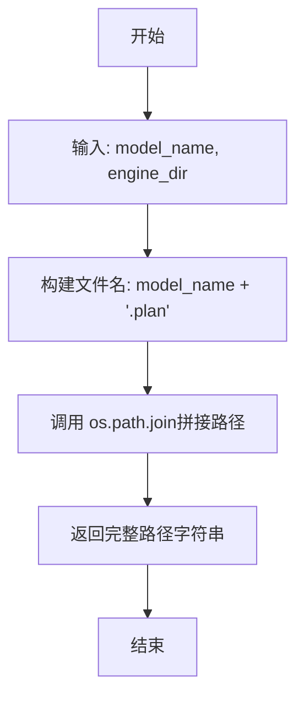

#### 带注释源码

```python
def getEnginePath(model_name, engine_dir):
    """
    生成TensorRT引擎文件的完整路径
    
    参数:
        model_name: 模型名称字符串
        engine_dir: 引擎文件存储目录
    
    返回:
        完整的引擎文件路径字符串，格式为: {engine_dir}/{model_name}.plan
    """
    # 使用os.path.join确保跨平台路径兼容性
    # 将引擎目录、模型名称和.plan扩展名组合成完整路径
    return os.path.join(engine_dir, model_name + ".plan")
```


### `build_engines`

该函数是 TensorRT 加速 Stable Diffusion 流程的核心构建函数，负责将 PyTorch 模型（CLIP、UNet、VAE 等）导出为 ONNX 格式，然后使用 NVIDIA TensorRT 优化并构建高效的推理引擎。它首先检查并创建必要的输出目录，然后遍历模型字典进行 ONNX 导出、优化和 TensorRT 引擎构建，最后加载并激活所有引擎以返回可用的引擎字典。

参数：

- `models`：`dict`，模型名称到模型对象的字典，包含了需要构建引擎的所有模型（如 CLIP、UNet、VAE 等）
- `engine_dir`：`str`，TensorRT 引擎文件保存的目录路径
- `onnx_dir`：`str`，ONNX 模型文件保存的目录路径
- `onnx_opset`：`int`，导出 ONNX 模型时使用的 ONNX 操作集版本号
- `opt_image_height`：`int`，优化时使用的图像高度（用于确定输入张量的形状范围）
- `opt_image_width`：`int`，优化时使用的图像宽度（用于确定输入张量的形状范围）
- `opt_batch_size`：`int`，优化时使用的批次大小，默认为 1
- `force_engine_rebuild`：`bool`，是否强制重新构建引擎，默认为 False（如果存在缓存则跳过构建）
- `static_batch`：`bool`，是否使用静态批次大小，默认为 False（支持动态批次大小）
- `static_shape`：`bool`，是否使用静态形状，默认为 True（启用动态形状优化）
- `enable_all_tactics`：`bool`，是否启用 TensorRT 所有优化策略，默认为 False
- `timing_cache`：`str` 或 `None`，TensorRT 构建时的时间缓存文件路径，用于加速后续构建

返回值：`dict`，返回构建好的引擎字典，键为模型名称，值为 `Engine` 对象

#### 流程图

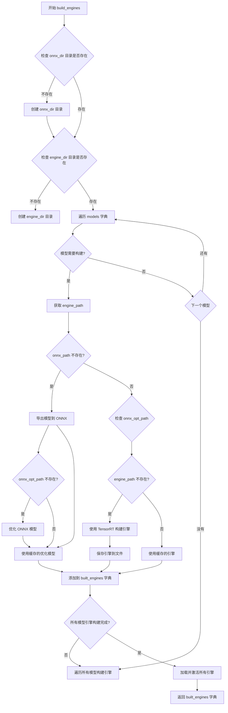

#### 带注释源码

```python
def build_engines(
    models: dict,
    engine_dir,
    onnx_dir,
    onnx_opset,
    opt_image_height,
    opt_image_width,
    opt_batch_size=1,
    force_engine_rebuild=False,
    static_batch=False,
    static_shape=True,
    enable_all_tactics=False,
    timing_cache=None,
):
    """
    构建 TensorRT 引擎的主函数
    
    参数:
        models: 模型名称到模型对象的字典
        engine_dir: TensorRT 引擎保存目录
        onnx_dir: ONNX 模型保存目录
        onnx_opset: ONNX 操作集版本
        opt_image_height: 优化用图像高度
        opt_image_width: 优化用图像宽度
        opt_batch_size: 优化用批次大小
        force_engine_rebuild: 强制重新构建
        static_batch: 静态批次大小
        static_shape: 静态形状
        enable_all_tactics: 启用所有优化策略
        timing_cache: 时间缓存
    
    返回:
        built_engines: 构建好的引擎字典
    """
    # 初始化引擎字典
    built_engines = {}
    
    # 确保输出目录存在
    if not os.path.isdir(onnx_dir):
        os.makedirs(onnx_dir)
    if not os.path.isdir(engine_dir):
        os.makedirs(engine_dir)

    # ====== 第一阶段: 导出模型到 ONNX ======
    # 遍历所有模型，导出为 ONNX 格式并进行优化
    for model_name, model_obj in models.items():
        # 获取引擎和 ONNX 路径
        engine_path = getEnginePath(model_name, engine_dir)
        
        # 检查是否需要构建（force_engine_rebuild=True 或引擎不存在）
        if force_engine_rebuild or not os.path.exists(engine_path):
            logger.warning("Building Engines...")
            logger.warning("Engine build can take a while to complete")
            
            # 原始 ONNX 路径和优化后 ONNX 路径
            onnx_path = getOnnxPath(model_name, onnx_dir, opt=False)
            onnx_opt_path = getOnnxPath(model_name, onnx_dir)
            
            # 检查是否需要导出 ONNX
            if force_engine_rebuild or not os.path.exists(onnx_opt_path):
                if force_engine_rebuild or not os.path.exists(onnx_path):
                    logger.warning(f"Exporting model: {onnx_path}")
                    # 获取模型
                    model = model_obj.get_model()
                    
                    # 使用推理模式混合精度导出 ONNX
                    with torch.inference_mode(), torch.autocast("cuda"):
                        # 获取示例输入
                        inputs = model_obj.get_sample_input(opt_batch_size, opt_image_height, opt_image_width)
                        # 导出为 ONNX
                        torch.onnx.export(
                            model,
                            inputs,
                            onnx_path,
                            export_params=True,
                            opset_version=onnx_opset,
                            do_constant_folding=True,
                            input_names=model_obj.get_input_names(),
                            output_names=model_obj.get_output_names(),
                            dynamic_axes=model_obj.get_dynamic_axes(),
                        )
                    
                    # 释放模型内存
                    del model
                    torch.cuda.empty_cache()
                    gc.collect()
                else:
                    logger.warning(f"Found cached model: {onnx_path}")

                # 优化 ONNX 模型
                if force_engine_rebuild or not os.path.exists(onnx_opt_path):
                    logger.warning(f"Generating optimizing model: {onnx_opt_path}")
                    # 使用 Optimizer 类进行图优化、常量折叠和形状推断
                    onnx_opt_graph = model_obj.optimize(onnx.load(onnx_path))
                    onnx.save(onnx_opt_graph, onnx_opt_path)
                else:
                    logger.warning(f"Found cached optimized model: {onnx_opt_path} ")

    # ====== 第二阶段: 构建 TensorRT 引擎 ======
    # 使用优化后的 ONNX 模型构建 TensorRT 引擎
    for model_name, model_obj in models.items():
        engine_path = getEnginePath(model_name, engine_dir)
        # 创建 Engine 对象
        engine = Engine(engine_path)
        onnx_path = getOnnxPath(model_name, onnx_dir, opt=False)
        onnx_opt_path = getOnnxPath(model_name, onnx_dir)

        # 检查是否需要构建引擎
        if force_engine_rebuild or not os.path.exists(engine.engine_path):
            # 调用 Engine.build 方法构建 TensorRT 引擎
            engine.build(
                onnx_opt_path,
                fp16=True,  # 启用 FP16 混合精度
                input_profile=model_obj.get_input_profile(
                    opt_batch_size,
                    opt_image_height,
                    opt_image_width,
                    static_batch=static_batch,
                    static_shape=static_shape,
                ),
                timing_cache=timing_cache,
            )
        # 将引擎添加到字典
        built_engines[model_name] = engine

    # ====== 第三阶段: 加载并激活所有引擎 ======
    # 加载引擎到内存并创建执行上下文
    for model_name, model_obj in models.items():
        engine = built_engines[model_name]
        # 从文件加载引擎
        engine.load()
        # 创建执行上下文
        engine.activate()

    return built_engines
```


### `runEngine`

该函数是一个轻量级封装器，用于在 TensorRT 引擎上执行推理，将输入数据复制到设备缓冲区，通过 `execute_async_v3` 异步执行推理，并返回推理结果张量。

参数：

- `engine`：`Engine`，TensorRT 引擎包装对象，包含已加载的引擎上下文和缓冲区
- `feed_dict`：`dict`，键为张量名称，值为 PyTorch 张量的字典，用于提供输入数据
- `stream`：`int` 或 CUDA 流对象，用于异步执行 CUDA 操作的 CUDA 流

返回值：`OrderedDict`，键为输出张量名称，值为推理输出的 PyTorch 张量字典

#### 流程图

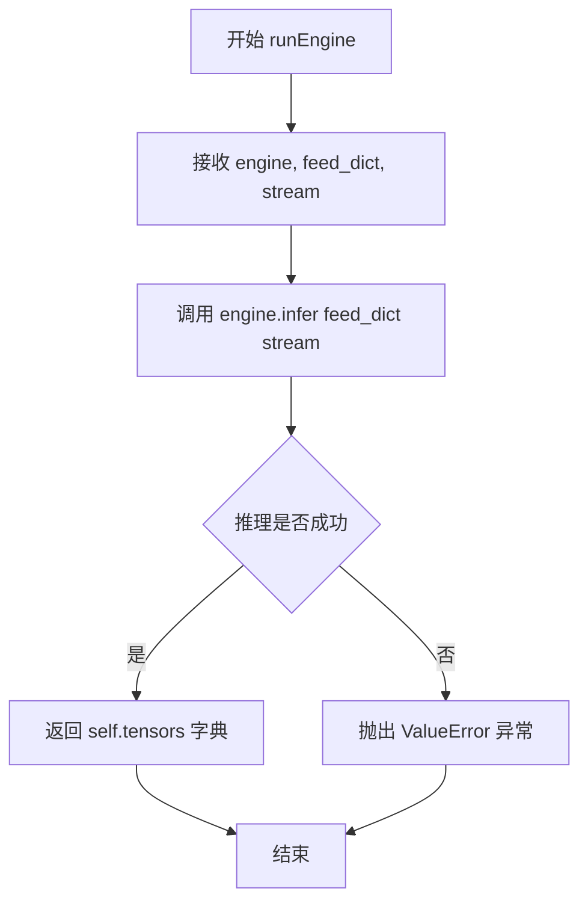

#### 带注释源码

```python
def runEngine(engine, feed_dict, stream):
    """
    在 TensorRT 引擎上执行推理的轻量级封装函数。
    
    该函数将输入数据从 feed_dict 复制到引擎缓冲区，
    设置张量地址，执行异步推理，并返回输出张量。
    
    参数:
        engine: Engine 对象，已加载并激活的 TensorRT 引擎
        feed_dict: dict，输入数据的字典，键为张量名称，值为 PyTorch 张量
        stream: CUDA 流对象，用于异步执行
    
    返回:
        OrderedDict: 推理输出的张量字典，键为张量名称
    """
    # 直接调用 Engine 类的 infer 方法执行推理
    # infer 方法内部会:
    # 1. 将 feed_dict 中的数据复制到 self.tensors
    # 2. 设置每个张量的设备地址
    # 3. 调用 context.execute_async_v3(stream) 执行推理
    # 4. 返回包含输出张量的 self.tensors 字典
    return engine.infer(feed_dict, stream)
```


### `make_CLIP`

这是一个简单的工厂函数，用于创建CLIP模型实例，以便在TensorRT加速的Stable Diffusion img2img管道中使用。

参数：

- `model`：`torch.nn.Module`，预训练的CLIP文本编码器模型
- `device`：`str`，计算设备（通常为"cuda"）
- `max_batch_size`：`int`，最大批次大小，用于优化TensorRT引擎
- `embedding_dim`：`int`，文本嵌入的维度（通常为768）
- `inpaint`：`bool`，布尔标志，指示是否用于inpainting任务（当前函数中未使用）

返回值：`CLIP`，返回CLIP类的实例，用于TensorRT推理

#### 流程图

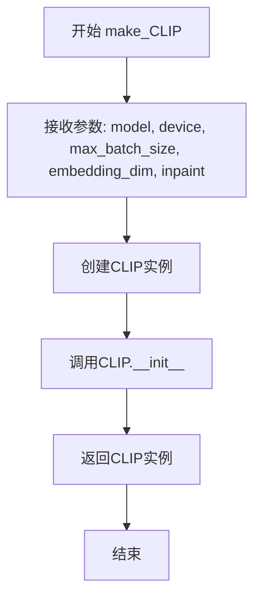

#### 带注释源码

```python
def make_CLIP(model, device, max_batch_size, embedding_dim, inpaint=False):
    """
    工厂函数，用于创建CLIP模型实例
    
    参数:
        model: 预训练的CLIP文本编码器模型 (torch.nn.Module)
        device: 计算设备 (str, 通常为"cuda")
        max_batch_size: 最大批次大小 (int)
        embedding_dim: 文本嵌入维度 (int, 通常为768)
        inpaint: 用于inpainting的标志 (bool, 当前未使用)
    
    返回:
        CLIP: CLIP模型实例
    """
    # 使用提供的参数创建CLIP类实例并返回
    # CLIP类继承自BaseModel，封装了CLIP文本编码器用于TensorRT推理
    return CLIP(model, device=device, max_batch_size=max_batch_size, embedding_dim=embedding_dim)
```

#### 相关类信息

**`CLIP` 类**（位于`make_CLIP`函数上方）：

- **父类**：`BaseModel`
- **功能**：封装CLIP文本编码器，提供ONNX导出和TensorRT优化的接口
- **主要方法**：
  - `get_input_names()`: 返回输入张量名称 `["input_ids"]`
  - `get_output_names()`: 返回输出张量名称 `["text_embeddings", "pooler_output"]`
  - `get_dynamic_axes()`: 定义动态轴用于ONNX导出
  - `get_input_profile()`: 获取TensorRT输入配置
  - `get_shape_dict()`: 获取输入输出形状字典
  - `get_sample_input()`: 获取示例输入用于ONNX导出
  - `optimize()`: 优化ONNX图，删除不需要的输出

#### 使用场景

该函数在`TensorRTStableDiffusionImg2ImgPipeline`的`__loadModels`方法中被调用：

```python
if "clip" in self.stages:
    self.models["clip"] = make_CLIP(self.text_encoder, **models_args)
```

这是TensorRT加速的Stable Diffusion img2img管道初始化过程的一部分，用于将CLIP文本编码器转换为TensorRT引擎以加速推理。


### `make_UNet`

这是一个工厂函数，用于创建封装好的 `UNet` 对象，以便后续进行 TensorRT 引擎构建和推理优化。该函数接收原始的 PyTorch UNet 模型和配置参数，返回一个配置好的 `UNet` 包装类实例。

参数：

- `model`：`torch.nn.Module`，原始的 PyTorch UNet2DConditionModel 模型对象
- `device`：`str`，指定运行设备（通常为 "cuda"）
- `max_batch_size`：`int`，最大批处理大小
- `embedding_dim`：`int`，文本嵌入维度（通常为 768）
- `inpaint`：`bool`，是否用于图像修复任务，默认为 False

返回值：`UNet`，返回配置好的 UNet 包装类实例，用于 TensorRT 引擎构建

#### 流程图

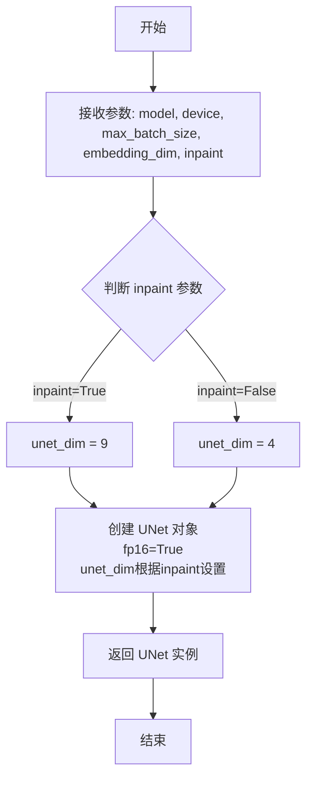

#### 带注释源码

```python
def make_UNet(model, device, max_batch_size, embedding_dim, inpaint=False):
    """
    工厂函数：创建并返回 UNet 包装类实例
    
    参数:
        model: 原始 PyTorch UNet2DConditionModel 模型
        device: 运行设备 (如 "cuda")
        max_batch_size: 最大批处理大小
        embedding_dim: 文本嵌入维度
        inpaint: 是否用于图像修复模式
    
    返回:
        UNet: 配置好的 UNet 包装类实例
    """
    # 根据 inpaint 参数决定 UNet 的通道数
    # 图像修复任务通常需要额外的输入通道 (4 + 4 + 1 = 9)
    # 标准文生图任务使用 4 个通道
    unet_dim = 9 if inpaint else 4
    
    # 创建并返回 UNet 包装类实例
    # fp16=True 启用半精度推理以提升性能
    return UNet(
        model,                      # 原始 PyTorch 模型
        fp16=True,                  # 启用 FP16 精度
        device=device,              # 运行设备
        max_batch_size=max_batch_size,  # 最大批处理大小
        embedding_dim=embedding_dim,    # 文本嵌入维度
        unet_dim=unet_dim,          # UNet 潜在空间通道数
    )
```


### `make_VAE`

该函数是一个工厂函数，用于创建VAE（变分自编码器）模型实例，主要用于将Stable Diffusion的潜空间表示解码为图像。

参数：

- `model`：`torch.nn.Module`或`AutoencoderKL`，要包装的VAE模型对象
- `device`：`str`，模型运行的设备（如"cuda"）
- `max_batch_size`：`int`，最大批次大小
- `embedding_dim`：`int`，文本嵌入维度（用于配置）
- `inpaint`：`bool`，是否用于图像修复任务（可选，默认False）

返回值：`VAE`，返回配置好的VAE模型实例

#### 流程图

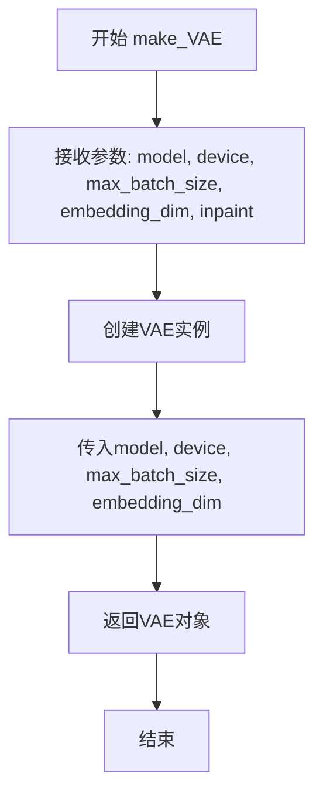

#### 带注释源码

```python
def make_VAE(model, device, max_batch_size, embedding_dim, inpaint=False):
    """
    创建并返回一个配置好的VAE模型实例
    
    参数:
        model: VAE模型对象（AutoencoderKL类型）
        device: 运行设备（通常为"cuda"）
        max_batch_size: 支持的最大批次大小
        embedding_dim: 嵌入维度（用于维度配置）
        inpaint: 布尔标志，指示是否用于图像修复任务（当前未使用，保留用于扩展）
    
    返回:
        VAE: 配置好的VAE解码器模型实例，继承自BaseModel
    """
    return VAE(model, device=device, max_batch_size=max_batch_size, embedding_dim=embedding_dim)
```


### `make_VAEEncoder`

这是一个工厂函数，用于创建 VAEEncoder 实例。VAEEncoder 负责将输入图像编码为潜在的压缩表示（latent representation），该表示随后可用于Stable Diffusion的去噪过程。

参数：

- `model`：`AutoencoderKL`，从 `diffusers` 库加载的 VAE 模型
- `device`：`str`，计算设备（通常为 "cuda"）
- `max_batch_size`：`int`，批处理最大尺寸
- `embedding_dim`：`int`，嵌入向量维度
- `inpaint`：`bool`，可选参数，用于控制是否支持图像修复（默认为 False）

返回值：`VAEEncoder`，返回配置好的 VAEEncoder 对象，用于后续的 ONNX 导出和 TensorRT 引擎构建

#### 流程图

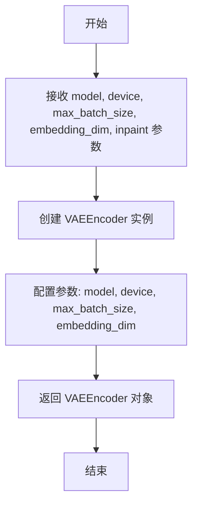

#### 带注释源码

```python
def make_VAEEncoder(model, device, max_batch_size, embedding_dim, inpaint=False):
    """
    工厂函数：创建并返回一个配置好的 VAEEncoder 实例
    
    参数:
        model: 预训练的 VAE 模型 (AutoencoderKL)
        device: 计算设备 (如 'cuda')
        max_batch_size: 支持的最大批处理大小
        embedding_dim: 嵌入维度
        inpaint: 布尔标志，指示是否用于图像修复任务 (当前未使用)
    
    返回:
        VAEEncoder: 配置好的 VAE 编码器实例，用于将图像转换为潜在表示
    """
    # 使用提供的参数实例化 VAEEncoder 类
    return VAEEncoder(
        model, 
        device=device, 
        max_batch_size=max_batch_size, 
        embedding_dim=embedding_dim
    )
```


### `Engine.__init__`

这是 `Engine` 类的构造函数，用于初始化 TensorRT 引擎对象。它接收引擎文件路径作为参数，初始化引擎、上下文、缓冲区和张量字典等核心属性。

参数：

- `engine_path`：`str`，TensorRT 引擎文件的路径，用于指定要加载或构建的引擎文件位置

返回值：`None`，构造函数不返回任何值，仅初始化对象状态

#### 流程图

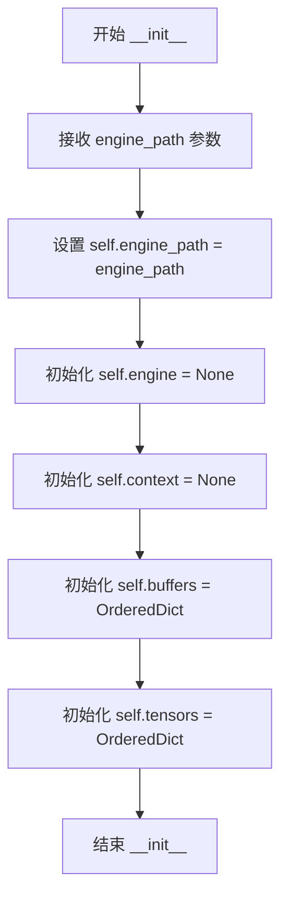

#### 带注释源码

```python
def __init__(self, engine_path):
    """
    初始化 Engine 类的实例。
    
    Args:
        engine_path (str): TensorRT 引擎文件的路径
    """
    # 保存引擎文件路径到实例属性
    self.engine_path = engine_path
    # 初始化 TensorRT 引擎对象为 None，后续通过 load() 方法加载
    self.engine = None
    # 初始化执行上下文为 None，后续通过 activate() 方法创建
    self.context = None
    # 初始化缓冲区字典，用于存储输入输出的 GPU 内存缓冲区
    self.buffers = OrderedDict()
    # 初始化张量字典，用于存储输入输出的张量数据
    self.tensors = OrderedDict()
```


### Engine.__del__

析构函数，负责在对象生命周期结束时释放 TensorRT 引擎相关的资源，包括 GPU 缓冲区、引擎对象、执行上下文和 tensors。

参数：
- 该方法无显式参数（Python 析构函数的隐式参数 self 已在类方法中说明）

返回值：`None`，析构函数不返回任何值

#### 流程图

```mermaid
flowchart TD
    A[开始 __del__] --> B{检查 buffers 是否存在}
    B -->|buffers 存在| C{遍历 buffers.values()}
    C --> D{当前 buf 是否为 cuda.DeviceArray}
    D -->|是| E[调用 buf.free() 释放 GPU 内存]
    D -->|否| F[跳过]
    E --> C
    C --> G[删除 self.engine]
    G --> H[删除 self.context]
    H --> I[删除 self.buffers]
    I --> J[删除 self.tensors]
    J --> K[结束 __del__]
    B -->|buffers 不存在| G
```

#### 带注释源码

```python
def __del__(self):
    """
    析构函数，在对象被垃圾回收时调用
    负责清理 TensorRT 引擎相关的所有资源
    """
    # 遍历所有缓冲区，释放 cuda.DeviceArray 类型的 GPU 内存
    [buf.free() for buf in self.buffers.values() if isinstance(buf, cuda.DeviceArray)]
    
    # 删除 TensorRT 引擎对象
    del self.engine
    
    # 删除 TensorRT 执行上下文
    del self.context
    
    # 删除缓冲区字典
    del self.buffers
    
    # 删除 tensors 字典
    del self.tensors
```


### Engine.build

该方法负责将ONNX模型构建为TensorRT引擎。它接受ONNX模型路径、精度设置、输入配置等参数，通过Polygraphy的TensorRT后端创建优化配置文件，生成并保存序列化引擎文件到指定路径。

参数：

- `onnx_path`：`str`，待转换的ONNX模型文件路径
- `fp16`：`bool`，是否启用FP16半精度推理模式
- `input_profile`：`Optional[dict]`，输入张量的形状配置字典，键为输入名称，值为包含min/opt/max三个维度的列表
- `enable_all_tactics`：`bool`，是否启用所有TensorRT优化策略，默认为False
- `timing_cache`：`Optional[str]`，时间缓存文件路径，用于加速后续构建

返回值：`None`，该方法直接保存引擎文件到磁盘，不返回任何内容

#### 流程图

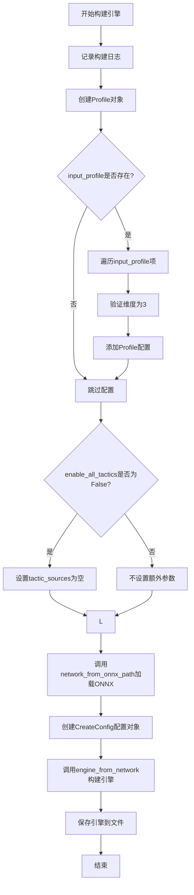

#### 带注释源码

```python
def build(
    self,
    onnx_path: str,
    fp16: bool,
    input_profile: Optional[dict] = None,
    enable_all_tactics: bool = False,
    timing_cache: Optional[str] = None,
) -> None:
    """
    将ONNX模型构建为TensorRT引擎
    
    参数:
        onnx_path: ONNX模型文件路径
        fp16: 是否启用FP16半精度
        input_profile: 输入轮廓配置，包含min/opt/max三个维度
        enable_all_tactics: 是否启用所有优化策略
        timing_cache: 时间缓存文件路径
    """
    # 记录构建日志，包含ONNX路径和目标引擎路径
    logger.warning(f"Building TensorRT engine for {onnx_path}: {self.engine_path}")
    
    # 创建TensorRT优化配置文件
    p = Profile()
    
    # 如果提供了输入配置，解析并添加到Profile中
    if input_profile:
        for name, dims in input_profile.items():
            # 验证维度配置必须是三维(min/opt/max)
            assert len(dims) == 3
            # 添加输入张量的形状范围配置
            p.add(name, min=dims[0], opt=dims[1], max=dims[2])

    # 构建额外的构建参数
    extra_build_args = {}
    if not enable_all_tactics:
        # 禁用所有tactic来源，仅使用默认优化策略
        extra_build_args["tactic_sources"] = []

    # 从ONNX文件创建TensorRT网络
    # 使用NATIVE_INSTANCENORM标志解析ONNX中的InstanceNorm算子
    network = network_from_onnx_path(
        onnx_path, 
        flags=[trt.OnnxParserFlag.NATIVE_INSTANCENORM]
    )
    
    # 创建TensorRT构建配置
    config = CreateConfig(
        fp16=fp16,                    # 启用FP16精度
        profiles=[p],                 # 优化配置文件
        load_timing_cache=timing_cache,  # 加载时间缓存
        **extra_build_args            # 额外的构建参数
    )
    
    # 使用Polygraphy后端构建TensorRT引擎
    engine = engine_from_network(
        network,
        config=config,
        save_timing_cache=timing_cache,  # 保存时间缓存
    )
    
    # 将构建好的引擎序列化保存到指定路径
    save_engine(engine, path=self.engine_path)
```


### `Engine.load`

该方法负责从磁盘加载预构建的 TensorRT 引擎文件，并将其反序列化为可执行的引擎对象。

参数：
- 该方法无参数

返回值：`None`，无返回值（方法内部将引擎对象赋值给实例变量 `self.engine`）

#### 流程图

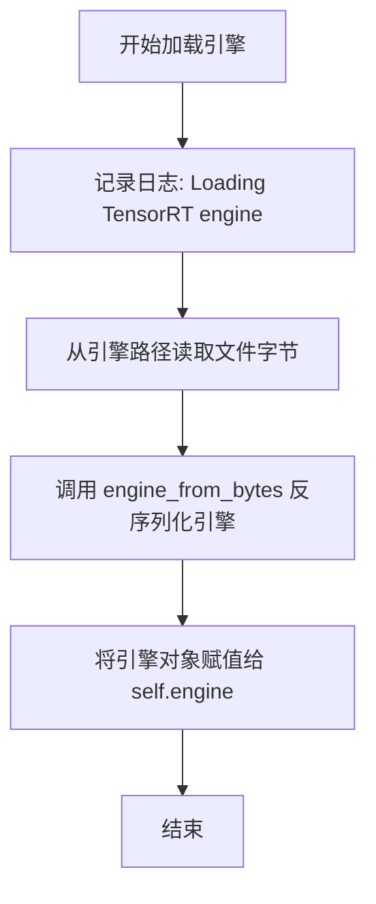

#### 带注释源码

```python
def load(self):
    """
    从磁盘加载预构建的 TensorRT引擎文件。
    
    该方法执行以下操作:
    1. 记录加载引擎的日志信息
    2. 从指定路径读取引擎文件为字节数据
    3. 使用 Polygraphy 的 engine_from_bytes 将字节反序列化为 TensorRT 引擎对象
    4. 将引擎对象存储在实例变量 self.engine 中供后续使用
    """
    # 记录加载引擎的警告日志，输出引擎文件路径
    logger.warning(f"Loading TensorRT engine: {self.engine_path}")
    
    # 使用 Polygraphy 的 bytes_from_path 读取引擎文件字节
    # 然后使用 engine_from_bytes 反序列化为 TensorRT 引擎对象
    # engine_from_bytes 是 Polygraphy 提供的函数，用于从字节数据创建 TensorRT 引擎
    self.engine = engine_from_bytes(bytes_from_path(self.engine_path))
```


### `Engine.activate`

该方法用于激活 TensorRT 引擎，创建一个执行上下文（`IExecutionContext`），以便后续进行模型推理。

参数：

- 无显式参数（`self` 为隐式参数）

返回值：`None`，无返回值。该方法通过设置 `self.context` 属性来创建执行上下文。

#### 流程图

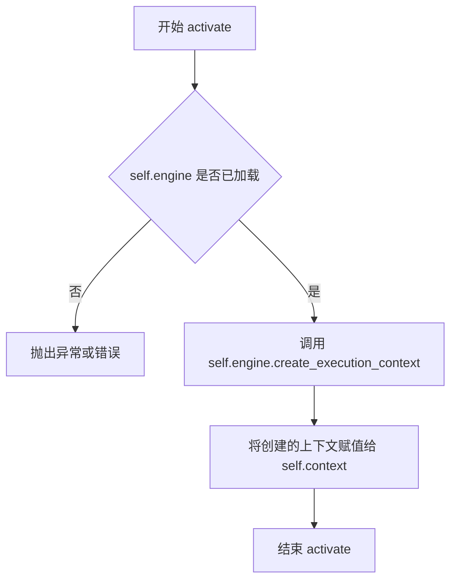

#### 带注释源码

```python
def activate(self):
    """
    激活 TensorRT 引擎，创建执行上下文。
    
    该方法在 Engine.load() 方法加载引擎后调用，用于创建一个 TensorRT 执行上下文（IExecutionContext）。
    执行上下文是进行推理所必需的对象，它包含了推理所需的状态信息。
    在创建执行上下文后，可以继续调用 allocate_buffers() 分配缓冲区，
    然后调用 infer() 执行推理。
    """
    # 使用 TensorRT 引擎对象创建执行上下文
    # create_execution_context() 是 TensorRT IHostMemory 对象的方法
    # 返回一个 IExecutionContext 对象，用于后续的推理操作
    self.context = self.engine.create_execution_context()
```


### `Engine.allocate_buffers`

该方法负责为TensorRT引擎分配输入输出缓冲区。它遍历引擎的所有绑定张量，根据提供的形状字典或引擎的默认形状创建相应的PyTorch张量，并将其存储在内部字典中以供后续推理使用。

参数：

- `self`：`Engine`，Engine类的实例，隐含参数
- `shape_dict`：`Optional[dict]`，可选参数，用于指定每个张量的形状字典，键为张量名称，值为形状元组。如果为`None`或未提供某个张量的形状，则使用引擎中存储的默认形状
- `device`：`str`，可选参数，指定张量分配的设备，默认为`"cuda"`

返回值：`None`，无返回值。该方法将分配的张量存储在实例的`tensors`属性中（`OrderedDict`类型）

#### 流程图

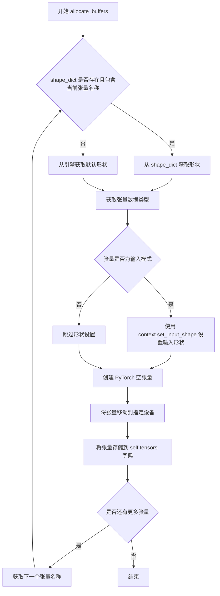

#### 带注释源码

```python
def allocate_buffers(self, shape_dict=None, device="cuda"):
    """
    为 TensorRT 引擎分配输入输出缓冲区
    
    参数:
        shape_dict: 可选的字典，键为张量名称，值为形状元组。
                   如果未提供，则使用引擎中存储的形状
        device: 字符串，指定分配张量的设备，默认为 "cuda"
    """
    
    # 遍历引擎的所有输入输出张量
    # self.engine.num_io_tensors 返回引擎中绑定张量的总数
    for binding in range(self.engine.num_io_tensors):
        
        # 获取当前索引对应张量的名称
        name = self.engine.get_tensor_name(binding)
        
        # 确定张量的形状：如果提供了 shape_dict 且包含该张量，则使用提供的形状
        # 否则从引擎获取默认形状
        if shape_dict and name in shape_dict:
            shape = shape_dict[name]
        else:
            shape = self.engine.get_tensor_shape(name)
        
        # 获取张量的数据类型（NumPy 数据类型），并转换为对应的 PyTorch 数据类型
        # trt.nptype() 将 TensorRT 数据类型转换为 NumPy 数据类型
        # numpy_to_torch_dtype_dict 是预先定义的映射字典
        dtype = trt.nptype(self.engine.get_tensor_dtype(name))
        
        # 检查当前张量是否为输入张量
        # 如果是输入张量，需要使用 execution context 设置其形状
        # 这是因为 TensorRT 动态形状推理需要显式设置输入形状
        if self.engine.get_tensor_mode(name) == trt.TensorIOMode.INPUT:
            self.context.set_input_shape(name, shape)
        
        # 创建 PyTorch 空张量，使用确定的形状和数据类型
        # 然后将张量移动到指定的设备（cuda 或 cpu）
        # torch.empty 用于分配未初始化的内存，类似于 numpy.empty
        tensor = torch.empty(tuple(shape), dtype=numpy_to_torch_dtype_dict[dtype]).to(device=device)
        
        # 将分配的张量存储在实例的 tensors 字典中
        # 键为张量名称，值为 PyTorch 张量
        # 后续推理时通过名称快速访问对应的张量
        self.tensors[name] = tensor
```


### Engine.infer

执行 TensorRT 引擎的推理操作，将输入数据复制到设备内存，设置张量地址，然后异步执行推理并返回结果张量。

参数：

- `feed_dict`：`dict`，输入数据字典，键为张量名称，值为待推理的输入数据（torch.Tensor）
- `stream`：`int` 或 CUDA 流对象，用于异步执行的 CUDA 流

返回值：`OrderedDict`，包含推理结果的有序字典，键为张量名称，值为推理输出的张量（torch.Tensor）

#### 流程图

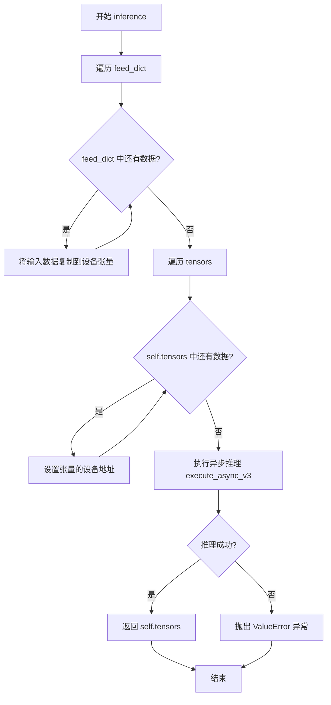

#### 带注释源码

```python
def infer(self, feed_dict, stream):
    """
    执行 TensorRT 引擎推理
    
    参数:
        feed_dict: dict, 输入数据字典，键为张量名称，值为待推理的输入数据
        stream: CUDA 流对象，用于异步执行
    
    返回:
        OrderedDict: 包含推理结果的有序字典
    """
    # 第一步：将输入数据从 host 复制到 device
    # 遍历 feed_dict 中的所有输入张量
    for name, buf in feed_dict.items():
        # 使用 PyTorch 的 copy_ 方法将数据复制到预分配的张量中
        self.tensors[name].copy_(buf)
    
    # 第二步：设置 TensorRT 执行上下文的张量地址
    # 遍历所有张量（包括输入和输出），将 PyTorch 张量的指针地址传递给 TensorRT
    for name, tensor in self.tensors.items():
        # set_tensor_address 告诉 TensorRT 每个张量数据在 GPU 上的具体位置
        self.context.set_tensor_address(name, tensor.data_ptr())
    
    # 第三步：执行异步推理
    # execute_async_v3 是 TensorRT 的异步执行接口
    # stream 参数指定了 CUDA 流，用于管理异步操作
    noerror = self.context.execute_async_v3(stream)
    
    # 第四步：检查推理是否成功
    # TensorRT 返回 True 表示成功，False 表示失败
    if not noerror:
        # 推理失败时抛出 ValueError 异常
        raise ValueError("ERROR: inference failed.")
    
    # 第五步：返回结果张量
    # 返回包含所有输出张量的有序字典
    # 调用者可以通过张量名称访问相应的输出
    return self.tensors
```


### `Optimizer.__init__`

初始化优化器对象，加载ONNX图以便后续优化处理。

参数：

- `onnx_graph`：`onnx.Graph`，需要优化的ONNX计算图对象

返回值：`None`，构造函数不返回任何值，仅初始化对象属性

#### 流程图

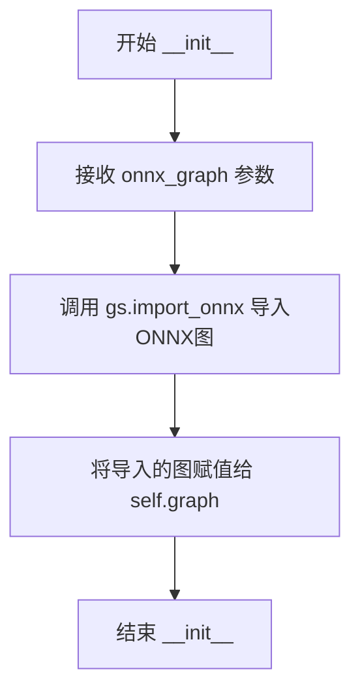

#### 带注释源码

```python
class Optimizer:
    def __init__(self, onnx_graph):
        """
        初始化Optimizer实例，加载ONNX图以便后续优化操作。
        
        Args:
            onnx_graph: ONNX图对象，通常是onnx.Graph类型，
                       需要进行cleanup、常量折叠、形状推断等优化操作。
        """
        # 使用onnx_graphsurgeon的import_onnx方法将ONNX图导入为GraphSurgeon图对象
        # 这样可以方便地进行图操作和优化
        self.graph = gs.import_onnx(onnx_graph)
```


### `Optimizer.cleanup`

该方法用于清理 ONNX 图中的未使用节点并进行拓扑排序，以优化图结构。可选择返回优化后的 ONNX 模型。

参数：

- `return_onnx`：`bool`，可选参数，默认为 `False`。当设置为 `True` 时，方法将返回优化后的 ONNX 模型（`onnx.ModelProto`）；当设置为 `False` 时，方法仅执行清理和排序操作，不返回任何值。

返回值：`Optional[onnx.ModelProto]`，可选返回。当 `return_onnx=True` 时返回 ONNX 模型对象，否则返回 `None`。

#### 流程图

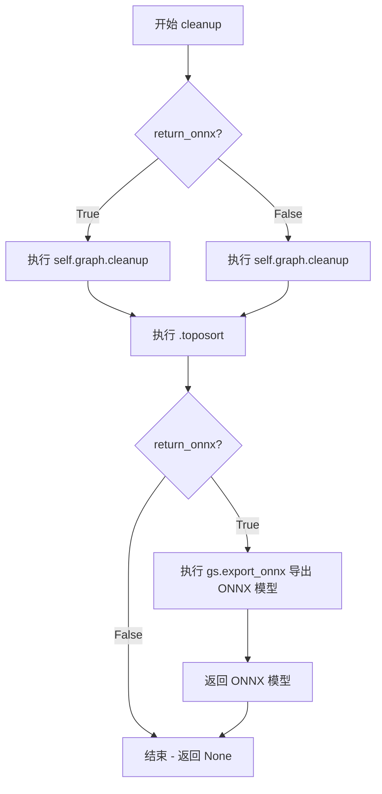

#### 带注释源码

```python
def cleanup(self, return_onnx=False):
    """
    清理 ONNX 图中的未使用节点并进行拓扑排序。
    
    该方法执行两个主要操作：
    1. self.graph.cleanup(): 移除图中未使用的节点和孤立张量
    2. .toposort(): 对图中的节点进行拓扑排序，确保节点顺序符合依赖关系
    
    Args:
        return_onnx (bool): 可选参数，控制是否返回 ONNX 格式的图。
                          默认为 False，即不返回任何值。
    
    Returns:
        Optional[onnx.ModelProto]: 当 return_onnx=True 时返回优化后的
                                  ONNX 模型对象；否则返回 None。
    """
    # 清理图中未使用的节点并进行拓扑排序
    # cleanup() 移除孤立的节点和无效的边
    # toposort() 确保节点按依赖顺序排列
    self.graph.cleanup().toposort()
    
    # 如果需要返回 ONNX 格式的图
    if return_onnx:
        # 将 GraphSurgeon 图导出为 ONNX 模型并返回
        return gs.export_onnx(self.graph)
```


### `Optimizer.select_outputs`

该方法用于从ONNX计算图中选择并保留指定的输出节点，同时可选择性地重命名这些输出节点。

参数：

- `keep`：`List[int]`，要保留的输出节点的索引列表，用于筛选`self.graph.outputs`中的输出
- `names`：`Optional[List[str]]`，可选参数，用于为保留的输出节点指定新的名称

返回值：`None`，该方法直接修改`self.graph.outputs`属性，不返回任何值

#### 流程图

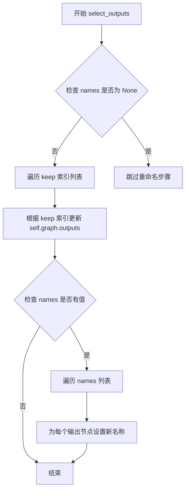

#### 带注释源码

```python
def select_outputs(self, keep, names=None):
    """
    从ONNX计算图中选择并保留指定的输出节点
    
    参数:
        keep: List[int], 要保留的输出节点索引列表
        names: Optional[List[str]], 可选的重命名列表
    
    返回:
        None: 直接修改self.graph.outputs属性
    """
    # 使用索引列表keep筛选self.graph.outputs，保留指定的输出节点
    self.graph.outputs = [self.graph.outputs[o] for o in keep]
    
    # 如果提供了names参数，则为保留的输出节点重命名
    if names:
        # 遍历names列表，为对应的输出节点设置新名称
        for i, name in enumerate(names):
            self.graph.outputs[i].name = name
```


### `Optimizer.fold_constants`

该方法用于对ONNX计算图进行常量折叠优化，通过Polygraphy的fold_constants函数将图中可以预先计算的常量节点折叠起来，以简化图结构并提高推理效率。

参数：

- `return_onnx`：`bool`，可选参数，默认为False。如果设置为True，则返回优化后的ONNX图对象；否则只更新内部图状态。

返回值：`Optional[onnx.ModelProto]`，当`return_onnx=True`时返回优化后的ONNX图对象，否则返回None。

#### 流程图

```mermaid
flowchart TD
    A[开始 fold_constants] --> B{return_onnx?}
    B -->|是| C[导出当前图为ONNX格式: gs.export_onnx]
    B -->|否| C
    C --> D[调用 fold_constants 函数进行常量折叠]
    D --> E[允许 ONNX Runtime 形状推断]
    E --> F[导入优化后的ONNX图: gs.import_onnx]
    F --> G[更新 self.graph]
    G --> H{return_onnx?}
    H -->|是| I[返回优化后的ONNX图 onnx_graph]
    H -->|否| J[返回 None]
    I --> K[结束]
    J --> K
```

#### 带注释源码

```python
def fold_constants(self, return_onnx=False):
    """
    对ONNX计算图进行常量折叠优化
    
    该方法执行以下操作：
    1. 将当前图导出为ONNX格式
    2. 使用Polygraphy的fold_constants进行常量折叠
    3. 重新导入优化后的图到graphsurgeon
    4. 可选地返回优化后的ONNX模型
    
    参数:
        return_onnx: bool, 是否返回ONNX格式的图
                   默认为False，仅更新内部图状态
    
    返回:
        Optional[onnx.ModelProto]: 当return_onnx=True时返回
                                   优化后的ONNX图对象，否则返回None
    """
    # 步骤1: 将graphsurgeon图导出为ONNX格式
    onnx_graph = fold_constants(
        gs.export_onnx(self.graph),  # 导出当前图
        allow_onnxruntime_shape_inference=True  # 允许使用ONNX Runtime进行形状推断
    )
    
    # 步骤2: 将优化后的ONNX图重新导入为graphsurgeon图
    self.graph = gs.import_onnx(onnx_graph)
    
    # 步骤3: 如果需要返回ONNX格式，则返回优化后的图
    if return_onnx:
        return onnx_graph
```


### `Optimizer.infer_shapes`

该方法用于对 ONNX 图进行形状推断（shape inference），通过 ONNX 的 shape_inference 工具推断图中各个张量的维度信息。如果模型大小超过 2GB 则抛出异常。

参数：

- `return_onnx`：`bool`，可选参数，默认为 False。指定是否返回推断后的 ONNX 图对象。

返回值：`Optional[onnx.Graph]`，如果 `return_onnx` 为 True 返回推断后的 ONNX 图对象，否则返回 None。

#### 流程图

```mermaid
flowchart TD
    A[开始 infer_shapes] --> B[导出 ONNX 图: gs.export_onnx]
    B --> C{模型大小是否 > 2GB?}
    C -->|是| D[抛出 TypeError: 模型大小超过2GB限制]
    C -->|否| E[调用 shape_inference.infer_shapes 推断形状]
    E --> F[重新导入 ONNX 图: gs.import_onnx]
    F --> G{return_onnx == True?}
    G -->|是| H[返回推断后的 onnx_graph]
    G -->|否| I[返回 None]
    D --> J[结束]
    H --> J
    I --> J
```

#### 带注释源码

```python
def infer_shapes(self, return_onnx=False):
    """
    对 ONNX 图进行形状推断（shape inference）。
    
    参数:
        return_onnx (bool): 如果为 True，则返回推断后的 ONNX 图对象；否则返回 None。
    
    返回:
        Optional[onnx.Graph]: 推断后的 ONNX 图对象（如果 return_onnx 为 True），否则返回 None。
    """
    # Step 1: 将 GraphSurgeon 图导出为 ONNX 格式
    onnx_graph = gs.export_onnx(self.graph)
    
    # Step 2: 检查模型大小是否超过 2GB 限制（2147483648 字节）
    if onnx_graph.ByteSize() > 2147483648:
        # 模型过大，抛出类型错误
        raise TypeError("ERROR: model size exceeds supported 2GB limit")
    else:
        # Step 3: 使用 ONNX 的 shape_inference 推断张量形状
        onnx_graph = shape_inference.infer_shapes(onnx_graph)

    # Step 4: 将推断后的 ONNX 图重新导入为 GraphSurgeon 图
    self.graph = gs.import_onnx(onnx_graph)
    
    # Step 5: 根据参数决定是否返回 ONNX 图
    if return_onnx:
        return onnx_graph
```


### `BaseModel.__init__`

这是 `BaseModel` 类的构造函数，用于初始化 Stable Diffusion 模型的基础配置参数，包括模型对象、设备设置、批处理大小限制、图像分辨率范围以及文本嵌入维度等关键属性。

参数：

- `model`：`Any`，要封装的基础模型对象
- `fp16`：`bool`，是否使用半精度浮点数（FP16）进行推理，默认为 `False`
- `device`：`str`，指定计算设备，默认为 `"cuda"`
- `max_batch_size`：`int`，最大批处理大小，默认为 `16`
- `embedding_dim`：`int`，文本嵌入的维度，默认为 `768`
- `text_maxlen`：`int`，文本序列的最大长度，默认为 `77`

返回值：`None`，该方法为构造函数，不返回任何值

#### 流程图

```mermaid
flowchart TD
    A[开始初始化] --> B[保存model对象]
    B --> C[设置模型名称为'SD Model']
    C --> D[保存fp16和device参数]
    D --> E[设置min_batch=1<br/>max_batch=max_batch_size]
    E --> F[设置图像分辨率范围<br/>min_image_shape=256<br/>max_image_shape=1024]
    F --> G[计算latent空间范围<br/>min_latent_shape=32<br/>max_latent_shape=128]
    G --> H[保存embedding_dim<br/>和text_maxlen参数]
    H --> I[结束初始化]
```

#### 带注释源码

```python
def __init__(self, model, fp16=False, device="cuda", max_batch_size=16, embedding_dim=768, text_maxlen=77):
    """
    初始化 BaseModel 的基础配置参数
    
    参数:
        model: 要封装的基础模型对象
        fp16: 是否使用半精度浮点数推理
        device: 计算设备 (cuda/cpu)
        max_batch_size: 最大批处理大小
        embedding_dim: 文本嵌入维度
        text_maxlen: 文本最大长度
    """
    # 保存模型对象
    self.model = model
    
    # 设置模型名称
    self.name = "SD Model"
    
    # 保存精度和设备配置
    self.fp16 = fp16
    self.device = device

    # 批处理大小限制
    self.min_batch = 1
    self.max_batch = max_batch_size
    
    # 图像分辨率范围 (像素)
    self.min_image_shape = 256  # min image resolution: 256x256
    self.max_image_shape = 1024  # max image resolution: 1024x1024
    
    # latent空间的分辨率范围 (图像除以8)
    self.min_latent_shape = self.min_image_shape // 8
    self.max_latent_shape = self.max_image_shape // 8

    # 文本嵌入相关参数
    self.embedding_dim = embedding_dim
    self.text_maxlen = text_maxlen
```


### `BaseModel.get_model`

该方法是BaseModel类的一个简单getter方法，用于返回在初始化时存储的模型对象。它直接返回类实例中保存的self.model属性，不进行任何额外的处理或转换。

参数： 无（除self外）

返回值：`Any`（模型对象类型），返回存储在BaseModel实例中的模型对象

#### 流程图

```mermaid
flowchart TD
    A[开始 get_model] --> B{检查self.model是否存在}
    B -->|是| C[返回self.model]
    B -->|否| D[返回None]
    C --> E[结束]
    D --> E
```

#### 带注释源码

```python
def get_model(self):
    """
    获取存储的模型对象。
    
    这是一个简单的getter方法，直接返回在类初始化时传入并保存的模型实例。
    该方法不进行任何处理或转换，仅用于访问内部模型属性。
    
    Returns:
        返回存储在self.model中的模型对象。
        返回类型取决于初始化时传入的model参数的类型。
    """
    return self.model
```


### `BaseModel.get_input_names`

该方法是 `BaseModel` 类的成员函数，用于获取模型的输入张量名称列表。在基类中为空实现（pass），具体实现由子类（如 CLIP、UNet、VAE 等）重写提供。

参数：
- 无

返回值：`List[str]`，返回模型输入张量的名称列表（基类中返回 `None`）

#### 流程图

```mermaid
flowchart TD
    A[开始 get_input_names] --> B{是否被调用}
    B -->|是| C[返回 None]
    C --> D[结束]
    B -->|子类重写| E[子类实现]
    E --> F[返回具体输入名称列表]
    F --> D
```

#### 带注释源码

```python
def get_input_names(self):
    """
    获取模型的输入张量名称列表。
    
    该方法为基类 BaseModel 的空实现（pass），
    旨在为子类提供统一的接口定义。
    子类应重写此方法以返回实际的输入名称。
    
    Returns:
        None: 基类默认返回 None，由子类重写实现具体逻辑
    """
    pass
```

---

**备注：** 此方法在基类中未实现具体逻辑，仅定义了接口契约。实际功能由继承该类的子类实现：

- `CLIP.get_input_names()` 返回 `["input_ids"]`
- `UNet.get_input_names()` 返回 `["sample", "timestep", "encoder_hidden_states"]`
- `VAE.get_input_names()` 返回 `["latent"]`
- `VAEEncoder.get_input_names()` 返回 `["images"]`


### `BaseModel.get_output_names`

该方法是一个抽象方法，用于返回模型在导出为 ONNX 或构建 TensorRT 引擎时的输出张量名称。该方法在 `BaseModel` 基类中仅作为占位符实现（pass），具体的返回值由子类（如 CLIP、UNet、VAE、VAEEncoder）重写后提供实际输出名称列表。

参数：
- 该方法无显式参数（除隐含的 `self` 参数）

返回值：`None`，该基类实现返回 `None`，实际返回值由子类重写时决定

#### 流程图

```mermaid
flowchart TD
    A[调用 get_output_names] --> B{子类是否重写?}
    B -->|是| C[返回子类定义的输出名称列表]
    B -->|否| D[返回 None]
    C --> E[用于 ONNX 导出或 TensorRT 构建]
    D --> E
```

#### 带注释源码

```python
def get_output_names(self):
    """
    获取模型的输出张量名称列表。
    
    该方法是一个抽象方法，在 BaseModel 基类中仅作为占位符实现（返回 None）。
    具体的输出名称由子类重写时定义，用于 ONNX 导出时的 output_names 参数，
    以及 TensorRT 引擎构建时的输出绑定。
    
    子类重写示例：
    - CLIP: return ["text_embeddings", "pooler_output"]
    - UNet: return ["latent"]
    - VAE: return ["images"]
    - VAEEncoder: return ["latent"]
    """
    pass
```

#### 子类重写示例源码

```python
# CLIP 子类中的实现
class CLIP(BaseModel):
    def get_output_names(self):
        return ["text_embeddings", "pooler_output"]

# UNet 子类中的实现
class UNet(BaseModel):
    def get_output_names(self):
        return ["latent"]

# VAE 子类中的实现
class VAE(BaseModel):
    def get_output_names(self):
        return ["images"]

# VAEEncoder 子类中的实现
class VAEEncoder(BaseModel):
    def get_output_names(self):
        return ["latent"]
```


### `BaseModel.get_dynamic_axes`

该方法用于定义 ONNX 模型导出时的动态轴映射，允许在 TensorRT 引擎构建时支持动态 batch size 和图像分辨率。它是一个基类方法，返回 `None`，具体的动态轴定义由子类（如 CLIP、UNet、VAE）重写实现。

参数：无需参数

返回值：`Optional[Dict]`，返回动态轴的字典映射，基类默认返回 `None`，子类会返回具体的轴映射字典，例如 `{"input_ids": {0: "B"}, "text_embeddings": {0: "B"}}`。

#### 流程图

```mermaid
flowchart TD
    A[开始 get_dynamic_axes] --> B{是否是基类 BaseModel?}
    B -->|是| C[返回 None]
    B -->|否| D[返回子类定义的动态轴字典]
    C --> E[结束]
    D --> E
```

#### 带注释源码

```python
def get_dynamic_axes(self):
    """
    获取动态轴映射，用于 ONNX 导出时的动态 batch size 和分辨率支持。
    
    该方法是 BaseModel 基类的方法，返回 None。
    子类（如 CLIP、UNet、VAE）会重写此方法以返回具体的动态轴定义。
    
    例如 CLIP 子类返回:
    {
        "input_ids": {0: "B"},           # input_ids 的第0维是动态的 batch 维度
        "text_embeddings": {0: "B"}       # text_embeddings 的第0维是动态的 batch 维度
    }
    
    UNet 子类返回:
    {
        "sample": {0: "2B", 2: "H", 3: "W"},           # sample 的第0维是 2*batch, 2/3 维是动态的高宽
        "encoder_hidden_states": {0: "2B"},              # encoder_hidden_states 的第0维是 2*batch
        "latent": {0: "2B", 2: "H", 3: "W"}              # latent 的第0维是 2*batch, 2/3 维是动态的高宽
    }
    
    VAE decoder 子类返回:
    {
        "latent": {0: "B", 2: "H", 3: "W"},    # latent 的第0维是 batch, 2/3 维是动态的高宽
        "images": {0: "B", 2: "8H", 3: "8W"}    # images 的第0维是 batch, 2/3 维是动态的 8 倍高宽
    }
    
    VAE encoder 子类返回:
    {
        "images": {0: "B", 2: "8H", 3: "8W"},   # images 的第0维是 batch, 2/3 维是动态的 8 倍高宽
        "latent": {0: "B", 2: "H", 3: "W"}     # latent 的第0维是 batch, 2/3 维是动态的高宽
    }
    
    Returns:
        Optional[Dict]: 动态轴映射字典，或者 None（基类默认实现）
    """
    return None
```


### `BaseModel.get_sample_input`

获取用于 ONNX 导出的示例输入数据。该方法是基类的抽象方法，由子类（如 CLIP、UNet、VAE 等）实现具体逻辑，用于生成符合模型输入维度的随机张量，以便导出为 ONNX 格式。

参数：

- `batch_size`：`int`，批次大小，指定输入数据的批量大小
- `image_height`：`int`，输入图像的高度（像素）
- `image_width`：`int`，输入图像的宽度（像素）

返回值：`None`，基类中该方法返回 `pass`，具体实现由子类覆盖

#### 流程图

```mermaid
flowchart TD
    A[开始 get_sample_input] --> B[接收参数: batch_size, image_height, image_width]
    B --> C[基类中直接返回 None]
    C --> D[结束]
    
    subgraph 子类实现示例
    E[开始] --> F[调用 check_dims 验证维度]
    F --> G[根据子类模型类型创建对应形状的随机张量]
    G --> H[返回示例输入张量或张量元组]
    end
```

#### 带注释源码

```python
def get_sample_input(self, batch_size, image_height, image_width):
    """
    获取用于 ONNX 导出的示例输入数据。
    
    基类中的抽象方法，返回 None。
    具体实现由子类覆盖：
    - CLIP: 返回 torch.zeros(batch_size, self.text_maxlen, dtype=torch.int32)
    - UNet: 返回 (sample, timestep, encoder_hidden_states) 元组
    - VAE: 返回 torch.randn(batch_size, 4, latent_height, latent_width)
    - VAEEncoder: 返回 torch.randn(batch_size, 3, image_height, image_width)
    
    Args:
        batch_size (int): 批次大小
        image_height (int): 输入图像高度
        image_width (int): 输入图像宽度
    
    Returns:
        None: 基类实现返回 None，由子类实现具体逻辑
    """
    pass
```

---

**备注**：该方法是模板方法模式中的抽象方法，`BaseModel` 作为基类定义了接口规范，子类 `CLIP`、`UNet`、`VAE`、`VAEEncoder` 继承并实现了具体的示例输入生成逻辑。在 `build_engines` 函数中通过 `model_obj.get_sample_input(opt_batch_size, opt_image_height, opt_image_width)` 调用，为 `torch.onnx.export` 提供输入张量。


### `BaseModel.get_input_profile`

该方法是 `BaseModel` 类的基类方法，用于获取模型的输入 profile 信息（包含输入张量的形状范围），供 TensorRT 引擎构建时的优化配置文件使用。基类实现返回 `None`，由子类（如 `CLIP`、`UNet`、`VAE`、`VAEEncoder`）重写以返回具体的输入形状配置字典。

参数：

- `batch_size`：`int`，批量大小，指定推理时输入的样本数量
- `image_height`：`int`，输入图像的高度（像素）
- `image_width`：`int`，输入图像的宽度（像素）
- `static_batch`：`bool`，是否为静态批量大小模式；若为 `True`，则批量大小固定为 `batch_size`；若为 `False`，则批量大小在 `min_batch` 到 `max_batch` 之间动态变化
- `static_shape`：`bool`，是否为静态输入形状模式；若为 `True`，则输入形状固定为 `image_height` x `image_width`；若为 `False`，则输入形状在最小和最大范围之间动态变化

返回值：`Optional[Dict[str, List[Tuple[int, ...]]]]`，返回输入 profile 字典，键为输入张量名称，值为包含最小、最优、最大形状的三元组列表；基类返回 `None`

#### 流程图

```mermaid
flowchart TD
    A[开始 get_input_profile] --> B{static_batch?}
    B -->|True| C[min_batch = batch_size<br>max_batch = batch_size]
    B -->|False| D[min_batch = self.min_batch<br>max_batch = self.max_batch]
    C --> E{static_shape?}
    D --> E
    E -->|True| F[image_height/width = 传入值]
    E -->|False| G[image_height/width = 最小/最大范围]
    F --> H[调用 check_dims 验证参数]
    G --> H
    H --> I[计算 latent_height<br>latent_width = image // 8]
    I --> J[调用 get_minmax_dims<br>获取完整的维度范围]
    J --> K[返回 None<br>基类默认实现]
```

#### 带注释源码

```python
def get_input_profile(self, batch_size, image_height, image_width, static_batch, static_shape):
    """
    获取模型的输入 profile，用于 TensorRT 引擎构建时的优化配置。
    
    参数:
        batch_size: 批量大小
        image_height: 输入图像高度
        image_width: 输入图像宽度
        static_batch: 是否使用静态批量大小
        static_shape: 是否使用静态输入形状
    
    返回:
        输入 profile 字典，基类返回 None，由子类重写
    """
    # 基类实现直接返回 None，子类会重写此方法
    # 子类实现会调用 check_dims 验证参数，
    # 然后调用 get_minmax_dims 获取动态维度范围，
    # 最后返回包含输入张量名称和形状范围的字典
    return None
```


### `BaseModel.get_shape_dict`

该方法是一个基类方法，用于获取模型的输入输出张量的形状字典。在基类中返回 `None`，具体的形状字典由子类（如 CLIP、UNet、VAE、VAEEncoder）重写实现，以适配不同模型的张量维度需求。

参数：

- `batch_size`：`int`，批次大小，指定一次推理中处理的样本数量
- `image_height`：`int`，输入图像的高度（像素）
- `image_width`：`int`，输入图像的宽度（像素）

返回值：`dict` 或 `None`，返回包含模型各张量名称及对应形状的字典，基类默认返回 `None`

#### 流程图

```mermaid
flowchart TD
    A[开始 get_shape_dict] --> B{检查维度有效性}
    B --> C[调用 check_dims 验证 batch_size, image_height, image_width]
    C --> D{验证通过?}
    D -->|是| E[返回形状字典]
    D -->|否| F[抛出断言错误]
    E --> G[结束]
    F --> G
    
    style A fill:#f9f,stroke:#333
    style E fill:#9f9,stroke:#333
    style F fill:#f99,stroke:#333
```

#### 带注释源码

```python
def get_shape_dict(self, batch_size, image_height, image_width):
    """
    获取模型的输入输出张量形状字典。
    
    参数:
        batch_size: 批次大小
        image_height: 输入图像高度
        image_width: 输入图像宽度
    
    返回:
        包含各张量名称和形状的字典，或 None（基类默认实现）
    """
    return None
```

---

### 附：子类重写示例（供参考）

以下是该方法在子类中的典型实现模式，用于理解其实际用途：

#### `CLIP.get_shape_dict`

```python
def get_shape_dict(self, batch_size, image_height, image_width):
    # 验证维度有效性
    self.check_dims(batch_size, image_height, image_width)
    # 返回 CLIP 模型的输入输出形状
    return {
        "input_ids": (batch_size, self.text_maxlen),
        "text_embeddings": (batch_size, self.text_maxlen, self.embedding_dim),
    }
```

#### `UNet.get_shape_dict`

```python
def get_shape_dict(self, batch_size, image_height, image_width):
    # 计算潜在空间高度和宽度（图像尺寸除以 8）
    latent_height, latent_width = self.check_dims(batch_size, image_height, image_width)
    # 返回 UNet 的输入输出形状（双批次用于 classifier-free guidance）
    return {
        "sample": (2 * batch_size, self.unet_dim, latent_height, latent_width),
        "encoder_hidden_states": (2 * batch_size, self.text_maxlen, self.embedding_dim),
        "latent": (2 * batch_size, 4, latent_height, latent_width),
    }
```

#### `VAE.get_shape_dict`

```python
def get_shape_dict(self, batch_size, image_height, image_width):
    latent_height, latent_width = self.check_dims(batch_size, image_height, image_width)
    # VAE 解码器的输入输出形状
    return {
        "latent": (batch_size, 4, latent_height, latent_width),
        "images": (batch_size, 3, image_height, image_width),
    }
```

这些形状字典在 TensorRT 引擎构建时用于分配缓冲区内存，确保模型推理时张量维度正确。


### `BaseModel.optimize`

该方法是 BaseModel 类的核心优化方法，用于对 ONNX 计算图进行优化处理，包括清理图结构、折叠常量以及推断形状，以获得更高效的推理模型。

参数：

- `onnx_graph`：`onnx.GraphProto`，输入的原始 ONNX 计算图对象

返回值：`onnx.GraphProto`，经过优化处理后的 ONNX 计算图对象

#### 流程图

```mermaid
flowchart TD
    A[开始 optimize] --> B[创建 Optimizer 实例]
    B --> C[调用 cleanup 清理图]
    C --> D[调用 fold_constants 折叠常量]
    D --> E[调用 infer_shapes 推断形状]
    E --> F[再次调用 cleanup 并返回 ONNX 图]
    F --> G[返回优化后的 onnx_opt_graph]
```

#### 带注释源码

```python
def optimize(self, onnx_graph):
    """
    对 ONNX 计算图进行优化处理
    
    参数:
        onnx_graph: 输入的 ONNX 图对象
        
    返回值:
        优化后的 ONNX 图对象
    """
    # 步骤1: 创建 Optimizer 实例，传入原始 ONNX 图
    opt = Optimizer(onnx_graph)
    
    # 步骤2: 清理图结构，移除无用节点并进行拓扑排序
    opt.cleanup()
    
    # 步骤3: 折叠常量，将静态常量表达式预先计算
    opt.fold_constants()
    
    # 步骤4: 推断张量形状，为所有中间张量推断形状信息
    opt.infer_shapes()
    
    # 步骤5: 再次清理图，并返回优化后的 ONNX 图对象
    onnx_opt_graph = opt.cleanup(return_onnx=True)
    
    # 返回优化后的图
    return onnx_opt_graph
```


### `BaseModel.check_dims`

该方法用于验证输入的批量大小、图像高度和宽度是否在模型支持的范围内，并计算对应的潜在空间（latent space）尺寸。在Stable Diffusion模型中，图像通常需要下采样8倍以匹配潜在空间的维度，因此该方法确保输入图像尺寸是8的倍数，并返回潜在空间的宽高。

参数：

- `batch_size`：`int`，批量大小，必须大于等于最小批量（min_batch）且小于等于最大批量（max_batch）
- `image_height`：`int`，输入图像的高度，必须能被8整除
- `image_width`：`int`，输入图像的宽度，必须能被8整除

返回值：`tuple[int, int]`，返回一个包含两个整数的元组 (latent_height, latent_width)，表示潜在空间的高度和宽度

#### 流程图

```mermaid
flowchart TD
    A[开始 check_dims] --> B{验证 batch_size 有效性}
    B -->|失败| C[抛出 AssertionError]
    B -->|成功| D{验证 image_height % 8 == 0 或 image_width % 8 == 0}
    D -->|失败| C
    D -->|成功| E[计算 latent_height = image_height // 8]
    E --> F[计算 latent_width = image_width // 8]
    F --> G{验证 latent_height 在有效范围内}
    G -->|失败| C
    G -->|成功| H{验证 latent_width 在有效范围内}
    H -->|失败| C
    H -->|成功| I[返回 (latent_height, latent_width)]
```

#### 带注释源码

```python
def check_dims(self, batch_size, image_height, image_width):
    """
    检查并计算图像对应的潜在空间尺寸
    
    参数:
        batch_size: 批量大小
        image_height: 输入图像高度
        image_width: 输入图像宽度
    
    返回:
        tuple: (latent_height, latent_width) 潜在空间的尺寸
    """
    # 验证批量大小是否在允许范围内
    assert batch_size >= self.min_batch and batch_size <= self.max_batch
    
    # 验证图像尺寸是否为8的倍数（Stable Diffusion下采样因子）
    assert image_height % 8 == 0 or image_width % 8 == 0
    
    # 计算潜在空间高度（图像下采样8倍）
    latent_height = image_height // 8
    
    # 计算潜在空间宽度
    latent_width = image_width // 8
    
    # 验证潜在空间高度是否在有效范围内
    assert latent_height >= self.min_latent_shape and latent_height <= self.max_latent_shape
    
    # 验证潜在空间宽度是否在有效范围内
    assert latent_width >= self.min_latent_shape and latent_width <= self.max_latent_shape
    
    # 返回潜在空间尺寸元组
    return (latent_height, latent_width)
```


### `BaseModel.get_minmax_dims`

该方法用于计算 TensorRT 引擎构建时的动态维度范围（min/max），根据输入参数和模型配置返回批次大小、图像尺寸及潜在空间尺寸的最小和最大边界值，支持静态/动态批次和形状配置。

参数：

- `batch_size`：`int`，输入的批次大小
- `image_height`：`int`，输入图像的高度（像素）
- `image_width`：`int`，输入图像的宽度（像素）
- `static_batch`：`bool`，是否使用静态批次大小（为 True 时使用传入的 batch_size，为 False 时使用模型配置的 min/max_batch）
- `static_shape`：`bool`，是否使用静态图像尺寸（为 True 时使用传入的 image_height/width，为 False 时使用模型配置的 min/max_image_shape）

返回值：`Tuple[int, int, int, int, int, int, int, int, int, int]`，包含 10 个整数的元组，依次表示：
- `min_batch`：最小批次大小
- `max_batch`：最大批次大小
- `min_image_height`：最小图像高度
- `max_image_height`：最大图像高度
- `min_image_width`：最小图像宽度
- `max_image_width`：最大图像宽度
- `min_latent_height`：最小潜在空间高度（图像高度除以 8）
- `max_latent_height`：最大潜在空间高度
- `min_latent_width`：最小潜在空间宽度
- `max_latent_width`：最大潜在空间宽度

#### 流程图

```mermaid
flowchart TD
    A[开始 get_minmax_dims] --> B{static_batch?}
    B -->|True| C[min_batch = batch_size]
    B -->|False| D[min_batch = self.min_batch]
    C --> E{max_batch?}
    D --> E
    E -->|True| F[max_batch = batch_size]
    E -->|False| G[max_batch = self.max_batch]
    F --> H[计算 latent_height = image_height // 8]
    G --> H
    H --> I[计算 latent_width = image_width // 8]
    I --> J{static_shape?}
    J -->|True| K[使用传入的 image_height/width 作为 min/max]
    J -->|False| L[使用 self.min_image_shape 和 self.max_image_shape]
    K --> M[计算 min/max_latent_height/width]
    L --> M
    M --> N[返回 10 维元组]
```

#### 带注释源码

```python
def get_minmax_dims(self, batch_size, image_height, image_width, static_batch, static_shape):
    """
    计算 TensorRT 引擎构建时的动态维度范围（min/opt/max profile）
    
    参数:
        batch_size: 批次大小
        image_height: 图像高度
        image_width: 图像宽度
        static_batch: 是否使用静态批次（若为 True，则 min_batch = max_batch = batch_size）
        static_shape: 是否使用静态形状（若为 True，则使用传入的 image_height/width）
    
    返回:
        包含 10 个元素的元组：(min_batch, max_batch, min_image_height, max_image_height,
        min_image_width, max_image_width, min_latent_height, max_latent_height,
        min_latent_width, max_latent_width)
    """
    # 根据 static_batch 决定批次大小的 min/max
    min_batch = batch_size if static_batch else self.min_batch
    max_batch = batch_size if static_batch else self.max_batch
    
    # 计算潜在空间尺寸（图像尺寸除以 8，VAE 的下采样比例）
    latent_height = image_height // 8
    latent_width = image_width // 8
    
    # 根据 static_shape 决定图像高度的 min/max
    min_image_height = image_height if static_shape else self.min_image_shape
    max_image_height = image_height if static_shape else self.max_image_shape
    
    # 根据 static_shape 决定图像宽度的 min/max
    min_image_width = image_width if static_shape else self.min_image_shape
    max_image_width = image_width if static_shape else self.max_image_shape
    
    # 根据 static_shape 决定潜在空间高度的 min/max
    min_latent_height = latent_height if static_shape else self.min_latent_shape
    max_latent_height = latent_height if static_shape else self.max_latent_shape
    
    # 根据 static_shape 决定潜在空间宽度的 min/max
    min_latent_width = latent_width if static_shape else self.min_latent_shape
    max_latent_width = latent_width if static_shape else self.max_latent_shape
    
    # 返回完整的维度范围元组
    return (
        min_batch,
        max_batch,
        min_image_height,
        max_image_height,
        min_image_width,
        max_image_width,
        min_latent_height,
        max_latent_height,
        min_latent_width,
        max_latent_width,
    )
```


### `CLIP.__init__`

这是 CLIP 类的初始化方法，用于构建 CLIP 模型的封装类，继承自 BaseModel。该方法接收模型对象和配置参数，调用父类初始化方法，并设置类名称为 "CLIP"。

参数：

- `model`：torch.nn.Module，CLIP 文本编码器模型（来自 transformers 的 CLIPTextModel）
- `device`：str，执行设备，默认为 "cuda"
- `max_batch_size`：int，最大批处理大小，用于控制推理时的批量大小
- `embedding_dim`：int，文本嵌入维度，通常为 768（对应 clip-vit-large-patch14）

返回值：`None`，该方法为构造函数，不返回任何值

#### 流程图

```mermaid
flowchart TD
    A[开始 CLIP.__init__] --> B[接收参数: model, device, max_batch_size, embedding_dim]
    B --> C[调用父类 BaseModel.__init__]
    C --> D[设置 self.model = model]
    D --> E[设置 self.fp16 = False]
    E --> F[设置 self.device = device]
    F --> G[设置 self.min_batch = 1]
    G --> H[设置 self.max_batch = max_batch_size]
    H --> I[设置图像形状范围: min=256, max=1024]
    I --> J[计算潜在空间形状: min=32, max=128]
    J --> K[设置 self.embedding_dim = embedding_dim]
    K --> L[设置 self.text_maxlen = 77]
    L --> M[设置 self.name = 'CLIP']
    M --> N[结束]
```

#### 带注释源码

```python
def __init__(self, model, device, max_batch_size, embedding_dim):
    """
    初始化 CLIP 模型封装类
    
    Args:
        model: CLIP 文本编码器模型对象
        device: 计算设备 (如 'cuda' 或 'cpu')
        max_batch_size: 最大批处理大小
        embedding_dim: 文本嵌入向量维度
    """
    # 调用父类 BaseModel 的初始化方法
    # 继承父类的所有属性和配置
    super(CLIP, self).__init__(
        model=model,               # 传递模型对象
        device=device,             # 传递设备参数
        max_batch_size=max_batch_size,  # 传递最大批处理大小
        embedding_dim=embedding_dim     # 传递嵌入维度
    )
    
    # 设置当前模型的名称为 "CLIP"
    # 用于在日志和调试时识别模型类型
    self.name = "CLIP"
```


### `CLIP.get_input_names`

该方法用于获取CLIP文本编码器模型在导出为ONNX或TensorRT格式时所要求的输入张量的名称。在CLIP模型中，它特指文本输入的token ID张量。

参数：

- `self`：`CLIP`，调用此方法的CLIP类实例对象。

返回值：`List[str]`，返回一个包含字符串"input_ids"的列表，用于指定模型输入层的名称。

#### 流程图

```mermaid
graph LR
    A[开始] --> B[返回列表 ['input_ids']]
    B --> C[结束]
```

#### 带注释源码

```python
class CLIP(BaseModel):
    def __init__(self, model, device, max_batch_size, embedding_dim):
        super(CLIP, self).__init__(
            model=model, device=device, max_batch_size=max_batch_size, embedding_dim=embedding_dim
        )
        self.name = "CLIP"

    def get_input_names(self):
        """
        获取CLIP模型在ONNX导出时的输入张量名称。
        对于文本编码器 CLIP，输入通常只有 input_ids（文本token ID）。
        """
        return ["input_ids"]

    def get_output_names(self):
        return ["text_embeddings", "pooler_output"]
    
    # ... (其他代码)
```


### `CLIP.get_output_names`

该方法属于CLIP模型类，用于获取CLIP文本编码器的输出张量名称。在ONNX导出和TensorRT引擎构建过程中，需要明确指定模型的输出张量名称，以便正确构建计算图。该方法返回一个包含两个输出张量名称的列表：`text_embeddings`用于文本嵌入输出，`pooler_output`用于池化后的输出。

参数： 无

返回值：`List[str]`，返回包含输出张量名称的列表，示例：`["text_embeddings", "pooler_output"]`

#### 流程图

```mermaid
flowchart TD
    A[开始 get_output_names] --> B[返回固定列表]
    B --> C["['text_embeddings', 'pooler_output']"]
    C --> D[结束]
```

#### 带注释源码

```python
def get_output_names(self):
    """
    获取CLIP文本编码器的输出张量名称
    
    Returns:
        List[str]: 包含输出张量名称的列表
            - text_embeddings: 文本嵌入输出，形状为 (batch_size, text_maxlen, embedding_dim)
            - pooler_output: 池化输出，用于获取句子级别的表示
    """
    return ["text_embeddings", "pooler_output"]
```


### `CLIP.get_dynamic_axes`

该方法定义了在导出 CLIP 模型为 ONNX 格式时需要使用的动态轴（dynamic axes），用于支持可变批量大小（batch size）的推理。

参数：

- 该方法无参数（仅包含 `self`）

返回值：`dict`，返回一个字典，键为张量名称，值为该张量的动态轴映射。具体来说：
- `input_ids`: `{0: "B"}` 表示第 0 维（批量维度）是可变的，用 "B" 表示
- `text_embeddings`: `{0: "B"}` 表示输出的第 0 维（批量维度）是可变的，用 "B" 表示

#### 流程图

```mermaid
flowchart TD
    A[开始 get_dynamic_axes] --> B[返回动态轴字典]
    B --> C[{input_ids: {0: 'B'}, text_embeddings: {0: 'B'}}]
    C --> D[结束]
```

#### 带注释源码

```python
def get_dynamic_axes(self):
    """
    获取 CLIP 模型在 ONNX 导出时的动态轴配置。
    
    动态轴用于支持在推理时使用不同的批量大小（batch size）。
    字典的键为张量名称，值为该张量的动态轴映射：
    - 键 0 表示第 0 维（批量维度）
    - 值 'B' 是该维度的名称标记，表示该维度可变
    
    Returns:
        dict: 包含输入输出张量动态轴信息的字典
    """
    return {"input_ids": {0: "B"}, "text_embeddings": {0: "B"}}
```


### `CLIP.get_input_profile`

该方法用于获取 CLIP 模型的输入配置信息（TensorRT 引擎构建所需的输入维度 profile），包括输入张量的最小、最优和最大尺寸。该方法首先验证输入维度有效性，然后根据静态/动态 batch 和 shape 配置计算合理的维度范围，最后返回包含 `input_ids` 张量三个层级尺寸的字典。

参数：

-  `batch_size`：`int`，目标批次大小，用于计算动态维度的基准值
-  `image_height`：`int`，输入图像的高度（像素），用于验证图像尺寸是否在支持范围内
-  `image_width`：`int`，输入图像的宽度（像素），用于验证图像尺寸是否在支持范围内
-  `static_batch`：`bool`，是否使用静态批次大小，True 时 min/max batch 等于 batch_size，False 时使用类默认值
-  `static_shape`：`bool`，是否使用静态图像尺寸，True 时所有维度固定为输入值，False 时使用类定义的 min/max 范围

返回值：`dict`，返回包含输入张量名称及其三个维度配置（min、opt、max）的字典，格式为 `{"input_ids": [(min_batch, text_maxlen), (batch_size, text_maxlen), (max_batch, text_maxlen)]}`

#### 流程图

```mermaid
flowchart TD
    A[开始 get_input_profile] --> B[调用 check_dims 验证 batch_size, image_height, image_width]
    B --> C{验证是否通过}
    C -->|失败| D[抛出断言错误]
    C -->|通过| E[调用 get_minmax_dims 获取维度范围]
    E --> F[解包返回的维度元组]
    F --> G[构建输入profile字典]
    G --> H[返回 input_ids 的三元素维度列表]
    H --> I[结束]
```

#### 带注释源码

```python
def get_input_profile(self, batch_size, image_height, image_width, static_batch, static_shape):
    """
    获取 CLIP 模型的输入 profile，用于 TensorRT 引擎构建时的优化配置。
    
    Args:
        batch_size (int): 目标批次大小，用于计算动态维度的基准值
        image_height (int): 输入图像的高度（像素）
        image_width (int): 输入图像的宽度（像素）
        static_batch (bool): 是否使用静态批次大小
        static_shape (bool): 是否使用静态图像尺寸
    
    Returns:
        dict: 包含输入张量名称及其三元素维度列表 (min, opt, max) 的字典
    """
    # 验证输入维度是否在有效范围内
    # 检查 batch_size 是否在 [min_batch, max_batch] 区间
    # 检查 image_height/image_width 是否为 32 的倍数
    # 检查 latent shape (image/8) 是否在有效范围内
    self.check_dims(batch_size, image_height, image_width)
    
    # 获取动态维度的最小/最大值
    # static_batch=False 时: min_batch=self.min_batch, max_batch=self.max_batch
    # static_batch=True 时: min_batch=batch_size, max_batch=batch_size
    # static_shape=False 时: 使用类定义的 min_image_shape/max_image_shape
    # static_shape=True 时: 使用传入的 image_height/image_width
    min_batch, max_batch, _, _, _, _, _, _, _, _ = self.get_minmax_dims(
        batch_size, image_height, image_width, static_batch, static_shape
    )
    
    # 构建 TensorRT 输入 profile
    # TensorRT 的 Profile 需要三个维度配置：
    # 1. minimum dimensions: 最小支持尺寸
    # 2. optimal dimensions: 优化/期望尺寸  
    # 3. maximum dimensions: 最大支持尺寸
    # CLIP 模型的输入是文本 token ID，形状为 (batch_size, text_maxlen)
    return {
        "input_ids": [
            (min_batch, self.text_maxlen),    # 最小 batch 下的尺寸
            (batch_size, self.text_maxlen),   # 目标 batch 下的尺寸（优化点）
            (max_batch, self.text_maxlen)     # 最大 batch 下的尺寸
        ]
    }
```


### CLIP.get_shape_dict

该方法用于获取CLIP模型在推理时的输入输出张量shape字典，主要用于TensorRT引擎的内存分配和shape profile构建。

参数：

- `batch_size`：`int`，批次大小，指定一次推理处理的样本数量
- `image_height`：`int`，输入图像的高度（像素）
- `image_width`：`int`，输入图像的宽度（像素）

返回值：`dict`，返回一个字典，键为张量名称，值为对应的shape元组

#### 流程图

```mermaid
flowchart TD
    A[开始 get_shape_dict] --> B{调用 check_dims 验证参数}
    B -->|验证通过| C[构建 shape_dict]
    B -->|验证失败| D[抛出 AssertionError]
    C --> E[返回 shape_dict]
    E --> F[结束]
    
    subgraph shape_dict 内容
    C1["input_ids": (batch_size, self.text_maxlen)]
    C2["text_embeddings": (batch_size, self.text_maxlen, self.embedding_dim)]
    end
    
    C --> C1
    C --> C2
```

#### 带注释源码

```python
def get_shape_dict(self, batch_size, image_height, image_width):
    """
    获取 CLIP 模型输入输出的 shape 字典，用于 TensorRT 引擎的内存分配
    
    参数:
        batch_size: 批次大小
        image_height: 输入图像高度
        image_width: 输入图像宽度
    
    返回:
        包含输入输出张量名称和 shape 的字典
    """
    # 首先调用基类的 check_dims 方法验证 batch_size 和图像尺寸是否有效
    # 该方法会检查 batch_size 是否在 [min_batch, max_batch] 范围内
    # 还会检查图像尺寸是否为 8 的倍数，并验证 latent shape 是否在允许范围内
    self.check_dims(batch_size, image_height, image_width)
    
    # 构建并返回 shape 字典
    # input_ids: (batch_size, text_maxlen) - 文本输入的 token id
    # text_embeddings: (batch_size, text_maxlen, embedding_dim) - 文本嵌入输出
    return {
        "input_ids": (batch_size, self.text_maxlen),
        "text_embeddings": (batch_size, self.text_maxlen, self.embedding_dim),
    }
```


### `CLIP.get_sample_input`

该方法用于获取CLIP模型在导出ONNX模型时的示例输入，验证输入维度的合法性，并返回一个全零的int32张量作为文本嵌入输入。

参数：

- `batch_size`：`int`，批次大小，指定输入的样本数量
- `image_height`：`int`，输入图像的高度（像素）
- `image_width`：`int`，输入图像的宽度（像素）

返回值：`torch.Tensor`，形状为`(batch_size, text_maxlen)`的int32类型全零张量，其中`text_maxlen`是文本序列的最大长度（默认为77），作为CLIP文本编码器的示例输入。

#### 流程图

```mermaid
flowchart TD
    A[开始 get_sample_input] --> B{调用 check_dims 验证参数}
    B -->|验证通过| C[创建全零张量]
    B -->|验证失败| D[抛出 AssertionError]
    C --> E[返回 torch.Tensor]
    E --> F[结束]
    
    subgraph check_dims 验证内容
    B1[检查 batch_size 在 min_batch 和 max_batch 之间] --> B2
    B2[检查 image_height 和 image_width 是 8 的倍数]
    B3[计算 latent_height = image_height // 8]
    B4[检查 latent_height 在 min_latent_shape 和 max_latent_shape 之间]
    end
```

#### 带注释源码

```python
def get_sample_input(self, batch_size, image_height, image_width):
    """
    获取 CLIP 模型的示例输入，用于 ONNX 模型导出。
    
    Args:
        batch_size (int): 批次大小，指定一次处理的样本数量
        image_height (int): 输入图像的高度（像素），必须能被8整除
        image_width (int): 输入图像的宽度（像素），必须能被8整除
    
    Returns:
        torch.Tensor: 形状为 (batch_size, text_maxlen) 的 int32 全零张量
                      作为 CLIP 文本编码器的示例输入
    """
    # 首先验证输入维度是否合法
    # 检查项包括：
    # 1. batch_size 必须在 [min_batch, max_batch] 范围内
    # 2. image_height 和 image_width 必须是 8 的倍数
    # 3. latent_height = image_height // 8 必须在 [min_latent_shape, max_latent_shape] 范围内
    # 4. latent_width = image_width // 8 必须在 [min_latent_shape, max_latent_shape] 范围内
    self.check_dims(batch_size, image_height, image_width)
    
    # 创建形状为 (batch_size, text_maxlen) 的全零 int32 张量
    # text_maxlen 默认值为 77，是 CLIP 文本编码器的最大序列长度
    # dtype=torch.int32 是因为 CLIP 文本输入是 token IDs
    # device=self.device 指定张量存储在 CUDA 设备上
    return torch.zeros(batch_size, self.text_maxlen, dtype=torch.int32, device=self.device)
```

#### 关键设计说明

1. **验证机制**：该方法首先调用`check_dims`验证输入参数的有效性，确保导出的ONNX模型能够处理指定的输入维度。

2. **返回值的用途**：返回的全零张量仅作为ONNX导出的示例输入结构，CLIP模型实际推理时需要真实的token IDs输入。

3. **与其他组件的关系**：该方法在`build_engines`函数中被调用，用于为`torch.onnx.export`提供输入结构，以便生成可被TensorRT优化的ONNX模型。


### `CLIP.optimize`

该方法是 `CLIP` 类的核心优化方法，负责对 CLIP 模型的 ONNX 计算图进行优化处理，包括删除不必要的输出节点、清理未使用节点、折叠常量运算以及推断张量形状，最终返回优化后的 ONNX 图。

参数：

- `self`：`CLIP` 类实例，CLIP 模型封装类
- `onnx_graph`：`onnx.onnx_ml_pb2.ModelProto` 或类似 ONNX 图对象，待优化的 ONNX 计算图

返回值：`onnx.onnx_ml_pb2.ModelProto` 或类似对象，优化后的 ONNX 计算图

#### 流程图

```mermaid
flowchart TD
    A[开始 optimize] --> B[创建 Optimizer 实例]
    B --> C[select_outputs: 选择输出索引 0]
    C --> D[cleanup: 清理未使用节点并拓扑排序]
    D --> E[fold_constants: 折叠常量运算]
    E --> F[infer_shapes: 推断张量形状]
    F --> G[select_outputs: 重命名输出为 text_embeddings]
    G --> H[cleanup: 最终清理并返回 ONNX 图]
    H --> I[结束 optimize, 返回优化后的图]
```

#### 带注释源码

```python
def optimize(self, onnx_graph):
    """
    优化 CLIP 模型的 ONNX 计算图
    
    Args:
        onnx_graph: 待优化的 ONNX 图对象
        
    Returns:
        优化后的 ONNX 图对象
    """
    # 创建优化器实例，传入 ONNX 图
    opt = Optimizer(onnx_graph)
    
    # 选择输出节点：只保留索引为 0 的输出（即 text_embeddings）
    # 删除了原始的 pooler_output 输出，因为 TensorRT 推理只需 text_embeddings
    opt.select_outputs([0])  # delete graph output#1
    
    # 清理未使用的节点并进行拓扑排序
    opt.cleanup()
    
    # 折叠常量运算：将静态常量计算提前，减少运行时开销
    opt.fold_constants()
    
    # 推断张量形状：为动态轴填充具体 shape，便于后续 TensorRT 优化
    opt.infer_shapes()
    
    # 重新选择输出并重命名：将唯一输出命名为 text_embeddings
    # 便于后续 TensorRT 引擎调用时识别
    opt.select_outputs([0], names=["text_embeddings"])  # rename network output
    
    # 最终清理并返回优化后的 ONNX 图
    opt_onnx_graph = opt.cleanup(return_onnx=True)
    return opt_onnx_graph
```


### `UNet.__init__`

UNet类的构造函数，用于初始化UNet模型的配置参数和基础父类属性。

参数：

- `model`：任意类型，UNet2DConditionModel模型实例，待转换的UNet模型对象
- `fp16`：bool，是否使用FP16半精度推理，默认为False
- `device`：str，运行设备，默认为"cuda"
- `max_batch_size`：int，最大批处理大小，默认为16
- `embedding_dim`：int，文本嵌入维度，默认为768
- `text_maxlen`：int，文本最大长度，默认为77
- `unet_dim`：int，UNet潜在空间维度，默认为4（inpaint模式为9）

返回值：`None`，无返回值，仅初始化对象属性

#### 流程图

```mermaid
flowchart TD
    A[开始 __init__] --> B[调用父类BaseModel.__init__]
    B --> C[传入model/fp16/device/max_batch_size/embedding_dim/text_maxlen参数]
    C --> D[设置self.unet_dim = unet_dim]
    D --> E[设置self.name = 'UNet']
    E --> F[结束 __init__]
```

#### 带注释源码

```python
def __init__(
    self, model, fp16=False, device="cuda", max_batch_size=16, embedding_dim=768, text_maxlen=77, unet_dim=4
):
    """
    初始化UNet模型封装类
    
    参数:
        model: UNet2DConditionModel模型实例，用于TensorRT加速推理
        fp16: 是否使用FP16半精度模式，默认为False
        device: 运行设备，默认为cuda
        max_batch_size: 最大批处理大小，默认为16
        embedding_dim: 文本嵌入维度，默认768（CLIP ViT-L/14）
        text_maxlen: 文本最大token长度，默认77
        unet_dim: UNet潜在空间通道数，默认4（inpaint模式为9）
    """
    # 调用父类BaseModel的构造函数，传递基础配置参数
    super(UNet, self).__init__(
        model=model,
        fp16=fp16,
        device=device,
        max_batch_size=max_batch_size,
        embedding_dim=embedding_dim,
        text_maxlen=text_maxlen,
    )
    
    # 保存UNet特定的潜在空间维度参数
    self.unet_dim = unet_dim
    
    # 设置模型名称标识
    self.name = "UNet"
```


### `UNet.get_input_names`

该方法用于获取 UNet 模型的输入张量名称列表，返回包含三个输入名称的列表：`sample`（输入噪声样本）、`timestep`（去噪时间步）和 `encoder_hidden_states`（文本嵌入状态），这些名称用于 ONNX/TensorRT 导出时的输入张量命名。

参数： 无

返回值：`List[str]`，返回输入张量名称列表，包含 "sample"、"timestep" 和 "encoder_hidden_states" 三个元素，用于 ONNX 模型导出时指定输入张量名称。

#### 流程图

```mermaid
flowchart TD
    A[开始 get_input_names] --> B[定义输入名称列表]
    B --> C["返回 ['sample', 'timestep', 'encoder_hidden_states']"]
    C --> D[结束]
```

#### 带注释源码

```python
def get_input_names(self):
    """
    获取 UNet 模型的输入张量名称列表。
    
    该方法用于 ONNX/TensorRT 模型导出时指定输入张量的名称。
    UNet 模型接收三个输入：
    - sample: 输入的噪声 latent 表示
    - timestep: 当前去噪的时间步
    - encoder_hidden_states: 来自文本编码器的隐藏状态
    
    Returns:
        List[str]: 包含三个输入张量名称的列表
    """
    return ["sample", "timestep", "encoder_hidden_states"]
```


### `UNet.get_output_names`

该方法返回UNet模型的输出张量名称列表，用于在ONNX导出和TensorRT引擎构建时指定模型的输出节点。

参数：
- 无（仅包含隐式参数 `self`）

返回值：`List[str]`，返回包含模型输出张量名称的列表，当前版本仅包含一个名为 "latent" 的输出节点，对应UNet去噪后的潜在表示。

#### 流程图

```mermaid
flowchart TD
    A[开始 get_output_names] --> B[创建输出列表]
    B --> C[添加 'latent' 字符串]
    C --> D[返回列表]
```

#### 带注释源码

```python
def get_output_names(self):
    """
    获取UNet模型的输出张量名称列表。
    
    该方法在ONNX模型导出和TensorRT引擎构建时被调用，
    用于指定模型的输出节点名称。对于UNet模型，输出为
    去噪后的潜在表示（latent representation），其维度为
    (batch_size, 4, latent_height, latent_width)。
    
    Returns:
        List[str]: 包含输出张量名称的列表，当前返回 ["latent"]
                  其中 "latent" 表示UNet输出的潜在空间张量
    """
    return ["latent"]
```

#### 详细说明

| 属性 | 值 |
|------|-----|
| 所属类 | `UNet` |
| 父类 | `BaseModel` |
| 方法类型 | 实例方法 |
| 输出节点数 | 1 |
| 输出张量名称 | "latent" |
| 输出张量含义 | UNet去噪后的潜在表示，用于后续VAE解码 |
| 典型形状 | (batch_size, 4, latent_height, latent_width) |


### `UNet.get_dynamic_axes`

获取 UNet 模型的动态轴定义，用于支持 ONNX 导出时 batch size 和分辨率的动态变化。

参数：

-  `self`：`UNet`，UNet 模型的封装类实例。

返回值：`Dict[str, Dict[int, str]]`，返回一个嵌套字典，键为张量名称，值为维度索引到动态轴名称（如 "2B", "H", "W"）的映射。

#### 流程图

```mermaid
flowchart TD
    A([Start get_dynamic_axes]) --> B{构建动态轴字典}
    B --> C[添加 'sample' 轴]
    C --> D[0: '2B', 2: 'H', 3: 'W']
    D --> E[添加 'encoder_hidden_states' 轴]
    E --> F[0: '2B']
    F --> G[添加 'latent' 轴]
    G --> H[0: '2B', 2: 'H', 3: 'W']
    H --> I([Return Dict])
```

#### 带注释源码

```python
def get_dynamic_axes(self):
    """
    定义 UNet 模型输入输出张量的动态轴。
    
    Returns:
        dict: 包含动态轴定义的字典。
              - 'sample': 采样输入，维度0对应2倍批次(2B)以支持无分类器指导，维度2/3对应高宽(H/W)。
              - 'encoder_hidden_states': 文本嵌入，维度0对应2倍批次(2B)。
              - 'latent': 潜在空间输出，维度0对应2倍批次(2B)，维度2/3对应高宽(H/W)。
    """
    return {
        "sample": {0: "2B", 2: "H", 3: "W"},
        "encoder_hidden_states": {0: "2B"},
        "latent": {0: "2B", 2: "H", 3: "W"},
    }
```


### UNet.get_input_profile

该方法用于获取 UNet 模型的输入配置信息（TensorRT 引擎的输入 profile），包括样本输入、隐藏状态和潜在空间的维度信息，以支持动态批处理和动态形状优化。

参数：

- `batch_size`：`int`，目标批处理大小
- `image_height`：`int`，输入图像的高度（像素）
- `image_width`：`int`，输入图像的宽度（像素）
- `static_batch`：`bool`，是否使用静态批处理大小，若为 True 则 min_batch = max_batch = batch_size
- `static_shape`：`bool`，是否使用静态图像形状，若为 True 则 min = opt = max = 指定值

返回值：`dict`，返回包含各输入 tensor 维度信息的字典，键为输入名称，值为包含 (min, opt, max) 三元组列表的列表

#### 流程图

```mermaid
flowchart TD
    A[开始 get_input_profile] --> B[调用 check_dims 验证并获取 latent_height, latent_width]
    B --> C[调用 get_minmax_dims 获取动态维度范围]
    C --> D[构建 sample 输入 profile: 2*min_batch, 2*batch_size, 2*max_batch]
    E[构建 encoder_hidden_states 输入 profile] --> D
    D --> F[返回包含 sample 和 encoder_hidden_states 的字典]
    
    subgraph "get_minmax_dims"
    C1[根据 static_batch 确定 min_batch, max_batch] --> C2[根据 static_shape 确定图像维度]
    C2 --> C3[计算 latent 维度: height//8, width//8]
    C3 --> C4[返回所有维度信息]
    end
```

#### 带注释源码

```python
def get_input_profile(self, batch_size, image_height, image_width, static_batch, static_shape):
    """
    获取 UNet 模型的输入 profile，用于 TensorRT 引擎构建时的动态形状配置
    
    参数:
        batch_size: 批次大小
        image_height: 输入图像高度
        image_width: 输入图像宽度
        static_batch: 是否使用静态批处理
        static_shape: 是否使用静态形状
    
    返回:
        包含各输入 tensor 维度 (min, opt, max) 的字典
    """
    # 验证维度有效性并计算 latent 空间的高度和宽度 (图像尺寸除以 8)
    latent_height, latent_width = self.check_dims(batch_size, image_height, image_width)
    
    # 获取动态维度范围: min_batch, max_batch, min_latent_height, max_latent_height 等
    (
        min_batch,
        max_batch,
        _,
        _,
        _,
        _,
        min_latent_height,
        max_latent_height,
        min_latent_width,
        max_latent_width,
    ) = self.get_minmax_dims(batch_size, image_height, image_width, static_batch, static_shape)
    
    # 构建输入 profile 字典
    return {
        # sample 输入: 噪声 latent, 维度为 [2*batch, unet_dim, latent_h, latent_w]
        # UNet 需要处理 classifier-free guidance，所以 batch 翻倍
        "sample": [
            (2 * min_batch, self.unet_dim, min_latent_height, min_latent_width),      # 最小批次
            (2 * batch_size, self.unet_dim, latent_height, latent_width),              # 最优批次
            (2 * max_batch, self.unet_dim, max_latent_height, max_latent_width),       # 最大批次
        ],
        # encoder_hidden_states: 文本嵌入, 维度为 [2*batch, text_maxlen, embedding_dim]
        "encoder_hidden_states": [
            (2 * min_batch, self.text_maxlen, self.embedding_dim),
            (2 * batch_size, self.text_maxlen, self.embedding_dim),
            (2 * max_batch, self.text_maxlen, self.embedding_dim),
        ],
    }
```


### `UNet.get_shape_dict`

该方法用于获取 UNet 模型在 TensorRT 推理时的输入输出张量形状字典，主要服务于 ONNX/TensorRT 导出和引擎构建阶段的形状推理。

参数：

- `batch_size`：`int`，输入图像的批次大小
- `image_height`：`int`，输入图像的高度（像素）
- `image_width`：`int`，输入图像的宽度（像素）

返回值：`Dict[str, Tuple[int, ...]]`，返回包含 `sample`、`encoder_hidden_states` 和 `latent` 三个键的字典，每个键对应一个张量形状元组

#### 流程图

```mermaid
flowchart TD
    A[开始 get_shape_dict] --> B[调用 check_dims 验证并计算 latent 尺寸]
    B --> C{验证 batch_size}
    C -->|通过| D[返回形状字典]
    D --> E["sample: (2*batch_size, unet_dim, latent_h, latent_w)"]
    D --> F["encoder_hidden_states: (2*batch_size, text_maxlen, embedding_dim)"]
    D --> G["latent: (2*batch_size, 4, latent_h, latent_w)"]
    C -->|失败| H[抛出断言错误]
```

#### 带注释源码

```python
def get_shape_dict(self, batch_size, image_height, image_width):
    """
    获取 UNet 模型的输入输出张量形状字典，用于 TensorRT 引擎构建和推理时的形状推导
    
    参数:
        batch_size: 输入图像的批次大小
        image_height: 输入图像的高度（像素）
        image_width: 输入图像的宽度（像素）
    
    返回:
        包含三个键的字典，分别对应 sample, encoder_hidden_states, latent 的形状元组
    """
    # 验证尺寸有效性并计算 latent 空间的宽高（image_size // 8）
    latent_height, latent_width = self.check_dims(batch_size, image_height, image_width)
    
    # 构建形状字典：
    # - sample: 输入噪声样本，batch_size * 2（用于 classifier-free guidance）
    # - encoder_hidden_states: 文本嵌入状态，同样 *2
    # - latent: 预测的噪声残差，通道数为 4（Stable Diffusion 标准）
    return {
        "sample": (2 * batch_size, self.unet_dim, latent_height, latent_width),
        "encoder_hidden_states": (2 * batch_size, self.text_maxlen, self.embedding_dim),
        "latent": (2 * batch_size, 4, latent_height, latent_width),
    }
```


### `UNet.get_sample_input`

获取 UNet 模型的示例输入数据，用于在导出 ONNX 模型时提供输入张量的示例形状。该方法生成三个张量：随机噪声样本、时间步长张量以及文本嵌入的隐藏状态，以满足 UNet 在推理时的输入要求。

参数：

- `batch_size`：`int`，批处理大小，指定一次推理中处理的样本数量
- `image_height`：`int`，输入图像的高度（像素），必须是 8 的倍数且在 256 到 1024 之间
- `image_width`：`int`，输入图像的宽度（像素），必须是 8 的倍数且在 256 到 1024 之间

返回值：`Tuple[torch.Tensor, torch.Tensor, torch.Tensor]`，返回一个包含三个张量的元组

- 第一个元素：样本张量（sample），形状为 (2×batch_size, unet_dim, latent_height, latent_width)，dtype 为 float32
- 第二个元素：时间步长张量（timestep），形状为 (1,)，dtype 为 float32，值为 1.0
- 第三个元素：文本编码器隐藏状态张量（encoder_hidden_states），形状为 (2×batch_size, text_maxlen, embedding_dim)，dtype 为 float16 或 float32

#### 流程图

```mermaid
flowchart TD
    A[开始 get_sample_input] --> B{验证输入维度}
    B -->|通过| C[计算 latent_height 和 latent_width]
    B -->|失败| D[抛出 AssertionError]
    C --> E{确定数据类型}
    E -->|fp16=True| F[ dtype = torch.float16]
    E -->|fp16=False| G[ dtype = torch.float32]
    F --> H[生成样本张量]
    G --> H
    H --> I[生成时间步长张量]
    I --> J[生成文本隐藏状态张量]
    J --> K[返回元组]
    K --> L[结束]
```

#### 带注释源码

```python
def get_sample_input(self, batch_size, image_height, image_width):
    """
    获取 UNet 模型的示例输入数据，用于 ONNX 模型导出。
    
    参数:
        batch_size: 批处理大小
        image_height: 输入图像高度
        image_width: 输入图像宽度
    
    返回:
        包含 sample, timestep, encoder_hidden_states 的元组
    """
    # 调用 check_dims 验证输入参数的合法性
    # 同时计算 latent 空间的宽高（图像尺寸除以 8）
    latent_height, latent_width = self.check_dims(batch_size, image_height, image_width)
    
    # 根据 fp16 标志确定数据类型
    # UNet 在推理时通常使用 float16 以提高性能
    dtype = torch.float16 if self.fp16 else torch.float32
    
    # 返回包含三个输入张量的元组
    # 1. sample: 随机噪声样本，形状为 (2*batch_size, unet_dim, latent_height, latent_width)
    #    乘以 2 是为了支持 Classifier-Free Guidance (CFG)
    # 2. timestep: 时间步长张量，形状为 (1,)，值为 1.0
    # 3. encoder_hidden_states: 文本编码器隐藏状态，形状为 (2*batch_size, text_maxlen, embedding_dim)
    return (
        torch.randn(
            2 * batch_size, 
            self.unet_dim, 
            latent_height, 
            latent_width, 
            dtype=torch.float32, 
            device=self.device
        ),
        torch.tensor([1.0], dtype=torch.float32, device=self.device),
        torch.randn(
            2 * batch_size, 
            self.text_maxlen, 
            self.embedding_dim, 
            dtype=dtype, 
            device=self.device
        ),
    )
```


### VAE.__init__

这是VAE（变分自编码器）类的初始化方法，负责设置VAE解码器模型的基本参数和配置，继承自BaseModel类并设置模型名称。

参数：

- `model`：torch.nn.Module，要加载的VAE模型实例
- `device`：str，计算设备（如"cuda"或"cpu"）
- `max_batch_size`：int，最大批处理大小
- `embedding_dim`：int，文本嵌入维度（用于兼容性）

返回值：`None`，该方法仅进行对象状态初始化，无返回值

#### 流程图

```mermaid
flowchart TD
    A[开始 __init__] --> B[调用 super().__init__ 初始化基类]
    B --> C[传入 model, device, max_batch_size, embedding_dim]
    C --> D[设置 self.name = 'VAE decoder']
    E[结束 __init__]
```

#### 带注释源码

```python
class VAE(BaseModel):
    def __init__(self, model, device, max_batch_size, embedding_dim):
        """
        初始化VAE解码器模型
        
        参数:
            model: VAE模型实例
            device: 计算设备
            max_batch_size: 最大批处理大小
            embedding_dim: 嵌入维度
        """
        # 调用基类BaseModel的初始化方法，设置模型、设备、批处理大小和嵌入维度
        super(VAE, self).__init__(
            model=model, device=device, max_batch_size=max_batch_size, embedding_dim=embedding_dim
        )
        # 设置模型名称为VAE解码器，用于标识和日志输出
        self.name = "VAE decoder"
```


### `VAE.get_input_names`

该方法返回 VAE 解码器模型在导出为 ONNX/TensorRT 格式时的输入张量名称列表，用于 TensorRT 引擎构建时的输入绑定配置。

参数： 无

返回值：`List[str]`，返回包含输入张量名称的列表，当前为 `["latent"]`，表示 VAE 解码器接收的潜在空间表示张量

#### 流程图

```mermaid
flowchart TD
    A[调用 get_input_names] --> B[返回列表]
    B --> C["['latent']"]
```

#### 带注释源码

```python
def get_input_names(self):
    """
    返回 VAE 解码器模型的输入张量名称列表
    
    Returns:
        List[str]: 包含输入张量名称的列表，当前为 ['latent']
                  - 'latent': VAE 解码器接收的潜在空间表示，形状为 (batch_size, 4, latent_height, latent_width)
    """
    return ["latent"]
```


### `VAE.get_output_names`

该方法用于获取 VAE（变分自编码器）模型在导出为 ONNX/TensorRT 格式时的输出张量名称。在 Stable Diffusion pipeline 中，VAE 负责将潜在空间表示解码为图像，因此该方法返回解码器输出层的名称。

参数： 无（仅包含 `self` 参数）

返回值：`List[str]`，返回包含输出张量名称的列表，值为 `["images"]`，表示 VAE 解码器生成的图像张量名称。

#### 流程图

```mermaid
flowchart TD
    A[开始 get_output_names] --> B{方法调用}
    B --> C[返回列表 ['images']]
    C --> D[结束]
    
    style A fill:#f9f,stroke:#333
    style D fill:#9ff,stroke:#333
```

#### 带注释源码

```python
def get_output_names(self):
    """
    获取 VAE 模型在 ONNX/TensorRT 导出时的输出张量名称。
    
    在 Stable Diffusion 的图像生成流程中，VAE 解码器负责将
    潜在空间中的表示（latent）解码为最终的图像（images）。
    此方法返回的输出名称用于 torch.onnx.export 的 output_names 参数，
    以便在导出的 ONNX 模型中正确命名输出张量。
    
    Returns:
        List[str]: 输出张量名称列表，包含 'images' 字符串，
                   代表 VAE 解码器生成的图像张量。
    """
    return ["images"]
```


### `VAE.get_dynamic_axes`

该方法定义了在导出 VAE 解码器模型为 ONNX 格式时使用的动态轴，用于支持可变批量大小和图像分辨率的推理场景。

参数： 无

返回值：`Dict[str, Dict[int, str]]`，返回字典，键为输入输出张量名称，值为动态轴映射关系，用于 ONNX 导出的动态轴配置。

#### 流程图

```mermaid
flowchart TD
    A[开始 get_dynamic_axes] --> B{方法调用}
    B --> C[返回动态轴字典]
    C --> D["latent: {0: 'B', 2: 'H', 3: 'W'}"]
    C --> E["images: {0: 'B', 2: '8H', 3: '8W'}"]
    D --> F[结束]
    E --> F
```

#### 带注释源码

```python
def get_dynamic_axes(self):
    """
    定义 VAE 解码器的动态轴，用于 ONNX 模型导出时的动态维度支持。
    
    返回值说明：
    - latent: 输入张量（潜在空间表示）
        - 0: "B" (batch size 可变)
        - 2: "H" (高度可变，对应潜在空间高度)
        - 3: "W" (宽度可变，对应潜在空间宽度)
    - images: 输出张量（解码后的图像）
        - 0: "B" (batch size 可变)
        - 2: "8H" (高度为潜在空间高度的 8 倍)
        - 3: "8W" (宽度为潜在空间宽度的 8 倍)
    
    注意：图像尺寸是潜在空间尺寸的 8 倍，这是因为 VAE 的下采样系数通常为 8。
    """
    return {"latent": {0: "B", 2: "H", 3: "W"}, "images": {0: "B", 2: "8H", 3: "8W"}}
```


### `VAE.get_input_profile`

该方法用于获取 VAE（Variational Auto-Encoder）解码器模型的输入配置文件，定义了在 TensorRT 引擎构建过程中输入张量的形状范围（最小、最优、最大），支持动态批处理和动态分辨率。

参数：

- `batch_size`：`int`，目标批处理大小，用于计算最优形状
- `image_height`：`int`，输入图像的高度（像素）
- `image_width`：`int`，输入图像的宽度（像素）
- `static_batch`：`bool`，是否使用静态批处理大小；若为 True，则最小和最大批处理大小都等于 batch_size
- `static_shape`：`bool`，是否使用静态形状；若为 True，则最小和最大形状都等于指定的 image_height 和 image_width

返回值：`dict`，返回包含输入名称和形状配置列表的字典，格式为 `{"latent": [(min_shape), (opt_shape), (max_shape)]}`

#### 流程图

```mermaid
flowchart TD
    A["输入: batch_size, image_height, image_width, static_batch, static_shape"] --> B["调用 self.check_dims 验证维度"]
    B --> C["计算 latent_height = image_height // 8"]
    C --> D["计算 latent_width = image_width // 8"]
    D --> E["调用 self.get_minmax_dims 获取最小/最大维度"]
    E --> F{"static_batch?"}
    F -- True --> G["min_batch = max_batch = batch_size"]
    F -- False --> H["min_batch = self.min_batch, max_batch = self.max_batch"]
    G --> I
    H --> I
    I{"static_shape?"}
    I -- True --> J["所有形状使用输入的 image_height/width"]
    I -- False --> K["使用类定义的 min/max 图像形状"]
    J --> L
    K --> L
    L["构建返回字典: latent -> [(min_batch,4,min_h,min_w), (batch_size,4,h,w), (max_batch,4,max_h,max_w)]"]
    L --> M["返回配置字典"]
```

#### 带注释源码

```python
def get_input_profile(self, batch_size, image_height, image_width, static_batch, static_shape):
    # 验证 batch_size、image_height、image_width 是否在有效范围内
    # 并计算对应的 latent 空间高度和宽度（图像尺寸除以 8）
    latent_height, latent_width = self.check_dims(batch_size, image_height, image_width)
    
    # 获取动态维度的最小/最大值，用于构建 TensorRT 输入优化配置文件
    (
        min_batch,      # 最小批处理大小
        max_batch,      # 最大批处理大小
        _,              # min_image_height (未使用)
        _,              # max_image_height (未使用)
        _,              # min_image_width  (未使用)
        _,              # max_image_width  (未使用)
        min_latent_height,   # latent 空间最小高度
        max_latent_height,   # latent 空间最大高度
        min_latent_width,    # latent 空间最小宽度
        max_latent_width,    # latent 空间最大宽度
    ) = self.get_minmax_dims(batch_size, image_height, image_width, static_batch, static_shape)
    
    # 返回 TensorRT 输入配置，包含最小、最优、最大三个形状配置
    # latent 张量形状为 (batch, 4, latent_height, latent_width)
    # 4 表示 VAE latent 空间的通道数（固定为 4）
    return {
        "latent": [
            (min_batch, 4, min_latent_height, min_latent_width),      # 最小配置
            (batch_size, 4, latent_height, latent_width),              # 最优配置（目标配置）
            (max_batch, 4, max_latent_height, max_latent_width),       # 最大配置
        ]
    }
```


### `VAE.get_shape_dict`

该方法用于获取VAE解码器的输入输出张量形状字典，基于给定的批次大小、图像高度和宽度计算潜在空间的尺寸，并返回包含`latent`（潜在张量）和`images`（输出图像）的形状映射。

参数：

- `batch_size`：`int`，批次大小，指定一次处理的数量
- `image_height`：`int`，输入图像的高度（像素）
- `image_width`：`int`，输入图像的宽度（像素）

返回值：`dict`，返回一个字典，包含键`latent`和`images`，分别对应潜在张量和输出图像的形状元组

#### 流程图

```mermaid
flowchart TD
    A[开始 get_shape_dict] --> B[调用 check_dims 验证尺寸]
    B --> C[计算 latent_height = image_height // 8]
    C --> D[计算 latent_width = image_width // 8]
    D --> E[构建返回字典]
    E --> F["返回 {latent: (batch_size, 4, latent_height, latent_width), images: (batch_size, 3, image_height, image_width)}"]
```

#### 带注释源码

```python
def get_shape_dict(self, batch_size, image_height, image_width):
    # 验证并计算潜在空间的高度和宽度
    # 图像尺寸必须是8的倍数，且在允许的范围内
    latent_height, latent_width = self.check_dims(batch_size, image_height, image_width)
    
    # 构建形状字典：
    # latent: 潜在张量，形状为 (batch_size, 4, latent_height, latent_width)
    #     - 4 表示VAE latent空间的通道数（Stable Diffusion使用4通道）
    #     - latent_height 和 latent_width 分别是图像尺寸除以8
    # images: 输出图像，形状为 (batch_size, 3, image_height, image_width)
    #     - 3 表示RGB三通道
    #     - 图像尺寸保持原始输入尺寸
    return {
        "latent": (batch_size, 4, latent_height, latent_width),
        "images": (batch_size, 3, image_height, image_width),
    }
```


### VAE.get_sample_input

该方法用于生成 VAE 解码器的示例输入张量，主要用于在导出 ONNX 模型时提供符合模型输入规范的随机初始化张量，以便 TensorRT 引擎能够正确推断输入形状并进行优化。

参数：

- `batch_size`：`int`，表示输入批处理大小，即一次处理的样本数量
- `image_height`：`int`，表示目标图像的高度（像素）
- `image_width`：`int`，表示目标图像的宽度（像素）

返回值：`torch.Tensor`，返回形状为 `(batch_size, 4, latent_height, latent_width)` 的随机张量，其中 `latent_height = image_height // 8`，`latent_width = image_width // 8`，数据类型为 `torch.float32`

#### 流程图

```mermaid
flowchart TD
    A[开始 get_sample_input] --> B{验证输入维度}
    B -->|验证通过| C[计算潜在空间尺寸]
    B -->|验证失败| D[抛出 AssertionError]
    C --> E[生成随机张量]
    E --> F[返回 torch.Tensor]
    
    subgraph check_dims
    B1[检查 batch_size 范围] --> B2{检查图像尺寸}
    B2 -->|通过| B3[计算 latent_height = image_height // 8]
    B3 --> B4[计算 latent_width = image_width // 8]
    B4 --> B5[检查 latent 尺寸范围]
    B5 -->|通过| C
    B5 -->|失败| D
    end
```

#### 带注释源码

```python
def get_sample_input(self, batch_size, image_height, image_width):
    """
    生成 VAE 解码器的示例输入张量，用于 ONNX 模型导出时的输入绑定。
    
    参数:
        batch_size: 输入批处理大小
        image_height: 目标图像高度
        image_width: 目标图像宽度
    
    返回:
        torch.Tensor: 形状为 (batch_size, 4, latent_h, latent_w) 的随机张量
    """
    # 调用父类方法验证 batch_size 和图像尺寸的有效性
    # 检查范围: min_batch <= batch_size <= max_batch
    # 检查图像尺寸: height % 8 == 0 且 width % 8 == 0
    # 计算潜在空间尺寸: latent_height = image_height // 8
    # 验证潜在空间尺寸在允许范围内
    latent_height, latent_width = self.check_dims(batch_size, image_height, image_width)
    
    # 生成符合 VAE 解码器输入规范的随机潜在向量
    # 通道数固定为 4（VAE 潜在空间的通道维度）
    # 使用 float32 精度确保与 TensorRT 引擎兼容
    # 设备指定为 self.device（通常为 CUDA）
    return torch.randn(
        batch_size,           # 批处理维度
        4,                    # 通道维度（VAE 潜在空间标准通道数）
        latent_height,        # 潜在空间高度
        latent_width,         # 潜在空间宽度
        dtype=torch.float32,  # 数据精度
        device=self.device   # 计算设备
    )
```


### `TorchVAEEncoder.__init__`

这是`TorchVAEEncoder`类的构造函数，用于初始化VAE编码器模块，将传入的预训练VAE模型存储为类属性，以便后续进行图像编码操作。

参数：

- `model`：`torch.nn.Module`（或具体为`AutoencoderKL`），传入的VAE模型，用于对图像进行编码以获取潜在表示

返回值：`None`，构造函数不返回任何值

#### 流程图

```mermaid
graph TD
    A[开始 __init__] --> B[调用父类构造函数 super().__init__]
    B --> C[将传入的 model 参数赋值给 self.vae_encoder]
    D[结束]
```

#### 带注释源码

```python
class TorchVAEEncoder(torch.nn.Module):
    """
    TorchVAEEncoder 类继承自 torch.nn.Module，用于封装 VAE 编码器功能。
    该类主要用于将图像编码为潜在表示（latent representation）。
    """
    
    def __init__(self, model):
        """
        初始化 TorchVAEEncoder 实例。

        参数:
            model: 传入的 VAE 模型，通常是 AutoencoderKL 类型，
                  用于对输入图像进行编码操作，提取图像的潜在特征表示。
        """
        # 调用父类 torch.nn.Module 的初始化方法
        # 这一步会初始化 PyTorch 模块的基本属性和方法
        super().__init__()
        
        # 将传入的 VAE 模型存储为类属性
        # self.vae_encoder 将在 forward 方法中被使用
        self.vae_encoder = model

    def forward(self, x):
        """
        前向传播方法，对输入图像进行编码。

        参数:
            x: 输入图像张量，形状为 [batch_size, channels, height, width]

        返回:
            图像的潜在表示张量
        """
        # 调用 VAE 模型的 encode 方法对图像进行编码
        # 然后使用 retrieve_latents 函数提取潜在表示
        return retrieve_latents(self.vae_encoder.encode(x))
```


### `TorchVAEEncoder.forward`

该方法实现 VAE 编码器的前向传播，将输入图像张量编码为潜在表示。通过调用底层 VAE 模型的 `encode` 方法获取编码结果，并使用 `retrieve_latents` 函数提取潜在张量。

参数：

- `x`：`torch.Tensor`，输入的图像张量，通常为 RGB 图像，形状为 `(batch_size, channels, height, width)`

返回值：`torch.Tensor`，编码后的潜在表示张量，形状为 `(batch_size, latent_channels, latent_height, latent_width)`

#### 流程图

```mermaid
flowchart TD
    A[输入图像张量 x] --> B[调用 vae_encoder.encode(x)]
    B --> C[获取编码后的中间表示]
    C --> D[调用 retrieve_latents 提取潜在张量]
    D --> E[返回潜在表示张量]
```

#### 带注释源码

```python
def forward(self, x):
    """
    VAE 编码器的前向传播方法
    
    参数:
        x: 输入的图像张量，形状为 (batch_size, channels, height, width)
        
    返回:
        编码后的潜在表示张量
    """
    # 调用 VAE 模型的 encode 方法对输入图像进行编码
    # encode 方法返回编码后的中间表示（通常是一个包含 mean 和 logvar 的分布）
    encoded = self.vae_encoder.encode(x)
    
    # 使用 retrieve_latents 函数从编码结果中提取潜在张量
    # 这个函数会从编码结果中获取具体的潜在表示
    return retrieve_latents(encoded)
```


### VAEEncoder.__init__

这是 `VAEEncoder` 类的构造函数，用于初始化 VAE 编码器模型包装器，以便进行 TensorRT 优化和推理。该类继承自 `BaseModel`，负责封装变分自编码器（VAE）的编码器部分，使其能够转换为 ONNX 格式并进一步构建 TensorRT 引擎。

参数：

- `model`：`AutoencoderKL`，从 diffusers 库加载的 VAE 模型，包含编码器和解码器
- `device`：`str`，指定计算设备，默认为 "cuda"
- `max_batch_size`：`int`，支持的最大批次大小，用于确定动态形状profile
- `embedding_dim`：`int`，文本嵌入维度，通常为 768（CLIP ViT-L/14）

返回值：`None`，构造函数无返回值

#### 流程图

```mermaid
flowchart TD
    A[开始 __init__] --> B[调用父类 BaseModel.__init__]
    B --> C[传递 model, device, max_batch_size, embedding_dim]
    C --> D[BaseModel 初始化基础属性]
    D --> E[设置 self.name = 'VAE encoder']
    E --> F[结束 __init__]
```

#### 带注释源码

```python
class VAEEncoder(BaseModel):
    def __init__(self, model, device, max_batch_size, embedding_dim):
        """
        初始化 VAEEncoder 模型包装器

        参数:
            model: AutoencoderKL 模型对象，来自 diffusers 库
            device: 计算设备字符串，如 'cuda'
            max_batch_size: 推理时的最大批次大小
            embedding_dim: 文本嵌入维度
        """
        # 调用父类 BaseModel 的构造函数，初始化基础属性
        # 父类会设置：model, fp16, device, min_batch, max_batch, 
        # min/max_image_shape, min/max_latent_shape, embedding_dim, text_maxlen
        super(VAEEncoder, self).__init__(
            model=model, 
            device=device, 
            max_batch_size=max_batch_size, 
            embedding_dim=embedding_dim
        )
        
        # 设置模型名称，用于日志和标识
        self.name = "VAE encoder"
        
        # VAEEncoder 继承自 BaseModel 的其他方法：
        # - get_model(): 返回 TorchVAEEncoder 包装器
        # - get_input_names(): 返回 ["images"]
        # - get_output_names(): 返回 ["latent"]
        # - get_dynamic_axes(): 定义输入输出的动态轴
        # - get_input_profile(): 获取 TensorRT 输入 profile
        # - get_shape_dict(): 获取输入输出形状字典
        # - get_sample_input(): 获取示例输入用于 ONNX 导出
```


### `VAEEncoder.get_model`

该方法用于获取封装后的 VAE Encoder 模型，将原始的 VAE 模型包装成 `TorchVAEEncoder` 模块，以便于进行 ONNX 导出和 TensorRT 加速推理。

参数：
- 该方法无参数

返回值：`TorchVAEEncoder`，返回封装后的 VAE Encoder 模型，可用于 ONNX 导出

#### 流程图

```mermaid
flowchart TD
    A[开始 get_model] --> B[创建 TorchVAEEncoder 实例]
    B --> C[传入 self.model 作为底层 VAE 模型]
    D[返回 vae_encoder 实例]
    C --> D
    D --> E[结束]
```

#### 带注释源码

```python
def get_model(self):
    """
    获取封装后的 VAE Encoder 模型
    
    该方法将传入的 VAE 模型封装到 TorchVAEEncoder 模块中，
    TorchVAEEncoder 继承自 torch.nn.Module，提供标准的 forward 方法，
    便于后续进行 ONNX 导出和 TensorRT 推理加速。
    
    Returns:
        TorchVAEEncoder: 封装后的 VAE encoder 模型，可用于 ONNX 导出
    """
    # 创建 TorchVAEEncoder 包装器，传入原始的 VAE 模型
    vae_encoder = TorchVAEEncoder(self.model)
    # 返回封装后的模型
    return vae_encoder
```

---

**补充说明：**

`TorchVAEEncoder` 类的定义如下：

```python
class TorchVAEEncoder(torch.nn.Module):
    """用于封装 VAE Encoder 的 PyTorch 模块"""
    
    def __init__(self, model):
        super().__init__()
        self.vae_encoder = model  # 存储原始 VAE 模型

    def forward(self, x):
        """
        前向传播方法
        
        Args:
            x: 输入图像张量
            
        Returns:
            潜在空间表示向量
        """
        # 调用 VAE 的 encode 方法获取潜在表示，并通过 retrieve_latents 处理
        return retrieve_latents(self.vae_encoder.encode(x))
```

该方法的设计目的是：
1. **适配 ONNX 导出**：通过 `TorchVAEEncoder` 包装，提供统一的前向传播接口
2. **潜在向量提取**：使用 `retrieve_latents` 函数从 VAE encoder 输出中提取标准的潜在向量格式
3. **模块化设计**：遵循 `BaseModel` 的接口规范，便于与 `build_engines` 流程集成


### `VAEEncoder.get_input_names`

获取VAE编码器模型的输入张量名称列表，用于ONNX导出和TensorRT引擎构建时的输入命名。

参数：
- 无（仅包含self参数）

返回值：`List[str]`，返回包含输入张量名称的列表，当前为["images"]，表示模型的图像输入名称。

#### 流程图

```mermaid
flowchart TD
    A[开始] --> B[返回列表 ["images"]]
    B --> C[结束]
```

#### 带注释源码

```python
def get_input_names(self):
    """
    获取VAE编码器模型的输入张量名称。
    
    该方法用于ONNX模型导出和TensorRT引擎构建时指定输入张量的名称。
    VAE编码器接收图像作为输入，因此返回包含"images"名称的列表。
    
    Returns:
        List[str]: 输入张量名称列表，包含"images"
    """
    return ["images"]
```


### `VAEEncoder.get_output_names`

该方法属于 `VAEEncoder` 类，继承自 `BaseModel` 类，用于获取 VAE 编码器的输出张量名称。在将模型导出到 ONNX 并进一步构建 TensorRT 引擎时，需要指定输出张量的名称以便正确配置模型的输出层。

参数：此方法没有参数。

返回值：`List[str]`，返回包含输出张量名称的列表。在此实现中，返回 `["latent"]`，表示 VAE 编码器输出的潜在空间表示。

#### 流程图

```mermaid
flowchart TD
    A[开始 get_output_names] --> B{方法调用}
    B --> C[返回列表 ['latent']]
    C --> D[结束方法]
```

#### 带注释源码

```python
def get_output_names(self):
    """
    获取 VAE 编码器的输出张量名称
    
    该方法用于在导出 ONNX 模型时指定输出张量的名称。
    VAE 编码器将图像编码为潜在空间表示，因此输出为 'latent'。
    
    Returns:
        List[str]: 包含输出张量名称的列表，固定返回 ['latent']
    """
    return ["latent"]
```


### `VAEEncoder.get_dynamic_axes`

该方法定义了 VAE Encoder 在导出为 ONNX/TensorRT 格式时的动态轴映射，用于支持可变 batch size 和图像分辨率。方法返回一个字典，描述输入 `images` 和输出 `latent` 各维度在推理时可变的名称。

参数：该方法无显式参数（仅使用 `self`）。

返回值：`Dict[str, Dict[int, str]]`，返回一个嵌套字典，键为张量名称（`images`、`latent`），值为维度索引到维度名称的映射。例如 `{0: "B"}` 表示第 0 维是 batch 维度，可动态变化。

#### 流程图

```mermaid
flowchart TD
    A[开始 get_dynamic_axes] --> B[返回动态轴字典]
    B --> C{"调用方需要动态轴信息"}
    C -->|是| D[ONNX Export / TensorRT Build 使用该字典]
    C -->|否| E[使用默认静态维度]
    D --> F[支持可变 batch_size: 维度 0 标记为 B]
    D --> G[支持可变图像高度: images 维度 2 标记为 8H]
    D --> H[支持可变图像宽度: images 维度 3 标记为 8W]
    D --> I[支持可变 latent 高度: latent 维度 2 标记为 H]
    D --> J[支持可变 latent 宽度: latent 维度 3 标记为 W]
    F --> K[结束]
    G --> K
    H --> K
    I --> K
    J --> K
    E --> K
```

#### 带注释源码

```python
def get_dynamic_axes(self):
    """
    定义 VAE Encoder 的动态轴映射，用于 ONNX/TensorRT 导出时支持可变维度。

    在 Stable Diffusion 的 VAE Encoder 中：
    - 输入 images: (B, 3, 8H, 8W)，其中 H,W 为 latent 空间的分辨率
    - 输出 latent: (B, 4, H, W)，空间维度下采样 8 倍

    Returns:
        dict: 动态轴字典，格式为 {tensor_name: {dim_index: dim_name}}
              - "images": 批量大小 B、通道 3、高度 8H、宽度 8W
              - "latent": 批量大小 B、通道 4、高度 H、宽度 W
    """
    return {
        "images": {0: "B", 2: "8H", 3: "8W"},  # 输入图像：batch 维、8倍下采样的高宽
        "latent": {0: "B", 2: "H", 3: "W"}      # 输出 latent：batch 维、原始高宽
    }
```


### `VAEEncoder.get_input_profile`

该方法用于获取 VAE Encoder 在 TensorRT 引擎构建过程中的输入配置信息（input profile），返回包含图像输入在不同批次大小和分辨率下的最小、最优、最大尺寸范围的字典，用于 TensorRT 的优化配置文件。

参数：

- `batch_size`：`int`，期望的批次大小
- `image_height`：`int`，输入图像的高度
- `image_width`：`int`，输入图像的宽度
- `static_batch`：`bool`，是否为静态批次大小（若为 True，则 min_batch = max_batch = batch_size）
- `static_shape`：`bool`，是否为静态图像形状（若为 True，则使用传入的 image_height 和 image_width 作为固定尺寸）

返回值：`dict`，返回包含输入名称 `"images"` 以及对应的三个尺寸元组（最小、最优、最大批次与分辨率）的字典，用于 TensorRT Profile 配置。

#### 流程图

```mermaid
flowchart TD
    A[开始 get_input_profile] --> B{验证 batch_size 范围}
    B -->|不合法| C[抛出 AssertionError]
    B -->|合法| D{static_batch?}
    D -->|True| E[min_batch = max_batch = batch_size]
    D -->|False| F[min_batch = self.min_batch<br/>max_batch = self.max_batch]
    E --> G{调用 check_dims 验证图像尺寸}
    F --> G
    G -->|不合法| H[抛出 AssertionError]
    G -->|合法| I[调用 get_minmax_dims 获取尺寸范围]
    I --> J[构建返回字典]
    J --> K[结束]
```

#### 带注释源码

```python
def get_input_profile(self, batch_size, image_height, image_width, static_batch, static_shape):
    """
    获取 VAE Encoder 的输入配置信息，用于 TensorRT 引擎构建时的 input_profile 参数。
    
    参数:
        batch_size (int): 期望的批次大小
        image_height (int): 输入图像的高度
        image_width (int): 输入图像的宽度
        static_batch (bool): 是否使用静态批次大小
        static_shape (bool): 是否使用静态图像形状
    
    返回:
        dict: 包含 'images' 键的字典，值为包含三个元组的列表
              每个元组表示 (batch_size, channels, height, width)
              分别为最小、最优、最大尺寸配置
    """
    # 断言批次大小在有效范围内 [min_batch, max_batch]
    assert batch_size >= self.min_batch and batch_size <= self.max_batch
    
    # 根据 static_batch 标志确定最小和最大批次大小
    # 如果是静态批次，最小和最大都使用传入的 batch_size
    # 否则使用类中定义的默认值 (self.min_batch 和 self.max_batch)
    min_batch = batch_size if static_batch else self.min_batch
    max_batch = batch_size if static_batch else self.max_batch
    
    # 验证图像尺寸是否满足要求（必须能被 8 整除，且在 [min_image_shape, max_image_shape] 范围内）
    # check_dims 会返回 latent_height 和 latent_width，但这里不需要所以用 _ 忽略
    self.check_dims(batch_size, image_height, image_width)
    
    # 获取各个维度的最小和最大范围值
    # 返回 10 个值: min_batch, max_batch, min_image_height, max_image_height, 
    #               min_image_width, max_image_width, min_latent_height, 
    #               max_latent_height, min_latent_width, max_latent_width
    (
        min_batch,
        max_batch,
        min_image_height,
        max_image_height,
        min_image_width,
        max_image_width,
        _,
        _,
        _,
        _,
    ) = self.get_minmax_dims(batch_size, image_height, image_width, static_batch, static_shape)

    # 构建返回字典，包含输入 'images' 的三种尺寸配置
    # 格式: [ (min_batch, 3, min_h, min_w), (batch_size, 3, h, w), (max_batch, 3, max_h, max_w) ]
    # 其中 3 表示 RGB 通道数
    return {
        "images": [
            (min_batch, 3, min_image_height, min_image_width),      # 最小尺寸配置
            (batch_size, 3, image_height, image_width),             # 最优/目标尺寸配置
            (max_batch, 3, max_image_height, max_image_width),     # 最大尺寸配置
        ]
    }
```


### VAEEncoder.get_shape_dict

该方法用于获取VAEEncoder模型在给定批大小和图像尺寸下的输入输出张量形状字典，主要服务于TensorRT引擎的内存分配和ONNX导出过程。

参数：

- `batch_size`：`int`，输入图像的批处理大小
- `image_height`：`int`，输入图像的高度（像素）
- `image_width`：`int`，输入图像的宽度（像素）

返回值：`dict`，包含模型输入输出张量形状的字典，键为张量名称，值为形状元组

#### 流程图

```mermaid
flowchart TD
    A[开始 get_shape_dict] --> B[调用 check_dims 验证 batch_size, image_height, image_width]
    B --> C{验证结果}
    C -->|验证通过| D[计算 latent_height = image_height // 8]
    C -->|验证失败| E[抛出 AssertionError]
    D --> F[计算 latent_width = image_width // 8]
    F --> G[构建并返回 shape_dict]
    G --> H[结束]
    E --> H
```

#### 带注释源码

```python
def get_shape_dict(self, batch_size, image_height, image_width):
    """
    获取VAEEncoder模型的输入输出张量形状字典。
    用于TensorRT引擎的内存分配和ONNX导出时的shape推断。
    
    参数:
        batch_size: 输入图像的批处理大小
        image_height: 输入图像的高度
        image_width: 输入图像的宽度
    
    返回:
        包含'images'和'latent'张量形状的字典
    """
    # 调用基类方法验证维度有效性
    # 会检查batch_size是否在[min_batch, max_batch]范围内
    # 以及image_height和image_width是否为8的倍数且在有效范围内
    latent_height, latent_width = self.check_dims(batch_size, image_height, image_width)
    
    # 构建形状字典
    # images: (B, 3, H, W) - 输入图像张量
    #   B=batch_size, 3=RGB通道数, H=image_height, W=image_width
    # latent: (B, 4, H/8, W/8) - 输出潜在表示张量
    #   B=batch_size, 4=VAE潜在空间通道数, H/8=压缩后高度, W/8=压缩后宽度
    return {
        "images": (batch_size, 3, image_height, image_width),
        "latent": (batch_size, 4, latent_height, latent_width),
    }
```


### `VAEEncoder.get_sample_input`

该方法用于生成 VAE 编码器的示例输入张量，主要用于导出 ONNX 模型时提供输入样本。它接收批次大小和图像尺寸，验证维度合法性后返回一个随机初始化的图像张量。

参数：

- `batch_size`：`int`，表示输入图像的批次大小
- `image_height`：`int`，表示输入图像的高度（像素）
- `image_width`：`int`，表示输入图像的宽度（像素）

返回值：`torch.Tensor`，返回形状为 `(batch_size, 3, image_height, image_width)` 的 float32 类型张量，作为 VAE 编码器的示例输入

#### 流程图

```mermaid
flowchart TD
    A[开始 get_sample_input] --> B[调用 check_dims 验证 batch_size, image_height, image_width 合法性]
    B --> C{验证通过?}
    C -->|是| D[创建随机张量 torch.randn]
    C -->|否| E[抛出断言错误]
    D --> F[返回张量: torch.randn batch_size×3×image_height×image_width, dtype=float32, device=self.device]
    E --> G[结束]
    F --> G
```

#### 带注释源码

```python
def get_sample_input(self, batch_size, image_height, image_width):
    """
    生成 VAE 编码器的示例输入张量，用于 ONNX 模型导出。
    
    参数:
        batch_size: 输入图像的批次大小
        image_height: 输入图像的高度
        image_width: 输入图像的宽度
    
    返回:
        torch.Tensor: 形状为 (batch_size, 3, image_height, image_width) 的随机张量
    """
    # 首先验证输入的维度是否满足要求
    # 检查 batch_size 是否在 [min_batch, max_batch] 范围内
    # 检查 image_height 和 image_width 是否为 8 的倍数且在允许范围内
    self.check_dims(batch_size, image_height, image_width)
    
    # 创建随机初始化的输入张量
    # 形状: (batch_size, 3, image_height, image_width)
    # 3 表示 RGB 通道数
    # dtype=torch.float32: 使用 32 位浮点数
    # device=self.device: 张量分配在初始化时指定的设备上 (cuda)
    return torch.randn(batch_size, 3, image_height, image_width, dtype=torch.float32, device=self.device)
```


### TensorRTStableDiffusionImg2ImgPipeline.__init__

这是 TensorRT 加速的 Stable Diffusion img2img  pipeline 的初始化方法，负责配置模型组件、调度器、TensorRT 引擎构建参数，并进行一系列配置验证与兼容性检查。

参数：

- `vae`：`AutoencoderKL`，Variational Auto-Encoder (VAE) 模型，用于编解码图像与潜在表示
- `text_encoder`：`CLIPTextModel`，冻结的文本编码器，Stable Diffusion 使用 CLIP 的文本部分
- `tokenizer`：`CLIPTokenizer`，CLIPTokenizer 类的分词器
- `unet`：`UNet2DConditionModel`，条件 U-Net 架构，用于对编码后的图像潜在表示进行去噪
- `scheduler`：`DDIMScheduler`，与 `unet` 配合使用对编码图像潜在表示进行去噪的调度器
- `safety_checker`：`StableDiffusionSafetyChecker`，分类模块，用于评估生成的图像是否具有攻击性或有害
- `feature_extractor`：`CLIPImageProcessor`，用于提取生成图像的特征作为 `safety_checker` 的输入
- `image_encoder`：`CLIPVisionModelWithProjection`，可选的图像编码器，用于 CLIP 视觉特征提取
- `requires_safety_checker`：`bool`，默认为 True，是否需要安全检查器
- `stages`：`List[str]`，默认为 ["clip", "unet", "vae", "vae_encoder"]，指定要构建的 TensorRT 引擎阶段
- `image_height`：`int`，默认为 512，图像高度
- `image_width`：`int`，默认为 512，图像宽度
- `max_batch_size`：`int`，默认为 16，最大批处理大小
- `onnx_opset`：`int`，默认为 17，ONNX 导出操作集版本
- `onnx_dir`：`str`，默认为 "onnx"，ONNX 模型保存目录
- `engine_dir`：`str`，默认为 "engine"，TensorRT 引擎保存目录
- `force_engine_rebuild`：`bool`，默认为 False，是否强制重新构建引擎
- `timing_cache`：`str`，默认为 "timing_cache"，时序缓存文件路径

返回值：`None`，初始化过程无返回值

#### 流程图

```mermaid
flowchart TD
    A[开始 __init__] --> B[调用 super().__init__]
    B --> C{scheduler.config.steps_offset != 1?}
    C -->|是| D[deprecated警告: steps_offset应设为1]
    C -->|否| E{scheduler.config.clip_sample == True?}
    D --> E
    E -->|是| F[deprecated警告: clip_sample应设为False]
    E -->|否| G{safety_checker is None and requires_safety_checker?}
    F --> G
    G -->|是| H[warning: 建议启用安全检查器]
    G -->|否| I{safety_checker is not None and feature_extractor is None?}
    H --> J
    I -->|是| K[raise ValueError: 需要定义feature_extractor]
    I -->|否| J
    K --> L
    J --> L{unet版本<0.9.0 且 sample_size<64?}
    L -->|是| M[deprecated警告: sample_size应设为64]
    L -->|否| N
    M --> N
    N --> O[register_modules: vae, text_encoder, tokenizer, unet, scheduler, safety_checker, feature_extractor, image_encoder]
    O --> P[设置实例属性: stages, image_height, image_width, inpaint, onnx_opset, onnx_dir, engine_dir, force_engine_rebuild, timing_cache等]
    P --> Q[max_batch_size限制: 动态shape或图像>512时设为4]
    Q --> R[__loadModels: 加载CLIP, UNet, VAE, VAEEncoder模型]
    R --> S[vae.forward = vae.decode]
    S --> T[计算vae_scale_factor]
    T --> U[创建VaeImageProcessor]
    U --> V[register_to_config: requires_safety_checker]
    V --> W[结束 __init__]
```

#### 带注释源码

```python
def __init__(
    self,
    vae: AutoencoderKL,
    text_encoder: CLIPTextModel,
    tokenizer: CLIPTokenizer,
    unet: UNet2DConditionModel,
    scheduler: DDIMScheduler,
    safety_checker: StableDiffusionSafetyChecker,
    feature_extractor: CLIPImageProcessor,
    image_encoder: CLIPVisionModelWithProjection = None,
    requires_safety_checker: bool = True,
    stages=["clip", "unet", "vae", "vae_encoder"],
    image_height: int = 512,
    image_width: int = 512,
    max_batch_size: int = 16,
    # ONNX export parameters
    onnx_opset: int = 17,
    onnx_dir: str = "onnx",
    # TensorRT engine build parameters
    engine_dir: str = "engine",
    force_engine_rebuild: bool = False,
    timing_cache: str = "timing_cache",
):
    # 调用父类 DiffusionPipeline 的初始化方法
    super().__init__()

    # 检查并警告 scheduler 的 steps_offset 配置
    if scheduler is not None and getattr(scheduler.config, "steps_offset", 1) != 1:
        deprecation_message = (
            f"The configuration file of this scheduler: {scheduler} is outdated. `steps_offset`"
            f" should be set to 1 instead of {scheduler.config.steps_offset}. Please make sure "
            "to update the config accordingly as leaving `steps_offset` might led to incorrect results"
            " in future versions. If you have downloaded this checkpoint from the Hugging Face Hub,"
            " it would be very nice if you could open a Pull request for the `scheduler/scheduler_config.json`"
            " file"
        )
        deprecate("steps_offset!=1", "1.0.0", deprecation_message, standard_warn=False)
        new_config = dict(scheduler.config)
        new_config["steps_offset"] = 1
        scheduler._internal_dict = FrozenDict(new_config)

    # 检查并警告 scheduler 的 clip_sample 配置
    if scheduler is not None and getattr(scheduler.config, "clip_sample", False) is True:
        deprecation_message = (
            f"The configuration file of this scheduler: {scheduler} has not set the configuration `clip_sample`."
            " `clip_sample` should be set to False in the configuration file. Please make sure to update the"
            " config accordingly as not setting `clip_sample` in the config might lead to incorrect results in"
            " future versions. If you have downloaded this checkpoint from the Hugging Face Hub, it would be very"
            " nice if you could open a Pull request for the `scheduler/scheduler_config.json` file"
        )
        deprecate("clip_sample not set", "1.0.0", deprecation_message, standard_warn=False)
        new_config = dict(scheduler.config)
        new_config["clip_sample"] = False
        scheduler._internal_dict = FrozenDict(new_config)

    # 警告用户禁用了安全检查器
    if safety_checker is None and requires_safety_checker:
        logger.warning(
            f"You have disabled the safety checker for {self.__class__} by passing `safety_checker=None`. Ensure"
            " that you abide to the conditions of the Stable Diffusion license and do not expose unfiltered"
            " results in services or applications open to the public. Both the diffusers team and Hugging Face"
            " strongly recommend to keep the safety filter enabled in all public facing circumstances, disabling"
            " it only for use-cases that involve analyzing network behavior or auditing its results. For more"
            " information, please have a look at https://github.com/huggingface/diffusers/pull/254 ."
        )

    # 如果有 safety_checker 但没有 feature_extractor，抛出错误
    if safety_checker is not None and feature_extractor is None:
        raise ValueError(
            "Make sure to define a feature extractor when loading {self.__class__} if you want to use the safety"
            " checker. If you do not want to use the safety checker, you can pass `'safety_checker=None'` instead."
        )

    # 检查 UNet 版本和 sample_size 兼容性
    is_unet_version_less_0_9_0 = (
        unet is not None
        and hasattr(unet.config, "_diffusers_version")
        and version.parse(version.parse(unet.config._diffusers_version).base_version) < version.parse("0.9.0.dev0")
    )
    is_unet_sample_size_less_64 = (
        unet is not None and hasattr(unet.config, "sample_size") and unet.config.sample_size < 64
    )
    if is_unet_version_less_0_9_0 and is_unet_sample_size_less_64:
        deprecation_message = (
            "The configuration file of the unet has set the default `sample_size` to smaller than"
            " 64 which seems highly unlikely. If your checkpoint is a fine-tuned version of any of the"
            " following: \n- CompVis/stable-diffusion-v1-4 \n- CompVis/stable-diffusion-v1-3 \n-"
            " CompVis/stable-diffusion-v1-2 \n- CompVis/stable-diffusion-v1-1 \n- stable-diffusion-v1-5/stable-diffusion-v1-5"
            " \n- stable-diffusion-v1-5/stable-diffusion-inpainting \n you should change 'sample_size' to 64 in the"
            " configuration file. Please make sure to update the config accordingly as leaving `sample_size=32`"
            " in the config might lead to incorrect results in future versions. If you have downloaded this"
            " checkpoint from the Hugging Face Hub, it would be very nice if you could open a Pull request for"
            " the `unet/config.json` file"
        )
        deprecate("sample_size<64", "1.0.0", deprecation_message, standard_warn=False)
        new_config = dict(unet.config)
        new_config["sample_size"] = 64
        unet._internal_dict = FrozenDict(new_config)

    # 注册所有模块到 Pipeline
    self.register_modules(
        vae=vae,
        text_encoder=text_encoder,
        tokenizer=tokenizer,
        unet=unet,
        scheduler=scheduler,
        safety_checker=safety_checker,
        feature_extractor=feature_extractor,
        image_encoder=image_encoder,
    )

    # 设置 pipeline 阶段配置
    self.stages = stages
    self.image_height, self.image_width = image_height, image_width
    self.inpaint = False
    self.onnx_opset = onnx_opset
    self.onnx_dir = onnx_dir
    self.engine_dir = engine_dir
    self.force_engine_rebuild = force_engine_rebuild
    self.timing_cache = timing_cache
    self.build_static_batch = False
    self.build_dynamic_shape = False

    # 设置最大批处理大小，对于大图像限制为4
    self.max_batch_size = max_batch_size
    # TODO: 对于较大图像尺寸，限制批处理大小为4作为TensorRT限制的临时解决方案
    if self.build_dynamic_shape or self.image_height > 512 or self.image_width > 512:
        self.max_batch_size = 4

    # 初始化流、模型字典和引擎字典（后续在 to() 方法中加载和构建）
    self.stream = None  # loaded in loadResources()
    self.models = {}  # loaded in __loadModels()
    self.engine = {}  # loaded in build_engines()

    # 修改 VAE 的 forward 方法为 decode（用于推理）
    self.vae.forward = self.vae.decode
    # 计算 VAE 缩放因子，用于图像编解码
    self.vae_scale_factor = 2 ** (len(self.vae.config.block_out_channels) - 1) if getattr(self, "vae", None) else 8
    # 创建图像处理器
    self.image_processor = VaeImageProcessor(vae_scale_factor=self.vae_scale_factor)
    # 注册配置到 config
    self.register_to_config(requires_safety_checker=requires_safety_checker)
```


### `TensorRTStableDiffusionImg2ImgPipeline.__loadModels`

该方法负责初始化并加载 TensorRT 加速的 Stable Diffusion img2img pipeline 所需的各种模型（CLIP、UNet、VAE、VAEEncoder），根据 `stages` 配置选择性加载指定的模型组件，并设置嵌入维度等关键参数。

参数：

- `self`：类的实例本身，包含 `text_encoder`、`unet`、`vae`、`stages`、`max_batch_size`、`inpaint` 等属性

返回值：`None`，该方法直接在实例上设置 `self.models` 字典和 `self.embedding_dim` 属性，无返回值

#### 流程图

```mermaid
flowchart TD
    A[__loadModels 开始] --> B[获取 text_encoder 隐藏层大小]
    B --> C[构建 models_args 字典<br/>device: torch_device<br/>max_batch_size: max_batch_size<br/>embedding_dim: 隐藏层大小<br/>inpaint: 是否修复]
    C --> D{clip in stages?}
    D -->|是| E[调用 make_CLIP 创建 CLIP 模型]
    D -->|否| F{unet in stages?}
    E --> F
    F -->|是| G[调用 make_UNet 创建 UNet 模型]
    F -->|否| H{vae in stages?}
    G --> H
    H -->|是| I[调用 make_VAE 创建 VAE 模型]
    H -->|否| J{vae_encoder in stages?}
    I --> J
    J -->|是| K[调用 make_VAEEncoder 创建 VAEEncoder 模型]
    J -->|否| L[__loadModels 结束]
    K --> L
    
    E -.-> self.models["clip"]
    G -.-> self.models["unet"]
    I -.-> self.models["vae"]
    K -.-> self.models["vae_encoder"]
```

#### 带注释源码

```python
def __loadModels(self):
    # 从 text_encoder 配置中获取隐藏层大小，用于后续模型的 embedding 维度
    self.embedding_dim = self.text_encoder.config.hidden_size
    
    # 构建传递给模型工厂函数的参数字典
    models_args = {
        "device": self.torch_device,           # PyTorch 设备 (cuda/cpu)
        "max_batch_size": self.max_batch_size,  # 最大批处理大小
        "embedding_dim": self.embedding_dim,    # 文本嵌入维度 (通常为 768)
        "inpaint": self.inpaint,                # 是否用于图像修复任务
    }
    
    # 根据 stages 配置选择性加载 CLIP 文本编码器模型
    if "clip" in self.stages:
        self.models["clip"] = make_CLIP(self.text_encoder, **models_args)
    
    # 根据 stages 配置选择性加载 UNet 去噪模型
    if "unet" in self.stages:
        self.models["unet"] = make_UNet(self.unet, **models_args)
    
    # 根据 stages 配置选择性加载 VAE 解码器模型
    if "vae" in self.stages:
        self.models["vae"] = make_VAE(self.vae, **models_args)
    
    # 根据 stages 配置选择性加载 VAE 编码器模型 (用于图像编码为 latent)
    if "vae_encoder" in self.stages:
        self.models["vae_encoder"] = make_VAEEncoder(self.vae, **models_args)
```


### `TensorRTStableDiffusionImg2ImgPipeline.run_safety_checker`

该方法是 TensorRT 加速的 Stable Diffusion 图像到图像管道的安全检查器，用于检测生成的图像是否包含不当内容（NSFW）。如果安全检查器存在，则对图像进行预处理并调用安全检查器进行评估；如果安全检查器未配置，则返回 `None`。

参数：

- `image`：`Union[torch.Tensor, PIL.Image.Image]`，要检查的输入图像，可以是 PyTorch 张量或 PIL 图像
- `device`：`torch.device`，运行安全检查器的目标设备（如 CUDA）
- `dtype`：`torch.dtype`，输入图像的数据类型（如 torch.float16）

返回值：`Tuple[Union[torch.Tensor, PIL.Image.Image], Optional[bool]]`，返回一个元组，包含处理后的图像和一个布尔值，指示图像是否包含 NSFW 内容；如果安全检查器未配置，则返回 `(原图, None)`

#### 流程图

```mermaid
flowchart TD
    A[开始: run_safety_checker] --> B{安全检查器是否存在?}
    B -->|否| C[设置 has_nsfw_concept = None]
    C --> D[返回 image, None]
    B -->|是| E{输入是张量还是图像?}
    E -->|张量| F[使用 image_processor.postprocess 转换为 PIL 图像]
    E -->|图像| G[直接使用 numpy_to_pil 转换]
    F --> H[使用 feature_extractor 提取特征]
    G --> H
    H --> I[调用 safety_checker 检查图像]
    I --> J[返回检查后的 image 和 has_nsfw_concept]
    D --> K[结束]
    J --> K
```

#### 带注释源码

```
def run_safety_checker(
    self, image: Union[torch.Tensor, PIL.Image.Image], device: torch.device, dtype: torch.dtype
) -> Tuple[Union[torch.Tensor, PIL.Image.Image], Optional[bool]]:
    r"""
    Runs the safety checker on the given image.
    Args:
        image (Union[torch.Tensor, PIL.Image.Image]): The input image to be checked.
        device (torch.device): The device to run the safety checker on.
        dtype (torch.dtype): The data type of the input image.
    Returns:
        (image, has_nsfw_concept) Tuple[Union[torch.Tensor, PIL.Image.Image], Optional[bool]]: A tuple containing the processed image and
        a boolean indicating whether the image has a NSFW (Not Safe for Work) concept.
    """
    # 如果安全检查器未配置，直接返回原图和 None
    if self.safety_checker is None:
        has_nsfw_concept = None
    else:
        # 根据输入类型进行预处理
        if torch.is_tensor(image):
            # 将张量转换为 PIL 图像供特征提取器使用
            feature_extractor_input = self.image_processor.postprocess(image, output_type="pil")
        else:
            # 将 numpy 数组的图像转换为 PIL 图像
            feature_extractor_input = self.image_processor.numpy_to_pil(image)
        
        # 使用特征提取器提取图像特征，并移动到指定设备和数据类型
        safety_checker_input = self.feature_extractor(feature_extractor_input, return_tensors="pt").to(device)
        
        # 调用安全检查器进行 NSFW 检测
        image, has_nsfw_concept = self.safety_checker(
            images=image, clip_input=safety_checker_input.pixel_values.to(dtype)
        )
    
    # 返回处理后的图像和 NSFW 检测结果
    return image, has_nsfw_concept
```


### `TensorRTStableDiffusionImg2ImgPipeline.set_cached_folder`

该类方法用于设置预训练模型的缓存文件夹。如果提供的路径是本地目录，则直接使用该路径；否则从 HuggingFace Hub 下载模型并返回缓存路径。该方法被 `@validate_hf_hub_args` 装饰器验证参数，并存储结果到类属性 `cached_folder` 中供后续流程使用。

参数：

- `cls`：类方法隐含的类本身参数
- `pretrained_model_name_or_path`：`Optional[Union[str, os.PathLike]]`，预训练模型的名称或本地路径
- `**kwargs`：可变关键字参数，包含以下可选参数：
  - `cache_dir`：`Optional[str]`，缓存目录路径
  - `proxies`：可选的代理服务器配置
  - `local_files_only`：`bool`，是否仅使用本地文件，默认为 False
  - `token`：可选的 HuggingFace Hub 认证令牌
  - `revision`：可选的模型版本提交哈希

返回值：`None`，无返回值。该方法将缓存文件夹路径存储到类属性 `cls.cached_folder` 中。

#### 流程图

```mermaid
flowchart TD
    A[开始 set_cached_folder] --> B{pretrained_model_name_or_path 是本地目录?}
    B -->|是| C[直接使用路径作为 cached_folder]
    B -->|否| D[调用 snapshot_download 下载模型]
    D --> E[获取缓存文件夹路径]
    C --> F[设置 cls.cached_folder]
    E --> F
    F --> G[结束]
```

#### 带注释源码

```python
@classmethod
@validate_hf_hub_args  # 装饰器：验证 HuggingFace Hub 参数的有效性
def set_cached_folder(cls, pretrained_model_name_or_path: Optional[Union[str, os.PathLike]], **kwargs):
    """
    设置预训练模型的缓存文件夹。
    
    参数:
        pretrained_model_name_or_path: 模型名称或本地路径
        **kwargs: 额外的下载参数
    """
    # 从 kwargs 中提取可选的下载参数
    cache_dir = kwargs.pop("cache_dir", None)  # 缓存目录
    proxies = kwargs.pop("proxies", None)       # 代理服务器
    local_files_only = kwargs.pop("local_files_only", False)  # 仅使用本地文件
    token = kwargs.pop("token", None)           # 认证令牌
    revision = kwargs.pop("revision", None)    # 模型版本

    # 判断是否为本地目录，如果是则直接使用，否则下载模型
    cls.cached_folder = (
        pretrained_model_name_or_path
        if os.path.isdir(pretrained_model_name_or_path)  # 检查路径是否存在且为目录
        else snapshot_download(  # 从 HuggingFace Hub 下载模型快照
            pretrained_model_name_or_path,
            cache_dir=cache_dir,           # 指定缓存目录
            proxies=proxies,                # 使用代理
            local_files_only=local_files_only,  # 是否仅用本地文件
            token=token,                    # 认证令牌
            revision=revision,              # 模型版本
        )
    )
```


### `TensorRTStableDiffusionImg2ImgPipeline.to`

该方法用于将 TensorRT 加速的 Stable Diffusion 图像到图像管道部署到指定的计算设备（通常是 CUDA 设备），同时完成 ONNX 模型的导出、TensorRT 引擎的构建以及运行时的资源分配，是整个管道初始化的核心入口。

参数：

- `torch_device`：可选的字符串或 `torch.device` 类型，指定要将管道移动到的目标设备（如 "cuda"、"cpu"）
- `silence_dtype_warnings`：布尔类型，指定是否静置数据类型相关的警告信息

返回值：`TensorRTStableDiffusionImg2ImgPipeline`，返回已部署并构建好 TensorRT 引擎的管道实例自身

#### 流程图

```mermaid
flowchart TD
    A[开始 to 方法] --> B[调用父类 DiffusionPipeline.to 方法]
    B --> C[设置本地目录路径<br>onnx_dir/engine_dir/timing_cache]
    C --> D[确定执行设备<br>self.torch_device]
    D --> E[加载模型<br>__loadModels]
    E --> F[构建 TensorRT 引擎<br>build_engines]
    F --> G[返回管道实例 self]
```

#### 带注释源码

```python
def to(self, torch_device: Optional[Union[str, torch.device]] = None, silence_dtype_warnings: bool = False):
    """
    将管道部署到指定的设备并构建 TensorRT 引擎
    
    参数:
        torch_device: 目标设备，默认为 CUDA
        silence_dtype_warnings: 是否静置数据类型警告
    """
    # 调用父类方法，将基础模块移动到设备
    super().to(torch_device, silence_dtype_warnings=silence_dtype_warnings)

    # 构建缓存文件夹下的子目录路径
    # 用于存储 ONNX 模型和 TensorRT 引擎文件
    self.onnx_dir = os.path.join(self.cached_folder, self.onnx_dir)
    self.engine_dir = os.path.join(self.cached_folder, self.engine_dir)
    self.timing_cache = os.path.join(self.cached_folder, self.timing_cache)

    # 设置执行设备为 torch 运行时确定的设备
    self.torch_device = self._execution_device
    logger.warning(f"Running inference on device: {self.torch_device}")

    # 加载管道所需的所有模型组件
    # 包括 CLIP、UNet、VAE 解码器和 VAE 编码器
    self.__loadModels()

    # 构建 TensorRT 推理引擎
    # 这是性能关键步骤，会将 PyTorch 模型转换为 TensorRT 优化引擎
    self.engine = build_engines(
        self.models,                # 待构建引擎的模型字典
        self.engine_dir,            # 引擎输出目录
        self.onnx_dir,              # ONNX 模型目录
        self.onnx_opset,            # ONNX 操作集版本
        opt_image_height=self.image_height,    # 优化用图像高度
        opt_image_width=self.image_width,       # 优化用图像宽度
        force_engine_rebuild=self.force_engine_rebuild,  # 是否强制重建
        static_batch=self.build_static_batch,   # 静态批次大小
        static_shape=not self.build_dynamic_shape,  # 静态形状
        timing_cache=self.timing_cache,          # 时间缓存文件
    )

    # 返回已配置的管道实例
    return self
```


### `TensorRTStableDiffusionImg2ImgPipeline.__initialize_timesteps`

该方法用于初始化扩散过程的时间步，根据图像转换强度（strength）计算实际需要执行的去噪步数，并调整时间步张量以适配图像到图像的转换任务。

参数：

- `timesteps`：`int`，总的时间步数，表示扩散模型需要执行的去噪迭代次数
- `strength`：`float`，图像转换强度，值在 0 到 1 之间，决定了对原始图像的保留程度

返回值：`Tuple[torch.Tensor, int]`，返回一个元组，包含调整后的时间步张量（torch.Tensor）和起始索引（int），用于后续的去噪过程

#### 流程图

```mermaid
flowchart TD
    A[Start __initialize_timesteps] --> B[scheduler.set_timesteps timesteps]
    B --> C{scheduler has steps_offset?}
    C -->|Yes| D[offset = scheduler.steps_offset]
    C -->|No| E[offset = 0]
    D --> F[init_timestep = int(timesteps * strength) + offset]
    E --> F
    F --> G[init_timestep = min init_timestep, timesteps]
    G --> H[t_start = max timesteps - init_timestep + offset, 0]
    H --> I[timesteps = scheduler.timesteps[t_start:]]
    I --> J[timesteps.to torch_device]
    J --> K[Return timesteps, t_start]
```

#### 带注释源码

```python
def __initialize_timesteps(self, timesteps, strength):
    """
    初始化扩散过程的时间步，根据图像转换强度调整实际执行的去噪步数
    
    参数:
        timesteps: int - 总时间步数
        strength: float - 图像转换强度 (0-1)，值越大表示对原图的改变越多
    
    返回:
        Tuple[torch.Tensor, int] - 调整后的时间步张量和起始索引
    """
    # 1. 设置调度器的时间步
    self.scheduler.set_timesteps(timesteps)
    
    # 2. 获取调度器的步数偏移量，如果不存在则默认为 0
    offset = self.scheduler.steps_offset if hasattr(self.scheduler, "steps_offset") else 0
    
    # 3. 根据强度计算初始时间步，强度乘以总步数得到实际去噪步数
    init_timestep = int(timesteps * strength) + offset
    
    # 4. 确保初始时间步不超过总时间步数
    init_timestep = min(init_timestep, timesteps)
    
    # 5. 计算起始索引，从时间步数组的末尾开始向前计算
    t_start = max(timesteps - init_timestep + offset, 0)
    
    # 6. 提取从起始索引开始的时间步子集，并移动到目标设备
    timesteps = self.scheduler.timesteps[t_start:].to(self.torch_device)
    
    # 7. 返回调整后的时间步和起始索引
    return timesteps, t_start
```


### `TensorRTStableDiffusionImg2ImgPipeline.__preprocess_images`

该方法用于在图像到图像（img2img）推理过程中对输入图像进行预处理，包括将图像移动到计算设备、转换为浮点数类型，并根据批次大小复制图像以匹配批量推理的需求。

参数：

- `batch_size`：`int`，批次大小，用于决定每个图像需要复制的次数
- `images`：`Tuple[torch.Tensor]`，输入图像元组，默认为空元组 `()`

返回值：`Tuple[torch.Tensor]`，返回处理后的图像元组，每个图像都已被移动到目标设备并转换为浮点数格式，且复制了 `batch_size` 份

#### 流程图

```mermaid
flowchart TD
    A[开始 __preprocess_images] --> B[初始化空列表 init_images]
    B --> C{遍历 images 中的每个 image}
    C -->|遍历下一个| D[将 image 移动到 torch_device 设备]
    D --> E[将 image 转换为 float 类型]
    E --> F[使用 repeat 方法复制 batch_size 份]
    F --> G[将复制后的 image 添加到 init_images 列表]
    G --> C
    C -->|遍历完成| H[将 init_images 列表转换为元组并返回]
    H --> I[结束]
```

#### 带注释源码

```python
def __preprocess_images(self, batch_size, images=()):
    """
    预处理图像数据，将图像移动到目标设备并根据批次大小复制
    
    参数:
        batch_size: 批次大小，用于复制图像
        images: 输入的图像元组
        
    返回:
        处理后的图像元组
    """
    # 初始化用于存储处理后图像的空列表
    init_images = []
    
    # 遍历输入的每个图像
    for image in images:
        # 1. 将图像张量移动到当前计算设备（如 CUDA）
        image = image.to(self.torch_device).float()
        
        # 2. 在批次维度（dim=0）上复制图像 batch_size 次
        # 例如：如果 batch_size=2，原始图像 (C, H, W) -> (2, C, H, W)
        image = image.repeat(batch_size, 1, 1, 1)
        
        # 3. 将处理后的图像添加到列表中
        init_images.append(image)
    
    # 将列表转换为元组并返回
    return tuple(init_images)
```


### `TensorRTStableDiffusionImg2ImgPipeline.__encode_image`

该方法负责将输入图像编码为潜在的latent表示，是TensorRT加速的Stable Diffusion图像到图像管线中的关键组件。它通过VAE编码器引擎推理，并将输出乘以VAE缩放因子（0.18215）以得到标准化的latent空间表示。

参数：

- `init_image`：`torch.Tensor`，经过预处理的输入图像张量，通常由`preprocess_image`函数和`__preprocess_images`方法处理得到，包含批量大小的图像数据

返回值：`torch.Tensor`，编码后的latent表示，形状为(batch_size, 4, latent_height, latent_width)，用于后续的去噪过程

#### 流程图

```mermaid
flowchart TD
    A[__encode_image 调用] --> B[调用 runEngine 函数]
    B --> C[输入: images: init_image]
    B --> D[引擎: vae_encoder]
    B --> E[stream: self.stream]
    C --> F[TensorRT 推理]
    D --> F
    E --> F
    F --> G[获取 latent 输出]
    G --> H[乘以缩放因子 0.18215]
    H --> I[返回 init_latents]
    
    style A fill:#f9f,stroke:#333
    style I fill:#9f9,stroke:#333
```

#### 带注释源码

```python
def __encode_image(self, init_image):
    """
    将输入图像编码为latent表示
    
    Args:
        init_image: 经过预处理的输入图像张量
        
    Returns:
        编码后的latent张量
    """
    # 使用VAE编码器引擎运行推理
    # 输入: images键对应的init_image张量
    # 输出: latent键对应的编码结果
    init_latents = runEngine(self.engine["vae_encoder"], {"images": init_image}, self.stream)["latent"]
    
    # 应用VAE缩放因子
    # 0.18215是Stable Diffusion VAE的标准缩放因子
    # 用于将latent值转换到标准范围内
    init_latents = 0.18215 * init_latents
    
    # 返回编码后的latent表示
    return init_latents
```


### `TensorRTStableDiffusionImg2ImgPipeline.__encode_prompt`

该方法负责将文本提示（prompt）和负向提示（negative_prompt）编码为文本嵌入向量（text embeddings），供后续的UNet去噪过程使用。它通过CLIP文本编码器（TensorRT引擎加速）进行推理，并使用分类器自由引导（Classifier-Free Guidance）技术，将无条件嵌入和条件嵌入拼接成单个批次以提高推理效率。

参数：

- `prompt`：`Union[str, List[str]]`，待编码的文本提示，可以是单个字符串或字符串列表
- `negative_prompt`：`Union[str, List[str]]`，用于引导图像生成的反向提示，与prompt对应，用于实现无分类器引导

返回值：`torch.Tensor`，返回拼接后的文本嵌入张量，形状为 `(2 * batch_size, seq_len, embedding_dim)`，其中包含无条件嵌入（前半部分）和条件嵌入（后半部分）

#### 流程图

```mermaid
flowchart TD
    A[开始 __encode_prompt] --> B[Tokenize prompt]
    B --> C[将token IDs转换为int32并移动到设备]
    C --> D[运行CLIP引擎获取text_embeddings]
    D --> E[克隆text_embeddings以避免被覆盖]
    E --> F[Tokenize negative_prompt]
    F --> G[将负向token IDs转换为int32并移动到设备]
    G --> H[运行CLIP引擎获取uncond_embeddings]
    H --> I[拼接uncond_embeddings和text_embeddings]
    I --> J[转换为float16类型]
    K[结束并返回拼接后的embeddings]
    J --> K
```

#### 带注释源码

```python
def __encode_prompt(self, prompt, negative_prompt):
    r"""
    Encodes the prompt into text encoder hidden states.

    Args:
         prompt (`str` or `List[str]`, *optional*):
            prompt to be encoded
        negative_prompt (`str` or `List[str]`, *optional*):
            The prompt or prompts not to guide the image generation. If not defined, one has to pass
            `negative_prompt_embeds`. instead. If not defined, one has to pass `negative_prompt_embeds`. instead.
            Ignored when not using guidance (i.e., ignored if `guidance_scale` is less than `1`).
    """
    # Step 1: Tokenize prompt
    # 使用tokenizer将文本prompt转换为token IDs，设置padding为max_length，截断过长序列，返回PyTorch张量
    text_input_ids = (
        self.tokenizer(
            prompt,
            padding="max_length",
            max_length=self.tokenizer.model_max_length,
            truncation=True,
            return_tensors="pt",
        )
        .input_ids.type(torch.int32)  # 转换为int32类型以适应TensorRT输入要求
        .to(self.torch_device)       # 移动到计算设备（CUDA）
    )

    # Step 2: Run CLIP engine to get text embeddings
    # NOTE: output tensor for CLIP must be cloned because it will be overwritten when called again for negative prompt
    # 调用TensorRT引擎执行CLIP模型推理，输入为token IDs，输出为text_embeddings
    # 必须clone因为后续调用negative prompt时会覆盖该张量
    text_embeddings = runEngine(self.engine["clip"], {"input_ids": text_input_ids}, self.stream)[
        "text_embeddings"
    ].clone()

    # Step 3: Tokenize negative prompt
    # 同样方式处理negative_prompt
    uncond_input_ids = (
        self.tokenizer(
            negative_prompt,
            padding="max_length",
            max_length=self.tokenizer.model_max_length,
            truncation=True,
            return_tensors="pt",
        )
        .input_ids.type(torch.int32)
        .to(self.torch_device)
    )
    # Step 4: Run CLIP engine for negative prompt embeddings
    uncond_embeddings = runEngine(self.engine["clip"], {"input_ids": uncond_input_ids}, self.stream)[
        "text_embeddings"
    ]

    # Step 5: Concatenate for Classifier-Free Guidance
    # Concatenate the unconditional and text embeddings into a single batch to avoid doing two forward passes for classifier free guidance
    # 将无条件嵌入（uncond_embeddings）和条件嵌入（text_embeddings）沿batch维度拼接
    # 这样可以在一次前向传播中同时计算uncond和cond的噪声预测，提高效率
    # 拼接后的形状: (2*batch_size, seq_len, hidden_dim)
    text_embeddings = torch.cat([uncond_embeddings, text_embeddings]).to(dtype=torch.float16)

    return text_embeddings
```


### `TensorRTStableDiffusionImg2ImgPipeline.__denoise_latent`

该方法是 TensorRT 加速的 Stable Diffusion Img2Img Pipeline 的核心去噪逻辑。它接收编码后的文本嵌入和初始带噪声的潜在向量（latents），根据调度器（Scheduler）提供的时间步，循环调用 TensorRT 引擎执行 UNet 推理。在推理过程中，它应用 Classifier-Free Guidance（无分类器指导）来权衡文本相关性，并使用噪声调度器计算下一步的潜在向量。最终对潜在向量进行逆VAE缩放处理，以便后续解码。

参数：

- `self`：实例方法，隐含的 `TensorRTStableDiffusionImg2ImgPipeline` 对象。
- `latents`：`torch.Tensor`，当前迭代的噪声潜在向量（Latents）。通常是经过 Scheduler 添加噪声后的状态。
- `text_embeddings`：`torch.Tensor`，经过拼接的文本嵌入向量。包含无条件嵌入（Unconditional）和条件嵌入（Text）的拼接结果，用于实现 Classifier-Free Guidance。
- `timesteps`：`torch.Tensor` 或 `None`，去噪过程的时间步序列。如果为 `None`，则从调度器（Scheduler）中获取。
- `step_offset`：`int`，时间步的偏移量（代码中未直接使用，但作为接口参数保留，可能用于跳步或调试）。
- `mask`：`torch.Tensor` 或 `None`，用于 Inpainting（图像修复）的二值掩码。如果不为 None，则会将其与潜在向量拼接作为 UNet 的额外输入。
- `masked_image_latents`：`torch.Tensor` 或 `None`，被掩码覆盖区域的图像潜在向量。与 `mask` 配合使用，用于 Inpainting。

返回值：`torch.Tensor`，去噪完成后的潜在向量。在返回前，已除以 VAE 缩放因子（约 0.18215），转换为标准潜在空间分布。

#### 流程图

```mermaid
flowchart TD
    A[Start __denoise_latent] --> B{Is timesteps provided?}
    B -- No --> C[Get timesteps from self.scheduler]
    B -- Yes --> D[Use provided timesteps]
    C --> E[Loop: for each timestep]
    D --> E
    
    E --> F[Expand latents: concat latents x 2]
    F --> G[Scale model input via Scheduler]
    G --> H{Has Mask?}
    H -- Yes --> I[Concat: latent_model_input, mask, masked_image_latents]
    H -- No --> J[Run TensorRT UNet Inference]
    I --> J
    
    J --> K[Get noise_pred from UNet]
    K --> L[Split noise_pred: noise_uncond, noise_text]
    L --> M[Apply Guidance Scale]
    M --> N[Compute: noise_pred = noise_uncond + guidance_scale * (noise_text - noise_uncond)]
    N --> O[Scheduler Step]
    O --> P[Update latents to prev_sample]
    P --> Q{More timesteps?}
    Q -- Yes --> E
    Q -- No --> R[Scale latents: latents = latents / 0.18215]
    R --> S[Return latents]
```

#### 带注释源码

```python
def __denoise_latent(
    self, latents, text_embeddings, timesteps=None, step_offset=0, mask=None, masked_image_latents=None
):
    """
    执行潜在空间的去噪过程。

    参数:
        latents (torch.Tensor): 初始或当前的潜在向量。
        text_embeddings (torch.Tensor): 文本嵌入（包含条件和非条件嵌入）。
        timesteps (torch.Tensor, optional): 去噪的时间步序列。
        step_offset (int): 时间步偏移量（当前版本中未直接使用）。
        mask (torch.Tensor, optional): 图像修复用的掩码。
        masked_image_latents (torch.Tensor, optional): 掩码区域的潜在向量。
    """
    # 1. 确定时间步序列：如果未传入，则从调度器获取
    if not isinstance(timesteps, torch.Tensor):
        timesteps = self.scheduler.timesteps

    # 2. 遍历每一个时间步进行迭代去噪
    for step_index, timestep in enumerate(timesteps):
        # 3. 准备 UNet 输入：扩展 Latents 以支持 Classifier-Free Guidance (CFG)
        #    CFG 需要同时预测有条件和无条件的噪声，因此 batch size 需要翻倍
        latent_model_input = torch.cat([latents] * 2)
        
        # 4. 调度器预处理：根据当前时间步调整输入（例如添加噪声等级等）
        latent_model_input = self.scheduler.scale_model_input(latent_model_input, timestep)
        
        # 5. 处理 Inpainting：如果提供了 mask，则将 mask 和 masked_image_latents 拼接为额外通道
        if isinstance(mask, torch.Tensor):
            latent_model_input = torch.cat([latent_model_input, mask, masked_image_latents], dim=1)

        # 6. 数据类型转换：确保 timestep 类型正确以适应 TensorRT 引擎
        timestep_float = timestep.float() if timestep.dtype != torch.float32 else timestep

        # 7. 调用 TensorRT 引擎执行 UNet 推理，预测噪声残差
        #    输入: sample(带噪声latents), timestep, encoder_hidden_states(文本特征)
        noise_pred = runEngine(
            self.engine["unet"],
            {"sample": latent_model_input, "timestep": timestep_float, "encoder_hidden_states": text_embeddings},
            self.stream,
        )["latent"]

        # 8. 执行 Classifier-Free Guidance (CFG)
        #    将预测的噪声分为无条件部分和条件部分
        noise_pred_uncond, noise_pred_text = noise_pred.chunk(2)
        
        #    根据 guidance_scale 加权组合，迫使生成结果更接近文本提示
        noise_pred = noise_pred_uncond + self._guidance_scale * (noise_pred_text - noise_pred_uncond)

        # 9. 更新潜在向量：使用调度器根据预测的噪声计算上一步的样本
        latents = self.scheduler.step(noise_pred, timestep, latents).prev_sample

    # 10. 后处理：在 VAE 解码前，对潜在向量进行逆缩放
    #      VAE 在编码时会乘以 0.18215，这里需要除回来以还原原始潜在空间分布
    latents = 1.0 / 0.18215 * latents
    
    return latents
```


### `TensorRTStableDiffusionImg2ImgPipeline.__decode_latent`

该方法负责将 VAE 模型的潜在表示（latents）解码为最终的图像数据。它通过 TensorRT 引擎执行 VAE 解码器，对潜在表示进行反归一化处理（从 [-1, 1] 到 [0, 1]），并将输出转换为 NumPy 数组格式以便后续处理。

参数：

- `latents`：`torch.Tensor`，待解码的潜在表示，通常来自 UNet 模型的输出，形状为 (batch_size, 4, latent_height, latent_width)

返回值：`numpy.ndarray`，解码后的图像数组，形状为 (batch_size, height, width, 3)，值范围 [0, 1]

#### 流程图

```mermaid
flowchart TD
    A[开始解码 latent] --> B[调用 runEngine 执行 VAE 解码器]
    B --> C[获取解码后的图像张量]
    C --> D[反归一化: images / 2 + 0.5]
    D --> E[clamp 限制到 [0, 1] 范围]
    E --> F[转移到 CPU]
    F --> G[维度重排: permute 0,2,3,1]
    G --> H[转换为 float 类型]
    H --> I[转换为 NumPy 数组]
    I --> J[返回图像数组]
```

#### 带注释源码

```python
def __decode_latent(self, latents):
    """
    将 VAE 潜在表示解码为最终图像
    
    参数:
        latents: torch.Tensor，VAE 编码后的潜在表示，形状为 (batch_size, 4, H, W)
                 值范围通常在 [-1, 1] 之间
    
    返回:
        numpy.ndarray，形状为 (batch_size, H*8, W*8, 3)，值范围 [0, 1]
    """
    # 使用 TensorRT 引擎运行 VAE 解码器
    # 输入: latent 张量，输出: 图像张量
    images = runEngine(self.engine["vae"], {"latent": latents}, self.stream)["images"]
    
    # 反归一化处理: 将 [-1, 1] 范围映射到 [0, 1] 范围
    # VAE 编码时使用: image = image * 2 - 1 (从 [0,1] 到 [-1,1])
    # 解码时反向操作: (images / 2 + 0.5) (从 [-1,1] 回 [0,1])
    images = (images / 2 + 0.5).clamp(0, 1)
    
    # 将张量从 GPU 转移到 CPU，并转换为 NumPy 数组
    # permute(0, 2, 3, 1): 从 (B, C, H, W) 转换为 (B, H, W, C) 格式
    # 适用于 PIL.Image 或后续处理的需求
    return images.cpu().permute(0, 2, 3, 1).float().numpy()
```


### `TensorRTStableDiffusionImg2ImgPipeline.__loadResources`

该方法负责为 TensorRT 推理分配 CUDA 流和模型缓冲区。它创建一个 CUDA 流，并遍历所有已加载的模型，为每个模型分配张量缓冲区以进行推理。

参数：

- `self`：隐藏的实例参数，代表 `TensorRTStableDiffusionImg2ImgPipeline` 类的实例
- `image_height`：`int`，目标图像的高度（像素）
- `image_width`：`int`，目标图像的宽度（像素）
- `batch_size`：`int`，批处理大小，即一次推理处理的图像数量

返回值：`None`，该方法直接修改实例状态，不返回任何值

#### 流程图

```mermaid
flowchart TD
    A[开始 __loadResources] --> B[创建 CUDA 流<br/>self.stream = cudart.cudaStreamCreate]
    B --> C{遍历 self.models}
    C -->|for each model_name, obj| D[获取形状字典<br/>obj.get_shape_dict]
    D --> E[分配缓冲区<br/>self.engine[model_name].allocate_buffers]
    E --> C
    C -->|所有模型处理完毕| F[结束]
    
    style A fill:#f9f,stroke:#333
    style F fill:#9f9,stroke:#333
    style E fill:#ff9,stroke:#333
```

#### 带注释源码

```python
def __loadResources(self, image_height, image_width, batch_size):
    # 创建 CUDA 流用于异步推理
    # cudart.cudaStreamCreate 返回一个元组 (error, stream)，我们取 [1] 获取 stream 对象
    self.stream = cudart.cudaStreamCreate()[1]

    # 遍历所有已加载的模型（clip, unet, vae, vae_encoder）
    # 为每个模型分配 TensorRT 引擎所需的输入/输出缓冲区
    for model_name, obj in self.models.items():
        # 获取指定批处理大小和图像尺寸下的张量形状字典
        # 包含每个输入/输出张量的形状信息
        shape_dict = obj.get_shape_dict(batch_size, image_height, image_width)
        
        # 为当前模型分配 GPU 缓冲区
        # device 参数指定分配到 self.torch_device (cuda)
        self.engine[model_name].allocate_buffers(
            shape_dict=shape_dict, 
            device=self.torch_device
        )
```


### `TensorRTStableDiffusionImg2ImgPipeline.__call__`

该方法是 TensorRT 加速的 Stable Diffusion 图像到图像（Img2Img）生成管道的核心入口函数。它接收文本提示和输入图像，利用 TensorRT 优化的 CLIP 文本编码器、UNet 去噪网络和 VAE 解码器，通过去噪过程将输入图像转换为目标图像，并返回包含生成图像和 NSFW 检测结果的 `StableDiffusionPipelineOutput` 对象。

参数：

- `prompt`：`Union[str, List[str]]`，用于指导图像生成的文本提示，可以是单个字符串或字符串列表
- `image`：`Union[torch.Tensor, PIL.Image.Image]`，输入的图像批次或单张图像，将作为图像转换的起点
- `strength`：`float`，默认值 0.8，概念上表示对参考图像的变换程度，值越大变换越明显，必须在 0 到 1 之间
- `num_inference_steps`：`int`，默认值 50，去噪迭代的次数，步数越多通常图像质量越高但推理速度越慢
- `guidance_scale`：`float`，默认值 7.5，分类器自由扩散引导（Classifier-Free Diffusion Guidance）中的引导尺度，值越大生成的图像与文本提示越相关
- `negative_prompt`：`Optional[Union[str, List[str]]]`，不引导图像生成的负面提示，用于排除不需要的元素
- `generator`：`Optional[Union[torch.Generator, List[torch.Generator]]]`，一个或多个 PyTorch 生成器，用于使生成过程具有确定性

返回值：`StableDiffusionPipelineOutput`，包含生成图像列表和 NSFW 内容检测布尔值的输出对象

#### 流程图

```mermaid
flowchart TD
    A[开始 __call__] --> B[设置生成器、步数和引导尺度]
    B --> C{验证 prompt 类型}
    C -->|字符串| D[batch_size=1, 转换为列表]
    C -->|列表| E[batch_size=len(prompt)]
    C -->|其他| F[抛出 ValueError 异常]
    D --> G[处理 negative_prompt]
    E --> G
    G --> H{检查 batch_size 是否超过最大批次}
    H -->|是| I[抛出 ValueError 异常]
    H -->|否| J[加载资源: 创建 CUDA 流和分配引擎缓冲区]
    J --> K[初始化时间步和起始索引]
    K --> L[预处理输入图像]
    L --> M[VAE 编码初始图像为潜在表示]
    M --> N[根据时间步向潜在表示添加噪声]
    N --> O[CLIP 编码文本提示和负面提示]
    O --> P[UNet 去噪潜在表示]
    P --> Q[VAE 解码潜在表示为图像]
    Q --> R[运行安全检查器检测 NSFW 内容]
    R --> S[将图像转换为 PIL 格式]
    S --> T[返回 StableDiffusionPipelineOutput]
    
    style A fill:#f9f,color:#333
    style T fill:#9f9,color:#333
    style F fill:#f99,color:#333
    style I fill:#f99,color:#333
```

#### 带注释源码

```python
@torch.no_grad()
def __call__(
    self,
    prompt: Union[str, List[str]] = None,
    image: Union[torch.Tensor, PIL.Image.Image] = None,
    strength: float = 0.8,
    num_inference_steps: int = 50,
    guidance_scale: float = 7.5,
    negative_prompt: Optional[Union[str, List[str]]] = None,
    generator: Optional[Union[torch.Generator, List[torch.Generator]]] = None,
):
    r"""
    Function invoked when calling the pipeline for generation.

    Args:
        prompt (`str` or `List[str]`, *optional*):
            The prompt or prompts to guide the image generation. If not defined, one has to pass `prompt_embeds`.
            instead.
        image (`PIL.Image.Image`):
            `Image`, or tensor representing an image batch which will be inpainted, *i.e.* parts of the image will
            be masked out with `mask_image` and repainted according to `prompt`.
        strength (`float`, *optional*, defaults to 0.8):
            Conceptually, indicates how much to transform the reference `image`. Must be between 0 and 1. `image`
            will be used as a starting point, adding more noise to it the larger the `strength`. The number of
            denoising steps depends on the amount of noise initially added. When `strength` is 1, added noise will
            be maximum and the denoising process will run for the full number of iterations specified in
            `num_inference_steps`. A value of 1, therefore, essentially ignores `image`.
        num_inference_steps (`int`, *optional*, defaults to 50):
            The number of denoising steps. More denoising steps usually lead to a higher quality image at the
            expense of slower inference.
        guidance_scale (`float`, *optional*, defaults to 7.5):
            Guidance scale as defined in [Classifier-Free Diffusion Guidance](https://huggingface.co/papers/2207.12598).
            `guidance_scale` is defined as `w` of equation 2. of [Imagen
            Paper](https://huggingface.co/papers/2205.11487). Guidance scale is enabled by setting `guidance_scale >
            1`. Higher guidance scale encourages to generate images that are closely linked to the text `prompt`,
            usually at the expense of lower image quality.
        negative_prompt (`str` or `List[str]`, *optional*):
            The prompt or prompts not to guide the image generation. If not defined, one has to pass
            `negative_prompt_embeds`. instead. If not defined, one has to pass `negative_prompt_embeds`. instead.
            Ignored when not using guidance (i.e., ignored if `guidance_scale` is less than `1`).
        generator (`torch.Generator` or `List[torch.Generator]`, *optional*):
            One or a list of [torch generator(s)](https://pytorch.org/docs/stable/generated/torch.Generator.html)
            to make generation deterministic.

    """
    # 保存生成器用于随机性控制
    self.generator = generator
    # 保存去噪步数
    self.denoising_steps = num_inference_steps
    # 保存引导尺度用于分类器自由引导
    self._guidance_scale = guidance_scale

    # 预计算潜在输入尺度和线性多步系数
    # 设置调度器的时间步
    self.scheduler.set_timesteps(self.denoising_steps, device=self.torch_device)

    # 定义调用参数
    # 处理 prompt：统一转换为列表格式并确定批次大小
    if prompt is not None and isinstance(prompt, str):
        batch_size = 1
        prompt = [prompt]
    elif prompt is not None and isinstance(prompt, list):
        batch_size = len(prompt)
    else:
        raise ValueError(f"Expected prompt to be of type list or str but got {type(prompt)}")

    # 处理负面提示：为空时创建空字符串列表
    if negative_prompt is None:
        negative_prompt = [""] * batch_size

    # 处理负面提示：字符串转换为列表
    if negative_prompt is not None and isinstance(negative_prompt, str):
        negative_prompt = [negative_prompt]

    # 断言 prompt 和 negative_prompt 长度一致
    assert len(prompt) == len(negative_prompt)

    # 检查批次大小是否超过允许的最大值
    if batch_size > self.max_batch_size:
        raise ValueError(
            f"Batch size {len(prompt)} is larger than allowed {self.max_batch_size}. If dynamic shape is used, then maximum batch size is 4"
        )

    # 加载资源：创建 CUDA 流和为 TensorRT 引擎分配缓冲区
    self.__loadResources(self.image_height, self.image_width, batch_size)

    # 使用推理模式和混合精度加速
    with torch.inference_mode(), torch.autocast("cuda"), trt.Runtime(TRT_LOGGER):
        # 初始化时间步：根据 strength 计算实际去噪步数
        timesteps, t_start = self.__initialize_timesteps(self.denoising_steps, strength)
        # 复制初始时间步以匹配批次大小
        latent_timestep = timesteps[:1].repeat(batch_size)

        # 预处理输入图像
        if isinstance(image, PIL.Image.Image):
            # 将 PIL 图像转换为张量并进行预处理
            image = preprocess_image(image)
        # 预处理图像批次
        init_image = self.__preprocess_images(batch_size, (image,))[0]

        # VAE 编码初始图像为潜在表示
        init_latents = self.__encode_image(init_image)

        # 使用时间步向潜在表示添加噪声
        noise = torch.randn(
            init_latents.shape, generator=self.generator, device=self.torch_device, dtype=torch.float32
        )
        # 根据调度器添加噪声
        latents = self.scheduler.add_noise(init_latents, noise, latent_timestep)

        # CLIP 文本编码器：编码 prompt 和 negative_prompt
        text_embeddings = self.__encode_prompt(prompt, negative_prompt)

        # UNet 去噪器：执行去噪过程
        latents = self.__denoise_latent(latents, text_embeddings, timesteps=timesteps, step_offset=t_start)

        # VAE 解码：将潜在表示解码为图像
        images = self.__decode_latent(latents)

    # 运行安全检查器检测 NSFW 内容
    images, has_nsfw_concept = self.run_safety_checker(images, self.torch_device, text_embeddings.dtype)
    # 将 numpy 数组转换为 PIL 图像
    images = self.numpy_to_pil(images)
    # 返回包含图像和 NSFW 检测结果的输出对象
    return StableDiffusionPipelineOutput(images=images, nsfw_content_detected=has_nsfw_concept)
```

## 关键组件


### TensorRT引擎管理 (Engine)

负责TensorRT引擎的构建、加载、激活和推理执行，支持动态形状和fp16加速。

### ONNX图优化器 (Optimizer)

提供ONNX图的清理、常量折叠和形状推断功能，优化推理性能。

### 文本编码器 (CLIP)

将文本提示转换为文本嵌入向量，支持动态batch维度，用于引导图像生成。

### 去噪U-Net (UNet)

执行潜在空间的噪声预测和去噪操作，支持classifier-free guidance，是扩散模型的核心组件。

### VAE解码器 (VAE)

将去噪后的潜在表示解码为最终图像，支持动态分辨率输出。

### VAE编码器 (VAEEncoder)

将输入图像编码为潜在表示，用于图像到图像任务的初始latent计算。

### 主推理管道 (TensorRTStableDiffusionImg2ImgPipeline)

整合CLIP、UNet、VAE和VAEEncoder的完整推理流程，管理调度器、张量索引和推理状态机。

### 引擎构建器 (build_engines)

负责导出、优化ONNX模型并构建TensorRT引擎，支持缓存和动态形状配置。

### 数据类型转换映射

numpy_to_torch_dtype_dict和torch_to_numpy_dtype_dict提供numpy与PyTorch数据类型映射，支持反量化操作。

### 图像预处理 (preprocess_image)

将输入图像转换为模型所需的张量格式，包含归一化和维度调整。


## 问题及建议


### 已知问题

-   **硬编码的魔数和配置值**：代码中存在大量硬编码值，如 `embedding_dim=768`、`text_maxlen=77`、`min_image_shape=256`、`max_image_shape=1024`、`vae_scale_factor=8` 等，缺乏配置灵活性。
-   **不完整的错误处理**：CUDA流创建（`cudart.cudaStreamCreate`）未检查返回值是否为错误；TensorRT推理仅检查 `noerror` 布尔值，失败时仅抛出泛用错误信息。
-   **私有API的不安全使用**：修改 `scheduler._internal_dict` 和 `unet._internal_dict` 访问内部实现细节，这些可能在未来diffusers版本中失效。
-   **资源重复分配**：每次调用 `__call__` 时都会调用 `__loadResources`，导致CUDA流和缓冲区重复创建，增加开销。
-   **潜在的类型转换问题**：在 `numpy_to_torch_dtype_dict` 中对 `np.bool_` 和 `np.bool` 的处理存在版本依赖，可能导致精度问题。
-   **未使用的属性和死代码**：类中定义了 `inpaint`、`build_static_batch`、`build_dynamic_shape` 等属性但未实际使用；`BaseModel` 中多个方法返回 `None`。
-   **ONNX优化逻辑不完整**：`VAEEncoder` 类未实现 `optimize` 方法的完整逻辑，可能导致导出ONNX时输出节点处理不当。
-   **内存管理问题**：引擎对象在 `Engine.__del__` 中手动释放资源，但如果异常发生在 `build_engines` 过程中，可能导致内存泄漏。

### 优化建议

-   **配置外部化**：将硬编码值提取为配置类或配置文件，支持运行时自定义。
-   **统一错误处理机制**：为CUDA操作、TensorRT推理、ONNX导出等关键路径添加详细的异常捕获和日志记录。
-   **使用公共API替代私有API**：通过 `register_to_config` 和 `scheduler.config` 的公共方法来修改配置。
-   **资源缓存与复用**：实现单例模式或会话级资源管理，避免每次推理都重新分配流和缓冲区。
-   **类型安全增强**：在 `numpy_to_torch_dtype_dict` 中统一使用 `np.bool_`，并对所有类型转换添加显式断言。
-   **清理死代码**：移除未使用的属性和空方法实现，或在基类中提供默认抛出 `NotImplementedError`。
-   **完善VAEEncoder优化**：在 `VAEEncoder.optimize` 中添加类似 `CLIP.optimize` 的输出选择和重命名逻辑。
-   **增强内存管理**：使用上下文管理器（context manager）模式管理引擎生命周期，确保异常情况下资源正确释放。

## 其它


### 设计目标与约束

**设计目标**：实现基于TensorRT加速的Stable Diffusion图像到图像（img2img）推理管道，通过将PyTorch模型导出为ONNX并编译为TensorRT引擎，显著提升推理性能。

**技术约束**：
- 最大图像分辨率为1024x1024，最小为256x256
- 动态shape模式下最大批处理大小为4，静态模式下最大为16
- ONNX模型大小限制2GB
- 需要CUDA 11.x或12.x支持
- TensorRT 10.2.0+
- ONNX opset版本17

### 错误处理与异常设计

**异常类型**：
- `ValueError`：批处理大小超过限制、inference失败时抛出
- `TypeError`：ONNX模型大小超过2GB时抛出
- `AssertionError`：维度检查失败时抛出
- `FileNotFoundError`：模型文件不存在时抛出

**错误处理策略**：
- 引擎构建失败时记录警告并继续
- inference执行失败（返回noerror=False）时抛出ValueError
- 安全检查器缺失时发出警告但不阻断执行
- scheduler配置过时（steps_offset!=1或clip_sample=True）时自动修正并发出弃用警告

### 数据流与状态机

**主数据流**：
1. 输入图像（PIL.Image或Tensor）→ preprocess_image() → 标准化为[-1,1]的Tensor
2. 图像 → VAEEncoder编码 → 潜在空间表示（latent）
3. 文本提示 → CLIPTokenizer分词 → CLIP编码 → text_embeddings
4. latents + text_embeddings → UNet去噪（多步迭代）
5. 去噪后的latents → VAE解码 → 输出图像

**状态转移**：
- `__init__`：初始化组件注册
- `to()`：加载模型、构建TensorRT引擎
- `__call__`：执行推理流程（初始化→编码→去噪→解码→安全检查）

### 外部依赖与接口契约

**核心依赖**：
- `tensorrt`：TensorRT引擎构建与推理
- `onnx`：ONNX模型导出
- `onnx_graphsurgeon`：ONNX图优化
- `polygraphy`：TensorRT后端工具
- `diffusers`：Stable Diffusion pipeline基类
- `transformers`：CLIP模型
- `cuda`：CUDA流管理

**模块接口**：
- `Engine`：build()/load()/activate()/allocate_buffers()/infer()
- `Optimizer`：cleanup()/fold_constants()/infer_shapes()/select_outputs()
- `BaseModel`：optimize()/check_dims()/get_input_profile()/get_shape_dict()
- `TensorRTStableDiffusionImg2ImgPipeline`：继承DiffusionPipeline，遵循标准__call__接口

### 配置参数说明

| 参数名 | 类型 | 默认值 | 说明 |
|--------|------|--------|------|
| onnx_opset | int | 17 | ONNX opset版本 |
| onnx_dir | str | "onnx" | ONNX模型存储目录 |
| engine_dir | str | "engine" | TensorRT引擎存储目录 |
| force_engine_rebuild | bool | False | 强制重新构建引擎 |
| timing_cache | str | "timing_cache" | TensorRT timing缓存文件 |
| image_height | int | 512 | 输出图像高度 |
| image_width | int | 512 | 输出图像宽度 |
| max_batch_size | int | 16 | 最大批处理大小 |
| stages | list | ["clip","unet","vae","vae_encoder"] | 需要构建的模型阶段 |

### 性能优化策略

**TensorRT优化**：
- 使用fp16半精度推理
- 启用constant folding和shape inference
- 支持动态batch和动态shape（通过input_profile）
- tactic_sources默认禁用以减少构建时间
- timing_cache加速重复构建

**内存优化**：
- inference后及时释放buffers（__del__方法）
- 使用torch.inference_mode()和torch.autocast("cuda")
- 及时调用gc.collect()和torch.cuda.empty_cache()
- VAE encoder使用TorchVAEEncoder包装器避免重复计算

### 安全性考量

**NSFW内容检测**：
- 集成StableDiffusionSafetyChecker
- 图像生成后通过run_safety_checker()检查
- 使用CLIPImageProcessor提取特征进行分类
- 返回nsfw_content_detected标志

**安全配置**：
- requires_safety_checker参数控制是否启用
- 默认启用安全检查器
- 禁用时仅发出警告

### 版本兼容性处理

**Diffusers版本检查**：
- 检查UNet的_diffusers_version版本
- 如果版本<0.9.0且sample_size<64，自动修正sample_size为64

**Scheduler配置修正**：
- 自动修正steps_offset从非1值改为1
- 自动修正clip_sample从True改为False
- 使用deprecate()记录弃用警告

**NumPy类型支持**：
- np.bool_支持（numpy>=1.24.0）
- 兼容np.bool（旧版本）

### 缓存机制

**模型缓存**：
- HuggingFace Hub模型通过snapshot_download缓存
- 本地模型直接从目录加载

**ONNX缓存**：
- 首次导出后缓存原始ONNX模型
- 优化后的ONNX模型单独缓存
- force_engine_rebuild=True时强制重新导出

**TensorRT引擎缓存**：
- 构建后的.engine文件缓存
- timing_cache加速后续构建
- 引擎加载后保持激活状态

### 调度器配置

**DDIMScheduler**：
- 支持自定义timesteps数量（num_inference_steps）
- strength参数控制噪声添加程度
- 支持LMS和PNDM调度器替换
- 自动计算init_timestep和t_start

**去噪流程**：
- 使用classifier-free guidance（CFG）
- guidance_scale控制CFG强度
- chunk(2)分离uncond和text预测
- 支持图像修复（inpainting）模式的mask处理


    