# `diffusers\examples\community\stable_diffusion_tensorrt_inpaint.py` 详细设计文档

TensorRT加速的Stable Diffusion图像修复(Inpainting)管道,通过将PyTorch模型导出为ONNX并构建TensorRT引擎来实现高性能推理。该管道支持CLIP文本编码器、UNet去噪网络、VAE编码器和解码器的TensorRT加速。

## 整体流程

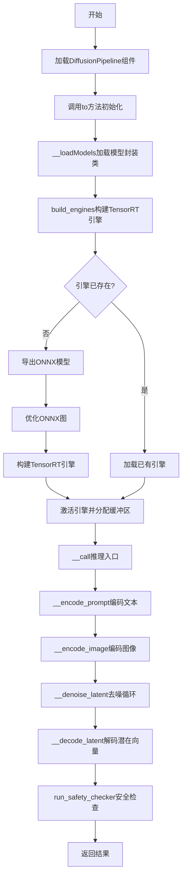

## 类结构

```
Object
├── Engine (TensorRT引擎封装)
├── Optimizer (ONNX图优化器)
├── BaseModel (模型基类)
├── CLIP (CLIP文本编码器封装)
├── UNet (UNet去噪网络封装)
├── VAE (VAE解码器封装)
├── TorchVAEEncoder (PyTorch VAE编码器封装)
├── VAEEncoder (VAE编码器TensorRT封装)
└── TensorRTStableDiffusionInpaintPipeline (主推理管道)
```

## 全局变量及字段


### `TRT_LOGGER`
    
TensorRT日志记录器，用于配置日志级别

类型：`trt.Logger`
    


### `numpy_to_torch_dtype_dict`
    
NumPy数据类型到PyTorch数据类型的映射字典

类型：`dict`
    


### `torch_to_numpy_dtype_dict`
    
PyTorch数据类型到NumPy数据类型的映射字典

类型：`dict`
    


### `Engine.engine_path`
    
TensorRT引擎文件的存储路径

类型：`str`
    


### `Engine.engine`
    
TensorRT引擎对象，用于执行推理

类型：`trt.ICudaEngine`
    


### `Engine.context`
    
TensorRT执行上下文，用于管理推理执行

类型：`trt.IExecutionContext`
    


### `Engine.buffers`
    
CUDA设备内存缓冲区字典，用于存储输入输出数据

类型：`OrderedDict`
    


### `Engine.tensors`
    
PyTorch张量字典，用于存储推理过程中的张量数据

类型：`OrderedDict`
    


### `Optimizer.graph`
    
ONNX GraphSurgeon图对象，用于图操作和优化

类型：`gs.Graph`
    


### `BaseModel.model`
    
PyTorch模型对象

类型：`torch.nn.Module`
    


### `BaseModel.name`
    
模型名称标识

类型：`str`
    


### `BaseModel.fp16`
    
是否使用半精度（FP16）模式

类型：`bool`
    


### `BaseModel.device`
    
计算设备类型（cuda或cpu）

类型：`str`
    


### `BaseModel.min_batch`
    
最小批次大小

类型：`int`
    


### `BaseModel.max_batch`
    
最大批次大小

类型：`int`
    


### `BaseModel.min_image_shape`
    
最小图像分辨率（像素）

类型：`int`
    


### `BaseModel.max_image_shape`
    
最大图像分辨率（像素）

类型：`int`
    


### `BaseModel.min_latent_shape`
    
最小潜在空间分辨率

类型：`int`
    


### `BaseModel.max_latent_shape`
    
最大潜在空间分辨率

类型：`int`
    


### `BaseModel.embedding_dim`
    
文本嵌入向量维度

类型：`int`
    


### `BaseModel.text_maxlen`
    
文本序列最大长度

类型：`int`
    


### `UNet.unet_dim`
    
UNet潜在空间的通道数

类型：`int`
    


### `TorchVAEEncoder.vae_encoder`
    
VAE编码器模型

类型：`torch.nn.Module`
    


### `TensorRTStableDiffusionInpaintPipeline.stages`
    
流水线阶段列表，包含clip、unet、vae、vae_encoder

类型：`list`
    


### `TensorRTStableDiffusionInpaintPipeline.image_height`
    
输出图像的高度（像素）

类型：`int`
    


### `TensorRTStableDiffusionInpaintPipeline.image_width`
    
输出图像的宽度（像素）

类型：`int`
    


### `TensorRTStableDiffusionInpaintPipeline.inpaint`
    
是否启用图像修复模式

类型：`bool`
    


### `TensorRTStableDiffusionInpaintPipeline.onnx_opset`
    
ONNX算子集版本号

类型：`int`
    


### `TensorRTStableDiffusionInpaintPipeline.onnx_dir`
    
ONNX模型文件的存储目录

类型：`str`
    


### `TensorRTStableDiffusionInpaintPipeline.engine_dir`
    
TensorRT引擎文件的存储目录

类型：`str`
    


### `TensorRTStableDiffusionInpaintPipeline.force_engine_rebuild`
    
是否强制重新构建TensorRT引擎

类型：`bool`
    


### `TensorRTStableDiffusionInpaintPipeline.timing_cache`
    
TensorRT timing缓存文件路径

类型：`str`
    


### `TensorRTStableDiffusionInpaintPipeline.build_static_batch`
    
是否使用静态批次大小构建引擎

类型：`bool`
    


### `TensorRTStableDiffusionInpaintPipeline.build_dynamic_shape`
    
是否使用动态形状构建引擎

类型：`bool`
    


### `TensorRTStableDiffusionInpaintPipeline.max_batch_size`
    
允许的最大批次大小

类型：`int`
    


### `TensorRTStableDiffusionInpaintPipeline.stream`
    
CUDA流对象，用于异步推理

类型：`cudaStream_t`
    


### `TensorRTStableDiffusionInpaintPipeline.models`
    
模型对象的字典，按stage名称索引

类型：`dict`
    


### `TensorRTStableDiffusionInpaintPipeline.engine`
    
TensorRT引擎对象的字典，按stage名称索引

类型：`dict`
    


### `TensorRTStableDiffusionInpaintPipeline.vae_scale_factor`
    
VAE缩放因子，用于潜在空间与图像空间的转换

类型：`int`
    


### `TensorRTStableDiffusionInpaintPipeline.image_processor`
    
VAE图像处理器，用于图像预处理和后处理

类型：`VaeImageProcessor`
    
    

## 全局函数及方法


### `preprocess_image`

该函数用于对输入图像进行预处理，将其调整为 32 的整数倍尺寸，转换为归一化的 PyTorch 张量，并进行像素值到 [-1, 1] 范围的缩放，以便于 Stable Diffusion 模型的处理。

参数：

- `image`：`torch.Tensor`，输入的 PIL Image 或图像张量

返回值：`torch.Tensor`，处理后的图像张量，形状为 (B, C, H, W)，值域为 [-1, 1]

#### 流程图

```mermaid
graph TD
    A[开始: preprocess_image] --> B[获取图像尺寸 w, h]
    B --> C{调整尺寸}
    C --> D[计算w, h为32的整数倍: w = w - w % 32]
    D --> E[将图像resize到w, h]
    E --> F[转换为NumPy数组]
    F --> G[数据类型转换为float32并归一化除以255]
    G --> H[添加批次维度: image[None]]
    H --> I[转换维度顺序: transpose 0,3,1,2]
    I --> J[转换为torch.Tensor]
    J --> K[确保内存连续: contiguous]
    K --> L[像素值缩放: 2.0 * image - 1.0]
    L --> M[返回处理后的张量]
```

#### 带注释源码

```python
def preprocess_image(image):
    """
    对输入图像进行预处理，用于Stable Diffusion模型输入
    
    参数:
        image: torch.Tensor 输入的图像张量
    """
    # 获取图像的宽度和高度
    w, h = image.size
    
    # 将宽度和高度调整为32的整数倍，确保能被8整除（VAE的缩放因子）
    # 例如: 如果w=512, w % 32 = 0, 则w保持512
    # 如果w=500, w % 32 = 12, 则w调整为500-12=488
    w, h = (x - x % 32 for x in (w, h))
    
    # 调整图像大小到新的尺寸
    image = image.resize((w, h))
    
    # 将PIL图像转换为NumPy数组，形状为(H, W, C)
    # 转换为float32类型并归一化到[0, 1]范围
    image = np.array(image).astype(np.float32) / 255.0
    
    # 添加批次维度: 从(H, W, C)变为(1, H, W, C)
    # transpose将维度从(0, 3, 1, 2)重新排列:
    # 原: (batch, height, width, channel) -> 新: (batch, channel, height, width)
    image = image[None].transpose(0, 3, 1, 2)
    
    # 将NumPy数组转换为PyTorch张量，并确保内存连续
    image = torch.from_numpy(image).contiguous()
    
    # 将像素值从[0, 1]范围缩放到[-1, 1]范围
    # 这是Stable Diffusion模型期望的输入范围
    return 2.0 * image - 1.0
```


### getOnnxPath

这是一个全局辅助函数，用于根据模型名称、优化标志和输出目录生成 ONNX 模型文件的完整路径。如果 `opt` 参数为 `True`（默认），则返回优化后的 ONNX 模型路径（`.opt.onnx`）；否则返回原始 ONNX 模型路径（`.onnx`）。

参数：

- `model_name`：`str`，模型的名称，作为文件名的一部分。
- `onnx_dir`：`str`，存放 ONNX 文件的目录路径。
- `opt`：`bool`，可选参数（默认为 `True`）。如果为 `True`，则生成的路径指向优化后的 ONNX 模型（`.opt.onnx`）；否则指向原始 ONNX 模型（`.onnx`）。

返回值：`str`，返回完整的 ONNX 文件路径。

#### 流程图

```mermaid
graph TD
    A[开始: getOnnxPath] --> B[输入: model_name, onnx_dir, opt]
    B --> C{opt == True?}
    C -- 是 --> D[文件名 = model_name + .opt + .onnx]
    C -- 否 --> E[文件名 = model_name + .onnx]
    D --> F[路径 = os.path.join(onnx_dir, 文件名)]
    E --> F
    F --> G[返回: 路径]
```

#### 带注释源码

```python
def getOnnxPath(model_name, onnx_dir, opt=True):
    """
    生成 ONNX 模型的完整文件路径。

    Args:
        model_name (str): 模型的名称。
        onnx_dir (str): 保存 ONNX 文件的目录。
        opt (bool, optional): 是否为优化后的模型。默认为 True。

    Returns:
        str: 完整的 ONNX 文件路径。
    """
    # 根据 opt 参数决定是否添加 .opt 后缀
    suffix = ".opt" if opt else ""
    # 拼接文件名: model_name + suffix + .onnx
    filename = model_name + suffix + ".onnx"
    # 返回完整的路径
    return os.path.join(onnx_dir, filename)
```


### `getEnginePath`

该函数是一个工具函数，用于根据模型名称和引擎目录生成 TensorRT 引擎文件的完整路径。通过将模型名称与 `.plan` 扩展名连接，并使用 `os.path.join` 确保跨平台路径兼容性。

参数：

- `model_name`：`str`，模型名称，用于构建引擎文件名
- `engine_dir`：`str`，引擎文件的目标目录路径

返回值：`str`，返回完整的引擎文件路径（例如：`/path/to/engine/model_name.plan`）

#### 流程图

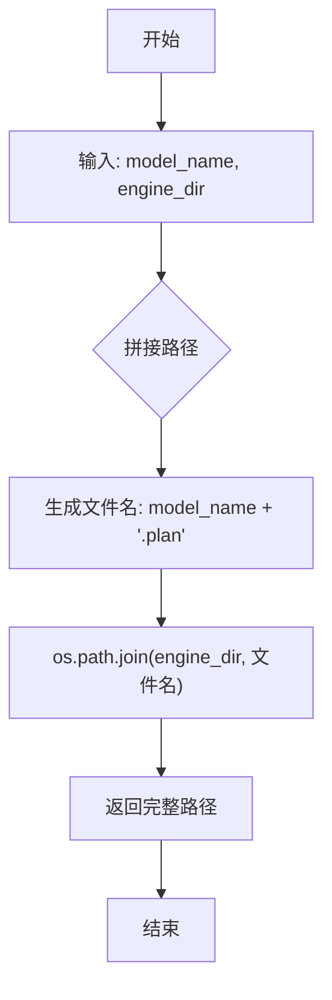

#### 带注释源码

```python
def getEnginePath(model_name, engine_dir):
    """
    生成 TensorRT 引擎文件的完整路径
    
    参数:
        model_name (str): 模型名称，用于构建引擎文件名
        engine_dir (str): 引擎文件的目标目录路径
    
    返回:
        str: 完整的引擎文件路径，格式为 {engine_dir}/{model_name}.plan
    """
    # 使用 os.path.join 确保跨平台路径兼容性
    # 将目录路径和文件名组合在一起
    # 添加 .plan 扩展名，这是 TensorRT 引擎文件的约定后缀
    return os.path.join(engine_dir, model_name + ".plan")
```


### `build_engines`

该函数是 TensorRT 加速 Stable Diffusion 流程的核心构建函数，负责将 PyTorch 模型转换为 ONNX 格式，进行优化，然后构建和加载 TensorRT 引擎。它首先创建必要的输出目录，然后遍历模型字典进行 ONNX 导出、优化和 TensorRT 引擎构建，最后加载并激活所有引擎，返回包含所有已构建引擎的字典。

参数：

- `models`：`dict`，模型名称到模型对象的字典，用于指定需要构建引擎的模型（如 CLIP、UNet、VAE 等）
- `engine_dir`：`str`，TensorRT 引擎文件（.plan）的输出目录路径
- `onnx_dir`：`str`，ONNX 模型文件的输出目录路径
- `onnx_opset`：`int`，导出 ONNX 模型时使用的操作集版本号
- `opt_image_height`：`int`，优化时使用的图像高度，用于确定输入形状
- `opt_image_width`：`int`，优化时使用的图像宽度，用于确定输入形状
- `opt_batch_size`：`int`，优化时使用的批处理大小，默认为 1
- `force_engine_rebuild`：`bool`，是否强制重新构建引擎，即使已有缓存的引擎文件，默认为 False
- `static_batch`：`bool`，是否使用静态批处理大小，默认为 False
- `static_shape`：`bool`，是否使用静态形状，默认为 True
- `enable_all_tactics`：`bool`，是否启用 TensorRT 所有优化策略，默认为 False
- `timing_cache`：`str`，TensorRT 构建时的时间缓存文件路径，用于加速后续构建

返回值：`dict`，返回模型名称到 Engine 对象的映射字典，包含所有已构建、加载并激活的 TensorRT 引擎

#### 流程图

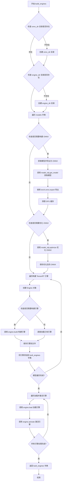

#### 带注释源码

```python
def build_engines(
    models: dict,
    engine_dir,
    onnx_dir,
    onnx_opset,
    opt_image_height,
    opt_image_width,
    opt_batch_size=1,
    force_engine_rebuild=False,
    static_batch=False,
    static_shape=True,
    enable_all_tactics=False,
    timing_cache=None,
):
    """
    构建并加载 TensorRT 引擎的主函数
    
    参数:
        models: 模型名称到模型对象的字典
        engine_dir: TensorRT 引擎输出目录
        onnx_dir: ONNX 模型输出目录
        onnx_opset: ONNX 操作集版本
        opt_image_height: 优化用图像高度
        opt_image_width: 优化用图像宽度
        opt_batch_size: 优化用批处理大小
        force_engine_rebuild: 强制重新构建
        static_batch: 静态批处理
        static_shape: 静态形状
        enable_all_tactics: 启用所有 TensorRT 策略
        timing_cache: 时间缓存
    返回:
        包含所有已构建引擎的字典
    """
    # 初始化引擎字典，用于存储所有构建好的引擎
    built_engines = {}
    
    # 确保输出目录存在，如果不存在则创建
    if not os.path.isdir(onnx_dir):
        os.makedirs(onnx_dir)
    if not os.path.isdir(engine_dir):
        os.makedirs(engine_dir)

    # ===== 步骤 1: 导出模型到 ONNX =====
    # 遍历所有模型，将 PyTorch 模型导出为 ONNX 格式
    for model_name, model_obj in models.items():
        # 获取引擎文件路径
        engine_path = getEnginePath(model_name, engine_dir)
        
        # 检查是否需要构建（根据 force_engine_rebuild 或文件是否存在）
        if force_engine_rebuild or not os.path.exists(engine_path):
            logger.warning("Building Engines...")
            logger.warning("Engine build can take a while to complete")
            
            # 获取 ONNX 路径（原始和优化后）
            onnx_path = getOnnxPath(model_name, onnx_dir, opt=False)
            onnx_opt_path = getOnnxPath(model_name, onnx_dir)
            
            # ===== 步骤 1.1: 导出原始 ONNX =====
            if force_engine_rebuild or not os.path.exists(onnx_opt_path):
                if force_engine_rebuild or not os.path.exists(onnx_path):
                    logger.warning(f"Exporting model: {onnx_path}")
                    # 获取模型对象
                    model = model_obj.get_model()
                    
                    # 使用推理模式进行 ONNX 导出
                    with torch.inference_mode(), torch.autocast("cuda"):
                        # 获取示例输入
                        inputs = model_obj.get_sample_input(opt_batch_size, opt_image_height, opt_image_width)
                        # 执行 ONNX 导出
                        torch.onnx.export(
                            model,
                            inputs,
                            onnx_path,
                            export_params=True,
                            opset_version=onnx_opset,
                            do_constant_folding=True,
                            input_names=model_obj.get_input_names(),
                            output_names=model_obj.get_output_names(),
                            dynamic_axes=model_obj.get_dynamic_axes(),
                        )
                    
                    # 释放模型内存并清理 GPU 缓存
                    del model
                    torch.cuda.empty_cache()
                    gc.collect()
                else:
                    logger.warning(f"Found cached model: {onnx_path}")

                # ===== 步骤 1.2: 优化 ONNX 模型 =====
                if force_engine_rebuild or not os.path.exists(onnx_opt_path):
                    logger.warning(f"Generating optimizing model: {onnx_opt_path}")
                    # 使用优化器处理 ONNX 图
                    onnx_opt_graph = model_obj.optimize(onnx.load(onnx_path))
                    # 保存优化后的 ONNX
                    onnx.save(onnx_opt_graph, onnx_opt_path)
                else:
                    logger.warning(f"Found cached optimized model: {onnx_opt_path} ")

    # ===== 步骤 2: 构建 TensorRT 引擎 =====
    # 遍历所有模型，构建 TensorRT 引擎
    for model_name, model_obj in models.items():
        engine_path = getEnginePath(model_name, engine_dir)
        # 创建引擎对象
        engine = Engine(engine_path)
        onnx_path = getOnnxPath(model_name, onnx_dir, opt=False)
        onnx_opt_path = getOnnxPath(model_name, onnx_dir)

        # 检查是否需要构建引擎
        if force_engine_rebuild or not os.path.exists(engine.engine_path):
            # 调用引擎的 build 方法构建 TensorRT 引擎
            engine.build(
                onnx_opt_path,
                fp16=True,  # 启用 FP16 加速
                input_profile=model_obj.get_input_profile(
                    opt_batch_size,
                    opt_image_height,
                    opt_image_width,
                    static_batch=static_batch,
                    static_shape=static_shape,
                ),
                timing_cache=timing_cache,
            )
        
        # 将引擎添加到字典中
        built_engines[model_name] = engine

    # ===== 步骤 3: 加载并激活引擎 =====
    # 遍历所有引擎，进行加载和激活
    for model_name, model_obj in models.items():
        engine = built_engines[model_name]
        # 从文件加载引擎
        engine.load()
        # 创建执行上下文
        engine.activate()

    # 返回所有构建好的引擎
    return built_engines
```


### `runEngine`

这是一个全局工具函数，用于在 TensorRT 引擎上执行推理操作，将输入数据拷贝到设备内存，调用 TensorRT 异步执行接口，并返回推理结果张量字典。

参数：

- `engine`：`Engine` 类实例，包含已加载和激活的 TensorRT 引擎及执行上下文
- `feed_dict`：`dict` 类型，键为张量名称，值为 PyTorch 张量，包含推理所需的输入数据
- `stream`：`int` 或 CUDA stream 对象类型，由 `cudart.cudaStreamCreate()` 创建的 CUDA 流，用于异步执行

返回值：`OrderedDict` 类型，键为输出张量名称，值为 PyTorch 张量，包含模型的推理输出结果

#### 流程图

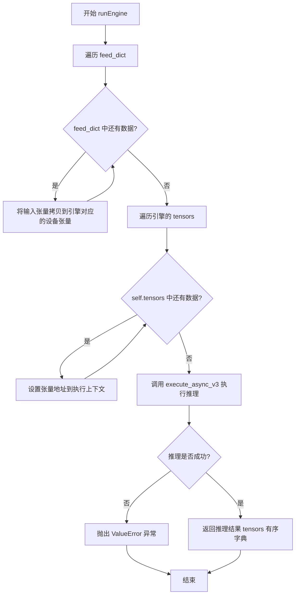

#### 带注释源码

```python
def runEngine(engine, feed_dict, stream):
    """
    在 TensorRT 引擎上执行推理的全局工具函数
    
    参数:
        engine: Engine 类实例，已加载并激活的 TensorRT 引擎
        feed_dict: dict，输入数据的字典，键为张量名称，值为 PyTorch 张量
        stream: CUDA stream，用于异步执行推理
    
    返回:
        OrderedDict，包含推理输出的有序字典，键为张量名称
    """
    # 调用引擎的 infer 方法执行推理
    # infer 方法内部会:
    # 1. 将 feed_dict 中的输入数据拷贝到引擎分配的设备张量中
    # 2. 设置所有输入输出张量的地址到执行上下文
    # 3. 异步执行 TensorRT 推理
    # 4. 返回包含输出张量的有序字典
    return engine.infer(feed_dict, stream)
```


### `make_CLIP`

该函数是一个工厂函数，用于创建CLIP模型包装器对象，将原始的CLIP文本编码器模型封装为符合TensorRT加速管道所需的CLIP类实例。

参数：

- `model`：`torch.nn.Module`，原始的CLIP文本编码器模型（来自HuggingFace的CLIPTextModel）
- `device`：`str`，指定计算设备，通常为"cuda"
- `max_batch_size`：`int`，最大批次大小，用于确定动态形状范围
- `embedding_dim`：`int`，文本嵌入维度，通常为768（clip-vit-large-patch14）
- `inpaint`：`bool`，标志位（当前未使用，保留用于扩展）

返回值：`CLIP`，返回封装后的CLIP模型对象，可用于ONNX导出和TensorRT引擎构建

#### 流程图

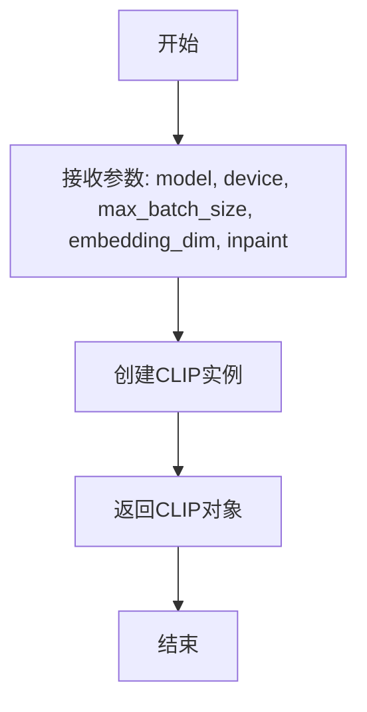

#### 带注释源码

```python
def make_CLIP(model, device, max_batch_size, embedding_dim, inpaint=False):
    """
    工厂函数：创建CLIP模型包装器
    
    该函数将HuggingFace的CLIPTextModel封装为TensorRT管道所需的CLIP类，
    负责处理ONNX导出配置、输入输出张量定义、以及动态形状profile的生成。
    
    参数:
        model: CLIP文本编码器模型
        device: 计算设备
        max_batch_size: 最大批次大小
        embedding_dim: 嵌入维度
        inpaint: 标志位，当前未使用
    
    返回:
        CLIP: 封装后的CLIP模型对象
    """
    return CLIP(model, device=device, max_batch_size=max_batch_size, embedding_dim=embedding_dim)
```


### `make_UNet`

这是一个工厂函数，用于创建封装好的 UNet 模型实例，以便后续进行 TensorRT 引擎构建和推理。该函数接收原始的 UNet2DConditionModel 模型以及相关配置参数，实例化一个配置好的 UNet 对象并返回。

参数：

- `model`：`UNet2DConditionModel`，来自 Hugging Face Diffusers 的 UNet 模型对象，用于图像去噪的条件 U-Net 架构
- `device`：`str`，计算设备，通常为 "cuda" 表示 GPU 设备
- `max_batch_size`：`int`，最大批次大小，用于确定动态形状的范围
- `embedding_dim`：`int`，文本嵌入的维度，通常为 768（CLIP ViT-L/14）
- `inpaint`：`bool`，是否为 inpainting 模式，当前未使用（默认为 False）
- `unet_dim`：`int`，UNet 输入通道数，对于标准 Stable Diffusion 为 4（默认为 4）

返回值：`UNet`，返回配置好的 UNet 包装类实例，用于后续 ONNX 导出和 TensorRT 引擎构建

#### 流程图

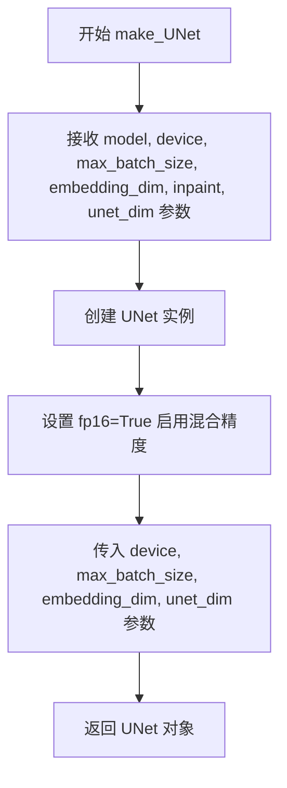

#### 带注释源码

```python
def make_UNet(model, device, max_batch_size, embedding_dim, inpaint=False, unet_dim=4):
    """
    创建 UNet 模型包装类的工厂函数
    
    参数:
        model: UNet2DConditionModel - 原始的 UNet 模型对象
        device: str - 计算设备（如 "cuda"）
        max_batch_size: int - 最大批次大小
        embedding_dim: int - 文本嵌入维度
        inpaint: bool - inpainting 模式标志（当前未使用）
        unet_dim: int - UNet 输入通道数
    
    返回:
        UNet: 封装好的 UNet 包装类实例
    """
    # 创建并返回 UNet 实例，配置 fp16=True 以支持半精度推理
    return UNet(
        model,                      # 原始的 UNet2DConditionModel 模型
        fp16=True,                  # 启用 FP16 混合精度计算
        device=device,              # 计算设备（cuda/cpu）
        max_batch_size=max_batch_size,  # 最大批次大小限制
        embedding_dim=embedding_dim,    # 文本条件嵌入维度
        unet_dim=unet_dim,              # UNet 输入 latent 的通道数（默认4）
    )
```


### `make_VAE`

该函数是一个工厂函数，用于创建并返回 `VAE` 类的实例对象。它接收模型和相关配置参数，并将这些参数传递给 `VAE` 类的构造函数，以初始化用于 TensorRT 加速的 VAE 解码器模型。

参数：

- `model`：`torch.nn.Module`，要封装的 VAE 模型
- `device`：`str`，指定运行设备（通常为 "cuda"）
- `max_batch_size`：`int`，最大批处理大小
- `embedding_dim`：`int`，嵌入维度
- `inpaint`：`bool`，是否用于图像修复任务（可选，默认为 False）

返回值：`VAE`，返回初始化后的 VAE 模型封装对象

#### 流程图

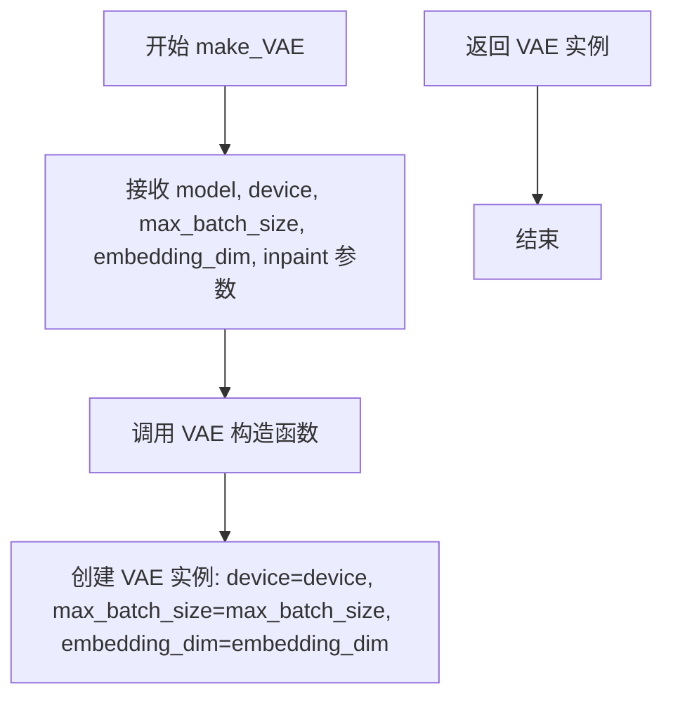

#### 带注释源码

```python
def make_VAE(model, device, max_batch_size, embedding_dim, inpaint=False):
    """
    创建 VAE 模型封装类的工厂函数
    
    参数:
        model: 原始的 PyTorch VAE 模型 (AutoencoderKL)
        device: 运行设备，如 'cuda'
        max_batch_size: 最大批处理大小
        embedding_dim: 嵌入维度
        inpaint: 布尔标志，指示是否用于修复任务（当前未使用）
    
    返回:
        VAE: 返回配置好的 VAE 封装对象
    """
    # 将参数传递给 VAE 类的构造函数，返回 VAE 实例
    # VAE 类继承自 BaseModel，提供了 TensorRT 引擎所需的接口方法
    return VAE(model, device=device, max_batch_size=max_batch_size, embedding_dim=embedding_dim)
```

---

### `VAE` 类

`VAE` 类是用于 TensorRT 加速的 VAE 解码器封装类，继承自 `BaseModel`。它提供了模型输入输出名称、动态轴、输入配置、形状字典和示例输入等方法，用于将 PyTorch VAE 模型导出为 ONNX 并构建 TensorRT 引擎。

#### 类字段

| 字段名称 | 类型 | 描述 |
|---------|------|------|
| `model` | `torch.nn.Module` | 封装的 PyTorch VAE 模型 |
| `name` | `str` | 模型名称，初始化为 "VAE decoder" |
| `fp16` | `bool` | 是否使用半精度浮点数（继承自 BaseModel） |
| `device` | `str` | 运行设备（继承自 BaseModel） |
| `min_batch` | `int` | 最小批处理大小（继承自 BaseModel，值为 1） |
| `max_batch` | `int` | 最大批处理大小（继承自 BaseModel） |
| `min_image_shape` | `int` | 最小图像分辨率（继承自 BaseModel，值为 256） |
| `max_image_shape` | `int` | 最大图像分辨率（继承自 BaseModel，值为 1024） |
| `min_latent_shape` | `int` | 最小潜空间形状（继承自 BaseModel，值为 min_image_shape // 8） |
| `max_latent_shape` | `int` | 最大潜空间形状（继承自 BaseModel，值为 max_image_shape // 8） |
| `embedding_dim` | `int` | 嵌入维度（继承自 BaseModel） |
| `text_maxlen` | `int` | 文本最大长度（继承自 BaseModel，值为 77） |

#### 类方法

##### `__init__`

参数：

- `model`：`torch.nn.Module`，要封装的 VAE 模型
- `device`：`str`，运行设备
- `max_batch_size`：`int`，最大批处理大小
- `embedding_dim`：`int`，嵌入维度

返回值：无

##### `get_input_names`

返回值：`List[str]`，返回输入张量名称列表 `["latent"]`

##### `get_output_names`

返回值：`List[str]`，返回输出张量名称列表 `["images"]`

##### `get_dynamic_axes`

返回值：`dict`，返回动态轴字典 `{"latent": {0: "B", 2: "H", 3: "W"}, "images": {0: "B", 2: "8H", 3: "8W"}}`

##### `get_input_profile`

参数：

- `batch_size`：`int`，批处理大小
- `image_height`：`int`，图像高度
- `image_width`：`int`，图像宽度
- `static_batch`：`bool`，是否使用静态批处理
- `static_shape`：`bool`，是否使用静态形状

返回值：`dict`，返回输入配置字典

##### `get_shape_dict`

参数：

- `batch_size`：`int`，批处理大小
- `image_height`：`int`，图像高度
- `image_width`：`int`，图像宽度

返回值：`dict`，返回形状字典 `{"latent": (batch_size, 4, latent_height, latent_width), "images": (batch_size, 3, image_height, image_width)}`

##### `get_sample_input`

参数：

- `batch_size`：`int`，批处理大小
- `image_height`：`int`，图像高度
- `image_width`：`int`，图像宽度

返回值：`torch.Tensor`，返回随机初始化的潜空间张量

#### 带注释源码（VAE 类核心部分）

```python
class VAE(BaseModel):
    """
    VAE 解码器模型封装类，用于 TensorRT 加速
    继承自 BaseModel，提供 ONNX 导出和 TensorRT 引擎构建所需的所有接口
    """
    
    def __init__(self, model, device, max_batch_size, embedding_dim):
        # 调用父类 BaseModel 的构造函数
        super(VAE, self).__init__(
            model=model, device=device, max_batch_size=max_batch_size, embedding_dim=embedding_dim
        )
        self.name = "VAE decoder"  # 设置模型名称

    def get_input_names(self):
        """返回 ONNX 模型的输入张量名称"""
        return ["latent"]  # VAE 解码器接收 latent 作为输入

    def get_output_names(self):
        """返回 ONNX 模型的输出张量名称"""
        return ["images"]  # VAE 解码器输出 images

    def get_dynamic_axes(self):
        """返回动态轴配置，支持不同批处理大小和分辨率"""
        return {
            "latent": {0: "B", 2: "H", 3: "W"},       # batch, height, width 维度可动态变化
            "images": {0: "B", 2: "8H", 3: "8W"}      # 输出图像尺寸是 latent 的 8 倍
        }

    def get_input_profile(self, batch_size, image_height, image_width, static_batch, static_shape):
        """返回 TensorRT 引擎的输入配置（min/opt/max）"""
        latent_height, latent_width = self.check_dims(batch_size, image_height, image_width)
        (
            min_batch, max_batch, _, _, _, _,
            min_latent_height, max_latent_height,
            min_latent_width, max_latent_width,
        ) = self.get_minmax_dims(batch_size, image_height, image_width, static_batch, static_shape)
        
        # 返回 latent 的三种配置：最小、最优、最大
        return {
            "latent": [
                (min_batch, 4, min_latent_height, min_latent_width),
                (batch_size, 4, latent_height, latent_width),
                (max_batch, 4, max_latent_height, max_latent_width),
            ]
        }

    def get_shape_dict(self, batch_size, image_height, image_width):
        """返回输入输出的形状字典"""
        latent_height, latent_width = self.check_dims(batch_size, image_height, image_width)
        return {
            "latent": (batch_size, 4, latent_height, latent_width),  # 4 通道的 latent
            "images": (batch_size, 3, image_height, image_width),      # 3 通道的 RGB 图像
        }

    def get_sample_input(self, batch_size, image_height, image_width):
        """返回用于 ONNX 导出的示例输入"""
        latent_height, latent_width = self.check_dims(batch_size, image_height, image_width)
        # 生成随机 latent 张量作为示例输入
        return torch.randn(
            batch_size, 4, latent_height, latent_width, 
            dtype=torch.float32, device=self.device
        )
```

---

### 关键组件信息

| 组件名称 | 描述 |
|---------|------|
| `BaseModel` | 基础模型类，提供 TensorRT 引擎构建所需的通用接口 |
| `Optimizer` | ONNX 图形优化器，用于常量的折叠、形状推断等 |
| `Engine` | TensorRT 引擎封装类，负责引擎的构建、加载、内存分配和推理 |
| `make_VAE` | 工厂函数，用于创建 VAE 模型封装实例 |
| `TorchVAEEncoder` | VAE 编码器封装类，用于将图像编码为 latent |

---

### 潜在技术债务或优化空间

1. **未使用的 `inpaint` 参数**：`make_VAE` 函数接收 `inpaint` 参数，但在创建 `VAE` 实例时并未使用该参数，可能导致接口不一致或未来功能缺失。

2. **硬编码的 VAE 缩放因子**：在 `TensorRTStableDiffusionInpaintPipeline` 中，VAE 的缩放因子通过计算 `2 ** (len(self.vae.config.block_out_channels) - 1)` 获得，但在某些情况下使用了硬编码的 `8` 作为默认值，缺乏灵活性。

3. **缺乏错误处理**：在引擎构建和推理过程中，对一些关键操作（如 ONNX 导出、TensorRT 引擎创建）缺乏详细的错误处理和异常捕获机制。

4. **内存管理**：在 `Engine` 类的 `__del__` 方法中手动释放内存，但在某些异常情况下可能无法正确释放资源，建议使用上下文管理器或 `finally` 块确保资源释放。

5. **性能优化空间**：当前实现中使用了 `torch.inference_mode()` 和 `torch.autocast("cuda")`，但未充分利用 TensorRT 的 INT8 量化功能。

---

### 其它项目

#### 设计目标与约束

- **目标**：将 Stable Diffusion 的 VAE 解码器模型从 PyTorch 导出为 ONNX，并构建 TensorRT 引擎以实现 GPU 加速推理
- **约束**：
  - 图像分辨率需为 32 的倍数
  - 批处理大小需在 1 到 16 之间（动态形状时最大为 4）
  - 潜在空间分辨率为图像分辨率的 1/8

#### 错误处理与异常设计

- 在 `check_dims` 方法中使用断言验证批处理大小和图像尺寸的有效性
- 在 `Engine.infer` 方法中检查推理是否成功，失败时抛出 `ValueError`
- ONNX 图形优化时检查模型大小是否超过 2GB 限制

#### 数据流与状态机

1. 用户调用 `make_VAE` 创建 VAE 封装对象
2. 在 `TensorRTStableDiffusionInpaintPipeline` 的 `to` 方法中调用 `build_engines` 构建 TensorRT 引擎
3. 推理时通过 `runEngine` 调用 TensorRT 引擎进行前向推理
4. `__decode_latent` 方法调用 VAE 引擎将 latent 解码为图像

#### 外部依赖与接口契约

- **依赖库**：`torch`、`tensorrt`、`onnx`、`onnx_graphsurgeon`、`polygraphy`、`diffusers`
- **输入接口**：接收 latent 张量（4 通道，形状为 `(batch, 4, H/8, W/8)`）
- **输出接口**：输出 RGB 图像张量（3 通道，形状为 `(batch, 3, H, W)`）


### make_VAEEncoder

该函数是一个工厂函数，用于创建并返回 `VAEEncoder` 类的实例。`VAEEncoder` 是 Stable Diffusion 模型中 VAE（变分自编码器）编码器部分的包装类，负责将输入图像编码为潜在空间表示。

参数：

-  `model`：`torch.nn.Module`，原始的 VAE 模型对象
-  `device`：`str`，指定计算设备（如 "cuda" 或 "cpu"）
-  `max_batch_size`：`int`，模型支持的最大批次大小
-  `embedding_dim`：`int`，嵌入维度，用于文本编码器
-  `inpaint`：`bool`，可选参数，默认为 False，用于指定是否为 inpainting 任务（当前未使用）

返回值：`VAEEncoder`，返回配置好的 VAEEncoder 实例

#### 流程图

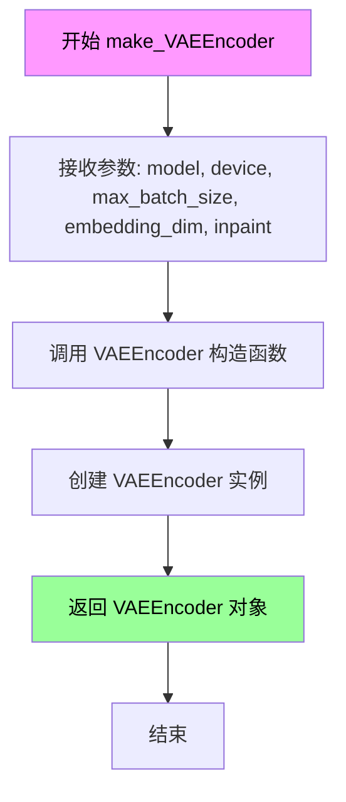

#### 带注释源码

```python
def make_VAEEncoder(model, device, max_batch_size, embedding_dim, inpaint=False):
    """
    工厂函数，用于创建 VAEEncoder 实例
    
    参数:
        model: torch.nn.Module - 原始 VAE 模型
        device: str - 计算设备
        max_batch_size: int - 最大批次大小
        embedding_dim: int - 嵌入维度
        inpaint: bool - 是否为 inpainting 模式（当前未使用）
    
    返回:
        VAEEncoder: 配置好的 VAEEncoder 实例
    """
    return VAEEncoder(
        model, 
        device=device, 
        max_batch_size=max_batch_size, 
        embedding_dim=embedding_dim
    )
```


### Engine.build

该方法用于将ONNX模型构建为TensorRT引擎，支持动态输入配置、FP16精度优化和构建策略定制，并将最终引擎保存到指定路径。

参数：

- `onnx_path`：`str`，待构建的ONNX模型文件路径
- `fp16`：`bool`，是否启用FP16半精度推理模式
- `input_profile`：`Optional[dict]`，输入张量的动态形状配置字典，键为输入名称，值为包含min、opt、max三个维度的列表
- `enable_all_tactics`：`bool`，是否启用所有TensorRT优化策略，默认为False
- `timing_cache`：`Optional[str]`，构建时性能计时缓存文件路径，用于加速重复构建

返回值：`None`，该方法直接保存引擎文件到磁盘，不返回任何内容

#### 流程图

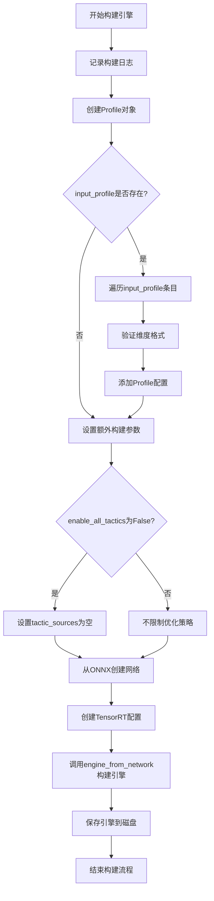

#### 带注释源码

```python
def build(
    self,
    onnx_path,
    fp16,
    input_profile=None,
    enable_all_tactics=False,
    timing_cache=None,
):
    """
    将ONNX模型构建为TensorRT引擎
    
    Args:
        onnx_path: ONNX模型文件路径
        fp16: 是否启用FP16半精度
        input_profile: 动态输入形状配置
        enable_all_tactics: 是否启用全部优化策略
        timing_cache: 性能计时缓存路径
    """
    # 记录构建日志，包含ONNX路径和目标引擎路径
    logger.warning(f"Building TensorRT engine for {onnx_path}: {self.engine_path}")
    
    # 创建TensorRT优化配置文件对象
    p = Profile()
    
    # 如果提供了输入配置，处理动态形状
    if input_profile:
        # 遍历每个输入的维度配置
        for name, dims in input_profile.items():
            assert len(dims) == 3, "每个输入需要min、opt、max三个维度配置"
            # 添加优化配置：最小、最优、最大形状
            p.add(name, min=dims[0], opt=dims[1], max=dims[2])

    # 初始化额外构建参数字典
    extra_build_args = {}
    
    # 如果不启用全部策略，限制tactic来源以确保构建稳定性
    if not enable_all_tactics:
        extra_build_args["tactic_sources"] = []

    # 从ONNX文件加载网络并构建TensorRT引擎
    engine = engine_from_network(
        # 使用原生INSTANCENORM标志解析ONNX
        network_from_onnx_path(onnx_path, flags=[trt.OnnxParserFlag.NATIVE_INSTANCENORM]),
        # 配置引擎选项：FP16、输入profile、计时缓存
        config=CreateConfig(fp16=fp16, profiles=[p], load_timing_cache=timing_cache, **extra_build_args),
        save_timing_cache=timing_cache,
    )
    
    # 将构建完成的引擎保存到指定路径
    save_engine(engine, path=self.engine_path)
```


### Engine.load

该方法负责将预构建的 TensorRT 引擎从磁盘文件加载到内存中，使用 Polygraphy 库的 `engine_from_bytes` 函数将引擎文件的字节码反序列化为可执行的 TensorRT 引擎对象。

参数：无参数

返回值：无返回值

#### 流程图

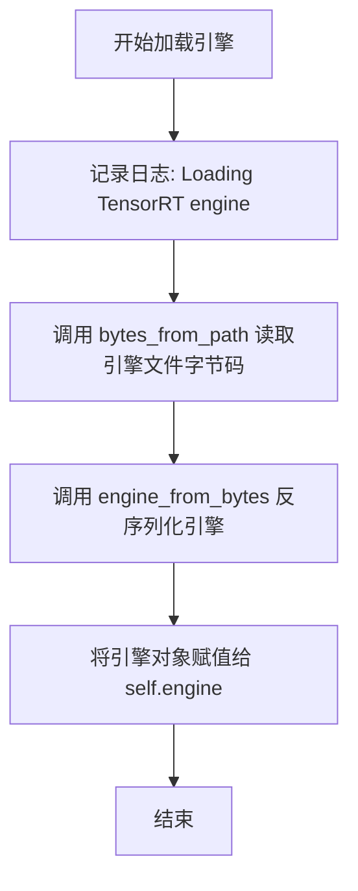

#### 带注释源码

```python
def load(self):
    """
    将预构建的 TensorRT 引擎从磁盘加载到内存中
    
    该方法执行以下操作：
    1. 通过 Polygraphy 的 bytes_from_path 读取引擎文件的原始字节
    2. 使用 TensorRT 的 engine_from_bytes 将字节码反序列化为引擎对象
    3. 将加载的引擎存储在 self.engine 属性中供后续推理使用
    
    注意：
    - 引擎文件路径由 self.engine_path 指定
    - 加载前需确保引擎文件已通过 build() 方法成功构建
    - 加载后的引擎需要调用 activate() 方法创建执行上下文
    """
    # 记录加载操作日志，便于调试和追踪
    logger.warning(f"Loading TensorRT engine: {self.engine_path}")
    
    # 从磁盘文件读取引擎的原始字节数据
    # bytes_from_path 是 Polygraphy 库提供的工具函数
    engine_bytes = bytes_from_path(self.engine_path)
    
    # 将字节码反序列化为 TensorRT 引擎对象
    # engine_from_bytes 是 Polygraphy 库提供的封装函数
    # 返回值是一个 trt.ICudaEngine 对象
    self.engine = engine_from_bytes(engine_bytes)
```


### Engine.activate

该方法用于创建TensorRT引擎的执行上下文（Execution Context），这是进行推理前的必要步骤。通过创建执行上下文，可以为当前的TensorRT引擎绑定分配内存并准备推理环境。

参数：无

返回值：`None`，无返回值

#### 流程图

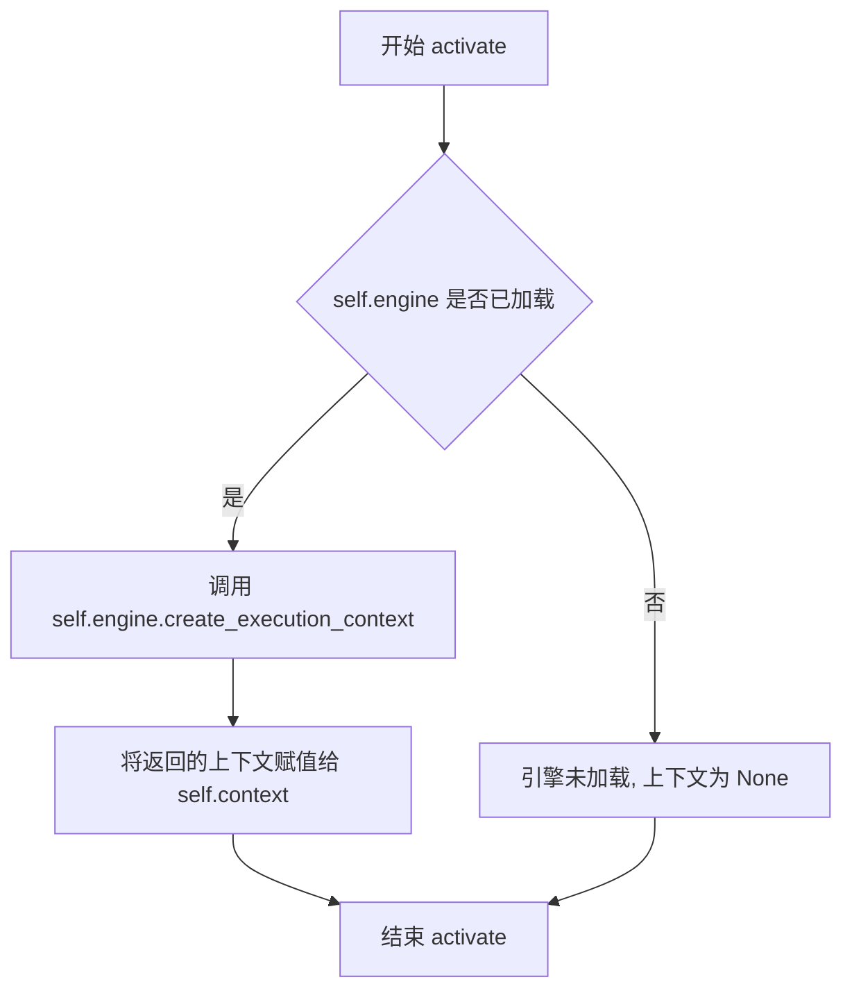

#### 带注释源码

```python
def activate(self):
    """
    激活TensorRT引擎，创建执行上下文。
    
    该方法在引擎加载后调用，用于创建IExecutionContext对象。
    执行上下文包含执行推理所需的状态信息，每个上下文可以独立执行推理。
    """
    # 使用已加载的TensorRT引擎创建一个执行上下文
    # IExecutionContext 用于在GPU上运行推理
    self.context = self.engine.create_execution_context()
```


### Engine.allocate_buffers

该方法为TensorRT引擎分配输入和输出缓冲区，遍历引擎的所有绑定张量，根据提供的shape_dict或引擎默认形状创建相应的PyTorch张量，并将其存储到tensors字典中供推理使用。

参数：

- `self`：`Engine`类实例，表示当前的TensorRT引擎对象
- `shape_dict`：`Optional[dict]`，可选的形状字典，用于指定每个张量的形状，键为张量名称，值为形状元组。如果为None或张量名称不在字典中，则使用引擎默认形状
- `device`：`str`，指定张量存放的设备，默认为"cuda"

返回值：`None`，该方法不返回任何值，结果存储在实例的`tensors`属性中

#### 流程图

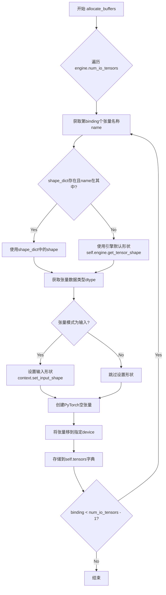

#### 带注释源码

```python
def allocate_buffers(self, shape_dict=None, device="cuda"):
    """
    为TensorRT引擎分配输入和输出缓冲区
    
    参数:
        shape_dict: 可选的形状字典，用于指定每个张量的形状
        device: 张量存放的设备，默认为cuda
    """
    # 遍历引擎的所有输入输出张量
    for binding in range(self.engine.num_io_tensors):
        # 获取张量的名称
        name = self.engine.get_tensor_name(binding)
        
        # 确定张量形状：如果提供了shape_dict且该张量在其中，使用提供的形状；否则使用引擎默认形状
        if shape_dict and name in shape_dict:
            shape = shape_dict[name]
        else:
            shape = self.engine.get_tensor_shape(name)
        
        # 获取张量的numpy数据类型，并转换为PyTorch数据类型
        dtype = trt.nptype(self.engine.get_tensor_dtype(name))
        
        # 如果是输入张量，需要设置其形状到执行上下文
        if self.engine.get_tensor_mode(name) == trt.TensorIOMode.INPUT:
            self.context.set_input_shape(name, shape)
        
        # 创建PyTorch空张量，使用转换后的dtype，并移动到指定设备
        tensor = torch.empty(tuple(shape), dtype=numpy_to_torch_dtype_dict[dtype]).to(device=device)
        
        # 将创建的张量存储到tensors字典中，键为张量名称
        self.tensors[name] = tensor
```


### `Engine.infer`

执行 TensorRT 引擎的推理操作，将输入数据复制到设备 tensor，设置 tensor 地址，然后异步执行推理并返回结果 tensor。

参数：

- `feed_dict`：`dict`，输入字典，键为 tensor 名称，值为待推理的输入数据（numpy 数组或 torch tensor）
- `stream`：`cuda stream`，CUDA 流对象，用于异步执行推理

返回值：`OrderedDict`，包含推理输出的 tensor 字典，键为 tensor 名称，值为推理结果

#### 流程图

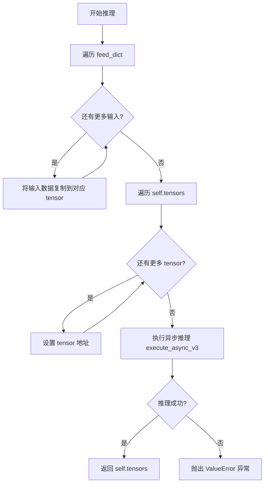

#### 带注释源码

```python
def infer(self, feed_dict, stream):
    """
    执行 TensorRT 引擎推理
    
    参数:
        feed_dict: dict, 输入数据字典，键为tensor名称，值为输入数据
        stream: cuda stream, CUDA流用于异步执行
    
    返回:
        OrderedDict: 包含输出tensor的字典
    """
    # 步骤1: 将输入数据从 feed_dict 复制到预分配的 device tensors
    for name, buf in feed_dict.items():
        self.tensors[name].copy_(buf)
    
    # 步骤2: 为每个 tensor 设置设备内存地址，供 TensorRT 运行时使用
    for name, tensor in self.tensors.items():
        self.context.set_tensor_address(name, tensor.data_ptr())
    
    # 步骤3: 异步执行推理
    noerror = self.context.execute_async_v3(stream)
    
    # 步骤4: 检查推理是否成功，若失败则抛出异常
    if not noerror:
        raise ValueError("ERROR: inference failed.")

    # 步骤5: 返回包含推理结果的 tensor 字典
    return self.tensors
```


### `Optimizer.cleanup`

该方法用于清理 ONNX 图中的未使用节点并进行拓扑排序，可在清理后选择性地返回 ONNX 格式的图。

参数：

- `return_onnx`：`bool`，可选参数，默认为 False。如果设置为 True，则在清理和排序后返回 ONNX 图对象；否则返回 None。

返回值：`Optional[onnx.ModelProto]`，当 `return_onnx=True` 时返回 ONNX 图对象，否则返回 None。

#### 流程图

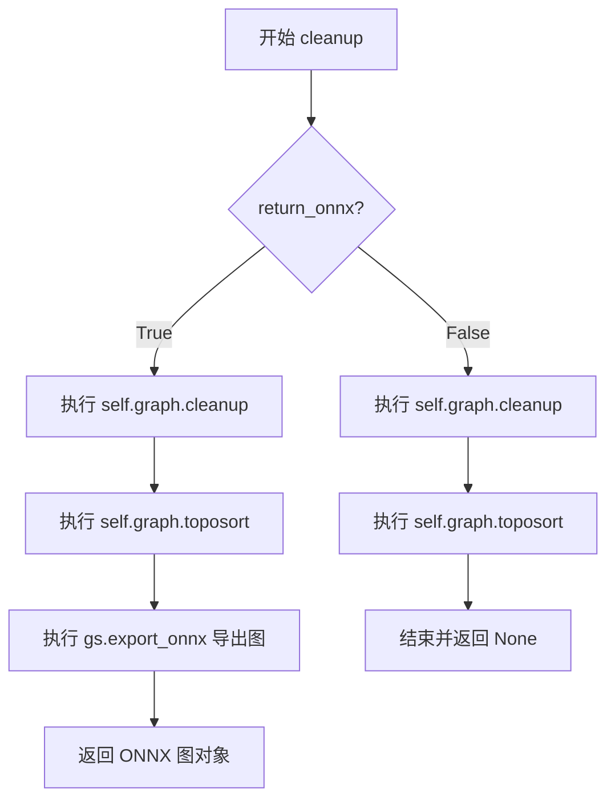

#### 带注释源码

```python
def cleanup(self, return_onnx=False):
    """
    清理 ONNX 图中的未使用节点并执行拓扑排序。
    
    Args:
        return_onnx (bool, optional): 是否返回 ONNX 格式的图。默认为 False。
        
    Returns:
        onnx.ModelProto or None: 当 return_onnx 为 True 时返回 ONNX 图对象，否则返回 None。
    """
    # 调用 cleanup() 移除图中未使用的节点，然后调用 toposort() 确保节点按拓扑顺序排列
    self.graph.cleanup().toposort()
    
    # 如果需要返回 ONNX 格式的图，则导出并返回
    if return_onnx:
        return gs.export_onnx(self.graph)
```


### `Optimizer.select_outputs`

该方法用于从ONNX计算图中选择指定的输出节点，并可选地重命名这些输出。它通过筛选`self.graph.outputs`列表来实现，允许用户保留特定的输出并为其分配新名称。

参数：

- `keep`：`List[int]`，需要保留的输出索引列表，用于指定图中哪些输出节点应被保留
- `names`：`Optional[List[str]]`，可选的输出名称列表，用于为保留的输出节点设置新名称，默认为None

返回值：`None`，该方法直接修改`self.graph.outputs`属性，不返回任何值

#### 流程图

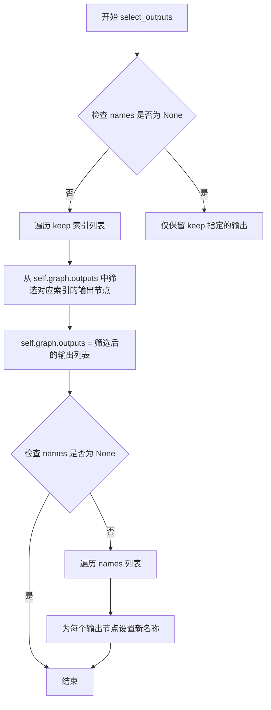

#### 带注释源码

```python
def select_outputs(self, keep, names=None):
    """
    从ONNX计算图中选择指定的输出节点，并可选地重命名这些输出。
    
    参数:
        keep: List[int], 要保留的输出索引列表
        names: Optional[List[str]], 可选的输出名称列表，用于重命名
    
    返回:
        None: 直接修改 self.graph.outputs 属性
    """
    # 第一步：根据 keep 索引列表筛选保留的输出节点
    # self.graph.outputs 是 onnx_graphsurgeon 的输出节点列表
    # 通过列表推导式保留指定索引的输出
    self.graph.outputs = [self.graph.outputs[o] for o in keep]
    
    # 第二步：如果提供了 names 参数，则为保留的输出重命名
    # 遍历 names 列表，为每个输出节点设置新名称
    if names:
        for i, name in enumerate(names):
            # 为第 i 个输出节点设置名称
            self.graph.outputs[i].name = name
```


### `Optimizer.fold_constants`

该方法用于对 ONNX 计算图进行常量折叠（Constant Folding）优化，通过 Polygraphy 的 `fold_constants` 函数将图中可预先计算的常量表达式化简为单一常量节点，从而减少推理时的计算量。

参数：

- `return_onnx`：`bool`，可选参数，默认为 `False`。当设置为 `True` 时，方法在执行完常量折叠后会返回优化后的 ONNX 计算图对象；否则仅更新内部图而不返回。

返回值：`Optional[onnx.ModelProto]`，如果 `return_onnx` 为 `True`，则返回经过常量折叠处理后的 ONNX `ModelProto` 对象；否则返回 `None`。

#### 流程图

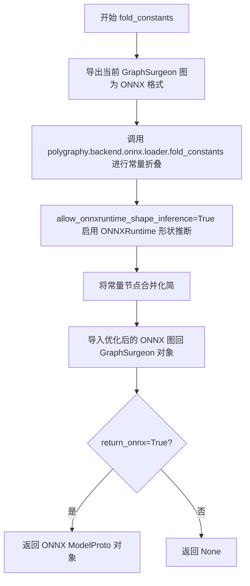

#### 带注释源码

```python
def fold_constants(self, return_onnx=False):
    """
    对 ONNX 计算图执行常量折叠优化。
    
    该方法利用 Polygraphy 的 fold_constants 工具对 ONNX 图进行常量传播和折叠，
    将可以在编译期计算的操作（如常量之间的运算、形状推算等）预先计算为常量节点，
    从而减少运行时计算开销。
    
    参数:
        return_onnx (bool): 如果为 True，则返回优化后的 ONNX ModelProto 对象；
                           否则仅更新内部图并返回 None。默认值为 False。
    
    返回:
        Optional[onnx.ModelProto]: 当 return_onnx=True 时返回优化后的 ONNX 图；
                                   否则返回 None。
    """
    # 步骤1: 将当前 GraphSurgeon 图导出为 ONNX 格式
    onnx_graph = gs.export_onnx(self.graph)
    
    # 步骤2: 调用 Polygraphy 的 fold_constants 进行常量折叠优化
    # allow_onnxruntime_shape_inference=True 允许在常量折叠过程中
    # 使用 ONNXRuntime 进行形状推断，以支持更激进的常量折叠
    onnx_graph = fold_constants(gs.export_onnx(self.graph), allow_onnxruntime_shape_inference=True)
    
    # 步骤3: 将优化后的 ONNX 图重新导入为 GraphSurgeon 对象
    self.graph = gs.import_onnx(onnx_graph)
    
    # 步骤4: 根据参数决定是否返回 ONNX 对象
    if return_onnx:
        return onnx_graph
```


### `Optimizer.infer_shapes`

该方法负责对 `Optimizer` 对象内部的 ONNX 计算图进行**形状推断（Shape Inference）**。它首先将 GraphSurgeon 图导出为 ONNX 模型，检查模型大小是否超过 2GB 限制，然后调用 ONNX 运行库推断图中各张量的维度信息，最后将包含维度信息的图重新导入回 GraphSurgeon，以便后续优化步骤（如 TensorRT 引擎构建）能够获取准确的输入输出尺寸。

参数：

- `return_onnx`：`bool`，可选参数。默认为 `False`。如果设置为 `True`，方法将在形状推断完成后返回推断后的 ONNX 模型对象（`onnx.ModelProto`）；否则仅更新内部图并返回 `None`。

返回值：`Optional[onnx.ModelProto]`。如果 `return_onnx` 参数为 `True`，返回包含推断后形状信息的 ONNX 图对象；否则返回 `None`。

#### 流程图

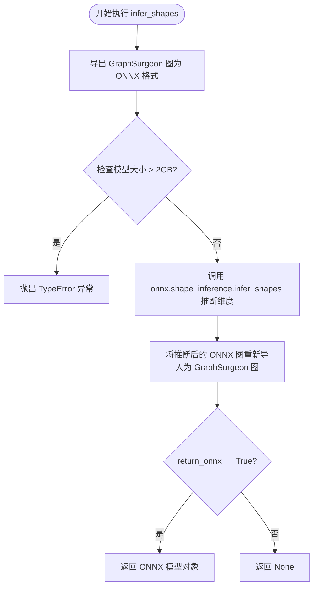

#### 带注释源码

```python
def infer_shapes(self, return_onnx=False):
    """
    对 ONNX 图进行形状推断（Shape Inference），以确定图中所有张量的维度。
    
    参数:
        return_onnx (bool): 如果为 True，则返回推断后的 ONNX 图对象；否则返回 None。
    """
    # 1. 将当前 GraphSurgeon 的图对象导出为 ONNX 格式
    onnx_graph = gs.export_onnx(self.graph)
    
    # 2. 检查 ONNX 图的字节大小是否超过 TensorRT/ONNX Runtime 的 2GB 限制
    if onnx_graph.ByteSize() > 2147483648:
        # 如果超过限制，抛出类型错误，阻止进一步的构建流程
        raise TypeError("ERROR: model size exceeds supported 2GB limit")
    else:
        # 3. 如果大小合法，则使用 ONNX 的 shape_inference 工具推断图中各节点的输出形状
        # 这对于动态尺寸模型和后续 TensorRT 优化至关重要
        onnx_graph = shape_inference.infer_shapes(onnx_graph)

    # 4. 将带有推断形状信息的 ONNX 图重新导入回 GraphSurgeon，更新 self.graph
    self.graph = gs.import_onnx(onnx_graph)
    
    # 5. 根据参数决定是否返回 ONNX 图对象
    if return_onnx:
        return onnx_graph
```


### `BaseModel.get_model`

返回存储在模型实例中的底层模型对象。该方法是基类 `BaseModel` 的简单访问器，用于获取在初始化时传入的模型实例。

参数：
- （无）

返回值：`Any`，返回存储在 `self.model` 属性中的模型对象。在 `BaseModel` 类的上下文中，该模型通常是 PyTorch 模型（如 `CLIPTextModel`、`UNet2DConditionModel` 或 `AutoencoderKL` 等）。

#### 流程图

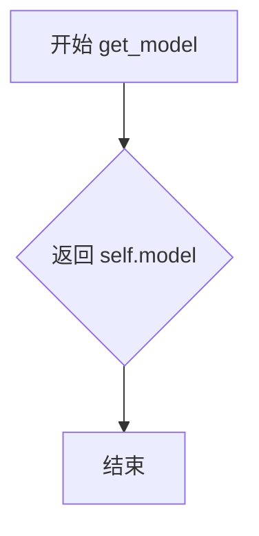

#### 带注释源码

```python
def get_model(self):
    """
    返回存储的模型对象。
    
    该方法是 BaseModel 类的简单访问器方法，用于获取在类初始化时
    通过构造函数传入并存储在 self.model 属性中的模型实例。
    
    Returns:
        Any: 存储的 PyTorch 模型对象
    """
    return self.model
```


### `BaseModel.get_input_names`

获取模型的输入张量名称，用于ONNX模型导出时指定输入节点的名称。

参数：

- 该方法无参数

返回值：`List[str]`，返回模型的输入张量名称列表

#### 流程图

```mermaid
flowchart TD
    A[开始] --> B{子类是否重写此方法}
    B -- 是 --> C[返回子类定义的输入名称列表]
    B -- 否 --> D[返回None或pass]
    
    C --> E[结束: 获得输入名称列表]
    D --> E
    
    F[调用场景] --> G[torch.onnx.export]
    G --> H[input_names参数]
    H --> E
```

#### 带注释源码

```python
def get_input_names(self):
    """
    获取模型的输入张量名称，用于ONNX模型导出时指定输入节点名称。
    
    这是一个抽象方法，由子类重写以返回具体的输入名称。
    子类实现示例：
    - CLIP: return ["input_ids"]
    - UNet: return ["sample", "timestep", "encoder_hidden_states"]
    - VAE: return ["latent"]
    - VAEEncoder: return ["images"]
    """
    pass
```


### `BaseModel.get_output_names`

该方法是一个基类方法，用于返回模型的输出张量名称。由于 `BaseModel` 是一个抽象基类，该方法目前返回 `None`，具体的实现由子类（如 `CLIP`、`UNet`、`VAE`、`VAEEncoder`）重写实现，以返回各自模型对应的输出张量名称列表。

参数： 无

返回值：`None`，该方法在基类中未实现，返回 `None`，具体返回值由子类重写决定（如 `CLIP` 类返回 `["text_embeddings", "pooler_output"]`，`UNet` 类返回 `["latent"]`，`VAE` 类返回 `["images"]`，`VAEEncoder` 类返回 `["latent"]`）。

#### 流程图

```mermaid
flowchart TD
    A[开始 get_output_names] --> B{检查是否需要返回特定输出名称}
    B -->|是| C[返回子类定义的输出名称列表]
    B -->|否| D[返回 None 或空列表]
    C --> E[结束]
    D --> E
```

#### 带注释源码

```python
def get_output_names(self):
    """
    获取模型的输出张量名称列表。
    
    在 BaseModel 基类中，该方法返回 None，具体实现由子类重写。
    子类通常返回包含输出张量名称的列表，用于 ONNX 导出和 TensorRT 引擎构建。
    
    返回值:
        list[str] 或 None: 输出张量名称列表
    """
    pass
```


### `BaseModel.get_dynamic_axes`

该方法是`BaseModel`类的基类方法，用于返回ONNX模型导出时的动态轴配置。当在TensorRT引擎构建过程中导出ONNX模型时，此方法定义哪些张量维度是可变的。基类实现返回`None`，表示没有动态轴；子类（如`CLIP`、`UNet`、`VAE`、`VAEEncoder`）会重写此方法以返回具体的动态轴映射字典。

参数：

- 该方法无显式参数（除隐含的`self`）

返回值：`Optional[Dict]`，返回动态轴配置的字典，基类实现返回`None`

#### 流程图

```mermaid
flowchart TD
    A[get_dynamic_axes调用] --> B{子类重写?}
    B -->|是| C[返回子类定义的动态轴字典]
    B -->|否| D[返回None]
    C --> E[torch.onnx.export使用动态轴]
    D --> F[使用静态维度导出]
    E --> G[ONNX模型支持动态batch/分辨率]
    F --> H[ONNX模型维度固定]
```

#### 带注释源码

```python
def get_dynamic_axes(self):
    """
    返回ONNX导出时的动态轴配置字典。
    
    该方法定义了在torch.onnx.export调用中使用的dynamic_axes参数。
    动态轴允许ONNX模型在推理时接受不同的输入维度。
    
    返回值:
        dict: 字典格式为 {tensor_name: {dimension_index: dimension_name}}
              例如: {"input_ids": {0: "B"}, "text_embeddings": {0: "B"}}
              表示第0维（batch维度）是可变的，用"B"标记
        None: 基类实现返回None，表示不定义动态轴
    
    子类重写示例:
        - CLIP: 定义input_ids和text_embeddings的batch维为动态
        - UNet: 定义sample, encoder_hidden_states, latent的batch和空间维为动态
        - VAE: 定义latent和images的空间维为动态
    """
    return None
```


### `BaseModel.get_sample_input`

获取模型的示例输入张量，用于ONNX导出时作为示例输入。该方法是基类中的抽象方法定义（pass），实际实现由子类（CLIP、UNet、VAE等）重写。

参数：

- `batch_size`：`int`，批次大小，指定生成输入的样本数量
- `image_height`：`int`，图像高度，用于计算潜在空间高度和验证维度
- `image_width`：`int`，图像宽度，用于计算潜在空间宽度和验证维度

返回值：`None`，基类中该方法为抽象方法，仅作方法定义无实际实现（pass），返回值类型为 `None`

#### 流程图

```mermaid
flowchart TD
    A[开始 get_sample_input] --> B[接收参数: batch_size, image_height, image_width]
    B --> C[方法体为 pass]
    C --> D[返回 None]
    D --> E[结束]
    
    style A fill:#f9f,stroke:#333
    style D fill:#9f9,stroke:#333
    style E fill:#ff9,stroke:#333
```

#### 带注释源码

```python
def get_sample_input(self, batch_size, image_height, image_width):
    """
    获取模型的示例输入，用于ONNX导出。
    
    这是一个基类中的抽象方法定义（pass），实际实现由子类重写。
    子类实现会返回符合各自模型输入格式的张量元组：
    - CLIP: 返回 input_ids 张量 (batch_size, text_maxlen)
    - UNet: 返回 (sample, timestep, encoder_hidden_states) 元组
    - VAE: 返回 latent 张量
    - VAEEncoder: 返回 images 张量
    
    参数:
        batch_size: int - 批次大小
        image_height: int - 图像高度
        image_width: int - 图像宽度
    
    返回:
        None - 基类中无实际实现
    """
    pass
```


### `BaseModel.get_input_profile`

该方法是 `BaseModel` 类的抽象方法，用于获取 TensorRT 引擎的输入配置信息（input profile），定义不同批次大小和高宽下的动态输入形状范围。基类中返回 `None`，具体实现由子类（CLIP、UNet、VAE、VAEEncoder）重写完成。

参数：

- `batch_size`：`int`，当前请求的批次大小
- `image_height`：`int`，输入图像的高度（像素）
- `image_width`：`int`，输入图像的宽度（像素）
- `static_batch`：`bool`，是否为静态批次大小（True 时忽略 min_batch/max_batch 差异）
- `static_shape`：`bool`，是否为静态形状（True 时忽略 min/max 图像尺寸差异）

返回值：`dict` 或 `None`，返回包含输入张量名称和形状三元组列表的字典，格式为 `{输入名称: [(min_shape), (opt_shape), (max_shape)]}`，或基类默认返回 `None`

#### 流程图

```mermaid
flowchart TD
    A[开始 get_input_profile] --> B{检查 batch_size<br/>image_height<br/>image_width 是否合法}
    B -->|不合法| C[抛出断言错误]
    B -->|合法| D[获取动态维度范围<br/>get_minmax_dims]
    D --> E{static_batch?}
    E -->|True| F[min_batch = max_batch = batch_size]
    E -->|False| G[min_batch = self.min_batch<br/>max_batch = self.max_batch]
    F --> H{static_shape?}
    G --> H
    H -->|True| I[图像尺寸和高宽使用传入值]
    H -->|False| J[使用类定义的<br/>min/max 图像尺寸]
    I --> K[计算 latent 形状<br/>latent_h = h // 8<br/>latent_w = w // 8]
    J --> K
    K --> L[构建并返回输入配置字典<br/>{输入名: [(min), (opt), (max)]}]
    L --> M[结束]
    
    note{基类实现直接返回 None<br/>子类重写实现此流程}
    note -.-> A
```

#### 带注释源码

```python
def get_input_profile(self, batch_size, image_height, image_width, static_batch, static_shape):
    """
    获取 TensorRT 引擎的输入配置信息，定义动态形状的 min/opt/max 范围。
    
    注意：BaseModel 基类中此方法为抽象接口，直接返回 None。
    具体实现由子类 CLIP、UNet、VAE、VAEEncoder 重写。
    
    参数:
        batch_size (int): 当前请求的批次大小
        image_height (int): 输入图像的高度（像素）
        image_width (int): 输入图像的宽度（像素）
        static_batch (bool): 是否使用静态批次（固定 min=opt=max）
        static_shape (bool): 是否使用静态形状（固定 min=opt=max）
    
    返回:
        dict: 输入配置字典，格式为 {输入名称: [(min_batch, ...), (opt_batch, ...), (max_batch, ...)]}
              每个输入张量对应三个形状：最小形状、优化形状、最大形状
        None: 基类默认实现
    """
    # 基类返回 None，由子类重写实现具体的输入配置逻辑
    return None
```

#### 子类典型实现示例（以 UNet 为例）

```python
def get_input_profile(self, batch_size, image_height, image_width, static_batch, static_shape):
    # 首先检查并获取 latent 空间的尺寸
    latent_height, latent_width = self.check_dims(batch_size, image_height, image_width)
    
    # 获取动态维度的 min/max 范围
    (
        min_batch,
        max_batch,
        _,
        _,
        _,
        _,
        min_latent_height,
        max_latent_height,
        min_latent_width,
        max_latent_width,
    ) = self.get_minmax_dims(batch_size, image_height, image_width, static_batch, static_shape)
    
    # 返回 UNet 的输入配置字典
    # UNet 有三个输入：sample (latent), timestep, encoder_hidden_states (text embeddings)
    # 注意：UNet 的 batch 维度在推理时翻倍（2*B），因为需要同时处理 uncond 和 cond
    return {
        "sample": [
            (2 * min_batch, self.unet_dim, min_latent_height, min_latent_width),
            (2 * batch_size, self.unet_dim, latent_height, latent_width),
            (2 * max_batch, self.unet_dim, max_latent_height, max_latent_width),
        ],
        "encoder_hidden_states": [
            (2 * min_batch, self.text_maxlen, self.embedding_dim),
            (2 * batch_size, self.text_maxlen, self.embedding_dim),
            (2 * max_batch, self.text_maxlen, self.embedding_dim),
        ],
    }
```


### `BaseModel.get_shape_dict`

该方法为基类 `BaseModel` 的成员方法，用于获取模型输入输出的形状字典。在基类中返回 `None`，由子类（如 `CLIP`、`UNet`、`VAE` 等）重写以返回具体的张量形状信息，供 TensorRT 引擎分配缓冲区使用。

参数：

- `batch_size`：`int`，批处理大小，指定一次推理处理的样本数量
- `image_height`：`int`，输入图像的高度（像素）
- `image_width`：`int`，输入图像的宽度（像素）

返回值：`dict` 或 `None`，返回包含模型各张量名称及对应形状的字典，基类默认返回 `None`

#### 流程图

```mermaid
flowchart TD
    A[开始 get_shape_dict] --> B{检查维度有效性}
    B -->|调用 check_dims| C[验证 batch_size, image_height, image_width]
    C --> D[返回 None]
    
    subgraph 子类重写流程
        E[子类重写 get_shape_dict] --> F[调用 check_dims 验证参数]
        F --> G[计算 latent_height 和 latent_width]
        G --> H[构建并返回形状字典]
    end
```

#### 带注释源码

```python
def get_shape_dict(self, batch_size, image_height, image_width):
    """
    获取模型输入输出的形状字典，供 TensorRT 引擎分配缓冲区使用
    
    参数:
        batch_size: 批处理大小
        image_height: 输入图像高度
        image_width: 输入图像宽度
    
    返回:
        包含张量名称和形状的字典，基类默认返回 None
    """
    return None
```


### `BaseModel.optimize`

该方法是一个模型优化流程的入口点，主要负责接收一个原始的 ONNX 图，并对其进行一系列图优化操作（清理常量、拓扑排序、形状推理），最终生成一个更干净、更易于 TensorRT 理解的优化后 ONNX 图。

参数：

- `self`：隐式参数，指向 `BaseModel` 类的实例。
- `onnx_graph`：`onnx.ModelProto`，从文件系统加载的 ONNX 原始计算图（通常由 `onnx.load()` 返回）。

返回值：`onnx.ModelProto`，经过清理、常量折叠和形状推理优化后的 ONNX 计算图。

#### 流程图

```mermaid
flowchart TD
    A[输入: 原始 ONNX Graph] --> B[初始化 Optimizer 类]
    B --> C[执行 opt.cleanup]
    C --> D[执行 opt.fold_constants]
    D --> E[执行 opt.infer_shapes]
    E --> F[执行最终 cleanup 并导出]
    F --> G[输出: 优化后的 ONNX Graph]
```

#### 带注释源码

```python
def optimize(self, onnx_graph):
    """
    对 ONNX 模型进行优化处理，包括图清理、常量折叠和形状推导。
    
    参数:
        onnx_graph: 加载后的 ONNX 模型对象 (ModelProto)
    """
    # 1. 创建优化器实例，传入原始 ONNX 图
    #    Optimizer 类封装了 onnx-graphsurgeon 的操作
    opt = Optimizer(onnx_graph)
    
    # 2. 执行图清理：
    #    - 移除未使用的节点和 tensors
    #    - 对节点进行拓扑排序 (Topological Sorting)
    opt.cleanup()
    
    # 3. 执行常量折叠 (Constant Folding):
    #    - 将图中可以预先计算的值（例如某些卷积权重、reshape操作）直接折叠成常量节点
    #    - 减少运行时的计算量
    opt.fold_constants()
    
    # 4. 执行形状推理 (Shape Inference):
    #    - 尝试推断中间张量的形状信息
    #    - 这对于 TensorRT 优化至关重要，因为它知道了张量的维度后才能进行内存分配和算子融合
    opt.infer_shapes()
    
    # 5. 最终清理并导出为 ONNX 格式：
    #    再次调用 cleanup 移除优化过程中产生的临时垃圾节点，
    #    并设置 return_onnx=True 以导出 onnx.GraphProto 对象
    onnx_opt_graph = opt.cleanup(return_onnx=True)
    
    # 返回优化后的 ONNX 图对象
    return onnx_opt_graph
```


### `BaseModel.check_dims`

该方法用于验证输入的批次大小和图像尺寸是否在有效范围内，并计算对应的潜在空间（latent space）尺寸。在Stable Diffusion模型中，图像通常下采样8倍到潜在空间，因此该方法确保输入尺寸符合这一约束。

参数：

- `batch_size`：`int`，批次大小，表示一次处理的图像数量
- `image_height`：`int`，输入图像的高度（像素）
- `image_width`：`int`，输入图像的宽度（像素）

返回值：`Tuple[int, int]`，返回元组`(latent_height, latent_width)`，即潜在空间的高度和宽度

#### 流程图

```mermaid
flowchart TD
    A[开始 check_dims] --> B{验证 batch_size 范围}
    B -->|不在范围内| C[抛出 AssertionError]
    B -->|在范围内| D{验证图像尺寸能被8整除}
    D -->|不能整除| C
    D -->|能整除| E[计算 latent_height = image_height // 8]
    E --> F[计算 latent_width = image_width // 8]
    F --> G{验证 latent_height 范围}
    G -->|不在范围内| C
    G -->|在范围内| H{验证 latent_width 范围}
    H -->|不在范围内| C
    H -->|在范围内| I[返回 (latent_height, latent_width)]
```

#### 带注释源码

```python
def check_dims(self, batch_size, image_height, image_width):
    """
    验证并计算输入图像对应的潜在空间尺寸
    
    参数:
        batch_size: 批次大小
        image_height: 输入图像高度
        image_width: 输入图像宽度
    
    返回:
        (latent_height, latent_width): 潜在空间的尺寸
    """
    # 验证批次大小是否在允许的范围内 [min_batch, max_batch]
    assert batch_size >= self.min_batch and batch_size <= self.max_batch
    
    # 验证图像尺寸至少有一个维度能被8整除（Stable Diffusion的下采样因子为8）
    assert image_height % 8 == 0 or image_width % 8 == 0
    
    # 计算潜在空间的高度和宽度（图像尺寸除以8）
    latent_height = image_height // 8
    latent_width = image_width // 8
    
    # 验证潜在空间尺寸是否在允许的范围内 [min_latent_shape, max_latent_shape]
    # min_latent_shape = 256 // 8 = 32
    # max_latent_shape = 1024 // 8 = 128
    assert latent_height >= self.min_latent_shape and latent_height <= self.max_latent_shape
    assert latent_width >= self.min_latent_shape and latent_width <= self.max_latent_shape
    
    # 返回潜在空间尺寸元组
    return (latent_height, latent_width)
```


### `BaseModel.get_minmax_dims`

该方法用于计算 TensorRT 引擎构建时的最小和最大维度参数。根据 `static_batch` 和 `static_shape` 标志，它返回批次大小、图像尺寸和潜在表示尺寸的边界值，用于构建 TensorRT 优化配置文件。

参数：

- `batch_size`：`int`，输入的批次大小
- `image_height`：`int`，输入图像的高度（像素）
- `image_width`：`int`，输入图像的宽度（像素）
- `static_batch`：`bool`，是否为静态批次大小（True 时使用传入的 batch_size，False 时使用模型默认的 min/max 批次范围）
- `static_shape`：`bool`，是否为静态形状（True 时使用传入的图像尺寸，False 时使用模型默认的 min/max 图像尺寸范围）

返回值：`Tuple[int, int, int, int, int, int, int, int, int, int]`，返回一个包含 10 个整数的元组，依次为：最小批次、最大批次、最小图像高度、最大图像高度、最小图像宽度、最大图像宽度、最小潜在高度、最大潜在高度、最小潜在宽度、最大潜在宽度。

#### 流程图

```mermaid
flowchart TD
    A[开始 get_minmax_dims] --> B{static_batch?}
    B -->|True| C[min_batch = batch_size]
    B -->|False| D[min_batch = self.min_batch]
    C --> E[max_batch = batch_size]
    D --> E
    E --> F[latent_height = image_height // 8]
    F --> G[latent_width = image_width // 8]
    G --> H{static_shape?}
    H -->|True| I[min_image_height = image_height]
    H -->|False| J[min_image_height = self.min_image_shape]
    I --> K[max_image_height = image_height]
    J --> K
    K --> L{static_shape?}
    L -->|True| M[min_image_width = image_width]
    L -->|False| N[min_image_width = self.min_image_shape]
    M --> O[max_image_width = image_width]
    N --> O
    O --> P{static_shape?}
    P -->|True| Q[min_latent_height = latent_height]
    P -->|False| R[min_latent_height = self.min_latent_shape]
    Q --> S[max_latent_height = latent_height]
    R --> S
    S --> T{static_shape?}
    T -->|True| U[min_latent_width = latent_width]
    T -->|False| V[min_latent_width = self.min_latent_shape]
    U --> W[max_latent_width = latent_width]
    V --> W
    W --> X[返回 10 维度元组]
```

#### 带注释源码

```python
def get_minmax_dims(self, batch_size, image_height, image_width, static_batch, static_shape):
    """
    计算 TensorRT 引擎构建时的最小/最大维度参数
    
    参数:
        batch_size: 输入的批次大小
        image_height: 输入图像的高度（像素）
        image_width: 输入图像的宽度（像素）
        static_batch: 是否使用静态批次大小
        static_shape: 是否使用静态图像形状
    
    返回:
        包含 10 个维度值的元组:
        (min_batch, max_batch, min_image_height, max_image_height, 
         min_image_width, max_image_width, min_latent_height, max_latent_height, 
         min_latent_width, max_latent_width)
    """
    # 根据 static_batch 标志决定最小/最大批次大小
    # 如果使用静态批次，则固定为传入的 batch_size；否则使用模型默认值
    min_batch = batch_size if static_batch else self.min_batch
    max_batch = batch_size if static_batch else self.max_batch
    
    # 计算潜在表示的空间维度（图像尺寸除以 8，VAE 的下采样因子）
    latent_height = image_height // 8
    latent_width = image_width // 8
    
    # 根据 static_shape 标志决定图像高度的最小/最大范围
    # 如果使用静态形状，则固定为传入的 image_height；否则使用模型默认值
    min_image_height = image_height if static_shape else self.min_image_shape
    max_image_height = image_height if static_shape else self.max_image_shape
    
    # 根据 static_shape 标志决定图像宽度的最小/最大范围
    min_image_width = image_width if static_shape else self.min_image_shape
    max_image_width = image_width if static_shape else self.max_image_shape
    
    # 根据 static_shape 标志决定潜在表示高度的最小/最大范围
    min_latent_height = latent_height if static_shape else self.min_latent_shape
    max_latent_height = latent_height if static_shape else self.max_latent_shape
    
    # 根据 static_shape 标志决定潜在表示宽度的最小/最大范围
    min_latent_width = latent_width if static_shape else self.min_latent_shape
    max_latent_width = latent_width if static_shape else self.max_latent_shape
    
    # 返回完整的维度参数元组，用于 TensorRT Profile 配置
    return (
        min_batch,
        max_batch,
        min_image_height,
        max_image_height,
        min_image_width,
        max_image_width,
        min_latent_height,
        max_latent_height,
        min_latent_width,
        max_latent_width,
    )
```


### `CLIP.get_input_names`

该方法用于获取 CLIP 模型在导出为 ONNX 格式时的输入张量名称列表。它是 `CLIP` 类中专门为 ONNX/TensorRT 导出过程提供元数据支持的方法之一，通过返回标准化的输入节点名称，确保导出工具能够正确识别和处理模型的输入接口。

参数： 无

返回值：`List[str]`，返回一个包含输入张量名称的列表，其中 `"input_ids"` 表示文本 token 的输入 ID 序列。

#### 流程图

```mermaid
flowchart TD
    A[开始 get_input_names] --> B{方法调用}
    B --> C[返回固定列表 ['input_ids']]
    C --> D[结束]
```

#### 带注释源码

```python
def get_input_names(self):
    """
    获取 CLIP 模型导出为 ONNX 时的输入张量名称
    
    该方法在模型导出阶段被 torch.onnx.export 调用，用于指定
    ONNX 模型的输入节点名称。CLIP 文本编码器接受文本 token ID
    作为唯一输入。
    
    Returns:
        List[str]: 输入张量名称列表，包含 'input_ids'
    """
    return ["input_ids"]
```

#### 设计说明

| 属性 | 详情 |
|------|------|
| **所属类** | `CLIP` |
| **继承关系** | 继承自 `BaseModel` 基类，该基类中定义了抽象方法签名 |
| **调用场景** | 在 `build_engines` 函数中，通过 `torch.onnx.export` 的 `input_names` 参数调用 |
| **设计意图** | 将 PyTorch 模型的输入参数映射为 ONNX 节点名称，支持后续的 TensorRT 引擎优化 |
| **依赖字段** | 无直接依赖，但其返回结果与 `get_output_names`、`get_dynamic_axes` 共同构成完整的模型元数据 |


### `CLIP.get_output_names`

该方法返回CLIP文本编码器模型在ONNX导出时的输出张量名称列表，用于定义TensorRT引擎的输出节点。

参数：

- 该方法无参数（除隐式参数 `self`）

返回值：`List[str]`，返回包含两个输出张量名称的列表：`"text_embeddings"`（文本嵌入张量）和 `"pooler_output"`（池化输出张量）。

#### 流程图

```mermaid
flowchart TD
    A[开始 get_output_names] --> B[创建输出名称列表]
    B --> C["添加 'text_embeddings'"]
    C --> D["添加 'pooler_output'"]
    D --> E[返回列表]
    E --> F[结束]
    
    style A fill:#f9f,color:#333
    style F fill:#9f9,color:#333
```

#### 带注释源码

```python
class CLIP(BaseModel):
    """
    CLIP模型封装类，继承自BaseModel
    用于将CLIP文本编码器转换为TensorRT引擎
    """
    
    def __init__(self, model, device, max_batch_size, embedding_dim):
        super(CLIP, self).__init__(
            model=model, device=device, max_batch_size=max_batch_size, embedding_dim=embedding_dim
        )
        self.name = "CLIP"

    def get_input_names(self):
        """返回CLIP模型的输入张量名称"""
        return ["input_ids"]

    def get_output_names(self):
        """
        获取CLIP模型输出张量的名称
        
        Returns:
            List[str]: 包含输出张量名称的列表
                - 'text_embeddings': 文本嵌入向量，形状为 (batch_size, seq_len, embedding_dim)
                - 'pooler_output': 池化输出，用于对比学习等下游任务
        """
        return ["text_embeddings", "pooler_output"]

    def get_dynamic_axes(self):
        """定义动态轴，用于支持可变批量大小"""
        return {"input_ids": {0: "B"}, "text_embeddings": {0: "B"}}

    def get_input_profile(self, batch_size, image_height, image_width, static_batch, static_shape):
        """获取输入张量的profile信息，用于TensorRT优化"""
        self.check_dims(batch_size, image_height, image_width)
        min_batch, max_batch, _, _, _, _, _, _, _, _ = self.get_minmax_dims(
            batch_size, image_height, image_width, static_batch, static_shape
        )
        return {
            "input_ids": [(min_batch, self.text_maxlen), (batch_size, self.text_maxlen), (max_batch, self.text_maxlen)]
        }

    def get_shape_dict(self, batch_size, image_height, image_width):
        """获取输入输出张量的形状字典"""
        self.check_dims(batch_size, image_height, image_width)
        return {
            "input_ids": (batch_size, self.text_maxlen),
            "text_embeddings": (batch_size, self.text_maxlen, self.embedding_dim),
        }

    def get_sample_input(self, batch_size, image_height, image_width):
        """获取示例输入，用于ONNX导出"""
        self.check_dims(batch_size, image_height, image_width)
        return torch.zeros(batch_size, self.text_maxlen, dtype=torch.int32, device=self.device)

    def optimize(self, onnx_graph):
        """
        优化ONNX图
        - 删除第二个输出（pooler_output）
        - 仅保留text_embeddings作为最终输出
        """
        opt = Optimizer(onnx_graph)
        opt.select_outputs([0])  # delete graph output#1
        opt.cleanup()
        opt.fold_constants()
        opt.infer_shapes()
        opt.select_outputs([0], names=["text_embeddings"])  # rename network output
        opt_onnx_graph = opt.cleanup(return_onnx=True)
        return opt_onnx_graph
```


### `CLIP.get_dynamic_axes`

该方法定义了CLIP文本编码器在导出为ONNX模型时的动态轴映射，使模型能够支持动态batch size，从而在推理时处理不同大小的批次。

参数：

- 该方法无参数（继承自父类BaseModel）

返回值：`Dict[str, Dict[int, str]]`，返回一个字典，键为输入输出张量名称，值为索引到轴名称的映射，用于ONNX动态轴定义，支持batch维度的动态变化。

#### 流程图

```mermaid
flowchart TD
    A[开始] --> B[定义动态轴字典]
    B --> C[指定input_ids的batch维度为动态]
    C --> D[指定text_embeddings的batch维度为动态]
    D --> E[返回动态轴字典]
    E --> F[结束]
```

#### 带注释源码

```python
def get_dynamic_axes(self):
    """
    获取CLIP模型在ONNX导出时的动态轴配置。
    
    动态轴允许ONNX模型在推理时支持不同的batch size，
    而不是在编译时固定batch size。
    
    Returns:
        dict: 包含输入输出张量名称到动态轴索引的映射字典。
              格式为 {tensor_name: {axis_index: axis_name}}
    """
    # 定义动态轴字典
    # input_ids: 文本输入ID张量，第0维（batch维度）标记为动态，名称为"B"
    # text_embeddings: 文本嵌入输出张量，第0维（batch维度）标记为动态，名称为"B"
    # 这样在TensorRT引擎构建时，batch size可以在运行时变化
    return {
        "input_ids": {0: "B"},        # input_ids的第0维是batch维度，设为动态轴"B"
        "text_embeddings": {0: "B"}   # text_embeddings的第0维是batch维度，设为动态轴"B"
    }
```


### `CLIP.get_input_profile`

该方法用于获取 CLIP 模型的输入配置信息（Input Profile），返回 CLIP 文本编码器输入张量在不同批次大小下的维度信息，用于 TensorRT 引擎构建时的优化配置。

参数：

- `batch_size`：`int`，目标批次大小，用于指定当前推理的批次大小
- `image_height`：`int`，输入图像的高度（虽然 CLIP 文本编码器不直接使用图像，但继承自基类需要此参数）
- `image_width`：`int`，输入图像的宽度（虽然 CLIP 文本编码器不直接使用图像，但继承自基类需要此参数）
- `static_batch`：`bool`，是否使用静态批次大小，为 `True` 时 min_batch 和 max_batch 都等于 batch_size
- `static_shape`：`bool`，是否使用静态形状，为 `True` 时图像尺寸固定为传入的 image_height 和 image_width

返回值：`dict`，返回包含输入张量名称和对应的最小、最优、最大维度三元组列表的字典

#### 流程图

```mermaid
flowchart TD
    A[开始 get_input_profile] --> B[调用 check_dims 验证 batch_size, image_height, image_width]
    B --> C{验证是否通过}
    C -->|通过| D[调用 get_minmax_dims 获取动态维度范围]
    C -->|失败| E[抛出断言错误]
    D --> F[解包获取 min_batch 和 max_batch]
    F --> G[构建 input_ids 维度列表]
    G --> H[返回包含 input_ids 维度信息的字典]
    
    style A fill:#f9f,color:#000
    style H fill:#9f9,color:#000
```

#### 带注释源码

```python
def get_input_profile(self, batch_size, image_height, image_width, static_batch, static_shape):
    """
    获取 CLIP 模型的输入配置信息，用于 TensorRT 引擎构建
    
    参数:
        batch_size: int, 目标批次大小
        image_height: int, 输入图像高度（CLIP文本编码器不使用，但继承自基类）
        image_width: int, 输入图像宽度（CLIP文本编码器不使用，但继承自基类）
        static_batch: bool, 是否使用静态批次大小
        static_shape: bool, 是否使用静态形状
    
    返回:
        dict: 包含输入张量维度信息的字典
    """
    # 1. 验证输入维度是否在有效范围内
    # 检查 batch_size 是否在 [min_batch, max_batch] 范围内
    # 检查图像尺寸是否是 32 的倍数
    # 检查 latent 尺寸是否在有效范围内
    self.check_dims(batch_size, image_height, image_width)
    
    # 2. 获取动态维度范围
    # 根据 static_batch 和 static_shape 参数计算最小和最大的批次大小
    # static_batch=True: min_batch = max_batch = batch_size
    # static_batch=False: min_batch = self.min_batch, max_batch = self.max_batch
    min_batch, max_batch, _, _, _, _, _, _, _, _ = self.get_minmax_dims(
        batch_size, image_height, image_width, static_batch, static_shape
    )
    
    # 3. 构建输入配置字典
    # 返回 input_ids 的三个维度配置：最小、最优（当前）、最大
    # 格式: [(min_batch, text_maxlen), (batch_size, text_maxlen), (max_batch, text_maxlen)]
    # text_maxlen 默认值为 77（CLIPTokenizer 的最大长度）
    return {
        "input_ids": [(min_batch, self.text_maxlen), (batch_size, self.text_maxlen), (max_batch, self.text_maxlen)]
    }
```


### `CLIP.get_shape_dict`

该方法用于获取CLIP模型在不同输入尺寸下的张量形状字典，返回包含输入ID和文本嵌入层形状信息的字典，主要用于TensorRT引擎的内存分配和形状配置。

参数：

- `batch_size`：`int`，批次大小
- `image_height`：`int`，输入图像高度（用于维度验证）
- `image_width`：`int`，输入图像宽度（用于维度验证）

返回值：`dict`，键为张量名称，值为形状元组。包含：
- `"input_ids"`：`(batch_size, text_maxlen)` - 输入文本的token ID张量形状
- `"text_embeddings"`：`(batch_size, text_maxlen, embedding_dim)` - 文本嵌入张量形状

#### 流程图

```mermaid
flowchart TD
    A[开始 get_shape_dict] --> B[调用 check_dims 验证 batch_size image_height image_width]
    B --> C{验证通过?}
    C -->|是| D[返回形状字典]
    C -->|否| E[抛出 AssertionError]
    
    D --> D1[input_ids: (batch_size, self.text_maxlen)]
    D --> D2[text_embeddings: (batch_size, self.text_maxlen, self.embedding_dim)]
    D1 --> F[结束]
    D2 --> F
    E --> F
```

#### 带注释源码

```python
def get_shape_dict(self, batch_size, image_height, image_width):
    """
    获取CLIP模型的形状字典，用于TensorRT引擎的缓冲区分配
    
    Args:
        batch_size: 批次大小
        image_height: 输入图像高度（用于维度验证）
        image_width: 输入图像宽度（用于维度验证）
    
    Returns:
        dict: 包含输入输出张量形状的字典
    """
    # 首先验证输入的维度是否合法
    # 检查batch_size是否在允许范围内
    # 检查image_height和image_width是否为8的倍数
    # 检查对应的latent空间尺寸是否在允许范围内
    self.check_dims(batch_size, image_height, image_width)
    
    # 返回形状字典，定义各张量的维度
    return {
        # 输入文本的token ID，形状为 (batch_size, text_maxlen)
        # text_maxlen 通常为77，是CLIP文本编码器的最大序列长度
        "input_ids": (batch_size, self.text_maxlen),
        
        # 文本嵌入向量，形状为 (batch_size, text_maxlen, embedding_dim)
        # embedding_dim 通常为768，是CLIP文本编码器的隐藏层维度
        "text_embeddings": (batch_size, self.text_maxlen, self.embedding_dim),
    }
```


### CLIP.get_sample_input

该方法用于获取CLIP模型的示例输入张量，主要功能是生成一个符合模型输入格式的虚拟输入（torch.zeros），用于ONNX导出或TensorRT引擎构建时的前向传播测试。

参数：

- `batch_size`：`int`，批次大小，表示输入的样本数量
- `image_height`：`int`，输入图像的高度（像素）
- `image_width`：`int`，输入图像的宽度（像素）

返回值：`torch.Tensor`，返回一个形状为`(batch_size, text_maxlen)`的int32类型零张量，其中text_maxlen为77（CLIP模型的文本最大长度），作为CLIP文本编码器的示例输入。

#### 流程图

```mermaid
flowchart TD
    A[开始 get_sample_input] --> B[调用 self.check_dims 验证维度]
    B --> C{维度验证通过?}
    C -->|否| D[抛出断言错误]
    C -->|是| E[创建零张量]
    E --> F[形状: batch_size × text_maxlen]
    F --> G[数据类型: torch.int32]
    G --> H[设备: self.device]
    H --> I[返回张量]
    I --> J[结束]
```

#### 带注释源码

```python
def get_sample_input(self, batch_size, image_height, image_width):
    """
    获取CLIP模型的示例输入张量，用于ONNX导出或TensorRT引擎构建时的前向传播测试。
    
    参数:
        batch_size: 批次大小
        image_height: 输入图像高度
        image_width: 输入图像宽度
    
    返回:
        torch.Tensor: 形状为 (batch_size, text_maxlen) 的int32零张量
    """
    # 首先验证batch_size和图像尺寸是否符合模型要求
    # 检查batch_size是否在[min_batch, max_batch]范围内
    # 检查图像尺寸是否是8的倍数（用于潜在空间计算）
    # 检查潜在空间尺寸是否在允许范围内
    self.check_dims(batch_size, image_height, image_width)
    
    # 创建形状为 (batch_size, text_maxlen) 的零张量
    # text_maxlen 继承自 BaseModel，默认为 77（CLIP模型的标准文本长度）
    # dtype 使用 torch.int32，因为 CLIP 的 input_ids 是 token IDs（整数类型）
    # device 使用 self.device（通常是 CUDA 设备）
    return torch.zeros(batch_size, self.text_maxlen, dtype=torch.int32, device=self.device)
```


### `CLIP.optimize`

该方法是CLIP模型类的优化方法，用于对ONNX图进行一系列优化操作，包括清理图结构、折叠常量、推断形状以及重命名输出，以便为TensorRT引擎构建做准备。

参数：

- `onnx_graph`：`onnx.GraphProto`，输入的ONNX计算图，需要进行优化

返回值：`onnx.GraphProto`，优化后的ONNX计算图

#### 流程图

```mermaid
flowchart TD
    A[接收输入的ONNX图] --> B[创建Optimizer对象]
    B --> C[选择输出: 保留索引0的输出]
    C --> D[清理图: cleanup]
    D --> E[折叠常量: fold_constants]
    E --> F[推断形状: infer_shapes]
    F --> G[重命名输出为text_embeddings]
    G --> H[最终清理并返回ONNX图]
```

#### 带注释源码

```python
def optimize(self, onnx_graph):
    """
    优化ONNX图用于TensorRT引擎构建
    
    该方法执行以下优化步骤：
    1. 选择性保留输出（删除不需要的输出）
    2. 清理图结构
    3. 折叠常量以减少计算图大小
    4. 推断张量形状以便TensorRT进行优化
    5. 重命名输出名称以符合TensorRT命名规范
    """
    # 创建Optimizer优化器实例，传入ONNX图
    opt = Optimizer(onnx_graph)
    
    # 选择输出：保留索引0的输出（即text_embeddings），删除pooler_output
    # 这是因为TensorRT推理只需要text_embeddings
    opt.select_outputs([0])  # delete graph output#1
    
    # 清理图：移除冗余节点和无效边，进行拓扑排序
    opt.cleanup()
    
    # 折叠常量：将可以预先计算的节点替换为常量
    # 减少运行时的计算量
    opt.fold_constants()
    
    # 推断形状：利用ONNX形状推断获取各层的输出形状
    # 这对于TensorRT构建优化引擎至关重要
    opt.infer_shapes()
    
    # 重新选择输出：将输出重命名为text_embeddings
    # 确保输出名称与后续TensorRT引擎的命名一致
    opt.select_outputs([0], names=["text_embeddings"])  # rename network output
    
    # 最终清理并返回优化后的ONNX图
    opt_onnx_graph = opt.cleanup(return_onnx=True)
    return opt_onnx_graph
```


### `UNet.get_input_names`

该方法用于获取 UNet 模型在导出为 ONNX/TensorRT 格式时的输入张量名称列表，包含了扩散模型去噪过程所需的三个关键输入：带噪声的潜在表示、时间步长以及文本编码器的隐藏状态。

参数：

- 该方法无显式参数（隐式参数 `self` 为 UNet 实例本身）

返回值：`List[str]`，返回包含三个输入张量名称的列表：`["sample", "timestep", "encoder_hidden_states"]`，分别对应 UNet 的噪声潜在样本输入、时间步长输入和文本条件输入。

#### 流程图

```mermaid
flowchart TD
    A[开始 get_input_names] --> B[定义输入名称列表]
    B --> C["返回 ['sample', 'timestep', 'encoder_hidden_states']"]
    C --> D[结束]
```

#### 带注释源码

```python
def get_input_names(self):
    """
    获取 UNet 模型导出为 ONNX/TensorRT 格式时的输入张量名称。
    
    返回值说明:
        - sample: 输入的噪声潜在表示 (noisy latent), 形状为 (2*B, unet_dim, H, W)
        - timestep: 去噪过程的时间步长 (timestep), 用于调度器确定噪声水平
        - encoder_hidden_states: 文本编码器的输出隐藏状态, 作为条件输入引导生成
    
    Returns:
        List[str]: 包含三个输入张量名称的列表
    """
    return ["sample", "timestep", "encoder_hidden_states"]
```


### `UNet.get_output_names`

该方法返回UNet模型在ONNX导出时的输出张量名称列表，用于定义TensorRT引擎的输出节点。

参数：  
无

返回值：`List[str]`，返回包含模型输出张量名称的列表，当前为`["latent"]`，表示UNet去噪后的潜在表示输出。

#### 流程图

```mermaid
flowchart TD
    A[开始 get_output_names] --> B[返回列表 ['latent']]
    B --> C[结束]
    
    style A fill:#f9f,stroke:#333
    style B fill:#bbf,stroke:#333
    style C fill:#dfd,stroke:#333
```

#### 带注释源码

```python
def get_output_names(self):
    """
    获取UNet模型的输出张量名称列表。
    
    在将UNet导出为ONNX格式并构建TensorRT引擎时，
    需要指定模型的输出节点名称。此方法返回UNet去噪操作
    完成后输出的潜在表示张量的名称。
    
    Returns:
        List[str]: 输出张量名称列表，包含 'latent'，
                  代表去噪后的潜在空间表示
    """
    return ["latent"]
```


### `UNet.get_dynamic_axes`

获取 UNet 模型的动态轴定义，用于 ONNX 导出时指定哪些维度是可变的。该方法返回一个字典，描述了模型输入输出张量的哪些维度可以动态变化，以支持不同的批量大小和图像分辨率。

参数： 无（仅包含隐式参数 `self`）

返回值：`Dict[str, Dict[int, str]]`，返回动态轴映射字典，键为张量名称，值为维度索引到维度名称的映射。例如 `{0: "2B"}` 表示第 0 维是批量维度，名称为 "2B"（表示两倍的批量大小，因为 Classifier-Free Guidance 需要将批量扩大两倍）。

#### 流程图

```mermaid
flowchart TD
    A[开始 get_dynamic_axes] --> B[定义动态轴映射字典]
    B --> C["返回 {'sample': {0: '2B', 2: 'H', 3: 'W'}, 'encoder_hidden_states': {0: '2B'}, 'latent': {0: '2B', 2: 'H', 3: 'W'}}"]
    C --> D[结束]
    
    B --> B1[sample: 批量维度为2B, 空间维度为H/W]
    B --> B2[encoder_hidden_states: 批量维度为2B]
    B --> B3[latent: 批量维度为2B, 空间维度为H/W]
```

#### 带注释源码

```python
def get_dynamic_axes(self):
    """
    获取 UNet 模型的动态轴定义，用于 ONNX 导出。
    
    UNet 在 Stable Diffusion 中使用 Classifier-Free Guidance (CFG)，
    因此需要将批量维度扩大两倍（一份给无条件输入，一份给条件输入）。
    
    返回:
        Dict[str, Dict[int, str]]: 动态轴映射字典
            - sample: 输入的噪声 latent，批量维度为 2B，空间维度 H/W 可变
            - encoder_hidden_states: 文本嵌入，批量维度为 2B 可变
            - latent: 输出的去噪 latent，批量维度为 2B，空间维度 H/W 可变
    """
    return {
        "sample": {0: "2B", 2: "H", 3: "W"},           # 输入噪声 latent: batch*2, channels, height, width
        "encoder_hidden_states": {0: "2B"},            # 文本嵌入: batch*2, seq_len, hidden_dim
        "latent": {0: "2B", 2: "H", 3: "W"},           # 输出 latent: batch*2, 4, height, width
    }
```


### `UNet.get_input_profile`

该方法用于获取UNet模型的输入profile信息，生成TensorRT引擎构建所需的动态输入形状范围（包括最小、最优和最大尺寸），以支持动态batch size和图像分辨率。

参数：

- `batch_size`：`int`，目标batch size，用于计算输入形状
- `image_height`：`int`，输入图像的高度（像素）
- `image_width`：`int`，输入图像的宽度（像素）
- `static_batch`：`bool`，是否使用静态batch size，如果为True则batch size固定，否则使用范围
- `static_shape`：`bool`，是否使用静态图像形状，如果为True则图像尺寸固定，否则使用范围

返回值：`dict`，返回包含各输入张量名称及其对应min/opt/max形状元组列表的字典

#### 流程图

```mermaid
flowchart TD
    A[开始 get_input_profile] --> B[调用 check_dims 验证 batch_size, image_height, image_width]
    B --> C[从 check_dims 获取 latent_height, latent_width]
    C --> D[调用 get_minmax_dims 获取动态维度范围]
    D --> E[提取 min_batch, max_batch, min_latent_height, max_latent_height, min_latent_width, max_latent_width]
    E --> F[构建 sample 输入profile: 2倍batch维度, unet_dim通道, latent空间高宽]
    F --> G[构建 encoder_hidden_states 输入profile: 2倍batch维度, text_maxlen序列长度, embedding_dim特征维度]
    H[返回包含 sample 和 encoder_hidden_states 的字典] --> I[结束]
```

#### 带注释源码

```python
def get_input_profile(self, batch_size, image_height, image_width, static_batch, static_shape):
    """
    获取UNet模型的输入profile，用于TensorRT引擎构建时的动态shape配置
    
    参数:
        batch_size: 批次大小
        image_height: 输入图像高度
        image_width: 输入图像宽度
        static_batch: 是否使用静态batch size
        static_shape: 是否使用静态图像尺寸
    
    返回:
        包含各输入张量min/opt/max形状的字典
    """
    # 验证输入维度有效性，并计算对应的latent空间尺寸
    latent_height, latent_width = self.check_dims(batch_size, image_height, image_width)
    
    # 获取动态维度范围（根据static_batch和static_shape标志确定最小/最大值）
    (
        min_batch,
        max_batch,
        _,
        _,
        _,
        _,
        min_latent_height,
        max_latent_height,
        min_latent_width,
        max_latent_width,
    ) = self.get_minmax_dims(batch_size, image_height, image_width, static_batch, static_shape)
    
    # 构建输入profile字典，包含三个维度组合：min/opt/max
    return {
        # sample输入：latent特征图，维度为 [2*batch, unet_dim, height, width]
        "sample": [
            (2 * min_batch, self.unet_dim, min_latent_height, min_latent_width),      # 最小batch
            (2 * batch_size, self.unet_dim, latent_height, latent_width),               # 优化batch
            (2 * max_batch, self.unet_dim, max_latent_height, max_latent_width),       # 最大batch
        ],
        # encoder_hidden_states：文本嵌入向量，维度为 [2*batch, text_maxlen, embedding_dim]
        # 注意：UNet在classifier-free guidance下需要双倍batch（条件+非条件）
        "encoder_hidden_states": [
            (2 * min_batch, self.text_maxlen, self.embedding_dim),
            (2 * batch_size, self.text_maxlen, self.embedding_dim),
            (2 * max_batch, self.text_maxlen, self.embedding_dim),
        ],
    }
```


### `UNet.get_shape_dict`

该方法用于获取 UNet 模型在给定批量大小和图像尺寸下的输入输出张量形状字典，主要用于 TensorRT 引擎的缓冲区分配和形状推理。

参数：

- `batch_size`：`int`，批量大小，即一次处理的图像数量
- `image_height`：`int`，输入图像的高度（像素）
- `image_width`：`int`，输入图像的宽度（像素）

返回值：`dict`，返回包含模型输入输出张量形状的字典，键为张量名称，值为形状元组

#### 流程图

```mermaid
flowchart TD
    A[开始 get_shape_dict] --> B{验证输入参数}
    B -->|通过| C[计算 latent_height 和 latent_width]
    B -->|失败| D[抛出 AssertionError]
    C --> E[构建形状字典]
    E --> F[sample: 2×batch_size × unet_dim × latent_height × latent_width]
    E --> G[encoder_hidden_states: 2×batch_size × text_maxlen × embedding_dim]
    E --> H[latent: 2×batch_size × 4 × latent_height × latent_width]
    F --> I[返回形状字典]
    G --> I
    H --> I
```

#### 带注释源码

```python
def get_shape_dict(self, batch_size, image_height, image_width):
    """
    获取 UNet 模型的输入输出张量形状字典
    
    参数:
        batch_size: 批量大小
        image_height: 输入图像高度
        image_width: 输入图像宽度
    
    返回:
        包含各张量形状的字典
    """
    # 调用父类的 check_dims 方法验证维度有效性
    # 并计算 latent 空间的 height 和 width (image // 8)
    latent_height, latent_width = self.check_dims(batch_size, image_height, image_width)
    
    # 返回形状字典，包含三个张量的形状信息
    return {
        # sample: UNet 的输入噪声 latent，batch_size 翻倍是因为支持 classifier-free guidance
        "sample": (2 * batch_size, self.unet_dim, latent_height, latent_width),
        
        # encoder_hidden_states: 文本编码器的输出，batch_size 翻倍
        "encoder_hidden_states": (2 * batch_size, self.text_maxlen, self.embedding_dim),
        
        # latent: UNet 的输出预测噪声，固定为 4 个通道 (latent space 通道数)
        "latent": (2 * batch_size, 4, latent_height, latent_width),
    }
```


### `UNet.get_sample_input`

该方法用于生成 UNet 模型的示例输入数据，返回一个包含三个张量（sample、timestep、encoder_hidden_states）的元组，这些张量用于 ONNX 模型导出时的输入。

参数：

- `batch_size`：`int`，批量大小
- `image_height`：`int`，输入图像的高度
- `image_width`：`int`，输入图像的宽度

返回值：`Tuple[torch.Tensor, torch.Tensor, torch.Tensor]`，返回三个张量组成的元组，分别是：
1. `sample`：噪声 latent 张量，形状为 (2×batch_size, unet_dim, latent_height, latent_width)
2. `timestep`：时间步张量，形状为 (1,)，值为 1.0
3. `encoder_hidden_states`：文本嵌入张量，形状为 (2×batch_size, text_maxlen, embedding_dim)

#### 流程图

```mermaid
flowchart TD
    A[开始 get_sample_input] --> B[调用 check_dims 验证 batch_size, image_height, image_width]
    B --> C[计算 latent_height 和 latent_width]
    C --> D{self.fp16?}
    D -->|True| E[ dtype = torch.float16 ]
    D -->|False| F[ dtype = torch.float32 ]
    E --> G[生成 sample 张量]
    F --> G
    G --> H[生成 timestep 张量 [1.0]]
    H --> I[生成 encoder_hidden_states 张量]
    I --> J[返回元组 sample, timestep, encoder_hidden_states]
```

#### 带注释源码

```python
def get_sample_input(self, batch_size, image_height, image_width):
    """
    生成 UNet 模型的示例输入，用于 ONNX 导出。
    
    参数:
        batch_size: 批量大小
        image_height: 输入图像高度
        image_width: 输入图像宽度
    
    返回:
        包含 (sample, timestep, encoder_hidden_states) 的元组
    """
    # 验证并计算 latent 空间的尺寸
    # check_dims 会检查 batch_size 是否在 [min_batch, max_batch] 范围内
    # 并验证图像尺寸是 8 的倍数，计算 latent 高度和宽度
    latent_height, latent_width = self.check_dims(batch_size, image_height, image_width)
    
    # 根据 fp16 标志选择数据类型
    # 如果启用 fp16，encoder_hidden_states 使用 float16，否则使用 float32
    dtype = torch.float16 if self.fp16 else torch.float32
    
    # 返回三个输入张量组成的元组：
    # 1. sample: 随机噪声 latent，形状为 (2*batch_size, unet_dim, latent_height, latent_width)
    #    乘以 2 是因为需要同时处理有条件和无条件的噪声预测（classifier-free guidance）
    # 2. timestep: 时间步张量，形状为 (1,)，值为 1.0
    # 3. encoder_hidden_states: 文本嵌入，形状为 (2*batch_size, text_maxlen, embedding_dim)
    return (
        torch.randn(
            2 * batch_size, self.unet_dim, latent_height, latent_width, 
            dtype=torch.float32,  # sample 始终使用 float32
            device=self.device
        ),
        torch.tensor([1.0], dtype=torch.float32, device=self.device),
        torch.randn(
            2 * batch_size, self.text_maxlen, self.embedding_dim, 
            dtype=dtype,  # 根据 fp16 标志选择 dtype
            device=self.device
        ),
    )
```


### `VAE.get_input_names`

该方法用于获取 VAE（变分自编码器）模型在 ONNX 导出时的输入张量名称列表，返回包含 "latent" 的字符串列表，作为 TensorRT 引擎构建的输入名称。

参数：无

返回值：`List[str]`，返回 VAE 解码器的输入张量名称列表 `["latent"]`，用于 ONNX 导出和 TensorRT 引擎构建时的输入绑定。

#### 流程图

```mermaid
flowchart TD
    A[开始 get_input_names] --> B[返回列表 ['latent']]
    B --> C[结束]
```

#### 带注释源码

```python
class VAE(BaseModel):
    def __init__(self, model, device, max_batch_size, embedding_dim):
        """
        初始化 VAE 解码器模型
        
        参数:
            model: VAE 模型实例
            device: 运行设备 (如 'cuda')
            max_batch_size: 最大批处理大小
            embedding_dim: 嵌入维度
        """
        super(VAE, self).__init__(
            model=model, device=device, max_batch_size=max_batch_size, embedding_dim=embedding_dim
        )
        self.name = "VAE decoder"  # 模型名称

    def get_input_names(self):
        """
        获取 VAE 模型的输入张量名称
        
        返回:
            List[str]: 输入张量名称列表，包含 'latent' 表示潜在空间张量
        """
        return ["latent"]

    def get_output_names(self):
        """
        获取 VAE 模型的输出张量名称
        
        返回:
            List[str]: 输出张量名称列表，包含 'images' 表示解码后的图像
        """
        return ["images"]

    def get_dynamic_axes(self):
        """
        获取动态轴定义，支持动态批处理和分辨率
        
        返回:
            dict: 动态轴映射字典
        """
        return {"latent": {0: "B", 2: "H", 3: "W"}, "images": {0: "B", 2: "8H", 3: "8W"}}

    # ... 其他方法
```


### `VAE.get_output_names`

该方法返回VAE解码器模型的输出张量名称，用于TensorRT引擎构建时的输出标识。

参数： 无

返回值：`List[str]`，返回包含输出张量名称的列表，当前返回["images"]，表示解码后的图像输出。

#### 流程图

```mermaid
flowchart TD
    A[开始] --> B[返回列表 ["images"]]
    B --> C[结束]
```

#### 带注释源码

```python
def get_output_names(self):
    """
    获取VAE解码器的输出张量名称
    
    Returns:
        List[str]: 输出张量名称列表，包含解码后的图像张量名称
    """
    return ["images"]
```


### `VAE.get_dynamic_axes`

获取VAE解码器的动态轴配置，用于ONNX模型导出时定义可动态变化的维度。

参数： 无（该方法不接受任何参数）

返回值：`Dict[str, Dict[int, str]]`，返回动态轴字典，键为张量名称，值为维度索引到维度名称的映射字典。

#### 流程图

```mermaid
flowchart TD
    A[开始] --> B[返回动态轴字典]
    B --> C[latent: {0: 'B', 2: 'H', 3: 'W'}]
    B --> D[images: {0: 'B', 2: '8H', 3: '8W'}]
    E[结束]
```

#### 带注释源码

```python
def get_dynamic_axes(self):
    """
    获取VAE解码器的动态轴配置，用于ONNX导出时支持动态批量大小和图像分辨率。
    
    返回值说明:
    - latent: VAE的输入潜在向量，维度(B, 4, H, W)，其中B为批量大小，H/W为潜在空间高度/宽度
    - images: VAE的输出图像，维度(B, 3, 8H, 8W)，其中8H/8W为实际图像分辨率
    
    动态轴含义:
    - 0: "B" - 批量维度，支持动态批量大小
    - 2: "H"/"8H" - 高度维度，支持动态分辨率
    - 3: "W"/"8W" - 宽度维度，支持动态分辨率
    """
    return {"latent": {0: "B", 2: "H", 3: "W"}, "images": {0: "B", 2: "8H", 3: "8W"}}
```


### `VAE.get_input_profile`

该方法用于获取 VAE 解码器在 TensorRT 引擎构建时的输入配置信息（input profile），定义了不同批次大小下的 latent tensor 的最小、最优、最大形状维度。

参数：

- `batch_size`：`int`，当前请求的批次大小，用于计算最优形状
- `image_height`：`int`，输入图像的高度（像素），用于计算 latent 空间高度
- `image_width`：`int`，输入图像的宽度（像素），用于计算 latent 空间宽度
- `static_batch`：`bool`，是否使用静态批次大小，如果为 True 则 min_batch 和 max_batch 都等于 batch_size
- `static_shape`：`bool`，是否使用静态形状，如果为 True 则所有维度都使用传入的具体值

返回值：`dict`，返回包含输入张量名称和对应形状配置的字典，格式为 `{"latent": [(min_batch, 4, min_h, min_w), (batch_size, 4, h, w), (max_batch, 4, max_h, max_w)]}`

#### 流程图

```mermaid
flowchart TD
    A[开始 get_input_profile] --> B[调用 check_dims 验证维度]
    B --> C[调用 get_minmax_dims 获取动态维度范围]
    C --> D[计算 latent tensor 形状]
    D --> E[构建返回字典]
    E --> F[返回 input_profile 字典]
    
    B -->|验证失败| G[抛出 AssertionError]
```

#### 带注释源码

```python
def get_input_profile(self, batch_size, image_height, image_width, static_batch, static_shape):
    """
    获取 VAE 解码器的 TensorRT 输入配置（input profile）
    
    参数:
        batch_size: 批次大小
        image_height: 输入图像高度
        image_width: 输入图像宽度
        static_batch: 是否使用静态批次大小
        static_shape: 是否使用静态形状
    
    返回:
        包含 latent 输入张量形状配置的字典
    """
    # 1. 验证并计算 latent 空间的宽高（图像尺寸除以 8）
    latent_height, latent_width = self.check_dims(batch_size, image_height, image_width)
    
    # 2. 获取动态维度范围（根据 static_batch 和 static_shape 标志）
    (
        min_batch,       # 最小批次大小
        max_batch,       # 最大批次大小
        _,               # min_image_height（未使用）
        _,               # max_image_height（未使用）
        _,               # min_image_width（未使用）
        _,               # max_image_width（未使用）
        min_latent_height,  # 最小 latent 高度
        max_latent_height,  # 最大 latent 高度
        min_latent_width,   # 最小 latent 宽度
        max_latent_width,   # 最大 latent 宽度
    ) = self.get_minmax_dims(batch_size, image_height, image_width, static_batch, static_shape)
    
    # 3. 构建返回字典，定义 TensorRT 优化的三个维度配置
    # TensorRT input_profile 需要: (min_shape, opt_shape, max_shape)
    return {
        "latent": [
            # 最小形状：用于最小批次和最小分辨率的优化
            (min_batch, 4, min_latent_height, min_latent_width),
            # 最优形状：使用当前请求的批次和分辨率
            (batch_size, 4, latent_height, latent_width),
            # 最大形状：用于最大批次和最大分辨率的优化
            (max_batch, 4, max_latent_height, max_latent_width),
        ]
    }
```


### `VAE.get_shape_dict`

该方法用于获取 VAE 解码器的输入输出张量形状字典，基于给定的批次大小和图像尺寸计算潜在空间和输出图像的维度。

参数：

- `batch_size`：`int`，批次大小，指定一次推理中处理的样本数量
- `image_height`：`int`，输入图像的高度（像素）
- `image_width`：`int`，输入图像的宽度（像素）

返回值：`dict`，返回包含 `"latent"` 和 `"images"` 键的字典，分别表示潜在张量和输出图像的形状元组

#### 流程图

```mermaid
flowchart TD
    A[开始 get_shape_dict] --> B[调用 check_dims 验证并计算 latent 尺寸]
    B --> C[构建返回字典]
    C --> D[latent 形状: batch_size, 4, latent_height, latent_width]
    D --> E[images 形状: batch_size, 3, image_height, image_width]
    E --> F[返回形状字典]
```

#### 带注释源码

```python
def get_shape_dict(self, batch_size, image_height, image_width):
    """
    获取 VAE 解码器的输入输出张量形状字典。
    
    参数:
        batch_size (int): 批次大小
        image_height (int): 图像高度
        image_width (int): 图像宽度
        
    返回:
        dict: 包含 latent 和 images 形状的字典
    """
    # 调用 check_dims 验证维度有效性并计算潜在空间的宽高
    # latent_height = image_height // 8
    # latent_width = image_width // 8
    latent_height, latent_width = self.check_dims(batch_size, image_height, image_width)
    
    # 构建返回的形状字典
    # latent: 潜在张量，形状为 (batch_size, 4, latent_height, latent_width)
    #     - 4 表示 VAE 潜在空间的通道数（Latent Diffusion Models 标准使用 4 通道）
    # images: 输出图像，形状为 (batch_size, 3, image_height, image_width)
    #     - 3 表示 RGB 三通道
    return {
        "latent": (batch_size, 4, latent_height, latent_width),
        "images": (batch_size, 3, image_height, image_width),
    }
```


### VAE.get_sample_input

该方法用于获取VAE解码器的示例输入张量，主要用于将PyTorch模型导出为ONNX格式时提供示例输入数据。它根据指定的批大小、图像高度和宽度生成对应形状的随机潜在空间张量（latent tensor），该张量是VAE解码器在推理时接收的输入。

参数：

- `batch_size`：`int`，批处理大小，指定生成的示例输入包含多少个样本
- `image_height`：`int`，原始图像的高度（像素），用于计算潜在空间的高度
- `image_width`：`int`，原始图像的宽度（像素），用于计算潜在空间的宽度

返回值：`torch.Tensor`，形状为`(batch_size, 4, latent_height, latent_width)`的随机潜在空间张量，其中4是潜在空间的通道数，latent_height和latent_width分别是image_height和image_width除以8后的值（因为VAE通常将图像压缩8倍）

#### 流程图

```mermaid
flowchart TD
    A[开始 get_sample_input] --> B[调用 check_dims 验证参数]
    B --> C{参数有效?}
    C -->|是| D[计算 latent_height = image_height // 8]
    D --> E[计算 latent_width = image_width // 8]
    E --> F[生成随机张量 torch.randn]
    F --> G[返回 torch.Tensor]
    C -->|否| H[抛出 AssertionError]
```

#### 带注释源码

```python
def get_sample_input(self, batch_size, image_height, image_width):
    """
    获取VAE解码器的示例输入，用于ONNX导出。
    
    参数:
        batch_size: 批处理大小
        image_height: 输入图像高度
        image_width: 输入图像宽度
    
    返回:
        潜在空间张量，形状为 (batch_size, 4, latent_h, latent_w)
    """
    # 调用基类方法验证维度有效性
    # 检查batch_size是否在[min_batch, max_batch]范围内
    # 检查image_height和image_width是否为32的倍数
    # 检查latent_height和latent_width是否在有效范围内
    latent_height, latent_width = self.check_dims(batch_size, image_height, image_width)
    
    # 生成随机张量作为示例输入
    # 形状: (batch_size, 4, latent_height, latent_width)
    # 4表示VAE潜在空间的通道数（Stable Diffusion使用4通道）
    # latent_height = image_height // 8, latent_width = image_width // 8
    return torch.randn(
        batch_size,           # 批大小
        4,                    # 潜在空间通道数（latent channels）
        latent_height,        # 潜在空间高度 = 图像高度 // 8
        latent_width,         # 潜在空间宽度 = 图像宽度 // 8
        dtype=torch.float32,  # 数据类型为32位浮点数
        device=self.device    # 设备为CUDA
    )
```


### `TorchVAEEncoder.forward`

该方法接收图像张量作为输入，通过内部封装的VAE编码器对图像进行编码，并从编码后的潜在分布（latent_dist）中采样得到潜在空间表示。这是将输入图像转换为潜在空间特征的核心操作，用于后续的扩散模型处理。

参数：

- `x`：`torch.Tensor`，输入的图像张量，形状为(batch_size, 3, height, width)，通道顺序为RGB

返回值：`torch.Tensor`，编码后的潜在空间样本，形状为(batch_size, 4, latent_height, latent_width)，其中latent_height = height // 8，latent_width = width // 8

#### 流程图

```mermaid
flowchart TD
    A[输入图像张量 x] --> B[调用 vae_encoder.encode 进行编码]
    B --> C[获取 latent_dist 潜在分布]
    C --> D[从 latent_dist.sample 采样]
    D --> E[返回潜在空间样本]
```

#### 带注释源码

```python
class TorchVAEEncoder(torch.nn.Module):
    def __init__(self, model):
        """
        初始化 TorchVAEEncoder
        
        参数:
            model: 预训练的 VAE 模型对象，用于编码图像到潜在空间
        """
        super().__init__()
        self.vae_encoder = model

    def forward(self, x):
        """
        前向传播：将输入图像编码为潜在空间样本
        
        参数:
            x: torch.Tensor，输入图像张量
            
        返回:
            torch.Tensor，潜在空间分布的采样结果
        """
        # 调用 VAE 编码器的 encode 方法获取潜在分布
        # encode 返回的 latents 包含 latent_dist 属性（DiagonalGaussianDistribution）
        # .sample() 从该分布中采样得到具体 latent 向量
        return self.vae_encoder.encode(x).latent_dist.sample()
```


### `VAEEncoder.get_model`

该方法用于获取 VAE 编码器模型，将其包装为 `TorchVAEEncoder` 对象，以便后续进行 ONNX 导出和 TensorRT 推理。

参数：

- `self`：隐含的 `VAEEncoder` 实例，无需显式传递

返回值：`TorchVAEEncoder`，封装了原始 VAE 编码器模型的 PyTorch 模块对象

#### 流程图

```mermaid
flowchart TD
    A[开始 get_model] --> B[创建 TorchVAEEncoder 实例]
    B --> C[传入 self.model 作为参数]
    C --> D[返回 vae_encoder 对象]
    D --> E[结束]
```

#### 带注释源码

```python
def get_model(self):
    """
    获取 VAE 编码器模型并包装为 TorchVAEEncoder 实例
    
    该方法执行以下操作：
    1. 创建一个 TorchVAEEncoder 包装器对象
    2. 将 VAE 模型封装为 PyTorch 模块
    3. 返回包装后的模型供 ONNX 导出使用
    
    TorchVAEEncoder 继承自 torch.nn.Module，
    其 forward 方法会调用 vae.encode(x).latent_dist.sample()
    来从图像提取潜在表示
    """
    # 使用 TorchVAEEncoder 包装原始 VAE 模型
    # TorchVAEEncoder 会在 forward 时调用 encode 方法
    vae_encoder = TorchVAEEncoder(self.model)
    return vae_encoder
```


### `VAEEncoder.get_input_names`

该方法返回 VAE Encoder 模型在 ONNX 导出时的输入张量名称列表，用于指定模型的输入节点名称。

参数：

- 无参数

返回值：`List[str]`，返回包含输入张量名称的列表，当前为 `["images"]`，表示图像输入。

#### 流程图

```mermaid
flowchart TD
    A[开始] --> B[返回列表 ['images']]
    B --> C[结束]
```

#### 带注释源码

```python
def get_input_names(self):
    """
    返回 VAE Encoder 模型在 ONNX 导出时的输入张量名称。
    
    Returns:
        List[str]: 输入张量名称列表，包含 'images'，表示图像输入节点。
    """
    return ["images"]
```


### `VAEEncoder.get_output_names`

该方法定义在 `VAEEncoder` 类中，用于获取 VAE 编码器模型的输出张量名称。在将模型导出为 ONNX 格式时，此方法为 `torch.onnx.export` 函数的 `output_names` 参数提供值。

参数： 无

返回值：`List[str]`，返回包含输出张量名称的列表 `["latent"]`，表示 VAE 编码器将图像编码为潜在表示后的输出张量名称。

#### 流程图

```mermaid
flowchart TD
    A[调用 get_output_names] --> B[返回列表 ['latent']]
```

#### 带注释源码

```python
def get_output_names(self):
    """
    获取 VAE 编码器模型的输出张量名称。
    用于 ONNX 导出时指定输出节点的名称。
    
    Returns:
        List[str]: 输出张量名称列表，包含 'latent' 表示编码后的潜在空间表示
    """
    return ["latent"]
```


### `VAEEncoder.get_dynamic_axes`

该方法用于定义 VAE Encoder 在导出为 ONNX 模型时的动态轴，以便 TensorRT 引擎构建时支持动态输入尺寸。

参数：

- 该方法无显式参数（仅包含 `self`）

返回值：`Dict[str, Dict[int, str]]`，返回一个字典，键为输入输出张量名称，值为动态轴映射（0: "B" 表示 batch 维度可动态变化，2/3 表示高度和宽度维度可动态变化）

#### 流程图

```mermaid
flowchart TD
    A[开始 get_dynamic_axes] --> B[返回动态轴字典]
    
    B --> C{images 张量}
    C --> D[axis 0: B - 批次维度]
    C --> E[axis 2: 8H - 图像高度/8]
    C --> F[axis 3: 8W - 图像宽度/8]
    
    G{latent 张量}
    G --> H[axis 0: B - 批次维度]
    G --> I[axis 2: H - 潜在空间高度]
    G --> J[axis 3: W - 潜在空间宽度]
    
    D --> K[结束]
    E --> K
    F --> K
    H --> K
    I --> K
    J --> K
```

#### 带注释源码

```python
def get_dynamic_axes(self):
    """
    定义 ONNX 模型的动态轴，用于支持 TensorRT 引擎的动态输入尺寸。
    
    VAE Encoder 将图像编码为潜在空间表示，图像尺寸与潜在空间尺寸存在 8 倍关系：
    - 输入 images: [B, 3, 8H, 8W] -> 输出 latent: [B, 4, H, W]
    
    Returns:
        Dict[str, Dict[int, str]]: 动态轴映射字典，包含输入输出张量的维度名称
    """
    return {
        # 输入图像张量的动态轴定义
        "images": {
            0: "B",      # 批次维度 (Batch)，支持动态批次大小
            2: "8H",    # 高度维度，H 为潜在空间高度，8H 表示图像高度
            3: "8W"     # 宽度维度，W 为潜在空间宽度，8W 表示图像宽度
        },
        # 输出潜在表示张量的动态轴定义
        "latent": {
            0: "B",     # 批次维度 (Batch)，支持动态批次大小
            2: "H",     # 潜在空间高度维度
            3: "W"      # 潜在空间宽度维度
        }
    }
```


### `VAEEncoder.get_input_profile`

该方法用于获取VAE编码器的输入配置信息（TensorRT引擎优化所需的动态输入维度范围），根据批处理大小、图像高度和宽度以及静态/动态形状标志，返回图像输入的最小、最优和最大维度配置。

参数：

- `batch_size`：`int`，批处理大小，指定输入图像的批次大小
- `image_height`：`int`，图像高度，输入图像的像素高度
- `image_width`：`int`，图像宽度，输入图像的像素宽度
- `static_batch`：`bool`，静态批处理标志，指示是否使用固定的批处理大小
- `static_shape`：`bool`，静态形状标志，指示是否使用固定的图像形状

返回值：`dict`，返回包含图像输入维度配置的字典，键为`"images"`，值为包含最小、最优和最大维度的列表，每个维度为`(batch_size, channels, height, width)`形式的元组

#### 流程图

```mermaid
flowchart TD
    A[开始 get_input_profile] --> B[断言验证 batch_size 范围]
    B --> C{static_batch 是否为 True}
    C -->|True| D[min_batch = batch_size<br/>max_batch = batch_size]
    C -->|False| E[min_batch = self.min_batch<br/>max_batch = self.max_batch]
    D --> F[调用 check_dims 验证图像尺寸]
    E --> F
    F --> G[调用 get_minmax_dims 获取维度范围]
    G --> H[构建返回字典<br/>包含 images 输入配置]
    H --> I[返回 input_profile 字典]
    
    style A fill:#f9f,color:#333
    style I fill:#9f9,color:#333
```

#### 带注释源码

```python
def get_input_profile(self, batch_size, image_height, image_width, static_batch, static_shape):
    """
    获取VAE编码器的输入配置信息，用于TensorRT引擎构建时的优化配置。
    
    参数:
        batch_size: 输入图像的批处理大小
        image_height: 输入图像的高度（像素）
        image_width: 输入图像的宽度（像素）
        static_batch: 是否使用静态批处理大小
        static_shape: 是否使用静态图像形状
    
    返回:
        包含图像输入维度配置的字典，用于TensorRT的优化配置文件
    """
    # 验证batch_size是否在允许的范围内
    assert batch_size >= self.min_batch and batch_size <= self.max_batch
    
    # 根据static_batch标志确定最小和最大批处理大小
    min_batch = batch_size if static_batch else self.min_batch
    max_batch = batch_size if static_batch else self.max_batch
    
    # 验证图像尺寸是否有效（必须是8的倍数，且在允许范围内）
    self.check_dims(batch_size, image_height, image_width)
    
    # 获取图像和潜在表示的最小/最大维度信息
    # 返回: min_batch, max_batch, min_image_height, max_image_height, 
    #       min_image_width, max_image_width, min_latent_height, max_latent_height, 
    #       min_latent_width, max_latent_width
    (
        min_batch,
        max_batch,
        min_image_height,
        max_image_height,
        min_image_width,
        max_image_width,
        _,
        _,
        _,
        _,
    ) = self.get_minmax_dims(batch_size, image_height, image_width, static_batch, static_shape)

    # 返回TensorRT引擎构建所需的输入配置文件
    # 包含三个维度配置：最小、最优（当前）、最大
    # 图像格式为 (batch_size, 3通道, height, width)
    return {
        "images": [
            (min_batch, 3, min_image_height, min_image_width),      # 最小配置
            (batch_size, 3, image_height, image_width),            # 优化配置
            (max_batch, 3, max_image_height, max_image_width),     # 最大配置
        ]
    }
```


### `VAEEncoder.get_shape_dict`

该方法用于获取VAE编码器模型的输入输出形状字典，主要用于TensorRT引擎的缓冲区分配和形状推断。它根据batch size和图像尺寸计算对应的latent空间维度。

参数：

- `batch_size`：`int`，输入图像的批次大小
- `image_height`：`int`，输入图像的高度
- `image_width`：`int`，输入图像的宽度

返回值：`dict`，包含模型输入输出张量名称及其对应形状的字典

#### 流程图

```mermaid
flowchart TD
    A[开始 get_shape_dict] --> B[调用 check_dims 验证 batch_size, image_height, image_width]
    B --> C[获取 latent_height 和 latent_width]
    C --> D[构建返回字典]
    D --> E[images: (batch_size, 3, image_height, image_width)]
    D --> F[latent: (batch_size, 4, latent_height, latent_width)]
    E --> G[返回 shape_dict]
    F --> G
```

#### 带注释源码

```python
def get_shape_dict(self, batch_size, image_height, image_width):
    """
    获取VAE编码器的输入输出形状字典
    
    参数:
        batch_size: 输入图像的批次大小
        image_height: 输入图像的高度
        image_width: 输入图像的宽度
    
    返回:
        包含模型输入输出形状的字典
    """
    # 验证并计算latent空间的尺寸
    # latent_height = image_height // 8, latent_width = image_width // 8
    latent_height, latent_width = self.check_dims(batch_size, image_height, image_width)
    
    # 构建形状字典，用于TensorRT引擎的缓冲区分配
    return {
        # 输入图像形状: [batch, channels=3, height, width]
        "images": (batch_size, 3, image_height, image_width),
        
        # 输出latent形状: [batch, latent_channels=4, latent_height, latent_width]
        "latent": (batch_size, 4, latent_height, latent_width),
    }
```


### `VAEEncoder.get_sample_input`

该方法用于生成 VAE Encoder 模型的示例输入张量，主要在导出 ONNX 模型时提供输入数据。它接受批处理大小和图像尺寸参数，验证维度有效性后返回一个随机初始化的 PyTorch 张量，用作模型推理的输入样本。

参数：

- `batch_size`：`int`，批次大小，指定同时处理的图像数量
- `image_height`：`int`，输入图像的高度（像素）
- `image_width`：`int`，输入图像的宽度（像素）

返回值：`torch.Tensor`，形状为 `(batch_size, 3, image_height, image_width)` 的 float32 类型张量，表示批处理的 RGB 图像输入

#### 流程图

```mermaid
flowchart TD
    A[开始 get_sample_input] --> B[调用 check_dims 验证维度]
    B --> C{维度验证通过?}
    C -->|是| D[生成随机张量]
    C -->|否| E[抛出断言错误]
    D --> F[返回 torch.Tensor]
    E --> F
```

#### 带注释源码

```python
def get_sample_input(self, batch_size, image_height, image_width):
    """
    生成 VAE Encoder 的示例输入张量，用于 ONNX 模型导出。
    
    参数:
        batch_size: 批次大小
        image_height: 输入图像高度
        image_width: 输入图像宽度
    
    返回:
        torch.Tensor: 形状为 (batch_size, 3, image_height, image_width) 的随机张量
    """
    # 首先验证输入的维度是否满足要求
    # 检查批次大小是否在 [min_batch, max_batch] 范围内
    # 检查图像尺寸是否为 8 的倍数（满足 VAE 的下采样要求）
    # 计算对应的 latent 空间尺寸并验证是否在有效范围内
    self.check_dims(batch_size, image_height, image_width)
    
    # 生成随机初始化的输入张量
    # 形状: (batch_size, 3, image_height, image_width)
    # 3 表示 RGB 三个颜色通道
    # dtype=torch.float32: 使用 32 位浮点数
    # device=self.device: 张量分配在初始化时指定的设备上（通常为 CUDA）
    return torch.randn(batch_size, 3, image_height, image_width, dtype=torch.float32, device=self.device)
```


### `TensorRTStableDiffusionInpaintPipeline.__loadModels`

该方法负责加载和初始化 TensorRT 加速的 Stable Diffusion 修复管道所需的各种模型（CLIP、UNet、VAE、VAE Encoder），并根据配置选择性地实例化这些模型的适配器类。

参数：

- 该方法无显式参数（隐式参数 `self` 为类的实例）

返回值：`None`，该方法直接修改实例属性 `self.models` 和 `self.embedding_dim`，不返回任何值。

#### 流程图

```mermaid
flowchart TD
    A[__loadModels 开始] --> B[获取 text_encoder 隐藏层大小<br/>self.embedding_dim]
    B --> C[构建模型参数字典 models_args<br/>device: torch_device<br/>max_batch_size: max_batch_size<br/>embedding_dim: embedding_dim<br/>inpaint: inpaint]
    C --> D{检查 stages 中是否包含 'clip'}
    D -->|是| E[创建 CLIP 模型适配器<br/>self.models['clip'] = make_CLIP]
    D -->|否| F{检查 stages 中是否包含 'unet'}
    E --> F
    F -->|是| G[创建 UNet 模型适配器<br/>self.models['unet'] = make_UNet]
    F -->|否| H{检查 stages 中是否包含 'vae'}
    G --> H
    H -->|是| I[创建 VAE 模型适配器<br/>self.models['vae'] = make_VAE]
    H -->|否| J{检查 stages 中是否包含 'vae_encoder'}
    I --> J
    J -->|是| K[创建 VAE Encoder 模型适配器<br/>self.models['vae_encoder'] = make_VAEEncoder]
    J -->|否| L[__loadModels 结束]
    K --> L
```

#### 带注释源码

```python
def __loadModels(self):
    """
    加载并初始化管道所需的各个模型适配器。
    该方法根据 self.stages 配置决定加载哪些模型，
    并将它们封装为适配 TensorRT 推理的模型对象。
    """
    # 步骤1: 获取文本编码器的隐藏层维度，用于配置模型输入输出
    self.embedding_dim = self.text_encoder.config.hidden_size
    
    # 步骤2: 构建通用的模型参数字典
    # 这些参数将传递给各个模型工厂函数
    models_args = {
        "device": self.torch_device,          # 计算设备 (cuda/cpu)
        "max_batch_size": self.max_batch_size, # 最大批处理大小
        "embedding_dim": self.embedding_dim,  # 文本嵌入维度
        "inpaint": self.inpaint,               # 是否为修复任务
    }
    
    # 步骤3: 根据配置的阶段(stages)加载相应的模型
    # CLIP 文本编码器模型
    if "clip" in self.stages:
        # 使用工厂函数创建 CLIP 模型适配器，封装原始的 text_encoder
        self.models["clip"] = make_CLIP(self.text_encoder, **models_args)
    
    # UNet 去噪模型
    if "unet" in self.stages:
        # 创建 UNet 模型适配器，额外传入 unet 输入通道数配置
        self.models["unet"] = make_UNet(
            self.unet, 
            **models_args, 
            unet_dim=self.unet.config.in_channels
        )
    
    # VAE 解码器模型
    if "vae" in self.stages:
        # 创建 VAE 解码器模型适配器
        self.models["vae"] = make_VAE(self.vae, **models_args)
    
    # VAE 编码器模型
    if "vae_encoder" in self.stages:
        # 创建 VAE 编码器模型适配器，用于编码输入图像
        self.models["vae_encoder"] = make_VAEEncoder(self.vae, **models_args)
    
    # 方法结束，所有模型适配器已存储在 self.models 字典中
    # 后续将通过 build_engines() 构建 TensorRT 引擎
```


### TensorRTStableDiffusionInpaintPipeline._encode_vae_image

该方法负责将输入图像编码为VAE（变分自编码器）潜在表示，是Stable Diffusion图像修复Pipeline中的关键组成部分，通过接受图像张量和随机生成器，将图像转换为潜在空间特征，用于后续的去噪处理。

参数：

- `self`：`TensorRTStableDiffusionInpaintPipeline` 类实例，隐式参数
- `image`：`torch.Tensor`，输入的图像张量，形状为 (B, C, H, W)，其中 B 是批次大小，C 是通道数，H 和 W 分别是图像高度和宽度
- `generator`：`torch.Generator`，用于生成随机噪声的PyTorch生成器，确保可重复性；如果传入生成器列表，则每个图像使用对应的生成器

返回值：`torch.Tensor`，编码后的图像潜在表示，形状为 (B, 4, H/8, W/8)，其中 4 是潜在空间的通道数，H/8 和 W/8 分别是潜在表示的高度和宽度（由于VAE的下采样因子为8）

#### 流程图

```mermaid
flowchart TD
    A[开始 _encode_vae_image] --> B{generator 是列表吗?}
    B -->|是| C[遍历图像批次]
    C --> D[对单张图像 encoding]
    D --> E[使用对应 generator 检索 latents]
    E --> F[将所有 latents 沿批次维度拼接]
    B -->|否| G[对整个图像批次 encoding]
    G --> H[使用 generator 检索 latents]
    F --> I[应用 VAE scaling_factor]
    H --> I
    I --> J[返回 image_latents]
```

#### 带注释源码

```python
def _encode_vae_image(self, image: torch.Tensor, generator: torch.Generator):
    """
    将输入图像编码为VAE潜在表示
    
    参数:
        image: 输入图像张量，形状为 (B, C, H, W)
        generator: PyTorch随机生成器，用于确保可重复性
    
    返回:
        编码后的图像潜在表示，形状为 (B, 4, H/8, W/8)
    """
    # 判断generator是否为列表（即是否为每个图像提供独立的生成器）
    if isinstance(generator, list):
        # 对批次中的每个图像分别编码
        image_latents = [
            # 使用vae.encode编码单张图像，并通过retrieve_latents提取潜在表示
            retrieve_latents(self.vae.encode(image[i : i + 1]), generator=generator[i])
            for i in range(image.shape[0])  # 遍历批次中的每个图像
        ]
        # 将所有潜在表示沿批次维度（dim=0）拼接
        image_latents = torch.cat(image_latents, dim=0)
    else:
        # 整个图像批次使用同一个generator进行编码
        image_latents = retrieve_latents(self.vae.encode(image), generator=generator)
    
    # 应用VAE的scaling_factor进行缩放
    # 这是Stable Diffusion中VAE的标准处理方式
    image_latents = self.vae.config.scaling_factor * image_latents
    
    # 返回编码后的潜在表示
    return image_latents
```


### `TensorRTStableDiffusionInpaintPipeline.prepare_latents`

该方法用于在 Stable Diffusion 图像修复（inpainting） pipeline 中准备 latent 向量。它根据给定的参数（batch size、图像尺寸、噪声强度等）初始化或处理 latent 向量，支持纯噪声初始化或图像+噪声组合初始化两种模式，并可选择性地返回噪声和图像 latent。

参数：

- `batch_size`：`int`，批处理大小，决定生成图像的数量
- `num_channels_latents`：`int`，latent 向量的通道数，通常为 VAE 的 latent_channels（如 4）
- `height`：`int`，目标图像的高度（像素单位）
- `width`：`int`，目标图像的宽度（像素单位）
- `dtype`：`torch.dtype`，latent 向量的数据类型（如 torch.float32）
- `device`：`torch.device`，计算设备（如 cuda）
- `generator`：`torch.Generator` 或 `List[torch.Generator]`，用于生成确定性随机数的 PyTorch 生成器
- `latents`：`Optional[torch.Tensor]`，可选的预定义 latent 向量，如果为 None 则自动生成
- `image`：`Optional[torch.Tensor]`，可选的输入图像张量，用于图像引导的 latent 初始化
- `timestep`：`Optional[torch.Tensor]`，可选的时间步，用于噪声调度
- `is_strength_max`：`bool`，默认为 True，表示是否使用最大噪声强度（即纯噪声初始化）
- `return_noise`：`bool`，默认为 False，是否在返回值中包含生成的噪声
- `return_image_latents`：`bool`，默认为 False，是否在返回值中包含图像 latent

返回值：`Tuple[torch.Tensor, ...]`，
- 第一个元素始终是 `latents`：计算得到的 latent 向量
- 第二个元素（可选）是 `noise`：生成的随机噪声张量
- 第三个元素（可选）是 `image_latents`：编码后的图像 latent

#### 流程图

```mermaid
flowchart TD
    A[开始 prepare_latents] --> B[计算 latent shape]
    B --> C{generator 是列表且长度 != batch_size?}
    C -->|是| D[抛出 ValueError]
    C -->|否| E{image 或 timestep 为空且 is_strength_max 为 False?}
    E -->|是| F[抛出 ValueError]
    E -->|否| G{return_image_latents 为 True 或 (latents 为空且 is_strength_max 为 False)?]
    
    G -->|是| H[将 image 移动到指定 device 和 dtype]
    H --> I{image.shape[1] == 4?}
    I -->|是| J[直接使用 image 作为 image_latents]
    I -->|否| K[调用 _encode_vae_image 编码 image]
    J --> L[重复 image_latents 以匹配 batch_size]
    K --> L
    
    G -->|否| M{latents 为空?}
    M -->|是| N[使用 randn_tensor 生成随机噪声]
    N --> O{is_strength_max 为 True?}
    O -->|是| P[latents = noise * scheduler.init_noise_sigma]
    O -->|否| Q[latents = scheduler.add_noise(image_latents, noise, timestep)]
    M -->|否| R[latents = latents.to(device)]
    R --> S[latents = latents * scheduler.init_noise_sigma]
    
    L --> T
    P --> T
    Q --> T
    S --> T[构建输出元组]
    
    T --> U{return_noise 为 True?}
    U -->|是| V[outputs += (noise,)]
    U -->|否| W{return_image_latents 为 True?}
    
    V --> W
    W -->|是| X[outputs += (image_latents,)]
    W -->|否| Y[返回 outputs]
    X --> Y
```

#### 带注释源码

```python
def prepare_latents(
    self,
    batch_size,
    num_channels_latents,
    height,
    width,
    dtype,
    device,
    generator,
    latents=None,
    image=None,
    timestep=None,
    is_strength_max=True,
    return_noise=False,
    return_image_latents=False,
):
    """
    准备用于去噪过程的 latent 向量。
    
    参数:
        batch_size: 批处理大小
        num_channels_latents: latent 通道数
        height: 图像高度
        width: 图像宽度
        dtype: 数据类型
        device: 计算设备
        generator: 随机生成器
        latents: 预定义的 latent（可选）
        image: 输入图像（可选）
        timestep: 时间步（可选）
        is_strength_max: 是否使用最大噪声强度
        return_noise: 是否返回噪声
        return_image_latents: 是否返回图像 latent
    
    返回:
        包含 latent 的元组，可选包含噪声和图像 latent
    """
    # 计算 latent 的形状：batch_size x channels x (height/8) x (width/8)
    # VAE 通常将图像尺寸缩小 8 倍
    shape = (
        batch_size,
        num_channels_latents,
        int(height) // self.vae_scale_factor,
        int(width) // self.vae_scale_factor,
    )
    
    # 验证生成器列表长度与批处理大小是否匹配
    if isinstance(generator, list) and len(generator) != batch_size:
        raise ValueError(
            f"You have passed a list of generators of length {len(generator)}, but requested an effective batch"
            f" size of {batch_size}. Make sure the batch size matches the length of the generators."
        )

    # 当不是最大强度时，必须提供图像和时间步来组合图像+噪声
    if (image is None or timestep is None) and not is_strength_max:
        raise ValueError(
            "Since strength < 1. initial latents are to be initialised as a combination of Image + Noise."
            "However, either the image or the noise timestep has not been provided."
        )

    # 如果需要返回图像 latent，或者没有提供 latents 且不是最大强度
    # 则需要对图像进行编码
    if return_image_latents or (latents is None and not is_strength_max):
        # 将图像移到指定设备
        image = image.to(device=device, dtype=dtype)

        # 如果图像已经是 latent 格式（4 通道），直接使用
        if image.shape[1] == 4:
            image_latents = image
        else:
            # 否则使用 VAE 编码器将图像编码为 latent
            image_latents = self._encode_vae_image(image=image, generator=generator)
        
        # 重复图像 latent 以匹配批处理大小
        image_latents = image_latents.repeat(batch_size // image_latents.shape[0], 1, 1, 1)

    # 如果没有提供 latents，则初始化
    if latents is None:
        # 生成随机噪声
        noise = randn_tensor(shape, generator=generator, device=device, dtype=dtype)
        
        # 如果是最大强度，则使用纯噪声初始化
        # 否则将噪声添加到图像 latent 中（图像引导）
        # is_strength_max then initialise the latents to noise, else initial to image + noise
        latents = noise if is_strength_max else self.scheduler.add_noise(image_latents, noise, timestep)
        
        # 如果是纯噪声，根据调度器的初始噪声 sigma 进行缩放
        # if pure noise then scale the initial latents by the Scheduler's init sigma
        latents = latents * self.scheduler.init_noise_sigma if is_strength_max else latents
    else:
        # 如果提供了 latents，则将其移到设备并应用噪声 sigma 缩放
        noise = latents.to(device)
        latents = noise * self.scheduler.init_noise_sigma

    # 构建输出元组
    outputs = (latents,)

    # 可选：添加噪声到输出
    if return_noise:
        outputs += (noise,)

    # 可选：添加图像 latent 到输出
    if return_image_latents:
        outputs += (image_latents,)

    return outputs
```


### `TensorRTStableDiffusionInpaintPipeline.run_safety_checker`

对输入图像运行安全检查器（NSFW 检测），返回处理后的图像和一个布尔值，指示图像是否包含 NSFW（不适合工作场所）内容。

参数：

- `image`：`Union[torch.Tensor, PIL.Image.Image]`，待检查的输入图像
- `device`：`torch.device`，运行安全检查器的设备
- `dtype`：`torch.dtype`，输入图像的数据类型

返回值：`Tuple[Union[torch.Tensor, PIL.Image.Image], Optional[bool]]`，包含处理后的图像和一个布尔值的元组，布尔值表示图像是否包含 NSFW 内容

#### 流程图

```mermaid
flowchart TD
    A[开始 run_safety_checker] --> B{self.safety_checker 是否为 None}
    B -->|是| C[has_nsfw_concept = None]
    B -->|否| D{image 是否为 torch.Tensor}
    D -->|是| E[使用 image_processor.postprocess 转换为 PIL]
    D -->|否| F[使用 image_processor.numpy_to_pil 转换]
    E --> G[feature_extractor 提取特征]
    F --> G
    G --> H[调用 safety_checker 检查图像]
    H --> I[返回 image 和 has_nsfw_concept]
    C --> I
```

#### 带注释源码

```python
def run_safety_checker(
    self, image: Union[torch.Tensor, PIL.Image.Image], device: torch.device, dtype: torch.dtype
) -> Tuple[Union[torch.Tensor, PIL.Image.Image], Optional[bool]]:
    r"""
    Runs the safety checker on the given image.
    Args:
        image (Union[torch.Tensor, PIL.Image.Image]): The input image to be checked.
        device (torch.device): The device to run the safety checker on.
        dtype (torch.dtype): The data type of the input image.
    Returns:
        (image, has_nsfw_concept) Tuple[Union[torch.Tensor, PIL.Image.Image], Optional[bool]]: A tuple containing the processed image and
        a boolean indicating whether the image has a NSFW (Not Safe for Work) concept.
    """
    # 如果安全检查器未加载，直接返回 None
    if self.safety_checker is None:
        has_nsfw_concept = None
    else:
        # 根据图像类型进行预处理
        if torch.is_tensor(image):
            # 将 torch.Tensor 转换为 PIL 图像用于特征提取
            feature_extractor_input = self.image_processor.postprocess(image, output_type="pil")
        else:
            # 将 numpy 数组转换为 PIL 图像
            feature_extractor_input = self.image_processor.numpy_to_pil(image)
        
        # 使用特征提取器提取特征，并转移到指定设备
        safety_checker_input = self.feature_extractor(feature_extractor_input, return_tensors="pt").to(device)
        
        # 调用安全检查器进行 NSFW 检测
        image, has_nsfw_concept = self.safety_checker(
            images=image, clip_input=safety_checker_input.pixel_values.to(dtype)
        )
    
    # 返回处理后的图像和 NSFW 检测结果
    return image, has_nsfw_concept
```


### `TensorRTStableDiffusionInpaintPipeline.set_cached_folder`

这是一个类方法（@classmethod），用于下载或从本地加载预训练模型，将其缓存文件夹路径存储在类属性 `cached_folder` 中，供后续的 `to()` 方法构建 TensorRT 引擎时使用。

参数：

- `cls`：类方法隐含的类引用，用于设置类属性
- `pretrained_model_name_or_path`：`Optional[Union[str, os.PathLike]]`，预训练模型的名称（如 "stabilityai/stable-diffusion-2-inpainting"）或本地路径
- `**kwargs`：可选的关键字参数集合，包含：
  - `cache_dir`：可选，缓存目录路径
  - `proxies`：可选，下载时使用的代理服务器字典
  - `local_files_only`：可选，布尔值，是否仅使用本地文件而不下载
  - `token`：可选，访问 Hugging Face Hub 的认证令牌
  - `revision`：可选，要下载的模型版本（分支名或 tag）

返回值：无显式返回值（Python 中返回 None），通过修改类属性 `cls.cached_folder` 间接返回缓存路径

#### 流程图

```mermaid
flowchart TD
    A[开始 set_cached_folder] --> B{pretrained_model_name_or_path
    是本地目录?}
    B -->|是| C[直接使用该路径作为缓存文件夹]
    B -->|否| D[调用 snapshot_download
    下载模型到缓存目录]
    C --> E[设置 cls.cached_folder]
    D --> E
    E --> F[结束]
```

#### 带注释源码

```python
@classmethod
@validate_hf_hub_args
def set_cached_folder(cls, pretrained_model_name_or_path: Optional[Union[str, os.PathLike]], **kwargs):
    """
    类方法：设置预训练模型的缓存文件夹
    
    该方法从 Hugging Face Hub 下载模型或使用本地模型，并将缓存路径保存到类属性中
    """
    # 从 kwargs 中提取下载相关的可选参数
    cache_dir = kwargs.pop("cache_dir", None)           # 缓存目录
    proxies = kwargs.pop("proxies", None)               # 代理服务器
    local_files_only = kwargs.pop("local_files_only", False)  # 是否仅使用本地文件
    token = kwargs.pop("token", None)                   # 认证令牌
    revision = kwargs.pop("revision", None)             # 模型版本/分支

    # 判断输入是本地目录还是远程模型名称
    cls.cached_folder = (
        pretrained_model_name_or_path
        if os.path.isdir(pretrained_model_name_or_path)  # 本地目录直接使用
        else snapshot_download(                          # 远程模型则下载到缓存
            pretrained_model_name_or_path,
            cache_dir=cache_dir,
            proxies=proxies,
            local_files_only=local_files_only,
            token=token,
            revision=revision,
        )
    )
    # 缓存文件夹路径被保存到类属性，后续 to() 方法会使用此路径构建引擎
```


### `TensorRTStableDiffusionInpaintPipeline.to`

该方法将 TensorRT 加速的 Stable Diffusion Inpainting Pipeline 移动到指定设备上，加载预训练模型，构建 TensorRT 引擎，并返回已配置的 Pipeline 实例。

参数：

- `torch_device`：`Optional[Union[str, torch.device]]`，目标计算设备（如 "cuda"、"cpu" 或 torch.device 对象），默认为 None
- `silence_dtype_warnings`：`bool`，是否静默 dtype 相关的警告信息，默认为 False

返回值：`TensorRTStableDiffusionInpaintPipeline`，返回已配置好的 Pipeline 实例自身

#### 流程图

```mermaid
flowchart TD
    A[开始 to 方法] --> B[调用父类 to 方法]
    B --> C[更新路径配置<br/>onnx_dir/engine_dir/timing_cache]
    C --> D[设置 torch_device]
    D --> E[加载模型 __loadModels]
    E --> F[构建 TensorRT 引擎 build_engines]
    F --> G[返回 self]
    
    C --> C1[加载 __loadModels]
    C1 --> C2[创建 CLIP/UNet/VAE/VAEEncoder 模型对象]
    C2 --> E
    
    F --> F1[导出 ONNX 模型]
    F1 --> F2[优化 ONNX 模型]
    F2 --> F3[构建 TensorRT Engine]
    F3 --> F4[加载并激活 Engine]
    F4 --> G
```

#### 带注释源码

```python
@torch.no_grad()
def to(self, torch_device: Optional[Union[str, torch.device]] = None, silence_dtype_warnings: bool = False):
    """
    将 Pipeline 移动到指定设备并初始化 TensorRT 引擎
    
    参数:
        torch_device: 目标设备，默认为 None
        silence_dtype_warnings: 是否静默 dtype 警告
    """
    # 1. 调用父类方法，将基础组件移动到设备
    super().to(torch_device, silence_dtype_warnings=silence_dtype_warnings)

    # 2. 更新路径配置，使用 cached_folder 作为基础路径
    self.onnx_dir = os.path.join(self.cached_folder, self.onnx_dir)
    self.engine_dir = os.path.join(self.cached_folder, self.engine_dir)
    self.timing_cache = os.path.join(self.cached_folder, self.timing_cache)

    # 3. 设置设备
    self.torch_device = self._execution_device
    logger.warning(f"Running inference on device: {self.torch_device}")

    # 4. 加载模型（创建 CLIP/UNet/VAE/VAEEncoder 包装器）
    self.__loadModels()

    # 5. 构建 TensorRT 引擎
    #    - 导出 PyTorch 模型到 ONNX
    #    - 优化 ONNX 图
    #    - 构建 TensorRT Engine
    #    - 加载并激活 Engine
    self.engine = build_engines(
        self.models,
        self.engine_dir,
        self.onnx_dir,
        self.onnx_opset,
        opt_image_height=self.image_height,
        opt_image_width=self.image_width,
        force_engine_rebuild=self.force_engine_rebuild,
        static_batch=self.build_static_batch,
        static_shape=not self.build_dynamic_shape,
        timing_cache=self.timing_cache,
    )

    # 6. 返回已配置的 Pipeline 实例
    return self
```


### `TensorRTStableDiffusionInpaintPipeline.__initialize_timesteps`

该方法用于在 TensorRT 加速的 Stable Diffusion 图像修复 pipeline 中初始化去噪过程的时间步（timesteps）。它根据推理步数和强度（strength）参数计算实际需要使用的时间步，并返回时间步张量以及实际去噪步数。

参数：

- `num_inference_steps`：`int`，总推理步数，即去噪过程的迭代次数
- `strength`：`float`，强度参数，范围 0-1，控制图像保真度与创造性之间的平衡

返回值：`Tuple[torch.Tensor, int]`，返回一个元组，包含：
- `timesteps`：计算得到的时间步张量（torch.Tensor）
- `num_inference_steps - t_start`：实际执行的去噪步数（int）

#### 流程图

```mermaid
flowchart TD
    A[开始] --> B[调用scheduler.set_timesteps设置推理步数]
    B --> C{scheduler.config是否有steps_offset属性}
    C -->|有| D[获取steps_offset值]
    C -->|无| E[offset = 0]
    D --> F[计算init_timestep = num_inference_steps * strength + offset]
    E --> F
    F --> G[init_timestep = mininit_timestep, num_inference_steps]
    G --> H[计算t_start = num_inference_steps - init_timestep + offset]
    H --> I[t_start = max(t_start, 0)]
    I --> J[提取timesteps: scheduler.timesteps[t_start * order :]]
    J --> K[将timesteps移动到torch_device设备]
    K --> L[返回timesteps和实际步数]
```

#### 带注释源码

```python
def __initialize_timesteps(self, num_inference_steps, strength):
    """
    初始化去噪过程的时间步
    
    参数:
        num_inference_steps: 推理步数
        strength: 强度参数，控制图像修复的保真度
    """
    # 1. 设置调度器的去噪步数
    self.scheduler.set_timesteps(num_inference_steps)
    
    # 2. 获取scheduler的steps_offset配置（默认为0）
    # 这是一个兼容性处理，不同版本的diffusers可能有不同配置
    offset = self.scheduler.config.steps_offset if hasattr(self.scheduler, "steps_offset") else 0
    
    # 3. 根据strength计算初始时间步
    # strength表示图像修复的强度，1.0表示完全重绘，0.0表示保持原样
    init_timestep = int(num_inference_steps * strength) + offset
    
    # 4. 限制init_timestep不超过总步数
    init_timestep = min(init_timestep, num_inference_steps)
    
    # 5. 计算起始索引
    # 实际去噪从 num_inference_steps - init_timestep 开始
    t_start = max(num_inference_steps - init_timestep + offset, 0)
    
    # 6. 提取有效的时间步
    # 使用 scheduler.order（通常是1，表示单步调度器）来正确索引
    timesteps = self.scheduler.timesteps[t_start * self.scheduler.order :].to(self.torch_device)
    
    # 7. 返回时间步和实际步数
    # timesteps: 用于去噪循环的时间步
    # num_inference_steps - t_start: 实际需要执行的去噪步数
    return timesteps, num_inference_steps - t_start
```


### `TensorRTStableDiffusionInpaintPipeline.__preprocess_images`

该方法用于预处理输入图像，将每个图像移动到指定的计算设备上，转换为float类型，并根据batch_size重复图像以匹配批处理维度。

参数：

- `self`：`TensorRTStableDiffusionInpaintPipeline`， Pipeline实例本身
- `batch_size`：`int`， 批处理大小，用于决定每个图像重复的次数
- `images`：`tuple`， 输入图像元组，默认为空元组，包含需要预处理的图像

返回值：`tuple`， 返回预处理后的图像元组，每个图像已被移动到设备、转换为float类型并按batch_size重复

#### 流程图

```mermaid
flowchart TD
    A[开始 __preprocess_images] --> B{检查 images 是否为空}
    B -->|否| C[遍历 images 中的每个 image]
    B -->|是| H[返回空元组]
    C --> D[将 image 移动到 torch_device 并转换为 float]
    E[按 batch_size 重复 image] --> F[将处理后的 image 添加到 init_images 列表]
    F --> G{images 中还有更多图像?}
    G -->|是| C
    G -->|否| I[将 init_images 转换为元组并返回]
```

#### 带注释源码

```python
def __preprocess_images(self, batch_size, images=()):
    """
    预处理输入图像以适配批处理需求
    
    参数:
        batch_size: int - 批处理大小，每个图像将被重复此次数
        images: tuple - 输入图像元组，通常包含masked_image和原始image
        
    返回:
        tuple - 处理后的图像元组，每个图像已重复batch_size次
    """
    # 初始化空列表用于存储处理后的图像
    init_images = []
    
    # 遍历输入的每个图像
    for image in images:
        # 将图像移动到指定的torch设备（如CUDA）并转换为float32类型
        image = image.to(self.torch_device).float()
        
        # 在第一个维度（batch维度）上重复图像batch_size次
        # 例如: (C, H, W) -> (batch_size, C, H, W)
        image = image.repeat(batch_size, 1, 1, 1)
        
        # 将处理后的图像添加到列表中
        init_images.append(image)
    
    # 将列表转换为元组并返回
    return tuple(init_images)
```


### `TensorRTStableDiffusionInpaintPipeline.__encode_image`

该方法是一个私有实例方法，用于将输入图像通过 VAE 编码器编码为潜在空间表示（latents）。它调用 TensorRT 引擎执行实际的推理操作，并对输出结果进行缩放处理。

参数：

- `init_image`：`torch.Tensor`，待编码的输入图像张量

返回值：`torch.Tensor`，编码后的图像潜在表示

#### 流程图

```mermaid
graph TD
    A[开始 __encode_image] --> B[接收 init_image 输入]
    B --> C[调用 runEngine 执行 VAE Encoder TensorRT 引擎推理]
    C --> D{引擎推理是否成功}
    D -->|成功| E[获取输出的 latent 张量]
    D -->|失败| F[抛出异常]
    E --> G[将 latent 乘以缩放因子 0.18215]
    G --> H[返回编码后的 latents]
```

#### 带注释源码

```python
def __encode_image(self, init_image):
    """
    使用 VAE 编码器将输入图像编码为潜在空间表示
    
    参数:
        init_image: torch.Tensor, 输入的初始图像张量
        
    返回:
        torch.Tensor: 编码后的潜在表示，用于后续的扩散模型处理
    """
    # 调用 TensorRT 引擎执行 VAE 编码器推理
    # self.engine["vae_encoder"]: VAE 编码器的 TensorRT 引擎
    # {"images": init_image}: 输入字典，包含图像数据
    # self.stream: CUDA 流用于异步执行
    # ["latent"]: 从返回结果中提取 latent 输出
    init_latents = runEngine(self.engine["vae_encoder"], {"images": init_image}, self.stream)["latent"]
    
    # 应用 VAE 缩放因子，将 latent 调整到适当的数值范围
    # 这个因子 0.18215 是 Stable Diffusion VAE 的标准缩放系数
    init_latents = 0.18215 * init_latents
    
    # 返回编码后的潜在表示
    return init_latents
```


### `TensorRTStableDiffusionInpaintPipeline.__encode_prompt`

该方法负责将文本提示（prompt）和负面提示（negative_prompt）编码为文本嵌入向量（text embeddings），供后续的去噪Latent过程使用。它通过TensorRT加速的CLIP模型进行推理，并按照classifier-free guidance的要求，将无条件嵌入和有条件嵌入拼接在一起。

参数：

- `prompt`：`str` 或 `List[str]]`，要编码的文本提示，用于指导图像生成
- `negative_prompt`：`str` 或 `List[str]]`，不参与引导图像生成的负面提示，当guidance_scale小于1时被忽略

返回值：`torch.Tensor`，拼接后的文本嵌入向量，形状为`(batch_size * 2, seq_len, hidden_dim)`，前半部分为无条件嵌入，后半部分为条件嵌入

#### 流程图

```mermaid
flowchart TD
    A[开始 __encode_prompt] --> B[Tokenize prompt]
    B --> C[运行CLIP Engine获取text_embeddings]
    C --> D[Tokenize negative_prompt]
    D --> E[运行CLIP Engine获取uncond_embeddings]
    E --> F[克隆text_embeddings以避免覆盖]
    F --> G[拼接uncond_embeddings和text_embeddings]
    G --> H[转换为float16类型]
    H --> I[返回text_embeddings]
```

#### 带注释源码

```python
def __encode_prompt(self, prompt, negative_prompt):
    r"""
    Encodes the prompt into text encoder hidden states.

    Args:
         prompt (`str` or `List[str]`, *optional*):
            prompt to be encoded
        negative_prompt (`str` or `List[str]`, *optional*):
            The prompt or prompts not to guide the image generation. If not defined, one has to pass
            `negative_prompt_embeds`. instead. If not defined, one has to pass `negative_prompt_embeds`. instead.
            Ignored when not using guidance (i.e., ignored if `guidance_scale` is less than `1`).
    """
    # ========== Step 1: Tokenize prompt ==========
    # 使用tokenizer将prompt转换为token ids，设置padding、截断和最大长度
    text_input_ids = (
        self.tokenizer(
            prompt,
            padding="max_length",
            max_length=self.tokenizer.model_max_length,
            truncation=True,
            return_tensors="pt",
        )
        .input_ids.type(torch.int32)  # 转换为int32类型以适应TensorRT输入
        .to(self.torch_device)  # 移动到计算设备
    )

    # ========== Step 2: Run CLIP engine for prompt ==========
    # 注意：必须克隆输出tensor，因为negative prompt会覆盖同一内存区域
    text_embeddings = runEngine(self.engine["clip"], {"input_ids": text_input_ids}, self.stream)[
        "text_embeddings"
    ].clone()

    # ========== Step 3: Tokenize negative_prompt ==========
    # 对负面提示进行相同的tokenize处理
    uncond_input_ids = (
        self.tokenizer(
            negative_prompt,
            padding="max_length",
            max_length=self.tokenizer.model_max_length,
            truncation=True,
            return_tensors="pt",
        )
        .input_ids.type(torch.int32)
        .to(self.torch_device)
    )
    
    # ========== Step 4: Run CLIP engine for negative prompt ==========
    # 获取负面提示的embeddings（无需clone，因为是最后使用）
    uncond_embeddings = runEngine(self.engine["clip"], {"input_ids": uncond_input_ids}, self.stream)[
        "text_embeddings"
    ]

    # ========== Step 5: Concatenate embeddings for classifier-free guidance ==========
    # 将无条件嵌入和条件嵌入拼接为一个batch，避免执行两次前向传播
    # 拼接后形状: (batch_size * 2, seq_len, hidden_dim)
    # 前半部分为uncond_embeddings，后半部分为text_embeddings
    text_embeddings = torch.cat([uncond_embeddings, text_embeddings]).to(dtype=torch.float16)

    return text_embeddings
```


### `TensorRTStableDiffusionInpaintPipeline.__denoise_latent`

该函数是 TensorRT 加速的 Stable Diffusion 图像修复流程中的核心去噪方法，负责在潜在空间中对带噪 latent 进行多步迭代去噪，通过 UNet 预测噪声残差并结合分类器无关引导（CFG）来生成修复后的图像 latent。

参数：

- `latents`：`torch.Tensor`，输入的带噪 latent 张量，形状为 (batch_size, channels, height, width)
- `text_embeddings`：`torch.Tensor`，文本编码器输出的文本嵌入，形状为 (2*batch_size, seq_len, embedding_dim)，包含无条件嵌入和条件嵌入
- `timesteps`：`torch.Tensor` 或 `None`，去噪迭代的时间步序列，如果为 None 则使用 scheduler 的默认时间步
- `step_offset`：`int`，时间步偏移量，用于跳过初始的时间步
- `mask`：`torch.Tensor` 或 `None`，修复任务的掩码张量，用于指示需要重绘的区域
- `masked_image_latents`：`torch.Tensor` 或 `None`，掩码图像的 latent 表示，用于修复任务的图像条件

返回值：`torch.Tensor`，去噪后的 latent 张量，形状为 (batch_size, 4, latent_height, latent_width)

#### 流程图

```mermaid
flowchart TD
    A[开始 __denoise_latent] --> B{ timesteps 是否为 Tensor}
    B -->|否| C[使用 scheduler.timesteps]
    B -->|是| D[直接使用传入的 timesteps]
    C --> E[遍历 timesteps]
    D --> E
    E --> F[latent_model_input = torch.cat latents x2 扩展]
    F --> G[scheduler.scale_model_input 缩放输入]
    G --> H{ mask 是否为 Tensor}
    H -->|是| I[拼接 mask 和 masked_image_latents]
    H -->|否| J[不拼接]
    I --> K
    J --> K[timestep_float = timestep 转换为 float]
    K --> L[runEngine 调用 UNet 推理]
    L --> M[noise_pred = UNet 输出]
    M --> N[chunk 分离无条件预测和条件预测]
    N --> O[CFG 引导计算]
    O --> P[scheduler.step 更新 latents]
    P --> Q{ 是否还有更多时间步}
    Q -->|是| E
    Q -->|否| R[1.0 / 0.18215 缩放 latents]
    R --> S[返回去噪后的 latents]
```

#### 带注释源码

```python
def __denoise_latent(
    self, latents, text_embeddings, timesteps=None, step_offset=0, mask=None, masked_image_latents=None
):
    """
    去噪 latent 的核心方法，执行多步迭代去噪过程
    
    参数:
        latents: 初始带噪 latent
        text_embeddings: 文本嵌入 (无条件 + 条件)
        timesteps: 时间步序列，默认使用 scheduler 的时间步
        step_offset: 时间步偏移
        mask: 修复掩码
        masked_image_latents: 掩码图像的 latent
    """
    # 如果未传入 timesteps，则使用 scheduler 的默认时间步
    if not isinstance(timesteps, torch.Tensor):
        timesteps = self.scheduler.timesteps
    
    # 遍历每个时间步进行迭代去噪
    for step_index, timestep in enumerate(timesteps):
        # === 1. 扩展 latents 以支持分类器无关引导 (CFG) ===
        # 将 latents 复制两份：无条件输入 + 条件输入
        latent_model_input = torch.cat([latents] * 2)
        
        # === 2. 根据当前时间步缩放 latent 输入 ===
        latent_model_input = self.scheduler.scale_model_input(latent_model_input, timestep)
        
        # === 3. 如果有掩码，拼接掩码和掩码图像 latent (inpainting 专用) ===
        if isinstance(mask, torch.Tensor):
            latent_model_input = torch.cat([latent_model_input, mask, masked_image_latents], dim=1)

        # === 4. 确保 timestep 为 float 类型 (TRT 引擎要求) ===
        timestep_float = timestep.float() if timestep.dtype != torch.float32 else timestep

        # === 5. 调用 TensorRT UNet 引擎推理预测噪声残差 ===
        noise_pred = runEngine(
            self.engine["unet"],  # UNet TensorRT 引擎
            {
                "sample": latent_model_input,       # 扩展后的 latent 输入
                "timestep": timestep_float,         # 当前时间步
                "encoder_hidden_states": text_embeddings  # 文本嵌入
            },
            self.stream,
        )["latent"]

        # === 6. 执行分类器无关引导 (Classifier-Free Guidance) ===
        # 将预测结果分为无条件部分和条件部分
        noise_pred_uncond, noise_pred_text = noise_pred.chunk(2)
        
        # CFG 公式: noise_pred = noise_uncond + scale * (noise_text - noise_uncond)
        noise_pred = noise_pred_uncond + self._guidance_scale * (noise_pred_text - noise_pred_uncond)

        # === 7. 使用 scheduler 根据预测的噪声更新 latents ===
        latents = self.scheduler.step(noise_pred, timestep, latents).prev_sample

    # === 8. 最终缩放 latents (VAE 解码前处理) ===
    # 0.18215 是 VAE 的缩放因子，需要反向应用
    latents = 1.0 / 0.18215 * latents
    
    return latents
```


### `TensorRTStableDiffusionInpaintPipeline.__decode_latent`

该方法负责将VAE潜在表示解码为最终图像。它通过TensorRT引擎运行VAE解码器，对输出进行归一化处理（将值从[-1,1]映射到[0,1]），并将张量转换为NumPy数组格式以便后续处理。

参数：

- `latents`：`torch.Tensor`，待解码的潜在表示，形状为 (batch_size, 4, latent_height, latent_width)

返回值：`numpy.ndarray`，解码后的图像数组，形状为 (batch_size, height, width, 3)，值范围 [0, 1]

#### 流程图

```mermaid
flowchart TD
    A[开始 __decode_latent] --> B[调用 VAE 引擎解码 latents]
    B --> C{检查解码结果}
    C -->|成功| D[图像归一化: images / 2 + 0.5]
    C -->|失败| E[抛出异常]
    D --> F[clamp 操作: 限制在 [0, 1] 范围]
    F --> G[转换到 CPU: .cpu]
    G --> H[维度重排: permute 0,2,3,1]
    H --> I[类型转换: float numpy array]
    I --> J[返回图像数组]
```

#### 带注释源码

```python
def __decode_latent(self, latents):
    """
    将VAE潜在表示解码为图像
    
    参数:
        latents: torch.Tensor, 潜在空间表示，形状为 (batch_size, 4, H/8, W/8)
    
    返回:
        numpy.ndarray: 解码后的图像，形状为 (batch_size, H, W, 3)，值范围 [0, 1]
    """
    # 使用TensorRT VAE引擎进行推理解码
    # 输入: latents (潜在表示)
    # 输出: images (解码后的图像)
    images = runEngine(self.engine["vae"], {"latent": latents}, self.stream)["images"]
    
    # 归一化处理: 将图像从 [-1, 1] 范围映射到 [0, 1] 范围
    # VAE 解码输出通常在 [-1, 1] 区间
    images = (images / 2 + 0.5).clamp(0, 1)
    
    # 转换为 NumPy 数组并调整维度顺序
    # 原顺序: (batch, channels, height, width)
    # 新顺序: (batch, height, width, channels) 适用于 PIL 和可视化
    return images.cpu().permute(0, 2, 3, 1).float().numpy()
```


### `TensorRTStableDiffusionInpaintPipeline.__loadResources`

该方法负责初始化CUDA流并为TensorRT引擎分配GPU缓冲区资源，确保推理所需的内存和计算资源准备就绪。

参数：

- `image_height`：`int`，输入图像的高度（像素）
- `image_width`：`int`，输入图像的宽度（像素）
- `batch_size`：`int`，批处理大小，即一次推理处理的样本数量

返回值：`None`，该方法无返回值，主要通过修改实例属性（`self.stream` 和引擎缓冲区）来完成资源初始化

#### 流程图

```mermaid
flowchart TD
    A[开始 __loadResources] --> B[创建CUDA流: cudart.cudaStreamCreate]
    B --> C{遍历 models 中的每个模型}
    C -->|是| D[获取当前模型的 shape_dict]
    D --> E[调用引擎的 allocate_buffers 方法分配缓冲区]
    E --> C
    C -->|否| F[结束]
    
    subgraph "分配缓冲区细节"
        D1[调用 obj.get_shape_dict<br/>batch_size, image_height, image_width] --> D
    end
```

#### 带注释源码

```python
def __loadResources(self, image_height, image_width, batch_size):
    """
    初始化CUDA流并为TensorRT引擎分配GPU缓冲区
    
    参数:
        image_height: 输入图像的高度（像素）
        image_width: 输入图像的宽度（像素）
        batch_size: 批处理大小
    """
    
    # 步骤1: 创建CUDA流用于异步GPU操作
    # cudart.cudaStreamCreate() 返回一个元组 (code, stream)
    # [1] 表示获取第二个元素，即 stream 对象本身
    self.stream = cudart.cudaStreamCreate()[1]

    # 步骤2: 为每个模型分配TensorRT引擎所需的GPU缓冲区
    # 遍历所有已加载的模型（clip, unet, vae, vae_encoder）
    for model_name, obj in self.models.items():
        # 获取当前模型在指定 batch_size 和图像尺寸下的张量形状字典
        shape_dict = obj.get_shape_dict(batch_size, image_height, image_width)
        
        # 调用引擎的 allocate_buffers 方法在GPU上分配实际内存
        # 并将分配的张量存储在 self.engine[model_name].tensors 中
        self.engine[model_name].allocate_buffers(
            shape_dict=shape_dict,      # 指定每个输入输出张量的形状
            device=self.torch_device    # 指定目标设备（通常为cuda）
        )
```


### TensorRTStableDiffusionInpaintPipeline.__call__

该方法是TensorRT加速的Stable Diffusion图像修复（inpainting）管道的核心调用函数。它接收文本提示、待修复图像和掩码，通过CLIP编码文本、VAE编码图像/掩码、UNet去噪、VAE解码等步骤，生成符合文本提示的修复后图像，并返回包含图像和NSFW检测结果的输出对象。

参数：

- `prompt`：`Union[str, List[str]]`，引导图像生成的文本提示，支持单个字符串或字符串列表
- `image`：`Union[torch.Tensor, PIL.Image.Image]`，待修复的输入图像，将被掩码覆盖的区域根据prompt进行重绘
- `mask_image`：`Union[torch.Tensor, PIL.Image.Image]`，掩码图像，白色像素区域将被重绘，黑色像素保留原样
- `strength`：`float`，概念上表示对参考图像的变换程度，取值0-1，值越大变换越明显，默认为1.0
- `num_inference_steps`：`int`，去噪迭代次数，默认50，步数越多图像质量越高
- `guidance_scale`：`float`，分类器自由扩散引导（CFG）参数，默认7.5，值越高生成的图像与文本提示越相关
- `negative_prompt`：`Optional[Union[str, List[str]]]`，负面提示，用于指定不希望出现在生成图像中的元素
- `generator`：`Optional[Union[torch.Generator, List[torch.Generator]]]`，PyTorch随机数生成器，用于控制生成确定性

返回值：`StableDiffusionPipelineOutput`，包含`images`（生成的图像列表，PIL.Image格式）和`nsfw_content_detected`（是否检测到NSFW内容的布尔值列表）

#### 流程图

```mermaid
flowchart TD
    A[开始 __call__] --> B[设置调度器时间步]
    B --> C{验证prompt类型}
    C -->|str| D[转换为list, batch_size=1]
    C -->|list| E[获取batch_size]
    C -->|其他| F[抛出ValueError异常]
    D --> G[验证negative_prompt]
    E --> G
    G --> H{验证batch_size}
    H -->|超过max_batch_size| I[抛出ValueError异常]
    H -->|通过| J[验证图像尺寸]
    J -->|尺寸不匹配| K[抛出ValueError异常]
    J -->|通过] L[加载资源: 创建CUDA流, 分配TensorRT引擎缓冲区]
    L --> M[计算latent空间尺寸: latent_height/width = image_height/width // 8]
    M --> N[预处理图像和掩码: prepare_mask_and_masked_image]
    N --> O[插值掩码到latent尺寸并复制2份]
    O --> P[初始化时间步: __initialize_timesteps]
    P --> Q[计算初始latent_timestep]
    Q --> R[判断是否使用最大强度: is_strength_max]
    R --> S[准备latents: prepare_latents]
    S --> T[VAE编码掩码图像: __encode_image]
    T --> U[复制masked_latents并拼接2份]
    U --> V[CLIP编码提示词: __encode_prompt]
    V --> W[UNet去噪: __denoise_latent]
    W --> X[VAE解码: __decode_latent]
    X --> Y[运行安全检查: run_safety_checker]
    Y --> Z[转换为PIL图像]
    Z --> AA[返回StableDiffusionPipelineOutput]
```

#### 带注释源码

```python
@torch.no_grad()
def __call__(
    self,
    prompt: Union[str, List[str]] = None,
    image: Union[torch.Tensor, PIL.Image.Image] = None,
    mask_image: Union[torch.Tensor, PIL.Image.Image] = None,
    strength: float = 1.0,
    num_inference_steps: int = 50,
    guidance_scale: float = 7.5,
    negative_prompt: Optional[Union[str, List[str]]] = None,
    generator: Optional[Union[torch.Generator, List[torch.Generator]]] = None,
):
    r"""
    Function invoked when calling the pipeline for generation.

    Args:
        prompt (`str` or `List[str]]`, *optional*):
            The prompt or prompts to guide the image generation. If not defined, one has to pass `prompt_embeds`.
            instead.
        image (`PIL.Image.Image`):
            `Image`, or tensor representing an image batch which will be inpainted, *i.e.* parts of the image will
            be masked out with `mask_image` and repainted according to `prompt`.
        mask_image (`PIL.Image.Image`):
            `Image`, or tensor representing an image batch, to mask `image`. White pixels in the mask will be
            repainted, while black pixels will be preserved. If `mask_image` is a PIL image, it will be converted
            to a single channel (luminance) before use. If it's a tensor, it should contain one color channel (L)
            instead of 3, so the expected shape would be `(B, H, W, 1)`.
        strength (`float`, *optional*, defaults to 0.8):
            Conceptually, indicates how much to transform the reference `image`. Must be between 0 and 1. `image`
            will be used as a starting point, adding more noise to it the larger the `strength`. The number of
            denoising steps depends on the amount of noise initially added. When `strength` is 1, added noise will
            be maximum and the denoising process will run for the full number of iterations specified in
            `num_inference_steps`. A value of 1, therefore, essentially ignores `image`.
        num_inference_steps (`int`, *optional*, defaults to 50):
            The number of denoising steps. More denoising steps usually lead to a higher quality image at the
            expense of slower inference.
        guidance_scale (`float`, *optional*, defaults to 7.5):
            Guidance scale as defined in [Classifier-Free Diffusion Guidance](https://huggingface.co/papers/2207.12598).
            `guidance_scale` is defined as `w` of equation 2. of [Imagen
            Paper](https://huggingface.co/papers/2205.11487). Guidance scale is enabled by setting `guidance_scale >
            1`. Higher guidance scale encourages to generate images that are closely linked to the text `prompt`,
            usually at the expense of lower image quality.
        negative_prompt (`str` or `List[str]]`, *optional*):
            The prompt or prompts not to guide the image generation. If not defined, one has to pass
            `negative_prompt_embeds`. instead. If not defined, one has to pass `negative_prompt_embeds`. instead.
            Ignored when not using guidance (i.e., ignored if `guidance_scale` is less than `1`).
        generator (`torch.Generator` or `List[torch.Generator]`, *optional*):
            One or a list of [torch generator(s)](https://pytorch.org/docs/stable/generated/torch.Generator.html)
            to make generation deterministic.

    """
    # 保存generator用于后续可能的随机操作
    self.generator = generator
    # 保存去噪步数
    self.denoising_steps = num_inference_steps
    # 保存引导尺度，用于UNet去噪时的分类器自由引导计算
    self._guidance_scale = guidance_scale

    # 预计算latent输入尺度和线性多步系数，设置调度器的时间步
    self.scheduler.set_timesteps(self.denoising_steps, device=self.torch_device)

    # 定义调用参数：验证和标准化prompt
    if prompt is not None and isinstance(prompt, str):
        batch_size = 1
        prompt = [prompt]
    elif prompt is not None and isinstance(prompt, list):
        batch_size = len(prompt)
    else:
        raise ValueError(f"Expected prompt to be of type list or str but got {type(prompt)}")

    # 如果没有提供negative_prompt，使用空字符串列表
    if negative_prompt is None:
        negative_prompt = [""] * batch_size

    # 标准化negative_prompt为列表格式
    if negative_prompt is not None and isinstance(negative_prompt, str):
        negative_prompt = [negative_prompt]

    # 确保prompt和negative_prompt长度一致
    assert len(prompt) == len(negative_prompt)

    # 验证batch_size是否超过允许的最大值
    if batch_size > self.max_batch_size:
        raise ValueError(
            f"Batch size {len(prompt)} is larger than allowed {self.max_batch_size}. If dynamic shape is used, then maximum batch size is 4"
        )

    # 验证图像维度：确保输入图像尺寸与mask图像尺寸匹配
    mask_width, mask_height = mask_image.size
    if mask_height != self.image_height or mask_width != self.image_width:
        raise ValueError(
            f"Input image height and width {self.image_height} and {self.image_width} are not equal to "
            f"the respective dimensions of the mask image {mask_height} and {mask_width}"
        )

    # 加载资源：创建CUDA流，为TensorRT引擎分配缓冲区
    self.__loadResources(self.image_height, self.image_width, batch_size)

    # 使用推理模式、CUDA自动混合精度和TensorRT运行时执行
    with torch.inference_mode(), torch.autocast("cuda"), trt.Runtime(TRT_LOGGER):
        # 计算latent张量的空间维度（图像尺寸除以8，因为VAE下采样8倍）
        latent_height = self.image_height // 8
        latent_width = self.image_width // 8

        # 预处理输入图像：调用prepare_mask_and_masked_image处理image和mask_image
        # 返回mask、masked_image（被mask覆盖的图像）和init_image（原始图像）
        mask, masked_image, init_image = self.__preprocess_images(
            batch_size,
            prepare_mask_and_masked_image(
                image,
                mask_image,
                self.image_height,
                self.image_width,
                return_image=True,
            ),
        )

        # 将mask插值到latent空间尺寸（64x64 for 512x512图像）
        mask = torch.nn.functional.interpolate(mask, size=(latent_height, latent_width))
        # 为分类器自由引导复制2份（一份用于无条件预测，一份用于条件预测）
        mask = torch.cat([mask] * 2)

        # 初始化时间步：根据strength计算起始时间步
        timesteps, t_start = self.__initialize_timesteps(self.denoising_steps, strength)

        # 设置初始噪声的时间步（如果strength为0.5，则为50%的时间步）
        latent_timestep = timesteps[:1].repeat(batch_size)
        # 判断strength是否设为最大值1.0，如果是则使用纯噪声初始化latents
        is_strength_max = strength == 1.0

        # 预初始化latents
        num_channels_latents = self.vae.config.latent_channels  # 通常为4
        # 调用prepare_latents准备初始latent张量
        latents_outputs = self.prepare_latents(
            batch_size,
            num_channels_latents,
            self.image_height,
            self.image_width,
            torch.float32,
            self.torch_device,
            generator,
            image=init_image,  # 传入初始图像用于图像+噪声模式
            timestep=latent_timestep,
            is_strength_max=is_strength_max,
        )

        # 获取初始latents（可能包含噪声或噪声+图像编码的混合）
        latents = latents_outputs[0]

        # VAE编码被mask覆盖的图像部分
        masked_latents = self.__encode_image(masked_image)
        # 为CFG复制2份
        masked_latents = torch.cat([masked_latents] * 2)

        # CLIP文本编码器：将prompt和negative_prompt编码为文本嵌入
        text_embeddings = self.__encode_prompt(prompt, negative_prompt)

        # UNet去噪器：执行主要的去噪过程
        latents = self.__denoise_latent(
            latents,
            text_embeddings,
            timesteps=timesteps,
            step_offset=t_start,
            mask=mask,
            masked_image_latents=masked_latents,
        )

        # VAE解码器：将latent空间转换回像素空间
        images = self.__decode_latent(latents)

    # 运行安全检查器检测NSFW内容
    images, has_nsfw_concept = self.run_safety_checker(images, self.torch_device, text_embeddings.dtype)
    # 将numpy数组转换为PIL图像
    images = self.numpy_to_pil(images)
    # 返回包含图像和NSFW检测结果的输出对象
    return StableDiffusionPipelineOutput(images=images, nsfw_content_detected=has_nsfw_concept)
```

## 关键组件


### Engine

负责TensorRT引擎的构建、加载、激活、内存分配和推理执行。封装了底层TensorRT API，提供统一的接口用于运行优化后的推理模型。

### Optimizer

基于ONNX GraphSurgeon的ONNX模型优化器，提供图清理、常量折叠和形状推理功能，用于在构建TensorRT引擎前优化ONNX计算图。

### BaseModel

所有TensorRT模型（CLIP、UNet、VAE、VAEEncoder）的基类，定义通用的接口规范，包括输入输出名称获取、动态轴配置、形状字典生成、示例输入构建以及维度验证和优化逻辑。

### CLIP

TensorRT封装的CLIP文本编码器模型，将文本提示转换为文本嵌入向量。继承自BaseModel，输出text_embeddings和pooler_output，用于为UNet提供文本条件信息。

### UNet

TensorRT封装的去噪U-Net模型，负责在潜在空间中预测噪声残差。继承自BaseModel，接受sample（潜在表示）、timestep（时间步）和encoder_hidden_states（文本嵌入）作为输入，输出去噪后的潜在表示。

### VAE

TensorRT封装的变分自编码器解码器模型，负责将潜在表示解码为图像像素。继承自BaseModel，接受latent输入，输出images。

### VAEEncoder

TensorRT封装的变分自编码器编码器模型，负责将图像编码为潜在表示。继承自BaseModel，封装TorchVAEEncoder模块将图像转换为潜在空间表示。

### TorchVAEEncoder

PyTorch模块封装器，用于将VAE编码器的encode方法输出转换为可用的潜在表示，提取latent_dist.sample()作为输出。

### TensorRTStableDiffusionInpaintPipeline

核心推理管道，继承自DiffusionPipeline，整合CLIP文本编码器、UNet去噪器、VAE编码器和解码器，执行完整的Stable Diffusion图像修复流程。包含图像预处理、提示编码、潜在空间去噪、VAE解码和安全检查等完整步骤。

### build_engines

全局函数，负责协调多个模型的ONNX导出、TensorRT引擎构建、加载和激活过程。支持动态batch size、动态shape、FP16精度和timing cache优化。

### runEngine

全局函数，封装TensorRT引擎的推理调用，将输入数据拷贝到设备内存、执行异步推理并返回输出张量。

### preprocess_image

图像预处理函数，将PIL图像转换为归一化的PyTorch张量（范围-1到1），并将尺寸调整为32的整数倍。

### make_CLIP、make_UNet、make_VAE、make_VAEEncoder

工厂函数，用于创建对应的TensorRT模型封装对象，提供统一的模型实例化接口。

## 问题及建议


### 已知问题

-   **硬编码的魔法数字**：代码中多处使用硬编码的数值如`0.18215`（VAE缩放因子）、`2`、`8`、`77`（text_maxlen）等，缺乏明确的常量定义，降低了代码可维护性。
-   **不恰当的错误处理**：大量使用`assert`语句进行参数验证（如`assert batch_size >= self.min_batch`），在Python中`-O`优化模式下会被跳过，导致运行时缺乏有效的参数校验。
-   **内存管理不完善**：`Engine`类的析构函数释放了buffers，但`TensorRTStableDiffusionInpaintPipeline`类中没有看到显式的CUDA流清理和内存释放逻辑，可能导致显存泄漏。
-   **工厂函数未充分利用**：`make_CLIP`、`make_UNet`、`make_VAE`、`make_VAEEncoder`工厂函数被定义但实际使用直接实例化，工厂函数的设计意图未被实现。
-   **私有方法命名不规范**：使用双下划线前缀（如`__encode_prompt`、`__denoise_latent`）会触发Python名称修饰，导致子类继承困难，应使用单下划线前缀表示私有。
-   **TODO注释未被处理**：代码中存在TODO注释（`# TODO: Restrict batch size to 4 for larger image dimensions as a WAR for TensorRT limitation.`），表明存在已知限制但未完全解决。
-   **类型提示不完整**：部分方法缺少返回类型注解，且参数类型提示使用`Union`过于宽泛。
-   **重复代码模式**：`get_input_profile`和`get_shape_dict`方法在多个类（CLIP、UNet、VAE、VAEEncoder）中存在相似逻辑，可通过基类或Mixin重构。
-   **ONNX/TensorRT错误处理薄弱**：引擎构建和推理过程中对错误情况的处理较为简单，缺少重试机制和详细的错误信息。
-   **未使用的导入和变量**：代码中存在未使用的导入（如`PIL.Image`的部分使用方式）和变量（如`embedding_dim`在某些路径下可能未使用）。

### 优化建议

-   **提取常量**：将所有魔法数字提取为类级别常量或配置参数，如`VAE_SCALE_FACTOR = 0.18215`、`DEFAULT_TEXT_MAXLEN = 77`等，提高代码可读性和可配置性。
-   **改进错误处理**：将所有`assert`语句替换为`if...raise ValueError`模式，确保在生产环境中也能进行参数校验。
-   **完善内存管理**：在`TensorRTStableDiffusionInpaintPipeline`中添加`__del__`方法或使用上下文管理器显式释放CUDA流和TensorRT资源。
-   **统一工厂模式**：要么使用工厂函数统一创建模型，要么移除工厂函数直接使用类构造函数，保持代码一致性。
-   **规范命名约定**：将双下划线私有方法改为单下划线，便于子类继承和扩展。
-   **处理TODO项**：评估并实现TODO注释中提到的限制，或添加明确的文档说明为何暂未实现。
-   **添加完整类型注解**：为所有方法和函数添加完整的类型注解，包括返回类型。
-   **抽象公共逻辑**：将`BaseModel`子类中重复的`get_input_profile`、`get_shape_dict`等逻辑提取到基类或通过组合模式复用。
-   **增强错误恢复**：为ONNX导出和TensorRT引擎构建添加重试机制和更详细的错误日志。
-   **代码清理**：移除未使用的导入和变量，使用`__slots__`优化内存使用（针对频繁创建的类）。


## 其它


### 设计目标与约束

本项目旨在实现一个高性能的TensorRT加速版Stable Diffusion图像修复（Inpainting）Pipeline。核心设计目标包括：(1) 通过TensorRT引擎加速推理，将Stable Diffusion的推理速度提升至原生PyTorch的数倍；(2) 支持动态Batch和动态分辨率以适应不同应用场景；(3) 提供完整的ONNX导出和TensorRT引擎构建流程；(4) 保持与HuggingFace Diffusers库的API兼容性。约束条件方面，模型需要先完成ONNX导出和TensorRT引擎构建才能执行推理，首次启动存在较长的构建时间；最大Batch Size受限于TensorRT特性，当图像尺寸大于512x512时自动降至4；仅支持CUDA设备运行，不支持CPU推理。

### 错误处理与异常设计

代码中的错误处理主要体现在以下几个方面：引擎构建失败时抛出异常并终止流程；TensorRT推理执行失败时抛出ValueError("ERROR: inference failed.")；输入参数校验包括Batch Size不超过max_batch_size、图像尺寸必须能被8整除、mask图像尺寸必须与配置尺寸一致等；ONNX模型大小超过2GB限制时抛出TypeError；Scheduler配置校验包括steps_offset和clip_sample参数的检查。异常处理采用分层策略：底层Engine类处理TensorRT运行时异常，上层Pipeline类处理业务逻辑异常（如参数校验失败），全局使用try-except捕获未预期异常并输出日志。

### 数据流与状态机

Pipeline的数据流遵循以下路径：首先用户输入prompt、mask_image和原始image；然后通过CLIP Text Encoder将prompt编码为text_embeddings；接着初始化latents（如果strength<1则融合图像latents和噪声）；在去噪循环中，UNet多次迭代预测噪声并通过Scheduler更新latents；最后VAE Decoder将latents解码为最终图像。状态机方面，Pipeline主要包含以下状态：初始化状态（加载模型和构建引擎）、就绪状态（引擎已加载并激活）、推理状态（执行去噪循环）、完成状态（返回结果）。每个状态转换都有明确的边界条件检查。

### 外部依赖与接口契约

核心外部依赖包括：(1) TensorRT ~10.2.0 - GPU推理引擎；(2) Polygraphy >=0.47.0 - ONNX优化和TensorRT构建工具；(3) onnx-graphsurgeon - ONNX图操作；(4) onnxruntime - ONNX模型验证；(5) transformers - CLIP模型加载；(6) diffusers >=0.16.0 - Stable Diffusion Pipeline基类；(7) CUDA Python - CUDA流管理。接口契约方面，Pipeline继承自Diffusers的DiffusionPipeline，需实现__call__方法；模型类（CLIP/UNet/VAE/VAEEncoder）需遵循BaseModel定义的接口规范，包括get_input_names、get_output_names、get_input_profile等方法；Engine类提供build、load、activate、allocate_buffers、infer五个核心方法。

### 性能考虑与优化策略

代码中实现了多种性能优化策略：(1) FP16推理 - 所有引擎默认使用fp16=True构建，显著提升吞吐量和降低显存占用；(2) Constant Folding - ONNX优化阶段进行常量折叠减少计算图复杂度；(3) TensorRT Tactics选择 - 默认禁用所有Tactics以减少构建时间，可通过enable_all_tactics参数开启更激进的优化；(4) Timing Cache - 缓存TensorRT构建时的Timing信息，加速后续引擎重建；(5) 动态Shape支持 - 通过input_profile配置支持动态分辨率；(6) CUDA Stream异步执行 - 使用CUDA流实现推理与数据传输的并行；(7) 显存复用 - 引擎buffers在推理过程中复用，避免重复分配。性能瓶颈主要在于UNet去噪循环，当前实现为串行执行多个推理步骤。

### 安全性考虑

代码涉及的安全考量包括：(1) 潜在有害内容过滤 - 集成了StableDiffusionSafetyChecker，可检测并过滤NSFW内容；(2) 模型下载安全 - 使用huggingface_hub的snapshot_download确保模型文件完整性验证；(3) 许可证合规 - 代码头部包含Apache 2.0许可证声明，提示用户遵守Stable Diffusion模型许可证；(4) 危险操作警告 - 禁用safety_checker时会输出警告信息提醒用户潜在风险。

### 部署与运维相关

部署方面需要注意：(1) 首次运行需要预先构建引擎，构建过程可能耗时数分钟至数十分钟；(2) 引擎文件存储在engine_dir目录下，ONNX模型存储在onnx_dir目录下；(3) 需要保证足够的GPU显存（建议16GB以上）；(4) 支持通过timing_cache文件缓存构建Timing信息加速后续部署。运维相关配置包括：force_engine_rebuild参数强制重建引擎；onnx_opset参数控制ONNX导出版本（默认17）；image_height/image_width控制推理分辨率；max_batch_size控制最大批处理大小。

### 版本兼容性

版本兼容性方面需要关注：(1) Python版本 - 需要Python 3.8+；(2) CUDA版本 - 需要与TensorRT版本兼容的CUDA Toolkit；(3) diffusers版本 - 需要>=0.16.0；(4) ONNX OpSet版本 - 默认使用17，部分旧版TensorRT可能需要更低版本；(5) NumPy版本 - 1.24.0+版本使用np.bool_，旧版本使用np.bool；(6) PyTorch版本 - 需要支持torch.inference_mode和torch.autocast；(7) TensorRT版本 - 代码适配TensorRT 10.x系列。

### 资源管理

资源管理策略包括：(1) GPU显存管理 - 通过allocate_buffers预分配显存，推理完成后通过Engine.__del__释放；(2) CPU内存管理 - gc.collect()在ONNX导出后主动触发垃圾回收；(3) CUDA流管理 - 使用cudart.cudaStreamCreate创建流，推理完成后需要显式销毁；(4) 模型卸载 - ONNX导出完成后删除model对象并调用torch.cuda.empty_cache()释放显存；(5) 文件句柄管理 - Engine类使用上下文管理器模式确保资源释放。

### 配置文件与参数说明

主要配置参数包括：(1) stages - 指定需要构建引擎的模型阶段，可选["clip", "unet", "vae", "vae_encoder"]；(2) image_height/image_width - 输出图像分辨率，默认512x512；(3) max_batch_size - 最大批处理大小，默认16；(4) onnx_opset - ONNX操作集版本，默认17；(5) onnx_dir - ONNX模型存储目录；(6) engine_dir - TensorRT引擎存储目录；(7) force_engine_rebuild - 是否强制重建引擎；(8) timing_cache - Timing缓存文件路径；(9) build_static_batch - 是否使用静态Batch；(10) build_dynamic_shape - 是否使用动态Shape；(11) enable_all_tactics - 是否启用所有TensorRT优化策略。

### 使用示例与调用流程

典型的使用流程如下：首先实例化Pipeline，传入预训练的VAE、Text Encoder、UNet、Scheduler等模型；然后调用pipeline.to("cuda")触发ONNX导出和TensorRT引擎构建；最后调用pipeline()进行推理。示例代码：
```python
pipe = TensorRTStableDiffusionInpaintPipeline.from_pretrained("runwayml/stable-diffusion-inpainting", safety_checker=None)
pipe = pipe.to("cuda")
image = pipe(prompt="a cat sitting on a bench", image=init_image, mask_image=mask_image).images[0]
```

### 局限性说明

当前实现存在以下局限性：(1) 仅支持Inpainting任务，不支持Text-to-Image或Image-to-Image；(2) 不支持negative_prompt_embeds的预计算，每次推理都需要重新编码negative prompt；(3) Scheduler仅支持DDIMScheduler；(4) VAE Encoder不支持动态Shape优化；(5) 不支持ControlNet或LoRA等扩展组件；(6) 多GPU支持未实现；(7) 推理过程中无法动态调整guidance_scale；(8) 没有提供Python API以外的接口（如HTTP服务）。


    