# `diffusers\examples\community\stable_diffusion_tensorrt_txt2img.py` 详细设计文档

该代码实现了一个基于 NVIDIA TensorRT 加速的 Stable Diffusion 生成管道（TensorRTStableDiffusionPipeline）。其核心功能是将 PyTorch 模型（CLIP 文本编码器、UNet 去噪模型、VAE 解码器）导出为 ONNX 格式，并进一步编译为高度优化的 TensorRT 引擎，以实现高效的 GPU 推理，用于根据文本提示生成图像。

## 整体流程

```mermaid
graph TD
    Start([开始]) --> LoadModels[加载 PyTorch 模型权重]
    LoadModels --> BuildEngines[构建 TensorRT 引擎]
    BuildEngines --> Call[调用 Pipeline __call__]
    Call --> EncodePrompt[__encode_prompt: 使用 CLIP 编码文本]
    EncodePrompt --> PrepareLatents[prepare_latents: 初始化潜在向量]
    PrepareLatents --> DenoiseLoop{去噪循环 (UNet)}
    DenoiseLoop --> UnetInfer[__denoise_latent: TensorRT 推理]
    UnetInfer --> DenoiseLoop
    DenoiseLoop -- 完成后 --> DecodeLatents[__decode_latent: 使用 VAE 解码]
    DecodeLatents --> SafetyCheck[run_safety_checker: 安全检查]
    SafetyCheck --> End([结束: 返回图像])
```

## 类结构

```
Engine (TensorRT 引擎封装类)
Optimizer (ONNX 图优化类)
BaseModel (SD 模型基类)
├── CLIP (文本编码模型)
├── UNet (去噪模型)
└── VAE (图像解码模型)
TensorRTStableDiffusionPipeline (主管道类, 继承自 DiffusionPipeline)
    ├── Helper Functions (make_CLIP, make_UNet, make_VAE)
    └── Global Functions (build_engines, runEngine)
```

## 全局变量及字段


### `TRT_LOGGER`
    
TensorRT日志记录器实例，用于配置日志级别

类型：`trt.Logger`
    


### `logger`
    
模块级日志记录器，用于输出运行时信息

类型：`logging.Logger`
    


### `numpy_to_torch_dtype_dict`
    
numpy数据类型到PyTorch数据类型的映射字典

类型：`dict`
    


### `torch_to_numpy_dtype_dict`
    
PyTorch数据类型到numpy数据类型的映射字典

类型：`dict`
    


### `Engine.engine_path`
    
TensorRT引擎文件保存路径

类型：`str`
    


### `Engine.engine`
    
TensorRT引擎对象，用于执行推理

类型：`trt.ICudaEngine`
    


### `Engine.context`
    
TensorRT执行上下文，用于运行推理

类型：`trt.IExecutionContext`
    


### `Engine.buffers`
    
存储CUDA设备数组的缓冲区字典

类型：`OrderedDict`
    


### `Engine.tensors`
    
存储输入输出张量的有序字典

类型：`OrderedDict`
    


### `Optimizer.graph`
    
ONNX图形surgeon图对象，用于图操作和优化

类型：`gs.Graph`
    


### `BaseModel.model`
    
原始PyTorch模型对象

类型：`torch.nn.Module`
    


### `BaseModel.name`
    
模型名称标识

类型：`str`
    


### `BaseModel.fp16`
    
是否使用半精度浮点数进行推理

类型：`bool`
    


### `BaseModel.device`
    
模型运行设备标识

类型：`str`
    


### `BaseModel.min_batch`
    
支持的最大批次大小

类型：`int`
    


### `BaseModel.max_batch`
    
支持的最小批次大小

类型：`int`
    


### `BaseModel.embedding_dim`
    
文本嵌入维度

类型：`int`
    


### `BaseModel.text_maxlen`
    
文本序列最大长度

类型：`int`
    


### `UNet.unet_dim`
    
UNet模型的通道维度

类型：`int`
    


### `TensorRTStableDiffusionPipeline.vae`
    
变分自编码器模型，用于图像编码和解码

类型：`AutoencoderKL`
    


### `TensorRTStableDiffusionPipeline.text_encoder`
    
CLIP文本编码器模型

类型：`CLIPTextModel`
    


### `TensorRTStableDiffusionPipeline.tokenizer`
    
CLIP分词器，用于文本分词

类型：`CLIPTokenizer`
    


### `TensorRTStableDiffusionPipeline.unet`
    
条件U-Net模型，用于去噪预测

类型：`UNet2DConditionModel`
    


### `TensorRTStableDiffusionPipeline.scheduler`
    
DDIM调度器，用于扩散步骤控制

类型：`DDIMScheduler`
    


### `TensorRTStableDiffusionPipeline.safety_checker`
    
安全检查器，用于检测不当内容

类型：`StableDiffusionSafetyChecker`
    


### `TensorRTStableDiffusionPipeline.feature_extractor`
    
CLIP图像特征提取器

类型：`CLIPImageProcessor`
    


### `TensorRTStableDiffusionPipeline.stages`
    
需要构建的流水线阶段列表

类型：`list`
    


### `TensorRTStableDiffusionPipeline.image_height`
    
输出图像高度

类型：`int`
    


### `TensorRTStableDiffusionPipeline.image_width`
    
输出图像宽度

类型：`int`
    


### `TensorRTStableDiffusionPipeline.max_batch_size`
    
最大批处理大小限制

类型：`int`
    


### `TensorRTStableDiffusionPipeline.onnx_opset`
    
ONNX操作集版本号

类型：`int`
    


### `TensorRTStableDiffusionPipeline.models`
    
存储各阶段模型封装对象的字典

类型：`dict`
    


### `TensorRTStableDiffusionPipeline.engine`
    
存储各阶段TensorRT引擎的字典

类型：`dict`
    


### `TensorRTStableDiffusionPipeline.stream`
    
CUDA流对象，用于异步推理

类型：`cudaStream_t`
    
    

## 全局函数及方法


### `getOnnxPath`

该函数用于根据模型名称、ONNX目录路径和优化选项生成ONNX文件的完整路径。如果启用了优化选项（opt=True），则在文件名中添加".opt"后缀。

参数：

- `model_name`：`str`，模型的名称，用于构建ONNX文件名
- `onnx_dir`：`str`，存放ONNX文件的目录路径
- `opt`：`bool`，是否使用优化版本，默认为`True`。当为`True`时，生成的文件名包含".opt"后缀

返回值：`str`，返回ONNX文件的完整路径，格式为`{onnx_dir}/{model_name}[.opt].onnx`

#### 流程图

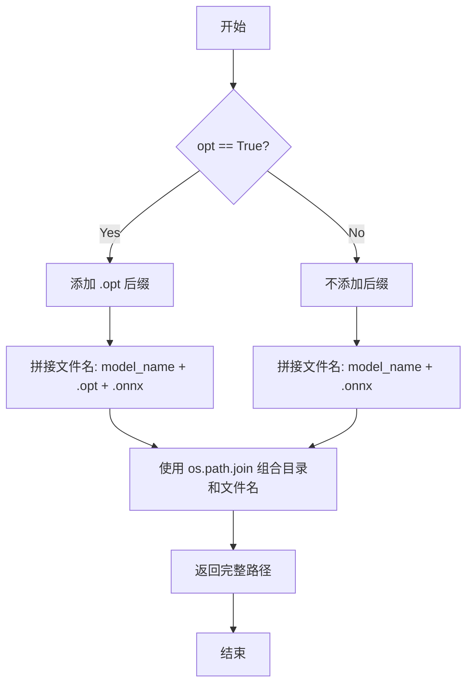

#### 带注释源码

```python
def getOnnxPath(model_name, onnx_dir, opt=True):
    """
    生成ONNX模型的完整文件路径
    
    参数:
        model_name: 模型名称，用于构建ONNX文件名
        onnx_dir: 存放ONNX文件的目录路径
        opt: 是否使用优化版本，默认为True
    
    返回:
        ONNX文件的完整路径字符串
    """
    # 根据opt参数决定是否添加.optimize后缀
    # 如果opt为True，文件名格式为: model_name.opt.onnx
    # 如果opt为False，文件名格式为: model_name.onnx
    return os.path.join(onnx_dir, model_name + (".opt" if opt else "") + ".onnx")
```


### `getEnginePath`

该函数是一个全局工具函数，用于根据模型名称和引擎目录生成TensorRT引擎文件的完整路径。它通过拼接引擎目录、模型名称和.plan扩展名来构建路径字符串。

参数：

- `model_name`：`str`，模型的名称，用于构建引擎文件名
- `engine_dir`：`str`，存储TensorRT引擎文件的目录路径

返回值：`str`，返回完整的TensorRT引擎文件路径，格式为 `{engine_dir}/{model_name}.plan`

#### 流程图

```mermaid
flowchart TD
    A[开始] --> B[接收model_name和engine_dir参数]
    C[拼接路径] --> D[返回完整路径: os.path.join(engine_dir, model_name + .plan)]
    B --> C
    D --> E[结束]
```

#### 带注释源码

```python
def getEnginePath(model_name, engine_dir):
    """
    生成TensorRT引擎文件的完整路径
    
    参数:
        model_name: str, 模型的名称,用作引擎文件名前缀
        engine_dir: str, 存储引擎文件的目录路径
    
    返回:
        str: 完整的引擎文件路径,格式为 {engine_dir}/{model_name}.plan
    """
    return os.path.join(engine_dir, model_name + ".plan")
```


### `build_engines`

该函数是 Stable Diffusion TensorRT 加速管道的核心引擎构建函数，负责将 PyTorch 模型导出为 ONNX 格式，再编译为 TensorRT 引擎，并加载激活引擎以便后续推理使用。

参数：

- `models`：`dict`，包含模型名称到模型对象的字典，用于指定需要构建引擎的模型（如 clip、unet、vae）
- `engine_dir`：`str`，保存 TensorRT 引擎（.plan 文件）的目录路径
- `onnx_dir`：`str`，保存 ONNX 模型的目录路径
- `onnx_opset`：`int`，ONNX 导出时使用的 opset 版本号
- `opt_image_height`：`int`，优化时使用的图像高度，用于确定输入profile
- `opt_image_width`：`int`，优化时使用的图像宽度，用于确定输入profile
- `opt_batch_size`：`int`，优化时使用的批次大小，默认为 1
- `force_engine_rebuild`：`bool`，是否强制重新构建引擎，即使已存在缓存，默认为 False
- `static_batch`：`bool`，是否使用静态批次大小，默认为 False
- `static_shape`：`bool`，是否使用静态形状，默认为 True
- `enable_all_tactics`：`bool`，是否启用所有 TensorRT 优化策略，默认为 False
- `timing_cache`：`str` 或 `None`，TensorRT 时序缓存文件路径，用于加速引擎构建

返回值：`dict`，返回包含各模型名称到对应已加载激活的 Engine 对象的字典

#### 流程图

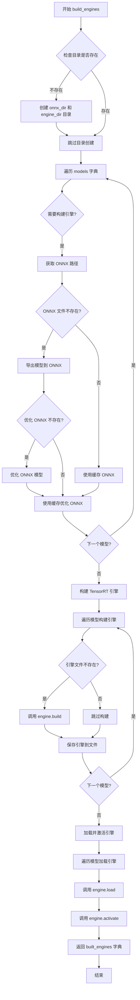

#### 带注释源码

```python
def build_engines(
    models: dict,                      # 模型字典，key为模型名，value为模型对象（如CLIP、UNet、VAE包装类）
    engine_dir,                         # TensorRT引擎保存目录
    onnx_dir,                           # ONNX模型保存目录
    onnx_opset,                         # ONNX opset版本
    opt_image_height,                  # 优化时使用的图像高度
    opt_image_width,                   # 优化时使用的图像宽度
    opt_batch_size=1,                  # 优化时使用的批次大小
    force_engine_rebuild=False,         # 是否强制重新构建引擎
    static_batch=False,                # 是否使用静态批次
    static_shape=True,                 # 是否使用静态形状
    enable_all_tactics=False,          # 是否启用所有TensorRT优化策略
    timing_cache=None,                 # 时序缓存文件路径
):
    """构建并加载TensorRT引擎的完整流水线"""
    
    # 初始化返回字典，存储所有构建好的引擎对象
    built_engines = {}
    
    # 确保输出目录存在，不存在则创建
    if not os.path.isdir(onnx_dir):
        os.makedirs(onnx_dir)
    if not os.path.isdir(engine_dir):
        os.makedirs(engine_dir)

    # ====== 第一阶段：导出模型到ONNX格式 ======
    # 遍历每个模型，检查是否需要导出/优化ONNX
    for model_name, model_obj in models.items():
        engine_path = getEnginePath(model_name, engine_dir)
        
        # 只有当引擎不存在或强制重建时才处理ONNX
        if force_engine_rebuild or not os.path.exists(engine_path):
            logger.warning("Building Engines...")
            logger.warning("Engine build can take a while to complete")
            
            # 获取ONNX路径
            onnx_path = getOnnxPath(model_name, onnx_dir, opt=False)
            onnx_opt_path = getOnnxPath(model_name, onnx_dir)
            
            # 导出原始ONNX（如果不存在）
            if force_engine_rebuild or not os.path.exists(onnx_opt_path):
                if force_engine_rebuild or not os.path.exists(onnx_path):
                    logger.warning(f"Exporting model: {onnx_path}")
                    model = model_obj.get_model()
                    
                    # 使用推理模式导出ONNX
                    with torch.inference_mode(), torch.autocast("cuda"):
                        # 获取示例输入
                        inputs = model_obj.get_sample_input(opt_batch_size, opt_image_height, opt_image_width)
                        
                        # 执行ONNX导出
                        torch.onnx.export(
                            model,
                            inputs,
                            onnx_path,
                            export_params=True,
                            opset_version=onnx_opset,
                            do_constant_folding=True,
                            input_names=model_obj.get_input_names(),
                            output_names=model_obj.get_output_names(),
                            dynamic_axes=model_obj.get_dynamic_axes(),
                        )
                    
                    # 释放模型内存
                    del model
                    torch.cuda.empty_cache()
                    gc.collect()
                else:
                    logger.warning(f"Found cached model: {onnx_path}")

                # 优化ONNX模型（如果优化版本不存在）
                if force_engine_rebuild or not os.path.exists(onnx_opt_path):
                    logger.warning(f"Generating optimizing model: {onnx_opt_path}")
                    onnx_opt_graph = model_obj.optimize(onnx.load(onnx_path))
                    onnx.save(onnx_opt_graph, onnx_opt_path)
                else:
                    logger.warning(f"Found cached optimized model: {onnx_opt_path} ")

    # ====== 第二阶段：构建TensorRT引擎 ======
    for model_name, model_obj in models.items():
        engine_path = getEnginePath(model_name, engine_dir)
        engine = Engine(engine_path)
        onnx_path = getOnnxPath(model_name, onnx_dir, opt=False)
        onnx_opt_path = getOnnxPath(model_name, onnx_dir)

        # 仅当引擎不存在或强制重建时构建
        if force_engine_rebuild or not os.path.exists(engine.engine_path):
            engine.build(
                onnx_opt_path,
                fp16=True,  # 启用FP16推理
                input_profile=model_obj.get_input_profile(
                    opt_batch_size,
                    opt_image_height,
                    opt_image_width,
                    static_batch=static_batch,
                    static_shape=static_shape,
                ),
                timing_cache=timing_cache,
            )
        
        # 将构建好的引擎添加到结果字典
        built_engines[model_name] = engine

    # ====== 第三阶段：加载并激活所有引擎 ======
    for model_name, model_obj in models.items():
        engine = built_engines[model_name]
        engine.load()       # 从文件加载引擎字节码
        engine.activate()   # 创建执行上下文

    return built_engines
```


### `runEngine`

该函数是一个全局工具函数，用于在TensorRT引擎上执行推理。它接收TensorRT引擎对象、输入数据字典和CUDA流作为参数，调用引擎的`infer`方法进行推理计算，并返回包含输出张量的有序字典。

参数：

- `engine`：`Engine`，TensorRT引擎对象，包含已经构建、加载并激活的TensorRT引擎
- `feed_dict`：`dict`，输入数据的字典，键是张量名称（字符串），值是对应的PyTorch张量（torch.Tensor）
- `stream`：`cuda.Stream`，CUDA流对象，用于异步执行推理操作

返回值：`OrderedDict`，包含输出张量的有序字典，键是张量名称（字符串），值是对应的PyTorch张量（torch.Tensor）

#### 流程图

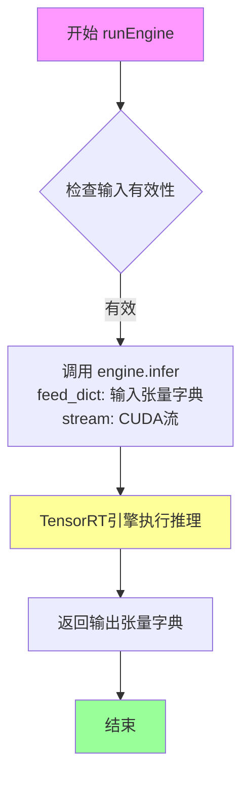

#### 带注释源码

```python
def runEngine(engine, feed_dict, stream):
    """
    在TensorRT引擎上执行推理的全局工具函数。
    
    该函数是一个简单的包装器，它将输入数据传递给TensorRT引擎的infer方法，
    并返回推理结果。它是整个Stable Diffusion pipeline中各个模型
    （CLIP、UNet、VAE）执行推理的核心接口。
    
    参数:
        engine (Engine): TensorRT引擎对象，包含已经构建、加载并激活的引擎实例
                        通过Engine类的load()和activate()方法初始化
        feed_dict (dict): 输入数据的字典，键为张量名称（字符串），值为PyTorch张量
                         例如：{"input_ids": torch.tensor([...])}
        stream (cuda.Stream): CUDA流对象，用于异步执行推理操作
                             通过cudart.cudaStreamCreate()创建
    
    返回:
        OrderedDict: 包含推理输出张量的有序字典，键为张量名称（字符串）
                    例如：{"text_embeddings": tensor(...), "pooler_output": tensor(...)}
    
    示例:
        >>> # CLIP模型推理
        >>> text_embeddings = runEngine(
        ...     engine["clip"],
        ...     {"input_ids": text_input_ids},
        ...     stream
        ... )["text_embeddings"]
        
        >>> # UNet模型推理
        >>> noise_pred = runEngine(
        ...     engine["unet"],
        ...     {"sample": latent_model_input, "timestep": timestep_float, 
        ...      "encoder_hidden_states": text_embeddings},
        ...     stream
        ... )["latent"]
        
        >>> # VAE模型推理
        >>> images = runEngine(
        ...     engine["vae"],
        ...     {"latent": latents},
        ...     stream
        ... )["images"]
    """
    return engine.infer(feed_dict, stream)
```


### `make_CLIP`

该函数是一个工厂函数，用于创建CLIP模型实例，以便在TensorRT加速的Stable Diffusion管道中进行文本编码。它接受预训练的CLIP文本模型和相关配置参数，封装成统一的CLIP类实例供后续ONNX导出和TensorRT引擎构建使用。

参数：

- `model`：`torch.nn.Module`，预训练的CLIP文本编码器模型（通常是CLIPTextModel）
- `device`：`str`，运行设备，通常为"cuda"
- `max_batch_size`：`int`，最大批处理大小，用于确定输入profile的维度范围
- `embedding_dim`：`int`，文本嵌入的维度，通常为768（对应clip-vit-large-patch14）
- `inpaint`：`bool`，是否用于inpainting任务（当前版本中未使用，保留用于未来扩展）

返回值：`CLIP`，返回封装好的CLIP模型实例

#### 流程图

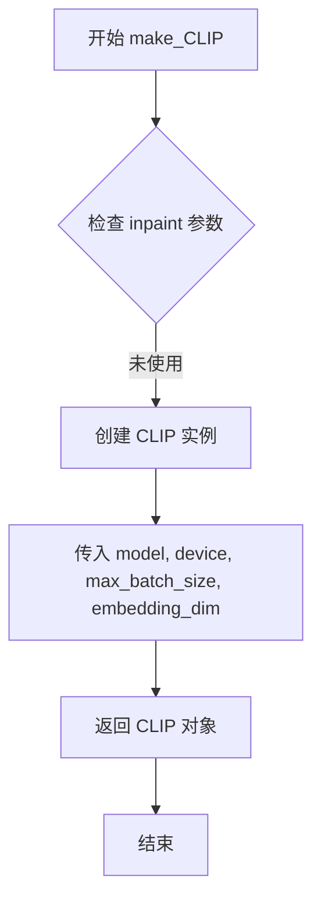

#### 带注释源码

```python
def make_CLIP(model, device, max_batch_size, embedding_dim, inpaint=False):
    """
    工厂函数：创建CLIP模型封装实例
    
    该函数用于将预训练的CLIP文本编码器封装成CLIP类实例，
    以便在TensorRT Stable Diffusion管道中进行ONNX导出和引擎构建。
    
    参数:
        model: 预训练的CLIPTextModel模型
        device: 计算设备 (如 "cuda")
        max_batch_size: 最大批处理大小
        embedding_dim: 文本嵌入维度 (通常为768)
        inpaint: 保留参数,用于未来支持inpainting模型
    
    返回:
        CLIP: 封装后的CLIP模型实例
    """
    # 直接返回CLIP类实例,传入所有必要参数
    # 注意: inpaint参数当前未使用,仅为接口一致性保留
    return CLIP(model, device=device, max_batch_size=max_batch_size, embedding_dim=embedding_dim)
```


### `make_UNet`

该函数是一个工厂函数，用于创建并返回配置好的 UNet 模型实例，专门用于 TensorRT 加速的 Stable Diffusion 推理流程。它根据 `inpaint` 参数动态设置 UNet 的通道维度，并强制使用 FP16 精度以优化推理性能。

参数：

- `model`：`torch.nn.Module`，UNet2DConditionModel 模型对象，HuggingFace Diffusers 的条件 UNet 模型
- `device`：`str`，指定计算设备，通常为 "cuda"
- `max_batch_size`：`int`，最大批次大小，用于确定动态输入profile
- `embedding_dim`：`int`，文本嵌入的维度，通常为 768
- `inpaint`：`bool`，是否为 inpainting 任务，如果是则 UNet 通道维度设为 9，否则设为 4（默认为 False）

返回值：`UNet`，返回配置好的 UNet 类实例，包含模型、精度、设备和维度配置

#### 流程图

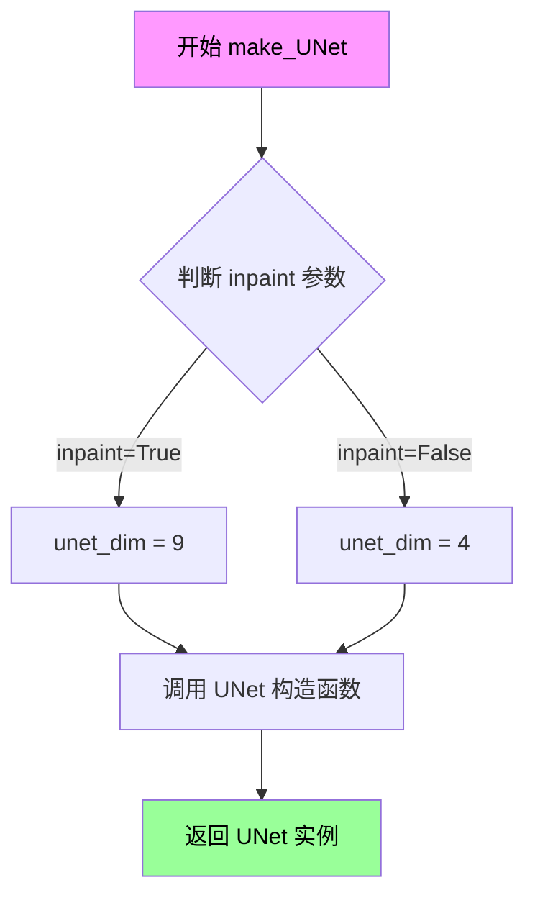

#### 带注释源码

```python
def make_UNet(model, device, max_batch_size, embedding_dim, inpaint=False):
    """
    创建并返回一个配置好的 UNet 模型实例，用于 TensorRT 推理。
    
    该工厂函数将原始的 HuggingFace UNet2DConditionModel 包装为 TensorRT 兼容的
    UNet 类，并自动配置 FP16 精度、设备信息和动态输入维度。
    
    参数:
        model (torch.nn.Module): HuggingFace Diffusers 的 UNet2DConditionModel 对象
        device (str): 计算设备，通常为 "cuda"
        max_batch_size (int): 支持的最大批次大小，用于动态形状profile
        embedding_dim (int): 文本嵌入维度，标准 CLIP 模型为 768
        inpaint (bool, optional): 是否为 inpainting 模式。True 时 unet_dim=9, False 时 unet_dim=4
    
    返回:
        UNet: 配置完成的 UNet 包装类实例，可用于 ONNX 导出和 TensorRT 引擎构建
    """
    # 根据 inpaint 参数确定 UNet 的输入通道数
    # 标准 SD 模型: 4 通道 (latent)
    # Inpainting SD 模型: 9 通道 (4 latent + 3 mask + 2 original image)
    unet_dim = 9 if inpaint else 4
    
    # 创建 UNet 实例，强制使用 FP16 精度以优化推理性能和内存占用
    return UNet(
        model,                      # 原始的 UNet2DConditionModel
        fp16=True,                  # 启用 FP16 混合精度
        device=device,              # 计算设备
        max_batch_size=max_batch_size,  # 最大批次大小
        embedding_dim=embedding_dim,    # 文本嵌入维度
        unet_dim=unet_dim,              # UNet 输入通道维度
    )
```


### `make_VAE`

该函数是一个工厂函数（Factory Function），用于实例化 `VAE` 类。它接收一个原始的 PyTorch VAE 模型（`AutoencoderKL`）及其配置参数，并返回一个封装后的 `VAE` 对象。该对象是构建 TensorRT 推理引擎的核心组件之一，专门负责将模型从潜望空间（Latent Space）解码重建为真实图像。

参数：

-  `model`：`torch.nn.Module`（通常为 `diffusers.models.AutoencoderKL`），这是从 Hugging Face diffusers 库加载的原始 VAE PyTorch 模型。
-  `device`：`str`，指定运行设备（例如 `"cuda"` 或 `"cpu"`）。
-  `max_batch_size`：`int`，用于设置 TensorRT 优化配置的最大批处理大小。
-  `embedding_dim`：`int`，文本嵌入的维度（继承自 `BaseModel`，用于保持接口一致性，尽管 VAE 解码器本身不直接使用文本嵌入）。
-  `inpaint`：`bool`，标识是否用于图像修复任务（当前函数中未使用，为保持与 `make_UNet` 等函数接口一致性而保留）。

返回值：`VAE`，返回 `VAE` 类的一个实例，该实例封装了模型并提供了用于 ONNX 导出和 TensorRT 构建的接口方法（如 `get_input_names`, `get_sample_input` 等）。

#### 流程图

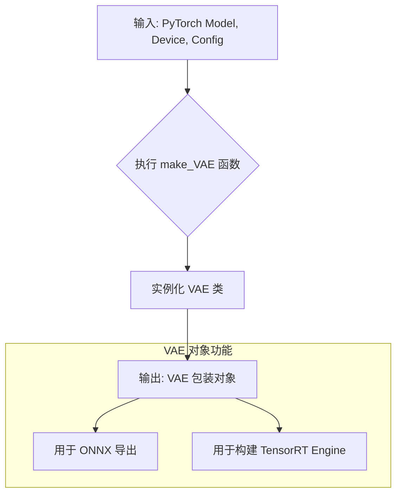

#### 带注释源码

```python
def make_VAE(model, device, max_batch_size, embedding_dim, inpaint=False):
    """
    创建并返回一个配置好的 VAE 模型封装类实例。
    
    参数:
        model (torch.nn.Module): 原始的 VAE 模型。
        device (str): 运行设备。
        max_batch_size (int): 最大批次大小。
        embedding_dim (int): 嵌入维度。
        inpaint (bool, optional): 标记是否为 inpainting 模型 (当前版本中未使用)。
    
    返回:
        VAE: VAE 类的实例，用于 TensorRT 流水线的构建。
    """
    # 调用 VAE 类的构造函数，传入必要的参数
    # VAE 类继承自 BaseModel，负责处理 VAE 特有的输入输出形状和 ONNX 导出逻辑
    return VAE(model, device=device, max_batch_size=max_batch_size, embedding_dim=embedding_dim)
```


### Engine.build

该方法负责将 ONNX 模型构建为 TensorRT 引擎，根据输入配置和优化参数生成高效的推理引擎文件。

参数：

- `self`：`Engine` 类实例本身
- `onnx_path`：`str`，要转换的 ONNX 模型文件路径
- `fp16`：`bool`，是否启用 FP16 半精度模式以提升推理性能
- `input_profile`：`Optional[dict]`，输入张量的动态形状配置字典，键为输入名称，值为包含 [min, opt, max] 三个维度形状的列表
- `enable_all_tactics`：`bool`，是否启用 TensorRT 所有优化策略，默认为 False
- `timing_cache`：`Optional[str]`，TensorRT 计时缓存文件路径，用于缓存层 profiling 结果加速后续构建

返回值：`None`，无返回值。该方法直接将构建好的 TensorRT 引擎保存到 `self.engine_path` 指定的文件路径。

#### 流程图

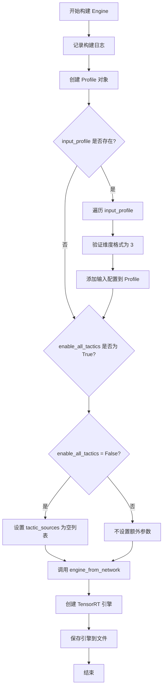

#### 带注释源码

```python
def build(
    self,
    onnx_path,          # str: ONNX 模型文件路径
    fp16,               # bool: 是否启用 FP16 半精度
    input_profile=None, # Optional[dict]: 输入动态形状配置，格式 {name: [min_shape, opt_shape, max_shape]}
    enable_all_tactics=False,  # bool: 是否启用所有 TensorRT 优化策略
    timing_cache=None,  # Optional[str]: 计时缓存文件路径
):
    """
    将 ONNX 模型构建为 TensorRT 引擎
    
    参数:
        onnx_path: ONNX 模型文件路径
        fp16: 是否启用 FP16 半精度模式
        input_profile: 输入张量的动态形状配置
        enable_all_tactics: 是否启用所有 TensorRT 优化策略
        timing_cache: 计时缓存文件路径
    """
    # 记录构建日志，输出 ONNX 路径和目标引擎路径
    logger.warning(f"Building TensorRT engine for {onnx_path}: {self.engine_path}")
    
    # 创建 TensorRT Profile 对象，用于配置动态输入形状
    p = Profile()
    
    # 如果提供了 input_profile，配置每个输入的动态形状范围
    if input_profile:
        for name, dims in input_profile.items():
            # 验证维度格式：必须为 [min, opt, max] 三个维度
            assert len(dims) == 3
            # 添加输入配置：最小、最优、最大形状
            p.add(name, min=dims[0], opt=dims[1], max=dims[2])

    # 初始化额外构建参数字典
    extra_build_args = {}
    
    # 如果不启用所有策略，限制 tactic_sources 以控制优化行为
    if not enable_all_tactics:
        extra_build_args["tactic_sources"] = []

    # 从 ONNX 网络创建 TensorRT 引擎
    # 使用 NATIVE_INSTANCENORM 标志解析 ONNX 中的 InstanceNorm 算子
    engine = engine_from_network(
        network_from_onnx_path(onnx_path, flags=[trt.OnnxParserFlag.NATIVE_INSTANCENORM]),
        config=CreateConfig(
            fp16=fp16,                    # 启用 FP16 精度
            profiles=[p],                 # 动态形状配置
            load_timing_cache=timing_cache,  # 加载已有计时缓存
            **extra_build_args           # 展开额外构建参数
        ),
        save_timing_cache=timing_cache,  # 保存计时缓存供后续使用
    )
    
    # 将构建好的引擎保存到指定路径
    save_engine(engine, path=self.engine_path)
```


### `Engine.load`

该方法负责将预构建的 TensorRT 引擎文件从磁盘加载到内存中，并反序列化为可执行的引擎对象。

参数：无需参数（仅使用类属性 `self.engine_path`）

返回值：无返回值（`None`），通过类属性 `self.engine` 存储加载后的引擎对象

#### 流程图

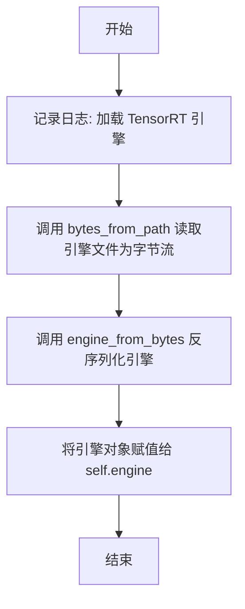

#### 带注释源码

```python
def load(self):
    """
    加载预构建的 TensorRT 引擎文件到内存中。
    
    该方法执行以下操作：
    1. 从磁盘读取 .plan 引擎文件（通过 engine_path 指定）
    2. 将文件内容转换为字节流
    3. 使用 TensorRT 的反序列化功能将字节流转换为可执行的 Engine 对象
    4. 将引擎对象存储在 self.engine 属性中，供后续的 activate() 和 infer() 使用
    
    注意：
    - 引擎文件由 build() 方法生成
    - 加载后的引擎需要先调用 activate() 创建执行上下文
    - 最后需要调用 allocate_buffers() 分配输入输出缓冲区
    """
    # 记录日志信息，便于调试和追踪引擎加载过程
    logger.warning(f"Loading TensorRT engine: {self.engine_path}")
    
    # 使用 polygraphy 库的辅助函数从文件路径读取字节内容
    # bytes_from_path 负责打开文件并读取为二进制字节流
    engine_bytes = bytes_from_path(self.engine_path)
    
    # 使用 TensorRT (polygraphy backend) 将字节流反序列化为 Engine 对象
    # engine_from_bytes 是 polygraphy 提供的包装函数，内部调用 trt.Runtime.deserialize_engine()
    self.engine = engine_from_bytes(engine_bytes)
```


### `Engine.activate`

该方法用于激活TensorRT引擎，创建一个执行上下文（`IExecutionContext`），以便后续进行推理操作。

参数：
- 无（仅包含隐式参数`self`）

返回值：`None`，无返回值。该方法通过副作用将执行上下文赋值给实例属性`self.context`。

#### 流程图

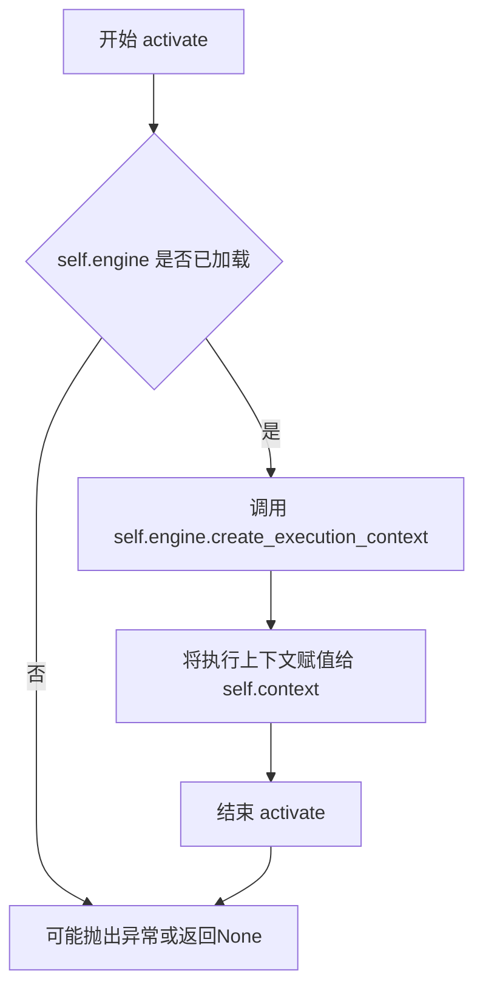

#### 带注释源码

```python
def activate(self):
    """
    激活TensorRT引擎并创建执行上下文。
    
    该方法调用TensorRT引擎的create_execution_context方法创建一个执行上下文，
    执行上下文用于在GPU上运行推理任务。在调用infer方法之前必须先调用此方法。
    
    注意：
        - 调用此方法前必须先调用load()方法加载引擎
        - 一个引擎可以创建多个执行上下文支持并行推理
    """
    self.context = self.engine.create_execution_context()
```

---

#### 补充说明

| 项目 | 说明 |
|------|------|
| **所属类** | `Engine` |
| **文件位置** | 代码中的`Engine`类（约第84-143行） |
| **调用前提** | 必须先调用`Engine.load()`加载引擎 |
| **调用时机** | 在`build_engines`函数中，加载引擎后立即调用以准备推理 |
| **相关联的方法** | `load()`, `allocate_buffers()`, `infer()` |
| **技术债务/优化空间** | 当前实现每次调用都创建新的执行上下文，如果需要多次并行推理，可考虑缓存和复用上下文对象 |


### `Engine.allocate_buffers`

该方法为 TensorRT 引擎分配输入和输出缓冲区。它遍历引擎的所有输入输出张量，根据提供的形状字典或从引擎获取的形状创建 PyTorch 张量，并将其存储在内部张量字典中供推理使用。

参数：

- `shape_dict`：`dict`，可选，形状字典，用于指定每个张量的形状，键为张量名称，值为形状元组
- `device`：`str`，设备类型，默认为 `"cuda"`，指定张量分配到的设备

返回值：`None`，无返回值，该方法直接修改对象的内部状态

#### 流程图

```mermaid
flowchart TD
    A[开始 allocate_buffers] --> B{shape_dict 是否存在且非空}
    B -->|是| C[遍历引擎的所有输入输出张量 binding]
    B -->|否| C
    C --> D[获取张量名称 name]
    E{shape_dict 存在且 name 在其中}
    E -->|是| F[使用 shape_dict[name] 作为 shape]
    E -->|否| G[从引擎获取形状 self.engine.get_tensor_shape]
    F --> H[获取张量数据类型 dtype]
    G --> H
    H --> I{判断是否为输入张量}
    I -->|是| J[设置输入形状 self.context.set_input_shape]
    I -->|否| K
    J --> K[创建 PyTorch 空张量]
    K --> L[将张量移动到指定设备]
    L --> M[存储到 self.tensors 字典]
    M --> N{是否还有更多张量}
    N -->|是| C
    N -->|否| O[结束]
```

#### 带注释源码

```python
def allocate_buffers(self, shape_dict=None, device="cuda"):
    """
    为 TensorRT 引擎分配输入和输出缓冲区
    
    参数:
        shape_dict: 可选的字典，键为张量名称，值为形状元组
        device: 设备字符串，默认为 "cuda"
    """
    # 遍历引擎的所有输入输出张量的索引
    for binding in range(self.engine.num_io_tensors):
        # 获取张量的名称
        name = self.engine.get_tensor_name(binding)
        
        # 确定张量的形状：如果提供了 shape_dict 且该名称在其中，则使用字典中的形状
        # 否则从引擎获取默认形状
        if shape_dict and name in shape_dict:
            shape = shape_dict[name]
        else:
            shape = self.engine.get_tensor_shape(name)
        
        # 获取张量的数据类型，并转换为 NumPy 类型
        dtype = trt.nptype(self.engine.get_tensor_dtype(name))
        
        # 判断是否为输入张量，如果是则需要设置输入形状
        if self.engine.get_tensor_mode(name) == trt.TensorIOMode.INPUT:
            self.context.set_input_shape(name, shape)
        
        # 创建 PyTorch 空张量，使用转换后的数据类型
        # 将形状转换为元组并分配内存
        tensor = torch.empty(tuple(shape), dtype=numpy_to_torch_dtype_dict[dtype]).to(device=device)
        
        # 将创建的张量存储到内部字典中，键为张量名称
        self.tensors[name] = tensor
```


### `Engine.infer`

该方法是 TensorRT 引擎的核心推理方法，负责将输入数据拷贝到预分配的 GPU 缓冲区，设置张量地址，然后异步执行推理，并返回推理结果。

参数：

- `feed_dict`：`Dict[str, torch.Tensor]`，输入数据的字典，键为张量名称（String），值为对应的输入张量（Tensor）
- `stream`：`cuda.CudaStream`，CUDA 异步流对象，用于管理异步执行

返回值：`OrderedDict[str, torch.Tensor]`，包含推理输出的有序字典，键为张量名称，值为输出张量

#### 流程图

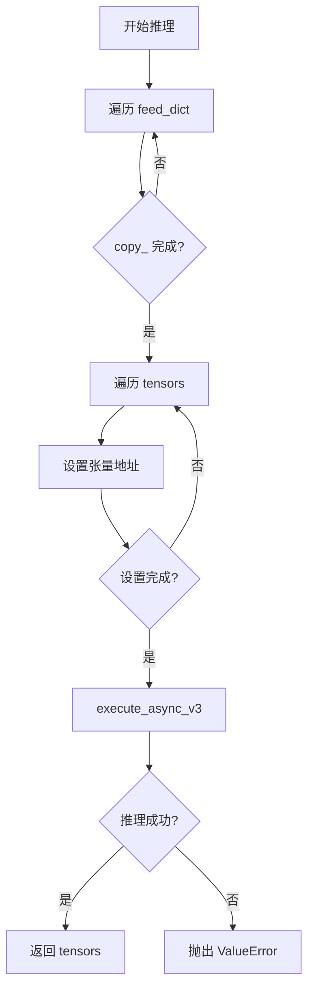

#### 带注释源码

```python
def infer(self, feed_dict, stream):
    """
    执行 TensorRT 引擎推理
    
    参数:
        feed_dict: 输入数据字典，键为张量名称，值为输入张量
        stream: CUDA 异步流
    
    返回:
        包含推理输出的有序字典
    """
    # 第一步：将输入数据从 feed_dict 拷贝到预分配的 GPU 张量缓冲区
    # feed_dict: Dict[str, torch.Tensor] - 输入张量字典
    # self.tensors: OrderedDict[str, torch.Tensor] - 预分配的张量缓冲区
    for name, buf in feed_dict.items():
        self.tensors[name].copy_(buf)
    
    # 第二步：为每个张量设置 GPU 内存地址
    # self.context: TensorRT 执行上下文
    # self.context.set_tensor_address: 设置每个绑定张量的设备指针
    for name, tensor in self.tensors.items():
        self.context.set_tensor_address(name, tensor.data_ptr())
    
    # 第三步：异步执行推理
    # self.context.execute_async_v3: TensorRT 异步执行接口 v3
    # stream: CUDA 流，用于异步执行
    noerror = self.context.execute_async_v3(stream)
    
    # 第四步：检查推理是否成功
    # 如果推理失败，抛出 ValueError 异常
    if not noerror:
        raise ValueError("ERROR: inference failed.")
    
    # 第五步：返回包含输出张量的字典
    # 返回 self.tensors 字典，包含所有输入和输出的张量
    return self.tensors
```


### `Optimizer.cleanup`

对ONNX图进行清理和拓扑排序，支持可选返回ONNX格式的图。

参数：

- `return_onnx`：`bool`，可选参数，默认为`False`。当设置为`True`时，方法将返回清理后的ONNX图（`onnx.ModelProto`类型）；否则返回`None`。

返回值：`Optional[onnx.ModelProto]`，返回清理后的ONNX图（如果`return_onnx`为`True`），否则返回`None`。

#### 流程图

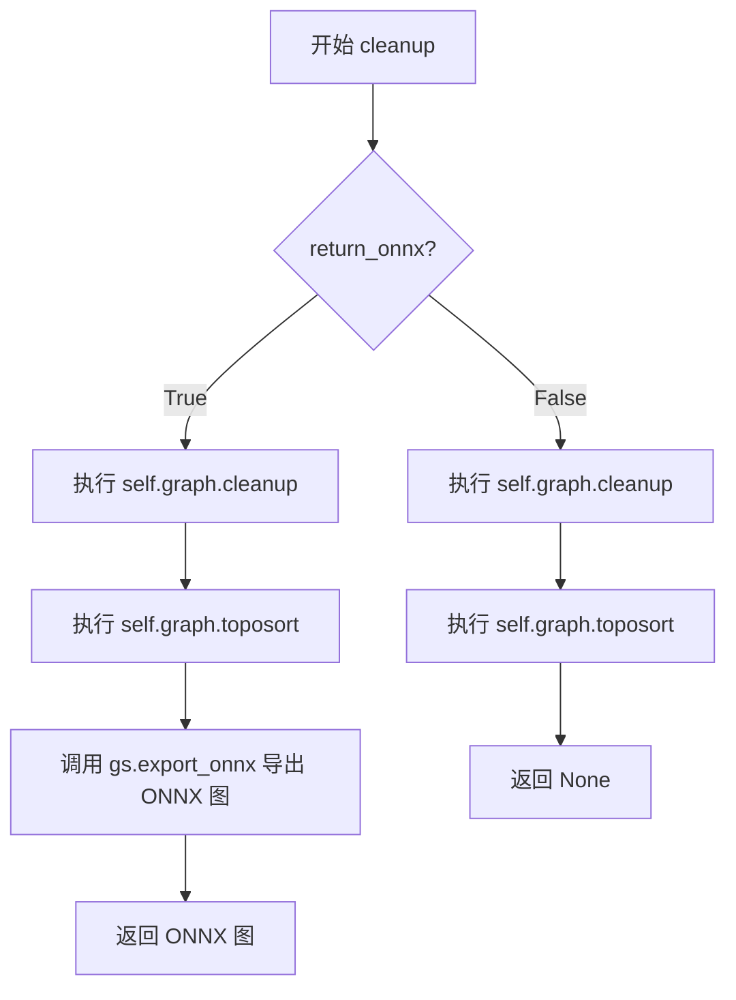

#### 带注释源码

```python
def cleanup(self, return_onnx=False):
    """
    清理ONNX图并执行拓扑排序
    
    该方法执行两个主要操作：
    1. cleanup(): 移除图中未使用的节点和空图
    2. toposort(): 确保图中节点的执行顺序符合依赖关系
    
    参数:
        return_onnx (bool): 是否返回ONNX格式的图，默认为False
        
    返回:
        Optional[onnx.ModelProto]: 当return_onnx为True时返回清理后的ONNX图，否则返回None
    """
    # 步骤1: 清理图 - 移除未使用的节点和空算子
    self.graph.cleanup().toposort()
    
    # 步骤2: 检查是否需要返回ONNX格式
    if return_onnx:
        # 步骤3: 将GraphSurgeon图导出为ONNX格式并返回
        return gs.export_onnx(self.graph)
```


### `Optimizer.select_outputs`

该方法用于从ONNX计算图中选择指定的输出节点，并可选地重命名这些输出。在TensorRT引擎优化过程中，需要筛选出特定的网络输出以便后续处理。

参数：

- `keep`：`List[int]`，要保留的输出索引列表，用于指定图中需要保留的输出节点
- `names`：`Optional[List[str]]`，可选参数，用于为保留的输出节点设置新的名称

返回值：`None`，该方法直接修改`self.graph.outputs`属性，不返回任何值

#### 流程图

```mermaid
flowchart TD
    A[开始 select_outputs] --> B{检查 names 参数是否为空}
    B -->|是| C[仅筛选输出节点]
    B -->|否| D[筛选输出节点并重命名]
    C --> E[更新 self.graph.outputs]
    D --> E
    E --> F[结束]
    
    G[输入: keep=[0], names=['text_embeddings']] --> H[输出: graph.outputs[0].name='text_embeddings']
```

#### 带注释源码

```python
def select_outputs(self, keep, names=None):
    """
    从ONNX计算图中选择指定的输出节点
    
    参数:
        keep: List[int], 要保留的输出索引列表
        names: Optional[List[str]], 可选的新输出名称列表
    
    返回:
        None (直接修改实例属性)
    """
    
    # 根据keep索引列表筛选图输出
    # 例如: keep=[0,2] 表示保留原输出的第0个和第2个节点
    self.graph.outputs = [self.graph.outputs[o] for o in keep]
    
    # 如果提供了names参数,则重命名对应的输出节点
    # names列表长度应与keep列表长度一致
    if names:
        for i, name in enumerate(names):
            # 为每个输出节点设置新名称
            self.graph.outputs[i].name = name
```


### `Optimizer.fold_constants`

该方法用于对 ONNX 计算图进行常量折叠优化，通过 Polygraphy 的 `fold_constants` 函数将图中可预先计算的常量节点化简，以减少运行时计算量。

参数：

- `return_onnx`：`bool`，可选参数，指定是否返回优化后的 ONNX 图。默认为 `False`。

返回值：`Optional[onnx.ModelProto]`，当 `return_onnx=True` 时返回优化后的 ONNX 图对象，否则返回 `None`。

#### 流程图

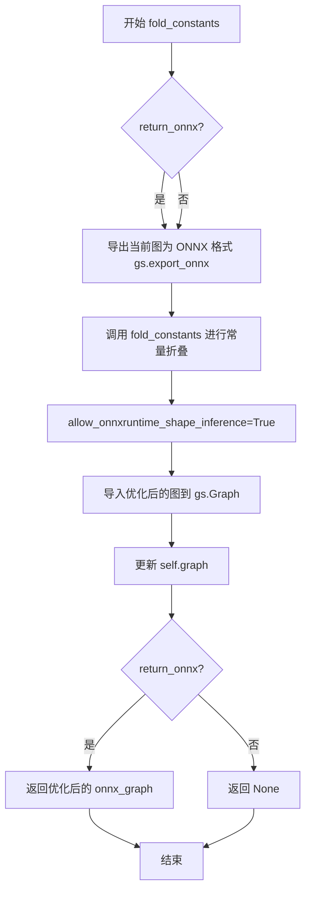

#### 带注释源码

```python
def fold_constants(self, return_onnx=False):
    """
    对 ONNX 计算图进行常量折叠优化
    
    参数:
        return_onnx (bool): 是否返回优化后的 ONNX 图，默认为 False
        
    返回值:
        Optional[onnx.ModelProto]: 当 return_onnx=True 时返回优化后的 ONNX 图，否则返回 None
    """
    # 将当前图导出为 ONNX 格式
    onnx_graph = fold_constants(
        gs.export_onnx(self.graph),  # 导出 gs.Graph 为 ONNX ModelProto
        allow_onnxruntime_shape_inference=True  # 允许使用 ONNX Runtime 进行形状推断
    )
    
    # 将优化后的 ONNX 图重新导入为 gs.Graph 并更新 self.graph
    self.graph = gs.import_onnx(onnx_graph)
    
    # 如果需要返回 ONNX 图，则返回优化后的图
    if return_onnx:
        return onnx_graph
```


### `Optimizer.infer_shapes`

该方法是 `Optimizer` 类的成员方法，用于对 ONNX 图进行形状推断（Shape Inference），以确定网络中各张量的维度信息。它首先检查模型大小是否超过 2GB 限制，然后在允许的范围内执行 ONNX 形状推断，最后将推断后的图重新导入到 graphsurgeon 中。

参数：

- `return_onnx`：`bool`，可选参数，默认为 `False`。如果设为 `True`，则返回推断后的 ONNX 图对象；否则返回 `None`。

返回值：`Optional[onnx.ModelProto]`，当 `return_onnx=True` 时返回 ONNX 图对象，否则返回 `None`。

#### 流程图

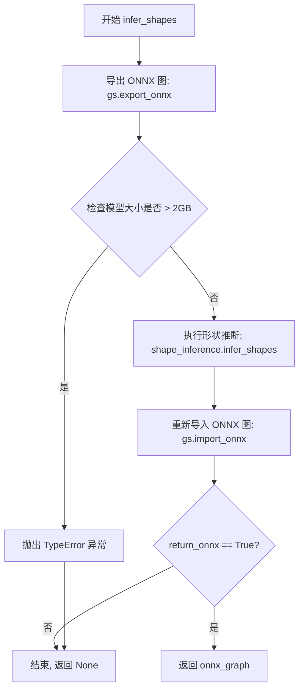

#### 带注释源码

```python
def infer_shapes(self, return_onnx=False):
    """
    对 ONNX 图进行形状推断（Shape Inference）。
    
    该方法执行以下步骤：
    1. 将 graphsurgeon 图导出为 ONNX 格式
    2. 检查模型大小是否超过 2GB 限制
    3. 使用 ONNX 的 shape_inference 推断各节点输出形状
    4. 将推断后的图重新导入为 graphsurgeon 图
    5. 可选地返回 ONNX 图对象
    
    参数:
        return_onnx (bool): 如果为 True，则返回推断后的 ONNX 图对象。
                           默认为 False，此时方法返回 None。
    
    返回:
        Optional[onnx.ModelProto]: 当 return_onnx=True 时返回 ONNX 图对象，
                                   否则返回 None。
    
    异常:
        TypeError: 当模型大小超过 2GB (2147483648 字节) 时抛出。
    """
    # 第1步：将当前的 graphsurgeon 图导出为 ONNX 格式
    onnx_graph = gs.export_onnx(self.graph)
    
    # 第2步：检查导出的 ONNX 模型大小是否超过 2GB 限制
    if onnx_graph.ByteSize() > 2147483648:
        # 模型过大，TensorRT 不支持，抛出类型错误
        raise TypeError("ERROR: model size exceeds supported 2GB limit")
    else:
        # 第3步：在大小允许范围内执行 ONNX 形状推断
        # 这会推断图中各节点的输出张量形状信息
        onnx_graph = shape_inference.infer_shapes(onnx_graph)

    # 第4步：将推断形状后的 ONNX 图重新导入为 graphsurgeon 图
    # 更新 self.graph 以包含推断后的形状信息
    self.graph = gs.import_onnx(onnx_graph)
    
    # 第5步：根据参数决定是否返回 ONNX 图对象
    if return_onnx:
        return onnx_graph
    # 当 return_onnx=False 时，默认返回 None
```


### `BaseModel.get_model`

该方法是基类 `BaseModel` 的简单访问器方法，用于获取在初始化时传入的底层模型实例。它直接返回存储在 `self.model` 中的 PyTorch 模型对象，使子类可以访问原始模型以进行 ONNX 导出等操作。

参数：无

返回值：`torch.nn.Module`（或传入的 model 对象类型），返回在类初始化时保存的底层 PyTorch 模型实例。

#### 流程图

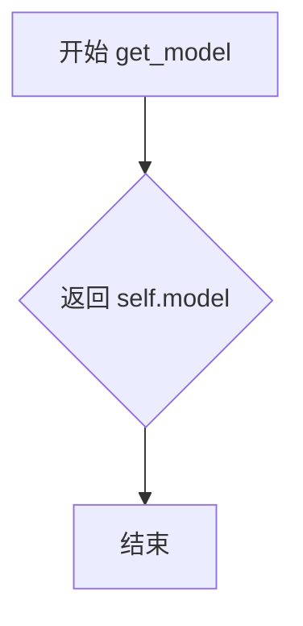

#### 带注释源码

```python
def get_model(self):
    """
    返回存储在 BaseModel 实例中的底层 PyTorch 模型。
    
    该方法是一个简单的访问器（getter），用于获取在 __init__ 方法中保存的原始模型对象。
    在构建 TensorRT 引擎的过程中，这个方法被用于获取模型以进行 ONNX 导出。
    
    Returns:
        torch.nn.Module: 底层 PyTorch 模型实例，用于后续的 ONNX 导出操作
    """
    return self.model
```


### `BaseModel.get_input_names`

该方法是 `BaseModel` 类的抽象方法，用于获取模型在导出为 ONNX 格式时的输入张量名称。在基类中默认为空实现（pass），由子类（如 `CLIP`、`UNet`、`VAE`）重写以返回具体的输入张量名称列表，供 `torch.onnx.export` 函数的 `input_names` 参数使用。

参数： 无

返回值：`List[str]`，返回模型输入张量的名称列表，供 ONNX 导出时使用。

#### 流程图

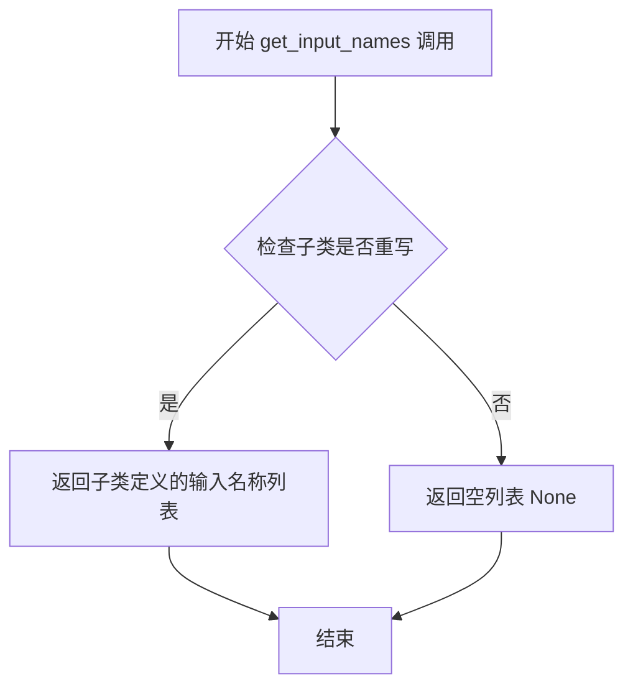

#### 带注释源码

```python
def get_input_names(self):
    """
    获取模型在导出为 ONNX 格式时的输入张量名称。
    
    这是一个抽象方法，在基类 BaseModel 中默认为空实现（pass）。
    子类（如 CLIP、UNet、VAE）需要重写此方法以返回具体的输入张量名称列表。
    
    返回值:
        List[str]: 模型输入张量的名称列表，供 torch.onnx.export 的 input_names 参数使用。
    """
    pass  # 基类中为空实现，由子类重写
```

#### 子类实现示例（供对比理解）

```python
# CLIP 子类中的实现
class CLIP(BaseModel):
    def get_input_names(self):
        return ["input_ids"]

# UNet 子类中的实现
class UNet(BaseModel):
    def get_input_names(self):
        return ["sample", "timestep", "encoder_hidden_states"]

# VAE 子类中的实现
class VAE(BaseModel):
    def get_input_names(self):
        return ["latent"]
```


### `BaseModel.get_output_names`

该方法是 `BaseModel` 类的抽象方法，用于返回模型的输出张量名称，供 ONNX 导出和 TensorRT 引擎构建时确定输出节点。当前基类中为空实现（pass），具体返回值由子类（CLIP、UNet、VAE）重写实现。

参数： 无

返回值：`List[str]` 或 `None`，返回模型输出张量的名称列表。如果返回 `None`（如基类默认实现），则使用空列表。

#### 流程图

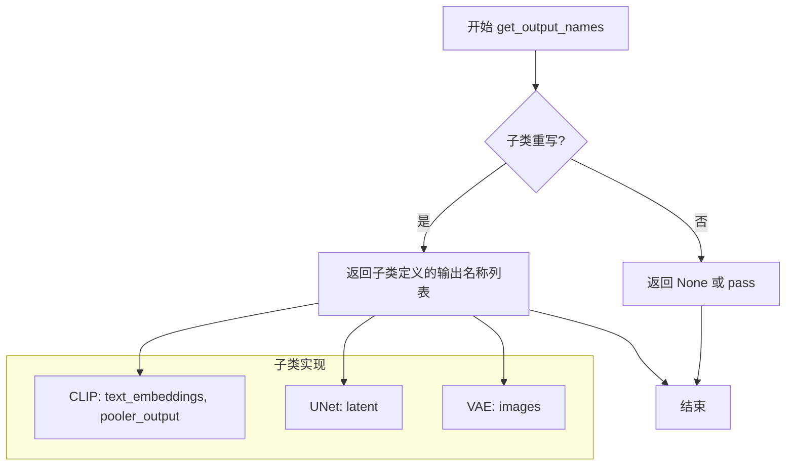

#### 带注释源码

```python
def get_output_names(self):
    """
    获取模型的输出张量名称。
    
    该方法是一个抽象方法，用于在 ONNX 导出时指定输出节点的名称。
    子类需要重写此方法以返回具体的输出张量名称列表。
    
    Returns:
        List[str] 或 None: 模型输出张量的名称列表。
                          子类（如 CLIP、UNet、VAE）会返回具体的名称，
                          例如 ["text_embeddings", "pooler_output"]（CLIP），
                          ["latent"]（UNet），["images"]（VAE）。
                          基类默认返回 None（通过 pass 实现）。
    """
    pass
```

#### 子类重写示例

以下是该方法在子类中的实际实现：

**CLIP 类：**

```python
class CLIP(BaseModel):
    # ... 其他方法 ...
    
    def get_output_names(self):
        """返回 CLIP 模型的输出名称：text_embeddings 和 pooler_output"""
        return ["text_embeddings", "pooler_output"]
```

**UNet 类：**

```python
class UNet(BaseModel):
    # ... 其他方法 ...
    
    def get_output_names(self):
        """返回 UNet 模型的输出名称：latent"""
        return ["latent"]
```

**VAE 类：**

```python
class VAE(BaseModel):
    # ... 其他方法 ...
    
    def get_output_names(self):
        """返回 VAE 模型的输出名称：images"""
        return ["images"]
```

#### 调用场景

该方法在 `build_engines` 函数中被调用，用于 `torch.onnx.export` 的 `output_names` 参数：

```python
torch.onnx.export(
    model,
    inputs,
    onnx_path,
    export_params=True,
    opset_version=onnx_opset,
    do_constant_folding=True,
    input_names=model_obj.get_input_names(),    # 获取输入名称
    output_names=model_obj.get_output_names(),  # 获取输出名称 ← 这里调用
    dynamic_axes=model_obj.get_dynamic_axes(),
)
```


### `BaseModel.get_dynamic_axes`

该方法是 `BaseModel` 类的基类方法，用于定义 ONNX 模型导出时的动态轴映射。基类实现返回 `None`，表示未定义动态轴；子类需重写此方法以提供具体的动态轴配置，使 ONNX 模型支持可变 batch size 和图像分辨率。

参数：无（除 `self` 外无其他参数）

返回值：`None`，返回 `None` 表示该基类方法未定义动态轴，子类需重写此方法以提供具体的动态轴映射

#### 流程图

```mermaid
flowchart TD
    A[调用 get_dynamic_axes] --> B{子类重写?}
    B -->|是| C[返回子类定义的动态轴字典]
    B -->|否| D[返回 None]
```

#### 带注释源码

```python
def get_dynamic_axes(self):
    """
    获取动态轴配置，用于 ONNX 模型导出时支持可变维度。
    
    该方法为基类方法，默认返回 None，表示不定义动态轴。
    子类（如 CLIP、UNet、VAE）应重写此方法，返回包含输入输出张量
    动态轴映射的字典，使 TensorRT 引擎支持动态 batch size 和图像分辨率。
    
    返回:
        None: 基类实现不定义动态轴，需子类重写
        dict: 子类重写时返回动态轴配置，格式为 {tensor_name: {dim_index: dim_name}}
              例如: {"input_ids": {0: "B"}, "text_embeddings": {0: "B"}}
    """
    return None
```


### `BaseModel.get_sample_input`

该方法为基类方法，用于生成模型导出 ONNX 时的示例输入（Sample Input），供 TensorRT 引擎构建时使用。基类中该方法为 `pass` 抽象方法，具体实现在子类（`CLIP`、`UNet`、`VAE`）中。

参数：

- `batch_size`：`int`，批次大小，指定生成的输入张量的批量维度
- `image_height`：`int`，输入图像的高度（像素），需能被 8 整除
- `image_width`：`int`，输入图像的宽度（像素），需能被 8 整除

返回值：`None`（基类实现为抽象方法，返回 `None`）

#### 流程图

```mermaid
flowchart TD
    A[开始 get_sample_input] --> B[接收 batch_size, image_height, image_width]
    B --> C[基类实现为 pass, 直接返回 None]
    C --> D[结束]
```

#### 带注释源码

```python
def get_sample_input(self, batch_size, image_height, image_width):
    """
    获取用于 ONNX 导出的示例输入。
    
    Args:
        batch_size (int): 批次大小
        image_height (int): 输入图像高度
        image_width (int): 输入图像宽度
    
    Returns:
        None: 基类实现为抽象方法，返回 None
    """
    pass
```

---

**注意**：该方法在 `BaseModel` 基类中为抽象实现（`pass`），具体返回值逻辑由子类重写实现：

- **CLIP 子类** (`CLIP.get_sample_input`)：返回 `torch.zeros(batch_size, self.text_maxlen, dtype=torch.int32, device=self.device)`
- **UNet 子类** (`UNet.get_sample_input`)：返回元组 `(
    torch.randn(2 * batch_size, self.unet_dim, latent_height, latent_width, dtype=torch.float32, device=self.device),
    torch.tensor([1.0], dtype=torch.float32, device=self.device),
    torch.randn(2 * batch_size, self.text_maxlen, self.embedding_dim, dtype=dtype, device=self.device)
)`
- **VAE 子类** (`VAE.get_sample_input`)：返回 `torch.randn(batch_size, 4, latent_height, latent_width, dtype=torch.float32, device=self.device)`


### `BaseModel.get_input_profile`

该方法是 `BaseModel` 类的虚方法，用于获取 TensorRT 引擎的输入配置信息（输入形状范围），在基类中默认返回 `None`，由子类（如 CLIP、UNet、VAE）重写实现具体的输入profile逻辑。

参数：

- `batch_size`：`int`，推理时的批量大小
- `image_height`：`int`，输入图像的高度（像素）
- `image_width`：`int`，输入图像的宽度（像素）
- `static_batch`：`bool`，是否使用静态批量大小构建引擎
- `static_shape`：`bool`，是否使用静态形状构建引擎

返回值：`None`，在基类中默认返回 `None`，子类需重写此方法返回包含输入张量名称和形状范围的字典

#### 流程图

```mermaid
graph TD
    A[开始 get_input_profile] --> B[调用 check_dims 验证 batch_size 和图像尺寸]
    B --> C[调用 get_minmax_dims 获取动态维度范围]
    C --> D{static_batch?}
    D -->|True| E[min_batch = max_batch = batch_size]
    D -->|False| F[min_batch = self.min_batch, max_batch = self.max_batch]
    E --> G[构建输入profile字典]
    F --> G
    G --> H[返回包含各输入张量形状范围的字典]
    H --> I[结束]
    
    style A fill:#f9f,stroke:#333
    style H fill:#9f9,stroke:#333
    style I fill:#9f9,stroke:#333
```

#### 带注释源码

```python
def get_input_profile(self, batch_size, image_height, image_width, static_batch, static_shape):
    """
    获取 TensorRT 引擎的输入 profile，用于动态构建引擎时指定输入张量的形状范围。
    
    参数:
        batch_size (int): 推理时的批量大小
        image_height (int): 输入图像的高度（像素）
        image_width (int): 输入图像的宽度（像素）
        static_batch (bool): 是否使用静态批量大小构建引擎
        static_shape (bool): 是否使用静态形状构建引擎
    
    返回:
        None: 基类默认实现返回 None，子类应重写此方法返回具体的输入 profile
    """
    return None
```

---

### 补充说明

#### 设计目标与约束

- **设计目标**：该方法作为基类 `BaseModel` 的抽象接口，用于为 TensorRT 引擎构建提供输入张量的形状范围（min/opt/max），支持动态批处理和动态分辨率
- **约束条件**：
  - `batch_size` 必须在 `[self.min_batch, self.max_batch]` 范围内
  - `image_height` 和 `image_width` 必须是 8 的倍数，且在 `[self.min_image_shape, self.max_image_shape]` 范围内
  - 隐式尺寸（latent space）由图像尺寸除以 8 得到，范围为 `[self.min_latent_shape, self.max_latent_shape]`

#### 子类重写示例

以 `CLIP` 子类为例，其重写实现如下：

```python
def get_input_profile(self, batch_size, image_height, image_width, static_batch, static_shape):
    self.check_dims(batch_size, image_height, image_width)
    min_batch, max_batch, _, _, _, _, _, _, _, _ = self.get_minmax_dims(
        batch_size, image_height, image_width, static_batch, static_shape
    )
    return {
        "input_ids": [(min_batch, self.text_maxlen), (batch_size, self.text_maxlen), (max_batch, self.text_maxlen)]
    }
```

各子类根据自身输入输出张量的数量和维度，定义不同的 shape 范围供 TensorRT 引擎优化器选择最优执行策略。


### `BaseModel.get_shape_dict`

该方法是 `BaseModel` 类的基类方法，用于获取模型输入输出的形状字典。在基类中默认返回 `None`，具体实现由子类（如 CLIP、UNet、VAE）重写，用于 TensorRT 引擎构建时指定输入输出的形状信息。

参数：

- `batch_size`：`int`，批量大小，表示一次推理处理的样本数量
- `image_height`：`int`，输入图像的高度（像素）
- `image_width`：`int`，输入图像的宽度（像素）

返回值：`None`（基类默认实现，子类会重写返回具体形状字典）

#### 流程图

```mermaid
flowchart TD
    A[开始 get_shape_dict] --> B{调用 check_dims 验证参数}
    B -->|验证通过| C[返回形状字典 Dict[str, Tuple]]
    B -->|验证失败| D[抛出 AssertionError]
    C --> E[结束]
    D --> E
    
    note("BaseModel 基类返回 None")
    note("CLIP 子类返回 input_ids, text_embeddings 形状")
    note("UNet 子类返回 sample, encoder_hidden_states, latent 形状")
    note("VAE 子类返回 latent, images 形状")
```

#### 带注释源码

```python
def get_shape_dict(self, batch_size, image_height, image_width):
    """
    获取模型输入输出的形状字典。
    用于 TensorRT 引擎构建时指定动态形状。
    
    参数:
        batch_size: 批量大小
        image_height: 图像高度
        image_width: 图像宽度
    
    返回:
        None: 基类默认实现，返回 None
        具体形状字典: 由子类重写实现
    """
    return None
```

---

### 补充：子类实现参考

虽然任务要求提取 `BaseModel.get_shape_dict`，但该基类方法被设计为抽象方法，由子类重写。以下是子类实现的关键信息：

| 子类 | 返回值类型 | 关键输出形状 |
|------|-----------|-------------|
| `CLIP` | `Dict[str, Tuple[int, ...]]` | `input_ids`: (batch_size, 77), `text_embeddings`: (batch_size, 77, 768) |
| `UNet` | `Dict[str, Tuple[int, ...]]` | `sample`: (2*batch_size, 4, H/8, W/8), `latent`: (2*batch_size, 4, H/8, W/8) |
| `VAE` | `Dict[str, Tuple[int, ...]]` | `latent`: (batch_size, 4, H/8, W/8), `images`: (batch_size, 3, H, W) |


### BaseModel.optimize

该方法是 BaseModel 类中的优化方法，用于对 ONNX 计算图进行一系列优化操作，包括图清理、常量折叠和形状推断，以提升模型的执行效率。

参数：

- `onnx_graph`：`onnx.Graph`，需要优化的 ONNX 计算图对象

返回值：`onnx.Graph`，优化后的 ONNX 计算图对象

#### 流程图

```mermaid
flowchart TD
    A[接收 onnx_graph] --> B[创建 Optimizer 对象]
    B --> C[调用 cleanup 清理图]
    C --> D[调用 fold_constants 折叠常量]
    D --> E[调用 infer_shapes 推断形状]
    E --> F[再次调用 cleanup 并返回 ONNX 图]
    F --> G[返回优化后的 onnx_opt_graph]
```

#### 带注释源码

```python
def optimize(self, onnx_graph):
    """
    优化 ONNX 计算图的方法
    
    该方法执行一系列图优化操作:
    1. 清理图中未使用的节点
    2. 折叠常量节点以减少计算
    3. 推断张量形状以优化内存分配
    
    参数:
        onnx_graph: ONNX 图对象,来自 torch.onnx.export 导出或 onnx.load 加载
        
    返回值:
        onnx_opt_graph: 经过优化的 ONNX 图对象,可用于后续的 TensorRT 引擎构建
    """
    # 创建优化器实例,传入 ONNX 图进行包装
    opt = Optimizer(onnx_graph)
    
    # 步骤1: 清理图 - 移除未使用的节点和死代码
    opt.cleanup()
    
    # 步骤2: 常量折叠 - 将可计算的子图折叠为常量节点
    # 这可以减少运行时计算,提高推理效率
    opt.fold_constants()
    
    # 步骤3: 形状推断 - 推断图中各节点的输出形状
    # 这对于后续的 TensorRT 引擎构建至关重要
    opt.infer_shapes()
    
    # 再次清理图,并返回优化后的 ONNX 图对象
    # 第二次 cleanup 确保在所有优化步骤后图仍然干净
    onnx_opt_graph = opt.cleanup(return_onnx=True)
    
    # 返回优化后的图,可用于构建 TensorRT 引擎
    return onnx_opt_graph
```


### `BaseModel.check_dims`

该方法用于验证输入的批量大小、图像高度和宽度是否符合模型的动态维度约束，并计算对应的潜在空间（latent space）尺寸。在Stable Diffusion模型中，图像通常需要按8的倍数下采样到潜在空间。

参数：

- `batch_size`：`int`，表示输入图像的批量大小
- `image_height`：`int`，表示输入图像的高度（像素）
- `image_width`：`int`，表示输入图像的宽度（像素）

返回值：`Tuple[int, int]`，返回潜在空间的高度和宽度元组 `(latent_height, latent_width)`

#### 流程图

```mermaid
flowchart TD
    A[开始 check_dims] --> B{验证 batch_size 范围}
    B -->|不在范围内| C[抛出 AssertionError]
    B -->|在范围内| D{验证图像尺寸能被8整除}
    D -->|不满足| E[抛出 AssertionError]
    D -->|满足| F[计算 latent_height = image_height // 8]
    F --> G[计算 latent_width = image_width // 8]
    G --> H{验证 latent_height 范围}
    H -->|不在范围内| I[抛出 AssertionError]
    H -->|在范围内| J{验证 latent_width 范围}
    J -->|不在范围内| K[抛出 AssertionError]
    J -->|在范围内| L[返回 (latent_height, latent_width)]
```

#### 带注释源码

```python
def check_dims(self, batch_size, image_height, image_width):
    """
    检查并验证输入的批量大小和图像尺寸是否在有效范围内，
    并返回对应的潜在空间尺寸
    
    参数:
        batch_size: 输入图像的批量大小
        image_height: 输入图像的高度（像素）
        image_width: 输入图像的宽度（像素）
    
    返回:
        潜在空间的 (高度, 宽度) 元组
    """
    
    # 验证批量大小是否在 [min_batch, max_batch] 范围内
    assert batch_size >= self.min_batch and batch_size <= self.max_batch
    
    # 验证图像尺寸是否可以被8整除（Stable Diffusion的下采样因子）
    # 至少有一个维度需要满足8的倍数要求
    assert image_height % 8 == 0 or image_width % 8 == 0
    
    # 计算潜在空间的高度（图像高度除以8）
    latent_height = image_height // 8
    
    # 计算潜在空间的宽度（图像宽度除以8）
    latent_width = image_width // 8
    
    # 验证潜在空间高度是否在有效范围内
    assert latent_height >= self.min_latent_shape and latent_height <= self.max_latent_shape
    
    # 验证潜在空间宽度是否在有效范围内
    assert latent_width >= self.min_latent_shape and latent_width <= self.max_latent_shape
    
    # 返回潜在空间的尺寸元组
    return (latent_height, latent_width)
```


### `BaseModel.get_minmax_dims`

该方法用于计算TensorRT引擎构建时的最小和最大维度参数。根据`static_batch`和`static_shape`标志，它要么返回用户指定的具体值，要么返回模型配置的默认边界值（如最小/最大批次大小、最小/最大图像分辨率等）。这对于支持动态形状的TensorRT引擎优化配置至关重要。

参数：

- `batch_size`：`int`，用户指定的批次大小，用于计算动态维度边界
- `image_height`：`int`，输入图像的高度（像素），用于计算潜在空间高度
- `image_width`：`int`，输入图像的宽度（像素），用于计算潜在空间宽度
- `static_batch`：`bool`，是否为静态批次大小模式；若为True则使用`batch_size`作为边界，否则使用类属性`min_batch`/`max_batch`
- `static_shape`：`bool`，是否为静态形状模式；若为True则使用输入的`image_height`/`image_width`作为边界，否则使用类属性定义的最小/最大图像和潜在空间形状

返回值：`Tuple[int, int, int, int, int, int, int, int, int, int]`，返回一个包含10个元素的元组，依次为：最小批次大小、最大批次大小、最小图像高度、最大图像高度、最小图像宽度、最大图像宽度、最小潜在空间高度、最大潜在空间高度、最小潜在空间宽度、最大潜在空间宽度

#### 流程图

```mermaid
flowchart TD
    A[开始 get_minmax_dims] --> B{static_batch?}
    B -->|True| C[min_batch = batch_size]
    B -->|False| D[min_batch = self.min_batch]
    D --> E[max_batch = self.max_batch]
    C --> E
    E --> F[latent_height = image_height // 8]
    F --> G[latent_width = image_width // 8]
    G --> H{static_shape?}
    H -->|True| I[min_image_height = image_height]
    H -->|False| J[min_image_height = self.min_image_shape]
    I --> K[max_image_height = image_height]
    J --> L[max_image_height = self.max_image_shape]
    K --> M[min_image_width = image_width]
    L --> N[max_image_width = self.min_image_shape]
    M --> O[min_latent_height = latent_height]
    N --> P[max_latent_height = self.max_latent_shape]
    O --> Q[min_latent_width = latent_width]
    P --> R[max_latent_width = self.max_latent_shape]
    Q --> R
    R --> S[返回元组]
    
    style S fill:#f9f,stroke:#333,stroke-width:4px
```

#### 带注释源码

```python
def get_minmax_dims(self, batch_size, image_height, image_width, static_batch, static_shape):
    """
    计算TensorRT引擎构建时的最小和最大维度边界。
    
    此方法根据static_batch和static_shape参数决定使用用户提供的具体值
    还是类中定义的默认边界值，用于配置TensorRT优化配置文件。
    
    参数:
        batch_size: 用户指定的批次大小
        image_height: 输入图像高度（像素）
        image_width: 输入图像宽度（像素）
        static_batch: 是否使用静态批次大小
        static_shape: 是否使用静态图像形状
    
    返回:
        包含10个维度边界的元组
    """
    # 确定批次大小边界
    # 如果static_batch为True，则使用传入的batch_size作为边界
    # 否则使用类初始化时定义的min_batch和max_batch
    min_batch = batch_size if static_batch else self.min_batch
    max_batch = batch_size if static_batch else self.max_batch
    
    # 计算潜在空间维度（Stable Diffusion中图像被下采样8倍）
    latent_height = image_height // 8
    latent_width = image_width // 8
    
    # 确定图像高度边界
    # static_shape控制是否使用用户输入的尺寸作为动态范围边界
    min_image_height = image_height if static_shape else self.min_image_shape
    max_image_height = image_height if static_shape else self.max_image_shape
    
    # 确定图像宽度边界
    min_image_width = image_width if static_shape else self.min_image_shape
    max_image_width = image_width if static_shape else self.max_image_shape
    
    # 确定潜在空间高度边界（图像尺寸除以8）
    min_latent_height = latent_height if static_shape else self.min_latent_shape
    max_latent_height = latent_height if static_shape else self.max_latent_shape
    
    # 确定潜在空间宽度边界
    min_latent_width = latent_width if static_shape else self.min_latent_shape
    max_latent_width = latent_width if static_shape else self.max_latent_shape
    
    # 返回完整的维度边界元组，用于TensorRT优化配置
    return (
        min_batch,         # 0: 最小批次大小
        max_batch,         # 1: 最大批次大小
        min_image_height,  # 2: 最小图像高度
        max_image_height,  # 3: 最大图像高度
        min_image_width,   # 4: 最小图像宽度
        max_image_width,   # 5: 最大图像宽度
        min_latent_height, # 6: 最小潜在空间高度
        max_latent_height, # 7: 最大潜在空间高度
        min_latent_width,  # 8: 最小潜在空间宽度
        max_latent_width,  # 9: 最大潜在空间宽度
    )
```


以下是从 `CLIP` 类中提取的各个方法的详细设计文档。

---

### CLIP.get_input_names

该方法用于获取 CLIP 模型在导出为 ONNX 格式时的输入张量名称。对于 CLIP 文本编码器，输入仅为 token ID 序列。

参数： 无

返回值：`List[str]`，返回包含输入张量名称的列表 `["input_ids"]`。

#### 流程图

```mermaid
graph LR
    A[Start] --> B[Return ['input_ids']]
```

#### 带注释源码

```python
def get_input_names(self):
    # 返回CLIP模型ONNX导出的输入张量名称
    # CLIP模型通常接收tokenizer处理后的input_ids
    return ["input_ids"]
```

---

### CLIP.get_output_names

该方法用于获取 CLIP 模型在导出为 ONNX 格式时的输出张量名称。初始导出包含文本嵌入和池化输出，但在后续优化中会进行裁剪。

参数： 无

返回值：`List[str]`，返回包含输出张量名称的列表 `["text_embeddings", "pooler_output"]`。

#### 流程图

```mermaid
graph LR
    A[Start] --> B[Return ['text_embeddings', 'pooler_output']]
```

#### 带注释源码

```python
def get_output_names(self):
    # 返回CLIP模型ONNX导出的输出张量名称
    # text_embeddings: 序列中每个token的embedding
    # pooler_output: 经过池化层后的句向量(用于对比学习)
    return ["text_embeddings", "pooler_output"]
```

---

### CLIP.get_dynamic_axes

该方法定义了 ONNX 模型中哪些维度是动态的。通常 batch size (B) 是动态的，以支持不同的批次大小推理。

参数： 无

返回值：`Dict`，返回动态轴配置字典。

#### 流程图

```mermaid
graph LR
    A[Start] --> B[Return {'input_ids': {0: 'B'}, 'text_embeddings': {0: 'B'}}]
```

#### 带注释源码

```python
def get_dynamic_axes(self):
    # 定义动态轴，允许batch size (维度0)在运行时变化
    # input_ids的第一维是batch
    # text_embeddings的第一维也是batch
    return {"input_ids": {0: "B"}, "text_embeddings": {0: "B"}}
```

---

### CLIP.get_input_profile

该方法用于构建 TensorRT Engine 的输入 Profile。它根据当前的批次大小和图像尺寸（虽然 CLIP 是文本模型，但继承自 BaseModel，需要兼容这些参数来计算 batch 范围），计算出自小、最优、最大的批次大小，并返回对应的输入形状建议。

参数：

- `batch_size`：`int`，当前请求的批次大小。
- `image_height`：`int`，输入图像的高度（用于计算维度限制）。
- `image_width`：`int`，输入图像的宽度（用于计算维度限制）。
- `static_batch`：`bool`，是否使用静态批次大小。
- `static_shape`：`bool`，是否使用静态形状。

返回值：`Dict`，返回输入张量的形状Profile，格式为 `{"input_ids": [(min_batch, max_len), (opt_batch, max_len), (max_batch, max_len)]}`。

#### 流程图

```mermaid
graph TD
    A[Start] --> B[check_dims validation]
    B --> C[get_minmax_dims]
    C --> D[Calculate min/opt/max batch]
    D --> E[Return Input Profile Dict]
```

#### 带注释源码

```python
def get_input_profile(self, batch_size, image_height, image_width, static_batch, static_shape):
    # 验证维度有效性
    self.check_dims(batch_size, image_height, image_width)
    
    # 获取基于静态/动态配置的最小和最大批次大小
    min_batch, max_batch, _, _, _, _, _, _, _, _ = self.get_minmax_dims(
        batch_size, image_height, image_width, static_batch, static_shape
    )
    
    # 返回TensorRT Input Profile格式的字典
    # 包含最小、最优（当前）、最大三种批次的形状
    return {
        "input_ids": [(min_batch, self.text_maxlen), (batch_size, self.text_maxlen), (max_batch, self.text_maxlen)]
    }
```

---

### CLIP.get_shape_dict

该方法用于获取特定批次大小和图像尺寸下的确切输入输出形状。主要用于分配 TensorRT 的输入缓冲区。

参数：

- `batch_size`：`int`，推理时的批次大小。
- `image_height`：`int`，图像高度。
- `image_width`：`int`，图像宽度。

返回值：`Dict`，返回具体形状字典。

#### 流程图

```mermaid
graph TD
    A[Start] --> B[check_dims validation]
    B --> C[Return Shape Dict]
```

#### 带注释源码

```python
def get_shape_dict(self, batch_size, image_height, image_width):
    # 验证维度有效性
    self.check_dims(batch_size, image_height, image_width)
    
    # 返回具体的静态形状
    return {
        "input_ids": (batch_size, self.text_maxlen),
        # text_embeddings 形状: (batch, seq_len, hidden_size)
        "text_embeddings": (batch_size, self.text_maxlen, self.embedding_dim),
    }
```

---

### CLIP.get_sample_input

该方法用于生成一个虚拟的输入张量（dummy tensor），作为 Torch2ONNX 导出时的样本输入。

参数：

- `batch_size`：`int`，批次大小。
- `image_height`：`int`，图像高度。
- `image_width`：`int`，图像宽度。

返回值：`torch.Tensor`，返回全零的 int32 张量，形状为 `(batch_size, self.text_maxlen)`。

#### 流程图

```mermaid
graph TD
    A[Start] --> B[check_dims validation]
    B --> C[Create zeros tensor]
    C --> D[Return tensor]
```

#### 带注释源码

```python
def get_sample_input(self, batch_size, image_height, image_width):
    # 验证维度
    self.check_dims(batch_size, image_height, image_width)
    
    # 创建用于ONNX导出的虚拟输入
    # 形状: (batch_size, max_token_length), 类型: int32
    return torch.zeros(batch_size, self.text_maxlen, dtype=torch.int32, device=self.device)
```

---

### CLIP.optimize

该方法是 CLIP 模型特有的优化逻辑。由于 Stable Diffusion 只需要 `text_embeddings` 而不需要 `pooler_output`，该方法在 ONNX 优化阶段删除了第二个输出，并确保输出名称正确。

参数：

- `onnx_graph`：`onnx.GraphProto` 或类似的 ONNX 图对象，待优化的 ONNX 图。

返回值：`onnx.GraphProto`，返回优化后的 ONNX 图对象。

#### 流程图

```mermaid
graph TD
    A[Start] --> B[Init Optimizer with onnx_graph]
    B --> C[select_outputs([0])]
    C --> D[opt.cleanup()]
    D --> E[opt.fold_constants()]
    E --> F[opt.infer_shapes()]
    F --> G[opt.select_outputs([0], names=['text_embeddings'])]
    G --> H[opt.cleanup return_onnx=True]
    H --> I[Return optimized graph]
```

#### 带注释源码

```python
def optimize(self, onnx_graph):
    # 初始化优化器
    opt = Optimizer(onnx_graph)
    
    # 1. 选取第一个输出 (index 0 即 text_embeddings)
    # 原始ONNX导出包含 text_embeddings 和 pooler_output
    # SD Pipeline 只需要 text_embeddings，所以删除 pooler_output
    opt.select_outputs([0])  # delete graph output#1
    
    # 2. 通用清理：去除无用节点
    opt.cleanup()
    
    # 3. 常量折叠：减少计算图复杂度
    opt.fold_constants()
    
    # 4. 形状推断：推导中间张量形状
    opt.infer_shapes()
    
    # 5. 再次选取输出并重命名
    # 将保留的输出明确命名为 "text_embeddings"
    opt.select_outputs([0], names=["text_embeddings"])  # rename network output
    
    # 6. 最终清理并导出ONNX
    opt_onnx_graph = opt.cleanup(return_onnx=True)
    return opt_onnx_graph
```


### `UNet.get_input_names`

获取 UNet 模型在导出为 ONNX 格式时的输入张量名称列表。

参数：无

返回值：`List[str]`，包含三个元素：
- `"sample"`：输入的噪声潜在向量 (Latent)。
- `"timestep"`：扩散过程的时间步 (Timestep)。
- `"encoder_hidden_states"`：编码后的文本隐藏状态 (Text Embeddings)。

#### 流程图

```mermaid
graph LR
    A[调用 get_input_names] --> B[返回列表]
    B --> C[input_ids: sample]
    B --> D[input_ids: timestep]
    B --> E[input_ids: encoder_hidden_states]
```

#### 带注释源码

```python
def get_input_names(self):
    """
    返回 ONNX 模型的输入张量名称。
    包含了 UNet 所需的噪声样本、时间步长以及文本嵌入。
    """
    return ["sample", "timestep", "encoder_hidden_states"]
```

---

### `UNet.get_output_names`

获取 UNet 模型在导出为 ONNX 格式时的输出张量名称列表。

参数：无

返回值：`List[str]`，包含一个元素：
- `"latent"`：模型预测的噪声。

#### 流程图

```mermaid
graph LR
    A[调用 get_output_names] --> B[返回列表]
    B --> C[output: latent]
```

#### 带注释源码

```python
def get_output_names(self):
    """
    返回 ONNX 模型的输出张量名称。
    UNet 输出预测的噪声 latent。
    """
    return ["latent"]
```

---

### `UNet.get_dynamic_axes`

定义输入输出张量的动态轴（Dynamic Axes），以支持 ONNX 模型在不同批处理大小（Batch Size）和分辨率下的动态运行。

参数：无

返回值：`dict`，键为张量名，值为动态轴映射。例如 `0: "2B"` 表示第0维是动态的Batch维度，且乘2是因为采用了无分类器指导（Classifier-Free Guidance）技术，将条件和非条件输入进行了拼接。

#### 流程图

```mermaid
graph LR
    A[调用 get_dynamic_axes] --> B[构建轴映射字典]
    B --> C[sample: {0: 2B, 2: H, 3: W}]
    B --> D[encoder_hidden_states: {0: 2B}]
    B --> E[latent: {0: 2B, 2: H, 3: W}]
```

#### 带注释源码

```python
def get_dynamic_axes(self):
    """
    定义动态轴，支持动态分辨率和批处理大小。
    '2B' 表示该维度支持 batch_size 的两倍（用于 CFG）。
    'H' 和 'W' 对应潜在空间的高度和宽度。
    """
    return {
        "sample": {0: "2B", 2: "H", 3: "W"},
        "encoder_hidden_states": {0: "2B"},
        "latent": {0: "2B", 2: "H", 3: "W"},
    }
```

---

### `UNet.get_input_profile`

返回 TensorRT 引擎构建所需的输入形状配置（Profile），包括最小批次、默认批次和最大批次的形状范围。

参数：
- `batch_size`：`int`，当前请求的批处理大小。
- `image_height`：`int`，输入图像的高度。
- `image_width`：`int`，输入图像的宽度。
- `static_batch`：`bool`，是否使用静态批处理大小。
- `static_shape`：`bool`，是否使用静态形状。

返回值：`dict`，包含每个输入张量在不同优化阶段（Min, Opt, Max）的形状列表。

#### 流程图

```mermaid
graph TD
    A[get_input_profile] --> B[check_dims: 验证尺寸]
    B --> C[get_minmax_dims: 获取尺寸范围]
    C --> D{static_batch?}
    D -- Yes --> E[使用固定 batch_size]
    D -- No --> F[使用范围 min/max_batch]
    E --> G[构建 sample 形状列表]
    F --> G
    G --> H[构建 encoder_hidden_states 形状列表]
    H --> I[返回 Profile 字典]
```

#### 带注释源码

```python
def get_input_profile(self, batch_size, image_height, image_width, static_batch, static_shape):
    # 验证图像尺寸是否符合要求 (必须能被8整除，且在256-1024之间)
    latent_height, latent_width = self.check_dims(batch_size, image_height, image_width)
    
    # 获取动态维度范围 (最小/最大 batch 和 latent shape)
    (
        min_batch,
        max_batch,
        _,
        _,
        _,
        _,
        min_latent_height,
        max_latent_height,
        min_latent_width,
        max_latent_width,
    ) = self.get_minmax_dims(batch_size, image_height, image_width, static_batch, static_shape)
    
    # 构建输入 Profile，适配 TensorRT 的优化配置
    return {
        "sample": [
            (2 * min_batch, self.unet_dim, min_latent_height, min_latent_width),
            (2 * batch_size, self.unet_dim, latent_height, latent_width),
            (2 * max_batch, self.unet_dim, max_latent_height, max_latent_width),
        ],
        "encoder_hidden_states": [
            (2 * min_batch, self.text_maxlen, self.embedding_dim),
            (2 * batch_size, self.text_maxlen, self.embedding_dim),
            (2 * max_batch, self.text_maxlen, self.embedding_dim),
        ],
    }
```

---

### `UNet.get_shape_dict`

返回特定输入参数下的精确输入输出张量形状字典，主要用于运行时（Runtime）分配内存缓冲区。

参数：
- `batch_size`：`int`，批处理大小。
- `image_height`：`int`，图像高度。
- `image_width`：`int`，图像宽度。

返回值：`dict`，键为张量名，值为形状元组 `(tuple)`。

#### 流程图

```mermaid
graph TD
    A[get_shape_dict] --> B[check_dims: 计算 latent 尺寸]
    B --> C[构建形状字典]
    C --> D[sample: (2B, C, H, W)]
    C --> E[encoder_hidden_states: (2B, L, D)]
    C --> F[latent: (2B, 4, H, W)]
```

#### 带注释源码

```python
def get_shape_dict(self, batch_size, image_height, image_width):
    # 计算 latent 空间的高度和宽度 (图像尺寸 / 8)
    latent_height, latent_width = self.check_dims(batch_size, image_height, image_width)
    
    return {
        "sample": (2 * batch_size, self.unet_dim, latent_height, latent_width),
        "encoder_hidden_states": (2 * batch_size, self.text_maxlen, self.embedding_dim),
        "latent": (2 * batch_size, 4, latent_height, latent_width),
    }
```

---

### `UNet.get_sample_input`

生成用于 ONNX 导出的虚拟输入样本（Dummy Input）。该方法构造符合模型输入格式的随机张量，用于在 Torch -> ONNX 转换时提供初始数据。

参数：
- `batch_size`：`int`，批处理大小。
- `image_height`：`int`，图像高度。
- `image_width`：`int`，图像宽度。

返回值：`Tuple[torch.Tensor, torch.Tensor, torch.Tensor]`，包含 `(sample, timestep, encoder_hidden_states)` 三个张量的元组。

#### 流程图

```mermaid
graph TD
    A[get_sample_input] --> B[check_dims: 验证并获取 latent 尺寸]
    B --> C{self.fp16?}
    C -- Yes --> D[dtype = float16]
    C -- No --> E[dtype = float32]
    D --> F[生成 sample 张量: randn]
    E --> F
    F --> G[生成 timestep 张量: tensor([1.0])]
    G --> H[生成 encoder_hidden_states: randn]
    H --> I[返回元组]
```

#### 带注释源码

```python
def get_sample_input(self, batch_size, image_height, image_width):
    # 获取 latent 空间的尺寸
    latent_height, latent_width = self.check_dims(batch_size, image_height, image_width)
    
    # 根据模型配置决定精度
    dtype = torch.float16 if self.fp16 else torch.float32
    
    # 返回一个元组，包含模型需要的三个输入张量
    # 注意：batch_size 通常乘以2以匹配 CFG (Classifier Free Guidance) 的需要
    return (
        torch.randn(
            2 * batch_size, self.unet_dim, latent_height, latent_width, dtype=torch.float32, device=self.device
        ),
        torch.tensor([1.0], dtype=torch.float32, device=self.device),
        torch.randn(2 * batch_size, self.text_maxlen, self.embedding_dim, dtype=dtype, device=self.device),
    )
```


### VAE类方法（继承+重写）

VAE类继承自BaseModel，并重写了get_input_names、get_output_names、get_dynamic_axes、get_input_profile、get_shape_dict、get_sample_input方法，用于将Variational Autoencoder (VAE) 模型导出为ONNX并构建TensorRT引擎时定义输入输出配置。

参数：

- `self`：隐式参数，表示VAE类的实例

返回值：各种方法返回不同的值，具体见下方

#### 流程图

```mermaid
flowchart TD
    A[开始] --> B{调用方法}
    
    B --> C[get_input_names]
    C --> C1[返回输入张量名称列表: ['latent']]
    
    B --> D[get_output_names]
    D --> D1[返回输出张量名称列表: ['images']]
    
    B --> E[get_dynamic_axes]
    E --> E1[返回动态轴字典: latent的0/2/3维, images的0/2/3维]
    
    B --> F[get_input_profile]
    F --> F1[调用check_dims验证尺寸]
    F1 --> F2[调用get_minmax_dims获取维度范围]
    F2 --> F3[返回latent的profile配置]
    
    B --> G[get_shape_dict]
    G --> G1[调用check_dims验证尺寸]
    G1 --> G2[返回latent和images的形状字典]
    
    B --> H[get_sample_input]
    H --> H1[调用check_dims验证尺寸]
    H1 --> H2[返回随机初始化的latent张量]
    
    C1 --> I[结束]
    D1 --> I
    E1 --> I
    F3 --> I
    G2 --> I
    H2 --> I
```

#### 带注释源码

```python
class VAE(BaseModel):
    def __init__(self, model, device, max_batch_size, embedding_dim):
        """
        初始化VAE解码器模型封装类
        
        参数:
            model: PyTorch VAE模型实例
            device: 运行设备 (如 'cuda')
            max_batch_size: 最大批处理大小
            embedding_dim: 嵌入维度 (对于VAE解码器此参数未使用)
        """
        super(VAE, self).__init__(
            model=model, device=device, max_batch_size=max_batch_size, embedding_dim=embedding_dim
        )
        self.name = "VAE decoder"

    def get_input_names(self):
        """
        获取VAE模型的输入张量名称
        
        返回值: List[str]，输入张量名称列表
        返回: ['latent'] - 潜在空间表示输入
        """
        return ["latent"]

    def get_output_names(self):
        """
        获取VAE模型的输出张量名称
        
        返回值: List[str]，输出张量名称列表
        返回: ['images'] - 解码后的图像输出
        """
        return ["images"]

    def get_dynamic_axes(self):
        """
        定义动态轴以支持可变输入尺寸
        
        返回值: Dict[str, Dict[int, str]]，动态轴配置字典
        返回: 
            - latent: 批处理维度B，高度和宽度维度H/W
            - images: 批处理维度B，8倍上采样后的高度和宽度
        """
        return {"latent": {0: "B", 2: "H", 3: "W"}, "images": {0: "B", 2: "8H", 3: "8W"}}

    def get_input_profile(self, batch_size, image_height, image_width, static_batch, static_shape):
        """
        获取TensorRT引擎的输入profile配置
        
        参数:
            batch_size: 批处理大小
            image_height: 输入图像高度
            image_width: 输入图像宽度
            static_batch: 是否使用静态批处理大小
            static_shape: 是否使用静态形状
        
        返回值: Dict[str, List[Tuple]]，输入profile配置，包含最小/最优/最大尺寸
        """
        latent_height, latent_width = self.check_dims(batch_size, image_height, image_width)
        (
            min_batch,
            max_batch,
            _,
            _,
            _,
            _,
            min_latent_height,
            max_latent_height,
            min_latent_width,
            max_latent_width,
        ) = self.get_minmax_dims(batch_size, image_height, image_width, static_batch, static_shape)
        return {
            "latent": [
                (min_batch, 4, min_latent_height, min_latent_width),
                (batch_size, 4, latent_height, latent_width),
                (max_batch, 4, max_latent_height, max_latent_width),
            ]
        }

    def get_shape_dict(self, batch_size, image_height, image_width):
        """
        获取输入输出张量的静态形状字典
        
        参数:
            batch_size: 批处理大小
            image_height: 输入图像高度
            image_width: 输入图像宽度
        
        返回值: Dict[str, Tuple]，形状字典
        返回: latent形状 (batch_size, 4, latent_h, latent_w)
               images形状 (batch_size, 3, image_height, image_width)
        """
        latent_height, latent_width = self.check_dims(batch_size, image_height, image_width)
        return {
            "latent": (batch_size, 4, latent_height, latent_width),
            "images": (batch_size, 3, image_height, image_width),
        }

    def get_sample_input(self, batch_size, image_height, image_width):
        """
        生成用于ONNX导出的示例输入张量
        
        参数:
            batch_size: 批处理大小
            image_height: 输入图像高度
            image_width: 输入图像宽度
        
        返回值: torch.Tensor，随机初始化的潜在空间张量
        """
        latent_height, latent_width = self.check_dims(batch_size, image_height, image_width)
        return torch.randn(batch_size, 4, latent_height, latent_width, dtype=torch.float32, device=self.device)
```


### `TensorRTStableDiffusionPipeline.__init__`

该方法是 `TensorRTStableDiffusionPipeline` 类的构造函数，负责初始化 TensorRT 加速的 Stable Diffusion 推理流水线，包括配置验证、模块注册、参数初始化、模型加载准备以及图像处理器的设置。

参数：

-  `vae`：`AutoencoderKL`，用于将图像编码和解码到潜在表示的变分自编码器模型
-  `text_encoder`：`CLIPTextModel`，冻结的文本编码器，Stable Diffusion 使用 CLIP 的文本部分
-  `tokenizer`：`CLIPTokenizer`，CLIPTokenizer 类的分词器
-  `unet`：`UNet2DConditionModel`，条件 U-Net 架构，用于对编码的图像潜在向量进行去噪
-  `scheduler`：`DDIMScheduler`，与 `unet` 结合使用以对编码图像潜在向量进行去噪的调度器
-  `safety_checker`：`StableDiffusionSafetyChecker`，估计生成图像是否可以被认为是冒犯性或有害的分类模块
-  `feature_extractor`：`CLIPImageProcessor`，用于从生成图像中提取特征并作为 `safety_checker` 输入的模型
-  `image_encoder`：`CLIPVisionModelWithProjection` = None，可选的 CLIP 视觉模型，用于图像提示（可选）
-  `requires_safety_checker`：`bool` = True，是否需要安全检查器
-  `stages`：`list` = ["clip", "unet", "vae"]，要构建的阶段列表
-  `image_height`：`int` = 768，图像高度
-  `image_width`：`int` = 768，图像宽度
-  `max_batch_size`：`int` = 16，最大批次大小
-  `onnx_opset`：`int` = 18，ONNX 导出参数操作集版本
-  `onnx_dir`：`str` = "onnx"，ONNX 模型保存目录
-  `engine_dir`：`str` = "engine"，TensorRT 引擎保存目录
-  `force_engine_rebuild`：`bool` = False，是否强制重建 TensorRT 引擎
-  `timing_cache`：`str` = "timing_cache"，TensorRT 时间缓存文件路径

返回值：`None`，构造函数不返回任何值

#### 流程图

```mermaid
flowchart TD
    A[开始 __init__] --> B{scheduler.config.steps_offset != 1?}
    B -->|是| C[警告并更新 steps_offset 为 1]
    B -->|否| D{scheduler.config.clip_sample == True?}
    D -->|是| E[警告并设置 clip_sample 为 False]
    D -->|否| F{safety_checker is None and requires_safety_checker?}
    F -->|是| G[警告安全检查器已禁用]
    F -->|否| H{safety_checker is not None and feature_extractor is None?}
    H -->|是| I[抛出 ValueError]
    H -->|否| J{unet 版本 < 0.9.0 且 sample_size < 64?}
    J -->|是| K[警告并设置 sample_size 为 64]
    J -->|否| L[调用 super().__init__]
    L --> M[注册模块: vae, text_encoder, tokenizer, unet, scheduler, safety_checker, feature_extractor, image_encoder]
    M --> N[初始化实例属性]
    N --> O[设置 vae.forward = vae.decode]
    O --> P[计算 vae_scale_factor]
    P --> Q[注册 requires_safety_checker 到配置]
    Q --> R[结束 __init__]
    
    style I fill:#ff6b6b
    style G fill:#feca57
    style R fill:#1dd1a1
```

#### 带注释源码

```python
def __init__(
    self,
    vae: AutoencoderKL,
    text_encoder: CLIPTextModel,
    tokenizer: CLIPTokenizer,
    unet: UNet2DConditionModel,
    scheduler: DDIMScheduler,
    safety_checker: StableDiffusionSafetyChecker,
    feature_extractor: CLIPImageProcessor,
    image_encoder: CLIPVisionModelWithProjection = None,
    requires_safety_checker: bool = True,
    stages=["clip", "unet", "vae"],
    image_height: int = 768,
    image_width: int = 768,
    max_batch_size: int = 16,
    # ONNX export parameters
    onnx_opset: int = 18,
    onnx_dir: str = "onnx",
    # TensorRT engine build parameters
    engine_dir: str = "engine",
    force_engine_rebuild: bool = False,
    timing_cache: str = "timing_cache",
):
    # 调用父类 DiffusionPipeline 的初始化方法
    super().__init__()

    # 检查并修复 scheduler 配置中的 steps_offset 参数
    # 如果 steps_offset 不为 1，会导致错误的结果
    if scheduler is not None and getattr(scheduler.config, "steps_offset", 1) != 1:
        deprecation_message = (
            f"The configuration file of this scheduler: {scheduler} is outdated. `steps_offset`"
            f" should be set to 1 instead of {scheduler.config.steps_offset}. Please make sure "
            "to update the config accordingly as leaving `steps_offset` might led to incorrect results"
            " in future versions. If you have downloaded this checkpoint from the Hugging Face Hub,"
            " it would be very nice if you could open a Pull request for the `scheduler/scheduler_config.json`"
            " file"
        )
        deprecate("steps_offset!=1", "1.0.0", deprecation_message, standard_warn=False)
        new_config = dict(scheduler.config)
        new_config["steps_offset"] = 1
        scheduler._internal_dict = FrozenDict(new_config)

    # 检查并修复 scheduler 配置中的 clip_sample 参数
    # clip_sample 应设置为 False 以避免错误结果
    if scheduler is not None and getattr(scheduler.config, "clip_sample", False) is True:
        deprecation_message = (
            f"The configuration file of this scheduler: {scheduler} has not set the configuration `clip_sample`."
            " `clip_sample` should be set to False in the configuration file. Please make sure to update the"
            " config accordingly as not setting `clip_sample` in the config might lead to incorrect results in"
            " future versions. If you have downloaded this checkpoint from the Hugging Face Hub, it would be very"
            " nice if you could open a Pull request for the `scheduler/scheduler_config.json` file"
        )
        deprecate("clip_sample not set", "1.0.0", deprecation_message, standard_warn=False)
        new_config = dict(scheduler.config)
        new_config["clip_sample"] = False
        scheduler._internal_dict = FrozenDict(new_config)

    # 如果 safety_checker 为 None 但 requires_safety_checker 为 True，发出警告
    if safety_checker is None and requires_safety_checker:
        logger.warning(
            f"You have disabled the safety checker for {self.__class__} by passing `safety_checker=None`. Ensure"
            " that you abide to the conditions of the Stable Diffusion license and do not expose unfiltered"
            " results in services or applications open to the public. Both the diffusers team and Hugging Face"
            " strongly recommend to keep the safety filter enabled in all public facing circumstances, disabling"
            " it only for use-cases that involve analyzing network behavior or auditing its results. For more"
            " information, please have a look at https://github.com/huggingface/diffusers/pull/254 ."
        )

    # 如果有 safety_checker 但没有 feature_extractor，抛出错误
    if safety_checker is not None and feature_extractor is None:
        raise ValueError(
            "Make sure to define a feature extractor when loading {self.__class__} if you want to use the safety"
            " checker. If you do not want to use the safety checker, you can pass `'safety_checker=None'` instead."
        )

    # 检查 UNet 版本和 sample_size 兼容性
    # 如果是旧版本且 sample_size < 64，进行修复
    is_unet_version_less_0_9_0 = (
        unet is not None
        and hasattr(unet.config, "_diffusers_version")
        and version.parse(version.parse(unet.config._diffusers_version).base_version) < version.parse("0.9.0.dev0")
    )
    is_unet_sample_size_less_64 = (
        unet is not None and hasattr(unet.config, "sample_size") and unet.config.sample_size < 64
    )
    if is_unet_version_less_0_9_0 and is_unet_sample_size_less_64:
        deprecation_message = (
            "The configuration file of the unet has set the default `sample_size` to smaller than"
            " 64 which seems highly unlikely. If your checkpoint is a fine-tuned version of any of the"
            " following: \n- CompVis/stable-diffusion-v1-4 \n- CompVis/stable-diffusion-v1-3 \n-"
            " CompVis/stable-diffusion-v1-2 \n- CompVis/stable-diffusion-v1-1 \n- stable-diffusion-v1-5/stable-diffusion-v1-5"
            " \n- stable-diffusion-v1-5/stable-diffusion-inpainting \n you should change 'sample_size' to 64 in the"
            " configuration file. Please make sure to update the config accordingly as leaving `sample_size=32`"
            " in the config might lead to incorrect results in future versions. If you have downloaded this"
            " checkpoint from the Hugging Face Hub, it would be very nice if you could open a Pull request for"
            " the `unet/config.json` file"
        )
        deprecate("sample_size<64", "1.0.0", deprecation_message, standard_warn=False)
        new_config = dict(unet.config)
        new_config["sample_size"] = 64
        unet._internal_dict = FrozenDict(new_config)

    # 注册所有模块到父类
    self.register_modules(
        vae=vae,
        text_encoder=text_encoder,
        tokenizer=tokenizer,
        unet=unet,
        scheduler=scheduler,
        safety_checker=safety_checker,
        feature_extractor=feature_extractor,
        image_encoder=image_encoder,
    )

    # 初始化实例属性
    self.stages = stages  # 阶段列表
    self.image_height, self.image_width = image_height, image_width  # 图像尺寸
    self.inpaint = False  # 是否是 inpainting 模式
    self.onnx_opset = onnx_opset  # ONNX 操作集版本
    self.onnx_dir = onnx_dir  # ONNX 模型目录
    self.engine_dir = engine_dir  # TensorRT 引擎目录
    self.force_engine_rebuild = force_engine_rebuild  # 是否强制重建引擎
    self.timing_cache = timing_cache  # 时间缓存路径
    self.build_static_batch = False  # 是否构建静态批次
    self.build_dynamic_shape = False  # 是否构建动态形状

    self.max_batch_size = max_batch_size  # 最大批次大小
    # TODO: 对于较大图像尺寸，将批次大小限制为 4，作为 TensorRT 限制的临时解决方案
    if self.build_dynamic_shape or self.image_height > 512 or self.image_width > 512:
        self.max_batch_size = 4

    # 初始化运行时资源占位符
    self.stream = None  # 在 loadResources() 中加载
    self.models = {}  # 在 __loadModels() 中加载
    self.engine = {}  # 在 build_engines() 中加载

    # 修改 VAE 的 forward 方法为 decode
    # VAE 解码器用于将潜在向量转换回图像
    self.vae.forward = self.vae.decode
    
    # 计算 VAE 缩放因子
    # 基于 VAE block_out_channels 的数量来确定缩放因子
    self.vae_scale_factor = 2 ** (len(self.vae.config.block_out_channels) - 1) if getattr(self, "vae", None) else 8
    
    # 初始化图像处理器
    self.image_processor = VaeImageProcessor(vae_scale_factor=self.vae_scale_factor)
    
    # 将 requires_safety_checker 注册到配置中
    self.register_to_config(requires_safety_checker=requires_safety_checker)
```


### `TensorRTStableDiffusionPipeline.__loadModels`

该方法负责初始化和加载TensorRT加速的Stable Diffusion管道所需的各个模型组件（CLIP文本编码器、UNet去噪网络、VAE解码器），并将它们存储在实例的`models`字典中以便后续构建TensorRT引擎。

参数：

- `self`：`TensorRTStableDiffusionPipeline`实例，隐式参数，包含管道所有配置和模型组件

返回值：`None`，该方法无返回值，仅修改实例状态

#### 流程图

```mermaid
flowchart TD
    A[__loadModels 开始] --> B[获取 text_encoder.config.hidden_size 赋值给 embedding_dim]
    B --> C[构建 models_args 字典]
    C --> D{self.stages 是否包含 'clip'}
    D -->|是| E[调用 make_CLIP 创建 CLIP 模型并存储到 self.models['clip']]
    D -->|否| F{self.stages 是否包含 'unet'}
    E --> F
    F -->|是| G[调用 make_UNet 创建 UNet 模型并存储到 self.models['unet']]
    F -->|否| H{self.stages 是否包含 'vae'}
    G --> H
    H -->|是| I[调用 make_VAE 创建 VAE 模型并存储到 self.models['vae']]
    H -->|否| J[方法结束]
    I --> J
```

#### 带注释源码

```python
def __loadModels(self):
    """
    加载管道模型并初始化模型封装类
    
    该方法根据 self.stages 配置加载相应的模型组件，
    并使用工厂函数创建对应的 TensorRT 封装类（CLIP、UNet、VAE）
    """
    # 从文本编码器配置中获取嵌入维度，用于后续模型配置
    self.embedding_dim = self.text_encoder.config.hidden_size
    
    # 构建传递给工厂函数的参数字典
    # device: 当前执行设备（CUDA）
    # max_batch_size: 最大批处理大小
    # embedding_dim: 文本嵌入维度
    # inpaint: 是否为inpainting模式
    models_args = {
        "device": self.torch_device,
        "max_batch_size": self.max_batch_size,
        "embedding_dim": self.embedding_dim,
        "inpaint": self.inpaint,
    }
    
    # 根据stages配置选择性加载CLIP文本编码器模型
    if "clip" in self.stages:
        self.models["clip"] = make_CLIP(self.text_encoder, **models_args)
    
    # 根据stages配置选择性加载UNet去噪模型
    if "unet" in self.stages:
        self.models["unet"] = make_UNet(self.unet, **models_args)
    
    # 根据stages配置选择性加载VAE解码器模型
    if "vae" in self.stages:
        self.models["vae"] = make_VAE(self.vae, **models_args)
```


### TensorRTStableDiffusionPipeline.prepare_latents

该方法用于为扩散模型准备潜在向量（latent vectors）。它根据传入的批次大小、通道数、高度和宽度计算潜在向量的形状，然后要么生成新的随机潜在向量，要么使用预先存在的潜在向量，并按照调度器的要求进行噪声缩放。

参数：

- `self`：`TensorRTStableDiffusionPipeline` 实例本身，隐式参数
- `batch_size`：`int`，批次大小，表示样本数量
- `num_channels_latents`：`int`，潜在向量的通道数
- `height`：`int`，潜在向量的高度
- `width`：`int`，潜在向量的宽度
- `dtype`：`torch.dtype`，潜在向量的数据类型
- `device`：`torch.device`，放置潜在向量的设备
- `generator`：`Union[torch.Generator, List[torch.Generator]]`，用于随机数生成的生成器
- `latents`：`Optional[torch.Tensor]`，预存在的潜在向量，如果为 None，则生成新的潜在向量

返回值：`torch.Tensor`，准备好的潜在向量

#### 流程图

```mermaid
flowchart TD
    A[开始准备潜在向量] --> B[计算潜在向量形状]
    B --> C{generator 是列表吗?}
    C -->|是| D{generator 列表长度 == batch_size?}
    D -->|否| E[抛出 ValueError]
    D -->|是| F{latents 是 None?}
    C -->|否| F
    F -->|是| G[使用 randn_tensor 生成随机潜在向量]
    F -->|否| H[将 latents 移动到指定设备]
    G --> I[按 scheduler.init_noise_sigma 缩放潜在向量]
    H --> I
    I --> J[返回处理后的潜在向量]
    E --> K[结束]
    J --> K
```

#### 带注释源码

```python
def prepare_latents(
    self,
    batch_size: int,
    num_channels_latents: int,
    height: int,
    width: int,
    dtype: torch.dtype,
    device: torch.device,
    generator: Union[torch.Generator, List[torch.Generator]],
    latents: Optional[torch.Tensor] = None,
) -> torch.Tensor:
    r"""
    Prepare the latent vectors for diffusion.
    Args:
        batch_size (int): The number of samples in the batch.
        num_channels_latents (int): The number of channels in the latent vectors.
        height (int): The height of the latent vectors.
        width (int): The width of the latent vectors.
        dtype (torch.dtype): The data type of the latent vectors.
        device (torch.device): The device to place the latent vectors on.
        generator (Union[torch.Generator, List[torch.Generator]]): The generator(s) to use for random number generation.
        latents (Optional[torch.Tensor]): The pre-existing latent vectors. If None, new latent vectors will be generated.
    Returns:
        torch.Tensor: The prepared latent vectors.
    """
    # 计算潜在向量的形状，注意需要除以 vae_scale_factor (通常为 8)
    shape = (batch_size, num_channels_latents, height // self.vae_scale_factor, width // self.vae_scale_factor)
    
    # 验证生成器列表长度与批次大小是否匹配
    if isinstance(generator, list) and len(generator) != batch_size:
        raise ValueError(
            f"You have passed a list of generators of length {len(generator)}, but requested an effective batch"
            f" size of {batch_size}. Make sure the batch size matches the length of the generators."
        )

    # 如果没有提供潜在向量，则生成随机潜在向量
    if latents is None:
        latents = randn_tensor(shape, generator=generator, device=device, dtype=dtype)
    else:
        # 如果提供了潜在向量，则将其移动到指定设备
        latents = latents.to(device)

    # 使用调度器的初始噪声标准差缩放初始噪声
    # 这是扩散模型去噪过程的关键步骤
    latents = latents * self.scheduler.init_noise_sigma
    return latents
```


### `TensorRTStableDiffusionPipeline.run_safety_checker`

该方法用于对生成的图像进行安全检查（NSFW检测），通过调用 `safety_checker` 和 `feature_extractor` 来判断图像是否包含不适当的内容，并返回处理后的图像以及是否存在 NSFW 概念的布尔标志。

参数：

- `self`：`TensorRTStableDiffusionPipeline` 实例本身
- `image`：`Union[torch.Tensor, PIL.Image.Image]`，需要检查的输入图像，可以是 PyTorch 张量或 PIL 图像
- `device`：`torch.device`，运行安全检查器所使用的设备（如 cuda 或 cpu）
- `dtype`：`torch.dtype`，输入图像的数据类型（如 torch.float16）

返回值：`Tuple[Union[torch.Tensor, PIL.Image.Image], Optional[bool]]`，返回包含处理后图像和 NSFW 概念标记的元组。如果未启用安全检查器，则返回原始图像和 `None`

#### 流程图

```mermaid
flowchart TD
    A[开始 run_safety_checker] --> B{self.safety_checker 是否为 None}
    B -->|是| C[设置 has_nsfw_concept = None]
    C --> D[返回原始 image 和 None]
    B -->|否| E{image 是否为 torch.Tensor}
    E -->|是| F[使用 image_processor.postprocess 转换为 PIL 图像]
    E -->|否| G[使用 image_processor.numpy_to_pil 转换]
    F --> H[使用 feature_extractor 提取特征]
    G --> H
    H --> I[调用 safety_checker 进行检查]
    I --> J[返回检查后的 image 和 has_nsfw_concept]
    D --> K[结束]
    J --> K
```

#### 带注释源码

```python
# Copied from diffusers.pipelines.stable_diffusion.pipeline_stable_diffusion.StableDiffusionPipeline.run_safety_checker
def run_safety_checker(
    self, image: Union[torch.Tensor, PIL.Image.Image], device: torch.device, dtype: torch.dtype
) -> Tuple[Union[torch.Tensor, PIL.Image.Image], Optional[bool]]:
    r"""
    Runs the safety checker on the given image.
    Args:
        image (Union[torch.Tensor, PIL.Image.Image]): The input image to be checked.
        device (torch.device): The device to run the safety checker on.
        dtype (torch.dtype): The data type of the input image.
    Returns:
        (image, has_nsfw_concept) Tuple[Union[torch.Tensor, PIL.Image.Image], Optional[bool]]: A tuple containing the processed image and
        a boolean indicating whether the image has a NSFW (Not Safe for Work) concept.
    """
    # 如果安全检查器未配置（为 None），则跳过检查，直接返回原图像和 None
    if self.safety_checker is None:
        has_nsfw_concept = None
    else:
        # 根据输入图像类型进行不同的预处理
        if torch.is_tensor(image):
            # 如果是 PyTorch 张量，使用后处理器转换为 PIL 图像
            feature_extractor_input = self.image_processor.postprocess(image, output_type="pil")
        else:
            # 如果是 numpy 数组，转换为 PIL 图像
            feature_extractor_input = self.image_processor.numpy_to_pil(image)
        
        # 使用特征提取器提取特征，并移动到指定设备，转换为指定数据类型
        safety_checker_input = self.feature_extractor(feature_extractor_input, return_tensors="pt").to(device)
        
        # 调用安全检查器，获取处理后的图像和 NSFW 概念检测结果
        image, has_nsfw_concept = self.safety_checker(
            images=image, clip_input=safety_checker_input.pixel_values.to(dtype)
        )
    
    # 返回处理后的图像和 NSFW 概念标记
    return image, has_nsfw_concept
```


### `TensorRTStableDiffusionPipeline.set_cached_folder`

该方法是一个类方法，用于设置和管理 TensorRT 加速的 Stable Diffusion 模型的缓存文件夹。它接受预训练模型的名称或路径作为参数，判断是否为本地路径，若是则直接使用，否则从 Hugging Face Hub 下载模型到缓存目录，并将其存储在类属性 `cached_folder` 中供后续流程使用。

参数：

- `cls`：类方法隐含的类本身参数，用于访问和设置类属性
- `pretrained_model_name_or_path`：`Optional[Union[str, os.PathLike]]`，预训练模型的名称（如 "stabilityai/stable-diffusion-2-1"）或本地文件夹路径
- `**kwargs`：可选关键字参数集合，包含以下常用参数：
  - `cache_dir`：`Optional[str]`，Hugging Face Hub 模型缓存目录
  - `proxies`：`Optional[Dict[str, str]]`，下载时使用的代理服务器配置
  - `local_files_only`：`bool`，是否仅使用本地文件而不尝试下载，默认为 False
  - `token`：`Optional[str]`，访问私有仓库时使用的认证令牌
  - `revision`：`Optional[str]`，从 Hub 下载时指定的模型版本/分支，默认为 "main"

返回值：`None`，该方法无返回值，但会设置类属性 `cls.cached_folder` 存储模型路径

#### 流程图

```mermaid
flowchart TD
    A[开始 set_cached_folder] --> B{pretrained_model_name_or_path 是否为本地目录?}
    B -->|是| C[直接使用该路径作为缓存文件夹]
    B -->|否| D[调用 snapshot_download 从 HuggingFace Hub 下载模型]
    D --> E[获取下载后的缓存目录路径]
    C --> F[将路径存储到类属性 cls.cached_folder]
    E --> F
    F --> G[结束]
```

#### 带注释源码

```python
@classmethod
@validate_hf_hub_args
def set_cached_folder(cls, pretrained_model_name_or_path: Optional[Union[str, os.PathLike]], **kwargs):
    """
    设置模型的缓存文件夹路径。
    
    该方法从 kwargs 中提取下载相关的参数，然后判断提供的路径是本地目录
    还是远程模型名称。如果是远程模型名称，则从 HuggingFace Hub 下载模型
    并返回缓存目录；如果是本地路径，则直接使用该路径。最后将确定后的路径
    存储到类属性 cached_folder 中供 pipeline 的其他方法使用。
    
    Args:
        cls: 类方法隐含参数，指向 TensorRTStableDiffusionPipeline 类本身
        pretrained_model_name_or_path: 预训练模型的名称或本地路径
        **kwargs: 包含 cache_dir, proxies, local_files_only, token, revision 等下载选项
    
    Returns:
        None: 无返回值，结果存储在 cls.cached_folder 类属性中
    """
    # 从 kwargs 中提取并移除下载相关的可选参数
    cache_dir = kwargs.pop("cache_dir", None)           # 模型缓存目录
    proxies = kwargs.pop("proxies", None)                # 下载代理配置
    local_files_only = kwargs.pop("local_files_only", False)  # 是否仅使用本地文件
    token = kwargs.pop("token", None)                   # HuggingFace 认证令牌
    revision = kwargs.pop("revision", None)              # 模型版本/分支
    
    # 判断是否为本地目录：如果是则直接使用，否则从 Hub 下载
    cls.cached_folder = (
        pretrained_model_name_or_path
        if os.path.isdir(pretrained_model_name_or_path)  # 检查是否为本地目录
        else snapshot_download(
            # 从 HuggingFace Hub 下载模型到缓存目录
            pretrained_model_name_or_path,
            cache_dir=cache_dir,           # 指定缓存目录
            proxies=proxies,                # 使用代理
            local_files_only=local_files_only,  # 控制是否下载
            token=token,                    # 认证信息
            revision=revision,              # 版本分支
        )
    )
```


### `TensorRTStableDiffusionPipeline.to`

该方法用于将 TensorRT Stable Diffusion Pipeline 移动到指定设备（CPU/GPU），并在此过程中加载模型、构建 TensorRT 引擎，以便后续进行推理。

参数：

- `torch_device`：`Optional[Union[str, torch.device]]`，目标设备，默认为 None，表示使用 CUDA 设备
- `silence_dtype_warnings`：`bool`，是否抑制数据类型警告，默认为 False

返回值：`TensorRTStableDiffusionPipeline`，返回自身，以支持方法链式调用

#### 流程图

```mermaid
flowchart TD
    A[调用 to 方法] --> B[调用父类 to 方法]
    B --> C[设置目录路径]
    C --> D[获取执行设备]
    D --> E[记录日志: 运行推理的设备]
    E --> F[加载模型到 TensorRT 格式]
    F --> G[构建 TensorRT 引擎]
    G --> H[返回自身]
```

#### 带注释源码

```python
def to(self, torch_device: Optional[Union[str, torch.device]] = None, silence_dtype_warnings: bool = False):
    """
    将 Pipeline 移动到指定设备，并初始化 TensorRT 引擎
    
    参数:
        torch_device: 目标设备，可以是字符串如 'cuda' 或 torch.device 对象
        silence_dtype_warnings: 是否抑制数据类型相关的警告
    """
    # 调用父类的 to 方法，执行基本的设备迁移逻辑
    super().to(torch_device, silence_dtype_warnings=silence_dtype_warnings)

    # 设置 ONNX 模型目录、TensorRT 引擎目录和 timing cache 的完整路径
    # 基于缓存文件夹构建完整路径
    self.onnx_dir = os.path.join(self.cached_folder, self.onnx_dir)
    self.engine_dir = os.path.join(self.cached_folder, self.engine_dir)
    self.timing_cache = os.path.join(self.cached_folder, self.timing_cache)

    # 设置设备属性，从执行设备获取
    self.torch_device = self._execution_device
    # 记录日志，输出当前运行推理的设备信息
    logger.warning(f"Running inference on device: {self.torch_device}")

    # 加载模型，准备构建 TensorRT 引擎
    self.__loadModels()

    # 构建 TensorRT 引擎，将模型转换为 TensorRT 优化格式
    self.engine = build_engines(
        self.models,                  # 模型字典
        self.engine_dir,              # 引擎输出目录
        self.onnx_dir,                # ONNX 模型目录
        self.onnx_opset,              # ONNX 操作集版本
        opt_image_height=self.image_height,      # 优化图像高度
        opt_image_width=self.image_width,         # 优化图像宽度
        force_engine_rebuild=self.force_engine_rebuild,  # 是否强制重建引擎
        static_batch=self.build_static_batch,     # 是否使用静态批处理大小
        static_shape=not self.build_dynamic_shape, # 是否使用静态形状
        timing_cache=self.timing_cache,           # Timing 缓存路径
    )

    # 返回自身，支持链式调用
    return self
```


### TensorRTStableDiffusionPipeline.__encode_prompt

该方法用于将文本提示（prompt）和负向提示（negative_prompt）编码为文本嵌入向量（text embeddings），供后续的UNet去噪过程使用。该方法首先分别对prompt和negative_prompt进行tokenize，然后通过CLIP引擎（TensorRT加速）进行前向推理得到 embeddings，最后将两者拼接在一起以支持 classifier-free guidance。

参数：

- `prompt`：`str` 或 `List[str]`，要编码的文本提示
- `negative_prompt`：`str` 或 `List[str]`，不引导图像生成的负向提示

返回值：`torch.Tensor`，返回拼接后的文本嵌入向量，形状为 `(2 * batch_size, seq_len, embedding_dim)`，其中包含 negative embeddings 和 positive embeddings

#### 流程图

```mermaid
flowchart TD
    A[开始 __encode_prompt] --> B[Tokenize prompt]
    B --> C[调用 CLIP Engine 获取 text_embeddings]
    C --> D[Clone text_embeddings]
    E[Tokenize negative_prompt] --> F[调用 CLIP Engine 获取 uncond_embeddings]
    D --> G[拼接: torch.catuncond_embeddings<br/>text_embeddings]
    F --> G
    G --> H[转换为 float16 类型]
    H --> I[返回 text_embeddings]
```

#### 带注释源码

```python
def __encode_prompt(self, prompt, negative_prompt):
    r"""
    Encodes the prompt into text encoder hidden states.

    Args:
         prompt (`str` or `List[str]`, *optional*):
            prompt to be encoded
        negative_prompt (`str` or `List[str]`, *optional*):
            The prompt or prompts not to guide the image generation. If not defined, one has to pass
            `negative_prompt_embeds`. instead. If not defined, one has to pass `negative_prompt_embeds`. instead.
            Ignored when not using guidance (i.e., ignored if `guidance_scale` is less than `1`).
    """
    # Step 1: Tokenize prompt
    # 使用 tokenizer 将 prompt 转换为 token IDs，设置 padding、截断和返回 PyTorch tensor
    text_input_ids = (
        self.tokenizer(
            prompt,
            padding="max_length",
            max_length=self.tokenizer.model_max_length,
            truncation=True,
            return_tensors="pt",
        )
        .input_ids.type(torch.int32)  # 转换为 int32 类型以适应 TensorRT 输入要求
        .to(self.torch_device)  # 移动到计算设备
    )

    # Step 2: Run CLIP engine for positive prompt
    # 调用 TensorRT 加速的 CLIP 引擎获取 text_embeddings
    # NOTE: output tensor for CLIP must be cloned because it will be overwritten when called again for negative prompt
    # 必须 clone() 因为下一次调用会覆盖输出 tensor
    text_embeddings = runEngine(self.engine["clip"], {"input_ids": text_input_ids}, self.stream)[
        "text_embeddings"
    ].clone()

    # Step 3: Tokenize negative prompt
    # 对 negative_prompt 进行相同的 tokenize 处理
    uncond_input_ids = (
        self.tokenizer(
            negative_prompt,
            padding="max_length",
            max_length=self.tokenizer.model_max_length,
            truncation=True,
            return_tensors="pt",
        )
        .input_ids.type(torch.int32)
        .to(self.torch_device)
    )
    
    # Step 4: Run CLIP engine for negative prompt
    # 获取 negative prompt 的 embeddings
    uncond_embeddings = runEngine(self.engine["clip"], {"input_ids": uncond_input_ids}, self.stream)[
        "text_embeddings"
    ]

    # Step 5: Concatenate embeddings for classifier-free guidance
    # 将无条件 embeddings 和文本 embeddings 拼接为一个 batch，避免执行两次前向传播
    # 格式: [uncond_embeddings, text_embeddings]
    # 这样在后续 UNet 推理时可以一次性计算 classifier-free guidance
    text_embeddings = torch.cat([uncond_embeddings, text_embeddings]).to(dtype=torch.float16)

    return text_embeddings
```


### TensorRTStableDiffusionPipeline.__denoise_latent

该方法是TensorRT加速的Stable Diffusion pipeline的核心去噪方法，负责通过多次迭代从噪声潜在向量中逐步去除噪声，最终生成与文本提示符对应的图像潜在表示。该方法内部运行UNet模型预测噪声残差，并结合分类器-free guidance策略来提高生成图像的质量。

参数：

- `latents`：`torch.Tensor`，当前的去噪潜在向量，表示正在被去噪的图像潜在表示
- `text_embeddings`：`torch.Tensor`，文本编码器生成的文本嵌入向量，包含条件和无条件嵌入，用于分类器-free guidance
- `timesteps`：`torch.Tensor` 或 `None`，去噪过程的时间步列表，默认为None时会从scheduler获取
- `step_offset`：`int`，步数偏移量，当前未使用，保留用于扩展
- `mask`：`torch.Tensor` 或 `None`，可选的mask张量，用于inpainting任务中标记需要保留的区域
- `masked_image_latents`：`torch.Tensor` 或 `None`，可选的被mask图像的潜在表示，用于inpainting任务

返回值：`torch.Tensor`，去噪完成后的最终潜在向量，已按照VAE解码所需的比例进行了缩放（乘以1.0/0.18215）

#### 流程图

```mermaid
flowchart TD
    A[开始 __denoise_latent] --> B{ timesteps 是否为 Tensor}
    B -->|否| C[从 scheduler 获取 timesteps]
    B -->|是| D[直接使用 timesteps]
    C --> E[遍历 timesteps]
    D --> E
    E --> F[复制 latents 实现 classifier free guidance]
    F --> G[调用 scheduler.scale_model_input]
    G --> H{ mask 是否为 Tensor}
    H -->|是| I[拼接 latent_model_input, mask, masked_image_latents]
    H -->|否| J[继续下一步]
    I --> K[转换为 float32]
    J --> K
    K --> L[调用 UNet Engine 预测噪声残差]
    L --> M[分离无条件预测和有条件预测]
    M --> N[计算 guidance 噪声预测]
    N --> O[调用 scheduler.step 更新 latents]
    O --> P{ 是否还有更多 timestep}
    P -->|是| E
    P -->|否| Q[缩放 latents: latents * 1.0/0.18215]
    Q --> R[返回最终 latents]
```

#### 带注释源码

```python
def __denoise_latent(
    self, latents, text_embeddings, timesteps=None, step_offset=0, mask=None, masked_image_latents=None
):
    """
    执行去噪过程，将噪声潜在向量逐步转换为清晰的图像潜在表示
    
    参数:
        latents: 当前的去噪潜在向量
        text_embeddings: 文本嵌入（包含条件和无条件嵌入）
        timesteps: 时间步列表，None时从scheduler获取
        step_offset: 步数偏移量
        mask: 可选的mask用于inpainting
        masked_image_latents: 被mask图像的潜在表示
    
    返回:
        去噪后的潜在向量
    """
    # 如果未提供timesteps，则从scheduler获取完整的时间步列表
    if not isinstance(timesteps, torch.Tensor):
        timesteps = self.scheduler.timesteps
    
    # 遍历每个时间步进行迭代去噪
    for step_index, timestep in enumerate(timesteps):
        # 复制latents以实现classifier free guidance（无分类器引导）
        # 将latents复制两份：一份用于无条件预测，一份用于条件预测
        latent_model_input = torch.cat([latents] * 2)
        
        # 根据当前时间步缩放输入，这是scheduler的标准操作
        latent_model_input = self.scheduler.scale_model_input(latent_model_input, timestep)
        
        # 如果提供了mask，则将其与latent和masked_image_latents拼接
        # 这是inpainting流程的一部分
        if isinstance(mask, torch.Tensor):
            latent_model_input = torch.cat([latent_model_input, mask, masked_image_latents], dim=1)

        # 确保timestep是float32类型，以兼容UNet模型
        timestep_float = timestep.float() if timestep.dtype != torch.float32 else timestep

        # 调用TensorRT UNet Engine进行推理，预测噪声残差
        # 输入: 潜在输入、时间步、文本嵌入
        # 输出: 预测的噪声
        noise_pred = runEngine(
            self.engine["unet"],
            {"sample": latent_model_input, "timestep": timestep_float, "encoder_hidden_states": text_embeddings},
            self.stream,
        )["latent"]

        # 执行classifier free guidance
        # 将预测的噪声分为无条件部分和有条件部分
        noise_pred_uncond, noise_pred_text = noise_pred.chunk(2)
        
        # 根据guidance_scale加权组合两部分噪声
        # guidance公式: noise_pred = noise_pred_uncond + guidance_scale * (noise_pred_text - noise_pred_uncond)
        noise_pred = noise_pred_uncond + self._guidance_scale * (noise_pred_text - noise_pred_uncond)

        # 使用scheduler根据预测的噪声更新latents
        # 这一步执行实际的去噪操作
        latents = self.scheduler.step(noise_pred, timestep, latents).prev_sample

    # 最后对latents进行缩放，这是VAE解码所需的标准操作
    # 0.18215是Stable Diffusion VAE的缩放因子
    latents = 1.0 / 0.18215 * latents
    return latents
```


### `TensorRTStableDiffusionPipeline.__decode_latent`

该方法是TensorRT加速的Stable Diffusion管线中的潜在向量解码器，负责将经过UNet去噪后的潜在表示转换为最终的图像数据。它通过TensorRT引擎调用VAE解码器，对潜在向量进行上采样，并进行归一化和格式转换，最终输出可供安全检查器使用的图像数组。

参数：

- `latents`：`torch.Tensor`，待解码的潜在向量，通常是经过UNet去噪后的4通道特征图，形状为(batch_size, 4, latent_height, latent_width)

返回值：`np.ndarray`，解码后的RGB图像数组，形状为(batch_size, height, width, 3)，像素值范围为[0, 1]

#### 流程图

```mermaid
flowchart TD
    A[开始解码latent] --> B[调用runEngine执行VAE解码]
    B --> C{"执行是否成功"}
    C -->|成功| D[图像归一化: images / 2 + 0.5]
    C -->|失败| E[抛出异常]
    D --> F[clamp操作: 限制到0-1范围]
    F --> G[转移到CPU: .cpu()]
    G --> H[维度重排: permute 0,2,3,1]
    H --> I[类型转换: float numpy]
    I --> J[返回numpy数组]
```

#### 带注释源码

```python
def __decode_latent(self, latents):
    """
    解码潜在向量为图像
    
    参数:
        latents: 经过UNet去噪后的潜在表示，形状为 (batch_size, 4, latent_h, latent_w)
    
    返回:
        解码后的图像，形状为 (batch_size, height, width, 3)，值范围 [0, 1]
    """
    # 第一步：使用TensorRT VAE引擎进行推理解码
    # runEngine函数接收VAE引擎、输入字典和CUDA流
    # 输入字典包含 'latent' 键，值为待解码的潜在向量
    # 返回结果字典中的 'images' 键包含解码后的图像张量
    images = runEngine(self.engine["vae"], {"latent": latents}, self.stream)["images"]
    
    # 第二步：图像值归一化
    # VAE解码输出的图像值通常在 [-1, 1] 范围内
    # 通过 (images / 2 + 0.5) 将范围转换为 [0, 1]
    images = (images / 2 + 0.5).clamp(0, 1)
    
    # 第三步：转换为numpy数组格式
    # .cpu() 将张量从GPU移至CPU
    # .permute(0, 2, 3, 1) 调整维度顺序：从 (B, C, H, W) 变为 (B, H, W, C)
    # .float() 确保数据类型为float32
    # .numpy() 将PyTorch张量转换为NumPy数组
    return images.cpu().permute(0, 2, 3, 1).float().numpy()
```


### `TensorRTStableDiffusionPipeline.__loadResources`

该方法负责初始化CUDA流并为管道中的所有模型（CLIP、UNet、VAE）分配TensorRT引擎缓冲区，以便进行推理。

参数：

- `image_height`：`int`，目标图像的高度（像素）
- `image_width`：`int`，目标图像的宽度（像素）
- `batch_size`：`int`，推理时的批处理大小

返回值：`None`，该方法无返回值（直接修改实例状态）

#### 流程图

```mermaid
flowchart TD
    A([__loadResources 开始]) --> B[创建CUDA Stream<br/>cudart.cudaStreamCreate]
    B --> C{遍历 self.models<br/>items: (model_name, obj)}
    C -->|每次迭代| D[调用 obj.get_shape_dict<br/>获取张量形状字典]
    D --> E[调用 self.engine[model_name].allocate_buffers<br/>分配GPU缓冲区]
    E --> C
    C --> F([__loadResources 结束<br/>资源加载完成])
    
    style A fill:#e1f5fe
    style F fill:#e1f5fe
    style B fill:#fff3e0
    style E fill:#e8f5e9
```

#### 带注释源码

```python
def __loadResources(self, image_height, image_width, batch_size):
    """
    加载并初始化推理所需的CUDA流和TensorRT引擎缓冲区。
    
    此方法在每次推理调用时会被执行，负责：
    1. 创建CUDA流用于异步GPU操作
    2. 为pipeline中的每个模型(CLIP/UNet/VAE)分配输入输出缓冲区
    
    参数:
        image_height: int - 目标图像高度
        image_width: int - 目标图像宽度  
        batch_size: int - 批处理大小
    """
    
    # 步骤1: 创建CUDA流用于异步推理
    # cudart.cudaStreamCreate()返回一个元组(status, stream)，取[1]获取stream对象
    self.stream = cudart.cudaStreamCreate()[1]

    # 步骤2: 遍历所有已加载的模型，为每个模型分配GPU缓冲区
    # self.models 字典包含: {"clip": CLIP实例, "unet": UNet实例, "vae": VAE实例}
    for model_name, obj in self.models.items():
        # 获取当前模型针对指定图像尺寸和批大小的张量形状字典
        # 形状字典格式示例:
        # clip: {"input_ids": (batch_size, 77), "text_embeddings": (batch_size, 77, 768)}
        # unet: {"sample": (2*batch_size, 4, H/8, W/8), "encoder_hidden_states": (2*batch_size, 77, 768), "latent": ...}
        # vae: {"latent": (batch_size, 4, H/8, W/8), "images": (batch_size, 3, H, W)}
        shape_dict = obj.get_shape_dict(batch_size, image_height, image_width)
        
        # 调用Engine类的allocate_buffers方法在GPU上分配实际张量内存
        # 这些缓冲区将在推理时用于存储输入输出数据
        self.engine[model_name].allocate_buffers(
            shape_dict=shape_dict, 
            device=self.torch_device  # cuda设备
        )
```


### `TensorRTStableDiffusionPipeline.__call__`

该方法是 TensorRT 加速的 Stable Diffusion Pipeline 的主推理入口，接收文本提示和其他生成参数，通过 CLIP 编码器提取文本特征，然后使用 UNet 进行潜在空间去噪，最后通过 VAE 解码器将潜在向量转换为最终图像，并返回包含生成图像和 NSFW 检测结果的输出对象。

参数：

- `prompt`：`Union[str, List[str]]`，要引导图像生成的提示，可以是单个字符串或字符串列表
- `num_inference_steps`：`int`，去噪步数，默认为 50，步数越多通常图像质量越高但推理速度越慢
- `guidance_scale`：`float`，分类器自由引导系数，默认为 7.5，用于控制生成图像与文本提示的相关性
- `negative_prompt`：`Optional[Union[str, List[str]]]`，不引导图像生成的负面提示
- `generator`：`Optional[Union[torch.Generator, List[torch.Generator]]]`，用于生成确定性结果的随机数生成器

返回值：`StableDiffusionPipelineOutput`，包含生成图像列表和 NSFW 内容检测布尔值的输出对象

#### 流程图

```mermaid
flowchart TD
    A[开始 __call__] --> B[设置生成器、去噪步数和引导系数]
    B --> C[调用 scheduler.set_timesteps 预计算时间步]
    D{检查 prompt 类型} -->|字符串| E[设置 batch_size=1, 转为列表]
    D -->|列表| F[batch_size = len(prompt)]
    D -->|其他| G[抛出 ValueError 异常]
    E --> H[处理 negative_prompt]
    F --> H
    H --> I[断言 prompt 和 negative_prompt 长度一致]
    I --> J{检查 batch_size 是否超过最大允许值}
    J -->|是| K[抛出 ValueError 异常]
    J -->|否| L[调用 __loadResources 加载资源]
    L --> M[创建 CUDA 推理上下文]
    M --> N[调用 __encode_prompt 编码提示词]
    N --> O[CLIP 文本编码: text_embeddings = runEngine&#40;engine[&quot;clip&quot;], ...&#41;]
    O --> P[调用 prepare_latents 初始化潜在向量]
    P --> Q[UNet 去噪: latents = __denoise_latent&#40;latents, text_embeddings&#41;]
    Q --> R[循环去噪过程: 扩展latents -> 缩放输入 -> 预测噪声 -> 执行引导 -> 更新latents]
    R --> S[VAE 解码: images = __decode_latent&#40;latents&#41;]
    S --> T[运行安全检查: run_safety_checker&#40;images, ...&#41;]
    T --> U[将 numpy 数组转换为 PIL 图像]
    U --> V[返回 StableDiffusionPipelineOutput]
```

#### 带注释源码

```python
@torch.no_grad()
def __call__(
    self,
    prompt: Union[str, List[str]] = None,
    num_inference_steps: int = 50,
    guidance_scale: float = 7.5,
    negative_prompt: Optional[Union[str, List[str]]] = None,
    generator: Optional[Union[torch.Generator, List[torch.Generator]]] = None,
):
    r"""
    Function invoked when calling the pipeline for generation.

    Args:
        prompt (`str` or `List[str]`, *optional*):
            The prompt or prompts to guide the image generation. If not defined, one has to pass `prompt_embeds`.
            instead.
        num_inference_steps (`int`, *optional*, defaults to 50):
            The number of denoising steps. More denoising steps usually lead to a higher quality image at the
            expense of slower inference.
        guidance_scale (`float`, *optional*, defaults to 7.5):
            Guidance scale as defined in [Classifier-Free Diffusion Guidance](https://huggingface.co/papers/2207.12598).
            `guidance_scale` is defined as `w` of equation 2. of [Imagen
            Paper](https://huggingface.co/papers/2205.11487). Guidance scale is enabled by setting `guidance_scale >
            1`. Higher guidance scale encourages to generate images that are closely linked to the text `prompt`,
            usually at the expense of lower image quality.
        negative_prompt (`str` or `List[str]`, *optional*):
            The prompt or prompts not to guide the image generation. If not defined, one has to pass
            `negative_prompt_embeds`. instead. If not defined, one has to pass `negative_prompt_embeds`. instead.
            Ignored when not using guidance (i.e., ignored if `guidance_scale` is less than `1`).
        generator (`torch.Generator` or `List[torch.Generator]`, *optional*):
            One or a list of [torch generator(s)](https://pytorch.org/docs/stable/generated/torch.Generator.html)
            to make generation deterministic.

    """
    # 存储生成器引用，用于确定性生成
    self.generator = generator
    # 存储去噪步数
    self.denoising_steps = num_inference_steps
    # 存储引导系数，用于分类器自由引导
    self._guidance_scale = guidance_scale

    # 预计算潜在输入缩放和线性多步系数，设置调度器的时间步
    self.scheduler.set_timesteps(self.denoising_steps, device=self.torch_device)

    # 定义调用参数
    # 处理 prompt：统一转为列表格式，确定 batch_size
    if prompt is not None and isinstance(prompt, str):
        batch_size = 1
        prompt = [prompt]
    elif prompt is not None and isinstance(prompt, list):
        batch_size = len(prompt)
    else:
        raise ValueError(f"Expected prompt to be of type list or str but got {type(prompt)}")

    # 默认负面提示为空字符串列表
    if negative_prompt is None:
        negative_prompt = [""] * batch_size

    # 统一 negative_prompt 为列表格式
    if negative_prompt is not None and isinstance(negative_prompt, str):
        negative_prompt = [negative_prompt]

    # 断言提示和负面提示长度一致
    assert len(prompt) == len(negative_prompt)

    # 检查 batch_size 是否超过允许的最大值
    if batch_size > self.max_batch_size:
        raise ValueError(
            f"Batch size {len(prompt)} is larger than allowed {self.max_batch_size}. If dynamic shape is used, then maximum batch size is 4"
        )

    # 加载资源：创建 CUDA 流和分配 TensorRT 引擎缓冲区
    self.__loadResources(self.image_height, self.image_width, batch_size)

    # 进入推理模式：禁用梯度计算，启用 CUDA 自动混合精度，使用 TensorRT 运行时
    with torch.inference_mode(), torch.autocast("cuda"), trt.Runtime(TRT_LOGGER):
        # CLIP 文本编码器：将文本提示编码为嵌入向量
        # 这里同时编码正向和负向提示用于分类器自由引导
        text_embeddings = self.__encode_prompt(prompt, negative_prompt)

        # 预初始化潜在向量
        # 获取 UNet 配置的潜在通道数
        num_channels_latents = self.unet.config.in_channels
        # 准备潜在向量：随机初始化或使用提供的潜在向量
        latents = self.prepare_latents(
            batch_size,
            num_channels_latents,
            self.image_height,
            self.image_width,
            torch.float32,
            self.torch_device,
            generator,
        )

        # UNet 去噪器：在潜在空间中逐步去噪
        latents = self.__denoise_latent(latents, text_embeddings)

        # VAE 解码器：将去噪后的潜在向量解码为图像
        images = self.__decode_latent(latents)

    # 运行安全检查器检测 NSFW 内容
    images, has_nsfw_concept = self.run_safety_checker(images, self.torch_device, text_embeddings.dtype)
    # 将生成的图像从 numpy 数组转换为 PIL 图像列表
    images = self.numpy_to_pil(images)
    # 返回包含图像和 NSFW 检测结果的输出对象
    return StableDiffusionPipelineOutput(images=images, nsfw_content_detected=has_nsfw_concept)
```

## 关键组件


### TensorRT引擎管理 (Engine)

负责TensorRT引擎的构建、加载、激活和推理执行，管理GPU内存分配和异步执行

### ONNX图优化器 (Optimizer)

使用onnx-graphsurgeon进行图优化，包括常量折叠、形状推断、节点选择等操作

### 基础模型抽象 (BaseModel)

封装模型的通用方法和元信息，处理动态轴定义、维度检查、最小/最大维度计算等

### CLIP文本编码器 (CLIP)

将文本提示转换为text embeddings，支持动态batch大小和文本最大长度

### UNet去噪模型 (UNet)

处理latent空间的去噪过程，支持classifier-free guidance，需要sample、timestep和encoder_hidden_states三个输入

### VAE解码器 (VAE)

将latent表示解码为最终图像，支持动态分辨率和batch大小

### 主Pipeline (TensorRTStableDiffusionPipeline)

整合CLIP、UNet、VAE三个组件的完整Stable Diffusion推理流程，管理资源加载、prompt编码、latent去噪和图像解码

### 引擎构建函数 (build_engines)

负责将PyTorch模型导出为ONNX并构建TensorRT引擎，处理模型优化和缓存管理

### 引擎推理函数 (runEngine)

执行TensorRT引擎推理，将输入数据复制到GPU并异步执行推理


## 问题及建议


### 已知问题

- **私有方法命名不规范**：类中大量使用双下划线前缀的私有方法（如`__encode_prompt`、`__denoise_latent`、`__decode_latent`、`__loadResources`、`__loadModels`），这会导致名称改编（name mangling），增加继承和测试的难度，建议改为单下划线前缀。
- **直接替换类方法**：`self.vae.forward = self.vae.decode` 直接替换类的forward方法不是好的实践，破坏了类的内部一致性，应该通过组合或继承来实现。
- **缺少异常处理和资源释放**：`Engine`类的`__del__`方法中直接使用列表推导式释放buffer，如果`free()`抛出异常会导致后续资源无法释放；`self.stream`（CUDA stream）在pipeline生命周期中没有明确的释放逻辑。
- **硬编码的配置值**：许多参数如`min_image_shape=256`、`max_image_shape=1024`、`unet_dim=4`、`text_maxlen=77`等被硬编码在类中，缺少灵活的配置机制。
- **重复遍历models字典**：`build_engines`函数中多次遍历`models.items()`（导出ONNX、优化ONNX、构建引擎、加载引擎、激活引擎），可以合并以减少开销。
- **类型转换开销**：在`__encode_prompt`中，每次都将`text_embeddings`转换为`torch.float16`，可以在推理前统一处理以减少运行时开销。
- **BaseModel空实现**：基类`BaseModel`中的`get_input_names()`、`get_output_names()`、`get_dynamic_axes()`、`get_sample_input()`、`get_input_profile()`、`get_shape_dict()`方法都是`pass`空实现，但文档字符串也不完整，增加维护难度。
- **缺少批处理优化**：对于batch_size > 1的情况，代码直接处理，没有考虑批量推理的内存复用和性能优化。
- **TODO未完成**：`max_batch_size = 4`的注释说明是"TODO: Restrict batch size to 4 for larger image dimensions as a WAR for TensorRT limitation"，但没有进一步优化或解决这个限制。
- **缺乏缓存验证**：ONNX和Engine文件存在性检查没有验证文件完整性，损坏的缓存文件可能导致运行时错误。

### 优化建议

- 将所有双下划线私有方法改为单下划线（如`_encode_prompt`），提高可测试性和可继承性。
- 使用组合模式或创建wrapper类来处理VAE decode调用，避免直接修改原对象的方法。
- 实现上下文管理器（`__enter__`/`__exit__`）或在`Engine`类中显式添加`close()`方法确保CUDA资源正确释放；添加try-except保护buffer释放逻辑。
- 将硬编码的配置值提取到配置文件或构造函数参数中，使用`dataclass`或`FrozenDict`统一管理配置。
- 重构`build_engines`函数，将多次遍历合并为单次遍历，减少IO和字典访问开销。
- 在类初始化时统一处理数据类型转换，缓存`text_embeddings`的dtype，避免在推理循环中重复转换。
- 完善基类`BaseModel`的抽象方法定义，使用`abc`模块强制子类实现，或提供合理的默认实现和文档。
- 实现Engine的refit功能，允许在不完全重建的情况下更新权重，提高开发迭代效率。
- 添加缓存文件的校验机制（如MD5/SHA256哈希），确保加载的缓存文件完整有效。
- 移除TODO注释中的WAR（Workaround），要么完全解决问题，要么在代码中明确记录技术债务。

## 其它


### 设计目标与约束

本项目旨在实现一个高性能的TensorRT加速版Stable Diffusion推理 pipeline，核心目标包括：1) 通过TensorRT引擎加速文本到图像的生成过程，实现比原生PyTorch更快的推理速度；2) 支持动态batch和静态batch两种构建模式，以适应不同的部署场景；3) 支持最大1024x1024分辨率的图像生成，batch size最高支持16（在动态shape模式下限制为4）；4) 保持与HuggingFace Diffusers库的接口兼容性，便于现有项目迁移。约束条件包括：仅支持CUDA设备推理，需要NVIDIA GPU且显存足够容纳TensorRT引擎，ONNX模型大小限制为2GB，TensorRT版本需>=10.2.0。

### 错误处理与异常设计

代码中的错误处理主要通过以下方式实现：1) 在`Engine.infer`方法中，通过检查`execute_async_v3`的返回值来判断推理是否成功，若失败则抛出`ValueError("ERROR: inference failed.")`；2) 在`Optimizer.infer_shapes`方法中，检查ONNX模型大小是否超过2GB限制，若超过则抛出`TypeError("ERROR: model size exceeds supported 2GB limit")`；3) 在`TensorRTStableDiffusionPipeline.__call__`方法中，对输入参数进行校验，包括batch size不能超过max_batch_size、prompt类型必须是str或list等；4) 使用`assert`语句进行维度检查和参数校验，主要出现在`BaseModel.check_dims`和`get_minmax_dims`方法中；5) 目录创建使用`os.makedirs`并配合`if not os.path.isdir`检查，避免重复创建。

### 数据流与状态机

整体数据流如下：1) 初始化阶段：`TensorRTStableDiffusionPipeline.__init__`注册所有模块→`to()`方法加载模型→`__loadModels()`创建CLIP/UNet/VAE封装对象→`build_engines()`导出ONNX并构建TensorRT引擎；2) 推理阶段：`__call__()`接收prompt→`__encode_prompt()`通过CLIP引擎编码文本→`prepare_latents()`初始化噪声→`__denoise_latent()`通过UNet引擎迭代去噪→`__decode_latent()`通过VAE引擎解码 latent→`run_safety_checker()`进行安全检查→返回图像。状态转换主要经历：模型加载→引擎构建→引擎加载→缓冲区分配→推理执行→结果返回。

### 外部依赖与接口契约

核心依赖包括：1) `transformers`：提供CLIPTextModel、CLIPTokenizer、CLIPImageProcessor等；2) `diffusers`：提供DiffusionPipeline基类、AutoencoderKL、UNet2DConditionModel、DDIMScheduler等；3) `tensorrt>=10.2.0`：TensorRT推理引擎；4) `onnx`及`onnx-graphsurgeon`：ONNX模型操作；5) `polygraphy>=0.47.0`：TensorRT引擎构建工具；6) `torch`：PyTorch张量操作；7) `numpy`：数值计算；8) `huggingface_hub`：模型下载。接口契约方面，`BaseModel`子类需实现`get_input_names()`、`get_output_names()`、`get_dynamic_axes()`、`get_sample_input()`、`get_input_profile()`、`get_shape_dict()`等方法；引擎调用通过`runEngine(engine, feed_dict, stream)`函数统一接口，输入输出均为字典格式。

### 性能优化策略

代码采用了多种性能优化策略：1) ONNX优化：使用`Optimizer`类进行常量折叠、形状推断、节点清理等操作；2) TensorRT构建优化：支持FP16推理、动态profile、timing cache复用；3) 内存优化：使用`gc.collect()`和`torch.cuda.empty_cache()`释放显存，缓冲区在`Engine.__del__`中正确释放；4) 推理优化：使用`torch.inference_mode()`和`torch.autocast("cuda")`减少推理开销；5) 批处理优化：支持动态batch和静态shape模式，CLIP输出使用`clone()`避免覆盖；6) 引擎缓存：支持timing cache和已构建引擎的复用，避免重复构建。

### 安全性考虑

安全机制主要体现在：1) 安全检查器集成：内置`StableDiffusionSafetyChecker`进行NSFW内容检测；2) 内存安全：`Engine.__del__`方法确保GPU内存正确释放；3) 输入验证：对prompt类型、batch size、图像尺寸等进行严格校验；4) 依赖验证：检查scheduler的`steps_offset`和`clip_sample`配置，防止配置错误导致错误结果；5) 许可证合规：代码包含Apache 2.0许可证声明。

### 配置管理

配置通过`TensorRTStableDiffusionPipeline.__init__`参数传入，包括：1) 模型配置：vae、text_encoder、tokenizer、unet、scheduler、safety_checker、feature_extractor；2) Pipeline配置：stages（指定参与的模型阶段）、image_height、image_width、max_batch_size；3) ONNX导出配置：onnx_opset、onnx_dir；4) TensorRT构建配置：engine_dir、force_engine_rebuild、timing_cache、build_static_batch、build_dynamic_shape；5) 可选组件：safety_checker和feature_extractor通过`_optional_components`声明。配置更新通过`register_to_config`和`register_modules`方法实现。

### 资源管理

资源管理策略包括：1) GPU内存管理：使用`cuda.Stream`管理CUDA流，缓冲区通过`allocate_buffers`动态分配；2) 模型缓存：ONNX模型和TensorRT引擎文件缓存在指定目录，避免重复构建；3) 显存释放：推理完成后通过`gc.collect()`和`cuda.empty_cache()`释放显存；4) 引擎生命周期：`Engine`类通过`__del__`方法确保析构时释放所有GPU资源；5) 文件系统：临时目录（onnx_dir、engine_dir）按需创建。

### 版本兼容性

版本兼容性考虑：1) NumPy dtype映射：针对NumPy 1.24.0+和旧版本分别处理`np.bool_`和`np.bool`；2) UNet版本检查：通过`_diffusers_version`和`sample_size`属性检测旧版本UNet配置并发出警告；3) Scheduler兼容性：处理`steps_offset`和`clip_sample`配置参数的兼容性；4) 依赖版本要求：明确要求tensorrt~=10.2.0、polygraphy>=0.47.0、diffusers>=0.16.0。

### 测试策略建议

虽然代码中未包含测试代码，但建议的测试策略包括：1) 单元测试：对`Engine`、`Optimizer`、`BaseModel`及其子类进行独立测试；2) 集成测试：使用已知prompt进行端到端推理，验证输出图像质量；3) 性能测试：对比TensorRT引擎与原生PyTorch的推理速度；4) 边界测试：测试最大batch size、最大分辨率、极端prompt等边界条件；5) 兼容性测试：在不同GPU型号、不同TensorRT版本下验证；6) 回归测试：在模型更新后确保输出结果一致性。


    