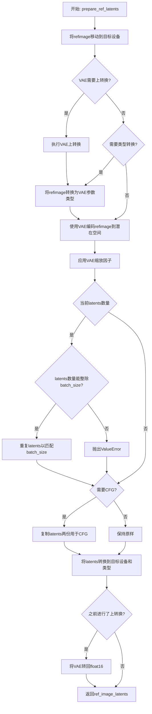
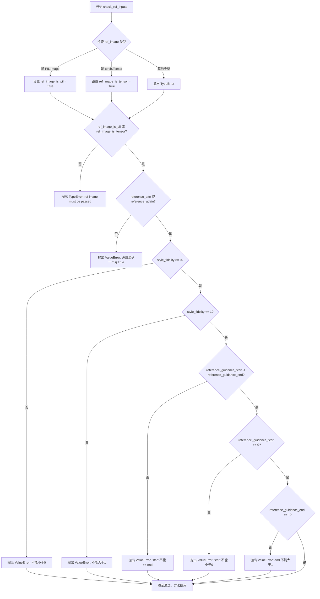

```mermaid
flowchart TD
    A[开始__call__] --> B[解析回调参数]
    B --> C[格式化ControlNet引导参数]
    C --> D[检查输入参数validate_inputs]
    D --> E[检查Reference输入参数check_ref_inputs]
    E --> F[设置内部状态变量]
    F --> G[定义调用参数batch_size]
    G --> H[3.1编码输入提示词encode_prompt]
    H --> I[3.2编码IP适配器图像]
    I --> J[4.准备ControlNet图像]
    J --> K[5.预处理Reference图像]
    K --> L[6.准备时间步retrieve_timesteps]
    L --> M[7.准备潜在变量prepare_latents]
    M --> N[7.5准备引导比例嵌入]
    N --> O[8.准备Reference潜在变量]
    O --> P[9.准备额外步骤参数]
    P --> Q[9.1创建ControlNet和Reference保持张量]
    Q --> R[9.2修改自注意力和GroupNorm]
    R --> S[9.2准备添加的时间ID和嵌入]
    S --> T[10.去噪循环]
    T --> T1[10.1应用denoising_end]
    T1 --> T2[扩展潜在变量进行分类器自由引导]
    T2 --> T3[缩放模型输入]
    T3 --> T4[添加条件 kwargs]
    T4 --> T5[ControlNet推理]
    T5 --> T6[Reference部分推理]
    T6 --> T7[预测噪声残差]
    T7 --> T8[执行引导]
    T8 --> T9[计算上一步样本]
    T9 --> T10[执行回调]
    T10 --> T11{是否结束}
    T11 -->|否| T1
    T11 -->|是| T12[解码潜在变量]
    T12 --> T13[后处理图像]
    T13 --> T14[卸载模型]
    T14 --> T15[返回结果]
```

# `diffusers\examples\community\stable_diffusion_xl_controlnet_reference.py` 详细设计文档

这是一个基于 Stable Diffusion XL 的自定义图像生成管道，集成了 ControlNet 和 Reference Control（参考图像控制）。该管道继承自 StableDiffusionXLControlNetPipeline，并通过 Monkey Patching（猴子补丁）技术修改 UNet 的前向传播，以在去噪过程中注入参考图像的风格特征（通过自注意力 Reference Attention 和 AdaIN Reference），从而实现风格迁移或内容保留的图像生成。

## 整体流程

```mermaid
graph TD
    Start((开始)) --> InputCheck{检查输入参数}
    InputCheck --> EncodePrompt[编码文本提示词 (Text Encoder)]
    EncodePrompt --> PrepareControl[预处理控制图像 (ControlNet)]
    PrepareControl --> PrepareRef[预处理参考图像 (VAE Encode)]
    PrepareRef --> PrepareLatents[初始化潜在向量 (Latents)]
    PrepareLatents --> InjectHook[注入参考控制钩子 (Monkey Patch UNet)]
    InjectHook --> DenoiseLoop[去噪循环 (Denoising Loop)]
    DenoiseLoop --> ControlNetInf[ControlNet 推理]
    ControlNetInf --> RefWrite[参考特征写入 (MODE=Write)]
    RefWrite --> UNetInf[UNet 推理 (注入参考特征)]
    UNetInf --> SchedulerStep[调度器步进 (Scheduler Step)]
    SchedulerStep --> DenoiseEnd{循环结束?}
    DenoiseEnd -- 否 --> DenoiseLoop
    DenoiseEnd -- 是 --> Decode[VAE 解码]
    Decode --> PostProcess[后处理 (Watermark/Format)]
    PostProcess --> End((结束))
```

## 类结构

```
StableDiffusionXLControlNetPipeline (基类)
└── StableDiffusionXLControlNetReferencePipeline (继承/扩展)
```

## 全局变量及字段


### `logger`
    
Logger instance for tracking pipeline execution and debugging

类型：`logging.Logger`
    


### `EXAMPLE_DOC_STRING`
    
Documentation string containing example usage code for the pipeline

类型：`str`
    


### `StableDiffusionXLControlNetReferencePipeline.vae`
    
Variational Autoencoder for encoding images to latent space and decoding latents back to images

类型：`AutoencoderKL`
    


### `StableDiffusionXLControlNetReferencePipeline.text_encoder`
    
Frozen text encoder for converting text prompts into embeddings

类型：`CLIPTextModel`
    


### `StableDiffusionXLControlNetReferencePipeline.text_encoder_2`
    
Second frozen text encoder with projection for enhanced text understanding in SDXL

类型：`CLIPTextModelWithProjection`
    


### `StableDiffusionXLControlNetReferencePipeline.tokenizer`
    
CLIP tokenizer for converting text into token IDs for the first text encoder

类型：`CLIPTokenizer`
    


### `StableDiffusionXLControlNetReferencePipeline.tokenizer_2`
    
CLIP tokenizer for converting text into token IDs for the second text encoder

类型：`CLIPTokenizer`
    


### `StableDiffusionXLControlNetReferencePipeline.unet`
    
UNet model that performs denoising on latent representations during image generation

类型：`UNet2DConditionModel`
    


### `StableDiffusionXLControlNetReferencePipeline.controlnet`
    
ControlNet model that provides additional conditioning to guide the denoising process

类型：`ControlNetModel`
    


### `StableDiffusionXLControlNetReferencePipeline.scheduler`
    
Scheduler that defines the noise schedule and timestep strategy for the diffusion process

类型：`SchedulerMixin`
    
    

## 全局函数及方法


### `torch_dfs`

这是一个递归深度优先搜索函数，用于遍历 PyTorch 模型的所有子模块，并返回一个包含模型本身及其所有子模块的列表。

参数：

- `model`：`torch.nn.Module`，要遍历的 PyTorch 模型

返回值：`List[torch.nn.Module]`，包含模型本身及其所有子模块的列表

#### 流程图

```mermaid
flowchart TD
    A[开始: torch_dfs] --> B{接收 model}
    B --> C[创建结果列表 result = [model]]
    D[遍历 model.children] --> E{是否存在子模块?}
    E -->|是| F[递归调用 torch_dfs(child)]
    F --> G[将子模块列表添加到 result]
    G --> D
    E -->|否| H[返回 result]
    H --> I[结束]
```

#### 带注释源码

```python
def torch_dfs(model: torch.nn.Module):
    """
    递归深度优先搜索遍历 PyTorch 模型的所有子模块
    
    Args:
        model: torch.nn.Module - 要遍历的 PyTorch 模型
        
    Returns:
        List[torch.nn.Module] - 包含模型本身及其所有子模块的列表
    """
    result = [model]  # 初始化结果列表，首先包含模型本身
    for child in model.children():  # 遍历当前模型的所有直接子模块
        result += torch_dfs(child)  # 递归调用，深度优先遍历子模块
    return result  # 返回包含所有模块的列表
```

---

**使用场景**：该函数在代码中被用于获取 `StableDiffusionXLControlNetReferencePipeline` 的 UNet 模型中的所有 `BasicTransformerBlock` 模块，以便在参考控制（Reference Control）功能中注入自定义注意力机制。


### `retrieve_timesteps`

该函数用于调用调度器的 `set_timesteps` 方法并从调度器中检索时间步，支持自定义时间步或自定义 sigma 值来处理自定义的时间步间隔策略。

参数：

-  `scheduler`：`SchedulerMixin`，调度器对象，用于获取时间步
-  `num_inference_steps`：`Optional[int]`，生成样本时使用的扩散步数，如果使用此参数，则 `timesteps` 必须为 `None`
-  `device`：`Optional[Union[str, torch.device]]`，时间步要移动到的设备，如果为 `None`，则不移动时间步
-  `timesteps`：`Optional[List[int]]`，用于覆盖调度器时间步间隔策略的自定义时间步，如果传入 `timesteps`，则 `num_inference_steps` 和 `sigmas` 必须为 `None`
-  `sigmas`：`Optional[List[float]]`，用于覆盖调度器时间步间隔策略的自定义 sigma 值，如果传入 `sigmas`，则 `num_inference_steps` 和 `timesteps` 必须为 `None`
-  `**kwargs`：任意关键字参数，将传递给 `scheduler.set_timesteps`

返回值：`Tuple[torch.Tensor, int]`，元组中第一个元素是调度器的时间步计划，第二个元素是推理步数

#### 流程图

```mermaid
flowchart TD
    A[开始] --> B{检查timesteps和sigmas是否同时存在}
    B -->|是| C[抛出ValueError: 只能选择一个]
    B -->|否| D{检查timesteps是否提供}
    D -->|是| E{检查scheduler.set_timesteps是否支持timesteps参数}
    E -->|不支持| F[抛出ValueError: 当前调度器类不支持自定义timesteps]
    E -->|支持| G[调用scheduler.set_timesteps并传入timesteps和device]
    G --> H[获取scheduler.timesteps]
    H --> I[计算num_inference_steps为len(timesteps)]
    D -->|否| J{检查sigmas是否提供}
    J -->|是| K{检查scheduler.set_timesteps是否支持sigmas参数}
    K -->|不支持| L[抛出ValueError: 当前调度器类不支持自定义sigmas]
    K -->|支持| M[调用scheduler.set_timesteps并传入sigmas和device]
    M --> N[获取scheduler.timesteps]
    N --> O[计算num_inference_steps为len(timesteps)]
    J -->|否| P[调用scheduler.set_timesteps并传入num_inference_steps和device]
    P --> Q[获取scheduler.timesteps]
    Q --> R[计算num_inference_steps为len(timesteps)]
    R --> S[返回timesteps和num_inference_steps]
    I --> S
    O --> S
```

#### 带注释源码

```python
# Copied from diffusers.pipelines.stable_diffusion.pipeline_stable_diffusion.retrieve_timesteps
def retrieve_timesteps(
    scheduler,
    num_inference_steps: Optional[int] = None,
    device: Optional[Union[str, torch.device]] = None,
    timesteps: Optional[List[int]] = None,
    sigmas: Optional[List[float]] = None,
    **kwargs,
):
    r"""
    Calls the scheduler's `set_timesteps` method and retrieves timesteps from the scheduler after the call. Handles
    custom timesteps. Any kwargs will be supplied to `scheduler.set_timesteps`.

    Args:
        scheduler (`SchedulerMixin`):
            The scheduler to get timesteps from.
        num_inference_steps (`int`):
            The number of diffusion steps used when generating samples with a pre-trained model. If used, `timesteps`
            must be `None`.
        device (`str` or `torch.device`, *optional*):
            The device to which the timesteps should be moved to. If `None`, the timesteps are not moved.
        timesteps (`List[int]`, *optional*):
            Custom timesteps used to override the timestep spacing strategy of the scheduler. If `timesteps` is passed,
            `num_inference_steps` and `sigmas` must be `None`.
        sigmas (`List[float]`, *optional*):
            Custom sigmas used to override the timestep spacing strategy of the scheduler. If `sigmas` is passed,
            `num_inference_steps` and `timesteps` must be `None`.

    Returns:
        `Tuple[torch.Tensor, int]`: A tuple where the first element is the timestep schedule from the scheduler and the
        second element is the number of inference steps.
    """
    # 检查是否同时提供了timesteps和sigmas，这是不允许的，只能选择其中之一
    if timesteps is not None and sigmas is not None:
        raise ValueError("Only one of `timesteps` or `sigmas` can be passed. Please choose one to set custom values")
    
    # 如果提供了自定义timesteps
    if timesteps is not None:
        # 检查调度器的set_timesteps方法是否支持timesteps参数
        accepts_timesteps = "timesteps" in set(inspect.signature(scheduler.set_timesteps).parameters.keys())
        if not accepts_timesteps:
            raise ValueError(
                f"The current scheduler class {scheduler.__class__}'s `set_timesteps` does not support custom"
                f" timestep schedules. Please check whether you are using the correct scheduler."
            )
        # 调用调度器的set_timesteps方法设置自定义时间步
        scheduler.set_timesteps(timesteps=timesteps, device=device, **kwargs)
        # 从调度器获取设置后的时间步
        timesteps = scheduler.timesteps
        # 计算推理步数
        num_inference_steps = len(timesteps)
    # 如果提供了自定义sigmas
    elif sigmas is not None:
        # 检查调度器的set_timesteps方法是否支持sigmas参数
        accept_sigmas = "sigmas" in set(inspect.signature(scheduler.set_timesteps).parameters.keys())
        if not accept_sigmas:
            raise ValueError(
                f"The current scheduler class {scheduler.__class__}'s `set_timesteps` does not support custom"
                f" sigmas schedules. Please check whether you are using the correct scheduler."
            )
        # 调用调度器的set_timesteps方法设置自定义sigma值
        scheduler.set_timesteps(sigmas=sigmas, device=device, **kwargs)
        # 从调度器获取设置后的时间步
        timesteps = scheduler.timesteps
        # 计算推理步数
        num_inference_steps = len(timesteps)
    # 如果都没有提供，则使用num_inference_steps参数
    else:
        scheduler.set_timesteps(num_inference_steps, device=device, **kwargs)
        timesteps = scheduler.timesteps
    
    # 返回时间步和推理步数的元组
    return timesteps, num_inference_steps
```


### `StableDiffusionXLControlNetReferencePipeline.prepare_ref_latents`

该方法负责将参考图像（ref_image）编码到VAE潜在空间，并根据批次大小和分类器自由引导（CFG）需求进行适当的复制和类型转换，生成可用于后续UNet处理的参考潜在表示。

参数：

- `self`：隐含的实例参数，Pipeline 自身实例
- `refimage`：`torch.Tensor`，待编码的参考图像张量
- `batch_size`：`int`，期望生成的批次大小
- `dtype`：`torch.dtype`，目标数据类型
- `device`：`torch.device`，目标设备
- `generator`：`torch.Generator` 或 `List[torch.Generator]`，随机数生成器，用于确保可重复性
- `do_classifier_free_guidance`：`bool`，是否启用分类器自由引导

返回值：`torch.Tensor`，编码并处理后的参考图像潜在表示

#### 流程图



#### 带注释源码

```python
def prepare_ref_latents(self, refimage, batch_size, dtype, device, generator, do_classifier_free_guidance):
    # 1. 将参考图像移动到目标设备
    refimage = refimage.to(device=device)
    
    # 2. 检查VAE是否需要上转换
    # 当VAE为float16且配置了force_upcast时需要上转换以避免溢出
    needs_upcasting = self.vae.dtype == torch.float16 and self.vae.config.force_upcast
    
    if needs_upcasting:
        # 2.1 执行VAE上转换
        self.upcast_vae()
        # 2.2 将refimage转换为VAE后续层参数的数据类型
        refimage = refimage.to(next(iter(self.vae.post_quant_conv.parameters())).dtype)
    
    # 3. 确保refimage数据类型与VAE一致
    if refimage.dtype != self.vae.dtype:
        refimage = refimage.to(dtype=self.vae.dtype)
    
    # 4. 使用VAE编码参考图像到潜在空间
    # 根据generator类型决定采样方式（单生成器或生成器列表）
    if isinstance(generator, list):
        # 为每个图像使用对应的生成器进行采样
        ref_image_latents = [
            self.vae.encode(refimage[i : i + 1]).latent_dist.sample(generator=generator[i])
            for i in range(batch_size)
        ]
        # 沿批次维度拼接所有latents
        ref_image_latents = torch.cat(ref_image_latents, dim=0)
    else:
        # 使用单一生成器进行采样
        ref_image_latents = self.vae.encode(refimage).latent_dist.sample(generator=generator)
    
    # 5. 应用VAE缩放因子（将latents从潜在空间映射到标准正态空间）
    ref_image_latents = self.vae.config.scaling_factor * ref_image_latents

    # 6. 如果当前latents数量少于所需batch_size，进行复制扩展
    if ref_image_latents.shape[0] < batch_size:
        # 验证图像数量能被batch_size整除
        if not batch_size % ref_image_latents.shape[0] == 0:
            raise ValueError(
                "The passed images and the required batch size don't match. Images are supposed to be duplicated"
                f" to a total batch size of {batch_size}, but {ref_image_latents.shape[0]} images were passed."
                " Make sure the number of images that you pass is divisible by the total requested batch size."
            )
        # 计算复制因子并重复latents
        ref_image_latents = ref_image_latents.repeat(batch_size // ref_image_latents.shape[0], 1, 1, 1)

    # 7. 如果启用分类器自由引导，复制latents用于条件和非条件分支
    ref_image_latents = torch.cat([ref_image_latents] * 2) if do_classifier_free_guidance else ref_image_latents

    # 8. 将latents对齐到目标设备和数据类型，防止后续拼接时设备错误
    ref_image_latents = ref_image_latents.to(device=device, dtype=dtype)

    # 9. 如果之前进行了上转换，将VAE恢复为float16
    if needs_upcasting:
        self.vae.to(dtype=torch.float16)

    # 10. 返回处理后的参考图像latents
    return ref_image_latents
```


### `StableDiffusionXLControlNetReferencePipeline.prepare_ref_image`

该方法用于预处理参考图像（ref_image），将其转换为适合模型输入的格式。支持PIL图像和PyTorch张量两种输入格式，完成尺寸调整、归一化、批处理复制等处理，并根据是否启用无分类器自由引导（classifier-free guidance）决定是否复制图像。

参数：

- `self`：`StableDiffusionReferencePipeline` 实例，pipeline 对象本身
- `image`：`Union[torch.Tensor, PIL.Image.Image, List[PIL.Image.Image], List[torch.Tensor]]`，参考图像输入，支持多种格式
- `width`：`int`，目标输出宽度（像素）
- `height`：`int`，目标输出高度（像素）
- `batch_size`：`int`，生成的批次大小，用于决定图像复制次数
- `num_images_per_prompt`：`int`，每个提示词生成的图像数量
- `device`：`torch.device`，目标设备（CPU/CUDA）
- `dtype`：`torch.dtype`，目标数据类型
- `do_classifier_free_guidance`：`bool`（可选，默认为 `False`），是否启用无分类器自由引导
- `guess_mode`：`bool`（可选，默认为 `False`），猜测模式标志

返回值：`torch.Tensor`，处理后的参考图像张量，形状为 (batch_size * num_images_per_prompt * (2 if do_classifier_free_guidance else 1), C, H, W)

#### 流程图

```mermaid
flowchart TD
    A[开始: prepare_ref_image] --> B{image是否为torch.Tensor?}
    B -->|否| C{image是否为PIL.Image列表?}
    B -->|是| H[直接跳到步骤4]
    
    C -->|是| D[遍历每个PIL图像]
    D --> D1[转换为RGB模式]
    D1 --> D2[调整大小为width×height]
    D2 --> D3[转为numpy数组并添加batch维度]
    D3 --> D4[拼接所有图像]
    D4 --> D5[归一化: /255.0]
    D5 --> D6[标准化: (x-0.5)/0.5]
    D6 --> D7[维度转换: HWC→CHW]
    D7 --> D8[转为torch.Tensor]
    D8 --> I
    
    C -->|否| E{image[0]是否为torch.Tensor?}
    E -->|是| F[stack所有tensor]
    E -->|否| G[抛出类型错误]
    
    H[获取image_batch_size] --> I{image_batch_size == 1?}
    I -->|是| J[repeat_by = batch_size]
    I -->|否| K[repeat_by = num_images_per_prompt]
    
    J --> L[使用repeat_interleave复制图像]
    K --> L
    
    L --> M[移动到指定device和dtype]
    M --> N{do_classifier_free_guidance且不是guess_mode?}
    N -->|是| O[torch.cat: 复制2份图像]
    N -->|否| P[直接返回]
    
    O --> P
    G --> Q[结束]
    
    P --> R[返回处理后的image tensor]
```

#### 带注释源码

```python
def prepare_ref_image(
    self,
    image,
    width,
    height,
    batch_size,
    num_images_per_prompt,
    device,
    dtype,
    do_classifier_free_guidance=False,
    guess_mode=False,
):
    """
    预处理参考图像，转换为模型可用的张量格式
    
    处理逻辑：
    1. 如果是PIL图像，转换为RGB、调整大小、归一化并转为张量
    2. 如果是张量列表，直接堆叠
    3. 根据batch_size和num_images_per_prompt复制图像
    4. 转移到指定设备并转换类型
    5. 如果启用CFG，复制一倍用于无条件生成
    """
    # 第一步：类型转换 - 将PIL图像或图像列表转换为张量
    if not isinstance(image, torch.Tensor):
        # 处理PIL图像输入
        if isinstance(image, PIL.Image.Image):
            image = [image]

        if isinstance(image[0], PIL.Image.Image):
            images = []
            
            # 遍历每个PIL图像进行预处理
            for image_ in image:
                # 转换为RGB模式（确保3通道）
                image_ = image_.convert("RGB")
                # 调整为目标尺寸，使用lanczos重采样
                image_ = image_.resize((width, height), resample=PIL_INTERPOLATION["lanczos"])
                # 转换为numpy数组
                image_ = np.array(image_)
                # 添加batch维度: (H,W,C) -> (1,H,W,C)
                image_ = image_[None, :]
                images.append(image_)

            # 拼接所有图像: (N,1,H,W,C) -> (N,H,W,C)
            image = images
            image = np.concatenate(image, axis=0)
            # 转换为float32并归一化到[0,1]
            image = np.array(image).astype(np.float32) / 255.0
            # 标准化到[-0.5, 0.5]范围
            image = (image - 0.5) / 0.5
            # 维度转换: (B,H,W,C) -> (B,C,H,W)
            image = image.transpose(0, 3, 1, 2)
            # 转换为PyTorch张量
            image = torch.from_numpy(image)

        # 处理已经是张量的输入列表
        elif isinstance(image[0], torch.Tensor):
            # 堆叠所有张量为一个批次
            image = torch.stack(image, dim=0)

    # 第二步：计算图像批次大小
    image_batch_size = image.shape[0]

    # 第三步：确定复制倍数
    if image_batch_size == 1:
        # 如果只有一张图像，复制到完整batch大小
        repeat_by = batch_size
    else:
        # 否则按每个prompt的图像数量复制
        repeat_by = num_images_per_prompt

    # 第四步：复制图像以匹配批次大小
    # repeat_interleave在指定维度上重复张量
    image = image.repeat_interleave(repeat_by, dim=0)

    # 第五步：转移到目标设备和转换类型
    image = image.to(device=device, dtype=dtype)

    # 第六步：处理无分类器自由引导（CFG）
    # 如果启用CFG且不在guess_mode，需要复制图像用于无条件生成
    if do_classifier_free_guidance and not guess_mode:
        # 拼接两份图像：一份用于条件生成，一份用于无条件生成
        image = torch.cat([image] * 2)

    return image
```


### `StableDiffusionXLControlNetReferencePipeline.check_ref_inputs`

该方法是`StableDiffusionXLControlNetReferencePipeline`类的输入验证函数，用于在图像生成前检查参考图像及相关参数的有效性，包括验证ref_image类型、reference_attn/reference_adain至少一个为True、style_fidelity范围[0,1]、reference_guidance_start小于reference_guidance_end且均在[0,1]区间内，若验证失败则抛出相应异常。

参数：

- `self`：`StableDiffusionXLControlNetReferencePipeline`，当前pipeline实例
- `ref_image`：`Union[torch.Tensor, PIL.Image.Image]`，参考图像输入，支持PIL图像或torch张量
- `reference_guidance_start`：`float`，参考控制开始应用的步数百分比
- `reference_guidance_end`：`float`，参考控制停止应用的步数百分比
- `style_fidelity`：`float`，风格保真度参数，控制在0到1之间
- `reference_attn`：`bool`，是否使用参考注意力机制
- `reference_adain`：`bool`，是否使用参考自适应实例归一化

返回值：`None`，该方法不返回任何值，仅通过抛出异常来处理验证失败情况

#### 流程图



#### 带注释源码

```python
def check_ref_inputs(
    self,
    ref_image,                      # 参考图像输入
    reference_guidance_start,       # 参考引导开始时间点
    reference_guidance_end,        # 参考引导结束时间点
    style_fidelity,                 # 风格保真度参数
    reference_attn,                 # 是否启用参考注意力
    reference_adain,                # 是否启用参考自适应实例归一化
):
    """
    验证参考图像输入和参考控制参数的合法性
    
    该方法在pipeline执行前被调用，确保所有参考控制相关的输入参数
    符合预期范围，否则抛出相应的异常信息
    
    Args:
        ref_image: 参考图像，支持PIL.Image.Image或torch.Tensor类型
        reference_guidance_start: 参考控制开始的应用比例 [0, 1]
        reference_guidance_end: 参考控制结束的应用比例 [0, 1]
        style_fidelity: 风格保真度权重 [0, 1]
        reference_attn: 是否使用参考注意力机制
        reference_adain: 是否使用参考自适应实例归一化
    """
    
    # 检查ref_image是否为PIL图像类型
    ref_image_is_pil = isinstance(ref_image, PIL.Image.Image)
    # 检查ref_image是否为PyTorch张量类型
    ref_image_is_tensor = isinstance(ref_image, torch.Tensor)

    # 验证ref_image必须是PIL图像或torch张量之一
    if not ref_image_is_pil and not ref_image_is_tensor:
        raise TypeError(
            f"ref image must be passed and be one of PIL image or torch tensor, but is {type(ref_image)}"
        )

    # 验证reference_attn和reference_adain至少有一个为True
    if not reference_attn and not reference_adain:
        raise ValueError("`reference_attn` or `reference_adain` must be True.")

    # 验证style_fidelity在有效范围内 [0.0, 1.0]
    if style_fidelity < 0.0:
        raise ValueError(f"style fidelity: {style_fidelity} can't be smaller than 0.")
    if style_fidelity > 1.0:
        raise ValueError(f"style fidelity: {style_fidelity} can't be larger than 1.0.")

    # 验证reference_guidance_start小于reference_guidance_end
    if reference_guidance_start >= reference_guidance_end:
        raise ValueError(
            f"reference guidance start: {reference_guidance_start} cannot be larger or equal to reference guidance end: {reference_guidance_end}."
        )
    # 验证reference_guidance_start在有效范围内
    if reference_guidance_start < 0.0:
        raise ValueError(f"reference guidance start: {reference_guidance_start} can't be smaller than 0.")
    # 验证reference_guidance_end在有效范围内
    if reference_guidance_end > 1.0:
        raise ValueError(f"reference guidance end: {reference_guidance_end} can't be larger than 1.0.")
```


### `StableDiffusionXLControlNetReferencePipeline.__call__`

这是Stable Diffusion XL ControlNet Reference管道的主生成方法，结合了ControlNet条件控制和Reference图像风格引导功能，用于根据文本提示生成图像。

参数：

- `prompt`：`Union[str, List[str]]`，主要提示词，引导图像生成
- `prompt_2`：`Optional[Union[str, List[str]]]`，`prompt_2`发送到第二个文本编码器（tokenizer_2和text_encoder_2）
- `image`：`PipelineImageInput`，ControlNet输入条件图像
- `ref_image`：`Union[torch.Tensor, PIL.Image.Image]`，Reference控制输入图像，用于风格引导
- `height`：`Optional[int]`，生成图像的高度像素
- `width`：`Optional[int]`，生成图像的宽度像素
- `num_inference_steps`：`int`，去噪步数，默认为50
- `timesteps`：`List[int]`，自定义时间步
- `sigmas`：`List[float]`，自定义sigma值
- `denoising_end`：`Optional[float]`，提前终止去噪的比例
- `guidance_scale`：`float`，引导比例，默认为5.0
- `negative_prompt`：`Optional[Union[str, List[str]]]`，负面提示词
- `negative_prompt_2`：`Optional[Union[str, List[str]]]`，第二个负面提示词
- `num_images_per_prompt`：`Optional[int]`，每个提示词生成的图像数量
- `eta`：`float`，DDIM论文的eta参数
- `generator`：`Optional[Union[torch.Generator, List[torch.Generator]]]`，随机生成器
- `latents`：`Optional[torch.Tensor]`，预生成的噪声潜在变量
- `prompt_embeds`：`Optional[torch.Tensor]`，预生成的文本嵌入
- `negative_prompt_embeds`：`Optional[torch.Tensor]`，预生成的负面文本嵌入
- `pooled_prompt_embeds`：`Optional[torch.Tensor]`，预生成的池化文本嵌入
- `negative_pooled_prompt_embeds`：`Optional[torch.Tensor]`，预生成的负面池化文本嵌入
- `ip_adapter_image`：`Optional[PipelineImageInput]`，IP适配器图像输入
- `ip_adapter_image_embeds`：`Optional[List[torch.Tensor]]`，IP适配器图像嵌入
- `output_type`：`str`，输出格式，默认为"pil"
- `return_dict`：`bool`，是否返回字典格式，默认为True
- `cross_attention_kwargs`：`Optional[Dict[str, Any]]`，交叉注意力参数
- `controlnet_conditioning_scale`：`Union[float, List[float]]`，ControlNet条件缩放
- `guess_mode`：`bool`，ControlNet识别模式，默认为False
- `control_guidance_start`：`Union[float, List[float]]`，ControlNet开始应用的比例
- `control_guidance_end`：`Union[float, List[float]]`，ControlNet停止应用的比例
- `original_size`：`Tuple[int, int]`，原始尺寸
- `crops_coords_top_left`：`Tuple[int, int]`，裁剪坐标左上角
- `target_size`：`Tuple[int, int]`，目标尺寸
- `negative_original_size`：`Optional[Tuple[int, int]]`，负面原始尺寸
- `negative_crops_coords_top_left`：`Tuple[int, int]`，负面裁剪坐标
- `negative_target_size`：`Optional[Tuple[int, int]]`，负面目标尺寸
- `clip_skip`：`Optional[int]`，CLIP跳过的层数
- `callback_on_step_end`：`Optional[Union[Callable, PipelineCallback, MultiPipelineCallbacks]]`，每步结束回调
- `callback_on_step_end_tensor_inputs`：`List[str]`，回调的张量输入列表
- `attention_auto_machine_weight`：`float`，Reference自注意力权重
- `gn_auto_machine_weight`：`float`，Reference AdaIN权重
- `reference_guidance_start`：`float`，Reference ControlNet开始应用比例
- `reference_guidance_end`：`float`，Reference ControlNet停止应用比例
- `style_fidelity`：`float`，风格保真度，默认为0.5
- `reference_attn`：`bool`，是否使用Reference自注意力
- `reference_adain`：`bool`，是否使用Reference AdaIN
- `**kwargs`：其他关键字参数

返回值：`StableDiffusionXLPipelineOutput`，包含生成图像列表的输出对象

#### 流程图



#### 带注释源码

```python
@torch.no_grad()
@replace_example_docstring(EXAMPLE_DOC_STRING)
def __call__(
    self,
    prompt: Union[str, List[str]] = None,
    prompt_2: Optional[Union[str, List[str]]] = None,
    image: PipelineImageInput = None,
    ref_image: Union[torch.Tensor, PIL.Image.Image] = None,
    height: Optional[int] = None,
    width: Optional[int] = None,
    num_inference_steps: int = 50,
    timesteps: List[int] = None,
    sigmas: List[float] = None,
    denoising_end: Optional[float] = None,
    guidance_scale: float = 5.0,
    negative_prompt: Optional[Union[str, List[str]]] = None,
    negative_prompt_2: Optional[Union[str, List[str]]] = None,
    num_images_per_prompt: Optional[int] = 1,
    eta: float = 0.0,
    generator: Optional[Union[torch.Generator, List[torch.Generator]]] = None,
    latents: Optional[torch.Tensor] = None,
    prompt_embeds: Optional[torch.Tensor] = None,
    negative_prompt_embeds: Optional[torch.Tensor] = None,
    pooled_prompt_embeds: Optional[torch.Tensor] = None,
    negative_pooled_prompt_embeds: Optional[torch.Tensor] = None,
    ip_adapter_image: Optional[PipelineImageInput] = None,
    ip_adapter_image_embeds: Optional[List[torch.Tensor]] = None,
    output_type: str | None = "pil",
    return_dict: bool = True,
    cross_attention_kwargs: Optional[Dict[str, Any]] = None,
    controlnet_conditioning_scale: Union[float, List[float]] = 1.0,
    guess_mode: bool = False,
    control_guidance_start: Union[float, List[float]] = 0.0,
    control_guidance_end: Union[float, List[float]] = 1.0,
    original_size: Tuple[int, int] = None,
    crops_coords_top_left: Tuple[int, int] = (0, 0),
    target_size: Tuple[int, int] = None,
    negative_original_size: Optional[Tuple[int, int]] = None,
    negative_crops_coords_top_left: Tuple[int, int] = (0, 0),
    negative_target_size: Optional[Tuple[int, int]] = None,
    clip_skip: Optional[int] = None,
    callback_on_step_end: Optional[
        Union[Callable[[int, int, Dict], None], PipelineCallback, MultiPipelineCallbacks]
    ] = None,
    callback_on_step_end_tensor_inputs: List[str] = ["latents"],
    attention_auto_machine_weight: float = 1.0,
    gn_auto_machine_weight: float = 1.0,
    reference_guidance_start: float = 0.0,
    reference_guidance_end: float = 1.0,
    style_fidelity: float = 0.5,
    reference_attn: bool = True,
    reference_adain: bool = True,
    **kwargs,
):
    # 解析旧的回调参数并发出警告
    callback = kwargs.pop("callback", None)
    callback_steps = kwargs.pop("callback_steps", None)

    if callback is not None:
        deprecate("callback", "1.0.0", "Passing `callback` as an input argument to `__call__` is deprecated, consider using `callback_on_step_end`")
    if callback_steps is not None:
        deprecate("callback_steps", "1.0.0", "Passing `callback_steps` as an input argument to `__call__` is deprecated, consider using `callback_on_step_end`")

    # 处理回调张量输入
    if isinstance(callback_on_step_end, (PipelineCallback, MultiPipelineCallbacks)):
        callback_on_step_end_tensor_inputs = callback_on_step_end.tensor_inputs

    # 获取原始ControlNet模块（如果已编译）
    controlnet = self.controlnet._orig_mod if is_compiled_module(self.controlnet) else self.controlnet

    # 格式化控制引导参数以匹配ControlNet数量
    if not isinstance(control_guidance_start, list) and isinstance(control_guidance_end, list):
        control_guidance_start = len(control_guidance_end) * [control_guidance_start]
    elif not isinstance(control_guidance_end, list) and isinstance(control_guidance_start, list):
        control_guidance_end = len(control_guidance_start) * [control_guidance_end]
    elif not isinstance(control_guidance_start, list) and not isinstance(control_guidance_end, list):
        mult = len(controlnet.nets) if isinstance(controlnet, MultiControlNetModel) else 1
        control_guidance_start, control_guidance_end = (
            mult * [control_guidance_start],
            mult * [control_guidance_end],
        )

    # 1. 检查输入参数
    self.check_inputs(
        prompt, prompt_2, image, callback_steps, negative_prompt, negative_prompt_2,
        prompt_embeds, negative_prompt_embeds, pooled_prompt_embeds, ip_adapter_image,
        ip_adapter_image_embeds, negative_pooled_prompt_embeds, controlnet_conditioning_scale,
        control_guidance_start, control_guidance_end, callback_on_step_end_tensor_inputs,
    )

    # 检查Reference输入参数
    self.check_ref_inputs(
        ref_image, reference_guidance_start, reference_guidance_end,
        style_fidelity, reference_attn, reference_adain,
    )

    # 设置内部状态
    self._guidance_scale = guidance_scale
    self._clip_skip = clip_skip
    self._cross_attention_kwargs = cross_attention_kwargs
    self._denoising_end = denoising_end
    self._interrupt = False

    # 2. 定义调用参数
    if prompt is not None and isinstance(prompt, str):
        batch_size = 1
    elif prompt is not None and isinstance(prompt, list):
        batch_size = len(prompt)
    else:
        batch_size = prompt_embeds.shape[0]

    device = self._execution_device

    # 格式化ControlNet条件缩放
    if isinstance(controlnet, MultiControlNetModel) and isinstance(controlnet_conditioning_scale, float):
        controlnet_conditioning_scale = [controlnet_conditioning_scale] * len(controlnet.nets)

    # 判断是否使用guess_mode
    global_pool_conditions = (
        controlnet.config.global_pool_conditions
        if isinstance(controlnet, ControlNetModel)
        else controlnet.nets[0].config.global_pool_conditions
    )
    guess_mode = guess_mode or global_pool_conditions

    # 3.1 编码输入提示词
    text_encoder_lora_scale = (
        self.cross_attention_kwargs.get("scale", None) if self.cross_attention_kwargs is not None else None
    )
    (
        prompt_embeds,
        negative_prompt_embeds,
        pooled_prompt_embeds,
        negative_pooled_prompt_embeds,
    ) = self.encode_prompt(
        prompt, prompt_2, device, num_images_per_prompt, self.do_classifier_free_guidance,
        negative_prompt, negative_prompt_2, prompt_embeds=prompt_embeds,
        negative_prompt_embeds=negative_prompt_embeds, pooled_prompt_embeds=pooled_prompt_embeds,
        negative_pooled_prompt_embeds=negative_pooled_prompt_embeds, lora_scale=text_encoder_lora_scale,
        clip_skip=self.clip_skip,
    )

    # 3.2 编码IP适配器图像
    if ip_adapter_image is not None or ip_adapter_image_embeds is not None:
        image_embeds = self.prepare_ip_adapter_image_embeds(
            ip_adapter_image, ip_adapter_image_embeds, device, batch_size * num_images_per_prompt,
            self.do_classifier_free_guidance,
        )

    # 4. 准备ControlNet图像
    if isinstance(controlnet, ControlNetModel):
        image = self.prepare_image(
            image=image, width=width, height=height, batch_size=batch_size * num_images_per_prompt,
            num_images_per_prompt=num_images_per_prompt, device=device, dtype=controlnet.dtype,
            do_classifier_free_guidance=self.do_classifier_free_guidance, guess_mode=guess_mode,
        )
        height, width = image.shape[-2:]
    elif isinstance(controlnet, MultiControlNetModel):
        images = []
        for image_ in image:
            image_ = self.prepare_image(
                image=image_, width=width, height=height, batch_size=batch_size * num_images_per_prompt,
                num_images_per_prompt=num_images_per_prompt, device=device, dtype=controlnet.dtype,
                do_classifier_free_guidance=self.do_classifier_free_guidance, guess_mode=guess_mode,
            )
            images.append(image_)
        image = images
        height, width = image[0].shape[-2:]
    else:
        assert False

    # 5. 预处理Reference图像
    ref_image = self.prepare_ref_image(
        image=ref_image, width=width, height=height, batch_size=batch_size * num_images_per_prompt,
        num_images_per_prompt=num_images_per_prompt, device=device, dtype=prompt_embeds.dtype,
    )

    # 6. 准备时间步
    timesteps, num_inference_steps = retrieve_timesteps(
        self.scheduler, num_inference_steps, device, timesteps, sigmas
    )
    self._num_timesteps = len(timesteps)

    # 7. 准备潜在变量
    num_channels_latents = self.unet.config.in_channels
    latents = self.prepare_latents(
        batch_size * num_images_per_prompt, num_channels_latents, height, width,
        prompt_embeds.dtype, device, generator, latents,
    )

    # 7.5 准备引导比例嵌入
    timestep_cond = None
    if self.unet.config.time_cond_proj_dim is not None:
        guidance_scale_tensor = torch.tensor(self.guidance_scale - 1).repeat(batch_size * num_images_per_prompt)
        timestep_cond = self.get_guidance_scale_embedding(
            guidance_scale_tensor, embedding_dim=self.unet.config.time_cond_proj_dim
        ).to(device=device, dtype=latents.dtype)

    # 8. 准备Reference潜在变量
    ref_image_latents = self.prepare_ref_latents(
        ref_image, batch_size * num_images_per_prompt, prompt_embeds.dtype, device,
        generator, self.do_classifier_free_guidance,
    )

    # 9. 准备额外步骤参数
    extra_step_kwargs = self.prepare_extra_step_kwargs(generator, eta)

    # 9.1 创建ControlNet和Reference保持张量
    controlnet_keep = []
    reference_keeps = []
    for i in range(len(timesteps)):
        keeps = [
            1.0 - float(i / len(timesteps) < s or (i + 1) / len(timesteps) > e)
            for s, e in zip(control_guidance_start, control_guidance_end)
        ]
        controlnet_keep.append(keeps[0] if isinstance(controlnet, ControlNetModel) else keeps)
        reference_keep = 1.0 - float(
            i / len(timesteps) < reference_guidance_start or (i + 1) / len(timesteps) > reference_guidance_end
        )
        reference_keeps.append(reference_keep)

    # 9.2 修改自注意力和GroupNorm实现Reference Control
    # ... (详细的hack实现代码)

    # 9.2 准备添加的时间ID和嵌入
    if isinstance(image, list):
        original_size = original_size or image[0].shape[-2:]
    else:
        original_size = original_size or image.shape[-2:]
    target_size = target_size or (height, width)

    add_text_embeds = pooled_prompt_embeds
    # ... (时间ID准备代码)

    # 10. 去噪循环
    num_warmup_steps = len(timesteps) - num_inference_steps * self.scheduler.order

    # 10.1 应用denoising_end
    if (
        self.denoising_end is not None and isinstance(self.denoising_end, float)
        and self.denoising_end > 0 and self.denoising_end < 1
    ):
        discrete_timestep_cutoff = int(
            round(self.scheduler.config.num_train_timesteps - (self.denoising_end * self.scheduler.config.num_train_timesteps))
        )
        num_inference_steps = len(list(filter(lambda ts: ts >= discrete_timestep_cutoff, timesteps)))
        timesteps = timesteps[:num_inference_steps]

    # 去噪主循环
    with self.progress_bar(total=num_inference_steps) as progress_bar:
        for i, t in enumerate(timesteps):
            if self.interrupt:
                continue

            # 扩展潜在变量进行分类器自由引导
            latent_model_input = torch.cat([latents] * 2) if self.do_classifier_free_guidance else latents
            latent_model_input = self.scheduler.scale_model_input(latent_model_input, t)

            added_cond_kwargs = {"text_embeds": add_text_embeds, "time_ids": add_time_ids}

            # ControlNet推理
            down_block_res_samples, mid_block_res_sample = self.controlnet(
                control_model_input, t, encoder_hidden_states=controlnet_prompt_embeds,
                controlnet_cond=image, conditioning_scale=cond_scale, guess_mode=guess_mode,
                added_cond_kwargs=controlnet_added_cond_kwargs, return_dict=False,
            )

            # Reference部分推理（写模式）
            if reference_keeps[i] > 0:
                noise = randn_tensor(ref_image_latents.shape, generator=generator, device=device, dtype=ref_image_latents.dtype)
                ref_xt = self.scheduler.add_noise(ref_image_latents, noise, t.reshape(1,))
                ref_xt = self.scheduler.scale_model_input(ref_xt, t)

                MODE = "write"
                self.unet(
                    ref_xt, t, encoder_hidden_states=prompt_embeds,
                    cross_attention_kwargs=cross_attention_kwargs,
                    added_cond_kwargs=added_cond_kwargs, return_dict=False,
                )

            # 预测噪声残差（读模式）
            MODE = "read"
            noise_pred = self.unet(
                latent_model_input, t, encoder_hidden_states=prompt_embeds,
                timestep_cond=timestep_cond, cross_attention_kwargs=self.cross_attention_kwargs,
                down_block_additional_residuals=down_block_res_samples,
                mid_block_additional_residual=mid_block_res_sample,
                added_cond_kwargs=added_cond_kwargs, return_dict=False,
            )[0]

            # 执行引导
            if self.do_classifier_free_guidance:
                noise_pred_uncond, noise_pred_text = noise_pred.chunk(2)
                noise_pred = noise_pred_uncond + guidance_scale * (noise_pred_text - noise_pred_uncond)

            # 计算上一步样本
            latents = self.scheduler.step(noise_pred, t, latents, **extra_step_kwargs, return_dict=False)[0]

            # 回调处理
            if callback_on_step_end is not None:
                callback_kwargs = {k: locals()[k] for k in callback_on_step_end_tensor_inputs}
                callback_outputs = callback_on_step_end(self, i, t, callback_kwargs)
                latents = callback_outputs.pop("latents", latents)
                # ... (其他回调处理)

            # 进度更新
            if i == len(timesteps) - 1 or ((i + 1) > num_warmup_steps and (i + 1) % self.scheduler.order == 0):
                progress_bar.update()

    # 11. 解码潜在变量
    if not output_type == "latent":
        # ... (VAE解码)
        image = self.vae.decode(latents, return_dict=False)[0]
    else:
        image = latents

    # 12. 后处理
    if not output_type == "latent":
        if self.watermark is not None:
            image = self.watermark.apply_watermark(image)
        image = self.image_processor.postprocess(image, output_type=output_type)

    # 13. 卸载模型
    self.maybe_free_model_hooks()

    # 14. 返回结果
    if not return_dict:
        return (image,)

    return StableDiffusionXLPipelineOutput(images=image)
```

## 关键组件


### StableDiffusionXLControlNetReferencePipeline

主pipeline类，继承自StableDiffusionXLControlNetPipeline，用于基于Stable Diffusion XL的文本到图像生成，并结合ControlNet和Reference Control实现受控且参考风格的图像生成。

### 张量索引与惰性加载

代码通过MODE="write"/"read"机制实现惰性加载，在去噪过程中延迟处理参考图像的注意力特征和AdaIN统计量，仅在需要时从bank中读取并应用。

### 反量化支持

通过upcast_vae方法在需要时将VAE从float16提升到float32进行解码，以防止溢出，并在解码后恢复float16。

### prepare_ref_latents

准备参考图像的潜在表示，将参考图像编码为VAE潜在空间，复制以匹配批处理大小，处理分类器自由引导的掩码，并管理VAE类型转换。

### prepare_ref_image

预处理参考图像，将PIL图像或张量转换为标准化张量格式，执行大小调整、归一化和批处理复制。

### check_ref_inputs

验证参考图像输入的有效性，检查reference_attn和reference_adain至少一个为真，验证style_fidelity在[0,1]范围，验证reference_guidance_start/end的有效性。

### Reference Attention (reference_attn)

通过修改BasicTransformerBlock的inner_forward，实现自注意力机制的参考控制，将参考图像的特征存储在bank中并在去噪时注入。

### Reference AdaIN (reference_adain)

通过修改UNet的下采样块、上采样块和中 block的forward函数，实现AdaIN风格的特征统计量迁移，使用mean_bank和var_bank存储参考特征的均值和方差。

### 风格保真度控制 (style_fidelity)

通过style_fidelity参数在无条件/条件特征之间插值，控制生成图像与参考图像风格的相似程度。

### ControlNet集成

支持单个或多个ControlNet模型，通过control_guidance_start/end控制ControlNet在去噪过程中的应用区间，支持guess_mode模式。

### 自定义时间步检索 (retrieve_timesteps)

处理自定义timesteps或sigmas，调用scheduler的set_timesteps方法并返回调度后的时间步。

### torch_dfs

递归遍历PyTorch模型的子模块，用于查找所有BasicTransformerBlock以应用Reference Attention修改。


## 问题及建议


### 已知问题

-   **__call__方法过长**：核心方法`__call__`超过1000行代码，承担了过多职责（参数校验、编码、调度、推理、后处理等），违反单一职责原则，导致维护困难。
-   **大量内联hack函数**：在`__call__`内部定义了多个hack函数（`hacked_basic_transformer_inner_forward`、`hacked_mid_forward`等），这些函数修改了UNet内部行为，代码侵入性强，难以理解和调试，且每次调用都会重新定义，造成性能开销。
-   **重复代码块**：在`hack_CrossAttnDownBlock2D_forward`、`hacked_DownBlock2D_forward`、`hacked_CrossAttnUpBlock2D_forward`、`hacked_UpBlock2D_forward`中存在大量重复的group normalization处理逻辑（计算mean、var、std并进行特征迁移），违反DRY原则。
-   **类型校验不够健壮**：`prepare_ref_image`方法中使用多层`isinstance`检查和隐式类型转换（如将PIL.Image转为numpy再转torch.Tensor），缺少对输入尺寸匹配、通道数等边界条件的校验，可能导致运行时错误。
-   **魔法数字和字符串**：代码中多处使用硬编码值，如`eps = 1e-6`、图像预处理中的数值（`0.5`、`255.0`）等，缺乏常量定义。
- **缺少资源管理**：未使用上下文管理器或显式调用来管理CUDA内存，特别在处理大尺寸图像和多ControlNet时可能导致显存泄漏。

### 优化建议

-   **拆分__call__方法**：将`__call__`拆分为独立方法，如`prepare_inputs()`、`encode_prompts()`、`run_inference()`、`post_process()`等，提升可读性和可测试性。
-   **提取hack为独立模块**：将内联的hack函数提取为独立类或使用装饰器模式，例如创建`ReferenceControlInjector`类来封装attention和group norm的修改逻辑，避免每次推理重新绑定。
-   **抽象公共函数**：将重复的group norm处理逻辑抽象为`apply_group_norm_control`函数，接受输入、bank、mask等参数，减少代码冗余。
-   **强化输入校验**：在`prepare_ref_image`中添加对图像尺寸、通道数、batch一致性等的校验，并在`check_ref_inputs`中补充更多边界检查。
-   **提取配置常量**：将预处理数值（如`0.5`、`255.0`）、epsilon值等提取为类常量或配置文件，提高可维护性。
-   **优化内存使用**：在推理循环结束后显式调用`torch.cuda.empty_cache()`，或在`finally`块中释放临时变量；对于不再使用的tensor及时del。
-   **添加类型提示和文档**：为所有私有方法和新增的抽象方法补充完整的类型提示和docstring，提升代码可维护性。

## 其它


### 设计目标与约束

本Pipeline的设计目标是实现一个支持Reference Control的Stable Diffusion XL图像生成系统，能够根据文本提示和参考图像生成高质量的图像。主要设计约束包括：1) 依赖diffusers库的核心组件（StableDiffusionXLControlNetPipeline、ControlNetModel等）；2) 需要支持ControlNet和Reference两种控制机制；3) 必须兼容SDXL系列的预训练模型；4) 需要支持classifier-free guidance和guess mode；5) 性能约束需在消费级GPU上实现可接受的推理速度。

### 错误处理与异常设计

代码中的错误处理主要通过以下方式实现：1) 在`check_ref_inputs`方法中验证ref_image类型（必须是PIL.Image或torch.Tensor）；2) 验证reference_attn和reference_adain至少有一个为True；3) 检查style_fidelity在[0.0, 1.0]范围内；4) 验证reference_guidance_start和reference_guidance_end的合理范围（0.0-1.0且start<end）；5) 在`retrieve_timesteps`中处理timesteps和sigmas的互斥关系；6) 在`prepare_ref_latents`中检查batch size兼容性。潜在改进：可添加更详细的错误日志记录、GPU内存不足的异常处理、模型加载失败的重试机制。

### 数据流与状态机

Pipeline的核心数据流如下：1) 输入阶段：接收prompt、ref_image、control_image及各种控制参数；2) 编码阶段：使用text_encoder和text_encoder_2编码文本提示，准备controlnet图像和参考图像；3) 潜在变量准备：生成或使用预定义的latents；4) 去噪循环：多次迭代执行UNet预测噪声、ControlNet提供额外条件、Scheduler更新latents；5) 解码阶段：使用VAE将latents解码为图像。状态机主要体现在：MODE变量控制"write"和"read"两种状态用于Reference Attention和AdaIN的处理，在去噪循环中动态切换。

### 外部依赖与接口契约

主要外部依赖包括：1) diffusers库（StableDiffusionXLControlNetPipeline、ControlNetModel、调度器等）；2) transformers库（CLIPTextModel、CLIPTokenizer）；3) PIL库（PIL.Image处理）；4) numpy（数组操作）；5) torch（深度学习框架）。接口契约：1) `__call__`方法接受大量可选参数，返回StableDiffusionXLPipelineOutput；2) ref_image接受PIL.Image或torch.Tensor；3) image参数接受多种格式（PipelineImageInput）；4) 输出类型通过output_type控制（"pil"、"np.array"、"latent"）。

### 性能考虑与基准测试

性能优化点：1) 使用torch.no_grad()禁用梯度计算；2) 支持模型编译（is_compiled_module检查）；3) 支持CUDA图优化（torch._inductor.cudagraph_mark_step_begin()）；4) VAE可选float32/float16切换以防止溢出。基准测试应关注：1) 不同num_inference_steps下的生成时间和显存占用；2) reference_attn和reference_adain开启/关闭的性能差异；3) 多ControlNet配置下的性能表现；4) 批处理大小对显存和速度的影响。

### 配置参数详解

关键配置参数包括：1) guidance_scale（默认5.0）：控制文本提示的影响力；2) num_inference_steps（默认50）：去噪步数，影响质量和速度；3) controlnet_conditioning_scale：ControlNet条件的影响权重；4) reference_attn/reference_adain：是否启用参考控制；5) style_fidelity（默认0.5）：权衡参考图像风格和文本提示；6) attention_auto_machine_weight和gn_auto_machine_weight：控制Reference机制的自动权重；7) clip_skip：CLIP跳过的层数。

### 使用示例与最佳实践

最佳实践包括：1) 推荐controlnet_conditioning_scale=0.5以获得良好的泛化；2) style_fidelity=1.0时更注重参考图像风格，=0.0时更注重文本提示；3) 建议使用UniPCMultistepScheduler以提高质量；4) 批量生成时设置合适的num_images_per_prompt；5) 使用torch.Generator设置随机种子以确保可复现性；6) 对于高分辨率生成（>1024x1024），建议使用专门微调的模型。

### 版本兼容性信息

代码需要：1) torch>=2.1（使用is_torch_version检查）；2) diffusers库的最新稳定版本；3) transformers库兼容版本；4) PIL/numpy版本需支持图像处理操作。CUDA要求：推荐使用CUDA 11.8或更高版本以获得最佳性能。

### 安全性考虑

潜在安全风险：1) 生成的图像可能包含不当内容（虽然Pipeline本身是中性的）；2) 模型的权重文件来源需要验证；3) 恶意构造的prompt可能导致内存溢出；4) 参考图像可能包含敏感信息。防护措施：1) 可在Pipeline外层添加内容过滤；2) 对输入图像进行安全检查；3) 对异常prompt长度进行限制。

### 测试策略

建议的测试覆盖：1) 单元测试：各helper方法（prepare_ref_image、prepare_ref_latents、check_ref_inputs）；2) 集成测试：完整pipeline运行，验证输出图像质量；3) 回归测试：确保修改后输出与基准一致；4) 边界测试：空prompt、单ControlNet vs 多ControlNet、极端参数值；5) 性能测试：不同硬件配置下的基准测试。

### 部署与运维指南

部署建议：1) 模型文件较大（通常数GB），需配置足够的磁盘空间；2) 首次运行需下载预训练权重；3) 推荐使用16GB以上显存的GPU；4) 可使用torch.cuda.empty_cache()管理显存；5) 多GPU场景需考虑模型并行化。监控指标：1) GPU显存使用率；2) 推理时间；3) 生成图像质量评分（如可用）。


    